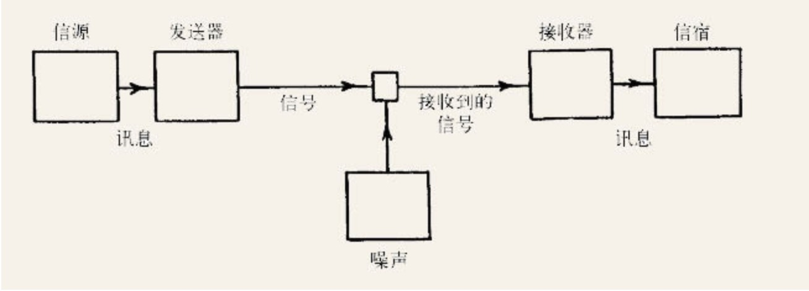

    作者:  [美] 詹姆斯·格雷克 
    出版社: 人民邮电出版社
    副标题: 一部历史 一个理论 一股洪流
    原作名: The Information: A History, a Theory, a Flood
    译者: 高博 
    出版年: 2013-10
    页数: 476
    定价: 69.00元
    装帧: 平装
    丛书: 图灵新知
    ISBN: 9787115331809

[豆瓣链接](https://book.douban.com/subject/25752043/)

- [第6章 新电线，新逻辑](#%e7%ac%ac6%e7%ab%a0-%e6%96%b0%e7%94%b5%e7%ba%bf%e6%96%b0%e9%80%bb%e8%be%91)
- [第7章 信息论](#%e7%ac%ac7%e7%ab%a0-%e4%bf%a1%e6%81%af%e8%ae%ba)
- [第8章 信息转向](#%e7%ac%ac8%e7%ab%a0-%e4%bf%a1%e6%81%af%e8%bd%ac%e5%90%91)
- [第9章 熵及其妖](#%e7%ac%ac9%e7%ab%a0-%e7%86%b5%e5%8f%8a%e5%85%b6%e5%a6%96)
- [第10章 生命的编码](#%e7%ac%ac10%e7%ab%a0-%e7%94%9f%e5%91%bd%e7%9a%84%e7%bc%96%e7%a0%81)
- [第11章 跃入模因池](#%e7%ac%ac11%e7%ab%a0-%e8%b7%83%e5%85%a5%e6%a8%a1%e5%9b%a0%e6%b1%a0)
- [第12章 认识随机性](#%e7%ac%ac12%e7%ab%a0-%e8%ae%a4%e8%af%86%e9%9a%8f%e6%9c%ba%e6%80%a7)
- [第13章 信息是物理的](#%e7%ac%ac13%e7%ab%a0-%e4%bf%a1%e6%81%af%e6%98%af%e7%89%a9%e7%90%86%e7%9a%84)

## 第6章 新电线，新逻辑
在1939年年初，香农在写给布什的一封长信中谈到了一个自觉更为重要的想法：

>时断时续地，我一直在研究传递信息的一般系统的某些基本属性，它们包括电话、无线电广播、电视和电报等。几乎所有的通信系统都可以归结为如下的一般形式：

$$f_1(t) \to T \to F(t) \to R \to f_2(t)$$

其中T和R分别代表发送方和接收方，它们隔开了三个“时间函数”，f(t)：“待传输的信息”、信号，以及最终输出。当然，最终输出希望做到与输入等同或接近等同。（“在理想的系统中，最终输出将是输入的精确复制。”）但香农也认识到，问题在于真实的系统总是会经受`失真（distortion）`——对于这个术语，他计划给出一个数学形式的严格定义。同样地，真实的系统中还存在`噪声`（“例如静电”）。

不同于日常语言，`符号主义`（他们宣称）能使“完美的精确表达”成为可能。在此之前的布尔、巴贝奇，以及更早得多的莱布尼茨，都曾对这个艰难的目标孜孜以求；他们都相信，完美的推理可以通过对思维的完美编码来实现。

有些悖论古已有之，如：

>克里特的埃庇米尼得斯说，所有克里特人都是骗子，克里特人所说的其他所有话都是谎话。那么埃庇米尼得斯的这句话是谎话吗？

埃庇米尼得斯悖论的一种更简洁的表述，即所谓`说谎者悖论`：这句话是假话。

罗素提到的另一个悖论是`理发师悖论`：（假定）理发师是给所有不自己刮脸的人刮脸的人，那么理发师自己刮脸吗？如果理发师自己刮脸，那么作为理发师他不能给自己刮脸；而如果理发师不自己刮脸，那么作为理发师他必须给自己刮脸。

罗素曾定义了如下一个集合：

>S是所有自身不是自身的元素的集合的集合。

这个版本被称为`罗素悖论`。

悖论之所以出现，其关键因素似乎在于那个奇怪的递归：集合属于集合。同样地，说谎者悖论也是由于存在关于命题的命题。“这句话是假话”是一种元语言，即关于语言的语言。

《数学原理》中的符号主义规则不允许这种原地兜圈、狗咬尾巴的反馈循环，因为这可能导致自相矛盾。这就是罗素的安全防火墙。《数学原理》这部巨著体现的是一个曾短暂占据主流、无所不包的形式体系，哥德尔甚至采用书名的缩写（`PM`）来指代这个体系。

之所以敢说任何定理，是因为这套体系曾经是（或至少曾经号称是）完全的。而所谓机械的规则，是因为逻辑学的运算冰冷无情，毫无个性化阐述的余地。它的符号被抽离了意义，它的证明可以被任何人一步一步地加以检验，只需他遵循一定的规则，却无需理解它。将这种特质称为`机械的`。

哥德尔在1931年的一篇论文中给出了他的证明。哥德尔先证明如何构造出这样一个公式：**某个特定的数x是不可被证实的。** 他接着证明，至少在有些情形下，数x碰巧会代表那个特定的公式。这正是罗素试图在PM的规则中禁止的循环的自指：

>这个命题不可被证实。

而现在哥德尔证明了，这样的命题总是存在的。这样，说谎者悖论又回来了。正如哥德尔（在当属史上最具深远影响的脚注之一中）所解释的，

>表面上看来，这样一个命题是个错误的循环论证。但事实并非如此，因为一开始它仅仅是断言了某个定义良好的公式……是不可被证实的。只是后来（由于巧合），这个公式恰好就是表示该命题的那个公式。

在PM以及任何能够进行基本算术运算的自洽的逻辑体系内部，必定存在这样受诅咒的命题，它们成立却不可被证实。这样，哥德尔证明了，**一个自洽的形式体系必定是不完全的，不可能存在完全且自洽的形式体系。**

侯世达则说，哥德尔的发现“突如一道晴天霹雳”，其力量的彰显并不在于它击垮了一个庞大的体系，而在于它所体现的对于数、符号和编码的洞见：

>痛上加痛地是，哥德尔的结论并非源自PM的弱项，相反是源自它的强项。这个强项是基于这样一个事实，即数的灵活性或“变色龙般的能力”使其模式可以模仿推理的模式……正是PM极强的表达能力导致了它的不完全性。

人类长久以来孜孜以求的通用语言，也就是莱布尼茨宣称自己接近完成的通用表意文字，其实一直就那里，就隐藏在数当中。**数可以用来编码任何形式的推理，表示任何形式的知识。**

1927年夏，在意大利科莫湖畔举办的一次国际会议上，奈奎斯特的同事拉尔夫·哈特利在报告中对这些结果进行了进一步拓展，其中他使用的是information一词。

哈特利提供给听众的则不仅有一个基础定理，还有一套全新的概念。这个定理是对奈奎斯特公式的一种推广，并且它可以用文字表述：**在任意给定时间内能够传输的最大信息量，与可用的频率范围呈正比**（他还没有使用带宽这一术语）。

同一符号集内的符号之间没有差别，讯息的信息量应该正比于符号数：多一倍符号数，就多一倍信息量。也就是说，可能符号的数目越多，每次选择携带的信息量就越大。那么大多少呢？下面是哈特利的公式：

H=nlogs

其中H表示讯息的信息量，n表示被传输的符号数，s表示符号集的大小。在点–划系统中，s只有2。一个汉字的权重比摩尔斯电码的一个点或划大得多，因而也更有价值。而在用不同符号分别表示词典中一千个单词的系统中，s就是1000。

单个字符的信息量与字符集的大小并不呈正比，而是呈对数关系：要想使单个字符的信息量翻一番，就需要使字符集增至原先大小的平方。

讯息的信息量都取决于两个因素：传输所能用的时间，以及信道的带宽。

## 第7章 信息论
`判定性问题`问的就是，能否找到一个严格的、分步的算法，通过它，给定一种演绎推理的形式语言，人们就可以自动化地进行证明。

哥德尔提出了他的`不完全性定理`。至少表面上看，哥德尔的研究彻底打破了希尔伯特的乐观主义，就像之前对罗素所做的。但实际上，哥德尔并没有回答判定性问题。希尔伯特曾区分了三个问题：

```
数学是完全的吗？
数学是一致的吗？
数学是可判定的吗？
```

哥德尔证明了，数学不可能既是完全的，又是一致的，但他并没有明确地回答第三个问题，至少没有针对全部数学给出明确答案。这样，即便某个特定的、封闭的形式逻辑体系必然包含一些从体系内部既不能证实也不能证伪的命题，但它还是可能由一个可以说是外部的裁判（如该体系外的逻辑或规则）加以判定。

阿兰·图灵，在论文中，他提出了一个（表面上看）完全不同的问题：所有的数都是可计算的吗？

有理数是可计算的，因为它们可以表示成两个整数的商：a/b。代数数是可计算的，因为它们是多项式方程的解。一些超越数，如著名的π和e，也是可计算的，人们事实上一直都在计算它们。对此，图灵提出了一个看似温和的命题：有些数可命名、可定义，却是不可计算的。

图灵将可计算数定义为，其小数表达式可在有限步骤内计算出来。图灵同时把计算定义为一个机械的过程，一种`算法`。

纸带之于图灵机，就如同纸张之于打字机。图灵机的纸带被想象成无限长的，也就是说，它取之不尽，用之不竭。但在任意给定时刻，在“机器内”的只有一个方格。纸带（或机器）可以左右移动至前后方格。

事实上，为了符合机器的极简主义精神，他选择了最简单的两个符号：二进制记号，0和1。符号不仅可以写入纸带，还可以读出——图灵当时使用的是`“扫描”`一词。

`状态`则要费更多笔墨解释。图灵机具有有限多个状态。在任何给定状态下，机器会根据当前符号的不同，执行一个或多个操作。例如，在状态a下，机器可能会在当前符号为1时右移一格，在当前符号为0时左移一格，在当前符号为空时则打印1。在状态b下，机器可能会擦除当前符号。而在状态c下，机器可能会在当前符号为0或1时右移，否则就停机。执行完每组操作后，机器将具有一个新的状态，而它与先前状态可能相同也可能不同。给定一个计算，它所使用的各个状态都存放在一张表中，但至于如何物理地管理这张表则无关紧要。这张状态表其实就是机器的`指令集`。

图灵实际上是在对他的机器`编程`，尽管他没有使用这个术语。

图灵最终（还是在脑子里）制造了一种机器，它可以模拟其他任何可能的图灵机——任何一部数字计算机。他把这部机器称为U，取自“通用的”（universal）一词，这个说法也被数学家一直沿用至今。

通用图灵机开始检验每一个数，看它是否对应一个可计算的算法。有一些被证明是可计算的，还有一些被证明是不可计算的。但还存在第三种可能，这让图灵非常感兴趣。**有那么一些算法会抗拒检查，自行其是，让机器一直计算下去，永不停机。**

图灵1936年对于停机问题的证明已经成为一个艰深难懂的杰作，其中充斥着递归定义、用以表示其他符号的符号、用以表示数（状态表、算法，乃至机器）的数。他的证明看上去是这样子的：

>我们假设存在这样一个过程，也就是说，我们可以发明一台机器D，当提供了任一机器M的标准描述，它能够检测这个标准描述。如果M是循环机，则用符号u标记这个标准描述；如果M是非循环机，则用符号s标记这个标准描述。
>
>结合机器D和U，我们可以构造机器H来计算序列B。机器D需要一条纸带。我们假设它使用了F-格所有符号之外的E-格，并在最后得出结论时，擦除机器D所做的所有中间工作……
>
>我们可以进一步证明，**不存在这样的机器E，当给它提供了任意一台机器M的标准描述时，它可以判断M是否曾经打印过给定的符号（比如0）。**

**图灵证明了有些数是不可计算的。（事实上，绝大多数的数都是不可计算的。）**

同时，由于每个数都对应着一个编码后的数学和逻辑学命题，因而图灵已经回答了希尔伯特的问题，即“命题是否都是可判定的”。他证明了判定性问题有答案，且这个答案是否定的。一个不可计算的数，实际上就是一个不可判定的命题。

不仅如此，他还更进一步，给出了一个形式体系的一般定义：任何用于生成公式的机械的流程，本质上都是一台图灵机。因此，任何形式体系中必然存在不可判定的命题。数学是不可判定的，其不完全性来源自不可计算性。

当数被拿来编码机器的行为时，悖论就会再次现身。这涉及不可避免的递归纠缠：被计算的实体与进行计算的实体纠缠到了一起，带来种种恶果。

物理学同样新近遇到了类似的难题：海森堡的不确定性原理。

香农则开始从最宏观、最一般和最理论的视角审视这个问题。这时，一个密码系统可以看作由以下几个部分构成：有限数量（虽然数目可能很大）的可能讯息、有限数量的可能密文，以及用于两者相互转换的有限数量的密钥，每个密钥都有相应的出现概率。以下是香农的示意图：


信息是不确定性，是出人意料，是困难程度，是`熵`。

通信的基本问题是，在一点精确地或近似地复现在另一点所选取的讯息。

这些讯息往往都带有意义，也就是说，根据某种体系，它们指向或关联了特定的物理或概念实体。但通信的这些语义因素，与其工程学问题无关。

一个通信系统必须包含以下要素：



- `信源`是指产生讯息的人或机器。这里的讯息可以简单如一个字符序列，就像在电报或电传中的情形；也可以表达成时间及其他变量的数学函数，比如f(x,y,t)。香农指出，在彩色电视这个复杂情形中，讯息就是由三维连续统定义的三个函数表示的。
- `发送器`“对讯息执行某种操作”（也就是，对讯息编码）以得到适当的信号。电话机将声压转换成模拟电流，电报将字符编码成点、划和停顿。更复杂的讯息可能会经过采样、压缩、量化和交错等操作。
- `信道`：“传输信号所使用的媒介。”
- `接收器`执行发送器的逆操作，对讯息解码，或从信号中提取出讯息。
- `信宿`是位于另一端的“人（或物）”。

可以把一条讯息看成一个随机过程的结果，其中这个过程借助一组离散的概率生成了一系列事件。香农接下去要考虑的是，这个过程生成的信息量或信息生成的速率又是多少。假设每个可能事件的出现概率已知（用$P_1,P_2,P_3,…,P_n4$表示），香农希望找到一种方式，度量“在生成一系列事件的过程中所涉及的‘选择’有多少，或者对于结果我们有多么不确定”。这样，他将信息的量度（用$H(P_1,P_2,P_3,…,P_n)$表示）定义为了不确定性的量度。可能事件的出现概率可能相等，也可能不相等，但一般来说，选择越多意味着不确定性越高——信息越多。一个选择可能可以分解成若干前后相继、各有其概率的选择，这时这些概率需要能够可加。比如，某个双字符组合的出现概率，就是其中两个符号各自出现概率的加权总和。在各可能事件的出现概率相等的情况下，每个符号传达的信息量就是可能符号的数目的对数，也就是奈奎斯特和哈特利提出的公式：

H=nlogs

而对于更接近现实的出现概率不相等的情况，香农提出了一个优雅的方法，解决信息的量度是概率的函数的问题，即对概率取对数后（以2为底最为方便）进行加权求和。这计算的是讯息不可能性的对数的均值，也就是意外程度的量度：

$H=-\sum{p_i}\log_{2}p_i$

其中$p_i$是可能讯息的出现概率。香农指出，我们会一再得见到这个形式：“作为信息、选择和不确定性的量度，这个形式的量将在信息论中占据核心地位。”的确如此，H无处不在，而它通常被称为讯息的熵、香农熵，或干脆，信息。

这时需要一个新的单位。香农说：“如果以2为底，相应结果的单位可以称为二进制数字（binary digit），或简称为比特（bit）。”

一项发现是关于信道容量的一个公式，信道容量是任何信道的信息传输速率的上限（现在也直接被称为香农限）。他的另一项发现是，只要信息传输速率没有超出该上限，那么总是存在一种纠错编码方案，可以克服任何程度的噪声，使得错误概率任意小。

## 第8章 信息转向
维纳认为，香农提出的基本思想是“把信息量视为负熵”。

香农和维纳的侧重点有所不同。**维纳用熵来度量无序程度，而香农用熵度量的则是不确定性。** 不过，正如他们所意识到的，两者从根本上说是一回事。一个书面英语样本中的内在有序性越强（有序性表现为为语言使用者有意识或下意识所知悉的统计特征），其可预测性也就越高，换用香农的话来说，也就是后续字母所传递的信息量越少。如果受试者对下一个字母是什么信心十足，那么这个字母就是冗余的，它的出现没有贡献新的信息。信息是出人意料。

## 第9章 熵及其妖
热力学系统做功的能力，并不取决于热量本身，而取决于冷热之间的温差。把一块热石头投入冷水中就可以做功（比如产生的蒸气可以推动涡轮机），但整个由石头和水组成的系统的总热量维持不变，并且最终石头和水会逐渐达到同一温度。相反，无论一个封闭系统内含有多少能量，只要系统内的所有物体的温度都相同，它就无法对外做功。

克劳修斯想要度量的正是这种能量不可用（无法用于做功）的程度。他想出了`熵（entropy）`这个词，它源自希腊语的“转换”（τροπή，tropē）一词。

熵不是能量的一种，也不是能量的数量，而是如克劳修斯所说，**是能量的不可用程度**。尽管听上去很抽象，但它与温度、体积或压力一样，也是个可以度量的量。熵成为了一个图腾般的概念。有了它，热力学“定律”能被简洁地加以表达：

>第一定律：宇宙的能量守恒。
>
>第二定律：宇宙的熵恒增。

它预示宇宙的宿命：宇宙在走下坡路，一条不断衰退的不归路。**我们的最终结局，就是熵最大化的状态。**

汤姆森的`耗散`一词可谓恰当。能量没有损失，只是耗散了；耗散掉的能量仍在，但已无法被人利用。最早开始关注混乱（无序）本身，把它视为熵的本质特性的，则是麦克斯韦。麦克斯韦指出：“由此可得出的一个结论是，能量耗散的概念取决于我们的知识水平。可用的能量，是那些可以按我们的希望被引导进某个渠道中的能量。而耗散掉的能量则是那些我们无法掌控或按意志加以引导的能量，比如分子混乱扰动的能量，也就是我们所谓的热量。”

谈到有序和无序，就不可避免地要涉及行为者或观察者，涉及心智：

>混乱，如同与之相关的术语秩序一样，并不是物质本身的属性，而是与观察它们的心智息息相关。一本写得很整洁的备忘簿，在一个不识字的人看来并不混乱，在那位知道上面记着什么的主人看来也不混乱，但在其他识字却读不懂内容的人看来，它则显得无比混乱。同样地，耗散掉的能量的概念，对于不能自主利用任何自然界能量的存在物，或是能够跟踪每个分子的运动并在恰当时机俘获它们的存在物而言，都是没有意义的。

**秩序是主观的，因人而异。**

热力学第二定律只是在概率意义上成立：在统计上，万事万物都将趋于熵最大化。热力学第二定律揭示的是，宇宙从可能性较小的（有序的）宏观状态演化为可能性较大的（无序的）宏观状态的趋势。

设想“一个有限的存在物”，它控制着分隔密闭容器的隔板上的一个微孔。它能够看清飞来的分子，能够判断它们运动的快慢，并能够选择是否让它们通过。这么一来，它改变了原来的几率。通过筛选较快的分子和较慢的分子，它可以使得A更热而B更冷，并且这样做时，“无需做功，只需一个眼明手快的存在物发挥其智能即可”。把这个想象出来的存在物称为妖（demon）：“麦克斯韦的智能妖”、“麦克斯韦的筛选妖”，以及随后简单的，`“麦克斯韦妖”`。

他演示了看上去不可逆的扩散过程，并宣称，只有那个妖能反演这个过程：

>它能让密闭容器内的半边空气，或半根铁棒变得滚烫，同时另外一半却变得冰冷；能引导一盆水里的水分子的能量，使得水升高至某个高度，同时相应降低水的温度（每升高772英尺降低1华氏度）；能“筛选”食盐溶液或两种气体的混合物内的分子，从而反转正常的扩散过程，使得溶质聚积在一起，而留下其他地方都是水，或使得两种气体分别占据密闭容器的不同区域。

这个妖能看见我们看不见的，毕竟我们太大也太慢了。具体来说，它能看见，热力学第二定律只是在统计意义上成立，而不是由某种物理原因所决定的。事实上，在分子水平，这条定律就会被随机地违背。而这个妖则是用具有目的性的行为替代了这种随机性。**它用信息降低了熵。**

在20世纪20年代，齐拉特曾思考过热力学应当如何处理永不停歇的分子涨落。顾名思义，涨落就是偏离均值，就像逆流而上的鱼儿会时上时下。人们自然会想，要是能利用这种涨落的话，又会怎样呢？这样的想法令人难以抗拒，有人甚至据此设想了一种`永动机`。

齐拉特进而证明了，即便是这样的永动机也必然会失败。而其中的关键在于：**信息不是免费的**。麦克斯韦、汤姆森等人都默认知识是现成的——关于分子运动速度和轨迹的知识就直接摆在了这个妖的眼前。他们没有考虑到，获取这些信息是需要成本的。

**信息是物理的（information is physical）**。麦克斯韦妖则在两者之间架起了桥梁，它每处理一个粒子，就是做了一次信息与能量的转换。齐拉特发现（当时他并未使用信息一词），只要精确核算每次度量和记忆，这种转换也是可以精确计算的。根据他的计算，每获取一单位的信息总是会相应带来一定的熵增加——具体来说，熵会增加klog2个单位。这个妖每次在两个粒子之间作出选择时，都会消耗一比特信息。

在统计力学中，熵度量的是一个物理系统的微观状态的不确定程度，即处于所有可能微观状态中的一种的概率。这些可能微观状态的出现概率不一定相等，因此，物理学家的公式是：$S=-\sum p_i log p_i$。

而在信息论中，熵度量的是一条讯息的不确定程度，即身为由信源发出的所有可能讯息中的一条的概率。这些可能讯息的出现概率不一定相等，因此，香农的公式是：$H=-\sum p_i log p_i$。

两者形式上的相似性，并不是巧合：自然对相似问题本当给出相似答案。事实上这是同一个问题。要减少密闭容器内气体的熵，要对外做功，就必须以信息支付成本。类似地，一条确定的讯息会减少由所有可能讯息组成的集合的熵——这个集合用动力系统的术语来说就是相空间。

**香农说信息就是熵，而维纳则说信息是负熵。维纳认为，信息代表秩序，但有序的事物并不一定含有很多信息。** 换句话说，H度量的是出人意料的程度。再换句话说，H是通过只允许回答是或否的问题来猜出一条未知讯息时所需问问题的平均数目。

生物体降低了无序度，这不仅见于其所在的环境，也见于其本身，见于其骨骼、肌肉、囊泡和生物膜、外壳和背甲、叶和花，以及循环系统和代谢通道——这些无疑都是体现出模式和结构的奇迹。**有时看来，我们存在于这个宇宙似乎就是为了一个知其不可而为之的目的——控制熵。**

薛定谔认为，能够短暂地违背热力学第二定律，或至少看上去如此，正是生物体“看上去如此神秘”的原因。生物体看上去像永动机那样运作，使得许多人相信它们当中存在一种特殊的、超自然的**生命力**。他指出：**生物体以负熵为食。**

## 第10章 生命的编码
真有对应这些属性的基因吗？如果将一个基因视为表达某种蛋白质的特定一段DNA，那么答案是否定的。严格说来，我们不能说，某个基因对应某个属性，即便是简单如眼睛颜色这样的属性。正确的说法应该是，基因上的差异可能导致表现型（即生物体实际性状）上的差异。

基因说到底是关于**差异**。因此，他首先提出了一个与之密切相关的问题：是否存在对应阅读障碍症的基因呢？

>为了确认存在对应阅读的基因，我们所要做的只是发现对应不会阅读的基因，比如某个会造成大脑损伤、进而导致阅读障碍症的基因。这种阅读障碍症患者可能在一切方面都正常且聪颖，但就是不会阅读。如果这种阅读障碍症被证明会稳定遗传，大概遗传学家也不会感到特别惊讶。显然，在这个例子中，该基因只会在有着正规教育的环境中才会展现其效应。在史前环境中，该基因的效应可能就看不出来，或者会产生不同的效应，比如在原始人的遗传学家看来，该基因的效应就是无法辨别动物足迹……
>
>那么遵照遗传学术语的常规，同一基因座上的野生型基因（这个群体中其余个体都携有两份剂量的该基因），就可以恰当地被称为对应阅读的基因了。如果你反对这种说法，那么你也势必要反对我们在谈论孟德尔的豌豆时所用的诸如对应高茎的基因等说法，毕竟在这两种情况中，使用术语的逻辑是一样的。我们感兴趣的都是差异，并且差异也都只在某些特定环境下才会体现。至于为什么简单如一个基因的差异竟能导致如此复杂的效应，比如一个人是否能阅读，或鞋带系得好坏，理由大致如下：无论这个世界某个给定状态有多么复杂，该状态与另一种可替代状态之间的差异则可能是由某些极其简单的东西所导致的。

道金斯宣称，基因不会“衰老”。道金斯接着说，“一个基因借助其大量副本具备了几近永生的可能，而这也是它的决定性特征。”也正是在这里，生命摆脱了其物质载体。（当然，除非你已经相信存在不朽的灵魂。）基因不是什么携带信息的高分子，基因就是信息。

音乐不是空气中的一系列声波，也不是唱片上的纹路或光盘上的凹坑，甚至也不是在听众脑中激活的神经元交响曲。音乐就是信息。同样地，DNA的碱基对也不是基因，它们只是编码了基因。基因本身是由比特构成的。

## 第11章 跃入模因池
“我认为，一种新的复制子最近已经在这个星球出现，”道金斯在他1976年的处女作结尾这样宣称，“它已经显露无遗。它虽然仍处于婴儿期，还在其原生汤里漂游，但它进化的速度已让古老的基因望尘莫及。”这“汤”就是人类文化，传递载体就是语言，而产卵场就是大脑。道金斯替这种无形的复制子起了个名字，叫做`模因`。

## 第12章 认识随机性
`伪随机数`：由决定论的算法生成、表现得像是随机的数。

下面是两个五十位的二元数字字符串：

>A：01010101010101010101010101010101010101010101010101
>
>B：10001010111110101110100110101000011000100111101111

在发送讯息A时，电报员有一条捷径可抄：他可以发送诸如“重复‘01’二十五遍”这样的讯息。对于长度更长但模式简明的讯息，这样节省下来的击键次数将相当可观。一旦明确了其中的模式，你就无需为其余的字符破费了。但发送讯息B的电报员却只能老老实实地一个个字符发送，因为每个字符都完全不可预料，都需要花费一比特的费用。这样看来，**随机程度如何与含有多少信息其实是同一个问题。它们的答案也是同一个。**

下面是另一个数（这回采用的是十进制）：

>C：3.1415926535897932384626433832795028841971693993751…

有人立马会认出这是个熟悉的数：π。所以它到底不是个随机数。

我们为什么说π不是随机的呢？蔡廷给出了一个明确的回答：一个数只要是可计算的，即它能够被一个可定义的计算机程序生成，那它就不是随机的。因此，**可计算性是随机性的一种量度。**

蔡廷指出，**模式和秩序表达的是可计算性，而算法生成模式，因而我们可以通过算法的长短来度量可计算性**。给定一个数（表示为任意长度的一个字符串），我们可以问：能够生成这个数的最短程序的长度是多少？利用图灵机，这个问题可以求得一个确定的答案，其长度可以用比特来度量。

蔡廷为随机性给出的算法定义，同样也适用于信息：算法的长短度量了给定字符串里含有多少信息。

无论是哪一种计算机语言，它们其实都是等价的，都能归约到通用图灵机的语言。一个对象的柯尔莫哥洛夫复杂度就是生成该对象所需的最短算法的长度（单位是比特）。而它也度量了信息量，还有随机程度——柯尔莫哥洛夫就宣称，它或许可以成为“一种新的‘随机’概念的基础，使之与人们极其自然的假设，即随机性是秩序的缺失相契合”。**信息、随机性和复杂度，这三者本质上是等价的**。

总结蔡廷的观点大致如下：

- 绝大部分数是随机的，但其中只有极少数能被证明是随机的。
- 一个混沌的信息流中可能隐含着一个简单算法，但要想从混沌中逆推出该算法也许是不可能的。
- 柯尔莫哥洛夫–蔡廷复杂性之于数学，就如同熵之于热力学：它打破了企图追求完美的幻想。一如永动机不存在，完全的形式公理体系也不存在。
- 某些数学事实的成立是没有理由的。它们纯属偶然，并无背后的原因或深层的意义。

开始把注意集中到了`归纳推理`问题。人是如何创造出各种理论，来解释自身对于世界的经验呢？

当人或计算机从经验中学习时，它们是在使用归纳推理，从无规律的信息流里识别出规律来。**从这个意义上说，科学定律其实就是一种数据压缩，而理论物理学家就像是一个非常聪明的编码算法。**

所罗门诺夫、柯尔莫哥洛夫和蔡廷处理的本是三个不同的问题，但他们殊途同归，得到了同一个答案。所罗门诺夫感兴趣的是归纳推理：给定一个观察数据的序列，人们如何作出关于后续事件的最优预测？柯尔莫哥洛夫寻找的则是随机性的数学定义：通过抛掷硬币以相同概率生成的两个序列，说一个序列比另一个序列更随机是什么意思？而蔡廷试图借助图灵和香农的理论，找到另一条更深刻地认识哥德尔不完全性定理的途径。

## 第13章 信息是物理的
查尔斯·本内特则是沿着另一条大不相同的进路，最终涉足量子信息论。在发展出逻辑深度的思想之前很久，他曾思考过所谓“计算的热力学”。

本内特指出，一条满是零的纸带可以当做“燃料”使用——通过使自己随机化，对外做热功或机械功。当然，这仍是个思想实验，但它关注却是个非常现实的问题：逻辑操作的物理成本是多少？本内特认为：“计算机可被视为一种将自由能转化成废热和数学功的机器。”这时，熵再次出现了。一条满是零的纸带、一条写有编码后的莎士比亚全集的纸带，或一条写有π的纸带，它们的熵很低，因而具有“燃料价值”。相反，一条写有随机数的纸带则没有。

1961年，兰道尔尝试证明冯·诺伊曼给出的信息处理能耗公式，却发现大多数逻辑操作其实不增加熵。当一比特信息从零翻转为一，或相反时，该信息是守恒的。这个过程是可逆的，这时熵没有改变，也没有热量需要耗散。兰道尔提出，**只有不可逆的操作，才会导致熵增加。**

他最终确认了，许多计算可以不耗费任何能量就能完成，而热量耗散也只有在擦除信息时才会发生。擦除是一种不可逆的逻辑操作。当图灵机的读写头清除纸带上的某一方格，或电子计算机清空一个电容器时，一比特信息就损失掉了，然后有热量必须耗散掉。在齐拉特的思想实验中，麦克斯韦妖在观察或选择一个分子时无需付出熵的代价；只有在消除记录，也就是在妖擦除上一次观察的结果，为下一次观察腾出空间时，熵增加才会发生。

**遗忘需要功。**
