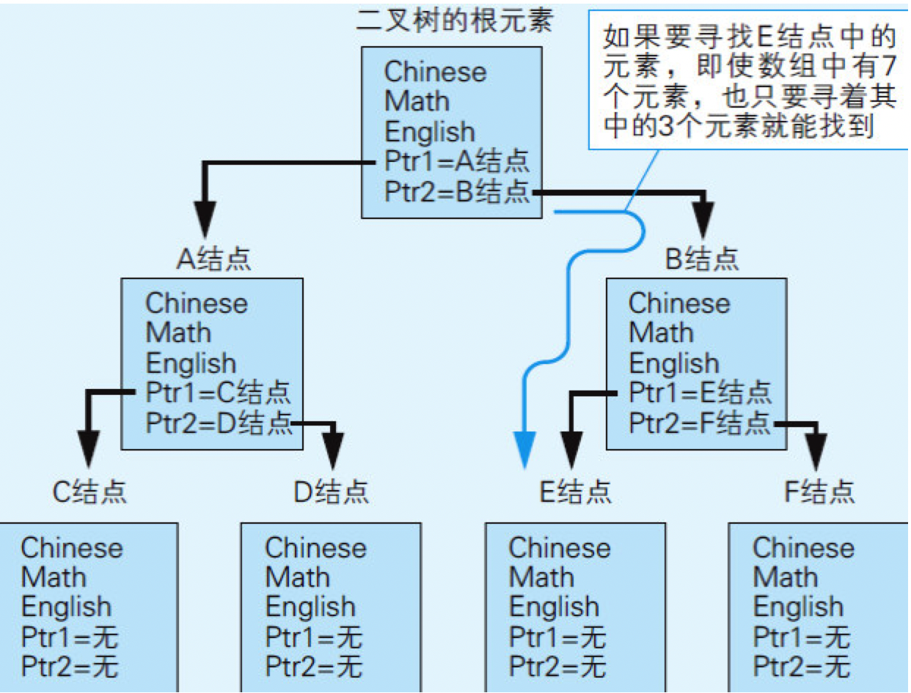
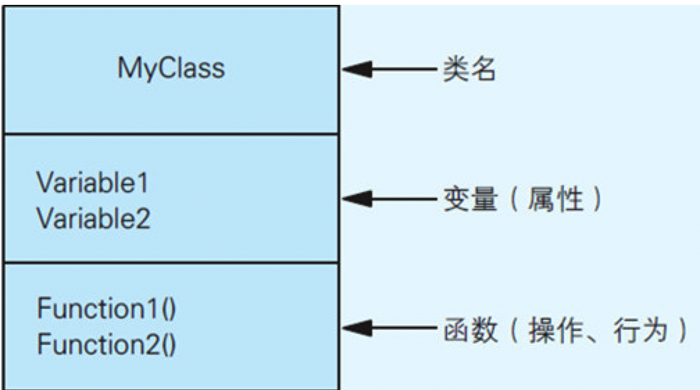
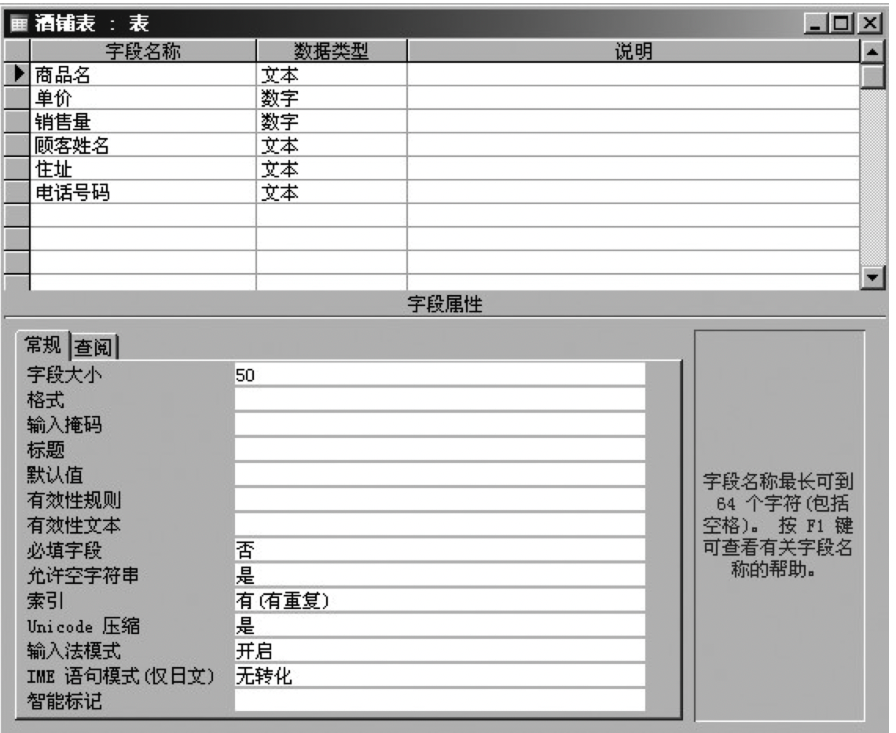
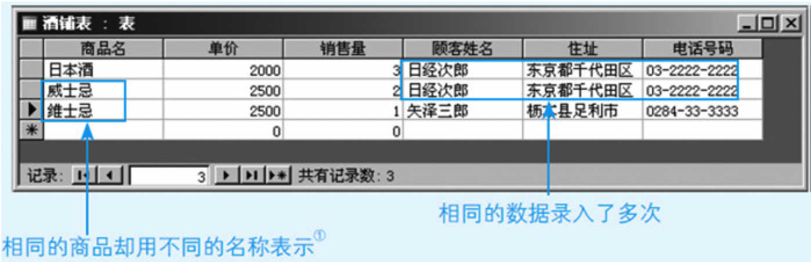
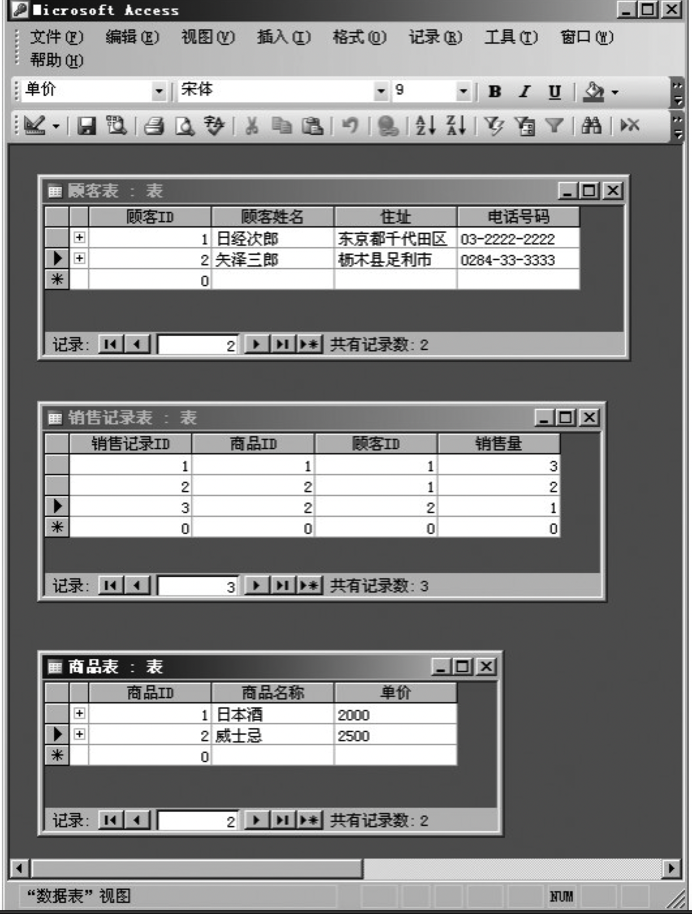
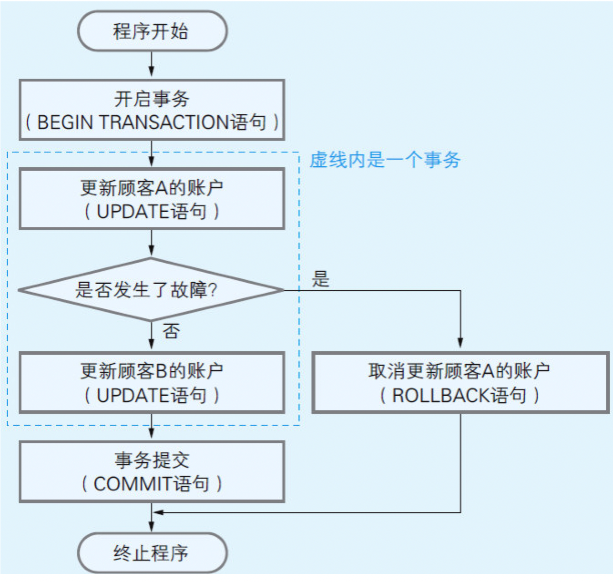
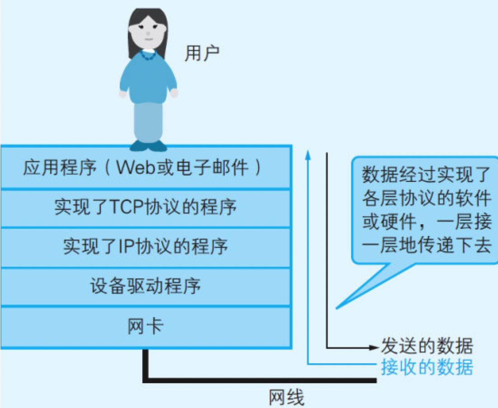

    作者: [日] 矢泽久雄 
    出版社: 人民邮电出版社
    译者: 胡屹 
    出版年: 2015-5
    页数: 272
    定价: 39.00元
    装帧: 平装
    丛书: 图灵程序设计丛书
    ISBN: 9787115392275

[豆瓣链接](https://book.douban.com/subject/26397183/)

- [第1章 计算机的三大原则](#%e7%ac%ac1%e7%ab%a0-%e8%ae%a1%e7%ae%97%e6%9c%ba%e7%9a%84%e4%b8%89%e5%a4%a7%e5%8e%9f%e5%88%99)
  - [1.1 计算机的三个根本性原则](#11-%e8%ae%a1%e7%ae%97%e6%9c%ba%e7%9a%84%e4%b8%89%e4%b8%aa%e6%a0%b9%e6%9c%ac%e6%80%a7%e5%8e%9f%e5%88%99)
  - [1.2 输入、运算、输出是硬件的基础](#12-%e8%be%93%e5%85%a5%e8%bf%90%e7%ae%97%e8%be%93%e5%87%ba%e6%98%af%e7%a1%ac%e4%bb%b6%e7%9a%84%e5%9f%ba%e7%a1%80)
  - [1.3 软件是指令和数据的集合](#13-%e8%bd%af%e4%bb%b6%e6%98%af%e6%8c%87%e4%bb%a4%e5%92%8c%e6%95%b0%e6%8d%ae%e7%9a%84%e9%9b%86%e5%90%88)
  - [1.7 稍微预习一下第2章](#17-%e7%a8%8d%e5%be%ae%e9%a2%84%e4%b9%a0%e4%b8%80%e4%b8%8b%e7%ac%ac2%e7%ab%a0)
- [第2章 试着制造一台计算机吧](#%e7%ac%ac2%e7%ab%a0-%e8%af%95%e7%9d%80%e5%88%b6%e9%80%a0%e4%b8%80%e5%8f%b0%e8%ae%a1%e7%ae%97%e6%9c%ba%e5%90%a7)
  - [2.1 制作微型计算机所必需的元件](#21-%e5%88%b6%e4%bd%9c%e5%be%ae%e5%9e%8b%e8%ae%a1%e7%ae%97%e6%9c%ba%e6%89%80%e5%bf%85%e9%9c%80%e7%9a%84%e5%85%83%e4%bb%b6)
  - [2.2 电路图的读法](#22-%e7%94%b5%e8%b7%af%e5%9b%be%e7%9a%84%e8%af%bb%e6%b3%95)
  - [2.3 连接电源、数据和地址总线](#23-%e8%bf%9e%e6%8e%a5%e7%94%b5%e6%ba%90%e6%95%b0%e6%8d%ae%e5%92%8c%e5%9c%b0%e5%9d%80%e6%80%bb%e7%ba%bf)
  - [2.4 连接I/O](#24-%e8%bf%9e%e6%8e%a5io)
  - [2.5 连接时钟信号](#25-%e8%bf%9e%e6%8e%a5%e6%97%b6%e9%92%9f%e4%bf%a1%e5%8f%b7)
  - [2.7 连接剩余的控制引脚](#27-%e8%bf%9e%e6%8e%a5%e5%89%a9%e4%bd%99%e7%9a%84%e6%8e%a7%e5%88%b6%e5%bc%95%e8%84%9a)
  - [2.10 输入测试程序并进行调试](#210-%e8%be%93%e5%85%a5%e6%b5%8b%e8%af%95%e7%a8%8b%e5%ba%8f%e5%b9%b6%e8%bf%9b%e8%a1%8c%e8%b0%83%e8%af%95)
- [第3章 体验一次手工汇编](#%e7%ac%ac3%e7%ab%a0-%e4%bd%93%e9%aa%8c%e4%b8%80%e6%ac%a1%e6%89%8b%e5%b7%a5%e6%b1%87%e7%bc%96)
  - [3.1 从程序员的角度看硬件](#31-%e4%bb%8e%e7%a8%8b%e5%ba%8f%e5%91%98%e7%9a%84%e8%a7%92%e5%ba%a6%e7%9c%8b%e7%a1%ac%e4%bb%b6)
  - [3.2 机器语言和汇编语言](#32-%e6%9c%ba%e5%99%a8%e8%af%ad%e8%a8%80%e5%92%8c%e6%b1%87%e7%bc%96%e8%af%ad%e8%a8%80)
  - [3.3 Z80 CPU的寄存器结构](#33-z80-cpu%e7%9a%84%e5%af%84%e5%ad%98%e5%99%a8%e7%bb%93%e6%9e%84)
  - [3.4 追踪程序的运行过程](#34-%e8%bf%bd%e8%b8%aa%e7%a8%8b%e5%ba%8f%e7%9a%84%e8%bf%90%e8%a1%8c%e8%bf%87%e7%a8%8b)
  - [3.5 尝试手工汇编](#35-%e5%b0%9d%e8%af%95%e6%89%8b%e5%b7%a5%e6%b1%87%e7%bc%96)
  - [3.6 尝试估算程序的执行时间](#36-%e5%b0%9d%e8%af%95%e4%bc%b0%e7%ae%97%e7%a8%8b%e5%ba%8f%e7%9a%84%e6%89%a7%e8%a1%8c%e6%97%b6%e9%97%b4)
- [第4章 程序像河水一样流动着](#%e7%ac%ac4%e7%ab%a0-%e7%a8%8b%e5%ba%8f%e5%83%8f%e6%b2%b3%e6%b0%b4%e4%b8%80%e6%a0%b7%e6%b5%81%e5%8a%a8%e7%9d%80)
  - [4.1 程序的流程分为三种](#41-%e7%a8%8b%e5%ba%8f%e7%9a%84%e6%b5%81%e7%a8%8b%e5%88%86%e4%b8%ba%e4%b8%89%e7%a7%8d)
  - [4.2 用流程图表示程序的流程](#42-%e7%94%a8%e6%b5%81%e7%a8%8b%e5%9b%be%e8%a1%a8%e7%a4%ba%e7%a8%8b%e5%ba%8f%e7%9a%84%e6%b5%81%e7%a8%8b)
  - [4.3 表示循环程序块的“帽子”和“短裤”](#43-%e8%a1%a8%e7%a4%ba%e5%be%aa%e7%8e%af%e7%a8%8b%e5%ba%8f%e5%9d%97%e7%9a%84%e5%b8%bd%e5%ad%90%e5%92%8c%e7%9f%ad%e8%a3%a4)
  - [4.4 结构化程序设计](#44-%e7%bb%93%e6%9e%84%e5%8c%96%e7%a8%8b%e5%ba%8f%e8%ae%be%e8%ae%a1)
  - [4.5 画流程图来思考算法](#45-%e7%94%bb%e6%b5%81%e7%a8%8b%e5%9b%be%e6%9d%a5%e6%80%9d%e8%80%83%e7%ae%97%e6%b3%95)
  - [4.6 特殊的程序流程-中断处理](#46-%e7%89%b9%e6%ae%8a%e7%9a%84%e7%a8%8b%e5%ba%8f%e6%b5%81%e7%a8%8b-%e4%b8%ad%e6%96%ad%e5%a4%84%e7%90%86)
  - [4.7 特殊的程序流程-事件驱动](#47-%e7%89%b9%e6%ae%8a%e7%9a%84%e7%a8%8b%e5%ba%8f%e6%b5%81%e7%a8%8b-%e4%ba%8b%e4%bb%b6%e9%a9%b1%e5%8a%a8)
- [第5章 与算法成为好朋友的七个要点](#%e7%ac%ac5%e7%ab%a0-%e4%b8%8e%e7%ae%97%e6%b3%95%e6%88%90%e4%b8%ba%e5%a5%bd%e6%9c%8b%e5%8f%8b%e7%9a%84%e4%b8%83%e4%b8%aa%e8%a6%81%e7%82%b9)
  - [要点1：算法中解决问题的步骤是明确且有限的](#%e8%a6%81%e7%82%b91%e7%ae%97%e6%b3%95%e4%b8%ad%e8%a7%a3%e5%86%b3%e9%97%ae%e9%a2%98%e7%9a%84%e6%ad%a5%e9%aa%a4%e6%98%af%e6%98%8e%e7%a1%ae%e4%b8%94%e6%9c%89%e9%99%90%e7%9a%84)
  - [要点2：计算机不靠直觉而是机械地解决问题](#%e8%a6%81%e7%82%b92%e8%ae%a1%e7%ae%97%e6%9c%ba%e4%b8%8d%e9%9d%a0%e7%9b%b4%e8%a7%89%e8%80%8c%e6%98%af%e6%9c%ba%e6%a2%b0%e5%9c%b0%e8%a7%a3%e5%86%b3%e9%97%ae%e9%a2%98)
  - [要点3：了解并应用典型算法](#%e8%a6%81%e7%82%b93%e4%ba%86%e8%a7%a3%e5%b9%b6%e5%ba%94%e7%94%a8%e5%85%b8%e5%9e%8b%e7%ae%97%e6%b3%95)
- [第6章 与数据结构成为好朋友的七个要点](#%e7%ac%ac6%e7%ab%a0-%e4%b8%8e%e6%95%b0%e6%8d%ae%e7%bb%93%e6%9e%84%e6%88%90%e4%b8%ba%e5%a5%bd%e6%9c%8b%e5%8f%8b%e7%9a%84%e4%b8%83%e4%b8%aa%e8%a6%81%e7%82%b9)
  - [要点1：了解内存和变量的关系](#%e8%a6%81%e7%82%b91%e4%ba%86%e8%a7%a3%e5%86%85%e5%ad%98%e5%92%8c%e5%8f%98%e9%87%8f%e7%9a%84%e5%85%b3%e7%b3%bb)
  - [要点2：了解作为数据结构基础的数组](#%e8%a6%81%e7%82%b92%e4%ba%86%e8%a7%a3%e4%bd%9c%e4%b8%ba%e6%95%b0%e6%8d%ae%e7%bb%93%e6%9e%84%e5%9f%ba%e7%a1%80%e7%9a%84%e6%95%b0%e7%bb%84)
  - [要点3：了解数组的应用 – 作为典型算法的数据结构](#%e8%a6%81%e7%82%b93%e4%ba%86%e8%a7%a3%e6%95%b0%e7%bb%84%e7%9a%84%e5%ba%94%e7%94%a8-%e2%80%93-%e4%bd%9c%e4%b8%ba%e5%85%b8%e5%9e%8b%e7%ae%97%e6%b3%95%e7%9a%84%e6%95%b0%e6%8d%ae%e7%bb%93%e6%9e%84)
  - [要点4：了解并掌握典型数据结构的类型和概念](#%e8%a6%81%e7%82%b94%e4%ba%86%e8%a7%a3%e5%b9%b6%e6%8e%8c%e6%8f%a1%e5%85%b8%e5%9e%8b%e6%95%b0%e6%8d%ae%e7%bb%93%e6%9e%84%e7%9a%84%e7%b1%bb%e5%9e%8b%e5%92%8c%e6%a6%82%e5%bf%b5)
  - [要点5：了解栈和队列的实现方法](#%e8%a6%81%e7%82%b95%e4%ba%86%e8%a7%a3%e6%a0%88%e5%92%8c%e9%98%9f%e5%88%97%e7%9a%84%e5%ae%9e%e7%8e%b0%e6%96%b9%e6%b3%95)
  - [要点6：了解结构体的组成](#%e8%a6%81%e7%82%b96%e4%ba%86%e8%a7%a3%e7%bb%93%e6%9e%84%e4%bd%93%e7%9a%84%e7%bb%84%e6%88%90)
  - [要点7：了解链表和二叉树的实现方法](#%e8%a6%81%e7%82%b97%e4%ba%86%e8%a7%a3%e9%93%be%e8%a1%a8%e5%92%8c%e4%ba%8c%e5%8f%89%e6%a0%91%e7%9a%84%e5%ae%9e%e7%8e%b0%e6%96%b9%e6%b3%95)
- [第7章 成为会使用面向对象编程的程序员](#%e7%ac%ac7%e7%ab%a0-%e6%88%90%e4%b8%ba%e4%bc%9a%e4%bd%bf%e7%94%a8%e9%9d%a2%e5%90%91%e5%af%b9%e8%b1%a1%e7%bc%96%e7%a8%8b%e7%9a%84%e7%a8%8b%e5%ba%8f%e5%91%98)
  - [7.1 面向对象编程](#71-%e9%9d%a2%e5%90%91%e5%af%b9%e8%b1%a1%e7%bc%96%e7%a8%8b)
  - [7.2 对OOP的多种理解方法](#72-%e5%af%b9oop%e7%9a%84%e5%a4%9a%e7%a7%8d%e7%90%86%e8%a7%a3%e6%96%b9%e6%b3%95)
  - [7.7 观点5：面向对象编程可借助UML设计程序](#77-%e8%a7%82%e7%82%b95%e9%9d%a2%e5%90%91%e5%af%b9%e8%b1%a1%e7%bc%96%e7%a8%8b%e5%8f%af%e5%80%9f%e5%8a%a9uml%e8%ae%be%e8%ae%a1%e7%a8%8b%e5%ba%8f)
  - [7.8 观点6：面向对象编程通过在对象间传递消息驱动程序](#78-%e8%a7%82%e7%82%b96%e9%9d%a2%e5%90%91%e5%af%b9%e8%b1%a1%e7%bc%96%e7%a8%8b%e9%80%9a%e8%bf%87%e5%9c%a8%e5%af%b9%e8%b1%a1%e9%97%b4%e4%bc%a0%e9%80%92%e6%b6%88%e6%81%af%e9%a9%b1%e5%8a%a8%e7%a8%8b%e5%ba%8f)
  - [7.9 观点7：在面向对象编程中使用继承、封装和多态](#79-%e8%a7%82%e7%82%b97%e5%9c%a8%e9%9d%a2%e5%90%91%e5%af%b9%e8%b1%a1%e7%bc%96%e7%a8%8b%e4%b8%ad%e4%bd%bf%e7%94%a8%e7%bb%a7%e6%89%bf%e5%b0%81%e8%a3%85%e5%92%8c%e5%a4%9a%e6%80%81)
  - [7.10 类和对象的区别](#710-%e7%b1%bb%e5%92%8c%e5%af%b9%e8%b1%a1%e7%9a%84%e5%8c%ba%e5%88%ab)
  - [7.11 类有三种使用方法](#711-%e7%b1%bb%e6%9c%89%e4%b8%89%e7%a7%8d%e4%bd%bf%e7%94%a8%e6%96%b9%e6%b3%95)
- [第8章 一用就会的数据库](#%e7%ac%ac8%e7%ab%a0-%e4%b8%80%e7%94%a8%e5%b0%b1%e4%bc%9a%e7%9a%84%e6%95%b0%e6%8d%ae%e5%ba%93)
  - [8.1 数据库是数据的基地](#81-%e6%95%b0%e6%8d%ae%e5%ba%93%e6%98%af%e6%95%b0%e6%8d%ae%e7%9a%84%e5%9f%ba%e5%9c%b0)
  - [8.2 数据文件、DBMS和数据库应用程序](#82-%e6%95%b0%e6%8d%ae%e6%96%87%e4%bb%b6dbms%e5%92%8c%e6%95%b0%e6%8d%ae%e5%ba%93%e5%ba%94%e7%94%a8%e7%a8%8b%e5%ba%8f)
  - [8.3 设计数据库](#83-%e8%ae%be%e8%ae%a1%e6%95%b0%e6%8d%ae%e5%ba%93)
  - [8.4 通过拆表和整理数据实现规范化](#84-%e9%80%9a%e8%bf%87%e6%8b%86%e8%a1%a8%e5%92%8c%e6%95%b4%e7%90%86%e6%95%b0%e6%8d%ae%e5%ae%9e%e7%8e%b0%e8%a7%84%e8%8c%83%e5%8c%96)
  - [8.5 用主键和外键在表间建立关系](#85-%e7%94%a8%e4%b8%bb%e9%94%ae%e5%92%8c%e5%a4%96%e9%94%ae%e5%9c%a8%e8%a1%a8%e9%97%b4%e5%bb%ba%e7%ab%8b%e5%85%b3%e7%b3%bb)
  - [8.6 索引能够提升数据的检索速度](#86-%e7%b4%a2%e5%bc%95%e8%83%bd%e5%a4%9f%e6%8f%90%e5%8d%87%e6%95%b0%e6%8d%ae%e7%9a%84%e6%a3%80%e7%b4%a2%e9%80%9f%e5%ba%a6)
  - [8.8 向DBMS发送CRUD操作的SQL语句](#88-%e5%90%91dbms%e5%8f%91%e9%80%81crud%e6%93%8d%e4%bd%9c%e7%9a%84sql%e8%af%ad%e5%8f%a5)
  - [8.9 使用数据对象向DBMS发送SQL语句](#89-%e4%bd%bf%e7%94%a8%e6%95%b0%e6%8d%ae%e5%af%b9%e8%b1%a1%e5%90%91dbms%e5%8f%91%e9%80%81sql%e8%af%ad%e5%8f%a5)
  - [8.10 事务控制也可以交给DBMS](#810-%e4%ba%8b%e5%8a%a1%e6%8e%a7%e5%88%b6%e4%b9%9f%e5%8f%af%e4%bb%a5%e4%ba%a4%e7%bb%99dbms)
- [第9章 通过七个简单的实验理解TCP/IP网络](#%e7%ac%ac9%e7%ab%a0-%e9%80%9a%e8%bf%87%e4%b8%83%e4%b8%aa%e7%ae%80%e5%8d%95%e7%9a%84%e5%ae%9e%e9%aa%8c%e7%90%86%e8%a7%a3tcpip%e7%bd%91%e7%bb%9c)
  - [9.1 实验环境](#91-%e5%ae%9e%e9%aa%8c%e7%8e%af%e5%a2%83)
  - [9.2 实验1：查看网卡的MAC地址](#92-%e5%ae%9e%e9%aa%8c1%e6%9f%a5%e7%9c%8b%e7%bd%91%e5%8d%a1%e7%9a%84mac%e5%9c%b0%e5%9d%80)
  - [9.3 实验2：查看计算机的IP地址](#93-%e5%ae%9e%e9%aa%8c2%e6%9f%a5%e7%9c%8b%e8%ae%a1%e7%ae%97%e6%9c%ba%e7%9a%84ip%e5%9c%b0%e5%9d%80)
  - [9.4 实验3：了解DHCP服务器的作用](#94-%e5%ae%9e%e9%aa%8c3%e4%ba%86%e8%a7%a3dhcp%e6%9c%8d%e5%8a%a1%e5%99%a8%e7%9a%84%e4%bd%9c%e7%94%a8)
  - [9.5 实验4：路由器是数据传输过程中的指路人](#95-%e5%ae%9e%e9%aa%8c4%e8%b7%af%e7%94%b1%e5%99%a8%e6%98%af%e6%95%b0%e6%8d%ae%e4%bc%a0%e8%be%93%e8%bf%87%e7%a8%8b%e4%b8%ad%e7%9a%84%e6%8c%87%e8%b7%af%e4%ba%ba)
  - [9.6 实验5：查看路由器的路由过程](#96-%e5%ae%9e%e9%aa%8c5%e6%9f%a5%e7%9c%8b%e8%b7%af%e7%94%b1%e5%99%a8%e7%9a%84%e8%b7%af%e7%94%b1%e8%bf%87%e7%a8%8b)
  - [9.7 实验6：DNS服务器可以把主机名解析成IP地址](#97-%e5%ae%9e%e9%aa%8c6dns%e6%9c%8d%e5%8a%a1%e5%99%a8%e5%8f%af%e4%bb%a5%e6%8a%8a%e4%b8%bb%e6%9c%ba%e5%90%8d%e8%a7%a3%e6%9e%90%e6%88%90ip%e5%9c%b0%e5%9d%80)
  - [9.8 实验7：查看IP地址和MAC地址的对应关系](#98-%e5%ae%9e%e9%aa%8c7%e6%9f%a5%e7%9c%8bip%e5%9c%b0%e5%9d%80%e5%92%8cmac%e5%9c%b0%e5%9d%80%e7%9a%84%e5%af%b9%e5%ba%94%e5%85%b3%e7%b3%bb)
  - [9.9 TCP/IP的作用及TCP/IP网络的层次模型](#99-tcpip%e7%9a%84%e4%bd%9c%e7%94%a8%e5%8f%8atcpip%e7%bd%91%e7%bb%9c%e7%9a%84%e5%b1%82%e6%ac%a1%e6%a8%a1%e5%9e%8b)
- [第10章 试着加密数据](#%e7%ac%ac10%e7%ab%a0-%e8%af%95%e7%9d%80%e5%8a%a0%e5%af%86%e6%95%b0%e6%8d%ae)

## 第1章 计算机的三大原则
### 1.1 计算机的三个根本性原则
下面开始介绍计算机的三大原则

1. 计算机是执行输入、运算、输出的机器
2. 程序是指令和数据的集合
3. 计算机的处理方式有时与人们的思维习惯不同

### 1.2 输入、运算、输出是硬件的基础
计算机的硬件由大量的`IC`（Integrated Circuit，集成电路）组成（如图1.1所示）。每块IC上都带有许多`引脚`，这些引脚有的用于输入，有的用于输出。IC会在内部对外部输入的信息进行运算，并把运算结果输出到外部。

图1.1 IC的引脚有些用于输入，有些用于输出


### 1.3 软件是指令和数据的集合
- 所谓`程序`，是指令和数据的集合。
- 所谓`指令`，就是控制计算机进行输入、运算、输出的命令。

在程序设计中，会为一组指令赋予一个名字，称之为`“函数”`。

程序中的`数据`分为两类，一类是作为指令执行对象的输入数据；一类是从指令的执行结果得到的输出数据。在编程时程序员会为数据赋予名字，称其为`“变量”`。

    output=operate(input)

代码清单1.1 C语言的程序示例片段

```c
int a, b, c;

a=10;
b=20;
c=Average(a,b);
```

- C语言中要在每条指令的末尾写一个分号（；）。
- 等号是赋值给变量的指令。

所谓`编译`就是把用C语言等编程语言编写的文件（源文件）转换成用机器语言（原生代码）文件。

代码清单1.2 机器语言的程序示例

```
C7 45 FC 01 00 00 00 C7 45 F8 02 00 00 00 8B 45
F8 50 8B 4D FC 51 E8 82 FF FF FF 83 C4 08 89 45
F4 8B 55 F4 52 68 1C 30 42 00 E8 B9 03 00 00 83
```

第一个数值C7表示指令，第二个数值45表示数据。

### 1.7 稍微预习一下第2章
图1.4 计算机硬件的组成要素


计算机内部主要由被称为IC的元件组成（主要的3种）：CPU（处理器）、内存以及I/O。

- `CPU`是计算机的大脑，在其内部可对数据执行运算并控制内存和I/O。
- `内存`用于存储指令和数据。
- `I/O`负责把键盘、鼠标、显示等周边设备和主机连接在一起，实现数据的输入和输出。

只要用电路把CPU、内存以及I/O上的`引脚`相互连接起来，为每块IC提供电源，再为CPU提供时钟信号，硬件上的计算机就组装起来了。

所谓`时钟信号`，就是由内含晶振（一种利用石英晶体（又称水晶）的压电效应产生高精度振荡频率的电子元件）的、被称为时钟发生器的元件发出的滴答滴答的电信号。

## 第2章 试着制造一台计算机吧
### 2.1 制作微型计算机所必需的元件
为了驱动CPU运转，称为“时钟信号”的电信号是必不可少的。这种电信号就好像带有一个时钟，滴答滴答地每隔一定时间就变换一次电压的高低（如图2.2所示）。

图2.2 时钟信号的波形图


输出时钟信号的元件叫“时钟发生器”。时钟发生器中带有晶振，根据其自身的频率（振动的次数）产生时钟信号。时钟信号的频率可以衡量CPU的运转速度，这里使用的是2.5MHz的时钟发生器(2.5MHz（兆赫兹）的话就是2.5*100万=250万次/秒)。

通过拨动`指拨开关来`输入程序，指拨开关是一种由8个开关并排连在一起构成的元件（如照片2.1a所示）。输出程序执行结果的装置是8个`LED（发光二极管）`。

`电阻`是用于阻碍电流流动、降低电压值的元件。

照片2.1 指拨开关和集成电阻


### 2.2 电路图的读法
本次制作的微型计算机工作在+5V的直流电下。

图2.4 电源的表示方法


IC的引脚（所谓引脚就是IC边缘露出来的像蜈蚣腿一样的部分）按逆时针方向依次带有一个从1开始递增的序号，数引脚序号时，要先把表示正方向的标志，如半圆形缺口朝向左侧，举例来说，带有14个引脚的7404，其引脚序号如图2.5所示

图2.5 如何数IC的引脚序号


画图时，在引脚的旁边写上引脚的序号，在表示IC的矩形符号中写上表明该引脚作用的代号，代号就是像RD（Read）表示执行读取操作，WR（Write）表示执行写入操作这样的代表了某种操作的符号。

### 2.3 连接电源、数据和地址总线
微型计算机所使用的IC属于数字IC。在数字IC中，每个引脚上的电压要么是0V，要么是+5V，通过这两个电压与其他的IC进行电信号的收发。

只要想成0V表示数字0，+5V表示数字1，那么数字IC就是在用二进制数的形式收发信息。

为了指定输入输出数据时的源或目的地，CPU上备有“地址总线引脚”。Z80 CPU的地址总线引脚有16个，用代号A0-A15表示，其中的A表示Address（地址）,0-15表示一个16位的二进制数中各个数字的位置，0对应最后一位，15对应第一位。16个地址总线引脚所能指定的地址共有65536个，用二进制数表示的话就是0000000000000000-1111111111111111。因此，Z80 CPU可以指定65536个数据存储单元（内存存储单元或I/O地址），进行信息的输入输出。

Z80 CPU的数据总线引脚共有8个，用代号D0-D7表示，D表示Data（数据），数字0-7与地址总线引脚代号的规则相同，也表示二进制数中各个数字的位置，Z80 CPU可以一次性地输入输出8比特的数据。

作为内存的TC5517上也有地址总线引脚（A0-A10）和数据总线引脚（D0-D7）。这些引脚需要同Z80 CPU上带有相同代号的引脚相连。一块TC5517上可以存储2048个8比特的数据（如图2.6所示）。

图2.6 TC5517的内部构造


### 2.4 连接I/O
寄存器是位于CPU和I/O中的数据存储器，Z80 PIO上共有4个`寄存器`，2个用于设定PIO本身的功能，2个用于存储与外部设备进行输入输出的数据。

这4个寄存器分别叫做端口A控制、端口A数据、端口B控制和端口B数据。所谓`端口`就是I/O与外部设备之间输入输出数据的场所。

图2.7 Z80 PIO内部结构


### 2.5 连接时钟信号
Z80 CPU和Z80 PIO的运转离不开时钟信号。为了传输时钟信号，就需要把时钟发生器的8号引脚和Z80 CPU的CLK（CLK即Clock，时钟）引脚、Z80 PIO的CLK引脚分别连接起来。时钟发生器的8号引脚与+5V之间的电阻用于清理时钟信号。

### 2.7 连接剩余的控制引脚
CPU、内存、I/O中不但有`地址总线引脚`、`数据总线引脚`，还有其他引脚，通常把这些引脚统称为`“控制引脚”`。

INT引脚是用于从Z80 PIO向Z80 CPU发出中断请求的引脚。所谓`中断`就是让CPU根据外部输入的数据执行特定的程序。

RESET引脚上的值先设置为0再还原成1，CPU就会被重置，重新从内存0号地址上的指令开始顺序向下执行。

`总线`是连接到CPU中数据引脚、地址引脚、控制引脚上的电路的统称。若将BUSRQ引脚的值设为0，则Z80 CPU从电路中`隔离`。当处于这种隔离状态时，就可以不通过CPU，手动地向内存写入程序了。像这样不经过CPU而直接从外部设备读写内存的行为叫`DMA`（Direct Memory Access，直接存储器访问）。

### 2.10 输入测试程序并进行调试
代码清单2.1展示了一段用机器语言编写的测试程序。程序是指令和数据的集合，表示指令或数据的数值为8比特为一个单位存储到内存中的。这段程序只实现了一个简单的功能，那就是通过拨动连接到Z80 PIO上的指拨开关控制LED的亮或灭。

代码清单2.1 用机器语言编写的测试程序

```
地址        程序

00000000    00111110
00000001    11001111
00000010    11010011
00000011    00000010
00000100    00111110
00000101    11111111
00000110    11010011
00000111    00000010
00001000    00111110
00001001    11001111
00001010    11010011
00001011    00000011
00001100    00111110
00001101    00000000
00001110    11010011
00001111    00000011
00010000    11011011
00010001    00000000
00010010    11010011
00010011    00000001
00010100    11000011
00010101    00010000
00010110    00000000
```

接通了微型计算机的电源后，请按下Z80 CPU上的DMA请求开关。在这个状态下，拨动用于输入内存程序和指定内存输入地址的两个指拨开关，

把代码清单2.1所示的程序一行接一行地输入内存。先来输入第一行代码，拨动用于指定地址的指拨开关，设定第一行代码所在的内存地址00000000，然后拨动用于输入程序的指拨开关，设定出程序代码00111110，再按下用于向内存写入程序的按键开关。接下来输入第二行代码，设定内存地址00000001，设定出程序代码11001111，再次按下按键开关。反复进行这三步操作，直到输入完程序代码的最后一行，所有的指令都输入完成后，按下用于重置CPU的按键开关，控制DMA请求的快动开关就会还原成关闭状态，与此同时程序也就运行起来了。

程序一旦运行起来，就可以用第3个指拨开关控制LED的亮与灭。只要拨动指拨开关，LED的亮灭就会随之改变。LED并不会只亮一下，而是一直亮着，时刻保持着指拨开关上的状态。

## 第3章 体验一次手工汇编
### 3.1 从程序员的角度看硬件
真正需要了解的硬件信息只有以下7种（如图3.1所示）:

图3.1 编写程序之前需要了解的硬件信息


- CPU（处理器）信息
  - CPU的种类
  - 时钟信号的频率
- 内存信息
  - 地址空间
  - 每个地址中可以存储多少比特的信息
- I/O信息
  - I/O的种类
  - 地址空间
  - 连接着何种周边设备

`机器语言`就是处理器可以直接理解（与生俱来就能理解）的编程语言。机器语言有时也叫做原生代码（Native Code）。

所谓`时钟信号`的`频率`，就是由时钟发生器发送给CPU的电信号的频率。表示时钟信号频率的单位是MHz（兆赫兹=100万回/秒）。我们的微型计算机使用的是2.5MHz的时钟信号，时钟信号是在0和1两个数之间反复变换的电信号，通常把发出一次滴答的时间称为一个`时钟周期`。

在机器语言中，指令执行时所需的时钟周期数取决于指令的类型。程序员可以通过累加时钟周期数估算程序执行的时间。

每个`地址`都标示着一个内存中的数据存储单元，而这些地址所构成的范围就是内存的地址空间。在我们的微型计算机中，地址空间为0-255，每一个地址中可以存储8比特（1字节）的指令或数据。

所谓I/O的地址空间，是指用于指定I/O寄存器的地址范围。

在内存中，每个地址的功能都一样，既可用于存储指令又可用于存储数据。而I/O不同，地址编号不同（即寄存器的类型不同），功能也就不同。

### 3.2 机器语言和汇编语言
在机器语言程序中，虽然都是0和1的组合，但每个组合都是有特定含义的指令或数据。可是对人类来说，如果只看0和1的话，恐怕很难判断各个组合都表示什么。根据表示指令功能的英语单词起一个相似的昵称，并将这个昵称赋予给0和1的组合。这种类似英语单词的昵称叫做“助记符”，使用助记符的编程语言叫做`“汇编语言”`。

汇编语言的语法十分简单，以至于语法只有一个，即把“标签”“操作码（指令）”和“操作数（指令的对象）”并排写在一行上。

代码清单3.2 用汇编语言的代码表示代码清单3.1中的机器语言

标签 | 操作码 | 操作数
---|-----|----
- | LD | A,207
- | OUT | (2),A
- | LD | A,255
- | OUT | (2),A
- | LD | A,207
- | OUT | (3),A
- | LD | A,0
- | OUT | (3),A
LOOP: | IN | A,(0)
- | OUT | (1),A
- | JP | LOOP

- `标签`的作用是为该行代码对应的内存地址起一个名字。
- `操作码`就是表示“做什么”的指令。
- `操作数`表示的是指令执行的对象。

### 3.3 Z80 CPU的寄存器结构
与I/O的寄存器不同，CPU的寄存器不仅能存储数据，还具备对数据进行运算的能力。

图3.2 Z80 CPU的寄存器


- A寄存器也叫做“累加器”
- F寄存器也叫做“标志寄存器”，用于存储运算结果的状态，比如是否发生了进位、数字大小的比较结果等
- PC寄存器也叫做“程序指针”，存储着指向CPU接下来要执行的指令的地址。PC寄存器的值会随着滴答滴答的时钟信号自动更新
- SP寄存器也叫做“栈顶指针”，用于在内存中创建一块称为“栈”的临时数据存储区域

### 3.4 追踪程序的运行过程
用汇编语言编写的程序是不能直接运行的，必须先转换成机器语言。机器语言是唯一一种CPU能直接理解的编程语言。汇编语言中的1条指令能转换成多少条机器语言取决于指令的种类及操作数的个数。

代码清单3.3 汇编语言与机器语言的对应关系

地址 | 机器语言 | 标签 | 操作码 | 操作数
---|------|----|-----|----
00000000 | 00111110 11001111 | LD | A,207
00000010 | 11010011 00000010 | OUT | (2),A
00000100 | 00111110 11111111 | LD | A,255
00000110 | 11010011 00000010 | OUT | (2),A
00001000 | 00111110 11001111 | LD | A,207
00001010 | 11010011 00000011 | OUT | (3),A
00001100 | 00111110 00000000 | LD | A,0
00001110 | 11010011 00000011 | OUT | (3),A
00010000 | 11011011 00000000 | LOOP:IN | A,(0)
00010010 | 11010011 00000001 | OUT | (1),A
00010100 | 11000011 00010000 00000000 | JP | LOOP

### 3.5 尝试手工汇编
表3.2 从助记符到机器语言的转换方法

助记符 | 机器语言 | 时钟周期数
----|------|------
LD A,num | 00111110 num | 7
OUT(num),A | 11010011 num | 11
IN A,(num) | 11011011 num | 11
JP num | 11000011 num | 10

### 3.6 尝试估算程序的执行时间
表3.2，找出执行每条汇编语言指令所需的时钟周期，然后把代码清单3.2中所用到的每条指令的时钟周期累加起来。于是可以算出到LOOP标签为止的8条指令共需要7+11+7+11+7+11+7+11=72个时钟周期；LOOP标签之后的3条指令需要11+11+10=32个时钟周期，因为微型计算机采用的是2.5MHz的晶振，也就是1秒可产生250万个时钟周期，所以 **每个时钟周期是1秒/250万=0.4微秒**。72个时钟周期就是72*0.4=28.8微秒，32个时钟周期就是12.8微秒，这段程序是用LED的亮或灭来表示指拨开关的开关状态，所以LOOP标签之后所执行的操作“输入、输出、跳转”每猜测可以反复执行1秒/12.8微秒/次=78125次。

## 第4章 程序像河水一样流动着
### 4.1 程序的流程分为三种
计算机的硬件系统由CPU、I/O和内存三部分构成。内存中存储着程序，也就是指令和数据。CPU配合着由时钟发生器发出的滴答滴答的时钟信号，从内存中读出指令，然后再依次对其进行解释和执行。

一个称为`PC（Program Counter，程序计数器）`的寄存器，负责存储内存地址，该地址指向下一条即将执行的指令，每解释执行完一条指令，PC寄存器的值就会自动被更新为下一条指令的地址。

图4.1 硬件上的程序流程（顺序执行）


程序的流程总共有三种。

- `顺序执行`是按指令记录在内存中的先后顺序依次执行的一种流程。
- `循环`则是在程序的特定范围内反复执行若干次的一种流程。
- `条件分支`是根据若干个条件的成立与否，在程序的流程中产生若干个分支的一种流程。

### 4.2 用流程图表示程序的流程
图4.5 用流程图表示的顺序执行、条件分支、循环三种流程


### 4.3 表示循环程序块的“帽子”和“短裤”
图4.6 表示循环的符号


图4.7 循环中嵌套循环


图4.8 从硬件上看循环的过程


在这些高级语言中，程序员使用“程序块”表示循环而不是跳转指令。所谓`“程序块”`就是程序中代码的集合。程序中要被循环处理的部分，就是一种程序块。

图4.10 从硬件上看条件分支的过程


### 4.4 结构化程序设计
结构化程序设计是由学者戴克斯特拉提倡的一种编程风格。所谓`结构化程序设计`就是“为了把程序编写的具备结构性，仅使用顺序结构、条件分支和循环表示程序的流程即可，而不再使用跳转指令”。(在很多高级语言中，还是提供了与机器语言中跳转指令相当的语句，例如VBScript中的GoTo语句。)

### 4.5 画流程图来思考算法
所谓`算法（Algorithm）`就是解决既定问题的步骤。

如果眼下待解决的问题是如何编写“石头剪刀布游戏”，那么就必须考虑如何把若干条指令组合起来并形成一个解决问题的流程。如果能够想出可以巧妙实现“石头剪刀布游戏”的流程，那么这个问题也就解决了，换言之算法也就实现了。

图4.12 “石头剪刀布游戏”的粗略流程图


### 4.6 特殊的程序流程-中断处理
`中断处理`是指计算机使程序的流程突然跳转到程序中的特定地方，这样的地方被称为中断处理例程（Rountine）或是中断处理程序（Handler），而这种跳转是通过CPU所具备的硬件功能实现的。

在Z80 CPU中有INT和NMI两个引脚，它们可以接收从I/O设备发出的中断请求信号（INT引脚用于处理一般的中断请求。NMI引脚则用于即使CPU屏蔽了中断，也可在执行中的指令结束后立即响应中断请求的情况）。

以硬件形式连接到CPU上的I/O模块会发出中断请求信号，CPU根据该信号执行相应的中断处理程序。

图4.14 中断请求信号由连接到周边设备上的I/O发出


中断处理以从硬件发出的请求为条件，使程序的流程产生分支，因此可以说它是一种特殊的条件分支。可是，在编写的程序中并不需要编写有关中断代理的代码。因为处理中断请求的程序，或是内置于被烧录在计算机ROM中的`BIOS`系统（Basic Input Output System,基本输入输出系统）中，或是内置于Windows等操作系统中。

### 4.7 特殊的程序流程-事件驱动
程序员经常用事件驱动的方式编写那些工作在GUI（Graphical User Interface，图形用户界面）环境中的应用程序。

通常把用户在应用程序中点击鼠标键或敲击键盘按键这样的操作称为`事件`（Event）。负责检测事件的是Windows。应用程序则根据事件的类型做出相应的处理。这种机制就是`事件驱动`。可以说事件驱动也是一种特殊的条件分支，它以从Windows送来的通知为条件，根据通知的内容决定程序下一步的流程。

`状态转化图`中有多个状态，反映了由于某种原因从某个状态转化到另一个状态的流程。

例如，图4.15所示的计算器应用程序就可以看作包含三个状态：“显示计算机结果”、“显示第一个输入的数”以及“显示第二个输入的数”。随着用户按下不同种类的键，状态也会发生转变。

图4.15 Windows附带的计算器应用程序


图4.16 计算器应用程序的状态转化图


表4.2 计算机程序的状态转化表的例子


程序的流程还是只有顺序执行、条件分支和循环三种。这一点没有改变，其中的顺序执行是最基本的程序流程，这是因为CPU中的PC寄存器的值会自动更新，条件分支和循环，在高级语言中用程序块表示，在机器语言和汇编语言中用跳转指令表示，在硬件上是通过把PC寄存器的值设为要跳转到的目的地的内存地址来实现的。

## 第5章 与算法成为好朋友的七个要点
### 要点1：算法中解决问题的步骤是明确且有限的
算法就是“把解决问题的步骤无一遗漏地用文字或图表示出来”。要是把这时的“用文字或图表示”替换为“用编程语言表达”，算法就变成了程序。

图5.1 在中学学的求解最大公约数的方法


步骤1的“用2整除12和42”和步骤2“用3整除6和21”，是怎么知道要这样做的呢？寻找能够整除的数字的方法，在这两步中并没有体现。步骤3“没有能同时带队和7的除数”，又是怎么知道的呢？

这些都是凭借人类的判断。在解决问题的步骤中，有了与直觉相关的因素，就不是算法了，既然不是算法，也就不能用程序表示了。

### 要点2：计算机不靠直觉而是机械地解决问题
计算机所执行的由程序表示的算法必须是由机械的步骤所构成。所谓`“机械的步骤“`就是不用动任何脑筋，只要按照这个步骤做就一定能完成的意思。

辗转相除法（又称欧几里德算法）就是一个机械地求解最大公约数问题的算法，在辗转相除法中分为使用除法运算和使用减法运算两种方法。步骤如图5.2所示。

图5.2 根据辗转相除法求解最大公约数的方法


### 要点3：了解并应用典型算法
表5.1 主要的典型算法

名称 | 用途
---|---
辗转相除法 | 求解最大公约数
埃拉托斯特尼筛选法 | 判定素数
顺序查找 | 检索数据
二分查找 | 检索数据
哈希查找 | 检索数据
冒泡排序 | 数据排序
快速排序 | 数据排序

## 第6章 与数据结构成为好朋友的七个要点
### 要点1：了解内存和变量的关系
计算机所处理的数据都存储在了被称为`内存`的`IC（Integrated Circuit，集成电路）`中。在一般的个人计算机中，内存内部被分割成了若干个数据存储单元，每个单元可存储8比特的数据（8比特=1字节）。为了区分各个单元，每个单元都被分配了一个编号，这个编号被称为`“地址”`（门牌号码）。

因为依靠指定地址的方式编写程序很麻烦，所以在C、Java、BASIC等几乎所有编程语言中，都是使用`变量`把数据存储在内存中或从内存中把数据读出来。

```c
char a;   /*定义变量*/
a=123;     /*把数据存入变量*/
```

对于程序员来说，并不需要知道变量a被存储到内存空间中的哪个地址上。因为当程序运行时是由操作系统从尚未使用的内存空间中划分出一部分分配给变量a的。

图6.1 内存的物理结构以及它与程序的关系


### 要点2：了解作为数据结构基础的数组
通过使用数组，既可以同时定义出多个变量，又可以提高编写程序的效率。`数组`实际上是为了存储多个数据而在内存上集中分配出的一块内存空间，并且为这块空间整体赋予了一个名字。可以通过在`[`和`]`之间指定序号（`索引`）的方式分别访问数组内的各块内存空间。

图6.2 数组反映了内存物理结构本身


### 要点3：了解数组的应用 – 作为典型算法的数据结构
```c
for (i=0;i<1000;i++){
```

通常把像变量i这样的用于记录循环次数的变量称为循环计数器（Loop Counter）。数组之所以方便，就是因为可以把循环计数器的值与数组的索引对应起来使用（如图6.3所示）

图6.3 把循环计数器的值和数组的索引对应起来


### 要点4：了解并掌握典型数据结构的类型和概念
表6.1 主要的典型数据结构

名称 | 数据结构的特征
---|--------
栈 | 把数据堆积的像山一样
队列 | 把数据排成一队
链表 | 可以任意地改变数据的排列顺序
二叉树 | 把数据分为两路排列

### 要点5：了解栈和队列的实现方法
代码清单6.6 使用数组、栈顶指针、入栈函数和出栈函数实现栈

```c
char Stack[100];           /*作为栈本质的数组*/
char StackPointer=0;       /*栈顶指针*/

/*入栈函数*/
void Push(char Data){
  /*把数据存储到栈顶指针所指的位置上*/
  Stack[StackPointer]=Data;

  /*更新栈顶指针的值*/
  StackPointer++;
}

/*出栈函数*/
char Pop(){
  /*更新栈顶指针的值*/
  StackPointer--;
  
  /*把数据从栈顶指针所指的位置中取出来*/
  return Stack[StackPointer];
}
```

代码清单6.7 使用一个数组、两个变量和两个函数实现队列

```c
char Queue[100];             /*作为队列本质的数组*/
char SetIndex=0;             /*标识数据存储位置的索引*/
char GetIndex=0;             /*标识数据读取位置的索引*/

/*存储数据的函数*/
void Set(char Data){
  /*存入数据*/
  Queue[SetIndex]=Data;

  /*更新标识数据存储位置的索引*/
  SetIndex++;

  /*如果已到达数组的末尾则折回到开头*/
  if (SetIndex>=100){
     SetIndex=0;
  }
}

/*读取数据的函数*/
char Get(){
  char Data;
  /*读出数据*/
  Data=Queue[GetIndex];

  /*更新标识数据读取位置的索引*/
  GetIndex++;

  /*如果已到达数组的末尾则折加开头*/
  if (GetIndex>=100){
    GetIndex=0;
  }
    
  /*返回读出的数据*/
  return Data;
}
```

### 要点6：了解结构体的组成
所谓`结构体`，就是把若干个数据项汇集到一处并赋予其名字后所形成的一个整体。

代码清单6.8 结构体汇集了若干个数据项

```c
struct TestResult{
  char Chinese;       /*语文成绩*/
  char Math;          /*数学成绩*/
  char English;       /*英语成绩*/
};
```

代码清单 6.9 结构体的使用方法

```c
struct TestResult xiaoming;   /*把结构体作为数据类型定义变量*/
xiaoming.Chinese=80;          /*为成员数据Chinese赋值*/
xiaoming.Math=90;             /*为成员数据Math赋值*/
xiaoming.English=100;         /*为成员数据English赋值*/
```

图6.10 结构体数组的示意图


### 要点7：了解链表和二叉树的实现方法
代码清单6.10 带有指向其他元素指针的自我引用结构体

```c
struct TestResult{
  char Chinese;         /*语文成绩*/
  char Math;            /*数学成绩*/
  char English;         /*英语成绩*/
  struct TestResult* Ptr;  /*指向其他元素的指针*/
};
```

在C语文中，把存储着地址的变量称为`“指针”`。这里的*（星号）就是指针的标志。

图6.11 初始状态的链表中，元素的排列顺序与元素在内存上的物理排列顺序相同


为什么说链表很方便呢？如果是使用链表，对元素的排列顺序就只需要变更Ptr的值，程序的处理也会缩短，这个特性也适用于对元素进行删除和插入。在实际的程序中，为了能够处理大量数据，都会在各种各样的情况下灵活运用链表。

代码清单6.11 带有两个链表连接信息的自我引用结构体

```c
struct TestResult{
  char Chinese;               /*语文成绩*/
  char Math;                  /*数学成绩*/
  char English;               /*英语成绩*/
  struct TestResult* Ptr1;    /*指向其他元素的指针1*/
  struct TestResult* Ptr2;    /*指向其他元素的指针2*/
};
```

图6.13 如果使用了二叉树就能通过更短的路径发现目标数据



## 第7章 成为会使用面向对象编程的程序员
### 7.1 面向对象编程
`面向对象编程（OOP，Ojbect Oriented Programming）`是一种编写程序的方法，旨在提升开发大型程序的效率，使程序易于维护（这里据说的维护指的是对程序功能的修改和扩展）。

### 7.2 对OOP的多种理解方法
在C语言中，结构体是数据的集合，它将数据捆绑在一起，使得我们可以将这些数据看作一个整体。而对结构体中的数据进行操作的函数却写在了结构体外部。然而在面向对象编程中，将表示事件行为的函数也放入了这个整体，这就形成了对象的概念，使得这个整体既能描述属性，又能描述行为。

代码清单 7.1 程序是函数和数据的集合

```c
struct MyClass
{
  int variable1;
  int variable2;
  int variable3;
};

void function1();
void function2();
void function3();
```

代码清单7.2 定义类MyClass，将函数和变量组织到一起（C++）

```cpp
class MyClass
{
  int variable1;
  int variable2;
  int variable3;

  void function1();
  void function2();
  void function3();
};
```

### 7.7 观点5：面向对象编程可借助UML设计程序
UML仅仅规定了建模的表记方法，并不专门用于面向对象编程。UML被广泛地应用于绘制面向对象编程的设计图，那么只要了解了UML中仅有的这九种图的作用就可以从宏观的角度把握并理解面向对象编程思想了。

表7.1 UML规定的九种图

名称 | 主要用途
---|-----
用例图（Use Case Diagram） | 表示用户使用程序的方式
类图（Class Diagram）| 表示类以及多个类之间的关系
对象图（Object Diagram） | 表示对象
时序图（Sequence Diagram） | 从时间上关注并表示多个对象间的交互
协作图（Collaboration Diagram）| 从合作关系上关注并表示多个对象间的交互
状态图（Statechart Diagrm）| 表示对象状态的变化
活动图（Activity Diagram） | 表示处理的流程等
组件图（Component Diagram）| 表示文件及多个文件之间的关系
配置图（Deployment Diagram） | 表示计算机或程序的部署配置方法

图7.4 UML类图的示例



### 7.8 观点6：面向对象编程通过在对象间传递消息驱动程序
代码清单7.3 未使用面向对象编程语言的情况（C语言）

```c
/*玩家A确定手势*/
a=GetHand();

/*玩家B确定手势*/
b=GetHand();

/*判定胜负*/
winner=GetWinner(a,b);
```

代码清单7.4 使用了面向编程语言的情况（C++）

```cpp
//玩家A确定手势
a=PlayerA.GetHand();

//玩家B确定手势
b=PlayerB.GetHand();

//由裁判判定胜负
Winner=Judge.GetWinner(a,b);
```

C++等面向对象编程语言编写程序的话，程序可以通过由一个对象去调用另一个对象所拥有的函数这种方式运行起来。这种调用方式被称为对象间的`“消息传递”`。

如果使用的是面向对象编程语言，那么可以使用UML中的“时序图”和“协作图”表示程序的运行过程。在图7.5中对比了流程图和时刻图。

图7.5 流程图和时序图的对比


### 7.9 观点7：在面向对象编程中使用继承、封装和多态
“继承”（Inheritance），“封装”（Encapsulation），“多态”（Polymorphism，也称为多样性和多义性）被称为面向对象编程的三个基本特性。

- `继承`指的是通过继承已存在的类所拥有的成员而生成新的类。
- `封装`指的是在类所拥有的成员中，隐藏掉那些没有必要展示给该类调用者的成员。
- `多态`指的是针对同一种消息，不同的对象可以进行不同的操作。

### 7.10 类和对象的区别
在面向对象编程中，`类`和`对象`被看作是不同的概念而予以区别对待。类是对象的定义，而对象是类的实例（Instance）。

代码清单7.5 先创建类的对象然后再使用（C++）

```cpp
MyClass obj;       //创建对象
obj.Variable=123;  //使用对象所持有的变量
obj.Function();    //使用对象所持有的函数
```

### 7.11 类有三种使用方法
使用类的程序员可通过三种方法使用类，这三种方法分别是：

1. 仅调用类所持有的的个别成员（函数和变量）；
2. 在类的定义中包含其他的类（这种方法被称为组合）；
3. 通过继承已存在的类定义出新的类。使用哪种方法是由目标类的性质以及程序员的目的决定的


## 第8章 一用就会的数据库
### 8.1 数据库是数据的基地
适合大规模数据的是`关系型数据库（Relational Database）`。在关系型数据库中，数据被拆分整理到多张表中，同时表与表之间的关系也可以被记录下来。

现在关系型数据库被广泛应用，以至于一提到数据库就默认是关系型数据库。

### 8.2 数据文件、DBMS和数据库应用程序
数据库系统的构成要素包括“数据文件”、“DBMS”、“应用程序”三部分。

- 在小型系统中，把三个要素全部部署在一台计算机上，称为`“独立型系统”`；
- 在中型系统中，把数据文件部署在一台计算机上，并且使数据文件被部署了DBMS和应用程序的多台计算机共享，这样的系统称为`“文件共享型系统”`。
- 在大型系统中，把数据文件和DBMS部署在一台（或多台）计算机上，然后用户从另外一些部署着应用程序的计算机上访问，这样的系统被称为`“客户端/服务器型系统”`。其中部署着数据文件和DBMS的计算机是`服务器（server）`，即服务的提供者，部署着应用程序的计算机是`客户端（client）`，即服务的使用者。
  - 如果把服务器和客户端之间用网络连接起来，就形成了`Web系统`。在Web系统中，一般情况下应用程序也是部署在服务器中的，在客户端只部署Web浏览器（如图8.4所示）

图8.4 数据库系统的形式


### 8.3 设计数据库
酒铺经营者需要知道什么？

- 商品名称
- 单价
- 销售量
- 顾客姓名
- 住址
- 电话号码

我们将表暂且命名为酒铺表（如图8.5所示）

图8.5 构造表时设定字段的属性



在关系型数据库中，把录入到表中的每一行数据都称为`记录`，把构成一条记录中的各个数据项（在本例中是商品名称、单价等）所在的列称为`字段`。记录有时也被称为`行`或`元组（Tuple）`，字段有时也被称为`列`或`属性（Attribute）`。

### 8.4 通过拆表和整理数据实现规范化
图8.6 用一张表时产生的问题



产生了两个问题。

- 第一个问题是用户不得不多次录入相同的数据
- 另一个问题是录入的名称不同指代的却是相同的商品

所谓`规范化`，就是将一张大表分割成多张小表，然后再在小表之间建立关系，以此来达到整理数据库结构的目的。

图8.7 经过规范化处理的酒铺数据库


图8.8 将数据分别存储到三张表中



### 8.5 用主键和外键在表间建立关系
为了在表间建立关系，就必须加入能够反映表与表之间关系的字段，为此所添加的新字段就称为`键（key）`。首先要在各个表中添加一个名为`主键（primary key）`的字段，该字段的值能够唯一地标识表中的一条记录。主键既可以由一个字段充当，也可以将多个字段组合在一起形成`复合主键`。

在销售记录表上，还要添加顾客ID和商品ID，这两个字段分别是另外两张表的主键，对于销售记录表来说，它们就是`“外键”（Foreign Key）`。通过主键和外键上相同的值，多个表之间就产生了关联。

表之间的关系使记录和记录关联了起来。记录之间虽然在逻辑上有`一对一`、`多对多`以及`一对多（等同于多对一）`三种关系，但在关系型数据库中无法直接表示多对多关系。

当出现多对多关系时，可以在这两张表之间再加入一张表，把多对多关系分解成两个一对多关系（如图8.10所示）。

图8.10 可以把多对多关系分解成两个一对多关系


加入的这张表被称为`连接表（Link Table）`。

### 8.6 索引能够提升数据的检索速度
可以在表的各个字段上设置`索引（Index）`，索引仅仅是提升数据检索和排序速度的内部机制。一旦在字段上设置了索引，DBMS就会自动为这个字段创建索引表。

索引所引起的就是“目录”的作用。

### 8.8 向DBMS发送CRUD操作的SQL语句
```sql
SELECT 顾客姓名，住址，电话号码，商品名称，单价，销售量
FROM 顾客表，商品表，销售记录表
WHERE 顾客表.顾客姓名=“日经次郎”
AND 销售记录表.顾客ID=顾客表.顾客ID
AND 销售记录表.商品ID=商品表.商品ID;
```

### 8.9 使用数据对象向DBMS发送SQL语句
向DBMS发送SQL语句时，一般情况下使用都是被称为`数据对象（Data Object）`的软件组件。一般的开发工具都包含了数据对象组件，在Visual Basic 6.0中，使用的是被称为`ADO（ActiveX Data Object，ActiveX数据对象）`的数据对象。

ADO是以下几个类的统称，其中包括用于建立和DBMS连接的Connection类，向DBMS发送SQL语句的Command类以及存储DBMS返回结果的Recordset类等。

PyMySQL安装：

```
pip3 install pymysql
```

创建链接的基本使用：

```py
# 导入pymysql模块
import pymysql
 
# 连接database
conn = pymysql.connect(
    host=“你的数据库地址”,
    user=“用户名”,password=“密码”,
    database=“数据库名”,
    charset=“utf8”)
 
# 得到一个可以执行SQL语句的光标对象
cursor = conn.cursor()  # 执行完毕返回的结果集默认以元组显示
# 得到一个可以执行SQL语句并且将结果作为字典返回的游标
#cursor = conn.cursor(cursor=pymysql.cursors.DictCursor)
 
# 定义要执行的SQL语句
sql = """
CREATE TABLE USER1 (
id INT auto_increment PRIMARY KEY ,
name CHAR(10) NOT NULL UNIQUE,
age TINYINT NOT NULL
)ENGINE=innodb DEFAULT CHARSET=utf8;  #注意：charset='utf8' 不能写成utf-8
"""
 
# 执行SQL语句
cursor.execute(sql)
 
# 关闭光标对象
cursor.close()
 
# 关闭数据库连接
conn.close()
```

### 8.10 事务控制也可以交给DBMS
为了从顾客A的账户中给顾客B的账户汇入1万元，就需要将以下两条SQL语句依次发送给DBMS：（1）把A的账户余额更新（UPDATE语句）为现有余额减去1万元；（2）把B的账户余额更新（UPDATE语句）为现有余额加上1万元。此时这两条SQL语句就构成了一个`事务`。

假设在第一条SQL语句执行后，网络或计算机发生了故障，第二条SQL语句无法执行，会发生什么呢？A的账户余额减少了1万元，但B的账户余额却没有相应地增加1万元，这就导致了数据不一致。为了防止出现这种问题，在SQL语句中设计了以下三条语句：

1. BEGIN TRANSACTION（开启事务）语句，用于通知DBMS开启事务；
2. COMMIT（提交事务）语句，用于通知DBMS提交事务；
3. ROLL BACK（事务回滚）语句，用于在事务进行中发生问题时，把数据库中的数据恢复到事务开始前的状态（如图816所示）。

图8.16 事务的开启、提交和回滚



在使用ADO创建应用程序时，可以分别使用Connection类的Begin Trans、CommitTrans和Rollback Trans方法实现上述三个操作。

## 第9章 通过七个简单的实验理解TCP/IP网络
### 9.1 实验环境
图9.1 作为实验对象的网络环境


在所有网络上的计算机中，

- `服务器`（Server，服务的提供者）
- `客户端`（Client,服务的使用者）
- `“集线器（Hub）”`是负责把各台计算机的网线互相连接在一起的集线设备
- `“路由器（Router）”`是负责把公司内的网络和因特网连接起来的设备

通常把像这样部署在一间办公室内的小规模网络称为`LAN`；把像因特网那样将企业和企业连接起来的大规模网络称为`WAN`。路由器负责将LAN连接到WAN上。

### 9.2 实验1：查看网卡的MAC地址
在组建公司内部的网络时，笔者购买了如下4种硬件：

1. 安装到每台计算机上的网卡（NIC，Network Interface Card）；
2. 插到网卡上的网线；
3. 把网线汇集起来连接到一处的集线器；
4. 用于接入到因特网的路由器。

图9.2 CSMA/CD的工作方式


这套机制叫做`CSMA/CD`（Carrier Sense Multiple Access With Collision Detection，带冲突检测的载波监听多路访问）。

- 所谓`载波监听（Carrier Sense）`指的是这套机制会监听（Sense）表示网络是否正在使用的电信号（Carrier）。
- `多路访问（Multiple Access）`指的是多个（Multiple）设备可以同时访问（Access）传输介质。
- `带冲突检测（with Collision Detection）`则表示这套机制会检测（Detection）因同一时刻的传输而导致的电信号冲突（Collision）。

可以用被称为`MAC（Media Access Control）地址`来指定电信号的接收者。在每块网卡的ROM（Read Only Memory，只读存储器）中都预先烧录一个唯一的MAC地址。网卡制造厂商负责确定这个MAC地址是什么。因为MAC地址是由制造厂商的编号和产品编号两部分组成，所以世界上的每个MAC地址都是独一无二的。

查看各自计算机网卡的MAC地址，输入如下命令：

```
ipconfig /all
```

### 9.3 实验2：查看计算机的IP地址
在因特网这样的环境中，只使用MAC地址的话，仅仅是寻找信息的发送目的地就要花费大量的时间。

因此，在TCP/IP网络中，除了硬件上的`MAC地址`，还需要为每台计算机设置一个软件上的编号，这个编号就是众所周知的`IP地址`。

通常把设定了IP地址的计算机称为`“主机”（Host）`。因为路由器也算是一种特殊的计算机，所以它们也有IP地址。在TCP/IP网络中，传输的数据都会携带两个地址：MAC地址和IP地址。

IP地址是一个32比特的整数，每8比特一组，组间用“.”分隔，分成4段表示。8比特所表示的整数换算成十进制后范围是0-255，因为可用于IP地址的整数是0.0.0.0-255.255.255.255，共计4294967296个。

通常把IP地址中表示分组（即LAN）的部分称为`“网络地址”`，表示计算机（主机）的部分称为`“主机地址”`。

```
en0: flags=8863<UP,BROADCAST,SMART,RUNNING,SIMPLEX,MULTICAST> mtu 1500
	ether f0:18:98:4e:6a:d8 
	inet6 fe80::10d3:d5dc:904f:7991%en0 prefixlen 64 secured scopeid 0xa 
	inet 192.168.199.148 netmask 0xffffff00 broadcast 192.168.199.255
	nd6 options=201<PERFORMNUD,DAD>
	media: autoselect
	status: active
```

请注意显示在Subnet Mask后的255.255.255.240，这一串数字是“子网掩码”，子网掩码的作用是标识出在32比特的IP地址中，从哪一位到哪一位是网络地址，从哪一位到哪一位是主机地址。

### 9.4 实验3：了解DHCP服务器的作用
DHCP的全称是`Dynamic Host Configuration Protocol（动态主机配置协议）`。DHCP服务器上记录着可以被分配到LAN内计算机的IP地址范围和子网掩码的值。

“默认网关”的配置项，通常会把路由器的IP地址设置在这里，也就是说路由器就是从LAN通向因特网世界的入口（Gateway），路由器的IP地址也可以从DHCP服务器获取。这里选择了“自动获取DNS服务器地址”这一选项，也就是说，DNS服务器的IP地址也可以从DHCP服务器获取。

### 9.5 实验4：路由器是数据传输过程中的指路人
在分组管理下，IP地址中的网络地址部分代表一个组中的全部计算机，即一个LAN中的计算机全体。因特网就是用`路由器`把多个LAN连接起来形成的一张大网。

### 9.6 实验5：查看路由器的路由过程
```
zhangjundeMacBook-Pro:intro zhangjun$ traceroute www.eigentech.ai
traceroute to www.eigentech.ai (47.98.67.195), 64 hops max, 52 byte packets
 1  hiwifi (192.168.199.1)  7.115 ms  3.889 ms  2.822 ms
 2  192.168.1.1 (192.168.1.1)  5.739 ms  4.508 ms  3.831 ms
 3  114.243.208.1 (114.243.208.1)  3.635 ms  3.700 ms  6.417 ms
 4  61.148.174.153 (61.148.174.153)  7.503 ms
    61.148.174.33 (61.148.174.33)  15.520 ms  6.892 ms
 5  61.51.169.65 (61.51.169.65)  10.622 ms  21.177 ms  7.947 ms
 6  202.96.12.177 (202.96.12.177)  6.899 ms  13.132 ms  8.280 ms
 7  219.158.96.142 (219.158.96.142)  41.721 ms
    219.158.96.138 (219.158.96.138)  42.078 ms
    219.158.96.142 (219.158.96.142)  35.581 ms
 8  124.160.189.142 (124.160.189.142)  30.827 ms
    124.160.189.110 (124.160.189.110)  29.236 ms
    124.160.189.90 (124.160.189.90)  43.876 ms
 9  124.160.190.230 (124.160.190.230)  37.400 ms
    124.160.190.226 (124.160.190.226)  77.247 ms
    124.160.190.222 (124.160.190.222)  54.343 ms
```

### 9.7 实验6：DNS服务器可以把主机名解析成IP地址
因特网中还存在一种`DNS（Domain Name System，域名系统）`的服务器。

在因特网中，难以记忆的IP地址使用起来很麻烦，于是人们就发明了DNS服务器，这样只需要使用FQDN，DNS服务器就可以自动地把FQDN解析为IP地址（这个过程叫做“域名解析”）。

### 9.8 实验7：查看IP地址和MAC地址的对应关系
在因特网的世界中，到处传输的都是附带了IP地址的数据，但能够标识作为数据最终接收者的网卡的，还是MAC地址。于是在计算机中就加入了一种程序，用于实现由IP地址到MAC地址的转换，这种功能被称为`ARP（Address Resolution Protocol，地址解析协议）`。

### 9.9 TCP/IP的作用及TCP/IP网络的层次模型
`IP协议`用于指定数据发送的目的地的IP地址以及通过路由器转发数据；`TCP协议`用于通过数据发送者和接收者相互回应对方发来的确认信号，可靠地传输数据。通常把像这样的数据传送方式称为`“握手”（Handshake）`（如图9.13所示）。

TCP协议还规定，发送者要先把原始的大数据分割成包（`packet，分组`）为单位的数据单元，然后再发送，而接收者要把收到的包（分组）拼装在一起还原出原始数据。

图9.15 实现了TCP/IP网络的程序的层次



TCP协议使用称为`“TCP端口号”`的数字识别上层的应用程序。TCP端口号中有一些是预先定义好的，如Web使用80端口，电子邮件使用25端口（用于发送）和110端口（用于接收）。

## 第10章 试着加密数据


