    作者: [日] 矢泽久雄 
    出版社: 人民邮电出版社
    译者: 李逢俊 
    出版年: 2015-4
    页数: 272
    定价: 39.00元
    装帧: 平装
    丛书: 图灵程序设计丛书
    ISBN: 9787115385130

[豆瓣链接](https://book.douban.com/subject/26365491/)

- [1.对程序员来说CPU是什么](#1%e5%af%b9%e7%a8%8b%e5%ba%8f%e5%91%98%e6%9d%a5%e8%af%b4cpu%e6%98%af%e4%bb%80%e4%b9%88)
  - [1.1 CPU的内部结构解析](#11-cpu%e7%9a%84%e5%86%85%e9%83%a8%e7%bb%93%e6%9e%84%e8%a7%a3%e6%9e%90)
  - [1.2 CPU是寄存器的集合体](#12-cpu%e6%98%af%e5%af%84%e5%ad%98%e5%99%a8%e7%9a%84%e9%9b%86%e5%90%88%e4%bd%93)
  - [1.3 决定程序流程的程序计数器](#13-%e5%86%b3%e5%ae%9a%e7%a8%8b%e5%ba%8f%e6%b5%81%e7%a8%8b%e7%9a%84%e7%a8%8b%e5%ba%8f%e8%ae%a1%e6%95%b0%e5%99%a8)
  - [1.4 条件分支和循环机制](#14-%e6%9d%a1%e4%bb%b6%e5%88%86%e6%94%af%e5%92%8c%e5%be%aa%e7%8e%af%e6%9c%ba%e5%88%b6)
  - [1.5 函数的调用机制](#15-%e5%87%bd%e6%95%b0%e7%9a%84%e8%b0%83%e7%94%a8%e6%9c%ba%e5%88%b6)
  - [1.6 通过地址和索引实现数组](#16-%e9%80%9a%e8%bf%87%e5%9c%b0%e5%9d%80%e5%92%8c%e7%b4%a2%e5%bc%95%e5%ae%9e%e7%8e%b0%e6%95%b0%e7%bb%84)
  - [1.7 CPU的处理其实很简单](#17-cpu%e7%9a%84%e5%a4%84%e7%90%86%e5%85%b6%e5%ae%9e%e5%be%88%e7%ae%80%e5%8d%95)
- [2.数据是用二进制数表示的](#2%e6%95%b0%e6%8d%ae%e6%98%af%e7%94%a8%e4%ba%8c%e8%bf%9b%e5%88%b6%e6%95%b0%e8%a1%a8%e7%a4%ba%e7%9a%84)
  - [2.1 用二进制数表示计算机信息的原因](#21-%e7%94%a8%e4%ba%8c%e8%bf%9b%e5%88%b6%e6%95%b0%e8%a1%a8%e7%a4%ba%e8%ae%a1%e7%ae%97%e6%9c%ba%e4%bf%a1%e6%81%af%e7%9a%84%e5%8e%9f%e5%9b%a0)
  - [2.2 什么是二进制数](#22-%e4%bb%80%e4%b9%88%e6%98%af%e4%ba%8c%e8%bf%9b%e5%88%b6%e6%95%b0)
  - [2.3 移位运算和乘除运算的关系](#23-%e7%a7%bb%e4%bd%8d%e8%bf%90%e7%ae%97%e5%92%8c%e4%b9%98%e9%99%a4%e8%bf%90%e7%ae%97%e7%9a%84%e5%85%b3%e7%b3%bb)
  - [2.4 便于计算机处理的“补数”](#24-%e4%be%bf%e4%ba%8e%e8%ae%a1%e7%ae%97%e6%9c%ba%e5%a4%84%e7%90%86%e7%9a%84%e8%a1%a5%e6%95%b0)
  - [2.5 逻辑右移和算术右移的区别](#25-%e9%80%bb%e8%be%91%e5%8f%b3%e7%a7%bb%e5%92%8c%e7%ae%97%e6%9c%af%e5%8f%b3%e7%a7%bb%e7%9a%84%e5%8c%ba%e5%88%ab)
  - [2.6 掌握逻辑运算的窍门](#26-%e6%8e%8c%e6%8f%a1%e9%80%bb%e8%be%91%e8%bf%90%e7%ae%97%e7%9a%84%e7%aa%8d%e9%97%a8)
- [3.计算机进行小数运算时出错的原因](#3%e8%ae%a1%e7%ae%97%e6%9c%ba%e8%bf%9b%e8%a1%8c%e5%b0%8f%e6%95%b0%e8%bf%90%e7%ae%97%e6%97%b6%e5%87%ba%e9%94%99%e7%9a%84%e5%8e%9f%e5%9b%a0)
  - [3.1 将0.1累加100次也得不到10](#31-%e5%b0%8601%e7%b4%af%e5%8a%a0100%e6%ac%a1%e4%b9%9f%e5%be%97%e4%b8%8d%e5%88%b010)
  - [3.2 用二进制数表示小数](#32-%e7%94%a8%e4%ba%8c%e8%bf%9b%e5%88%b6%e6%95%b0%e8%a1%a8%e7%a4%ba%e5%b0%8f%e6%95%b0)
  - [3.3 计算机运算出错的原因](#33-%e8%ae%a1%e7%ae%97%e6%9c%ba%e8%bf%90%e7%ae%97%e5%87%ba%e9%94%99%e7%9a%84%e5%8e%9f%e5%9b%a0)
  - [3.4 什么是浮点数](#34-%e4%bb%80%e4%b9%88%e6%98%af%e6%b5%ae%e7%82%b9%e6%95%b0)
  - [3.5 浮点数正规化](#35-%e6%b5%ae%e7%82%b9%e6%95%b0%e6%ad%a3%e8%a7%84%e5%8c%96)
  - [3.6 举个例子](#36-%e4%b8%be%e4%b8%aa%e4%be%8b%e5%ad%90)
  - [3.7 误差](#37-%e8%af%af%e5%b7%ae)
  - [3.8 二进制数和十六进制数](#38-%e4%ba%8c%e8%bf%9b%e5%88%b6%e6%95%b0%e5%92%8c%e5%8d%81%e5%85%ad%e8%bf%9b%e5%88%b6%e6%95%b0)
- [4.熟练使用有棱有角的内存](#4%e7%86%9f%e7%bb%83%e4%bd%bf%e7%94%a8%e6%9c%89%e6%a3%b1%e6%9c%89%e8%a7%92%e7%9a%84%e5%86%85%e5%ad%98)
  - [4.1 内存的物理机制很简单](#41-%e5%86%85%e5%ad%98%e7%9a%84%e7%89%a9%e7%90%86%e6%9c%ba%e5%88%b6%e5%be%88%e7%ae%80%e5%8d%95)
  - [4.2 内存的逻辑模型是楼房](#42-%e5%86%85%e5%ad%98%e7%9a%84%e9%80%bb%e8%be%91%e6%a8%a1%e5%9e%8b%e6%98%af%e6%a5%bc%e6%88%bf)
  - [4.3 简单的指针](#43-%e7%ae%80%e5%8d%95%e7%9a%84%e6%8c%87%e9%92%88)
  - [4.4 数组是高效使用内存的基础](#44-%e6%95%b0%e7%bb%84%e6%98%af%e9%ab%98%e6%95%88%e4%bd%bf%e7%94%a8%e5%86%85%e5%ad%98%e7%9a%84%e5%9f%ba%e7%a1%80)
  - [4.5 栈/队列以及环形缓冲区](#45-%e6%a0%88%e9%98%9f%e5%88%97%e4%bb%a5%e5%8f%8a%e7%8e%af%e5%bd%a2%e7%bc%93%e5%86%b2%e5%8c%ba)
  - [4.6 链表使元素的追加和删除更容易](#46-%e9%93%be%e8%a1%a8%e4%bd%bf%e5%85%83%e7%b4%a0%e7%9a%84%e8%bf%bd%e5%8a%a0%e5%92%8c%e5%88%a0%e9%99%a4%e6%9b%b4%e5%ae%b9%e6%98%93)
  - [4.7 二叉查找树使数据搜索更有效](#47-%e4%ba%8c%e5%8f%89%e6%9f%a5%e6%89%be%e6%a0%91%e4%bd%bf%e6%95%b0%e6%8d%ae%e6%90%9c%e7%b4%a2%e6%9b%b4%e6%9c%89%e6%95%88)
- [5.内存和磁盘的亲密关系](#5%e5%86%85%e5%ad%98%e5%92%8c%e7%a3%81%e7%9b%98%e7%9a%84%e4%ba%b2%e5%af%86%e5%85%b3%e7%b3%bb)
  - [5.1 不读入内存就无法运行](#51-%e4%b8%8d%e8%af%bb%e5%85%a5%e5%86%85%e5%ad%98%e5%b0%b1%e6%97%a0%e6%b3%95%e8%bf%90%e8%a1%8c)
  - [5.2 磁盘缓存加快了磁盘访问速度](#52-%e7%a3%81%e7%9b%98%e7%bc%93%e5%ad%98%e5%8a%a0%e5%bf%ab%e4%ba%86%e7%a3%81%e7%9b%98%e8%ae%bf%e9%97%ae%e9%80%9f%e5%ba%a6)
  - [5.3 虚拟内存把磁盘作为部分内存来使用](#53-%e8%99%9a%e6%8b%9f%e5%86%85%e5%ad%98%e6%8a%8a%e7%a3%81%e7%9b%98%e4%bd%9c%e4%b8%ba%e9%83%a8%e5%88%86%e5%86%85%e5%ad%98%e6%9d%a5%e4%bd%bf%e7%94%a8)
  - [5.4 节约内存的编程方法](#54-%e8%8a%82%e7%ba%a6%e5%86%85%e5%ad%98%e7%9a%84%e7%bc%96%e7%a8%8b%e6%96%b9%e6%b3%95)
  - [5.5 磁盘的物理结构](#55-%e7%a3%81%e7%9b%98%e7%9a%84%e7%89%a9%e7%90%86%e7%bb%93%e6%9e%84)
- [6.亲自尝试压缩数据](#6%e4%ba%b2%e8%87%aa%e5%b0%9d%e8%af%95%e5%8e%8b%e7%bc%a9%e6%95%b0%e6%8d%ae)
  - [6.1 文件以字节为单位保存](#61-%e6%96%87%e4%bb%b6%e4%bb%a5%e5%ad%97%e8%8a%82%e4%b8%ba%e5%8d%95%e4%bd%8d%e4%bf%9d%e5%ad%98)
  - [6.2 RLE算法的机制](#62-rle%e7%ae%97%e6%b3%95%e7%9a%84%e6%9c%ba%e5%88%b6)
  - [6.3 RLE算法的缺点](#63-rle%e7%ae%97%e6%b3%95%e7%9a%84%e7%bc%ba%e7%82%b9)
  - [6.4 通过莫尔斯编码来看哈夫曼算法的基础](#64-%e9%80%9a%e8%bf%87%e8%8e%ab%e5%b0%94%e6%96%af%e7%bc%96%e7%a0%81%e6%9d%a5%e7%9c%8b%e5%93%88%e5%a4%ab%e6%9b%bc%e7%ae%97%e6%b3%95%e7%9a%84%e5%9f%ba%e7%a1%80)
  - [6.5 用二叉树实现哈夫曼编码](#65-%e7%94%a8%e4%ba%8c%e5%8f%89%e6%a0%91%e5%ae%9e%e7%8e%b0%e5%93%88%e5%a4%ab%e6%9b%bc%e7%bc%96%e7%a0%81)
  - [6.6 哈夫曼算法能够大幅提升压缩比率](#66-%e5%93%88%e5%a4%ab%e6%9b%bc%e7%ae%97%e6%b3%95%e8%83%bd%e5%a4%9f%e5%a4%a7%e5%b9%85%e6%8f%90%e5%8d%87%e5%8e%8b%e7%bc%a9%e6%af%94%e7%8e%87)
  - [6.7 可逆压缩和非可逆压缩](#67-%e5%8f%af%e9%80%86%e5%8e%8b%e7%bc%a9%e5%92%8c%e9%9d%9e%e5%8f%af%e9%80%86%e5%8e%8b%e7%bc%a9)
- [7.程序是在何种环境中运行的](#7%e7%a8%8b%e5%ba%8f%e6%98%af%e5%9c%a8%e4%bd%95%e7%a7%8d%e7%8e%af%e5%a2%83%e4%b8%ad%e8%bf%90%e8%a1%8c%e7%9a%84)
  - [7.1 运行环境=操作系统＋硬件](#71-%e8%bf%90%e8%a1%8c%e7%8e%af%e5%a2%83%e6%93%8d%e4%bd%9c%e7%b3%bb%e7%bb%9f%ef%bc%8b%e7%a1%ac%e4%bb%b6)
  - [7.2 Windows克服了CPU以外的硬件差异](#72-windows%e5%85%8b%e6%9c%8d%e4%ba%86cpu%e4%bb%a5%e5%a4%96%e7%9a%84%e7%a1%ac%e4%bb%b6%e5%b7%ae%e5%bc%82)
  - [7.3 不同操作系统的API不同](#73-%e4%b8%8d%e5%90%8c%e6%93%8d%e4%bd%9c%e7%b3%bb%e7%bb%9f%e7%9a%84api%e4%b8%8d%e5%90%8c)
  - [7.6 提供相同运行环境的Java虚拟机](#76-%e6%8f%90%e4%be%9b%e7%9b%b8%e5%90%8c%e8%bf%90%e8%a1%8c%e7%8e%af%e5%a2%83%e7%9a%84java%e8%99%9a%e6%8b%9f%e6%9c%ba)
  - [7.7 BIOS和引导](#77-bios%e5%92%8c%e5%bc%95%e5%af%bc)
- [8.从源文件到可执行文件](#8%e4%bb%8e%e6%ba%90%e6%96%87%e4%bb%b6%e5%88%b0%e5%8f%af%e6%89%a7%e8%a1%8c%e6%96%87%e4%bb%b6)
  - [8.1 计算机只能运行本地代码](#81-%e8%ae%a1%e7%ae%97%e6%9c%ba%e5%8f%aa%e8%83%bd%e8%bf%90%e8%a1%8c%e6%9c%ac%e5%9c%b0%e4%bb%a3%e7%a0%81)
  - [8.2 本地代码的内容](#82-%e6%9c%ac%e5%9c%b0%e4%bb%a3%e7%a0%81%e7%9a%84%e5%86%85%e5%ae%b9)
  - [8.3 编译器负责转换源代码](#83-%e7%bc%96%e8%af%91%e5%99%a8%e8%b4%9f%e8%b4%a3%e8%bd%ac%e6%8d%a2%e6%ba%90%e4%bb%a3%e7%a0%81)
  - [8.4 仅靠编译是无法得到可执行文件的](#84-%e4%bb%85%e9%9d%a0%e7%bc%96%e8%af%91%e6%98%af%e6%97%a0%e6%b3%95%e5%be%97%e5%88%b0%e5%8f%af%e6%89%a7%e8%a1%8c%e6%96%87%e4%bb%b6%e7%9a%84)
  - [8.5 启动及库文件](#85-%e5%90%af%e5%8a%a8%e5%8f%8a%e5%ba%93%e6%96%87%e4%bb%b6)
  - [8.6 DLL文件及导入库](#86-dll%e6%96%87%e4%bb%b6%e5%8f%8a%e5%af%bc%e5%85%a5%e5%ba%93)
  - [8.7 可执行文件运行时的必要条件](#87-%e5%8f%af%e6%89%a7%e8%a1%8c%e6%96%87%e4%bb%b6%e8%bf%90%e8%a1%8c%e6%97%b6%e7%9a%84%e5%bf%85%e8%a6%81%e6%9d%a1%e4%bb%b6)
  - [8.8 程序加载时会生成栈和堆](#88-%e7%a8%8b%e5%ba%8f%e5%8a%a0%e8%bd%bd%e6%97%b6%e4%bc%9a%e7%94%9f%e6%88%90%e6%a0%88%e5%92%8c%e5%a0%86)
- [9.操作系统和应用的关系](#9%e6%93%8d%e4%bd%9c%e7%b3%bb%e7%bb%9f%e5%92%8c%e5%ba%94%e7%94%a8%e7%9a%84%e5%85%b3%e7%b3%bb)
  - [9.1 操作系统功能的历史](#91-%e6%93%8d%e4%bd%9c%e7%b3%bb%e7%bb%9f%e5%8a%9f%e8%83%bd%e7%9a%84%e5%8e%86%e5%8f%b2)
  - [9.2 要意识到操作系统的存在](#92-%e8%a6%81%e6%84%8f%e8%af%86%e5%88%b0%e6%93%8d%e4%bd%9c%e7%b3%bb%e7%bb%9f%e7%9a%84%e5%ad%98%e5%9c%a8)
  - [9.3 系统调用和高级编程语言的移植性](#93-%e7%b3%bb%e7%bb%9f%e8%b0%83%e7%94%a8%e5%92%8c%e9%ab%98%e7%ba%a7%e7%bc%96%e7%a8%8b%e8%af%ad%e8%a8%80%e7%9a%84%e7%a7%bb%e6%a4%8d%e6%80%a7)
  - [9.4 操作系统和高级编程语言使硬件抽象化](#94-%e6%93%8d%e4%bd%9c%e7%b3%bb%e7%bb%9f%e5%92%8c%e9%ab%98%e7%ba%a7%e7%bc%96%e7%a8%8b%e8%af%ad%e8%a8%80%e4%bd%bf%e7%a1%ac%e4%bb%b6%e6%8a%bd%e8%b1%a1%e5%8c%96)
- [10.通过汇编语言了解程序的实际构成](#10%e9%80%9a%e8%bf%87%e6%b1%87%e7%bc%96%e8%af%ad%e8%a8%80%e4%ba%86%e8%a7%a3%e7%a8%8b%e5%ba%8f%e7%9a%84%e5%ae%9e%e9%99%85%e6%9e%84%e6%88%90)
  - [10.1 汇编语言和本地代码是一一对应的](#101-%e6%b1%87%e7%bc%96%e8%af%ad%e8%a8%80%e5%92%8c%e6%9c%ac%e5%9c%b0%e4%bb%a3%e7%a0%81%e6%98%af%e4%b8%80%e4%b8%80%e5%af%b9%e5%ba%94%e7%9a%84)
  - [10.2 通过编译器输出汇编语言的源代码](#102-%e9%80%9a%e8%bf%87%e7%bc%96%e8%af%91%e5%99%a8%e8%be%93%e5%87%ba%e6%b1%87%e7%bc%96%e8%af%ad%e8%a8%80%e7%9a%84%e6%ba%90%e4%bb%a3%e7%a0%81)
  - [10.3 不会转换成本地代码的伪指令](#103-%e4%b8%8d%e4%bc%9a%e8%bd%ac%e6%8d%a2%e6%88%90%e6%9c%ac%e5%9c%b0%e4%bb%a3%e7%a0%81%e7%9a%84%e4%bc%aa%e6%8c%87%e4%bb%a4)
  - [10.4 汇编语言的语法是“操作码+操作数”](#104-%e6%b1%87%e7%bc%96%e8%af%ad%e8%a8%80%e7%9a%84%e8%af%ad%e6%b3%95%e6%98%af%e6%93%8d%e4%bd%9c%e7%a0%81%e6%93%8d%e4%bd%9c%e6%95%b0)
  - [10.7 函数调用机制](#107-%e5%87%bd%e6%95%b0%e8%b0%83%e7%94%a8%e6%9c%ba%e5%88%b6)
  - [10.8 函数内部的处理](#108-%e5%87%bd%e6%95%b0%e5%86%85%e9%83%a8%e7%9a%84%e5%a4%84%e7%90%86)
  - [10.9 始终确保全局变量用的内存空间](#109-%e5%a7%8b%e7%bb%88%e7%a1%ae%e4%bf%9d%e5%85%a8%e5%b1%80%e5%8f%98%e9%87%8f%e7%94%a8%e7%9a%84%e5%86%85%e5%ad%98%e7%a9%ba%e9%97%b4)
  - [10.10 临时确保局部变量用的内存空间](#1010-%e4%b8%b4%e6%97%b6%e7%a1%ae%e4%bf%9d%e5%b1%80%e9%83%a8%e5%8f%98%e9%87%8f%e7%94%a8%e7%9a%84%e5%86%85%e5%ad%98%e7%a9%ba%e9%97%b4)
  - [10.11 循环处理的实现方法](#1011-%e5%be%aa%e7%8e%af%e5%a4%84%e7%90%86%e7%9a%84%e5%ae%9e%e7%8e%b0%e6%96%b9%e6%b3%95)
  - [10.12 条件分支的实现方法](#1012-%e6%9d%a1%e4%bb%b6%e5%88%86%e6%94%af%e7%9a%84%e5%ae%9e%e7%8e%b0%e6%96%b9%e6%b3%95)
- [11.硬件控制方法](#11%e7%a1%ac%e4%bb%b6%e6%8e%a7%e5%88%b6%e6%96%b9%e6%b3%95)
  - [11.1 应用和硬件无关？](#111-%e5%ba%94%e7%94%a8%e5%92%8c%e7%a1%ac%e4%bb%b6%e6%97%a0%e5%85%b3)

## 1.对程序员来说CPU是什么
### 1.1 CPU的内部结构解析
有的 CPU 在一个集成电路中集成了两个 CPU 芯片，我们称之为`双核（dual core）CPU`。


图 1-1　程序运行流程示例

CPU 和内存是由许多晶体管组成的电子部件，通常称为 `IC（Integrated Circuit，集成电路）`。从功能方面来看，如图 1-2 所示，CPU 的内部由`寄存器`、`控制器`、`运算器`和`时钟`四个部分构成，各部分之间由电流信号相互连通。

- `寄存器`可用来暂存指令、数据等处理对象，可以将其看作是内存的一种。根据种类的不同，一个 CPU 内部会有 20～100 个寄存器。
- `控制器`负责把内存上的指令、数据等读入寄存器，并根据指令的执行结果来控制整个计算机。
- `运算器`负责运算从内存读入寄存器的数据。
- `时钟`负责发出 CPU 开始计时的时钟信号。Pentium 2 GHz 表示时钟信号的频率为 2 GHz（1 GHz = 10 亿次 / 秒）。也就是说，时钟信号的频率越高，CPU 的运行速度越快。

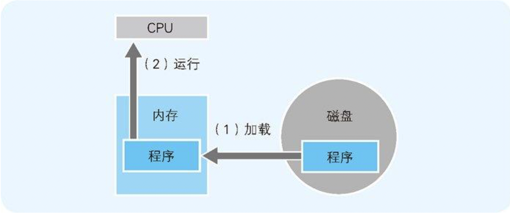

图 1-2　CPU 的四个构成部分

通常所说的内存指的是计算机的`主存储器（main memory）` ，简称主存。主存通过控制芯片等与 CPU 相连，主要负责存储指令和数据。

主存位于计算机机体内部，是负责存储程序、数据等的装置。主存通常使用 `DRAM（Dynamic Random Access Memory，动态随机存取存储器）`芯片。DRAM 可以对任何地址进行数据的读写操作，但需要保持稳定的电源供给并时常刷新（确保是最新数据），关机后内容将自动清除。

### 1.2 CPU是寄存器的集合体
程序是把寄存器作为对象来描述的。

`汇编语言`采用助记符（memonic）来编写程序，每一个原本是电气信号的机器语言指令都会有一个与其相应的助记符，助记符通常为指令功能的英语单词的简写。通常我们将汇编语言编写的程序转化成机器语言的过程称为`汇编`；反之，机器语言程序转化成汇编语言程序的过程则称为`反汇编`。

把汇编语言转化成机器语言的程序称为`汇编器（assembler）`。

- `机器语言`是指CPU能直接解释和执行的语言。
- `高级编程语言`是指能够使用类似于人类语言（主要是英语）的语法来记述的编程语言的总称。

`编译`是指将使用高级编程语言编写的程序转换为机器语言的过程，其中，用于转换的程序被称为`编译器（compiler）`。

表 1-1　寄存器 的主要种类和功能

种类 | 功能
---|---
累加寄存器（accumulator register） | 存储执行运算的数据和运算后的数据
标志寄存器（flag register）| 存储运算处理后的CPU的状态
程序计数器（program counter） | 存储下一条指令所在内存的地址
基址寄存器（base register）| 存储数据内存的起始地址
变址寄存器（index register） | 存储基址寄存器的相对地址
通用寄存器（general purpose register） | 存储任意数据
指令寄存器（instruction register） | 存储指令。CPU内部使用，程序员无法通过程序对该寄存器进行读写操作
栈寄存器（stack register） | 存储栈区域的起始地址

对程序员来说，CPU 是具有各种功能的寄存器的集合体。其中，程序计数器、累加寄存器、标志寄存器、指令寄存器和栈寄存器都只有一个，其他的寄存器一般有多个。

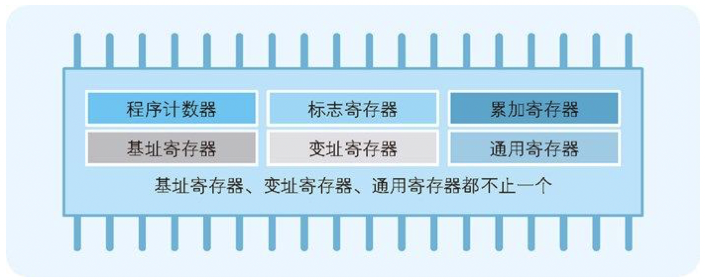

图 1-3　程序员眼中的 CPU（CPU 是寄存器的集合体）

### 1.3 决定程序流程的程序计数器
图 1-4 是程序起动时内存内容的模型。示例中的程序实现的是将 123 和 456 两个数值相加，并将结果输出到显示器上。

`操作系统（operating system）`是指管理和控制计算机硬件与软件资源的计算机程序

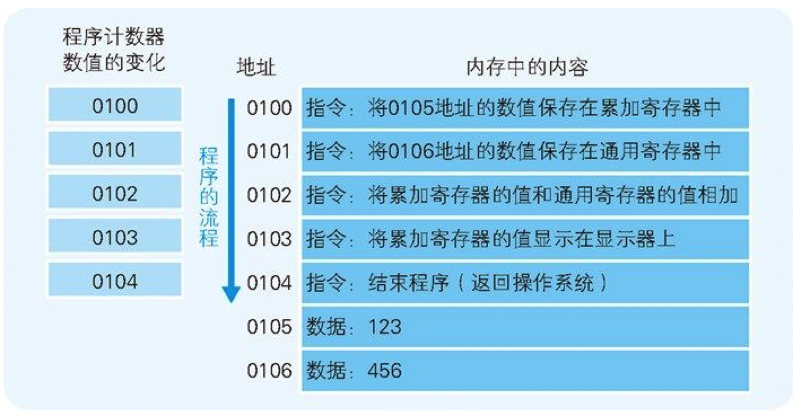

图 1-4　内存中配置的程序示例（显示相加的结果）

### 1.4 条件分支和循环机制
程序的流程分为顺序执行、条件分支和循环三种。

- `顺序执行`是指按照地址内容的顺序执行指令。
- `条件分支`是指根据条件执行任意地址的指令。
- `循环`是指重复执行同一地址的指令。

条件分支和循环中使用的跳转指令 ，会参照当前执行的运算结果来判断是否跳转。表 1-1 所列出的寄存器中，我们提到了标志寄存器。无论当前累加寄存器的运算结果是负数、零还是正数，标志寄存器都会将其保存（也负责存放溢出和奇偶校验的结果)。

- `溢出（overflow）`是指运算的结果超出了寄存器的长度范围。
- `奇偶校验（parity check）`是指检查运算结果的值是偶数还是奇数。


图 1-6　比较运算的结果存储在标志寄存器的三个位中

### 1.5 函数的调用机制
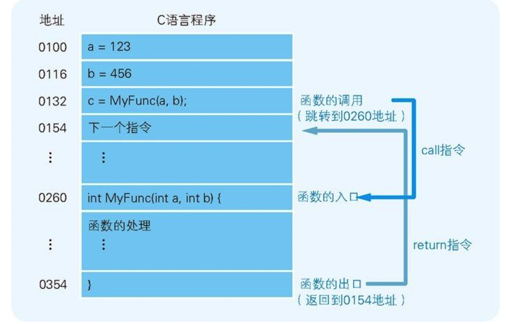

图 1-7　程序调用函数示例（这里直接展示了 C 语言的源代码，实际上各地址存储的应该是变换成机器语言后的程序）

`call指令`会把调用函数后要执行的指令地址存储在名为栈的主存内。函数处理完毕后，再通过函数的出口来执行return命令。`return命令`的功能是把保存在栈中的地址设定到程序计数器中。

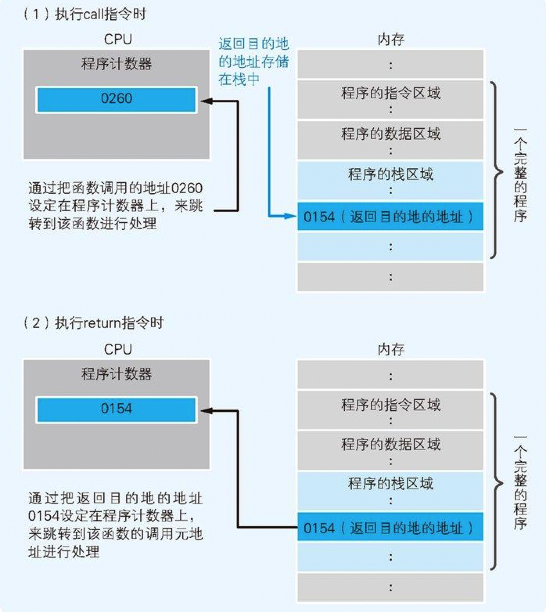

图 1-8　函数调用中程序计数器和栈的职能

在编译高级编程语言的程序后，函数调用的处理会转换成 call 指令，函数结束的处理则会转换成 return 指令。

### 1.6 通过地址和索引实现数组
`基址寄存器`和`变址寄存器`。通过这两个寄存器，我们可以对主内存上特定的内存区域进行划分，从而实现类似于数组的操作。

- `数组`是指同样长度的数据在内存中进行连续排列的数据构造。用一个数组名来表示全体数据，通过索引来区分数组的各个数据（元素）。


图 1-9　综合使用地址和索引来决定实际地址

### 1.7 CPU的处理其实很简单
表 1-2　机器 语言指令的主要类型和功能

类型 | 功能
---|---
数据转送指令 | 寄存器和内存、内存和内存、寄存器和外围设备之间的数据读写操作
运算指令 | 用累加寄存器执行算术运算、逻辑运算、比较运算和移位运算
跳转指令 | 实现条件分支、循环、强制跳转等
call/return指令 | 函数的调用/返回调用前的地址

- `外围设备`指的是连接到计算机的键盘、鼠标、显示器、设备装置、打印机等。

## 2.数据是用二进制数表示的
### 2.1 用二进制数表示计算机信息的原因
- `IC`是集成电路（Integrated Circuit）的简称，有模拟 IC 和数字 IC 两种。本章介绍的是数字 IC。
- 大部分 IC 的电源电压都是 +5V。不过，为了控制电量的消耗，有的 IC 也会使用 +5V 以下的电压。如果 IC 使用的电源电压为 +5V，那么引脚状态就不只是 0V 和 +5V，还存在不接收电流信号的高阻抗（high impedance）状态。但在本书中，我们暂时不考虑高阻抗状态。

IC 的这个特性，决定了计算机的信息数据只能用二进制数来处理。

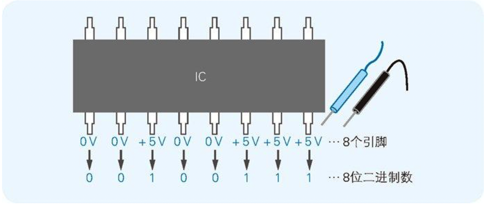

图 2-1　IC 的一个引脚表示二进制数的 1 位

### 2.2 什么是二进制数
二进制数 00100111 用十进制数表示的话是 39，因为（0×128）＋（0×64）＋（1×32）＋（0×16）＋（0×8）＋（1×4）＋（1×2）＋（1×1）= 39。

### 2.3 移位运算和乘除运算的关系
移位运算 指的是将二进制数值的各数位进行左右移位（shift = 移位）的运算。移位有左移（向高位方向）和右移（向低位方向）两种。

### 2.4 便于计算机处理的“补数”
二进制数中表示负数值时，一般会把最高位作为符号来使用，因此我们把这个最高位称为符号位。符号位是 0 时表示正数 ，符号位 是 1 时表示负数。

计算机在做减法运算时，实际上内部是在做加法运算。为此，在表示负数时就需要使用`“二进制的补数”`。(将二进制数的各数位的数值全部取反 ，然后再将结果加 1。)

- `取反`是指，把二进制数各数位 的 0 变成 1，1 变成 0。例如 00000001 这个 8 位二进制数取反后就成了 11111110。

例如 1－1，也就是 1＋(－1) 这一运算，

- －1 表示成 1|0000001（二进制）
- －1 表示成 1|1111111（补数，取反加一）

 00000001＋11111111 为 0（= 00000000），对于溢出的位，计算机会直接忽略掉。在 8 位的范围内进行计算时，100000000 这个 9 位二进制数就会被认为是 00000000 这一 8 位二进制数。

3－5 

- 用 8 位二进制数表示 3 时为 00000011
- 5 = 00000101 的补数为“取反＋1”，也就是 11111011。

 3－5 其实就是 00000011＋11111011 的运算，运算结果为 11111110，最高位变成了 1。这就表示结果是一个负数。

编程语言包含的整数数据类型8 中，有的可以处理负数，有的则不能处理。例如，C 语言的数据类型中，既有不能处理负数的 unsigned short 类型，也有能处理负数的 short 类型。这两种类型，都是 2 字节（= 16 位）的变量，都能表示 2 的 16 次幂 = 65536 种值，这一点是相同的。不过，值的范围有所不同，short 类型是－32768～32767，unsigned short 类型是 0～65535。此外，short 类型和 unsigned short 类型的另一个不同点在于，short 类型是将最高位为 1 的数值看作补数，而 unsigned short 类型则是 32768 以上的值。

### 2.5 逻辑右移和算术右移的区别
当二进制数的值表示图形模式而非数值时，移位后需要在最高位补 0。这就称为`逻辑右移`。

将二进制数作为带符号的数值进行运算时，移位后要在最高位填充移位前符号位的值（0 或 1）。这就称为`算术右移`。

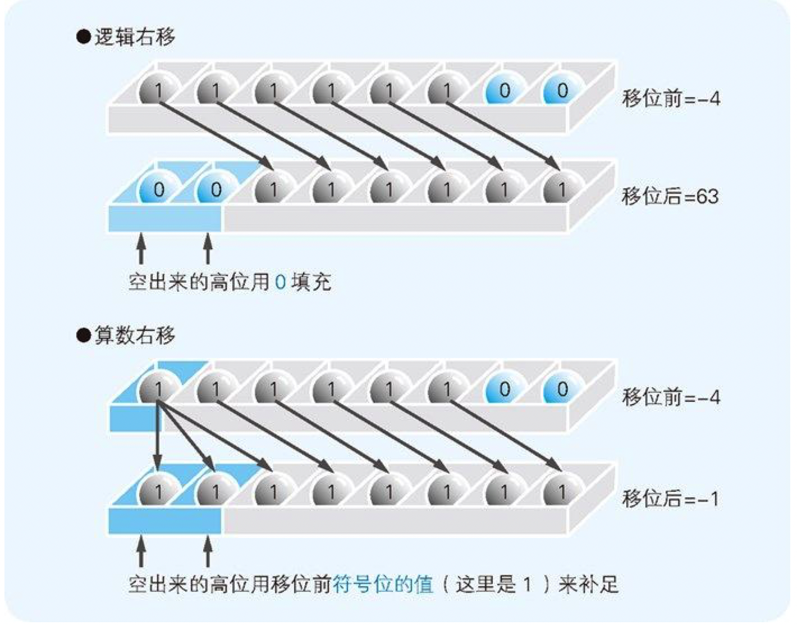

图 2-10　逻辑右移和算术右移的区别

只有在右移时才必须区分逻辑位移和算术位移。左移时，无论是图形模式（逻辑左移）还是相乘运算（算术左移），都只需在空出来的低位补 0 即可。

以 8 位二进制数为例，`符号扩充`就是指在保持值不变的前提下将其转换成 16 位和 32 位的二进制数。将 01111111 这个正的 8 位二进制数转换成 16 位二进制数时，很容易就能得出 0000000001111111 这个正确结果，像 11111111 这样用补数来表示的数值，将其表示成 1111111111111111 就可以了。也就是说，不管是正数还是用补数表示的负数，都只需用符号位的值（0 或者 1）填充高位即可。


图 2-11　由 8 位转换成 16 位的符号扩充方法

### 2.6 掌握逻辑运算的窍门
将二进制数表示的信息作为四则运算的数值来处理就是`算术`。而像图形模式那样，将数值处理为单纯的 0 和 1 的罗列就是`逻辑`。

`算术运算`是指加减乘除四则运算。`逻辑运算`是指对二进制数各数字位的 0 和 1 分别进行处理的运算，包括逻辑非（NOT 运算）、逻辑与（AND 运算）、逻辑或（OR 运算）和逻辑异或（XOR 运算9 ）四种。

- `XOR`是英语 exclusive or 的缩写。有时也将 XOR 称为 EOR。

表 2-1　逻辑非（NOT）的真值表

A的值 | NOT A的运算结果
----|-----------
0 | 1
1 | 0

表 2-2　逻辑与（AND）的真值表

A的值 | B的值 | A AND B的运算结果
----|-----|-------------
0 | 0 | 0
0 | 1 | 0
1 | 0 | 0
1 | 1 | 1

表 2-3　逻辑或 （OR）的真值表

A的值 | B的值 | A OR B 的运算结果
----|-----|-------------
0 | 0 | 0
0 | 1 | 1
1 | 0 | 1
1 | 1 | 1

表 2-4　逻辑异或 （XOR）的真值表

A的值 | B的值 | A XOR B 的运算结果
----|-----|--------------
0 | 0 | 0
0 | 1 | 1
1 | 0 | 1
1 | 1 | 0

## 3.计算机进行小数运算时出错的原因
### 3.1 将0.1累加100次也得不到10

代码清单 3-1　将 0.1 累加 100 次的 C 语言程序

```c
#include <stdio.h>

void main() {
    float sum;
    int i;

    //将保存总和的变量清0
    sum = 0;

    //0.1相加100次
    for (i = 1;  i <= 100; i++) {
        sum += 0.1;
    }

    //显示结果
    printf("%f\n", sum);
}
```

### 3.2 用二进制数表示小数


图 3-2　二进制数小数转换成十进制数的方法

### 3.3 计算机运算出错的原因
计算机之所以会出现运算错误，是因为“有一些十进制数的小数无法转换成二进制数”。例如，十进制数 0.1，就无法用二进制数正确表示，小数点后面即使有几百位也无法表示。一个十进制小数要能用浮点数精确地表示，最后一位必须是 5：

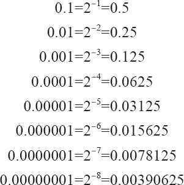

### 3.4 什么是浮点数
很多编程语言中都提供了两种表示小数的数据类型，分别是双精度浮点数和单精度浮点数。双精度浮点数类型 用 64 位、单精度浮点数类型 用 32 位来表示全体小数。

`浮点数`是指用符号、尾数、基数和指数这四部分来表示的小数。

    浮点数=符号位.尾数x2^{阶码}

根据IEEE 754国际标准，常用的浮点数有两种格式：

1. float32位单精度浮点数在机器中表示用 1 位表示数字的符号，用 8 位表示指数，用 23 位表示尾数。
1. double64位双精度浮点数，用 1 位表示符号，用 11 位表示指数，52 位表示尾数。

其中指数域也称为阶码。浮点数存储字节定义如图：

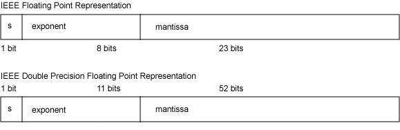

### 3.5 浮点数正规化
尾数不为0时，尾数域的最高有效位为1，这称为规格化。否则，以修改阶码同时左右移动小数点位置的办法，使其成为规格化数的形式。

`移码`是真值补码的符号位取反，一般用作浮点数的阶码，目的是便于浮点数运算时的对阶操作。

比如，以一个字节来表示-3，那么[−3]原=10000011 [−3]反=11111100 [−3] 补=11111101  [−3]移=01111101

### 3.6 举个例子
【3.14的单精度浮点数表示】

首先将3.14转成二进制:

- 整数部分3的二进制是11
- 小数部分0.14的二进制是：0.0010001111010111000010[10001111.....]（方括号中表示小数点后第23位及之后）
- 3.14的二进制代码就是：11.0010001111010111000010[10001111....]×2^0
- 那么用`正规化`表示就是：1.10010001111010111000010[10001111....]×2^1

方括号表示的超出23位之后的二进制部分，由于单精度浮点数尾数只有23位，所以需要舍入（舍入方法见后）

由于第24位为1，且之后不全为 0，所以需要向第23位进1完成上舍入：1.10010001111010111000011×2^1

而其指数是1，需要加上移码127，即128，也就是1000 0000

它又是正数，所以符号为0

综上所述，3.14的单精度浮点数表示为：

0 1000-0000 1001-0001-1110-1011-1000-011

- S符号位    0 
- e指数位　1000-0000
- M尾数位  1001-0001-1110-1011-1000-011

### 3.7 误差
通过例子可知，3.14的单精度浮点数表示是0 1000-0000 1001-0001-1110-1011-1000-011。现在我们来还原，看看它的误差：

- 指数是128，那么还原回去（减去移码），实际指数就是1
- 尾数还原也就是：10010001111010111000011，
- 所以正规化形式是：1.10010001111010111000011×2^1
- 也就是11.0010001111010111000011
- 利用二进制转十进制，可得它对应的十进制数是：3.1400001049041748046875  不等于3.14

### 3.8 二进制数和十六进制数
在实际程序中，也经常会用十六进制数来代替二进制数。在 C 语言程序中，只需在数值的开头加上 0x（0 和 x）就可以表示十六进制数。

二进制数的 4 位，正好相当于十六进制数的 1 位。例如，32 位二进制数 00111101110011001100110011001101 用十六进制数来表示的话，就是 3DCCCCCD 这个 8 位数。由此可见，通过使用十六进制数，二进制数的位数能够缩短至原来的 1/4。位数变少之后，看起来也就更清晰了（图 3-9）。


图 3-9　通过使用十六进制数使位数变短


图 3-10　小数点后的二进制数的 4 位也相当于十六进制数的 1 位

## 4.熟练使用有棱有角的内存
### 4.1 内存的物理机制很简单
内存 IC 中有电源、地址信号、数据信号、控制信号等用于输入输出的大量引脚（IC 的引脚），通过为其指定`地址（address）`，来进行数据的读写。

- `ROM（Read Only Memory）`是一种只能用来读取的内存。
- `RAM（Random Access Memory）`是可被读取和写入的内存，分为需要经常刷新（refresh）以保存数据的 `DRAM（Dynamic RAM）`，以及不需要刷新电路即能保存数据的 `SRAM（Static RAM）`。


图 4-1　内存 IC 的引脚配置示例

- VCC 和 GND 是电源
- A0～A9 是地址信号的引脚
- D0～D7 是数据信号的引脚
- RD 和 WR 是控制信号的引脚
- 将电源连接到 VCC 和 GND 后，就可以给其他引脚传递比如 0 或者 1 这样的信号。大多数情况下，+ 5V 的直流电压表示 1，0V 表示 0。

数据信号引脚有 D0～D7 共八个，表示一次可以输入输出 8 位（= 1 字节）的数据。此外，地址信号引脚有 A0～A9 共十个，表示可以指定 0000000000～1111111111 共 1024 个地址。而地址用来表示数据的存储场所，因此我们可以得出这个内存 IC 中可以存储 1024 个 1 字节的数据。因为 1024 = 1K，所以该内存 IC 的容量就是 1KB。

下面让我们继续来看刚才所说的 1KB 的内存 IC。首先，我们假设要往该内存 IC 中写入 1 字节的数据。为了实现该目的，可以给 VCC 接入＋5V，给 GND 接入 0V 的电源，并使用 A0～A9 的地址信号来指定数据的存储场所，然后再把数据的值输入给 D0～D7 的数据信号，并把 WR（write = 写入的简写）信号设定成 1。执行完这些操作，就可以在内存 IC 内部写入数据（图 4-2 (a)）了。


图 4-2(a)　向内存 IC 中写入数据的方法

读出数据时，只需通过 A0～A9 的地址信号指定数据的存储场所，然后再将 RD（read = 读出的简写）信号设成 1 即可。执行完这些操作，指定地址中存储的数据就会被输出到 D0～D7 的数据信号引脚（图 4-2(b)）中。另外，像 WR 和 RD 这样可以让 IC 运行的信号称为控制信号 。其中，当 WR 和 RD 同时为 0 时，写入和读出的操作都无法进行。

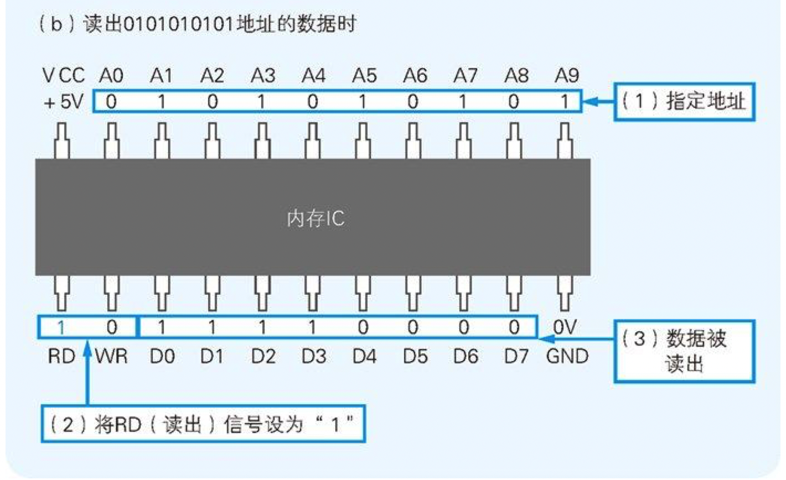

图 4-2(b)　向内存 IC 中读出数据的方法

### 4.2 内存的逻辑模型是楼房
代码清单 4-1　各种类型的变量

```c
//定义变量
char a;
short b;
long c;

//给变量赋值
a = 123;
b = 123;
c = 123;
```

这 3 个变量的数据类型分别是，表示 1 字节长度的 char，表示 2 字节长度的 short，以及表示 4 字节长度的 long 。因此，虽然同样是数据 123，存储时其所占用的内存大小是不一样的。这里，我们假定采用的是将数据低位存储在内存低位地址的低字节序（`little endian`） 方式（图 4-4）。

- 将多字节数据的低位字节存储在内存低位地址的方式称为低字节序，与此相反，把数据的高位字节存储在内存低位的方式称为高字节序。

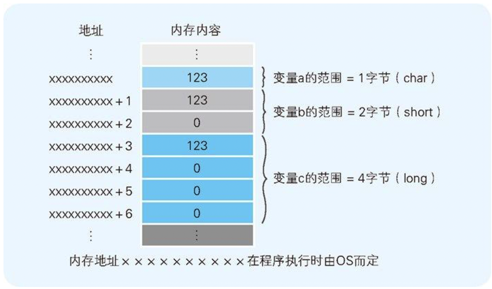

图 4-4　变量的数据类型不同，所占用的内存大小也不一样

### 4.3 简单的指针
`指针`也是一种变量，它所表示的不是数据的值，而是存储着数据的内存的地址。

代码清单 4-2　各种数据类型指针的定义

```c
char *d;                 //char类型的指针d的定义
short *e;                //short类型的指针e的定义
long *f;                 //long类型的指针f的定义
```

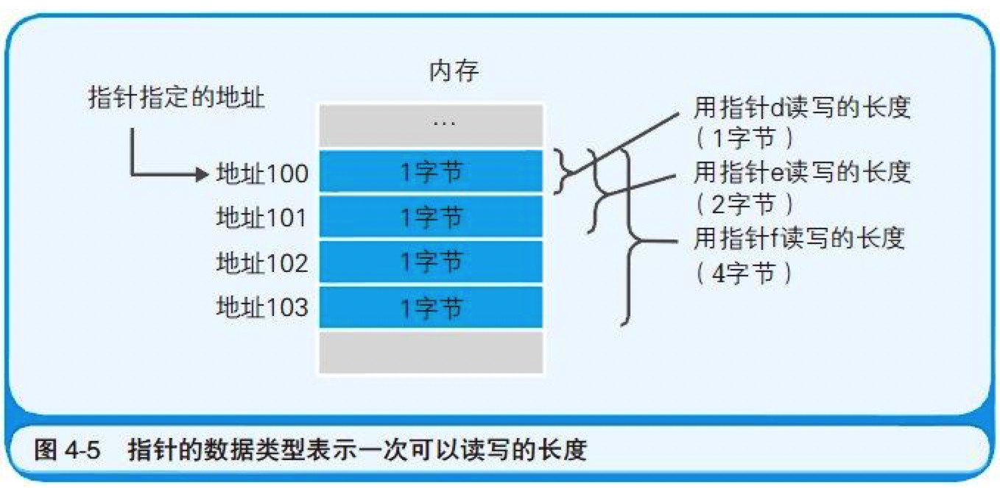

图 4-5　指针的数据类型表示一次可以读写的长度

### 4.4 数组是高效使用内存的基础
`数组`是指多个同样数据类型的数据在内存中连续排列的形式。作为数组元素的各个数据会通过连续的编号被区分开来，这个编号称为`索引（index）`。

代码清单 4-3　各种类型的数组定义

```c
char g[100];             //char类型数组g的定义
short h[100];            //short类型数组h的定义
long i[100];             //long类型数组i的定义
```

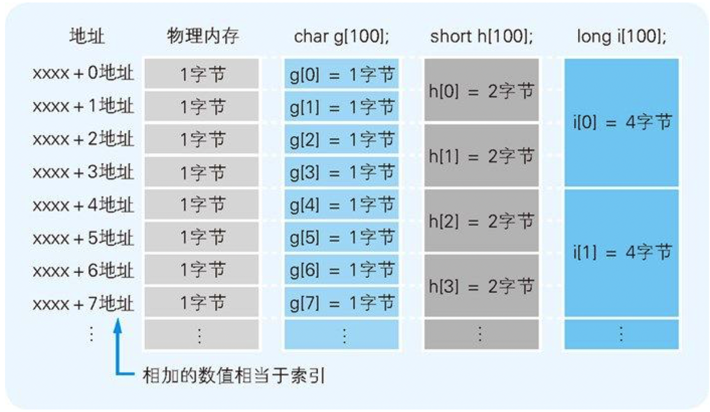

图 4-6　不同数据类型的数组

### 4.5 栈/队列以及环形缓冲区
在对内存数据进行读写时，`栈`用的是 `LIFO（Last Input First Out，后入先出）`方式，而`队列`用的则是`FIFO（First Input First Out，先入先出）`方式。

代码清单 4-4　使用栈的程序示例

```c
//往栈中写入数据
Push(123);        //写入123
Push(456);        // 写入456
Push(789);        // 写入789

//从栈中读出数据
j = Pop();        // 读出789
k = Pop();        // 读出456
l = Pop();        // 读出123
```

代码清单 4-5　使用队列的程序示例

```c
//往队列中写入数据
EnQueue(123);     // 写入123
EnQueue(456);     // 写入456
EnQueue(789);     // 写入789

//从队列中读出数据
m = DeQueue();     // 读出123
n = DeQueue();     // 读出456
o = DeQueue();     // 读出789
```

### 4.6 链表使元素的追加和删除更容易
除了数据的值之外，通过为其附带上下一个元素的索引，即可实现`链表`。

### 4.7 二叉查找树使数据搜索更有效
`二叉查找树`是指在链表的基础上往数组中追加元素时，考虑到数据的大小关系，将其分成左右两个方向的表现形式。

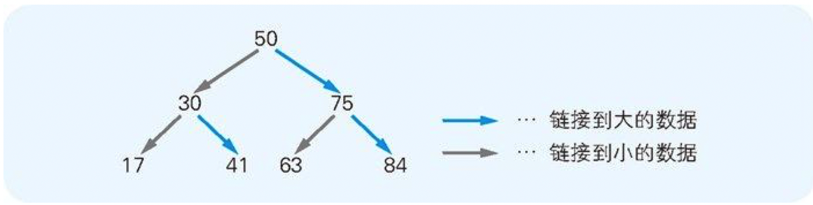

图 4-15　二叉查找树的模型（将树颠倒后的形状）

## 5.内存和磁盘的亲密关系
### 5.1 不读入内存就无法运行
计算机中主要的存储部件是内存和磁盘。磁盘中存储的程序，必须要加载到内存后才能运行。在磁盘中保存的原始程序是无法直接运行的。这是因为，负责解析和运行程序内容的 CPU，需要通过内部程序计数器来指定内存地址，然后才能读出程序。即使 CPU 可以直接读出并运行磁盘中保存的程序，由于磁盘读取速度慢，程序的运行速度还是会降低。

### 5.2 磁盘缓存加快了磁盘访问速度
`磁盘缓存`指的是把从磁盘中读出的数据存储到内存空间中的方式。

把低速设备的数据保存在高速设备中，需要时可以直接将其从高速设备中读出，这种`缓存`的方式在其他情况下也会用到。

### 5.3 虚拟内存把磁盘作为部分内存来使用
`虚拟内存`是指把磁盘的一部分作为假想的内存来使用。这与磁盘缓存是假想的磁盘（实际上是内存）相对。

为了实现虚拟内存，就必须把实际内存（也可称为物理内存 ）的内容，和磁盘上的虚拟内存的内容进行部分`置换（swap）`，并同时运行程序。

虚拟内存的方法有`分页式`和`分段式`两种。

`分页式`方式是指，在不考虑程序构造的情况下，把运行的程序按照一定大小的`页（page）`进行分割，并以页为单位在内存和磁盘间进行置换。在分页式中，我们把磁盘的内容读出到内存称为`Page In`，把内存的内容写入磁盘称为`Page Out`。一般情况下，Windows计算机的页的大小是4KB。也就是说，把大程序用 4KB的页来进行切分，并以页为单位放入磁盘（虚拟内存）或内存中（图 5-3）。

`分段式`虚拟内存是指，把要运行的程序分割成以处理集合及数据集合等为单位的段落，然后再以分割后的段落为单位在内存和磁盘之间进行数据置换。

### 5.4 节约内存的编程方法
由于使用虚拟内存时发生的 Page In 和 Page Out 往往伴随着低速的磁盘访问，因此在这个过程中应用的运行会变得迟钝起来。

为了从根本上解决内存不足的问题，需要增加内存的容量，或者尽量把运行的应用文件变小。接下来会向大家介绍两个把应用文件变小的编程方法。

1. 通过`DLL(Dynamic Link Library)`文件实现函数共有
2. 通过调用`_stdcall`来减小程序文件的大小

### 5.5 磁盘的物理结构
磁盘是通过把其物理表面划分成多个空间来使用的。划分的方式有`扇区方式`和`可变长方式`两种，前者是指将磁盘划分为固定长度的空间，后者则是指把磁盘划分为长度可变的空间。

扇区是对磁盘进行物理读写的最小单位。Windows 中使用的磁盘，一般 1 个扇区是 512 字节。不过，Windows 在逻辑方面（软件方面）对磁盘进行读写的单位是扇区整数倍簇 。根据磁盘容量的不同，1 簇可以是 512 字节（1 簇 = 1 扇区）、1KB（1 簇 = 2 扇区）、2KB、4KB、8KB、16KB、32KB（1 簇 = 64 扇区）。

## 6.亲自尝试压缩数据
### 6.1 文件以字节为单位保存
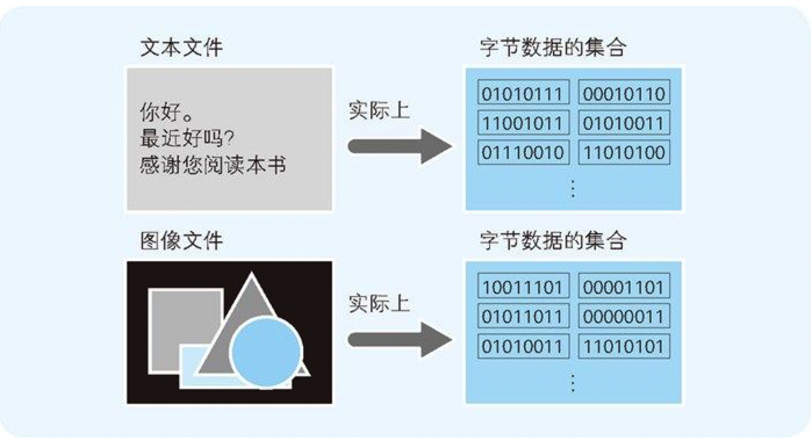

图 6-1　文件是字节数据的集合体

### 6.2 RLE算法的机制
把文件内容用“数据 × 重复次数”的形式来表示的压缩方法称为 `RLE（Run Length Encoding，行程长度编码）`算法（图 6-2）。


图 6-2　通过数据的重复次数来实现压缩的 RLE 算法

### 6.3 RLE算法的缺点
压缩后同压缩前文件大小的比率，称为压缩比率或`压缩比`。

### 6.4 通过莫尔斯编码来看哈夫曼算法的基础
文本文件是由不同类型的字符组合而成的，而且不同的字符出现的次数也是不同的。例如，在某一个文本文件中，A 出现了 100 次左右，Q 仅用到了 3 次。

`哈夫曼算法`的关键就在于“多次出现的数据用小于 8 位的字节数来表示，不常用的数据则可以用超过 8 位的字节数来表示”。A 和 Q 都用 8 位来表示时，原文件的大小就是 100 次 × 8 位 ＋ 3 次 × 8 位 = 824 位，而假设 A 用 2 位、Q 用 10 位来表示，压缩后的大小就是 100 次 ×2 位＋3 次 ×10 位 = 230 位。

`莫尔斯编码`不是通过语言，而是通过“嗒 嘀 嗒 嘀”这些长点和短点的组合来传递文本信息的。

大家把 1 看作是短点（嘀），把 11 看作是长点（嗒）即可。

莫尔斯编码把一般文本中出现频率高的字符用短编码来表示。这里所说的出现频率，不是通过对出版物等文章进行统计调查得来的，而是根据印刷行业的印刷活字数目而确定的。

### 6.5 用二叉树实现哈夫曼编码
`哈夫曼算法`是指，为各压缩对象文件分别构造最佳的编码体系，并以该编码体系为基础来进行压缩。

我们尝试一下把 AAAAAABBCDDEEEEEF 中的 A～F 这些字符，按照“出现频率高的字符用尽量少的位数编码来表示”这一原则进行整理。按照出现频率从高到低的顺序整理后，结果就如表 6-3 所示。该表中同时也列出了编码的方案。

表 6-3　出现频率和编码（方案）

字符 | 出现频率 | 编码（方案） | 位数
---|------|--------|---
A | 6 | 0 | 1
E | 5 | 1 | 1
B | 2 | 10 | 2
D | 2 | 11 | 2
C | 1 | 100 | 3
F | 1 | 101 | 3

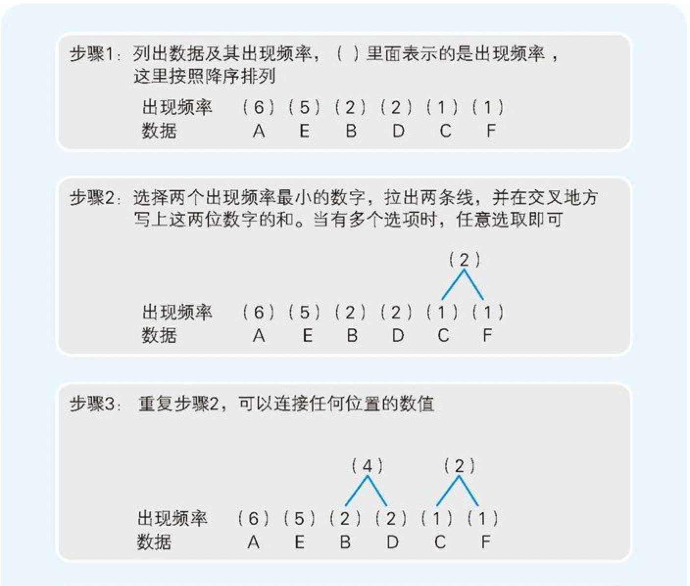
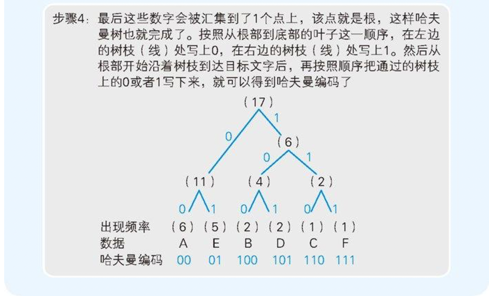

图 6-5　哈夫曼树的编码顺序

### 6.6 哈夫曼算法能够大幅提升压缩比率
通过图 6-5 的步骤 2 可以发现，在用枝条连接数据时，我们是从出现频率较低的数据开始的，这就意味着出现频率越低的数据到达根部的枝条数就越多。而枝条数越多，编码的位数也就随之增多了。

### 6.7 可逆压缩和非可逆压缩
把能还原到压缩前状态的压缩称为`可逆压缩`，无法还原到压缩前状态的压缩称为`非可逆压缩`。

## 7.程序是在何种环境中运行的
### 7.1 运行环境=操作系统＋硬件
1. `AT兼容机`是指，可以和 IBM 开发的 PC/AT 在硬件上相互兼容的计算机的总称。称为“PC/AT 兼容机”和“DOS/V 机”。现在市面上销售的大部分计算机都是 AT 兼容机。
1. `Linux`是 1991 年赫尔辛基大学的 Linus Torvalds 开发的 Unix 系操作系统。
1. 美国 Intel 的微处理器，是按照 8086、80286、80386、80486、Pentium…… 这样的顺序不断升级的。因为这些型号的后面都带有 86，所以总称为`x86`。32位处理器也称为“IA-32”。

CPU 只能解释其自身固有的机器语言。不同的 CPU 能解释的机器语言的种类也是不同的。例如，CPU 有 x86、MIPS、SPARC、PowerPC5 等几种类型，它们各自的机器语言是完全不同的。

- `MIPS`是美国 MIPS 科技公司开发的 CPU。
- `SPARC`是美国 SUN 系统开发的 CPU。
- `PowerPC`是美国苹果、IBM、摩托罗拉共同开发的 CPU。
- 现在的 Mac 采用的是 Intel 的 `x86系列`CPU。

机器语言的程序称为`本地代码（native code）`。程序员用 C 语言等编写的程序，在编写阶段仅仅是文本文件。我们称之为`源代码`。通过对源代码进行`编译`，就可以得到本地代码。

- Windows 应用程序的本地代码，通常是 EXE 文件及 DLL 文件等形式。

### 7.2 Windows克服了CPU以外的硬件差异
这些机型虽然都搭载了 486 及 Pentiunm 等 x86 系列的 CPU，不过内存和 I/O 地址的构成等都是不同的，因此每个机型都需要有专门的 MS-DOS 应用。

随着 Windows 的广泛使用，这样的局面也得到了大幅改善。因为只要 Windows 能正常运行，同样的应用（本地代码）在任何机型上都是可以运行的（图 7-3(b)）。


图7-3　MS-DOS中，不同机型的应用是不同的，而Windows则可以使用同一个应用


图 7-4　MS-DOS 应用大多都是不经过操作系统而直接控制硬件的，而 Windows 应用则基本上都由 Windows 来完成对硬件的控制

### 7.3 不同操作系统的API不同
应用程序向操作系统传递指令的途径称为 `API（Application Programming Interface）`。

在同类型操作系统下，不管硬件如何，API 基本上没有差别。因而，针对某特定操作系统的 API 所编写的程序，在任何硬件上都可以运行。

### 7.6 提供相同运行环境的Java虚拟机
编译后生成的并不是特定 CPU 使用的本地代码，而是名为`字节代码`的程序。字节代码的运行环境就称为 Java 虚拟机 （JavaVM，Java Virtual Machine）。Java 虚拟机是一边把 Java 字节代码逐一转换成本地代码一边运行的。

在程序运行时，将编译后的字节代码转换成本地代码，这样的操作方法看上去有些迂回，但由此可以实现同样的字节代码在不同的环境下运行。

### 7.7 BIOS和引导
程序的运行环境中，存在着名为 `BIOS（Basic Input/Output System）`的系统。BIOS 存储在 ROM 中，是预先内置在计算机主机内部的程序。BIOS 除了键盘、磁盘、显卡等基本控制程序外，还有启动“引导程序”的功能。`引导程序`是存储在启动驱动器起始区域的小程序。

开机后，BIOS 会确认硬件是否正常运行，没有问题的话就会启动引导程序。引导程序的功能是把在硬盘等记录的 OS 加载到内存中运行。虽然启动应用是 OS 的功能，但 OS 并不能自己启动自己，而是通过引导程序来启动。

## 8.从源文件到可执行文件
### 8.1 计算机只能运行本地代码
用任何编程语言编写的`源代码`，最后都要翻译成本地代码。

### 8.2 本地代码的内容
`Dump`是指把文件的内容，每个字节用2位十六进制数来表示的方式。

### 8.3 编译器负责转换源代码
能够把C语言等高级编程语言编写的源代码转换成本地代码的程序称为`编译器` 。

读入的源代码还要经过`语法解析`、`句法解析`、`语义解析`等，才能生成本地代码。

### 8.4 仅靠编译是无法得到可执行文件的
编译后生成的不是EXE文件，而是扩展名为“.obj”的`目标文件`。

- `目标文件（object file）`中的 object 一词，指的是编译器生成结果的意思。

把多个目标文件结合，生成 1 个 EXE 文件的处理就是链接 ，运行连接的程序就称为`链接器 （linkage editor 或连结器）`。

### 8.5 启动及库文件
像 import32.lib 及 cw32.lib 这样的文件称为库文件。`库文件`指的是把多个目标文件集成保存到一个文件中的形式。链接器指定库文件后，就会从中把需要的目标文件抽取出来，并同其他目标文件结合生成 EXE 文件。

`外部符号`是指其他目标文件中的变量或函数。

sprintf() 等函数，不是通过源代码形式而是通过库文件形式和编译器一起提供的。这样的函数称为`标准函数` 。之所以使用库文件，是为了简化为链接器的参数指定多个目标文件这一过程。

### 8.6 DLL文件及导入库
Windows以函数的形式为应用提供了各种功能。这些形式的函数称为 `API （Application Programming Interface，应用程序接口）`。

Windows中，API的目标文件，并不是存储在通常的库文件中，而是存储在名为 `DLL （Dynamic Link Library）`文件的特殊库文件中。我们提到 MessageBox() 的目标文件是存储在 import32.lib 中的。实际上，import32.lib 中仅仅存储着两个信息，一是 MessageBox() 在 user32.dll 这个 DLL 文件中，另一个是存储着 DLL 文件的文件夹信息，MessageBox() 的目标文件的实体实际上并不存在。

与此相反，存储着目标文件的实体，并直接和 EXE 文件结合的库文件形式称为`静态链接库`。

### 8.7 可执行文件运行时的必要条件
 EXE 文件中给变量及函数分配了虚拟的内存地址。在程序运行时，虚拟的内存地址会转换成实际的内存地址。链接器会在 EXE 文件的开头，追加转换内存地址所需的必要信息。这个信息称为`再配置信息`。

EXE 文件的再配置信息，就成为了变量和函数的相对地址。相对地址表示的是相对于基点地址的`偏移量`。

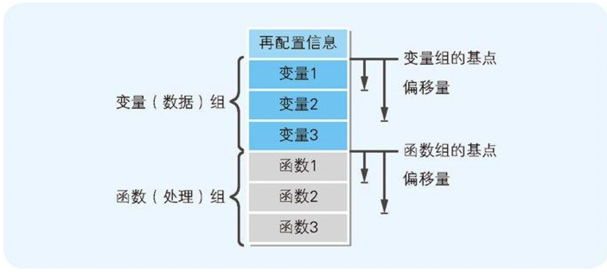

图 8-9　链接后的EXE文件的构造

### 8.8 程序加载时会生成栈和堆
当程序加载到内存后，除此之外还会额外生成两个组，那就是栈和堆。`栈`是用来存储函数内部临时使用的变量（`局部变量`），以及函数调用时所用的参数的内存区域。`堆`是用来存储程序运行时的任意数据及对象的内存领域（图 8-10）。

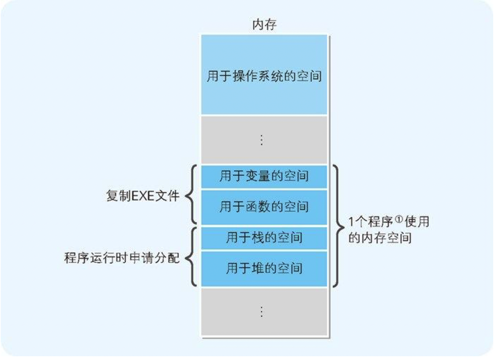

图 8-10 加载到内存的程序由4部分构成

使用栈的数据的内存空间，每当函数被调用时都会得到申请分配，并在函数处理完毕后自动释放。与此相对，堆的内存空间，则要根据程序员编写的程序，来明确进行申请分配或释放。

## 9.操作系统和应用的关系
### 9.1 操作系统功能的历史
`操作系统（Operating System）`也称为基础软件。操作系统是计算机运行时不可或缺的控制程序，以及在控制程序下运转的为其他软件运行提供操作环境的软件的统称。另外，在操作系统上运行的应用也称为`“应用程序”`。

有人开发出了仅具有加载和运行功能的监控程序 ，这就是操作系统的原型。通过事先启动监控程序，程序员就可以根据需要将各种程序加载到内存中运行。

基本的输入输出部分的程序就被追加到了监控程序中。初期的操作系统就这样诞生了。

为了方便程序员的硬件控制程序、编程语言处理器（汇编、编译、解析）以及各种实用程序等，结果就形成了和现在相差不大的操作系统。因此，操作系统本身并不是单独的程序，而是多个程序的集合体（图 9-3）。


图9-3 操作系统是多个程序的集合体

### 9.2 要意识到操作系统的存在
在操作系统这个运行环境下，应用并不是直接控制硬件，而是通过操作系统来间接控制硬件的。变量定义中涉及的内存的申请分配，以及 time() 和 printf() 这些函数的运行结果，都不是面向硬件而是面向操作系统的。

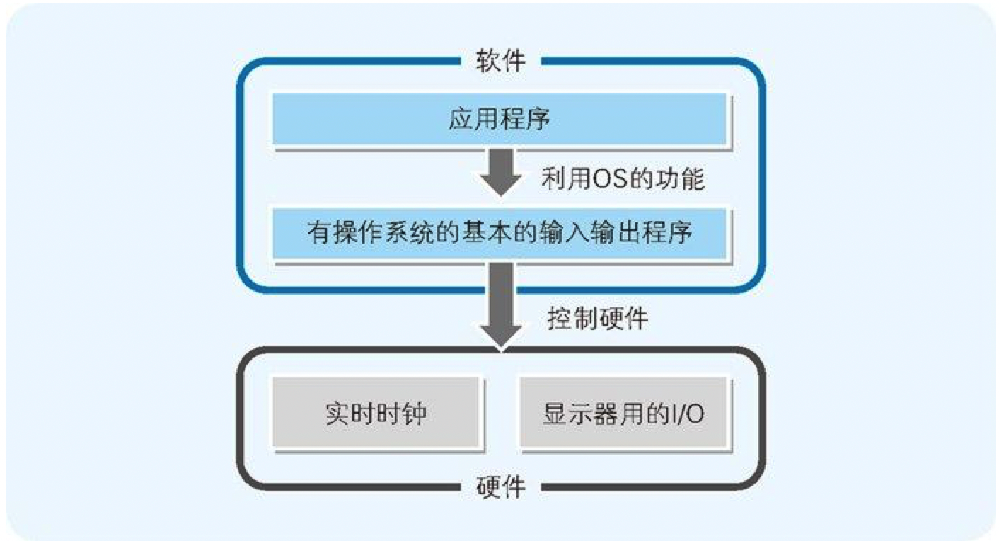

图 9-5 应用程序经过OS间接地控制硬件

### 9.3 系统调用和高级编程语言的移植性
操作系统的硬件控制功能，通常是通过一些小的函数集合体的形式来提供的。这些函数及调用函数的行为统称为`系统调用 （system call）`。在前面的程序中用到了 time() 及 printf() 等函数，这些函数内部也都使用了系统调用。

### 9.4 操作系统和高级编程语言使硬件抽象化
通过使用操作系统提供的系统调用，程序员就没必要编写直接控制硬件的程序了。而且，通过使用高级编程语言，有时甚至也无需考虑系统调用的存在。这是因为操作系统和高级编程语言能够使硬件抽象化。

## 10.通过汇编语言了解程序的实际构成
### 10.1 汇编语言和本地代码是一一对应的
用汇编语言编写的源代码，最终也必须要转换成本地代码才能运行。负责转换工作的程序称为`汇编器`，转换这一处理本身称为汇编。

本地代码也可以反过来转换成汇编语言的源代码。持有该功能的逆变换程序称为反汇编程序 ，逆变换这一处理本身称为`反汇编`。

本地代码变换成 C 语言源代码的`反编译`，则要比反汇编困难。这是因为，C 语言的源代码同本地代码不是一一对应的。

### 10.2 通过编译器输出汇编语言的源代码
代码清单 10-1　由两个函数构成的 C 语言的源代码

```c
//返回两个参数值之和的函数
int AddNum(int a, int b)
{
    return a + b;
}

//调用AddNum函数的函数
void MyFunc()
{
    int c;
    c = AddNum(123, 456);
}
```

代码清单 10-2　编译器生成的汇编语言源代码

```
_TEXT  segment dword public use32 'CODE'
_TEXT  ends
_DATA  segment dword public use32 'DATA'
_DATA  ends
_BSS   segment dword public use32 'BSS'
_BSS   ends
DGROUP group   _BSS,_DATA

_TEXT  segment dword public use32 'CODE'

_AddNum        proc    near
   ;
   ;   int AddNum(int a, int b)
   ;
       push      ebp
       mov       ebp,esp
   ;
   ;   {
   ;       return a + b;
   ;
       mov       eax,dword ptr [ebp+8]
       add       eax,dword ptr [ebp+12]
   ;
   ;   }
   ;
       pop       ebp
       ret
_AddNum        endp

_MyFunc        proc    near
   ;
   ;   void MyFunc()
   ;
       push      ebp
       mov       ebp,esp
   ;
   ;   {
   ;       int c;
   ;       c = AddNum(123, 456);
   ;
       push      456
       push      123
       call      _AddNum
       add       esp,8
   ;
   ;   }
   ;
       pop       ebp
       ret
_MyFunc        endp

_TEXT  ends
       end
```

### 10.3 不会转换成本地代码的伪指令
汇编语言的源代码，是由转换成本地代码的指令（后面讲述的操作码）和针对汇编器的`伪指令`构成的。伪指令负责把程序的构造及汇编的方法指示给汇编器。

代码清单 10-3　从代码清单 10-2中摘出的伪指令部分

```
_TEXT  segment dword public use32 'CODE'
_TEXT  ends
_DATA  segment dword public use32 'DATA'
_DATA  ends
_BSS   segment dword public use32 'BSS'
_BSS   ends
DGROUP group   _BSS,_DATA

_TEXT  segment dword public use32 'CODE'

_AddNum        proc    near
_AddNum        endp
_MyFunc        proc    near
_MyFunc        endp

_TEXT  ends
       end
```

由伪指令 segment 和 ends 围起来的部分，是给构成程序的命令和数据的集合体加上一个名字而得到的，称为`段定义`。源代码的开始位置，定义了 3 个名称分别为 _TEXT、_DATA、_BSS 的段定义。_TEXT 是指令的段定义，_DATA 是被初始化（有初始值）的数据的段定义，_BSS 是尚未初始化的数据的段定义。

- `段定义（segment）`是用来区分或者划定范围区域的意思。汇编语言的 segment 伪指令表示段定义的起始，ends 伪指令表示段定义的结束。段定义是一个连续的内存空间。

### 10.4 汇编语言的语法是“操作码+操作数”
在汇编语言中，1行表示对 CPU 的一个指令。汇编语言指令的语法结构是操作码 + 操作数。

- 在汇编语言中，类似于mov这样的指令称为`“操作码”（opcode）`，作为指令对象的内存地址及寄存器称为`“操作数”（operand）`。被转换成 CPU 可以直接解析运行的二进制的操作码和操作数，就是`本地代码`。

表 10-1　代码清单 10-2 中用到的操作码的功能

操作码 | 操作数 | 功能
----|-----|---
mov | A，B | 把B的值赋给A
and | A，B | 把A同B的值相加，并将结果赋给A
push | A | 把A的值存储在栈中
pop | A | 从栈中读取出值，并将其赋给A
call | A | 调用函数A
ret | 无 | 将处理返回到函数的调用源

寄存器是 CPU 中的存储区域。不过，寄存器并不仅仅具有存储指令和数据的功能，也有运算功能。x86 系列 CPU 的寄存器的主要种类和角色如表 10-2 所示。

表 10-2　x86 系列 CPU 的主要寄存器

寄存器名 | 名称 | 主要功能
-----|----|-----
eax | 累加寄存器 | 运算
ebx | 基址寄存器 | 存储内存地址
ecx | 计数寄存器 | 计算循环次数
edx | 数据计数器 | 存储数据
esi | 源基址寄存器 | 存储数据发送源的内存地址
edi | 目标基址寄存器 | 存储数据发送目标的内存地址
ebp | 扩展基址指针寄存器 | 存储数据存储领域基点的内存地址
esp | 扩展栈指针寄存器 | 存储栈中最高位数据的内存地址

- x86 系列 32 位 CPU 的寄存器名称中，开头都带了一个字母 e，例如 eax、ebx、ecx、edx 等。这是因为 16 位 CPU 的寄存器名称是 ax、bx、cx、dx 等。32 位 CPU 寄存器的名称中的 e，有扩展（extended）的意思。我们也可以仅利用 32 位寄存器的低 16 位，此时只需把要指定的寄存器名开头的字母 e 去掉即可。

### 10.7 函数调用机制
代码清单 10-4　函数调用的汇编语言代码

```
_MyFunc    proc    near
   push     ebp     ; 将 ebp 寄存器的值存入栈中----------------（1）
   mov      ebp,esp ; 将 ebp 寄存器的值存入 ebp 寄存器---------（2）
   push     456     ; 456 入栈------------------------------（3）
   push     123     ; 123 入栈------------------------------（4）
   call     _AddNum ; 调用 AddNum 函数-----------------------（5）
    add     esp,8   ; esp 寄存器的值加 8----------------------（6）
    pop     ebp     ; 读出栈中的数值存入 ebp 寄存器-------------（7）
    ret             ; 结束 MyFunc 函数，返回到调用源-----------（8）
_MyFunc    endp
```

1. （3）和（4）表示的是将传递给 AddNum 函数的参数通过 push 入栈。在 C 语言的源代码中，虽然记述为函数 AddNum（123，456），但入栈时则会按照 456、123 这样的顺序，也就是位于后面的数值先入栈。
2. （5）的 call 指令，把程序流程跳转到了操作数中指定的 AddNum 函数所在的内存地址处。在汇编语言中，函数名表示的是函数所在的内存地址。
3. AddNum 函数处理完毕后，程序流程必须要返回到编号（6）这一行。call 指令运行后，call 指令的下一行（（6）这一行）的内存地址（调用函数完毕后要返回的内存地址）会自动地 push 入栈。该值会在 AddNum 函数处理的最后通过 ret 指令 pop 出 栈，然后程序流程就会返回到（6）这一行。

代码清单 10-1 中列出的 C 语言源代码中，有一个处理是在变量 c 中存储 AddNum 函数的返回值，不过在汇编语言的源代码中，并没有与此对应的处理。这是因为编译器有最优化功能。`最优化功能`是编译器在本地代码上实现的，其目的是让编译后的程序运行速度更快、文件更小。在代码清单 10-1 中，由于存储着 AddNum 函数返回 值的变量 c 在后面没有被用到，因此编译器就会认为“该处理没有意义”，进而也就没有生成与之对应的汇编语言代码。在编译代码清单 10-1 的代码时，应该会出现“警告 W8004 Sample4.c 11: 'c' 的赋值未被使用（函数 MyFunc）”这样的警告消息。

### 10.8 函数内部的处理
代码清单 10-5　函数内部的处理

```
_AddNum    proc    near
    push   ebp ----------------------------------（1）
    mov    ebp,esp ------------------------------（2）
    mov    eax,dword ptr [ebp+8] ----------------（3）
    add    eax,dword ptr [ebp+12] ---------------（4）
    pop    ebp ----------------------------------（5）
    ret -----------------------------------------（6）
_AddNum    endp
```

1. ebp 寄存器的值在（1）中入栈，在（5）中出栈。这主要是为了把函数中用到的 ebp 寄存器的内容，恢复到函数调用前的状态。
2. （2）中把负责管理栈地址的 esp 寄存器的值赋值到了 ebp 寄存器中。这是因为，在 mov 指令中方括号内的参数，是不允许指定 esp 寄存器的。因此，这里就采用了不直接通过 esp，而是用 ebp 寄存器来读写栈内容的方法。
3. （3）是用 [ebp+8] 指定栈中存储的第 1 个参数 123，并将其读出到 eax 寄存器中。像这样，不使用 pop 指令，也可以查看栈的内容。而之所以从多个寄存器中选择了 eax 寄存器，是因为 eax 寄存器是负责运算的累加寄存器。
4. 通过（4）的 add 指令，把当前 eax 寄存器的值同第 2 个参数相加后的结果存储在 eax 寄存器中。[ebp+12] 是用来指定第 2 个参数 456 的。在 C 语言中，函数的返回值必须通过 eax 寄存器返回，这也是规定。不过，和 ebp 寄存器不同的是，eax 寄存器的值不用还原到原始状态。至此，我们进行了很多细节的说明，其实就是希望大家了解 **“函数的参数是通过栈来传递，返回值是通过寄存器来返回的 ”** 这一点。
5. （6）中 ret 指令运行后，函数返回目的地的内存地址会自动出栈，据此，程序流程就会跳转返回到代码清单 10-4 的（6）（Call _AddNum 的下一行）。

### 10.9 始终确保全局变量用的内存空间
C 语言中，在函数外部定义的变量称为`全局变量`，在函数内部定义的变量称为`局部变量`。全局变量可以引用源代码的任意部分，而局部变量只能在定义该变量的函数内进行引用。

代码清单 10-6　使用全局变量和局部变量的 C 语言源代码

```c
//定义被初始化的全局变量
int a1 = 1;
int a2 = 2;
int a3 = 3;
int a4 = 4;
int a5 = 5;
//定义没有初始化的全局变量
int b1, b2, b3, b4, b5;

//定义函数
void MyFunc()
{
     //定义局部变量
     int c1, c2, c3, c4, c5, c6, c7, c8, c9, c10;

     //给局部变量赋值
     c1 = 1;
     c2 = 2;
     c3 = 3;
     c4 = 4;
     c5 = 5;
     c6 = 6;
     c7 = 7;
     c8 = 8;
     c9 = 9;
     c10 = 10;

     //把局部变量的值赋给全局变量
     a1 = c1;
     a2 = c2;
     a3 = c3;
     a4 = c4;
     a5 = c5;
     b1 = c6;
     b2 = c7;
     b3 = c8;
     b4 = c9;
     b5 = c10;
}
```

代码清单 10-7　代码清单 10-6 转换成汇编语言后的结果

```
_DATA  segment dword public use32 'DATA'--------------------┐
_a1    label   dword ----------------------------------（4）│
       dd      1 --------------------------------------（5）│
_a2    label   dword                                        │
       dd      2                                            │
_a3    label   dword                                      （1）
       dd      3                                            │
_a4    label   dword                                        │
       dd      4                                            │
_a5    label   dword                                        │
       dd      5                                            │
_DATA  ends ------------------------------------------------┘

_BSS   segment dword public use32 'BSS' --------------------┐
_b1    label   dword                                        │
       db      4 dup(?) -------------------------------（6）│
_b2    label   dword                                        │
       db      4 dup(?)                                     │
_b3    label   dword                                      （2）
       db      4 dup(?)                                     │
_b4    label   dword                                        │
       db      4 dup(?)                                     │
_b5    label   dword                                        │
       db      4 dup(?) ------------------------------------┘
_BSS   ends

_TEXT  segment dword public use32 'CODE' -------------------┐
_MyFunc        proc    near ---------------------------┐   │
       push      ebp                                   │   │
       mov       ebp,esp ------------------------（11）│   │
       add       esp,-20 ------------------------（10）│   │
       push      ebx                                   │   │
       push      esi                                   │   │
       mov       eax,1 ---------------------------┐   │   │
       mov       edx,2                            │   │   │
       mov       ecx,3                          （8）  │   │
       mov       ebx,4                            │   │   │
       mov       esi,5 ---------------------------┘   │   │
       mov       dword ptr [ebp-4],6 -------------┐   │   │
       mov       dword ptr [ebp-8],7              │   │   │
       mov       dword ptr [ebp-12],8           （9）  │   │
       mov       dword ptr [ebp-16],9             │   │   │
       mov       dword ptr [ebp-20],10 -----------┘   │   │
       mov       dword ptr [_a1],eax                   │   │
       mov       dword ptr [_a2],edx                   │   │
       mov       dword ptr [_a3],ecx                 （7） （3）
       mov       dword ptr [_a4],ebx                   │   │
       mov       dword ptr [_a5],esi                   │   │
       mov       eax,dword ptr [ebp-4]                 │   │
       mov       dword ptr [_b1],eax                   │   │
       mov       edx,dword ptr [ebp-8]                 │   │
       mov       dword ptr [_b2],edx                   │   │
       mov       ecx,dword ptr [ebp-12]                │   │
       mov       dword ptr [_b3],ecx                   │   │
       mov       eax,dword ptr [ebp-16]                │   │
       mov       dword ptr [_b4],eax                   │   │
       mov       edx,dword ptr [ebp-20]                │   │
       mov       dword ptr [_b5],edx                   │   │
       pop       esi                                   │   │
       pop       ebx                                   │   │
       mov       esp,ebp -----------------------（12） │   │
       pop       ebp                                   │   │
       ret                                             │   │
_MyFunc        endp -----------------------------------┘   │
_TEXT ends -------------------------------------------------┘

```

表 10-3　代码清单 10-7、10-9、10-12、10-14 中用到的汇编语言指令的功能

操作码 | 操作数 | 功能
----|-----|---
add | A,B | 把A的值和B的值相加，并把结果存入A
call | A | 调用函数A
cmp | A,B | 对A和B的值进行比较，比较结果会自动存入标志寄存器中
inc | A | A的值加1
jge | 标签名 | 和cmp命令组合使用。跳转到标签行
jl | 标签名 | 和cmp命令组合使用。跳转到标签行
jle | 标签名 | 和cmp命令组合使用。跳转到标签行
jmp | 标签名 | 将控制无条件跳转到指定标签行
mov | A,B | 把B的值赋值给A
pop | A | 从栈中读取出数值并存入A中
push | A | 把A的值存入栈中
ret | 无 | 将处理返回到调用源
xor | A,B | A和B的位进行异或比较，并将结果存入A中

编译后的程序，会被归类到名为`段定义`的组。初始化的全局变量，会像代码清单 10-7 的（1）那样被汇总到名为 `_DATA` 的段定义中，没有初始化的全局变量，会像（2）那样被汇总到名为 `_BSS` 的段定义中。指令则会像（3）那样被汇总到名为 `_TEXT` 的段定义中。

### 10.10 临时确保局部变量用的内存空间
为什么局部变量只能在定义该变量的函数内进行引用呢？这是因为，局部变量是临时保存在寄存器和栈中的。函数内部利用的栈，在函数处理完毕后会恢复到初始状态，因此局部变量的值也就被销毁了。

### 10.11 循环处理的实现方法
代码清单 10-8　执行循环处理的 C 语言源代码

```c
//定义MySub函数
void MySub()
{
     //不做任何处理
}

// 定义MyFunc函数
Void MyFunc()
{
    int i;
    for （i = 0; i < 10; i++ )
    {
         //重复调用MySub函数10次
         MySub();
    }
 }
```

代码清单 10-9　将代码清单 10-8 中的 for 语句转换成汇编语言的结果
```
     xor      ebx, ebx       ; 将ebx寄存器清0
@4   call     _MySub         ; //调用MySub函数
     inc      ebx            ; //ebx寄存器的值加1
     cmp      ebx,10         ; //将ebx寄存器的值和10进行比较
     jl       short @4       ; //如果小于10 就跳转到@4
```

这里把将变量 i 的值清 0 这一处理，通过对变量 i 和变量 i 进行 XOR 运算来实现了。借助 i ^=i ，i 的值就变成了 0。

代码清单 10-10　用 C 语言来表示代码清单 10-9 的处理顺序

```
    i ^= i;
L4: MySub();
    i++;
    if (i < 10) goto L4;
```

### 10.12 条件分支的实现方法
代码清单 10-11　进行条件分支的 C 语言源代码

```c
//定义MySub1函数
void MySub1()
{
     //不做任何处理
}

//定义MySub2函数
void MySub2()
{
     //不做任何处理
}

//定义MySub3函数
void MySub3()
{
     //不做任何处理
}

//定义MyFunc函数
void MyFunc()
{
    int a = 123;
    //根据条件调用不同的函数
    if (a > 100)
    {
        MySub1();
    }
    else if (a < 50)
    {
        MySub2();
    }
    else
    {
        MySub3();
    }
}
```

代码清单 10-12　将代码清单 10-11 的 MyFunc 函数转换成汇编语言后的结果

```
_MyFunc     proc    near
     push   ebp;
     mov    ebp,esp;
     mov    eax,123          ; 把123存入eax寄存器中
     cmp    eax,100          ;把eax寄存器的值同100进行比较
     jle    short @8         ;比100小时，跳转到@8标签
     call   _MySub1          ;调用MySub1函数
     jmp    short @11        ;跳转到@11标签
@8:  cmp    eax,50           ;把eax寄存器的值同50进行比较
     jge    short @10        ;大于等于50时，跳转到@10标签
     call   _MySub2          ;调用MySub2函数
     jmp    short @11        ;跳转到@11标签
@10: call   _MySub3          ;调用MySub3函数
@11: pop    ebp
     ret
_MyFunc     endp
```

## 11.硬件控制方法
### 11.1 应用和硬件无关？
Windows 提供了通过应用来间接控制硬件的方法。利用操作系统提供的系统调用 功能就可以实现对硬件的控制。在 Windows 中，系统调用称为 `API`。各 API 就是应用调用的函数。这些函数的实体被存储在`DLL`文件中。


