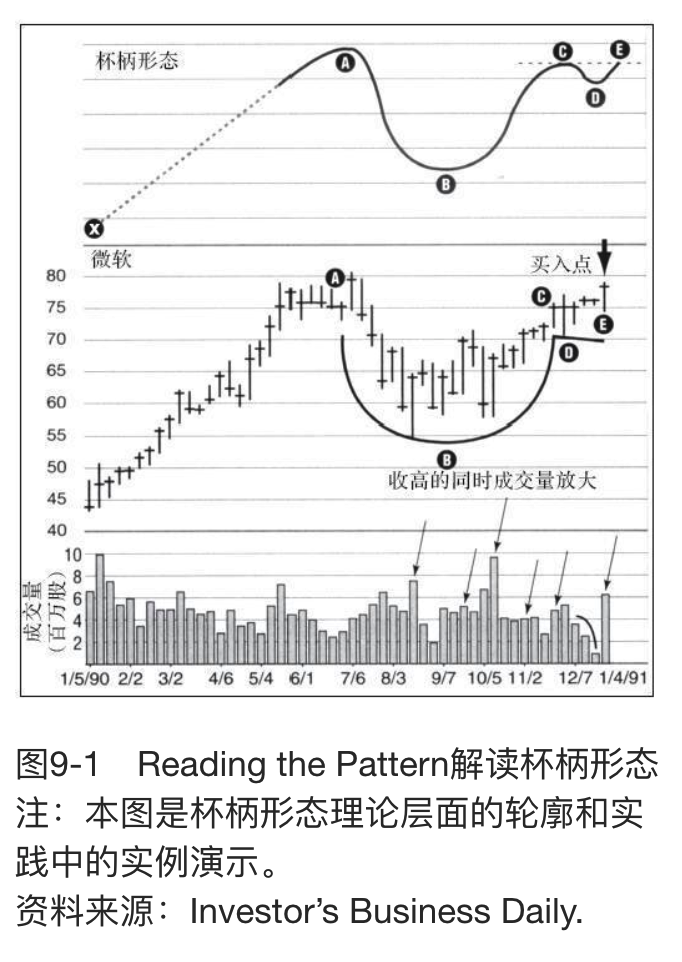
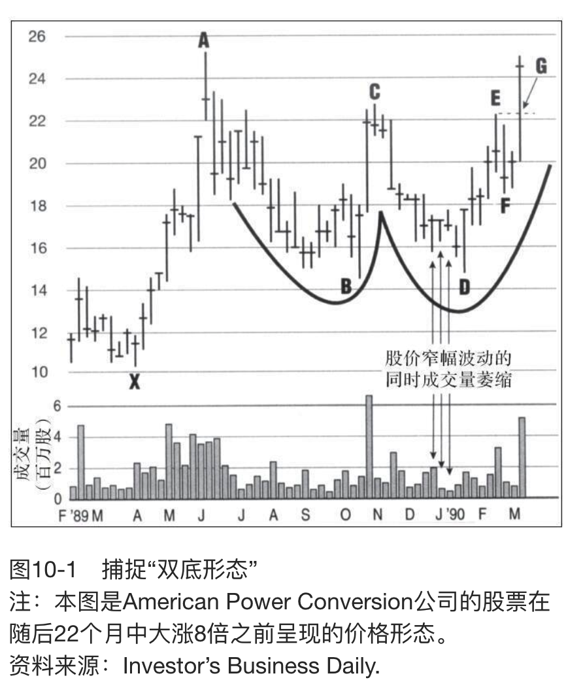
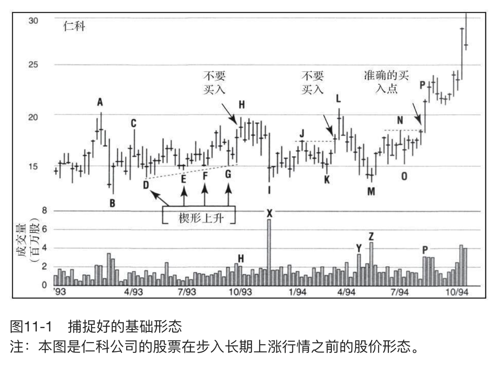
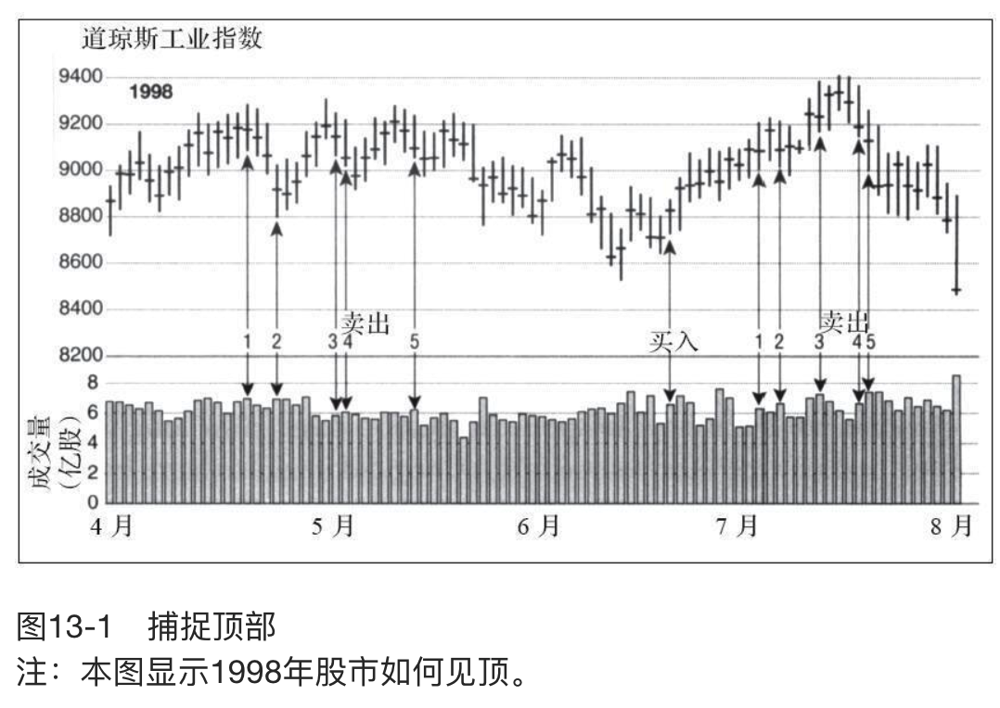
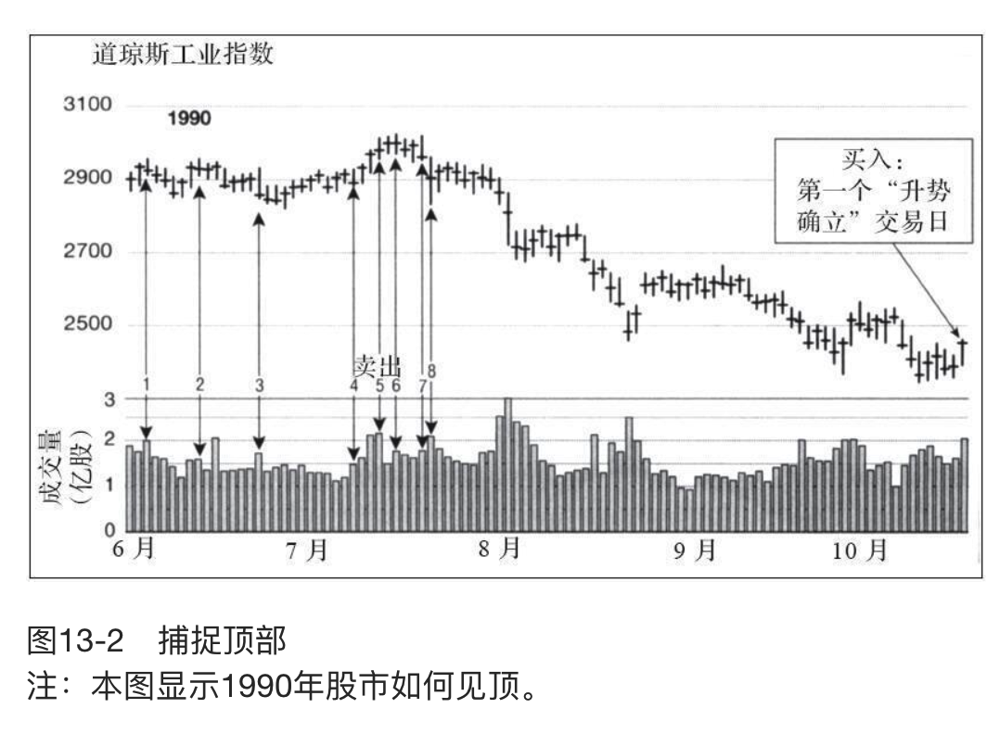
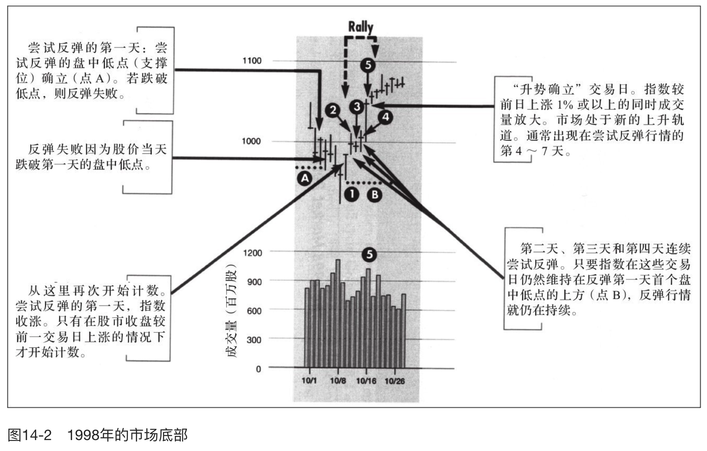
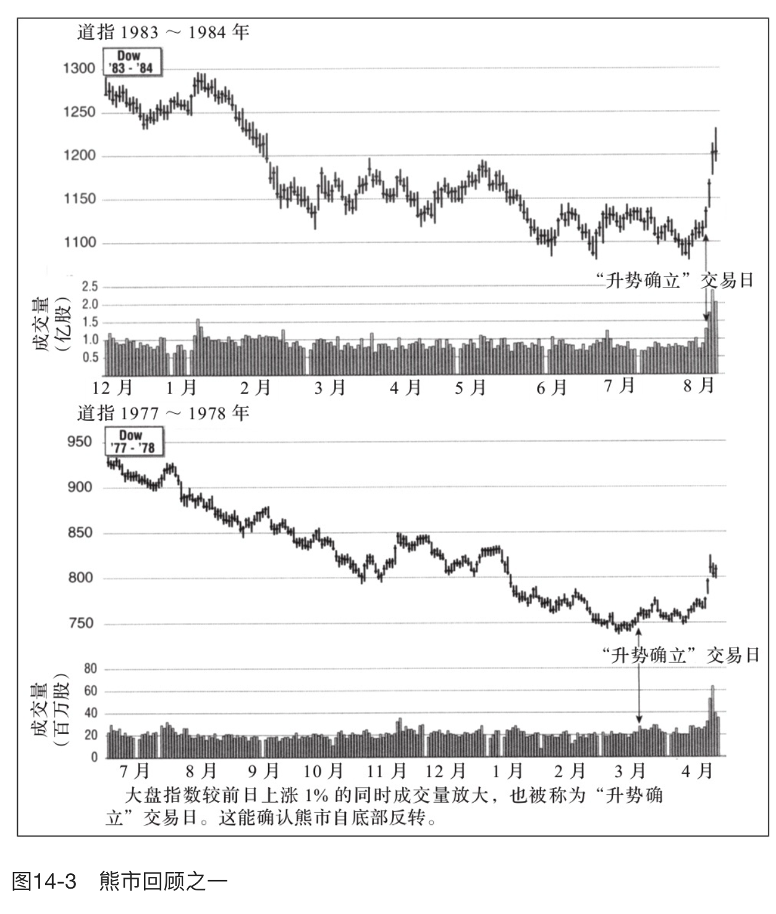
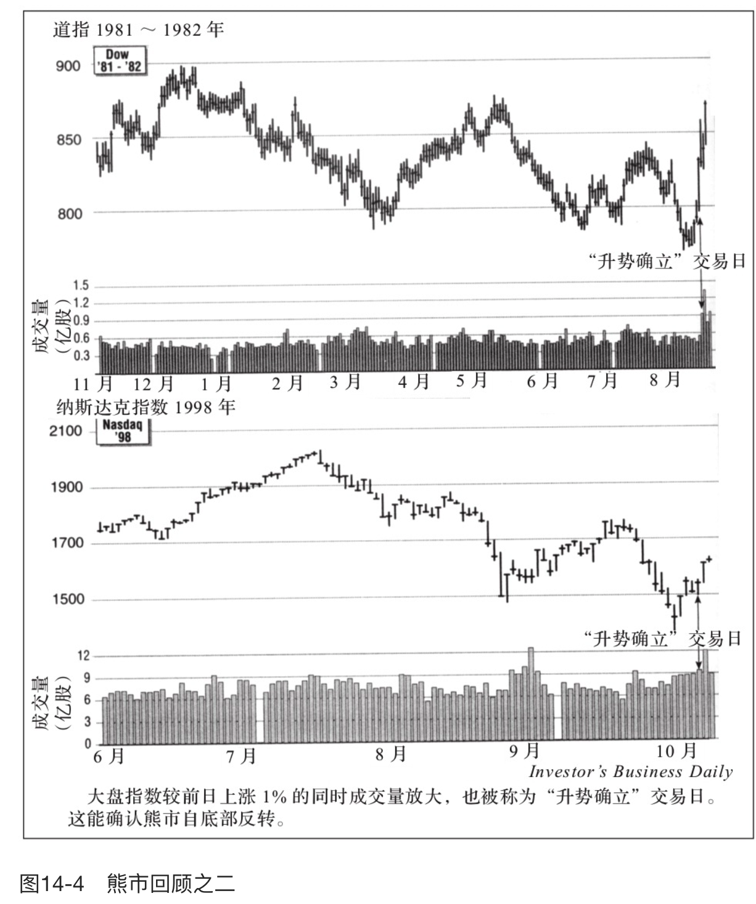

    作者: [美] 威廉·欧奈尔（William J. O'Neil）
    出版社: 机械工业出版社
    译者: 王茜 / 笃恒
    出版年: 2018-10
    页数: 204
    定价: 45.00
    丛书: 华章经典·金融投资（典藏版）
    ISBN: 9787111602323

[豆瓣链接](https://book.douban.com/subject/30341239/)

- [投资者在进入股市前必须了解什么](#投资者在进入股市前必须了解什么)
  - [投资者必须了解的最重要的一点是什么](#投资者必须了解的最重要的一点是什么)
  - [如何定义止损位](#如何定义止损位)
  - [获得投资成功需要多长时间](#获得投资成功需要多长时间)
  - [为什么把止损线设在8%](#为什么把止损线设在8)
- [开始行动：机不可失，时不再来](#开始行动机不可失时不再来)
  - [是否存在多种不同类型的账户](#是否存在多种不同类型的账户)
  - [下一步](#下一步)
  - [应该避免哪些投资](#应该避免哪些投资)
  - [应该持有多少只股票](#应该持有多少只股票)
- [遵守规则，不要被情绪左右](#遵守规则不要被情绪左右)
  - [利弗莫尔的“当你该恐惧时你往往满怀希望，而该满怀希望时却又十分恐惧”说明了什么](#利弗莫尔的当你该恐惧时你往往满怀希望而该满怀希望时却又十分恐惧说明了什么)
  - [如何克服这些自然的情绪反应（尽管这可能要付出很大的代价）](#如何克服这些自然的情绪反应尽管这可能要付出很大的代价)
  - [在股市，过去如何为你提供帮助](#在股市过去如何为你提供帮助)
  - [了解事实、检验历史就是成功的关键吗](#了解事实检验历史就是成功的关键吗)
  - [最糟糕的投资习惯有哪些](#最糟糕的投资习惯有哪些)
  - [承认错误并不容易，是吗](#承认错误并不容易是吗)
- [基本面分析还是技术分析](#基本面分析还是技术分析)
  - [你更青睐基本面分析还是技术分析](#你更青睐基本面分析还是技术分析)
  - [基本面分析最重要的是什么](#基本面分析最重要的是什么)
  - [还有哪些关键的基本面因素](#还有哪些关键的基本面因素)
  - [什么是ROE](#什么是roe)
  - [还有哪些要注意的基本面因素](#还有哪些要注意的基本面因素)
- [关键技术面指标：利润和销售额](#关键技术面指标利润和销售额)
  - [如何发掘大牛股](#如何发掘大牛股)
  - [除了季度销售额和利润数据外，还要关注哪些基本面因素](#除了季度销售额和利润数据外还要关注哪些基本面因素)
- [股价相对强度：一个关键的技术工具](#股价相对强度一个关键的技术工具)
  - [为什么如此强调一只股票相对于其他股票的表现？在寻找优秀企业的时候，为什么不只关注销售额和每股收益呢](#为什么如此强调一只股票相对于其他股票的表现在寻找优秀企业的时候为什么不只关注销售额和每股收益呢)
  - [股价相对强度评分能否帮助你做出卖出决定](#股价相对强度评分能否帮助你做出卖出决定)
  - [如果在你买入后，股价相对强度评分较高的股票就马上陷入跌势怎么办](#如果在你买入后股价相对强度评分较高的股票就马上陷入跌势怎么办)
- [通过行业了解个股](#通过行业了解个股)
  - [为什么学会选择处于领先行业或板块的股票很重要](#为什么学会选择处于领先行业或板块的股票很重要)
- [成交量和机构持有的重要性](#成交量和机构持有的重要性)
  - [什么是成交量？成交量为什么重要](#什么是成交量成交量为什么重要)
  - [什么是机构持有](#什么是机构持有)
- [如何在正确的时间点买入](#如何在正确的时间点买入)
  - [只要基本面强劲就行，找准买入时机真的那么重要吗](#只要基本面强劲就行找准买入时机真的那么重要吗)
  - [如何读懂这些水平线和垂直线](#如何读懂这些水平线和垂直线)
  - [在股价刷新纪录、上涨一倍甚至两倍之前，潜力股的股价走势图有什么特征](#在股价刷新纪录上涨一倍甚至两倍之前潜力股的股价走势图有什么特征)
  - [为什么不在杯底处买入](#为什么不在杯底处买入)
- [股票价格形态如何带来巨额利润](#股票价格形态如何带来巨额利润)
  - [股价暴涨前双底形态](#股价暴涨前双底形态)
  - [股价暴涨前平底形态](#股价暴涨前平底形态)
  - [你在读图时可能犯哪些错误？存不存在失败的基础形态](#你在读图时可能犯哪些错误存不存在失败的基础形态)
- [如何像专业人士一样读图](#如何像专业人士一样读图)
  - [有些股价图当前看上去不错，但并非所有股票都能成为大牛股。怎样区分好的基础形态和失败的基础形态呢](#有些股价图当前看上去不错但并非所有股票都能成为大牛股怎样区分好的基础形态和失败的基础形态呢)
  - [如何判定杯柄部分是在整个基础形态的中上部而不是下半部](#如何判定杯柄部分是在整个基础形态的中上部而不是下半部)
  - [仁科公司的股价什么时候形成了正确的基础形态](#仁科公司的股价什么时候形成了正确的基础形态)
  - [还有哪些其他窍门能帮助你找到好的基础形态](#还有哪些其他窍门能帮助你找到好的基础形态)
- [如何评估大盘状况](#如何评估大盘状况)
  - [根据经验，你认为成功投资的基本步骤有哪些](#根据经验你认为成功投资的基本步骤有哪些)
- [如何捕捉市场顶部](#如何捕捉市场顶部)
  - [如何学会准确捕捉道指出货的交易日](#如何学会准确捕捉道指出货的交易日)
  - [这些见顶形态似乎反复出现](#这些见顶形态似乎反复出现)
- [如何捕捉市场底部](#如何捕捉市场底部)
  - [如何判断市场真正转牛了](#如何判断市场真正转牛了)
  - [打开“大盘\&板块”版面后首先应该看哪些内容](#打开大盘板块版面后首先应该看哪些内容)
  - [腾落线](#腾落线)
- [系统选股方法](#系统选股方法)
- [成长投资vs.价值投资](#成长投资vs价值投资)
  - [成长投资和价值投资有何区别](#成长投资和价值投资有何区别)
  - [低价买入股票似乎已经成为共识。便宜货不好吗](#低价买入股票似乎已经成为共识便宜货不好吗)
- [投资者必须掌握的重要卖出法则](#投资者必须掌握的重要卖出法则)
- [投资者必须掌握的其他卖出法则](#投资者必须掌握的其他卖出法则)

# 投资者在进入股市前必须了解什么
- 作为投资新手，要做好承担一些小损失的准备。
- 一定要在股价跌至买入价下方8%的时候止损。
- 学习投资时坚持最重要，不要灰心丧气。
- 你不可能在一夜之间成为投资高手，成功投资需要时间和努力。

## 投资者必须了解的最重要的一点是什么
勒伯是一位德高望重的投资大家，他主张积极止损。对我而言，这是第一大原则。

## 如何定义止损位
勒伯把止损位定在亏损10%，对大多数新手而言，这是个不错的原则。但如果你通过图表分析更精准地确定了自己的买入时点，我建议将止损位设在买入价下方7%或8%的位置。

## 获得投资成功需要多长时间
形成投资体系大概花了我2～3年的时间，这个过程无法一蹴而就，相信对大多数人而言都是如此。随着时间的推移，你的选股能力会逐渐加强，股价跌至止损位的概率也应该会大幅下滑。此外，这些小幅的亏损将会被某些大幅上涨的股票抵消。

## 为什么把止损线设在8%
如果在股价较成本价下跌8%的时候止损，你可以确保自己明天还能继续投资。我曾经见过有些人因为沉迷于某只股票，不能面对现实、承认错误，不能做出止损的艰难决定，最终走向破产或者失去健康。

# 开始行动：机不可失，时不再来
- 起步阶段选择正确的全方位经纪商或折扣经纪商非常重要。如果要选择经纪商，请确保该机构拥有出色的历史纪录。
- 作为新手，应该设立现金账户而非保证金账户。
- 启动资金有500～1000美元就可以了，在实践中不断学习和进步。
- 避开波动性较大的投资工具，如期货、期权及国外股票。
- 专注于少量优质股，没有必要持有20只以上的股票。

## 是否存在多种不同类型的账户
我建议先开通一个现金账户，在积累几年的经验后再考虑开通能让你从经纪商处借取资金的保证金账户。

## 下一步
制订计划，每周至少花几个小时跟踪市场及你的交易。此外，在听取他人意见时要格外小心。大多数情况下，他人的意见不过是一家之言，而且很可能是错误的。

你应该开通图表服务，学会解读图表，但图表只会为你列出事实，而非观点。

## 应该避免哪些投资
作为一名投资新手，你应该避开投机性最强的领域，如低价股、期货、期权及国外股市，这些领域的风险和波动性均较大。

## 应该持有多少只股票
如果资金规模不超过5000美元，你持有的股票数量就不能超过2只。如果资金规模为10 000美元，2～3只股票比较适合。如果资金规模为25 000美元，或许可以持有3～4只股票；50 000美元4～5只；100 000美元5～6只。

股票总数不能超过20只。很简单，你不可能很好地掌握超过20只股票的信息。股票太多，你的总体收益也会被稀释。

对个人投资者而言，第一笔钱往往通过买入在特定领域表现最优的股票赚得，然后再把投资组合集中到少数股票上，认真地追踪。我不相信分散化投资的原则，也不认同将资金分散于多只股票或多种投资工具以降低风险的做法。

# 遵守规则，不要被情绪左右
- 不要让情绪影响你的投资。遵循一套买卖规则，不要让情绪左右你的想法。
- 不要买入每股15美元以下的股票。行业内领先的好公司的股价绝不会是每股5美元或10美元。
- 研究曾经表现优异的股票能指引你发掘潜力股。
- 一定要对股票交易进行事后分析，以吸取经验、汲取教训。

## 利弗莫尔的“当你该恐惧时你往往满怀希望，而该满怀希望时却又十分恐惧”说明了什么
如果某只股票已经让你的亏损超过8%，你往往会希望股价反弹。但此时你其实应该担心自己可能赔更多的钱，你的反应应该是割肉止损。

当股价上涨为你带来收益时，你往往担心自己会损失这些收益，因而过早出售、锁定获利。但实际上股价的上涨是一种积极的信号，表明你当初看好这只股票可能是正确的。

## 如何克服这些自然的情绪反应（尽管这可能要付出很大的代价）
根据我的经验，唯一的方法是基于历史研究来确立买卖规则，这些规则以市场的实际运作而非个人观点或成见为依据。

## 在股市，过去如何为你提供帮助
自1953年起，我们就每一只流通股构建了模型或总结了相关概况。相比所谓的专家意见、个人观点、可靠情报和市场谣言（这些意见、观点往往是错误的），我准确地了解到那些曾在过去创造出辉煌表现的股票具备哪些特征。在我寻找股市“明日之星”的过程中，这就是我的股市淘金宝典。

研究历史还能加强我们对总体市场的了解。哪怕经验最为丰富的投资者，也会因逐日逐周的市场波动而心惊胆战。但回顾过去，你会发现，在经历过一个又一个的周期后，股市的总体趋势是向上的，这持续地为投资者提供着巨大机会。

## 了解事实、检验历史就是成功的关键吗
了解事实、检验历史的确很重要，但培养良好的习惯、遵守规则同样重要，而且这两点更难做到。对多年以来养成不良投资习惯的人而言，更是难上加难。克服这些弱点是一项真正的挑战，需要付出很大的努力。

## 最糟糕的投资习惯有哪些
第一个习惯是爱买低价股。买入大量每股2美元、5美元或10美元的股票，看着股价翻番听上去是个不错的主意，但问题是，你“中奖”的概率可能更大。

事实上，投资股票和买打折的裙子或汽车不同。股市如同拍卖所，股价体现的是股票在某个时刻的价值。如果你买入便宜的股票，要记住一分钱一分货。

## 承认错误并不容易，是吗
我发现了一个宝贵的工具：对自己的每项交易进行事后分析。每年，我都会在一张日历表上记下自己买入和卖出每只股票的价格，并写下自己买入或卖出的理由。

然后，我分别筛选出让我赚钱的股票和让我赔钱的股票。对上涨的股票而言，我的哪些做法是正确的？对下跌的股票而言，我在哪些地方犯了错？

# 基本面分析还是技术分析
- 基本面分析和技术分析投资法相结合是成功选股的基础。
- 基本面分析关注企业的利润、利润增长、销售额、毛利率、ROE等。基本面分析能帮你筛选股票，确保你将选股范围锁定到优质的股票。
- 技术分析需要学会读懂股票的股价和成交量图表，并在适当的时点做出投资决定。

## 你更青睐基本面分析还是技术分析
根据我的经验，这并不是一个非此即彼的问题。你必须同时考虑关于公司及其产品的实力、质量和可靠性等基本面信息，以及关于某只股票将如何在市场上表现的技术面因素，而不应该把自己局限于某种单一的分析方法中。

## 基本面分析最重要的是什么
我们发现公司的盈利能力是影响股价的最重要因素之一。这意味着，我们只能买入利润持续改善、销售额不断攀升且最好是利润率和ROE都较高的股票。

`每股收益（公司税后总利润除以公司总流通普通股股数）`可以作为衡量一家公司成长性和盈利能力的指标。

根据我们过去对那些成功股票的研究结果以及多年的投资经验，我们发现涨速最迅猛的股票中有3/4是成长股。在股价创出惊人涨幅的前3年，这些公司的每股收益年增速平均都不低于30%。因此，请将注意力放在过去3年每股收益年增速在30%以上的股票。

## 还有哪些关键的基本面因素
销售额要么必须在过去几个季度中持续增长，要么必须较上一年同期增长了25%以上。我还倾向于选择根据近期销售额、每股收益增速、毛利率及ROE等来看在某些特定领域拔得头筹的公司。

## 什么是ROE
ROE是反映一家公司财务状况的指标，它可以衡量一家公司的资金运作效率。
我们研究过的大多数大牛股的ROE不低于20%，其中很多是在不久前刚发行的股票。大多数公司实行管理层持股。也就是说，管理层持有一定比率的流通股，他们与公司未来的业绩存在更密切的关系。

## 还有哪些要注意的基本面因素
你选择的公司应该拥有某项独特的产品或服务，而市场认为该产品或服务拥有优势。你应该熟知自己所投资的公司是做什么的，生产什么样的产品。

# 关键技术面指标：利润和销售额
- 要赚大钱，你就必须在对的时间买入最好的股票。
- 强劲的销售额和每股收益是大牛股最重要的特征之一。
- 寻找季度每股收益实现强劲且持续增长的股票，年度每股收益增幅在30%以上的股票。EPS评分将这二者相结合，并将你持有的股票和其他股票进行对比。
- 寻找ROE在17%以上的股票。
- 在股票走出盘整阶段或者摆脱底部时买入股票是获取巨额收益的关键。

## 如何发掘大牛股
我们发现，强劲的销售额和`每股收益（EPS）`是领涨股最重要的特征之一。如果你看一看那些真正出色的企业在股价开始翻一番、翻十番甚至更多之前的销售额、每股收益和利润率表现，这一点就会显而易见。我们希望看到企业的季度销售额和每股收益较上一年同期实现大幅增长，同时还希望看到季度每股收益增幅较最近几个季度有所扩大。

- 1986年10月，在IPO结束6个月后，微软公司最新一个季度的销售额同比攀升68%，每股收益飙升75%，且连续第7个月实现同比增长。
- 1982年3月，在IPO结束6个月后，家得宝最新一个季度的每股收益大涨140%；最近几个季度的销售额同比增速从104%扩大至158%，再进一步扩大至191%；最近9个季度的平均销售额增速高达177%。
- 思科系统在1990年前9个月的每股收益同比增速在150%～1100%，平均增速高达443%。
- 在我1981年4月买入Price公司的股票之前，该公司的销售额和每股收益已经连续14个季度实现大幅增长。

## 除了季度销售额和利润数据外，还要关注哪些基本面因素
你还应该重点关注`年度每股收益`增长，这是一个更长期的指标。

1986年股价大涨前夕，微软公司的年度每股收益同比增速高达99%，而思科系统1990年的每股收益增速也达到了57%，Price公司在股价攀升之前的年度每股收益增速为90%。

这些领涨股的ROE和税后利润率同样势头强劲。微软、家得宝和思科系统的ROE分别达到40%、28%和36%；微软和思科系统的税后利润率都高达33%。

我的经验法则是：**锁定每股收益年增速在30%以上、ROE在17%以上的股票**。

# 股价相对强度：一个关键的技术工具
- 股价相对强度是能让你看到市场本身对一只股票如何定价的关键技术指标。
- 在使用“《投资者商报》SmartSelectTM企业评分”时，避开股价相对强度评分在80分以下的股票。选股时一定要以其股价相对强度为基础。
- 如果股票的相对强度下滑，就不要继续增持。如果股价较买入价格下跌8%以上，就出售该股票的所有仓位。这种方法能帮助你免受重大损失。

## 为什么如此强调一只股票相对于其他股票的表现？在寻找优秀企业的时候，为什么不只关注销售额和每股收益呢
作为一个重要的技术指标，`股价相对强度`能显示市场本身赋予某只股票的价值。结合市场和所有其他股票的情况来看，某只股票的股价表现如何？我们获取某只股票在一年前的股价和目前的股价，计算出股价的百分比变化，然后与其他所有股票进行比较，算出这只股票的“股价相对强度”。

除了股价相对强度外，你还应该习惯查看股票历史价格走势下方的股价相对强度曲线（大多数图表服务商会提供）。

如果你想筛选出两三只股票买入，我建议你买入股价相对强度曲线上扬角度最大的股票。你绝对不该买入股价相对强度在过去6～12个月呈总体下行趋势的股票。

## 股价相对强度评分能否帮助你做出卖出决定
相对股价表现是让你了解自己所持的五六只股票中哪只股票真正经得起考验的好方法。根据每个月或每个季度价格的百分比变化对你的股票进行评分。如果决定出售股票，那么卖出表现最差的股票通常是优胜劣汰的正确方法。我一般还会注意大盘下跌但某些个股逆势且放量上涨的情况。

## 如果在你买入后，股价相对强度评分较高的股票就马上陷入跌势怎么办
如果买入的股票股价下跌，就不要继续买入。正如我在第1课中提到的一样，要卖出任何股价较买入价下滑8%以上的股票以保护自己。这是第一法则。逢低加仓是非常危险的，你偶尔可能“幸免于难”，但长期来看，个人投资者在股价下跌后继续投入大量资金买入股票总是高风险的。

# 通过行业了解个股
- 必须筛选领涨行业或板块的股票。历史上大多数龙头股隶属于领先市场的行业或板块。
- 许多领涨股来自医药、计算机、通信技术、软件、专卖零售和休闲娱乐板块。
- 行业相对强度评分能帮助你在领涨的行业中筛选出龙头股。

## 为什么学会选择处于领先行业或板块的股票很重要
首先，板块比行业的范围更广。例如，消费品板块囊括了多个涉及方方面面的行业，包括零售行业、汽车行业和家用电器行业等。自1953年以来，大多数真正领涨大盘的股票同时也属于当时领涨市场的行业或板块。

除了了解在特定时间表现最为强劲的特定行业或板块之外，你还应该学会捕捉另一种“集体”波动：大机构当前主要投资大型蓝筹成长股，还是波动性更强、市场经验更少的小盘股？

1997年年底，市场的焦点从小企业转向了流动性强的大市值股票。由于蓝筹股、优质股的股票交易更为活跃，基金经理能更容易地买入或卖出某只股票。保持警觉，投资于大量市场资金涌入的股票能为你带来回报。

如何捕捉此类转变？

你可以这么做：一旦发现某只股票符合基本面分析的所有标准（销售额和每股收益持续增长及盈利能力强等），同时技术面因素也表明投资时机已经成熟（我将在后文介绍如何做出这一判断），马上查看其所属行业的强弱。《投资者商报》根据行业内所有股票在过去6个月的表现计算出197个行业的股价相对强度，并对其进行排名，列成了一张表。

这张表很全面，不仅能看到整个计算机行业的相对强度，还列出了计算机行业下属6个子行业的情况。软件行业也被划分为6个子行业，如金融软件、医药软件、桌面软件等。通过这张表，你能获得关于特定行业的更清晰、专业的观点。

这为什么有价值？

因为你想找到一个行业下最好的子行业。可能计算机服务行业领先市场，计算机绘图行业却落后市场。197个行业中排名前20%的行业通常是最好的，此外，我建议投资者避开排名后20%的行业。《投资者商报》的股票主图表上包括股票的“行业相对强度评分”，评分从A到E，A为最高。我们推荐评分为A和B的股票。其他任何出版物中都找不到这样具体的信息。

还有一个甚至能更好地帮助投资者发掘领涨行业的地方是《投资者商报》的“52周新高&新低”专栏（新高专栏）。

该排名针对创新高股票数量最多的行业。如果市场行情较好，大量股票股价都创新高，那么这一排名上前5～6名的行业应该属于领涨的行业。我每天都会查看这一排名，所以我能时刻掌握哪些行业领先，哪个行业最新出现在排名的前列。

此外，《投资者商报》还设定了一个特别的排名，名为“行业创新高股票百分比排名”。该排名就在“行业板块”版面“52周新高&新低”排名的下方，表格比“52周新高&新低”排名表小，但也能提供有价值的线索。

# 成交量和机构持有的重要性
- 成交量是指股票交易的实际数量。
- 股价的上涨绝非偶然，一定由大规模的买盘推动，而这些买盘通常来自共同基金、退休基金等大型投资者。
- 《投资者商报》的“成交量百分比变化”指标跟踪每只股票在过去50个交易日的平均日成交量，显示股票成交量较平均水平高出或低出了多少。
- 通过进货/出货评分判定大型机构投资者在买入还是卖出股票。
- 了解最佳共同基金正在买卖哪些股票非常重要。机构持有评分能帮助你判断机构投资者是否大规模持有自己手中的股票。

## 什么是成交量？成交量为什么重要
供求规律在股市发挥重要作用。股市上涨绝非偶然，涨势必须由来自市场的大量买入需求推动，其中大多数需求来自机构投资者，优质龙头股的买入需求中有75%来自机构。在选股的时候，日成交量或周成交量就是衡量需求的标准。

## 什么是机构持有
机构持有就是指大型机构投资者买入一只股票。如果你真的想买入能大幅上涨的股票，一个基本的方法是看看是否至少有1～2家表现优于市场的机构最近在你选择的标的买入了新的头寸。

# 如何在正确的时间点买入
- 在对45年来股市最大赢家进行研究的过程中，我们发现股价在波动过程中会形成股价盘整区域或者不同类型的基础价格形态，这些基础价格形态往往在股价创出新高并持续飙涨的前夕形成。
- 最常见的一种基础价格形态我们称之为杯柄形态，因为股价走势图的总体形状酷似咖啡杯的轮廓。
- 一只股票的最优买入点，即“轴心点”，通常位于基础形态的末端，此时股价涨至新高，面对的阻力最小。
- 股票行情爆发当天，股票成交量至少应该较其平均日成交量放大50%。
- 98%的个人投资者不会采取这种买入策略，也正因如此，很少有人会持有或者通过美国股市历年来的大牛股充分获利。请记住，在新高买入就能迎来股票潜力的爆发。
- 股价在上一交易日或上周股价上涨的同时成交量放大通常是有利的信号。
- 股价在上一交易日或上周股价下跌的同时成交量放大通常是不利的信号。
- 股价下挫的同时成交量萎缩表明卖出势头并不强劲。

## 只要基本面强劲就行，找准买入时机真的那么重要吗
有句老话说得好——时间就是金钱，在股市和生活中都是如此。掌握买卖一只股票的最佳时间是一项很有价值的技能，每个人都可以而且必须学会。

## 如何读懂这些水平线和垂直线
很容易从K线图上识别的一个积极信号是成交量自上一交易日或上周起大幅增长的同时伴随着股价的上涨。这通常暗示着专业投资者在买入某只股票。反过来，股价下跌的同时伴随着成交量的放大是专业投资者卖出股票、股价前景堪忧的信号。

另外，如果股价下跌的同时成交量也大幅萎缩，那么投资者可能无须担心，因为成交量减少意味着股票没有遭遇大规模抛售。

## 在股价刷新纪录、上涨一倍甚至两倍之前，潜力股的股价走势图有什么特征
它们的股价走势主要呈现出三种形态，其中最常见的一种我们称之为`杯柄形态`。

之所以被称为杯柄形态，是因为股价走势图的总体形状就像一个咖啡杯的轮廓（见图9-1）。点A和点B之间是杯子左半边的下凹部分；点B代表杯子底部的圆弧部分，股价在几周内上下反复；从点B到点C之间，股价逐步反弹至略低于其前期高点的价位；而从点C到点D，再到点E则构成了杯柄的形状。从点A到点E之间的整个区域被称为杯柄形态。

如图9-1所示，在杯柄形态中，正确的股票买入时机出现在比杯柄处价格（点C、点D和点E）高出1/8处，此时应该立即买入。我们称之为新高，但它其实只代表股价突破杯柄区域的新高，通常略低于点A处的前期高点。此时买入将赋予你上升动力或竞争优势。

## 为什么不在杯底处买入
等待具体的买入点总让人们感到不安，尤其是在买入点股价大部分时间比底部区域更高的情况下。他们会问：“为什么不早一点儿在更低的价位买入，这样不是更划算吗？为什么要等到股价小幅上涨之后才买入？”我们的目标不是在股价大幅上涨概率不大的情况下以最低的价格买入，而是在对的时间即股票飙涨概率最大的时候买入。具体的历史研究结果告诉我，假设其他选股的基本面和技术面条件符合，在准确“轴心点”买入的股票绝对不会下跌8%（止损点位），而且股价显著走高的概率也最大。所以，有意思的是，如果操作正确，这一“轴心点”就是风险最小的点位。

股票行情爆发当天，股票成交量至少应该较其平均日成交量放大50%。在这一关键买入点，有来自专业投资者对股票的强劲需求至关重要。

在图9-1中，点X和点A之间的虚线被称为前期上升趋势。强劲有力的股票在前期上升趋势中的涨幅至少能达到30%。正常情况下，“杯柄形态”的形成时间至少有7～8周（点A到点E），否则可能不够强劲并走向失败。某些基础形态跨越的时间可能长达6周甚至最多达到15周。大多数股票可能自其绝对高点下滑20%～30%，跌至杯底区域（点A到点B）。杯柄区域的持续时间可能较短（1～2周），也可能达到数周，并且必须沿股价低点下行或震荡（如跌破杯柄区域的上周低点）。这有助于排除买入后股价出现必要回调或价格回落的可能性。

正常情况下，股价在杯柄区域的回落幅度很少超过10%或15%。在低点附近，股票要么通常出现成交量极少的情况，意味着卖盘无以为继；要么股价经历几个窄幅波动的区域，股价变化极小，甚至可能出现收盘价连续几周基本持平的情况。这是一个积极的信号。

**你的最佳买入点位于杯柄区域的最高点**。再次强调，这一点股价并非最低，买入决策正确的概率却是最高的。也正因如此，在买入前你必须等待股价触及这一点位（有的时候股价再也回不到这一点）。

在习惯这种方法之前，你很难相信买入股票的最佳时机出现在股价历史高点附近，你会惴惴不安，有一种奇怪的感觉。实际上，98%的个人投资者不会采取这种买入策略，也正因如此，很少有人会持有或者通过美国股市历年来的大牛股充分获利。请记住，在新高买入就能迎来股票潜力的爆发。

# 股票价格形态如何带来巨额利润
- 选股时要注意的股票价格形态包括杯柄形态、双底形态和平底形态。
- 以下是投资者必须提防的失败的基础形态：
  - 柄状区域波幅异常剧烈、轮廓异常宽松；
  - 柄状区域呈楔形向上趋势；
  - 总体形态轮廓宽松或波幅过大；
  - 板块内最后一批形成基础形态的滞后型股票；
  - 股价突破基础形态时成交量没有放大；
  - 第四阶段形态；
  - 持续时间短的形态。
- 请你忘记错误的老口号“低买高卖”，以“高价买入、更高价卖出”的信念取而代之。
- 你要学会准确地捕捉“轴心点”买入股票，不要在股价较“轴心点”上涨5%以上时追涨。

## 股价暴涨前双底形态
除了最常见的杯柄形态外，图10-1还列出了`双底形态`的例子。

1990年，American Power Conversion公司的股价形成了一个持续39周的形态，看上去就像一个放大版的字母“W”。“W”的中点位置点C应该低于起点处的高点A。点A到点B之间是第一个底部，点B到点C之间股价逐步上涨至中点，点C到点D之间代表第二次下跌，即双底形态中的第二个底部。

一般来说，第二个底部会略低于第一个底部的最低点B。这相当于一次震荡，能帮助淘汰最后少数意志不够坚定的投资者。点D和点E之间是双底形态的第二次上涨，点E、点F和点G则形成了一个短柄。

正确的买入点出现在股价略高于每股22美元处的点G，此时股价突破了短柄区域的最高点（点E）。请注意，当股价一路上扬突破22美元时，走势图底部的周成交量也迅速放大。

在买入点处，股票的《投资者商报》EPS评分为99分，股价相对强度评分达到95分，ROE高达53.8%，年税前利润率也达到了25%。自点G往后22个月期间，股价暴涨了8倍！但当时看来，对大多数投资者而言，买入点的股价已经很高，令人望而却步。请注意，当股价在一周内从每股18美元涨至点C处的每股22美元时，周成交量也非常大。

最后一点：在12月最后三周和1月第一周，股票收盘价在每股17美元左右窄幅波动，成交量则收缩至整个“双底形态”区间最低的水平。大多数人从未见过这种情况，但这往往代表积极的信号，因为成交量大幅减少意味着进入市场的卖盘正在消失。

## 股价暴涨前平底形态
还有一种比较常见的价格形态是`平底形态`。平底形态可能出现在股票已经经历杯柄形态并且持续走高的情况下。总体而言，平底形态下股价横向盘整，而且至少连续5周窄幅波动，一般情况下波动幅度仅为8%～12%。形态末端会形成一个新的“轴心点”，为你带来新的买入或者增持此前杯柄形态下买入头寸的机会。

## 你在读图时可能犯哪些错误？存不存在失败的基础形态
- 持续时间为1～4周的短期基础形态风险很高，而且往往会失败，你要避开它们。
- 总体轮廓异常松散或波幅过大的形态风险更大。根据更密闭、更紧凑、价格波动幅度更小的形态买入更加安全。
- 自形态底部暴涨至新高，而没有经历任何回调行情或柄状调整区域的股票风险较大，而且会频频遭遇大幅抛售。
- 如果股价突破基础形态的同时成交量没有实质的增加，那么投资者应该避开此类股票。
- 滞后基础形态。板块中最后一个创新高的股票往往表现落后而且脆弱。投资者应该避开此类股票。
- 柄状区域波幅过大（下跌20%～30%）或者股价在该区域沿低点楔形向上而非沿低点逐步下滑的形态为错误形态，往往走向失败。
- 在经历过一段长时间的上行走势滞后后，如果股票第四次形成某种基础形态（第四阶段形态），这对投资者而言往往太过明显，因而可能走向失败（详见第11课）。
- 一旦学会读图，学会准确找出形成正确的基础形态、被机构投资者持续买入并符合本书前几课描述的所有基本面标准的股票，你的表现会明显提升。

# 如何像专业人士一样读图
- 大多数成功的股票会在股价上扬过程中形成数个基础形态，每个形态都是处于不同“阶段”的形态。在第三阶段尤其是第四阶段的基础形态往往会失败。
- 图表上的股价和成交量变化往往能帮助你辨别股票在什么时候已经见顶、应该卖出。
- 去研究史上大牛股的股价形态，你将明白自己未来应该关注哪些股票。历史总是在重演。
- 关注杯柄部分形成于基础形态上半部分的形态。
- 对好的基础形态而言，量价齐涨的周数应该多于价跌量涨的周数，而且有几周股价窄幅波动，几乎没有什么变化。
- 在首次突破基础形态之后，大多数牛股会在8周甚至更短的时间内呈现20%的涨幅。因此，我绝不会卖出4周之内股价飙升20%的潜力股。

## 有些股价图当前看上去不错，但并非所有股票都能成为大牛股。怎样区分好的基础形态和失败的基础形态呢
仁科的股价走势图充分体现了微小的细节如何成为失败基础形态和成功基础形态之间的分水岭（如图11-1所示）。失败的基础形态拖累投资者走向失败，而成功的基础形态则可能带来巨额利润。

股价图上1993年的点A、点B和点C看上去像是杯柄形态的杯体部分，但是在点C到点H之间的杯柄部分，股价沿着低点D、点E、点F和点G呈楔形向上。此类基础形态大都会在股价突破形态后走向失败，正如图11-1上的点H所示。还有一点值得注意的是，在股价突破杯柄形态的一周，即点H处，走势图底部的周成交量较此前一周缩小。这是另一个不利的信号。按理说，股价突破基础形态，当周成交量应该放大。

接下来，仁科公司的股票从点H到点L之间又形成了第二个基础形态。这一次股价在杯柄区域自点J到点K逐步下滑。这表明基础形态更成功，因为收盘价低于前期低点有助于进一步淘汰意志不够坚定的投资者。但是，杯柄所覆盖的股价范围不应该像图11-1显示的一样出现在整个基础形态的下半部分。

## 如何判定杯柄部分是在整个基础形态的中上部而不是下半部
以图11-1为例。整个点H到点L区域价格形态的最高股价为19.875美元（点H），最低点为13美元（点I），总体下降幅度为6.875美元。该区域杯柄部分的最高股价为17美元（点J），最低股价为14美元（点K），中点为15.5美元。现在来看，15.5美元是离19.875美元的高点（点H）更近，还是离13美元（点I）的低点更近？它与低点只有2.5美元的差距，与高点却有4.375美元的差距。杯柄部分的重点更接近形态的下半部分，这是一个消极的信号，暗示着当前的基础形态是失败的，当股价突破形态时（点L），你并不能买入。另外，请注意当仁科公司股价跌破两个月前所确立的支撑位15美元时，即在点X处，股票成交量巨大。

## 仁科公司的股价什么时候形成了正确的基础形态
该公司的股票最终形成了第三个也是更适当的杯柄形态，如图11-1上的点L到点P区间。点N到点O之间的杯柄区域更接近基础形态的股价中点，整个杯柄形态的轮廓也比第一个形态更紧凑、波幅更小。自点L起四周之后，股价跌破两周前在16美元处确立的支撑位，但成交量有所减少。与第二个基础形态期间第X周股价下滑伴随着成交量的急剧放大相比，这是更积极的信号。

除此之外，第Y周股票量价齐涨，第Z周成交量巨大。乍一眼看上去你可能会将第Z周成交量放大误读为不利的信号，但实际上成交量的暴涨预示着存在大规模的支持性买盘。

以下是对这一结论的解释。此前两周，股价分别收跌1.25美元和1.5美元，但当周成交量飙升时，而股价仅收跌了0.125美元。我称这种现象为“股价未进一步延续跌势的同时成交量放大”。在这种情况下，受大量机构买入支撑，股票没有延续跌势，当周收盘价基本持平。

该基础形态中的准确买入点在18.5美元。请注意，股价爆发前一周成交量极度萎缩（这个买入点不是很明显，没有人会关注平淡无奇的股价走势）；但股票随后在点P处爆发，股价上涨的同时成交量巨大。

也就是在这一周，我们的机构研究公司威廉·欧奈尔+公司在1994年8月向机构客户推荐了仁科公司的股票。当时，该股票的EPS评分高达99分，股价相对强度评分为87分。公司的税前利润率是23.5%，前5年的利润增速为163%。此外，公司管理层拥有50%的股权，公司P/E为45倍（后来涨到了100多倍），平均每天的成交量是14.2万股。

## 还有哪些其他窍门能帮助你找到好的基础形态
大多数成功的股票会在股价上扬过程中形成数个基础形态，每个形态都是处于不同“阶段”的形态。股价在第一次形成正确形态（第一阶段形态）时，几乎没有人能发现。一般来说，大多数投资者不会注意到这只股票，所以几乎没有人会买入。只有部分投资者能发现第二个基础形态，但到第三个特别是第四个基础形态形成时，已经非常明显，人人都能看到了。市场常常令人们大失所望，因为大多数走势明显的股票通常行不通。如果在第四阶段形态处买入，80%的情况下你会是错的，而且第四阶段形态往往恰逢大盘的大幅下挫。如果股价随后反弹，并开始形成新的基础形态，就表明基础形态重新构建。此时你可以重新从头开始排序股价形态。

图表上的股价和成交量变化往往能帮助你辨别股票在什么时候已经见顶、应该卖出，这一信号比利润负面变化所发出的信号要早得多。例如，1980年10月，石油服务类股已经见顶，但大多数股票的利润涨幅仍在100%以上，分析师对未来几个季度的预期也异常乐观。但是，股价和成交量走势已经显示专业投资者在大量抛售。这表明无论基本面有多乐观，投资者都应该卖出。

我浏览历史走势图，想寻找符合我在《笑傲股市》中提到的CAN SLIM选股法则的股票。对好的基础形态而言，量价齐涨的周数应该多于价跌量涨的周数，而且有几周股价窄幅波动，几乎没有什么变化。我希望看到在过去12个月期间出现过1～2次股价上涨的同时周成交量巨大的现象。

在首次突破基础形态之后，大多数牛股会在8周甚至更短的时间内呈现20%的涨幅。因此，我绝不会卖出仅1～4周股价就飙升20%的潜力股。

在60%的情况下，暴涨的股票都不会再回落到买入点位。但是，有时候你可以在股价首次回落到50日移动均线时补仓。

我建议你研究股价图，并开始学会辨别股价形态。你将获得此前未曾有过的发现，更深入地了解股票及股价走势。把股价图剪切下来，保存历年大牛股的股价形态，这样你下次就知道该关注哪些股票了。历史总是在重演。曾在5年前、10年前甚至15年前发挥作用的形态今天仍然是有效的，因为人性和投资者心理并未真正发生变化。

# 如何评估大盘状况
- 大盘走势由一些领先的市场指数，如标普500指数、道琼斯工业指数和纳斯达克指数代表。对这些指数的追踪至关重要，因为大多数个股追随大盘走势。
- 忽略关于市场的个人见解，去研究领先指标的逐日价格变动和成交量变化。
- 在典型的熊市，大盘会自高位下挫20%～25%。负面的政治或经济环境可能引发更严重的下跌。

## 根据经验，你认为成功投资的基本步骤有哪些
如果你是一名个人投资者（无论是新手还是老手），希望通过投资普通股获取可观收益和上佳表现，以下是你必须学习和遵循的三个关键步骤：

1. 你必须制定买入选股规则，帮助自己选择最好的股票，并通过研究股价图来确定准确的买入时间。
1. 你必须制定一套卖出法则，告诉自己该何时卖出股票以锁定利润，或割肉止损避免更大的亏损。
1. 你必须制定一套具体的方法，告诉你大盘均指何时见顶、何时已转而向下、何时最终筑底并转而向上。你需要的就是这些。

大盘走势由一些领先的市场指数，如标普500指数、道琼斯工业指数（简称道指）和纳斯达克指数代表。投资者必须仔细评估这些指数的原因在于当指数见顶随后转而向下步入熊市行情时，3/4的个股（不论你认为这些个股本身是好是坏）会追随大盘走势，股价下挫。

# 如何捕捉市场顶部
- 懂得何时买入和卖出是投资的关键。
- 无论股票本身有多“好”，3/4的股票最终会追随大盘走势。因此，学会捕捉大盘何时见顶至关重要。
- 在遭遇4～5天的“出货”后，大盘通常会转而向下。
- 出货一般表现为股指收低的同时成交量放大，或股市上涨基本停滞的同时成交量较前一交易日放大。此时应该评估自己的投资组合，开始寻找哪些股票出现的种种迹象预示着它们应该被抛售或减仓。

无论股票本身有多“好”，3/4的股票最终会追随大盘走势。因此，学会捕捉大盘何时见顶至关重要。

在遭遇四五天的“出货”后，大盘通常会转而向下。通过这种方法，我们能轻而易举地捕捉1998年牛市的顶部（见图13-1）。

出货一般表现为股指收低的同时成交量放大，或股市上涨基本停滞的同时成交量较前一交易日放大（股价变化极小）。4月22日（见图13-1），道指收盘较前一交易日微跌（与垂直线交叉的水平短线代表收盘价），底部的纽交所股票成交量较前一天放大。这标志着投资者当天在出货。三天后在点2处，道指暴跌的同时成交量再次放大。这标志着已经出现了两天的出货。六天后到点3处，道指收跌的同时成交量增加；再一天过后到点4处，投资者抛盘加速，同时成交量再次增长，表明已经有四天出现出货。

如果在两到三周的时间内准确地捕捉到四天的出货现象，这通常足以推动股市扭转前期涨势转而下行。有时候如果股市试图反弹至新高，出货的现象可能分布在六到七周的时间内。如果发现市场出现四天的出货，我会开始寻找哪些股票出现的种种迹象预示着它们应该被抛售或减仓。

## 如何学会准确捕捉道指出货的交易日
请注意在图13-1中，第五个出货的交易日出现在一周后的点5处（5月15日）。一旦发现这些迹象，你应该立即停止所有买入甚至开始削减头寸。在不久后的某个点，大盘总会试图向上冲，我们称之为反弹。如果此前有四个或五个交易日出现明确的出货现象，绝不要在看到股市反弹一两天后就沾沾自喜。这可能是一次失败的反弹。市场目前还在下行，直到市场发出明确而有力的“升势确立”（follow-through）信号，你才能开始买入。“升势确立”的交易日通常出现在股市反弹的第四到第七个交易日之间（第14课将有更详细的介绍）。

接下来请注意1998年7月的点1处。当天成交量放大，但道指微幅波动，并没有呈现明显的趋势。该指数几乎停滞，收盘小幅下跌——出货的第一天。两天后的点2处又出现了同样的情形，道指下滑的同时成交量放大。四天后的点3处，道指收盘微跌且成交量放大。在点4处，道指收盘走软的同时成交量再次增加。

同样，这又是四个交易日出现出货的情况，卖出的时候到了。如果你在进行保证金投资，风险可能要翻番。所以，卖出股票，把保证金拿回来，否则你可能受到重创。市场正在告诉你是时候担心害怕而非满怀希望了。第二天（点5），成交量攀升，市场进入了一段较长的下跌行情。

## 这些见顶形态似乎反复出现

1990年6月的点1代表前月上行趋势中投资者出货的第一天。在点2处，市场摇摆不定，收盘微跌，且成交量略有增长。但是这仍然代表出货的第二天。在点3处，道指收盘大幅下挫、成交量急剧放大。11天后的点4处，道指走低的同时，成交量进一步增长。

在点5处，道指实际上动能大减，收盘小幅上涨，但涨幅远远不及前两个交易日。同时，成交量巨大，股市收盘价位于当日波幅（最高点到最低点区间）的下半部分。（关键在于道指涨幅大大缩水的同时成交量巨大。）

这就是每天通过市场指数分析供求关系的方法，这个方法具体且重要。为什么这一点如此重要？道理很简单。如果你不懂得如何解析市场行为，你就必然会亏损更多的钱，因为你会错过明确的卖出机会。点6、点7、点8代表1990年市场顶部的其他出货交易日。此后，道指转熊，跌幅达到22%。任何注意到这八天的投资者都应该会卖出部分股票。此后的一两轮股市反弹以失败告终后，他们会进一步卖出。到1990年8月1日，我已经彻底清盘离场，避免了严重的亏损。

之后的所有反弹均以失败告终，直到10月市场出现反弹行情的第五个交易日，我们能看到第一个有效的“升势确立”信号。此时重返市场开始买入是安全的。

# 如何捕捉市场底部
- 熊市会带来恐惧、不确定性和信心的缺失。当股市触底并转而启动新一轮牛市时，大量机遇便随之而来，但大多数人就是不愿意相信。
- 在下探过程中，指数会尝试反弹或向上回升。反弹是指在一段时间的下跌后，某只股票或大盘尝试上探。
- 牛市通常呈现两三次起伏，其间夹杂着一些失败的反弹。这些反弹往往在3周之内或者在五六周甚至更长时间后告终。
- 最终，某次反弹期间最终会确立升势，展现真正强大的向上动力。“升势确立”是指大盘指数较前日上涨1%以上的同时成交量放大。“升势确立”通常出现在尝试反弹行情的第4～10天。
- 道琼斯工业指数、标普500指数、纳斯达克指数和《投资者商报》共同基金指数是分析市场状况、判定市场是否见顶或触底的最佳凭据。同时，观察龙头股的走势也可能成为股市见顶的另一个信号。
- 大多数技术指标的价值微乎其微。卖权——买权比率指标能帮助确定大盘方向的转变。

## 如何判断市场真正转牛了
在下探过程中，指数会试图反弹或向上回升。牛市通常呈现两三次起伏，其间夹杂着一些失败的反弹，这些反弹往往在三周之内或者在五六周甚至更长时间后告终。

最终，在熊市持续一段时间，几乎所有股票都大幅下挫、股价暴跌，大量负面新闻铺天盖地而来之后，市场会寻获真正的支撑。其中的某次反弹期间最终会确立升势，展现真正强大的向上动力。“升势确立”信号通常表现为三大指数（道指、标普500指数或纳斯达克指数）中的某个指数收盘上涨1%以上，同时成交量较前一交易日大幅攀升。

在反弹的第一天或第二天，你很难根据大盘的升势做出过多判断，所以最好不要因此采取行动。反弹行情还需要证明，仍然可能是失败的。市场往往会回落一两个交易日，但仍然维持在低点或支撑位上方。所谓支撑位就是反弹首个交易日的盘中最低价。如果反弹势头得到恢复、展现强大的力量，你会迎来一个有效的“升势确立”交易日，或者称之为市场转折的确认点。这通常出现在反弹行情的第4～7天。如果升势确立交易日出现在第10天以后，则表明市场转折尚可接受，但其势头在一定程度上是疲软的。

大约在20%的情况下这些现象可能发出错误的买入信号，但几天后这很容易辨别，因为大盘往往会在成交量放大的情况下迅速而且大幅下挫。

为什么会发出错误的信号？懂得这一方法的大型机构投资者可以推高少数道指成分股或者纳斯达克指数中的少数几只大型科技股，并制造出有效“升势确立”交易日的假象。但是，大多数真正的“升势确立”信号发出后往往会在紧随其后的交易日或者几个交易日后出现成交量放大且指数走势强劲的现象。

市场往往忽略新闻，并比经济超前最多6个月。不要让你的决定基于新闻。决定应该基于对大盘如何以及何时真正扭转下行趋势的观察做出。市场几乎不会犯错，人们的观点和恐惧却往往都是错的。

## 打开“大盘&板块”版面后首先应该看哪些内容
我将会把三大指数的逐日评估以及《投资者商报》的共同基金指数列为首先要考虑的内容。这四大指数很重要，因为共同基金指数追踪市场上某些最佳基金经理的表现，能体现领先基金的状态，为评估大盘状况提供线索。

在这四大指数之后，最重要的是观察龙头股的行为和走势。它们的表现是否正常？大多数领先的股票是否已经见顶？这就是你需要了解的一切，但要准确把握这些信息，必须做出一些研究、积累一定的经验。

在余下的市场变量中，我认为最重要的是`美联储贴现率`，即`联邦基金利率`。该利率代表一般银行从美联储借入资金的成本。从理论上来讲，联邦基金利率的下调会鼓励借贷、增加货币供应；联邦基金利率上调的作用则是相反的。

联邦基金利率的下调一般预示着新一轮牛市的到来，但是这一指标不及真正懂得如何解析市场指数的变动可靠。例如，曾有两轮牛市在没有出现联邦基金利率下调的情况下形成，还有三次（分别在1957年、1960年和1981年）美联储下调了利率但市场仍继续下跌。

## 腾落线
在熊市的尝试反弹行情中，`腾落线（advance/decline line，根据某个交易日纽交所上涨股票减去下跌股票绘制）`有时候是有价值的。当大盘指数试图反弹时，腾落线可能缺乏上升动能。

在其他情况下我不使用腾落线，因为腾落线在很多时候会过早发出信号，在市场到达顶部前就发出见顶信号。此外，在某些市场底部，大盘实际上已经转而向上，但腾落线可能发出错误的信号，显示大盘势头疲软。

# 系统选股方法
- 一旦确定了自己已经身处牛市，你就需要挑选优质的股票。
- 潜在牛股拥有强劲的利润和销售额增速、不断上升的利润率和较高的ROE（17%或以上）。它们往往还属于一个领先的板块。

60%的规则致力于基本面分析，因为我只想买入拥有独特新品或优质服务的好公司。一旦确定自己已经身处牛市，你应该考虑以下因素：
- 公司当前的季度EPS是否同比上涨了至少25%？利润的同比增速较前几个季度是否有所扩大？公司利润增幅上升50%、100%甚至200%的季度是否达到了6～12个？过去几个季度的EPS是否超出预期？如果是成长股，那么股票过去3年平均每年的EPS涨幅是否达到甚至超过了25%？公司的EPS评分是否达到80分以上？
- 如果是转跌为升的股票，公司是否有2个季度利润强劲，或者其中1个季度的业绩异常强劲，以至于公司的12个月EPS已经回到前期高点？如果股价的上涨时间已经达到2个甚至更多季度，公司的12个月EPS是否接近或者超越了最近几年的高点？市场对公司未来2年的利润预期如何？
- 公司销售额是否连续6～12个季度实现大幅增长？最近几个季度增幅是否有所扩大？
- 当前的季度税后利润率是否处于或接近峰位？过去几个季度是否呈现出利润率改善的总体趋势？公司利润率是否处于业内最高水平？
- 年税前利润率是否在18%以上？（零售企业的利润率更低。）
- ROE是否在20%～50%或者超过50%？ROE是否处于业内最高水平？
- 公司的销售额+利润率+ROE评分是不是A或B？这意味着按销售额增速、税前和税后利润率及ROE计算，公司处于前40%的行列。
- 公司管理层是否拥有股份？
- 股票价格是否位于“优质股价区间”？对纳斯达克股票而言，优质股价区间在16～150美元区间；对纽交所股票而言，优质股价区间在20美元以上。请记住，思科公司、沃尔玛、微软、仁科和安进公司等大牛股都是在股价位于30～50美元区间时突破基础形态开始飞速上涨的。价格就是质量的基本反映，优质股必定不便宜。
- 股票是否属于历史上表现突出的几大板块，包括零售、计算机科技、医疗保健或者休闲娱乐板块？是否属于当前表现最好的五大板块？从《投资者商报》“行业板块”版面的“52周新高&新低”专栏找出表现领先的五大板块。
- 根据《投资者商报》“行业板块”版面的小型指数图表，市场当前青睐大盘股还是小盘股？你必须追随大流，不能逆势而行。
- 市场青睐哪个范围较广的经济板块？是消费品板块还是高科技板块？是高成长板块、周期性板块（随着商业周期上下波动的板块），还是防御性板块（食品、公共事业及其他每个人一直使用的商品或服务）？是新上市的股票还是更老牌的股票？
- 公司的产品是否通过某项新技术帮助消费者省钱、解决问题或者节省时间？是否是一种新药或者新的医学技术？是否存在广泛需求或受到广泛的追捧？是不是鼓励重复购买？
- 公司积压的未完成订单量是否在增长？公司的产能利用率是多少？预计公司未来的扩张速度如何？
- 最近是否有一两家表现较好、策略较明智的共同基金买入了这只股票？这是一种间接的、基本的多方求证方法，因为表现好的基金会在买入前做大量研究。
- 你是否真正理解并信任公司的业务？你是否见过或使用过公司的产品或服务？对公司的了解越深，把握就越大。

剩下40%的工夫要花在技术分析和定时分析上。

- 订购每日图表服务，如Daily Graphs或Daily Graphs Online，确定自己想买入的哪些股票正在形成好的形态，且机构正在积极买入。股价还必须接近一个适当的买入点。
  - 分析每周的股价和成交量走势。写下你希望在哪个价位买入股票。首次买入后，确定一个区域，如果股价继续走强，你将在这个区域内小幅加仓。我通常在股价较首次买入价位上涨2.5%～3%时进行一次加仓。
  - 如果股价跌至首次买入价位的8%以下，请在当前价格卖出股票，使自己免受更大的损失。长期来看，这一止损法则将帮助你避开严重亏损。
- 你买入的时候股票必须突破一个好的基础形态，且当天成交量必须增加50%或以上。
- 股票的价格形态属于杯柄形态、双底形态，还是平底形态？如果不是，价格形态可能失败或者不可靠。
- 股票的股价相对强度评分是否在80分以上？走势图上的相对强度曲线是否呈现明显的上行趋势？
- 投资组合管理：保持并不断增持表现最好的股票，坚持或卖出表现最差的股票。要记住，形成好的基础形态且价格处于新高附近的股票比价格接近或处于低点的股票更好。
- 查看股票的长期月线图，看看股票是否正在突破跨越多年的长期基础形态。

# 成长投资vs.价值投资
- 股市存在两种类型的投资者：成长股投资者和价值投资者。
- 成长股投资者青睐利润和销售额持续增长、利润率较高、ROE在17%～50%的企业。
- 价值投资者青睐价格被低估、P/E较低的股票。
- 研究结果表明，史上大牛股股价在飙涨之前，P/E大幅超出其他股票（平均31倍）。

## 成长投资和价值投资有何区别
`成长股投资者`青睐利润和销售额持续增长，一般而言即在过去3～5年涨幅超过20%的企业。

通常来说，`成长股`拥有某种能让投资者重复购买的优质产品或服务，该产品或服务能带来高水平的利润率和至少达到17%～50%的ROE。同时，市场也普遍预计这些公司在未来一两年将实现大幅的利润增长。

`价值投资者`寻找被低估的股票，喜欢买入P/E或P/B较低的股票。价值投资者寻求以低价买入股票。他们必须耐心等待，直到市场有可能发现股票的价值，从而推动股价走高。这往往要花更长的时间，而且有时候根本不会发生。

## 低价买入股票似乎已经成为共识。便宜货不好吗
大多数股票的售价接近它们实际的价值。换句话说，P/E为10的股票，其价格是每股收益的10倍；P/E为35的股票，其价格是每股收益的35倍。如果股价或市盈率上升或下降，那么这是因为公司的利润有所改善或陷入恶化。

所以，**不能仅仅因为某只股票的P/E低就说它价格低；反过来，也不能因为某只股票的P/E高就认定它价格过高**。

行业内最佳企业的P/E往往远高于失败的企业。

我们针对20世纪90年代所有表现突出的股票，包括安进、思科系统、微软、美国在线、埃克森、EMC及仁科公司构建了模型。在实现5倍甚至10倍的涨幅之前，这些股票的P/E平均在31倍。随着股价的飙涨，其中大多数公司的P/E上升到了71～73倍。

在这些大牛股表现最突出期间，价值投资者全部错过。在我看来，P/E被错误使用、错误理解，它作为选股工具的作用也被过度强调。**利润和销售额的增长才是推动几乎所有股票股价上涨的基本动力**。

如果你选择投资股市，而且你不是一名专业投资者，我强烈建议你最好避开价值投资，学会投资最具成长性的股票。要买入销售额、利润、利润率、ROE领先同行的企业，迈入从竞争对手手中抢夺市场份额的企业。

# 投资者必须掌握的重要卖出法则
- 第一条法则就是及时止损，保护自己免受更大的亏损。我将低于买入价格8%的价位视作止损的下限。
- 如果股价在两三周内攀升25%～50%，不要卖出。这表明股票势头强劲，可能是一只真正的龙头股。
- 不要允许自己在曾经带来可观收益的股票上亏钱。
- 你买入的股票中约40%的股票会有1～2个交易日在最初的买入价附近盘旋，有时候成交量也会放大。不要因为这种正常但大幅的股价回调惊慌失措。
- 连续数月走高之后，约30%的龙头股最终会触及“峰位”，股价见顶。此时，股票的涨速会较前几周加快，股价10天可能有8天上涨，同时日成交量也逐步放大。
- 涨势结束前夕，股价的日涨幅可能创下自上行趋势启动以来的最高纪录。一旦发现这种非同寻常的大涨势头，就要卖出股票。根据你的选股标准，你此前可能在大多数人犹豫不决、举棋不定的时候买入，那么现在你要在所有人都异常兴奋、对股票涨势深信不疑的情况下卖出。股市的正确决策往往和市场一致的看法背道而驰。

# 投资者必须掌握的其他卖出法则
- 如果某只股票的EPS增速连续两个季度出现大幅放缓的迹象，那么你应该可以卖出。（例如，如果此前EPS连续多个季度的涨幅都达到100%，但如今涨幅先后收窄至30%和20%。）
- 如果股票突破一个基础形态，但突破当天或当周的成交量较此前有所下滑，这表明关键时刻市场对股票的需求疲软。在大多数情况下，此时你应该卖出股票。正常来说，成交量此时应该较平均水平放大40%～50%才对。
- 如果股价突破基础形态的当天成交量巨大，但股票未能很快发出“升势确立”信号，股价连续多天放量下行，跌至可能较突破点低出4%～5%的水平，这说明股价形态可能失败。在大多数情况下应该减仓或者全部卖出。不要灰心，你不可能每次都错。
- 如果股价数月来实现较大幅度的上涨，并在此过程中形成了数个基础形态，等到股价第四次突破基础形态，可能就应该卖出股票了。到这时候，每位投资者都注意到了这只股票，而在股市，人人看得到的股票基本都无所作为。
- 如果特定板块的龙头股股价放量下挫，而且迟迟不能重拾动能，那么该板块的大多数股票可能会受到冲击，应该考虑卖出。
- 如果股票涨势的持续时间超出一两个月，且开盘跳高，开盘价远高于上一交易日的盘中高点，此时就应该卖出股票。这通常预示着股价“最后一个阶段”的波动。有一个术语叫作“竭尽缺口”（exhaustion gap），描述的就是这种情况。不过，如果缺口竭力成为一个健全的基础形态，这就通常不是问题。所以，不要将竭尽缺口和出现在股价突破形态早期阶段的缺口混淆。
- 有时候如果股价收跌且成交量创出自几个月前涨势启动以来的最高水平，这可能就是一个警告信号，提醒你考虑卖出。
- 有时候我会卖出一只赚钱的股票，因为该股票的涨势不及我持有的另一只股票强劲。这笔钱可以用在表现更好的股票上。

