    作者: 杨金
    出版社: 人民邮电出版社
    出版年: 2017-1
    页数: 226
    定价: 45.00元
    装帧: 平装
    ISBN: 9787115441744

[豆瓣链接](https://book.douban.com/subject/26977276/)

- [技术视角下的筹码分布](#技术视角下的筹码分布)
  - [行情与筹码的可逆转换](#行情与筹码的可逆转换)
    - [吸筹阶段的资金换筹](#吸筹阶段的资金换筹)
    - [拉升阶段的资金筹码互换](#拉升阶段的资金筹码互换)
    - [出货阶段的筹码兑现](#出货阶段的筹码兑现)
- [全局视角下的筹码技术](#全局视角下的筹码技术)
  - [“趋势”视角与中线潜力](#趋势视角与中线潜力)
    - [顺势而为的翻倍牛股](#顺势而为的翻倍牛股)
    - [低位区无量上穿被套峰](#低位区无量上穿被套峰)
  - [“主力”视角与分时形态](#主力视角与分时形态)
    - [次新股盘中强势穿越筹码区](#次新股盘中强势穿越筹码区)
  - [“量价”视角与动力强弱](#量价视角与动力强弱)
    - [成交量是上涨的动力](#成交量是上涨的动力)
    - [成交量体现筹码供求关系](#成交量体现筹码供求关系)
    - [全盘获利下的巨量突破](#全盘获利下的巨量突破)
  - [“涨停”视角与题材炒作](#涨停视角与题材炒作)
    - [涨停一日游与涨停突破](#涨停一日游与涨停突破)
    - [题材概略扫描](#题材概略扫描)
    - [抢板的技巧与准则](#抢板的技巧与准则)
    - [抢涨停案例综合解读](#抢涨停案例综合解读)
    - [连续涨停翻越筹码被套区](#连续涨停翻越筹码被套区)
- [基础筹码形态与含义](#基础筹码形态与含义)
  - [“峰”与“谷”形态及转化](#峰与谷形态及转化)
    - [“峰”与“谷”形态特征](#峰与谷形态特征)
    - [震荡与“峰”的形成](#震荡与峰的形成)
    - [单日“峰”的快速形成](#单日峰的快速形成)
    - [多日“峰”的快速形成](#多日峰的快速形成)
    - [“谷”的形成与市场含义](#谷的形成与市场含义)
    - [填“谷”转“峰”的过程](#填谷转峰的过程)
    - [“中继谷”与“反转谷”](#中继谷与反转谷)
  - [筹码“峰”的支撑与阻挡](#筹码峰的支撑与阻挡)
    - [绘出“支撑线”](#绘出支撑线)
    - [绘出“阻力线”](#绘出阻力线)
    - [阻力位与支撑位相互转化](#阻力位与支撑位相互转化)
    - [下峰的支撑作用](#下峰的支撑作用)
    - [上峰的阻挡作用](#上峰的阻挡作用)
    - [套牢峰的强阻力](#套牢峰的强阻力)
    - [峰的穿越与破位](#峰的穿越与破位)
    - [支撑峰与支撑线交汇点](#支撑峰与支撑线交汇点)
  - [单峰密集形态](#单峰密集形态)
    - [单峰密集形态识别](#单峰密集形态识别)
    - [低位单峰，底部确立](#低位单峰底部确立)
    - [低峰破位，行情看淡](#低峰破位行情看淡)
    - [中继单峰，行情不止](#中继单峰行情不止)
    - [顶部单峰，行情转折](#顶部单峰行情转折)
  - [双峰及多峰密集形态](#双峰及多峰密集形态)

# 技术视角下的筹码分布
## 行情与筹码的可逆转换
### 吸筹阶段的资金换筹
吸筹阶段的主要任务是在低位大量买进股票。对于一只流通筹码数量有限的个股来说，吸筹是否充分十分必要，它关系到主力随后的控盘能力。一般来说，主力的吸筹情况决定了以下两方面。
1. 持仓量决定了其利润量，筹码越多，利润实现量越大。
2. 持仓量决定了其控盘程度，吸筹越多，市场浮动筹码越少，主力对股票的控制能力越强。

图1-15是新海宜2015年9月28日的筹码分布图，这是主力吸筹之后的典型筹码分布形态——`低位区密集`。大量的筹码在这个相对狭小的低位震荡区实现了换手，换手的过程就是筹码由普通投资者手中逐步流入到了主力手中。

### 拉升阶段的资金筹码互换
拉升阶段的主要任务就是使股价脱离主力吸筹成本区，打开利润空间。在拉升过程中，主力用部分筹码打压做盘，同时又承接抛压筹码，但其大部分筹码仍旧按兵不动地锁定在吸筹区域，等待拉高获利卖出。

整个拉升环节，主力的持筹数量处于不断变化之中，强力拉升时，主力会买入更多的筹码，手中持筹数量增多；借股价短线回调之际，主力会顺势抛售一部分获利筹码，手中持筹数量会相应减少。一般来说，主力是否会在拉升过程中进一步增加持筹数量，与主力对大势的判断及个股的题材面有关。

图1-16是新海宜2015年12月22日的筹码分布图，可以看到，此股在主力吸筹之后，先缓慢上涨，随后在2015年12月22日前出现了一波急速上涨，此时的个股流通筹码相对开阔地分布在个股的上升空间中，这也是拉升阶段典型的筹码形态。“先缓后急”也是主力常用的拉升方式，在经历了急速上攻之后，主力的出货行情就会较为明显，而个股也将进入顶部区。

### 出货阶段的筹码兑现
出货阶段也称为派发，是把手中筹码卖出、变成现金的一个过程。

一般而言，主力出货是一个相对漫长的过程，但若遇大市急跌，也不排除主力使用打压股价的方式进行出货，虽然会降低利润空间，但却能快速地收回成本、降低大市暴跌的系统性风险。实盘操作中，我们应密切关注筹码在高位区的变化。若大量的筹码已密集地堆积在高位区，说明筹码在高位区已换手充分，拉升前的低位筹码被上移至高位，这其中往往就有大量的主力低位区的筹码。当低位筹码搬家工作完成之时，主力出货工作也宣告完成，一轮下跌行情也随之降临。

图1-17是康拓红外2015年12月24日的筹码分布图，在经历了高位震荡之后，这一震荡区的筹码十分密集，可以说筹码在高位区的换手十分充分，主力的低位区筹码已悄然派发，这时我们应警惕主力出货后的个股崩塌，及时卖股离场、规避风险。

从走势图可以看到，个股随后还有一个二次冲高，这也是主力出货时惯用的伎俩——诱多出货。二次冲高时，往往会让持股者产生个股会再创新高、重拾升势的错觉，从而不愿卖出股票，且能引起一定的追涨盘介入，而主力正是利用投资者的这种心理实现了快速出货。

在一轮行情的流程中要充分重视两个概念：低位充分换手和高位充分换手。`低位充分换手`是吸筹阶段完成的标志，`高位充分换手`是派发阶段完成的标志。它们是拉升和派发的充分必要条件。**所谓充分换手就是在一定的价格区域成交高度密集，使分散在各价位上的筹码充分集中在一个主要的价格区域**。

# 全局视角下的筹码技术
## “趋势”视角与中线潜力
### 顺势而为的翻倍牛股

图2-1是全通教育2014年1月至2015年9月的走势图，此股在这一年多的时间里，向我们诠释了有潜力的中线股是如何利用牛市实现超级上涨的。
1. 2014年6月之前，股市成交低迷，个股极度不活跃，股市不具赚钱效应，很多老股民都离开了市场，寻找其他投资途径，此股在40元区间徘徊。
2. 2014年6月之后，受券商股连续上涨带动，股市一度出现了只赚指数不赚钱的“二八”行情。但即使是这样，对于有着互联网教育第一股这个大热题材的全通教育来说，仍旧借着指数的上涨而开始攀升；对比同期的其他一些中小盘股，此股的走势是出众的。
3. 2015年1月之后，中小盘股开始活跃，大盘股相对低迷，此时的股市进入到了赚钱市，大批资金加速涌入；此股也借着同期的题材炒作之风实现了跨越式的上涨，至2015年6月股灾发生前，复权价达到800元；从40元至800元，累计涨幅20倍，而且，这种上涨是与业绩增长严重脱节的。
4. 没有业绩支撑，仅凭题材炒的个股，是无法长久维持虚高状态的，股市的两轮暴跌让其股价重挫，即使如此，股价仍旧保持在200元区间（复权价）。

### 低位区无量上穿被套峰
个股处于横向震荡走势，此时的市场相对低迷、整体估值偏低，个股的估值与市场同步，未出现过明显的炒作，这就是一个相对的低位区。在这一震荡区间，个股会因股价回落，大量筹码处于短线被套状态，**若随后能够以相对缩量的方式向上穿越此被套筹码区间，则多代表市场浮筹较少、主力控盘能力较强，也是其后期有望成为翻倍牛股的前兆**。

图2-2是全通教育2014年4月29日的筹码分布图，个股上市之后，因股市持续低迷，并没有走出独立行情，持续地横向震荡，如图中标注，在2014年4月29日的前几日，一波短线回落，出现了一个被套密集峰，但个股随后在上穿这一密集峰时，成交量并没有明显放大。这表明市场筹码的锁定度很高，结合当时的市场整体低估、个股的题材独特。可以预计，有主力资金在这个横盘震荡区大力吸筹，此时，也是我们中长线入场布局的最好时机。

## “主力”视角与分时形态
### 次新股盘中强势穿越筹码区
如果个股分时线在盘中大幅拉升、收盘时保住拉升成果，且股价的盘中低点、高点穿越了筹码密集区，则说明主力拉升意愿坚决、个股短线冲击力较强。

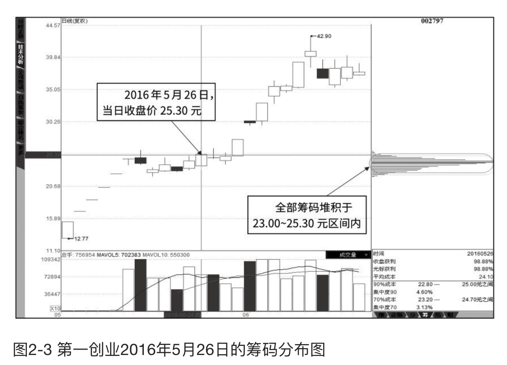

图2-3是第一创业2016年5月26日的筹码分布图，作为一只新上市的个股，此股在经历了第五个涨停之后就开板震荡，相对于其他新股来说，其封板数量少、股价相对便宜是一个较大优势。

而且，此股作为2016年第一只新上市的券商股，有一定的市场热度。在此背景下，我们可以积极关注它的短线机会。从筹码图来看，由于充分换手加宽幅震荡，此时的个股已呈现单峰密集形态。

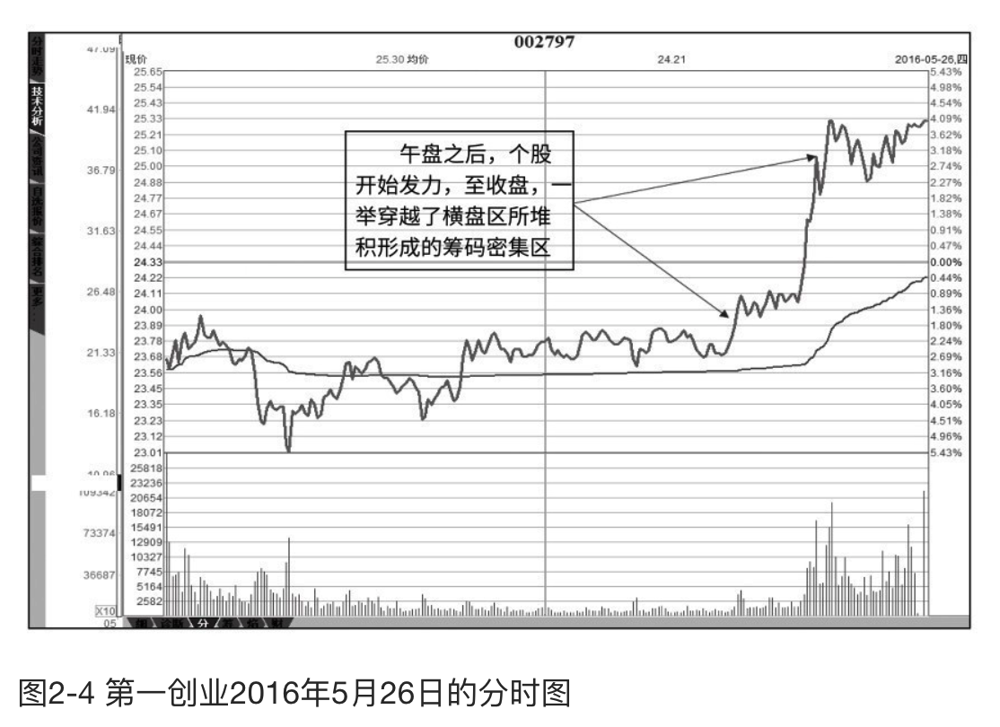

如图2-4所示，当日个股在盘中低开平走，午盘后却直线拉升，使得股价一举穿越了这个筹码密集区。这正是其短线上攻力度大的标志，也是主力拉升坚决、拉升意愿强烈的信号；结合当时企稳的市场环境来看，可以适当追涨、博取短线收益。

## “量价”视角与动力强弱
### 成交量是上涨的动力
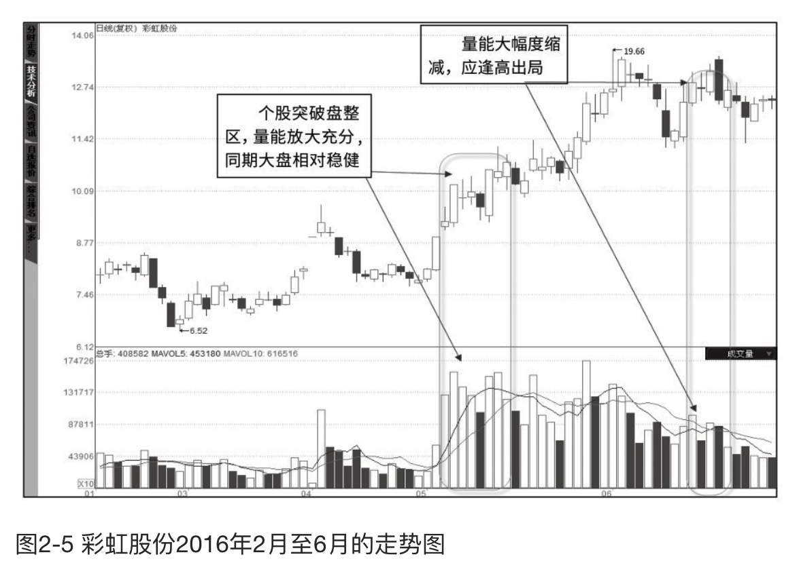

图2-5是彩虹股份2016年2月至6月的走势图，个股在低位区震荡之后开始向上攀升。如图标注，可以看到，随着股价的上涨，量能放大明显，对于此股的上涨，我们可以看到量能作为上涨动力的明显效果；而且，当这种上涨动力效果（即放量效果）没有明显减弱时，就中短线而言，仍然可以继续持有；一旦量能大幅度萎缩，则表明上攻动力减弱，短线宜卖出、规避风险。

### 成交量体现筹码供求关系
股市的冷热决定了持股者的出售意愿。当市场整体向好、股票筹码具备了很好的保值、增值性时，持股者就有惜售情绪，而持币者只能通过推升股价、以高价来获得筹码。这时的筹码处于“供小于求”的状态，在这种状态下，成交量低迷，持股者明显惜售，场外投资者只有通过推升股价让持股者处于获利状态，才能激发多空分歧，进而吸筹；此时，利用股价上涨时的量能放大程度，我们可以进一步了解筹码供求关系。

如果股价快速上涨，而成交量却放大不明显，说明市场需求筹码的力度远强于市场供应筹码的力度，这是一种看涨的标志。当由于某些原因股票出现严重的供求失衡时，体现在股价上便产生了涨停板或跌停板，由于封板的形态不同，这时的成交量特点会出现放量或缩量。同理，我们还可以结合价格走势来解读筹码的其他供求关系。

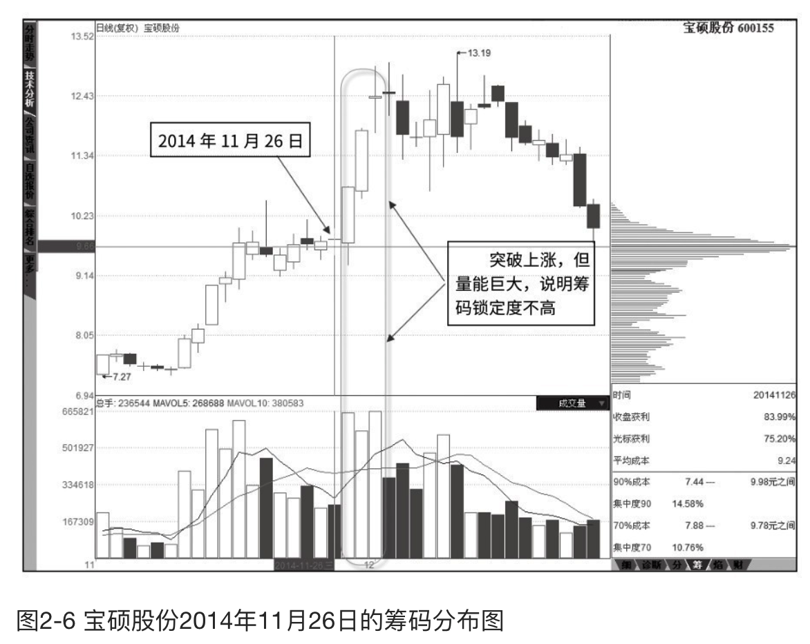

图2-6是宝硕股份2014年11月26日的筹码分布图，个股处于上升通道中， 2014年11月26日的前几日，个股横向窄幅震荡，量能明显萎缩，结合趋势来看，个股的筹码处于“求大于供”状态。但是，筹码“求大于供”的程度如何，此时难以判断。

随后，个股开始强势突破，值得注意的是，这三个交易日的量能巨大，这说明个股筹码锁定度较差，虽然筹码处在“求大于供”状态，但股价一旦出现剧烈波动，个股所能供应的筹码（即卖出的筹码）就急速增多，这样的上涨是不牢靠的，没有主力强力控盘的个股也难有持续上涨的根，只适宜短线交易，并不适宜中线持有，操作中应在短线滞涨后，及时卖出。

### 全盘获利下的巨量突破
在全盘获利的状态下，个股的强势突破则代表着主力的拉升行为，此时，成交量的大小反映了主力的控盘情况；如果放巨量，多表明筹码锁定度不高，没有火热的大市配合，个股难有持续上涨动力；反之，若量能放大温和，则代表主力控盘实力较强，个股随后的中期走势值得关注。

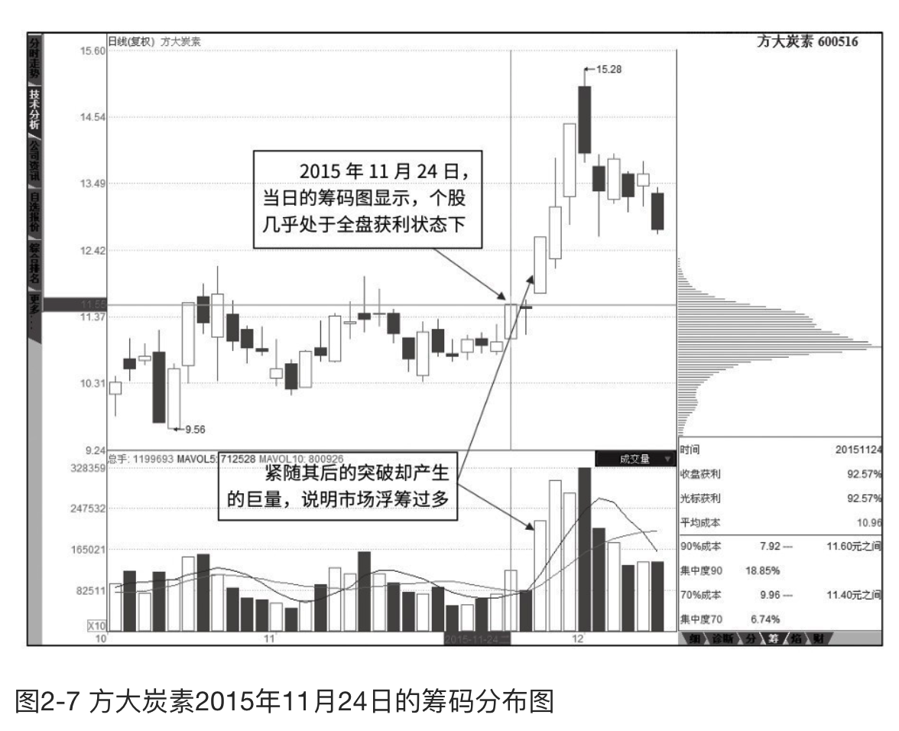

图2-7是方大炭素2015年11月24日的筹码分布图，此股在横向振荡一段时间之后，当日的筹码形态显示为几乎“全盘获利”，如图中箭头标注，个股随后以大阳线的方式向上强势突破，当日的量能是之前的三倍左右的巨量，说明市场筹码锁定度不高。基于此分析，一旦个股短线上攻受阻或是出现短线卖出信号时，我们就应及时卖出，规避一轮大幅回落的风险。

## “涨停”视角与题材炒作
### 涨停一日游与涨停突破
涨停板既有可能是个股突破向上的信号，也可能代表着偶然性的“一日游”。一般来说，我们可以从以下三点来分析和预测。
1. 个股是否有题材支撑，是否符合市场当前的炒作热点。如果个股符合近期的市场热点，且之前又没有被炒作过，则涨停板真实突破的概率较大。伴随着涨停板的出现，个股随后很有可能出现一波上攻行情。反之，若个股题材平平、市场关注度不高，则涨停板往往并不是真实突破的信号，即使它的日K线形态较为优异。
2. 涨停后次日及第三日的表现。真实的突破有主力从中积极运作，而“一日游”的涨停板会引发较强的获利抛盘。个股如果次日及第三日在盘中企稳、保住涨停突破日的上攻成果，则涨停板代表真实突破的概率大；反之，则多是一日游的“涨停板”。
3. 小盘股涨停突破更真实，中盘及大盘股的涨停往往是一日游。小盘股的涨停板多是主力拉升的产物，不易引发过强的多空分歧，更易实现突破式的涨；反之，中盘及大盘股的涨停板往往是板块轮动的产物，一旦个股涨停，获利资金就会大量涌出，追逐那些还未上涨的板块。

### 题材概略扫描
1. 高送转题材
   1. 所谓的高送转就是指送股或者转增股票比例较大，**一般达到10送或转8以上的才算高送转**。高送转题材的炒作常见于市场环境较好的背景下，由于国内股市历史的积淀，当主力炒作高送转预期强或者是高送转方案发布的个股时，由于场内外资金充沛，这一题材更易引发市场共鸣。
   2. 高送转仅仅增加了上市公司股本，高送转后要除权，股票的总价值也未发生变化。那么，高送转为何会成常盛不衰的炒作题材呢？在国内的股票市场中，上市公司的成长与其股本扩张同步并行，因而实施高送转方案的个股，往往会被认为是成长性较好的企业，从而获得市场追捧；其次，在高送转方案的实施日，公司股价将做除权处理，这使得在K线走势图中，个股股价会出现一种“低价”的视觉效果，这为主力高位出货制造了一种不错的“低价”视觉效果，有利于主力炒高个股后进行出货。例如,若上市公司实施10送10的高送转方案，则在高送转方案的实施日，它的股价变为除权前的一半。
2. 资产注入
   1. 在股票市场上，上市公司多是以“定向增发”的方式实施资产注入的。重大的资产注入可以让上市公司脱胎换骨，实现主营业务的完全转型。所注入资产的性质决定着个股在发布消息后的走势。
   2. 一般来说，消息发布后，若注入资产规模较大且属于优质资产，特别是符合市场当时热点的资产，则个股往往会出现连续的无量一字板，我们不会再有低位买入的机会。除此之外，若所注入资产前景较好,但不符合当时市场热点，此时就会引发市场分歧，个股短线上涨幅度不大，对于这种情况，我们就应结合同期的市况及个股所注入资产情况来具体分析，看看这个题材是否有二度炒作价值。
3. 新股题材
   1. 新股是一个特殊的品种，它的流通盘往往极小，且题材独特，更易获得主力炒作、投资者追涨。
   2. 对于新股来说，无量一字板打开后才是关乎二级市场买卖决策的时候。一般来说，主力炒作新股时，以下两方面的因素缺一不可：低价位的筹码、上市公司的经营题材在某些领域有其独特性。若一只新股上市正逢股市估值状态较低，且其开板较早、题材较好（如处于朝阳行情、有技术优势等），对于这样的新股，我们可以积极关注，一旦股市及个股同步企稳，是可以大胆买入的。
4. 政策导向题材。国内股市素有“政策市”之称，国家会根据当前所处的经济环境及发展规化来适当地引导一些产业、抑制一些产业。在此背景下，相关受益行业的受益股就是政策导向、国家方针产生的市场热点，股市有着对经济政策最敏感的神经，主力自然不会袖手旁观，会借政策扶持对相关受益股择机炒作。

### 抢板的技巧与准则
1. 看突破空间是否充足
   1. 若个股短线已涨幅较大，显然已产生了过多的获利盘，也透支了其上涨空间，对于这样的个股，主力一般不会炒作，涨停板更有可能是诱多的产物，不宜抢板买入；反之，那些正处于低位盘整后突破点的个股，一旦涨停突破，多意味着上升空间的打开，盘中抢板买入的胜算更大。
   2. 除此之外，中短期大幅下跌后的反弹板也有一定的反弹空间。而对于那些出现在短期大幅上涨的高点、或是上穿前期筹码密集区位置点、或是跌途中反弹高点的涨停板，它们所预示的看涨倾向不强，是不宜进行短线买入的。
2. 股本大小及个股题材面
   1. 股票的短期强势上涨源于资金推动，盘子越小，涨停板之后的上攻潜力越大。一般来说，股本超过5亿股，则涨停板后的短线上涨将有一定阻力；而股本超过10亿股，则涨停板之后的短线上攻将阻力重重。
   2. 题材也是决定我们是否抢板的重要因素。有题材支撑，特别是有热点题材支撑的涨停个股，往往预示着一波题材行情的出现，抢板这类个股，我们的短线风险小、潜在收益大。而那些没有题材支撑的涨停股，虽也有短线突破行情出现，但其短期内的上涨势头往往不如题材股来得猛。
3. 最好抢第一个板
   1. 诱多性涨停板是我们抢板时最忌讳的品种，仅仅依靠盘口分时形态，很难辨识诱多板与突破板。换个角度来说，即使我们抢入了诱多板，也尽量能参与那些当日强势封板、次日诱多冲高出货的涨停板。
   2. 实战中，第一个涨停板最具抢板价值。如果这个涨停板预示着一波攻势的展开是最好;反之，即使这是个诱多性的涨停板，由于这是第一个涨停板，只要大盘走势稳健，主力也多会借助涨停板次日的惯性冲高再卖出。以盘整高点出现的第一个涨停板为例，此时的个股处于盘整高点，涨停板使得其呈突破上行状，纵观那些未能突破的个股，其涨停次日也多收十字星、收盘价接近于上一日的涨停价。因此，如果我们在涨停板当日买入的话，次日发觉情形不妙，往往可以保本出局。
4. 抢封板时间早的个股
   1. 抢涨停板，我们应尽量抢早盘即能牢牢封板的个股，个股上封涨停板的时间越早，其次日的表现往往就越为强劲，而对于午盘之后才上封涨停板的个股，就不宜再抢涨买入了。一般来说，在10∶30之前有意上封涨停板的个股，是我们可以要抢入的出击对象。为了不错失机会，在10∶30之前，应实时地关注行情报价表中涨幅靠前的个股，看看它们是否有异动，是否有上冲涨停板的倾向。
5. 盘中振幅、盘口形态是关键
   1. 仅从日K线图来看，往往难以辨识涨停板的真实特征。同样是一根大阳线，分时形态却是千差万别。有的个股平开后不久即快速封板，有的个股全天走势平稳、仅仅是尾盘偷袭涨停板，还有的个股上窜下跳后才最终封板……不同的涨停分时图所具有的看涨倾向是完全不同的，我们在抢入时所承担的风险也不尽相同。
   2. 抢板时，盘口分时形态是一个关键；封板时间越早、涨停板封得越牢靠、盘中振幅越小、冲板时的盘口形态越流畅，则个股的涨停板就越具有短线冲击力；而对于那些涨停时间较晚、封板不牢靠或是上封涨停时过于突兀的个股，则应回避。
6. 提前埋单，果断出击
   1. 抢板就是要抢入那些能够牢牢封死涨停板、不再打开的个股，因而要想成功买入，一定要在个股冲击涨停板之前准备好，并在其上封涨停板前的一瞬间抢先买入。当连续性的大买单狂买涨停价位上的卖盘时，可以预计个股马上涨停，此时，如果涨停板的各方面俱佳，就是最好的抢板入场时机。

### 抢涨停案例综合解读
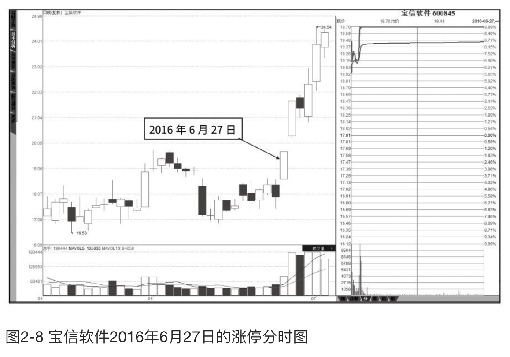

图2-8是宝信软件2016年6月27日的分时图，结合前面所讲的内容，我们来看看如何开展此股的涨停板实战操作。
1. 从日K线图来看，此股当日处于低位盘整区间内，个股上下震荡幅度较小，涨停板出现，更有可能是突破的信号。
2. 从股本大小来看，此股的总股本不到9亿股，流通股不到5亿股，属于小盘股，封板成功的概率更大，封板后的短线行情也更值得期待。
3. 从题材面来看，个股从事“软件开发及外包”服务，身处朝阳行业，且同期市场的软件、信息技术等行业较为热门，有一定的题材热度，其上涨也易引发市场共鸣。
4. 从盘口来看，个股当日高开幅度较大，在盘中高点略做停留之后，上冲涨停板，当日盘中振幅较小；结合前面分析来看，个股在股本、题材、盘中振幅、分时线上冲流畅度等方面皆较为优异，因而我们可以在个股即将封板时，实施抢板操作，搏取短线利润。

### 连续涨停翻越筹码被套区
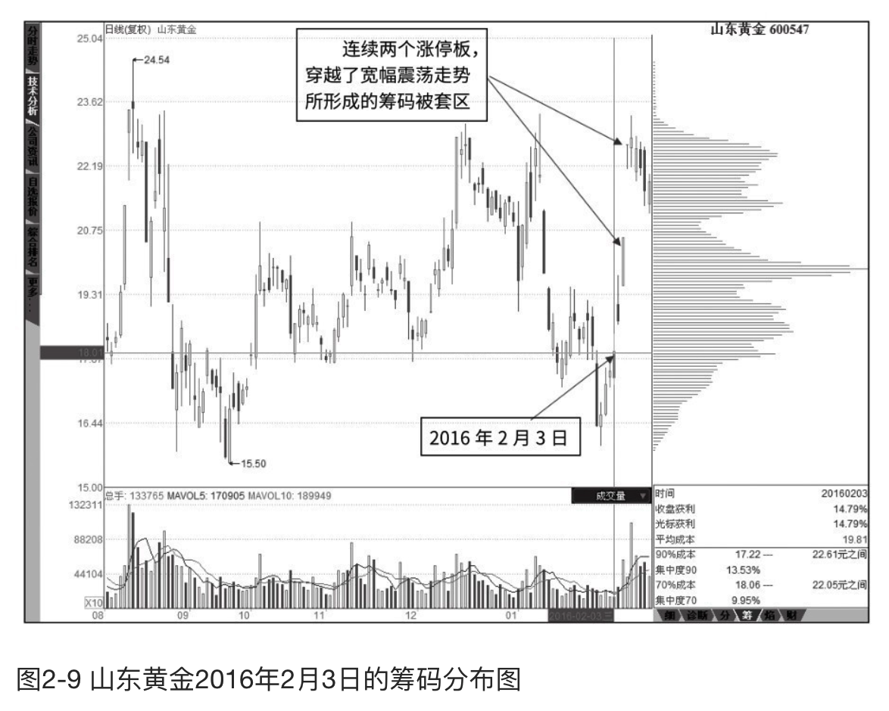

图2-9是山东黄金2016年2月3日的筹码分布图，如图中标注，个股在四个交易日内出现了三个涨停板，且个股之前的走势呈宽幅震荡状，这几个交易日股价由下至上翻越了宽幅震荡走势所形成的筹码被套区。

实盘中，我们可以将这种形态称之为`“连续涨停翻越筹码被套区”`，这是主力资金强力运作个股的重要信号。一般来说，这样的个股多有热点题材。对于此股来说，2016年年初的全球金融市场大动荡及黄金期货的节节攀升，是促成此股成为热点的关键。既然主力有能力以连续涨停板的方式在震荡区解放所有的套牢盘，也就意味着主力拉升个股的意愿较强，个股的炒作空间较大。操作中，我们可以在个股短线回调后，积极布局。

# 基础筹码形态与含义
## “峰”与“谷”形态及转化
### “峰”与“谷”形态特征
“峰”，我们可以将其定义为：在一个相对狭小的价格区间内聚集了较多的流通筹码，从而使这一价格区间的筹码形态呈山峰状。它并没有一个精确的指示，我们也不必纠结何为“相对狭小的价格区间”、何为“较多的流通筹码”，筹码分布本就是一个形象的展示，而非精确的定义。简单来说，“峰”就是指筹码较密集的一个狭小区域，由于筹码数量较多，因而筹码图上这一区间的横线会较长，看上去如同一个山峰。

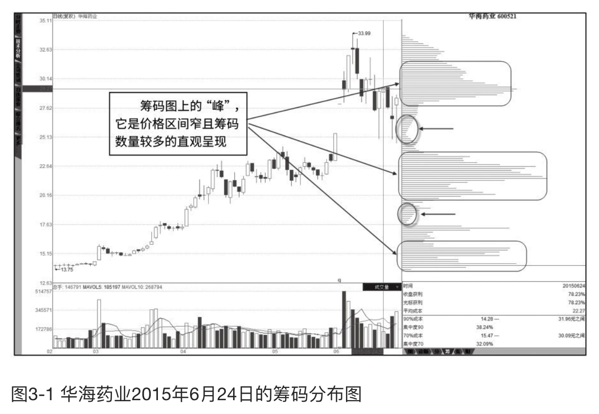

图3-1是华海药业2015年6月24日的筹码分布图，如图标注，图中有三个较为明显的筹码密集“峰”。

除此之外，在“峰”与“峰”之间，还有因筹码数量稀少而形成的“凹陷”区域，我们可以称其为“谷”。

### 震荡与“峰”的形成
一般来说，“峰”的形成往往直接与“横向的窄幅震荡”走势相关，震荡持续的时间越长，筹码的换手越充分，这个价格区间内所聚集的筹码数量也就越多，“峰”的形态特征也就越明显。除此之外，有的时候，仅仅几个交易日的横向震荡，也依旧能够形成“峰”，这多源于这几日的交易异常活跃，实现了筹码的快速换手。

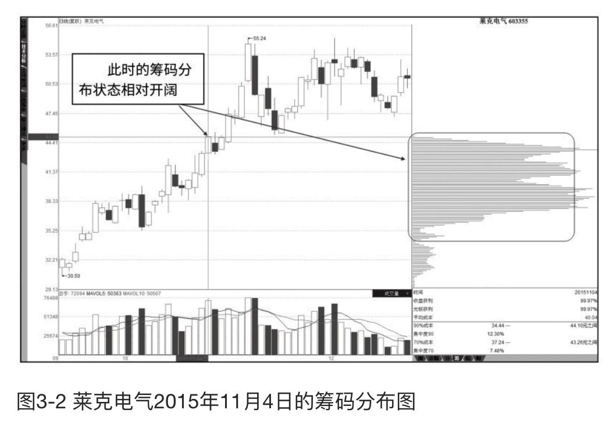

图3-2是莱克电气2015年11月4日的筹码分布图，在此之前，个股处于缓慢攀升走势中，筹码也分布在一个相对开阔的区域内。

随后，个股开始横向震荡走势，当运行至2015年12月8日时，如图3-3所示，在这个相对高位的横向震荡区，形成了一个明显的密集峰，这就是横向震荡走势形成的密集峰。

### 单日“峰”的快速形成
单日峰，即仅仅用一个交易日就让较多的筹码汇聚在当日的交投区间内。一般来说，这是个股走势相对极端的背景下，由于多空双方分歧明显，而当日的盘中振幅又较大，从而促成了筹码的单日快速换手。下面我们结合一个实例来做说明。

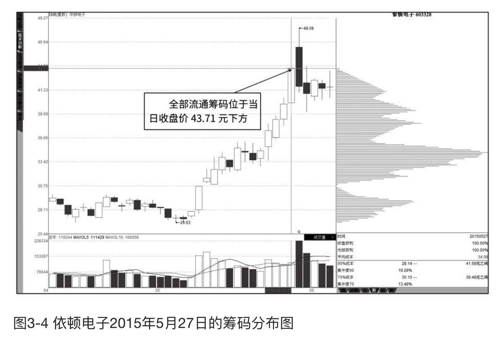

图3-4是依顿电子2015年5月27日的筹码分布图。个股在此之前处于快速上涨状态，至当日可以看到，全部流通筹码均处于获利状态且分布在43.71元下方。

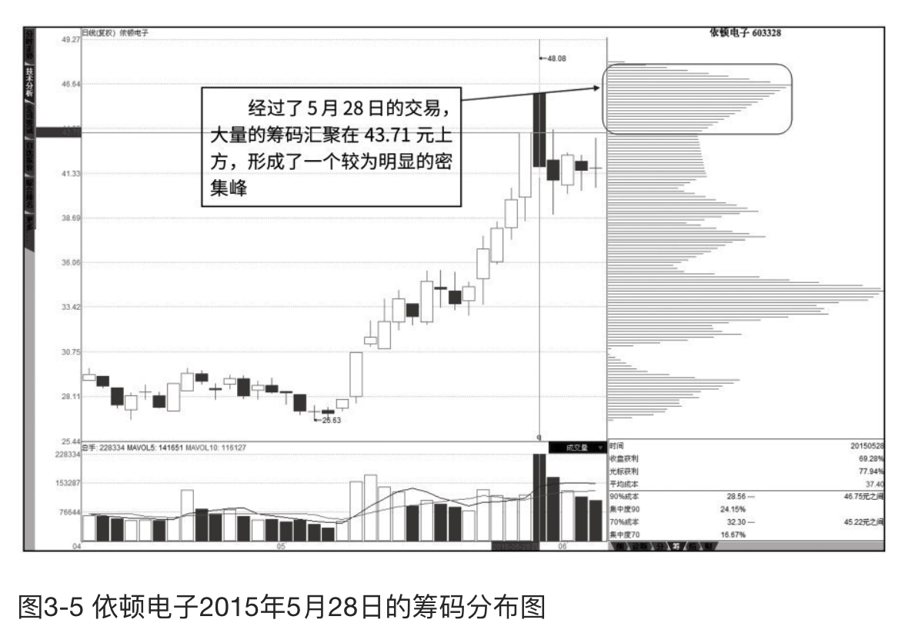

次日，个股于盘中高开低走，盘中振幅巨大，在这种局部价格走势激进且当日盘中振幅大的背景下，势必引发多空双方的强烈分歧，从而也促成了筹码在一个交易日内的快速换手。如图3-5所示，当日交投过后，很多筹码汇聚在了43.71元上方，这就是极端走势背景下形成的`单日“峰”`。

### 多日“峰”的快速形成
多日“峰”，出现在个股创局部新高的走势中，此时，个股在高点仅仅经过了三五个交易日的横向震荡，就使得大量的筹码在此价位区间内汇聚，形成了一个鲜明的“峰”状。

**多日峰的出现，说明市场浮筹较多**，个股短期内一般难有快速上涨行情出现，实盘操作中，宜减仓降低风险。

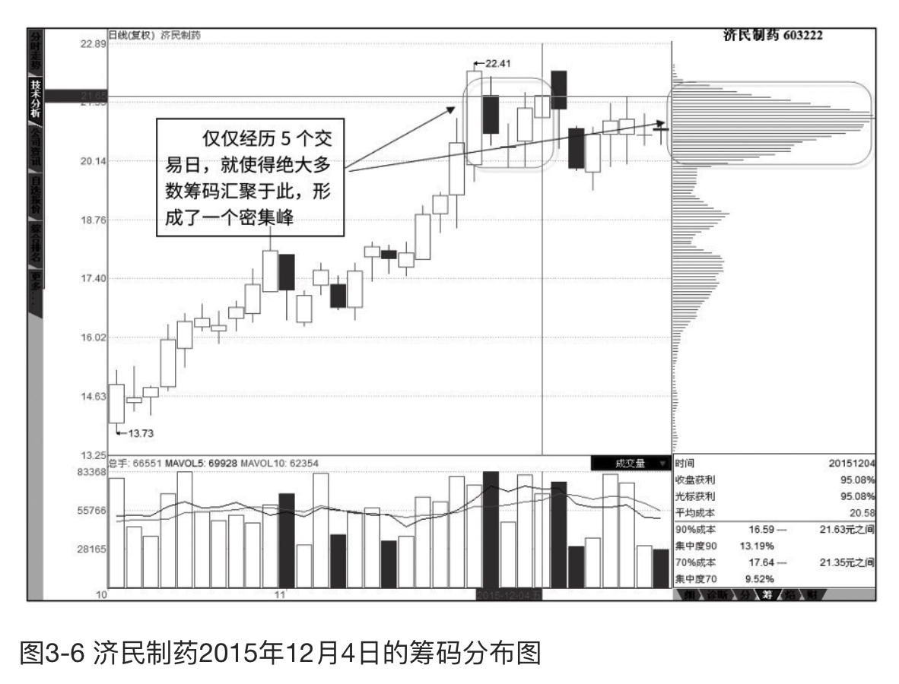

图3-6是济民制药2015年12月4日的筹码分布图。此股经过长时间的稳健攀升之后，于高点出现横向震荡，如图中标注，仅仅经历5个交易日，就使得绝大多数筹码汇聚于此，形成了一个密集峰，这就是`多日峰`。

结合同期大盘走势来看，个股走势明显强于大盘，多日峰的出现说明市场获利抛压较重，浮筹也较多，短期内难有更好的表现，短线宜清仓，中长线则应减仓降低风险。

### “谷”的形成与市场含义
“谷”出现在快速下跌或快速上涨之后，它连接着的是上、下两个盘整区，个股在急速下跌之后（或者是急速上涨之后）构筑了一个平台，这个平台可能是股价走势的反转平台，也可能是延续原有趋势的中继平台，实盘操作中，应结合大盘及个股来综合分析。

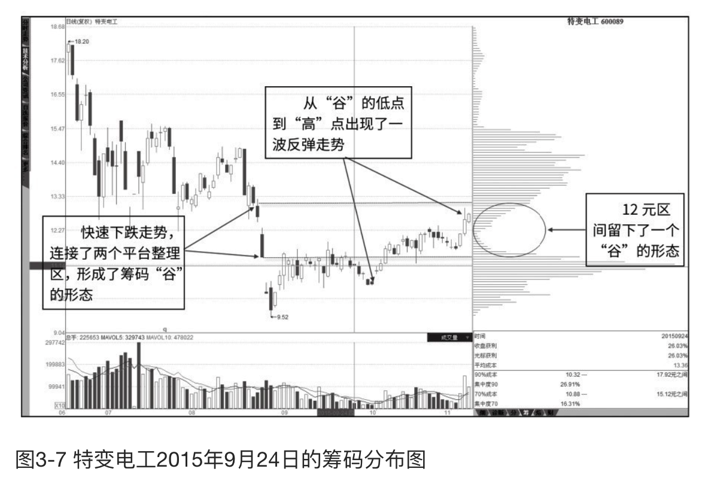

图3-7是特变电工2015年9月24日的筹码分布图，个股首先是平台区的整理走势，随后，出现了一波急速下跌，跌幅较大、速度快，紧随着跌势之后仍然是横向的整理走势。这个走势过程就使得筹码图上出现了“谷”的形态。

###  填“谷”转“峰”的过程
“流动性”以及形态的“互相转化”是筹码运动的主要特征，筹码的“峰”与“谷”也存在着这种转化。**“峰”的出现多代表着股价波动幅度趋窄，是多空力量平衡的表现；“谷”出现往往代表股价波动加剧，是多空平衡被打破的表现**。市场的多空力量就在这种“平衡”与“不平衡”之间不变切换，从而也造成了筹码形态“峰”与“谷”的互相转化。

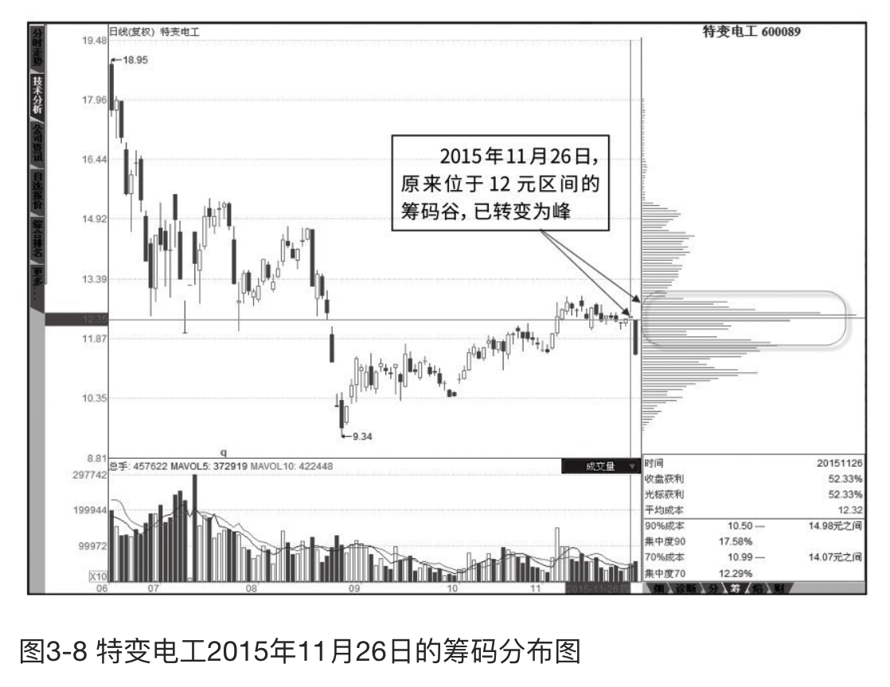

结合图3-7可见，2015年9月24日由于前期的快速下跌，此时的筹码形态仍旧呈现出“谷”的特征，“谷”位于12元价位区间。但是，当个股运行至2015年11月26日，原有的筹码“谷”已随着个股的缓缓上扬而被逐渐“填平”，这就是筹码的一次填“谷”转“峰”的过程（如图3-8所示）。

### “中继谷”与“反转谷”
“中继谷”，顾名思义，代表着趋势仍将延续下去，它常出现在趋势刚刚确立时。当个股向上突破低位盘整区时，此时出现的短暂整理会使得个股筹码分布呈现“谷”的形态，这是上升趋势的中继谷；反之，当个股向下跌破高位盘整区时，此时出现的短暂整理也会使得个股筹码分布呈“谷”的形态， 这是下跌趋势的中继谷。

一般而言，若非大盘走势很差，当这种中继谷出现后，个股很少会因为回调（上升趋势）或反弹（下跌趋势）而出现“填谷”走势。

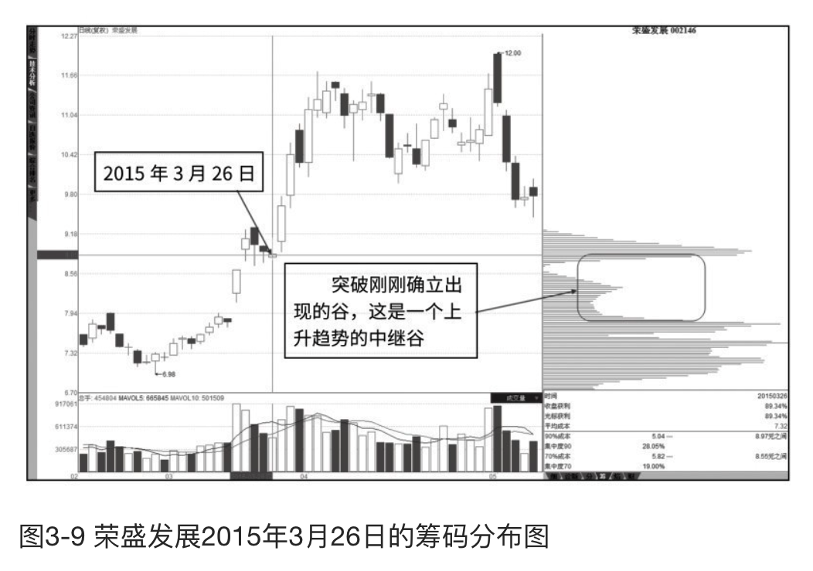

图3-9是荣盛发展2015年3月26日的筹码分布图。此时的个股刚刚强势突破低位整理区，主力拉升迹象明显，同期大盘较为稳健，连续几个交易日的横向整理使得筹码区出现了一个“谷”的形态。

结合同期大盘及个股运行来看，这是`上升趋势的中继谷`，这样的筹码谷多不会因个股回调而出现“填谷”走势。实盘中，我们可以在个股短暂整理的几日中，于盘中择机买入。由于这种操作属于追涨，若同期市场做多氛围不浓的话，应控制好仓位，短线快进快出。

“反转谷”，出现在个股累计涨幅较大（上升趋势中）或累计跌幅较大（下跌趋势中）的位置区，此时，筹码区一般出现“谷”的形态，即使股价走势不马上反转，也极易出现反方向的“填谷”走势。

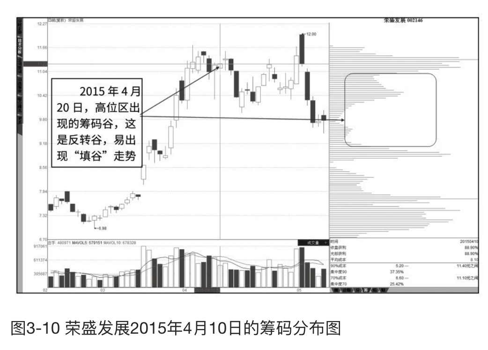

图3-10是荣盛发展2015年4月10日的筹码分布图，此时的个股中期累计涨幅较大，获利盘累积众多，如图标注，这时出现了一个形态开阔的筹码“谷”，这就是一个`反转谷`，股价走势出现由“谷顶”回调至“谷底”的概率极大，实盘中应及时获利了结，规避风险。

## 筹码“峰”的支撑与阻挡
当股价在筹码“峰”上方运行时，“峰”对股价回落有支撑作用；反之，股价在筹码“峰”下方运行时，“峰”对股价反弹有阻挡作用。

### 绘出“支撑线”
支撑线也称为“上升趋势线”，其主要功能在于指示出上升趋势中运动方式，此时，支撑线在个股运行的下方位置。

支撑线的画法很简单，通过将震荡上升过程中两个或多个相邻的、较为明显的回调低点进行连接，就可以得到支撑线。支撑线可以直观清晰地体现出上升途中的支撑位在哪里，是我们识别上升趋势并把握上升途中逢低买入时机的重要工具之一。

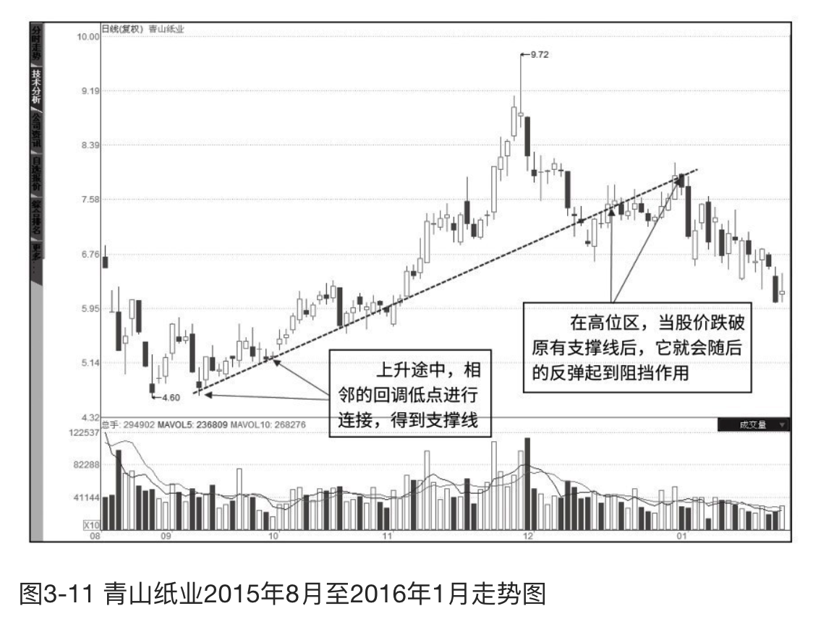

图3-11是青山纸业2015年8月至2016年1月走势图，如图中标注，将上升途中回调走势后的低点进行连线，我们就可以得到此股的支撑线。

在出现了这种支撑线之后，个股的运行轨迹似乎变得更为清晰且有规律了。每当股价随着获利盘的抛售而出现一波回落时，可以看到，在支撑线的位置形成了有力的支撑。

### 绘出“阻力线”
阻力线也称为“下降趋势线”，其主要功能在于指示出下跌趋势中运动方式，此时，阻力线在个股运行的上方位置。

阻力线的画法是：通过将震荡下跌过程中两个或多个相邻的、较为明显的反弹高点进行连接。阻力线可以直观清晰地体现出下跌途中的阻力位在哪里，是我们识别下跌趋势并把握下跌途中逢高卖出时机的重要工具之一。

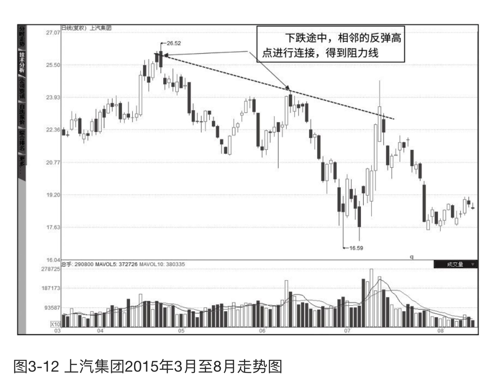

图3-12是上汽集团2015年3月至8月走势图，在画出了这种阻力线之后，我们随后的操作就容易多了，一旦个股短线加速下跌远离阻力线，由于有再度反弹的动力，可以适当短线抄底；而一旦股价反弹至阻力线附近时，就应及时卖出。

### 阻力位与支撑位相互转化
在股价上升过程中，随着市场抛压的不断增强，当支撑线被跌破后，原有的支撑位往往便会演变成反转下跌行情的阻力位；在股价下行过程中，随着市场抄底买盘力量的不断增强，当阻力线被突破后，原有的阻力位往往便会演变成反转上升行情的支撑位。

支撑线转阻力线 | 阻力线转支撑线
--------|--------
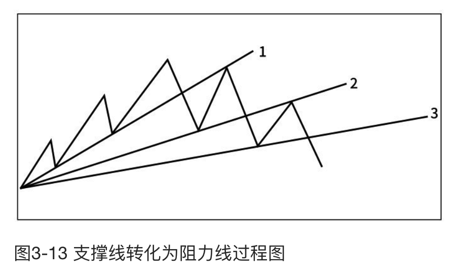 | 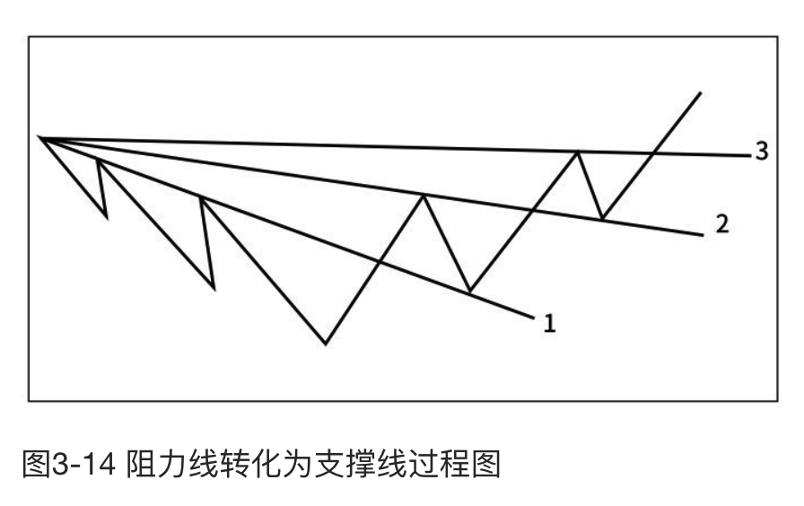

图3-13、图3-14形象地展示了支撑线与阻力线的相互转化过程。下面以图3-13为例。

- 最初，处于震荡上扬过程中，线1是支撑线，对股价上行有支撑作用；
- 随后，由于抛压的加重，线1被跌破，这也是原有行情反转的信号，此时，线1对随后的反弹就具备了阻挡作用；

此时，我们将“行情的起涨点”与“跌破线1后的回落低点”相连，得到一条更为平缓的支撑线，它对个股随后的震荡上行有支撑作用，这就是线2；最后，当线2也被跌破后，它对随后的再度反弹构成阻挡作用。依次类推，我们可以画出更为平缓的线3。

### 下峰的支撑作用
当股价在筹码峰的上方运行时，此时的筹码峰可以称之为“下峰”，下峰对股价的回落将有着支撑作用。一般来说，下峰处所汇聚的筹码数量越多，则它的支撑作用越强；如果筹码峰呈“单峰密集”形态，则此下峰具有最强的支撑作用，特别是当股价处于中长期低位区间时。

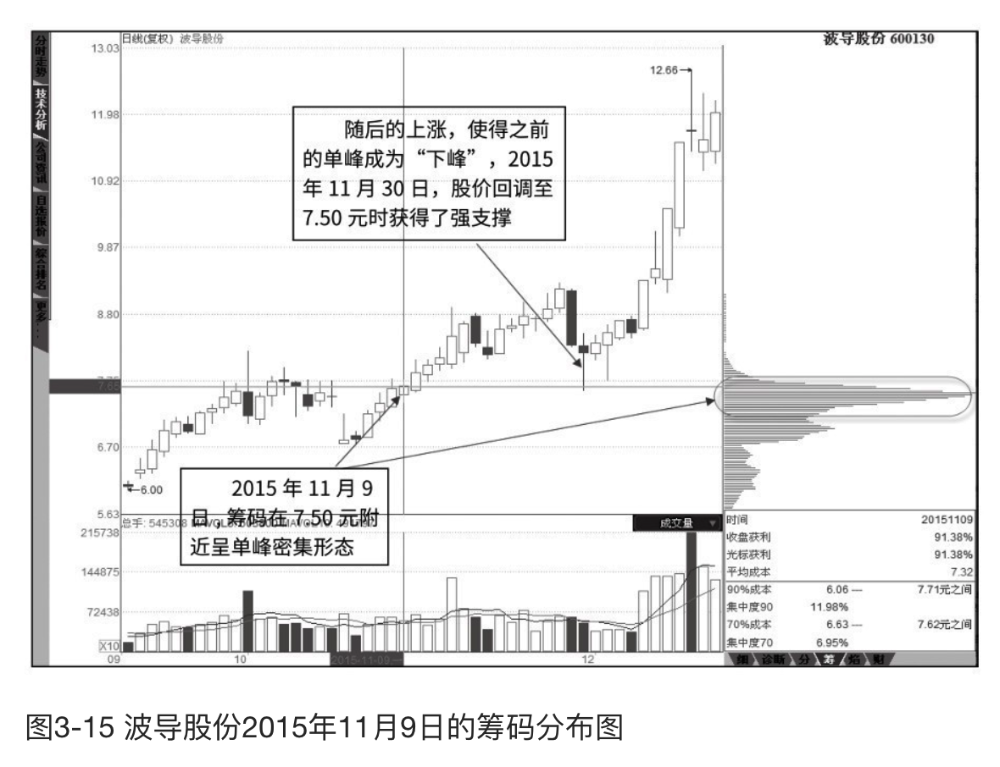

图3-15是波导股份2015年11月9日的筹码分布图。个股在低位出现了长期的横向整理走势，但期间股价重心稳步上移，在2015年11月9日，筹码呈明显的单峰密集形态，随后的个股股价运行在筹码峰之上，这个“下峰”就具有很强的支撑作用。

在图中标注的时间点（2015年11月30日），一波回调使得股价回落至下峰位置点，此时就是一个极好的中短线买入时机。

值得注意的是，很多个股都是先缓慢地运行在筹码峰之上，这是主力进一步吸筹、增强控盘能力的过程，随后，一旦主力控筹能力较强且同期大盘走势稳健，个股随时会以这个筹码“峰”为踏板向上突破。因此，对于有题材、盘子较小的个股来说，当股价回落至下峰附近时，很可能也是其短线起涨点，实盘中，应注意这一点，把握短线战机。

### 上峰的阻挡作用
当股价在筹码峰的下方运行时，此时的筹码峰可以称之为“上峰”，上峰对股价的反弹将有着阻挡作用。一般来说，上峰处所汇聚的筹码数量越多，则它的阻挡作用越强；如果筹码峰呈“单峰密集”形态，则此上峰具有最强的阻挡作用，特别是当股价处于中长期高位区间时。

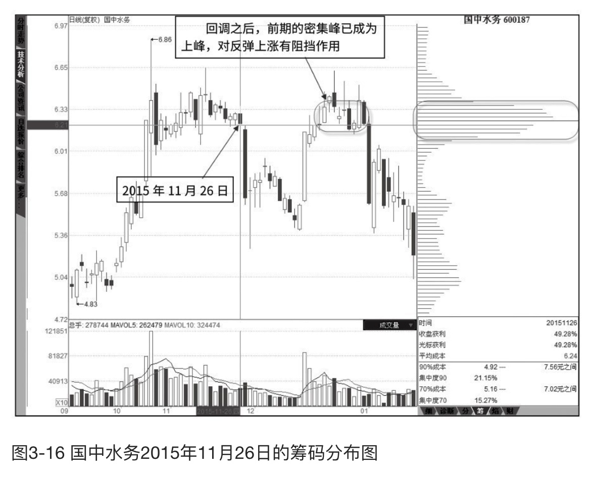

图3-16是国中水务2015年11月26日的筹码分布图，个股在高位区构筑了一个密集峰，随后，股价跌破筹码峰，个股运行于筹码峰的下方，这就是个股运行过程中出现了“筹码上峰”，它有着较强的阻挡作用。从随后的走势可以看出，当个股反弹至上峰时，由于强阻力作用，个股随后再度破位下行。实盘中，上峰往往就是反弹高点，也是中短线卖股离场的时机。

### 套牢峰的强阻力
除了关注个股近期运行中的筹码形态，我们也要关注其历史走势特征。例如，当前期盘整区间被完全跌破之后，就会形成一个“套牢峰”，虽然随着个股后期的较长时间运行，这个套牢峰在筹码图上已看不到踪迹，但筹码图毕竟不是真实的市场持仓成本分布情况，它只是一种近似的表达，而且投资者在被套牢后，基于人的天性，往往不愿割肉离场，而是耐心等待解套，这也是很多股民由短线交易变成真正“股东”的过程。

当股价由前期跌势转而反转向上，并接近前期“套牢峰”时，由于大量解套盘的存在，也及中短线获利盘的双重抛压，会使得这个位置有着强阻力作用，很多个股在向上反转到这个位置后，股价都会出现大幅度的回调，这也彰显了套牢峰的强阻力作用。

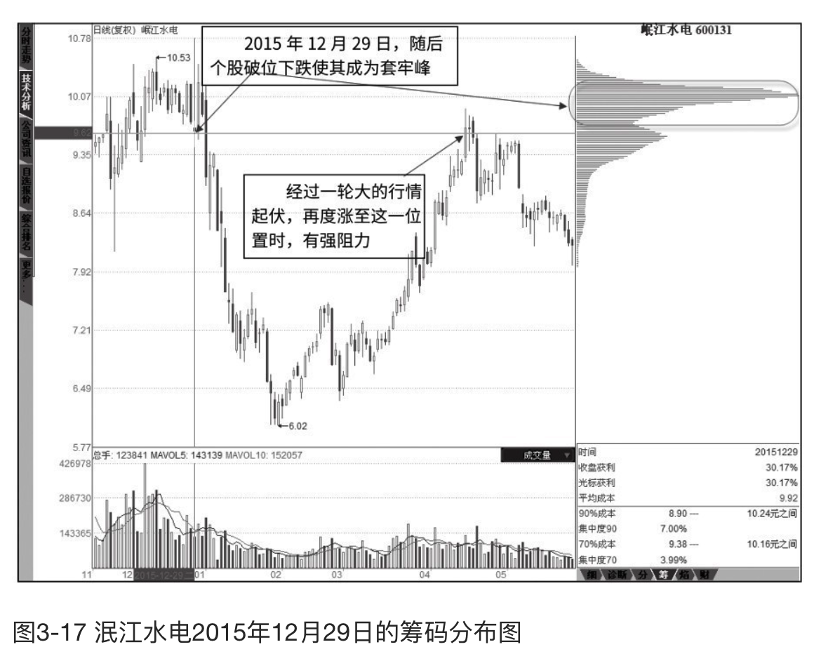

图3-17是泯江水电2015年12月29日的筹码分布图，如图中标注，当日筹码图上呈密集峰的形态，随后，它被完全跌破，但幸运的是，股价能够再度反转上行，但是，当股价反转上行至这个套牢峰的位置点后，可以看到，由于大量解套盘的涌出，使得个股出现了较大幅度的下跌。

### 峰的穿越与破位
与支撑线与阻力线的相互转化类似，当筹码的“下峰”被跌破之后，它就会对随后的反弹起到阻挡作用；同样，当筹码的“上峰”被有效突破之后，它就会对随后的回调起到支撑作用。下面我们结合实例来做说明。

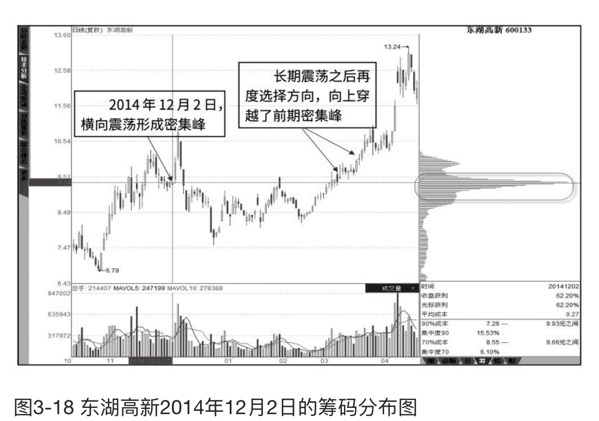

图3-18是东湖高新2014年12月2日的筹码分布图，在这个交易日之后，可以看到股价在筹码峰的下方运动，这个筹码峰此时是具有阻挡作用的“上峰”；随后，如图中标注，个股向上穿越了这个筹码“上峰”，这意味着此峰原有的阻挡作用已然消失，它反而会对随后的上涨起到支撑作用。

从个股实际运行来看，当上峰被有效突破之后，如果此时的股价位于中低位置区，则很有可能是一轮升势展开的信号。

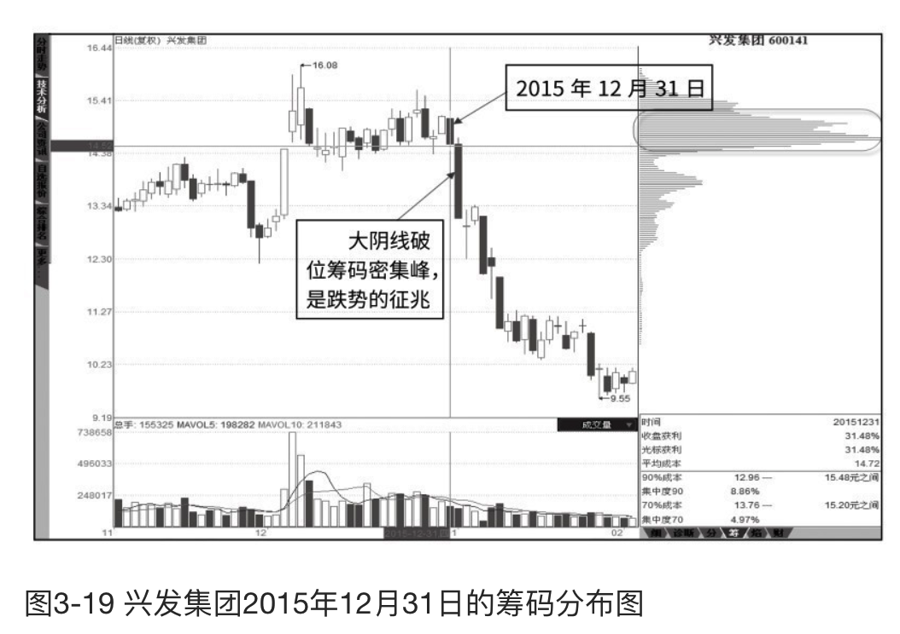

图3-19是兴发集团2015年12月31日的筹码分布图，如图所示之前的震荡运行多位于筹码峰之上，这是筹码的下峰，具有支撑作用；随后，2015年12月31日开始的两根阴线使得股价快速跌破这个筹码峰，这是一轮跌势展开的信号。

### 支撑峰与支撑线交汇点
筹码峰的支撑点若能与支撑线相交叉，证明这一点位的支撑作用十分强。一般来说，只要大盘不出现系统性暴跌，这样的位置点对于个股后期上涨有着极强的支撑、启动作用，实盘操作中，是较为理想的中短线切入点。

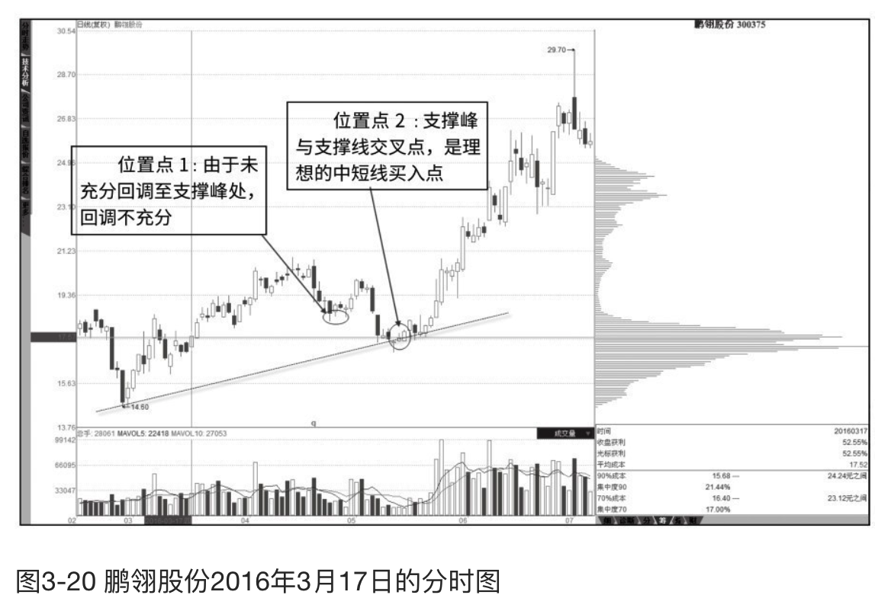

图3-20 是鹏翎股份2016年3月17日的分时图，图中标注了两个位置点。
在位置点1处，虽然可以通过连接两个相邻低点画出一条支撑线，但这一位置并未达到之前筹码峰的位置点，可以说个股的短线回调并不充分，获利抛压仍有打压空间。

在位置点2处，此时个股短线回调得较为充分，通过回调的低点可以画出一条支撑线，且这个位置正好与前期的筹码支撑峰相重合，这个交叉点就是中短线走势中具有最强作用的支撑线，也是买入的好时机。

## 单峰密集形态
### 单峰密集形态识别
单峰密集，简单地从形态上来识别，是指绝大多数流通筹码密集在一个狭小的价格区间内。一般来说，这个狭小的价格区间至少要汇聚70%的流通筹码。结合价格走势来看，单峰密集可以分为高位单峰密集、低位单峰密集、整理区单峰密集。

单峰密集的出现都源于横向震荡走势，而且这种横向震荡的持续时间较长，筹码换手越充分，其余各价位的筹码向此价位区转移得也就越充分。

对单峰密集形态来说，它最直接的市场含义是：市场上的投资者持仓成本都较为接近，明显的获利盘不多，明显的被套盘也不多。一般来说，单峰密集形态预示着多方力量的积聚或者是空方力量的积聚，实盘操作中，我们要结合个股的趋势运行情况来具体分析。

### 低位单峰，底部确立
当低位区的单峰很难被有效跌破且有主力进入时，这就形成了底部单峰密集形态。一旦主力在此区间吸筹充分，就会借助于大盘的企稳而拉升个股，因而，低位区间的单峰常常是一轮上升行情的蓄势阶段，也是我们中长线买股布局的时机。但是，低位区的震荡时间往往过长，在决定短线买入时机时，低位单峰筹码形态并不是买入信号，它只是一个中长线的入场信号。

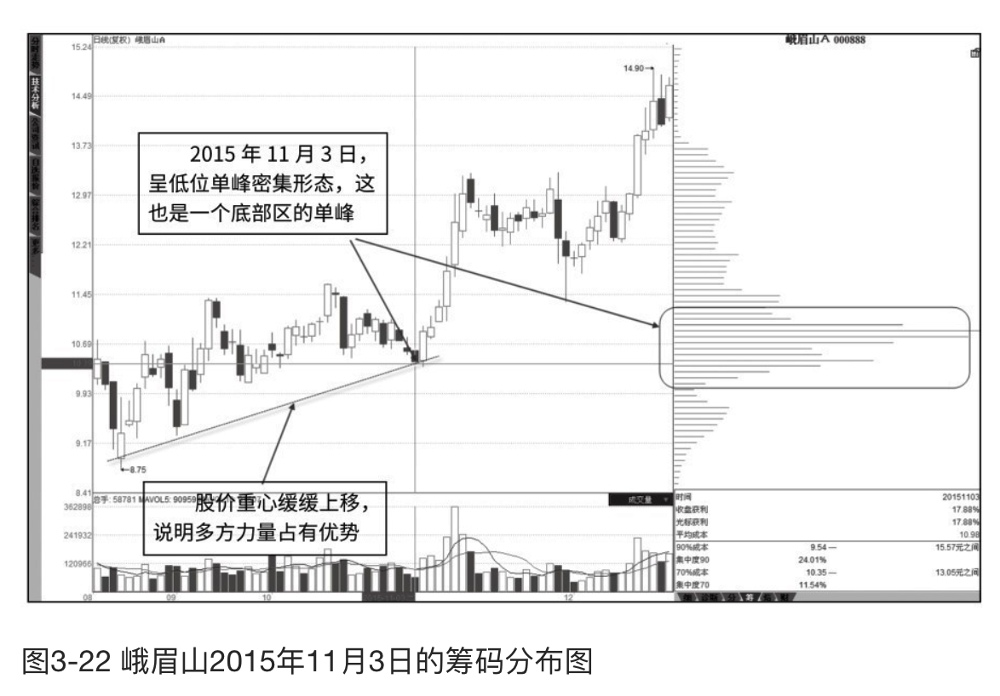

图3-22是峨眉山2015年11月3日的筹码分布图，此股自低位区开始缓慢攀升，如图中标注，由于上升幅度小、持续时间长，从而形成了一个低位区的单峰密集形态；结合个股的运行特征来看，多方力量一直占据主导地位，买盘承接力度更强，表明此低位单峰即是阶段性的底部单峰，预示着随后的行情将以此为启动平台，实盘中，我们可以买股布局。

### 低峰破位，行情看淡
从中短线的角度来看，当低位区的单峰被跌破后，多意味着主力并未运作个股，这样的个股走势要么随波逐流，要么落后于大盘，实盘操作中，这类个股并不是短线买入的优质品种。对于此类形态，我们总结为“低峰破位，行情看淡”，行情看淡是指筹码密集峰被跌破之后，个股随后的走势将“绵软无力”。

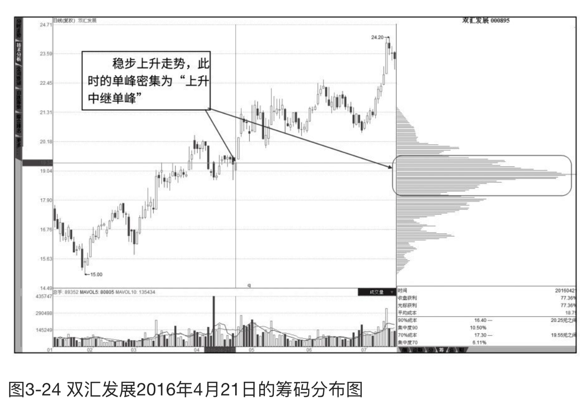

图3-23是鼎捷软件2016年4月15日的筹码分布图，但是在2016年4月15日之后，个股出现大阴线跌破筹码密集区且随后反弹无力的走势，这就是“低峰破位，行情看淡”形态，实盘操作，若个股价值低估，只宜中长线布局，不宜短线入手。

### 中继单峰，行情不止
上升途中的高位区单峰究竟是“上升中继单峰”还是“顶部单峰”呢？下跌途中的低位区单峰究竟是“下跌中继单峰”还是“底部单峰”呢？我们可以从以下两点加以把握。
1. 中继单峰构筑过程中的股价重心移动方向与原有趋势一致，而预示趋势反转的底部单峰及顶部单峰，其股价重心移动方向则与原趋势方向相反。例如，上升途中，上升中继单峰构筑过程中，我们会发现股价重心小幅度地缓缓上移，很少有股价重心缓慢下移的上升中继单峰出现，这时的高位单峰就是“上升中继单峰”；随后，当股价继续上涨，个股再度横向震荡，若我们发现在震荡过程中出现股价重心缓缓下移或者是震荡幅度加剧，则此时的高位单峰就是预示着顶部出现的“顶部单峰”。
2. 出现在行情刚刚确立之时的横向震荡成为中继单峰的概率更大；反之，离行情启动点较远的横向震荡则易成为预示趋势转向的“反转单峰”。

图3-24是双汇发展2016年4月21日的筹码分布图，个股出现了震荡上扬走势，在刚刚脱离底部低位后，个股上升缓慢、出现了横向震荡走势，从而形成了一个单峰密集形态；结合个股走势特点及此单峰所处位置点，可以判断，这是一个上升趋势的中继单峰，操作中，中长线仍可耐心持股。

### 顶部单峰，行情转折
当股价由低位区间经长期震荡上扬达到中长期的高点时，由于市场买盘力度渐弱、获利抛压加重，反转行情随时有可能出现。而高位区又是多空分歧加剧的区域，筹码换手速度相对较快，一旦大多数筹码因高位震荡走势而实现换手，且没有新主力入场承接，就会使得这个高位区的单峰演变为顶部单峰，个股随后就会在投机盘的抛售打压下而破位下行。

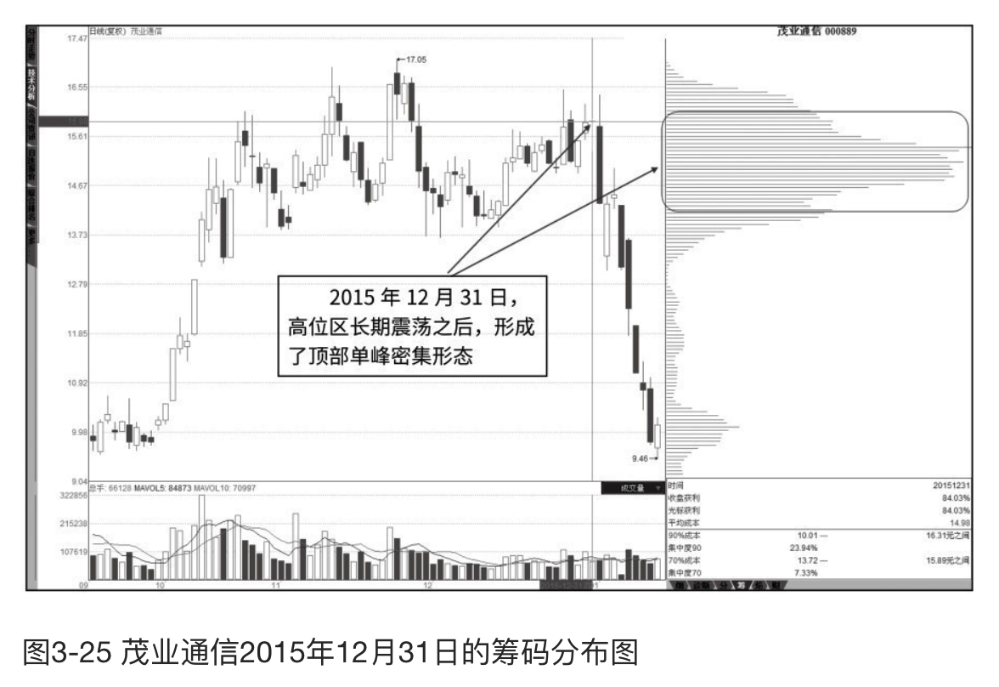

图3-25是茂业通信2015年12月31日的筹码分布图，个股在大涨之后的高位平台横向震荡，随着震荡的持续，量能不断萎缩，这是市场交投清淡的标志，也是买盘力度不足的信号，由于个股累计涨幅较大，远大于同期大盘，因而，我们应留意顶部的出现。一旦出现大阴线破位征兆，就应及时卖股离场。从个股随后的走势来看，这正是一个顶部区域，而2015年12月31日的高位单峰密集形态也是预示着趋势反转的顶部单峰密集。

## 双峰及多峰密集形态

