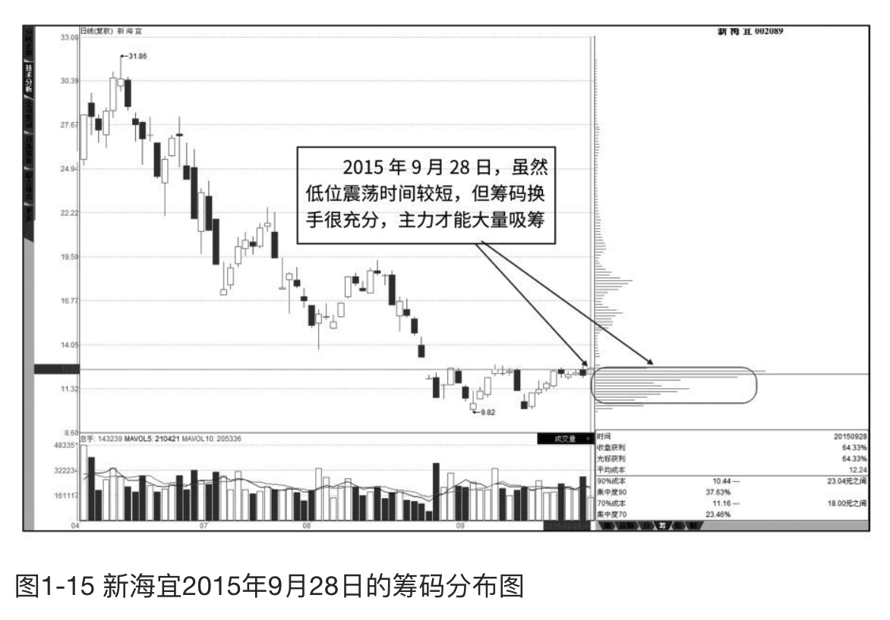
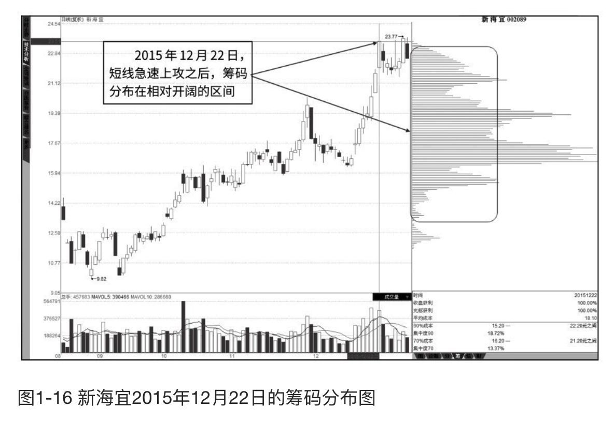
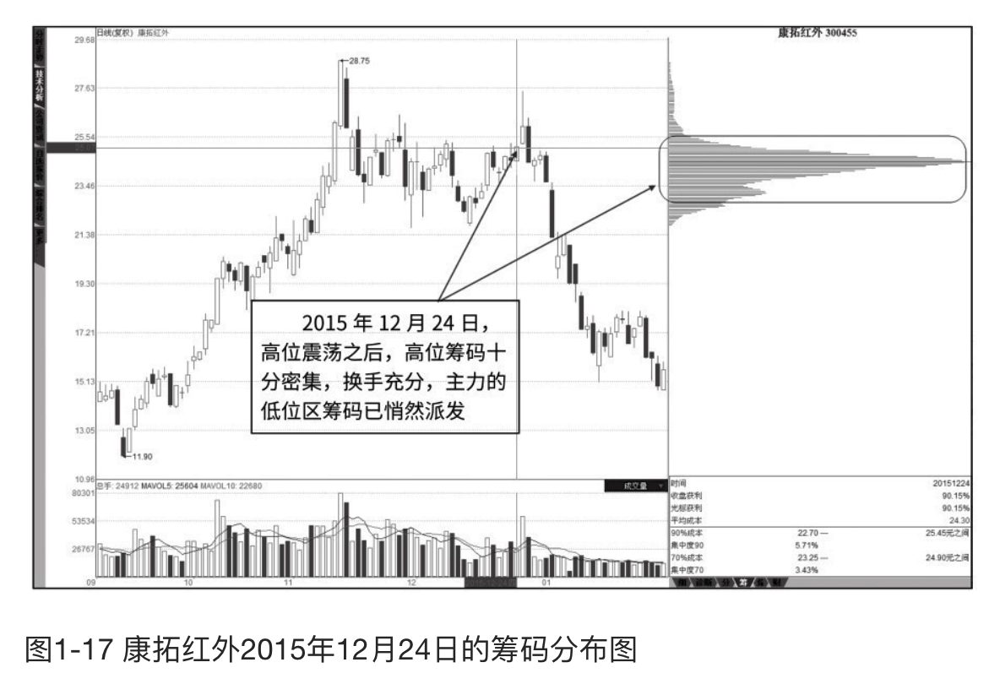
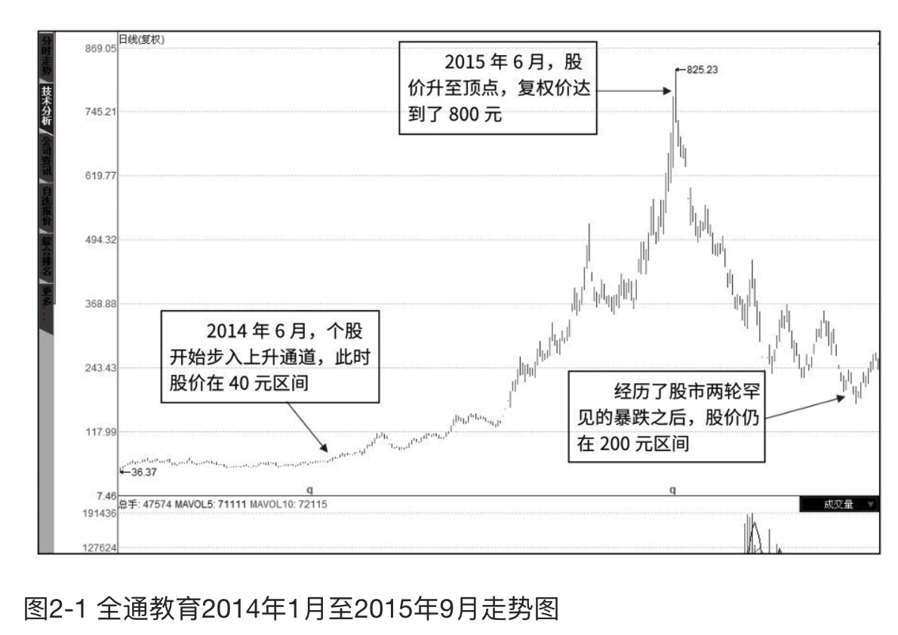
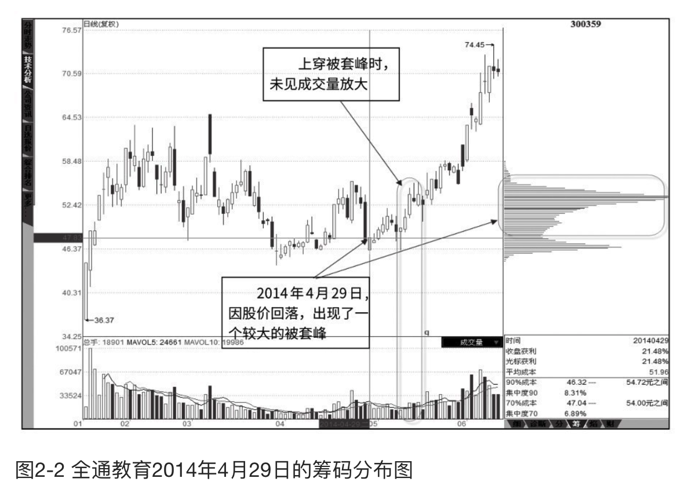

    作者: 杨金
    出版社: 人民邮电出版社
    出版年: 2017-1
    页数: 226
    定价: 45.00元
    装帧: 平装
    ISBN: 9787115441744

[豆瓣链接](https://book.douban.com/subject/26977276/)

- [技术视角下的筹码分布](#技术视角下的筹码分布)
  - [行情与筹码的可逆转换](#行情与筹码的可逆转换)
    - [吸筹阶段的资金换筹](#吸筹阶段的资金换筹)
    - [拉升阶段的资金筹码互换](#拉升阶段的资金筹码互换)
    - [出货阶段的筹码兑现](#出货阶段的筹码兑现)
- [全局视角下的筹码技术](#全局视角下的筹码技术)
  - [“趋势”视角与中线潜力](#趋势视角与中线潜力)
    - [顺势而为的翻倍牛股](#顺势而为的翻倍牛股)
    - [低位区无量上穿被套峰](#低位区无量上穿被套峰)
  - [“主力”视角与分时形态](#主力视角与分时形态)

# 技术视角下的筹码分布
## 行情与筹码的可逆转换
### 吸筹阶段的资金换筹
吸筹阶段的主要任务是在低位大量买进股票。对于一只流通筹码数量有限的个股来说，吸筹是否充分十分必要，它关系到主力随后的控盘能力。一般来说，主力的吸筹情况决定了以下两方面。
1. 持仓量决定了其利润量，筹码越多，利润实现量越大。
2. 持仓量决定了其控盘程度，吸筹越多，市场浮动筹码越少，主力对股票的控制能力越强。

图1-15是新海宜2015年9月28日的筹码分布图，这是主力吸筹之后的典型筹码分布形态——低位区密集。大量的筹码在这个相对狭小的低位震荡区实现了换手，换手的过程就是筹码由普通投资者手中逐步流入到了主力手中。

### 拉升阶段的资金筹码互换
拉升阶段的主要任务就是使股价脱离主力吸筹成本区，打开利润空间。在拉升过程中，主力用部分筹码打压做盘，同时又承接抛压筹码，但其大部分筹码仍旧按兵不动地锁定在吸筹区域，等待拉高获利卖出。

整个拉升环节，主力的持筹数量处于不断变化之中，强力拉升时，主力会买入更多的筹码，手中持筹数量增多；借股价短线回调之际，主力会顺势抛售一部分获利筹码，手中持筹数量会相应减少。一般来说，主力是否会在拉升过程中进一步增加持筹数量，与主力对大势的判断及个股的题材面有关。

图1-16是新海宜2015年12月22日的筹码分布图，可以看到，此股在主力吸筹之后，先缓慢上涨，随后在2015年12月22日前出现了一波急速上涨，此时的个股流通筹码相对开阔地分布在个股的上升空间中，这也是拉升阶段典型的筹码形态。“先缓后急”也是主力常用的拉升方式，在经历了急速上攻之后，主力的出货行情就会较为明显，而个股也将进入顶部区。

### 出货阶段的筹码兑现
出货阶段也称为派发，是把手中筹码卖出、变成现金的一个过程。

一般而言，主力出货是一个相对漫长的过程，但若遇大市急跌，也不排除主力使用打压股价的方式进行出货，虽然会降低利润空间，但却能快速地收回成本、降低大市暴跌的系统性风险。实盘操作中，我们应密切关注筹码在高位区的变化。若大量的筹码已密集地堆积在高位区，说明筹码在高位区已换手充分，拉升前的低位筹码被上移至高位，这其中往往就有大量的主力低位区的筹码。当低位筹码搬家工作完成之时，主力出货工作也宣告完成，一轮下跌行情也随之降临。

图1-17是康拓红外2015年12月24日的筹码分布图，在经历了高位震荡之后，这一震荡区的筹码十分密集，可以说筹码在高位区的换手十分充分，主力的低位区筹码已悄然派发，这时我们应警惕主力出货后的个股崩塌，及时卖股离场、规避风险。

从走势图可以看到，个股随后还有一个二次冲高，这也是主力出货时惯用的伎俩——诱多出货。二次冲高时，往往会让持股者产生个股会再创新高、重拾升势的错觉，从而不愿卖出股票，且能引起一定的追涨盘介入，而主力正是利用投资者的这种心理实现了快速出货。

在一轮行情的流程中要充分重视两个概念：低位充分换手和高位充分换手。低位充分换手是吸筹阶段完成的标志，高位充分换手是派发阶段完成的标志。它们是拉升和派发的充分必要条件。所谓充分换手就是在一定的价格区域成交高度密集，使分散在各价位上的筹码充分集中在一个主要的价格区域。

# 全局视角下的筹码技术
## “趋势”视角与中线潜力
### 顺势而为的翻倍牛股

图2-1是全通教育2014年1月至2015年9月的走势图，此股在这一年多的时间里，向我们诠释了有潜力的中线股是如何利用牛市实现超级上涨的。
1. 2014年6月之前，股市成交低迷，个股极度不活跃，股市不具赚钱效应，很多老股民都离开了市场，寻找其他投资途径，此股在40元区间徘徊。
2. 2014年6月之后，受券商股连续上涨带动，股市一度出现了只赚指数不赚钱的“二八”行情。但即使是这样，对于有着互联网教育第一股这个大热题材的全通教育来说，仍旧借着指数的上涨而开始攀升；对比同期的其他一些中小盘股，此股的走势是出众的。
3. 2015年1月之后，中小盘股开始活跃，大盘股相对低迷，此时的股市进入到了赚钱市，大批资金加速涌入；此股也借着同期的题材炒作之风实现了跨越式的上涨，至2015年6月股灾发生前，复权价达到800元；从40元至800元，累计涨幅20倍，而且，这种上涨是与业绩增长严重脱节的。
4. 没有业绩支撑，仅凭题材炒的个股，是无法长久维持虚高状态的，股市的两轮暴跌让其股价重挫，即使如此，股价仍旧保持在200元区间（复权价）。

### 低位区无量上穿被套峰
个股处于横向震荡走势，此时的市场相对低迷、整体估值偏低，个股的估值与市场同步，未出现过明显的炒作，这就是一个相对的低位区。在这一震荡区间，个股会因股价回落，大量筹码处于短线被套状态，若随后能够以相对缩量的方式向上穿越此被套筹码区间，则多代表市场浮筹较少、主力控盘能力较强，也是其后期有望成为翻倍牛股的前兆。

图2-2是全通教育2014年4月29日的筹码分布图，个股上市之后，因股市持续低迷，并没有走出独立行情，持续地横向震荡，如图中标注，在2014年4月29日的前几日，一波短线回落，出现了一个被套密集峰，但个股随后在上穿这一密集峰时，成交量并没有明显放大。这表明市场筹码的锁定度很高，结合当时的市场整体低估、个股的题材独特。可以预计，有主力资金在这个横盘震荡区大力吸筹，此时，也是我们中长线入场布局的最好时机。

## “主力”视角与分时形态

