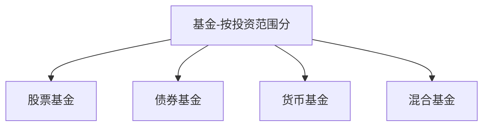
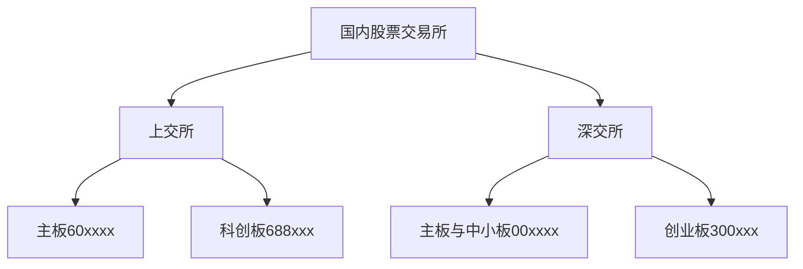
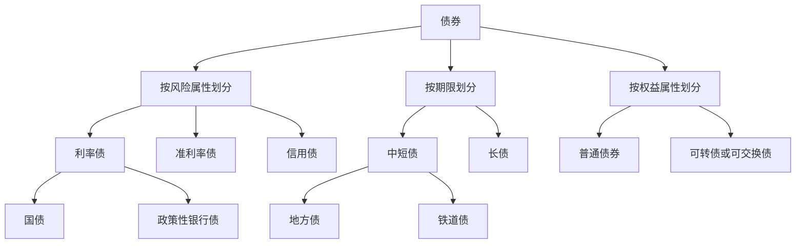
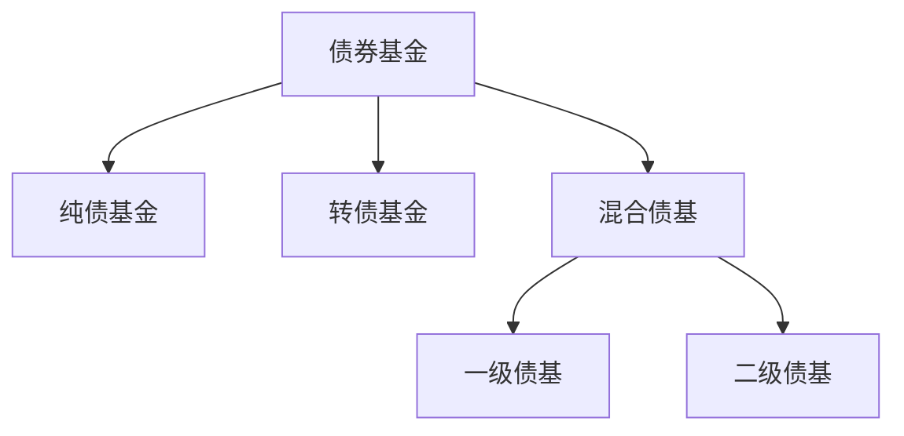
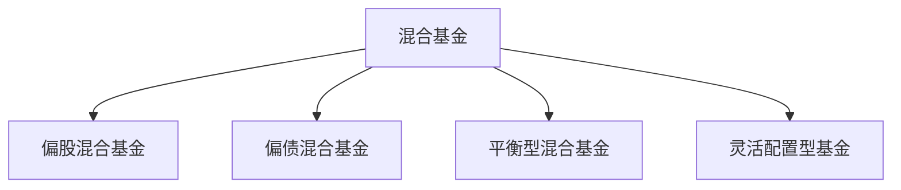

    作者: 龙红亮
    出版社: 中信出版集团
    出版年: 2021-6
    页数: 318
    定价: 65.00
    装帧: 假精装
    ISBN: 9787521732276

[豆瓣链接](https://book.douban.com/subject/35518861/)

- [为什么选择基金](#为什么选择基金)
  - [什么是基金](#什么是基金)
- [基金种类知多少](#基金种类知多少)
  - [按投资范围分](#按投资范围分)
    - [股票基金](#股票基金)
    - [债券基金](#债券基金)
    - [混合基金](#混合基金)
    - [货币基金](#货币基金)
  - [按投资风格分](#按投资风格分)

# 为什么选择基金
## 什么是基金
基金分为两大类：`公募基金`和`私募基金`（非公开募集基金）。公募基金要求募集对象超过200人；而私募基金要求募集对象不超过200人，且一般要求最低购买金额不低于100万元。

# 基金种类知多少
## 按投资范围分

上述分类方法是根据基金的主要持仓资产来确定的。

- 股票基金：80%以上的资产投资于股票。
- 债券基金：80%以上的资产投资于债券。
- 货币基金：仅投资于货币市场工具。
- 混合基金：投资于股票、债券或货币市场工具，但比例不符合上述要求的。

>绝大部分基金产品的类型都可以通过基金名称看出来。股票基金的名称结尾都带有“股票”二字，而债券基金的名称都带有“债券”，混合基金的名称则带有“混合”，货币基金的名称往往带有“货币”“现金”的字样。

从长期来看，各种基金按照年均复合收益率的排序为：

    股票基金＞混合基金＞债券基金＞货币基金。

简单总结就是风险越大，收益越高。这里的风险是指收益的波动幅度。

表3-1　各类基金指数的复合年化收益率（2003-2020年）

代码 | 基金的指数类型 | 复合年化收益率(%) | 最大值(%) | 最小值(%) | 标准差(%)
---|---------|------------|--------|--------|-------
H11021.CS1 | 中证股票基金指数 | 14.7 | 128.3 | -51.4 | 47.0
H11022.CSI | 中证混合基金指数 | 15.2 | 110.3 | -45.4 | 40.2
H11023.CS1 | 中证债券基金指数 | 6.0 | 18.5 | -2.9 | 6.2
H11025.CSI | 中证货币基金指数 | 3.1 | 4.6 | 1.4 | 0.94

### 股票基金
我国有几个股票交易所？我国有两大股票交易所：上海证券交易所（简称上交所）、深圳证券交易所（简称深交所）。沪深两市的股票代码均是6位数。

股票市场是一个多层次资本市场，可以分为主板、中小板、创业板、科创板及新三板。
- 主板上市的企业以传统产业为主，在中小板上市的企业，其规模和要求相对于主板来说，要低一些。
- 创业板和科创板主要针对科技公司，目的是复制美国的纳斯达克市场。新三板不属于传统的股票交易市场，属于中小企业股份转让系统，类似于美国的粉单市场，对投资人有严格的资产要求。

### 债券基金
债券就是企业或政府发行的标准化的债权凭证，可以在二级市场买卖。如果一家银行给某个企业发放了一笔贷款，那么这笔贷款是很难在二级市场流通的，因为贷款本身并非标准化产品。但是，如果企业发行了一笔债券，那么购买了这笔债券的金融机构随时可以在二级市场以合理价格变现。

按风险属性划分，债券可分为以下几种类型。

- `利率债`。利率债是信用风险极低的债券，主要是中央政府或具有中央政府信用背书的机构发行的债券。第一类是国债，由财政部发行。第二类是政策性银行债，是由三大政策性银行（国家开发银行、中国进出口银行、中国农业发展银行）发行的债券。购买利率债不用担心违约风险，只需要考虑利率涨跌对其价格的影响。
- `准利率债`。准利率债的信用风险仅次于利率债。第一类是地方债，是由省级政府发行的债券。第二类是铁道债，是由铁路总公司发行的债券。购买这类债券也不用担心违约风险。
- `信用债`。信用债就是一般企业发行的债券。如果细究起来，信用债还可以分为由金融机构发行的金融债和一般工商企业发行的普通信用债。金融机构的信用资质高、融资能力强，因此金融债的信用等级普遍要高于普通信用债。

如果全部资金只能配置债券，不能配置股票，这种债券基金就叫作`“纯债基金”`。如果不超过20%的持仓配置在股票上，这种债券基金就叫作`“混合债基”`（混合型债券基金）。当然，还有一类债券基金，主要投资于可转债，这种基金叫作`“转债基金”`。

由于历史原因，在混合债基中，除了投资债券，有的还可参与新股申购（打新），这种债券基金被称作`“一级债基”`。不过最新的监管规定，一级债基已经没有资格参与股票打新了，但是可以投资可转债。所以，目前混合债基主要参与股票二级市场（当然也包括股票打新），这种债券基金又被称作`“二级债基”`。

>从基金名称中就可以猜出债券基金的类型。纯债基金名字中往往带有“纯债”二字，混合债基的名字中往往包含“双利”“稳健”“增强”“增利”“强化”等字眼，而转债基金的名字中往往带有“转债”。

表3-2　三类债券基金的复合年化收益率（2015-2020年）

代码 | 基金的指数类型 | 复合年化收益率(%) | 最大值(%) | 最小值(%) | 标准差(%)
---|---------|------------|--------|--------|-------
930609 | 中证纯债债基指数 | 4.2 | 10.0 | 1.55 | 3.2
930897 | 中证非纯债基指数 | 4.8 | 12.7 | -0.1 | 4.6
930898 | 中证转债债基指数 | 2.4 | 25.5 | -14.5 | 15.9

### 混合基金
如果股票占主要持仓（一般在60%-80%），则混合基金被称为`“偏股混合基金”`。如果债券占主要持仓（一般在60%-80%），则混合基金被称为`“偏债混合基金”`。而股票与债券的占比比较均衡的混合基金叫作`“平衡型混合基金”`。还有一部分混合基金，股票和债券所占比例的自由度极大，股票持仓占比在0%~95%，这类混合基金叫作`“灵活配置型基金”`。

>灵活配置型基金的名称往往带有“灵活配置”字眼（但不绝对）。

### 货币基金
《货币市场基金监督管理办法》指出，货币基金应当投资于以下金融工具：

1. 现金；
1. 期限在1年以内（含1年）的银行存款、债券回购、中央银行票据、同业存单；
1. 剩余期限在397天以内（含397天）的债券、非金融企业债务融资工具、资产支持证券；
1. 中国证监会、中国人民银行认可的其他具有良好流动性的货币市场工具。

可以看出，货币基金的投资对象都是安全性极高、流动性极好的金融资产。

## 按投资风格分

