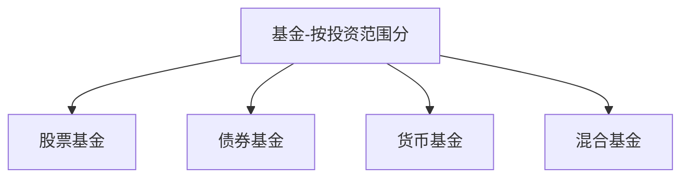
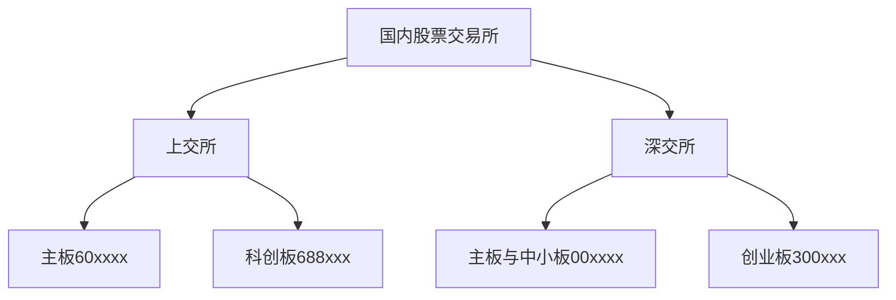
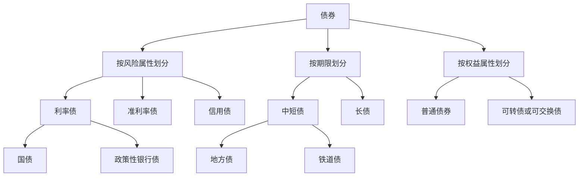
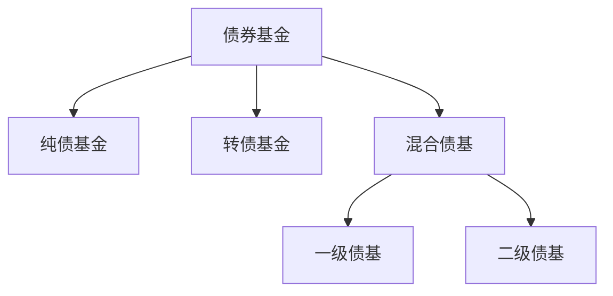
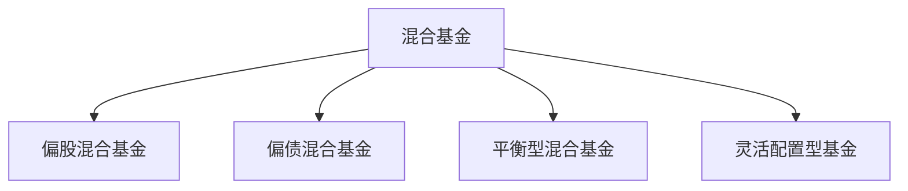
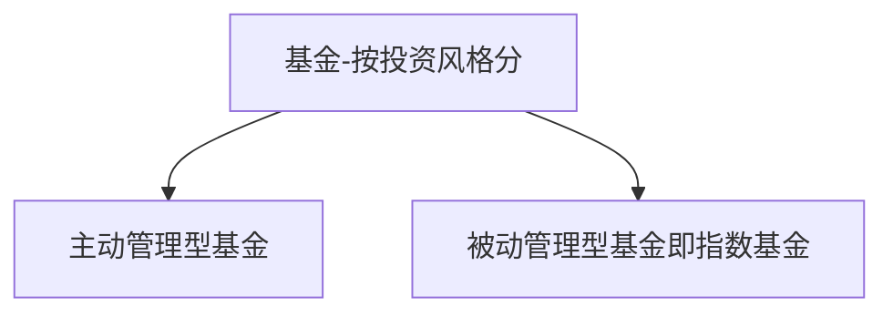
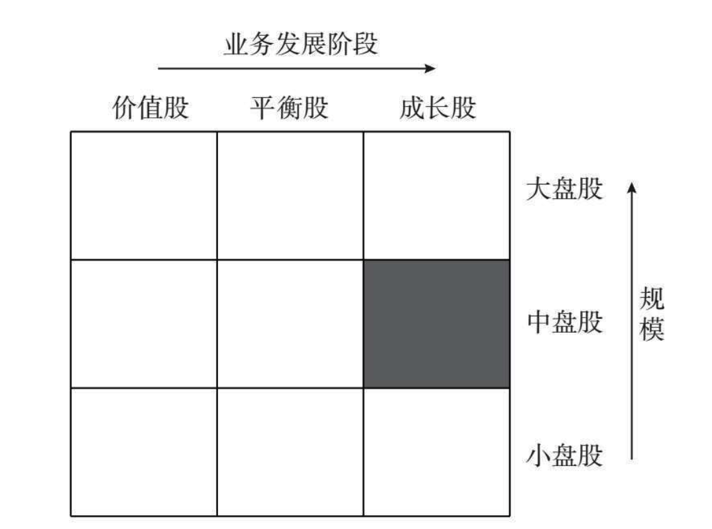
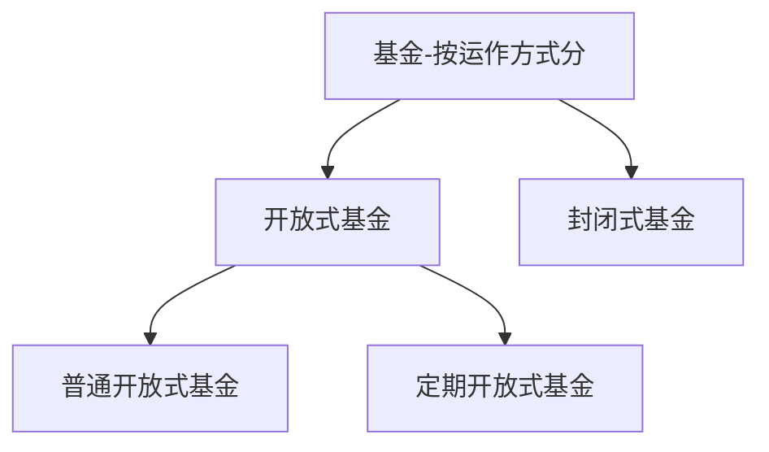
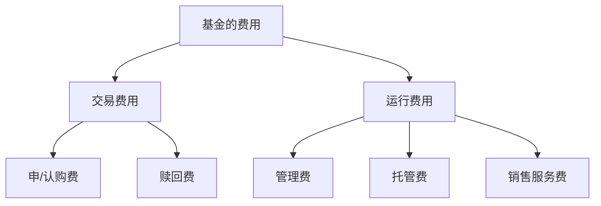

    作者: 龙红亮
    出版社: 中信出版集团
    出版年: 2021-6
    页数: 318
    定价: 65.00
    装帧: 假精装
    ISBN: 9787521732276

[豆瓣链接](https://book.douban.com/subject/35518861/)

- [为什么选择基金](#为什么选择基金)
  - [什么是基金](#什么是基金)
- [基金种类知多少](#基金种类知多少)
  - [按投资范围分](#按投资范围分)
    - [股票基金](#股票基金)
    - [债券基金](#债券基金)
    - [混合基金](#混合基金)
    - [货币基金](#货币基金)
  - [按投资风格分](#按投资风格分)
    - [主动管理型基金](#主动管理型基金)
    - [指数基金](#指数基金)
  - [按运作方式分](#按运作方式分)
  - [按交易方式分](#按交易方式分)
    - [ETF基金](#etf基金)
    - [LOF基金](#lof基金)
    - [没有证券账户怎么办](#没有证券账户怎么办)
- [相关的术语和指标](#相关的术语和指标)
  - [基金的申购与赎回](#基金的申购与赎回)
  - [基金的份额与净值](#基金的份额与净值)
  - [基金的分红](#基金的分红)
  - [基金的费率](#基金的费率)
- [如何选择股票基金](#如何选择股票基金)
  - [确定自己的投资目标和风险偏好](#确定自己的投资目标和风险偏好)
  - [选择优秀的基金公司和基金经理](#选择优秀的基金公司和基金经理)
  - [买了之后的定期追踪](#买了之后的定期追踪)
  - [掘金海外市场](#掘金海外市场)
  - [基金产品维度](#基金产品维度)
    - [晨星基金评级](#晨星基金评级)
    - [金牛奖](#金牛奖)
    - [英华奖](#英华奖)
- [如何选择债券基金](#如何选择债券基金)

# 为什么选择基金
## 什么是基金
基金分为两大类：`公募基金`和`私募基金`（非公开募集基金）。公募基金要求募集对象超过200人；而私募基金要求募集对象不超过200人，且一般要求最低购买金额不低于100万元。

# 基金种类知多少
## 按投资范围分

上述分类方法是根据基金的主要持仓资产来确定的。

- 股票基金：80%以上的资产投资于股票。
- 债券基金：80%以上的资产投资于债券。
- 货币基金：仅投资于货币市场工具。
- 混合基金：投资于股票、债券或货币市场工具，但比例不符合上述要求的。

>绝大部分基金产品的类型都可以通过基金名称看出来。股票基金的名称结尾都带有“股票”二字，而债券基金的名称都带有“债券”，混合基金的名称则带有“混合”，货币基金的名称往往带有“货币”“现金”的字样。

从长期来看，各种基金按照年均复合收益率的排序为：

    股票基金＞混合基金＞债券基金＞货币基金。

简单总结就是风险越大，收益越高。这里的风险是指收益的波动幅度。

表3-1　各类基金指数的复合年化收益率（2003-2020年）

代码 | 基金的指数类型 | 复合年化收益率(%) | 最大值(%) | 最小值(%) | 标准差(%)
---|---------|------------|--------|--------|-------
H11021.CS1 | 中证股票基金指数 | 14.7 | 128.3 | -51.4 | 47.0
H11022.CSI | 中证混合基金指数 | 15.2 | 110.3 | -45.4 | 40.2
H11023.CS1 | 中证债券基金指数 | 6.0 | 18.5 | -2.9 | 6.2
H11025.CSI | 中证货币基金指数 | 3.1 | 4.6 | 1.4 | 0.94

### 股票基金
我国有几个股票交易所？我国有两大股票交易所：上海证券交易所（简称上交所）、深圳证券交易所（简称深交所）。沪深两市的股票代码均是6位数。

股票市场是一个多层次资本市场，可以分为主板、中小板、创业板、科创板及新三板。
- 主板上市的企业以传统产业为主，在中小板上市的企业，其规模和要求相对于主板来说，要低一些。
- 创业板和科创板主要针对科技公司，目的是复制美国的纳斯达克市场。新三板不属于传统的股票交易市场，属于中小企业股份转让系统，类似于美国的粉单市场，对投资人有严格的资产要求。

### 债券基金
债券就是企业或政府发行的标准化的债权凭证，可以在二级市场买卖。如果一家银行给某个企业发放了一笔贷款，那么这笔贷款是很难在二级市场流通的，因为贷款本身并非标准化产品。但是，如果企业发行了一笔债券，那么购买了这笔债券的金融机构随时可以在二级市场以合理价格变现。

按风险属性划分，债券可分为以下几种类型。

- `利率债`。利率债是信用风险极低的债券，主要是中央政府或具有中央政府信用背书的机构发行的债券。第一类是国债，由财政部发行。第二类是政策性银行债，是由三大政策性银行（国家开发银行、中国进出口银行、中国农业发展银行）发行的债券。购买利率债不用担心违约风险，只需要考虑利率涨跌对其价格的影响。
- `准利率债`。准利率债的信用风险仅次于利率债。第一类是地方债，是由省级政府发行的债券。第二类是铁道债，是由铁路总公司发行的债券。购买这类债券也不用担心违约风险。
- `信用债`。信用债就是一般企业发行的债券。如果细究起来，信用债还可以分为由金融机构发行的金融债和一般工商企业发行的普通信用债。金融机构的信用资质高、融资能力强，因此金融债的信用等级普遍要高于普通信用债。

如果全部资金只能配置债券，不能配置股票，这种债券基金就叫作`“纯债基金”`。如果不超过20%的持仓配置在股票上，这种债券基金就叫作`“混合债基”`（混合型债券基金）。当然，还有一类债券基金，主要投资于可转债，这种基金叫作`“转债基金”`。

由于历史原因，在混合债基中，除了投资债券，有的还可参与新股申购（打新），这种债券基金被称作`“一级债基”`。不过最新的监管规定，一级债基已经没有资格参与股票打新了，但是可以投资可转债。所以，目前混合债基主要参与股票二级市场（当然也包括股票打新），这种债券基金又被称作`“二级债基”`。

>从基金名称中就可以猜出债券基金的类型。纯债基金名字中往往带有“纯债”二字，混合债基的名字中往往包含“双利”“稳健”“增强”“增利”“强化”等字眼，而转债基金的名字中往往带有“转债”。

表3-2　三类债券基金的复合年化收益率（2015-2020年）

代码 | 基金的指数类型 | 复合年化收益率(%) | 最大值(%) | 最小值(%) | 标准差(%)
---|---------|------------|--------|--------|-------
930609 | 中证纯债债基指数 | 4.2 | 10.0 | 1.55 | 3.2
930897 | 中证非纯债基指数 | 4.8 | 12.7 | -0.1 | 4.6
930898 | 中证转债债基指数 | 2.4 | 25.5 | -14.5 | 15.9

### 混合基金
如果股票占主要持仓（一般在60%-80%），则混合基金被称为`“偏股混合基金”`。如果债券占主要持仓（一般在60%-80%），则混合基金被称为`“偏债混合基金”`。而股票与债券的占比比较均衡的混合基金叫作`“平衡型混合基金”`。还有一部分混合基金，股票和债券所占比例的自由度极大，股票持仓占比在0%~95%，这类混合基金叫作`“灵活配置型基金”`。

>灵活配置型基金的名称往往带有“灵活配置”字眼（但不绝对）。

### 货币基金
《货币市场基金监督管理办法》指出，货币基金应当投资于以下金融工具：

1. 现金；
1. 期限在1年以内（含1年）的银行存款、债券回购、中央银行票据、同业存单；
1. 剩余期限在397天以内（含397天）的债券、非金融企业债务融资工具、资产支持证券；
1. 中国证监会、中国人民银行认可的其他具有良好流动性的货币市场工具。

可以看出，货币基金的投资对象都是安全性极高、流动性极好的金融资产。

## 按投资风格分

对主动管理型基金而言，**基金公司和基金经理的投研实力是最核心的资产**。被动管理型基金又被称作指数基金。指数基金的投资方法非常简单，就是基金的持仓高度复制（挂钩）某一市场指数：市场指数的权重股如何分配，指数基金也照搬照抄。

>如何区分主动管理型基金和指数基金？通过基金名字就很容易区分。指数基金的名字都会带有“跟踪指数”，而主动管理型基金却没有。

### 主动管理型基金
如何界定一只基金的投资风格呢？晨星公司有一个著名的`“投资风格箱”`，如图3-9所示。

1. 如何界定大盘股、中盘股、小盘股？晨星公司的做法是，将市场上所有股票按照市值从大到小排列，从市值最大的股票一直往后数，累计占全市场70%市值的股票，都属于大盘股。接下来累计占全市场20%市值的股票，属于中盘股。剩余的占全市场10%市值的股票属于小盘股。按照这个规则，截至2020年年底，A股市场大盘股的总市值应在300亿元以上，中盘股的总市值在70亿~300亿元，市值小于70亿元的都属于小盘股。从中美股市的历史回报数据来看，按照投资回报率排序，小盘股＞中盘股＞大盘股。股票的市值越小，流动性越差，需要的回报补偿越多。
2. 如何界定价值股、成长股和平衡股？简单来说，价值股意味着公司业务非常成熟，利润增长稳定（有稳定分红），公司业务很稳，不会大起大落，当然业绩快速增长的希望渺茫。而成长股意味着公司业务迅速发展或未来有很大的发展潜力，目前利润可能很少，但公司的收入、市场份额提升很快，或处于高研发投入期。平衡股处于价值股和成长股之间。

晨星公司给出了五个因子来进行股票定量打分，以判断其到底是价值股还是成长股，如表3-3所示。

价值股得分因子及权重：

因子 | 权重
---|---
预期的市盈率(P/E) | 50.0%
市净率(P/B) | 12.5%
市销率(P/S) | 12.5%
股价与现金流比率(P/CF) | 12.5%
股息率 | 12.5%

成长股得分因子及权重：

因子 | 权重
---|---
预期的利润增长率 | 50.0%
历史的利润增长率 | 12.5%
收入增长率 | 12.5%
现金流增长率 | 12.5%
净资产增长率 | 12.5%

>价值股的衡量标准是公司收入、利润、分红等指标是否成熟、稳定，主要看现状，类似于中年人。而成长股的衡量标准是公司在收入、利润、现金流等方面的增长速度，主要看未来，类似于青少年。

除了上述晨星公司界定的业务发展阶段和规模两个维度，很多基金属于行业性基金：只投资于特定的一个或几个行业。例如，赢利能力和成长性较好的医药、消费、健康、高端制造、TMT（科技、媒体和通信）等行业，都有大量对应的基金产品。

### 指数基金
`市场指数`又分为`宽基指数`和`窄基指数`。

- 所谓宽基指数，是指不限于特定行业或主题，主要反映市场整体走势的指数，一般按照规模进行分类。例如，上证50指数、上证180指数、沪深300指数、中证500指数、创业板指数等，都属于宽基指数。
- 窄基指数聚焦于某个特定行业、主题或策略，比如医药、银行、地产、消费、5G通信、环保等。

目前A股市场上的主动管理型基金还是能够持续打败指数基金的。

表3-6　中证主动股基指数的三年滚动收益率（2011-2020年）

考核期间(3年期) | 主动管理型基金 | 指数基金 | 收益差
----------|---------|------|----
2011-2013年 | -0.9% | -8.1% | 7.2%
2012-2014年 | 11.9% | 14.8% | -2.9%
2013一2015年 | 25.2% | 14.4% | 10.8%
2014-2016年 | 12.5% | 10.8% | 1.7%
20152017年 | 10.6% | 0.3% | 10.3%
2016-2018年 | -12.5% | -8.2% | -4.3%
2017-2019年 | 6.5% | 6.3% | 0.2%
2018-2020年 | 20.5% | 12.4% | 8.1%

## 按运作方式分
公募基金按运作方式分为两种：`开放式基金`和`封闭式基金`（见图3-11）。

## 按交易方式分
一只基金的申购赎回（或交易）的场所，主要分为场内与场外。何谓“场”？`“场”`指的就是证券交易所（包括上交所和深交所）。场外基金就是在交易所之外申购赎回的基金。比如，我们通过网银App、支付宝、天天基金网等渠道购买的基金，都属于场外基金。场外基金在基金中占很大比例。

- 场内基金的交易费用都比场外基金的低。传统的场外基金在申购赎回时均需通过基金公司的统一操作，基金持有人之间无法相互转让；而场内基金支持二级交易，因此基金持有人之间可以相互买卖，不影响基金的总体份额，这样就降低了基金公司的管理成本。
- 场内基金的买卖速度更快。对于传统的场外基金，申购赎回往往需要两个工作日，而场内基金只需要一个工作日即可结算成功。

场内基金也有两种细分类型：`ETF基金`和`LOF基金`。

### ETF基金
`ETF基金（Exchange Traded Fund）`属于场内基金，中文名叫交易所交易基金，是一种在交易所上市交易的开放式基金。ETF基金的特点是可以在二级市场买卖，如同买卖一只股票一样。其成交价格根据买卖双方的价格而定。ETF基金也可以申购和赎回，但必须用实物申赎。简单地说，**申购ETF基金时，你必须先准备好ETF基金里面的一篮子股票，然后找基金公司兑换ETF基金的份额。赎回也是如此，取回来的不是现金，而是一篮子股票**。

对个人投资者来说，实物申购的可操作性不大，毕竟需要准备几十只甚至几百只股票。

绝大部分ETF基金都是挂钩某一指数的指数基金。目前市场上规模较大的ETF基金如表3-7所示。

代码 | 简称 | 基金公司 | 跟踪指数
---|----|------|-----
510050.SH | 上证50ETF | 华夏基金 | 上证50指数
510500.SH | 中证500ETF | 南方基金 | 中证500指数
510300.SH | 沪深300ETF | 华泰柏瑞基金 | 沪深300指数
510330.SH | 300ETF基金 | 华夏基金 | 沪深300指数
512880.SH | 证券ETF | 国泰基金 | 中证全指证券公司指数
159919.SZ | 300ETF | 嘉实基金 | 沪深300指数
515050.SH | 5GETF | 银华基金 | 中证5G通信主题指数
510180.SH | 上证180ETF | 华安基金 | 上证180指数
159915.SZ | 创业板 | 易方达基金 | 创业板指数
159995.SZ | 芯片ETF | 华夏基金 | 国证半导体芯片指数
512000.SH | 券商ETF | 华宝基金 | 中证全指证券公司指数
159949.SZ | 创业板50 | 华安基金 | 创业板50指数
512760.SH | 国泰CES芯片ETF | 国泰基金 | 国证半导体芯片指数
512960.SH | 央调ETF | 博时基金 | 中证央企结构调整指数
512950.SH | 央企改革ETF | 华夏基金 | 中证央企结构调整指数
515000.SH | 科技ETF | 易方达基金 | 中证科技50指数

### LOF基金
`LOF基金（Listed Open-Ended Fund）`属于场内与场外“双修”的基金，中文名叫上市型开放式基金，属于具有中国特色的产品。普通的开放式基金能够在场外申购，却不方便在二级市场转让。如果投资者A想申购某只LOF基金，而投资者B恰好想赎回这只基金，并且双方在场内（证券交易所）达成买卖协议，那就再好不过了，这将极大地节约交易成本。方法很简单：把场外的开放式基金改造一下，让其在证券交易所上市，允许其在场内进行交易。这种可以上市交易（转让、申购、赎回）的开放式基金就叫LOF基金。所以LOF基金既可以场外申购和赎回，也可以场内申购和赎回。

表3-8　LOF基金的几种申购方式对比

对比项目 | 场外申购 | 场内申购 | 场内二级购买
-----|------|------|-------
申购费率 | 1.50%,大部分渠道一折优惠，即0.15% | 1.50%,一般不打折或折扣较少 | 没有申购费。只有少量的券商佣金费用，一般在万分之二和万分之五之间
确认份额时间 | T+1或更长 | T+1或更长 | T+1
赎回费率 | 根据持有天数而定。在一般情况下，持有7天以内1.5%，持有2年以上不收取 | 根据持有天数而定。在一般情况下，持有7天以内1.5%，持有2年以上不收取 | 没有赎回费。只有少量的券商佣金费用，一般在万分之二和万分之五之间
赎回到账时间 | T+1或更长 | T+1或更长 | T+1

表3-9　ETF基金与LOF基金的区别

区分维度 | ETF基金 | LOF基金
-----|-------|------
投资风格 | 几乎全部为指数基金 | 指数基金和主动管理型基金都有， | 主动管理型基金占主流
场内/场外 | 场内 | 场内+场外
申购 | 场内实物（一篮子股票）申购 | 现金申购，场内场外均可
赎回 | 场内实物（一篮子股票）赎回 | 现金赎回，场内场外均可
二级市场交易 | 支持 | 支持
管理费/年 | 0.5% | 1.5%(主动管理型基金)
托管费/年 | 0.1% | 0.2%~0.25%(主动管理型基金)

### 没有证券账户怎么办
相比于场外基金，场内基金在费率成本、成交速度方面都具有优势，但是需要投资者事先开立证券账户。这对炒股的散户来说，不是问题。对没有证券账户的投资者而言，他们如何购买场内基金呢？基金公司早就想到了这个问题，因此推出了`场内基金的联接基金`。例如，如果场内有一只ETF基金，那么基金公司往往会同时发行一只联接该ETF基金的场外基金，即使投资者没有证券账户，也可以通过场外渠道来申购该基金。

ETF联接基金绝大部分（90%左右）的资金投资于对应的场内ETF基金，剩余的小部分（10%左右）用于应付日常的基金净赎回。

表3-10　部分ETF基金及其对应的ETF联接基金

基金公司 | ETF基金代码 | ETF基金简称 | 对应的ETF联接基金代码 | 对应的ETF联接基金简称
-----|---------|---------|--------------|-------------
华夏基金 | 510050.SH | 上证50ETF | 001051.OF | 华夏上证50ETF联接A
南方基金 | 510500.SH | 中证500ETF | 160119.OF | 南方中证500ETF联接(LOF)A
华泰柏瑞基金 | 510300.SH | 沪深300ETF | 460300.OF | 华泰柏瑞沪深300ETF联接A
华夏基金 | 510330.SH | 300ETF基金 | 000051.OF | 华夏沪深300ETF联接A
嘉实基金 | 159919.SZ | 300ETF | 160706.OF | 嘉实沪深300ETF联接(LOF)A
易方达基金 | 159915.SZ | 创业板 | 110026.OF | 易方达创业板ETF联接A

# 相关的术语和指标
## 基金的申购与赎回
我们常说的“买”基金，其专业的说法是`“申购”`。在你申购成功一只基金后，基金公司拿到了你的钱，并将其纳入资金池，为你投资管理。

你卖掉一只持有的基金，其专业说法叫`“赎回”`。基金公司会根据你所持有的基金份额，计算你持有的市值，并把现金退还到你的账户。

不过，如果你购买的是正在募集发行的新基金，这种操作就不再叫“申购”了，而是叫`“认购”`。认购和申购的区别在于：在一般情况下，如果基金处于开放申购状态，那么申购多少金额都能成功（除非限大额，比如每天申购资金不得超过1 000元），而认购未必都能全额购买。

## 基金的份额与净值
“金额申购，份额赎回。”

不管是股票基金、债券基金还是混合基金，在发行募集时，**其初始单位净值都是1.0元（个别的可能有例外）**。假设基金A最初募集了2亿元，则这只基金的初始份额正好为2亿份。在募集期结束后，基金开始运作并建仓。随着持仓资产的涨跌，基金的净资产每日也会波动，对应的基金单位净值也会波动，但份额不会改变。

$基金单位净值=\frac{基金净资产}{基金总份额}$

**基金便宜与否、是否值得投资，与其单位净值的高低没有关系**！基金的单位净值，反映的是这只基金过去的历史业绩增长。单位净值高的基金，说明过去积累了很多的盈利，体现为净值上涨，仅此而已。而单位净值低的基金，要么是新发行的基金，要么在过去亏损较多，要么把积累的盈利通过分红都分给投资者了。

## 基金的分红
在基金选择现金分红后，这只基金的单位净值立刻出现下降，但这并不影响基金本身的业绩。

在购买基金时，基金公司官方App或大部分的基金第三方平台都会让你选择是否红利再投资。如果你勾选此项，则每次的现金分红会默认再次购买这只基金，你的份额会增加。更重要的是，**分红再投资不收取申购费**。

在基金分红后，基金的单位净值会出现骤降。因此，单纯通过查看一只基金单位净值的走势来判断这只基金的业绩表现，是错误的，除非其间没有任何分红。所有的基金还有一个重要的评价指标：`累计净值`。

    累计净值=单位净值+基金成立以来累计的单位分红金额

累计净值也存在一个大问题：从不考虑红利再投资的情况。因为累计净值仅仅把过去的分红金额简单相加，并不考虑基民的红利再投资，所以它往往低估了实际的投资收益（因为基金的长期收益为正）。

`复权单位净值`假设历史上所有的现金分红都会进行红利再投资，这样现金不再是现金，而是变成了基金份额，会持续产生投资收益。

因为股市和债市的长期投资收益为正，所以对于一只成立时间较长的基金，存在以下关系：

    复权单位净值＞累计单位净值＞单位净值

**计算购入成本，看单位净值；计算投资收益，看复权单位净值**。

## 基金的费率

当一只基金产品第一次募集发行时，你购买它所付的费用就称作`认购费`。在它上市后，你再购买它，就称作`申购`。值得注意的是，**认购费不打折**。所以，如果你打算购买的是同一个基金经理管理的风格类似的基金产品，那么你应该**买旧不买新**。

大部分基金产品在设计时，都把赎回费设计成阶梯式的：**持有时间越长，赎回费率越低**。

特别值得注意的是，**`赎回费`中的一部分归为基金财产**。具体归属比例根据不同的赎回费率而定，一般为25%~100%。这就可能造成一个奇观：**在某些情况下，一只基金遭遇了巨额赎回，其中的一部分归为剩余的基金财产，使得基金净值在一天内出现暴涨**。

`管理费`是支付给基金公司进行资产管理的服务费用。在实际计算时，基金公司每日计提管理费，直接从基金净值中扣除。管理费一般不打折。

基金产品的运作资金及证券需要在某家银行（或证券公司）开设一个单独的托管账户，以防止基金公司挪用资金或证券。托管机构会对托管户收取`托管费`。所以托管费不是由基金公司收取，而是由托管机构收取的。不过，托管费由基金公司代收，每日计提，直接从基金净值中扣除。

基金产品的销售在很大程度上依赖于基金代销渠道。银行、证券公司、第三方平台（支付宝、微信、天天基金网等）都是常见的基金代销平台。基金的`销售服务费`用于支付销售机构的佣金、基金的营销费用及基金份额持有人的服务费等。销售服务费也会从基金净值中直接扣除。

表4-13　各类基金典型的费率

基金类型 | 货币基金 | 债券基金 | 偏债混合型基金 | 偏股混合型基金 | 股票基金 | 指数基金
-----|------|------|---------|---------|------|-----
申购费(折扣前，%) | 0 | 0.4~0.8 | 1.2 | 1.5 | 1.5 | 1.2
赎回费(%) | 0 | 1.5~0.0 | 1.5~0.0 | 1.5~0.0 | 1.5~0.0 | 1.5~0.0
管理费(%/年) | 0.15~0.33 | 0.5~0.8 | 1.0 | 1.5 | 1.5 | 0.5
托管费(%/年) | 0.05~0.10 | 0.05~0.20 | 0.05~0.20 | 0.20~0.25 | 0.20~0.25 | 0.1
销售服务费(%/年) | 0.10~0.25 | 0~0.40 | 0~0.40 | 0~0.40 | 0~0.40 | 0~0.40

# 如何选择股票基金
## 确定自己的投资目标和风险偏好
表5-3　不同风险偏好类型及所适合的基金类型

风险偏好类型 | 风险承受能力 | 投资目标 | 可投资的基金类型
-------|--------|------|---------
保守型 | 不想承担任何风险 | 保值、不亏钱 | 货币基金、纯债基金
稳健型 | 害怕风险 | 在保值的基础上追求一定收益 | 债券基金
平衡型 | 能够承担一定风险 | 平衡风险与收益，在两者之间取得平衡 | 二级债基、偏债混合型基金
进取型 | 能够承担高风险 | 追求高收益 | 偏股混合型基金、股票基金

## 选择优秀的基金公司和基金经理
优秀的基金经理都有哪些共同特质？

1. **精选优质个体企业为先，自下而上的选股策略较多**。
2. **忽略择时**。择时是一个非常有诱惑力但致命的选择：高抛低吸，反复赚市场的钱。但随着从业经验的丰富，这些优秀的基金经理都发现，择时是极难的，或者说从长期来看，择时收益为零甚至为负（考虑到所投入的精力和调仓成本）。精选优质基金，并长期持有，是最重要的事。
3. **低换手率**。这一点与前面两点是一致的。只有选中优质基金，并长期持有，才能获得超额回报。在这种情况下，低换手率是一个自然的结果。国内公募基金的换手率中位数大约在230%，而上述基金经理的换手率普遍较低。

买得便宜，是基金赚钱的关键。

1. **逆市场操作**。在熊市中大量买入基金，耐心等待，在牛市中逐步减仓。这一招是反人性的，人的本能就是追涨杀跌，喜欢在股市火热时买入爆款基金，殊不知这很容易陷入高位站岗的境地。而在熊市中，新发基金往往募集困难，但是买入成本很低。这也是巴菲特说的“别人恐惧时我贪婪，别人贪婪时我恐惧”。但要做到这一点，需要对投资有相当的认知和定力，需要忍耐长时间的寂寞甚至亏损。
2. **基金定投**。既然怕买基金时高位站岗，又怕熊市时自己没有这个决心大量买入，那就做基金定投吧——每个月用固定金额买入心仪的基金，不管股市涨跌，长期坚持。

## 买了之后的定期追踪
1. **定期看基金经理的前十大持仓**。每个公募基金产品，都需要公布每个季度末的前十大持仓。通过每个季度的持仓，我们可以看出基金经理的**投资风格有没有漂移**。当然，能看懂持仓的前提是，你对股市和股票投资有一定的了解，否则你也看不出任何门道。
1. **看看基金经理有没有换**。基金经理对于基金业绩的重要性不用多说，不管是基金经理跳槽还是换岗，都可能导致你所持有的基金的基金经理换人。
1. 你如果做的是基金定投，那么需要定期对持仓组合进行调仓，包括部分止盈。

## 掘金海外市场
`QDII`，是`合格境内机构投资者（Qualified Domestic Institutional Investor）`的简称。QDII基金就是国内的人民币基金通过外汇兑换后，投资海外资本市场的基金。

## 基金产品维度
### 晨星基金评级
在基金评级方面，全球最知名的机构是晨星。晨星是全球最早从事基金评级的机构之一，在全世界具备良好的声誉，并且很早就进入国内市场。

晨星、银河、中信这三家的基金评级体系大同小异，都是从收益评价指标、风险评价指标、风险调整后收益指标这三项来综合考虑，以业绩评价为主，兼顾风险特征。同时，这三家都采用星级评价，分为一星级到五星级，最高等级为五星级。

### 金牛奖
业界最负盛名的基金奖项是金牛奖，它由中国证券报社主办，银河证券、天相投顾、招商证券、海通证券和上海证券等五家机构协办。该奖项在基金行业和基金监管层具有广泛的认可度，享有中国基金业“奥斯卡”奖的美誉，是中国资本市场最具公信力的权威奖项之一。金牛奖主要分为基金公司奖项、基金产品奖项两大类。

### 英华奖
由中国基金报推出的英华奖，正是针对基金经理评选的奖项。

# 如何选择债券基金

