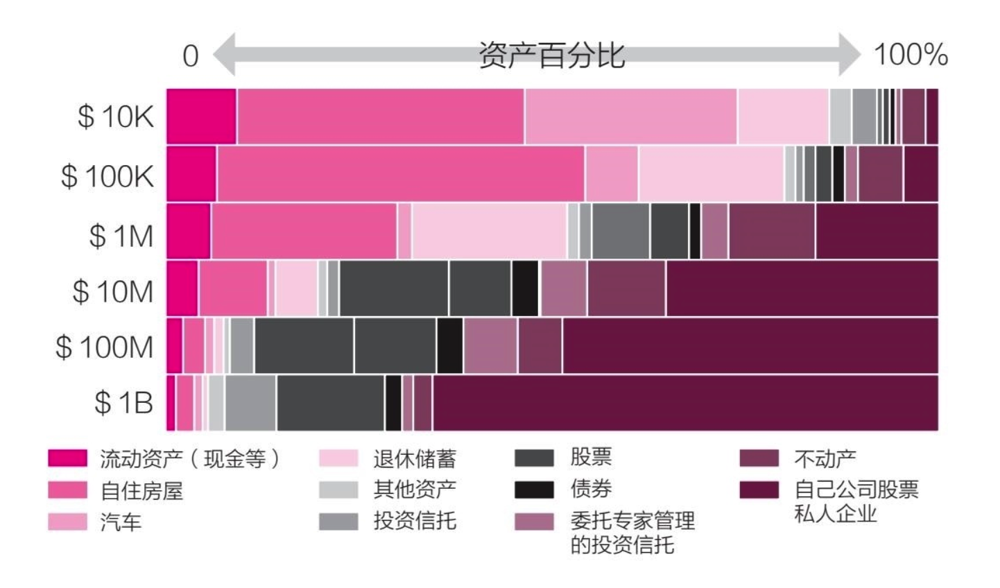
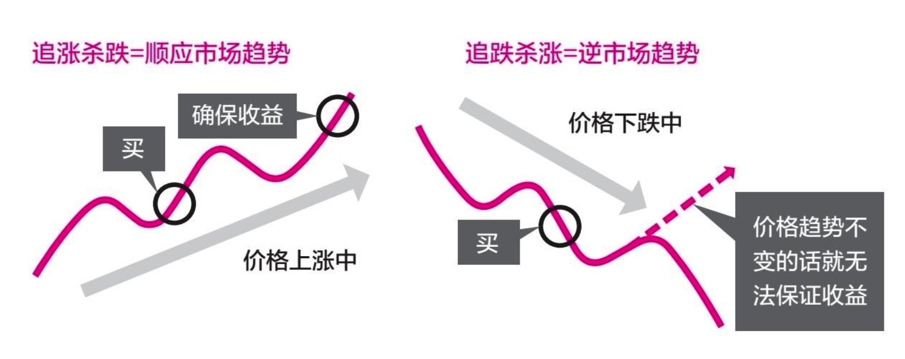

    作者: [日]高桥丹
    出版社: 湖南文艺出版社
    出品方: 博集天卷
    原作名: 世界のお金持ちが実践するお金の増やし方
    译者: 朱悦玮
    出版年: 2022-4-1
    页数: 240
    定价: 56.00元
    装帧: 平装
    丛书: 有钱人书系
    ISBN: 9787572606120

[豆瓣链接](https://book.douban.com/subject/35799769/)

- [有钱人的思维](#有钱人的思维)
  - [有钱人的特征](#有钱人的特征)
  - [成为亿万富翁的方法](#成为亿万富翁的方法)
  - [狮子战略](#狮子战略)
  - [成功法则](#成功法则)
  - [有钱人的思维](#有钱人的思维-1)
  - [对工作的看法](#对工作的看法)
- [投资的基本](#投资的基本)
  - [“72法则”](#72法则)
  - [利用投资获取利益的5个规则](#利用投资获取利益的5个规则)
  - [设定投资的目标](#设定投资的目标)
  - [平均成本投资](#平均成本投资)
  - [短期投资](#短期投资)
  - [投资的知识](#投资的知识)
- [投资组合](#投资组合)
  - [推荐的ETF](#推荐的etf)
  - [高分红股票的陷阱](#高分红股票的陷阱)
- [短期投资](#短期投资-1)
  - [图表的基础知识](#图表的基础知识)
  - [图表的使用方法](#图表的使用方法)

# 有钱人的思维
## 有钱人的特征
1. 要想成为有钱人，“热情”必不可少 “Passion” is what makes people wealthy
   1. 富一代的共同特征之一，就是他们都拥有极大的“热情”。热情是实现自身梦想和目标的一种渴望，因此也可以称之为“生存意义”。很多人都是在追求生存意义的过程中自然而然地获得了大量的金钱，于是成为有钱人。
   2. 富一代的第二个共同特征是“个人支出很少”。我认识的很多富一代，都对花钱没什么兴趣。他们从来不买豪华汽车，也不戴名牌手表。因为他们把全部精力都放在自己想到的创意上，对花钱毫无兴趣。
2. 经常思考“如何更有效地分配时间” Efficient use of time
   1. 富一代的第三个共同特征是“有效地利用时间”。比如，他们都会使用日历或时间管理工具来安排时间，并且给待办的事项安排先后顺序。
   2. 很多富一代都非常重视健康。美国纽约、硅谷所在的加利福尼亚，澳大利亚、印度尼西亚、新加坡……我去过的这些国家或地区之中的成功人士，大多以蔬菜和水果等健康食品为主，并且坚持健身，保持身体健康。
3. 认为金钱只是单纯的“数字”或“工具” Think of money as a number or a tool
   1. 他们认为金钱只是“单纯的数字”，而非“有用的东西”。他们会为了获得他人的尊重而花钱，却不会为了满足自己的奢欲而花钱。

## 成为亿万富翁的方法
1. “投资”是拥有“1亿日元以上资产”的基础 Investing is correlated with becoming a Millionaire 
   1. 根据我周游世界的经验来看，“拥有1亿日元以上金融资产”的人就可以称得上有钱人了。换算成美元的话，**大约是100万美元**。从全世界有钱人的数据来看，绝大多数有钱人的资产都在1亿～5亿日元。90%以上的人都在这个区间内。拥有5亿日元以上的人，世界上也寥寥无几。
   2. 资产在1亿～3亿日元的有钱人，有超过一半（58%）的资产都是投资资产。其次是自住用不动产（18%）。投资资产中占比最大的是股票，然后依次是债券、现金、选择性资产（不动产、商品、未上市股票等）。
2. 第一步要决定“在什么领域赚钱” Decide which topic/area you want to make money in
   1. 下图是从资产10K（1万美元=约100万日元）到1B（10亿美元=约1000亿日元）的人的资产结构。通过下图可以看出，资产越少的人，自住房屋和汽车在资产中所占的比例就越大。10K（约100万日元）的人，资产几乎都用于“自住房屋”和“汽车”。反之，资产越多的人，投资在资产中所占的比例就越大。
   2. 资产10亿日元（约1000万美元）以上的人，自己公司股票和私人企业（未上市股票）在资产中所占的比例就会增加。正如前面提到的那样，资产超过5亿日元（约500万美元）的人在全世界也寥寥无几。而资产超过1000亿日元的人，六成以上的资产都来自自己公司的股票和私人企业。
   3. 资产超过1000亿日元的亿万富翁的事业收入在资产中占比很高，他们都从事什么商业活动呢？答案是金融。从客观的角度来说，全世界的有钱人大多是在“金融、投资”领域积累起巨额的财富。
3. 对新事物从简单尝试开始 Try new things one step at a time
   1. “**首先用10%~20%的力量开始，然后一边进行调整一边逐渐发力**。”这个思考方法对赚钱来说非常重要。
   2. 如果你想尽快取得结果，与“正规的学习”相比，“简单的实践”更有效。

## 狮子战略
1. 只在必要的时候行动，保存能量 Conserve and use your energy efficiently 
   1. 如果你仔细观察狮子就会发现，它们几乎一整天都在睡觉，可以说生活过得非常悠闲惬意。狮子只在肚子饿的时候才去狩猎，偶尔互相打闹嬉戏一番，除此之外的时间就一动不动。狮子的这种生活习性，不仅适用于投资，也可以作为赚钱时的参考。狮子不像人类那样拥有丰富的感情，所以它们只在必要的时候行动。我将这种行为模式称为`“狮子战略”`。
   2. 在投资领域有一句名言，“不要用手去接掉落的刀”，意思是“暴跌的时候不要出手”。有的人在看到股价暴跌时，会认为“现在正是机会”而进行投资。但对投资领域的初学者来说，暴跌时并不是“必须战斗的时候”，应该在此时保存能量，等到刀子落地、震荡停止，到时候再出手也一点不晚。
2. 相信自己，永不放弃 Don't give up and believe in yourself
   1. 电影《洛奇》，“**重要的并不是你出拳有多重，而是你能挨多重的拳而不倒，承受一切并坚持前行，这样才能取得胜利。**”
   2. 怎样才能做到“永不放弃”呢？关键就在于用前面介绍的“狮子战略”保存能量。只在必须战斗的时候战斗。通过思考的多样化，丰富自己的武器。相信自己，只要做到以上几点，就永远也不会被打倒。
   3. 我在对冲基金公司工作的时候，曾经造成7亿日元的损失。因为损失巨大，不但我非常自责，上司也非常严厉地训斥了我。虽然我后来非常幸运地又赚了不少钱弥补了损失，但这种不安还是持续了6个月。上司经常检查我的交易情况，并且不断地询问“为什么买这个”“为什么卖那个”，给我造成了巨大的压力。**之所以会出现如此巨大的损失，是因为我没能立即承认自己的失败。如果我及时地承认失败并分析原因，就能在很短的时间内重整旗鼓，但我没能做到**。从那以后，我就一直注意及时地承认失败，将损失控制在最低限度，因此再也没有出现过巨大的损失。

## 成功法则
1. 拓展自己的世界 Observe your environment with a wide viewpoint
   1. 全世界的有钱人都非常重视“多样化思考”。如果想赚更多的钱，就必须扩大“自己的世界”。你周围的世界越宽广，你就能遇到越多的人，接受越多的刺激。
2. 学习“失败的方法” Learn how to make mistakes! 
   1. “为什么要掌握失败的方法呢？因为只有掌握了失败的方法，才能知道应该如何去避免失败。如果你能够避免失败，自然就能取得成功。”
   2. 因为失败而出现损失，任何人都会感到不甘和遗憾。所以每当这个时候，我们都会习惯于将责任归咎于他人，“我没有错，都怪那家伙”。但实际上，越早承认失败，及时止损，吸取失败的经验和教训，就能越早从失败中恢复过来。用积极的心态去面对失败，才能找到正确的方法避免犯同样的错误。
3. 效果绝佳的“逆战略” Contrarian Strategies for Japanese
   1. 所谓`“逆战略”`，指的是“想他人之未想，做他人之未做”。如果别人都朝着同一个方向前进，那你就要反其道而行之。
   2. 以投资的角度来说，就是“在别人都卖的时候买”。当然，前文中也提到“不要用手去接掉落的刀”，所以这样做有一定的风险，需要拥有非常丰富的经验，并且能够把握时机。

## 有钱人的思维
1. 与自己做交易 Trade your own self 
   1. 成为有钱人的过程就像是跑马拉松。如果一开始发力太猛，后面就会体力不支。尤其是进行投资的时候，“判断力”与“集中力”是决定成败的关键因素。如果在状态不佳的时候进行投资决策，很有可能因为判断失误而出现亏损。所以，当你感觉自己“状态不佳”时，就应该放慢节奏，让身心得到休息。毕竟在这个世界上，没有任何生物能够一直坚持全力以赴地奔跑。
   2. 有时候，特意设置一个“放松时间”也很重要。虽然我也给自己设置了固定的放松时间，但还是经常会出现“不知不觉间就努力过了头，等回过神来的时候已经身心俱疲”的情况。
2. 没有自信时应该做的3件事 3 Action Points for those who lack confidence
   1. “不要认为只有自己不行”。
   2. “保持健康”。
   3. “拥有专业知识”。

## 对工作的看法
知道应该在什么时候跳槽 Make a judgement on when you should change career
1. 如果能够在自己的工作中感受到生存意义的话，就会自然而然地产生工作热情。
2. 很多有钱人都会频繁地跳槽。当他们认为“没有朝着自己的目标前进”时，就会开始考虑跳槽。

# 投资的基本
## “72法则”

    变成两倍所需要的时间=72÷利息（%）

比如利息为8%的话，就是72÷8，大约9年才能变成2倍。

    变成两倍所需要的利息=72÷时间（年）

比如10年金钱变成2倍的话，就是72÷10，大约需要7.2%的利息

## 利用投资获取利益的5个规则
1. 大量收集信息，用自己的“心”做判断 Gather lots of data and use your Gut feeling
   1. 我个人认为，“短期买卖=交易”“长期持有=投资”，这两种方法都有风险。关键在于如何控制风险。
   2. 【规则1】尽可能多地收集信息
   3. 【规则2】不要依赖他人的意见来进行判断
2. 投资多样化 Diversify your investments
   1. 【规则3】分散投资
   2. ETF本身就会进行分散投资，所以与购买个股相比更加安心。
3. 记录投资的原因 Write down your reasons for each investment
   1. 【规则4】将购买和出售的理由记录下来
4. 买和卖都要循序渐进 Buy and sell slowly
   1. 【规则5】不要一次性进行大规模的买和卖

## 设定投资的目标
不要设定利益目标 Don't make a profit goal

将具体的收益设定为目标，一旦没有达成就会出现负面情绪。

## 平均成本投资
1. 将收入分成3份，确保投资资金 Divide your income into 3 brackets
   1. 首先将资金分为长期和短期。长期投资占70%～90%，剩下的10%～30%用于短期投资。
   2. 长期投资的40%～60%用于投资“股票”“公司债券”“不动产”。在经济增长的时候，这些资产都会随之增长。从历史经验来看，经济增长的期间要比衰退的期间更长，所以可以在这部分多投入一些资金。
   3. 然后再拿出10%～30%用于投资“国债”和“现金”等比较安全的资产。这部分投资在经济衰退期间就会发挥功效。
   4. 剩余的20%～40%用于投资“商品”。比如，金、银、铂等贵金属，能源等各种各样的商品。
2. 建立能够抵抗风险的投资组合 Create a portfolio that can withstand emergencies
   1. 首先，股票、公司债券、不动产的部分，可以通过“ETF”来进行购买。
   2. 新冠肺炎疫情危机、希腊债务危机、雷曼事件、亚洲金融危机等，过去曾经出现过许许多多的危机。在这个时候，股票、公司债券、不动产部分的资产价值就会下降。但因为国债和贵金属的价格会随之上涨，所以合理地调整投资组合能够降低风险。
   3. 可用于投资的商品包括许多种类。我推荐贵金属（金、银、铂），锌、铅、铝等基础金属，比特币、原油、天然气、农产品等。
   4. 通过持有国债等安全资产和商品资产，能够在发生经济危机时降低投资风险。

## 短期投资
将投资资金的10%～30%用于谋求短期的高额回报 Invest 10%~30% into short term strategies for high returns 

短期投资的特点是能够取得比长期投资高得多的收益。因为短期投资可以使用各种各样的方法，抓住市场的波动，通过反复买进和卖出来赚取差价。

## 投资的知识
了解“股价是由什么决定的” Understand what determines the stock price

从每年公布的对冲基金报告来看，采用量化交易策略的基金的业绩都名列前茅。而且使用算法的基金也比20年前增加了许多。

# 投资组合
## 推荐的ETF
1. 推荐上市且成本较低的ETF I recommend low cost ETFs
   1. 在选择ETF时会关注净资产总额。因为一般来说，净资产总额越大，成交额就越高，能够保证随时可以交易的话也会更有安全感。
   2. 很多网站对ETF都有介绍，这个叫作“TRACKINSIGHT”的网站按照净资产总额对ETF进行了排名。
2. 选择不同国家和不同货币的股票来实现多样化 Diversify your stock investments by country and FX
   1. 通过发达国家、发展中国家、日本、中国香港、欧洲的ETF组合来实现股票的多样化。 
3. 公司债券应灵活利用高收益债券 I recommend High Yield Bonds for Corporate Bonds
4. 利用3个ETF，使国债的期间多样化 Diversify your Bond ETFs by Duration
   1. 国债我推荐购买美国国债。因为在全世界利率都比较低的情况下，美国国债仍然保持着较高的利率。
   2. 国债应综合购买“短期”“中期”“长期”，实现期间多样化。
5. 贵金属、原油、天然气、农产品的推荐ETF Recommended ETFs for Precious Metals, Oil, Natural Gas,Agriculture

## 高分红股票的陷阱
1. 不要被“高分红”给骗了 Don't be lured into only High Dividend Investments
2. 提高收益的“轮转投资” Increase your returns with Asset Rotation
3. `“夏普比率”`是把握投资优劣的关键 Sharpe Ratio is key to understanding good investing strategies
   1. $夏普比率=\frac{投资组合的收益率-安全资产的收益率}{标准偏差}$
   2. 比如，一个投资者将自己全部的资产都购买了一只股票，那么它的波动率就会非常高。在雷曼事件的时候股价甚至可能下跌60%～80%。
   3. 另一个投资者则通过购买10种商品来实现投资的多样化。其中有5种股票，2种国债等安全产品，3种贵金属。
   4. 当然会选择第二个对吧。因为第二个投资者的波动率不高，不会给人造成很大的心理压力。**既然收益相同**，那肯定选择第二个了。
4. “低标准偏差”是优秀投资者的证明 Low variance is a sign of experienced investing 

# 短期投资
## 图表的基础知识
1. 顺应市场的趋势 The basics of Chart Analysis means Ride the Trend! 
   1. 对投资初学者来说，“追涨杀跌”比“追跌杀涨”更好。
   2. “与顺应一次大趋势相比，顺应10次小趋势更容易确保收益”。
2. 与沃伦·巴菲特背道而驰的短期投资策略 A short term strategy which was opposite of Warren Buffett
   1. 我所说的短期投资指的是“不长期（1年以上）持有，在几天到几个月之内进行交易”的意思。
   2. 缩短持有时间也就意味着缩短了暴露在风险中的时间，因此可以充分利用这一点来顺应市场趋势。我采取的就是这种策略。
   3. 我不投资个别的股票。理由主要有以下两点：
      1. 个别股票的股价容易受新闻报道的影响而出现变动；
      2. 大规模的投资机构将持有的股票大量抛售时会使个别股票的价格出现巨大波动。
      3. 也就是说，个别股票的价格趋势很难准确把握。因此，我基本只购买ETF。即便只投资ETF，也能获得巨大的收益。
      4. 单纯从策略角度来说，如果曲线在25日移动平均线下方的时候，就会出现短期的下降趋势。反之曲线在移动平均线上方的时候则会有上升趋势。
3. 通过成交量来把握交易的时机 Checking the volume helps to determine when to Buy or Sell
   1. 除了移动平均线之外，还需要确认的数据是“成交量（交易额）”。因为在价格下跌时的成交量并不高，所以我认为抛售的人并不多。但在价格上涨时的成交量成倍增加，这更给了我看涨的信心。
4. 要想成为投资专家，图表必不可少 To master investing, Charts are necessary 

## 图表的使用方法

