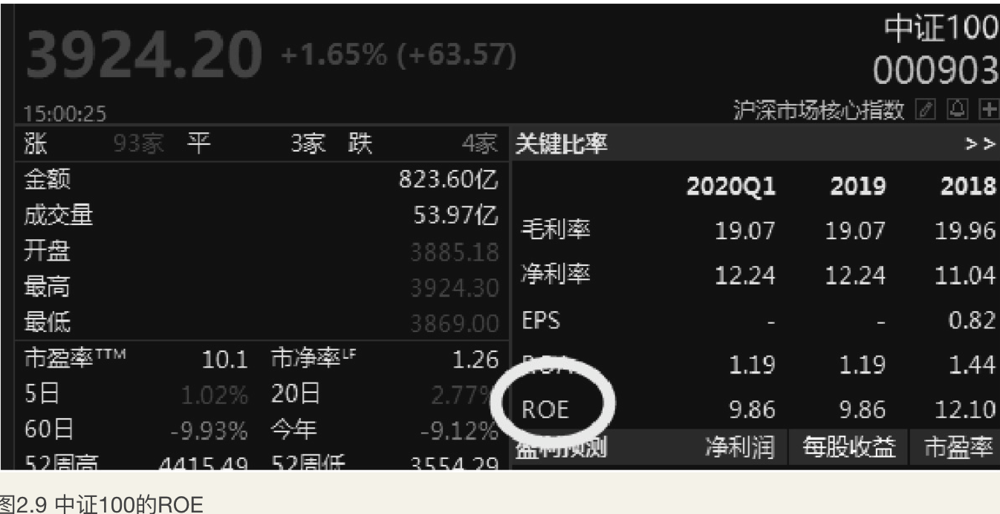
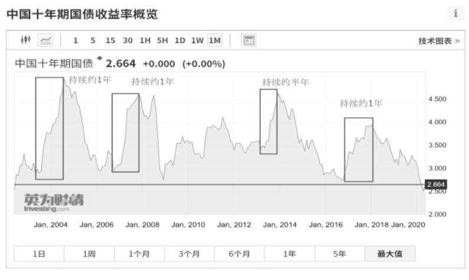
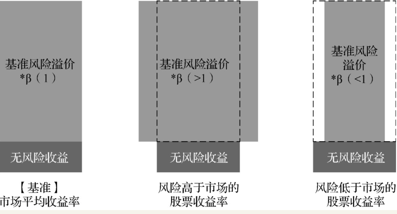
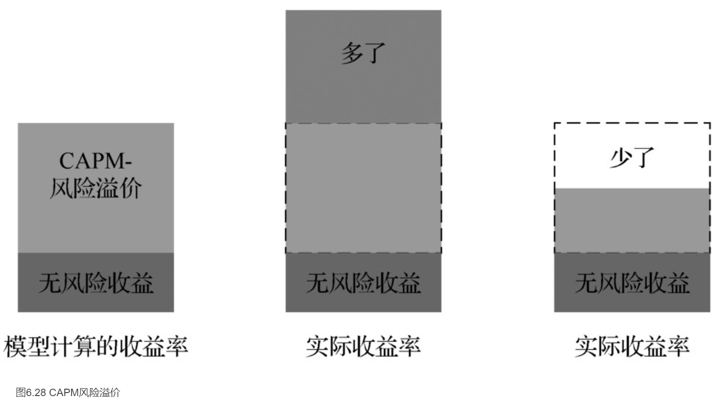
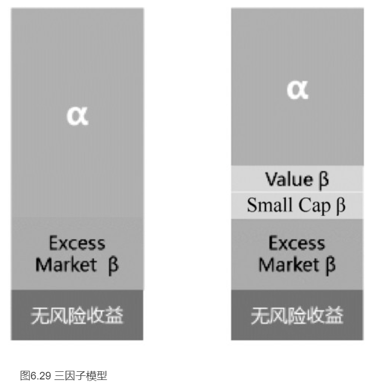
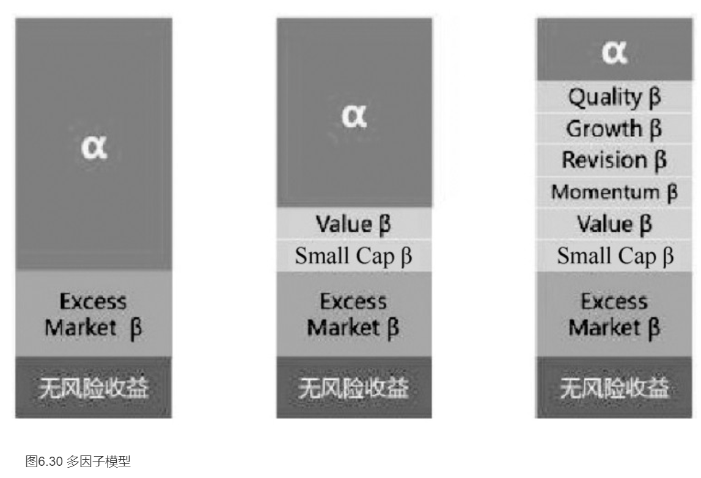
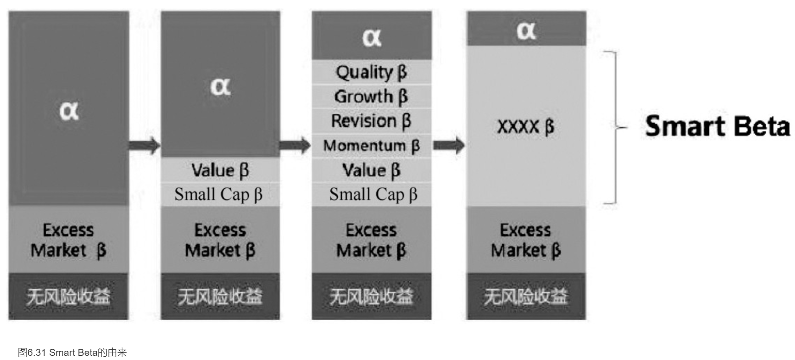
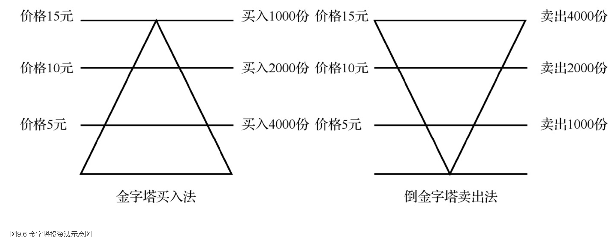
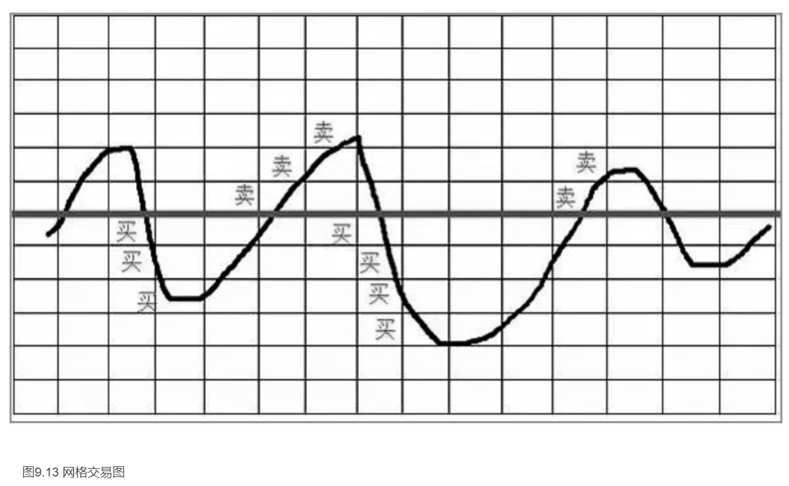
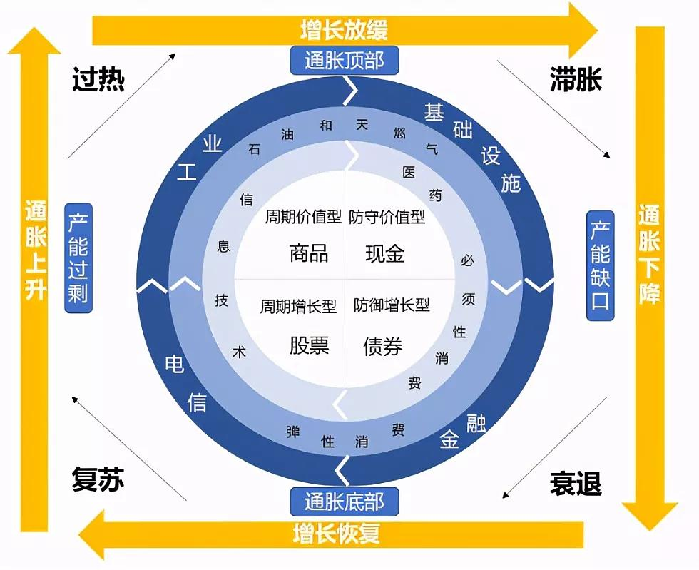

    作者: 罗国庆
    出版社: 电子工业出版社
    副标题: 从入门到精通（修订版）
    出版年: 2020-11
    页数: 348
    定价: 79.80元
    装帧: 平装
    ISBN: 9787121397004

[豆瓣链接](https://book.douban.com/subject/35232694/)

- [指数基金的魅力](#指数基金的魅力)
  - [指数基金之父约翰·博格](#指数基金之父约翰博格)
- [指数的分类及应用](#指数的分类及应用)
  - [指数体系分类](#指数体系分类)
    - [指数选样标准](#指数选样标准)
    - [资产类别](#资产类别)
    - [指数公司](#指数公司)
      - [中证指数公司的指数体系](#中证指数公司的指数体系)
      - [深圳证券信息公司的指数体系](#深圳证券信息公司的指数体系)
  - [指数的加权方式](#指数的加权方式)
    - [市值加权](#市值加权)
    - [基本面加权](#基本面加权)
    - [等权重](#等权重)
    - [GDP加权](#gdp加权)
    - [波动率加权](#波动率加权)
  - [价格指数与全收益指数](#价格指数与全收益指数)
    - [价格指数与全收益指数区别](#价格指数与全收益指数区别)
  - [指数的常用的计算指标](#指数的常用的计算指标)
    - [区间累计收益率](#区间累计收益率)
    - [区间年化收益率](#区间年化收益率)
    - [区间年化波动率](#区间年化波动率)
    - [夏普比率](#夏普比率)
    - [净资产收益率](#净资产收益率)
    - [股息率](#股息率)
    - [市盈率](#市盈率)
    - [市净率](#市净率)
    - [市盈率和市净率的历史分位数](#市盈率和市净率的历史分位数)
  - [指数的估值指标应用](#指数的估值指标应用)
- [各类指数的介绍](#各类指数的介绍)
  - [常见A股宽基指数](#常见a股宽基指数)
    - [上证50指数](#上证50指数)
    - [沪深300指数](#沪深300指数)
    - [中证100指数](#中证100指数)
    - [中证500指数](#中证500指数)
    - [创业板指数](#创业板指数)
  - [常见A股行业指数](#常见a股行业指数)
    - [医药行业指数](#医药行业指数)
    - [消费行业指数](#消费行业指数)
    - [信息技术行业指数](#信息技术行业指数)
    - [军工行业指数](#军工行业指数)
  - [常见A股主题指数](#常见a股主题指数)
    - [环保主题指数](#环保主题指数)
    - [中证养老指数](#中证养老指数)
    - [科技类主题（5G、芯片、科技）指数](#科技类主题5g芯片科技指数)
  - [常见A股策略指数](#常见a股策略指数)
    - [基本面指数](#基本面指数)
    - [红利低波指数](#红利低波指数)
  - [常见跨境指数](#常见跨境指数)
    - [纳斯达克100指数](#纳斯达克100指数)
    - [标普500指数](#标普500指数)
    - [H股指数](#h股指数)
    - [恒生指数](#恒生指数)
    - [股指期货](#股指期货)
- [不同类型的指数基金](#不同类型的指数基金)
  - [股票型指数基金](#股票型指数基金)
  - [债券型指数基金](#债券型指数基金)
  - [商品类指数基金](#商品类指数基金)
  - [跨境指数基金](#跨境指数基金)
- [ETF的基础知识](#etf的基础知识)
  - [ETF的概况介绍](#etf的概况介绍)
- [指数基金投资入门知识](#指数基金投资入门知识)
  - [场外和场内指数基金](#场外和场内指数基金)
    - [场外指数基金](#场外指数基金)
    - [场内指数基金](#场内指数基金)
  - [指数基金的费用](#指数基金的费用)
  - [基金分红与基金净值](#基金分红与基金净值)
  - [指数基金的清盘](#指数基金的清盘)
  - [揭秘Smart Beta投资策略](#揭秘smart-beta投资策略)
- [指数基金投资策略](#指数基金投资策略)
  - [大小盘指数轮动策略](#大小盘指数轮动策略)
  - [揭秘行业指数轮动策略](#揭秘行业指数轮动策略)
  - [巧用基金的三种投资策略](#巧用基金的三种投资策略)
  - [巧用基金的三种投资策略](#巧用基金的三种投资策略-1)
  - [金字塔法买入/卖出策略](#金字塔法买入卖出策略)
  - [分批买入策略](#分批买入策略)
  - [网格交易法策略](#网格交易法策略)
- [指数基金配置策略](#指数基金配置策略)
  - [经济周期下的资产配置策略](#经济周期下的资产配置策略)
    - [美林时钟](#美林时钟)
    - [衰退，经济增长停滞](#衰退经济增长停滞)
    - [复苏，经济缓慢增长](#复苏经济缓慢增长)
    - [过热，经济快速增长](#过热经济快速增长)
    - [滞胀，经济发展停滞](#滞胀经济发展停滞)
    - [在经济周期中资产配置策略](#在经济周期中资产配置策略)

# 指数基金的魅力
## 指数基金之父约翰·博格
约翰·博格，指数基金之父，被《财富》杂志评为20世纪四位投资巨人之一。他是世界第一大基金管理公司先锋集团的创始人与董事长。1974年，博格断定并不存在能战胜市场指数的基金，开始推行以指数为基准进行投资的原则，同年成立了先锋指数基金。

博格的投资之道：

1. 选择低成本基金。对于控制基金投资成本，博格建议从两方面考虑：
    1. 被动型基金（指数基金）优于主动型基金。指数基金采用的是跟踪某个标的指数的被动投资方式，研发费用低（只投资标的指数成份股，不必花费过多的资金去进行上市公司调研），交易费用少（跟踪指数走势，不像主动投资型基金那样频繁进出）。
    2. 在主动型基金中，低换手率的优于高换手率的。基金买卖过程中的交易成本，实际上被掩盖了，但这些成本同样吞噬着投资者的收益。博格建议，应该选择换手率较低的基金。
1. 认真考虑成本。博格提出的第二个建议仍然与成本有关。很多投资者接触并决定购买基金，是通过媒体的介绍，或者代销机构的推荐，其中隐藏的附加成本，就是博格提醒投资者注意的问题。
1. 不要过高评价明星基金。博格认为，历史业绩的真正参考意义在于，这些数据可以帮助投资者分析基金业绩是否具有可持续性，比如在经历上涨和下跌的完整过程中，基金是否能始终保持良好业绩；在相同的经济和政策环境下，目标基金是否显著优于其他同类型基金。
1. 大的未必是好的。
   1. 博格曾提到这样一个例子：美国市场上某只成长型中市值基金，由于业绩出色吸引了大量的申购份额，但其业绩却随着基金份额的膨胀而不断恶化。
   2. 博格说：“太多的钱会损害投资效果。”原因一是规模提高了交易成本，而且规模越大，对所持有股票的价格影响也越大，这会在时间紧迫的交易中进一步加剧股票价格的波动；二是为了保持基金的流动性和分散投资原则，大市值基金不得不以更小的集中度，持有更多数量的股票，而每一只持仓品种所能提供的收益率也更低；三是相对于小市值的基金，大市值基金对于流动性要求更高，因此可以选择的股票品种更加有限。
1. 不要持有太多基金
   1. 博格说：没有必要持有5只以上的股票型基金，因为过度分散投资的效果类似于投资于一只指数型基金，但由于股票型基金的成本高，导致最终的收益很可能低于指数。
   2. 分散持有不同风格的股票型基金，也未必是个明智选择。博格认为，假设建立由大市值混合型和小市值成长型基金构成的基金组合，这个组合将具有比市场更显著的波动性，这种比市场指数风险更高的组合没有意义。单一持有大市值混合型基金的风险，比任何基金组合都低。

# 指数的分类及应用
## 指数体系分类
### 指数选样标准
指数最简单的分类就是`宽基指数`和`窄基指数`两大类，其实，我们常见的一些指数，代表整个市场走势的，都属于宽基指数，比如中证100、沪深300、上证50、中证500、恒生指数、标准普尔500、纳斯达克100等。除宽基指数外，还有一类是窄基指数，一般多是行业指数或者主题指数。

还有一种分类方法，指数主要分为综合指数、规模指数、行业指数、风格指数、主题指数、策略指数6大类。

- `综合指数`是总指数的综合形式，反映总体的综合变动情况，用于比较总量指标。常见的如上证综指、深证综指、创业板综指等，分别反映上海股票市场、深圳股票市场、创业板股票市场所有股票的走势情况。
- `规模指数`是从市值规模角度选择不同成份股数量，更好地表征不同板块大中小市值股票的走势情况。例如沪深300、中证500和中证1000三只指数，分别表征A股市场大盘、中盘及小盘市值股票的走势情况。
- `风格指数`是根据股票的风格特征，通常分为成长和价值两种风格。常见的如沪深300价值指数和沪深300成长指数。随着股票数量的增加，成长和价值划分已难以满足投资者的要求，于是出现了在成长型和价值型股票中进行的二级风格分类。这种进一步划分风格的办法，也称“风格的萃取”。规模是最常见的二级风格划分，于是出现了大盘成长、大盘价值、小盘成长、小盘价值等分类。
- `行业指数`主要按照上市公司的主营业务收入进行分类，参照国际标准和行业指数的可投资性将营业业务属于一个行业的划分成一类。例如中证全指一级行业（10个一级行业），包含中证全指信息技术、主要消费、金融地产、可选消费、医药卫生、工业、能源、原材料、电信等10个行业。
- `主题指数`是动态跟踪经济驱动因素的投资方式，通过发现经济体的长期发展趋势及使这种发展趋势产生和持续的驱动因素，将能够受惠的相关产业和上市公司纳入投资范围。常见的主题指数如环保指数、养老指数、国企改革指数、一带一路主题指数、京津冀协调发展主题指数等。
- `策略指数`策略指数是除传统的只做多的市值加权指数之外的指数。从定义表述可以看出，策略指数与其他指数的本质区别在于两点：一是加权方式，策略指数主要采用非市值加权方式，如基本面加权、财富加权、固定权重等；二是多空交要采用非市值加权方式，如基本面加权、财富加权、固定权重等；二是多空交易，策略指数可以采用多空两种交易方式，其他指数只能做单边操作。常见的策略指数如大数据指数、基本面指数、中证500低波指数等。

### 资产类别
从指数的资产类别来区分，主要可以分为股票指数、商品指数、债券指数、跨境股票指数等。

`股票指数`主要反映在证券交易所上市的股票组合的走势情况，目前，国内市场围绕A股股票指数的相关ETF产品也越来越丰富。股票型ETF兼具基金及股票的优点，为投资者提供了一个便捷及费率低廉的投资渠道。

表2.1 A股市场流动性较好的股票型ETF产品（截止2019年12月31日）

类别 | 跟踪指数 | 证券代码 | 证券简称 | 基金成立日 | 资产规模(亿元)
---|------|------|------|-------|---------
宽基ETF | 上证50 | 510050 | 华夏上证50ETF | 2004/12/30 | 461.9
宽基ETF | 中证100 | 512910 | 广发中证100ETF | 2019/5/27 | 6.2
宽基ETF | 沪深300 | 510300 | 华泰柏瑞沪深300ETF | 2012/5/4 | 403.2
宽基ETF | 中证500 | 510500 | 南方中证500ETF | 2013/2/6 | 445.4
宽基ETF | 创业板指 | 159915 | 易方达创业板ETF | 2011/9/20 | 167.3
行业ETF | 中证传媒 | 512980 | 广发中证传媒ETF | 2017/12/27 | 16.8
行业ETF | 中证银行 | 512800 | 华宝中证银行ETF | 2017/7/18 | 29.3
行业ETF | 全指证券 | 512000 | 华宝中证全指证券ETF | 2016/8/30 | 56.8
行业ETF | 中证主要消费 | 159928 | 汇添富中证主要消费ETF | 2013/8/23 | 35.3
行业ETF | 全指医药 | 159938 | 广发中证全指医药卫生ETF | 2014/12/1 | 24.1
行业ETF | 全指信息技术 | 159939 | 广发中证信息技术ETF | 2015/1/8 | 14.4
主题ETF | 中证环保 | 512580 | 广发中证环保产业ETF | 2017/1/25 | 18.4
主题ETF | 中证5G通信 | 515050 | 华夏中证5G通信主题ETF | 2019/9/17 | 76.8
主题ETF | 上海国企 | 510810 | 汇添富中证上海国企ETF | 2016/7/28 | 120.7
主题ETF | 上证红利 | 510880 | 华泰柏瑞红利ETF | 2006/11/17 | 30.7

`债券指数`反映的是债券市场价格总体走势。和股票指数一样，债券指数是一个比值，其涨跌反映了对应债券组合的涨跌情况。国内债券ETF跟踪标的有10年期国债、5年期国债及城投债等品种，但是整体规模还是较小，场内流动性不足。

表2.2 交易所债券ETF产品情况（截止2019年12月31日）

基金代码 | 名称 | 基金管理公司 | 成立时间 | 资产规模（亿元）
-----|----|--------|------|---------
159926 | 国债ETF | 嘉实基金 | 2013-05-10 | 0.08
511010 | 国债ETF | 国泰基金 | 2013-03-05 | 4.76
511020 | 活跃国债 | 平安基金 | 2018-12-21 | 11.43
511030 | 公司债 | 平安基金 | 2018-12-27 | 52.49
511220 | 城投ETF | 海富通基金 | 2014-11-13 | 18.34
511260 | 十年国债 | 国泰基金 | 2017-08-04 | 24.92
511270 | 十年地债 | 海富通基金 | 2018-10-12 | 7.61
511280 | 中期信用 | 华夏基金 | 2018-05-03 | 0.45
511290 | 国债十年 | 广发基金 | 2018-03-26 | 0.29
511310 | 十年债 | 富国基金 | 2018-03-19 | 0.34

`商品指数`反映同质化、可交易的商品的价格走势，如黄金、白银、原油等商品，如表2.3所示。作为大类资产的配置型工具，商品指数产品的推出有助于投资者优化自身投资组合，获取稳健收益。尽管国内已经有黄金ETF、白银LOF、石油LOF三类主要的商品类基金，但是相对于股票型ETF，商品指数产品规模较小，场内流动性也较差。需要说明的是，尽管原油LOF基金跟踪的是海外商品原油的价格，但是其跟踪误差较大，所以场内流动性较差。

表2.3 交易所商品ETF及LOF产品情况（截止2019年12月31日）

基金代码 | 证券简称 | 跟踪指数 | 资产规模（亿元）
-----|------|------|---------
518880 | 华安黄金ETF | 国内黄金现货价格收益率 | 69.95
518800 | 国泰黄金ETF | 上海黄金交易所Au99.99合约 | 10.60
159937 | 博时黄金ETF | 黄金现货实盘合约AU99.99 | 45.69
159934 | 易方达黄金ETF | 上海黄金交易所Au99.99合约 | 20.51
161226 | 国投瑞银白银期货 | 上期交所白银期货主力合约 | 7.89
501018 | 南方原油证券投资基金 | WTI原油60%+BRENT原油40% | 1.30

`跨境股票`指数主要是跟踪境外股票市场的指数。目前，国内跟踪跨境指数的ETF品种还算丰富，已有跟踪恒生国企指数、恒生指数、纳斯达克100指数、标普500指数及德国DAX指数等指数基金产品，如表2.4所示。

表2.4 市场主要跨境ETF产品情况（截止2019年12月31日）

证券代码 | 证券简称 | 基金成立日 | 基金管理人 | 资产规模（亿元）
-----|------|-------|-------|---------
510900 | H股ETF | 2012-08-09 | 易方达基金管理有限公司 | 103.39
159920 | 恒生ETF | 2012-08-09 | 华夏基金管理有限公司 | 46.87
513100 | 纳指ETF | 2013-04-25 | 国泰基金管理有限公司 | 8.35
513500 | 标普500 | 2013-12-05 | 博时基金管理有限公司 | 14.78
513030 | 德国30 | 2014-08-08 | 华安基金管理有限公司 | 4.70
159941 | 纳指ETF | 2015-06-10 | 广发基金管理有限公司 | 0.31

### 指数公司
指数公司是指数的重要编制机构，目前国内的指数公司主要分两类，一类是官方性质的指数公司——中证指数有限公司和深圳证券信息公司，市场上绝大部分基金产品都用这两家公司的指数。另一类是第三方编制机构，如申万证券和中信证券等证券公司。

#### 中证指数公司的指数体系
中证指数公司是由上海证券交易所和深圳证券交易所共同出资成立的、国内最大的指数编制、运营和服务机构，中金所上市的三个股指期货合约跟踪的上证50、沪深300和中证500指数均由中证指数公司负责授权和运营。

中证系列指数包括规模、行业、风格、主题、策略、客户定制、跨境、债券、期货、基金等指数，表2.5列出了中证指数体系的主要指数品种，并未列出中证指数公司旗下所有的指数。

表2.5 中证指数体系主要指数

指数类别 | 指数名称 | 说明
-----|------|---
规模指数 | 中证100 | 市值排名第1至100名的股票组成
规模指数 | 中证200 | 市值排名第101至300名的股票组成
规模指数 | 沪深300 | 市值排名第1至300名的股票组成
规模指数 | 中证500 | 市值排名第301至800名的股票组成
规模指数 | 中证800 | 市值排名第1至800名的股票组成
规模指数 | 中证1000 | 市值排名第801至1800名的股票组成
规模指数 | 中证全指 | 全部股票组成
行业指数 | 中证全指行业 | 按照全市场A股股票进行行业分类
行业指数 | 中证800行业指数 | 中证800股票里面进行行业分类
行业指数 | 沪深300行业指数 | 沪深300股票里面进行行业分类
行业指数 | 中证500行业指数 | 中证500股票里面进行行业分类
风格指数 | 沪深300风格指数 | 沪深300价值和沪深300成长指数
风格指数 | 中证500风格指数 | 中证500价值和中证500成长指数
风格指数 | 中证800风格指数 | 中证800价值和中证800成长指数
主题指数 | 中证环保
主题指数 | 中证养老
主题指数 | 京津冀协调发展指数
策略指数 | 基本面50
策略指数 | 中证500低波指数
策略指数 | 红利低波指数
策略指数 | 300等权指数
客户定制指数 | 小康指数 | 南方基金
客户定制指数 | 财富大盘 | 光大证券
客户定制指数 | 百发100 | 广发基金
跨境指数 | 香港100
跨境指数 | 金砖国家
跨境指数 | 中证东盟80
债券指数 | 中证全债
债券指数 | 中证国债
债券指数 | 中证金融债
期货指数 | 商品CFCI
期货指数 | 农产CFCI
期货指数 | 金属CFCI
基金指数 | 中证基金
基金指数 | ETF基金

#### 深圳证券信息公司的指数体系
深圳证券信息有限公司为深交所下属企业，经深交所授权，负责“深证”系列指数的规划设计、日常运维和市场营销等业务。深圳证券信息公司为国内最早开展指数业务的专业化运营机构，是中国内地交易所直属指数机构之一。

表2.6 深证系列指数体系主要指数

指数类别 | 指数名称 | 说明
-----|------|---
规模指数 | 深成指 | 深证市场按照市值等指标排名前500的股票
规模指数 | 深证100 | 深证市场按照市值等指标排名前100的股票
规模指数 | 深证300 | 深证市场按照市值等指标排名前300的股票
规模指数 | 中小100 | 中小板市场按照市值等指标排名前100的股票
规模指数 | 中小300 | 中小板市场按照市值等指标排名前300的股票
规模指数 | 创业板100 | 创业板市场按照市值等指标排名前100的股票
行业指数 | 深证行业指数 | 
行业指数 | 中小板行业指数
风格指数 | 中小板风格
风格指数 | 创业板风格
主题指数 | 深证风格 | 深证300价值指数和深证300成长指数
主题指数 | 深证红利
主题指数 | 深证治理
策略指数 | 中小低波
策略指数 | 深证100等权
定制指数 | 成长40
定制指数 | 中关村60
综合指数 | 深证综指
综合指数 | 中小板综指
综合指数 | 创业板综指
基金指数 | 深证ETF
基金指数 | 乐富指数
深证债券 | 深信用债
深证债券 | 深公司债

## 指数的加权方式
### 市值加权
以市值作为投资者组合加权的依据，市值越大的股票权重越高，股票涨跌对指数的影响也越大。

        (市值=股价*股本)    (市值加权)
    股价越高-------->市值越高-------->成份股权重越高

市值加权方式的优点如下：

- 中国内地的股价指数基本上都是市值加权指数。因此追踪市值加权指数的指数基金数量最多，流动性最高，费用最低。
- 计算方法简单，容易复制，易管理，追踪误差相对较小。
- 是有效市场理论和资本资产定价模型等理论支持下的投资策略。

缺点如下：

- 股价变化会导致市值加权指数效率不佳。由于成份股股价可能偏离其真实价值，而使得指数组合过多买进价值被高估的股票、过多卖出价值被低估的股票，从而导致投资效率降低。
- 个股权重过高，会导致指数风险加大，以及投资效率降低；个股权重集中也会使部分行业在指数中配置的权重过高，而对某些国家和地区的权重高估，会对基于全球市场的指数造成同样的影响。

### 基本面加权
许多基本面加权指数的权重因素都来自公司的财务报表。这里的权重因子既可以是单变量，也可以是复杂的多变量模型生成的结果。单变量因子包括每家公司的股票营业收入、现金流、净资产、分红等基本面指标，对股票进行权重分析。

基本面加权方式的优点如下：

- “公平价值”指数。基本面指数的因子均不受市值波动的影响，从而能够辨别每只股票的真正“公平价值”。
- 回报率高，风险稳定。从全球视野来看，基本面指数具有高回报率与稳定的风险特征，这也是基本面指数的最大优势之一。
- 财务投资理论支持下的全球通用实务投资策略。从财务投资理论看，投资者对于财务优秀可靠的公司应该给予更多的投资偏好和投资权重，而不是根据股票市值进行权重分配，因此，财务投资理论支持基本面指数投资理念。

### 等权重
等权重指给予每个成份股相同的权重，即成份股数量的倒数。理论上，权重是要每日进行再平衡的，否则便会偏离成份股数量的倒数，但实际上为了避免烦琐和换手率高企，通常采取定期再平衡的方法。

与其他加权方式相比，等权重不偏向任何一个成份股，而是一视同仁，从市值角度看，等权重减少了那些市值高的股票权重，同时，也增加了那些市值低的股票权重。

等权重方式的优点如下：

- 从市值角度看，等权重方式通过定期调整机制，对指数成份股进行高抛低吸，将一段时间里涨幅过高的股票卖出，从而规避了成份股市值越大、权重越高的现象。
- 从业绩表现上来看，小盘股优胜期间的等权重指数业绩容易占优。

### GDP加权
GDP加权主要用于国际指数，将传统的市值加权，改为以国家或地区的GDP为相应证券赋予权重。在A股市场中，深证GDP100指数的编制虽然并非GDP加权，但其在行业选择上已经运用了GDP指标。

### 波动率加权
风险与收益的平衡，是投资者最为关注的主题之一，在同样的约束条件下，投资者希望能够获得最高收益而将风险降到最低，即使懂得很多理论，在实际中也很难运用，要想获得最高收益更难，但要获得较低的波动则相对容易，因此波动率加权指数应运而生（主要是低波动指数）。

根据历史波动率对成份股进行排序和加权，对于波动率大的股票给予低的权重，对于波动率低的股票给予高的权重，即权重与波动率大小成反比。

表2.8 中证500低波指数与主要指数指标比较

指标/指数 | 500SNLV | 中证500 | 沪深300 | 上证50
------|---------|-------|-------|-----
累计收益率 | 1160.08% | 426.77% | 309.66% | 263.49%
年化收益率 | 18.40% | 11.71% | 9.86% | 8.98%
年化波动率 | 29.89% | 31.16% | 27.21% | 27.40%
夏普比率 | 0.57 | 0.33 | 0.31 | 0.27

1. 指数最常用的是市值加权方法，该方法也是最经典的指数加权方法。
1. 市值加权法和等权法没绝对的好坏。以中小板指数（代码：399005）和中小板等权指数（代码：399634）为例，两者成份股一样，均是由中小板市场规模最大的100只股票组成的，只是加权的方法不同，在2013年至2015年中小板等权指数连续3年均能跑赢中小板指数，很多人就认为等权的方式不错，每年都有超额。而2016年至2017年，中小板指数均跑赢了中小板等权指数。究其原因，2013年至2015年，市场小市值股票对指数贡献更多收益，而在2016年至2017年，大市值股票对指数贡献更多收益。所以，两种加权方法没有绝对的好坏，如果是在大市值风格的上涨行情中，则市值加权更有优势，而在小市值风格的上涨行情中，等权加权更有优势。

## 价格指数与全收益指数
### 价格指数与全收益指数区别
`价格指数（Price Return Index）`是以某个时期为基期，用价格变动反映一篮子股票变化水平的指数。顾名思义，价格指数仅计算股票价格的波动，不考虑上市公司分红因素的影响，即若指数内一篮子股票价格变了，则指数能直接反映出来。

价格指数就像股票进行分红派息除权后的价格，例如某只股票分红前价格为10元，当天进行了1元的分红，股价在除权后就变成了9元。价格指数也是同样的道理，指数里面的成份股不断进行分红，那么指数的点位也不断进行除权，指数点位自然会因为成份股分红的原因导致指数点位回落。

`全收益指数（Total Return Index）`也称“总回报指数”“总收益指数”。上市公司的股票会有分红，如果将现金分红所得再投资到原组合中，就得到了比较全面的收益，即“全收益”。所以，全收益指数除反映股价波动外，还包含所有股票分红再投资所产生的收益，相较而言，其更能准确反映指数内一篮子股票的真实表现。

在全球范围内，上市公司的分红形式多种多样，包括股票分红、以股代息、现金分红等，全收益指数主要考虑了现金分红这种形式，以原组合成份股所得到的现金分红再投资到原有组合，分红再投收益+原收益一起，构成了全收益指数的收益。

表2.9 沪深300价格指数与沪深300全收益指数收益率比较（2013年12月31日-2019年12月31日）

年份（年） | 沪深300价格指数 | 沪深300全收益指数 | 差值
------|-----------|------------|---
2014 | 51.66% | 55.85% | 4.19%
2015 | 5.58% | 7.22% | 1.63%
2016 | -11.28% | -9.26% | 2.02%
2017 | 21.78% | 24.25% | 2.48%
2018 | -25.31% | -23.64% | 1.67%
2019 | 36.07% | 39.19% | 3.12%
累计收益率 | 75.82% | 100.24% | 24.42%

表2.10 中证100价格指数与中证100全收益指数收益率比较（2013年12月31日-2019年12月31日）

年份（年） | 中证100价格指数 | 中证100全收益指数 | 差值
------|--------------|--------|---
2014 | 59.64% | 65.21% | 5.57%
2015 | -1.52% | 0.47% | 1.98%
2016 | -7.50% | -4.85% | 2.65%
2017 | 30.21% | 33.37% | 3.16%
2018 | -21.94% | -19.94% | 2.00%
2019 | 35.54% | 39.11% | 3.58%
累计收益率 | 100.35% | 134.61% | 34.26%

表2.11 中证100全收益指数与主动基金收益率比较（截至2019年9月30日，此处主动管理基金为普通股票型和混合偏股型基金）

年份（年） | 中证100全收益指数 | 主动基金 | 中证100排名
------|------------|------|--------
2017 | 33.37% | 15.20% | 79/712
2018 | -19.94% | -24.12% | 250/861
2019 | 31.20% | 27.57% | 545/1324
累计收益率 | 40.09% | 17.67% | 106/712

## 指数的常用的计算指标
### 区间累计收益率
一段时间内`投资的回报率`。对应到指数，计算公式如下：

$指数区间累计收益率=\frac{区间末日收盘价-区间首日收盘价}{区间首日收盘价}$

举个例子：中证100指数在2016年12月30日的收盘点位为3134.45，在2019年12月31日的收盘点位为4317.93，那么中证100指数在2016年年底到2019年年底三年间（通常也可以写作2017—2019年）的累计收益率就是：37.76%。

中证100指数2016年年底到2019年年底的累计收益率$=\frac{4317.93-3134.45}{3134.45}=37.76$%

### 区间年化收益率
`年化收益率`是把累计收益率换算成以年为单位来计算得到的结果。可以简单理解为：在期初投入一笔钱，按年化收益率逐年利滚利，最终得到的收益率就等于累计收益率。

举个例子：如果投入100元，两年后100元变为144元，则累计收益率为44%；也相当于每年都按20%增长，即投入100元以后，第一年变为100×（1+20%）=120元，第二年变为120×（1+20%）=144元，这里20%就是年化收益率。

对应到指数，计算公式如下：

$指数区间年化收益率=(1+区间累计收益率)^{\frac{1}{区间年份数}}-1$

这里年份数不足一年就用小数来计算，以交易日天数为准。接着我们上面中证100的例子来说，从2016年年底到2019年年底正好3年，所以中证100在这3年里的区间年化收益率计算如下：

中证100指数2016年年底到2019年年底的区间年化收益率$=(1+37.76/100)^{\frac{1}{3}}-1=11.23$%

### 区间年化波动率
收益率标准差的年化数据。可以简单理解为：反映一段时间内投资收益的波动情况。年化波动率是一个风险指标，波动率越大，风险越大；波动率越小，风险越小。

对应到指数，计算公式如下：

$指数区间年化波动率=每日收益率的标准差 \times 250^{\frac{1}{2}}$

其中，$250^{\frac{1}{2}} \approx 15.81$

在具体计算时，要统计每天指数的收益率数据，得到一个收益率数列，然后在Excel里用STDEV函数计算收益率数列的标准差，再乘以15.81，就可以得到年化波动率。

还是以我们前面提到的中证100为例，从2016年年底至2019年年底中证100指数每日收益率数列的标准差是0.01145，所以中证100在这3年里的区间年化波动率计算如下：

中证100指数2016年年底到2019年年底的区间年化波动率$0.01145 \times 15.81=18.11$%

### 夏普比率
风险调整后的收益情况，用于衡量综合考虑风险和收益后投资的整体表现。可以简单理解为：每单位风险对应的投资回报；夏普比率越高，单位风险所取得的投资回报越高，投资综合表现越好。

对应到指数，计算公式如下：

$指数夏普比率=\frac{区间年化收益率-无风险收益率}{区间年化波动率}$

这里无风险收益率对应的无风险资产是一个笼统的概念，可以为银行定期存款、长期国债等，一般我们取无风险收益率为1.5%（通常为人民银行规定的一年定存利率，可以把它看成无风险收益率）。

以中证100从2016年年底至2019年年底的表现来看，指数夏普比率计算如下：

中证100指数夏普比率=$\frac{11.23/100-1.5/100}{18.11/100}=0.54$

### 净资产收益率
净资产收益率（ROE）等于净利润除以净资产，该指标反映股东权益的收益水平，用来衡量公司运用自有资本的效率。该指标值越高，说明投资带来的收益越高，它是衡量企业的盈利能力的重要指标。ROE越高，代表一个企业的盈利能力越强，企业的质地也就越好。

对应到指数，一般而言指数的ROE指的是所有成份股的净利润之和与所有成份股的净资产之和的比值，这个数据通常不需要投资者计算，可以直接在行情软件中查看。如图2.9所示，中证100指数2020年第一季度对应的ROE为9.86%。

### 股息率
股息率是一年的总派息额与总市值的比例，也等于每股分红除以股价。股息率是挑选收益型股票的重要参考标准，如果连续多年年度股息率超过1年期银行存款利率，则这只股票基本可以被视为收益型股票。股息率越高，越吸引人。股息率也是挑选其他类型股票的参考标准之一。决定股息率高低的不仅仅是股利和股利发放率的高低，还有股价。

举个例子：两只股票，A的股价为10元，B的股价为20元，两家公司同样发放每股0.5元股利，则A公司5%的股息率显然要比B公司2.5%的股息率诱人。一般在A股市场股息率较高的指数主要由偏大盘蓝筹的公司组成。

### 市盈率
市盈率（PE）是总市值与公司盈利的比值。其中P代表市值，E代表公司盈利，PE更准确的表达应该为P/E。可以简单将其理解为一家公司按目前每年的利润需要赚多少年才能到达目前的市值。

分为静态市盈率、滚动市盈率和动态市盈率。三种市盈率的计算方式的区别主要在于盈利的选取，静态市盈率是选用上一年度的净利润来计算的；滚动市盈率是选用最近4个季度财报的净利润来计算的；动态市盈率是选用预估的公司下一年度的净利润来计算的。

对应到指数，指数的市盈率指的是所有成份股的市值之和与所有成份股的净利润之和的比值。

市盈率绝对值的高低更多地用在结构行情中，如果现在是大盘股行情，则一般选择估值低的宽基或行业指数进行投资。如果现在是中小盘股行情，则一般选择成长性较好的宽基或行业指数进行投资，在通常情况下成长性好的行业估值已经不低。估值分位数是通过与该指数本身历史的估值进行比较，看看该指数的当前估值在历史估值中的水平，来判断指数是否具有投资价值的。

### 市净率
市净率（PB）是总市值与净资产的比值。其中P代表市值，B代表净资产。

对应到指数，指数的市净率指的是所有成份股的市值之和与所有成份股的净资产之和的比值。这个数据也可以从指数公司官网查到，例如，中证100指数截至2020年3月的市净率数据为1.2倍。

### 市盈率和市净率的历史分位数
历史分位数代表的是一个数据在历史序列中从小到大的排名高低，它的计算方法是按照当前估值在历史中由小到大排序，得到当前的估值排名，然后用当前估值排名除以历史估值总数（即分位数=当前估值排名/历史估值总数），得到历史估值分位数，该数取值区间为0～100%，按百分比计算。一个数据的历史分位数越接近100%，就越能代表这个数据在历史序列中比其他大多数数据都更大，如果等于100%，就代表这个数据是历史序列中数值最大的一个数据。反之亦然。

我们平时在投资时除了关注指数在某一时点的市盈率、市净率，更重要的是还需要了解这些数据在历史上到底算比较高的还是比较低的，也就是高估值或者低估值的意思。简单来说，如果目前指数市盈率、市净率的历史分位数接近100%，那么就意味着指数目前的市盈率、市净率在历史上看是比较高的，对应的就是高估值；反过来说也是一样的道理，指数市盈率、市净率的历史分位数越接近0，那么估值就越低。

## 指数的估值指标应用
公司估值方法通常分为两类：

- 相对估值方法，特点是主要采用乘数方法，较为简便，如PE估值法、PB估值法、EV/EBITDA估值法、PEG估值法、市销率估值法、EV/销售收入估值法、NAV估值法；
- 绝对估值方法，特点是主要采用折现方法，如现金流折现DCF、股利贴现模型DDM等。

`PE市盈率估值法`适合于盈利相对稳定、周期性较弱的行业。计算以公司上一年的盈利水平为依据，其最大的缺陷在于忽略了对公司未来盈利状况的预测。从单个公司来看，市盈率指标对业绩较稳定的公用事业、商业类公司参考较大，但对业绩不稳定的公司，则易产生判断偏差。以腾讯为例，由于公司市场前景广阔，具有很高的成长性，受到投资者的追捧，股价上升，市盈率居高不下，但以公司每年40%以上利润增长速度，以现价购入，一年后的市盈率已经大幅下降；相反，一些身处夕阳产业的上市公司，目前市盈率低到20倍左右，但公司经营状况不佳，利润呈滑坡趋势，以现价购入，一年后的市盈率可就奇高无比了。

地产行业也不是只看PE，主要看NAV，E只是结果，NAV是净资产价值。在一定销售价格、开发速度和折现率的假设下，地产企业当前储备项目的现金流折现价值剔除负债后，即为净资产价值（NAV）。假设一个地产公司，刚开发楼盘没有体现出利润，但土地储备的可开发价值是市值的几倍，最典型的是融创中国已经轻松翻了一倍，因为土地储备远远超过市值，你能说没有价值？招商蛇口也是如此，PE不低，但公司有大量优质土地储备未来可供释放利润。

`PB市净率估值法`适合流动性资产比较高的行业，如银行。银行股其实不太适合现金流折现，也不适合PE估值，因为E是失真的。银行的PE很低，但大家都知道有坏账，可能如果坏账爆发PE一下就高了甚至E变成负数了，银行股用PB估值可能更合理，核心看的是信贷资产质量。

对于钢铁、煤炭、水泥、汽车这些强周期行业，PE、PB、DCF用处都不大，因为未来现金流很难预期，固定资产清算时又是废铁，今年赚10亿元，明年可能亏20亿元，所以强周期行业不能用PE来估值。按彼得·林奇的说法，反着看，强周期行业就是高PE、低PB时买入，低PE、高PB时卖出。低PE时说明行业在景气周期，大家都纷纷上马，产能扩张，未来可能就要陷入价格战的泥潭了；而高PE时表明全行业微利或亏损，也表明供给端在去产能，供需平衡走，行业反而可能走出低谷。

对于零售行业，由于销售收入相对稳定、波动性小，且具有微利的特点，因此应考虑市销率指标。一方面营业收入不受公司折旧、存货、非经常性收支的影响，不像利润那样易操控，另一方面收入不会出现负值，不会出现没有意义的情况，即使净利润为负也可用。

对于成长性较高的企业，如高科技企业（TMT）、生物医药、网络软件开发等，应优先考虑`PEG法`，而这个方法对于成熟行业则不太适用。因为PEG反映了未来预期增长率对于企业价值的影响，而成熟行业具有低风险、低增长率的特点，因此不适合运用PEG法。

对于运营商，如高速公路上市公司运营、电信运营业，注重稳定性，则应综合考虑`现金流贴现模型（DCF）`和`EV/EBITDA法`。EV/EBITDA估值方法一般适用于资本密集、准垄断或者具有巨额商誉的收购型公司，这样的公司往往因为大量折旧摊销而压低了账面利润。EV/EBITDA还适用于净利润亏损，但毛利、营业利益并不亏损的公司。但对于固定资产更新变化较快的公司，净利润亏损、毛利、营业利益均亏损的公司以及资本密集、有高负债或大量现金的公司，则不适用EV/EBITDA法。

不同行业使用的估值方法如表2.15所示。

表2.15 不同行业使用的估值方法一览表

行业 | 行业特点 | 适用的估值方法
---|------|--------
公共服务业 | 盈利稳定、周期性较弱 | 市盈率
钢铁、水泥 | 周期性强、拥有大量固定资产且账面价值相对较为稳定 | 市净率
银行业 | 流动资产比例高 | 市净率
房地产 | 注重资产账面价值与实际价值的差异 | NAV
TMT、生物医药、网络软件开发业 | 成长性高 | PEG
高速公路运输、电信运营业 | 经营注重稳定性 | EV/EBITDA

# 各类指数的介绍
## 常见A股宽基指数
### 上证50指数
**上证50指数由沪市A股中规模大、流动性好的最具代表性的50只股票组成**，反映上海证券市场最具影响力的一批龙头公司的股票价格表现，如表3.1所示。该指数于2004年1月由中证指数公司发布，基日为2003年12月31日，基值为1000点。截至2019年年底，上证50指数历史累计收益率为206%，历史年化收益率为8%，历史年化波动率为27%。

表3.1 上证50指数基本情况（截至2019年12月31日）

指数代码 | 指数简称 | 基日 | 成份股个数 | 总市值（万亿元） | 成份股平均总市值（亿元）
-----|------|----|-------|----------|-------------
000016 | 上证50 | 2003-12-31 | 50 | 21.28  | 4256

表3.2 上证50指数前十大成份股情况（截至2019年12月31日）

排名 | 代码 | 简称 | 权重(%)
---|----|----|------
1 | 601318 | 中国平安 | 15.46
2 | 600519 | 贵州茅台 | 9.93
3 | 600036 | 招商银行 | 6.47
4 | 601166 | 兴业银行 | 4.81
5 | 600276 | 恒瑞医药 | 4.52
6 | 600030 | 中信证券 | 3.33
7 | 600887 | 伊利股份 | 3.15
8 | 600016 | 民生银行 | 2.62
9 | 601328 | 交通银行 | 2.58
10 | 600000 | 浦发银行 | 2.43
合计 | 55.29

表3.3 全市场跟踪上证50指数的ETF产品情况（截至2019年12月31日）

成立日期 | 证券代码 | 证券简称 | 上市场所 | 基金规模(亿元) | 2019年日均成交额（亿元）
-----|------|------|------|----------|---------------
2004-12-30 | 510050 | 华夏上证50ETF | 上海 | 461.91 | 20.07
2018-12-07 | 510850 | 工银上证50ETF | 上海 | 59.72 | 1.79
2015-05-27 | 510710 | 博时上证50ETF | 上海 | 7.49 | 0.40
2017-12-22 | 510800 | 建信上证50ETF | 上海 | 2.80 | 0.07
2019-09-06 | 510100 | 易方达上证50ETF | 上海 | 2.39 | 0.24
2013-10-31 | 510680 | 万家上证50ETF | 上海 | 1.67 | 0.00
2018-09-03 | 510600 | 申万菱信上证50ETF | 上海 | 1.06 | 0.06

### 沪深300指数
**由沪深市场300家具有代表性的公司组成**，基期为2004年12月31日，如表3.4所示。截至2019年年底，沪深300指数历史累计收益率为310%，历史年化收益率为10%，历史年化波动率为27%。

表3.4 沪深300指数基本情况（截至2019年12月31日）

指数代码 | 指数简称 | 基日 | 成份股个数 | 总市值（万亿元） | 成份股平均总市值（亿元）
-----|------|----|-------|----------|-------------
000300 | 沪深300 | 2004-12-31 | 300 | 38.97 | 1299

表3.5 沪深300指数成份股交易所分布情况（截至2019年12月31日）

市场 | 成份股个数 | 权重占比(%)
---|-------|--------
上海 | 187 | 65.98
深圳 | 113 | 34.02

表3.6 沪深300指数前十大成份股情况（截至2019年12月31日）

排名 | 代码 | 简称 | 权重(%)
---|----|----|------
1 | 601318 | 中国平安 | 6.72
2 | 600519 | 贵州茅台 | 4.31
3 | 600036 | 招商银行 | 2.81
4 | 000651 | 格力电器 | 2.29
5 | 601166 | 兴业银行 | 2.09
6 | 000333 | 美的集团 | 2.05
7 | 600276 | 恒瑞医药 | 1.97
8 | 000858 | 五粮液 | 1.87
9 | 600030 | 中信证券 | 1.44
10 | 600887 | 伊利股份 | 1.37
合计 | 26.92

表3.7 全市场跟踪沪深300指数的ETF产品情况（截至2019年12月31日）

成立日期 | 证券代码 | 证券简称 | 上市场所 | 基金规模(亿元) | 2019年以来日均成交额（亿元）
-----|------|------|------|----------|-----------------
2012-05-04 | 510300 | 华泰柏瑞沪深300ETF | 上海 | 403.20 | 13.16
2012-12-25 | 510330 | 华夏沪深300ETF | 上海 | 311.40 | 4.50
2012-05-07 | 159919 | 嘉实沪深300ETF | 深圳 | 271.83 | 3.15
2013-03-06 | 510310 | 易方达沪深300ETF | 上海 | 92.64 | 0.74
2019-12-27 | 515380 | 泰康沪深300ETF | 上海 | 71.65
2017-12-25 | 510390 | 平安沪深300ETF | 上海 | 57.80 | 0.34
2018-01-19 | 510380 | 国寿安保沪深300ETF | 上海 | 49.94 | 0.01
2019-12-05 | 515330 | 天弘沪深300ETF | 深圳 | 43.60 | 0.74
2019-05-20 | 510350 | 工银沪深300ETF | 上海 | 39.43 | 1.46
2015-08-20 | 510360 | 广发沪深300ETF | 上海 | 38.59 | 0.29
2019-11-25 | 515660 | 国联安沪深300ETF | 上海 | 20.00 | 0.01
2013-02-18 | 159925 | 南方沪深300ETF | 深圳 | 17.33 | 0.01
2019-12-13 | 515390 | 华安沪深300ETF | 上海 | 4.46
2019-12-24 | 515350 | 民生加银沪深300ETF | 上海 | 3.69
2019-12-04 | 515310 | 汇添富沪深300ETF | 上海 | 1.25 | 0.38
2019-09-24 | 515360 | 方正富邦沪深300ETF | 上海 | 0.98 | 0.05

### 中证100指数
**中证100指数由沪深300指数成份股中规模最大的100只股票组成，综合反映中国A股市场中最具市场影响力的一批超大市值公司的股票价格表现**。该指数于2006年5月29日由中证指数公司发布，指数代码为000903，以2005年12月30日为基日，基点为1000点。截至2019年年底，中证100指数历史累计收益率约为332%，历史年化收益率约为11%，历史年化波动率约为28%。从分年度收益率来看，中证100与上证50、沪深300相比，长期位于前两名，在大盘股行情中收益率表现突出，例如在2017年蓝筹股行情中，收益率达到30%，远高于同期的上证50和沪深300指数，如表3.8所示。

表3.8 中证100、上证50和沪深300指数分年度收益率情况（截至2019年12月31日）

年份 | 沪深300 | 上证50 | 中证100 | 中证100排名
---|-------|------|-------|--------
2006 | 121.02% | 126.69% | 127.05% | 1
2007 | 161.55% | 134.13% | 145.69% | 2
2008 | -65.95% | -67.23% | -66.48% | 2
2009 | 96.71% | 84.40% | 87.49% | 2
2010 | -12.51% | -22.57% | -19.28% | 2
2011 | -25.01% | -18.19% | -20.87% | 2
2012 | 7.55% | 14.84% | 10.77% | 2
2013 | -7.65% | -15.23% | -13.12% | 2
2014 | 51.66% | 63.93% | 59.64% | 2
2015 | 5.58% | -6.23% | -1.52% | 2
2016 | -11.28% | -5.53% | -7.50% | 2
2017 | 21.78% | 25.08% | 30.21% | 1
2018 | -25.31% | -19.83% | -21.94% | 2
2019 | 36.07% | 33.58% | 35.54% | 2

相较于沪深300蓝筹及上证50沪市大盘的特征，中证100指数成份股是比沪深300更大、比上证50覆盖范围更广的A股核心蓝筹股，其总市值为28万亿元，个股平均市值为2776亿元，总体呈现大盘价值的特征，如表3.9所示。

表3.9 中证100、上证50及沪深300指数基本情况（截至2019年12月31日）

指数 | 成份股数量 | 个股平均市值（亿元） | 简介
---|-------|------------|---
上证50 | 50 | 4256 | 上证50指数由沪市A股中规模大、流动性好的最具代表性的50只股票组成，反映上海证券市场最具影响力的一批龙头公司的股票价格表现
沪深300 | 300 | 1299 | 沪深300指数由上海和深圳证券市场中市值大、流动性好的300只股票组成，综合反映中国A股市场上市股票价格的整体表现
中证100 | 100 | 2776 | 中证100指数由沪深300指数成份股中规模最大的100只股票组成，综合反映中国A股市场中最具市场影响力的一批超大市值公司的股票价格表现

表3.10 中证100指数前十大成份股情况（截至2019年12月31日）

排名 | 代码 | 简称 | 权重(%)
---|----|----|------
1 | 601318 | 中国平安 | 9.66
2 | 600519 | 贵州茅台 | 6.20
3 | 600036 | 招商银行 | 4.04
4 | 000651 | 格力电器 | 3.29
5 | 601166 | 兴业银行 | 3.00
6 | 000333 | 美的集团 | 2.95
7 | 600276 | 恒瑞医药 | 2.83
8 | 000858 | 五粮液 | 2.69
9 | 600030 | 中信证券 | 2.08
10 | 600887 | 伊利股份 | 1.97
合计 | 38.71

表3.11 中证100、上证50及沪深300指数市值覆盖率（截至2019年12月31日）

指数类型 | 总市值（亿元） | 在全部A股中占比
-----|---------|---------
上证50指数 | 21281 | 33.74%
沪深300指数 | 38965 | 61.77%
中证100指数 | 27756 | 44.00%
全部A股 | 63079 | 100%

表3.12 中证100股息率和净资产收益率（截至2019年12月31日）

类型 | 2019年 | 2018年 | 2017年
---|-------|-------|------
中证100股息率 | 2.66% | 3.29% | 2.44%
中证100净资产收益率 | 12.46% | 12.53% | 12.21%

表3.13 全市场跟踪中证100指数的ETF产品情况（截至2019年12月31日）

成立日期 | 证券代码 | 证券简称 | 上市场所 | 基金规模(亿元) | 2019年以来日均成交额（亿元）
-----|------|------|------|----------|-----------------
2019-05-27 | 512910 | 广发中证100ETF | 上海 | 6.17 | 0.24
2013-02-07 | 159923 | 大成中证100ETF | 深圳 | 0.33 | 0.00

### 中证500指数
中证500指数由全部A股中剔除沪深300指数成份股及总市值排名前300名的股票后，总市值排名靠前的500只股票组成，**综合反映中国A股市场中一批中小市值公司的股票价格表现**，如表3.14所示。该指数于2007年1月由中证指数公司发布，以2004年12月31日为基日，基点为1000点。截至2019年年底，中证500指数历史累计收益率为427%，历史年化收益率为12%，历史年化波动率为31%。

表3.14 中证500指数基本情况（截至2019年12月31日）

指数代码 | 指数简称 | 基日 | 成份股个数 | 总市值（万亿元） | 成份股平均总市值（亿元）
-----|------|----|-------|----------|-------------
000905 | 中证500 | 2004-12-31 | 500 | 8.74 | 175

表3.16 中证500指数前十大成份股情况（截至2019年12月31日）

排名 | 代码 | 简称 | 权重(%)
---|----|----|------
1 | 600745 | 闻泰科技 | 0.73
2 | 000066 | 中国长城 | 0.64
3 | 002463 | 沪电股份 | 0.63
4 | 002384 | 东山精密 | 0.61
5 | 601099 | 太平洋 | 0.60
6 | 601128 | 常熟银行 | 0.58
7 | 600584 | 长电科技 | 0.58
8 | 300014 | 亿纬锂能 | 0.57
9 | 600426 | 华鲁恒升 | 0.53
10 | 300383 | 光环新网 | 0.51
合计 | 5.98

表3.18 中证500指数成立以来年度收益率及排名变化（截至2019年12月31日）

年份 | 中证100 | 沪深300 | 中证500 | 中证全指 | 中证500排名
---|-------|-------|-------|------|--------
2005 | -3.72% | -7.65% | -13.99% | -10.99% | 4
2006 | 127.05% | 121.02% | 100.68% | 112.17% | 4
2007 | 145.69% | 161.55% | 186.63% | 170.88% | 1
2008 | -66.48% | -65.95% | -60.80% | -64.06% | 1
2009 | 87.49% | 96.71% | 131.27% | 106.46% | 1
2010 | -19.28% | -12.51% | 10.07% | -3.77% | 1
2011 | -20.87% | -25.01% | -33.83% | -28.01% | 4
2012 | 10.77% | 7.55% | 0.28% | 4.58% | 4
2013 | -13.12% | -7.65% | 16.89% | 5.21% | 1
2014 | 59.64% | 51.66% | 39.01% | 45.82% | 4
2015 | -1.52% | 5.58% | 43.12% | 32.56% | 1
2016 | -7.50% | -11.28% | -17.78% | -14.41% | 4
2017 | 30.21% | 21.78% | -0.20% | 2.34% | 4
2018 | -21.94% | -25.31% | -33.32% | -29.94% | 4
2019 | 35.54% | 36.07% | 26.38% | 31.11% | 4

表3.19 全市场跟踪中证500指数的ETF产品情况（截至2019年12月31日）

成立日期 | 证券代码 | 证券简称 | 上市场所 | 基金规模(亿元) | 2019年以来日均成交额（亿元）
-----|------|------|------|----------|-----------------
2013-02-06 | 510500 | 南方中证500ETF | 上海 | 445.40 | 13.17
2015-05-05 | 512500 | 华夏中证500ETF | 上海 | 55.98 | 1.91
2013-04-11 | 510510 | 广发中证500ETF | 上海 | 50.78 | 0.48
2013-02-06 | 159922 | 嘉实中证500ETF | 深圳 | 34.88 | 0.78
2018-03-23 | 510590 | 平安中证500ETF | 上海 | 24.57 | 0.30
2019-08-01 | 159968 | 博时中证500ETF | 深圳 | 19.50 | 1.18
2019-10-17 | 510530 | 工银瑞信中证500ETF | 上海 | 10.98
2015-08-27 | 510580 | 易方达中证500ETF | 上海 | 9.03 | 0.27
2015-05-29 | 510560 | 国寿安保中证500ETF | 上海 | 7.18 | 0.00
2015-05-13 | 512510 | 华泰柏瑞中证500ETF | 上海 | 7.13 | 0.12
2019-11-21 | 159982 | 鹏华中证500ETF | 深圳 | 4.94
2013-12-26 | 159935 | 景顺长城中证500ETF | 深圳 | 3.15 | 0.00
2018-11-30 | 510550 | 方正富邦中证500ETF | 上海 | 1.22 | 0.02
2019-11-15 | 515550 | 中融中证500ETF | 上海 | 1.11 | 0.38

### 创业板指数
创业板指数是深交所多层次资本市场的核心指数之一，由最具代表性的100家创业板上市企业股票组成，反映创业板市场层次的运行情况，如表3.20所示。该指数由深圳证券信息有限公司发布，基日为2010年5月31日。其成份股中新兴产业、高新技术企业占比高，成长性突出，因此有着“中国的纳斯达克”之称，其兼具价值尺度与投资标的的功能。截至2019年年底，创业板指数历史累计收益率为80%，历史年化收益率为7%，历史年化波动率为31%。

表3.20 创业板指数基本情况（截至2019年12月31日）

指数代码 | 指数简称 | 基日 | 成份股个数 | 总市值（万亿元） | 成份股平均总市值（亿元）
-----|------|----|-------|----------|-------------
399006 | 创业板指 | 2010-05-31 | 100 | 3.09 | 308.67

表3.21 创业板指数前十大成份股情况（截至2019年12月31日）

排名 | 代码 | 简称 | 权重(%)
---|----|----|------
1 | 300498 | 温氏股份 | 8.88
2 | 300750 | 宁德时代 | 5.61
3 | 300059 | 东方财富 | 5.15
4 | 300760 | 迈瑞医疗 | 4.69
5 | 300015 | 爱尔眼科 | 3.30
6 | 300142 | 沃森生物 | 2.63
7 | 300003 | 乐普医疗 | 2.43
8 | 300136 | 信维通信 | 2.39
9 | 300124 | 汇川技术 | 2.16
10 | 300347 | 泰格医药 | 2.07
合计 | 39.31

表3.24 全市场跟踪创业板指数的ETF产品情况（截至2019年12月31日）

成立日期 | 证券代码 | 证券简称 | 上市场所 | 基金规模(亿元) | 2019年以来日均成交额（亿元）
-----|------|------|------|----------|-----------------
2011/9/20 | 159915 | 易方达创业板ETF | 深圳 | 167.32 | 9.11
2019/9/12 | 159977 | 天弘创业板ETF | 深圳 | 26.28 | 0.42
2017/4/25 | 159952 | 广发创业板ETF | 深圳 | 13.45 | 0.51
2016/5/13 | 159948 | 南方创业板ETF | 深圳 | 12.16 | 0.05
2017/12/25 | 159958 | 工银瑞信创业板ETF | 深圳 | 2.49 | 0.04
2017/12/8 | 159957 | 华夏创业板ETF | 深圳 | 1.72 | 0.02
2011/6/10 | 159908 | 博时创业板ETF | 深圳 | 1.01 | 0.02
2018/2/6 | 159956 | 建信创业板ETF | 深圳 | 0.62 | 0
2019/3/15 | 159964 | 平安创业板ETF | 深圳 | 0.44 | 0.02
2017/7/14 | 159955 | 嘉实创业板ETF | 深圳 | 0.25 | 0.01
2019/6/11 | 159971 | 富国创业板ETF | 深圳 | 0.07 | 0.07

## 常见A股行业指数
目前我国市场中大致是按照国际通行的标准，即GICS（全球行业分类标准）对行业进行划分的，具体而言，共分为10个一级行业和27个二级行业。

表3.25 中证指数公司行业分类

一级行业 | 二级行业
-----|-----
能源 | 能源
原材料 | 原材料
工业 | 资本品，商业服务与商业用品，运输
可选消费 | 汽车与汽车零部件，耐用消费品与服装，消费者服务，媒体，零售业
主要消费 | 食品与主要用品零售，食品、饮料与烟草，家庭与个人用品
医药卫生 | 医疗保健设备与服务，制药、生物科技和生命科学
金融地产 | 银行，综合金融，保险，房地产
信息技术 | 软件与服务，技术硬件与设备，半导体产品与设备
电信业务 | 电信业务，通信设备
公用事业 | 公用事业

### 医药行业指数
以下3只具有代表性的医药指数进行对比，并就各指数为大家做详细的分析。

1. 中证全指医药卫生指数（指数代码：000991）：从中证全指样本股医药卫生行业内选择流动性和市场代表性较好的股票构成指数样本股，以反映沪深两市医药卫生行业内公司股票的整体表现。
1. 沪深300医药卫生指数（指数代码：000913）：由沪深300指数样本股中的医药卫生行业股票组成，以反映该行业公司股票的整体表现。
1. 中证医药卫生指数（指数代码：000933）：由中证800指数样本股中的医药卫生行业股票组成，以反映该行业公司股票的整体表现。

表3.26 3只医药行业指数的基本情况（截至2019年12月31日）

指数代码 | 指数简称 | 基日 | 成份股个数 | 总市值（万亿元） | 成份股平均总市值（亿元）
-----|------|----|-------|----------|-------------
000991 | 全指医药 | 2004/12/31 | 247 | 4.22 | 171.05
000913 | 沪深300医药 | 2004/12/31 | 29 | 1.88 | 648.42
000933 | 中证医药 | 2004/12/31 | 79 | 2.75 | 348.68

表3.27 3只医药行业指数前十大成份股（截至2019年12月31日）

全指医药：

代码 | 简称 | 权重(%)
---|----|------
600276 | 恒瑞医药 | 10.03
603259 | 药明康德 | 3.32
000661 | 长春高新 | 3.08
300015 | 爱尔眼科 | 2.41
000538 | 云南白药 | 2.25
002044 | 美年健康 | 2.01
300142 | 沃森生物 | 1.96
300003 | 乐普医疗 | 1.74
600436 | 片仔癀 | 1.63
300347 | 泰格医药 | 1.63
合计 | 30.05

300医药：

代码 | 简称 | 权重(%)
---|----|------
600276 | 恒瑞医药 | 27.19
603259 | 药明康德 | 6.78
000661 | 长春高新 | 6.28
300015 | 爱尔眼科 | 4.92
000538 | 云南白药 | 4.59
002044 | 美年健康 | 4.10
300142 | 沃森生物 | 4.00
300003 | 乐普医疗 | 3.55
600436 | 片仔癀 | 3.33
300347 | 泰格医药 | 3.33
合计 | 68.07

中证医药：

代码 | 简称 | 权重(%)
---|----|------
600276 | 恒瑞医药 | 10.02
603259 | 药明康德 | 5.17
000661 | 长春高新 | 4.78
300015 | 爱尔眼科 | 3.75
000538 | 云南白药 | 3.49
002044 | 美年健康 | 3.12
300142 | 沃森生物 | 3.05
300003 | 乐普医疗 | 2.70
600436 | 片仔癀 | 2.53
300347 | 泰格医药 | 2.53
合计 | 41.15

表3.28 3只医药行业指数历史收益及波动情况（截至2019年12月31日）

指数简称 | 累计收益率 | 年化收益率 | 年化波动率
-----|-------|-------|------
全指医药 | 898.22% | 17.23% | 29.25%
沪深300医药 | 990.71% | 17.95% | 29.63%
中证医药 | 901.01% | 17.25% | 29.48%

表3.29 全市场跟踪医药行业指数的ETF产品情况（截至2019年12月31日）

成立日期 | 证券代码 | 证券简称 | 上市场所 | 基金规模(亿元) | 2019年以来日均成交额（亿元）
-----|------|------|------|----------|-----------------
2014-12-01 | 159938 | 广发中证全指医药卫生ETF | 深圳 | 24.13 | 0.21
2013-09-23 | 512010 | 易方达沪深300医药卫生ETF | 上海 | 13.44 | 0.39
2019-04-18 | 512290 | 国泰中证生物医药ETF | 上海 | 5.02 | 0.40
2013-08-23 | 159929 | 汇添富中证医药卫生ETF | 深圳 | 3.48 | 0.07
2013-03-28 | 510660 | 华夏上证医药卫生ETF | 上海 | 1.02 | 0.03
2013-12-04 | 512120 | 华安中证细分医药ETF | 上海 | 0.89 | 0.02
2014-10-30 | 512300 | 南方中证500医药卫生ETF | 上海 | 0.34 | 0.01
2014-06-13 | 512610 | 嘉实中证医药卫生ETF | 上海 | 0.14 | 0.00

### 消费行业指数
目前消费板块的指数主要有以下几只。

1. 中证全指主要消费指数（指数代码：000990）：从中证全指样本股主要消费行业内选择流动性和市场代表性较好的股票构成指数样本股，以反映沪深两市主要消费行业内公司股票的整体表现。
1. 中证主要消费指数（指数代码：000932）：由中证800指数样本股中的主要消费行业股票组成，以反映该行业公司股票的整体表现。
1. 沪深300主要消费指数（指数代码：000912）：由沪深300指数样本股中的主要消费行业股票组成，以反映该行业公司股票的整体表现。
1. 上证主要消费行业指数（指数代码：000036）：由上海证券市场主要消费行业股票组成，以反映该行业公司股票的整体表现。
1. 中证全指可选消费指数（指数代码：000989）：从中证全指样本股可选消费行业内选择流动性和市场代表性较好的股票构成指数样本股，以反映沪深两市可选消费行业内公司股票的整体表现。
1. 沪深300可选消费指数（指数代码：000911）：由沪深300指数样本股中的可选消费行业股票组成，以反映该行业公司股票的整体表现。

表3.30 全指主要消费指数和中证主要消费指数基本情况（截至2019年12月31日）

指数代码 | 指数简称 | 基日 | 成份股个数 | 总市值（万亿元） | 成份股平均总市值（亿元）
-----|------|----|-------|----------|-------------
000990 | 全指主要消费 | 2004/12/31 | 136 | 5.08 | 373.20
000932 | 中证主要消费 | 2004/12/31 | 40 | 4.12 | 1030.20

表3.31 全指主要消费指数和中证主要消费指数前十大成份股（截至2019年12月31日）

全指主要消费指数：

代码 | 简称 | 权重(%)
---|----|------
600519 | 贵州茅台 | 9.99
000858 | 五粮液 | 9.98
600887 | 伊利股份 | 9.82
300498 | 温氏股份 | 6.85
603288 | 海天味业 | 4.77
002714 | 牧原股份 | 4.21
002304 | 洋河股份 | 3.65
000568 | 泸州老窖 | 3.48
000876 | 新希望 | 2.31
000895 | 双汇发展 | 1.59
合计 | 56.64

中证主要消费指数：

代码 | 简称 | 权重(%)
---|----|------
600519 | 贵州茅台 | 15.04
000858 | 五粮液 | 15.01
600887 | 伊利股份 | 13.05
300498 | 温氏股份 | 8.65
603288 | 海天味业 | 6.03
002714 | 牧原股份 | 5.31
002304 | 洋河股份 | 4.61
000568 | 泸州老窖 | 4.39
000876 | 新希望 | 2.91
000895 | 双汇发展 | 2.00
合计 | 77.00

表3.32 全指主要消费指数和中证主要消费指数分年度收益情况（截至2019年12月31日）

年份 | 全指主要消费指数 | 中证主要消费指数
---|----------|---------
2005 | -1.53% | -0.96%
2006 | 175.82% | 174.87%
2007 | 153.22% | 152.84%
2008 | -55.51% | -56.17%
2009 | 96.85% | 95.88%
2010 | 18.14% | 17.66%
2011 | -19.72% | -19.08%
2012 | -1.78% | -1.75%
2013 | 1.32% | 0.97%
2014 | 17.09% | 14.83%
2015 | 34.27% | 26.49%
2016 | -1.90% | 0.64%
2017 | 29.21% | 55.98%
2018 | -21.82% | -23.09%
2019 | 59.38% | 64.72%
累计收益率 | 1311.73% | 1512.30%
年化收益率 | 20.07% | 21.18%
年化波动率 | 28.05% | 28.43%

表3.33 全市场跟踪消费行业指数的ETF产品情况（截至2019年12月31日）

成立日期 | 证券代码 | 证券简称 | 上市场所 | 基金规模(亿元) | 2019年以来日均成交额（亿元）
-----|------|------|------|----------|-----------------
2013-08-23 | 159928 | 汇添富中证主要消费ETF | 深圳 | 35.32 | 0.32
2019-10-14 | 515650 | 富国中证消费50ETF | 上海 | 6.72 | 0.21
2014-06-03 | 159936 | 广发中证全指可选消费ETF | 深圳 | 3.15 | 0.00
2013-03-28 | 510630 | 华夏上证主要消费ETF | 上海 | 2.25 | 0.02
2019-12-19 | 159986 | 弘毅远方国证消费100ETF | 深圳 | 2.14
2010-12-08 | 510150 | 招商上证消费80ETF | 上海 | 1.65 | 0.04
2014-06-13 | 512600 | 嘉实中证主要消费ETF | 上海 | 0.18 | 0.00

### 信息技术行业指数
表3.34 全指信息指数基本情况（截至2019年12月31日）

指数代码 | 指数简称 | 基日 | 成份股个数 | 总市值（万亿元） | 成份股平均总市值（亿元）
-----|------|----|-------|----------|-------------
000993 | 全指信息技术 | 2004/12/31 | 428 | 6.24 | 146

表3.35 全指信息技术指数前十大成份股情况（截至2019年12月31日）

排名 | 代码 | 简称 | 细分行业 | 权重(%)
---|----|----|------|------
1 | 002415 | 海康威视 | 电子 | 3.77
2 | 002475 | 立讯精密 | 电子 | 3.61
3 | 000725 | 京东方A | 电子 | 3.32
4 | 002230 | 科大讯飞 | 计算机 | 1.64
5 | 600570 | 恒生电子 | 计算机 | 1.54
6 | 002241 | 歌尔股份 | 电子 | 1.40
7 | 600703 | 三安光电 | 电子 | 1.39
8 | 603986 | 兆易创新 | 电子 | 1.22
9 | 002236 | 大华股份 | 电子 | 1.11
10 | 600588 | 用友网络 | 计算机 | 1.10
合计 | 20.08

表3.36 全指信息指数与市场主要指数表现比较（截至2019年12月31日）

统计项目 | 全指信息 | 沪深300 | 中证全指
-----|------|-------|-----
累计收益率 | 486.11% | 309.66% | 350.01%
年化收益率 | 13.00% | 10.23% | 10.95%
年化波动率 | 34.54% | 27.31% | 27.99%

表3.39 全市场跟踪信息技术行业指数的ETF产品情况（截至2019年12月31日）

成立日期 | 证券代码 | 证券简称 | 上市场所 | 基金规模(亿元) | 2019年以来日均成交额（亿元）
-----|------|------|------|----------|-----------------
2015-01-08 | 159939 | 广发中证全指信息技术ETF | 深圳 | 14.35 | 0.51
2015-06-29 | 512330 | 南方中证500信息技术ETF | 上海 | 7.82 | 0.08

### 军工行业指数
表3.40 中证军工指数基本情况（截至2019年12月31日）

指数代码 | 指数简称 | 基日 | 成份股个数 | 总市值（亿元） | 成份股平均总市值（亿元）
-----|------|----|-------|---------|-------------
399967 | 中证军工 | 2004/12/31 | 37 | 7998 | 216

表3.41 中证军工指数前十大成份股情况（截至2019年12月31日）

排名 | 代码 | 简称 | 权重(%)
---|----|----|------
1 | 601989 | 中国重工 | 9.78
2 | 000768 | 中航飞机 | 6.62
3 | 002179 | 中航光电 | 6.10
4 | 002465 | 海格通信 | 5.83
5 | 600893 | 航发动力 | 5.69
6 | 002268 | 卫士通 | 4.42
7 | 600038 | 中直股份 | 4.10
8 | 600482 | 中国动力 | 3.96
9 | 600760 | 中航沈飞 | 3.87
10 | 600879 | 航天电子 | 3.80
合计 | 54.16

表3.42 中证军工指数和市场主要指数分年度收益率情况（截至2019年12月31日）

年份 | 中证军工指数 | 沪深300指数 | 中证全指
---|--------|---------|-----
2005 | 8.83% | -7.65% | -10.99%
2006 | 140.27% | 121.02% | 112.17%
2007 | 185.45% | 161.55% | 170.88%
2008 | -66.58% | -65.95% | -64.06%
2009 | 123.08% | 96.71% | 106.46%
2010 | 23.37% | -12.51% | -3.77%
2011 | -34.32% | -25.01% | -28.01%
2012 | -5.59% | 7.55% | 4.58%
2013 | 43.21% | -7.65% | 5.21%
2014 | 59.27% | 51.66% | 45.82%
2015 | 44.81% | 5.58% | 32.56%
2016 | -23.81% | -11.28% | -14.41%
2017 | -18.37% | 21.78% | 2.34%
2018 | -27.25% | -25.31% | -29.94%
2019 | 22.02% | 36.07% | 31.11%
累计收益率 | 676.31% | 309.66% | 350.01%
年化收益率 | 15.21% | 10.23% | 10.95%
年化波动率 | 34.79% | 27.31% | 27.99%

表3.44 全市场跟踪中证军工指数的ETF产品情况（截至2019年12月31日）

成立日期 | 证券代码 | 证券简称 | 上市场所 | 基金规模(亿元) | 2019年以来日均成交额（亿元）
-----|------|------|------|----------|-----------------
2019-07-23 | 512710 | 富国中证军工龙头ETF | 上海 | 63.07 | 1.39
2016-07-26 | 512660 | 国泰中证军工ETF | 上海 | 24.48 | 1.02
2016-08-30 | 512680 | 广发中证军工ETF | 上海 | 4.35 | 0.05
2016-08-05 | 512810 | 华宝中证军工ETF | 上海 | 0.60 | 0.02
2017-07-14 | 512560 | 易方达中证军工ETF | 上海 | 0.21 | 0.00

## 常见A股主题指数
### 环保主题指数
目前，A股市场中，与环保产业相关的主题类指数主要有以下几只。

1. 中证环保产业指数（指数代码：000827）：根据联合国环境与经济综合核算体系对于环保产业的界定方法，将符合资源管理、清洁技术和产品、污染管理的公司纳入环保产业主题，采用等权重加权方式，反映上海和深圳市场环保产业公司表现。
1. 中证环保产业50指数（指数代码：930614）：根据联合国环境与经济综合核算体系对于环保产业的界定方法，选取资源管理、清洁技术和产品、污染管理的代表性公司组成样本股，反映环保产业公司股票的整体表现。
1. 中证环境治理指数（指数代码：399806）：以中证全指为样本空间，选取涉及污水处理、固废处理、大气治理和节能再生等环保业务的上市公司股票作为成份股，以反映环保治理相关上市公司的整体表现。
1. 上证环保产业指数（指数代码：000158）：根据联合国环境与经济综合核算体系对于环保产业的界定方法，将符合资源管理、清洁技术和产品、污染管理的公司纳入环保产业主题，采用等权重加权方式，反映上海市场环保产业公司表现的指数。

表3.45 中证环保指数基本情况（截至2019年12月31日）

指数代码 | 指数简称 | 基日 | 成份股个数 | 总市值（万亿元） | 成份股平均总市值（亿元）
-----|------|----|-------|----------|-------------
000827 | 中证环保 | 2011/12/30 | 100 | 3.07 | 307

表3.46 全市场跟踪环保主题指数的ETF产品情况（截至2019年12月31日）

成立日期 | 证券代码 | 证券简称 | 上市场所 | 基金规模(亿元) | 2019年日均成交额（亿元）
-----|------|------|------|----------|---------------
2017-01-25 | 512580 | 广发中证环保产业ETF | 上海 | 18.39 | 0.892

### 中证养老指数
表3.47 中证养老产业指数基本情况（截至2019年12月31日）

指数代码 | 指数简称 | 基日 | 成份股个数 | 总市值（万亿元） | 成份股平均总市值（亿元）
-----|------|----|-------|----------|-------------
399812 | 养老产业 | 2004/12/31 | 80 | 7.25 | 906

表3.48 中证养老产业指数前十大成份股情况（截至2019年12月31日）

排名 | 代码 | 简称 | 细分行业 | 权重(%)
---|----|----|------|------
1 | 300773 | 拉卡拉 | 计算机 | 1.61
2 | 600053 | 九鼎投资 | 非银金融 | 1.51
3 | 002624 | 完美世界 | 传媒 | 1.39
4 | 300464 | 星徽精密 | 机械设备 | 1.38
5 | 300251 | 光线传媒 | 传媒 | 1.36
6 | 600754 | 锦江酒店 | 休闲服务 | 1.35
7 | 002739 | 万达电影 | 传媒 | 1.34
8 | 601319 | 中国人保 | 非银金融 | 1.33
9 | 002292 | 奥飞娱乐 | 传媒 | 1.31
10 | 002555 | 三七互娱 | 传媒 | 1.31
合计 | 13.88

表3.49 中证养老产业指数和市场主要指数历史收益情况（截至2019年12月31日）

统计项目 | 中证养老产业指数 | 沪深300指数 | 中证全指
-----|----------|---------|-----
累计收益率 | 654.07% | 309.66% | 350.01%
年化收益率 | 14.98% | 10.23% | 10.95%
年化波动率 | 29.17% | 27.31% | 27.99%

### 科技类主题（5G、芯片、科技）指数
介绍科技类主题指数。

1. 国证半导体芯片指数（指数代码：980017）：为反映A股市场芯片产业相关上市公司的市场表现，丰富指数化投资工具，深证指数公司编制了国证半导体芯片指数。该指数在芯片产业股票中，剔除成交额排名后20%的股票，选取总市值排名前25名的公司作为成份股，基本覆盖了芯片产业链上各条线的龙头企业。
1. 中华半导体指数（指数代码：990001）：旨在追踪中国A股市场半导体行业上市公司的股价表现，相关公司经营范围涵盖半导体材料、设备、设计、制造、封装和测试。
1. 中证全指半导体指数（指数代码：H30184）：选取中证全指样本股中的半导体产品与设备行业股票组成，以反映该行业股票的整体表现。
1. 中证5G通信指数（指数代码：931079）：选取产品和业务与5G通信技术相关的上市公司股票作为样本股，包括但不限于电信服务、通信设备、计算机及电子设备和计算机运用等细分行业，旨在反映相关领域的A股上市公司整体表现。
1. 中证科技龙头指数（指数代码：931087）：由沪深两市中电子、计算机、通信、生物科技等科技领域中规模大、市场占有率高、成长能力强、研发投入高的50只龙头公司股票组成，以反映沪深两市科技领域内龙头公司股票的整体表现。
1. 中证科技50指数（指数代码：931380）：从沪深两市科技相关行业中选取50只市值大、流动性好的公司股票作为样本股，以反映科技领域上市公司股票的整体表现。

表3.50 科技类指数编制方案汇总

类目 | 国证半导体芯片指数 | 中华半导体指数 | 中证全指半导体指数
---|-----------|---------|----------
选样空间 | 芯片产业中的材料、设备、设计、制造、封装和测试的非ST、*ST股票； 上市超过6个月，近一年无重大违法违规、财务问题，经营无异常，无重大亏损，股价无异常波动 | 主营业务收入须来自半导体材料、设备、设计、制造、封装或测试的非ST、*ST股票； 上市必须超过三个月，且最近一年无重大违法违规事件、财务报告无重大问题 | 中证全指样本股中涉及半导体设计、制造、应用与设备生产的上市公司股票
选样方法 | 流动性：按最近6个月日均成交金额从高到底排序，剔除排名后20%的股票； 市值：按最近6个月日均总市值排名选取前25只股票 | 流动性：按照日均成交金额由高至低排名，保留日均成交金额排名前80%的股票； 市值：按照日均市值由高至低排名，选取前50名作为指数样本 | 流动性：按照过去一年日均成交金额由高到低排名，剔除流动性排名后20%的股票； 市值：按照过去一年日均总市值由高到低排名，选取不超过100只股票

类目 | 中证科技龙头指数 | 中证科技50指数 | 中证5G通信指数
---|----------|----------|---------
选样空间 | 中证全指样本股中属于电子、计算机、通信、生物科技等领域股票： 别除市盈率小于0或处于待选样木中最高的前10%的股票，剔除过去三年研发投入复合增长率为负的股票，营业收入(TTM)处于细分行业内前10%的股票全部纳入 | 选取中证全指样本股中属于高新技术领域，并同时符合如下两条标准的公司(1)最近一个会计年度内，研发人员占总员工的比例不低于10%；(2)最近三个会计年度内，研发支出占比营业收入满足一定比例 | 中证全指样本股中涉及5G通信技术相关的上市公司股票，相关领域包括但不限于电信服务、通信设备、计算机及电子设备和计算机运用等细分行业
选样方法 | 过去一年日均总市值与营业收入(TTM)综合排名，在细分行业内按比例选取排名靠前的股票，共100只； 最近报告期的营业收入增速与净利润增速的平均排名与最近年报研发支出占比排名作为综合排名，在细分行业内按比例选取排名靠前的50只股票 | 流动性和市值：别除过去3个月日均成交金额或过去3个月日均自由流通市值排名后20%的股票； 剔除触发高风险预警的公司；计算基本面质量因子、激励机制因子、科技创新因子，按照1:1:3的比例计算综合因子并选取得分最高的前50只股票 | 流动性：按照过去一年日均成交金额由高到低排名，剔除排名后20%的股票； 市值：按照过去一年日均总市值由高到低排名，剔除排名后20%的股票

表3.51 市场主要科技类指数2017—2019年收益情况（截至2019年12月31日）

统计项目 | 国证芯片 | 中华半导体 | 全指半导体 | 5G通信 | 科技龙头 | 科技50
-----|------|-------|-------|------|------|-----
累计收益率 | 72.36% | 35.27% | 45.82% | -1.02% | 33.48% | 61.51%
年化收益率 | 20.61% | 10.96% | 13.87% | -0.35% | 10.45% | 17.94%
年化波动率 | 32.39% | 36.09% | 36.22% | 30.64% | 27.54% | 26.07%
夏普比率 | 0.59 | 0.26 | 0.34 | -0.06 | 0.33 | 0.63

表3.52 国证半导体芯片指数基本情况（截至2019年12月31日）

指数代码 | 指数简称 | 基日 | 成份股个数 | 总市值（万亿元） | 成份股平均总市值（亿元）
-----|------|----|-------|----------|-------------
980017 | 国证芯片 | 2002/12/31 | 25 | 0.83 | 332

表3.53 国证半导体芯片指数前十大成份股（截至2019年12月31日）

序号 | 代码 | 简称 | 细分领域 | 简介 | 权重(%)
---|----|----|------|----|------
1 | 600703 | 三安光电 | 芯片制造 | LED芯片制造龙头公司 | 10.30
2 | 603986 | 兆易创新 | 芯片设计 | 存储芯片设计龙头公司 | 10.16
3 | 600745 | 闻泰科技 | 芯片制造 | 收购安世半导体，成为功率半导体龙头 | 9.08
4 | 603160 | 汇顶科技 | 芯片设计 | 生物识别芯片龙头公司 | 9.06
5 | 603501 | 书尔股份 | 芯片设计 | 图像传感芯片设计龙头 | 5.93
6 | 600584 | 长电科技 | 芯片封测 | 芯片封装龙头公司之一 | 5.85
7 | 002129 | 中环股份 | 芯片材料 | 硅片材料公司 | 5.79
8 | 002049 | 紫光国微 | 芯片设计 | 智能卡、特种芯片设计龙头 | 5.58
9 | 002371 | 北方华创 | 芯片设备 | 半导体设备龙头公司之一 | 5.26
10 | 002185 | 华天科技 | 芯片封测 | 主要从事半导体集成电路的封装测试业务 | 4.45
合计 | 71.45

表3.54 全市场跟踪科技类指数的ETF产品情况（截至2019年12月31日）

成立日期 | 证券代码 | 证券简称 | 上市场所 | 基金规模(亿元) | 2020年以来日均成交额（亿元）
-----|------|------|------|----------|-----------------
2019/9/17 | 515050 | 华夏中证5G通信ETF | 上海 | 309.96 | 21.43
2019/7/22 | 515000 | 华宝中证科技龙头ETF | 上海 | 116.47 | 9.88
2019/5/16 | 512760 | 国泰中华半导体ETF | 上海 | 108.61 | 15.96
2019/5/8 | 512480 | 国联安中证全指半导体ETF | 上海 | 50.41 |3.64
2020/1/20 | 159801 | 广发国证半导体芯片ETF | 深圳 | 46.06 | 7.04
2020/3/16 | 159807 | 易方达中证科技50ETF | 深圳 | 14.44 | 0.83

## 常见A股策略指数
策略指数，又被称作`SmartBeta指数`。与传统的市值加权指数不同，策略指数可以以某些因子或者某些策略如基本面、红利、低波动等来进行加权。

表3.55 中证指数公司策略指数及分类

策略分类 | 指数简称
-----|-----
基本面 | 基本面50、200、400、600
分层等权重 | 300分层
等权重指数 | 500等权、300等权、800等权
波动率加权指数 | 沪深300和中证500波动率加权
高、低贝塔指数 | 300高贝、300低贝、500高贝、500低贝
动态指数和稳定指数 | 300动态、300稳定、500动态、500稳定
中证Axioma300优化因子指数 | 优化成长、价值、高贝、低贝、高波、低波
风险加权指数 | 300ERC
动量指数 | 300动量、800动量
红利波动指数 | 红利低波
红利价值指数 | 红利价值
动态和稳定指数 | 100动态、100稳定、200动态、200稳定
最小方差指数 | 300MV
基本面指数 | 基本300、基本500
事件指数 | CS增持、CS定增
波动率指数 | 500NLV

表3.56 沪深300策略指数收益统计（截至2019年12月31日）

指数简称 | 2019年 | 2018年 | 2017年 | 2016年 | 2015年 | 2014年 | 累计
-----|-------|-------|-------|-------|-------|-------|---
沪深300 | 36.07% | -25.31% | 21.78% | -11.28% | 5.58% | 51.66% | 75.82%
沪深300红利 | 21.28% | -17.86% | 30.16% | -5.59% | 6.83% | 60.51% | 109.91%
300行业中性低波 | 21.96% | -23.72% | 22.91% | -5.03% | 21.51% | 61.68% | 113.34%
300红利低波 | 15.91% | -19.18% | 21.42% | 0.41% | 13.05% | 72.05% | 122.15%
300等权 | 31.84% | -28.61% | 7.06% | -15.05% | 20.12% | 43.73% | 47.77%
沪深300高贝塔 | 52.66% | -32.50% | -4.44% | -15.23% | 11.55% | 56.98% | 46.16%
沪深300低贝塔 | 13.93% | -24.32% | 21.28% | -9.83% | 27.61% | 25.84% | 51.42%
300SER | 25.59% | -23.95% | 15.96% | -11.61% | 18.80% | 37.01% | 59.33%
300波动 | 16.43% | -20.21% | 21.71% | -2.58% | 9.52% | 69.58% | 104.57%
沪深300动态 | 39.29% | -29.46% | 2.18% | -21.70% | 7.79% | 52.17% | 28.95%
沪深300稳定 | 34.26% | -22.49% | 33.05% | -3.85% | 8.20% | 50.60% | 116.94%
300动量 | 42.85% | -26.34% | 36.61% | -9.27% | -14.67% | 45.41% | 61.84%

### 基本面指数
基本面包含了4个维度来刻画：营业收入、现金流、净资产和分红。基于以上4个财务指标开发的指数就叫作基本面指数。目前市场中主要有以下几只基本面指数：

1. 基本面50指数（全称：中证锐联基本面50指数；指数代码：000925）：挑选以4个基本面指标（营业收入、现金流、净资产、分红）来衡量的经济规模最大的50家A股上市公司作为样本，且样本个股的权重配置与其经济规模相适应。
1. 央视50指数（全称：央视财经50指数；指数代码：399550）：反映中国A股市场在“创新、成长、回报、公司治理、社会责任”5个维度表现突出的上市公司的市场运行情况。属于广义上的基本面指数。
1. 180基本面指数（指数代码：000053）：在不改变上证180指数样本股的前提下，用以财务指标衡量的基本面价值来分配样本股的权重，在一定程度上打破了样本市值与其权重之间的关联，以避免过多地配置高估股票的现象。
1. 基本面300指数（指数代码：H30362）：通过引入健康评分筛选，剔除行业内健康评分较低的股票，以沪深A股中基本面价值最高的300只股票为成份股，采用基本面价值作为权重分配依据。
1. 深证F200指数（指数代码：399703）：以深市A股为样本空间，分别挑选基本面价值最高的200家上市公司作为样本。基本面价值由四个财务指标来衡量，并决定了样本股的权重。

表3.57 基本面50和央视50指数的选样方法

指数简称 | 选样方法
-----|-----
基本面50 | (1)对样本空间内的股票拉照最近一年《新股为上市以来)的A股日均成交金额由高到低排名，除排名后20%的股票 (2)对样本空间的剩象股票计算其基本面价值(FV),单个股票的基本面价值计算方法如下， 第一步，以过去5年的年报数据计算以下4个基本面指标， a)营业收入：公司过去5年营业收入的平均值 b)现金流：公司过去5年现金流的平均值 c)净资产：公司在定期调整时的净资产 d)分红：公司过去5年分红总额的平均值 第二步，若一公司可用年报数据少于5年，那么按可用年限的数据计算基本面指标。 第三步，计算每只股票单个基本面指标占样本空间所有票这一指标总和的百分比： a)营业收入占样本空间所有股票营业收入总和的百分比 b)现金流占样木空间所有股票现金流总和的百分比 c)净资产占样本空间所有股票净资产总和的百分比 d)分红占样本空间所有股票分红总和的百分比 第四步，基本面价值由上述4个百分比数据的简单算术平均值乘以10000000得出， (3)将(2)中剩余股票按组基本面价值由高到低进行排名。选取排名在前50名的股票作为中证锐联基木面50指数（基本面50）的样本股
央视50 | 载至当年4月30日己技露上一个会计年度年报的上市公司A股，在进行基唱财务指标等条件的初步筛选后，按照如下规则确定样本股： 1.维度评分排名 由央视财经频道联合五大高校，即北京大学、中央财经大学、复且大学、南开大学以及中国人民大学（根据维度排序），分别从“创新、成长，回报，治理、责任“5个维度设计指标评价体系。根据该评价体系，从5个维度对上市公司评分与排名。从每个维度选择排名靠前的上市公司作为备选样本股 2.样本股确定 由指数专家委员会与多家市场投研机构分别对各选样本股进行评价。结合两者的评价结果，由中国上市公司协会、中国注册会计师协会与大公国际资信评估公司，从公司合规性、财务状况与资信评级三种角度进行评定，最终确定每个维度10家、合计50家上市公司作为央视财经50指数样本股，若同一家公司同时入选多个维度，选择公司持名靠前的维度入选，在各度未能入选的各选样本股中，分别选取排名靠前的5家公司作为各维度的候补样本股

表3.58 基本面50和央视50指数基本情况（截至2019年12月31日）

指数代码 | 指数简称 | 基日 | 成份股个数 | 总市值（万亿） | 成份股平均总市值（亿）
-----|------|----|-------|---------|------------
000925 | 基本面50 | 2004/12/31 | 50 | 20.63 | 4126 | 
399550 | 央视50 | 2010/06/30 | 50 | 14.48 | 2895

表3.59 基本面50和央视50指数前十大成份股（截至2019年12月31日）

基本面50：

代码 | 简称 | 权重(%)
---|----|------
601318 | 中国平安 | 8.66
601166 | 兴业银行 | 5.93
600036 | 招商银行 | 4.70
601668 | 中国建筑 | 4.69
601328 | 交通银行 | 4.00
600016 | 民生银行 | 3.77
000651 | 格力电器 | 3.45
601288 | 农业银行 | 3.38
600000 | 浦发银行 | 3.24
600028 | 中国石化 | 3.04
合计 | 44.86

央视50：

代码 | 简称 | 权重(%)
---|----|------
600276 | 恒瑞医药 | 7.16
600519 | 贵州茅台 | 6.18
601166 | 兴业银行 | 5.60
601318 | 中国平安 | 5.22
600887 | 伊利股份 | 5.22
002415 | 海康威视 | 5.15
600036 | 招商银行 | 4.87
600016 | 民生银行 | 4.32
300136 | 信维通信 | 4.11
000002 | 万科A | 3.70
合计 | 51.53

表3.60 基本面50和央视50指数历史表现（截至2019年12月31日）

统计项目 | 基本面50 | 央视50
-----|-------|-----
累计收益率 | 93.25% | 96.63%
年化收益率 | 7.88% | 8.09%
年化波动率 | 22.09% | 22.65%

表3.61 全市场跟踪基本面策略指数的ETF产品情况（截至2019年12月31日）

成立日期 | 证券代码 | 证券简称 | 上市场所 | 基金规模(亿元) | 2019年以来日均成交额（亿元）
-----|------|------|------|----------|-----------------
2011-08-01 | 159910 | 嘉实深证基本面120ETF | 深圳 | 14.64 | 0.02
2019-03-19 | 159965 | 中融央视财经50ETF | 深圳 | 2.43 | 0.08
2011-09-08 | 159916 | 建信深证基本面60ETF | 深圳 | 10.07 | 0.00
2019-05-23 | 512750 | 嘉实中证锐联基本面50ETF | 上海 | 8.07 | 0.49

### 红利低波指数
表3.62 中证红利低波指数基本情况（截至2019年12月31日）

指数代码 | 指数简称 | 基日 | 成份股个数 | 总市值（万亿元） | 成份股平均总市值（亿元）
-----|------|----|-------|----------|-------------
H30269 | 红利低波 | 2005/12/30 | 50 | 12.01 | 2402

表3.63 中证红利低波指数前十大成份股情况（截至2019年12月31日）

排名 | 代码 | 简称 | 行业 | 权重(%)
---|----|----|----|------
1 | 601636 | 旗滨集团 | 建筑材料 | 3.35
2 | 600028 | 中国石化 | 化工 | 3.24
3 | 600873 | 梅花生物 | 农林牧渔 | 3.05
4 | 002233 | 塔牌集团 | 建筑材料 | 2.90
5 | 000429 | 粤高速A | 交通运输 | 2.82
6 | 600019 | 宝钢股份 | 钢铁 | 2.64
7 | 600376 | 首开股份 | 房地产 | 2.53
8 | 601006 | 大秦铁路 | 交通运输 | 2.39
9 | 000581 | 威孚高科 | 汽车 | 2.39
10 | 600548 | 深高速 | 交通运输 | 2.36
合计 | 27.67

从历史表现来看，中证红利低波指数有着“高收益、低波动”的特征，自基日起至2019年年底，其累计收益率达到746%，年化收益率为17%，年化波动率为28%。

表3.64 中证红利低波指数近几年来股息率情况（截至2019年12月31日）

年份 | 2019 | 2018 | 2017 | 2016 | 2015 | 2014 | 2013
---|------|------|------|------|------|------|-----
中证红利低波指数股息率 | 4.45% | 4.55% | 2.75% | 3.45% | 4.37% | 3.86% | 5.53%

表3.65 全市场跟踪红利低波指数的ETF产品情况（截至2019年12月31日）

成立日期 | 证券代码 | 证券简称 | 上市场所 | 基金规模(亿元) | 2019年以来日均成交额（亿元）
-----|------|------|------|----------|-----------------
南方标普中国A股大盘红利低波50ETF | 2020-01-17 | 515450 | 上海 | 8.46 | 0.11
2019-04-22 | 510890 | 兴业上证红利低波ETF | 上海 | 5.03 | 0.13
2019-08-08 | 515300 | 嘉实沪深300红利低波ETF | 上海 | 2.16 | 0.05
2018-12-19 | 512890 | 华泰柏瑞红利低波ETF | 上海 | 1.07 | 0.03

## 常见跨境指数
### 纳斯达克100指数
表3.66 纳斯达克100指数基本情况（截至2019年12月31日）

指数代码 | 指数简称 | 基日 | 成份股个数 | 总市值（万亿美元） | 成份股平均总市值（亿美元）
-----|------|----|-------|-----------|--------------
NDX | 纳斯达克100 | 1971/2/5 | 102 | 10.98 | 1076

纳斯达克100是指100家公司，而成份股个数为102只的原因是有些公司因旗下股份的投票权不同，而会产生有不同投票权的两个代码股票成份股，例如谷歌将其公开交易的股票分成两类：A类股票GOOGL和C类股票GOOG。此举背后的策略很简单：GOOGL股票的所有者每股一票，而GOOG的所有者没有投票权。同理，标普500有505只成份股也是由于投票权的原因导致的。

表3.67 纳斯达克100与市场主要指数收益情况（截至2019年12月31日）

全球主要股指 | 2019年收益率 | 近三年累计收益率 | 近五年累计收益率 | 近十年累计收益率
-------|----------|----------|----------|---------
纳斯达克100指数 | 37.96% | 79.56% | 106.15% | 369.44%
标普500指数 | 28.88% | 44.31% | 56.92% | 189.73%
欧洲斯托克50指数 | 23.30% | 13.04% | 13.29% | 31.63%
恒生指数 | 9.07% | 28.13% | 19.42% | 28.88%
上证指数 | 22.30% | -1.72% | -5.71% | -6.93%

表3.68 全市场跟踪纳斯达克100指数的ETF产品情况（截至2020年3月31日）

成立日期 | 证券代码 | 证券简称 | 上市场所 | 基金规模(亿元) | 2019年以来日均成交额（亿元）
-----|------|------|------|----------|-----------------
2013-04-25 | 513100 | 国泰纳斯达克100ETF | 上海 | 8.19 | 1.64
2015-06-10 | 159941 | 广发纳斯达克100ETF | 深圳 | 3.13 | 0.30

### 标普500指数
标普500指数是由标普道琼斯指数公司于1957年发布，用于衡量美国股市大盘股整体表现的指数。

表3.69 标普500指数基本信息（截至2019年12月31日）

加权方式 | 浮动市值加权
-----|-------
再平衡频率 | 每季度，即3月、6月、9月及12月
计算频率 | 实时
计算货币 | 美元、澳元、英镑、加元、欧元等
发布日 | 1957年3月4日
基准日 | 1928年1月3日
管理机构 | 欧盟

表3.70 标普500指数历史表现（截至2019年12月31日）

年份 | 2019年 | 2018年 | 2017年 | 2016年 | 2015年 | 2014年 | 2013年
---|-------|-------|-------|-------|-------|-------|------
标普500指数 | 28.88% | -6.24% | 19.42% | 9.54% | -0.73% | 11.39% | 29.60%

表3.72 标普500指数前十大成份股情况（截至2019年12月31日）

排名 | 代码 | 简称 | 行业
---|----|----|---
1 | MSFT | 微软公司(MICROSOFT) | 信息技术
2 | AAPL | 苹果公司(APPLE) | 信息技术
3 | AMZN | 亚马逊(AMAZON) | 可选消费
4 | GOOGL | 谷歌(ALPHABET)-A | 信息技术
5 | GOOG | 谷歌(ALPHABET)-C | 信息技术
6 | FB | FACEBOOK | 信息技术
7 | JNJ | 强生公司 | 医疗保健
8 | V | VISA | 信息技术
9 | WMT | 沃尔玛 | 日常消费
10 | MA | 万事达卡(MASTERCARD) | 信息技术
成份股最大权重占比 | 5.26%
前十大成份股权重占比 | 29.73%

表3.73 全市场跟踪标普500指数的ETF产品情况（截至2019年12月31日）

成立日期 | 证券代码 | 证券简称 | 上市场所 | 基金规模(亿元) | 2019年以来日均成交额（亿元）
-----|------|------|------|----------|-----------------
2013-12-05 | 513500 | 博时标普500ETF | 上海 | 14.78 | 1.23

### H股指数
H股指的是注册地在内地、上市地在中国香港的股票。由于最开始的时候到中国香港上市的内地股基本为国企，所以H股又通常被称为国企股。不过近些年来，随着内地赴港上市的企业越来越多，像腾讯这样的大型非国有企业也出现在H股名单中。

表3.74 恒生中国企业指数基本情况（截至2020年4月29日）

指数代码 | 指数简称 | 基日 | 成份股个数 | 总市值(万亿港元) | 成份股平均总市值(亿港元)
-----|------|----|-------|-----------|--------------
HSCEI | 恒生中国企业指数 | 2000/1/3 | 50 | 12.76 | 2552

表3.75 恒生中国企业指数前十大成份股情况（截至2020年4月29日）

排名 | 代码 | 简称 | 行业 | 权重(%)
---|----|----|----|------
1 | 0700 | 腾讯控股 | 资讯科技业 | 11.05
2 | 0939 | 建设银行 | 金融业 | 10.23
3 | 2318 | 中国平安 | 金融业 | 8.96
4 | 1398 | 工商银行 | 金融业 | 7.33
5 | 0941 | 中国移动 | 电讯业 | 7.23
6 | 3988 | 中国银行 | 金融业 | 4.45
7 | 0883 | 中国海洋石油 | 能源业 | 2.96
8 | 3968 | 招商银行 | 金融业 | 2.73
9 | 2628 | 中国人寿 | 金融业 | 2.32
10 | 1109 | 华润置地 | 地产建筑业 | 1.92
合计 | 59.18

表3.76 全市场跟踪H股指数的ETF产品情况（截至2019年12月31日）

成立日期 | 证券代码 | 证券简称 | 上市场所 | 基金规模(亿元) | 2019年日均成交额（亿元）
-----|------|------|------|----------|---------------
2012-10-22 | 510900 | 易方达恒生H股ETF | 上海 | 103.39 | 9.73
2018-10-22 | 159960 | 平安港股通恒生中国企业ETF | 深圳 | 5.78 | 0.00
2018-03-15 | 159954 | 南方恒生中国企业ETF | 深圳 | 1.47 | 0.01
2019-03-26 | 159963 | 富国恒生中国企业ETF | 深圳 | 0.57 | 0.07
2019-01-21 | 513680 | 建信港股通恒生中国企业ETF | 上海 | 0.07 | 0.01

### 恒生指数
表3.77 恒生指数基本情况（截至2020年4月29日）

指数代码 | 指数简称 | 基日 | 成份股总市值（万亿港元） | 成份股平均总市值（亿港元） | 个数
-----|------|----|--------------|---------------|---
HSI | 恒生指数 | 2000/1/3 | 50 | 16.60 | 3320

表3.78 恒生指数前十大成份股情况（截至2020年4月29日）

排名 | 代码 | 简称 | 行业 | 权重(%)
---|----|----|----|------
1 | 0700 | 腾讯控股 | 资讯科技业 | 11.29
2 | 1299 | 友邦保险 | 金融业 | 10.17
3 | 0939 | 建设银行 | 金融业 | 8.4
4 | 0005 | 汇丰控股 | 金融业 | 8.17
5 | 2318 | 中国平安 | 金融业 | 5.83
6 | 1398 | 工商银行 | 金融业 | 4.78
7 | 0941 | 中国移动 | 电讯业 | 4.71
8 | 388 | 香港交易所 | 金融业 | 3.71
9 | 3988 | 中国银行 | 金融业 | 2.9
10 | 0002 | 中电控股 | 公用事业 | 1.93
合计 | 61.89

表3.79 全市场跟踪恒生指数的ETF产品情况（截至2019年12月31日）

成立日期 | 证券代码 | 证券简称 | 上市场所 | 基金规模(亿元) | 2019年日均成交额（亿元）
-----|------|------|------|----------|---------------
2012-08-09 | 159920 | 华夏恒生ETF | 深圳 | 46.87 | 7.54
2014-12-23 | 513660 | 华夏沪港通恒生ETF | 上海 | 10.46 | 0.01
2014-12-23 | 513600 | 南方恒生ETF | 上海 | 1.08 | 0.00

### 股指期货
除普通指数基金、ETF以外，还有一种指数化投资的形式就是股指期货。股指期货通常带有杠杆属性，因此风险较大，一般为机构等大型投资者作为套期保值、对冲套利的工具。

表3.80 市场主要的股指期货合约情况

指数简称 | 期货名称 | 期货代码 | 合约乘数
-----|------|------|-----
上证50 | 上证50股指期货 | IH | ￥300
沪深300 | 沪深300股指期货 | IF | ￥300
中证500 | 中证500股指期货 | IC | ￥200
恒生指数 | 恒生指数期货 | HSIF | HK$50
恒生指数 | 恒生指数（小型）期货 | MHIF | HK$10
纳斯达克100 | CME纳斯达克100指数（小型）期货 | NQ.CME | $20
标普500 | CME标普500指数期货 | SP.CME | $250
标普500 | CME标普500指数（小型）期货 | ES.CME | $50

# 不同类型的指数基金
## 股票型指数基金
什么是指数？`股票价格指数`就是指选取有代表性的一组股票编制计算，用以描述股票市场总体价格水平或某类股票价格水平变化的指标。

指数有什么作用？
1. 刻画市场走势。
2. 是跟踪投资的工具。最常见的就是指数基金产品
3. 是金融衍生品的工具。围绕指数衍生出股指期货、股指期权、场外衍生品等风险管理工具
  
指数基金究竟有哪些优势？
1. 指数基金可分散投资风险
2. 指数基金投资费率较低。通常来说，普通主动股票基金的管理费率为每年1.5%，而指数基金的管理费率每年仅为0.5%，每年费率少收了1%
3. 指数基金透明度较高。投资者只要看到指数基金所跟踪的目标指数的涨跌就可以大体上判断出自己投资的那只指数基金净值的变动。指数基金管理过程受人为影响较小
4. 牛市中指数基金的收益率表现优异。由于指数基金采用纪律化投资，克服了投资者情绪的影响

## 债券型指数基金
债券型指数基金主要依靠成份股里面的债券来贡献收益。债券型指数基金的收益主要由利息收入、资本利得和杠杆收入三方面构成。

几个比较常见的债券的品种：

- `国债`是由中央政府发行的债券，它以一个国家政府的信用作担保，因此其信用最好。国债也因其信誉好、利率优、风险低而又被称为“金边债券”。
- `地方债`，是地方政府发行的债券，发行债券的资金一般用于地方性公共基础设施的建设。地方债的安全性较高，被认为是安全性仅次于“金边债券”的一种债券。
- `金融债`是由银行或非银行金融机构发行的，其背后的担保是银行信用，等级高于商业信用，但低于国家信用。其中国开行、农发行、进出口行三家政策性银行发行的债券，称为政策性金融债/政策性银行债，这三家虽名为银行，却执行国家产业政策，支持国家重点项目建设的重要职能。在政策性银行债的发行说明书中，也会提到“当出现头寸短缺时，人民银行将通过再贷款等方式提供资金支持”，说明政策性银行债具有央行信用支撑，同样是风险极低的债券。
- 市场上除利率债外，其他所有的债券都是`信用债`，即没有国家信用作为背书，所以信用债的风险就是违约概率大，也就需要以比利率债更高的利率，即“信用利差”来作为风险补偿。

判断债券市场牛熊有一个很好的指标，就是看`十年期国债收益率`。十年期国债收益率是国家信用担保的长期债券收益率，通常就被作为市场无风险收益率，其他债券会以此为锚，叠加各自的“信用风险”形成各种类别债券的到期收益率。债券的收益率与价格是“跷跷板”关系。**因为如果债券价格跌了，就会导致它的到期收益率变高，反之，债券价格涨了，就会导致它的到期收益率变低。所以，十年期国债收益率上涨，就意味着债券价格跌了，市场进入熊市的状态**。

从图4.6可以发现，债券市场的熊市持续时间一般不长，通常为半年到1年左右，而一个牛熊周期大约在3～4年，债券牛、熊周期呈现牛市长、熊市短的特点。通常而言，十年期国债收益率达到新低时，意味着这轮债券牛市即将结束。如果央行的利率进入加息周期，则意味着债券市场进入熊市，反之，若央行的利率进入降息周期，则意味着债券市场进入牛市。

表4.7 不同债券型指数基金的比较（2014年12月31日~2019年12月31日）

类型 | 1-3年国开债指数 | 5-10年国开债指数 | 纯债债基
---|-----------|------------|-----
累计收益率 | 22.13% | 24.22% | 25.15%
年化收益率 | 4.08% | 4.43% | 4.59%
最大回撤 | 1.68% | 7.21% | 3.05%
最大回撤起始时间 | 2016/11/7 | 2016/10/20 | 2016/10/21
最大回撤结束时间 | 2016/12/20 | 2018/1/19 | 2016/12/20
持续时间 | 1个月左右 | 1年2个月 | 2个月

债券型指数基金的优势？
1. 管理费率低。
2. 收益率相对稳定。
3. 风险分散。
4. 投资策略明晰。

债券型指数基金什么情况下会亏钱？

1. 利率风险

债券价格与市场利率呈反向关系：当资金供给收紧、市场利率上升时，债券的价格会下降。

举个例子：老王买了一份面值为10000元的债券，期限为2年，每年5%的利率。在第二年的时候，央行实施紧缩的货币政策，市场利率上升。由于市场上流动的资金少了，要借到同样多的钱，需要多给利息。因此，同样的一份债券，年利率上升到了10%。老王由于急需用钱，想要把手中的债券卖出去。市面上的债券利率是10%，老王手中的债券利率比市场上的利率要低，所以老王只有降价处理，保证新买家的收益率也有10%，才会有人接手。

这时，债券的卖出价格为（10000+500）/1.10=9545.45元，与10000元的买进价格相比，减少了454.55元。这就是利率上升带来的风险：利率上升，已经买到的债券就会“贬值”，债券型基金的收益也会减少。

2. 信用风险

简单来说，也就是违约风险，即借款人借钱之后还不起了。前面提到，债券的借款人包括政府、金融机构、上市公司和企业等。一般来说，政府或者央行违约的可能性基本为零，所以政府发行的债券风险极低（相对地，利率也不高）。而公司和企业，因为是盈亏自负的，所以如果出现经营不好、重大亏损的状况，就很有可能会无法兑付债券

## 商品类指数基金
按照产品类型来看，美国商品类ETF主要分为六大类别，分别为：（1）贵金属。主要有黄金、白银、铂金、钯金等。（2）能源。主要有原油、煤炭、燃料油、天然气等。（3）广义商品指数。主要是综合类型的商品指数。（4）工业金属。主要有铜、铝、锌、铅、镍等。（5）农业。主要有大豆、玉米、小麦等。（6）畜牧。

自2013年第一只黄金ETF在国内诞生以来，商品类LOF以及商品类ETF在2019年迎来快速发展，产品数量从2013年的3只提升到8只，规模从4亿元增长到166亿元，目前，各家基金公司都在积极准备国内的原油ETF及其他类型的商品类ETF，在不久的将来，商品类ETF会越来越丰富。

表4.9 国内主要场内商品类基金（截至2019年12月31日）

基金代码 | 基金简称 | 基金成立日 | 管理费率(%) | 资产规模（亿元）
-----|------|-------|---------|---------
518880 | 华安黄金ETF | 2013-07-18 | 0.50 | 69.95
159937 | 博时黄金ETF | 2014-08-13 | 0.50 | 45.69
159934 | 易方达黄金ETF 2013-11-29 | 0.50 | 20.51
518800 | 国泰黄金ETF | 2013-07-18 | 0.50 | 10.60
161226 | 国投瑞银白银期货 | 2015-08-06 | 1.00 | 7.89
159981 | 建信易能源化工期货ETF | 2019-12-13 | 0.50 | 4.85
159980 | 大成有色金属期货ETF | 2019-10-24 | 0.60 | 3.70
159985 | 华夏饲料豆粕期货ETF | 2019-09-24 | 0.50 | 2.49

大宗商品价格波动主要受全球宏观市场环境及商品供需等因素影响，与股票的相关性低，其中像黄金、白银、豆粕等商品类别和股债具有负相关性，在大类资产配置中可以起到降低组合波动增加组合风险收益比的重要作用。数据显示，以2019年全年数据为统计样本，可发现中证100和创业板指数与黄金、白银和豆粕等商品是负相关的关系，与原油期货是弱相关的关系，如表4.10所示。

表4.10 2019年股票指数与商品指数相关性分析（截至2019年12月31日）

对比 | 中证100 | 创业板指数 | 黄金 | 白银 | 原油 | 豆粕
----|--|-------|----|----|----|---
中证100 | 1.00
创业板指数 | 0.75 | 1.00
黄金 | -0.24 | -0.20 | 1.00
白银 | -0.08 | -0.05 | 0.79 | 1.00
原油 | 0.14 | 0.12 | -0.24 | -0.13 | 1.00
豆粕 | -0.04 | -0.03 | 0.22 | 0.19 | -0.02 | 1.00

`商品类指数基金`：是以市场中某一商品指数为基准，通过复制的方法建立一篮子商品组合，跟踪指数变化的投资基金。商品类指数基金不采用卖空策略，也不使用资金杠杆，即按照期货合约的名义价值构建期货合约投资组合。商品类指数基金对商品市场的投资主要通过投资与商品相联系的衍生金融工具，如商品期货、期权和商品互换等，不直接投资现货商品。采取的投资策略是根据所跟踪的商品指数包含的一篮子商品期货中不同品种的权重买入并持有商品期货。由于不参与实物交割，商品类指数基金通常不会买入邻近到期月份的合约，因此，商品类指数基金的投资收益主要来源于商品价格的上涨。

`商品类指数ETF`：它通过跟踪商品指数，获得和基准指数相近的收益率，并通过ETF一级市场和二级市场的套利机制消除净值与交易价格的偏差。ETF由于门槛较低、买卖容易，因此更受散户欢迎。

商品类ETF的运作模式主要分为实物支持与非实物支持两类。

1. 实物支持ETF直接持有实物资产。目前实物支持商品类ETF基本都属于贵金属类，因为实物商品中贵金属的流动性较好，单位价值较高，易于储存。规模最大的SPDR Gold Trust及国内上市的4只黄金ETF均为实物支持商品类ETF。
1. 非实物支持ETF并不直接持有商品资产。持有与实物资产相关的期货衍生品，实现对大宗商品价格或者指数的跟踪或投资，目前主要覆盖工业金属、能源、农产品等大宗商品及其指数。

商品类指数基金作为指数基金种类中的重要一类，主要有以下四大重要作用。

1. 是资产配置的重要工具。商品类指数基金与股票型指数基金、债券型指数基金相关度不高，可以作为投资者资产配置的重要工具。
1. 可提供抗通胀的工具。在CPI上行的过程中，可以投资农产品等商品类指数基金对冲物价上涨的风险。
1. 极大地丰富投资的策略。对于宏观对冲、量化策略等投资机构而言，商品类ETF产品极大地丰富了它们的投资策略。
1. 便于价格风险管理。现货企业可以很便捷地参与商品类指数ETF交易，进行价格风险管理。

## 跨境指数基金
`跨境指数基金`是指以境外资本市场证券构成的境外市场指数为跟踪标的指数基金产品，也常被称为QDII指数基金。简单而言，跨境ETF也属于QDII指数基金。跨境指数基金是境内投资者投资境外市场的有效途径。

表4.11 2019年底国内跨境ETF基本情况（截至2019年12月31日）

证券代码 | 证券简称 | 基金成立日 | 基金管理人 | 2019年年底规模（亿元）
-----|------|-------|-------|--------------
510900 | H股ETF | 2012-08-09 | 易方达基金 | 103.39
159920 | 恒生ETF | 2012-08-09 | 华夏基金 | 46.87
513500 | 标普500 | 2013-12-05 | 博时基金 | 14.78
513050 | 中概互联 | 2017-01-04 | 易方达基金 | 14.18
513660 | 恒生通 | 2014-12-23 | 华夏基金 | 10.46
513100 | 纳指ETF | 2013-04-25 | 国泰基金 | 8.35
159960 | 恒生国企 | 2018-9-21 | 平安基金 | 5.78
513030 | 德国30 | 2014-08-08 | 华安基金 | 4.70
159954 | H股ETF | 2018-2-8 | 南方基金 | 1.47
513000 | 225ETF | 2019-06-12 | 易方达基金 | 1.12
513600 | 恒指ETF | 2014-12-23 | 南方基金 | 1.08
513520 | 日经ETF | 2019-06-12 | 华夏基金 | 0.61
513800 | 东证ETF | 2019-06-12 | 南方基金 | 0.57
513880 | 日经225 | 2019-06-12 | 华安基金 | 0.52
513900 | 港股100 | 2018-4-27 | 华安基金 | 0.42
159941 | 纳指ETF | 2015-06-10 | 广发基金 | 0.31

跨境指数基金可以用人民币进行申购、赎回和交易，申购资金由基金管理人换汇后投资于境外资本市场，占用的是基金公司的额度。

表4.12 跨境指数基金和普通QDII主动基金投资成本比较

费用类目 | 跨境指数基金 | 普通QDI主动基金
-----|--------|----------
管理费率（年） | 0.5%-0.8% | 1%-1.85%
托管费率（年） | 0.1%-0.25% | 0.25%-0.35%

# ETF的基础知识
## ETF的概况介绍
`ETF（Exchange-Traded Funds）`，中文名称为`交易型开放式指数基金`。

- 交易型，表明这款基金可以在证券交易所像股票一样买卖。过程非常简单，只要在股票交易软件上输入相应的ETF基金的代码，就可以委托下单。在交易的过程中，基金份额并没有改变，只是在不同的投资者之间发生了转让。
- 指数基金，采用指数化投资管理策略，按指数权重配置指数成份股以模拟指数走势实现指数化投资策略。
- 开放式，投资者可以向基金管理公司申购或者赎回份额。只不过申购是拿一篮子股票换取基金份额，赎回是以基金份额换回一篮子股票。

这和我们以往用现金申购/赎回基金的体验不太相同。ETF申购必须用一篮子股票换购成ETF基金份额，赎回则将手中足够的基金份额，换成一篮子股票，然后将一篮子股票卖出获得现金，每个篮子里面的股票数量基本是按照指数权重进行分配的。

通俗点说，有一个水果批发市场，这里有苹果、橘子、梨子等各式各样的水果可以买卖。同时还有一个水果店，水果店里面只买卖水果篮，水果篮只能使用水果券进行交易。水果店有一种叫中证100ETF的水果篮，中证100ETF的水果篮由9个苹果、7个橘子和2个梨子组成，一个中证100ETF的水果篮需要10张水果券才能换取，每张水果券需要花10元现金。在现实的金融市场，可将水果批发市场理解成股票市场，将水果理解成股票，将水果券理解成ETF基金份额。

获得水果券的方法有两种，第一种是直接用现金在水果店购买水果券，每张水果券价格10元，花费100元可以买入10张水果券。第二种就是使用现金在水果批发市场按照水果篮的标准要求，从水果批发市场买入9个苹果、7个橘子和2个梨子，构成一个水果篮，总共花费100元，最后用购买的这个水果篮到水果店换成10张水果券。第一种方法叫作`ETF买入获得基金份额`，第二种方法叫作`ETF申购获得基金份额`。

将水果券变现的方法也有两种，第一种是直接将10张水果券以每张10元的价格在水果店卖掉，得到100元现金。第二种是用已有的10张水果券在水果店换成一篮子水果，得到9个苹果、7个橘子和2个梨子，最后在水果批发市场卖掉，得到100元现金。第一种方法叫作ETF直接卖出，第二种方法叫作ETF赎回股票卖出。

如果水果店一个水果篮的价格和水果批发市场对应水果的价格有偏差，那么不就有套利发财的机会吗？假设一个水果篮在水果店要卖100元，而你发现自己到水果批发市场上按照一篮子水果去购买水果的成本只需要85元，这个时候你可以自己配制一篮子水果，然后卖给水果店，赚取15元。反之，若你发现水果批发市场一篮子水果拆开卖可以卖到115元，就可以从水果店买入一篮子水果，然后把篮子里面的水果拆开到水果批发市场卖，赚取15元。是不是很聪明？但是老罗在这里提醒各位，那些专业的套利机构不是吃白饭的，一旦发现套利机会，它们的套利程序就开始启动，所以能维持一篮子水果的价格和水果市场的价格基本一致。也就是说，ETF二级市场套利机会一旦出现，就会被市场上的众多机构所利用，直到一篮子需要的ETF基金份额的价格和一篮子股票的价格非常接近，无利可图为止。

普通投资者也不需要进行申购或赎回，一篮子买入中证100里面一百只股票多复杂呀，只需要场内买入/卖出对应中证100ETF份额就可以了。因为如果场内ETF偏离实际的价格，市场上众多专业套利机构就会通过申购或赎回的方式，让ETF的价格与实际的净值基本一致，所以ETF场内价格的涨跌幅会与对应指数涨跌幅实时保持基本一致。

指数基金的基金经理是以指数成份股为投资对象的，他们通过购买一部分或全部的某指数所包含的股票，来构建指数基金的投资组合，目的就是使这个投资组合的变动趋势与该指数相一致，以取得与指数大致相同的收益率。例如，创业板ETF跟踪的是创业板市场按一定比例组合的市值最大的100只股票，创业板ETF把这个组合复制过来，紧贴着它运行。

它是开放式基金的一种特殊类型。投资者既可以用一篮子股票向基金管理公司申购或者赎回基金份额，又可以在二级市场上按市场价格买卖ETF份额。

ETF基金的优点：

1. 有效跟踪指数，非常透明
2. 交易便捷，费率低廉
3. 仓位更高。ETF几乎可以达到100%的仓位，资金利用效果可以达到100%，而普通开放式基金或者开放式指数基金仓位最高可以达到95%，还有5%的资金基金合同要求做流动性管理，用来应对客户的赎回。
4. 分散投资，降低投资风险
5. 选择判断更简单
6. 跟踪误差更小

ETF和ETF联接基金的区别？ETF联接基金是以绝大部分基金资产投资于目标ETF基金（基础基金）的基金产品，投资于ETF的比例不低于基金资产净值的90%。

表5.1 ETF和ETF联接基金对比

基金类型 | 交易场所 | 投资方向 | 客户 | 交易价格
-----|------|------|----|-----
ETF | 场内 | 对应标的指数成份股 | 证券公司客户 | 交易时间任何价格
ETF联接基金 | 场外 | 对应标的指数的ETF | 非证券公司客户 | 收盘的基金净值

在运作方式方面，ETF联接基金与普通开放式基金一致，采用契约型开放式，在交易方式上采用现金申购和份额赎回方式。在风险收益特征上，ETF联接基金与基础基金基本一致，持有ETF联接基金相当于间接持有ETF，获得与直接投资于ETF基本一致的投资收益。

虽然ETF联接基金的收益与ETF密切相关，但ETF联接基金不具备ETF的特点，其更多地和开放式基金一致，只是投资标的被限制为目标ETF。总的来说，ETF联接基金和ETF有以下几个方面的区别：

1. ETF投资标的是指数的成份股，ETF联接基金则直接投资ETF。
1. ETF在一、二级市场都可以买卖，也可以进行申购/赎回，而ETF联接基金只能进行申购/赎回。
1. ETF不支持基金定投，而ETF联接基金支持定投。
1. 购买渠道不一样，ETF购买渠道是证券公司，即我们通常说的场内渠道，而ETF联接基金购买渠道是第三方销售渠道、银行及基金公司等，即我们通常说的场外渠道。
1. 仓位效率不一样，ETF仓位几乎可以达到100%，而ETF联接基金属于场外基金，合同要求有5%的资金需要应对基金的申购/赎回，所以仓位最高只能达到95%。
1. ETF联接基金的手续费用大多数情况要略高于ETF，但是如果选择ETF联接基金的C份额进行投资，则在某些情况下的交易费用反而低于ETF的费用。

# 指数基金投资入门知识
## 场外和场内指数基金
### 场外指数基金
`场外指数基金`，是以指数成份股为投资对象的基金，以完全复制指数权重为方法，以此获取与指数大致相同收益率为投资目标的被动型基金。

场外指数基金是通过银行、证券公司、第三方销售平台的代销，以及基金公司直销方式进行申购和赎回，然而不能在沪深交易所进行买卖的基金。

`ETF联接基金`也是`场外指数基金`，因为它的申购渠道是银行柜台、第三方销售平台及基金公司等，通过现金申购的方式，给基金管理人现金，基金管理人拿到资金按照指数的权重购买一篮子股票，换成ETF份额。所以，ETF联接基金和普通场外指数基金一样。

`场外指数基金`和`场内指数基金`之间有什么差别？

1. 交易渠道不同。场内指数基金是在证券公司开户后，通过证券公司交易软件进行交易，而场外指数基金通过银行柜台、网银、证券公司柜台、基金公司网站等渠道交易。
1. 交易对象不同。场内能购买的基金为LOF、ETF、分级A和分级B；而场外可以购买的基金全部为开放式基金。
1. 交易费率不同。场内指数基金买入或卖出单向交易费率一般最高不超过0.3%，互联网竞争下目前证券公司的交易佣金通常是0.02%左右；而场外指数基金A份额的申购费率一般为0.6%～1.5%，赎回费率通常约为0.5%。
1. 到账时间不同。场指数内基金一般情况下购买后T+1个工作日可卖出，资金T+1个工作日到账；场外指数基金一般情况下申购后T+2个工作日可赎回，资金通常在T+1个工作日后到账。
1. 交易价格不同。场内购买是按股票交易方式进行的，根据供求关系，以实时撮合价交易，价格在交易日的不同交易时间会有所区别；场外申购则是未知价格，以当天收盘净值为价格进行交易，每天仅有一个价格。

### 场内指数基金
`场内指数基金`：在交易所上市交易的指数基金，它可以通过证券公司交易软件进行买入和卖出交易，就和买卖股票一样，当然它也可以像场外指数基金一样进行申购/赎回。由于它能够进行买入和卖出交易，因此可以把握当天市场涨跌变化波段带来的收益，而申购/赎回的场外指数基金只能按照当天收盘时的净值进行申购/赎回操作，场内指数基金类型主要有`ETF`、`LOF基金`两种。

ETF兼具股票、开放式指数基金及封闭式指数基金的优势和特色，是一种高效的指数化投资工具。

`LOF（Listed Open-Ended Funds）`即上市型开放式基金，是一种既可以在场外进行基金份额申购或赎回，又可以买入或者卖出，通过转托管机制将场外市场与场内市场有机联系在一起的一种开放式基金。可以说，LOF是经中国本土化改良的创新品种。

LOF与场外普通指数基金的最大区别在于其增加场内交易功能，采用场内交易与场外交易同时进行的交易机制，为投资者提供了基金净值和围绕基金净值波动的场内交易价格，当场内交易价格与基金净值价格不同时，就存在套利的机会。

ETF和LOF之间有什么差别？

1. 申购/赎回机制不同。在申购/赎回时，ETF投资者一般是使用股票完成的，投资者用一篮子股票来申购ETF的份额，赎回的时候，拿到手的一般也是一堆股票。而LOF申购/赎回都是以现金来完成的
1. 交易效率不同。LOF交易效率低于ETF，比如深交所的LOF当天买入，通常T+1日才可赎回；当天申购，T+2日才可卖出，由于时间差异，导致通常情况下，很多LOF场内折溢价率会比ETF更高些。LOF的报价效率也很低，一天才报几次，甚至有的是一天报一次价。而ETF是每15秒就提供一次基金净值的报价。
1. 参与门槛不同。ETF在申赎上有份额的最低要求，一般至少要30万份，有的以100万份起步，起点较高。LOF的申赎门槛较低，一般以1000个基金单位为起点，如图6.11所示。参与LOF的投资者以散户居多，而ETF申购/赎回的投资者以机构居多。

参与ETF申购/赎回的投资者一般以ETF联接基金和做市商为主，而参与LOF的一般以散户为主，机构参与场内申购LOF的非常少。从国内外发展趋势来看，未来ETF会成为场内交易工具的主流，LOF最大的缺陷是与ETF相比，其场内流动性不足。

## 指数基金的费用
基金在运作过程中产生的费用支出，可以分为两大类：

1. 基金销售过程中发生的由基金投资者自己承担的费用（交易费用），主要包括认购费、申购费、赎回费及基金转换费，这部分费用直接从投资者认购、申购、赎回或转换的金额中收取。
1. 基金管理过程中发生的由基金资产承担的费用（运作费用），主要包括基金管理费、托管费等。

表6.3 不同类型基金的费率情况

类型 | 申购费率（主流） | 管理费率（年） | 托管费率（年） | 销售服务费率（年）
---|----------|---------|---------|----------
股票型基金 | 1.5% | 1.5% | 0.25%
混合型基金 | 1.5%,1.2% | 1.5% | 0.25%
债券型基金 | 0.8%,0.6%,1% | 0.3%-0.8% | 0.1%-0.2% | C类(0.4%)
指数型基金 | 1.2% | 0.5%-1.0% | 0.1%-0.2% | C类(0.2%-0.4%)
货币型基金 | 0% | 0.33% | 0.1% | 0.25%

通过综合比较可以看出，按照费率从高到低排列，基金费用分别是股票型＞混合型＞债券型＞指数型＞货币型。

指数基金A类份额与C类份额的费率比较：

费用类型 | 指数基金A类份额 | 指数基金C类份额
-----|----------|---------
申购费 | 有（随金额增加而减少） | 无
赎回费 | 有（一般持有时间超过1年会减少，超过2年免赎回费) | 有（一般持有时间超过7天免赎回费，也有部分是超过30天免赎回费)
销售服务费 | 无 | 0.2%/年，0.4%/年

以沪深300ETF联接A （270010）和沪深300ETF联接C （002987）为例进行比较，因为它们的管理费率和托管费率一样，在此忽略不计。

A类份额的费率为：

    0.12%（申购费率）+0.5%（赎回费率）=0.62%（1年内）
    0.12%（申购费率）+0.3%（赎回费率）=0.42%（1年到2年之间）
    0.12%（申购费率）+0%（赎回费率）=0.12%（超过2年）

C类份额的费率为：

    0.2%×持有时间（超过7天）÷365

经过计算可以得到，持有时间为2年是分割线，即当持有时间超过2年时，A份额更划算；当持有时间不足2年时，C份额更划算。

## 基金分红与基金净值
买入基金的时候，我们是把手里的钱换成了基金份额，依据的标准就是单位净值（基金份额=申购金额÷单位净值）。

把基金赎回的时候，就是把手里的基金份额换成了钱，也是参考赎回时的基金净值（赎回金额=基金份额×单位净值）。

    累计净值=单位净值+累计单位分红

## 指数基金的清盘
基金清盘是指基金资产全部变现，将所得资金分给持有人，该基金以后停止运作并且被注销。

基金清盘的四种情况：

1. 运作期满清盘。是指在基金成立时合同约定的到期日进行清盘。封闭式基金一般都有存续期，如果存续期满，不进行延长，就会进行清盘。
1. 触发式清盘。基金不满足规定，触发清盘的“红线”，被迫终止。根据中国基金有关法规，在开放式基金合同生效后的存续期内，若连续60日基金资产净值低于5000万元，或者连续60日基金份额持有人数量达不到200人，基金公司就要报会并提出解决方案，要么清盘、要么转换或者合并，并提交持有人大会表决结果。还有一种是发起式基金，在合同期满3年时，若基金规模低于2亿元，基金合同应当终止，但在成立后3年内规模低于5000万元是没有清盘风险的。
1. 表决清盘。是指基金份额持有人通过召开大会主动决定终止基金合同进而清盘，这种清盘方式给基金公司带来的操作成本较高。一般基金选择主动清盘原因通常是基金投资领域较为冷门，业绩一直无起色，无法持续营销。
1. 合规清盘。因不符合监管要求而必须进行清盘。

## 揭秘Smart Beta投资策略
60年前，经济学家和金融学的教授们就构建了一个`“资本资产定价模型”（CAPM）`，试图解决这个问题。这个模型为它的作者赢得了1990年的诺贝尔经济学奖。

如图6.27所示，在这个模型中，资产的收益由无风险收益与风险溢价两部分组成。第一部分与风险无关，就算风险为0也可以取得，被称为“无风险收益”。这一部分对所有股票来说都是相同的，第二部分风险溢价才是差异的来源。如何衡量呢？经济学家们选择以市场整体的收益和风险作为基准。具体来说，先以股票市值作为权重加权计算出平均收益率，减去与风险无关的部分得到作为基准的风险溢价；衡量风险则引入参数β，设定市场整体的β=1。计算一只个股的风险溢价，只需用基准溢价与反映个股风险程度的β相乘即可。对于一只股票来说，若它的波动比市场要大，则β＞1，与基准溢价相乘得到的风险溢价会高于市场的平均水平；反之，若它的波动比市场要小，则β＜1，它的风险溢价低于市场平均水平。这与我们的认知——收益越高则风险越大是一致的。

投资者和经济学家们在世界各地的市场中反复检验这个模型，然后发现……对不上，

经济学家们引入α来代表图6.29中“多了”“少了”的部分。他们给这个部分起了个好听的名字——`超额收益`，意为“股票除承担风险获得的收益之外额外的收益”，可正可负。

经济学家Fama和French认为除上文中的β之外（又称`Excess Marketβ`），股票的回报率还和其他的风险因子相关，并且在此基础上提出了著名的`法玛三因子模型（Fama French Three Factor Model）`，如果给CAPM的靠谱程度打70分（百分制），三因子模型就能打95分。这一模型迅速成为业界的新标准，并为Fama教授赢得了2013年诺贝尔经济学奖。

法玛三因子模型在CAPM的基础上，又引入了两个β。

- `Small capβ`：也就是法玛三因子当中的市值因子，从风险补偿的角度来看，小市值的股票具有流动性较差、在经济下行期间风险较大等特点，因此应该获得超过平均值的回报。
- `Valueβ`：法玛三因子当中的账面和市值比重因子，也就是价值因子的一种。同样从风险补偿角度看，市净率较低的股票，也就是我们平常说的价值型股票，具有更强的周期性，财务杠杆较大，未来不明朗，所以具有收益风险更大的特点，因此投资在价值型股票上也应该能获得更高的回报。

随着法玛三因子模型的提出，收益率的构成更清楚了一些，如图6.29所示。

“学霸”们恍然大悟：引入两个因子，提分效果就这么显著，要是再引入一个因子，100分还会远吗？于是浩浩荡荡的找因子运动开始了。动量因子、成长因子、质量因子，因子找了一个又一个，论文发了一篇又一篇……

为止已经发现多少个因子了？316个！这么多的因子，这么多的××××β，是时候给它们起一个拉风的名字了——`Smart Beta`！如图6.31所示。

让我们简单复习一下找因子运动的起点：法玛三因子模型中的三个因子。

- 风险因子：它代表了个股对市场风险的敏感程度。
- 市值因子：它表明小市值的股票应该会获得超过平均值的回报。因为它们的流通性差，经济下行期间风险较大。
- 账面与市值比重因子：它表明市净率低的股票也应该能获得更高的回报。因为它们具有更强的周期性，财务杠杆较大，未来不明朗，指定额收益风险也更大。

# 指数基金投资策略
## 大小盘指数轮动策略
常规`二八轮动策略`是根据沪深300和中证500指数的价格判断趋势来进行大小盘轮动的择时策略。其中“二”代表数量占比在20%左右的大盘权重股（对应沪深300指数），“八”代表数量占比在80%左右的中小盘股票（对应中证500指数）。本策略会在每周五（或每周最后一个交易日）判断最近四周沪深300和中证500指数的涨幅，满仓配置上涨较多的指数。若均下跌，则切换到货币型基金躲避风险。总结来说，二八轮动策略就是“大小轮动，骑牛躲熊”。基于动量效应的量化模型，在大盘股与小盘股中间不断切换，轮流持有，当市场表现低迷时，转入货币型基金。

二八轮动与以价值投资为核心指导的投资策略不同，它的本质是趋势交易。趋势交易简而言之就是在投资标的涨的时候买入，在投资标的跌的时候卖出，赚取利润。趋势交易在A股散户占绝大多数、机构投资者占少数的交易市场上是可行的，因为这种市场结构会导致“羊群效应”经常出现。

纵观A股多年牛、熊交替走势，可见A股市场的一大特征是大小盘风格轮动。所谓“大小盘风格轮动”，就是A股市场中的大盘股和小盘股往往表现出涨跌趋势不一致的规律，通常当大盘股涨时小盘股不涨，或者当小盘股涨时大盘股不涨。

以`雪球蛋卷二八轮动指数`为例，该指数按照趋势跟随策略编制，成份标的包含沪深300指数、中证500指数和国债指数。具体为：

1. 在每日收盘后对比当日收盘数据与20个交易日前的收盘数据，选择沪深300指数和中证500指数中涨幅较大的一个，于下一个交易日收盘时切换为持有该指数；
2. 若两个指数均为下跌，则于下一个交易日收盘时切换为持有国债指数。
说明白点就是：当判断市场好的时候，在大、小盘股票上进行轮动，持有涨势较好的指数。当判断市场不好的时候，就卖掉股票指数，转入风险较小的国债产品。

二八轮动策略实质是一种“动量效应”。`动量效应（Momentum Effect）`又称“惯性效应”，是由Jegadeesh和Titman（1993）提出的，是指股票的收益率有延续原来运动方向的趋势，即过去一段时间收益率较高的股票在未来收益率仍会高于过去收益率较低的股票。总的来说，二八轮动是根据动量效应设计的一种“追涨杀跌”的趋势投资方法。

## 揭秘行业指数轮动策略
所谓`行业轮动策略`，是利用市场趋势获利的一种主动交易策略，其本质是利用不同投资品种强势时间的错位对行业品种进行切换以达到投资收益最大化的目的。

大部分机构投资者进行行业轮动的方法是围绕行业基本面和经济周期去配置行业。在一个完整的经济周期中，有些是先导行业，有些是跟随行业。例如，对某个地方基础设施的投资，钢铁、水泥、机械属于先导行业，投资完后会带来房地产、消费、文化行业的发展，这些行业就属于跟随行业。研究在一个经济周期中的行业轮动顺序，从而在轮动开始前进行配置，在轮动结束后进行调整，则可以获取超额收益。

通常，在衰退、复苏、过热、滞胀这个经济周期中，各阶段特征非常明显，配置的行业也不同。

当然在不同经济周期下，适合配置的行业也不同。在复苏阶段，适合配置周期型成长型股票，行业上可以选择信息技术、成长型行业等；在过热阶段，适合配置周期型价值型股票，行业上可以选择有色金属、钢铁、煤炭等；在滞涨阶段，适合配置防御型价值型股票，行业上可以选择石油天然气、公用事业等；在衰退阶段，适合配置防御型成长型股票，行业上可以选择医药、消费等。

`美林时钟模型`在A股市场也不能完全套用，需要根据当时市场环境和经济周期进行综合判断。

## 巧用基金的三种投资策略
1. 满仓策略：假定按照每年不同市场第一天直接全仓买入。这种策略需要择时能力比较强，买入的点是比较低的位置。
1. 分批买入策略：按照分批的第一次买入30%，后面下跌15%，补仓30%，再下跌15%，补仓40%（下跌设置15%只是其中的一种，不一定是最优的，可根据市场环境设置不同的值）。
1. 金字塔法买入策略：第一次买入10%，下跌15%，第二次加仓20%，再下跌15%，加仓30%，再下跌15%，加仓40%。

需要说明的是，这里设置的是每下跌15%，也可以设置为其他值，比如每下跌10%，具体值要基于你对市场最大下行空间的判断。因为后续你还可以加仓三次，这里设置为15%，说明你认为后续市场最大下跌空间有45%左左右。

具体方法：每年比较全指金融地产与全指信息技术两个行业的收益率差，若两个行业的收益率差绝对值超过20%，我们就认为上一年某个行业较为弱势，在下一年存在行业反转的机会，在下一年的年初切换到上年表现较弱的行业；若收益率差绝对值小于20%，则下一年维持原有行业不变。按照此策略进行投资。

参考前面介绍的二八轮动策略，是否可以将该策略应用于行业指数基金轮动呢？即只看行业的涨跌幅，如果所选的行业指数基金最近20天指数收益率均为负数，则说明市场很差，我们就空仓；否则，我们配置其中最强势的那个行业。具体策略如下：

策略标的池由全指消费、全指医药、全指金融、全指信息指数组成。

1. 买入信号：以近20交易日涨跌幅为基准，在标的池中买入最强势的一个行业。
1. 卖出信号：若标的池中所有行业均下跌，则将卖出权益资产改为持有上证国债指数。

为尽量与真实情况拟合，策略中设置了单一资产最短持有期限为5个交易日。

## 巧用基金的三种投资策略
- 满仓策略：假定按照每年不同市场第一天直接全仓买入。这种策略需要择时能力比较强，买入的点是比较低的位置。
- 分批买入策略：按照分批的第一次买入30%，后面下跌15%，补仓30%，再下跌15%，补仓40%（下跌设置15%只是其中的一种，不一定是最优的，可根据市场环境设置不同的值）。
- 金字塔法买入策略：第一次买入10%，下跌15%，第二次加仓20%，再下跌15%，加仓30%，再下跌15%，加仓40%。

需要说明的是，这里设置的是每下跌15%，也可以设置为其他值，比如每下跌10%，具体值要基于你对市场最大下行空间的判断。因为后续你还可以加仓三次，这里设置为15%，说明你认为后续市场最大下跌空间有45%左右。

1. 第一种市场环境：震荡市场

2010年中证500指数以震荡为主，2010年中证500指数累计涨幅为10%，假定总的投入资金为10万元，按照三种方式，满仓策略：年初第一天全仓买入中证500指数基金（基金代码：162711），即10万元；分批买入策略：年初第一天先买入30%中证500指数基金，即3万元；金字塔法买入策略：在年初第一天先买入10%中证500指数基金，即1万元。后续各种策略按照前面策略的设定，进行加仓。

2010年中证500指数是震荡上涨，最优的策略是分批买入策略，如表9.13所示。

表9.13 三种不同策略在震荡市的投资收益率

三种策略 | 初始资金（元） | 2010年期末资金（元） | 2010年收益率
-----|---------|--------------|---------
满仓买入 | 100000 | 109500 | 9.5%
分批买入 | 100000 | 111478 | 11.5%
金字塔买入 | 100000 | 106800 | 6.8%

2. 第二种市场环境：单边下跌市场

2011年中证500指数以下跌为主，2011年中证500指数累计跌幅为34%，假定总的投入资金为10万元，按照三种方式操作，满仓策略：年初第一天全仓买入中证500指数基金（基金代码：162711），即10万元；分批买入策略：年初第一天先买入30%中证500指数基金，即3万元；金字塔法买入策略：在年初第一天先买入10%中证500指数基金，即1万元。后续各种策略按照前面策略的设定，进行加仓。

2011年中证500指数是大幅下跌市场，最优的策略是金字塔买入策略，跌幅最少，并且持有到牛市，累计收益率高达176%左右，如表9.14所示。但是金字塔买入策略适合于你认为后市会有较大下行空间的情况，如果是单边上涨，那么你只有10%的基金享受市场的上涨。

表9.14 三种不同策略在下跌市的投资收益率

三种策略 | 初始资金（元） | 2011年期末资金（元） | 2011年收益率 | 截至2015年5月29日累计收益率
-----|---------|--------------|----------|------------------
满仓买入 | 100000 | 74338 | -25.7% | 93.6%
分批买入 | 100000 | 87003 | -13.0% | 134.4%
金字塔买入 | 100000 | 94148 | -5.2% | 176.2%

3. 第三种市场环境：单边上涨市场

2014年中证500指数以上涨为主，2014年中证500指数累计涨幅达到39%，假定总的投入资金为10万元，按照三种方式操作，满仓策略：年初第一天全仓买入中证500指数基金（基金代码：162711），即10万元；分批买入策略：年初第一天先买入30%中证500指数基金，即3万元；金字塔法买入策略：在年初第一天先买入10%中证500指数基金，即1万元。后续各种策略按照前面策略的设定，进行加仓。

2014年中证500指数是单边上涨市场，最优的策略是满仓买入策略，如表9.15所示。分批买入策略和正金字塔买入策略的问题在于市场没给回调买入机会，导致仓位太低。

表9.15 三种不同策略在上涨市的投资收益率

三种策略 | 初始资金（元） | 2014年期末资金（元） | 2014年收益率
-----|---------|--------------|---------
满仓买入 | 100000 | 134500 | 34.5%
分批买入 | 100000 | 110342 | 10.3%
金字塔买入 | 100000 | 103334 | 3.3%

## 金字塔法买入/卖出策略
金字塔投资法是一种实用简单的加减仓方法，简单总结它的操作方法就是：**正金字塔买进，倒金字塔卖出**。

- 金字塔买入法：正金字塔形，在投资时应在低价位买进较大数量，下跌幅度越大，投入金额越多；在价位上升时，买进数量逐渐减少，从而降低投资风险，也为后面市场反弹时提供更多的获利空间。
- 倒金字塔卖出法：与正金字塔形相反，随着价位的上升，卖出数量逐渐增多，以赚取更多的差价收益，如图9.6所示。

这个策略的特点是适合熊市，让你在弱市中也能赚钱。以沪深300指数为例，选取2011年1月4日到2014年12月26日的交易情况进行模拟，我们把资金分成4份，分别占10%、20%、30%和40%，逐层递进，形成一个金字塔。采取正金塔分4次买进、倒金字塔分4次卖出的策略。

1. 投资策略1：跌幅10%加仓、涨幅10%减仓
2. 投资策略2：跌幅10%加仓、涨幅15%减仓
3. 投资策略3：跌幅10%加仓、涨幅20%减仓

投资者需根据当前指数的点位水平调整加仓操作。在一般情况下，投资者可在5%～20%范围内，调整触发下一批加仓的下跌幅度，具体可分为以下三种。

1. 指数点位较高，通常是牛市高点的情况：每下跌15%～20%，买入下一批指数基金；
1. 指数点位居中，通常是震荡市场，但是估值偏高的情况：每下跌8%～15%，买入下一批；
1. 指数点位较低：通常是弱市，估值已经比较低的情况：每下跌5%～8%，买入下一批。

表9.16 不同加减仓设置操作对比

日期 | 加仓跌幅 | 减仓涨幅 | 累计收益率 | 一次性投资收益率
---|------|------|-------|---------
2011/1/4—2014/12/26 | 10% | 10% | 22.72% | 8.03%
2011/1/4—2015/04/07 | 10% | 15% | 44.63% | 33.55%
2011/1/4—2015/5/22 | 10% | 20% | 63.25% | 55.22%

## 分批买入策略
- 分批买入策略：假定按照分批的第一次买入时点，在每年的第一天，买入30%，后面下跌15%时，补仓30%，再下跌15%时，补仓40%（这里下跌设置的15%只是其中的一种，并不一定是最优的，可根据市场环境设置不同的值）。
- 满仓策略：将资金一次性全部买入。

表9.17 两个策略在市场2014年收益率对比（上涨市场）

策略 | 初始资金（元） | 2014年期末资金（元） | 2014年收益率
---|---------|--------------|---------
满仓买入 | 10000 | 13901 | 39.01%
分批买入 | 10000 | 11170 | 11.70%

表9.18 两个策略在市场2016年的收益率（下跌市场）

策略 | 初始资金（元） | 2016年期末资金（元） | 2016年收益率
---|---------|--------------|---------
满仓买入 | 10000 | 8222 | -17.78%
分批买入 | 10000 | 10128 | 1.28%

表9.19 两个策略在市场2012年的收益率（震荡市场）

策略 | 初始资金（元） | 2012年期末资金（元） | 2012年收益率
---|---------|--------------|---------
满仓买入 | 10000 | 10028 | 0.28%
分批买入 | 10000 | 10551 | 5.51%

简单来讲，满仓买入策略更适合牛市，而分批买入策略适合震荡市和熊市。两种策略适合不同市场。表9.20是总结出的2010年—2017年中证500指数的两种策略的收益率对比。

表9.20 2010年—2017年分批买入策略与满仓买入策略收益率

年度 | 分批买入中证500指数收益率 | 满仓买入中证500指数收益率 | 市场环境
---|----------------|----------------|-----
2010 | 12.65% | 10.07% | 震荡市场
2011 | -19.18% | -33.83% | 下跌市场
2012 | 5.51% | 0.28% | 震荡市场
2013 | 5.07% | 16.89% | 上涨市场
2014 | 11.70% | 39.01% | 上涨市场
2015 | 12.93% | 43.12% | 上涨市场
2016 | 1.28% | -17.78% | 下跌市场
2017 | -0.06% | -0.20% | 震荡市场

## 网格交易法策略
设定价值中枢，利用“档位”的模式对投资标的进行机械式操作，下跌时，进行分档买入，上涨时，进行分档卖出。网格法不依赖人为的思考，完全是一种程序行为。该方法像渔网一样，利用行情的波动在网格区间内低买高卖，可以使投资者合理控制仓位，避免追涨杀跌，拥有较强的抗风险能力。

例如国外一个经典的仓位管理系统，某只蓝筹股现价10元，本金是20万元。则第一次买入10万元，另外每下跌1元买入1万元，每上涨1元卖出1万元。这就是经典的网格交易，只要股票不退市，就一直有获利的机会，如图9.13所示。

网格交易法的具体操作步骤可以分成三步。

1. 制定网格计划。假设：总资金为10万元，每格仓位1万元，那么可以建立10个格子的网格系统；10元开始建仓，每个格子10%的密度，那么可以覆盖从10元到3.87元的价格空间。
1. 买入股票。按照网格交易法操作，从起始价位开始，价格每下跌一格，就买入相应的资金量。但因为A股有整数买的限制，所以该价格只能买到整数的数量，使用大部分的资金。以表格为例，10元开始，买入1000股，10元跌到9元，买入1100股，9元跌到8.1元，买入1200股，依次类推。
1. 卖出股票。从买入价位开始，价格上升一格，就卖掉买入的仓位。以表格为例，8.1元买入的1200股，当价格回升到9元时，就卖掉1200股。9元买入1100股，当价格回升到10元时，就卖掉1100股，依次类推，如表9.21所示。

表9.21 网格交易法具体操作情况

网格序号 | 股票价格(元) | 每档涨跌幅 | 网格资金(元) | 该价格买入股数 | 买入资金(元) | 该价卖出股数 | 总资金(元)
-----|---------|-------|---------|---------|---------|--------|-------
0 | 11 | / | / | / | / | 1000 | 11000
1 | 10 | 10% | 10000 | 1000 | 10000 | 1100 | 11000
2 | 9 | 10% | 10000 | 1100 | 9900 | 1200 | 10800
3 | 8.1 | 10% | 10000 | 1200 | 9720 | 1300 | 10530
4 | 7.29 | 10% | 10000 | 1300 | 9477 | 1500 | 10935
5 | 6.65 | 10% | 10000 | 1500 | 9975 | 1600 | 10640
6 | 5.9 | 10% | 10000 | 1600 | 9440 | 1800 | 10620
7 | 5.31 | 10% | 10000 | 1800 | 9558 | 2000 | 10620
8 | 4.78 | 10% | 10000 | 2000 | 9560 | 2300 | 10994
9 | 4.2 | 10% | 10000 | 2300 | 9660 | 2500 | 10500
10 | 3.87 | 10% | 10000 | 2500 | 9675
合计 | / | / | / | / | 96965 | / | 107639
总体收益率 | 11.01%

2.网格交易法存在的问题
1. 跌破最低价，会出现亏损。所以这个方法在底部震荡区域的效果最好，安全度更高。市场都是不可预测的，往往会出现你意想不到的情况，跌得惨的时候会更惨，如果不幸真的跌破最低价，那就只能死扛了。这里老罗建议大家，如果还有闲钱的话，可以抽调过来继续定投，等反弹后将定投那部分收益卖出，继续进行网格操作。
1. 突破最高价后仓位空仓，开始牛市行情的话收益不高。为了应对这种情况，我们只能在低位多买点，长期持有着。留有底仓不卖出，即表9.21中10万元里面的3万元留作底仓，其余钱做网格交易。除非市场牛市来临后，涨幅疯狂到你觉得收益高到离谱的时候，你可以卖出，用小额资金定投的方法重新积累原始资金作为底仓。
1. 资金使用效率不高。若市场不进入你设置的档位，可能一年下来资金的利用率只有20%～30%。对于这个问题，你可以通过用闲置资金购买国债逆回购、场内货币ETF等来提高闲置资金收益率；网格交易法本来就是逐步买入，分散风险的操作方式。如果你想提高资金利用率，就单笔大额买入，但是那样做的话，当价格下跌时你将没有资金进行操作。所以如果采用网格交易操作简单的方式，你就要接受它的这个缺点。
1. 不适合上班族。上班族没那么多时间做如此频繁的交易，否则老板看你都不好好工作，饭碗都丢了，得不偿失，上班族就安心选择定投或者分批买入的策略吧。

如何选择网格交易品种及策略?

1. 判断近期市场是震荡市场。由于网格交易法主要适合的市场环境就是震荡市场，单边上涨容易网格卖光，单边下跌容易网格击穿，所以，使用网格交易法的一个前提判断是“目前是个箱体震荡的市场”策略才会非常有效。
1. 选择ETF品种好于股票。因为个股容易出现“黑天鹅”的风险，大部分个股都是不适合做网格的。个股的随机性十分强，行业周期爆发、政策利好、公司业绩增长等都是难以预测的数据，尤其近年来存在上市公司业绩造假现象频出，建议大家选择ETF，因为ETF是指数基金，分散了个股“黑天鹅”的风险。
1. 选择有低估值为底部的品种。选择低估值有安全边际的产品，是为了防止投资标的的品种不断下跌，将网格跌穿，无资金补仓的风险。如何判断是个相对底部，投资者可以通过ETF跟踪标的指数的绝对估值水平以及历史估值分位数（可见本书第2章中“指数的估值指标应用”一节）等来判断目前的估值在历史上是不是处于相对低位。
1. 波动率过小的品种不适合网格。网格的收益率取决于品种的波动率。说公式什么的就太啰嗦了，直接看一张图大家就明白了，如图9.14所示。波动越强，触及买入卖出线的可能就越大，卖出次数越多，兑现出的利润就越多。
1. 选择策略底仓+网格。这样的好处是防止踏空的风险，因为有底仓，所以即使对市场环境判断错误，也有底仓能够享受牛市的收益，若市场判断正确，是震荡市场，剩下用来做网格交易的钱能够降低成本，帮助你更加长期地持有。我们假定持有底仓的规模也与你对当前市场判断有关，如果觉得当前点位离市场大底越近，你的底仓规模也越大，反之，当前市场点位离市场大底越远，你的底仓规模越小。

# 指数基金配置策略
## 经济周期下的资产配置策略
### 美林时钟
美林时钟的投资模型如前面图10.2所示。美林时钟将经济分为衰退、复苏、过热、滞胀四个时期，并且各阶段都具有非常明显特征，而经济状态的不同也决定了资产配置的差异。

### 衰退，经济增长停滞
在此阶段，GDP增长乏力，一边是超额的生产，一边是商品价格下降从而导致了产能过剩、通货膨胀下降以及企业的盈利微薄，收益率下降。此时大概率央行出手，试图把经济拉回“正道”，通过降息等手段“放水”，此时收益率曲线会急剧下行。这时候新发行的利率就会相较于以前降低，所以之前的债券价格就会上涨，嗅到金钱的味道了吗？所以在衰退期债券是最好的选择，相反大宗商品的价格会走低。此外，衰退期经济低迷、固定投资下滑，周期型行业的收益率下降，医药、消费等防御型成长型行业更适合投资。

特征：（1）产能过剩；（2）大宗商品价格下跌；（3）通胀率更低；（4）企业利润下降；（5）降息通道；（6）进而导致收益率曲线急剧下行。

### 复苏，经济缓慢增长
在复苏阶段，前期的“放水”政策开始奏效了，经济加速增长，但是此时的价格还没来得及反应，仍然处在比较低的水平，因此价格和利率双低，“经过了饥荒”的企业纷纷着手让自己的机器“跑起来”，加速生产，新一轮的周期性扩张开始，企业由于充分利用自身“机器”加大产出，产量的增加摊薄了成本，企业的利润开始上升。企业赚钱了，经济环境也在不断改善，债券的收益率仍然处于低位，人们开始在股市看到了希望，投资股票的热情开始燃起来了，因此股票是最佳的投资选择，持有现金反而会错失机会；行业方面，经济上行时会带动周期性行业上升，由于复苏期正处于经济增长伊始，因此综合来看周期型成长型行业如信息技术、可选消费等行业具备较大潜力。

特征：（1）利率较低；（2）GDP加速增长，并处于潜能之下；（3）通胀率继续下降，因为空置的生产能力还未耗尽，周期性的产能开始扩张；（4）企业盈利大幅上升；（5）债券的收益率仍处于低位。

### 过热，经济快速增长
前一阶段企业的扩张到后期，企业生产能力接近饱和，经济增长超过潜在均衡水平之上时，增长开始放缓。此时“慢半拍”价格早反应过来，水涨船高也跟着上涨导致通胀上升。央行这时候看到市场的狂热与躁动，觉得又是时候出手“灭火”了，于是开始加息实施紧缩货币政策，债券在此阶段的价格会下降，表现不佳；企业产能受限的同时而股票由于前一阶段的发酵处于高位，不是最佳的投资配置选择，而与农业、工业等原材料价格息息相关的大宗商品则在此阶段成为了最佳选择。由于经济仍然处于上行阶段，但是对于未来没有足够的信心，因此行业上适配周期型价值型行业如有色金属、钢铁、煤炭等。

特征：（1）企业增速减慢；（2）通胀抬头；（3）加息；（4）此时的GDP增长率仍处于潜能之上；（5）收益率曲线上行并变得平缓；（6）债券的表现糟糕；（7）股票的投资回报率取决于强劲的利润增长与估值评级不断下降的权衡比较。大宗商品是最佳选择。

### 滞胀，经济发展停滞
由于过热阶段企业为了扩大产能扩大资本设备的投资，在过热阶段后期经济增长速度开始放缓，但价格依然处于高位，因此通胀持续上升，影响了市场消费和信心，需求下降，企业自然产出也跟着下降，但是由于前期过多的存货积压，厂商为了保护利润水平而提高产品价格，造成工资价格螺旋式上升，又进一步推动通胀，连锁反应引起经济的衰退，如此居高的通胀下央行更是咬紧银根不放松，债券市场重挫，企业经营变差股票市场自然也好不了，此时持有现金或者配置货币类资产最佳，看空股票。经济下行而且对于未来有太多的不确定性，因此行业上配置防御型价值型行业如石油天然气行业、公用事业等较稳。

特征：（1）GDP的增长率降到潜能之下；（2）但通胀却继续上升，通常石油危机；（3）产量下滑；（4）商品提价；（5）工资-价格螺旋上涨；（6）通胀见顶；（7）央行紧缩银根；（8）债券市场低迷；（9）企业破产，股票糟糕，现金是最佳选择。

综上，经济周期中各阶段的总结如表10.5所示。

### 在经济周期中资产配置策略
美林时钟投资模型说明了在不同阶段适合配置的大类资产，而ETF是大类资产配置的最简便有效的方法，因此下面总结了在经济周期中资产配置主要策略。

1. 单资产配置。由于经济周期的不同状态下特征明显，美林时钟指出了每个阶段下最佳的配置资产大类。单资产配置是严格按照美林时钟投资的逻辑，在每个阶段只配置相应资产大类的基金（见表10.7），即在衰退期配债券型指数基金、复苏期配股票型指数基金、过热期配商品基金、滞胀期现金为王，主要配置货币型基金，以期在经济周期的各个阶段踏准节奏，抓住机会上车。
1. 多资产配置。不同于单资产配置，多资产配置的核心逻辑就是全面覆盖，但是有所侧重。具体来说，投资各大类资产的ETF，但是不是简单地等比例投资，而是赋予理论上最优的资产较大权重，而理论表现较差的资产较小权重，各资产的具体权重系数是多少，需要依据个人的投资偏好以及需求而定，表10.8所示是一个案例示范，方便大家理解。多资产配置策略有点类似“全天候式”的长期投资策略，在经济周期中分散化的投资以期在面对市场不确定性的时候能有效降低风险，有重点地投资又增加了获取超额回报的机会，既玩转价值，也享受成长。
1. 避险配置。通过美林时钟在A股中检验发现其在经济周期的不同阶段看空某类别资产的判断很准确，这对于投资有一定的启示性。以逆向思维来看，在特定的经济周期阶段避免配置看空的大类资产，一方面能减小投资风险，另一方面能使资金的利用效率最大化，降低机会成本。具体操作上（这里不考虑做空操作），衰退期空仓商品类，复苏期空仓现金类，过热期空仓债券类，滞胀期空仓股票类，每个阶段其他未空仓的三类按照个人的风险偏好或者需求，可以依据多资产配置逻辑赋予不同的权重（见表10.9）或者等权重进行配置。

表10.7 单资产配置策略

经济周期 | 单资产配置
-----|------
衰退期 | 债券型指数基金
复苏期 | 股票型指数基金
过热期 | 商品类基金
滞胀期 | 现金

表10.8 多资产配置策略下的资产配置比例

经济周期 | 股票 | 债券 | 商品 | 现金
-----|----|----|----|---
衰退期 | 15% | 60% | 10% | 15%
复苏期 | 60% | 15% | 15% | 10%
过热期 | 15% | 10% | 60% | 15%
滞胀期 | 10% | 15% | 15% | 60%

表10.9 避险配置策略的资产配置比例

经济周期 | 股票 | 债券 | 商品 | 现金
-----|----|----|----|---
衰退期 | 15% | 60% | 10% | 15%
复苏期 | 60% | 15% | 15% | 10%
过热期 | 15% | 10% | 60% | 15%
滞胀期 | 10% | 15% | 15% | 60%
