    作者: [美] 史蒂夫·尼森
    出版社: 湖南文艺出版社
    出品方: 博集天卷
    副标题: 古老东方投资术的现代指南
    原作名: Japanese Candlestick Charting Techniques (2/e)
    译者: 丁圣元
    出版年: 2020-3-1
    页数: 376
    定价: 98.00元
    装帧: 平装
    ISBN: 9787540493738

[豆瓣链接](https://book.douban.com/subject/34948750/)

- [基本知识](#基本知识)
  - [蜡烛图的绘制方法](#蜡烛图的绘制方法)
  - [反转形态](#反转形态)
    - [伞形线](#伞形线)
    - [锤子线](#锤子线)
    - [上吊线](#上吊线)
    - [吞没形态（抱线形态）](#吞没形态抱线形态)
    - [刺透形态](#刺透形态)
  - [星线](#星线)
    - [启明星形态](#启明星形态)
    - [黄昏星形态](#黄昏星形态)
    - [十字启明星形态和十字黄昏星形态](#十字启明星形态和十字黄昏星形态)
    - [流星形态与倒锤子形态](#流星形态与倒锤子形态)
  - [其他反转形态](#其他反转形态)
    - [孕线形态](#孕线形态)
    - [平头顶部形态和平头底部形态](#平头顶部形态和平头底部形态)
    - [捉腰带线](#捉腰带线)
    - [向上跳空两只乌鸦](#向上跳空两只乌鸦)
    - [三只乌鸦](#三只乌鸦)
    - [白色三兵挺进形态](#白色三兵挺进形态)
    - [三山形态和三川形态](#三山形态和三川形态)
    - [反击线形态（约会线形态）](#反击线形态约会线形态)
    - [圆形顶部形态和平底锅底部形态（圆形底部形态）](#圆形顶部形态和平底锅底部形态圆形底部形态)
    - [塔形顶部形态和塔形底部形态](#塔形顶部形态和塔形底部形态)
  - [持续形态](#持续形态)
    - [窗口](#窗口)
    - [向上跳空和向下跳空并列阴阳线形态](#向上跳空和向下跳空并列阴阳线形态)
    - [高价位和低价位跳空突破形态](#高价位和低价位跳空突破形态)
    - [跳空并列白色蜡烛线形态](#跳空并列白色蜡烛线形态)
    - [上升三法（上升三蜡烛线法）和下降三法（下降三蜡烛线法）形态](#上升三法上升三蜡烛线法和下降三法下降三蜡烛线法形态)
    - [分手线形态](#分手线形态)
  - [神奇的十字线](#神奇的十字线)
    - [北方十字线（上涨行情中的十字线）](#北方十字线上涨行情中的十字线)
    - [长腿十字线（黄包车夫）、墓碑十字线与蜻蜓十字线](#长腿十字线黄包车夫墓碑十字线与蜻蜓十字线)
    - [三星形态](#三星形态)
  - [蜡烛图技术汇总](#蜡烛图技术汇总)
- [多技术方法共同参照原则](#多技术方法共同参照原则)
  - [蜡烛图信号的汇聚](#蜡烛图信号的汇聚)
  - [蜡烛图与趋势线](#蜡烛图与趋势线)
    - [破低反涨形态与破高反跌形态](#破低反涨形态与破高反跌形态)
    - [极性转换原则](#极性转换原则)
  - [蜡烛图与百分比回撤水平](#蜡烛图与百分比回撤水平)
  - [蜡烛图与移动平均线](#蜡烛图与移动平均线)
    - [简单移动平均线](#简单移动平均线)
    - [加权移动平均线](#加权移动平均线)
    - [指数加权移动平均线](#指数加权移动平均线)
    - [移动平均线的用法](#移动平均线的用法)
  - [蜡烛图与摆动指数](#蜡烛图与摆动指数)
    - [相对力度指数RSI](#相对力度指数rsi)
    - [移动平均线摆动指数](#移动平均线摆动指数)
    - [随机指数KDJ](#随机指数kdj)
    - [移动平均线验证背离指数MACD](#移动平均线验证背离指数macd)
  - [蜡烛图与交易量](#蜡烛图与交易量)
  - [测算价格目标](#测算价格目标)
    - [箱体区间的突破信号](#箱体区间的突破信号)
    - [对等运动、旗形与尖旗形（三角旗形）](#对等运动旗形与尖旗形三角旗形)
  - [东西方技术珠联璧合：相互验证的力量](#东西方技术珠联璧合相互验证的力量)

# 基本知识
## 蜡烛图的绘制方法
在每一根蜡烛线中，矩形的部分称为`实体`。它表示了相应交易日的开市价与收市价之间的价格范围。如果实体是黑色的（即，将之涂满黑色），则代表当日的收市价低于开市价。如果实体是白色的（即，将它保留为空白），则表示当日的收市价高于开市价。

在实体的上方和下方，各有一条细细的竖直线段，称为`影线`。这两条影线分别表示当日市场曾经向上和向下运动的极端价格。实体上方的影线称为`上影线`，实体下方的影线称为`下影线`。相应地，上影线的顶端代表了当日的最高价，下影线的底端代表了当日的最低价。

如果某根蜡烛图线没有上影线，那么它就是所谓的`光头蜡烛线`。如果某根蜡烛线没有下影线，那么它就是所谓的`光脚蜡烛线`。

阳线 | 阴线 | 纺锤线 | 十字线
------- | ------- | ------- | -------
 |  |  | 

从实用角度来说，可以采用实体长度作为市场`动量`指标。

既然长白线和长黑线代表着一边倒的单边行情，那么当实体缩小时，我们就能得到线索，之前的行情势头或许正在减缓。对短实体（无论黑白），日本人的术语是`纺锤线`。图3.6是纺锤线的图例。

图3.7中的蜡烛线甚至没有实体。在这种极端情况下，蜡烛线的实体实际上缩小为一根水平横线了。该图所示的几种图例就称为`十字线`。当某个交易日的开市价和收市价处于同一水平，或者当开市价与收市价的水平极为相近时，当日的蜡烛线就变成了一根十字蜡烛线。十字线带有反转信号的意味。

在图3.8中，4月1日所在的一周里，市场从315附近开始下降，形成了一连串黑色蜡烛线。随着下降过程的延续，黑色实体的长度不断增加，反映市场的看跌动量不断增强。4月7日出现了一根纺锤线，改变了市场的技术图像，原先熊方完全占据主动，现在转为熊方丧失了主导权。因为短实体只代表一个时间单位内的市场行为，我们应该把它看作一条试探性的线索。虽然如此，它依然属于潜在反转信号的第一个征兆。本例揭示了蜡烛图的一个重大优势：它们经常以一个时间单位的灵敏度让您察觉可能的市场转折点。

4月7日的纺锤线属于蜡烛图信号，同时它也有助于验证传统西方技术分析工具——具体说来即本图中向上倾斜的支撑线，它是连接3月10日和3月23日的低点得来的。于是，我们得到了两个信号，一个是支撑线，一个是纺锤线，加强了285附近的支撑作用。

## 反转形态
趋势的逆转，一般都是伴随着市场心理的逐渐改变进行的，通常需要经过一个缓慢的、分阶段的演变过程。确切地说，**趋势反转信号的出现，意味着之前的市场趋势可能发生变化，但是市场并不一定就此逆转到相反的方向**。

这里有一条重要原则：**只有当反转信号所指的方向与市场的主要趋势方向一致时，我们才能依据这个反转信号来开立新头寸**。举个例子，假定在牛市的发展过程中，出现了一个顶部反转形态。虽然这是一个看跌的信号，却不能保证卖出做空是有把握的。这是因为，市场当前的主要趋势依然是上升的。无论如何，就这个反转形态的实质意义来说，它构成了了结既有多头头寸的交易信号。之后，我们将在调整过程中寻求看涨信号买进做多，因为当前主要趋势向上。

### 伞形线
如图4.4所示的蜡烛线具有明显特点。它们的下影线较长，而实体（或黑或白）较小，并且在其全天价格区间里，实体所处的位置接近顶端。图4.4所列蜡烛线被称为`伞形线`，因为它们的轮廓呈伞状，长长的下影线如伞柄，小实体如伞面。

伞形线，不管是哪一种，只要它出现在下降趋势中，那么，它就是下降趋势即将结束的信号。在这种情况下，这种蜡烛线称为`锤子线`，意思是说“市场正用锤子夯实底部”，如图4.5所示。

伞形线的性质取决于伞形线出现之前的主流趋势方向，随趋势而变。在下跌行情之后出现的伞形线是看涨信号，称为锤子线。在图4.4所示的两种蜡烛线中，无论哪一种，如果出现在上冲行情之后，那么，它就表明之前的市场运动也许已经结束。显而易见，这类蜡烛线就称为`上吊线`（如图4.6所示）。

伞形线 | 锤子线 | 上吊线
------- | ------- | -------
 |  |  

一般根据三个方面的标准来识别锤子线和上吊线。
1. 实体处于整个价格区间的上端，但实体本身的颜色无所谓。
2. 带有长长的下影线，且下影线的长度至少达到实体高度的两倍。
3. 在这类蜡烛线中，应当没有上影线；即使有上影线，长度也是极短的。

可以从三个方面来区分上吊线和锤子线——趋势、该蜡烛线出现之前行情运动的区间、验证信号。具体说明如下：
- 趋势：锤子线只能紧接在下跌行情后出现；上吊线必须紧接在上涨行情后出现。
- 蜡烛线出现之前行情运动的区间：锤子线之前即便只有短线下跌也是有效的；但是，上吊线之前必须具备长足的上冲行情，最好是创下行情全历史新高后，方为有效。
- 验证信号：后文还将介绍，上吊线出现后得到验证方为有效；对锤子线则无此要求。

### 锤子线
`锤子线`带有长长的下影线，且收市于本时段最高价，或接近最高价，意味着在当天的交易过程中，市场起先曾急剧下挫，后来却完全反弹上来，收市在当日的最高价处，或者收市在接近最高价的水平上。这一点本身就具有看涨的味道。锤子线收市价位于最高价或接近最高价，正是其没有上影线，或者上影线很小的原因。这一点是锤子线的判据。反之，如果蜡烛线带有长的上影线，则意味着收市价显著低于本时段最高价。

既然锤子线属于底部反转信号，就需要之前存在下降趋势才谈得上反转。

在图4.7中，2月24日看到一根锤子线。它很经典，因为其下影线很长，而实体较小，且实体位于当日交易区间的顶端。它是在一轮下跌行情之后出现的。这正是锤子线出现的必要前提。

2月22日的蜡烛线不会被定义为锤子线，因为**它不符合条件，下影线长度达不到实体长度的2-3倍**。这类长下影线是必要条件，因为它表示市场在本时段曾经急剧下挫，但在收市时，行情收市价位于或接近最高价，熊方反倒一败涂地。

设想交易者甲识别出2月24日的锤子线。当他看到如此精彩的锤子线时过于兴奋，以至于在锤子线的收市价附近，即接近48美元处立即买进了。次日，市场开市时向下跳空，开市价为44.50美元。交易者甲的头寸现在处在水下3.5美元的深处了。或许他最多承受4.5美元的亏损，就要采取止损措施，轧平昨日的多头头寸。如果是这样的话，最终甲或许认为这根蜡烛线不起作用。

交易者乙同样意识到锤子线是潜在的反转信号，但是她记住了风险报偿比的前提，没有在锤子线收市时买进（因为对她来说，此处买进的风险太大了）。次日，当市场开市于低价位时，深入锤子线长长下影线的低端，这是潜在的支撑区间。乙认为，股价现在接近支撑水平，决定买进。当股价从支撑位上冲后，乙就会对蜡烛图大唱赞歌。

在上一个图例中，我们看到锤子线可能转化为潜在的支撑区间。在图4.8中我们展示了**锤子线有助于确认支撑水平**。本图为纳斯达克100指数（NDX）5分钟的蜡烛线图，从A点处开始，发动了一轮上冲行情。在接近3723的价位，当位置1和2处出现了两根小实体后，这是该轮上涨已经是强弩之末的第一个征兆。市场从此处陡然回落。当行情接近潜在支撑区域3680左右时，形成了一根锤子线。如果支撑水平牢靠，那么该锤子线就应该成为支撑区域。在随后的两个时段，该锤子线果然发挥了支撑作用。当然，如果纳斯达克100指数收市于3680的支撑水平以下，上述看涨预期就失效了。这是技术分析的一个重要方面——应该总是存在某个价位，表明我们是错误的。在本例的情况下，便是市场低于3680。

图4.9中的锤子线具有长长的下影线，实体很短，居于该时段价格区间的顶端。我们注意到，锤子线应该只有很短的上影线，本例正是如此。该锤子线后来演变为坚实的底部支撑。

### 上吊线
上吊线的形状与锤子线相同，唯一区别是，上吊线出现在上涨行情之后（参见图4.6）。因为长下影线具有增强功效的作用，而上吊线有这样的长下影线。**上吊线出现后，一定要等待其他看跌信号的证实，这一点特别重要。最低限度的验证信号是，之后时段的开市价低于上吊线的实体。但是，我总是建议以收市价低于上吊线的实体为验证信号**。

为什么要等待之后时段的收市价低于上吊线的实体呢？因为如果次日市场市在低于上吊线实体的水平，那么凡是在上吊线当日的开市、收市时买进的交易商（大量的交易活动发生在这两个时段），会通通背上亏损的头寸，被“吊”在上面。同样道理，我还希望看到上吊线位于市场全历史最高价，或者至少处于一轮重大行情的最高位。在这种情况下，多头在上吊线之日的入市点位处在历史新高处，这就迫使他们更加紧张。结果，这批多头或许决定撤出他们新开的多头头寸。他们的头寸倾泻而至，加重了卖出压力。请注意，图4.8中2处的小实体是一根上吊线，下一时段的收市价低于该上吊线，验证了它的看跌含意。

图4.10所示的实例颇精彩，从中可以看到，同一种蜡烛线，既可以是看跌的（如1月29日的上吊线），也可以是看涨的（如2月22日的锤子线）。尽管在这个实例中，上吊线和锤子线的实体都是白色的，但是它们实体的颜色并没有太大意义。

1月29日的蜡烛线是上吊线，因为之前趋势是上冲行情。上吊线给本轮行情创了新高。下一日（2月1日），**收市价低于上吊线的实体**，这让所有的新多头——在上吊线当日开市和收市时买进的——通通陷入困境。

2月22日的蜡烛线是锤子线，因为它**出现在下降趋势之后**。锤子线之前的一个交易日也是短实体。这是一条更早出现的线索，表明空头的努力遭遇了阻碍。而锤子线成为进一步的看涨证据。

在图4.11中，12月13日我们看到市场从短线的箱体整理区间（这是日本术语，指横向交易区间）向上突破。突破后，上冲行情以三根长长的白色实体持续推进，每一根开市价都接近当日最低点，收市价都接近当日最高点。这一现象突出显示多头主宰了行情。在第三根白色蜡烛线之后，出现了若干警告信号，比如之后一系列蜡烛线上影线冒出来了。在冒出上影线的同时，还要注意构成上冲行情的一系列蜡烛线高点的情况。从一个高点到下一个高点，其轮廓线日渐趋缓（从图上标注的曲线可以看出）。这意味着虽然市场继续创新高，但是创新高的步调正在放缓。

真正说明牛方失去主导权的迹象来自上吊线出现的那一天。这一天不仅是一根上吊线，而且在这轮上冲行情中，这是第一根黑色实体、第一根纺锤线。次日收市价低于上吊线的实体，构成上吊线的验证信号。几天后，市场再次试图向上推进，但在32美元附近陷入停顿，留下了一系列长长的上影线。

下降行情从32美元左右的上吊线开始，在27美元附近失去了下降势头。在A和B两处的长黑色实体出现后，我们可以据此得出上述结论。具体说来，在每根长黑色实体之后的那个交易日，形成的都是小实体。在A和B两处的看跌实体出现后，我们当然以为之后的交易日市场将继续走低。然而，小实体的到来让上述预期落空了。这就表明，虽然空头曾经通过A处和B处的两根长黑色实体两度努力夺取行情主宰权，但是均以失败告终。这一点可能迫使熊方卖出的念头发生动摇，而对那些打算买入的人发挥了更大的鼓励作用。

图4.12揭示了上吊线出现后等待验证信号的重要性。位于1、2和3处的蜡烛线都属于上吊线（它们的上影线都很短，足以判定它们属于上吊线）。其中每一根线的收市价都为当前的上涨行情创了新高，因而维持了上升惯性的持续有效。如果要确认这些蜡烛线的看跌意味，即上涨趋势要从上涨转为不那么强势的，**就必须看到之后的收市价低于上述上吊线的实体。这种情况没有发生**。记住，任何人在上吊线开市和收市时买进，都是买在当前行情的最高点。如果在上吊线之后市场持续创新高（此处正如此），那些多头还会感觉难受吗？当然不会。他们正高兴呢，因为行情比他们买进的点位更高了。因此，正如本例所示，只要市场没有收市于上吊线实体的水平之下，则牛市趋势保持稳固。

### 吞没形态（抱线形态）
图4.13显示的是`看涨吞没形态`。在本图中，市场本来处于下降趋势之中，但是后来出现了一根坚挺的白色实体，这根白色实体将它前面的那根黑色实体“抱进怀里了”，或者说把它吞没了（该形态正由此得名）。

图4.14是`看跌吞没形态`的示意图。在本图中，市场原本正向着更高的价位趋升。但是，当前一个白色实体被后一个黑色实体吞没后，就构成了顶部反转信号。这种情形说明，市场上供给压倒了需求。

看涨吞没形态 | 看跌吞没形态
------- | -------
 | 

关于吞没形态，我们有三条判别标准：
1. 在吞没形态之前，市场必须处在明确的上升趋势（看跌吞没形态）或下降趋势（看涨吞没形态）中，哪怕这个趋势只是短期的。
2. 吞没形态由两条蜡烛线组成。其中第二根蜡烛线的实体必须覆盖第一根蜡烛线的实体（但是不一定需要吞没前者的上下影线）。
3. 吞没形态的第二个实体应与第一个实体的颜色相反。（这一条标准有例外的情况，条件是，吞没形态的第一条蜡烛线是一根十字线。如此一来，如果在长时间的下降趋势之后，一个小小的十字线被一个巨大的白色实体所吞没，就可能构成底部反转形态。反之，在上升趋势中，如果一个十字线被一个巨大的黑色实体所吞没，就可能构成顶部反转形态）。

下面列出了一些参考要素，如果吞没形态具有这样的特征，那么它构成重要反转信号的可能性将大大增强：
1. 如果在吞没形态中，第一天的实体非常小（即纺锤线），而第二天的实体非常大。第一天蜡烛线的小实体反映出原有趋势的驱动力正在消退，而第二天蜡烛线的长实体证明新趋势的潜在力量正在壮大。
2. 如果吞没形态出现在超长延伸的或非常快速的市场运动之后。如果存在非常快速的或超长程的行情运动，则导致市场朝一个方向走得太远（要么超买，要么超卖），容易遭受获利平仓头寸的打击。
3. 如果在吞没形态中，第二个实体伴有超额的交易量。我们将在第二部分讨论交易量分析。

吞没形态的一种主要作用是构成支撑水平或阻挡水平。我们借助图4.15和4.16来说明。如图4.15所示，在组成看跌吞没形态的两根蜡烛线中，选取其最高点。该高点构成了阻挡水平（以收市价来观察突破与否）。图4.16把同样的概念运用到看涨吞没形态。该形态的最低点构成了支撑水平。

看跌吞没形态的支撑水平 | 看涨吞没形态的支撑水平
------- | -------
 | 

将吞没形态看作阻挡水平和支撑水平，是一个很有用的技巧，尤其当市场离开低点过远时（看涨吞没形态）或离开高点过远时（看跌吞没形态），可以借之选择更舒适的卖出或买进点。举例来说，等到看涨吞没形态完成时（请记住，我们需要一直等到本时段收市时才能确认当前蜡烛线组合属于看涨吞没形态），市场可能已经远离之前的低点了。因此，我会觉得行情已经离开了有吸引力的买进区域。在这种情况下，我们可以等待市场调整，它可能再次进入看涨吞没形态低点附近的支撑区域，然后，再考虑入市做多。在看跌吞没形态的情况下，同样的道理，而方向相反。

如图4.17所示，连续6根黑色实体依次下降，之后，5月5日早些时候首次出现了一根白色蜡烛线。这根白色蜡烛线完成了图示的`看涨吞没形态`。于是，我们利用该看涨吞没形态的低点（通过比较，选择组成该形态的两条蜡烛线的最低点）作为支撑水平，大约位于56美元。朗讯从该看涨吞没形态起上冲，直至遭遇一个`看跌吞没形态`的阻击。请注意，该看跌吞没形态的高点转化为下一时段的阻挡水平。在从该看跌吞没形态开始的下降行情中，一根十字线提供了试探性线索，显示该股票正在努力站稳脚跟，其位置便在之前的看涨吞没形态构成的支撑水平附近。在对该看涨吞没形态形成的支撑水平试探成功后，股票从此处上冲；当面临之前的看跌吞没形态所形成的阻挡水平时，市场经过了少数几个时段的犹豫；最终沿着一条向上倾斜的支撑线持续攀升。

影线也应该成为蜡烛图分析的关键组成部分。我们借图4.18来说明这个方面。一系列长上影线——也有说法为“看跌的影线”——在11月2日到16日之间的几周里冒了出来。这批长上影线发出强烈的视觉信号，表明市场正被1.1850的区域挡开。从第二批一系列长上影线开始，市场开始下降，之后被一根锤子线（它带有长长的下影线——这是说明影线重要性的另一个案例）终止。几个交易日后，该股票以一根长黑实体的形式回落（稍稍向下突破了锤子线的支撑水平）。第二天，一根长白蜡烛线完成了一个看涨吞没形态。从该看涨吞没形态开始形成了一轮上冲行情，它被1.1950处的一根十字线阻止。请注意，该十字线验证了10月下旬一系列长上影线所界定的阻挡水平。还记得看涨吞没形态构成潜在支撑水平的概念吗？请看11月27日和28日组成的看涨吞没形态，大约在1.1470，这便是支撑水平。1月11日所在的一周里，市场成功地试探了这个支撑水平。

如图4.19所示，原油市场上一个主要低点伴随经典的看涨吞没形态而来。这是一个经典的形态，到此为止第一例。其中第一根蜡烛线为小黑色实体（这表明空方正在失去立足地），第二根蜡烛线是一根生机勃勃的长白色实体，开市于最低点、收市于最高点。本看涨吞没形态之所以特别重要，是因为其中的白色实体不是吞没了之前的一根黑色实体，而是吞没了三根。请记住，**该形态一方面清晰无疑地揭示了多头已经从空头手中夺得了完全的控制权，另一方面，并没有预示该看涨吞没形态之后接踵而至的上涨运动将达到多大范围**。虽然蜡烛线在发出早期反转信号方面没有任何工具能及，但是它不提供价格目标。

在图4.20中，从A处开始形成了一轮上冲行情。到了3月底，大约在43.50美元处，曾经有几个交易日表现犹豫。这些日子有几根长上影线，还有一根十字线。后来行情向上推动，一举突破了这5个交易日组成的阻挡区域。于是，上冲行情急不可待地恢复了，一直持续到4月13日和14日组成的看跌吞没形态，才被阻挡了。请注意，该看跌吞没形态的黑色实体极长。这一点突出地显示，空头曾经与多头进行了殊死搏斗，之后夺得市场主导权。后来，**这个看跌吞没形态的阻挡作用，通过另一个看跌吞没形态得到了验证**。这反映了如下事实：多头虽然每次都能把股价推升到51.50美元附近，却不能继续保持对市场的控制权。

在图4.21中，7月初有一个看跌吞没形态，取代之前的上冲行情，抢到了控制权。该看跌吞没形态在之后一周半的时间里构成了阻挡水平。7月15日，**一旦思科的收市价向上超越了该看跌吞没形态的最高点，便成为看涨突破信号（尽管这一天是一根十字线，但其收市价创了新高，这依然是正面信号）**。对那些惯性交易者来说，市场向上突破看跌吞没形态，可以视为新一轮上涨行情的发端，正是考虑买进的时候。为了验证突破信号，我建议等待市场以收市价突破阻挡区域，而不只是日内行情的突破。7月21日完成了另一个看跌吞没形态，它转化为阻挡水平，等到8月下旬的时候受到市场试探。请注意，当价格向上接近该看跌吞没形态的阻挡区域时，形成了一群小实体，反映了市场在此处的犹豫心理。

>设置保护性止损指令的重要性
>
>技术分析一个更强大的方面是，可以利用它来形成一套风险管理机制，并构造一套交易资金管理方法。界定风险意味着采取保护性止损措施，以应对出乎预料的不利价格运动。
>
>在初始交易时，就应该同时设定止损保护指令，此时交易者的态度最具有客观性。仅当市场表现符合预期时，方可持有头寸不动。**如果后续价格变化与原本的预期相左，或者未能验证原本的预期，就是轧平头寸的退出时机**。如果市场运动与所持头寸方向相反，您或许会盘算，“干吗设置止损指令呢？只是短期行情运动，暂时对我不利而已”。这么一来，您一边一厢情愿地期望市场转向对自己有利的方向，一边顽固地坚持原有头寸不动。请记住两点事实：
>1. 所有的长期趋势都是从短线运动开始的。
>2. 市场根本不给任何主观愿望留有余地。市场总是自顾自演变，绝不考虑您的想法或您的头寸。 
>
>市场不在乎您是不是拥有头寸或没有头寸。知错不改，比做错了还要糟糕。宁可放弃观点，不可赔掉金钱。能及早查明自己的错误，是一种值得骄傲的能力。因为止损而退出市场，乃是承认错误。著名的私人投资大家沃伦·巴菲特（Warren Buffett）有两条座右铭：
>1. 保住本金。
>2. 绝不忘记第一条。
>
>止损指令与第一条同义。您的资源有限，必须将资源最大化发挥作用，最低限度也要保护好资源。如果您所在的市场朝着不利于自己头寸的方向运动，便是退出的时候了。

乌云盖顶形态 | 刺透形态
------ | -------
 | 

这种形态也是由两根蜡烛线组成的，属于顶部反转形态。它一般出现在上升趋势之后，有些情况下也可能出现在水平调整区间的顶部。在这一形态中，第一天是一根坚挺的白色实体；第二天的开市价超过了第一天的最高价（就是说超过了第一天上影线的顶端），但是到了第二天收市的时候，市场却收市在接近当日最低价的水平，并且明显地向下扎入第一天白色实体的内部。第二天的黑色实体向下穿进第一天的白色实体的程度越深，则该形态构成顶部反转形态的可能性就越大。

这种看跌形态背后的道理很容易理解。在形态发生之前，市场本来处于上升趋势中。有一天出现了一根坚挺的白色蜡烛线，第二天市场在开市时便向上跳空。到此刻为止，多头完全掌握着主动权。然而，此后市场的技术景象却完全改变了！事实上，市场收市在当日的最低价处，或者在最低价附近，并且这个收市价明显地向下扎进了前一天的实体内部，消除了第一天取得的大部分进展。在这种情况下，多头头寸的持有者信心开始动摇。还有一些人一直在找机会卖出做空，那么现在他们就得到了一个设置止损指令的参考水平——乌云盖顶形态的第二日形成的新高价格水平。

下面列出了一些参考因素，如果乌云盖顶形态具有这样的特征，则有助于增强其技术分量：
1. 在乌云盖顶形态中，黑色实体的收市价向下穿入前一个白色实体的程度越深，则该形态构成市场顶部的机会越大（如果黑色实体覆盖了前一天的整个白色实体，那就形成了看跌吞没形态，而不是乌云盖顶形态）。我们不妨把乌云盖顶形态比作日偏食，在这种情况下，月亮只遮住了太阳的一部分（换句话说，覆盖了部分白色实体）。而看跌吞没形态就像日全食，在这种情况下，月亮遮住的是太阳的全部（也就是说，覆盖了整个白色实体）。从这一点上说，作为顶部反转信号，看跌吞没形态比乌云盖顶形态具有更重要的技术意义。如果在乌云盖顶形态之后，或者在看跌吞没形态之后，出现了一根长长的白色实体，而且其收市价超过了这两种形态的最高价，那么这可能预示着新一轮上冲行情的到来。
2. 如果乌云盖顶形态发生在一个超长程的上升趋势中，它的第一天是一根坚挺的白色实体，其开市价就是最低价（就是说，是光脚的），而且其收市价就是最高价（就是说，是光头的）；它的第二天是一根长长的黑色实体，其开市价位于最高价，而且收市价位于最低价（这是一个光头光脚的黑色蜡烛线）。
3. 在乌云盖顶形态中，如果第二个实体（即黑色实体）的开市价高于某个主要的阻挡水平，但是市场未能成功地坚守住，那么可能证明多头已经无力控制市场了。
4. 如果在第二天开市的时候，交易量非常大，那么这里可能发生`“胀爆”现象`。具体说来，当日开市价创出了新高，而且开市时的成交量极大，可能意味着很多新买家终于下决心入市，跳上了牛市的“船”。随后，市场却发生了抛售行情。那么，很可能用不了太久，这群人数众多的新多头（还有那些早已在上升趋势中坐了轿子的老多头）就会认识到，他们上的这条船原来是“泰坦尼克号”。对期货交易商来说，极高的持仓量也是一种警告信号。

正如看跌吞没形态可以被视为`阻挡水平`，组成乌云盖顶形态的两个时段里的最高点也构成了阻挡水平。图4.22对此做了说明。

图4.23所示的`乌云盖顶形态`终结了一场上冲行情。在这种形态的下一日，英特尔向上推进，但在接近该形态高点的71美元处铩羽而归。一周之后，以及再过了两周之后，在71美元附近，股价同样受阻不前。注意1月20日，英特尔一度在该阻挡水平线上探头张望，却未能收市于该阻挡水平之上，因而无损其有效性。

在图4.24中，从8月中旬开始出现了一轮上冲行情。8月22日，股价向上跳空，并形成了一根`上吊线`，但是它潜在的看空暗示却没有得到下一日的验证，因为下一日的收市价向上超越了上吊线实体。8月28日，大约在43.25美元附近，该股票以开市价向上跳空的方式发动了最后一轮推进。开市时，从多头的角度看，似乎一切顺利。然而，当日收市时，收市价下降到了40.62美元。这下子完成了一个`乌云盖顶形态`，因为这根黑色蜡烛线深深地回落到了前一日的白色实体内部。

一方面，这是一个界定清晰的乌云盖顶形态；另一方面，从风险报偿比的角度看，此处却可能不是卖出的好点位。原因在于，该乌云盖顶形态在其中第二日收市时才算大功告成，到了这个时候，行情距离其高点已经相当遥远。运用乌云盖顶形态构成阻挡水平的概念，我们可以等待市场反弹，等到市场再次接近乌云盖顶的高位时卖出（假定后来的行情让我们如愿的话）。10月上旬，又一轮上冲行情推进到了该乌云盖顶形态的高位，此时出现了一根短黑色实体，并且接连四根蜡烛线都重复了同一个高点，43.25美元，这迹象表明上冲行情后继乏力。

在图4.25中，在1和2处接连出现了两例`看涨吞没形态`，突出地显示3250-3275区域具有稳固的支撑作用。一轮上冲行情从第二个看涨吞没形态开始，遇到乌云盖顶形态后开始犹豫起来。紧接着，一根白色实体稍稍向上穿越了该乌云盖顶形态的阻挡水平（图上用水平直线做了标记）。虽然这个突破信号算不上决定性的，但是它以收市价向上突破了阻挡水平，因此构成了积极信号。

一定要根据市场条件随机应变，图4.25充分说明了这一点的重要性。具体说来，虽然向上突破第一个乌云盖顶形态的阻挡水平为当前趋势开创了更高的高点，但是在下一个时段，我们对市场的观感从本来的积极转为更加谨慎。为什么？因为就在突破信号的下一个时段，出现了一根黑色蜡烛线，完成了另一个乌云盖顶形态。这根黑色蜡烛线反映了牛方没有能力坚守新高的阵地。

### 刺透形态
有一个与乌云盖顶形态相反的形态，它的名称为`刺透形态`（如图4.26所示）。刺透形态出现在下跌的市场上，也是由两根蜡烛线所组成的。其中第一根蜡烛线具有黑色实体，而第二根蜡烛线则具有白色实体。在白色蜡烛线这一天，市场的开市价曾跌到低位，最好下跌至前一个黑色蜡烛线的最低价之下，但是后来市场又将价格推升回来，深深刺入黑色蜡烛线的实体内部。

关于刺透形态背后的心理过程，可以做如下理解：市场本来处于下降趋势中，刺透形态第一天疲弱的黑色实体加强了这种市场预期。第二天，市场以向下跳空的形式开市。到此刻为止，空头观察着行情的发展，感觉诸事顺遂。可是到当日收市的时候，市场却涨了回去，结果收市价不仅完全回到了前一天的水平，而且变本加厉地向上大大超越了这个水平。现在，熊方开始对手上的空头头寸忐忑不安起来。有些市场参与者一直在寻找买进的机会，他们据此推断，市场不能维持这个新低价位，或许这正是入市做多的大好时机。

关于刺透形态，也有四项参考因素，如果刺透形态兼具这些特征，那么它的技术分量将大为增强。这四项参考因素与乌云盖顶形态的四项参考因素内容相同，而方向相反（参见前一节的有关内容）。在讲述乌云盖顶的时候，我曾经提到，虽然我们更愿意看到黑色实体的收市价向下穿过了前一个白色实体的中点，但是在这一条判别准则上，还是有一定的灵活余地的。然而在刺透形态中，却没有什么灵活的余地。在刺透形态中，白色蜡烛线的实体必须向上推进到黑色蜡烛线实体的中点以上。之所以看涨的刺透形态不如乌云盖顶形态灵活，是因为日本人认为处理底部反转形态必须更加谨慎，他们对形状近似的价格形态做了进一步的区分，将它们分为三种情况，分别称为`待入线形态`、`切入线形态`、`插入线形态`（参见图4.27到图4.29）。这三种形态与刺透形态在基本构造上是相似的。它们之间的区别在于，其中的白色蜡烛线实体向上穿入黑色蜡烛线实体的程度是不同的。在待入线形态中，白色蜡烛线（其外形通常是比较小的）的收市价位于前一个蜡烛线的最低价下方的附近。在切入线形态中，白色蜡烛线（它也应当是较小的白色蜡烛线）的收市价稍稍进入前一个黑色实体的范围之内。在插入线形态中，白色蜡烛线比上述两个形态的更长一些，其收市价也更多地刺入前一个黑色实体之内，但是没有达到黑色实体中点的水平。

待入线形态 | 切入线形态 | 插入线形态
------|-------|------
 |  | 

能不能记住从图4.27到4.29的各种具体形态并不重要。只要记住，白色实体必须推升到黑色实体的中点以上，才能构成较为有效的底部反转信号。

图4.30中区域1和2处出现了一系列长下影线，表示56美元附近可能存在支撑水平。可是在9月8日，戴顿-赫德森（DaytonHudson）连出重拳，开市于54美元上下，开市就跌穿了上述支撑水平。空方掌控了行情——或者这只是他们的错觉。到9月8日当日交易结束为止，多方杀了一个回马枪，把股价推到了明显高于前一个收市价的水平。9月7日和8日的蜡烛线组合成了刺透形态。在该刺透形态一周之后，9月16日，形成了一根`锤子线`，再次加强了该形态位于54美元左右的支撑水平。紧接着在锤子线之后的一周内，冒出了一系列长下影线，进一步验证了上述支撑水平。

在图4.31上，3月中旬有一个`看涨吞没形态`，由此开始形成一轮上冲行情；3月24日接近59美元的纺锤线显示了这轮行情可能遇到麻烦的迹象。4月3日，收市价超越59美元，全天形成一根长白色实体，标志着多头回来了，至少到本时段为止重掌大局。在4月4日这一天，该股票形成了一个`乌云盖顶形态`的变体。之所以说它是乌云盖顶形态的变体，是因为在通常的情况下，我们希望该形态第二天的开市价高于第一天的最高价，而在本例中，第二天的开市价只是高于第一天的收市价。虽然如此，考虑到4月4日黑色蜡烛线向下回落到白色实体的内部如此深入的地步，增加了该形态的技术效力，该形态可能比中规中矩的乌云盖顶形态更有效。

4月17日和18日组成的`刺透形态`引出了之后的上冲行情。从这个刺透形态开始的上冲行情一直持续到4月24日和25日组成的另一个`乌云盖顶形态`。这个乌云盖顶形态也可以看成经典乌云盖顶形态的变体。为什么？因为其中的黑色实体没有向下跌破白色实体的中线。无独有偶，虽然这个蜡烛线组合不属于常规的乌云盖顶形态，但是它具备两个要素，让我相信它的看跌性质与传统的乌云盖顶形态不相上下。具体来说：

1. 4月25日的黑色实体开市价急剧上涨，高于前一天的最高价，在这个基础上，其收市价低于前一日的收市价；
2. 该形态验证了4月上旬乌云盖顶形态形成的阻挡水平，也标志着市场向上尝试该阻挡水平以失败收场。

本图揭示了一些具有普遍意义的概念，适用于如何对待不是很理想的蜡烛图形态。

1. 形态构成的具体情况；
2. 它所处的总体市场图景。

当我们遇到不那么完美的蜡烛图形态时，上述两方面的因素有助于我们评估其有效性，看看它是不是具备与更准确定义的蜡烛图形态同等的技术含义。

**如果在刺透形态的次日，实体没有深深地进入第一日实体的内部，我通常建议，应等待进一步的验证信号。假设刺透形态后一根为白色蜡烛线，下一个时段的收市价向上超越了该白色实体，就构成验证信号**。在图4.32中，3月31日上午的晚些时候，一根白色蜡烛线向上推进到了前一根黑色实体的内部。既然它并没有向上超过黑色实体的中线，就不能构成刺透形态。这是一个插入线形态。在插入线形态的下一个时段，收市价达到了更高的水平，这有助于增强形态的效果，说明其可能是一个底部信号。在3月31日晚些的一个时段，在117美元附近，形成了另一个插入线形态。通常，在插入线形态出现后，应该等待进一步的看涨验证信号（正如在当日更早的时候看到的那样）。但是，对于本图中的第二个插入线形态，由于它验证了之前的支撑区域，就没有太大的必要来等待看涨验证信号了（也就是说，不需要那么多理由来等待下一个时段的收市价推升到更高位置）。如此一来，对活跃的动量交易者来说，不妨在第二个插入线形态的白色蜡烛线收市时，利用它作为买进机会。第二天上午的早些时候，出现了一个看跌吞没形态，给出了退出信号。

## 星线
如图5.1所示，`星蜡烛线`（简称`星线`）的实体较小（可以是白色，也可以是黑色），并且在它的实体与它前面较大的蜡烛线实体之间形成了价格跳空。换句话说，星线的实体可以处在前一个时段的上影线范围内；只要星线的实体与前一个实体没有任何重叠（有一些例外情形，本章后面还要讨论），那么这个星蜡烛线就是成立的。如果星线的实体已经缩小为十字线，则称之为`十字星线`（如图5.2所示）。当星线，尤其是十字星线出现时，就是一个警告信号，表明当前的趋势或许好景不长了。

上升趋势中的星线和下降趋势中的星线 | 上升趋势中的十字星线和下降趋势中的十字星线
------|-------
 | 

星线较小的实体显示，**空头和多头的拔河已经转入僵持状态**。在强劲的上升趋势中，多头一直掌握主导地位。在这种情况下，如果出现了一根星线，则构成警告信号：市场原本受买方的控制，现在转变为买方与卖方势均力敌的僵持状态。这一僵局的发生，既可能是由买方力量的衰减所造成的，也可能是由卖方力量的增长所造成的。但不论出于哪一种原因，星线都能告诉我们，当前上升趋势的驱动力已经瓦解，市场容易遭到卖方的攻击而向下回落。如果在下降趋势中出现了星线，也是同样的道理，只是方向相反（有时，人们把下降趋势中出现的星线称为`“雨滴”`）。具体地说，在下降趋势中，一根长长的黑色蜡烛线鲜明地显示出空头占主动地位。之后出现了星线，反映出市场氛围的改变。此时，牛、熊双方的力量对比已经变得较为平衡了。如此一来，市场向下的能量也就减退了。

在下列四种反转形态中，星线都是其中的一项重要组成成分。这四种反转形态分别是：
1. 启明星形态。
2. 黄昏星形态。
3. 十字星形态。
4. 流星形态。

### 启明星形态
`启明星形态`属于底部反转形态（如图5.3所示）。它的名称由来是，就像启明星（金星）预示着太阳的升起一样，这个形态预示着价格的上涨。本形态由三根蜡烛线组成：

- 蜡烛线1。一根长长的黑色实体，形象地表明空头占据主宰地位。
- 蜡烛线2。一根小小的实体，并且它与前一根实体之间不相接触（这两条蜡烛线组成了基本的星线形态）。小实体意味着卖方丧失了驱动市场走低的能力。
- 蜡烛线3。一根白色实体，它明显地向上推进到了第一个时段的黑色实体之内，标志着启明星形态的完成。这表明多头已经夺回了主导权。

如图5.3所示，在构成本形态的三根蜡烛线中，最低的低点构成了支撑水平。

在理想的启明星形态中，第二根蜡烛线（即星线）的实体，与第三根蜡烛线的实体之间有价格跳空。根据我的经验，即使没有这个价格跳空，似乎也不会削减启明星形态的技术效力。其决定性因素是，第二根蜡烛线应为纺锤线，同时第三根蜡烛线应显著深入到第一根黑色蜡烛线内部。

图5.4是本形态的一个实例。7月底、8月初，我们看到有三根蜡烛线满足了组成启明星形态的各项条件：一根长长的黑色蜡烛线，一个小实体，再来一根长长的白色蜡烛线。当然，作为这类形态，它应该出现在下降行情之后。这不是一个理想的启明星形态，原因在于第三根蜡烛线包裹了第二根蜡烛线。不过，从我的经验来看，即使第二根和第三根蜡烛线有所重叠，也不会降低本形态的效力。事实上，在这个启明星形态中，第二根和第三根蜡烛线组成了一个`看涨吞没形态`。

本图还有另一个妙处，它是一个精彩的实例，揭示了在线图发出更传统的反转信号之前，蜡烛图经常提前一步发出信号。从2月开始形成了一段下降通道，持续发挥作用，直到当年的第三季度。当市场以收市价的方式向上突破该下降通道的顶部时，构成了传统的西方技术分析信号，标志着下降趋势被打破。借助蜡烛线发出的“光亮”（即通过那个启明星形态），我们能更早获得警示信息，比下降通道的突破信号提早了许多个时段。

启明星形态的不足之处是，既然形态由三根蜡烛线组成，就得等到其中第三个时段收市时，形态才算完成。在通常情况下，如果第三根蜡烛线是长长的白色线，那么当我们得到信号的时候，市场已经走过一段急速反弹了。换句话说，当启明星形态完成时，或许并不能提供风险报偿比具有吸引力的交易机会。针对这一点，一种选择是等待行情回落到启明星形态构成的支撑区域时，再小口小口地吃进做多。如图5.5所示，2月初有一个启明星形态。如果在该启明星形态完成时买进，则成本价接近74美元，第二天，就有可能发生亏损。如果在该启明星形态出现后，等待市场调整到接近其低点的水平（接近65.50美元）再买进，由于止损指令设置在该启明星的低点之下，就能降低风险。当该股票上涨时，其轨迹沿着一条向上倾斜的支撑线。（趋势线是第十一章的核心内容。）

在理想的启明星形态和黄昏星形态中，蜡烛线1与2，2与3的实体之间都不应该相互触及。不过在有些市场上，上一日收市和下一日开市要么是同一个时点，要么两者时间接近，在这种情况下，对启明星形态和黄昏星形态要求的定义条件便可以更灵活一些。试举例如下：

1. 外汇市场，不存在正式的开市或收市时间。
2. 很多指数市场，例如半导体指数或药品指数等。
3. 日内图表。举例来说，在15分钟的线图上，某一个15分钟时段的开市价与相邻的前一个15分钟时段的收市价通常没什么差异。

我们用图5.6所示的日内图表做案例，借以说明在解读蜡烛图形态时保持适当灵活性的实用意义。12月27日中午时分，纳斯达克综合指数给当前行情创了新低，同时，也跌破了当日早些时候形成的位于3530-3535的支撑水平。于是，熊方夺得了控制权。但是在13:00，先出现一个小实体，接着下一个时段是长长的白色蜡烛线，组成了`启明星形态`。请注意，三个实体两两接触（具体说来，第二根蜡烛线的开市价与第一根的收市价相同；第三根的开市价与第二根的收市价相同）。因为这是一张日内图表，彼此之间的开市价与收市价差异通常微不足道，但我仍然认为这是一个有效的启明星形态。由于本形态第三根蜡烛线既完成了形态，又推升指数重回先前被跌破的3530的支撑水平之上，给本形态增添了更高的可信度。当市场创新低在先，但空头无力维持新低，这常常意味着行情反转。

### 黄昏星形态
黄昏星是启明星的反面对等形态，在顶部，是看跌的。它的名称由来也是显而易见的，因为黄昏星（太白星）恰好出现在夜幕即将降临之际。既然黄昏星是顶部反转形态，那么，就应当出现在上升趋势之后，才能发挥其技术效力。黄昏星形态是由三根蜡烛线组成的（如图5.7所示）。在前两根蜡烛线中，前一根是长长的白色实体，后一根是星线。星线的出现，是顶部形态的第一个征兆。第三根蜡烛线证实了顶部过程的发生，完成了属于三线形态的黄昏星形态。第三根蜡烛线具有黑色实体，它剧烈地向下扎入第一天的白色实体内部。

原则上说，在黄昏星形态中，首先在第一根实体与第二根实体之间，应当形成价格跳空；然后在第二根实体与第三根实体之间，再形成另一个价格跳空。但是，正如前面关于启明星的部分曾经详细介绍的那样，上述第二个价格跳空并不常见，而且对本形态的成功来说可有可无，不是必要条件。本形态的关键之处在于第三天的黑色实体向下穿入第一天的白色实体的深浅程度。

下面列了一些参考因素，如果黄昏星形态兼具这样的特征，则有助于增加它们构成反转信号的机会。这些因素包括：
1. 如果第一根与第二根蜡烛线，第二根与第三根蜡烛线的实体之间不存在重叠。
2. 如果第三根蜡烛线的收市价向下深深扎入第一根蜡烛线的实体内部。
3. 如果第一根蜡烛线的交易量较小，而第三根蜡烛线的交易量较大。这表明之前趋势的驱动力正在减弱，新趋势方向的驱动力正在加强。

黄昏星形态的最高点构成阻挡水平，在图5.7中用虚线做了标记。

请看图5.9，1月初形成了一个经典的`黄昏星形态`。该黄昏星形态具备理想的先决条件，即蜡烛线1和2，2和3的实体互不重叠。单独观察其星线部分（就是黄昏星形态的第二根蜡烛线），这是一根`上吊线`，且它的下一日发出了看跌验证信号。从该黄昏星形态开始形成的下跌行情持续到一周之后的A处告终，接近1210。从A处开始的上冲行情一周后遭遇该`黄昏星形态`构成的阻挡区域，于是犹豫起来，形成了一个`十字星`。这个十字星暗示了该轮上冲行情已经耗尽能量。（第八章将讨论十字星。）

2月的第一周，市场再次上冲到该阻挡水平，在B处形成了一个`看跌吞没形态`。之所以提起该看跌吞没形态，目的在于强调借助趋势来判别蜡烛图形态的重要性。前文曾经介绍，在看跌吞没形态中，一根黑色实体吞没了一根白色实体。A处有一根黑色实体，包裹了前一根白色实体。这是不是一个看跌吞没形态呢？不是，因为它出现在一轮下降行情之后。**看跌吞没形态作为顶部反转信号，必须之前存在上升行情才谈得上反转**。因此，我认定B处的是看跌吞没形态，而A处的则不是。

2月下旬，再次出现一个`十字星`，反映了在上述黄昏星形态构成的阻挡水平处市场持续出货。在这个十字星之后有一根长长的黑色蜡烛线，组成了另一个`黄昏星形态`。本黄昏星形态的第二根蜡烛线是一个十字星，而不是纺锤线。这属于特殊类型的黄昏星形态，称为`“十字黄昏星形态”`，本节后面再来讨论。第二个黄昏星形态是第二根与第三根蜡烛线相互重叠的实例。根据我的经验，这种情况无损于本形态的效力，与那些蜡烛线1和2、2和3概不重叠的更经典形态相比并不逊色。

正如本图所示，本轮行情的高点接近34美元。当`黄昏星形态`完成时，其第三根蜡烛线的收市价接近31美元。如此一来，如果交易者根据黄昏星形态的信号在31美元卖出，所承受的风险是31美元到黄昏星形态最高点34美元的距离。如果交易者的价格目标是3美元风险值的许多倍，那么这个风险并不是问题。

如果3美元的风险值过大，交易者可以等待行情反弹，利用市场接近该黄昏星形态顶部阻挡区域的机会交易（当然，不保证一定会发生反弹行情），从而改进其风险报偿比。在本例中，在黄昏星形态之后的两个时段内，得到了幅度为2美元的反弹行情，将股价带到了非常接近关键阻挡水平的34美元的位置。在这之后，股价重新开始下降，一直持续到4-5月的价格区间。

### 十字启明星形态和十字黄昏星形态

十字黄昏星形态 | 十字启明星形态 | 弃婴顶部形态 | 弃婴底部形态
------|-------|-------|-------
 |  |  | 

在常规的黄昏星形态中，第二根蜡烛线具有较小的实体，如果不是较小的实体，而是一个十字线，则称为`十字黄昏星形态`（如图5.11所示）。十字黄昏星形态是常规黄昏星形态的一种特殊形式。

在启明星形态中，如果其星线（即三根蜡烛线中的第二根蜡烛线）是一个十字线，则成为`十字启明星形态`（如图5.12所示）。

在十字黄昏星形态中，如果十字线的下影线既不与第一根蜡烛线的上影线重叠，也不与第三根蜡烛线的上影线重叠（即影线之间不相接触），这条十字线就构成了一个主要顶部反转信号，称为`弃婴顶部形态`（如图5.13所示）。

在与上述形态对等的底部反转形态中，道理是一样的，只不过方向相反而已。具体说来，在下降趋势中，如果在一个十字星线的前后均发生了价格跳空（相关蜡烛线的上下影线互不接触），那么这条十字星线就构成了一个主要底部形态。人们将这种形态称为`弃婴底部形态`（如图5.14所示）。

在图5.15中，因为启明星形态中间那根蜡烛线为十字线，成为`十字启明星形态`的一个实例。从本例可以看到，第三根蜡烛线的实体与第二根线（即十字线）的实体稍有重叠。随该十字启明星形态而来的上升行情后来形成了一溜纺锤线（也就是小实体蜡烛线），渐而丧失驱动力。在这种情形下，与传统的启明星形态一样，十字启明星形态的最低点（本图中92美元附近）构成支撑水平，在行情回落时可望发挥底部支撑作用。这正是10月中旬发生的情形，该十字启明星形态坚守阵地，起到了支撑作用。该启明星形态的十字线带有长长的上、下影线。这一特征进一步反映出市场正在丧失之前的方向性倾向（在本例中就是下降倾向）。这根十字线称为`长腿十字线`，第八章再来讨论。

在图5.16中展示了一例`十字黄昏星形态`。在理想情况下，我希望看到该形态最后那根黑色蜡烛线的收市价更大程度地扎入第一个时段的白色实体内部。可是，这里有特别之处。首先，该形态发生在成百的整数大点位上，400美元处（按照市场惯例，成百的整数大点位有可能成为支撑或阻挡水平）；其次，之后的几天内，市场未能推升到该形态构成的阻挡区域之上（表现在带有长上影线的蜡烛线上）。这两点有助于支持这就是一个十字黄昏星形态的判断。在随后的几周里，400美元的水平始终构成行情上方的障碍，而11月30日的长黑色实体形成了一个`看跌吞没形态`，终于带来“致命的一击”。

在图5.17中，2月下旬形成了一个`十字黄昏星形态`。因为在十字线的前面和后面均存在价格跳空，所以这个形态属于`弃婴顶部形态`。不仅如此，本例还有其他令人不安之处，即第三天发生“弃婴”的地方（向下跳空）。这一动作表明，前一天市场以收市价创下的位于56美元之上的新高不可持续。多方创新高在先，失守新高于后，这种情况常常具有看跌效应。

在理想的`弃婴底部形态`中，第二根蜡烛线是十字线。在图5.18中，第二根蜡烛线不是理想的弃婴底部形态所要求的十字线，而是一根微小的实体。无论如何，该实体如此细小，以至于可以把它视为十字线（本形态的第二根蜡烛线也可以归类为锤子线）。因此，这是弃婴底部形态的一种变体。从该底部反转形态开始，一轮上涨行情一直持续到一系列长长的上影线（箭头所指处），它们发出警告信号，多头现在不能完全做主了。这进一步增强了以下预期：市场已经碰到天花板了。4月6日和7日组成了一个`看涨吞没形态`，之后市场开始向上反弹。

### 流星形态与倒锤子形态

如图5.19所示，在`流星形态`中，`流星线`具有较小的实体，而且实体处于其价格区间的下端，同时，流星线的上影线较长。

与所有的星蜡烛线一样，流星线实体的颜色并不重要。流星线的形状形象地显示，当日市场开市于它的最低点附近，后来强烈地上冲，但最后却向下回落，收市于开市价附近。换句话说，这个交易时段内的上冲行情不能维持下去。

因为流星线属于看跌反转信号，它必须出现在一段上冲行情之后。在理想的流星形态中，流星线的实体与前一根蜡烛线的实体之间存在价格跳空。不过我们将从几个实例中看到，这样的价格跳空并非总是必须的。在流星形态中，没有向上跳空恰恰给它的负面意义增添了一个理由。

在下降趋势后，如果出现了与流星线外观一致的蜡烛线，则可能构成看涨信号。这样的蜡烛线称为`倒锤子线`。

图5.20中，A、B和C三处看跌的上影线突出地显示该股票正处在“苦恼的上涨”过程中。在时段C，关于顶部反转的最终验证信号来了，这是一根`流星线`。或许您注意到，`墓碑十字线`（第八章将讨论）的外形与流星线看起来相像。墓碑十字线是流星线的特殊形式。流星线具备小实体，而墓碑十字线——作为一个十字线——没有实体。因此，墓碑十字线比流星线来得更疲软。

在图5.21中，出现了一系列`流星形态`，其中第一根流星线发生在3月10日，位于34.50美元。几周后，三根前后相续的流星线出现在同一个水平上，34.50美元。这就告诉我们，虽然多头每一次都有力气把股票推升到34.50美元，但是这些都是日内新高，多头甚至不能把日内新高维持到收市时。换言之，这些流星线发出视觉信号，揭示市场正在排斥更高的价位。正如本例所示，一旦我们在同一个价格水平得到了一个又一个信号，自然增加了这个阻挡区域的分量。在本例中，几条流星线在同一个水平相互验证，极大地提升了此处形成行情反转的可能性。当然，如果多头有足够的力量以收市价向上突破一众流星线的高点，那么任何看跌观点都需要重新推敲了。

图5.22中，8月22日上午一根`流星线`再度强调304美元左右存在麻烦，因为在连续多个时段中这已经是第三次冲高回落了。紧接着在流星线之后的30分钟的时段提供了行情见顶的更多证据，因为它产生了一个`看跌吞没形态`。后来，康宁公司在一个箱体区间中安顿下来，区间底部由8月23日位于294美元的`锤子线`界定（次日上午，通过另一个`锤子线`表明，该底部防守成功）。从第二个锤子线的294美元开始形成上冲行情，之后在304美元附近遭遇该`流星线`的阻挡作用。

如图5.23所示，`倒锤子线`看上去与流星线颇为相像，它也有较长的上影线和较小的实体，并且实体居于整个价格范围的下端。两者之间唯一不同的是，倒锤子线出现在下降行情之后。倒锤子线实体的颜色无关紧要。同一种形状的蜡烛线既可以是看涨的，也可以是看跌的，取决于在其出现之前的趋势方向，在这个概念上，`倒锤子线`和`流星线`是一对，`锤子线`和`上吊线`是一对（参见第四章）。

正如上吊线需要其他看跌信号的验证，倒锤子线也需要其他看涨信号的验证。验证信号既可以是次日开市价高于倒锤子线的实体，也可以是次日收市价高于倒锤子线的实体，尤其是后者更为有力。

之所以倒锤子线需要看涨信号的验证，是因为它的长上影线给倒锤子线涂上了一层疲软的色彩。也就是说，在倒锤子蜡烛线当日，市场的开市价位于当日最低价处，或者接近最低价。后来市场上涨了，但是多头无力将上涨行情维持下去。最后，市场收市于当日最低价，或者在最低价的附近。为什么这样的蜡烛线竟然是潜在的看涨反转信号呢？其解答必须从后一天的行情中寻找。如果后一天市场开市于倒锤子线的实体之上，特别是收市于倒锤子线的实体之上，则意味着凡是在倒锤子线当日开市和收市时卖出做空的人现在通通处于亏损状态。市场维持在倒锤子线实体之上的时间愈久，则上述空头止损出市的可能性愈大。在这种情况下，首先可能引发空头平仓上涨行情，空头平仓上涨行情进而可能促使企图抄底做多的人跟风买入。这个过程自我循环，螺旋上升，结果就可能形成一段上冲行情。

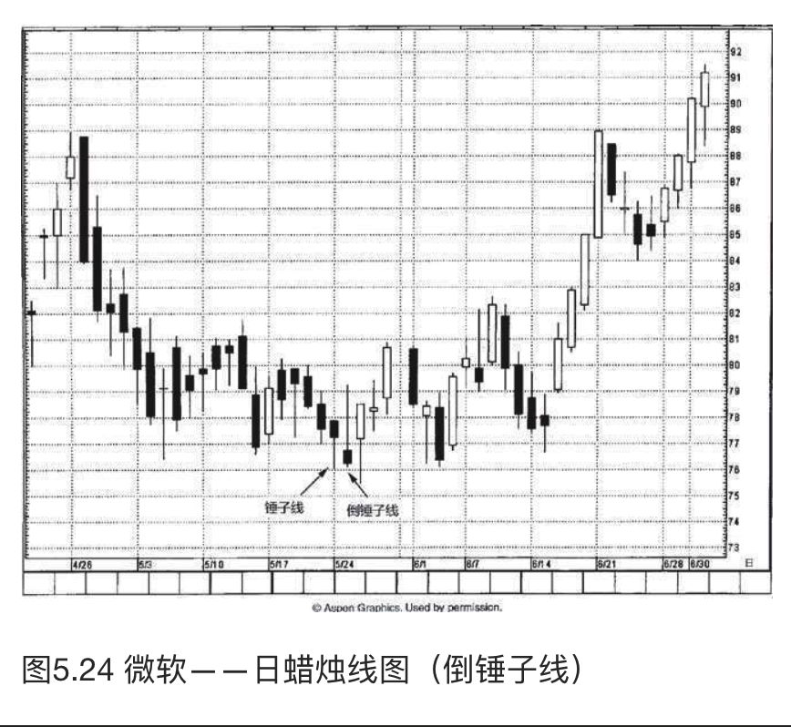

在图5.24中，5月24日的一根`锤子线`在76美元构成了支撑水平。次日，形成了一个`倒锤子线`。它为当前市场变动创下了收市价的新低，如此一来，它就延续了原来向下的短期趋势方向。无论如何，锤子线的支撑水平依然保持完好。5月26日的收市价起到了一石二鸟的作用：首先，它再次确认了锤子线的支撑作用；其次，它为倒锤子线提供了验证信号，因为它的收市价高于倒锤子线的实体。如果对76美元的支撑水平还要求进一步的看涨验证信号，那么6月2日又来了另一个`锤子线`。

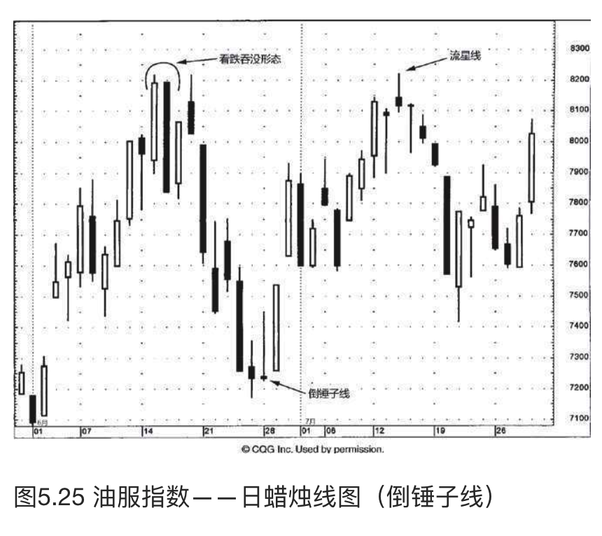

在图5.25中，6月中旬出现了一个`看跌吞没形态`，几天后演变为一个阻挡水平。市场从接近82美元的阻挡水平开始下降，遇到一根`倒锤子线`后方告终。倒锤子线的次日，开市价高于倒锤子线的实体，尤其是当日收市价高于倒锤子线的实体，构成了验证信号。从倒锤子线开始，行情上冲，一直持续到7月12日所在的一周。此时，出现了一根`流星线`，表明那个看跌吞没形态所形成的阻挡水平依然起作用。

## 其他反转形态
### 孕线形态
纺锤线（即小实体的蜡烛线）是特定蜡烛线形态的组成部分。孕线形态就是这些形态中的一个例子（星线也是一个例子，这在第五章已有探讨）。如图6.1所示即`孕线形态`，其中后面一根蜡烛线的实体较小，并且被前一根的实体包进去了。在本形态中，长的蜡烛线是“母”蜡烛线，而小的蜡烛线则是“子”或“胎”蜡烛线。孕线形态的第二根线既可以是白色的，也可以是黑色的。举例来说，如果孕线形态的第一根和第二根蜡烛线都是白色的，便称之为“白-白孕线”形态。

孕线形态 | 十字孕线形态
-----|-------
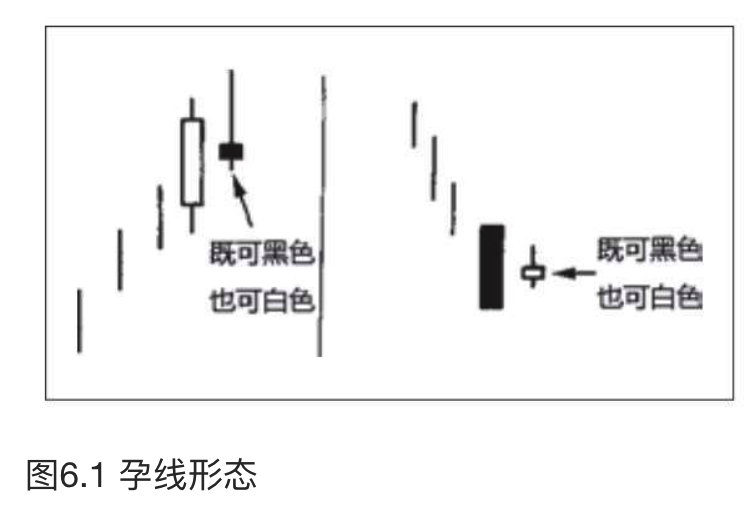 | 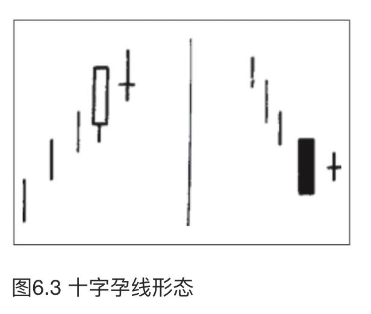

当遇到孕线形态时，日本人会说，市场“上气不接下气”了。`孕线形态`揭示了市场在本形态出现前后健康状况的明显反差。在牛市行情中，孕线形态的前一个长长的白色实体表现出市场本来充满了活力，但是后一个小小的实体却反映出市场犹疑不定。不仅如此，小实体的开市价和收市价都收缩到前一根蜡烛线的开市价到收市价的范围内，从另一个侧面表明牛方向上的推动力正在衰退。由此看来，有可能发生趋势反转。在熊市行情中，孕线形态的前一个长长的黑色蜡烛线反映了沉重的抛售压力，但是，随后的小实体却表明市场踌躇不前。第二天的小实体是个警告信号，说明熊方的力量正在减弱，因此本形态可能构成趋势反转信号。于是，有可能发生趋势反转。

因为`十字孕线形态`包含了一根十字蜡烛线，所以这类形态的技术意义比常规孕线形态更强，被视为更有效的反转信号。十字孕线形态有时也称为`呆滞形态`。

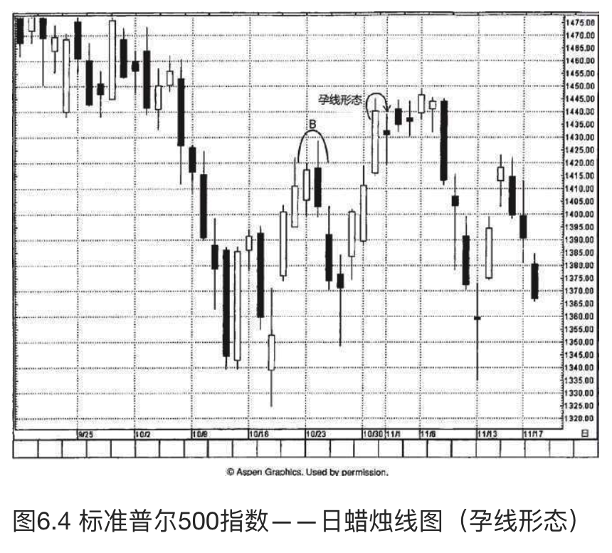

如图6.4所示，从10月26日开始，出现了一轮敏捷的上冲行情。10月31日，这轮上冲行情的第三根白色蜡烛线将指数推升到10月23日—24日的`看跌吞没形态`（B处）形成的阻挡水平之上。然而，无论什么原因导致多头在10月31日的乐观态度都是昙花一现，因为11月1日的蜡烛线随即完成了一个`孕线形态`。这个蜡烛线的实体如此短，以至于可以把上述形态归结为`十字孕线形态`。十字孕线形态之后出现了一系列纺锤线，进一步加强了如下结论，趋势已经从上升转为中性。11月8日，长长的黑色蜡烛线完成了一个`塔形顶部形态`（本章后文将讨论）。

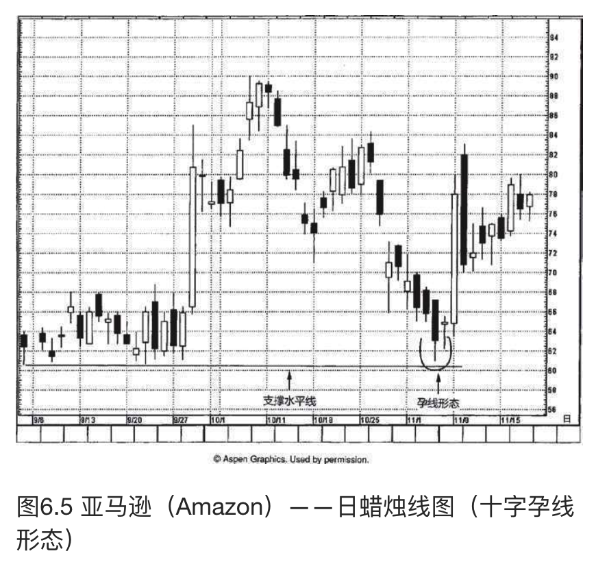

在图6.5中，从上吊线开始出现了一轮跌落行情，终于在11月4日—5日通过一个孕线形态探得底部。孕线形态的第二根实体很短，因此我把它视为一根十字线。于是，这是一个`十字孕线形态`。这个形态尤其有意义，原因在于它的出现有助于清晰地验证位于61美元的先前定义的支撑水平（图中用水平直线标注）。

在本图中，更早些的9月29日和30日组成了另一个`十字孕线形态`。随着这个孕线形态的出现，短线趋势从上升转为横向延伸。这个形态强调了一个要点——在第四章的引言部分曾有介绍：**当趋势发生变化时，并不意味着行情必将从上升转为下降，或者从下降转为上升**。在本图所示的两例孕线形态中，在前者出现后，原来的上升趋势并没有改变。具体说来，在11月的孕线形态出现后，趋势从下降转为上升，而在9月的孕线形态出现后，趋势从上升转为中性。在上述意义上，两个孕线形态都正确地预告了趋势的转变。

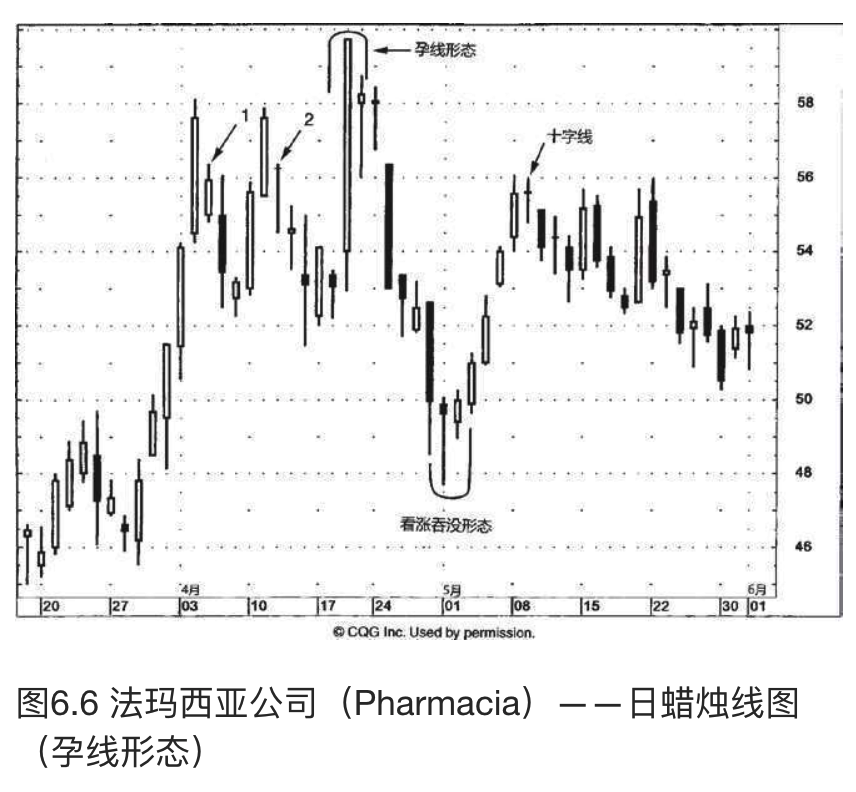

图6.6中，4月19日，这只股票形成了一根延长的白色蜡烛线，推升到了阻挡水平之上。根据这一看涨突破信号，行情指针向上。次日，随着`孕线形态`的到来，市场背景发生了变化。虽然孕线形态并没有将短线趋势立即从上升转为下降，但是它依然足以构成警告信号。如此一来，多头就会减仓，止损指令的水平就会上调，等等。孕线形态之后的`十字线`（4月24日）进一步增强了如下结论，趋势已经从上升转为更加中性，因为十字线表示此时多方和空方力量平衡。从该孕线形态开始形成下降行情，一直持续到一个`看涨吞没形态`（形态的第一个时段是一根`锤子线`）。之后，上冲行情从看涨吞没形态开始，持续到5月9日遭遇一根`十字线`方受到阻碍。图中标注了1和2的两根蜡烛线也都属于`孕线形态`。因为以2标注的蜡烛线是一根十字线，所以它形成的是`十字孕线形态`。

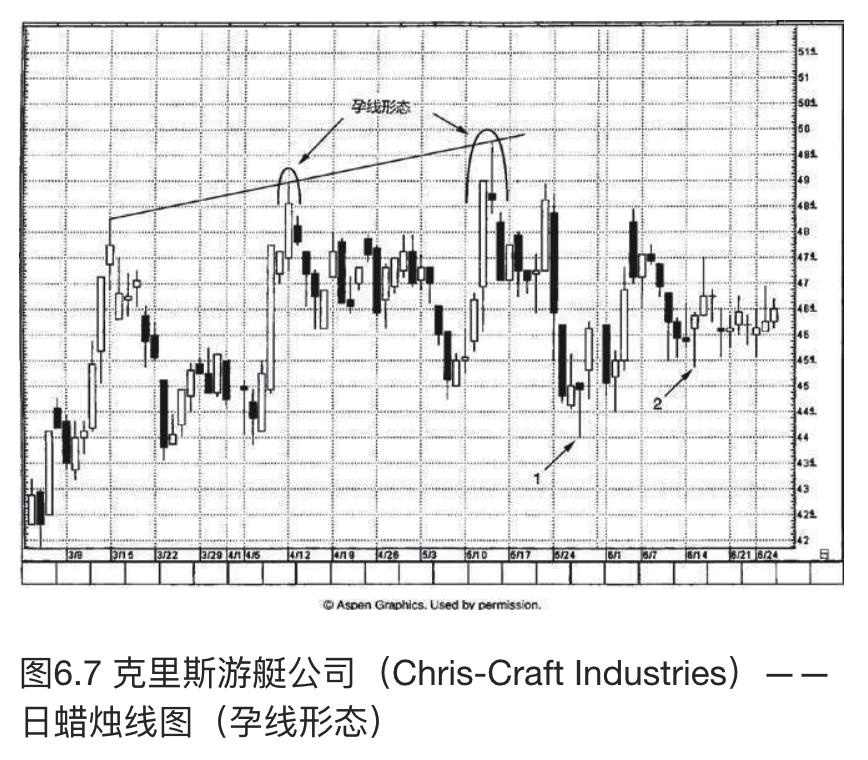

图6.7显示，我们可以轻松地将蜡烛图技术与西方图表分析技术结合在一起。连接3月15日和4月12日的高点得到了一根向上倾斜的阻挡直线。本书的第二部分（主要研究西方图表分析工具）将详细介绍，上升的阻挡直线可以构成供给区域。5月13日，市场在该直线下方冲高回落，在当日蜡烛线上留下一条看跌的上影线，且当日蜡烛线完成了一个`孕线形态`，由此我们得到了图形验证信号，证明此处供给压倒了需求。请观察，之前于4月12日和13日形成的波峰处，也构成一个孕线形态。标注1和2的两处`锤子线`是市场行情趋于稳定的信号。

### 平头顶部形态和平头底部形态
`平头形态`是由几乎具有相同水平的最高点的两根蜡烛线组成的，或者是由几乎具有相同的最低点的两根蜡烛线组成的。之所以将这种形态称为平头顶部形态和平头底部形态，是因为这些蜡烛线的端点就像镊子腿一样平齐。在上升的市场中，当几根蜡烛线的最高点的位置不相上下时，就形成了一个`平头顶部形态`。在下跌的市场中，当几根蜡烛线的最低点的位置基本一致时，就形成了一个`平头底部形态`。平头形态既可以由实体构成，也可以由影线或者十字线构成。在理想情况下，平头形态应当由前一根长实体蜡烛线与后一根小实体蜡烛线组合而成。这样就表明，无论在第一个时段市场展现了什么样的力量（如果是长白色实体，展现的便是看涨的力量；如果是长黑色实体，展现的便是看跌的力量），到了第二个时段都被瓦解了，因为第二个时段是一个小实体，且其高点与第一个时段的高点相同（在平头顶部形态中），或其低点与第一个时段的低点相同（在平头底部形态中）。如果一个看跌的（对于顶部反转）蜡烛图信号，或看涨的（对于底部反转）蜡烛图信号，同时构成了一个平头形态，该形态就多了一些额外的技术分量。

平头顶部形态与十字孕线 | 平头顶部形态与上吊线 | 平头顶部形态与流星线 | 平头顶部形态与乌云盖顶形态 | 平头顶部形态与锤子线 | 平头顶部形态与刺透形态
------------|------------|------------|---------------|------------|------------
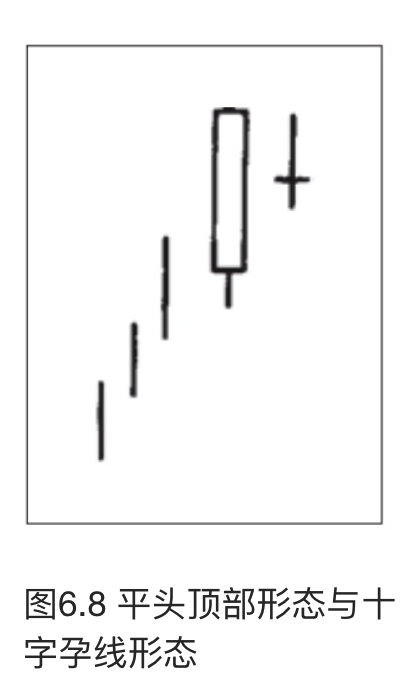 | 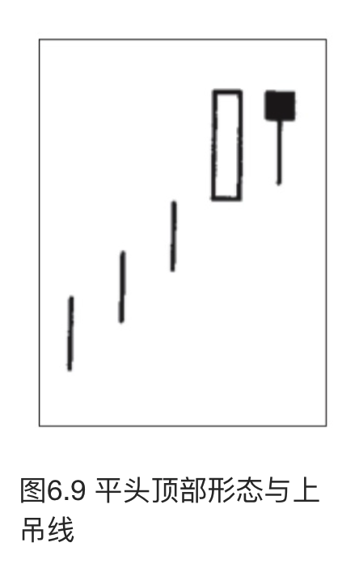 | 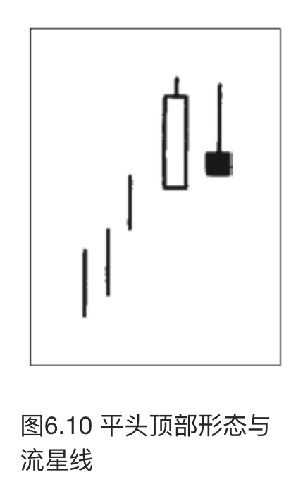 | 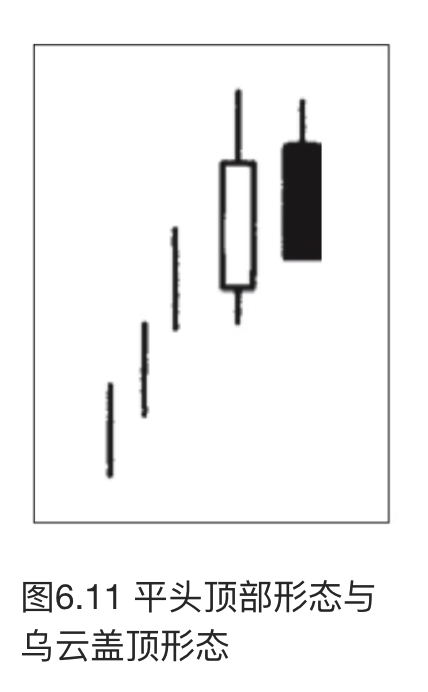 | 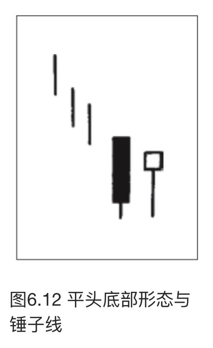 | 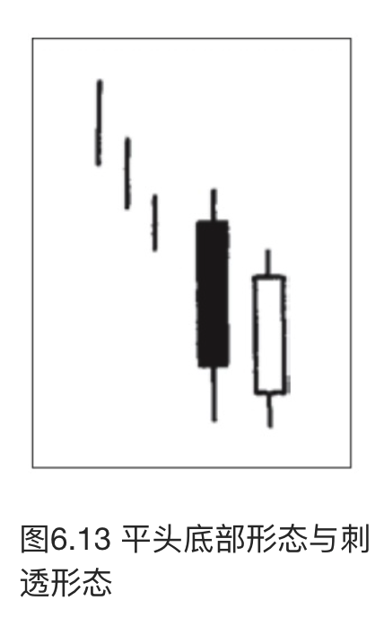

从图6.8到图6.13的各个示意图详细揭示了上述概念。
- 如图6.8所示，在上升趋势中，先是一根长长的白色蜡烛线，后是一根十字线。这个双蜡烛线形态既是一个`十字孕线形态`，又是一个`平头形态`，因为它们具有同样的最高点。综合来看，这个形态可能构成了重要的反转信号。
- 如图6.9所示，在这个平头形态中，先是一根长长的白色蜡烛线，后是一根`上吊线`。下一时段，如果市场开市于上吊线的实体之下，尤其是收市于上吊线的实体之下，那么把这个形态判断为一个顶部反转信号，就有了很大的胜算。只要市场的收市价不高于这个平头形态的顶部，那么看跌的态度就不可动摇。这个双蜡烛线的混合体也可以看作一个孕线形态。结合以上分析，因为这个孕线形态处于上升趋势中，所以它构成了一个顶部反转形态。
- 如图6.10所示，在这个平头顶部形态中，第二根蜡烛线同时又是一根看跌的`流星线`。
- 正如前文所说，在理想情况下，平头形态第二个时段不仅其高点与第一个时段的高点相同，也是一个小实体。在图6.11中，第二根蜡烛线并不是小实体。然而，这里的第二个时段完成了一个`乌云盖顶形态`的变体（第二天的开市价高于第一天的收市价，而不是高于第一天的最高点）。这根黑色蜡烛线在前一个时段的高点处一触即溃，之后行情回落。正因为最后这一点——两个时段的高点处在相同水平，给乌云盖顶形态的变体增添了更多的疲软味道。
- 如图6.12所示，在这里的双蜡烛线形态中，后一根为`锤子线`，并且它成功地向下试探了前一根长长的黑色蜡烛线的最低点。锤子线、市场对支撑水平的成功试探，两方面因素同时证明卖方已经丧失了对市场的控制。最后，这个双蜡烛线组合也可以视为`孕线形态`。这是将此处判断为一个重要支撑水平的第三条理由。
- 如图6.13所示，虽然第二根蜡烛线不是小实体，但是它的确完成了一个`看涨刺透形态`的变体（在理想的刺透形态中，第二天的开市价低于第一天的最低点；而这里第二天的开市价仅低于第一天的收市价）。因为这一点，我认为它同时还构成了一个`平头底部形态`。

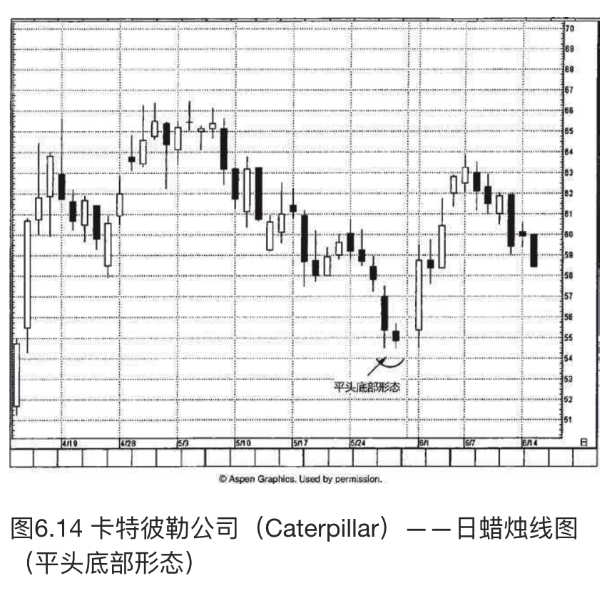

如图6.14所示，这是`平头底部形态`的实例。请注意，平头形态的第二个实体并不处在第一个实体的范围内，如此一来，构不成孕线形态。紧随平头形态之后，6月1日是一根长白色蜡烛线；跟着是一个小实体，其高点与长白色蜡烛线差不多，接近59.50美元。于是，6月1日和2日的蜡烛线组合就可以看作平头顶部形态。但是，从总体技术图景来看，此时行情尚未过度延伸，因此不同于在超买状态下出现的平头顶部形态，这里的平头顶部形态不容易引发市场调整。退一步说，即使某人根据6月1日和2日的平头顶部形态（它也是一个孕线形态）采取行动，一旦6月3日的收市价向上超越了上述两天的最高点，该平头顶部形态任何潜在的看跌意味都不复存在了。

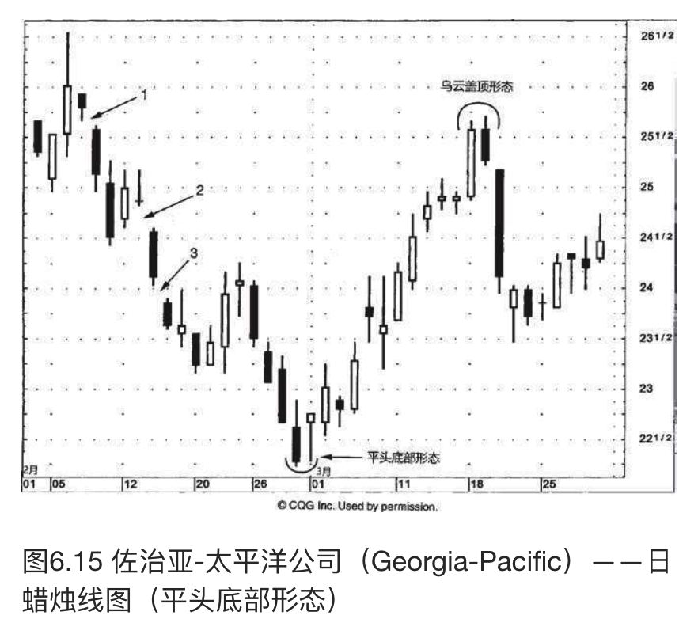

在图6.15中，在1、2和3处出现了一系列向下跳空（在蜡烛图技术里，跳空被称为`“窗口”`。第七章详细讨论窗口），标志着下降动能正顺利施展。最终，出现了一个`平头底部形态`，且其中第二根蜡烛线为`锤子线`。3月18日所在的一周里，形成了一个`乌云盖顶形态`，表明此时市场向上的能量已经耗散了。

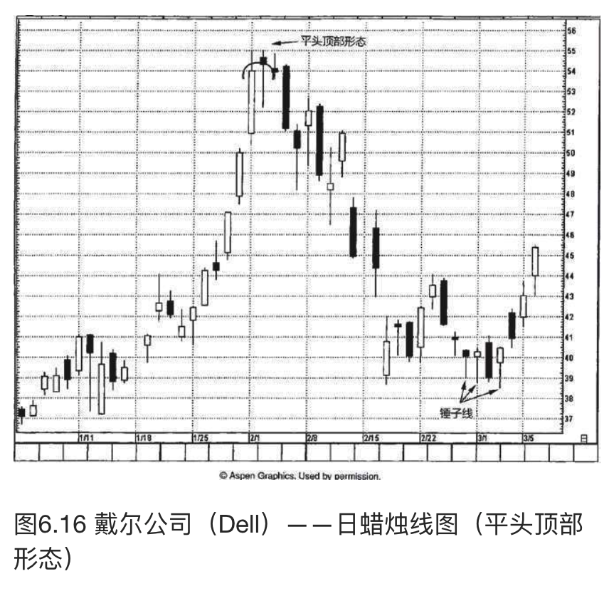

图6.16展示了一个`平头顶部形态`。2月2日为小实体，它不居于前一根实体范围之内，并不构成孕线形态。两根蜡烛线具有相同的高点，即55美元，因此这属于平头形态。不仅如此，2月2日的小实体是一根上吊线（其上影线足够短，可以视之为上吊线）。当然，这根上吊线（与任何上吊线一样）需要得到看跌信号的验证，即市场收市于上吊线的实体之下。下一个时段正是如此。

从上述平头顶部形态开始，戴尔形成了下降行情，一直持续到2月底—3月初的一系列`锤子线`，它们标志着行情进入盘整区域。2月26日和3月1日是前面的两根锤子线，它们并不能构成常规的平头底部形态。为什么？虽然两者的低点确实差不多相同，但是两根锤子线不满足平头底部形态的一项常规要求——平头底部形态的第一根蜡烛线应为长实体。尽管2月26日和3月1日的两根锤子线不能归类为平头底部形态，但是由于两者看涨的长下影线突出显示了市场正在排斥位于39美元的低价位，我依然要强调它们的重要性。如此一来，我就把2月26日和27日的蜡烛线组合看成`平头底部形态`的变体。

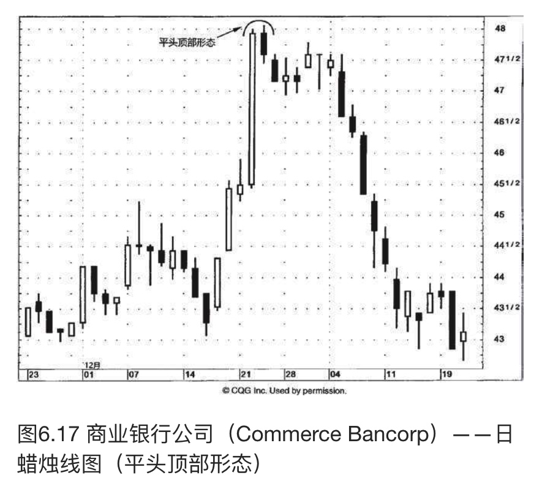

在图6.17中，12月22日和23日的两根蜡烛线不构成乌云盖顶形态（因为黑色蜡烛线没有向下扎入长白色蜡烛线实体的中线以下），不过，它们的确足以构成`平头顶部形态`。尽管我认为乌云盖顶形态比平头顶部形态的信号更强（因为常规的乌云盖顶形态中后一根蜡烛线的收市价深入到前一根白色蜡烛线内部），但是这个平头顶部形态肯定也值得视为警告信号。这一点得到了下一周的几个小实体和一根十字线的呼应，它们反映出行情基调已经从看涨转为更加中性了。

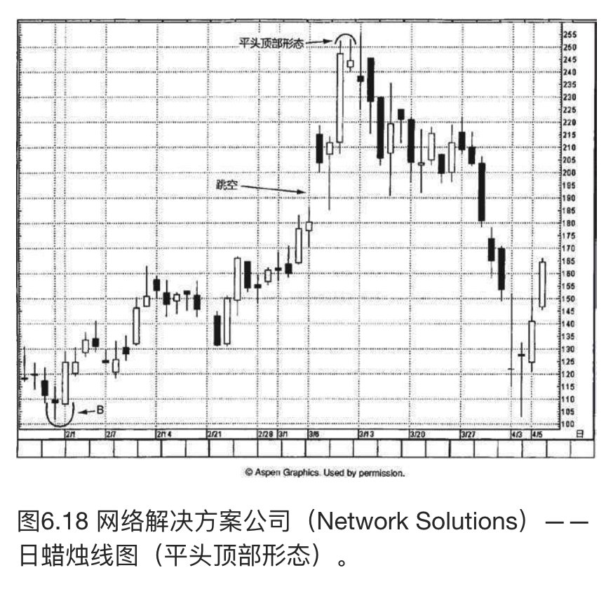

在图6.18中，B处的`看涨吞没形态`为2月初开始的上冲行情奠定了基础。3月6日出现了一个向上跳空，上冲行情持续。正如第七章将要讨论的，**向上跳空的下缘可能成为支撑水平**。上述向上跳空的下缘接近185美元，3月8日的蜡烛线带有长长的下影线，对这个支撑水平进行了试探，后者守得非常牢靠。

3月10日，接近250美元处，是一个小实体，它与前一根蜡烛线构成`孕线形态`。因为组成孕线形态的这两根蜡烛线具有相同水平的高点，它们也构成了`平头顶部形态`。

### 捉腰带线
`捉腰带形态`是由单独一根蜡烛线构成的。`看涨捉腰带形态`是一根坚挺的白色蜡烛线，其开市价位于本时段的最低点（或者，这根蜡烛线只有极短的下影线），然后市场一路上扬，收市价位于或接近本时段的最高点（如图6.19）。`看涨捉腰带线`又称为`开盘光脚阳线`。如果市场本来处于低价区域，这时出现了一根长长的看涨捉腰带线，则预示着上冲行情的到来。

看涨捉腰带形态 | 看跌捉腰带形态
--------|--------
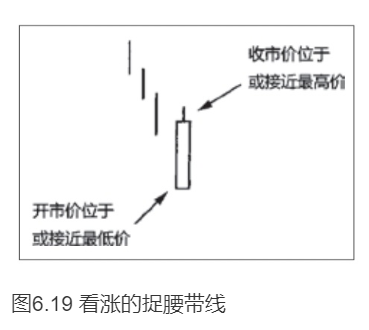 | 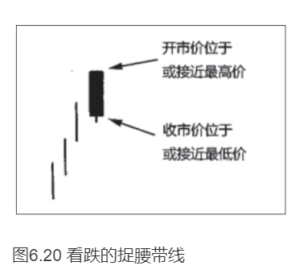

`看跌捉腰带形态`（如图6.20所示）是一根长长的黑色蜡烛线，它的开市价位于本时段的最高点（或者距离最高价只有几个最小报价单位），然后市场一路下跌。在市场处于高价区的条件下，看跌捉腰带形态的出现，就构成了顶部反转信号。`看跌捉腰带线`有时也称为`开盘光头阴线`。

捉腰带蜡烛线的长度越长，则该形态的技术意义越重大。这个术语的意思是“抓着对手的腰带，将他推出圈外”。

如果市场收市于黑色的看跌捉腰带线之上，则意味着上升趋势已经恢复。如果市场收市于白色的看涨捉腰带线之下，则意味着市场的抛售压力重新积聚起来了。

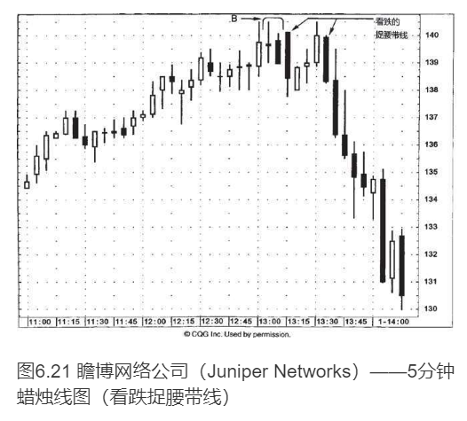

如果捉腰带线得到了阻挡区域的验证，或者接连出现了几根捉腰带线，或者有一阵子没有出现捉腰带线，突然来了一根，这样的捉腰带线就更加重要。在图6.21中，B处有一个`看跌吞没形态`，表明可能遇到麻烦了。与看跌吞没形态大致在同一个区域内，出现了双重的`看跌捉腰带线`，于是进一步增强了该区域为供给区的结论。虽然这里在短短一段时间里出现了许多看跌信号（看跌吞没形态、两个看跌的捉腰带线），但是并不必然预示着后来那么糟糕的情形：在第二根捉腰带线之后，市场像自由落体一样下跌。不约而同的蜡烛图信号增加了此处形成行情反转的可能性，但并不涉及之后行情的尺度。

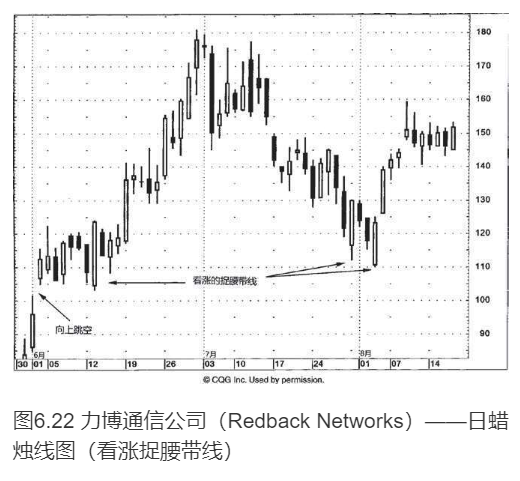

在图6.22中，6月初出现了一个向上跳空，很快转化为支撑区域，随后在6月上半个月里多次成功地经受了试探，支撑区域得到了验证。6月13日的蜡烛线是`看涨的捉腰带线`。到7月底、8月初，市场再次向下试探该窗口的支撑作用，又形成了一系列`看涨的捉腰带线`。后面这两根看涨捉腰带线也分别与其前一根蜡烛线组成了两个背靠背的`刺透形态`。从8月初的低点开始形成上冲行情，持续到8月9日的`流星线`。

### 向上跳空两只乌鸦
“向上跳空”指的是图示的小黑色实体与它们之前的实体（第一个小黑色实体之前的实体，通常是一根长长的白色实体）之间的价格跳空。在图示的形态中，两个黑色的小实体自然就是“两只乌鸦”。两个黑色的小实体好像是栖立在高高的树枝上的两只乌鸦，不祥地向下凝视着。从这个形象的比喻来看，显而易见，这是一种看跌的价格形态。在理想的`向上跳空两只乌鸦形态`中，第二个黑色实体的开市价高于第一个黑色实体的开市价，并且它的收市价低于第一个黑色实体的收市价。

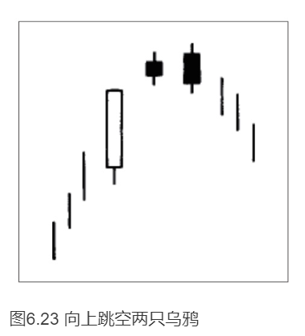

这个形态在技术上看跌的理论依据大致如下：市场本来处于上升趋势中，并且这一天的开市价同前一天的收市价相比，是向上跳空的，可是市场不能维持这个新高水平，结果当天反而形成了一根黑色蜡烛线。到此时为止，多头至少还能捞着几根救命稻草，因为这根黑色蜡烛线还能够维持在前一天的收市价之上。第三天，又为市场抹上了更深的疲软色彩：当天市场曾经再度创出新高，但是同样未能将这个新高水平维持到收市的时候。然而更糟糕的是，第三日的收市价低于第二日的收市价。如果市场果真如此坚挺，那么为什么它不能维持新高水平呢？为什么市场的收市价下降了呢？这时候，多头心中恐怕正在惴惴不安地盘算着上述两个问题。思来想去，结论往往是，市场不如他们当初指望的那样坚挺。如果次日（也就是指第四天）市场还是不能拿下前面的制高点，那么，我们可以想见，市场将会出现更低的价格。

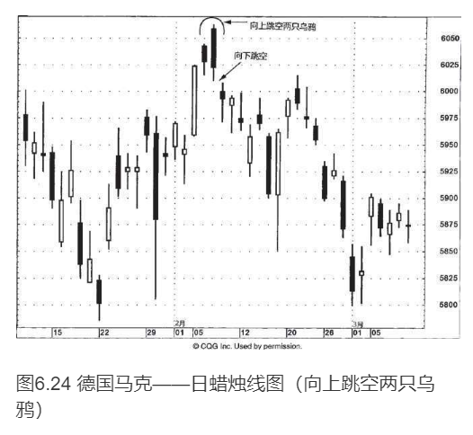

图6.24中包含一个`向上跳空两只乌鸦`的实例。紧接着该形态，出现了一个很小的向下跳空，它揭示空方卷土重来。从2月20日所在的一周开始形成的一轮上冲行情，在遭遇这个跳空的阻挡作用后停步不前。

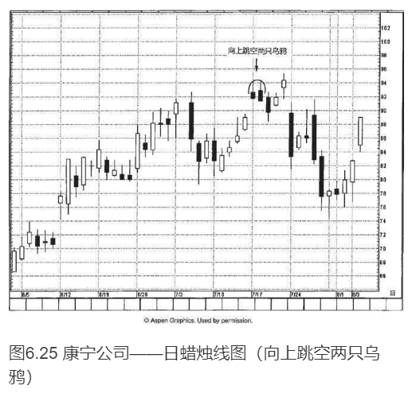

图6.25说明了把蜡烛图形态与它贴身的周边环境相结合的重要意义。7月中旬虽然出现了一个`向上跳空两只乌鸦形态`，但是它本身并不构成卖出信号。这是因为，正如第七章将要详细讨论的，7月17日该股票向上跳空，通常向上跳空是行情坚挺的征兆——无论是在蜡烛图上还是在线图上都是如此。因而，尽管该向上跳空两只乌鸦形态发出了警告信号，与图6.24中的向上跳空两只乌鸦形态之前没有向上跳空的情形相比，我认为它没有那样疲软。

### 三只乌鸦
在向上跳空两只乌鸦形态中，包含了两根黑色蜡烛线。如果连续出现了三根依次下降的黑色蜡烛线，则构成了所谓的`三只乌鸦形态`（图6.26所示）。

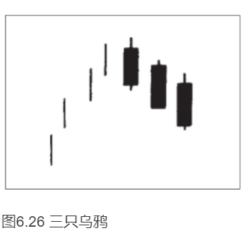

从外形上说，这三根黑色蜡烛线的收市价都应当处于其最低点，或者接近其最低点。在理想的情形下，每根黑色蜡烛线的开市价也都应该处于前一个实体的范围之内。

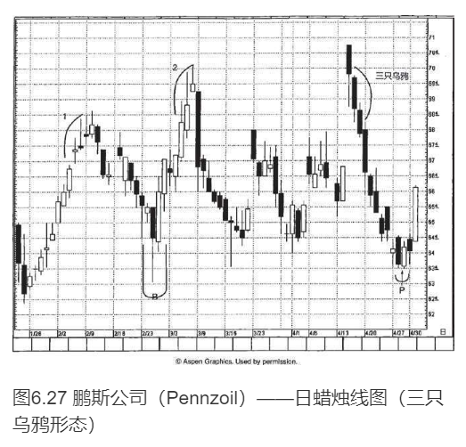

如图6.27所示，从4月15日开始形成了一个`三只乌鸦形态`。从三只乌鸦开始的下降行情一路几乎不受阻碍地延续到了P处的`刺透形态`。三只乌鸦形态中的第二根和第三根蜡烛线（4月16日和17日）都开市于之前的实体之下。虽然在常规的三只乌鸦形态中后续蜡烛线的开市价居于之前的黑色实体内部，但是这两根蜡烛线的开市价低于之前的实体，可以视作更加疲软的信号。其原因在于，第二根和第三根黑色实体开市价低于前一日的收市价，之后在整个交易日里都无力夺得实质性的立足地。

无论如何，在本例中，当三只乌鸦形态的第一根黑色蜡烛线出现的时候，我们就可以看出行情遇到麻烦的一点端倪了。个中缘由是，股票当日开市于之前3月份的历史高点70美元之上，然而牛方未能坚守上述新高，当日收市时，反而跌回到70美元以下。正如您将要在本书第二部分看到的，**如果市场先创新高，之后却不能守住，可能带有看跌的意味**。这里的情况便是这样。

我们再来看看之前1和2处的高点。在2月初的1处，鹏斯公司为当前行情创了新高，但这里的一组蜡烛线却向我们发出了强烈的“火光”警告信号，行情并不像表面上那么顺利。具体说来，在2月2日所在的一周的后几天，尽管股价不断创下更高的高点、更高的低点、更高的收市价，但是它们都是小实体，都有长长的上影线。这肯定显示出当前的行情变化其实并不是一面倒地有利于牛方。之后价格回落，直到B处的`看涨吞没形态`才结束。从此处开始的一轮上冲行情持续推升，持续到3月2日所在的一周，图中用2做了标记。2处的上冲行情与1处的上涨行情有异曲同工之妙，2处的行情也有更高的高点、更高的低点、更高的收市价，这样如果在线图上看起来，行情显得很健康。然而从蜡烛图的角度来看，3月4日、5日、6日的价格攀升带有长长的上影线。这一点证明多方相对强势的力量正在涣散。3月6日的蜡烛线是一根`流星线`。

### 白色三兵挺进形态
与三只乌鸦形态相对的形态称为`白色三兵挺进形态`，或者更通俗的说法是`白三兵形态`（如图6.28）。本形态是由接连出现的三根白色蜡烛线组成的，它们的收市价依次上升。当市场在某个低价位稳定了一段时间后，如果出现了这样的形态，就标志着市场即将转强。

白三兵形态表现为一个逐渐而稳定的上升过程，其中每根白色蜡烛线的开市价都处于前一天的白色实体之内，或者处在其附近的位置上。每一根白色蜡烛线的收市价都应当位于当日的最高点或接近当日的最高点。这是市场的一种很稳健的攀升方式（不过，如果这些白色蜡烛线伸展得过长，那么我们也应当对市场的超买状态有所戒备）。

白色三兵挺进形态 | 前方受阻形态 | 停顿形态
---------|--------|-----
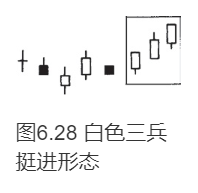 | 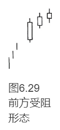 | 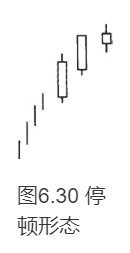

如果其中的第二根和第三根蜡烛线，或者仅仅是第三根蜡烛线，表现出上涨势头减弱的迹象，那就构成了一个`前方受阻形态`（如图6.29所示）。这就意味着这轮上涨行情碰到了麻烦，持有多头头寸者应当采取一些保护性措施。特别是在上升趋势已经处于晚期阶段时，如果出现了前方受阻形态，则更得多加小心。在前方受阻形态中，作为上涨势头减弱的具体表现，既可能是其中的白色实体一个比一个小，也可能是后两根白色蜡烛线具有相对较长的上影线。如果在后两根蜡烛线中，前一根为长长的白色实体，并且向上创出了新高，后一根只是一个小的白色蜡烛线，那么就构成了一个`停顿形态`（如图6.30所示）。有时候，这种形态也称为`深思形态`。当这一形态出现时，说明牛方的力量至少暂时已经消耗尽了。

前方受阻形态与停顿形态之间并没有太大差异。关于白三兵，需要考虑的主要因素是，如果三根蜡烛线的每一根的收市价都位于或接近本时段的最高价，则最具有建设性。如果后两根蜡烛线表现出犹豫的迹象，是小实体，或者是上影线，那么这些线索表明，上冲行情正变得衰弱。

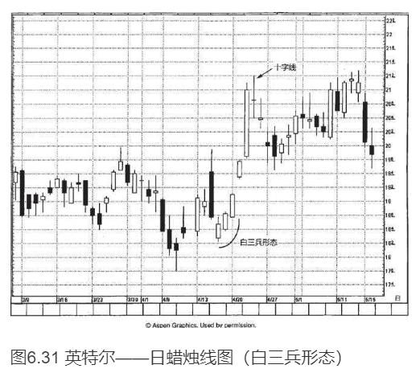

图6.31展示了一例几乎算是经典的`白三兵形态`，因为其中的每根蜡烛线，尤其是后两根相对更坚挺，它们的开市价接近本时段最低点，收市价位于或接近本时段最高点。4月23日是一根十字线，并形成了一个`十字孕线形态`，这是行情进入犹疑状态的征兆。

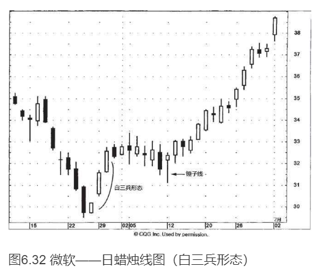

图6.32是`白三兵形态`良好的实例。三根白色蜡烛线的收市价都非常接近本时段最高价，每一根的开市价都位于先前一根实体的内部或之上。关于白三兵形态需要考虑的一个方面是，等到白三兵形态完成时，市场可能已经明显脱离其低位了。在本例中，微软离开其低位差不多4美元，这可是较大比例的行情变化了。因此，除非交易者长线看好，在白三兵形态完成时买进或许并不具备有吸引力的风险报偿比。

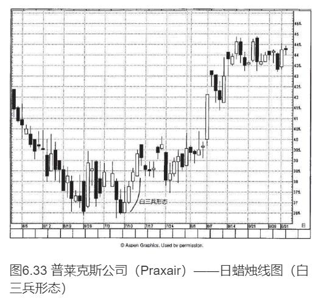

在图6.33中，6月中旬、下旬和7月初形成了一个底部，位于36.50美元上下。然后，出现了`白三兵形态`（虽然它们都带有非常短的上影线）。在其中的第三根白色蜡烛线之后，股票开始犹豫，回调到了7月11日的第一根白色蜡烛线的内部。本图再次说明，**在白三兵形态之后有时市场或许会调整。一旦发生调整，我们预期股票在进入其中第二根，特别是第一根白色蜡烛线的内部时将得到支撑**。

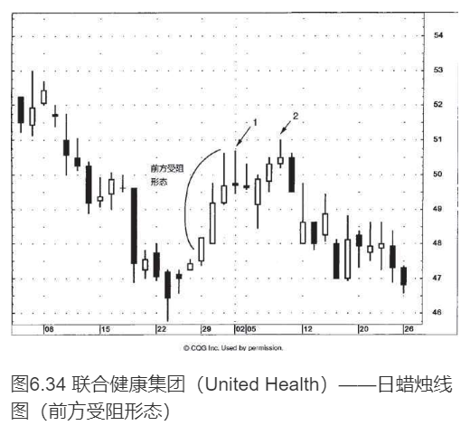

图6.34展示了一例前方受阻形态的实例。虽然那是三根相对较高的白色蜡烛线，但是其中后两根带有看跌的上影线。这反映出当前上冲行情受阻陷入停顿。事实上，之后又形成了更多带上影线的蜡烛线，请看图中标注的1和2处，揭示了此处接近51美元的阻挡水平。2处那根带长上影线的蜡烛线是一根`流星线`，它与次日的蜡烛线组成了一个`看跌吞没形态`。

### 三山形态和三川形态
所谓的`三山顶部形态`（如图6.35所示）。一般认为，本形态构成了一种主要顶部反转过程。如果市场先后三次均从某一个高价位上回落下来，或者市场对某一个高价位向上进行了三次尝试，但都失败了，那么一个三山顶部形态就形成了。在三山顶部形态的最后一座山的最高点，还应当出现一种看跌的蜡烛图指标（比如说，一根十字线，或者一个乌云盖顶形态等），对三山顶部形态做出确认。

在三山顶部形态中，如果中间的山峰高于两侧的山峰，则构成了一种特殊的三山形态，称为`三尊顶部形态`（如图6.36所示）。采用这个名字的原因是，在佛教寺庙的大殿里，中间供奉着释迦牟尼，他的塑像最高大，两边是他的弟子，他们的塑像比较小。这个形态与头肩形形态对应得非常完美。

三山顶部形态 | 三尊顶部形态 | 三川底部形态 | 倒三尊形态
-------|--------|--------|------
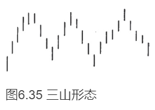 | 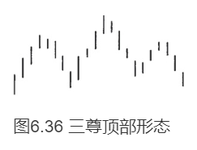 | 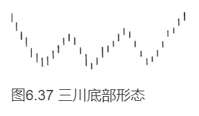 | 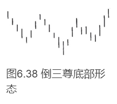

`三川底部形态`（如图6.37所示）恰巧是三山顶部形态的反面。在市场先后三度向下试探某个底部水平后，就形成了这类形态。市场必须向上突破这个底部形态的最高水平，才能证实底部过程已经完成。与西方的头肩形底部形态（也称为倒头肩形）对等的蜡烛图形态是变体三川底部形态，或者称为`倒三尊形态`（如图6.38所示）。

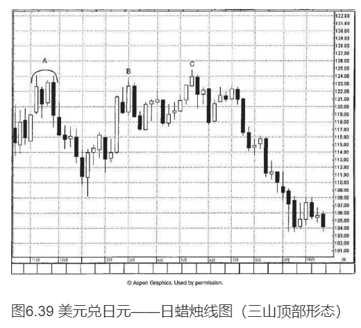

在图6.39中，在区域A接近124美元处，市场表现得犹豫起来，特别是当11月最后两个星期造就了一个`看跌的吞没形态`后。从看跌吞没形态开始，市场回落，直到遇上一个`看涨的吞没形态`后才能稳定。市场从看涨的吞没形态开始上涨，之后不出所料，当市场在区域B接近124美元时——先前的看跌吞没形态构成的阻挡水平，上涨行情止步不前。区域B出现了另一个看跌的吞没形态。5月中旬的下一轮上冲行情，在区域C遭遇了下一个看跌吞没形态，于是A、B、C三处连成了`三山顶部形态`。

在图6.39中，每一个山峰几乎都处在同一个水平上。这一点并不是必需的。如果三个价格波峰并不是恰好位于同一个高度，依然可以认定为`三山顶部形态`。在图6.40中，行情在A、B、C三处形成波峰，其中B和C的波峰均处在略高的水平上。

这个组合依然可以判别为三山顶部形态。在C处的最后两个时段，英特尔的上涨行情是通过两个非常短的实体来体现的。它们便是不安的症状。股票价格在76美元见顶，留下一根流星线。真正的转折信号，以及对三山顶部形态的验证信号，是在8月底的流星线之后出现的向下跳空。

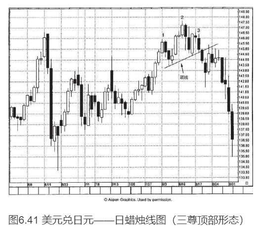

三山顶部形态的三个波峰具备差不多相同的高度，三尊顶部形态则是中间的波峰更高，两侧的波峰稍低。我们可以把三尊顶部形态与头肩形顶部形态（头肩顶）相提并论。在图6.41中，我们看到了一个`三尊形态`的实例，实际上也就是`头肩形顶部形态`，价格波峰1、2、3组成了本形态。图上标出了一根上升的直线，按照西方术语，应称为头肩形顶部形态的`颈线`。在常规情况下，头肩顶的颈线一旦被向下突破，便转化为阻挡线。这里简直是按脚本上演，自从8月19日行情向下跌破颈线后，8月21日（以及之后的三个时段）发生了微弱的向上反弹，都在颈线下方受阻，它们看跌的长影线验证了颈线新的阻挡作用。

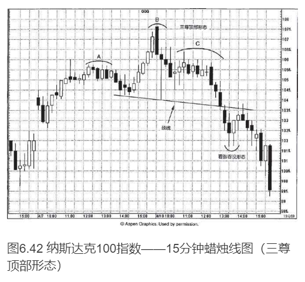

图6.42是`三尊顶部形态`的又一个例子。既然本形态与头肩顶同质而异名，我们就可以转而采用西方技术分析，正如上一个图例所讨论的，以头肩形颈线的概念为基础来分析。

具体说来，一旦头肩顶颈线被向下突破，它从支撑作用转为阻挡作用。4月10日13:30，市场力图通过一个小小的看涨吞没形态来站稳脚跟，但是市场没能突破颈线的阻挡作用，将指数推升到颈线之上，说明空方保持着控制权。这反映出，关键的一点是要弄清楚蜡烛图形态到底是在什么样的位置形成的。在本例中，`看涨的吞没形态`是潜在的底部反转信号，不过，如果等市场以收市价突破到颈线阻挡水平之上之后，再从容买进，岂不是更有道理——即使拿到了看涨吞没形态的这张好牌？耐心等待是值得的，因为如果行情收市到颈线之上无疑有助于增强信心，表明多头更占上风。

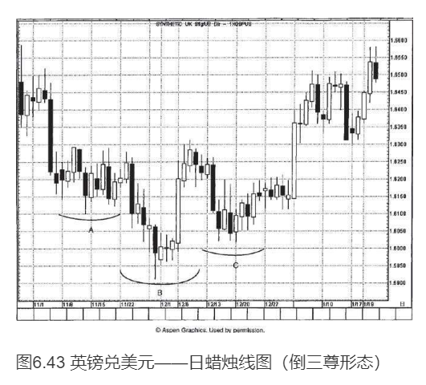

西方的`倒头肩形底部反转形态（头肩底）`与日本的`倒三尊底部形态`异曲同工。也就是说，在三个波谷中，中间的波谷最低，两边的波谷稍高。这种情形在图6.43中如A、B、C的低点所示。因为B处的低点低于A处和C处的低点，它们组成了`倒三尊形态`。请注意，一旦1月初那根长长的白色蜡烛线将英镑推升到1.63之上，原先这里是阻挡水平，现在便转化为新的支撑水平了。原先的阻挡区域转为新的支撑区域，这个概念构成了非常强大的交易手段。有关内容将在第十一章讨论。

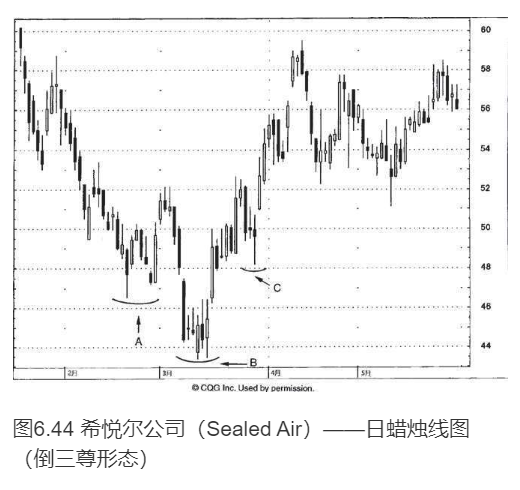

### 反击线形态（约会线形态）
当两根颜色相反的蜡烛线具有相同的收市价时，就形成了一个`反击线形态`（也称为`约会线形态`）。描述这种形态，最好的办法是讨论如图6.45和图6.46的示意图。

如图6.45所示，这是一个`看涨反击蜡烛线`的例子。本形态出现在下降行情中。在这个形态中，第一根蜡烛线是一根长长的黑色蜡烛线。在第二根蜡烛线上，市场的开市价急剧地向下跳空。到此刻为止，空头觉得信心十足。但是从这时候起，多头发动了反攻，他们把市场推了上来，使价格重新回到了前一天收市价的水平。于是，先前的下降趋势的马头就被勒住了。

看涨反击形态 | 看跌反击形态
-------|-------
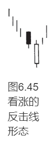 | 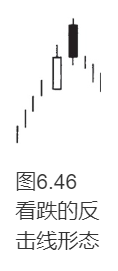

如图6.46所示，这是一根`看跌反击蜡烛线`。在这种反击线形态中，第一根蜡烛线是长长的白色蜡烛线，保持了牛市一贯的上升动力。在下一根蜡烛线上，市场在开市时向上跳空，多头很高兴。但从此时起，空头挺身而出，发起反击，将价格拉回到前一天的收市价的水平。在本形态的第二天，多头在开市时的乐观劲头到了收市的时候恐怕就要变成担惊受怕了。

看跌反击线形态与乌云盖顶形态也有类似的关系。在理想的看跌反击线形态中，第二天的开市价高于前一天的最高点，这一点与乌云盖顶形态是一致的。不过，**与乌云盖顶形态不同的是，这一天的收市价并没有向下穿入前一天的白色蜡烛线之内。由此看来，乌云盖顶形态所发出的顶部反转信号，比看跌反击线形态更强**。

在反击线形态中，一项重要的考虑因素是，第二天的开市价是否强劲地上升到较高的水平（在看跌反击线形态中），或者是否剧烈地下降到较低的水平（在看涨反击线形态中）。这里的核心思想是，在该形态第二天开市时，市场本已经顺着既有趋势向前迈了一大步，但是后来，却发生了意想不到的变故！到当日收市时，市场竟然完全返回到前一天收市价的水平！如此一来，朝夕之间竟扭转了行情基调。

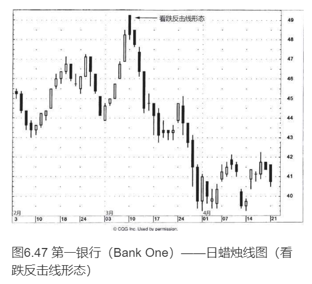

如图6.47所示，3月10日开市时，相比前一天的收市价该股票跳涨了1美元。可惜好景不长，当日收市时股票的坚挺色彩改换了颜色，因为空头把价格拖低到前一个交易日，即3月7日的收市价的水平。3月10日的反击线在三根黑色蜡烛线中打头阵，三者组成了一个`三只乌鸦形态`。

在前面三只乌鸦形态的部分曾经提及，因为必须三根蜡烛线就位，信号才能完成，等到三只乌鸦形态的第三根蜡烛线出现后，已经错过了较大幅度的行情变化。无论如何，在本例的情况下，因为其中的第一根蜡烛线是反击线，仅需等待一个时段，就能得到更早的转折信号，然后再通过三只乌鸦来进一步验证。

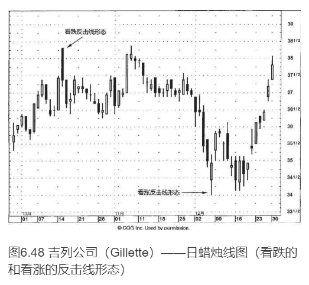

在图6.48中的10月15日，展现了一例`看跌的反击线形态`。我们可以看出，该反击线的收市价并没有恰好处于前一时段白色蜡烛线的收市价，而是稍稍低于后者。在判断反击线形态时，对形态的定义应该留有适当变通的余地，这对于绝大多数蜡烛图信号都适用。举例来说，12月6日有一个看涨的反击线。当日开市时，股价剧烈下跌向下跳空，当日收市时，收市价接近前一日的收市价，而不是恰好位于。即使第二天的收市价与第一天的收市价不是恰好相同，也肯定足够接近了，因此我认为这属于看涨反击线形态。判别这个看涨反击线形态的主要标准是，虽然白色蜡烛线的开市价非常疲软，却能够当日完全反弹，令人刮目相看。

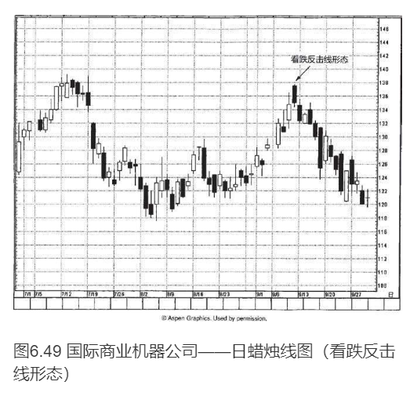

在图6.49中，`看跌反击线形态`有助于证实138-139美元附近存在重要的阻挡水平。无独有偶，这里的两个收市价也不是恰好处在同一个水平，而是足够接近，足以判断形态有效。本图揭示了蜡烛图技术**可以用来独立验证阻挡水平**，做法简便易行。

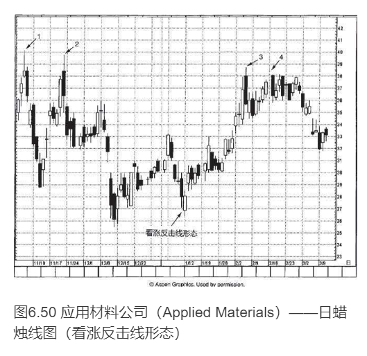

在图6.50中，在1月12日的低点处有一个`看涨反击线形态`。它有助于验证12月中旬形成的位于25.50-27之间的支撑区域。

本图也说明了我称之为`“蜡烛线簇”`的概念。也就是说，一群蜡烛线或若干蜡烛图信号相互验证，集中加强了某个支撑区域或阻挡区域。让我们带着这样的想法，观察一群蜡烛图信号，图上用数字1-4来做了标记，看看它们如何集中强调了图示阻挡区域的作用。

1. 一根流星线。次日的蜡烛线也完成了一个`看跌吞没形态`。
2. 一根黑色实体深深插入前一根白色实体内部，形成了一个`乌云盖顶形态`。
3. 又一个`乌云盖顶形态`。
4. 一个`看跌吞没形态`。

### 圆形顶部形态和平底锅底部形态（圆形底部形态）

圆形顶部形态 | 平底锅底部形态
-------|--------
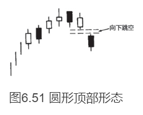 | 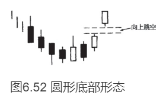

在`圆形顶部形态`（如图6.51所示）中，市场逐步形成向上凸起的圆弧状图案，在这个过程中，通常出现的是一些较小的实体。最后，当市场向下跳空时，就证明圆形顶部形态已经完成。这一形态与西方的圆形顶部形态是相同的。不同的是，在日本的圆形顶部形态中，应当包含一个向下跳空，作为市场顶部的附加验证信号。（向下跳空在蜡烛图术语中被称为“向下的窗口”，请见第七章。）

`平底锅底部形态`（如图6.52所示）反映出市场正处于底部反转过程中，市场逐步呈现出向下凹进的圆弧状图案，然后市场向上跳空（打开一个向上的窗口）。本形态的外观与西方的圆形底部形态是一致的，不过在日本的平底锅底部形态中，必须出现一个向上的窗口，以证实市场底部的完成。

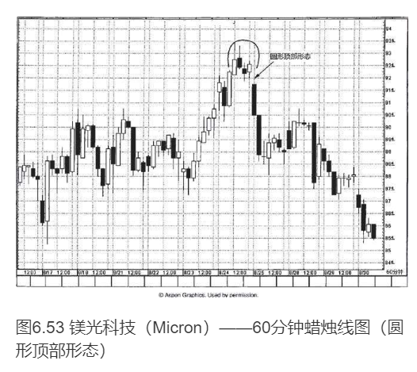

图6.53展示了一个圆形顶部形态的案例，在8月24日的早些时候，股价形成了一系列更高的高点。当日中午前后，出现了带有长长上影线的几个时段，一个`乌云盖顶形态`提供了较弱的线索，表明行情在93.50美元上下有些迟疑。最终的验证信号来自乌云盖顶形态之后两个时段出现的更低的低点，以及随后的向下跳空，后者完成了`圆形顶部形态`。

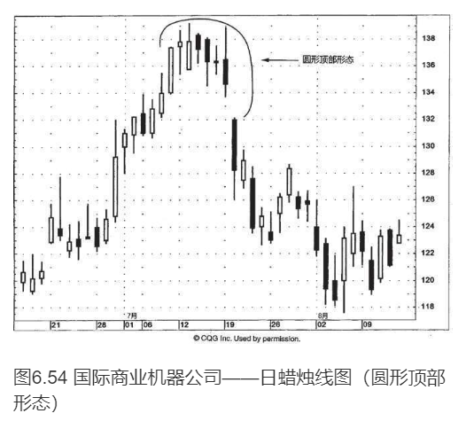

图6.54显示了IBM在7月12日所在的一周开始陷入停顿状态，它从前一周大多数蜡烛线为白色实体，转为本周主要制造更低的高点的黑色实体。向下跳空完成了`圆形顶部形态`。

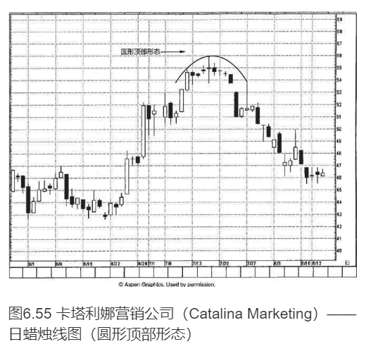

在图6.55中，在7月中旬的时候，股票确实能够保住它在55美元的高位。可是，看一看这些高位是怎样维持的吧——这是一系列小实体，何况7月16日还是一根`长腿十字线`。这批纺锤线还有这根十字线表明，该股票的行情着实令人困惑。7月20日所在的一周出现了向下跳空，完成了一个经典的`圆形顶部形态`。正如第七章将要讨论的，**只要出现了向下跳空，跳空之处往往演变成阻挡水平**。请注意，这个圆形顶部形态里的跳空（形成于7月24日）在几天之后演变成上方的阻挡。

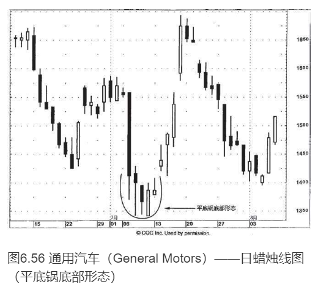

在图6.56中，7月7日是一根长黑色蜡烛线，反映出该股票遭受了多么大的打击。稍有缓和的唯一因素是这个时段的下影线。但是只有一个时段的长下影线尚不能改换趋势，使之从下降转为更积极一点。在之后的几天里，形成了一系列长下影线，显示在13.50美元附近存在支撑作用。7月10日，出现了一根白色蜡烛线，成功地捍卫了这些下影线构成的支撑区域，同时完成了一个`看涨刺透形态`。借助下一个时段的更高的低点，即7月13日的向上跳空，该股票终于构筑了一个`平底锅底部形态`。

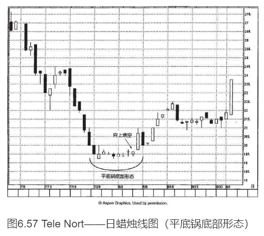

在图6.57中，7月19日所在的一周里形成了一系列击鼓传花般的黑色蜡烛线，将该股票保持在压力之下。接下来的几周，出现了一些微小的实体和十字线，暗示该股票终于稳定下来。最终的看涨证据是，在8月5日与6日之间构成了一个非常小的向上跳空（即图上箭头所指处），通过这个跳空完成了从底部的向上突破。正如本图所示，即便该跳空很小（即只有几美分），依然可以判定为向上跳空，因此证实了`平底锅底部形态`的完成。这一点对于圆形顶部形态也是正确的。也就是说，即使向下跳空的幅度很小，不论有多小，依然足以证实圆形顶部形态的完成。

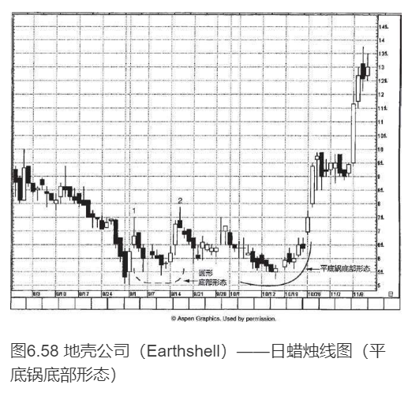

图6.58清晰地显示了西方圆形底部形态和东方平底锅底部形态的区别。从9月1日到9月14日所在的一周里，该股票构造了一个`圆形底部形态`（因为它从更低的低点转向相同的低点，再转向更高的低点）。然而，既然在该圆形底部形态中没有向上跳空，那么它便不是平底锅底部形态。请记住，平底锅底部形态与西方的圆形底部形态同出一辙，**只不过它附加了向上跳空作为最后的一推**。与上述圆形底部形态同时出现的是数字1和2标注的两处信号，两条长长的上影线（且2处是一根流星线）。

现在让我们把注意力转向10月从头到尾的价格变化。在这期间，该股票逐步构筑了一个圆形底部形态（也就是从更低的低点转向更高的低点）。10月26日出现了一个小幅的向上跳空，于是，这就完成了一个`平底锅底部形态`，带着其应有的全部看涨潜力。**因为平底锅底部形态包含这个向上跳空（常规的圆形底部形态没有向上跳空），所以我认为平底锅底部形态比常规的圆形底部形态更重要**。

### 塔形顶部形态和塔形底部形态
`塔形顶部形态`出现在高价格水平上。市场本来处在上升趋势中，在某一时刻，出现了一根坚挺的白色蜡烛线或者一系列白色蜡烛线，然后市场放缓了上涨的步调，接着出现了一根或者数根大的黑色蜡烛线，于是塔形顶部形态就完成了（如图6.59所示）。在本形态中，中间有若干小实体，两侧长长的白色和黑色蜡烛线形如“高塔”。也就是一边由长蜡烛线组成下跌的一侧，另一边由长蜡烛线组成上涨的一侧。

`塔形底部形态`发生在下降行情中（如图6.60所示）。市场形成了一根或数根长长的黑色蜡烛线，表示空方动力丝毫不减。后来出现了几根小实体，缓和了行情看跌的气氛。最后出现了一根长长的白色蜡烛线，完成了一个塔形底部形态。

塔形顶部形态 | 塔形底部形态
-------|-------
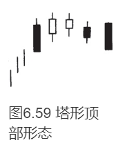 | 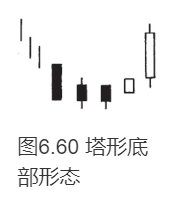

塔形顶部形态和塔形底部形态与其他某些蜡烛图信号也有相似之处，比如三只乌鸦形态。因为塔形形态常常在行情变化的后期才能完成，可能对长线交易者更适用。

塔形底部形态与平底锅底部形态也有相似的地方，而塔形顶部形态则与圆形顶部形态相似。两者最主要的区别是，在塔形形态中，市场反转之前和反转之后，出现的都是长长的白色或黑色实体，但不需要跳空；而在圆形顶部形态和平底锅底部形态中，则含有窗口。

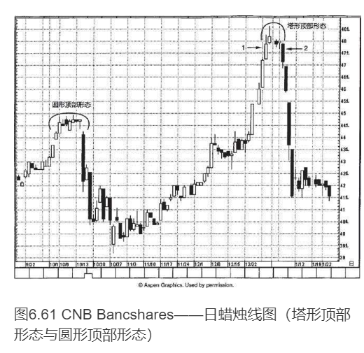

图6.61揭示了塔形顶部形态与圆形顶部形态的区别。该股票在10月的第一周上涨，形成了一系列白色实体，但之后开始踩水，留下了一系列小实体。10月15日的向下跳空完成了一个`圆形顶部形态`。把注意力转向12月，我们看到了一系列延长的白色蜡烛线。蜡烛线1的出现表明该股票继续上涨的机会不足了。长黑色蜡烛线2带来了第二支“塔”，完成了`塔形顶部形态`。

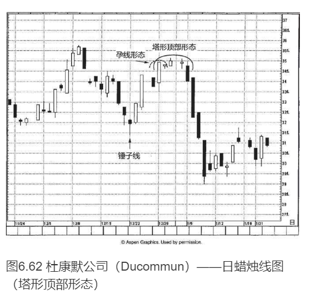

在图6.62中，12月下旬有一根`锤子线`，暗示行情转向稳定。锤子线之后开始上冲行情，一直持续到12月29日一根长长的白色蜡烛线。无论如何，12月上旬在35.75美元附近曾经形成一个阻挡水平，随着股票进入阻挡水平的火力范围，出现了一群小实体。12月30日的蜡烛线构造了一个`孕线形态`。孕线形态与之后的几根纺锤线发出“小心”的信号。当1月5日的长黑色实体出现后，完成了`塔形顶部反转形态`，趋势转向，进入更为不祥的阶段。

正如先前曾讨论的，塔形顶部形态发出的信号有时位于行情变化的后期（因为我们不得不等待黑色蜡烛线就位）。不过在本例中，那个孕线形态来得更早，也是反转信号。事实上，12月30日的蜡烛线实体实在微不足道，因此可以视之为`十字孕线形态`。

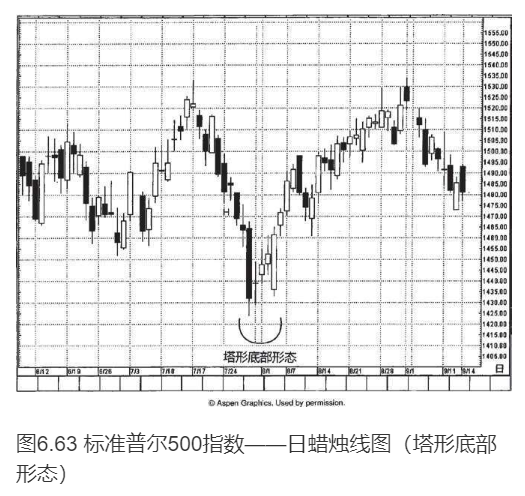

图6.63展示了一例经典的塔形底部形态。它的第一支塔由7月28日的一根超长黑色实体构成。次日是一根十字线，造就了一个`十字孕线形态`。（请观察7月24日到25日于点H处组成的另一个十字孕线形态。不过，**一旦指数行情向下突破到十字孕线形态之下，则该形态所包含的看涨意义通通化为泡影**。）在7月底的十字孕线形态之后行情上涨，起初是几根小白色实体，8月3日长长的白色蜡烛线发出了长线的反转信号，因为后者完成了一个`塔形底部形态`。从塔形底部形态开始，出现一轮上冲行情，持续到8月底，此时标准普尔500指数遭遇7月17日的流星线形成的阻挡水平，行情陷入停顿。

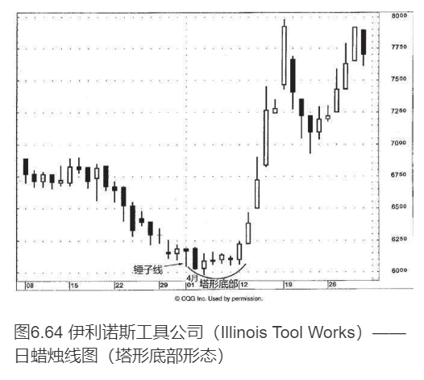

在图6.64中，4月1日是一根`锤子线`，暗示市场正在探索底部。次日是一根长黑色蜡烛线，其收市价稍稍低于锤子线的支撑水平（即低于锤子线下影线的低点），把趋势拨回下降轨道。在这根长黑色蜡烛线之后，随即产生了一系列小实体。这么一来，上述黑色蜡烛线的看跌意义就多半被消除了。由于4月12日的长白色蜡烛线，股票的健康状况进一步改善。这是塔形底部形态的第二支“塔”（4月2日的黑色蜡烛线是第一支“塔”）。

在`塔形底部形态`之后，虽然该股票被急剧推升，请记住，塔形底部形态并不带来关于后续行情变化范围的任何信息。正如之前讨论的，这里想再次强调，蜡烛线构成有效的反转信号，但不提供价格目标。

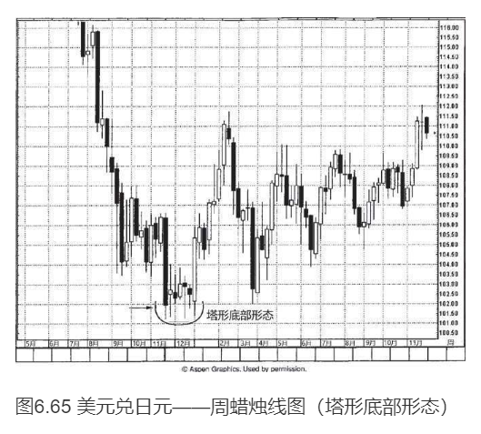

图6.65中的箭头所指为一根长黑色实体，它为当前行情推波助澜创了新低。紧随这根疲软的蜡烛线的，是一根小白色实体，两者形成了一个`孕线形态`。之后是6周的整固阶段，然后出现了一根超长的白色实体，于是完成一个`塔形底部形态`。

## 持续形态
所谓的`持续性形态`，意味着形态完成后，市场仍将恢复先前的趋势。

### 窗口
日本技术分析师一般把西方所说的价格跳空称为`窗口`。按照西方的表达方式，我们说“回填跳空”；在日本，人们则说“关上窗口”。

窗口有两种类别，一种是看涨的，一种是看跌的。`向上的窗口`（如图7.1所示）是看涨信号。在前一个时段最高点（也就是其上影线的顶端）与本时段最低点（也就是其下影线的底端）之间，存在价格上的真空地带。

图7.2展示了一例`向下的窗口`。它是看跌信号。在前一个时段最低点与本时段最高点之间，存在价格缺口。

向上的窗口 | 向下的窗口
------|------
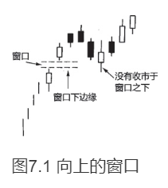 | 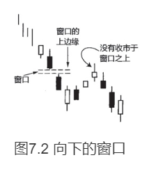

市场参与者应当顺着窗口形成的方向建立头寸。这是因为窗口属于持续性质的技术信号。因此，如果出现了向上的窗口，我们就应该利用市场回落的机会逢低买进；如果出现了向下的窗口，就应该利用市场反弹的机会逢高卖出。

“调整行情于窗口处终结。”这意味着**窗口可能转化为支撑区域或阻挡区域**。于是，如果出现了向上的窗口，则在今后市场向下回撤时，这个窗口将形成支撑区域（我们马上会看到，这是指窗口的全部空间）。如果市场在向下回撤时收市价达到了窗口下边缘之下的水平，那么，先前的上升趋势就不复成立了。请注意，在图7.1中，市场在日内一度下跌到窗口下边缘之下，但是因为不是收市价低于该区域，所以向上的窗口所形成的支撑区域保持完好。

同样，如果出现了一个向下的窗口，则意味着市场还将进一步下降。此后形成的任何价格向上反弹，都会在这个窗口处遭遇阻挡（指窗口的全部空间）。如果多方拥有足够的推动力，将收市价推升到向下的窗口之上，那么，下降趋势就完结了。

在图7.3中，在蜡烛线A和B的实体之间存在大幅的空白。可是因为蜡烛线A和B的影线是相互重叠的，所以它们并不构成窗口。正如图7.1和7.2所示，组成窗口的蜡烛线必须是其影线之间互不重叠。无论两根蜡烛线实体之间的“缺口”有多大，除非在它们的影线之间存在缺口，否则不构成窗口。

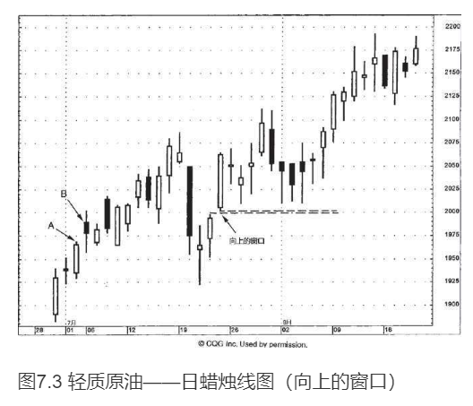

如图7.3所示，在7月22日的最高点和次日的最低点之间仅有4美分的空白，这是一个`小型向上的窗口`。无论向上的窗口多么小，它都应当构成潜在的支撑区域。对于向下的窗口，同样也应当构成阻挡区域。窗口不在乎尺寸大小。在图7.3中，向上的窗口形成了支撑区域，之后当行情回落到接近其支撑区域时，留下了一些长长的下影线，突出显示此处需求强大。正如本图所示，虽然向上的窗口构成潜在的支撑区域，但是市场并不需要精确地回落到窗口所在的支撑区域之后才能向上反弹，有时甚至连接近它都谈不上。因此，在市场朝着向上的窗口回落的过程中，如果您积极看好，那么甚至当市场接近该窗口的上缘时，便可以考虑买进了，无须等到行情进入该窗口之内。如何运用窗口，取决于您的交易风格和交易的迫切程度。应当事先设置止损措施（做好思想准备或者其他措施），以防止行情收市于向上的窗口的下缘之下。

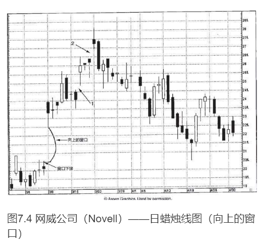

在图7.3中我们看到，如此微小的向上的窗口同样能够成为支撑区域。在图7.4中，在20.50美元和22.50美元之间存在一个`幅度非常大的窗口`。这么一来，它构成了一个幅度达2美元的支撑区域（从窗口的顶部22.50美元到窗口的底部20.50美元）。

正如之前讨论的，向上的窗口的全部空间都是潜在的支撑区域。大窗口的不利之处是，整个区域都可能构成潜在的支撑水平。在这种情况下，就享受不到很小的窗口所带来的便利——紧凑的支撑区域（向上的窗口）或紧凑的阻挡区域（向下的窗口）。

在窗口幅度相对较大的情况下，请记住，**向上的窗口的关键支撑水平位于窗口的底部（相应地，向下的窗口的关键阻挡水平位于窗口的顶部）**。因此，在向上的窗口中，其支撑作用的“最后一口气”就是图上用虚线标注的窗口的底部（即价格跳空的下边缘）。在本图上，市场向下接触到了窗口的底边，20.50美元左右，然后从4月20日的锤子线开始向上反弹。

下面再看看另外两个向上的窗口，图上分别用1和2来做了标记。窗口1的支撑作用在其出现后三周之内一直维持良好，直到4月6日的蜡烛线才向下突破了该支撑水平。窗口2的支撑作用在其出现之后的第二天便被向下突破了。在窗口2被向下突破后，窗口1发挥了支撑作用。这就是我运用窗口的具体做法。举例来说，如果某个窗口的支撑被突破，那就在被突破的窗口下方寻找另一个窗口，以后者作为下一个支撑区域。在本图中，一旦窗口2被向下突破，下一个支撑位置便是窗口1。

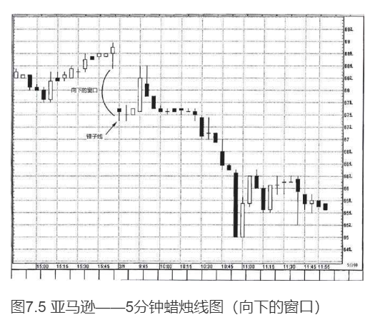

单一的蜡烛图信号是否值得采信，必须首先从其所处的总体技术背景来考虑。图7.5的实例充分显示了这一点的重要性。3月1日的第一根蜡烛线是看涨的`锤子线`。但是更重要的是，看看这根锤子线是如何形成的——一个`向下的窗口`。一方面，锤子线本身立即构成了支撑水平；另一方面，切不可忘记，因为这个向下的窗口，窗口的整个空间现在都成为阻挡区域。果然，从锤子线开始的反弹行情到向下的窗口顶边时渐渐熄火了。

请注意在2月28日的最后一根蜡烛线与下一日（3月1日）的第一根蜡烛线之间形成了一个向下的窗口。本图揭示了在日内图表上形成窗口的场合，日内图表上绝大多数窗口出现在上一日的最后一根蜡烛线与当日的第一根蜡烛线之间。这并不奇怪，在日内图表连续两个时段之间出现价格跳空反倒是不寻常的，例如在5分钟蜡烛线图上，在一个5分钟时段与紧接着的另一个5分钟时段之间出现了价格缺口。

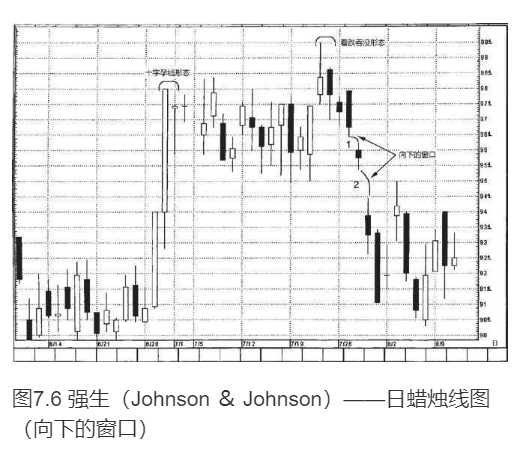

正如图7.6所示，6月底出现了一场冲劲十足的为期两天的上冲行情。`十字孕线形态`告诉我们，该股票已经脱离了之前的上升趋势。（7月1日是其中的第二根蜡烛线，它局限在前一根高高的白色实体之内。它的实体实在微不足道，无论从哪个角度来说，都可以归结为十字线，因此本形态便属于`十字孕线形态`。）下一日（7月2日）是一根理想的`十字线`，再次响应了前一根蜡烛线所暗示的信号，即市场在98美元上下，已经脱离了之前的上涨趋势。7月中旬形成的`看跌吞没形态`提供了进一步的证据，表明大难临头。

在7月27日与28日之间打开了一个`小的向下的窗口`（图上标记1处），29日接着出现了另一个`向下的窗口`（图上标记2处）。第二个向下的窗口带来了最大的损害，因为它向下跳空到了大约95美元的支撑区域之下，这个支撑区域曾经在7月的上半个月一直维持良好（这样的跳空在西方术语里属于“突破跳空”）。毫不奇怪，接近95美元的这个窗口成了关键阻挡区域。

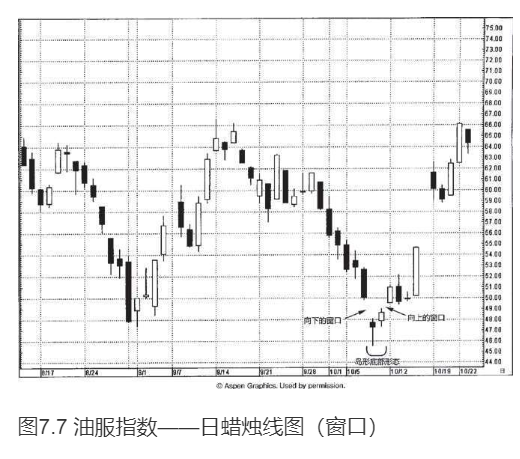

图7.7揭示了如何通过窗口来得到一个阻挡区域，但这个阻挡区域在线图上不可用。10月8日出现了一根`锤子线`。它可能是潜在的看涨信号，但是这根锤子线同时也形成了一个`向下的窗口`。于是，我们应当等待市场的收市价回到向下的窗口的顶边之上，以证实锤子线的确具有积极的指标作用。

锤子线之后再过了两天，收市价向上超越了向下窗口的顶边，并且是以看涨的`向上窗口`来完成的，多方以此证明了其坚定不移的决心。在这个过程中，油服指数构造了一个西方术语所称的`岛形底部形态`。（在本形态中，市场先向下跳空，在低位留下一个或几个时段的图线，然后向上跳空。之所以称之为“岛形底部”，是因为留在低位的那一个或几个时段看上去像一座孤岛，两边都被海水包围着，两侧的那两个跳空就是海水）。虽然岛形底部形态的最低点自然地形成支撑区域（在本图上该支撑区域接近45.50），但是借助蜡烛图技术中的窗口工具，我们可以及时获得更接近当前行情的支撑区域。

采用向上的窗口构成支撑水平的概念，一旦岛形底部形态于10月12日完成（以向上的窗口），我们得到的第一个支撑水平不是45.50（岛形底部的最低点），而是接近49.00的位置。这是受惠于该向上的窗口。正是在这个窗口的支撑区域，行情在随后的几天里站稳了脚跟，然后便一飞冲天，形成一根长长的白色实体。这又是一个实例，说明蜡烛图技术工具有助于我们取得优势，领先单纯使用线图工具的那些人，因为单纯使用线图的人以岛形底部的最低点作为第一个支撑水平（位于45.50），而不是以蜡烛图的向上的窗口作为第一个支撑水平（位于49.00）。当然，万一市场向下突破了窗口的支撑区域，我们自然要看下一个支撑水平，近乎45.50处（即岛形底部形态和锤子线的最低点）。

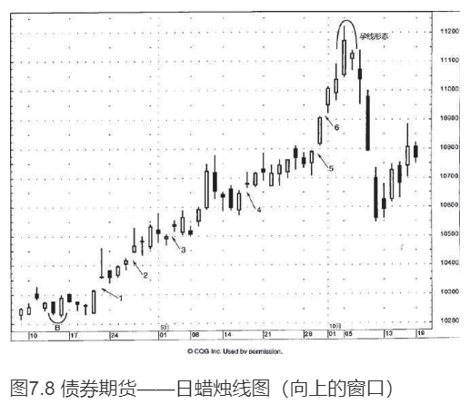

窗口的地位如此显要，我发现无论已经出现了多少个窗口，当前的趋势都不受影响，直到最后的窗口被关闭为止。**在上升行情中，可以有任意数目的向上的窗口。只要市场没有以收市价向下突破最高的那个向上的窗口，则趋势依然维持向上**。在图7.8中，展示了这样的一个实例。8月中旬于B处形成了一个`看涨的吞没形态`，由此开始形成了一轮上冲行情。最终，这轮行情总共打开了六个向上的窗口。10月5日和6日组成了一个`孕线形态`，这是我们得到的最早的线索，表明债券市场喘不过气来了。但是，要等到收市价向下突破了第六个向上的窗口之后，这轮上冲行情才终结。后来的结果表明，债券期货行情此处的向下反转形成了一个主要的历史高点，之后市场多年保持下滑态势。

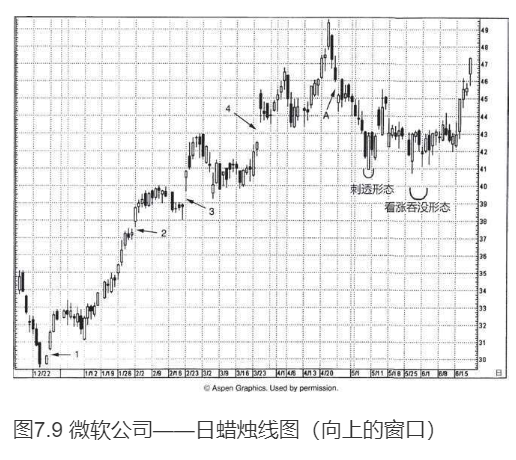

图7.9是另一个实例，说明了即使出现了3个`向上的窗口`，上涨行情仍然可以持续下去。向上的窗口分别以数字1、2、3、4进行了标记。上述的每一个窗口都作为支撑水平维持良好。A处向下的窗口给出信号，表明行情可能遇到麻烦，该窗口在46美元的水平发挥了阻挡作用。从向下的窗口开始形成了一轮下降行情，一直持续到5月的第一个星期。

5月4日是一根黑色实体，它向下突破了窗口4的底边，即位于42.50美元的支撑水平。对微软来说，向下突破窗口4的支撑作用，具有进一步看跌的潜在意味。然而第二天，也就是5月5日，出现了一根坚挺的白色蜡烛线（一根看涨的`捉腰带线`，开市于最低点，收市于最高点），并且组成了一个经典的`刺透形态`。这么一来，便部分抵消了前一天的看跌意味。

**本图的实例揭示了灵活适应不断变化的市场环境的重要性**：5月4日由于行情跌破支撑水平，我们持有看跌的预期；第二天由于刺透形态的出现，我们的观点转变为不太看跌了。

在接下来的两个交易时段中，5月11日和12日，出现了类似的情形：先是一根黑色实体，跟着是一根白色实体。关于41美元附近存在主要支撑，如果我们还需要进一步的证据，那么5月26日和27日的`看涨吞没形态`便是了。事实上，如果我们观察一下从5月29日到6月2日的三根蜡烛线，它们可以被视为一个`启明星形态`（虽然在典型情况下我们希望启明星出现在下降趋势之后，而不是像本图的情形出现在横向交易区间中）。尽管如此，本形态的确证实了41美元左右的支撑水平稳如泰山。

### 向上跳空和向下跳空并列阴阳线形态
如图7.10和7.11所示，`并列阴阳线形态`是由具备特定形态的两根蜡烛线组成的，两者一起向上跳空或向下跳空。图7.10为`向上跳空并列阴阳线形态`，其中一根白色蜡烛线和一根黑色蜡烛线共同形成了一个向上的窗口。这根黑色蜡烛线的开市价位于前一个白色实体之内，收市价位于前一个白色实体之下。在这样的情况下，这根黑色蜡烛线的收市价，就构成了买卖双方争夺的要点。如果市场以收市价向下突破到该窗口之下，那么这个向上跳空并列阴阳线形态的看涨意义就不再成立了。在`向下跳空并列阴阳线形态`（如图7.11所示）中，基本概念与上述形态是相同的，只不过方向相反。一根黑色蜡烛线和一根白色蜡烛线共同打开了一个向下的窗口。在向上跳空和向下跳空并列阴阳线形态中，两根蜡烛线的实体的大小应当不相上下。两种跳空并列阴阳线形态都很少见。

向上跳空并列阴阳线形态 | 向下跳空并列阴阳线形态
------------|------------
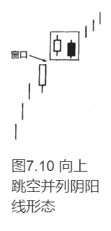 | 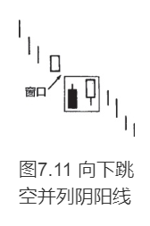

在我看来，由于该形态中的窗口如此醒目，以至于在向上的窗口之后出现什么颜色的蜡烛线或者什么样的蜡烛线组合都没什么大不了的。窗口本身才是至关重要的。我们只要记住，**如果出现了向上的窗口（例如在向上跳空并列阴阳线形态中），便构成看涨的信号，并且窗口应成为支撑区域。如果市场收市于该支撑水平之下，则导致趋势方向转向下。对于向下跳空并列阴阳线，道理一样而方向相反。也就是说，既然向下跳空并列阴阳线带有一个向下的窗口，那么它将构成阻挡水平。如果市场收市于向下的窗口的顶边之上，则消除了向下跳空并列阴阳线形态的看跌意味**。

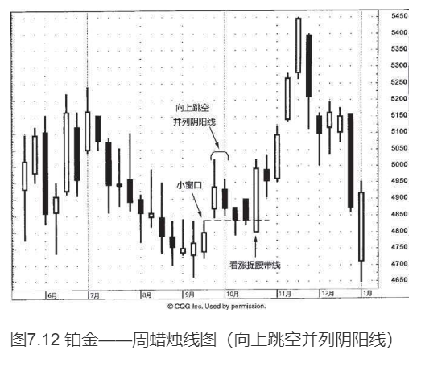

在图7.12中，9月底出现了一个`小型向上的窗口`。在向上的窗口之后有两根蜡烛线，组成了`向上跳空并列阴阳线形态`。之所以称之为并列阴阳线形态，是因为在向上的窗口之后，先是一根白色蜡烛线，然后是一根黑色蜡烛线。然而上面刚刚指出，依我看来，在向上的窗口之后，到底那两根蜡烛线是什么样子并不要紧。主要的考虑是把向上的窗口视为支撑区域，并根据收市价来判断其守与破。正如图上虚线所示，根据收市价来判断，该支撑区域无论如何总算维护住了。后来，10月底出现了一根`看涨的捉腰带线`，并且它包裹了之前的三根黑色实体，从而为该窗口的支撑作用给出了最终的验证信号。

### 高价位和低价位跳空突破形态

高价位跳空突破形态 | 低价位跳空突破形态
----------|----------
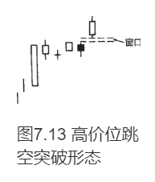 | 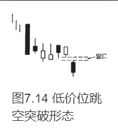

在上升趋势中，当市场经历了一轮急剧的上涨后，在正常情况下都需要一个调整消化的过程。有时，这个整理过程是通过一系列小实体来完成的。如果在一根坚挺的蜡烛线之后，出现了一群小实体的蜡烛线，则表明市场已经变得犹豫不决了。虽然这群小实体表示行情趋势已经从向上转为中性，但是它们的出现在某种意义上是健康的，因为通过踩水的过程，缓解了市场所处的超买状态。一旦后来某一天的行情从这群小实体处打开了一个向上的窗口，就是看涨的信号。这就是一个`高价位跳空突破形态`（如图7.13所示）。之所以这样称呼这类形态，是因为在这类形态中，市场先是在最近形成的高价位上徘徊，后来才下定决心向上跳空。

低价位跳空突破形态正是高价位跳空突破形态的反面角色，两者对等而意义相反。`低价位跳空突破形态`（如图7.14所示）是一个向下的窗口，是从一个低价位的横向整理区间向下打开的。这个`横向整理区间`（一系列较小的实体）发生在一轮急剧下跌之后，曾经使市场稳定了下来。当初，从这群小实体蜡烛线的外观看来，似乎市场正在构筑一个底部。但是后来，市场以窗口的形式从这个密集区向下突破，打破了这种看涨的期望。

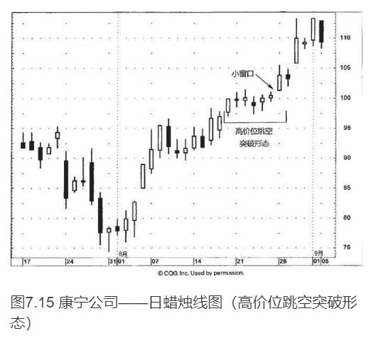

在图7.15中，7月31日是一根`锤子线`，结果成了之后上涨行情的低点，在这轮上涨中，8月初曾经形成一个向上的窗口。在8月7日所在的一周里，出现了一根长黑色实体，组成了`乌云盖顶形态`，在这轮上涨行情的前方添加了一块临时的挡板。在8月21日所在的一周里，先是一根长长的白色蜡烛线，后面跟着一系列小实体，显示该股票行情已经进入调整阶段。8月28日打开了一个小型向上的窗口，完成了一个`高价位跳空突破形态`，证明多头完全控制了市场。

在本形态中，或者在任何高价位跳空突破形态中，一旦市场收市于其中向上的窗口之下，则消除了形态的看涨意义。对低价位跳空突破形态来说，道理相同而方向相反。

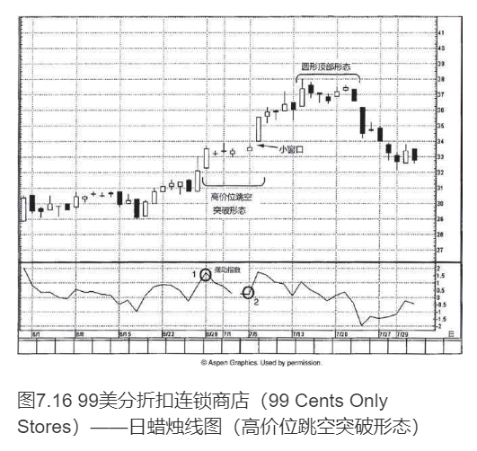

在图7.16中，6月29日出现了一根高高的白色蜡烛线。紧随其后，6月30日是一根十字线。长白色实体之后的十字线，两者组成`十字孕线形态`，表明股票已经从坚挺转为较中性。十字线之后的几个实体呼应了上述观点。请注意图表底部，由上述四根小实体组成了一个紧凑的交易区间，结果导致与之对应的摆动指数从指示超买状态的1处回落到了指示中性状态的2处。这正是本节开头部分讨论的跳空并列阴阳线的一个方面，**即并列阴阳线形态中的一系列小实体有助于缓解市场的超买状态**。在2处，股票不处于超买状态，这使得行情更容易上涨。7月7日，一旦股票向上打开了一个小型的窗口后，便形成了`高价位跳空突破形态`。7月中旬出现了一个`圆形顶部形态`。

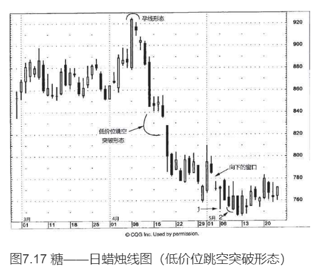

在图7.17中，4月初的`孕线形态`有助于终结当时的上涨行情。从本形态开始市场下降并逐步加速，特别是4月15日的超长黑色实体加剧了下跌的进程。之后的两个时段都是纺锤线，有线索显示股票正在努力稳住。然而，4月17日收市价再创新低，下一日又完成了一个`低价位跳空突破形态`，表明空头重新夺得全部控制权。

请观察5月初的小型窗口是如何转化为阻挡区域的。该阻挡区域很重要，值得牢记于心，因为在1处有一根`锤子线`，在2处又有一个`看涨吞没形态`，都是底部信号。但是在这两个看涨信号出现时，交易者对买进应当保持谨慎态度，因为根据该窗口的阻挡作用，潜在的利润空间有限。

### 跳空并列白色蜡烛线形态
在上涨行情中，先出现了一根向上跳空的白色蜡烛线，随后又是一根白色蜡烛线，并且后面这根线与前一根线大小相当，两者的开市价也差不多处在同样的水平上，这样就形成了一种看涨的持续形态。这种双蜡烛线形态称为`向上跳空并列白色蜡烛线形态`（或者称为`向上跳空并列阳线形态`，如图7.18所示）。

上面介绍的这种并列白色蜡烛线形态是很少见的。不过，更少见的还有向下跳空的两根并列白色蜡烛线。这类形态称为`向下跳空并列白色蜡烛线形态`（如图7.19所示）。在下跌行情中，尽管它们都是白色蜡烛线，因为之前向下的窗口，依然把它们归结为看跌信号。这是因为这两根白色蜡烛线被看作空头平仓的过程。一旦空头平仓的过程完成了，价格就要进一步下跌。这类向下跳空并列白色蜡烛线形态之所以特别罕见，其原因不难理解。在市场下降趋势中，当出现向下跳空时，如果形成跳空的蜡烛线是一根黑色蜡烛线，那么当然比一根白色蜡烛线自然得多。

向上跳空并列白色蜡烛线形态 | 向下跳空并列白色蜡烛线形态
--------------|--------------
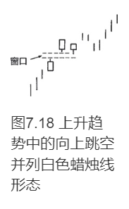 | 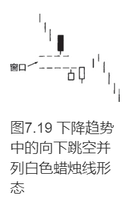 

虽然下面也为这些形态提供了实例，但是形成跳空并列白色蜡烛线形态的蜡烛线的具体情况并不重要，无须死记硬背。重要的是形态中所包含的向上或向下的窗口。正如本章在并列跳空阴阳线形态的部分曾讨论的那样，这两根蜡烛线的样式并没有多少影响，无论窗口之后的两根蜡烛线都是白色的（在跳空并列白色蜡烛线形态下），还是一根白色一根黑色的（在跳空并列阴阳线形态下）。唯有窗口本身提供了趋势信息，以及支撑区域或阻挡区域。

举例来说，在向下跳空并列白色蜡烛线形态中，尽管这是两根白色蜡烛线，依然构成看跌信号。这并不奇怪。其原因正在于本形态包含向下的窗口，它定义了趋势方向（在本例中，趋势方向向下）。市场必须收市于向下的窗口顶边之上，才能消除向下跳空并列白色蜡烛线形态的看跌意义。

这个例子意味着：我们不必费劲记忆神秘的跳空并列阴阳线形态和跳空并列白色线形态到底是什么样式。**窗口，才是关键因素**。不论向上的窗口还是向下的窗口，窗口之后的两根蜡烛线的具体组合与颜色配合无关宏旨。向下的窗口推动趋势向下，向上的窗口推动趋势向上，并且窗口分别构成阻挡或支撑区域。

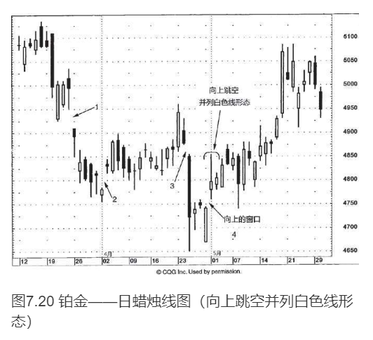

如图7.20所示，5月的头两个交易日形成了一个`向上跳空并列白色线形态`。前面曾经说过，在该向上跳空并列白色线形态中，两根蜡烛线的颜色并没有什么大不了的，5月1日向上打开的窗口才真正决定了该形态的积极信号。因为本图中包括许多窗口的实例，以下逐一分别讨论。

- 1处是一个向下的窗口，它维持趋势向下。尽管形成该窗口的3月26日是一根锤子线，也不影响上述判断。**在窗口与其他形态之间进行取舍时，我通常选择窗口**。就本例而言，是要在看涨的锤子线和看跌的向下的窗口之间取舍。向下的窗口所造成的看跌前景优先于锤子线。**市场必须收市于窗口之上，才能确认锤子线的看涨前景**。
- 2处是一个小型向上的窗口。在4月4日和5日形成的`乌云盖顶形态`之后，行情小幅回落，该窗口此时成为支撑。4月10日的`十字线`（正处在该窗口的支撑水平上）反映了两个方面的情况：第一，2处的窗口发挥了支撑作用；第二，十字线之前接连出现三根黑色实体，证明行情处在下降趋势，十字线的出现表明股票行情已经挣脱了之前的下降趋势。
- 经过4月10日成功捍卫窗口2的支撑作用后，行情开始上涨。上涨行情持续到4月23日，达到495美元的阻挡水平后停顿。该阻挡水平来自向下的窗口1的顶边。从该阻挡水平处引发的下降行情打开了3处向下的窗口。4月25日是一根长黑色实体，之后跟着一根小实体，后者居于长黑实体内部，形成了一个`孕线形态`。这表明空头正在失去动力。
- 5月1日形成了向上的窗口，之后是两根小的白色实体。（这就形成了之前介绍的`向上跳空并列白色线形态`。）在向上跳空并列白色线形态之后，行情演变成“窗口大战”，上有3处向下的窗口的阻挡作用（大约488美元），下有4处的向上的窗口的支撑水平（大约475美元）。我们看到，在一周多的时间里，上述支撑和阻挡区域都保持完好，直到4月17日，需求才足够强大，以收市价将市场推升到了向下的窗口3的阻挡水平之上。（4月14日，市场曾经在日内的行情演变过程中推进到了该窗口之上，但是未能收市于之上——这样便维持了窗口阻挡作用完好无损。）自从突破该阻挡水平之后，市场快速上涨，直到5月18日和21日形成了`孕线形态`，终结了这轮上冲行情。

### 上升三法（上升三蜡烛线法）和下降三法（下降三蜡烛线法）形态
所谓三法形态，包括看涨的`上升三（蜡烛线）法`，以及看跌的`下降三（蜡烛线）法`。（请注意，这里我们又与数字3不期而遇了。）这两类形态均属于持续形态。也就是说，一旦看涨的上升三法形态完成后，之前的趋势应当恢复，行情继续走高。相应地，在看跌的下降三法形态完成后，之前的下降趋势继续有效。

上升三法形态（如图7.21所示）由以下几个方面组成：
1. 首先出现的是一根长长的白色蜡烛线。
2. 在这根白色蜡烛线之后，紧跟着一群依次下降的或者横向延伸的小实体蜡烛线。这群小实体蜡烛线的理想数目是3根，但是2根或者3根以上也是可以接受的，条件是：只要这群小实体蜡烛线基本上都局限在前面长长的白色蜡烛线的高点到低点的价格范围之内。我们不妨做这样的理解：由于这群较小的蜡烛线处于第一天的价格范围之内，它们与最前面的长蜡烛线一道构成了一种类似于三日孕线形态的价格形态。（在本形态中，所谓处于最前面的蜡烛线的价格范围之内，指的是这群小蜡烛线均处于该蜡烛线的上下影线的范围之内；而在真正的孕线形态中，仅仅是小蜡烛线的实体包含在前面那根蜡烛线的实体之内。）小蜡烛线既可以是白色的，也可以是黑色的，不过，黑色蜡烛线最常见。
3. 最后一天应当是一根坚挺的白色实体蜡烛线，并且它的收市价高于第一天的收市价，同时其开市价应当高于前一天的收市价。

上升三法 | 下降三法
-----|-----
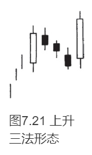 | 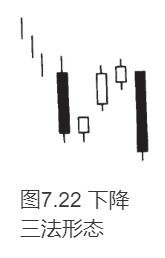

下降三法形态（如图7.22所示）与上升三法形态完全是对等的，只不过方向相反。这类形态的形成过程如下：市场应当处在下降趋势中，首先出场的是一根长长的黑色蜡烛线。在这根黑色蜡烛线之后，跟随着大约3根依次上升的小蜡烛线，并且这群蜡烛线的实体都局限在第一根蜡烛线的范围之内（包括其上、下影线）。最后一天，开市价应低于前一天的收市价，并且收市价应低于第一根黑色蜡烛线的收市价。本形态与看跌旗形或看跌三角旗形形态相似。本形态的理想情形是，在第一根长实体之后，小实体的颜色与长实体相反。也就是说，对看涨的上升三法形态来说，应当是黑色的小实体；而对看跌的下降三法形态来说，应当是白色的小实体。虽然如此，从我的经验出发，2根，至多5根小实体都可以很好地完成形态。同时，小实体可以是任意颜色的。

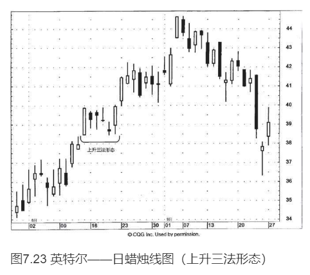

在理想的上升三法形态中，应有3根黑色小实体，且它们都位于白色实体的全部交易范围之内。在图7.23中，8月13日出现了一根看涨的`捉腰带线`。在它之后跟随着4根黑色小实体（其中一根是十字线），它们都位于8月13日的高点到低点范围内。8月21日的收市价完成了`上升三法形态`。

上升三法形态给我们带来的挑战在于风险报偿比方面。等到上升三法形态完成之时，股票行情或许已经远远地离开它最近的低点了。在这种情况下，如果等到三法形态完成时买进，或许不能带来有吸引力的交易机会。如此一来，一旦上升三法形态完成，交易者必须首先考虑到潜在的利润空间，把它与风险权衡一下（风险从买入点算起，到上升三法形态中开始的那根白色蜡烛线的最低点为止）。

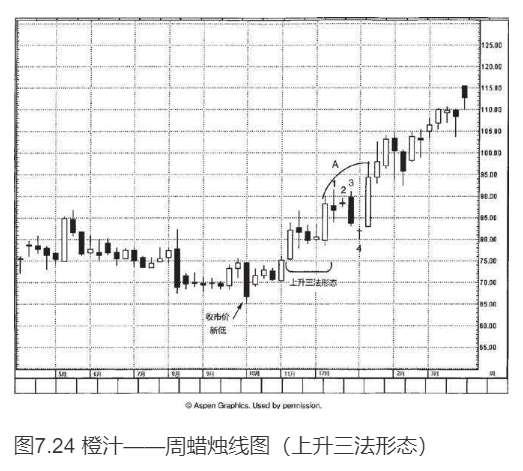

如图7.24所示，10月的第一个周，橙汁市场是一根拉长的黑色蜡烛线，将行情打到新低。下一个时段，橙汁重新回升到69美分以上，表明前一周所创的新低不能持续。正如我们将在第十一章看到的，**当市场向下突破重要的支撑区域（本市场向下突破了8月—9月的低点，这正是一个重要的支撑水平），后来却不能守住新低，这一现象常常具有看涨的意味**。

11月的第二周是一根长长的白色蜡烛线。接下来的一周是一根小实体，这就证明市场疲软了，此时市场正面临来自5月的接近85-87美分的阻挡区域。一群小实体通通躲在11月的第二根长长的白色蜡烛线的范围内。在12月出现了一根长长的白色蜡烛线之后，我们就得到了一个`上升三法形态`。（请记住，只要那群小实体维持在之前白色蜡烛线的全部交易范围内，即使它们的影线冒出白色蜡烛线的范围，也是可以接受的。）

在上升三法形态之后，市场在12月剩下的时间里横向延伸，直到一根拉长的白色蜡烛线将多头行情推回正轨。这根拉长的白色蜡烛线紧随着一根十字线（图上用数字“4”标记）。有人可能已经注意到，图上标注“A”的区域看起来与上升三法形态非常相似，因为从1到4的几根实体都藏身于之前那根白色蜡烛线的范围内。由于上升三法形态要求由小实体组成，长实体3不符合要求，意味着它不属于上升三法形态。

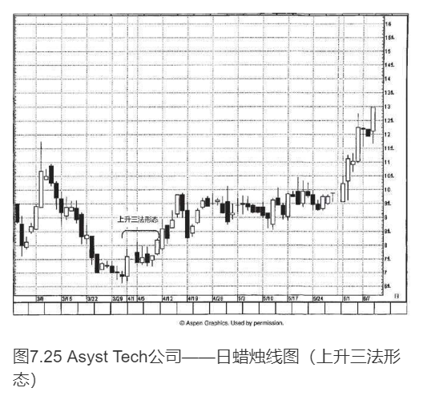

在图7.25中，3月30日和31日股票走低，不过下跌过程是一系列非常小的实体，几乎成十字线了。这使得当前趋势不那么悲观。4月1日出现了`看涨吞没形态`，显示多方现在主宰行情。之后的四天，市场进行了一定程度的调整，其中黑色小实体和白色小实体交替出现。4月10日的蜡烛线完成了`上升三法形态`。

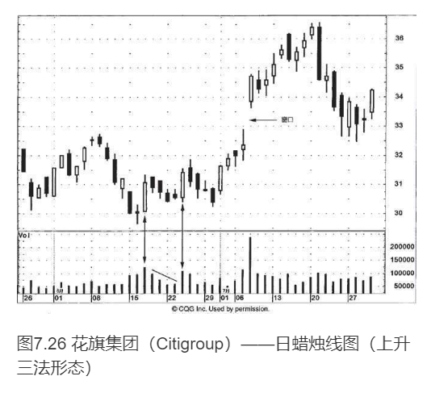

现在我们来观察一个实例，其中展示了交易量分析与上升三法形态相结合的具体做法。在理想的上升三法形态中，第一根蜡烛线和最后一根蜡烛线，即那两根长的白色蜡烛线，伴随着在上升三法的所有交易时段里最大的交易量。这一点为每一根白色蜡烛线都提供了验证信息，表明多方对市场的控制力更强大。在图7.26中，6月17日是一根长长的白色蜡烛线，伴随着相对强大的交易量。不仅如此，这根蜡烛线与之前的两根还组成了一个`十字启明星形态`。

在6月17日的白色实体之后，一系列小实体向下缓缓飘落，同时伴随的交易量也逐步收缩。6月24日是一根高耸的白色蜡烛线，伴随着放大的交易量，将市场推向更高处，也完成了`上升三法形态`。**本图是一个经典实例，说明将交易量分析与蜡烛图指标结合起来，可以进一步增大蜡烛图指标的成功概率**。

在6月24日的白色蜡烛线之后，出现了一根黑色实体，两者形成了一个小型的`乌云盖顶形态`，引发了短暂的行情犹豫，之后上涨行情恢复。请注意，**7月8日当市场向上打开窗口时，也伴随着巨大的交易量。伴随发生的巨大交易量提升了窗口的成功概率，窗口，特别是窗口的底边，将成为支撑区域**。（交易量在第十五章讨论。）

在绝大多数情况下，上升三法形态发生在上升趋势或横向延伸趋势中。不过，有时候本形态也有助于界定在抛售行情之后出现的转折点。图7.27给出了本形态的另一个实例。9月初的`上升三法形态`有助于确认7500附近的支撑水平是稳固的。不过，在这个上升三法形态出现后，市场并没有立即开始上涨。虽然蜡烛图信号经常发出市场转折的信号，但是它们并不意味着在信号出现后市场必定立即开始上涨（在上升三法形态的情况下）。**取而代之的是，许多蜡烛图形态的出现，正如本图的这个实例，可能加强了某个支撑区域**。这正是道琼斯指数位于7500附近的支撑水平处发生的情形。9月中旬出现了一例`刺透形态`，10月4日出现了一根`锤子线`，累次证实了该支撑水平的有效性。

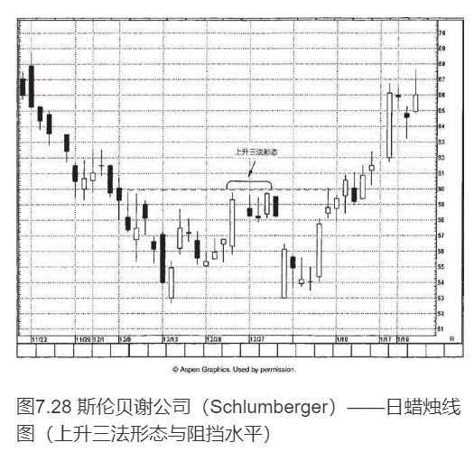

图7.28的实例揭示了总体市场技术图像与一个上升三法形态的相互关系。12月14日和15日之间形成了一个小型窗口，在之后的下半周内成为支撑区域。从12月20日开始出现了一轮上涨行情，它在到达60美元附近时遇到了一些问题，12月23日和27日组成了一个`孕线形态`。12月29日收市时，股票形成了一个`上升三法形态`（它包含2根小实体，而不是在常规情况下的3根小实体）。但是看看这个形态所处的位置，这正是60美元的区域——这是自12月7日以来的阻挡水平。于是，尽管上升三法形态被视为看涨信号，但是我们应当牢记在心，因为它出现在阻挡区域，所以不能构成有效的买入机会。1月11日，当市场收市于60美元的阻挡区域之上时，才能为市场继续上行扫清障碍。

图7.29展示了一个下降三法形态的实例。请注意，本形态的第一根小实体出现在5月18日，它已经超出了之前那根长黑色实体的界限。不过，这一点并不妨碍这个`下降三法形态`的成立，因为本形态要求的是小实体应当藏身于那根长黑色实体的全部交易区间之内，而不必限定在它的实体之内。

5月21日的黑色实体收市于5月17日的黑色实体之下，满足了下降三法形态的条件。5月25日的反弹行情令人印象深刻，当日股票的开市价急剧下跌，但是收市价与前一日相比几乎没有变化，几乎形成了一个反击线形态。虽然该白色蜡烛线的收市价并没有恰好处在5月24日收市价的同一个水平，但是5月25日从开市到收市的强力反弹足以具备与常规的反击线形态同等的技术意义。

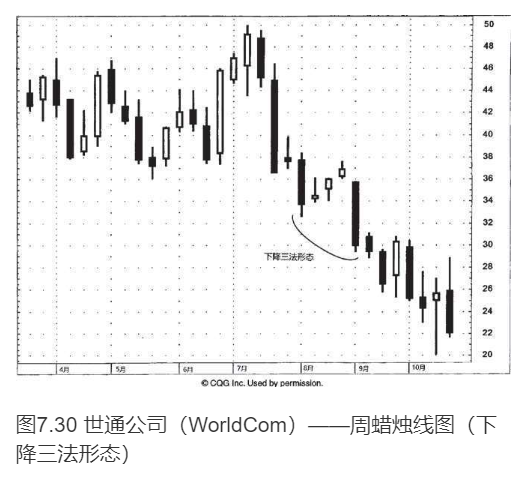

在图7.30中，世通公司跌破了维持数月的接近38美元的支撑区域，它发生于8月的第一周。8月初出现了一轮小规模的上涨行情，将股票吃力地推回之前位于38美元的支撑区域处。但好景不长，反弹在此处化为泡影。（第十一章将介绍原来的支撑水平转化为新的阻挡水平的分析技巧。）9月的价格变化形成了一个`下降三法形态`。

### 分手线形态
如图7.31所示的分手线形态也是由两根颜色相反的蜡烛线组成的，但是同反击线形态不同的是，`分手线形态`的两根蜡烛线具有相同的开市价。

分手线形态属于持续信号。道理很简单。在市场上涨的过程中，如果出现了一个黑色实体（尤其是相对较长的黑色实体）时，对多头来说，可能成为他们的一块心病。他们满腹狐疑，空头或许正在争得主动权。无论如何，如果后一天市场在开市时向上跳空，开市价回到了前一根黑色蜡烛线的开市价的水平，就能有力地证明空头已经失去了对市场的控制——特别是当天能够收市在较高位置，形成了一根白色蜡烛线。上述情形就是如图7.31所示的看涨分手线形态的演变过程。在这类形态中，白色蜡烛线同时还应当是一根看涨捉腰带线（即其开市价位于或接近本时段最低点，收市价位于或接近本时段最高点）。在图7.31中，看跌的分手线形态与上述内容完全对应，但方向相反。一般认为，这类形态属于看跌的持续形态。分手线形态难得一见。

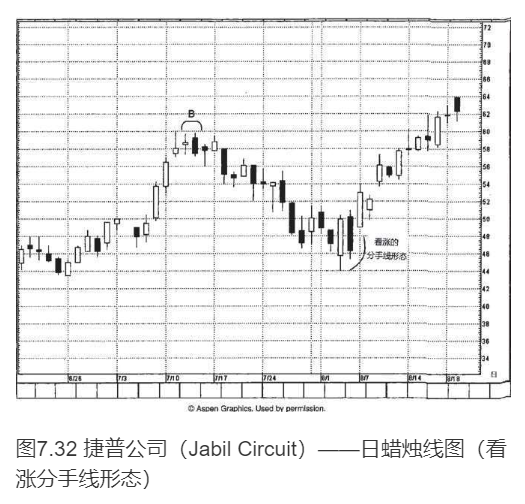

在面对蜡烛图形态的时候，在绝大多数情况下我们希望遇到理想的版本，而不是变形的版本。不过，即使是变形的版本，结果证明也是有用的。图7.32说明了这一点。7月中旬出现了一个看跌吞没形态（B处），引领了一轮下跌。该下跌行情发展到8月3日完成的看涨吞没形态后才算罢手。紧随8月3日白色蜡烛线之后的两根蜡烛线差不多构成了一个看涨的分手线形态。这是因为8月7日的开市价几乎与前一天的开市价相同，但不处于同一水平。虽然如此，考虑到8月4日股票收市于46.25美元，而后一天（8月7日）在开市时便向上急剧跳空，几乎达到了8月4日的开市价的水平，毫无疑问，这一变化很引人注目。如果我们对这一点还不满意，还要求更多看涨的证据，8月9日它就来了——一个向上的窗口，证明此处需求压倒了供给。

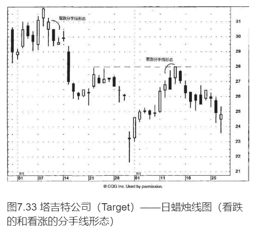

在图7.33中，在8月的第二周里发生了看跌分手线形态。在该看跌分手线形态之后，股票在来自8月初的接近29美元的支撑区域稳住了阵脚。8月15日打开了一个向下的窗口，证实新的一轮下跌来临。

9月13日和14日组成了一个看涨的分手线形态。但是，它们发出的上涨行情持续的信号未能应验。当然，我们对这一点并不感到太大的意外，因为看涨分手线形态的白色蜡烛线处在28美元处。这里正是8月21日所在的一周里形成的阻挡水平，图上用虚线做了标记。这个例子再一次说明，在定夺是否根据蜡烛图信号来买卖的时候，蜡烛图信号发生的位置是主要考虑因素。在本例中，如果我们在看涨分手线形态完成时买入股票，就会在阻挡水平处买进。在这种情况下，稳妥的对策或许是等到股票收市于28美元以上，作为进一步的看涨验证信号。

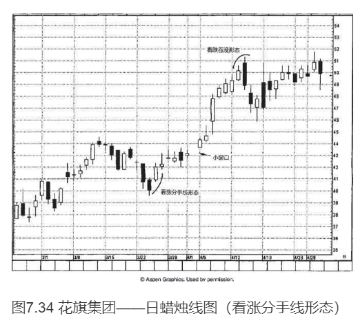

看涨分手线形态难得一遇，它们通常出现在上涨过程中，然而也有少数例子表明看涨分手线形态有助于发出底部信号。如图7.34所示，3月24日和25日出现了一个看涨分手线形态。该形态出现后，股票行情陷入犹豫，位置接近43.50美元。4月5日，一旦股票在43.50美元的阻挡区域之上向上打开了一个小型的窗口后，就不再犹豫了。

有趣的是，从3月25日到4月5日的向上跳空，这群蜡烛线组成了一个高价位跳空突破形态。4月的上冲行情一直持续到4月14日和15日的看跌吞没形态才罢手。

## 神奇的十字线
十字线是一类特别的蜡烛线，其开市价与收市价处在同一个水平上。从图8.1到图8.6，显示的是十字蜡烛线的各种例子。

十字线是一种独特的趋势转折信号，特别是当它处在上涨行情时。在十字线出现后，如果发生下列情形，则增加了十字线构成反转信号的可能性。
1. 后续的蜡烛线验证了十字线的反转信号。
2. 市场正处在超买状态或超卖状态。
3. 十字线在该市场出现得不多。如果在某个行情图上出现了许多十字线，则即使出现了新的十字线，也没有多大意义。

十字线 | 长腿十字线 | 墓碑十字线 | 蜻蜓十字线 | 出现长长的白色蜡烛线后的十字线 | 北方十字线与南方十字线
----|-------|-------|-------|-----------------|------------
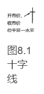 | 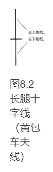 | 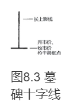 | 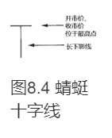 | 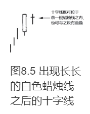 | 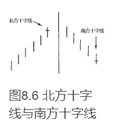

下面列举了若干技巧，当我们遇到近似的十字线时，可以借助它们来判断，是否可以把它归结为常规十字线并采取相应的行动。

1. 看这根近似的十字线与其邻近的价格变化的相互关系是怎么样的。如果在这根近似十字线的周围，还有一系列的小实体，那么就不应该认为这根蜡烛线有多大的意义，因为在它附近有这么多的小实体蜡烛线。然而，如果在若干长蜡烛线之后出现了一根近似的十字线，那么我们就可以说这个时段的变化具备与十字线相同的含义，因为本时段的变化与之前的行情显现出本质上的区别。
2. 如果当时市场正处在一个重要的转折点。
3. 如果市场已经处在极度超买或超卖状态。
4. 如果当时已经有其他技术信号发出了警告信息。

十字线之所以很有价值，是因为它在揭示市场顶部方面有过人的能力。在上升趋势中，如果前面先出现一根长长的白色蜡烛线，后面跟着一根十字线，这种情况尤其值得注意（如图8.5所示）。为什么十字线出现在上升趋势中具有负面意义呢？这是因为十字线代表着市场处于犹豫不决的心理状态。在上升趋势中，如果买方犹豫不决、看不准市场方向，或者不能当机立断，那么当前上升趋势是维持不下去的。只有在买方立场坚定的条件下，上涨行情才能得到有力的支撑。在市场已经经历了长期的上涨之后，或者当市场处于超买状态时，如果出现了一根十字线（在这根蜡烛线上大书着“犹疑不定”），则意味着买方搭起来的脚手架马上就要垮掉了。

另一方面，虽然十字线在引发市场的顶部反转方面是相当有效的，但是根据我们的经验来看，在下降趋势中十字线往往丧失了发挥反转作用的潜力。其中的原因可能是这样的：十字线反映了买方与卖方在力量对比上处于相对平衡的状态。由于市场参与者抱着骑墙的态度，市场往往会“因为自身的重力而下坠”（这是市场参与者的行话）。这一点与下述情形有异曲同工之妙：当市场向上突破时必须伴随着重大的交易量才能有效地验证向上突破信号，而在市场向下突破时，交易量是不是重大、是不是构成验证信号，就不那么重要了。

因此，当十字线出现时，在上升趋势中市场可能向下反转，而在下降趋势中市场则可能继续下跌。因为上述这个原因，十字线在构成底部反转信号时，比作为顶部反转信号需要更多的佐证。举例来说，如果十字线的出现验证了支撑水平的作用，则即使这根十字线出现在下降行情中，也得留神。

为了区分上涨行情中的十字线和下降行情中的十字线，我称前者为`北方十字线`，后者为`南方十字线`（图8.6）。

### 北方十字线（上涨行情中的十字线）
十字线的出现不一定意味着价格立即掉头向下。十字线向我们揭示了市场的脆弱状态，可能成为行情转变的起点。

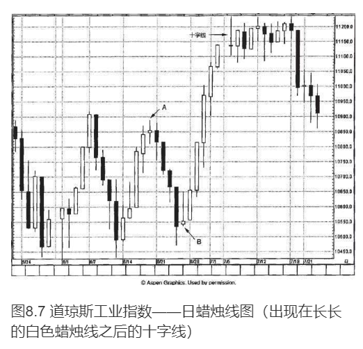

在图8.7中，A和B两处的纺锤线提供了线索，表明它们之前的趋势现在陷入僵局。这类小实体代表了买卖双方正在拔河拉锯，相比之下，十字线则代表了牛熊双方达到了完全的平衡。

从B处开始，上涨行情形成了一系列长白色实体，反映出市场生龙活虎。随着十字线的到来，虽然只是单一一个时段，显示了市场已经与先前的趋势脱钩。十字线表明，当日行情已经发生实质性转变，与之前一系列收市价明显高于开市价的白色蜡烛线大不相同。

在本例中，自从十字线出现后，指数从上涨转为横盘，再转为下降。然而，十字线的出现并不必然意味着市场即将下降。不过，十字线的出现，尤其是在本例中如此超买的市场状态下，依然有理由多加小心。轧平部分多头头寸，卖出看涨期权，上调止损指令的价位，这几招都属于应对本例十字线的对策，可供抉择。

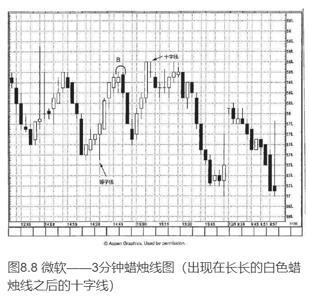

在图8.8中，在一个看跌吞没形态（位于B处）之后股票开始回落。过了几个时段之后，出现了一根长长的白色蜡烛线，表明多头已经执掌大权，因为这根线的收市价（58.50美元）超过了上述看跌吞没形态的阻挡区域。但是，下一个时段是一根十字线，它改变了市场前景。市场状态从多头掌控局面转为多空双方势均力敌，十字线表明供给和需求两方力量均衡。

请观察在十字线之后，大约58.62美元处，股票在若干个时段内陷入停顿状态。这引出了一项有用的技巧，我在遇到出现在长长的白色蜡烛线之后的十字线时经常使用这项技巧。具体说来，我在十字线和那根长长的白色蜡烛线中选择最高的高点（也就是最高的上影线顶点）。这个水平应当构成阻挡作用，以收市价作为判断是否突破的依据。在本例中，十字线的高点和那根长白色蜡烛线的高点都是58.62美元。如此一来，它就成为我们的阻挡水平。

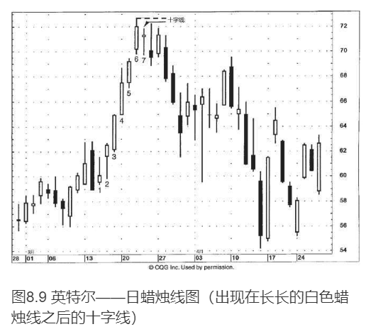

在图8.9中，从时段1到时段6，依次具备更高的高点、更高的低点、更高的收市价。时段7是自蜡烛线1以来第一根具备更低的高点、更低的低点、更低的收市价的蜡烛线。在通常情况下，这并不会带来严重后果，但是由于蜡烛线7也是一根十字线，在这方面进一步加强了它的技术意义。有时，一条条不起眼的技术线索叠加起来，便形成了市场重大转折的信号。正如古语所说：“不积跬步，无以至千里；不积小流，无以成江海。”于是，尽管单独一个不起眼的技术线索本身并没有多少分量，但是，一旦与其他技术线索结合起来，它们的意义便陡然增加了。

在十字线形成后，我们在图上用虚线标出了相应的阻挡水平。正如对图8.8的解说，如果在高高的白色蜡烛线之后出现了十字线，我们便选取两根线的最高点作为阻挡水平，并按照收市价来判断市场是否突破了该阻挡水平。在本图中，因为白色蜡烛线的高点高于十字线的高点，所以白色线的高点成为首要的阻挡区域（图上用虚线做标记）。在十字线出现后，英特尔变得“疲惫”了。如果英特尔的收市价能向上超越该阻挡线，我们就会说，市场已经休息好了，这是向上突破、重振雄风的信号。

### 长腿十字线（黄包车夫）、墓碑十字线与蜻蜓十字线
如果蜡烛线具有长长的上影线和长长的下影线，并且实体较小，就称为`大风大浪线`。如果这类蜡烛线是一根十字线，而不是小实体，就成了`长腿十字线`（如图8.2所示）。它还有个诨名，`黄包车夫（线）`。

在长腿十字线上，十字的部分表示市场正处在过渡点上。长长的上影线则说明，市场在本时段先是猛烈上推，后是急剧下滑，最后其收市价已经远远离开本时段的最高点了。拉长的下影线揭示了市场在本时段先是剧烈出货，后是强烈反弹，最后其收市价已经收复了相当部分的失地。换句话说，市场上冲，暴跌，再上冲，不一而足，大幅动荡。这是一个混乱的市场。对日本分析师来说，非常长的上影线或非常长的下影线的形成——借用他们的话来描述——就表示市场“失去了方向感”。如此一来，长腿十字线就成为市场与之前趋势分道扬镳的标志。

还有一种非常独特的十字蜡烛线，称为`墓碑十字线`（也称为`灵位十字线`，如图8.3所示）。在某根蜡烛线上，当开市价和收市价都位于当日的最低点时，就形成了一根墓碑十字线。由于它带有超长的上影线，并且收市价位于整个时段的最低点，我们能够一目了然，在该时段内股票曾经大幅上冲，但是到了本时段结束时，在空方的打压下，股票的收市价跌至最低点。可以把它看成流星线的极致版本。流星线带有长长的上影线和小实体。如果流星线的小实体收缩为十字线，就得到了一根墓碑十字线。

墓碑十字线的长处在于昭示市场顶部方面。

`蜻蜓十字线`是墓碑十字线的反面角色，是看涨的。在蜻蜓十字线上，开市价和收市价位于本时段的最高点。这意味着，在本时段内市场曾经下跌至很低的水平，但后来力挽狂澜，收市价已经回升到或非常接近本时段的最高点。这一点与锤子线相像，但是锤子线是小实体，而蜻蜓十字线是一根十字线，没有实体。

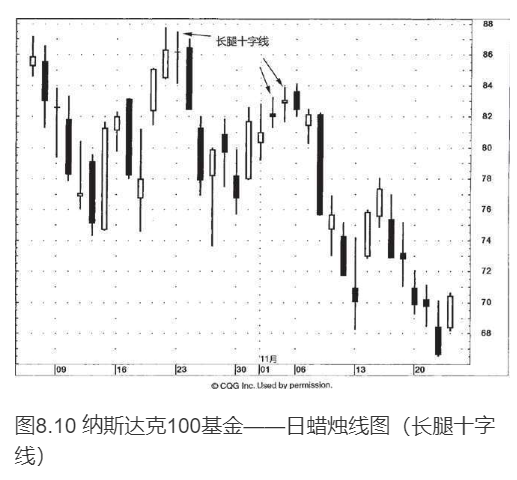

在图8.10中，10月23日出现了一根长腿十字线。在该十字线及其之前的白色蜡烛线之间，选择其中最高的高点，立即可以得到位于88美元的阻挡水平。指数从该长腿十字线开始下降，直到三天后出现一根锤子线才收场。11月初，市场本来是上涨的，但是随着接连两根长腿十字线的到来，任何看涨的念头都打消了。11月6日和7日组成了一个看跌吞没形态，这是市场进入困境的进一步信号。请注意，在10月初的下降过程中，十字线频频出现。正如之前曾经讨论的，据我的经验，十字线适合揭示顶部反转信号，不适合底部反转信号。

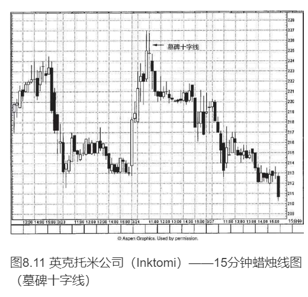

图8.11中有一个墓碑十字线的实例。由于十字线的高点与之前白色蜡烛线的高点相同，它们也构成了平头形态。虽然“墓碑”听上去不祥，但请不要误会，误以为墓碑十字线意味着即将出现大幅下跌行情。尽管墓碑十字线具备拉长的上影线和收市于本时段最低点，这些因素的确增加了市场向下转折的机会，但是它并不能预测潜在的下跌幅度。蜡烛图信号在及早提示反转信号方面无可匹敌，但是它不能预测行情变动的范围。

虽然十字线的出现提醒我们多加小心，但是我也不会仅仅根据这根墓碑十字线转而看空。为什么？请注意，十字线的收市价依然高于3月22日下半天形成的阻挡水平，大约在224美元处。正是由十字线下一个时段的收市价（向下突破了该水平）决定趋势向下。在该时段，收市价回落到224美元之下，证明了十字线曾经发出的信号——新高价位不能维持。

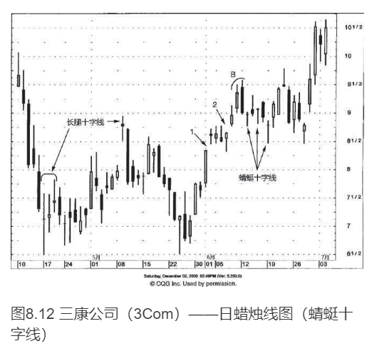

如图8.12所示，4月中旬出现了一些长腿十字线，标志着之前下降趋势的力道正在消退，位置在6.75美元附近。5月初的上冲行情造成了一个向上的窗口。不过，5月9日的向上的窗口遇到了一个问题：这一天也是一根长腿十字线。这就说明多头还没有完全控制局面。在长腿十字线的后一天，窗口的支撑作用被打破了。这证实市场已经打好了下一轮下跌的腹稿。之后，当股票下滑到接近前述来自4月中旬和5月23日的6.75美元的支撑水平后，方能用一根锤子线成功地稳住阵脚。从这根锤子线开始的上冲行情在1和2处形成了两个窗口。B处出现了一个看跌吞没形态，股票由此开始调整。从看跌吞没形态开始的下跌行情在8.25-8.75美元之间稳定下来，形成了一系列蜻蜓十字线。由于第三根蜻蜓十字线的开市价和收市价并不恰好位于当日的最高点，而是接近最高点，我把它归结为蜻蜓十字线的变体。这群蜻蜓十字线证实了窗口1和2的支撑作用。6月28日的锤子线对上述支撑作用进行了最终的确认。

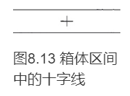

在图8.13中，十字线从微观层面反映了当时市场宏观层面的交易区间环境：市场正处在上下两难之中。由于没有可反转的趋势，图8.13中的十字线没有预测意义，不过它揭示了一个事实，即确认了当时所处的无趋势的市场环境。上述分析有例外情形：虽然十字线处在交易区间的环境下，但是它的位置处于区间的顶部或底部。如此一来，它在验证阻挡作用或支撑作用方面，可能带来有用的信号。

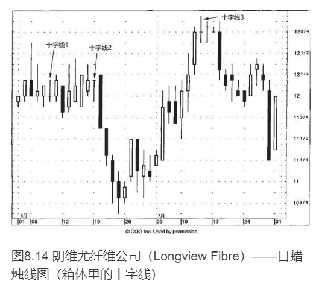

让我们从图8.14中观察三根十字线与之前趋势的关系。十字线1处于箱体区间的中部。因此，这个十字线没有任何预测意义，因为没有可反转的趋势。十字线2是蜻蜓十字线，它也处于同样的情形下。十字线3的情形很不一样，因为它出现的位置完全不同。该十字线出现在一轮上涨行情之后，这轮行情把股票带入了超买状态。如此一来，它就具备了反转意义。十字线3之后还有两根十字线，呼应了它们之前的十字线3，这就告诉我们——股票已经使尽了看涨的力道。综上所述，十字线与之前趋势的关系具有决定意义。

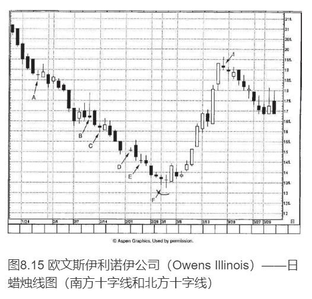

图8.15展现了本章前面或多或少已经提到的一点：处在下降行情中的十字线（我称之为南方十字线）常常起不到良好的底部反转信号的作用。在本图中，从A到F的一群十字线或近似十字线出现在市场下降过程中。但是这些南方十字线通通不构成底部反转信号。底部反转的第一个征兆来自3月3日那根长长的白色蜡烛线，它覆盖了F处的前两根十字线。这就形成了一个看涨吞没形态，构成支撑区域。（C处曾经出现小型的看涨吞没形态，但是一旦之后的黑色蜡烛线收市于形态最低点之下，则消除了底部反转的预期。）从F处的看涨吞没形态开始形成上涨行情，这轮上涨行情一直持续到1处的近似十字线才陷入停顿。

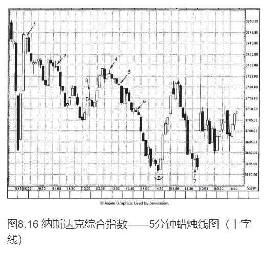

在图8.16中，有一系列十字线的实例，可以用来说明市场环境是如何影响十字线的重要性的。下面逐一分析各个十字线。
- 十字线1。“八级大地震”，日本人这样形容十字线1之前的行情变化。先是两根强有力的黑色实体势如劈竹般地下跌，然后两根势均力敌的白色蜡烛线将所有的下跌幅度席卷收回。十字线1表明股票已经和之前的趋势脱离关系（由于那两根长长的白色蜡烛线的缘故，之前的趋势为上升趋势）。我们从十字线以及之前长长的白色蜡烛线中选择最高点作为阻挡水平（这里白色蜡烛线的高点为3745）。本阻挡水平在下一时段保持完好。
- 十字线2。十字线2出现在一段短线下跌行情之后。（哪怕在十字线之前只有几个时段的下降行情，由于十字线紧随其后，我依然认为这属于下降趋势。）因此，作为下降趋势中的十字线，无须过多担心它会成为反转信号。
- 十字线3。本十字线出现在一根长长的白色蜡烛线之后。这么一来，它的确暗示着自从3705点以来的上涨行情可能失去了动力。然而当这根十字线出现时，股票处在超买状态吗？据拙见，不是超买状态（可以把这里的情形与十字线1之前几乎垂直的强力上冲行情比较一下）。因此，本十字线相比在超买状态下的十字线，意义相对较小。一旦市场收市于该十字线之上，便消除了它可能带有的任何一点看跌意味。
- 十字线4。十字线4发生在横向延伸的价格环境下。既然之前没有趋势可以反转（因为十字线处在箱体区间中），那么它作为反转信号的意义便较为淡薄。本十字线有一点有用的方面，它有助于增强来自几个时段之前的看跌吞没形态的阻挡水平的作用。
- 十字线5。一根南方十字线。既然它没有与其他任何底部信号相互验证，也就无关紧要了。
- 十字线6。与十字线5相同。
- 十字线7。本十字线充分说明了蜡烛线和蜡烛图形态必须从它们出现之前的价格变化的大背景上来观察，才能把握分寸。本十字线出现在下降趋势之后。正如分析十字线2、5和6时曾经交代的，通常情况下，我不会把南方十字线视为底部反转的警告信号。然而，根据它所处的总体市场图像，因为本十字线验证了之前的支撑水平，所以具备更重要的意义。在B处曾经出现了一个看涨吞没形态，支撑水平大约在3680。十字线7的前一个时段是一根锤子线，它告诉我们，市场正在3680-3682上下构建底部。这正是7处的南方十字线带有超越同侪的额外分量的缘故，虽然它是在下跌行情之后出现的。它验证了看涨吞没形态和锤子线的双重支撑作用。

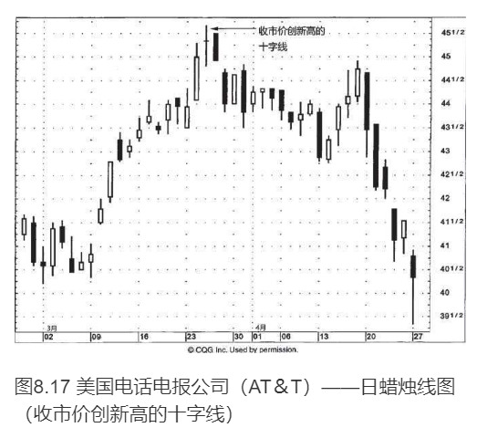

现在我们来看一看图8.17，从中理解为什么不应该孤立地看待十字线。本十字线出现在一根长长的白色蜡烛线之后，同时，它为当前趋势创了收市价的新高。无论它是不是十字线，收市价的新高总是正面的。许多交易者采用“收市价单线图”，完全基于收市价来观察分析。媒体也会报道股票收市于新高的水平。许多西方技术指标（如移动平均线、摆动指数等）是根据收市价计算的。如此看来，收市价的新高维持了趋势方向向上。带着以上考虑，我通常建议，如果一根十字线为当前行情创了收市价的新高，就应该为它等待看跌的验证信号。验证信号可以是下一个时段的收市价下跌到十字线的收市价之下。在本例中，十字线下一个时段的收市价为我们提供了这样的验证信号。这根黑色蜡烛线还表明市场向上尝试冲破阻挡水平的失败，该阻挡水平来自十字线的阻挡区域，位于45.50美元附近。

### 三星形态
`三星形态`是非常罕见的反转形态。如图8.18所示，三星顶部形态是由三根十字线组成的，它们位于当前行情的新高位置。

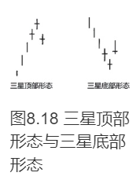

理想的三星顶部形态由三根十字线组成，中间的十字线高于前一根和后一根十字线。（这让我们回想起西方的头肩形顶部形态，其中头部高于左肩和右肩。）如图8.19所示，在1月3日所在的一周里有两根锤子线。这为之后的上涨行情打下了基础。1月10日是一根十字线，它发出信号，提示这轮上涨行情可能已经衰竭。在这根十字线之后，霍尼韦尔公司大部分时间处在横向区间中，并在这个过程中形成了一个三星顶部形态。虽然在三星顶部形态之后股票行情陡然下跌，但是我们应记住，蜡烛图技术不预测价格的变化范围。于是，尽管本形态极大地增加了顶部反转的机会，但它并不预测潜在下跌行情的目标范围。顺便说一句，在图8.14中，7月中旬也有一例三星顶部形态。

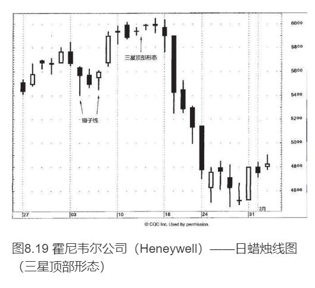

## 蜡烛图技术汇总
图9.1说明了以下的各种形态和蜡烛线。

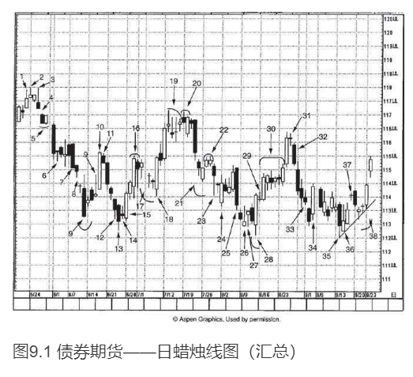

1. 一根长上影线的蜡烛线。这是一条线索，表明多方有些犹豫，不过这条线索微不足道，因为一个时段的长上影线不足以改变市场方向的基调。此处也没有足够长的历史行情帮助我们判断市场是否处于超买状态。
2. 流星线的出现证实了之前蜡烛线1的长上影线构成的潜在阻挡水平。
3. 又一根长上影线的蜡烛线。三根看跌的长上影线的高点差不多在同一个水平，确实足以构成理由警醒我们，要加强注意。该蜡烛线与流星线的轮廓相同（即具有长上影线和位于整个交易区间下端的小实体），然而，流星线应当出现在上涨行情之后。在这里，市场正在横向延伸。如此一来，我们不把它视为流星线，这根蜡烛线的上影线是令人担心的原因，因为它证实了流星线2揭示的麻烦。
4. 向下的窗口进一步加强了1、2、3三处的长上影线的看跌意味。
5. 这是一个小型的刺透形态，或许会引发一点乐观的情绪。然而，从市场总体的技术图像来观察，该刺透形态形成于窗口4定义的阻挡区域之下。于是，如果我们缘于刺透形态来买进，就买在了阻挡水平之下。刺透形态之后，出现了一根拉长的黑色实体，使得空方重新执掌大权。
6. 这根锤子线暗示空方的动力正在松懈。之后的几天里，市场稳定下来，以锤子线的低点作为支撑水平——直到下一个蜡烛图信号出现。
7. 长黑色实体的收市价位于6处锤子线的低点之下。这导致趋势方向恢复向下。这一天同时还完成了一个看跌的下降三法形态。
8. 向下的窗口为空方的势头雪上加霜。6月10日是一根十字线，一方面它打开了这个窗口，另一方面它也发出了一个微弱的暗示，显示空方可能后继乏力。但是，十字线在下降趋势中一般作用不大，不如在上升趋势中的作用。另外，现在窗口已经成为阻挡区域，要改变趋势首先必须克服这个障碍。
9. 另一个长黑色实体，其上影线证实了前一日向下的窗口的阻挡作用。6月14日，市场大幅向上跳空（与前一个时段的收市价相比），令人印象深刻，而且在整个时段内费尽力气守住了开市时的价位，最后收市于较高水平。6月11日和6月14日两个时段组成了孕线形态。这样在一定程度上中和了6月11日蜡烛线的看跌力量。然而，8处向下的窗口依然发挥作用，6月16日的长上影线揭示了这一点，它的高点处于该窗口阻挡区域的范围内，接近1143/4。
10. 6月17日长长的白色蜡烛线最终把市场推进到了该窗口的阻挡区域之上，把趋势转向了更积极的方向。还请注意，自从6月11日的长黑色蜡烛线以来，每个时段的蜡烛线都带有更高的高点和更高的低点。
11. 一根小实体是许多时段以来第一次出现更低的高点。此外，这根微小的黑色实体局限在之前拉长的白色蜡烛线范围之内，组成了一个孕线形态。这意味着多方已经喘不过气来了。从此处开始，市场稳步下降。
12. 蜡烛线的下影线维持了6月11日的低点构成的113.25附近的支撑水平，因此带来了一点点好消息，市场正在力图站稳脚跟。
13. 不幸的是（或者幸运的是，取决于您是多头还是空头），这根蜡烛线为当前行情创了新低，日内创了新低，收市价也创了新低。看起来，空头似乎又杀回来了。
14. 十字线带来了双倍的利好。首先，这根十字线位于前一根黑色实体内部，两者形成了一个十字孕线形态。更重要的是，其收市价重新回到了113.25，显示前一天出现的低点不能维持。这一点可能促使空头立场动摇，而鼓舞那些寻机买进的人。
15. 这根白色蜡烛线把市场向看好的方向再推了一把，因为它包裹了前一根小实体，形成了一个看涨吞没形态。
16. 从15处开始的上涨行情一帆风顺，直到7月1日的小实体构成了一个孕线形态。有趣的是，本孕线形态具备一根超长的白色蜡烛线和一根小黑色实体，它出现的位置和它的轮廓与几个星期之前由蜡烛线10和11构成的孕线形态如出一辙。
17. 行情从16处的孕线形态开始下降，不过图形显示空方并不能完全控制局面，因为在这轮小规模的下跌行情中包括了一系列看涨的长下影线。这些蜡烛线也都具有小实体。
18. 另一根长白色蜡烛线（也是一根看涨的捉腰带线），位于与6月30日长长的白色蜡烛线相同的位置，为行情上涨奠定了基础。在这根长长的白色蜡烛线之后，下一个时段又是一根小实体。小黑色实体紧随高高的白色实体，让我们想起了蜡烛线10和11以及16处的孕线形态。其间的区别在于，这里的小黑色实体（7月9日）并没有局限在之前长长的白色实体的内部。如此一来，它并不构成孕线形态，与蜡烛线10和11的组合以及16处的形态不同。另一方面，既然7月9日的黑色实体没有深深地扎入之前的白色实体内部，它也不构成乌云盖顶形态。
19. 在这个时间范围内，市场在当前上涨行情的最高位置附近波动。但是，这些小实体蜡烛线以及它们看跌的长上影线传递了一种感觉，市场正在与之前的上升趋势分道扬镳。这里的行情表现出的犹豫状态并不令人吃惊，因为117是一个阻挡水平，由5月底向下的窗口所构成，这在4处曾经讨论过。
20. 白色蜡烛线包裹了黑色实体，这是组成看涨吞没形态的正确的蜡烛线组合。然而，这并不是一个看涨吞没形态，因为这种形态属于底部反转信号，必须出现在价格下跌之后。
21. 7月26日的白色蜡烛线开市价走低，后来的收市价却回升到与前一个时段收市价同样的水平上。这是一根看涨的反击线。这将趋势转向了不那么疲软的方面。
22. 两根小的白色实体从7月26日的蜡烛线出发，稍稍向上跳空，形成了向上跳空并列白色线形态。这是另一个正面指标。
23. 8月2日的蜡烛线向下打破了在7月26日和27日之间打开的小型向上的窗口构成的支撑水平。尽管这里跌破了支撑水平，但是8月2日的蜡烛线构成了锤子线。这就在114上下（锤子线的低点）提供了潜在的支撑作用，第二天就得到了接踵而至的蜻蜓十字线的验证。
24. 虽然8月2日的蜡烛线在日内变化中一度向下突破锤子线的支撑水平，但市场挣扎着回升，到本时段结束时，收市价达到该支撑区域之上，并形成了一个看涨吞没形态。
25. 一根拉长的黑色实体夺去了市场的勇气，但市场好歹维持了来自24处看涨吞没形态的低点的支撑水平。接下来一个时段，8月9日，支撑水平终于被跌破。无论如何，现在市场已经接近主要支撑区域了，这是在6月下旬于112.75-113处形成的。于是市场接近支撑区域，不过尚且没有看到反转信号。
26. 倒锤子线发出了很有试探意味的线索，接近113的支撑水平或许能守得住。虽然如此，因为倒锤子线的形状是疲软的，我们必须等待下一个时段看涨的验证信号，其收市价向上越过了倒锤子线的实体，变得稍稍积极一点。验证信号来自27处。
27. 锤子线构成验证信号。
28. 8月13日的白色实体完成了一个看涨的吞没形态。相应地，由于26处的倒锤子线、27处的锤子线，以及本看涨吞没形态，我们得到了有力的图形信号，表明来自6月的接近113的支撑水平稳如泰山。
29. 出现在长长的白色蜡烛线之后的十字线可能构成值得戒惧的信号。但是正如第八章分析的，面对长白色蜡烛线之后的十字线（或面对任何蜡烛图信号），首要的考虑是市场是否处在超买状态或超卖状态。由于这根十字线出现之处刚刚脱离了最近的低点，显然，我认为这里谈不上超买状态。因此，这根十字线并不带有太多的反转意义。
30. 在8月16日所在一周的下半周，冒出了一群纺锤线，使得趋势方向从向上转为中性。到8月24日白色蜡烛线收市时，完成了一个上升三法形态。本形态由8月17日到8月24日的蜡烛线组成。
31. 本十字线（它的实体如此之小，以至于在我看来它与经典的十字线具有同等效力）充分说明了观察市场总体技术环境的重要性。与29处的十字线相比，本十字线处在更为超买的市场环境下。因此，我们可以认为31处的十字线比29处的十字线更有预测意义。
32. 因为31处的十字线尚且位于最高点附近上下波动，我更倾向于等待进一步的看跌验证信号，以支持该十字线潜在的反转信息。验证信号来自此处的黑色实体，其收市价居于十字线的收市价之下。这根黑色实体完成了一个黄昏星形态。
33. 这个小型向下的窗口维持了看跌动力的继续。不过，此处也有一项小小的正面因素。9月2日的蜡烛线依然保住了关键支撑水平的有效性，该支撑水平来自6月下旬，位于接近112.75-113处。
34. 一根长长的白色蜡烛线的开市价与前一根蜡烛线的开市价几乎处在同一个水平。如此一来，就可以把它归结为分手线。既然113附近的支撑水平继续维持坚固，就为乐观态度提供了一点由头。然而，下一日是一根黑色蜡烛线，未能延续上述势头，断送了任何看好的乐观苗头。
35. 一根相对长的黑色实体保持了疲软的市场基调，但是多头依然存有希望，因为112.75-113的支撑区域还是完好无缺的。
36. 一根小的白色实体，其收市价向上超越了前一根黑色实体，有助于巩固接近113处的支撑水平。不过，这不是一个刺透形态，因为刺透形态要求白色实体的收市价向上推进到之前黑色实体的中点之上。
37. 9月16日的十字线向上打开了一个很小的窗口。因为市场并没有上涨得多么长远，我倾向于不把这根十字线归结为警告信号，特别是考虑到在十字线处向上打开的窗口具有潜在的支撑作用。然而，下一个时段，向上的窗口所形成的支撑区域被跌破了。
38. 通过从9月14日到23日的蜡烛线的低点，我们可以绘制一根上升支撑线。将趋势线的力量与蜡烛图结合起来，实际上也就是要把其他许多西方技术工具和蜡烛图结合起来，这是一个重要方面，是本书第二部分的重点。

# 多技术方法共同参照原则
## 蜡烛图信号的汇聚
如图10.1所示，分头出现的一群蜡烛图信号汇聚在75美元附近，这样一来，便突出显示了该区域支撑作用的稳固性。下面对这群信号逐一讲解。

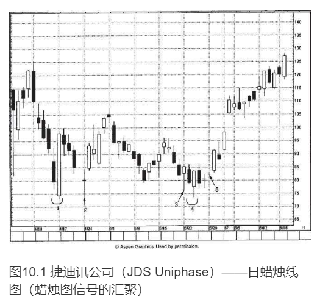

1. 4月17日是一根极长的白色蜡烛线，它包裹了前一根黑色实体，形成了看涨吞没形态。由于这个看涨吞没形态中的白色蜡烛线如此巨大，意味着等到该形态最终完成时，股票已经离开其低点近25美元之遥了。于是，虽然看涨吞没形态为我们提供了反转信号，但当形态完成时，从风险报偿比的角度来考虑，并没有为我们带来有吸引力的买入机会。
2. 请记住一个重要概念，看涨吞没形态的低点将转化为支撑水平。我们把注意力转向本形态的低点，大约73美元处，以此作为潜在的支撑水平。从4月17日所在的一周开始的下降行情在接近这个预期中的支撑水平时终于稳定下来，形成了一根长腿十字线。
3. 5月22日的锤子线进一步加强了上述支撑水平。
4. 在3处的锤子线之后的两个时段里，完成了一个经典的刺透形态。该形态的低点从来自1处的看涨吞没形态的支撑水平附近向上反弹。
5. 如果我们还希望看到更多的底部证据，那么它出现在5处。这是5月底的一个小型向上的窗口。另外，如果您观察一下从5月15日所在的一周到5月29日所在的一周的行情变化，会注意到股票正在构筑一个圆形底。在这个圆形底的基础上增添上述窗口（位于5处），就得到了一个平底锅底部形态。

图10.2展示了一群蜡烛图信号汇聚起来，有助于确认支撑水平或阻挡水平。

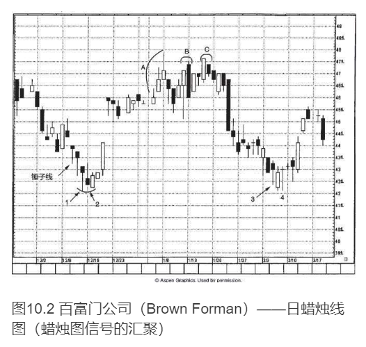

- 一群蜡烛图信号汇聚起来作为支撑水平。12月11日是一根锤子线。尽管这根锤子线带有潜在的看涨意味，但是在出现锤子线的同时打开了一个向下的窗口，使得趋势维持向下。当市场从这根锤子线开始上涨时，上涨过程通过三根带有长下影线的蜡烛线组成的一个系列来完成。这些长下影线在一定程度上抵消了看跌的氛围。1处的蜡烛线也是一根锤子线，但是与上面讨论的第一根锤子线不同，在之后的两天里，即12月16日和17日，这根锤子线成功地发挥了支撑作用。2处的两根蜡烛线构成了一个看涨吞没形态。在3处，2月初又出现了一根锤子线。这里是1和2处形成的支撑水平。4处的蜻蜓十字线进一步证实了大约42美元的支撑水平。
- 一群蜡烛图信号汇聚起来作为阻挡水平。在A处股票上涨，上涨过程是通过一系列带有长上影线的蜡烛线形成的。因为这群蜡烛线具备更高的高点、更高的低点、更高的收市价，所以短期趋势保持向上。但是，那些长上影线构成了警告信号，多方并没有完全站稳立场。最后那根带有长上影线的蜡烛线出现在1月6日，这是一根流星线。几天后，在B处，股票形成了一个看跌吞没形态。在C处，小黑色实体出现在长长的白色实体之后，组成了一个孕线形态。于是，A处的流星线、B处的看跌吞没形态、C处的孕线形态，三者汇聚起来，强调了位于47.50-48美元的天花板。

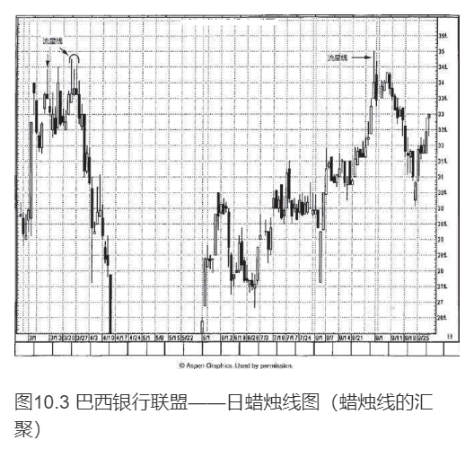

3月中下旬，出现了一系列流星线，构成了接近34.50美元的阻挡水平。看看这群流星线，难道您对股票已经在34.50美元上下遇到了麻烦还有任何怀疑吗？当然不会，因为这群流星线通过其图形突出地显示，每当股票接近本时段的最高点时，空方就会跳出来打压股价，最终使股价收市于本时段的最低点，或接近本时段的最低点。到了8月底，对这群流星线构成的阻挡水平，市场向上发起了又一次冲击。无独有偶，在8月的上冲行情里也出现了一根高悬头顶的流星线。除了这根流星线带来的负面意味之外，下一日的黑色实体雪上加霜，完成了一个看跌吞没形态。

## 蜡烛图与趋势线
如图11.1所示，是一条向上倾斜的支撑线。至少需要两个向上反弹的低点才能连接出这样一条直线，如果通过三个或者更多向上反弹的低点，那就更好。在蜡烛图上绘制上升的支撑线时，把蜡烛线下影线的低点作为连接点。这根支撑线表明，在这段时间里，买方比卖方更为主动、积极，因为在逐渐提升的新低点处，还能够引来新的需求。一般说来，这根线标志着市场上买方多于卖方。既然每一笔交易都同时需要一位买方和一位卖方，我更愿意认为，不是买方比卖方多，而是买方比卖方更为积极进取。

向上倾斜的支撑线 | 向下倾斜的支撑线
---------|---------
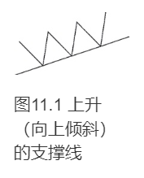 | 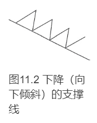

如图11.2所示，是一根向下倾斜的支撑线。正如在讨论图11.1时所说的，传统的支撑线是通过连接越来越高的低点得来的。不过，图11.2中的支撑线连接的则是越来越低的低点。下降的支撑线之所以有用武之地，是因为在市场上发生了许多实例，其价格是从下降的直线处向上反弹的。在缺少其他关于支撑水平的线索时，这样的直线给我们提供了潜在的支撑区域。在什么样的情形下不存在明显的支撑水平呢？当市场为当前行情创新低，特别是创纪录的新低的时候。

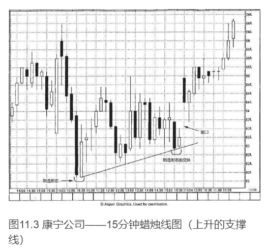

在图11.3中，11月22日的早晨出现了一个刺透形态。从这个刺透形态开始出现了一轮小规模的上涨行情，之后在12:30-13:00左右，市场回落到了62.50美元的区域。连接刺透形态的低点与几个小时后形成的接近62.50美元的低点，我们得到了一条上升的支撑线。这根线与11月22日晚间的某个时段相交，在相交处我们看到了一个刺透形态的变体（之所以说它是变体，是因为其中的白色蜡烛线的收市价没有向上超越之前黑色蜡烛线的中点）。本例说明，即便蜡烛图形态不太理想，但它依然可能提供行情反转信号。具体来说，虽然这不是一个理想的刺透形态，但是它来自那条上升的支撑线，因此其重要性得到了加持。对于多头已经控制市场，马上出现了进一步的增强信号，一个向上的窗口成功地测试了这条支撑线。该窗口在11月24日早间成为支撑区域。

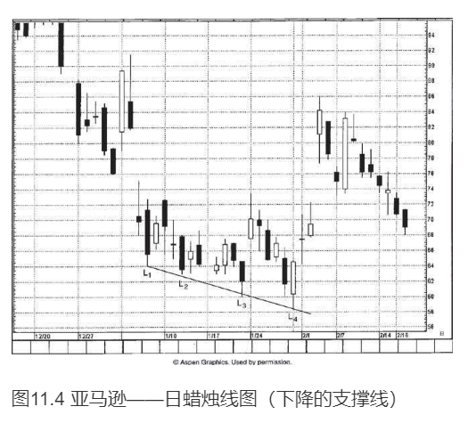

在图11.4中，整个1月，根据图中一系列更低的低点来评估，亚马逊始终处在下降趋势中。连接低点L1和L2，提供了一条尝试性的支撑线。在L3处，当市场防守成功后，这条下降的支撑线的重要性得到了确认。于L4的低点处，市场对这条向下倾斜的支撑线试探成功了，并且形成了一个看涨的刺透形态。从本刺透形态开始的上冲行情在2月2日和3日之间打开了一个向上的窗口。一方面，在2月9日长长的白色蜡烛线之前，窗口的底边作为支撑水平保持完好；另一方面，在2月9日长长的白色蜡烛线之后，当前上冲行情遭遇了一根十字线（它也是一根流星线），被短路了。

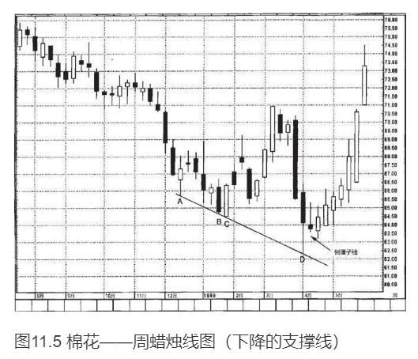

如图11.5所示，通过A和B两处的低点连接成一条下降的支撑线，再加上C处的看涨吞没形态的低点。对该直线最终的试探来自D处，之后跟着出现了一根倒锤子线。倒锤子线的后一天是一根白色蜡烛线，两者组成了一个看涨吞没形态。事实上，如果看涨吞没形态的白色蜡烛线的收市价更高一些，就会形成一个启明星形态。尽管如此，由于倒锤子线、看涨吞没形态，以及下降的支撑线汇聚在一起，宛如一声“空头平仓！”的大吼。

下降的阻挡线 | 上升的阻挡线
-------|-------
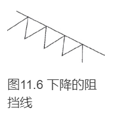 | 

图11.6展示了一条典型的下降的阻挡线。至少需要两个向下反弹的高点才能连接出这样一条直线。当然，如果有三个或更多个高点，直线就更有影响力。它表示卖方比买方更为积极进取，因为卖方愿意在更低的高点上卖出。这条阻挡线表明，在这段时间中，卖方比买方更为大胆、积极，因为在逐渐降低的新高点处，依然吸引了卖方的卖出意愿。这根直线反映出市场正处于下降趋势中。在蜡烛图上绘制阻挡线时，方法是连接蜡烛线上影线的顶点。

常规的阻挡线是由一系列越来越低的高点连接而成的。但是，如果市场正处在历史的新高位置，不存在更早的高点可用来连成潜在的阻挡线，那怎么办呢？在这种情况下，我常常绘制上升的阻挡线。如图11.7所示，这是连接一系列更高的高点得来的（不同于下降的阻挡线通过连接更低的高点得来）。

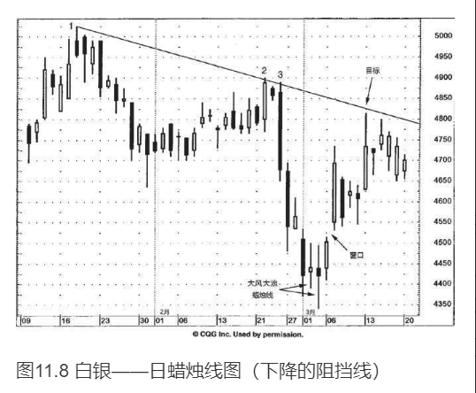

在图11.8中，我们连接区域1、2和3，得到了一条经典的阻挡线。白银从区域2的孕线形态开始形成一轮下降行情，下降行情的底部形成了两根大风大浪蜡烛线。这是第一个征兆，表明市场向下的力量正在消散。在3月6日和7日之间，打开了一个向上的窗口，驱使趋势转而向上。窗口立即转化为支撑区域，随后几天的变化证明了这一点。

现在，蜡烛图上已经出现了反转信号，我们可以转向西方技术分析——这条阻挡线，来寻求价格目标。这构成了潜在的阻挡区域，3月13日所在的一周，市场陷于停顿，正说明了这一点。

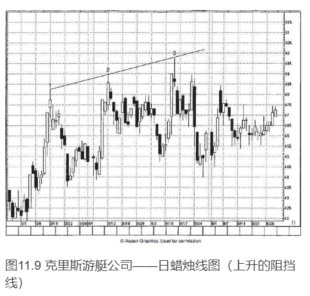

在图11.9中，4月12日（在2处）有一根长长的白色蜡烛线，其收市价创了新高，从而维持了多头趋势的力道。次日，一根小黑色实体成为组成2处的孕线形态的第二根蜡烛线，因而整个市场的基调都发生了转变。连接1和2两处的高点，得到了一条上升的阻挡线。该线5月中旬时在50美元左右与行情发生接触。接触点在区域3处，接近50美元的水平，另一个孕线形态与上升的阻挡线接触。（事实上，5月13日的上影线向上超过了前一天的价格区间，但是这一点并不否定此处的孕线形态，因为孕线形态只讲究实体的部分。）于是，蜡烛线为我们提供额外的证据（通过这个孕线形态和孕线形态第二根蜡烛线的长上影线），表明这条上升的阻挡线可能成为阻挡区域，即将发生防守性的行情。

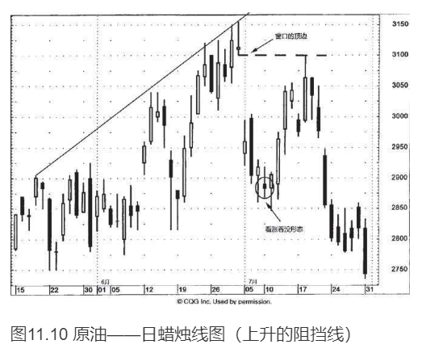

看看图11.10，其中有一根向上倾斜的阻挡线。从5月中旬开始的价格变化表现为一系列越来越高的高点。然而，6月30日若干技术因素汇聚起来，在上升的阻挡线处，形成了一根近似十字线的蜡烛线（它同时组成了一个十字孕线形态），发出信号指示多头采取保护措施。请注意，在近似十字线的蜡烛线的后一天，在31美元和30美元之间打开了一个巨大的向下的窗口。市场持续下跌，直到7月初找到支撑区域才罢休。从该支撑区域而来的上涨行情杀了一个回马枪，到达上述窗口的顶边。

### 破低反涨形态与破高反跌形态
`破高反跌形态`与`破低反涨形态`的概念最初是根据理查德·威科夫（Richard Wyckoff）的有关思想发展起来的。

如图11.11所示，`破低反涨形态`发生在横向波动区间的支撑区域，起先市场向下突破了支撑区域，后来返回到曾经被跌破的支撑区域之上。换句话说，新低价格水平是不能维持的。一旦破低反涨形态形成，我们就能获得一个止损退出的区域，还有一个价格目标。如图11.11所示，如果某支撑区域最近被向下突破，但市场不能维持，很快回升到支撑区域之上，就可以考虑买进。如果市场坚挺，就不应当跌回最近的低点。最近的低点可以作为止损水平（最好以收市价为标准）。该破低反涨形态的价格目标要么是形态出现之前的行情高点，要么是之前横向交易区间的顶边。这一点将在本节后面的一些示例中进行说明。

破低反涨形态 | 破高反跌形态
-------|-------
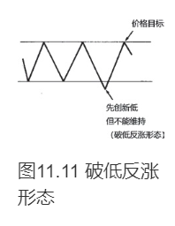 | 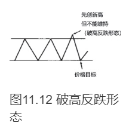

如图11.12所示的为`破高反跌形态`。这种形态发生在横向区间的阻挡水平，市场起先向上突破了阻挡水平，但是多方无力维持新高价位。这其实是假突破现象换了一种说法。为了利用破高反跌形态来交易，当市场从先前的阻挡水平之上回落到其下方时，可以考虑卖出。如果市场果真疲软，它就不应该再涨回到最近的高点。下方的价格目标是市场最近的新低，或者是横向交易区间的底边。

虽然交易量并不是这里的主要议题，但是在破低反涨形态中，如果向下突破支撑水平的时候交易量较轻，随后向上反弹至最近跌破的支撑水平之上时交易量较重，就进一步增强了本形态的看涨意义。与之类似，在破高反跌形态中，如果向上突破阻挡水平时交易量较轻，随后回落至最近向上突破的阻挡水平之下时交易量较重，那么破高反跌形态成功的可能性也将进一步增加。

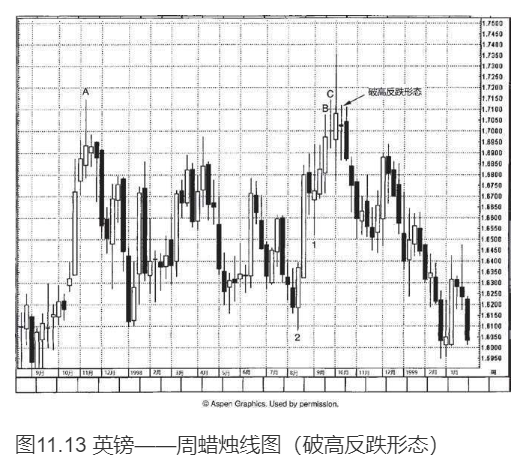

在图11.13中，通过A、B和C三处揭示了一个阻挡区域，C处的十字线确认市场在1.7100-1.7150的区域犹豫不决。在C处十字线的下一时段，突然涌出一股需求，将英镑推升到阻挡线之上，冲击到1.74的水平。然而，多方的胜利昙花一现，很快市场便回落到了之前已经被冲破的位于A、B、C三处的阻挡区域之下。这就形成了破高反跌形态。如此一来，我们就得到了下方的价格目标：之前的上冲行情把我们带到了这个破高反跌形态，追本溯源，上冲行情的起点便成了现在的价格目标。这里涉及一定程度的主观取舍。在我看来，这轮上冲行情起始于1处；不过，或许有人认为这一段上涨行情的起始点应该在2处的看涨吞没形态。在这样的情形下，我建议首先选用一个保守的价格目标（1处），然后再自由发挥一下，选择2处作为备用价格目标。有意思的是，本例的1处成为市场暂时进入稳定状态的区域，经过一番曲折之后，市场也到达了自由发挥的价格目标（2处）。

有时候，交战的一方，比如大户交易商、商业账户经理，甚至可能是自营交易商，会派出小股的“侦察兵”（这是我的说法，不是蜡烛图的术语），前去试探对方部队的决心。举例来说，牛方可能向上推一推，企图使价格上升到一条阻挡线之上。在这样的交火中，我们就得密切关注牛方表现出的坚定程度。如果牛方这支侦察部队能够在敌方的土地上安营扎寨（也就是说，在数日内，市场的收市价都处于该阻挡线的上方），那么牛方的向上突破就成功了。牛方的新生力军将要增援这支先头部队，市场就将向上运动。只要这块滩头阵地掌握在牛方的手中（就是说，市场已经把这个旧的阻挡区转化为新的支撑区，并维持其支撑作用），那么牛方的部队就会控制着市场的局势。然而，一旦市场被打退到先前已经被向上突破的阻挡区域之下，那么牛方便失去了控制权。

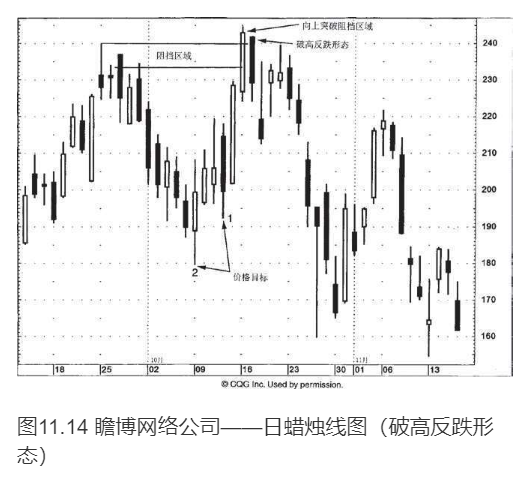

在图11.14中，显示了这种“火力侦察兵”现象，让我们从这个角度来观察这里的破高反跌形态。9月底形成了一个阻挡区域，图中用两根水平线来做了标记。10月16日是一根拉长的白色蜡烛线，将股价推升到了阻挡区域之上。因为瞻博网络以收市价创新高，向上突破了这块明显的阻挡区，所以多方的“火力侦察兵”至少此时已经夺得了一块立足地。后一天，是一根黑色蜡烛线，其收市价证明牛方底气不足，不能守住新高价位，于是整个市场的基调为之一变。如此一来，破高反跌形态就形成了。破高反跌形态的高点在下一周发挥了阻挡作用，在10月23日完成看跌吞没形态之后，市场崩溃了。

我们为这个破高反跌形态设定的价格目标是前一个低点，即之前带领我们到达破高反跌形态的上涨行情的起始点。有人可能选择区域1，也有人可能选择区域2——正如我们在分析图11.13的英镑行情时所说的，这存在一定的主观性。我会选择1作为保守的价格目标，2作为备用目标。这个破高反跌形态案例还说明了，在采用这种技术手段的时候，并不需要清晰定义的阻挡水平。

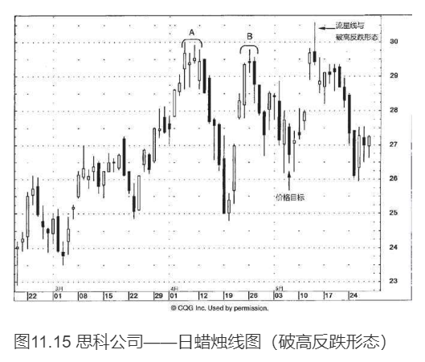

在前面几个示例中，市场都是在一个时段以收市价向上超越阻挡区域，下一个时段再以收市价回落到先前被向上突破的阻挡区域之下。图11.15则说明，破高反跌形态也可以在单独一个时段之内完成。在4月初的A处，接近30美元，出现了两根小实体（其中一根是流星线），显示市场犹豫。在4月23日、26日和27日的B处，市场再度向上冲击该区域，形成了一个十字黄昏星形态。5月13日是一根流星线，日内行情一度将股票推升到超越30美元阻挡区域的地步。到本时段结束时，股票表现后继乏力，不能维持上述新高价位，收市价重新回到了上述阻挡区域之下。如此一来，一个破高反跌形态就竣工了，其价格目标为之前紧邻的低点26.25美元附近。5月24日和25日，该目标已经达到了。

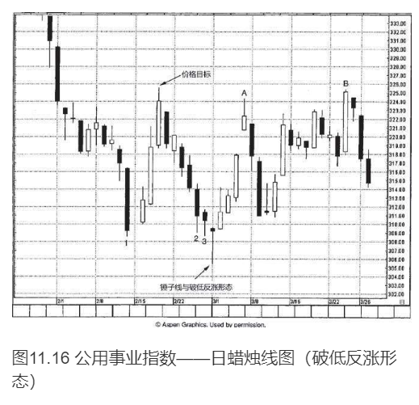

图11.16揭示了在单独一个时段内完成破低反涨形态的案例（在一个时段之内，市场起初创新低，再向上反弹，收市于先前被跌破的支撑水平之上）。

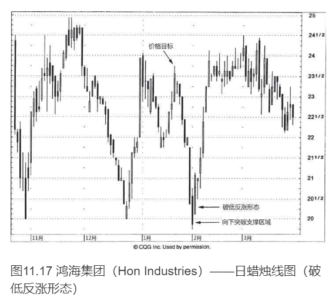

图11.17则是在几个时段内形成破低反涨形态的案例。2月1日的收市价创了新低，向下突破了20美元处明显的支撑水平。后一天，多方卷土重来，正如日本人形容的，“神风突袭”，把股票推升到之前被向下突破的支撑区域之上。如此一来，该股票造就了一个破低反涨形态。价格目标是最近的高点，在1月底形成的，位于23.75美元处。在该高点处，一根十字线紧随在一根高高的白色蜡烛线之后。有趣的是，当股票回升到这里的时候，再次表现出犹豫，并且形成了相似的蜡烛线组合：2月9日和10日，前一根是长长的白色实体，后一根是十字线。

技术分析最强大的方面之一，是它有助于培养风险管理和资金管理的良好能力。因为在技术分析手段中，总是存在特定价格，证明我们的预测是错误的。在本例中，在2月2日的破低反涨形态之后，如果市场下跌到2月1日的低点之下，那么上述价格目标便不再有效，同时，这是应当重新推敲多头头寸的信号。

### 极性转换原则
过去的支撑水平演化为新的阻挡水平，过去的阻挡水平演化为新的支撑水平。这就是我所说的`“极性转换原则”`。如图11.18所示，就是过去的支撑水平转化为阻挡水平的情形。如图11.19所示，是过去的阻挡水平转化为新的支撑水平的情形。

过去的支撑水平演化为新的阻挡水平 | 过去的阻挡水平演化为新的支撑水平
-----------------|-----------------
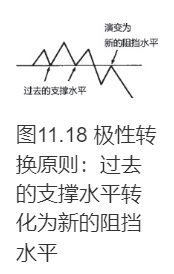 | 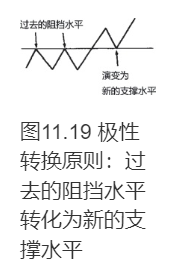

在图11.20中，12月下旬，一场陡峭的抛售行情结束于5.35美元的水平（在A处）。当市场再一次向下试探这个水平的时候，至少有三类市场参与者可能要考虑买进。

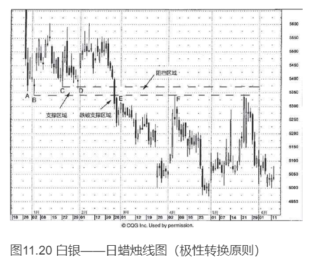

- 第一群市场参与者可能是那些在12月下旬的抛售行情中一直等待市场稳定下来的人。现在，他们发现市场在这里受到了支撑，于是得到了一个入市参考点——5.35美元的水平（点A所示的低点）。几天以后，该支撑水平成功地经受住市场的试探（点B处），在这个过程中，很可能市场已经吸引了新的多头加盟。
- 第二群市场参与者可能是那些原来持有多头头寸，但是在12月下旬的抛售行情中被止损平仓的人。在这些被止损出市的老多头中，当他们看到1月中旬从点B到5.60美元的上涨行情时，可能有一部分人会觉得当初判断白银市场为牛市是正确的，只不过买进的时机没有选择好。现在，是买进的时候了。他们希望借此机会，证明自己当初的看法是有道理的。于是，等到市场再度向下回落到点C的时候，他们便重新买进，建立多头头寸。
- 第三群市场参与者可能是那些曾经在A处和B处买进的人。他们也注意到了从B开始的上涨行情，因此，如果有“合适的”价位，他们就可能为已有的头寸加码。在C处，市场返回了支撑水平，他们自然就得到了一个合适的价位。于是在C处，又出现了更多的买进者。依此类推，当市场再度向下撤回到D处的时候，自然还能吸引更多的看多者入市。

但是不久，问题就开始了。在2月下旬，价格向下突破了A、B、C和D处形成的支撑水平。2月28日是一根锤子线，有理由感到一点乐观。但是，曾经在这些旧的支撑区域买进的人，现在无一例外地处于亏损状态。

请您自问一下，在您的市场图表上，什么样的价格最重要？是当前趋势的最高价吗？是当前趋势的最低价吗？还是昨日的收市价？都不是。**在任何图表上，最重要的价格是您开立头寸时的交易水平。人们与自己曾经买进或卖出过的价格水平结下了强烈的、切身的、情绪化的不解之缘**。那些在5.35美元支撑区买进的多头现在“临时抱佛脚”“病急乱投医”，一心祈祷市场回到他们的盈亏平衡点。

于是，一旦市场上冲到这些多头者买进的区域（在5.35美元附近）附近，他们谢天谢地，赶紧乘机平回手上的多头头寸。这么一来，当初在A、BC、D处买进的市场参与者，也许现在就变成了卖出者。这一点，正是过去的支撑水平演化成新的阻挡水平的主要缘由，如图上E和F处所示。

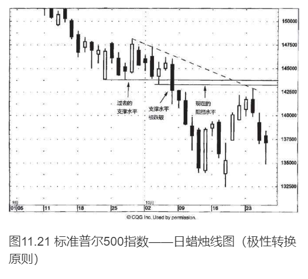

图11.21提供了一个经典的案例，突出显示了各种技术指标相互验证的过程。从9月中到10月初形成了一个支撑区域，在1435左右。10月初，这里被向下突破。10月12日和13日出现了一个刺透形态（其中的白色蜡烛线如此坚挺，几乎要形成看涨吞没形态了），标志着行情开始反弹。从本刺透形态开始的上涨行情将标准普尔指数推送到1425的区域，在这里我们遇到了一系列技术信号，它们相互验证。以下逐一介绍。
1. 10月23日和24日组成了看跌吞没形态。
2. 一条下降的阻挡线（图中虚线所示），通过连接9月底以来的高点而得。
3. 先前位于1435上下的支撑区域，现在转化为阻挡区域。

在关于相互验证的本案例中，通过蜡烛图信号（看跌吞没形态）确认了两种西方技术指标（一条阻挡线和极性转换原则）。

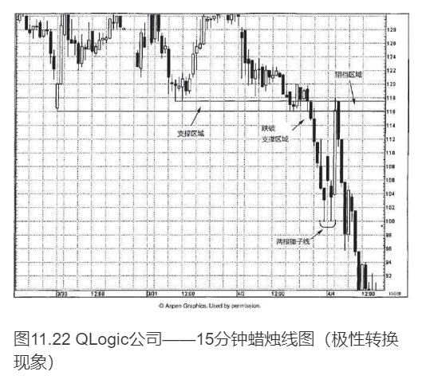

极性转换原则不只是适用于确定的支撑水平，也可以应用于某个支撑区域。在图11.22中，有一个支撑区域（图上用两条水平线来表示），从116美元到117.50美元。4月3日，一旦该支撑区域的下边缘被向下突破，就可以应用极性转换原则。这么一来，上述116.00-117.50美元的区域原先是支撑区域，现在是阻挡区域。4月3日晚间，股票持续下跌，直到出现了一对锤子线，暗示行情已经进入稳定期。从锤子线开始出现上升行情，与一个乌云盖顶形态和4月4日早晨的极性转换现象不期而遇，两者相互验证，于是上升行情宣告结束。

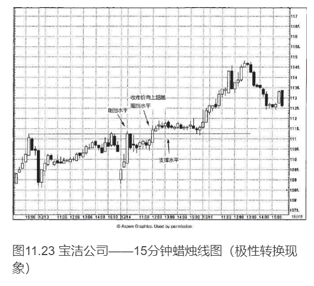

在图11.23中，我们看到111.25美元左右有一个阻挡水平。一旦多头将宝洁捧到这个水平之上，我们则预期该水平转化为潜在的支撑水平。虽然12月14日从中午起到晚间形成了一系列小实体，使得当前趋势表现为中性，但是111.25美元作为支撑水平保持完好，市场前景依然维持在有利的一边。12月14日最后是两根带有长下影线的蜡烛线，从图形上验证了接近111.25美元的支撑水平。

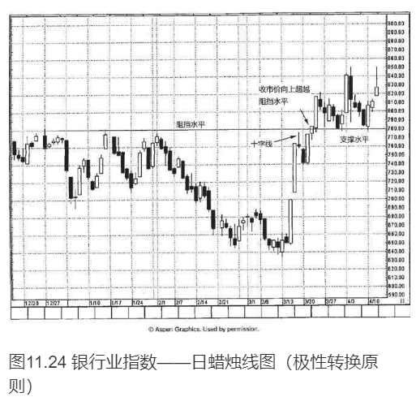

图11.24中有一个明显的阻挡水平，3月17日出现了一根十字线，再度加强了这个水平。一旦指数向上突进到该阻挡水平之上，这个接近775的曾经屡次经受检验的阻挡水平便转化为支撑水平。这个案例为我们揭示了极性转换原则的一个重要方面：在应用本技巧之前，通常需要相应的支撑水平或阻挡水平经历过几次验证。

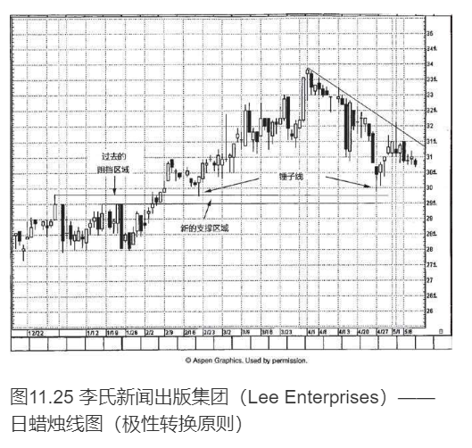

在图11.25中，2月初市场向上穿越了一条阻挡线。在2月16日所在的一周里，当价格小幅回落时，我们看到了若干技术指标汇聚在这里，其中2月20日的锤子线验证了上述支撑水平，后者是根据极性转换原则转变而来的。无独有偶，在另一场下降行情中，在同一个支撑水平处，接近29.75美元，又出现了一根锤子线，终结了下降行情。虽然这根锤子线确认了支撑水平，但是它并不提供价格目标。这里就要由西方技术分析工具大展拳脚了。通过从4月初到4月中的几个高点，可以绘制一条阻挡线。以这条直线作为潜在的阻挡水平，如果我们在锤子线出现后按照约31.50美元的水平买进，则可以把这条线作为价格目标。本图说明了将西方技术工具和蜡烛图技术相结合，两者相辅相成的实用性，及其带来的优势。既可以将西方技术指标与蜡烛图信号相互验证（在本图中，锤子线验证了极性转换而来的支撑水平），也可以用西方技术工具来获得潜在的价格目标（图中下降的阻挡线）。

## 蜡烛图与百分比回撤水平
上升趋势中回撤水平 | 下降趋势中回撤水平
----------|----------
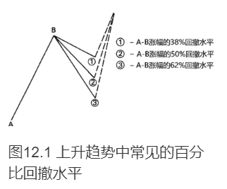 | 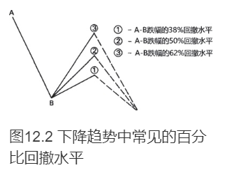

在当前趋势继续发展之前，市场通常首先要对已经形成的上涨进程或下跌进程做出一定程度的回撤。在这类回撤水平中，较为常用的是50%回撤水平，以及38%和62%的斐波那契回撤水平（如图12.1和12.2所示）。

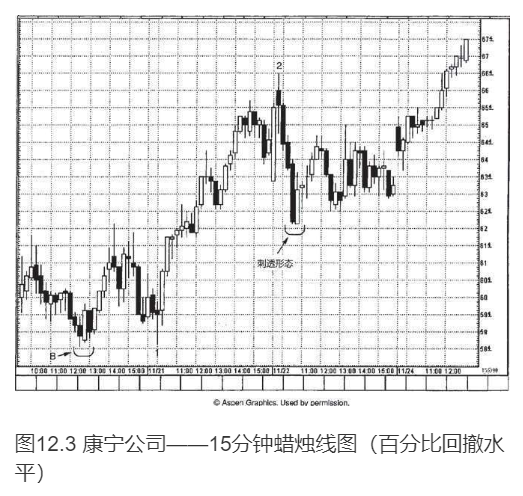

在图12.3中，B处的看涨吞没形态构成支撑水平，11月21日出现了一根看涨的长下影线蜡烛线，表明该支撑水平保持良好。从1处到2处的上涨行情推升股价的幅度达到8美元。如此一来，这段上涨行情的50%回撤水平便在从高点向下4美元的位置。这意味着期望的支撑水平在62.50美元上下（8美元涨幅的50%是4美元，4美元+58.50美元=62.50美元）。11月22日，股票回落到接近该水平处，形成了一个刺透形态。于是，蜡烛图形态发生在50%回撤水平，两者相互验证。虽然百分比回撤水平可能演变成支撑或阻挡水平，但我并不建议在百分比回撤水平的位置买进或卖出，除非它还得到了蜡烛图信号的验证，正如本例的情形。

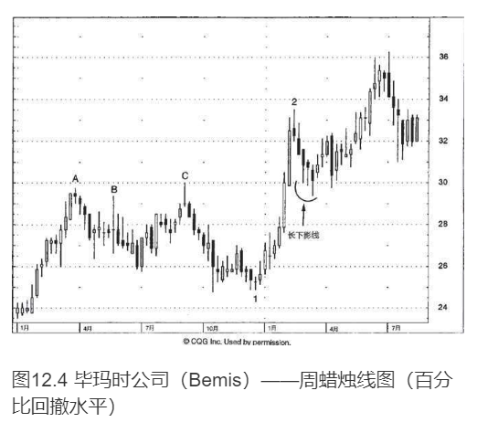

如图12.4所示，从1处到2处的上冲行情将股价从25美元提升到了33.50美元。该上冲行情的50%回撤水平位于29美元左右，可能提供潜在的支撑作用。股票从2处开始，逐步向潜在支撑区域回落，在这一过程中形成了一系列长下影线，它们暗示空头正在丧失控制权。29美元之所以构成潜在的支撑水平，还有另一个原因。具体来说，如果我们注意到了先前位于A、B和C三处的价格波峰，就可以采用极性转换原则，当这个29-30美元的阻挡区域被向上突破后，便转化为潜在的支撑区域。因此，在本例的情形下，随着股票逐步接近29美元，50%回撤水平、极性转换原则、不约而同的一系列长下影线，三者汇聚，相互验证。

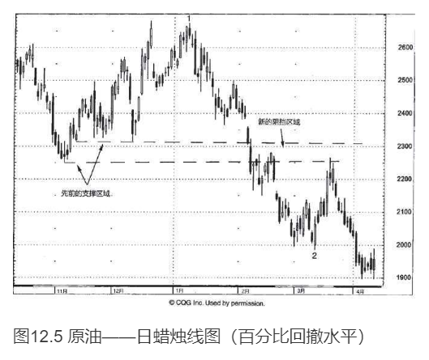

在图12.5中，从1月间1处的价格高点，到3月中旬2处的低点，是一轮下降行情，2处出现了一个看涨吞没形态。该看涨吞没形态的低点验证了2月底一根锤子线的支撑水平。从看涨吞没形态开始，行情上冲，但在遭遇一根大风大浪蜡烛线后便寸步难行，后者几乎恰好处在从1处（位于26.65美元）到2处（位于19.97美元）的38.2%斐波那契回撤水平上。该区域之所以构成阻挡作用，还有另一个理由，这里曾经在11月和12月充当了先前的支撑区域。既然该支撑区域已经被向下突破，根据极性转换原则，就成为新的阻挡区域了。

## 蜡烛图与移动平均线
### 简单移动平均线
其一般公式为：$\frac{P1+P2+P3+P4+P5}{n}$

其中
- P1=最近的收市价；
- P2=最近的收市价的前一个收市价，余者依此类推；
- n=移动平均的数据点数。

### 加权移动平均线
在`加权移动平均线`的计算方法中，先对每一个有关的价格数据分配一个不同的权重，再计算它们的平均值。几乎所有的加权移动平均线都属于前沿加重的方式。这就是说，最近价格数据的权重显著大于先前价格数据的权重。

### 指数加权移动平均线
`指数加权移动平均线`是一种特殊的加权移动平均线。与一般的加权移动平均线一样，指数加权移动平均线也采取前沿加重的方式。不过，与其他的移动平均方法不同的是，在指数加权移动平均值的计算方法中，包括的不是一段数据，而是所有的历史数据。在这种移动平均方法中，对过去的价格数据分配了逐步减少的权重。每一个价格数据的权重都比后来的一个价格数据的权重按照指数形式递减，因此，我们称之为指数加权移动平均线。

### 移动平均线的用法
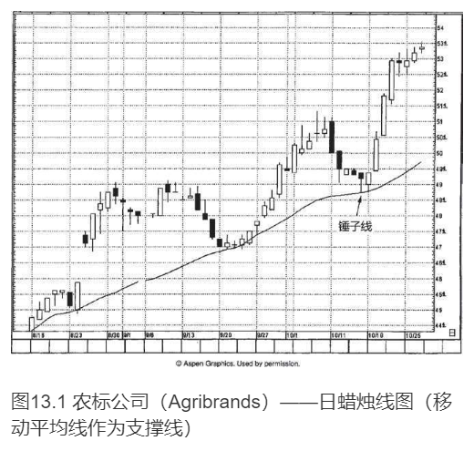

如图13.1所示，一条移动平均线成为表现精彩的支撑区域。8月以前（本图开始的时间），这条移动平均线的表现有时不如本图中那样有效。不过，一旦我们确认了这条移动平均线值得参考，正如8月底和9月底的情形所示，我们就可以将注意力转向这条特定的移动平均线，当市场回落的时候，脑子里就有了基本的预期，行情应当在这条移动平均线上得到支撑。从10月11日所在一周的看跌吞没形态开始，市场向下飘落，此时我们将这条移动平均线视为潜在的支撑区域。10月15日，股票回落接近了这条移动平均线，先形成了一根锤子线，跟着是一根白色蜡烛线，两者组成了一个看涨吞没形态。几方面的要素相互验证（移动平均线发挥支撑作用，锤子线，看涨吞没形态），限定了行情回落的低点，在48.75美元附近。尽管移动平均线很有用处，但是我们不建议单纯从移动平均线——无论这条移动平均线曾经多么频繁地成功发挥支撑作用——出发，完全根据移动平均线信号来交易。借助蜡烛图信号验证移动平均线的支撑作用或阻挡作用，然后再采纳其信号来动手建仓或平仓，这是极为重要的考虑，不可轻忽。

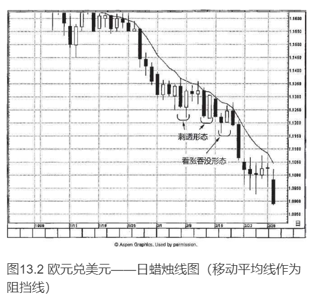

在图13.2中，我们看到了一条短期移动平均线。之所以能分辨它是短期移动平均线，是因为它如此贴近价格图线。这是一条9天指数加权移动平均线，这类移动平均线在外汇交易人群中比较受欢迎。我们看到，在从1月中旬开始的下跌行情中，这条移动平均线很好地发挥了上方阻挡线的作用。从2月初到2月中旬，曾经出现了不少蜡烛图底部信号，包括两个刺透形态、一个看涨吞没形态等。然而，移动平均线的阻挡作用始终发挥良好。相应地，为了确认这些潜在的蜡烛图信号的看涨意义，我们应当等待行情向上突破由这条移动平均线定义的阻挡区域。既然突破的情形没有发生，我们就不应当买进。

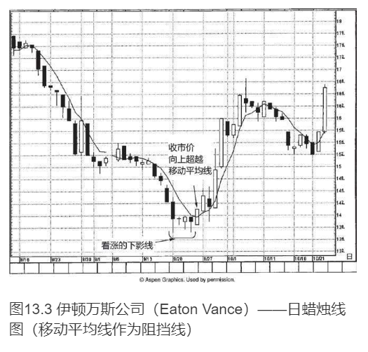

图13.3展示了一条短期移动平均线，它在从8月中旬开始的下降行情中发挥了阻挡线的作用。8月30日和31日，股票曾经在日内行情中一度向上推进到这条阻挡线之上，却未能收市于之上，因此趋势方向保持向下。9月7日和8日，发生了小小的拉锯现象，股票先是收市于移动平均线之上，后来又跌回其下。一般说来，我们应当重视这条移动平均线（它是5日移动平均线）的阻挡作用，因为它曾经发挥了良好的功效。从9月20日开始，股票构筑了一系列看涨的长下影线，其中9月24日的长下影线蜡烛线属于锤子线。虽然这些蜡烛线发出了图形信号，市场正在寻求底部，但是直到9月25日收市时，才能得到最终的看涨验证信号，因为这里完成了一个看涨吞没形态，并且收市价向上超越了这条移动平均线。请注意，在9月底的上冲行情中，这条移动平均线发挥了支撑作用，而在10月初的下降行情中，它发挥了阻挡作用。

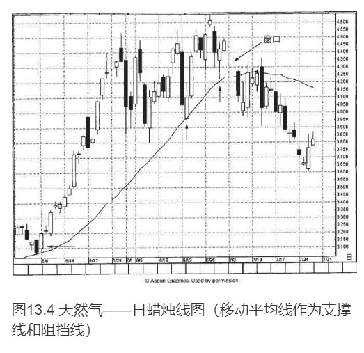

移动平均线既可以充当支撑线，也可以充当阻挡线，图13.4显示了它的角色是如何转化的。在5月8日所在的一周里，天然气的上涨行情开始起步，之后随着行情上涨，移动平均线一直发挥着支撑作用（图上用箭头指出）。7月5日，移动平均线的支撑作用被一个向下的窗口所打破。于是，我们现在有了两方面的线索来寻求阻挡水平。首先是这条移动平均线。既然这条移动平均线曾经作为支撑线作用良好，那么现在有理由预期它将作为阻挡线，同样作用良好。其次，介于4.29美元和4.41美元之间的向下的窗口应当构成阻挡区域。7月初，天然气回升到了接近这条移动平均线的阻挡水平处，但未能收市于其上。7月初的上涨行情也没能向上克服该窗口的阻挡区域。

## 蜡烛图与摆动指数
所谓`摆动指数`，包括下列各种技术分析工具：`相对力度指数`、`随机指数`以及`动力指数`等。摆动指数能够从以下三个方面为交易者提供帮助。
1. 摆动指数可以用作相互背离指标。摆动指数与价格有两种相互背离的情况。一种是负面相互背离，或者说看跌相互背离（简称“顶背离”），即当价格创出新高的时候，相应的摆动指数却没有达到新高。这意味着市场在本质上是疲弱的。另一种是正面相互背离，或者说看涨相互背离（简称“底背离”），指当价格处于新低的时候，相应的摆动指数却没有形成新低。这意味着当前市场的抛售压力正在衰退。
2. 摆动指数也可以用作超买或超卖指标。摆动指数能够告诉交易者，当前市场行情是不是向某一方向扩张得太过分了，因而容易引起行情调整。
3. 摆动指数还能用来衡量市场运动的力度。因此，可以利用它们检验在一轮趋势性运动背后市场力量的大小。例如，动力指数通过对价格变化幅度的比较，显示了价格运动的速度。从理论上说，随着趋势的发展，价格变化速度也应当逐步加快。如果在趋势发展过程中，动力指数变成水平伸展，可能就构成了一个早期的警告信号，说明当前价格运动正在减速。

### 相对力度指数RSI
RSI计算的是，在一段时间内，同一个对象价格上涨的力度与下跌的力度对比。9天和14天，是最常用的两种时间参数。它的计算公式是：

$RSI=100-\frac{100}{1+RS}$

其中RS=该时段上涨价格累计幅度的平均值/该时段下跌价格累计幅度的平均值。

因此，当我们计算14天的RSI的时候，首先将这14天内上涨的收市价的上涨幅度相加（按照收市价对收市价的方式），再将所得的和除以14。然后，对其中下跌的日子进行同样的计算。从这两个数值就得到了相对力度的值，即RS。最后，我们把RS的值代入RSI的公式中去。RSI公式将RS的值转化为指数形式，并且使得该指数的取值范围在0到100之间。

RSI的两个主要用途是，构成超买或超卖指标、作为监测相互背离现象的工具。
- RSI作为超买或超卖指标的使用方法是，当RSI向上趋近其取值范围的上边界时（即当它高于70%时），表明市场处于超买状态。在这样的情况下，市场也许变得比较脆弱，容易引发向下调整的过程，或者即将转入横向调整阶段。与此相反，当RSI处于其取值范围的下边界时（通常低于30%），则认为RSI反映了超卖状态。在这样的环境下，市场有可能形成空头买入平仓行情。
- 利用RSI揭示相互背离现象的具体方法是，当价格向上创出当前趋势的新高时，RSI却没有形成新高，未能与之配合，这就构成了一个负面相互背离信号，可能是一个看跌信号。当价格向下跌出当前趋势的新低时，RSI却没有形成新低，则构成了正面的相互背离现象。在相互背离现象出现时，如果RSI摆动指数的数值正处在超买区或超卖区，则相互背离现象具有更强的技术意义。

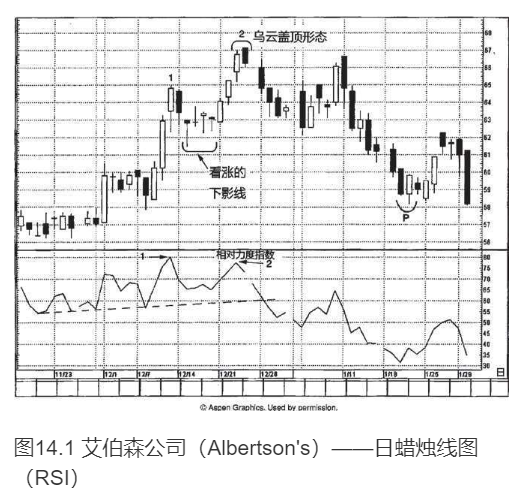

在图14.1中，11月下旬市场始终处于58美元附近的阻挡水平的作用下。一旦艾伯森公司在12月1日以一根长长的白色蜡烛线推升到该水平之上，我们便可以采用极性转换原则，将原先的阻挡水平转化为新的支撑水平。12月14日所在的一周，市场摇摆不定，但一系列看涨的长下影线表明，该股票在62美元处有牢靠的基础。12月21日，上涨行情恢复。之后，上涨行情遭遇乌云盖顶形态，陷入停顿。当股票形成该乌云盖顶形态时，价格处于新高位置。与此同时，RSI的读数为超买状态。不仅如此，RSI还形成了一个负面相互背离信号。具体地说，2处的股票价格高于1处，但是2处的RSI却低于1处。上述乌云盖顶形态构成阻挡水平，而1月10日和11日组成了另一个乌云盖顶形态，后者验证了前者的阻挡作用。1月中旬P处出现了一个刺透形态，它发生在超卖的市场环境下（根据RSI判断）。

负面相互背离信号与乌云盖顶形态不期而遇、相互验证，进一步增强了乌云盖顶形态潜在的看跌意义。我们还可以采用趋势线对RSI进行分析。图上用虚线表示了趋势线分析的情形。请注意，当这条上升趋势线被跌破时，构成了另一个负面信号。

分析蜡烛图必须心存一个关键概念，即市场的总体技术图像比单根蜡烛线重要得多。我们必须始终将蜡烛线或蜡烛图形态放到它所处的市场环境大格局中进行分析。

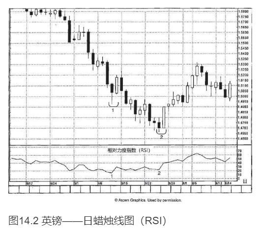

在图14.2中，1处和2处标出了两个看涨吞没形态。（虽然两个形态中的白色蜡烛线的开市价与前一根黑色蜡烛线的收市价处在同一个水平，但是我们仍然可以把它们视为看涨吞没形态，因为在外汇市场上下一个时段的开市价和上一个时段的收市价相同。）看涨吞没形态2比看涨吞没形态1更为重要，因为看涨吞没形态2得到了正面相互背离信号的验证。在第一个看涨吞没形态处，当股票价格创新低时，RSI也处在持续下降的过程中。如此一来，便表明看跌势头维持完好。

### 移动平均线摆动指数
以短期移动平均线的数值减去长期移动平均线的数值，得到移动平均线摆动指数的数值。

如果短期移动平均线相对来说较大幅度地高于（或低于）长期移动平均线，那么我们就认为市场处于超买状态（或超卖状态）。

随着行情价格上升，技术分析者期望看到短期移动平均线相对于长期移动平均线更快地上升。这么一来，两条移动平均线的差值（即移动平均线摆动指数）将转为正值，且数值增大。如果价格上升，而短期和长期移动平均线的差值却收缩，便指明市场上涨的短期动力正在衰减。

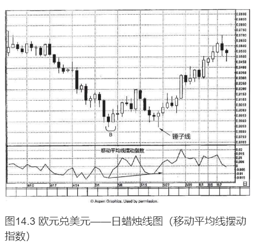

在图14.3中，在5月的第一周，欧元兑美元汇率于B处构造了一个看涨吞没形态。从本形态开始，出现了一轮小规模的上涨行情。之后市场回落，得到了支撑。支撑水平位于该看涨吞没形态的低点，符合常规的预期。5月19日的锤子线一箭双雕，不仅表明市场把守住了上述支撑水平，而且发出了正面相互背离信号，因为欧元兑美元汇率在锤子线上稍稍创了新低，可是同一时刻的移动平均线摆动指数则处在更高的低点上。在锤子线之后，一旦市场向上推进到了0.9200之上，便确认了由看涨吞没形态和锤子线共同组成的双重底形态。第十六章将要讨论，交易区间的幅度为0.0350（即从0.8550到0.9200的距离），我们可以利用该幅度得到突破之后的价格目标，即0.9550（向上突破的位置为0.9200，交易区间的幅度为0.0350，两者相加便得到价格目标0.9550）。

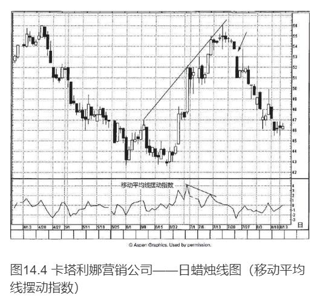

在图14.4中，卡塔利娜公司正沿着一根向上倾斜的阻挡线上升。在7月13日所在的一周里，虽然股票正在当前趋势的最高点附近波动，但是一系列小实体透露了多头的进攻遭到了空头的制约。考虑到来自4月下旬的位于56美元附近的阻挡水平，行情在这里发生犹豫并不令人吃惊。

现在我们把注意力转向移动平均线摆动指数。就在7月中旬出现上述一系列小实体的同时，这里也出现了负面相互背离信号。于是，我们在56美元的水平附近得到了一个技术信号相互验证的经典案例。具体情况如下：
1. 股票处在阻挡水平处，阻挡水平既来自那条上升的阻挡线，也来自4月底的价格高点；
2. 一系列小实体表明市场的上升趋势已经脱轨；
3. 负面相互背离信号。关于市场出了问题的判断，如果我们还需要进一步的证据，那么当向下的窗口（图上箭头所指的地方）出现时便能如愿以偿。该窗口将成为阻挡区域。

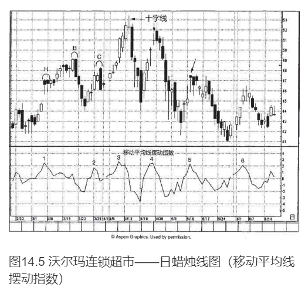

关于蜡烛图和摆动指数的结合运用，图14.5展示了一项关键之处。在权益市场上，绝大部分交易者都是多头，相对而言，卖空者为数极少。弄清何时应当平仓退出，是多头面对的一大挑战。这正是摆动指数可以发挥作用的地方，尤其是当它得到了蜡烛线或蜡烛图形态验证时。正如我们在图14.4中所见，当股票行情过度拉长的时候，并且也具备蜡烛线转折信号的验证，那么此处就是要么平仓退出、要么平仓减磅的一个好地方了。带着上述考虑，我们来逐一分析超买状态下的各种现象。

1. 3月的第一个星期，H处有两根上吊线。它们出现在超买的市场状态下（根据摆动指数来判断），但是它们没有得到验证信号，即市场以收市价跌破它们的实体。请记住，看跌的上吊线得到验证后才有效。在上吊线之后，需要以收市价向下突破上吊线的实体才能确认上吊线潜在的看跌意义。不仅如此，出现第一根上吊线的那天同时打开了一个向上的窗口。如此一来，窗口成了支撑区域。因此，一方面市场已经向上过度延展；另一方面，虽然摆动指数在1处表明市场上涨速度已经形成了向下的拐点，但是根据上述蜡烛线，并不具备看跌的验证信号来确认。在B处，3月18日和19日组成了一个看跌吞没形态，这是一个反转信号，不仅因为该看跌吞没形态本身，而且因为在该形态出现的同时，虽然股票价格已经创了新高，但是其移动平均线摆动指数出现了更低的低点。这就形成了看跌的或负面的相互背离现象。
2. 摆动指数的读数显示超买状态，但在蜡烛图上没有反转信号，因为在此处的超买状态下出现的是一根长长的白色实体。在这根白色实体的几天后，我们看到了一个看跌吞没形态（位于C处），后来转化为阻挡水平。
3. 4月7日，沃尔玛向上超越了上面讨论的看跌吞没形态。如此一来，可以把它视为看涨的突破信号。在区域3，摆动指数处于超买状态，但是蜡烛线上没有反转信号，我们不能卖出。几天之后，可能出现了一个警示信号：一根长腿十字线，紧跟在一根长长的白色蜡烛线之后。
4. 在摆动指数的超买状态下，出现了一根十字线，两者相互验证，揭示可能发生行情转折。虽然在这个十字线处股票表现犹豫不决，但是在4月22日和23日之间，市场又打开了一个小规模的向上的窗口，构成了支撑区域。于是，我们需要进一步的看跌验证信号，即收市价低于窗口。4月28日，市场向下突破了窗口的支撑作用。
5. 5月11日，图上箭头所指之处是一根上吊线，摆动指数显示市场处于过度延展状态，因此，两者带给我们一个转折信号。后一天，市场收市于上吊线实体之下，验证了上吊线的看跌意义。
6. 一根十字线确认了市场的踌躇状态。与4处的情形相似，这里也有一个向上的窗口，需要市场以收市价关闭窗口之后，才能认为当前趋势已经遭到毁坏。6月8日，市场收市于窗口的支撑水平之下。

### 随机指数KDJ
随机摆动指数也是一种常用工具。作为一种摆动指数，它也提供了超买和超卖状态的读数指示；也能揭示相互背离现象；还提供了一套比较短期趋势与长期趋势的机制。随机指数把最近的收市价格同一定时间范围内市场的总体价格范围进行比较，计算其相对位置。随机指数的数值处在0到100之间。当随机指数的读数较高时，意味着当前的收市价格在一定时期的整个价格范围中接近其上端的水平；当随机指数读数较低时，意味着当前的收市价在一定时期的整个价格范围中接近其下端的水平。随机指数的设计思想是，当市场向上运动时，收市价格倾向于接近上述价格区间的高点；当市场向下运动时，价格往往集中在上述价格区间的低点附近。

随机指数的图表由两根曲线组成，它们分别是%K线和%D线。其中，%K线称为`原始随机线`，或者称为`快%K线`。这条曲线最为灵敏。%K线值的计算公式是：

$\frac{收市价-N天内的最低价}{N天内的最高价-N天内的最低价} * 100$=%K

其中
- 收市价=当前收市价；
- N天内的最低价=N天内总体价格范围的最低价；
- N天内的最高价=N天内总体价格范围的最高价。

公式中的数值“100”将公式的数值转化为一个百分数值。因此，如果今天的收市价与我们所研究的时间范围内的最高价一致，那么快%K值就等于100。上述的时间范围既可以选择为若干天，也可以选择为若干周，甚至可以选择为若干个日内时间单位（比如若干小时）。14、19、21个时间单位是几个较为常见的时间参数。

因为快%K线十分起伏不定，所以我们通常以这条线为基础，每三个数值计算出一个移动平均值，得出一条较为平滑的三时间单位移动平均线。这条%K线的三时间单位移动平均线就称为`慢%K线`。绝大多数技术分析师用这条慢%K线代替那条变化无常的快%K线。下一步，我们对这条慢%K线再进行一次三时间单位的移动平均，得到了慢%K线的三时间单位移动平均线，称为`%D线`。实质上，这条%D线是移动平均线的移动平均线。

其中最为常见的用法是将它用来揭示相互背离现象。绝大多数技术分析师在应用随机指数时，既从相互背离这一方面来跟踪随机指数的变化，也注意其读数是否显示了市场的超买或超卖状态。

有些技术分析师还采用了另一种研读随机指数的方法。这种方法约定，当慢%K线向下穿过%D线时，构成卖出信号；当慢%K线向上穿过%D线时，构成买入信号。这一点与双移动平均线的用法有相似之处。在双移动平均线系统中，当较快的移动平均线向上穿越（或向下穿越）较慢的移动平均线时，就形成了买入或卖出信号。

随机指数也可以用来评估市场是否处于超买或超卖状态。绝大多数交易者认为，80%或更高的读数表示超买状态，20%或更低的读数表示超卖状态。举例来说，为了构成一个买入信号，需要满足以下三个条件：首先，市场必须处在超卖状态（随机指数的%D值为20%或更低）；其次，市场已经发生了正面相互背离现象；最后，慢%K线向上穿越了%D线。

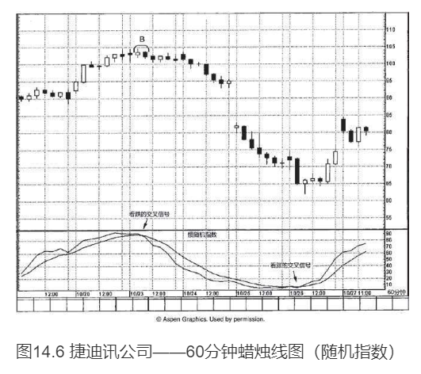

如图14.6所示，10月23日一大早，在B处出现了一个小规模的看跌吞没形态。通常，这样的小型看跌吞没形态是不太重要的，但是一旦与随机指数相结合——我们看到随机指数正处在过度延展的市场状态，同时发生了看跌的交叉信号（这里较快的%K线向下穿越了较慢的%D线），这就给看跌吞没形态增加了更大的影响力。我们预期该形态在105美元的高点构成阻挡水平。后一天早晨，股票一度回升到104美元，但后继乏力，表明该阻挡水平维持完好。

10月25日，打开了一个大幅的向下的窗口。10月26日早晨，出现了一根中规中矩的锤子线。在锤子线之前的几个时段，我们曾经在随机指数方面看到一条试探性的筑底线索。具体说来，在10月26日早间，随机指数已经处于超卖区域（也就是低于20%）。同时，我们看到了随机指数发生看涨的交叉信号，较快的%K线向上穿越了较慢的%D线。就在随机指数的反转信号出现之后，我们很快得到了一个看涨的蜡烛图信号，也就是前面所说的锤子线。该锤子线作为支撑水平维持稳固。如果股票回落到锤子线的低点之下，那么尽管随机指数出现了正面的相互背离现象，我们也应当考虑降低多头仓位。

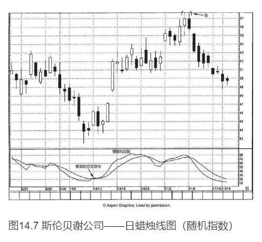

在图14.7中，10月初出现了一系列带有长下影线的蜡烛线。在10月12日所在的一周里，我们看到随机指数显示了超卖读数，接近20%，并且发生了看涨的交叉信号。这就增强了看涨的长下影线的意义，即股票行情正在趋于稳定。

10月19日出现了一根近似十字线的蜡烛线，紧随在一根长长的白色蜡烛线之后。这将市场趋势从上升转为更加中性，因为这根十字线暗示市场已经“疲惫”了。在十字线之后，市场踩水了一阵子。后来，随着11月2日向上的窗口的到来，市场继续向高位推进。该窗口在11月2日所在的一周里发挥了支撑作用。在B处，11月6日和9日组成了一个看跌吞没形态，将当前趋势转向不那么坚挺。在该看跌吞没形态中，两根蜡烛线实体的尺寸差不多。通常，我们更希望看到看跌吞没形态中黑色实体的长度明显超过白色实体。这样才能表明空方从多方手中夺得了主导权。不过，在本例中，当看跌吞没形态出现的时候，随机指数同时出现了看跌的交叉信号。如此一来，将该看跌吞没形态与随机指数相结合，它便具备了额外的重要性。

### 移动平均线验证背离指数MACD
从图线来看，`移动平均线验证背离指数（MACD）`由两条曲线组成，实际上，它是由三条指数加权移动平均线构成的。MACD图线中，第一条线是两条指数加权移动平均线的差值（通常采取12和26作为时间参数的两条指数加权移动平均线来计算）；第二条线是第一条差值线的指数加权移动平均线（通常用9作为时间参数），用来平滑第一条线。显然，第一条线变化较快。第二条线称为信号线。

当变化较快的第一条线向上穿越变化较慢的第二条线（信号线）时，构成看涨的交叉信号；当较快的第一条线向下穿越较慢的第二条线时，构成看跌的交叉信号。MACD同样可以用来揭示市场处于超买状态或超卖状态的区域。因为MACD天生变化较慢，所以一般不会用作短线交易工具。

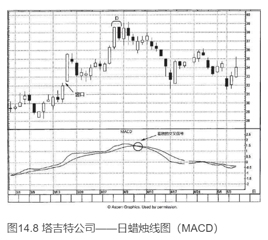

在图14.8中，3月16日是一根高高的白色蜡烛线，也打开了一个向上的窗口。后一天是一根小实体，收缩在这根白色蜡烛线的内部，两者组成了一个孕线形态。从这个孕线形态开始，市场回落。回落的过程得到了前述窗口的支撑，于是行情稳定下来。D处，3月31日和4月1日组成了一个乌云盖顶形态，提前发出信号，正如日本人所说，表明市场“上涨的机会不大”。从之后两天的行情变化可见，这个乌云盖顶形态构成了阻挡水平。后来，虽然在日内行情中股票一度推进到乌云盖顶形态的阻挡水平之上，但是收市价却不能维持在其上，于是阻挡水平保持完好。

在乌云盖顶形态之后的一周里，我们从MACD曲线上得到了看跌的验证信号，其中较快的曲线向下穿越了较慢的信号线。

请注意，从上述乌云盖顶形态开始的下降行情一直持续到市场在4月中旬形成的看涨吞没形态。该看涨吞没形态验证了3月15日和16日之间向上的窗口所形成的支撑区域。

本图是一个很有说服力的实例，说明蜡烛图带来了附加价值。蜡烛图所发出的转折信号，经常领先于西方技术分析信号。在本图的情形下，我们看到乌云盖顶形态发出的顶部信号，比MACD发出的反转信号几乎提前了一周。

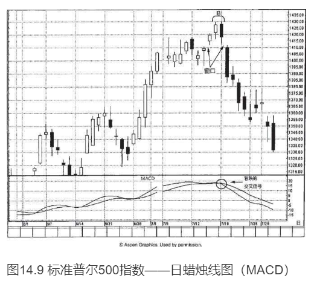

在图14.9中，7月中旬标准普尔500指数创了新高。但是，B处的看跌吞没形态发出了前方出现问题的信号。MACD发出的看跌线索进一步压抑了市场的看涨前景，其中较快的曲线向下穿越了较慢的信号线。看跌吞没形态的次日，市场向下打开了一个窗口。因为市场在前面的一周里曾经出现了向上的窗口，向下的窗口与之一道构成了一个岛形反转顶。这么一来，雪上加霜，进一步增添了市场潜在的看跌前景。

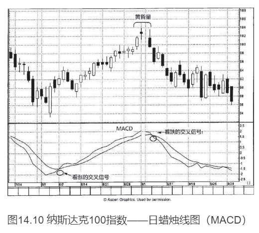

如图14.10所示，8月3日完成了一个尺寸颇大的看涨吞没形态。过了几天后，MACD形成了看涨的交叉信号（这又是一个实例，蜡烛图信号领先于西方工具的反转信号）。从看涨吞没形态开始了一轮上涨行情，一直持续到图示的黄昏星形态。（黄昏星形态的中间蜡烛线也形成了一根大风大浪线。）与该黄昏星形态相隔一天后，MACD发出看跌的交叉信号，这是致命一击，给棺材盖钉上了最后一根钉。

## 蜡烛图与交易量
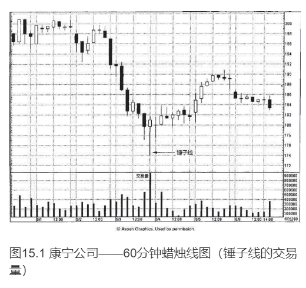

在图15.1中，5月3日晚间该股票的交易量发生了井喷现象。我们看到，相比之前的各个时段，这一时段的交易量之大超乎寻常。如此一来，我们就应当对它多加小心了。这个时段不仅交易量异常大，而且是一根锤子线。这种情况我们喜闻乐见——交易量验证了价格变化。

本图还引出了另一个方面。如果锤子线带有非常长的下影线，就意味着等到锤子线完成时（我们需要等到收市时才能确定锤子线已经形成），市场已经处在远离低点的位置了。遇到这样的锤子线，如果在收市时买进，其风险与报偿之比或许并不具有吸引力，因为市场可能一波三折，再次回落到锤子线的低点，然后才恢复上升的征途。不过正如本图所示，一根带有巨额交易量的锤子线，降低了市场回落到锤子线低点的可能性。因此，如果锤子线带有异常高的交易量，那么我们的态度可以更积极，更愿意在收市时买进；相比之下，如果锤子线的交易量没有发出相同力度的验证信号，那么我们的态度可能更为保守，倾向于等待更好的机会。

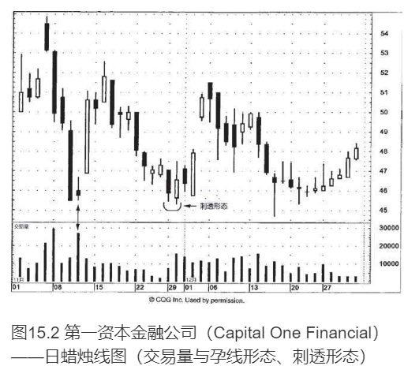

在图15.2中，11月初出现了一轮自由落体般的俯冲下跌行情，由一群长黑色实体构成，它们触目惊心，在图形上大大助长了空头的气势。11月11日，单枪匹马的一个交易日，如中流砥柱一般，扭转了技术图像的乾坤。这一天属于纺锤线，它同时作为孕线形态的第二根蜡烛线完成了形态。然而，真正带来巨大影响力的是纺锤线这一天的超级交易量。这就表明了，尽管此处供给量极大（从当天的巨额交易量可以得知当天的供给量极大），但是需求量与之不相上下，足以抵挡空方气势汹汹的打压——因此，形成了当天的小实体。

市场从该孕线形态开始上冲。11月下旬，又是一轮抛售行情。11月底，遇到一个刺透形态，行情稳定下来。在看涨的刺透形态中，我们一般预期其中黑色蜡烛线的交易量较轻，而白色蜡烛线的交易量较重。这样有助于加强其技术意义，即空头已经失去力量，而多头已经站稳了脚跟。在本图中，第一资本金融公司上演的正是这一出戏码，黑色蜡烛线交易量较小，白色蜡烛线交易量较大。这样的交易量格局进一步增强了刺透形态作为支撑水平的成功概率。在本例中，12月15日的锤子线表明，本刺透形态的支撑作用得到了坚强的捍卫。

交易量可以用来验证蜡烛图形态，这个概念适用于任何蜡烛图信号。举例来说，这一点意味着在看跌吞没形态中，第一根蜡烛线（白色的）应当具有较小的交易量，而第二根蜡烛线（黑色的）应当具有较大的交易量，这样的交易量分布加重了看跌吞没形态的技术意义。

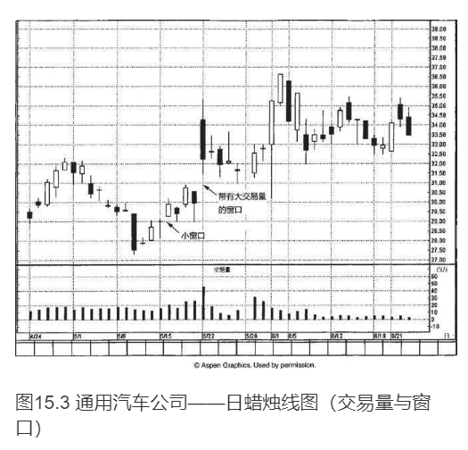

如果将交易量分析添加到向下的窗口或向上的窗口，那简直是“如虎添翼”。在图15.3中，在5月8日所在的一周里，市场形成了一个看涨的十字孕线形态。几天之后，在5月13日和15日之间打开了一个小小的向上的窗口。这个微不足道的小窗口在5月15日所在的一周里始终发挥了支撑作用。5月22日，打开了一个放大了的向上的窗口。这个窗口还得到了进一步的看涨助力，即，它带有格外重大的交易量。向上的窗口被看作潜在的支撑区域，而巨大的交易量则提升了它作为支撑区域的有效性（或者在向下的窗口的情况下，提升了窗口作为阻挡区域的有效性）。6月1日，一根看涨的长下影线确认了多头的力量，股票的收市价维持在30美元的支撑水平之上（这个支撑水平是根据5月22日的窗口的底边来确定的）。

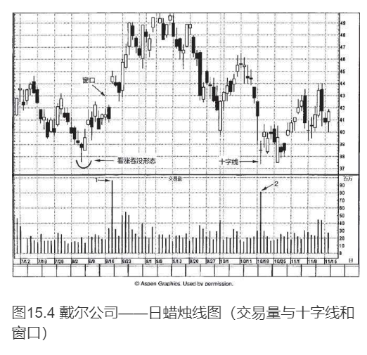

小实体的出现可能是一条有用的线索，表明下跌行情或上涨行情或许已经是强弩之末。如果我们把交易量分析添加到小实体方面，就能得到更扎实的反转信号。让我们看一看图15.4，体会其中的缘故。在本图中，戴尔公司在8月18日交易量巨大，我们用“1”做了标记。另外，这一天还形成了一个向上的窗口。正如我们在图15.3中所介绍的，带有大额交易量的向上的窗口应当成为坚实的支撑区域。这正是戴尔公司在窗口之后的几天里所表现的情形。

10月19日，发生了另一个超大交易量的时段（图上用“2”做了标记）。这一天还是一根十字线。这根大交易量的十字线很有意义，因为它出现在一轮陡峭的下跌行情之后，这轮行情将戴尔带到了由8月初的看涨吞没形态（其中第一根蜡烛线是锤子线）所形成的支撑水平。在第八章曾经讨论过，我们对下降行情中的十字线通常不像对上涨行情中的十字线那么在意。然而，因为这根十字线与支撑区域发生了协同作用，又带有巨大交易量，见到它，我肯定是坐不住的，必然会盯住它。这是一根巨额交易量的十字线，一方面，它揭示了此处曾经涌出沉重的供给压力（通过巨额交易量可以证明这一点）；另一方面，该股票在这里形成的是一根十字线，也就证明了此处的需求压力毫不逊色，也强大到足以吸纳所有的供给。于是，在10月19日，我们得到了相互验证的数个技术要素，突出地显示了37.25美元支撑水平的重要作用：

1. 由8月的看涨吞没形态形成的支撑水平；
2. 十字线；
3. 十字线当天放大的交易量，表明全部沉重抛压都已经被吸纳。

请注意，在十字线之后的一周里，市场用一根高高的白色蜡烛线再次成功地守护了这个支撑水平。

发生在下降行情中的十字线，如果带有巨大交易量，那么与常规交易量的十字线相比，能增加市场反转的机会。在这种情况下，即使不是十字线，而是一根小实体，上述理论也依然是成立的。（我们在图15.2中曾经领教了巨额交易量的纺锤线的厉害。）我们用下列几点来为带有巨大交易量的纺锤线或十字线做一个小结。

1. 在过度延伸的上涨行情之后，如果出现了一根带有不寻常的巨大交易量的十字线或纺锤线，则表明多头的驱动力被足够强大的供给所压制，上涨行情已经陷入停顿。这可能构成顶部反转。
2. 在陡峭的下降行情中，如果出现了一根带有超大交易量的十字线或纺锤线，则显示沉重的卖压已经被分庭抗礼的积极买压所抵消。

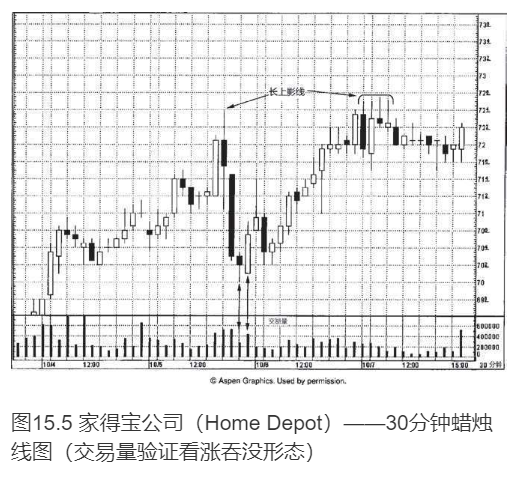

无论是单根蜡烛线构成的反转信号，还是由一群蜡烛线构成的反转信号，只要交易量配合，从而验证了蜡烛图信号，那么蜡烛图信号促成市场反转的机会便得到了加持。图15.5展示了一例看涨吞没形态，发生在10月5日晚间。该看涨吞没形态的前一个时段是一根纺锤线，透露出之前的下降行情失去了一些势头。该形态的第二个时段是一根长白色蜡烛线，表明多头已经夺得主宰权。不仅如此，在本看涨吞没形态中，前一根纺锤线交易量较轻，后一根长白色蜡烛线交易量较重，这就加大了本形态看多的马力。交易量和看涨吞没形态相互验证、相互加强，因此增加了此处发生市场反转的可能性。从该看涨吞没形态开始，市场上升。直至10月7日，在72.50美元附近，上升行情遇到了一个看跌吞没形态，以及一连串带有疲软的上影线的蜡烛线，才就此止步不前。这里还验证了之前的长上影线所形成的阻挡作用，该长上影线的高点位于同一个水平。

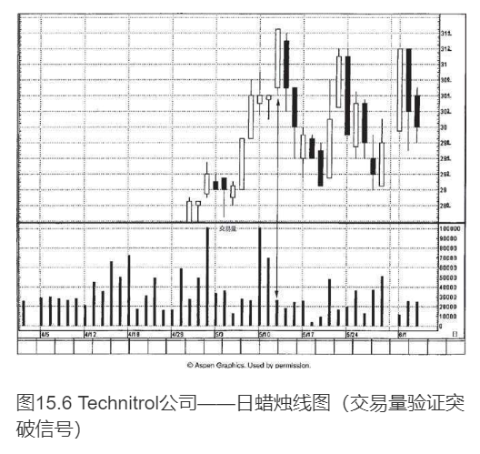

作为一条普遍性的经验法则，我们可以认为白色蜡烛线的实体越长，则上冲行情持续的可能性越大。但是，交易量给上述法则增添了另一个重要的维度。如图15.6所示，5月12日是一根超长的白色蜡烛线，将股票推上了新高水平。然而，虽然蜡烛线表现得牛气十足，但是其交易量太轻，将它的牛气打了折扣。当市场创新高的时候，我们更乐于看到交易量放大，从而验证价格变化。在本例中，交易量与突破信号背道而驰。虽然在市场向上突破时，仅凭缺少交易量这一条并不足以说服我们从看多转向看空，但是它足以构成理由令我们多加小心。这是因为以这样的低交易量形成的上冲行情很可能后继乏力。正因为交易量的缘故，这种前景发生的可能性增加了。就本股票来说，在5月12日的长白色蜡烛线之后紧随着一根长黑色蜡烛线，进一步增强了我们对多头控制力不足的判断。

## 测算价格目标
### 箱体区间的突破信号
在绝大多数时间里，市场并不处在趋势状态，而是处在横向的波动区间中。日本人称之为`“箱体区间”`。在这样的情况下，市场就达到了某种相对和谐的状态，牛方和熊方相安无事、平分秋色。

当市场处在横向的波动区间时，就像一根压缩了的弹簧，随时准备在周边压力撤除后立刻弹开。我们可以利用该形态储蓄的能量。当市场从横向波动区间突破时，往往具备充足的能量储备，能按照突破方向持续推进。

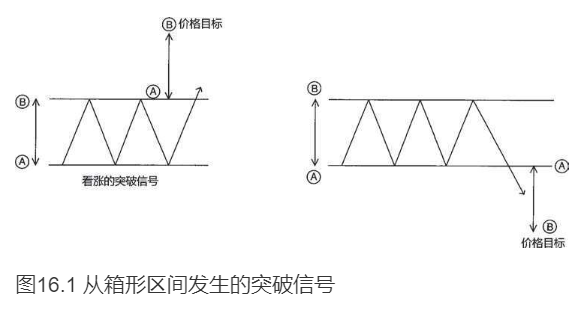

如图16.1所示，当行情突破到箱体之外时，意味着接下来行情运动的幅度至少等于箱体的垂直高度。具体说来，当行情推进到箱体顶部之上（属于看涨的突破信号）后，我们测量箱体区间的底部（支撑水平）到箱体区间的顶部（原先的阻挡水平）两者之间的竖直距离。该距离即为箱体的高度，图上用A—B做了标记。将A—B的箱体高度加到原先的阻挡水平上，推算突破后的价格目标。举例来说，假定箱体区间处于50-53美元之间，那么向上突破后的价格目标便为56美元。

向下突破箱体区间的支撑水平属于相反的情形（在图16.1中显示为看跌突破信号的情况）。如果还是以处于50-53美元的箱体区间为例，那么在50美元的支撑水平处发生看跌的突破信号之后，价格目标为47美元。

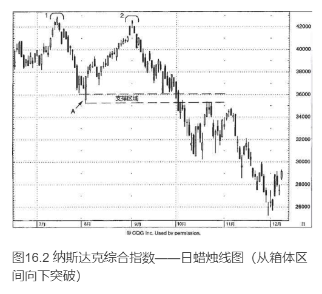

在图16.2中有一处箱体区间，其中区域1和2构成了其区间的顶部。箱体的底部（支撑区域）用两条水平直线勾勒出来，它们分别位于3600和3500（一会儿再讨论区域A处的情况）。

位于1处的顶部没有任何蜡烛线反转信号。这说明了不是所有的反转过程都具备蜡烛图反转信号。位于2处的顶部是一个理想的反转过程，一个黄昏星形态，因为其中的三根蜡烛线互不接触。此外，2处的高点是一根上吊线，并且它得到了次日行情的验证。

一旦纳斯达克综合指数从2处折戟回落，因为这是从先前的高点1处发生的，我们就可以判断行情将进一步下降到高点1和2之间的低点处。该低点是位于A处的一个看涨吞没形态。如此一来，我们就得到了大致位于3500-3600之间的价格目标。在9月的下半月里，该区域得到了良好的守护，在3600附近形成了几根高高的白色蜡烛线。

10月初，市场向下突破了该支撑区域，带来了双倍的破坏效应。首先，10月2日的长黑色实体向下击穿了位于A处的看涨吞没形态低点所构成的支撑水平。其次，可能更严重的是，上述巨大箱体的底部位于3500-4250，一旦底部被向下突破，则价格目标指向了2750。其测算过程如下：箱体高度为750点（从箱体的高点到低点的垂直距离），箱体底部接近3500，从箱体底部减去箱体高度得到了价格目标。几个月之后，市场到达了上述价格目标。

我们可以看到，后来的价格运动低于2750的价格目标，因此价格目标并不必然构成支撑水平。这一点非常重要，值得仔细推敲。尽管纳斯达克综合指数跌到了2750，但是绝不能仅凭行情达到了价格目标便买入做多。

本图还揭示了我喜欢箱体突破信号的原因。一旦某个支撑水平被跌破，我们便可以根据极性转换原则（请参见第十一章）来判断，该水平将转为阻挡水平。根据这项技巧，原先的支撑区域（在本例中位于3500-3600）应当转化为阻挡水平。这正是这里按部就班上演的情形。如果指数以收市价的方式回升到3600以上，那么我们对下方的价格目标设定为2750的判断便无效了。

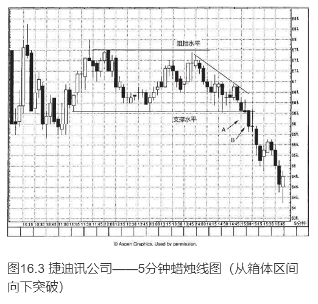

图16.3展示了一例清晰定义的横向波动区间，其范围从66.25美元到67.75美元。A处的蜡烛线一度向下穿越了该支撑线，但是既然它的收市价并不低于支撑线，支撑水平依然保持完好。到了B处，市场终于以收市价形式向下突破了箱体区间的下边界。这是一个看跌的信号。在行情于B处向下跌破之前，我们曾更早得到线索，表明股票陷入了麻烦。线索来自图示的向下倾斜的阻挡线。这增加了位于66.25美元的支撑水平终将被向下突破的可能性。

一旦在B处的蜡烛线表明支撑水平已经失守，我们便得知（根据极性转换原则），原先的支撑水平66.25美元，现在转变为阻挡水平了。于是，我们就有了一个阻挡水平，不过下方的价格目标在哪里呢？为了达到这个目的，我们采用了箱体区间的垂直距离，即从66.25-67.75美元的距离是1.50美元。从交易区间的下边缘减去上述距离，得到下方的价格目标为64.75美元。

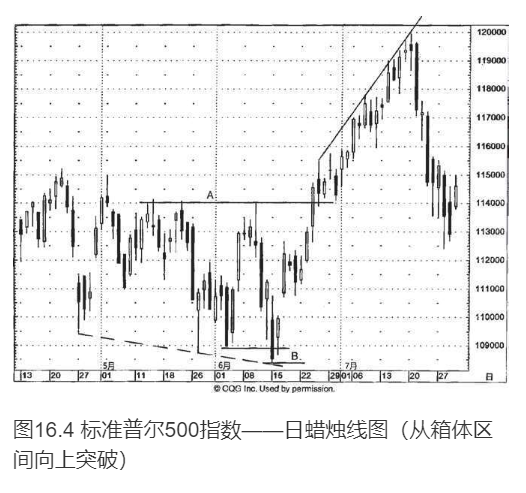

如图16.4所示，标准普尔500指数曾经处在交易区间中横向波动，其低点大致位于1090（B处），高点大致位于1140（A处）。多头在6月24日将本指数推升到了1140的阻挡水平之上。箱体的A—B的垂直距离为50点，加到1140上，我们得到了上方的价格目标为1190。股票沿着一条向上倾斜的阻挡线（请参见第十一章）上升，向上稍稍超越了上述价格目标。在1200附近出现了几根大风大浪蜡烛线（所谓大风大浪线，指同时具备长长的上、下影线和小实体的蜡烛线。这类蜡烛线与长腿十字线有一定的相似性，其区别是长腿十字线是一根十字线，而不是一个小实体。第八章曾有介绍）。这些大风大浪线给我们带来了一种直观的感受：市场失去了方向感（而在这之前原本是向上的）。

如图16.5所示，得克萨斯仪器公司一度局限在130-145美元的箱体区间中波动。2月17日和18日，当它向上接近该区间的顶部时，形成了一个看跌吞没形态。本形态应当构成阻挡水平。然而，下一个时段（2月22日）市场向上超越了这个阻挡水平。这构成了看涨的突破信号，既向上突破了看跌吞没形态的阻挡水平，也向上突破了箱体区间的顶部边缘。这意味着上方的价格目标接近160美元（根据波动区间15美元的垂直距离测算）。

借助什么样的证据可以表明我们对上述价格目标的判断是错误的呢？市场在2月22日已经向上突破了145美元的水平，如果此后再以收市价形式跌回145美元之下，那么这种情形将打消上述价格目标的前景。换句话说，一旦市场已经创了新高，那么重要的一点是，牛方就必须维持上述新高，以此证明己方真正掌控大局。

### 对等运动、旗形与尖旗形（三角旗形）
对等运动、旗形与尖旗形都是由以下三个部分组成的。

1. 起初，发生了一轮轮廓清晰的快速运动（第一波）；
2. 在上述运动后，市场进入调整过程；
3. 调整结束，市场按照最初的方向恢复本来的趋势运动（第二波）。

所谓对等运动的价格目标（如图16.6所示），道理是这样的：如果市场先是猛力地上涨或下跌，继而对上述运动展开调整行情，那么最终当原先的行情恢复后，下一波行情运动至少应当与起初的猛力运动所形成的轨迹不相上下。

图16.6对上述过程做了解析，其中第一波的高度是从A到B的上冲行情的高度。之后，出现了调整过程，市场回落到C。一旦市场从C开始上升，我们就可以将起初第一波行情从A到B的高度叠加在调整阶段的低点C之上。由此得到了所谓的“对等运动的价格目标”。

对等运动 | 看涨的旗形与尖旗形 | 看跌的旗形与尖旗形
-----|-----------|----------
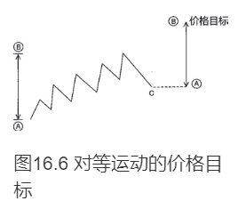 | 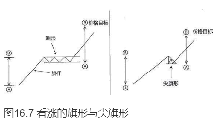 | 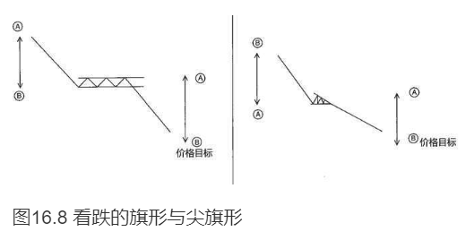

对等运动的价格目标与旗形、尖旗形的概念颇有异曲同工之妙。主要区别在于，在对等运动中，调整过程回落的幅度远比旗形或尖旗形更重要。如图16.7所示，旗形出现在轮廓清晰的急速上涨或剧烈下跌行情之后，旗形的图形呈水平状，或者稍稍偏向与趋势相反的方向。这段密集区起到了减缓市场超买状态（在上冲行情中）的作用，或者起到了中和市场超卖状态（在急跌行情中）的作用。在这段短期调整过程之后，如果市场恢复了之前的趋势，我们就得到了旗形或尖旗形价格形态。

旗形与尖旗形的区别在于，在旗形中，“旗帜”的部分是一个水平的箱体区间；而在尖旗形形态中，“旗帜”的部分（也就是调整过程的密集区）看起来像一面三角旗，因为它带有更低的高点和更高的低点。

图16.7和图16.8分别展示了看涨的旗形、尖旗形，以及看跌的旗形、尖旗形的价格目标测算过程。它们的测算依据构建在与对等运动共同的理论基础之上。就旗形与尖旗形而言，我们采用的是起初的上冲行情或急跌行情的高度——其外号是“旗杆”。

在图16.7中我们看到，看涨的旗形和尖旗形的价格目标计算方式是：先计算起初的急剧上涨行情（旗杆）从A到B的高度，然后把它加到密集区（旗形或者尖旗形均可）的底边上。更传统的做法是，把旗杆的高度加到旗形或尖旗形的顶边上。我宁愿错在过早地平仓退出，也不愿意错在精确追求最后那一哆嗦行情。因此，我的测算方法是从旗形或尖旗形的底边起算，而不是传统的从顶边起算。

正如图16.8所示，看跌的旗形和尖旗形的价格目标计算方式是：先计算起初的急速下跌行情（旗杆）从A到B的高度，然后从密集区（旗形或者尖旗形均可）的顶边减去上述高度。（重申一下，这样的做法也出自我的主观选择，为的是保守起见。其他人或许采用更传统的做法，即把旗杆的高度从旗形或尖旗形的底边处减去。）

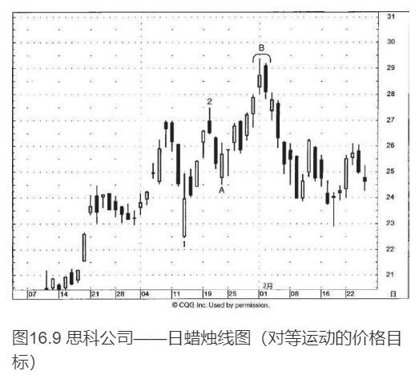

在图16.9中，从1处到2处形成了一波几乎垂直的上冲行情，把股票从22.50美元推升到27.50美元。从2处开始到A处的回落行情，几乎恰巧落在上冲行情的斐波那契比例61.8%的回撤水平上（请参见第十二章对百分比回撤水平的讨论）。从A处开始，股票开始了新一波上冲行情。

用1处到2处的上冲行情，以及随后发生的调整过程，我们可以得到对等运动的价格目标：从1处到2处的垂直距离为5美元，调整过程的低点A为24.50美元，把前者加到后者上，得到潜在的价格目标为29.50美元。

虽然测算的价格目标通常不会成为阻挡水平或支撑水平，但是在本例中我们看到，在B处，2月1日和2日组成了一个看跌吞没形态，正是出现在预测的价格目标29.50美元处。

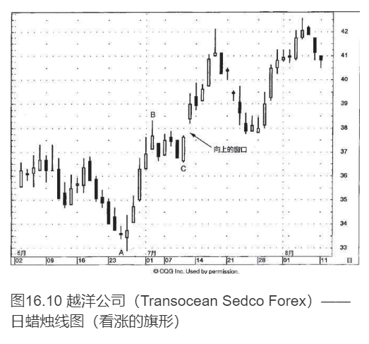

在图16.10中，我们看到在从A到B的上升行情之后，股票大概花了一周的时间用来喘息。在这期间，市场进入了箱体区间，介于36.50美元到37.75美元。7月11日打开了一个向上的窗口（在蜡烛线C之后），将股票推升到前述横向交易区间之上。

从蜡烛线的角度来观察，向上的窗口可谓一举两得：首先，它驱使趋势方向向上；其次，该窗口现在已经成为潜在的支撑区域。不过，虽然该窗口给我们提供了看多的基调，但是它并不提供上方的价格目标。为了解决这个问题，我们转向西方技术工具。仔细打量从A到B的上冲行情，以及回落到C处的调整过程，我们发现了一个看涨的旗形形态。现在，我们就能够得到一个价格目标了：将“旗杆”的部分（A到B的垂直高度）加到“旗帜”底部（C处）上。从A到B的上冲行情大约是5.50美元。把这个数值加到C处的低点之上，得到上方的价格目标为42美元。（前面曾经提到，在绝大多数讲授西方技术分析的书中，会将这里5.50美元的高度加到旗帜部分的顶边，接近38美元。但是，我们采取更为保守的测算方法，将之加到旗帜部分的底边，36.50美元处。）

在股票向上接近我们保守的价格目标42美元时，出现了一根流星线，使得价格目标成为阻挡水平。流星线之后的黑色蜡烛线完成了一个黄昏星形态，它是黄昏星形态的第三根线。由此开始，市场进入下降行情，持续到7月底，在接近37.75美元处找到支撑。这里是7月14日向上的窗口所形成的支撑区域。市场在此处形成了几根倒锤子线。从7月28日所在的一周开始，形成了一轮上冲行情，回升到前面讨论的黄昏星形态的高点，到大约42美元时，市场举棋不定。正如我们在黄昏星形态的部分所讨论的（还有其他许多蜡烛图形态），我一般根据收市价来观察市场在阻挡水平处的表现。股票在日内行情中一度向上推进到黄昏星的阻挡水平之上，但是在收市时却未能维持在其上，由此看来，该阻挡水平依然维持良好。

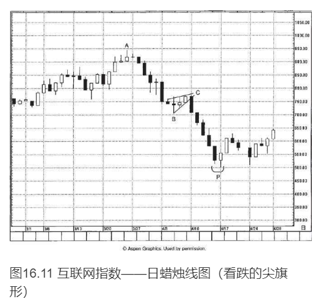

图16.11突出显示了A处的两根流星线。这标志着市场在925-950的区域陷入彷徨状态。从A到B的陡峭下跌遇到了B处的一根长腿十字线，从而转入徘徊。从这里开始，该指数稍稍有所回升。这有助于减缓之前市场的超卖状态。仔细看一下，从A到B的急剧下跌可以充当旗杆，从B到C的三角形波动区间可以作为尖旗形，于是，我们得到了一个看跌的尖旗形形态。

一旦尖旗形的底边被向下突破，我们就可以推算下方的价格目标，先算出从A到B的下降幅度，再从调整区间的高点C，接近775处，减去上述幅度。于是，下方的价格目标为525。后来，行情下跌超过了这个目标。

在P处，接近500的水平，出现了一个变形的刺透形态。之所以说这是一个变形，是因为其中的白色蜡烛线没有向上超越前一根黑色实体的中线。不过，在从C处开始的下降行情中，这是第一根白色蜡烛线，第一根收市价更高的蜡烛线，因此，我依然认为这个变体与常规的刺透形态同等重要。下一周，市场成功地捍卫了由该刺透形态形成的支撑水平，从而证实了上述判断。

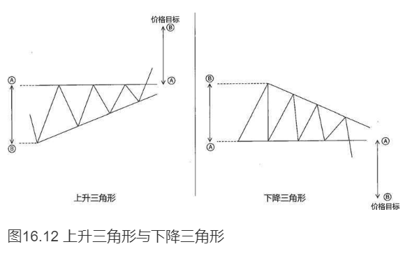

在西方技术分析工具中，有多种三角形形态：对称三角形、楔形等。如图16.12所示，这里一个是上升三角形，一个是下降三角形。

上升三角形的上边为水平的阻挡线，在形成形态的过程中被市场试探过多次。市场多次从该阻挡水平回落，形成的若干低点依次抬升。这种情形说明，虽然在阻挡线处存在供给压力，但是随着市场每次从阻挡线回落，需求逐渐增强。如果牛方能够推动市场向上超越水平的阻挡线，我们就得到了一个上升三角形形态。其测算方法是：从水平的阻挡线（A处）出发，算出三角形最宽处（B处）的垂直高度，加到刚刚被突破的阻挡水平上。

下降三角形的下边为水平的支撑线，曾经多次防守成功，但是每当市场从此处回升后，所形成的若干高点依次降低。这些依次降低的高点反映了熊方有能力控制牛方。一旦市场向下突破支撑水平，我们便算出下降三角形最宽处的垂直高度，从支撑水平处减去上述高度，得出下方的价格目标。

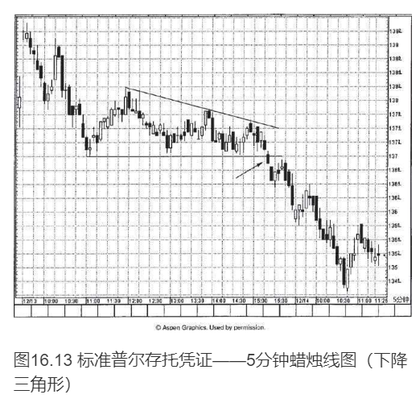

图16.13展示了一例经典的下降三角形。其水平线位于137，这条线定义清晰，曾经多次经受市场测试。这是下降三角形的底边。下降三角形的顶边是一条向下倾斜的阻挡线。

一旦空头一锤定音地将市场压低到137的支撑水平之下（图上箭头所指之处），我们就可以运用下降三角形的价格目标测算方法。三角形的最高点是从138.25开始的，三角形的底边位于137，于是我们得到了下方的价格目标是135.75。

下降三角形有一个方面很有吸引力，即我们可以运用之前的支撑水平作为新的阻挡水平（极性转换原则）。因此一旦空头将价格压低到137之下（箭头处），如果市场果真是疲软的，我们就有把握得知137将成为阻挡水平。

在本例中，关于行情陷入泥潭还有进一步的验证线索，当价格移动到137之下后，后一日打开了一个向下的窗口。相应地，就137成为阻挡水平的判断，我们得到了相互验证的双重技术要素：先前的支撑水平，以及向下的窗口。

## 东西方技术珠联璧合：相互验证的力量
以下讨论都是关于图17.1的，只有其中的第三点讲的是图17.1a。

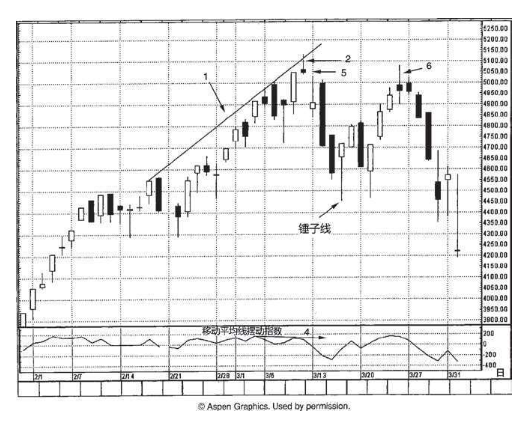

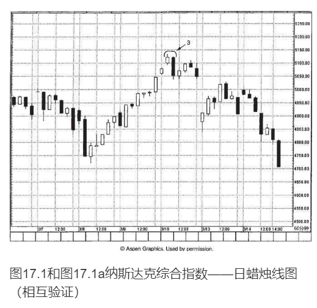

1. 一根向上倾斜的阻挡线，通过连接2月14日所在的一周的高点与3月初的高点得来（第十一章讨论了相关技巧）。因为纳斯达克综合指数正处在过去从未涉足的新高区域，绘制这条上升的阻挡线是一项有用的技巧，在市场上涨过程中，这条线为我们提供了一个潜在的供给区域。
2. 3月10日，是一根流星线（第五章），这是蜡烛图信号，验证了上文讨论的上升阻挡线的作用。
3. 请参见图17.1a。这是一张60分钟的蜡烛线图，3月10日有一个看跌吞没形态（位于3处。第四章）。该看跌吞没形态出现在当日早间，而这一天在日线图上形成了一根流星线（上文第二点已经讨论了）。
4. 回到图17.1，就在纳斯达克综合指数于2处的流星线向上创新高的时候，摆动指数（第十四章）却是一个更低的高点。这属于看跌的相互背离现象。
5. 3月10日和13日的两根蜡烛线之间打开了一个很小的向下的窗口（第七章）。该向下的窗口在图17.1a的60分钟线图上更明显。一旦打开了向下的窗口，趋势便转为下跌。之后，此处成为潜在的阻挡水平。从该窗口开始形成下跌行情，下跌行情从3月16日的锤子线（第四章）处找到了立足地，稳住了阵脚。几天后，这根锤子线转为支撑水平，引发了一场上冲行情。
6. 这轮上冲行情始于3月21日，终结于上述窗口的阻挡水平（标记在5处），在阻挡水平处留下了一根大风大浪线（第八章）。在6处，虽然该蜡烛线的上影线一度向上超越窗口的阻挡水平，但是未能收市于窗口之上，这进一步增强了介于5050与5150之间的主要阻挡水平的分量。

根据上述分析，我们得到了多重重要的相互验证信号，既有蜡烛图信号，包括流星线、看跌吞没形态、向下的窗口、大风大浪蜡烛线，也有西方技术信号，包括上升的阻挡线、看跌的相互背离信号。在5050-5150之间集中出现了一群信号，它们相互验证，大大加强了我们关于纳斯达克指数已经见顶的预测。
