    作者: [美] 史蒂夫·尼森
    出版社: 湖南文艺出版社
    出品方: 博集天卷
    副标题: 古老东方投资术的现代指南
    原作名: Japanese Candlestick Charting Techniques (2/e)
    译者: 丁圣元
    出版年: 2020-3-1
    页数: 376
    定价: 98.00元
    装帧: 平装
    ISBN: 9787540493738

[豆瓣链接](https://book.douban.com/subject/34948750/)

- [基本知识](#基本知识)
  - [蜡烛图的绘制方法](#蜡烛图的绘制方法)
  - [反转形态](#反转形态)
    - [伞形线](#伞形线)
    - [锤子线](#锤子线)
    - [上吊线](#上吊线)
    - [吞没形态（抱线形态）](#吞没形态抱线形态)
    - [刺透形态](#刺透形态)
  - [星线](#星线)
    - [启明星形态](#启明星形态)
    - [黄昏星形态](#黄昏星形态)
    - [十字启明星形态和十字黄昏星形态](#十字启明星形态和十字黄昏星形态)
    - [流星形态与倒锤子形态](#流星形态与倒锤子形态)

# 基本知识
## 蜡烛图的绘制方法
在每一根蜡烛线中，矩形的部分称为`实体`。它表示了相应交易日的开市价与收市价之间的价格范围。如果实体是黑色的（即，将之涂满黑色），则代表当日的收市价低于开市价。如果实体是白色的（即，将它保留为空白），则表示当日的收市价高于开市价。

在实体的上方和下方，各有一条细细的竖直线段，称为`影线`。这两条影线分别表示当日市场曾经向上和向下运动的极端价格。实体上方的影线称为`上影线`，实体下方的影线称为`下影线`。相应地，上影线的顶端代表了当日的最高价，下影线的底端代表了当日的最低价。

如果某根蜡烛图线没有上影线，那么它就是所谓的`光头蜡烛线`。如果某根蜡烛线没有下影线，那么它就是所谓的`光脚蜡烛线`。

阳线 | 阴线 | 纺锤线 | 十字线
------- | ------- | ------- | -------
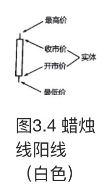 | 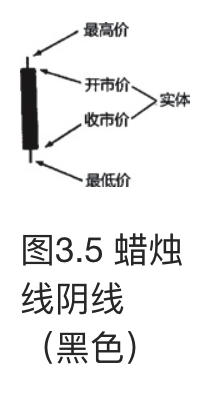 | 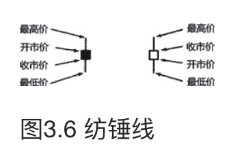 | 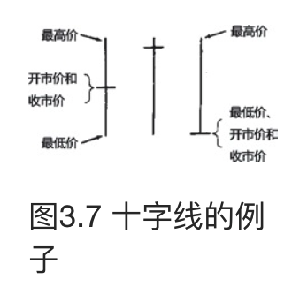

从实用角度来说，可以采用实体长度作为市场`动量`指标。

既然长白线和长黑线代表着一边倒的单边行情，那么当实体缩小时，我们就能得到线索，之前的行情势头或许正在减缓。对短实体（无论黑白），日本人的术语是`纺锤线`。图3.6是纺锤线的图例。

图3.7中的蜡烛线甚至没有实体。在这种极端情况下，蜡烛线的实体实际上缩小为一根水平横线了。该图所示的几种图例就称为`十字线`。当某个交易日的开市价和收市价处于同一水平，或者当开市价与收市价的水平极为相近时，当日的蜡烛线就变成了一根十字蜡烛线。十字线带有反转信号的意味。

在图3.8中，4月1日所在的一周里，市场从315附近开始下降，形成了一连串黑色蜡烛线。随着下降过程的延续，黑色实体的长度不断增加，反映市场的看跌动量不断增强。4月7日出现了一根纺锤线，改变了市场的技术图像，原先熊方完全占据主动，现在转为熊方丧失了主导权。因为短实体只代表一个时间单位内的市场行为，我们应该把它看作一条试探性的线索。虽然如此，它依然属于潜在反转信号的第一个征兆。本例揭示了蜡烛图的一个重大优势：它们经常以一个时间单位的灵敏度让您察觉可能的市场转折点。

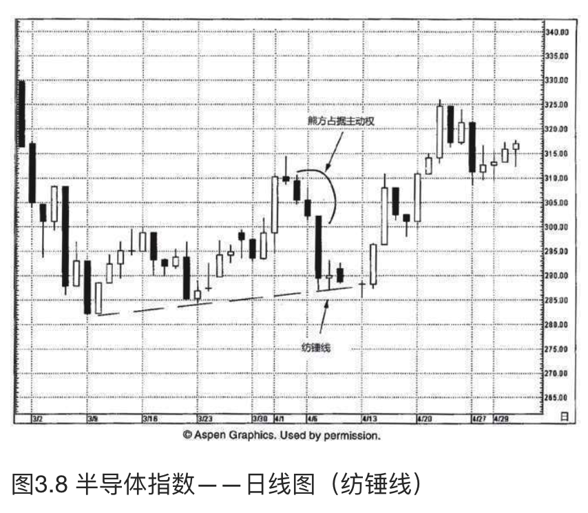

4月7日的纺锤线属于蜡烛图信号，同时它也有助于验证传统西方技术分析工具——具体说来即本图中向上倾斜的支撑线，它是连接3月10日和3月23日的低点得来的。于是，我们得到了两个信号，一个是支撑线，一个是纺锤线，加强了285附近的支撑作用。

## 反转形态
趋势的逆转，一般都是伴随着市场心理的逐渐改变进行的，通常需要经过一个缓慢的、分阶段的演变过程。确切地说，**趋势反转信号的出现，意味着之前的市场趋势可能发生变化，但是市场并不一定就此逆转到相反的方向**。

这里有一条重要原则：**只有当反转信号所指的方向与市场的主要趋势方向一致时，我们才能依据这个反转信号来开立新头寸**。举个例子，假定在牛市的发展过程中，出现了一个顶部反转形态。虽然这是一个看跌的信号，却不能保证卖出做空是有把握的。这是因为，市场当前的主要趋势依然是上升的。无论如何，就这个反转形态的实质意义来说，它构成了了结既有多头头寸的交易信号。之后，我们将在调整过程中寻求看涨信号买进做多，因为当前主要趋势向上。

### 伞形线
如图4.4所示的蜡烛线具有明显特点。它们的下影线较长，而实体（或黑或白）较小，并且在其全天价格区间里，实体所处的位置接近顶端。图4.4所列蜡烛线被称为`伞形线`，因为它们的轮廓呈伞状，长长的下影线如伞柄，小实体如伞面。

伞形线，不管是哪一种，只要它出现在下降趋势中，那么，它就是下降趋势即将结束的信号。在这种情况下，这种蜡烛线称为`锤子线`，意思是说“市场正用锤子夯实底部”，如图4.5所示。

伞形线的性质取决于伞形线出现之前的主流趋势方向，随趋势而变。在下跌行情之后出现的伞形线是看涨信号，称为锤子线。在图4.4所示的两种蜡烛线中，无论哪一种，如果出现在上冲行情之后，那么，它就表明之前的市场运动也许已经结束。显而易见，这类蜡烛线就称为`上吊线`（如图4.6所示）。

伞形线 | 锤子线 | 上吊线
------- | ------- | -------
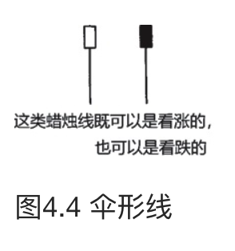 | 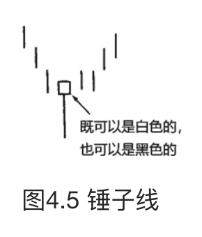 | 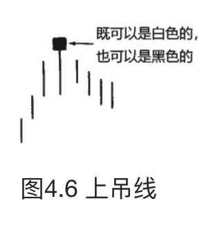 

一般根据三个方面的标准来识别锤子线和上吊线。
1. 实体处于整个价格区间的上端，但实体本身的颜色无所谓。
2. 带有长长的下影线，且下影线的长度至少达到实体高度的两倍。
3. 在这类蜡烛线中，应当没有上影线；即使有上影线，长度也是极短的。

可以从三个方面来区分上吊线和锤子线——趋势、该蜡烛线出现之前行情运动的区间、验证信号。具体说明如下：
- 趋势：锤子线只能紧接在下跌行情后出现；上吊线必须紧接在上涨行情后出现。
- 蜡烛线出现之前行情运动的区间：锤子线之前即便只有短线下跌也是有效的；但是，上吊线之前必须具备长足的上冲行情，最好是创下行情全历史新高后，方为有效。
- 验证信号：后文还将介绍，上吊线出现后得到验证方为有效；对锤子线则无此要求。

### 锤子线
锤子线带有长长的下影线，且收市于本时段最高价，或接近最高价，意味着在当天的交易过程中，市场起先曾急剧下挫，后来却完全反弹上来，收市在当日的最高价处，或者收市在接近最高价的水平上。这一点本身就具有看涨的味道。锤子线收市价位于最高价或接近最高价，正是其没有上影线，或者上影线很小的原因。这一点是锤子线的判据。反之，如果蜡烛线带有长的上影线，则意味着收市价显著低于本时段最高价。

既然锤子线属于底部反转信号，就需要之前存在下降趋势才谈得上反转。

在图4.7中，2月24日看到一根锤子线。它很经典，因为其下影线很长，而实体较小，且实体位于当日交易区间的顶端。它是在一轮下跌行情之后出现的。这正是锤子线出现的必要前提。

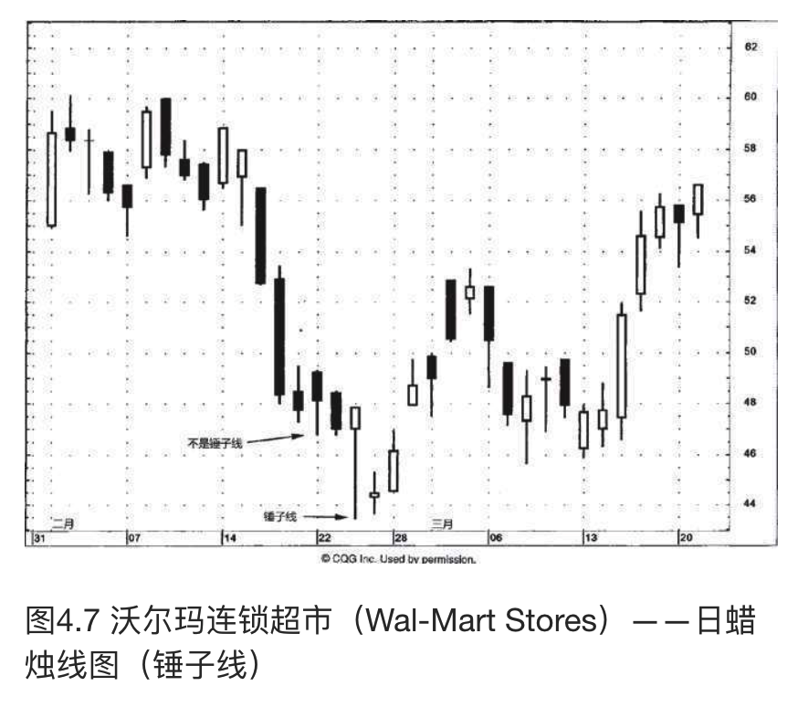

2月22日的蜡烛线不会被定义为锤子线，因为**它不符合条件，下影线长度达不到实体长度的2-3倍**。这类长下影线是必要条件，因为它表示市场在本时段曾经急剧下挫，但在收市时，行情收市价位于或接近最高价，熊方反倒一败涂地。

设想交易者甲识别出2月24日的锤子线。当他看到如此精彩的锤子线时过于兴奋，以至于在锤子线的收市价附近，即接近48美元处立即买进了。次日，市场开市时向下跳空，开市价为44.50美元。交易者甲的头寸现在处在水下3.5美元的深处了。或许他最多承受4.5美元的亏损，就要采取止损措施，轧平昨日的多头头寸。如果是这样的话，最终甲或许认为这根蜡烛线不起作用。

交易者乙同样意识到锤子线是潜在的反转信号，但是她记住了风险报偿比的前提，没有在锤子线收市时买进（因为对她来说，此处买进的风险太大了）。次日，当市场开市于低价位时，深入锤子线长长下影线的低端，这是潜在的支撑区间。乙认为，股价现在接近支撑水平，决定买进。当股价从支撑位上冲后，乙就会对蜡烛图大唱赞歌。

在上一个图例中，我们看到锤子线可能转化为潜在的支撑区间。在图4.8中我们展示了锤子线有助于确认支撑水平。本图为纳斯达克100指数（NDX）5分钟的蜡烛线图，从A点处开始，发动了一轮上冲行情。在接近3723的价位，当位置1和2处出现了两根小实体后，这是该轮上涨已经是强弩之末的第一个征兆。市场从此处陡然回落。当行情接近潜在支撑区域3680左右时，形成了一根锤子线。如果支撑水平牢靠，那么该锤子线就应该成为支撑区域。在随后的两个时段，该锤子线果然发挥了支撑作用。当然，如果纳斯达克100指数收市于3680的支撑水平以下，上述看涨预期就失效了。这是技术分析的一个重要方面——应该总是存在某个价位，表明我们是错误的。在本例的情况下，便是市场低于3680。

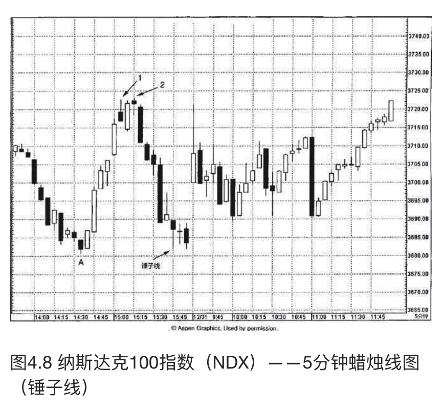

图4.9中的锤子线具有长长的下影线，实体很短，居于该时段价格区间的顶端。我们注意到，锤子线应该只有很短的上影线，本例正是如此。该锤子线后来演变为坚实的底部支撑。

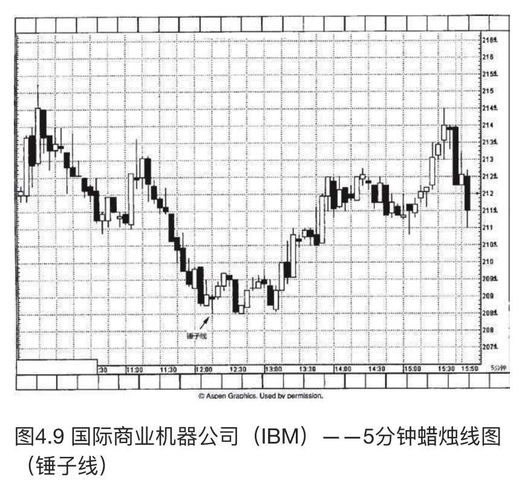

### 上吊线
上吊线的形状与锤子线相同，唯一区别是，上吊线出现在上涨行情之后（参见图4.6）。因为长下影线具有增强功效的作用，而上吊线有这样的长下影线。**上吊线出现后，一定要等待其他看跌信号的证实，这一点特别重要。最低限度的验证信号是，之后时段的开市价低于上吊线的实体。但是，我总是建议以收市价低于上吊线的实体为验证信号**。

为什么要等待之后时段的收市价低于上吊线的实体呢？因为如果次日市场市在低于上吊线实体的水平，那么凡是在上吊线当日的开市、收市时买进的交易商（大量的交易活动发生在这两个时段），会通通背上亏损的头寸，被“吊”在上面。同样道理，我还希望看到上吊线位于市场全历史最高价，或者至少处于一轮重大行情的最高位。在这种情况下，多头在上吊线之日的入市点位处在历史新高处，这就迫使他们更加紧张。结果，这批多头或许决定撤出他们新开的多头头寸。他们的头寸倾泻而至，加重了卖出压力。请注意，图4.8中2处的小实体是一根上吊线，下一时段的收市价低于该上吊线，验证了它的看跌含意。

图4.10所示的实例颇精彩，从中可以看到，同一种蜡烛线，既可以是看跌的（如1月29日的上吊线），也可以是看涨的（如2月22日的锤子线）。尽管在这个实例中，上吊线和锤子线的实体都是白色的，但是它们实体的颜色并没有太大意义。

1月29日的蜡烛线是上吊线，因为之前趋势是上冲行情。上吊线给本轮行情创了新高。下一日（2月1日），收市价低于上吊线的实体，这让所有的新多头——在上吊线当日开市和收市时买进的——通通陷入困境。

2月22日的蜡烛线是锤子线，因为它出现在下降趋势之后。锤子线之前的一个交易日也是短实体。这是一条更早出现的线索，表明空头的努力遭遇了阻碍。而锤子线成为进一步的看涨证据。

在图4.11中，12月13日我们看到市场从短线的箱体整理区间（这是日本术语，指横向交易区间）向上突破。突破后，上冲行情以三根长长的白色实体持续推进，每一根开市价都接近当日最低点，收市价都接近当日最高点。这一现象突出显示多头主宰了行情。在第三根白色蜡烛线之后，出现了若干警告信号，比如之后一系列蜡烛线上影线冒出来了。在冒出上影线的同时，还要注意构成上冲行情的一系列蜡烛线高点的情况。从一个高点到下一个高点，其轮廓线日渐趋缓（从图上标注的曲线可以看出）。这意味着虽然市场继续创新高，但是创新高的步调正在放缓。

真正说明牛方失去主导权的迹象来自上吊线出现的那一天。这一天不仅是一根上吊线，而且在这轮上冲行情中，这是第一根黑色实体、第一根纺锤线。次日收市价低于上吊线的实体，构成上吊线的验证信号。几天后，市场再次试图向上推进，但在32美元附近陷入停顿，留下了一系列长长的上影线。

下降行情从32美元左右的上吊线开始，在27美元附近失去了下降势头。在A和B两处的长黑色实体出现后，我们可以据此得出上述结论。具体说来，在每根长黑色实体之后的那个交易日，形成的都是小实体。在A和B两处的看跌实体出现后，我们当然以为之后的交易日市场将继续走低。然而，小实体的到来让上述预期落空了。这就表明，虽然空头曾经通过A处和B处的两根长黑色实体两度努力夺取行情主宰权，但是均以失败告终。这一点可能迫使熊方卖出的念头发生动摇，而对那些打算买入的人发挥了更大的鼓励作用。

图4.12揭示了上吊线出现后等待验证信号的重要性。位于1、2和3处的蜡烛线都属于上吊线（它们的上影线都很短，足以判定它们属于上吊线）。其中每一根线的收市价都为当前的上涨行情创了新高，因而维持了上升惯性的持续有效。如果要确认这些蜡烛线的看跌意味，即上涨趋势要从上涨转为不那么强势的，**就必须看到之后的收市价低于上述上吊线的实体。这种情况没有发生**。记住，任何人在上吊线开市和收市时买进，都是买在当前行情的最高点。如果在上吊线之后市场持续创新高（此处正如此），那些多头还会感觉难受吗？当然不会。他们正高兴呢，因为行情比他们买进的点位更高了。因此，正如本例所示，只要市场没有收市于上吊线实体的水平之下，则牛市趋势保持稳固。

### 吞没形态（抱线形态）
图4.13显示的是`看涨吞没形态`。在本图中，市场本来处于下降趋势之中，但是后来出现了一根坚挺的白色实体，这根白色实体将它前面的那根黑色实体“抱进怀里了”，或者说把它吞没了（该形态正由此得名）。

图4.14是`看跌吞没形态`的示意图。在本图中，市场原本正向着更高的价位趋升。但是，当前一个白色实体被后一个黑色实体吞没后，就构成了顶部反转信号。这种情形说明，市场上供给压倒了需求。

看涨吞没形态 | 看跌吞没形态
------- | -------
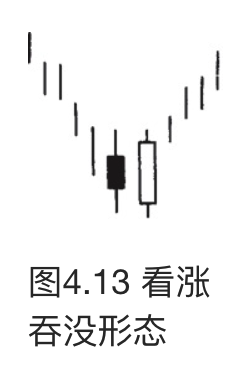 | 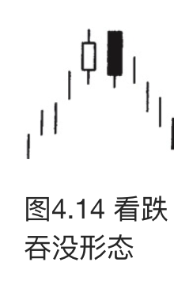

关于吞没形态，我们有三条判别标准：
1. 在吞没形态之前，市场必须处在明确的上升趋势（看跌吞没形态）或下降趋势（看涨吞没形态）中，哪怕这个趋势只是短期的。
2. 吞没形态由两条蜡烛线组成。其中第二根蜡烛线的实体必须覆盖第一根蜡烛线的实体（但是不一定需要吞没前者的上下影线）。
3. 吞没形态的第二个实体应与第一个实体的颜色相反。（这一条标准有例外的情况，条件是，吞没形态的第一条蜡烛线是一根十字线。如此一来，如果在长时间的下降趋势之后，一个小小的十字线被一个巨大的白色实体所吞没，就可能构成底部反转形态。反之，在上升趋势中，如果一个十字线被一个巨大的黑色实体所吞没，就可能构成顶部反转形态）。

下面列出了一些参考要素，如果吞没形态具有这样的特征，那么它构成重要反转信号的可能性将大大增强：
1. 如果在吞没形态中，第一天的实体非常小（即纺锤线），而第二天的实体非常大。第一天蜡烛线的小实体反映出原有趋势的驱动力正在消退，而第二天蜡烛线的长实体证明新趋势的潜在力量正在壮大。
2. 如果吞没形态出现在超长延伸的或非常快速的市场运动之后。如果存在非常快速的或超长程的行情运动，则导致市场朝一个方向走得太远（要么超买，要么超卖），容易遭受获利平仓头寸的打击。
3. 如果在吞没形态中，第二个实体伴有超额的交易量。我们将在第二部分讨论交易量分析。

吞没形态的一种主要作用是构成支撑水平或阻挡水平。我们借助图4.15和4.16来说明。如图4.15所示，在组成看跌吞没形态的两根蜡烛线中，选取其最高点。该高点构成了阻挡水平（以收市价来观察突破与否）。图4.16把同样的概念运用到看涨吞没形态。该形态的最低点构成了支撑水平。

看跌吞没形态的支撑水平 | 看涨吞没形态的支撑水平
------- | -------
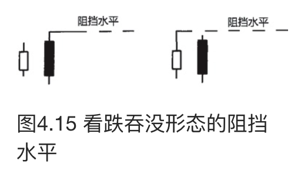 | 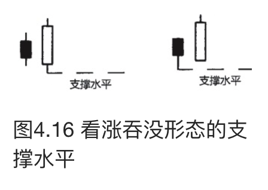

将吞没形态看作阻挡水平和支撑水平，是一个很有用的技巧，尤其当市场离开低点过远时（看涨吞没形态）或离开高点过远时（看跌吞没形态），可以借之选择更舒适的卖出或买进点。举例来说，等到看涨吞没形态完成时（请记住，我们需要一直等到本时段收市时才能确认当前蜡烛线组合属于看涨吞没形态），市场可能已经远离之前的低点了。因此，我会觉得行情已经离开了有吸引力的买进区域。在这种情况下，我们可以等待市场调整，它可能再次进入看涨吞没形态低点附近的支撑区域，然后，再考虑入市做多。在看跌吞没形态的情况下，同样的道理，而方向相反。

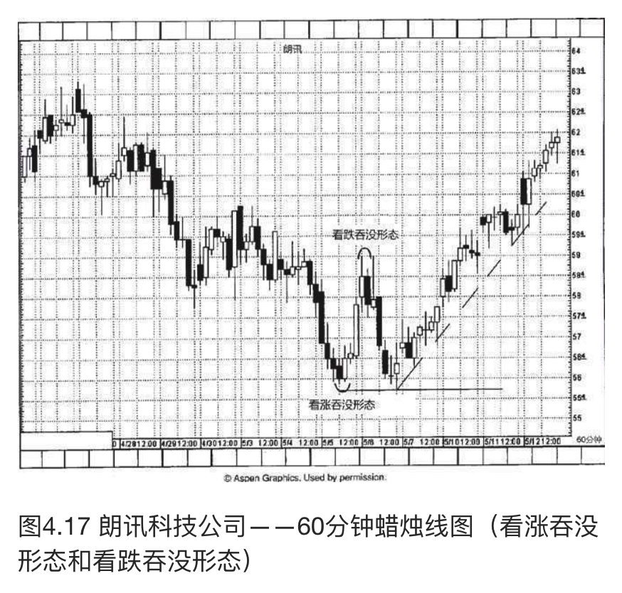

如图4.17所示，连续6根黑色实体依次下降，之后，5月5日早些时候首次出现了一根白色蜡烛线。这根白色蜡烛线完成了图示的看涨吞没形态。于是，我们利用该看涨吞没形态的低点（通过比较，选择组成该形态的两条蜡烛线的最低点）作为支撑水平，大约位于56美元。朗讯从该看涨吞没形态起上冲，直至遭遇一个看跌吞没形态的阻击。请注意，该看跌吞没形态的高点转化为下一时段的阻挡水平。在从该看跌吞没形态开始的下降行情中，一根十字线提供了试探性线索，显示该股票正在努力站稳脚跟，其位置便在之前的看涨吞没形态构成的支撑水平附近。在对该看涨吞没形态形成的支撑水平试探成功后，股票从此处上冲；当面临之前的看跌吞没形态所形成的阻挡水平时，市场经过了少数几个时段的犹豫；最终沿着一条向上倾斜的支撑线持续攀升。

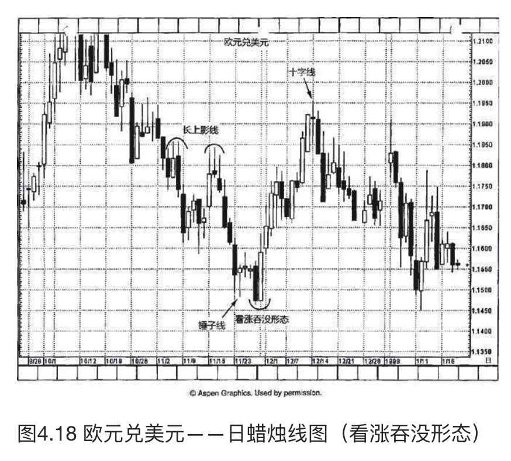

影线也应该成为蜡烛图分析的关键组成部分。我们借图4.18来说明这个方面。一系列长上影线——也有说法为“看跌的影线”——在11月2日到16日之间的几周里冒了出来。这批长上影线发出强烈的视觉信号，表明市场正被1.1850的区域挡开。从第二批一系列长上影线开始，市场开始下降，之后被一根锤子线（它带有长长的下影线——这是说明影线重要性的另一个案例）终止。几个交易日后，该股票以一根长黑实体的形式回落（稍稍向下突破了锤子线的支撑水平）。第二天，一根长白蜡烛线完成了一个看涨吞没形态。从该看涨吞没形态开始形成了一轮上冲行情，它被1.1950处的一根十字线阻止。请注意，该十字线验证了10月下旬一系列长上影线所界定的阻挡水平。还记得看涨吞没形态构成潜在支撑水平的概念吗？请看11月27日和28日组成的看涨吞没形态，大约在1.1470，这便是支撑水平。1月11日所在的一周里，市场成功地试探了这个支撑水平。

如图4.19所示，原油市场上一个主要低点伴随经典的看涨吞没形态而来。这是一个经典的形态，到此为止第一例。其中第一根蜡烛线为小黑色实体（这表明空方正在失去立足地），第二根蜡烛线是一根生机勃勃的长白色实体，开市于最低点、收市于最高点。本看涨吞没形态之所以特别重要，是因为其中的白色实体不是吞没了之前的一根黑色实体，而是吞没了三根。请记住，**该形态一方面清晰无疑地揭示了多头已经从空头手中夺得了完全的控制权，另一方面，并没有预示该看涨吞没形态之后接踵而至的上涨运动将达到多大范围**。虽然蜡烛线在发出早期反转信号方面没有任何工具能及，但是它不提供价格目标。

在图4.20中，从A处开始形成了一轮上冲行情。到了3月底，大约在43.50美元处，曾经有几个交易日表现犹豫。这些日子有几根长上影线，还有一根十字线。后来行情向上推动，一举突破了这5个交易日组成的阻挡区域。于是，上冲行情急不可待地恢复了，一直持续到4月13日和14日组成的看跌吞没形态，才被阻挡了。请注意，该看跌吞没形态的黑色实体极长。这一点突出地显示，空头曾经与多头进行了殊死搏斗，之后夺得市场主导权。后来，**这个看跌吞没形态的阻挡作用，通过另一个看跌吞没形态得到了验证**。这反映了如下事实：多头虽然每次都能把股价推升到51.50美元附近，却不能继续保持对市场的控制权。

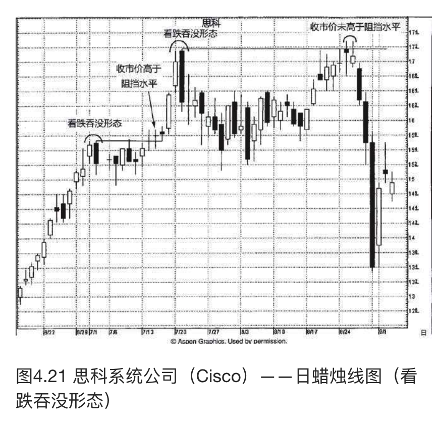

在图4.21中，7月初有一个看跌吞没形态，取代之前的上冲行情，抢到了控制权。该看跌吞没形态在之后一周半的时间里构成了阻挡水平。7月15日，**一旦思科的收市价向上超越了该看跌吞没形态的最高点，便成为看涨突破信号（尽管这一天是一根十字线，但其收市价创了新高，这依然是正面信号）**。对那些惯性交易者来说，市场向上突破看跌吞没形态，可以视为新一轮上涨行情的发端，正是考虑买进的时候。为了验证突破信号，我建议等待市场以收市价突破阻挡区域，而不只是日内行情的突破。7月21日完成了另一个看跌吞没形态，它转化为阻挡水平，等到8月下旬的时候受到市场试探。请注意，当价格向上接近该看跌吞没形态的阻挡区域时，形成了一群小实体，反映了市场在此处的犹豫心理。

>设置保护性止损指令的重要性
>
>技术分析一个更强大的方面是，可以利用它来形成一套风险管理机制，并构造一套交易资金管理方法。界定风险意味着采取保护性止损措施，以应对出乎预料的不利价格运动。
>
>在初始交易时，就应该同时设定止损保护指令，此时交易者的态度最具有客观性。仅当市场表现符合预期时，方可持有头寸不动。**如果后续价格变化与原本的预期相左，或者未能验证原本的预期，就是轧平头寸的退出时机**。如果市场运动与所持头寸方向相反，您或许会盘算，“干吗设置止损指令呢？只是短期行情运动，暂时对我不利而已”。这么一来，您一边一厢情愿地期望市场转向对自己有利的方向，一边顽固地坚持原有头寸不动。请记住两点事实：
>1. 所有的长期趋势都是从短线运动开始的。
>2. 市场根本不给任何主观愿望留有余地。市场总是自顾自演变，绝不考虑您的想法或您的头寸。 
>
>市场不在乎您是不是拥有头寸或没有头寸。知错不改，比做错了还要糟糕。宁可放弃观点，不可赔掉金钱。能及早查明自己的错误，是一种值得骄傲的能力。因为止损而退出市场，乃是承认错误。著名的私人投资大家沃伦·巴菲特（Warren Buffett）有两条座右铭：
>1. 保住本金。
>2. 绝不忘记第一条。
>
>止损指令与第一条同义。您的资源有限，必须将资源最大化发挥作用，最低限度也要保护好资源。如果您所在的市场朝着不利于自己头寸的方向运动，便是退出的时候了。

乌云盖顶形态 | 刺透形态
------ | -------
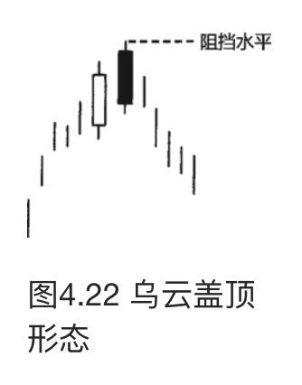 | 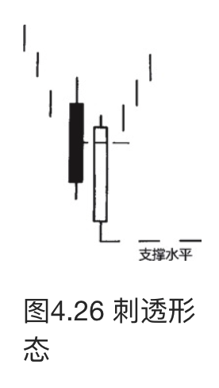

这种形态也是由两根蜡烛线组成的，属于顶部反转形态。它一般出现在上升趋势之后，有些情况下也可能出现在水平调整区间的顶部。在这一形态中，第一天是一根坚挺的白色实体；第二天的开市价超过了第一天的最高价（就是说超过了第一天上影线的顶端），但是到了第二天收市的时候，市场却收市在接近当日最低价的水平，并且明显地向下扎入第一天白色实体的内部。第二天的黑色实体向下穿进第一天的白色实体的程度越深，则该形态构成顶部反转形态的可能性就越大。

这种看跌形态背后的道理很容易理解。在形态发生之前，市场本来处于上升趋势中。有一天出现了一根坚挺的白色蜡烛线，第二天市场在开市时便向上跳空。到此刻为止，多头完全掌握着主动权。然而，此后市场的技术景象却完全改变了！事实上，市场收市在当日的最低价处，或者在最低价附近，并且这个收市价明显地向下扎进了前一天的实体内部，消除了第一天取得的大部分进展。在这种情况下，多头头寸的持有者信心开始动摇。还有一些人一直在找机会卖出做空，那么现在他们就得到了一个设置止损指令的参考水平——乌云盖顶形态的第二日形成的新高价格水平。

下面列出了一些参考因素，如果乌云盖顶形态具有这样的特征，则有助于增强其技术分量：
1. 在乌云盖顶形态中，黑色实体的收市价向下穿入前一个白色实体的程度越深，则该形态构成市场顶部的机会越大（如果黑色实体覆盖了前一天的整个白色实体，那就形成了看跌吞没形态，而不是乌云盖顶形态）。我们不妨把乌云盖顶形态比作日偏食，在这种情况下，月亮只遮住了太阳的一部分（换句话说，覆盖了部分白色实体）。而看跌吞没形态就像日全食，在这种情况下，月亮遮住的是太阳的全部（也就是说，覆盖了整个白色实体）。从这一点上说，作为顶部反转信号，看跌吞没形态比乌云盖顶形态具有更重要的技术意义。如果在乌云盖顶形态之后，或者在看跌吞没形态之后，出现了一根长长的白色实体，而且其收市价超过了这两种形态的最高价，那么这可能预示着新一轮上冲行情的到来。
2. 如果乌云盖顶形态发生在一个超长程的上升趋势中，它的第一天是一根坚挺的白色实体，其开市价就是最低价（就是说，是光脚的），而且其收市价就是最高价（就是说，是光头的）；它的第二天是一根长长的黑色实体，其开市价位于最高价，而且收市价位于最低价（这是一个光头光脚的黑色蜡烛线）。
3. 在乌云盖顶形态中，如果第二个实体（即黑色实体）的开市价高于某个主要的阻挡水平，但是市场未能成功地坚守住，那么可能证明多头已经无力控制市场了。
4. 如果在第二天开市的时候，交易量非常大，那么这里可能发生`“胀爆”现象`。具体说来，当日开市价创出了新高，而且开市时的成交量极大，可能意味着很多新买家终于下决心入市，跳上了牛市的“船”。随后，市场却发生了抛售行情。那么，很可能用不了太久，这群人数众多的新多头（还有那些早已在上升趋势中坐了轿子的老多头）就会认识到，他们上的这条船原来是“泰坦尼克号”。对期货交易商来说，极高的持仓量也是一种警告信号。

正如看跌吞没形态可以被视为`阻挡水平`，组成乌云盖顶形态的两个时段里的最高点也构成了阻挡水平。图4.22对此做了说明。

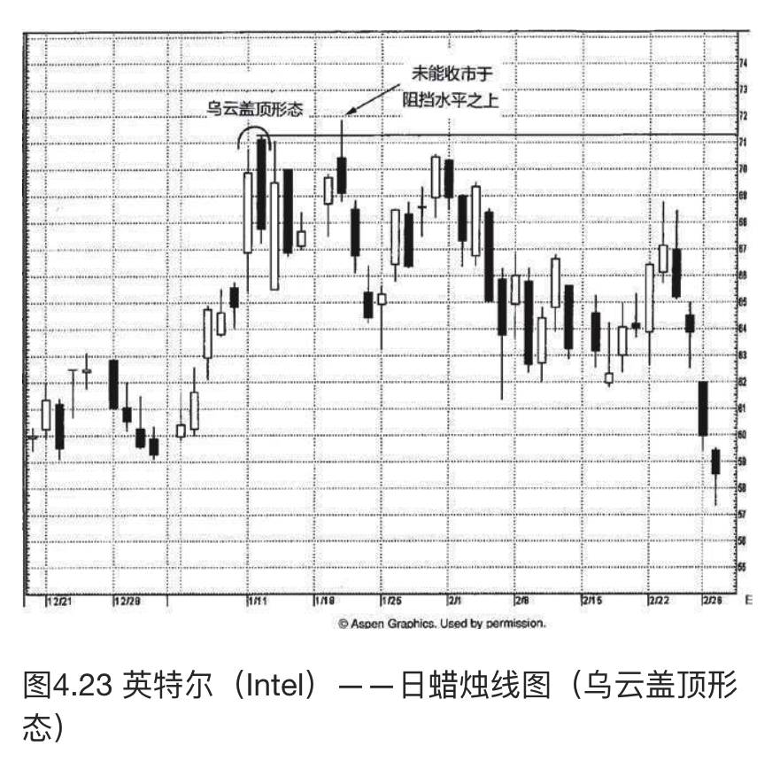

图4.23所示的乌云盖顶形态终结了一场上冲行情。在这种形态的下一日，英特尔向上推进，但在接近该形态高点的71美元处铩羽而归。一周之后，以及再过了两周之后，在71美元附近，股价同样受阻不前。注意1月20日，英特尔一度在该阻挡水平线上探头张望，却未能收市于该阻挡水平之上，因而无损其有效性。

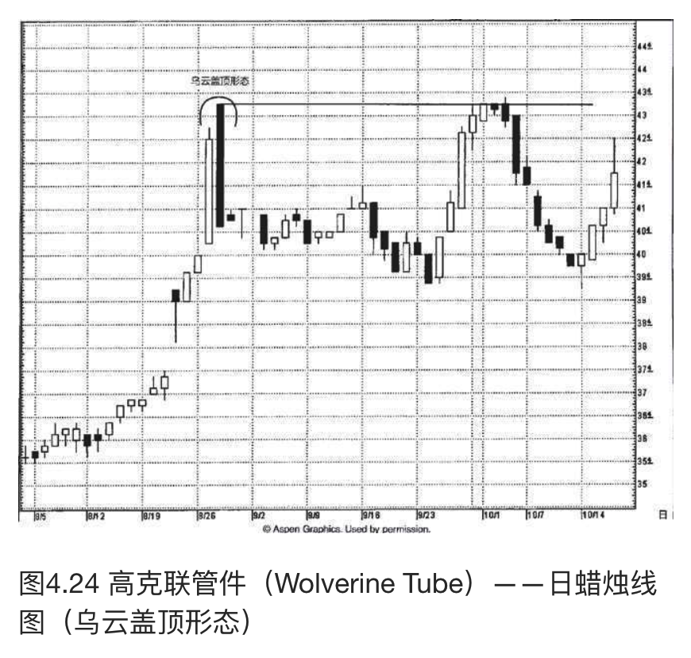

在图4.24中，从8月中旬开始出现了一轮上冲行情。8月22日，股价向上跳空，并形成了一根上吊线，但是它潜在的看空暗示却没有得到下一日的验证，因为下一日的收市价向上超越了上吊线实体。8月28日，大约在43.25美元附近，该股票以开市价向上跳空的方式发动了最后一轮推进。开市时，从多头的角度看，似乎一切顺利。然而，当日收市时，收市价下降到了40.62美元。这下子完成了一个乌云盖顶形态，因为这根黑色蜡烛线深深地回落到了前一日的白色实体内部。

一方面，这是一个界定清晰的乌云盖顶形态；另一方面，从风险报偿比的角度看，此处却可能不是卖出的好点位。原因在于，该乌云盖顶形态在其中第二日收市时才算大功告成，到了这个时候，行情距离其高点已经相当遥远。运用乌云盖顶形态构成阻挡水平的概念，我们可以等待市场反弹，等到市场再次接近乌云盖顶的高位时卖出（假定后来的行情让我们如愿的话）。10月上旬，又一轮上冲行情推进到了该乌云盖顶形态的高位，此时出现了一根短黑色实体，并且接连四根蜡烛线都重复了同一个高点，43.25美元，这迹象表明上冲行情后继乏力。

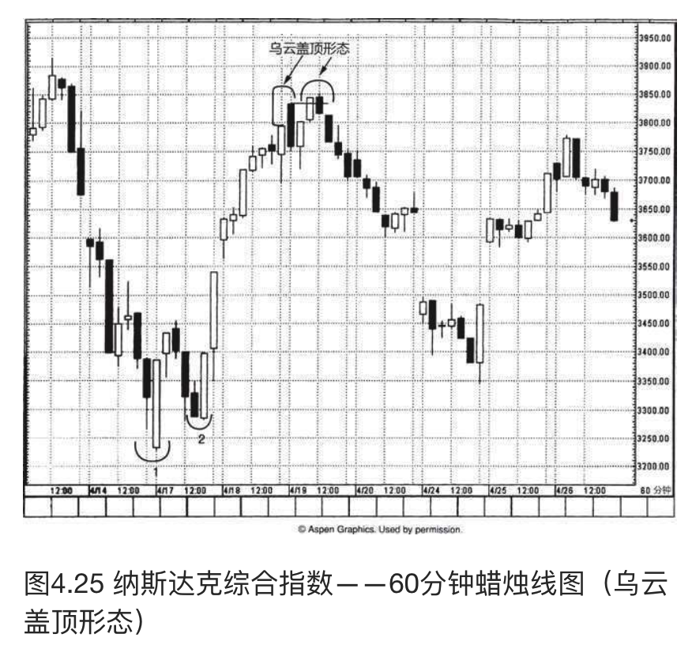

在图4.25中，在1和2处接连出现了两例看涨吞没形态，突出地显示3250-3275区域具有稳固的支撑作用。一轮上冲行情从第二个看涨吞没形态开始，遇到乌云盖顶形态后开始犹豫起来。紧接着，一根白色实体稍稍向上穿越了该乌云盖顶形态的阻挡水平（图上用水平直线做了标记）。虽然这个突破信号算不上决定性的，但是它以收市价向上突破了阻挡水平，因此构成了积极信号。

一定要根据市场条件随机应变，图4.25充分说明了这一点的重要性。具体说来，虽然向上突破第一个乌云盖顶形态的阻挡水平为当前趋势开创了更高的高点，但是在下一个时段，我们对市场的观感从本来的积极转为更加谨慎。为什么？因为就在突破信号的下一个时段，出现了一根黑色蜡烛线，完成了另一个乌云盖顶形态。这根黑色蜡烛线反映了牛方没有能力坚守新高的阵地。

### 刺透形态
有一个与乌云盖顶形态相反的形态，它的名称为`刺透形态`（如图4.26所示）。刺透形态出现在下跌的市场上，也是由两根蜡烛线所组成的。其中第一根蜡烛线具有黑色实体，而第二根蜡烛线则具有白色实体。在白色蜡烛线这一天，市场的开市价曾跌到低位，最好下跌至前一个黑色蜡烛线的最低价之下，但是后来市场又将价格推升回来，深深刺入黑色蜡烛线的实体内部。

关于刺透形态背后的心理过程，可以做如下理解：市场本来处于下降趋势中，刺透形态第一天疲弱的黑色实体加强了这种市场预期。第二天，市场以向下跳空的形式开市。到此刻为止，空头观察着行情的发展，感觉诸事顺遂。可是到当日收市的时候，市场却涨了回去，结果收市价不仅完全回到了前一天的水平，而且变本加厉地向上大大超越了这个水平。现在，熊方开始对手上的空头头寸忐忑不安起来。有些市场参与者一直在寻找买进的机会，他们据此推断，市场不能维持这个新低价位，或许这正是入市做多的大好时机。

关于刺透形态，也有四项参考因素，如果刺透形态兼具这些特征，那么它的技术分量将大为增强。这四项参考因素与乌云盖顶形态的四项参考因素内容相同，而方向相反（参见前一节的有关内容）。在讲述乌云盖顶的时候，我曾经提到，虽然我们更愿意看到黑色实体的收市价向下穿过了前一个白色实体的中点，但是在这一条判别准则上，还是有一定的灵活余地的。然而在刺透形态中，却没有什么灵活的余地。在刺透形态中，白色蜡烛线的实体必须向上推进到黑色蜡烛线实体的中点以上。之所以看涨的刺透形态不如乌云盖顶形态灵活，是因为日本人认为处理底部反转形态必须更加谨慎，他们对形状近似的价格形态做了进一步的区分，将它们分为三种情况，分别称为`待入线形态`、`切入线形态`、`插入线形态`（参见图4.27到图4.29）。这三种形态与刺透形态在基本构造上是相似的。它们之间的区别在于，其中的白色蜡烛线实体向上穿入黑色蜡烛线实体的程度是不同的。在待入线形态中，白色蜡烛线（其外形通常是比较小的）的收市价位于前一个蜡烛线的最低价下方的附近。在切入线形态中，白色蜡烛线（它也应当是较小的白色蜡烛线）的收市价稍稍进入前一个黑色实体的范围之内。在插入线形态中，白色蜡烛线比上述两个形态的更长一些，其收市价也更多地刺入前一个黑色实体之内，但是没有达到黑色实体中点的水平。

待入线形态 | 切入线形态 | 插入线形态
------|-------|------
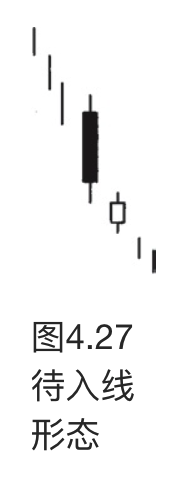 | 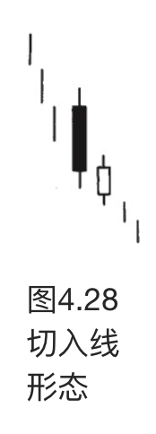 | 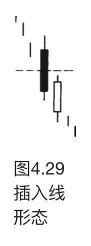

能不能记住从图4.27到4.29的各种具体形态并不重要。只要记住，白色实体必须推升到黑色实体的中点以上，才能构成较为有效的底部反转信号。

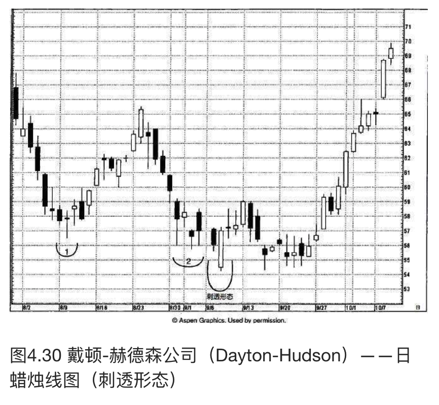

图4.30中区域1和2处出现了一系列长下影线，表示56美元附近可能存在支撑水平。可是在9月8日，戴顿-赫德森（DaytonHudson）连出重拳，开市于54美元上下，开市就跌穿了上述支撑水平。空方掌控了行情——或者这只是他们的错觉。到9月8日当日交易结束为止，多方杀了一个回马枪，把股价推到了明显高于前一个收市价的水平。9月7日和8日的蜡烛线组合成了刺透形态。在该刺透形态一周之后，9月16日，形成了一根锤子线，再次加强了该形态位于54美元左右的支撑水平。紧接着在锤子线之后的一周内，冒出了一系列长下影线，进一步验证了上述支撑水平。

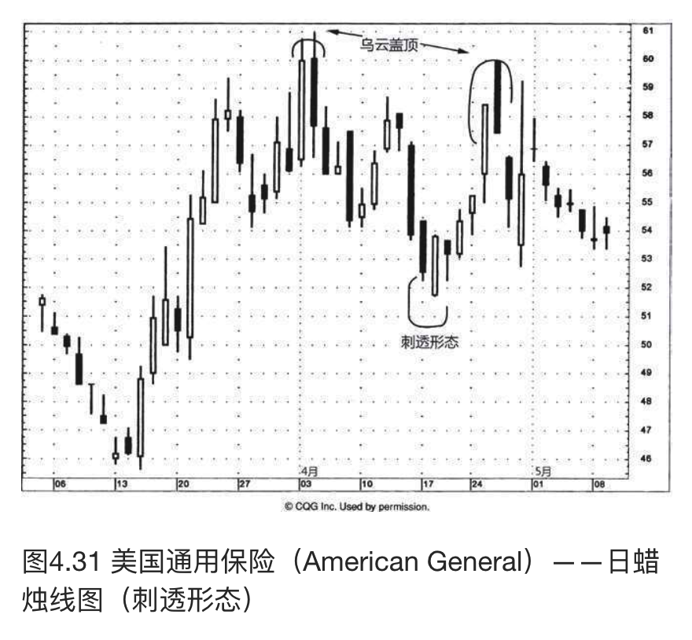

在图4.31上，3月中旬有一个看涨吞没形态，由此开始形成一轮上冲行情；3月24日接近59美元的纺锤线显示了这轮行情可能遇到麻烦的迹象。4月3日，收市价超越59美元，全天形成一根长白色实体，标志着多头回来了，至少到本时段为止重掌大局。在4月4日这一天，该股票形成了一个乌云盖顶形态的变体。之所以说它是乌云盖顶形态的变体，是因为在通常的情况下，我们希望该形态第二天的开市价高于第一天的最高价，而在本例中，第二天的开市价只是高于第一天的收市价。虽然如此，考虑到4月4日黑色蜡烛线向下回落到白色实体的内部如此深入的地步，增加了该形态的技术效力，该形态可能比中规中矩的乌云盖顶形态更有效。

4月17日和18日组成的刺透形态引出了之后的上冲行情。从这个刺透形态开始的上冲行情一直持续到4月24日和25日组成的另一个乌云盖顶形态。这个乌云盖顶形态也可以看成经典乌云盖顶形态的变体。为什么？因为其中的黑色实体没有向下跌破白色实体的中线。无独有偶，虽然这个蜡烛线组合不属于常规的乌云盖顶形态，但是它具备两个要素，让我相信它的看跌性质与传统的乌云盖顶形态不相上下。具体来说：

1. 4月25日的黑色实体开市价急剧上涨，高于前一天的最高价，在这个基础上，其收市价低于前一日的收市价；
2. 该形态验证了4月上旬乌云盖顶形态形成的阻挡水平，也标志着市场向上尝试该阻挡水平以失败收场。

本图揭示了一些具有普遍意义的概念，适用于如何对待不是很理想的蜡烛图形态。

1. 形态构成的具体情况；
2. 它所处的总体市场图景。

当我们遇到不那么完美的蜡烛图形态时，上述两方面的因素有助于我们评估其有效性，看看它是不是具备与更准确定义的蜡烛图形态同等的技术含义。

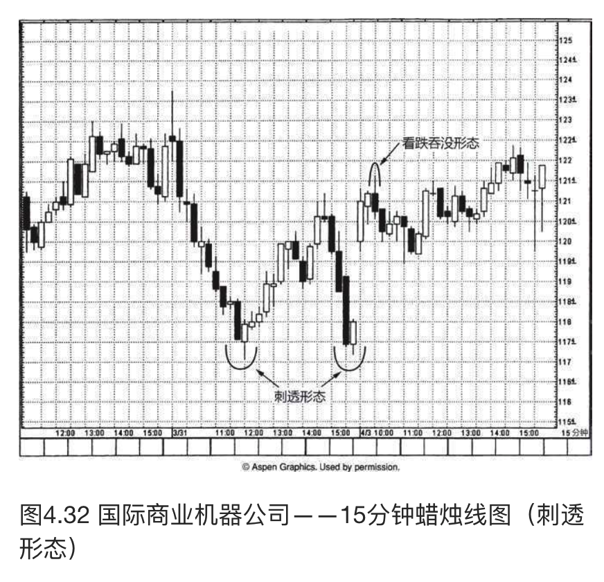

**如果在刺透形态的次日，实体没有深深地进入第一日实体的内部，我通常建议，应等待进一步的验证信号。假设刺透形态后一根为白色蜡烛线，下一个时段的收市价向上超越了该白色实体，就构成验证信号**。在图4.32中，3月31日上午的晚些时候，一根白色蜡烛线向上推进到了前一根黑色实体的内部。既然它并没有向上超过黑色实体的中线，就不能构成刺透形态。这是一个插入线形态。在插入线形态的下一个时段，收市价达到了更高的水平，这有助于增强形态的效果，说明其可能是一个底部信号。在3月31日晚些的一个时段，在117美元附近，形成了另一个插入线形态。通常，在插入线形态出现后，应该等待进一步的看涨验证信号（正如在当日更早的时候看到的那样）。但是，对于本图中的第二个插入线形态，由于它验证了之前的支撑区域，就没有太大的必要来等待看涨验证信号了（也就是说，不需要那么多理由来等待下一个时段的收市价推升到更高位置）。如此一来，对活跃的动量交易者来说，不妨在第二个插入线形态的白色蜡烛线收市时，利用它作为买进机会。第二天上午的早些时候，出现了一个看跌吞没形态，给出了退出信号。

## 星线
如图5.1所示，`星蜡烛线`（简称`星线`）的实体较小（可以是白色，也可以是黑色），并且在它的实体与它前面较大的蜡烛线实体之间形成了价格跳空。换句话说，星线的实体可以处在前一个时段的上影线范围内；只要星线的实体与前一个实体没有任何重叠（有一些例外情形，本章后面还要讨论），那么这个星蜡烛线就是成立的。如果星线的实体已经缩小为十字线，则称之为`十字星线`（如图5.2所示）。当星线，尤其是十字星线出现时，就是一个警告信号，表明当前的趋势或许好景不长了。

上升趋势中的星线和下降趋势中的星线 | 上升趋势中的十字星线和下降趋势中的十字星线
------|-------
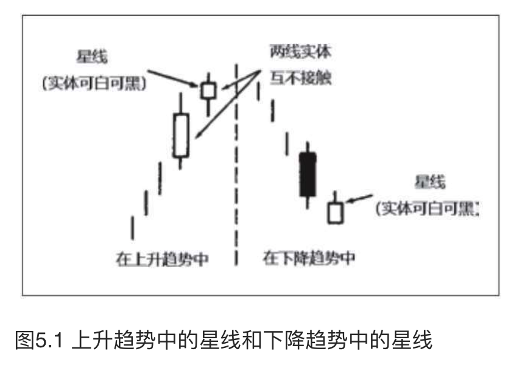 | 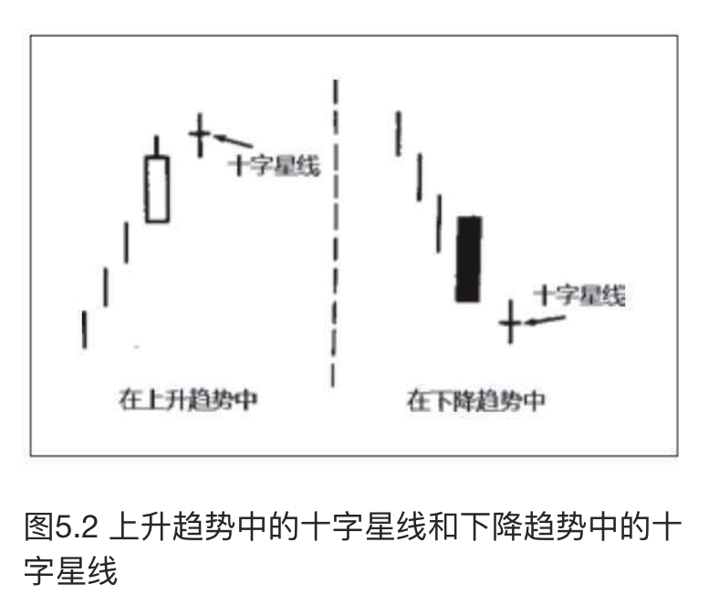

星线较小的实体显示，空头和多头的拔河已经转入僵持状态。在强劲的上升趋势中，多头一直掌握主导地位。在这种情况下，如果出现了一根星线，则构成警告信号：市场原本受买方的控制，现在转变为买方与卖方势均力敌的僵持状态。这一僵局的发生，既可能是由买方力量的衰减所造成的，也可能是由卖方力量的增长所造成的。但不论出于哪一种原因，星线都能告诉我们，当前上升趋势的驱动力已经瓦解，市场容易遭到卖方的攻击而向下回落。如果在下降趋势中出现了星线，也是同样的道理，只是方向相反（有时，人们把下降趋势中出现的星线称为`“雨滴”`）。具体地说，在下降趋势中，一根长长的黑色蜡烛线鲜明地显示出空头占主动地位。之后出现了星线，反映出市场氛围的改变。此时，牛、熊双方的力量对比已经变得较为平衡了。如此一来，市场向下的能量也就减退了。

在下列四种反转形态中，星线都是其中的一项重要组成成分。这四种反转形态分别是：
1. 启明星形态。
2. 黄昏星形态。
3. 十字星形态。
4. 流星形态。

### 启明星形态
启明星形态属于底部反转形态（如图5.3所示）。它的名称由来是，就像启明星（金星）预示着太阳的升起一样，这个形态预示着价格的上涨。本形态由三根蜡烛线组成：

- 蜡烛线1。一根长长的黑色实体，形象地表明空头占据主宰地位。
- 蜡烛线2。一根小小的实体，并且它与前一根实体之间不相接触（这两条蜡烛线组成了基本的星线形态）。小实体意味着卖方丧失了驱动市场走低的能力。
- 蜡烛线3。一根白色实体，它明显地向上推进到了第一个时段的黑色实体之内，标志着启明星形态的完成。这表明多头已经夺回了主导权。

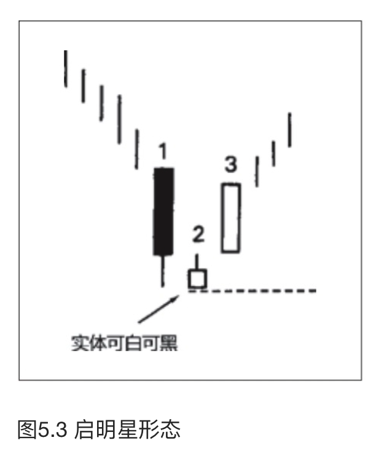

如图5.3所示，在构成本形态的三根蜡烛线中，最低的低点构成了支撑水平。

在理想的启明星形态中，第二根蜡烛线（即星线）的实体，与第三根蜡烛线的实体之间有价格跳空。根据我的经验，即使没有这个价格跳空，似乎也不会削减启明星形态的技术效力。其决定性因素是，第二根蜡烛线应为纺锤线，同时第三根蜡烛线应显著深入到第一根黑色蜡烛线内部。

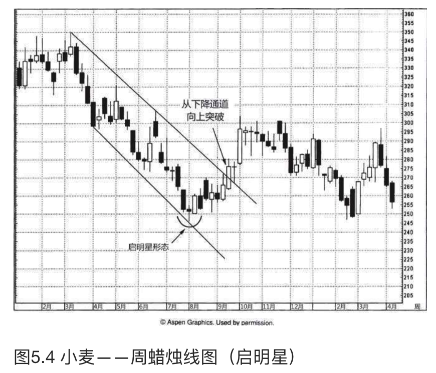

图5.4是本形态的一个实例。7月底、8月初，我们看到有三根蜡烛线满足了组成启明星形态的各项条件：一根长长的黑色蜡烛线，一个小实体，再来一根长长的白色蜡烛线。当然，作为这类形态，它应该出现在下降行情之后。这不是一个理想的启明星形态，原因在于第三根蜡烛线包裹了第二根蜡烛线。不过，从我的经验来看，即使第二根和第三根蜡烛线有所重叠，也不会降低本形态的效力。事实上，在这个启明星形态中，第二根和第三根蜡烛线组成了一个看涨吞没形态。

本图还有另一个妙处，它是一个精彩的实例，揭示了在线图发出更传统的反转信号之前，蜡烛图经常提前一步发出信号。从2月开始形成了一段下降通道，持续发挥作用，直到当年的第三季度。当市场以收市价的方式向上突破该下降通道的顶部时，构成了传统的西方技术分析信号，标志着下降趋势被打破。借助蜡烛线发出的“光亮”（即通过那个启明星形态），我们能更早获得警示信息，比下降通道的突破信号提早了许多个时段。

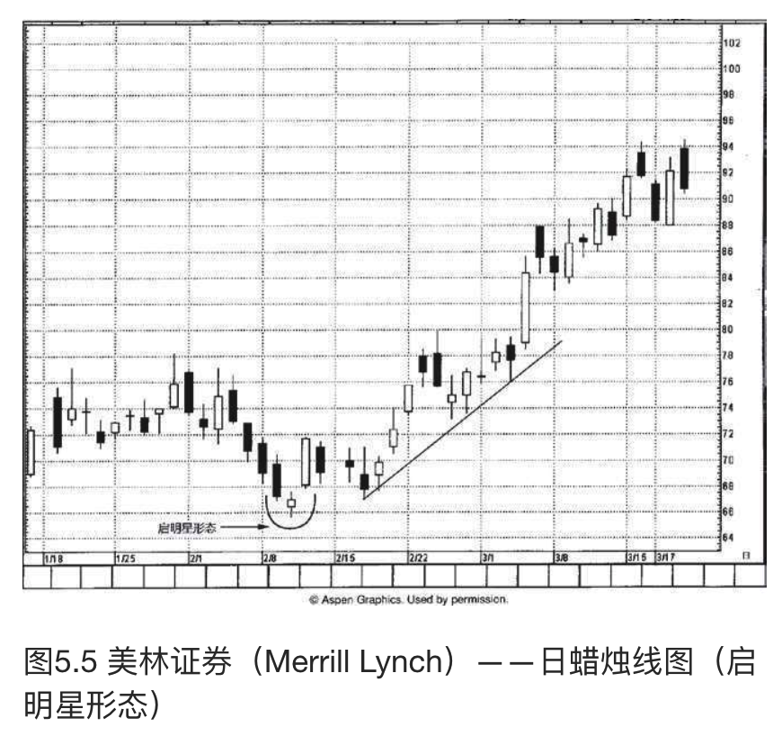

启明星形态的不足之处是，既然形态由三根蜡烛线组成，就得等到其中第三个时段收市时，形态才算完成。在通常情况下，如果第三根蜡烛线是长长的白色线，那么当我们得到信号的时候，市场已经走过一段急速反弹了。换句话说，当启明星形态完成时，或许并不能提供风险报偿比具有吸引力的交易机会。针对这一点，一种选择是等待行情回落到启明星形态构成的支撑区域时，再小口小口地吃进做多。如图5.5所示，2月初有一个启明星形态。如果在该启明星形态完成时买进，则成本价接近74美元，第二天，就有可能发生亏损。如果在该启明星形态出现后，等待市场调整到接近其低点的水平（接近65.50美元）再买进，由于止损指令设置在该启明星的低点之下，就能降低风险。当该股票上涨时，其轨迹沿着一条向上倾斜的支撑线。（趋势线是第十一章的核心内容。）

在理想的启明星形态和黄昏星形态中，蜡烛线1与2，2与3的实体之间都不应该相互触及。不过在有些市场上，上一日收市和下一日开市要么是同一个时点，要么两者时间接近，在这种情况下，对启明星形态和黄昏星形态要求的定义条件便可以更灵活一些。试举例如下：

1. 外汇市场，不存在正式的开市或收市时间。
2. 很多指数市场，例如半导体指数或药品指数等。
3. 日内图表。举例来说，在15分钟的线图上，某一个15分钟时段的开市价与相邻的前一个15分钟时段的收市价通常没什么差异。

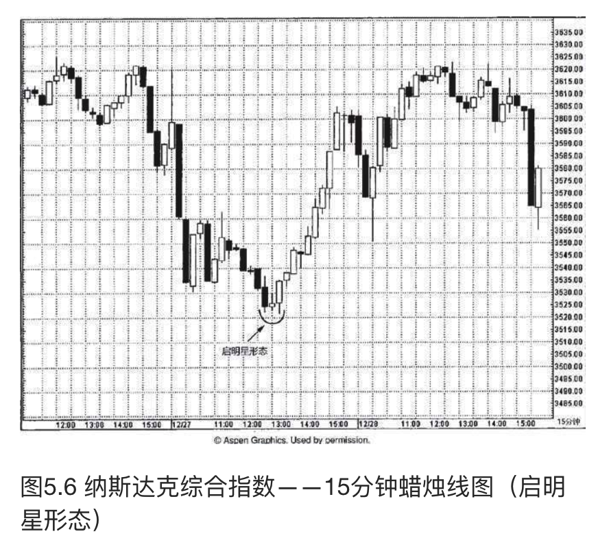

我们用图5.6所示的日内图表做案例，借以说明在解读蜡烛图形态时保持适当灵活性的实用意义。12月27日中午时分，纳斯达克综合指数给当前行情创了新低，同时，也跌破了当日早些时候形成的位于3530-3535的支撑水平。于是，熊方夺得了控制权。但是在13:00，先出现一个小实体，接着下一个时段是长长的白色蜡烛线，组成了启明星形态。请注意，三个实体两两接触（具体说来，第二根蜡烛线的开市价与第一根的收市价相同；第三根的开市价与第二根的收市价相同）。因为这是一张日内图表，彼此之间的开市价与收市价差异通常微不足道，但我仍然认为这是一个有效的启明星形态。由于本形态第三根蜡烛线既完成了形态，又推升指数重回先前被跌破的3530的支撑水平之上，给本形态增添了更高的可信度。当市场创新低在先，但空头无力维持新低，这常常意味着行情反转。

### 黄昏星形态
黄昏星是启明星的反面对等形态，在顶部，是看跌的。它的名称由来也是显而易见的，因为黄昏星（太白星）恰好出现在夜幕即将降临之际。既然黄昏星是顶部反转形态，那么，就应当出现在上升趋势之后，才能发挥其技术效力。黄昏星形态是由三根蜡烛线组成的（如图5.7所示）。在前两根蜡烛线中，前一根是长长的白色实体，后一根是星线。星线的出现，是顶部形态的第一个征兆。第三根蜡烛线证实了顶部过程的发生，完成了属于三线形态的黄昏星形态。第三根蜡烛线具有黑色实体，它剧烈地向下扎入第一天的白色实体内部。

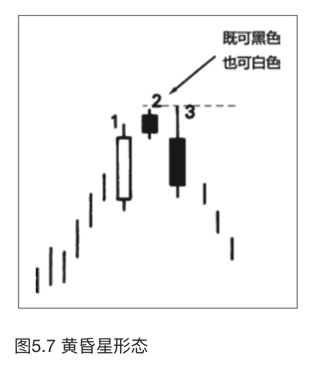

原则上说，在黄昏星形态中，首先在第一根实体与第二根实体之间，应当形成价格跳空；然后在第二根实体与第三根实体之间，再形成另一个价格跳空。但是，正如前面关于启明星的部分曾经详细介绍的那样，上述第二个价格跳空并不常见，而且对本形态的成功来说可有可无，不是必要条件。本形态的关键之处在于第三天的黑色实体向下穿入第一天的白色实体的深浅程度。

下面列了一些参考因素，如果黄昏星形态兼具这样的特征，则有助于增加它们构成反转信号的机会。这些因素包括：
1. 如果第一根与第二根蜡烛线，第二根与第三根蜡烛线的实体之间不存在重叠。
2. 如果第三根蜡烛线的收市价向下深深扎入第一根蜡烛线的实体内部。
3. 如果第一根蜡烛线的交易量较小，而第三根蜡烛线的交易量较大。这表明之前趋势的驱动力正在减弱，新趋势方向的驱动力正在加强。

黄昏星形态的最高点构成阻挡水平，在图5.7中用虚线做了标记。

请看图5.9，1月初形成了一个经典的黄昏星形态。该黄昏星形态具备理想的先决条件，即蜡烛线1和2，2和3的实体互不重叠。单独观察其星线部分（就是黄昏星形态的第二根蜡烛线），这是一根上吊线，且它的下一日发出了看跌验证信号。从该黄昏星形态开始形成的下跌行情持续到一周之后的A处告终，接近1210。从A处开始的上冲行情一周后遭遇该黄昏星形态构成的阻挡区域，于是犹豫起来，形成了一个十字星。这个十字星暗示了该轮上冲行情已经耗尽能量。（第八章将讨论十字星。）

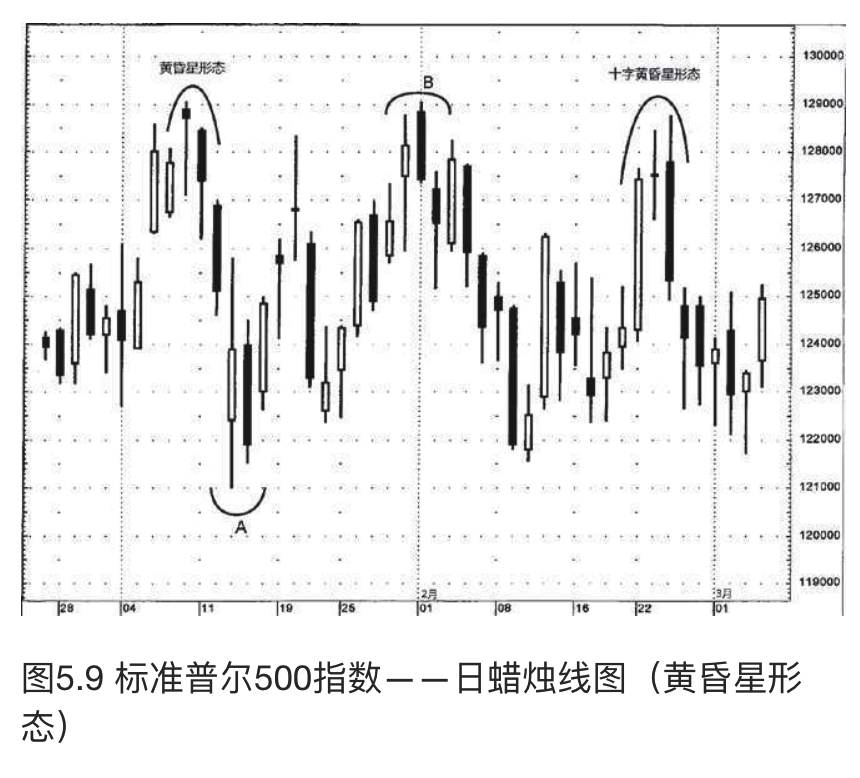

2月的第一周，市场再次上冲到该阻挡水平，在B处形成了一个看跌`吞没形态`。之所以提起该看跌吞没形态，目的在于强调借助趋势来判别蜡烛图形态的重要性。前文曾经介绍，在看跌吞没形态中，一根黑色实体吞没了一根白色实体。A处有一根黑色实体，包裹了前一根白色实体。这是不是一个看跌吞没形态呢？不是，因为它出现在一轮下降行情之后。看跌吞没形态作为顶部反转信号，必须之前存在上升行情才谈得上反转。因此，我认定B处的是看跌吞没形态，而A处的则不是。

2月下旬，再次出现一个十字星，反映了在上述黄昏星形态构成的阻挡水平处市场持续出货。在这个十字星之后有一根长长的黑色蜡烛线，组成了另一个黄昏星形态。本黄昏星形态的第二根蜡烛线是一个十字星，而不是纺锤线。这属于特殊类型的黄昏星形态，称为`“十字黄昏星形态”`，本节后面再来讨论。第二个黄昏星形态是第二根与第三根蜡烛线相互重叠的实例。根据我的经验，这种情况无损于本形态的效力，与那些蜡烛线1和2、2和3概不重叠的更经典形态相比并不逊色。

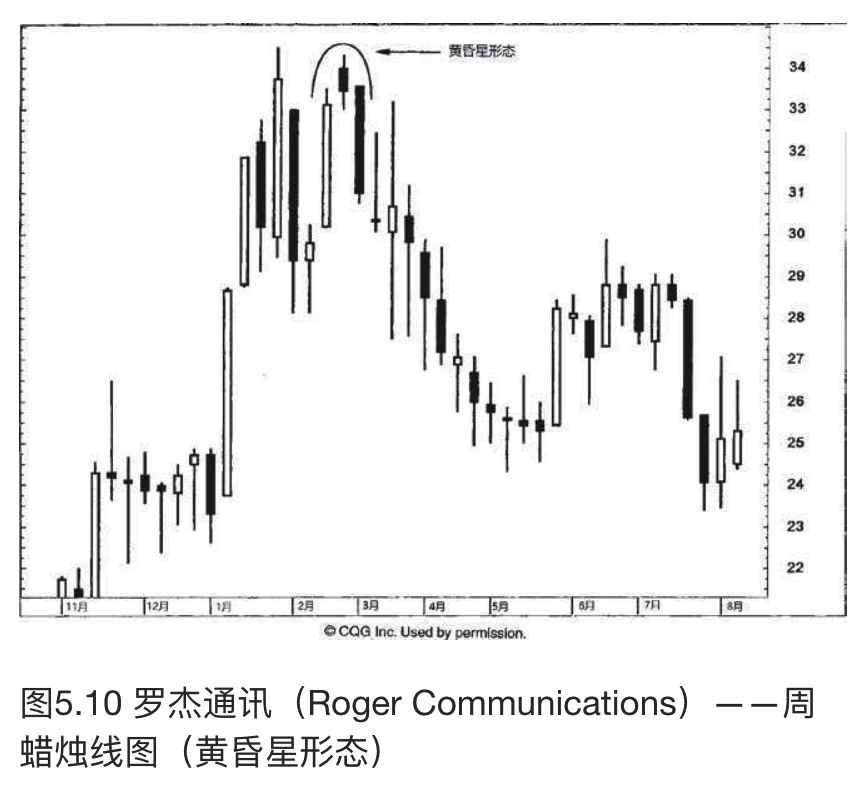

正如本图所示，本轮行情的高点接近34美元。当黄昏星形态完成时，其第三根蜡烛线的收市价接近31美元。如此一来，如果交易者根据黄昏星形态的信号在31美元卖出，所承受的风险是31美元到黄昏星形态最高点34美元的距离。如果交易者的价格目标是3美元风险值的许多倍，那么这个风险并不是问题。

如果3美元的风险值过大，交易者可以等待行情反弹，利用市场接近该黄昏星形态顶部阻挡区域的机会交易（当然，不保证一定会发生反弹行情），从而改进其风险报偿比。在本例中，在黄昏星形态之后的两个时段内，得到了幅度为2美元的反弹行情，将股价带到了非常接近关键阻挡水平的34美元的位置。在这之后，股价重新开始下降，一直持续到4-5月的价格区间。

### 十字启明星形态和十字黄昏星形态

上十字黄昏星形态 | 十字启明星形态 | 弃婴顶部形态 | 弃婴底部形态
------|-------|-------|-------
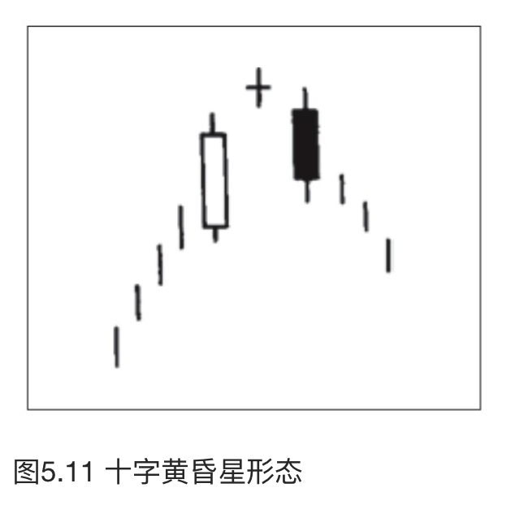 | 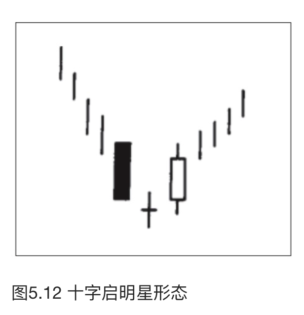 | 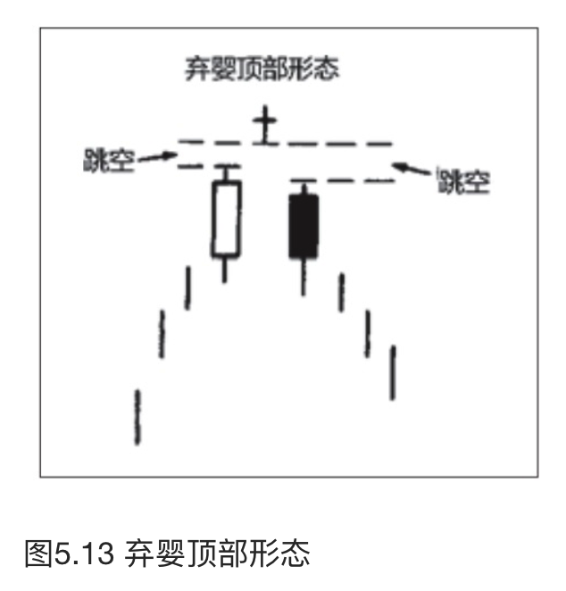 | 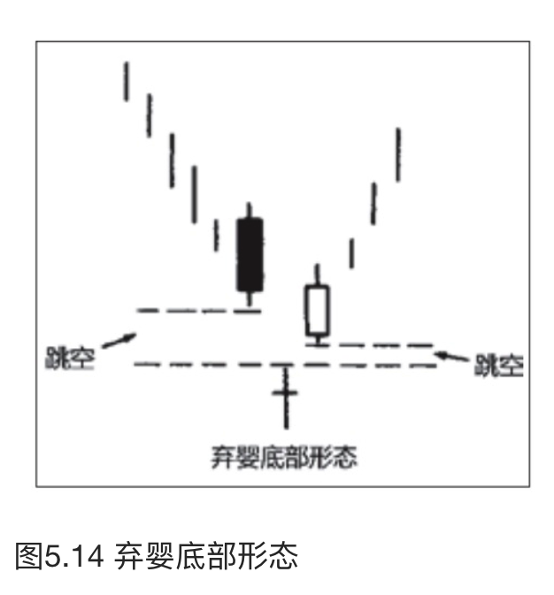

在常规的黄昏星形态中，第二根蜡烛线具有较小的实体，如果不是较小的实体，而是一个十字线，则称为十字黄昏星形态（如图5.11所示）。`十字黄昏星形态`是常规黄昏星形态的一种特殊形式。

在启明星形态中，如果其星线（即三根蜡烛线中的第二根蜡烛线）是一个十字线，则成为`十字启明星形态`（如图5.12所示）。

在十字黄昏星形态中，如果十字线的下影线既不与第一根蜡烛线的上影线重叠，也不与第三根蜡烛线的上影线重叠（即影线之间不相接触），这条十字线就构成了一个主要顶部反转信号，称为`弃婴顶部形态`（如图5.13所示）。

在与上述形态对等的底部反转形态中，道理是一样的，只不过方向相反而已。具体说来，在下降趋势中，如果在一个十字星线的前后均发生了价格跳空（相关蜡烛线的上下影线互不接触），那么这条十字星线就构成了一个主要底部形态。人们将这种形态称为`弃婴底部形态`（如图5.14所示）。

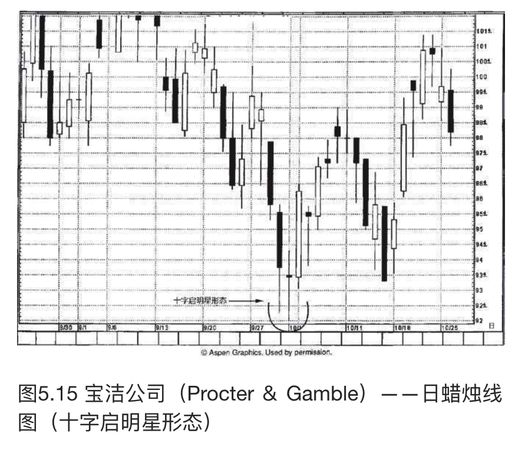

在图5.15中，因为启明星形态中间那根蜡烛线为十字线，成为十字启明星形态的一个实例。从本例可以看到，第三根蜡烛线的实体与第二根线（即十字线）的实体稍有重叠。随该十字启明星形态而来的上升行情后来形成了一溜纺锤线（也就是小实体蜡烛线），渐而丧失驱动力。在这种情形下，与传统的启明星形态一样，十字启明星形态的最低点（本图中92美元附近）构成支撑水平，在行情回落时可望发挥底部支撑作用。这正是10月中旬发生的情形，该十字启明星形态坚守阵地，起到了支撑作用。该启明星形态的十字线带有长长的上、下影线。这一特征进一步反映出市场正在丧失之前的方向性倾向（在本例中就是下降倾向）。这根十字线称为`长腿十字线`，第八章再来讨论。

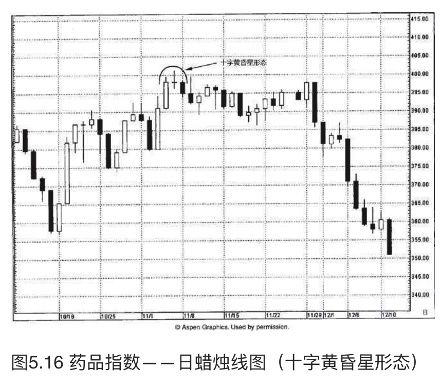

在图5.16中展示了一例十字黄昏星形态。在理想情况下，我希望看到该形态最后那根黑色蜡烛线的收市价更大程度地扎入第一个时段的白色实体内部。可是，这里有特别之处。首先，该形态发生在成百的整数大点位上，400美元处（按照市场惯例，成百的整数大点位有可能成为支撑或阻挡水平）；其次，之后的几天内，市场未能推升到该形态构成的阻挡区域之上（表现在带有长上影线的蜡烛线上）。这两点有助于支持这就是一个十字黄昏星形态的判断。在随后的几周里，400美元的水平始终构成行情上方的障碍，而11月30日的长黑色实体形成了一个看跌吞没形态，终于带来“致命的一击”。

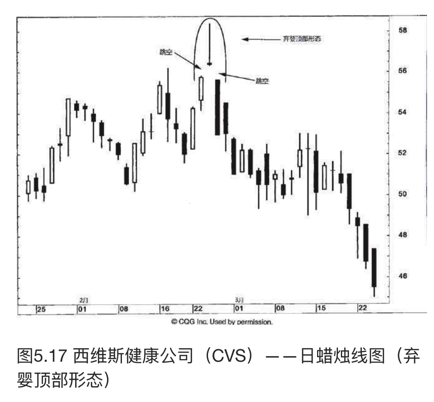

在图5.17中，2月下旬形成了一个十字黄昏星形态。因为在十字线的前面和后面均存在价格跳空，所以这个形态属于弃婴顶部形态。不仅如此，本例还有其他令人不安之处，即第三天发生“弃婴”的地方（向下跳空）。这一动作表明，前一天市场以收市价创下的位于56美元之上的新高不可持续。多方创新高在先，失守新高于后，这种情况常常具有看跌效应。

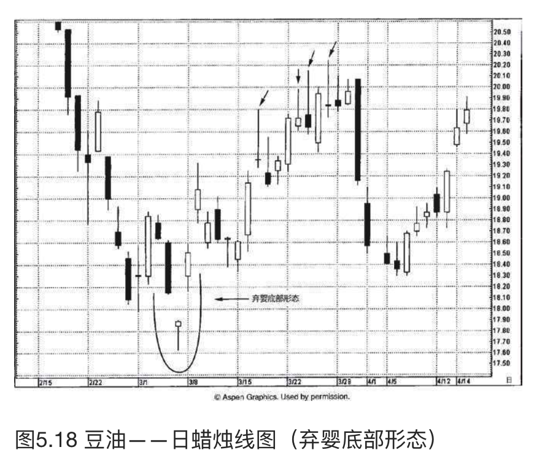

在理想的弃婴底部形态中，第二根蜡烛线是十字线。在图5.18中，第二根蜡烛线不是理想的弃婴底部形态所要求的十字线，而是一根微小的实体。无论如何，该实体如此细小，以至于可以把它视为十字线（本形态的第二根蜡烛线也可以归类为锤子线）。因此，这是弃婴底部形态的一种变体。从该底部反转形态开始，一轮上涨行情一直持续到一系列长长的上影线（箭头所指处），它们发出警告信号，多头现在不能完全做主了。这进一步增强了以下预期：市场已经碰到天花板了。4月6日和7日组成了一个看涨吞没形态，之后市场开始向上反弹。

### 流星形态与倒锤子形态
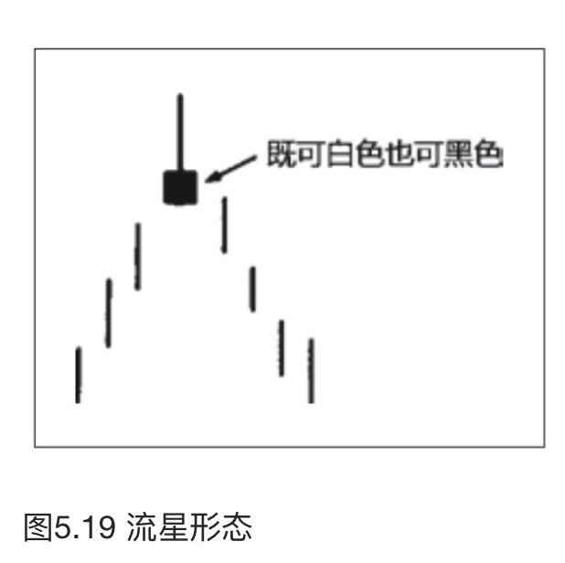

如图5.19所示，在`流星形态`中，`流星线`具有较小的实体，而且实体处于其价格区间的下端，同时，流星线的上影线较长。

与所有的星蜡烛线一样，流星线实体的颜色并不重要。流星线的形状形象地显示，当日市场开市于它的最低点附近，后来强烈地上冲，但最后却向下回落，收市于开市价附近。换句话说，这个交易时段内的上冲行情不能维持下去。

因为流星线属于看跌反转信号，它必须出现在一段上冲行情之后。在理想的流星形态中，流星线的实体与前一根蜡烛线的实体之间存在价格跳空。不过我们将从几个实例中看到，这样的价格跳空并非总是必须的。在流星形态中，没有向上跳空恰恰给它的负面意义增添了一个理由。

在下降趋势后，如果出现了与流星线外观一致的蜡烛线，则可能构成看涨信号。这样的蜡烛线称为`倒锤子线`。

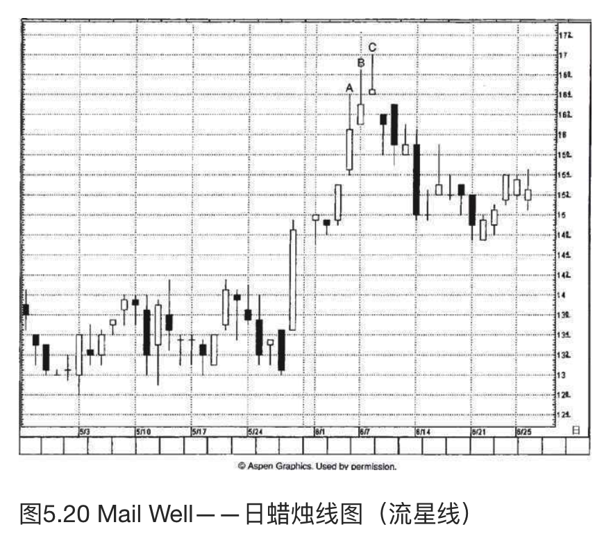

图5.20中，A、B和C三处看跌的上影线突出地显示该股票正处在“苦恼的上涨”过程中。在时段C，关于顶部反转的最终验证信号来了，这是一根流星线。或许您注意到，`墓碑十字线`（第八章将讨论）的外形与流星线看起来相像。墓碑十字线是流星线的特殊形式。流星线具备小实体，而墓碑十字线——作为一个十字线——没有实体。因此，墓碑十字线比流星线来得更疲软。

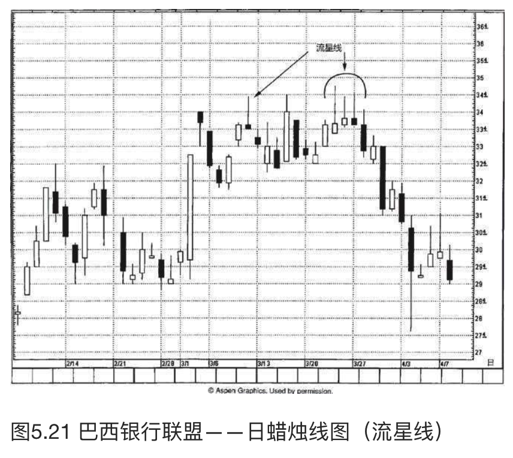

在图5.21中，出现了一系列流星形态，其中第一根流星线发生在3月10日，位于34.50美元。几周后，三根前后相续的流星线出现在同一个水平上，34.50美元。这就告诉我们，虽然多头每一次都有力气把股票推升到34.50美元，但是这些都是日内新高，多头甚至不能把日内新高维持到收市时。换言之，这些流星线发出视觉信号，揭示市场正在排斥更高的价位。正如本例所示，一旦我们在同一个价格水平得到了一个又一个信号，自然增加了这个阻挡区域的分量。在本例中，几条流星线在同一个水平相互验证，极大地提升了此处形成行情反转的可能性。当然，如果多头有足够的力量以收市价向上突破一众流星线的高点，那么任何看跌观点都需要重新推敲了。

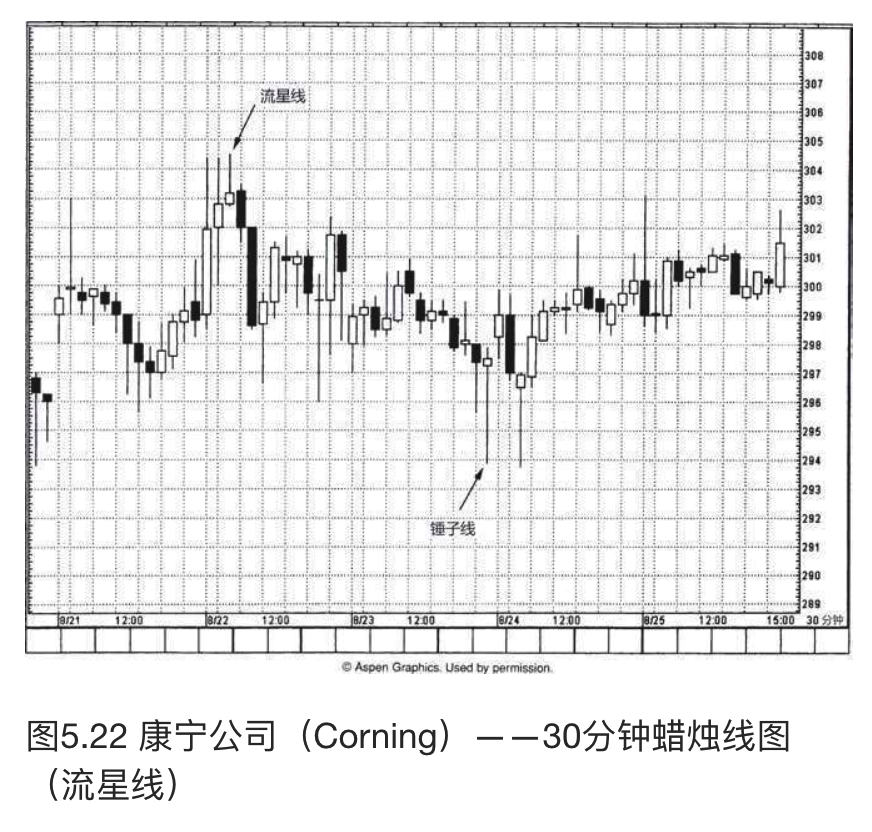

图5.22中，8月22日上午一根流星线再度强调304美元左右存在麻烦，因为在连续多个时段中这已经是第三次冲高回落了。紧接着在流星线之后的30分钟的时段提供了行情见顶的更多证据，因为它产生了一个看跌吞没形态。后来，康宁公司在一个箱体区间中安顿下来，区间底部由8月23日位于294美元的锤子线界定（次日上午，通过另一个锤子线表明，该底部防守成功）。从第二个锤子线的294美元开始形成上冲行情，之后在304美元附近遭遇该流星线的阻挡作用。

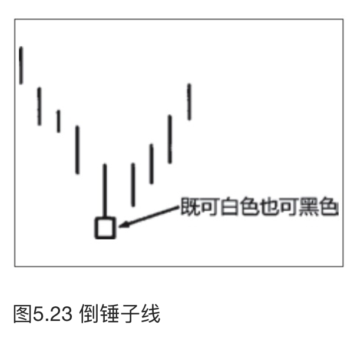

