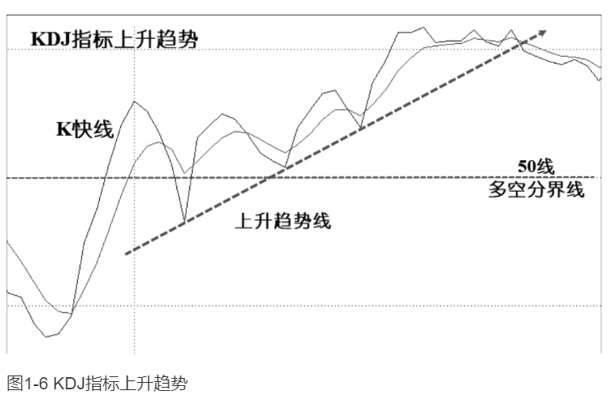
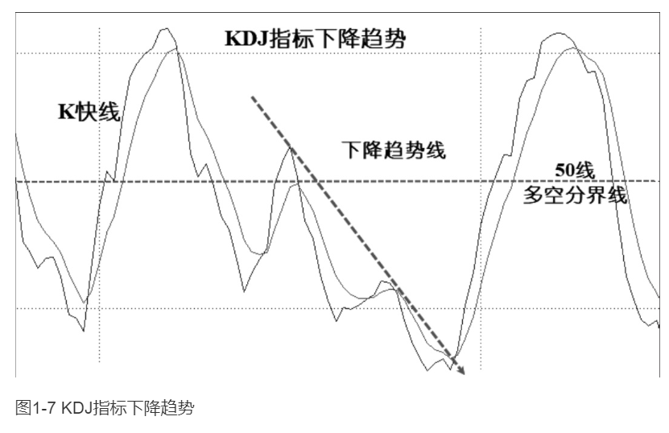
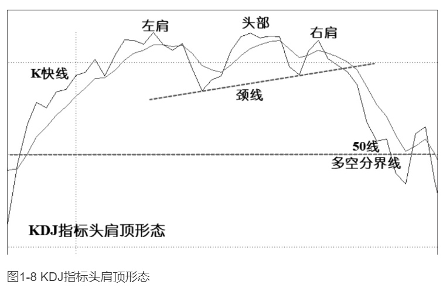
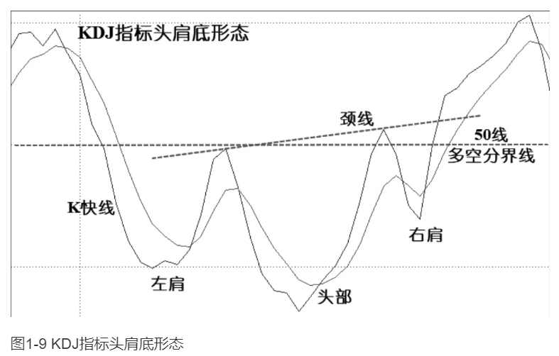
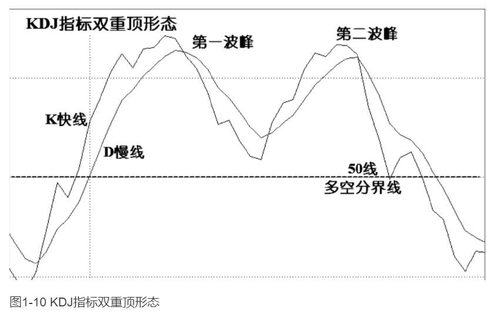
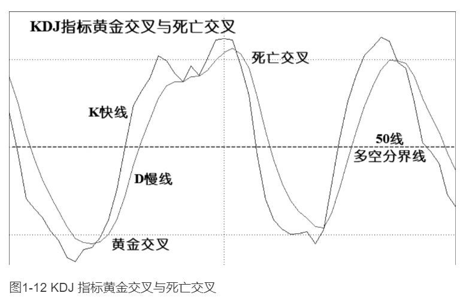
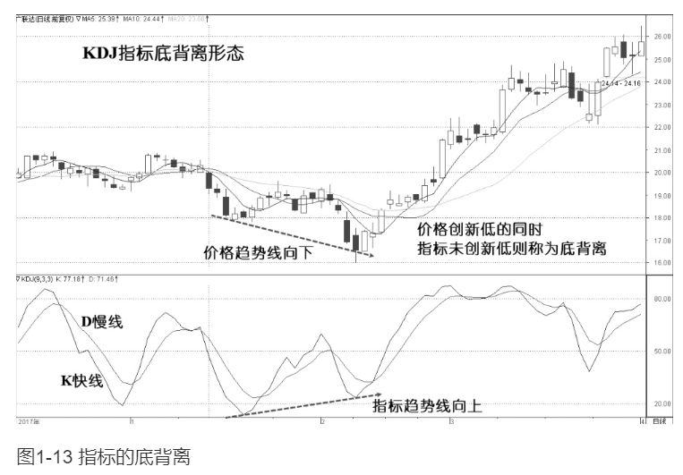
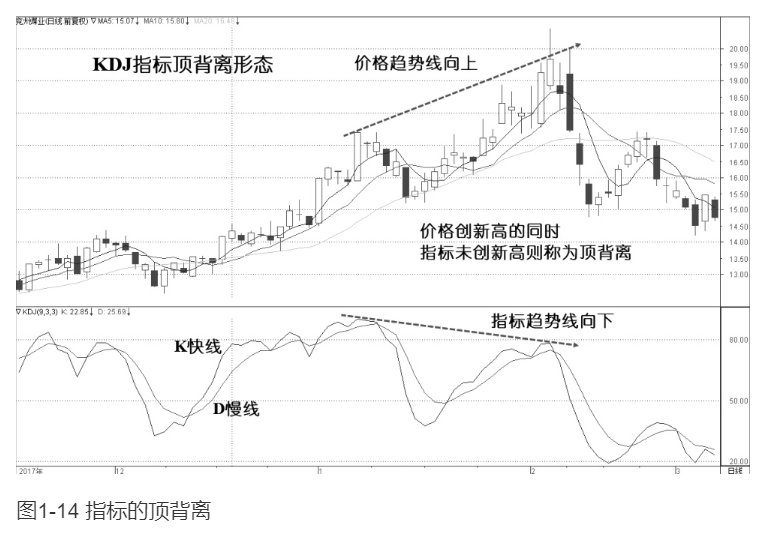

    作者: 凌波
    出版社: 北京联合出版公司
    出版年: 2019-5
    页数: 320
    定价: 59.00
    装帧: 平装
    ISBN: 9787559630902

[豆瓣链接](https://book.douban.com/subject/33439375/)

- [指标应用基础](#指标应用基础)
  - [指标介绍](#指标介绍)
    - [指标概述](#指标概述)
    - [振荡指标（Oscillators）](#振荡指标oscillators)
    - [振荡指标的应用](#振荡指标的应用)
    - [多空分界线](#多空分界线)
  - [指标的高位与低位](#指标的高位与低位)
  - [指标的趋势](#指标的趋势)
  - [指标的形态](#指标的形态)
  - [指标的交叉](#指标的交叉)
  - [指标的背离](#指标的背离)
- [KDJ指标](#kdj指标)

# 指标应用基础
## 指标介绍
### 指标概述
`趋势指标`是以描述趋势行情见长的指标。趋势行情是指比较流畅的、明显的单边上涨或下跌行情，具有明显的趋向性，其走势特点为，股价沿着趋势指标线行进，比如在一波中短线的上涨趋势行情中，股价会沿10日移动平均线（MA10）上升。常见的趋势指标有移动平均线（MA）、布林通道（BOLL）、薛斯通道（XS）、趋向指标（DMI）等等。

`振荡指标`是以判断行情转折点见长的指标，也就是常用于判断顶底的指标。振荡行情是指明显的单边行情之外的市场运行区间，其往往是行情的调整区间或顶（底）部区间，如箱体震荡、“之”字调整等。常见的振荡指标（Oscillators）有指数平滑异同移动平均线（MACD）、随机振荡指标(KDJ)、相对强弱指标（RSI）等。

### 振荡指标（Oscillators）
振荡指标的表现形式是指标值在设定的数值区间或围绕某个中心数值上下波动。根据振荡指标的振荡形式，可分为两类，即`区间振荡指标`和`中心振荡指标`。

一般来说，`区间振荡指标`更适用于确认超买或超卖水平，而`中心振荡指标`更适用于分析多空转换。

`区间振荡指标`是指标数值在一个区间范围内（0-100）上下波动的指标，这个区间对所有个股和指数都是一样的。这类指标是由价格比值计算出来的，所以不同个股之间可以相互比较。指标值接近上方极限为超买，指标值接近下方极限为超卖。通常规定在指标数值大于80时为超买，指标数值小于20时为超卖。`随机振荡指标（KDJ）`就是一个典型的区间振荡指标。

`中心振荡指标`是指标值围绕某个数值为中心上下波动的指标，`指数平滑异同移动平均线（MACD）`指标就是一个以0轴为波动中心的振荡指标，不同个股的指标值的比较没有意义，只需和其自身的历史指标值进行对比，以此来判断上涨或下跌的强弱。但0轴对所有个股和指数都有相同的意义，它是多空的分界线。指标线在0轴之上表明处于多头市场，在0轴之下表明处于空头市场。

### 振荡指标的应用
振荡指标在判断顶部和底部反转时具有较高的准确率，技术分析者一般结合价格、成交量和振荡指标三者来判断行情。振荡指标的运用主要在以下几个方面：
1. 指标的高位与低位：是指指标进入超买区间或超卖区间。
2. 指标的趋势：指标是由价格计算出来的，由于价格具有趋势性，所以指标在很多时间也表现出趋势性。比如在上涨行情中，指标的波峰和波谷会逐波提高。在下跌行情中，指标的波峰和波谷会逐波降低。
3. 指标的形态：由于市场情绪会影响价格，因此在相似的情绪影响下，就会形成相似的指标形态，这些相对固定的形态是特定市场情绪的反映，有助于我们对市场行情进行判断。
4. 指标的交叉：是常见的指标运用方法，指两条指标线的穿越现象，快线与慢线自下而上的交叉称为“黄金交叉”，自上而下的交叉称为“死亡交叉”，也就是俗称的“金叉”与“死叉”。
5. 指标的背离：被认为是振荡指标最好用的一种应用，指标运行方向与价格运行方向相背离。比如，在一波上涨中，当价格创新高而指标不创新高时，被认为是“顶背离”；在一波下跌中，当价格创新低而指标不创新低时，被认为是“底背离”。

### 多空分界线
KDJ指标的多空分界线是50线（指标值为50的水平线），MACD指标的多空分界线是0轴（指标值为0的水平线）。

在区间振荡指标中，当指标值向上进入50线之上，被认为是进入多方主导的市场，是上涨行情的开始，向上穿越50线是买入信号。当指标值向下进入50线之下，被认为是进入空方主导的市场，是下跌行情的开始，向下穿越50线是卖出信号。

在中心振荡指标中，当指标值进入0轴以上，被认为是进入多方主导的市场，是上涨行情的开始，向上穿越0轴是买入信号。当指标值进入0轴之下，被认为是进入空方主导的市场，是下跌行情的开始，向下穿越0轴是卖出信号。

在实际运用中，经验丰富的交易者能够看大势做个股，**顺大势逆小势**。比如在主要的多头市场中，振荡指标会游走于区间振荡指标的50-80之间或中心振荡指标的0轴之上。在强劲的升势中，当指标回落到多空分界线附近时，往往是介入良机，而不是退出时机。因为，我们通过道氏理论和波浪理论知道，一波主要的上涨行情会有次级折返，即调整浪，这些是回调的介入机会。

同理，在主要的空头市场中，振荡指标会游走于区间振荡指标的50-20之间或中心振荡指标的0轴之下。在强烈的跌势中，当指标回升到多空分界线附近时，往往是出逃良机，而不是介入时机。因为，一波主要的下跌行情中的次级折返，即调整浪，是下跌中的反弹卖出机会。

## 指标的高位与低位
指标的高位与低位是相对于临界位即多空分界线而言的，越往上偏离多空分界线越是高位，越往下偏离多空分界线越是低位。通常把区间振荡指标的高位定义为指标值在80-100的区间，被称为`超买`区间；把低位定义为指标值在0-20的区间，被称为`超卖`区间

## 指标的趋势

## 指标的形态
**头肩顶**

**头肩底**

**双重顶**

**双重底**

## 指标的交叉
`黄金交叉`的具体表现一般为：
1. KDJ指标的K快线自下而上穿越D慢线，如图1-12所示。
2. MACD指标的快线DIF自下而上穿越慢线DEA。
3. RSI相对强弱指标的短周期6日RSI线自下而上穿越长周期12日RSI线。

死亡交叉的具体表现一般为：
1. KDJ指标的K快线自上而下穿越D慢线，如图1-12所示。
2. MACD指标的快线DIF自上而下穿越慢线DEA。
3. RSI相对强弱指标的短周期6日RSI线自上而下穿越长周期12日RSI线。

## 指标的背离
`底背离`发生在指标值空方的超卖区间，当股价继续创新低而指标值不再创新低时，即产生底背离。如图1-13所示。底背离表示空头力量的减弱，市场有可能发生底部反转。

`顶背离`发生在指标值多方的超买区间，当股价继续创新高而指标值不再创新高时，即产生顶背离。如图1-14所示。顶背离表示多头力量的减弱，市场有可能发生顶部反转。

背离是很好用的“抄底逃顶”方法，指标的初学者会乐于找背离。可是，交易老手会知道，背离虽然是一个很好的指标应用方法，但有时会产生所谓的“顶中有顶，底中有底，背离后还有背离”的情况。因此，我们还是要强调顺势操作原则，并合理运用一些背离的配套措施。比如配合量价关系、均线、通道线、反转形态、多指标共振等综合判断。

# KDJ指标

