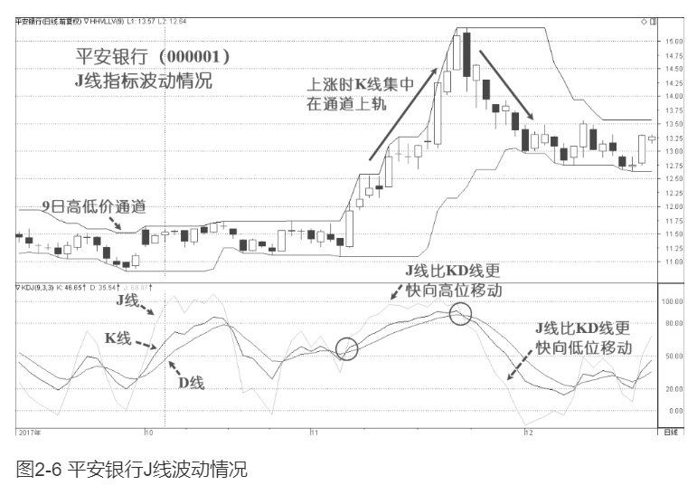
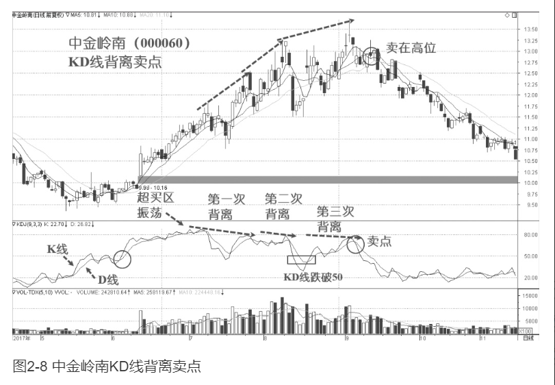
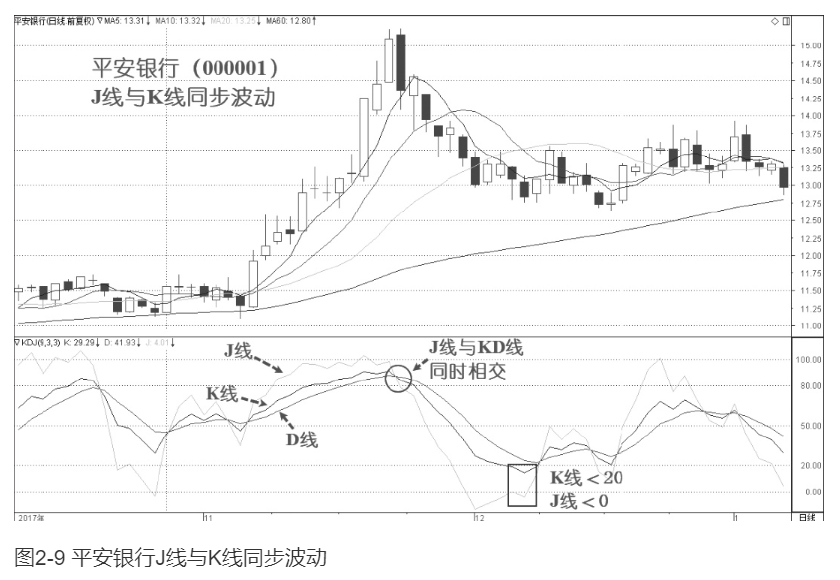

    作者: 凌波
    出版社: 北京联合出版公司
    出版年: 2019-5
    页数: 320
    定价: 59.00
    装帧: 平装
    ISBN: 9787559630902

[豆瓣链接](https://book.douban.com/subject/33439375/)

- [指标应用基础](#指标应用基础)
  - [指标介绍](#指标介绍)
    - [指标概述](#指标概述)
    - [振荡指标（Oscillators）](#振荡指标oscillators)
    - [振荡指标的应用](#振荡指标的应用)
    - [多空分界线](#多空分界线)
  - [指标的高位与低位](#指标的高位与低位)
  - [指标的趋势](#指标的趋势)
  - [指标的形态](#指标的形态)
  - [指标的交叉](#指标的交叉)
  - [指标的背离](#指标的背离)
- [KDJ指标](#kdj指标)
  - [KDJ随机振荡指标](#kdj随机振荡指标)
  - [RSV未成熟随机值](#rsv未成熟随机值)
  - [K线](#k线)
  - [D线](#d线)
  - [J线和KD](#j线和kd)
  - [K线与D线的运用](#k线与d线的运用)
  - [J线与D线的运用](#j线与d线的运用)
- [K快线波段操作](#k快线波段操作)

# 指标应用基础
## 指标介绍
### 指标概述
`趋势指标`是以描述趋势行情见长的指标。趋势行情是指比较流畅的、明显的单边上涨或下跌行情，具有明显的趋向性，其走势特点为，股价沿着趋势指标线行进，比如在一波中短线的上涨趋势行情中，股价会沿10日移动平均线（MA10）上升。常见的趋势指标有移动平均线（MA）、布林通道（BOLL）、薛斯通道（XS）、趋向指标（DMI）等等。

`振荡指标`是以判断行情转折点见长的指标，也就是常用于判断顶底的指标。振荡行情是指明显的单边行情之外的市场运行区间，其往往是行情的调整区间或顶（底）部区间，如箱体震荡、“之”字调整等。常见的振荡指标（Oscillators）有指数平滑异同移动平均线（MACD）、随机振荡指标(KDJ)、相对强弱指标（RSI）等。

### 振荡指标（Oscillators）
振荡指标的表现形式是指标值在设定的数值区间或围绕某个中心数值上下波动。根据振荡指标的振荡形式，可分为两类，即`区间振荡指标`和`中心振荡指标`。

一般来说，`区间振荡指标`更适用于确认超买或超卖水平，而`中心振荡指标`更适用于分析多空转换。

`区间振荡指标`是指标数值在一个区间范围内（0-100）上下波动的指标，这个区间对所有个股和指数都是一样的。这类指标是由价格比值计算出来的，所以不同个股之间可以相互比较。指标值接近上方极限为超买，指标值接近下方极限为超卖。通常规定在指标数值大于80时为超买，指标数值小于20时为超卖。`随机振荡指标（KDJ）`就是一个典型的区间振荡指标。

`中心振荡指标`是指标值围绕某个数值为中心上下波动的指标，`指数平滑异同移动平均线（MACD）`指标就是一个以0轴为波动中心的振荡指标，不同个股的指标值的比较没有意义，只需和其自身的历史指标值进行对比，以此来判断上涨或下跌的强弱。但0轴对所有个股和指数都有相同的意义，它是多空的分界线。指标线在0轴之上表明处于多头市场，在0轴之下表明处于空头市场。

### 振荡指标的应用
振荡指标在判断顶部和底部反转时具有较高的准确率，技术分析者一般结合价格、成交量和振荡指标三者来判断行情。振荡指标的运用主要在以下几个方面：
1. 指标的高位与低位：是指指标进入超买区间或超卖区间。
2. 指标的趋势：指标是由价格计算出来的，由于价格具有趋势性，所以指标在很多时间也表现出趋势性。比如在上涨行情中，指标的波峰和波谷会逐波提高。在下跌行情中，指标的波峰和波谷会逐波降低。
3. 指标的形态：由于市场情绪会影响价格，因此在相似的情绪影响下，就会形成相似的指标形态，这些相对固定的形态是特定市场情绪的反映，有助于我们对市场行情进行判断。
4. 指标的交叉：是常见的指标运用方法，指两条指标线的穿越现象，快线与慢线自下而上的交叉称为“黄金交叉”，自上而下的交叉称为“死亡交叉”，也就是俗称的“金叉”与“死叉”。
5. 指标的背离：被认为是振荡指标最好用的一种应用，指标运行方向与价格运行方向相背离。比如，在一波上涨中，当价格创新高而指标不创新高时，被认为是“顶背离”；在一波下跌中，当价格创新低而指标不创新低时，被认为是“底背离”。

### 多空分界线
KDJ指标的多空分界线是50线（指标值为50的水平线），MACD指标的多空分界线是0轴（指标值为0的水平线）。

在区间振荡指标中，当指标值向上进入50线之上，被认为是进入多方主导的市场，是上涨行情的开始，向上穿越50线是买入信号。当指标值向下进入50线之下，被认为是进入空方主导的市场，是下跌行情的开始，向下穿越50线是卖出信号。

在中心振荡指标中，当指标值进入0轴以上，被认为是进入多方主导的市场，是上涨行情的开始，向上穿越0轴是买入信号。当指标值进入0轴之下，被认为是进入空方主导的市场，是下跌行情的开始，向下穿越0轴是卖出信号。

在实际运用中，经验丰富的交易者能够看大势做个股，**顺大势逆小势**。比如在主要的多头市场中，振荡指标会游走于区间振荡指标的50-80之间或中心振荡指标的0轴之上。在强劲的升势中，当指标回落到多空分界线附近时，往往是介入良机，而不是退出时机。因为，我们通过道氏理论和波浪理论知道，一波主要的上涨行情会有次级折返，即调整浪，这些是回调的介入机会。

同理，在主要的空头市场中，振荡指标会游走于区间振荡指标的50-20之间或中心振荡指标的0轴之下。在强烈的跌势中，当指标回升到多空分界线附近时，往往是出逃良机，而不是介入时机。因为，一波主要的下跌行情中的次级折返，即调整浪，是下跌中的反弹卖出机会。

## 指标的高位与低位
指标的高位与低位是相对于临界位即多空分界线而言的，越往上偏离多空分界线越是高位，越往下偏离多空分界线越是低位。通常把区间振荡指标的高位定义为指标值在80-100的区间，被称为`超买`区间；把低位定义为指标值在0-20的区间，被称为`超卖`区间

## 指标的趋势

## 指标的形态
**头肩顶**

**头肩底**

**双重顶**

**双重底**

## 指标的交叉
`黄金交叉`的具体表现一般为：
1. KDJ指标的K快线自下而上穿越D慢线，如图1-12所示。
2. MACD指标的快线DIF自下而上穿越慢线DEA。
3. RSI相对强弱指标的短周期6日RSI线自下而上穿越长周期12日RSI线。

死亡交叉的具体表现一般为：
1. KDJ指标的K快线自上而下穿越D慢线，如图1-12所示。
2. MACD指标的快线DIF自上而下穿越慢线DEA。
3. RSI相对强弱指标的短周期6日RSI线自上而下穿越长周期12日RSI线。

## 指标的背离
`底背离`发生在指标值空方的超卖区间，当股价继续创新低而指标值不再创新低时，即产生底背离。如图1-13所示。底背离表示空头力量的减弱，市场有可能发生底部反转。

`顶背离`发生在指标值多方的超买区间，当股价继续创新高而指标值不再创新高时，即产生顶背离。如图1-14所示。顶背离表示多头力量的减弱，市场有可能发生顶部反转。

背离是很好用的“抄底逃顶”方法，指标的初学者会乐于找背离。可是，交易老手会知道，背离虽然是一个很好的指标应用方法，但有时会产生所谓的“顶中有顶，底中有底，背离后还有背离”的情况。因此，我们还是要强调顺势操作原则，并合理运用一些背离的配套措施。比如配合量价关系、均线、通道线、反转形态、多指标共振等综合判断。

# KDJ指标
## KDJ随机振荡指标
在技术分析当中，随机振荡指标是一种动量指标，它用到了一定周期内的价格通道作为支撑和阻力位。该指标是由乔治·兰恩（George Lane）博士于20世纪50年代末发明的，是被交易者广泛使用的指标之一。随机一词是指当前价格在一定时期内的价格波动范围中的相对位置，振荡一词是指它是一个在固定区间内上下移动的指标。该指标通过收盘价与价格波动范围进行对比，从而预判价格转折点。

9日随机振荡指标KDJ可以表示为：

    RSV＝100×（Price－L9）/（H9－L9）
    K%＝(RSV1＋RSV2＋RSV3)/3
    D%＝（K1＋K2＋K3）/3
    J＝3K－2D

其中的H9和L9是最近9日的最高价和最低价。RSV是未成熟指标，计算价格在9日高低价通道中的位置比例。K%是对RSV的3日移动平均值，D%是对K%的3日移动平均值（MA）。在计算中，通常使用简单移动平均（SMA），但也可以使用指数移动平均（EMA），并对近期数值降低权重。后又引入了J线，表示K%与D%之间的距离变化。

高低价的计算周期可设置为5、9或者14。通常以3周期计算平滑指标平均线。可以直接将`K%`称为`K线`或`K快线`，将`D%`称为`D线`或`D慢线`，以3周期计算的K快线是领先指标，D慢线的转向信号通常发出在价格底部或顶部形成之前。

KDJ指标通过对比收盘价在价格区间中的位置判断转折点。在反转之前，价格经常会收盘在价格区间的极端位置，以上升趋势为例，价格倾向于连续创出新高，收盘价通常位于一定周期内的价格波动区间的上轨终点附近。当上涨动量减弱时，收盘价开始从价格区间的上轨回落，致使随机指标在价格最高点形成之时或形成之前就拐头向下。

价格反转预警中的一个固定模式为，当D慢线处于极限区间同时与价格移动方向形成背离。确认信号为当K快线穿越D慢线时。背离现象说明市场动量在减弱，反转正在酝酿之中。当在顶部发生背离，股价发生向下突破时，可以适当增加做空仓位；当在底部发生背离，并且股价向上突破时，可以适当增加做多仓位，如果股价没有朝着预期的方向移动，应该懂得止损。

## RSV未成熟随机值
`RSV（Raw Stochastic Value）`，称为`未成熟随机值`，它本身是一种振荡指标，统计在一定周期内，当前收盘价与最高价和最低价的比例关系。RSV计算公式为：

$RSV(n)=\frac{C_n-L_n}{H_n-Ln} * 100$

其中，$C_n$为第n日收盘价；$L_n$为n日内的最低价；$H_n$为n日内的最高价。RSV值始终在1-100之间波动。

从公式中可以看出，RSV计算的是当日收盘价在n日波动范围内的相对位置。当日收盘价越接近高位，指标值越大，当日收盘价越接近低位，指标值越小。

在KDJ的计算中，以9日为周期计算RSV，计算公式为：

$RSV(9)=\frac{C_9-L_9}{H_9-L9} * 100$

其中，$C_9$为第9日收盘价；$L_9$为9日内的最低价；$H_9$为9日内的最高价。计算的是：第九天的收盘价与九天内最低价的差距占九天内最高价与最低价的差距的百分比，这样就求出了9日未成熟随机值RSV。在公式中乘以100 %是将数值转换为百分数。

还可以直观地把公式写成：

$RSV(9)=\frac{第九天收盘价-最近9天内最低价}{最近9天内最高价-最近9天内最低价} * 100$

RSV反映了当日收盘价在9日内的波动范围的百分比相对位置，当RSV高于80%时，市场处于`超买`状态，上涨行情发生反转的可能性增大，预示即将见顶，可以考虑卖出；当RSV低于20%时，市场处于`超卖`状态，下跌行情发生反转的可能性增大，预示即将见底，可以考虑买入。

## K线
由于RSV指标起伏不定，所以利用移动平均原理，计算RSV的移动平均值，就得到了经过平滑的指标K线。

    当日K值＝2/3×昨日K值＋1/3×当日RSV

公式中的1/3和2/3是平滑因子，是可以人为选定的，不过目前已经约定俗成了，不需要做改动。换一个表达式来理解，利用RSV求SMA（Simple Moving Average，简单移动平均），求出K值。K值其实就是RSV的三日移动平均值。如果没有前一日的K值时，可以用50代替。

    K=SMA(RSV，3，1 )

K值的计算公式还可以表示为：

$K_t＝2/3×K_{t-1}＋1/3×RSV_t$

## D线
KDJ指标的另一条指标线慢线是对K线进行平滑得到的，称为`D线`。

    当日D值＝2/3×昨日D值＋1/3×当日K值

公式中的1/3和2/3是平滑因子，可以人为选定，同样是已经约定俗成的，不需要做改动。换一个表达式来理解，同样利用SMA，对K值求移动平均，得出D值。K值就是K值的三日移动平均值。如果没有前一日的D值时，可以用50代替。

    D=SMA(K，3，1)

D值的计算公式还可以表示为：

$D_t＝2/3×D_{t-1}＋1/3×K_t$

## J线和KD
J线是KDJ指标的辅助指标，K值乘以3，减去D值乘以2，就得到J值，它比KD值更敏感。它的计算公式如下：

    J＝3K－2D

这个J值的应用如下：
- J＞100为超买，预示股价即将见顶，可以寻找卖点减仓或清仓；
- J＜0为超卖，预示股价即将见底，可以寻找买点开仓或加仓。

这一公式的原始设计目的，是为了寻找更领先的买卖信号。利用放大K线与K线的差距，进而试图领先KD值找出底部与顶部。

其实，J值还可以表示为K＋2（K－D），即在快线K的基础上，再加上2倍的K与D线的差距。这样，比如当K线高于D线时，J线可以进一步放大两者之间的差值。

从图2-6可以看到，J线的波动比K线更加快速，J线带动K线与D线移动。当K线与D线相交时，两者的差距为零，J线就等于K线。所以当KD相交时，KDJ也相交。

对于J线的运用如下：
- 当J线自下而上穿越KD值时，是回调的结束，短线应该看多；
- 当J线自上而下穿越KD值时，是反弹的结束，短线应该看空。

## K线与D线的运用
快线K与慢线D的方向与位置
1. 当K线与D线均大于50并向上移动时，表示市场处于多头行情中，可以买入或持股；
2. 当K线与D线均大于50并向下移动时，表示市场行情处于退潮阶段，股票将下跌，可以卖出股票或观望；
3. 当K线与D线均小于20并向上移动时，表示市场经过下跌调整已经卖过头了，上涨行情即将启动，可以买进股票；
4. 当K线与D线均大于80并向下移动时，表示市场经过连续上涨已经买过头了，上涨行情即将结束，下跌概率增大，可以减仓或卖出股票。

表2-1 K值与D值分布表

行情阶段 | K值与D值 | 意义
-----|-------|---
超买区间（超涨） | ≥ 80 | 市场价格可能反转向下
上涨强势区 | 80-50 | 上涨趋势可能延续
买卖平衡点 | 50 | 市场可能朝原方向
下跌强势区 | 50-20 | 下跌趋势可能延续
超卖区间 (超跌) | ≤ 20 | 市场价格可能反转向上

快线K与慢线D的交叉情况
1. 当K线与D线均小于50，而K线向上突破D线时，表明市场处于一波
强势之中，股价将再次上涨，可以加码买进股票或持股待涨，这是KDJ指标黄金交叉的一种形式。
2. 当K线与D线均小于20，而K线向上突破D线时，表明市场即将转强，股价将止跌反弹，可以开始买进股票或持股，这是KDJ指标黄金交叉的另一种形式。
3. 当K线与D线均大于80，而K线向下跌破D线时，表明市场即将由强势转为弱势，股价将下跌，这时应卖出大部分股票，这就是KDJ指标死亡交叉的一种形式。
4. 当K线与D线均大于50，而K线向下跌破D线时，表明市场将再次进入弱市之中，股价还将下跌，可以再卖出股票或观望，这是KDJ指标死亡交叉的另一种形式。

一些有经验的交易者会发现，有时的超买和超卖会产生虚假信号。当股价上涨时，经常会涨到超出预期的位置，这时的KDJ指标会在高位多次交叉。而股价下跌时，也会有时跌到始料未及的位置，这时的KDJ指标会在超卖区间连续发生背离。这种情况往往是由于行情的波动超过了我们观察的周期，发生了钝化现象。适当放大指标周期，可以观察更大级别的行情。

KD指标在80以上的顶背离和20以下的底背离都可能是假背离。20-50之间的背离最有可能是真背离。这是因为在强势上涨中，KD指标由于比较灵敏，会在第一次强势上涨时，收盘价十分接近波动通道上轨，KD指标很快进入超买区间。后面如果有延长浪继续上涨时，KD指标会在50以上的位置多次发生背离，如果这时卖出，可能会错过后面的行情。所以说，当KD指标回落到50以下，再反弹时才可能是最后一次反弹，这时是卖出时机。

从图2-8可以看到，中金岭南这只股票的KD指标进入50以上之后，该股不断上涨。KD指标到达80以上超买区间时，K线仍然震荡走高，KD指标在高位振荡。随后该股小幅调整，KD指标回落，但D值没有低于50，然后该股再次上涨创出新高，但指标没有同时创出新高，这时产生了第一次背离。

由于D值没有跌破50一线，所以这次背离可以继续持股。此后该股再次上涨创出新高，D线向下拐头产生第二次背离，这时D值仍没有跌破50，我们继续持股。

新高之后，该股迅速调整，KD指标均跌破了50，这时开始寻找卖出机会。当该股再次创出新高，而KD指标没有创出新高，D线向下拐头产生第三次背离，这时是卖出机会。可以看出，依据强者恒强，跌破50后的背离卖点，我们卖在了三波上涨之后的高位。

超买区间回落不破50的情况下，KD指标向上拐头是买入机会，这时股价很可能继续上涨；如果回落到50以下就成了真背离，股价继续下跌的概率增大。

在操作时，当KD指标在50以下时，可以认为处于空头市场，交易者可以依据弱者恒弱的道理离市或观望。当跌势形成时，KD指标线会形成波峰和波谷逐波降低的走势。这种现象表明股价走势正在转弱之中。交易者可以寻找合适的卖点出场。

KD指标运用的要点
1. 如果K线与D线均小于20，表示处于超跌区间，拐头向上是进场时机；如果K线与D线均大于80，表示处于超涨区间，拐头向下是获利了结时机。这两个区域都是我们应该重点关注的位置。
2. 如果K快线大于D慢线时，也就是金叉之中，这是上升行情，不应做空；在指标低位，K线自下而上穿越D线，这是买入信号。
3. 如果K快线小于D慢线时，也就是死叉之中，这是下跌行情，不应做多；在指标高位，K线自上而下穿越D线，这是卖出信号。
4. 当KD值游走在50线附近时，这是盘整格局。交易者应该注意避免在这里因为误判而造成过度交易，以及避免被虚假信号骗线。
5. 当股价创新高，或是创新低时，K快线与D慢线并未同步跟着创新高或新低，这就产生了所谓的“背离”的现象。这时，可能隐藏着价格反转的契机，需要重点关注顶背离后的走势，做好出场准备。

## J线与D线的运用
J线的方向与位置
1. 当J线大于50并向上移动时，表示市场处于多头行情中，可以买入或持股；
2. 当J线大于50并向下移动时，表示市场行情处于退潮阶段，股票将下跌，可以卖出股票或观望；
3. 当J线小于50并向上移动时，表示市场行情即将启动，股票将上涨，可以买进股票或持股待涨；
4. 当J线小于50并向下移动时，表示市场处于空头行情中，可以卖出股票或观望。

表2-2 J值分布表

行情阶段 | J值 | 意义
-----|----|---
超买区(超涨） | ≥100 | 市场价格可能反转向下
上涨强势区 | 100-80 | 上涨趋势可能延续
买卖平衡点 | 50 | 市场可能朝原方向
下跌强势区 | 20-0 | 下跌趋势可能延续
超卖区（超跌） | ≤0 | 市场价格可能反转向上

J线与D线运用的要点
1. 如果J线小于0并且D线小于20，表示处于超跌区间，拐头向上是进场时机；如果J线大于100并且D线大于80，表示处于超涨区间，拐头向下是获利了结时机。
2. 如果J线大于D线时，也就是黄金交叉之中，这是上升行情，不应做空；在指标低位，J线自下而上穿越D线，这是买入信号。
3. 如果J线小于D线时，也就是死亡交叉之中，这是下跌行情，不应做多；在指标高位，J线自上而下穿越D线，这是卖出信号。
4. 当J值与D值游走在50线附近时，这是盘整格局。
5. 当股价创新高，或是新低时，J线与D线并未同步跟着创新高或新低，这就产生了所谓的“背离”的现象。这时，可能隐藏着价格反转的契机，做好出场或进场准备。

从图2-9中可以看到，当K线小于20时，J线通常小于0，这时处于超卖区间。J线与KD线同时发生黄金交叉或死亡交叉，在指标低位的黄金交叉是进场时机，在指标高位的死亡交叉是卖出时机。当K线大于80时，J线通常大于100，这时处于超买区间。J线比K快线更快，起到了领先指标的作用。

# K快线波段操作

