    作者: 凌波
    出版社: 北京联合出版公司
    出版年: 2019-5
    页数: 320
    定价: 59.00
    装帧: 平装
    ISBN: 9787559630902

[豆瓣链接](https://book.douban.com/subject/33439375/)

- [指标应用基础](#指标应用基础)
  - [指标介绍](#指标介绍)
    - [指标概述](#指标概述)
    - [振荡指标（Oscillators）](#振荡指标oscillators)
    - [振荡指标的应用](#振荡指标的应用)
    - [多空分界线](#多空分界线)
  - [指标的高位与低位](#指标的高位与低位)
  - [指标的趋势](#指标的趋势)
  - [指标的形态](#指标的形态)
  - [指标的交叉](#指标的交叉)
  - [指标的背离](#指标的背离)
- [KDJ指标](#kdj指标)
  - [KDJ随机振荡指标](#kdj随机振荡指标)
  - [RSV未成熟随机值](#rsv未成熟随机值)
  - [K线](#k线)
  - [D线](#d线)
  - [J线和KD](#j线和kd)
  - [K线与D线的运用](#k线与d线的运用)
  - [J线与D线的运用](#j线与d线的运用)
- [K快线波段操作](#k快线波段操作)
  - [K快线的运用](#k快线的运用)
  - [超买与超卖](#超买与超卖)
  - [趋势线的运用](#趋势线的运用)
  - [指标线的形态](#指标线的形态)
  - [顶背离与底背离](#顶背离与底背离)
  - [指标钝化](#指标钝化)
- [K快线与D慢线波段操作](#k快线与d慢线波段操作)

# 指标应用基础
## 指标介绍
### 指标概述
`趋势指标`是以描述趋势行情见长的指标。趋势行情是指比较流畅的、明显的单边上涨或下跌行情，具有明显的趋向性，其走势特点为，股价沿着趋势指标线行进，比如在一波中短线的上涨趋势行情中，股价会沿10日移动平均线（MA10）上升。常见的趋势指标有移动平均线（MA）、布林通道（BOLL）、薛斯通道（XS）、趋向指标（DMI）等等。

`振荡指标`是以判断行情转折点见长的指标，也就是常用于判断顶底的指标。振荡行情是指明显的单边行情之外的市场运行区间，其往往是行情的调整区间或顶（底）部区间，如箱体震荡、“之”字调整等。常见的振荡指标（Oscillators）有指数平滑异同移动平均线（MACD）、随机振荡指标(KDJ)、相对强弱指标（RSI）等。

### 振荡指标（Oscillators）
振荡指标的表现形式是指标值在设定的数值区间或围绕某个中心数值上下波动。根据振荡指标的振荡形式，可分为两类，即`区间振荡指标`和`中心振荡指标`。

一般来说，`区间振荡指标`更适用于确认超买或超卖水平，而`中心振荡指标`更适用于分析多空转换。

`区间振荡指标`是指标数值在一个区间范围内（0-100）上下波动的指标，这个区间对所有个股和指数都是一样的。这类指标是由价格比值计算出来的，所以不同个股之间可以相互比较。指标值接近上方极限为超买，指标值接近下方极限为超卖。通常规定在指标数值大于80时为超买，指标数值小于20时为超卖。`随机振荡指标（KDJ）`就是一个典型的区间振荡指标。

`中心振荡指标`是指标值围绕某个数值为中心上下波动的指标，`指数平滑异同移动平均线（MACD）`指标就是一个以0轴为波动中心的振荡指标，不同个股的指标值的比较没有意义，只需和其自身的历史指标值进行对比，以此来判断上涨或下跌的强弱。但0轴对所有个股和指数都有相同的意义，它是多空的分界线。指标线在0轴之上表明处于多头市场，在0轴之下表明处于空头市场。

### 振荡指标的应用
振荡指标在判断顶部和底部反转时具有较高的准确率，技术分析者一般结合价格、成交量和振荡指标三者来判断行情。振荡指标的运用主要在以下几个方面：
1. 指标的高位与低位：是指指标进入超买区间或超卖区间。
2. 指标的趋势：指标是由价格计算出来的，由于价格具有趋势性，所以指标在很多时间也表现出趋势性。比如在上涨行情中，指标的波峰和波谷会逐波提高。在下跌行情中，指标的波峰和波谷会逐波降低。
3. 指标的形态：由于市场情绪会影响价格，因此在相似的情绪影响下，就会形成相似的指标形态，这些相对固定的形态是特定市场情绪的反映，有助于我们对市场行情进行判断。
4. 指标的交叉：是常见的指标运用方法，指两条指标线的穿越现象，快线与慢线自下而上的交叉称为“黄金交叉”，自上而下的交叉称为“死亡交叉”，也就是俗称的“金叉”与“死叉”。
5. 指标的背离：被认为是振荡指标最好用的一种应用，指标运行方向与价格运行方向相背离。比如，在一波上涨中，当价格创新高而指标不创新高时，被认为是“顶背离”；在一波下跌中，当价格创新低而指标不创新低时，被认为是“底背离”。

### 多空分界线
KDJ指标的多空分界线是50线（指标值为50的水平线），MACD指标的多空分界线是0轴（指标值为0的水平线）。

在区间振荡指标中，当指标值向上进入50线之上，被认为是进入多方主导的市场，是上涨行情的开始，向上穿越50线是买入信号。当指标值向下进入50线之下，被认为是进入空方主导的市场，是下跌行情的开始，向下穿越50线是卖出信号。

在中心振荡指标中，当指标值进入0轴以上，被认为是进入多方主导的市场，是上涨行情的开始，向上穿越0轴是买入信号。当指标值进入0轴之下，被认为是进入空方主导的市场，是下跌行情的开始，向下穿越0轴是卖出信号。

在实际运用中，经验丰富的交易者能够看大势做个股，**顺大势逆小势**。比如在主要的多头市场中，振荡指标会游走于区间振荡指标的50-80之间或中心振荡指标的0轴之上。在强劲的升势中，当指标回落到多空分界线附近时，往往是介入良机，而不是退出时机。因为，我们通过道氏理论和波浪理论知道，一波主要的上涨行情会有次级折返，即调整浪，这些是回调的介入机会。

同理，在主要的空头市场中，振荡指标会游走于区间振荡指标的50-20之间或中心振荡指标的0轴之下。在强烈的跌势中，当指标回升到多空分界线附近时，往往是出逃良机，而不是介入时机。因为，一波主要的下跌行情中的次级折返，即调整浪，是下跌中的反弹卖出机会。

## 指标的高位与低位
指标的高位与低位是相对于临界位即多空分界线而言的，越往上偏离多空分界线越是高位，越往下偏离多空分界线越是低位。通常把区间振荡指标的高位定义为指标值在80-100的区间，被称为`超买`区间；把低位定义为指标值在0-20的区间，被称为`超卖`区间

## 指标的趋势

## 指标的形态
**头肩顶**

**头肩底**

**双重顶**

**双重底**

## 指标的交叉
`黄金交叉`的具体表现一般为：
1. KDJ指标的K快线自下而上穿越D慢线，如图1-12所示。
2. MACD指标的快线DIF自下而上穿越慢线DEA。
3. RSI相对强弱指标的短周期6日RSI线自下而上穿越长周期12日RSI线。

死亡交叉的具体表现一般为：
1. KDJ指标的K快线自上而下穿越D慢线，如图1-12所示。
2. MACD指标的快线DIF自上而下穿越慢线DEA。
3. RSI相对强弱指标的短周期6日RSI线自上而下穿越长周期12日RSI线。

## 指标的背离
`底背离`发生在指标值空方的超卖区间，当股价继续创新低而指标值不再创新低时，即产生底背离。如图1-13所示。底背离表示空头力量的减弱，市场有可能发生底部反转。

`顶背离`发生在指标值多方的超买区间，当股价继续创新高而指标值不再创新高时，即产生顶背离。如图1-14所示。顶背离表示多头力量的减弱，市场有可能发生顶部反转。

背离是很好用的“抄底逃顶”方法，指标的初学者会乐于找背离。可是，交易老手会知道，背离虽然是一个很好的指标应用方法，但有时会产生所谓的“顶中有顶，底中有底，背离后还有背离”的情况。因此，我们还是要强调顺势操作原则，并合理运用一些背离的配套措施。比如配合量价关系、均线、通道线、反转形态、多指标共振等综合判断。

# KDJ指标
## KDJ随机振荡指标
在技术分析当中，随机振荡指标是一种动量指标，它用到了一定周期内的价格通道作为支撑和阻力位。该指标是由乔治·兰恩（George Lane）博士于20世纪50年代末发明的，是被交易者广泛使用的指标之一。随机一词是指当前价格在一定时期内的价格波动范围中的相对位置，振荡一词是指它是一个在固定区间内上下移动的指标。该指标通过收盘价与价格波动范围进行对比，从而预判价格转折点。

9日随机振荡指标KDJ可以表示为：

    RSV＝100×（Price－L9）/（H9－L9）
    K%＝(RSV1＋RSV2＋RSV3)/3
    D%＝（K1＋K2＋K3）/3
    J＝3K－2D

其中的H9和L9是最近9日的最高价和最低价。RSV是未成熟指标，计算价格在9日高低价通道中的位置比例。K%是对RSV的3日移动平均值，D%是对K%的3日移动平均值（MA）。在计算中，通常使用简单移动平均（SMA），但也可以使用指数移动平均（EMA），并对近期数值降低权重。后又引入了J线，表示K%与D%之间的距离变化。

高低价的计算周期可设置为5、9或者14。通常以3周期计算平滑指标平均线。可以直接将`K%`称为`K线`或`K快线`，将`D%`称为`D线`或`D慢线`，以3周期计算的K快线是领先指标，D慢线的转向信号通常发出在价格底部或顶部形成之前。

KDJ指标通过对比收盘价在价格区间中的位置判断转折点。在反转之前，价格经常会收盘在价格区间的极端位置，以上升趋势为例，价格倾向于连续创出新高，收盘价通常位于一定周期内的价格波动区间的上轨终点附近。当上涨动量减弱时，收盘价开始从价格区间的上轨回落，致使随机指标在价格最高点形成之时或形成之前就拐头向下。

价格反转预警中的一个固定模式为，当D慢线处于极限区间同时与价格移动方向形成背离。确认信号为当K快线穿越D慢线时。背离现象说明市场动量在减弱，反转正在酝酿之中。当在顶部发生背离，股价发生向下突破时，可以适当增加做空仓位；当在底部发生背离，并且股价向上突破时，可以适当增加做多仓位，如果股价没有朝着预期的方向移动，应该懂得止损。

## RSV未成熟随机值
`RSV（Raw Stochastic Value）`，称为`未成熟随机值`，它本身是一种振荡指标，统计在一定周期内，当前收盘价与最高价和最低价的比例关系。RSV计算公式为：

$RSV(n)=\frac{C_n-L_n}{H_n-Ln} * 100$

其中，$C_n$为第n日收盘价；$L_n$为n日内的最低价；$H_n$为n日内的最高价。RSV值始终在1-100之间波动。

从公式中可以看出，RSV计算的是当日收盘价在n日波动范围内的相对位置。当日收盘价越接近高位，指标值越大，当日收盘价越接近低位，指标值越小。

在KDJ的计算中，以9日为周期计算RSV，计算公式为：

$RSV(9)=\frac{C_9-L_9}{H_9-L9} * 100$

其中，$C_9$为第9日收盘价；$L_9$为9日内的最低价；$H_9$为9日内的最高价。计算的是：第九天的收盘价与九天内最低价的差距占九天内最高价与最低价的差距的百分比，这样就求出了9日未成熟随机值RSV。在公式中乘以100 %是将数值转换为百分数。

还可以直观地把公式写成：

$RSV(9)=\frac{第九天收盘价-最近9天内最低价}{最近9天内最高价-最近9天内最低价} * 100$

RSV反映了当日收盘价在9日内的波动范围的百分比相对位置，当RSV高于80%时，市场处于`超买`状态，上涨行情发生反转的可能性增大，预示即将见顶，可以考虑卖出；当RSV低于20%时，市场处于`超卖`状态，下跌行情发生反转的可能性增大，预示即将见底，可以考虑买入。

## K线
由于RSV指标起伏不定，所以利用移动平均原理，计算RSV的移动平均值，就得到了经过平滑的指标K线。

    当日K值＝2/3×昨日K值＋1/3×当日RSV

公式中的1/3和2/3是平滑因子，是可以人为选定的，不过目前已经约定俗成了，不需要做改动。换一个表达式来理解，利用RSV求SMA（Simple Moving Average，简单移动平均），求出K值。K值其实就是RSV的三日移动平均值。如果没有前一日的K值时，可以用50代替。

    K=SMA(RSV，3，1 )

K值的计算公式还可以表示为：

$K_t＝2/3×K_{t-1}＋1/3×RSV_t$

## D线
KDJ指标的另一条指标线慢线是对K线进行平滑得到的，称为`D线`。

    当日D值＝2/3×昨日D值＋1/3×当日K值

公式中的1/3和2/3是平滑因子，可以人为选定，同样是已经约定俗成的，不需要做改动。换一个表达式来理解，同样利用SMA，对K值求移动平均，得出D值。K值就是K值的三日移动平均值。如果没有前一日的D值时，可以用50代替。

    D=SMA(K，3，1)

D值的计算公式还可以表示为：

$D_t＝2/3×D_{t-1}＋1/3×K_t$

## J线和KD
J线是KDJ指标的辅助指标，K值乘以3，减去D值乘以2，就得到J值，它比KD值更敏感。它的计算公式如下：

    J＝3K－2D

这个J值的应用如下：
- J＞100为超买，预示股价即将见顶，可以寻找卖点减仓或清仓；
- J＜0为超卖，预示股价即将见底，可以寻找买点开仓或加仓。

这一公式的原始设计目的，是为了寻找更领先的买卖信号。利用放大K线与K线的差距，进而试图领先KD值找出底部与顶部。

其实，J值还可以表示为K＋2（K－D），即在快线K的基础上，再加上2倍的K与D线的差距。这样，比如当K线高于D线时，J线可以进一步放大两者之间的差值。

从图2-6可以看到，J线的波动比K线更加快速，J线带动K线与D线移动。当K线与D线相交时，两者的差距为零，J线就等于K线。所以当KD相交时，KDJ也相交。

对于J线的运用如下：
- 当J线自下而上穿越KD值时，是回调的结束，短线应该看多；
- 当J线自上而下穿越KD值时，是反弹的结束，短线应该看空。

## K线与D线的运用
快线K与慢线D的方向与位置
1. 当K线与D线均大于50并向上移动时，表示市场处于多头行情中，可以买入或持股；
2. 当K线与D线均大于50并向下移动时，表示市场行情处于退潮阶段，股票将下跌，可以卖出股票或观望；
3. 当K线与D线均小于20并向上移动时，表示市场经过下跌调整已经卖过头了，上涨行情即将启动，可以买进股票；
4. 当K线与D线均大于80并向下移动时，表示市场经过连续上涨已经买过头了，上涨行情即将结束，下跌概率增大，可以减仓或卖出股票。

表2-1 K值与D值分布表

行情阶段 | K值与D值 | 意义
-----|-------|---
超买区间（超涨） | ≥ 80 | 市场价格可能反转向下
上涨强势区 | 80-50 | 上涨趋势可能延续
买卖平衡点 | 50 | 市场可能朝原方向
下跌强势区 | 50-20 | 下跌趋势可能延续
超卖区间 (超跌) | ≤ 20 | 市场价格可能反转向上

快线K与慢线D的交叉情况
1. 当K线与D线均小于50，而K线向上突破D线时，表明市场处于一波
强势之中，股价将再次上涨，可以加码买进股票或持股待涨，这是KDJ指标黄金交叉的一种形式。
2. 当K线与D线均小于20，而K线向上突破D线时，表明市场即将转强，股价将止跌反弹，可以开始买进股票或持股，这是KDJ指标黄金交叉的另一种形式。
3. 当K线与D线均大于80，而K线向下跌破D线时，表明市场即将由强势转为弱势，股价将下跌，这时应卖出大部分股票，这就是KDJ指标死亡交叉的一种形式。
4. 当K线与D线均大于50，而K线向下跌破D线时，表明市场将再次进入弱市之中，股价还将下跌，可以再卖出股票或观望，这是KDJ指标死亡交叉的另一种形式。

一些有经验的交易者会发现，有时的超买和超卖会产生虚假信号。当股价上涨时，经常会涨到超出预期的位置，这时的KDJ指标会在高位多次交叉。而股价下跌时，也会有时跌到始料未及的位置，这时的KDJ指标会在超卖区间连续发生背离。这种情况往往是由于行情的波动超过了我们观察的周期，发生了钝化现象。适当放大指标周期，可以观察更大级别的行情。

KD指标在80以上的顶背离和20以下的底背离都可能是假背离。20-50之间的背离最有可能是真背离。这是因为在强势上涨中，KD指标由于比较灵敏，会在第一次强势上涨时，收盘价十分接近波动通道上轨，KD指标很快进入超买区间。后面如果有延长浪继续上涨时，KD指标会在50以上的位置多次发生背离，如果这时卖出，可能会错过后面的行情。所以说，当KD指标回落到50以下，再反弹时才可能是最后一次反弹，这时是卖出时机。

从图2-8可以看到，中金岭南这只股票的KD指标进入50以上之后，该股不断上涨。KD指标到达80以上超买区间时，K线仍然震荡走高，KD指标在高位振荡。随后该股小幅调整，KD指标回落，但D值没有低于50，然后该股再次上涨创出新高，但指标没有同时创出新高，这时产生了第一次背离。

由于D值没有跌破50一线，所以这次背离可以继续持股。此后该股再次上涨创出新高，D线向下拐头产生第二次背离，这时D值仍没有跌破50，我们继续持股。

新高之后，该股迅速调整，KD指标均跌破了50，这时开始寻找卖出机会。当该股再次创出新高，而KD指标没有创出新高，D线向下拐头产生第三次背离，这时是卖出机会。可以看出，依据强者恒强，跌破50后的背离卖点，我们卖在了三波上涨之后的高位。

超买区间回落不破50的情况下，KD指标向上拐头是买入机会，这时股价很可能继续上涨；如果回落到50以下就成了真背离，股价继续下跌的概率增大。

在操作时，当KD指标在50以下时，可以认为处于空头市场，交易者可以依据弱者恒弱的道理离市或观望。当跌势形成时，KD指标线会形成波峰和波谷逐波降低的走势。这种现象表明股价走势正在转弱之中。交易者可以寻找合适的卖点出场。

KD指标运用的要点
1. 如果K线与D线均小于20，表示处于超跌区间，拐头向上是进场时机；如果K线与D线均大于80，表示处于超涨区间，拐头向下是获利了结时机。这两个区域都是我们应该重点关注的位置。
2. 如果K快线大于D慢线时，也就是金叉之中，这是上升行情，不应做空；在指标低位，K线自下而上穿越D线，这是买入信号。
3. 如果K快线小于D慢线时，也就是死叉之中，这是下跌行情，不应做多；在指标高位，K线自上而下穿越D线，这是卖出信号。
4. 当KD值游走在50线附近时，这是盘整格局。交易者应该注意避免在这里因为误判而造成过度交易，以及避免被虚假信号骗线。
5. 当股价创新高，或是创新低时，K快线与D慢线并未同步跟着创新高或新低，这就产生了所谓的“背离”的现象。这时，可能隐藏着价格反转的契机，需要重点关注顶背离后的走势，做好出场准备。

## J线与D线的运用
J线的方向与位置
1. 当J线大于50并向上移动时，表示市场处于多头行情中，可以买入或持股；
2. 当J线大于50并向下移动时，表示市场行情处于退潮阶段，股票将下跌，可以卖出股票或观望；
3. 当J线小于50并向上移动时，表示市场行情即将启动，股票将上涨，可以买进股票或持股待涨；
4. 当J线小于50并向下移动时，表示市场处于空头行情中，可以卖出股票或观望。

表2-2 J值分布表

行情阶段 | J值 | 意义
-----|----|---
超买区(超涨） | ≥100 | 市场价格可能反转向下
上涨强势区 | 100-80 | 上涨趋势可能延续
买卖平衡点 | 50 | 市场可能朝原方向
下跌强势区 | 20-0 | 下跌趋势可能延续
超卖区（超跌） | ≤0 | 市场价格可能反转向上

J线与D线运用的要点
1. 如果J线小于0并且D线小于20，表示处于超跌区间，拐头向上是进场时机；如果J线大于100并且D线大于80，表示处于超涨区间，拐头向下是获利了结时机。
2. 如果J线大于D线时，也就是黄金交叉之中，这是上升行情，不应做空；在指标低位，J线自下而上穿越D线，这是买入信号。
3. 如果J线小于D线时，也就是死亡交叉之中，这是下跌行情，不应做多；在指标高位，J线自上而下穿越D线，这是卖出信号。
4. 当J值与D值游走在50线附近时，这是盘整格局。
5. 当股价创新高，或是新低时，J线与D线并未同步跟着创新高或新低，这就产生了所谓的“背离”的现象。这时，可能隐藏着价格反转的契机，做好出场或进场准备。

从图2-9中可以看到，当K线小于20时，J线通常小于0，这时处于超卖区间。J线与KD线同时发生黄金交叉或死亡交叉，在指标低位的黄金交叉是进场时机，在指标高位的死亡交叉是卖出时机。当K线大于80时，J线通常大于100，这时处于超买区间。J线比K快线更快，起到了领先指标的作用。

# K快线波段操作
## K快线的运用
K快线波段操作要点：
1. K快线指标值在50一线之上，表示处于多头市场，K快线在50以上并向上移动是多头上涨行情，此时应以持股为主。
2. K快线指标值在50一线之下，表示市场处于空头市场，K快线在50以下并向下移动是空头下跌行情，此时应以空仓为主。
3. K快线指标值经过超买区间，但向下移动时，需要谨慎持股或者适当降低仓位，当K快线向下突破50线时要准备离场，防止进入空头而损失利润，这时可以结合K线形态和成交量来综合判断，在温和放量上涨，适当缩量调整时可以继续持股。当出现顶部反转K线形态并且放出巨量时应该果断离场。放出巨量的长阴线可以增大反转概率。
4. K快线指标值经过超卖区间，但向上拐头时，可以轻仓进行试探性介入，当K快线向上突破50线时要准备进场，但同时应设置好止损，因为在下跌趋势中时，K快线的反弹可能只是价格的止跌，后面有很大可能继续沿着原有下跌趋势行进。

**K快线波段操作第一买点**

图3-1显示的是个股万科A（000002）利用K快线向上突破50一线作为买点的操作。在实战操作中运用K线第一买点时需要注意，越是在超卖区间经过充分调整，K线的突破越有效。图中用圆圈标出的是2017年12月22日，K线向上突破50产生买点。在突破之前，K线在超卖区间经过了调整，在突破之后，该股一路拉升，K线也很快进入高位，证明了买点的有效性。

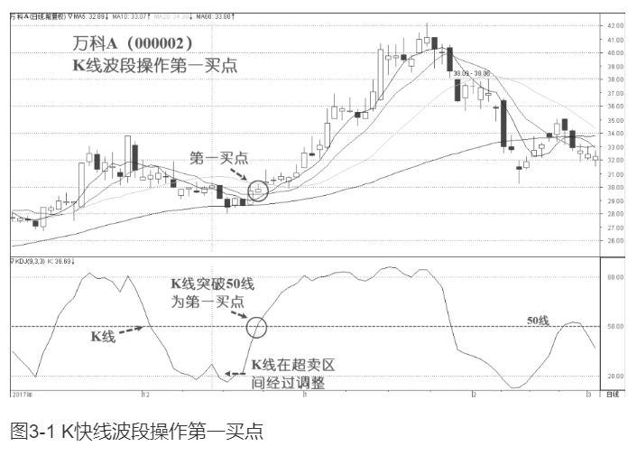

从图3-2中可以看到，个股华侨城A前期下跌调整，K快线同步在50线下充分调整。当K线向上突破50线时，在行情图上正好形成多方炮形态（两阳夹一阴），这一天是2017年12月28日，出现了第一买点。买入之后，该股一路上涨，K快线进入指标高位。第一买点买在了上涨行情的初始阶段。

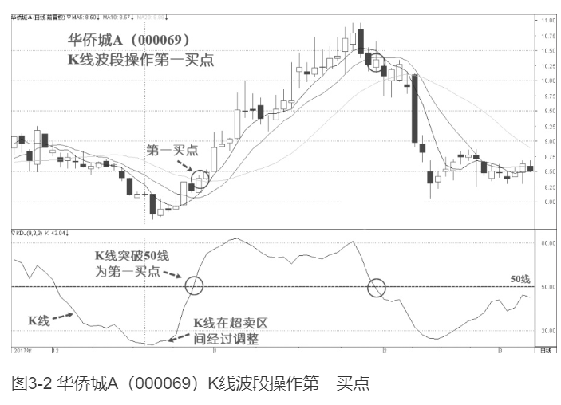

**K快线波段操作第二买点**

在第一买点后，若K线指标再次回落到50以下，然后又再次向上突破50一线时为第二买点。第二买点比第一买点的成功率更高，其往往是在主升浪的初期，在买入之后往往会有可观的上涨幅度，如图3-3所示。

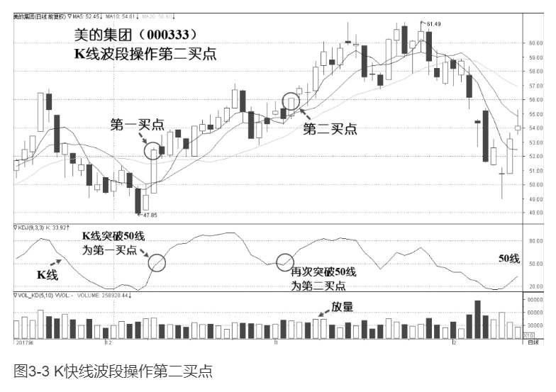

第二买点的形成是因为对第1上升浪的调整，经过第2浪回调之后，K快线经过回落再次向上突破50一线，这时是第二买点。这里通常是第3上升浪的起始位置，也就是主升浪的起点。

从图3-3中可以看到，K快线在超卖区经过调整之后，向上突破50线，这时产生第一买点。一波上涨之后，该股小幅调整，K快线回落到50线之下，很快便再次向上突破50线，这时产生了第二买点。买入之后通常会发生放量上涨，形成最猛烈的第3上升浪。

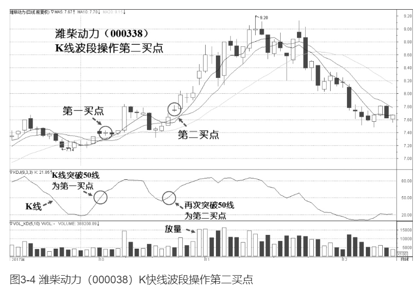

图3-4同样也是利用K快线第二买点的情况，从图中可以看到，K快线从超卖区向上移动并突破50线是第一买点，发生在2017年10月10日。买入之后，该股走出了第一波上涨，随后小幅回调，灵敏的K快线回落到50线之下。短暂调整之后，在2017年10月25日向上跳空高开，K快线再次向上突破50线，这时产生了第二买点。买入之后再次放量，并迅速上涨，K快线很快进入高位，证明了第二买点的有效性。

对应第3上升浪起始位置的第二买点，不仅买入成功率较高，而且上涨幅度可观。买入后放量上涨进一步确认上涨趋势的确立。这个位置通常也是后面将要讲到的K快线与D慢线二次交叉的位置，我们应该重点关注。

**K快线波段操作第一卖点**

K快线经过在超买区间的长期振荡之后，当K快线向下突破50一线时为第一卖点，如图3-5所示。

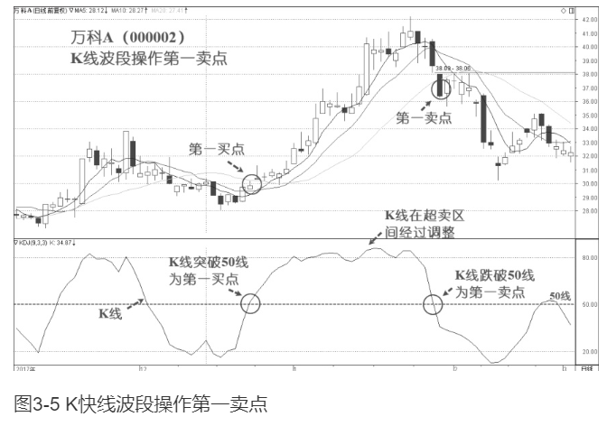

从图3-5中可以看到，万科A经过一段时间的上涨从30元涨到了40元左右，K快线向上突破50之后，在高位连续振荡，在超卖区间经过了充分调整。当K线从高位回落，向下跌破50一线时，产生第一卖点，发生在2018年1月30日。当天，该股跳空低开，收了一个中阴线，形成了一个顶部的跳空缺口。该股在后面四天都没有收回到缺口之上，随后破位下跌，形成了阶段顶部。K线指标也进一步下跌到了低位，证明了卖点的有效性。

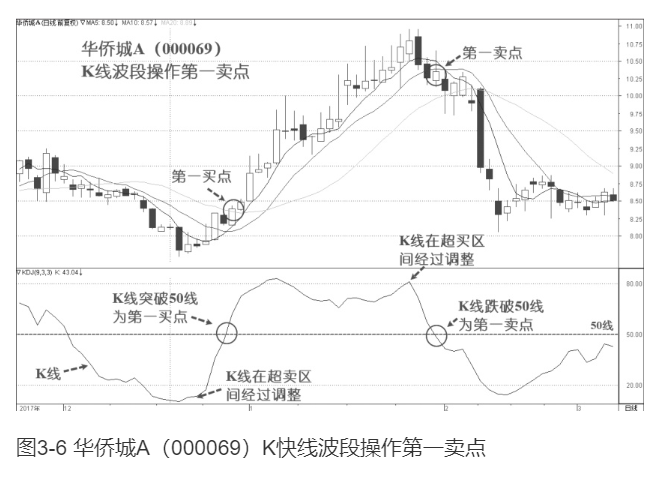

由于K快线比较灵敏，所以它发出的信号往往比较领先。我们看图3-6，华侨城A在第一买点之后不断上涨，第一次冲高时，K快线形成了一个波峰。随后，该股经过小幅调整之后继续上涨，K快线形成了第二个波峰。这时价格创出新高，K快线的第二个波峰低于前一个波峰，说明发生了顶背离现象，这时应该准备离场。当K快线向下跌破50一线时，是第一卖点，发生在2018年1月31日。

**K快线波段操作第二卖点**

在第一卖点后，若K线指标再次反弹回到50以上，然后又向下跌破50一线时为第二卖点。第二卖点比第一卖点的把握性更大，其往往是主跌浪的开始，也是波浪理论中讲的C浪下跌，如图3-7所示。

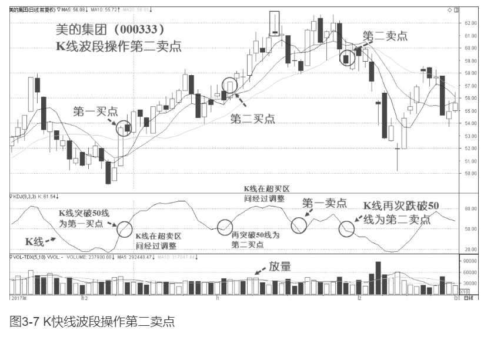

如果在第一卖点之后还有部分仓位，则可以在出现第二卖点的时候清仓出局。第二卖点往往是逃命的卖出时机，在此之后可能是汹涌的C浪下跌。图3-7显示的是美的集团利用K快线进行波段操作的第二卖点。从图中可以看到，该股买入之后大幅上涨，在第二波上涨中的顶部出现了“射击之星”的顶部反转K线形态。随后股价回落，K快线也回落到了50以下，这时是第一卖点。

之后该股再次上涨但没有创出新高，K快线没能到达80以上的超卖区间，再次拐头向下跌破50线，这时便产生了第二卖点。如果在这时还有仓位的话，应该离场。这个位置通常是短线调整的开始，后面会有杀跌浪。该股在第二卖点之后，股价大幅下跌，证明了第二卖点的有效性。

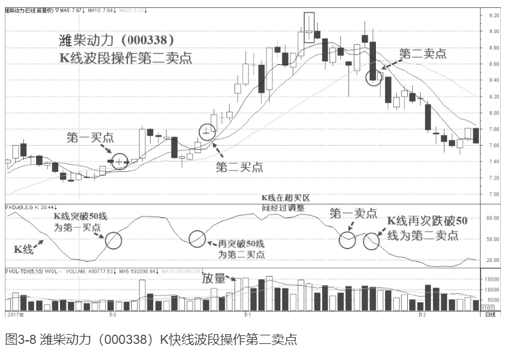

图3-8同样是K快线第二卖点的例子，该股两次买入之后，放量上涨，在顶部出现了一根“射击之星”，预示将发生反转。K快线在2017年11月20日回落到50线以下，产生第一卖点。随后反弹两天，K快线跟着反弹，第三天K线再次向下跌破50线，由此产生第二卖点。卖出之后，该股继续大幅下跌，证明了第二卖点的有效性。

## 超买与超卖
**K快线超卖区间突破买点**

K快线从高位回落，进入超卖区间并经过调整之后，当K快线向上突破20一线时为超卖区间突破买点，如图3-9所示。

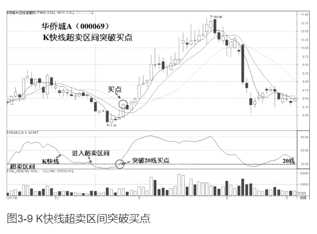

图3-9显示的是个股华侨城A（000069）利用K快线在超卖区间向上突破20一线作为买点的操作。该股的K快线从高位回落到超卖区间之后，在超卖区间经过了充分调整。2017年12月26日这天，K快线向上突破20一线产生买点。买入之后，K快线继续向上移动进入高位，股价也出现了连续上涨。

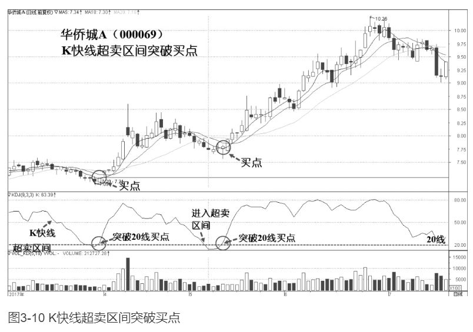

图3-10显示的是个股华侨城A（000069）的另一段走势，同样是利用K快线在超卖区间向上突破20一线作为买点。从图中可以看到，该股的K快线两次从高位回落到超卖区间，并且产生了两次突破20线的买入信号，分别发生在2017年3月31日和5月11日。买入之后，K快线均继续向上移动进入高位，股价也出现了连续上涨。

**K快线超买区间第一卖点**

K快线从低位向上移动并进入超买区间，经过调整之后，当K快线向下跌破80一线时为超卖区间第一卖点，如图3-11所示。

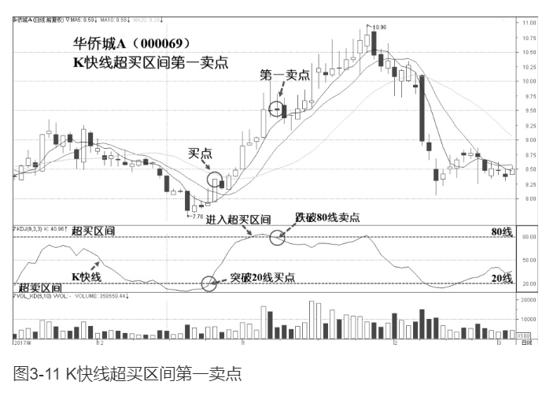

图3-11显示的是个股华侨城A（000069）利用K快线在超买区间向下跌破80一线作为卖点的操作。该股产生买入信号之后，K快线从低位上升到超卖区间，经过了调整之后，在2018年1月9日，K快线向下跌破80一线产生卖点。卖出之后，该股经过小幅调整再次上涨，我们利用第一卖点抓住了一波上涨，但错过了第二波上涨，这就需要配合仓位管理策略分批退场，见图3-13的第二卖点。

图3-12显示的是个股华侨城A（000069）的另一段走势，同样是利用K快线在超买区间向下跌破80一线作为卖点。从图中可以看到，第一个买点之后，K快线并没能进入超买区间，这时可以利用9日通道线下轨跟踪止损离场。第二个买点之后，K快线在6月12日短暂进入超卖区间，在6月13日就跌破了80线，形成第一卖点。同样抓住了一波上涨行情。

**K快线超买区间第二卖点**

在第一卖点后，若K快线在回落到超卖区间之前，再次上升回到80线以上，然后又向下跌破80一线时为第二卖点。第二卖点比第一卖点更可靠，往往能够抓住三浪上涨形态，如图3-13所示。

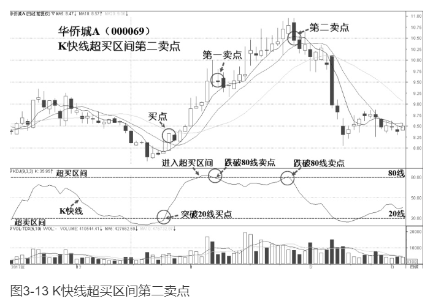

图3-13显示的是个股华侨城A（000069）利用K快线在超买区间二次向下跌破80一线作为卖点的操作。该股产生第一卖点之后，K快线没有跌破50线就再次进入超买区间，在2018年1月29日，第二次向下跌破80一线，这时产生了第二卖点。

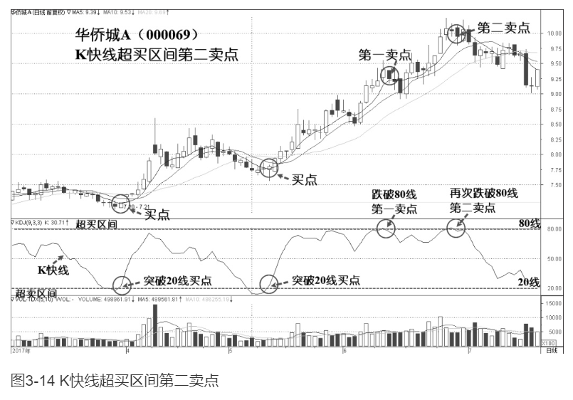

图3-14显示的是个股华侨城A（000069）的另一段走势，利用K快线在超买区间二次向下跌破80线作为卖点。从图中可以看到，该股的第二个买点之后，在6月13日形成第一卖点，股价小幅调整之后再次上涨，K快线没有跌破50线就再次进入超买区间，并在6月29日，第二次向下跌破80一线，产生了第二卖点。

在这次波段操作中，K快线在突破前波高点之后，第一次接近80线但未能突破，后两次接近80线时都形成了突破，这三次接近80线对应着三小浪上涨，K快线在超买区间的第二卖点卖在了阶段高位，卖出之后，该股开始下跌，K快线快速进入低位。

## 趋势线的运用
连接连续两个或两个以上的波谷最低点的直线是上升趋势线，如图3-17所示，趋势线在两个低点间不会穿过任何数值。连接连续两个或两个以上的波峰最高点的直线是下降趋势线，如图3-15所示。

**趋势线波段买点**

在随机振荡指标KDJ中，下降趋势线对K快线具有压力作用，在下降趋势中，当K快线在低位由下向上突破下降趋势线时，为波段买点，如图3-15所示。

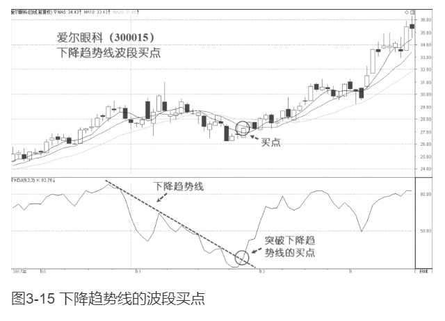

从图3-15中可以看到，该股经过一波上涨进入调整时，K快线从超买区间回落到50线以下，并且逐波震荡走低。连续相邻波峰就画出了一条下降趋势线。几个波峰都受到下降趋势线压制，处于趋势线之下。K快线跌到超卖区间之后，经过调整，直到图中圈出的位置，K快线向上突破下降趋势线，这时产生突破买点。

这个方法在指标经过低位的调整之后形成的买点更有效。细心的交易者会发现，用趋势线判断的买点比前面讲到的突破50线的买点位置要提前。这是因为K线在短线调整之后，很容易在收盘价向9日高点移动时，指标线迅速形成突破。

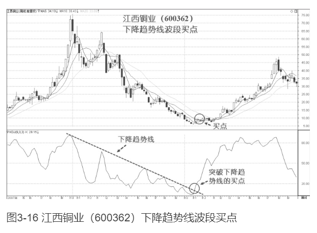

K快线的反应非常灵敏，这使它在短周期的K线图上经常迅速移动，在9天之中，如果恰好从最高价移动到最低价附近，那么K快线就会很快从超买区间进入超卖区间，如果后面的行情继续向下发展，K快线就容易失真。指标线会一直在50线以下振荡。这是由于价格始终在下降通道下轨附近造成的。即使价格一再创出新低，指标都是在低位徘徊，并不能反映价格的下跌幅度。通常，K快线对同一方向的波动反应不敏感，而对转向的反应较为敏感。

图3-16是江西铜业的周线图，可以看到，该股从高位下跌之后，K快线迅速跌到了超卖区间。随后，价格逐波走低，K快线反弹的力度也越来越弱。我们连接反弹波峰的顶点，就可以画出一条下降趋势线。价格不断创出新低，距离最高价已经有了很大的幅度，但K快线却一直在第一波的低点上下徘徊。下降趋势线越向下，反弹的空间越小，直到图中圈出的位置，K快线突破了下降趋势线，形成了突破买点。在买入之后，K快线迅速拉升突破50线，利用两波拉升就进入了超买区间，这说明敏捷地反映了价格的反转。这也就是说，价格进入了9周以来的高位。

**趋势线波段卖点**

在随机振荡指标KDJ中，上升趋势线对K快线具有支撑作用，在上升趋势中，当K快线在高位由上向下跌破上升趋势线时，为波段卖点，如图3-17所示。

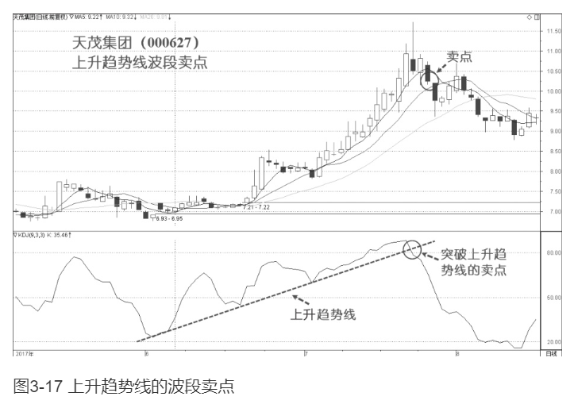

从图3-17中可以看到，该股经过一波上涨，波峰和波谷逐步抬高，连接相邻波谷就可以画出一条上升趋势线。两个波谷都受到上升趋势线支撑，在趋势线之上移动。K快线上涨到超买区间之后，走出了一根“倒锤头”，这是顶部反转K线形态。在图中圈出的位置，K快线向下拐头跌破上升趋势线，这时产生突破卖点。

这个方法在指标经过高位的调整之后形成的卖点更有效。用趋势线判断的卖点比前面讲到的跌破50线的卖点位置要提前。这是因为K线在短线调整之后，很容易在收盘价向9日低点移动时，指标线迅速向下突破趋势线。

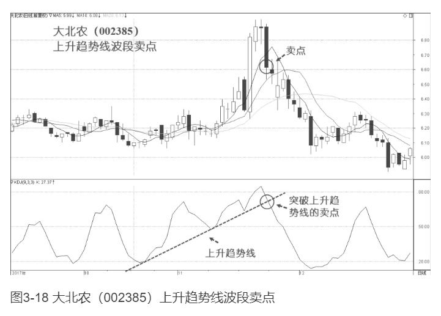

图3-18是大北农（002385）的日线图，可以看到，该股从低位上涨之后，K快线迅速突破50线，股价逐波上涨，指标的波谷逐波抬高。我们连接调整时的波谷低点，就可以画出一条上升趋势线。当K快线从超买区间拐头向下跌破这条趋势线的时候，就可以卖出离场。卖出之后，股价进一步下跌，K快线迅速跌到了超卖区间。我们卖在了短线的下跌初期。

## 指标线的形态
**头肩顶形态的波段卖点**

头肩顶是常见的价格形态，K快线有时也会形成这一形态，当其在高位形成头肩顶形态时，预示着极有可能发生顶部反转，以此可以判断出波段卖点，如图3-19所示。

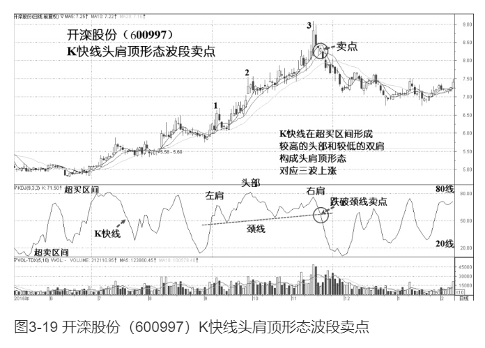

图3-19显示的是开滦股份（600997）从2016年6月到2017年2月的走势图，从图中可以看到，在该股在上涨过程中，K快线从超卖区间向上移动，并形成了三个波峰。中间的波峰进入了超买区间，说明上涨力道最猛，形成指标的头部。两侧的波峰略低，但也在指标高位，只是略低于80线，这两个波峰形成指标的左肩和右肩。这就构成了高位的一个头肩顶形态。

连接头部两侧的波谷低点的直线是这个头肩顶的颈线，当K快线向下跌破颈线时产生卖出信号，发生在2016年11月17日，收盘价为8.33元。头肩顶的三个波峰对应着股价的三波上涨。卖出之后，该股连续下跌，证明了卖点的有效性。

**头肩底形态的波段买点**

头肩底是常见的底部反转形态，K快线有时也会形成这一形态，当其在低位形成头肩底形态时，预示着极有可能发生底部反转，以此可以判断出波段买点，如图3-20所示。

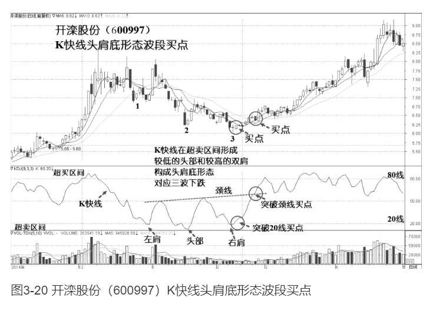

图3-20显示的是开滦股份（600997）从2014年11月到2015年4月的走势图，从图中可以看到，在该股在一波上涨之后的回调过程中，K快线从超买区间向下移动，并形成了三个进入超卖区间的波谷，中间的波谷最低，说明下跌势头最猛，形成指标的头部，两侧的波峰略高，但也在80线以下，形成指标的左肩和右肩，这就构成了一个低位的头肩底形态。

连接头部两侧的波峰高点的直线是这个头肩底的颈线，当K快线向上突破20线时产生买入信号，发生在2015年2月10日，收盘价为6.22元。当K快线向上突破颈线时再次产生买入信号，发生在2月25日，收盘价为6.36元。头肩底的三个波谷对应着股价的三波下跌。买入之后，该股连续上涨并突破前高，证明了买点的有效性。

**双重顶形态的波段卖点**

双重顶是一种常见的顶部形态，在K快线指标中，双重顶比头肩顶更为常见。双重顶指K快线在超买区间形成两个波峰的指标模式，在上涨中较为常见，如图3-21所示。

图3-21显示的是五粮液（000858）从2017年9月到2018年3月的走势图，从图中可以看到，在该股经过回调之后，K快线从超买区间向下移动到超卖区间，然后随着股价上涨，K快线上行并在超买区间形成了两个波峰，这就构成了一个高位的双重顶形态。

在第二个波峰形成之后，当K快线向下跌破80线时产生卖出信号，发生在2018年1月17日，收盘价为86.01元。卖出之后的小幅反弹没能收复卖出当日的长阴线，该股随后展开一波快速下跌行情，K快线迅速向下移动到超卖区间，证明了卖点的有效性。

**双重底形态的波段买点**

双重底是一种常见的底部形态，在K快线指标中，双重底比头肩底更为常见。双重底指K快线在超卖区间形成两个波谷的指标模式，如图3-22所示。

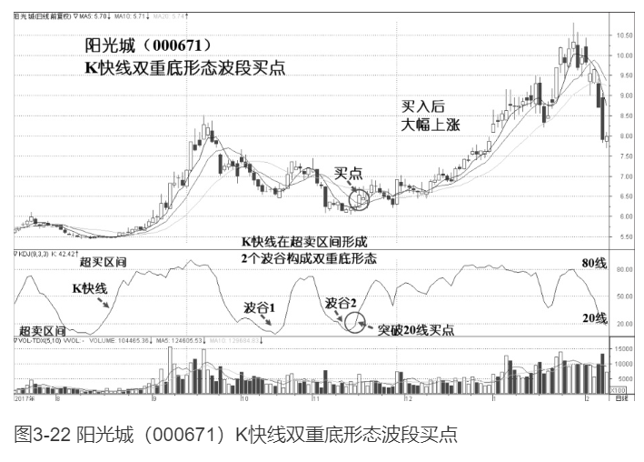

图3-22显示的是阳光城（000671）从2017年7月到2018年2月的走势图，从图中可以看到，在该股上涨后的回调过程中，K快线从超买区间向下移动，K快线在超卖区间形成了两个波谷，这就构成了一个低位的双重底形态。

在第二个波谷形成之后，当K快线向上突破20线时产生买入信号，发生在2017年11月16日，收盘价为6.53元。买入之后该股两次回踩10日均线，随后展开连续上涨行情，K快线曲折向上移动到超买区间，证明了买点的有效性。

**三重顶形态的波段卖点**

三重顶是一种经过三浪上涨形成的顶部形态。三重顶指K快线在超买区间形成三个波峰的指标模式，如图3-23所示。

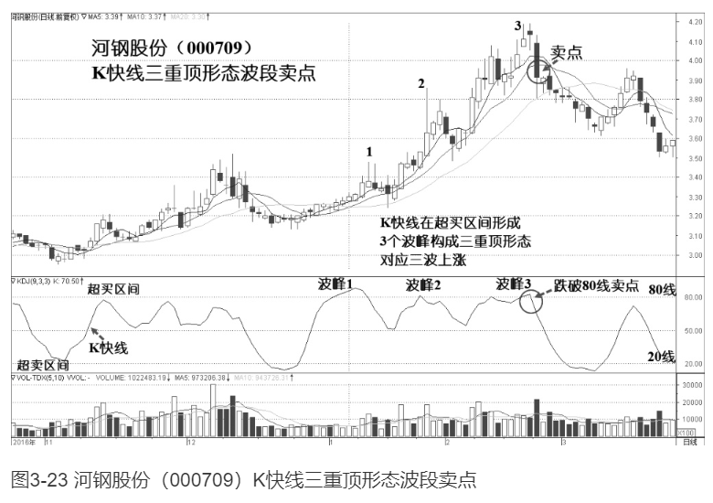

图3-23显示的是河钢股份（000709）从2016年10月到2017年3月的走势图，从图中可以看到，在该股在上涨过程中，K快线从超卖区间向上移动到超买区间，并在超卖区间形成了三个波峰，这就构成了一个高位的三重顶形态。

每一个波峰对应着一波上涨，在第三个波峰形成之后，当K快线向下跌破80线时产生卖出信号，发生在2017年2月23日，收盘价为3.91元。卖出当日收出放量长阴线，该股随后走出三浪下跌行情，验证了卖点的有效性。三重顶形态进入超买区间的幅度越大产生的卖出信号越可靠。

**三重底形态的波段买点**

三重底是一种经过三浪下跌形成的底部形态。三重底指K快线在超卖区间形成三个波谷的指标模式，如图3-24所示。

图3-24显示的是中航机电（002013）从2017年11月到2018年5月的走势图，从图中可以看到，在该股在下跌过程中，K快线从超买区间向下移动，K快线在超卖区间形成了三个波谷，这就构成了一个低位的三重底形态。

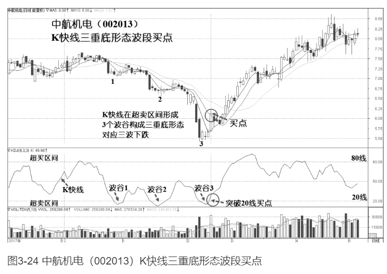

每一个波谷对应着一波下跌，在第三个波谷形成之后，当K快线向上突破20线时产生买入信号，发生在2018年2月13日，收盘价为6.12元。买入之后该股回踩10日均线，随后展开连续上涨行情，K快线快速向上移动到超买区间，验证了买点的有效性。三重底形态进入超卖区间的幅度越大产生的买入信号越可靠。

## 顶背离与底背离
**底背离波段操作第一买点**

K快线指标与价格发生底背离之后的第一买点，如图3-25所示。

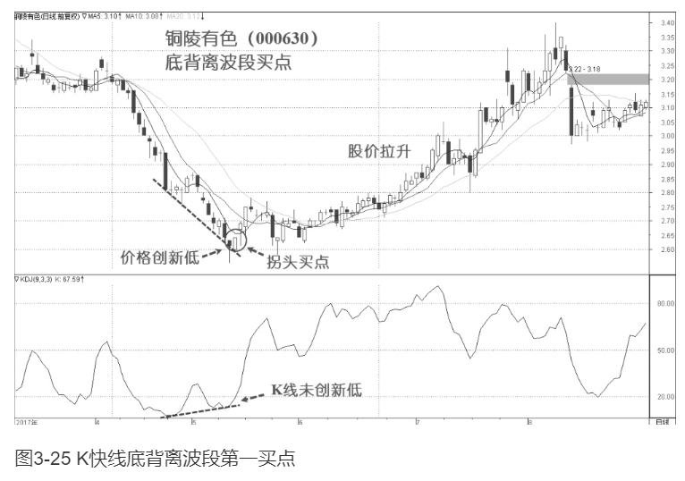

从图3-25中我们看到，在下跌趋势中，价格不断创新低，K快线起初也跟随价格同步向下运行，像“影子”一样紧盯价格。 K快线在50线之下不断创新低，当进入超卖区间时，K快线对下跌力量的减弱开始变得敏感起来。当价格经过一次小幅反弹后再创新低时，K快线并未同时创下新低，这时就发生了底背离现象。

在K快线发生底背离后，当指标值大于前一日指标值时是拐头买点。底背离通常发生在下跌推动浪末端的最后一个下跌浪，底背离表示短期内有极大的转势可能，它是底部反转信号。在操作中，底背离买入后，应该很快会得到趋势线的确认，会伴随着放量价格突破下降趋势线。

从图3-26可以看出，在下跌趋势中，该股价从高位一路下跌，K快线指标也同步从超买区间跌入超卖区间。指标在50线之下不断创出新低，K快线像“影子”一样紧盯价格。当指标进入超卖区间时，K快线对下跌力量的减弱开始变得敏感起来。当价格经过一次反弹后，在2017年12月15日再创新低7.43元，但同时指标并未创下新低，这时发生了背离。交易者在这时就应该想到，这里极可能是空头力量最后的释放，卖压力量已经开始减弱，反转的可能性在增大。

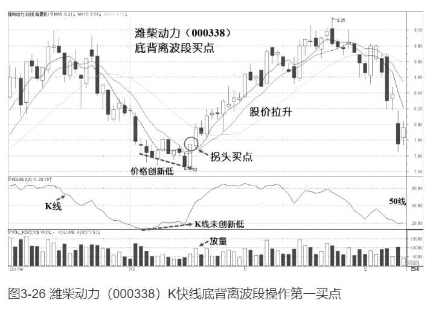

从图中也可以看出，价格趋势线与指标趋势线也发生了背离。在12月18日，K快线指标值为39.03大于前一日的指标值17.52，表示K快线背离后向上拐头，这是指标上升的开始，此为波段操作第一买点。

买入之后，买点很快得到了确认，价格放量突破10日均线，连续的两根大阳线突破前波反弹高点宣布空头的结束。事实也证明了这次背离是最后一跌，买入之后，K快线也很快突破了50线，进入了多头市场。此后，K快线快速进入超买区间，股价一路上扬。

有的交易者会问，不等指标拐头而在背离时马上买入是否可行？我们认为，这样做有很大的风险，因为在发生背离时，价格还可能进一步下挫，甚至K快线也有可能再创新低。在指标没有拐头时都不能算是完成背离。

即使是一个高成功率的买点，也要设置止损。可以把止损设在拐头前的最低价位置。背离发生在空方时，会有两种走势，一种是反弹，另一种是转势。对于反弹，力度可大可小，如果遇到小概率的小反弹发生，这时止损单就会发挥作用。

**底背离波段操作第二买点**

K快线指标与价格发生底背离后的第二买点，如下图3-27所示。

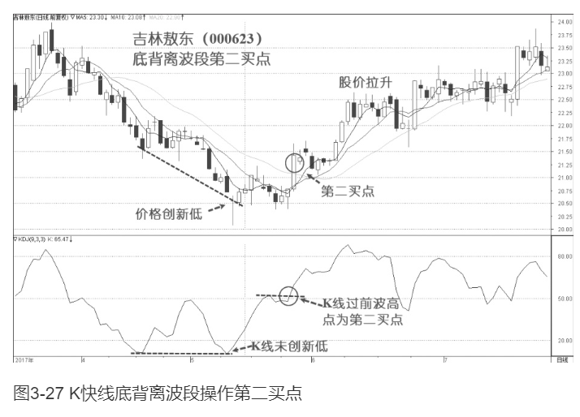

从图3-27中我们可以看到，K快线底背离波段操作的第二买点，是在K线背离之后突破前期高点时产生的。股价创新低，指标未创新低，形成底背离之后，股价反弹，K线快速突破50线，然后股价回落没有跌破最低点反身向上，K快线向上突破前面的高点，这时产生第二买点。

第二买点较第一买点更靠后，位置更高，但比第一买点更为可靠。因为在空头力量超强的市场中，背离拐头的第一买点有失误的可能，指标可能拐头之后没有几日便又重回跌势，这种情况也要考虑到。第二买点等于是给第一买点一个回旋的余地，如果第一击命中，那么第二买点可以顺势加仓，乘胜追击；如果第一买点失误，则需要及时止损，也不会有太大的损失。所以说，第二买点是以牺牲低价位来提高入场的可靠性。

从图3-28中可以看到，在个股阳光城的指标图中发生了底背离。该股在第一波下跌时，价格与指标同时创出新低，经过小幅反弹之后，再次下跌，并在2017年11月14日创出新低6.04元，而当时指标并未创新低。新低这一天由于收长上影线，大于前一日K值，这是背离后的拐头，是第一买点。随后K快线进一步向上运行并突破50线，经过一次N字调整之后，在12月11日突破前期高点，这时产生了第二买点。

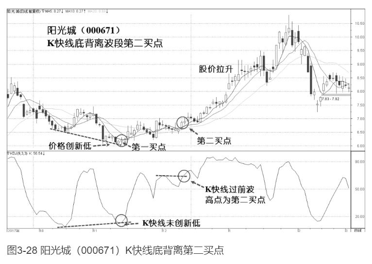

从图中可以看出，第二买点比第一买点的位置要稍高一些，虽然买入价格不如第一买点低，但上涨的可能性更大了。K快线在50线上方调整了一下，然后迅速向上突破，股价相应快速拉升。

在强劲的空头市场中，会出现背离后还有背离的情况，这时就能看出第一买点的激进性和第二买点的稳健性。第二买点对第一买点的保护可以通过下面这个实例来说明，如图3-29所示。

从图3-29中可以看到，华夏银行在前期出现了连续的下跌，K快线在50线以下运行了较长时间。直到2017年12月26日，K快线形成超卖区间的第二个波谷并向上拐头，第二个波谷没有创新低，这时形成了第一次底背离，但股价第二天却再次下跌创出新低。在第一次背离拐头后买进，会被止损出局一次。这时的止损是必要的，因为在趋势完全反转之前，我们并不知道它会继续跌到哪里。

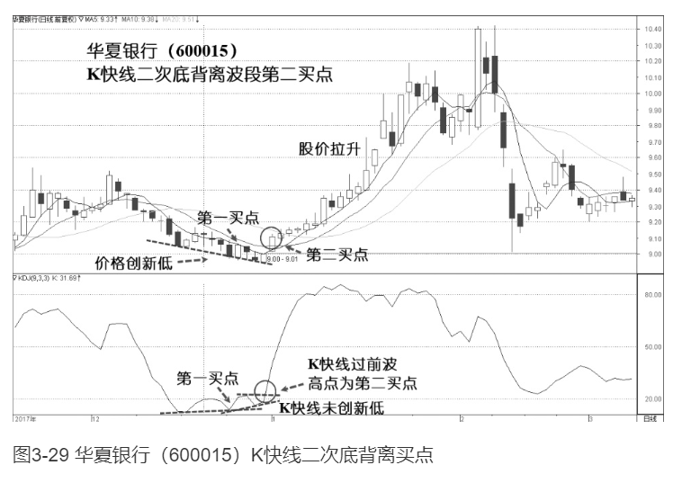

在短暂地创出新低之后，K快线再次向上拐头，形成底部提高的第三个波谷，这时形成了第二次底背离，突破前高为第二买点，图中用圆圈标出的位置。第二买点发生在2018年1月2日，收盘价9.11元，比第一买点的9.06元略高一些。但第二次买入之后，该股连续上涨，K快线迅速突破50线，并且进入超买区间。可以看出，第二买点也是突破下降趋势线，并且首次站上10日均线的位置，K快线在超卖区间向上突破前期指标高位，这里是一个较优的买点。

**顶背离波段操作第一卖点**

K快线与价格发生顶背离后的第一卖点，如图3-30所示。

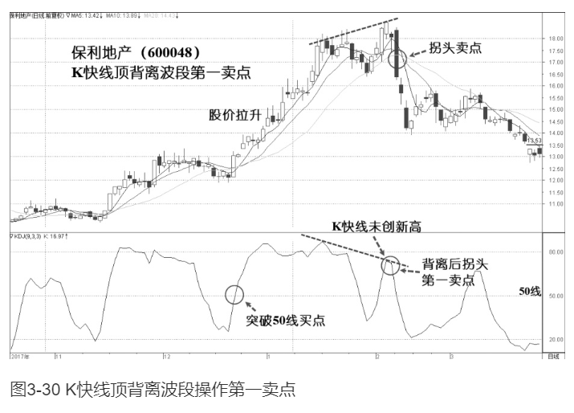

从图3-30中我们看到，前期K快线突破50线时为突破买点，买入之后该股一路上涨，价格不断创出新高，K快线也跟随价格同步向上运行，它像“影子”一样紧盯价格。当K快线进入超买区间后，它对上涨力量的减弱开始变得敏感起来。当价格经过一次回调后再创新高时，指标并未同时创出新高，这时就发生了顶背离现象。这预示着这里极可能是多头最后一波拉升。在图中用两条直线分别连接价格与指标的两个相邻的波峰，我们看到，价格的后一个波峰高于前一个波峰，指标的后一个波峰低于前一个波峰，两条直线方向出现了明显的背离。

在K快线发生顶背离后，当指标值小于前一日指标值时是拐头卖点。顶背离通常发生在上升推动浪末端的第5浪，顶背离表示短期内极有可能转势，是顶部反转信号。在操作中，顶背离卖出后，价格应该会很快跌破上升趋势线，确认顶背离的形成。

从图3-31中可以看出，通过底背离买入之后，该股价格从低位一路上行，K快线也同步从空方突破50线进入多头市场。指标在50线之上不断创出新高，K快线像“影子”一样紧盯价格。当指标进入超买区间时，K快线对上涨力量的衰减开始变得敏感起来。当价格经过一次回调后，在2018年1月24日再次创出新高9.35元，但同时指标并未创出新高，这时发生了顶背离。而且这一天收了一根“吞没形态”的长阴线，这是顶部反转K线形态。交易者在这时就应该想到，这里极可能是多头最后的一次上攻，反转的可能性在增大。

从图中也可以看出，价格趋势线与指标趋势线发生了背离。在1月24日，K快线指标值为72.80小于前一日的指标值78.85，表明K快线背离后拐头向下，这是指标下跌的开始，此为波段操作第一卖点。

在卖出后的几天内，股价放量跌破10日均线，卖点很快得到了确认。 事实证明，顶背离是最后一波拉升，卖出之后，K快线很快进入了50线以下，进入了以空头为主导的市场。此后，K快线一直运行在50线之下，股价一路走低。

K快线顶背离卖点是短线成功率较高的卖点之一。多数情况会卖在上涨波段的末端，但如果行情没有按预期跌下去，而是走出了上涨延长浪时，我们应该在回测不破50线，再反身向上时回补小部分仓位。

**顶背离波段操作第二卖点**

K快线指标与价格发生顶背离后的第二卖点，如下图3-32所示。

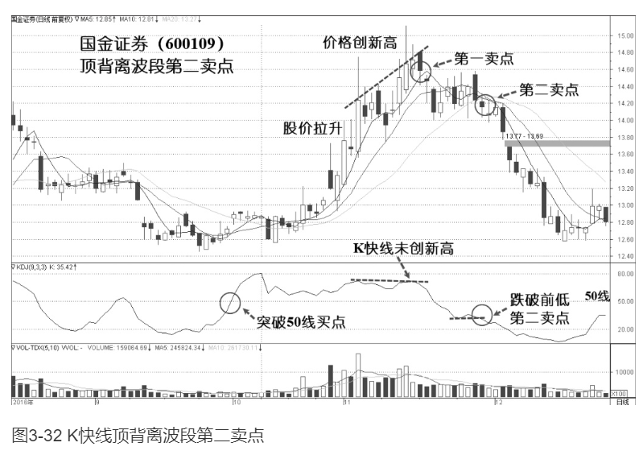

从图3-32我们可以看到，K快线顶背离波段操作的第二卖点。价格创新高而K快线未创新高时产生背离，连接价格相邻两个波峰的直线方向向上，连接K快线相邻两个波峰的直线方向向下。之后K快线拐头向下，这里是前面讲到的第一卖点，当K快线经过反弹再次向下跌破前低时，为第二卖点，图中用圆圈标出的位置。

第二卖点比第一卖点更靠后，位置更低，但比第一卖点更为可靠。因为在多头力量强劲的市场中，顶背离后指标拐头的第一卖点有失误的可能，指标可能在拐头之后没有几日便又重回涨势。第二卖点是对第一卖点的保护，这样在一定程度上可以防止踏空。

第一卖点是在顶部反转可能性较大的位置预先获利了结一部分利润。第二卖点通常是行情的快速杀跌点，它是对第一卖点的确认。在A股市场中，股票的涨跌普遍表现出一种规律，那就是涨得比较慢而跌得比较快！因此，要想保住更多的利润，一定要研究好卖点。

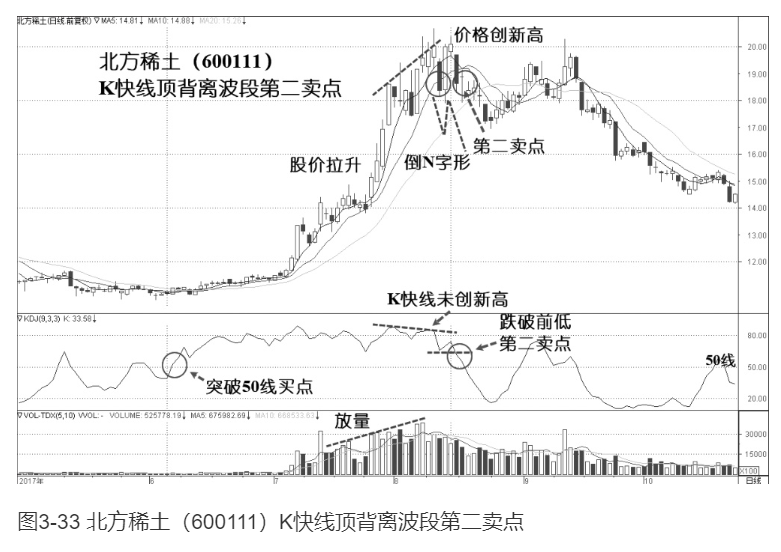

从图3-33可以看到，个股北方稀土在前期K快线向上突破50线时是突破买点。买入之后，稍作调整便大幅拉升，成交量也明显放大。

K快线在高位反复振荡，股价一直在MA10之上，股票涨势良好。一直到高位之后，价格创新高，而K快线未创新高，第二个波峰低于第一个波峰，K线开始收在MA10之下，并且上涨缩量，这时出现了见顶迹象。该股在2017年8月17日，K快线跌破前低，产生第二卖点。

从图中可以看出，把从最高位的价格回落看成一个倒N字形的话，第一卖点是在第一波下跌，而第二卖点是在第二波下跌，也就是波浪理论中的a浪和c浪下跌。第二卖点是对下跌趋势的确认。而且，在后面的反弹中，股价也没能超过c浪下跌的起始位置，所以说，第二卖点是一个有效的卖点和压力位。

在强劲的多头市场中，会出现顶背离后还有顶背离的情况，这时就能看出第一卖点的激进和第二卖点的稳健。第二卖点对第一卖点的保护可以通过下面美的集团（000333）中的应用实例来说明，如图3-34所示。

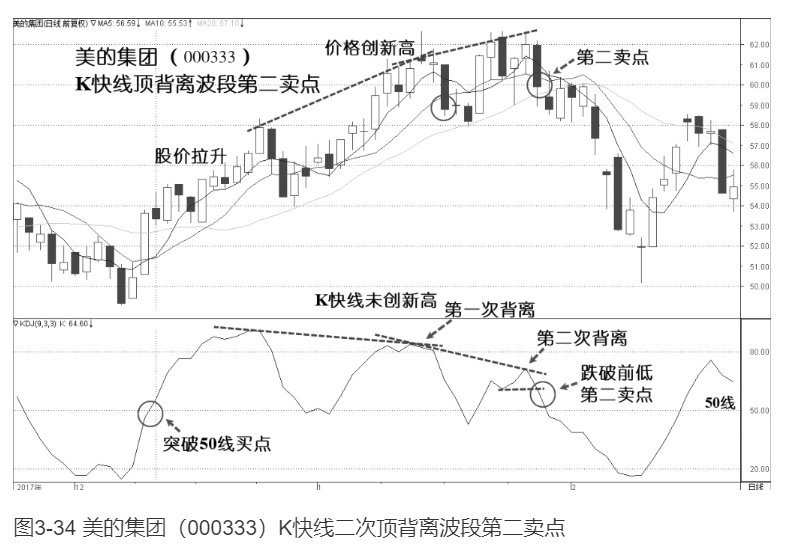

从图3-34可以看到，该股前期突破50线买入之后，股价连续上涨，K快线很快进入超买区间。在2017年12月25日形成第一个波峰，在2018年1月15日形成第二个波峰，连接价格波峰的直线方向向下，连接指标波峰的直线方向向下，就此形成了第一次顶背离。随后又在1月26日形成了第三个波峰，价格创出新高，而K快线波峰明显低于前两个高点，就此形成了第二次顶背离。

第二次顶背离之后，1月29日K快线跌破前期低点，产生第二卖点。第二次背离的卖点比第一次背离的拐头卖点位置更高。当第一次背离后，可以卖出一半仓位，等K快线跌破50线，再次向上没能创出新高，并向下跌破前低时卖出另一半仓位。这样做既能保护顶部的利润，又能防止如果再次上涨的踏空风险。

第二卖点之后，均线形成死叉，股价迅速下跌，K快线进入超卖区间。在顶背离中，波段第二卖点要比第一卖点更合理。交易者可以通过控制仓位，在第一卖点产生时保护性离场一部分筹码，在第二卖点产生时再卖出大部分筹码。

## 指标钝化
`指标钝化`是指当行情沿着同一方向连续冲击时，使得指标线在极限位置反复振荡，导致指标失去指导意义。钝化现象在区间振荡指标中较为常见，这是由于极端行情超出指标计算周期的指示范围造成的，所以短线指标更容易发生钝化。指标钝化可分为`高位钝化`和`低位钝化`。

**超买区间钝化**

K快线在80线以上发生的钝化现象被称为高位钝化，也就是在超买区间发生的钝化，其形成原因是股价经过连续上涨，一直处于靠近9日高低价通道上轨的位置。

图3-35显示的是中兴通讯（000063）从2017年7月到12月的走势图。从图中可以看到，该股发生了三波上涨，K快线三次从低位上升到高位。

在第一波上涨时，K快线随着价格的上涨而升高，K快线能够反映出价格的走势，这时是有效的。在第三波上涨时，K快线跟随价格上升到高位之后，价格继续上涨，而指标没能继续创出新高，只是在超卖区间反复振荡，见方框标出的位置，K快线这时并不能指示出价格是在上涨还是横盘，这就发生了钝化现象，指标在这时是失效的。

在11月6日，K值为90.54，当天创出新高（第一个向上箭头处），最高价为34.07元，收盘价为34元，几乎是光头阳线，这时的RSV值最高，RSV的3日移动平均值即K值也是最高。随后价格又有4次创新高并在最高价附近收盘，K值出现4个波峰但未能再创新高，但仍保持在80线以上。

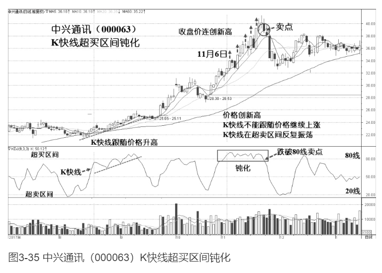

我们知道，K快线进入超买区间意味着下跌的可能性增大，那么在一共5次波峰的右侧向下拐头时，都是可能的卖出信号，如果在前4次出现卖出信号时卖出，则都会错过后面的上涨，尤其是在11月6日之后卖出，会错过一半行情。

应对钝化的方法之一是，等待指标明显发生变化时再操作，应对图3-35这次钝化的卖出条件是，当K快线向下跌破80线时卖出，如果遇到K快线波动幅度较大的情况，则可以将跌破界限设为75。

在11月23日，K快线向下跌破80线，说明价格开始明显回落，当日收盘价为38.81元。我们的卖点位于上涨波段的顶部，卖出之后，股价开始连续下跌。
图3-36显示的是双汇发展（000895）从2017年7月到2018年2月的走势图。从图中可以看到，标出了2017年8月7日到11月6日的一波连续上涨走势。

在9月6日时，图中第一个向上箭头的位置，K快线从超卖区间上升到超买区间并创出最高点，K快线形成了一个80线以上的波峰。在整个下跌过程中，K快线一共创出了4个位于80线以上的波峰。也就是说，K快线4次从高位跌破80线，产生了4个可能的卖出信号，在图中用1-4数字表示。显然，只有最后一次卖出信号是波段顶部右侧卖点，如果在前两个卖出信号离场，则会错失很大一部分利润。

所以说，这时的K快线失去了指示卖点的作用，这是由于上涨的级别大于K快线的计算周期造成的。K快线对于9个交易日左右连创高点的行情有效，对图3-36中长达50多个交易日的上涨会失效。

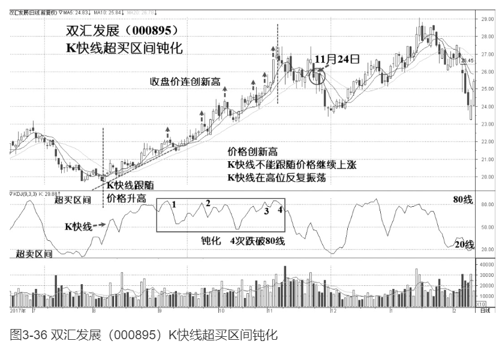

K快线直到第1个波峰时都是有效的，股价不断上涨，但第2个波峰没有高于第1个波峰，这时产生了价格与指标的背离现象，很多人会卖在第二个向上箭头之后的那根K线。但后面还有很长时间和很大幅度的上涨行情。

要想抓住整个波段行情，就要用到应对钝化的对策了，我们总结了以下四个对策：一是扩大周期，切换到较大一级别的行情图就可以有效解决钝化带来的指标失效问题；二是与中长线指标配合，比如利用60日均线、MACD指标等判断中长线买卖点；三是等待指标进入反向极限位再进行反向操作，比如等待K快线从高位回到50线以下之后的第一次反弹结束时卖出；四是利用K线形态和量价关系判断行情起始和终止阶段，当出现顶部反转信号之后再配合K快线寻找卖点，比如图3-36中，在11月9日出现了巨量阴线反转形态，此后的K快线向下拐头是卖出信号。

下面我们来看利用扩大周期方法解决钝化现象的例子，如图3-37所示。

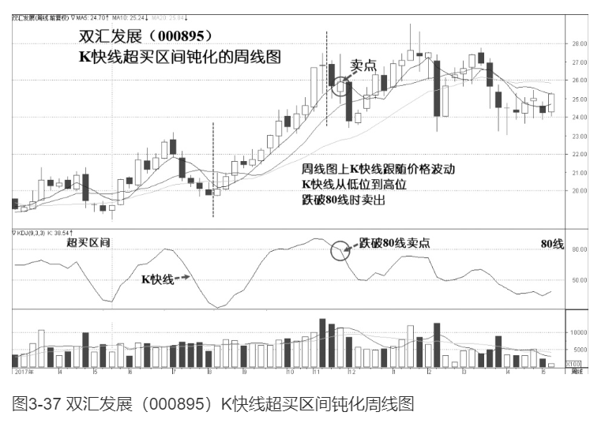

图3-37显示的是双汇发展（000895）从2017年3月到2018年5月的周线图。在图标出了2017年8月7日到11月6日的那波连续上涨走势，K快线从低位上升到高位，与日线图相比，周线图的指标走势明显更加简单、清晰，只有一波教科书式的上涨。

在图中的11月24日那周，K快线从超买区间自上而下穿越80线，产生卖出信号，这时日线图上的K快线已经在50线以下形成了倒N字形的第三条腿，这时可以立即卖出，11月24日的收盘价为25.92元，见图3-36。这样，我们就利用扩大周期的方法，抓住了一波完整的上涨行情。

**超卖区间钝化**

K快线在20线以下发生的钝化现象被称为低位钝化，也就是在超卖区间发生的钝化，其形成原因是股价经过连续下跌，一直处于靠近9日高低价通道下轨的位置。

图3-38显示的是浦发银行（600000）从2016年12月到2017年7月的走势图。从图中可以看到，我们标出了2016年2月21日到2017年5月11日的一波连续下跌走势。

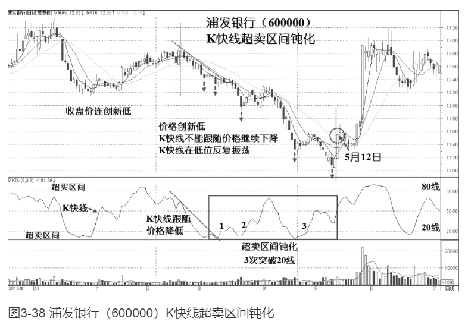

在3月3日时，图中第一个向下箭头的位置，K快线从超买区间下降到超卖区间并创出调整低点，K快线创出第一个20线以下的波谷。在该股的整个下跌过程中，K快线一共创出了4个位于20线以下的波谷。K快线3次从低位向上突破20线，产生了3个可能的买入信号，在图中用1-3数字表示。在这3个买入信号之后，该股都再次创出了新低，显然，这些都不是进场时机，一旦买入，后面都会被套牢或止损。

所以说，这时的K快线失去了指示买点的作用，这是由于下跌的级别大于K快线的计算周期造成的。K快线对于9个交易日左右连创低点的行情有效，对图3-38中长达50多个交易日的下跌会失效。

K快线直到第1个低位波谷时都是有效的，股价不断下跌，但第2个波谷没有低于第1个波谷，这时产生了价格与指标的底背离现象，很多人会买在第2或第3个向下箭头之后的那根K线。但后面还有很长时间和很大幅度的下跌行情。

下面我们来看利用扩大周期方法解决低位钝化现象的例子，如图3-39所示。

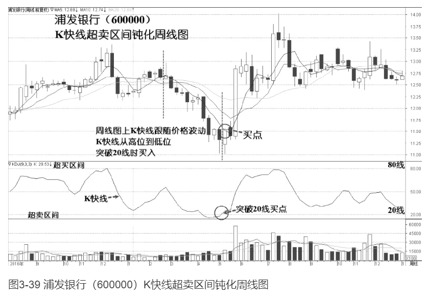

图3-39显示的是浦发银行（600000）从2016年12月到2017年7月的周线图。我们在图中标出了2016年2月21日到2017年5月11日的那波连续下跌走势。K快线从高位下降到低位，与日线图相比，周线图的指标走势明显更加简单、清晰，只有一波教科书式的下跌。

在图中的5月12日那周，K快线从超卖区间自下而上穿越20线，产生买入信号，这时日线图上的K快线已经在50线以上形成了N字形的第三条腿，这时可以立即买入，5月12日的收盘价为11.55元，见图3-38。这样，我们利用扩大周期的方法，实现了在一波长线下跌行情之后确定唯一买点。

# K快线与D慢线波段操作

