    作者: 凌波
    出版社: 陕西师范大学出版社
    副标题: 波段操作精解
    出版年: 2011-4
    页数: 263
    定价: 35.00元
    装帧: 平装
    ISBN: 9787561354513

- [第一章](#第一章)
  - [道氏理论与牛熊循环](#道氏理论与牛熊循环)
  - [波浪理论与牛熊循环](#波浪理论与牛熊循环)
- [第二章](#第二章)
  - [振荡指标](#振荡指标)
  - [指标的高位与低位](#指标的高位与低位)
  - [指标的趋势](#指标的趋势)
  - [指标的形态](#指标的形态)
  - [指标的交叉](#指标的交叉)
  - [指标的背离](#指标的背离)
- [第三章](#第三章)
  - [MACD——指数平滑异同移动平均线](#macd指数平滑异同移动平均线)
  - [EMA指数平滑移动平均线](#ema指数平滑移动平均线)
  - [DIF快线](#dif快线)
  - [DEA慢线](#dea慢线)
  - [MACD柱状线](#macd柱状线)
  - [DIF快线与DEA慢线的运用](#dif快线与dea慢线的运用)
  - [DIF快线与MACD柱状线的运用](#dif快线与macd柱状线的运用)
- [第四章](#第四章)
  - [DIF快线的运用](#dif快线的运用)
  - [趋势线的运用](#趋势线的运用)
  - [底背离（多头背离）](#底背离多头背离)
  - [顶背离（空头背离）](#顶背离空头背离)
- [第五章](#第五章)
  - [聚散交叉](#聚散交叉)
  - [黄金交叉](#黄金交叉)
  - [死亡交叉](#死亡交叉)
- [第六章](#第六章)
  - [MACD柱状线破解](#macd柱状线破解)

# 第一章
## 道氏理论与牛熊循环
**上证指数牛熊循环**

我们把主要上升行情运行在年线（250日均线）之上的市场计为牛市，主要下降行情运行在年线以下的市场计为熊市。从1990年A股成立至今的24年中，可以分为四轮主要的牛熊循环，如下表1-1至表1-4所示：

表1-1 第一轮主要牛熊循环

牛市 | - | 熊市 | -
---|---|----|--
起始时间 | 1990年12月 | 起始时间 | 1993年2月
起始点位 | 95.79 | 起始点位 | 1558.95
终止时间 | 1993年2月 | 终止时间 | 1994年7月
终止点位 | 1558.95 | 终止点位 | 325.89
上涨点数 | 1463.16 | 下跌点数 | 1233.06
上涨幅度 | 1527.47% | 下跌幅度 | 79.10%
历时 | 2年2个月 | 历时 | 1年5个月
上涨点数 | 1463.16 | 下跌点数 | 1233.06
上涨幅度 | 1527.47% | 下跌幅度 | 79.10%
历时 | 2年2个月 | 历时 | 1年5个月

表1-2 第二轮主要牛熊循环

牛市 | - | 熊市 | -
---|---|----|--
起始时间 | 1994年7月 | 起始时间 | 2001年6月
起始点位 | 325.89 | 起始点位 | 2245.43
终止时间 | 2001年6月 | 终止时间 | 2005年6月
终止点位 | 2245.43 | 终止点位 | 998.23
上涨点数 | 1919.54 | 下跌点数 | 1247.2
上涨幅度 | 589.01% | 下跌幅度 | 55.54%
历时 | 7年 | 历时 | 4年

表1-3 第三轮主要牛熊循环

牛市 | - | 熊市 | -
---|---|----|--
起始时间 | 2005年6月 | 起始时间 | 2007年10月
起始点位 | 998.23 | 起始点位 | 6124.04
终止时间 | 2007年10月 | 终止时间 | 2008年10月
终止点位 | 6124.04 | 终止点位 | 1664.93
上涨点数 | 5125.81 | 下跌点数 | 4459.11
上涨幅度 | 513.49% | 下跌幅度 | 72.81%
历时 | 2年4个月 | 历时 | 1年

表1-4 第四轮主要牛熊循环

牛市 | - | 熊市 | -
---|---|----|--
起始时间 | 2008年10月 | 起始时间 | 2009年8月
起始点位 | 1664.93 | 起始点位 | 3478.01
终止时间 | 2009年8月 | 终止时间 | 2013年6月
终止点位 | 3478.01 | 终止点位 | 1849.65
上涨点数 | 1813.08 | 下跌点数 | 1628.36
上涨幅度 | 108.90% | 下跌幅度 | 46.82%
历时 | 10个月 | 历时 | 3年10个月

为了更清楚地表示这四轮最大级别的牛熊循环发生交替的时间与点位，我们将它们标注在了周K线图上，如图1-3所示。

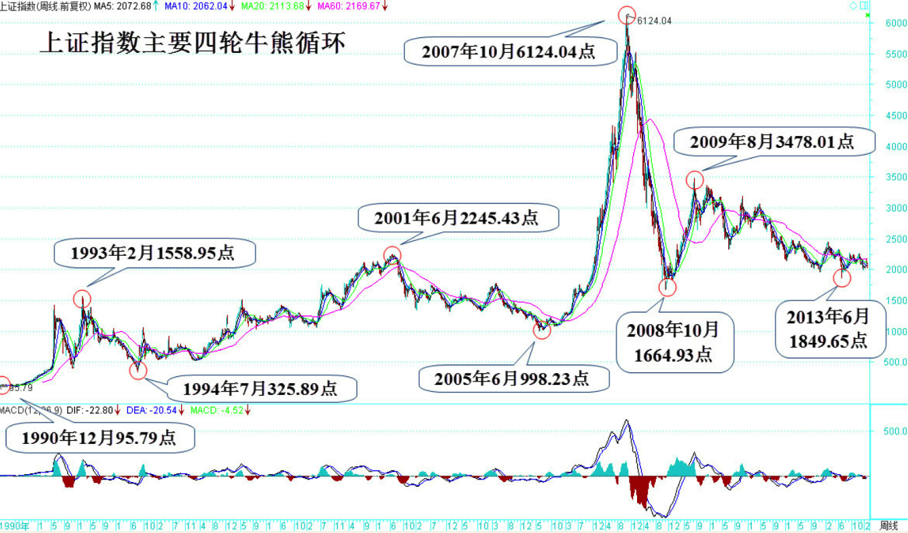

根据道氏理论，第二轮主要牛熊循环又可以分为次级别的四轮牛熊循环。从前面上图可以看出，这轮持续11年的大循环，包括从1994年7月325点开始到2001年6月2245点结束的大牛市，和从2001年6月2245点开始到2005年6月998点结束的大熊市。我们结合波浪理论的时间、形态来划分，如下表1-5至表1-8所示。

表1-5 第二轮主要牛熊循环之次级循环一

牛市一 | - | 熊市一 | -
----|---|-----|--
起始时间 | 1994年7月 | 起始时间 | 1994年9月
起始点位 | 325.89 | 起始点位 | 1052.94
终止时间 | 1994年9月 | 终止时间 | 1996年1月
终止点位 | 1052.94 | 终止点位 | 512.83
上涨点数 | 727.05 | 下跌点数 | 540.11
上涨幅度 | 223.10% | 下跌幅度 | 51.30%
历时 | 2个月 | 历时 | 1年4个月

表1-6 第二轮主要牛熊循环之次级循环二

牛市二 | - | 熊市二 | -
----|---|-----|--
起始时间 | 1996年1月 | 起始时间 | 1997年5月
起始点位 | 512.83 | 起始点位 | 1510.17
终止时间 | 1997年5月 | 终止时间 | 1999年5月
终止点位 | 1510.17 | 终止点位 | 1060.5
上涨点数 | 997.34 | 下跌点数 | 449.67
上涨幅度 | 194.48% | 下跌幅度 | 29.78%
历时 | 1年4个月 | 历时 | 2年

表1-7 第二轮主要牛熊循环之次级循环三

牛市三 | - | 熊市三 | -
----|---|-----|--
起始时间 | 1999年5月 | 起始时间 | 2001年6月
起始点位 | 1060.5 | 起始点位 | 2245.43
终止时间 | 2001年6月 | 终止时间 | 2003年1月
终止点位 | 2245.43 | 终止点位 | 1311.68
上涨点数 | 1184.93 | 下跌点数 | 933.75
上涨幅度 | 111.73% | 下跌幅度 | 41.58%
历时 | 1年1个月 | 历时 | 1年5个月

表1-8 第二轮主要牛熊循环之次级循环四

牛市四 | - | 熊市四 | -
----|---|-----|--
起始时间 | 2003年1月 | 起始时间 | 2004年4月
起始点位 | 1311.68 | 起始点位 | 1783.01
终止时间 | 2004年4月 | 终止时间 | 2005年6月
终止点位 | 1783.01 | 终止点位 | 998.23
上涨点数 | 471.33 | 下跌点数 | 784.78
上涨幅度 | 35.93% | 下跌幅度 | 44.01%
历时 | 1年3个月 | 历时 | 1年2个月

上证指数的周线图如下图1-4所示，我们能很清楚地看出第二轮主要牛熊循环中的四个次级别的牛熊循环。周线图中一根K线表示一周的价格情况，用周线图是为了便于观察。

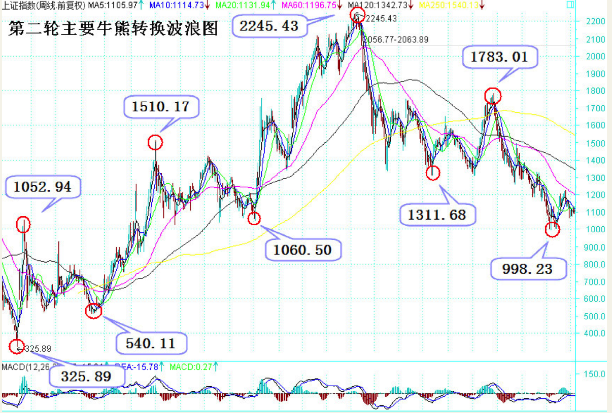

## 波浪理论与牛熊循环
**上证指数波浪牛熊循环**

我们用前面讲到的图1-4来画出上证指数第二轮主要牛熊循环的波浪图，如图1-8所示。

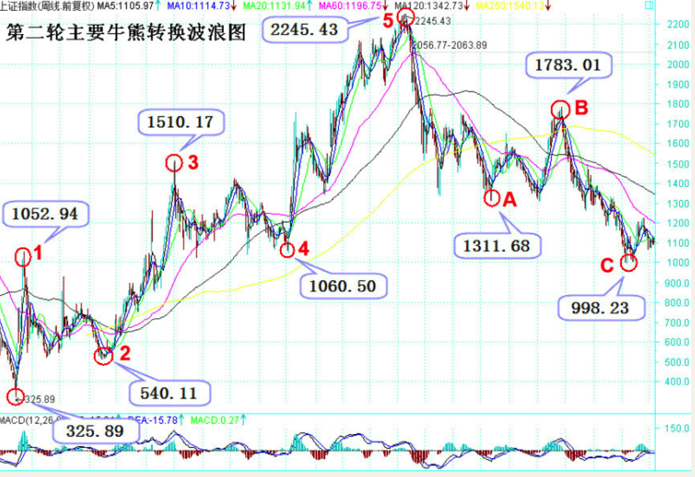

细心的投资者可以用前面的表1-5至表1-8对照上图来看，可以看出上图中波浪的时间、比例、形态等都很好地符合了波浪理论。为了便于说明，图上标注点位用的是K线的最高价和最低价。

从2005年6月的998点到2007年10月的6124点，这波大牛市的上升推动浪及第五浪延长浪如图1-9所示。

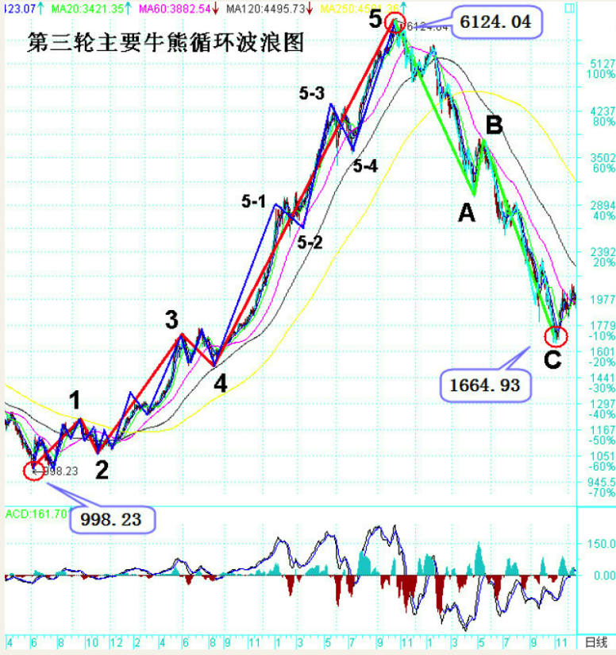

# 第二章
## 振荡指标
技术分析指标分为两大类，一类是`趋势指标`，另一类是`振荡指标`。

`趋势指标`是以描述趋势行情见长的指标。趋势行情是指比较流畅的、明显的单边上涨或下跌行情，具有明显的趋向性，其走势特点是股价沿着趋势指标线前进，比如在一波中短线的上涨趋势行情中，股价会沿10日移动平均线（MA10）上升。常见的趋势指标有移动平均线（MA）、布林通道（BOLL）、薛斯通道（XS）等等，可以看出，趋势指标一般是股票软件中主图指标，如常用的移动平均线MA10，见下图2-1所示。

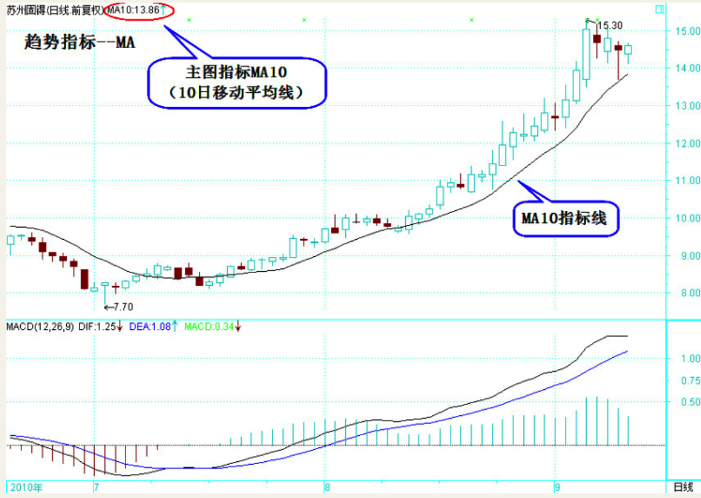

`振荡指标`是以判断行情拐点见长的指标，也就是常用于判断顶底的指标。振荡行情是指明显的单边行情之外的市场运行区间，其往往是行情的调整区间或顶（底）部区间，如箱体震荡、“之”字调整等。常见的振荡指标（Oscillators）有，指数平滑异同移动平均线（MACD）、相对强弱指标（RSI）、随机指标（KDJ）等，可以看出，振荡指标一般是股票软件中的副图指标，如常见的KDJ指标，见下图2-2所示。

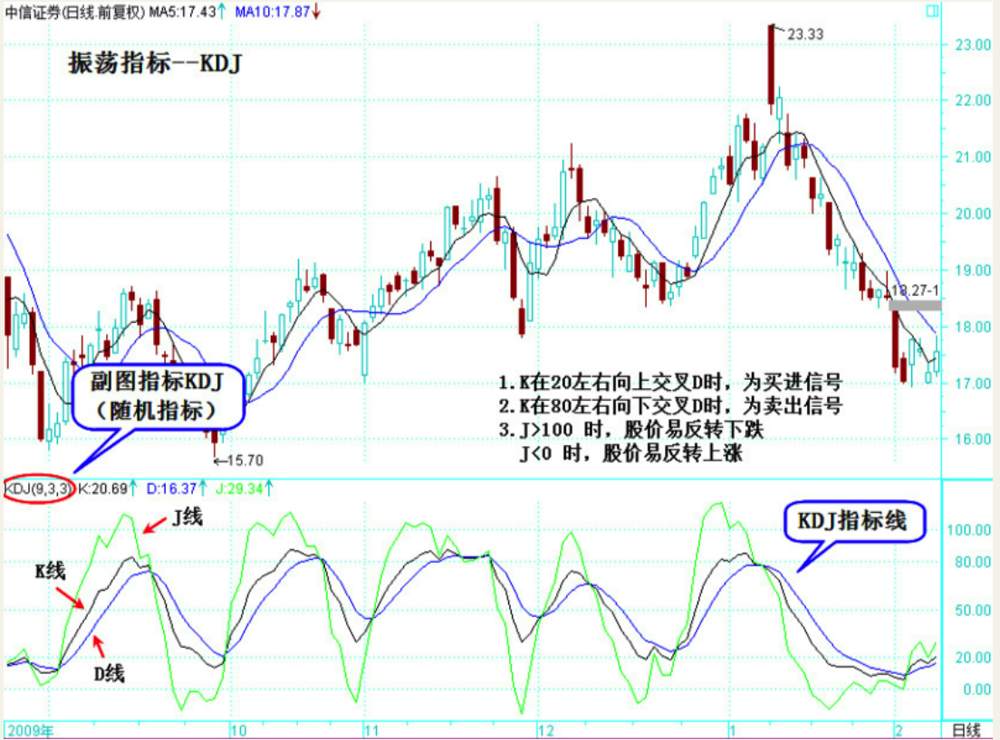

`振荡指标`的表现形式是指标值在设定的水平区间或围绕某个中心数值上下波动。根据振荡指标的振荡形式，可分为两类，即`中心振荡`和`区间振荡`指标。
一般来说，中心振荡指标更适用于分析多空转换，而区间振荡指标更适用于确认超买或超卖水平。

`中心振荡指标`是指标值围绕某个数值为中心上下波动的指标，`指数平滑异同移动平均线（MACD）指标`就是一个以0轴为波动中心的振荡指标，如图2-3所示。从图中可以看出指标值围绕0轴上下波动。MACD指标用在不同指数和个股中，MACD的取值范围不同，这是因为MACD指标是根据收盘价计算出来的长期与短期指数平均线的差值，指标数值受收盘价高低的影响。用在高价股上指标最大值可能大于3，用在低价股上指标最大值可能小于1，不同个股的数值的比较没有意义，只需要和个股自身的历史数值进行对比，以此来判断上涨或下跌的强弱。但0轴对所有个股和指数都有相同的意义，它是多空的分界线。指标线在0轴之上表明市场处于多头市场，在0轴之下表明市场处于空头市场。

`区间振荡指标`是指指标数值在一个区间范围内（0～100）上下波动的指标，这个区间对所有个股和指数都是一样的。这类指标是由价格比值计算出来的，所以不同个股之间可以相互比较。指标值接近上面极限为超买，指标值接近下面极限为超卖。通常在指标数值大于80时为超买，指标数值小于20时为超卖。`相对强弱指标（RSI）`就是一个典型的区间振荡指标，如图2-4所示。从图中可以看出，RSI指标数值是在0～100间波动，不会超过这个范围，而其中大部分时间数值是在20～80间波动。

振荡指标在判断顶部和底部反转时具有较高的准确率，技术分析者一般结合价格、成交量和振荡指标三者来判断行情。振荡指标的运用主要从以下几个方面来说：

1. 指标的高位与低位：是指指标进入超买区或超卖区。
2. 指标的趋势：指标是由价格计算出来的，由于价格具有趋势性，所以指标在很多时间也表现出趋势性。比如在上涨行情中，指标的波峰和波谷都是逐波提高的。在下跌行情中，指标的波峰和波谷都是逐波降低的。
3. 指标的形态：由于市场情绪会影响价格，因此在相似的情绪影响下，就会形成相似的指标形态，这些相对固定的形态是特定市场情绪的反映，有助于我们对市场行情进行判断。
4. 指标的交叉：是常见的指标运用方法，指两条指标线的穿越现象，向上的交叉称为“黄金交叉”，向下的交叉称为“死亡交叉”，也就是俗称的“金叉”与“死叉”。
5. 指标的背离：被认为是振荡指标最好用的一种应用，指标背离是指指标运行方向与价格运行方向相背离。比如，一波上涨中，当价格创新高而指标不创新高时，被认为是“顶背离”；一波下跌中，当价格创新低而指标不创新低时，被认为是“底背离”。

`多空分界线`是振荡指标应用之中需要重点介绍的一项，它是波段操作的重要依据之一。多空分界线通常是指穿过指标值为0或50的水平线。MACD指标的多空分界线是0轴，即指标值为0的水平线。

在中心振荡指标中，当指标值进入0轴以上，被认为是进入多方主导的市场，是上涨行情的开始，向上穿越O轴是买入信号。当指标值进入0轴之下，被认为是进入空方主导的市场，是下跌行情的开始，向下穿越0轴是卖出信号。

在区间振荡指标中，当指标值向上进入50一线之上，被认为是进入多方主导的市场，是上涨行情的开始，向上穿越50是买入信号。当指标值向下进入50一线之下，被认为是进入空方主导的市场，是下跌行情的开始，向下穿越50是卖出信号。

在实际运用中，经验丰富的投资者会看大势做股，顺大势逆小势。比如在主要的多头市场中，振荡指标会游走于中心振荡指标的0轴之上或区间振荡指标的50～80之间。在强劲的升势中，当指标接近多空分界线时，往往是介入良机，而不是退出时机。因为，我们已经通过道氏理论和波浪理论知道了，一波主要的上涨行情会有次级折返，即调整浪，这些是回调的介入机会。

同理，在主要的空头市场中，振荡指标会游走于中心振荡指标的0轴之下或区间振荡指标的50～20之间。在强烈的跌势中，当指标接近多空分界线时，往往是出逃良机，而不是介入时机。因为，一波主要的下跌行情中的次级折返，即调整浪，是下跌中的反弹卖出机会。

## 指标的高位与低位
指标的高位与低位是相对于临界位即多空分界线而言的，越往上偏离多空分界线越是高位，越往下偏离多空分界线越是低位。通常把区间振荡指标的高位定义为指标值在80～100的区间，被称为超买区；把低位定义为指标值在0～20的区间，被称为超卖区，如下图2-5所示。

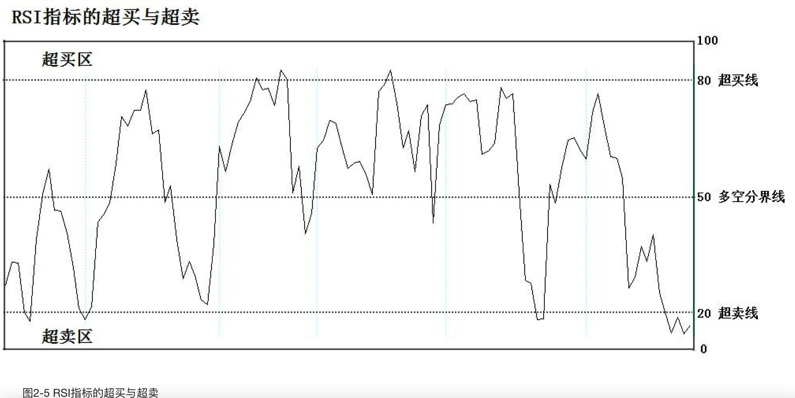

`超买`与`超卖`是投资者判断市场强弱的信号，超买反映了高涨的市场情绪，在超买区要随时注意有回调的风险；超卖反映了市场卖压强烈，在超卖区要注意随时有反弹的可能。

在一轮多空循环中，指标经过长期在空方徘徊，这是释放空头能量的过程，这时指标的重心是在空方，表示是空方主导的市场。这时，如果指标向上突破多空分界线，进入多方并形成一次超买，这往往是底部反转的信号，这个位置之后往往有最后一跌，然后指标再次进入多方标志着空头市场的终结。

同样道理，如果指标经过长期在多方徘徊，这是消耗多方能量的过程，这时指标的重心是在多方，表示是多方主导的市场。这时，如果指标向下突破多空分界线，进入空方并形成一次超卖，这往往是顶部反转的信号，这个位置之后往往有一次强烈的反弹，然后指标再次进入空方标志着多头市场的终结。

**`超买`：买过头了**

在股市中，经常会由于强烈的上涨预期，产生过度的买方力量，这时会形成超买现象。超买经常发生在上涨推动浪的初期，而振荡指标具有很好的灵敏性，它能很好地捕捉到行情的启动点。

指标进入超买区，表明多数市场参与者看好后市，形成了追涨的局面。超买是短期的看多信号。

在主要的多头市场中，指标在第一次进入超买区后，其数值会在50～80区间多次来回波动，这是相对于主要上涨的次级别的上涨。只要指标运行在多空分界线上方都可以看作多头趋势没有改变，这时的波段操作者可以耐心持股。

在主要的空头市场中，指标会很少进入超买区，即使能进入超买区，这时也是空头市场中，做短线的高抛机会，或者是波段操作的反弹出局机会。

**超卖：卖过头了**

在股市中，经常会由于强烈的下跌预期，产生过度的卖方力量，这时会形成超卖现象。超卖经常发生在下跌推动浪的初期，而振荡指标也能很好地捕捉到行情在超卖区的转向。

指标进入超卖区，表明多数市场参与者看淡后市，形成了杀跌的局面。超卖是短期的看空信号。

在主要的空头市场中，指标在第一次进入超卖区后，其数值会在20～50区间多次来回波动，这是相对于主要调整的次级别的调整。只要指标运行在多空分界线下方都可以看作空头趋势没有改变，这时的波段操作者可以耐心空仓等待多头信号。

在主要的多头市场中，指标会很少进入超卖区，即使能进入超卖区，这时也是多头市场中，做短线的低吸机会，或者是波段操作的回调加仓机会。

## 指标的趋势
市场一旦形成趋势就不会轻易改变，直到一个平衡点，趋势被打破为止。上升趋势线反应了市场向上波动的趋势，如图2-6所示，趋势线对行情有支撑作用，一旦指标线向下突破趋势线，表示短线的上升行情发生转变，有时指标会再次回抽而没能重新站上趋势线，反而再次跌破前低，这时可以确认上升趋势发生改变。

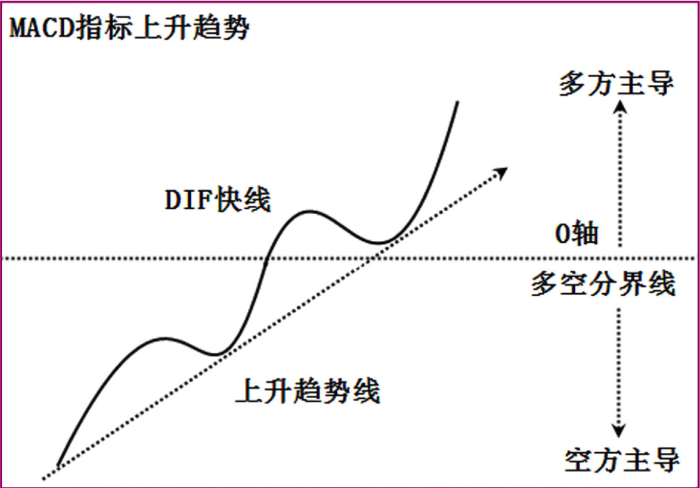

指标线由上向下穿越趋势线，可以作为卖出信号。与此同时，当价格也同样向下突破趋势线时可与指标的卖出信号相互验证，增加操作成功率。

下降趋势线反应了市场向下波动的趋势，如图2-7所示，趋势线对行情有压力作用，一旦指标线向上突破趋势线，表示短线的下降行情发生转变，有时指标会再次回抽而没能重新回到趋势线之下，反而再次突破前高，这时可以确认下降趋势发生改变。

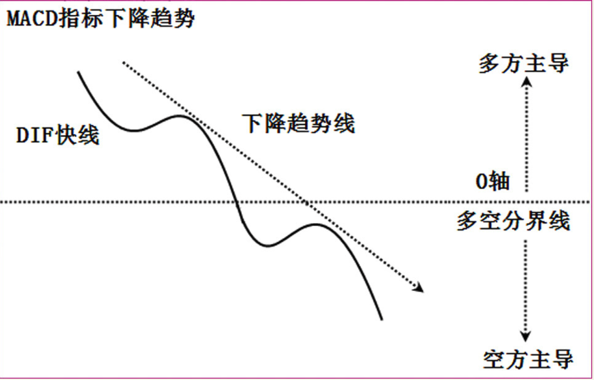

指标线由下向上穿越趋势线，可以作为买入信号。与此同时，当价格也同样向上突破趋势线时可与指标的买入信号相互验证，增加操作成功率。

## 指标的形态
股票市场受某些固定市场情绪影响会形成某些固定的波动模式，这些模式我们可以总结成为特定的价格形态。这些价格形态在K线图表中比较常见。指标形态往往不如价格形态常见，但如果指标形态与价格形态能相互验证，那么指标形态则更有意义，而且指标形态更容易识别。

指标的形态用在大周期上的效果比短周期更可靠，比如周线形态会比日线形态更可靠。常用的指标形态可以分为顶部形态和底部形态两大类。常见的有头肩顶（底）形态、双重顶（底）形态、三重顶（底）形态等。

如果顶部形态发生在超买区，则有极大的可能发生顶部反转；如果底部形态发生在超卖区，则有极大的可能发生底部反转。投资者需要对这些反转形态多加注意。

头肩顶:

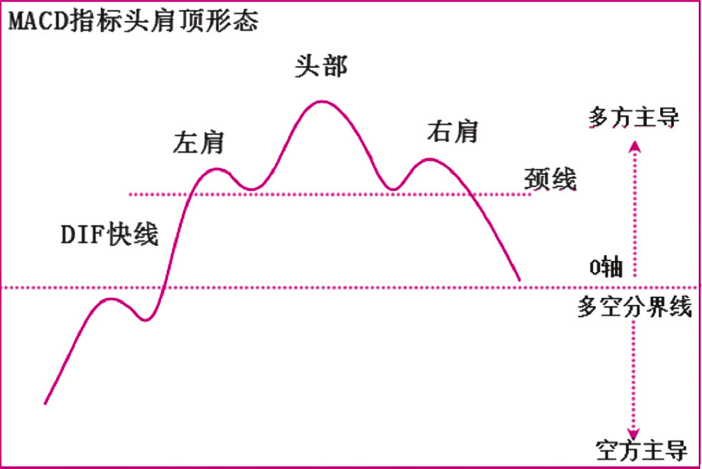

头肩底:

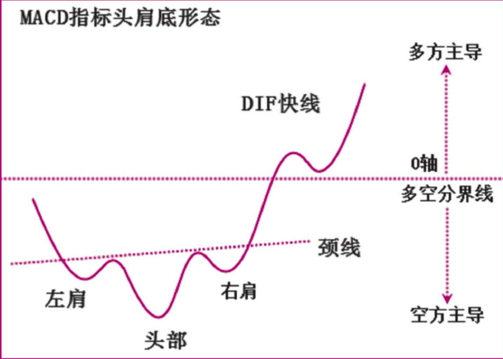

双重顶:

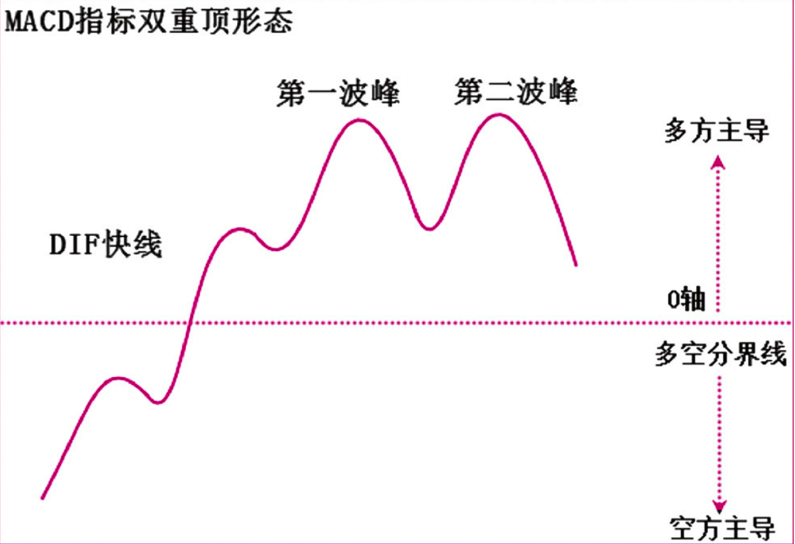

双重底:

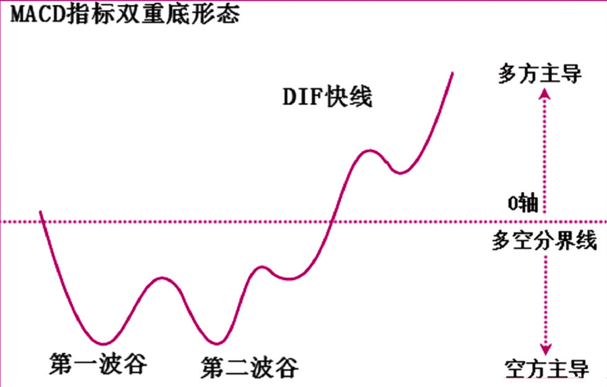

## 指标的交叉
**黄金交叉**

在中心振荡指标中，如MACD指标，发生在空方的背离之后的黄金交叉是高成功率的买点；在多方的黄金交叉也是比较好的买点或者加仓点；在空方的普通黄金交叉较前面两个买点的成功率会低些。总的来说，黄金交叉在MACD指标中作为买点的可靠程度比较高。

在区间振荡指标中，如KD随机指标，发生在超卖区的黄金交叉更为可靠；发生在超卖区之外的空方的黄金交叉，最好结合波浪理论和当时的市场氛围来综合判断是否需要介入。黄金交叉的具体表现一般为：

1. MACD指标的快线DIF由下向上穿过慢线DEA，如图2-12所示。
2. KD随机指标的快线K线由下向上穿过慢线D线。
3. RSI相对强弱指标的短周期6日RSI线由下向上穿过长周期12日RSI线。

**死亡交叉**

在中心振荡指标中，如MACD指标，发生在多方的背离之后的死亡交叉是高成功率的卖点；在空方的死亡交叉也是反弹逃命卖出机会；在多方的普通死亡交叉较前面两个卖点的成功率会低些。总的来说，死亡交叉在MACD指标中作为卖点的可靠程度比较高。

在区间振荡指标中，如KD随机指标，发生在超买区的死亡交叉更为可靠；发生在超买区之外的多方死亡交叉，最好结合波浪理论和当时的市场氛围，来综合判断是否需要离场。

死亡交叉的具体表现一般为：

1. MACD指标的快线DIF自上而下穿过慢线DEA，如图2-12所示。
2. KD随机指标的快线K线自上而下穿过慢线D线。
3. RSI相对强弱指标的短周期6日RSI线自上而下穿过长周期12日RSI线。

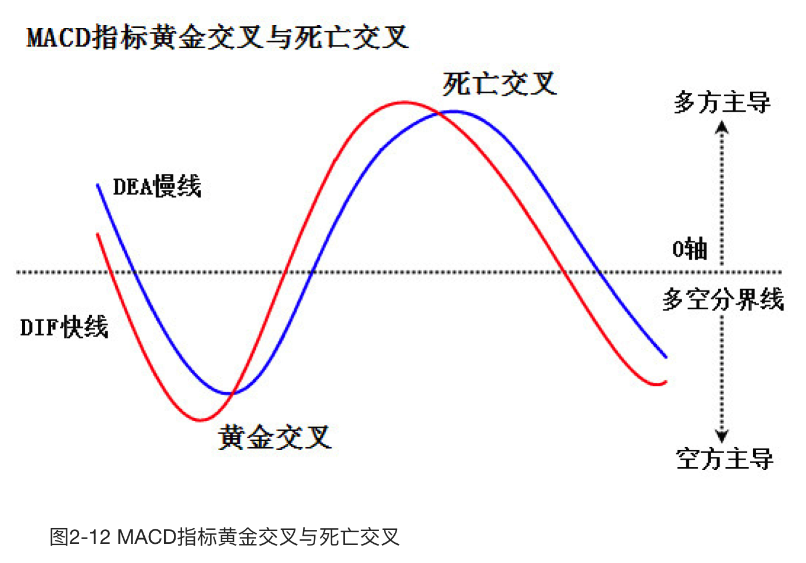

## 指标的背离
背离发生在振荡指标的超买或超卖区，对应价格的顶部和底部区域。振荡指标能较灵敏地反应市场多头和空头力量的强弱变换，当价格经过一波强势的运行之后，振荡指标值会快速到达高位或低位，即超买或超卖区，如果市场价格不能以更强劲的势头继续发展，那么指标值会反映出市场力量的减弱，这时便产生指标值与市场价格相背离的现象。

**底背离**

底背离发生在指标值空方的超卖区，当股价继续创新低而指标值不再创新低时，即产生底背离。如图2-13所示。

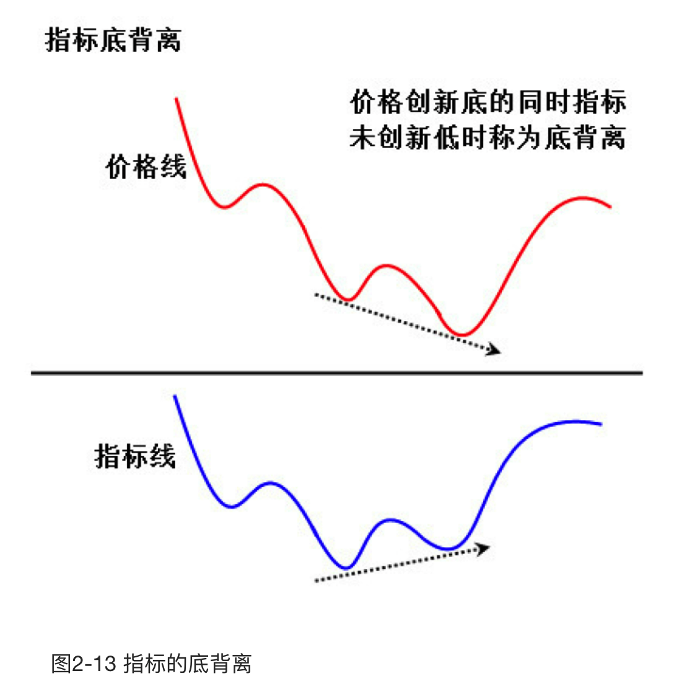

底背离表示空头力量的减弱，市场有发生底部反转的可能。

**顶背离**

顶背离发生在指标值多方的超买区，当股价继续创新高而指标值不再创新高时，即产生顶背离。如图2-14所示。

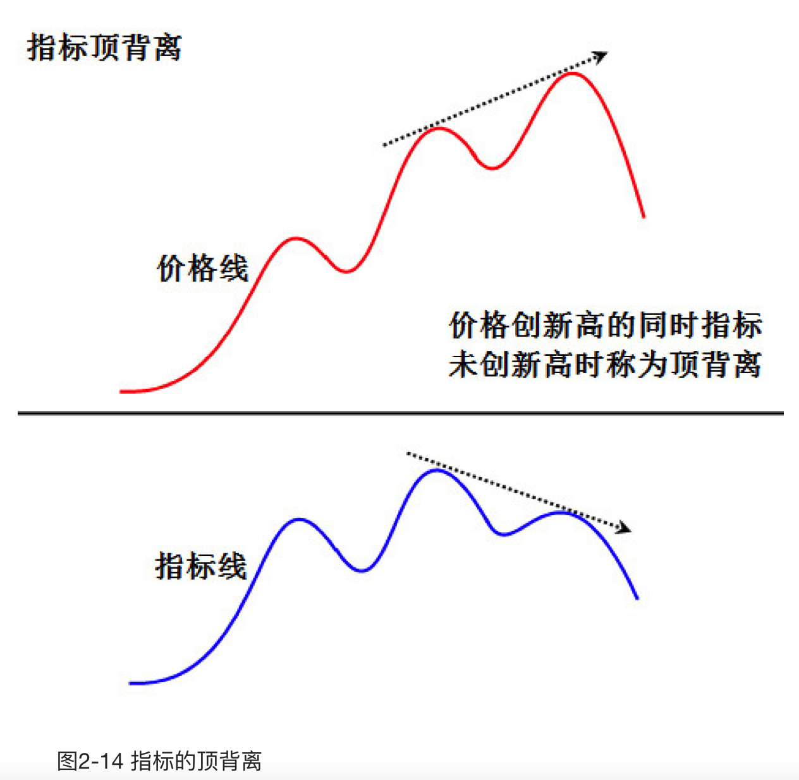

顶背离表示多头力量的减弱，市场有发生顶部反转的可能。

在实际运用中，长周期的顶（底）背离比短周期的顶（底）背离更可靠，比如周线顶（底）背离的可靠性要高于日线的顶（底）背离。

顺势操作原则：

1. 在上升通道中，应以持股为主，在明显的上升趋势中可逐步加仓，在可能的反转点采取逐步减仓的策略。
2. 在下降通道中，应以空仓为主，在明显的下降趋势中耐心等待，在可能的反转点试探性介入，买入前先想好止损位，切不可急于重仓。
3. 在盘整行情中，应以观望为主，宁做错过，不可做错。

背离配套措施：

1. **趋势线和通道线**。趋势线和通道线是上涨中的支撑线，下跌中的阻力线，当股价反向突破趋势线和通道线时,则视为增大转势的可能性。在下降趋势中，当股价向上突破趋势线或通道线上轨时，是买入信号；在上升趋势中，当股价向下跌破趋势线或通道线下轨时，是卖出信号。
2. **均线**。10日均线是股票的生命线，当股价向上突破10日均线时，是买入信号；当股价向下跌破10日均线时，是卖出的信号。5日均线与10日均线的交叉可用来判断市场短期的多空情况，10日均线与20日均线的交叉可以判断市场中期的多空情况。黄金交叉作为买入信号，死亡交叉作为卖出信号。
3. **蜡烛图反转形态**。日本蜡烛图是古老而实用的分析技术，常见的底部反转形态有，早晨之星、锤头线、刺透形态、红三兵等，是买入信号；常见的顶部反转形态有，黄昏之星、上吊线、墓碑线、吞没形态、三只乌鸦等，是卖出信号。
4. **价格反转形态**。价格反转形态，是固定市场情绪的反应，常见的底部反转形态有，头肩底、双重底、三重底、圆形底、底部三角形等，是买入信号；常见的顶部反转形态有，头肩顶、双重顶、三重顶、圆形顶等，是卖出信号；
5. **成交量**。成交量是股票行情软件的第二个默认副图指标，量价配合是有效的研判行情的依据，在筑底过程中需要明显地缩量，表示空头下跌能量的衰竭，在突破关键压力位时，需要伴随成交量的明显放大。在顶部，成交量与价格也经常出现背离，表示上涨动能的不足，在波峰出现“天量见天价”的K线是常见的见顶标志。
6. **指标相互验证**。不同指标间可以将多空判断与指标交叉相互验证，作为提高操作把握性的方法。例如MACD指标和KD指标都出现黄金交叉时可以提高买入的胜率。

# 第三章
## MACD——指数平滑异同移动平均线
MACD指标英文全称是`Moving Average Convergence Divergence`，中文被称为`指数平滑异同移动平均线`，是由杰拉德·阿佩尔（Gerald Apple）所创造的。

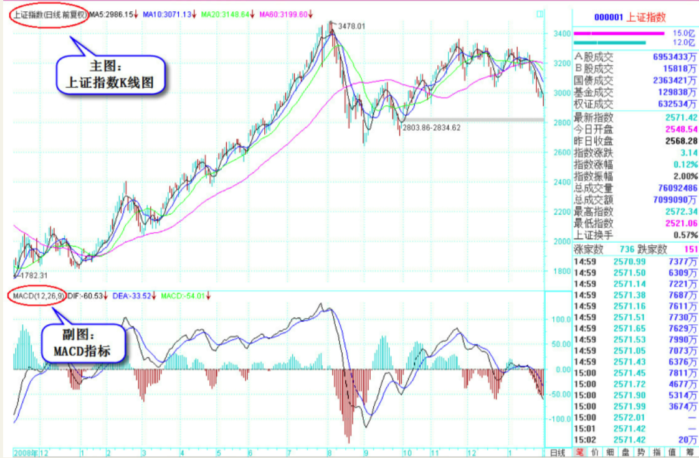

从上图可以看出，MACD指标由三部分组成，他们分别是：`DIF （差离值）`、 `DEA （差离值平均数）`和`BAR（柱状线）`，如图3-2所示。DIF在图中用白线表示，也被称为“快线”，DEA在图中用黄线表示，也被称为“慢线”，最早的MACD只有这两条快慢线，通过两条曲线的聚合和分离来判断市场状况。后来随着MACD的广泛运用，又引入了柱状线（BAR），俗称“红绿柱”。红绿柱表示的是快线与慢线之间的距离，对指标实质没有影响，只是为了更便于观察和使用指标。

MACD指标由DIF、DEA、BAR三部分指标构成，其计算过程大体如下：

1. 用市场价格计算出短期与长期的两组EMA数值，再计算两组数值之差得到差离值DIF。
2. 将上面DIF数值再用EMA的算法，计算中期内DIF的指数平均数，得到差离值平均数DEA。
3. 由前面得出的快线DIF与慢线DEA计算差值，得到柱状线BAR。

指数平滑移动指标EMA是均线指标的一种，比如常用的MA是简单算术平均。EMA指标的计算中用到了平滑系数，这样，不仅保持了均线指标的特性，而且增加了近期价格变动的权重。

DIF是MACD指标构成最早得出的一条线，也是最有意义的一条指标线，当DIF向上穿越0轴的时候，表示市场有转好的预期。0轴是多空分界线，若DIF一直游走于0轴之上，表示市场多头力量强于空头力量，投资者应以做多为主。当DIF向下穿越0轴，表示多数参与者看淡看市。若DIF一直被压制在0轴之下，说明市场中的空头力量强于多头力量，投资者应以空仓观望为主。

DEA是对DIF平滑后得出的，DEA较DIF更为平缓，落后于DIF，所以把DIF称为快线，把DEA称为慢线。当DIF在低档向上突破DEA时，是买入信号。当DIF在高位向下跌破DEA时，是卖出信号。

MACD柱状线由DIF与DEA的差值得出，更直观地反映了两条指标线的位置变化，也表达出了市场多空强弱的变化。

当MACD柱状线由红柱变为绿柱时，表示市场由多转空，可以考虑卖出；当MACD柱状线由绿柱变为红柱时，表示多头力量强于空头力量，可以考虑买入。

红柱的发散预示市场多头力量在发展，出现超出平均长度的红柱，表明多头势头强劲；绿柱的发散预示市场空头力量在漫延，出现超出平均长度的绿柱，表明空头出现强烈卖压。

红柱的收敛预示着多头力量有减弱的趋势，当红柱收敛到0轴附近时，预示空头可能取代多头成为主导力量，市场有转势的可能；绿柱的收敛预示空头力量有减弱的趋势，当绿柱收敛到0轴附近时，预示多头可能取代空头成为主导力量，市场有转势的可能。

## EMA指数平滑移动平均线
`EMA（Exponential Moving Average）`，指数平滑移动平均线，简称指数平均线，是一种趋势类指标。

$EMA_n=\frac{2}{n+1} \times C_n + \frac{n-1}{n+1} \times EMA_{n-1}$

其中
- 2/(n+1)是平滑系数
- Cn是第n日的收盘价
- $EMA_{n-1}$表示前一日的EMA值。

可以看出，当日所占的权重是2/(n+1)，而前一日$EMA_{n-1}$所占的权重是(n-1)/(n+1)。

EMA引用函数在计算机上使用递归算法很容易实现，在计算机递推计算时可以变形为：

$EMA_n=α(C_n-EMA_{n-1})+EMA_{n-1}$

将$EMA_{n-1}$按照类似方法递推展开，可以得到：

$EMA_n=α[C_n+(1-α)C_{n-1}+(1-α)^2C_{n-2}+……+(1-α)^{n-2}C_2+(1-α)^{n-1}C_1]$

其中，α表示平滑系数，Cn表示今天的价格，Cn-1表示前一天的价格，以此类推。

将平滑系数α展开，由于

$1/α=1+(1-α)+(1-α)^2+……+(1-α)^{n-2}+(1-α)^{n-1}$，可以得到：

$EMA_n=\frac{C_n+(1-α)C_{n-1}+(1-α)^2C_{n-2}+……+(1-α)^{n-2}C_2+(1-α)^{n-1}C_1}{1+(1-α)+(1-α)^2+……+(1-α)^{n-2}+(1-α)^{n-1}}$

从该公式中可以看出EMA加权平均的特性。在EMA指标中，每天价格的权重系数以指数等比形式缩小。时间越靠近当前时刻，它的权重越大，说明EMA函数对近期的收盘价加强了权重比，更能及时反映近期价格波动的情况。

在股票行情软件中，EMA指标可作为主图指标添加到K线图中，它由两条曲线构成，短期EMA线（以白线表示）、长期EMA线（以黄线表示），如下图3-4所示。

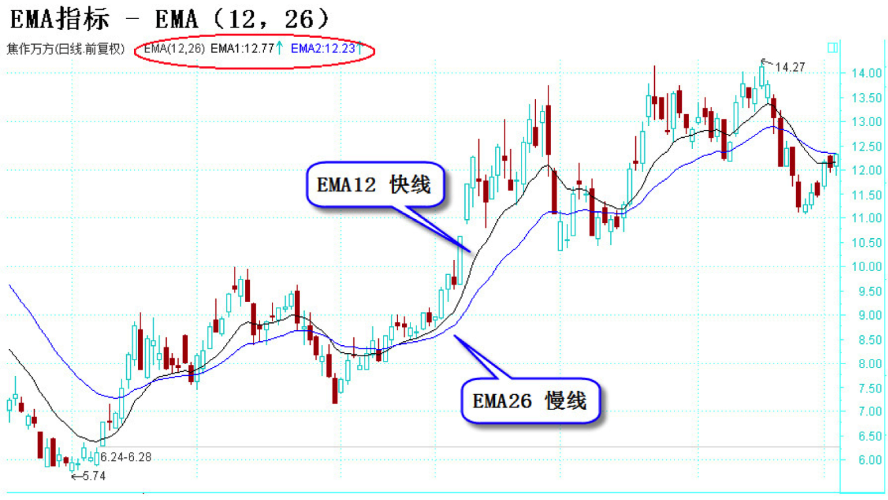

EMA指标应用原则：

1. 在多头趋势中，价格K线、短周期快线、长周期慢线按以上顺序从高到低依次排列，是为多头特征；在空头趋势中，长周期慢线、短周期快线、价格K线按以上顺序从高到低依次排列，是为空头特征。
2. 当短周期快线由下向上穿越长周期慢线时是一个值得注意的买入信号；此时短周期快线对价格走势将起到助涨的作用，当短周期快线由上向下穿越长周期慢线时是一个值得注意的卖出信号，此时长周期慢线对价格走势将起到助跌的作用。
3. 一般来说，价格在多头市场中将处于短周期快线和长周期慢线上方运行，此时这两条线将对价格走势形成支撑。在一个明显的多头趋势中，价格将沿短周期快线移动，价格回抽的低点将位于长周期慢线附近；相反地，价格在空头市场中将处于短周期快线和长周期慢线下方运行，此时这两条线将对价格走势形成压力。在一个明显的空头趋势中，价格也将沿短周期快线移动，价格回抽的高点将位于长周期慢线附近。

## DIF快线
`DIF线（Difference）`就是`差离值`，又称为正负差，即收盘价12日EMA数值减去26日EMA数值。

快速平滑移动平均线是12日的，即EMA12，那么它的计算公式是：

$EMA_{12}=\frac{2}{12+1}C_{12}+\frac{12-1}{12+1}EMA_{n-1}$

其中，$C_{12}$是当日收盘价, $EMA_{n-1}$是前一日$EMA_{12}$

慢速的移动平均线是26日的，即EMA26，它的计算公式如下：

$EMA_{26}=\frac{2}{26+1}C_{26}+\frac{26-1}{26+1}EMA_{n-1}$

其中，$C_{26}$是当日收盘价, $EMA_{n-1}$是前一日$EMA_{26}$

有了短周期的$EMA_{12}$和长周期的$EMA_{26}$两条平滑移动线，我们马上就可以求得他们的差值，计算出DIF。

$DIF=EMA_{12}-EMA_{26}$

我们把图3-4的EMA12与EMA26的差值对应地用DIF表示在副图的MACD指标中，如下图3-5所示。

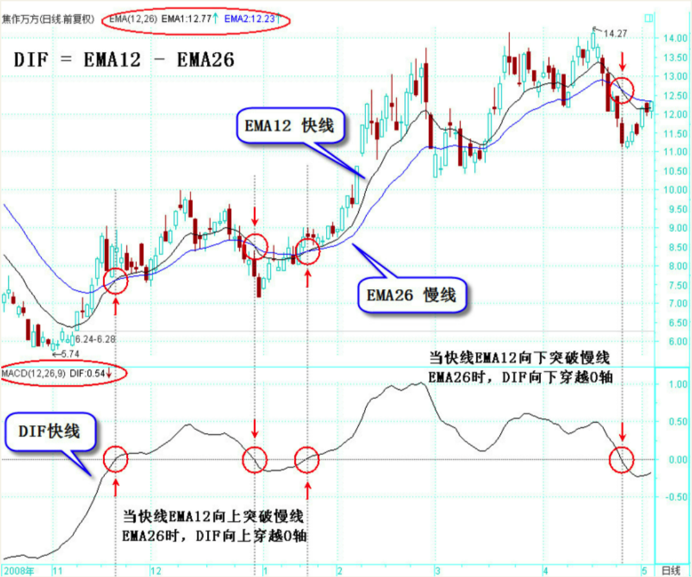

DIF线是快线EMA12与慢线EMA26的差值，从上图3-5可以看出，当快线EMA12向上突破慢线EMA12时，DIF向上穿越0轴；当快线EMA12向下突破慢线EMA26时，DIF向下穿越0轴。相当地，当DIF大于0时，表示快线EMA12在慢线EMA26之上运行；当DIF小于0时，表示快线EMA12在慢线EMA26之下运行。

## DEA慢线
`DEA线（Difference Exponential Average）`差离值平均数，又称为异同平均数，是DIF线的9日指数平滑移动平均线。

根据之前介绍的EMA计算公式，求DIF线的EMA(DIF,9)如下：

$DEA=EMA(DIF,9)=\frac{2}{9+1} \times DIF + \frac{9-1}{9+1} \times DEA_{n-1}$

DEA与DIF的收敛与发散是MACD指标研究的重点，如下图3-6所示。

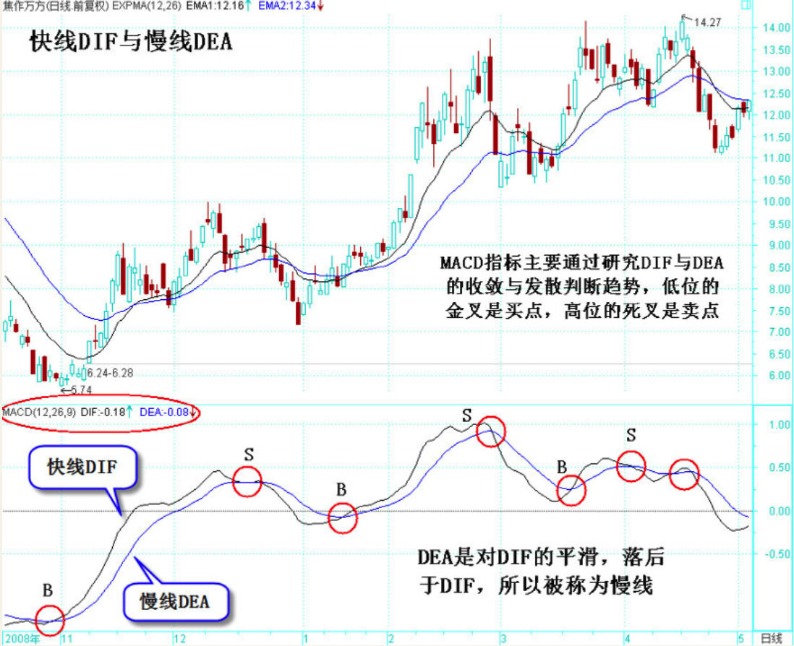

因为DEA是对DIF的平滑，从图中可以看出，DEA落后于DIF，所以DIF被称为快线，DEA被称为慢线。

## MACD柱状线
BAR柱状线公式为：BAR＝2×(DIF-DEA)，也可表示为MACD＝2×(DIF-DEA)。

当DIF远离DEA，MACD柱状线会伸长（向上为正值，向下为负值）。当DIF向DEA靠近，MACD柱状线会缩短。MACD柱状线的斜率取决于相邻两个柱状线的关系。

MACD柱状线是代表长期与短期趋势力道之间的差值。快速的DIF线反映比较短期间的市场趋势。慢速的DEA线反映比较长期间的市场趋势。MACD柱状线表示长期与短期的市场强弱变化。

MACD柱状线切线的斜率，可以反映市场主导力量转强或转弱。柱状线位于零轴之上时，多头是市场的主导力量，斜率向上代表多头的主导力量转强，柱状线一根比一根长，呈发散状态，说明快线DIF向上拉动慢线DEA的力量在增强，最好以做多为主；斜率向下代表多头的主导力量转弱，柱状线一根比一根短，呈收敛状态，说明快线DIF向上拉动慢线DEA的力量在减弱。

柱状线位于零轴之下时，空头是市场的主导力量，斜率向下代表空头的主导力量转强，柱状线一根比一根长，呈发散状态，说明快线DIF向下拉动慢线DEA的力量在增强，最好以做空为主；斜率向上代表空头的主导力量转弱，柱状线一根比一根短，呈收敛状态，说明快线DIF向下拉动慢线DEA的力量在减弱。

当MACD柱状线的斜率与价格趋势保持相同的方向，趋势很安全。当MACD柱状线的斜率方向不同于价格趋势，则产生“背离”，趋势转向的可能在加大，最好顺着MACD柱状线的斜率方向进行交易，因为它可以反映多空力量的消长。

## DIF快线与DEA慢线的运用
快线DIF与慢线DEA的值及线的位置
1. 当DIF和DEA均大于0（处于0轴之上）并向上移动时，表示市场处于多头行情中，可以买入或持股。
2. 当DIF和DEA均小于0（处于0轴之下）并向下移动时，表示市场处于空头行情中，可以卖出股票或观望。
3. 当DIF和DEA均大于0（处于0轴之上）但都向下移动时，表示市场行情处于退潮阶段，股票将下跌，可以卖出股票和观望。
4. 当DIF和DEA均小于0时（处于0轴之下）但向上移动时，表示行情即将启动，股票将上涨，可以买进股票或持股待涨。

快线DIF与慢线DEA的交叉情况
1. 当DIF与DEA都在0轴之上，而DIF向上突破DEA时，表明市场处于一种强势之中，股价将再次上涨，可以加码买进股票或持股待涨，这就是MACD指标黄金交叉的一种形式。
2. 当DIF和DEA都在0轴之下，而DIF向上突破DEA时，表明市场即将转强，股价将止跌反弹，可以开始买进股票或持股，这是MACD指标黄金交叉的另一种形式。
3. 当DIF与DEA都在0轴之上，而DIF却向下突破DEA时，表明市场即将由强势转为弱势，股价将下跌，这时应卖出大部分股票而不能买进股票，这就是MACD指标死亡交叉的一种形式。
4. 当DIF和DEA都在0轴之下，而DIF向下突破DEA时，表明市场将再次进入极度弱市中，股价还将下跌，可以再卖出股票或观望，这是MACD指标死亡交叉的另一种形式。

## DIF快线与MACD柱状线的运用
1. 当DIF线和MACD柱状线都在0轴之上运行时，说明市场是处于多头行情中，股价将继续上涨。当MACD指标在0轴之上经过短暂的调整后，红柱线再次发散时，中长线投资者可继续持股做多，短线空仓者可开仓买入。
2. 当DIF线在0轴之上而MACD柱状线在0轴之下运行时，说明市场处于中长期多头行情中，但中短期进入空头主导的市场，短线回调的可能在加大，短线投资者应离场观望。
3. 当DIF线和MACD柱状线都在0轴之下运行时，说明市场是处于空头行情中，股价将继续下跌，投资者这时应以持币为主，耐心等待空头行情的结束。
4. 当DIF线在0轴之下而MACD柱状线在0轴之上运行时，说明市场处于中长期空头行情中，但中短期进入多头主导的市场，短线反弹的可能在加大，短线投资者可轻仓介入。

# 第四章
## DIF快线的运用
DIF波段操作要点
1. DIF在0轴上，表示市场处于多头市场（牛市），DIF在0轴上并向上移动是多头的上涨行情，此时应以持股为主。
2. DIF在0轴下，表示市场处于空头市场（熊市），DIF在0轴下并向下移动是空头的下跌行情，此时应以空仓为主。
3. DIF在0轴上，但向下移动，需要谨慎持股或适当降低仓位，防止随时进入空头而失去利润，这时最好结合波浪理论和成交量来综合判断，在放量上涨中的第三浪和第五浪可以坚定持股，当量能萎缩，DIF与价格出现背离时应果断离场。
4. DIF在0轴下，但向上移动，可以轻仓进行试探性介入，以便在DIF向上突破0轴，进入多方后处于有利地位，但要设置好止损，因为在0轴下还是很危险的。

**DIF波段操作第一买点**

经过DIF长期在0轴下震荡调整后，当DIF向上突破0轴时为第一买点，如图4-1所示。

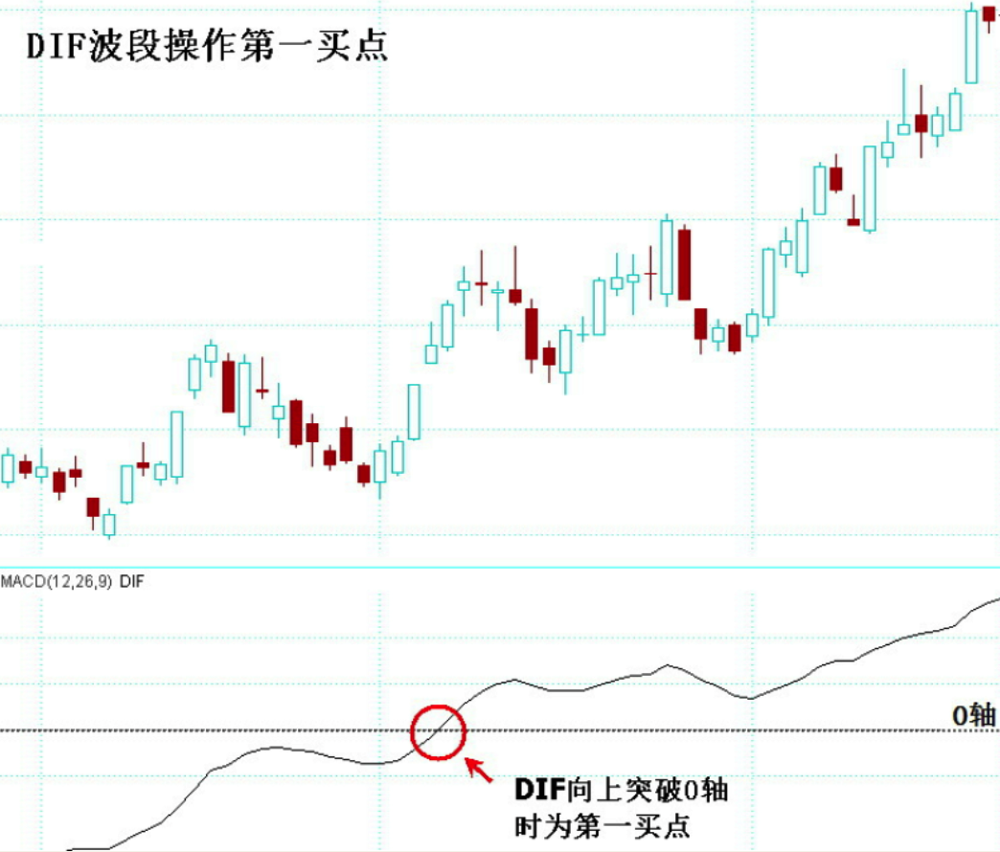

在实战操作中运用DIF买点时需要注意，越是在行情的底部经过充分调整，DIF的突破越有效，图4-2是个股露天煤业（002128）中出现的DIF波段操作第一买点。

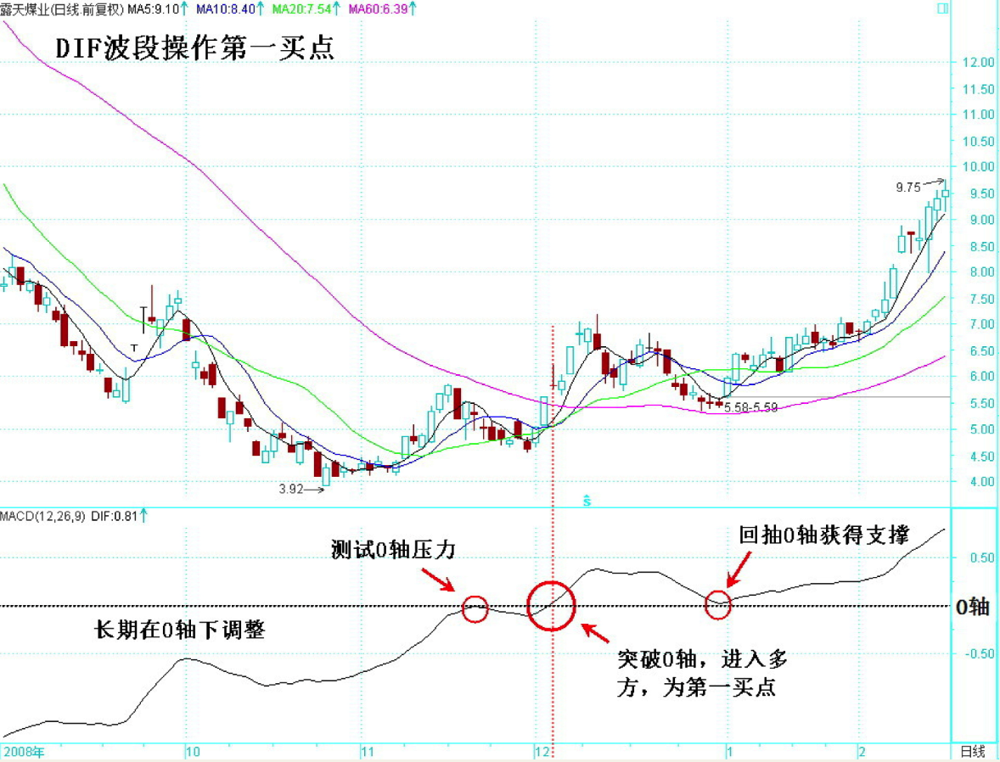

从图4-2中可以看出，该股的DIF线在0轴下经过了充分的调整，而且在上攻多方的时候还测试了一次0轴的压力，为以后的突破积蓄了多方力量。当DIF突破0轴时，K线是以多方炮（两根上涨阳线之间夹一根阴线或十字线为多方炮）的形式向上突破的，这里出现了第一买点。在突破之后，DIF慢慢回落，这时主力在为以后的突破进行最后一次收集筹码，DIF在回落到0轴上方时停止向下，0轴起到了支撑作用。这个位置也是前面第一买点的点位，在这里股价拒绝下跌，可见好的买点能有效避免止损。之后，该股以一个向上跳空缺口继续向上拉升，到此已经确立了涨势。

**DIF波段操作第二买点**

在第一买点后，若DIF再次回落到0轴下又向上突破0轴时为第二买点。第二买点比第一买点的成功率更大，其往往是在主升浪的初期，用起爆点来形容也不为过，如图4-4所示。

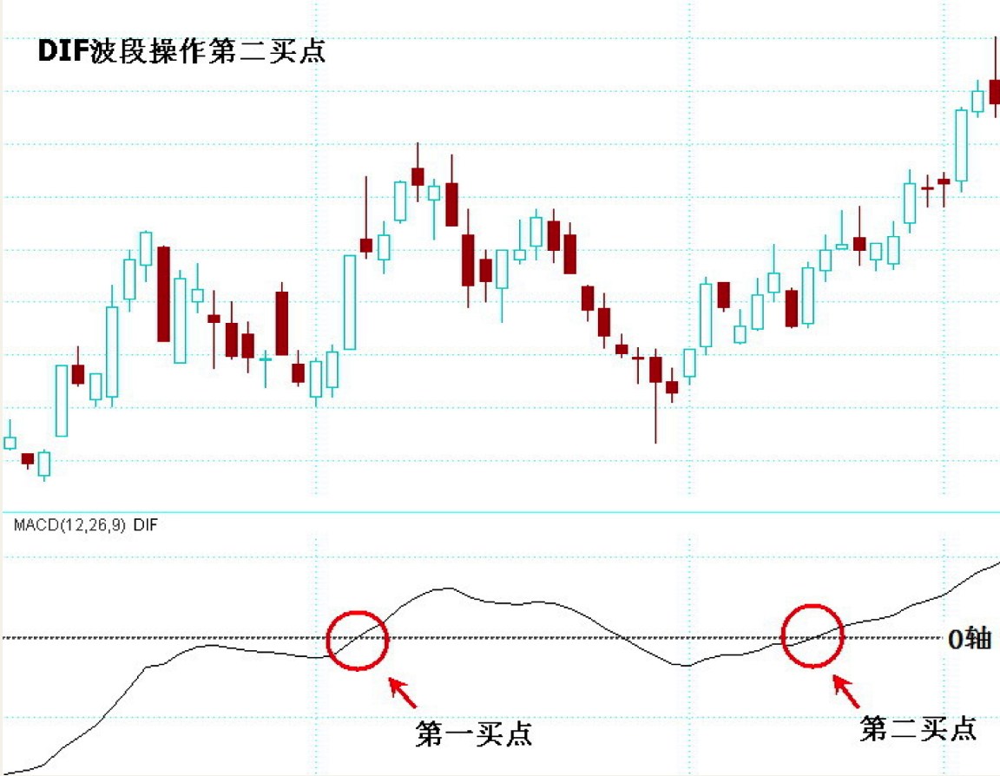

第二买点的形成是因为对第一上涨浪的调整，所以第二买点经常会买到第三浪，即主升浪的起点。图4-5，是实战中兰花科创（600123）的波段操作。

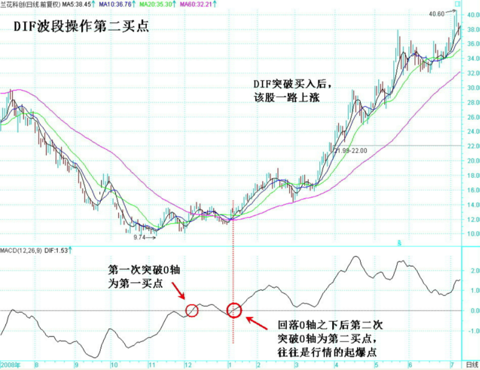

从图中可以看出，该股前期的DIF一直在0轴之下运行，经过长时间的筑底过程，在2008年12月5日那天第一次突破0轴，这时该股已经突破了下降通道，DIF进入多方，可以看作转势的信号。一般情况下，主力会利用一次回抽来清洗浮筹，做最后一次吸货。这时一些还没有从熊市思维中走出来的投资者会认为下跌还没有结束，如果轻易交出筹码会失去有利位置，后面还要追高买回来。

**DIF波段操作第一卖点**

DIF经过长期在0轴上方震荡调整后，当DIF向下突破0轴时为第一卖点，如下图4-6所示。

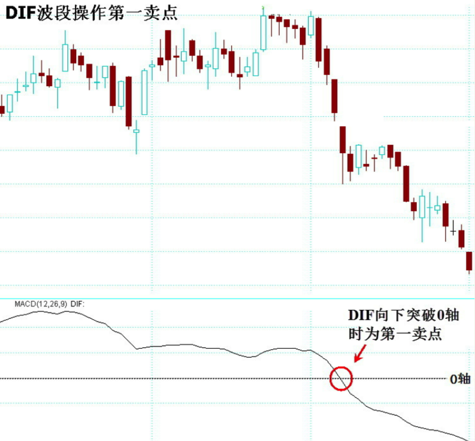

在实战操作中，DIF卖点与波浪理论结合运用会效果更好，DIF在高位向下运行的时候往往是第五浪结束，下跌A浪开始的时候。

图4-7是成飞集成（002190）用DIF判断的卖点，可以看出DIF在0轴上时是多头上涨行情，投资者不需要频繁操作或盯盘，只需要看好DIF的运行势头，简单明了。当DIF经过一波拉升，由上而下靠近0轴时，要谨慎持股。因为这时容易形成顶部，一些经验丰富的投资者会在股票跌破0轴前的阳线先出掉一部分筹码。但大部分的筹码还是要等DIF跌破0轴，确认转势时再抛出，虽然这样会损失一些利润，但长期来看效果更好。因为有时在较强的涨势中，0轴会有支撑作用，为了防止错过上涨行情，一切应以看到的信号为准。

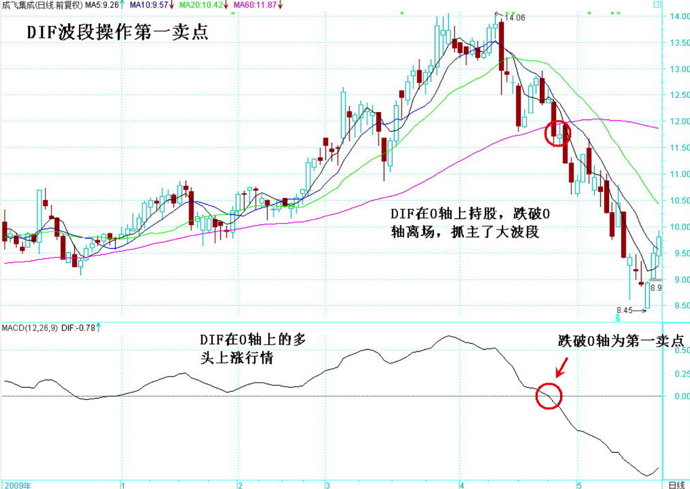

下图是前面介绍买点时讲到的露天煤业（002128）用DIF判断的卖点，如图4-8所示。投资者可以与前面的图4-2结合来看，该股按DIF向上突破0轴时买入，买入价格在6元附近。之后，该股保持了涨势，投资者只需要在DIF靠近0轴时多关注股票走势，否则的话，说明股票一直处于多头上涨行情中，不必担心两三天的短期回调。

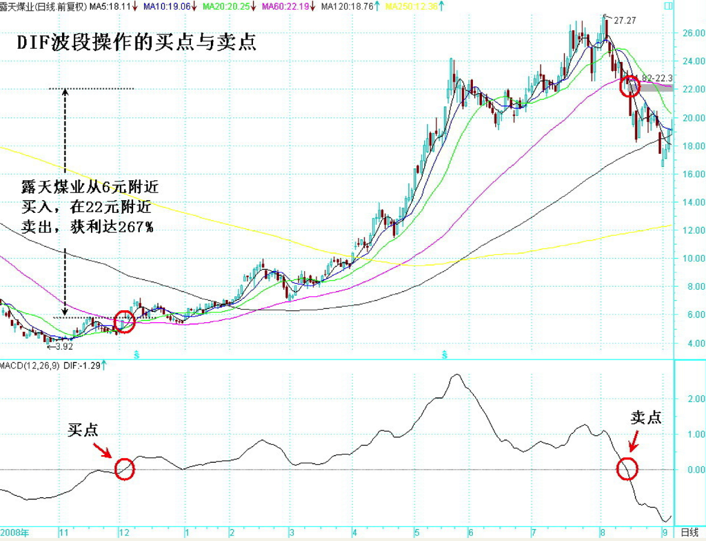

该股在多方运行中，有三次靠近0轴，但并没向下突破0轴，而是又恢复了之前的涨势，这便是股价的趋势性，一旦形成涨势就不会轻易结束。但行情总会有结束的时候，从图中我们可以看到，在22元附近，DIF向下突破了0轴，同时股价也形成了一个向下的跳空缺口，这也证明了DIF判断多空的有效性。在这一波对露天煤业的操作中，用DIF波段买卖点获得了高达267%的利润。

**DIF波段操作第二卖点**

在第一卖点后，若DIF再次反弹回0轴之上，而后又向下跌破0轴时为第二卖点。第二卖点比第一卖点的把握性更大，其往往是主跌浪的开始，也是波浪理论中讲的C浪下跌，如图4-9所示。

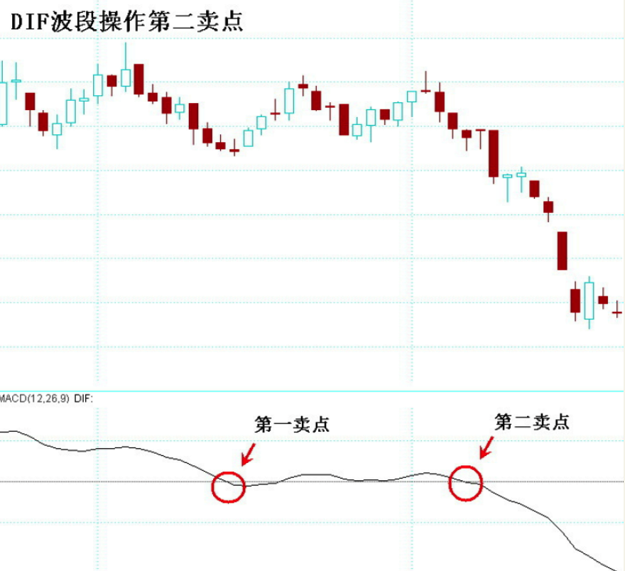

如果投资者由于某些原因错过了第一卖点，或采取逐步减仓的策略，则可以在第二卖点的时候清仓出局。第二卖点往往是逃命的卖点，在此之后极大的可能是汹涌的C浪下跌。图4-10是利用DIF判断第二卖点在股票一汽夏利（000927）中的运用。

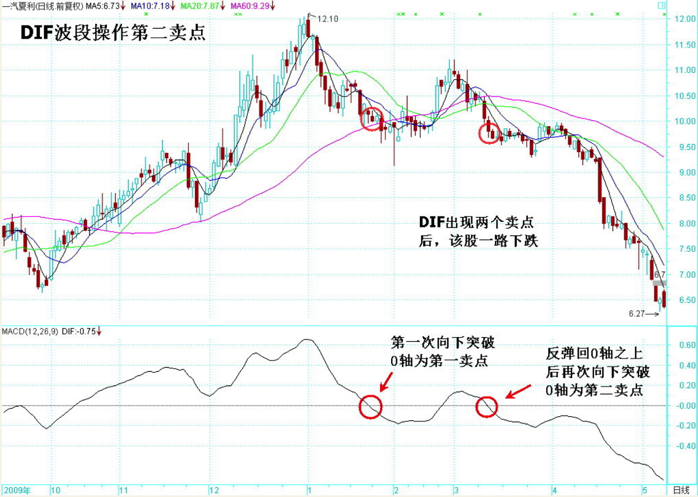

从图中可以看出，该股在出现第一卖点后，又发生了一次反弹，这时往往是头肩顶形态的右肩。投资者一定要多加注意，一些人在这时还没有从牛市思维中走出来。要知道牛市总会有一个顶，当DIF跌破过一次0轴时就要考虑牛市结束的可能性。该股反弹回0轴之上后再次向下突破0轴形成了第二卖点，这时投资者应该果断斩仓出局，不应再抱有幻想。两个卖点出现后，是C浪出现的高发区，从图中可以看到，该股此后一路下跌。

## 趋势线的运用
趋势线是指连接连续两个或两个以上波谷（波峰）最低点（高点）的直线，趋势线可以简单地表明市场的趋势方向。

连接连续两个或两个以上的波谷最低点的直线是上升趋势线，如下图4-11所示，趋势线在两个低点间不会穿过任何数值。

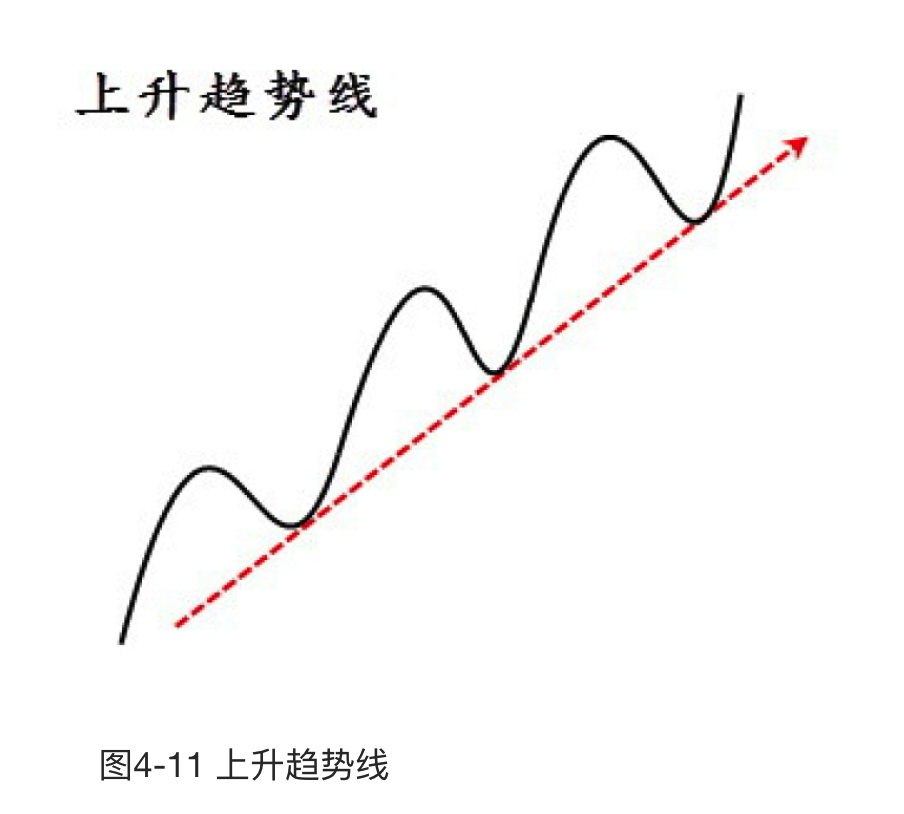

连接连续两个或两个以上的波峰最高点的直线是下降趋势线，如图4-12所示。

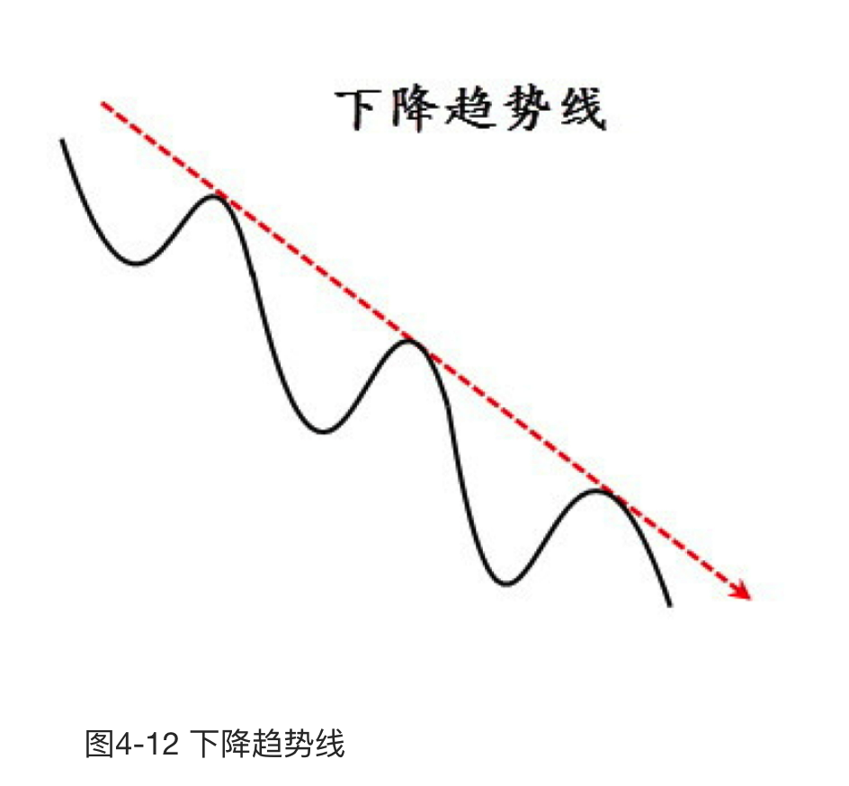

**趋势线波段买点**

在振荡指标MACD中，下降趋势线对DIF指标线有压力作用，在下降趋势中，当DIF在低位由下向上突破下降趋势线时，为波段买点，如图4-13所示。

从图中可以看到，DIF指标线从0轴上跌落到0轴下的过程中一直受下降趋势线的压制，直到某日在指标的低档位置由下向上突破下降趋势线，这时预示着短期的下降趋势已经告一段落，市场在中短期内由空转多。图中用圆圈标出来的位置是DIF突破下降趋势线时的买点。

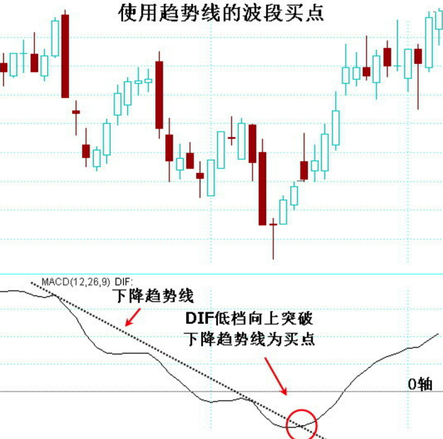

这个方法在指标处于低位时更有效。用趋势线判断的DIF波段操作买点，比前面讲到的DIF突破0轴时的买点的位置要提前。所以是又一个“抄底”的好方法。

应用在个股华丽家族（600503）中实战操作，如图4-14所示。

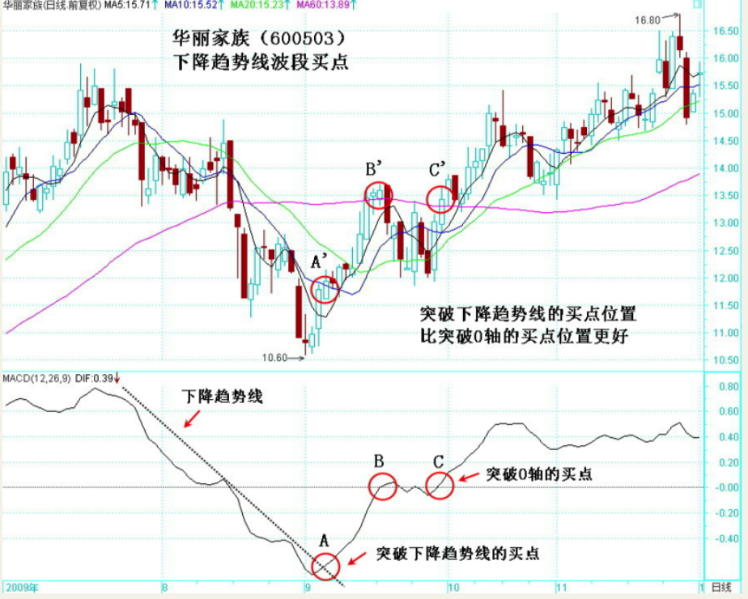

在图中连接连续的两个波峰，画出下降趋势线。我们看到，图中K线图要比DIF指标线杂乱得多，K线图总体上也呈现一种下降趋势，但没有DIF指标更直观。DIF由0轴上跌落到0轴下的过程中，一直受到下降趋势线的压制，直到在低档区该股下跌力量衰竭为止，在2009年9月1日该股创新低10.60元，之后在9月4日DIF指标突破下降趋势线，这时为一个好的买点，在图中标记为A，对应的价格区域为A'。

此后，DIF指标开始向上行进，股价相应地上涨，当DIF突破0轴时，是前一节讲到的买点，在图中标记为B，对应的价格区域为B'。然后又回抽了一次，再次突破0轴也是前一节讲到的波段买点，在图中标记为C，对应的价格区域为C'。此后该股一路上涨，DIF一直运行在0轴之上，表明是多头主导的市场。

我们再来比较A、B、C三个买点，从图中可以明显地看出来，A买点比B、C买点的位置更好，因为DIF从突破下降趋势线到突破0轴还有一段距离，A点比B点提前了8个交易日，A点在12元附近，B和C点在13.5元附近，A点比B、C的价位低了1.5元，相当于多赚了12.5%左右。

虽然这是一种有效的抄底方法，但也不是万无一失的，还是要设止损位。因为在下跌趋势中的买点可能是一波反弹的起点或者是暂时止跌的位置，它在后面还有下跌的可能，因此需要保护措施，一旦有失误则马上出局。一个成功率80%的方法，平均做10次也会有2次失误，而止损就是为这两次失误准备的。

**趋势线波段卖点**

在振荡指标MACD中，上升趋势线对DIF指标线有支撑作用，在上升趋势中，当DIF在高位由上向下突破上升趋势线时，为波段卖点，如下图4-15所示。

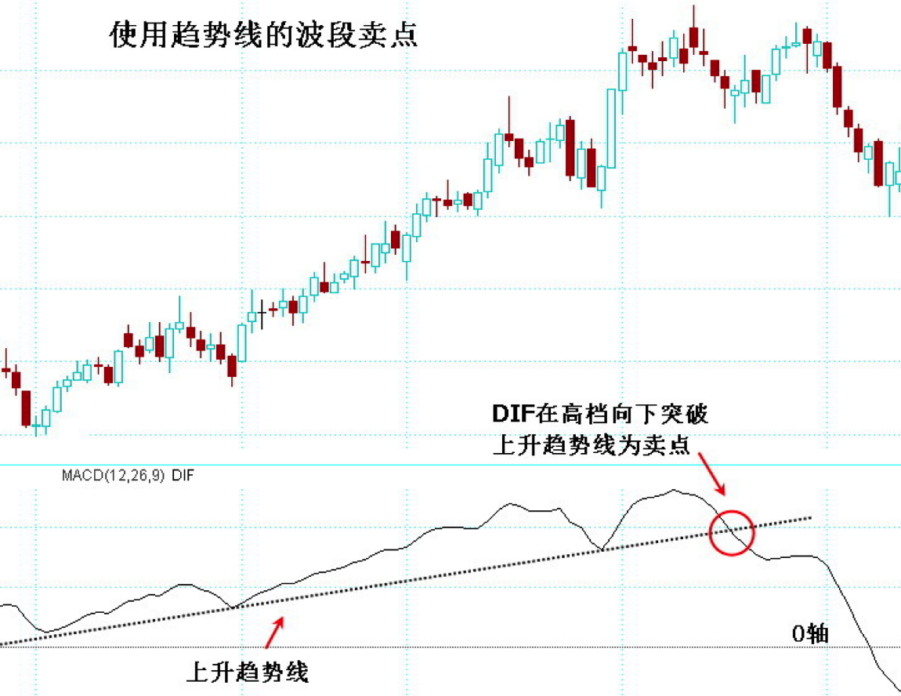

从图中可以看到，DIF指标线在0轴上一直受到上升趋势线的支撑，直到某日在指标的高档位置向下突破上升趋势线，这时预示着短期的上涨趋势已经结束，市场在中短期内有进一步下跌的可能。图中用圆圈标出来的位置，是DIF跌破上升趋势线时的卖点。

这个方法，在指标处于高位时更有效。用趋势线判断的DIF波段操作卖点，比前面讲到的DIF突破0轴时的卖点的位置要提前。这是又一个“逃顶”的好方法。

在图4-16 DIF上升曲线上，连接连续的两个波谷，画出上升趋势线。我们看到，图中K线图有很长的实体K线或上影线，说明盘中波动剧烈，投资者如果只看K线很容易受情绪影响，使操作乱了章法，而用DIF指标线则比K线更易于观察，DIF是对K线的平滑，更能反应趋势的一般水平。

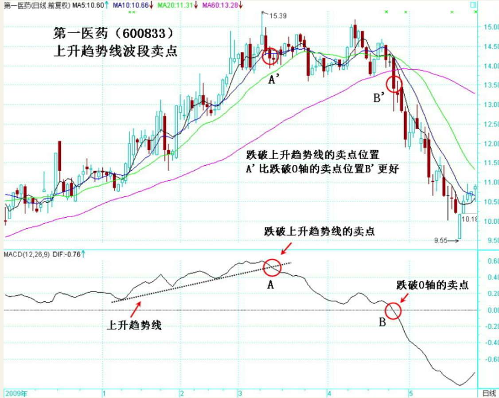

在上升趋势线上，DIF指标的波谷逐波垫高，表示该股价格也在一浪一浪地上涨。DIF在0轴之上运行的过程中，一直受上升趋势线的支撑，直到在高档区，该股上涨动能消耗怠尽，在2010年3月9日该股创出最高价15.39元，之后在3月12日DIF指标跌破上升趋势线，这时为一个好的卖点，在图中标记为A，对应的价格区域为A'。

此后，DIF指标开始向下回落，股价在高位震荡，重心慢慢下移，这时已经有了见顶迹象，在4月7日当天， DIF向下突破0轴，是前一节讲到的卖点，在图中标记为B，对应的价格区域为B'。此后市场由空方占据绝对优势，该股一路暴跌，DIF一直运行在0轴之下，空头力量一直主导着市场。

我们再来比较A、B两个卖点，从图中可以明显地看出来，A卖点比B卖点的位置更好，因为DIF从跌破上升趋势线到跌破0轴还有一段的距离，A点比B点提前了31个交易日，避免很长时间的无序震荡。A点在14.2元附近，B点在13.5元附近，A点比B、C的价位高了0.7元，相当于多赚了5%左右，更重要的是节省了很多时间和精力。

同样要说的是，虽然这是一种有效的“逃顶”方法，但也并非总是正确的，在很强势的上涨中，DIF在跌破上涨趋势线之后，还可能再回到上涨趋势线之上，但通常行情不会持续太久就会调头向下。另外，在跌破趋势线之前若出现高换手率和天量则也增加了见顶的可能性。这种方法是判断顶部的有效方法之一。

在实战操作中，DIF指标的波动可能不很规则，但在总体的趋势上也可以按照趋势线方法来判断买卖点。一般来说，在上涨中，DIF指标的波峰（谷）会比较明显，这是因为上涨往往比较缓慢，所用时间较长；在下跌中，DIF指标的波峰（谷）的宽度会比较小，这是因为下跌的速度比较快，所用时间较短。

下面我们来看突破0轴买点与趋势线买卖点在个股中综合应用的一个例子，如下图4-17所示。

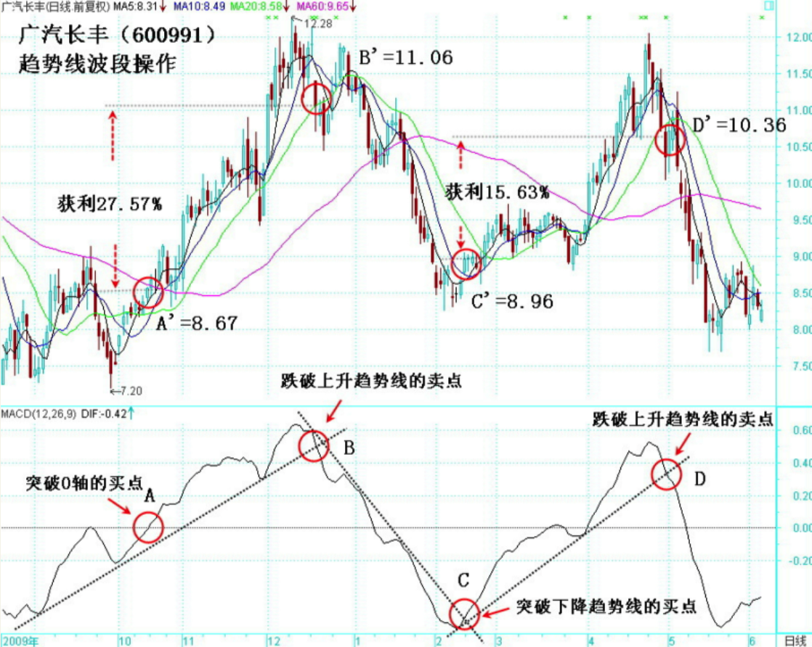

前面介绍的趋势线画法，分别画出上升和下降趋势线，按买卖规则标出买点与卖点。从图中可以看出，A、B、C、D分别是四个买卖点。其中，A是突破0轴的买点，发生在2009年10月21日，收盘价是8.67元；B是跌破上升趋势线的卖点，发生在2009年12月18日，收盘价是11.06元；C是突破下降趋势线的买点，发生在2010年2月10日，收盘价是8.96元；D是跌破上升趋势线的卖点，发生在2010年4月30日，收盘价是10.36元。统计成波段操作表如下表4-1所示。

表4-1 波段操作统计表

买入时间 | 买入价位 | 卖出时间 | 卖出价位 | 获利 | 幅度
-----|------|------|------|----|---
20091021 | 8.67 | 20091218 | 8.96 | 2.39 | 27.57%
20100210 | 8.96 | 20100430 | 10.36 | 1.4 | 15.63%
总利润 | 43.20%

我们看到，第一次波段操作获利区间是2.39元，盈利达27.57%；第二次波段操作获利区间是1.4元，盈利达15.63%。两次波段操作盈利共达43.20%，这仅用了半年左右的时间。用波段操作的方法，避免了主要的下跌波段，抓住了主要的上涨波段。如果是没有明确的波段操作方法，在这个大的波段区间中很可能“捂”过头，从哪里来到哪里去，最后又跌回去。

## 底背离（多头背离）
`底背离`是指价格或指数创新低时而DIF指标却未同时创新低的现象。底背离又被称为多头背离，是多头力量积聚的过程，可能已经完成筑底过程，多头随时会发起上涨攻势。底背离是底部反转信号。不过，在实战运用中，背离最好得到其他技术的相互验证，比如在发生背离时，价格或指数同时突破趋势线或10日移动平均线。

**底背离波段操作第一买点**

从图4-18中我们看到，在下跌趋势中，价格不断创新低，DIF起初也跟随价格同步向下运行，DIF像“影子”一样紧盯价格。指标在0轴之下不断创新低，当进入低档区时，DIF指标对下跌力量的减弱开始变得敏感起来。当价格经过一次反弹后再创新低时，指标并未同时创下新低，这时就发生了背离现象。这预示着这里极可能是空头最后的疯狂，是最后一跌。

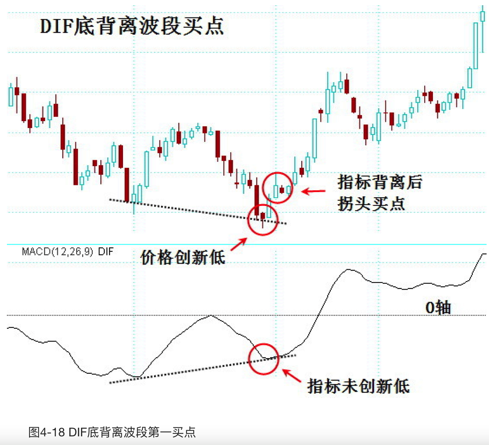

在DIF发生底背离后，当指标值大于前一日指标值时是拐头买点。底背离通常发生在下跌推动浪末端的最后一个下跌浪，底背离表示中短期内有极大的转势可能，它是底部反转信号。在操作中，底背离买入后，应该很快会得到趋势线的确认，会伴随着价格放量突破下降趋势线。

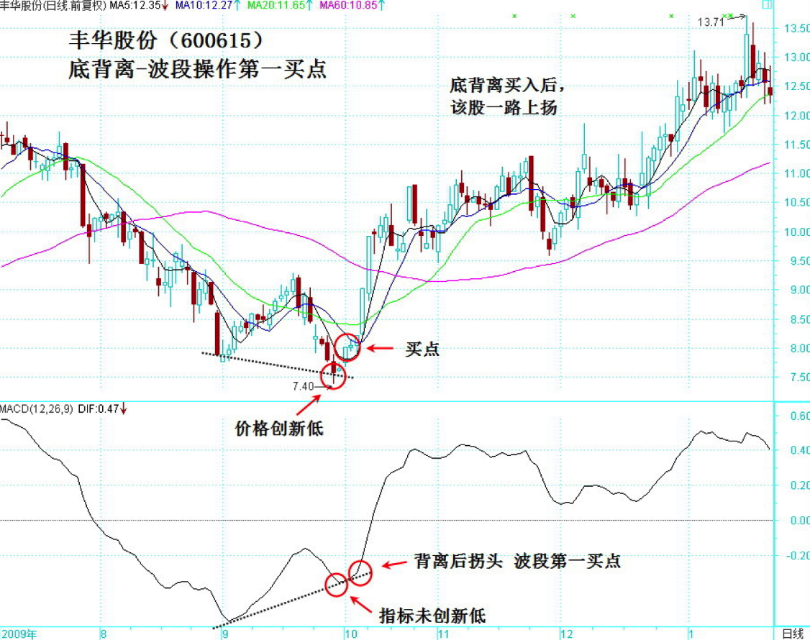

从上图可以看出，在下跌趋势中，该股价从高位一路下跌，DIF指标也同步从多方跌破0轴进入空头市场。指标在0轴之下不断创出新低，DIF像“影子”一样紧盯价格。当指标进入低档区时，DIF指标对下跌力量的减弱开始变得敏感起来。当价格经过一次反弹后，在2009年9月29日再创新低7.4元，但同时指标并未创下新低，这时发生了背离。投资者在这时就应该想到，这里极可能是空头力量最后的释放，卖压力量已经开始减弱，反转的可能性在增大。

从图中也可以看出，价格趋势线与指标趋势线也发生了背离。在2009年10月9日，DIF指标值为－0.35大于前一日的指标值－0.36，表示DIF背离后拐头，这是指标上升的开始，此为波段操作第一买点。

有的投资者会问，不等指标拐头而在背离时马上介入行不行？我们认为，这样做有很大的风险，因为在发生背离时，价格还可能进一步下挫，甚至DIF指标也有可能再创新低。在指标没有拐头时都不能算是完成背离。

**底背离波段操作第二买点**
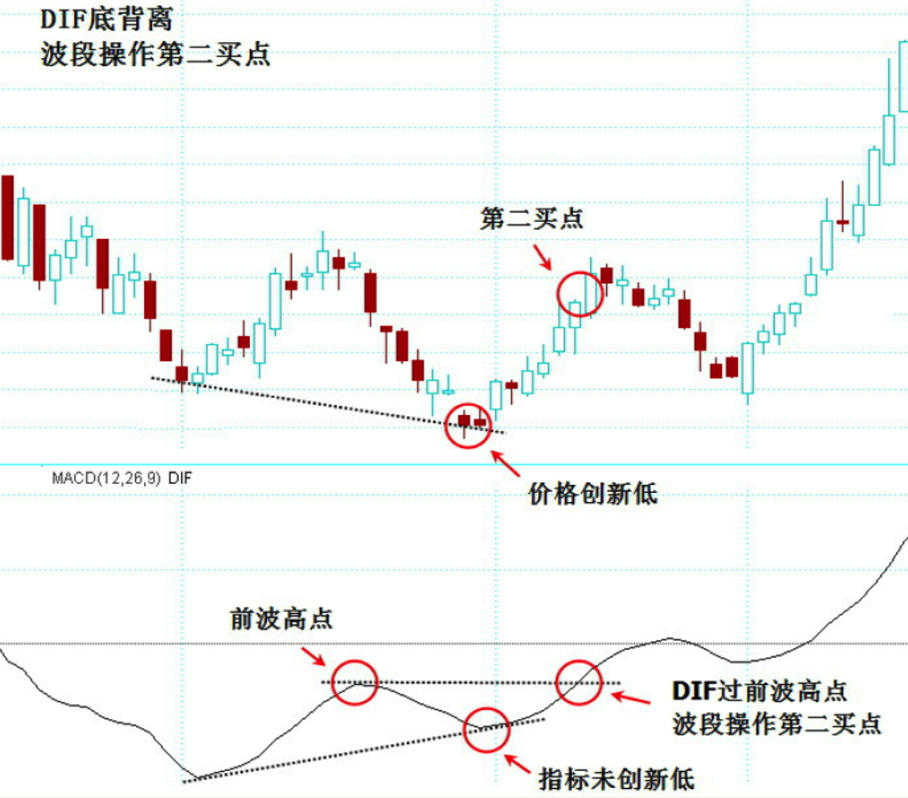

从图4-20我们可以看到，DIF底背离波段操作的第二买点，是在DIF指标线突破前期高点时产生的。DIF指标在创新低时会产生第一个波谷；然后出现一个反弹，这时会形成一个波峰；之后指标再次回落，价格在回落时创新低，而指标不再创新低；之后指标拐头向上，这里形成第二个波谷，指标值回升是前面讲到的第一买点；当指标向上突破前期波峰时，为第二买点。

第二买点较第一买点更靠后，位置更高，但比第一买点更为可靠。因为在空头力量超强的市场中，背离拐头的第一买点有失误的可能，指标可能拐头没有几日便又重回跌势，这种情况也要考虑到。第二买点等于是给第一买点一个回旋的余地，如果第一击命中，那么第二买点可以顺势加仓，乘胜追击；如果第一买点失误，则需要及时止损，也不会有太大的损失。所以说，第二买点是以牺牲低价位来提高入场的可靠性。

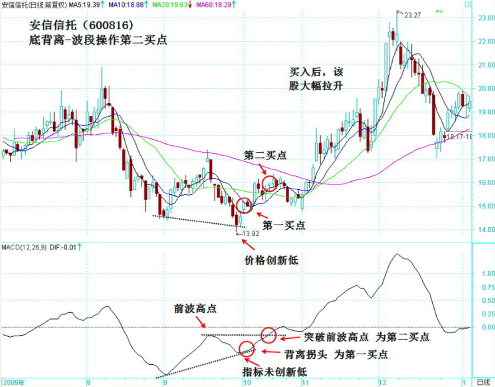

从图4-21中可以看到，DIF指标图中，最低波谷后面，未能随价格创出新低的次低波谷，是背离发生的区域，该股在2009年9月29日创下新低13.92元，而当时指标并未创新低。之后DIF上升，这是背离后的拐头，是第一买点。随后指标进一步向上运行，在10月20日DIF突破前期高点，这时产生了第二买点。

从图中可以看出，第二买点比第一买点的位置要高，虽然买入价格不如第一买点低，但上涨的可能性更大了。DIF指标在0轴附近调整了一下，然后迅速向上突破，股价相应快速拉升。

在强劲的空头市场中，会出现背离后还有背离的情况，这时就能看出第一买点的激进性和第二买点的稳健性。第二买点对第一买点的保护和可靠性可通过下面这个实例来说明，如图4-22所示。

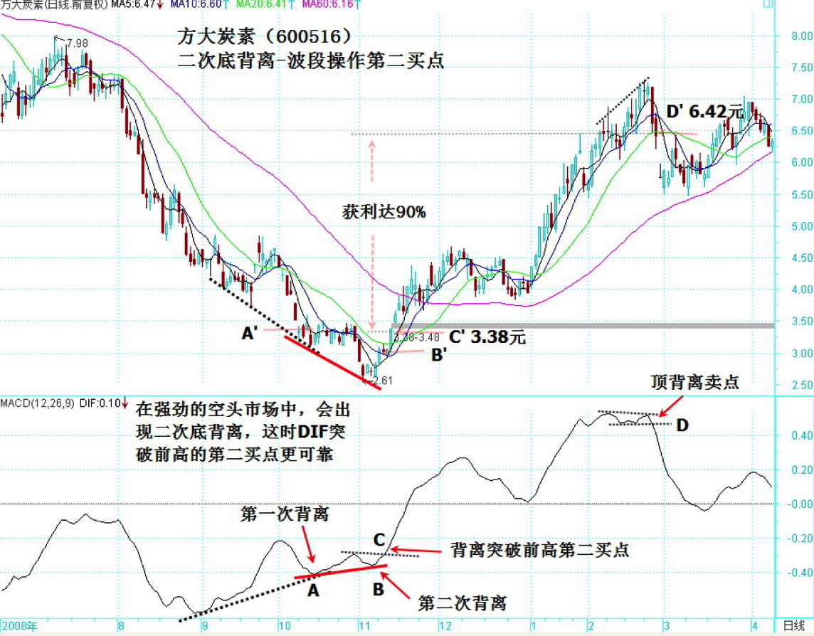

从图4-22中可以看到，该股前期的下跌过程是一个较强的熊市，DIF指标在空方低档运行了很长时间。在图中A点处发生了第一次底背离，这时会有拐头的第一买点，对应的价格是A'3.42元。但价格并没有上涨，反而继续下跌，如果在这个价位买入，会被暂时套牢。这时介入如果不涨则可以先退出观望，因为毕竟是抄底，要小心为上。

在11月4日股价继续创新出低2.61元，DIF指标产生了第二次底背离，在图中用B表示，这时也有对应的又一个拐头买点是B'3.06元。之后指标突破前期高点，产生了第二买点，对应的买入价格是C'3.38元。我们看到，A'处的第一买点有被套牢的风险， 在这里买入要承受后面20%多的下跌，如果操作不当就会被止损一次，或割肉在低位。而B'处是同样的拐头买点，也存在和A'一样的风险，虽然随后没有发生。而突破前高的C处的买点C'3.38元不仅比A'3.42元的价位要好，而且风险更低。

## 顶背离（空头背离）
`顶背离`又被称为空头背离，是空头力量聚集的过程，预示着市场可能已经见顶，空头随时会发动下跌攻势。顶背离是顶部反转信号。不过，在实战运用中，顶背离最好能得到其他技术的相互验证，比如在发生背离时，价格或指数同时向下跌破趋势线或10日移动平均线。

**顶背离波段操作第一卖点**
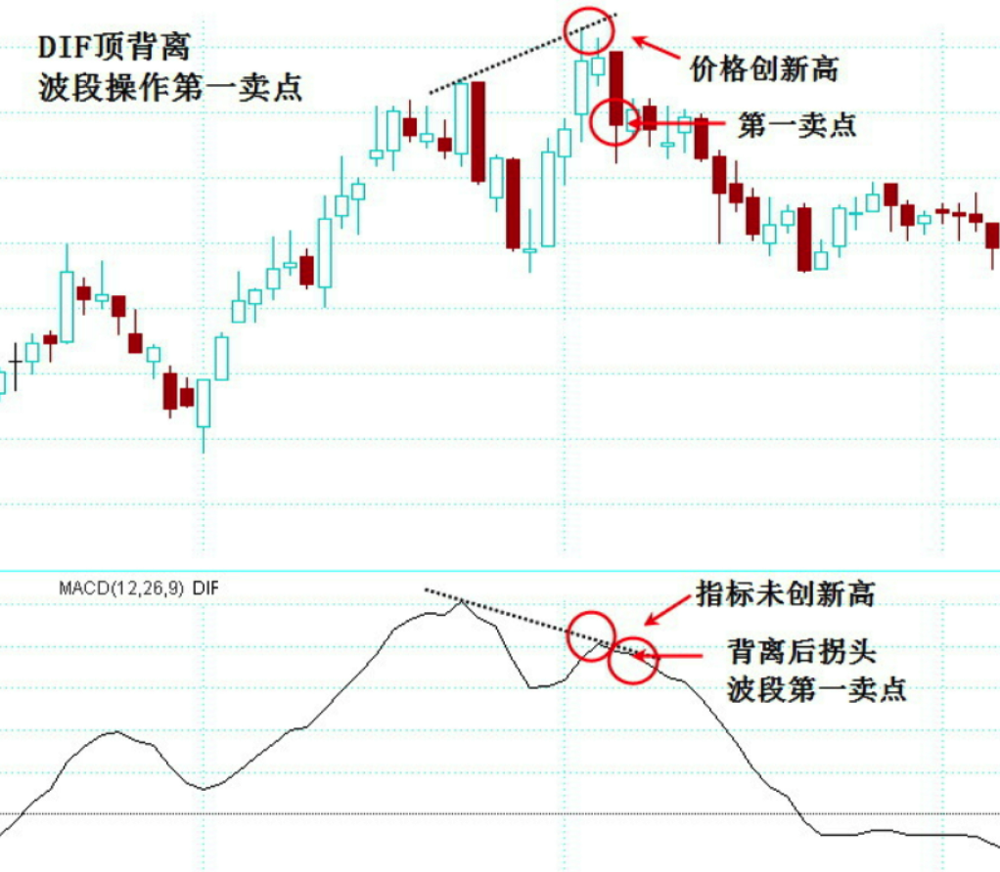

从图4-23中我们看到，在上涨趋势中，价格不断创出新高，DIF起初也跟随价格同步向上运行，DIF像“影子”一样紧盯价格。指标在0轴之上不断创出新高，当进入高档区时，DIF指标对上涨力量的减弱开始变得敏感起来。当价格经过一次回调后再创新高时，指标并未同时创出新高，这时就发生了顶背离现象。这预示着这里极可能是多头最后一波拉升。在图中用两条直线分别连接价格与指标的两个相邻的波峰，我们看到，价格的后一个波峰高于前一个波峰，指标的后一个波峰低于前一个波峰，两条直线出现了明显的背离。

在DIF发生顶背离后，当指标值小于前一日指标值时是拐头卖点。顶背离通常发生在上升推动浪末端的第5浪，顶背离表示中短期内极有可能转势，是顶部反转信号。在操作中，顶背离卖出后，价格应该会很快跌破上升趋势线，确认顶背离的形成。

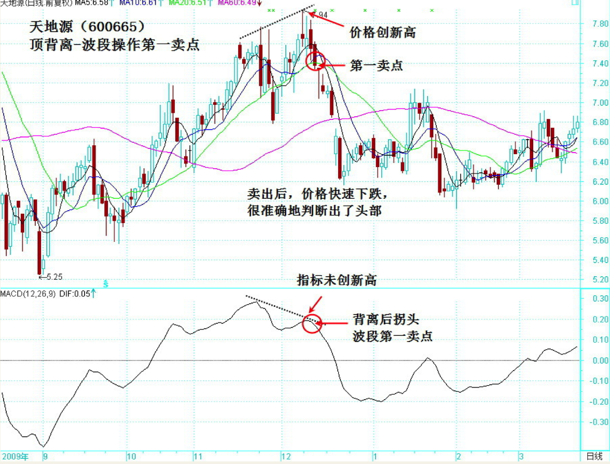

从上图可以看出，在上涨趋势中，该股价格从低位一路上行，DIF指标也同步从空方突破0轴进入多头市场。指标在0轴之上不断创出新高，DIF像“影子”一样紧盯价格。当指标进入高档区时，DIF指标对上涨力量的衰减开始变得敏感起来。当价格经过一次回调后，在2009年12月8日再次创出新高7.94元，但同时指标并未创出新高，这时发生了顶背离。而且这一天放出了巨量，同时走出了一个“射击之星”的见顶K线形态。投资者在这时就应该想到，这里极可能是多头最后的一次上攻，反转的可能性在增大。

从图中也可以看出，价格趋势线与指标趋势线也发生了背离。在2009年12月11日，DIF指标值为0.17小于前一日的指标值0.19，表明DIF背离后拐头向下，这是指标下跌的开始，此为波段操作第一卖点。

在卖出后的几天内，股价放量跌破10日均线，卖点很快得到了确认，连续的四根阴线并跌破MA10宣布多头的终结。事实证明了，顶背离是最后一波拉升，卖出之后，DIF指标也很快跌破了0轴，进入了以空头为主导的市场。此后，DIF一直运行在0轴之下，股价一路震荡向下。

一定要等顶背离走出来，再进行操作。为了增加离场的可靠性，我们下面将介绍顶背离波段操作的另一个卖点。

**顶背离波段操作第二卖点**
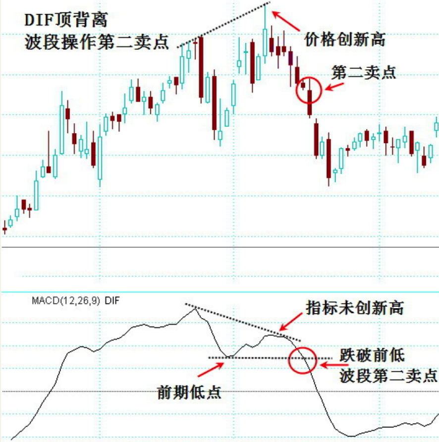

从上图我们可以看到，DIF顶背离波段操作的第二卖点，是在DIF指标线突破前期回调波谷的低点时产生的。DIF指标在创新高时会产生第一个波峰；随后出现一个回抽，这时会形成一个波谷；之后指标再次上升，价格在上涨时创出新高，而指标不再创新高；之后指标拐头向下，这里形成第二个波峰，指标值向下拐头是前面讲到的第一卖点；当指标向下突破前期波谷时，为第二卖点。

第二卖点较第一卖点更靠后，位置更低，但比第一卖点更为可靠。因为在多头力量强劲的市场中，顶背离后指标拐头的第一卖点有失误的可能，指标可能在拐头之后没有几日便又重回涨势，这种情况也要考虑到。第二卖点是对第一卖点的保护，这样在一定程度上可以防止踏空。如果在第一卖点之后又触发第二卖点，那么第一卖点卖在了高位，这是一次正确的操作，出现第二卖点是对第一卖点的确认，这时可以再出掉余下的部分筹码；如果在第一卖点之后，股价又重新回到涨势，那么手中还有的筹码也不会失去有利位置，在DIF指标突破前高时可以再适当回补一些在第一卖点出掉的仓位。

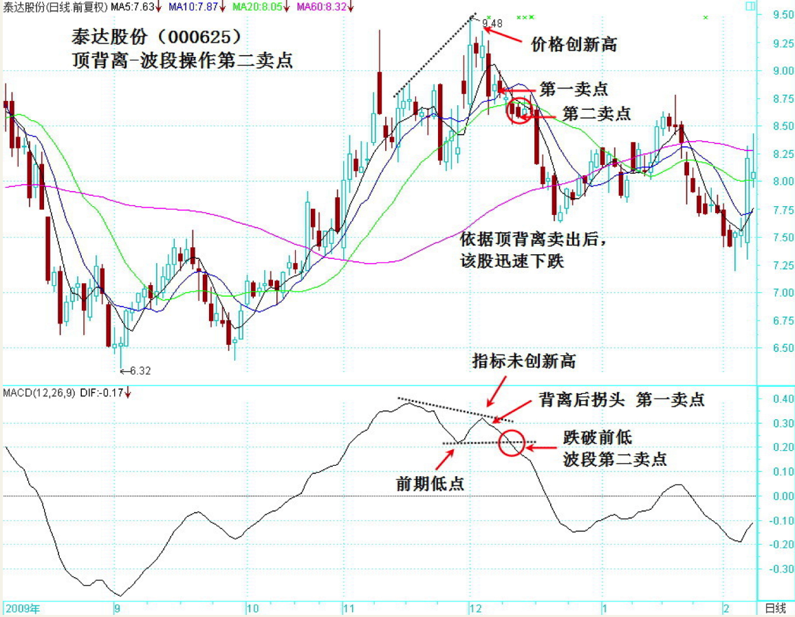

从上图可以看到，DIF指标最高波峰后面的次高波峰，是背离发生的区域。该股在2009年12月1日创下新高9.48元，而当时指标并未创出新高。之后DIF开始向下运行，这是顶背离后的拐头，是第一卖点。随后指标进一步向下运行，在12月15日DIF跌破前期低点，这时产生第二卖点。

从图中可以看出，第二卖点比第一卖点的位置要低，虽然卖出价格不如第一卖点高，但该股下跌的可能性更大了。该股在第二卖点后，出现了暴跌，证明了第二卖点对下跌趋势的确认。而且，在后面的反弹中，股价也没能超过第二卖点的位置，所以说，第二卖点是一个有效的卖点和压力位。

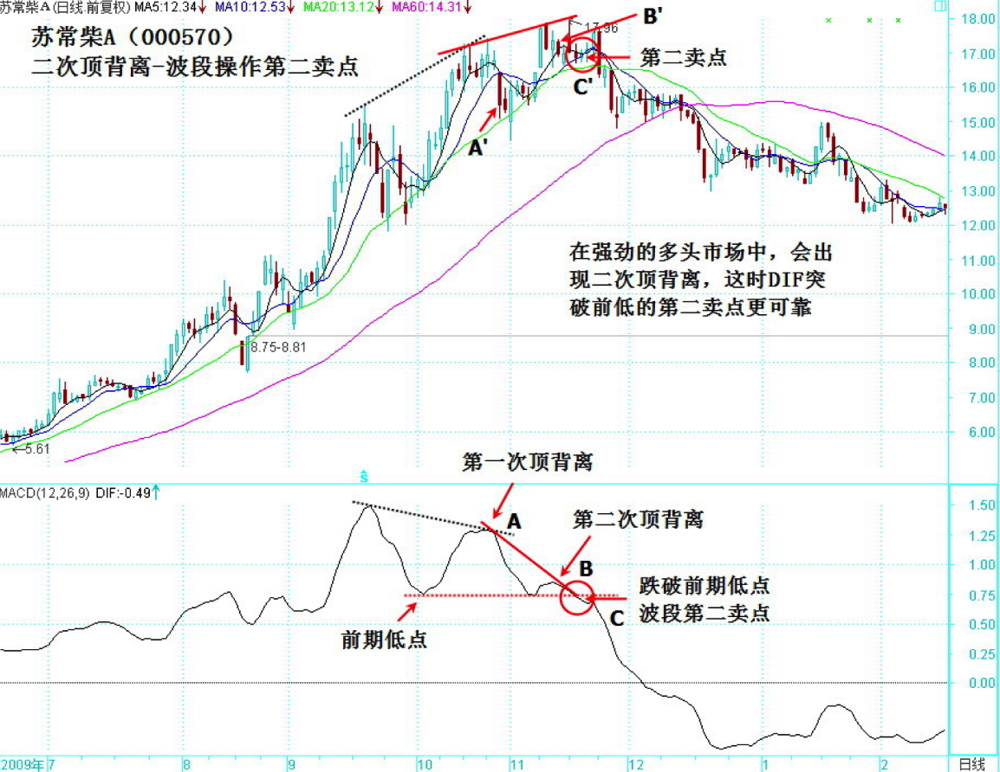

从上图可以看到，该股前期的上涨是一个极强的大牛市，DIF指标在多方高档运行了很长时间。该股在2009年10月27日创下新高17.41元，在图中A点处发生了第一次顶背离，这时会有拐头的第一卖点，对应的价格是A'15.48元。但价格并没有下跌，反而又上涨了一波，如果在这个价位卖出，会有踏空风险。这时若选择卖出，则应出手少量筹码，在高位先保护一部分利润，用余下的筹码跟踪趋势。

随后，在11月17日该股继续创出新高收盘价17.7元，DIF指标产生了第二次顶背离，在图中用B表示，这时也有对应的又一个拐头卖点是B'16.97元。之后指标突破前期低点，产生了第二卖点，对应的卖出价格是C'16.99元。我们看到，A'处的第一卖点有踏空的风险，在这里卖出要踏空后面16%左右的上涨，如果操作不当就有追高回补的可能。而B'处是同样的拐头卖点，也有和A'一样的风险，虽然随后没有发生。突破前低的C处的卖点C'16.99元不仅比A'15.48元的价位要好，而且更可靠，这里再上涨的可能性已经很小。

因此，在顶背离中，波段第二卖点要比第一卖点更合理。投资者可以通过控制仓位，在第一卖点产生时进行保护性离场少部分筹码，在第二卖点发生时再卖出大部分筹码。

**综合运用**

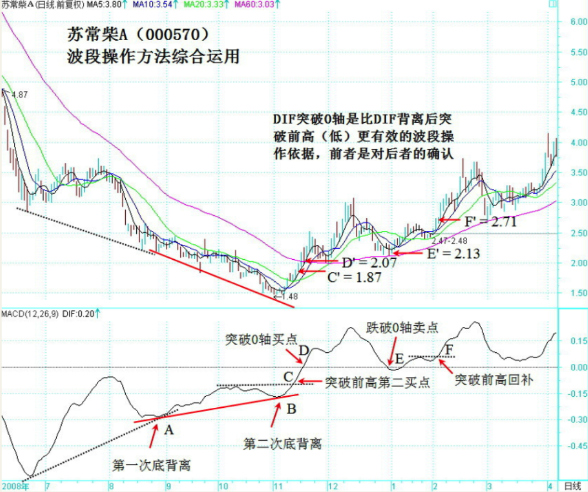

我们把DIF突破前高作为买入依据，把DIF突破0轴作为更有效的买入依据；把DIF跌破前低作为卖出依据，把DIF跌破0轴作为更有效的卖出依据。

从图4-28可以看出，该股在0轴之下形成了两次底背离，分别标注为位置A与B，两次底背离说明下跌动能强大。该股于2008年11月3日创出新低1.48元，在第二次底背离之后，DIF突破前期波峰，产生了前面讲到的背离第二买点，在图中用C表示，对应的价格是C'1.87元。随后DIF突破0轴，是更为可靠的买点，在图中用D表示，对应的价格是D'2.07元。

该股在2008年12月31日跌破了0轴，这是无条件的卖出点，这时两次买入的仓位都应该离场。在图中用E表示，对应的价位是E'2.13元。在这之后，股价并没有进一步下跌，而是又重新回到0轴之上，这时我们不能再贸然买入，因为，这里有形成二次跌破0轴的可能。直到DIF再次突破前期波峰时，图中F位置，可以看作市场中多头再次占据主导地位，这时应该对前期清仓的仓位进行回补，对应的价格是F'2.71元。通过这一回合，虽然卖出后股价又重回涨势，看上去好像跌破0轴时没必要离场，但我们做的是大概率的事。当DIF由高位向下跌破0轴时，在10次中可能有8次是回不来的而且后面可能还有很深的跌幅。我们坚持“小亏大赚”以及“做大概率”的原则，所以从长期来看，DIF跌破0轴离场是合理的操作。

此后该股一直在0轴之上正常地上涨，这时应以持股为主，直到2009年5月，DIF在高档区出现了一次背离卖点，如图4-29所示。

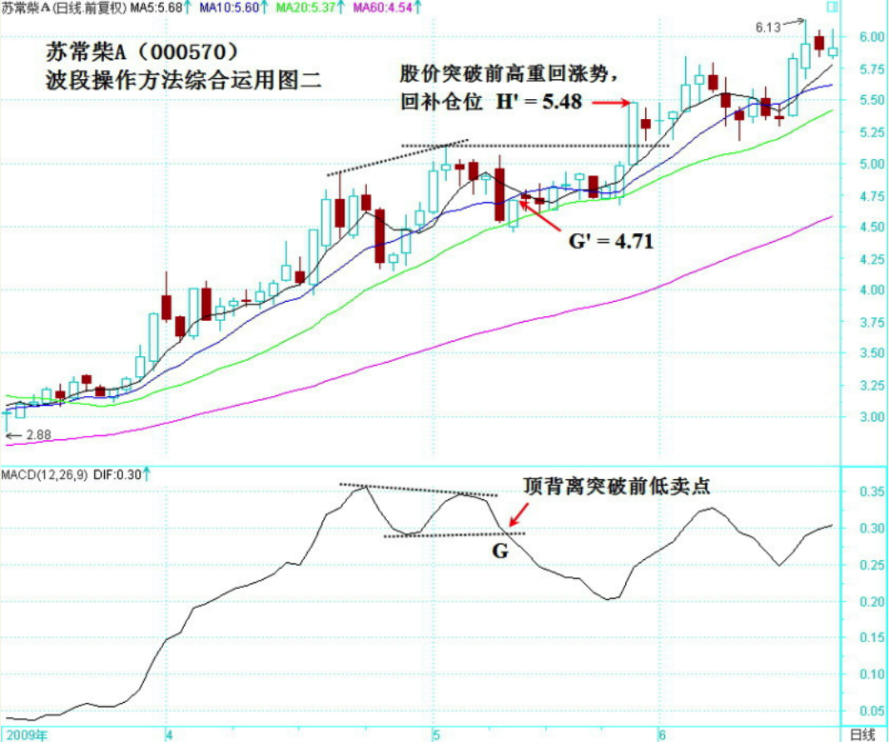

从图4-29可以看到，DIF出现了一次顶背离，这时有见顶的可能，在5月12日，DIF跌破前期波谷的低点，在图中用G表示，对应的价格是G'4.71元，在卖出后，价格没有进一步下跌，DIF指标却明显回落，这说明该股相当强势，指标经过反复在高位运行有调整的需要，这时的操作应该以价格为主，在5月26日，该股再次创新高，这时应该回补前期离场的仓位，继续跟踪趋势，对应的价格是H'5.48元。

此后DIF仍然维持在高位运行，这说明多头非常强，继续以持股为主。直到2009年11月份，该股再次出现背离，如图4-30所示。

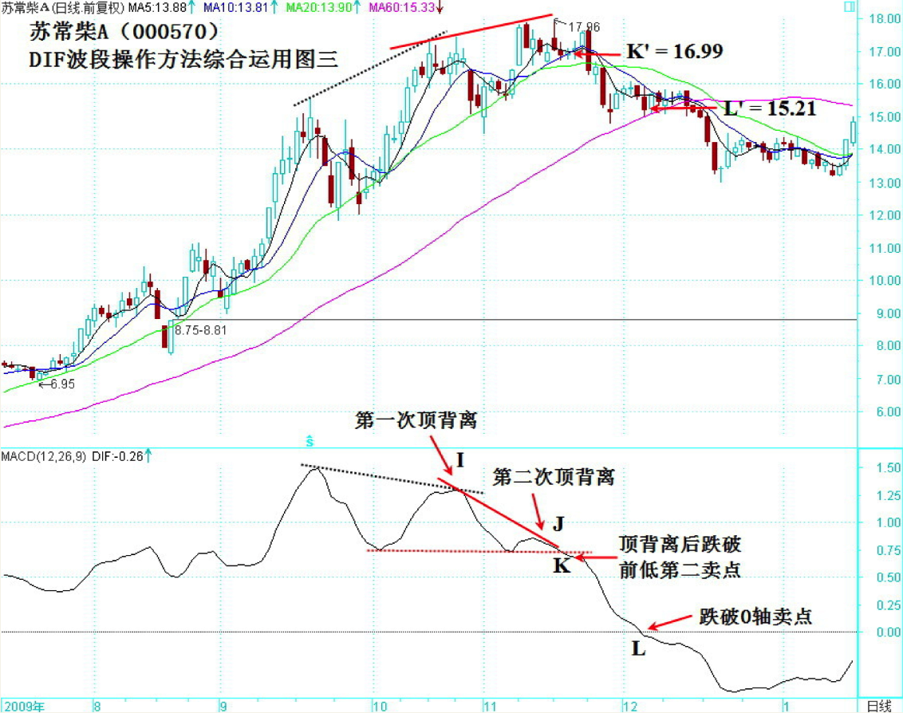

这也是在前面图4-27中曾经讲到过的，DIF在图中I、J两处发生了两次顶背离，当DIF跌破前低时是卖点，在图中用K表示，对应的价格是K'16.99元；之后DIF进一步向下，跌破了0轴，在图中用L表示，这时应该清掉全部仓位，对应的价格是L'15.21元。

表4-2  苏常柴（000570）两种波段操作方法对照表

买入依据 | 买入时间 | 符号 | 买入价位 | 卖出依据 | 卖出时间 | 符号 | 卖出价位 | 获利 | 幅度
-----|------|----|------|------|------|----|------|----|---
DIF突破前高 | 20081113 | C' | 1.87 | DIF跌破O轴 | 20081231 | E' | 2.13 | 0.26 | 13.90%
DIF突破前高 | 20090203 | F' | 2.71 | DIF跌破前低 | 20090512 | G' | 4.71 | 2 | 73.80%
股价继续创新高 | 20090526 | H' | 5.48 | DIF跌破前低 | 20091119 | K' | 16.99 | 11.51 | 210.04%
背离方法总利润 | - | - | - | - | - | - | - | 13.77 | 736.36%
DIF 突破O轴 | 20081118 | D' | 2.07 | DIF跌破O轴 | 20081231 | E' | 2.13 | 0.06 | 2.90%
DIF 突破前高 | 20090203 | F' | 2.71 | DIF跌破O轴 | 20091204 | L' | 15.21 | 12.5 | 461.25%
突破0轴方法总利润 | - | - | - | - | - | - | - | 12. 56 | 606.76%

从表4-2可以看出，DIF跌破0轴是两种方法共同的无条件卖出点，它是最高优先级的卖点。从2008年11月13日到2009年12月4日，总共1年多一点的时间里，用背离方法共获得总利润达736.36%，用突破0轴方法获得总利润达606.76%。背离方法比突破0轴方法获利高，这是因为，前者的买卖点较后者要提前，但后者是更可靠的操作方法。

我们把前面三幅图的所有买点与卖点综合到一幅图中如下图4-31所示。

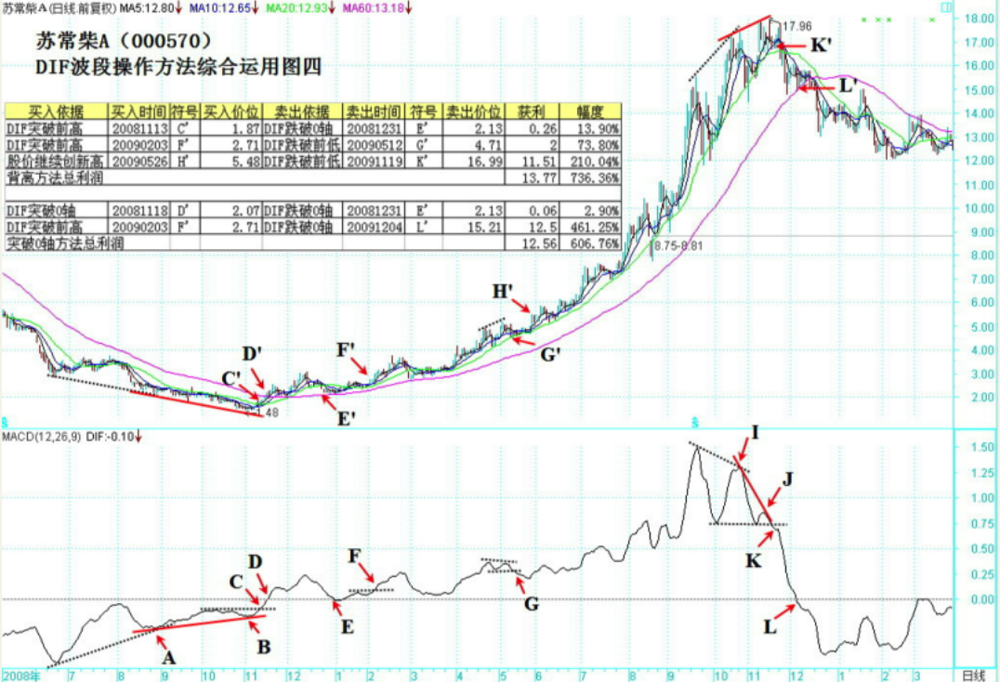

从图4-31可以看出，在L位置最后卖出之后，该股价格最低跌到了12元附近，用DIF波段操作法最大可能地抓到了拉升的主要波段，准确地判断了头部，并且能够及时保住利润回避下跌。

DIF背离后的拐头卖点，即背离卖点一，在这个大波段中，出现过很多次，正像我们讲的，背离第二卖点较第一卖点更可靠；而DIF突破0轴卖点比背离的第二卖点更有效，但卖出位置不如背离的卖出位置好。

从买点来看，底背离后的拐头买点（第一买点），底背离后的突破买点（第二买点），突破0轴买点，三者的位置通常是顺次提高的，后者是对前者的确认，表示趋势向上的可能性在不断增大。从卖点来看，顶背离后的拐头卖点（第一卖点），顶背离后的突破卖点（第二卖点），突破0轴卖点，三者的位置通常是顺次降低的，后者是对前者的确认，表示趋势向下的可能性在不断增大。

最后来看一个底背离突破买点与趋势线卖点综合运用的例子，如下图4-32所示。

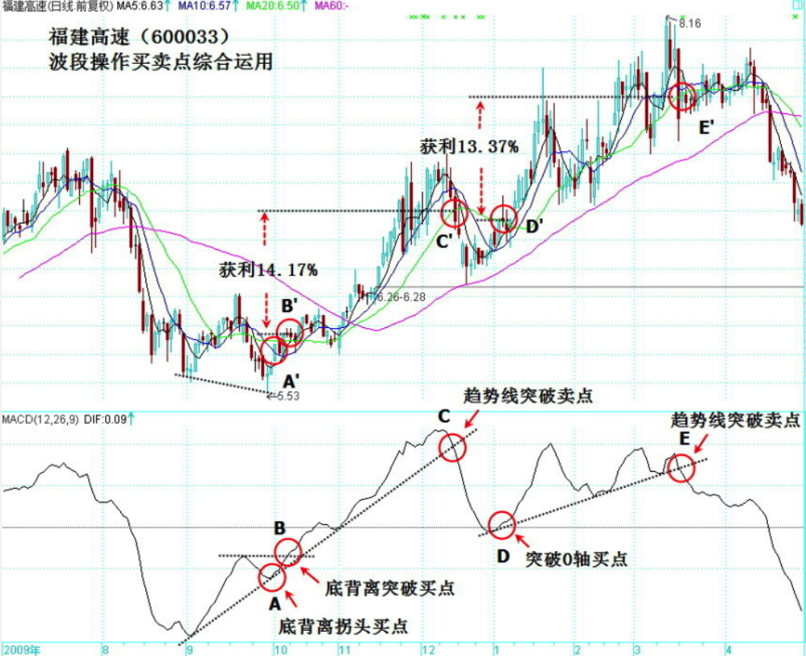

由上图可以看出，福建高速（600033）在2009年9月29日创下最低价5.53元，同时DIF指标未创新低，在图中A处发生了底背离。之后，运用底背离拐头买入法，在10月9日以5.87元介入，这是第一买点，然后随着DIF进一步向上运行，当其突破前期高点时产生第二买点，在图中用B表示，对应的价格是B'5.92元。在底部建仓后，该股DIF指标线在0轴附近稍微调整了一次，随后马上发动了一波强劲的拉升。我们将图中DIF线的波谷相连，画出一个上升趋势线，该股在12月17日向下跌破趋势线，形成了突破趋势线卖点，在图中用C表示，对应的价格是C'6.73元。

从上面的分析可以看出，两次买点A、B用了共同的一个卖点C，我们将波段操作数据统计在表4-3中，从表中可以看出，第一买点的盈利是14.65%，第二买点的盈利是13.68%，由于第一买点与第二买点相比位置较低所以盈利较多。两个买点的平均盈利是14.17%。

表4-3  福建高速（600033）波段操作统计表

买入时间 | 买入价位 | 卖出时间 | 卖出价位 | 获利 | 幅度
-----|------|------|------|----|---
20091009 | 5.87 | 20091217 | 6.73 | 0.86 | 14.65%
20091015 | 5.92 | 20091217 | 6.73 | 0.81 | 13.68%
两买点平均涨幅 | - | - | - | - | 14.17%
20100106 | 6.73 | 20100317 | 7.63 | 0.9 13.37%
总利润 | - | - | - | - | 27.54%

当股票由高位第一次跌破0轴后，若马上又回到0轴之上，说明多头行情还没有结束，这时往往会有最后一波拉升，一般发生在第5上升浪或反弹的B浪。

当该股在2010年1月6日重新回到0轴之上时，再次买入，在图4-32中，用D表示，对应的价格是D'6.73元。很碰巧与第一波操作中的卖点价格正好相等。买入后，该股再次创出新高，但细心的投资者会发现，DIF已经出现了背离情况。从图中可以看出，价格连创了三次新高，但DIF指标的波峰一个比一个低，这说明上涨的动能在逐波减弱，预示着头部开始形成。我们将DIF指标线的波谷相连形成一个上升趋势线，等待下破趋势线的卖出信号出现。最后，该股终于在3月17日跌破上升趋势线，在图中用E表示，对应的价格是E'7.63元。

E'是位置最佳、最合理的出场点，在卖出之后，该股在卖出价位附近支撑了一段时间，然后出现暴跌，DIF也向下突破0轴，进入空头市场。这一波操作从D'到E'点共获利13.37%，见表4-3。

通过上面分析，可以看出，DIF底背离买入与趋势线卖出相结合能最大限度地抓到一波中期上涨行情，回避调整行情，在每个波段的顶部拐头位置都能先退出观望，如果趋势继续就再“上车”，否则就保护好利润，继续等待机会的出现。

在实战中运用背离时要注意以下几点：

1. 有时背离并不很严格，比如，价格可能在前低处停止，将创新低而未创新低，而指标已经较前一个创新低的波谷向上提高了很多，这种图形也是背离。对于不很严格的形态，运用熟练后，可以感觉到它的神似，不拘泥于形，这是运用指标的境界的一种提升。
2. 背离的周期越大越有效，后面上涨的力量越强，上涨的空间越大。
3. 背离后面还可能再次发生背离，在强势中背离可能达三次或四次之多，这是因为趋势的级别大于了操作的周期，这时要配合趋势线等其他方法一起应用。
4. 合理控制仓位并设置止损单，我们介绍的几个DIF的买点，他们的效用各不相同，投资者需要通过实战找到适合自己交易系统的高效用买点，并根据各买点的效用分配不同的仓位。止损是经过一再强调的原则，它是我们投资的保护伞，一定要加以重视。

# 第五章
## 聚散交叉
在DIF与DEA的行进中，可以看作是DIF在带动DEA运行，当DIF由下向上突破DEA时，表明短期内的上涨动能打破了下跌惯性，股价进一步上涨的可能性较大；当DIF由上向下突破DEA时，表明短期内的下跌动能打破了上涨惯性，股价进一步下跌的可能性较大。

当DIF远离DEA时，表明DIF在拉动DEA，两者是在不断发散、背离（Divergence），表示向DIF方向运动的动能强大；当DIF靠近DEA时，表明DIF的拉动力量在减小，DEA开始追上DIF，两者是在不断收敛、聚合（Convergence）。

DIF与DEA由发散到收敛，最终会发生交叉（Cross），这个交叉点就是临界点，是短期多空平衡点。当DIF由下向上穿越DEA时，称为“黄金交叉”，这是短期多头占优势的信号，是买入机会；当DIF由上向下穿越DEA时，称为“死亡交叉”，这是短期空头占优势的信号，是卖出机会。

DIF与DEA在多空双方的“发散——收敛——交叉”循环往复，如同大自然的运转一样周而复始。

## 黄金交叉
**0 轴之下的黄金交叉**

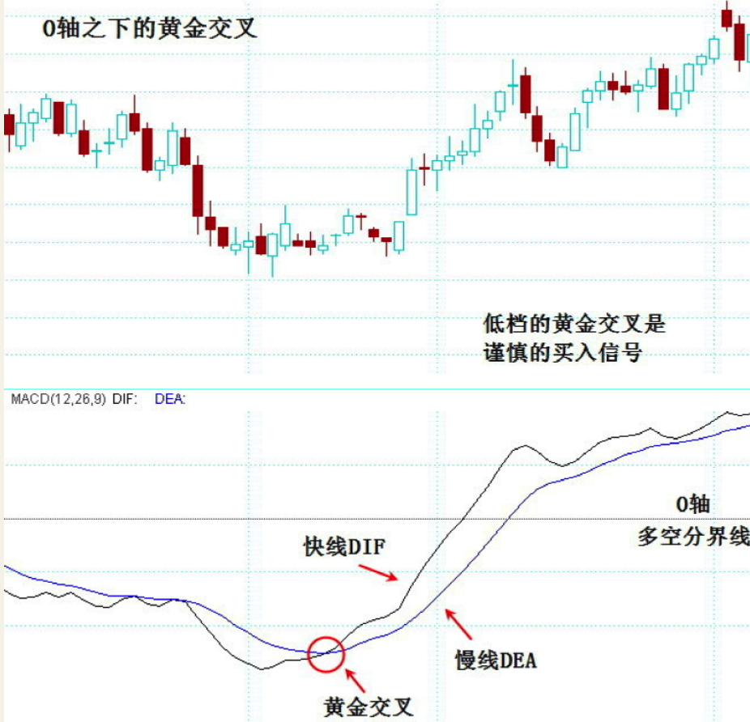

黄金交叉通常是买入信号，但在0轴下的黄金交叉要看具体情况谨慎对待。最好结合道氏理论和波浪理论来综合判断其是否应作为买入信号。在0轴下的黄金交叉一般发生在道氏理论中的熊市之中或者牛市初期；在波浪理论中，发生在下跌推动浪的反弹浪，上涨推动浪的第1浪和少数的第5浪。总之，只要发生在0轴之下，就是在空方主导的大趋势下发生的黄金交叉，它说明在大级别的下跌趋势中有可能发生次级别的反弹。因此，对于这种发生在空方的黄金交叉需要谨慎做多，它是双向交易的市场中的平空仓位置，但多数情况下不足以开多仓。

我们建议投资者对于0轴下的黄金交叉的应对策略是：

1. 合理分配仓位。对于下降通道（熊市）中发生的黄金交叉应该用小仓位试探性参与，甚至坚持“宁可错过，也不做错”的原则，不参与。下跌中发生的黄金交叉可能是暂时止跌，止跌可以不涨，对于这种难以把握的机会可以放过。
2. 严格止损。如果在下降通道中的黄金交叉买入后，股价没有明显上涨，或者又开始下跌，这时应该用时间止损法或定额止损法果断离场，以避免造成更大的损失。这里需要注意“永远不要摊平亏损仓位”。
3. 分清机会。对于0轴下的黄金交叉需要明确只有两个位置存在较大的机会，一个是下跌浪末，发生在空方的最后一个黄金交叉；另一个是长期上涨后，第一次进入空方后发生的黄金交叉。这两个位置是一波行情的开始和结束位置。对于前者，最好运用趋势线来判断，在股价突破下降趋势线后发生的那个0轴下的黄金交叉，一般就是空方的最后一个黄金交叉；后者比较好判断，是在一波牛市后，首次发生在空方的黄金交叉。这两个位置之外的0轴之下的黄金交叉都没有多大的参与意义。

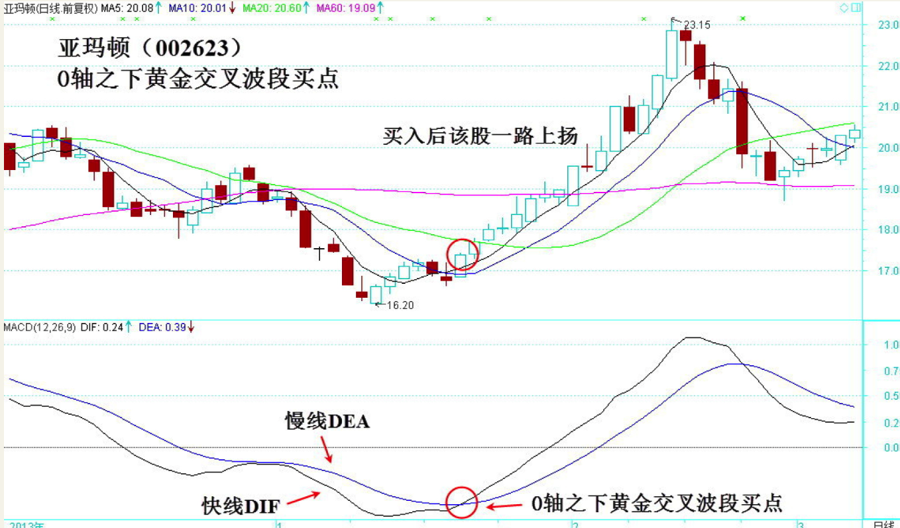

从图5-4可以看到，在前期下跌过程中，该股的快线DIF带动慢线DEA跌到0轴以下，市场暂时进入空方主导。当两条指标线运行到低位时，DIF开始靠近DEA，这时两条线发生了收敛，说明跌势开始减弱，多方在积蓄力量反攻。直到2014年1月22日，该股在低位发生黄金交叉，这标志着多方打破了多空平衡，由多方占据了短期优势，市场有进一步向上运行的预期。图5-4中标注的圆圈位置是黄金交叉的波段买点。在这之后，DIF继续带动DEA向上运行，并且突破了0轴，这时中期的多头优势已经确立，此后该股一路上扬。

**0 轴之上的黄金交叉**

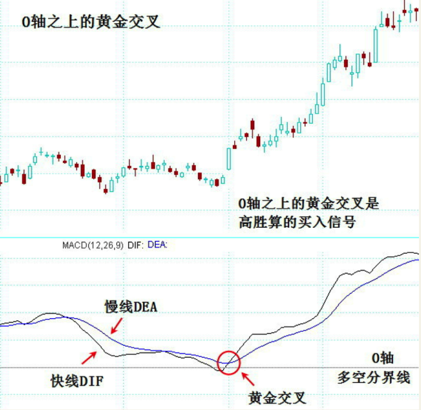

0轴之上的黄金交叉其买入成功率比较高，这是投资者要珍惜并牢牢把握好的操作机会。其通常发生在上升通道中，也就是发生在牛市，牛市就是最好的做多理由，这时投资者应以持股做多为主。

在上升通道中，每一次在0轴之上以及0轴附近的黄金交叉都是加仓机会。在发生黄金交叉之前，股价必然经过了调整，发生黄金交叉之后股价往往还会有可观幅度的上涨。

在实战中要注意的是，加仓要等价格拉开幅度，不要在一个区间密集加仓，如果是在一个区间密集出现黄金交叉买入信号，那么市场多数是处在震荡为主的行情中。另外，要注意加仓最好采用“正金字塔加仓法”，即随着价格上涨，加仓数量应该递减，不能在高位加重仓，这是千万要注意的。

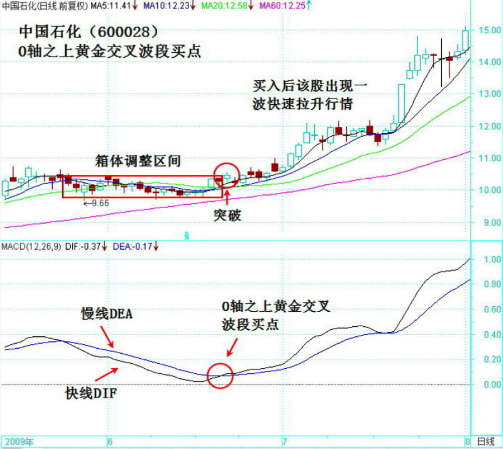

从图5-6可以看到，前期该股的快线DIF带动慢线DEA调整到0轴附近，这是对之前的上涨行情所进行的调整。指标一直运行在0轴之上，这表明是多头占主导的市场。当DIF回落到0轴上方时，停止向下，而是向DEA靠拢，这是两条线的收敛状态，这表示短期的调整即将结束。

在2009年6月22日，该股DIF与DEA在0轴上方发生黄金交叉，这里是波段买点，在图5-6中用圆圈标注的位置。再看指标对应的价格，在指标的调整期间，价格也是在一个箱体调整区间中，见图中用矩形标出的位置。在指标发生黄金交叉的当天，正是收盘价突破箱体上沿的时候，压力位的突破与黄金交叉相互验证，这说明了买点的可靠性。在买入后，该股结束了箱体中小阴小阳线的走势，K线的实体明显增大，这说明在调整中多头力量得到积累，此后该股开始快速拉升。

**0轴下的二次黄金交叉**

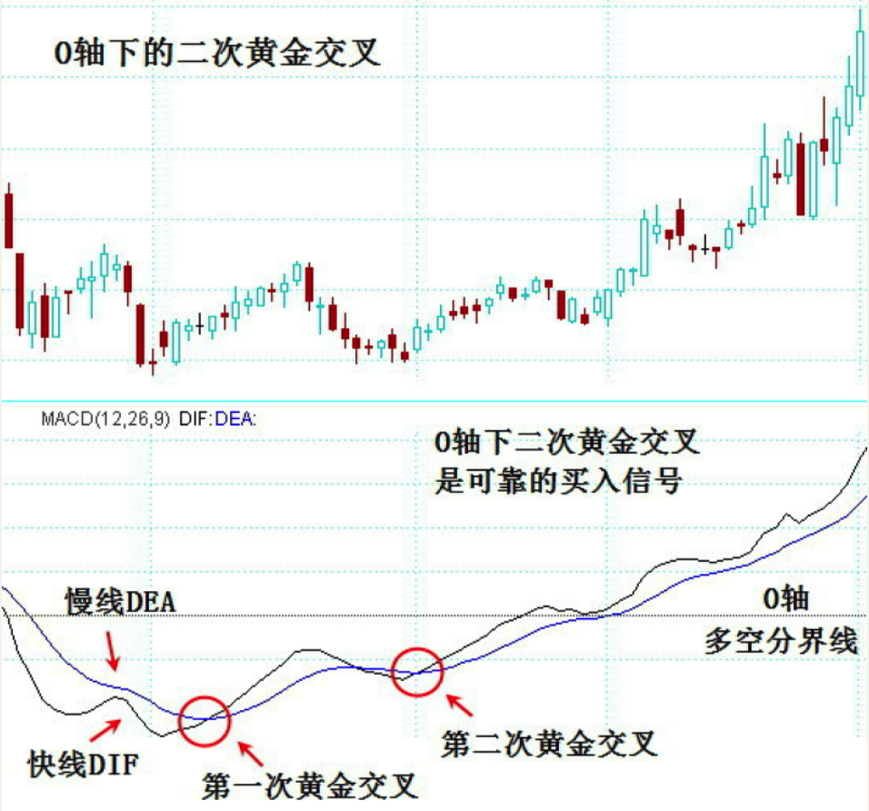

从上图可以看到，DIF与DEA在0轴下发生了两次黄金交叉，这表明市场经过了充分的调整，预示后市很可能有大幅上涨。

前面讲到过，要谨慎对待0轴之下发生的第一次黄金交叉，理由是第一次的黄金交叉往往是下跌通道中的反弹浪，即使有机会也不会太好。而0轴下的第二次黄金交叉作为买入信号的可靠性得到了很大提高，二次黄金交叉是对前一次黄金交叉的确认，这时往往是股价走出下降通道后完成的二次探底，是通常所说的“主力挖的最后一个坑”。

对于0轴下的二次黄金交叉，投资者在实战中应注意以下几点：

1. 与背离相互验证。发生二次黄金交叉的同时发生DIF与价格的背离，这会增大买点的可靠性。第二个黄金交叉要在第一个黄金交叉的上方，最好同时价格创出新低，这种二次黄金交叉是较好的买点。
2. 与价格趋势线或通道结合运用。可以说，一波牛市一定起始于突破下降趋势线和下降通道后的那个黄金交叉，用这种方法一般能抓到一波大牛市的底部。
3. 合理分配仓位。对于发生在0轴下的买点，介入都有一定的风险，这时还在空头主导的大趋势中，属于抄底操作，要记住“底是磨出来的”，一个长期的下降趋势不会轻易改变，一定要坚持“风险第一，保住本金”的原则。
4. 严格止损。这是一直在强调的一个原则，只要是0轴下的操作都要永远使用止损单。市场并不总是朝我们预料的方向发展，即使是一个高胜率的买点，也不是万无一失的。

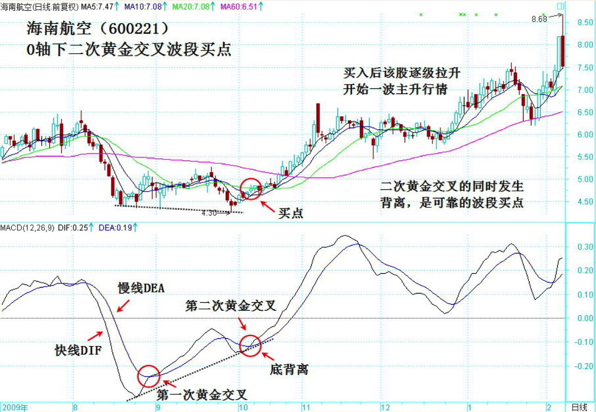

从上图可以看到，MACD指标的快线DIF和慢线DEA双双进入0轴之下，连续发生了两次黄金交叉。在发生第一次黄金交叉后，该股并没有大幅上涨，而是在低位震荡调整。从图5-8中可以看到，在K线图中这一调整阶段是由很多的小阴小阳线组成，这说明市场很犹豫。在盘整了一段时间后，DIF向下穿越DEA，股价快速下跌，在2009年9月29日创出新低4.30元。这时DIF与价格发生了明显的底背离，说明市场跌过头了，随时会有上涨的可能。

该股在创出新低后，马上就反身向上，这时DIF与DEA发生了第二次黄金交叉，同时DIF底背离后拐头，二者相互验证，都预示着市场将出现上涨，这里是可靠的波段买点。

在买入后，DIF很快向上突破0轴，市场完全进入多头占主导，预示着一波中期的上涨即将开始。此后，DIF与DEA一直运行在0轴之上，该股稳步上涨。

**0轴上的二次黄金交叉**

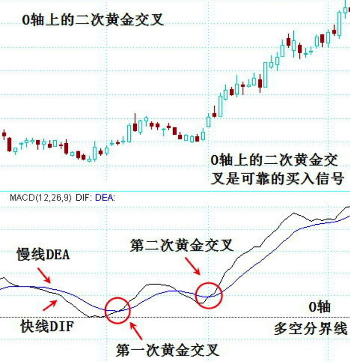

从上图可以看到，DIF与DEA在0轴之上连续发生了两次黄金交叉，这表示原本就在多头占主导的市场中又经过了一波的调整，这为后市的继续上涨积蓄了力量，它预示着后市仍有极大可能保持升势。

在0轴之上，又是二次黄金交叉，这是绝佳的做多机会，这种情况往往发生在大牛市的第一浪、第三浪或第五浪的上涨初期，投资者应着重把握这种在牛市中的做多信号。如果是指标在0轴之下经过长期震荡之后首次突破0轴发生的二次黄金交叉，那么这种机会往往是在一波大牛市的初始阶段才会有的机会，是效用最大的入场机会。

在实战运用中，投资者应该注意，两次黄金交叉应该发生在0轴之上附近的位置，它是经过调整后的连续两次黄金交叉，而不能是发生在高位的黄金交叉；第二次黄金交叉应该发生在第一次黄金交叉的上方，即DIF形成的波谷是提高的。

0轴之上的两次黄金交叉通常不会出现背离的现象，这是因为在多头占优的市场背景下，调整力度通常不会太大。这与0轴之下的二次黄金交叉是有所区别的。

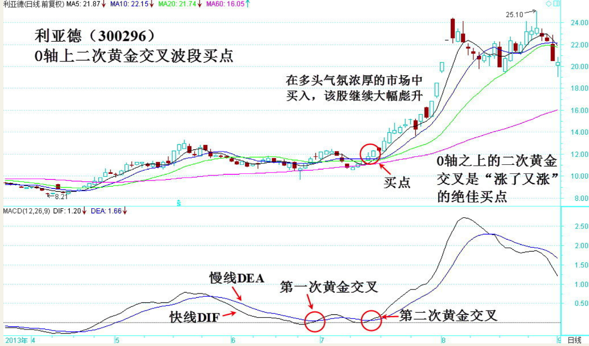

从上图可以看到，MACD指标的快线DIF和慢线DEA都运行在0轴之上，这表示是在明显的多头市场中。DIF与DEA经过调整后，在0轴上的低位连续发生了两次黄金交叉。在2013年7月1日，发生了第一次黄金交叉，此后，该股并没有大幅上涨，而是重新走出了一小波推动浪。股价突破前高之后，出现了小幅回调，DIF向下穿越DEA，回踩前期高位，这是经常发生的突破阻力位后对阻力位的回抽，这时是主力在为以后的上涨收集筹码，极有可能是上涨之前主力挖的最后一个坑。

如果股价回踩前期阻力位后没有继续下跌，那么这个阻力位就变成了支撑位，它是股价进一步上涨的跳板。该股在2013年7月15日发生了第二次黄金交叉，这里是再次介入的绝佳机会。在图5-10的K线图中用圆圈标出的位置就是买点，可以看到，这里的阳线实体明显增大，说明了市场向上的动能强大，市场多头气氛浓厚。

## 死亡交叉
**0 轴之上的死亡交叉**

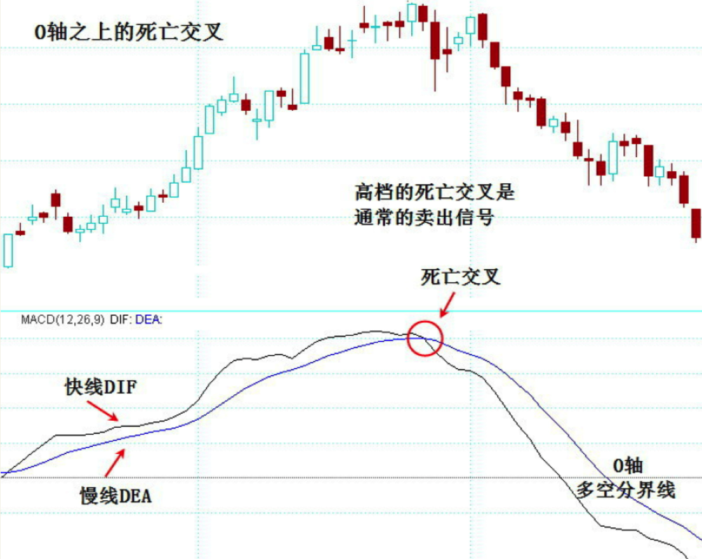

从图5-11中可以看到，快线DIF与慢线DEA在0轴上同向向上运行，直到指标运行到高档区，DIF从上向下穿越DEA，发生死亡交叉。在这之后，快线DIF开始带动慢线DEA向下运行。死亡交叉发生在波段的顶部，它是短期的多空平衡点，一旦空头打破多空平衡，意味着在以后的一段时期内空头会占优势，市场有进一步下跌的可能。死亡交叉就像其名字一样，表示一波升势的结束，是通常的卖出信号。

发生在0轴之上的死亡交叉，通常发生在波浪理论的上升趋势中调整浪的初期，是中、短期顶部的标志。需要注意的是，在强劲的升势中，市场在发生死亡交叉后还可能重回升势，这经常发生在第4浪和次级别的调整浪中。总之，0轴之上的死亡交叉发生在多方主导的大趋势中，它说明在大级别的上升趋势中有发生调整的可能。
我们建议投资者对于0轴上的死亡交叉的应对策略是：

1. 分批离场。在上升通道（牛市）中的死亡交叉应该采用逐步减仓的策略。在强劲的升势中，死亡交叉可能只是暂时的短期调整，稳健的做法是先获利了结一部分仓位，这样既防止失去到手的利润，又避免踏空后面可能的上涨行情。其余的持仓可以等待更进一步的转势信号发生时再卖出，比如股价跌破上升通道或DIF跌破0轴时清仓。
1. 及时补仓。如果在死亡交叉卖出部分筹码后，股价没有明显下跌，反而又创出新高，这时应该适当回补之前卖出的部分筹码，继续跟踪上涨趋势。这里需要注意“只在盈利的持仓上补仓”，并且追加的仓位要小于持仓，避免在顶部加重仓。
1. 死亡交叉发生在指标高档区更有效，在适当的操作周期中，使用较大周期更有效。
1. 结合其他技术方法判断顶部，比如趋势线、通道线、波浪理论等等，本书中也介绍了很多找卖点的方法，投资者可以在实战中总结适合自己操作风格的最大效用的卖出信号综合运用。

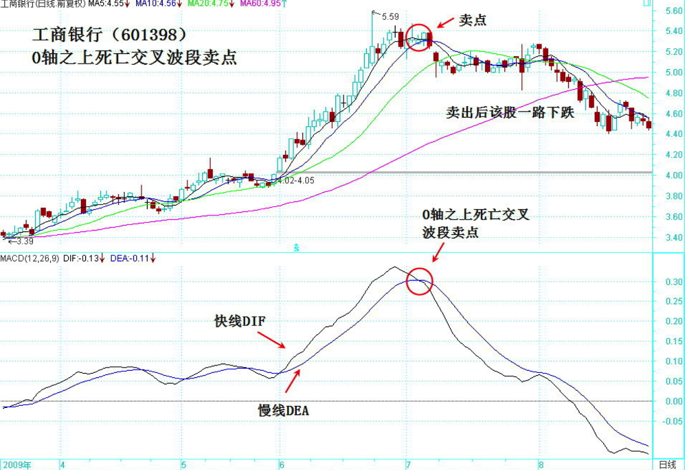

从图5-12可以看到，该股在前期0轴附近发生了前面讲到的二次黄金交叉，是可靠的买点，之后快线DIF带动慢线DEA向上快速拉升，股价呈突破态势，迅速上涨。在2009年6月23日创出新高价5.59元，之后在6月29日创出收盘最高价5.39元，在此之后，DIF开始向DEA收敛，终于在7月7日发生交叉，这标志着空头突破了多空平衡，空头战胜了多头并开始主导市场，短期内的顶部形成，这个死亡交叉是卖出信号，对应的卖点在图中用圆圈标出的位置。

在卖出之后，DIF开始带动DEA向下运行，这是向下发散的过程，预示市场开始了向下的趋势。此后该股一路下跌， DIF指标也最终跌破0轴，进入了空方。

**0 轴下的死亡交叉**

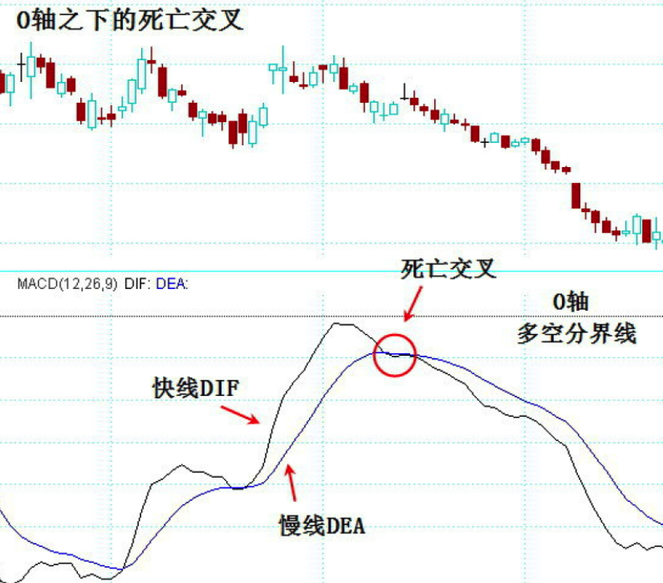

从上图可以看到，快线DIF和慢线DEA在0轴下同向向上运行，直到指标运行到0轴附近，DIF从上向下穿越DEA，发生了死亡交叉。在这之后，快线DIF开始带动慢线DEA向下运行。发生在0轴之下的死亡交叉通常处于熊市中一波反弹的高位，如果不能重回0轴之上则说明空方还是占有统治地位，后市仍然以看跌为主。因此，这里的死亡交叉表示一波反弹的结束，是卖出信号。

0轴之下的死亡交叉，以波浪理论来看，通常发生在下降趋势中反弹之后的下跌推动浪的初期，它是反弹结束的标志。它是在空方主导的大趋势下发生的次级别的多空转换。它说明在大级别的下跌趋势中，一波反弹行情有结束的可能。

当指标运行在0轴之下时，投资者的操作应以观望为主，如果在0轴之下的黄金交叉抄底之后，经过一波反弹，在0轴之下靠近0轴的位置又发生死亡交叉，这时无条件离场是合理的选择。

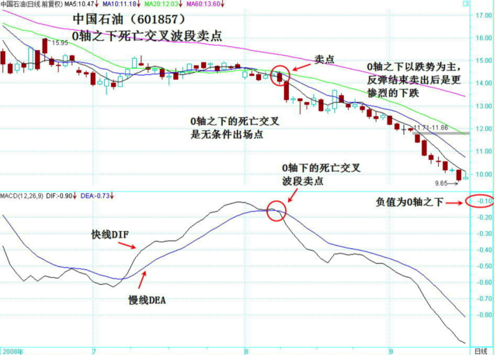

从上图可以看到，该股DIF与DEA指标在0轴之下，经过下跌之后发生了一次黄金交叉，这是前面讲到的谨慎的买点，可以不参与；之后快线DIF带动慢线DEA向上运行，股价止跌，但反弹幅度有限。虽然DIF与DEA在黄金交叉后有两次发散过程，但股价仅仅是在一个较窄的区间内进行箱体震荡，并没有明显上涨，这说明，在大熊市中反弹力度很弱。在此之后，DIF开始向DEA收敛，终于在2008年8月8日发生死亡交叉，这标志着空头再一次战胜了多头，在短期与中期同时进入以空头为主导的市场，从此宣告反弹结束。如果这时投资者持有股票，应该选择无条件离场，对应的卖点在图中用圆圈标出的位置。

在卖出之后，DIF开始带动DEA向下运行，这是向下发散的过程，预示市场重回向下的趋势。此后该股出现了更惨烈的下跌， DIF指标也跌破前期低点。可见，0轴下的死亡交叉准确地判断出了反弹结束的位置，是空头市场中无条件的卖出信号。

**0 轴上二次死亡交叉**

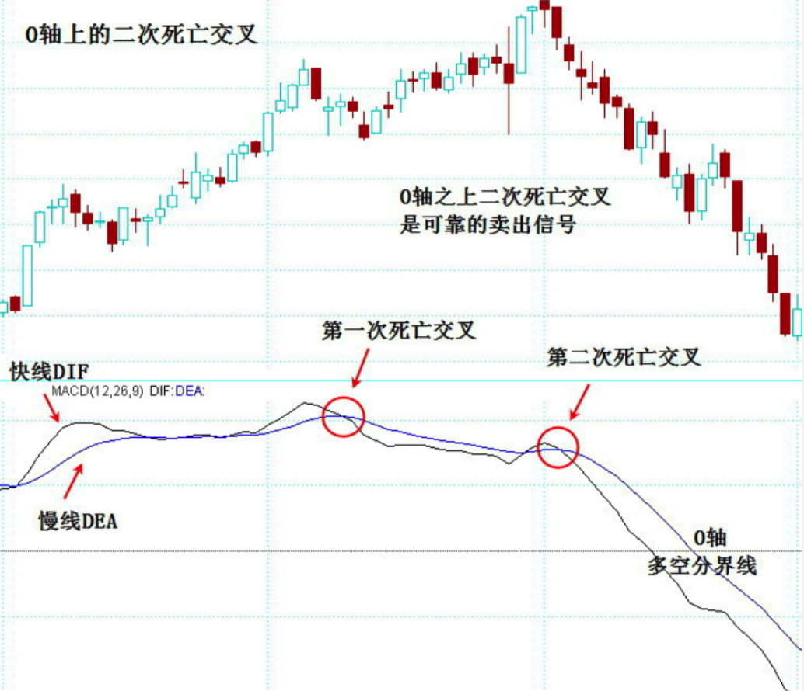

从图5-15可以看到，DIF与DEA在0轴之上发生了两次死亡交叉，第二次交叉点低于第一次交叉点，这表明市场上涨动能减弱，预示着后市很可能出现大幅下跌。

在强劲的牛市中，通常情况下，在指标高档的第一个死亡交叉发生在波浪理论中上升推动浪的第三浪，这也是一波上涨行情中上升力量最强的一波上涨。在这之后的第五浪中，股价继续创出新高，但DIF指标不再创新高，DIF指标与股价发生背离，这时会在低于第一个死亡交叉的位置形成第二个死亡交叉。这是市场上涨动能不足的表现，是冲顶的常见形态。

这里是经过长期的上涨之后，市场大级别多空转换的位置。二次死亡交叉是对前一次死亡交叉的确认，这时往往是股价走出上升通道后的最后一波拉升。所以说，0轴上的第二次死亡交叉是可靠的卖出信号。

对于0轴上的二次死亡交叉，投资者在实战中应注意以下几点：

1. 与背离相互验证。发生二次死亡交叉的同时，若发生DIF与价格的背离可增大卖点的可靠性，即第二个死亡交叉要在第一个死亡交叉的下方，最好同时价格创出新高，这种二次死亡交叉是合理的卖点。
2. 与价格趋势线或通道结合运用。可以说，一波牛市一定终止于向下突破上升趋势线或上升通道后的那个死亡交叉，用这种方法一般能判断出一波大牛市的顶部。
3. 果断离场。在高位背离后的第二个死亡交叉之后，后市最大的可能是出现暴跌，因为与冲顶相对应，冲顶之后的下跌会同样迅速。因此，一旦出现符合二次死亡交叉的卖点特征，一定要果断清掉大部分持仓。在A股中，下跌与上涨相比，下跌的迅速更快，用时更短。

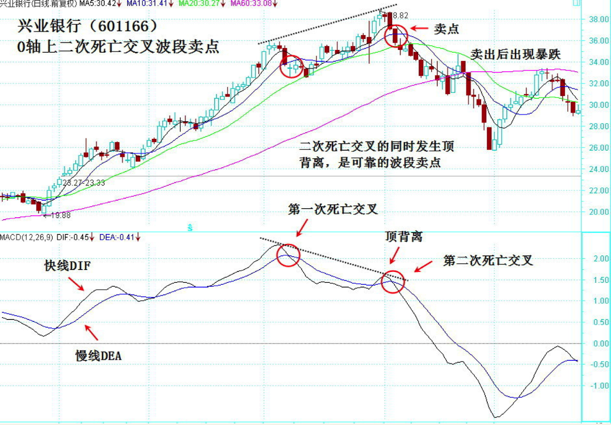

从上图可以看到，MACD指标的快线DIF和慢线DEA在0轴之上运行了很长时间，DIF线的波谷逐波垫高。DIF运行到高档后，在2009年7月8日发生了第一次死亡交叉。在这之后，DIF开始出现动能不足的迹象。股价在7月31日创出了38.82元的新高，而同时的DIF并未创出新高，这时出现了指标顶背离的现象。

在8月5日，DIF与DEA第二次发生死亡交叉，这里是前面讲到的二次死亡交叉卖点，图5-16中第二个圆圈的位置。在卖出后，股价出现了暴跌的局面，此后股价再也没有回到卖点之上。这说明二次死亡交叉是一个很可靠的卖点，准确地判断出了头部。

**0 轴下二次死亡交叉**

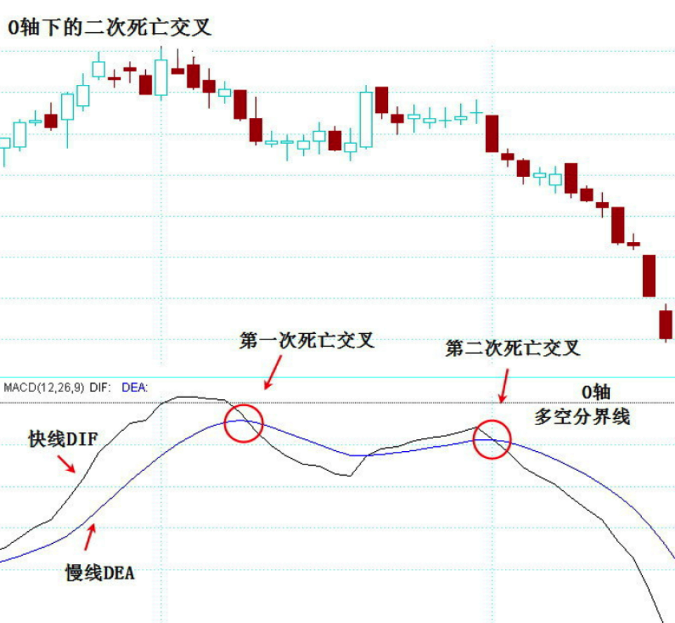

从上图可以看到，DIF与DEA在0轴之下连续发生了两次死亡交叉，这表示原本就处于空头占主导的市场中，经过了一轮反弹调整，反弹的幅度一般不大，这为后市的继续下跌积蓄了力量，它预示着后市仍有极大可能保持跌势。

在0轴之下，又是二次死亡交叉，这是无条件离场信号，这种情况往往发生在大熊市的下跌C浪或下跌延长浪，投资者应避免参与主跌浪中的次级别反弹行情。在小反弹之后往往会有更剧烈的下跌，股市中有句名言叫“反弹不是底，是底不反弹”。

在实战运用中，投资者应该注意，两次死亡交叉应该发生在0轴之下0轴附近位置，是经过小幅反弹后的连续两次死亡交叉，而不能是发生在低位的死亡交叉；第二次死亡交叉应该发生在第一次死亡交叉的下方，即DIF形成的波峰是降低的。

0轴之下的二次死亡交叉通常不会出现背离的现象，这是因为在空头占优的市场背景下，反弹力度通常不会太大。这与0轴之上的二次死亡交叉是有所区别的。

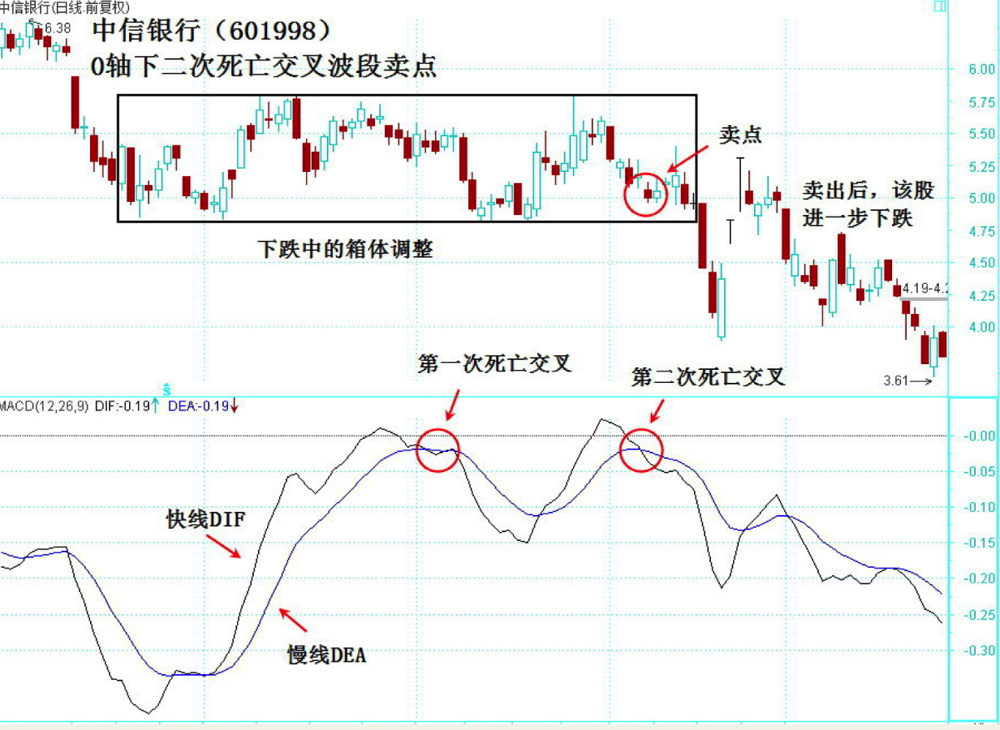

从上图可以看到， MACD指标的快线DIF和慢线DEA都运行在0轴之下，这表示是在明显的空头市场中。DIF与DEA经过小幅反弹震荡调整后，在0轴下方附近连续发生了两次死亡交叉。在2008年8月5日，发生了第一次死亡交叉，此后，该股下跌到前期底部得到了支撑。之后市场出现了小幅反弹。在图5-18中，将高点与高点，低点与低点相连接，形成一个震荡的箱体。

股价反弹到箱体上沿时，遇到阻力再次向下。该股在9月5日发生了第二次死亡交叉，这里一个卖点。在图5-18的K线图中用圆圈标出的位置就是卖点，可以看到，卖点在前期低点处，位于箱体下沿附近，一旦向下跌破箱体，股价将再下一个台阶。

**综合运用**

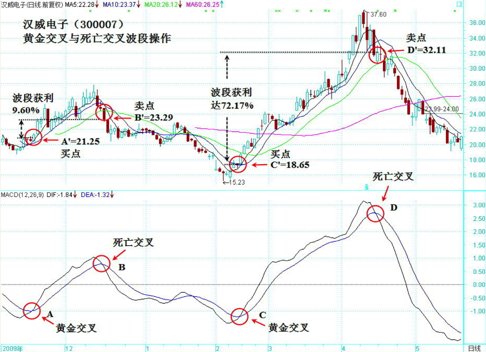

从图5-19可以看到，该股在0轴以下的低位发生了两次黄金交叉，在0轴之上的高位发生了两次死亡交叉。第一次黄金交叉发生在2009年11月18日，这时是一个买点，在图中用A表示，对应的价格是A'21.25元。买入之后，该股开始拉升，DIF指标带动DEA突破0轴进入多方。在12月17日发生死亡交叉，这时是一个卖点，在图中用B表示，对应的价格是B'23.29元。在这一波段的操作中，共获利9.60%。这次获利看起来并不多，但这是由行情决定的，使用DIF与DEA的交叉是成功率与稳定性都比较好的方法。从图5-19中可以看到，在卖出之后，股价进一步下跌，并最终创下了新低15.23元。由此看出，这种方法能抓住上涨的大部分，并避免大部分的下跌行情。

该股在新低后于2010年2月10日再次在低位发生了一次黄金交叉，这里出现了第二次波段操作的买点，在图中用C表示，对应的价格是C'18.60元，比第一次买入的价格A'21.25元还要低。买入之后，DIF再次带动DEA突破0轴并一路突破，创出新高。在4月12日创出新高37.60元后，DIF指标再次向DEA收敛，两条曲线有交叉的趋势，这时投资者就要小心，随时准备在发生交叉时出局。最后在4月16日，发生了死亡交叉，这是第二次波段操作的卖点，在图中用D表示，对应的价格是D'32.11元。从图中可以看出，这是一波不小的大波段，利用指标的交叉又抓住了主要的大波段，这次获利达72.17%。

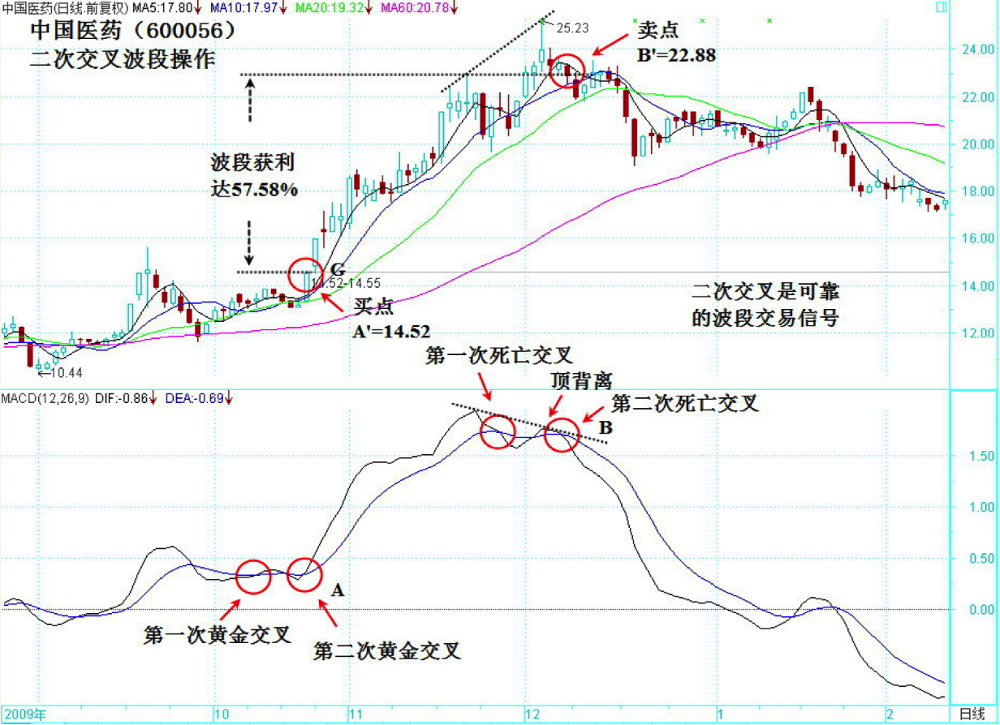

小幅调整后，DIF在高档再次上穿DEA，在这里注意不要轻易追高。股价再次创出新高，而同时DIF未创出新高，由此发生了顶背离，这说明上涨的力量在减弱，短期内有见顶的可能。在12月3日创出新高25.23元后，该股再次发生死亡交叉，在图中用B表示，这里是可靠的卖点，对应的价格是B'22.88元。在这一波操作中，获利达57.58%。到此为止，可以看作一波上升行情即将结束，在高档的二次死亡交叉是经过历史检验的极大可能的反转点。

卖出后，该股DIF向下与DEA发散，DIF带动DEA向下运行，股价一度发生快速下跌。熟悉K线形态的投资者可能会发现，在图中B'卖点处正是K线形态中“头肩顶”形态右肩的位置。在右肩容易发生顶背离，并且在头肩顶形成后往往以暴跌的形式跌破颈线位。此后该股一路下跌，最终DIF跌破0轴，进入空方。

# 第六章
## MACD柱状线破解

