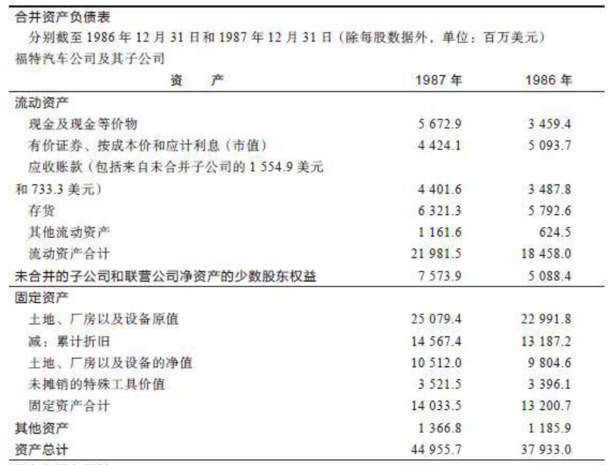
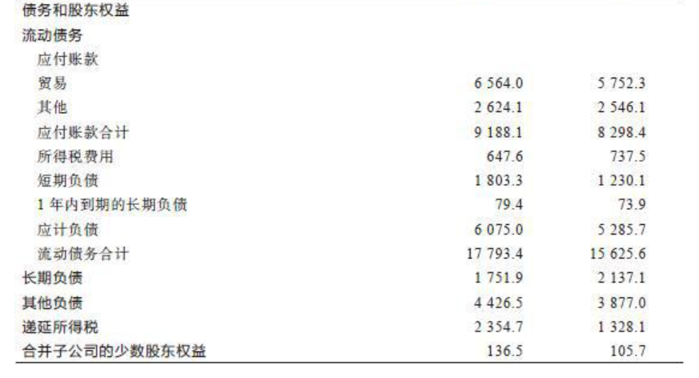
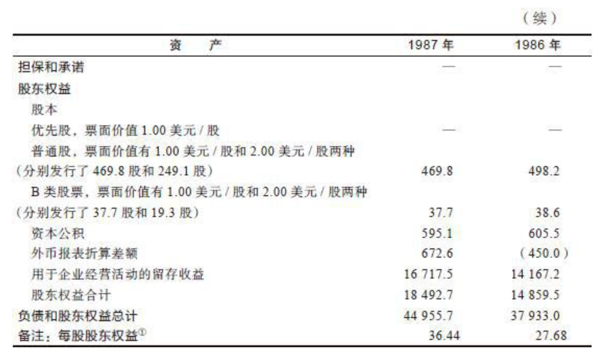
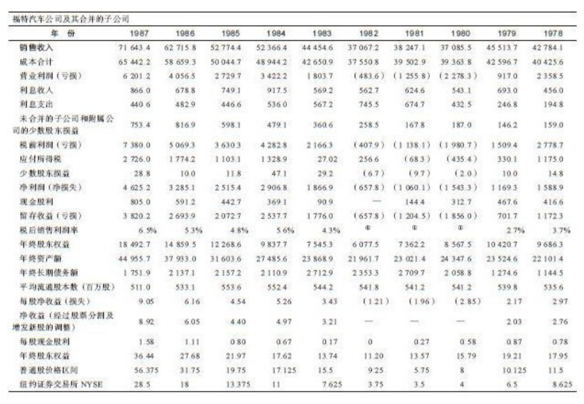
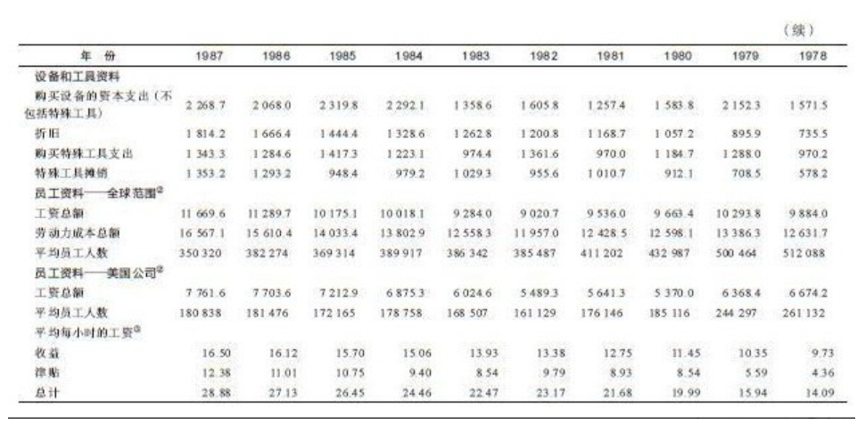

    作者: 彼得·林奇 / 约翰·罗瑟查尔德
    出版社: 机械工业出版社
    副标题: 典藏版
    译者: 刘建位 / 徐晓杰
    出版年: 2018-5
    页数: 412
    定价: 80.00元
    装帧: 平装
    丛书: 华章经典·金融投资（典藏版）
    ISBN: 9787111590736

[豆瓣链接](https://book.douban.com/subject/30244481/)

- [爱尔兰之行的启示](#爱尔兰之行的启示)
  - [10月股市暴跌的教训](#10月股市暴跌的教训)
- [业余投资者的优势](#业余投资者的优势)
  - [奇妙的10倍股](#奇妙的10倍股)
  - [油炸圈饼和苹果电脑](#油炸圈饼和苹果电脑)
  - [普通常识的重要性](#普通常识的重要性)
- [投资准备](#投资准备)
  - [股票投资是赌博吗](#股票投资是赌博吗)
  - [进入股市前的自我测试](#进入股市前的自我测试)
  - [不要预测股市](#不要预测股市)
- [挑选大牛股](#挑选大牛股)
  - [6种类型公司股票](#6种类型公司股票)
    - [这种产品对公司净利润的影响有多大](#这种产品对公司净利润的影响有多大)
    - [公司越大，涨幅越小](#公司越大涨幅越小)
    - [6种类型公司股票](#6种类型公司股票-1)
    - [缓慢增长型公司股票](#缓慢增长型公司股票)
    - [稳定增长型公司股票](#稳定增长型公司股票)
    - [快速增长型公司股票](#快速增长型公司股票)
    - [周期型公司股票](#周期型公司股票)
    - [困境反转型公司股票](#困境反转型公司股票)
    - [隐蔽资产型公司股票](#隐蔽资产型公司股票)
  - [收益，收益，还是收益](#收益收益还是收益)
    - [著名的市盈率（P/E）](#著名的市盈率pe)
    - [股市整体的市盈率](#股市整体的市盈率)
    - [未来收益如何预测](#未来收益如何预测)
  - [下单之前沉思两分钟](#下单之前沉思两分钟)
  - [如何获得真实的公司信息](#如何获得真实的公司信息)
  - [一些重要的财务分析指标](#一些重要的财务分析指标)
    - [某种产品在总销售额中占的比例](#某种产品在总销售额中占的比例)
    - [市盈率](#市盈率)
    - [现金头寸](#现金头寸)
    - [负债因素](#负债因素)
    - [账面价值](#账面价值)
    - [隐蔽资产](#隐蔽资产)
    - [现金流量](#现金流量)
  - [股票分析要点一览表](#股票分析要点一览表)
    - [股票分析要点](#股票分析要点)
- [长期投资](#长期投资)
  - [构建投资组合](#构建投资组合)
  - [不要“拔掉鲜花浇灌野草”](#不要拔掉鲜花浇灌野草)
  - [买入和卖出的最佳时机选择](#买入和卖出的最佳时机选择)
  - [何时真的应该卖出](#何时真的应该卖出)
    - [何时应该卖出一只缓慢增长型股票](#何时应该卖出一只缓慢增长型股票)
    - [何时应该卖出一只稳定增长型股票](#何时应该卖出一只稳定增长型股票)
    - [何时应该卖出一只周期型股票](#何时应该卖出一只周期型股票)
    - [何时应该卖出一只快速增长型股票](#何时应该卖出一只快速增长型股票)
    - [何时应该卖出一只困境反转型股票](#何时应该卖出一只困境反转型股票)
    - [何时应该卖出一只隐蔽资产型股票](#何时应该卖出一只隐蔽资产型股票)
  - [期权、期货与卖空交易](#期权期货与卖空交易)

# 爱尔兰之行的启示
## 10月股市暴跌的教训
从10月的股市暴跌中我们可以汲取很多教训，我自己总结出以下三点：

1. 不要让烦心之事毁掉一个很好的投资组合；
2. 不要让烦心之事毁掉一次愉快的度假；
3. 当你的投资组合中现金比重很小时千万不要出国旅游。

# 业余投资者的优势
## 奇妙的10倍股
用华尔街投资业的行话来说`“10倍股”`是指上涨10倍的股票。

## 油炸圈饼和苹果电脑
你或许以为10倍股只可能出现在像大脑生物反馈技术公司（Braino Biofeedback）或者宇宙研发公司（Cosmic R&D）这类十分怪异的公司的小面额股票（penny stock）中，其实理性的投资者对这类股票总是避之唯恐不及。事实上，**很多10倍股都来自大家非常熟悉的公司**，比如Dunkin’s Donuts甜甜圈公司、沃尔玛公司、美国玩具反斗城公司、Stop&Shop以及斯巴鲁汽车公司（Subaru），这些只不过是我随便举的少数几个例子。你对这些公司的产品赞不绝口而且钟爱有加，可是你是否会想到：如果你在购买斯巴鲁汽车时也购买了斯巴鲁汽车公司的股票，那么你现在就成了一位百万富翁？

事实的确如此。当然，计算出这么一大笔意外之财需要基于以下几个假设前提：首先，1977年你以每股2美元的低价位买入斯巴鲁公司股票；其次，你在1986年的高价位将其卖出。如果根据1股分割为8股进行股价复权的话，其股价将会高达312美元，上涨156倍，这样的投资业绩相当于打出了39个本垒打。因此，如果你最初投资了6410美元（这大约相当于一辆斯巴鲁汽车的价钱）购买斯巴鲁公司的股票，在股价上涨156倍后，你会赚到整整100万美元。

当然，如果你仅仅把相当于买油炸圈饼那么少的钱用于购买Dunkin’sDonuts甜甜圈公司的股票，那么这样小的投资不可能让你赚100万美元——一个人一辈子能吃多少个油炸圈饼，加在一起又能值多少钱呢？但是如果1982年整整一年你每周购买24个油炸圈饼（总共需要花费270美元），与此同时你也把相同金额的270美元用来购买这家公司的股票，那么4年后这些股票的市值将上升到1539美元（一只6倍股）。由此可见，如果在Dunkin’s Donuts甜甜圈公司的股票上最初投资10000美元，那么4年后的投资回报将会是47000美元。

如果在1976年你花费180美元在盖璞公司购买了10条牛仔裤，那么现在可能这些牛仔裤都已经穿破了，但是如果用这180美元购买10股盖璞公司的股票（该公司最初股票发行价是每股18美元），那么到了股市行情高涨的1987年，这10股股票的市值将是4672.50美元，赚这么一笔钱肯定比你那10条破牛仔裤划算多了。如果投资10000美元购买盖璞公司的股票，你的投资回报将高达250000美元。

如果1973年你在La Quinta汽车旅馆度过了31天的商务之旅（每晚房费为11.98美元），并且你用跟房费一样多的371.38美元购买了La Quinta旅馆的股票（23.21股），那么10年后你的这些股票市值是4363.08美元。如果投资10000美元购买La Quinta旅馆的股票，你的回报将达到107500美元。

回到1982年，你花费2000美元购买了你的第一台苹果电脑，帮助你的孩子提高学习成绩以顺利考上大学。如果在同一周内你又另外用与电脑价格相等的2000美元购买了苹果电脑公司的股票，那么经过5年到了1987年，这些股票的市值将会上涨到11950美元，足以为你的小孩支付一年的大学学费了。

## 普通常识的重要性
塔可钟快餐，在我去加利福尼亚州旅行的途中，这家连锁快餐店的墨西哥玉米煎饼让我对它留下了深刻的印象；La Quinta汽车旅馆，这家公司是住在其竞争对手假日酒店的旅客向我谈起的；沃尔沃，我的家人和朋友都喜欢这家公司生产的汽车；苹果电脑，不仅我的孩子用苹果电脑，而且我们公司的系统管理员也为公司办公室购置了几台；SCI公司，是由富达公司的一位电子行业分析员在去得克萨斯州旅行的路上发现的（他本人与丧葬行业毫无关系，这也不属于他的研究范围）；Dunkin’s Donuts，我非常喜欢这家公司店里的咖啡；最近我的妻子则向我推荐刚刚重新整顿过的1号码头进出口公司（Pier 1 Import）。事实上，卡罗琳是我最好的信息来源之一，正是她首先发现了L’eggs丝袜这家优秀公司的股票。

# 投资准备
- 不要过高估计专业投资者的技巧和智慧。
- 充分利用你已经知道的信息和知识。
- 寻找那些尚未被华尔街发现和证实的投资机会——在华尔街“雷达监测范围之外”的公司。
- 在投资股票之前先买一套房子。
- 投资的是公司，而不是股市。
- 忽略股市的短期波动。
- 投资股票能够赚大钱。
- 投资股票也能够亏大钱。
- 预测经济是没有用的。
- 预测股市的短期走势是没有用的。
- 股票的长期回报相对而言是可以预测的，而且远远高于长期债券的投资回报。
- 持续关注你所持有股票的公司情况，就像是在玩一局永远不会结束的梭哈扑克牌游戏。
- 并不是每个人都适合进行股票投资，也并不是每个人一生中的每个阶段都适合进行股票投资。
- 一般业余投资者早在专业投资者数年之前，就已经十分了解当地优秀的上市公司及其产品了。
- 拥有一种与众不同的优势将会帮助你在股票上赚钱。
- 在股票市场上，一鸟在手胜过十鸟在林。

## 股票投资是赌博吗
投资于债券、货币市场或者大额可转让定期存单，这些都是债权投资的不同形式而已，本质上都是为了获取利息收入。获取利息的做法本身并没有不对，尤其是以复利形式获取利息。

从1927年以来，普通股票的平均年投资收益率为9.8%，而公司债券为5%，政府债券为4.4%，短期国库券为3.4%。

根据`消费价格指数（consumer price index，CPI）`计算，长期通货膨胀率每年为3%。扣除通货膨胀率后普通股票的实际年投资收益率为6.8%，而扣除通货膨胀率后短期国库券这种以最保守和最明智而闻名的投资工具的实际年投资收益率却几乎是零。

## 进入股市前的自我测试
要想取得股票投资成功一个非常重要的个人素质是**要有能力在得到的信息不完全、不充分以及得到的信息不完全准确的情况下做出投资决策**。

## 不要预测股市
每年我都要同上千家上市公司的高级管理人员交谈，并且我不可避免地会看到报纸上引用的各种各样的黄金投机者、利率投资者、联邦储备银行观察员以及财政评论员的评论。有数以千计的专家在研究超买指数、超卖指数、头肩形态（head-and-shoulder pattern）、看涨看跌比、联邦储备银行的货币供给政策、国外投资的情况、天上星座的运动以及橡树上的苔藓，但是他们并不能持续地准确进行市场预测。

没有人在1973～1974年的股市崩溃之前发出任何警告的信号。在读研究生时我在课堂上学到的是，股市一般每年上涨9%，但从那时直到现在，股市从来没有出现过一年上涨9%的行情。

既然股市是以某种方式与宏观经济活动相关的，那么另一种预测股市的方法是，通过预测通货膨胀和经济衰退、国民经济的繁荣与萧条以及利率的变动趋势来预测未来股市的走势。是的，利率和股市之间的关系确实存在非常奇妙的相关性，但是谁又能够根据银行业的规律性预测出利率的变化呢？在美国有6万名经济学家，他们中的很多人被高薪聘请从事预测经济衰退和利率走势的专职工作，然而如果他们能够连续两次预测成功的话，他们可能早就成为百万富翁了。

在1981年7月和1982年11月间发生一次持续16个月的经济衰退，实际上这是我记忆中最可怕的时期。那些敏感的专业投资者怀疑他们是否要重新开始打猎、钓鱼和捡拾橡果，因为很快大家就不得不回到森林中过原始生活。在这次长达16个月的衰退期间，失业率为14%，通货膨胀率为15%，最低贷款利率（prime rate）是20%，但是我从来没有接到过一个电话告诉我说这次经济严重衰退将会发生。事后，很多人站起来宣布说他们已经提前预测到这一切，但是衰退发生之前没有一个人向我说起过经济衰退将会发生。

在最悲观的时刻，当80%的投资者都信誓旦旦地说我们即将回到20世纪30年代大萧条时期的时候，股市却突然出现了报复性的大反弹，突然之间整个世界一切都恢复正常了。

# 挑选大牛股
- 真正了解你所持股公司的业务情况，真正清楚你持有这家公司股票的具体理由（“它肯定会上涨！”根本算不上什么理由）。
- 弄清楚你所持有的股票属于什么类型，这样你将会更清楚地了解你对投资回报的合理预期应该是多少。
- 大公司的股票往往涨幅不会太大，而小公司的股票往往涨幅很大。
- 如果你预测某家公司能够从某一种特定产品获利的话，那么你应该考虑一下公司总销售收入的规模，计算一下这种产品销售收入在公司总收入中所占的比重。
- 寻找那些已经盈利并且事实证明它们能够在其他地方复制其经营理念取得成功的小公司。
- 特别要小心那些年收益增长率高达50%～100%的公司，一定要用怀疑的眼光进行分析。
- 远离那些热门行业中的热门股。
- 不要相信多元化经营，事实证明多元化经营往往反而会导致公司经营状况恶化。
- 那些一旦成功将获得巨大回报但只有微小成功机会的投资冒险几乎从来都不会成功。
- 在公司第一轮业绩上涨时最好不要盲目买入，等等看公司的扩张计划是否确实有效再做决定更为稳妥。
- 业余投资者从其工作中能够获得有着巨大价值的投资信息，而且往往要比专业投资者提前好几个月甚至好几年得到。
- 把股票消息与提供股票消息的人分开，不要盲目听信任何人的股票消息，不管提供股票消息的人多么聪明、多么有钱以及上一次他的消息多么灵验。
- 一些公司的股票信息，特别是来自这些公司所在行业的某位专家的信息可能最终证明非常有价值，但是一个行业专家提供的他并不熟悉的其他行业的股票信息往往最终证明并没有什么价值。在造纸行业工作的人往往提供的是制药行业股票的小道信息，而在卫生保健行业工作的人总是提供无数有关造纸行业即将发生并购的小道信息。
- 投资那些业务简单易懂、枯燥乏味、普通平凡、不受人青睐，并且还没有引起华尔街专业投资者兴趣的公司股票。
- 在不增长行业中增长速度适中的公司（收益增长率为20%～25%）是是十分理想的股票投资对象。
- 寻找那种拥有利基的公司。
- 当购买那些公司处于困境之中并且股价表现令人沮丧的股票时，要寻找财务状况非常好的公司，要避开银行债务负担沉重的公司。
- 没有债务的公司根本不可能破产。
- 管理能力也许非常重要，但是管理能力很难进行评估。购买某一家公司股票的依据应该建立在公司发展前景之上，而不是建立在公司总裁的履历或者演讲能力之上。
- 一家处于困境中的公司成功东山再起会让投资者赚到一大笔钱。
- 仔细考虑市盈率的高低。如果股票价格被严重高估，即使公司其他情况都很好，你也不可能从这种股票上赚到一分钱。
- 找到公司发展的主线，根据这一主线密切关注监视公司的发展。
- 寻找那种一直在持续回购自己股票的公司。
- 研究公司过去几年的派息记录以及在经济衰退期的收益情况如何。
- 寻找那种机构投资者持股比例很小或者机构投资者根本就没有持股的公司。
- 如果其他情况都相同的话，那些管理者个人大量持有自家公司股票的公司，要比那种管理者没有持股只拿薪水的公司更值得投资。
- 公司内部人士购买自家公司的股票是一个有利的信号，特别是当公司内好几个内部人士同时购买时。
- 每个星期至少抽出一个小时的时间进行投资研究。计算累计收到的股息以及计算自己投资盈亏情况并不算是投资研究。
- 一定要耐心。水越等越不开，股票越急越不涨。
- 只根据公司财务报表中的每股账面价值来购入股票是非常危险的，也是根本不可靠的，应该根据公司资产的真实价值而不是账面价值来买入股票。
- 怀疑时，等等看。
- 在选择一只新股票时要认真研究分析，至少应该与你选择一台新冰箱所花的时间和精力一样多。

## 6种类型公司股票
### 这种产品对公司净利润的影响有多大
你还记得我曾说过L’eggs是20世纪70年代两个最赚钱的新产品之一，另一个最赚钱的产品就是帮宝适牌纸尿裤（Pampers）。一个婴儿的任何一位亲戚朋友都会发现帮宝适牌纸尿裤多么受欢迎，一看包装盒就会知道帮宝适牌纸尿裤的生产厂商是宝洁公司。

但是，是不是仅仅根据帮宝适牌纸尿裤大受欢迎这一点，你就应该马上去买宝洁公司的股票？如果你进一步研究宝洁公司的情况，就不会如此冲动了。用五分钟的时间，你就会发现宝洁公司是一家规模非常庞大的公司，帮宝适牌纸尿裤的销售收入仅占整个公司销售收入的一小部分。帮宝适牌纸尿裤的成功的确对宝洁公司整体的净利润有一定的影响，但是它对宝洁公司整体的影响程度远远不及L’eggs连裤袜对Hanes这样的小型公司的影响程度那么巨大。

如果你由于一家公司生产的某一种产品很受欢迎而考虑购买它的股票，那么你首先要弄清楚的第一个问题是：这种产品的成功对于这家公司的净利润影响程度有多大？

### 公司越大，涨幅越小
公司的规模大小与投资者从其股票中得到的预期投资收益有很大关系。你对其股票感兴趣的公司规模有多大呢？抛开具体的产品不谈，规模大的公司股票一般不会有太大的涨幅。虽然在某种市场情况下大公司的股票可能表现不错，但是只有投资于规模较小的公司股票才有可能获得涨幅最大的投资收益。你买入像可口可乐这种巨型公司的股票时，根本不要指望两年后它的股价可以上涨4倍。如果你在合适的价位买入可口可乐的股票，可能6年后你的投资会上涨3倍，但是想要持有可口可乐股票短短两年时间内就大赚一笔是根本不可能的。

### 6种类型公司股票
一家具体公司的增长速度是快还是慢，要与整个国民经济的增长速度相比较而言。正如你可能会猜到的那样，缓慢增长型公司的增长速度非常缓慢，大致与一个国家国民生产总值（GNP）的增长速度相符，接近最近美国国民生产总值年平均增长速度约3%。快速增长型公司的增长速度非常快，有时一年会增长20%～30%甚至更高，正是在这种快速增长型公司中你才有可能找到最具有爆发性上涨动力的股票。

我所划分的这6种股票类型中有3类与增长型股票有关。我将增长型股票细分为`慢速增长（蜗牛）`、`中速增长（稳健）`以及`快速增长`——快速增长型股票是最值得关注的超级股票。

### 缓慢增长型公司股票
`缓慢增长型公司`通常规模巨大且历史悠久的公司的预期增长速度要比国民生产总值稍快一些，这种公司并不是从一开始增长速度就很慢，它们在开始时也和快速增长型公司一样有着很快的增长速度，最后由于筋疲力竭停了下来，或者是因为它们已经到达了事业的顶峰，或者是因为它们耗尽了元气以至于不能再充分利用新的发展机会。当一个行业的整体增长速度慢下来时（每个行业似乎总会这样），该行业中绝大多数的公司也随之失去了增长的动力。

目前最常见的缓慢增长型公司是电力公用事业（electric utility）上市公司。

美国铝业公司（Aluminum Company of America，Alcoa）一度曾拥有像现在的苹果电脑公司一样的崇高声誉，因为当时铝业属于快速增长行业。20世纪20年代铁路公司是快速增长型公司。

后来汽车行业一度成了快速增长的行业，然后就轮到了钢铁行业、化工行业、电器设备行业以及计算机行业。现在即使是计算机行业的发展速度也放缓下来，至少这个行业中大型计算机和微型计算机部分的发展速度放慢了。

`缓慢增长型公司`的另一个确定的特点是定期慷慨地支付股息。当公司不能想出扩张业务的新方法时，它就会支付十分慷慨的股息。公司的经理更喜欢扩张公司业务，因为这样做可以增加他们的声望，相反他们不愿意支付高股息，因为这种做法只不过是一种机械性行为，根本不需要有什么创造性。

### 稳定增长型公司股票
`稳定增长型公司`是像可口可乐、百时美、宝洁、贝尔电话、Hershey’s、Ralston Purina以及高露洁棕榄公司（Colgate-Palmolive）那样的公司。这些拥有数十亿美元市值的庞然大物的确并非那种反应敏捷的快速增长型公司，但是它们的增长速度要快于那些缓慢增长型公司。

这种类型的公司盈利的年均增长率为10%～12%。

我总是在自己的投资组合中保留一些稳定增长型公司的股票，因为在经济衰退或者经济低迷时期这类股票总能为我的投资组合提供很好的保护作用。

### 快速增长型公司股票
`快速增长型公司`是我最喜欢的股票类型之一：规模小、新成立不久、成长性强、年平均增长率为20%～25%。如果你能够明智地选择，你就会从中发现能够上涨10～40倍甚至200倍的大牛股。对于规模小的投资组合，你只需寻找一两只这类股票就可以大幅度提高你的投资组合的整体业绩水平。

快速增长型公司并不一定属于快速增长型行业。事实上，我更钟爱不属于快速增长型行业的快速增长型公司，对此我将在第8章中进一步讲解。在缓慢增长型行业中，快速增长型公司只需一个能够让其不断增长的市场空间照样能够快速增长。啤酒行业是一个增长缓慢的行业，但是通过抢占竞争对手的市场份额以及吸引饮用竞争对手品牌啤酒的客户转向它们的产品，Anheuser-Busch已经成为一家快速增长型公司。酒店行业的年增长率仅为2%，但万豪国际酒店集团公司在过去10年间通过不断抢占该行业的大部分市场份额，其年平均增长率达到了20%。

### 周期型公司股票
`周期型公司`是指那些销售收入和盈利以一种并非完全可以准确预测却相当有规律的方式不断上涨和下跌的公司。在增长型行业中，公司业务一直在不断扩张，而在周期型行业中，公司发展过程则是扩张、收缩、再扩张、再收缩，如此不断循环往复。

汽车和航空公司、轮胎公司、钢铁公司以及化学公司都是周期型公司，甚至国防工业公司的行为也像周期型公司，因为它们的盈利随着各届政府政策的变化而相应上升与下降。

美国航空公司（American Airlines）的母公司AMR公司是一家周期型公司，福特汽车公司也是周期型公司。

在经济繁荣时期人们更多地购买新的汽车，更多地乘飞机旅行，相应引发对钢铁、化工等产品的需求进一步增长。但是当经济开始衰退时，周期型公司就会饱受痛苦，其股东的钱包也会严重缩水。

### 困境反转型公司股票
`困境反转型公司`是那种已经受到严重打击而一蹶不振并且几乎要按照《破产法》第11章条款的规定申请破产保护的公司。它们不是缓慢增长型公司，它们根本没有任何增长；它们不是业务将会复苏的周期型公司，它们有着可能导致公司灭亡的致命伤，就像克莱斯勒汽车公司一样。事实上，克莱斯勒公司曾经是周期型公司，它在周期的不景气时期衰退得非常厉害，以至于人们认为它永远也不可能东山再起。

困境反转型公司的股价往往非常迅速地收复失地，克莱斯勒公司、福特公司、佩恩中央铁路公司、General Public Utilities公司以及许多其他公司的情况都已经证明了这一点。投资成功的困境反转型公司股票的最大好处在于在所有类型的股票中，这类股票的上涨和下跌与整个股票市场涨跌的关联程度最小。

### 隐蔽资产型公司股票
`隐蔽资产型公司（the asset play）`是指任何一家拥有你注意到了而华尔街投资大众却没有注意到的价值非同一般的资产的公司，而这种有价值的资产却被华尔街的专家忽视了。

## 收益，收益，还是收益
是什么因素使一家公司具有投资价值？为什么这家公司未来的价值会比现在的价值更高？关于以上问题的解释有很多理论，但我个人认为，最终还是归结为两点：收益和资产，尤其是收益。有时要经过数年时间股价才能调整到与公司真实价值相符的水平，有时股价低于价值的时间持续得如此之久，以至于投资者怀疑这种价格是否还会最终回归于价值。股票价值最终将会决定股票价格，或者说至少有相当多的案例表明坚信价值决定价格是值得的。

### 著名的市盈率（P/E）
你也会发现**缓慢增长型公司的股票市盈率趋于最低，而快速增长型公司股票的市盈率趋于最高，周期型公司股票的市盈率则介于两者之间**。如果你按照上面讨论过的股价波动取决于收益波动的逻辑推断，情况本来就应该是这样的。公用事业公司股票的平均市盈率（最近这段时间是7～9倍）低于稳定增长型公司的平均市盈率（这段时间是10～14倍）；相应稳定增长型公司股票的平均市盈率又低于快速增长型公司的平均市盈率（14～20倍）。

即使关于市盈率你什么都记不住的话，你也一定要牢记一点：**千万不要买入市盈率特别高的股票**。只要坚决不购买市盈率特别高的股票，就会让你避免巨大的痛苦与巨大的投资亏损。

### 股市整体的市盈率
在最近这次持续5年的大牛市中（1982～1987年），你可以看到股票市场整体的市盈率逐渐从8倍左右上升到16倍，这表明在公司收益不变的情况下，投资者在1987年为所有上市公司同等的收益水平所支付的价格是其在1982年时所支付价格的两倍，这是一个投资者本来应该注意到的大多数股票已经过于被高估的警告信号。

利率水平对市盈率水平有很大的影响，这是由于在利率较低时，债券的投资吸引力降低，投资者愿意在购买股票时支付更高的价格。但是除了利率之外，在牛市市场中形成的令人难以置信的乐观情绪能够把市盈率哄抬到一个令人匪夷所思的水平。

### 未来收益如何预测
真正想知道的并不是当前的收益是多少，而是公司下个月、下一年或者下一个10年的收益将会是多少。

一旦你开始认真分析公司未来的收益，你就会在面临以下情形时变得犹豫不决：**一方面是有些公司尽管收益增长股价却仍然下跌，这是因为专业证券分析师和他们的机构投资者客户本来预测的收益更高，而公司的实际收益增长并没有达到他们预期的水平；另一方面有些公司收益下降股价却仍然上涨，这是因为专业证券分析师和他们的机构投资者客户本来预测的收益会更低，而公司的实际收益下降得并没有他们预期下降得那么多**。但这些只不过是短期的反常情况，尽管如此，看到这些反常情况的投资者仍然会感到内心严重受挫。

虽然你不能准确预测公司的未来收益，但至少你可以了解一下公司为提高收益所制订的发展计划，然后你就可以定期查看公司实施这些计划后是否真的有效地提高了收益水平。

一家公司可以用5种基本方法增加收益：削减成本，提高售价，开拓新的市场，在原有市场上销售出更多的产品，重振、关闭或者剥离亏损的业务。这些都是投资者在分析一家公司未来发展前景时应该调查研究的关键之处。

## 下单之前沉思两分钟
1. 你已经弄清了自己所研究的公司股票究竟属于缓慢增长型、稳定增长型、快速增长型、困境反转型、隐蔽资产型、周期型公司股票这六种类型中的哪一种。
2. 根据股票的市盈率倍数，你可以大致估计一下，这只股票目前的价位水平相对于公司不久的发展前景来说是低估还是高估了。
3. 要尽可能详细地了解公司正如何经营运作以使公司业务更加繁荣，增长更加强劲，或者实现其他预期将会产生的良好效果，这就是我们最想要了解的公司未来发展的“故事”。

除了隐蔽资产型公司（你只管耐心抱牢这种公司的股票等着别人来重新发现这种公司拥有的房地产、石油储备或者电视台等隐蔽资产的真正价值）之外，对于其他类型的公司，你必须寻找到能够推动这些公司收益持续增长的动力因素。你越能够确定这种推动公司收益增长的动力因素究竟何在，你就越能够确定公司未来的发展前景将会如何。

在下单购买一只股票之前，我喜欢进行一个两分钟的独白，内容包括：我对这只股票感兴趣的原因是什么；需要具备哪些条件，这家公司才能取得成功；这家公司未来发展面临哪些障碍。

你应该在下单购买之前的两分钟独白中重点阐述以下这几个主题：
- 如果你考虑买入的是一家缓慢增长型公司的股票，我们可以假设你的投资目的是为了获得稳定的股息（不然的话，干吗要买入这种股票），因此你对这家公司的股票进行分析时应该重点关注的因素包括：“这家公司在过去10年间每年收益都在增加，股息收益率十分吸引人；它从来没有降低过股息或者推迟过派发股息，事实上不管公司的经营情况是好还是差，它一直都在提高股息，包括在过去的3个经济衰退期也同样如此。它是一家电话公用事业公司，并且新开展的移动电话业务可能会给公司提供强劲的增长动力。”
- 如果你考虑买入的是一家周期型公司的股票，那么你应该围绕公司业务状况、存货增减以及销售价格为中心来思考公司的未来发展。“汽车行业已经持续下滑3年了，但是今年开始明显好转。我之所以如此认为，是因为最近汽车销售量第一次全面上涨。我注意到通用汽车公司的新款车型销售情况非常不错，在过去的18个月中这家公司已经关闭了5家效率低下的工厂，劳动成本降低了20%，收益将会大幅度增长。”
- 如果你打算买入的是一家隐蔽资产型公司的股票，你应该了解这家公司的隐蔽资产是什么？这些资产的价值是多少？“这家公司的股价是每股8美元，但是仅录像带业务的价值就相当于每股4美元，并且它所拥有的房地产价值相当于每股7美元。这只股票太便宜了，我不但不用花一分钱而且还能每股倒赚3美元获得公司录像带业务以外其他资产的所有权。这家公司的内部人士都在买入自家公司的股票，公司收益非常稳定，债务很少，根本不值得一提。”
- 如果你打算买入的是一家困境反转型公司的股票，你应该关注的是公司已经开始努力拯救自身的命运了吗？到目前为止，公司的重整计划取得成效了吗？“通用磨坊食品公司在纠正过去盲目多元化导致经营恶化的错误上已经取得了很大的进展，它已经把主营业务数量从原来的11个缩减到只有2个。通用磨坊公司出售了埃迪·鲍尔公司（Eddie Bauer）、Talbot公司、肯纳公司（Kenner）以及派克兄弟公司（Park Brothers）等子公司，赚回了一大笔钱，然后重新回归到自己最擅长的餐馆和包装食品业务上。这家公司已经回购了数百万自家公司的股票。该公司下属的海鲜产品子公司高顿公司（Gorton）在海鲜产品市场上的占有率已从7%增长到25%。它正向市场投放低热量的酸奶、不含胆固醇的Bisquick蛋糕粉以及微波烘烤的Brownies蛋糕，公司的收益将会急剧增长。”
- 如果你打算买入的是一家稳定增长型公司的股票，那么你应该重点关注的因素包括：市盈率是多少？最近几个月股价是否已经大幅上涨？如果有的话，什么因素将会推动公司增长速度进一步加快？你也许可以这样对自己说：“可口可乐股票现在的市盈率处于历史上波动区间的最低水平，它的股价已经持续两年没有什么增长了。这家公司已经采用了许多方法来改善经营状况，它在市场上向投资者公开出售自己所拥有的哥伦比亚电影公司（Columbia Pictures）50%的股份，健怡可乐（Diet Cola）的畅销使公司销售增长率大幅提高。日本市场可口可乐销量比去年增加了36%，西班牙市场可口可乐的销量比去年增加了26%。销量如此大幅增长是非同寻常的，总体来看可口可乐国际市场销量增长非常强劲。通过发行股票筹资，下属的控股子公司可口可乐装瓶公司（Coca-Cola Enterpreses）买断了大部分原来独立的全球地区性分销商的产权，因此现在该公司对全球各地分销商以及美国国内的销售能够更好地进行控制。基于以上原因，可口可乐的表现可能要比人们想象得好得多。”
- 如果你打算买入的是一家快速增长型公司的股票，那么你应该关注的重点是这家公司向哪些市场扩张才能继续快速增长以及如何经营管理才能继续保持快速增长？“La Quinta是一家汽车旅馆连锁公司，这家公司是从得克萨斯州起家的，当时它在得克萨斯州经营得非常成功，获得的利润非常可观。接着这家公司在阿肯色州和路易斯安那州复制了原来成功的经营模式。去年这家公司新开张的汽车旅馆数量比前年增长了20%，公司收益每个季度都在增长。公司计划未来继续保持快速扩张。公司的债务并不算太多。汽车旅馆业是一个缓慢增长型行业，而且竞争非常激烈，但是La Quinta已经找到了自己形成独特竞争优势的利基。在完全占领整个细分市场之前，这家公司还有很大的增长空间。”

## 如何获得真实的公司信息
在资产负债表上先是列出了公司的资产项目，接着列出了负债项目，这些信息对我来说至关重要。

表12-1　福特汽车公司1987年合并资产负债表

_①按照1股分割为2股进行调整，股票分割生效日期为1987年12月10日。_

第一行是`流动资产`，我注意到其中包括约56.73亿美元的现金、现金等价物以及44.24亿美元的有价证券。把这两项相加，就得出了公司目前全部的现金资产，四舍五入法约为101亿美元。将1987年的`现金头寸（现金及现金等价物加上有价证券）`同右边一栏1986年的现金头寸进行比较，我看到福特公司**积累的现金头寸越来越多，这是公司业务兴旺的一个明确信号。**

然后我又开始看资产负债表的另一半，一直往下会看到长期债务的这一行。从中我看到1987年这家公司的长期债务是17.5亿美元，与去年相比已经大大减少，**债务的减少是公司业务兴旺的另一个信号**。当现金相对于债务出现增长时，即现金增长超过负债增长时，这表明公司资产负债表得到了改善。如果情况相反，则表明公司资产负债表进一步恶化。

从101亿美元的现金头寸中减去17.5亿美元的长期债务，等于83.5亿美元，这就是福特公司的`净现金头寸`，表明现金和现金等价物总额高出债务总额83.5亿美元之多。**当现金总额高于债务总额时情况就十分有利，这意味着不论发生什么情况，福特都不会破产**。

接下来，我又翻到了年报的第38页公司10年财务数据概要（见表12-2），看一下公司10年来的变化情况。我发现这家公司有5.11亿股的流通股，我也发现在过去两年间每一年流通股的数量都在减少，**这表明福特公司已经回购了自己的部分股票，这是另一个利好因素**。

83.5亿美元的现金和现金资产除以5.11亿股的流通股，得出的结果是福特公司`每股股票的净现金价值`是16.30美元，关于这一数据的重要性我们将在下一章中讨论。

表12-2　10年财务数据概要（单位：百万美元）

股票的数据已经根据股息和股票分割情况进行了调整。

1. 1982年、1981年和1980年的盈利结果为亏损。
2. 包括未被合并的金融、保险以及地产子公司。
3. 每个工作小时（单位：美元），不包括子公司的数据。

## 一些重要的财务分析指标
### 某种产品在总销售额中占的比例
当我由于一种特殊的产品而对一家公司产生了兴趣时，例如L’eggs连裤袜、帮宝适牌纸尿裤、百服宁药品或者Lexan聚碳酸酯树脂（Lexan plastic），我首先想要弄清楚的是，这种产品对这家公司的重要性究竟有多大？

### 市盈率
在这里我们再加一个精炼有效的投资原则：**任何一家公司的股票如果定价合理的话，市盈率就会与收益增长率相等**。

如果可口可乐公司股票的市盈率是15倍，那么你应该预期这家公司每年收益增长率约为15%，其他公司与此类似。如果公司股票市盈率低于收益增长率，那么你可能为自己找到了一只被低估的好股票。比如，一家年收益增长率为12%的公司（也被叫作“12%成长股”），而市盈率只有6倍，那么这只股票的投资盈利前景就相当吸引人。反之，如果一家公司收益年增长率为6%，而股票市盈率为12倍，那么这家公司股票的投资盈利前景就十分令人担忧，这只股票的股价将会面临下跌。

**一般来说，如果一家公司的股票市盈率只有收益增长率的一半，那么这只股票赚钱的可能性就相当大；如果股票市盈率是收益增长率的两倍，那么这只股票亏钱的可能性就非常大**。在为基金进行选股时，我们一直使用这个指标来进行股票分析。

在考虑股息时，我们可以用一个稍微复杂点儿的公式来对公司收益增长率和市盈率进行比较。我们首先要找到公司收益的长期增长率（假定A公司收益的长期增长率为12%），然后加上股息收益率（假定A公司的股息收益率为3%），最后除以市盈率（假定A公司股票市盈率为10），12加上3再除以10等于1.5。

如果公司收益增长率除以市盈率的结果小于1，那么这只股票就比较差，如果结果是1.5，那么这只股票还不错，但是你真正要找的是公司收益增长率相当于市盈率的2倍或者更高的股票。如果一家公司的收益增长率是15%，股息收益率是3%，市盈率是6倍，那么公司收益增长率相当于市盈率的3倍，这种股票真是太棒了。

### 现金头寸
我们从福特公司的资产负债表上计算出它的净现金头寸扣除长期负债以后为83.5亿美元。当一家公司账上存放着数十亿美元的现金时，当然你肯定想知道这是为什么，原因如下。

福特公司的股价已经从1982年的每股4美元上涨到了1988年年初的每股38美元（根据股票分割进行股价调整），在此期间我购买了500万股福特公司的股票，当股价涨到38美元时，我已经从福特公司的股票上赚到了一笔巨大的利润。但是近两年来华尔街的专业投资者一直齐声高喊福特股票被高估了，许多投资专家都说这家周期型公司已经达到了繁荣的顶峰，再往下发展只能是转入衰退了，这使得我好几次都差一点儿想要把股票卖出变现。

但是查阅年报时我注意到福特公司每股现金扣除负债后的`净现金价值`是16.30美元——在第12章中，我们已经谈过了每股净现金的计算过程，这表明对于我所持有的每股福特公司的股票来说，相应在公司账上都有16.30美元的一个小红包，这相当于在我买入股票的价格中暗含了16.3美元的折扣。

这16.30美元的折扣改变了一切，它意味着我买入股票的真正价格并不是当前的市价每股38美元，而是每股21.70美元（38美元减去16.30美元等于21.70美元）。分析师预测福特公司的汽车业务可以获得每股7美元的收益，这样用38美元的市价计算出来的市盈率是5.4倍，而用21.70美元的实际股价计算出来的市盈率是3.1倍。

现金因素使得我确信应该继续持有福特公司的股票，于是我做出了绝不卖出股票的决定，结果后来福特公司股票又上涨了40%还要多。

我还发现（你可能已经在年报的第5页发现了，这一页仍然属于用有光泽的好纸张印刷的内容易懂部分）1987年福特公司仅金融服务集团——包括例如福特信贷公司（Ford Credit）、第一国民银行（First Nationwide）、美国租赁公司（U.S.Leasing）以及其他公司——的收益就达到了每股1.66美元，其中仅福特信贷公司一家的收益就达到了每股1.33美元，而且这是“第13年实现收益连续增长”。

假定福特的金融服务业务的市盈率是10倍（金融业上市公司股票市盈率平均水平一般是10倍），我估计福特公司下属这些金融业务子公司的价值相当于每股16.60美元，即用每股收益1.66美元乘以10倍的市盈率。

因此，尽管福特公司的股价是每股38美元，但是其中包括了16.30美元的净现金以及价值相当于每股16.60美元的金融服务公司，因此你买入福特公司汽车业务的成本仅相当于每股5.10美元，而这项汽车业务预期每股收益为7美元。这样一算福特公司的股票有风险吗？尽管从1982年以来福特汽车公司的股票已经上涨了将近10倍，但是每股5.10美元的实际投资成本绝对是非常便宜的。

1987年年初，它的股价最低只有40美元略多一些，但是公司每股现金为27美元，因此实际上你的买入价格只有每股15美元左右。1988年年初，我少量买入了这家公司的股票，后来我又大量买入，直到这只股票成为我的重仓股——部分原因在于波音公司账上的现金非常多，部分原因在于波音公司还有大量没有完成的商用飞机订单。

百时美账上拥有16亿美元的现金，而长期负债只有2亿美元，二者相减得出净现金高达14亿美元，这个数据让人印象深刻，但是除以这家公司2.8亿流通股以后，平均每股净现金只有5美元。每股5美元的净现金对于每股超过40美元的股价而言并没有太大的影响力。如果它的股价跌到15美元，每股5美元的净现金的影响力就相当大了，那样的话百时美的股价就变得非常低了。

### 负债因素
`负债权益比率（debt-to-equity ratio）`很容易确定。看一下福特公司1987年年报中的资产负债表，你会看到股东权益总额为184.92亿美元，从股东权益再往上几行，你可以看到这家公司的长期负债是17亿美元（公司也有短期负债，但是在大致估算中可以忽略短期负债，就像我前面说过的那样。如果公司有足够的现金——见资产负债表第二行——足以偿还短期负债，那么你在大致估算中就不必考虑短期负债了）。

在一份正常的公司资产负债表中，股东权益应占到75%，而负债要少于25%。福特公司的股东权益与负债的比率是180亿美元比17亿美元，或者说股东权益占91%而负债不到10%，这份资产负债表表明福特公司财务实力非常强大。一家公司的资产负债表如果负债仅占1%而股东权益占99%，那么这家公司的财务实力更加强大；相反，一家公司的资产负债表如果负债高达80%而股东权益仅占20%，那么这家公司的财务实力就十分虚弱。

`短期负债`（最差的一类负债，GCA公司的负债就属于短期负债）是债权人提出要求时必须马上偿还的负债。这种负债不一定都是借自银行，一家公司也可以采用商业票据的形式向另一家公司进行短期借款。短期负债最重要的特点是期限很短，有时甚至是对方通知就得马上还款，这意味着短期负债的债权人一看到借款公司出现困难就可以马上要求归还借款，如果借款人不能够马上归还，就必须按照《破产法》第11章条款的规定申请破产保护。债权人会把公司的资产拍卖个精光，在他们完成破产清算后，一分钱也不会剩给股东。

`长期负债`（从股东的观点来看，这是最好的一类负债）的债权人不能马上收回借款，无论借款人的经营情况多么糟糕，只要还在继续支付利息，债权人就不能要求提前归还本金。借款本金可以长达15年、20年或者30年之久才到期。长期负债常见的形式是期限很长的公司债券。信用评级机构会根据公司财务状况的好坏对这家公司的债券提高或者降低评级，但是不管评级情况如何，债券持有人都不能像银行那样要求债券发行公司马上偿还本金，有时甚至利息的支付也可以推迟，长期负债给公司提供了充裕的时间来解决问题走出困境（在一份典型的年报的一项脚注中，公司会详细列示其长期负债的种类、应付利息以及到期日）。

### 账面价值
人们愿意购买股价低于每股账面价值的股票的理论依据是：如果每股账面价值是20美元，而股价只有10美元，那么投资者相当于只花了一半的价钱就买到了同样的股东权益。

这样做的缺点是公司财务报告上的账面价值往往与公司的实际价值没有什么关系，账面价值经常严重高估或者低估公司的真实价值。

1976年年底，艾伦·伍德钢铁公司（Alan Wood Steel）财务报告上的账面价值是3200万美元，每股账面价值为40美元，尽管如此，6个月后这家公司还是按照《破产法》第11章的规定申请破产保护了。这家公司的问题在于，公司新炼钢设施在报表上的账面价值约为3000万美元，但是由于设计不当和操作上的缺陷，这套设施实际上根本无法正常使用；为了偿还负债，艾伦·伍德钢铁公司以大约500万美元的价格将钢板厂卖给了Lukens公司，至于工厂其余部分资产出售的价格可以推测只能和卖废品差不多。

尽管一家纺织品公司堆满仓库的布料根本没人愿意买，但是它的账面价值仍然是每码4美元，事实上即使每码布料只卖10美分，也不可能把积压的布料全部清仓处理掉。这里还有一条不成文的规则：产品越接近最终制成品，制造出成品以后再次出售的价格越难以预测。大家都知道棉花的价格是多少，但是谁也无法确定一件橙色纯棉衬衫的价格会是多少；虽然大家知道一块金属的价格是多少，但是谁能确定用这块金属制成的落地灯的价格会是多少呢？

我们来看一下几年前当沃伦·巴菲特这位最精明的投资者决定关闭新贝德福德纺织厂（New Bedford textile）时的情况吧，这是他最早收购的公司之一。纺织厂管理层希望织布机可以卖个好价钱，因为这些织布机的账面价值高达86.6万美元，但是在公开拍卖时，那种几年前他们以每台5000美元的价格购买的织布机，现在拍卖价格只有每台26美元了，这个价格甚至比把它们拖走的运费还要低，结果账面价值为86.6万美元的织布机最后在拍卖中只卖了16.3万美元。

### 隐蔽资产
就像账面价值经常会高估公司资产的真实价值一样，账面价值也经常会低估公司资产的真实价值，而在这种公司的股票之中你可能会找到隐蔽资产型大牛股。

公司拥有的自然资源，例如土地、木材、石油或者贵金属的入账价值往往只有其真实价值的一小部分而已。例如，1987年生产贵金属制品的Handy&Harman公司的账面价值为每股7.83美元，公司存货包括大量的库存黄金、白银以及铂金，但是这些存货的入账价格是公司最初购买这些贵金属的价格，而购买的时间可能早已经是30年之前了。以目前的价格计算（每盎司白银是6.40美元，每盎司黄金是415美元），这些贵金属的价值大约相当于每股19美元。

20世纪60年代，许多公司都严重夸大了自己的资产价值，在此之后对商誉的会计处理方法发生了变化，现在则恰恰相反，许多公司严重低估了自己的资产价值。例如，可口可乐公司为其灌装业务专门成立了一家新公司可口可乐灌装商控股公司（Coca-Cola Enterprise），现在它的账面上记录的商誉价值为27亿美元，这27亿美元只是购买可口可乐饮料灌装特许经营权时所支付的超过厂房、存货以及设备成本的金额，它代表了这种特许经营权的无形资产价值。

依照现行的会计准则，在购买以后40年间，可口可乐灌装商控股公司必须把这笔商誉的账面价值全部摊销，然而现实中这种特许经营权的价值却在逐年上升。由于必须对商誉进行摊销，导致可口可乐灌装商控股公司本身的收益大幅缩水。1987年，这家公司报告的每股收益为63美分，而实际上它另外还有50美分的每股收益，只不过被用来摊销商誉了。可口可乐灌装商控股公司本身的经营状况比账面上记载的要好得多，而且特许经营权这笔隐蔽资产的价值也在逐年不断增加。

### 现金流量
以皮格钢铁公司（Pig Iron，Inc.）为例，这家公司卖出了仓库中所有的锭铁存货，获得了1亿美元的现金流入，这当然非常不错，但是生铁公司必须投资8000万美元更新高炉，这就相当糟糕了。如果它不投资8000万美元更新高炉的话，它的业务就会被高炉冶炼效率更高的竞争对手抢走。在一家公司不得不先付出现金才能赚到现金的情况下，这家公司的现金净流入不会太多。

菲利普·莫里斯公司却不存在这种问题，Pep Boys汽车配件公司和麦当劳公司也不存在这种问题，这就是为什么我更喜欢投资于那些不依赖资本支出的公司股票。公司不必用流入的现金来苦苦支撑大量的现金支出，因此菲利普·莫里斯公司比皮格钢铁公司更容易赚到钱。

很多人用现金流量对股票进行估值。例如，如果一只股票为每股20美元，每股现金流量是2美元，那么它的市价现金流量比率就是10∶1，这是一个正常水平的标准比率。10%的现金收益率（return on cash）相当于长期持有股票的最低收益率。如果一只股票为每股20美元，每股现金流量为4美元，那么现金收益率就是20%，这简直太棒了。

`自由现金流量`是指扣除正常的资本支出（capital spending）之后剩余下来的现金，这是一笔流入进来却不必再用于支出的现金流量。

偶尔我也会发现一些收益一般却非常值得投资的大牛股，这是由于这家公司具有充足的自由现金流量。通常这种公司的老设备已经提取大量的折旧，而这些老设备短期内并不需要进行淘汰再重新购置新设备。由于这种公司尽可能花费最少的支出用于设备更新换代，所以可以继续享受税收减免（设备的折旧费用是可以税前列支的）。

专注的隐蔽资产型公司投资者都在寻找这样的投资良机：一家普普通通的公司，看起来根本没有什么发展前途，但是每年都拥有很高的自由现金流量，而公司股东却并不打算进一步扩大业务规模。这有可能是一家租赁公司，它拥有很多使用寿命为12年的铁路运输集装箱，公司希望做的就是收缩原有的集装箱业务，并且尽可能地从中榨取更多的现金流量。在未来的10年里，管理层将减小公司规模，逐步停止集装箱业务，积累更多的现金，用这种方法他们从1000万美元的收入中就能获得4000万美元的现金流量（这种做法不适合电脑行业，因为电脑行业的产品价格下跌得太快，所以往往根本来不及从中榨取什么现金流量，旧的存货就已经很快贬值到一文不值了）。

## 股票分析要点一览表
以下是在研究分析6种类型公司股票时应该关注的要点。

### 股票分析要点
所有类型公司的股票
- 市盈率。对于这家公司来说市盈率是高还是低，这家公司的市盈率与同行业中类似的公司相比是高还是低？
- 机构投资者持股占该公司总股本的比例。机构投资者持股比例越低越好。
- 公司内部人士是否在买入本公司股票？公司是否回购自己的股票？二者都是有利的信号。
- 迄今为止公司收益增长的历史情况，公司收益增长时断时续还是持续稳定增长（只有隐蔽资产型公司股票可以说收益情况并不怎么重要）。
- 这家公司的资产负债情况是好是坏（负债与股东权益比率），公司财务实力评级情况如何。
- 现金头寸。福特汽车公司每股净现金为16美元，因此我知道这家公司的股票不可能会跌到每股16美元以下。每股净现金是公司股票价格的底部下限。

缓慢增长型公司的股票
- 由于你购买这类公司股票的目的是为了获得股息（不然的话为什么还要持有这类公司股票呢），所以你应该核查一下这类公司是否长期持续派发股息以及是否能够定期提高股息水平。
- 如果可能的话，弄清楚公司派发股息占收益的比率是多少。如果股息占收益的比率比较低，那么这家公司在经营困难时期仍有缓冲资金可以帮助公司挺过难关，即使收益降低，公司仍然保证股息的派发；如果股息占收益的比率比较高，那么股息能否顺利派发就相当危险了。

稳定增长型公司的股票
- 这类公司都是几乎不可能破产倒闭的大公司，因此关键因素在于买入价格的高低，股票的市盈率会告诉你股价是否过高。
- 检查公司可能进行的多元化经营情况，这有可能导致公司未来收益下降。
- 检查公司收益的长期增长率，还要查看最近几年是否仍然保持着同样的增长势头。
- 如果你打算永久持有一家稳定增长型公司的股票，就要好好看看这家公司在经济衰退以及股市大跌时期的表现如何（麦当劳公司的股票在1977年的股票市场大跌中表现得很好，在1984年的市场下跌中也能够保持横向盘整，在1987年的股灾中，麦当劳股票和其他股票一样遭受了重大打击，但总的来说这是一只相当不错的防御型股票。百时美公司的股票在1973～1974年的股市大跌中遭受重创，这主要是由于这只股票当时被严重高估，这只股票在1982年、1984年、1987年的股市大跌中表现却很好。凯洛格公司在最近所有的股市大跌中都表现得相当好，除了1973～1974年的股市大跌以外）。

周期型公司的股票
- 密切关注周期型公司存货变化情况以及供需平衡情况。注意市场上新的竞争对手的进入，这通常是一个危险的信号。
- 当公司业绩复苏时应该预测到市盈率将会降低，当公司收益会达到最高峰时投资者应该预期到公司增长周期可能即将结束。
- 如果你非常了解你持有的周期型公司的行业周期，那么在预测周期波动时就具有了一种优势。例如，每个人都知道汽车行业具有周期性，汽车行业经过三四年的扩张期后就会出现三四年的衰退期，汽车行业总是这样涨涨跌跌反复波动。汽车越用越旧然后就需要更换，人们可能会比预期推迟一两年更换新车，但是迟早总要去购买新车。

快速增长型公司的股票
- 如果你推测某种产品能为公司赚大钱，那么你应该调查研究一下这种产品的销售收入在公司整个业务收入中是否占有很大的比重。L’eggs连裤袜销售收入在规模很小的Hanes公司整个业务中占有很大的比重，但是Lexan树脂的销售收入在规模非常庞大的通用电气公司整个业务中只占有很小的比重。
- 最近几年公司的收益增长率（我最喜欢那些增长率处于20%～25%公司的股票，我反而对那些看起来能够保持高于25%的收益增长率的公司十分担心。在那些热门行业中往往会发现收益增长率达到甚至超过50%的公司，你应该知道这么高的增长率究竟意味着什么）。
- 公司已经在一个以上的城市或者乡镇顺利复制了原来成功的经营模式，证明公司未来的扩张同样能够取得成功。
- 公司业务是否还有很大的增长空间。Pic’N’Save公司创立于南加利福尼亚，当我第一次参观这家公司时，它刚刚开始打算要往北加利福尼亚扩张，它还有另外49个州可以继续扩张。相反，西尔斯百货公司已经遍布整个美国，再也找不到新的市场可以扩张了。
- 股票交易价格的市盈率是否等于或接近于公司收益增长率。
- 公司扩张速度是在加快（例如去年新增了3家汽车旅馆而今年新增了5家）还是在放慢（去年新增了5家汽车旅馆而今年只新增了3家）。对于像Sensormatic Electronics这类公司而言，它们向客户销售产品基本上都是“一次性的”，这与剃须刀行业中顾客必须不断地重复购买剃须用品的情况正好相反，因此销售增长放缓可能会给公司带来毁灭性的打击。在20世纪70年代末期和80年代早期，Sensormatic电子公司的增长率是非常惊人的，但是要维持公司的收益继续增长，它每年都必须要比上一年卖出更多的电子监视系统。如果公司主营业务电子监视系统的收入（用户购买这种产品一次足矣）已经笼罩了一层阴影，那么不管它向已经购置电子监视系统的老客户群出售多少商品防盗白色小标签都于事无补，因此1983年当它的销售增长放慢时，它的收益增长率并不是放慢而是像高台跳水一样直线下跌，它的股价也同样如此直线下跌，12个月内就从42美元大跌到了6美元。
- 只有很少几个机构投资者持有这只股票，并且只有少数几个证券分析师听说过这只股票。对于那些正处于业务上升阶段的快速增长型公司来说，这是一个能够让你低价买入的非常有利的因素。

困境反转型公司的股票
- 最重要的是，一家困境反转型公司在经营困难时期能否经受住债权人要求还款的打击而存活下来？公司拥有多少现金？多少债务？（苹果电脑公司在面临经营危机时拥有2亿美元的现金，没有一分钱的债务，因此你知道它肯定不会破产。）
- 如果这家公司已经宣布破产，那么公司破产清算偿还债务之后还会给股东留下来多少资产？
- 公司打算怎样摆脱困境重整旗鼓？它剥离了那些赔钱的子公司了吗？这样做会使公司的收益发生很大的变化。例如，1980年洛克希德公司的国防业务创造了8.04美元的每股收益，但是它经营的商用飞机业务因为L-1011 TriStar喷气式飞机的失败导致每股亏损了6.54美元。L-1011型喷气式飞机是一种大型客机，但是在一个份额相对较小的市场上它要与麦道公司的DC10型飞机竞争，而在长距离飞行市场上它又遭受了波音747客机的严重打击。这些亏损将会长期持续下去，难以在短期内转变。1981年11月，这家公司宣布将会逐步停止L-1011型飞机的生产，这使得它在1981年一下子就冲销（write off）了一大笔资产（导致每股亏损26美元），但这只是一次性的亏损。1982年，当洛克希德公司国防业务创造了10.78美元的每股收益时，再也不需要对其他业务的亏损进行冲减了。经过两年的时间，它的每股收益从1.50美元增长到10.78美元！你可能已经在洛克希德公司宣布逐步停止L-1011型飞机的生产时以每股15美元的价格买入了股票，经过4年最高上涨到了每股60美元，上涨了4倍。
- 公司业务正在好转吗？（这正是伊士曼-柯达公司（Eastman Kodak）最近发生的情况，由于胶卷销售重新火爆，公司收益大增。）
- 公司正在削减成本吗？如果是的话，成本削减效果又如何呢？（克莱斯勒公司通过关闭一些工厂大幅度削减了成本，它也开始把大量原来自己制造的零部件的生产外包给别的公司，这样在生产过程中就节约了数亿美元的生产费用，它已经从一家成本最高的汽车厂商变成了成本最低的汽车厂商之一。
- 公司的资产价值是多少？公司有隐蔽资产吗？
- 公司有多少债务需要从这些资产中扣除掉？（首先要关注的就是向债权人的借款。）
- 公司是否正在借入新的债务使资产价值进一步减少？
- 是否有袭击并购者对公司感兴趣准备收购公司？这将会帮助股东从隐蔽资产的重估升值上大大获利。

# 长期投资
- 未来1个月、1年或者3年的某一天，股市将会突然大跌。
- 股市下跌是个极好的机会，买入你喜爱的股票。股价修正——华尔街对股价大幅下跌的定义——使十分优秀的公司的股票变得十分廉价。
- 不要妄想预测1年或2年后的市场走势，那是根本不可能的。
- 你并不需要一直正确，甚至不需要经常正确，照样能够取得高人一筹的投资业绩。
- 那些让我赚到大钱的大牛股往往出乎我的意料之外，因公司收购而大涨的股票更是出乎我的意料之外，但要获得很高的投资回报需要耐心持有股票好几年而不是只持有几个月。
- 不同类型的股票有着不同的风险和回报。
- 连续投资一系列稳定增长型股票，尽管每次只有20%～30%的投资收益率，但由于复利的作用累积下来会让你赚到一大笔钱。
- 短期股价走势经常与基本面相反，但长期股价走势最终取决于公司盈利成长性及其可持续性。
- 一家公司目前经营得十分糟糕，并不代表这家公司将来经营得不会更加糟糕。
- 只是根据股价上涨，并不能说明你是对的。
- 只是根据股价下跌，并不能说明你是错的。
- 机构投资者重仓持有且华尔街十分关注的稳定增长型股票在跑赢市场且股价高估之后必然面临停滞或下跌。
- 仅仅因为股价便宜就买入一只发展前景普通的公司股票是一种肯定失败的投资之道。
- 因为股价似乎略微被高估就卖出一只杰出的快速增长型公司的股票是一种肯定失败的投资之道。
- 公司盈利不会无缘无故地增长，快速增长型公司也不可能永远保持快速增长。
- 没有买入一只好股票并不会让你损失一分钱，即使是一只10倍股。
- 一只股票本身并不知道你持有它。
- 不要过度迷恋你手中的大牛股，因为股价大涨而扬扬自得，不再关注公司的基本面变化。
- 如果一只股票价格跌到零，你的亏损是100%，让你输个精光、血本无归，不管你的买入价格是50美元、25美元、5美元还是2美元。
- 根据公司基本面认真分析后，清除部分股票，把资金配置到其他更好的股票上，能够进一步改善你的投资组合业绩。当股价被高估以致与公司的真实表现相脱节，而且更好的投资选择出现时，卖掉被高估的股票转向其他更好的股票。
- 公司出现利好，如同玩梭哈时翻出好牌，此时应该加大赌注，反之应该减少赌注。
- 卖出盈利股票却死抱着亏损股票不放，如同拔掉鲜花却浇灌野草，根本不可能因此改善投资业绩。
- 如果你认为自己不能战胜市场，那么买入一只共同基金，这样会省去你自己投资需要花费的大量精力和金钱。
- 总会有让人担心的事情发生，不要庸人自扰。
- 打开你的心灵之门，接纳所有创新的想法。
- 你并不需要“亲吻所有的女孩”。我也曾错过许多10倍股，但这并不妨碍我仍然能够战胜市场。

## 构建投资组合
在某些年份里你能够获得30%的投资收益率，但在其他年份里你可能只有2%的投资收益率，甚至可能会亏损20%，这正是投资世界的基本规律之一，你别无选择只能接受。

过高的预期收益率错在哪里呢？如果你期望每年应该获得30%的投资收益率，那么当股票表现达不到你预期的高收益率时，你很可能会因为希望落空而感到严重受挫，这时焦躁不安的心情会使你恰恰在最不应该放弃的时刻错误地放弃自己本来正确的投资策略，或者更糟糕的是，在追逐这种镜中花水中月般的高收益率时，你可能会冒不必要的风险。不论是在投资收益很好还是很坏的时候，你都应该始终坚持一种正确的投资策略，只有这样才能使长期投资回报最大化。

**一般股票的长期平均投资收益率为9%～10%，这也是历史上股票指数的平均投资收益率**。你可以通过投资于不收佣金的指数型共同基金获得10%的平均投资收益率。

## 不要“拔掉鲜花浇灌野草”
一些投资者总是习惯性地卖出“赢家”——股价上涨的股票，却死抱住“输家”——股价下跌的股票，这种投资策略如同拔掉鲜花却浇灌野草一样愚蠢透顶；另外一些人则相反，卖出“输家”——股价下跌的股票，却死抱住“赢家”——股价上涨的股票，这种投资策略也高明不了多少。这两种策略都十分失败的原因在于，二者都把当前股票价格变化看作公司基本价值变化的指示器。正如我们看到的，当前的股票价格变化根本没有告诉我们关于一家公司发展前景变化的任何信息，并且有时股价变化与基本面变化的方向完全相反。

在我看来，一个更好的投资策略是根据股票价格相对于公司基本面的变化情况来决定买入和卖出以调整投资组合中不同股票的资金分配。例如，如果一只稳定增长型公司的股票上涨了40%——这是我期望从这只股票上得到的最高投资收益率，但并没有出现任何利好消息让我认为这家公司将来还会给投资者带来新的惊喜，那么我就会卖出这只股票，转而持有另外一只股价还没有上涨得十分具有投资吸引力的稳定增长型股票。在完全相同的情况下，如果你不想将原来那只股票全部卖出，那么你可以只卖出一部分。

只要快速增长型公司的收益继续增长、规模继续扩张，并且没有出现影响公司增长的障碍，我就会继续持有这些快速增长型公司的股票。每隔几个月我都会重新核查一下公司的发展情况，如同我以前根本不了解这家公司一样进行认真仔细的分析。如果是在两只快速增长型公司股票之间进行选择，我发现，其中一只股票已经上涨了50%并且公司发展前景让我感到怀疑，而另一只股票已经下跌或者基本没动但公司发展前景更好，那么我会卖出前一只股票然后将资金用来增持后一只股票。

我对周期型公司的股票和困境反转型公司的股票也是这样进行投资操作。卖出那些基本面恶化并且股价上涨的股票，把资金用来增加买入那些基本面好转并且股价下跌的股票。

## 买入和卖出的最佳时机选择
事实上，买入股票的最佳时机往往就是你确信发现了价值可靠却价格低廉的股票之时。

1. 在一年一度通常在年底投资者为了减税而卖出亏损股票的时候，因此一年之中股价下跌最为严重的时期是在10～12月并不让人感到意外。
1. 在股市崩盘、大跌、激烈振荡、像自由落体一样直线下跌的时候，这种现象股市每隔几年就会出现。

在一只股价上涨之后继续坚决持有，往往要比股价下跌之后继续坚决持有困难得多。

## 何时真的应该卖出
什么能告诉你何时应该卖出呢？根本没有一个完全适用的统一公式可以确定卖出时机。诸如“利率上升就卖出股票”“在下一次经济衰退来临之前卖出股票”也许是值得遵循的建议，但前提是我们能够提前知道利率上升和经济衰退这些事情何时发生，但是我们根本不可能知道，因此这些投资格言也只不过是好听却无用的陈词滥调。

事实证明，如果你很清楚地知道自己当初买入一只股票的理由，自然你就会清楚地知道何时应该卖出这只股票。

### 何时应该卖出一只缓慢增长型股票
对于这种类型的股票我实在帮不了你什么忙，因为我一般很少持有缓慢增长型公司的股票。对于我持有的少数缓慢增长型公司的股票，当上涨了30%～50%时，或者基本面情况恶化时，即使股价已经下跌我也会坚决赔钱卖出。其他应该卖出缓慢增长型公司股票的信号有：

- 公司连续两年市场份额都在流失，并且正在聘请一家新的广告代理商。
- 公司没有正在开发新产品，研发经费开始削减，公司明显表现出吃老本的想法，满足于过去的荣耀而不思进取。
- 公司新收购了两个与主营业务无关的业务，看起来有多元化发展导致经营恶化的趋向，并且公司声称正在寻找收购“处于技术发展前沿”的公司。
- 公司为收购兼并支付了太高的代价，导致资产负债表恶化，从账上没有负债和有数以百万美元的现金，变成账上没有现金和有数以百万美元的负债，即使公司股价大幅下跌，公司也无多余资金可以用来回购股票。
- 尽管公司股价相对较低，但股息收益率仍然很低，分配无法引起投资者的兴趣。

### 何时应该卖出一只稳定增长型股票
我经常用其他类型的股票来替换稳定增长型公司的股票。期望从稳定增长型股票中找到一只10倍股是毫无意义的。如果一只稳定增长型股票的股价线超过收益线，或者市盈率远远超过正常市盈率水平，你应该考虑卖出这只股票，等股价回落后再买回来，或者买入其他没有上涨的稳定增长型股票，就像我做的那样。

其他一些应该卖出一只稳定增长型股票的信号是：

- 过去两年中新产品的业绩有好有坏，其他产品仍然处于试验阶段，还需要一年时间才能投入市场。
- 这家公司的股票市盈率为15倍，而同行业中与其相当的公司市盈率只有11～12倍。
- 过去一年中没有公司管理人员和董事购买自家公司股票。
- 一个占公司利润25%的主要业务部门容易受到即将发生的经济萧条的严重打击（如房地产业、石油勘探业等）。
- 公司增长率已经开始放缓，尽管公司通过削减成本可以保持盈利，但未来成本削减的可能性相当有限。

### 何时应该卖出一只周期型股票
卖出周期型股票的最佳时机是在公司增长达到顶峰周期即将结束时，但谁知道周期何时会结束呢？究竟谁知道他们讨论的到底是什么周期？

要成功地进行周期型股票投资，你必须弄明白一些特殊的游戏规则，正是这些特殊的游戏规则使得周期型股票投资十分复杂难搞。

除了在扩张周期结束时卖出之外，另一个卖出周期型股票的最佳时机是当某些事情确实开始变得糟糕时。例如，成本已经开始增长，现有的工厂满负荷运营，公司开始投资以增加生产能力。无论在上一个萧条期与最近一个繁荣期之间，是什么因素导致你买入了一家周期型公司的股票，这些因素现在的变化都是在提醒你最近这一次繁荣期已经结束了。

另一个明显的卖出信号是，公司的存货不断增加，而且公司无法处理掉新增加的存货，这意味着公司将来只能以更低的价格和更低的利润处理掉这些积压的存货。

大宗商品价格下跌是另一个应该卖出周期型股票的信号，通常早在公司收益出现问题的几个月之前，汽油、钢材等大宗商品价格就已经下跌了。还有一个有用的信号是商品期货价格低于现货价格，如果你有特别的优势能够知道什么时候先人一步买入周期型股票，那么你也同样会注意到大宗商品价格的变化，从而知道何时应该先人一步卖出。

其他应该卖出周期型股票的信号包括：
- 公司在未来12个月内两个关键的工会劳动合同期满，而且工会领导人要求全部恢复他们在上一个合同中放弃的工资和福利。
- 公司产品的最终需求正在下降。
- 与以较低的成本对老厂进行现代化改造相反，公司已经决定用比改造老厂高一倍的资本支出预算来建立一家非常豪华的新厂。
- 公司努力降低成本，但仍然无法与国外厂商竞争抗衡。

### 何时应该卖出一只快速增长型股票
快速增长型股票的卖出技巧是不要过早卖出而错失一只未来会上涨10倍的大牛股。另外，如果一家快速增长型公司经营陷入崩溃，收益锐减，那么原来由于投资者争相买入而哄抬到很高水平的市盈率也会相应大大下降，这对于那些十分忠诚地死死抱着这家公司股票的股东来说面临着损失巨大的双重打击。

应该重点观察的是快速增长型公司在快速增长的第二阶段末期的发展情况，对此我们在前面已经做过解释。

你应该回避的股票的所有特征（见第9章）也正是你应该卖出的股票的特征。

其他应该卖出快速增长型公司股票的信号是：

- 公司最近一个季度同一商店销售额降低3%。
- 公司新开设的分店销售业绩十分令人失望。
- 公司两位高级管理人员和几位核心员工辞职离开后加盟到竞争对手公司。
- 最近公司刚刚结束了一场路演，在两个星期内穿梭12个城市与机构投资者交流沟通，向他们描述公司极度乐观的发展前景。
- 公司股票市盈率高达30倍，而未来两年最乐观的盈利增长率预期只有15%～20%而已。

### 何时应该卖出一只困境反转型股票
卖出一只困境反转型股票的最佳时机是在公司成功转危为安之后，所有的困难都已经得到解决，并且每个投资者都知道这家公司已经东山再起了。

其他应该卖出困境反转型公司股票的信号是：
- 过去连续5个季度公司债务持续下降，但公司最近的季度财务报告显示这个季度公司债务增长了2500万美元。
- 公司存货增长速度是销售增长速度的两倍。
- 市盈率相对于预期收益增长率而言高得离谱。
- 公司下属实力最强的分公司50%的产品都销售给一个最主要的客户，而这个客户自身正在遭受销售增速放缓的痛苦。

### 何时应该卖出一只隐蔽资产型股票
最近对于隐蔽资产型公司的股票最好的投资策略就是等待公司袭击并购者的出现。

其他应该卖出一只隐蔽资产型股票的信号是：

- 尽管公司股票价格大大低于公司资产的真实市场价值，但管理层宣布将发行超过总股本10%的股票，筹资进行多元化经营。
- 公司出售下属一家分公司预期价格为2000万美元，但实际出售价格只有1200万美元。
- 由于税率降低，在相当程度上减少了公司由于亏损而产生的未来可抵减所得税费用的时间性差异（tax-loss carryforward）。
- 机构持股者持股比例从5年前的25%增加到现在的60%，几家位于波士顿的共同基金集团是主要的持股者。

## 期权、期货与卖空交易
在我整个投资生涯中，我从未购买过一次期权，也没有购买过一次期货，我现在仍然根本不想购买期权和期货。要想从一般的股票投资上赚钱本身就已经十分困难了，要想在这些如同赌博一样的期货或期权交易上赚钱更是难上加难。

期权投资最糟糕的地方是持有期权与持有公司的股份毫不相关。当公司业绩增长非常繁荣兴旺时，所有持有股份的股东都会受益，但期权投资是一个零和游戏，期权交易中一方获得任何1美元的盈利，相应交易的另一方都会发生1美元的亏损，只有极少数的期权投资者能够保持一直盈利。
