    作者: [美] 帕特·多尔西
    出版社: 中信出版社
    原作名: The Five Rules for Successful Stock Investing
    译者: 司福连 / 刘静
    出版年: 2010-1
    页数: 311
    定价: 39.00元
    装帧: 平装
    ISBN: 9787508617619

[豆瓣链接](https://book.douban.com/subject/4137173/)

- [成功投资股市的五项原则](#成功投资股市的五项原则)
- [七个应当避免的错误](#七个应当避免的错误)
- [竞争优势](#竞争优势)
- [投资语言](#投资语言)
- [财务报表讲解](#财务报表讲解)
  - [资产负债表](#资产负债表)
    - [资产账户：流动资产](#资产账户流动资产)
    - [资产账户：非流动资产](#资产账户非流动资产)
    - [负债账户：流动负债](#负债账户流动负债)
    - [负债：非流动负债](#负债非流动负债)
    - [所有者权益](#所有者权益)
  - [利润表](#利润表)
    - [收入(销售收入)](#收入销售收入)
    - [销售成本](#销售成本)
    - [毛利](#毛利)
    - [销售和管理费用](#销售和管理费用)
    - [折旧和摊销](#折旧和摊销)
    - [非经营性损益](#非经营性损益)
    - [营业利润](#营业利润)
    - [利息收益/费用](#利息收益费用)
    - [税赋](#税赋)
    - [净利润](#净利润)
    - [股份数字（基准和稀释）](#股份数字基准和稀释)
    - [每股盈利（基准和稀释）](#每股盈利基准和稀释)
  - [现金流量表](#现金流量表)
    - [净利润](#净利润-1)
    - [折旧和摊销](#折旧和摊销-1)
    - [员工股票计划的税收收益](#员工股票计划的税收收益)
    - [营运资本变动](#营运资本变动)
    - [一次性费用](#一次性费用)
    - [经营活动现金净额](#经营活动现金净额)
    - [资本支出](#资本支出)
    - [投资收益](#投资收益)
    - [支付红利](#支付红利)
    - [发行/购买普通股](#发行购买普通股)
    - [发行/偿还债务](#发行偿还债务)
  - [结论](#结论)
- [公司分析——基础](#公司分析基础)
  - [成长性](#成长性)
  - [收益性](#收益性)
    - [资产收益率](#资产收益率)
    - [净资产收益率](#净资产收益率)
    - [自由现金流](#自由现金流)
    - [投入资本收益率](#投入资本收益率)
  - [财务健康状况](#财务健康状况)

# 成功投资股市的五项原则
- 成功的股票投资依赖于个人的训练，不依赖于别人是否赞同你。至关重要的是要有一个稳固的、有充分依据的投资哲学。
- 除非你清楚该公司的里里外外，否则不要买它的股票。在买股票之前，花时间调查这家公司有助于避免犯大错误。
- 应该关注公司是否有较强的竞争优势。竞争优势有助于公司把竞争者挡在外面。如果你能识别一家公司能够阻挡竞争者，并且能持续产生高于平均水平利润的原因，你就已经鉴别出了公司竞争优势的源头。
- 频繁交易的费用经过相当一段时间之后，会大大拖累投资组合的表现。买股票要像重大的采购，并且最好长期持有。
- 知道何时卖出。不要仅仅因为股价的涨跌卖出，但是经过认真分析后，如果以下情况出现，应当卖出：你在第一次买入时犯了一个错误，公司基本面已经恶化，股价已经超出它的内在价值很多，你已发现更好的投资机会，这只股票在你的投资组合里占了太大的比例。

以下是我们推荐的做好投资的五项原则：

1. 做好你的功课；
2. 寻找具有强大竞争优势的公司；
3. 拥有安全边际；
4. 长期持有；
5. 知道何时卖出。

# 七个应当避免的错误
* 不要试图通过发现下一家微软公司而获得巨额收益。你应该关注于发现股价已低于估值的可靠的公司。
* 了解市场的历史能帮助你避免重复那些易犯的错误。如果人们试图使你确信“这次与以往不同”，不要理睬他们。
* 不要陷入“一个好产品将创造一家高质量公司”这样一个假设的陷阱里。在你被一项激动人心的技术或者一个极好的产品掏光口袋之前，确信你已经核实了该公司的商业模式。
* 不要害怕使用你的优势。买入的最好时机是当所有人都从一个特定种类的资产出逃的时候。
* 试图选择市场时机是一个傻瓜游戏。有足够的证据证明市场是不能选择时机的。
* 减少投资风险的最佳路径是认真注意估值。不要寄希望于其他投资者会以高价接收你的盘，即使你买的是好公司股票也不要这样。
* 一家公司财务绩效的真实度量标准是现金流，而不是财务报告的每股盈利。

避免这些错误是达到你投资目标的第一步：
1. 虚幻的目标；
2. 相信这次与以往不同；
3. 陷入对公司产品的偏爱；
4. 在市场下跌时惊慌失措；
5. 试图选择市场时机；
6. 忽视估值；
7. 依赖盈利数据作分析。

# 竞争优势
* 在某个领域如果成功就会吸引竞争，就像黑夜跟在白天后面一样，大多数高利润公司经历一段时间后盈利会减少。这就是为什么竞争优势如此重要：竞争优势能帮助一家好公司继续保持已经取得的地位和优势。
* 寻找持续高盈利的公司，这是公司拥有竞争优势的证据。你可以关注自由现金流、净利润、净资产收益率和资产收益率等度量指标。
* 在搞清楚这些特殊的方法之后，你可以试着去识别公司竞争优势的来源。公司通常通过产品的差别化（真实的或感知的）建立竞争优势，驱动成本下降，用高转换成本锁定消费者，或者用高的进入门槛把竞争对手阻挡在外面。
* 用两个维度思考竞争优势：`深度（公司能赚多少钱）`和`宽度（能保持平均水平以上的利润多长时间）`。一般而言，任何一个基于技术创新的竞争优势都很可能是短命的。
* 尽管这个行业的吸引力不能告诉你企业的全部，但对竞争前景有天才的判断是相当重要的。一些行业就是比其他行业赚钱容易。

分析一家公司的竞争优势，可以遵循下面四个步骤：
1. 评估公司历史上的盈利能力。这家公司的资产和所有者权益一直能够创造稳定收益吗？这是一家公司是否在它周围建立起竞争优势的真正的试金石。
2. 如果这家公司的资本有稳定的收益，并能有持续不断的盈利能力，就需要评估公司利润的来源：为什么这家公司能阻挡竞争者，是什么阻止竞争者窃取它的利润？
3. 评估一家公司能阻挡竞争者多久，这是该公司竞争优势的周期。一些公司能阻挡竞争者仅仅几年的时间，而另一些公司可以阻挡几十年。
4. 分析行业竞争结构。行业内的公司是怎样和其他公司竞争的呢？这是一个很有利可图的、有吸引力的行业，还是一个参与者都在痛苦挣扎的过度竞争的行业？

一般而言，一家独立的公司要建立足够的竞争优势有五条途径：
1. 通过出众的技术或特色创造真实的产品差别化；
2. 通过一个信任的品牌或声誉创造可感知的产品差别化；
3. 降低成本并以更低的价格提供相似的产品和服务；
4. 通过创造高的转换成本锁定消费者；
5. 通过建立高进入壁垒把竞争者阻挡在外面。

# 投资语言
* 资产负债表就像一家公司的信用报告，因为它反映在某一特定时点这家公司拥有资产和负债的情况。
* 利润表告诉我们一家公司一年或者一个季度赚了或者损失了多少会计利润。利润表不像资产负债表那样是公司财务健康状况的一个精确时点的快照，它记录了一个时段比如一个财务年度的收入和费用。
* 第三张关键的报表是现金流量表，它记录全部流入和流出公司的现金情况。
* `权责发生制`是理解财务报表的一个关键的概念。当一项服务或一种物品提供给买家的时候，利润表记录销售收入与相应的费用，但是现金流量表只关心现金的流入和流出。

图4-1举例说明了资金是怎样从一个投资者通过公司到消费者，然后又回到公司的过程。

一组投资者和债券的持有人①给公司提供资本，对股东来说就是买了股票，对债券持有人就是买了债券。公司用这些资金购置了固定资产②，比如一些机器设备和建筑物。用这些资产生产出产品，就是存货③，一些存货卖出后变成现金④，另外一些赊销⑤。赊销被反映为应收账款，直到消费者给公司付款⑥。一旦公司手里有现金，公司又按照同样的路径把它花出去。一些现金以产品的形式返回来⑦，这意味着可以购置原材料生产更多的存货。另一部分现金用于投资⑧，这意味着买更多的机器设备或建造另外的工厂（用会计学的行话说，你通常看到一些投资购买了切实的长期资产，像一座建筑物或工厂，这叫做“资本支出”）。

还有一大块现金给美国政府交税了⑨。如果给股东分红派息，或者公司有负债的，还要向股东和债券持有人支付红利和利息，于是一部分现金流出⑩。

# 财务报表讲解
* 资产负债表告诉你一家公司拥有多少资产、多少负债，二者之间的差值就是股东投入公司的资金价值。股东在公司里的权益就是公司的资产减去负债。
* 因为资产负债表在任何时候都必须是平衡的，任何资产或负债的变化都会引起权益相应的变化，因此，如果一家公司产生巨额利润就必然导致资产的增长，所有者权益也会相应增长。
* 密切注视相对于销售收入的应收账款的变化。如果这家公司记录了大量的应收账款，这可能是公司遇到麻烦的信号。
* 当你评估一家公司的负债时，记住债务是一项固定的费用。太多长期负债会提升一家公司的风险，因为不管公司经营状况怎样，利息都是必须支付的。
* 对公司报告中的“非经常性费用”要保持警惕，很明显公司已经养成了这样的习惯：所有各种费用都可能隐藏在“一次性费用”里。
* 现金流量表是一家公司创造价值的真正的试金石，因为它反映的是一家公司在一个会计年度里发生了多少现金，以及这些现金是由哪些部分组成的，因此首先要看现金流量表。
* 当你分析一家公司的时候，要确认你弄清楚了1美元的现金在公司里是怎样流转的。如果你不这样做，你也许根本没有弄明白这家公司，因此也不能轻率地购买它的股票。

## 资产负债表
资产负债表有一个基本的等式：

    资产-负债=所有者权益

这个等式也可以这样表示：

    资产＝负债＋所有者权益

发行债券引起负债增长，而销售债券收到的现金也导致资产增长；公司产生大量利润会导致资产增长，同时所有者权益也在增长。

### 资产账户：流动资产
资产账户里最重要的是“流动资产”，因为流动资产很可能在一个商业周期里被耗尽或者转化成现金。通常商业周期被定义为一年。这类资产的主要部分是现金及其等价物、短期投资、应收账款和存货。

`现金及其等价物和短期投资`：该项目涉及存在金库中暂时不用的现金以及仅次于低风险钞票的短期投资。现金及其等价物通常包括货币市场基金，还有其他任何可以迅速转化成现金并且价格风险很低的东西。通常认为短期投资与现金类似，它包括一年内到期的债券，或者比现金的收益率高很多但卖出影响很小的债券。在大部分案例中，当我们讨论一家公司手上有多少资产可以应付急需的时候，你可以在内心把这些资产和现金等同。

`应收账款`：公司还没有收到的现金，是那些如果不出现意外公司会在不久收到的货款。你要观察这个账户与公司销售收入之间的变化，如果应收账款比销售收入增长快，说明这家公司的账上记录了大量还没有收到的款项，这可能是一个会出问题的信号，因为这意味着公司为增加销售收入提供了一个相当宽松的信用条款。一家公司把产品移交给客户马上就可以记录销售额，但很少有公司能永远保证借出去的现金一定可以全部收回。

在表5-2中，戴尔公司应收账款上升了14％，而销售收入也在以同样的速度增长，我们在研究公司的利润表时就会看到。

表5-3显示，惠普公司的应收账款从44.88亿美元迅速增长到84.56亿美元，这是一个90％的增长幅度，而销售收入只增长了大约25％。（记住，把应收账款的增长率与销售收入增长率进行比较是判断一家公司回收应收账款能力的好办法。）尽管惠普公司在此期间因合并康柏公司业务受到一些扭曲，但应收账款问题是更大的矛盾。在这时，惠普公司的投资者应该重点关注应收账款将怎样从消费者那里回收。

你常常在资产负债表“应收账款”后面看到一个“坏账准备”账户，它反映的是一家公司估计有多少钱可能会被赖账不还，这些钱将彻底损失。例如，在惠普公司的资产负债表上，你会看到截至2002年10月这家公司提取了4.95亿美元的坏账准备金。

`存货`：存货有几种类型，包括还没有制成成品的原材料、半成品和还没有销售的成品。存货对于观察制造业和零售业都非常重要。因为存货记账方法的不同，它们的清算价值也许和它们在资产负债表上显示的价值大不相同，这用常识就可以判断。

更重要的是存货的占用资本，现金转化成存货放在仓库里不能做任何事情。**一家公司的存货周转速度对收益率有巨大的影响**，如果存货占用资金的时间少，这些资金就可以用到其他地方。你可以用公司的销售成本除以平均存货水平计算出`存货周转率`。

例如，戴尔公司2002年的销售成本是256亿美元（见表5-4），同期的存货是2.78亿美元，可以算出它有一个让人难以置信的存货周转率92。换句话说，戴尔公司一年之间全部存货周转了92次。与之形成鲜明对比的是惠普公司。2002年惠普公司的销售成本是345亿美元（见表5-5），同期存货是58亿美元，可以算出它的存货周转率仅仅是6。

### 资产账户：非流动资产
非流动资产是那些不能转化成现金或在报告期内要耗用完的资产。它主要包括固定资产、投资和无形资产。

`固定资产`：固定资产是公司的长期资产，形成公司的基础设施：土地、建筑物、工厂、家具和设备等。例如，戴尔公司截至2002年底有大约9.13亿美元固定资产，而惠普公司有69亿美元固定资产。

如果我们比较两家公司的总资产数字（见表5-6和表5-7），我们会对它们固定资产的情况有个大概的了解。戴尔公司的固定资产占总资产大约6％，而惠普公司大约占10％。因此，惠普公司比戴尔公司资金占用更多。

`投资`：指资金投资在长期债券或者投资在其他公司股票上，它远没有现金那样好的流动性，而且其价值可能比资产负债表上反映的数字或高或低。

在表5-6和表5-7里，惠普公司没有长期投资，但是戴尔公司在资产负债表上有大约53亿美元的相当数量的长期投资。因为这些投资几乎占了戴尔公司总资产的1/3，所以这是你要深入挖掘并要搞清楚的事情。（如果戴尔公司的投资主要是债券，你就不需要为它太担心；但如果主要是股票投资或风险投资，你就要查清楚这53亿美元投资的真正价值。）

`无形资产`：无形资产最普通的形态是商誉，当一家公司收购另一家公司时商誉就会上升。商誉是收购公司支付的价格和目标公司实际资产或权益之间的差值。本质上，商誉表现为一家公司收购另外一家公司时全部溢价的价值。例如，可口可乐公司的大部分价值不是企业建筑物和设备，而在于可口可乐公司过去数十年建立起来的强大品牌。如果一家公司要购买可口可乐公司，它将不得不支付比可乐公司股票账面价值高得多的价格，这溢价的部分就叫做`商誉`。

在表5-7，惠普公司2002年的商誉账户里有150亿美元，它占总资产710亿美元的20％左右。公司合并时，康柏公司真的比它的现金价值、固定资产、消费者名单和专利多值150亿美元吗？也许值，但如果不值那么多，惠普公司就会在未来某个时点减少这个账户的数字，这意味着公司总资产的价值将会大大降低。

### 负债账户：流动负债
流动负债是与流动资产相对的那面，它指一家公司一年内要付清的资金。它包括应付账款、短期借款或短期应付款。

`应付账款`：这是公司从某人或机构那里借贷并应在一年以内归还的借款。

`短期借款`：借款期限短于一年的借款，通常是为了应付短期的需要。它是一家公司临时之需导致的银行贷款，尽管它有时会是下一年长期负债的一部分。这个科目对一家处于财务困境中的公司变得异常重要，因为全部短期贷款必须很快归还。惠普公司应付票据和短期借款的数额约是18亿美元（见表5-8），这对惠普的资产规模来说是比较小的数目，所以我们不必担心。

### 负债：非流动负债
与非流动资产相对应的是非流动负债，它表现为公司一年或一年以上的借款。有时你会看到在这个标题下有各种各样的科目，但其中最重要的是长期负债。`长期负债`通常是企业发行的债券，有时也是几年之内不用还的银行借款。

### 所有者权益
所有者权益等于总资产减去总负债，它也表现为公司向股东的负债。

唯一值得关注的是`未分配利润`，这是一家公司一定的资本数量存续一段时间发生的利润减去分红和股票回购后的基本记录，它也表现为股东再投资。未分配利润是一个累计账户，因此，每一年公司赚取的利润如果没有作为红利全部分红，未分配利润就会增加。同样，如果一家公司随着时间流逝亏损了，未分配利润可能就变成负的，在资产负债表上的账户也就改为`“累计亏损”`。未分配利润是一家公司长期盈利情况的记录。

## 利润表
### 收入(销售收入)
有时也被称为“销售收入”。这个账户很简明地告诉我们，公司在一个季度或一年期间销售了多少。大公司有时在利润表上按照不同的业务部门、地理区域或产品与服务的类别列示分类收入。

公司可能按照它们所从事的业务，以不同的时间段确认收入。例如，一家软件企业可能在把产品交付给客户时记录一个完整的收入，然而一家服务企业可能是按照合同期限平滑地分笔记录收入情况。

### 销售成本
大家都知道的销售成本，这个数字显示的是直接创造收入的有关费用。例如，人工成本、原材料（对制造商而言）或者货物批发价格（对零售商而言）。大公司根据制造与服务（例如惠普公司）的不同，有时将其分解为`销售成本`和`服务成本`。

### 毛利
这项不出现在利润表里，它是简单地把收入与销售成本相减。一旦你知道毛利，你可以计算毛利率，即毛利相对于收入的百分比。本质上，毛利率告诉你一家公司能把它的产品标多高的价格。在表5-10中，戴尔公司只有17.9％的毛利率（63亿美元的毛利除以354亿美元的销售收入），因为它销售的是计算机产品。对戴尔来说，很难为它销售的计算机开更高的价。

而惠普公司销售的是更高一级的计算机终端，它的客户更乐于一次性付款。在表5-11中，你可以算出它的毛利率：用销售收入459亿美元减去销售成本345亿美元，得到毛利114亿美元，再除以销售收入，我们得到毛利率为24.8％。所以你能看到两家公司的产品是有区别的，惠普公司的产品标价比它的制造成本高得更多一些。惠普公司销售的计算机也捆绑软件所有权，软件也有很高的毛利率。

### 销售和管理费用
它指众所周知的`营业费用`，包括营销费用、管理人员工资，有时也包括研发费用（研发通常作为一个分开的科目）。你将看到销售管理费用和毛利率之间的联系，公司要想提高产品的价格，就不得不在售货员和市场营销方面多投入。营业费用相对于销售收入较低，意味着公司比较严格地节省了成本。例如，惠普公司（见表5-12）花费了90亿美元的销售和管理费用，占565亿美元收入的16％，而戴尔公司这一类费用只占总收入的8.9％。

从事实中也可以得到证明，戴尔公司把产品直销给客户，而惠普公司不得不雇用售货员把高价计算机卖给大公司。与惠普公司相比，戴尔公司看起来好像经营了一家薄利商店。

### 折旧和摊销
当一家公司购置一项资产并打算使用一段时间，如一座新的建筑物或者一台新设备，那么在未来几年它要在利润表上逐步摊销那项资产的一部分成本。这个数字在利润表上偶尔也是分开的，但是它通常计入营业费用。它也总出现在现金流量表中，因此，你可以看到一家公司净利润中的多少是受非现金因素影响的，比如折旧。

### 非经营性损益
公司会把它的全部非常规营业的一次性费用或收益放在一起，比如关闭一间工厂的费用或者卖出一个分部的收益。理想的情况是，利润表中这个项目大多数时间最好是空白的。

你可以看表5-13，惠普公司在2002年提取了近18亿美元一次性重组费用，其中7.93亿美元费用用于工艺流程的研发，其他7亿美元是用于与康柏公司合并的混合性一次性费用。尽管这样规模的合并不是每天都发生，但这也意味着我们可以忽略惠普一些无关紧要的部分。我们看到惠普在2001年也发生了3.84亿美元这样的重组费用。如果我有惠普公司股票，我应当很仔细地研究这些费用是否真的是非经营性的，因为连续的非经营性的费用是管理层缺乏信心的一个信号。

### 营业利润
这个数字等于收入减去销售成本和全部营业费用。理论上，它表现为公司在实际经营活动中赚取的利润，与之相对的是利息收益、一次性收益和其他一些非营业性项目。

营业利润是一个接近于真实的数字，对大多数企业来说是这样。因为它不包含几乎所有的一次性科目，比如来自非经营性的投资的利润。

### 利息收益/费用
有时利息收益和费用是分别列示的，在某些时候也混合在净利息收益中（或费用中，根据具体情况而定）。无论怎样，这个数字显示的是公司为它已经发行的债券支付的或者因自己持有的债券而收到的利息。你可以通过公司息税前盈利洞察一家公司的财务健康状况，这就是`利息偿付比率（ICR）`。这个比率告诉你公司的利润能够覆盖企业需要的利息支出的程度。

### 税赋
税赋是通常列在净利润之前的费用。一般而言，美国政府对公司的税率是35％左右。如果你分析的公司的税率比这个低很多，要找出原因，要弄清楚这个税率是永久的还是暂时的。一些公司得到优惠是因为公司注册地在美国境外，即使它们大部分的销售是在美国。

另外，看一看你正在分析的公司的税率。如果它一年又一年反复变动，那么这家公司通过逃避税收产生的盈利也许比销售货物和服务来得多。税收优势是很好的，但是政治家们通常有一个在不适当的时间把它拿走的坏习惯，所以它不是你实际上可以指望的。

### 净利润
这个数字显示公司的税后利润（至少在理论上），而且它也是几乎所有的公司每季度发布的亮点。尽管净利润是你常常看到大多数公司重点鼓吹的数字，但不要忘记它可以被一次性费用或者一次性投资收益野蛮地扭曲。

### 股份数字（基准和稀释）
这个数字表示用来计算每股收益的股份数，它代表在报告期发行在外的平均股份数（一个季度或一年）。基准股份数只包括实际的股份数。稀释的股份数包括潜在的可以转化成股票的有价证券，比如股票期权和可转换债券等。在过去的几年中发生过异乎寻常地赠予大量股票期权的情况，这就是你要研究稀释数字的原因。因为你要知道，如果这些期权持有人把期权全部转换成股票，对你在这家公司中的投资将是潜在的缩水（或稀释）。

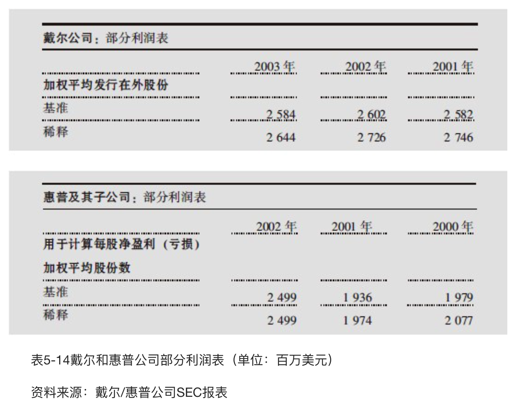

看表5-14，惠普公司基准和稀释股份数是相同的，但戴尔公司的稀释股份数比基准数高2％。稀释股份数可以比基准数高5％或更多，这不是一个巨量的稀释。

### 每股盈利（基准和稀释）
这个数字用净利润除以股份数表示，当一家公司报告季度或年度业绩时，这个数字通常会被注意到。但它不是财务表现最重要的部分，事实上，如果不看现金流量并综合其他很多因素，单看这个数字是没有意义的。

## 现金流量表
现金流量表分成三个部分：经营活动发生的现金流量，投资活动发生的现金流量和筹集资金活动发生的现金流量。

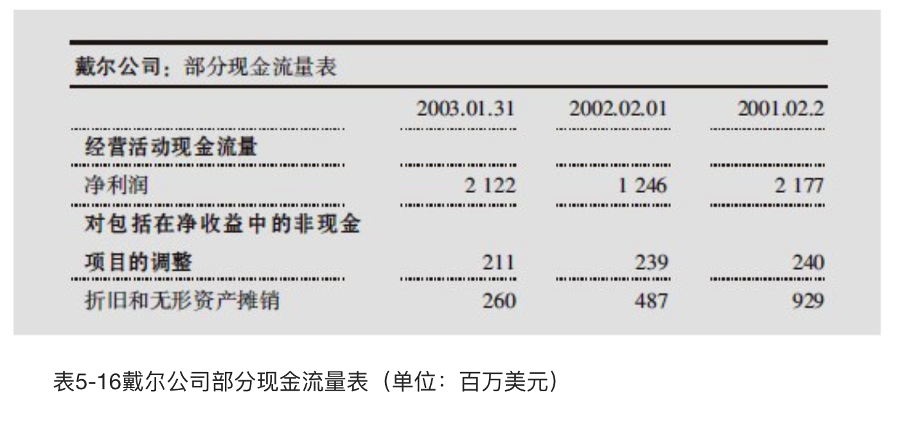

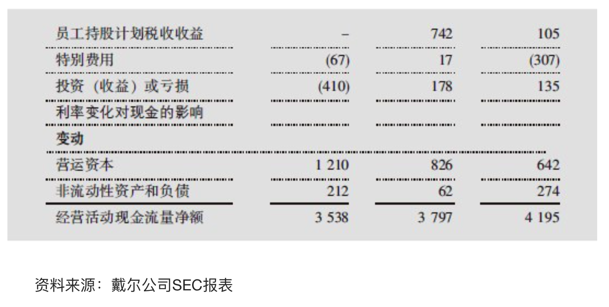

### 净利润
这个数字可以从利润表中直接找到，它下面的所有科目相加或相减就得到最终结果“经营活动现金净额”。在戴尔公司的案例中，现金流量表中的净利润和利润表中报告的一样，为21亿美元。

### 折旧和摊销
这不是现金费用，比如前面例子中迈克不需要为已经磨损的烤肠夹子实际支付1美元折旧的现金，所以我们需要把它加到净利润中去。在戴尔公司的案例中，我们要加2.11亿美元。

### 员工股票计划的税收收益
当员工行使股票期权的时候，公司老板会从净利润中扣除相应的从员工购买期权中得到的利润（员工补偿通常可以抵减税收）。这导致低税账单，我们需要把已经纳税的净利润加上税收收益。对这个科目要保持警惕，如果它相对于总的经营性现金流量数额巨大，并且公司的股票是快速上升的，你就不应该在未来计算这些现金。因为当股票下跌时，很少有员工行使期权，公司也将只有很少的现金税收收益。你可以看到，戴尔公司从行使股票期权中得到的税收收益2001～2002年下降了一半，2003年又继续下降。经历这个时间段后，戴尔公司的股票不再是一只热门股，而且这不仅仅是巧合。

### 营运资本变动
如果公司这一年比去年向客户借出了更多的钱，那么应收账款增加，同时现金流量减少；如果公司从供应商那里借入了更多的钱，则应付账款增加，现金流量增加。最后，如果公司把更多资金注入到存货里而存货没有卖出去，则现金流量减少。记住，存货占用资本。

在戴尔公司案例中，我们应回到资产负债表中，看一看12亿美元从哪里进入到所登录的科目里（见表5-17）。

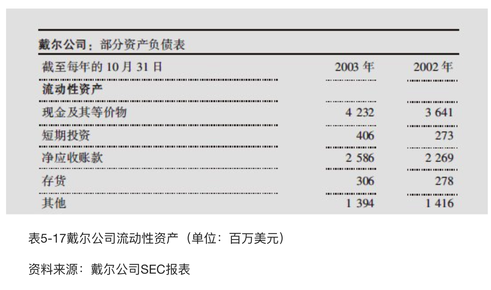

你可以看到，应收账款从22.69亿美元增加到25.86亿美元，这就有3.17亿美元，因为戴尔公司的客户在2003财务年度末比2002财务年度末向戴尔公司借了更多的钱。另外，戴尔公司存货也从2.78亿美元增长到3.06亿美元，这也消耗现金，因为戴尔公司增加的资本已经被存货占用了。

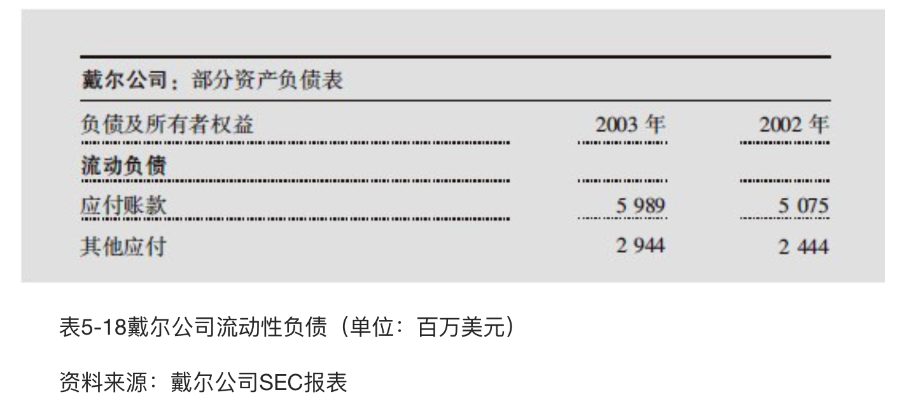

其间，应付账款从50.75亿美元增加到59.89亿美元，这就意味着戴尔公司在2003财务年度比2002财务年度向供应商多借了9.14亿美元，这意味着戴尔公司的口袋里有了更多的现金（见表5-18）。所以，通过增加应付账款，有9.14亿美元的现金发生，减去增长的3.17亿美元应收账款，减去0.28亿美元的存货变动，得出5.69亿美元的现金流量，再加上5亿美元的“应计及其他”（主要是授权和戴尔公司未来要支付给员工的红利，还有一些零碎的东西逐条在财务报表内披露），你也会为在戴尔公司现金流量表中看到的12.2亿美元的营运资本感到振奋。

你不需要每一次都仔细检查现金流量表的每一项，因为这些都已经完美地包含在“经营活动现金净额”项下。但是“营运资本变动”科目常常是导致净利润和经营现金流量二者不同的最大原因，这是一个我们需要特别注意的地带，因此要逐条分析。

### 一次性费用
还记得吗？戴尔公司没有一次性费用，而惠普公司有（见表5-19）。因为大多数这样的费用是非现金费用，这就是说惠普公司没有为公司的重组开出支票，因此当计算现金流量时（类似折旧，也是非现金项），需要把它们加回来。

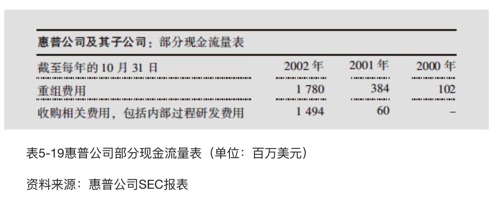

### 经营活动现金净额
这个科目是你判断一家公司是否发生现金的“圣杯”。众所周知，经营活动现金流量就是从净利润中加上或减去这个科目的结果。它并不能代替净利润，但是如果除了净利润之外你不研究它，你就不能得到全部的图景，因为这两者常常告诉你不同的方面。

现在我们到了现金流量表的第二部分，也就是“投资活动现金流量”部分，包括购置或处置固定资产、公司收购以及任何投资产品的售出或购进。

### 资本支出
这个数字显示的是花在长期性投资科目（比如固定资产）上的钱，以及公司维持当前的速度正常运转或要推动增长所需的长期性投资。经营性现金流量减去资本支出等于自由现金流量，或者等于公司完成投资后发生的现金总量。在表5-20中，戴尔公司资本性支出为3.05亿美元。

### 投资收益
公司常常把它们过剩的现金投资到债券或股票上以获取比基本储蓄账户更高的回报。投资收益告诉我们在这些投资上这家公司已经赚取（或亏损）了多少钱。当你看表5-20时，可以知道戴尔公司在证券上投资了87亿美元，并且从以前的投资中回收到期的和卖出的证券77亿美元。

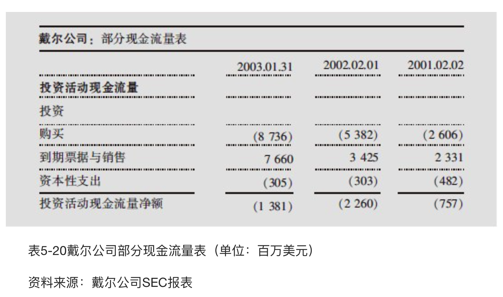

现金流量表最后是“筹资活动现金流量”部分，筹资活动包括与公司股东和债权人的所有交易。

### 支付红利
你可以看到惠普公司在2002年支付红利8.01亿美元（见表5-21）。

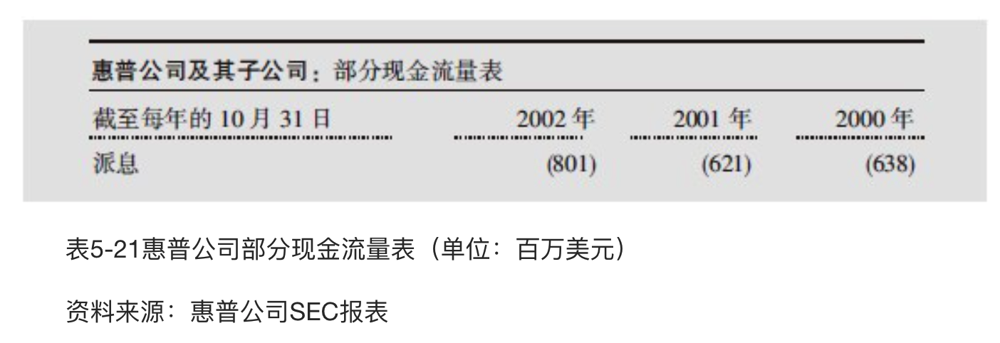

### 发行/购买普通股
这是一个要重点关注的数字，因为它揭示的是一家公司是怎样开展筹资活动的。成长迅速的公司常常发行大量的新股，这将稀释现有股票的价值，但也充实了公司的现金。增速较慢的公司有大量的自由现金流时，常常趋向于大量回购自己公司的股票，虽然公司向员工派发了很多股票期权，但也会回购股票以使稀释作用最小化。

你可以在表5-22戴尔公司财务报表中看到这种回购活动。在“购买普通股”项下，注意戴尔公司花费了约23亿美元回购自己的股票，并且在利润表中你可以看到股份的稀释数降到了3％，从27.26亿美元降到26.44亿美元。尽管股份回购是股东友好使用过剩现金的表现，但毕竟只是回购很少的股份，股东所拥有的股份是公司更大的一块，你一定要小心观察那些像戴尔公司一样派发大量股票期权的公司的股份回购事项。给予雇员大量股票期权的公司和花费公司现金回购，本质上是以较低的价格把股票卖给员工，而在公开市场上再以更高的价格回购，这样做不是资本的最优使用方式。

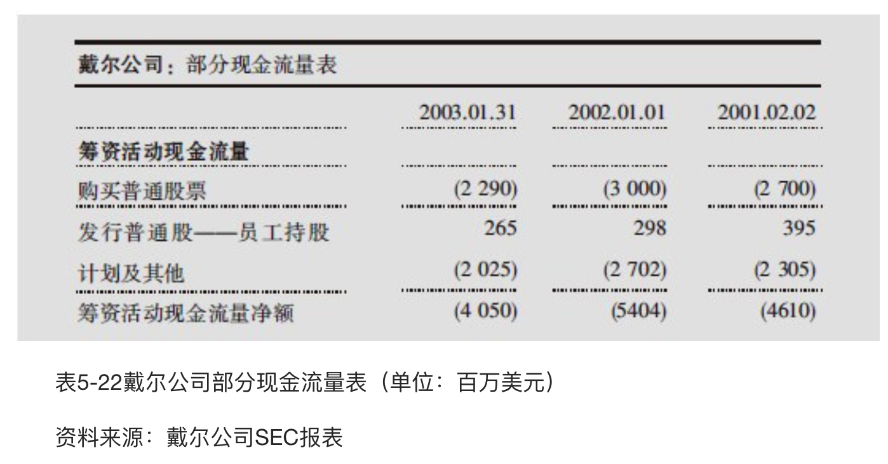

### 发行/偿还债务
这个数字告诉你，这家公司是否有借款以及是否已经还了先前的借款。在表5-23中，你可以看到惠普公司从债券持有人那里筹到25亿美元，以调整一些长期债务并还清了24亿美元的短期债务。

你可以注意这两个科目——“发行长期债务”和“（减少）应付账款和短期借款”。

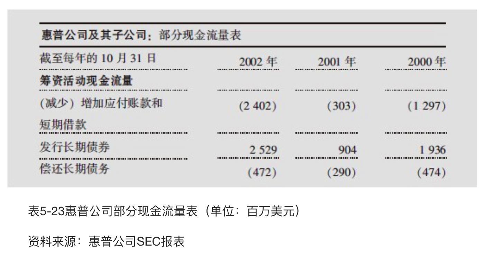

## 结论
让我们全神贯注跟着看一看1美元通过戴尔公司发生了什么。一个消费者，我们叫他史蒂文，一兴奋花了1 000美元从戴尔公司买了一台计算机。戴尔公司转身付给制造计算机的雇员和零部件供应商821美元（销售成本）。我怎么知道的？看一下戴尔公司的利润表（见表5-24）。这家公司制造成本和销售收入的比是29 055美元/35404美元，即82.1%，说明每美元的销售收入支付给计算机制造的成本是0.821美元。所以说戴尔公司收到的1 000美元在支付完制造成本之后还剩179美元。

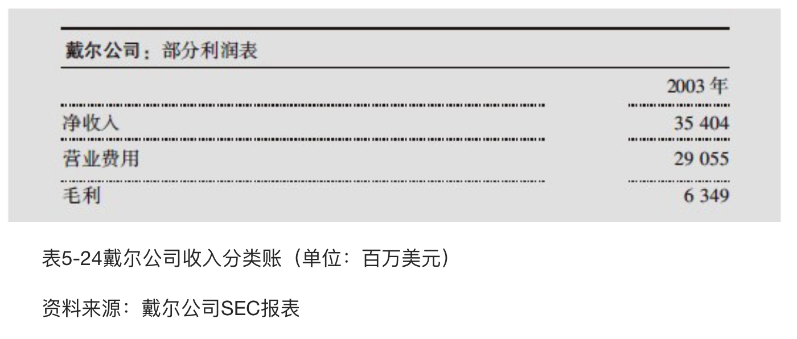

现在，看一看利润表的其余部分（见表5-25），看看剩余的179美元发生了什么。大约86美元用于电视广告和公司管理费用（销售和管理费用），13美元用于研发，其他25.50美元给美国政府缴税。加上戴尔公司用巨额的现金余额进行的投资收益，1 000美元的销售收入中剩下大约60美元的净利润。这60美元可以用在公司经营活动中的再投资，用来回购股票，或者就存在银行账户上等到有好的投资机会再说。你可以从戴尔公司利润表中的这些数字进行一个简单的计算，就是用这些科目除以总的销售收入，然后用1 000美元乘以作为结果的百分数。

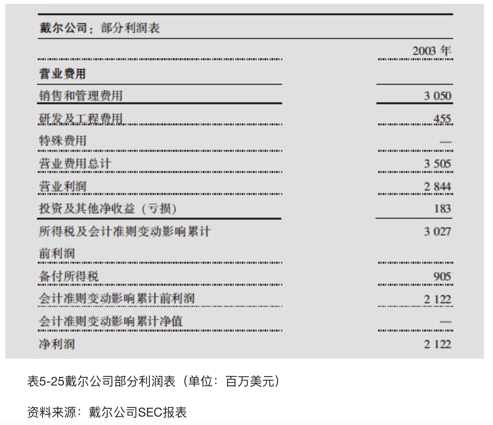

我们从戴尔公司的经营活动中了解到了什么？首先，我们知道利润率相当低，1 000美元的销售收入只有60美元左右的净利润，我们可以看到戴尔公司的收入大部分给了计算机的制造者、零部件的供应商以及公司运营。

我们也知道在研发或市场营销方面它没有投入很多，这是可以理解的，因为公司在努力做一家低成本的生产商。如果戴尔公司是一家制药公司，在研发上只投入相当于营业收入1.5%的资金，我们就应该非常担心了。

# 公司分析——基础

分析公司我们建议把这个过程分解为五个方面。

1. 成长性：一家公司成长得有多快？它成长性的来源是什么？这种成长具有怎样的持续性？
2. 收益性：公司的投资产生了怎样的回报？
3. 财务健康状况：这家公司的财务根基是否牢固？
4. 风险/负担情况：你投资中的风险是什么？即使最好的企业也有足够的理由不去投资。确信你已了解企业的全部情况并做了详细调查，其中的负面因素确实压不过正面因素。
5. 管理：谁在主持这项业务？他们经营这家公司是为了股东的利益还是为他们自己？这是一个关键性的问题，我将在第七章用整章的篇幅来论述。

## 成长性
一般来说，销售增长有以下四个来源：

1. 销售更多的产品或服务；
2. 提高价格；
3. 销售新的产品或服务；
4. 购买其他公司。

从投资者的角度，不管怎样，要对通过收购使企业成长的策略保持警觉，最大的理由也是最简单的：要弄懂一家公司是很困难的。想收购的公司通常要披露很多与合并相关的费用，它们常常说它们的财务状况变得紧张，这意味着在全部的合并过程中，收购公司的财务可能会变得混乱，结果会有两种可能：

1. 一个缺乏道德的管理团队可能通过持续的收购、人工调账来制造烟雾，而且这些财务修改可能需要很长时间才会被发现，因为它会隐藏在另一次大规模收购引起的财务重整中。
2. 潜在业务的真正成长率可能无法算清楚，特别是如果管理层逃避责任，不能给出这家公司结构性成长的真实信息。

一般而言，任何一家公司盈利增长超过销售增长持续一段时间的，比如5～10年，你都需要深入挖掘分析这些数字。从这些数字中，看一看公司是怎样从停滞的销售中挤压利润的。净利润增长率和营业利润增长率或经营性现金流量增长率之间有较大的不同，也能揭示公司公布的一些事情是不可能的。

IBM公司是一个经典的例子，我把它叫做“人造成长”，因为它使用了几乎全部先前提到的技巧，在20世纪90年代里给收益充气把它顶起来。就像表6-1中展示的，自从郭士纳在20世纪90年代初开始转型以来，IBM的每股盈利看起来相当好，接近于最近几年的两倍，这种情况对这种规模的公司是相当不错的。

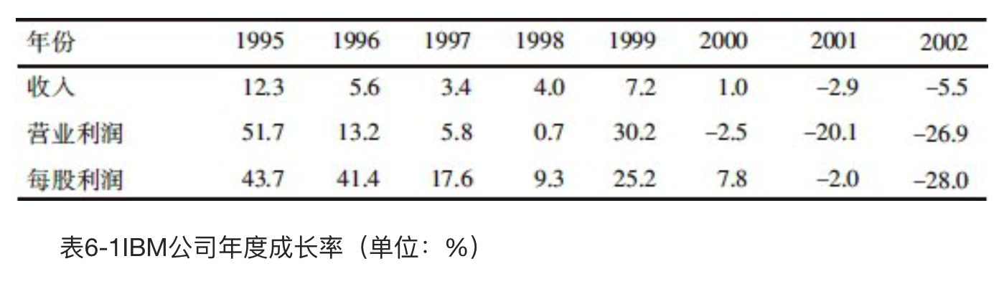

但是当我们考察营业利润的时候，它看起来好像增长得太慢了，与此同时销售的增长平均水平始终在5％左右。当我们再一次检查的时候，我们快速浏览经营性现金流量，不幸的是，从1995年一直到20世纪90年代末，它是看起来都是停滞不前的（见表6-2）。

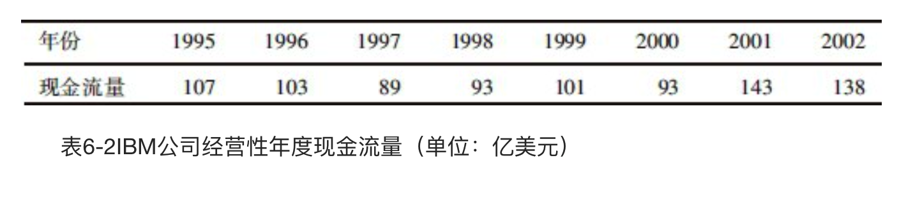

所以，是什么导致这么好的每股盈利结果呢？举一个例子，IBM的税率从1995年的46％降到了20世纪90年代末的30％左右；再比如，这家公司在20世纪90年代持续不断地削减企业销售和管理费用，这是一项改变公司官僚风气值得称赞的成果。

最后，IBM在20世纪90年代的后半段时间回购了公司1/4的股份，几乎没有未转换的股份，这意味着每股可以有更多的收益，而且超额年金计划的收益也增加了盈利。因此你能看到，IBM公司每股盈利与它的营业收入和现金流量的简单对照显示了很多危险信号，任何投资者考察了这家公司20世纪90年代末期的财务资料之后，都会怀疑这家公司盈利增长的质量。

## 收益性
### 资产收益率
你已经知道了`资产收益率`的第一个成分，它就是`销售净利率`（净利润除以销售收入），它告诉我们每美元的销售收入在公司付完全部成本后还剩多少。资产收益率的第二个组成部分是`资产周转率`（销售收入除以资产），它大致可以告诉我们一家公司以怎样的效率从1美元的资产中产生收入。把这二者乘起来，你就得到资产收益率，资产收益率将告诉我们一家公司的每1美元的资产能够产生多少数量的利润。

$销售净利率=\frac{净利润}{销售收入}$

$资产周转率=\frac{销售收入}{资产}$

$资产收益率=销售净利率 \times 资产周转率$

把资产收益率作为效率的一个评估标准，我们发现具有较高资产收益率的公司在把资产转化成利润方面做得更好。把顶尖的零售商比如百思买公司与Circuit City公司比较时，我们很容易看到，Circuit City公司在20世纪90年代至21世纪初都在苦苦奋斗。1998年以来，Circuit City公司的资产收益率一直在4%～5%徘徊，然而百思买公司的资产收益率已经从5％提高到差不多10％的水平（见表6-3和表6-4）。

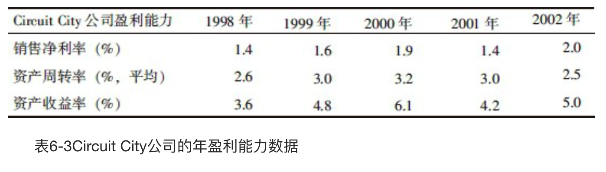

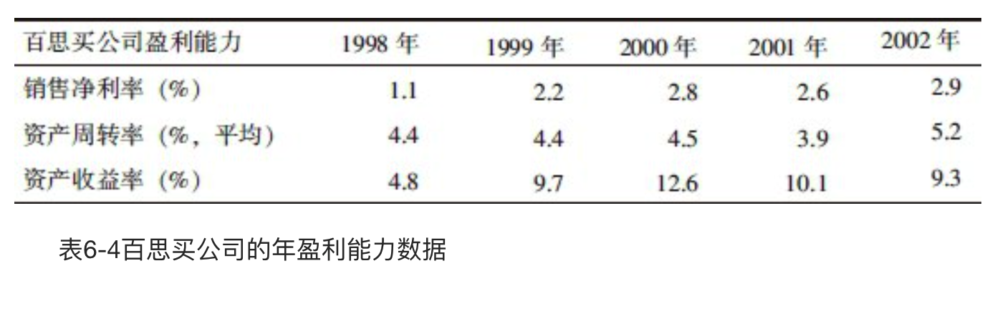

这显示百思买公司拥有更高的利润率——对百思买公司来说差不多是3％，对Circuit City公司来说在2％以下，但是两家公司之间的最大区别在于资产周转率。例如，在2002年，Circuit City公司投资在财产和存货（对大多数零售商来说这是最大的两项资产）上的每1美元产生了2.5美元的销售收入，与此同时，百思买公司投资在财产和存货上的每1美元则产生了3.2美元的销售收入。很清楚，百思买公司的运营比Circuit City公司更有效率，而且在把资产转换成利润方面做得更好。

资产收益率帮助我们了解了两条使盈利能力更卓越的通道：提高你的产品价格（高的毛利），或者加快资产周转率。

### 净资产收益率
`净资产收益率`是一个全面评估公司盈利能力的指标，因为它反映的是一家公司使用所有者权益的效率，换句话说，它测量的是使用股东的钱进行投资产生回报的程度，也就是每1美元股东资本产生的利润。

$财务杠杆比率=\frac{资产}{所有者权益}$

$净资产收益率=资产收益率 \times 财务杠杆比率$

$资产收益率=销售净利率 \times 资产周转率$

$净资产收益率=销售净利率 \times 资产周转率 \times 财务杠杆比率$

财务杠杆比率用来测量一家公司负债相对于所有者权益的程度。

你需要考察一下这家公司的业务属于哪一类。如果它相当稳定，这家公司也许可以大量负债而不会有太多风险，生意崩溃、公司被债务利息支付所困的概率可能很小。但对另外一种公司，如果其生意是周期性的或者经营是不稳定的，则要保持高度警惕，因为利息支付是固定的，不管公司业务经营的好坏都必须支付。

因此，我们有三个指标能推进净资产收益率，那就是销售净利率、资产周转率和财务杠杆比率。如果一家公司只有一个不好不坏的毛利率和适度的财务杠杆比率，那么它可以在资产周转率上做很多文章。举例来说，对于经营很好的折扣零售商（比如沃尔玛），高资产周转率使它们在用每1美元的投资赚取更多收入方面非常有效。这些公司在使消费者心甘情愿地为商品一次性付清货款方面表现优秀。如果一家公司资产周转率仅仅是中等，公司也没有高的财务杠杆比率，那么它应该有很高的利润率，比如Coach公司那样的奢侈品公司。在更多的领域，一家公司推进它的净资产收益率通常是使用相当大的财务杠杆比率，比如许多成熟的公司（如公共事业类的公司）即是如此。

一般来说，非金融类的公司在没有过多使用财务杠杆比率的前提下，能产生10％以上的净资产收益率就是值得投资的。

当你使用净资产收益率评估一家公司的时候，要注意两个问题。

1. 银行的财务杠杆比率永远是巨大的，所以如果银行机构使用看起来相对非银行机构高的财务杠杆比率你也不要恐惧。（我们将在第十七章学习怎样评估银行的财务健康状况。）另外，因为银行的财务杠杆比率永远那么高，你就要提高金融公司的衡量标准，寻找稳定的净资产收益率大约在12％以上的公司。
1. 如果企业的净资产收益率看上去太好了，有可能不真实，因为这种情况经常发生。净资产收益率在40％以上常常是没有意义的，因为它也许已经被公司的财务结构扭曲了，比如公司最近可能从母公司分拆出来，公司可能回购了很多股票，或者公司进行了大规模的加价等，这些常常会扭曲净资产收益率，因为在这些情况下公司权益的基数降低了。

### 自由现金流
在前面的章节里，我们已经介绍了经营性现金流，它是用来测量一家公司产生多少现金流的。和经营性现金流一样有用的指标是自由现金流，它不考虑公司必须花在维持或扩张业务上的资金。我们需要在经营性现金流的基础上减去资本性支出（资本性支出是用来购置固定资产的），就是自由现金流：

    自由现金流=经营性现金流-资本性支出

你在某些时候可以看到自由现金流常常被当做“所有者盈余”，这样的表述是正确的，它表示一家公司的所有者拥有可以提取而又不影响公司业务的现金数量。

一家产生大量自由现金流的公司能用这些现金做各种各样的事情：把它存起来等待投资机会、用它收购、回购股票等。自由现金流给公司带来融资的弹性，因为这家公司可以不依赖资本市场支持它的扩张。有负的自由现金流的公司不得不去贷款或者卖掉一些股票来维持公司经营，而且如果在公司的危急时刻，或市场变得不稳定的时候，这可能变成一件危险的事情。

考察公司当前收益率的一个好方法是利用盈利能力矩阵。这个矩阵可以分析公司的净资产收益率相对于公司产生的自由现金流数量。如图6-1所示

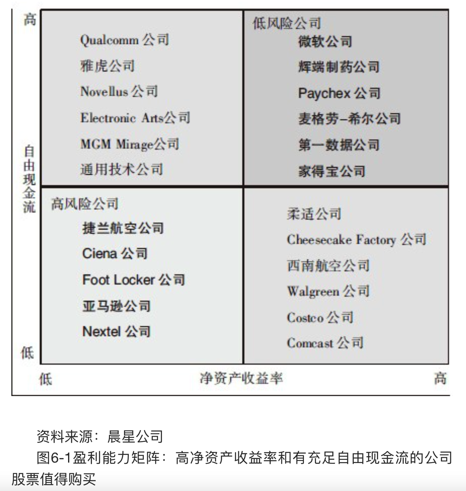

### 投入资本收益率
`投入资本收益率`是一个久经考验的分析资本收益的比率，这个比率调整了资产收益率和净资产收益率的某些特性。本质上说，投入资本收益率改进了资产收益率和净资产收益率，因为它把负债和权益放在一个彼此相当的位置上：它把与负债相关的扭曲矫正过来，这些扭曲使公司在使用净资产收益率时，因为具有很高的杠杆作用看起来收益性很好。投入资本收益率和资产收益率、净资产收益率比较起来对利润也使用了不同的定义，资产收益率和净资产收益率使用的是净利润，而投入资本收益率使用的是税后的营业利润，并且是在扣除财务费用之前。还有，投入资本收益率的目标是除去公司不同的融资决定造成的影响——不管是使用债权融资还是所有者权益融资——这样我们就可以尽可能地聚焦在核心业务的盈利能力上。

## 财务健康状况

