    作者: [美] 帕特·多尔西
    出版社: 中信出版社
    原作名: The Five Rules for Successful Stock Investing
    译者: 司福连 / 刘静
    出版年: 2010-1
    页数: 311
    定价: 39.00元
    装帧: 平装
    ISBN: 9787508617619

[豆瓣链接](https://book.douban.com/subject/4137173/)

- [成功投资股市的五项原则](#成功投资股市的五项原则)
- [七个应当避免的错误](#七个应当避免的错误)
- [竞争优势](#竞争优势)
- [投资语言](#投资语言)
- [财务报表讲解](#财务报表讲解)
  - [资产负债表](#资产负债表)
    - [资产账户：流动资产](#资产账户流动资产)
    - [资产账户：非流动资产](#资产账户非流动资产)
    - [负债账户：流动负债](#负债账户流动负债)
    - [负债：非流动负债](#负债非流动负债)
    - [所有者权益](#所有者权益)
  - [利润表](#利润表)
    - [收入(销售收入)](#收入销售收入)
    - [销售成本](#销售成本)
    - [毛利](#毛利)
    - [销售和管理费用](#销售和管理费用)
    - [折旧和摊销](#折旧和摊销)
    - [非经营性损益](#非经营性损益)
    - [营业利润](#营业利润)

# 成功投资股市的五项原则
- 成功的股票投资依赖于个人的训练，不依赖于别人是否赞同你。至关重要的是要有一个稳固的、有充分依据的投资哲学。
- 除非你清楚该公司的里里外外，否则不要买它的股票。在买股票之前，花时间调查这家公司有助于避免犯大错误。
- 应该关注公司是否有较强的竞争优势。竞争优势有助于公司把竞争者挡在外面。如果你能识别一家公司能够阻挡竞争者，并且能持续产生高于平均水平利润的原因，你就已经鉴别出了公司竞争优势的源头。
- 频繁交易的费用经过相当一段时间之后，会大大拖累投资组合的表现。买股票要像重大的采购，并且最好长期持有。
- 知道何时卖出。不要仅仅因为股价的涨跌卖出，但是经过认真分析后，如果以下情况出现，应当卖出：你在第一次买入时犯了一个错误，公司基本面已经恶化，股价已经超出它的内在价值很多，你已发现更好的投资机会，这只股票在你的投资组合里占了太大的比例。

以下是我们推荐的做好投资的五项原则：

1. 做好你的功课；
2. 寻找具有强大竞争优势的公司；
3. 拥有安全边际；
4. 长期持有；
5. 知道何时卖出。

# 七个应当避免的错误
* 不要试图通过发现下一家微软公司而获得巨额收益。你应该关注于发现股价已低于估值的可靠的公司。
* 了解市场的历史能帮助你避免重复那些易犯的错误。如果人们试图使你确信“这次与以往不同”，不要理睬他们。
* 不要陷入“一个好产品将创造一家高质量公司”这样一个假设的陷阱里。在你被一项激动人心的技术或者一个极好的产品掏光口袋之前，确信你已经核实了该公司的商业模式。
* 不要害怕使用你的优势。买入的最好时机是当所有人都从一个特定种类的资产出逃的时候。
* 试图选择市场时机是一个傻瓜游戏。有足够的证据证明市场是不能选择时机的。
* 减少投资风险的最佳路径是认真注意估值。不要寄希望于其他投资者会以高价接收你的盘，即使你买的是好公司股票也不要这样。
* 一家公司财务绩效的真实度量标准是现金流，而不是财务报告的每股盈利。

避免这些错误是达到你投资目标的第一步：
1. 虚幻的目标；
2. 相信这次与以往不同；
3. 陷入对公司产品的偏爱；
4. 在市场下跌时惊慌失措；
5. 试图选择市场时机；
6. 忽视估值；
7. 依赖盈利数据作分析。

# 竞争优势
* 在某个领域如果成功就会吸引竞争，就像黑夜跟在白天后面一样，大多数高利润公司经历一段时间后盈利会减少。这就是为什么竞争优势如此重要：竞争优势能帮助一家好公司继续保持已经取得的地位和优势。
* 寻找持续高盈利的公司，这是公司拥有竞争优势的证据。你可以关注自由现金流、净利润、净资产收益率和资产收益率等度量指标。
* 在搞清楚这些特殊的方法之后，你可以试着去识别公司竞争优势的来源。公司通常通过产品的差别化（真实的或感知的）建立竞争优势，驱动成本下降，用高转换成本锁定消费者，或者用高的进入门槛把竞争对手阻挡在外面。
* 用两个维度思考竞争优势：`深度（公司能赚多少钱）`和`宽度（能保持平均水平以上的利润多长时间）`。一般而言，任何一个基于技术创新的竞争优势都很可能是短命的。
* 尽管这个行业的吸引力不能告诉你企业的全部，但对竞争前景有天才的判断是相当重要的。一些行业就是比其他行业赚钱容易。

分析一家公司的竞争优势，可以遵循下面四个步骤：
1. 评估公司历史上的盈利能力。这家公司的资产和所有者权益一直能够创造稳定收益吗？这是一家公司是否在它周围建立起竞争优势的真正的试金石。
2. 如果这家公司的资本有稳定的收益，并能有持续不断的盈利能力，就需要评估公司利润的来源：为什么这家公司能阻挡竞争者，是什么阻止竞争者窃取它的利润？
3. 评估一家公司能阻挡竞争者多久，这是该公司竞争优势的周期。一些公司能阻挡竞争者仅仅几年的时间，而另一些公司可以阻挡几十年。
4. 分析行业竞争结构。行业内的公司是怎样和其他公司竞争的呢？这是一个很有利可图的、有吸引力的行业，还是一个参与者都在痛苦挣扎的过度竞争的行业？

一般而言，一家独立的公司要建立足够的竞争优势有五条途径：
1. 通过出众的技术或特色创造真实的产品差别化；
2. 通过一个信任的品牌或声誉创造可感知的产品差别化；
3. 降低成本并以更低的价格提供相似的产品和服务；
4. 通过创造高的转换成本锁定消费者；
5. 通过建立高进入壁垒把竞争者阻挡在外面。

# 投资语言
* 资产负债表就像一家公司的信用报告，因为它反映在某一特定时点这家公司拥有资产和负债的情况。
* 利润表告诉我们一家公司一年或者一个季度赚了或者损失了多少会计利润。利润表不像资产负债表那样是公司财务健康状况的一个精确时点的快照，它记录了一个时段比如一个财务年度的收入和费用。
* 第三张关键的报表是现金流量表，它记录全部流入和流出公司的现金情况。
* `权责发生制`是理解财务报表的一个关键的概念。当一项服务或一种物品提供给买家的时候，利润表记录销售收入与相应的费用，但是现金流量表只关心现金的流入和流出。

图4-1举例说明了资金是怎样从一个投资者通过公司到消费者，然后又回到公司的过程。

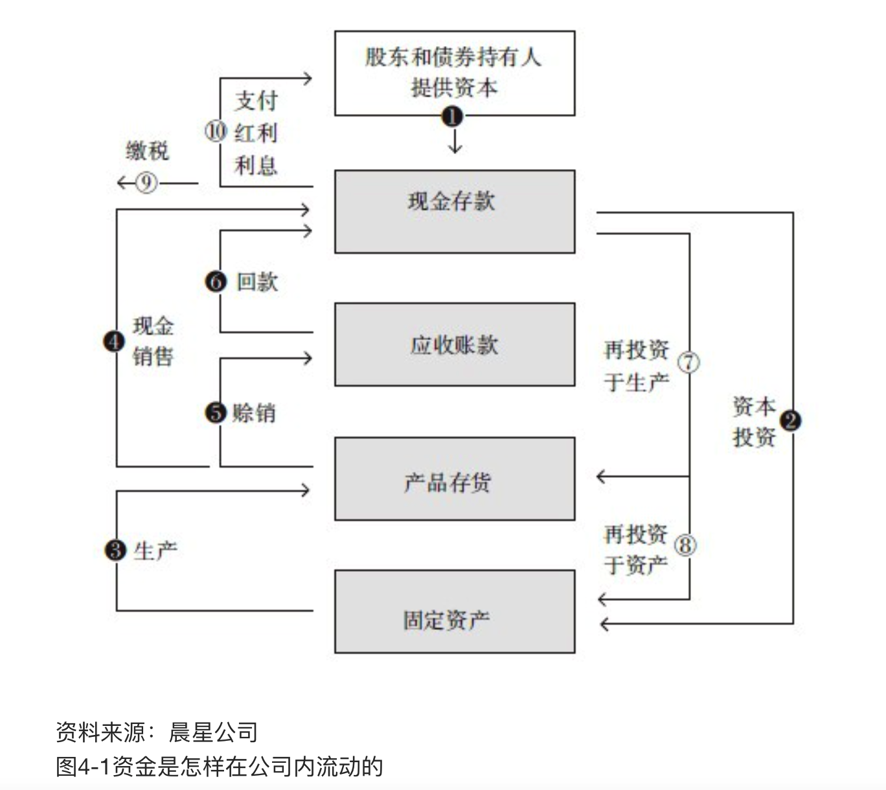

一组投资者和债券的持有人①给公司提供资本，对股东来说就是买了股票，对债券持有人就是买了债券。公司用这些资金购置了固定资产②，比如一些机器设备和建筑物。用这些资产生产出产品，就是存货③，一些存货卖出后变成现金④，另外一些赊销⑤。赊销被反映为应收账款，直到消费者给公司付款⑥。一旦公司手里有现金，公司又按照同样的路径把它花出去。一些现金以产品的形式返回来⑦，这意味着可以购置原材料生产更多的存货。另一部分现金用于投资⑧，这意味着买更多的机器设备或建造另外的工厂（用会计学的行话说，你通常看到一些投资购买了切实的长期资产，像一座建筑物或工厂，这叫做“资本支出”）。

还有一大块现金给美国政府交税了⑨。如果给股东分红派息，或者公司有负债的，还要向股东和债券持有人支付红利和利息，于是一部分现金流出⑩。

# 财务报表讲解

## 资产负债表
资产负债表有一个基本的等式：

    资产-负债=所有者权益

这个等式也可以这样表示：

    资产＝负债＋所有者权益

发行债券引起负债增长，而销售债券收到的现金也导致资产增长；公司产生大量利润会导致资产增长，同时所有者权益也在增长。

### 资产账户：流动资产
资产账户里最重要的是“流动资产”，因为流动资产很可能在一个商业周期里被耗尽或者转化成现金。通常商业周期被定义为一年。这类资产的主要部分是现金及其等价物、短期投资、应收账款和存货。

`现金及其等价物和短期投资`：该项目涉及存在金库中暂时不用的现金以及仅次于低风险钞票的短期投资。现金及其等价物通常包括货币市场基金，还有其他任何可以迅速转化成现金并且价格风险很低的东西。通常认为短期投资与现金类似，它包括一年内到期的债券，或者比现金的收益率高很多但卖出影响很小的债券。在大部分案例中，当我们讨论一家公司手上有多少资产可以应付急需的时候，你可以在内心把这些资产和现金等同。

`应收账款`：公司还没有收到的现金，是那些如果不出现意外公司会在不久收到的货款。你要观察这个账户与公司销售收入之间的变化，如果应收账款比销售收入增长快，说明这家公司的账上记录了大量还没有收到的款项，这可能是一个会出问题的信号，因为这意味着公司为增加销售收入提供了一个相当宽松的信用条款。一家公司把产品移交给客户马上就可以记录销售额，但很少有公司能永远保证借出去的现金一定可以全部收回。

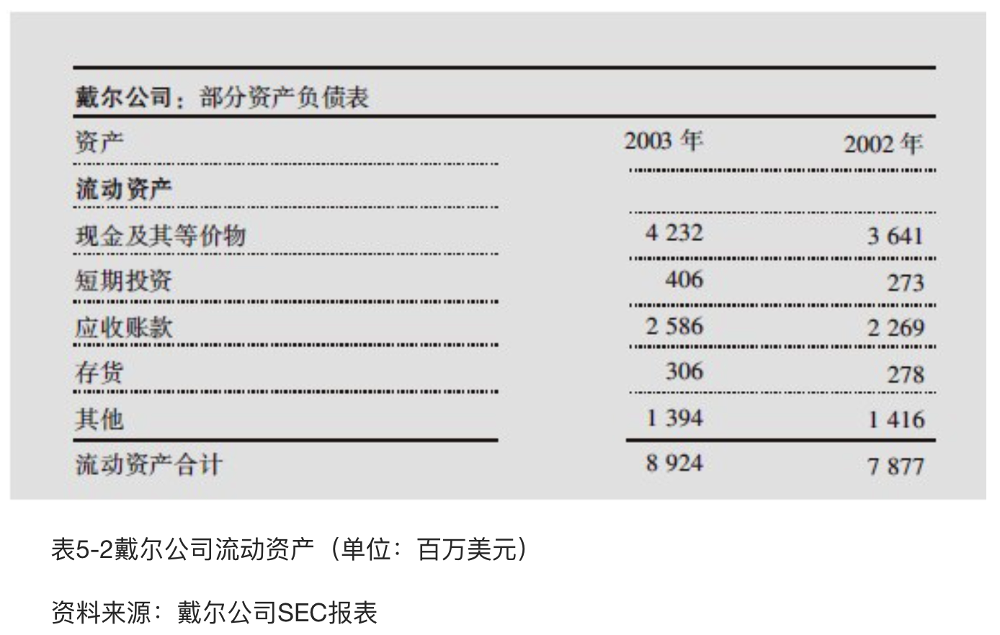

在表5-2中，戴尔公司应收账款上升了14％，而销售收入也在以同样的速度增长，我们在研究公司的利润表时就会看到。

表5-3显示，惠普公司的应收账款从44.88亿美元迅速增长到84.56亿美元，这是一个90％的增长幅度，而销售收入只增长了大约25％。（记住，把应收账款的增长率与销售收入增长率进行比较是判断一家公司回收应收账款能力的好办法。）尽管惠普公司在此期间因合并康柏公司业务受到一些扭曲，但应收账款问题是更大的矛盾。在这时，惠普公司的投资者应该重点关注应收账款将怎样从消费者那里回收。

你常常在资产负债表“应收账款”后面看到一个“坏账准备”账户，它反映的是一家公司估计有多少钱可能会被赖账不还，这些钱将彻底损失。例如，在惠普公司的资产负债表上，你会看到截至2002年10月这家公司提取了4.95亿美元的坏账准备金。

`存货`：存货有几种类型，包括还没有制成成品的原材料、半成品和还没有销售的成品。存货对于观察制造业和零售业都非常重要。因为存货记账方法的不同，它们的清算价值也许和它们在资产负债表上显示的价值大不相同，这用常识就可以判断。

更重要的是存货的占用资本，现金转化成存货放在仓库里不能做任何事情。**一家公司的存货周转速度对收益率有巨大的影响**，如果存货占用资金的时间少，这些资金就可以用到其他地方。你可以用公司的销售成本除以平均存货水平计算出`存货周转率`。

例如，戴尔公司2002年的销售成本是256亿美元（见表5-4），同期的存货是2.78亿美元，可以算出它有一个让人难以置信的存货周转率92。换句话说，戴尔公司一年之间全部存货周转了92次。与之形成鲜明对比的是惠普公司。2002年惠普公司的销售成本是345亿美元（见表5-5），同期存货是58亿美元，可以算出它的存货周转率仅仅是6。

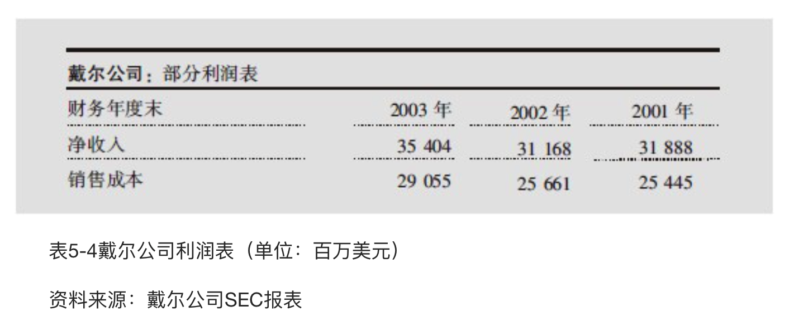

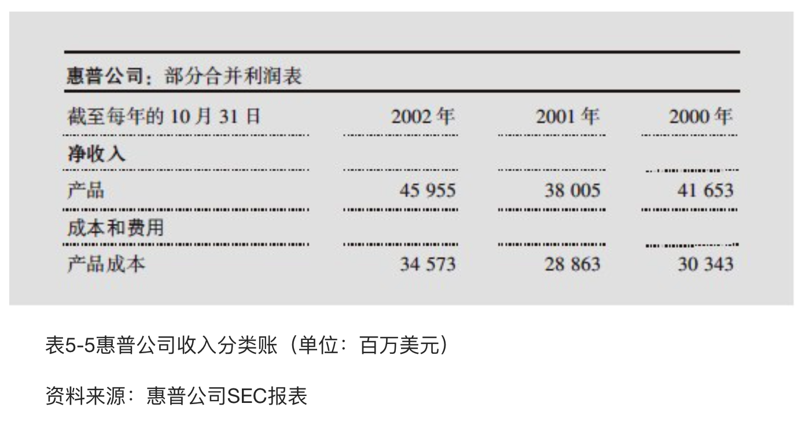

### 资产账户：非流动资产
非流动资产是那些不能转化成现金或在报告期内要耗用完的资产。它主要包括固定资产、投资和无形资产。

`固定资产`：固定资产是公司的长期资产，形成公司的基础设施：土地、建筑物、工厂、家具和设备等。例如，戴尔公司截至2002年底有大约9.13亿美元固定资产，而惠普公司有69亿美元固定资产。

如果我们比较两家公司的总资产数字（见表5-6和表5-7），我们会对它们固定资产的情况有个大概的了解。戴尔公司的固定资产占总资产大约6％，而惠普公司大约占10％。因此，惠普公司比戴尔公司资金占用更多。

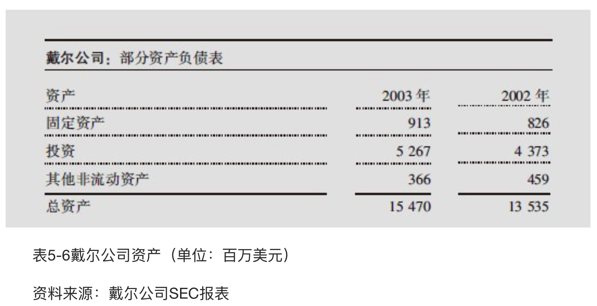

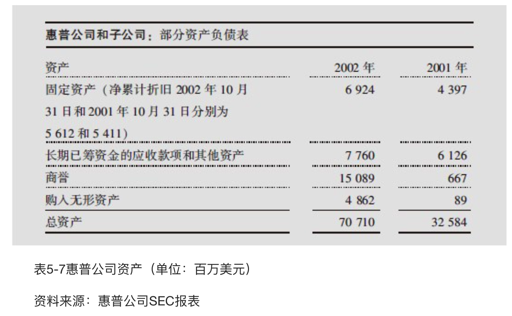

`投资`：指资金投资在长期债券或者投资在其他公司股票上，它远没有现金那样好的流动性，而且其价值可能比资产负债表上反映的数字或高或低。

在表5-6和表5-7里，惠普公司没有长期投资，但是戴尔公司在资产负债表上有大约53亿美元的相当数量的长期投资。因为这些投资几乎占了戴尔公司总资产的1/3，所以这是你要深入挖掘并要搞清楚的事情。（如果戴尔公司的投资主要是债券，你就不需要为它太担心；但如果主要是股票投资或风险投资，你就要查清楚这53亿美元投资的真正价值。）

`无形资产`：无形资产最普通的形态是商誉，当一家公司收购另一家公司时商誉就会上升。商誉是收购公司支付的价格和目标公司实际资产或权益之间的差值。本质上，商誉表现为一家公司收购另外一家公司时全部溢价的价值。例如，可口可乐公司的大部分价值不是企业建筑物和设备，而在于可口可乐公司过去数十年建立起来的强大品牌。如果一家公司要购买可口可乐公司，它将不得不支付比可乐公司股票账面价值高得多的价格，这溢价的部分就叫做`商誉`。

在表5-7，惠普公司2002年的商誉账户里有150亿美元，它占总资产710亿美元的20％左右。公司合并时，康柏公司真的比它的现金价值、固定资产、消费者名单和专利多值150亿美元吗？也许值，但如果不值那么多，惠普公司就会在未来某个时点减少这个账户的数字，这意味着公司总资产的价值将会大大降低。

### 负债账户：流动负债
流动负债是与流动资产相对的那面，它指一家公司一年内要付清的资金。它包括应付账款、短期借款或短期应付款。

`应付账款`：这是公司从某人或机构那里借贷并应在一年以内归还的借款。

`短期借款`：借款期限短于一年的借款，通常是为了应付短期的需要。它是一家公司临时之需导致的银行贷款，尽管它有时会是下一年长期负债的一部分。这个科目对一家处于财务困境中的公司变得异常重要，因为全部短期贷款必须很快归还。惠普公司应付票据和短期借款的数额约是18亿美元（见表5-8），这对惠普的资产规模来说是比较小的数目，所以我们不必担心。

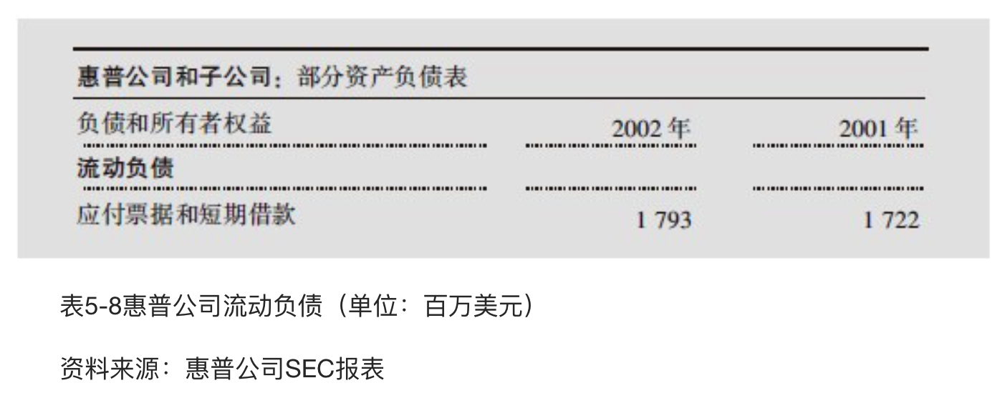

### 负债：非流动负债
与非流动资产相对应的是非流动负债，它表现为公司一年或一年以上的借款。有时你会看到在这个标题下有各种各样的科目，但其中最重要的是长期负债。`长期负债`通常是企业发行的债券，有时也是几年之内不用还的银行借款。

### 所有者权益
所有者权益等于总资产减去总负债，它也表现为公司向股东的负债。

唯一值得关注的是`未分配利润`，这是一家公司一定的资本数量存续一段时间发生的利润减去分红和股票回购后的基本记录，它也表现为股东再投资。未分配利润是一个累计账户，因此，每一年公司赚取的利润如果没有作为红利全部分红，未分配利润就会增加。同样，如果一家公司随着时间流逝亏损了，未分配利润可能就变成负的，在资产负债表上的账户也就改为`“累计亏损”`。未分配利润是一家公司长期盈利情况的记录。

## 利润表
### 收入(销售收入)
有时也被称为“销售收入”。这个账户很简明地告诉我们，公司在一个季度或一年期间销售了多少。大公司有时在利润表上按照不同的业务部门、地理区域或产品与服务的类别列示分类收入。

公司可能按照它们所从事的业务，以不同的时间段确认收入。例如，一家软件企业可能在把产品交付给客户时记录一个完整的收入，然而一家服务企业可能是按照合同期限平滑地分笔记录收入情况。

### 销售成本
大家都知道的销售成本，这个数字显示的是直接创造收入的有关费用。例如，人工成本、原材料（对制造商而言）或者货物批发价格（对零售商而言）。大公司根据制造与服务（例如惠普公司）的不同，有时将其分解为`销售成本`和`服务成本`。

### 毛利
这项不出现在利润表里，它是简单地把收入与销售成本相减。一旦你知道毛利，你可以计算毛利率，即毛利相对于收入的百分比。本质上，毛利率告诉你一家公司能把它的产品标多高的价格。在表5-10中，戴尔公司只有17.9％的毛利率（63亿美元的毛利除以354亿美元的销售收入），因为它销售的是计算机产品。对戴尔来说，很难为它销售的计算机开更高的价。

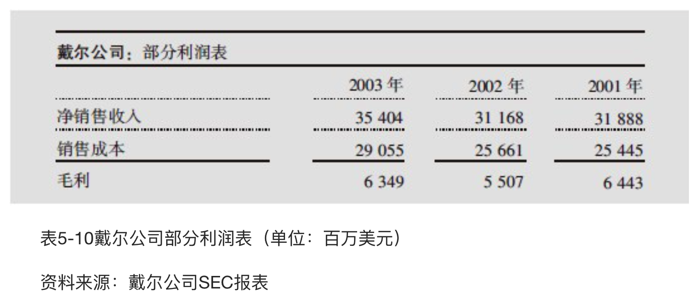

而惠普公司销售的是更高一级的计算机终端，它的客户更乐于一次性付款。在表5-11中，你可以算出它的毛利率：用销售收入459亿美元减去销售成本345亿美元，得到毛利114亿美元，再除以销售收入，我们得到毛利率为24.8％。所以你能看到两家公司的产品是有区别的，惠普公司的产品标价比它的制造成本高得更多一些。惠普公司销售的计算机也捆绑软件所有权，软件也有很高的毛利率。

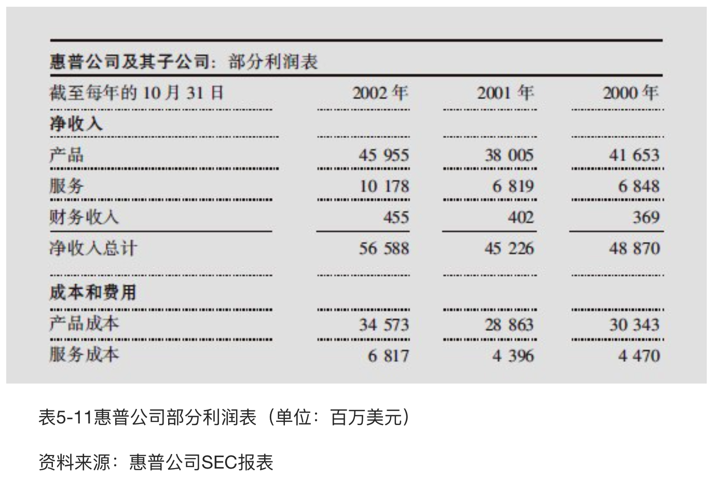

### 销售和管理费用
它指众所周知的`营业费用`，包括营销费用、管理人员工资，有时也包括研发费用（研发通常作为一个分开的科目）。你将看到销售管理费用和毛利率之间的联系，公司要想提高产品的价格，就不得不在售货员和市场营销方面多投入。营业费用相对于销售收入较低，意味着公司比较严格地节省了成本。例如，惠普公司（见表5-12）花费了90亿美元的销售和管理费用，占565亿美元收入的16％，而戴尔公司这一类费用只占总收入的8.9％。

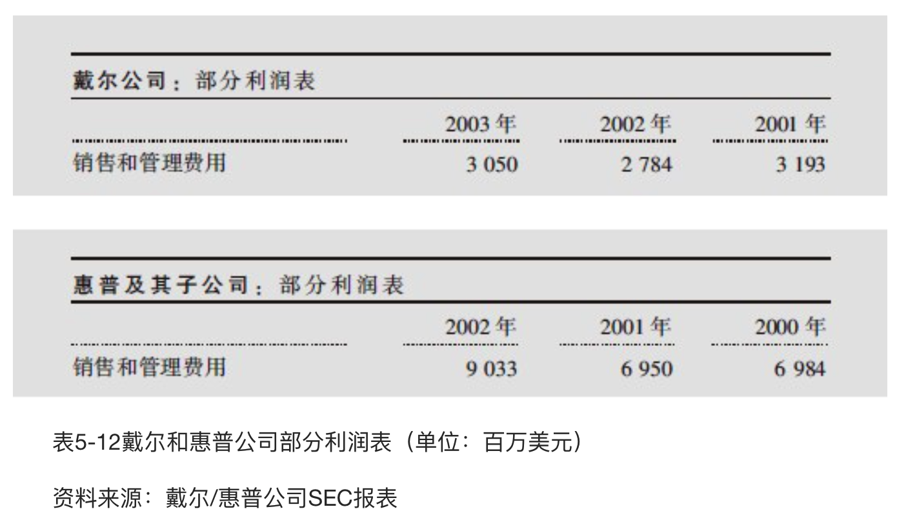

从事实中也可以得到证明，戴尔公司把产品直销给客户，而惠普公司不得不雇用售货员把高价计算机卖给大公司。与惠普公司相比，戴尔公司看起来好像经营了一家薄利商店。

### 折旧和摊销
当一家公司购置一项资产并打算使用一段时间，如一座新的建筑物或者一台新设备，那么在未来几年它要在利润表上逐步摊销那项资产的一部分成本。这个数字在利润表上偶尔也是分开的，但是它通常计入营业费用。它也总出现在现金流量表中，因此，你可以看到一家公司净利润中的多少是受非现金因素影响的，比如折旧。

### 非经营性损益
公司会把它的全部非常规营业的一次性费用或收益放在一起，比如关闭一间工厂的费用或者卖出一个分部的收益。理想的情况是，利润表中这个项目大多数时间最好是空白的。

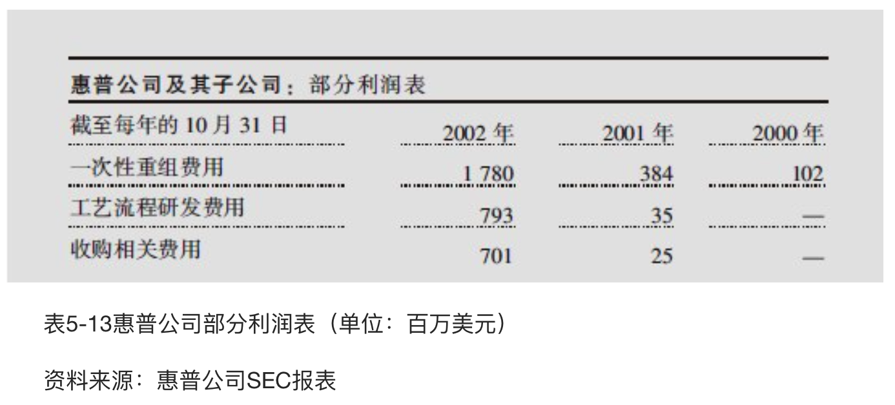

你可以看表5-13，惠普公司在2002年提取了近18亿美元一次性重组费用，其中7.93亿美元费用用于工艺流程的研发，其他7亿美元是用于与康柏公司合并的混合性一次性费用。尽管这样规模的合并不是每天都发生，但这也意味着我们可以忽略惠普一些无关紧要的部分。我们看到惠普在2001年也发生了3.84亿美元这样的重组费用。如果我有惠普公司股票，我应当很仔细地研究这些费用是否真的是非经营性的，因为连续的非经营性的费用是管理层缺乏信心的一个信号。

### 营业利润
这个数字等于收入减去销售成本和全部营业费用。理论上，它表现为公司在实际经营活动中赚取的利润，与之相对的是利息收益、一次性收益和其他一

