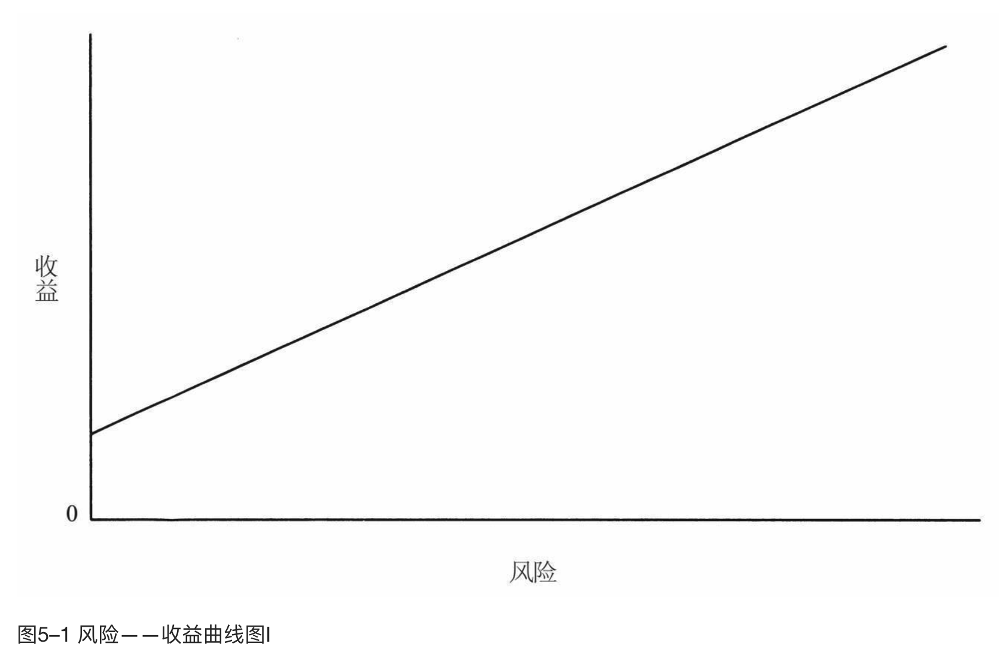
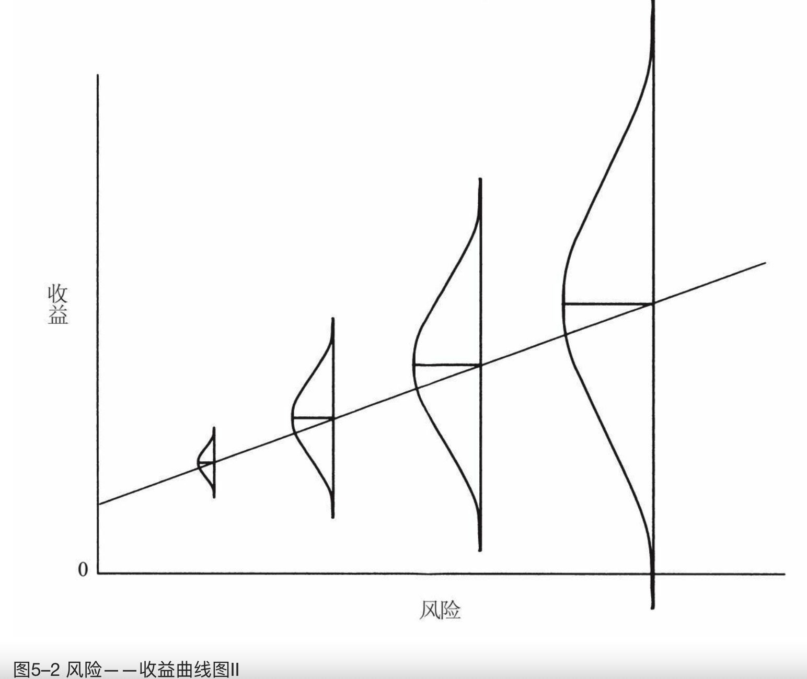

    作者: [美]霍华德·马克斯
    出版社: 中信出版社
    原作名: The Most Important Thing Illuminated
    译者: 李莉 / 石继志
    出版年: 2019-3
    页数: 251
    定价: 78元
    装帧: 精装
    ISBN: 9787521700602

[豆瓣链接](https://book.douban.com/subject/33401129/)

- [学习第二层次思维](#学习第二层次思维)
- [理解市场有效性及局限性](#理解市场有效性及局限性)
- [准确估计价值](#准确估计价值)
- [价格与价值的关系](#价格与价值的关系)
- [理解风险](#理解风险)
- [识别风险](#识别风险)
- [控制风险](#控制风险)
- [关注周期](#关注周期)
- [钟摆意识](#钟摆意识)
- [抵御消极影响](#抵御消极影响)
- [逆向投资](#逆向投资)
- [寻找便宜货](#寻找便宜货)
- [耐心等待机会](#耐心等待机会)
- [认识预测的局限性](#认识预测的局限性)
- [正确认识自身](#正确认识自身)
- [重视运气](#重视运气)
- [多元化投资](#多元化投资)
- [避免错误](#避免错误)
- [增值的意义](#增值的意义)
- [最重要的事](#最重要的事)

# 学习第二层次思维
什么是第二层次思维？
- 第一层次思维说：“这是一家好公司，让我们买进股票吧。”第二层次思维说：“这是一家好公司，但是人人都认为它是一家好公司，因此它不是一家好公司。股票的估价和定价都过高，让我们卖出股票吧。”

>乔尔·格林布拉特：在个人投资者中间，我一直听到来自第一层次思维的声音。他们会阅读报纸头条或者收看美国全国广播公司财经频道，然后采纳传统的第一层次思维的投资观点。

- 第一层次思维说：“公司会出现增长低迷、通货膨胀加重的前景。让我们抛掉股票吧。”第二层次思维说：“公司前景糟糕透顶，但是所有人都在恐慌中抛售股票。买进。”

- 第一层次思维说：“这家公司的利润会下跌，卖出。”第二层次思维说：“这家公司的利润下跌得会比人们预期的少，会有意想不到的惊喜而拉升股票。买进。”

# 理解市场有效性及局限性
有效市场假说指出：
- 市场中有许多参与者，他们分享着大致相同的信息渠道。他们聪明、客观、有高度的积极性并且辛勤地工作。他们的分析模型广为人知并被广泛采用。
- 由于参与者的共同努力，信息得以完全并且迅速地在资产的市场价格上反映出来。由于市场参与者会立即买进价格过低的资产，并卖出价格过高的资产，因此资产的绝对价格以及彼此之间的相对价格是公平的。
- 因此，市场价格代表了对资产内在价值的准确估计，任何参与者都不能连续识别市场的错误并从中连续套利。
- 因此，资产是以相对于其他资产的“公平”、提供预期风险调整收益的价格来出售的。风险更高的资产必须提供更好的收益来吸引购买者。市场会根据情况设定价格，但它不会提供“免费的午餐”，即没有与新增风险无关的（以及非补偿性的）新增收益。

有效市场假说最重要的成果就是“你无法战胜市场”的结论。

事实上，某些资产是相当符合有效市场假说的，主要包括以下类别：
- 资产类别广为人知，并且有一大批追踪者。
- 资产类别是社会认可的，而不是争议性或禁忌性的。
- 资产类别的优势清晰易懂，至少表面上看起来如此。
- 关于资产类别及其组成的信息的传播是普遍而公平的。

>在我看来，无效市场至少具备以下特征之一（可能最终会被证实具备以下所有特征）：
>- 市场价格往往是错误的。因为获得信息的途径以及对信息的分析不够完善，所以市场价格往往远高于或者远低于内在价值。
>- 一种资产类别的风险调整后收益可能与其他资产类别的风险调整后收益相差甚远。因为资产估价的结果往往不是资产的公允价值，所以一种资产类别的风险调整后收益可能远高于（或远低于）其他资产类别。
>- 有些投资者始终能够有更高明的投资表现。因为明显错误的估价和参与者的技术、洞察力、信息渠道等差异的存在，有规律地识别错误估价并从中获利的可能性是存在的。
>
>理解最后一点是否代表什么是非常重要的。无效市场并不一定会给予参与者丰厚的回报。相反，我认为无效市场提供的是原料（错误定价），而投资者各有输赢，取决于他们所掌握的技术的不同。如果价格可能出现严重错误，那就意味着有发现便宜或价格过高的股票的可能。相对于在无效市场中买得划算的人来说，一定有其他人卖得太便宜了。
>
>《α究竟是怎么一回事》，2001年7月11日

在有效与无效的大辩论中，我的结论是，没有一个市场是完全有效或无效的，它只是一个程度问题。我衷心感谢无效市场所提供的机会，同时我也尊重有效市场的理念，我坚信主流证券市场已经足够有效，以至于在其中寻找制胜投资基本上是浪费时间。

出于对有效性的尊重，在采取行动之前，我们应该询问几个问题：错误以及错误定价是否已被投资者的共同努力所消除，抑或依然存在？为什么？

思考下面的问题：
- 当成千上万的投资者时刻准备着抬高任何过于低廉的价格时，为什么还有可能存在便宜货？
- 如果相对于风险来说收益显得很高，那么有没有可能你会忽略了某些隐性风险？
- 为什么资产卖家愿以能让你获得超额回报的价格卖出资产？
- 你是否真的比资产卖家知道得更多？
- 如果这是一笔可观的交易，那么为什么其他人没有一哄而上？

# 准确估计价值
所有研究投资公司证券的方法可被划分为两种基本类型：基于公司特性即“基本面”来分析的，以及基于证券自身价格行为来研究的。换言之，投资者有两种基本选择：判断证券的内在价值并在价格偏离内在价值时买进或卖出证券，或者将决策完全建立在对未来价格走势预期的基础之上。

`技术分析`，即对过去股票价格行为的研究，自我加入这一行业时（并且远在之前），它便已被沿用至今，但已日渐没落。技术分析衰落的部分原因是随机漫步假说的出现——20世纪60年代早期以尤金·法玛教授为代表的芝加哥学派理论的组成部分。随机漫步假说认为，既往股价走势对于预测未来股价没有任何帮助。

另一种依靠股价走势进行决策的形式被称为`“动量投资”`，它的存在同样违背了随机漫步假说。正如我所看到的，采用这一方法的投资者是在假定他们可以预知曾经连续上涨的股价将会在何时继续上涨的基础上进行操作的。动量投资可能会让你在持续上涨的牛市中分一杯羹，但我看到它存在许多缺陷，其中之一基于经济学家赫伯特·斯坦那句苦涩的名言：“无法永久持续的东西必将终结。”那么，动量投资者的情况将会如何呢？动量投资法如何帮助他们及时卖出以避免下跌？投资者在持续下跌的市场中如何采取行动？

另外两种受基本面驱动的投资方法：`价值投资`和`成长型投资`。简而言之，`价值投资者`的目标是得出证券当前的内在价值，并在价格低于当前价值时买进，成长型投资者的目标则是寻找未来将迅速增值的证券。

是什么使得证券或其标的公司具有价值？有许多备选因素：财力资源、管理、工厂、零售店、专利、人力资源、商标、增长潜力，以及最重要的——创造收益和现金流的能力。事实上，大多数分析方法认为，其他所有特征（财力资源、管理、工厂、零售店、专利、人力资源、商标、增长潜力）的价值，恰恰在于它们能够最终被转化成为收益与现金流。

价值投资强调的是有形因素，如重资产和现金流。无形因素如人才、流行时尚及长期增长潜力所占的比重较小。某些流派的价值投资专注于硬资产。甚至有所谓的“net-net投资”，即在公司股票的总市值低于公司的流动资产（如现金、应收账款和存货）并超出总负债时买进。在这种情况下，从理论上讲你可以买进所有股票，将流动资产变现并清偿债务，以得到公司所有权及若干现金。是的，现金落袋，成本收回，你还白白得到了公司的所有权。

价值投资追求的是低价。价值投资者通常会考察收益、现金流、股利、硬资产及企业价值等财务指标，并强调在此基础上低价买进。价值投资者的首要目标是确定公司的当前价值，并在价格足够低时买进公司证券。

`成长型投资`介于枯燥乏味的价值投资和冲动刺激的动量投资之间。其目标是识别具有光明前景的企业。从定义上来看，它侧重于企业的潜力，而不是企业的当前属性。

>两种主要投资流派之间的差异可以归结如下：
>- 价值投资者相信当前价值高于当前价格，从而买进股票（即使它们的内在价值显示未来的增长有限）。
>- 成长型投资者相信未来价值的迅速增长足以导致价格大幅上涨，从而买进股票（即使它们的当前价值低于当前价格）。
>
>因此，在我看来，真正的选择似乎并不在价值和成长之间，而在当前价值和未来价值之间。成长型投资赌的是未来可能实现也可能无法实现的公司业绩，而价值投资主要建立在分析公司当前价值的基础之上。
>
>《良好平衡》，2004年7月21日

你可以轻而易举地下结论：坚持价值投资无须揣测未来，而成长型投资唯一要做的就是揣测未来。

# 价格与价值的关系
大多数情况下，证券的价格至少还受到其他两个重要因素的影响：**心理和技术（也是价格短期波动的主要决定因素）**。

大多数投资者（当然包括大多数非职业投资者）对技术知之甚少。技术是影响证券供需的非基本面因素，也就是说，与价值无关。举两个例子：在股市崩盘导致采用杠杆的投资者接到追缴保证金通知，并被迫平仓发生强制卖出；当现金流入共同基金时，投资组合经理人就需要买进。在这两个例子中，人们都是在无法顾及价格的情况下被迫进行证券交易的。

**确定价值的关键是熟练的财务分析，而理解价格、价值关系及其前景的关键，则主要依赖于对其他投资者的思维的洞察**。投资者心理几乎可以导致证券在短期内出现任何定价，而无论其基本面如何。

所有泡沫都是从重要的事实开始的：
- 郁金香美丽而罕见（在17世纪的荷兰）。
- 互联网将改变世界。
- 房地产能抵御通货膨胀，并且可以永久居住。

几个聪明的投资者发现了（或预见到）这些事实，因此投资获利。其他人随后明白过来——或者只注意到人们在赚钱，于是他们跟风买进，抬高了资产的价格。但是，随着价格进一步上涨，投资者受到发横财的可能性的刺激，对价格是否公平想得越来越少。这是对我曾经描述过的现象的一种极端再现：某种东西价格上涨时，人们的喜爱程度本应下降，但在投资中，他们的喜爱程度往往会加深。

# 理解风险
关于风险与收益之间的关系，在投资界有一个广泛应用的图示（见图5–1）。

我们所熟知的风险——收益关系图是简约而优雅的。遗憾的是，许多人从中得出一个错误的结论，并因此而身陷困境。

尤其是在经济繁荣时期，你会听到太多的人在说：“高风险投资带来高收益。要想多赚钱，就去承担更高的风险吧。”然而，靠更高风险的投资来获得更高的收益是绝对不可能的。原因何在？很简单：如果更高风险的投资确实能够可靠地产生更高的收益，那么它就不是真的高风险了！

正确的表述是：为了吸引资本，风险更高的投资必须提供更好的收益前景、更高的承诺收益或预期收益，但绝不表示这些更高的预期收益必须实现。

我对资本市场线的认知方式使我较为容易地将其背后涉及的所有关系联系起来（见图5–2）。

>在学者看来，风险等于波动性，因为波动性表明了投资的不可靠性。我对这一定义不敢苟同。
>
>《风险》，2006年1月19日

**永久性损失的概率**是我、橡树资本管理公司以及我所认识的每一位实际投资者所担心的风险。

# 识别风险
识别风险往往从投资者意识到掉以轻心、盲目乐观并因此对某项资产出价过高时开始。换句话说，高风险主要伴随着高价格而出现。无论是对被估价过高从而定价过高的单项证券或其他资产，还是对在看涨情绪支持下价格高企的整体市场，在高价时不知规避反而蜂拥而上都是风险的主要来源。

# 控制风险
优秀的投资者获得的收益可能并不比别人高，但他们在实现同等收益的前提下承担了较低风险（或以相当低的风险实现了稍低于其他人的收益）。

# 关注周期
我们有信心把握住的概念有两个：
- 法则一：多数事物都是周期性的。
- 法则二：当别人忘记法则一时，某些最大的盈亏机会就会到来。

特别值得一提的是`信贷周期`，它具有必然性、极端波动性，也具有为适应它的投资者创造机会的能力。

过程很简单：
- 经济进入繁荣期。
- 资金提供者增多，资本基础增加。
- 坏消息极少，因此贷款风险与投资风险似乎已经减少。
- 风险规避消失。
- 金融机构开始扩大业务——确切地说，提供更多的资本。
- 金融机构通过降低必要收益（如降息）、降低信贷水平、为特定交易提供更多的资本以及放宽信贷条款来争夺市场份额。

最终，资本提供者开始为不具备资格的借款人和项目提供资本。正如早些时候《经济学人》所说的：“最坏的贷款出现在最好的时候。”这一行为导致了资本损耗，即资本投资项目的资本成本超过其资本收益，最终导致没有资本收益。

当达到这个点时，前面所描述的上升段——周期的上升部分——会开始出现逆转。
- 损失导致借款人畏难回避。
- 风险规避增加，伴随着利率、信贷限制与条款要求的提高。
- 可得资本减少——在周期的谷底，只有资质最好的借款人（如果有的话）才能借到资本。
- 企业迫切需要资本。借款人无法展期债务，导致债务违约及企业破产。
- 这一过程导致并加剧经济萎缩。

当然，这一过程在达到极点时将会再次发生逆转。因为贷款或投资的竞争性较弱，所以使得高收益与高信誉成为可能。为了获取高收益，逆向投资者会在这个时候投入资本，有吸引力的潜在收益开始吸引资本。这样，经济复苏得到推动。

# 钟摆意识
>投资市场遵循钟摆式摆动：
>- 处于兴奋与沮丧之间。
>- 处于值得庆祝的积极发展与令人困扰的消极发展之间。
>- 处于定价过高与定价过低之间。
>
>这种摆动是投资世界最可靠的特征之一，投资者心理显示，他们花在端点上的时间似乎远比花在中点上的时间多。
>
>《第一季度表现》，1991年4月11日

# 抵御消极影响
为什么会产生错误？因为投资是一种人类行为，而人类是受心理和情感支配的。

>克里斯托弗·戴维斯：心理与反常情绪能够影响机构投资者做出消极的决策。

许多人具有分析数据所需的才智，但是很少有人能够更加深刻地看待事物并承受巨大的心理压力。换句话说，很多人会通过分析得出相似的认知结论，但是，因为各自所受的心理影响不同，他们在这些结论的基础上所采取的行动各不相同。最大的投资错误不是来自信息因素或分析因素，而是来自心理因素。

第一种侵蚀投资者的成就的情感是对金钱的渴望，尤其是当这种渴望演变成贪婪的时候。

与贪婪相对应的是恐惧——我们必须考虑的第二个心理因素。在投资领域，这个词并不代表理性的、明智的风险规避。相反，恐惧就像贪婪一样，意味着过度。因此恐惧更像恐慌。恐惧是一种过度忧虑，妨碍了投资者采取本应采取的积极行动。

在我的职业生涯中，我一直惊讶于人们为何那么轻易就自愿终止怀疑。因此，我要讨论的第三个因素就是人们有容易放弃逻辑、历史和规范的倾向。

第四个造成投资者的错误的心理因素是从众（即使群体共识存在显而易见的荒谬）而不是坚持己见的倾向。

第五个心理影响因素是嫉妒。无论贪婪的负面力量有多大，它还有激励人们积极进取的一面，与之相比，与别人相比较的负面影响更胜一筹。这就是我们所谓的人的天性中危害最大的一个方面。

一个在孤立环境下感觉快乐的人，当他看到别人做得更好时，可能会变得痛苦不堪。在投资领域中，投资者在面对别人赚钱比自己多这一事实时，大多难以坐视不管。

第六个关键影响因素是自负。在下列事实面前保持客观和审慎具有极大的挑战性：
- 进行短期投资业绩的评价和比较。
- 在繁荣期，轻率甚至错误地承担更大风险的决策往往能够带来最好的收益（我们在大部分时间里都处于繁荣期）。
- 最好的收益带来最大的自我满足。如果事情确实如愿发展，那么自认聪明并得到别人的认可是一件很开心的事。

最后，我要探讨一种我称之为“妥协”的现象，一种通常出现在周期后期的投资行为特征。投资者会尽他们的最大努力坚持自己的信念，但当经济和心理压力变得无法抗拒时，他们会放弃并跟风。

那你该用什么样的武器来提高自己的胜算呢？以下是在橡树资本管理公司中行之有效的方法：
- **对内在价值有坚定的认识**。乔尔·格林布拉特：没有这一点，一个投资者便无以立足。内在意义的重要价值在于，它是可以抵挡心理因素对行为造成影响的唯一方法。那些未能评估公司或安全水平的投资者不会拥有成功的商业投资或前景（除非是走运）。这听起来很简单，但是大多数的投资者都会欠缺。
- **当价格偏离价值时，坚持做该做的事**。
- **足够了解以往的周期**——先从阅读和与经验丰富的投资者交谈开始，之后通过经验积累——从而了解市场过度膨胀或过度萎缩最终得到的是惩罚而不是奖励。
- **透彻理解市场对极端市场投资过程的潜在影响**。
- 一定要记住，当事情看起来“好得不像是真的”时，它们通常不是真的。
- 当市场错误估价的程度越来越深（始终如此）以至于自己貌似犯错的时候，愿意承受这样的结果。
- 与志趣相投的朋友或同事相互支持。

# 逆向投资
群体错误的逻辑性是明确的，甚至几乎是可以测算的：
- 市场会发生剧烈的摆动，从牛市到熊市，从估价过高到估价过低。
- 市场走势受群体（人群或大多数人）行为的驱动。牛市出现于更多的人想成为买家而不是卖家，或买家比卖家更为活跃的时候。随着人们从卖家转变为买家，或买家活跃度的进一步提高、卖家活跃度的进一步降低，市场开始上涨（买家不占据主导地位，市场就不会上涨）。

# 寻找便宜货
精心构建投资组合的过程，包括卖出不那么好的投资从而留出空间买进最好的投资，不碰最差的投资。这一过程需要的素材包括：

1. 潜在投资的清单；
2. 对它们的内在价值的估计；
3. 对其价格相对于内在价值的感知；
4. 对每种投资涉及的风险及其对在建投资组合的影响的了解。

格雷厄姆和多德所著的《证券分析》修订版的编辑锡德·科特尔在告诉我他的观点时说，“投资是相对选择的训练”。这句简单的话里包含着两个重要信息。

- 首先，投资的过程必须是缜密且经过严格训练的。
- 其次，相对是必需的。不管价格低迷还是高涨，以及因此所带来的预期收益是高还是低，我们都必须从中找到最佳投资。

构成我们所寻找的杰出投资的要素是什么？价格是主要因素。我们的目标不在于“买好的”，而在于“买得好”。因此，关键不在于你买什么，而在于你用多少钱买。高质量资产可能划算，也可能不划算，同样，低质量资产也可能划算或者不划算。将客观优点误以为是投资机会的倾向，以及不能正确区分好资产与好交易之间区别的倾向，会令大多数投资者陷入困境。

是什么令一件东西卖得比它应有的卖价便宜？
- 与成为热门题材的资产不同，潜在的便宜货通常会显示出一些客观不足。资产类别可能存在缺陷，公司在业内可能较为落后，资产负债表可能被过度杠杆化，或者证券为其股东提供的结构性保护不足。
- 有效市场设定公平价格的过程需要相关人员善于分析，保持客观，便宜货通常是在非理性或片面理解的基础上形成的。因此，便宜货往往产生于投资者不能保持客观的态度对待资产，没有透过表象全面了解资产，或未能克服某些不以价值为基础的传统、偏见或束缚的时候。
- 与市场宠儿不同，“孤儿资产”常被忽略或鄙视。当它在媒体上和在鸡尾酒会上被提起的时候，不过是作为一个不受欢迎的短语而出现。

>塞思·卡拉曼：一般来说，越不受欢迎或不被看好的交易，往往都是更好的交易。
- 它不断下跌的价格通常令第一层次思维者发问：“谁想要它呢？”（一个不断重复的现象是，大多数投资者会根据以往的业绩而不是更可靠的均值回归来预测未来趋势。第一层次思维者倾向于将过去的价格疲软视为负担，而不是资产更为廉价的标志。）
- 结果，便宜货往往成为极不受欢迎的资产。资本远离或出逃，没有人想得出持有它的理由。

我们的目标是寻找估价过低的资产。应该到哪里去找呢？从具有下列特征的资产着手是个不错的选择：
- 鲜为人知或人们一知半解的。
- 表面上看基本面有问题的。
- 有争议、不合时宜或令人恐慌的。
- 被认为不适于“正规”投资组合的。
- 不被欣赏、不受欢迎和不受追捧的。
- 有收益不佳的追踪记录的。
- 最近有亏损问题、没有资本增益的。

如果提炼成一句话，那么我会说：便宜货存在的必要条件是感觉必须远不如现实。也就是说，最好的机会通常是在大多数人不愿做的事情中发掘出来的。毕竟，如果人人都感觉这项资产不错并愿意购买的话，它的价格就不会那么低廉了。

投资者可能会因心理弱点、错误分析或拒绝进入不确定领域而犯错。这些错误为能够看到别人错误的第二层次思维者创造了便宜货。

# 耐心等待机会
并不是总有伟大的事情等着我们去做，有时我们可以通过敏锐的洞察和相对消极的行动将成果最大化。耐心等待机会——等待便宜货——往往是最好的策略。

在这里我要提醒你：等待投资机会到来而不是追逐投资机会，你会做得更好。在卖家积极卖出的东西中挑选，而不是固守想要什么才买什么的观念，你的交易往往会更为划算。机会主义者之所以买进某种东西，因为它们是便宜货。在价格不低时买进则没什么特别。

>乔尔·格林布拉特：这是专业投资者最难掌握的技能之一：日复一日地工作，却一无所获。

投资最大的优点之一，是只有真正做出失败的投资时才会遭受损失。不做失败的投资就没有损失，只有回报。即使会有错失制胜机会的不良后果，也是可以容忍的。

# 认识预测的局限性
我坚定地相信了解宏观未来很难，很少人拥有可转化为投资优势的知识。不过我要补充两点：
- 对细节关注得越多，越有可能获得知识优势。通过勤奋的工作和专业的技术，我们能比旁人知道更多关于个别公司和证券的信息，但想要在对于整个市场和经济的认知上做到这一点则很难。因此，我建议大家要努力做到“知可知”。
- 我将在下一章详细论述的另一个建议是，投资者应尽量弄清自己在周期和钟摆中所处的阶段。这不会令未来变得可知，但它能帮助人们为可能的发展做好准备。

# 正确认识自身
面对市场周期我们该怎么做呢？这个问题至关重要，但是显而易见的答案往往是错误的。
- 第一种可能的答案，是我们应否认周期的不可预测性，加倍努力地预测未来，将新增资源投入战斗，并根据我们的预测结果进行投资。但是，大量的数据和经验告诉我，关于市场周期，唯一能够预测它的是它自身的必然性。此外，优异的投资结果来自对市场的更多了解。但是，真的有那么多人比大众更了解市场周期的转折时机和区间吗？我找不到令我满意的证明。
- 第二种可能的答案，是承认未来的不可预测性，忽略市场周期。我们不再费力预测周期，而是尽力做好投资并长期持有。既然我们无法知道该何时增持或者减持，也不知道该何时更积极或者更防御，那么我们只能投资，完全忽略周期及其影响。这就是所谓的“买进并持有”法。
- 不过，还有第三种可能的答案——在我看来最为正确的答案：为何不试着弄清我们处在周期的哪个阶段，以及这一阶段将对我们的行动产生怎样的影响？

>在投资领域里……周期最可靠。基本面、心理因素、价格与收益的涨跌，提供了犯错或者从别人的错误中获利的机会。这些都是已知的事实。
>
>我们不知道一个趋势会持续多久，不知道它何时反转，也不知道导致反转的因素以及反转的程度。但是我相信，趋势迟早都会终止。没有任何东西能够永远存在。
>
>那么，面对周期，我们能做些什么呢？如果不能预知反转如何以及何时发生，那么我们该怎么应对呢？关于这个问题，我坚持我的意见：我们或许永远不会知道要去往哪里，但最好明白我们身在何处。也就是说，即使我们不能预测周期性波动的时间和幅度，尽力弄清楚我们处于周期的哪个阶段并采取相应的行动也是很重要的。
>
>《本来如此》，2006年3月27日

# 重视运气
什么是好决策？假设有一个人决定在迈阿密建一个滑雪胜地，且随后三个月，一场罕见的寒流席卷南佛罗里达，积雪深达12英尺。滑雪场在第一季获利丰厚。这是否意味着建立滑雪场就是一个好决策呢？并非如此。

好的决策本应是有逻辑、有智慧、有见地的人在条件出现之时、结果出现之前做出的。以这一标准来衡量，迈阿密滑雪胜地就是一个愚蠢的决策。

由于具有损失风险，许多影响决策正确性的事件是无法预知或量化的。即使在事后，也很难确定谁是在可靠分析的基础上做出了好的决策却遭遇罕见事件而失败，谁又是因冒险而获利。因此，很难判断谁做出了最好的决策。另一方面，过去的收益很容易评估，因此很容易知道谁做出了最有利的决策。二者很容易混淆，但是聪明的投资者必须意识到其中的差异。

长期来看，好的决策一定会带来投资收益。然而在短期内，当好的决策无法带来投资收益的时候，我们必须忍耐。

塔勒布的“世界是不确定的”这一观点与我的观点十分相符。我的投资信仰和投资建议均来自这一思想学派。
- 我们应将时间用在从可知的行业、企业和证券中发现价值上，而不应将决策建立在对更加不可知的宏观经济和大盘表现的猜测上。
- 考虑到我们不能确切地预知未来，我们必须通过坚定持股、分析性认识持股、在时机不佳时减少买入等途径来保持我们的价值优势。
- 因为大多数结果可能会对我们不利，所以我们必须进行防御性投资。在不利结果下确保生存比在有利结果下确保收益最大化更为重要。
- 为了提高成功机会，我们必须在市场出现极端的情况下采取与群体相反的行动：在市场低迷时积极进取，在市场繁荣时小心谨慎。
- 考虑到结果的高度不确定性，我们必须以怀疑的眼光看待投资策略及其结果——无论好坏——直至它们通过大规模试验的验证。

与对世界不确定的认识相伴而行的其他表现为：适度尊重风险，知道未来不能预知，明白未来是呈概率分布的并相应地进行投资，坚持防御型投资，强调避免错误的重要性。在我看来，这就是有关聪明投资的一切。

# 多元化投资
防御型投资有两大要素。

1. 排除投资组合中的致败因素，最好的实现方法是：广泛而尽职地调查、提高入选标准、要求低价和高错误边际（见本章后文），不要轻易下注在没有把握的持续繁荣、乐观预测和发展上。
1. 避开衰退期，特别要避免暴露在崩溃危机下。除了前面提到的要排除投资组合中的致败投资外，防守还需要投资组合多元化、限制总风险承担并以整体安全为重。

`集中化`（`多元化`的反义词）和`杠杆`是进攻的表现。当它们起效时会扩大收益，反之会增加损失；积极进取策略会导致投资结果比高点更高或比低点更低。不过，如果过度使用积极进取策略，那么在形势恶化时，它们可能会危害投资生存。相反，防守能够提高你渡过难关的可能性，你会有足够长的时间来享受聪明的投资带来的最终回报。

# 避免错误
在我看来，设法避免损失比争取伟大的成功更加重要。后者有时会实现，但偶尔失败可能会导致严重的后果。前者可能是我们可以更经常做的，并且更可靠……失败的结果也更容易接受。当投资组合风险过高时，向下的波动会令你失去信心或低价抛售。而低风险的投资组合会令你在牛市中表现不佳。但从未有人因此而失败，这并不是最悲惨的命运。

我认为错误原因主要是分析/思维性的，或心理/情感性的。前者很简单：我们收集的信息太少或不准确。或许我们采用了错误的分析过程，导致计算错误或遗漏了计算步骤。这一类错误不胜枚举，不过，本书更关注理念和心态而不是分析过程。

但是，有一种分析性错误是我想花些时间来探讨的，我称之为“想象无能”。它用来表示既想象不到所有的可能结果，又无法完全理解极端事件的结果的情况。

投资完全就是应对未来。为了投资，我们必须持有对未来的看法。一般来说，除了假定它会与过去十分相似之外，我们几乎别无选择。因此，很少有人会说：“过去50年的美股平均市盈率是15，我预测在未来几年它会变成10（或20）。”

因此，大多数投资者是根据既往——尤其是近期发生的事——推断未来。为什么是近期？

1. 许多重要的金融现象的周期较长，意味着在下一轮周期重现之前，那些经历过极端事件的人往往已经退休或死亡。
2. 正如约翰·肯尼斯·加尔布雷斯所说，金融记忆往往极其短暂。
3. 所有曾经的记忆往往都会被最新的热门投资和那些轻松赚钱的承诺抹除。

大多数时候，未来确实与过去相似，因此这样的推断没有任何害处。但是在重要的转折时刻，当未来与过去不再相似的时候，推断会失效，你要么损失惨重，要么赚不到钱。

认定“一定”会发生的事却没有发生，会令你痛苦不堪。即使你正确地理解了基本概率分布，你也不能指望事情会按照预期的方向发展。成功的投资不应过分依赖聚集分布的正常结果，而是必须考虑到离群值的存在。

我们可以防备每一个极端结果，例如同时防备通货紧缩和恶性通货膨胀。但这样做的成本太过高昂，而且当我们的保护性举措最后被证明没有必要执行时，成本会减损投资收益……并且大部分时间里都会这样。假如再回到2008年，你也可以让你的投资组合表现良好，但那时你就只能持有国债、现金和黄金。这是一个切实可行的策略吗？也许不是。所以一般原则是，避免错误很重要，但必须有限度（限度因人而异）。

关于想象无能还有另一个重要方面。人人都知道资产有预期收益和风险，并且可以被预测。但很少有人了解资产的相关性：一种资产会对另一种资产的变化做何反应，或这两种资产会对第三种资产的变化做何反应。理解并预测相关性的影响——进而理解并预测多元化的局限——是风险控制和投资组合管理的主要任务，但很难实现。不能正确预测投资组合内的协同运动是投资失败的一个关键原因。

投资者往往意识不到贯穿投资组合的共同线索。人人都知道，如果一家汽车制造商的股票下跌，共同因素将会导致所有的汽车股同时下跌。很少有人知道令所有美股（或所有发达国家股票，或全世界所有股票，或所有股票和债券等）下跌的共同因素是什么。

因此，想象无能首先是没有预测到未来可能发生的极端事件，其次是没有理解极端事件发生后的连锁后果。

投资者如何在心理因素的影响下做出错误的投资？
- 屈从。
- 不知不觉地加入已被他人的屈从扭曲的市场。
- 未能利用市场的扭曲。

以上三点是同一件事吗？我不这么认为。让我们结合危害性最大的心理因素之一——贪婪——来剖析这三个错误。

当贪婪过度时，证券价格往往过高，进而造成预期收益过低，风险过高。资产代表着将会造成损失的错误……或可被利用的错误。

前面列出的三个错误中的第一个——屈从于不良影响——意味着贪婪并买进。如果你在赚钱欲望的驱使下，抱着资产将继续升值、策略将继续有效的侥幸，在价格过高时也不断买进，你就是在自寻烦恼。如果你以高于内在价值的价格买进——资产就会从估价过高到估价超高，你必须得特别幸运才能获利而不亏损。当然，被推高的价格更容易导致后者而不是前者。

第二个错误，也就是我们所谓的失察错误。你可能没有被贪婪诱惑，举例来说，你的401（k）计划可能以投资指数基金的方式稳定而被动地投资于股市。然而，加入（即使是不知不觉地）一个已经被他人狂热的购买行为推高的市场，将会对你造成严重影响。

每一个不利影响和每一种“错误”市场，也都提供着获利而不是犯错的机会。因此，第三种形式的错误指的不是做错，而是没有做对。普通投资者能避免错误就算是万幸，而优秀投资者期待的却是从错误中获利。当贪婪导致股价过高时，大多数投资者希望不再买进甚至卖出。但是，优秀投资者可能会通过卖空而在价格下跌时获利。犯第三种形式的错误——例如，没有做空估价过高的股票是另一种不同形式的错误，即“不作为”错误，不过可能也是大多数投资者愿意接受的错误。

如前所述，导致这些错误的心理因素是，出于“这次是不同的”的信念，投资者偶尔会乐于接受引起泡沫和崩溃的新奇理论。在牛市中，怀疑不足使得这种事情经常发生，因为投资者相信：
- 某些新发展会改变世界。
- 已经是陈规的模式（如商业周期的盛衰）将不再存在。
- 规则已经改变（如确定公司是否资信可靠及其债务是否值得持有的标准）。
- 传统价值标准不再适用（包括股票市盈率、债券收益率差或房地产资本化率）。

鉴于钟摆的摆动方式（见第9章），当投资者变得过于轻信而不再怀疑时，这些错误往往会同时发生。

# 增值的意义
两个来自投资理论的术语：一个是`β系数`，衡量投资组合相对市场走势的敏感度；另一个是`α系数`，我将它定义为个人投资技术，或是与市场走势无关的获利能力。

根据理论，投资组合表现（y）的计算公式如下：

    y=α+βx

在这里，α代表α系数，β代表β系数，x是市场收益。投资组合相对于市场的收益等于它的β系数乘以市场收益，再加上α（技术相关性收益）就是总收益（当然，理论认为α系数是不存在的）。

表19–7 两种类型投资者表现比较

~ | 积极进取型投资者 | 防御型投资者
--|----------|-------
无技术 | 市场上涨时获利丰厚，市场下跌时损失惨重 | 市场下跌时损失不多，但市场上涨时获利也不多
有技术 | 市场上涨时获利丰厚，市场下跌时不会造成同等程度下跌 | 市场下跌时损失不多，但市场上涨时获利颇丰

# 最重要的事
你必须以可靠的事实和分析为基础，建立并坚持自己的价值观。只有这样，你才能知道买进和卖出的时机。只有拥有良好的价值感，你才能培养在资产价格高涨并且人人认为价格会永远上涨的时候获利的纪律，或在危机时甚至价格日益下跌时持仓，并以低于平均价格买进的勇气。

价格和价值的关系是成功投资的关键。低于价值买进是最可靠的盈利途径，高于价值买进则很少奏效。

导致资产低于价值出售的原因是什么？买入机会存在的主要原因是对现实认识不足。高品质是显而易见的，发现便宜货则需要敏锐的洞察力。出于这个原因，投资者往往把客观优点误以为是投资机会。优秀的投资者却从未忘记，他们的目标是买得好，而不是买好的。

除了提高获利潜力之外，以低于价值的价格买进是限制风险的关键因素。买进成长型股票或参与“热门”动量市场都起不到这样的作用。

价格和价值的关系受心理和技术的影响，这是两种可以在短期内主导基本面的力量。这两个因素所致的极端价格波动提供了获利或失误的机会。为了得到前者而不是后者，你必须坚持价值的概念并应对心理和技术因素。

经济与市场周期上下波动。无论此刻它们朝向哪个方向运动，都会有大多数人相信它们会朝着这个方向永远走下去。这样的思想非常危险，因为它会扰乱市场，将价格推向极端，引发多数投资者难以承受的泡沫与恐慌。

同样，投资者的群体心理也呈现有规律的钟摆式波动——从乐观到悲观，从轻信到怀疑，从唯恐错失良机到害怕遭受损失，从急于买进到迫切卖出。钟摆的摆动导致人们高买低卖。因此，作为群体中的一员注定是一场灾难，而极端时的逆向投资则可能避免损失，取得最后的胜利。

永远不要低估心理影响的力量。贪婪、恐惧、终止怀疑、盲从、嫉妒、自负以及屈从都是人类本性，它们强迫行动的力量是强大的，尤其是在它们达到极致并且为群体共有的时候。群体会影响他人，善于思考的投资者也会察觉到它们的影响。任何人都不要奢望对它们免疫和绝缘。不过，虽然我们能感知到它们的存在，但是我们绝不能屈从；相反，我们必须识别并对抗它们。理性必须战胜情感。

大多数趋势——看涨与看跌——最终总会发展过度。较早意识到这一点的人会因此而获利，较晚参与进来的人则因此而受到惩罚。

我们不可能知道过热的市场将何时冷却，也不可能知道市场将何时止跌上涨。不过，虽然我们不知道将去向哪里，但我们应该知道自己身处何方。

在价值坚挺、价格低于价值以及普遍消极心理的基础上买入，很有可能会取得最好的投资结果。然而，即使这样，在形势按照我们的预期发展之前，也可能会有很长一段时间对我们不利。**“定价过低”绝不等同于“很快上涨”**。这就是我的第二句重要的格言：“**过于超前与犯错没有区别**。”在证明我们的正确性之前，我们需要足够的耐心与毅力长期坚持我们的立场。

投资成功的基本要求之一，也是最伟大的投资者的必备心理之一，是认识到我们无法预知宏观未来。很少有人（如果有的话）对未来经济、利率、市场总量有超越群体共识的看法。因此，投资者的时间最好用在获取“可知”的知识优势上：行业、公司、证券的相关信息。你对微观越关注，你越有可能比别人了解得更多。
