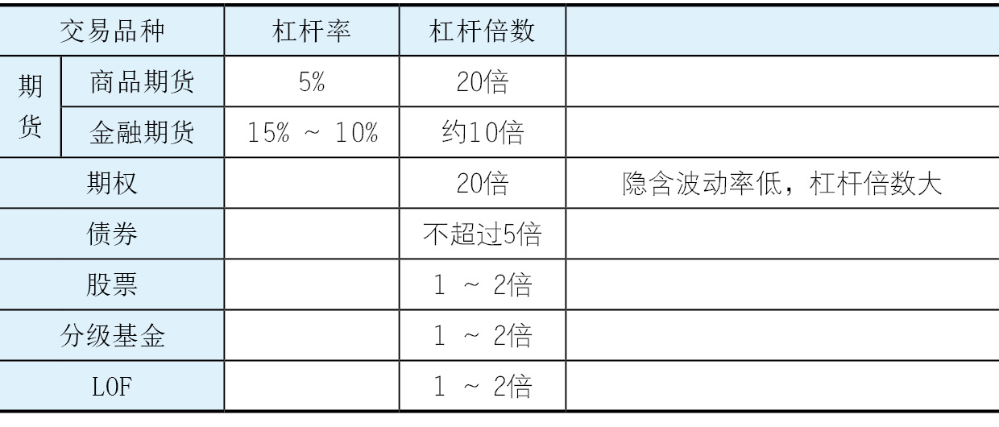
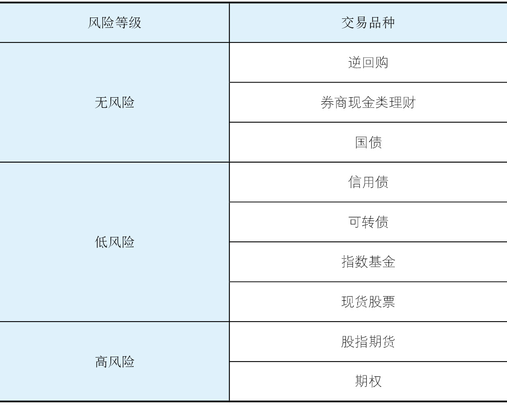

    作者: 陈凯（诸葛就是不亮）
    出版社: 中信出版集团
    出品方: 中信·商业家
    副标题: 如何构建属于自己的投资体系
    出版年: 2019-11
    页数: 320
    定价: 68
    装帧: 假精装
    ISBN: 9787521711073

[豆瓣链接](https://book.douban.com/subject/34898982/)

- [如何跳出散户思维](#如何跳出散户思维)
  - [交易方法](#交易方法)
    - [投机简介](#投机简介)
    - [套利和对冲简介](#套利和对冲简介)
    - [无风险套利简介](#无风险套利简介)
    - [固定收益简介](#固定收益简介)
  - [交易理念](#交易理念)
    - [盈亏同源](#盈亏同源)
    - [风险控制和资金管理](#风险控制和资金管理)
    - [自洽的交易哲学](#自洽的交易哲学)
    - [循序渐进的交易方法](#循序渐进的交易方法)
- [如何正确理解投机](#如何正确理解投机)
  - [杠杆等级](#杠杆等级)
  - [流动性等级](#流动性等级)
    - [按流动性等级划分交易品种](#按流动性等级划分交易品种)
    - [流动性的价值](#流动性的价值)
    - [交易的本质](#交易的本质)
  - [风险等级](#风险等级)
    - [晋级三部曲](#晋级三部曲)
  - [交易框架](#交易框架)
    - [投机要素](#投机要素)
    - [牛市来了买什么](#牛市来了买什么)
    - [牛市来了怎么办](#牛市来了怎么办)
    - [如何判断牛熊转折](#如何判断牛熊转折)
    - [熊市和震荡市生存](#熊市和震荡市生存)
- [如何正确认识自己](#如何正确认识自己)
  - [认识你自己](#认识你自己)
    - [短线交易需要的性格特点](#短线交易需要的性格特点)
    - [长线交易需要的性格特点](#长线交易需要的性格特点)
    - [交易成功者的性格特点](#交易成功者的性格特点)
- [如何才能不再亏损](#如何才能不再亏损)
  - [面对亏损](#面对亏损)
    - [亏损的原因](#亏损的原因)
  - [停止亏损](#停止亏损)
    - [短线止损的技巧](#短线止损的技巧)
    - [中线和长线止损的技巧](#中线和长线止损的技巧)
    - [浮动止盈的技巧](#浮动止盈的技巧)
- [如何正确参与市场](#如何正确参与市场)
  - [市场参与者](#市场参与者)
  - [市场生态](#市场生态)
    - [A股的操纵问题](#a股的操纵问题)
    - [庄股的来龙去脉](#庄股的来龙去脉)
    - [庄股游戏规则](#庄股游戏规则)
    - [参与庄股的要诀](#参与庄股的要诀)
    - [基金买卖的特点](#基金买卖的特点)
    - [主动型基金的致命弱点](#主动型基金的致命弱点)
    - [阳光私募的操作方式](#阳光私募的操作方式)
    - [游资的特点](#游资的特点)
  - [散户进化](#散户进化)
    - [A股的常胜逻辑](#a股的常胜逻辑)
    - [A股的盲点](#a股的盲点)
- [如何看分时图和盯盘](#如何看分时图和盯盘)
  - [短线入门](#短线入门)

# 如何跳出散户思维
## 交易方法
眼下全市场的交易方法，基本有四大类：投机、套利和对冲、无风险套利、固定收益。

### 投机简介
**1. 短线**

如果你是做短线的，你的初衷就是短线，那你的交易角度就应该着眼于短线。对于短线，我们看什么？需要研究上市公司业绩吗？不需要。我们做短线做的是什么？做的是情绪，是短期预期，是市场感染力和传染力，说白了就是图形。图形好看，大家往上的情绪就很高；图形不好看，大家往下的情绪就很高。图形也有很多讲究，比如我们到底在做什么周期。周期几乎是短线的核心。

**2. 中线**

中线也叫波段。大家可以把K线图拉开来看，波段清晰的个股的特点是什么？是高低点的变换节奏非常有规律。

波段的重点是高低点节奏，关键是寻找阻力、压力和支撑。我们研究的是整个走势高低点的结构：是高点越来越高，还是低点越来越低；是高点变低、低点变高的夹板，还是高点变高、低点变更高的明显上升通道；是横盘整理往下去，还是往下打，打不漏又强硬地起来。

至于这家公司正常的业绩，它的ROE（净资产收益率）是什么样的，两年之后新的投资会产生什么样的收益，这些很少体现在短线里，一般也不会体现在中线里，大部分都体现在长线里。

**3. 长线**

做长线的要诀是找便宜的。长线让我们赔大钱的，不是买的股票不好，而是买的股票都很好，但是买得都很贵。比如中国石油，这只股票不好吗？非常好。为什么赔钱？因为是以每股48元买的，要是以每股4.8元买，肯定不会赔钱。做长线关键是找到好价格。那么，做长线选什么样的个股？

1. 和人类的衣食住行密切相关的个股。这是人类永恒的需求，这些需求不会因为风格转变或者科技进步出现大的变化。大家可以想一想，巴菲特为什么不买科技股？因为科技更新得太快了。例如，我们现在去考察一些中概股、“互联网+”概念的股票，你敢做长线吗？不太敢，这些股票明年这个时候说不定就不在了。
1. 行业的主流和政策重点扶持的股票。这种企业一定代表着比较主流的行业发展前景，而且多数都是政策扶持的重点。我们不可能去夕阳行业里选长线股，那等于是在沙子里面淘金。为什么不直接去金矿里面淘金呢？
1. 与同类企业的股票比贵一点点的股票。跟同类型企业的股票比，它的股票价格总是贵那么一点点。为什么会贵了一点点？因为它的气质确实跟别的公司不一样。比如我比较喜欢的医药股天士力，当年医药股整体的PE（市盈率）都是35倍左右，而它是45倍，它后来的表现就是好。

**4. 技术面**

争议最大的就是技术面和基本面。先说技术面，道氏理论有三个前提：第一，市场交易价格涵盖一切信息；第二，历史会重演；第三，价格以趋势方式演变。但实际上以我个人的经验来看，历史绝对不会重演，市场的交易也不可能体现所有的信息。那么，我们应该怎么看待技术分析？

我讲一下自己的经历。2002—2004年，我纯粹是以技术面做股票的，做得非常短，大概每天打一个来回，全部卖完，全部买完，第二天重复这样做。在这个过程中，我对技术分析的看法发生了根本性转变。我以前喜欢看一些经典技术图形和技术指标，后来我发现这些都不是关键点。那什么东西最关键？**其实我们做短线，做的是市场的情绪。市场情绪激昂的时候，我们要勇敢地往里冲；市场情绪出现转折的时候，我们要敏锐地感觉到，该了结的时候要了结**。

**5. 情绪的技术度量**

情绪有两个问题需要解决：第一个是情绪的方向，即所谓的转折点在哪儿；第二个是怎么去度量。只要解决了这两个问题，基本上短线就应该做出来了。
因为在我的交易哲学里，我认为市场是错的。如果市场是错的，那我永远都在猜测，或者说是在度量和感受市场相应的拐点，在这些拐点上，去进行一些操作。在识别拐点的时候，我用的是背离，用MACD（指数平滑异同移动平均线）指标。当价格出新高，MACD没出新高，我认为这是顶背离；当价格出新低，MACD没出新低，我认为是底背离。判断MACD是高还是低，我用DIF（差离值）指标，这个指标是用长的减短的或者用短的减长的，取的是绝对值，我把这个指标稍微修正一下，变成一个相对数，然后在软件上乘以10 000，放大1万倍，让它看起来更清晰。

DIF指标修正前后的公式如下。

原来的：

    DIF：EMA(CLOSE，SHORT)-EMA(CLOSE，LONG)

修改后的：

    DIF：(EMA(CLOSE，SHORT)-EMA(CLOSE，LONG))/EMA(CLOSE，LONG) * 10 000

**6. 基本面**

大家思考一下，基本面是通过什么在发生作用？是通过市场情绪来发生作用的。大多数时候，**事实是什么不重要，预期才重要；甚至预期也不重要，预期的转折才重要**。

**7. 技术面派和基本面派的区别**

因为基本面的东西是通过预期作用到价格上的，所以，我们就有两种交易方式：第一种方式，去提前交易基本面的预期将产生的力量；第二种方式，忽略预期，直接去交易技术面发生的结果。这就是基本面派与技术面派的根本区别。

### 套利和对冲简介
**1. 套利**

关于套利，我举个最简单的例子。2013年广药吸收合并白云山，吸收合并价格和当时的价格刚好有偏差，如果想参与吸收合并，持有广药或者白云山的股份，那么，它俩哪个更便宜，就买哪个。永远买便宜的那个，这是最朴素的只占便宜不吃亏的套利思维。

还有更复杂一点的套利。比如，把中国石油和中国石化的历史数据都用复权价复上去，用中国石油的股价除以中国石化的股价，可以得出一个比价。因为两者的业务差不多，当它们的比价明显在上轨的时候，意味着中国石油比中国石化的股价高；反之，在下轨的时候意味着中国石化比中国石油的股价高。那么，在上轨的时候，可以把中国石油的股票换成中国石化，在下轨的时候再换过来，这样就把相对收益做成了绝对收益。

再举个例子。在上一轮牛市刚起来，2014年年底到2015年年初的时候，当时还没有上证50和中证500指数。我跟几个朋友说，如果有兴趣的话，你们现在应该买沪深300指数，买这个指数的ETF（交易型开放式指数基金）。当期指大升水的时候，拿现货；当期指升水回落，拿期指。这样不光做了整个指数上涨的收益，连期现套的收益也做了。

还有一些更加复杂的操作。比如，有个朋友问我：中证500指数贴水10%，可不可以买中证500指数的期指，同时买大量的创业板，或者买中证500指数的A类分级？他的逻辑是什么呢？期指贴水10%，允许有10%的下跌，如果继续下跌，整个分级基金B类下折，就会导致A类涨起来。这个思路非常好，但是难点在哪儿呢？难点在于两边资金怎么配。

**2. 对冲**

所有的股票或者证券组合的波动，我们可以分为两个部分：跟随系统上涨或者下跌的，我们把它叫作`贝塔`；完全不跟随系统变化的，我们把它叫作`阿尔法`。因为系统性风险是我们不能控制的，所以，我们希望把系统性风险冲掉，这就是对冲。

对冲的注意事项主要有以下几点。

1. 不要为了对冲而对冲。对冲，冲的是什么？冲的是无法克服的风险，这是一个大前提。现在，很多人在盲目地做对冲，比如：有人买了点白糖，觉得自己不抛点东西心里不舒服，于是抛了点棉花；还有人买了点股指，抛了点螺纹钢。这样做对吗？也许对，但是这样对冲意义不明显。真正的对冲，一般都有很深刻的含义或者现实的逻辑。
   - 举个例子，我觉得全世界的资金要从发展中国家向美国本土回流，基于这个大的逻辑框架，应该怎么构建一个对冲模型？构建这样一个模型是比较简单的。这些资金去美国，要去干什么？去买美国的资产。美国资产有两类：一类是债券，一类是股票。资金从东南亚市场流出，对东南亚的股市和资产不利，那我可以买美股，空东南亚股。这种对冲隐含的含义是：在比烂的情况下，发展中国家的股票不如美国的股票；在比优异的情况下，发展中国家的股票仍然不如美国的股票。比烂的情况下，发展中国家的股票更烂，比好的情况下，美国的股票更好。
   - 对冲有时候也会体现在具体的某一个商品上。比如，我们买铁矿石和焦炭，同时抛螺纹钢，变相地做了一个虚拟的钢厂。当炼钢的盘面利润很大，我认为利润会收窄的时候，买铁矿石和焦炭，同时抛相应份额的螺纹钢，我这是在做空钢厂的利润。反之，当知道要阅兵、提倡环保，短期我可以反向操作，这又是另外一种对冲。
2. 要痴迷于逻辑。我们一直关注逻辑点，然后通过这个逻辑去扩散。就好比一张网，两个相关联的逻辑点就是网的两个点，我们把它们拎起来之后，网就被拎起来了，这个网有先有后，有主有次。比如：2013年，可以轮着做空各个国家的货币；2014年，轮着做多各个国家的股票；2015年又反过来，轮着去做空各个国家的股票。
   - 比如美国要加息，资本要回流，所以我们看到新加坡、马来西亚、泰国的经济状况都很差，因为美联储前主席耶伦说，中国和希腊都很重要，而中国是最大的不确定因素，于是风险传染，美股也暴跌。最后，日本80万亿日元的QE（量化宽松）还在进行中，竟然也破位了。它是一层一层塌陷的，那么在这个塌陷的过程中，有没有人可以做到先空这个，空完，再换到另一个空？当然可以，只要能把整个网拎起来，就可以做到。我身边就有这样的人，他空了全世界，而且空得有前有后，出去玩一趟回来，保证金还翻了好几番。
3. 主线逻辑链条只能有一个。有一点希望大家明白，在套利的链条里，主线逻辑只能有一个。我曾经说过，不能因为一个事实去发明一个逻辑，不能因为一个现象去发明一个逻辑。这是做套利的人最容易产生的误区。自认为这个逻辑完美地解释了现实，所以这个逻辑是对的，其实他已经掉沟里了，下一次可能错得很致命。
   - 我做得最多的美盘是大豆和玉米。在美国，大豆和玉米的种植地是重复的，这些地被分成了三部分：一部分种大豆，一部分种玉米，另外一部分轮休。如果玉米的收益很好，第二年还会种玉米。当玉米的收益很差时，第二年会换种大豆。那么大豆和玉米的价格，一定只有一个主线逻辑，就是争地，哪个的产出更好，我就愿意多种哪个。你说会不会有特别聪明的农民，今年种的这个特别好，明年坚决不种。有，但是这样的农民少，还有可能在行情好的时候他已经预售了。所以，主线逻辑链条必须只有一个，这才是套利，绝对不能主线关系一会儿是这个，过一阵子又变成那个。这样的话，到底听谁的？到底哪个东西在起作用？你已经乱了。
4. 关注逻辑点。当下商品市场，很多人的逻辑链条是在来回变的，他们把这个叫作“交易哪一段逻辑就去谈哪一段逻辑”，其实已经把套利做成了短线。那么，这种思维不对？那也未必，毕竟人家挣钱了。赔钱的人是没有资格嘲笑挣钱的人的，谁要能告诉我一个始终错误，但稳定赚钱的方法，我可以拜他为师。
   - 这只能说明他们对市场的感受更加敏锐，可以从一个主链条里衍生出很多次要的矛盾和逻辑，他们也知道哪些次要矛盾和逻辑在哪一个时间点可以变成主要的东西，甚至他们就是中间的推手。比如：这阵子他们在做多，然后大肆渲染，开闭门会，开沙龙，讨论，在微博上使劲发表言论，向空头劝降；过一阵子准备做空了，又倒过来了，“你们赶紧跟着我把多头打死，打不死也要打”。这也是一种方式，我们要尽量识别它。
5. 做一下贝尔宾测试。有朋友问投机和套利是不是可以结合。二者可以结合，但是对从业者的要求会更高，从业者既要关注宏观层面，又要关注微观层面，既要带望远镜，又要带显微镜，确实是比较难的。我推荐大家做一做贝尔宾测试，想在套利和对冲上做得好，你的PL分值不能太低。我们把交易员分成伟大的、优秀的、普通的、平庸的，你如果想从优秀的交易员变成伟大的交易员，那么PL分值一定要很高。

### 无风险套利简介
**1. 衍生品交易**

期指、期权和现货基本是一个三角，大体的构筑类型是，买现货抛期指，哪个贵就把空单甩在哪个上面，哪个便宜就把多单甩在哪个上面，只占便宜不吃亏。我们拿上证50指数来举例。我们有上证50期指，有50ETF，有50ETF的个股期权，有新加坡A50期指，这实际上是四个部分。如果这些都构筑好了，就是一个逻辑非常严密的闭环。只要在这个逻辑框架内，市场所有的无效性都能够瞬间地被捕捉到。只占便宜不吃亏，长年累月地做下来，你就真的是大赢家。

**2. 吸收合并**

吸收合并是出现在一级市场的一些机会。比如，广汽长丰合并成广汽集团整体上市。

再来看B股的一些机会。我在2015年3月的时候说过：我认为B股的机会，会出现在美元纯B股里边。为什么是美元纯B股？因为它要解决问题，榜样已经出来了，新城B直接B转A。

为什么我说不要做港币的纯B股，因为港币的榜样是万科B。大家可以看一下万科B，从B股变成港股涨了吗？根本没涨。那我们为什么不去做美元的纯B股呢？美元纯B股还有二次现金选择权，简直是无风险收益。

**3. 可转债转股**

可转债转股虽然是有机会的，但是还存在一种风险：它当天不能完成，当天有融券的话可以，当天不能融券就不能完成。它的逻辑很简单，比如，我100元买一张可转债，然后按照转股价转成股票，同时把股票卖掉。

我如果兜这么一圈把100元变成103元，那就赚了3元，如果钱变少了，那我就赔钱了。

**4. ETF瞬时套利**

是机器在盯着。比如ETF的瞬时套利，ETF的现货价格和净值有价差，一下子就有人做了。可能有上千亿元的资金在盯着，我们基本上抓不到这样的机会。

**5. 分级基金简介**

分级基金现在机会很大，A加B的折溢价非常多，而且现在大部分的券商都已经支持盲拆了，这就导致市场的有效性和原来相比不一样了。分级基金的流动性是最大的问题。比如今天申购母基金，明天盲拆，后天A加B到账才可以卖，这两天的隔夜，怎么规避掉？

当初我是用期指来规避的，我做银华深证100指数。还有一种方法，我直接去拟合，比如把沪深300指数按照各个行业进行分类，根据行业分级的权重，以及这个分级母基金的持仓，构建一个现货篮子，同时抛上相应的期指，整个系统的贝塔就等于1了，我就可以去做一些无风险的合并套或拆分套。

### 固定收益简介
固定收益也是一项非常专业的内容。大家可以去搜索一下`“美林时钟”`，它在大类资产配置中的大逻辑框架是很清楚的。固定收益和权益类资产轮动效应是比较紧密的，权益类动完之后，固定收益类大多数情况下也要动。

## 交易理念
### 盈亏同源
盈亏同源有两层含义。

1. 你的性格和你的交易模式是匹配的。因为你的性格很勇敢，所以可能在需要勇敢的时候，你总能抓到很好的收益；相应地也会因为勇敢，去冲动地做一些事情，导致亏损。
2. 亏损是交易的一部分。认识到亏损是交易的一部分是很关键的，只有认识到这一点，你才会愿意接受停损这个概念。

### 风险控制和资金管理
关于风控，我一直有个比喻。你对面的绿灯亮了，在两侧是红灯的情况下，你敢闭着眼睛过马路吗？当结果不能承受的时候，哪怕风险再小我们都不应该去尝试。保证自己不死，这是风控的第一要素。

对于资金管理，我们能做什么？识别什么时候用多大的仓位，也就是我说的大行情大做，小行情小做。我以前说过：知道买，知道卖，知道加减，近道矣。我们做交易就是要解决这三个问题：什么时候买，什么时候卖，什么时候加减。这个加与减指的就是资金管理。这需要靠自己不断地去摸索，因为可能我的加与减，并不适合你的加与减。

### 自洽的交易哲学
什么叫自洽？就是你能自圆其说。我一直跟大家说盲人摸象的道理，盲人摸了象的某个部分，就认为象是这个样子。市场就是头大象，我们每个人都在摸市场的一部分，只要摸到了这一部分，就够了。摸到这一部分之后，专注地做这一部分，只要这一部分是可以自洽的，那就可以了。

比如，我认为市场是错误的，所以就选择能够识别出市场是错误的技术指标，然后选择对应的交易模式去做拐点。只做这个拐点，当拐点向趋势演进的时候，可能我的获利已经足够了，那我就平仓，然后去等下一个市场扭曲的机会。这是我的自洽，每个人不同，无标准答案。

### 循序渐进的交易方法
交易方法循序渐进，体现在三个方面。

1. 交易系统是可以修改的。
1. 要有应对意外的办法。比如我是做顶背离的，顶背离我必须空进去，但是如果我的顶背离错了呢？下一个顶背离又出来了，股价出新高了，面对这两种情况我怎么办？那就出来呗，该砍砍，执行就行。虽然你的交易系统是自洽的，但也要有应对意外的办法。
1. 交易方法要和交易哲学匹配。

每个人的交易哲学都在不停地演变，就像我自己，2002—2004年，我认为市场是对的，2009年忽然发现我找到了一种更舒服的交易方式，我的整个交易哲学完全变了。这跟自洽的交易哲学实际上是相关的，今天你认为市场是对的，你就用市场是对的方法，用趋势类指标做；明天你认为市场是错的，那就用背离或者拐点去做。两者必须是互相匹配的。

# 如何正确理解投机
## 杠杆等级
表2-1 杠杆等级表

## 流动性等级
### 按流动性等级划分交易品种
表2-2 流动性等级表

交易品种 | 交易制度
-----|-----
债券、可转债 | T+0
A股 | T+1
B股 | T+0回转交易，T+3交收
ETF | 延时T+0
期指 | T+0

### 流动性的价值
市场需要流动性，大部分时候是应该给流动性一个溢价的。什么叫溢价？因为流动性好，所以定价高一些。

### 交易的本质
有交易产生是大家对这个价格认可，还是不认可？假如你是买方，在10元的价位买了一只股票，其实你的购买行为里有两层含义：第一，你心里认可10元是你可以接受的价格；第二，你心里认为10元钱卖的是个傻子。多头空头对骂，“真傻，你在这儿做多”，“真傻，你在这儿做空”。所以，**交易的本质是对价格不认可**。

## 风险等级
表2-3 风险等级表

### 晋级三部曲
想迈向成功，必须要经过三步。

1. 经历过一轮牛市，知道挣大钱的感觉是什么。
1. 经历过一次大的亏损，知道为什么赔钱。赔大钱都是源自性格的某个缺陷，早点认识它，在自己成长起来之前认识到，比到后来一次输到爬不起来要强很多。
1. 知道买，知道卖，知道加减，足矣。

## 交易框架
### 投机要素
投机要素表达包含两层含义。第一，在什么时候买什么投机品。这其实关系到资产配置的问题。比如：当觉得房地产很火的时候，去买房子；牛市来了的时候，去买股票。第二，在什么时候干什么事。这其实具体到了操作的问题。

### 牛市来了买什么
通常来讲，当你确认牛市趋势出来的时候，应该去买杠杆最高的东西，满仓大杠杆。这是好手的标志。这时候你就可以运用杠杆等级表（参见表2-1）、流动性等级表（参见表2-2）、风险等级表（参见表2-3）这三个工具，自己去选择。

### 牛市来了怎么办
1. 要选好“武器”。你随时都可以认为牛市来了，只要做好风险管理就行。比如，2013年6月，期指大贴水，我觉得这时行情应该已经到比较低的位置了。但是，我既不敢做多股票，也不敢做多期指，于是，选了可转债。我从2013年年底做到了2014年七八月，到了2014年9月，终于被个股的火爆给“勾引”进去了。
1. 要做好防御。以牛市看涨为例：第一种，融资做多个股，不涨不跌，亏资金利息，如果跌了，两边都亏；第二种，买期指，如果期指月月升水，亏升水的费用，这实际上是时间价值；第三种，买看涨期权，有可能会损失权利金；第四种，做多分级基金的B份额，不涨的话，分级B的溢价就是损耗；第五种，做多指数基金。有很多做法可以选择，关键要确定自己的底线在哪里，知道错了之后怎么办。

### 如何判断牛熊转折
确定牛市来了，在我的交易框架里有很多因素，比如2013年，我为什么认为牛市要来了。
1. 长期阴跌，大部分个股绝对价格很低。翻一翻那个时候的K线图，你会发现，从2010年3月到2013年五六月，指数从3 000点跌到2 000点，跌下去了1/3，股价为三四元的股票一抓一大把。
1. 市场长期萧条，绝大多数人不谈论股票了。比如，从业人员找不着对象。这是一个非常好的判断依据。
1. 市场好手在往里扑。在这次牛市前面，我印象特别深刻的是，在55168论坛，我看见我的一位朋友竟然在选权益类的产品，选个股，准备往里扑。因为我俩都是偏好低风险和无风险套利的，偏好低风险的人选择高风险产品通常有两种情况：一种是在长期阴跌的情况下，觉得价值来了；还有一种是面对连续的暴涨，终于被勾引进来了。第二种情况很危险，但前一种，我认为是一个好的判断标准。
1. 在牛熊转折的同时，图形上也会有背离出现。我的经验是：在大趋势的转折中，大多数的人都是对的。可以想象一下，大盘跌到1 800~1 900点的时候，到底是看多的人多，还是看空的人多？肯定是看多的人多。在这个大趋势里大部分人就是对的，只不过在行情一点点走的过程中，这些原来判断对了的人，逐渐走到了对立面去。随着走到对立面的人越来越多，下一个转折又来了，于是他们的判断又对了。
1. 在散户从一边往另一边走的过程中，要去关注那些熟手。但不是大V，大V因为他们的立场问题，粉丝一多，就不愿意认错了。如果将来我有这个倾向的话，大家一定要提醒我，也算是帮了我。

### 熊市和震荡市生存
比如，在震荡市，看一看期权的波动率是不是特别大。如果隐含波动率很大，在震荡市是会逐渐收窄的。那么你可以卖出上证50ETF期权，卖买权、卖卖权都可以，或者两个都卖，拿权利金。当波动率持续收窄，到某一个区间，你要特别警惕，因为这个震荡区间有可能随时被打破。

比如，《华尔街见闻》曾说，VIX恐慌指数飙升到40%，全球恐慌情绪上来了。这是什么意思？在过去几年美股长牛的过程中，VIX指数的波动率始终在12%左右，而飙升到40%，意味着该指数的波动率翻了三倍。而VIX指数是有期权的，保证金极低，你如果花5万美元满仓做，这一把能做到将近100万美元。国内波动指数，我们现在能够想到的就是期权，用上证50ETF期权去看。

# 如何正确认识自己
## 认识你自己
### 短线交易需要的性格特点
1. ME、CW高。在贝尔宾测试中，ME代表你的执行力，CW代表你的决心，即英文中的determination。我不知道大家玩不玩游戏，如果玩足球类的游戏，在找罚点球的球员时，一定要找CW好的球员。为什么？因为CW好意味着他敢果断出手。那么，ME是什么？ME是敢出手，而且敢按照自己的方式和方法执行。做短线交易，我们要的就是这两点。CW和ME一定要高，一项高一项低、瘸腿不行。
2. 简洁明快。短线交易员的性格特点是：简洁明快。什么叫简洁明快？说去哪儿就去哪儿，现在就走。说干什么事情，目的清晰，态度明确，方法得当，到了就做，做完就走。
3. 执行力好。根据我的观察，身边做短线交易做得好的，A型血的人居多，B型血的人也多，AB型血的人就没有。O型血的人做得好的也有，但最多的是A型血的人，为什么呢？A型血的人守纪律、执行力好。AB型血的人通常比较纠结，最不利于做交易。
4. 依靠系统，纪律严明。做短线的要诀，就是八个字：依靠系统，纪律严明。依靠系统是什么？是你的决断力，到这个系统位置我就要做，一定要做。其实是系统给了你做决断的勇气。纪律严明，该做的时候就要做，不该做的时候就要平。这是最关键的。

### 长线交易需要的性格特点
1. 心态开放不偏执。为什么心态要开放？我在雪球上发帖子的时候就发现，有些人就是来跟你抬杠的，你说朝东，他一定说要朝西。他要的根本不是观点，他只是为了反对而反对。这种人就属于略偏执，或者说是杠子头。偏执型的人，不要做长线，会严重亏损的。我一直强调，我们不能去做不能错的事情，特别偏执的人去做长线，他一定会错的。
2. 自信。自信体现在哪里？体现在对自己坚信的东西有底线的自信。无底线的自信，有可能会带来比较大的灾难。比如，在高位大量去融资的、想一年赚10倍的，往往都是没给自己设定底线。
3. 有底线。比如，2015年某期货大佬的期指多单，你说他有底线吗？他成功过，平时挺有底线的，但是在这个当口，他的底线就逐步在往后退。自信和有底线，这两者本身略有一些矛盾，前者是去做的问题，后者是执行的问题。如果一个人很自信，认为这只股票非常好，愿意去赌，没问题，但亏了多少钱必须出来。这就是有底线的自信。
4. 大局观。很多人在做长线的时候，眼睛盯在每天股价的涨跌上：昨天涨了五毛，今天跌了三毛，后天涨了两毛，大后天又跌了五毛……其实，这样是不对的。做长线要求的是大局观，在大概率的时候，去做大概率的事情就可以了。
5. 高情商。高情商体现在哪里？体现在对事物的发展变化比较敏感，当这个事物起变化的时候，能够比较早地感受到。比如，2007年的时候，我朋友做中粮屯河，2007年那么大的牛市，这只股票没怎么涨；2008年大盘跌的时候，它开始涨，大盘从5 500点跌到3 000多点，而它的股价翻倍了。当时，很多买了这只股票的人喜出望外，但是他感觉不对，这只股票该涨的时候它不涨，该跌的时候它不跌，应该已经到头了。

### 交易成功者的性格特点
1. 温和。什么叫温和？不抬杠。有抬杠的工夫我干什么都行。你可以看一看，在网络上，只要是跟粉丝对骂的，基本没戏。你连别人的不同看法、对你的评价都忍受不了，怎么去接受市场对你的评价？市场的评价，可从来不会风平浪静、如你所愿。你看涨，市场马上下跌，抽你一耳光；你刚看空，市场马上又上涨，再抽你一耳光。你能怎么样？这地方专治各种不服、不温和，三天就让你精神分裂了。
2. 谦虚。我自己的经验是：我看所有人的观点，都是以一种去找他漏洞的方式，会在心里揣摩。现实中我不能这样，这样的话攻击性太强，别人就不愿意跟我交流了。比如有人说了很多话，那么我就会在心里想：他说的这些话，在逻辑上有没有问题，有没有漏洞？我会尝试着拿自己的疑问去问他，如果他的回答没问题，那我就认为这个逻辑是对的。你接受任何一个观点都应该是这样的：看到一个观点，首先要问一问，它的逻辑在哪里，或者你自己总结它的逻辑在哪里。这个逻辑有没有漏洞？如果有漏洞的话，可以去问问他，看看他怎么回答。
3. 攻击性差。交易做得好的人，通常都有一个口头禅：“你说的有道理”，“有道理”。10句话里面至少有两句是这样的。大多数交易者，对于事物的观察都是比较细致的，对于谎言的识别特别敏感。你说两句话，他马上就知道你是不是言过其实，是不是在吹牛。

# 如何才能不再亏损
## 面对亏损
### 亏损的原因
**（一）短线亏损的原因**
1. 交易的随意性。短线亏损的原因，排在第一位的，是我们出手的次数太多，交易的随意性太强。对此，我深有体会。我在2002—2003年这两年做的量非常大，当时我统计的成功率是40%多，其中我做的随意性很强的交易，通常都是赔钱的。这是短线产生亏损最重要的原因。
2. 成功率的“极限容忍度”。我们对于交易的成功率是有容忍度的。比如：成功率达到了80%，我们的心情可能特别好；而成功率为50%时，我们就没那么开心；当成功率为40%时，因为错的时候比对的时候多，我们很容易进入一种特别焦灼的状态，从而导致技术水平失控，马上还可能会亏损一笔大的。
3. 大仓位。由此，衍生出来短线交易的仓位问题。对此，我的主张是：如果你是一个纯短线的爱好者，那么你在短线交易的时候就应该满仓做。为什么？第一，因为是短线交易，所以每次的亏损幅度都很小，是限定死的；第二，相应来说，你的盈利幅度也不会太大。因此，如果不满仓做的话，意义不大。至于杠杆类的交易，比如期货交易，如果做短线，更应该把杠杆用足。
4. 满仓需谨慎。因为是满仓操作，所以需要相当谨慎。我自己的经验是：当满仓去做一件事情的时候，我们总是比较谨慎的。反而是不满仓操作时，比如你有100万元，先投入了30万元，你可能就没那么谨慎了。
5. 频繁交易。在短线交易里，频繁交易的后果是：一方面会导致成功率大幅度下降，另一方面也会让交易成本激增。最关键的是，这样操作对于修复交易心理特别不利。每个人都是有承受极限的，我自己的承受极限是三次。连着错三次，我可能就不太会去下手第四次了，肯定要休息一下。

**（二）中线亏损的原因**

我所说的中线就是波段操作。在板块轮动、慢牛市，或者一些宽幅震荡的行情里，我们做波段的概率会比较大。一般会选一只自己熟悉的股票长期做，或者中长期做。

1. 波段区间。波段操作的前提是：贵的时候卖，便宜的时候买。但是这种格局，是会被打破的。它被打破的标志是：原来的低点或者高点被打穿。高点被打穿，意味着加速，至少是一个区间扩大；低点被打穿，有可能是一个破位，这个时候应该离场。在波段操作里，大部分时候并不是“我卖了，把它给卖飞了”，因为那代表后面行情上涨时没捡着钱。多数情况都是打漏了低点，没有平。出现这种情况，一般是由于一些人长期做某只股票，自认为对它很熟悉，缺乏警惕性。面对这种情况，只能用严格的交易纪律来规避。
2. 波动率。大家记住我的结论：市场中长期高波动率的个股，是不可能跑赢指数的。也就是说，在高波动率的个股上做中线的波段操作，在大势上是跑不过市场的。我们应该关注波动率从低向高的个股，这些个股才具有强的可操作性。我认为：波动率是相当精准的判断依据之一。比如，一只强势个股，如果它的波动率变低，那你一定要提防它阴跌。因为波动率变低，意味着这只个股里的资金不活跃，而资金不活跃，会导致这只股票在原有的趋势上产生转势，如果它之前是强势的，立刻就会转为弱势。与之相应的是，如果一个长期低波动率的个股突然间上下乱蹿，那么这是变盘的前兆。尤其是长期慢牛的股票，基本上每天都有1%的涨幅，突然高位加速，然后一根大阳线接着一根大阴线，这是非常明显的信号。
3. 振幅。大家可以把波动率指标加到自己的观察要素表里。波动率以振幅来计算，我们可以用贝塔系数来描述。举个例子，大盘每天的上涨下跌区间是1%，如果有只股票，它的上涨下跌区间是5%，那么我们就认为它的贝塔系数是5。一只股票的贝塔系数越大，说明它的波动率越高。相应的，在选板块、选股票时，如果你要在短线和中线上有操作性，一定要选波动率高的股票。但是在长线上，你一定要选波动率低的股票。

**（三）长线亏损的原因**

长线亏损最主要的原因，不是你选的股票不好，而是你买得太贵。这句话希望大家好好地体会。比如中国石油上市的时候，发行价是16.8元，第一天开出来是48元。你说这家公司好不好？当年上市的时候它是亚洲最赚钱的公司，非常好的一家公司。

## 停止亏损
### 短线止损的技巧
1. 建仓区间概念。首先，我们得明白建仓区间的概念。什么意思？我要买一只股票，假如这只股票现在的价格是10元，那么通常情况下，我认为在9.8~10.2元这个区间都是建仓区间。在这个区间内，我们可以把止损设到9.8元以下，跌破9.8元我再止损。建仓区间概念对大资金来说可能更关键，当然大资金也会有一个砍仓区间，股价到警戒位置，必须往下杀。在建仓区间里，我们既不谈止盈，又不谈止损。
2. 止损的位置。止损的位置在哪儿，这是最关键的问题。为什么关键？因为它决定了你的执行，到哪个位置你要退出。
3. 止损的设定。止损位置的设定，在短线上有三个标准：
   1. 技术图形上的支撑位，这是一个具体价位。因为做短线，大家都是在做情绪、做波动的。股价波动的原因是资金的进出，而资金进出的原因是情绪问题。既然短线是在做情绪，那么相应来说，技术图形看起来也就更加简单一点。因为很多人的情绪在技术图形上都是有共振的，所以具体的价位可以很简单地在技术图形的支撑位或者阻力位上明确地设定。
   2. 突发事件和新闻，我把这叫作事件止损。什么意思？你是做短线的，买进去8天了没反应，是不是该走？或者突然听说这家公司的董事长被抓了（当然，牛市的时候经常出现董事长被抓是重大利好的情况，可能是因为这意味着公司马上就要进行重组了），或其他一些新闻，遇到这种情况时，第一时间毫不犹豫地出来再说。
   3. 某个看着很不爽的人，这是一个超级反向指标。因为有很多人的反射弧比较长，市场都狂欢完了，他最后一个跳起来。他只要一跳起来，那行情真差不多了，但是你不能跟他说，你说了，他的心情会很不愉快。我们有个研究员，就是这种风格。反正他一激动基本上这波行情就到头了：恐惧到头了，兴高采烈也到头了。

### 中线和长线止损的技巧
1. 震荡区间被打破。举个例子，有一只股票在漫长的震荡行情中，顶底在12元到9元之间来回磨。突然有一天，12元这个顶部被突破了，你第一时间应该先把你的多头仓位守住，如果你在12元往下抛了点，先把抛的那些捡回来。为什么？因为也许突破是对的。区间一旦被打破，你一定要很小心。比如一根中阴线把你的支撑位、重要的均线支撑位全部打漏，然后MACD指标迅速扩大，绿柱马上放大，震荡区间明显被打破了，一定不能再去做顶底操作。
2. 背离的形成被扭转。高位顶背离，低位底背离，如果一个顶背离之后没多久，同时间周期又形成了一个冲破前一次顶背离的指标，那就说明这个背离已经被扭转了，原来的顶背离已经不再是顶背离了。比如MACD出新高了，这时，我们在操作上就不能再用波段的眼光去看待了。这时如果用波段去做的话，你的止损一定要设得很小。可能随时一个爆拉，直接就把你拉出去了，也许趋势就要来了。
3. 周期的共振。在波段操作中，也是有周期的。如果是在日K线级别做波段的话，正常情况下，你要关注的是比日K线高一个周期的周K线和比日K线低一个周期的小时线。通常，我们应该等小时线和周K线的方向一致，但是刚好和日K线方向相反的时候，去做买入或者卖出。
   - 什么叫**顺大势，逆小势**？我们把周期划分成大、中、小三段。在大周期和小周期上，我们方向要一致，而在中周期上，也就是我们正常观察的这个周期上刚好是逆着的。比如说我要做买入，那么首先，周K线要是上升趋势，小时线也开始上升趋势，并且日K线刚好调整到位，从一个下降趋势中均线走平，这个就是典型的顺大周期小周期的势，逆你目前操作的中周期的势。这就是顺大势、逆小势的交易。首先，你的短周期切入点很敏感，另外，长周期是往上的。相应的，如果我们看到周K线趋势都走坏，然后小时线再次走坏，这基本上就是一次加速突破的形成。这种交易会让大家的切入点非常好，无论是做中线还是做长线，买入就赢利，对增加你持仓的信心有帮助。
4. 买卖逻辑要一致。在波段操作和长线交易中，最容易犯的错误是，买卖逻辑不一致。

### 浮动止盈的技巧
1. 用利润去冒险。浮动止盈和止损其实是一回事儿。我们没挣钱，那是止损，有盈利了之后，浮动止盈就要跟上。这里的核心思想就是一句话：挣的钱，落袋为安，一定要先揣一部分到兜里，这等于是我在用盈利去赌未来。10元买的股票涨到15元了，好，我想得很清楚，跌到13元我就卖，最起码这5元利润，我留住了60%；股票从15元又涨到了20元，那我就有10元的盈利了，回吐40%就是4元，我也觉得有点多，那就只吐20%。这实际上是一种最朴素的思维，要尽量把本金保住，可以用利润去适当冒险，甚至可以用利润去进行特别大的冒险。
2. 利润回吐之后强制平仓。在利润回吐一部分之后，要强制性地平仓。这实际上就是我们常说的止住亏损，让利润奔跑。大家可以仔细地观察一下自己持有的赚钱的股票，看一看这些股票，最大的调整幅度能有多少。你可以给自己设一个止盈比例，这一比例是因人而异的。
3. 为什么不愿意止盈。怕的是本来你只打算吐20%的利润，可吐了20%之后，你又觉得我可以再吐20%跟它赌一赌，这就完了。开平仓不一致，制订的计划不执行。浮动止盈最根本的一点就在于，我们一定要意识到机会是很多的。可很多人不愿意止盈，为什么？因为他们觉得自己手上的就是最大的机会，不愿意走。

# 如何正确参与市场
## 市场参与者
表5-1 市场参与者定位表

市场参与者 | 定位
------|---
公募 | 大散户
散户 | 韭菜
绝大多数的私募 | 偏韭菜
游资和犀利私募 | 收割机
产业资本 | 配置和择时

## 市场生态
### A股的操纵问题
**1. 有没有操纵**

对于A股市场是否有操纵，大家一直有争议：有人说操纵得非常精确，连收盘价都可以被操纵，想多少点就多少点；还有人说，不可能有操纵。我觉得两者都极端了。大盘能够被具体地操纵到某一个点吗？这是不可能的。因为任何一个点位，你都能找到无数解释，比如：“520”代表“我爱你”，那“525”就代表“我爱我”了？通过对数字的解读，就认为市场可以被任意操纵，想往哪儿走就往哪儿走，这个思路是不对的。

但没有操纵也是不可能的。市场操纵分两大类：一类是短期，另一类是长期。还有一种分法，也可以分为两类：一类是操纵个股，另一类是操纵大势。比如2014年到2015年上半年这次跨市场的大行情，为什么上面一直说要慢牛，因为希望通过资本市场稳定来解决一些现实中的问题。对于个股的操纵，长期的是庄，短期的是势。

**2. 短期的情绪操纵**

有网友问：短线高手预测大盘的点位很精确，你怎么解释？这是技术测量的一种技巧，如果很多人在用道氏理论，那么这个市场对道氏理论就会有一种天然的反应，到均线位置，大家都开始做，都开始往里边卖。

比如，美股在2015年9月25日反弹那么多，我本来是想等它到碰均线的时候再买回来，但是后来看不行了，那我就直接追着买了。但是如果碰均线的话，我一定买。这其实就是盯着技术图形在做。所以，我们不能把这种情况认为是有谁在操纵。但是短期的情绪操纵是一定有的，比如游资突然扎进去，20秒就把股价拉涨5%。

**3. 长期的整体操纵**

有长期的操纵吗？有啊，坐庄嘛。现在，二级市场还遗留着很多庄，至今无法完全杜绝。比如某个资本在某只股票里始终不出来，每年能做一两波行情。

### 庄股的来龙去脉
**（一）第一阶段**

**1. 无股不庄**

20世纪90年代开始有股市的时候，上市公司非常少，市场上仅有8只股票，那么当时有没有庄？几乎没有，当时全是电话报单，没有庄存在的土壤。后来，交易电子化，随着交易方式的变化，庄股开始大量出现，到2000年的时候已经是无股不庄。

我最早入行的时候就是帮主力报单的，亲眼见证了主力怎么运作一只股票。短短一两年，在它们的运作下，股价从13元涨到18元，回到13元，涨到16元，又回到13元，又涨到18元，然后再次回到13元，它们把现金打进来，走的时候再带走这么多现金，还带走同等数量的股票。

在这个阶段，庄股表现得特别好，大家通过技术分析跟庄炒股。这其实就是两只羊的思维，两只羊互相商量：我们去那块草地上吃草吧。为什么？因为那里有狼。

**2. 绝大多数庄股被消灭**

从2001年开始的大熊市，消灭了绝大多数的庄。没有走的庄，也几乎都被闷死在里面。大家可以想象一下，股价为23元的股票，最后跌得只剩3元，股价为三四元的股票遍地都是，八九元的算高价股。股价从上面一路跌下来，里面有多少资金、多少庄都没用。

**3. 庄股时代退潮的标志**

庄股时代退潮，标志性的事件就是，最有坐庄能力的人在这个市场上坐庄失败。大家可以想一下，当时最有坐庄能力的人是谁？证券公司。最典型的两家公司我不点名了，但它们做的那两只股票，我可以跟大家讲：一只是哈药集团，一只是宁沪高速。

当时在哈药集团的大股东名单里，根本没这家证券公司，但是出了问题之后，大家发现它持股95%。一家证券公司持有一只股票的95%，多可怕。

宁沪高速也是同样的问题，只不过那家证券公司抓住机会逃了。它抓住了什么机会呢？2002年6月23日，国有股减持被国务院叫停；星期一，即当年的6月24日，大盘开盘后出现井喷，几乎以涨停开盘，个股就像疯了一样；10点半之前，几乎所有股票都涨停了。在我印象里，只有三只股票没涨停，宁沪高速当时就在卖。铺天盖地的卖单让宁沪高速始终只涨3%，为什么？它终于有机会跑了，那天全市场的量太大了。当时，全市场平均一天的成交量，两市加起来连50亿元都不到，但是那天，全市场成交了380多亿元，第二天成交了500多亿元。

为什么哈药坐庄失败？因为当天它在加仓。有朋友说：唉，它买那么多有什么意义？你以为它想买？它也不想买，但不买股价就往下跌，跌得让它受不了。那怎么办？它跟客户说：你也不会做股票，干脆把钱借给我，我来做股票，我用你的账户买，反正股票还在你名下，我每年给你一定的收益，咱们签协议。可这是一个三方监管的委托理财协议，是违法的。当这个协议的盖子被揭开的时候，相关部门一去清理整顿才发现：天啊，一家公司买了一家上市公司95%的流通股！这家公司破产了，标志着无股不庄的时代结束。

**（二）第二阶段**

**1. 抱团坐庄**

市场经历了2005年的黑暗期、2006年的爆发期，2007年出现了另外一种百花齐放的模式。2007年，公募的力量已经很强大，开始有“抱团坐庄”的情况出现。什么叫抱团坐庄？你买点儿，我买点儿，大家都买点儿；你锁2 000万股，我锁2 000万股，这只股票的流通盘越来越少，很小的力量就能把价格弹起来。

一直到2009年，抱团坐庄都还有遗留，但是坐庄的主力已经变了，不再是所谓的长线庄或者传统意义上的“老庄”。为什么？因为证券市场开启了一个新的制度：三方存管。

**2. 二级清算制度**

最初，我们所有股民买卖股票的钱，都是存在证券公司的大账户里，买卖股票必须通过券商进行，因为中国证券登记结算有限责任公司（以下简称“结算公司”）只跟机构不跟个人进行清算交割。所以，再厉害的股民也得到证券公司去开户。证券公司把所有股民的钱存到自己的账户，去结算公司开立保证金账户，用保证金账户跟结算公司进行当天的资金清算和交收。换句话讲，券商不需要把股民所有的保证金都存到规定的结算公司账户，因为当天有买的有卖的，只要把轧差存到结算公司就可以了。

比如：我是一家券商，在我们这里开户的有1万个股民，这1万个股民今天有500亿元的买入，498亿元的卖出，那么结算公司的账户里只要有2亿元的备付金，就可以完成当天的清算和交收；当天跟清算公司做完清算和交收之后，我再去跟客户清算和交收。这就是“二级清算制度”。第一级清算是登记公司和券商清算，第二级清算是券商和客户进行清算。

全世界的券商都用这种运营模式，这种模式最大的问题就是存在券商私自挪用客户保证金的现象。国外到现在也存在这个问题。在国外，为什么大家不去找小券商，因为小券商可能把你的钱挪走，而大券商挪用客户资金的概率低。为什么国外一些投行也有自己的银行？因为如果没有银行做背景，把钱存在那儿，将来它跑了怎么办？这是我们最初的清算交割模式，直到现在也是这样，只不过我们国家对券商和客户之间的清算和交收，做了详细的规定。

**3. 三方存管**

为了杜绝券商挪用客户保证金，国内监管层想到了一个办法是：客户证券账户的保证金不再存券商处，而是存银行，券商不能再管理客户的保证金。客户在券商端开户，开立一个资金账户，悬挂自己的股东卡，形成一个标准的客户码；同时，还必须去银行开立第三方存款账户，虚拟生成一个证券保证金结算账户。

实行三方存管以后，券商每天做第二级清算的时候，要先用资金账户的资金余额和资金流水与在银行端生成的证券保证金监控账户进行一次对账，然后才是与客户的资金清算和交收。这样做的结果是：第一，券商再也无法挪用客户的证券保证金；第二，在现有情况下，在进行一级清算时，券商结算备付金账户的钱是自有的，跟客户的三方存款账户有一个时间差；第三，所有客户在开户的时候，必须用真实的银行卡和身份信息，不然三方存管上线这一关过不了。

所以，当时光大证券出问题，很多人问：“这家证券公司买卖股票怎么不要钱？”它不是不要钱，而是证券公司的自营席位或者交易通道，它自己出来的这些委托单，确实是不检查保证金账户里边的钱到底够不够的，因为检查要浪费时间。光大证券厉害就厉害在这儿，虽然多买了几十亿元，但是在日中的时候它自己垫钱完成了清算。

**4. 账户清理**

我们回过头再来谈庄股，在任何一个客户都必须去开立银行三方存款账户的前提下，庄股就没有了生存模式。为什么这么说？因为之前庄股为了便于操纵，使自己不暴露在前十大股东名单上，肯定是分仓的。

分仓时，可以用多个身份证，甚至是多个假证实现。这种操作曾经离谱到什么程度？可以随便开一个账户，比如开一个叫“刘德华”的账户，因为深圳的账户可以多地托管，随便挂一个股东账户卡进去，就可以做交易。但是现在这种模式就不行了，必须开立银行账户做三方关联。所以，2006—2007年进行账户清理时，清理的几乎都是庄股。2008年3月，所有A股投资者的保证金必须上线三方存管。从那个时候起，庄股最基本的分仓模式已经不存在了。所以我们看到，第二阶段的抱团坐庄，几乎没有原来的老庄股。

**（三）第三阶段**

现在实际上正在经历第三阶段。遗留的一些庄，还有一些短线庄，在股东明细、年报、季报中才会披露。由于只做三天行情，它们不需要披露股东明细。包括一些闪电庄，日内做一下就完了。

**（四）第四阶段**

将来我们可能会经历第四阶段——产业庄。比如说德隆当年做不了的，现在实行市值管理化以后，全都是无缝减持，这时候可能就有一些产业资本要把整个生态链打通，包括一些所谓的生态庄。

比如腾讯。腾讯的经营思路就是：你干得好，我出来跟你对着干；干不过，我就把你买了。它如果在国内上市了，完全可以用这样的方式，定向增发把你收购了，这是另外一种玩法。包括产业庄，在海外其实都有。

**（五）庄股产生和发展的分界线**

大家可以思考一下：庄股产生乃至发展的关键是什么？第一，有方便交易和操纵的工具；第二，市场容量不大；第三，监管存在盲点。实际上，今后市场的发展方向和这个刚好是相反的，所以庄股以后一定不是主流。

为什么我从2012年就跟大家说：没有庄了！大家再去研究跟庄，已经没有意义了。市场上畅销的一些炒股书籍全是在教大家怎么跟庄，这些作者见过庄吗？所谓的短线庄、闪电庄，其实就是游资正在引爆整个市场，它们如何做势，如何去利用势，如何识别市场的情绪和波动？它们实际上是在做这些。庄只是表象，势才是关键。

### 庄股游戏规则
庄也好，势也好，都有完整的游戏规则。在这些规则里，我们要解决以下几个问题。

1. **定价是否有效**。把股价打这么高，有人认吗？大部分庄“死”的原因都是出不来，而它出不来的根本原因就是它的定价无效，在顶上根本没有人愿意买。
2. **与全市场为敌还是引导市场情绪**。曾经有一段时间，大家都在谈论嘉能可的问题，“有色金属跌这么多，是因为嘉能可不行了，嘉能可持有大量的锌、镍、铝、铜，现在嘉能可把别的头寸砍掉了，在保铜的仓位”。为什么会出现这种情况？因为嘉能可在过去的两年里是与全市场为敌，大家都在做空，而它在囤货。商品市场上这样的例子太多了，比如2008年的华联三鑫、2010年的沙钢，都是跟全市场为敌。这是一条不能错的路，只要错一次就死了。所以，这个市场最残酷的地方在于，你再痛苦也不会有人饶了你。
3. **把人群赶来赶去的办法**。把人群赶来赶去，把散户从一边赶到另外一边，赶过去再赶回来，这个过程就是赚钱的过程。庄股就是这样，在股价最便宜的时候你们最好都卖给我，等你们卖完了，我一点一点吸引你们的眼球让你们来，高位的时候再全部倒给你们，把你们从一边赶到另外一边。
4. **系统性风险怎么去规避**？这是最核心的问题。你很厉害，但是在大熊市时，你想子弹无限？那是不可能的。所以，现在再去考虑庄股，其实就是这四个问题。包括我们做势，也是这四个问题。将来大家做大了，深度介入一只股票时，还是这四个问题。如果你的体量还不足以去影响市场，那么第二个问题和第三个问题不用考虑，但第一个问题和第四个问题一定要多考虑。

### 参与庄股的要诀
1. 短线资金流汇聚地。短线我们在做势，所以做短线更多是考虑势的形成。势，通常都是用资金推出来的，所以我们实际上是在考虑资金流汇聚的问题。一般资金流汇聚，会有以下几个特点。
   1. 这只股票的波动会由小变大，从原来每天1%的涨跌，到每天3%~4%的涨跌，会有一个不断放大的过程。
   2. 成交量会被推高，这是一定的。
   3. 它应该刚好是话题讨论的中心，眼球效应很强，如果还有一些板块效应的话，会更好。比如，曾经的上海本地股，既有国企改革概念，又有迪士尼概念。所以，参与短线，就是在做资金流汇聚。
2. 长期价值发现地。长线要做什么？要去参与一些价值发现类型的股票。这实际上是什么？这实际上是抱团取暖，相当于在做基金的预期，预期公募或私募会陆续进来，把这只股票的流动性一点点买光。包括现在很多银行股粉丝，根本就不知道将来要挣谁的钱。那些银行股的粉丝，一定要问问自己：想要挣谁的钱？来结账的是谁？现在买银行股，是因为判断将来会有越来越多的人追着买自己的股票，这才是长期做价值发现的原因。
3. 尽量不碰老庄股。庄股的特点是个人股东多，上、下影多，K线上的不规则放量多，公司成立时间长，发生的事件多，一般以本地股为主，比如界龙实业。这些股票大家自己去看，我不一一点名。我劝大家不要碰老庄股，你在它身上长期是挣不到钱的，它玩的时候真的是会玩死人的。创业板中既有新庄股，也有抱团取暖的，将来如果有些跌下去，也是会令投资者损失惨重的。

### 基金买卖的特点
为什么我说基金是大散户？

**1. “双十”红线**

一只基金持有一家公司发行的证券，其市值不得超过基金资产净值的10%；同一基金管理人管理的全部基金持有一家公司发行的证券，不得超过该证券的10%。所以，任何基金都不能突破“双十”红线。

**2. 禁止双向交易**

比如，我是华安基金，我有一号、二号、三号、四号……一共20只基金，这20只基金全部都买了浦发银行。当一号基金当天做了浦发银行的卖出没有成交，那么全部20只基金当天都不能做浦发的买入，不管是买入委托还是买入成交。为什么要禁止基金双向交易？因为它们的资金量太大了，特别容易操纵市场。

**3. 交易制度和风控流程**

基金有严格的交易员下单流程和交易制度，主要通过股票池和交易指令单控制风险。基金经理想买股票，必须买已经在股票池内的，基金经理不能决策，由交易员根据交易指令单交易。

整个风控环节的流程是：开投资策略报告会→觉得这只股票好→纳入股票池→进行长期跟踪。这些研报有可能是刚入行三个月还没转正的研究员跑一圈，给了基金经理。大家论证，觉得这只股票可以配一点，至于配多少、什么时间配、以什么价位配，基金经理不能决策，要由决策委员会做投资决定，并向交易员下达交易指令：在哪天以前，多少价位以内，买够多少股。

那么，在交易员拿到交易指令单后，他的第一反应是什么？把交易指令单完成了就行。指令单上要求以不高于10元的价格，买够100万股，眼下价格是9.25元，只要在10元以下买够，就是完成指令单了，至于是10元的成本，还是9元的成本，交易员不会管。完成指令单年底就有年终奖，如果这笔单子没完成，下个月就会被扣钱，所以，他一定是以完成指令单为目标。

为什么我们会看到基金一窝疯地高位建仓？就是因为它们刚开过决策会要配，要大家集中去买。私募的风控更灵活，其中一些基金经理的话语权更大一些，几个知名的基金行业“一哥”，等于是自己在做。还有一些封闭式基金，管起来真的是像管理自己的孩子一样。而开放式基金是控制不了的，所以它们就像大散户，它们的余地甚至比我们的还要小。

### 主动型基金的致命弱点
1. **持仓比例受限**。主动型的基金既有持仓上限，也有持仓下限。比如一只股票型基金，看空市场，想清仓，可以吗？不可以。看空，还不能低于上限，多难受。
2. **申购赎回受大众牵引**。比如，这只基金并不看好市场，但是申购这只基金的人很多，本来是满仓10亿元规模，一天又申购10亿元，原来满仓也只剩50%了，于是要买到80%以上，被动多买6亿元的货。赎回更是这样，本来仓位很轻，比如偏股型基金75%的持股下限，假如100亿元的资产，25亿元的现金，结果一天就把25亿元赎回了。不想卖也得卖。申购和赎回受大众的牵引。
3. **买卖不自由**。基金的风控流程导致它们买卖不自由，从决定买到完成买，中间有很多过程。交易员拿到交易指令单后，他想的不是尽量少买一点或者不动声色，不影响这个市场的股价，而是一把就上去了。因为买得不精细，所以它的利益输送就无法避免。
4. **利益输送**。搞内幕交易的基金经理，开决策会准备买入，到厕所发个短信“某只股票，赶紧”，然后被抓了。

### 阳光私募的操作方式
阳光私募在2010年之后开始快速发展，主要走信托的通道，走基金专户和券商通道的较少。现在主流的阳光私募操作方式，除了类基金的股票池以外，主要是两类：第一类是阿尔法，比如空的期指买的现货，只要你的持股超越市场，就能赚到钱；第二类是量化，是全球通行的一种做法，用多种对冲工具来进行对冲操作，做的是绝对收益，所以在海外又叫对冲基金。

### 游资的特点
**1. 对情绪的引导和放大**

游资最大的强项在于对情绪的引导和放大。大概是在2003年或2004年，有一天《上海证券报》报道了一篇“关于上海市国资委准备启动上海市国有资本改制与改革”的文章（大意）。当天上午，行情波澜不惊；下午一开盘，我印象里是轻工机械（旧名）、丰华圆珠（旧名）领涨，两只股票直接涨停，并引起上海本地股全线大涨；第二天又是高开，连涨了三天。而当时的市场行情是长期熊市、市场低迷，这其实就是情绪的引导和放大。

包括股灾后救市时，大家说的“王的女人”。第一次披露的“王的女人”是谁？梅雁吉祥，证金概念，还有人说是证金借壳概念，这当然是胡扯。其实有“王的女人”的时候市场跌幅很大，但是这种概念只要敢往上高举高打，市场是会跟的，而且往上冲的人很多。包括2015年第一次股灾后的特力A，其走势完全让人看不懂，但是会对情绪有引导和放大作用。

在游资的操作中，对于情绪的渲染，最早的时候它们不懂，全靠市场口碑，后来变成大家去挖掘，去看龙虎榜。2005—2006年，股吧为什么火？是因为游资开始买股吧。如果某只股票的股吧里，人气特别旺，置顶帖子一大堆，基本上这只股票就没戏了、到头了。这也是引导和放大情绪的一个办法。很多莫名其妙的逻辑，都是从那儿来的。

**2. A股莫名其妙的逻辑**

比如，吸筹、拉升、震荡、洗盘。股票不是期货，我没见过做股票洗盘的。那么，期货为什么在往上拉升之前会先往下打？因为可以双向开仓，既开空又开多，等到真的往上拉的时候，可以平空单往上拉。股票怎么打压建仓？你打压，人家买走了，你打吧。比如中国中车，涨了10倍的股票在高位放大量，很多人说这是震仓、洗盘。开玩笑，它就是出货。

**3. 关键时刻敢于出手**

游资还有一个特点：在关键时刻，非常敢出手。做交易，有一个因素你要考虑，就是性格上要勇敢，游资在这一点上特别棒。它为什么勇敢？因为它有严格的交易纪律做保护。没有严格的交易纪律，它敢勇敢吗？勇敢一次就死了，对不对？

**4. 严格的交易纪律**

当然，游资赔大钱的时候也很多，游资凡是想跟公募搞股票，基本上都会被公募卖傻。比如，2008年6月3日，游资高举高打做联通，一下被公募套在山顶，第二天砍仓出来。如果没有严格的交易纪律，游资那次就被坑死了。
游资在市场上最清晰的还是体现在大的格局上，尤其是一些小票和概念票，它们玩得炉火纯青。在操作上，如果你想短线做热点，应该跟游资做。但是要记住：游资出得非常快，势的过程非常短，所以不要恋战。

## 散户进化
### A股的常胜逻辑
1. **冬播**
   1. 什么叫冬播？A股历来有一个特点，除了超级的跨年牛市行情以外，四季度基本都是一个低点。也就是说，四季度和第二年一季度的行情都还可以。反例是哪年？2007年、2008年。在2007年的10月，也就是第四季度见高点，这是非常少见的。
   2. 国内A股市场的行情，其实只跟资金有关系，国内资金投放收回的特点是年底银行结账，年初银行放贷。为什么说四季度是一个相对低点，因为有很多钱在四季度要回银行，要去结账，那么这些钱的权益类资产就会被卖掉。过完元旦之后，银行基本上在一季度会放掉全年贷款的一半，因为有很多项目已经批了，年初放款导致一季度的资金是最充裕的，因此整个市场就有这样一个冬播效应。这是第一个逻辑——“冬播春长夏收秋藏”，八个字。
2. **Sell in May**。这是什么意思？记得5月把它卖掉。美国人特别爱说：Sell in May and go away（5月卖掉，出去度假）。因为人们在一季度就做完了，做完了之后到5月就开始清仓，休息一阵子。其实2015年就是这个样子，不光是2015年，历来熊市年全是这样，很多熊市年还会提前到3月底。2001年是6月中旬出的高点，2002年是5月，2003年也是5月，2004年是4月，2005年全年都在跌。这是第二个逻辑：5月，我们通常见高点。
3. **年报行情**
   1. 年报玩什么？高送转。这是A股经久不衰的魅力。只要逢年报，你就找高送转，不要去找浦发银行。年报非常好有用吗？没用，它从来不送。它送转，也许有用。
   2. 或者炒第一份年报，你可以看年报预披露时间。我举个例子：第一份年报如果是创业板的一只股票，你应该怎么办？可以买的。你看第一份年报，某高速，那就别买了，没意义。有没有哪一年第一份年报是巨亏的？我印象里没有。这是年报行情，在年报行情里面找高送转。
4. **市场热点**。看地图炒股，看《新闻联播》炒股。最典型的例子是，2010年国务院部署中国十大产业调整与振兴规划，政策取向非常清晰。哪些板块有可能成为市场热点，你去做哪个，短线做三天，闭着眼睛做，效果很好。包括做上海自贸区，也是看地图做。

### A股的盲点
**1. 绝对收益与相对收益**

比如你买了中国石油，如果做绝对收益的话可以只买中国石油，但如果做相对收益的话，你应该把中国石油和中国石化列出来看看，如果中国石油比中国石化涨得多了，可以卖中国石油买中国石化。也有人曾经“搬砖”，搬银行股。大家有没有想过，银行股是不是值得长期投啊？如果值得长期投的话，那就买一只现在最便宜的，过一个月后比较一下哪只涨幅最大、哪只涨幅最小，换到涨幅最小的上面去。这就是“搬砖党”做的，把绝对收益做成了相对收益。

**2. 产业资本的分析角度**

第二个盲点，很多人没有从产业资本的角度去分析问题。我们应该站在产业资本的角度，尽量把产业资本的立场考虑进去。虽然它不一定对，但最起码，我们可以看到它的态度。比如在这个位置，产业资本愿意去增持某只股票，那我们就应该对这只股票保持一定的兴趣；如产业资本不要这只股票，或者是在卖，那我们可能就要保持一份警惕了。这不需要特别高的水平，看看定增、看看它搞的这些关联交易到底在干什么就行了。

**3. 基于换股、合并、要约、收购的无风险收益**

比如，有人在上周五满仓买了招商地产，这其实就是基于要约做的一种套利，包括招商、城投，都会有这样的机会。

我印象最深的是当时参与广汽长丰的吸收合并，广汽的收购条款非常优越，给了二次现金选择权。该选择权规定：吸收合并上市第一天，如果股价跌破9.08元的发行价，股东有二次现金选择权，可以以9.08元把股票卖给广汽集团。这其实意味着保本价格为9.08元，当然只保一天的本。大家记着：现金选择权是我们做这些套利的安全垫，当然前提是监管通过。

该新股上市，我印象里最高涨到18元，其实这已经溢价20%，但我当时就觉得才涨20%，这新股上市不得涨百分之四五十啊。后来，我脑子还算清醒，没有完全去赌。结果当天一看，9.08元的二次现金选择权，9.09元上有几千万股的买单，广汽集团搞来10亿元托这个盘子，我一看没啥戏，就全部卖了。后来，该股从9元多跌到5元多。

这就是经验，不要太理想化，也不要觉得收益会很高，这种都是看得到底牌的东西，收益率不会太高。比如：帝亚吉欧收购水井坊，直接就杀下来了；熔盛重工收购全柴动力，更是收购失败。所以在熊市里，换股、合并、要约、收购都很难成功，有可能会失败。

这里最大的经验是：要做国有企业。为什么呢？国有企业在落实到合同里时才会真正执行，国有企业失败的概率很低。但是私营企业，包括外资企业很有可能会失败，尤其是在熊市。

# 如何看分时图和盯盘
## 短线入门

