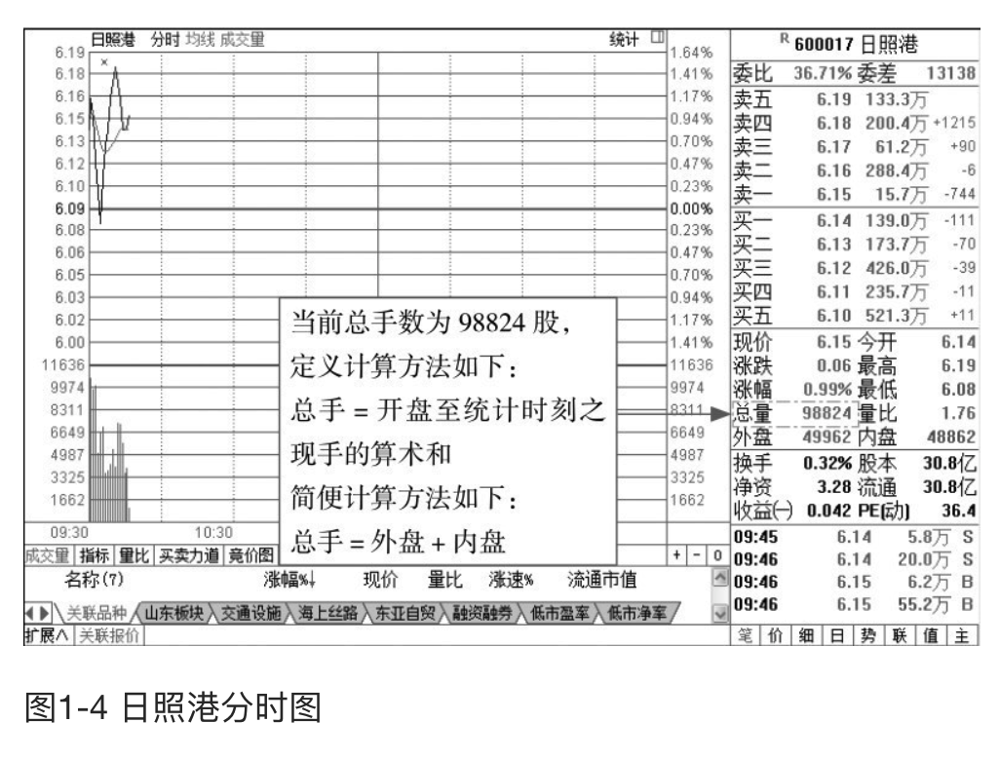
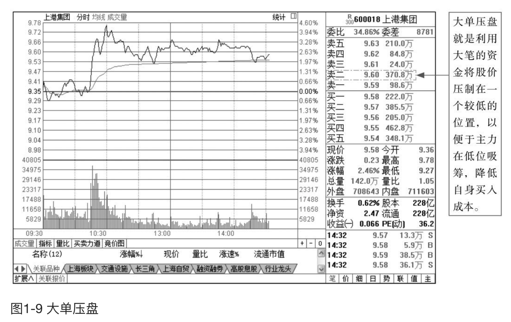
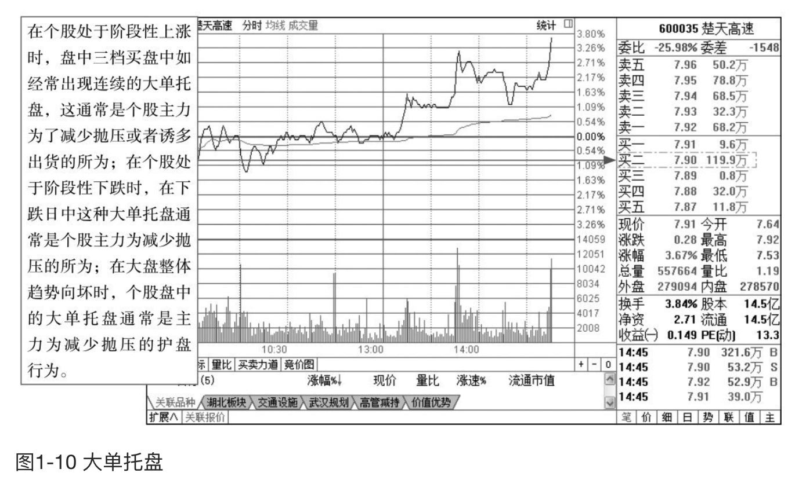
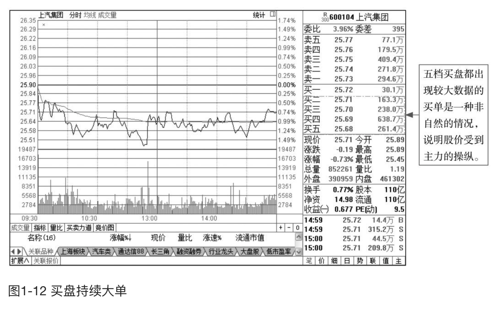
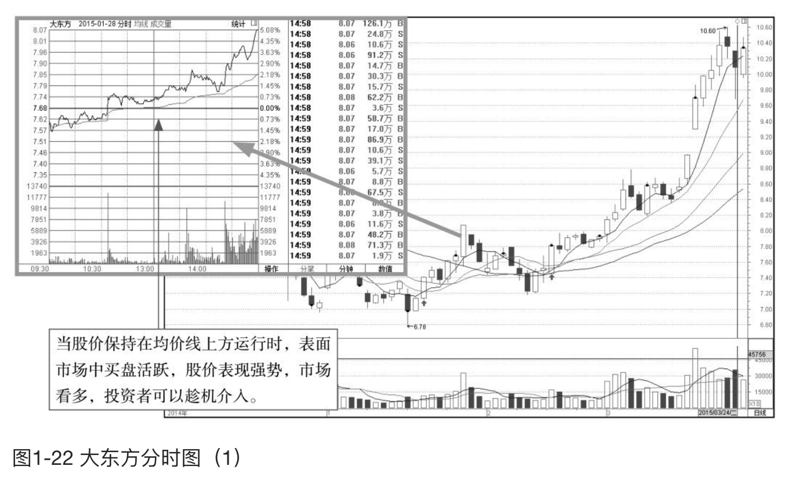
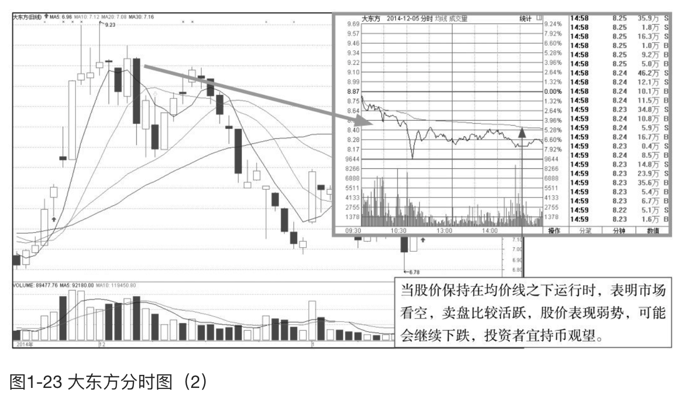

    作者: 马涛
    出版社: 人民邮电出版社
    副标题: 炒股入门与实战技巧
    出版年: 2015-9
    页数: 244
    定价: 39.80元
    装帧: 平装
    ISBN: 9787115398321

[豆瓣链接](https://book.douban.com/subject/26662468/)

- [从零起步零基础读懂分时图](#从零起步零基础读懂分时图)
  - [认识分时图](#认识分时图)
  - [分时图的关键术语](#分时图的关键术语)
    - [现手与总手](#现手与总手)
    - [换手率](#换手率)
    - [量比](#量比)
    - [五档盘口](#五档盘口)
    - [委比](#委比)
    - [内盘与外盘](#内盘与外盘)
  - [均价线走势分析](#均价线走势分析)
    - [分清均价线中的多空阵营](#分清均价线中的多空阵营)

# 从零起步零基础读懂分时图
## 认识分时图

- 加权指标：即证交所每日公布媒体常说的大盘实际指数。
- 不加权指标：大盘不含加权的指标，即不考虑股票盘子的大小，而将所有股票对指数的影响看作相同所计算出来的大盘指数。
- 红绿柱线：在红白两条曲线附近有红绿柱状线，是反映大盘即时所有股票的买盘与卖盘在数量上的比率。红柱线的增长缩短表示上涨买盘力量的增减；绿柱线的增长缩短表示下跌卖盘力度的强弱。
- 黄色柱线：用来表示每一分钟的成交量，单位是手。

>红绿柱线是股票买盘和卖盘的比率：红线柱增长，表示买盘大于卖盘，指数将逐渐上涨；红线柱缩短，表示卖盘大于买盘，指数将逐渐下跌。绿线柱增长，指数下跌量增加；绿线柱缩短，指数下跌量减少。

- 成交价曲线：在个股即时分时图中，波动频繁的曲线是成交价曲线，又称为`分时线`。
- 平均价曲线：在个股即时分时图中，比较平滑的曲线是平均价曲线，又称为`均价线`。
- 成交量柱线：与大盘指数即时分时图相似，在个股即时分时图下方的黄色柱线代表每分钟该股的乘积手数。

## 分时图的关键术语
### 现手与总手
`现手`是指某一股票即时的成交量。股市最小交易量是1手，为100股，一只股票最近的一笔成交量叫现手。

例如，

- 如果A下单5元买100股，B下单5.01元卖300股，当然不会成交。5元就是买入价，5.01就是卖出价。
- 此时，有C下单5.01元买200股，于是B的股票中就有200股卖给C了（还有100股没有卖出去），这时候，成交价是5.01元，现手就是2手（即200股），显示2，显示的颜色是红的。
- 如果D下单5元卖200股，于是A和D就成交了，这时候成交价是5元，由于A只买100股，所以成交了100股，现手是1，颜色是绿的。

主动去适应卖方的价格而成交的，就是红色，叫`外盘`。主动迎合买方的价格而成交的，就是绿色，叫`内盘`。

总手即当日开始成交一直到现在为止的总成交股数。收盘时总手，则表示当日成交的总股数。如图1-4所示为日照港（600017）分时图，图中总量为98824，则说明当前总手数为98824股。

>单笔成交一般显示在行情窗口的右下方，它显示的是每一笔的成交明细，大部分软件还会显示是买还是卖（B或者S）。分时线是按每分钟的最后成价形成的，在一分钟内其他的成交是被忽略的，而单笔成交呈现的是每一笔成交，这就可以让我们更具体直观地看到资金的操作方向。
>
>如果成交量放大，一般而言不是一笔成交促成的，而是多笔成交促成的。如果成交密集且每笔量都比较大，那成交量自然放大，成交量柱线就越长。反之，如果成交稀疏且每笔量都比较少，则成交量柱线就比较短。

### 换手率
挖掘领涨板块首先要做的就是挖掘热门板块，判断是否属于热门股的有效指标之一便是`换手率`。换手率高，意味着近期有大量的资金进入该股，流通性良好，股性趋于活跃。

    换手率＝成交股数÷流通股数×100%

>一般情况下，大多数股票的每日换手率在1%～25%（不包括初上市的股票）。70%的股票的换手率在3%以下，3%就成为一种分界。
>- 当一只股票的换手率在3%～7%时，该股进入相对活跃状态。
>- 当一只股票的换手率在7%～10%时，则为强势股的出现，股价处于高度活跃当中。
>- 当一只股票的换手率在10%～15%，属于机构密切操作个股。
>- 当一只股票的换手率超过15% 且持续多日的话，此股成为黑马的可能性很大。

### 量比
`量比`是指当天成交总手数与近期平均成交手数的比值。量比数值的大小表示此时刻成交量的增减，大于1表示此时刻成交总手数已经放大，小于1则表示此时刻成交总手数萎缩。

### 五档盘口
**1．大单压盘**

压盘式大单是指在股价运行过程中，在五档卖盘中的卖一至卖五位置突然出现手数较大的委托单。在卖盘位置往往不断出现大单压住股价上涨的态势，这就是大单压盘，如图1-9所示。

>如果大单压盘出现在股价上涨初期或中期，股价突破重要的阻力区，盘中上涨时突然遭遇阻截式大卖单，这往往是主力在使用打压洗盘的手法恐吓盘中不坚定的浮筹，阻止场外投资者跟风买进；如果大单压盘出现在股价上涨末期，这通常是主力出货的征兆，投资者应尽快离场。

**2．大单托盘**

大单托盘是指在五档买盘中的买一至买五位置出现大单或特大单，往往表现为当买一的特大单被消化以后，买二位置继续出现更大的买单，在五档买盘中不断出现大单的现象，如图1-10所示。

**3．小单空盘**

小单空盘是指在盘中有大单交易的过程中，五档买卖盘中突然出现小于100手或50手的交易单。

五档小单空盘通常是由主力操盘手在进行委托交易单量的配置过程中故意出现的交易空档，其目的是留出委托单的空档，以此来观察盘口其他投资者的跟风情况。

在正常交易状态下，当股价上涨时，抛开主力机构通过较大的成交单量来操纵股价的行为因素，场外中小投资者积极地跟风买进也是促使股价上涨的重要动力之一。因而，当主力机构要想知道当天场外买进力量的强弱时，则可以通过实时交易中的“空盘”手段迅速得到了解。

>主力机构的操盘意图可以通过五档小单空盘来进行适当的计划调节。
>- 五档小单空盘出现后，如盘口在60秒钟内迅速有超过100手标准的大单跟进，则说明盘中其他投资者的跟风能力较强，主力后续操盘将可能出现其他诱空性或诱多性动作。
>- 如盘口在3分钟之后才有超过100手以上标准的大单跟进，则说明盘中其他投资者的跟风能力一般，主力后续操盘将继续按计划展开拉升或继续打压。
>- 如盘口在5分钟之后才有超过100手以上标准的大单跟进，则说明盘中其他投资者的跟风能力较弱，主力后续操盘将继续按计划展开拉升或继续打压。
>- 在盘中成交清淡时，五档买卖盘的买一到买五和卖一到卖五位置均出现极小的委托单量，但不属于“空盘”技术特征。

**4．买盘持续大单**

买盘持续大单是指在五档买盘委托队列中出现连续的大单，从买一到买五都出现数据较大的委托单，如图1-12所示。

在股价进入拉升阶段时，主力为了使股价脱离建仓区，通常会利用持续大单拉抬股价，使得股价上涨。

>其实，主力挂出的买单有大部分是自己挂的，即自买自卖，而这些持续的大单并不一定会成交，只是为了吸引散户们跟风买进，利用市场的看涨形势来帮助自己完成获利目的。

**5．买卖盘上下夹板**

大量的委卖盘挂单俗称上压板，大量的委买盘挂单俗称下托板。无论上压板还是下托板，其目的都是为了操纵股价、诱人跟风（跟风买进或跟风卖出），股票处于不同价格区域时，其作用是不同的。

有时，上压板和下托板同时出现，中间相隔几个价位，这种现象俗称夹板。在夹板出现的情况下，上压板常出现在卖盘第四、五档，下托板常出现在买盘第四档、五档。夹板处的挂单主要是给市场看的，主力并不关心这些挂单能不能成交。夹板出现在低位，往往是主力在利用夹板吸筹；夹板出现在股价大幅上升后的高位，则往往是主力在利用夹板出货。出现夹板时，投资者应该重点观察如下几点：

1. 成交单的方向，特别是隐性大成交单的方向。卖单多说明主力的实际意图是出货，买单多说明主力的实际意图是吸筹。
2. 夹板中间价位处的挂单增减情况。
3. 夹板价位处挂单的增减情况和夹板的移动方向（要考虑此时的大盘指数移动
方向）。

### 委比
`委比`指标指的是在报价系统之上的所有买卖单之比，是实盘操作中衡量某一时段买卖盘相对强度的指标。

    委比＝（委买手数－委卖手数）÷（委买手数＋委卖手数）×100%

委比的取值自-100%到+100%，+100%表示全部的委托均是买盘，涨停的股票委比一般是100%，而跌停是-100%。委比为0，意思是买入（托单）和卖出（压单）的数量相等，即委买∶委卖＝5∶5（比值为10的情况下）。

委比是一个虚假的数字，委比上的挂单是随时可以撤的。一般来说，委比指标说明了买入和卖出意愿的不平衡程度，但它并不能反映股票的活跃程度，活跃程度还是要看股票的换手率

### 内盘与外盘
投资者可以通过对比外盘和内盘的数量大小及比例，从中发现当前行情是主动性的买盘多还是主动性的卖盘多，是一个较有效的短线指标。

1. `外盘`。外盘就是股票的买家以卖家的卖出价买入成交，成交价为申卖价，说明买盘比较积极。当成交价在卖出价时，将成交数量加入外盘累计数量中，当外盘累计数量比内盘累计数量大很多，表示很多人在抢盘买入股票，这时股价有上涨趋势。外盘是以卖方卖出价成交的交易，卖出量统计加入外盘。
1. `内盘`。内盘就是股票在买入价成交，成交价为申买价，说明抛盘比较踊跃。当成交价在买入价时，将现手数量加入内盘累计数量中，当内盘累计数量比外盘累计数量大很多，而股价下跌时表示很多人在强抛卖出股票。

“外盘”和“内盘”相加成为成交量，分析时由于卖方成交的委托纳入“外盘”，如“外盘”很大，则意味着多数卖的价位都有人来接，显示买势强劲；而以买方成交的纳入“内盘”，如“内盘”过大，则意味着大多数的买入价都有人愿意卖，显示卖方力量较大；如内外盘大体相当，则买卖双方力量相当。

## 均价线走势分析
### 分清均价线中的多空阵营
如图1-22所示，为大东方（600327）2015年1月28日的分时图，从图中可以看到，均价线稳定地向上移动，而且股价从盘整结束后开始稳定上行，而成交量伴随着股价的上行也给出了放大的走势，这就说明多方的能量已经占据明显优势，场外和场中做多的资金非常充足，因此后市将在很大程度上出现延续上涨的行情，投资者可以寻找低点进场做多。

>多方想让价格上涨，就会积极地向上推升股价，此时分时线会不断上行，均价线同时也会不断上行，因为均价线代表了此时的平均持股成本。股价在均价线上方运行，就说明多方依然控制着整个市场。

如图1-23所示，为大东方（600327）2014年12月5日的分时图，从图中可以看到，当天股价的走势是向下的，而分时图中的分时线也是向下延伸的，股价在稳定地向下推进，说明空方的力量非常强大，股民此时应该尽快离场，已经离场的投资者应持币观望。

