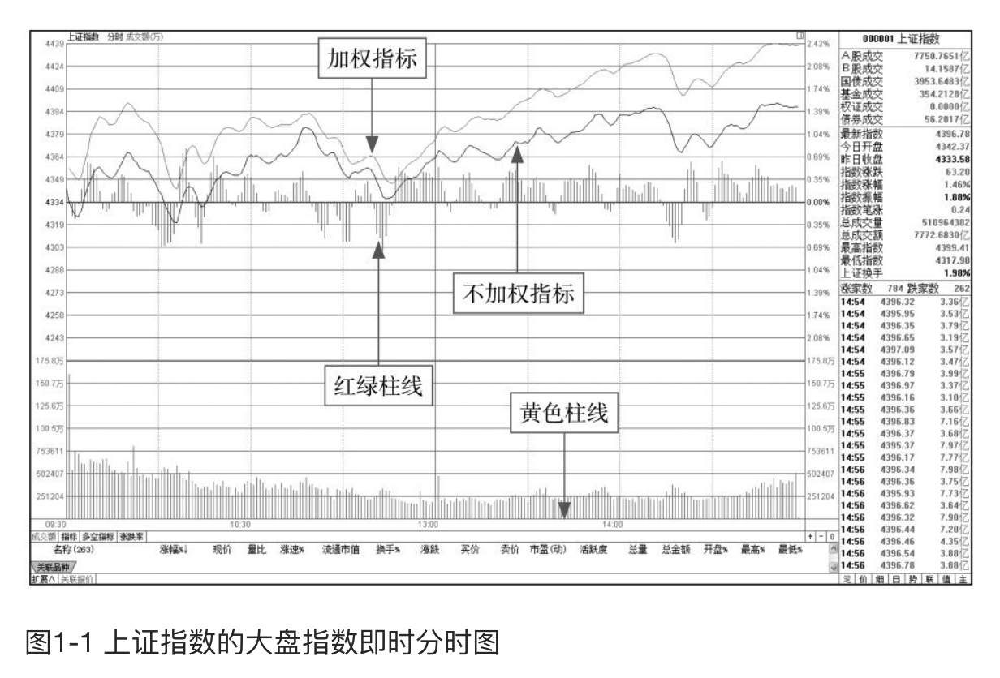
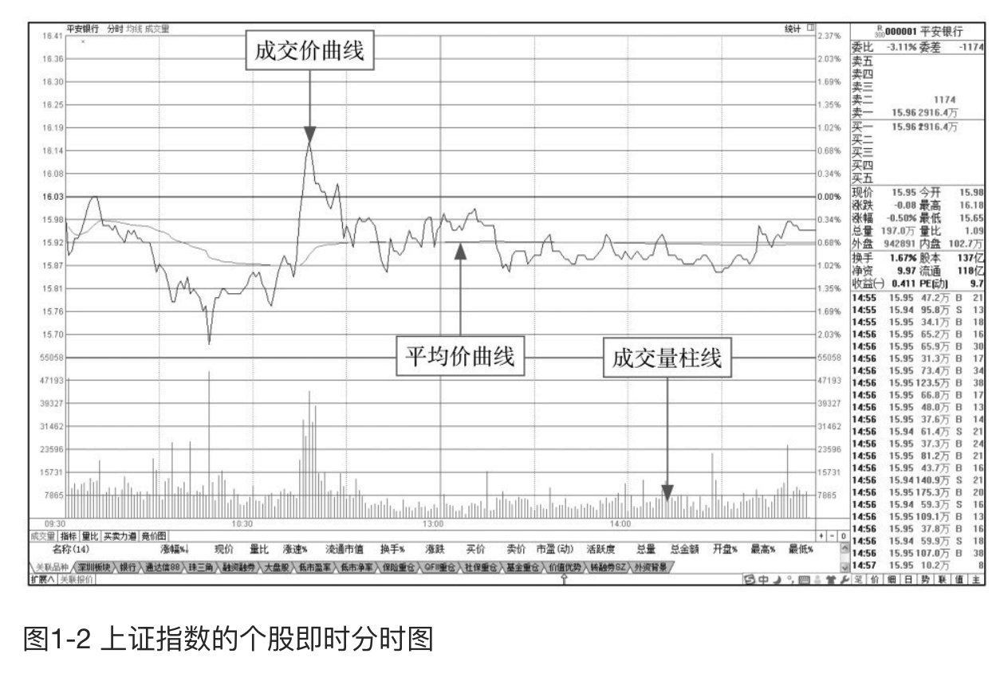

    作者: 马涛
    出版社: 人民邮电出版社
    副标题: 炒股入门与实战技巧
    出版年: 2015-9
    页数: 244
    定价: 39.80元
    装帧: 平装
    ISBN: 9787115398321

[豆瓣链接](https://book.douban.com/subject/26662468/)

- [从零起步零基础读懂分时图](#从零起步零基础读懂分时图)
  - [认识分时图](#认识分时图)
  - [分时图的关键术语](#分时图的关键术语)

# 从零起步零基础读懂分时图
## 认识分时图

- 加权指标：即证交所每日公布媒体常说的大盘实际指数。
- 不加权指标：大盘不含加权的指标，即不考虑股票盘子的大小，而将所有股票对指数的影响看作相同所计算出来的大盘指数。
- 红绿柱线：在红白两条曲线附近有红绿柱状线，是反映大盘即时所有股票的买盘与卖盘在数量上的比率。红柱线的增长缩短表示上涨买盘力量的增减；绿柱线的增长缩短表示下跌卖盘力度的强弱。
- 黄色柱线：用来表示每一分钟的成交量，单位是手。

>红绿柱线是股票买盘和卖盘的比率：红线柱增长，表示买盘大于卖盘，指数将逐渐上涨；红线柱缩短，表示卖盘大于买盘，指数将逐渐下跌。绿线柱增长，指数下跌量增加；绿线柱缩短，指数下跌量减少。

- 成交价曲线：在个股即时分时图中，波动频繁的曲线是成交价曲线，又称为分时线。
- 平均价曲线：在个股即时分时图中，比较平滑的曲线是平均价曲线，又称为均价线。
- 成交量柱线：与大盘指数即时分时图相似，在个股即时分时图下方的黄色柱线代表每分钟该股的乘积手数。

## 分时图的关键术语

