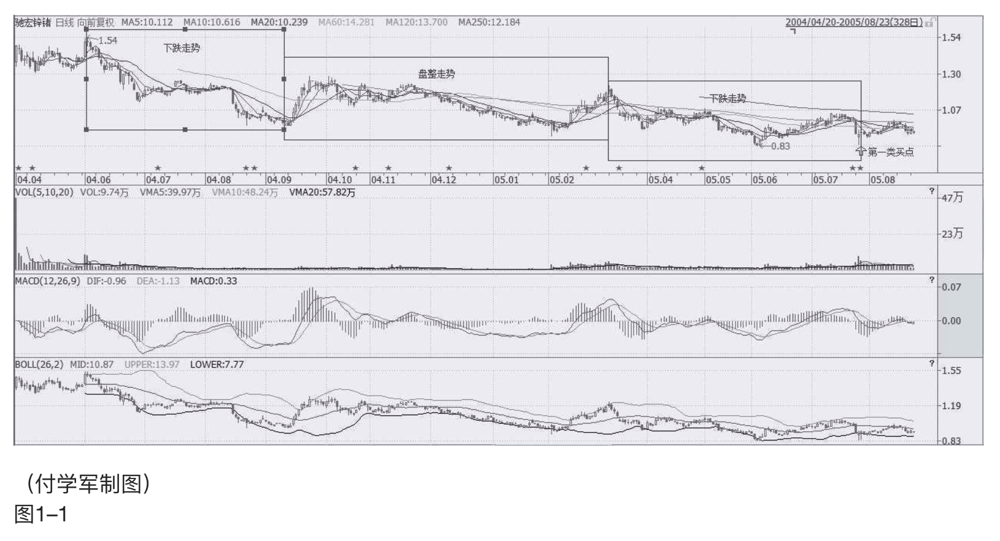
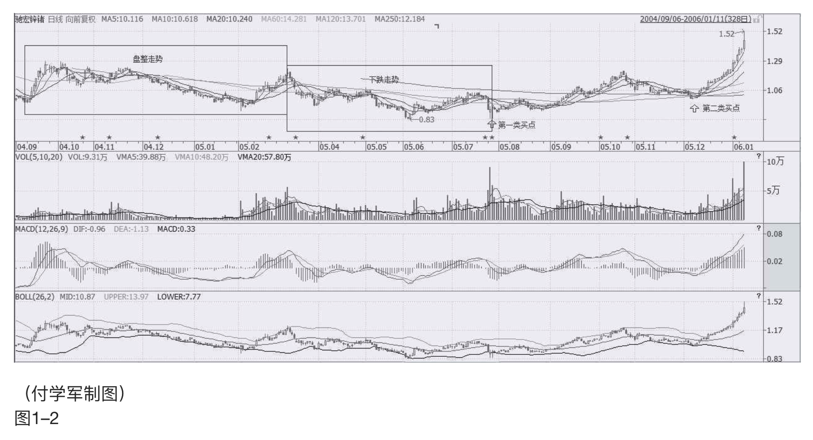
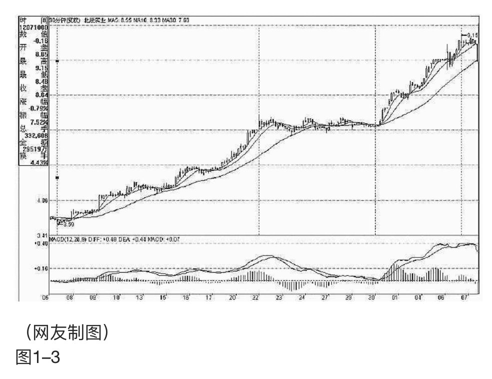
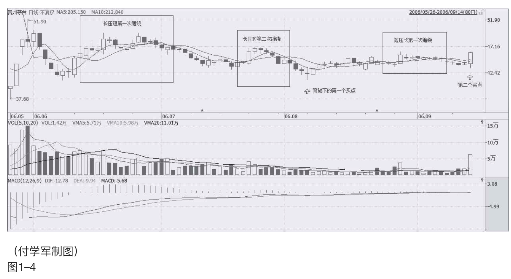
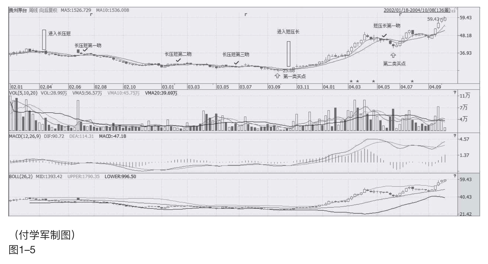
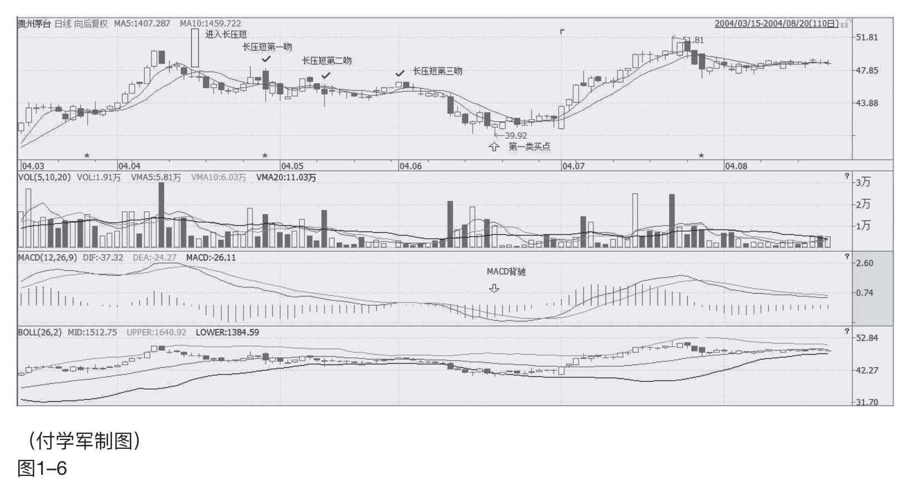
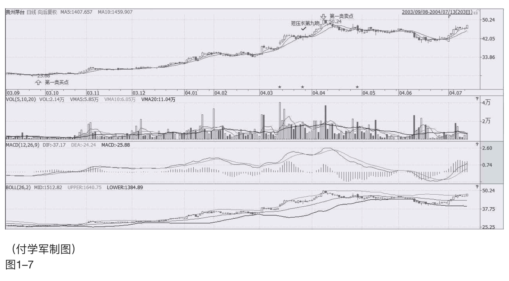

    出版社: 中信出版社
    出版年: 2016-4-1
    页数: 320
    定价: 48.00元
    装帧: 平装
    ISBN: 9787508653877

[豆瓣链接](https://book.douban.com/subject/27015517/)

- [实战篇：投机游戏](#实战篇投机游戏)
  - [选股与择时](#选股与择时)
    - [缠中说禅是如何选股的](#缠中说禅是如何选股的)
      - [最简单可靠的找所谓牛股的方法](#最简单可靠的找所谓牛股的方法)
      - [先看面，终要看“里子”](#先看面终要看里子)
      - [如何去寻找三个互相独立的程序](#如何去寻找三个互相独立的程序)
      - [最核心的思想就是分类](#最核心的思想就是分类)
    - [缠中说禅是如何择时的](#缠中说禅是如何择时的)
      - [均线构成的技术评价系统](#均线构成的技术评价系统)
      - [“吻”前后出现的高、低点才有意义](#吻前后出现的高低点才有意义)
      - [“下跌+上涨”买卖方法](#下跌上涨买卖方法)
      - [“下跌+盘整+上涨”买卖方法](#下跌盘整上涨买卖方法)
      - [当买入程序出现问题](#当买入程序出现问题)
      - [边喝茅台边上课](#边喝茅台边上课)
      - [第二类买点有哪几种可能的情况](#第二类买点有哪几种可能的情况)

# 实战篇：投机游戏
## 选股与择时
### 缠中说禅是如何选股的
#### 最简单可靠的找所谓牛股的方法
散户就怕跌，但牛市里，跌就是爹，一跌就等于爹来了，又要发钱了。如果跟盘技术不行，有一种方式是最简单的，就是盯着所有放量突破上市首日最高价的新股以及放量突破年线然后缩量回调年线的老股，这都是以后的黑马。特别那些年线走平后向上出现拐点的股票，一定要看好了。至于还在年线下面的股票，先别看了，等他们上年线再说。其实，这就是在牛市中最简单可靠的找所谓牛股的方法。

#### 先看面，终要看“里子”
拿投资来忽悠的人，总爱编一些关于“面”的神话，诸如基本面、技术面、心理面、资金面，这面那面，都不过是“里子”的借口。

投资的结果很简单，就“输、赢”两种。所有关于投资的理论把戏，都企图通过控制某种“输入”而把“输”这结果给去了。因此一切相关的理论前提就必然建立在这样一个逻辑假设之上：输入与输出间被某种必然的逻辑关系和因果链条所连接。然而，现实中，企图跳过“面”而直捣“里子”，同样是一种荒谬的幻想。即使“面”和“里子”没有任何必然的联系，但现实依然只能从“面”到“里子”。那种企图否定一切“面”的，企图直接就“里子”的，不过是把某种“面”当“里子”了。

**具体对于股票来说，按其是否萌动的标准把所有股票动态地进行分类，一种是可以搞的，一种是不能搞的，将你参与的股票限制在能搞的范围内，不管任何情况，这是必须遵守的原则**。当然，搞的分类原则，各人可以有所不同。例如，250天线以及周线上的成交量压力线的突破；资金量不大且短线技术还可以的，可以把250天线改成70天线、35天线，甚至改为30分钟图里的相应均线；对新股，可以用上市第一日的最高价作为标准；还有，就是接近安全线的股票，例如在第六期里，本ID给出的一个带认沽权证的认购权证介入的安全线标准；而对于有一定水平的人，识别各种空头陷阱，利用空头陷阱介入是一个很好的方法，这种方法比较专业点，以后专门说。

**市场也只有两种，能搞的和不能搞的。必须坚持的是，不能搞的就无论发生什么情况都不能搞，除非能达到某种能搞的标准而自动成为能搞的对象**。一旦被搞的分类原则确定，就一定要严格遵守`“只搞能搞的”原则`。可惜，这样一个简单的原则，绝大多数的人即使知道也不能遵守。人的贪婪使得人有一种企图占有所有机会的冲动，这种人叫“花痴”，“花痴”在投资市场的命运一定是悲惨的。

#### 如何去寻找三个互相独立的程序
**设计一个程序，将所有投资对象进行分类，只搞那些能搞的，这是投资的第一原则**。

在数学中，有一个乘法原则可以完全解决这个问题。假设三个互相独立的程序的“低迷率”分别为30%、40%、30%，这都是很普通的并不出色的程序。那么由这三个程序组成的程序组，其“低迷率”就是30%*40%*30%=3.6%，也就是说，按这个程序组，干100次，只会出现不到4次的“低迷不振”，这绝对是一个惊人的结果。

现在，问题的关键变成，**如何去寻找这三个互相独立的程序**。首先，技术指标，都单纯涉及价量的输入而来，都不是独立的，只需要选择任意一个技术指标构成一个买卖程序就可以。对于水平高点的人来说，一个带均线和成交量的K线图，比任何技术指标都有意义。其次，任何一个股票都不是独立的，在整个股票市场中，处在一定的比价关系中，这个比价关系的变动，也可以构成一个买卖系统，这个买卖系统是和市场资金的流向相关的，一切与市场资金相关的系统，都不能与之独立。最后，可以选择基本面构成一个甄别程序，但这个基本面不是单纯指公司赢利之类的，像本ID在前几期所说，国航李总当兵出身不会让自己的股票长期跌破发行价这么没面子，还有认沽权证基本不会让兑现等等，这才是更重要的基本面，这需要对市场的参与者、对人性有更多的了解才可能精通。

当然，上面这三个独立的程序只是本ID随手而写，任何人都可以设计自己的独立交易程序组，但原则是一致的，就是三个程序组之间必须是互相独立的，像人气指标和资金面其实是一回事情，各种技术指标都是互相相关的等等，如果把三个非独立的程序弄在一起，一点意义都没有。

#### 最核心的思想就是分类
甄别股票，必须要选择三个独立的系统。其中一个最常用的，就是所谓的技术派玩意。单纯的技术派是不行的，单纯的非技术派也是不行的。技术派的玩意，必须也只能在三个独立系统里，才会有大的功效。

**技术分析，最核心的思想就是分类**，这是几乎所有玩技术的人都搞不清楚的一点。技术指标发出买入信号，对于技术派来说，就以为是上帝给了暗示一般，抱着如此识见，几乎所有技术派都很难有大的成功。技术指标不过是把市场所有可能的走势进行一个完全的分类，为什么技术派事后都是高手，真正干起来就不行，就是这个原因。

### 缠中说禅是如何择时的
#### 均线构成的技术评价系统
均线系统，必然有着各条均线间的关系问题，任何两条均线的关系，其实就是一个“吻”的问题。按“吻”的标准，可以把相应的关系进行一个完全分类：“飞吻”“唇吻”“湿吻”。把短期均线当成是胜利之门，那么`“长压短”`意味着空头市场，而`“短压长”`意味着多头市场。
- `“飞吻”`：短期均线略走平后继续按原来趋势进行下去。
- `“唇吻”`：短期均线靠近长期均线但不跌破或升破，然后按原来趋势继续下去。
- `“湿吻”`：短期均线跌破或升破长期均线甚至出现反复缠绕，如胶似漆。

“飞吻”出现的概率比较少，一般都是在趋势特别强烈的时候，而太火爆的趋势是不可能太长久的，所以其后的震荡经常出现；“唇吻”，任何一段基本的趋势过程中最常见到的方式，特别在“长压短”的情况下，基本都是这种方式，一旦出现“唇吻”反弹基本就该结束了。在“短压长”的情况下，调整结束的概率也是很大的，但也要预防“唇吻”演变成“湿吻”；“湿吻”，一段趋势后出现的较大调整中，还有就是在趋势出现转折时，这种情况也很常见，特别是在“长压短”的情况下，如果出现短、中、长各类均线来一个的“湿吻”，这往往意味着行情要出现重大转折，要变天了，“长压短”要变成“短压长”了。

注意，行情转折很多时候都是由“湿吻”引发的，这里分两种情况：一种是先“湿吻”，然后按原趋势来一个大的高潮，制造一个陷阱，再转折；另一种，反复“湿吻”，构造一个转折性箱型，其后的高潮，就是排列的转化了。在“长压短”的情况下，一旦出现“湿吻”，就要密切注意了，特别是这个“湿吻”是在一个长期“长压短”后出现的，就要更加注意了，其后的下跌往往是介入的良机，因为空头陷阱的概率简直太大了。必须提醒，这一点对趋势形成的第一次“湿吻”不成立。但“湿吻”之后必有高潮，唯一的区别只是排列的区别，关键判断的是排列而不是高潮的有无。

#### “吻”前后出现的高、低点才有意义
对于市场走势，有一个是“不患”的，就是走势的三种分类：上涨、下跌、盘整。所有走势都可以分解成这三种情况。这是一个最简单的道理，而这才是市场分析唯一值得依靠的基础。很多人往往忽视最简单的东西，去搞那些虚头巴脑的玩意。而无论你是主力、散户、庄家，都逃不过这三种分类所交织成的走势。

那么，何谓上涨、下跌、盘整？下面给出一个定义。首先必须明确的是，所有上涨、下跌、盘整都建立在一定的周期图表上，例如在日线上的盘整，在30分钟线上可能就是上涨或下跌，因此，一定的图表是判断的基础，而图表的选择，与上面所说交易系统的选择是一致的，相关于你的资金、性格、操作风格等。
- 上涨：最近一个高点比前一高点高，且最近一个低点比前一低点高。
- 下跌：最近一个高点比前一高点低，且最近一个低点比前一低点低。
- 盘整：最近一个高点比前一高点高，且最近一个低点比前一低点低；或者最近一个高点比前一高点低，且最近一个低点比前一低点高。

操作的关键不是定义，而是如何充分理解定义而使得操作有一个坚固的基础。其中的困难在于如何去把握高点和低点，因为高点、低点是有其级别的，在30分钟图上看到的高点，可能在周线图上什么都没看到。为此，必须要均线系统来过滤，也就是前面常说的“吻”的概念，只有在“吻”前后出现的高、低点才有意义。

这里，首先要搞清楚“吻”是怎样产生的。如果一个走势，连短线均线都不能突破，那期间出现的高、低点，肯定只是低级别图表上的，在本级别图表上没有意义。当走势突破短期均线却不能突破长期均线，就会形成“飞吻”；当走势突破长期均线马上形成陷阱，就会形成“唇吻”；当走势突破长期均线出现一定的反复，就会形成“湿吻”。由此可见，“吻“的分类是基于对原趋势的反抗程度，“飞吻”是基本没有任何反抗力，“唇吻”的力度也一般，而“湿吻”，就意味着力度有了足够的强度，而一切的转折，基本都是从“湿吻”开始的。

转折，一般只有两种：（1）“湿吻”后继续原趋势形成陷阱后回头制造出转折；（2）出现盘整，以时间换空间地形成转折。第二种情况暂且不说，第一种情况，最大的标志就是所谓的“背驰”了。必须注意：没有趋势，没有背驰。在盘整中是无所谓“背驰”的，这点是必须特别明确。还有一点是必须注意的，这里的所有判断都只关系到两条均线与走势，和任何技术指标都无关。

如何判断“背驰”？首先定义一个概念，称为缠中说禅趋势力度：前一“吻”的结束与后一“吻”开始由短线均线与长期均线相交所形成的面积。在前后两个同向趋势中，当缠中说禅趋势力度比上一次缠中说禅趋势力度要弱，就形成“背驰”。按这个定义，是最稳妥的办法，但唯一的缺点是必须等再次接吻后才能判断，这时候，走势离真正的转折点已经有一点距离了。如何解决这个问题：第一种方法，看低一级别的图，从中按该种办法找出相应的转折点。这样和真正的低点基本没有太大的距离。

还有一种方法，技巧比较高，首先再定义一个概念，称为缠中说禅趋势平均力度：当下与前一“吻”的结束时短线均线与长期均线形成的面积除以时间。因为这个概念是即时的，马上就可以判断当下的缠中说禅趋势平均力度与前一次缠中说禅趋势平均力度的强弱对比，一旦这次比上次弱，就可以判断“背驰”即将形成，然后再根据短线均线与长期均线的距离，一旦延伸长度缩短，就意味着真正的底部马上形成。按这种方法，真正的转折点基本就可以完全同时地抓住。但有一个缺陷，就是风险稍微大点，且需要的技巧要高点，对市场的感觉要好点。

#### “下跌+上涨”买卖方法
上涨、下跌、盘整三种基本走势，有六种组合可能代表着三类不同的走势：
- 陷阱式：上涨+下跌；下跌+上涨。
- 反转式：上涨+盘整+下跌；下跌+盘整+上涨。
- 中继式：上涨+盘整+上涨；下跌+盘整+下跌。

市场的走势，都可能通过这三类走势得以分解和研究。站在多头的角度，首先要考虑的是买入，因此，上面六种最基本走势中，有买入价值的是：“下跌+上涨”“下跌+盘整+上涨”“上涨+盘整+上涨”三种。没有买入价值的是：“上涨+下跌”“上涨+盘整+下跌”“下跌+盘整+下跌”。由此不难发现，如果在一个下跌走势中买入，其后只会遇到一种没有买入价值的走势，就是下跌+盘整+下跌，这比在上涨时买入要少一种情况。而在下跌时买入，唯一需要躲避的风险有两个：一是该段跌势未尽；二是该段跌势虽尽，但盘整后出现下一轮跌势。

对下跌走势用背驰来找第一类买点，就是要避开上面的第一个风险。而当买入后，将面对的是第二个风险，如何避开？就是其后一旦出现盘整走势，必须先减仓退出。为什么不全部退出，因为盘整后出现的结果有两种：上涨、下跌，一旦出现下跌就意味着亏损，而且盘整也会耗费时间，对于中小资金来说，完全没必要。这里有一个很重要的问题留待后面分析，就是如何判断盘整后是上涨还是下跌，如果把握了这个技巧，就可以根据该判断来决定是减仓退出还是利用盘整动态建仓了。这是一个大问题，特别对于不想坐庄的大资金来说，这是一个最重要的问题，因为不想坐庄的大资金的安全建仓在六种走势中只可能在“下跌+盘整+上涨”这一种，其他都不适用。

根据上面的分析，可以马上设计一种行之有效的买卖方法：在第一类买点买入后，一旦出现盘整走势，无论后面如何，都马上退出。这种买卖方法的实质，就是在六种最基本的走势中，只参与唯一的一种：“下跌+上涨”。对于资金量不大的，这是最有效的一种买卖方法。下面将对比重点分析。

对于“下跌+上涨”的走势来说，连接下跌前面的可能走势只会有两种：上涨和盘整。如果是“上涨+下跌+上涨”，那意味着这种走势在上一级别的图形中是一个盘整，因此这种走势可以归纳在盘整的操作中，这在以后对盘整的专门分析里研究。换言之，对于只操作“下跌+上涨”买卖的，“上涨+下跌+上涨”走势不考虑，也就是说，当你希望用“下跌+上涨”买卖方法介入一只出现第一类买点的股票，如果其前面的走势是“上涨+下跌”，则不考虑。注意，不考虑不意味着这种情况没有赢利可能，而只是这种情况可以归到盘整类型的操作中，但“下跌+上涨”买卖方法是拒绝参与盘整的。如此一来，按该种方法，可选择的股票又少了，只剩下这样一种情况，就是“盘整+下跌+上涨”。

从上面的分析可以很清楚地看到，对于“下跌+上涨”买卖方法来说，必须是这样一种情况：就是一个前面是“盘整+下跌”型的走势后出现第一类买点。显然，这个下跌是跌破前面盘整的，否则就不会构成“盘整+下跌”型，只会仍是盘整。那么在该盘整前的走势，也只有两种：上涨、下跌。对于“上涨+盘整+下跌”的，也实质上构成高一级别的盘整，因此对于“下跌+上涨”买卖方法来说也不能参与这种情况，因此也就是只剩下这样一种情况：“下跌+盘整+下跌”。

综上所述，对于“下跌+上涨”买卖方法来说，对股票的选择就只有一种情况，就是：出现第一类买点且之前走势是“下跌+盘整+下跌”类型。因此这里就得到了用“下跌+上涨”买卖方法选择买入品种的标准程序：首先，只选择出现“下跌+盘整+下跌”走势的。其次，在该走势的第二段下跌出现第一类买点时介入。再次，介入后，一旦出现盘整走势，坚决退出。注意，这个退出肯定不会亏钱的，因为可以利用低一级别的第一类卖点退出，是肯定可以赢利的。但为什么要退出，因为它不符合“下跌+上涨”买卖不参与盘整的标准，盘整的坏处是浪费时间，而且盘整后存在一半的可能是下跌，对于中小资金来说，根本没必要参与。一定要记住，操作一定要按标准来，这样才是最有效率的。如果买入后不出现盘整，那就要彻底恭喜你了，因为这股票将至少回升到“下跌+盘整+下跌”的盘整区域，如果在日线或周线上出现这种走势，进而发展成为大黑马的可能是相当大的。

举一个例子：600497驰宏锌锗（图1–1和图1–2）

日线上，2004年6月2日到2004年9月10日，构成下跌走势；2004年9月10日到2005年3月14日，构成盘整走势；2005年3月14日到2005年7月27日，构成下跌走势。也就是说，从2004年6月2日到2005年7月27日，构成标准的“下跌+盘整+下跌”的走势，而在相应的2005年3月14日到2005年7月27日的第二次下跌走势中，7月27日出现明显的第一类买点，这就完美地构成了“下跌+上涨”买卖方法的标准买入信号。其后走势，很快就回到2004年9月10日到2005年3月14日的盘整区间，然后回调在2005年12月8日出现标准的第二类买点，其后走势就不用多说了。

该种方法反过来就是选择卖点的好方法了，也就是说前面出现“上涨+盘整+上涨”走势的，一旦第二段升势出现第一类卖点，一定要走，因为后面很可能就是“上涨+下跌”的典型走势。

对此，也举一个例子：601588北辰实业，在30分钟图上（图1–3），11月7日10点30分到11月22日10点，构成上涨；11月22日10点到11月30日11点构成盘整；11月30日11点到12月7日10点构成上涨。而在第二段上涨中，30分钟图上的3次红柱子放大，一次比一次矮所显示的严重背离，就完美地构成了“上涨+盘整+上涨”后出现第一类卖点的“上涨+下跌”型卖出。如果以后学了时间之窗的概念，对该股的卖点就更有把握了，各位注意11月7日10点30分和12月7日10点之间的关系。

#### “下跌+盘整+上涨”买卖方法
例如，对于一个简单的，由5日均线与10日均线构成的买卖系统，首先，两者的排列构成一个完全分类，“短压长”是牛，“长压短”是熊，还有一种是互相缠绕的情况，这种情况最终都要演化成“短压长”或“长压短”，只有两种性质：中继或转折。相应，一个最简单的操作系统就此产生，就是在排列互相缠绕完成后介入，对于多头来说，这样一个系统无非面临两个结果，变为“短压长”成功，变为“长压短”失败。由于缠绕若是中继就延续原排列，若转折就改变排列，因此对多头来说，值得介入的只有两种情况：“长压短”转折和“短压长”中继，空头反之。

对于任意一种走势，首要判断的是排列：“长压短”还是“短压长”。这问题很容易判断出来，对于5日、10日的均线系统来说，5日均线在上就是“短压长”，反之就是“长压短”，这在任何情况下都是明确的。如果是“短压长”的情况，一旦出现缠绕，唯一需要应付的就是这缠绕究竟是中继还是转折。可以肯定地说，没有任何方法可以百分百确定该问题，但还是有很多方法使得判断的准确率足够高。例如，短压长趋势出现的第一次缠绕是中继的可能性极大，如果是第三、第四次出现，这个缠绕是转折的可能性就会加大；还有，出现第一次缠绕前，5日线的走势必须是十分有力的，不能是疲软的玩意，这样缠绕极大可能是中继，其后至少会有一次上升的过程出现；第三，缠绕出现前的成交量不能放得过大，一旦过大，骗线出现的概率就会大大增加，如果量突然放太大而又萎缩过快，一般即使没有骗线，缠绕的时间也会增加，而且成交量也会现在两次收缩的情况。

“短压长”选择第一次出现缠绕的中继情况，而“长压短”的就相反，要寻找最后一次缠绕的转折情况，其后如果出现急跌却背驰，那是最佳的买入时机。抄底不是不可以，但只能选择这种情况。然而，没有人百分百确认那是最后一次缠绕，一般，“长压短”后的第一次缠绕肯定不是，从第二次开始都有可能，如何判断，最有力的就是利用好背驰制造的空头陷阱。关于如何利用背驰，是一个专门的话题，以后会详细论述。

综合上述，利用均线构成的买卖系统，首先要利用“长压短”最后一次缠绕后背驰构成的空头陷阱抄底进入，这是第一个值得买入的位置，而第二个值得买入或加码的位置，就是“短压长”后第一次缠绕形成的低位。站在该系统下，这两个买点的风险是最小的，准确地说，收益和风险之比是最大的，也是唯一值得买入的两个点。但必须指出的，并不是说这两个买点一定没有风险，其风险在于：对于第一个买点，把中继判断为转折，把背驰判断错了；对于第二个买点，把转折判断成中继。这些都构成其风险，但这里的风险很大程度和操作的熟练度有关，对于高手来说，判断的准确率要高多了，而如何成为高手，关键一点还是要多干、多看、多参与，形成一种直觉。但无论高手还是低手，买点的原则是不变的。

明白了这一点，任何不在这两个买点买入的行为都是不可以原谅的，因为这是原则的错误，而不是高低的区别，如果你选择了这个买卖系统，就一定要按照这个原则。买的方式明白了，卖就反过来就可以了，这是十分简单的。一吻而销魂，学会这销魂之吻，就能在动荡的市场中找到一个坚实的基础。当然，相应的均线的参数可以根据资金量等情况给予调节，资金量越大，参数也相应越大，这要自己去好好摸索了。这点，对于短线依然有效，只是把日线改为分钟线就可以了。而一旦买入，就一直持有等待第一个卖点（即“短压长”缠绕后出现背驰）以及第二个卖点（即变成“长压短”的第一个缠绕高点）把东西卖了，这样就完成一个完整的操作。

注意，买的时候一般最好在第二个买点，而卖尽量在第一个卖点，这是买和卖不同的地方。

补充一个例子，让不习惯抽象的人能理解：

对于喜欢用日线的，以600519贵州茅台为例给出分析（图1–4），主要看5日线和10日线。

2006年8月7日，“长压短”的第二次缠绕后下跌，但成交量等都明显出现背驰，构成小的空头陷阱，在41元附近形成第一个买点。

2006年9月14日，“短压长”的第一次缠绕下跌形成第二个买点在44元附近。

然后基本就沿着10日线一直上涨，即使是短线，10日线不有效跌破就继续持有等待第一个卖点，也就是缠绕后出现背驰的点位。第二个卖点就是变成“长压短”的第一个缠绕的高点，目前这一切都没出现，所以就持有等待出现。

#### 当买入程序出现问题
不带套的操作一定不是好操作票，特别对于资金量大的！带套有两种情况，一种是主动、一种是被动。何谓被动带套？就是介入时根本不知道为何介入，在一种盲目的状态下被套。

其实，从来不存在真正的止损问题，只存在股票是否依然在能搞的范围内的问题，只有这种意义下才存在止蚀：一只股票的走势从能搞变成不能搞。请注意，站在盈亏来分析，这时并不意味着操作是失败了，可能已经大大赢利了，唯一退出的原因只是股票的走势已经不能搞了。投资市场中一个最坏的毛病就是根据盈亏进出，而盈亏不是先验的，是根据当下的走势当下决定的，是被动的。根据盈亏进出，就是根据被动的因数进出，这不是被动带套是什么？

何谓主动带套？这里有两层意思。其一，介入不可能一下子完成，特别对于大资金来说，如果不采取主动带套的方法，怎么可能买到足够的货？那种号称从来不带套的，肯定从来没操作过大资金。但更重要的是，任何的介入，都有一个主动的防护加入其中，这个防护就是一旦变为不能搞，就立刻从买入程序中退出，这个防护的启动是和任何盈亏无关的，只和当下的走势有关。

例如，在上一章所说的买入程序里，对于第一个买点，一旦上涨时依然出现“长压短”的缠绕，那么一定要退出，为什么？因为第一个买点买入的基础在于“长压短”最后一个缠绕后出现背驰，而现在又出现“长压短”的缠绕，意味着前面引导买入程序启动的缠绕并不是最后一个缠绕，也就是程序判断上出现问题，因此必须退出。一般情况下，这种退出一定是赢利的，但这并不能成为不退出的理由。甚至不排除这种情况，就是退出后，缠绕经过以时间换空间的折腾慢慢变成“短压长”，最后还大幅上涨了（这种情况即使出现，也可以根据第二个买点的原则重新介入，所以真正的机会并不会丢失），但即使这样，也绝对不能因为这种可能的情况有侥幸心理。因为还有更大的可能是缠绕后出现加速下跌。对于走势，可能是无位次的，而实现是有位次的，而任何的操作，只能建立在有位次的基础上。

对于上部分所说的第二个买点，一旦该缠绕中出现跌破前面“长压短”的最低位，就意味着买入程序出现问题，必须在任何一个反弹中把股票出清，在这种情况下，不排除后面出现上涨，但理由如上，任何操作，没有百分百准确的，一旦出现特殊情况，一定要先退出来，这是在投资生涯中能长期存活的最重要一点。当然，有经验的人，即使退出，也会按部就班，很有秩序，这和打仗是一个道理，一发现战机不对，就要撤，不能硬抗，否则不被灭了才怪了。

任何根据均线等技术系统构成的买卖程序，都只是综合判断的一个子判断，并不是说这一招就可以了。至少有一点是任何技术的买卖程序不能解决的，就是相同程序选出来的股票，为什么有些涨得多、有些涨的少，能不能就此而选出最有力度的，这在实际的操作中是很有意义的问题。用一个庸俗的比喻，技术系统是“海选”，而其后需要的是“复赛”“PK”（对决），这才能选出真正可以介入的股票。

#### 边喝茅台边上课
先复习一下相关定义：
- “飞吻”：短期均线略略走平后继续按原来趋势进行下去。
- “唇吻”：短期均线靠近长期均线但不跌破或升破，然后按原来趋势继续下去。
- “湿吻”：短期均线跌破或升破长期均线甚至出现反复缠绕，如胶似漆。
- “短压长”：短期均线在长期均线之上。
- “长压短”：短期均线在长期均线之下。
- 第一类买点：用比较形象的语言描述就是由“长压短”最后一吻后出现的背驰式下跌构成。
- 第二类买点：“短压长”第一吻后出现的下跌构成。

先打开600519贵州茅台的周线图（图1–5），在贵州茅台近6年的周线图上，用5周与10周均线构成的买卖系统，只有第一类和第二类买点各一个，可见，在周线图上，按均线系统构成的买点并不常见，一旦出现必须珍惜。仔细分析：2002年4月19日那周，贵州茅台进入“长压短”，其后在2002年7月9日那周进入“长压短”的第一吻，前面已经说过，这第一吻后的下跌一般不会构成买点，必须是至少第二吻以后。其第二吻出现在2003年2月14日那周，是典型的“湿吻”，其后在下跌并没构成背驰，不符合第一类买入点的原则。然后在2003年6月27日那周构成第三吻，是一个不太强烈的“湿吻”，其后的下跌就出现了明显的背驰走势，在MACD图上，原图中的绿柱子比上一次的明显缩短，而低位却低于上次绿柱子出现时的低位。如何判断背驰走势结束，最简单的就是当绿柱子缩短，而股价继续创新低，这次，明显地发生在2003年9月26日这一周，意味着底部出现，第一类买点构造完成，可以大举介入。

第一类买点出现后，600519贵州茅台也正常地改变排列，进入“短压长”，一直到2004年6月4日那周出现“短压长”后的第一吻，其后的下跌构成周线上的第二类买点。这里有一个很重要的技巧，就是第二类买点如何精确地把握。由于在周线“短压长”后第一吻的调整不构成明显的下跌走势，因此对于第一类买点的背驰走法就无法出现，这时候就要降低K线级别，从日线图上寻找最佳买点，这里给出一个缠中说禅买点定律：大级别的第二类买点由次一级别相应走势的第一类买点构成。例如，周线上的第二类买点由日线上相应走势的第一类买点构成。有了这个缠中说禅买点定律，所有的买点都可以归结到第一类买点。

对于贵州茅台，2004年6月4日那周出现“短压长”后第一吻，对应在日线图（图1–6）上是明显的“长压短”走势，该走势其中出现三次吻，分别在2004年4月29日、5月18日、6月1日，都是典型的“湿吻”，但前两次其后的下跌都没有出现背驰，只有第三次，出现明显的背驰性走势，6月18日创下低点后，原图中MACD的绿柱子明显比前面的要缩短，这就构成了日线上的第一类买点，而这个买点，在周线上就是第二类买点。注意，后面由于除权（图1–7），价位上似乎比这个要低了，其实并没有。

站在周线角度，贵州茅台的买点就这两个了，而其后的卖点至今没出现，如果当时根据这两个买点介入的，目前应该继续持有，直到卖点出现。但是，这是一种针对特别大资金的玩法，例如50亿元以上。对于资金量一般的，例如10亿元以下的，有一种增加资金流动性的玩法，就是充分利用日线的卖点回避大的调整，虽然这种调整站在周线的角度不一定要参与。缠中说禅短差程序就是：大级别买点介入的，在次级别第一类卖点出现时，可以先减仓，其后在次级别第一类买点出现时回补。对于周线买点介入的，就应该利用日线的第一类卖点减仓，其后在第一类买点回补。对于600519贵州茅台，分析如下：

在周线2003年9月26日这一周根据第一类买点介入的，其后的“短压长”出现九次吻，前八次都没构成背驰走势，而第九次出现在2004年3月26日，其后的上涨出现明显背驰，4月8日的高位对应的MACD红柱子并没有相应创出新高，这就构成日线上的第一类卖点。其后的第一类买点出现在6月18日，然后的第一类卖点出现在10月27日，然后第一类买点出现在12月22日，下一个第一类卖点出现在2005年4月26日，接着的第一类买点出现在2005年12月13日，下面的第一类卖点至今没出现，也就是说，即使是站在日线的角度，2005年12月13日介入的贵州茅台，根本就没有出现卖点，唯一正确的就是坚决持有。当然，如果资金量小，不是按周线的，第一类、第二类买点都是最多按日线的，就可以相应在30分钟等更小的级别内找到第一类卖点而弄出短差来，那就太细了，各位自己研究去。

要把握好这个均线构成的买卖系统，必须深刻理解缠中说缠买点定律：大级别的第二类买点由次一级别相应走势的第一类买点构成。如果资金量不特别巨大，就要熟练缠中说禅短差程序：大级别买点介入的，在次级别第一类卖点出现时，可以先减仓，其后在次级别第一类买点出现时回补。这样才能提高资金的利用率。

#### 第二类买点有哪几种可能的情况

