    作者: 赵李南
    出版社: 浙江大学出版社
    出版年: 2021-10
    页数: 320
    定价: 65.00元
    装帧: 平装
    ISBN: 9787308216579

[豆瓣链接](https://book.douban.com/subject/35590841/)

- [投资基本功：如何建立有效的投资框架](#投资基本功如何建立有效的投资框架)
  - [发现金融现象背后的稳定规律](#发现金融现象背后的稳定规律)
    - [探究规律的三个步骤](#探究规律的三个步骤)
      - [逻辑检验](#逻辑检验)
      - [历史检验](#历史检验)
      - [实践检验](#实践检验)
  - [区分可预测与不可预测](#区分可预测与不可预测)
    - [“拉普拉斯的恶魔”](#拉普拉斯的恶魔)
    - [警惕幸存者偏差](#警惕幸存者偏差)
    - [对客观事物进行分类](#对客观事物进行分类)
    - [掌握预测未来的三个原则](#掌握预测未来的三个原则)
  - [判别投资框架的有效性](#判别投资框架的有效性)
    - [不可不知的基础概念](#不可不知的基础概念)
      - [复利与现值](#复利与现值)
      - [技术分析](#技术分析)
      - [芝加哥学派](#芝加哥学派)
    - [投资框架的实战检验](#投资框架的实战检验)
      - [乔治·索罗斯的投资之道](#乔治索罗斯的投资之道)
- [市场与价格：影响投资收益率的因素](#市场与价格影响投资收益率的因素)
  - [市场可以有效反映股票的价格吗？](#市场可以有效反映股票的价格吗)
    - [有效市场假说](#有效市场假说)
    - [行为金融理论](#行为金融理论)
    - [市场先生理论](#市场先生理论)
  - [如何提高股票收益率](#如何提高股票收益率)
    - [戈登增长公式](#戈登增长公式)
    - [指数投资的关键](#指数投资的关键)
      - [市盈率和即期利率](#市盈率和即期利率)
    - [个股投资的技巧](#个股投资的技巧)
      - [钟摆模型的局限性](#钟摆模型的局限性)
      - [净资产收益率的拆解](#净资产收益率的拆解)
      - [关注投资者的预期](#关注投资者的预期)
- [慧眼识公司：如何发现具有投资价值的公司](#慧眼识公司如何发现具有投资价值的公司)

# 投资基本功：如何建立有效的投资框架
## 发现金融现象背后的稳定规律
在散户心中A股市场一直存在一个神秘的“主力”。这个“主力”主宰着小到个股、大到全市场的涨跌，主宰着市场的内幕消息发放，甚至影响着监管层的监管政策。

《上海证券交易所统计年鉴2015卷》，主要的数据如表1-1、表1-2所示。

表1-1　年度各类投资者买卖净额情况（2014）

投资者 | 买卖净额/亿元 | 交易占比/%
----|---------|-------
自然人投资者 | 2590 | 85.19
一般法人 | -1306 | 2.98
沪股通 | 686 | 0.22
专业机构 | -1969 | 11.6
其中：投资基金 | -375 | 3.99

表1-2　年末各类投资者持股情况（2014）

投资者及持股情况 | 持股市值/亿元 | 占比/% | 持股账户数/万户 | 占比/%
---------|---------|------|----------|-----
自然人投资者 | 51861 | 23.51 | 3006.01 | 99.77
其中：10万元以下 | 5901 | 2.68 | 2325.73 | 77.2
10万~30万元 | 7104 | 3.22 | 415.07 | 13.78
30万~100万元 | 10037 | 4.55 | 192.63 | 6.39
100万~300万元 | 8667 | 3.93 | 53.27 | 1.77
300万~1000万元 | 7706 | 3.49 | 15.36 | 0.51
1000万元以上 | 12446 | 5.64 | 3.94 | 0.13
一般法人 | 135525 | 61.44 | 3.89 | 0.13
沪股通 | 865 | 0.39 | 0.0001 | 0
专业机构 | 32323 | 14.65 | 2.89 | 0.1
其中：投资基金 | 8288 | 3.76 | 0.12 | 0

按照上述两张表，一般法人在市场上的交易占比最少，将近3%，而自然人交易占比为85.19%，专业机构为11.6%。可见，从交易的角度，自然人是有话语权的。从市值的角度，自然人持有23.51%的市值，法人持有61.44%的市值，机构持有14.65%的市值。法人的61.44%的市值是基本不动的状态，故从市值的角度自然人又占有话语权。

**按照上述分析，市场上根本没有主力**。

如图1-1所示，美联储估值模型是将`标普500指数的预期收益率（1/PE）`与`美国10年期政府债券利率`进行比较，该模型根据债券收益发出是否买卖股票的信号。标普500指数的预期收益率小于10年期债券收益率，表明股票被高估，反之则表示低估。

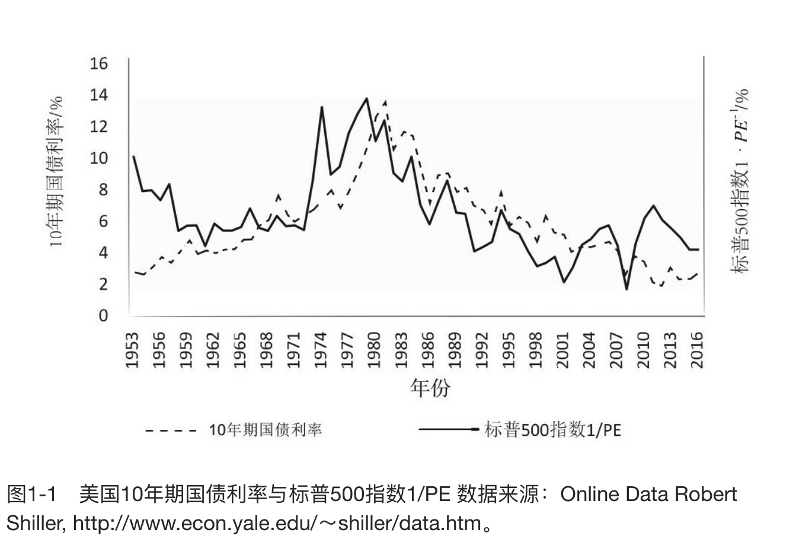

我们发现从1962年至2009年这47年的时间内，标普500指数的1/PE与美国10年期国债利率走势高度一致。从2009年开始，标普500指数的1/PE大幅度上扬，但国债利率却在下降。这个现象对我们上面所述的科学证伪主义很有现实意义。当重复47年的观察都在支持10年期国债利率在影响股票市场估值（或者反过来说，股票市场的估值在影响10年期国债利率）时，2009年却开始出现证伪的反例。这相当于是对以往理论的一个冲击，在面临这个冲击时，我们需要找出过去47年生效的逻辑基础，分析每个逻辑环节是否发生了相应的改变，以此来完善这个理论，形成一个更为开放的理论。

### 探究规律的三个步骤
探究规律可以分为三个步骤，分别是`逻辑检验`、`历史检验`和`实践检验`。

#### 逻辑检验

**1.现象**

逻辑检验从现象开始。金融市场每天都会发生各种现象，有些现象会持续，有些现象则稍纵即逝，而我们所做的第一步就是必须通过这些现象来分析其背后的规律。

我们的资本市场也在经常祈求央行降息。从2012年开始，我国金融市场无风险收益率大幅度提升，在刚性兑付的历史背景下，信托产品达到了年化12%左右的收益率，银行理财产品达到了年化6%的收益率，国家开发银行发行的政策性金融债券（简称国开债）在2014年年底也达到了6%的收益率。与此对应的是，沪深300指数的1/PE从2009年一路攀升至2014年最高的12%。央行的确在2012年年中降息了，但结果是股市一直熊了两年。

央行降息导致股市上涨，这只是简单的形象思维产物。当时是在中国宏观大幅度加杠杆的背景下，制造业、房地产和地方政府平台三大融资主体的市场实际利率居高不下，如图1-2所示。

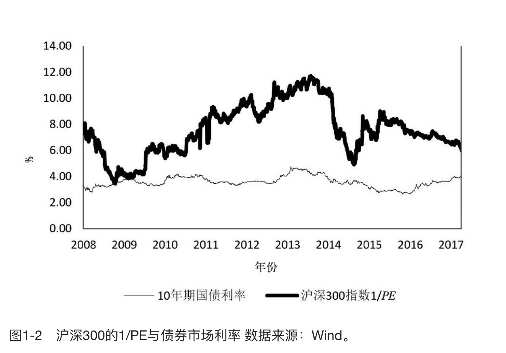

`恒生AH溢价指数`，如图1-3所示。为什么同一家企业在两地上市，同股却不同价？

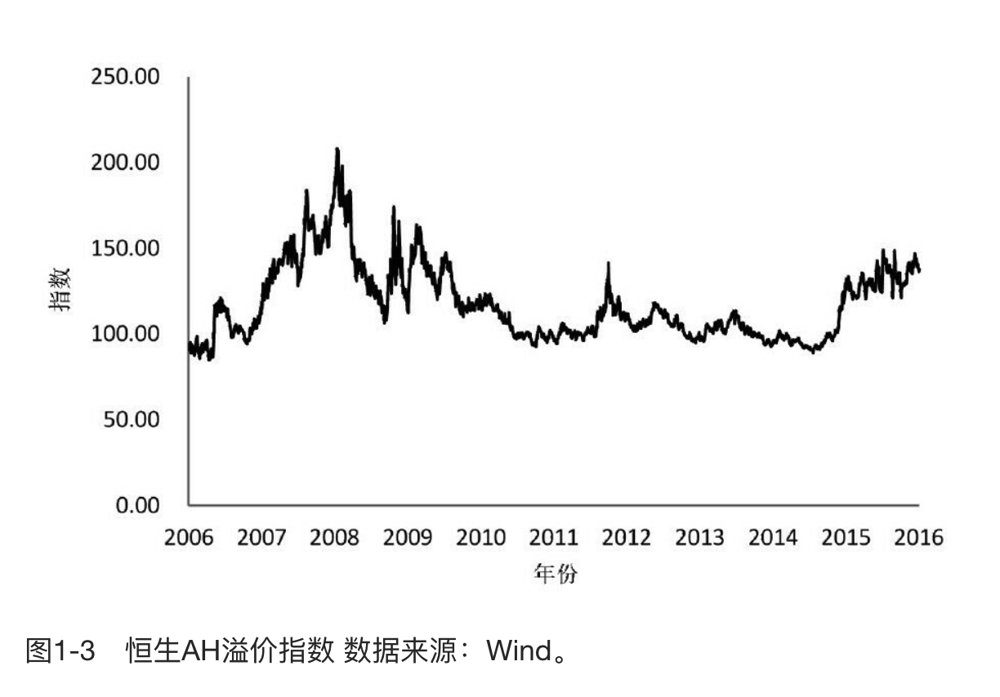

内地市场在2007年和2015年的大牛市中，皆跑赢了香港市场。在此提出以下几方面的原因：
- 受到内地蓝筹股估值走低的影响；
- 市场参与资金减少，造成市场定价失灵（成交量）；
- 香港资金流出，导致香港资产跌价（国际收支平衡、外储、存款）；
- 国际投资者对中国经济前景看淡，导致对香港上市公司未来盈利能力的担忧；
- 香港市场因为香港地缘政治问题被边缘化（香港市场融资量）；
- 香港政治风险；
- 美国退出量化宽松（Quantitative Easing, QE）预期，以及由此导致的美元加息和美元升值预期。

从逻辑上提出上述几种原因后，我们要为每个原因找到能够对应的可量化指标进行对比。经过实证的分析才能够确定可靠的关系。

通过实证分析，基本上可以排除香港市场定价失灵、资金流出、被边缘化这些因素。恒生指数的1/PE与美国10年期国债利率的差值（见图1-4）在2000年至2007年这段时间内都是小范围波动的，2008年迅速走高是由于金融危机的影响。但是，从2012年开始，这个差值再次走高，最主要的原因是香港市场受到了2012年至2014年A股蓝筹股走低因素的影响。中国内地的融资需求旺盛，导致了中国内地的利率高起，这影响了A股蓝筹股的估值，同时也就影响了恒生指数的估值。

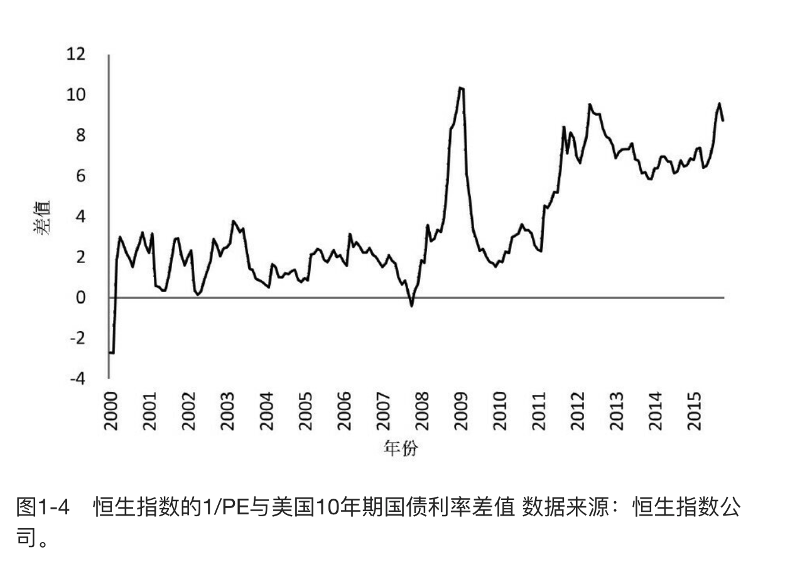

但是从2015年开始，中国内地的蓝筹股出现了估值修复行情，这个行情一直持续到了2017年。这期间虽然恒生指数也有同步上涨，但是涨幅依然低于A股。这主要是受到两个因素的影响：

1. A股投资者对风险的偏好度远大于港股投资者，A股的PE波动幅度远远高于港股，这说明在A股市场更容易出现羊群效应。
2. 港股受到了美元加息预期的影响。香港地区的外汇一直采取盯住美元的政策，这个政策导致了香港的利率环境和美国的利率环境相同。而恒生指数的上市公司中有60%是在中国内地开展经营的，因此这部分上市公司的报表需要将人民币折算为港币，如人民币贬值会导致这部分的折算利润降低，也就导致了香港市场的估值走低。

**2.相关性、因果和反身性**

观察到现象后，我们需要对现象进行分析，主要的分析逻辑有三种，分别是`相关性`、`因果`和`反身性`。

- `相关性`是一种简化的做法，就是将一个很难直接解释得清楚的东西，转换成另外一个相对容易分析的东西，即A=B。
- `因果性`是找出事物的原因和结果，即A→B。
- `反身性`是A影响B，同时B反过来也影响A，即B=f（A），且A=f（B）。

通过回归分析手段，我们很容易确认A与B是具有相关性的。但是，想确定A与B谁是因、谁是果，纯粹从数据的角度出发是不可能的。这时候我们需要借助逻辑推理。A和B两种因素相关，总计有4种情况，分别是：

1. A是B的原因（或B是A的原因）；
2. A与B互为因果（反身性）；
3. A与B同时受到C或C/D/E……的影响；
4. A与B之间没有任何因果关系。

#### 历史检验

**1.概率空间不断发生变化**

笔者认为，战争之后房价暴涨是一条普遍规律。从逻辑上解释是因为，战时各国投入相当多的兵力参战，国内的主要经济部门都会萎缩，军工部门会迅速地扩张。战时，很少有人愿意投资不动产，建设住房，导致住房的供给减少。战争结束后，军人返回自己的家乡，最重要的事情就是结婚生子，因此对房地产的需求扩张，而供给却没有那么快恢复。这个逻辑下，我们观察到的美国、德国、日本等主要国家的房价在二战之后都发生过上涨。

上述规律有一定的前提条件。如中国房地产市场和美、日、德房地产市场的情况并不相同。新中国成立后我们的住房价格并没有出现明显的上涨，主要是因为我国并没有实行住房的市场化制度。新中国成立后，全国90%的人口分布在农村，通过自己建设住房的方式解决了居住问题。换句话说，在美国、日本等国，二战后房地产价格上涨是大概率事件，但放在另外一个空间——没有市场化的中国，房价上涨就变成了小概率事件，甚至不可能事件。但当我们从1998年开始实行住房市场化改革之后，住房价格变化就开始遵循了市场供求逻辑。由于我们从二战结束后至1998年这段时间内的城市住房供给量太低，市场化改革后的房价呈现爆发式上涨。从另外一个角度，假设世界上不存在二战，那么就不会出现建筑业中断和士兵集体返乡这样的需求集中增长，美、日、德的房价也不会在20世纪50年代有那样大的涨幅。所以，规律的使用有一定的前提条件，那就是概率空间要相同。

**2.时间跨度长，国家范围广**

以《中国奶业白皮书（2014）》的调查为例。“我们的调查结果表明，随着家庭可支配收入水平的不断提高，城市居民人均牛奶消费量会持续提高，从家庭月可支配收入低于4000元的33千克/年上升到月收入水平14000元以上的47千克/年。而农村居民的人均牛奶消费量在收入达到最高收入组（即14000元/月）之前基本上维持20～30千克/年之间，而当收入达到14000元以上时，农村人均牛奶年消费量达到与城市对应收入组相同的水平。从消费频率来看，以牛奶为例，最高收入组（14000元/月及以上）中近40%的消费者几乎每天都消费牛奶，而在最低收入组（4000元/月以下）该比例还不足20%。对于酸奶，我们可以得出相似的结论。这一结果意味着，收入可能仍是中国当前农村乳制品消费的最主要制约因素，但在未来，随着农村收入水平的进一步提升，中国农村对牛奶等乳制品的需求量将显著上升。”

按照世界银行的统计，2015年日本的人均收入为42310国际元，中国的人均收入为14320国际元。按照白皮书中的理论，日本的人均鲜奶消费量应该远远高出中国。但实际情况是，根据联合国粮农组织公布的数据，日本2012年至2014年鲜奶消费量均值为32千克/人，中国为23千克/人，日本的鲜奶消费量虽然高出中国，但并没有高出很多。很多收入低于日本的国家，比如新西兰、印度、俄罗斯、土耳其、乌克兰、乌拉圭和巴基斯坦，它们的牛奶人均消费量远高于日本。

结果，我们看到的是，人均牛奶消费量与人均收入毫无关系。

为什么两者结果会不同？就是因为概率空间不一样。我们讨论收入影响牛奶消费量的前提是：

1. 样本从低收入国家向高收入国家中进行过渡；
2. 人群中乳糖不耐比例不发生重大变化。

注意到概率空间的适用性问题，我们才能够更为清楚地分析是哪些因素在影响某种现象，然后在未来的预测上才能够避免盲人摸象式的错误。

#### 实践检验

白酒行业的两个代表贵州茅台和五粮液的股价都双双从2013年的高点腰斩。

当时的分析是，白酒具有千年的文化底蕴，需求并不会因为限酒令而萎缩。所以，这个行业的前景并没有大多数投资者想象的那么悲观。2014年初，五粮液的市净率在1.6倍左右，市盈率7倍左右；贵州茅台的市净率在3倍左右，市盈率9倍左右。我们理所当然选择五粮液。当时笔者是根据类似图1-6的框架来进行研究的。

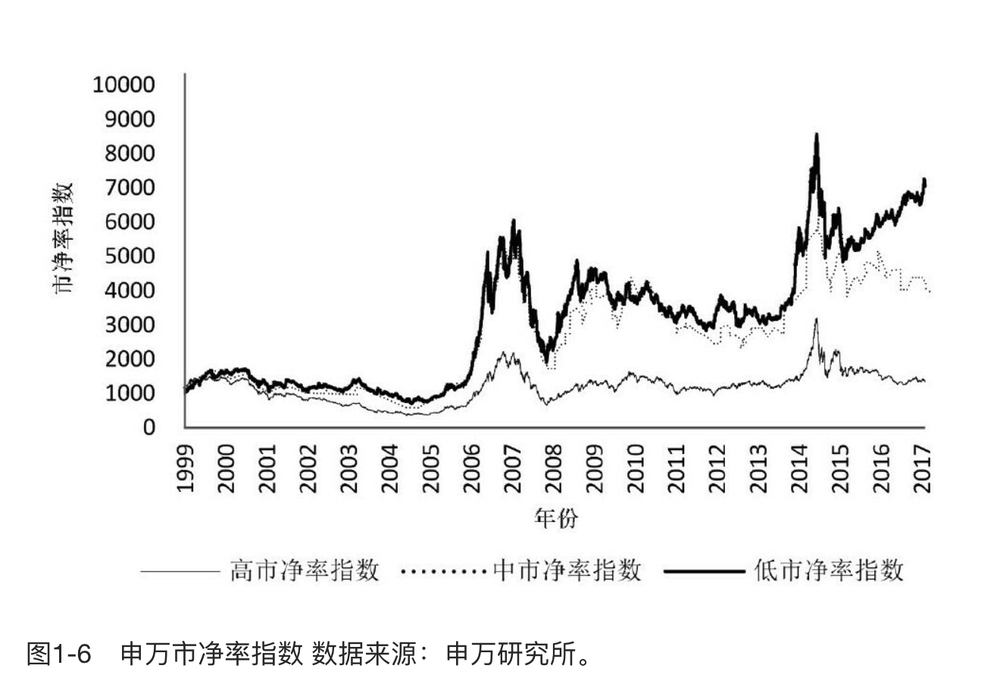

申万研究所根据市净率的高低制定了`市净率指数`，可以明显看到的是，低市净率指数大于中市净率指数，中市净率指数大于高市净率指数。但后来的茅台和五粮液的复权股价走势图，如图1-7所示。

>申银万国股价系列指数是由申银万国证券研究所通过简单透明的编制方法编制的反映市场股价变化的以辅助投资为主要目的的指数。由申银万国行业股价系列指数和申银万国市场风格股价系列指数构成。其中市净率系列指数以市净率为划分标准，包括高、中、低市净率指数，主要表征不同市净率股票的股价走势。高市净率指数表征成长类股票的股价走势，低市净率指数表征价值类股票的股价走势，中市净率指数表征界于价值与成长类股票之间的股价走势。

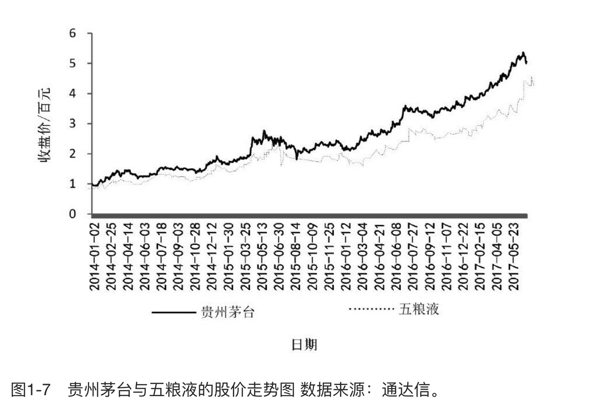

高市净率的茅台的确跑赢了低市净率的五粮液。对于这个问题，笔者进行了深入的思考与研究，修正了原有的模型，**即以合理价格买入伟大企业的策略，比以便宜价格买入好企业的策略更优**。

## 区分可预测与不可预测
### “拉普拉斯的恶魔”
1814年，拉普拉斯做出以下这些后来被称作“拉普拉斯的恶魔”的假设。“我们应当把宇宙的现状看作它先前状态的结果以及它的后继状态的原因。假定在某一时刻，有一种之后能够把握自然界所有的力以及组成自然界的一切事物的特定状况——这种智慧博大精深，足以对所掌握的资料进行分析——那么，它就能将宇宙间从最庞大的物体到最微小的原子的运动全都囊括于同样的公式之中，对于它来说，没有什么是不确定的，未来，一如过去，都呈现在它的眼前。”

简单来说，科学决定论认为宇宙存在一个终极公式，通过这个公式人类可以知道宇宙的全貌，知道宇宙的过去与未来将会怎样。

对于复杂系统的预测几乎是不可能的。

金融泡沫何时破灭也无法预测，因为金融泡沫也是一个自组织临界系统，由众多投资者构成的“自组织”，使得任何外部的微小变化都可能导致金融泡沫的破灭。我们对中证全指的数据进行处理：第一步，求出每日收益率；第二步，对收益率取绝对值；第三步，将中证全指的收益率绝对值由高到低进行排序。得到如图2-1所示的结论。

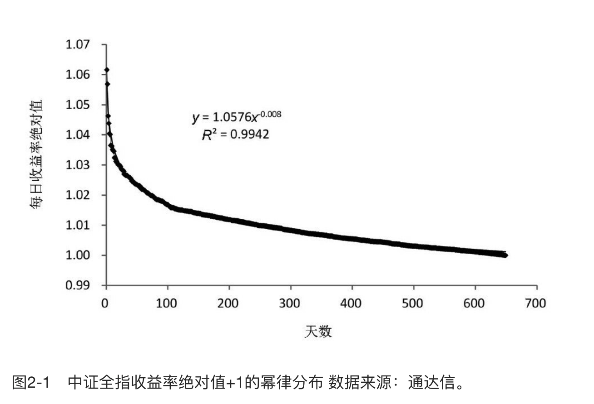

按照传统的理论，金融市场的收益率服从的是`对数正态分布`，但对数正态分布无法解释美国1987年的股灾。1987年10月19日，美国道琼斯指数一天就下跌了22.6%，标普500指数下跌了20.47%。如果用对数正态分布去解释，按照过去180个交易日的标普500指数日收益率均值为-0.1%，标准差为1.88%，当日标普500指数的波动超过了10个标准差——通俗地说，这是个万年难得一遇的现象。如果按照`幂律分布`去解释，这个现象就好比9级以上的地震，并不是万年难得一遇的。

`幂律分布`形成的原因就是系统内部有某些因素相互关联，最终导致了`“网络效应”`，投资者见到市场情况不好，就竞相卖出，相互踩踏，产生了市场暴跌。

### 警惕幸存者偏差
以偏概全的评判标准错误，被称为“幸存者偏差”。产生幸存者偏差的两个主要原因如下：
1. 我们的大脑讨厌不确定性，我们喜欢一切都是被我们理解和掌控的，虽然很多时候事实并不是这样。我们的大脑在这点上欺骗了我们，让我们认为当今观察到的现象都是必然的。这种情况本质上是因为我们的大脑不擅长处理概率问题。我们身处的世界有无数种可能性，但我们的历史仅仅沿着一个特定的路线发展下来，我们的大脑告诉我们这是必然的。
1. 我们大脑记忆的特点决定了我们的大脑无法记忆过多的信息。我们的大脑能够记住中国第一个进入太空的英雄是杨利伟，至于第二个、第三个是谁，相信很多人是不大清楚的。我们大脑对事物的记忆数量是有限制的。

在商业领域中，幸存者偏差的现象很重要。英特尔公司，作为微处理器产业的领头羊，其股价在1972年至2015年期间创造了17.92%的年化收益率，在美股1926年至2015年近100年的历史中排名第9位。

英特尔公司最初的业务主要是存储芯片，并不是微处理器。20世纪60年代至70年代，英特尔在存储芯片领域幸存了下来。然而游戏到这里并没有结束。20世纪80年代，日本存储芯片厂商开始进入美国市场，日本厂商的存储芯片性价比远远高于英特尔的产品，导致英特尔的盈利迅速地下滑。

在这样的情况下，英特尔放弃了已经经营了将近20年的存储芯片业务，转而进入了微处理器业务领域。这个转型的过程相当痛苦，也相当精彩。英特尔从存储芯片向微处理器转型的过程中很多因素具有偶然性。转型期间，英特尔的管理层犹豫不决，相反是中层管理人员花大力气投入微处理器的业务。从这个角度来讲，英特尔能够创造出如此高额的投资回报率，很大程度上归结于它是一名行业内的幸存者。

### 对客观事物进行分类
根据客观事物的特点，我们将客观事物分为三个系统，分别是`线性系统`、`非线性系统`和`复杂系统`。按照目前的科学发展情况，线性系统和精确的非线性系统能够预测。按照参数是否稳定，将系统细分为五种系统，如表2-2所示。

表2-2　系统分类

参数稳定性 | 系统 | 表达式 | 可预测性 | 举例
------|----|-----|------|---
稳定 | 精确的线性系统 | Y =kX+b，其中k与b为已知常数 | 可以精确预测 | 生产1吨玻璃所需的硅砂数量、乘坐地铁去机场所需时间
不稳定 | 不精确的线性系统 | Y =kX+b，其中k与b 为估计常数 | 可以模糊预测 | M2 与CPI 之间的关系、高考成绩与读大学档次的关系
稳定 | 精确的非线性系统 | Y =f(X)， 其中f为非线性函数且参数为已知常数 | 可以精确预测 | 狙击手的弹道计算、象棋电脑软件的程序
不稳定 | 不精确的非线性系统 | Y =f(X),， 其中f为非线性函数且参数为估计常数 | 不可预测 | 期权定价的BS公式、金融泡沫预测领域的LPPL模型
~ | 复杂系统 | 无表达式，具有自组织临界现象和幂律分布 | 不可预测 | 地震预测、音乐的曲谱（1/f噪声）

- 精确的线性系统，指的是两种或多种因素之间存在精确的线性关系。这类似于本章第一节讲述的“拉普拉斯的恶魔”的假设。
- 不精确的线性系统，指的是两种或多种因素之间存在线性关系，但是线性关系的参数并不稳定。本书中我们研究的系统大部分属于这个范畴，用线性回归的方式计算测定系数（$R^{2}$值），在经济和金融领域，一般情况下$R^{2}$超过0.6都会被认为具有显著的线性关系。
- 精确的非线性系统，指的是两种或多种因素之间存在非线性关系，非线性关系的函数具有表达式，且表达式的参数是确定的。
- 不精确的非线性系统，指的是两种或多种因素之间存在非线性关系，非线性关系的函数具有表达式，且表达式的参数是不确定的。
- 复杂系统，这个系统内部存在某种样式的`网络效应`，导致了整个系统在统计学上服从幂律分布。我们在“拉普拉斯的恶魔”那一小节讲过，人类目前的能力无法对这个系统的衍化做出预测。

### 掌握预测未来的三个原则
我们在经济领域和金融领域碰到最多的预测类型都属于第二类，即不精确的线性系统。根据笔者的个人经验，在这个系统内，讨论预测的原则如下：
1. 逻辑解释原则：逻辑上可以解释两者的线性关系；
1. 概率空间一致原则：在可以预见的未来内，概率空间不能变化；
1. 排除伪线性系统原则：注意伪线性系统，即实际是复杂系统或非线性系统，在历史的某一阶段表现出了线性，以此进行预测的结果是不可靠的。

笔者一般遵循的方法是这样的：
1. 从会计学的描述结果出发，即企业的ROE（净资产收益率）在某一段历史时间内，与社会平均水平之间的关系，是高于均值、围绕均值波动，还是低于均值。从会计的角度去归纳ROE变化的原因，是杠杆，是毛利，还是周转率。
1. 从源头寻找经济学的解释。主要考察产业的供求关系、产业内部的规模效应、产业的渗透率、产业技术的创新。最终，确认一个最主要的影响因素，并去考察这个因素在未来发生变化的可能。
1. 去寻找心理学、进化论或者生理学的解释。产业存在的意义就是满足人的需求，我们对所有商业及投资活动的分析最终都归结于对人的分析。人的需求在不同的经济阶段会表现出不同的模式，但本身并不经常发生变化，所以能够找到心理学的依据，去做出更为可靠的预测。关于产业的分析，我们在本书的第三部分会进行详尽的讨论。

## 判别投资框架的有效性
### 不可不知的基础概念
#### 复利与现值

设初始投资资金为C，年投资回报率为r，投资期限为n，则期末投资者的资产总值=$C（1+r）^{n}$。

`复利`是股票产生高投资回报的最重要原因。考虑这样一个情景：A投资者在第一年的投资结果为盈利100%，第二年亏损40%，第三年盈利50%；B投资者的投资每年盈利25%。三年后，A投资者的收益率为80%，B投资者的收益率则为95%。这就是复利导致的差别。

`现值`则是与复利相反的概念。假设现在你有两种选择，第一种是有人立马给你1000元，第二种是在投资回报率为10%的情况下，有人在第一年年底给你400元，第二年年底给你400元，第三年年底再给你400元。那么，从现在的角度考虑，哪种方案更值得？你应该如何选择？

我们这样来考虑这个问题，假设投资回报率为10%，未来三年每年要拿到400元的收入，折算到现在的价值是多少。与复利相反，我们需要计算的是初始金额，即现值。

$现值=\frac{400}{1+10\%}+\frac{400}{(1+10\%)^2}+\frac{400}{(1+10\%)^3}=994.74元$

#### 技术分析

`技术分析`一直是处于主流学院派理论之外的旁支，股票投资方法大体上分为两类：

- 一类是以研究股票公开市场历史交易价格为基础的，该类理论被称为技术分析，认为通过股票历史价格，可以对其未来的价格进行预测。
- 另一类是以研究公司基本面为基础的，该类理论被称为基本面分析，认为未来公司盈利向好，则股票未来的价格会上涨。

大体上讲，技术分析以是否有数学手段的引入划分，分为`旧技术分析`和`新技术分析`流派。其中，旧技术分析流派主要包括：趋势理论、K线理论或者K线理论的变种。新技术分析流派则以芝加哥学派为代表。

`趋势理论`的核心思想是，股本的价格一旦形成某种趋势后会有动力延续。其背后的逻辑是社会心理学原理，由于人是社会性动物，我们的行为更多的是取决于其他人的行为，而并非个人的性格、智力、生活经历等因素。所以，投资者买入导致股票价格上涨，股票价格上涨吸引更多的投资者买入，下跌反之。

趋势理论的最重要缺陷是，行情一定会反转，但具体在什么时间点反转却无法预测。最终导致的结果就是，投资者追涨杀跌。

`K线理论`的核心思想是，通过对K线和成交量的分析，能够大概推算出市场投资者的筹码分布，从而测算出主要的支撑位置和压力位置，进行相应的操作。背后的逻辑是，当股价上涨至前期集中成交的价格时，会有大部分的投资者得以解套，立即卖出，导致股价承压。当股价跌至前期集中成交的价格时，会有大部分的投资者开始亏损，持股不动，导致股价企稳。

这是个盲人摸象式的错误。

1. 这个理论首先假定了一只股票的主要交易是由一个投资者完成的，即传说中的主力。因为如果是众多股票交易者形成的集中成交区域，仅能够说明的是投资者的分歧比较大，并不能说明在集中成交区域，大部分投资者会采取一致行动。投资者采取一致行动的后果是股票形成单边趋势，或者根本无法成交，不会形成集中成交区域。
2. 市场中并不存在主力。机构投资者是主力吗？从总体上讲，机构投资者的决策与散户的决策并无任何差异。

至于其他的K线理论也需要推敲。三根阳线的排列被称为“红三兵”，暗示着股票即将上涨。如果这个理论成立，我们可以依照相同的逻辑认为，大前天下雨，前天下雨，昨天下雨，所以接下来可能会经常下雨。

#### 芝加哥学派
1959年，马科维茨出版了《投资组合选择：投资有效分散化》。1990年马科维茨因其贡献的均值-方差模型获得诺贝尔经济学奖。马科维茨也因此成为芝加哥学派投资理论的奠基人物。笔者将芝加哥学派归为`新技术分析`的重要原因是他们用股票历史收益率的方差来衡量股票的风险。

从意义上讲，方差代表着样本观测值偏离均值的幅度。如用其来衡量教师的绩效是比较贴切的。假设2名教师，分别教A班级和B班级，每个班级5名学生，成绩表如表3-1所示。

表3-1　两个班级学生成绩的方差分析

名次与统计项目 | A班级 | B班级
--------|-----|----
第一名 | 96 | 90
第二名 | 85 | 89
第三名 | 79 | 78
第四名 | 67 | 66
第五名 | 57 | 61
平均成绩 | 76.8 | 76.8
成绩方差 | 232.2 | 172.7

A班级最高分比B班级高，两班平均分相等，同一排名上A班级超过B班级成绩的学生有3名。但A班级的方差比B班级大很多，这代表着A班级学生的学习成绩并不是那么平均，高低差距相比B班级大。如果没有方差指标，我们很难在两组样本中进行这样的比较。同样地，如果经过3次模拟考试，B班级的方差一直都小于A班级，我们就可以做出这样的预测：总体上讲，**B班级的学生成绩稳定性高于A班级，会在接下来的正式考试中获得相对于A班级更稳定的成绩**。

但是，以股票过去的收益率方差衡量股票市场未来的风险，这样的做法就值得商榷了。逻辑上讲，这种方法是在利用股票过去的价格轨迹对未来进行估计。由于股票价格特定轨迹是投资者博弈的概率空间下形成的（关于这一点我们会在下一章具体讨论），用过去概率空间下形成的样本值，去预测未来股票的风险，逻辑上并不可行，这与我们之前举的下雨的例子如出一辙。

### 投资框架的实战检验
表3-3　福布斯投资领域财富排名

排名 | 姓名 | 2016年净资产/亿美元 | 2006年净资产/亿美元 | 财富增长幅度 | 年龄 | 财富来源 | 居住地 | 国籍
---|----|--------------|--------------|--------|----|------|-----|---
2 | 沃伦·巴菲特 | 756 | 460 | 64.35% | 86 | 伯克希尔·哈撒韦 | 美国 | 美国
30 | 乔治·索罗斯 | 252 | 85 | 196.47% | 86 | 对冲基金 | 美国 | 美国
45 | 瓦利德王子 | 187 | 200 | -6.50% | 62 | 投资 | 沙特阿拉伯 | 沙特阿拉伯
49 | 詹姆斯·斯西蒙 | 180 | 40 | 350.00% | 78 | 对冲基金 | 美国 | 美国
54 | 瑞·达利欧 | 168 | 40 | 320.00% | 67 | 对冲基金 | 美国 | 美国
55 | 卡尔·伊坎 | 166 | 97 | 71.13% | 81 | 投资 | 美国 | 美国
92 | 史蒂夫·科恩 | 130 | 30 | 333.33% | 60 | 对冲基金 | 美国 | 美国
96 | 菲利普·安舒茨 | 125 | 78 | 60.26% | 77 | 投资 | 美国 | 美国
96 | 罗纳德·佩雷尔曼 | 125 | 70 | 78.57% | 74 | 杠杆收购 | 美国 | 美国

上述9人中，没有一个是做传统技术分析的，也没有一个是芝加哥学派的（但他们大部分都受到过芝加哥学派系统的教育）。我们对上述9人简要的概述如表3-4所示。

表3-4　九大高手概要

姓名 | 公司名称 | 毕业院校 | 主要投资观点或风格 | 历史业绩 | 资产管理规模
---|------|------|-----------|------|-------
沃伦·巴菲特 | 伯克希尔·哈撒韦 | 内布拉斯加大学林肯分校，哥伦比亚大学 | 以合理的价格买入优秀的企业，并长期持有 | 1964年至2016年，年化回报率19% | 6200亿美元
乔治·索罗斯 | 量子基金 | 伦敦经济学院 | 基于开放社会、反身性的概念对宏观经济进行分析，发现全球主要经济体的汇市和股市交易机会，通过使用杠杆及空头实现收益 | 1969年成立至2011年，索罗斯基金管理公司旗下的量子捐赠基金年均投资回报率达到20% | 300亿美元
瓦利德王子 | 王国控股公司 | 美国旧金山门罗学院、雪城大学 | 基于对公司基本面的分析，购买困境中的公司的股票，买入杰出的公司的大量股份 | 不详 | 121亿美元
詹姆斯·西蒙斯 | 文艺复兴科技公司 | 麻省理工学院、加州大学伯克利分校 | 西蒙斯领导大奖章对冲基金（Medallion）以电脑运算为主导，运用数学模型在全球各种市场上进行短线交易 | 1989年到2009年间，他操盘的大奖章基金平均年回报率35 %。 文艺复兴机构期货基金(RIFF)，2007年至2015年年化回报率为2.86% | 150亿美元
瑞·达利欧 | 桥水投资公司 | 长岛大学、哈佛商学院 | 严格遵循“不把所有鸡蛋放在一个篮子当中”的理念，投资组合多元化在纯阿尔法基金中得到了极致性体现。该基金在全球金融市场配置资产组合，包含8个资产类别：发达国家货市、新兴市场货市、名义利率产品、名义利率价差产品、通胀挂钩债券、主权国家和企业信贷、股票、大宗商品。“控制风险是始终如一的话题”，达里欧说：“因为我不能确定（任何一个市场的未来走势），我不想进行任何集中式投资。”即便桥水投资公司已经在投资领域摸爬滚打了40年，已依然会犯错误，更精确地说，它的判断准确率只有60% 左右。“如果不能实现充分的多元化，投资组合在某些时段将会面临不可接受的风险敞口。因此，我们已经建立起一个包含一系列低相关资产的投资组合，确保基金投资收益的平稳性。 | 旗下阿尔法基金，自1991年至2015年，在扣除管理费用后，平均每年为投资者创造9.91%的收益，而且只有 3 年收益率为负。旗下全天候基金在1996年至2014年扣除管理费后的收益率始终维持在8%左右，最高水平出现在2005年,为 8.6%，最低水平出现在2012年，为7.4% | 1500亿美元
卡尔·伊坎 | 伊坎资本 | 普林斯顿大学、纽约大学（中途退学) | 巨量购入看中的上市公司股份后坐稳战略股东位置并迫使公司做出管理或策略的改革，使股价在短时期内快速上升。伊坎并不关心企业发展，只考虑如何从收购和出售股票中获利，其因此也被称为“企业掠夺者”和“企业狙击手” | 1968年至2011年间伊坎旗下公司的年化投资回报率为31% | 317亿美元
史蒂夫·科恩 | SAC 资本、72点资产管理公司 | 宾夕法尼亚大学 | 科恩以“一个贪婪的市场信息收集者”而闻名，2010年SAC资本被美国证监会提起内部交易公诉 | 1992年至2010年，平均年收益率超30% | 120亿美元
菲利普·安舒茨 | 安舒茨集团 | 堪萨斯大学 | 以并购土地开采石油起家，其后并购不断深入体育、娱乐产业。客观上难以统计他的投资回报率和资产管理规模 | 不详 | 不详
罗纳德·佩雷尔曼 | 麦克安德鲁斯及福布斯控股公司 | 宾夕法尼亚大学 | 通常，他会选择买进一家其他投资者都看不上的公司，修修补补之后出售给其他行业巨头。计算这些企业报表中的各种数字，控股、优化进而达到大幅增值的目标，是佩雷尔曼最擅长的技能 | 不详 | 不详

#### 乔治·索罗斯的投资之道
**1.反身性**

金融市场领域作为软科学最好的实验室，存在大量的反身性现象。特别是正泡沫的产生和负泡沫的产生，完全由反身性主导。由于某种基本面因素产生变化，向好发展→股票价格上涨→投资者观察到股票价格上涨→买入股票→导致股票价格进一步上涨→某种基本面因素开始向坏发展→股票价格停滞→股票价格下跌→投资者卖出→股票价格进一步下跌。这是市场产生泡沫的一个完整的过程。

因此，我们在分析某项投资时，要考虑反身性因素。由于反身性的广泛存在，市场群体会产生正泡沫和负泡沫偏见，我们借助这些集体性的偏见来发现盈利机会。戴维斯对这个过程的总结十分到位，未来公司的盈利上升与股票的估值上升，被称为`戴维斯双击`。相反的情况被称为`戴维斯双杀`。多头标的最好的情况就是戴维斯双击。

**2.不可预测性**

软科学中的现象广泛存在反身性，并不像传统硬科学领域中的现象那样严格遵循因果关系。参与者本身的想法与现象之间相互影响，使得我们对理论的检验基本上无法完成，还使得我们对未来的预测难度加大。

在硬科学领域，真理的检验标准是做出的预测与实验观察的现象一致。比如爱因斯坦的相对论可以用日食来证实，也可以用洲际导弹的打击轨道来证实。但是在参与者的意识会影响现象的领域，现象的产生变成了一种概率，也就是说，最后观察到的现象是有可能发生的，也有可能不发生的。

由于理论具有不可检验性和集体行为的预测难度很大，我们很难把握具体的时间点。索罗斯在其书中披露了他曾经参与互联网泡沫做空失败的案例，索罗斯在市场高点到来前的空头仓位使得他最终没能够等到胜利曙光的到来，如图3-7所示。

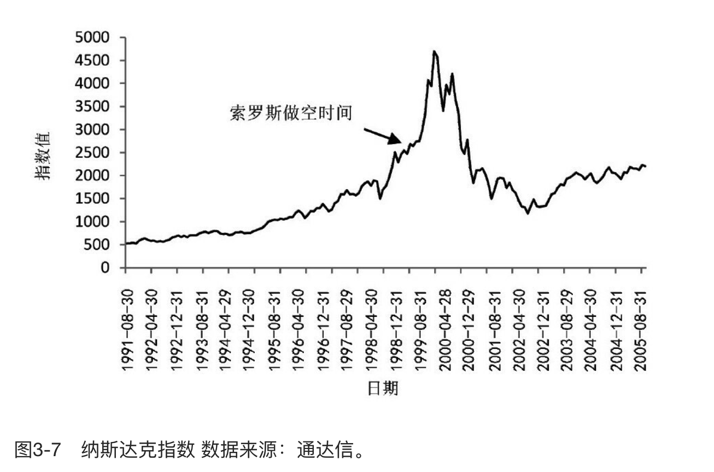

**3.可错性**

基于反身性、偏见和不可预测性，索罗斯推导出了可错性，即任何对事物的认知或人类构建的框架都不是完美的。这个不完美的框架时刻接受着可错性，才能进一步完善，更好地适应客观世界和时代的发展。

投资者必须清楚的是，他建立的任何投资标的都务必找到其风险触发条件。比如，茅台的最大问题在于茅台的经销商经常在茅台价格上涨时囤货，在茅台价格上涨预期的情形下，消费者根本买不到茅台。有一些因素会导致茅台经销商预期茅台价格会下跌，又开始集体甩货，最终导致茅台的价格下跌。甩货导致了经销商向茅台厂拿货的意愿不强，最终形成茅台报表上的应收科目。所以，当一些触发茅台经销商甩货的条件起作用时，应该予以警惕，小心评估它们会对茅台造成的影响。好在，茅台的存货是一种伴随时间而增值的产品。

不同的标的，其风险触发条件是不同的，不可一概而论。但，凡是投资标的，必然不是完美的，如果不知道投资标的的风险点在哪，最好不要盲目投资。

**4.创造性谬误**

“与科学的不同之处在于，在金融领域中，能够带来利润的假说不一定都是正确的，因为它具有反身性，所以只要它能够为大家普遍接受，也就足够了。但是，一个错误的假说不可能永远流行，这就是我喜欢依据那些有望为人们普遍接受但却有缺陷的假说进行投资的原因，但前提条件是我必须知道它的缺陷是什么。这一观点可以使我及时脱手。我把我的有缺陷假说称为‘创造性谬误’，这是我的历史理论以及我在金融市场上取得成功的基础。”

索罗斯的投资逻辑认为由于人类认识的偏见导致了反身性的产生，而反身性决定了未来根本无法预测。但是客观事物接受可错性，即集体性认识的偏见总有一天是要纠正其错误的。从这点出发，索罗斯定义了“创造性谬误”，即他的投资方法需要找到一个假说，这个假说必须与大众的预期有差距，因为大众的预期是错的，市场会纠正这个错误。

# 市场与价格：影响投资收益率的因素
## 市场可以有效反映股票的价格吗？
### 有效市场假说

尤金·法玛（Eugene F.Fama），有效市场假说（the efficient markets hypothesis, EMH）的集大成者，芝加哥学派的代表性人物，2013年获得诺贝尔经济学奖。简单来讲，有效市场假说认为股票的价格完全准确地反映其对应公司基本面的信息，投资者无法通过股票的交易获得超额收益。这一假说的逻辑基础是市场竞争，由于为数众多的投资者在研究关于公司任何基本面的消息，并迅速地做出反应，导致公司的股价立即反映了公司基本面变化，从而导致了投资者总体上无法通过交易股票获得超额收益。按照有效市场假说，由于股票市场的价格严格地反映了关于公司基本面的消息变化，而公司未来的基本面是无法预测的，因此股票的价格也就无法预测，股票的价格遵循`随机游走模型`，或者说股票的收益率满足`对数正态分布`。

笔者按照对数正态分布随机数生成股票价格，然后截取了一段真实沪深300指数的走势，对比如图4-1所示。

那么，上图中（a）与（b）究竟哪个是真实数据？哪个是用随机数生成的呢？单凭肉眼观察，其实很难区分。在1000个左右交易日的范围内，随机数的确可以做到以假乱真。我们把周期拉长至3000个交易日，如图4-2所示。

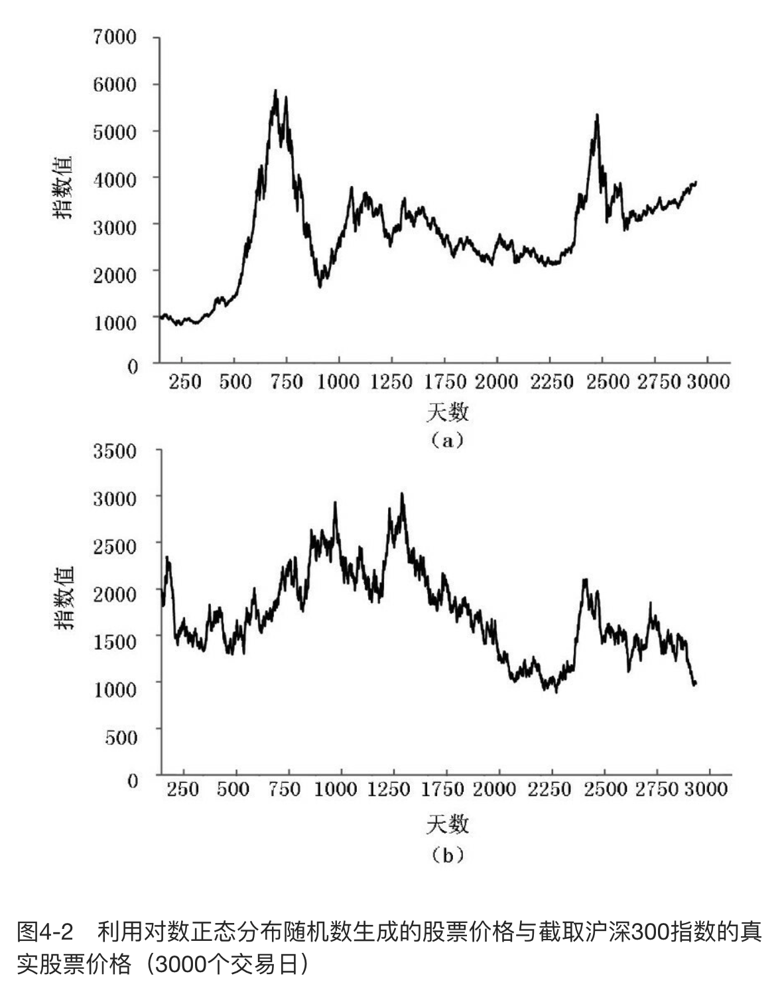

将图4-2转换为日收益率分布图，则观察的效果更为明显，如图4-3所示。

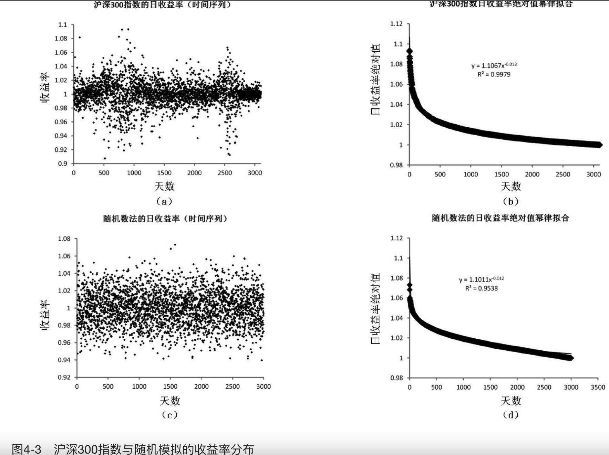

图4-3的（a）和（c）两张图，收益率逃逸出0.94～1.06界限的点，（a）明显多于（c）。同样地，（b）和（d）两张图中，（b）超过1.08的点明显多于（d）。所以，我们看到了按照`幂律`拟合（b）可以达到0.9979，而（d）只有0.9538。正是这些逃逸出去的点导致了股票市场的剧烈波动。

我们无法很好地区分图4-1中两幅图的差别，根本原因在于，**股票市场在短时期内的收益率分布的确是满足`对数正态分布`，但是时间周期一旦拉长就呈现出`幂律分布`**。换句话说，在短期内，投资者与投资者之间相互独立分析股票价格，这时候股票的价格显现出完全的随机性，市场非常有效，我们很难通过这样的市场去赚钱；然而，在长期的某一段时间内，投资者与投资者之间开始相互影响，市场主流观点会在投资者之间传播，或者市场本身在影响投资者的一致行为，市场的波动性放大，市场收益率的点逃逸出正态分布的概率限制，最终形成了幂律分布，而每当市场在投资者的一致行为影响下，都会形成大幅波动，从而形成急速的牛市和熊市。

### 行为金融理论
与法玛同年获得诺贝尔经济学奖的是罗伯特·希勒（Robert J.Shiller），耶鲁大学的金融学教授，行为金融学领域的先驱。希勒对有效市场假说提出质疑。按照有效市场假说，股票的价格是对未来股利的无偏估计。但长期看，股利的波动性很低，而股价的波动性却很高，如图4-4所示。

图4-4是标普500指数的价格与盈利，我们观察到股票价格的波动性要远远大于盈利的波动性。

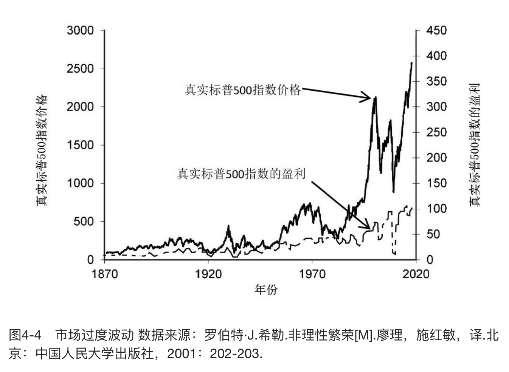

我们发现，标普500指数的价格围绕其价值在上下波动。这个现象在我们国家的股票市场中也存在，具有普适性，如图4-5所示。

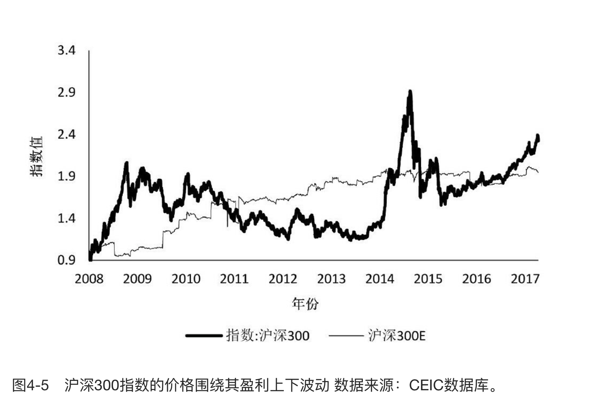

那么，由于盈利或者股利长期表现出相当稳定的特点，而股票的价格则围绕其上下波动，采用PE指标可以预测股票未来的收益率。罗伯特·希勒用30年期的移动平均PE去预测收益率，如图4-6所示。

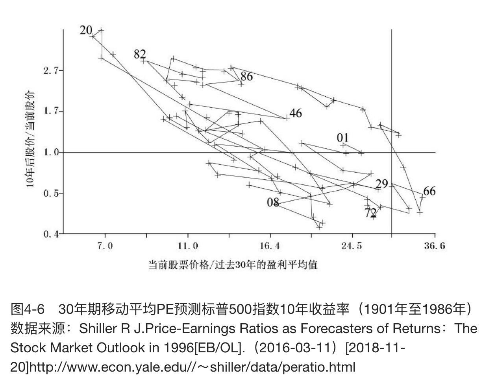

结果显示，两者具有明显的负相关性，随着时间的拉长，预测收益率的$R^{2}$在上升，10年的$R^{2}$为0.432，30年的$R^{2}$为0.615。

至此，我们看到罗伯特·希勒的相关研究对有效市场假说是一个强有力的挑战，用巴菲特的话表述即为“股市达成欢腾共识，你得支付更高买价”。

### 市场先生理论
经过本章前两节的分析，相信我们已经认识到这样的观点：大部分时间内的股票价格是有效的，或者说对于投资者来讲是无利可图的；只有当股票市场开始狂躁，价格出现大幅的波动时，这时候市场的价格就无效了，对投资者来讲是赚钱的大好机会。这是对股票市场最为基础的认识，但在实践中仍然有很多方面执行起来是很困难的。因为大部分的时间里，好公司的价格一点都不便宜，而价格很便宜的公司看起来又很有问题。

这个即霍华德·马克思在其《投资最重要的事》一书中所谈的“第二层次思维”。第一层次思维是：这是一个好投资机会。第二层次思维则是：这个投资机会是不是也被其他人看好，导致了这个机会所需付出的成本很高？同样，关于负面的投资思维，第一层次是：这是一家非常糟糕的企业，有很糟糕的前景。第二层次则是：这家企业真的有那么糟糕吗？是不是其他人过于悲观了，导致对这家公司的估价太低了？这个思维其实是反人性的，我们人性中很重要的一些思维方式和行为都是依靠他人的看法，这是因为这样的方式非常适合个体在自然环境下的生存，我们的大脑在自然环境下进化了数十万年，非常擅长以这样的方式去解决问题。

## 如何提高股票收益率
### 戈登增长公式
$P=\frac{D}{r-g}$

其中，P为股票价格，D为第一期期末股票股利，r为未来永续期限内的利率，g为未来永续期限内的年化几何平均股利增长率。

该公式是根据现值计算公式得出的，是现值的一种简化表达方式。根据经验，在具体的应用中，该公式更适用于股票指数的衡量，能够粗略地估计指数的估值是否合理。

我们先看下面的案例。

案例一：
>A开了甲公司，初始投入资金为100万元，假设其并未举债。每年甲都将所赚的利润再次投入公司运营当中，并一直维持总资产收益率=10%不变。
>
>10年后，A不想继续经营甲公司，进行清算，此时甲公司的价值为$100×（1+10\%）^{10}$=259.37万元。我们假设甲公司的资产都可以按照这样的价格清算掉，则在这10年间，A获得的净利润为159.37万元。A在这10年间的年化复利收益率为10%。

案例二：
>A开了甲公司，初始投入资金为100万元，假设其并未举债。每年甲都将所赚的利润再次投入公司运营当中，并一直维持总资产收益率=10%不变。
>
>如果甲公司的股票可以上市交易，假设第5年时A股东转让100%股权给B，转让价格为200万元，则A的实际获利为100万元。此时，A在这5年间的年化复利收益率为14.9%。这是A会卖出公司的原因。
>
>又过了5年，B投资者不想继续经营甲公司，进行清算，此时甲公司的价值为$100×(1+10\%)^{10}$=259.37万元。我们假设甲公司的资产都可以按照这样的价格清算掉，则在这5年的时间里，B投资者的净利润为59.37万元，B在这5年间的年化收益率为5.34%。

我们对比上述两个案例，甲公司基本情况是一模一样的，累计寿命10年，创设时投入了资本100万元，清算时回收资本259.37万元，在这10年间的创造的年化回报率为10%。不同之处在于，在案例一中甲公司的所有权人一直都是A，未发生过股权的转让，故A在这10年间的收益率就等于10%，而在案例二中，股权发生过一次转让，A持有了前5年的股权，B持有了后5年的股权，转让发生在第5年年末，转让价格为200万元。这个转让价格导致了A的投资回报率为14.9%，B的投资回报率为5.34%，A与B在第5年年末转让时，甲公司的净资产为161万元，转让价格为200万元，两者的比值为1.24，这个比值被称为市净率，市净率是在A与B之间分配甲公司经营成果的根本原因。我们发现，在案例二中，甲公司创造的利润并没有发生变化，只不过是这些利润在A和B两个所有权人之间进行分配了，A获得了100万元利润，B获得了59.37万元的利润。

根据上述案例，我们可以将一定时间内的股票所有权转让推广至n个人之间，我们定义E代表公司在一定时间内的累计净利润，$E_i$代表这n个人中的第i个人所获得的E当中的归属的那一份。则有：

$E=\sum_{i=1}^n E_i$

即，把所有交易者看成一个整体，在不考虑其他费用及税收的情况下，所有交易者的盈利总和与公司的盈利总和相等。该公式代表着**股票的价格与上市公司的净利润之间存在正相关关系。当E越大时，由于投资者之间的竞争，股票的价格就会越高**。

我们假设某一位投资者从0到t年持有该公司的股票，买入成本为$P_0$，卖出价格为$P_t$，买入时公司的所有者权益为$B_0$，卖出时公司的所有者权益为$B_t$，买入时的市净率$PB_0$，卖出时的市净率为$PB_t$，则该`投资者持有期回报率R`为：

$R=\sqrt[t]{\frac{P_t}{P_0}}-1=\sqrt[t]{\frac{PB_t×B_t}{PB_0×B_0}}-1$

在不考虑分红，留存收益全部再投资的前提下，定义$\bar{ROE}$为0～t时刻内公司净资产收益率的年化几何平均数，则有：

$B_t=(1+\bar{ROE})^t × B_0$

则有（公式一）：

$R=(1+\bar{ROE})×\sqrt[t]{\frac{PB_t}{PB_0}}-1$（a）

公式（a）被称为`“ROE-PB”模型`，该公式描述了4个变量之间的关系，首先是投资者的持有期年化投资回报率R，公式中有3个参数，

1. 年化几何平均$\bar{ROE}$，与投资者回报率R正相关。在前述的案例中，$\bar{ROE}$=10%。
1. $\frac{PB_t}{PB_0}$（因为$PB_0$是已知数），这个参数被称为PB变化幅度，简记为$\Delta PB$，与R正相关。在案例二中，A的$\Delta PB=1.24$，B的$\Delta PB=0.8$
1. t即持有期的长度，被称为`平滑参数`，因为$\lim_{t \to \infty}\sqrt[t]{\frac{PB_t}{PB_0}}=1$。当t>1年时，这个参数可以使得$\Delta PB$平滑，并使得$\Delta PB$趋近1，持有期越长，R受到$\Delta PB$的影响越小，受到$\bar{ROE}$的影响越大；持有期越短，R受到$\Delta PB$的影响越大，受到$\bar{ROE}$的影响越小。

在案例二中，假设公司仍然按照10%的速度增长，如果我们把B持有的时间拉长至20年，则B的持有期收益率会变成8.81%，与5.34%有明显的提高，这就是t的平滑作用。

巴菲特在其1983年度致股东的信的附录中给出了一个非常富有智慧的案例分析，能够很好地解释该公式的含义。巴菲特指出，**为好公司支付的溢价被称为“经济商誉”，这是“以合理的价格买入伟大的企业”的策略远比“以便宜的价格买入一般的企业”的策略高明的根本原因**。

### 指数投资的关键
#### 市盈率和即期利率
我们详细地考察下PE对指数收益率预测起作用的逻辑。定义$\bar{g}$为：从0到t时刻，指数盈利E的年化平均增速。

则有：

$\bar{g}=\sqrt[t]{\frac{E_t}{E_0}}-1=\sqrt[t]{\frac{ROE_t × B_t}{ROE_0 × B_0}}-1$

又有：

$B_0 × (1+\bar{ROE})^t=B_t$

则：

$\bar{g}=(1+\bar{ROE}) × \sqrt[t]{\frac{ROE_t}{ROE_0}}-1$

即$\bar{g}$与$\bar{ROE}$两者正线性相关。

我们看到，在实证分析中，GDP增长率相当于整个经济体的g，与标普500指数的ROE呈现了标准的线性正相关（见图5-12）。当经济向好时，整体企业的资本回报率就相对平稳，而当出现经济危机时，整体企业的资本回报率也跟随大幅降低。因此，经济危机会对整体市场造成非常大的影响。

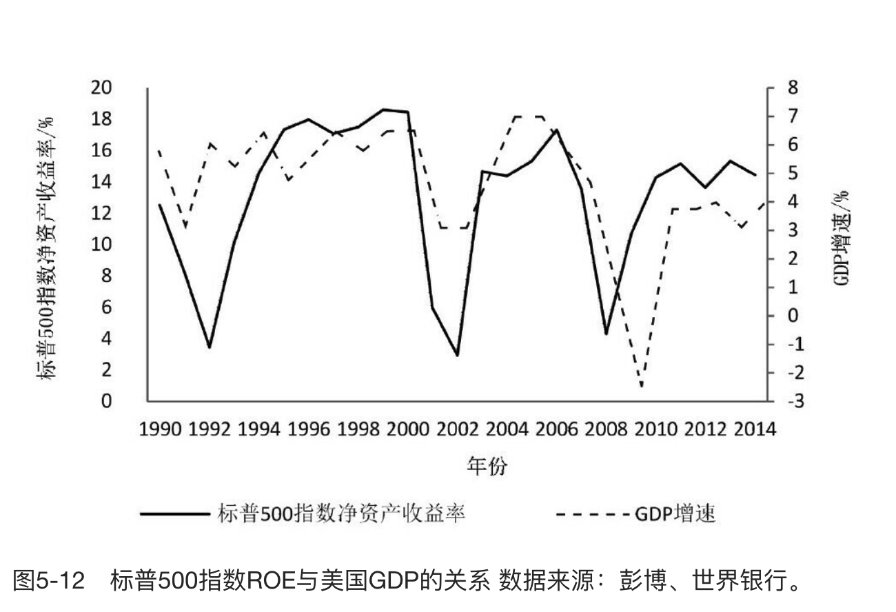

在经济平稳时期，我们可以把ROE看成一个不变量，因为整体经济的增速波动不大，这时指数的g也相当于一个常数，当g为常数时，我们可以考察股票指数投资回报率r与PE的关系。我们定义$E_i$为第i年股票指数的盈利水平，$E_i=E_{i-1}(1+g)$根据现值公式有：

$P=\frac{E_1}{1+r}+\frac{E_2}{(1+r)^2}+\cdots+\frac{E_i}{(1+r)^i}$

将经济增速g代入得到：

$P=\frac{E_1}{1+r}+\frac{E_1(1+g)}{(1+r)^2}+\cdots+\frac{E_1(1+g)^{i-1}}{(1+r)^i}+\frac{E_1(1+g)^i}{(1+r)^{i+1}}$ (b)

该式两边同时乘以$\frac{1+r}{1+g}$，得到：

$P×\frac{1+r}{1+g}=\frac{E_1}{1+g}+\frac{E_1}{(1+r)}+\frac{E_1(1+g)}{(1+r)^2}+\cdots+\frac{E_1(1+g)^{i-1}}{(1+r)^i}$ (c)

将式（c）与式（b）左右两边同时相减，得到：

$P×\frac{r-g}{1+g}=\frac{E_1}{1+g}-\frac{E_1(1+g)^i}{(1+r)^{i+1}}$

两边除以$\frac{E_1}{1+g}$，整理后，得到：

$PE(r-g)=1-\frac{(1+g)^{i+1}}{(1+r)^{i+1}}$

此公式描述4个参数$\frac{1}{PE}$、r、g和i的关系：

常数的假设下，我们发现$\frac{1}{PE}$与利率r线性相关，这个模型被称为`“美联储股票估值模型”`。我们假设有一个10年经营周期的公司，10年后即破产。这10年期间产生的现金流以20%的速度递增，投资者要求的投资回报率为7%，那么给该公司多少倍PE估值是合理的？

在这个案例中，i=10，r=7%，g=20%，则PE=19.46倍。如果二级市场的估价是15倍PE，则按照该公式可计算出r=11.1%。在经济稳定时期，我们认为g是常数。r与$\frac{1}{PE}$线性相关，为了简化起见，我们可以用$\frac{1}{PE}$去预测未来r。如图5-13所示。

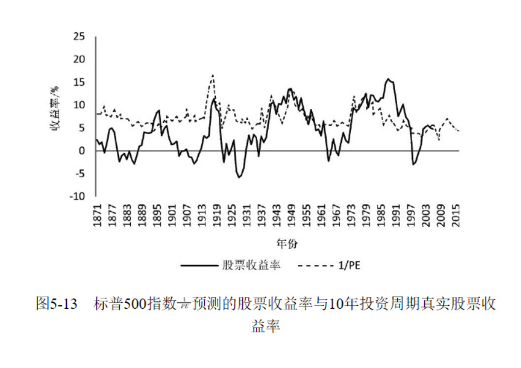

在短期内，股权的投资风险大于债权的投资风险，定义股权风险溢价=$\frac{1}{PE}-即期国债利率$。当股权风险溢价很低，甚至为负值时，我们要远离股票市场。相反，当股权风险溢价很高时，我们要进入市场。

指数投资的分析框架

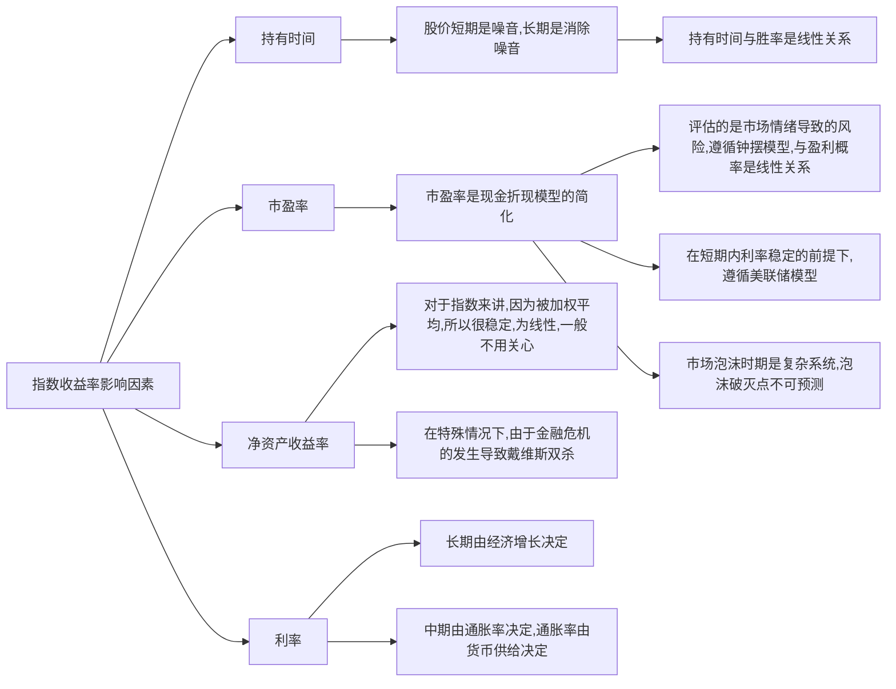
```mermaid
flowchart LR
    A[指数收益率影响因素]-->B[持有时间]
    A-->C[市盈率]
    A-->D[净资产收益率]
    A-->E[利率]
    B-->B1[股价短期是噪音,长期是消除噪音]
    B1-->BB1[持有时间与胜率是线性关系]
    C-->C1[市盈率是现金折现模型的简化]
    C1-->CC1[评估的是市场情绪导致的风险,遵循钟摆模型,与盈利概率是线性关系]
    C1-->CC2[在短期内利率稳定的前提下,遵循美联储模型]
    C1-->CC3[市场泡沫时期是复杂系统,泡沫破灭点不可预测]
    D-->D1[对于指数来讲,因为被加权平均,所以很稳定,为线性,一般不用关心]
    D-->D2[在特殊情况下,由于金融危机的发生导致戴维斯双杀]
    E-->E1[长期由经济增长决定]
    E-->E2[中期由通胀率决定,通胀率由货币供给决定]
```

上述的框架在实际运用的过程中，建议只采用`钟摆模型`和`美联储模型`（美联储模型其实是钟摆模型的定量分析），进行三年以内的短期投机交易，短期投机交易本质上是在赌股票收益率与债券的收益率收敛，这样的机会每隔几年就会出现一次。

不建议两种做法。

1. 不建议在有好的个股投资机会下长期投资指数。因为长期的指数投资回报率会非常接近ROE。展望未来，宏观经济增速会逐年地放缓，投资回报率会逐步拉低到10%以下。
2. 不建议赌利率。在参与市场短期投机的情况下，股票收益率与债券收益率的收敛会导致股票价格的上涨，但是当两者差值已经收敛到历史比较低的水平时，获利了结是好的方法。此时，再去预测利率下行的风险相对很大，因为利率的预测是件非常困难的事情。

### 个股投资的技巧
#### 钟摆模型的局限性
对于个股来讲，g为常数的假设不再成立，这导致了钟摆模型在个股上不适用。

我们看到，伴随着时间的延长，盈利概率逐步地上升。因此，对于个股来讲，我们无法做出任何简化，我们还需要回到公式（a）。因为g不稳定，所以ROE是个股的最重要影响因素。

我们进行这样的实证分析：我们利用2001年1月1日至2012年12月31日的A股693家公司的ROE数据，求出这些公司在2001年至2012年的ROE累计增长幅度和股票价格的涨幅，并按照ROE累计增长幅度由高到低进行排序，每5只股票做一个组合，分析这个组合的ROE累计增长幅度（解释变量）与股价涨幅（被解释变量）之间的关系，如图5-16所示。

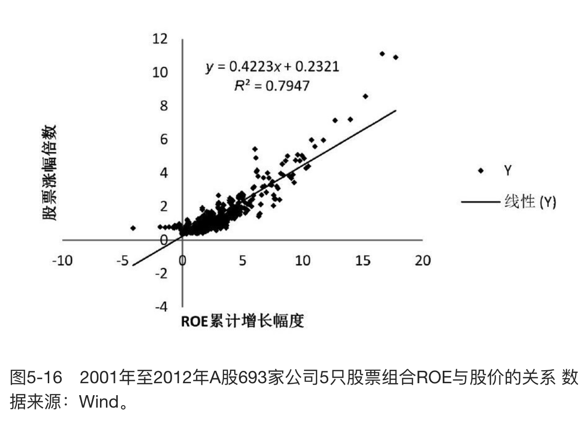

我们看到，ROE对股票收益率的解释力度达到了79.4%。未被解释的部分主要包括并购重组和初始PB过高。因此，**有别于指数投资，对于个股的投资策略都集中在预测该公司未来的ROE这个关键点上**。

#### 净资产收益率的拆解
按照`杜邦分析法`，ROE可以分解如下：

$ROE=\frac{净利润}{所有者权益}=\frac{净利润}{营业收入}×\frac{营业收入}{总资产}×\frac{总资产}{所有者权益}=净利润率×总资产周转率×权益乘数$

因此，提升ROE总计有五种方法，分别是：①提高净利润率；②降低企业税率；③提高总资产周转率；④提高杠杆比率；⑤降低融资利率。对ROE的拆解有利于我们判断ROE的影响因素，找到影响公司ROE高低的主要因素。

我们对伊利股份与光明乳业的ROE进行比较，两者如图5-17所示。

为何伊利股份的ROE要比光明乳业的ROE高10个百分点？按照杜邦分析法，我们把两家公司的ROE进行拆解，如图5-18、图5-19、5-20所示。

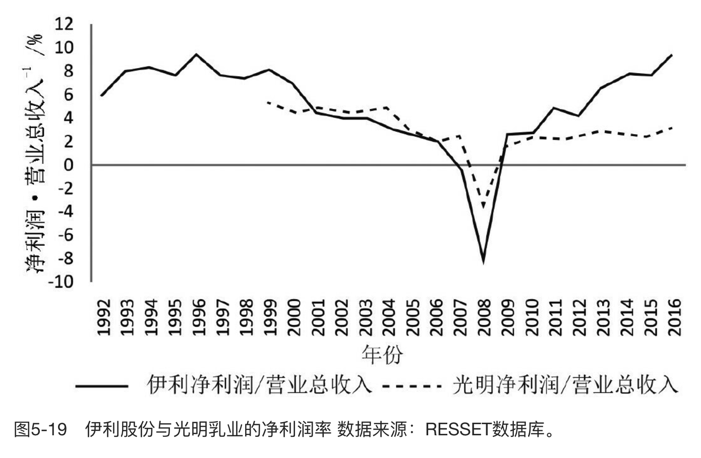

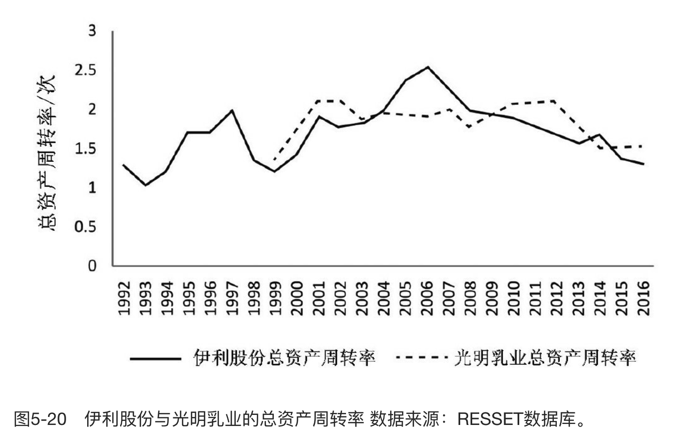

我们对比了两家公司的权益乘数、净利润率和总资产周转率之后，我们发现两家公司相差最明显的是净利润率，而权益乘数与总资产周转率的差异并不明显。所以两家公司的ROE差异被定位在了两家公司盈利能力的差别，可排除融资能力（即权益乘数）和营运能力（即总资产周转率）的因素。

继续分析，我们将两家公司的盈利能力分析对比如表5-4所示。

表5-4　光明乳业与伊利股份的盈利能力对比（2016年）

指标 | 光明乳业 | 伊利股份
---|------|-----
毛利率 | 38.68% | 38.25%
销售费用比率 | 27.81% | 23.29%
管理费用比率 | 3.82% | 5.70%
财务费用比率 | 1.44% | 0.04%
三项费用率合计 | 33.07% | 29.03%
与毛利差值 | 5.61% | 9.22%
净利润率 | 3.34% | 9.35%

利润表从营业收入到净利润主要经历了如下的过程：

    1.营业收入-营业成本=毛利润
    2.毛利润-营销费用-管理费用-财务费用-营业税=营业利润
    3.营业利润+营业外收入-营业外支出+处置资产损益=利润总额
    4.利润总额-所得税=净利润

其中，毛利率=毛利润/营业收入。**一般情况下，同一个产业内的不同企业之间的毛利率都差不多**。拿伊利和光明来讲，两家公司都生产牛奶，大家的技术也都差不多，生产1千克的成品液态奶，所需要生奶的数量是一致的。同样地，两家公司对生奶的采购价格也差不多，所雇佣的工人成本、水电成本、厂房折旧等也都差不多。所以，**毛利率这个指标更多的是代表一个产业层面的利润空间，一般情况下，同一产业内不同公司之间的毛利率差异不大，但不同产业之间的毛利率差异很大**。

销售费用比率、管理费用比率和财务费用比率，这三项是销售费用、管理费用和财务费用去除以销售收入得到的。三项费用率相加得出总和。这三项代表公司的三种能力，即销售能力、管理能力和融资能力。**这三项在同一产业内部的不同公司之间也会有很大差异，是体现管理层能力的重要指标**。

我们看到，光明乳业的毛利率与伊利股份的毛利率相差无几，但三项费用率合计的差异很大。最终分析下来，我们发现两家公司差异最大的是销售费用比率。销售费用一般记录的是企业的广告费、营销费用、营销部门人员的工资等。伊利的营业收入规模比光明大，所以同样的广告费用，伊利股份由于营业收入规模更大，自然摊低了销售费用比率，伊利享受了规模效应。由此，我们解开了伊利股份与光明乳业ROE差异的根本原因，即伊利股份的规模效应。

**沪深300的平均ROE一般维持在12%左右，沪深300代表了中国最优质的公司，因此整体社会平均的ROE低于沪深300指数的ROE。而单个公司的ROE能否超过社会平均ROE是这家公司经营是否成功的一个重要标志**，因为企业的最根本目的就是赚钱。ROE代表了股东每1块钱的资本投入，每年的投资回报是多少。ROE具有如下的特征：

1. ROE的均值回归特征。在社会公平竞争的前提假设下，不会有能够长期超越社会平均ROE的公司存在。因为当一个供给阵营内有家企业维持高ROE时，势必会吸引其他竞争者进入，从而扩大产业的供给侧，供给曲线扩张，导致产品的价格降低，企业净利润率降低，最终导致ROE降低。同样的逻辑，也不会有产业长期低于社会平均ROE。因此，市场竞争的力量会导致单个公司或者一个产业的ROE向社会平均ROE均值回归。
1. ROE的产业差异特征。不同的产业拥有不同的ROE，有些产业能够先天地形成高ROE，有些产业则不行，这与产业结构有关。比如烟草、酿酒、奢侈品这些品牌高度垄断的行业容易形成高ROE；而像日用品制造业、钢铁业等这些产品本质上无差异的产业，容易形成低ROE。
1. ROE伴随整体经济的形式发生波动。

#### 关注投资者的预期
    市净率PB=总市值/所有者权益

其中，所有者权益就是企业的账面价值，总市值就是市场给出的该企业未来经济价值，绝大多数企业的账面价值并不等于其未来经济价值。

PB是投资者对于一家公司未来的预期。依据竞争原理，当投资者预期一家公司未来的ROE会高于社会平均ROE时，这家公司的PB估值就应该高，反之，则应该低。

# 慧眼识公司：如何发现具有投资价值的公司

