    作者: 凌波
    出版社: 企业管理出版社
    副标题: 股票交易精髓
    出版年: 2010-8
    页数: 232
    定价: 35.00元
    ISBN: 9787802556126

[豆瓣链接](https://book.douban.com/subject/4924398/)

- [技术分析](#技术分析)
  - [个人投资者应该相信什么](#个人投资者应该相信什么)
    - [基本面分析和技术面分析](#基本面分析和技术面分析)
    - [技术分析精髓](#技术分析精髓)
  - [底部和顶部反转形态与操作技术](#底部和顶部反转形态与操作技术)
    - [反转形态概述](#反转形态概述)
    - [头肩底和头肩顶](#头肩底和头肩顶)
    - [双重底和双重顶](#双重底和双重顶)
    - [圆形底和圆形顶](#圆形底和圆形顶)
    - [V形底和V形顶](#v形底和v形顶)
    - [底部三角形和扩散三角形](#底部三角形和扩散三角形)
    - [扩散三角形](#扩散三角形)
  - [123法则和2B法则](#123法则和2b法则)
    - [123法则](#123法则)
    - [2B法则](#2b法则)
    - [123法则应用于实战](#123法则应用于实战)
    - [2B法则应用于实战](#2b法则应用于实战)
    - [123法则与2B法则结合运用](#123法则与2b法则结合运用)
  - [左侧交易与右侧交易](#左侧交易与右侧交易)
  - [经典技术分析理论](#经典技术分析理论)
    - [道氏理论——股市晴雨表](#道氏理论股市晴雨表)
    - [波浪理论——自然法则](#波浪理论自然法则)
    - [黄金比率和费波纳奇数列——神奇数字](#黄金比率和费波纳奇数列神奇数字)
    - [亚当理论——交易的印象派大师](#亚当理论交易的印象派大师)
- [资金管理](#资金管理)
  - [资金管理概述](#资金管理概述)
  - [仓位控制](#仓位控制)
    - [交易信号](#交易信号)
    - [不会加仓是导致交易亏损的主要原因之一](#不会加仓是导致交易亏损的主要原因之一)
    - [金字塔加仓](#金字塔加仓)
    - [均匀式加仓](#均匀式加仓)
  - [凯利公式](#凯利公式)
  - [风险控制](#风险控制)
    - [有意义的支撑位止损法](#有意义的支撑位止损法)
    - [技术指标止损法](#技术指标止损法)
    - [有意义的压力位止盈法](#有意义的压力位止盈法)
    - [技术指标止盈法](#技术指标止盈法)
  - [R乘数理论](#r乘数理论)

# 技术分析
## 个人投资者应该相信什么
### 基本面分析和技术面分析
`基本面分析`，是指对宏观经济、行业和公司基本情况的分析，包括公司财务状况、盈利状况、市场占有率、经营管理体制、人才构成等各个方面。长线投资一般应用基本面分析，把对股票的分析研究重点放在它本身的内在价值上。

`技术分析`，是指通过对以往价格和成交量的数据分析来预测价格变动的一种方法，技术分析的对象主要是价格图表和成交量。技术分析相信趋势的存在，最具代表性的是道氏理论。

从上面的定义可以看出来，对于个人投资者来说，想要进行基本面分析会有很大的困难。因为市场上的信息是不对称的，个人投资者往往不能够准确、及时、全面地获得市场信息。假定我们也能获得像投资机构一样的信息，但我们个人投资者不具备机构那样专业的、系统的分析以及解读信息的能力。这两个最基本的基本面分析要求，对于个人投资者来说是很难达到的。但我们可以参考基本面信息，作为我们技术分析的辅助。

所以，技术分析更适于个人投资者或系统化交易者。我们通过网络或媒体可以很容易地获得股票行情报价、历史K线图表、成交量等技术分析需要的基本材料。

### 技术分析精髓
所有技术分析的立论基础可以概括为以下三方面的内容：

1. **市场包容一切**。“市场行为包容一切”构成了整个技术分析的基础。纯粹的技术派认为，影响价格的所有因素，如经济、政治、社会因素等，实际上通过价格得到了体现。我们不需要去研究原因，只需要关注价格变动。能够影响价格的任何因素，实际上都反映在其价格中。其实质含义就是价格变化反映供求关系；供求关系决定价格变化。既然影响市场价格的所有因素最终必定通过市场价格得到反映，那么研究价格就足够了。正如利弗莫尔所说的“市场永远是对的”。
2. **价格沿着趋势移动**。“趋势”理念是技术分析的核心。随便打开一张走势图，我们都会发现，无论是股票、期货还是外汇交易品种，其价格的变动在大部分时间里都运行在趋势之中，出现最高点和最低点只是瞬间的事情。研究价格图表的全部意义，就是要在一个趋势的形成的初期，及时准确地介入，从而达到顺着趋势交易的目的。
3. **历史会重演**。技术分析和市场行为学与人类心理学有着关系，价格形态通过特定的价格图形表示了人们对某个市场看好或看淡的心理。过去有效，未来同样有效。“上涨—下跌—再上涨—再下跌”，周而复始成为价格走势的特点。波浪理论、道氏理论之所以能够流传，就是因为不仅在过去证明他们是有效的，而且将来还会有效。历史不会简单的复制，但历史会重演。

## 底部和顶部反转形态与操作技术
### 反转形态概述
趋势不会突然转变，在发生重要的变化之前，往往需要酝酿一段时间。经过酝酿之后，趋势可能会发生逆转，也可能会在调整后继续按原方向发展。当趋势反转时，就会出现反转形态；当趋势盘整时，就会出现整理形态。在这些形态形成的过程中，如果价格波动的范围越大，或其形成时所消耗的时间越长，或伴随的成交量越多，那么他们所具有的意义就越重大，因为其间消耗了大量的多头或空头的力量，引发了由量变到质变的过程。一个大的反转形态会带来一轮幅度较大的波动，而一个小的反转形态会伴随一轮较小的波动。

熟练掌握了反转形态，也就初步把握了在股市中抄底和逃顶的时机。反转形态有如下特性：

1. 反转形态形成的前提是存在一个主要趋势，如果目前没有上升或下降趋势的存在，那么当时所出现的反转图形就没有意义。
2. 趋势将要发生反转的第一个信号通常是对重要趋势线的突破，如趋势线、支撑位、阻力位等。但对重要趋势线的突破，也有可能形成整理形态，所以突破关键位并非百分之百会形成反转。
3. 反转形态规模越大，随后的价格波动就越大。这里所谓的规模，是指价格形态的高度和宽度。高度标志着价格变动的强弱，宽度意味着反转所消耗时间的长短。
4. 顶部形态比底部形态形成的时间更短，且震荡幅度更大。因为价格倾向于慢涨快跌，并且在顶部的波动幅度更大，所以在顶部做出卖出决策时要果断。
5. 底部形态比顶部形态的价格幅度更小，但形成的时间更长。因为此时成交量降低，筑底需要时间。底部形态容易被识别，且交易失误后的损失要少一些。
6. 对于形态价格目标位的测量，应以反转形态的高度为基础，通常第一目标位是上涨或下跌与形态高度相当的位置。反转的阻力位也是目标位，经常是前波主要趋势的0.618、0.5、0.382的位置。最大的目标位是前波趋势的起点，也就是突破前期的波峰或波谷。

价格形态的分析是以道氏理论为基础的，所以注意趋势分析和波段分析，即注重价格运动的阶段性分析。道氏理论专注于市场的主要趋势（半年以上）、次要趋势（1～6个月）和短暂趋势（1个月以内）的分析。

在讨论价格形态的时候，还有两个重要的参考因素：`成交量`和`目标位`。在价格形态的形成过程中，特别是在形势不明确的情况下，研究与价格相对应的成交量，是判断形态是否形成及是否可靠的最有效途径。同时，绝大多数价格形态都有其具体的测量技术，可以确定出最小的价格目标位，这些目标位有助于对市场下一步的运行空间进行大致估算，避免交易者过早离场。

### 头肩底和头肩顶
头肩底和头肩顶是最经典的主要反转形态，其他的反转形态大都是头肩形态的变形。在形成头肩底的时候，通常在下跌趋势中的一次反弹时形成左肩，然后再次下跌并跌破前低形成头部，再向上反弹遇到压力并回撤形成右肩，最终向上突破前高，确认形成头肩底形态，如图2-1所示。

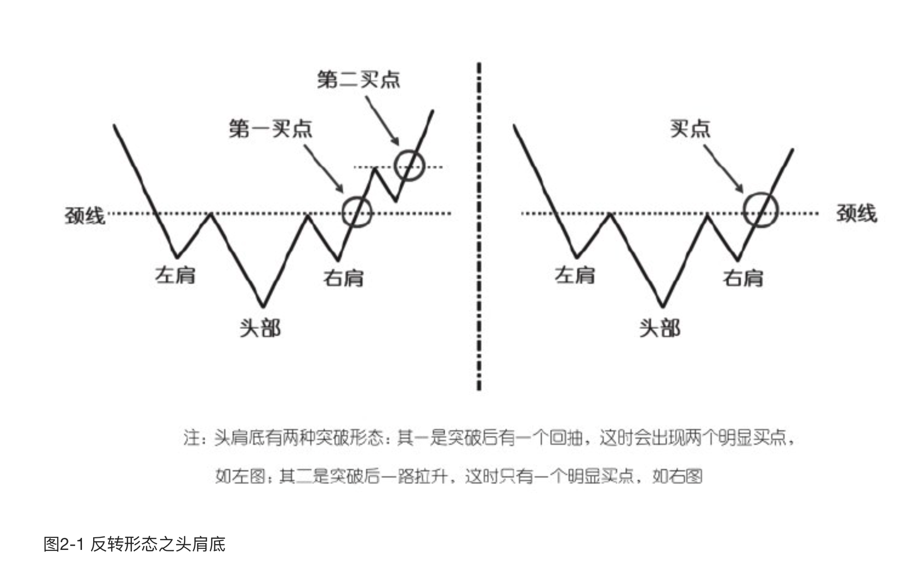

在形成头肩顶的时候，通常在最强烈的上涨趋势中形成左肩，小幅回调后再次上涨突破前高形成头部，再次回调后遇到支撑并上涨形成右肩，由此形成头肩顶形态，如图2-2所示。

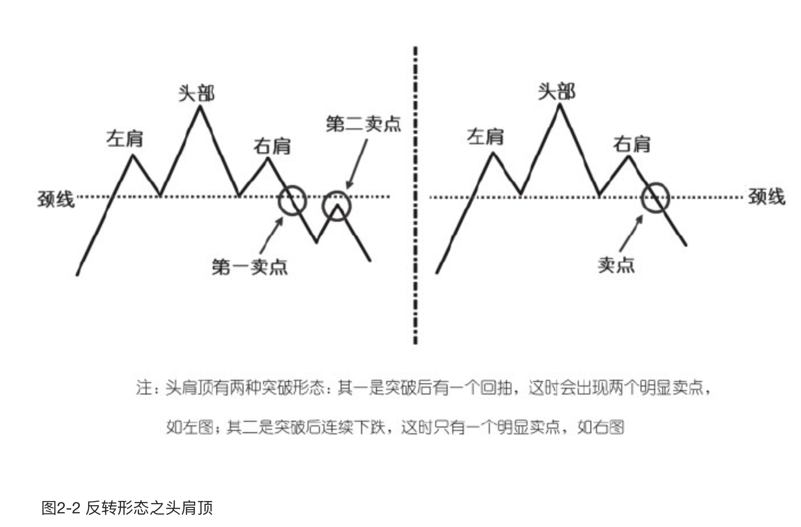

头肩底的特征是：
1. 股价先是急速下跌，随后止跌反弹，形成第一个波谷，这就是通常所说的“左肩”。形成左肩部分时，成交量在下跌过程中出现放大迹象，而在左肩最低点回升时则呈缩量状态。
2. 第一次反弹受阻，股价再次下跌，并跌破了前—低点，之后股价再次止跌反弹形成第二个波谷，这就是通常所说的“头部”。形成头部时，成交量会有所放大。
3. 第二次反弹再次在第一次反弹高点处受阻，股价又开始第三次下跌，但股价回落到第一个波谷价位附近止跌，成交量出现极度萎缩，此后股价再次反弹形成了第三个波谷，这就是通常所说的“右肩”。第三次反弹时，成交量显著增加。
4. 将第一次反弹高点和第二次反弹高点用直线连起来就是一条阻碍股价上涨的颈线，但当第三次反弹时会在成交量的配合下，突破这条颈线，使股价站在其上方。交易者见到头肩底这个图形时，应该想到这是个底部反转信号，此时不能再继续看空，而要随时做好进场的准备。一旦股价放量突破颈线时就可考虑买进一些股票。

图2-3显示的是山推股份的日线图，该股前期处在下跌趋势中，反弹形成左肩，然后再次下跌创出新低5.52元（不复权价格），之后开始明显放量回升形成头部，反弹到颈线时遇到阻力，回落形成右肩，从右肩的波谷向上突破颈线的过程中，成交量明显放大，当股价站上颈线时通常为第一买点。如果股价在突破颈线后回测颈线，并在颈线位附近止跌回升，再度上扬时可加码买进，这通常为第二买点。值得注意的是，若是股价向上突破颈线时成交量并无显著增加，则很可能是一个“假突破”。如果回到颈线之下，可以在一定幅度内止损离场。

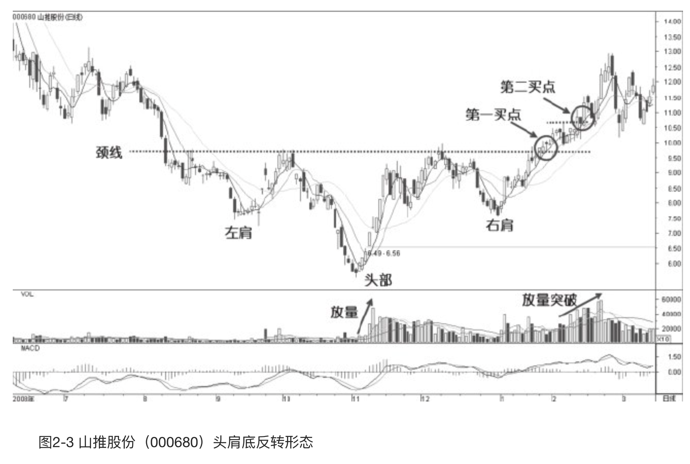

在实际操作中，头肩形态的颈线并不一定是水平线，有时是倾斜的直线，如图2-4所示。该股形成头部后，右肩与左肩基本处在同一价位水平，但颈线是向右下方倾斜的，股价放量突破颈线后快速拉升。突破后的拉升高度，一般和头部到颈线的距离相等。从图上可以看到，头部到颈线的距离为H，称为“颈高”。突破并站上颈线时为买点，该股并没有回抽，属于图2-1中所示的第二种情况，突破后直接拉升。从买点测算其上涨的第一目标价位为颈线价位加上颈高H。

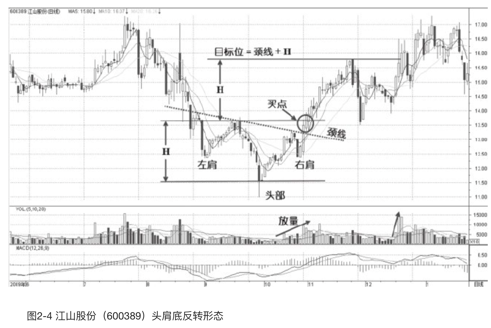

头肩顶的特征是：
1. 在上升途中出现了3个波峰，这3个波峰分别称为左肩、头部和右肩。
2. 左肩和右肩的最高点处在同一价位区间，而头部最高点要高于两侧的左肩和右肩。
3. 股价在回落时形成的两个低点基本处在同一水平线上。这条直线就是通常所说的颈线。
4. 当股价第三次上冲失败回落时，这条颈线就会被跌破。于是头肩顶正式宣告成立。

在头肩顶形成过程中，左肩的成交量最大，通常是波浪理论中的第3浪；头部的成交量略小一些，通常是波浪理论中的第5浪上涨；右肩的成交量最小，这里通常是A浪下跌。成交量呈递减状态，说明股价上升时追涨力量越来越弱，股价有涨到头的意味，因此头肩顶是一种见顶信号。头部后反弹没能创出新高，这里是B浪反弹，然后就会向下跌破颈线，这时下跌变得更加迅速，下跌的幅度相应增加，这里是C浪下跌，是下跌动能最大的区间。

我们来看图2-5中的中信证券的走势，可以发现它完全符合头肩顶的特征。该股从头部跌至颈线处获得支撑，然后反弹形成右肩。在形成右肩之后，股价再次跌到颈线位置的时候并没有获得支撑，而是在颈线处形成了向下跳空缺口，这也证明了颈线的有效性。

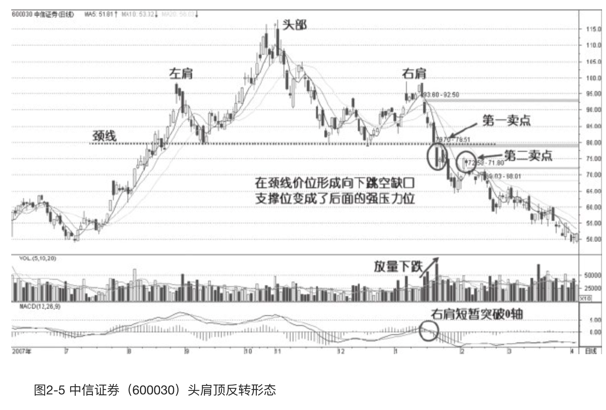

当股价跌破颈线时是第一卖点，头肩顶已基本成立，既然行情走到这个地步，在颈线附近放量下跌，交易者应该意识到大势已去，止盈离场是目前的最佳选择，头肩顶是杀伤力很强的一种技术走势。顶部形成的时间越长，其杀伤力往往越大。

图2-6显示的是粤泰股份头肩顶目标价位的测算，交易者应该在突破颈线后的第一卖点果断卖出所持股票。如果因为某些原因错过了第一卖点，也应该在回抽时的第二卖点清仓出局，不能再抱有还会上涨的侥幸心理，因为一旦跌破颈线，下跌基本已成定局，即使再反弹也不会太高，这里的两个卖点是从多次交易的角度来看最合理的选择。

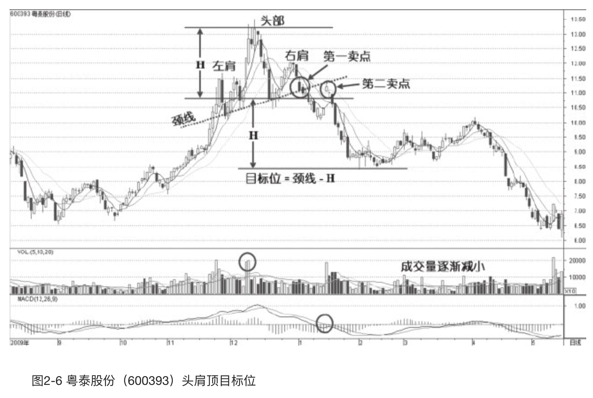

从图中可以看到，该股在高位形成的头肩顶的形态高度为H，并形成了一条向右上方倾斜的颈线。在跌破颈线之后，产生了两个卖点。我们根据颈线价位减去1个H的距离可以测算出下跌的首个目标位。用头部最高收盘价13.18元减去颈线价位10.80元，得到该头肩顶形态的高度H为2.38元，以颈线10.80元减去2.38元得到目标位为8.42元，该股这波下跌的最低点为8.38元，达到了我们计算的首个目标位。经过反弹之后，该股再次破位下跌，继续探底过程。

为了避免头肩顶对交易者账户资金造成重大伤害，交易者在实战操作时要密切注意以下几个问题：

1. 当一只股票形成头肩顶雏形时，就要高度警惕，这时股价虽然还没有跌破颈线，但可以先卖出手中的一些筹码，将仓位减轻，后面一旦跌破颈线，应将手中剩余的股票全部卖出，离场观望。
2. 上涨时要放量，下跌时成交量可以放大，也可以缩小，对头肩顶这种形态来说，先是以很小的量跌破颈线，然后再放量下跌，甚至仍旧维持较小的量往下滑落也比较常见。没有放量，并不能说明股价不会继续下跌。交易者对此一定要有清醒的认识。
3. 头肩顶对多方杀伤力度的大小，与其形成时间的长短成正比。因此，我们不能只关心日K线图，对周K线图出现的头肩顶更要高度重视。如果周K线图形成头肩顶走势，说明该股中长期走势已经转弱，股价将会出现一个较长时间的跌势。

### 双重底和双重顶
双重底是指股价在底部形成两个波谷的形状，又经常被称为“W”形反转；双重顶是指股价在顶部形成两个波峰的形状，又经常被称为“M”形反转。与头肩形态不同的是，这种形态突破后的目标位通常是形态本身颈高的1～3倍。

“双重底”，因为它的形状像英文字母W，故又称为W底，如图2-7所示。双重底多数发生在下跌趋势的末端，很少出现在下跌趋势的中途。其特征是：

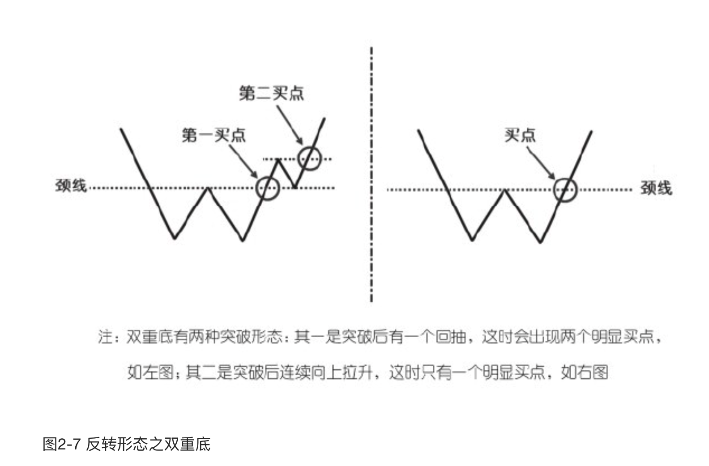

1. 在它形成第一个底部后的反弹幅度一般在10%~15%左右。
2. 在第二个底部形成时，成交量经常较少且市况低迷，因此容易出现圆形底形态，而向上突破颈线时成交量必须明显放大。
3. 突破之后常常伴有回抽，并在颈线附近止跌回升，从而确认向上突破有效。
4. 第二个波谷一般比第一个波谷更高，但也有可能比第一个波谷更低，因为对主力而言，探底必须要彻底，必须要跌到令多头恐慌，不敢持股，这样才能达到低位建仓的目的。
5. 第一个低点与第二个低点之间，时间跨度应不少于一个月。如果时间太短形成的双重底，其触底回升的信号就不太可靠。要注意在下跌趋势中段发生的之字形调整，这也会形成类似双重底的形态，但形成时间较短。
6. 在形成双重底时，MACD、RSI等指标经常出现底背离的情况，即股价创出新低，而指标值没有同时创出新低。指标在低位超卖区间与价格发生背离可以增加转势的概率。

在双重底突破颈线的位置，从理论上来说是一个买点（通常为第一买点），但实际上还是要冒着比较大的风险，一旦双底向上突破失败，在这里的买入者就会被套牢。因此，在突破颈线处买进的交易者要随时做好止损离场的准备。从经验来看，继续上涨要大于再次下跌的概率。经过长期调整之后，MACD指标的DIF线与价格发生底背离，这会增加双重底的上涨概率。

对于双重底，比较安全而又稳健的操作方法是，可在股价突破颈线并测试颈线得到支撑之后，再次放量上攻时买进（这个位置通常为第二买点），这种图形会增大上涨的概率，如图2-8所示，第二次回测颈线之后，站稳10日均线时仍是一个好的买点。从经验来看，绝大多数双重底都会有一个回抽过程，因此一般不必担心股价突破颈线后连续拉升而使资金踏空。如果遇到连续拉升的情况，可以在股价回踩均线时进场，因为涨势一旦确立就不会轻易改变，这个时候买进的胜率还是比较大的。上涨的第一目标位是在颈线位置加上颈高H。

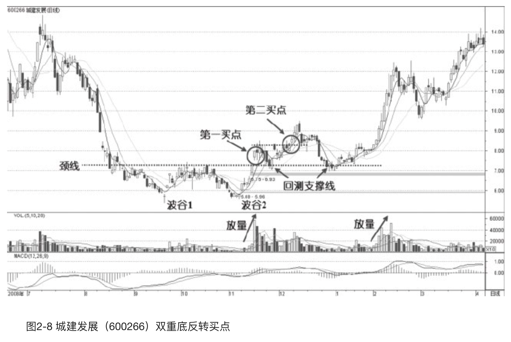

双重顶发生在上升趋势末端，拥有处于相同价位附近的两个波峰，因为它很像英文字母M，所以又称为M头，如图2-9所示。

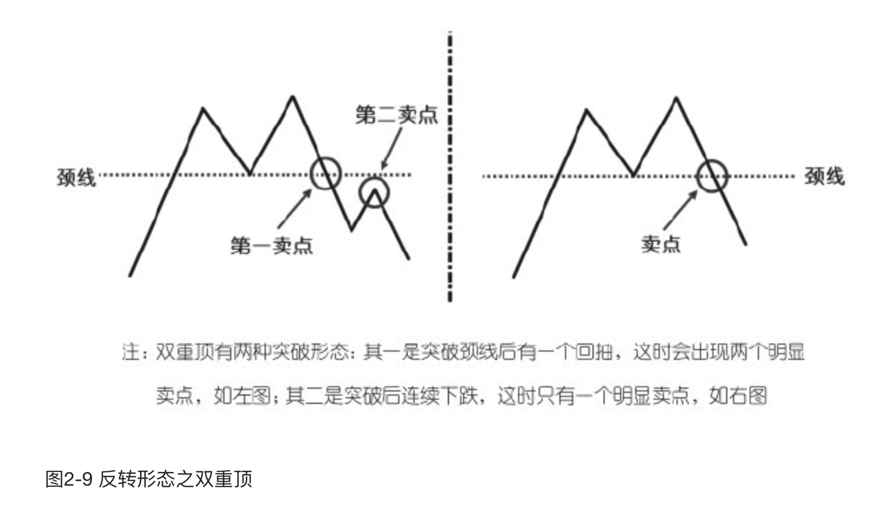

双重顶的特征是：

1. 股价有两个比较明显的波峰，而且两个峰顶的价位也大致相同。
2. 股价第二次反弹时的成交量比第一次时的成交量要小。
3. 股价在第二次回落跌破了前期低点。
4. 跌破颈线位后常有反抽，但反抽时成交越明显萎缩，受阻于颈线位可以确认向下突破有效。

在双重顶形成时，MACD、RSI等指标经常出现顶背离的情况，即股价创出新高时，指标值没有同时创出新高。指标在高位超买区间与价格发生背离可以增加转势的概率。

双重顶是个顶部反转信号，一旦双重顶形成，股价很可能开始下跌，如图2-10所示。因此作为一个头脑清醒的交易者在双重顶形成之后，应果断清仓，卖出点可选择在跌破颈线的第一卖点处，或反抽时受阻于颈线的第二卖点处。一些有经验的交易者，在双重顶正式形成之前就会采取必要的减仓措施，以保住头部利润，这是值得我们广大交易者学习的。

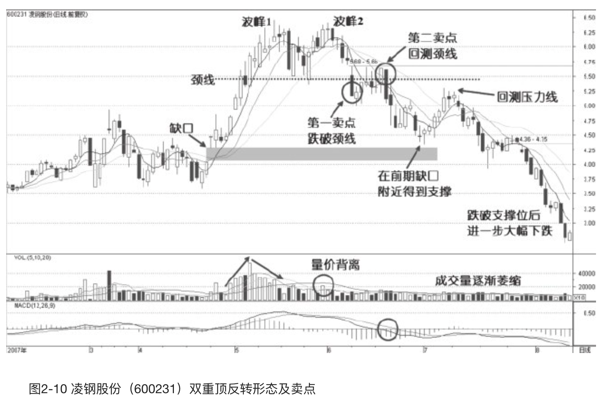

他们的具体做法是：

1. 假如第一个顶点出现后，股价的跌幅较深（第一个顶点与下跌后的最低点相差达8%以上），或者出现了像天量天价和吞没形态这样的顶部K线形态，并且当股价再度上升到第一个顶点附近时，成交量与前期相比显著减少。这就要怀疑它有可能构成双重顶，此时应卖出一些股票，而不要全部等到双重顶形成以后才卖出；
2. 如果第二个顶点对应的MACD指标的DIF线发生向下拐头，这时可以作为卖点。DIF线与股价发生顶背离时，DIF线在指标高位向下拐头时卖出的胜率更高；
3. 如果股价形态同时符合以上两个条件，则形成双重顶的可能性更大，应果断卖出。

我们来看双重顶在实战中的运用，如图2-10所示。该股在第一波拉升中放出了巨量，在形成第一个波峰的过程中发生了量价背离，已经有了见顶迹象。股价回落之后再次上攻时没有明显放量，到达前期高位后遇阻回落，降至颈线处，该股向下跳空急速远离颈线，表明卖盘汹涌，这个位置是第一卖点。随后该股又回抽了一次颈线，这里是多头的逃命良机，是第二卖点。在第二卖点后出现了大阴线，已经可以确认双重顶形成。在后面的走势中该股一路走低，双重顶成为一个历史大顶。

再来看下跌目标位的测算，双重顶的下跌幅度通常为颈高H的1～3倍。如图2-11所示。该股下跌到幅度相当于颈高H时有一波幅度不大的反弹，持续了一段时间之后再次下跌了相当于颈高H的距离，并形成了一次更弱的反弹。最后一直跌到了双重顶的上涨浪起点之下。我们看图中的卖点正是顶部反转的关键点，跌破颈线确认了双重顶的成立。

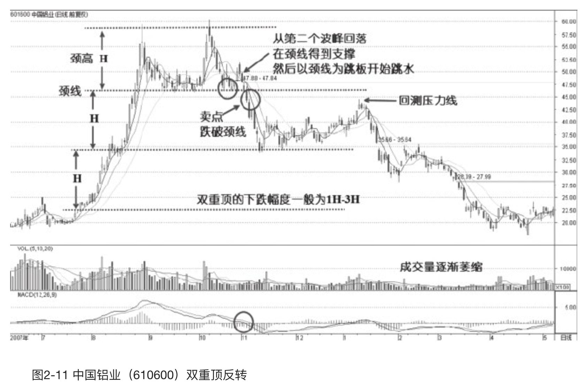

### 圆形底和圆形顶
在趋势末端，有时会呈现出趋势逐渐变化的特征，价格围绕着一段圆弧运行，这常称之为圆形反转。这种形态较为少见，依据价格趋势变化的角度可以将其分为碗形、碟形底部或顶部，它代表趋势在缓慢而渐进地改变。成交量也会按时间顺序排列为一个圆形，如图2-12所示。

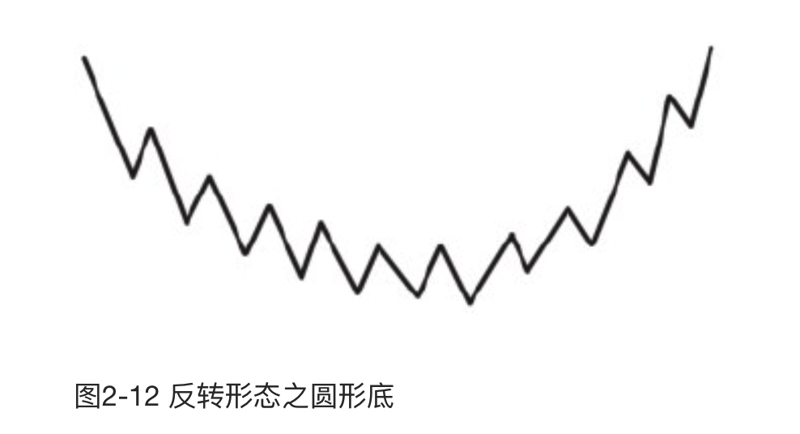

圆形底的特征是：

1. 股价经过一段时间的下跌之后，成交量逐渐减少，下跌速度越来越缓慢，直到成交量出现极度萎缩，股价才停止下跌。
2. 在多方力量的推动下，成交量开始温和放大，股价逐渐转变为加速上升，从而形成圆弧底形态。
3. 与此同时，成交量也经常呈现圆弧形态。

有经验的交易者对圆形底都很重视，因为圆形底的形成时间相当漫长，使得底部换手极为充分，所以，一旦圆形底向上突破，经常会出现一轮幅度可观的上涨行情。要想抓住圆形底后面的上涨行情，入市时机的选择就显得十分重要。如果过早入市，常常会陷入漫长的筑底行情中。这时股价不涨而略有下挫，几个星期甚至几个月都看不到希望。很多交易者就是因为经不起长时间磨底的煎熬，在股价向上启动前，将股票一抛了之，从而与即将到来的上升行情擦肩而过，这是十分可惜的。

此外，交易者在买人股票之前还必须观察成交量的变化。如果看到成交量和股价都形成一个圆弧形，可以在成交量放大，股价向上突破的时候大胆介入，如图2-13所示。在成交量萎缩的情况下，无论股价如何变动，都不要轻易参与。因为价是量的堆积，没有成交量配合的上涨，很难持续。

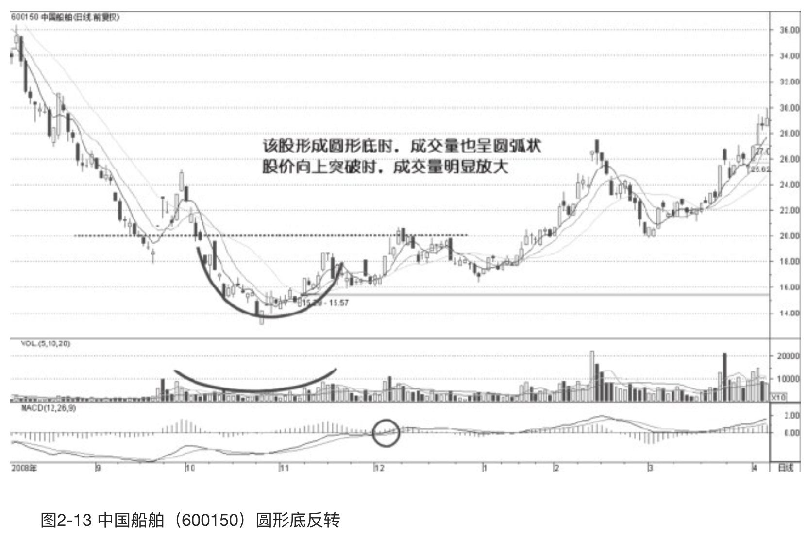

在实际的价格运动中，圆形顶比较少出现，一般不会出现在投机性强的品种当中，它体现着温和的波动性，如图2-14所示。

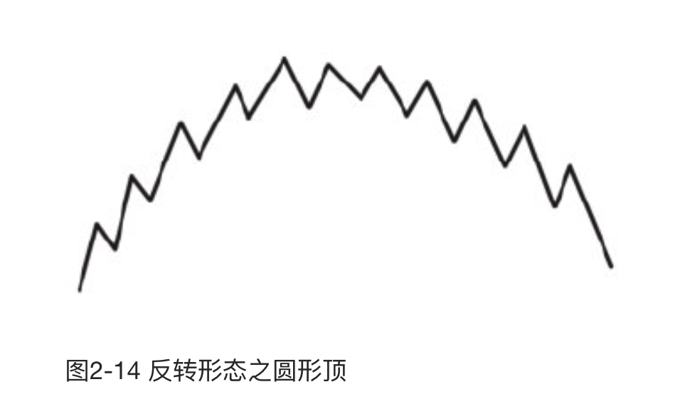

圆形顶的特征是：

1. 股价经过一段时间上涨之后，虽然升势仍然得以维持，但上升势头已经放慢，直至处于停滞状态。
2. 逐渐地，股价开始呈现出缓慢的下滑态势，当人们发现股价下跌势头形成时，头部就形成了一个明显的圆弧状，这就是圆形顶。
3. 圆形顶形成时，成交量也会呈圆弧状，但多数情况下，圆形顶的成交量并无显著的特征。

圆形顶是个顶部转势信号，它形成的时间越长，下跌力度就越大。持股者如果在圆形顶形成时不卖出股票，将会受到深度套牢之苦，如图2-15所示。圆形顶一般无明显的颈线位，但均线在顶部由向上转为了向下，也走出了圆弧形，当均线在高位向下发散的时候为卖出时机。

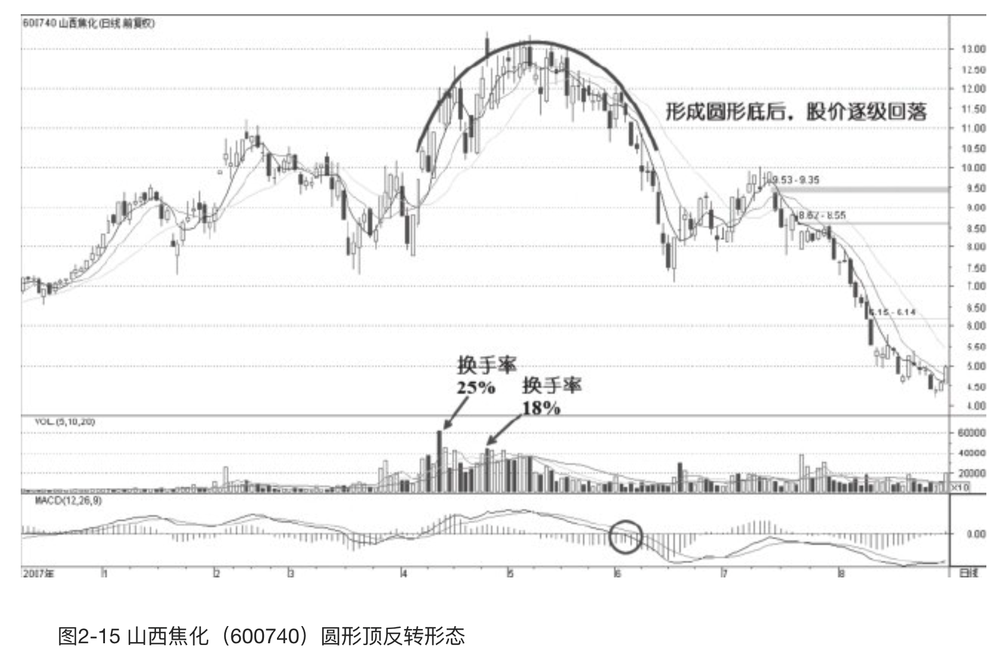

一般来说，当交易者发现见顶迹象时，就应密切关注其走势的发展，注意是否会形成圆形顶，并逐渐减少手中的一些仓位。在图2-15中，该股在接近圆形顶的顶部时，出现了两根放量阴线，换手率分别达到了25%和18%，这是顶部才有的换手率水平。当股价开始下跌，带动5日均线与10日均线向下移动时，应该果断离场。

### V形底和V形顶
V形底是股价经过一波急跌之后，又迅速拉升的走势，V形顶则相反。V形反转不容易判断，因为它在上涨时同样迅猛，当你想进场时很难找到低吸的机会，如图2-16所示。

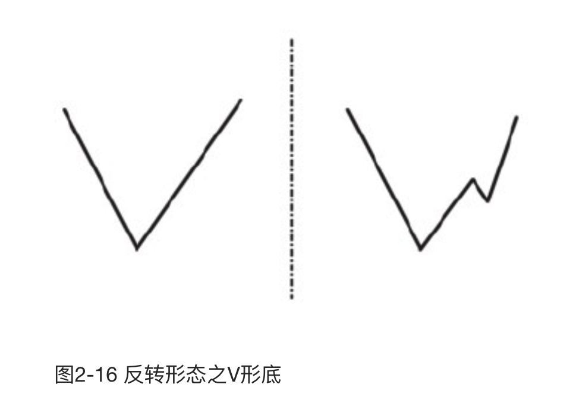

所谓V形走势，就是常说的V形反转，指股价先是一路下跌，后来一路攀升，反映在图形上就像一个英文字母V。V形走势的技术特征是：

1. 股价在下跌趋势中，下跌的速度越来越快。
2. 最后在股价下跌最猛烈的时候，出现了戏剧性的变化，股价触底后马上展开反攻，V形底的底部十分尖锐，可在几个交易日之内形成。在底部经常会发生反转K线形态，例如，蜻蜓十字线、刺透形态、弃婴形态等。
3. 转折点之后的拉升需要有成交量放大配合。

如图2-17所示。该股在最低点4.42元之后的两根长阳线，已满足了V形走势的3个必要条件，即在快速下跌之后，突然出现反向拉升，产生长阳线，并且成交量开始放大。该股在几个交易日内完成触底回升，一路上扬。

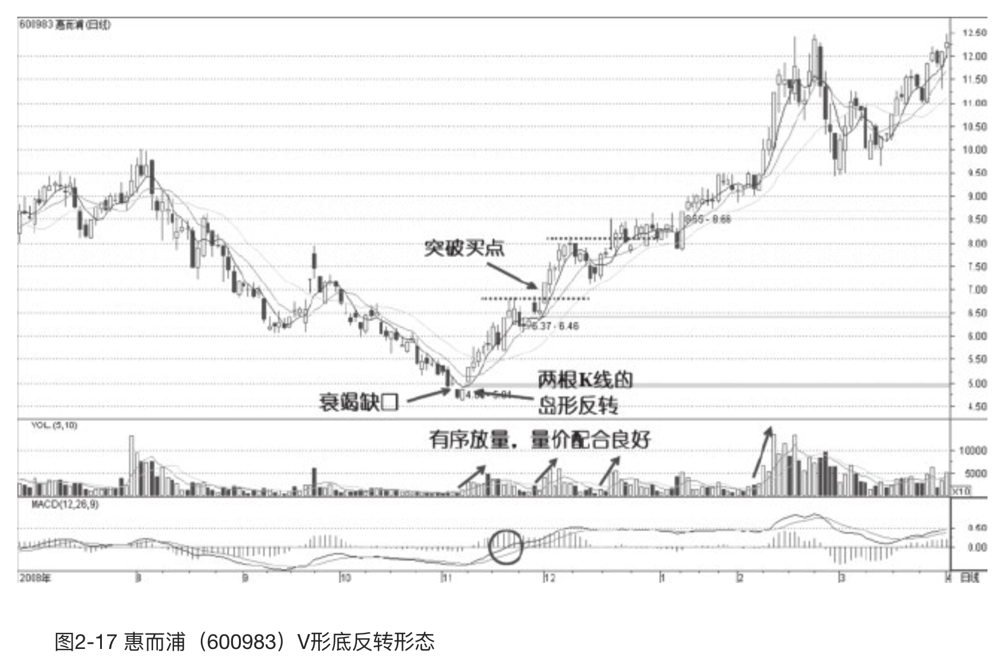

该股在低位的两根K线被左右两个缺口抛弃在了最低位，这是明显的岛形反转的K线组合，如果交易者在此时因为错过止损而留有仓位，大可不必再割肉在地板上。对于持股者的最佳策略是见到反转形态继续持股，对于保守一些的交易者来说，可以在上涨缩量的时候卖出一部分筹码，以降低亏损仓位。对于空仓的交易者来说，V形反转的买点并不容易把握，因为其也有形成双重底（W底）的可能，最佳的买入策略是，分批进场，既要防止回调又要防止踏空。

新的趋势一旦确立就不会在短期内结束，所以不必急于求成。图2-17中，前两次回抽之后向上突破的位置都是相对安全的买点。激进一些的交易者可以在低位出现明显反转信号后，在向上开口的均线带中，发生回踩均线时买入，然后在盈利的基础上，在向上突破时加仓。

图2-18显示的是复旦复华的顺势突破买点。交易者可以看到，在好的买点进场之后是很难被触发止损单的，买点之后该股一路高歌猛进。

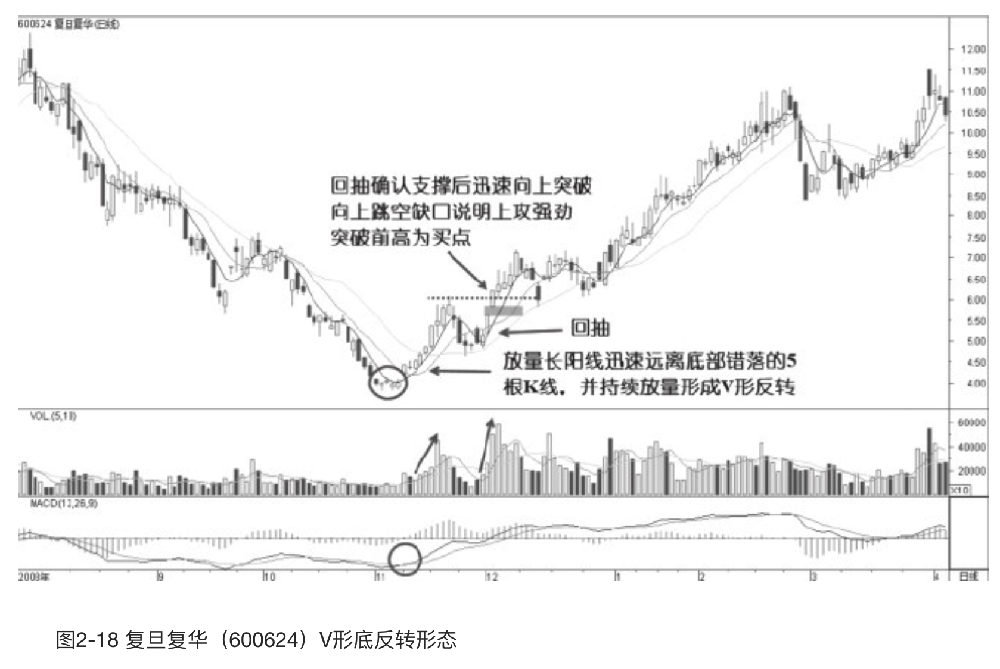

V形底的出现，通常是报复性反弹的结果。通常，指标已经多次进入超卖区间，市场已经跌过头，这时经常伴随着重大利好消息作为催化剂，上攻行情一触即发，出现价涨量增的局面。

V形顶走势的技术特征是：
1. 股价在快速上涨之后紧接着发生快速下跌，头部为尖顶，就像倒写的英文字母V，如图2-19所示。
2. V 形顶的顶部十分尖锐。通常在几个交易日之内形成。
3. 在冲顶时经常放出较大的成交量，在顶部经常出现放量高开的长阴线、乌云盖顶、看跌吞没形态等顶部反转K线形态，这会增大反转概率。

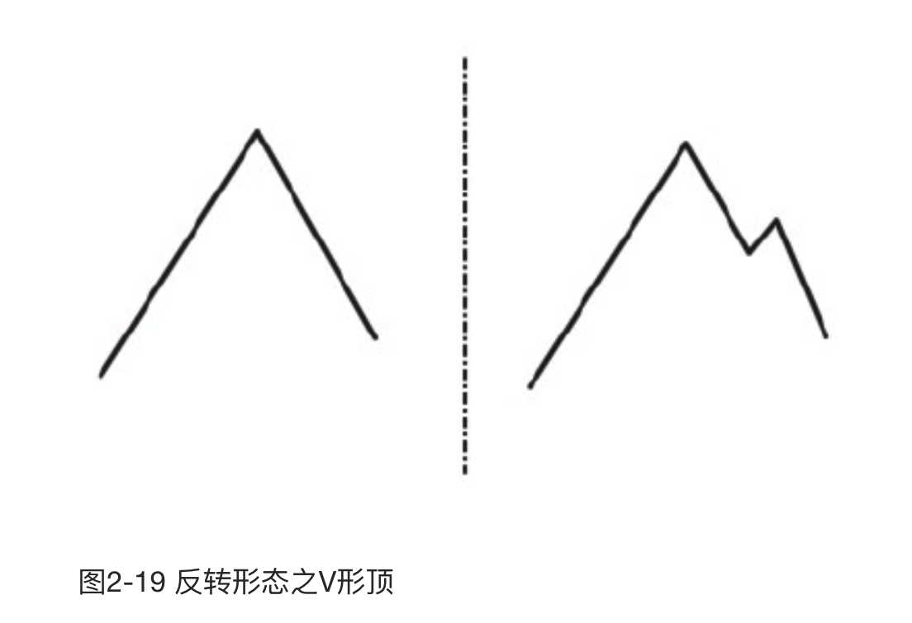

在上涨趋势中，市场看好的气氛使股价节节攀升，但这些追涨的力量多为短线行为，当追涨资金全部进场之后，买方力量会出现空缺，危机就会出现。短线客见股价涨不上去，就会反手做空，将筹码卖出，后来这种现象愈演愈烈，市场迅速逆转，以几乎同样的迅猛势头开始下跌。这样就产生了V形顶走势。

现在我们来看图2-20中的中信证券的走势，该股在形成最高点之后，出现连续的阴线下跌，有形成V形顶的态势，这时就要十分小心了。如果后面真的走出这种图形，股价下跌的速度将十分迅速，较晚离场会造成更大的亏损。所以，持股的交易者在股价开始回落时就应该设置好跟踪止损，跌破一定幅度进行减仓或清仓操作。如果该股重心继续下移，就要果断地斩仓出局，最初的亏损往往是最小的亏损。

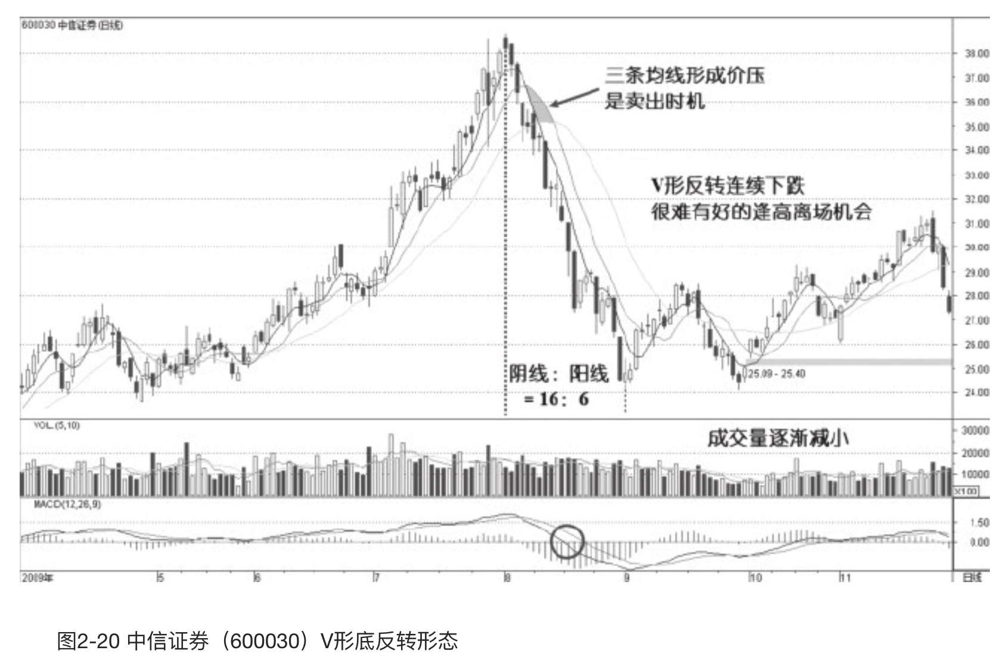

### 底部三角形和扩散三角形
底部三角形同样是个反转图形，如图2-21所示，它的特征是：

1. 股价在经历大幅下跌之后形成3次探底过程。几乎都在同一低点获得支撑，形成三角形的下边。
2. 股价每次反弹的高点逐渐下移，反弹力度越来越弱，连接反弹高点的直线形成三角形的上边。
3. 整个形态的形成过程中成交量逐步萎缩，到三角形的末端附近时缩减至最小水平。
4. 当向上突破压力线时成交量开始放大。

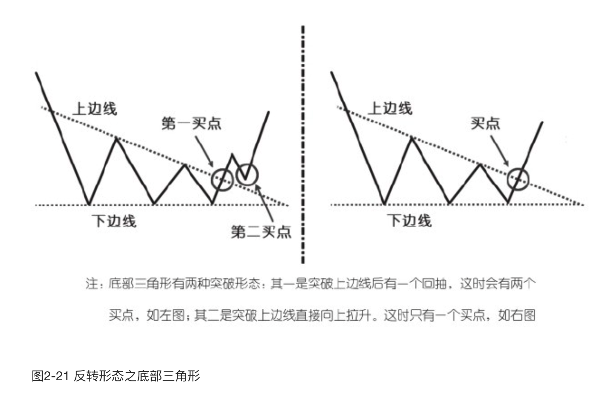

我们来看一个在个股中发生的底部三角形，如图2-22所示，该股运行到第一个圆圈位置时，已满足底部三角形的4个条件了。当价格运行到三角形末端时，突破的方向就是新的趋势方向。该股的下跌动能已经得到充分释放，其向上突破的可能性很大，向上突破和向下突破的概率大约为4∶1。

交易者不应再盲目看空，尤其不能在这个时候卖出股票，相反，我们应该在放量突破三角形压力线时进场。在三角形的末端，一根放量长阳线成功向上突破了上边压力线，产生第一买点。当股价向上突破后，经过一次回抽，再次向上突破时应该追涨买进，这里是第二买点，这也是老鸭头形态的买入位置。

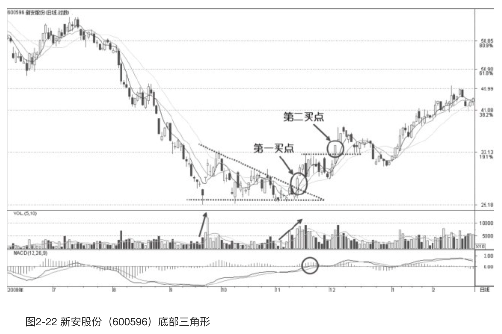

为什么底部三角形向上突破的可能性极大呢？这是因为股价经过连续几次大幅下挫，反弹力度越来越弱，大多数人对该股的前景已经失去信心，想跑的基本上跑光了，剩下的已是铁了心的“死多头”。此时做空的能量得到了充分释放，市场上如果有新多头力量加入，空方无力打压，很容易引起股价的上扬。所以底部三角形的出现为交易者提供了一个“抄底”良机，而这种技术图形经常发生在一些小盘股上，很多大黑马就是这样产生的。

### 扩散三角形
扩散三角形出现在上涨趋势中，上涨的高点越来越高，而下跌的低点越来越低。如果将形态内的高点连接成一条直线，再将形态内的低点连接成另一条直线，即可画出图2-23中的喇叭状趋势线，这就是扩散三角形。扩散三角形经常出现在投机性很强的个股上。当股价上涨时，交易者受到市场中炽热的投机气氛或利多消息的影响，疯狂地追涨，成交量急剧放大；而当下跌时，则盲目地杀跌，正是由于这样的原因，造成了股价的大起大落。

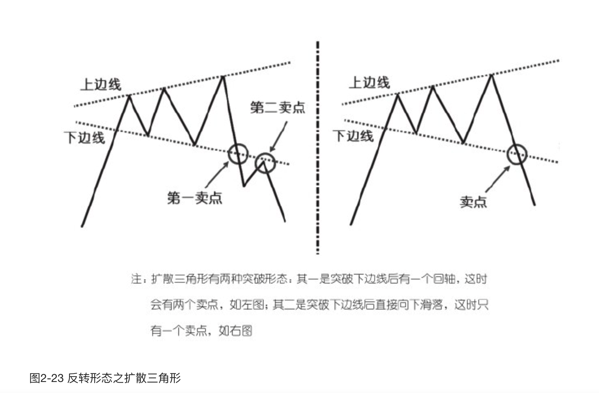

扩散三角形是大跌的先兆。当市场参与者变得失去理智时，其中蕴含的风险也就不言而喻，而扩散三角形正是人们的过度投机心理在图表上的反映。它暗示市场在逐渐失去上涨合力，下跌一触即发。交易者面对扩散三角形只有两个字：退出。

图2-24显示的是个股金地集团在阶段高位的走势，股价在三角形下边获得了两次支撑，然后创出新高73.50元。次日收出一根穿头破脚的长阴线，近两日K线构成了一个吞没形态，这是顶部的常见形态。经验丰富的交易者在此时会考虑先抛掉一部分筹码。第三日是向下跳空的阴线，随后该股一路下跌至三角形的下边线。当股价跌破下边线时是第一卖点，因为下边线是一个十分可靠的支撑位，如果失效的话，那么这个价位将成为以后上涨时的压力位。事实也证明了这一情况，该股在跌破下边线之后出现了一次回抽，到下边线后遇阻重回跌势，这里是该股的最后卖出机会，是第二卖点。当再次回落时，可以确认扩散三角形成立，该股已经发生反转。可以看到，之后该股逐级下跌，最终回到了图中上涨波段的起点附近。

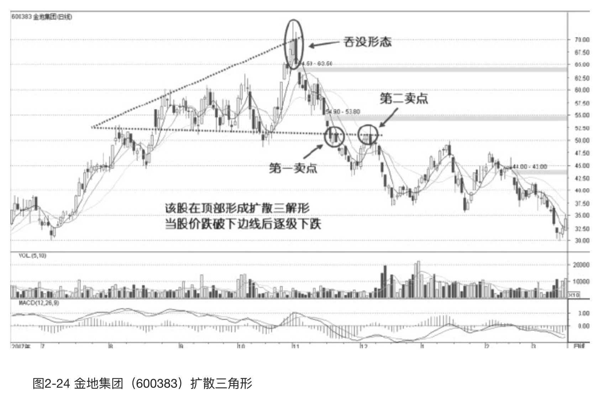

## 123法则和2B法则
首先明确趋势线的画法。

`上升趋势线`：在操作周期内，连接相邻两个波谷低点的直线就是上升趋势线，由于在上升趋势中，其波谷逐波升高，趋势线的方向向上，如图2-25和图2-26所示。

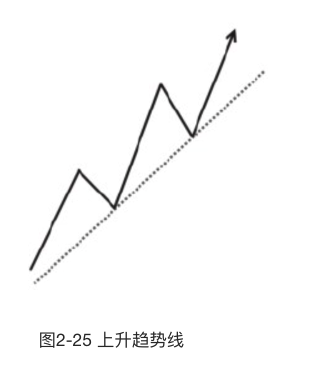

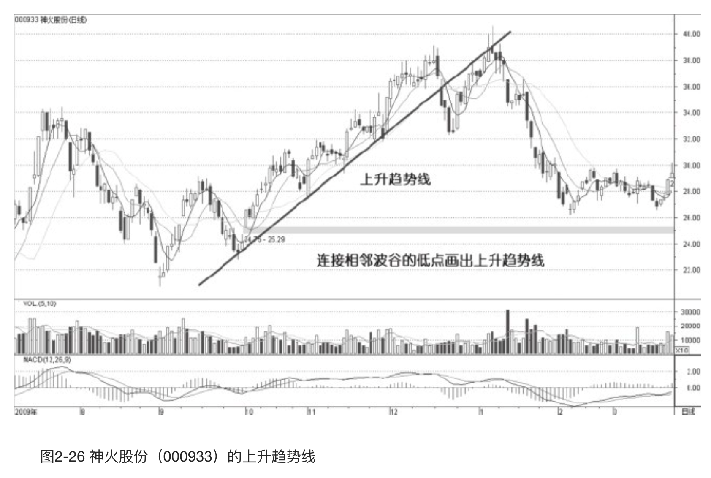

`下降趋势线`：在操作周期内，连接相邻两个波峰高点的直线就是下降趋势线，由于在下跌趋势中，其波峰逐波降低，趋势线的方向向下，如图2-27和图2-28所示。

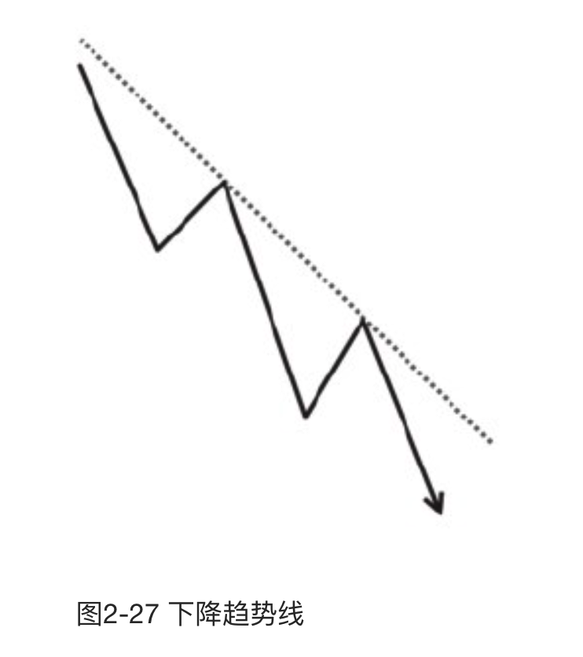

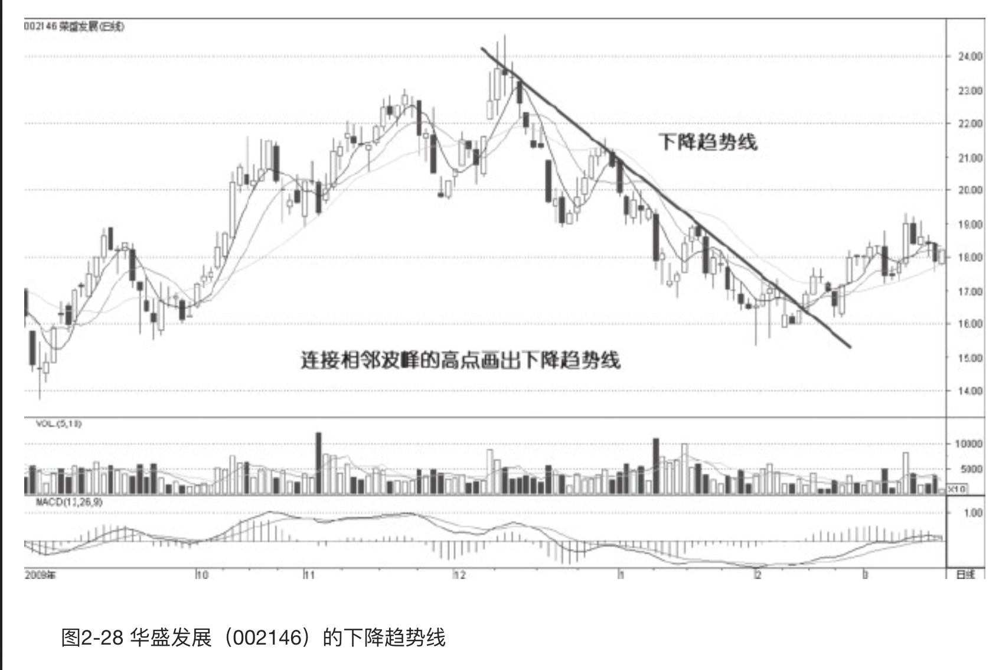

### 123法则
在使用123法则时，趋势变化应满足以下要求：

1. 趋势线被突破。
2. 上升趋势不再创新高，或下降趋势不再创新低。
3. 在上升趋势中，价格向下突破前期调整的低点，或在下降趋势中，价格向上突破前期反弹的高点。

123法则就是三个判断趋势转变的条件，当这三个条件同时成立时，相当于道氏理论对趋势转变的确认。三个条件满足一个时表示趋势可能发生转变，满足两个时表示趋势发生变化的可能性增大，三个条件都满足时，即是对趋势转变的确认。注意其中第二个条件，有时价格会出现短暂的假突破（测试前高或前低，产生新高或新低），但很快会回到前高以下（或前低以上）。

在依照123法则画图时，只需将3个条件转化为图形。首先，画出操作周期内的趋势线。然后，如图2-29所示，画出两条水平线。在上升趋势中时，先画一条穿过当前最高点的直线，再画一条穿过前一波回调低点的水平直线。在下降趋势中时，先画一条穿过当前最低点的直线，再画一条穿过前一波反弹高点的水平直线。

如果价格突破趋势线，则满足了条件1，在突破的位置标注1。如果价格测试前波顶点，接近、接触或稍微穿越前高或前低的水平价格线而未能有效突破，则在该点标注2。如果价格又突破前波调整的顶点价位，则在该点标注3。如果这三种情况出现两种，表示趋势可能发生变化。如果三种情况全部出现，则表示趋势已经发生变化，最可能朝着新的发向继续发展。

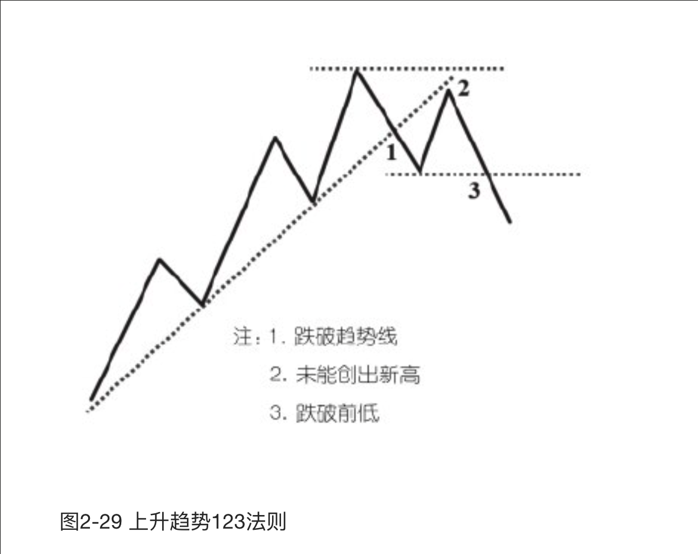

图2-30显示的是个股神火股份的日线图，我们在该股上运用123法则，判断其趋势方向的转变。我们先沿着价格上涨过程中的波谷低点画出一条上升趋势线。在图中用圆圈标出的第一个位置，该股向下跳空并跌破趋势线，表示该股有转势的可能。之后股价再次上涨，测试前期高点39.19元，但没能有效突破39.19元，而是连续出现阴线下跌，这时标注2，表示转势的可能性在加大。当股价跌破下面穿过32.25元的水平直线时，这时标注3，确认转势。当确认突破前低时，是合理的出场机会，随后该股一路暴跌。

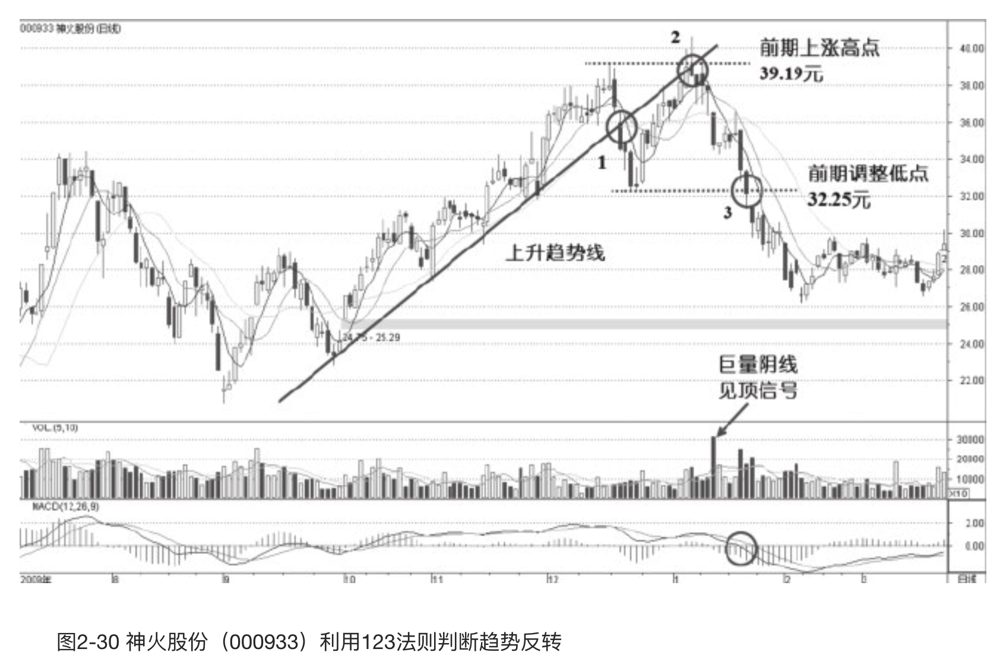

在下降趋势中运用123法则与上升趋势同理，如图2-31所示。

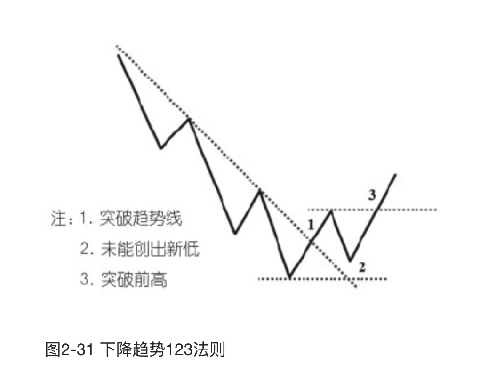

我们再来看一个在下降趋势中运用123法则的例子，如图2-32所示。北方稀土（600111）在主要的多头趋势中出现一波连续调整，我们沿着波峰的高点画出一条下降趋势线。在价格反弹突破趋势线之后，股价继续下跌，但并没有测试前期下跌的低点21.46元一线，而是直接反身向上突破了前期反弹高点27.67元一线，确认转势，我们在图中标出了满足123法则的三个位置。该股在位置3之后连续向上突破，从27.67元开始一路拉升，最终上涨到了40元附近！

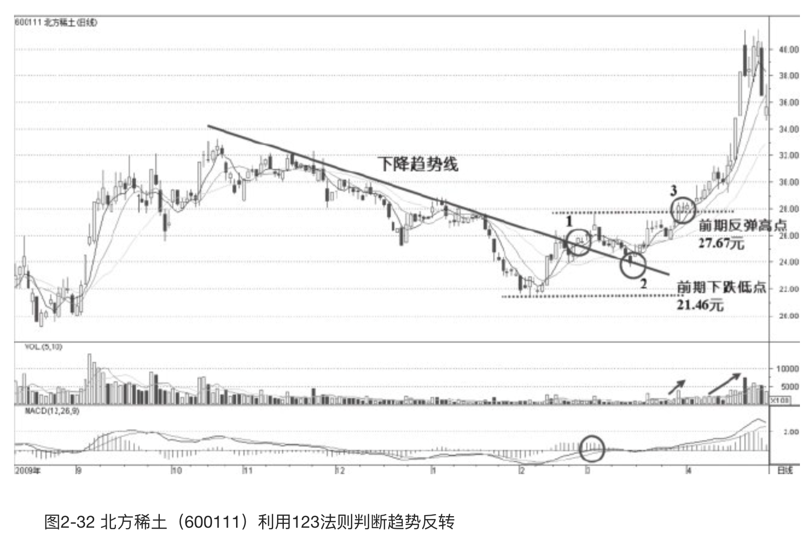

运用123法则进行操作时，要等待3个条件全部满足后再进场，在下降趋势的底部虽然会提高进场价位，但从涨跌的概率比较来看还是值得的，放过最低价位，而买在趋势形成的初始阶段是最好的选择。如果提前进场，很可能会买在真反弹、假突破的位置，从而存在着被套的风险。

同样，在上升趋势中也必然会失去一段头部利润，但这是合理的，因为在确认转势并判定为头部之前，我们并不知道它是头部。在转势之前我们认为趋势还会继续，如果没有满足条件3，我们的利润还会进一步增长，所以失去一段利润是必然的也是合理的。

### 2B法则
2B法则是对123法则中条件2的修正补充。

- 在上升趋势中，如果价格已经突破前期高点却未能继续升势，随后又跌破前期高点，则趋势很可能会发生反转。如图2-33所示。在下降趋势中也是同理，只是方向相反。
- 在下降趋势中，如果价格已经创出新低而未能持续跌势，随后又反弹至前期的低点之上，则趋势可能发生反转。如图2-34所示。

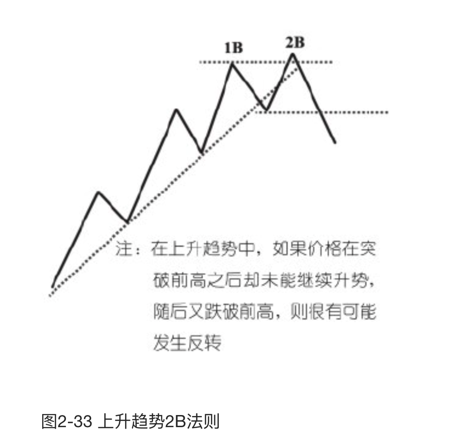

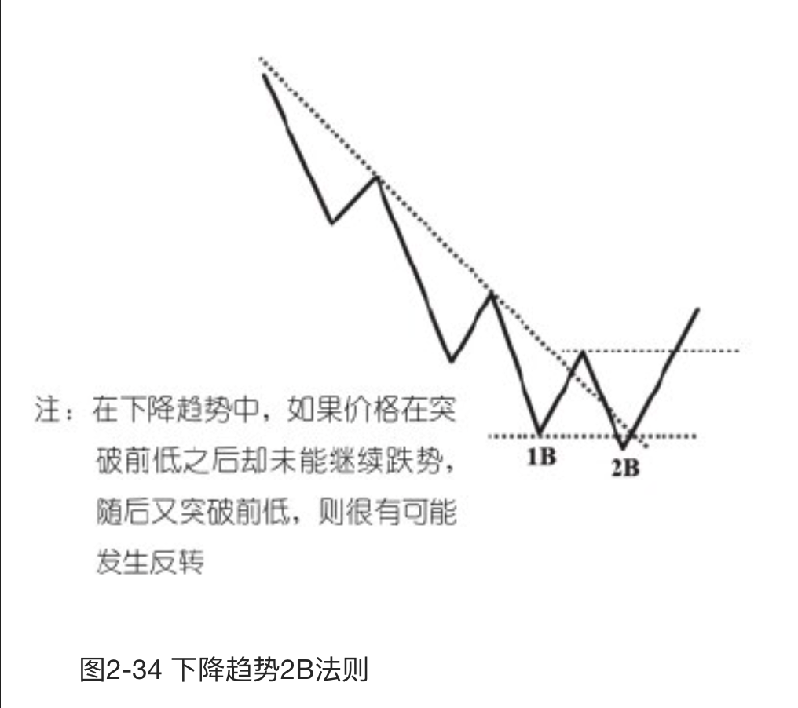

从图2-33和图2-34可以看出，2B法则形成于123法则满足第二个条件时，2B的出现比123法则确认转势要提前，是相对安全的抄底位置，但要注意这时新的趋势只是“趋”，是种可能性，需要重视止损位的设置，2B法则由于进场点提前，这会比123法则的成功率更低，但回报率更高。

图2-35所示。从图中可以看出，2B法则较123法则更早地出现买进和卖出机会，2B出现在123法则的条件2中，这时还没有满足条件3。依据2B法则，以回到前低之上的第一根阳线的收盘价为买点，在7.27元买进，这比依据123法则在8.18元买进少用了0.91元，相当于多盈利12.5%。同样，在卖点，用2B法则在15.37元卖出，比123法则的13.14元高了2.23元，相当于多盈利14.5%。

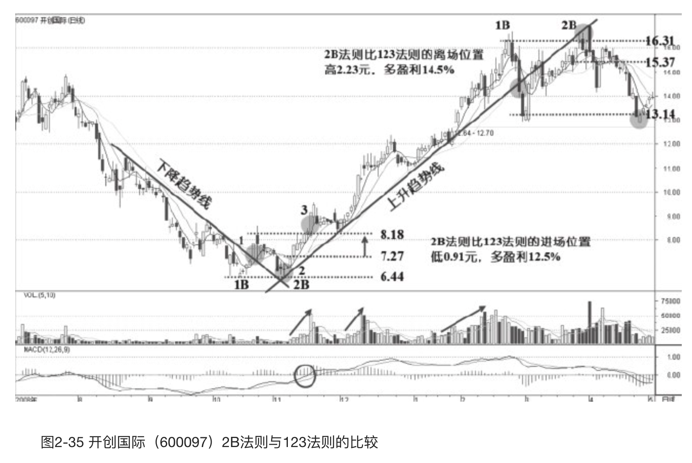

### 123法则应用于实战
在股票交易中，进场点和出场点的确定非常关键，运用123法则时，进场点可以设置为：在下降趋势中满足所有3条法则时，在突破价位附近买进，止损价位设在前期低点下方一定幅度（例如3%），如图2-36所示；出场点可以设置为：当上升趋势中满足所有3条法则时，在前波回调的低点下方一定幅度（例如3%）设止盈位，一旦股价跌破止盈位则卖出，获利了结。

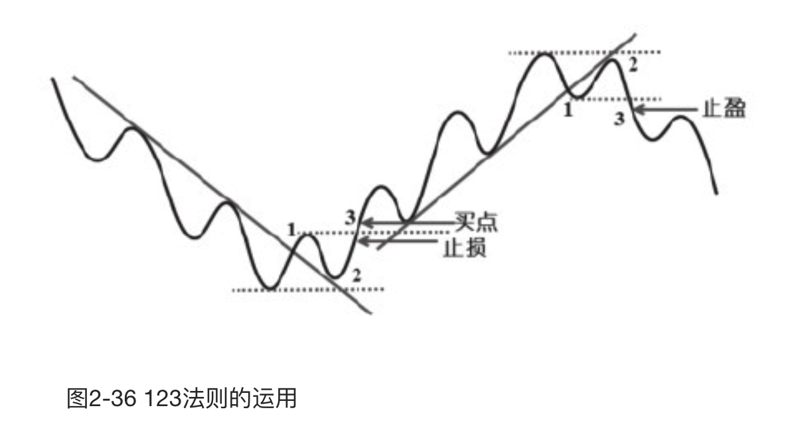

看一个利用123法则进行止盈的例子，如图2-37所示。广州发展（600098）经过一波连续上涨，在高位满足了所有3个条件，我们在图中标出了这三个位置。可以将止盈位设置在前低收盘价7.33元，当股价跌破7.33元时，以收盘价7.25元卖出股票并锁定利润，止盈时满足条件3，确认该股的上升趋势已经反转。

### 2B法则应用于实战
运用2B法则，在下降趋势中，价格已经向下突破前期低点，随后又涨回前期低点的上方，立即买入，止损位设在前期低点下方一定距离（例如3%），如图2-38所示。在上升趋势中，价格已经向上突破前期高点，随后又跌破前期高点，马上在前期高点下方一定距离（例如3%）设止盈位，也称跟踪止损位，一旦跌破止盈位则马上卖出，获利了结。

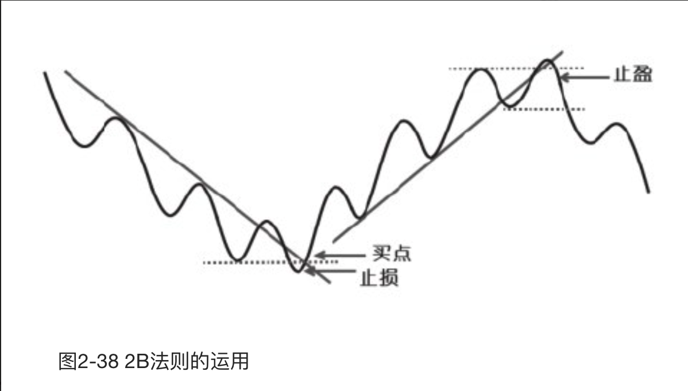

2B法则用于京粮控股（000505）的操作，如图2-39所示，在下降趋势中，经过一段时间的缩量下跌之后，形成了第一个底1B，之后股价发生反弹，但成交量没有明显放大，股价又重回跌势，成交量进一步减少，明显少于平均成交量。在2009年9月29日，该股突破前低5.40元，创出了新低5.25元，但没能持续跌势，只停留了两天便又涨回到了前低之上，这极有可能是一个假突破。运用2B法则，在回到前低之上第一个阳线时以收盘价5.95元买入该股，并将止损位设置在创出新低那天的收盘价5.33元。

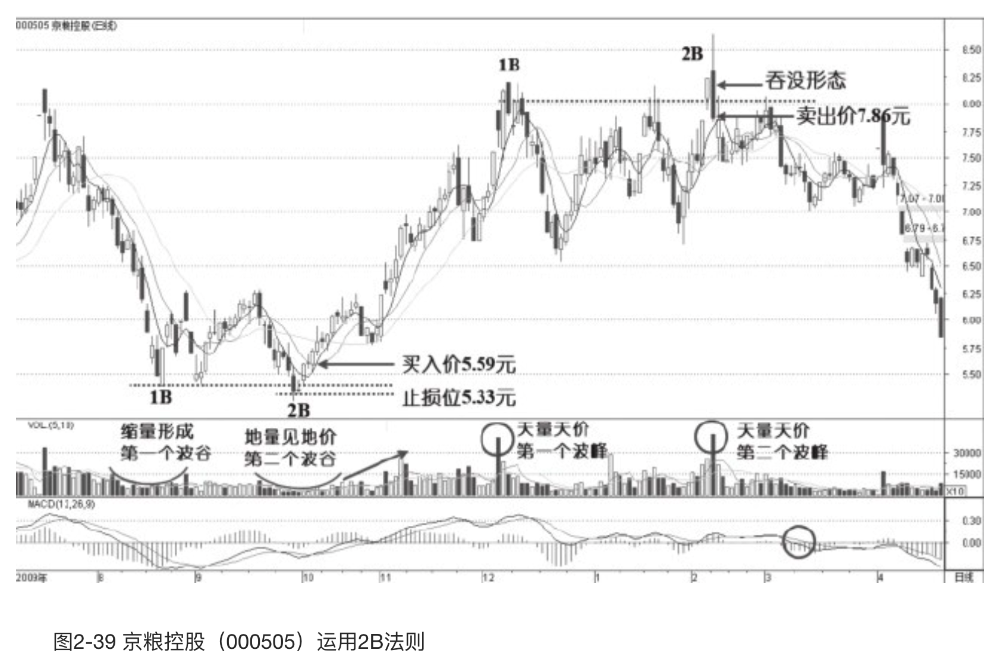

该股在12月4日走出了一根实体阴线，并放出了天量，一般认为天量见天价，这时就要小心了。该股之后开始回调，这时形成第一个顶1B，之后该股一直在第一个顶部以下震荡，这时候是主力在争取时间出货。在2月4日，该股稍微突破了前高，收盘在前高之上，我们把止盈位设置在这一天的开盘价8.23元。不过次日该股虽然创出新高，但收出一根带有长上影的长阴线，同时又一次放出了天量，这是顶部的显著标志，出现这种K线基本可以断定此处就是顶部。综合依据2B法则设置的止盈位和顶部K线特征，在当天收盘价7.86元应果断止盈离场。

图2-40显示的是个股渝开发（000514）的日K线图，我们利用2B法则进行止盈，这是一个经典案例，交易者可以自己熟悉一下其在实战中的用法。可以看出，2B法则是逃顶的好办法。

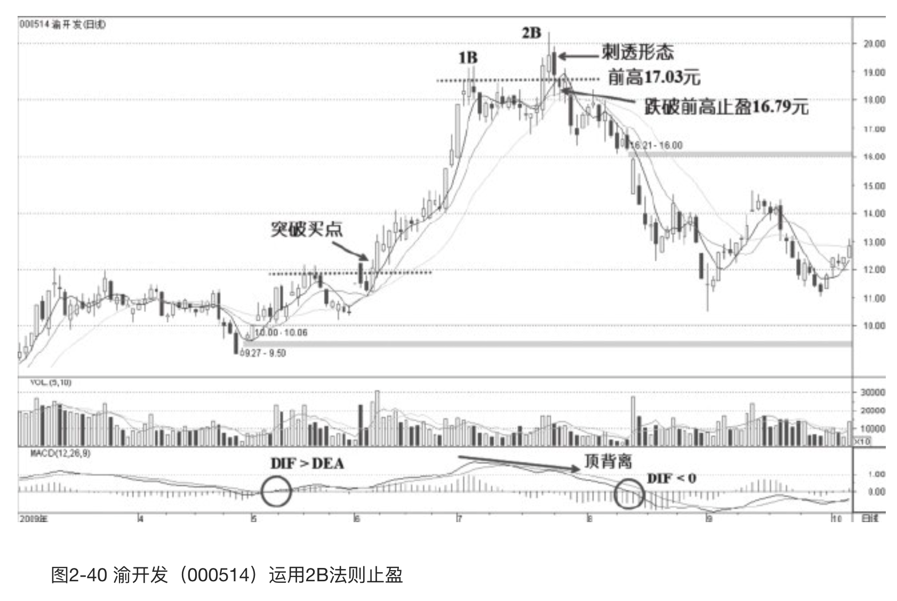

### 123法则与2B法则结合运用
交易者如果在用2B法则买入股票之后又发生符合123法则的情况，可以结合123法则的操作方法进行加仓，两次进场的止损位可以共同设置在前期低点下方一定距离，如图2-41、图2-42所示，随着股价走出更高的低点，可以将止损位上移，形成跟踪止损。

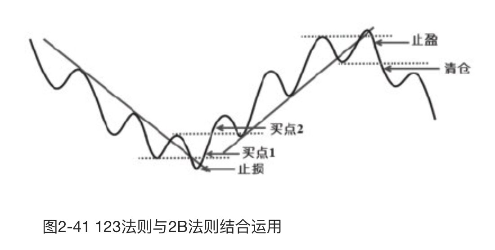

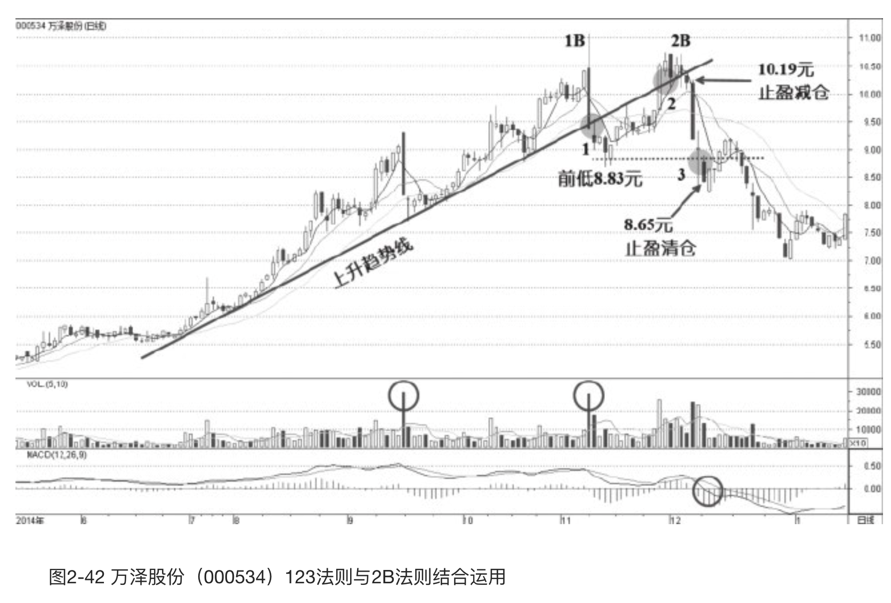

我们来看一个利用123法则和2B法则进行离场操作的例子，如图2-42所示。该股前期经过连续上涨，形成了一条上升趋势线。在上涨过程中，成交量出现了两次明显的顶部特征，我们在成交量图中用圆圈标出了这两次放出巨量的位置。第二次放出巨量时，走出一根带有长上影的长实体阴线，这对于多头来说，不是一个好的迹象。

我们利用两日原则，当价格连续两个交易日收盘在上升趋势线之下时，确认跌破趋势线，这时满足123法则的条件1。随后该股再次上涨，并短暂回到了趋势线上方，在前高附近形成第二个顶部。但很快又回到了趋势线之下，也是前高之下，这时满足2B法则的条件，我们在10.19元止盈部分筹码。

随后该股很快跌破了前期低点8.83元，满足123法则的条件3，我们以8.65元止盈全部筹码。卖出之后，该股回测前期低点，但没有成交量的配合，价格很快创出新低。MACD指标的DIF线进入0轴以下的空方市场，这时可以确认头部成立。

## 左侧交易与右侧交易
左侧交易者根据预期操作，而右侧交易者根据价格走势的实际指向操作。所以，左侧交易者一直在“猜”顶和底，他们会比较“唯心”一些。右侧交易者相对客观的多，他们是在顺势而为。单从中周期来看，选择右侧交易应该是多数人的选择，也是比较稳健的操作风格。从经验来看，右侧交易的把握性更大，如果利用跟踪止损（第3章中会讲到）会抓住不小的波段，虽然不如左侧交易在理论上吃到的多，但**我们认为顺势交易的可操作性更强，也符合经典理论的技术前提**。

左侧交易只是理论上能吃到更多，在实际操作中并不一定真能实现。比如，一只股票下跌到10元时，左侧交易者认为这里是支撑位而买进。这只股票没有在10元止跌，而是继续下跌到9元以下之后才开始上涨。左侧交易者已经经历了一段亏损期的心理煎熬。当它上涨到12元的时候，他感觉已经盈利达20%并开始担心失去到手的利润，从而选择卖出股票。但是这只股票还是继续上涨，当涨到了13元时，他后悔卖掉又买了回来，股价仍然继续上涨，涨到15元时他又开始担心见顶，还是决定逢高卖出，结果上涨趋势仍在继续，这位左侧交易者只能眼看着这只股票连续突破17元、20元，却不敢再追高买进。

一种正确的做法是，当这只股票从9元以下涨起来时，在上涨初期利用技术判断，在符合起涨点条件的位置以10元买入，然后采用跟踪止损策略，在9元设置止损，当股价涨到12元时，将止损位提高到10.8元，股价涨到15元时，将止损位提高到13.5元……当股价涨到22元时，将止损位提高到19.8元。

## 经典技术分析理论
### 道氏理论——股市晴雨表
道氏理论可以总结成三个假设和五个定理，这也是我们以后所有技术分析的基石。

假设1：人为操纵：指数每天的波动可能受到人为操纵，次级折返走势也可能受到这方面有限的影响，但主要趋势绝对不会受到人为的操纵。

假设2：市场指数包容一切信息：对于每一位市场参与者来说，他所有的希望、失望与知识，都会反映在“道琼斯铁路指数”与“道琼斯工业指数”每天的收盘价波动中；基于这个缘故，市场指数永远会适当地预期未来事件的影响。如果发生火灾或地震等自然灾害，市场指数也会迅速地加以评估。

假设3：这套理论并非不会犯错；道氏理论并不是一种万无一失并可以击败市场的系统。成功利用它协助投机行为，需要深入的研究，并客观地进行综合判断。绝对不可以让一厢情愿的想法主导思考。

定理1：

道氏理论的三种走势：市场指数有三种走势，三者都可以同时出现。
- 第一种走势最重要，它是主要趋势：整体向上或向下的趋势称为多头或空头市场，持续时间可能长达数年。
- 第二种走势最难捉摸，它是次级的折返走势：它是主要多头市场中的调整，或是主要空头市场中的反弹。修正走势通常会持续数周至数月。
- 第三种走势通常较不重要，它是每天的短期波动。

定理2：

`主要趋势`：主要趋势代表整体的基本趋势，通常称为多头或空头市场，如图2-45所示，持续时间可能在一年以内，也可能长达数年之久。正确判断主要趋势的方向，是投机行为成功与否的最重要因素。没有任何已知的方法可以预测主要趋势的持续时间。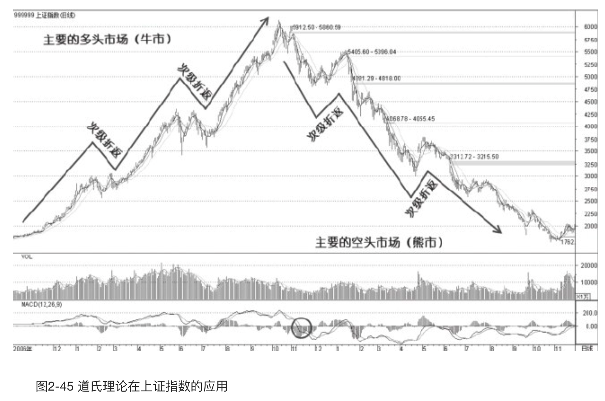

定理3：主要的空头市场（熊市）：主要的空头市场是长期向下的走势，其间夹杂着重要的反弹。它源自各种不利的经济因素，只有在股票价格充分反映可能出现的最糟情况之后，这种走势才会结束。空头市场会历经三个主要的阶段：
- 第一阶段，市场参与者不再期待股票可以维持过度膨胀的价格。
- 第二阶段，卖压反映了经济状况与企业盈余的衰退。
- 第三阶段，源自对股票的失望性卖压，不论估值如何，许多人急于套现持有的股票。

定理4：

`主要的多头市场（牛市）`：主要的多头市场是一种整体性的上涨走势，其中夹杂着次级的折返走势，平均的持续期间长于两年。在此期间，由于经济情况好转与投机活动恢复旺盛，所以投资性与投机性的需求增加，并因此推高投票价格。多头市场有三个阶段：
- 第一阶段，人们对于未来的景气恢复信心。
- 第二阶段，股票对于已知的公司盈余改善产生反应。
- 第三阶段，投机热潮极度热烈而股价明显膨胀——这阶段的股价上涨是基于期待与希望。

多头市场的特色是所有主要指数都会持续联袂走高，回调走势不会跌破前一个次级折返走势的低点，然后再继续上涨并且创出新高。在次级的折返走势中，一些主要指数不会同时跌破前期的重要低点。

定理5：

`次级折返走势`：次级折返走势是多头市场中重要的下跌走势，或空头市场中重要的上涨走势，持续的时间通常在数周至数月；此期间内折返的幅度为前一次级折返走势结束后主要走势幅度的33%至66%。次级折返走势经常被误以为是主要趋势的改变，因为多头市场的初期走势，显然可能仅是空头市场的次级折返走势，相反，空头市场的初期走势，可能被认为是多头市场的次级折返走势。

次级折返走势（修正走势）是一种重要的中期走势，它是逆于主要趋势的重大折返走势。判断主要趋势中的重要中期折返走势，这是道氏理论中最微妙与困难的一环。

### 波浪理论——自然法则
在多头行情中，每一波价格拉升的波峰都会高于前一波上涨的波峰；在空头行情中，每一波价格下跌的波谷都会低于前一波下跌的波谷。如果交易者能把握股价波动的行进模式的话，就能不必过于关注微小的波动，而是通过合理抓住主升浪来获取最大的盈利。在上涨浪末端，根据波浪运行的规律提前判断可能的行情拐点，及时减少仓位可以保护更多利润。在下跌推动浪中，交易者应耐心等待，市场不给我们机会，我们坚决不入市。

波浪理论特点

1. 该理论由波浪的形态、比例、时间三方面组成，三者的重要程度依次降低。
2. 该理论在股市中应用于股市指数，个股市场并不同样有效。
3. 该理论应用在广泛参与的股票市场和期货市场上。
4. 该理论建立在道氏理论和传统的图表分析基础之上。

波浪理论基本要点
1. 期货价格或股价指数的升跌会交替进行。趋势的规模大至200年的超长周期，小至数小时的微小周期。
2. 从波峰到波谷或从波谷到波峰为一浪，所有的浪可以分为推动浪或者调整浪。它们是价格波动的两种最基本形态。
3. 八个波浪（五上三下）走完后，一个涨跌循环即宣告完成，将进入另一个八波浪循环。（推动浪是和主要趋势方向一致的波浪，可再分割为五个小浪，用1、2、3、4、5表示，如图2-46所示。其中第1、3、5浪与推进方向相同，是低一级别的推动浪；第2、4浪与推进方向相反，是低一级别的调整浪。调整浪是和主要趋势方向相反的波浪，用A、B、C字母表示。）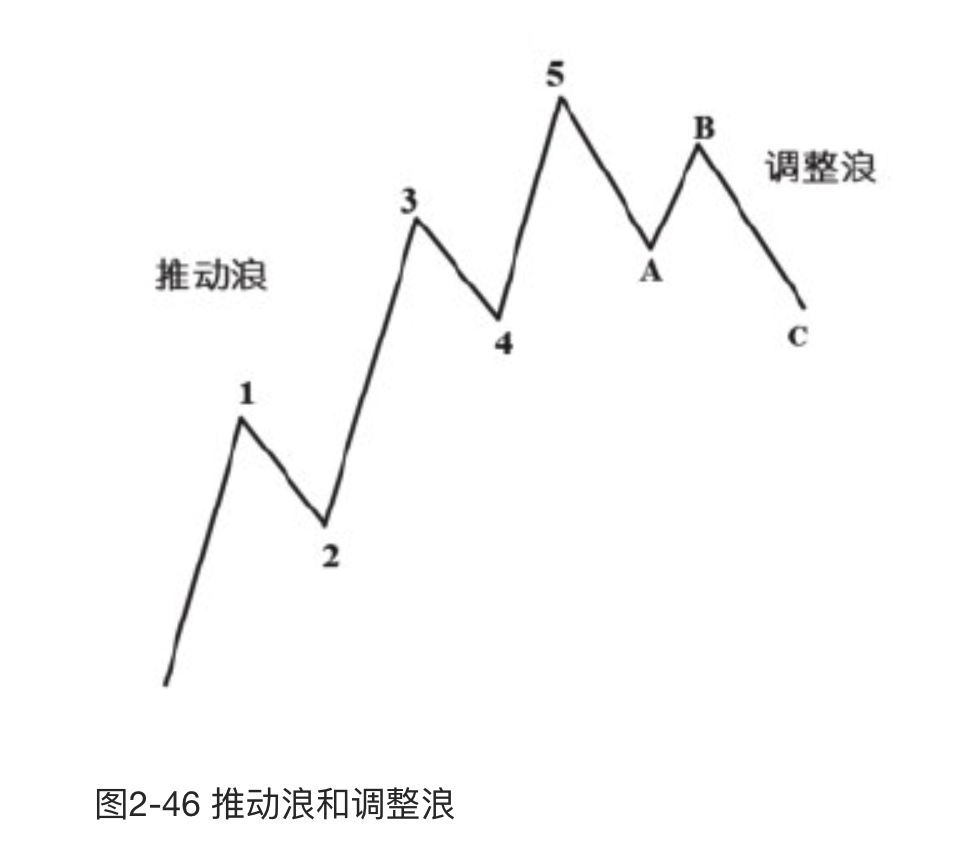
4. 时间的长短不会改变波浪的形态，波浪可拉长、可缩短，但基本形态永恒不变。
5. 波浪理论的数学基础是神奇数字（费波纳奇数列）。神奇数字是指数列1，1，2，3，5，8，13，21……从第三个数字开始，每个数字等于前两个数字之和，它的通项公式为：$A_n=A_{n-1}+A_{n-2}$。
6. 在一个推动浪后紧跟一个调整浪，调整比例经常是0.382、0.618倍，如图2-48所示。一个推动浪上涨的初级目标为从第1浪起点算起的第1浪长度的3.236倍；第2浪调整目标为第1浪长度的0.618倍；第3浪的上涨目标为第1浪的1.618倍；第4浪回调目标为第3浪的0.382倍；第5浪的上涨目标是与第一浪等长的高度。

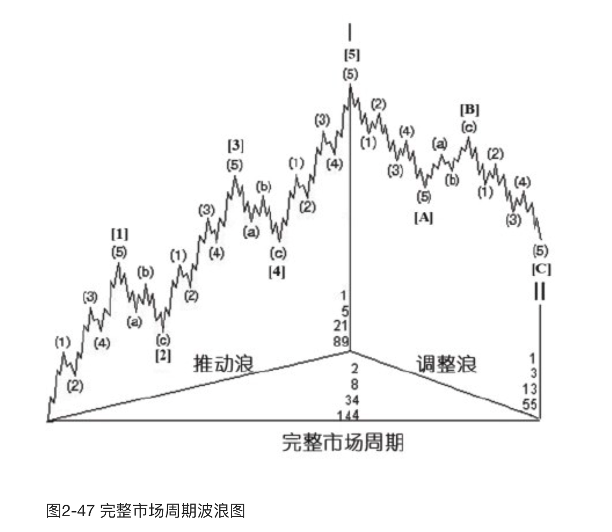

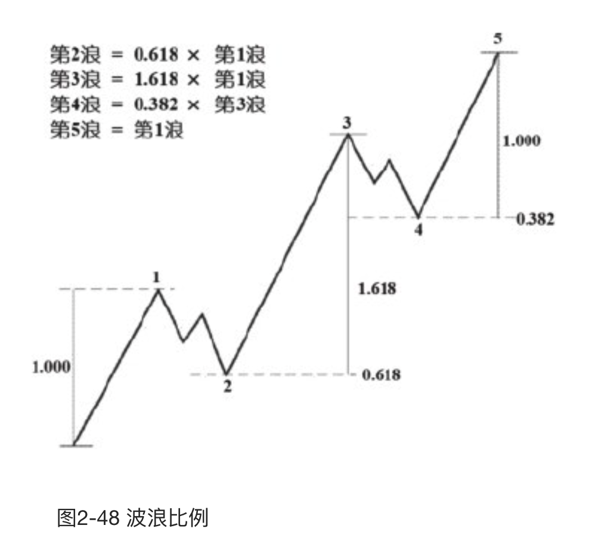

波浪理论八浪详述
- 第1浪：上一轮熊市结束，形成新的牛市起点，属于营造底部形态的一部分，涨幅通常为五浪中最短的一浪。此时，买方力量并不强大，市场仍然存在卖压。
- 第2浪：调整幅度往往很深，几乎吃掉第1浪升幅，人们误以为熊市尚未结束。此浪接近底部时，市场普遍惜售，抛售压力减少，成交量减少，看作结束标志。2浪应在1浪低点上方止跌，往往可以构成双重底、三重底、头肩底等底部反转形态。第2浪的回撤总是小于第1浪幅度的100%。
- 第3浪：此浪通常是主升浪，涨幅最大，持续时间最长，在5浪结构中绝不会是最短的一浪。此时，投资者信心恢复，成交量大幅上升，时常出现突破信号。第3浪总会突破第1浪的高点。
- 第4浪：调整浪，形态较复杂，构造与第2浪不同，时常出现倾斜三角形走势，但其底部不会低于第1浪顶点。这是艾略特波浪理论的中心法则之一。第4浪在以后的熊市中起到显著的支撑作用。通常这一轮熊市不会跌过前面牛市中形成的第4浪，可以用来测算价格下跌的目标位，如图2-49所示，但也有例外。**股市中的第4浪不可以与第1浪有重叠，这是铁律**。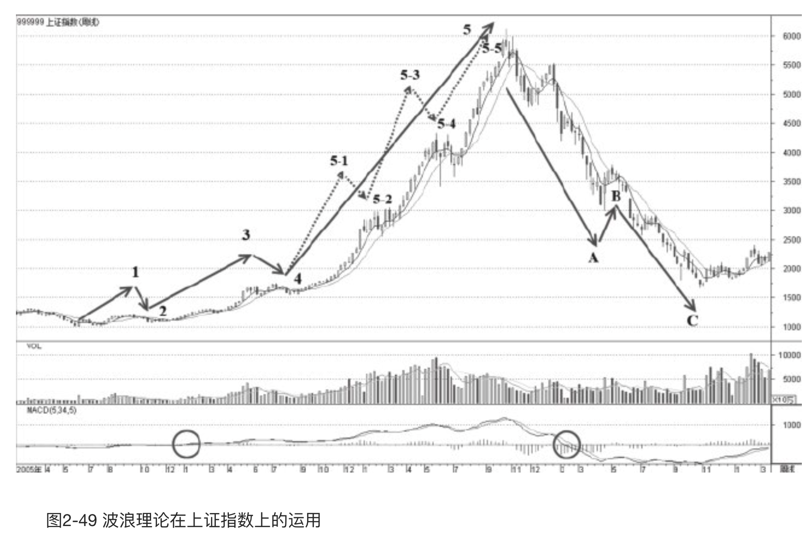
- 第5浪：第5浪的涨势通常小于第3浪，并且经常出现突破失败的情况。第5浪中，许多验证性指标，例如OBV、VOL、DIF等，开始落后于价格变化，出现价格与指标背离的情况，预示价格趋势可能发生反转。
- A浪：开始对上升浪进行调整，实际上在第5浪中已有见顶迹象。多数人认为上升行情尚未逆转，只是当A浪出现5浪结构时才意识到它的到来。
- B浪：成交量不大，一般是多头的最后出逃机会。由于是一段上升行情，容易使人误以为开始另一波新的涨势，成为多头陷阱，许多人在这个位置被套牢。此浪有可能测试前期高点构成双重顶，甚至会短暂突破前高再开始下跌。
- C浪：这是破坏力极强的下跌浪，跌势强劲、跌幅大、持续时间长，出现全面性下跌。C浪的出现，宣告上升趋势的真正结束。C浪跌过A浪的低点，形成卖出信号。有时沿着第4浪和A浪的低点可以画出一条颈线，并构成头肩顶反转形态。

我们将波浪理论运用在上证指数，如图2-49所示，可以看到主要上涨趋势从998点上涨到6142点形成了5浪上涨，其中的第5浪走出了延长浪。从6124点下跌到1664点的主要下跌趋势形成了A、B、C三浪下跌。由于在这次牛市中的第5浪走出了较长的延长浪，因此这轮熊市在第4浪低点之前结束。

波浪理论的三个铁律：

1. 第2浪不会创新低。
2. 第3浪永远不是最短的一浪。
3. 第2浪与第4浪不能重叠。

上升浪的特点：

1. 上升趋势中主升浪的延长并不罕见。第1浪延长，最不常见；第3浪延长，在股市中常见；第5浪延长，在期货市场中常见。延长浪多是5浪结构，5浪以上的推动浪并不常见。在三个上升浪中，只能有一个延长浪，其他两个未延长浪在时间和幅度上大小相等。
2. 把第1浪的高度乘以1.618，加到2浪的底点，可以得出第3浪的一个上涨目标位。
3. 把第1浪的高度乘以3.236，分别加到1浪的顶点和底点，大致是第5浪的最大和最小上涨目标位。
4. 如果第1、3浪大致相等，则预期第5浪会走出延长浪。其上涨目标位为，第1浪底点到第3浪顶点的高度，乘以1.618后，加到4浪的底点上。

调整浪的特点：

1. 调整浪绝不会以五浪形式出现，应属于三浪结构。
2. 调整浪有四种类型：锯齿形（5-3-5型）、平台形（3-3-5型）、三角形、联合型。
3. 如果它是通常的5-3-5锯齿形调整，那么C浪常和A浪相等。
4. 把A浪长度乘以0.618，从A的底点减去乘积，可估算C浪的长度。
5. 在3-3-5平台形调整情况下，B浪可能达到或超过A浪的顶点，这时C浪长度等于A浪长度的1.618倍。
6. 在对称三角形调整中，每个后续浪都约等于前一浪的0.618倍。

### 黄金比率和费波纳奇数列——神奇数字
费波纳奇把推算得到的几个数字组成一个数列：1，1，2，3，5，8……

这个数列里隐含着一个规律：从第3个数起，后面的每个数都是它前面那两个数的和。例如3加5等于8，5加8等于13，8加13等于21……

神奇数字系列包括下列数字：

    1，2，3，5，8，13，21，34，55，89，144，233，377，610，987，1597……

1. 任意两个相邻的数字之和，等于两者之后的那个数字。例如：1+1=2，1+2=3，2+3=5，3+5=8，5+8=13，8+13=21，13+21=34，21+34=55，34+55=89，55+89=144……往下依此类推。
2. 除了开始的四个数字外，任意一个数字与相邻的后一个数字之比，均趋向于0.618。例如，1/1=1.00，1/2=0.50，2/3=0.67，3/5=0.60，5/8=0.625，8/12=0.615，13/21=0.619……往下依此类推。注意，上述比值围绕着0.618上下波动，越往后，波动幅度越小。另外，还请注意1.00、0.50、0.67这几个数值。在股票技术分析中，这几个数值是测量上涨和下跌目标位时经常用到的比例。
3. 任意一个数字与相邻的前一个数字的比值约等于1.618，或者说是0.618的倒数，有趣的是，1.618的倒数是0.618。例如，13/8=1.625，21/13=1.615，34/21=1.619。数字越大，则相应的两种比数越分别接近1.618和0.618。
4. 隔一个数字相邻的两个数字的比值趋向于2.618，或者其倒数0.382。例如，13/34=0.382，34/13=2.615。

以上是费波纳奇数列最著名的、最重要的几种比例关系。0.236、0.382、0.5、0.618、1.0、1.236、1.382、1.5、1.618、2.618都是黄金比率，其中最常用的有0.236、0.382、0.5、0.618以及1.618。最有名的是黄金分割点0.618。

艾略特在1946年发表的第二本著作名为《自然法则》（Nature’s Law）。波浪之间的空间和时间比率都和神奇数字十分接近。利用成交量和不同级别波浪进行相互验证，能极大提高行情分析的准确性。波浪理论与神奇数字关系紧密。以下列出了一些常见的回撤比例关系。

1. 0.382：第4浪常见的回撤比例及部分第2浪的回撤比例，A浪的回撤比例（A、B、C浪以“之”字形运行）。
2. 0.618：大部分第2浪的调整比例。当A、B、C浪以“之”字形出现时，B浪的反弹比例。第5浪的预期目标与0.618有关。三角形内的浪间比例由0.618来维系。
3. 0.5：0.5是0.382与0.618之间的中间数，作为神奇数比例的补充。对于A、B、C“之”字形调整浪，B浪的调整幅度经常会由0.5所维系。很多人在学习艾略特理论之前都不清楚，自己所熟知的50%回撤，其实也是一个费波纳奇数字。
4. 1.618：由于第3浪在3个推动浪中多数为最长的一浪，以及大多数C 浪极具破坏力。所以，我们可以利用1.618来维系第1浪与第3浪的比例关系，以及A浪与C 浪的比例关系。

我们来看一个在上证指数中出现黄金比率的例子，该指数从1664点开始的反弹，回升到整个跌幅的61.8%附近停止（0.618恰是黄金比率），如图2-53所示。

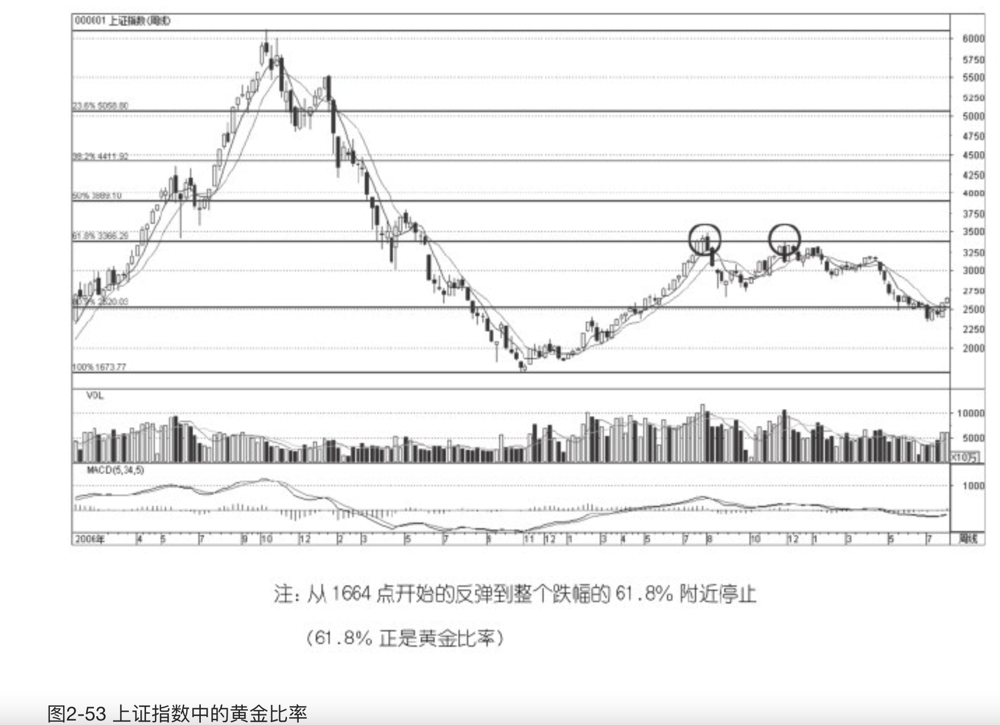

### 亚当理论——交易的印象派大师
亚当理论十大原则：
1. 亏损的仓位绝不要加仓或摊平。
2. 在开仓或加码时，应该同时设好止损，以便你在出错时可以做好离场准备。
3. 除非价格是朝着开仓的方向运行，否则绝不取消或移动止损。
4. 绝不让合理的小亏损演变成一发不可收拾的大亏损。行情不利时，立即离场，在下次好的机会出现时还有机会进场。
5. 一笔操作，或任何一天，不要让自己亏掉账户资金的10%以上。
6. 不要试图抓住头部和底部，让行情自己走出来。亚当理论永远抓不准头部和底部，想去抓的人也抓不准。但是头部和底部终于出现时，亚当理论只会错一次。
7. 别挡在列车前面。如果市场往某个方向急剧发展，千万别逆市操作，除非有强有力的证据，显示反转已经发生。请注意，是已经发生，而不是将发生或应该发生。
8. 保持弹性。需要记住你可能会做错，亚当理论也可能会犯错，世界上任何事情都可能偶尔出错。记住亚当理论所说的是概率很高的事情，而不是绝对肯定的事情。
9. 操作不顺时，不妨休息。如果你一再发生亏损，请离场到别的地方去度假，让你的情绪冷静下来，等头脑变得清醒再说。
10. 问问你自己，你全身从里到外是不是真的想从市场中赚一笔钱，并仔细听一些你自己的答案。有些人心理上渴望着赔钱，也有些人只是想找件事做，“认清自己”。

除非你所有的操作都依据这十大原则，否则亚当理论或其他任何方法，都不会准确到让你不断盈利。当你懂了这一点，你就会在市场上赚到可观的利润。

要想真正领悟亚当理论恐怕要三五年以上的股市磨炼，同时要具有深厚的指标运用功底。交易者在开始的时候总是追求精确的操作，总想买在最低，卖在最高，总是认为自己不会犯错，更是难以接受自己会亏损。但可以说，市场专治各种不服，交易者最后会从市场那里得到教训。趋势不是交易者预测出来的，在空头趋势中，很难抓到流畅的上涨波段。

顺势是精确后的升华，不是倒退。运用亚当理论，并不是要完全弃用技术分析，而是不执着于技术分析，这就是亚当理论的精妙之处。重点在于其看股市的全新角度，最纯粹、最简单和最容易的赚钱方法就是让市场来告诉我们该怎么做。但是人脑往往习惯了往复杂的地方去想，简单的事实往往被我们视而不见。

# 资金管理
## 资金管理概述
如果我们将努力的方向完全放在提高预测准确率方面，就会陷入一个严重误区。实际上，最有效的方法是尽量扩大每次盈利的金额，同时将每次亏损的金额限制在一定幅度内。

资金管理主要指以下三个部分：

1. 仓位控制（仓位管理），也就是在做对方向的时候确保投入足够资金，并取得相应回报。
2. 风险控制（止损止盈），也就是在做错方向的时候确保及时退出，避免放任扩大亏损。
3. 投资组合，即不要把鸡蛋放在同一个篮子里。

## 仓位控制
股票交易使用的仓位比例与盈利能力之间有一个平衡点。实践经验表明：一般当资金的利用率达到30%时，对于股票交易而言是最恰当的。尽管可以根据交易者技术水平的高低适当调整这一比例，但30%的利用率是资金管理的基准原则。

### 交易信号
明确一下交易信号问题，我们经过一个阶段的交易之后，应该形成一个固定的买入和卖出依据，或者说是买入和卖出的限制条件（原则），一旦行情运行情况满足了一定的限制条件，那么就会触发买入或卖出信号。交易者只有形成相对固定的交易信号才能更好地运用资金管理策略。也可以说，明确的买入和卖出信号是资金管理的前提条件之一。

对交易条件的描述越清晰，越详细越好。下面我们举例来说明以MACD指标为依据的交易信号，如图3-1所示。假设买入条件为：MACD指标的DIF线进入多方时买入（DIF>0），每次金叉加仓一次。卖出条件为：MACD指标的DIF线进入空方时清仓卖出（DIF<0）。从图中可以看出，在出现卖出信号之前，连续出现了7个买入信号，那么你要不断加仓吗？还是要决定买几次，每次买多少？这时就需要一个合适的加仓策略，以让利润得到充分增长。

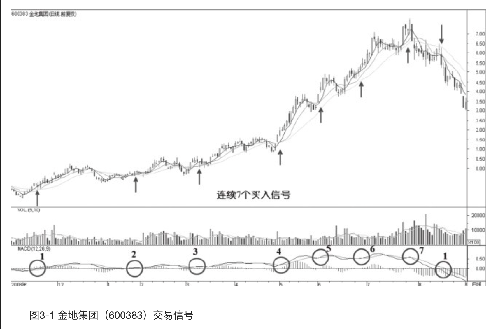

相同的交易条件在另一只股票上产生的交易信号，如图3-2所示。

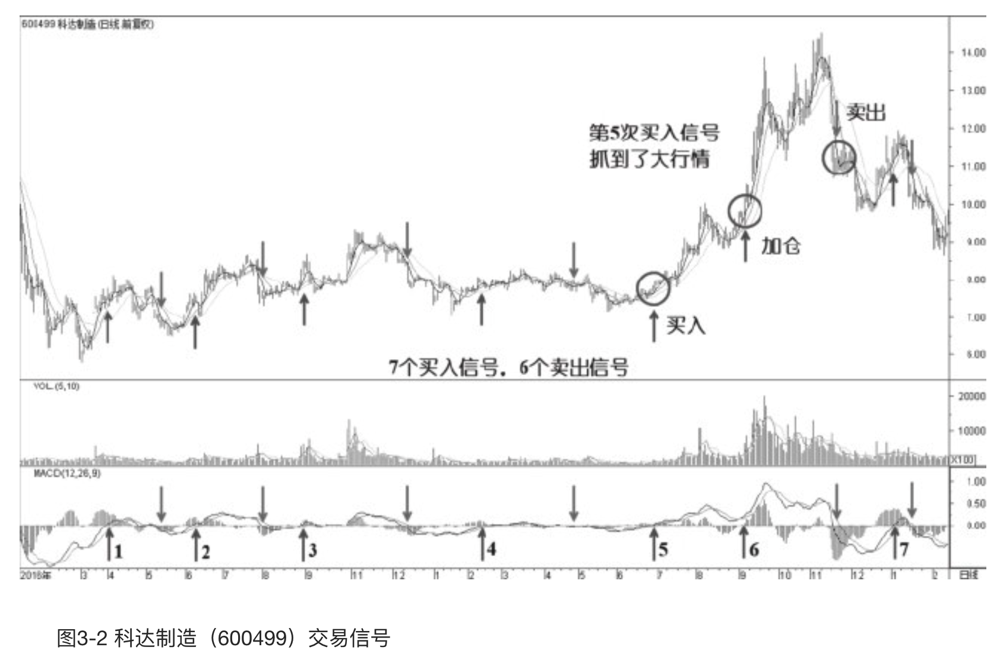

从图3-2中可以看出，如果按信号用满仓进出，那么最后可能赚不到多少利润甚至会亏损。显然相同的交易条件在股票科达制造上产生的交易信号不如在金地集团上的效果好，但在事前我们并不知道这些。

个股科达洁能依据交易条件出现了7组买入和卖出信号，还有一个加仓信号。在这7组信号中，有6组都会是小盈或者亏损离场，只有第5次买入信号抓到了大行情，加仓在了主升浪的起始位置。如果每次都是重仓或者满仓的话，前4次操作可能已经使本金亏掉了20%～30%。连续的亏损对重仓交易是致命的打击。

对于个股金地集团的操作，我们也不会在开仓之后按照交易信号进行6次加仓操作。合理的做法是，在前三次出现买入信号时，使用金字塔加仓方法，初始开仓使用5成仓，第一次加仓使用3成仓，第二次加仓使用2成仓，保证在底部买入大部分仓位，让更多资金享受到上涨。合理的仓位控制策略是影响交易系统的盈利能力和生存能力的关键因素。

### 不会加仓是导致交易亏损的主要原因之一
很多人在寻找高胜率的系统，却没有想到在原有的盈利系统上改变资金管理策略。交易者对系统进行优化的内容经常集中在买入和卖出条件上，很少把精力放在优化资金管理上，这是值得引起注意的。我遇到过一位交易者，他只是把自己的交易系统在加仓方面做了改动就一举扭转了局面。还有一些有经验的交易者，在固定系统之后，当出现连续亏损的时候开始提高开仓比例，因为他们知道，在连续亏损之后，盈利的概率在提高。

### 金字塔加仓
`金字塔加仓`是随着行情的发展每次买入数量呈递增或递减形式的加仓方法。例如，每次加仓较前一次的买入数量减少30手，在低位买入100手后，第一次加仓70手，第二次加仓40手，第三次加仓10手，这样由低位向高位加仓数量逐步递减的方法称为正金字塔加仓。反之，如果加仓数量逐步递增，则为`倒金字塔加仓`。

### 均匀式加仓
一般可以将账户资金分为3到5份，也就是使用20%～30%的资金进行加仓，在盈利的基础上，每次出现买入信号时等比例加仓。

## 凯利公式
在一定的赔率之下，如果赌局拥有正期望值，那么凯利公式可以使长期增长率达到最大化。可用`凯利公式`计算出每次游戏中所应投注的资金比例。

形式一：

    F=（bp-q）/b

其中，F为现有资金应进行下次投注的比例；b为投注可得的赔率；p为胜率；q为败率，即1-p。

举例来说，假设一种博彩游戏有40%的胜率（p=0.4，q=0.6），而玩家在赢得赌局时，可获得2：1的赔率（b=2），则玩家应在每次机会中应下注现有资金的10%（F=0.1），以使资金的长期增长率最大化。

形式二：

    F=［（R+1）P-1］ /R

其中，P为胜率；R为赔率，即盈亏比。

我们假设一个交易系统的胜率为65%，赔率为1.3，计算投入资金的最佳比例，以使盈利达到最大化。

    F=［（1.3+1）×0.65-1］ /1.3=38%

可以得出，每次投入现有资金的38%时是最佳比例。这个公式的意义在于，当你连续亏损的时候，你投入的资金迅速缩减，当你连续盈利时，你投入的资金迅速提高，当你处于亏损与盈利交替时，你的投入金额保持平衡，且剩余资金也保持平衡。

这个公式还告诉我们，只有正期望（bp-q>0）时才有参与价值，而现实中的赌局由于抽水、返奖率等原因基本上都是负期望系统，而在股市交易中通过调整买入和卖出策略，进而影响盈亏比和胜率，可以更好地运用凯利公式。

假设我们有一个短线交易系统，其胜率为80%，平均盈利为20%。亏损概率为20%，平均亏损为10%，盈亏比为2：1。那么下注比例应该占到当前账户资金的多少呢？我们按照凯利公式来进行计算：

    F=（bp-q）/b=（2×0.8-0.2）/2=70%

因此，合理的下注比例应该为本金的70%，也就是说，如果有10万元，应该下注7万元。在这个假设的短线系统中，有80%的胜率，简单来讲，就是平均5次交易中有1次亏损，有4次盈利。

我们在表3-2至表3-6这5张表格中分别列出了各有一次亏损的情况下，假设最初投入100万元，5次交易后的盈利情况。

表3-2 第一次交易亏损（单位：万元）

交易次数 | 本金 | 下注 | 结果 | 盈亏 | 本利和
-----|----|----|----|----|----
1 | 70.0 | -7.0 | 亏 | 100.0 | 93.0
2 | 93.0 | 65.1 | 盈 | 13.0 | 106.0
3 | 106.0 | 74.2 | 盈 | 14.8 | 120.9
4 | 120.9 | 84.6 | 盈 | 16.9 | 137.8
5 | 137.8 | 96.4 | 盈 | 19.3 | 157.1

表3-3 第二次交易亏损（单位：万元）

交易次数 | 本金 | 下注 | 结果 | 盈亏 | 本利和
-----|----|----|----|----|----
1 | 100.0 | 70.0 | 盈 | 14.0 | 114.0
2 | 114.0 | 79.8 | 亏 | -8.0 | 106.0
3 | 106.0 | 74.2 | 盈 | 14.8 | 120.9
4 | 120.9 | 84.6 | 盈 | 16.9 | 137.8
5 | 137.8 | 96.4 | 盈 | 19.3 | 157.1

表3-4 第三次交易亏损（单位：万元）

交易次数 | 本金 | 下注 | 结果 | 盈亏 | 本利和
-----|----|----|----|----|----
1 | 100.0 | 70.0 | 盈 | 14.0 | 114.0
2 | 114.0 | 79.8 | 盈 | 16.0 | 130.0
3 | 130.0 | 91.0 | 亏 | -9.1 | 120.9
4 | 120.9 | 84.6 | 盈 | 16.9 | 137.8
5 | 137.8 | 96.4 | 盈 | 19.3 | 157.1

表3-5 第四次交易亏损（单位：万元）

交易次数 | 本金 | 下注 | 结果 | 盈亏 | 本利和
-----|----|----|----|----|----
1 | 100.0 | 70.0 | 盈 | 14.0 | 114.0
2 | 114.0 | 79.8 | 盈 | 16.0 | 130.0
3 | 130.0 | 91.0 | 盈 | 18.2 | 148.2
4 | 148.2 | 103.7 | 亏 | -10.4 | 137.8
5 | 137.8 | 96.4 | 盈 | 19.3 | 157.1

表3-6 第五次交易亏损（单位：万元）

交易次数 | 本金 | 下注 | 结果 | 盈亏 | 本利和
-----|----|----|----|----|----
1 | 100.0 | 70.0 | 盈 | 14.0 | 114.0
2 | 114.0 | 79.8 | 盈 | 16.0 | 130.0
3 | 130.0 | 91.0 | 盈 | 18.2 | 148.2
4 | 148.2 | 103.7 | 盈 | 20.7 | 168.9
5 | 168.9 | 118.2 | 亏 | -11.8 | 157.1

从5张表格中的数据来看，凯利公式的神奇之处就在于，以这个下注比例，在任何一次交易亏损的情况下，都不会整体亏损，而且经过5次交易之后，结果都是157.1万元。其他任何下注比例，最终的结果都要比157.1万元少。只有70%的仓位控制比例是最优的。从长期来看，孤注一掷下重注和低比例下注的方法都是错误的。

股票交易的下注与博彩游戏的下注没有什么区别，其本质都是在一定的胜率和赔率下寻求使收益达到最大化。交易者在策略上要注意以下两点：

1. 判断当前交易品种的盈利概率。
2. 按概率来下注。对自己有利的时候合理增加筹码。

凯利公式的本质就是，在概率对交易者有利的时候下重注，对交易者不利的时候下小注或不参与。在交易市场中，我们没有必要每天都在场内交易，当市场趋势对你不利时，或者趋势不明显时，完全可以在场外休息。

使用凯利公式的注意事项
1. 凯利公式是一种连续博弈，而不是一个并行的仓位控制方式，如果有两个交易品种根据凯利公式计算的仓位均为50%，不要认为可以满仓下注（50%+50%=100%），这样有一定概率会全军覆没。
2. 在股票交易中的赌注不是无限可分的，对于高价股要注意。
3. 在股票交易中每次下注是有手续费的。
4. 在股票交易中盈亏概率和盈亏比例只能大致判断，要想精确就需要更多历史数据，而历史表现并不能完全代表未来表现，所以没必要也不可能那么准确，对足够多的数据进行的测试就可以了，但是数据并不是越多越好，因为市场结构也许已经发生了变化，过于古老的数据可能反而会造成干扰。

## 风险控制
### 有意义的支撑位止损法
反转形态跌破颈线和123法则的卖出点都可以作为止损位（或跟踪止损位），如图3-4所示。有意义的支撑位一般是前一波行情的高点或低点，放量的波峰或波谷位置，通道下轨，长期横盘的箱体下沿，前一次突破时的压力位，K线形态的颈线等等。

从图3-4中可以看到，在经过一波连续上涨达到波段高位之后，该股测试前期高点但没能有效突破，依据123法则，当回调跌破前波低点的位置时进行止损（离场），止损位是前波最低K线的阴线收盘价。图中出现了两次依据123法则设置的止损位，都可以卖出在波段高位。

还有一次离场发生在跌破反弹的上涨趋势线时，跌破支撑线之后，股价快速下跌，这说明了以支撑线作为止损位的有效性。在指标图中可以看到三次指标止损，利用DIF线跌破0轴，进入空头作为止损位。MACD指标给出了与上面相似位置的三个止损位置，每次都是上涨趋势反转之初的位置，止损后价格都进一步下跌，说明这三次指标止损有效。

### 技术指标止损法
常用的技术指标有MACD、RSI、MA、BOLL、KDJ等。交易者可以根据经验设定指标的组合来设定止损位。往往要经过长期测试才能得到一个较合理的指标止损数值。指标爱好者可以深入研究，普通交易者可以使用简单一些的方法，比如一根MA10均线就可以当作不错的止损参考。

### 有意义的压力位止盈法
与止损中的有意义的支撑位相反，止盈要看有意义的压力位，往往股价在一个压力位都要进行一次调整，然后再沿原来的方向行进，或在更大的压力下拐头向下形成阶段顶部。这种有意义的压力位一般是前一波行情的波峰或波谷，通道上轨，长期横盘的箱体上沿，前面下跌时被突破的支撑位等等。这种方法也多用在震荡行情中。

### 技术指标止盈法
常用的指标有MACD、RSI、BOLL和KDJ等。另外，一些常用分析技术也能帮助我们设定止盈目标位，例如，波浪理论的上升浪比例、量价背离等。交易者可以利用多个指标相配合来设定止盈位以提高成功率。一般的止盈可以设在指标发生背离的位置或者压力位。需要注意的是，背离后可能产生指标钝化现象，影响止盈效果，有时交易者会发现背离后还继续上涨，这如同股票下跌时“底中有底”一样。

## R乘数理论

