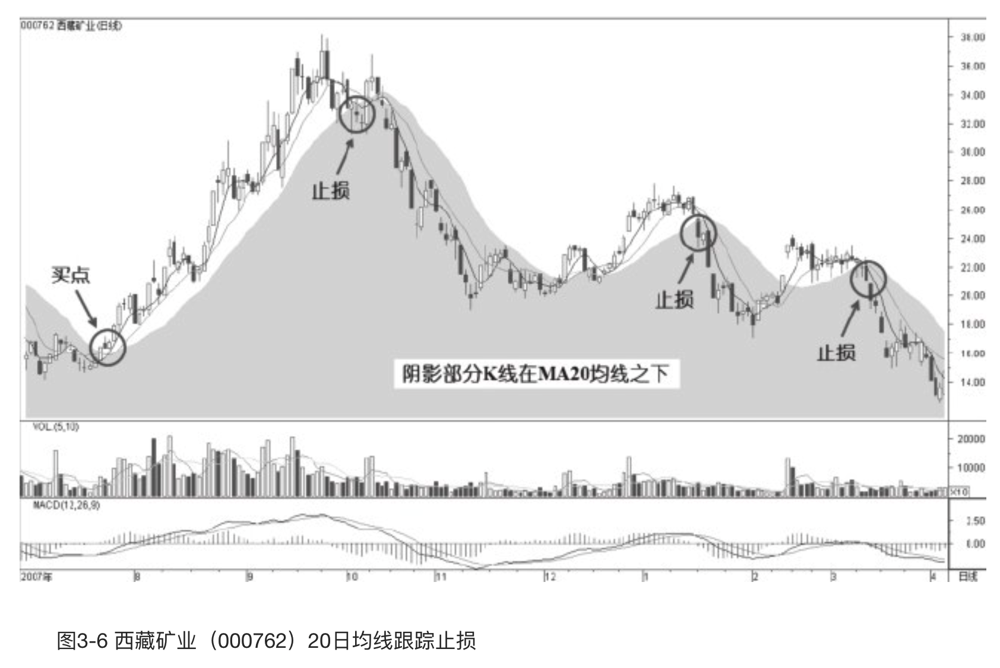
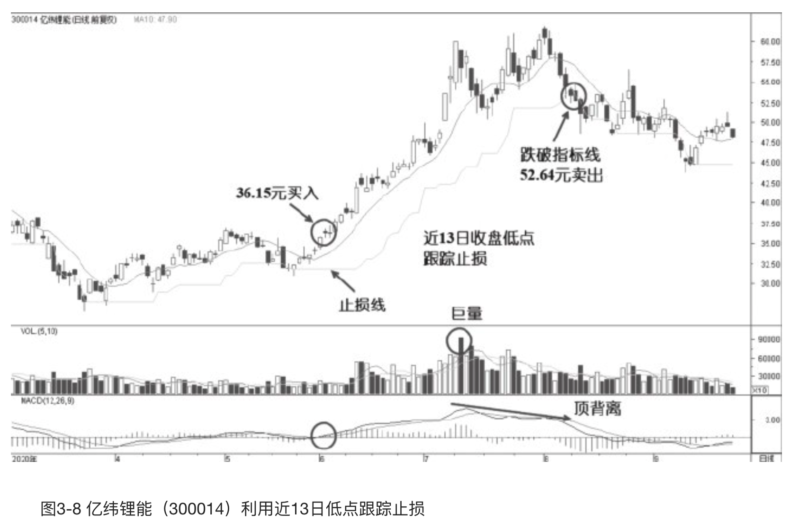
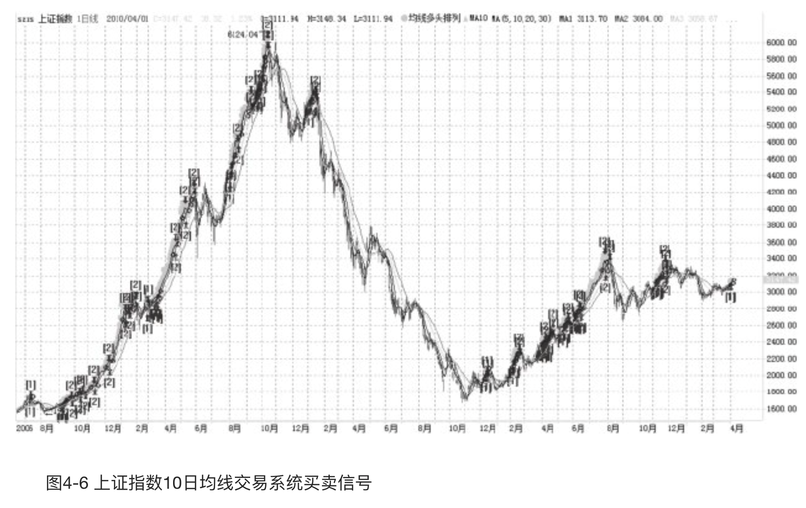

    作者: 凌波 著 斯坦威出品
    出版社: 天津人民出版社
    副标题: 股票交易精髓升级版，含私募内部训练资料
    出版年: 2021-1
    页数: 272
    定价: 55.00 元
    装帧: 平装
    ISBN: 9787201171135

[豆瓣链接](https://book.douban.com/subject/35349194//)

- [技术分析](#技术分析)
  - [个人投资者应该相信什么](#个人投资者应该相信什么)
    - [基本面分析和技术面分析](#基本面分析和技术面分析)
    - [技术分析精髓](#技术分析精髓)
  - [底部和顶部反转形态与操作技术](#底部和顶部反转形态与操作技术)
    - [反转形态概述](#反转形态概述)
    - [头肩底和头肩顶](#头肩底和头肩顶)
    - [双重底和双重顶](#双重底和双重顶)
    - [圆形底和圆形顶](#圆形底和圆形顶)
    - [V形底和V形顶](#v形底和v形顶)
    - [底部三角形和扩散三角形](#底部三角形和扩散三角形)
    - [扩散三角形](#扩散三角形)
  - [123法则和2B法则](#123法则和2b法则)
    - [123法则](#123法则)
    - [2B法则](#2b法则)
    - [123法则应用于实战](#123法则应用于实战)
    - [2B法则应用于实战](#2b法则应用于实战)
    - [123法则与2B法则结合运用](#123法则与2b法则结合运用)
  - [左侧交易与右侧交易](#左侧交易与右侧交易)
  - [经典技术分析理论](#经典技术分析理论)
    - [道氏理论——股市晴雨表](#道氏理论股市晴雨表)
    - [波浪理论——自然法则](#波浪理论自然法则)
    - [黄金比率和费波纳奇数列——神奇数字](#黄金比率和费波纳奇数列神奇数字)
    - [亚当理论——交易的印象派大师](#亚当理论交易的印象派大师)
- [资金管理](#资金管理)
  - [资金管理概述](#资金管理概述)
  - [仓位控制](#仓位控制)
    - [交易信号](#交易信号)
    - [不会加仓是导致交易亏损的主要原因之一](#不会加仓是导致交易亏损的主要原因之一)
    - [金字塔加仓](#金字塔加仓)
    - [均匀式加仓](#均匀式加仓)
  - [凯利公式](#凯利公式)
  - [风险控制](#风险控制)
    - [有意义的支撑位止损法](#有意义的支撑位止损法)
    - [技术指标止损法](#技术指标止损法)
    - [有意义的压力位止盈法](#有意义的压力位止盈法)
    - [技术指标止盈法](#技术指标止盈法)
  - [跟踪止损策略](#跟踪止损策略)
    - [跟踪止损](#跟踪止损)
    - [均线跟踪止损策略](#均线跟踪止损策略)
    - [N日低价跟踪止损策略](#n日低价跟踪止损策略)
  - [R乘数理论](#r乘数理论)
- [交易系统](#交易系统)
  - [如何建立高胜算交易系统](#如何建立高胜算交易系统)
    - [建立交易系统的原则](#建立交易系统的原则)
    - [建立高胜算交易系统](#建立高胜算交易系统)
    - [交易系统测试](#交易系统测试)
  - [交易系统实例](#交易系统实例)
    - [个股测试比较分析](#个股测试比较分析)
    - [策略优化](#策略优化)
  - [三重滤网交易系统](#三重滤网交易系统)
  - [海龟交易法则](#海龟交易法则)
  - [系统交易实战经验](#系统交易实战经验)
- [交易心理](#交易心理)
  - [股市中的交易心理](#股市中的交易心理)
  - [投机之王的交易原则](#投机之王的交易原则)
- [交易境界](#交易境界)
  - [交易高手的段位](#交易高手的段位)
  - [成为操盘手的五个阶段](#成为操盘手的五个阶段)

# 技术分析
## 个人投资者应该相信什么
### 基本面分析和技术面分析
`基本面分析`，是指对宏观经济、行业和公司基本情况的分析，包括公司财务状况、盈利状况、市场占有率、经营管理体制、人才构成等各个方面。长线投资一般应用基本面分析，把对股票的分析研究重点放在它本身的内在价值上。

`技术分析`，是指通过对以往价格和成交量的数据分析来预测价格变动的一种方法，技术分析的对象主要是价格图表和成交量。技术分析相信趋势的存在，最具代表性的是道氏理论。

从上面的定义可以看出来，对于个人投资者来说，想要进行基本面分析会有很大的困难。因为市场上的信息是不对称的，个人投资者往往不能够准确、及时、全面地获得市场信息。假定我们也能获得像投资机构一样的信息，但我们个人投资者不具备机构那样专业的、系统的分析以及解读信息的能力。这两个最基本的基本面分析要求，对于个人投资者来说是很难达到的。但我们可以参考基本面信息，作为我们技术分析的辅助。

所以，技术分析更适于个人投资者或系统化交易者。我们通过网络或媒体可以很容易地获得股票行情报价、历史K线图表、成交量等技术分析需要的基本材料。

### 技术分析精髓
所有技术分析的立论基础可以概括为以下三方面的内容：

1. **市场包容一切**。“市场行为包容一切”构成了整个技术分析的基础。纯粹的技术派认为，影响价格的所有因素，如经济、政治、社会因素等，实际上通过价格得到了体现。我们不需要去研究原因，只需要关注价格变动。能够影响价格的任何因素，实际上都反映在其价格中。其实质含义就是价格变化反映供求关系；供求关系决定价格变化。既然影响市场价格的所有因素最终必定通过市场价格得到反映，那么研究价格就足够了。正如利弗莫尔所说的“市场永远是对的”。
2. **价格沿着趋势移动**。“趋势”理念是技术分析的核心。随便打开一张走势图，我们都会发现，无论是股票、期货还是外汇交易品种，其价格的变动在大部分时间里都运行在趋势之中，出现最高点和最低点只是瞬间的事情。研究价格图表的全部意义，就是要在一个趋势的形成的初期，及时准确地介入，从而达到顺着趋势交易的目的。
3. **历史会重演**。技术分析和市场行为学与人类心理学有着关系，价格形态通过特定的价格图形表示了人们对某个市场看好或看淡的心理。过去有效，未来同样有效。“上涨—下跌—再上涨—再下跌”，周而复始成为价格走势的特点。波浪理论、道氏理论之所以能够流传，就是因为不仅在过去证明他们是有效的，而且将来还会有效。历史不会简单的复制，但历史会重演。

## 底部和顶部反转形态与操作技术
### 反转形态概述
趋势不会突然转变，在发生重要的变化之前，往往需要酝酿一段时间。经过酝酿之后，趋势可能会发生逆转，也可能会在调整后继续按原方向发展。当趋势反转时，就会出现反转形态；当趋势盘整时，就会出现整理形态。在这些形态形成的过程中，如果价格波动的范围越大，或其形成时所消耗的时间越长，或伴随的成交量越多，那么他们所具有的意义就越重大，因为其间消耗了大量的多头或空头的力量，引发了由量变到质变的过程。一个大的反转形态会带来一轮幅度较大的波动，而一个小的反转形态会伴随一轮较小的波动。

熟练掌握了反转形态，也就初步把握了在股市中抄底和逃顶的时机。反转形态有如下特性：

1. 反转形态形成的前提是存在一个主要趋势，如果目前没有上升或下降趋势的存在，那么当时所出现的反转图形就没有意义。
2. 趋势将要发生反转的第一个信号通常是对重要趋势线的突破，如趋势线、支撑位、阻力位等。但对重要趋势线的突破，也有可能形成整理形态，所以突破关键位并非百分之百会形成反转。
3. 反转形态规模越大，随后的价格波动就越大。这里所谓的规模，是指价格形态的高度和宽度。高度标志着价格变动的强弱，宽度意味着反转所消耗时间的长短。
4. 顶部形态比底部形态形成的时间更短，且震荡幅度更大。因为价格倾向于慢涨快跌，并且在顶部的波动幅度更大，所以在顶部做出卖出决策时要果断。
5. 底部形态比顶部形态的价格幅度更小，但形成的时间更长。因为此时成交量降低，筑底需要时间。底部形态容易被识别，且交易失误后的损失要少一些。
6. 对于形态价格目标位的测量，应以反转形态的高度为基础，通常第一目标位是上涨或下跌与形态高度相当的位置。反转的阻力位也是目标位，经常是前波主要趋势的0.618、0.5、0.382的位置。最大的目标位是前波趋势的起点，也就是突破前期的波峰或波谷。

价格形态的分析是以道氏理论为基础的，所以注意趋势分析和波段分析，即注重价格运动的阶段性分析。道氏理论专注于市场的主要趋势（半年以上）、次要趋势（1～6个月）和短暂趋势（1个月以内）的分析。

在讨论价格形态的时候，还有两个重要的参考因素：`成交量`和`目标位`。在价格形态的形成过程中，特别是在形势不明确的情况下，研究与价格相对应的成交量，是判断形态是否形成及是否可靠的最有效途径。同时，绝大多数价格形态都有其具体的测量技术，可以确定出最小的价格目标位，这些目标位有助于对市场下一步的运行空间进行大致估算，避免交易者过早离场。

### 头肩底和头肩顶
头肩底和头肩顶是最经典的主要反转形态，其他的反转形态大都是头肩形态的变形。在形成头肩底的时候，通常在下跌趋势中的一次反弹时形成左肩，然后再次下跌并跌破前低形成头部，再向上反弹遇到压力并回撤形成右肩，最终向上突破前高，确认形成头肩底形态，如图2-1所示。

在形成头肩顶的时候，通常在最强烈的上涨趋势中形成左肩，小幅回调后再次上涨突破前高形成头部，再次回调后遇到支撑并上涨形成右肩，由此形成头肩顶形态，如图2-2所示。

头肩底的特征是：
1. 股价先是急速下跌，随后止跌反弹，形成第一个波谷，这就是通常所说的“左肩”。形成左肩部分时，成交量在下跌过程中出现放大迹象，而在左肩最低点回升时则呈缩量状态。
2. 第一次反弹受阻，股价再次下跌，并跌破了前—低点，之后股价再次止跌反弹形成第二个波谷，这就是通常所说的“头部”。形成头部时，成交量会有所放大。
3. 第二次反弹再次在第一次反弹高点处受阻，股价又开始第三次下跌，但股价回落到第一个波谷价位附近止跌，成交量出现极度萎缩，此后股价再次反弹形成了第三个波谷，这就是通常所说的“右肩”。第三次反弹时，成交量显著增加。
4. 将第一次反弹高点和第二次反弹高点用直线连起来就是一条阻碍股价上涨的颈线，但当第三次反弹时会在成交量的配合下，突破这条颈线，使股价站在其上方。交易者见到头肩底这个图形时，应该想到这是个底部反转信号，此时不能再继续看空，而要随时做好进场的准备。一旦股价放量突破颈线时就可考虑买进一些股票。

图2-3显示的是山推股份的日线图，该股前期处在下跌趋势中，反弹形成左肩，然后再次下跌创出新低5.52元（不复权价格），之后开始明显放量回升形成头部，反弹到颈线时遇到阻力，回落形成右肩，从右肩的波谷向上突破颈线的过程中，成交量明显放大，当股价站上颈线时通常为第一买点。如果股价在突破颈线后回测颈线，并在颈线位附近止跌回升，再度上扬时可加码买进，这通常为第二买点。值得注意的是，若是股价向上突破颈线时成交量并无显著增加，则很可能是一个“假突破”。如果回到颈线之下，可以在一定幅度内止损离场。

在实际操作中，头肩形态的颈线并不一定是水平线，有时是倾斜的直线，如图2-4所示。该股形成头部后，右肩与左肩基本处在同一价位水平，但颈线是向右下方倾斜的，股价放量突破颈线后快速拉升。突破后的拉升高度，一般和头部到颈线的距离相等。从图上可以看到，头部到颈线的距离为H，称为“颈高”。突破并站上颈线时为买点，该股并没有回抽，属于图2-1中所示的第二种情况，突破后直接拉升。从买点测算其上涨的第一目标价位为颈线价位加上颈高H。

头肩顶的特征是：
1. 在上升途中出现了3个波峰，这3个波峰分别称为左肩、头部和右肩。
2. 左肩和右肩的最高点处在同一价位区间，而头部最高点要高于两侧的左肩和右肩。
3. 股价在回落时形成的两个低点基本处在同一水平线上。这条直线就是通常所说的颈线。
4. 当股价第三次上冲失败回落时，这条颈线就会被跌破。于是头肩顶正式宣告成立。

在头肩顶形成过程中，左肩的成交量最大，通常是波浪理论中的第3浪；头部的成交量略小一些，通常是波浪理论中的第5浪上涨；右肩的成交量最小，这里通常是A浪下跌。成交量呈递减状态，说明股价上升时追涨力量越来越弱，股价有涨到头的意味，因此头肩顶是一种见顶信号。头部后反弹没能创出新高，这里是B浪反弹，然后就会向下跌破颈线，这时下跌变得更加迅速，下跌的幅度相应增加，这里是C浪下跌，是下跌动能最大的区间。

我们来看图2-5中的中信证券的走势，可以发现它完全符合头肩顶的特征。该股从头部跌至颈线处获得支撑，然后反弹形成右肩。在形成右肩之后，股价再次跌到颈线位置的时候并没有获得支撑，而是在颈线处形成了向下跳空缺口，这也证明了颈线的有效性。

当股价跌破颈线时是第一卖点，头肩顶已基本成立，既然行情走到这个地步，在颈线附近放量下跌，交易者应该意识到大势已去，止盈离场是目前的最佳选择，头肩顶是杀伤力很强的一种技术走势。顶部形成的时间越长，其杀伤力往往越大。

图2-6显示的是粤泰股份头肩顶目标价位的测算，交易者应该在突破颈线后的第一卖点果断卖出所持股票。如果因为某些原因错过了第一卖点，也应该在回抽时的第二卖点清仓出局，不能再抱有还会上涨的侥幸心理，因为一旦跌破颈线，下跌基本已成定局，即使再反弹也不会太高，这里的两个卖点是从多次交易的角度来看最合理的选择。

从图中可以看到，该股在高位形成的头肩顶的形态高度为H，并形成了一条向右上方倾斜的颈线。在跌破颈线之后，产生了两个卖点。我们根据颈线价位减去1个H的距离可以测算出下跌的首个目标位。用头部最高收盘价13.18元减去颈线价位10.80元，得到该头肩顶形态的高度H为2.38元，以颈线10.80元减去2.38元得到目标位为8.42元，该股这波下跌的最低点为8.38元，达到了我们计算的首个目标位。经过反弹之后，该股再次破位下跌，继续探底过程。

为了避免头肩顶对交易者账户资金造成重大伤害，交易者在实战操作时要密切注意以下几个问题：

1. 当一只股票形成头肩顶雏形时，就要高度警惕，这时股价虽然还没有跌破颈线，但可以先卖出手中的一些筹码，将仓位减轻，后面一旦跌破颈线，应将手中剩余的股票全部卖出，离场观望。
2. 上涨时要放量，下跌时成交量可以放大，也可以缩小，对头肩顶这种形态来说，先是以很小的量跌破颈线，然后再放量下跌，甚至仍旧维持较小的量往下滑落也比较常见。没有放量，并不能说明股价不会继续下跌。交易者对此一定要有清醒的认识。
3. 头肩顶对多方杀伤力度的大小，与其形成时间的长短成正比。因此，我们不能只关心日K线图，对周K线图出现的头肩顶更要高度重视。如果周K线图形成头肩顶走势，说明该股中长期走势已经转弱，股价将会出现一个较长时间的跌势。

### 双重底和双重顶
双重底是指股价在底部形成两个波谷的形状，又经常被称为“W”形反转；双重顶是指股价在顶部形成两个波峰的形状，又经常被称为“M”形反转。与头肩形态不同的是，这种形态突破后的目标位通常是形态本身颈高的1～3倍。

“双重底”，因为它的形状像英文字母W，故又称为W底，如图2-7所示。双重底多数发生在下跌趋势的末端，很少出现在下跌趋势的中途。其特征是：

1. 在它形成第一个底部后的反弹幅度一般在10%~15%左右。
2. 在第二个底部形成时，成交量经常较少且市况低迷，因此容易出现圆形底形态，而向上突破颈线时成交量必须明显放大。
3. 突破之后常常伴有回抽，并在颈线附近止跌回升，从而确认向上突破有效。
4. 第二个波谷一般比第一个波谷更高，但也有可能比第一个波谷更低，因为对主力而言，探底必须要彻底，必须要跌到令多头恐慌，不敢持股，这样才能达到低位建仓的目的。
5. 第一个低点与第二个低点之间，时间跨度应不少于一个月。如果时间太短形成的双重底，其触底回升的信号就不太可靠。要注意在下跌趋势中段发生的之字形调整，这也会形成类似双重底的形态，但形成时间较短。
6. 在形成双重底时，MACD、RSI等指标经常出现底背离的情况，即股价创出新低，而指标值没有同时创出新低。指标在低位超卖区间与价格发生背离可以增加转势的概率。

在双重底突破颈线的位置，从理论上来说是一个买点（通常为第一买点），但实际上还是要冒着比较大的风险，一旦双底向上突破失败，在这里的买入者就会被套牢。因此，在突破颈线处买进的交易者要随时做好止损离场的准备。从经验来看，继续上涨要大于再次下跌的概率。经过长期调整之后，MACD指标的DIF线与价格发生底背离，这会增加双重底的上涨概率。

对于双重底，比较安全而又稳健的操作方法是，可在股价突破颈线并测试颈线得到支撑之后，再次放量上攻时买进（这个位置通常为第二买点），这种图形会增大上涨的概率，如图2-8所示，第二次回测颈线之后，站稳10日均线时仍是一个好的买点。从经验来看，绝大多数双重底都会有一个回抽过程，因此一般不必担心股价突破颈线后连续拉升而使资金踏空。如果遇到连续拉升的情况，可以在股价回踩均线时进场，因为涨势一旦确立就不会轻易改变，这个时候买进的胜率还是比较大的。上涨的第一目标位是在颈线位置加上颈高H。

双重顶发生在上升趋势末端，拥有处于相同价位附近的两个波峰，因为它很像英文字母M，所以又称为M头，如图2-9所示。

双重顶的特征是：

1. 股价有两个比较明显的波峰，而且两个峰顶的价位也大致相同。
2. 股价第二次反弹时的成交量比第一次时的成交量要小。
3. 股价在第二次回落跌破了前期低点。
4. 跌破颈线位后常有反抽，但反抽时成交越明显萎缩，受阻于颈线位可以确认向下突破有效。

在双重顶形成时，MACD、RSI等指标经常出现顶背离的情况，即股价创出新高时，指标值没有同时创出新高。指标在高位超买区间与价格发生背离可以增加转势的概率。

双重顶是个顶部反转信号，一旦双重顶形成，股价很可能开始下跌，如图2-10所示。因此作为一个头脑清醒的交易者在双重顶形成之后，应果断清仓，卖出点可选择在跌破颈线的第一卖点处，或反抽时受阻于颈线的第二卖点处。一些有经验的交易者，在双重顶正式形成之前就会采取必要的减仓措施，以保住头部利润，这是值得我们广大交易者学习的。

他们的具体做法是：

1. 假如第一个顶点出现后，股价的跌幅较深（第一个顶点与下跌后的最低点相差达8%以上），或者出现了像天量天价和吞没形态这样的顶部K线形态，并且当股价再度上升到第一个顶点附近时，成交量与前期相比显著减少。这就要怀疑它有可能构成双重顶，此时应卖出一些股票，而不要全部等到双重顶形成以后才卖出；
2. 如果第二个顶点对应的MACD指标的DIF线发生向下拐头，这时可以作为卖点。DIF线与股价发生顶背离时，DIF线在指标高位向下拐头时卖出的胜率更高；
3. 如果股价形态同时符合以上两个条件，则形成双重顶的可能性更大，应果断卖出。

我们来看双重顶在实战中的运用，如图2-10所示。该股在第一波拉升中放出了巨量，在形成第一个波峰的过程中发生了量价背离，已经有了见顶迹象。股价回落之后再次上攻时没有明显放量，到达前期高位后遇阻回落，降至颈线处，该股向下跳空急速远离颈线，表明卖盘汹涌，这个位置是第一卖点。随后该股又回抽了一次颈线，这里是多头的逃命良机，是第二卖点。在第二卖点后出现了大阴线，已经可以确认双重顶形成。在后面的走势中该股一路走低，双重顶成为一个历史大顶。

再来看下跌目标位的测算，双重顶的下跌幅度通常为颈高H的1～3倍。如图2-11所示。该股下跌到幅度相当于颈高H时有一波幅度不大的反弹，持续了一段时间之后再次下跌了相当于颈高H的距离，并形成了一次更弱的反弹。最后一直跌到了双重顶的上涨浪起点之下。我们看图中的卖点正是顶部反转的关键点，跌破颈线确认了双重顶的成立。

### 圆形底和圆形顶
在趋势末端，有时会呈现出趋势逐渐变化的特征，价格围绕着一段圆弧运行，这常称之为圆形反转。这种形态较为少见，依据价格趋势变化的角度可以将其分为碗形、碟形底部或顶部，它代表趋势在缓慢而渐进地改变。成交量也会按时间顺序排列为一个圆形，如图2-12所示。

圆形底的特征是：

1. 股价经过一段时间的下跌之后，成交量逐渐减少，下跌速度越来越缓慢，直到成交量出现极度萎缩，股价才停止下跌。
2. 在多方力量的推动下，成交量开始温和放大，股价逐渐转变为加速上升，从而形成圆弧底形态。
3. 与此同时，成交量也经常呈现圆弧形态。

有经验的交易者对圆形底都很重视，因为圆形底的形成时间相当漫长，使得底部换手极为充分，所以，一旦圆形底向上突破，经常会出现一轮幅度可观的上涨行情。要想抓住圆形底后面的上涨行情，入市时机的选择就显得十分重要。如果过早入市，常常会陷入漫长的筑底行情中。这时股价不涨而略有下挫，几个星期甚至几个月都看不到希望。很多交易者就是因为经不起长时间磨底的煎熬，在股价向上启动前，将股票一抛了之，从而与即将到来的上升行情擦肩而过，这是十分可惜的。

此外，交易者在买人股票之前还必须观察成交量的变化。如果看到成交量和股价都形成一个圆弧形，可以在成交量放大，股价向上突破的时候大胆介入，如图2-13所示。在成交量萎缩的情况下，无论股价如何变动，都不要轻易参与。因为价是量的堆积，没有成交量配合的上涨，很难持续。

在实际的价格运动中，圆形顶比较少出现，一般不会出现在投机性强的品种当中，它体现着温和的波动性，如图2-14所示。

圆形顶的特征是：

1. 股价经过一段时间上涨之后，虽然升势仍然得以维持，但上升势头已经放慢，直至处于停滞状态。
2. 逐渐地，股价开始呈现出缓慢的下滑态势，当人们发现股价下跌势头形成时，头部就形成了一个明显的圆弧状，这就是圆形顶。
3. 圆形顶形成时，成交量也会呈圆弧状，但多数情况下，圆形顶的成交量并无显著的特征。

圆形顶是个顶部转势信号，它形成的时间越长，下跌力度就越大。持股者如果在圆形顶形成时不卖出股票，将会受到深度套牢之苦，如图2-15所示。圆形顶一般无明显的颈线位，但均线在顶部由向上转为了向下，也走出了圆弧形，当均线在高位向下发散的时候为卖出时机。

一般来说，当交易者发现见顶迹象时，就应密切关注其走势的发展，注意是否会形成圆形顶，并逐渐减少手中的一些仓位。在图2-15中，该股在接近圆形顶的顶部时，出现了两根放量阴线，换手率分别达到了25%和18%，这是顶部才有的换手率水平。当股价开始下跌，带动5日均线与10日均线向下移动时，应该果断离场。

### V形底和V形顶
V形底是股价经过一波急跌之后，又迅速拉升的走势，V形顶则相反。V形反转不容易判断，因为它在上涨时同样迅猛，当你想进场时很难找到低吸的机会，如图2-16所示。

所谓V形走势，就是常说的V形反转，指股价先是一路下跌，后来一路攀升，反映在图形上就像一个英文字母V。V形走势的技术特征是：

1. 股价在下跌趋势中，下跌的速度越来越快。
2. 最后在股价下跌最猛烈的时候，出现了戏剧性的变化，股价触底后马上展开反攻，V形底的底部十分尖锐，可在几个交易日之内形成。在底部经常会发生反转K线形态，例如，蜻蜓十字线、刺透形态、弃婴形态等。
3. 转折点之后的拉升需要有成交量放大配合。

如图2-17所示。该股在最低点4.42元之后的两根长阳线，已满足了V形走势的3个必要条件，即在快速下跌之后，突然出现反向拉升，产生长阳线，并且成交量开始放大。该股在几个交易日内完成触底回升，一路上扬。

该股在低位的两根K线被左右两个缺口抛弃在了最低位，这是明显的岛形反转的K线组合，如果交易者在此时因为错过止损而留有仓位，大可不必再割肉在地板上。对于持股者的最佳策略是见到反转形态继续持股，对于保守一些的交易者来说，可以在上涨缩量的时候卖出一部分筹码，以降低亏损仓位。对于空仓的交易者来说，V形反转的买点并不容易把握，因为其也有形成双重底（W底）的可能，最佳的买入策略是，分批进场，既要防止回调又要防止踏空。

新的趋势一旦确立就不会在短期内结束，所以不必急于求成。图2-17中，前两次回抽之后向上突破的位置都是相对安全的买点。激进一些的交易者可以在低位出现明显反转信号后，在向上开口的均线带中，发生回踩均线时买入，然后在盈利的基础上，在向上突破时加仓。

图2-18显示的是复旦复华的顺势突破买点。交易者可以看到，在好的买点进场之后是很难被触发止损单的，买点之后该股一路高歌猛进。

V形底的出现，通常是报复性反弹的结果。通常，指标已经多次进入超卖区间，市场已经跌过头，这时经常伴随着重大利好消息作为催化剂，上攻行情一触即发，出现价涨量增的局面。

V形顶走势的技术特征是：
1. 股价在快速上涨之后紧接着发生快速下跌，头部为尖顶，就像倒写的英文字母V，如图2-19所示。
2. V 形顶的顶部十分尖锐。通常在几个交易日之内形成。
3. 在冲顶时经常放出较大的成交量，在顶部经常出现放量高开的长阴线、乌云盖顶、看跌吞没形态等顶部反转K线形态，这会增大反转概率。

在上涨趋势中，市场看好的气氛使股价节节攀升，但这些追涨的力量多为短线行为，当追涨资金全部进场之后，买方力量会出现空缺，危机就会出现。短线客见股价涨不上去，就会反手做空，将筹码卖出，后来这种现象愈演愈烈，市场迅速逆转，以几乎同样的迅猛势头开始下跌。这样就产生了V形顶走势。

现在我们来看图2-20中的中信证券的走势，该股在形成最高点之后，出现连续的阴线下跌，有形成V形顶的态势，这时就要十分小心了。如果后面真的走出这种图形，股价下跌的速度将十分迅速，较晚离场会造成更大的亏损。所以，持股的交易者在股价开始回落时就应该设置好跟踪止损，跌破一定幅度进行减仓或清仓操作。如果该股重心继续下移，就要果断地斩仓出局，最初的亏损往往是最小的亏损。

### 底部三角形和扩散三角形
底部三角形同样是个反转图形，如图2-21所示，它的特征是：

1. 股价在经历大幅下跌之后形成3次探底过程。几乎都在同一低点获得支撑，形成三角形的下边。
2. 股价每次反弹的高点逐渐下移，反弹力度越来越弱，连接反弹高点的直线形成三角形的上边。
3. 整个形态的形成过程中成交量逐步萎缩，到三角形的末端附近时缩减至最小水平。
4. 当向上突破压力线时成交量开始放大。

我们来看一个在个股中发生的底部三角形，如图2-22所示，该股运行到第一个圆圈位置时，已满足底部三角形的4个条件了。当价格运行到三角形末端时，突破的方向就是新的趋势方向。该股的下跌动能已经得到充分释放，其向上突破的可能性很大，向上突破和向下突破的概率大约为4∶1。

交易者不应再盲目看空，尤其不能在这个时候卖出股票，相反，我们应该在放量突破三角形压力线时进场。在三角形的末端，一根放量长阳线成功向上突破了上边压力线，产生第一买点。当股价向上突破后，经过一次回抽，再次向上突破时应该追涨买进，这里是第二买点，这也是老鸭头形态的买入位置。

为什么底部三角形向上突破的可能性极大呢？这是因为股价经过连续几次大幅下挫，反弹力度越来越弱，大多数人对该股的前景已经失去信心，想跑的基本上跑光了，剩下的已是铁了心的“死多头”。此时做空的能量得到了充分释放，市场上如果有新多头力量加入，空方无力打压，很容易引起股价的上扬。所以底部三角形的出现为交易者提供了一个“抄底”良机，而这种技术图形经常发生在一些小盘股上，很多大黑马就是这样产生的。

### 扩散三角形
扩散三角形出现在上涨趋势中，上涨的高点越来越高，而下跌的低点越来越低。如果将形态内的高点连接成一条直线，再将形态内的低点连接成另一条直线，即可画出图2-23中的喇叭状趋势线，这就是扩散三角形。扩散三角形经常出现在投机性很强的个股上。当股价上涨时，交易者受到市场中炽热的投机气氛或利多消息的影响，疯狂地追涨，成交量急剧放大；而当下跌时，则盲目地杀跌，正是由于这样的原因，造成了股价的大起大落。

扩散三角形是大跌的先兆。当市场参与者变得失去理智时，其中蕴含的风险也就不言而喻，而扩散三角形正是人们的过度投机心理在图表上的反映。它暗示市场在逐渐失去上涨合力，下跌一触即发。交易者面对扩散三角形只有两个字：退出。

图2-24显示的是个股金地集团在阶段高位的走势，股价在三角形下边获得了两次支撑，然后创出新高73.50元。次日收出一根穿头破脚的长阴线，近两日K线构成了一个吞没形态，这是顶部的常见形态。经验丰富的交易者在此时会考虑先抛掉一部分筹码。第三日是向下跳空的阴线，随后该股一路下跌至三角形的下边线。当股价跌破下边线时是第一卖点，因为下边线是一个十分可靠的支撑位，如果失效的话，那么这个价位将成为以后上涨时的压力位。事实也证明了这一情况，该股在跌破下边线之后出现了一次回抽，到下边线后遇阻重回跌势，这里是该股的最后卖出机会，是第二卖点。当再次回落时，可以确认扩散三角形成立，该股已经发生反转。可以看到，之后该股逐级下跌，最终回到了图中上涨波段的起点附近。

## 123法则和2B法则
首先明确趋势线的画法。

`上升趋势线`：在操作周期内，连接相邻两个波谷低点的直线就是上升趋势线，由于在上升趋势中，其波谷逐波升高，趋势线的方向向上，如图2-25和图2-26所示。

`下降趋势线`：在操作周期内，连接相邻两个波峰高点的直线就是下降趋势线，由于在下跌趋势中，其波峰逐波降低，趋势线的方向向下，如图2-27和图2-28所示。

### 123法则
在使用123法则时，趋势变化应满足以下要求：

1. 趋势线被突破。
2. 上升趋势不再创新高，或下降趋势不再创新低。
3. 在上升趋势中，价格向下突破前期调整的低点，或在下降趋势中，价格向上突破前期反弹的高点。

123法则就是三个判断趋势转变的条件，当这三个条件同时成立时，相当于道氏理论对趋势转变的确认。三个条件满足一个时表示趋势可能发生转变，满足两个时表示趋势发生变化的可能性增大，三个条件都满足时，即是对趋势转变的确认。注意其中第二个条件，有时价格会出现短暂的假突破（测试前高或前低，产生新高或新低），但很快会回到前高以下（或前低以上）。

在依照123法则画图时，只需将3个条件转化为图形。首先，画出操作周期内的趋势线。然后，如图2-29所示，画出两条水平线。在上升趋势中时，先画一条穿过当前最高点的直线，再画一条穿过前一波回调低点的水平直线。在下降趋势中时，先画一条穿过当前最低点的直线，再画一条穿过前一波反弹高点的水平直线。

如果价格突破趋势线，则满足了条件1，在突破的位置标注1。如果价格测试前波顶点，接近、接触或稍微穿越前高或前低的水平价格线而未能有效突破，则在该点标注2。如果价格又突破前波调整的顶点价位，则在该点标注3。如果这三种情况出现两种，表示趋势可能发生变化。如果三种情况全部出现，则表示趋势已经发生变化，最可能朝着新的发向继续发展。

图2-30显示的是个股神火股份的日线图，我们在该股上运用123法则，判断其趋势方向的转变。我们先沿着价格上涨过程中的波谷低点画出一条上升趋势线。在图中用圆圈标出的第一个位置，该股向下跳空并跌破趋势线，表示该股有转势的可能。之后股价再次上涨，测试前期高点39.19元，但没能有效突破39.19元，而是连续出现阴线下跌，这时标注2，表示转势的可能性在加大。当股价跌破下面穿过32.25元的水平直线时，这时标注3，确认转势。当确认突破前低时，是合理的出场机会，随后该股一路暴跌。

在下降趋势中运用123法则与上升趋势同理，如图2-31所示。

我们再来看一个在下降趋势中运用123法则的例子，如图2-32所示。北方稀土（600111）在主要的多头趋势中出现一波连续调整，我们沿着波峰的高点画出一条下降趋势线。在价格反弹突破趋势线之后，股价继续下跌，但并没有测试前期下跌的低点21.46元一线，而是直接反身向上突破了前期反弹高点27.67元一线，确认转势，我们在图中标出了满足123法则的三个位置。该股在位置3之后连续向上突破，从27.67元开始一路拉升，最终上涨到了40元附近！

运用123法则进行操作时，要等待3个条件全部满足后再进场，在下降趋势的底部虽然会提高进场价位，但从涨跌的概率比较来看还是值得的，放过最低价位，而买在趋势形成的初始阶段是最好的选择。如果提前进场，很可能会买在真反弹、假突破的位置，从而存在着被套的风险。

同样，在上升趋势中也必然会失去一段头部利润，但这是合理的，因为在确认转势并判定为头部之前，我们并不知道它是头部。在转势之前我们认为趋势还会继续，如果没有满足条件3，我们的利润还会进一步增长，所以失去一段利润是必然的也是合理的。

### 2B法则
2B法则是对123法则中条件2的修正补充。

- 在上升趋势中，如果价格已经突破前期高点却未能继续升势，随后又跌破前期高点，则趋势很可能会发生反转。如图2-33所示。在下降趋势中也是同理，只是方向相反。
- 在下降趋势中，如果价格已经创出新低而未能持续跌势，随后又反弹至前期的低点之上，则趋势可能发生反转。如图2-34所示。

从图2-33和图2-34可以看出，2B法则形成于123法则满足第二个条件时，2B的出现比123法则确认转势要提前，是相对安全的抄底位置，但要注意这时新的趋势只是“趋”，是种可能性，需要重视止损位的设置，2B法则由于进场点提前，这会比123法则的成功率更低，但回报率更高。

图2-35所示。从图中可以看出，2B法则较123法则更早地出现买进和卖出机会，2B出现在123法则的条件2中，这时还没有满足条件3。依据2B法则，以回到前低之上的第一根阳线的收盘价为买点，在7.27元买进，这比依据123法则在8.18元买进少用了0.91元，相当于多盈利12.5%。同样，在卖点，用2B法则在15.37元卖出，比123法则的13.14元高了2.23元，相当于多盈利14.5%。

### 123法则应用于实战
在股票交易中，进场点和出场点的确定非常关键，运用123法则时，进场点可以设置为：在下降趋势中满足所有3条法则时，在突破价位附近买进，止损价位设在前期低点下方一定幅度（例如3%），如图2-36所示；出场点可以设置为：当上升趋势中满足所有3条法则时，在前波回调的低点下方一定幅度（例如3%）设止盈位，一旦股价跌破止盈位则卖出，获利了结。

看一个利用123法则进行止盈的例子，如图2-37所示。广州发展（600098）经过一波连续上涨，在高位满足了所有3个条件，我们在图中标出了这三个位置。可以将止盈位设置在前低收盘价7.33元，当股价跌破7.33元时，以收盘价7.25元卖出股票并锁定利润，止盈时满足条件3，确认该股的上升趋势已经反转。

### 2B法则应用于实战
运用2B法则，在下降趋势中，价格已经向下突破前期低点，随后又涨回前期低点的上方，立即买入，止损位设在前期低点下方一定距离（例如3%），如图2-38所示。在上升趋势中，价格已经向上突破前期高点，随后又跌破前期高点，马上在前期高点下方一定距离（例如3%）设止盈位，也称跟踪止损位，一旦跌破止盈位则马上卖出，获利了结。

2B法则用于京粮控股（000505）的操作，如图2-39所示，在下降趋势中，经过一段时间的缩量下跌之后，形成了第一个底1B，之后股价发生反弹，但成交量没有明显放大，股价又重回跌势，成交量进一步减少，明显少于平均成交量。在2009年9月29日，该股突破前低5.40元，创出了新低5.25元，但没能持续跌势，只停留了两天便又涨回到了前低之上，这极有可能是一个假突破。运用2B法则，在回到前低之上第一个阳线时以收盘价5.95元买入该股，并将止损位设置在创出新低那天的收盘价5.33元。

该股在12月4日走出了一根实体阴线，并放出了天量，一般认为天量见天价，这时就要小心了。该股之后开始回调，这时形成第一个顶1B，之后该股一直在第一个顶部以下震荡，这时候是主力在争取时间出货。在2月4日，该股稍微突破了前高，收盘在前高之上，我们把止盈位设置在这一天的开盘价8.23元。不过次日该股虽然创出新高，但收出一根带有长上影的长阴线，同时又一次放出了天量，这是顶部的显著标志，出现这种K线基本可以断定此处就是顶部。综合依据2B法则设置的止盈位和顶部K线特征，在当天收盘价7.86元应果断止盈离场。

图2-40显示的是个股渝开发（000514）的日K线图，我们利用2B法则进行止盈，这是一个经典案例，交易者可以自己熟悉一下其在实战中的用法。可以看出，2B法则是逃顶的好办法。

### 123法则与2B法则结合运用
交易者如果在用2B法则买入股票之后又发生符合123法则的情况，可以结合123法则的操作方法进行加仓，两次进场的止损位可以共同设置在前期低点下方一定距离，如图2-41、图2-42所示，随着股价走出更高的低点，可以将止损位上移，形成跟踪止损。

我们来看一个利用123法则和2B法则进行离场操作的例子，如图2-42所示。该股前期经过连续上涨，形成了一条上升趋势线。在上涨过程中，成交量出现了两次明显的顶部特征，我们在成交量图中用圆圈标出了这两次放出巨量的位置。第二次放出巨量时，走出一根带有长上影的长实体阴线，这对于多头来说，不是一个好的迹象。

我们利用两日原则，当价格连续两个交易日收盘在上升趋势线之下时，确认跌破趋势线，这时满足123法则的条件1。随后该股再次上涨，并短暂回到了趋势线上方，在前高附近形成第二个顶部。但很快又回到了趋势线之下，也是前高之下，这时满足2B法则的条件，我们在10.19元止盈部分筹码。

随后该股很快跌破了前期低点8.83元，满足123法则的条件3，我们以8.65元止盈全部筹码。卖出之后，该股回测前期低点，但没有成交量的配合，价格很快创出新低。MACD指标的DIF线进入0轴以下的空方市场，这时可以确认头部成立。

## 左侧交易与右侧交易
左侧交易者根据预期操作，而右侧交易者根据价格走势的实际指向操作。所以，左侧交易者一直在“猜”顶和底，他们会比较“唯心”一些。右侧交易者相对客观的多，他们是在顺势而为。单从中周期来看，选择右侧交易应该是多数人的选择，也是比较稳健的操作风格。从经验来看，右侧交易的把握性更大，如果利用跟踪止损（第3章中会讲到）会抓住不小的波段，虽然不如左侧交易在理论上吃到的多，但**我们认为顺势交易的可操作性更强，也符合经典理论的技术前提**。

左侧交易只是理论上能吃到更多，在实际操作中并不一定真能实现。比如，一只股票下跌到10元时，左侧交易者认为这里是支撑位而买进。这只股票没有在10元止跌，而是继续下跌到9元以下之后才开始上涨。左侧交易者已经经历了一段亏损期的心理煎熬。当它上涨到12元的时候，他感觉已经盈利达20%并开始担心失去到手的利润，从而选择卖出股票。但是这只股票还是继续上涨，当涨到了13元时，他后悔卖掉又买了回来，股价仍然继续上涨，涨到15元时他又开始担心见顶，还是决定逢高卖出，结果上涨趋势仍在继续，这位左侧交易者只能眼看着这只股票连续突破17元、20元，却不敢再追高买进。

一种正确的做法是，当这只股票从9元以下涨起来时，在上涨初期利用技术判断，在符合起涨点条件的位置以10元买入，然后采用跟踪止损策略，在9元设置止损，当股价涨到12元时，将止损位提高到10.8元，股价涨到15元时，将止损位提高到13.5元……当股价涨到22元时，将止损位提高到19.8元。

## 经典技术分析理论
### 道氏理论——股市晴雨表
道氏理论可以总结成三个假设和五个定理，这也是我们以后所有技术分析的基石。

假设1：人为操纵：指数每天的波动可能受到人为操纵，次级折返走势也可能受到这方面有限的影响，但主要趋势绝对不会受到人为的操纵。

假设2：市场指数包容一切信息：对于每一位市场参与者来说，他所有的希望、失望与知识，都会反映在“道琼斯铁路指数”与“道琼斯工业指数”每天的收盘价波动中；基于这个缘故，市场指数永远会适当地预期未来事件的影响。如果发生火灾或地震等自然灾害，市场指数也会迅速地加以评估。

假设3：这套理论并非不会犯错；道氏理论并不是一种万无一失并可以击败市场的系统。成功利用它协助投机行为，需要深入的研究，并客观地进行综合判断。绝对不可以让一厢情愿的想法主导思考。

定理1：

道氏理论的三种走势：市场指数有三种走势，三者都可以同时出现。
- 第一种走势最重要，它是主要趋势：整体向上或向下的趋势称为多头或空头市场，持续时间可能长达数年。
- 第二种走势最难捉摸，它是次级的折返走势：它是主要多头市场中的调整，或是主要空头市场中的反弹。修正走势通常会持续数周至数月。
- 第三种走势通常较不重要，它是每天的短期波动。

定理2：

`主要趋势`：主要趋势代表整体的基本趋势，通常称为多头或空头市场，如图2-45所示，持续时间可能在一年以内，也可能长达数年之久。正确判断主要趋势的方向，是投机行为成功与否的最重要因素。没有任何已知的方法可以预测主要趋势的持续时间。

定理3：主要的空头市场（熊市）：主要的空头市场是长期向下的走势，其间夹杂着重要的反弹。它源自各种不利的经济因素，只有在股票价格充分反映可能出现的最糟情况之后，这种走势才会结束。空头市场会历经三个主要的阶段：
- 第一阶段，市场参与者不再期待股票可以维持过度膨胀的价格。
- 第二阶段，卖压反映了经济状况与企业盈余的衰退。
- 第三阶段，源自对股票的失望性卖压，不论估值如何，许多人急于套现持有的股票。

定理4：

`主要的多头市场（牛市）`：主要的多头市场是一种整体性的上涨走势，其中夹杂着次级的折返走势，平均的持续期间长于两年。在此期间，由于经济情况好转与投机活动恢复旺盛，所以投资性与投机性的需求增加，并因此推高投票价格。多头市场有三个阶段：
- 第一阶段，人们对于未来的景气恢复信心。
- 第二阶段，股票对于已知的公司盈余改善产生反应。
- 第三阶段，投机热潮极度热烈而股价明显膨胀——这阶段的股价上涨是基于期待与希望。

多头市场的特色是所有主要指数都会持续联袂走高，回调走势不会跌破前一个次级折返走势的低点，然后再继续上涨并且创出新高。在次级的折返走势中，一些主要指数不会同时跌破前期的重要低点。

定理5：

`次级折返走势`：次级折返走势是多头市场中重要的下跌走势，或空头市场中重要的上涨走势，持续的时间通常在数周至数月；此期间内折返的幅度为前一次级折返走势结束后主要走势幅度的33%至66%。次级折返走势经常被误以为是主要趋势的改变，因为多头市场的初期走势，显然可能仅是空头市场的次级折返走势，相反，空头市场的初期走势，可能被认为是多头市场的次级折返走势。

次级折返走势（修正走势）是一种重要的中期走势，它是逆于主要趋势的重大折返走势。判断主要趋势中的重要中期折返走势，这是道氏理论中最微妙与困难的一环。

### 波浪理论——自然法则
在多头行情中，每一波价格拉升的波峰都会高于前一波上涨的波峰；在空头行情中，每一波价格下跌的波谷都会低于前一波下跌的波谷。如果交易者能把握股价波动的行进模式的话，就能不必过于关注微小的波动，而是通过合理抓住主升浪来获取最大的盈利。在上涨浪末端，根据波浪运行的规律提前判断可能的行情拐点，及时减少仓位可以保护更多利润。在下跌推动浪中，交易者应耐心等待，市场不给我们机会，我们坚决不入市。

波浪理论特点

1. 该理论由波浪的形态、比例、时间三方面组成，三者的重要程度依次降低。
2. 该理论在股市中应用于股市指数，个股市场并不同样有效。
3. 该理论应用在广泛参与的股票市场和期货市场上。
4. 该理论建立在道氏理论和传统的图表分析基础之上。

波浪理论基本要点
1. 期货价格或股价指数的升跌会交替进行。趋势的规模大至200年的超长周期，小至数小时的微小周期。
2. 从波峰到波谷或从波谷到波峰为一浪，所有的浪可以分为推动浪或者调整浪。它们是价格波动的两种最基本形态。
3. 八个波浪（五上三下）走完后，一个涨跌循环即宣告完成，将进入另一个八波浪循环。（推动浪是和主要趋势方向一致的波浪，可再分割为五个小浪，用1、2、3、4、5表示，如图2-46所示。其中第1、3、5浪与推进方向相同，是低一级别的推动浪；第2、4浪与推进方向相反，是低一级别的调整浪。调整浪是和主要趋势方向相反的波浪，用A、B、C字母表示。）
4. 时间的长短不会改变波浪的形态，波浪可拉长、可缩短，但基本形态永恒不变。
5. 波浪理论的数学基础是神奇数字（费波纳奇数列）。神奇数字是指数列1，1，2，3，5，8，13，21……从第三个数字开始，每个数字等于前两个数字之和，它的通项公式为：$A_n=A_{n-1}+A_{n-2}$。
6. 在一个推动浪后紧跟一个调整浪，调整比例经常是0.382、0.618倍，如图2-48所示。一个推动浪上涨的初级目标为从第1浪起点算起的第1浪长度的3.236倍；第2浪调整目标为第1浪长度的0.618倍；第3浪的上涨目标为第1浪的1.618倍；第4浪回调目标为第3浪的0.382倍；第5浪的上涨目标是与第一浪等长的高度。

波浪理论八浪详述
- 第1浪：上一轮熊市结束，形成新的牛市起点，属于营造底部形态的一部分，涨幅通常为五浪中最短的一浪。此时，买方力量并不强大，市场仍然存在卖压。
- 第2浪：调整幅度往往很深，几乎吃掉第1浪升幅，人们误以为熊市尚未结束。此浪接近底部时，市场普遍惜售，抛售压力减少，成交量减少，看作结束标志。2浪应在1浪低点上方止跌，往往可以构成双重底、三重底、头肩底等底部反转形态。第2浪的回撤总是小于第1浪幅度的100%。
- 第3浪：此浪通常是主升浪，涨幅最大，持续时间最长，在5浪结构中绝不会是最短的一浪。此时，投资者信心恢复，成交量大幅上升，时常出现突破信号。第3浪总会突破第1浪的高点。
- 第4浪：调整浪，形态较复杂，构造与第2浪不同，时常出现倾斜三角形走势，但其底部不会低于第1浪顶点。这是艾略特波浪理论的中心法则之一。第4浪在以后的熊市中起到显著的支撑作用。通常这一轮熊市不会跌过前面牛市中形成的第4浪，可以用来测算价格下跌的目标位，如图2-49所示，但也有例外。**股市中的第4浪不可以与第1浪有重叠，这是铁律**。
- 第5浪：第5浪的涨势通常小于第3浪，并且经常出现突破失败的情况。第5浪中，许多验证性指标，例如OBV、VOL、DIF等，开始落后于价格变化，出现价格与指标背离的情况，预示价格趋势可能发生反转。
- A浪：开始对上升浪进行调整，实际上在第5浪中已有见顶迹象。多数人认为上升行情尚未逆转，只是当A浪出现5浪结构时才意识到它的到来。
- B浪：成交量不大，一般是多头的最后出逃机会。由于是一段上升行情，容易使人误以为开始另一波新的涨势，成为多头陷阱，许多人在这个位置被套牢。此浪有可能测试前期高点构成双重顶，甚至会短暂突破前高再开始下跌。
- C浪：这是破坏力极强的下跌浪，跌势强劲、跌幅大、持续时间长，出现全面性下跌。C浪的出现，宣告上升趋势的真正结束。C浪跌过A浪的低点，形成卖出信号。有时沿着第4浪和A浪的低点可以画出一条颈线，并构成头肩顶反转形态。

我们将波浪理论运用在上证指数，如图2-49所示，可以看到主要上涨趋势从998点上涨到6142点形成了5浪上涨，其中的第5浪走出了延长浪。从6124点下跌到1664点的主要下跌趋势形成了A、B、C三浪下跌。由于在这次牛市中的第5浪走出了较长的延长浪，因此这轮熊市在第4浪低点之前结束。

波浪理论的三个铁律：

1. 第2浪不会创新低。
2. 第3浪永远不是最短的一浪。
3. 第2浪与第4浪不能重叠。

上升浪的特点：

1. 上升趋势中主升浪的延长并不罕见。第1浪延长，最不常见；第3浪延长，在股市中常见；第5浪延长，在期货市场中常见。延长浪多是5浪结构，5浪以上的推动浪并不常见。在三个上升浪中，只能有一个延长浪，其他两个未延长浪在时间和幅度上大小相等。
2. 把第1浪的高度乘以1.618，加到2浪的底点，可以得出第3浪的一个上涨目标位。
3. 把第1浪的高度乘以3.236，分别加到1浪的顶点和底点，大致是第5浪的最大和最小上涨目标位。
4. 如果第1、3浪大致相等，则预期第5浪会走出延长浪。其上涨目标位为，第1浪底点到第3浪顶点的高度，乘以1.618后，加到4浪的底点上。

调整浪的特点：

1. 调整浪绝不会以五浪形式出现，应属于三浪结构。
2. 调整浪有四种类型：锯齿形（5-3-5型）、平台形（3-3-5型）、三角形、联合型。
3. 如果它是通常的5-3-5锯齿形调整，那么C浪常和A浪相等。
4. 把A浪长度乘以0.618，从A的底点减去乘积，可估算C浪的长度。
5. 在3-3-5平台形调整情况下，B浪可能达到或超过A浪的顶点，这时C浪长度等于A浪长度的1.618倍。
6. 在对称三角形调整中，每个后续浪都约等于前一浪的0.618倍。

### 黄金比率和费波纳奇数列——神奇数字
费波纳奇把推算得到的几个数字组成一个数列：1，1，2，3，5，8……

这个数列里隐含着一个规律：从第3个数起，后面的每个数都是它前面那两个数的和。例如3加5等于8，5加8等于13，8加13等于21……

神奇数字系列包括下列数字：

    1，2，3，5，8，13，21，34，55，89，144，233，377，610，987，1597……

1. 任意两个相邻的数字之和，等于两者之后的那个数字。例如：1+1=2，1+2=3，2+3=5，3+5=8，5+8=13，8+13=21，13+21=34，21+34=55，34+55=89，55+89=144……往下依此类推。
2. 除了开始的四个数字外，任意一个数字与相邻的后一个数字之比，均趋向于0.618。例如，1/1=1.00，1/2=0.50，2/3=0.67，3/5=0.60，5/8=0.625，8/12=0.615，13/21=0.619……往下依此类推。注意，上述比值围绕着0.618上下波动，越往后，波动幅度越小。另外，还请注意1.00、0.50、0.67这几个数值。在股票技术分析中，这几个数值是测量上涨和下跌目标位时经常用到的比例。
3. 任意一个数字与相邻的前一个数字的比值约等于1.618，或者说是0.618的倒数，有趣的是，1.618的倒数是0.618。例如，13/8=1.625，21/13=1.615，34/21=1.619。数字越大，则相应的两种比数越分别接近1.618和0.618。
4. 隔一个数字相邻的两个数字的比值趋向于2.618，或者其倒数0.382。例如，13/34=0.382，34/13=2.615。

以上是费波纳奇数列最著名的、最重要的几种比例关系。0.236、0.382、0.5、0.618、1.0、1.236、1.382、1.5、1.618、2.618都是黄金比率，其中最常用的有0.236、0.382、0.5、0.618以及1.618。最有名的是黄金分割点0.618。

艾略特在1946年发表的第二本著作名为《自然法则》（Nature’s Law）。波浪之间的空间和时间比率都和神奇数字十分接近。利用成交量和不同级别波浪进行相互验证，能极大提高行情分析的准确性。波浪理论与神奇数字关系紧密。以下列出了一些常见的回撤比例关系。

1. 0.382：第4浪常见的回撤比例及部分第2浪的回撤比例，A浪的回撤比例（A、B、C浪以“之”字形运行）。
2. 0.618：大部分第2浪的调整比例。当A、B、C浪以“之”字形出现时，B浪的反弹比例。第5浪的预期目标与0.618有关。三角形内的浪间比例由0.618来维系。
3. 0.5：0.5是0.382与0.618之间的中间数，作为神奇数比例的补充。对于A、B、C“之”字形调整浪，B浪的调整幅度经常会由0.5所维系。很多人在学习艾略特理论之前都不清楚，自己所熟知的50%回撤，其实也是一个费波纳奇数字。
4. 1.618：由于第3浪在3个推动浪中多数为最长的一浪，以及大多数C 浪极具破坏力。所以，我们可以利用1.618来维系第1浪与第3浪的比例关系，以及A浪与C 浪的比例关系。

我们来看一个在上证指数中出现黄金比率的例子，该指数从1664点开始的反弹，回升到整个跌幅的61.8%附近停止（0.618恰是黄金比率），如图2-53所示。

### 亚当理论——交易的印象派大师
亚当理论十大原则：
1. 亏损的仓位绝不要加仓或摊平。
2. 在开仓或加码时，应该同时设好止损，以便你在出错时可以做好离场准备。
3. 除非价格是朝着开仓的方向运行，否则绝不取消或移动止损。
4. 绝不让合理的小亏损演变成一发不可收拾的大亏损。行情不利时，立即离场，在下次好的机会出现时还有机会进场。
5. 一笔操作，或任何一天，不要让自己亏掉账户资金的10%以上。
6. 不要试图抓住头部和底部，让行情自己走出来。亚当理论永远抓不准头部和底部，想去抓的人也抓不准。但是头部和底部终于出现时，亚当理论只会错一次。
7. 别挡在列车前面。如果市场往某个方向急剧发展，千万别逆市操作，除非有强有力的证据，显示反转已经发生。请注意，是已经发生，而不是将发生或应该发生。
8. 保持弹性。需要记住你可能会做错，亚当理论也可能会犯错，世界上任何事情都可能偶尔出错。记住亚当理论所说的是概率很高的事情，而不是绝对肯定的事情。
9. 操作不顺时，不妨休息。如果你一再发生亏损，请离场到别的地方去度假，让你的情绪冷静下来，等头脑变得清醒再说。
10. 问问你自己，你全身从里到外是不是真的想从市场中赚一笔钱，并仔细听一些你自己的答案。有些人心理上渴望着赔钱，也有些人只是想找件事做，“认清自己”。

除非你所有的操作都依据这十大原则，否则亚当理论或其他任何方法，都不会准确到让你不断盈利。当你懂了这一点，你就会在市场上赚到可观的利润。

要想真正领悟亚当理论恐怕要三五年以上的股市磨炼，同时要具有深厚的指标运用功底。交易者在开始的时候总是追求精确的操作，总想买在最低，卖在最高，总是认为自己不会犯错，更是难以接受自己会亏损。但可以说，市场专治各种不服，交易者最后会从市场那里得到教训。趋势不是交易者预测出来的，在空头趋势中，很难抓到流畅的上涨波段。

顺势是精确后的升华，不是倒退。运用亚当理论，并不是要完全弃用技术分析，而是不执着于技术分析，这就是亚当理论的精妙之处。重点在于其看股市的全新角度，最纯粹、最简单和最容易的赚钱方法就是让市场来告诉我们该怎么做。但是人脑往往习惯了往复杂的地方去想，简单的事实往往被我们视而不见。

# 资金管理
## 资金管理概述
如果我们将努力的方向完全放在提高预测准确率方面，就会陷入一个严重误区。实际上，最有效的方法是尽量扩大每次盈利的金额，同时将每次亏损的金额限制在一定幅度内。

资金管理主要指以下三个部分：

1. 仓位控制（仓位管理），也就是在做对方向的时候确保投入足够资金，并取得相应回报。
2. 风险控制（止损止盈），也就是在做错方向的时候确保及时退出，避免放任扩大亏损。
3. 投资组合，即不要把鸡蛋放在同一个篮子里。

## 仓位控制
股票交易使用的仓位比例与盈利能力之间有一个平衡点。实践经验表明：一般当资金的利用率达到30%时，对于股票交易而言是最恰当的。尽管可以根据交易者技术水平的高低适当调整这一比例，但30%的利用率是资金管理的基准原则。

### 交易信号
明确一下交易信号问题，我们经过一个阶段的交易之后，应该形成一个固定的买入和卖出依据，或者说是买入和卖出的限制条件（原则），一旦行情运行情况满足了一定的限制条件，那么就会触发买入或卖出信号。交易者只有形成相对固定的交易信号才能更好地运用资金管理策略。也可以说，明确的买入和卖出信号是资金管理的前提条件之一。

对交易条件的描述越清晰，越详细越好。下面我们举例来说明以MACD指标为依据的交易信号，如图3-1所示。假设买入条件为：MACD指标的DIF线进入多方时买入（DIF>0），每次金叉加仓一次。卖出条件为：MACD指标的DIF线进入空方时清仓卖出（DIF<0）。从图中可以看出，在出现卖出信号之前，连续出现了7个买入信号，那么你要不断加仓吗？还是要决定买几次，每次买多少？这时就需要一个合适的加仓策略，以让利润得到充分增长。

相同的交易条件在另一只股票上产生的交易信号，如图3-2所示。

从图3-2中可以看出，如果按信号用满仓进出，那么最后可能赚不到多少利润甚至会亏损。显然相同的交易条件在股票科达制造上产生的交易信号不如在金地集团上的效果好，但在事前我们并不知道这些。

个股科达洁能依据交易条件出现了7组买入和卖出信号，还有一个加仓信号。在这7组信号中，有6组都会是小盈或者亏损离场，只有第5次买入信号抓到了大行情，加仓在了主升浪的起始位置。如果每次都是重仓或者满仓的话，前4次操作可能已经使本金亏掉了20%～30%。连续的亏损对重仓交易是致命的打击。

对于个股金地集团的操作，我们也不会在开仓之后按照交易信号进行6次加仓操作。合理的做法是，在前三次出现买入信号时，使用金字塔加仓方法，初始开仓使用5成仓，第一次加仓使用3成仓，第二次加仓使用2成仓，保证在底部买入大部分仓位，让更多资金享受到上涨。合理的仓位控制策略是影响交易系统的盈利能力和生存能力的关键因素。

### 不会加仓是导致交易亏损的主要原因之一
很多人在寻找高胜率的系统，却没有想到在原有的盈利系统上改变资金管理策略。交易者对系统进行优化的内容经常集中在买入和卖出条件上，很少把精力放在优化资金管理上，这是值得引起注意的。我遇到过一位交易者，他只是把自己的交易系统在加仓方面做了改动就一举扭转了局面。还有一些有经验的交易者，在固定系统之后，当出现连续亏损的时候开始提高开仓比例，因为他们知道，在连续亏损之后，盈利的概率在提高。

### 金字塔加仓
`金字塔加仓`是随着行情的发展每次买入数量呈递增或递减形式的加仓方法。例如，每次加仓较前一次的买入数量减少30手，在低位买入100手后，第一次加仓70手，第二次加仓40手，第三次加仓10手，这样由低位向高位加仓数量逐步递减的方法称为正金字塔加仓。反之，如果加仓数量逐步递增，则为`倒金字塔加仓`。

### 均匀式加仓
一般可以将账户资金分为3到5份，也就是使用20%～30%的资金进行加仓，在盈利的基础上，每次出现买入信号时等比例加仓。

## 凯利公式
在一定的赔率之下，如果赌局拥有正期望值，那么凯利公式可以使长期增长率达到最大化。可用`凯利公式`计算出每次游戏中所应投注的资金比例。

形式一：

    F=（bp-q）/b

其中，F为现有资金应进行下次投注的比例；b为投注可得的赔率；p为胜率；q为败率，即1-p。

举例来说，假设一种博彩游戏有40%的胜率（p=0.4，q=0.6），而玩家在赢得赌局时，可获得2：1的赔率（b=2），则玩家应在每次机会中应下注现有资金的10%（F=0.1），以使资金的长期增长率最大化。

形式二：

    F=［（R+1）P-1］ /R

其中，P为胜率；R为赔率，即盈亏比。

我们假设一个交易系统的胜率为65%，赔率为1.3，计算投入资金的最佳比例，以使盈利达到最大化。

    F=［（1.3+1）×0.65-1］ /1.3=38%

可以得出，每次投入现有资金的38%时是最佳比例。这个公式的意义在于，当你连续亏损的时候，你投入的资金迅速缩减，当你连续盈利时，你投入的资金迅速提高，当你处于亏损与盈利交替时，你的投入金额保持平衡，且剩余资金也保持平衡。

这个公式还告诉我们，只有正期望（bp-q>0）时才有参与价值，而现实中的赌局由于抽水、返奖率等原因基本上都是负期望系统，而在股市交易中通过调整买入和卖出策略，进而影响盈亏比和胜率，可以更好地运用凯利公式。

假设我们有一个短线交易系统，其胜率为80%，平均盈利为20%。亏损概率为20%，平均亏损为10%，盈亏比为2：1。那么下注比例应该占到当前账户资金的多少呢？我们按照凯利公式来进行计算：

    F=（bp-q）/b=（2×0.8-0.2）/2=70%

因此，合理的下注比例应该为本金的70%，也就是说，如果有10万元，应该下注7万元。在这个假设的短线系统中，有80%的胜率，简单来讲，就是平均5次交易中有1次亏损，有4次盈利。

我们在表3-2至表3-6这5张表格中分别列出了各有一次亏损的情况下，假设最初投入100万元，5次交易后的盈利情况。

表3-2 第一次交易亏损（单位：万元）

交易次数 | 本金 | 下注 | 结果 | 盈亏 | 本利和
-----|----|----|----|----|----
1 | 70.0 | -7.0 | 亏 | 100.0 | 93.0
2 | 93.0 | 65.1 | 盈 | 13.0 | 106.0
3 | 106.0 | 74.2 | 盈 | 14.8 | 120.9
4 | 120.9 | 84.6 | 盈 | 16.9 | 137.8
5 | 137.8 | 96.4 | 盈 | 19.3 | 157.1

表3-3 第二次交易亏损（单位：万元）

交易次数 | 本金 | 下注 | 结果 | 盈亏 | 本利和
-----|----|----|----|----|----
1 | 100.0 | 70.0 | 盈 | 14.0 | 114.0
2 | 114.0 | 79.8 | 亏 | -8.0 | 106.0
3 | 106.0 | 74.2 | 盈 | 14.8 | 120.9
4 | 120.9 | 84.6 | 盈 | 16.9 | 137.8
5 | 137.8 | 96.4 | 盈 | 19.3 | 157.1

表3-4 第三次交易亏损（单位：万元）

交易次数 | 本金 | 下注 | 结果 | 盈亏 | 本利和
-----|----|----|----|----|----
1 | 100.0 | 70.0 | 盈 | 14.0 | 114.0
2 | 114.0 | 79.8 | 盈 | 16.0 | 130.0
3 | 130.0 | 91.0 | 亏 | -9.1 | 120.9
4 | 120.9 | 84.6 | 盈 | 16.9 | 137.8
5 | 137.8 | 96.4 | 盈 | 19.3 | 157.1

表3-5 第四次交易亏损（单位：万元）

交易次数 | 本金 | 下注 | 结果 | 盈亏 | 本利和
-----|----|----|----|----|----
1 | 100.0 | 70.0 | 盈 | 14.0 | 114.0
2 | 114.0 | 79.8 | 盈 | 16.0 | 130.0
3 | 130.0 | 91.0 | 盈 | 18.2 | 148.2
4 | 148.2 | 103.7 | 亏 | -10.4 | 137.8
5 | 137.8 | 96.4 | 盈 | 19.3 | 157.1

表3-6 第五次交易亏损（单位：万元）

交易次数 | 本金 | 下注 | 结果 | 盈亏 | 本利和
-----|----|----|----|----|----
1 | 100.0 | 70.0 | 盈 | 14.0 | 114.0
2 | 114.0 | 79.8 | 盈 | 16.0 | 130.0
3 | 130.0 | 91.0 | 盈 | 18.2 | 148.2
4 | 148.2 | 103.7 | 盈 | 20.7 | 168.9
5 | 168.9 | 118.2 | 亏 | -11.8 | 157.1

从5张表格中的数据来看，凯利公式的神奇之处就在于，以这个下注比例，在任何一次交易亏损的情况下，都不会整体亏损，而且经过5次交易之后，结果都是157.1万元。其他任何下注比例，最终的结果都要比157.1万元少。只有70%的仓位控制比例是最优的。从长期来看，孤注一掷下重注和低比例下注的方法都是错误的。

股票交易的下注与博彩游戏的下注没有什么区别，其本质都是在一定的胜率和赔率下寻求使收益达到最大化。交易者在策略上要注意以下两点：

1. 判断当前交易品种的盈利概率。
2. 按概率来下注。对自己有利的时候合理增加筹码。

凯利公式的本质就是，在概率对交易者有利的时候下重注，对交易者不利的时候下小注或不参与。在交易市场中，我们没有必要每天都在场内交易，当市场趋势对你不利时，或者趋势不明显时，完全可以在场外休息。

使用凯利公式的注意事项
1. 凯利公式是一种连续博弈，而不是一个并行的仓位控制方式，如果有两个交易品种根据凯利公式计算的仓位均为50%，不要认为可以满仓下注（50%+50%=100%），这样有一定概率会全军覆没。
2. 在股票交易中的赌注不是无限可分的，对于高价股要注意。
3. 在股票交易中每次下注是有手续费的。
4. 在股票交易中盈亏概率和盈亏比例只能大致判断，要想精确就需要更多历史数据，而历史表现并不能完全代表未来表现，所以没必要也不可能那么准确，对足够多的数据进行的测试就可以了，但是数据并不是越多越好，因为市场结构也许已经发生了变化，过于古老的数据可能反而会造成干扰。

## 风险控制
### 有意义的支撑位止损法
反转形态跌破颈线和123法则的卖出点都可以作为止损位（或跟踪止损位），如图3-4所示。有意义的支撑位一般是前一波行情的高点或低点，放量的波峰或波谷位置，通道下轨，长期横盘的箱体下沿，前一次突破时的压力位，K线形态的颈线等等。

从图3-4中可以看到，在经过一波连续上涨达到波段高位之后，该股测试前期高点但没能有效突破，依据123法则，当回调跌破前波低点的位置时进行止损（离场），止损位是前波最低K线的阴线收盘价。图中出现了两次依据123法则设置的止损位，都可以卖出在波段高位。

还有一次离场发生在跌破反弹的上涨趋势线时，跌破支撑线之后，股价快速下跌，这说明了以支撑线作为止损位的有效性。在指标图中可以看到三次指标止损，利用DIF线跌破0轴，进入空头作为止损位。MACD指标给出了与上面相似位置的三个止损位置，每次都是上涨趋势反转之初的位置，止损后价格都进一步下跌，说明这三次指标止损有效。

### 技术指标止损法
常用的技术指标有MACD、RSI、MA、BOLL、KDJ等。交易者可以根据经验设定指标的组合来设定止损位。往往要经过长期测试才能得到一个较合理的指标止损数值。指标爱好者可以深入研究，普通交易者可以使用简单一些的方法，比如一根MA10均线就可以当作不错的止损参考。

### 有意义的压力位止盈法
与止损中的有意义的支撑位相反，止盈要看有意义的压力位，往往股价在一个压力位都要进行一次调整，然后再沿原来的方向行进，或在更大的压力下拐头向下形成阶段顶部。这种有意义的压力位一般是前一波行情的波峰或波谷，通道上轨，长期横盘的箱体上沿，前面下跌时被突破的支撑位等等。这种方法也多用在震荡行情中。

### 技术指标止盈法
常用的指标有MACD、RSI、BOLL和KDJ等。另外，一些常用分析技术也能帮助我们设定止盈目标位，例如，波浪理论的上升浪比例、量价背离等。交易者可以利用多个指标相配合来设定止盈位以提高成功率。一般的止盈可以设在指标发生背离的位置或者压力位。需要注意的是，背离后可能产生指标钝化现象，影响止盈效果，有时交易者会发现背离后还继续上涨，这如同股票下跌时“底中有底”一样。

## 跟踪止损策略
### 跟踪止损
它用在趋势跟踪系统上最有效。在震荡行情中，应采用更积极的止损策略。落袋为安的交易理念更适合于震荡行情，因为期望盈利目标是有限的。然而，如果你的交易是顺着趋势的，那么较小涨幅的止盈容易让你过早离场，在卖出股票后，眼看着股票又回到原有趋势并继续上涨。因此我们建议在不同的行情中使用不同的离场策略。

跟踪止损策略的理论基础有两个，一个是对偶尔会出现的大幅拉升行情的期望，另外一个是有可能抓住主升浪的绝大部分涨幅。如果入场时机合适而且行情继续向着我们交易的方向前进，那么跟踪止损是一个完美的止损策略，它能帮助你抓住一波行情的主升浪，因而能显著提高趋势跟随系统的净利润。通过使用跟踪止损，我们能明显提高盈亏比，然而跟踪止损策略也有缺点，它会让一些本来有小盈利的交易变成亏损交易，有时会降低盈利交易的次数。

下面我们介绍关于跟踪止损的两个经典案例：均线跟随止损和N日低价跟踪止损。其他跟踪止损幅度都可以参照它们做变形。

### 均线跟踪止损策略
在上升趋势中止损位可以设置为MA5或MA10均线。使用哪个周期的均线取决于交易者的操作周期。操作周期越长，我们需要使用的均线周期越大，相应地，在触发止损前盈利回撤的幅度也会越大。短线操作可以使用较小周期的均线进行跟踪止损，止损被触发前盈利回撤的幅度也会更小。

假设我们选择20日均线（MA20）作为我们中长期交易系统的止损线，如图3-6所示。

当价格朝着我们交易的方向运行时，MA20均线也随之不断上移，因此该策略不仅能跟踪趋势，还能保护不断累积的盈利。均线止损位只会朝着对持仓有利的方向移动，注意到这一点非常重要。当价格跌破MA20均线时，即图中K线进入阴影部分时，就会触发我们的止损，这时应该立即执行卖出操作。

通常，我们发现把中长期交易系统的止损位放在MA20均线时其表现通常都很好；对于短期交易系统，可以把止损位设置在MA5或MA10均线。我们注意到在震荡行情中使用短期均线止损能非常有效地保护浮动盈利，例如MA10均线比MA20均线反应更灵敏，它在保护更多短期顶部利润的同时，也可能在大牛市中被震荡出局。在中长期上涨行情中，使用MA20均线止损会回吐很多利润，对于这个问题，我们可以配合短期均线MA10来解决。当股票进入主升浪，放量上涨之后，盈利得到快速增长，这时可以用短期均线止盈离场。这样既能抓住主升浪，又能保护好顶部的大部分利润。

我们举一个利用两条均线相配合进行跟踪止损的例子。在长线交易初期，我们先根据我们以前讨论的方法设置一个初始止损位以防止进场初期的大幅亏损，然后我们在MA20均线处设置一个跟踪止损位。MA20均线止损位通常能很好地保护我们避免由于市场来回拉锯造成的伤害，让我们保持长线仓位并有机会捕捉后面可能产生的主升浪。当我们实现计划中的盈利之后，比如30%的涨幅，我们就可以改为短期均线MA10止损。

如果行情很强劲，并再次获得另一份大额盈利，比如20%，我们可以再次缩短均线周期，比如将止损位设在MA5均线处。这种策略的优势在于，在进场初期设置较为宽松的止损位允许利润不断累积，然后随着盈利的增加逐步收紧跟踪止损幅度。行情末端时，盈利越多，止损位越紧；积累的盈利越多，我们允许回吐的盈利越少。

另一个值得讨论的改善均线跟踪止损策略的方法是，将均线上移或下移一定距离的止损策略。具体方法是，假设你正在使用20日均线止损策略，你根据交易品种的波动性或以往的操作经验，确定均线移动的方向和距离，这样就能得一条新的止损线。例如，在中长线交易中，可以将MA20均线向上移动3%～5%的距离，这样得到的止损线比传统均线的止损线更容易被触发。

### N日低价跟踪止损策略
在进行跟踪止损时，我们将最近N根K线的最低价或最低收盘价连接起来，就可以得到一条随着价格上涨而不断升高，随着价格下跌而不断降低，呈阶梯状的指标线，我们称它为“N日低价止损线”。

当想要使用较窄的止损时，可以将N设置为7～9；当想要使用较宽的止损时，可以将N设置为13～15。较窄的止损留给行情的波动余地更小，更容易被触发，能够保护更多的头部利润，但存在被震荡出局，错过大行情的可能；较宽的止损留给行情的波动余地更大，更不容易被触发，可能会失去更多的头部利润，但能够抓住更大的行情。

N日低价跟踪止损策略，除了选择低价的周期参数之外，还要确定是使用K线的最低价还是收盘价。假设我们将近13日的最低收盘价作为我们中短期波段操作的止损位（ML13），如图3-8所示。每一根K线对应的止损线的数值都等于最近13个交易日以来的最低收盘价。

我们可以将止损原则设定为当收盘价连续两日跌破止损线时离场。这样可以起到一定的过滤市场虚假信号的作用。另外，还可以设定跌破止损线的幅度，进一步过滤掉小幅的虚假突破。

在图3-8中，我们利用近13日的最低收盘价画出了一条止损线。该股经过调整之后，MACD指标在0轴之上形成了金叉，产生买入信号，发生在2020年6月2日。我们以当日收盘价36.15元买入。

可以看到，买入时止损线呈较长的直线状态，这说明近期的最低收盘价没有变化，价格连续运行在止损线之上。从5月25日到6月10日，在这13个交易日中，止损线都是5月22日的收盘价31.80元。在6月11日，止损线开始向上移动。随着近期价格不断上涨，在此后，止损线呈阶梯状跟随价格向上移动。这也就起到了动态跟踪止损的作用。

在价格进入高位之后，我们在图中标出了一根放出巨量的K线，该股显示出了顶部量价特征。随后价格再次创出新高，但MACD指标的DIF线未能同步创出新高，形成了顶背离形态，预示趋势可能发生转向。

在发生顶背离的过程中，止损线停止继续向上移动，开始出现像低位那样的直线状态，这说明近期的最低收盘价没有继续上涨，上涨势头有停滞迹象。直到图中标出的位置，收盘价连续两天向下突破止损线，触发止损信号。同时，该股形成了顶背离，进一步提高了卖点的可靠性。我们在8月11日，最终以52.64元的收盘价离场。这样就完成了一次利用ML13止损线进行跟踪止损的波段操作。这个区间的涨幅接近50%，振幅超过70%，利用跟踪止损抓住了大部分涨幅。

## R乘数理论
决定盈利的不只有胜率，还有另一个关键因素——盈亏比。这里要提出一个很有颠覆性的观点：准确的买点并不能让你稳定盈利，而且很少有人能达到那么高的准确率。

很多交易者把大部分精力都放在了提高交易胜率上，但你要知道，如果从30%的胜率提高到50%可能相对容易，但如果想从50%的胜率提高到70%就相当困难了。当胜率达到一定的高度后，再想提高会变得越来越困难。而事实上，即使你把胜率提高到了90%，这也并非肯定能让你盈利。

假设有一个交易系统，它有90%的盈利交易和10%的亏损交易。其中平均盈利为400元，平均亏损为3700元，那么期望收益=400×90%-3700×10%= -10，即期望收益是负的。这是一个有90%胜率的系统，但最终还是亏损的。

R乘数中的R（Risk）代表风险，是你进场交易所承担的风险。R乘数又称风险倍量，在后文中我们都简称为R值或盈亏比，它反映了你为了保全本金打算付出的成本，即通常说的止损幅度。例如，如果你在50元买进了一只股票并且计划在股票跌到47元或更低时止损出局，这时你这笔交易中的R值是3元（50-47=3）。一般止损的R值都以1个R为基准，这时盈利的R值就是收益风险率。如果买入该股后，在涨到59元卖掉了该股，那么这笔盈利的R值就是：（59-50）/（50-47）=3，计为3R。既然止损一般为1R，那么盈利R值的一种简便算法是，收益除以初始风险，例如，一笔交易最后实际获利25%，假设以5%止损，那么这次盈利的R值就是5。

一般认为风险回报比在1：3就可以实现盈利，即如果亏损为1R，那么盈利在3R就一定可以在多次交易中获得正收益。R值在2～3或以上都较容易形成正期望的交易系统，R值主要取决于交易者的操作周期和风险偏好。止损的不坚决或过度的交易（交易费用过高）都会导致R值的失衡，会有亏损的可能。

增加盈利的方法就是增大R值，当你想使盈利增加的时候，你要设法使盈利远大于1R。例如，如果R是3元，那么15元的盈利将是5个R的盈利，现在假设你的交易系统中有25%的交易是正确的。如果你盈利，那么你将获得价值5个R值（5R）的盈利。如果你亏损，你只需付出1个R值（1R）即3元的代价。在我们这个例子里，你的系统平均每赢1次（获利15元）就对应输3次（每次输3元，3次共输9元），你仍能获利6元。想象一下，你只有25%的交易是正确的，而你仍能赚到钱！这就是为什么减小亏损（即小R的亏损）和扩大盈利（即大R的盈利）的原则如此重要。

在赚钱的公式里，有利于你的大收益风险率远比“交易正确”更意义重大。让我们再来看一个例子。假设你买了一只股票并打算在它跌去1元之后止损。例如，你是在40元买了这只股票，你将在39元止损。然而，当你运气好时则期望这只股票可以上涨30%。在我们这个例子中上涨30%就是上涨12元。现在我们设想一下这种情形：如果你错了，你会每股亏损1元；如果你对了，那么你每股将盈利12元。假如你有30%的交易盈利，平均每10次交易中会有3次盈利。那么在10次交易中，其中有10次交易你每股平均可以赚到12元。你总共就是每股盈利了36元。同样的10次交易中，有7次亏损交易，你将平均亏损1元，也就是你总共会亏损7元。这样，10次交易后你每股就赚了29元，虽然你的胜率只有30%，但10次中的3次盈利为你带来了大R的收益。

你的盈利如此之高的原因在于你的离场策略。你的离场产生了很高的正数学期望值。计算数学期望时，要把每一个（不论正负）R值乘以其发生的概率，并求和。在我们的股票例子里，数学期望值=30%×12+70%×（-1）=2.9。这意味着，经过多次交易之后，平均每次交易的盈利是所需承受风险（止损值）的2.9倍。

**尽可能扩大盈利，而不是赢的次数**。艾肯哈特解释道，人的本性不是尽量扩大盈利，而是尽量抓住更多赢的机会。问题是这就意味着不应该专注于赢（或输）的数量——这种缺点会使你不能使业绩实现最大化。艾肯哈特大胆总结道：‘胜率是业绩统计中最不重要的，而且甚至会和业绩有逆向的关系。

>“几乎所有的交易计划都会产生低于50%的赚钱者。专业交易者赚大钱是因为他们的平均盈利大于他们的平均亏损。”
>
>“一位商品期货资金管理专家最近估计，专业交易者的盈利概率只有35%。”

>“例如我计算过，我最大的盈利跟亏损的比例，约为16：1。换句话说，赢一次再连亏5次、7次，我都还有可能会赚钱。我强烈建议交易者多把心思放在盈亏比上面，而不是把太多时间用在‘行情预测’上面，注重‘风险管理’才能事半功倍。”

# 交易系统
## 如何建立高胜算交易系统
### 建立交易系统的原则
1. **具有完整性和客观性**。一个完整的交易系统至少应该包括以下组成部分：技术分析（进场、离场）策略、资金管理策略（加仓、减仓、止损）以及交易心理控制策略（一致执行）等子系统。交易系统的客观性有两方面的含义，其一，系统设计的基础应该建立在市场波动的客观规律之上，交易系统不是主观想象的产物；其二，系统给出的交易信号是确定和唯一的，应该具备可操作性。
2. **简单原则**。价格瞬息万变，纷繁复杂，如果用一套复杂的系统去描述复杂的市场只能适得其反，而且也不利于交易者及时做出快速的反应。
3. **不能过度优化**。要知道一个系统有它的最优平衡点，如果你扩大它在一方面的优势，它在其他方面的优势就会减少。最后你会发现，当你过度优化使它无限拟合现阶段行情之后，下次波动风格转变时，你的系统会完全失灵。
4. **捕捉趋势**。市场不是处于单边趋势就是处于横盘震荡，好的系统应该能够有效地对行情进行区分。把行情划分出适合操作的区间和适合空仓休息的区间。如果一个趋势系统的信号只在单边市场中出现，这无疑会大大提高胜率，赚钱便是水到渠成的事情。
5. **概率作用**。交易系统当然应该具有统计上的概率优势，在波动规律基础上建立起来的有效系统，能够抓住后面出现的同类上涨行情。只要是具有相似特征的图形，它产生的进场、离场、加仓和减仓的位置会大致相同。简单的事情重复做，让概率发挥作用，只要一致性地执行，经过多次交易之后总会捕捉到系统内的收益。

### 建立高胜算交易系统
表4-1 交易系统策略问题表

系统相关问题 | 影响因素
-------|-----
系统理念 | 超势还是震荡
操作频率 | 周期（日线、周线）
选股条件 | 板块、流通盘大小、价格高低
预期收益 | 胜率、R值、数学期望、月收益、年收益
技术指标 | MACD、MA、VOL、BOLL、KDJ

表4-2 交易系统具体问题表

技术分析(20%) | 技术分析(20%) | 资金管理（30%) | 交易心理（50%)
----------|-----------|-----------|----------
问题 | 系统参数 | 问题 | 系统参数
首次买入条件 | 进场点 | 买多少 | 开仓量
再次买入条件 | 加仓点 | 买多少 | 加仓量
亏损了怎么办 | 减仓/离场点 | 卖多少 | 减仓/止损量
加仓亏损怎么办 | 止损/止盈点 | 卖多少 | 止损/止盈量
盈利如何离场 | 止盈点 | 卖多少 | 止盈量

### 交易系统测试
建立完成一个交易系统之后，需要对其进行严格的历史数据测试。有人形容开发交易系统的过程就是测试、测试、再测试。经过测试，一些被忽略的问题便显现出来了。

我们可以将股票行情数据导入到其他专业行情软件中进行测试，常用软件包括TradeBlazer、MultiCharts、TradeStation、MT4等。目前，国内比较专业的交易系统开发软件交易开拓者（Trade Blazer），已经开通了股票行情。

## 交易系统实例
表4-3 交易系统相关问题表

系统相关问题 | 影响因素或选择范围 | 明确选择结果
-------|-----------|-------
系统理念 | 趋势、震荡
投入本金数额 | N元
使用期限 | N年N月N日止
预期收益比例 | 胜率、R值、数学期望、月收益、年收益
亏损底线 | 单笔、当日、总额止损比例
操作周期 | 60分钟线、日线、周线
选股条件 | 板块、流通盘大小、PE值、换手率，价格高低、其他
股票池 | 熟悉的股票5～10只
操作股票数量 | 3~5只
技术理论、指标 | 波浪理论、江恩理论、量价理论、MACD、KDJ、均线、K线形态
左侧右侧交易 | 左侧交易、右侧交易
仓位控制方法 | 正金字塔加仓、均匀式加仓

下面我们总结了均线的一些特性和使用方法：

1.  上升行情初期，短期均线从下向上突破长期均线，形成的交叉叫金叉。预示股价即将上涨。例如，5日均线向上穿越10日均线形成的交叉表示最近5天的市场平均买入成本高于最近10天的平均买入成本，市场存在追涨买入的意愿。
2. 当短期均线向下跌破长期均线形成的交叉叫作死叉。预示股价即将下跌。例如，5日均线向下穿越10日均线形成的交叉表示最近5天的市场平均卖出成本低于最近10天的平均卖出成本，持有现金的人倾向于等待更低的价格买入。
3. 在上升行情进入稳定期，5日、10日、20日、30日均线自上而下依次排列，并向右上方移动，称为多头排列，预示股价将大幅上涨。
4. 在下跌行情中，5日、10日、20日、30日均线自下而上依次排列，并向右下方移动，称为空头排列，预示股价将大幅下跌。短期均线反应更快并带动长期均线移动。
5. 在上升行情中，股价运行在均线上方，呈多头排列的均线可视为多方的防线。当股价回撤至均线附近，各条均线依次产生支撑力量，买盘入场推动股价再度上升，这就是均线的助涨作用。
6. 在下跌行情中，股价运行在均线的下方，呈空头排列的均线可以视为空方的防线。当股价反弹到均线附近时，便会遇到阻力，卖盘涌出，促使股价进一步下跌，这就是均线的助跌作用。
7. 均线由上升转为下降出现最高点以及由下降转为上升出现最低点时，是均线的转折点，预示股价走势将发生反转。

表4-5 10日均线交易系统相关问题表

系统相关问题 | 影响因素或选择范围 | 明确选择结果
-------|-----------|-------
系统理念 | 趋势、震荡 | 趋势
投入本金数额 | N元 | 10万元
使用期限 | N年N月N日止 | 3年
手续费率 | 1%～3%，分单向或双向 | 3%
预期收益比例 | 胜率、R值、数学期望 | 胜率40%～50% R值3~5 数学期望大于0
亏损底线 | 单笔、当日、总额止损比例 | 本金总额-10%
操作周期 | 60分钟线、日线、周线 | 日线
选股条件 | 板块、流通盘大小、PE值、换手率、价格高低、其他 | 做熟悉的中小盘股，图形流畅
股票池 | 熟悉的股票5～10只 | 招商银行、开滦股份、北方稀土、上海能源、50ETF等
操作股票数量 | 3 ~ 5 只 | 3只
技术理论、指标 | 波浪理论、江恩理论、量价理论、MACD、KDJ、均线、K线形态 | 均线
左侧右侧交易 | 左侧交易、右侧交易 | 右侧交易
仓位控制方法 | 正金字塔加仓、均匀式加仓、其他比例 | 按3：3：2：1比例开仓与加仓

表4-6 10日均线交易系统具体参数表

技术分析系统条件 | 技术分析明确条件 | 资金管理系统参数 | 资金管理明确数值
---------|----------|----------|---------
进场位 | 均线多头排列并且经过调整后收盘价首次确认站上10日均线 | 开仓量 | 30%
加仓位 | 再次满足入场条件 | 加仓量 | 第一次加30% 第二次加20% 第三次加10% 止损而有持仓时，又满足开仓条件则按上次止损量加仓，使总持仓量回到止损前的水平
减仓位 | 同止损位 | 减仓量 | 同止损量
止损位 | 采用跟踪止损策略 收盘价确认跌破10日均线或总亏损达10% | 止损量 | 第一次止损持仓量的一半，连续第二次则清仓
止盈位 | 同止损位 | 止盈量 | 同止损量

下面我们解释一下上面回答的几个重要问题：

**（1）数学期望**

这个系统预期的胜率（P）在40%～50%之间，R值在3～5之间，我们来计算一下数学期望是否为正。根据公式：EP=P1×W-P2×L，我们列出了下面的胜率和R值分布表4-7。

表4-7 胜率和R值的分布表

P\R | 1 | 2 | 3 | 4 | 5
----|---|---|---|---|--
30% | -0.40 | -0.10 | 0.20 | 0.50 | 0.80
40% | -0.20 | 0.20 | 0.60 | 1.00 | 1.40
50% | 0.00 | 0.50 | 1.00 | 1.50 | 2.00
60% | 0.20 | 0.80 | 1.40 | 2.00 | 2.60

按保守的数值来看，当P=40%，R=3的时候，从表中可以查到EP=0.6 >0，这个10日均线系统预期是正的数学期望，也就是赚钱的，之后我们通过测试结果来看一下具体数值是多少。

**（2）开仓与加仓数量**

根据仓位控制中讲到的神奇公式凯利公式F=［（R+1）P-1］ /R，我们算一下在P=40%，R=3的时候，F= ［（3+1） ×45%-1］/3=27%。所以我们将开仓数量定在了占总资金比例的30%。由于加仓的时候，随着行情的上涨，在高位的风险会加大，胜率会降低。所以我们在第一次加仓用30%，第二次加仓用30%，第三次加仓用20%，第四次加仓用10%，避免在顶部加重仓。交易者也可以忽略最后一次10%的加仓，分三批进场，分别用30%、30%和20%仓位。

对于止损后再满足买入条件的情况，这一次加仓需要包括两部分。首先要把上次止损的仓位补上，其次再按计划加仓。比如，在第一次买入30%后，由于行情回调触发了止损，这时果断止损掉开仓量的一半，即15%。如果行情继续下跌，再次满足止损条件则卖出另外的15%，清仓出局。如果行情只是震荡洗盘之后又重新回到升势，当价格满足加仓条件时，首先加上前面止损的15%仓位，再按计划加仓30%。简单来说，在有止损而未清仓的时候，加仓量为持仓量与计划加仓量之和（15%+30%）。

**（3）选股条件**

我们只做熟悉的几只个股，对于系统交易者来说，不必费精力去找黑马。在几个活跃板块之间通常会呈现出轮涨局面，熟悉的个股是在几年的操作中根据经验选出来的分布在几个板块中的优质股，一般会高于平均的涨幅。还有一种观点是，操作指数型基金（ETF基金）也能获得高于平均水平的回报。所以说，无系统交易者看来很重要的选股，在系统交易者看来并非那么重要。

**（4）进场位置**

我们设定的进场条件是多条均线呈多头排列并且经过调整之后收盘价首次确认站上10日均线。这是基本条件，在优化时可以增加过滤条件，但过滤条件并不复杂，有经验的交易者看后面测试图中的信号，也许能够猜到！

**（5）止损与止盈**

我们用的离场策略是在前面风险控制中讲过的跟踪止损策略。在正常情况下，按一定比例（3：3：2：1）分四次进场；按一定比例（1：1）分两次离场。

**（6）手续费**

手续费常规包括四部分：①印花税：成交金额的1‰，有时按双边收取，有时按单边收取，目前是单边收取。②证券监管费（俗称三费）：约为成交金额的0.2‰，实际还有尾数，一般省略为0.2‰。③过户费（仅上海股票收取）：每1000股收取1元，不足1000股按1元收取。④券商交易佣金：最高为成交金额的3‰，最低5元起，单笔交易佣金不满5元按5元收取。目前，很多券商把佣金已经调至了0.8‰～1‰，这样一般单边的手续费平均在2‰以下。我们考虑到滑价或一些其他误差，把手续费定在双向都是3‰。

**上证指数测试报告**

上证指数行情中先测试一下运行效果。交易信号如图4-6所示。用数字标出的买入信号都出现在多头排列的区间。向上的箭头表示买入，显示在K线下方；向下的箭头表示卖出，显示在K线上方，数字表示仓位。我们再看一下测试报告中的一些绩效指标，如表4-8所示。

表4-8 10日均线交易系统上证指数上测试报告

测试项目 | 测试结果
-----|-----
统计指标 | 全部交易
净利润 | 10529.28
总盈利 | 13750.61
总亏损 | 3221.33
总盈利/总亏损 | 4.27
交易次数 | 99
盈利比率 | 43.43%
盈利次数 | 43
亏损次数 | 56
持平次数 | 0
平均利润 | 106.36
平均盈利 | 319.78
平均亏损 | 57.52
平均盈利/平均亏损 | 5.56
最大盈利 | 1559.74
最大亏损 | 387.84
平均持仓周期 | 11
平均盈利周期 | 18
平均亏损周期 | 5
平均持平周期 | 0
有效收益率 | 44.41%
总交易时间 | 1914天
持仓时间比率 | 33.67%

我们进行测试的时间范围是，2005年1月1日至2010年4月1日，即从2005年第一个交易日1月4日的1242点到2010年4月3000点左右。

从测试报告中可以看到，平均盈利/平均亏损即为我们要确定的R值，R=5.56。盈利比率P=43.43%。交易系统在近5年的时间里，一共交易了99次，满足了交易足够多次的测试结果可信度要求。我们通过公式来算一下数学期望EP=P1×W-P2×L=43.43%×5.56-（1-43.43%）×1=1.849 > 0，这是一个正期望的系统，这表明，使用这个系统，每一次出手的平均收益是1.849%。在5年左右的时间里，该系统一共执行了99次交易，那么1年平均是将近20次交易，我们得到平均一年的收益率大概是40%左右。

### 个股测试比较分析
指数或者说是ETF基金与个股比较，哪个更好做？要回答这个问题，看一下指数型基金和偏股型基金的业绩就知道了。从长期来看，指数型基金业绩明显好于偏股型基金。那么，指数与个股相比当然是指数更好做了，原因是指数比较平滑而且难以被人操纵。

个股一般比较活跃，尤其是中小盘股。通常做个股需要具备建立与维护投资组合的能力，并且需要选股技术，我们建议交易者做熟悉的优质股，比如青岛海尔、五粮液、美的集团等这类股票。

### 策略优化
我们对如何进行合理优化提出了以下几点建议：

1. 正确认识和深刻理解所建立交易系统的理念，这样才能对如何优化有正确的方向性把握，不能只看结果，没有方向的速度是徒劳的。
2. 在尽量做到简单原则的基础上，用其他技术分析方法配合增加过滤条件。比如在价格或成交量方面制定一些精巧的限定条件，不必太过复杂。条件越苛刻的交易系统，其适用性越差。
3. 在资金管理上改进，不必只盯住技术分析不放。胜率和赔率都是影响交易系统整体绩效的重要因素。
4. 多做测试，多积累经验。交易如博弈，需要实践去领悟。多动手，说不定下一次试验就会成功。交易者还要在内力上提升对交易的理解，所谓“练武不练功，到老一场空”。

## 三重滤网交易系统
趋势指标在单边趋势行情中占优势，但当市场进入震荡行情时，趋势指标由于平滑作用，它的滞后性会导致频繁发出虚假信号。振荡指标正相反，它在震荡行情中占优势，能买在低位并卖在高位，但当市场进入单边行情时，振荡指标由于过于灵敏，会在刚上涨不久就发生钝化，使卖点提前，导致过早离场。

三重滤网系统需要交易者根据自己的操作习惯选择一个合适的操作时间周期，把这个周期作为中周期，比如你做期货日内交易，喜欢用5分钟K线图，那么中周期就是5分钟，如果你做股票的日线，那么中周期就是日K线图。

按照三重滤网的定义，将中周期乘以因子“5”即为长周期。中周期是5分钟K线图，长周期就是25分钟K线图，可以近似使用30分钟K线图。中周期是日线，那么长周期就是周线图。在选择你最习惯操作的中周期图之后，放大周期形成更大一级别的长周期。在长周期判断大势，制定交易策略，在中周期来寻找进场和离场点。

所以说，三重滤网系统的核心理念是，利用长周期决定做多还是做空；利用中周期和短周期寻找具体的买点和卖点。

**三重滤网解决了指标和交易周期存在相互冲突的问题**：首先在长期图表上采用趋势指标做出战略决策——第一重滤网。然后在中周期上运用振荡指标来确定买点和卖点区域——第二重滤网。最后确定具体买点和卖点——第三重滤网。

## 海龟交易法则
首先海龟法则是一个趋势跟踪系统，而趋势跟踪系统的基本思想就是顺着趋势方向交易。在趋势一旦形成就不会轻易改变的前提下，海龟法则确定了价格在突破前20日的最高价时入市，即海龟法则认为价格在突破20日最高价的时候就是上涨行情得到确认的时候。在此时介入风险减少而成功率得到大幅提升，无论从股票或期货的历史图表上都可以清晰地看到，价格总是以趋势的方式行进。当价格突破盘整区间之后往往会在突破方向延续一段趋势行情。

海龟法则的重点不在行情分析上，就像所有交易的重点都不在预测行情上一样，是否准确的判断了行情并不重要，重要的是正确的时候盈利了多少，错误的时候亏损了多少，以及所面对的风险是否在可承受范围内。顺势而为在整个海龟法则中的重要性水平较低，海龟法则之所以让交易员可以在变化莫测的市场中游刃有余，重点在于其资金管理的运用。

这套法则对仓位规模有着很严格的限制。决定仓位大小的因素中含有市场的波动性，也就是市场最大风险。把市场的可能风险考虑到每一笔交易中是海龟法则得以成功的关键。在确定了交易单位之后，海龟法则根据不同的市场限定了不同的最大仓位规模，在单一市场为4个单位，在高度相关市场为6个单位。所有的成功交易者都清楚应该用多少资金去冒险。如果交易是一个持续的事件而不是一两次的赌博，那么每次交易仓位的大小就构成了交易的基础，客观并一致性地执行仓位控制策略，可以将风险控制在一个可知的范围内，进而为接下来的操作铺平道路。海龟法则还利用一些配套措施限定了整体的交易规模，每当账户亏损10%时，将总账户的规模减小20%。也就是在账户发生亏损的时候所能应用的资金将会递减，隔离开了连续亏损对账户的伤害。

海龟法则的加仓策略也是很得力的，每次开仓时只允许动用一个单位，此后以一定的间隔顺势加仓。这种加仓模式需要严格的离场或止损策略相配合。海龟法则以仓位控制为基础设置止损，交易风险控制在2%以下，即风险达到2%的时候就卖出止损。离场策略与进场策略相呼应，以10日最低价为止损位。仍然是以突破为平仓点，一旦价格跌破止损位即平仓离场。在交易策略里面加仓、离场、止损都是很重要的方面。海龟法则通过简单的规则使扩大盈利、减少亏损的交易理念得以充分发挥。

通过海龟法则发掘出的交易因素可以归纳为：持续地使用同一交易系统，客观地限定交易规模，在交易有盈利的时候加仓以扩大盈利，在发生亏损时，及时止损并减小交易规模。为止损和离场设定具体的点位，彻底地执行既定计划并不受情绪影响。

一个良好的交易系统需要包括所有可能走势的应对策略。该系统应使交易者更容易进行一致性的交易，因为系统已经明确地给出了应对方法。交易的一致性就是不给交易者自己进行判断的机会，在盘中要做一个没有思想的执行者。一致性地执行正期望的交易系统，是大多数交易者成功的关键。

海龟交易系统是一个完整的交易系统。海龟法则覆盖了交易的各个方面，并且不给交易员留下一点主观决策的余地。它具备一个完整的交易系统的所有成分。海龟法则本身很重要的一点是排除了人为的干预，使交易者不必因为情绪的波动而影响交易绩效，通过周密的资金管理来控制风险，使最大亏损不会失控。

海龟的经典交易原则：

1. 学会海龟法则与学会交易，两者之间并不能画等号，交易法则只是成功交易的一小部分。
2. 不能或不愿意遵守法则不会给你带来任何好处，成功的海龟交易者在亏损其间也遵循海龟交易法则。
3. 如果你知道自己的系统能够长期赚钱，你就比较容易接受系统信号，并且在亏损期间按照系统信号进行交易。如果你在交易中依赖自己的判断，你可能会发现恰恰应该勇敢时却胆怯，而恰恰应该小心翼翼时却掉以轻心。
4. 一个完整的交易系统应包括成功交易所需的每项决策，它们包括：
   1. 交易品种：买卖什么。
   2. 仓位规模：买卖多少。
   3. 进场条件：何时买进。
   4. 止损条件：何时清除亏损的持仓。
   5. 离场条件：何时卖出。
   6. 交易技巧：如何买卖。
5. 资金管理实际上是通过在不同效用的买点上分配不同比例资金的资金使用策略，合理的资金管理能使交易者不会在连续亏损时造成严重打击并难以回本，而且会在连续盈利时加快资金增长速度。
6. 买卖多少是交易中最重要的一个方面。仓位控制是增加盈利和控制风险的有效手段。
7. “海龟”只在流动性最好的市场进行交易。
8. 仓位管理是所有交易系统最重要的部分之一，但也是最不为人理解的部分。海龟仓位管理核心是，根据市场波动对交易仓位的单位进行标准化。
9. 进场信号通常被认为是交易系统里最重要的一个方面。
10. 对于大多数人来讲，始终抱有亏损的持仓最终会回本的愿望，比干脆退出亏损的持仓并承认交易失败要容易得多。
11. 长期来看，不会止损的交易者肯定不会成功。关于止损，最重要的是在开仓之前就已经预先确定退出的点位。
12. 当市场的波动触及止损价位，必须每一次都毫无例外地退出，在这一立场上摇摆不定最终会导致大亏。
13. “海龟”对于盈利持仓使用以突破为基础的离场策略。
14. 过早地退出盈利持仓是采用趋势跟踪系统交易时最为常见的错误之一。
15. 在趋势早期，价格背离通常意味着眼看着10%～30%的可观利润逐渐成为小幅亏损。
16. “海龟”知道自己通过少数成功交易获得的盈利足以弥补大多数失败交易产生的亏损。
17. 每个能够盈利的交易系统都有不同的最佳离场点。
18. 盈利持仓的正确退出是交易最重要的方面之一，也是最不为人理解的一个方面，然而，它却会对盈亏产生重大影响。
19. 从经验来看，“海龟”的离场法则是海龟系统各环节中唯一最难被执行的部分。
20. 等待10日或20日新低出现通常可能意味着眼看着20%～40%的可观利润化为泡影。
21. 眼看着利润化为泡影，需要极强的纪律性才能继续持有仓位直到真正大幅波动的到来。
22. 在大幅盈利的交易中，遵守纪律和坚持原则的能力是成功交易员的鲜明特征。
23. 对于快速波动的市场，“海龟”的建议是不要恐慌，耐心等待市场稳定下来。
24. 真正的交易员只会等到机会到来时才进行交易，直到达到相应的仓位限制为止。
25. 犯错误是交易的一部分。
26. 彻底理解交易的基本原则很重要，具备了这种知识，就会少犯错误，也会更加迅速地从实际所犯错误中学到经验。
27. 交易心理是交易最重要的方面，交易者需要认识和了解自己。

## 系统交易实战经验
高胜率的交易系统基本上极少，即使存在也是因为选择了过早离场，使平均盈利大幅降低。这样的高胜率是由牺牲盈亏比换来的，其总盈利水平并不见得会超过具有低胜率和高盈亏比的系统。

大部分趋势交易系统的胜率在30%～50%左右，在这种低胜率的情况下，止损就显得格外重要。交易者应该尽量使每笔的亏损限制在5%～10%之内（短线交易的止损幅度应更小），用捕捉到的高R值的利润来弥补多次的亏损并剩余一定利润。如果没有铁的纪律来执行止损，又怎么能严格坚持执行交易系统，并有机会捕捉到大R呢？

不“善输”的交易者多数“死”在了黎明前的黑暗而看不到第二天的太阳。抱着侥幸的心理拒不认错会对系统化交易者造成以下一些负面影响。
- 首先，容易对交易系统失去信心，背离成功交易的正确方向。你建立交易系统的初衷并不是为了每次交易都能盈利，而是为了通过多次交易实现总体盈利。
- 其次，资金大幅缩水，同时机会成本增加。做不到“善输、小错”不仅会使资金减少，而且会错过很多好的获利机会，这就是机会成本。
- 再次，重新进入只看重技术分析的误区。在建立交易系统时，一味地认为提高准确率是关键，由于不重视止损而认为系统化交易是不可靠的，最终抛弃系统化交易，又返回到追求高准确率的误区。

综上所述，“善输、小错”，乐于接受亏损是系统化交易成功的关键。

一个优秀的趋势系统还应该符合以下一些特征：
1. 能够有效区分行情。好的系统应该能找到适合操作的区间，划分出来高概率的单边趋势行情。如果你的系统在空头区域出现多次买入信号，就要找到能够判断多空行情的方法，比如利用MACD指标或者中长周期均线。
2. 符合客观波动规律。对于那些根据价格波动特征建立的系统，应该能够识别行情的发展阶段，在具有上涨动能的地方进场，而不是在动能衰竭的地方还在买进。道氏理论和波浪理论对于理解价格波动性会有帮助。
3. 尽量简单。越是过度优化，加入过多参数的系统，它的适用性越低。有效的系统不一定是复杂的。过分拟合当前行情的系统，当市场波动风格发生转变时，很容易失灵。简单有效的系统是我们追求的目标。
4. 追求平衡而不是极值。系统之内的限定条件应该达到相对较优平衡，最终的测试结果的绩效数据也应该达到相对较优平衡。过于苛刻的限定条件会降低适用性。胜率和盈亏比也要达到平衡，不应过分追求高胜率和高盈亏比，那是世界上不存在的系统。极少出现的暴利不能代表一般性，这往往是优化来的结果，在未来很小概率会出现同样的行情。
5. 合理的仓位管理。仓位很大程度上决定了盈利和亏损的规模。好的加仓策略能使盈利加速增长。在风险与盈利速度之间也应找到平衡。不能只顾加仓盈利，而忽视加仓的风险。避免在行情高位下重注。

在培养良好的交易习惯时，交易者应该注意以下几点：

1. 树立系统观念。从内心上接受系统化思想和概率思维。理解系统是保证盈利的最好手段。
2. 接受亏损。世界上不存在100%正确的人，即使是交易大师也会有大量的亏损单。系统内的亏损是盈利要付出的成本。小亏不丢人，对交易失去控制才丢人。
3. 概率作用。这是我们经常提到的观点。我们的整个系统从买点到卖点，从加仓到减仓，都是基于历史统计得来的结果。交易系统的对策是最优的选择，只要按照它来做，盈利必然会到来。
4. 奖励正确的执行。为了培养好的习惯，我们应该对正确的执行给予奖励。交易者可以用一个月或一段时间内的一部分利润来奖励自己，以正面激励来巩固自己的交易习惯。对于不好的执行，交易者也可以对自己进行一些小小的惩罚，比如用跑步作为体力惩罚，以负面激励来纠正自己的习惯。

# 交易心理
## 股市中的交易心理
**心理误区之一：仓位决定心态**

很多交易者对市场有过于主观的希望，总是认为市场会按他的想法发展，如果行情没有如愿运行，他会认为市场错了，是市场出现了偏差。特别是当他重仓买进某只股票之后，便更加武断。比如明显的头肩顶形态中，在右肩处买入股票就是很危险的，一些没有经验的交易者在这时往往还没有从前面的牛市思维中走出来，在他眼中只有一个方向，那就是看多！

**心理误区之二：专买低价股**

初学者刚开始买进股票时，经常想买低价股，他们认为低价股会让自己产生安全感，心里想着既然下跌这么多了，后面应该会上涨。可是低价股并不一定会涨成高价股，如果是好股票，首先价格就不会很低。看上去安全的股票，往往是价格低，波动小，长期横盘震荡，关注人数较少的品种。虽然股票价格较低，但如果以与往常一样的资金进行操作，其风险其实是差不多的。比如用1万元买入2000股价格为5元的股票与买入100股价格为20元的股票相比，仅就价格波动来说，其实在风险上是差不太多的。两者的区别只是在于波动的数值不同，而波动的比例和绝对值是一样的。在熊市中，低价股的下跌比例和高价股相差无几，低价股同样会被腰斩。

低价股除了少有的大盘股外，多数是业绩不太好的，关注度也比较小的股票。低价股的价格低是有原因的，这和在菜市场上买菜是一样的道理，一般情况下，低于正常价格的看似便宜的菜其实都是别人挑剩下的，股票也一样。

低价股一般流动性和活跃性不好，这一点是相对安全（这不是因为价格低而是因为流动性和活跃性不好），但也没有多少波段交易机会，白白在里面浪费时间。

**心理误区之三：敢输不敢赢**

想赢怕输是交易者的常见心态。许多交易者看好某只股票，买进后该股刚刚上涨启动不久，便迫不及待地要兑现盈利。他们相信，只有把钱装进口袋里才算安全。可是他们却忽略了股票的趋势通常会延续一段时间。

一般说来，一只股票的价格一旦向上突破，继续上涨是大概率事件。所以有些交易者卖出股票后，股价依然持续不断地上升。很多时候，你看对了行情，却只享受到一小段上涨，回过头来看，卖在了刚启动不久的位置，后面错过了很大一段利润。尤其是对于那些创新高的股票，我们不能见好就收，见涨就卖，要以行情的客观发展为依据来做出离场决策。

但是，有些交易者对于亏损的股票却“能拿得住”，股票跌破关键支撑位之后，这时他不会像获利兑现盈利那样去兑现亏损，而是一直抱着股票会涨回去的希望。系统交易者应该坚持止损位，截断亏损，让利润奔跑，这才是正确的操作思路。

**心理误区之四：盲目跟风**

股价波动受诸多因素的影响，其中交易者的跟风心理对股价影响很大。有这种心理的交易者，看见他人纷纷进场时，也唯恐落后，买入自己并不了解的股票。有时某只股票的主力故意放出消息，由于羊群心理（从众心理）作祟，交易者看见大涨就很容易跟风买入，主力正好利用机会一边拉升一边出货。

**心理误区之五：把股市当赌场**

具有赌博心理的交易者，总是希望一夜暴富。他们甚至幻想着能一直买到涨停的股票，好让自己的资金迅速增长。他们一旦在股市中获利，多半会被胜利冲昏头脑，像赌徒一样频频加注，恨不得把自己的身家性命都押上去，直到行情拐头被套牢时才如梦初醒。有的交易者在被套时还不认输，还要赌一把，不惜背水一战，在下跌中补仓，这种做法多半会为了一点亏损而搭进去更多资金！

**心理误区之六：举棋不定**

具有这种交易心理的交易者，在操作股票前，原本有了交易系统，考虑好了进场策略，但到下单时又瞻前顾后，受到外部因素的干扰。情绪成了他最大的障碍，使得对交易系统的执行发生严重偏移。这样，就会使原本具有正期望的交易系统失去作用。

例如，交易者按照交易系统判定，自己持有的某只股票已经到了既定的止盈位，是获利了结的时机，同时也做出了卖出该股的决策。但在开盘前，听到股评人说继续看涨后市，他的决策发生了动摇，从而放弃了在最佳位置出场的大好时机。或者，已经看出市场走出了下降通道，开始温和放量上涨，是适合的买入时机，并决定在当天进场。同样地，到开盘时一看市场情绪和行情并不很强势，他又临阵退缩，放弃了进场的决策，从而失去了最佳进场位置，等股价涨起来后只能追高进场。

还有一种情况是，盘前根本就不打算买入股票，当看到一波强劲拉升并且许多人纷纷买进时，不免心里发痒，经不住这种气氛的诱惑，从而做出了计划外的进场决策。对于短线交易者，一天中的一波强劲的拉升或急剧的下跌都容易改变他们对市场的多空看法。市场情绪在交易者群体中容易被放大和传染。由此看来，举棋不定心理主要是在关键时刻，不能坚决执行既定计划，并导致错过良机。

**心理误区之七：贪心又起**

我们常说，吃鱼吃中段，把握行情的主要阶段就行了，把头尾留给别人。可是有些交易者，克服了初入股市时的见利就跑，却变成了有利都要，寸步不让。

市场中有赚钱的欲望是正常的，但贪心太强就容易迷失了心智，会失去客观。贪欲过强的交易者往往会为一点利润失去更多的利润，因为错过好的止盈位后，一般是阶段高位的震荡阶段，其价格再下跌的时候往往非常迅速，而再涨回去的可能性已经很小。这些交易者虽然与追涨、杀跌的初级交易者相比有了进步，但还不能算是成熟的交易者，不能做出持续合理的操作。

**心理误区之八：不认输**

在股市中，没有常胜将军，胜败乃兵家常事！在游戏中的普通道理，而在股市中很多交易者却不愿承认。主要表现在，一旦亏损就想死扛或向下调整止损位。在介绍交易系统的时候我们说过，“善输小错”是系统化交易的关键。稳赢利器的另一半就是你自己，如果把自己迷失在交易中，光有一个好的交易系统又有什么用呢！

**心理误区之九：担心后悔**

这是交易者很容易产生的一种交易心理，买入时担心被套，卖出时担心再涨回来，担心由于做出错误的决定而在不久之后会后悔。这种心理也容易导致羊群效应，变成从众心理，走进另一个误区。一些交易者在经过了几次亏损操作之后，变成了惊弓之鸟，好像进入了一个操作怪圈，买了股票就跌，卖了股票就涨，好像被主力盯上了一样，成了反向指标。这种情况也是新手的表现，因为没有一定之规，完全被市场所左右，追涨杀跌，很难踏准节奏。

好的操作来自丰富的经验，而丰富的经验来自失败的操作。担心和后悔都是徒劳的，有些失败是必须要经历的。我们要做的是在出现错误后先停下来，把失败的教训总结成交易原则。有了一些自己通过实战总结出的铁律之后，交易会更有信心。比如，在空头市场中，仓位必须控制在30%以下。定下铁律后，一旦MACD指标小于0进入空方后，有持仓时则无条件地减到30%以下，没有持仓则只用小于30%的仓位进行交易。这样即使犯错，风险也在可控范围之内。

另一种后悔心理是由于消息面的不确定性引起的，有些交易者总是担心在持股时出现利空消息，在空仓时出现利好消息。我们认为这种担心完全是多余的，重大的消息一般是有预期的或者根本不会在盘中出现。隔夜产生的消息面影响是所有交易者都要承担的风险，这是不能改变的事实。可以说我们在交易中所担心的可能会让自己后悔的情况，其实就是风险，而风险是不可避免的。

**心理误区之十：频繁做短线**

把价格曲线拉直，抓住所有上涨行情，这是有些迷恋短线技术的交易者梦寐以求的交易方式。他们认为有方法能做到全部或极大部分的行情，把行情微分化，操作周期越来越短，进出也趋于频繁。

因为T+1的制度决定了一天内会包括几个15分钟以下的日内涨跌循环，比如说，在盘中可能先出现了15分钟的买点，交易者买入后又出现了15分钟的卖点，这时是卖不出去的。我们认为交易制度决定了一些短线交易者的方法在理论上就是行不通的。

另外，不只是日内短周期的分析不适用，甚至交易周期是两三天的方法在理论上都很难稳定盈利，与前面说过的道理相同，因为T+1的交易制度导致的误差足够影响多次交易的结果。

最后是交易费用的影响，A股的交易成本每一个交易回合就接近1%，对于手续费率比较高的交易者来说，做股票的T+0，所谓的高抛低吸，不仅风险很大，而且交易费率也不合算。

## 投机之王的交易原则
利弗莫尔最经典的操作原则如下：

1. 大众应该始终记住股票交易的要素。一只股票上涨时，不需要花精力去解释它为什么会上涨。
2. 专业交易者总是会拥有某些系统，这些系统以他们的经验为基础，由他们对投机的态度或他们的欲望为主线。
3. 投机，天下最彻头彻尾充满魔力的游戏。但是，这个游戏愚蠢的人不能玩，懒得动脑筋的人不能玩，心理不健全的人不能玩，企图一夜暴富的人不能玩。
4. 我刚才告诉你的话，说明了我的交易系统的精华，这个系统是以研究盘势为基础。我只是去了解价格最可能移动的方向。我也用额外的测试，检讨我自己的交易，以便决定重要的心里时刻。在我开始操作之后，我是用观察价格行为的方式来做到这一点。
5. 显然，应该要做的事是在多头市场看多，在空头市场中看空。听起来很好笑，对不对？但是我必须深深了解这个一般原则，才能够看出要把这个原则付诸实施，真正的意义是要预测可能性。我花了很长时间，才学会根据这些原则交易。
6. 满怀希望是人类的显著特点之一，担惊受怕同样是另一个显著特点，然而，一旦你将希望与恐惧这两种情绪搅进投机事业，就会面临极其可怕的危险，因为你往往会被两种情绪搞糊涂了，从而颠倒了它们的位置——本该恐惧的时候却满怀希望，本该抱有希望的时候却充满恐惧。
7. 优秀的投机家们总是在等待，总是有耐心，等待着市场证实他们的判断。要记住，在市场本身的表现证实你的看法之前，不要完全相信你的判断。
8. 绝不要摊平亏损，一定要牢牢记住这个原则。
9. 在价格进入到一个明显的趋势之后，它将一直沿着贯穿其整个趋势的特定路线而自动运行。
10. 当我看见一个危险信号的时候，我不跟它争执，我暂时离场！几天以后，如果一切看起来还不错，我就再次进场。这样，我会省去很多麻烦，也会省很多钱。
11. 记住这一点：在你什么都不做的时候，那些觉得自己每天都必须买进卖出的投机者们正在为你的下一次投机打基础，你会从他们的错误中找到盈利的机会。
12. 只要认识到趋势在什么地方出现，顺着潮流驾驭你的投机之舟，就能从中得到好处。不要跟市场争论，最重要的是，不要跟市场争高低。
13. 不管是在什么时候，我都有耐心等待市场到达我称为“关键点”的那个位置，只有到了这个时候，我才开始进场交易，在我的操作中，只要我是这样做的，总能赚到钱。因为我是在一个趋势刚开始的心理时刻开始交易的，我不用担心亏钱，原因很简单，我恰好是在我个人的原则告诉我立刻采取行动的时候果断进场开始跟进的，因此，我要做的就是，坐着不动，静观市场按照它的行情发展。我知道，如果我这样做了，市场本身的表现会在恰当的时机给我发出让我获利平仓的信号。
14. 我的经验是，如果我不是在接近某个趋势的开始点才进场交易，我就绝不会从这个趋势中获取多少利润。
15. “罗马不是一天建成的”，真正重大的趋势不会在一天或一个星期就结束，它走完自身的逻辑过程需要时间。重要的是，市场运动的一个很大部分是发生在整个运动过程的最后48小时之内，这段时间是进入市场或退出市场最重要的时机。
16. 利用关键点位预测市场运动的时候，要记住，如果价格在超过或是跌破某个关键点位后，价格的运动不像它应该表现的那样，这就是一个必须密切关注的危险信号。
17. 我相信很多操盘者都有过相似的经历，从市场本身来看，似乎一切都充满了希望，然而就是此时此刻，微妙的内心世界已经闪起危险的信号，只有通过对市场长期研究和在市场上长期的摸爬滚打，才能慢慢培养出这种特殊的敏感。
18. 在进场交易之前，最重要的是最小阻力的方向是否和你的交易方向一致。
19. 当一个投机者能确定价格的关键点，并能解释它在那个点位上的表现时，他从一开始就胜券在握了。
20. 在心理上预测行情就行了，但一定不要轻举妄动，要等待，直到市场给出信号证明你的判断是正确的，到了那个时候，而且只有到了那个时候，你才能用你的钱去进行交易。
21. 在长线交易中，除了知识以外，耐心比任何其他因素更为重要。实际上，耐心和知识是相辅相成的，那些想通过投机获得成功的人应该学会一个简单的道理：在你买入或是卖出之前，你必须仔细研究，确认是否是你进场的最好时机。只有这样，你才能保证你的持仓是正确的持仓。

# 交易境界
## 交易高手的段位
通过这九个段位的描述，交易者可以对照看出自己处于哪个阶段，从中客观地分析自己要想进阶还有哪些不足和问题需要改进。

**一段**

初入市场。你对市场里的一切只不过有个大概的了解，受各种“传奇大师”、财富故事所激励，最先认识的是巴菲特，感觉自己也是这块料，雄心万丈，认为自己可以从市场中分得一杯羹。你对交易制度也不太清楚，要买什么要卖什么也没什么主意，你的交易依据主要来自媒体评论，或者听从朋友的建议，你总觉得他们说得都有道理。心血来潮就会买进一些股票，这时一般是牛市中途而且运气也不错，一般总能赚到一些利润，一有盈利就想卖出，生怕失去到手的利润，亏了你就“拿着”，想着总有解套的时候。

**二段**

沉迷于分析。你已经了解股市的基本知识，发现很多人对股市的预测很准，你也开始寻找股市的密码。开始学习一些技术指标，比如MACD、KDJ、

RSI之类，逐渐沉迷于各种技术指标，埋头在技术指标堆里“探宝”。学到最后觉得它们有时准，有时又不准。你也关心基本面情况，又有什么利好了？是不是加息了？还是上调准备金率了？也开始期待CPI的公布，第一时间听专家的政策解读。你的交易比较频繁，时赚时亏，但总的来说，账户是亏损的。

**三段**

进入亏损循环。你在市场上已经交易了一段时间，新手的好运气好像被用光了，账户资金仍在不断缩水。你已经积累了一定的实战经验。交易笔记上也罗列了一些技巧，有些也很好用，开始制定简单的买卖计划，但不能保持长久，逆境之时常会自我失控，陷入大亏、小盈的困境。常常因为冲动、频繁交易而导致大亏，或者在看对行情时只赚到一点就早早离场。

你觉得要在这个市场赚钱真的很难，你急于想翻本，可你不知道该怎么办。你看了一些关于交易的书，可你觉得他们说的是一回事，拿到这个市场中实际操作起来又好像不是那么回事。你觉得还是指标不够精确，于是你试着调整参数，可它们仍然是有时准、有时不准。你在网上的股票论坛学习，跟踪关注微博上的知名股评，希望从高手那里得到一些帮助。可是，经过很长一段时间的观察之后，你会发觉，他们在多数时间都是看多的，市场下跌时一样会找理由继续看多，他们的观点并不总是正确的。

**四段**

全面学习。你有过大亏的经历之后，你明白要在这个市场上生存不能听信那些股评。于是你开始系统地学习，你把能找到的相关书籍都看了，希望能从中找到一个战胜市场的法宝。你也学习了道氏理论、波浪理论、趋势理论等等。你开始研究利弗莫尔和海龟法则，你也知道了要顺势而为，亏损了要止损。可你搞不清这个“势”是怎么确定的，止损设在什么地方最合适。你觉得要想准确地预测市场何时反转真的太难了，你不相信在这个市场有人可以赚到钱，因为聪明如你都觉得面对市场束手无策，他们怎么可能赚到钱？

**五段**

系统化交易。你开始明白要在这个市场上赚钱必须要有一套交易系统。当初你可能认为交易系统是更专业的人研究的事情，它像一座大山一样很难攀爬，现在你觉得有必要尝试一下。在经过了解之后，你会发觉这才是交易正途，它为你敞开了一扇通往新的交易世界的大门。

你试着制定出一些原则，利用几个指标组合成你的系统，根据它们提供的信号开仓和平仓。可它们经常相互冲突，让你搞不明白此时到底该相信哪个。你试着做长线交易，可有时你搞不清到底是回调还是反转。你又尝试做短线，心里想着每天赚三五百块钱，一年下来也能积累不少利润。可是经常今天赚了三百，明天却亏了五百。你的账户仍然是亏损的，你觉得做股票真是太难了，你开始考虑是不是应该少看股市或远离股市一段时间。

**六段**

不预测，强调对策和执行。你开始明白在这个市场上你无法预测价格走势，你不行，别人也不行。你开始有一套自己的交易系统，你知道自己只要严守纪律，从长远来看，你应该能够赚到钱。你开始用概率思维来考虑问题，每一次进场，知道风险回报比处于何种水平。错了你会止损，盈利的股票你也开始能“拿得住了”。你的账户时赚时亏，盈亏基本相当。有时你能按自己的系统交易，有时你不能。有时止损会成为一个大问题。但你开始相信这个市场上有人可以赚到钱。你开始能够准确地判断走势，在朋友间成为行家，在论坛上你也开始成为大众关注的焦点。你的观点对于别人开始变得有价值。

**七段**

交易系统完备，初有小成。你开始能够稳定盈利，有了自己的一整套交易系统。你已经解决了交易理念的种种问题，开始有了自己的交易哲学。对于技术性的东西你不太关心，你知道只要理念正确，即使是使用简单的均线也可以稳定获利。你知道哪些是关键的点位，你可以从容地进场，虽然你看不清以后的走势到底如何。在交易过程中，你可能先赚五百又亏了三百，但你能正确地执行止损，你知道这些亏掉的钱迟早还能赚回来。你开始更加关注资金管理，有时一次赚到的钱会比平时十次交易赚到的还多。你的心态基本平静，但偶尔面对行情的剧烈波动还是会有些起伏，特别是持有重仓的时候。

**八段**

知行合一。这时候赚钱对你来说是家常便饭，就像一名有经验的驾驶员开车一样，遇到红灯就停，绿灯就行。交易对你来说完全是下意识的。你不再需要对着图形精确地定义止损的位置，拿着笔或计算器计算着风险与回报比例。你完全不关心什么利好、利空消息了，不关心那些短期的波动，因为基本面对于你来说毫无用处。一切消息都体现在价格波动上。你开始实现财务自由，你已经从必须赚钱的桎梏中解脱出来。只要市场不会关门，你的交易系统就能让资金曲线跑出里程。

**九段**

功夫在诗外。这时候的你对经济周期了如指掌，你可以提前预知下一轮的经济走势。一年你只交易几次，有时看对一次可以持仓几个月。你盯盘的时间越来越少，多数时间你在喝茶休息或是在做自己想做的事情。你从不和别人说起交易的事，因为你知道很少有人能明白。你靠数年积累起来的经验，告诉别人，别人也很难懂得它的价值，更不用说严格遵守。

## 成为操盘手的五个阶段
**第一阶段：不知道自己不知道**

一入股市深似海，不胜人生一场醉。趋势如潮人如水，只叹股海几人回。多数交易者都是因为赚钱效应的吸引而进入股市的，但大多数人都不知道在股市赚钱需要技能。华尔街传奇股票大作手利弗莫尔经常被问到，如何在股市中快速地赚到钱，他的回答是，你应该问问医生和律师如何更快地赚到钱，利弗莫尔说，操作股票和做医生、律师一样，都需要专业技能。

用“初生牛犊不怕虎”或“无知者无畏”来描述这一阶段是恰当的。这一阶段的交易者对市场的了解有很多不足，盲目跟风和打探消息是主要的特点，他们以别人的观点作为自己操作的依据，在不了解对方操作水平的情况下盲目轻信。跟随别人买股，在遇到好行情时可能会赚到钱，但持续赚钱是不可能的。这种炒股方式不可能取得成功，因为如果产生亏损更会成为自己失误的借口，不利于本身交易水平的提高，赚钱的事还是要靠自己。

现在的一些新媒体，例如，微博、微信、短视频和直播等，可以让交易者更容易地获取财经信息，但这也是一把双刃剑。一方面，获得信息的速度更快，数量更庞大。另一方面，信息发布者良莠不齐，其中夹杂着大量诱导交易者做出错误决策的信息，甚至存在一些投资陷阱。新手不仅要注意场内的交易陷阱，而且更要注意场外的各种投资、理财陷阱。注意通过官方正规渠道获得信息，通过正规渠道进行交易和投资活动。

初入股市的交易者需要经过一段时间学习和实战，这段时间的长短因人而异，有的人需要几个月，多数人需要几年的时间。通常交易的次数越多，看盘的时间越多，则进步的越快。然后，你会发现一些价格波动的规律，最终利用这些规律实现盈利。

有一部分人没有认识到或者根本不认为做股票需要专门技能，只是大家到这里来碰运气而已。这些人永远在这一阶段里兜圈子。

还有一部分人认识到了炒股是一门学问，需要通过学习来掌握这项技能，于是就进入了第二阶段。他们认识到了炒股看起来简单，但并不容易持续盈利，没有优势很难赚钱。现在用钱换经验，以后才能用经验换钱。有这种认识是从这一阶段毕业的标志性信号。大约有30%的交易者因为各种原因在这一阶段退出。

**第二阶段：知道自己不知道**

这一阶段的交易者认识到自己对市场的了解不足，需要系统的学习。那么，需要学习什么呢？当然就是赚钱的方法，于是开始学习各种分析方法，从基本面分析、技术分析到心理分析，看了不少学习资料，理论花样翻新，技术不断升级，可是资金最终还是减少了。

教条主义是这一阶级的主要特征，各人表现不一，有的人学习用基本面做股，学习巴菲特的价值投资。就算是在明显的下降趋势也要捂股，他认为越跌越有价值，有的还会补仓，可是到最后既浪费了时间又亏掉了本金。有的人学习技术分析，有的人沉迷于指标，有的人执着于数浪，甚至有的人动用周易来“测市”，结果也是亏多盈少。我们说周易是博大精深的，揭示了自然万物天道有常的一般规律，但不能把本就复杂的股市弄得更加复杂。

这是一段“股海无涯苦作舟”“上下求索”的时期，需要付出大量的精力和时间，更需要一定的方法和坚持。至于天分，对于善于博弈游戏或竞技项目的人来说会更容易受到启发，有助于更快地掌握股市中的一些规律。这一阶段比较艰难，比想象的要艰难得多，可能要经历从信心百倍到万念俱灰的这样一个过程。本来想寻找赚钱的方法，可是找来找去，还是无功而返，学了不少东西，可就盈利水平没有明显提高。这一阶段的时间也比较长，通常至少需要3～5年。

对于以下这个问题的答案是这个阶段的一个分水岭，“你是否已经形成了一个明确且固定的赚钱方法？”如果交易者在理论上还没有一个明确且固定的方法，那么你还有很长的路要走。总体来讲，很多人在这一阶段还说不清怎样才能从市场中赚到钱。大约有40%的交易者要么在这一阶段很不情愿地被淘汰出局，要么不停地在寻找赚钱的秘诀，却无法进入下个阶段。

直到你听说交易系统，你的观念被彻底颠覆了，这时会有两种选择，一种选择是继续按以前的思路寻找高准确率的进场技巧，第二种选择是进入系统化交易，开始总结自己的方法并建立一套交易系统。在建立交易系统的过程中，你就进入了第三阶段。

**第三阶段：不知道自己知道**

这个阶段你成了一个系统迷，不断地尝试新的方法，测试交易系统的各项绩效指标。你开始寻找不同的股票行情软件，试用指标公式编辑功能强大的软件，从同花顺、大智慧到通达信，再到飞狐、分析家等，有些人最后甚至使用期货和外汇软件，例如TradeBlazer、TradeStation、MT4、MultiChats等。还有人开始学习简单的编程，浏览国外的交易网站。实际上，就算是用普通的股票软件和手工也能计算出中长期股票交易系统的收益情况，或者利用EXCEL表格也可以实现。你开始计划你的交易，认识到手续费在频繁交易中导致的误差也会致命。

有时你会连续花费几个小时的时间来测试交易系统。直到有一天你开始认识到资金管理的重要性，你的交易系统得到了全面升级。你认识到，如果思路和资金管理正确，即便只使用一条均线也能挣到钱，你开始尝试阅读一些关于交易理念和心理的书籍，并试图鉴别这些书中所描述的性格特征。
这个阶段要花1～2年的时间，时间比第二阶段要短，但很少有人能坚持到这个阶段了，这个阶段会淘汰大约20%的交易者。在某个时候，你迎来了那灵光闪现的时刻，进入到第四阶段。

**第四阶段：知道自己知道**

“顿悟”好像将你头脑里的两条电线给接通了。你突然认识到，不只是你，而是所有的人都无法精确地预测下一分钟的市场会怎么走，更别说下一个小时了。因为这个新发现，你停止去关注其他人在想什么，你不再关心主力会如何利用消息面出货，也不关心股票软件上的信息预警，你成了一个按照自己系统进行交易的“独立人”。为了保持平衡、冷静的心态，你主动避免外部环境中的各种市场观点，因为你明白，别人的希望和恐惧对你的交易没有任何积极作用。

你开始一如既往地执行你的交易系统，懂得了这是一场概率游戏，现在你变得快乐交易了，而且风险也在你的掌控之中。你开始乐于让系统来做决定，抓住每一个可能盈利的机会。这时你已经具备了盈利能力，只是还不太稳定。当你出现亏损时，你也不再有强烈的懊恼情绪，甚至你会觉得，这不是我的错，我不可能预测市场。

你开始停止从单次交易的角度来看待交易的结果，你开始从多次交易的角度来看待交易，你认识到，单次交易亏损并不是差劲的交易系统造成的。你学会了合适的资金管理，能够控制资金风险。进入这个阶段是从你真正接受你不能够预测市场的事实开始的。你学会了用历史的眼光看行情。你知道一次止损可以增大下次交易成功的概率。这个阶段只剩下占总数10%的交易者，其中会有近半数的人被执行问题所困扰。占总数5%的交易者能坚持到下一阶段。

**第五阶段：知行合一，止于至善**

意识到自己是个合格的交易者。你接受系统发出的每一次交易信号；你能够像对待盈利一样来对待亏损；你能够截断亏损，让利润奔跑，因为你知道你的系统赚到的要比亏掉的更多；现在你开始盈利了，资金曲线能够出现上扬角度。你能够抓住大的盈利，并且严格控制亏损，你开始能够每月盈利。

现在一切就绪，你每天如同驾驶汽车一样，操作着自己的交易系统，按照交易信号按部就班地执行。这是交易的理想之国，你能够完全控制自己的情绪，使资金保持稳步上升。你成了股票论坛的明星，每个人都想听一听你的观点和建议。你从他们的问题中看到了几年前的自己。你会给出中肯的建议，但你知道对他们而言，大部分听不进去，他们中的少数人或慢或快地要走你曾经走过的路。对你来说，交易不再令你感到刺激，这成了你生活中的一项工作。

只有5%的人能真正走到第五个阶段，这并非是“能力”的问题，而是“坚持”，关键在于当有新事物出现时有改变自己以往经验的能力。

失败者是那些想“一夜暴富”的人，他们固执己见，不能持有“空杯”心态。他们不能把交易当作一项需要专业技能的事业，不能走出自己的舒适区，要知道人们的本性是不适合做交易的。可以说，很多人进入市场都是想“一夜暴富”，不过，具备成功特质的人很快就能改变自己的认识。他们意识到，自己能把交易当作一项长久经营的事业。如果你要放弃这项工作，我们建议你问自己一个问题：当你在大学毕业后得到一份10万年薪的工作时，你的大学读了多少年？

交易之路充满荆棘，我们有很多关卡需要通过，每过一关都需要投入更大的努力和决心。这是一个高风险，高回报的行业，注定是少数人取得成功。交易者应该努力使自己更加专业化，从建立完备的正期望交易系统入手，找到属于自己的“稳赢利器”，走上稳定盈利的道路。
