    作者: 约翰 J. 墨菲
    出版社: 机械工业出版社
    出版年: 2018-10
    页数: 333
    定价: 69
    ISBN: 9787111610755

[豆瓣链接](https://book.douban.com/subject/30365001/)

- [旧格局](#旧格局)
  - [跨市场分析：相关性的研究](#跨市场分析相关性的研究)
  - [对旧格局的回顾](#对旧格局的回顾)
    - [1980年是一个关键的转折点](#1980年是一个关键的转折点)
    - [20世纪70年代通货膨胀期的终结](#20世纪70年代通货膨胀期的终结)
    - [1987年股市震荡强化了这一市场间关系](#1987年股市震荡强化了这一市场间关系)
    - [两次伊拉克战争](#两次伊拉克战争)
    - [在1994年的隐形熊市中，市场间关系同样得到了印证](#在1994年的隐形熊市中市场间关系同样得到了印证)
    - [来自20世纪30年代的回响](#来自20世纪30年代的回响)
    - [通货紧缩情境](#通货紧缩情境)
    - [日本股市泡沫于1990年破灭](#日本股市泡沫于1990年破灭)
  - [1997～1998年亚洲金融危机](#19971998年亚洲金融危机)
    - [始于1997年的亚洲金融危机](#始于1997年的亚洲金融危机)
    - [债券与股票之间的相关性不复存在](#债券与股票之间的相关性不复存在)
    - [1997年与1998年的市场反应只是一次预演](#1997年与1998年的市场反应只是一次预演)
    - [发生于20世纪90年代的两起通货紧缩事件](#发生于20世纪90年代的两起通货紧缩事件)
    - [通货紧缩对债券收益率的影响](#通货紧缩对债券收益率的影响)
    - [日本通货紧缩与美国利率的关系](#日本通货紧缩与美国利率的关系)
- [2000年与2007年的市场见顶](#2000年与2007年的市场见顶)
  - [与2000年市场见顶有关的跨市场事件](#与2000年市场见顶有关的跨市场事件)
    - [2000年市场见顶之前的市场事件](#2000年市场见顶之前的市场事件)
    - [原油价格暴涨两倍](#原油价格暴涨两倍)
    - [短期利率导致反向的收益率曲线](#短期利率导致反向的收益率曲线)
    - [房地产信托投资基金得益于股票的下跌](#房地产信托投资基金得益于股票的下跌)
    - [日用消费品类股票开始走强](#日用消费品类股票开始走强)
    - [2000年市场给我们的启示](#2000年市场给我们的启示)
    - [债券、股票以及商品按照正确的顺序依次见顶](#债券股票以及商品按照正确的顺序依次见顶)
    - [美联储在2003年察觉到了通货紧缩](#美联储在2003年察觉到了通货紧缩)
    - [商品价格在2002年转头向上](#商品价格在2002年转头向上)
  - [美元在2002年的贬值推高了商品价格](#美元在2002年的贬值推高了商品价格)

# 旧格局
## 跨市场分析：相关性的研究
顾名思义，`跨市场分析（intermarket analysis）`就是要研究各种不同类型金融市场之间的相互关系，这种研究出离于传统市场的分析模式之外，因为后者主要致力于研究单一的市场品种。

>与跨市场分析有关的四类资产包括债券、股票、商品及外汇。

之所以要了解不同类型金融资产间的互动问题，原因有二。第一个原因是这有助于你分析其他金融市场对你所关注市场的影响。比如，如果你交易股票，那么了解债券和股票间的相互关系非常关键。之所以要观察债券的情况，是因为债券的价格走势与股票价格的运行方向常常相反。在大多数情况下，债券市场往往先于股票市场而提前转势，而债券的收益率与债券价格是反向相关的，所以，下降的债券收益率（上升的债券价格）可以为股票市场的行情变化提供反向预警。

图1-1比较了美国10年期国债与标普500指数在2000年的价格变化情况。当年1月（箭头1），债券收益率见顶之后开始下跌，这比股市的转势提前了很长一段时间；当年的春季，债券收益率跌至年内最低点，而标普500指数仍在左右摇摆（尽管纳斯达克指数于同期升至顶点）；直到2000年第四季度，标普500指数才开始下跌（箭头2），而这一波熊市持续的时间长达两年之久。从这个鲜活的案例当中，我们可以看到债券收益率的下降能够为股市的下跌提供早期预警；同时，它说明债券市场在重要的行情拐点之处往往先于股票市场提前转势，它可以成为研究股市的领先指标。

图1-1 2000年债券收益率下降对相应股市见顶的预警

如果你是债券交易者，你就应该关注商品市场的行情变化。比如，商品价格的飙升经常伴随着债券价值的下降。而对市场间相互关系进行的另一项研究表明：美元价格的下跌通常会引起商品价格的上扬。此外，你会发现美元价格的走势可以决定美国境外股票相对于境内股票的吸引力。

理解市场间关系的第二个重要原因，在于它可以帮助我们优化资产配置策略。

2002年以来，随着美元价格的下跌并创下历史性的新低，我们来观察一下这四类资产的相对表现：自2002年伊始的10年间，商品资产价格上升了64%；相比较而言，债券价格上涨了23%；美国境内的股票价格相对平稳地上升了9%；在商品价格上涨的刺激下，美元价格下跌了32%，这是因为美元价格与商品资产价格的运行方向相反，美元的贬值引发了商品价格的高涨。

>商品资产价格与外币价格的行情走势一致，与美元价格的运行方向相反。

图1-2比较了美元指数与CRB指数在2000～2008年的变化情况。图中很清晰地表明两者的运行方向相反。另外，我们还可以看到2002年商品价格飙升（见上指箭头）的同时，美元价格开始下跌（见下指箭头）。在对各金融市场间关系的研究当中，我们发现美元价格走势与商品市场行情变化之间的反向相关态势是持续的、最为可信的关系之一。

与此同时，外币价格也因为美元的贬值而上升，对那些将本币价值与商品出口紧密相连的国家，如澳大利亚和加拿大，情况尤为突出——自2002年伊始的10年里，（伴随着商品价格的飙升）澳元对美元升值101%，而欧元对美元升值50%。

图1-2 2002年美元见顶转势导致了商品价格的上涨

>股票市场可以划分为10个行业板块以及大约90个行业团体。

当股票的新一轮牛市即将启动时，像非必需消费品股票（也包括其零售商）这样的经济敏感型行业的表现通常好于大多数股票。科技股与交通运输类股票也属于此类，它们的走势与经济周期密切相关。小盘股也先于大盘见底。当市场见顶时，这些极其类似的行业板块通常率先转头向下。当股市进入牛市末期时，能源股（其价格与石油价格密切相关）很容易成为市场龙头股。当能源类股票成为领头羊时，对股市来说，这往往是一个危险的信号。当资金从能源股中出逃，并流入诸如生活必需品、医疗保健以及公共事业股等防守型板块中时，我们可以将其视为股市正在见顶的一个信号。

如果股市形成重要的顶部，那么通常会使经济逐渐走弱（或步入衰退期）。比如，股市在2000年见顶，在接下来的春天，经济步入衰退期。2007年10月的股市见顶导致经济在当年的12月步入衰退期。当市场见底时，情况同样如此。在两次衰退期（2003年与2009年）结束前，市场在几个月前即已调头向上，由熊转牛。当股票市场走弱，资金就会从股市向债市转移。市场见底时则情况相反，资金会从债市向股市转移。

>在市场见顶或见底时，通常是债券率先改变方向，其次是股票，再次是商品价格。

在2007年年初，石油价格开始上涨，随后，股票市场开始下跌。当市场于2007年见顶时，石油价格的作用不算反常，实际上，其表现可以说十分正常。在过去的40年里，每一次经济衰退都有石油价格上涨的影子。石油价格上涨还导致股票市场见顶，随后踏入漫漫“熊途”。20世纪70年代中期的情况正是如此，在1973年（第一次石油危机期间），原油的价格暴涨了3倍，股票市场在其后的1年（1974年）中暴挫50%。在1987年、1990年、1994年以及2000年的股市下跌中，原油价格的暴涨均先于股市的暴跌出现（或与股市同步出现）。与此相反，原油价格的暴跌通常会带来股市的上涨。两次伊拉克战争（1991年年初及2003年）初期的情况正是如此，股市因此开启了新一轮的牛市。当与石油价格密切相关的股票成为龙头股时，这对股市来说通常是一个危险的信号。

>石油价格的上涨通常会迫使美联储提高利率，这会使股市走弱，并让经济减速。

图1-3对原油及标普500指数在2007～2008年的价格进行了比较，图中显示了两种联系紧密的跨市场趋势。第一种趋势是，石油价格的上涨通常先于股票市场见顶。原油价格于2007年年初上涨（图中第一个上指箭头）。在2007年8月小幅回调之后，原油价格从9月开始了更为迅猛的上涨（图中第二个上指箭头）。一个月以后，股市在10月见顶回落（图中第一个下指箭头）。对股票来说，石油价格的上涨通常是一个警示信号，在大多数情况下会导致股市见顶回落。跨市场分析所掌握的第二种趋势是，石油价格通常在股市之后见顶回落。图1-3表明，原油价格在2008年7月见顶（图中第二个下指箭头），此时是股市见顶9个月之后。

图1-3 2007~2008年的原油价格上涨导致股市见顶

>股市通常先于总体经济改变走向，而债市的变化通常早于股市。这使得债市成为比股市更领先的经济指标。

>当经济扩张时，可选消费品类股票成为领头羊；当扩张接近尾声时，龙头股是能源类股票；在经济衰退时，日用消费品类股票表现强劲。

>战胜通货紧缩比战胜通货膨胀困难得多。在过去的10年间，美联储已经将短期利率降至0，无法进一步降低利率，只能诉诸其他手段。

跨市场分析的基本原则：
- 全球市场彼此之间相互联系。
- 分析任何一个市场都应该把对其他市场的分析纳入进来。

需要分析的四类资产包括：
- 股票；
- 债券；
- 商品；
- 外汇。

市场间关系：
- 美元与商品价格的变动趋势相反。
- 债券与商品价格的变动趋势相反。
- 自1998年以来，债券与股票价格的变动趋势呈反向变动。
- 自2008年以来，股票与商品价格的变动趋势十分密切。

市场间互动关系：
- 债券价格通常先于股票价格改变方向。
- 股票价格通常先于商品价格改变方向。
- 当市场见顶时，债券收益率率先见顶，股票价格其次，商品价格最后见顶。
- 与市场见顶时相比，这些轮动性在市场见底时并不明显。

国外市场的影响：
- 全球市场的所有股票都是紧密联系的。
- 美元升值利好美国股票。
- 美元贬值利好国外股票。
- 新兴市场与商品市场的走势密切相关。

## 对旧格局的回顾
### 1980年是一个关键的转折点
首先，当商品价格升至历史性高点时，正值美元跌至历史性底部。这再次印证了一个非常稳定的跨市场分析原则：商品价格与美元的走势呈反向关系。如图2-1所示，在1980年，当CRB指数（下指箭头）见顶时，适逢美元指数从历史大底处回升（上指箭头处）。美元的这一强势上扬也终结了20世纪70年代商品通货膨胀的恶性循环。

>美元的升值会使商品价格下跌，而下跌的商品价格通常会导致较高的债券价格。

图2-1 商品与美元之间的反向关系

跨市场分析的第二条原则是债券与商品价格的变动趋势相反。债券价格在1981年强劲反弹，商品价格在1980年的重挫是一个主要原因。如图2-2所示，商品价格在1980年升至历史高点（下指箭头），这使得美国国债价格在1年后（1981年）触底反弹（上指箭头）。跨市场分析在该时期的第三条原则是债券与股票价格的变动趋势呈同向变化关系（这一关系在20世纪90年代末有所变化）。债券价格在1981年年底触底回升，这使得股票价格在1982年反转向上。图2-3表明，国债价格在1981年转头直上（第一个上指箭头），随后，标普500指数在1年后（1982年）大幅反弹（第二个上指箭头）。

图2-2 债券价格与商品价格成反向变化关系

从正常顺序来讲，债券价格通常先于股票价格改变方向，债券先于股票回升这一事实与之相符。简言之，在20世纪80年代这10年间，美元率先上涨，商品价格随之下跌，然后，债券与股票价格开始上涨。

图2-3 债券与股票价格之间呈同向变化关系

### 20世纪70年代通货膨胀期的终结
1971～1980年，CRB指数上涨了250%。债券收益率（随着债券价格的下跌而上升）在同期上涨了150%。20世纪70年代不仅对债券不利，对股票来说也同样如此。在这一时期的期初及期末，道琼斯工业平均指数都徘徊在1000点附近。在这10年滞胀期中，由于石油价格在1973年开始猛涨，美国股市的市值在1974年损失过半。

>当石油价格开始飙升时，股市通常会随之走低。

20世纪70年代是商品等有形资产的黄金时代，而像债券和股票之类的纸面资产则无人问津。到了20世纪70年代末期，黄金的价格已经飙升至每盎司700美元之上。美元在此期间持续走弱，这也促使黄金与其他商品的价格呈螺旋式上升，以及债券与股票走势的相对疲软。在此期间，市场间关系也保持不变。持续走弱的美元推高了商品价格，进而使债券与股票的价格走低。可以用一个经济学术语来描述这一时期：`滞胀（stagflation）`，当高通胀与经济停滞同时发生时，就产生了滞胀。当商品价格于1980年见顶回落之后，这些走势发生了完全的逆转。CRB指数从330点的历史性高点滑落，开始了一轮长达20年的下跌过程，在此期间，该指数损失了一半的市值。在同一时期内，黄金的价格从每盎司700美元跌至250美元，从其在1980年的高点处暴挫60%。当商品价格于1980年见顶回落时，在短短的两年间，20世纪70年代的市场间关系即已完全逆转。在接下来的20年里，市场青睐的是债券与股票之类的纸面资产，而像商品之类的有形资产则无人问津。

### 1987年股市震荡强化了这一市场间关系
在1982年后的4年里，支持股票价格不断上涨的因素主要有两个：持续下跌的商品价格（低通胀）以及持续上涨的债券价格（持续下跌的利率）。

然而，在1987年4月，商品价格开始猛涨，而债券价格开始暴挫（持续上涨的商品价格通常会导致债券价格不断下跌）。从那时起到8月，股市持续上涨并最终见顶。债券价格比股票价格提前4个月见顶，这一事实再一次说明，债券价格先于股票价格改变方向。最终，股市于1987年10月崩盘。

>债券市场通常先于股票市场改变方向。

图2-4表明，在1987年的春天，商品价格形成向上的尖峰（上指箭头），而债券价格也恰于此时跳水（下指箭头）。在当年的10月，标普500指数崩盘（见图2-4的顶部）。

图2-4 导致1987年股市震荡的市场间关系

### 两次伊拉克战争
在股市从1987年崩盘中恢复过来3年后，全球市场开始被迫面对1990年的海湾危机（伊拉克于1990年8月入侵科威特）。在当年夏天及侵略发生后的1个月内，黄金与石油的价格开始飙升，而全球的股票及债券价格暴跌。当美军于1991年1月开始实施“沙漠风暴”行动时，所有的市场间关系都发生了逆转。全球债券与股票市场重拾升势，而黄金与石油的价格开始下跌。图2-5表明，原油价格在1990年的下半年形成向上的尖峰（上指箭头），而股票价格也恰于此时下跌。原油价格在次年的1月开始跳水（下指箭头），股票价格开始重拾升势。

图2-5 在第一次伊拉克战争中，原油价格是如何影响股市的

在第二次伊拉克战争期间，黄金与石油的价格在伊拉克战争爆发之前的几个月内飙升，而股票与债券的价格暴跌（这一表现与1990年相比，别无二致）。另外，当战争实际爆发后，市场间关系再一次发生了根本性逆转。在战争开始爆发（2003年3月17日）的那个星期里，美国股市急升8%，这是该市场20年来最大的周升幅（由此开启了一轮长达4年的大牛市）。而全球股市也同时暴涨，黄金价格下跌了15%，原油价格重挫33%。美元升值4%，致使商品价格下跌。

债券作为避风港，在第二次伊拉克战争之前的几个月里曾吸引了大量资金涌入，随着资金大量转入相对更加安全的国债以及流回股市，其价格也开始下跌。在两次伊拉克战争期间，上述4个金融市场（债券、股票、商品及外汇）的表现与跨市场分析的结果非常一致。

>石油与黄金价格经常在危机时刻上升，而一旦危机结束，价格随即回落。

>在第二次伊拉克战争期间，债券与股票的走势呈反向关系，表明这两个市场之间相关性的变化（自1998年以来，这两个市场间的相关性已不复存在）。

### 在1994年的隐形熊市中，市场间关系同样得到了印证
说到20世纪90年代中期发生的最大的市场事件，当属股票市场在1994年的隐形熊市。所谓隐形，指的是主要市场指数的跌幅只有10%多一点儿（而债券遭遇了10年来的最大跌幅）。然而，主要市场指数相对较小的跌幅，掩盖了市场中某些行业所遭受的严重损失。比如，小盘股下跌15%，交通运输类股票的跌幅为26%，而公共事业类股票从高峰到低谷的跌幅高达34%。

石油价格在1994年的上升是交通运输业（燃料依赖型行业）遭受重挫的原因，而由此急升的利率（以及债券价格的下跌）又使公共事业类股票（利率敏感型行业）的市值暴跌。在这一波熊市的整个过程中，旧有的市场间关系模型依旧有效。

商品价格在1993年上半年的上涨，引起债券价格在当年的下半年下跌。债券价格于1993年9月见顶。5个月以后，股票价格于1994年2月见顶回落。债券市场再一次先于股票市场改变方向。在见顶之后，股票与债券随着商品价格的上升一同下跌，这也和跨市场分析的结果相一致。美元在1993年全年一路下滑，致使商品价格持续上扬。和商品价格在1993年的上涨导致债券与股票价格见顶一样，商品价格在1994年的中期见顶回落，市场间轮动开始向另一个方向转变。

商品价格在1994年中期见顶回落，引发债券于当年11月见底。股票则在债券之后的1个月内转头向上。市场再一次依照旧有的轮动顺序变化。商品价格上涨引发债券价格上涨，相应地又引起股票价格上涨。当股市于1994年第四季度见底回升时，股市开始了一波疯牛式上涨行情，一直持续到这一10年期期末。1994年之后，股市受惠于美元升值及商品价格的下跌。国债价格则一直上涨至1998年的秋季，这也是股票价格上升的动力之一。从跨市场分析的角度来看，美元的升值与商品价格的下跌是股市与债市走牛的动力，这也是那一时期的正常规律。然而，在1998年，一个重要的市场间关系开始发生变化。发生这一变化的原因是：自20世纪30年代以来，通货紧缩（deflation）开始重现江湖。图2-6表明，在1994年与1995年里，国债价格与公共事业类股票价格之间的关系非常紧密。债券价格在1994年急转直下，使得对利率非常敏感的公共事业类股票遭受重挫。这两个市场在1995年分别走出一波波澜壮阔的行情。

图2-6 1994年，公共事业类股票随着债券的价格一同下降

### 来自20世纪30年代的回响
在1998年之后的短短几年间，通货紧缩开始从亚洲向全世界蔓延，而且已经影响到全球债券及股票市场的方方面面——美国也不例外。作为一种最主要的因素，通货紧缩的再度重现，让一条重要的、自“二战”以来一直保持的市场间关系得以改变。这一市场间关系发生的变化就是债券与股票价格间的相关性为负。换言之，股票与债券价格的走势呈反向运行，这是对它们之前同向运行趋势的一种偏离。自1998年之后，利好债券的消息开始利空股票。债券和股票之间的这种新型关系在2000年表现得淋漓尽致，当时，债券收益率不但随着股票价格的下跌而下跌，而且先于股票下跌而下跌。当股票开始下跌时，债券价格开始上涨。

>2000年与2007年，债券收益率先于股票价格下跌而下跌，这也为股票市场的下跌发出了一个预警信号。

市场间关系的第二个变化是商品价格与股票价格的联系日益紧密，这和20世纪30年代通货紧缩时期的情况相同。当房地产市场于2007年崩盘后，股票与商品价格之间的这种紧密联系进一步加强了，这导致了2008年的金融危机（这也唤醒了人们对20世纪30年代的大萧条的痛苦回忆）。在2008年之后，大萧条这一历史事件所包含的通货紧缩启示，进一步强化了股票与商品价格之间的联系。这是因为，这两种资产类别与全球经济周期之间的联系变得更为紧密。商品（如石油与铜）价格的上涨，意味着经济正在走强，这同样利好股票。商品市场价格下跌，意味着经济走弱，这对于股市是利空。

在21世纪的第一个10年里，硬资产（如黄金或其他商品）再度兴起，在很大程度上，这是美联储为消除通货紧缩威胁，放任美元贬值的结果。

### 通货紧缩情境
1997年中期的亚洲货币及股市的崩盘，那次危机对全球商品市场的压制作用尤其明显。对整整一代人来说，这种情况也是首次经历，商品价格暴跌至20年来的最低点，市场分析师开始将关注点转移至通货紧缩，如果物价上涨速度较慢，经济进入通货膨胀减缓期，这是有好处的；如果商品价格实际下降了，经济进入通货紧缩期，这就变得有害了。

>通货膨胀减缓：物价上涨速度较慢。
>
>通货紧缩：物价实际下降。

当债券价格暴涨时，商品价格会急速下挫。这并不稀奇，因为商品价格的下跌通常会产生较高的债券价格。但是，股票受商品价格的下跌与债券价格上涨的共同影响，是一种新现象。相应地，股价不会上涨而会下跌。1998年，为了避险，全球的资金都涌入美国国债，每个人都在抛售股票。换言之，股票的价格下跌，债券价格上涨。这种情况并不多见，同时也极大地偏离了旧有的跨市场分析范式（旧格局）。

>与股票相比，通货紧缩时期更有利于债券。

当商品价格于1980年见顶回落时，一段持续了将近20年的通货膨胀减缓期开始了，这对商品价格不利，对债券和股票却是利好。通货紧缩（始于20世纪90年代末期）同样利空商品，利多债券，但是，通货紧缩也不利于股票。通货紧缩改变了债券与股票之间的关系。当经济处于通货紧缩时期时，债券的价格上涨，利率下降。然而，在这种环境下，下降的利率对股票没什么好处。恰恰相反，利率下降对于股票是利空。在2000年与2007年的两次熊市中，这一新型关系得到了证实，在此期间，随着股票价格的下降，债券收益率也同时下降。

### 日本股市泡沫于1990年破灭
在1990年，日本股市泡沫破灭，日本经济自此走上长达13年的漫漫熊途，这一当时世界上第二大经济体最终步入通货紧缩的旋涡。美国股市于1990年见顶，大约10年之后，债券与股票之间的关系不复存在（`脱钩，decoupling`），日本的通货紧缩是影响因素之一，并仍然影响着当今的市场间关系。

>`脱钩`一词指的是这样一种情况：两个市场间的正常联系消失，或是发生逆转。

## 1997～1998年亚洲金融危机
### 始于1997年的亚洲金融危机
在1997年的夏天，泰国货币率先崩盘。这一趋势迅速蔓延至该区域的其他货币。相应地，亚洲货币市场的崩盘也导致了亚洲股票市场的崩盘，这也在全球产生了连锁反应。

图3-1表明，由19个商品市场组成的CRB指数在1998年降至20年以来的最低点，其位置低于该指数在1986年与1992年的低点。持续高位运行了10多年的商品价格，曾促成良性通货膨胀减缓期的形成，但因这次下跌而宣告终结。1998年，商品价格跌至20年以来的新低，良性的通货膨胀减缓期有可能转化为危害更大的通货紧缩。

>`CRB指数`是由19个交易活跃的商品市场组成的一篮子市场，它是最老的测度商品价格走势的指标。

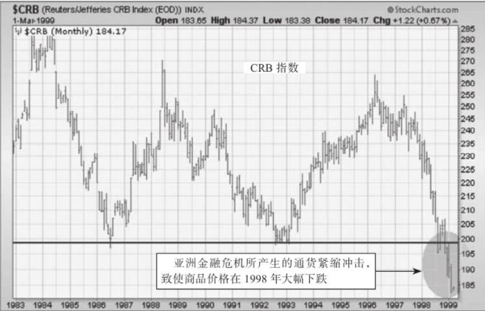

图3-1 商品价格在1998年跌至20年以来的新低，引发了人们对通货紧缩的担心

为了稳定各国日益贬值的货币，他们提高了利率。利率的高企让亚洲股市急剧下跌，这一过程至少持续了1年，严重影响了全球金融市场。在这2年的时间里，所有传统的市场间关系均保持得十分稳定——只有一个例外。

### 债券与股票之间的相关性不复存在
1997～1998年的亚洲金融危机导致了一个最重要的结果：债券与股票之间的相关性不复存在。脱钩的意思是债券与股票价格的走势呈反向关系，而不是传统的同向变动关系。1997年下半年，美股的价格下跌，而国债的价格上升。1998年上半年，股价上涨，而债券价格下跌。1998年第三季度，国债的价格飙升，股票的价格大幅下跌。1998年的7～10月，道琼斯工业指数下跌了20%。全球股市大幅下跌。当股价下跌时，美国国债的价格暴涨至历史新高。在1998年下半年这3个月的恐慌期里，美国国债市场成为全球表现最好的市场（在接下来要讲到的2000年与2008年的股市崩盘这一过程中，我们还将看到这一趋势）。

>在金融恐慌中，投资者通常将资金从股市转移到美国国债上，而美国国债被公认为全世界最安全的投资之一。

截至1998年年底，人们认为危机已经过去，债券价格由此暴跌，而股票的价格飙升，这与3个月前的情况完全相反。1999年全年，债券价格继续下跌，而股票价格飙升至历史新高。1997～1998年的亚洲金融危机是股票与债券间相关性脱钩的主要原因，新的关系一直持续至今。股票与债券间相关性的变化，始于亚洲金融危机当中，金融界开始流行这样一个词：通货紧缩。

图3-2比较了股票与债券在1998年及1999年年初的价格走势。在危机的高峰期（1998年7～10月，图中的阴影部分），股票价格大幅下跌，而债券价格飙升。全球的投资者都在疯狂地抛售股票，将资金转移到安全的美国国债上来。当危机于1998年10月结束时，这些趋势发生了逆转。投资者开始出售债券并买入股票。股票与债券间相关性在1998年的脱钩，可视为这一关系在接下来10年中的一次预演。

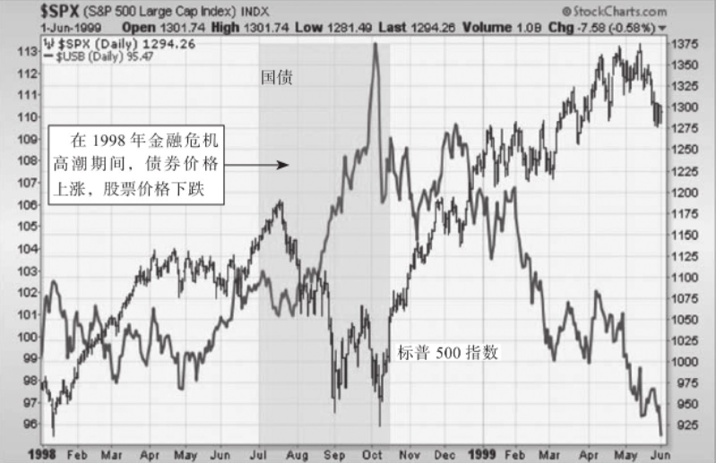

图3-2 在1998年的通货紧缩恐慌中，债券与股票之间的关系不复存在

在始于1997年年中的亚洲金融危机中，投资者开始出售股票，买入债券。这种交易模式转换的原因，在于通货紧缩改变了部分正常的市场间关系。在通货紧缩的环境下，债券的价格上涨，而股票的价格下跌。

### 1997年与1998年的市场反应只是一次预演
图3-3对1998年前后的股票与债券收益率的走势进行了比较。在1998年以前，债券收益率下跌是利好股票的（见左指箭头）。然而，从1998年开始，债券收益率开始和股票价格同向变化（见右指箭头）。1998年以后，债券收益率下跌，开始利空股票。我们可以从2000～2002年3年的熊市中清晰地看到这一点。图3-3还显示，在2000年，债券收益率先于股票走低（这种情况在2007年再一次发生了）。除了债券的价格先于股票下跌（这是1998年之前的范式）这一规律不复存在之外，债券先于股票改变方向这一历史趋势得以保持，这两个市场之间的新关系使得债券收益率成为股票的领先指标。

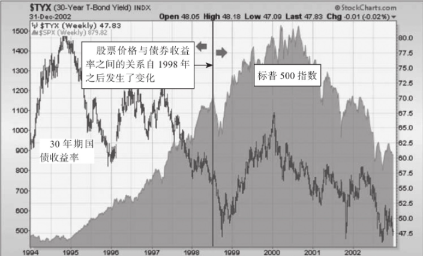

图3-3 自1998年以来，债券收益率下跌已成为股票的利空消息

>当经济低迷时，美联储会降低利率，这有助于稳定股市。然而，当经济因通货紧缩而低迷时，美联储的政策就不那么有效了。
>
>通货膨胀减缓（物价以较慢的速度上涨）与通货紧缩（物价实际是下降的）是有区别的。通货膨胀减缓可能利好股市，而通货紧缩通常使股市下跌。

### 发生于20世纪90年代的两起通货紧缩事件
20世纪90年代发生的两起通货紧缩事件向我们发出了警讯：自2000年之后，跨市场分析以及经济分析将呈现出不同的景象。第一个通货紧缩事件是日本股市于1990年崩盘。第二个事件是1997～1998年的亚洲金融危机，它导致全球商品价格暴跌。日本股市崩盘最终将日本经济拖入通货紧缩的泥沼，至本书创作时已经持续了20多年。

图3-4显示，这两起通货紧缩事件发生的时间间隔为8年。第一个下指箭头显示，日本股市的崩盘始于1990年，并一直持续至20世纪90年代末期。在第一次海湾战争（1990～1991年）之后，日本股市是全球各大市场中唯一没有恢复元气的。第二个下指箭头表明，在亚洲金融危机期间，商品价格在1997年下跌，并在1998年跌至其1992年历史低点之下（这和日本股市的表现如出一辙）。商品价格在1998年崩盘，这对债券收益率的巨大影响是显而易见的。

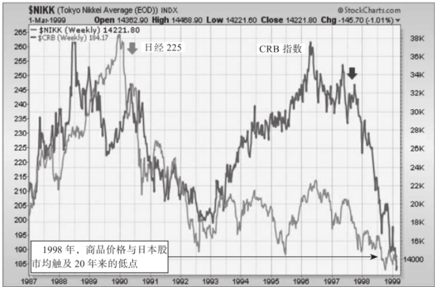

图3-4 在20世纪90年代初期及末期发生的两起通货紧缩事件

### 通货紧缩对债券收益率的影响
图3-5显示了美国国债收益率1990～1999年10年间的走势。债券收益率自1981年以来（商品价格见顶后）一直下跌。图3-5中的两个箭头显示了债券市场是如何对前述两起通货紧缩事件做出反应的。第一个箭头表明，在日本股市于1990年见顶后，债券收益率下跌。在1993年下跌了6%之后，债券收益率在1994年飙升（这也使股市在这一年里下跌），并在接下来的3年里横盘整理（介于1993年的低点与1994年的高点之间）。第二个箭头标示的是商品价格在1997年亚洲金融危机中开始下跌的位置。

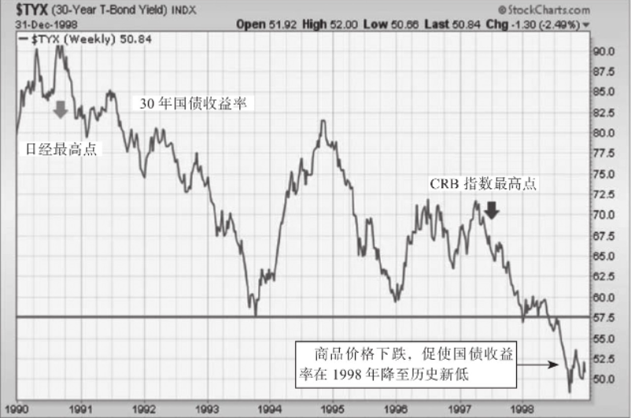

图3-5 在1998年通货紧缩时期，债券收益降至20年来的最低点

在1年内，长期债券的收益率跌破了1993年的低点，降至20年以来的最低点（正如CRB指数在同年的表现一样）。发源于亚洲的两起通货紧缩事件，是债券收益率暴跌的直接原因。

>债券收益率的走势通常与商品价格同向变动。

### 日本通货紧缩与美国利率的关系
有一种观点认为，日本的通货紧缩对美国利率走势的影响，远比我们想象的大得多。图3-6对日本股市与美国国债自1990年以来20年的走势进行了比较。如图所示，这两条线之间存在着非常紧密的联系。实际上，在此期间，这两个市场的相关系数为0.75。两个市场间的相关系数（correlation）指的是两者间的联系强度。相关系数超过0.5后数值越高，其相关性也就越强。

图3-6 自1990年以来，日本股市与美国国债收益率之间的关系

# 2000年与2007年的市场见顶
## 与2000年市场见顶有关的跨市场事件
### 2000年市场见顶之前的市场事件
我们介绍了笼罩1998年金融市场的全球通货紧缩恐慌是如何改变资金走向的，在其影响下，资金从商品与股票中撤出，转而投向债券市场。1999年，这一趋势出现反转。股票市场飙升至历史新高，而债券价格则遭遇了历史上最糟糕的一年。债券价格下跌的部分原因在于石油价格猛涨，它将全球利率进一步推高。亚洲市场的崩盘使得商品价格在1997年与1998年急剧下跌。这些市场在1999年的反弹又推高了商品价格，全球债券市场因此遭受重大损失。在1999年，尽管资金从债市流出在一开始是利好股票的，其长期的影响却是毁灭性的。亚洲股市的反弹也促进了全球对铜铝等工业品的需求。商品价格上涨，促使美联储于1999年中期提高利率，这一行动让股市在接下来的一年（2000年）里形成了重要顶部。

>为阻止石油价格的上涨，美联储提高短期利率，这是大多数股市见顶的成因。

### 原油价格暴涨两倍
与其在市场间活动中所扮演的关键角色一样，在1999年，原油价格的变动形成了连锁反应，股市在接下来的一年里步入熊途。原油价格在1999年涨了两倍，这也是利率上升、债券价格下跌的主要原因。和往常一样，石油价格的上涨对某些群体有利，对另外一些群体不利。在石油价格上涨过程中受惠最多的是石油相关类股票。在1999年，能源股成为市场中表现最好的行业板块（在本书后面的章节中你会发现，为什么能源股领涨通常是股票牛市与经济复苏即将结束的一个预警信号）。石油价格上涨的最大受害者是燃料密集型的交通运输类股票以及对利率敏感的金融股。

>当石油价格上涨时，能源股通常成为市场领涨股。

这些行业的转换是市场见顶的早期预警信号。石油价格的上涨，不但引发了这些不利的行业板块轮动，而且促使美联储在1999年中期提高了短期利率，这也是市场在下一年见顶的主要原因。

>判断经济从扩张期末期向紧缩期初期转换的一个标准，是市场领涨股从能源类股票转为日用消费品之类的防守型股票，这正是2000年春天所发生的事情。

### 短期利率导致反向的收益率曲线
美联储在1999年夏天提高了短期利率，这是美联储在商品价格开始迅速上升时的惯常做法。到了2000年第一季度，美联储的紧缩政策导致`反向的收益率曲线（inverted yield curve）`出现。当短期利率超过了长期利率，就出现了反向的收益率曲线。这种情况通常出现在美联储进行了一轮紧缩性政策（由于石油价格或其他商品价格上涨）之后，反向的收益率曲线通常是股市见顶或经济走弱的一个早期预警信号。在一条正常的收益率曲线中，长期利率高于短期利率。当美联储为摆脱通货膨胀的威胁而收紧货币政策的时候，它通常会提高短期利率。当美联储将短期利率提高至长期利率之上时，就达到了经济（以及股市）的警戒点。

>当2年期利率超过10年期利率时，由此形成的收益率曲线即为正式的`反向收益率曲线`。

当市场形成反向的收益率曲线时，那些市盈率最高的股票（这类股票通常被认为是市场上最贵的）最容易下跌。在2000年之初，纳斯达克市场上的网络与科技股定价过高。在2000年的春天，纳斯达克市场泡沫最终破灭，从而终结了史上最长的一次牛市。

图4-1显示，科技股主导的纳斯达克综合指数在2000年第一季度见顶。这在美国各大股指中也算是第一个了。到了5月，纳斯达克市场的市值已经跌去40%，这已经完全符合官方对熊市的定义了。

2000年年末，纳斯达克市场跌至2000年春末以来的新低，这也使该市场走入下行通道。当市场由一系列的更低的高点及更低的低点组成时，我们就说该市场进入了下行通道。

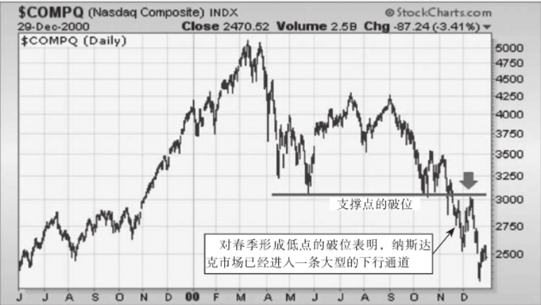

图4-1 纳斯达克综合指数降至2000年春季以来的新低，这意味着熊市的到来

`下行通道`指的是一系列的更低的高点及更低的低点。

尽管纳斯达克市场遭遇了灭顶之灾，而那些通常在经济衰退的早期阶段表现更好的防守型市场板块则因此受益，比如日用消费品与公共事业类股票（在后面的章节中，我将介绍市场见顶前后的行业板块轮动）。随着市场利率与股市一同跳水，房地产投资信托基金也转而上扬。由于其对利率的下跌比较敏感，房地产类股票在随后的股票熊市中表现出色。

>房地产类股票的上扬有助于经济在随后的衰退中免遭更严重的损失。

### 房地产信托投资基金得益于股票的下跌

在2000年4月，由于纳斯达克市场的崩盘，房地产信托投资基金表现最为出色。在熊市中，为了避险，投资者经常将资金转投在房地产股票上。有3件事有利于房地产信托投资基金。

1. 房地产信托投资基金支付很高的股息，在一个正在下跌的股市中（还有债券收益率的暴跌），这一做法极具诱惑。
2. 房地产信托投资基金和股市的相关性也较低。因此，当股市下跌时，这也能起到分散化的好处。
3. 从历史上看，房地产信托投资基金与科技股之间是负相关的。这意味着：当科技股下跌时，房地产信托投资基金通常会上涨。

图4-2显示，房地产信托投资基金在2000年春季转头向上，此时适逢纳斯达克市场见顶（如箭头所示）。房地产信托投资基金与纳斯达克市场间通常是负相关的。利率的下跌，同样会加大支付股息的房地产信托投资基金的吸引力。

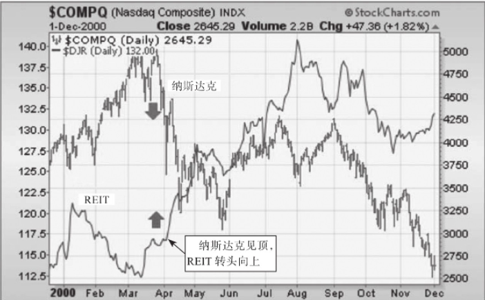

图4-2 当纳斯达克市场在2000年见顶时，房地产信托投资基金开始转头向上

### 日用消费品类股票开始走强
在经济周期的不同阶段，某些特定行业板块的表现会更好。在经济低迷的初期，日用消费品是表现最好的行业之一。从其本质上来看，日用消费品具有防守的功能，在经济周期拐点处具有更强的抵抗力。原因在于，这一板块包括饮料、食品、烟草以及家居用品类股票，无论经济情况好还是坏，人们都得使用这些产品。当这一板块表现的相对强势时，往往意味着经济走势放缓。在经济衰退的初期，还有一些防守型板块对市场资金吸引力较大，如医疗保健与公共事业类股票。如果股票市场的下跌同时伴随着利率的下降（如2000年的情况），这一情况就更加明显了。债券收益率的下跌让付息型股票更具吸引力。大多数防守型股票均属此类。

图4-3显示，当纳斯达克市场在2000年春季见顶时，由日用消费品类股票组成的一篮子商品组合开始转头向上。在市场见顶及经济衰退的开始阶段，防守型股票的表现通常更为出色。医疗保健以及公共事业板块也会从下跌的股市中获益。

>当债券收益率急速下挫，为寻求更高的收益，投资者偏好付息型股票。

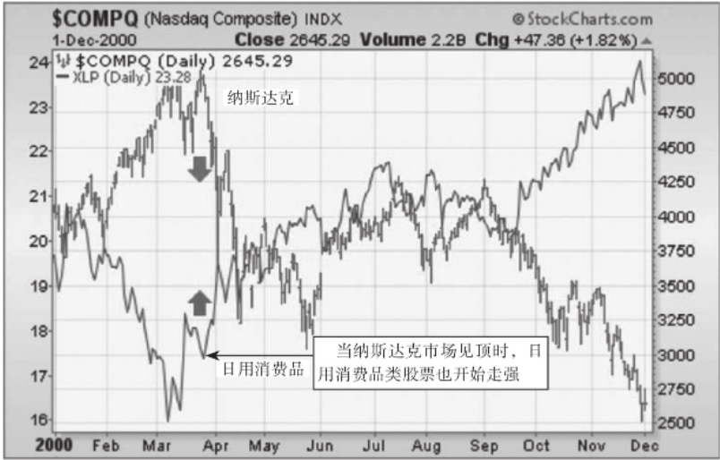

图4-3 在2000年，当纳斯达克市场开始下跌时，日用消费品股票开始上涨

### 2000年市场给我们的启示
图4-4显示，在2000年下半年，标普500指数深幅下跌至200日移动平均线之下。200日移动平均线是区分主要的上涨及下跌趋势的曲线。当市场大幅下滑至这一长期支撑线之下时，这是一个警示信号，意味着一场大衰退即将来临。在2000年第四季度，标普500指数的200日移动平均线掉头向下，这是预示熊市即将来临的另一个明显信号（见图中箭头）。

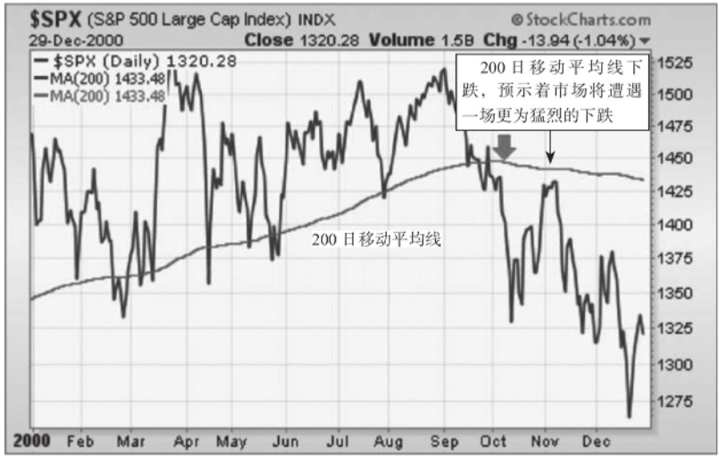

图4-4 在2000年，标普500指数跌破其200日移动平均线

>200日移动平均线下跌，通常预示着市场将遭遇一场更为猛烈的下跌。

### 债券、股票以及商品按照正确的顺序依次见顶
这3个市场在2000年见顶的次序也很有启发性。债券、股票以及商品见顶及见底的次序通常是可以预测的。债券通常率先见顶，股票其次，最后是商品价格。它们见底的次序也相同。从这个意义上来说，债券是股票的领先指标，而股票也成为商品的领先指标。在股票价格见顶之后的6～9个月里，经济开始进入衰退期。当商品价格最终见顶时，这通常是衰退开始的一个信号。

图4-5显示，10年期国债收益率在2000年1月见顶（第一个箭头）。我们已经在前面的章节中阐明，在1998年之后，债券收益率的下降实际上不利于股票，这一情况在2000年表现得尤为突出（在2007年又一次出现）。尽管纳斯达克市场在3月见顶，其他的股票市场还是坚持了几个月。标普500指数直到8月方才见顶，在9月开始转头向下（第二个箭头）。在标普500指数见顶5个月之后，商品价格方才见顶。

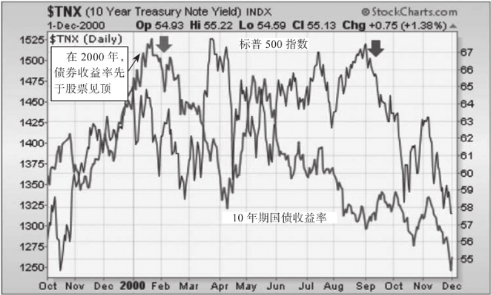

图4-5 2000年，债券收益率先于股票见顶

图4-6显示，CRB指数在下一年（2011年）的1月见顶。这一时间比标普500指数见顶的时间晚了5个月，后者见顶的时间在2000年的劳动节（Labor Day）前后。商品价格最终见顶，这通常是衰退已经启动或接近启动的信号。正式的经济衰退始于2个月以后（2001年3月）。

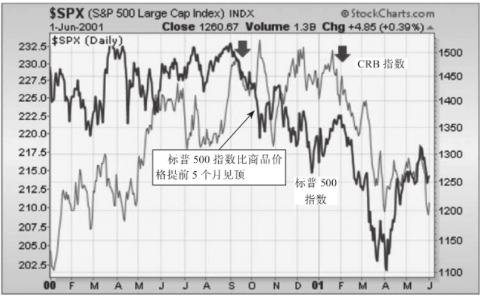

图4-6 2000年，股票先于商品见顶

图4-7将这3个市场放在一幅图中，这3个市场按照正常的次序依次见顶（首先是债券，其次是股票，最后是商品价格）。在本书后面的章节中，你会发现，在2007～2008年，这3个市场按照同样的次序依次见顶。债券收益率在2007年6月见顶，这比股票见顶的时间（在当年10月见顶）早了4个月。商品价格则一直到次年的7月方始见顶。

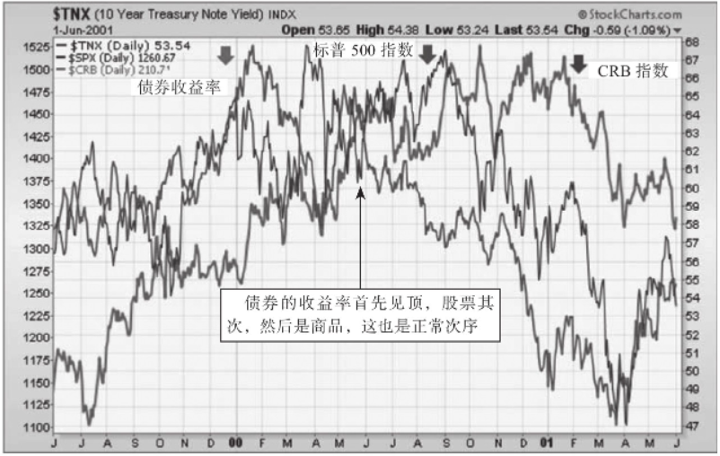

图4-7 债券、股票以及商品在2000年见顶的次序

### 美联储在2003年察觉到了通货紧缩
2003年5月6日，星期二，美联储宣布其将短期利率保持在1.25%的水平不变。这符合公众的预期。但是，美联储在同一天发表了声明：“我们不希望看到通货膨胀的大幅下跌，尽管这一概率较小，而通货膨胀的水平已经很低了，通货膨胀水平仍有可能进一步下跌。”这一声明标志着自“二战”以来，美联储首次将通货紧缩视为一种比通货膨胀更大的威胁。美联储从2001年1月开始降低利率，因为一场新的衰退即将启动。到了2003年5月，美联储已经降低短期利率12次，使利率水平降至40年以来的新低。美联储已经用尽了所有的手段。

金融市场对美联储关于通货紧缩威胁声明的反应，将10年期国债收益率推至45年来的新低。由于美联储不能大幅调低短期利率，市场间传言，美联储可能开始买入债券，以降低长期利率。这也使得债券收益率在这一年的春天暴挫。这次下跌持续的时间很短，到了6月，债券收益率开始急速攀升。债券收益率在年中的上升缘于资金从债市中大幅撤出，并回流至股票市场，这使股市在3个月之前就已经开启了一波新的牛市。

### 商品价格在2002年转头向上
尽管美联储为了抗击通货膨胀，不可能大幅下调短期利率，它还是可以下调一些别的指标，那就是美元。美元的贬值是应对价格下跌的良方，因为这有助于提振通货膨胀。财政部长暗示，美国政府已经放弃了支持强势美元的政策。交易者将这一行为视为一种信号，认为政府希望美元贬值，使经济再度通货膨胀化。这一策略在商品市场中起到了作用。

交易者开始更加积极地卖出美元，买入商品。因为美元贬值，商品价格已经持续上涨了1年。美元实际上在2002年年初就已经见顶，然后开始大幅下滑，并一直下跌至这10年的年末。美元贬值是商品价格在同期内上涨的主要原因。这也能解释为什么商品价格在这一情况下先于股票及债券收益率上涨。

>因为商品是以美元定价的，所以美元的贬值使这些商品的价格增加。

## 美元在2002年的贬值推高了商品价格

