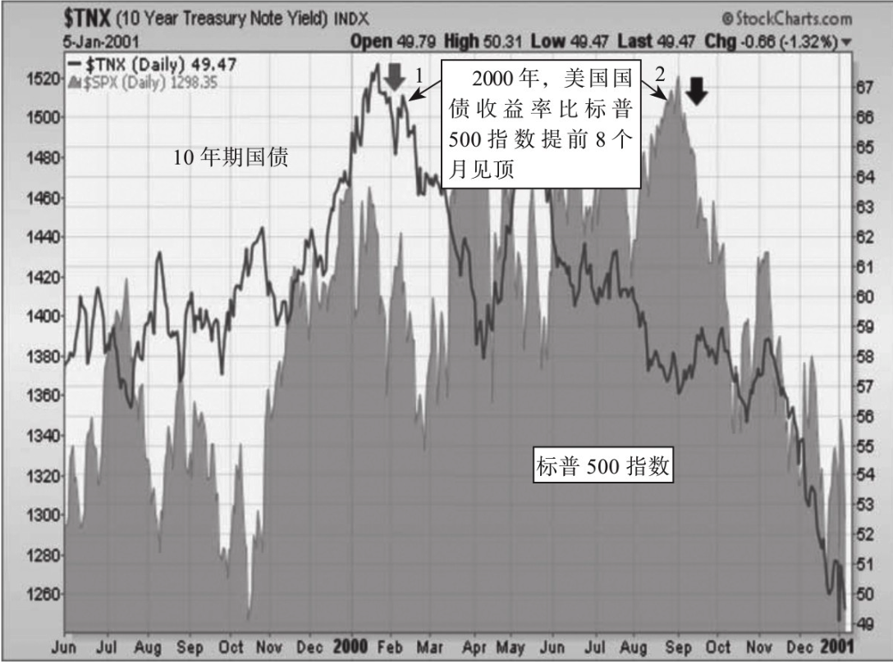
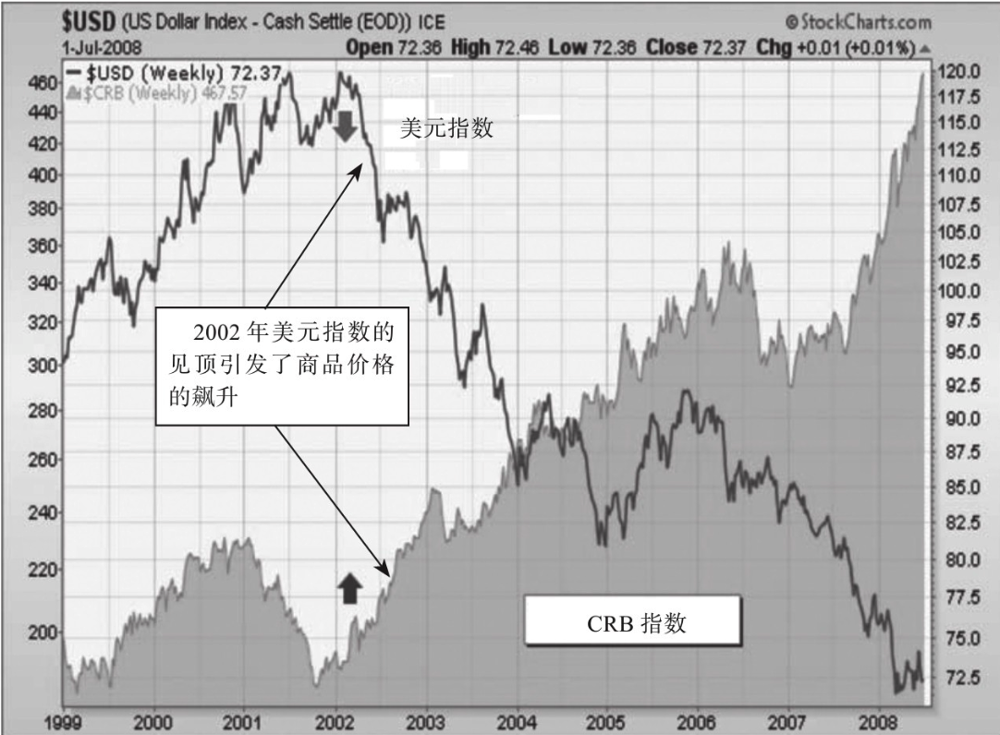
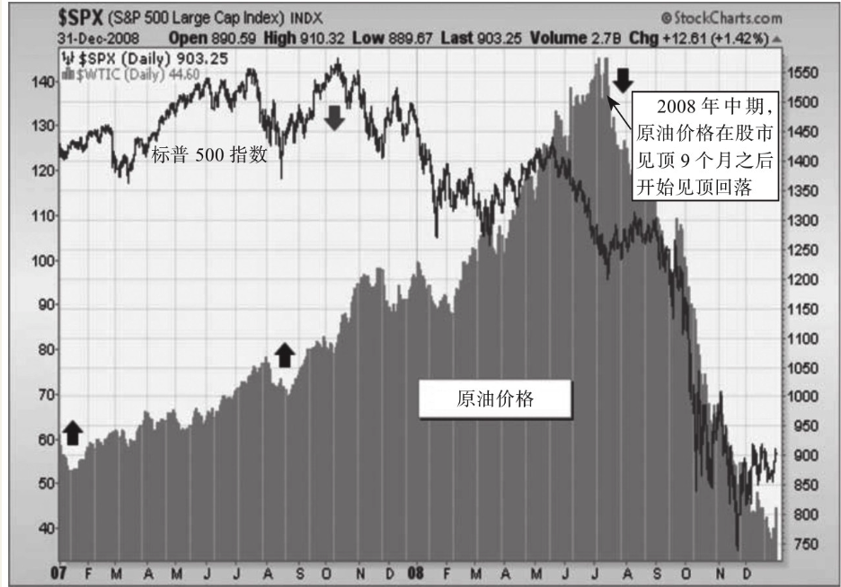
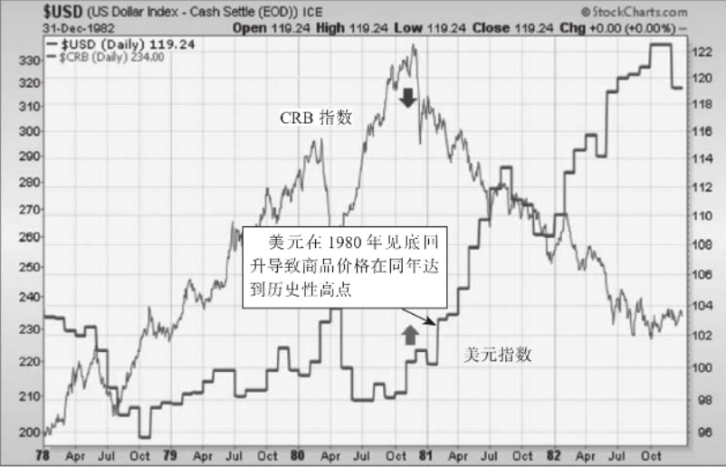
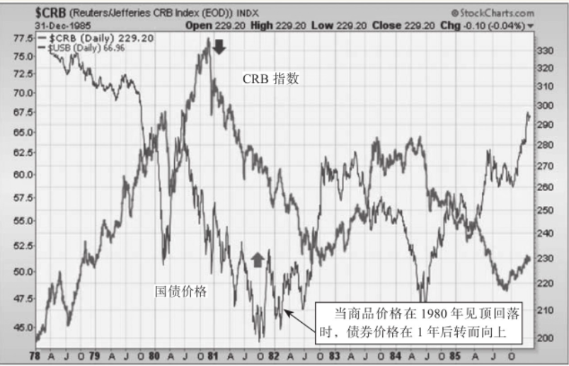
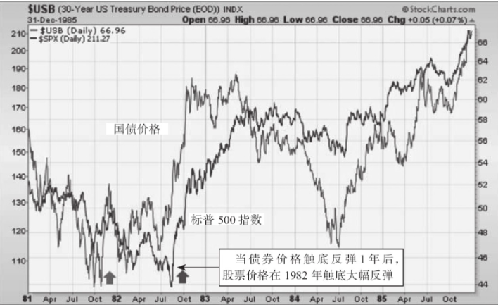
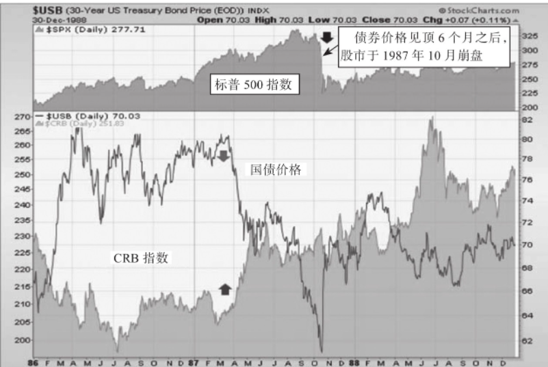
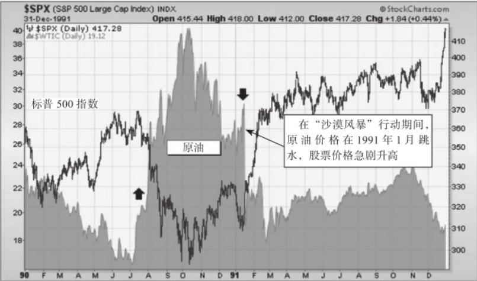
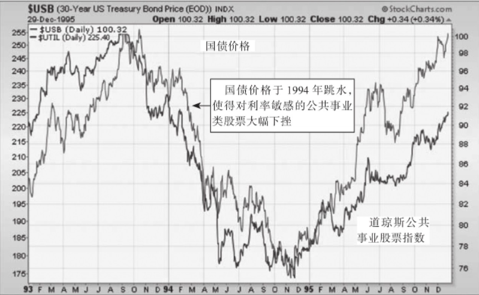

    作者: 约翰 J. 墨菲
    出版社: 机械工业出版社
    出版年: 2018-10
    页数: 333
    定价: 69
    ISBN: 9787111610755

[豆瓣链接](https://book.douban.com/subject/30365001/)

- [旧格局](#旧格局)
  - [跨市场分析：相关性的研究](#跨市场分析相关性的研究)
  - [对旧格局的回顾](#对旧格局的回顾)
    - [1980年是一个关键的转折点](#1980年是一个关键的转折点)
    - [20世纪70年代通货膨胀期的终结](#20世纪70年代通货膨胀期的终结)
    - [1987年股市震荡强化了这一市场间关系](#1987年股市震荡强化了这一市场间关系)
    - [两次伊拉克战争](#两次伊拉克战争)
    - [在1994年的隐形熊市中，市场间关系同样得到了印证](#在1994年的隐形熊市中市场间关系同样得到了印证)
    - [来自20世纪30年代的回响](#来自20世纪30年代的回响)
    - [通货紧缩情境](#通货紧缩情境)

# 旧格局
## 跨市场分析：相关性的研究
顾名思义，`跨市场分析（intermarket analysis）`就是要研究各种不同类型金融市场之间的相互关系，这种研究出离于传统市场的分析模式之外，因为后者主要致力于研究单一的市场品种。

>与跨市场分析有关的四类资产包括债券、股票、商品及外汇。

之所以要了解不同类型金融资产间的互动问题，原因有二。第一个原因是这有助于你分析其他金融市场对你所关注市场的影响。比如，如果你交易股票，那么了解债券和股票间的相互关系非常关键。之所以要观察债券的情况，是因为债券的价格走势与股票价格的运行方向常常相反。在大多数情况下，债券市场往往先于股票市场而提前转势，而债券的收益率与债券价格是反向相关的，所以，下降的债券收益率（上升的债券价格）可以为股票市场的行情变化提供反向预警。

图1-1比较了美国10年期国债与标普500指数在2000年的价格变化情况。当年1月（箭头1），债券收益率见顶之后开始下跌，这比股市的转势提前了很长一段时间；当年的春季，债券收益率跌至年内最低点，而标普500指数仍在左右摇摆（尽管纳斯达克指数于同期升至顶点）；直到2000年第四季度，标普500指数才开始下跌（箭头2），而这一波熊市持续的时间长达两年之久。从这个鲜活的案例当中，我们可以看到债券收益率的下降能够为股市的下跌提供早期预警；同时，它说明债券市场在重要的行情拐点之处往往先于股票市场提前转势，它可以成为研究股市的领先指标。

图1-1 2000年债券收益率下降对相应股市见顶的预警

如果你是债券交易者，你就应该关注商品市场的行情变化。比如，商品价格的飙升经常伴随着债券价值的下降。而对市场间相互关系进行的另一项研究表明：美元价格的下跌通常会引起商品价格的上扬。此外，你会发现美元价格的走势可以决定美国境外股票相对于境内股票的吸引力。

理解市场间关系的第二个重要原因，在于它可以帮助我们优化资产配置策略。

2002年以来，随着美元价格的下跌并创下历史性的新低，我们来观察一下这四类资产的相对表现：自2002年伊始的10年间，商品资产价格上升了64%；相比较而言，债券价格上涨了23%；美国境内的股票价格相对平稳地上升了9%；在商品价格上涨的刺激下，美元价格下跌了32%，这是因为美元价格与商品资产价格的运行方向相反，美元的贬值引发了商品价格的高涨。

>商品资产价格与外币价格的行情走势一致，与美元价格的运行方向相反。

图1-2比较了美元指数与CRB指数在2000～2008年的变化情况。图中很清晰地表明两者的运行方向相反。另外，我们还可以看到2002年商品价格飙升（见上指箭头）的同时，美元价格开始下跌（见下指箭头）。在对各金融市场间关系的研究当中，我们发现美元价格走势与商品市场行情变化之间的反向相关态势是持续的、最为可信的关系之一。

与此同时，外币价格也因为美元的贬值而上升，对那些将本币价值与商品出口紧密相连的国家，如澳大利亚和加拿大，情况尤为突出——自2002年伊始的10年里，（伴随着商品价格的飙升）澳元对美元升值101%，而欧元对美元升值50%。

图1-2 2002年美元见顶转势导致了商品价格的上涨

>股票市场可以划分为10个行业板块以及大约90个行业团体。

当股票的新一轮牛市即将启动时，像非必需消费品股票（也包括其零售商）这样的经济敏感型行业的表现通常好于大多数股票。科技股与交通运输类股票也属于此类，它们的走势与经济周期密切相关。小盘股也先于大盘见底。当市场见顶时，这些极其类似的行业板块通常率先转头向下。当股市进入牛市末期时，能源股（其价格与石油价格密切相关）很容易成为市场龙头股。当能源类股票成为领头羊时，对股市来说，这往往是一个危险的信号。当资金从能源股中出逃，并流入诸如生活必需品、医疗保健以及公共事业股等防守型板块中时，我们可以将其视为股市正在见顶的一个信号。

如果股市形成重要的顶部，那么通常会使经济逐渐走弱（或步入衰退期）。比如，股市在2000年见顶，在接下来的春天，经济步入衰退期。2007年10月的股市见顶导致经济在当年的12月步入衰退期。当市场见底时，情况同样如此。在两次衰退期（2003年与2009年）结束前，市场在几个月前即已调头向上，由熊转牛。当股票市场走弱，资金就会从股市向债市转移。市场见底时则情况相反，资金会从债市向股市转移。

>在市场见顶或见底时，通常是债券率先改变方向，其次是股票，再次是商品价格。

在2007年年初，石油价格开始上涨，随后，股票市场开始下跌。当市场于2007年见顶时，石油价格的作用不算反常，实际上，其表现可以说十分正常。在过去的40年里，每一次经济衰退都有石油价格上涨的影子。石油价格上涨还导致股票市场见顶，随后踏入漫漫“熊途”。20世纪70年代中期的情况正是如此，在1973年（第一次石油危机期间），原油的价格暴涨了3倍，股票市场在其后的1年（1974年）中暴挫50%。在1987年、1990年、1994年以及2000年的股市下跌中，原油价格的暴涨均先于股市的暴跌出现（或与股市同步出现）。与此相反，原油价格的暴跌通常会带来股市的上涨。两次伊拉克战争（1991年年初及2003年）初期的情况正是如此，股市因此开启了新一轮的牛市。当与石油价格密切相关的股票成为龙头股时，这对股市来说通常是一个危险的信号。

>石油价格的上涨通常会迫使美联储提高利率，这会使股市走弱，并让经济减速。

图1-3对原油及标普500指数在2007～2008年的价格进行了比较，图中显示了两种联系紧密的跨市场趋势。第一种趋势是，石油价格的上涨通常先于股票市场见顶。原油价格于2007年年初上涨（图中第一个上指箭头）。在2007年8月小幅回调之后，原油价格从9月开始了更为迅猛的上涨（图中第二个上指箭头）。一个月以后，股市在10月见顶回落（图中第一个下指箭头）。对股票来说，石油价格的上涨通常是一个警示信号，在大多数情况下会导致股市见顶回落。跨市场分析所掌握的第二种趋势是，石油价格通常在股市之后见顶回落。图1-3表明，原油价格在2008年7月见顶（图中第二个下指箭头），此时是股市见顶9个月之后。

图1-3 2007~2008年的原油价格上涨导致股市见顶

>股市通常先于总体经济改变走向，而债市的变化通常早于股市。这使得债市成为比股市更领先的经济指标。

>当经济扩张时，可选消费品类股票成为领头羊；当扩张接近尾声时，龙头股是能源类股票；在经济衰退时，日用消费品类股票表现强劲。

>战胜通货紧缩比战胜通货膨胀困难得多。在过去的10年间，美联储已经将短期利率降至0，无法进一步降低利率，只能诉诸其他手段。

跨市场分析的基本原则：
- 全球市场彼此之间相互联系。
- 分析任何一个市场都应该把对其他市场的分析纳入进来。

需要分析的四类资产包括：
- 股票；
- 债券；
- 商品；
- 外汇。

市场间关系：
- 美元与商品价格的变动趋势相反。
- 债券与商品价格的变动趋势相反。
- 自1998年以来，债券与股票价格的变动趋势呈反向变动。
- 自2008年以来，股票与商品价格的变动趋势十分密切。

市场间互动关系：
- 债券价格通常先于股票价格改变方向。
- 股票价格通常先于商品价格改变方向。
- 当市场见顶时，债券收益率率先见顶，股票价格其次，商品价格最后见顶。
- 与市场见顶时相比，这些轮动性在市场见底时并不明显。

国外市场的影响：
- 全球市场的所有股票都是紧密联系的。
- 美元升值利好美国股票。
- 美元贬值利好国外股票。
- 新兴市场与商品市场的走势密切相关。

## 对旧格局的回顾
### 1980年是一个关键的转折点
首先，当商品价格升至历史性高点时，正值美元跌至历史性底部。这再次印证了一个非常稳定的跨市场分析原则：商品价格与美元的走势呈反向关系。如图2-1所示，在1980年，当CRB指数（下指箭头）见顶时，适逢美元指数从历史大底处回升（上指箭头处）。美元的这一强势上扬也终结了20世纪70年代商品通货膨胀的恶性循环。

>美元的升值会使商品价格下跌，而下跌的商品价格通常会导致较高的债券价格。

图2-1 商品与美元之间的反向关系

跨市场分析的第二条原则是债券与商品价格的变动趋势相反。债券价格在1981年强劲反弹，商品价格在1980年的重挫是一个主要原因。如图2-2所示，商品价格在1980年升至历史高点（下指箭头），这使得美国国债价格在1年后（1981年）触底反弹（上指箭头）。跨市场分析在该时期的第三条原则是债券与股票价格的变动趋势呈同向变化关系（这一关系在20世纪90年代末有所变化）。债券价格在1981年年底触底回升，这使得股票价格在1982年反转向上。图2-3表明，国债价格在1981年转头直上（第一个上指箭头），随后，标普500指数在1年后（1982年）大幅反弹（第二个上指箭头）。

图2-2 债券价格与商品价格成反向变化关系

从正常顺序来讲，债券价格通常先于股票价格改变方向，债券先于股票回升这一事实与之相符。简言之，在20世纪80年代这10年间，美元率先上涨，商品价格随之下跌，然后，债券与股票价格开始上涨。

图2-3 债券与股票价格之间呈同向变化关系

### 20世纪70年代通货膨胀期的终结
1971～1980年，CRB指数上涨了250%。债券收益率（随着债券价格的下跌而上升）在同期上涨了150%。20世纪70年代不仅对债券不利，对股票来说也同样如此。在这一时期的期初及期末，道琼斯工业平均指数都徘徊在1000点附近。在这10年滞胀期中，由于石油价格在1973年开始猛涨，美国股市的市值在1974年损失过半。

>当石油价格开始飙升时，股市通常会随之走低。

20世纪70年代是商品等有形资产的黄金时代，而像债券和股票之类的纸面资产则无人问津。到了20世纪70年代末期，黄金的价格已经飙升至每盎司700美元之上。美元在此期间持续走弱，这也促使黄金与其他商品的价格呈螺旋式上升，以及债券与股票走势的相对疲软。在此期间，市场间关系也保持不变。持续走弱的美元推高了商品价格，进而使债券与股票的价格走低。可以用一个经济学术语来描述这一时期：`滞胀（stagflation）`，当高通胀与经济停滞同时发生时，就产生了滞胀。当商品价格于1980年见顶回落之后，这些走势发生了完全的逆转。CRB指数从330点的历史性高点滑落，开始了一轮长达20年的下跌过程，在此期间，该指数损失了一半的市值。在同一时期内，黄金的价格从每盎司700美元跌至250美元，从其在1980年的高点处暴挫60%。当商品价格于1980年见顶回落时，在短短的两年间，20世纪70年代的市场间关系即已完全逆转。在接下来的20年里，市场青睐的是债券与股票之类的纸面资产，而像商品之类的有形资产则无人问津。

### 1987年股市震荡强化了这一市场间关系
在1982年后的4年里，支持股票价格不断上涨的因素主要有两个：持续下跌的商品价格（低通胀）以及持续上涨的债券价格（持续下跌的利率）。

然而，在1987年4月，商品价格开始猛涨，而债券价格开始暴挫（持续上涨的商品价格通常会导致债券价格不断下跌）。从那时起到8月，股市持续上涨并最终见顶。债券价格比股票价格提前4个月见顶，这一事实再一次说明，债券价格先于股票价格改变方向。最终，股市于1987年10月崩盘。

>债券市场通常先于股票市场改变方向。

图2-4表明，在1987年的春天，商品价格形成向上的尖峰（上指箭头），而债券价格也恰于此时跳水（下指箭头）。在当年的10月，标普500指数崩盘（见图2-4的顶部）。

图2-4 导致1987年股市震荡的市场间关系

### 两次伊拉克战争
在股市从1987年崩盘中恢复过来3年后，全球市场开始被迫面对1990年的海湾危机（伊拉克于1990年8月入侵科威特）。在当年夏天及侵略发生后的1个月内，黄金与石油的价格开始飙升，而全球的股票及债券价格暴跌。当美军于1991年1月开始实施“沙漠风暴”行动时，所有的市场间关系都发生了逆转。全球债券与股票市场重拾升势，而黄金与石油的价格开始下跌。图2-5表明，原油价格在1990年的下半年形成向上的尖峰（上指箭头），而股票价格也恰于此时下跌。原油价格在次年的1月开始跳水（下指箭头），股票价格开始重拾升势。

图2-5 在第一次伊拉克战争中，原油价格是如何影响股市的

在第二次伊拉克战争期间，黄金与石油的价格在伊拉克战争爆发之前的几个月内飙升，而股票与债券的价格暴跌（这一表现与1990年相比，别无二致）。另外，当战争实际爆发后，市场间关系再一次发生了根本性逆转。在战争开始爆发（2003年3月17日）的那个星期里，美国股市急升8%，这是该市场20年来最大的周升幅（由此开启了一轮长达4年的大牛市）。而全球股市也同时暴涨，黄金价格下跌了15%，原油价格重挫33%。美元升值4%，致使商品价格下跌。

债券作为避风港，在第二次伊拉克战争之前的几个月里曾吸引了大量资金涌入，随着资金大量转入相对更加安全的国债以及流回股市，其价格也开始下跌。在两次伊拉克战争期间，上述4个金融市场（债券、股票、商品及外汇）的表现与跨市场分析的结果非常一致。

>石油与黄金价格经常在危机时刻上升，而一旦危机结束，价格随即回落。

>在第二次伊拉克战争期间，债券与股票的走势呈反向关系，表明这两个市场之间相关性的变化（自1998年以来，这两个市场间的相关性已不复存在）。

### 在1994年的隐形熊市中，市场间关系同样得到了印证
说到20世纪90年代中期发生的最大的市场事件，当属股票市场在1994年的隐形熊市。所谓隐形，指的是主要市场指数的跌幅只有10%多一点儿（而债券遭遇了10年来的最大跌幅）。然而，主要市场指数相对较小的跌幅，掩盖了市场中某些行业所遭受的严重损失。比如，小盘股下跌15%，交通运输类股票的跌幅为26%，而公共事业类股票从高峰到低谷的跌幅高达34%。

石油价格在1994年的上升是交通运输业（燃料依赖型行业）遭受重挫的原因，而由此急升的利率（以及债券价格的下跌）又使公共事业类股票（利率敏感型行业）的市值暴跌。在这一波熊市的整个过程中，旧有的市场间关系模型依旧有效。

商品价格在1993年上半年的上涨，引起债券价格在当年的下半年下跌。债券价格于1993年9月见顶。5个月以后，股票价格于1994年2月见顶回落。债券市场再一次先于股票市场改变方向。在见顶之后，股票与债券随着商品价格的上升一同下跌，这也和跨市场分析的结果相一致。美元在1993年全年一路下滑，致使商品价格持续上扬。和商品价格在1993年的上涨导致债券与股票价格见顶一样，商品价格在1994年的中期见顶回落，市场间轮动开始向另一个方向转变。

商品价格在1994年中期见顶回落，引发债券于当年11月见底。股票则在债券之后的1个月内转头向上。市场再一次依照旧有的轮动顺序变化。商品价格上涨引发债券价格上涨，相应地又引起股票价格上涨。当股市于1994年第四季度见底回升时，股市开始了一波疯牛式上涨行情，一直持续到这一10年期期末。1994年之后，股市受惠于美元升值及商品价格的下跌。国债价格则一直上涨至1998年的秋季，这也是股票价格上升的动力之一。从跨市场分析的角度来看，美元的升值与商品价格的下跌是股市与债市走牛的动力，这也是那一时期的正常规律。然而，在1998年，一个重要的市场间关系开始发生变化。发生这一变化的原因是：自20世纪30年代以来，通货紧缩（deflation）开始重现江湖。图2-6表明，在1994年与1995年里，国债价格与公共事业类股票价格之间的关系非常紧密。债券价格在1994年急转直下，使得对利率非常敏感的公共事业类股票遭受重挫。这两个市场在1995年分别走出一波波澜壮阔的行情。

图2-6 1994年，公共事业类股票随着债券的价格一同下降

### 来自20世纪30年代的回响
在1998年之后的短短几年间，通货紧缩开始从亚洲向全世界蔓延，而且已经影响到全球债券及股票市场的方方面面——美国也不例外。作为一种最主要的因素，通货紧缩的再度重现，让一条重要的、自“二战”以来一直保持的市场间关系得以改变。这一市场间关系发生的变化就是债券与股票价格间的相关性为负。换言之，股票与债券价格的走势呈反向运行，这是对它们之前同向运行趋势的一种偏离。自1998年之后，利好债券的消息开始利空股票。债券和股票之间的这种新型关系在2000年表现得淋漓尽致，当时，债券收益率不但随着股票价格的下跌而下跌，而且先于股票下跌而下跌。当股票开始下跌时，债券价格开始上涨。

>2000年与2007年，债券收益率先于股票价格下跌而下跌，这也为股票市场的下跌发出了一个预警信号。

市场间关系的第二个变化是商品价格与股票价格的联系日益紧密，这和20世纪30年代通货紧缩时期的情况相同。当房地产市场于2007年崩盘后，股票与商品价格之间的这种紧密联系进一步加强了，这导致了2008年的金融危机（这也唤醒了人们对20世纪30年代的大萧条的痛苦回忆）。在2008年之后，大萧条这一历史事件所包含的通货紧缩启示，进一步强化了股票与商品价格之间的联系。这是因为，这两种资产类别与全球经济周期之间的联系变得更为紧密。商品（如石油与铜）价格的上涨，意味着经济正在走强，这同样利好股票。商品市场价格下跌，意味着经济走弱，这对于股市是利空。

在21世纪的第一个10年里，硬资产（如黄金或其他商品）再度兴起，在很大程度上，这是美联储为消除通货紧缩威胁，放任美元贬值的结果。

### 通货紧缩情境

