    作者: 九州股神 编著
    出版社: 电子工业出版社
    出版年: 2015-11
    页数: 264
    定价: 49.00元
    ISBN: 9787121273421

[豆瓣链接](https://book.douban.com/subject/26649739/)

- [从零开始学均线](#从零开始学均线)
  - [均线的分类](#均线的分类)
  - [均线的特点](#均线的特点)
- [单根均线驰骋股市](#单根均线驰骋股市)
  - [股价向上突破均线](#股价向上突破均线)
  - [股价重回移动平均线](#股价重回移动平均线)
  - [股价受到均线支撑](#股价受到均线支撑)
  - [股价远小于移动平均线数值](#股价远小于移动平均线数值)
  - [股价向下突破移动平均线](#股价向下突破移动平均线)
  - [股价二次向下突破移动平均线](#股价二次向下突破移动平均线)
  - [股价反弹受阻于移动平均线](#股价反弹受阻于移动平均线)
  - [股价远大于移动平均线数值](#股价远大于移动平均线数值)
- [均线组合形态买入点研判](#均线组合形态买入点研判)
  - [典型买入形态组合](#典型买入形态组合)
    - [黄金交叉](#黄金交叉)
    - [银山谷形态](#银山谷形态)
    - [金山谷形态](#金山谷形态)
    - [多头排列形态](#多头排列形态)
    - [首次黏合向上发散](#首次黏合向上发散)
    - [二次黏合向上发散](#二次黏合向上发散)
    - [首次交叉向上发散](#首次交叉向上发散)
    - [二次交叉向上发散](#二次交叉向上发散)
    - [逐浪上升](#逐浪上升)
    - [蛟龙出海](#蛟龙出海)
    - [加速下跌](#加速下跌)
    - [上山爬坡](#上山爬坡)
    - [烘云托月](#烘云托月)
- [均线组合形态卖出点研判](#均线组合形态卖出点研判)
  - [典型卖出形态组合](#典型卖出形态组合)
    - [死亡交叉](#死亡交叉)
    - [死亡谷](#死亡谷)
    - [空头排列系列](#空头排列系列)
    - [首次黏合向下发散](#首次黏合向下发散)
    - [二次黏合向下发散](#二次黏合向下发散)
    - [首次交叉向下发散](#首次交叉向下发散)
    - [二次交叉向下发散](#二次交叉向下发散)
    - [逐浪下降](#逐浪下降)
    - [断头铡刀](#断头铡刀)
    - [加速上涨](#加速上涨)
    - [乌云密布](#乌云密布)
    - [下山滑坡](#下山滑坡)
  - [卖出实战演练](#卖出实战演练)
    - [顶部的死亡交叉](#顶部的死亡交叉)
    - [反弹中的死亡交叉](#反弹中的死亡交叉)
    - [反弹受阻于移动平均线](#反弹受阻于移动平均线)
    - [黏合向下发散](#黏合向下发散)
    - [空头排列](#空头排列)
    - [均线的坡度与K线](#均线的坡度与k线)
- [均线与MACD](#均线与macd)
  - [MACD的原理及计算方法](#macd的原理及计算方法)
  - [利用DIFF与DEA的“金叉”买股](#利用diff与dea的金叉买股)
  - [利用DIFF与DEA的“死叉”卖股](#利用diff与dea的死叉卖股)
  - [利用MACD底背离形态买股](#利用macd底背离形态买股)
  - [利用MACD顶背离形态卖股](#利用macd顶背离形态卖股)
  - [均线与MACD的顶背离](#均线与macd的顶背离)
  - [均线与MACD的底背离](#均线与macd的底背离)
- [均线与分时图](#均线与分时图)
  - [什么是分时图](#什么是分时图)
  - [分时买进信号](#分时买进信号)
    - [均线支撑](#均线支撑)
    - [向上突破平台](#向上突破平台)
    - [V型反转](#v型反转)
    - [W底](#w底)
    - [三平底](#三平底)
    - [三步高](#三步高)
    - [对称涨跌](#对称涨跌)
    - [在涨停板打开](#在涨停板打开)
  - [分时卖出信号](#分时卖出信号)
    - [均线挡道](#均线挡道)
    - [跌破平台](#跌破平台)
    - [M顶](#m顶)
    - [一顶比一顶低](#一顶比一顶低)
    - [对称跌涨](#对称跌涨)
    - [跌破前低](#跌破前低)
    - [开盘急涨](#开盘急涨)
    - [收盘线阻挡](#收盘线阻挡)
- [散户用均线猎庄](#散户用均线猎庄)
  - [庄家坐庄的步骤](#庄家坐庄的步骤)
  - [辨识庄家](#辨识庄家)
    - [从盘口发现庄家](#从盘口发现庄家)
    - [了解庄家建仓的手法](#了解庄家建仓的手法)
    - [洞悉庄家出货的动作](#洞悉庄家出货的动作)
    - [识破庄家的骗术](#识破庄家的骗术)
  - [建仓阶段](#建仓阶段)
    - [横向整理建仓](#横向整理建仓)
    - [拉升建仓](#拉升建仓)
  - [试盘阶段](#试盘阶段)
    - [快速拉升法](#快速拉升法)
    - [打压建仓法](#打压建仓法)
    - [单针触底法](#单针触底法)
    - [低开高走法](#低开高走法)
  - [洗盘阶段](#洗盘阶段)
    - [宽幅震荡](#宽幅震荡)
    - [窄幅震荡](#窄幅震荡)
    - [向下打压](#向下打压)
    - [放量收阴线](#放量收阴线)
  - [拉升阶段](#拉升阶段)
    - [快速上扬](#快速上扬)
    - [小幅上扬](#小幅上扬)
    - [平台上行](#平台上行)
    - [震荡上行](#震荡上行)
  - [出货阶段](#出货阶段)
    - [高位横盘出货方法](#高位横盘出货方法)
    - [高位震荡](#高位震荡)
    - [上涨减速](#上涨减速)

# 从零开始学均线
## 均线的分类
`短期均线组合`中最常用的有5日、10日、20日和5日、10日、30日两种组合。短期均线组合主要用于观察股价短期运行的趋势，例如1～3个月的股价走势会发生什么变化。一般来说，**在典型的上升通道中，5日均线应为多方护盘中枢，否则其上升力度有限；10日均线则是多头的重要支撑线，10日均线被击破，市场就有可能转弱**。

中期均线组合最常见的有10日、30日、60日和20日、40日、60日两种组合。中期均线组合主要用于观察股价中期的运行趋势。例如，3～6个月的汇价走势会发生什么变化。**一般来说，中期均线呈`多头排列状态`，说明股价中期趋势向好；反之，中期均线呈`空头排列状态`，说明中期趋势向淡**。

长期均线组合最常见的有30日、60日、120日和60日、120日、250日两种组合。长期均线组合主要用于观察汇价的中长期趋势，例如，半年以上的股价走势会发生什么变化。这些均线组合对股价的变化相对较迟钝，经常用来判断某个长期趋势是否开始反转，是长线投资者的重要参考依据。**一般来说，当长期均线组合中的均线形成`金叉`，成为多头排列时，说明市场对中长期趋势看好，反之，当长期均线组合中的均线形成`死叉`，成为空头排列时，说明市场对股票中的长期趋势看淡**。

## 均线的特点
1. 能够稳定地反映趋势体现趋势。如果移动平均线向上，则体现出目前的行情是向上的；如果移动平均线向下运行，也就说明行情是向下运行的。
1. 有一定的滞后性。从移动平均线的计算过程中可以看到，它的数值实际上是一个平均值，因此必然会兼顾之前的收盘价。
1. 对股价有支撑和阻力作用。因为移动平均线代表了场中一定周期内的平均持仓成本，因此当股价向上或向下穿越移动平均线时，移动平均线都会构成一定的支撑或阻力作用。也就是说，一般情况下当股价触及移动平均线时，都不会轻而易举地穿越，经常会出现一定时间的盘整后再发生穿越，甚至不能成功穿越。

# 单根均线驰骋股市
## 股价向上突破均线
在股市中，移动平均线代表了在这一交易时段内的平均持有成本。例如10日移动平均线则反映了近10个交易日内的平均持有成本，因此如果股价向上突破了10日移动平均线，则说明股价在未来将要上涨，因此投资者可以选择适当买入股票。

图2.1中的移动平均线为20周移动平均线，属于中短期移动平均线类型，因此能够很好地体现出中短期走势。股价在4.30元时达到最低，此后便小幅上扬，成交量也逐渐增多。在箭头指向的位置，一根阳线向上突破了20周移动平均线，尽管K线的实体较小，但是此时却有着重要的意义。**因为一旦股价向上穿越20周移动平均线，就标志着未来很有可能将继续上扬。尽管K线实体较小，但是成交量却出现了明显地增多，说明有雄厚的资金支持股价向上穿越移动平均线**。此后股价便一路高涨，直至31.40元。因此在移动平均线刚刚被穿越时，是非常好的一个买入点。

图2.1 山煤国际周K线图

如2.2图中，选用的移动平均线为5周移动平均线，它更加侧重于短期走势的体现。从图上也可以看到5周移动平均线始终贴近股价运行，因为它相对于20周移动平均线来说更加灵敏，因此滞后性也较小，股价有什么变化，它都可以及时地体现出来。

股价在2.60元走出新低，而在下一个交易周，一根阳线穿越了5周移动平均线。由于5周移动平均线滞后性较小，因此所发出的买入时机也相对较早。但是这不影响买入信号的准确性，**因为在股价向上穿越移动平均线时，成交量也出现了增多的迹象，这也说明有资金来支持股价向上不断攀升**。

图2.2 国农科技周K线图

## 股价重回移动平均线
该形态是指，股价曾经向上突破移动平均线，不过涨幅不大，此后移动平均线继续向上运行，但是股价又小幅地向下跌破移动平均线，不久再次冲高到移动平均线上方，这就说明多头将开始真正地向上拉升，此时就是投资者的一个良好的买入时机。

如图2.3所示股价从7.61元开始上扬，此后不久便向上穿越了5日移动平均线。此后股价始终沿着5日移动平均线之上运行，但是在箭头指向的位置，股价先是向下小幅跌破了5日移动平均线，此后股价并没有快速下行，而是在后两个交易日便开始重新回到5日移动平均线之上，这说明多头依然控制着整个市场，此时是一个良好的买入点。此后股价将快速上行，这是此前股价上涨时所不能比的。

图2.3 武汉塑料日K线图

如图2.4所示，该K线图的时间周期为小时，主要体现短期走势。而图中选的移动平均线的周期为20周期，因此又兼顾了中期走势。股价从5元开始上行，成交量也有小幅增长。在图中箭头指向的位置，一根阴线向下突破了20周期移动平均线。但是股价并没有随即开始大幅下跌，而是在下一个交易日时就出现了重新回归均线之上的形态，而且成交量也配合增多，此后股价便开始大规模地上行，而且上涨的速度和幅度都极快。

图2.4 开元投资60分钟K线图

## 股价受到均线支撑
移动平均线对股价有一定的支撑作用，因此当股价从上向下跌落到移动平均线附近时，往往不会轻而易举地向下突破均线，只要股价不能向下突破，而受到均线的支撑开始转入向上的行情时，投资者就可以买入股票。

如图2.5所示，股价从8.31元开始上行，20周期移动平均线也相继调头向上运行。成交量伴随着股价的上升也逐渐增多，说明多头有能力稳步地向上推升股价。在椭圆形标注的位置，股价曾经向下跌落，K线图上出现了一根大阴线，但是股价并没有跌破20日移动平均线，而是受到了均线的有力支撑而继续上行。不仅如此，20周期移动平均线始终保持向上运行的方向，丝毫没有调头向下的走势迹象，因此股民可以在此时放心大胆地购买股票。

图2.5 生意宝周K线图

如图2.6所示，图中的K线时间周期为日，这主要体现中短期走势，而图中选用的移动平均线周期为120日，因此又兼顾了长期走势行情。股价从3.87元开始上涨，这时中途出现了明显的回调行情，在回调时成交量明显萎缩，这也意味着股价并没有开始反转。当股价运行到图中椭圆形标注的位置时，受到120日移动平均线的支撑而开始继续上扬，而且在此时成交量再次增多，说明多头将继续推升股价，因此这是市场给投资者的一个买入时机。

图2.6 双良节能日K线图

## 股价远小于移动平均线数值
移动平均线代表一定时间周期内的平均持有成本，因此当股价远远低于移动平均线的数值时，就说明股价已经处于过低的状态，此时会有不少投资者纷纷抢购。在更多投资者进场推动股价的作用下，股价很有可能出现反弹甚至反转的走势。

如图2.7所示，股价从230.55元左右开始一路向下，至84.20元左右为最低点。而在股价接近市场底部时，已经远远偏离了移动平均线，因此说明市场价格过低，投资者要密切注意盘面变化，只要有做多的信号出现就可以少量买入股票。当股价达到84.20元的最低点后，在下一个交易周就出现了明显的大阳线，而且成交量也有了大幅度增长，这说明在此价位已经有源源不断的资金进入市场，是买入的时机。

图2.7 贵州茅台周K线图

如图2.8所示，股价在达到5元左右的价位时，远远低于20周期移动平均线，因此只要有进场的信号出现，投资者就可以积极进场交易。在股价触及5元左右的价位后，止住了下跌的脚步，一连多个交易时段内的K线都没能向下突破这一点位。不仅如此，20周期移动平均线也开始逐渐走平，成交量开始不断增多，因此股民可以在此处买入股票。

图2.8 开元投资60分钟K线图

## 股价向下突破移动平均线
移动平均线可以被看作在一定时期内平均持有成本的反映，因此也是这一时期内多空双方的分界线。如果股价从上向下穿越了移动平均线，则说明市场很有可能已经由多方控制转向空方控制，因此是投资者获利出场的好时机。

如图2.9所示，当股价达到230.55元时，成为本轮上涨过程中的最高点，此时股价极度偏离移动平均线，因此是市场给股民们的第一个卖出信号。此后移动平均线结束了上涨的运行方向，开始逐渐走平，随即又开始向下运行。而股价在持续盘整后逐渐下行，在箭头指向位置一根阴线向下穿越了20日移动平均线所代表的中期持有成本，因此这是市场给投资者的第二个卖出信号。此后股价一路下行，从230元左右的价位一直跌至80元左右，可见跌幅之深。

图2.9 贵州茅台周K线图

如图2.10所示，股价在9.98元达到顶峰，此后开始下滑，在运行到图中箭头指向的位置时，一个阴线向下突破了20日移动平均线。尽管阴K线的实体较小，但是它与前一个阶段的K线有一个巨大的向下跳空缺口。因此说明股价向下的动力是十分强劲的，这也提示交易者必须在此时出场。

图2.10 荣安地产60分钟K线图

## 股价二次向下突破移动平均线
股价二次向下突破移动平均线，是指股价曾经向下穿越过移动平均线，但是不久又重新回到移动平均线之上。当股价再次向下突破移动平均线时，就是空头真正开始向下打压股价的时刻，也是市场给投资者最后的一个出场机会。此后股价一般会有一个较快并且较大的下跌空间和速度。

如图2.11所示股价从市场高位一路下跌之后，出现了明显的反弹行情，但是图中箭头指向的K线是股价二次向下突破均线的位置，因此后市还会延续原有的下跌趋势。此时投资者不能见到有了很深的下跌空间而过早地入场，因为此后股价始终沿着移动平均线向下运行。

图2.11 荣安地产60分钟K线图

如图2.12所示股价从38.20元的高位开始向下运行，而在箭头指向的位置，股价二次向下跌破了10周期移动平均线，这就意味着股价将继续原有的下跌走势。由于10周期移动平均线所代表的短期移动平均线一直处于向下的运行方向，丝毫没有调头的迹象，而成交量也没有出现明显的增多迹象，因此说明反弹的行情早已结束，股价的下跌空间还很大。

图2.12 青岛啤酒周K线图

## 股价反弹受阻于移动平均线
移动平均线对股价有一定的支撑作用，但股价从下向上运行时，当股价触及移动平均线附近时，移动平均线对股价也会产生一定的阻力作用。因此如果股价触及移动平均线而未能继续向上运行，就是投资者良好的卖出时机。

如图2.13所示，该走势图选用的时间周期为小时，更加侧重分析短期走势，但是为了更好地兼顾中期走势，因此图中选用了60周期移动平均线。股价从6元左右的价位开始向上反弹时，触及了60日移动平均线，就是图中椭圆形标注的位置。移动平均线在此处也给了股价强大的压制作用，结束了股价短期的反弹走势。尽管成交量在此时出现明显增多，但是依然没有突破均线的压制。因此投资者应该在此时获利出场，并且继续等待不能过早入场。

图2.13 龙头股份60分钟K线图

如图2.14所示，图中的移动平均线的时间周期为20周，代表中期移动平均线。从图中可以看出，股价在下跌过程中出现了短暂的向上反弹行情，但是每次股价反弹到20周移动平均线时，都没能成功地上穿，而且每次反弹时成交量也没有明显增多，这也印证了股价将继续向下运行的推断。

图2.14 贵州茅台周K线图

## 股价远大于移动平均线数值
移动平均线代表近期内购买股票的平均成本，因此如果股价极度地偏离了移动平均线，则说明市场已处于不正常的交易过程。例如，如果股价远远高出了移动平均线的数值，则说明此时在此点位购买股票所付出的代价远远超出了平均成本。因此不会再有更多的人愿意在此时买入股票，此未来股价向下出现回调的可能性很大，甚至可以出现反转行情。

如图2.15所示当股价运行到230.55元时，20周移动平均线已经开始走平，更为重要的是，此时股价已经极大地远离了20周移动平均线所代表的中短期平均持仓成本，因此很有可能是市场的底部。此后股价在高位持续盘整，持久不能继续上扬，成交量也从增多的迹象开始逐步萎缩，这就意味着市场的顶部即将形成。投资者应该在此时快速出场，而不能继续追高买入。从后市的图中可以看到，股价在结束上涨行情后，开启的新一轮下跌趋势是十分猛烈的，下跌幅度也极深。

图2.15 贵州茅台周K线图

如图2.16所示从图中可以看到股价在12.51元达到顶峰，而此时股价也远远高出了120日平均线所代表的中长期平均持有成本。此时成交量也发出了警告信号，因为股价在连续创出新高时，成交量却在逐渐地缩小，说明继续向上推动的能量已经开始衰退。因此不管未来是发生反转还是回调，下跌的趋势是不可避免的，只是下跌的幅度大小不同。所以投资者应该在此时快速出场，这样可以规避大量的风险。

图2.16 双良节能日K线图

# 均线组合形态买入点研判
## 典型买入形态组合
### 黄金交叉
`黄金交叉`是由两条移动平均线形成的。当短期移动平均线从下向上穿越长期移动平均线时，两条移动平均线形成的交叉就称为黄金交叉。在此信号出现后，投资者就可以考虑进场做多。

如图4.2所示图中选用的移动平均线为30周移动平均线和120日移动平均线，属于中长期移动平均线。股价从4.48元开始上涨，当两条移动平均线形成黄金交叉时，股价已经有了一定的涨幅。但是此时依然是整轮上涨空间的起始位置，而且在黄金交叉出现之前，伴随着股价的小幅上扬，成交量也出现了明显的放量特点，这也验证了上涨行情的可靠性是很高的。当两条移动平均线出现黄金交叉信号之时，虽然已经距离最低价有了一段距离，但是投资者依然可以做出买入决策。

图4.2 大冶特钢日K线图

如图4.3所示图中选用的两条移动平均线分别为30日移动平均线和60日移动平均线，而二者又均属于中期移动平均线，因此滞后性相对较小。当股价从最低价8.51元开始上涨时，成交量并没有稳定增长，而两条移动平均线却开始逐渐走平，并有向上运行的态势。当这两条移动平均线最终形成黄金交叉时，已经距离最低价8.51元有了一定的涨幅，但是此时买入的信号更加明显。因为此时从成交量方面可以看到，股价的上涨得到了成交量不断增长的支持，而且移动平均线也从向下运行的方向开始调头向上，股价在移动平均线上方稳步地推进；因此尽管买入的点位较高，但是依然可以追逐到后面的涨幅。

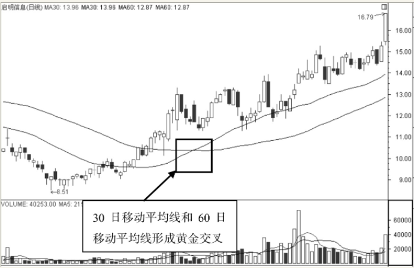

图4.3 启明信息日K线图

如图4.4所示图中选用的两条移动平均线分别为10日移动平均线和30日移动平均线，二者结合使用，既兼顾了中期走势又体现了短期趋势，因此很多投资者经常使用这两个参数。尽管二者配合使用发生黄金交叉的位置较低，信号较早出现，但是信号的可靠性也相对较弱。从图上可以看到，股价从16.10元开始小幅上扬，不久两条曲线便出现了黄金交叉。此时从成交量方面还看不到逐步放量的信号支持，而且此时买入尽管点位较低，但是此后股价并没有立刻上扬，而是始终在移动平均线附近盘整；因此进场较早的投资者应该经受得住时间的煎熬，股价在接连盘整的数个交易日之后，才快速上扬。

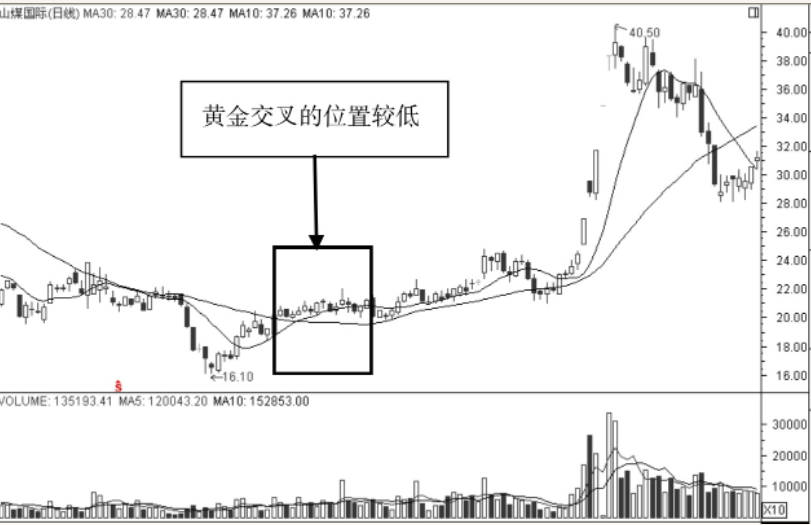

图4.4 山煤国际日K线图

### 银山谷形态
如图4.5所示为均线银山谷形态示意图。该形态是由三条移动平均线形成的，当短期移动平均线和中期移动平均线形成黄金交叉时，就是均线银山谷形态的起始位置，此后短期移动平均线和长期移动平均线形成黄金交叉，而且中期移动平均线与长期移动平均线也形成一个黄金交叉，这样三个黄金交叉就形成了一个向上倾斜的三角形形态。这个三角形形态就是均线的银山谷形态，该形态的出现，说明多头已经吸纳足够的筹码，即将开始向上发力。

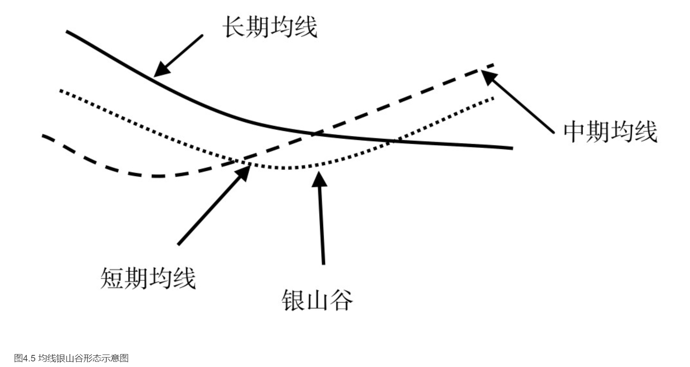

如图4.6所示图中选用的移动平均线分别为5日移动平均线、10日移动平均线、30日移动平均线，属于中短期移动平均线。但是据此来做出买入的决策可以获得不菲的利润。从图中可以看到，股价在2.16元达到最低点，此后不久，三条移动平均线就形成了一个银山谷形态；之后股价一路高涨，成交量也给出了放大的信号。最终股价达到10.75元的高价，如果投资者能够在银山谷形态出现后买入股票，短短的几十个交易日内，资金就可以增长5倍之多。

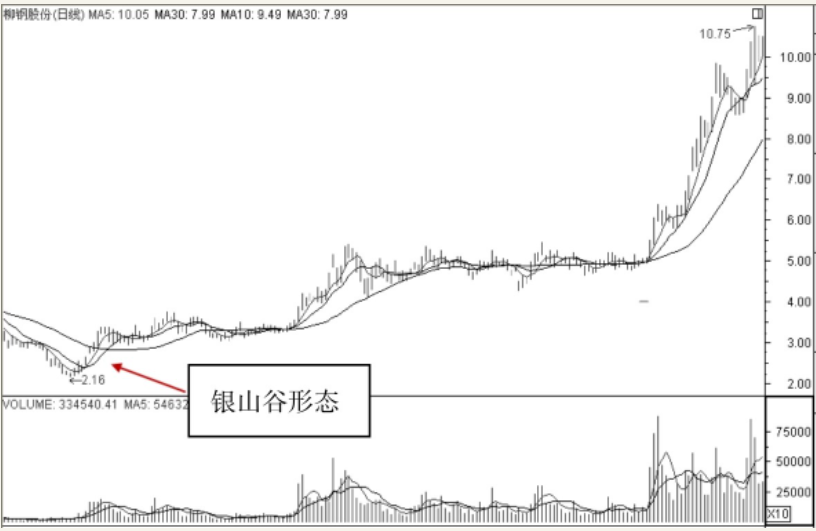

图4.6 武钢股份日K线图

如图4.7所示图中选用的移动平均线的参数分别为5周、10周、30周，因此也属于中短期走势。因为K线图所用的周期为周线，所以又兼顾了中长期的走势。在此例中，银山谷形成的时间较长，股价从8.38元的最低价开始缓慢上扬，而上涨过程持续了数周之后，银山谷形态才最终确立。但是此时成交量也出现了小幅的增长，这也验证了银山谷形态的可靠性。此后股价始终沿着3条移动平均线向上缓慢移动，因此在银山谷形态出现后买入股票，是可以获得不少利润的。

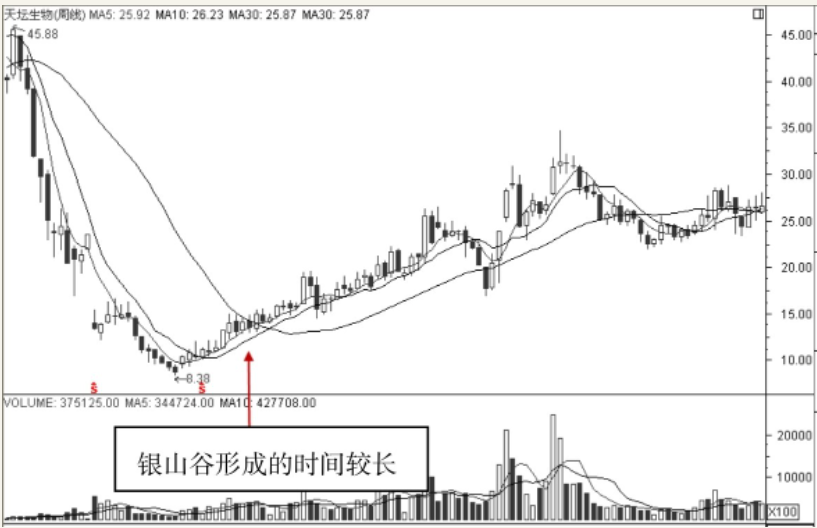

图4.7 天坛生物周K线图

如图4.8所示为建发股份日K线图。从图中可以看到，股价从6.11元开始上扬后不久，5日移动平均线、10日移动平均线、30日移动平均线就形成了一个银山谷形态，而在银山谷形态出现后，投资者应该立即进场。因为此后，股价便迅速上扬，不仅K线实体较大，而且成交量急剧增多，这说明多头向上进攻能力是很强的。如果银山谷形态出现后，投资者稍做迟疑没能及时进场，就会错过此轮暴涨的走势。

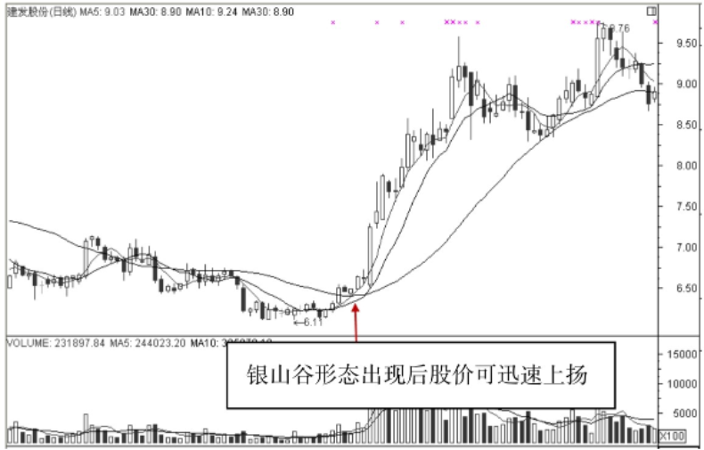

图4.8 建发股份日K线图

### 金山谷形态
如图4.9所示为均线金山谷形态示意图。金山谷形态出现在银山谷形态之后，一般来说，银山谷形态出现在股价刚刚从市场底部启动时，当银山谷形态出现后，投资者也迎来了第一个买入时机，此后股价将向上拉升。如果股价在银山谷形态出现后，拉升了一段距离，再次进行调整，则第二次出现的银山谷形态就称为金山谷形态，在此可以将金山谷形态认定是银山谷形态的一种确认信号。金山谷出现的位置一般要高于银山谷出现的位置，但是当金山谷出现后，说明多头已经吸纳了足够的筹码，未来股价将快速地向上拉升，金山谷的速度和幅度都是银山谷形态出现后所无法比拟的。

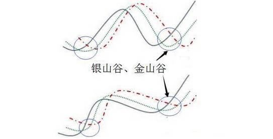

如图4.10所示从图中可以看到，股价从5.10元开始上涨，不久5周移动平均线、10周移动平均线、30周平均线就围成了一个银山谷形态。此后股价小幅上扬，随即便开始回落，在箭头指向位置出现了金山谷形态。金山谷形态出现的位置基本上与银山谷形态出现的位置相当，但是金山谷形态出现时，成交量明显增多，这也是对股价再次上涨信号的确认，同时也是对银山谷进场信号的再一次确认。

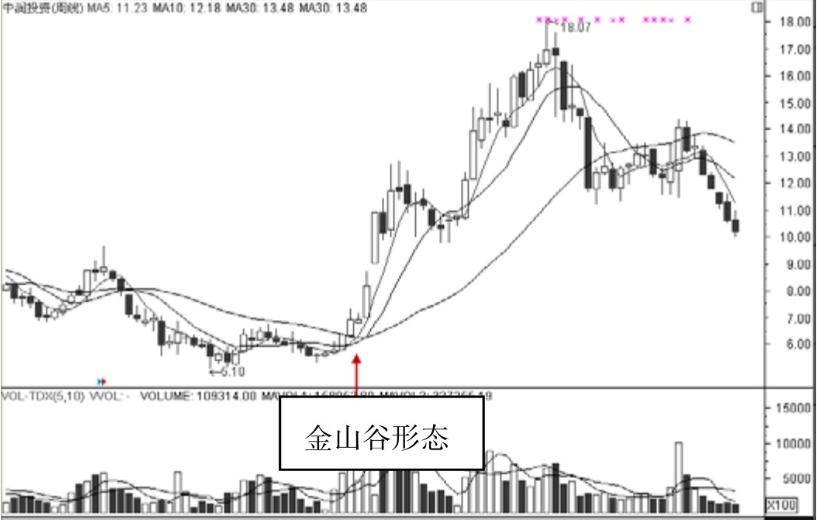

图4.10 中润投资周K线图

如图4.11所示，股价从3.41元开始上行，不久5周移动平均线、10周移动平均线、30周移动平均线就形成了一个银山谷形态。此后股价开始小幅上涨，随即便开始出现回调，在运行到箭头指向位置之时，金山谷形态出现。此时金山谷形态出现的位置要高于银山谷形态出现的位置，随后股价便快速上涨，因此金山谷形态出现时是一个很好的买入位置。从图中也可以看到，股价在此后进入上涨行情时，成交量也出现了快速增长的信号。

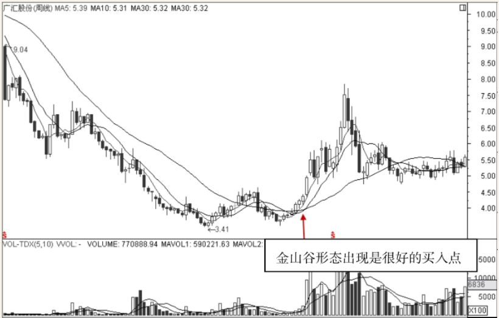

图4.11 广汇股份周K线图

如图4.12所示从图中可以看出，股价从5.35元开始上扬，不久3条移动平均线就围成了一个银山谷形态，此后股价有了明显的上涨行情；上涨后期，股价开始回调，在回调结束后，股价再次上场，并且在箭头出现的位置形成了一个金山谷形态。此时金山谷形态出现的位置要远远高于银山谷出现的位置，尽管此时买入的点位较高，但是一旦买入，就可以追逐后面快速的上涨行情。从图中也可以看到，后面的上涨速度是远远快于前面小幅上涨行情的，成交量也出现急剧增长。

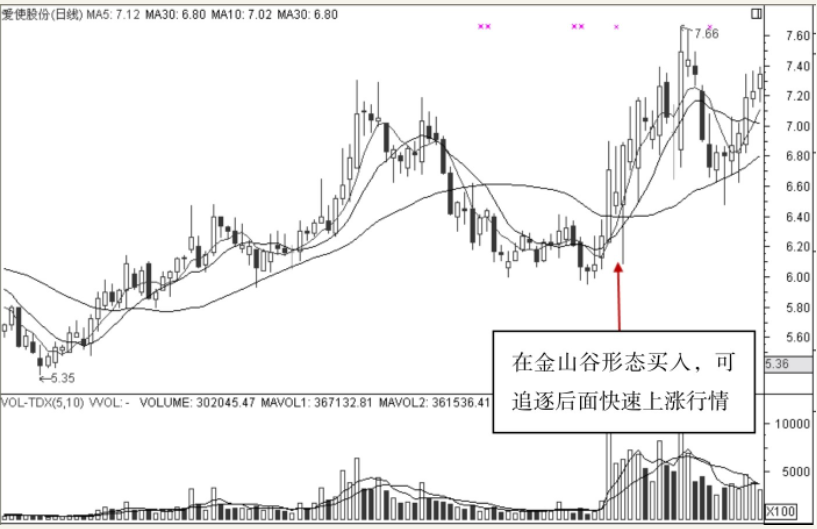

图4.12 爱使股份日K线图

### 多头排列形态
多头排列形态就是常见的一组买入信号，它发出的时间要晚于黄金交叉系列出现的时间，但是准确性却较高。

如图4.13所示为均线多头排列形态示意图。该形态是要求短期均线在上方、长期均线在下方、中期均线则居中的一种排列形式，三条曲线以向上圆弧状的形式运行，互不交叉。

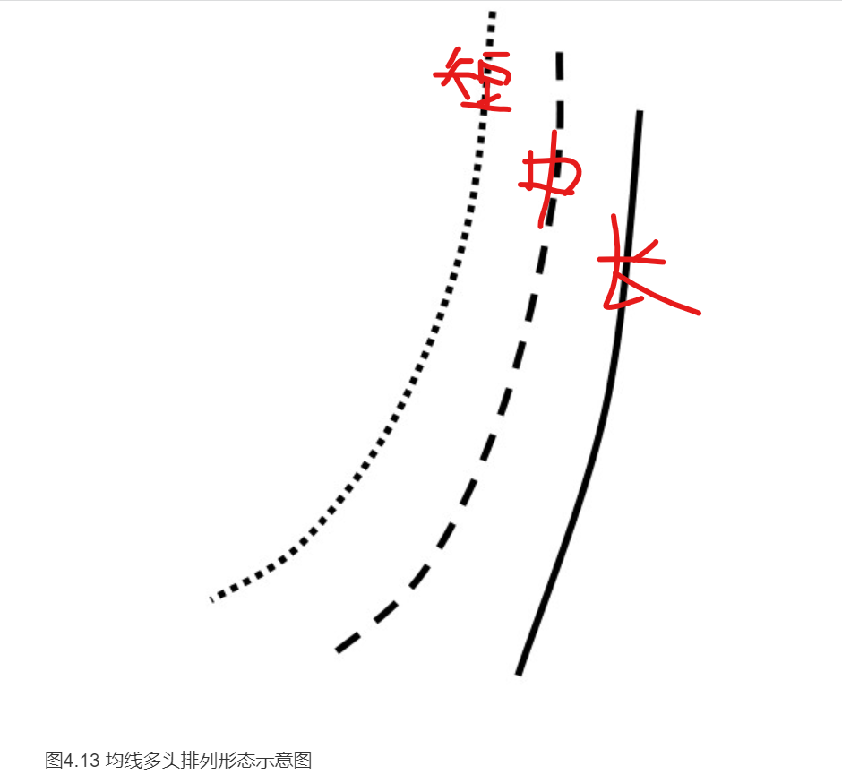

如图4.14所示从图中可以看到，股价从6.11元开始上涨；此后不久，成交量便急剧增多，说明场外的资金在源源不断地进入场中推高股价。而3条移动平均线也给出了多头排列形态，股价受到了3条移动平均线的支撑始终向上大幅移动。

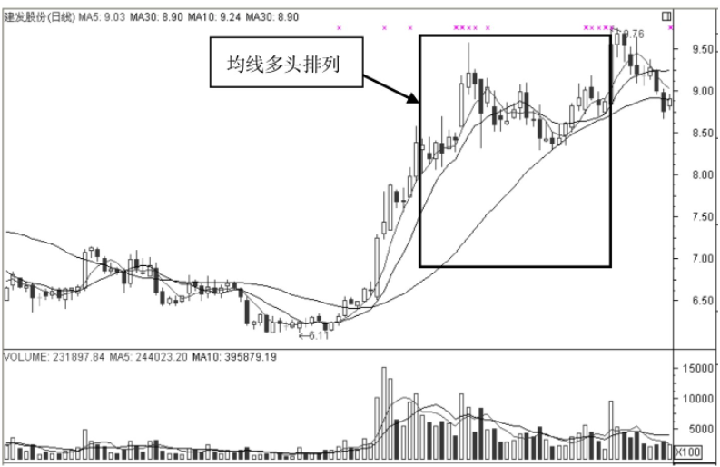

图4.14 建发股份日K线图

如图4.15所示从图中可以看到，股价在市场上经历了漫长的盘整过程，整个时间持续了数月之久。但是当股价最终走出盘整区域之时，3条移动平均线出现了多头排列形态，成交量也明显增多。由此，投资者完全可以进入市场，等待股价即将出现的大幅上扬走势。从后市也可以看到，股价从2元以下直至23.77元的高位，翻了数十倍之多。

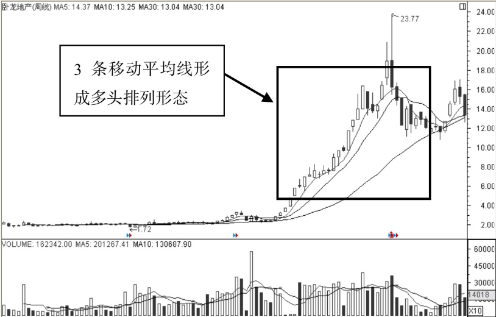

图4.15 卧龙地产周K线图

如图4.16所示，该股股价从6.83元开始上扬，此后不久，均线系统就出现了多头排列形态；而股价也在此形态出现后大幅向上拉升，K线图上出现了一连串的多根大阳线。如果能在多头排列形态出现后介入市场，则股民可以获得将近3倍左右的利润空间。

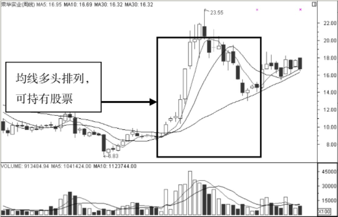

图4.16 荣华实业周K线图

### 首次黏合向上发散
首次黏合向上发散是股价运行到市场的底部，移动平均线最早发出的信号之一。而且移动平均线一出现此种形态，一般意味着后市将出现明显的强势上涨行情。

如图4.17所示为均线首次黏合向上发散形态示意图。此形态一般多出现在下跌的末期，当股价下跌之后，逐步会消化掉一部分做空的动能；因此下跌的速度会减缓，移动平均线也会从向下发散的排列状态逐步收紧，最终黏合在一起。此后如果股价在市场的底部站稳开始向上运行，则均线就会从黏合状态开始向上发散，因此是一个很好的看涨信号。

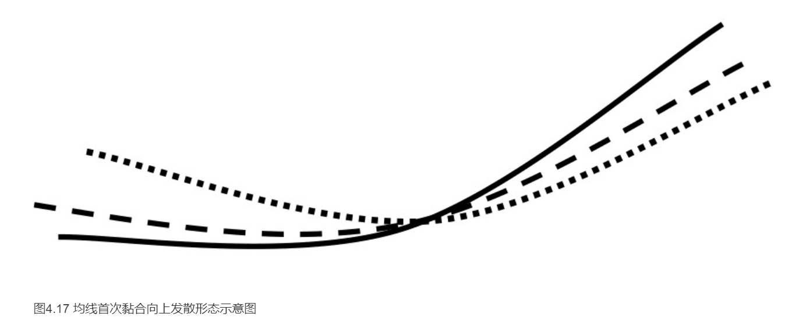

如图4.18所示股价在小幅上扬之后，出现了横盘走势，而且横盘震荡持续的时间很长。在股价宏观震荡的阶段，移动平均线也出现了相互黏合的走势。但是当股价走出横盘区域时，移动平均线出现首次黏合向上发散的形态，成交量也出现了明显增长，因此投资者应该在此时积极地进入市场。此后股价一路高涨，直至23.55元的高价。

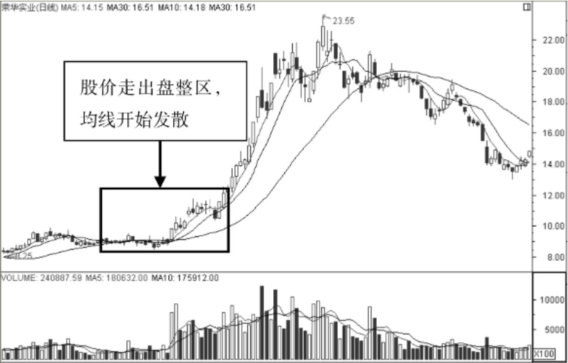

图4.18 荣华实业日K线图

如图4.19所示从图中可以看到，股价从2.16元开始上涨，直至10.75元的高价。上涨幅度几乎翻了5倍，但是在整个上涨过程中并不是一帆风顺的，股价出现了较长时间的横盘整理过程，均线也在大多时间出现了黏合的情况。在图中标注区域，股价走出最终的盘整区域，均线出现首次黏合向上发散形态，成交量也出现明显增长，而本轮上涨行情中的真正快速拉升阶段正是起源于此处。

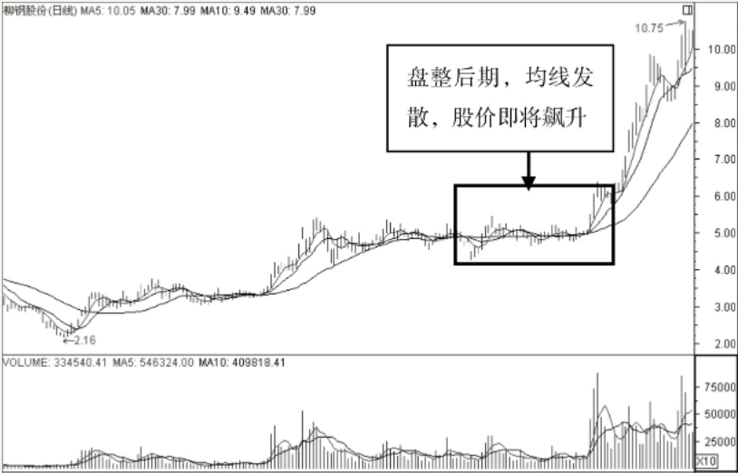

图4.19 柳钢股份日K线图

如图4.20所示为建发股份日K线图。股价从6.11元开始上涨，均线系统也从向下发散状态逐渐黏合，最终出现首次黏合向上发散的形态。因此可以认定，这个形态确定了市场底部的出现。投资者可以在此时积极地买入股票等待股价大幅上扬。

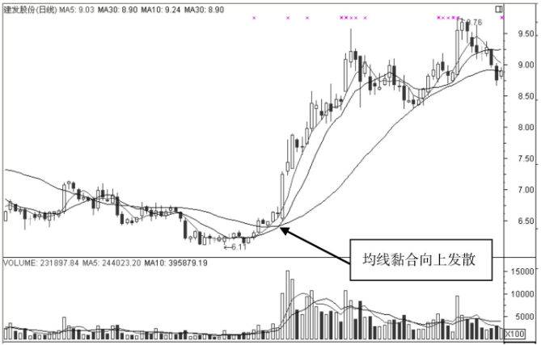

图4.20 建发股份日K线图

### 二次黏合向上发散
如图4.21所示为二次黏合向上发散形态示意图。该形态是指几条均线在此次向上黏合之前，出现过一次向上发散形态；但是股价在首次出现黏合向上发散后没有大幅上涨，便又重新黏合在一起。此时二次出现向上发散，则标志着多头已经攒足了筹码，准备开始大幅向上拉升。尽管此时点位较高，但是未来拉升的幅度将很大，拉升的速度将很快，因此投资者应该积极地进入市场中。

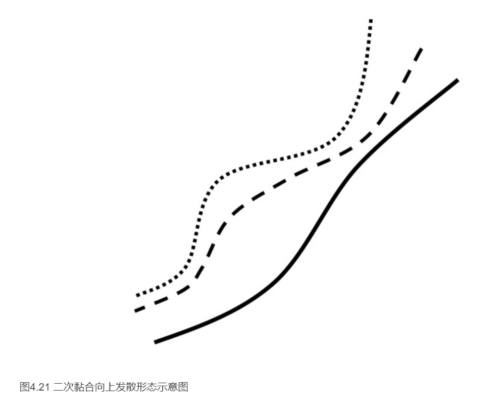

如图4.22所示图中第一个标注区域，是均线系统首次黏合向上发散；此后股价小幅上扬，而且整个上扬呈波浪式形态向上，也就是上涨与下跌交替出现。当股价运行到第二个标注区域时，尽管股价明显要高于第一个标注区域的股价，但是均线系统却给出二次黏合向上发散形态，这也就标志着多头将真正向上发起进攻；此后股价果然快速高涨，几乎以直线的形式向上拉升，直至23.10元的高位。

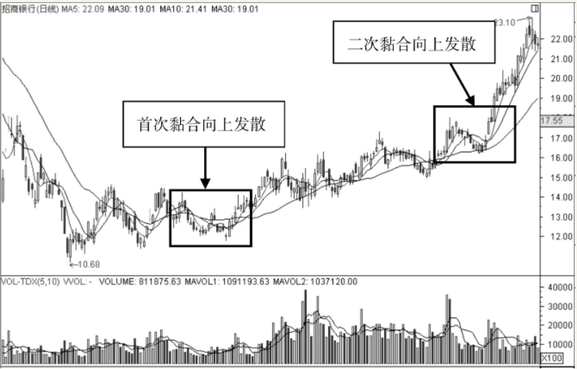

图4.22 招商银行日K线图

如图4.23所示，股价在两个标注区域都出现了黏合向上发散形态，而且股价在两次出现向上发散形态之后都明显给出了上涨的走势。因为均线系统中出现的两次黏合向上发散形态都得到了成交量放量的支持，但是均线二次黏合向上发散形态出现后，股价向上拉升的速度要远远大于首次黏合向上发散时上涨的速度。

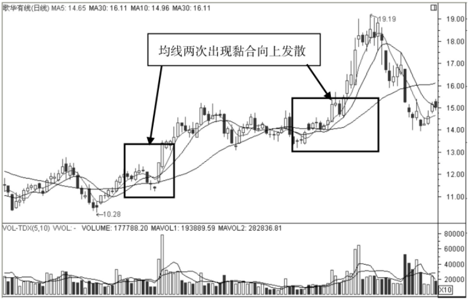

图4.23 歌华有线日K线图

### 首次交叉向上发散
首次交叉向上发散与首次黏合向上发散类似，都是在盘整末期或者市场底部经常出现的一种均线买入信号。而且当首次交叉向上发散形态出现后，一般后市都会出现明显的上涨趋势。

如图4.24所示为首次交叉向上发散形态示意图。随着空方能量的减弱，下跌的脚步也会有所放缓。当股价接近市场的底部时，均线系统会由原来的向下发散逐渐收敛；当股价从下跌行情转入上涨行情时，均线系统会在市场底部形成交叉，并向上出现发散，这就是首次交叉向上发散均线形态。此信号一般标志着市场底部的形成，未来将从下跌行情转入强大的上涨行情，投资者此时介入应该说是非常接近市场的最低价。

如图4.25所示股价从10.77元开始上扬，此后不久，在图中标注的位置，均线便出现了首次交叉向上发散形态。而后市的大幅向上拉升行情正是源于此时的首次交叉向上发散形态，如果投资者能在此处买入股票，则在很短时间内资金就可以翻两倍以上。

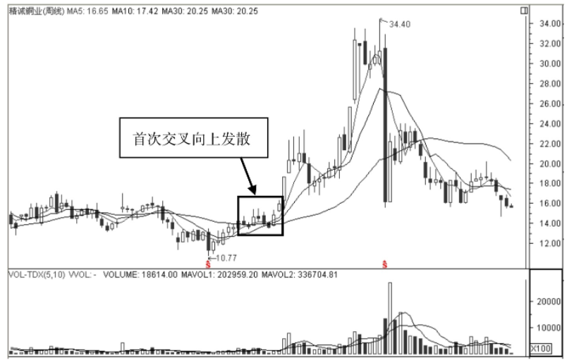

图4.25 精诚铜业周K线图

如图4.26所示日线图是短线交易者非常喜欢分析的交易图表，从这张图表上可以看到，在标注区域，均线给出了首次交叉向上发散形态。正是这个形态结束了原有的盘整行情，使股价从上涨的中途继续向上攀升。而成交量也在此时给出了明显的增长迹象，因此多个交易信号都给了交易者一个进场的提示。

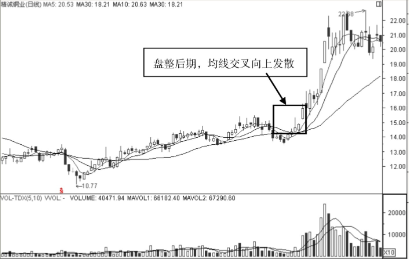

图4.26 精诚铜业日K线图

### 二次交叉向上发散
如图4.27所示为均线二次交叉向上发散形态示意图。该形态是指，均线系统曾经出现过一次交叉向上发散的形态，股价在此后也有了一定的涨幅。但是此后股价会进入一个横盘或者回调的行情中，当股价再次结束回调或者盘整行情时，均线会二次出现交叉向上发散的形态。此时出现的位置往往要高于首次交叉向上发散出现的位置，但是后市上涨的概率也大于首次交叉向上发散出现后的上涨概率。而且后市的上涨速度和拉升幅度一般都是前次形态出现后无法比拟的。

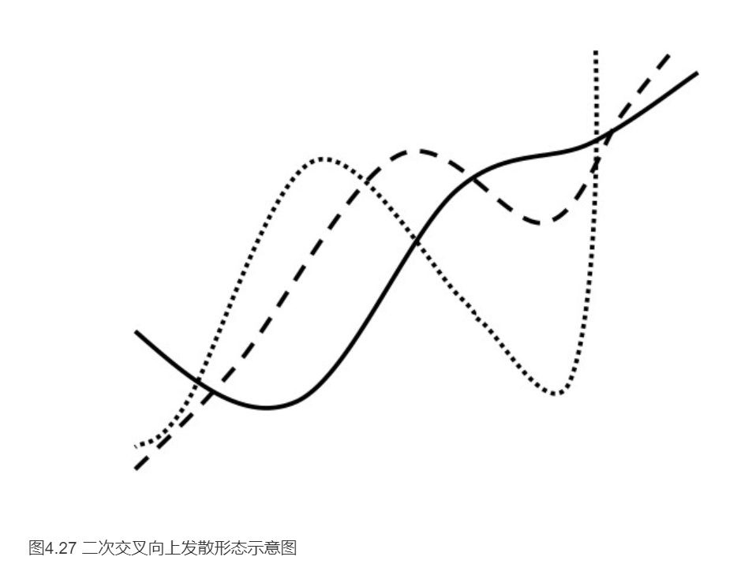

如图4.28所示，图中第一个标注区域是均线首次交叉向上发散的位置，从图中也可以看到，此后股价有了一小段涨幅，但是此后股价便开始向下回调。当股价运行到第二个标注位置时，均线给出了二次交叉向上发散形态，而这个位置明显要高于首次交叉向上发散出现的位置。但是此后，股价便持续上涨，成交量也逐步增多，而且上涨的速度和幅度都是首次交叉发散形态出现后所无法比拟的。

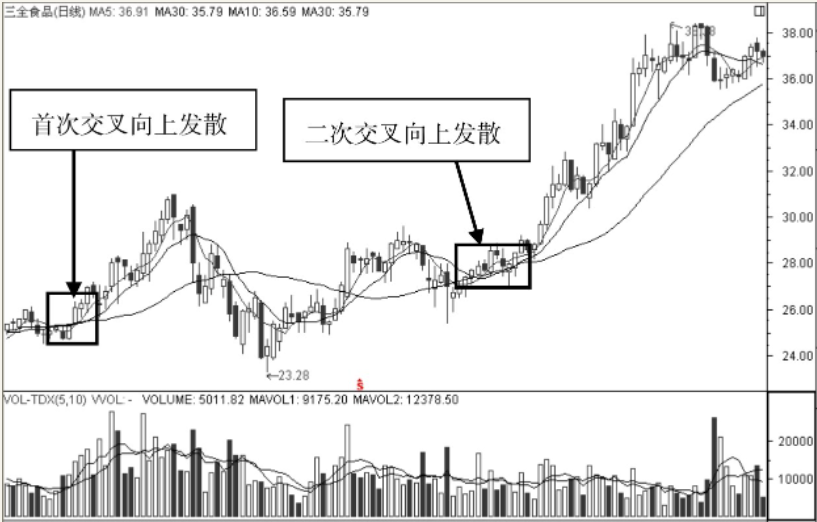

图4.28 三全食品日K线图

如图4.29所示从图中可以看到，均线系统先后两次出现了交叉向上发散形态。而股价真正地大幅度向上拉升是源自二次交叉向上发散形态出现之后。两次交叉向上发散的共同特点是成交量配合明显增长，也就是说投资者完全可以在两处信号出现后买入股票。

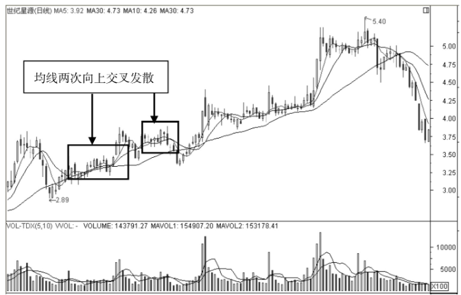

图4.29 世纪星源日K线图

### 逐浪上升
逐浪上升这种均线形态建立在多头排列均线形态之上，因此在外观上逐浪上升形态与均线多头排列形态有相似之处，因此投资者应该对两种形态加以辨别。也可以说，在某种程度上逐浪上升形态是多头排列形态的一种变化形式，隶属于多头排列形态。

1.形态分析
如图4.30所示为逐浪上升形态示意图。此种形态一般出现在强势上涨的过程当中，它要求长期均线位于短期均线和中期均线之下，始终衬托着中短期均线向上攀升。而中、短期均线在上涨过程中可能会出现相互交叉，但是二者不会与长期均线发生交叉。股价在整体上会呈现波浪式上扬态势，因此属于比较明确的买入信号。

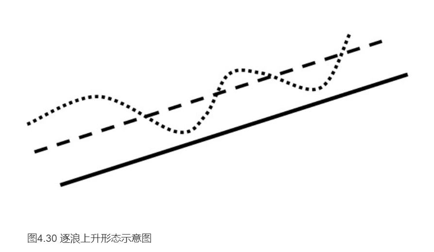

如图4.31所示股价在上涨过程中，5日移动平均线和10日移动平均线曾经相互发生交叉，但是二者均未与30日移动平均线发生交叉，而且30日移动平均线始终在股价下方衬托着股价向上不断攀登。因此说明股价上行的动力十分强大，投资者可以在股价上涨过程中寻找低点买入股票。

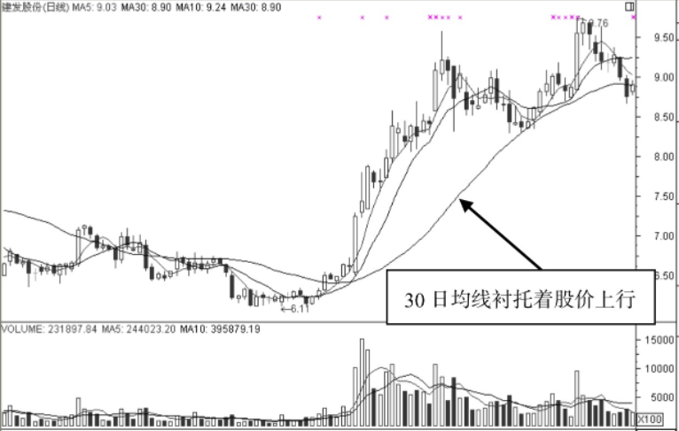

图4.31 建发股份日K线图

如图4.32所示股价从5.10元开始上扬，不久均线系统就出现了逐浪上升形态。5周移动平均线和10周移动平均线曾经相互交叉，但是始终未与30周移动平均线交叉，而且30周移动平均线始终衬托着股价向上不断攀升，整体走势就如同波浪状一样向上移动，说明多头推动股价攀升的能力是非常强大的。而且该K线图为周K线图，说明在很长一段时间内，多头都占据了市场的主动，牛市持续的时间是相当长的。当股价最终突破3条移动平均线之后，投资者就可以获利了结及时出场。

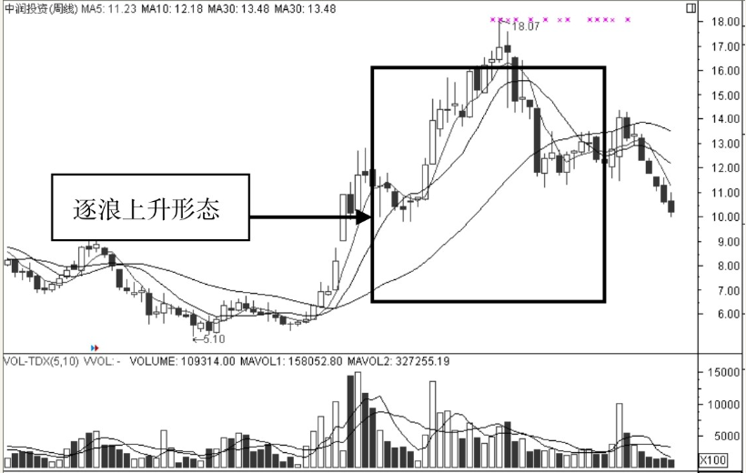

图4.32 中润投资周K线图

如图4.33所示从图中可以看到，在股价强势上涨过程中，出现了多次回调的过程。而伴随着回调行情的产生，5日移动平均线和10日移动平均线多次出现交叉，但是30日移动平均线始终坚定地以保持向上的运行方向衬托着股价向上移动。这就说明即使行情出现回调，也是短暂的，牛市没有结束，行情在短时间内不会转向；因此投资者完全可以买入股票，已经持股的投资者则不要过早地卖出，应该继续持股，等待更大的利润出现。

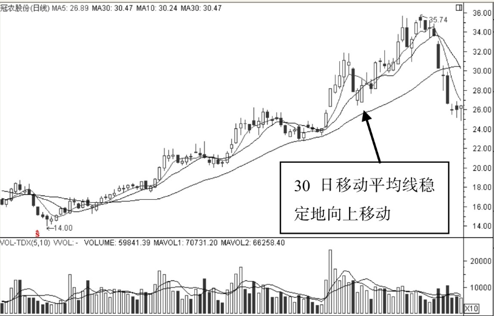

图4.33 冠农股份日K线图

### 蛟龙出海
蛟龙出海形态是均线与K线结合共同发出的一种买入信号。如图4.34所示为移动平均线蛟龙出海形态的示意图。该形态是指，一根大阳线从下向上将短期均线、中期均线、长期均线一通穿越的一种形态。它一般出现在市场的底部或者盘整行情的后期，表示多方突然向上发起进攻，大规模地向上拉升行情就此将要展开。

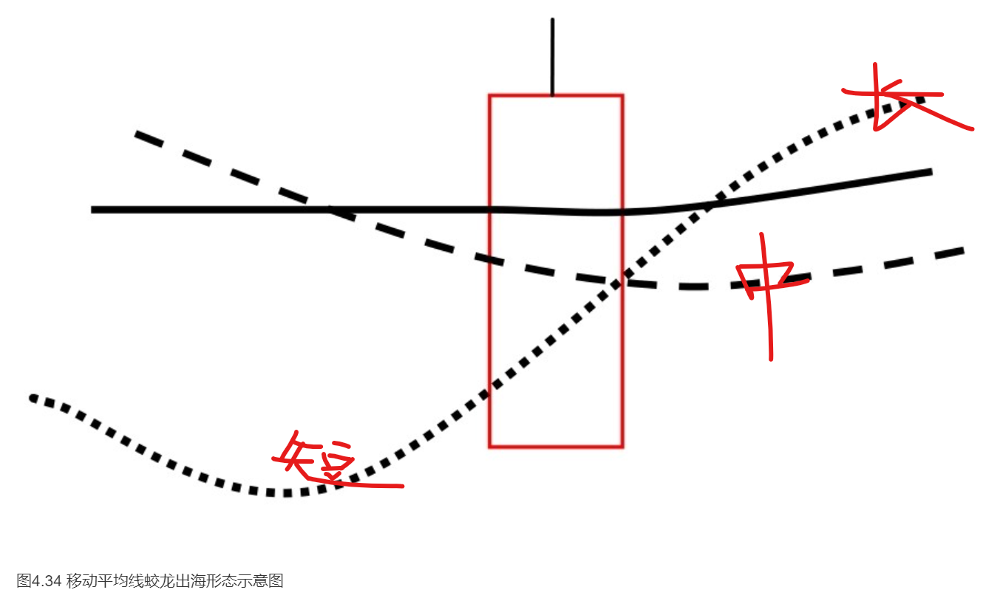

如图4.35所示股价在市场底部盘整多个交易日，在图中箭头指向的位置便是移动平均线和K线结合出现的蛟龙出海形态，也是行情将要突破的一个明显标志。此时一根阳线一举向上突破了3条移动平均线，因此标注着多头已经在市场底部吸纳了足够的筹码，积攒了足够的能量，即将向上发起大规模的进攻。而从后市走势图也可以看到，整轮的大规模上涨行情正是从此开始的。

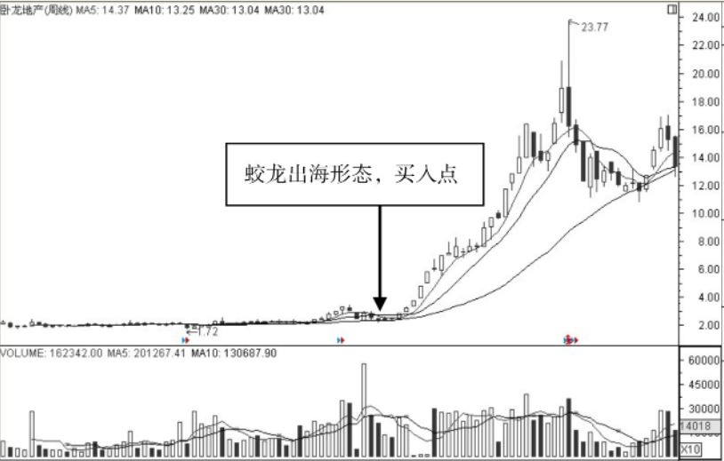

图4.35 卧龙地产周K线图

如图4.36所示图中箭头指向的位置是一个蛟龙出海形态，因为此处的大阳线一举击破了3条移动平均线。不仅如此，此根阳线的实体远远大于之前数根阳线的实体，说明多头已经积攒了足够的能量准备向上发起进攻，因此股民应该抓紧时间进入市场。最后一个交易日开盘时就出现了一个明显的向上跳空行情，这也就更加验证了多头将继续向上发力的推断。

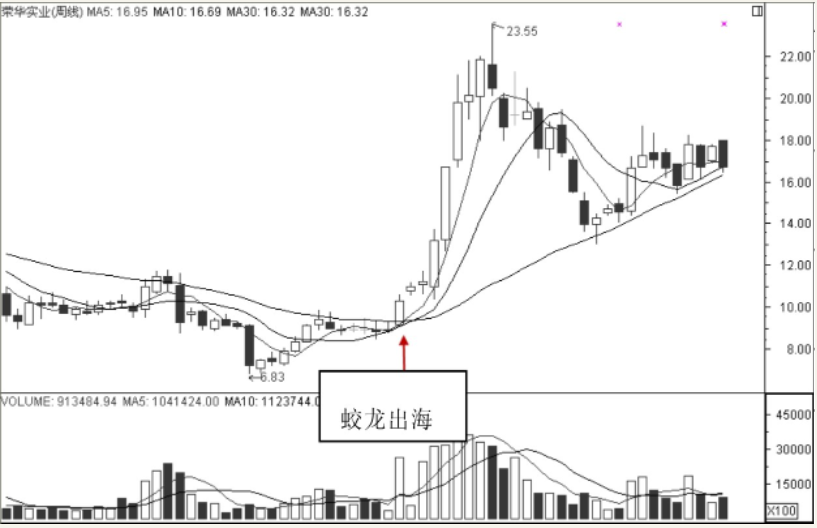

图4.36 荣华实业周K线图

如图4.37所示图中箭头指向的K线一举吞没了3条移动平均线，因此是一个蛟龙出海形态。不仅如此，伴随着蛟龙出海形态的出现，成交量明显增多，此时就是投资者进场的良好时机。从图中可见，自此股价开始一路向上运行。

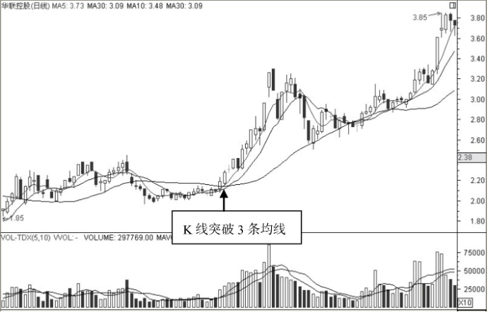

图4.37 华联控股日K线图

### 加速下跌
如图4.38所示为加速下跌形态示意图。该形态是指在下跌过程中，短期均线突然快速下跌，此时短期均线与中长期均线的距离越来越远；尽管股价在此时也是暴跌的走势，但多数情况下这是股价即将到达市场底部的前兆。此后股价往往会从市场底部小幅盘整或者开始向上反弹。因此只要有明确的进场信号出现后，投资者就应该可以考虑进场买入股票了。

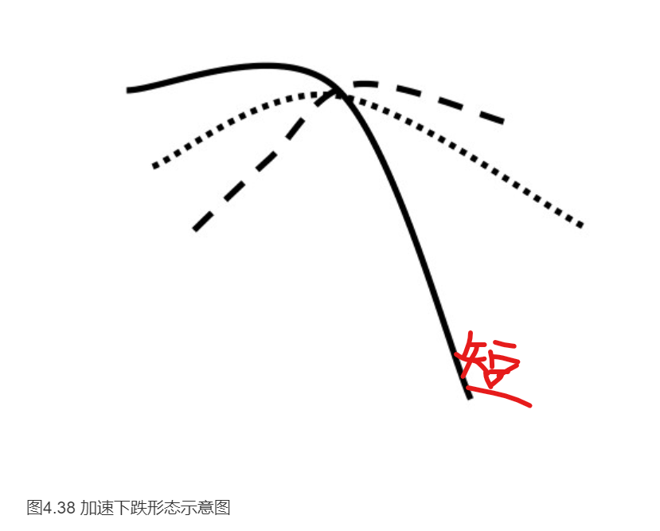

如图4.39所示股价在10.05元达到新低，在此之前，连续多根大阴线出现，而且中间还出现了多次向下的跳空，均线也出现了加速下跌的走势。但是投资者应该清楚地意识到，这是股价即将到达市场底部的信号。当股价在10.05元达到新低时，却出现了一根大阳线，这就是明确的支撑信号，意味着在此处有较强的支撑能力，投资者应该尝试着少量买入股票。

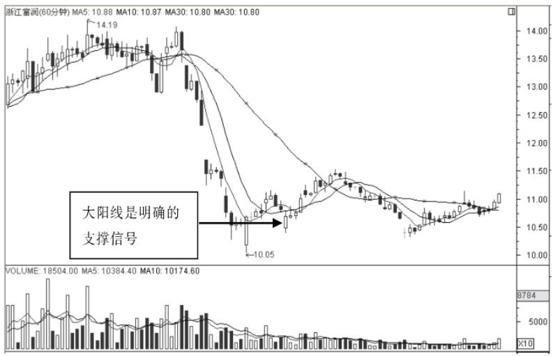

图4.39 浙江富润60分钟K线图

如图4.40所示股价在2.98元达到最低点，而在此之前，中短期均线极大地偏离了长期均线，形成了一个均线加速下跌的形态；因此这也就说明尽管股价处于猛烈下跌之势，但是很有可能已经接近市场的最低价。只要股价有止跌回升的迹象，投资者就可以少量地尝试性买入股票。而股价在达到2.98元时，K线图上留下了长长的下影线，说明在下方的承接能力是较强的；而且成交量也随着股价的小幅上扬而开始增多，说明有一部分交易者已经开始进场买入股票，市场的底部很有可能已经形成。因此在此处敢于买入股票的投资者可以说是获得了一个市场的最低价。

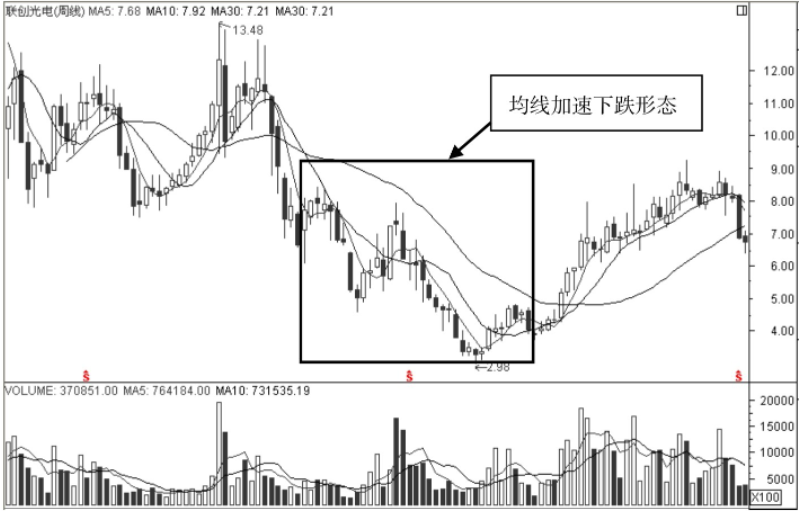

图4.40 联创光电周K线图

如图4.41所示在8.38元达到新低，而此时的股价已经经历了暴跌的行情。尽管在股价下跌的过程中，均线出现了加速下跌形态，中短期均线极大地偏离了长期均线，但是在接近市场的底部时，阴K线的实体明显小于前期实体，说明做空的动能已经有所减缓。因此当股价在8.38元止住下跌的脚步，开始缓慢回升，成交量也从低迷状态逐渐稳步增加时，就是投资者良好的买入时机。

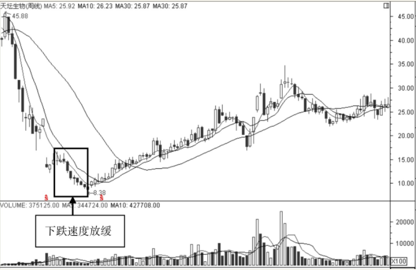

图4.41 天坛生物周K线图

### 上山爬坡
上山爬坡形态也是多头排列形态的一种变化形式，因此外观上与多头排列形态有一定的相似性。它一般出现在上涨的过程中，也是属于做多的信号之一。

如图4.42所示为均线上山爬坡形态示意图。它是指在上涨的过程中，短期移动平均线、中期移动平均线、长期移动平均线沿着一定幅度向上运行。因此从整体上看，多头能够稳步地向上推进股价运行。

如图4.43所示股价从10.68元开始上扬，直至23.10元。在此期间，5日移动平均线、10日移动平均线和30日移动平均线始终沿着一个固定的角度向上攀升，形成了一个上山爬坡形态。因此股民只要见到此种形态，就可以认定市场处于稳定向上攀登的阶段，这一点从成交量上的稳步增加也可以体现出来。

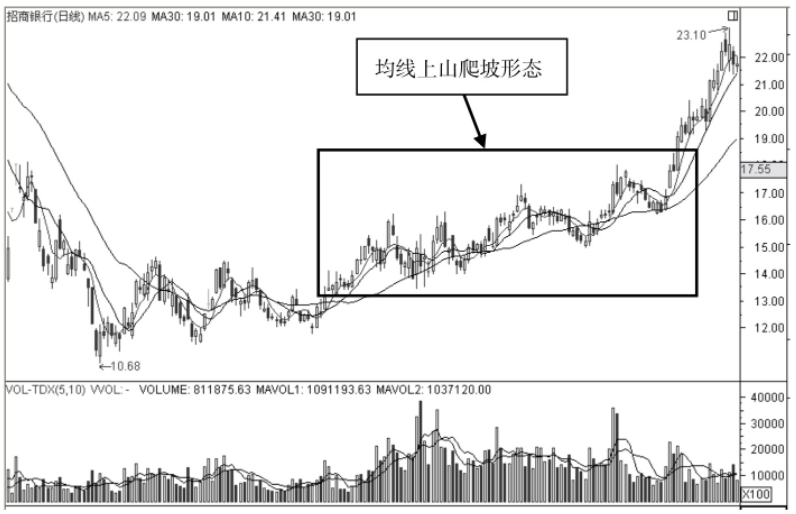

图4.43 招商银行日K线图

如图4.44所示股价从8.38元开始上扬，此后成交量从低迷状态稳步增加，说明多头是稳定向上推高股价的。从K线图上也可以看到，股价并不是立刻大幅上扬，而是沿着移动平均线稳定地向上缓慢上扬。最能体现多头稳定推升股价的就是移动平均线的上山爬坡形态，因为5周移动平均线、10周移动平均线和30周移动平均线始终沿着固定的角度向上攀升。

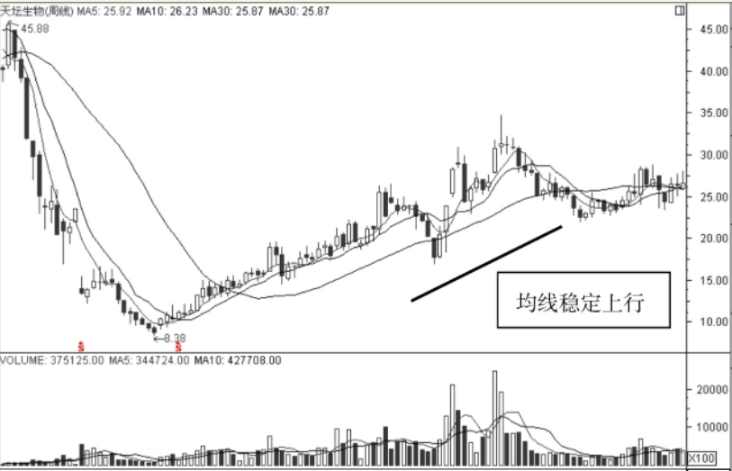

图4.44 天坛生物周K线图

如图4.45所示日K线图是短线交易者所热衷分析的图表，而在此短线交易图表中，3条移动平均线也形成了上山爬坡形态。5日移动平均线、10日移动平均线和30日移动平均线始终沿着固定的角度向上运行，而股价也在稳步地向上拉升。

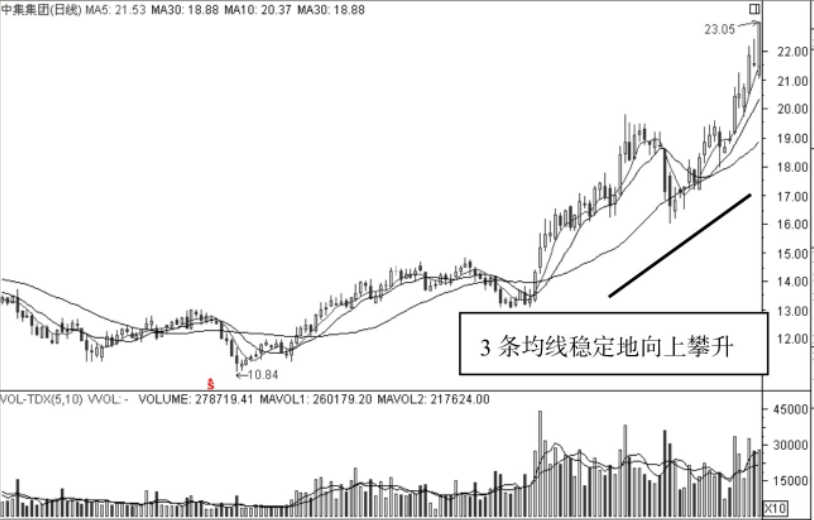

图4.45 中集集团日K线图

### 烘云托月
烘云托月和上山爬坡形态类似，也是从多头排列演变而来的一种均线形态；它也是一种比较明确的看涨信号，一般多出现在盘整的后期或者上涨的中途。

如图4.46所示为烘云托月形态示意图。该形态是指短期均线和中期均线向上缓慢移动，而长期均线也向上移动，但是与中短期均线始终保持着一定距离。

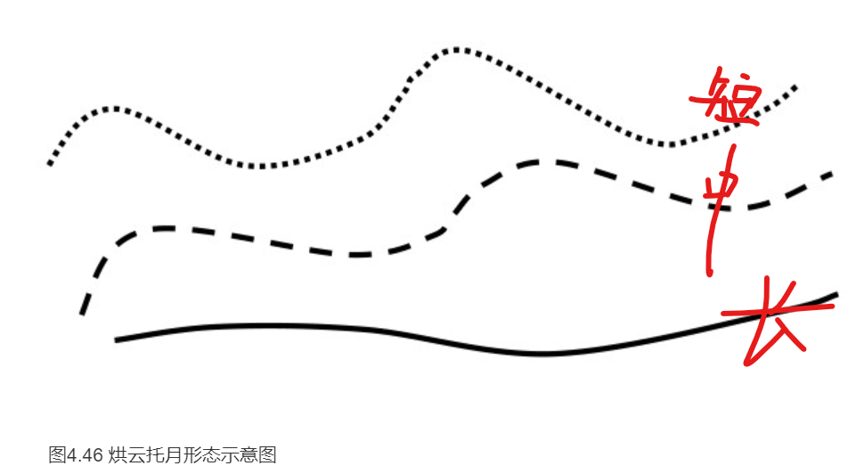

如图4.47所示股价从2.10元开始上扬，而均线也形成了烘云托月形态。30日移动平均线始终位于5日和10日移动平均线下方，并且与二者保持一定距离；而股价也在此均线的衬托下，直升至10.88元的高位，几乎翻了5倍。

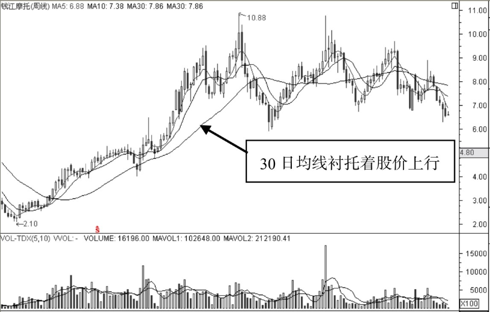

图4.47 钱江摩托周K线图

如图4.48所示股价从5元左右开始上升，均线系统给出了烘云托月形态。由此投资者可以看到，多头稳步地向上逐渐拉高股价。

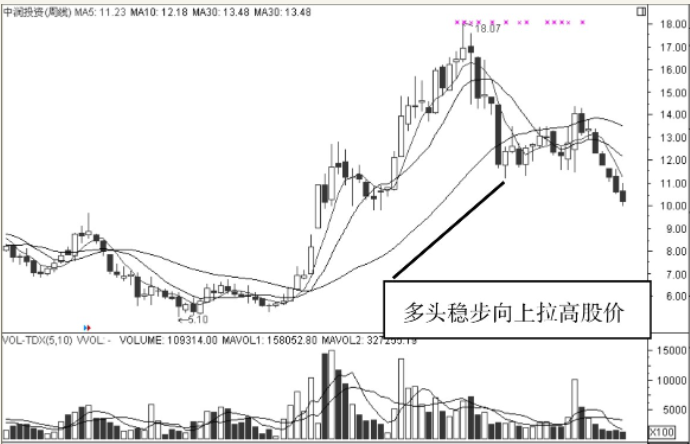

图4.48 中润投资周K线图

如图4.49所示日K线图是短线交易者常用来分析的图。在该图上可以看到，股价从8.80元开始上行，起初上涨速度很缓慢，经过一次回调后，股价开始大幅飙升，成交量急剧增长；均线系统也给出了烘云托月形态，最终股价达到了14.89元的高位。

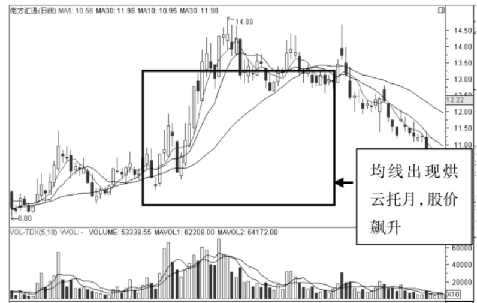

图4.49 南方汇通日K线图

# 均线组合形态卖出点研判
## 典型卖出形态组合
### 死亡交叉
死亡交叉形态是和均线的黄金交叉系列形态相对的形态组合，也是均线系统早期发出的一组信号。死亡交叉系列形态中，`死亡交叉`形态是基础形态，`死亡谷`形态是建立在死亡交叉形态上的，但是二者都是较强烈的卖出信号。

死亡交叉由两条移动平均线组成。由于短周期移动平均线敏感性较强，滞后性较小，因此它要比长周期移动平均线变化快，运行速度快。如果短周期移动平均线从上向下穿越了长周期移动平均线，二者形成的交叉就称之为死亡交叉。

如图5.1所示为移动平均线死亡交叉形态示意图。图中的虚线为短周期移动平均线，实线为长周期移动平均线，这里所谓的长周期和短周期是相对而言的，因此长短周期也不是固定的，而是所用两条均线参数相比较而言。具体的参数周期选择，是根据交易者自身的交易风格与偏好来选择的。

如图5.2所示图中的两条移动平均线分别为30日、60日移动平均线，这两条曲线均可称为中期移动平均线，都属于中长线交易者偏爱的参数。但是二者相比，30日移动平均线称为短周期移动平均线，60日移动平均线则称为长周期移动平均线。箭头所指向的位置，就是二者形成的死亡交叉，此时就是一个卖出的时机。因为参数周期较大，肯定会有较大的滞后性，因此不可能是在市场的最高价21.81元时卖出；但是纵观整个下跌行情，此时卖出依然是比较划算的，此处仅仅是下跌之路刚刚开始。

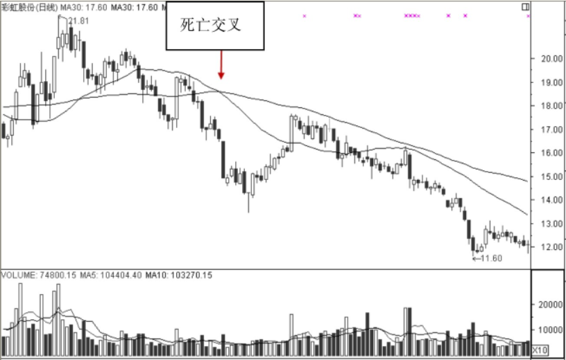

图5.2 彩虹股份日K线图

如图5.3所示图中的移动平均线周期分别为30小时、10小时，二者均是中短期移动平均线，因此滞后性相对来说较小。一般而言，中短线交易者非常偏爱此类周期参数。从图中来看，箭头指向的位置是两条移动平均线形成死亡交叉的位置；与上例相比，此时的卖出信号非常及时，非常接近市场的最高点，在此后，股价还有将近6元的下跌空间。

图5.3 时代新材60分钟K线图

如图5.4所示尽管K线时间周期较长，属于中长线交易者分析的图表，但是图中的均线参数均为短周期，因此二者兼顾也能很好地判断出中长期与短周期的走势。当箭头指向位置的两条均线形成死亡交叉后，卖出的信号就出现了。从图中也可以发现，此时距离市场的高点非常接近，因为此例中均线参数较小，相对于大周期参数而言，滞后性必定会小。

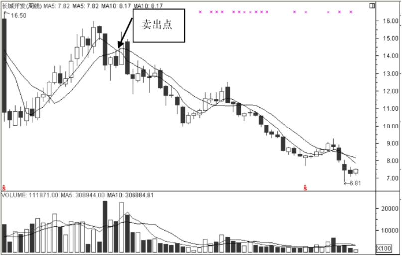

图5.4 长城开发周K线图

### 死亡谷
`死亡谷`形态是从死亡交叉形态演变而来的，它实际上是由3根均线分别形成死亡交叉而产生的；因此产生的时间虽然晚于死亡交叉出现的时间，但是准确率却高于死亡交叉的准确度。

如图5.5所示为均线死亡谷形态示意图。当短周期移动平均线与中长期移动平均线形成死亡交叉，而中长期移动平均线也形成死亡交叉时，3条均线就会围成一个向下的三角形形态，这样就形成了均线的死亡谷形态。从形成过程中可以看到，死亡谷的出现要经过3次死亡交叉的形成，因此有一定的滞后性，但是当它出现后，一般是行情急剧向下的标志。因此如果投资者见到死亡交叉出现，可以在市场稍作停留；如果死亡谷形态出现则应该快速出场，不能做片刻的耽搁。

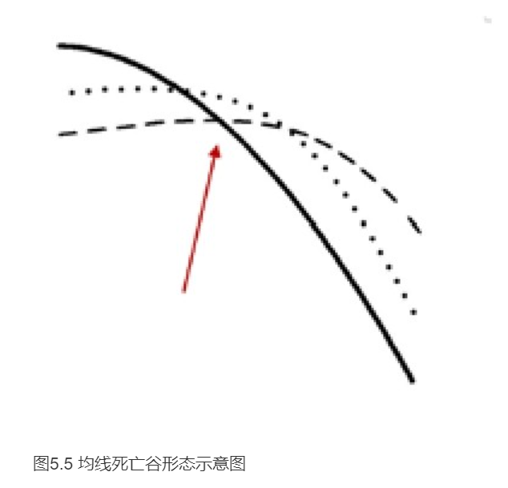

如图5.6所示股价从32.58元开始下跌，不久，5日移动平均线与10日移动平均线便形成了一个死亡交叉。此后不久，5日移动平均线与30日移动平均线，10日移动平均线与30日移动平均线相继形成两个死亡交叉，至此一个标准的死亡谷均线形态便出现了。尽管此形态出现时，股价比死亡交叉式的点位要低，但是依然位于整个下跌行情的最初位置。当此形态出现后，股民必须毫不犹豫地出场，否则便会从30元左右的高位跌至5元左右，可见跌幅之深。

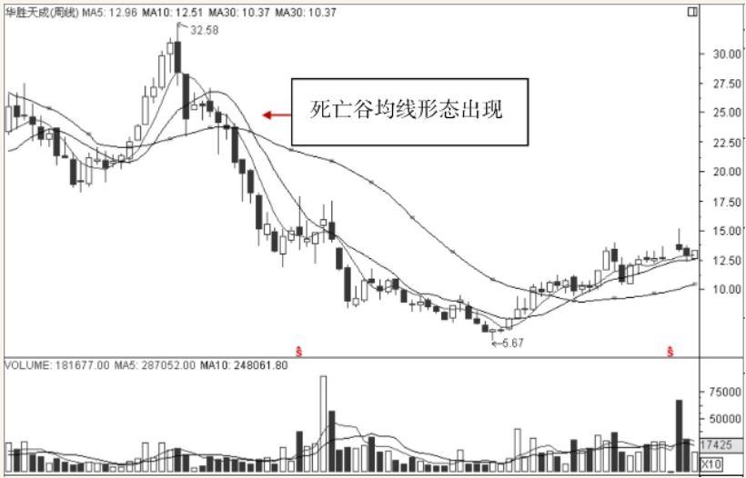

图5.6 华胜天成周K线图

如图5.7所示该图的K线时间周期为周，因此属于中长线交易者分析的图表之一。一般来说，在周K线图中如果出现死亡谷形态，则后市的跌幅相对较大，对投资者的威胁也较大。在此例中也可以看到，尽管均线在形成死亡谷之后，股价在小幅下跌后出现了向上的反弹，但是反弹并没有超过前次高点，因此说明反弹乏力，市场将继续原有的下跌趋势。此时的反弹股民不仅不能进场交易，还应该利用反弹的高点快速出场。此后股价便快速地结束了反弹，从35元左右的高位快速下滑至5元左右。

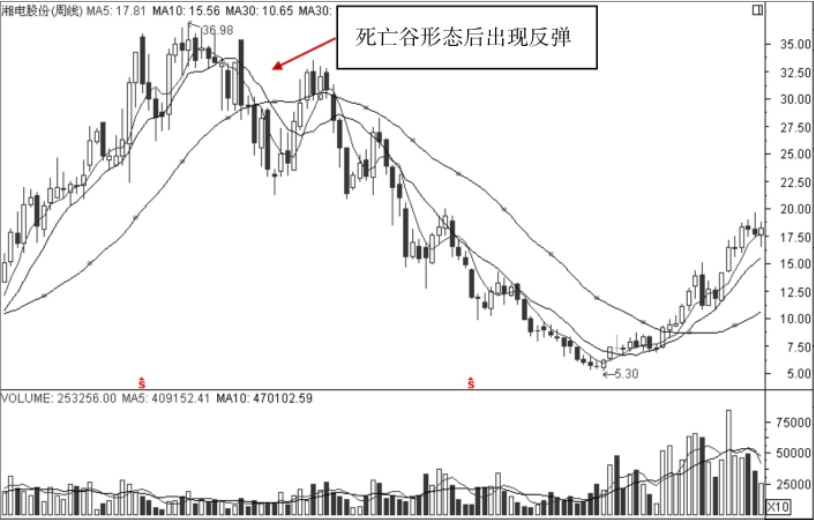

图5.7 湘电股份周K线图

如图5.8所示。一般来说，在日K线图上，由于时间周期较短，股价的跌幅相对来说较小。因此当死亡谷形态出现后，股民可以等待股价向上稍做反弹时，再利用高位快速出场，这样可以减少损失，保住大部分的利润。从图中可以看到，箭头指向的位置是一个死亡谷形态，此后股价出现了向上的反弹行情，如果股民能够正确识别死亡谷形态，就不会误认为股价会向上反转，而进场做多，相反会利用反弹的高价位做出正确的出场决定。

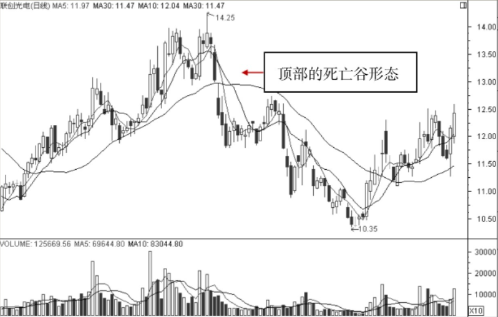

图5.8 联创光电日K线图

如图5.9所示，60分钟的时间周期图是短线交易者常常分析的图表。在这类图中，投资者可以捕捉到更短时间周期内的价格波动。从图中可以看出，股价在上升到12.26元的价格时达到了最高峰，成交量也在此时达到了最大化。此后股价开始下滑，成交量也开始萎缩。不久均线系统便开始调头向下，形成了一个死亡谷形态。而此时，股价距离最高价12.26元为时不远。因此根据死亡谷信号，卖出股票的决策是非常明智的。

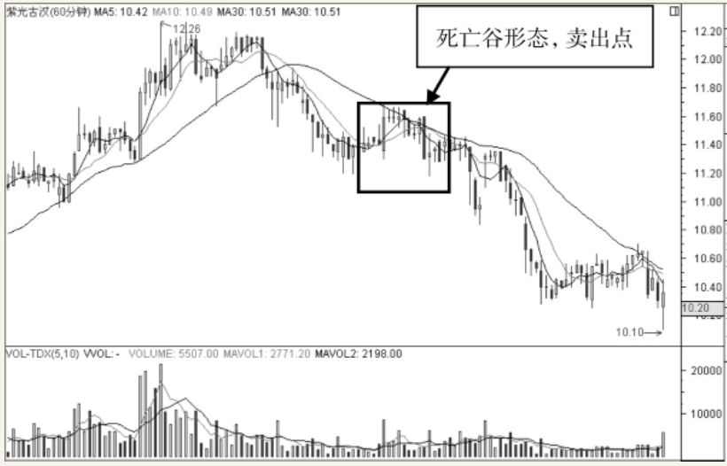

图5.9 紫光古汉60分钟K线图

### 空头排列系列
均线的空头排列系列形态是与多头排列形态相对的形态组合。这组系列形态出现在股价下跌的过程中，并且意味着后市还会持续下跌，因此是告诫场中的投资者尽快出场的一个信号。而想要进场买入股票的投资者，看到这个信号后应该打消买入的念头。

如图5.10所示为均线空头排列形态示意图。它是指长期均线位于均线系统的最上方，而短期均线位于均线系统的最下方、中期均线位于3条均线中间，3条移动平均线以向下发散的形式向下移动，互相并不交叉。

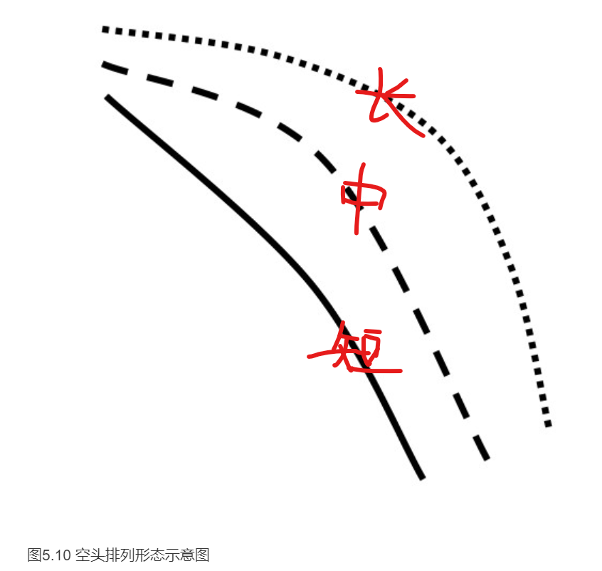

如图5.11所示股价从15元左右开始下跌，直至6元左右宣告结束。在此期间，均线系统给出了空头排列形态，短期均线位于3条均线的下方，而长期均线为3条均线的最上方，3条均线相互交叉，这就说明股价已经处于空头控制之下，而且空头的打压能力非常强劲，短时间内股价不会出现明显的反转行情。

成交量也在整个下跌过程中处于低迷的状态，这也就说明在股价暴跌的过程中没有更多的人愿意进场交易，因此整体的成交情况非常低迷。

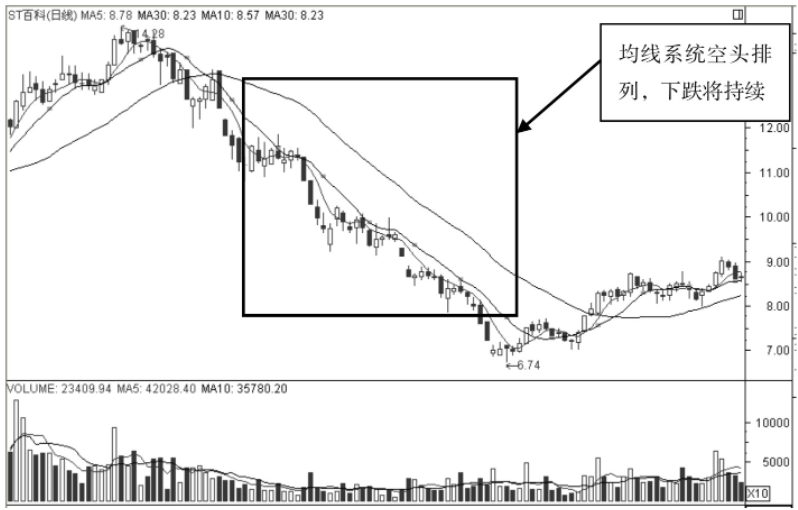

图5.11 ST百科日K线图

如图5.12所示，股价从18.38元开始下跌，直至7.28元结束。在整个下降过程中，多头给出了两次空头排列形态。当股价从市场顶部最先下跌时，均线不久就发出了空头排列形态，而股价也有了一定程度的下跌。此后股价进入横盘整理区域，3条移动平均线也相互黏合缠绕，这说明做空的动能暂时有所放缓，但是并没有明确的迹象说明股价能够开始反弹。

此后，股价走出盘整区域时，继续选择向下突破，而均线系统也再次从黏合状态发出空头排列形态，这就说明空头将继续主宰市场，股价将继续原有的暴跌趋势。

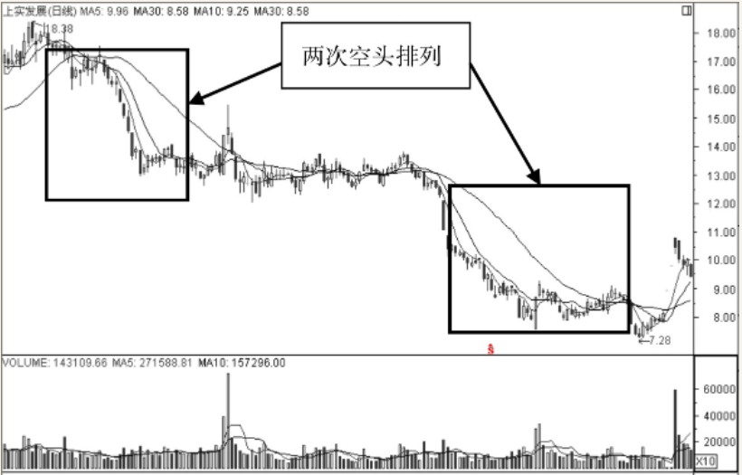

图5.12 上实发展日K线图

如图5.13所示，股价从12.88元开始下跌，在到达市场底部后出现了明显的反弹，但是在反弹至12元左右的价位后，股价再次开始下跌，此时均线也出现了空头排列形态。这就说明短暂的反弹行情已经宣告结束，所以此前进行交易的短线交易者必须在此时出场，因为未来将有很深的下跌空间。

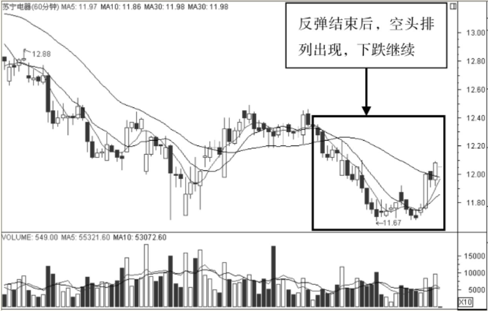

图5.13 苏宁电器60分钟K线图

### 首次黏合向下发散
均线向下发散系列形态是与向上发散系列相对的均线信号。见到均线向下发散，就意味着股价已经到达顶部，至少是阶段性的顶部，因此不能再继续持有股票。而首次黏合向下发散与均线的首次黏合向上发散是一组相反的形态组合。它是股价在市场顶部常常出现的一种早期信号，交易者根据此信号出场往往可以及时地在最高价出场。

如图5.14所示为均线黏合向下发散形态示意图。当股价距离市场顶部越来越近时，多头推动股价上涨的能力也有所减弱，均线系统也会从发散状态逐渐收敛；当股价从市场的顶部开始滑落时，均线系统便会从黏合状态逐渐向下发散，这也就表明了行情已经由多头控制转向空方控制。

股价在下跌过程中，如果出现短暂的盘整行情，则均线也会出现黏合状态。一旦股价走出盘整区域，继续向下暴跌，则均线就会从原有的黏合状态开始向下发散。

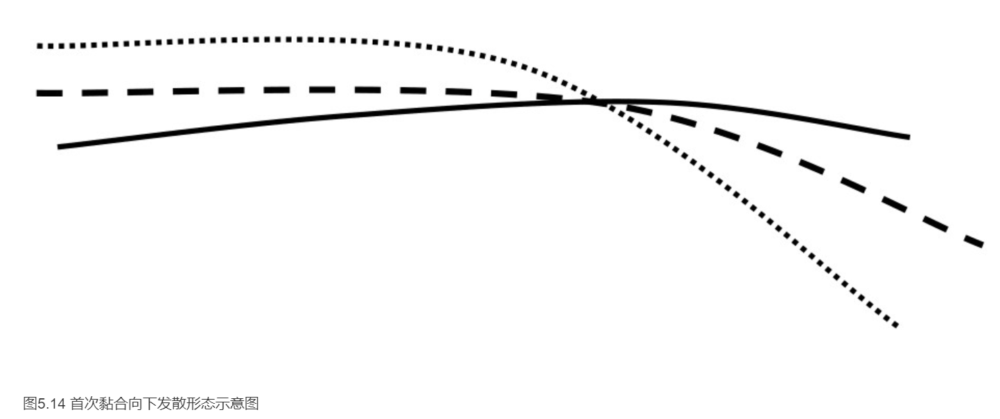

如图5.15所示股价攀升的过程中，在6.68元达到新高，但是均线系统却在逐渐收敛，说明上涨趋势已经有所减缓。当股价从6.68元开始出现下跌时，成交量从高位开始委靡，而股价也横盘整理了很长时间。均线系统在股价盘整的过程中，逐渐黏合。最终股价选择向下突破，均线系统也从黏合状态向下发散，因此投资者在此时应该及时出场，这是市场给投资者最后的出场机会。

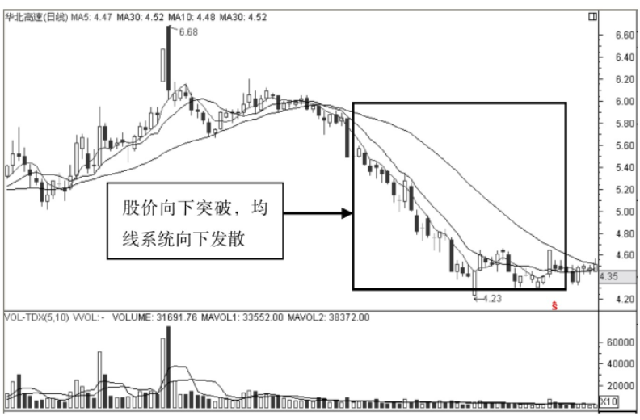

图5.15 华北高速日K线图

如图5.16所示，股价在24.55元达到新高，但是此时股价已经在高位持续震荡数个交易日，均线也逐渐黏合，说明多头的推动力有所衰减。当股价选择向下突破时，成交量也从高位开始回落；更重要的是，均线系统已经出现二次黏合向下发散状态，这就说明未来还会有很深的下跌空间。从后市走势图也可以看到，股价从24.55元直线下跌，直至15.03元结束。

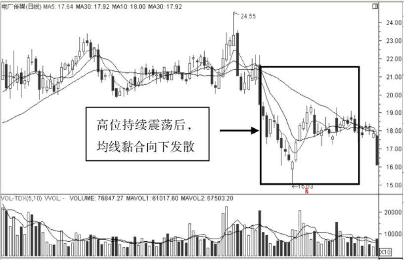

图5.16 电广传媒日K线图

如图5.17所示，从该张图中，投资者可以清楚地看到股价是如何从上涨状态转变为下跌状态的。从图中可以看出，股价从8.80元开始上扬，成交量也不断增多，说明多头在积攒能量向上发起进攻，而均线系统也开始呈向上发散的状态。但是随着股价的不断攀升，多头的动能开始衰减。当股价达到市场顶部附近时，成交量达到最大化，均线系统却不再继续发散而是开始有所收敛，逐渐向黏合状态演变，这就是市场即将到顶的重要标志。

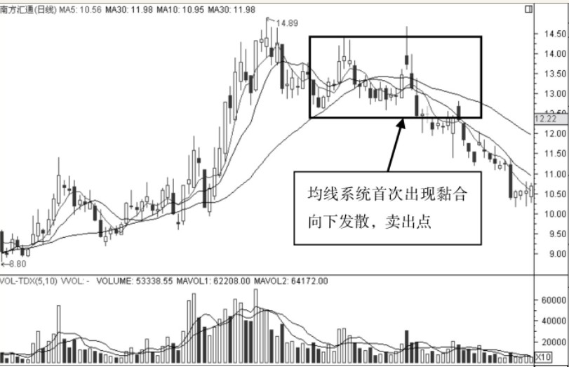

图5.17 南方汇通日K线图

### 二次黏合向下发散
二次黏合向下发散形态与均线首次黏合向下发散形态类似，但是二者出现的位置截然不同。二次黏合向下发散形态多出现在下跌的过程中，预示着后市还会有比较深的跌幅。

如图5.18所示为均线二次黏合向下发散形态示意图。该形态是指均线系统此前已经出现过一次黏合向下发散，但是股价仅有小幅下挫，此后股价会进入到横盘整理区域，均线系统也会再次进入黏合状态。当股价从黏合状态二次向下发散时，就是空头真正开始向下打压股价的时候，因此暴跌的行情即将到来，这也是给股民的最后一次出场时机。

如图5.19所示，股价在市场的顶部停留了很长时间，而均线系统也是相互黏合。当股价达到24.55元时，达到了最高点，下一个交易日便出现了一根大阴线，它打破了原有的盘整格局。均线系统也首次从黏合状态向下发散，这就说明股价将结束上涨的趋势开启下跌之路。

此后股价有了一定的跌幅，不久在下跌过程中出现了短暂的反弹，再次进入横向整理行情中，均线也从向下发散状态再次出现黏合状态，在此过程中成交量不断增多，说明场中的抛盘很多。当均线系统二次黏合向下发散时，就说明空头依然主宰市场，股民不仅不能进场做多反而应该及时出场。此后股价继续下跌，直至14.10元结束。

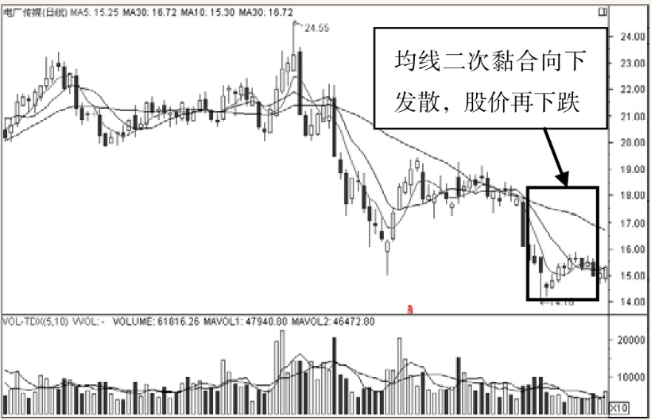

图5.19 电广传媒日K线图

如图5.20所示，该K线图的时间周期为小时，因此是短线交易者所热衷分析的图表。当股价达到18.92元的高位时，K线图上留下了长长的上影线，说明上方有一定的抛盘出现。而且成交量也没有在股价达到新高时出现放量的特点，因此说明上涨的行情很有可能要结束了。

3条移动平均线也开始在市场的高位逐渐收敛结合，这也表明了继续持股有很大的风险，上涨的动力已经开始衰退。当均线系统在市场高位首次从黏合状态向下发散时，就是投资者的第一个获利出场时机。此后股价有了小幅下跌，而后股价再次进入盘整区域。当股价走出盘整区域时，选择了向下突破的方向，而均线系统也出现了二次黏合向下发散形态，这就是市场给投资者最后的一个出场机会。

此后股价开始向下暴跌，跌幅之深和跌速之快，都是均线系统首次黏合K线发散形态出现后所无法比拟的，因此没有出场的投资者遭受的损失不言而喻。

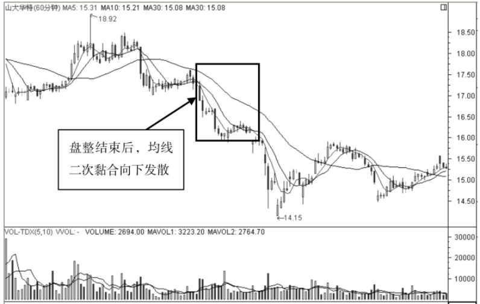

图5.20 山大华特60分钟K线图

如图5.21所示，该图的时间周期为一周，因此属于中长线交易者分析图表。当股价在13.49元时达到了反弹的高位，此时的成交量也明显增多，均线系统开始相互黏合，说明继续持股有很大的风险。

此后均线系统开始在高位向下发散，这是市场给投资者的一个卖出时机。尽管均线系统首次黏合向下发散后，股价没有大幅下跌就进入到了一个横盘整理的过程中；但是在横盘结束后，均线系统出现二次黏合向下发散，这就是市场给投资者最后的一个出场机会。此后股价会加速下跌，是空方真正向下打压股价的时刻。

图5.21 泸天化周K线图

### 首次交叉向下发散
首次交叉向下发散这种均线形态代表股价从上涨行情转入到下跌行情的过程，是股价在市场中不经常出现的一种形态，如果股民能够据此做出卖出的决策，则常常可在市场的最高位附近获利出场。

如图5.22所示为均线首次交叉向下发散形态示意图，该形态一般出现在上涨末期，短期均线、中期均线和长期均线从向上发散逐渐收敛，最终形成交叉并向下发散，这代表股价已经从上涨行情转入下跌行情，因此是市场见顶的标志。后市一般会有较大幅度的下跌空间，投资者看到此信号后应该及时出场退出观望。

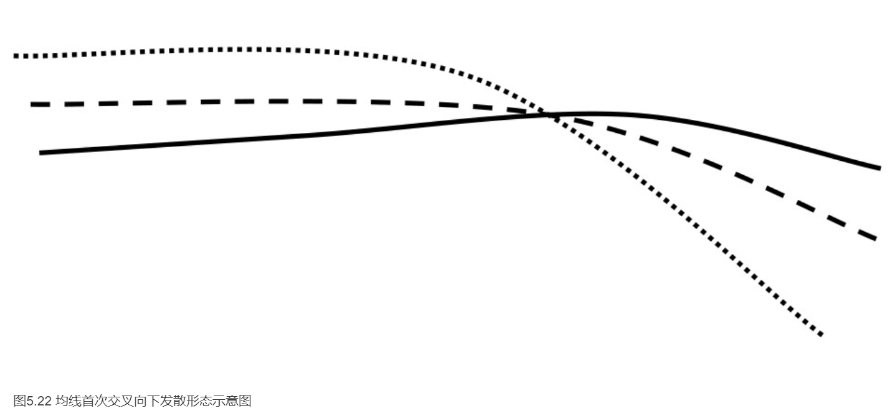

如图5.23所示该图也是短线交易者所热衷分析的图，当股价在下跌过程中出现了一次小幅反弹时，有不少短线交易者纷纷进场交易。但在下跌过程中进行反弹交易时，需要抓住时机及时地出场。而均线系统在股价达到50.48元后不久，便出现了首次交叉向下发散形态，因此股民应该及时出场结束之前的短线交易。此后，均线在形成首次交叉向下发散形态后的下一个交易日，就出现了一个巨大的向下跳空缺口，成交量也开始萎靡，说明市场交易开始比较冷静。

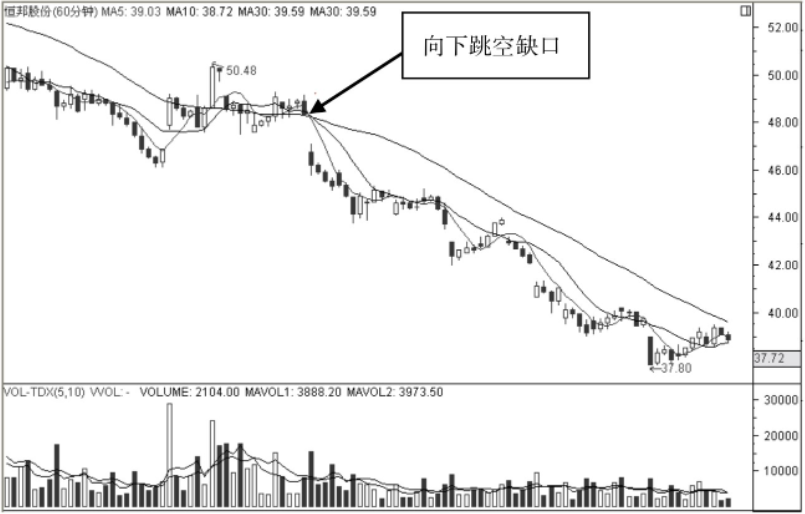

图5.23 恒邦股份60分钟K线图

如图5.24所示，股价在66.11元时，达到了整个上涨行情中的新高。此时成交量明显增多，均线系统却出现了逐渐收敛的迹象。此后股价便小幅回调，当股价结束回调再次上涨时，未能超越前期高点，而且股价在向上时成交量明显低迷。这就说明向上推动的多方能量已经衰退，股民应该及时出场。

在股价从反弹的高位开始回落后不久，均线系统就出现了首次交叉向下发散的形态，而这正是均线系统在市场的高位告诫投资者及时出场的一个警告信号。此后股价便开始直线向下，没有出现大规模地向上反弹，也不再给投资者任何出场的机会。

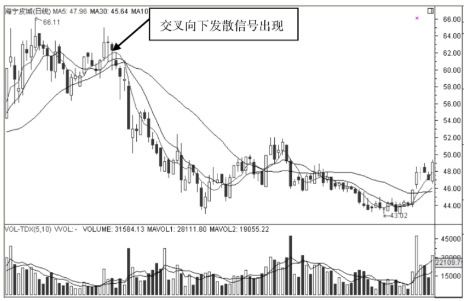

图5.24 海宁皮城日K线图

如图5.25所示，股价在14.89元的价位止住了上涨的脚步，之后股价在高位长期盘整，而均线系统也在箭头指向位置出现了首次交叉向下发散形态。此后股价出现了小幅向上反弹，但是此时股民不仅不能进场做多，还应该利用高价位快速出场。因为成交量不仅没有出现支持股价上涨放量的信号，而且还在这些图上留下了长长的上影线，说明上方有一定的抛盘力量。均线系统发出首次交叉向下发散信号，就代表着行情已经出现了转向，空头已经开始向下打压，因此尽快出场才能避免更大的损失。

图5.25 南方汇通日K线图

### 二次交叉向下发散
如图5.26所示为均线系统二次交叉向下发散形态示意图。该形态是指此前均线系统已经出现过一次交叉向下发散形态，股价也已有了一定的下跌幅度。但是当股价再次进入盘整行情时，股民需密切注意股价在突破盘整区域时的方向。一旦股价结束盘整行情，均线系统二次出现交叉向下发散，就意味着股价将继续下跌，空头真正向下打压股价的时刻正是此时。

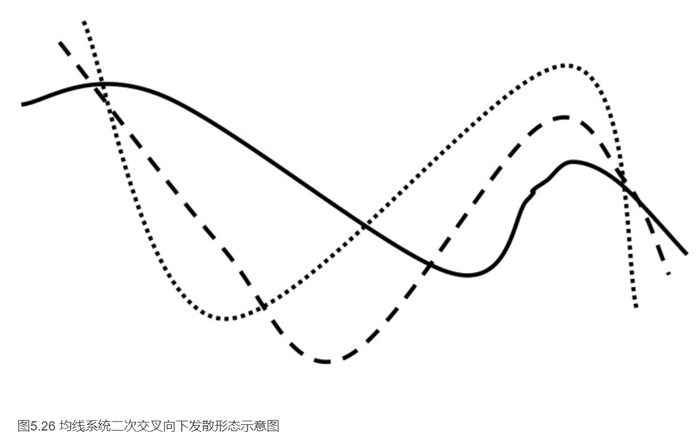

如图5.27所示，股价从10.13元开始下跌，均线系统在下跌后不久便出现了首次交叉向下发散形态，正是图中第一个箭头指向的位置。此后价格开始下跌，但是不久后股价在下跌的中途又出现了向上的反弹行情；然而此次反弹之时成交量没有增多，因此说明上涨是无力的。此后股价便开始下跌，而图中也出现了均线系统的二次交叉向下发散，这也正是图中第二个箭头指向的位置。此后股价还有较深的下跌空间。

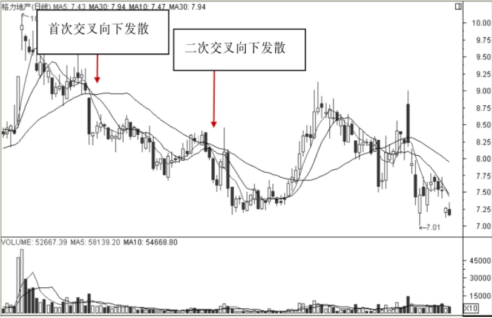

图5.27 格力地产日K线图

如图5.28所示，股价在达到10.51元时，创造了市场的顶部。此后股价在高位持续震荡，当一根大阴线出现后，打破了震荡的格局，股价开始下行。均线系统也首次出现交叉向下发散形态，这正是图中第一个箭头指向的位置。此时成交量也从高位开始逐渐萎缩，在下跌过程中，股价出现了一轮较为强劲地向上反弹行情。但是均线二次交叉向下发散形态结束了短暂的反弹行情，股价开始继续向下跌落，因此没有出场的交易者此时必须快速出场。

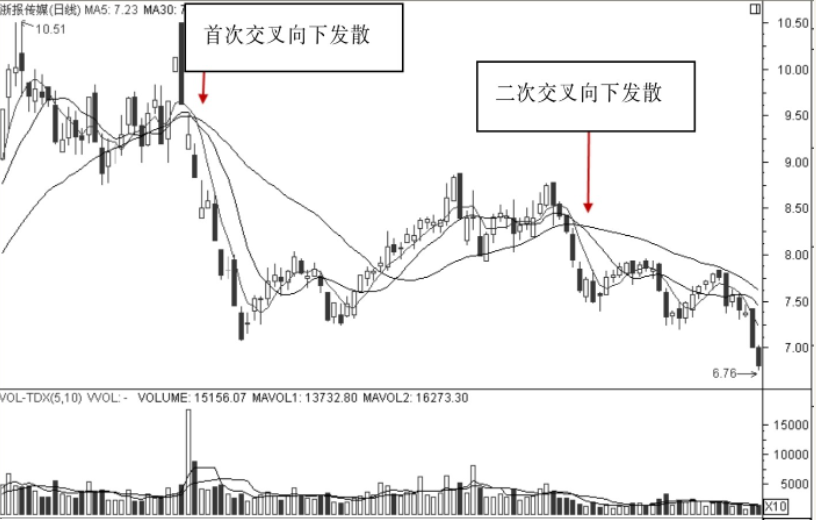

图5.28 浙报传媒日K线图

### 逐浪下降
逐浪下降均线形态与逐浪上升均线形态是一组相反的均线形态，它一般出现在下跌的过程中，是隶属于空头排列形态的，因此与空头排列在外观上有一定的相似性。当该形态出现后，一般也预示着后市将持续一定的下跌时间，因此投资者应该尽快出场，而不能过早地进场交易。

如图5.29所示为逐浪下降形态示意图。该形态是指股价在下跌过程中，3条移动平均线也向下运行。但是长期均线位于3条均线的最上方，短期均线位于3条均线的最下方，短期均线和中期均线在下跌过程中可以出现相互交叉，但是中短期均线不会与长期均线发生交叉。

如图5.30所示，股价在反弹的后期达到50.48元的高位，此后便开始迅速下跌，中期均线和短期均线在下跌过程中出现了交叉，但是长期均线始终在两条均线之上压制着股价向下运行，因此均线给出了一个标准的逐浪下降形态。这说明空头向下打压股价的能量是比较稳定的，短时间内股价不会出现明显的反转走势，股民不能过早地进场，成交量在下跌过程中持续低迷就说明没有过多的资金流入市场推升股价。

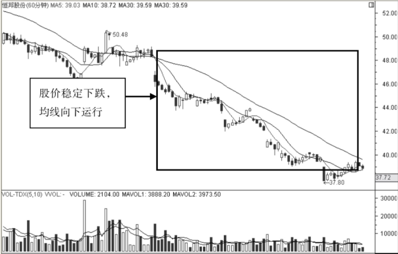

图5.30 恒邦股份60分钟K线图

如图5.31所示，从这张日K线图上可以清楚地看到股价从上涨行情转入下跌行情的过程。股价在达到14.89元的高位前，持续多个交易日的上涨走势，而且均线也出现了多头排列，说明多头向上推动的能力是相当强大的。但是股价在运行到14.89元附近的高位时，停止了上涨的脚步，成交量也从最大开始逐渐缩小，说明没有更多的多头愿意继续提升股价。

更重要的是，当股价在市场高位结束横盘整理之后，均线系统出现了逐浪下降形态。5日移动平均线和10日移动平均线相互交叉，但是总体方向向下运行，30日移动平均线始终压制着股价向下运行。在此期间，股价没有出现明显大幅向上反弹的走势，因此投资者可以清楚地看到，原有的上涨趋势已经宣告结束，未来的下跌之路将会十分漫长。

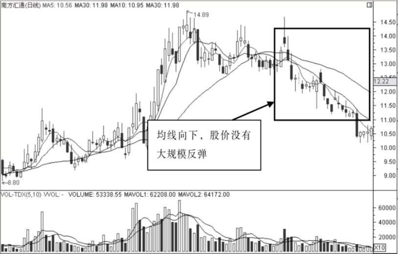

图5.31 南方汇通日K线图

如图5.32所示，股价从10.51元附近的高位开始下跌，均线也开始大规模向下发散，说明股价下跌的程度很深。在反弹的过程中均线系统出现了逐浪下降形态，5日移动平均线和10日移动平均线相互交叉，这说明股价曾经出现过向上的反弹行情；但是反弹行情持续的时间不长，且反弹的幅度较小，因此股价始终受到30日移动平均线的压制而未能成功向上突破。

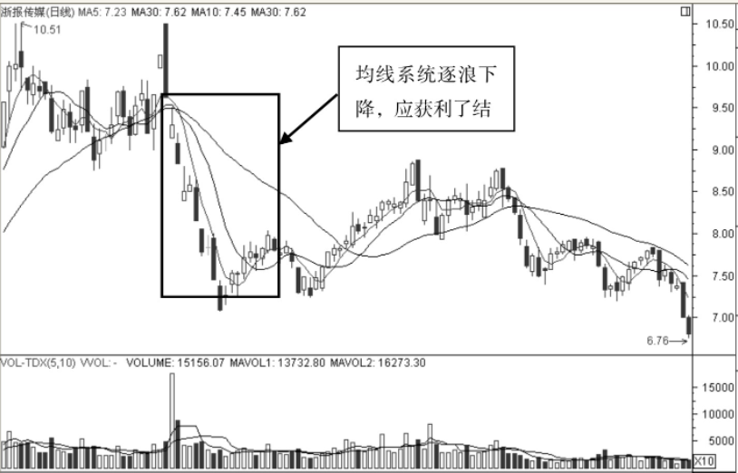

图5.32 浙报传媒日K线图

### 断头铡刀
断头铡刀就是均线系统与K线系统完美结合发出的一种卖出信号，它和蛟龙出海形态是一组相反的均线形态。该形态出现后，投资者应该尽快地出场，而且该形态常常是出现在市场刚刚下跌之初，此时获利出场可以规避很大的风险，而且卖出的点位较高。

如图5.33所示为均线断头铡刀形态示意图，它是指一根K线从上向下同时击穿短期移动平均线、中期移动平均线和长期移动平均线，这说明在市场的高位空头积攒了足够的能量，大幅度降价向下打压，因此后市将继续延续这种下跌的走势，是投资者及时出场的标志信号。

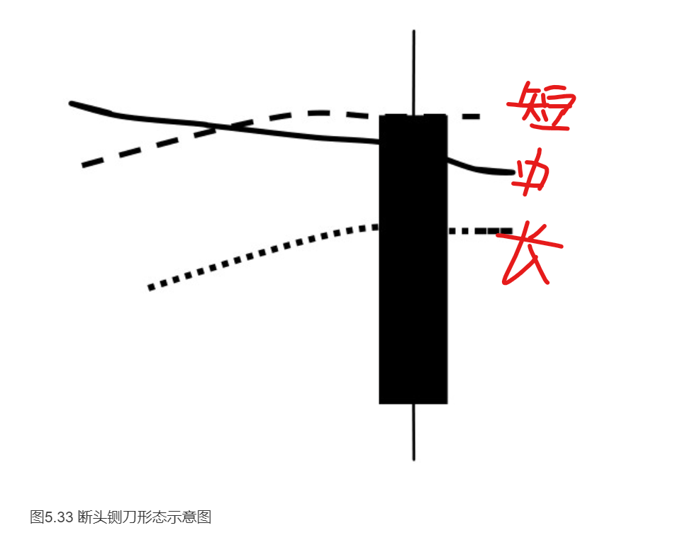

如图5.34所示，股价在14.89元达到新高，也结束了原有的上涨行情。此后股价在高位持续震荡，但是在股价运行到箭头指向的位置时，一根阴线同时击破了5日移动平均线、10日移动平均线和30日移动平均线，形成了一个断头铡刀形态，这就是一个典型的卖出信号。不仅如此，该阴K线还有长长的上影线，说明上方已经有足够的空头来打压股价，自此股价便开始迅速下滑。

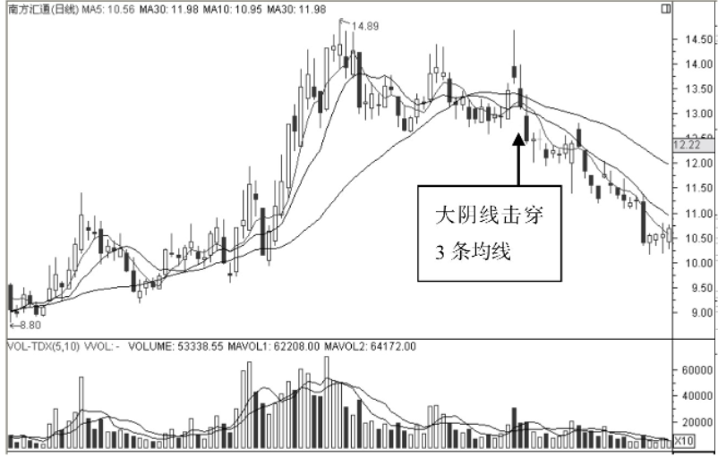

图5.34 南方汇通日K线图

如图5.35所示，股价从10.13元开始下跌，在下跌的途中出现了一次反弹行情。图中指向的位置是反弹行情的末期，也是此次反弹趋势的最高处。成交量在反弹过程中并没有增多，这也就说明反弹持续的时间不会太长，反弹的幅度也不会很大。交易者如果进行短线的交易，必须能够及时获利出场。而箭头指向的K线和3条移动平均线形成了一个断头铡刀形态，这就给了投资者一个明确的出场信号，此后股价继续原有的下跌方向运行。

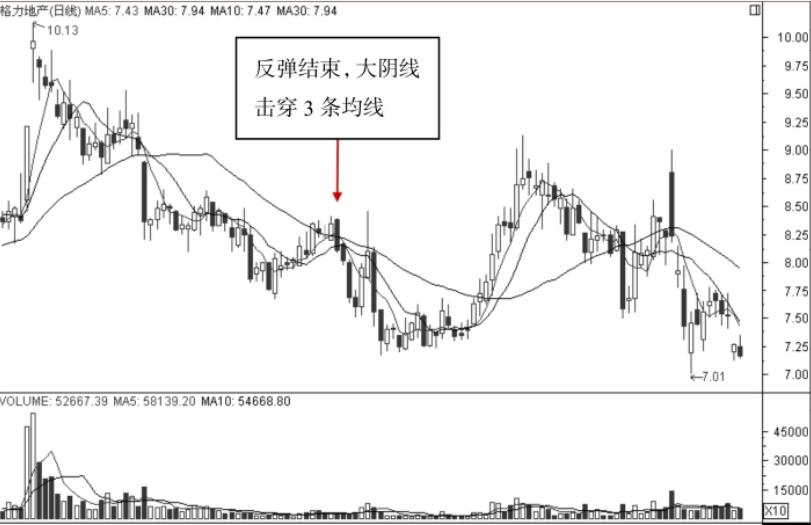

图5.35 格力地产日K线图

如图5.36所示，股价在市场的顶部附近持续了漫长的盘整过程，在此期间成交量非常低迷，说明没有过多的资金能够继续向上提升股价。而在箭头指向的位置，一根大阴线同时向下突破了3条移动平均线，形成了一个断头铡刀形态，给了投资者一个出场的信号。尽管此时股价依然处于盘整后期，但是已经表明股价在未来的方向有很大可能是向下突破的，因此此时出场可以避免较大的经济损失。

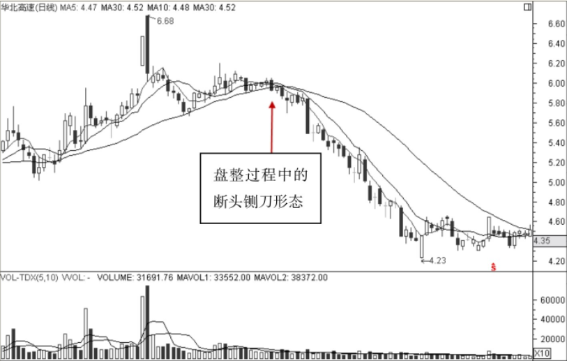

图5.36 华北高速日K线图

如图5.37所示，在这张交易图中，不仅交易周期较短，而且断头铡刀出现的位置也比较特殊。该形态出现在了反弹的后期，而且该反弹持续的时间非常短暂，反弹的幅度也非常小，在断头铡刀形态出现后，就说明短暂的反弹结束了。

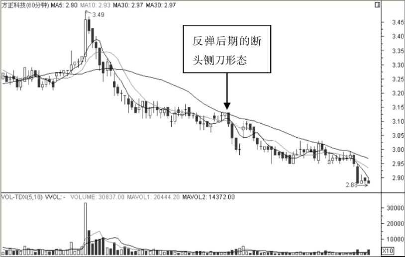

图5.37 方正科技60分钟K线图

### 加速上涨
它出现在上涨的过程中，当它出现后一般表明上涨的趋势已经接近尾声，未来不久股价将要开始转入下跌的行情中。

如图5.38所示为均线快速上涨形态示意图。该形态一般出现在上涨后期，股价在没有大幅上升之前，均线系统呈现缓慢上升的状态，突然股价在某个价位开始快速上升，上涨速度越来越快。而在此时，均线系统也会出现加速上涨之势，短期移动平均线会因为自身的灵敏性而快速上扬，与中长期移动平均线的距离越来越远。

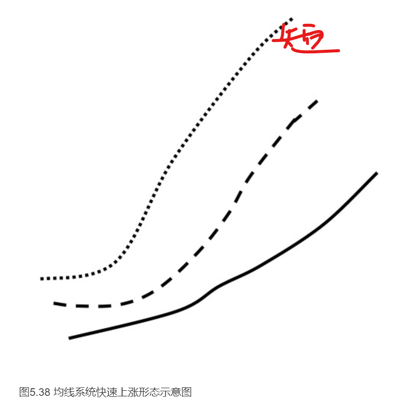

当此形态出现后，意味着股价已经快速上涨，而且涨幅已经过大，市场出现过热情况，因此很有可能是一个市场的顶部。如果出现一些下跌的迹象，则投资者可以立即出场。

如图5.39所示，股价在6.83元开始上扬，起初股价上涨幅度很小，均线上扬的坡度也非常缓慢。但是在整轮上涨行情的后半段突然快速上扬，K线图上一连出现了多根大阳线。而在此带动下，均线系统也开始快速上涨。但移动平均线已经远远地偏离了中长期移动平均线，因此说明市场的涨幅已经过大。应该在此形态出现后立刻关注场中是否有出场的信号，当股价达到23.55元的高位时，K线图上出现了一根大阴线，而且此阴线有长长的上影线，这就告诫投资者在此价位附近已经有了较大的空头压力，是投资者快速出场的一个警告信号。

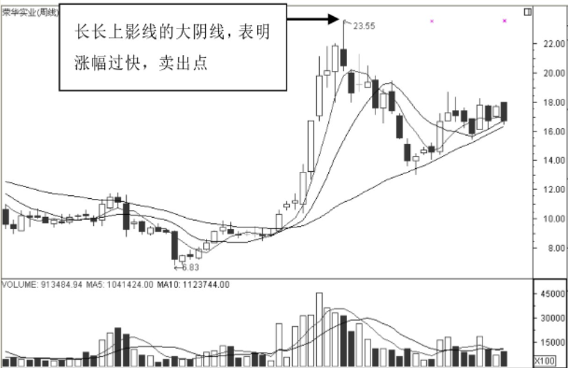

图5.39 荣华实业周K线图

如图5.40所示，股价在10.88元达到最高点，而在此时均线系统已经出现了快速上涨形态。5日移动平均线已经极大地偏离了10日移动平均线和30日移动平均线，而成交量在股价达到高点时也没有明显的增多迹象，说明上涨是值得怀疑的。此后股价结束了上涨的步伐，出现了漫长的盘整过程。

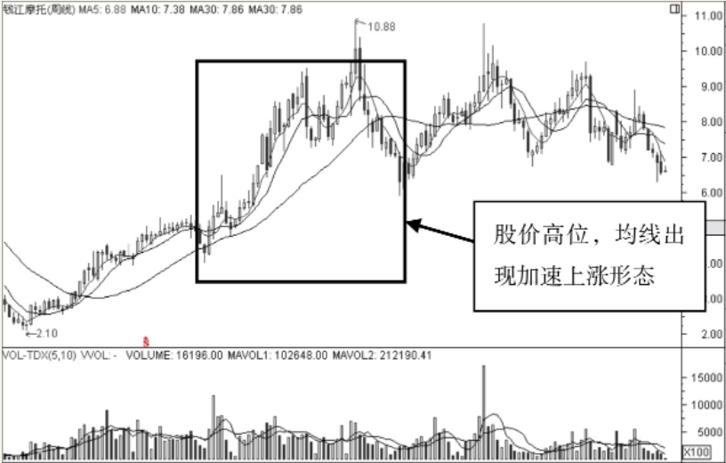

图5.40 钱江摩托周K线图

如图5.41所示，当股价达到18.07元的高位时，成交量明显小于前期高点，这就是要避险的警告信号。不仅如此，均线系统在此时形成了快速上涨形态，短期移动平均线已经明显偏离了中长期移动平均线，此时投资者应该选择合适的点位快速出场。

在K线图上投资者可以清楚地看到出场的信号，股价在达到最高价时，尽管K线收成了阳K线，但是却留下了长长的上影线，说明已经有了一定的压力。如果此时没有出场，则在下一个交易周内投资者也必须出场。股价在下一个交易周，K线图上出现了一个阴K线，此后股价就在此时的价位快速下滑。

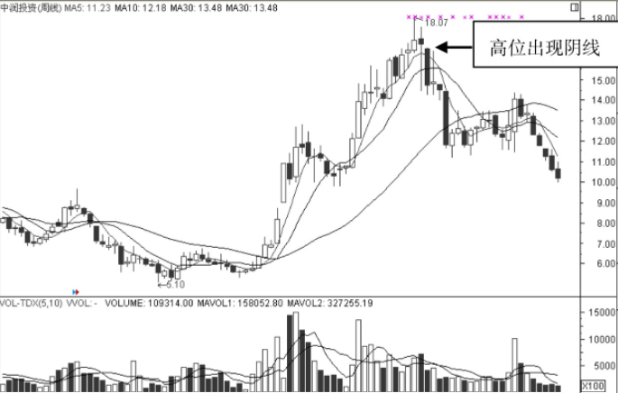

图5.41 中润投资周K线图

### 乌云密布
如图5.42所示为乌云密布形态示意图。该形态要求3条移动平均线始终向下运行，而长期移动平均线要位于均线系统的最上方，而且与中短期移动平均线有一定的距离，长期移动平均线始终压制着股价和中短期均线向下运行。

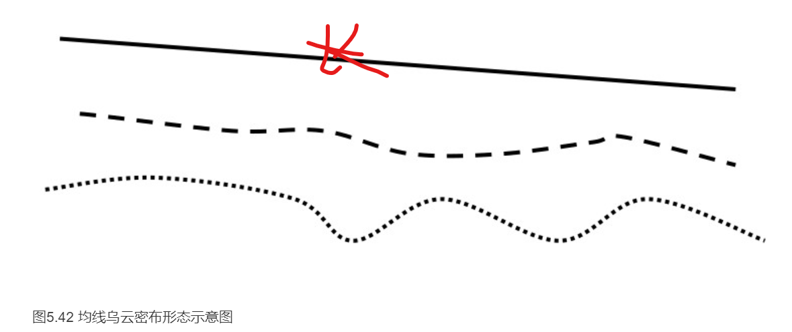

如图5.43所示股价从29.31元开始下跌，而K线系统伴随着股价的下跌出现了乌云密布形态。30日移动平均线位于5日移动平均线和10日移动平均线上方，始终压制着股价和中短期移动平均线向下运行，因此股价就有了从29.31元到6.56元的暴跌空间。

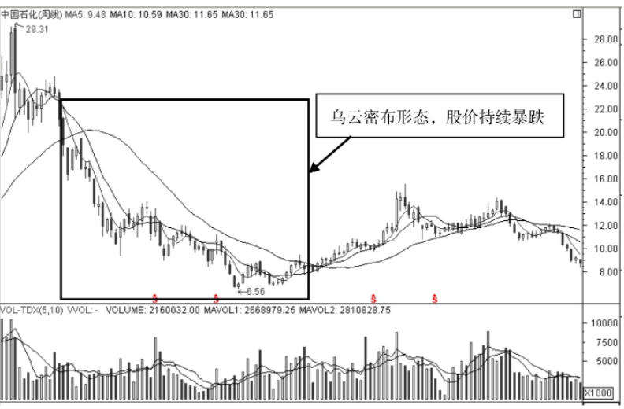

图5.43 中国石化周K线图

如图5.44所示股价从28.29元开始暴跌，均线系统也形成了乌云密布形态。尽管在下跌过程中，股价曾经出现小的向上反弹走势，但是始终被长期均线压制。因此投资者应尽快地在此形态出现后出场。

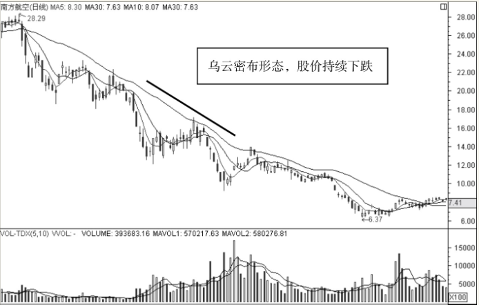

图5.44 南方航空日K线图

### 下山滑坡
如图5.45所示为下山滑坡形态示意图。它是指短期移动平均线、中期移动平均线和长期移动平均线均向下运行，而且是沿着一定的坡度向下运行，这意味着空头向下打压的能力是稳定的，因此股价也会节节下挫，短时间内很难出现反转行情。

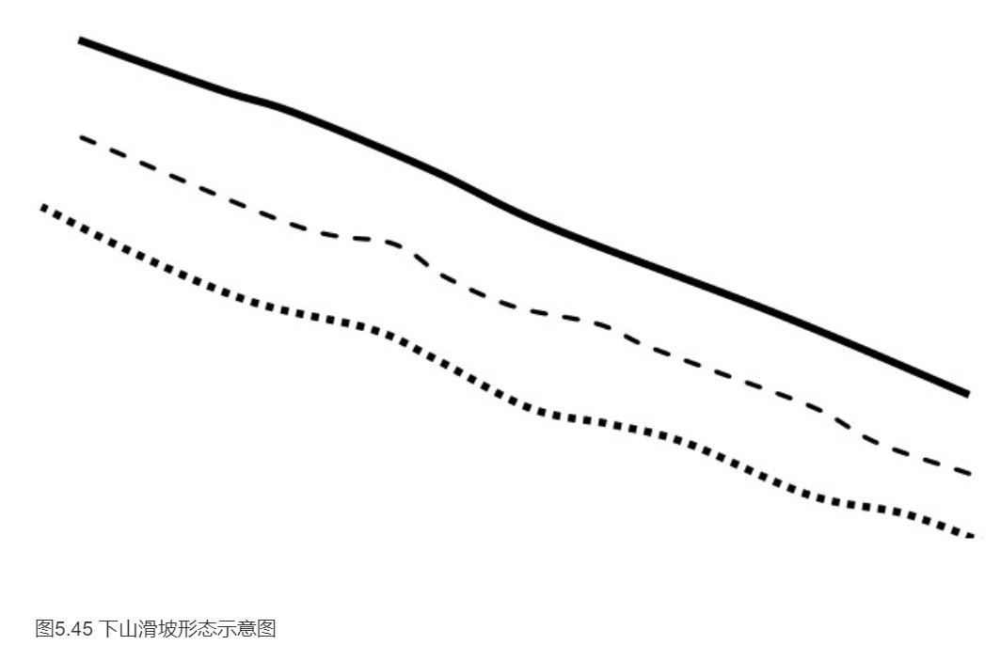

如图5.46所示为股价在4.33元达到新高后，此时成交量也呈最大化。此后股价从高位稍作盘整后便快速下跌，而成交量也从最大化开始缩小。3条均线也开始沿着一定的角度向下运行，形成标准的下山滑坡形态。这说明空头开始掌控整个局面，而且能交量是相对稳定的，可以稳步地将股价向下打压，短时间内多头很难掌控市场。

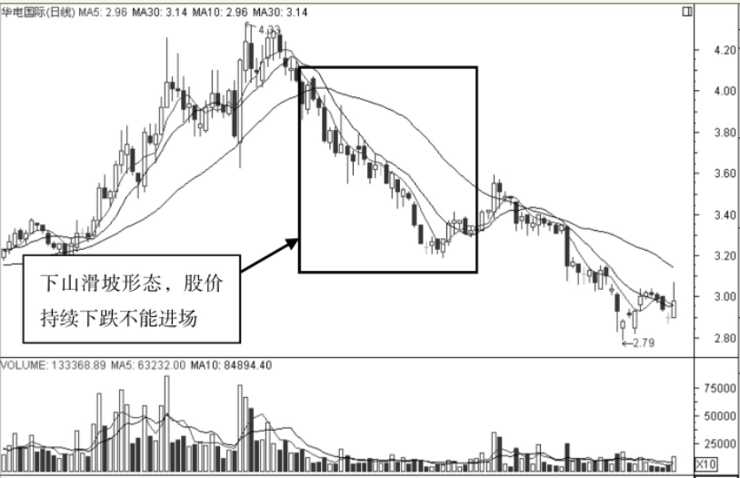

图5.46 华电国际日K线图

如图5.47所示股价在市场高位持续盘整，当盘整结束后股价选择了向下突破作为运行方向，而3条移动平均线始终以固定的角度向下运行，形成了下山滑坡形态。

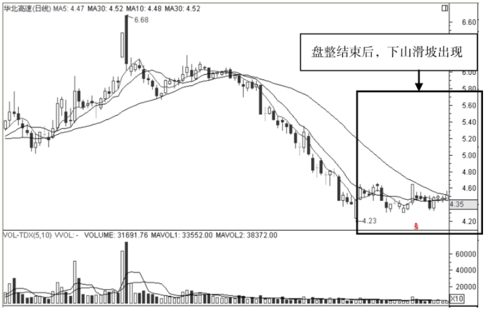

图5.47 华北高速日K线图

如图5.48所示股价在高位开始下跌，成交量也逐渐萎缩，5日移动平均线、10日移动平均线和30日移动平均线则随着股价的下跌沿着一定的坡度向下运行，形成了下山滑坡形态。该股股价已从13元左右下跌到7元左右，下跌幅度近50%。

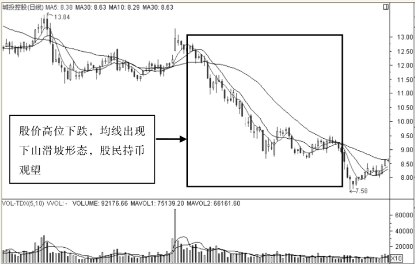

图5.48 城投控股日K线图

如图5.49所示，这是短期交易图，也是短线交易者常用来分析的工具。股价从3.49元开始下跌，均线也随即调头向下运行，给出了下山滑坡形态。这说明空头的打压能力是很强的，能够逐步压低价格，因此股民应该及时出场止损。从成交量上也可以看到，此短时间内的交易是十分冷清的。

图5.49 方正科技60分钟K线图

## 卖出实战演练
### 顶部的死亡交叉
死亡交叉可以出现在市场当中的任何位置。但是一旦在市场的顶部出现，死叉代表的卖出含义就更加强烈。顶部的死亡交叉形态是比较早出现的一种卖出信号，而且准确性极强，一般情况下，在市场的顶部，如果移动平均线出现了死亡交叉形态，投资者应该意识到风险已经到来，最好选择快速出场。

如图5.50所示股价在12.50元达到顶峰，但在股价创出新高的当天，收盘价已经低于开盘价，说明在此时已经遭到了大量的打压。而移动平均线在此后不久也开始向下运行，随即又出现了死亡交叉形态。由此投资者应该意识到市场有可能已经形成底部，快速出场是规避风险的最佳方法。

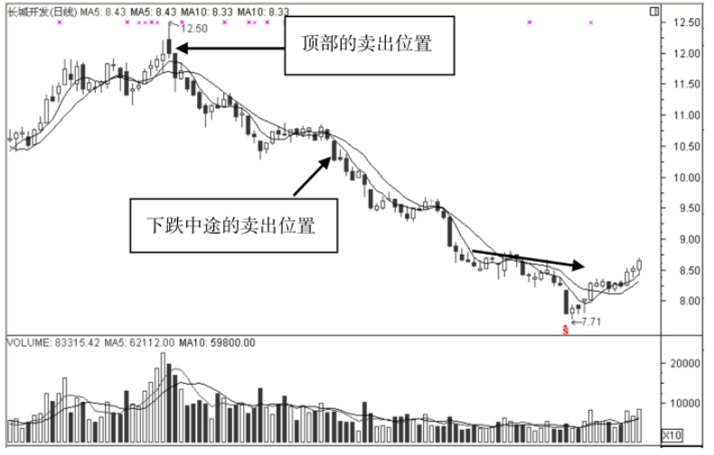

图5.50 长城开发日K线图

如图5.51所示，股价在17.25元达到顶峰时成交量已经开始有所减少，说明危险有可能已经出现。而5日均线向下运行，并且出现了死亡交叉形态。尽管此后股价向上反弹，但是并没有创出新高，而且在它结束后再次向下运行，均线系统也再次出现死亡交叉形态，因此投资者应该考虑出场。

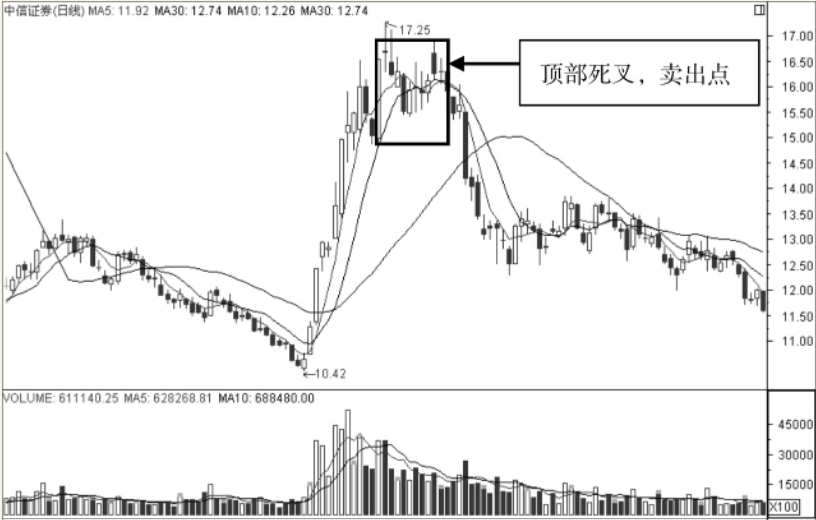

图5.51 中信证券日K线图

如图5.52所示，图中选用的均线为10分钟移动平均线和30分钟移动平均线，但是二者在形成死亡交叉时，依然是一个卖出的良好时机，此时距离最高价23.06元还为时不晚。

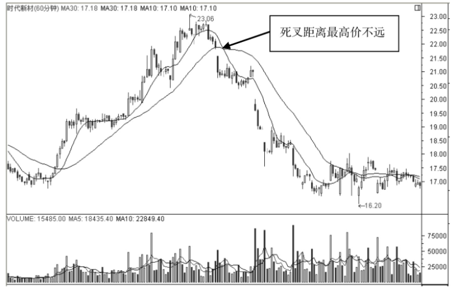

图5.52 时代新材60分钟K线图

### 反弹中的死亡交叉
想要在反弹中保持常胜，就应该及时在反弹的末期出场，而如果在此出现死亡交叉信号，就是一个良好的卖出点。

如图5.53所示，股价从高位开始下跌，而均线系统也出现了明显的向下走势。尤其是30日移动平均线作为长期均线体现了向下的大趋势，在整个下跌过程中，股价也出现了向上的反弹行情。因此进行短线交易的投资者应该认定趋势是向下的，抢反弹必须快进快出。当图中标注的两个区域出现死亡交叉形态时，就是两次短线交易的出场位置，此时不论短线是否能够获利，都应该出场，否则亏损将无限放大。

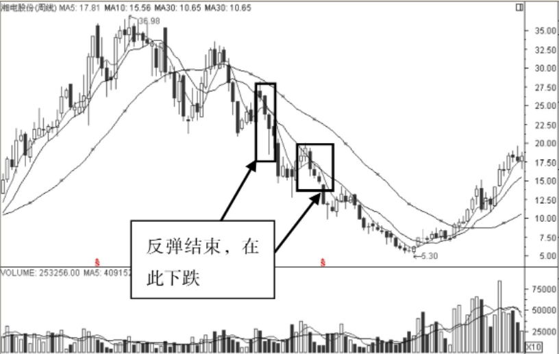

图5.53 湘电股份周K线图

如图5.54所示，图中的两个短期移动平均线在下跌过程中出现了死亡交叉，表明了反弹行情的结束。而且股价在反弹时，成交量并没有出现增长的走势，也印证了反弹的行情是短暂的。因此当5周移动平均线与10周移动平均线出现死亡交叉时，就是投资者最后的出场时机。

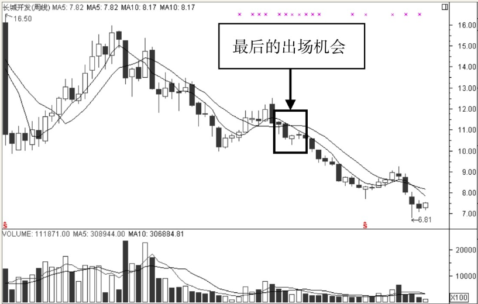

图5.54 长城开发周K线图

如图5.55所示股价下跌的过程中，5日均线、10日均线、30日均线基本上是向下运行的，10日移动平均线也从开始的上涨调头向下运行，但是作为长期趋势的体现者，30日移动平均线始终是向下运行的。在图中的标注位置，均线系统出现了死亡交叉形态，这就说明其下跌趋势将开启，反弹行情已经结束。

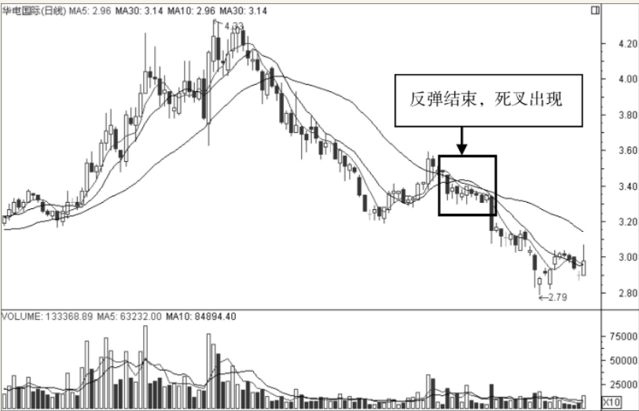

图5.55 华电国际日K线图

### 反弹受阻于移动平均线
同上涨趋势是比较稳定的一样，下跌趋势也同样具有一定的惯性，而且想要进入到上涨行情中也并非易事。在股价向上运行时，如果触及了长期移动平均线，往往会受到长期移动平均线的压制而继续向下运行。

如图5.56所示图中标注的区域不仅是一个死亡交叉形态，而且是股价同时受到30日移动平均线和120日移动平均线阻碍的位置，两个信号同时发生，告诫投资者这是一个较强的压制位置，是出场的一个良好时机。

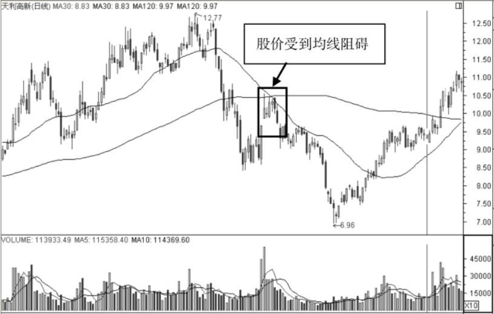

图5.56 天利高新日K线图

如图5.57所示无论是短线交易者还是长线交易者，60日移动平均线都是比较重要的一个均线，它对股价有着阻碍作用。从此例中也可以看到，股价多次出现向上的反弹走势，都是在60日移动平均线附近结束的。由此可见，60日均线对股市的影响十分强烈，这也是投资者考虑出场的一个信号。

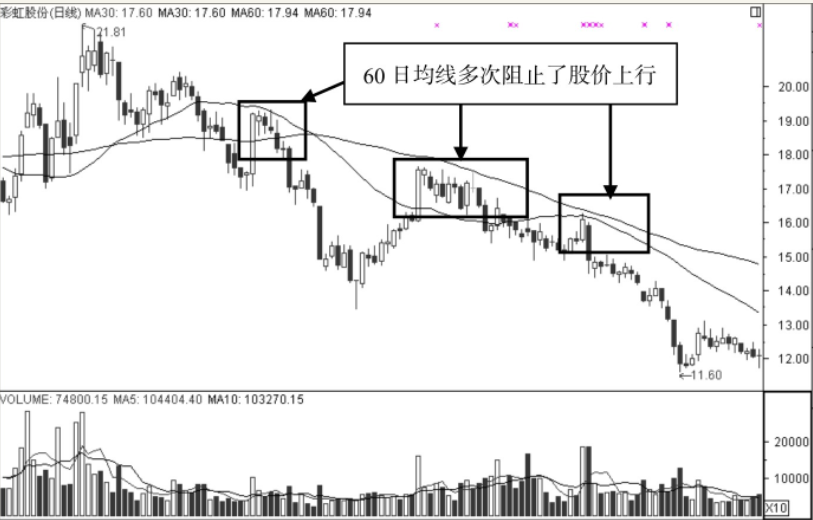

图5.57 彩虹股份日K线图

如图5.58所示在图中标注的位置，不仅是死亡交叉形态出现的位置，而且是股价反弹受阻于30日移动平均线的位置，因此两个警告信号同时出现，是告诫投资者应该快速出场。如果投资者在交易过程中，发现在某一价位附近有多个警告信号出现，就应该及时出场，因为多个信号共同出现就意味着此处阻力作用极大。

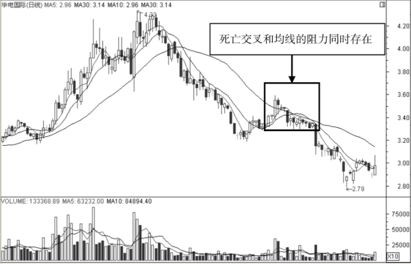

图5.58 华电国际日K线图

### 黏合向下发散
当股价处于盘整行情时，均线系统也会出现黏合状态。此时投资者不可盲目进场，因为谁也无法判断未来股价是否会向上突破，一旦进入后股价又向下突破时，投资者就会产生亏损。

如图5.59所示，股价在标注区域中出现了盘整走势，而均线系统也出现了黏合状态。此状态出现在了市场的顶部，此后均线系统开始向下发散，股价也从市场的顶部一路暴跌，整个下跌空间近50%，可以说已经是不小的跌幅了。

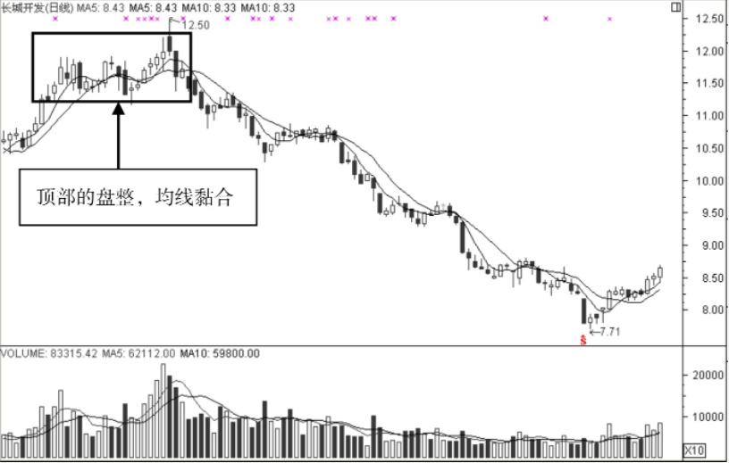

图5.59 长城开发日K线图

如图5.60所示，图中由5日均线、10日均线和30日均线构成了均线系统。在市场进入盘整行情时，成交量已经从高位快速萎缩，均线系统也进入黏合状态，当股价走出盘整区域时，均线系统选择向下发散，就是告诫投资者应该结束之前的做多交易了。

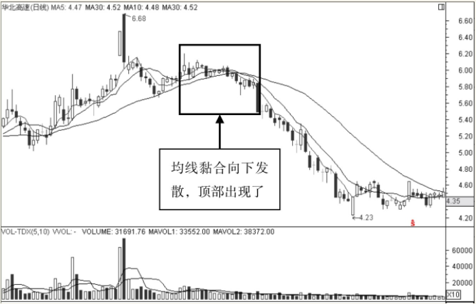

图5.60 华北高速日K线图

如图5.61所示，股价中途出现了盘整走势，均线系统也在此时出现黏合状态，此时距离市场的最高价已经下跌了近5元左右，很多交易者会认为市场底部出现了。但是最终均线系统选择了向下发散，这也就证明了股价将继续原有的下跌趋势，过早进场的投资者应该至此出场，否则亏损将持续增长。

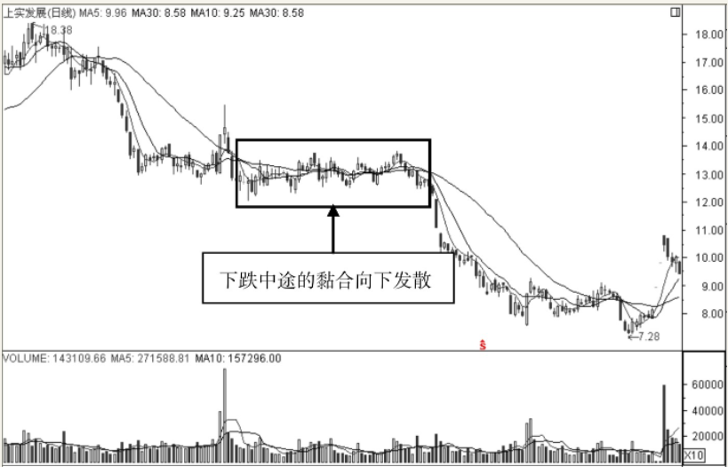

图5.61 上实发展日K线图

### 空头排列
如图5.62所示为ST百科日K线图。股价从14.28元开始下跌，均线给出了空头排列形态，说明下跌的势头非常足，短时间内不会有改变。果然，股价下跌了数十个交易日，跌到了6.74元，这个跌幅是相当深的。

然而在整个下跌的过程中，股价也是有起伏的，在图中标注的位置，股价先后几次出现想要反弹的走势，但是均线的空头排列形态却没有丝毫改变，因此这种反弹是假象，股民不能买入。

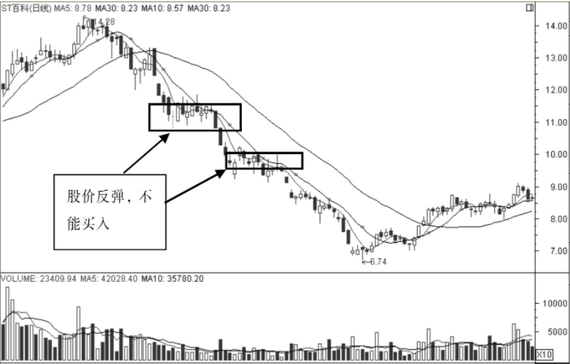

图5.62 ST百科日K线图

如图5.63所示股价从6.68元开始下跌，5日均线、10日均线、30日均线出现了空头排列。在下跌的过程中，股价出现过明显的上涨。例如，在图中箭头指向的位置，一个大阳线出现，如果单一分析这个阳线，足以让投资者做出买入的决策，尽管此时股价已经有了不小的下跌幅度，而且该交易日的大阳线实体非常之大，说明当天上涨的幅度非常大。但是均线系统却没有受到股价强劲上涨带来的改变，而且继续保持着稳定向下的运行方向，因此这个大阳线的买入信号应该被忽略，不能据此来买入股票，相反没有出场的交易者应该利用这个大阳线来卖出股票，这样还能减少一定的经济损失。

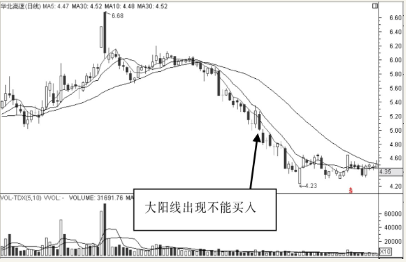

图5.63 华北高速日K线图

如图5.64所示这是一张周K线图，时间跨度要明显大于日K线图，因此下跌的幅度也会比日K线图大。股价从32.58元下跌直至5.57元结束，可见没有及时卖出股票的交易者要承受多大的经济损失。深度套牢的交易者如果希望股价再次涨回到32元左右的高位，则恐怕要失望了，即使能够上涨到原有的高位，也要等待漫长的时间。

股价在下跌到图中标注的位置时，出现了一个明显的反弹，但是投资者不能买入，因为这个反弹没有带来均线的改变，3条均线依然空头排列，说明这个反弹不会持续太长的时间，上涨的幅度也不会太大。

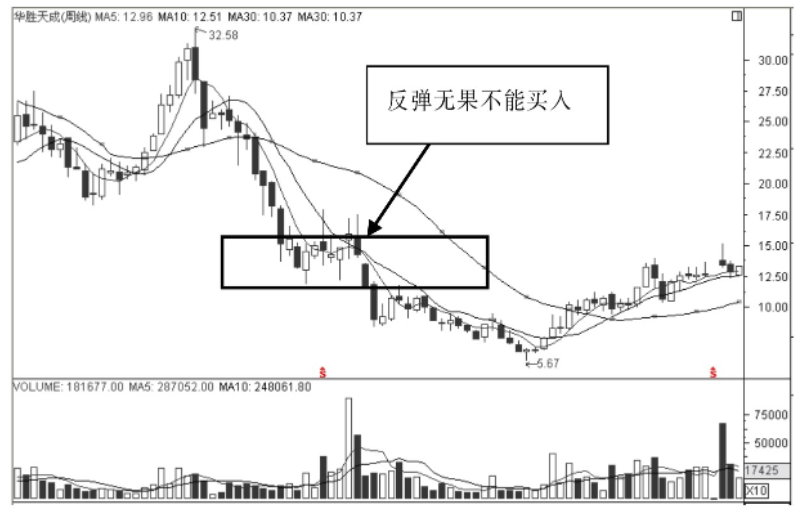

图5.64 华胜天成周K线图

### 均线的坡度与K线
K线不仅能够追随趋势，还能够非常明显地体现趋势的强弱。例如，K线图中出现一连串的大阳线，就说明股价强势上涨，均线也会仅仅地贴着股价向上移动，而且上升的坡度是十分陡峭的。相反，如果股价上涨乏力，均线的坡度也会逐渐变得缓和起来。同样，股价在强势下跌时，均线也是非常陡峭的向下运行，当股价下跌的脚步放慢时，均线的坡度也会变缓和，因此只要观看均线的坡度，就能够很好地判断涨跌的强度。

如图5.65所示从图中可以看到，标注的区域出现了大量的阳线，股价迅猛上涨，而30周均线也是非常陡峭地向上运行。在这个区间内，股民持股是十分安全的。而此后股价小幅下挫后继续上涨，均线均逐渐走平，这就给了投资者一定的危险提示。但是什么时候才是卖出点，还需要结合K线的情况进行分析。

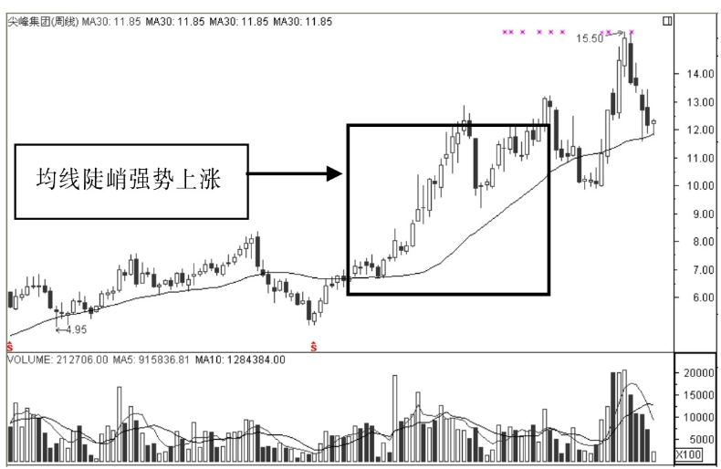

图5.65 尖峰集团周K线图

如图5.66所示股价从6元左右开始上扬，但是当涨到图中标注的区域时，危险的信号发生了，均线系统的坡度明显比之前的坡度缓和，说明上涨的动力得到了遏制。但是股价没有直接下跌，而是继续上行，那么何时是卖出的良好时机呢？从图中可以分析出，此次的上涨只是强弩之末，这不仅由于均线开始平缓移动，而且成交量也没有配合股价上涨出现放量。因此只要找到一个良好的高位出场就可以达到目的了。而图中箭头指向的大阳线就是一个良好的卖点，在这个位置上卖出，既可以获得丰厚的利润，又可以规避风险。

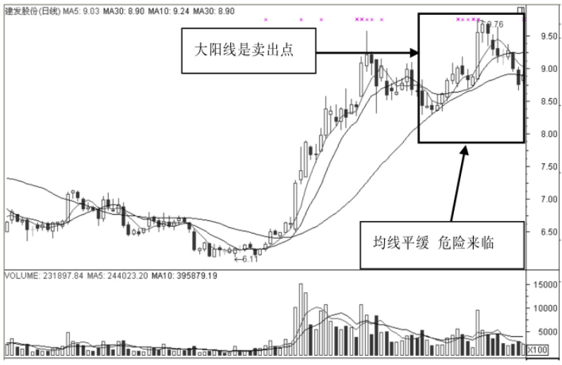

图5.66 建发股份日K线图

如图5.67所示，均线在图中箭头指向的位置出现了转折点，图中的直线是原有的均线运行方向，而此后均线的防线均在这条直线下方，说明上涨动力衰退了。但是此后股价没有立刻下跌，而是继续上行，这也印证了均线坡度改变只是危险提示而不是出场信号的结论。何处才是卖出的位置呢？答案是图中箭头指向的K线位置。在这个位置上，股价创出了新高，但是成交量没有增长，最重要的是K线的上影线非常长，说明空头在这个价位附近力量非常强大，将股价大幅地向下打压了下来，因此是一个出场的位置。从后来的走势也可以看到，这个出场的决定是非常正确的。

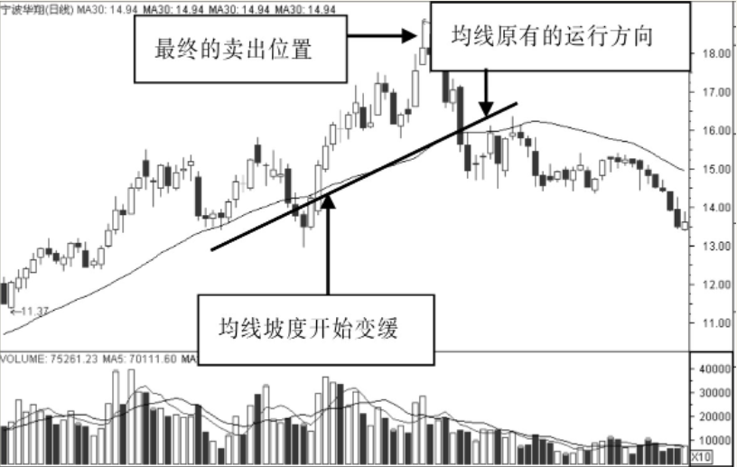

图5.67 宁波华翔日K线图

# 均线与MACD
## MACD的原理及计算方法
移动平均线MA具有以下特性：周期较短的移动平均线与周期较长的移动平均线呈现出一种相互聚合、相互分离的特性，即在一波价格上涨或下跌的趋势中，较短期的移动平均线MA往往迅速脱离较长期的移动平均线MA，随后在价格走势趋缓的时候，二者又会逐渐聚合。股市技术分析师查拉尔德-阿佩尔（Gerald Appel）以移动平均线的这种特性为基础，通过计算得出两条移动平均线之间的差异——`正负差DIFF`，以此作为研判价格波动的根据，从而创造出了指数`平滑异同移动平均线指标（MACD）`。

MACD通过研判周期长短不一的两条移动平均线的相互关系来发出买卖信号（一条为变动速率快的移动平均线，一般为12日均线；另一条为变动速率较慢的移动平均线，一般为26日均线）。

在一般的股票行情软件中，MACD指标由：`移动平均线（EMA）`、`离差值（DIFF）`、`离差平均值（DEA）`，这三部分组成。其中，DIFF是快速平滑移动平均线（EMA1）和慢速平滑移动平均线（EMA2）的差值，是MACD指标中的核心，DEA则是DIFF的移动平均线，是辅助数值。此外，MACD还有一个辅助指标——柱状线（BAR），柱状线是有颜色的，高于零轴以上为红色，代表买盘大于卖盘；低于零轴以下为绿色，代表卖盘大于买盘。

在实盘操作中，DIFF与DEA的交叉关系所蕴含的市场含义为：离差值DIFF由下向上交叉离差平均值DEA时，此柱线BAR在由绿变红，可视为多方买入的信号，当DIFF向上运行并与DEA的距离扩大，代表上涨趋势加快；离差值DIFF由上向下交叉离差平均值DEA时，此柱线BAR在由红变绿，可视为空方打压的信号，当DIFF向下运行并与DEA的距离扩大时，代表下跌趋势加快。

如图6.1中标注所示，图中波动较快的为DIFF线，而波动相对较缓的为DEA线，当DIFF线运行于DEA线下方时，此时柱状线位于零轴下方，呈绿色；当DIFF线运行于DEA线上方时，此时柱状线位于零轴上方，呈红色。

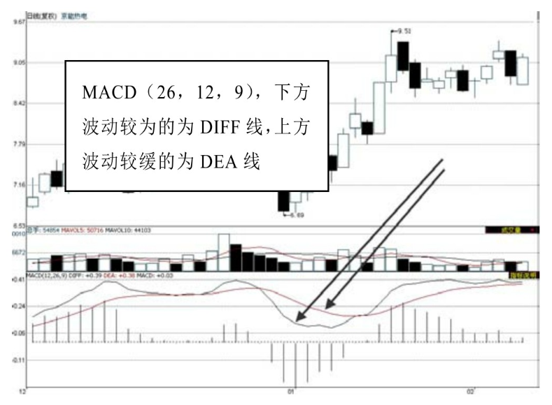

图6.1 MACD指标示意图

## 利用DIFF与DEA的“金叉”买股
DIFF线由下向上交叉并穿越DEA时称之为MACD指标黄金交叉，也简称为`“金叉”`，金叉可以出现在个股运行的很多阶段，基本上都代表了买入时机：

- 当个股的股价经历了前期较长时间且累计幅度较大地下跌时，若此时DIFF线开始走平并调头向上交叉穿越DEA线，这时MACD的绿色柱状线开始变短或正在由绿变红，表明股市即将由跌势转为升势，这是MACD指标在个股深幅下跌后形成的金叉形态，是买入时机。
- 当个股处于上升通道之中，在一波回调过后，随着DIFF线开始走平并调头向上交叉穿越DEA线时，往往意味着又一轮升势的展开，这是MACD指标在上升途中形成的金叉形态，是买入时机。
- 当个股在上升途中经历了一段时间的盘整行情后，且此时个股的累计涨幅不大，当DIFF线开始再次向上突破DEA线并且伴随着成交量的再度放出时，这预示着新一波的升势即将展开，这是MACD指标在个股盘整后形成的金叉形态，也是我们进行买入的信号。

如图6.4所示，此股首先出现了大幅下跌走势，随着跌幅的扩大，此股的走势也越来越接近底部区间，当此股跌势放缓，并且DIFF开始走平并向上穿越DEA时，即：深幅下跌后出现的MACD金叉时机，就是我们中长线入场的时机，这意味着此股跌势已近结束，是趋势反转的信号，也是我们中长线布局的时机。

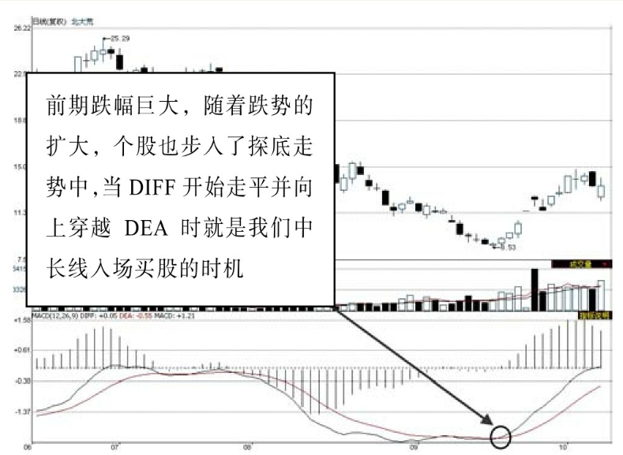

图6.4 北大荒（600598）走势图

## 利用DIFF与DEA的“死叉”卖股
DIFF线由上向下交叉并穿越DEA时称之为MACD指标死亡交叉，也简称为`“死叉”`，死叉可以出现在个股运行的很多阶段，基本上都代表了卖出时机：

- 当个股的股价经历了前期较长时间且累计幅度较大的上涨后，若此时DIFF线开始走平并调头向下交叉穿越DEA线，这时MACD的红色柱状线开始变短或正在由红变绿，表明股市即将由升势转为跌势，这是MACD指标在个股大幅上涨后形成的死叉形态，是卖出时机。
- 当个股处于下跌通道之中，在一波反弹过后，随着 DIFF 线开始走平并调头向下交叉穿越 DEA 线时，往往意味着又一轮跌势的展开，这是MACD指标在下跌途中形成的死叉形态，是卖出时机。
- 当个股在上升途中经历了一段时间的盘整行情后，且此时个股的累计跌幅不大，距离前期顶部较近，当 DIFF 线开始再次向下跌破 DEA 线并且伴随着成交量的再度放出时，这预示着新一轮的跌势即将展开，这是MACD指标在个股盘整后形成的死叉形态，也是我们进行卖出的信号。

如图6.5所示，此股在经历持续大幅上涨后于高位区出现滞涨形态，随后当DIFF线调头向下交叉并穿越DEA线形成死叉形态时，往往预示着上升趋势即将结束，是趋势反转的信号，也是我们的卖出信号。

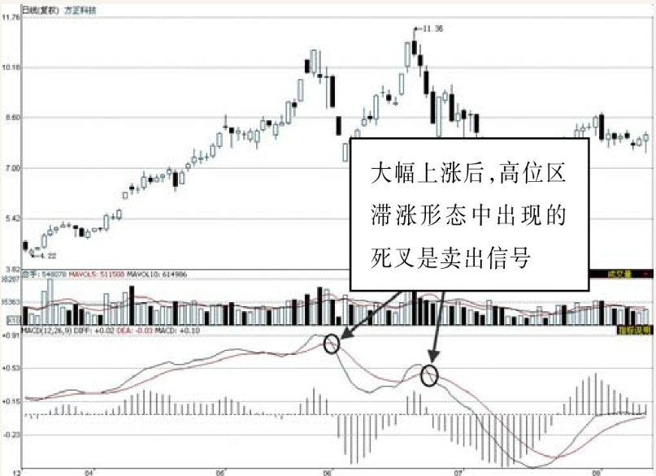

图6.5 方正科技（600601）走势图

## 利用MACD底背离形态买股
当个股经历了大幅下跌之后，在K线图中呈现一谷比一谷低的走势，虽然在这种大幅下跌后股价仍在创出新低，但是DIFF指标线与DEA指标线却没有随着股价而创出新低，反而走出了一底比一底高的形态，这种现象称之为`MACD的底背离形态`，它出现在个股大幅下跌之后预示着下跌趋势即将结束，是我们的买入信号。

如图6.6所示，此股在此期间持续大幅下跌。我们可以看到，在深幅下跌后，虽然股价创出了新低，但是TRIX指标并没有随股价创出新低，反而是提前开始走高，此时的MACD形态即是底背离，它出现在深幅下跌之后，预示着下跌趋势即将结束，是我们中长线进场买入的信号。

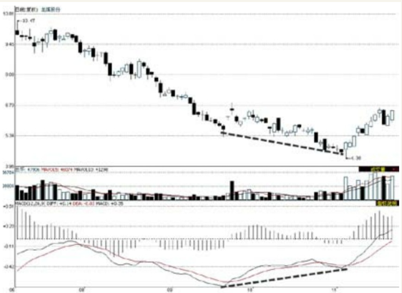

图6.6 龙溪股份（600592）走势图

## 利用MACD顶背离形态卖股
当个股经历了大幅上涨之后，在K线图中呈现一峰比一峰高的走势，虽然在这种大幅上涨之后股价仍在创出新高，但是DIFF指标线与DEA指标线却没有随着股价而创出新高，反而走出了一顶比一顶低的形态，这种现象称之为`MACD的顶背离形态`，它出现在个股大幅上涨之后预示着上涨趋势即将结束，是我们的卖出信号。

如图6.7所示，此股在前期出现巨大的涨幅，并在此期间又创出了新高。我们可以看到，在这种大幅上涨之后，虽然股价创出了新高，但是MACD指标并没有随股价创出新高，反而是逐步走低，此时的MACD形态即是顶背离，它出现在长期大幅上涨之后，预示着上涨趋势即将结束，是我们中长线离场出局的信号。

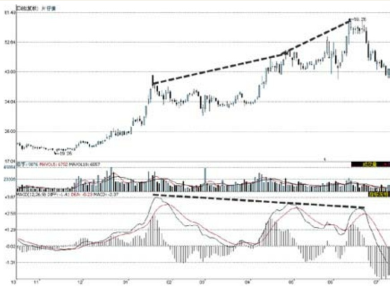

图6.7 片仔癀（600436）走势图

## 均线与MACD的顶背离
当股价在市场高位时，投资者应该密切注意何时股价将要见顶，如果移动平均线和MACD的走势不一致了，就是见顶的一个常见标志。

当股价上涨进入尾声时，不断创出新高，移动平均线也会伴随着股价的上扬继续向上移动，但如果MACD向下移动，则此时技术指标和移动平均线之间就发生了一个背离现象，而这种背离现象经常是股价见顶的信号，对投资者来说此时是卖出的良好时机。

如图6.7所示，股价在达到14.19元时停止了上涨的脚步。此后股价并没有大幅下挫而是在高位震荡，尽管5日移动平均线和10日移动平均线已经开始相互交叉，但30日移动平均线始终稳定地保持向上运行的方向。此时观看MACD技术指标可以发现，一个顶背离的形态出现了，MACD和移动平均线的运行方向并不一致，而是开始向下运行，这就在提示交易者，市场的顶部很有可能已经到来，因此应该选择出场。

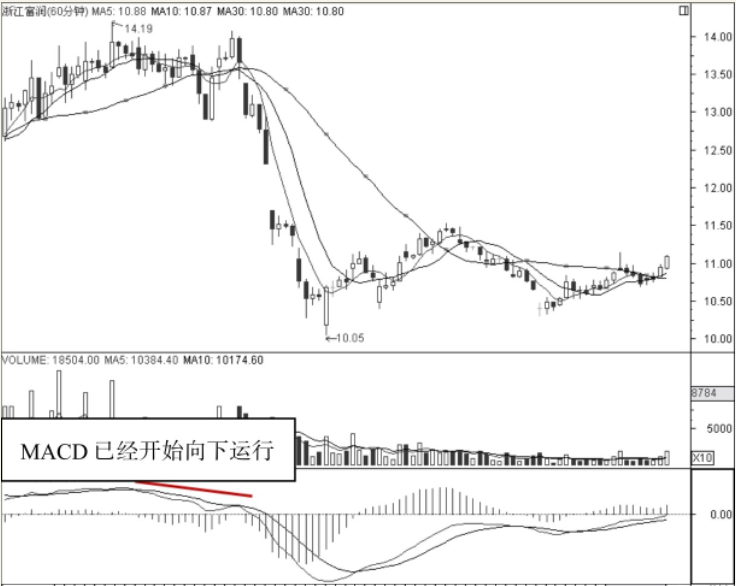

图6.7 浙江富润60分钟K线图

如图6.8所示为山煤国际周K线图。股价在上涨的后半段，30日移动平均线和10日移动平均线始终保持稳定的向上运行方向，而股价也屡创新高，最终达到38.53元的高位。但是此时市场上已经出现了危险的信号，MACD技术指标已经开始向下运行，因此一个顶背离的形态出现了，而且这个信号并不支持股价持续上涨的推断，股民应该作出离场的决策。

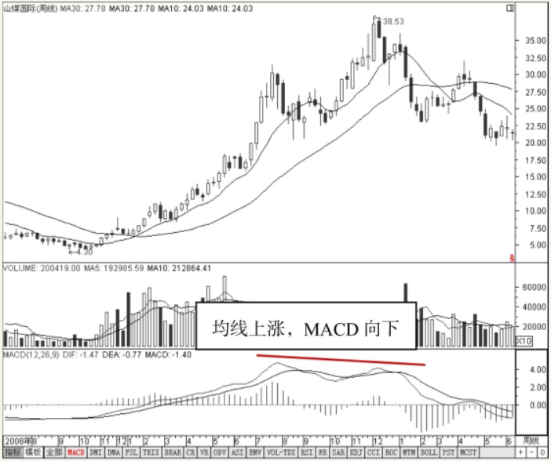

图6.8 山煤国际周K线图

如图6.9所示，股价上涨的过程中，均线系统都稳定地向上运行，但是在股价上涨的后半程，也就是股价在接近4.33元的最高价时，MACD技术指标已经开始调头向下。尽管此时3条移动平均线依然向上，丝毫没有向下运行的意思，但是二者的运行方向相反，就是顶处即将形成的标志。从后市可以看到，股价从4.33元的高位快速下行，再没有给投资者任何出场的机会。

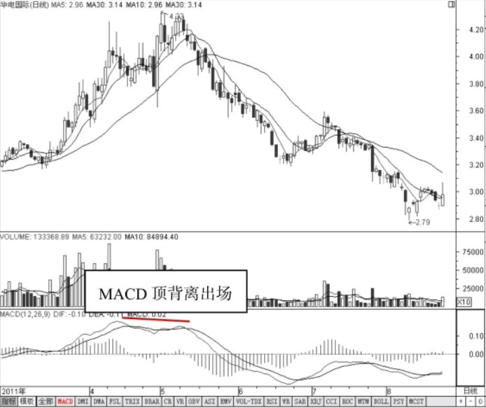

图6.9 华电国际日K线图

## 均线与MACD的底背离
在股价下跌的末期，由于均线系统往往有一定的滞后性，因此伴随着股价的下跌，均线还会持续一定时间的向下运行方向，但是如果此时的MACD已经开始向上移动，就说明二者发生了一个底背离形态，这常常是市场底部的表示。

如图6.10所示股价从12.50元开始下跌，一直到7.71元的最低价。伴随着股价的向下运行，5日移动平均线和10日移动平均线也在向下运行，始终压制股价向下移动。但是当股价接近7.71元的最低价时，尽管两条移动平均线始终向下运行，但是MACD技术指标已经明显开始向上运行，这就是一个明显的底背离形态，因此激进的交易者可以选择在此时少量地买入股票。

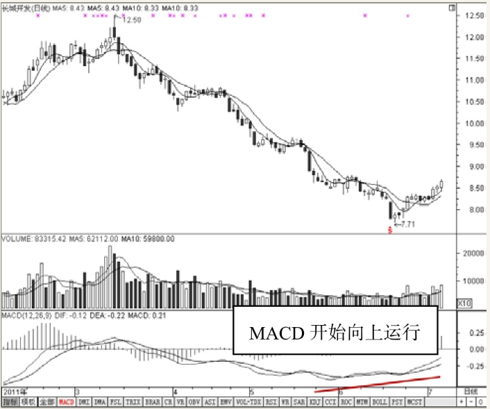

图6.10 长城开发日K线图

如图6.11所示，这是一条移动平均线与MACD发生背离的具体实例。股价快速下跌的过程中，创出了4.85元的价格。20日均线也在向下移动，但是此时的MACD技术指标却在向上移动，因此20日移动平均线与MACD技术指标构成底背离形态。据此投资者可清楚地意识到未来股价将转入上涨行情中。

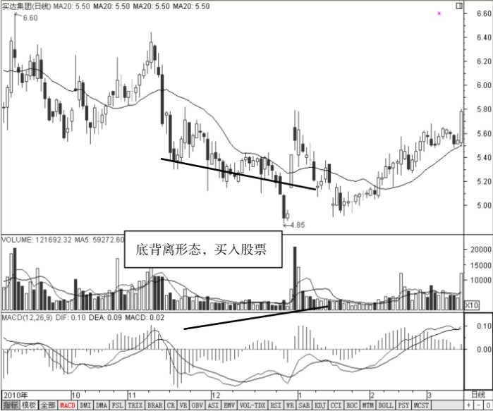

图6.11 实达集团日K线图

如图6.12所示图中的时间周期为周K线，而选用的移动平均线参数为20，因此更可以很好地体现中短期走势。但是20日移动平均线滞后性较大，因此股价到达市场的底部时，20日移动平均线依然处于向下的运行方向。而此时MACD已经开始从底部向上运行，因此形成了一个底背离形态。

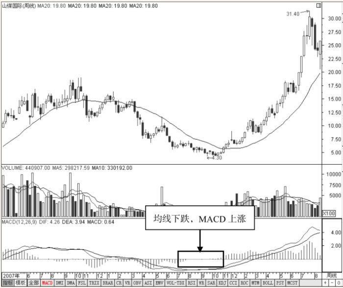

图6.12 山煤国际周K线图

# 均线与分时图
## 什么是分时图
`大盘分时走势图`中主要包括以下内容：

1. `粗横线`。粗横线表示的是上一个交易日指数收盘的位置，它是当日大盘上涨与下跌的分界线，其上方是大盘的上涨区域，下方是大盘的下跌区域。
2. 黄白曲线
   1. `白色曲线`表示的是上证交易所对外公布的通常意义的大盘指数，也就是加权数。
   2. `黄色曲线`表示的是不含加权的指标，即将所有股票对指数的影响看作是相同的而计算出来的大盘指数。
   3. 参考白、黄色曲线的位置关系，可以得到如下的信息：
      1. 当大盘指数上涨的时候，黄色曲线在白色曲线之上时，表示流通盘较小的股票涨幅较大；而当黄色曲线在白色曲线之下时，则表示流通盘较大的股票涨幅较大。
      2. 当大盘指数下跌的时候，如果黄色曲线仍然在白色曲线之上，表示流通盘小的股票的跌幅小于流通盘大的股票；如果白色曲线位于黄色曲线之上，表示流通盘小的股票跌幅大于流通盘大的股票。
3. `红绿柱线`。在黄白两条曲线的下面有红色、绿色的柱线，这些红绿柱线是反映当前大盘所有股票的买盘与卖盘的数量对比情况的。红柱增长，表示买盘大于卖盘，指数将逐渐上涨，红色的柱状线越长，表示上涨的力度越大；红柱缩短，表示卖盘大于买盘，指数将逐渐下跌。绿柱增长，表示卖盘大于买盘，指数将下跌，绿色的柱线越多、越长，表示下跌的力度越强；绿柱缩短，表示下跌的力度逐渐减弱。
4. `黄色柱线`。在黄白曲线的下方，是黄色柱线，用来表示每一分钟的成交量，单位是手（100股/手）。最左边一根长的线是集合竞价时的交易量。成交量大的时候，黄色柱线比较长，成交量小的时候，该线比较短。
5. `委买委卖手数`。表示即时所有股票买入委托下五档和卖出上五档手数相加的总和。
6. `委比数值`。是委买委卖手数之差与之和的比值，当委比数值为正数时，表示买方力量较强股指上涨的概率比较大，当委比数值为负数时，表示卖方力量较强股指下跌的概率比较大。

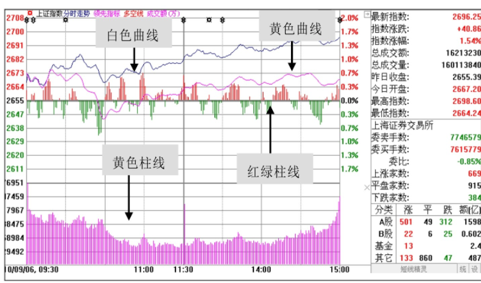

图7.1 大盘分时图

`个股分时走势图`如图7.3所示，其主要内容包括以下几个部分：

1. `粗横线`。粗横线表示上一个交易日股票的收盘位置，它是当日股票上涨与下跌的分界线，在它的上方，是股票的上涨区域，下方是股票的下跌区域。
2. `黄白曲线`。白色曲线也叫分时价位线，表示股票实时成交的价格。黄色曲线也叫分时均价线，表示股票即时成交的平均价格，是从当日开盘到当时平均的交易价格画成的曲线，其作用类似于移动平均线。
3. `黄色柱线`。在黄白曲线的下方，是黄色柱线，用来表示每一分钟的成交量。
4. `卖盘等候显示栏`。该栏中显示的卖1、卖2、卖3、卖4、卖5的委托价格和数量，按照“价格优先、时间优先”的原则，同一时间内，报价较低的卖家优先成交。
5. `买盘等候显示栏`。该栏中显示的买1、买2、买3、买4、买5的委托价格和数量，按照“价格优先、时间优先”的原则，同一时间内，报价较高的买家优先成交。

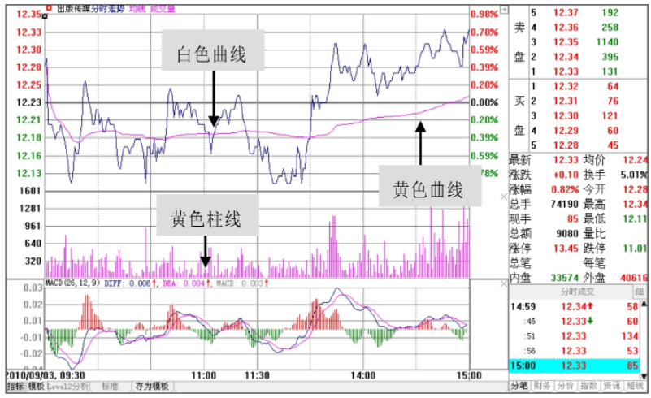

图7.3 个股分时图

分时图是把握多空力量转化的根本，在实战中的地位非常重要：

- 注意开盘后15分钟走势的强弱、开盘的位置及多空战况、上涨或下跌幅度、成交量等情形，进行综合分析，不可依赖某一个指标行事。
- 客观地分析研判多空走势的虚实，并以大盘作为多空走势首要考量点，将大盘走势和个股进行对比，更加谨慎地做出买卖的应变及决断。
- 买进时筹码分配可以按照“二、四、四”进行分配，即将20%的筹码在适当时机做试盘买进，研判正确无误后，再做40%的加码，剩下40%则保留在“终盘战”做最后筹码运用。
- 关注成交量，当走势将面临转机时的成交量最为关键，有些个股的成交量是在下午14时左右放量，但也有在第二天上午出现拉高放量的情况。
- 任何一天的分时走势图都不是孤立走出来的，都与当天的外部市场信息和自身的历史走势密切相关，通常是昨日走势的延续，并且常常会受到近几日阻力位和支撑位的影响，受制于过去大的趋势状态。因此，查看分时图的时候，可以调出连续几日的分时图一起查看，便于更准确地把握趋势。

## 分时买进信号
### 均线支撑
均线支撑是指均价线支撑着股价线不往下跌的走势。一般来讲，在第一次支撑出现后，如果股价涨势平缓，没有出现急涨的走势，即涨幅没有超过3%，随后出现的第二次和第三次支撑走势，均可放心买入。在第一次支撑出现后，如果股价大幅拉高，涨幅超过3%，此后出现的支撑，则应该谨慎操作或放弃。另外，在操作均线支撑时，应该审视该股中长线的走势，是否有获利的空间，有获利空间的股票，才可操作。均线支撑可以分为接近式、相交式、跌破式三种情况。

1. 接近式支撑：指股价线由上向下运行到均价线附近时就反弹。如图7.9所示就是接近式均线支撑，该股低开高走，每有短暂回调都会在均线附近得到支撑，支撑之处即为介入良机。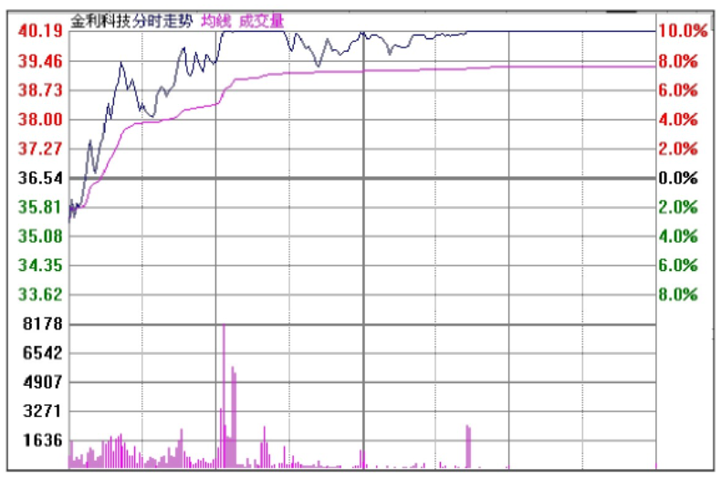
2. 相交式支撑：指股票的实时价格与均线相交。如图7.10所示是相交式均线支撑，该股回调时碰到均价线后回升，每次与均价线相交的点都是最佳买点。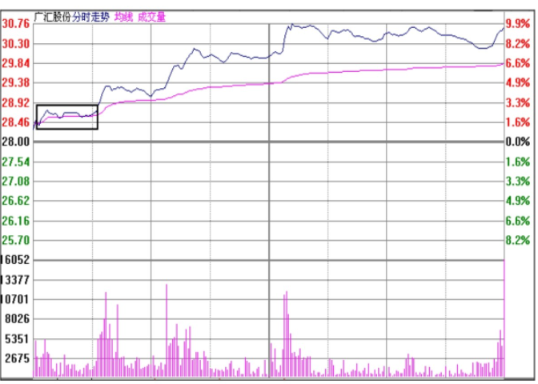
3. 跌破式支撑：指股价线向下跌破均价线后，在较短时间里，又被拉回均价线上的走势。如图7.11所示是跌破式均线支撑，该股开盘后股价上升，然后回调，击穿均价线之后立即回升，随后重复该走势，每次击穿均线时都是介入良机。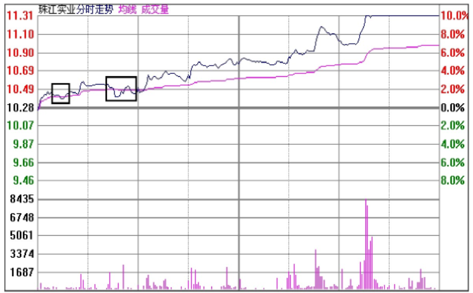

### 向上突破平台
向上突破平台是指股价线向上突破前面横盘整理期间所形成平台的一种走势。在一个交易日中，有时候会出现多个“向上突破平台”的走势，当第1个“向上突破平台”出现时，应该第一时间买入，当第2个“向上突破平台”出现时，如果涨幅不大，也可买入，但是当第3个“向上突破平台”出现时，风险就比较大了，应拒绝买入。一般来讲，向上突破平台具有以下特征：

1. 股价线必须在某一价位做较长时间的横向整理，走势时间一般不能少于半小时。
2. 股价线应贴近均价线波动，波动的幅度较小，所形成的高点大体处在同一水平线上。
3. 均价线在整理期间基本是一条水平线，无明显的波折。
4. 均价线必须向上越过平台的最高点。

如图7.12所示是典型的向上突破平台，在一个交易日中，有两次向上突破平台，第1次发生在开盘45分钟处，为最佳买入点，第2次发生在收盘前15分钟处，涨幅较高，应谨慎操作。

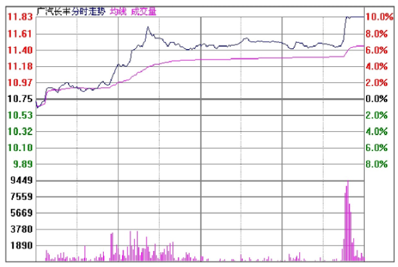

图7.12 向上突破平台

### V型反转
V型反转是指股价急跌，然后又被快速拉起，股价线形成一个“V”形态，转折点的成交量特别大。要注意该形态的股价线与均价线之间的距离。理想的是股价线与均价线之间距离，乖离率需大于0.5%，距离越大，则收益就越大。一般来讲，V型反转形态具有以下特征：

1. 该形态形成前，应是平开或低开，其后出现急跌的走势。
2. 该形态的底部低点，必须是负值，且下跌的幅度必须大于2%，下跌的幅度越大，则收益就越大。
3. 该形态最低点停留的时间不能超过3分钟。
4. 该形态形成前，股价线应一直处在均价线之下所形成的尖低。

如图7.13所示，该股开盘即下跌，跌幅近5.25%，是标准的V字尖底买入

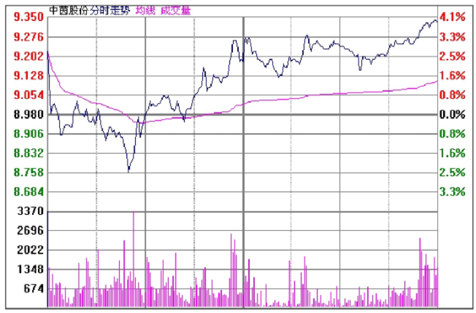

图7.13 V型反转

### W底
W底是指股价经过一段时间的下跌后，在低位出现了两个基本相同的低点，第二个低谷点形成的时候，成交量极度萎缩，当向上突破颈线的时候成交量迅速放大。W底最佳买点有两处，一处是第二个低谷点出现后，股价线与均价线的交点，另一处是股价线向上突破颈位线的位置。一般来讲，W底形态具有以下特征：

1. 股价下跌的幅度较大，一般要大于3%。
2. 两底的底点应为基本相同的值，第2底可以略高于前底，但绝不能低于前底。
3. 第2底出现后，股价线必须反转向上，且要超过均价线或“颈位线”。
4. W底形成时，股价线必须始终处在均价线之下，即第一底部与第二个底部之间的股价线，不能向上穿越均价线。也就是说，两个低点及两底之间的颈线位高点，均只能处在均价线之下。

如图7.14所示，该股在10点半之后下跌，接近中午时，形成W底，在突破颈位线时进入当日可获得3.7%的收益。

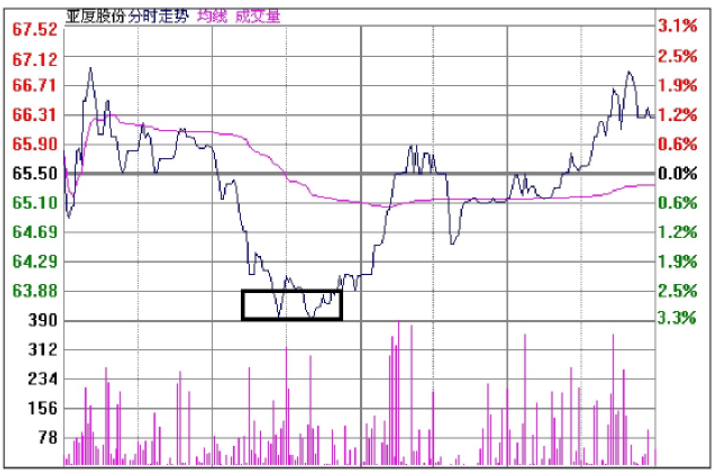

图7.14 W底形态

### 三平底
三平底是指股价线经过一段深跌后，先后出现了三个处在同一水平线上的低点。如果股价线与均价线相距较近时形成的三平底，不能操作。三平底形态的最佳买点有两个，第一个是股价线与均价线的交点，第二个是股价线向上突破颈位线时，前提是颈位线低于均价线。一般来讲，三平底形态具有以下特征：

1. 该形态形成前，股价必须是下跌，下跌的幅度较一般要大于1.5%。
2. 该形态形成时，股价线必须始终处在均价线之下，中途不能有超过均价线的走势，特别是“颈位线”的高点，不能超过均价线。

如图7.15所示，该股上午下跌之后走出三平底形态，投资者可在股价突破颈线时少量进入。

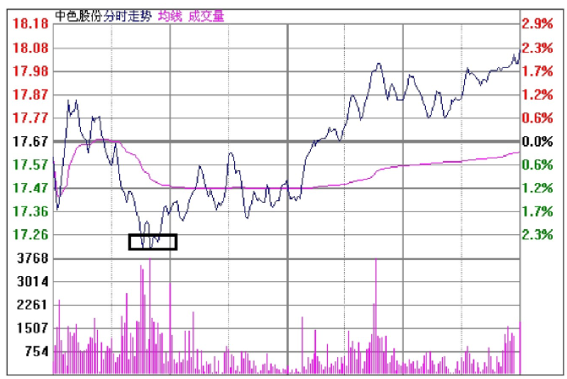

图7.15 三平底形态

### 三步高
三步高是指股价经过一段下跌后，在低位形成三个底部，标准三步高是底部一个比一个高。非标准三步高可允许第一和第二个底相同，第三个底比第一和第二个高。三步高形态的最佳买点有两处，一处是第3底形成后，股价线向上穿均价线时的交点，第二处是股价线向上突破颈位线的位置，前提是股价线离均价线较远，且颈位线低于均价线。一般来讲，三步高形态具有以下特征：

1. 该形态形成前，股价应必须有一段较深的下跌走势，下跌的幅度大于2%。
2. 股价线一直处在均价线之下，中途不能有上穿均价线的走势。
3. 三个底部的低点只能是小幅抬高，第三底的低点比第一底的低点的总升幅不能高过5%。

如图7.16所示是典型的三步高形态，该股在开盘后不久走出三步高形态，投资者可在股价向上穿越均价线的时候介入。

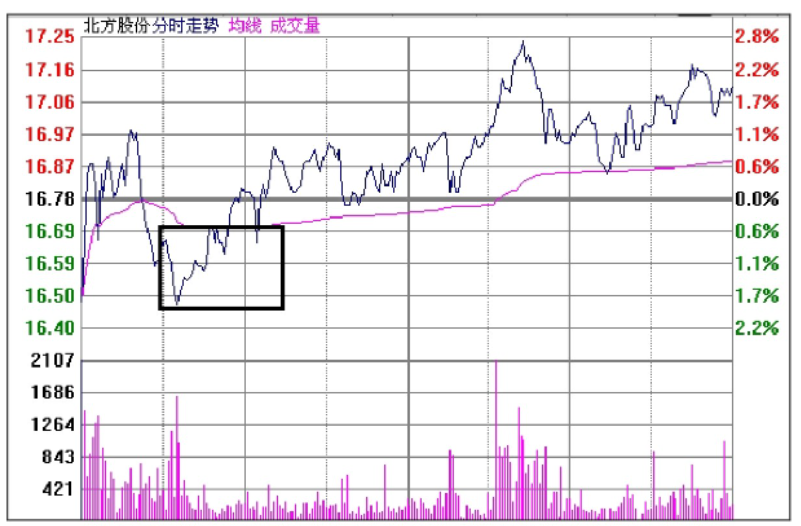

图7.16 三步高形态

### 对称涨跌
对称涨跌是指开盘后，短时间内股价大幅向上涨，达到一定高度后（上涨大于2%），股价突然向下，短时间内的跌幅等于前面上涨的高度。对称涨跌形态的股票必须在上午出现才能操作，并且注意股价的当前位置是在低位。对称涨跌形态具有以下特征：

1. 股价上涨必须大于2%。
2. 涨跌必须相等（上涨的幅度等于下跌的幅度）。

如图7.17所示是典型的对称涨跌形态，该股高开后又涨近4.5%，随后下跌近4.0%，跌幅基本等于前面上涨的高度，后面的横盘时候可以适当地介入。

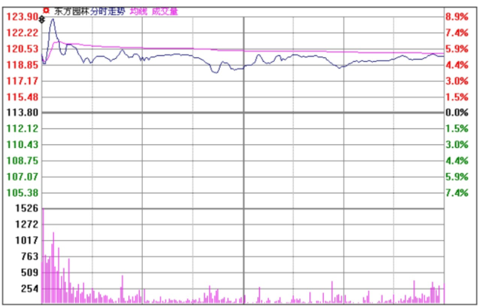

图7.17 对称涨跌形态

### 在涨停板打开
涨停的股票一般都是有重大利好消息或者是庄家控制的股票，通常会有不止一个的涨停机会，在涨停板打开时买入股票要审视该股中长线的走势，是否有获利的空间，有获利空间的股票，才可以操作。另外，要结合各项指标来衡量，并设置止损点。涨停板打开形态具有以下特征才可以操作：

1. 涨停板打开时的下跌幅度绝不能大于1%，大过1%通常是主力的派发。
2. 涨停板打开时应该且必须在短时间内被封住，从打开到被封住的时间不能超过3～5分种。
3. 盘中的涨停板不能被多次的打开。

如图7.18所示是典型的涨停板打开形态，该股高开后直逼涨停，随后快速打开，跌幅不超过1%，打开之处即为最佳买入点。

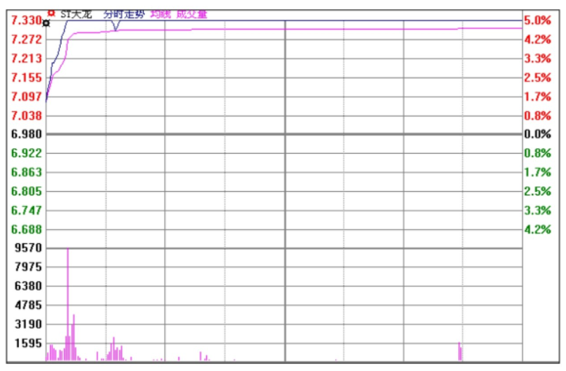

图7.18 在涨停板打开形态

## 分时卖出信号
### 均线挡道
均线挡道是指股价上升到均价线附近或短暂上穿均价线后，就回头下行的走势。一般来讲，只有处在高价位的均线挡道形态才可以卖出，如果是处在调整后的低位，最好暂时不卖出，而是持股待涨。

均线挡道形态具有以下特征：

1. 均价线应一直处在股价线之上，且呈水平状态横向移动。
2. 股价线在均价线之下，一般不向上突破均价线，即使突破，停留的时间也很短，突破的幅度也不是很大，并且很快就会回到均价线的下方。
3. 股价线受到均价线的阻挡前，须与均价线有一段较大的距离，如果两线始终靠得很近，就不是均线挡道形态。
4. 股价线受阻后，向下跌落的幅度不能小于2%。

如图7.19所示是典型的均线挡道形态，该股上升至均价线附近或短暂上穿均价线之后立即下行，一直没有有效地突破，应该择机卖出。

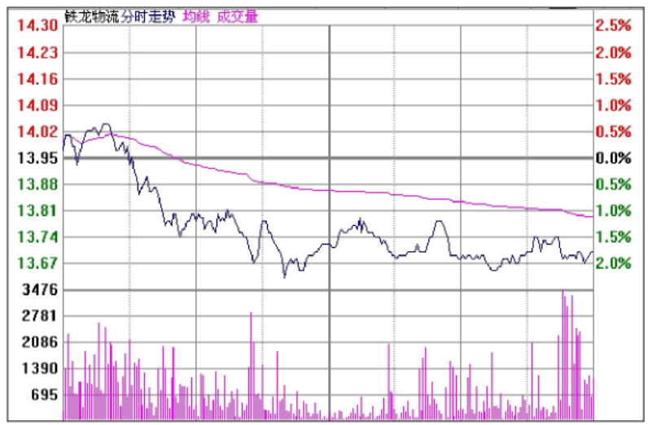

图7.19 均线挡道

### 跌破平台
跌破平台是指股价线在离均价线较近的地方进行长时间的横向整理，然后出现向下跌破平台的走势。要把握跌破平台的卖出时机，最好在第一个跌破平台卖出。具体操作时要考虑跌破平台的具体位置，如果平台是在高位，应立即卖出，反之，如果平台在低位，就不应该卖出，反而可以在破位时买进，第二天选个高点卖出。

跌破平台形态具有以下特征：

1. 一定要出现一段横盘走势，形成一个明显的平台。
2. 股价线跌破平台的低点后，多数情况下，会在短时间内又反弹到平台的低点附近，然后再次跌破平台的低点，此时就可确认跌破平台形态的形成。

如图7.20所示是典型的跌破平台形态，该股开盘即下跌，然后形成一个横盘整理平台，一个小时之后，跌破平台，继续下行，此时，应在股价跌穿平台的最低点时及时离场。

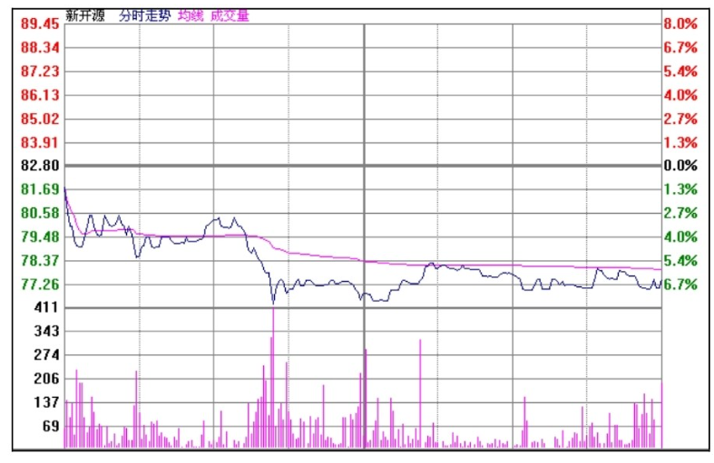

图7.20 跌破平台

### M顶
M顶是指股价在经过一段上涨后，在高位形成了两个高点基本相同的顶部。M顶形态的最佳卖点是第二个顶形成后的下一档或下两档价位。需要注意的是，该形态也是在高位或波段的顶部时，才可放心做空。

M顶形态具有以下特征：

1. M顶形成时，起涨点到顶部高点的升幅不低于3%，上涨幅度越大，有效性越大。
2. 形成M顶的股价线应处在均价线之上。

图7.21是标准的M顶形态，可以看到在形成两个双平顶时，涨幅高于3%的条件，可在第二顶形成后的下一档或下两档价位卖出。

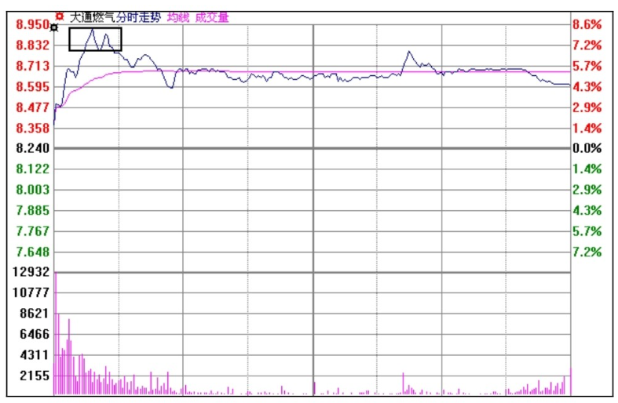

图7.21 M顶形态

### 一顶比一顶低
一顶比一顶低是指股价线上升到高位后，先后出现三个以上的顶峰，且顶峰一个比一个低。依据一顶比一顶低的形态卖出后，如果当天出现急跌的走势，跌幅超过5%以上时，出现止跌的迹象，还可买进。在第二天反弹到一定高度时卖出。

一顶比一顶低形态具有以下特征：

1. 股价线和均价线必须处在收盘线之上。
2. 第一个顶出现时，当天股价的上升幅度不得少于5%。
3. 三个顶和所夹的两个谷底的股价线，均应在均价线之上。

图7.22是标准的一顶比一顶低形态，该股在开盘后快速拉升，随后股价一波比一波回落，最后跌至均价线以下，投资者可择机离场。

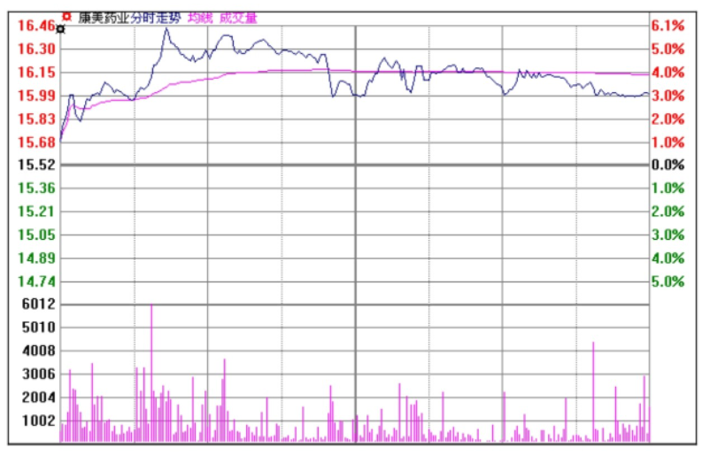

图7.22 一顶比一顶低形态

### 对称跌涨
对称跌涨是指开盘后，短时间内股价大幅下跌，随后又在短时间内快速上涨，且涨跌的幅度大体相当的走势，是高位做空的一个十分有效的指标。出现这种情况，可以适当地进行高抛低收操作，但是要注意设置止损点。

对称跌涨形态具有以下特征：

1. 下跌和上涨的幅度应大体相当或相等，两者的差幅一般不超过两个价差。
2. 该形态下跌的低点到上涨的高点的波动幅度应在3%以上。

图7.23是标准的对称跌涨形态，股价一开盘即下跌了近3%，后迅速拉高近3%，符合股价先跌后涨，且涨跌的幅度大体相当的走势，投资者应择机卖出。

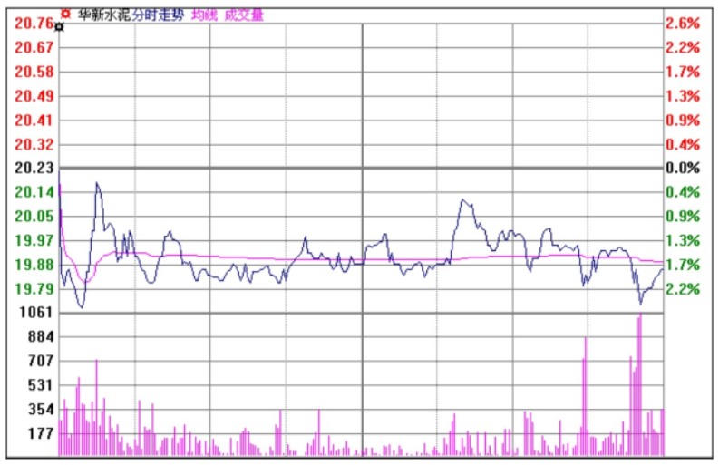

图7.23 对称跌涨形态

### 跌破前低
跌破前低是指股价由升势转为跌势后，向下跌破了前面的低点。一旦出现“跌破前低”，股价会有不少的跌幅，在一个交易日中，有时会有多个“跌破前低”形态出现，只要跌破其中任何一个低点，均可卖出。

跌破前低形态具有以下特征：

1. 跌破上升行情中调整浪的低点。
2. 股价反弹后，跌破当前下降行情中反弹前的低点。

图7.24是标准的跌破前低形态，股价刚开盘即下跌了近2%，然后进入横盘整理状态，收盘前半个小时，股价跌破横盘，再次下挫，投资者可在跌破前期低点的时候抛出。

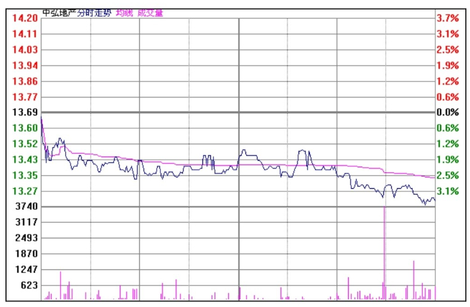

图7.24 跌破前低形态

### 开盘急涨
开盘急涨是指一开盘就向上急涨，上涨的过程在短时间内完成，一般情况下会在当天出现急跌，急跌后开始卖出。

开盘急涨形态具有以下特征：

1. 上涨时，股价线几乎成垂直上升状态，中间不能有波折，上涨的高度一般不低于3%。
2. 股价线与均价线的距离拉得越远越好。

图7.25是标准的开盘急涨形态，股价高开后，向下跌一段，然后再向上涨，再次下跌，最终跌破均价线，投资者应择机卖出。

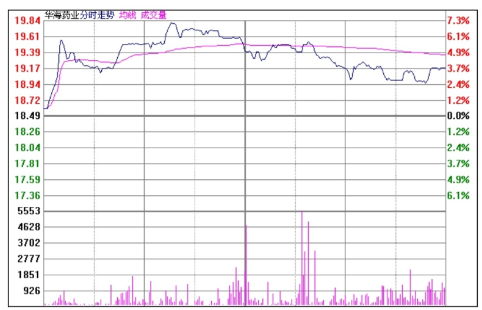

图7.25 开盘急涨形态

### 收盘线阻挡
收盘线阻挡是指收盘线阻挡股价线向上涨升的一种走势。股价线在开盘后有一段下跌的过程，跌幅不少于3%，下跌的幅度越大，后市获利的可能性就大。股价线、均价线、收盘线等三线必须出现过“股价线在下，均价线居中，收盘线在上”的走势，在操作收盘线阻挡时，要注意该股的K线图，只有K线图上的股价处在高位或处在下降途中时，才可卖出。如果是处在调整后的低位，则要小心操作。收盘线阻挡可以分为接近式、接触式和略超式三种情况。

1. 接近式阻挡是指分时线离收盘线还有一点小小的距离时就停止前进。如图7.26是接近式收盘线阻挡，每个高点是最佳卖出点。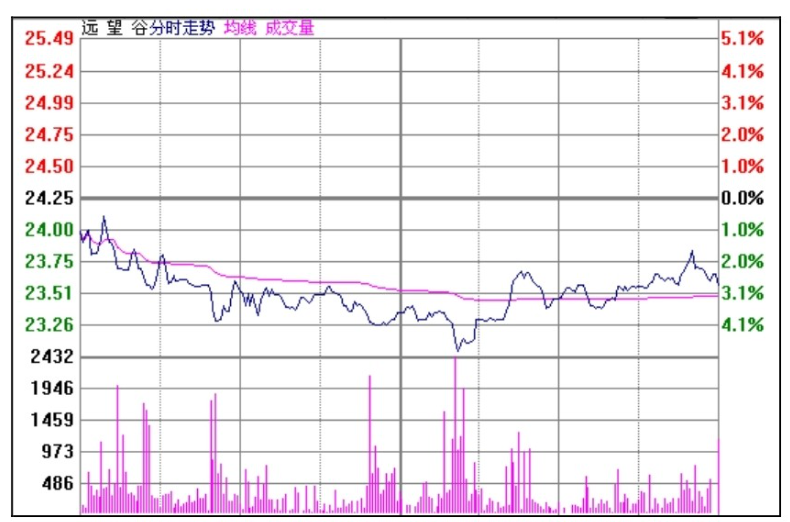
2. 接触式阻挡是指股价线与收盘线刚一接触就掉头下行。如图7.27是接触式收盘线阻挡，在错过了第一次卖出后，可在第二高点卖出。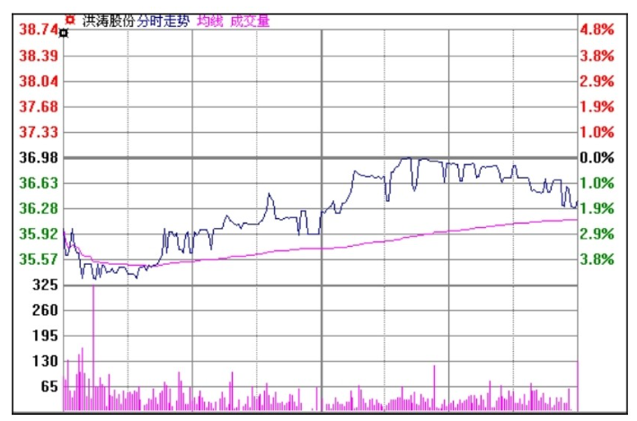
3. 略超式阻挡是指股价线上穿昨日收盘线后才掉头下行。如图7.28是略超式收盘线阻挡，投资者在股价线上穿收盘线时卖出为好。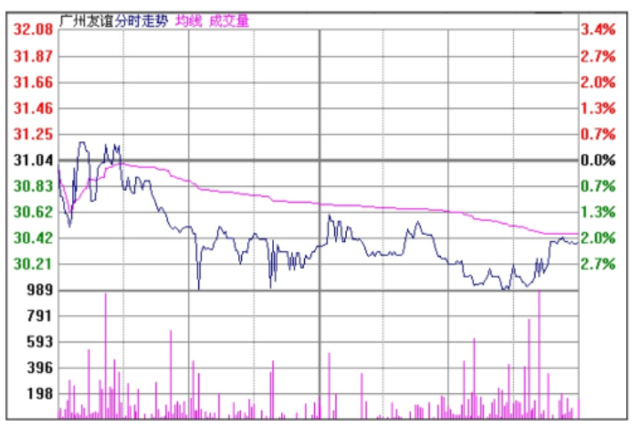

# 散户用均线猎庄
## 庄家坐庄的步骤
一般来讲，庄家坐庄的步骤包括五部分：建仓、试盘、洗盘、拉高、出货。

1. **建仓**。建仓是指在股市中，庄家或大户介入某一个股，一段时间内不断买入的行为。建仓时盘中经常出现规律性的向上冲击波。庄家资金的吸筹动作。在盘面上，经常有大笔卖单挂留，在股价已被打压到较低价位时，在卖1、卖2、卖3挂有巨量抛单，实际是庄家在暗中吸货，一旦等到筹码接足后，庄家就会突然撤掉巨量抛单，这时股价将大幅上涨。在这一阶段的末期，一般成交量会温和放大，但股价却未大涨或只是小幅上涨。技术指标经常出现“底背离”。K线形态中日K线经常在低位出现小十字星，或者小阴阳实体方块，K线组合在低位出现圆弧底、W底、头肩底、三重底、U形底、V形底等。
2. **试盘**。指庄家在低位吸足了筹码之后，并不是马上进入拉升状态。一般庄家持有的基本筹码占流通盘的45%～50%，在较长的吸货阶段，庄家并不能肯定在此期间有没有其他的庄家介入，因此，要进行试盘。试盘时庄家一般先要将股价小幅拉升数日，看看市场上的跟风盘多不多，持股者心态如何。随后，便是持续数日的打压，震出意志不稳的浮码，为即将开始的大幅拉升扫清障碍。试盘时，股价会突然被盘中出现的上千手大抛单砸至跌停板或停板附近，随后又被快速拉起；或者股价被突然出现的上千手大买单拉升然后又快速归位。表明有庄家在其中试盘，庄家向下砸盘，是在试探基础的牢固程度，如果一段时期某股总收下影线，则向上拉升可能大，反之出逃可能性大。
3. **洗盘**。庄家为达到炒作目的，必须在拉升的途中让低价买进，意志不坚定的散户抛出股票，然后让看好后市的投资者有机会跟进，这样后入市者的成本高，在洗盘的时候就不会轻易抛掉，能够有效地减轻日后拉升时获利盘回吐的压力。
4. **拉升**。拉升指数是指股市内权重比较大的股票集体上涨，从而导致的股指大幅上涨的情况。这一阶段初期的典型特征是成交量稳步放大，股价稳步攀升，移动平均线处于多头排列上升的状态，K线图中的阳线出现频率远远大于阴线出现的频率。这一阶段中后期的典型特征是，成交量越放越大，股价上涨幅度越来越快，上升的角度也越来越陡，此时，如果有成交量呈递减状态，则该股要么在高位横盘一个月左右慢慢出货，要么利用除权使股价绝对值下降，然后再次拉高或横盘出货。当个股的交易温度炽热、成交量大得惊人时，大幅拉升阶段就即将结束了，因此，投资者在此阶段后期的交易策略应该是离场观望，谨慎操作。
5. **出货**。出货是庄家操作的最后一步，出货的成功与否直接关系到庄家这次操作的成败，这一阶段股价正在构筑头部，买盘虽然仍很旺盛，但已出现疲弱之态，K线图中阴线出现次数将远远高于阳线的出现次数，如果成交量连日放大，则表明庄家已在派发离场。因此，此时也是投资者最佳的离场时机。

## 辨识庄家
### 从盘口发现庄家
庄家可以利用股价走势对技术指标进行精心的描绘，但由于庄家的进出量大，如果进出的周期过长很有可能会延误时机，导致做庄失败。因此，庄家进出必定会在盘口留下痕迹，下面进行具体地分析：

1. **挂单**。在买盘或卖盘中挂出巨量的买单或卖单，并且数量以整数居多，例如1000手、5000手等，都表明有大资金在活动，一般投资者是绝不会这样挂单的，这是庄家积极活动的征兆。如果涨跌相对温和，一般多为庄家逐步增减仓所致。
2. **扫盘**。在涨势中突然出现大买单，将所有卖盘挂单连续吞进。如果前期股价比较低，并且均线形成多头排列，涨势初起之际，有大单一下子连续地横扫了多笔卖盘时，则表明庄家正在建仓。
3. **内外盘**。内盘是以买盘价成交的成交量，也就是卖方的成交量。外盘是以卖盘价成交的成交量，也就是买方的成交量。只要庄家进行交易，由于其资金量比较大，一定会在内外盘盘口发现其踪影的。
4. **隐形盘**。盘口中，买卖盘面所放的挂单，往往是庄家骗人用的假象。大量的卖盘挂单俗称`上盖板`，大量的买盘挂单俗称`下托板`。而真正庄家的目的性买卖盘通常是即时成交的，隐形盘虽在买卖盘口看不到，但在成交盘中是存在的。因此，研究隐形盘的成交与挂单的关系，就可看清庄家。
5. **盘口秘诀**
   1. 外盘大于内盘，股价不上涨，警惕庄家出货。
   2. 内盘大于外盘，价跌量增，连续两天，说明庄家在出货。
   3. 外盘大于内盘，股价仍上升，看高一线。
   4. 内盘大于外盘，股价不跌或反有微升，可能有庄家进场。

### 了解庄家建仓的手法
1. **上升通道建仓**。这种建仓方法，一般情况下都是发生在大盘形势不好的时候，空头力量大于多头力量，这个时候，大多数抛单多为割肉之举，庄家采取多进少出的形式，隐蔽地吸纳廉价筹码，悄悄地走出缓慢上升的通道，这种建仓方法的K线图如图10.1所示，该股历时将近2个月时间都是使用的这种方式建仓。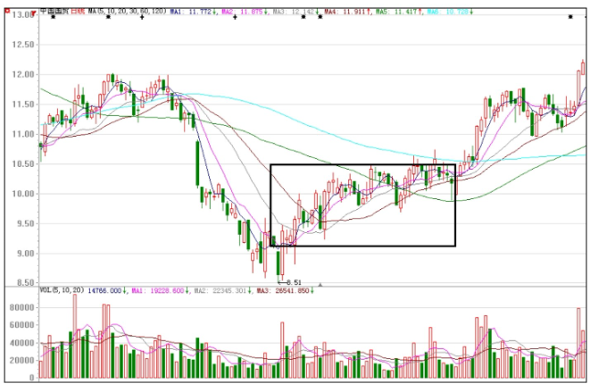
2. **打压建仓**。庄家在进行建仓时，总是会想办法降低持仓成本，因为持仓成本越低，庄家的主动权就越大，因此，庄家往往会使用手中的筹码打低股价，待股价不断创出新低，人心涣散时，再配合以利空传闻，使散户们忍不住纷纷割肉，然后庄家就可以用较低的价格慢慢地收集，完成建仓的操作。底部历时越长，庄家收集到的筹码就越多。这种建仓方法的K线图如图10.2所示。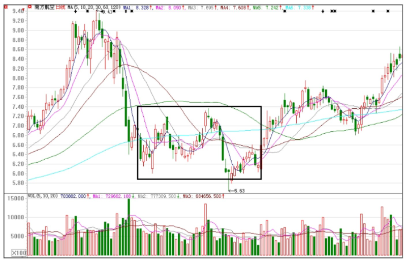
3. **反弹式建仓**。这是庄家为了节省建仓时间经常采用的一种建仓手法。即利用人们“高抛低吸”、“见反弹出货”、“见反弹减码”的心理，庄家每过一段时间就制造一波反弹，引诱散户买进，然后又将股价打回原形，使买入者被套，经过几次反复以后，使散户们慢慢形成了“股价到了什么价位就可以抛掉，然后在底部又拣回”的心理定势。待最后一次反弹时，散户纷纷开始抛售，但股价却直线拉升，抛掉的股民要么后悔不迭，要么会在更高位追进去。采用这种方法建仓，一般会在K线图上留下双重底、复合头肩底等形态，这种建仓方法的K线图如图10.3所示。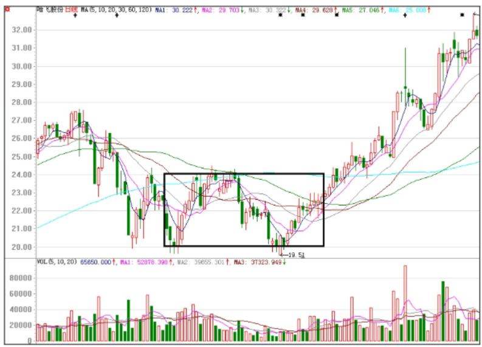
4. **连拉涨停法**。这是庄家针对冷门个股常用的方法。它没有一个底部长期收集的过程，而是连续几天拉高，不断利用涨停板的打开与关闭，快速完成建仓。长期冷门的股票使投资者形成“死股”的概念，被套得非常难受。因此，一遇上涨便会纷纷抛售。这样，庄家就轻而易举地收集到大量的筹码。这种建仓方法的K线图如图10.4所示。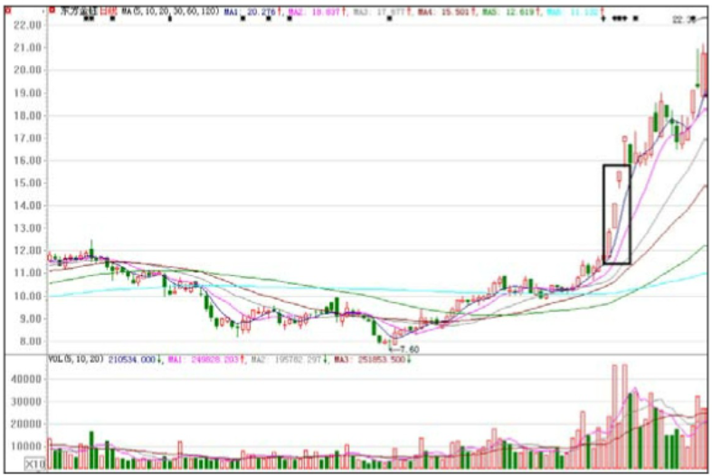
5. **推土机法**。推土机法是一种非常形象的说法，就像推土机推土一样，这种建仓方式反映在K线图中，就是一根阴线后出现一根阳线，然后再有2～3根阴线，再出现2～3根阳线，走势阴阳交错，股价在不知不觉中被慢慢推高。这种建仓方法的K线图如图10.5所示。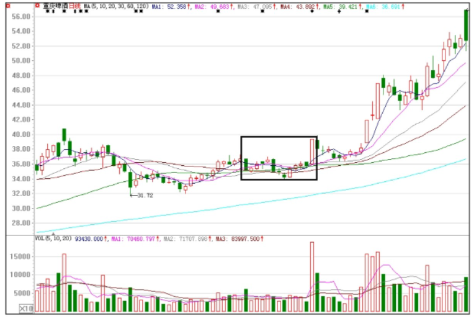

### 洞悉庄家出货的动作
1. **拉高出货法**。拉高出货是指庄家往往通过发布突发性的重大利好消息，然后巨幅高开，在市场追涨气氛逐渐高涨的情况下，有计划的、分批的、有序的进行拉高出货动作。这种出货方式要求人气旺盛，消息刺激性强，适合中小盘股操作。但这种出货方式庄家风险很大，只能在行情较为火爆时才能稍有把握成功出货。这一出货方法的K线图如图10.6所示。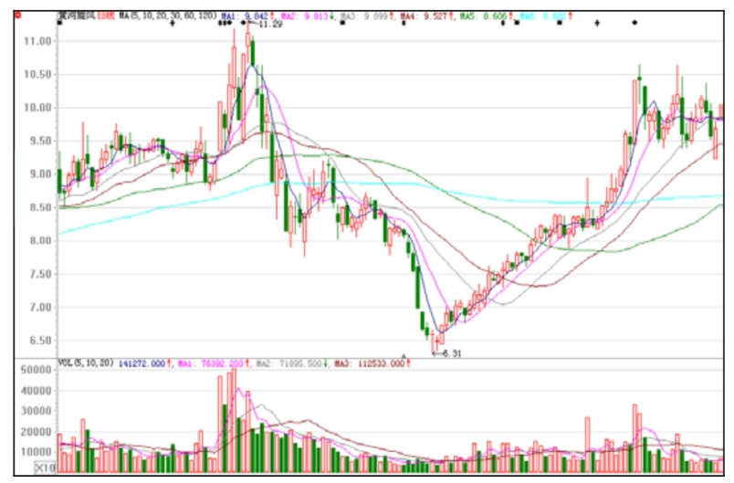
2. **震荡出货**。震荡出货是一种比较自然的出货手法，通常庄家已经把股价拉高到相当高的位置，不可能在短时间内凌厉杀出时采用这种方法，这种方法需要有大盘人气配合。庄家拉抬到一定位置，看人气旺盛，就借机开始出货。庄家出货，必然会造成股价下跌。当股价下跌到某一支撑位时，庄家就会出来护盘。为了保住出货价格，庄家总是在重要的支撑位制造快速有力的拉抬，借以恢复散户的信心。这样的出货和护盘动作交替就形成了震荡走势。这一出货方法的K线图如图10.7所示。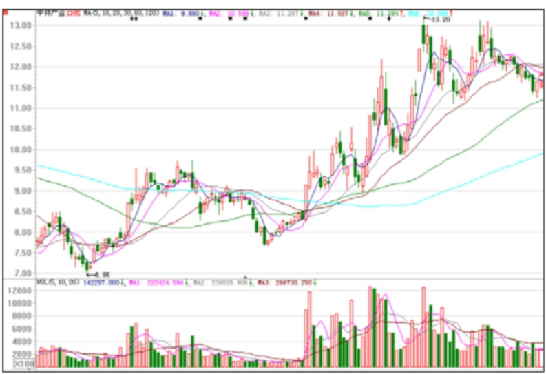
3. **整理形态出货**。这是震荡出货的一种变形。庄家把高位的震荡出货形态做得像整理形态，让投资者以为他还要继续向上拉抬。实际上，这个形态是庄家精心做出来的，这种假整理形态与真的整理形态很难区别。这一出货方法的K线图如图10.8所示。庄家仓位减少到一定程度，有时还真的做一次向上突破，再利用追涨盘把最后一批货出掉。这种出货手法技巧性较强，是一种较温和的出货手法。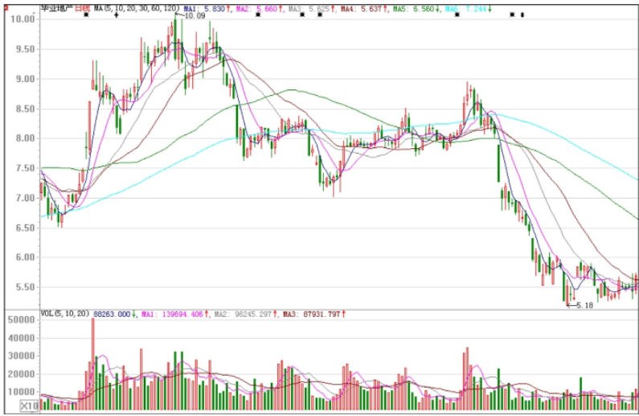
4. **反弹出货**。庄家在完成了一段出货动作后，巨大的坐庄利润已经兑现。最后未出清的筹码只能等待机会了。下跌的股价，等待有反弹的机会来出清。这样跌势中的初期是迅猛的打压、砸盘动作，将在高位的跟风者牢牢套住。然后庄家在初期探底低位补进筹码，赚取反弹的利润，彻底完成全部坐庄的出货动作。这一出货方法的K线图如图10.9所示。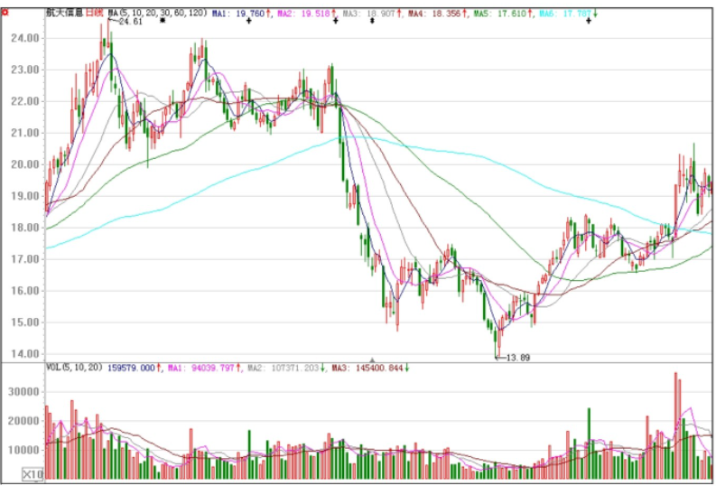
5. **冲高回落出货**。股票在开市后被快速拉起来，在整个上午都维持高位，中间可能还会制造几次向上突破的假象，做出蓄势待涨的姿态，这样会引来不少的追涨盘。等到下午的后半盘，庄家往往会将盘中一天埋下的买单都给打掉。这一出货方法的K线图往往会留下长长的上影线，如图10.10所示。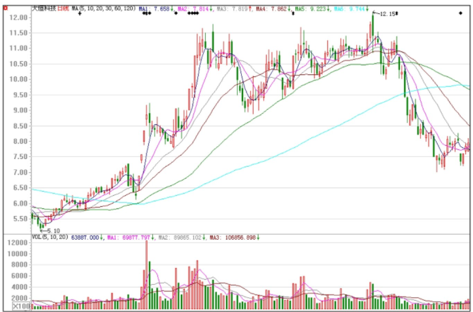
6. **涨停板出货**。庄家将股价拉高到涨停板附近，故意在涨停板上放几十万或者上百万自己的买单，等待追涨的人买进，然后再悄悄把自己的买单逐渐撤掉，放在最下面，按照时间优先的原则，庄家的买单不会很快成交，这时，庄家再挂出大卖单，达到出货的目的。因此，如果一只股票在涨停板上的成交量比较大，就是明显的出货迹象。这一出货方法的K线图如图10.11所示。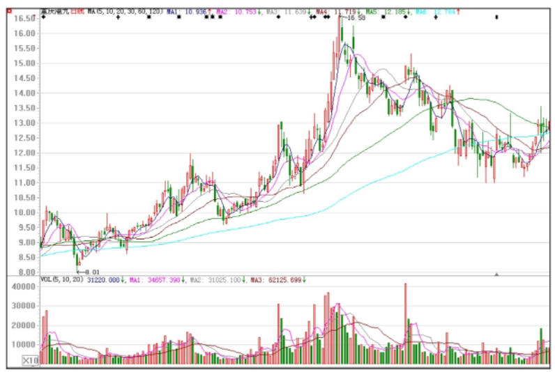
7. **下压出货**。在人气比较弱的情况下，庄家不再冲高诱人追涨，而是在开盘后小幅上拉，乃至不拉。通过控制开盘造成上涨，留出一定的出货空间，然后就一路出货。盘中下档出现了一些买单，庄家就给货，下方买单打没了就做出要反弹的样子，等下方积累了一些买单后再打下去。如此，一个价位一个价位的下压，充分利用每一段空间出货。这一出货方法的K线图如图10.12所示。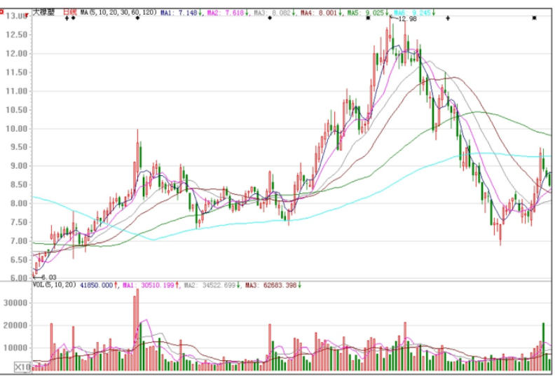

### 识破庄家的骗术
1. **制造骗线**。当庄家介入的股票股价形态呈现一定上升趋势时，为减少跟风者，庄家往往会通过抛售，使股价迅速下挫，甚至跌穿重要支持位，使散户恐慌性抛售。或者庄家通过资金控盘，制造出漂亮的上升趋势形态，让喜欢进行技术分析的散户上当受骗。
2. **尾市拉高**，真出假进。庄家利用收市前几分钟用几笔大单放量拉升，刻意做出收市价。此现象在周五时最为常见，庄家把图形做好，吸引股评免费推荐，使散户认为庄家拉升在即，等到周一开市的时候跟进。
3. **涨、跌停板骗术**。庄家发力把股价拉到涨停板上，然后在涨停价上封几十万的买单，由于买单封得不大，吸引散户成为跟风盘，然后庄家再将自己的买单逐步撤掉，在涨停板上偷偷地出货。因此放巨量涨停，十之八九是出货。还有的股票早上一开盘就是跌停板，把所有集合竞价的买单都打掉，有些散户一看见就想抄底，其实如果不是庄家出货，股价会立刻复原，如果在跌停板上还能从容进货，说明庄家在用跌停出货。
4. **制造虚假成交量**。成交量的大小，可以衡量股票市场或个股交易的活跃程度，是投资者用来观察和了解庄家进入或退出市场情况的一个重要指标。因此，庄家就利用散户对量价关系通常规则的认识，反向操作，采用“对敲”之类的做法，制造虚假的成交量，例如在低位制造出价增量缩、价跌量增等假象，诱骗散户卖出。

## 建仓阶段
### 横向整理建仓
横向整理是最常见到的一种庄家机构建仓方式，它一般出现在股价下跌的底部，股价从原有的暴跌趋势逐渐进入底部的横向整理过程。从K线图上也可以看到，股价从快速下行到底部持续震荡，长期不能再次创出新低，而在这漫长的横盘震荡过程中，实际上庄家机构完成了建仓买入的过程。一旦庄家机构建仓过程结束，则股价便会从市场底部横盘震荡行情快速向上走出，而散户如果想成功地跟着庄家机构进行买卖活动，可以利用均线来识破。

一般来说，如果股价从高位快速下行，则均线一般多给出空头排列的形态，说明股价下跌的幅度是很深的。当股价接近市场的底部时，由于庄家机构在底部隐蔽地吸纳筹码，股价会停止或者放缓下跌的脚步，而在一个相对窄的范围内上下波动，均线系统也会出现相互缠绕黏合的走势。而从黏合状态开始向上发散时，就是投资者买入的时机，因为此时庄家机构已经建造完毕，成交量将会快速增多，伴随着股价也快速上扬。

如图10.13所示股价在6.83元达到最低点，此时5周移动平均线和10周移动平均线已经相互交叉，而30周移动平均线也减缓了向下运行的速度，这说明做空的动能已经衰退。股价在市场漫长的震荡过程中，成交量是比较萎靡的。当均线系统开始从黏合缠绕状态向上发散时，股价也出现了大幅上升，K线图上留下了长长的大阳线，成交量也配合股价的上涨明显增多。由此投资者可以买入股票，在未来的几个交易周内，股价便迅速上涨到23元左右。

图10.13 荣华实业周K线图

如图10.14所示股价从29.31元开始下跌，3条移动平均线也稳定地向下运行，说明股价向下的动能是十分强大的。但是当股价接近市场的底部时，均线也逐渐变缓，有逐渐走平的迹象。5周移动平均线和10周移动平均线也频繁地相互交叉，这就说明在此时有一定的资金来支撑住股价，避免了股价继续下跌。而成交量在此时也开始缓慢地增长，说明有场外的资金来进入市场中推高股价，庄家机构实际上在此时正在悄悄地吸纳筹码。当均线从黏合缠绕状态开始向上发散时，就是庄家机构建仓完毕的时刻，股价也会快速上扬。

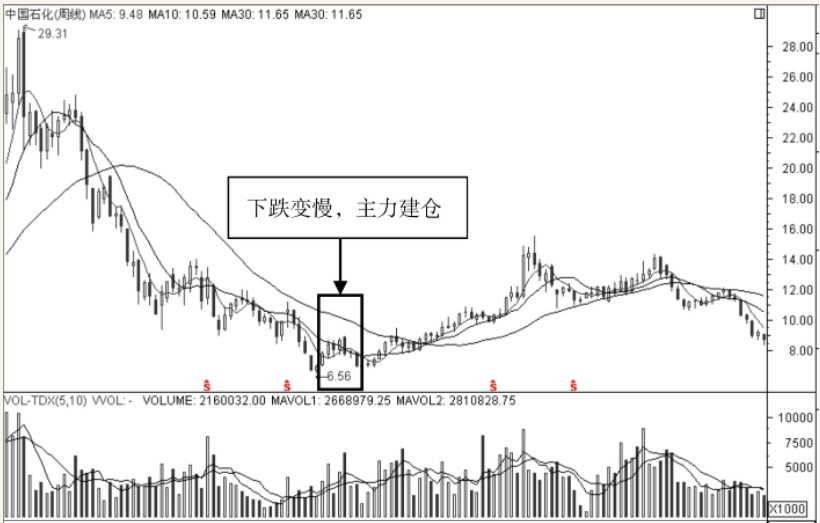

图10.14 中国石化周K线图

如图10.15所示从图上可以看到，股价在市场的底部徘徊整理了数个交易日，很多散户正是经受不住这段时间的折磨，于是纷纷抛出手中的筹码，而这正是庄家机构所希望的，散户在此时抛出多少筹码，庄家就会吃尽多少筹码，直到不想再吸纳筹码为止。当均线系统开始真正从黏合状态向上发散时，成交量会突然增多，股价也会快速拉升，因为这是庄家机构开始向上拉升的时刻，此时已经结束了之前的建仓过程。

图10.15 建发股份日K线图

如图10.16所示股价从36元左右的高位开始下行，直至5元左右的价位，可见跌幅之深。然而庄家机构在股价达到5元左右的最低价之前，早已进行了建仓活动。从图中也可以看到，股价在达到5.30元的最低价前，阴K线的实体已经有所减小，这说明已经有做多的能量进场阻止价格大幅下跌，成交量在此时也有一定增长，这就是庄家建仓的标志。

因此当股价达到市场的底部时，并没有做过多的停留，随即便开始向上缓慢移动，而3条移动平均线也在股价上扬后不久便开始向上运行，投资者完全可以根据移动平均线系统掉头向上的信号来跟着庄家买入股票。

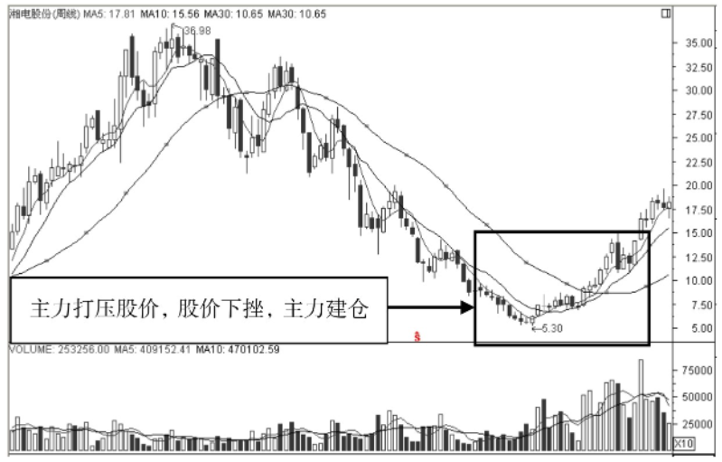

图10.16 湘电股份周K线图

如图10.17所示股价从32.58元开始下跌，直至5.67元结束。而庄家则在股价达到5.57元之前已经开始悄悄地吸纳筹码，这一点从移动平均线的变化可以看出。因为股价在近5.67元的最低价时，不仅K线实体有所减小，而且移动平均线向下运行速度也开始变化，这说明了下跌的过程中遭遇到了强大的支撑作用，而这种支撑作用无疑是庄家机构进场建仓造成的。当股价开始向上移动时，伴随着成交量明显增多，均线系统也开始调头向上运行，这就是庄家建仓完毕的信号，也是给投资者进场的信号。

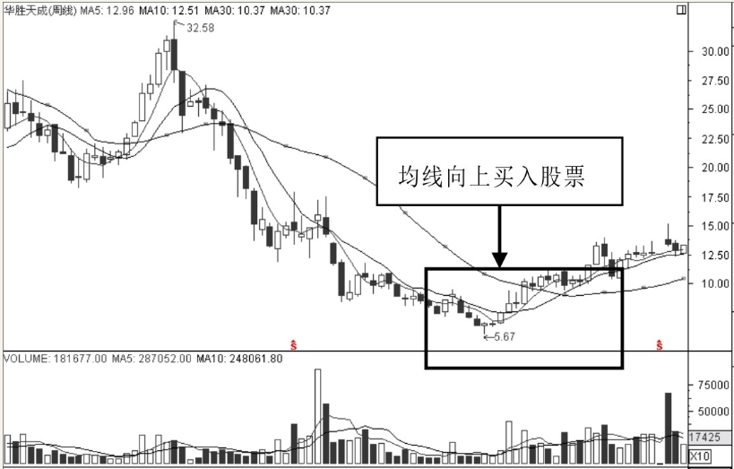

图10.17 华胜天成周K线图

如图10.18所示股价在达到10.42元之前庄家机构开始悄悄地建仓。而当股价达到10.42元这一新低时，庄家已经建仓完毕，因此股价没有在市场底部进行过多地停留，而快速地向上拉升，以多个大阳线的形式达到了17.25元的顶峰。投资者在看到均线系统从下向上运行时完全可以跟着庄家买入股票。

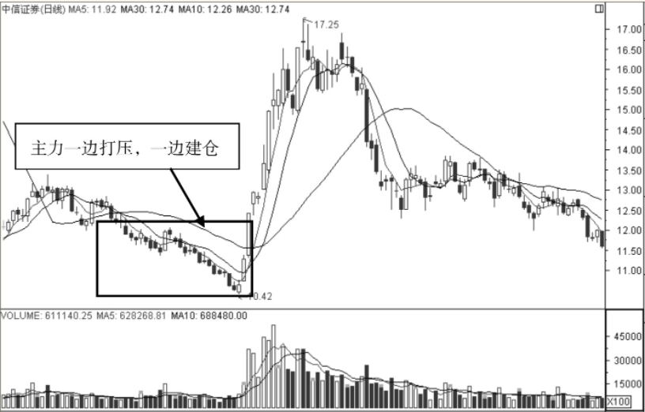

图10.18 中信证券日K线图

### 拉升建仓
有时庄家机构在市场底部没有掌握大部分的筹码，也就是没有达到庄家机构想要的控盘程度，因此会在拉升过程到一定高度后继续吸纳筹码。而当均线再次出现向上发散的形态后，就是庄家机构建仓完毕的信号，也是给投资者一个在此地入场的时机。

如图10.19所示股价从11.35元开始仅仅小幅上扬后，再次进入横盘整理过程。移动平均线也在黏合缠绕，这就是庄家小幅拉高后再次建仓的时刻，一些受不住折磨的投资者会卖出手中的股票，而这又完全转化成庄家手中的筹码。当均线系统再次向上发散时，就是庄家机构建仓完毕了，也是投资者再次买入的时机。而此时独立机构已经吸纳了足够的筹码，控盘程度已经相当之高，因此后市拉升的幅度和速度都是惊人的。

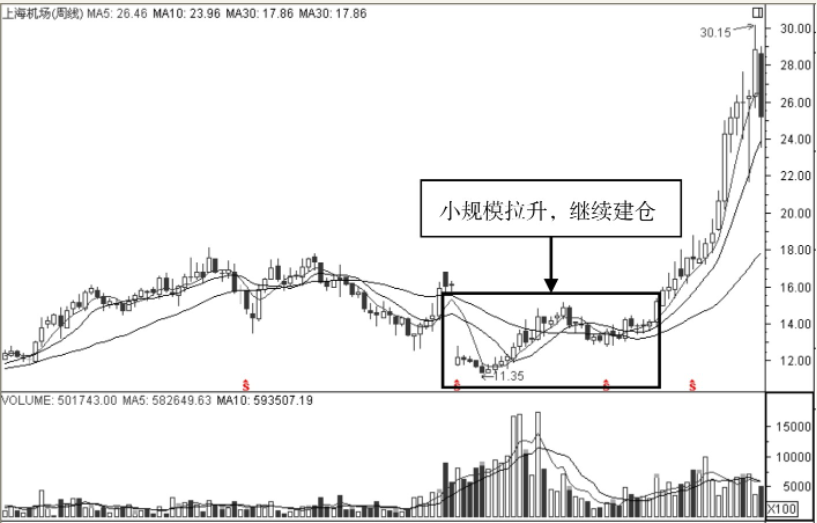

图10.19 上海机场周K线图

如图10.20所示股价从6.83元开始上扬，均线系统也逐渐调头向上。而股价小幅上扬后，便进入一个横盘整理过程。该图上的K线实体逐渐缩小，甚至多个交易周出现十字线形态，这个漫长的整理过程会使很多散户经受不住时间的折磨而快速出场，而这也是庄家机构吸纳筹码的机会。均线系统从黏合状态开始向上发散时，就是机构建仓结束的时刻。那些提前出场的散户也会感到后悔不已，因为后市的上涨幅度和速度都是股价市场底部上涨时所无法达到的。

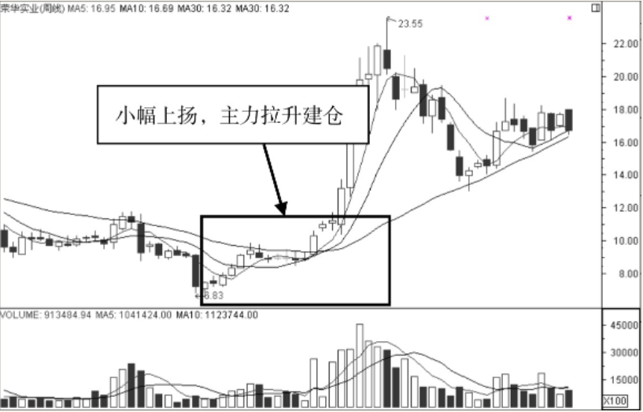

图10.20 荣华实业周K线图

如图10.21所示股价从6.10元小幅上扬，但是从走势图上可以看到，整个上扬的过程似乎是无力的。成交量没有明显增多，股价上扬的幅度也不大，每个交易日内K线实体都很小，甚至很多时候会出现十字线。这样一些散户肯定会认为股价不可能持续上扬，庄家向上推动股价上涨的动力是不足的，于是会纷纷出场。实际上在这个上扬的过程中，就是庄家机构建仓的过程。当庄家机构建仓完毕后，图中的两条移动平均线快速向上发散，成交量也突然增多，股价也以向上跳空的形式向上运行。这就是机构建仓完毕，真正向上开启拉升之路的时刻，也是投资者迅速入场的时机。

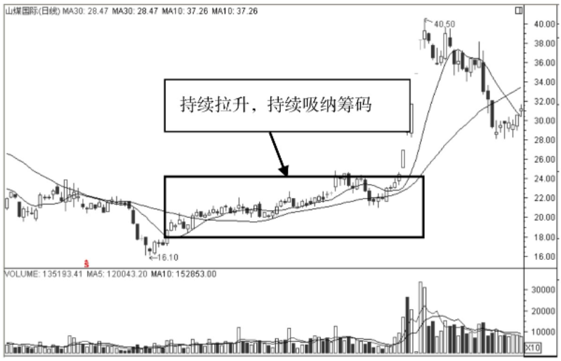

图10.21 山煤国际日K线图

## 试盘阶段
所谓`试盘`就是庄家机构在拉升前测试一下盘中的情况，弄清是否有庄家在操控这只股票，以及盘中承接能力和上方的阻力情况，以做到心中有数，为下一步做大幅拉升的工作做准备。庄家机构根据不同的情况，采用的试盘方法也会不尽相同，因此在盘面上留下的特征也有所区别。

### 快速拉升法
`快速拉升法`是指庄家机构在某一个交易日，或者在某一交易时段内快速地向上拉升股价，以测试场中上方的压力大小。如果场中压力较小，则庄家机构可能会在后续的几个交易日快速向上拉升，如果场中有较强的压力，则庄家机构可能会继续吸纳筹码或者其他工作，而在K线图上由于庄家机构的快速拉升的试盘方法，因此可能会留下长长的上影线。

如图10.22所示，图中箭头指向的K线出现在盘整行情的末期，这是庄家机构在某一个交易日向上快速拉升来进行试盘的标志。在盘整阶段，K线实体非常小，而此时出现的一个较长上影线的阳线，就是庄家机构快速拉升导致的。上影线较短，则说明场中的压力较小，因此后几个交易日庄家便开始了快速地向上拉升过程。在股价向上拉升时，不仅成交量增多，而且均线系统也稳定地向上运行，因此根据均线稳定地向上发散信号，投资者就可以买入股票。

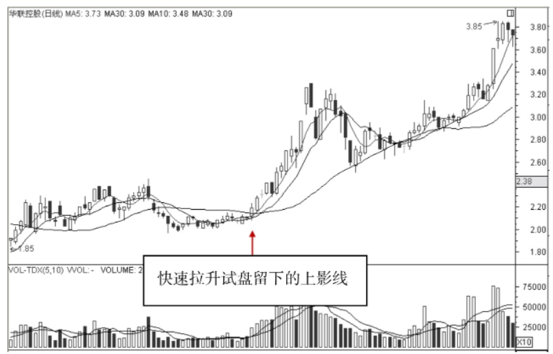

图10.22 华联控股日K线图

如图10.23所示图中标注的位置，连续3个交易日的股价出现快速上扬，庄家机构正是在这3个交易日内进行试盘工作。通过视察，庄家机构认定场中的压力较小，因此后市股价继续向上不断攀升。而均线始终稳定地向上运行，尤其是30周移动平均线稳定地向上，衬托着股价不断高涨，因此股民可以放心买入股票。

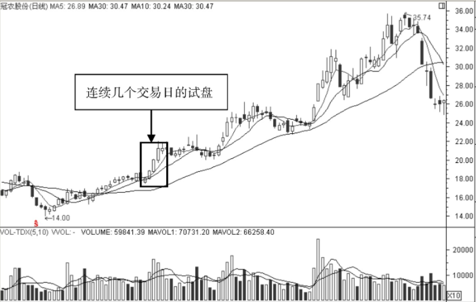

图10.23 冠农股份日K线图

### 打压建仓法
庄家机构如果想测试市场中某个价位支撑的能力，常常通过打压的方式进行试盘。如果场中呈现能力强，则庄家机构在视察结束后会快速地向上拉升，K线上也会留下长长的下影线表示支撑能力较强。如果场中支撑能力较弱，则庄家机构向上拉升的过程还需要等待一段时间。

如图10.24所示，庄家连续4个交易日向下打压股价，一度使股价达到16.10元的最低价，但这正是庄家通过打压的形式测试市场中的承接能力。在达到16.10元时，当日的日K线和前一个交易日的日K线尽管都是阴K线，但是都留下了长长的下影线，就说明在此处承接能力较强。

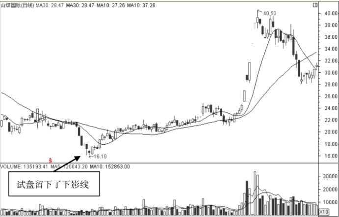

图10.24 山煤国际日K线图

如图10.25所示，在图中箭头指向的位置出现了一个十字线形态。在此之前，股价已经连续多个交易日快速下跌，这就是庄家机构通过打压的形式进行市场活动，目的是测试前期低点4.85元价位的承接能力。而在股价到达这一点附近时，出现了十字线形态，长长的下影线就说明此处的承接能力较强，因此股价在随后便缓慢上扬。

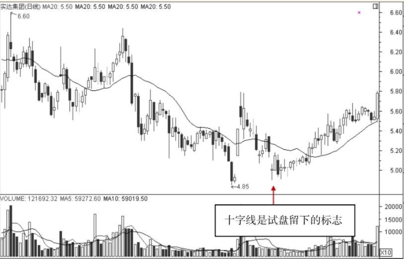

图10.25 实达集团日K线图

### 单针触底法
`单针触底`是K线图上的一种走势，该K线具有长的下影线，触及某一价格低点，外观上就如同一根钢针一样，也是庄家试盘的常见标志。投资者如果在走势图中发现此种走势，则一般可以轻而易举地判断出庄家在进行试盘，因此可以更好地进行跟庄操作。一般来说，单针触底形态出现后，说明市场有较强的承接能力，因此庄家很快便会进行拉升，但是也有的庄家会继续进行试盘。

如图10.26所示，股价从14元开始小幅上扬，不久便在箭头指向的位置出现了一个单针触底形态，这也是庄家机构试盘的结果。通过试盘，庄家机构认定此处有较强的承接能力，因此继续向上快速拉升。而此时5日移动平均线和10日移动平均线也相继向上运行，30日移动平均线也开始逐渐走平，因此投资者可以放心地买入股票。

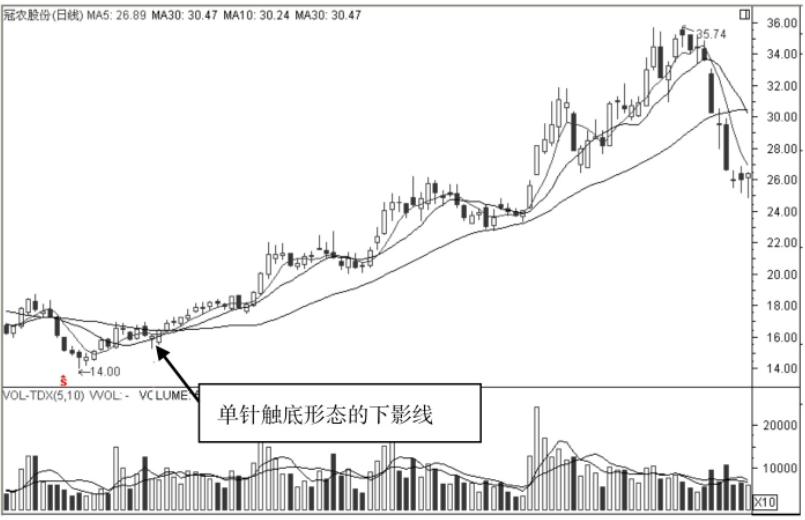

图10.26 冠农股份日K线图

如图10.27所示，图中央的位置尽管是一根阴K线，但是它具有长长的下影线，说明承接能力也是较强的。而且更重要的是，30日移动平均线和120日移动平均线所代表的中长期走势都是向上的，因此股民可以放心地买入股票。从后势市的走势图看，股价在随后的两个交易日内以近乎涨停的形式向上冲击。

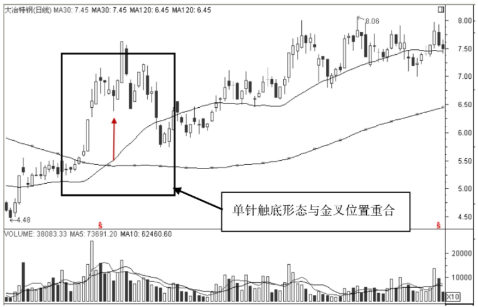

图10.27 大冶特钢日K线图

如图10.28所示，在图中箭头标注的位置也出现了一个类似单针触底的形态，该K线有长长的下影线，但是投资者不能根据此信号进场，因为此时移动平均线是向下运行的，这说明趋势依然是向下的，此时进场比较危险。

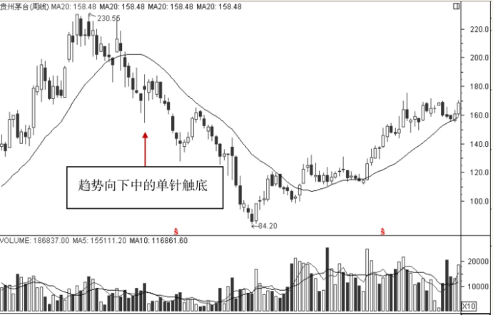

图10.28 贵州茅台周K线图

### 低开高走法
所谓`低开高走`就是庄家在进行试盘时故意将价格向下大幅打压，使股价在某一个交易日开盘时就出现一个大幅地向下跳空缺口，但是如果股价在此点位受到强大的支撑作用，则会形成一个大阳线。这个低开的价格就会变成支撑点，庄家会在随后的交易日中快速拉升。

如图10.29所示，图中箭头指向的位置是一个跳空低开的大阳线，它与前一个交易日有一个巨大的跳空缺口。此处，股价受到了强大的支撑作用而形成了低开高走的形式，这就说明场中的承接能力是十分强劲的，不仅如此，30日移动平均线是始终向上运行的。

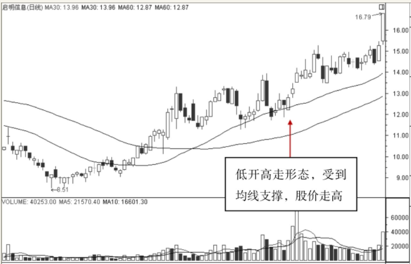

图10.29 启明信息日K线图

如图10.30所示，股价在42.50元达到最低，而此时尽管收成阳线，但是却与前一个交易时段形成了一个巨大的跳空缺口。但是此后股价在低开后快速上扬，形成了一个大阳线，成交量也出现放量形态。不仅如此，30小时移动平均线也出现了向上的运行方向，60小时移动平均线开始逐渐走平，因此投资者完全可以买入股票。

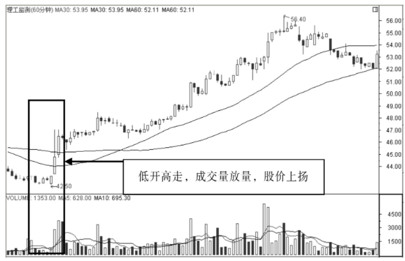

图10.30 理工监测60分钟K线图

如图10.31所示，图中箭头指向只是一根大阳线，而且前一个交易日还是一根大阴线，似乎价格在低开后会走低，但是庄家机构经过试盘后发现此处承接能力较强，因此形成了一个低开高走的大阳线。尽管成交量在此时没有明显后增长，但是5日移动平均线和10日移动平均线始终保持稳定地向上运行方向，因此投资者可以在此时买进股票。

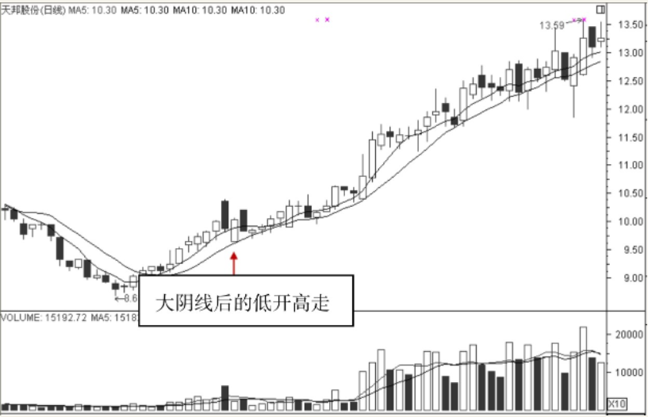

图10.31 天邦股份日K线图

## 洗盘阶段
所谓`洗盘`是指庄家在拉升过程中，或者在建仓完毕后，由于担心市场中的散户跟着庄家进行交易，因此会故意采用一些手法来清除掉场中的跟风者。

### 宽幅震荡
`宽幅震荡`一般出现在股价大幅上涨的过程中，此时场外的跟庄者看到股价有了大幅的上扬空间，也势必会跟风入场，这时庄家机构往往采用打压的方式将股价大幅下跌，随即再向上大幅拉升，使股价始终处于宽幅震荡的范围中。而在此阶段，如果投资者不能认清洗盘的过程，则可能会在庄家机构打压股价时快速出场，这也就帮助庄家机构完全完成了洗盘的工作。这时散户只要看到长期移动平均线保持向上的运行方向，就可以认定向上的趋势是不会改变的，因而可以继续持股。

如图10.32所示，股价从8.51元左右的最低价开始上扬，在上涨了近4元左右的价位后，进入到了一个宽幅震荡的行情中。这种宽幅震荡走势实际上是庄家进行实体盘的操作导致的，为了清除场中已有的跟风者，庄家故意让股价大幅震荡，在3元左右的区间内上下震动，致使害怕股价下跌的交易者会纷纷出场。

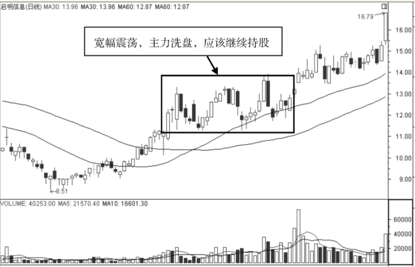

图10.32 启明信息日K线图

而明智的交易者会看到30日移动平均线和60日移动平均线，始终保持向上的运行方向，因此可以认定股价并没有发生反转现象，继续持股也是自然的选择。

如图10.33所示，股价从2.89元开始上扬。尽管整体上股价是向上移动的，但是在整个上扬过程中，成交量也出现了忽大忽小的状态，而在此期间，必定会有一部分投资者提前出场，因此庄家机构也会达到吸盘的目的。实际上，尽管股价有大幅波动，但是30日移动平均线始终保持向上的运行方向，因此是可以一直持有股票的。

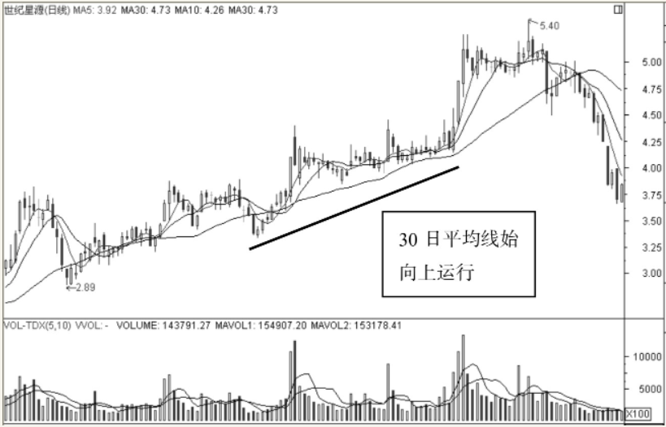

图10.33 世纪星源日K线图

如图10.34所示，此图表的时间周期是属于短线投资者热衷分析的交易图表，股价从5元开始快速上行，然而在上行过程中出现了大幅的震荡走势，这也是庄家在拉升过程中的控盘行为导致的。而20周期移动平均线作为中期走势的良好体现者，稳定地保持向上运行的方向，因此尽管股价有向下的大幅回调过程，股民也可以继续持有股票。

图10.34 开元投资60分钟K线图

### 窄幅震荡
`窄幅震荡`是指庄家机构在拉升股价的过程中在某一价位让股价持久不能上扬，但也不让股价大幅下跌，而是围绕在这个点位徘徊。尽管股价上涨过程中没有出现大幅地下跌走势，但是股价长期不能上扬，这也会让许多新奇的交易者离场，从而庄家达到吸盘的目的，同时庄家还可以节约大量打压股价时所用的筹码。

如图10.35所示，股价从4.60元开始上扬，但是在运行到图中标注的区域时，股价停止了上涨的步伐，而是进入到了一个窄幅的波动范围中。此时成交量也停滞不前，不再继续增长，但是可以让投资者继续持股的信号是移动平均线始终保持稳定地向上运行方向，因此说明上涨的趋势还没有终结，持股是必然的选择。

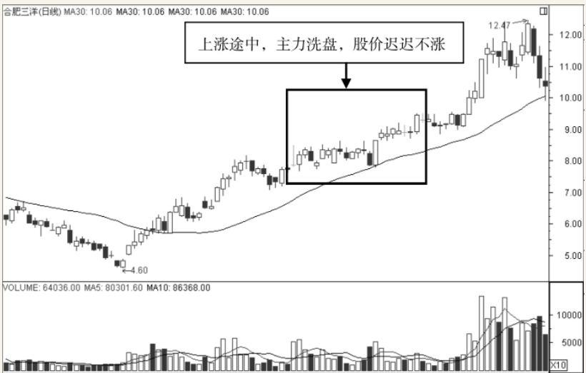

图10.35 合肥三洋日K线图

如图10.36所示，股价从42.50元快速上行，成交量也明显增多，K线图上留下了长长的大阳线痕迹。但是此后进入到了标注的区域，这是股价窄幅震荡的位置，也是庄家机构吸盘的时刻。此时，许多投资者会看到股价迟迟不能上涨而过早地出手手中的股票，但实际上两条移动平均线均没有出现向下走势，因此上涨行情必定持续，继续持股是明智的选择。

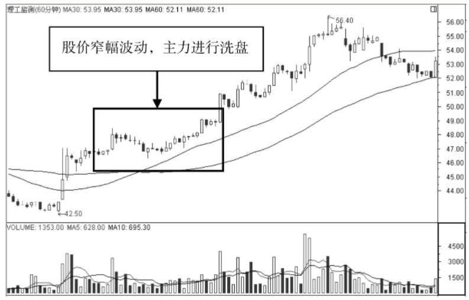

图10.36 理工监测60分钟K线图

如图10.37所示，股价从10.84元的底部缓慢上行，成交量逐步放大，但是在图中标注的位置，庄家机构开始进行洗盘活动，股价常常在一个较窄的波动范围内上下波动，整个震荡区间仅仅为1元左右。但是3条移动平均线始终稳定地向上运行，衬托着股价向上移动，说明上涨的趋势还将继续，股民可以继续持股等待后市大幅上扬，也可以在此时继续买入股票。

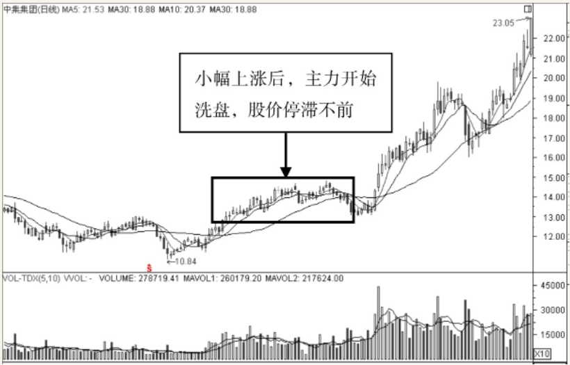

图10.37 中集集团日K线图

### 向下打压
`向下打压`是庄家机构最常用的洗盘方式，它是指庄家机构在拉升到一定高度后，利用手中的部分筹码故意向下打压股价，使股价有连续几个交易日的快速下跌，给投资者造成一种恐慌的情绪，使股民害怕价格下跌，而过早地出场。而散户手中出手的筹码，都会被庄家机构廉价地吸纳进来。此时短期移动平均线伴随着股价的下跌会有向下的运行方向，但是长期移动平均线一般依然会保持坚定的向上方向。

如图10.38所示，图中标注位置是庄家机构向下打压进行洗盘的位置，尽管此前股价拉升的幅度已经很大，但是同样正是因为巨大的涨幅势必会引来更多的跟风者入场，因此庄家机构会采取打压的方式使股价大幅下挫。

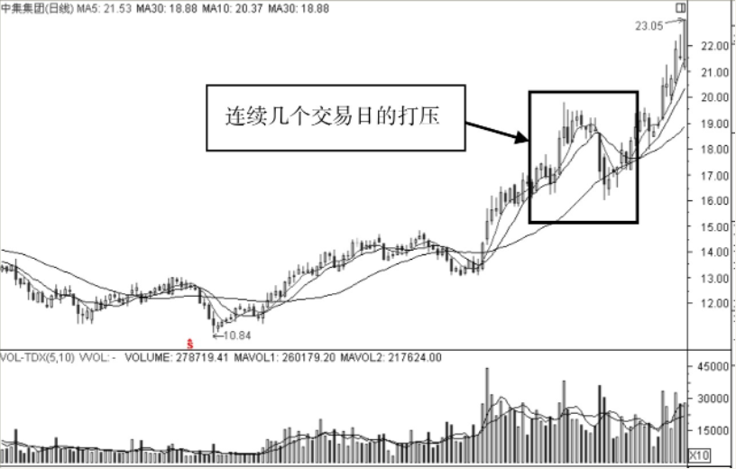

图10.38 中集集团日K线图

从K线图上可以看到，连续几个交易日出现大阴线走势，可见跌幅之深。5日移动平均线和10日移动平均线伴随着股价的下跌也开始调头向下运行，这也迫使更多的交易者出场，但是真正能够体现长期趋势的30日移动平均线始终保持向上的方向，因此股民完全可以据此判断出这是庄家机构的洗盘行为，可以继续持有股票。

如图10.39所示，股价从84.20元开始上行，不久便出现回调的行情。但是20周期移动平均线代表的中短期走势始终稳定地向上运行，这说明是庄家机构在拉升过程中采用打压形态导致的，尽管拉升幅度不大，但是庄家机构常常会在市场拉升的初期用此方式进行洗盘。

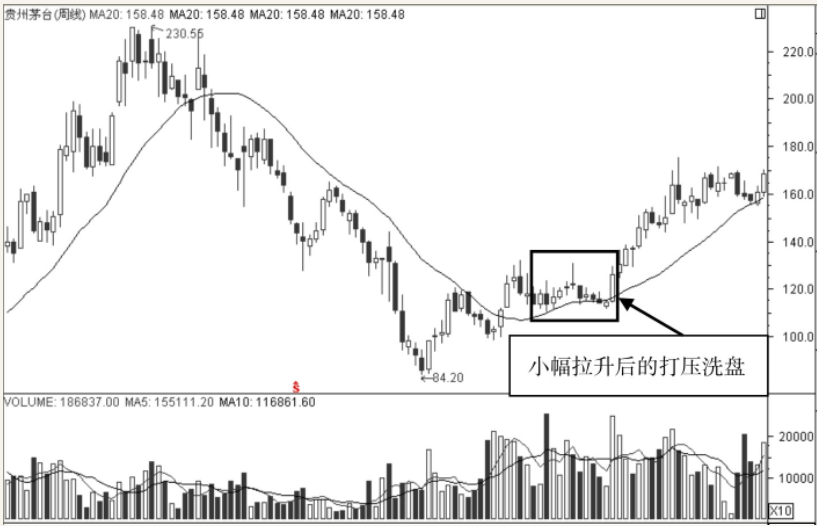

图10.39 贵州茅台周K线图

如图10.40所示，在这张周期较短的图中可以很好地看到庄家吸盘的具体方式，使股价从43.76元开始小幅上扬，成交量也小幅增长。但是在图中标注的位置，庄家机构开始进行洗盘活动，因为此时的涨幅，势必会引来一定的跟风者入场。从图中也可以看到，当庄家进行洗盘时，尽管股价有了一定的下跌幅度，但是成交量很小，这说明没有真正的大量卖单出现。不仅如此，20日移动平均线始终向上运行，而且股价在触及20日移动平均线时受到了移动平均线的强大支撑作用，而结束了洗盘行为，股价也开始继续向上运行，成交量开始明显增多。

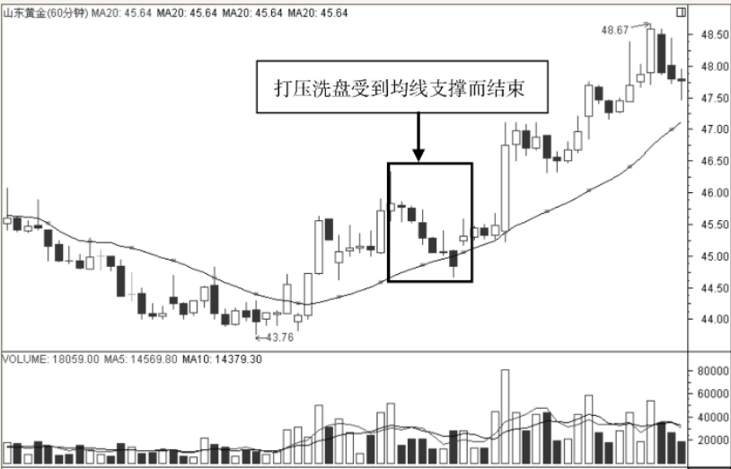

图10.40所示为山东黄金60分钟K线图

### 放量收阴线
市场中普遍认为股价在上涨时出现放量，说明做多的能量是比较充足的，是庄家大量拉升的表现。而如果股价在下跌过程中出现放量，则是庄家在进行出货的标志。但是庄家在洗盘的过程中，也常常故意制造放量收大阴线的形式，因为庄家机构有强大的控盘能力，筹码数量占有绝对优势，因此可以通过对倒的形式来制造巨大的成交量，这样可以起到震慑散户的效果，让更多的散户认为庄家机构正在大举离场，从而提前出场。

如图10.41所示，股价从4.67元开始上扬，在图中箭头指向位置，出现了一个大的向上跳空缺口，但是当天却收成了一个大阴线，而且成交量也明显增多。很多投资者会认为这是庄家机构开始出货的标志，实际上这正是庄家机构在洗盘，因为此时涨幅不大，仅仅在1元左右，还达不到庄家出场的目标位置。不仅如此，20日移动平均线始终稳定地向上运行，说明上涨的趋势远没有结束。

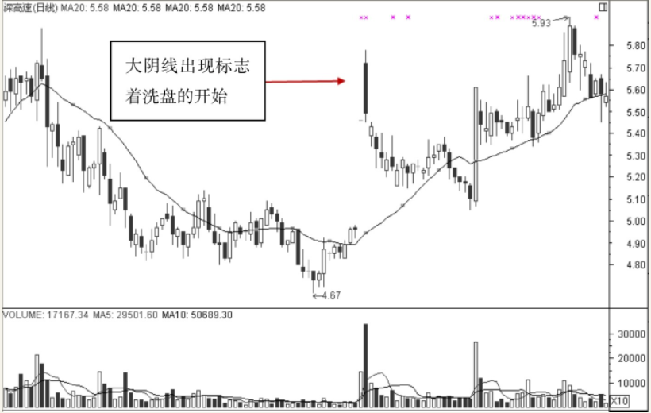

图10.41 深高速日K线图

如图10.42所示，股价从9.64元开始回调，在箭头指向的位置出现了一个大阴线，而且此时的成交量也明显增多。但两条移动平均线始终向上移动，这正是庄家机构在进行洗盘。

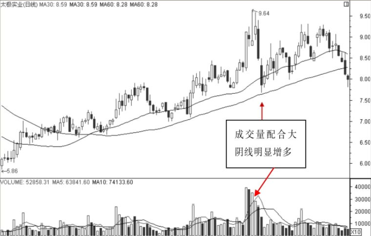

图10.42 太极实业日K线图

如图10.43所示，股价在上涨过程中出现了明显的回调过程，在图中箭头指向位置出现了一个阴K线，而且与前一个交易日有一个巨大的跳空缺口，成交量也出现明显增多迹象。这更会让很多股民感到恐慌，认为股价已经到达顶部，因此会提前出场，这也是庄家机构想要达到的洗盘效果。其上均线系统稳定地给出向上的运行方向，说明原有的上涨趋势仍将继续，不仅长期移动平均线向上运行，而且短期移动平均线也没有向下调头的迹象，因此这仅仅是庄家洗盘导致的。股民不仅不需要提前出场，还可以利用庄家打压股价时候的低价位再次进场。

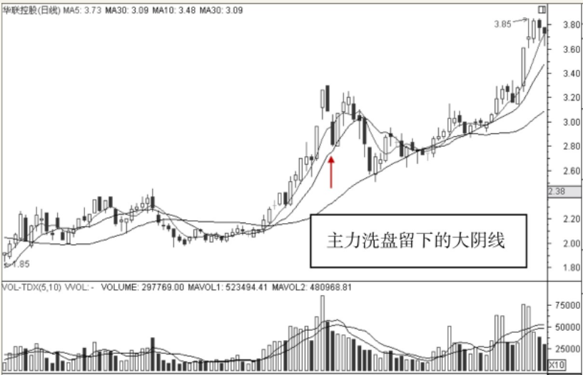

图10.43 华联控股日K线图

## 拉升阶段
所谓`拉升`是指庄家在吸纳了筹码后，将股价迅速向上抬高的过程。这一过程直接关系到庄家机构最终获利多少，同时也会给散户带来无限的利润。

### 快速上扬
股价快速上扬是庄家拉升时导致的结果，一般多是短线庄家的行为。这些庄家机构由于资金有限，因此不会长久地向上拉升，一般在连续几个交易日快速向上拉升股价后，有了一定的利润空间就会快速出场。

一般来说，中小庄家机构十分愿意采取这种快速拉升的方式，因为这种方式可以在很大程度上降低风险，占用的资金数量也不多。但是拉升的幅度和空间也不会太高。因此跟着庄家交易的散户应该心中有数，不能一味希望庄家拉升的幅度较大后才出场，否则庄家已经出货，而自己还停留在市场中，就会产生巨大的亏损。

遇见这种拉升方法，散户们的交易策略就是快进快出，有了不小的收益就离场，至少也要在庄家出货前出场。

在整个快速上扬过程中，均线系统一般会向上发散，或者是出现多头排列形态。如图10.44所示股价从5元开始快速上行，连续多个交易时段都是以大阳线的形式收盘的，而且成交量也伴随着股价的快速上扬明显增多，20周期移动平均线也是以非常陡峭的形式向上运行。这就是庄家在快速拉升，因此此前能够积极入场的投资者可以坐享其成。

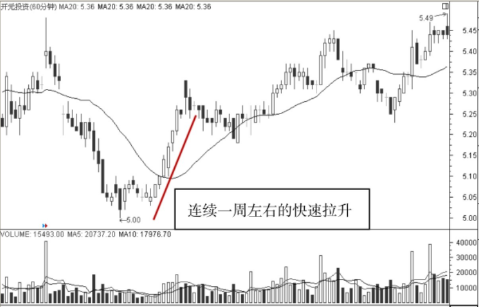

图10.44 开元投资60分钟K线图

如图10.45所示，股价在达到市场底部6.11元的最低价后，成交量也快速增多。移动平均线是给出了明显的多头排列形态，而且均线向上发散的幅度非常陡峭，这也验证了向上拉升的速率和幅度都是惊人的。因此此时能够买入的投资者可以不费吹灰之力就获得近一半的利润。

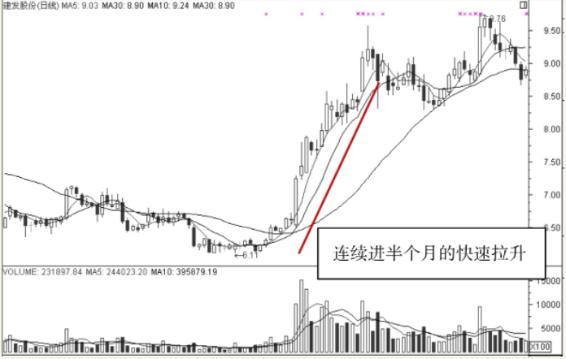

图10.45 建发股份日K线图

如图10.46所示，股价在达到6.83元的价位后，先是小幅上扬随后便快速上涨。此时成交量明显增多，均线也大幅向上发散，而这正是大幅拉升的过程。如果没有进场的投资者想追高买入，此时应该快速进场，因为这种快速拉升的方式通常是不会持续很长时间的。

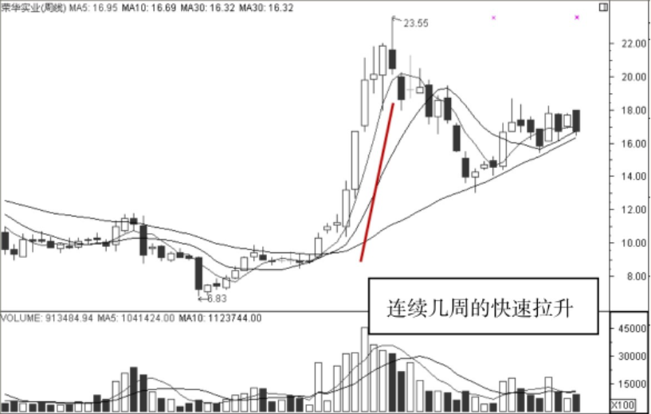

图10.46 荣华实业周K线图

### 小幅上扬
`小幅上扬`是拉升过程中的另一种方式。这种方式不同于快速拉升方法，股价不会大肆上冲，而是缓慢地向上移动。从外观上看，这种上涨似乎缺乏力量的支持，但它确实是庄家在进行拉升操作，只是拉升的工作比较隐秘而已。

小幅拉升的方式更多的是长线庄家拉升的方式。因为这种方式不容易吸引太多的散户跟风入场。因此也就不需要庄家再二次洗盘。长线庄家一般需要较大的利润空间，因此拉升的幅度和时间都会很长。

如图10.47所示，股价从20.01元开始上扬，但是整个上涨过程极其缓慢，尽管20日移动平均线也是向上运行的，但是上涨的波动比较小，即在30度左右，而且股价浮动也较小，每个交易日出现的K线实体也是较小的。但实际上这是长线庄家的拉升方式，散户应该耐心持股，因为整个上涨空间是无限大的，只要20日移动平均线保持向上的运行方向，投资者均可以继续持股。

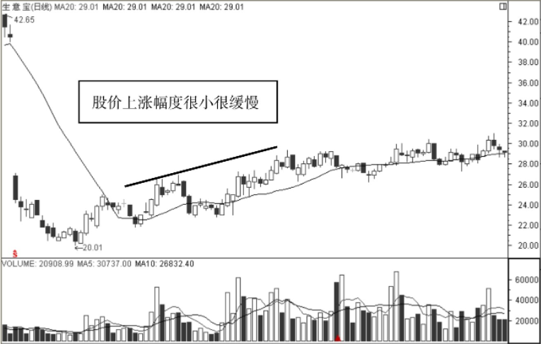

图10.47 生意宝日K线图

如图10.48所示，这张图的时间周期为周K线，因此多为中长线投资者所热衷分析的。从图中看，股价从8.31元开始上涨，但是整个上涨的坡度非常缓慢，基本上是沿着45度角向上运行。20周期的移动平均线也是缓慢向上移动，成交量在拉升的过程中基本上没有任何增长。

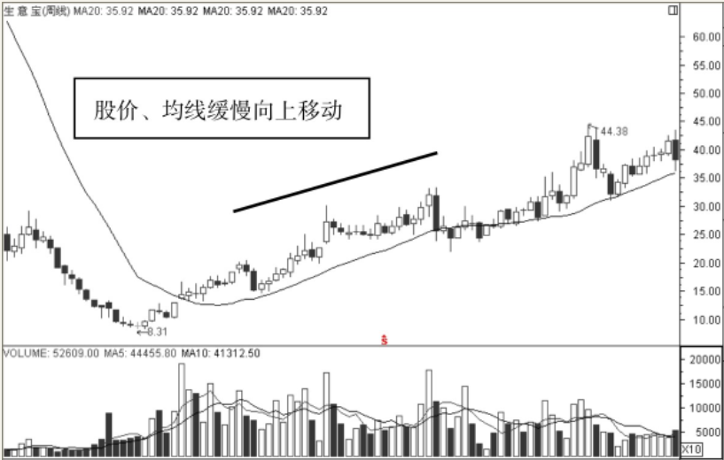

图10.48 生意宝周K线图

如图10.49股价从4.30元缓慢上涨。在整个拉升的前半段都是小幅上扬的，而成交量却在逐步增长。两条移动平均线缓和地向上运行，整个拉升幅度在60度左右，而股价在每个交易周波动的幅度是较小的。

图10.49 山煤国际周K线图

### 平台上行
用平台向上拉升的庄家机构一般控盘程度较高，而且向上推动的能量较强大。它是指股价被拉升到一定幅度后，便横盘整理一段时间，最后再继续攀升，然后再次横盘整理，如此反复不断，向上提升股价。成交量也随着股价向上运行，均线系统伴随着股价的上扬会出现明显的多头排列形态。

如图10.50所示，股价从42.50元开始上行，但是每次都是拉升了两根K线后开始横盘整理，然后继续向上拉升，随后再次整理，形成平台上行的走势。两条均线基本上衬托着股价向上运行，说明庄家向上拉升的能力是比较稳定的。因此股民可以耐心等待，不必过早地卖出手中的股票。如果散户在平台整理时过早出场，则势必会错过后市的大幅上涨空间。

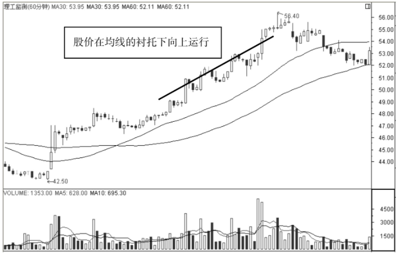

图10.50 理工监测60分钟K线图

如图10.51所示为大冶特钢周K线图。在这张长期的走势图中，股价从3.52元开始上行，而且整个上涨也是以平台上行的方式运行的。因此根据移动平均线保持向上运行方向的信号，投资者可以继续持股，而且在上涨过程中，两条移动平均线还形成了黄金交叉，因此更增添了继续持股的理由。

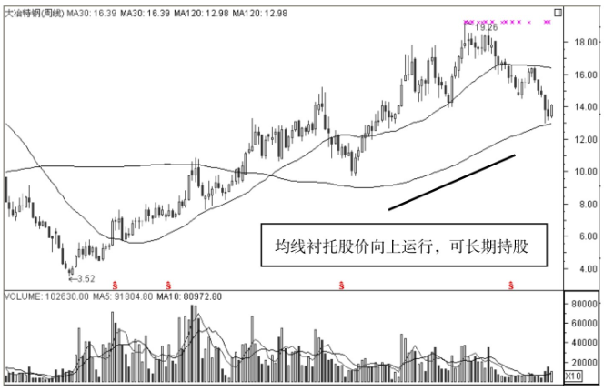

图10.51 大冶特钢周K线图

### 震荡上行
`震荡上行`拉升的方式，是在拉升的过程中结合了洗盘的方式，使股价不是直线上扬，而是上涨与下跌交替进行，但整体的运行方向是向上的。这样会使很多跟风者在股价下跌的过程中就过早地离场，从而在拉升过程中完成清除跟风者入场的目的。经过洗盘后，股价便比较稳定地向上运行，即使伴随着股价回调，短期平均线会向下运行，但中长期移动平均线一般也会稳定地向上运行。

如图10.52中可以看到，庄家机构在拉升时是采用震荡上行的方式，股价在上涨过程中出现了多次下跌的回调过程，这一点是为了清除跟风者。但是在整个上涨下跌反复较量的过程中，股价是不断小幅上升的，这一点从30日移动平均线上可以很好地看出来。尽管5日移动平均线和10日移动平均线出现过相互交叉，并且向下运行，但是30周期移动平均线始终稳定地向上运行，这也就体现出大的趋势依然没有变化，始终是向上运行的。

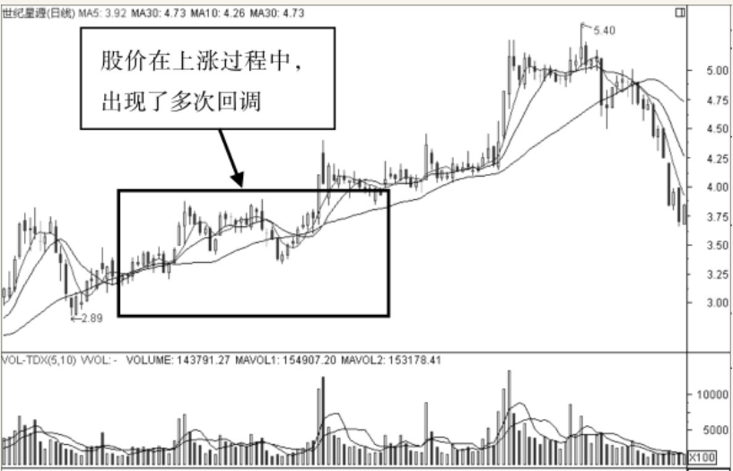

图10.52 世纪星源日K线图

如图10.53所示，股价从10.77元开始上扬，但是在上涨的过程中出现了回调的行情，5周期移动平均线与10周期移动平均线也相互交叉，但是30周期移动平均线始终保持向上的方向，而且在不断上扬的过程中，成交量也逐步增多。因此可以看到有源源不断的资金来推升股价，股民是可以继续持有股票的。

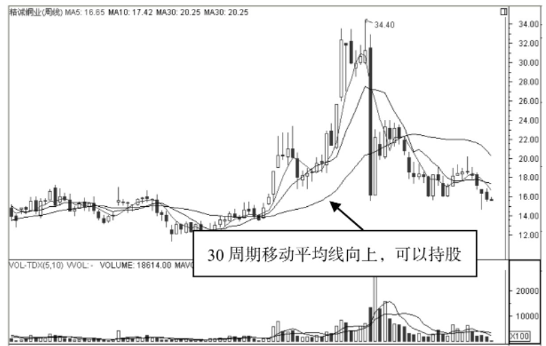

图10.53 精诚铜业周K线图

## 出货阶段
`出货阶段`是庄家机构能否获利的最终环节，也是散户跟着庄家进行交易成功与否的重要环节，即使拥有足够多的账面利润，没有及时出场也会将原有的利润交换出去。因此散户必须能够及时捕捉到顶部的到来，及时察觉到庄家何时在出货。

### 高位横盘出货方法
当股价履行到高位时，由于庄家在悄悄地分批出货，股价很可能会停滞不前，而是在高位持久地进行震荡，均线系统也会从原先的发散状态逐渐收敛，甚至出现相互黏合缠绕的现象，这时投资者应提高警惕，因为股价很有可能即将到达市场底部。

如图10.54所示，股价在达到14.19元的高位时开始横盘整理，停止了上涨的脚步。而3条移动平均线也开始逐渐走平，随即开始向下运行。股价在达到高位时，成交量也没有明确增长，这些信号都是庄家出货时的标志，因此散户应该及时出场。

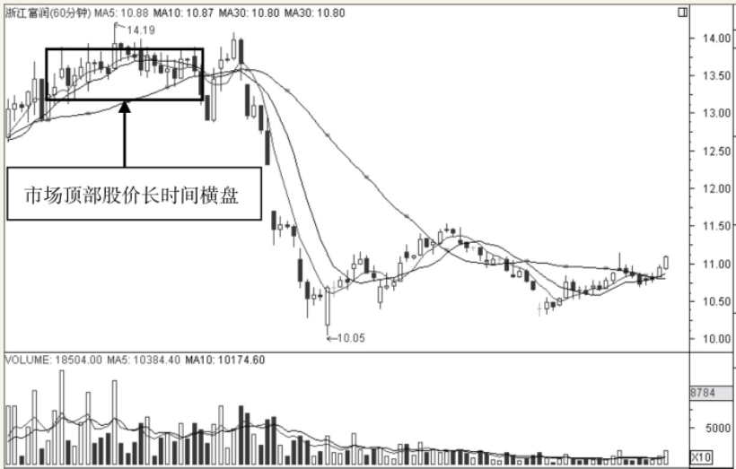

图10.54 浙江富润60分钟K线图

如图10.55所示，股价在17元左右达到顶峰，此时成交量也呈最大化状态。尽管30日移动平均线在向上运行，但是5日移动平均线和10日移动平均线已经开始出现向下，甚至相互缠绕黏合，因此股民应该尽快出场，此时庄家在市场顶部分批出货的标志已经显现。

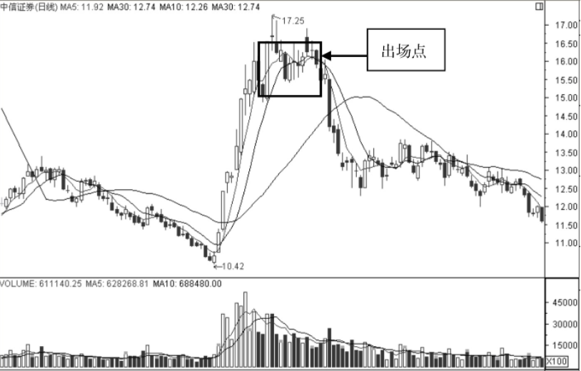

图10.55 中信证券日K线图

如图10.56所示，尽管图中仅有20周期移动平均线，但是依然可以探测到庄家何时进行出货。股价在达到230.55元后停止了上涨的步伐，而且持续数个交易周进行高位盘整，此时20周期移动平均线已经从比较陡峭的上涨坡度逐渐走平。这就是上涨的动力有所衰退的体现，而上涨的阻力正是由于庄家在市场高位开始分批出货导致的。

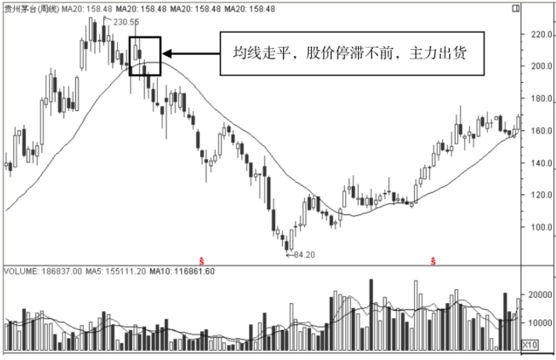

图10.56 贵州茅台周K线图

### 高位震荡
`高位震荡`是指庄家在市场高位出货时造成股价下跌，但是为防止散户过早识破庄家的意图，因此会有小幅拉升，可股价并不会大幅下跌，而是保持在市场的高位震荡。在这种震荡的过程中，股民不断地逢高买入股票，帮助庄家出货。一旦庄家出货完毕，则股价便会应声而下。在高位震荡的过程中，均线系统也会给出危险的信号，长期移动平均线一般会出现走平或调头向下，而中短期移动平均线也会相互出现缠绕交叉的走势。

如图10.57所示，股价在37元左右开始止住上升的势头，但是也没有直线下跌，而是在高位横盘震荡。在整个震荡过程中，30日移动平均线从逐渐走平到开始向下运行，而5日移动平均线和10日移动平均线也相互交叉形成死亡交叉信号，于是市场的底部已经到来。尽管在震荡过程中出现过向上的反弹行情，但是成交量并不支持反弹走势，因为没有出现明显的放量过程。

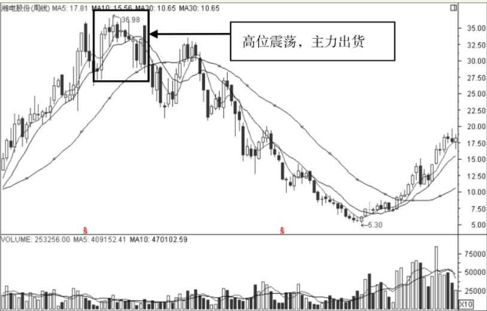

图10.57 湘电股份周K线图

如图10.58所示，股价在12.77元达到顶峰，随即便在高位展开宽幅震荡，短期移动平均线也逐渐减缓了上升的坡度并向下运行，长期移动平均线因为有较强的滞后性，因此依然延续着向上的方向。散户应该学会选择利用市场的高位作为获利了结的时机。

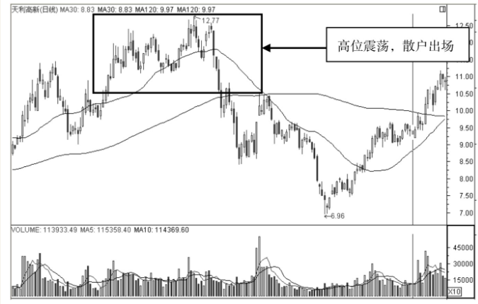

图10.58 天利高新日K线图

如图10.59所示，股价在向上反弹时没有超过前期高点，就已经暗示上涨的动力开始不足。而且均线也发出警告信号，尽管股价在二次向上反弹时，出现了明显的上涨行情，但是30周期移动平均线却在向下运行，因此是庄家进行出货的阶段，也是投资者出场的时机。

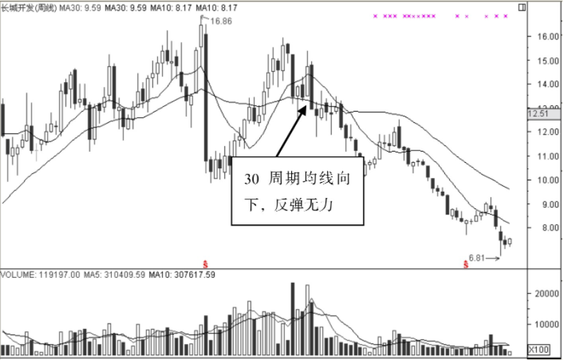

图10.59 长城开发周K线图

### 上涨减速
在上涨过程中，庄家会在上涨的末期开始出货，以免在高位大量出货时被散户识破，这样当股价有了一定涨幅后，由于庄家开始分批出货，股价上涨的动力就逐渐消失了。只有被蒙蔽的散户还在继续购买，但是由于没有庄家大资金的向上推动，股价上涨的幅度就会减小，速度也会有所放缓，这就是庄家开始出货的标志，此时移动平均线会开始逐渐走平，不会再非常陡峭。

如图10.60所示，股价从8.80元开始上涨，在14.89元达到顶峰。3条移动平均线整体上是向上衬托着股价移动的，但是仔细观察不难发现，股价在10.50元至13.50元这一区间内是快速飙升的，而移动平均线也非常陡峭，说明了上涨的势头非常强劲。而在13.50至14.89元这个区间内，股价虽然也在上涨，但是速度明显小于之前的行情，而且3条移动平均线也开始逐渐变得缓和。这说明这时候市场中已经开始有了阻碍股价上涨的因素，这种因素无疑是庄家出货造成的。

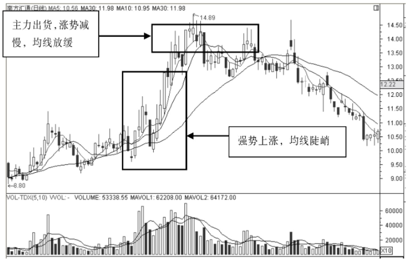

图10.60 南方汇通日K线图

如图10.61所示，股价从42.50元持续上涨直至56.40元，这在小时图中可以说是不小的涨幅了。那么怎么知道56.40元是股价的高点呢？能不能提前预知高位即将到来呢？图中的均线给了充分的提示信号。

尽管图中只有两条移动平均线，但是也能很好地反映趋势，提前发出高位预警。股价从42.50元开始上涨，而且有规律地以波浪形式上扬，成交量配合增长，两条均线发生黄金交叉后开始上扬，这一切都很完美，能让更多的股民买入股票，也能够让持股的股民继续持有，使利润继续增长。

但是股民非常关心的是什么时候应该获利离场，仔细观察均线就能够得到答案。股价在52元左右时，已经距离市场底部有了10元的空间，成交量开始有了衰减的迹象。但是K线图上没有明显的卖出信号，依然以波浪的形式向上冲高。此时可以发现，两条均线的上升坡度开始变缓慢，说明上涨的势头得到了一定程度的抑制，这就是庄家出货的证明，也是散户获利离场的时机。

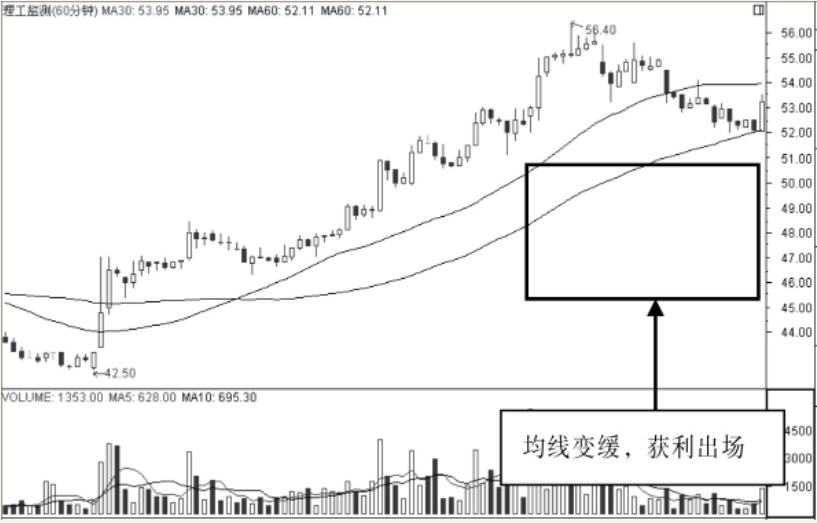

图10.61 理工监测60分钟K线图
