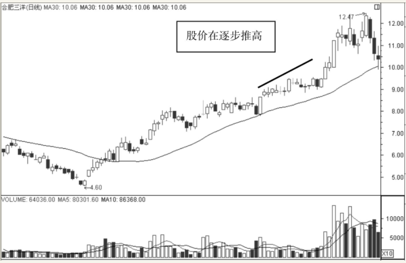

    作者: 九州股神 编著
    出版社: 电子工业出版社
    出版年: 2015-11
    页数: 264
    定价: 49.00元
    ISBN: 9787121273421

[豆瓣链接](https://book.douban.com/subject/26649739/)

- [从零开始学均线](#从零开始学均线)
  - [均线的分类](#均线的分类)
  - [均线的特点](#均线的特点)

# 从零开始学均线
## 均线的分类
`短期均线组合`中最常用的有5日、10日、20日和5日、10日、30日两种组合。短期均线组合主要用于观察股价短期运行的趋势，例如1～3个月的股价走势会发生什么变化。一般来说，**在典型的上升通道中，5日均线应为多方护盘中枢，否则其上升力度有限；10日均线则是多头的重要支撑线，10日均线被击破，市场就有可能转弱**。

中期均线组合最常见的有10日、30日、60日和20日、40日、60日两种组合。中期均线组合主要用于观察股价中期的运行趋势。例如，3～6个月的汇价走势会发生什么变化。**一般来说，中期均线呈`多头排列状态`，说明股价中期趋势向好；反之，中期均线呈`空头排列状态`，说明中期趋势向淡**。

长期均线组合最常见的有30日、60日、120日和60日、120日、250日两种组合。长期均线组合主要用于观察汇价的中长期趋势，例如，半年以上的股价走势会发生什么变化。这些均线组合对股价的变化相对较迟钝，经常用来判断某个长期趋势是否开始反转，是长线投资者的重要参考依据。**一般来说，当长期均线组合中的均线形成`金叉`，成为多头排列时，说明市场对中长期趋势看好，反之，当长期均线组合中的均线形成`死叉`，成为空头排列时，说明市场对股票中的长期趋势看淡**。

## 均线的特点
移动平均线最重要的特点之一就是它能够稳定地反映趋势体现趋势。如果移动平均线向上，则体现出目前的行情是向上的；如果移动平均线向下运行，也就说明行情是向下运行的。

如图1.9所示为合肥三洋日K线图。从图中可以看到，股价在4.60元时达到新低，此后股价开始缓步上扬，而移动平均线也是向上运行的，这也就体现了未来的行情走势将进一步向上运行。从成交量也可以看出，上涨的行情是比较可靠的，因为股价在稳步推升的时候，成交量都给予了放量的支持。这也就说明，场外的投资者在源源不断地进入场内推高股价，因此此时买入股票是比较安全的。股价会在30日移动平均线的衬托下向上逐步推高。

