    作者: 九州股神 编著
    出版社: 电子工业出版社
    出版年: 2015-11
    页数: 264
    定价: 49.00元
    ISBN: 9787121273421

[豆瓣链接](https://book.douban.com/subject/26649739/)

- [从零开始学均线](#从零开始学均线)
  - [均线的分类](#均线的分类)
  - [均线的特点](#均线的特点)
- [单根均线驰骋股市](#单根均线驰骋股市)
  - [股价向上突破均线](#股价向上突破均线)
  - [股价重回移动平均线](#股价重回移动平均线)
  - [股价受到均线支撑](#股价受到均线支撑)
  - [股价远小于移动平均线数值](#股价远小于移动平均线数值)
  - [股价向下突破移动平均线](#股价向下突破移动平均线)
  - [股价二次向下突破移动平均线](#股价二次向下突破移动平均线)
  - [股价反弹受阻于移动平均线](#股价反弹受阻于移动平均线)
  - [股价远大于移动平均线数值](#股价远大于移动平均线数值)
- [不同周期的均线](#不同周期的均线)
  - [日线图中的均线](#日线图中的均线)
  - [周线图中的移动平均线](#周线图中的移动平均线)
  - [60分钟图中的移动平均线](#60分钟图中的移动平均线)
- [均线组合形态买入点研判](#均线组合形态买入点研判)
  - [典型买入形态组合](#典型买入形态组合)
    - [黄金交叉](#黄金交叉)
    - [银山谷形态](#银山谷形态)
    - [金山谷形态](#金山谷形态)
    - [多头排列形态](#多头排列形态)
    - [首次黏合向上发散](#首次黏合向上发散)
    - [二次黏合向上发散](#二次黏合向上发散)
    - [首次交叉向上发散](#首次交叉向上发散)
    - [二次交叉向上发散](#二次交叉向上发散)
    - [逐浪上升](#逐浪上升)
    - [蛟龙出海](#蛟龙出海)
    - [加速下跌](#加速下跌)
    - [上山爬坡](#上山爬坡)
    - [烘云托月](#烘云托月)
  - [买入实战演练](#买入实战演练)
    - [筑底时的金叉](#筑底时的金叉)
    - [拉升中的金叉](#拉升中的金叉)
    - [多头排列](#多头排列)
    - [中长期均线支撑股价](#中长期均线支撑股价)
    - [下跌过程抄底买入](#下跌过程抄底买入)
- [均线组合形态卖出点研判](#均线组合形态卖出点研判)
  - [典型卖出形态组合](#典型卖出形态组合)
    - [死亡交叉](#死亡交叉)

# 从零开始学均线
## 均线的分类
`短期均线组合`中最常用的有5日、10日、20日和5日、10日、30日两种组合。短期均线组合主要用于观察股价短期运行的趋势，例如1～3个月的股价走势会发生什么变化。一般来说，**在典型的上升通道中，5日均线应为多方护盘中枢，否则其上升力度有限；10日均线则是多头的重要支撑线，10日均线被击破，市场就有可能转弱**。

中期均线组合最常见的有10日、30日、60日和20日、40日、60日两种组合。中期均线组合主要用于观察股价中期的运行趋势。例如，3～6个月的汇价走势会发生什么变化。**一般来说，中期均线呈`多头排列状态`，说明股价中期趋势向好；反之，中期均线呈`空头排列状态`，说明中期趋势向淡**。

长期均线组合最常见的有30日、60日、120日和60日、120日、250日两种组合。长期均线组合主要用于观察汇价的中长期趋势，例如，半年以上的股价走势会发生什么变化。这些均线组合对股价的变化相对较迟钝，经常用来判断某个长期趋势是否开始反转，是长线投资者的重要参考依据。**一般来说，当长期均线组合中的均线形成`金叉`，成为多头排列时，说明市场对中长期趋势看好，反之，当长期均线组合中的均线形成`死叉`，成为空头排列时，说明市场对股票中的长期趋势看淡**。

## 均线的特点
移动平均线最重要的特点之一就是它**能够稳定地反映趋势体现趋势**。如果移动平均线向上，则体现出目前的行情是向上的；如果移动平均线向下运行，也就说明行情是向下运行的。

从图1.9中可以看到，股价在4.60元时达到新低，此后股价开始缓步上扬，而移动平均线也是向上运行的，这也就体现了未来的行情走势将进一步向上运行。**从成交量也可以看出，上涨的行情是比较可靠的，因为股价在稳步推升的时候，成交量都给予了放量的支持。这也就说明，场外的投资者在源源不断地进入场内推高股价，因此此时买入股票是比较安全的**。股价会在30日移动平均线的衬托下向上逐步推高。

图1.9 合肥三洋日K线图

图1.10中的移动平均线为60日移动平均线，**而且它是向下运行的，也就代表了中短期的走势是向下的。而且在此期间，成交量一直保持十分低迷的状态，说明没有人在此时愿意过多地买入股票**。因此投资者在此时应该保持观望的态度，等待有明确的上涨信号时再进场交易。

图1.10 龙头股份60分钟K线图

如图1.11所示，不仅一条移动平均线可以体现趋势，多条移动平均线也能更好地反映趋势。从图中可以看到，图中的3条不同周期的移动平均线整体上是向下运行的，代表着整体的走势是向下的。但是图中标注区域的位置，3条均线呈水平移动状态，**这说明在此阶段，场中的多空双方发生了僵持不下的局面。此时股价进入到了通常所说的盘整阶段，而未来的走势是不确定的，因此投资者不能过早地入场，应该积极地观望**。

图1.11 上实发展日K线图

移动平均线另一个重要的特点就是它**有一定的滞后性**。从移动平均线的计算过程中可以看到，它的数值实际上是一个平均值，因此必然会兼顾之前的收盘价。

移动平均线的另一个重要特点是它**对股价有支撑和阻力作用**。因为移动平均线代表了场中一定周期内的平均持仓成本，因此当股价向上或向下穿越移动平均线时，移动平均线都会构成一定的支撑或阻力作用。也就是说，一般情况下当股价触及移动平均线时，都不会轻而易举地穿越，经常会出现一定时间的盘整后再发生穿越，甚至不能成功穿越。

图1.15中标注的位置，是股价试图向下穿越移动平均线的位置。而在此位置，30日移动平均线给了股价强大的支撑作用，使得股价继续在30日移动平均线以上运行。

图1.15 合肥三洋日K线图

如图1.16所示股价从13.13元开始上扬，当运行到60日移动平均线附近时，受到了移动平均线的强大阻力作用，股价在连续数周均在60日移动平均线以下运行，始终受到压制而未能穿越。此后，股价以一个向上跳空的形式最终突破60日移动平均线，而成交量再突破时也给出了明显的放量信号。这时就标志着行情已经由缓慢上涨开始加速上扬，投资者在此时迎来了一个良好的买入时机。

图1.16 铜陵有色的周K线图

图1.17中的移动平均线为250日移动平均线，尽管参数较大，但是对股价的压制作用并不因此而减弱。图中标注的两个区域都是股价在下跌过程中出现的强劲反弹行情，而成交量也有一定的放量予以支持。但是当股价触及250日均线时，均受到了均线的强大压制作用，最终未能成功向上突破，而反弹行情也就此宣告破产。

图1.17 中国银行日K线图

# 单根均线驰骋股市
## 股价向上突破均线
在股市中，移动平均线代表了在这一交易时段内的平均持有成本。例如10日移动平均线则反映了近10个交易日内的平均持有成本，因此如果股价向上突破了10日移动平均线，则说明股价在未来将要上涨，因此投资者可以选择适当买入股票。

图2.1中的移动平均线为20周移动平均线，属于中短期移动平均线类型，因此能够很好地体现出中短期走势。股价在4.30元时达到最低，此后便小幅上扬，成交量也逐渐增多。在箭头指向的位置，一根阳线向上突破了20周移动平均线，尽管K线的实体较小，但是此时却有着重要的意义。**因为一旦股价向上穿越20周移动平均线，就标志着未来很有可能将继续上扬。尽管K线实体较小，但是成交量却出现了明显地增多，说明有雄厚的资金支持股价向上穿越移动平均线**。此后股价便一路高涨，直至31.40元。因此在移动平均线刚刚被穿越时，是非常好的一个买入点。

图2.1 山煤国际周K线图

如2.2图中，选用的移动平均线为5周移动平均线，它更加侧重于短期走势的体现。从图上也可以看到5周移动平均线始终贴近股价运行，因为它相对于20周移动平均线来说更加灵敏，因此滞后性也较小，股价有什么变化，它都可以及时地体现出来。

股价在2.60元走出新低，而在下一个交易周，一根阳线穿越了5周移动平均线。由于5周移动平均线滞后性较小，因此所发出的买入时机也相对较早。但是这不影响买入信号的准确性，**因为在股价向上穿越移动平均线时，成交量也出现了增多的迹象，这也说明有资金来支持股价向上不断攀升**。

图2.2 国农科技周K线图

## 股价重回移动平均线
该形态是指，股价曾经向上突破移动平均线，不过涨幅不大，此后移动平均线继续向上运行，但是股价又小幅地向下跌破移动平均线，不久再次冲高到移动平均线上方，这就说明多头将开始真正地向上拉升，此时就是投资者的一个良好的买入时机。

如图2.3所示股价从7.61元开始上扬，此后不久便向上穿越了5日移动平均线。此后股价始终沿着5日移动平均线之上运行，但是在箭头指向的位置，股价先是向下小幅跌破了5日移动平均线，此后股价并没有快速下行，而是在后两个交易日便开始重新回到5日移动平均线之上，这说明多头依然控制着整个市场，此时是一个良好的买入点。此后股价将快速上行，这是此前股价上涨时所不能比的。

图2.3 武汉塑料日K线图

如图2.4所示，该K线图的时间周期为小时，主要体现短期走势。而图中选的移动平均线的周期为20周期，因此又兼顾了中期走势。股价从5元开始上行，成交量也有小幅增长。在图中箭头指向的位置，一根阴线向下突破了20周期移动平均线。但是股价并没有随即开始大幅下跌，而是在下一个交易日时就出现了重新回归均线之上的形态，而且成交量也配合增多，此后股价便开始大规模地上行，而且上涨的速度和幅度都极快。

图2.4 开元投资60分钟K线图

## 股价受到均线支撑
移动平均线对股价有一定的支撑作用，因此当股价从上向下跌落到移动平均线附近时，往往不会轻而易举地向下突破均线，只要股价不能向下突破，而受到均线的支撑开始转入向上的行情时，投资者就可以买入股票。

如图2.5所示，股价从8.31元开始上行，20周期移动平均线也相继调头向上运行。成交量伴随着股价的上升也逐渐增多，说明多头有能力稳步地向上推升股价。在椭圆形标注的位置，股价曾经向下跌落，K线图上出现了一根大阴线，但是股价并没有跌破20日移动平均线，而是受到了均线的有力支撑而继续上行。不仅如此，20周期移动平均线始终保持向上运行的方向，丝毫没有调头向下的走势迹象，因此股民可以在此时放心大胆地购买股票。

图2.5 生意宝周K线图

如图2.6所示，图中的K线时间周期为日，这主要体现中短期走势，而图中选用的移动平均线周期为120日，因此又兼顾了长期走势行情。股价从3.87元开始上涨，这时中途出现了明显的回调行情，在回调时成交量明显萎缩，这也意味着股价并没有开始反转。当股价运行到图中椭圆形标注的位置时，受到120日移动平均线的支撑而开始继续上扬，而且在此时成交量再次增多，说明多头将继续推升股价，因此这是市场给投资者的一个买入时机。

图2.6 双良节能日K线图

## 股价远小于移动平均线数值
移动平均线代表一定时间周期内的平均持有成本，因此当股价远远低于移动平均线的数值时，就说明股价已经处于过低的状态，此时会有不少投资者纷纷抢购。在更多投资者进场推动股价的作用下，股价很有可能出现反弹甚至反转的走势。

如图2.7所示，股价从230.55元左右开始一路向下，至84.20元左右为最低点。而在股价接近市场底部时，已经远远偏离了移动平均线，因此说明市场价格过低，投资者要密切注意盘面变化，只要有做多的信号出现就可以少量买入股票。当股价达到84.20元的最低点后，在下一个交易周就出现了明显的大阳线，而且成交量也有了大幅度增长，这说明在此价位已经有源源不断的资金进入市场，是买入的时机。

图2.7 贵州茅台周K线图

如图2.8所示，股价在达到5元左右的价位时，远远低于20周期移动平均线，因此只要有进场的信号出现，投资者就可以积极进场交易。在股价触及5元左右的价位后，止住了下跌的脚步，一连多个交易时段内的K线都没能向下突破这一点位。不仅如此，20周期移动平均线也开始逐渐走平，成交量开始不断增多，因此股民可以在此处买入股票。

图2.8 开元投资60分钟K线图

## 股价向下突破移动平均线
移动平均线可以被看作在一定时期内平均持有成本的反映，因此也是这一时期内多空双方的分界线。如果股价从上向下穿越了移动平均线，则说明市场很有可能已经由多方控制转向空方控制，因此是投资者获利出场的好时机。

如图2.9所示，当股价达到230.55元时，成为本轮上涨过程中的最高点，此时股价极度偏离移动平均线，因此是市场给股民们的第一个卖出信号。此后移动平均线结束了上涨的运行方向，开始逐渐走平，随即又开始向下运行。而股价在持续盘整后逐渐下行，在箭头指向位置一根阴线向下穿越了20日移动平均线所代表的中期持有成本，因此这是市场给投资者的第二个卖出信号。此后股价一路下行，从230元左右的价位一直跌至80元左右，可见跌幅之深。

图2.9 贵州茅台周K线图

如图2.10所示，股价在9.98元达到顶峰，此后开始下滑，在运行到图中箭头指向的位置时，一个阴线向下突破了20日移动平均线。尽管阴K线的实体较小，但是它与前一个阶段的K线有一个巨大的向下跳空缺口。因此说明股价向下的动力是十分强劲的，这也提示交易者必须在此时出场。

图2.10 荣安地产60分钟K线图

## 股价二次向下突破移动平均线
股价二次向下突破移动平均线，是指股价曾经向下穿越过移动平均线，但是不久又重新回到移动平均线之上。当股价再次向下突破移动平均线时，就是空头真正开始向下打压股价的时刻，也是市场给投资者最后的一个出场机会。此后股价一般会有一个较快并且较大的下跌空间和速度。

如图2.11所示股价从市场高位一路下跌之后，出现了明显的反弹行情，但是图中箭头指向的K线是股价二次向下突破均线的位置，因此后市还会延续原有的下跌趋势。此时投资者不能见到有了很深的下跌空间而过早地入场，因为此后股价始终沿着移动平均线向下运行。

图2.11 荣安地产60分钟K线图

如图2.12所示股价从38.20元的高位开始向下运行，而在箭头指向的位置，股价二次向下跌破了10周期移动平均线，这就意味着股价将继续原有的下跌走势。由于10周期移动平均线所代表的短期移动平均线一直处于向下的运行方向，丝毫没有调头的迹象，而成交量也没有出现明显的增多迹象，因此说明反弹的行情早已结束，股价的下跌空间还很大。

图2.12 青岛啤酒周K线图

## 股价反弹受阻于移动平均线
移动平均线对股价有一定的支撑作用，但股价从下向上运行时，当股价触及移动平均线附近时，移动平均线对股价也会产生一定的阻力作用。因此如果股价触及移动平均线而未能继续向上运行，就是投资者良好的卖出时机。

如图2.13所示，该走势图选用的时间周期为小时，更加侧重分析短期走势，但是为了更好地兼顾中期走势，因此图中选用了60周期移动平均线。股价从6元左右的价位开始向上反弹时，触及了60日移动平均线，就是图中椭圆形标注的位置。移动平均线在此处也给了股价强大的压制作用，结束了股价短期的反弹走势。尽管成交量在此时出现明显增多，但是依然没有突破均线的压制。因此投资者应该在此时获利出场，并且继续等待不能过早入场。

图2.13 龙头股份60分钟K线图

如图2.14所示，图中的移动平均线的时间周期为20周，代表中期移动平均线。从图中可以看出，股价在下跌过程中出现了短暂的向上反弹行情，但是每次股价反弹到20周移动平均线时，都没能成功地上穿，而且每次反弹时成交量也没有明显增多，这也印证了股价将继续向下运行的推断。

图2.14 贵州茅台周K线图

## 股价远大于移动平均线数值
移动平均线代表近期内购买股票的平均成本，因此如果股价极度地偏离了移动平均线，则说明市场已处于不正常的交易过程。例如，如果股价远远高出了移动平均线的数值，则说明此时在此点位购买股票所付出的代价远远超出了平均成本。因此不会再有更多的人愿意在此时买入股票，此未来股价向下出现回调的可能性很大，甚至可以出现反转行情。

如图2.15所示当股价运行到230.55元时，20周移动平均线已经开始走平，更为重要的是，此时股价已经极大地远离了20周移动平均线所代表的中短期平均持仓成本，因此很有可能是市场的底部。此后股价在高位持续盘整，持久不能继续上扬，成交量也从增多的迹象开始逐步萎缩，这就意味着市场的顶部即将形成。投资者应该在此时快速出场，而不能继续追高买入。从后市的图中可以看到，股价在结束上涨行情后，开启的新一轮下跌趋势是十分猛烈的，下跌幅度也极深。

图2.15 贵州茅台周K线图

如图2.16所示从图中可以看到股价在12.51元达到顶峰，而此时股价也远远高出了120日平均线所代表的中长期平均持有成本。此时成交量也发出了警告信号，因为股价在连续创出新高时，成交量却在逐渐地缩小，说明继续向上推动的能量已经开始衰退。因此不管未来是发生反转还是回调，下跌的趋势是不可避免的，只是下跌的幅度大小不同。所以投资者应该在此时快速出场，这样可以规避大量的风险。

图2.16 双良节能日K线图

# 不同周期的均线
## 日线图中的均线
如图3.1所示股价整体上是向上运行的，而5日移动平均线作为短期趋势的体现者，也是大体向上运行的。因此，当股价出现小幅下挫时，5日移动平均线也及时捕捉到了价格的变化，出现向下追随股价运行的现象。作为短期交易者，只要看到5日移动平均线被股价从下向上穿越，就是一个良好的买入点。但是由于5日移动平均线有较强的灵敏性，因此股价在上涨过程中有时会出现虚假穿越，这时投资者应该继续持股而不能过早地卖出。

图3.1 武汉塑料日K线图

如图3.2所示，5日移动平均线基本上是向下运行的，这说明当前的短期趋势是向下的。但是在此期间，股价也出现了小幅反弹，因此短线交易者可以据此做出买入的决策。在股价向上穿越移动平均线时，就可以考虑买进股票。但是投资者应该清楚地意识到，大的趋势是向下的，而且时间周期为日，因此向上的反弹不会有太大的幅度，不能过多地在市场中停留。在反弹中有了1元左右的利润后就应该考虑出场。

图3.2 大连控股日K线图

如图3.3所示，股价在6.11元时达到新低，此后便小幅上扬。而从图中可以看到，股价最先突破了5日均线，这就是市场给投资者的第一个购买位置。此时的位置与最低级的6.11元十分接近，而3条均线形成`银山谷`形态后已经是第二买点了，这个位置要比股价突破5日均线时高很多。

图3.3 建发股份日K线图

尽管10日均线也是短期均线，但是它减少了5日移动平均线所出现的过多虚假穿越信号。**在股价处于市场的顶部和底部时，10日均线都可以发出买入或者卖出的信号，但不会是在最高价和最低价的位置。相比其他信号而言，10日均线发出的买卖信号还是比较早的**。

如图3.4所示，股价基本上是沿着10日移动平均线向上运行的，而10日均线就体现了近期的走势，因此股价向下出现的虚假穿越比较少。当均线没有出现向下运行的态势前，投资者是一直可以持股的。

图3.4 华西村日K线图

如图3.5所示，伴随着股价上涨，10日移动平均线也向上运行。但是在上涨中途，股价出现小幅下挫走势，此时的成交量出现萎靡，而且10日移动平均线也紧密追踪趋势向下运行。在股价回调结束时，再次向上穿越10日移动平均线，说明在未来一定时间内，趋势依然延续向上，已经出场的投资者可以考虑再次进场做多。

图3.5 青岛啤酒厂日K线图

如图3.6所示从图中可以看到股价在14元站稳，随后3条移动平均线相继向上运行，当股价穿越均线时就是买入股票的信号。图中第一个箭头指向的位置是股价穿越5日均线的位置，此时距离最低价14元很近，但是会有很多投资者不敢买入股票。而第二个箭头指向的位置是股价向上穿越10日均线的位置，此时距离14元也不算太远，而且买入的可靠性更强。

图3.6 冠农股份日K线图

中长线的投资者经常在日K线图上添加60日移动平均线来进行分析。

如图3.7所示，图中有30日和60日两条均线。而60日均线是向下运行的，说明股价在中短期内都是向下的。因此，尽管股价出现了反弹，但投资者如果正在买入股票，则应该清醒地认识到一点：这种反弹的时间不会太长，要时刻警醒不能在市场中停留过长时间。

图3.7 彩虹股份日K线图

如图3.8所示从图中可以看到，60日均线基本是向上移动的，这就说明股价在中期走势内是向上的。尽管股价在波动中出现了较大幅度的下挫走势，但这种下跌走势是暂时的，不会持续太长时间。股民可以在下跌的过程中，寻找低点来买入股票。

图3.8 大冶特钢日K线图

如图3.9所示股价从6.04元上涨，整个上涨的过程是以螺旋形式向上运行的，而60日移动平均线始终向上移动，衬托着股价向上运行。不仅如此，股价在向下回调到60日移动平均线时，还受到了均线强大的支撑作用，而这个位置正是投资者买入的时机。

图3.9 顺发恒业日K线图

## 周线图中的移动平均线
如图3.10所示，图中的两条移动平均线分别是5周移动平均线和10周移动平均线。股价在上涨到16元左右的价位后开始下跌，而5周移动平均线也很快开始下行，但由于是周K线图，因此，尽管5周均线的滞后性较小，但是依然在均线形成“死叉”时，股价下跌了3元左右。

图3.10 长城开发周K线图

如图3.11所示，股价从46.23元一路下行，直至14.40元结束。而5周移动平均线伴随着股价下跌，也开始向下运行。由此可以看到，在周K线图上，股价下跌的幅度是较大的，这在日K线图上是不常见到的。因此，尽管短线交易者可以在周K线图中添加5周移动平均线来进行交易，但是也应该知道，在此周K线图中进行交易，波动幅度是远远超过日K线图的。当股价穿越了5周移动平均线向下运行时，就是投资者获利出场的时机。

图3.11 青岛啤酒周K线图

如图3.12所示，投资者可以看到股价从市场底部开始快速上扬，而5周移动平均线也伴随着股价的上涨出现了向上运行的态势，但是图中标注的位置股价向下穿越了5周移动平均线却并没有向下大幅下跌，随后又开始向上拉升。可以看到，股价轻微地向下回调，移动平均线都会及时地记录下来，因此会产生股价向下穿越5周移动平均线的虚假卖出信号。据此卖出股票的交易者，可能会丧失一部分利润空间。

图3.12 国农科技周K线图

如图3.13所示，股价从15.58元开始上行，图中第一个箭头指向的位置就是股价向上突破5周移动平均线的位置，也是投资者进场买入股票的位置。当股价运行到37.80元的价格后，开始下跌，不久均线也开始向下运行。在图中第二个箭头指向的位置便是股价向下穿越5周均线的位置，也是投资者获利出场的位置。因此，仅仅根据股价与5周移动平均线的穿越情况，就可以实现20元左右的获利空间。

图3.13 上海能源周K线图

如图3.20所示图中共有3条移动平均线，分别是5周移动平均线、10周移动平均线和30周移动平均线。从图中可以看到，股价在上涨的过程中，股价与5周均线发生穿越，这就是均线发出的虚假信号，它会让投资者过早地出场。而10周均线则几乎没有与股价发生交叉，因此信号比较真实可靠。30周均线一般常用来反映长期趋势，不作为买入或者买入时机的选择工具。

图3.20 卧龙地产周K线图

如图3.21所示从图中可以看到，股价基本上一路上扬，10周移动平均线也衬托着股价向上移动。如果根据股价与10周均线的穿越来买入和卖出股票，则可以获得大约5倍的利润空间。

图3.21 万泽股份周K线图

如图3.22所示，当股价从8.31元上行穿越了10周移动平均线后，投资者就可以进场买入股票了。股价一路上行到44.38元，可见涨幅之大。

图3.22 生意宝周K线图

如图3.23所示从图中可以看到，20周均线始终衬托着股价向上移动，而且在股价回调的时候，还给出了多次的支撑作用。

图3.23 海利得周K线图

如图3.24所示，从图中可以看到股价从下跌行情到上涨行情的完整转换过程。在4.30元左右的价位时，股价向上突破了20周移动平均线后投资者就可以进场了，此时的成交量也在放量支持投资者买入。之后股价一路高涨，始终在20周移动平均线上方移动。

图3.24 山煤国际周K线图

如图3.25所示，股价在230.55元创出新高，此后成交量开始萎缩，20周移动平均线开始下行。投资者可以从图中发现，在股价小幅下挫后，均线开始下行。但是在整个下跌过程中，如果在股价从上向下突破20周移动平均线之后卖出股票，则依然是在比较高的点位卖出的。

图3.25 贵州茅台周K线图

## 60分钟图中的移动平均线
如图3.26所示从图中可以看到，5小时均线频繁波动，与股价多次形成穿越，因此信号的准确性不高。而10小时均线则略显稳定。尽管如此，5小时均线依然体现了股价的短期走势。

图3.26 建发股份小时图

如图3.27所示股价从7.96元开始上扬，不久便穿越了5小时移动平均线，而这正是一个良好的短期买入点。短线交易者可以在60分钟图中寻找买入点，因为买入的信号要早于日K线图中出现的信号。

图3.27 太极集团60分钟K线图

如图3.28所示，如果股民在日K线图或者周K线图中得到的结论是出售手中的股票获利出场，那么若想利用一个较高的价位出场，则应该在小时图中去寻找位置。股价从12.54元开始下挫，5小时移动平均线作为短期趋势的体现者，也开始向下运行。当股价从上向下穿越了5小时移动平均线时，就是出场的位置，这个点位在整个下跌趋势中是比较高的。

图3.28 武汉塑料60分钟K线图

如图3.29所示从图中可以看到，股价整体上是上行的，但是在上涨的过程中也出现了向下的回调走势。如果交易者不能判断这种向下的走势是长期性的还是暂时的，就可以分析20周期的移动平均线，因为它代表着更长的趋势。从图中可以发现，20周期的均线始终保持向上的走势，因此可以判断出下挫的走势是暂时的。投资者不仅不需要卖出股票，还可以在下跌的时候买入股票，这时买入股票价格更低。

图3.29 山东黄金60分钟K线图

如图3.30所示，股价在下跌的过程中也出现过向上的反弹走势，但是20小时移动平均线始终保持向下运行。也就是说，比60分钟周期更大一级的时间单位是向下的，因此可以判断这种反弹行情是短暂的，此时不宜进行交易。

图3.30 荣安地产60分钟K线图

如图3.31所示，股价从5元开始上涨，20小时移动平均线也向上运行，说明较长周期内趋势都是向上的。因此股价在下跌时，股民应该在股价触及移动平均线附近买入股票。但是由于K线时间周期较短，因此不能期待上涨的幅度很高。从图中可以看到，股价上涨了不到1元左右的幅度，这也是由于时间周期较小导致的。

图3.31 开元投资60分钟K线图

# 均线组合形态买入点研判
## 典型买入形态组合
### 黄金交叉
`黄金交叉`是由两条移动平均线形成的。当短期移动平均线从下向上穿越长期移动平均线时，两条移动平均线形成的交叉就称为黄金交叉。在此信号出现后，投资者就可以考虑进场做多。

如图4.1所示为移动平均线黄金交叉示意图。图中的虚线为短期移动平均线，实线为长期移动平均线，短期移动平均线从下向上与长期移动平均线形成交叉，因此是一个买入的时机。

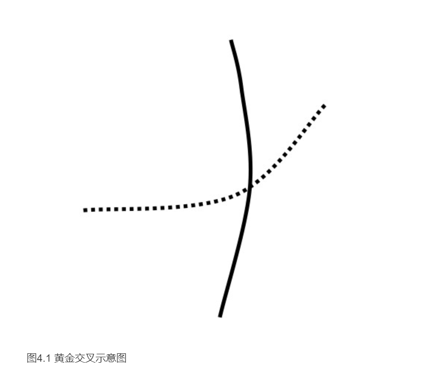

如图4.2所示图中选用的移动平均线为30周移动平均线和120日移动平均线，属于中长期移动平均线。股价从4.48元开始上涨，当两条移动平均线形成黄金交叉时，股价已经有了一定的涨幅。但是此时依然是整轮上涨空间的起始位置，而且在黄金交叉出现之前，伴随着股价的小幅上扬，成交量也出现了明显的放量特点，这也验证了上涨行情的可靠性是很高的。当两条移动平均线出现黄金交叉信号之时，虽然已经距离最低价有了一段距离，但是投资者依然可以做出买入决策。

图4.2 大冶特钢日K线图

如图4.3所示图中选用的两条移动平均线分别为30日移动平均线和60日移动平均线，而二者又均属于中期移动平均线，因此滞后性相对较小。当股价从最低价8.51元开始上涨时，成交量并没有稳定增长，而两条移动平均线却开始逐渐走平，并有向上运行的态势。当这两条移动平均线最终形成黄金交叉时，已经距离最低价8.51元有了一定的涨幅，但是此时买入的信号更加明显。因为此时从成交量方面可以看到，股价的上涨得到了成交量不断增长的支持，而且移动平均线也从向下运行的方向开始调头向上，股价在移动平均线上方稳步地推进；因此尽管买入的点位较高，但是依然可以追逐到后面的涨幅。

图4.3 启明信息日K线图

如图4.4所示图中选用的两条移动平均线分别为10日移动平均线和30日移动平均线，二者结合使用，既兼顾了中期走势又体现了短期趋势，因此很多投资者经常使用这两个参数。尽管二者配合使用发生黄金交叉的位置较低，信号较早出现，但是信号的可靠性也相对较弱。从图上可以看到，股价从16.10元开始小幅上扬，不久两条曲线便出现了黄金交叉。此时从成交量方面还看不到逐步放量的信号支持，而且此时买入尽管点位较低，但是此后股价并没有立刻上扬，而是始终在移动平均线附近盘整；因此进场较早的投资者应该经受得住时间的煎熬，股价在接连盘整的数个交易日之后，才快速上扬。

图4.4 山煤国际日K线图

### 银山谷形态
如图4.5所示为均线银山谷形态示意图。该形态是由三条移动平均线形成的，当短期移动平均线和中期移动平均线形成黄金交叉时，就是均线银山谷形态的起始位置，此后短期移动平均线和长期移动平均线形成黄金交叉，而且中期移动平均线与长期移动平均线也形成一个黄金交叉，这样三个黄金交叉就形成了一个向上倾斜的三角形形态。这个三角形形态就是均线的银山谷形态，该形态的出现，说明多头已经吸纳足够的筹码，即将开始向上发力。

如图4.6所示图中选用的移动平均线分别为5日移动平均线、10日移动平均线、30日移动平均线，属于中短期移动平均线。但是据此来做出买入的决策可以获得不菲的利润。从图中可以看到，股价在2.16元达到最低点，此后不久，三条移动平均线就形成了一个银山谷形态；之后股价一路高涨，成交量也给出了放大的信号。最终股价达到10.75元的高价，如果投资者能够在银山谷形态出现后买入股票，短短的几十个交易日内，资金就可以增长5倍之多。

图4.6 武钢股份日K线图

如图4.7所示图中选用的移动平均线的参数分别为5周、10周、30周，因此也属于中短期走势。因为K线图所用的周期为周线，所以又兼顾了中长期的走势。在此例中，银山谷形成的时间较长，股价从8.38元的最低价开始缓慢上扬，而上涨过程持续了数周之后，银山谷形态才最终确立。但是此时成交量也出现了小幅的增长，这也验证了银山谷形态的可靠性。此后股价始终沿着3条移动平均线向上缓慢移动，因此在银山谷形态出现后买入股票，是可以获得不少利润的。

图4.7 天坛生物周K线图

如图4.8所示为建发股份日K线图。从图中可以看到，股价从6.11元开始上扬后不久，5日移动平均线、10日移动平均线、30日移动平均线就形成了一个银山谷形态，而在银山谷形态出现后，投资者应该立即进场。因为此后，股价便迅速上扬，不仅K线实体较大，而且成交量急剧增多，这说明多头向上进攻能力是很强的。如果银山谷形态出现后，投资者稍做迟疑没能及时进场，就会错过此轮暴涨的走势。

图4.8 建发股份日K线图

### 金山谷形态
如图4.9所示为均线金山谷形态示意图。金山谷形态出现在银山谷形态之后，一般来说，银山谷形态出现在股价刚刚从市场底部启动时，当银山谷形态出现后，投资者也迎来了第一个买入时机，此后股价将向上拉升。如果股价在银山谷形态出现后，拉升了一段距离，再次进行调整，则第二次出现的银山谷形态就称为金山谷形态，在此可以将金山谷形态认定是银山谷形态的一种确认信号。金山谷出现的位置一般要高于银山谷出现的位置，但是当金山谷出现后，说明多头已经吸纳了足够的筹码，未来股价将快速地向上拉升，金山谷的速度和幅度都是银山谷形态出现后所无法比拟的。

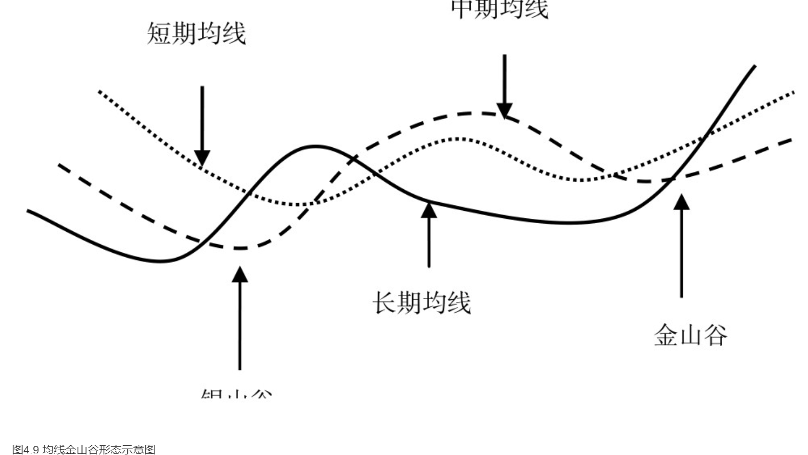

如图4.10所示从图中可以看到，股价从5.10元开始上涨，不久5周移动平均线、10周移动平均线、30周平均线就围成了一个银山谷形态。此后股价小幅上扬，随即便开始回落，在箭头指向位置出现了金山谷形态。金山谷形态出现的位置基本上与银山谷形态出现的位置相当，但是金山谷形态出现时，成交量明显增多，这也是对股价再次上涨信号的确认，同时也是对银山谷进场信号的再一次确认。

图4.10 中润投资周K线图

如图4.11所示，股价从3.41元开始上行，不久5周移动平均线、10周移动平均线、30周移动平均线就形成了一个银山谷形态。此后股价开始小幅上涨，随即便开始出现回调，在运行到箭头指向位置之时，金山谷形态出现。此时金山谷形态出现的位置要高于银山谷形态出现的位置，随后股价便快速上涨，因此金山谷形态出现时是一个很好的买入位置。从图中也可以看到，股价在此后进入上涨行情时，成交量也出现了快速增长的信号。

图4.11 广汇股份周K线图

如图4.12所示从图中可以看出，股价从5.35元开始上扬，不久3条移动平均线就围成了一个银山谷形态，此后股价有了明显的上涨行情；上涨后期，股价开始回调，在回调结束后，股价再次上场，并且在箭头出现的位置形成了一个金山谷形态。此时金山谷形态出现的位置要远远高于银山谷出现的位置，尽管此时买入的点位较高，但是一旦买入，就可以追逐后面快速的上涨行情。从图中也可以看到，后面的上涨速度是远远快于前面小幅上涨行情的，成交量也出现急剧增长。

图4.12 爱使股份日K线图

### 多头排列形态
多头排列形态就是常见的一组买入信号，它发出的时间要晚于黄金交叉系列出现的时间，但是准确性却较高。

如图4.13所示为均线多头排列形态示意图。该形态是要求短期均线在上方、长期均线在下方、中期均线则居中的一种排列形式，三条曲线以向上圆弧状的形式运行，互不交叉。

如图4.14所示从图中可以看到，股价从6.11元开始上涨；此后不久，成交量便急剧增多，说明场外的资金在源源不断地进入场中推高股价。而3条移动平均线也给出了多头排列形态，股价受到了3条移动平均线的支撑始终向上大幅移动。

图4.14 建发股份日K线图

如图4.15所示从图中可以看到，股价在市场上经历了漫长的盘整过程，整个时间持续了数月之久。但是当股价最终走出盘整区域之时，3条移动平均线出现了多头排列形态，成交量也明显增多。由此，投资者完全可以进入市场，等待股价即将出现的大幅上扬走势。从后市也可以看到，股价从2元以下直至23.77元的高位，翻了数十倍之多。

图4.15 卧龙地产周K线图

如图4.16所示，该股股价从6.83元开始上扬，此后不久，均线系统就出现了多头排列形态；而股价也在此形态出现后大幅向上拉升，K线图上出现了一连串的多根大阳线。如果能在多头排列形态出现后介入市场，则股民可以获得将近3倍左右的利润空间。

图4.16 荣华实业周K线图

### 首次黏合向上发散
首次黏合向上发散是股价运行到市场的底部，移动平均线最早发出的信号之一。而且移动平均线一出现此种形态，一般意味着后市将出现明显的强势上涨行情。

如图4.17所示为均线首次黏合向上发散形态示意图。此形态一般多出现在下跌的末期，当股价下跌之后，逐步会消化掉一部分做空的动能；因此下跌的速度会减缓，移动平均线也会从向下发散的排列状态逐步收紧，最终黏合在一起。此后如果股价在市场的底部站稳开始向上运行，则均线就会从黏合状态开始向上发散，因此是一个很好的看涨信号。

如图4.18所示股价在小幅上扬之后，出现了横盘走势，而且横盘震荡持续的时间很长。在股价宏观震荡的阶段，移动平均线也出现了相互黏合的走势。但是当股价走出横盘区域时，移动平均线出现首次黏合向上发散的形态，成交量也出现了明显增长，因此投资者应该在此时积极地进入市场。此后股价一路高涨，直至23.55元的高价。

图4.18 荣华实业日K线图

如图4.19所示从图中可以看到，股价从2.16元开始上涨，直至10.75元的高价。上涨幅度几乎翻了5倍，但是在整个上涨过程中并不是一帆风顺的，股价出现了较长时间的横盘整理过程，均线也在大多时间出现了黏合的情况。在图中标注区域，股价走出最终的盘整区域，均线出现首次黏合向上发散形态，成交量也出现明显增长，而本轮上涨行情中的真正快速拉升阶段正是起源于此处。

图4.19 柳钢股份日K线图

如图4.20所示为建发股份日K线图。股价从6.11元开始上涨，均线系统也从向下发散状态逐渐黏合，最终出现首次黏合向上发散的形态。因此可以认定，这个形态确定了市场底部的出现。投资者可以在此时积极地买入股票等待股价大幅上扬。

图4.20 建发股份日K线图

### 二次黏合向上发散
如图4.21所示为二次黏合向上发散形态示意图。该形态是指几条均线在此次向上黏合之前，出现过一次向上发散形态；但是股价在首次出现黏合向上发散后没有大幅上涨，便又重新黏合在一起。此时二次出现向上发散，则标志着多头已经攒足了筹码，准备开始大幅向上拉升。尽管此时点位较高，但是未来拉升的幅度将很大，拉升的速度将很快，因此投资者应该积极地进入市场中。

如图4.22所示图中第一个标注区域，是均线系统首次黏合向上发散；此后股价小幅上扬，而且整个上扬呈波浪式形态向上，也就是上涨与下跌交替出现。当股价运行到第二个标注区域时，尽管股价明显要高于第一个标注区域的股价，但是均线系统却给出二次黏合向上发散形态，这也就标志着多头将真正向上发起进攻；此后股价果然快速高涨，几乎以直线的形式向上拉升，直至23.10元的高位。

图4.22 招商银行日K线图

如图4.23所示，股价在两个标注区域都出现了黏合向上发散形态，而且股价在两次出现向上发散形态之后都明显给出了上涨的走势。因为均线系统中出现的两次黏合向上发散形态都得到了成交量放量的支持，但是均线二次黏合向上发散形态出现后，股价向上拉升的速度要远远大于首次黏合向上发散时上涨的速度。

图4.23 歌华有线日K线图

### 首次交叉向上发散
首次交叉向上发散与首次黏合向上发散类似，都是在盘整末期或者市场底部经常出现的一种均线买入信号。而且当首次交叉向上发散形态出现后，一般后市都会出现明显的上涨趋势。

如图4.24所示为首次交叉向上发散形态示意图。随着空方能量的减弱，下跌的脚步也会有所放缓。当股价接近市场的底部时，均线系统会由原来的向下发散逐渐收敛；当股价从下跌行情转入上涨行情时，均线系统会在市场底部形成交叉，并向上出现发散，这就是首次交叉向上发散均线形态。此信号一般标志着市场底部的形成，未来将从下跌行情转入强大的上涨行情，投资者此时介入应该说是非常接近市场的最低价。

如图4.25所示股价从10.77元开始上扬，此后不久，在图中标注的位置，均线便出现了首次交叉向上发散形态。而后市的大幅向上拉升行情正是源于此时的首次交叉向上发散形态，如果投资者能在此处买入股票，则在很短时间内资金就可以翻两倍以上。

图4.25 精诚铜业周K线图

如图4.26所示日线图是短线交易者非常喜欢分析的交易图表，从这张图表上可以看到，在标注区域，均线给出了首次交叉向上发散形态。正是这个形态结束了原有的盘整行情，使股价从上涨的中途继续向上攀升。而成交量也在此时给出了明显的增长迹象，因此多个交易信号都给了交易者一个进场的提示。

图4.26 精诚铜业日K线图

### 二次交叉向上发散
如图4.27所示为均线二次交叉向上发散形态示意图。该形态是指，均线系统曾经出现过一次交叉向上发散的形态，股价在此后也有了一定的涨幅。但是此后股价会进入一个横盘或者回调的行情中，当股价再次结束回调或者盘整行情时，均线会二次出现交叉向上发散的形态。此时出现的位置往往要高于首次交叉向上发散出现的位置，但是后市上涨的概率也大于首次交叉向上发散出现后的上涨概率。而且后市的上涨速度和拉升幅度一般都是前次形态出现后无法比拟的。

如图4.28所示，图中第一个标注区域是均线首次交叉向上发散的位置，从图中也可以看到，此后股价有了一小段涨幅，但是此后股价便开始向下回调。当股价运行到第二个标注位置时，均线给出了二次交叉向上发散形态，而这个位置明显要高于首次交叉向上发散出现的位置。但是此后，股价便持续上涨，成交量也逐步增多，而且上涨的速度和幅度都是首次交叉发散形态出现后所无法比拟的。

图4.28 三全食品日K线图

如图4.29所示从图中可以看到，均线系统先后两次出现了交叉向上发散形态。而股价真正地大幅度向上拉升是源自二次交叉向上发散形态出现之后。两次交叉向上发散的共同特点是成交量配合明显增长，也就是说投资者完全可以在两处信号出现后买入股票。

图4.29 世纪星源日K线图

### 逐浪上升
逐浪上升这种均线形态建立在多头排列均线形态之上，因此在外观上逐浪上升形态与均线多头排列形态有相似之处，因此投资者应该对两种形态加以辨别。也可以说，在某种程度上逐浪上升形态是多头排列形态的一种变化形式，隶属于多头排列形态。

1.形态分析
如图4.30所示为逐浪上升形态示意图。此种形态一般出现在强势上涨的过程当中，它要求长期均线位于短期均线和中期均线之下，始终衬托着中短期均线向上攀升。而中、短期均线在上涨过程中可能会出现相互交叉，但是二者不会与长期均线发生交叉。股价在整体上会呈现波浪式上扬态势，因此属于比较明确的买入信号。

如图4.31所示股价在上涨过程中，5日移动平均线和10日移动平均线曾经相互发生交叉，但是二者均未与30日移动平均线发生交叉，而且30日移动平均线始终在股价下方衬托着股价向上不断攀登。因此说明股价上行的动力十分强大，投资者可以在股价上涨过程中寻找低点买入股票。

图4.31 建发股份日K线图

如图4.32所示股价从5.10元开始上扬，不久均线系统就出现了逐浪上升形态。5周移动平均线和10周移动平均线曾经相互交叉，但是始终未与30周移动平均线交叉，而且30周移动平均线始终衬托着股价向上不断攀升，整体走势就如同波浪状一样向上移动，说明多头推动股价攀升的能力是非常强大的。而且该K线图为周K线图，说明在很长一段时间内，多头都占据了市场的主动，牛市持续的时间是相当长的。当股价最终突破3条移动平均线之后，投资者就可以获利了结及时出场。

图4.32 中润投资周K线图

如图4.33所示从图中可以看到，在股价强势上涨过程中，出现了多次回调的过程。而伴随着回调行情的产生，5日移动平均线和10日移动平均线多次出现交叉，但是30日移动平均线始终坚定地以保持向上的运行方向衬托着股价向上移动。这就说明即使行情出现回调，也是短暂的，牛市没有结束，行情在短时间内不会转向；因此投资者完全可以买入股票，已经持股的投资者则不要过早地卖出，应该继续持股，等待更大的利润出现。

图4.33 冠农股份日K线图

### 蛟龙出海
蛟龙出海形态是均线与K线结合共同发出的一种买入信号。如图4.34所示为移动平均线蛟龙出海形态的示意图。该形态是指，一根大阳线从下向上将短期均线、中期均线、长期均线一通穿越的一种形态。它一般出现在市场的底部或者盘整行情的后期，表示多方突然向上发起进攻，大规模地向上拉升行情就此将要展开。

如图4.35所示股价在市场底部盘整多个交易日，在图中箭头指向的位置便是移动平均线和K线结合出现的蛟龙出海形态，也是行情将要突破的一个明显标志。此时一根阳线一举向上突破了3条移动平均线，因此标注着多头已经在市场底部吸纳了足够的筹码，积攒了足够的能量，即将向上发起大规模的进攻。而从后市走势图也可以看到，整轮的大规模上涨行情正是从此开始的。

图4.35 卧龙地产周K线图

如图4.36所示图中箭头指向的位置是一个蛟龙出海形态，因为此处的大阳线一举击破了3条移动平均线。不仅如此，此根阳线的实体远远大于之前数根阳线的实体，说明多头已经积攒了足够的能量准备向上发起进攻，因此股民应该抓紧时间进入市场。最后一个交易日开盘时就出现了一个明显的向上跳空行情，这也就更加验证了多头将继续向上发力的推断。

图4.36 荣华实业周K线图

如图4.37所示图中箭头指向的K线一举吞没了3条移动平均线，因此是一个蛟龙出海形态。不仅如此，伴随着蛟龙出海形态的出现，成交量明显增多，此时就是投资者进场的良好时机。从图中可见，自此股价开始一路向上运行。

图4.37 华联控股日K线图

### 加速下跌
如图4.38所示为加速下跌形态示意图。该形态是指在下跌过程中，短期均线突然快速下跌，此时短期均线与中长期均线的距离越来越远；尽管股价在此时也是暴跌的走势，但多数情况下这是股价即将到达市场底部的前兆。此后股价往往会从市场底部小幅盘整或者开始向上反弹。因此只要有明确的进场信号出现后，投资者就应该可以考虑进场买入股票了。

如图4.39所示股价在10.05元达到新低，在此之前，连续多根大阴线出现，而且中间还出现了多次向下的跳空，均线也出现了加速下跌的走势。但是投资者应该清楚地意识到，这是股价即将到达市场底部的信号。当股价在10.05元达到新低时，却出现了一根大阳线，这就是明确的支撑信号，意味着在此处有较强的支撑能力，投资者应该尝试着少量买入股票。

图4.39 浙江富润60分钟K线图

如图4.40所示股价在2.98元达到最低点，而在此之前，中短期均线极大地偏离了长期均线，形成了一个均线加速下跌的形态；因此这也就说明尽管股价处于猛烈下跌之势，但是很有可能已经接近市场的最低价。只要股价有止跌回升的迹象，投资者就可以少量地尝试性买入股票。而股价在达到2.98元时，K线图上留下了长长的下影线，说明在下方的承接能力是较强的；而且成交量也随着股价的小幅上扬而开始增多，说明有一部分交易者已经开始进场买入股票，市场的底部很有可能已经形成。因此在此处敢于买入股票的投资者可以说是获得了一个市场的最低价。

图4.40 联创光电周K线图

如图4.41所示在8.38元达到新低，而此时的股价已经经历了暴跌的行情。尽管在股价下跌的过程中，均线出现了加速下跌形态，中短期均线极大地偏离了长期均线，但是在接近市场的底部时，阴K线的实体明显小于前期实体，说明做空的动能已经有所减缓。因此当股价在8.38元止住下跌的脚步，开始缓慢回升，成交量也从低迷状态逐渐稳步增加时，就是投资者良好的买入时机。

图4.41 天坛生物周K线图

### 上山爬坡
上山爬坡形态也是多头排列形态的一种变化形式，因此外观上与多头排列形态有一定的相似性。它一般出现在上涨的过程中，也是属于做多的信号之一。

如图4.42所示为均线上山爬坡形态示意图。它是指在上涨的过程中，短期移动平均线、中期移动平均线、长期移动平均线沿着一定幅度向上运行。因此从整体上看，多头能够稳步地向上推进股价运行。

如图4.43所示股价从10.68元开始上扬，直至23.10元。在此期间，5日移动平均线、10日移动平均线和30日移动平均线始终沿着一个固定的角度向上攀升，形成了一个上山爬坡形态。因此股民只要见到此种形态，就可以认定市场处于稳定向上攀登的阶段，这一点从成交量上的稳步增加也可以体现出来。

图4.43 招商银行日K线图

如图4.44所示股价从8.38元开始上扬，此后成交量从低迷状态稳步增加，说明多头是稳定向上推高股价的。从K线图上也可以看到，股价并不是立刻大幅上扬，而是沿着移动平均线稳定地向上缓慢上扬。最能体现多头稳定推升股价的就是移动平均线的上山爬坡形态，因为5周移动平均线、10周移动平均线和30周移动平均线始终沿着固定的角度向上攀升。

图4.44 天坛生物周K线图

如图4.45所示日K线图是短线交易者所热衷分析的图表，而在此短线交易图表中，3条移动平均线也形成了上山爬坡形态。5日移动平均线、10日移动平均线和30日移动平均线始终沿着固定的角度向上运行，而股价也在稳步地向上拉升。

图4.45 中集集团日K线图

### 烘云托月
烘云托月和上山爬坡形态类似，也是从多头排列演变而来的一种均线形态；它也是一种比较明确的看涨信号，一般多出现在盘整的后期或者上涨的中途。

如图4.46所示为烘云托月形态示意图。该形态是指短期均线和中期均线向上缓慢移动，而长期均线也向上移动，但是与中短期均线始终保持着一定距离。

如图4.47所示股价从2.10元开始上扬，而均线也形成了烘云托月形态。30日移动平均线始终位于5日和10日移动平均线下方，并且与二者保持一定距离；而股价也在此均线的衬托下，直升至10.88元的高位，几乎翻了5倍。

图4.47 钱江摩托周K线图

如图4.48所示股价从5元左右开始上升，均线系统给出了烘云托月形态。由此投资者可以看到，多头稳步地向上逐渐拉高股价。

图4.48 中润投资周K线图

如图4.49所示日K线图是短线交易者常用来分析的图。在该图上可以看到，股价从8.80元开始上行，起初上涨速度很缓慢，经过一次回调后，股价开始大幅飙升，成交量急剧增长；均线系统也给出了烘云托月形态，最终股价达到了14.89元的高位。

图4.49 南方汇通日K线图

## 买入实战演练
### 筑底时的金叉
均线的金叉可以出现在任何位置，但是在市场的底部出现金叉时买入的效力更强。而且，股价在市场底部时，黄金交叉是比较早的买入信号之一，此时敢于买入的交易者就可以获得更大的利润空间。

股价在下跌过程中，均线也是向下运行的。当到达市场底部后，随着股价下跌速度有所减缓，均线也逐渐走平；这是由于场外资金的进场和主力机构的建仓，股价止跌，因此一般不会快速上涨。敏锐的投资者通常会在此时进场建仓，而均线出现金叉，也证明了股价继续下跌的可能性不大，因为短期均线向上，就说明至少短期内趋势已经开始向上。

如图4.51所示，在市场的底部，股价经历了漫长的盘整过程后，移动平均线开始走平。而当10月移动平均线与30月移动平均线发生黄金交叉时，就可以确认市场的底部已经形成。因为此时成交量也开始逐步增多，5月移动平均线作为短期均线更是开始向上运行。

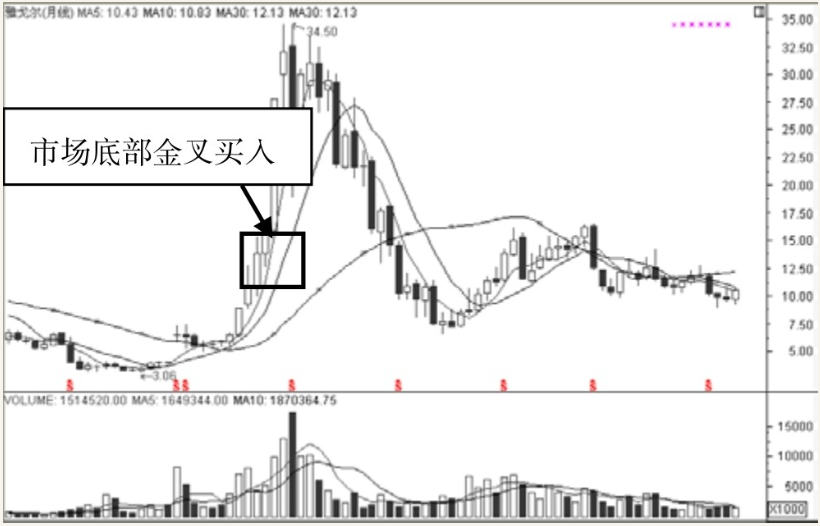

图4.51 雅戈尔月K线图

如图4.52所示，股价在11.35元时达到最低，此后均线开始向上运行，当10周均线与30周均线发生黄金交叉时，投资者可以因此确认市场的底部已经到来。因为此时5周均线早已开始向上运行，成交量也开始增多。

图4.52 上海机场周K线图

如图4.53所示股价从6.11元开始上扬，不久，30日和10日移动平均线便发生了黄金交叉，此时市场的底部已经形成。因为此时成交量配合股价的上涨开始放量，同时移动平均线已开始向上运行。

图4.53 建发股份日K线图

### 拉升中的金叉
拉升的过程中出现金叉也是买入的信号，因为金叉可以出现在任何位置，但是意义有所区别。市场底部的金叉通常是价格止跌回升的标志，而拉升途中的金叉就是股价结束回调的标志，因此也是可以买入的。

如图4.54所示股价从7.71元开始上涨，而移动平均线也在市场的底部出现了黄金交叉信号。如果在此时进场，投资者不必心急，因为股价在上扬的过程中出现了一次回调的走势。在回调末期，尽管股价还处于盘整行情中，但当5分钟移动平均线与10分钟移动平均线在此形成黄金交叉时，就给出了一个入场的时机，此后股价继续向上冲击高位。

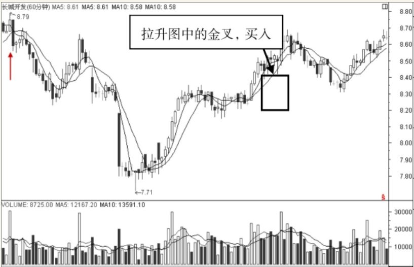

图4.54 长城开发60分钟K线图

如图4.55所示股价从10.84元开始上涨，3条移动平均线也向上运行。但是在上涨过程中，股价出现回调，回调结束后，10日、30日移动平均线形成黄金交叉，成交量也再次出现明显增多；这就说明股价在回调结束后将继续向上运行，是投资者入场的一次机会。

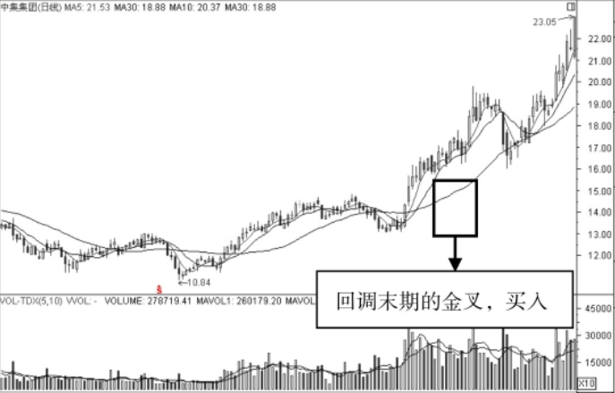

图4.55 中集集团日K线图

如图4.56所示股价在上涨过程中，出现了明显的回调走势，而且此回调的幅度几乎达到了上涨过程的一半左右。此后股价继续向上运行，当运行到图中标注的位置时，均线再次出现黄金交叉形态，投资者可以据此信号做出买入的决定。

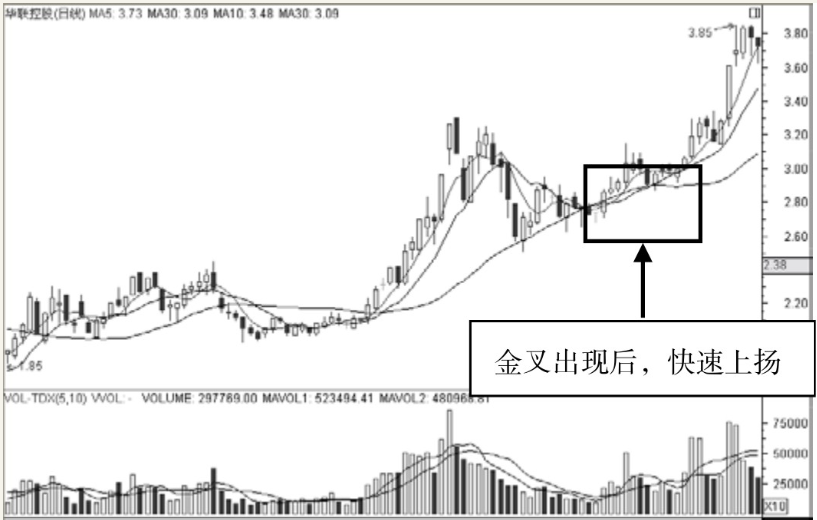

图4.56 华联控股日K线图

### 多头排列
多头排列是投资者喜欢看到的一种形态，因为它代表了强劲的上涨走势。但是尽管如此，根据多头排列形态来买入股票也是有技巧的。如果交易过程中，均线系统出现了多头排列形态，说明上涨的幅度是较大的，稳定性较强。此时股民不必等待发生大规模的回调后再买入，可以在股价出现在短期移动平均线附近时就追高买入股票。

如图4.57所示5周均线、10周均线、30周均线呈多头排列形态，而且没有大规模的回调行情出现。因此如果股民要等到股价用户回调的时候再买入股票，则会感到十分失望；因为股价并没有出现大规模的向下走势，始终是强势上涨的行情。因此股民可以在5周移动平均线附近买入股票，此后股价沿着短期均线向上发力运行。

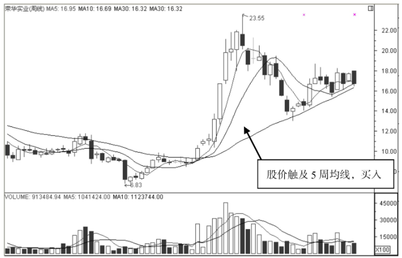

图4.57 荣华实业周K线图

如图4.58所示从图中可以看到，股价始终沿着5日移动平均线和10日移动平均线向上运行，而均线系统也出现了多头排列形态。在股价上涨的过程中，很少出现大的阴线，说明股价并没有大规模的回调走势。因此股民只要看到股价触及5日移动平均线时，就可以买进股票。

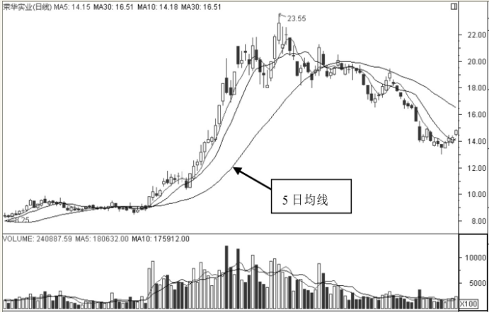

图4.58 荣华实业日K线图

如图4.59所示股价从23.28元开始上扬，起初股价是小幅上涨的，在拉高一定幅度后有了一定回落，在第二次向上拉升并且超过前期时，均线系统也给出了多头排列形态。因此股民可在5日移动平均线和10日移动平均线附近买进股票。

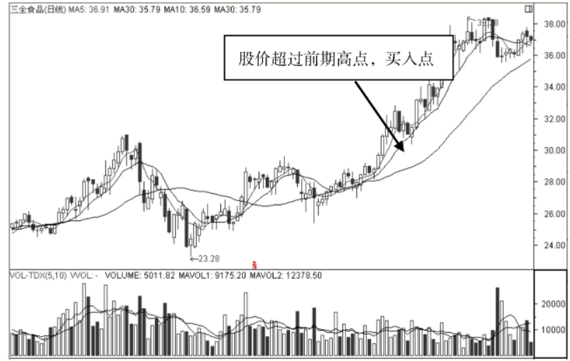

图4.59 三全食品日K线图

### 中长期均线支撑股价
一般来说，所有的移动平均线都会对股价有一定的支撑作用。但是支撑效果的强弱有所不同。短期均线的支撑作用较弱，而长期均线的支撑效果较强。一旦股价向下突破了长期均线，就意味着空头重新占据了市场的主动，这当然是多头所不能容忍的，因此常常会在长期均线附近埋下大量的买单，使股价不会轻而易举地向下穿越长期均线，长期均线附近的价位也就成了投资者良好的买入位置。

如图4.60所示股价从14元开始上涨，5日均线、10日均线、30日均线也基本是向上移动的。尽管上涨过程中出现了小幅回调，但也仅仅是中短期移动平均线发生交叉，而长期均线始终向上运行。在图中标注的位置，股价向下运行的时候触及长期移动平均线，并没有向下真正突破而是受到了平均线的支撑继续向上运行，因此，此时就是投资者一个良好的买入时机。

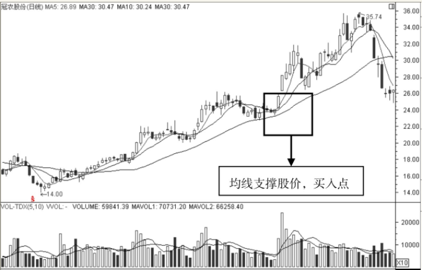

图4.60 冠农股份日K线图

如图4.61所示股价从15.22元开始上扬，在上涨初期，成交量没有出现明显增多，而且股价上涨也不大，说明真正的上涨之路还没有开启。当股价穿越了60小时移动平均线之后出现了明显的回调过程，但是60小时移动平均线支撑住了股价的下跌，此后股价开始真正向上运行，成交量明显增多，说明大幅拉升的时刻来临了。因此股民可以在股价触及60小时移动平均线支撑时买进股票。

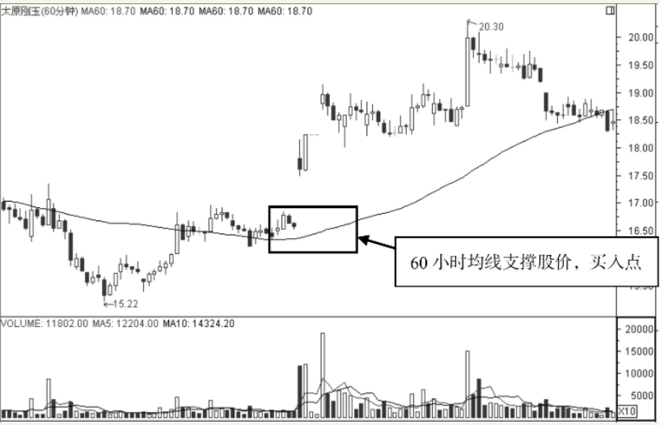

图4.61 太原刚玉60分钟K线图

如图4.62所示股价在上涨的过程中，60周移动平均线也在向上运行。但是箭头指向处出现了一根阴K线，说明在当时的交易周，股价出现了明显的下挫走势，而下影线触及移动平均线，受到了均线的强力支撑，因此可以让投资者做出买进股票的决定。从图中也可以看到，无论是短线交易者还是长线交易者，60周移动平均线都是较为强劲的支撑工具。

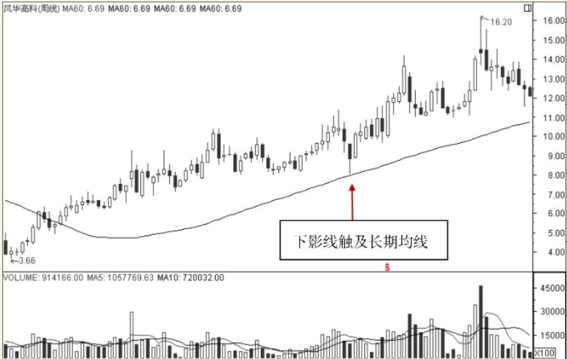

图4.62 风华高科周K线图

如图4.63所示股价从10元左右的价位开始上涨，而在上涨的过程中，成交量也明显增多。但是进入到盘整趋势时，成交量便开始萎缩，说明双方在此处激烈交战争执不下，均线系统也从先前的向上发散逐渐黏合，此时股民不应该过早地进入市场，而应密切关注均线的形态。当均线再次出现向上发散时，说明股价已经走出盘整区域，而且选择了向上作为突破方向，因此是一个买入的良好时机。

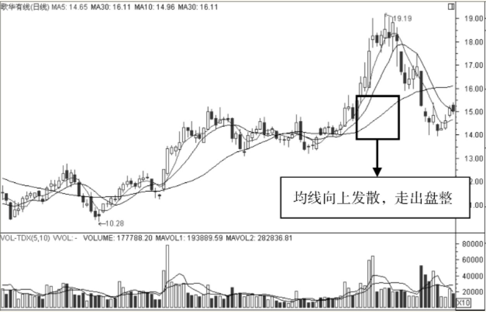

图4.63 歌华有线日K线图

如图4.64所示投资者可以看到，股价在市场底部徘徊良久，均线系统也开始出现黏合状态。但投资者在此时不能过早地进入市场，因为谁也无法确定股价是否可以向上突破；如果过早地进入市场，还要等待漫长的盘整过程，而黏合状态开始向上发散时，才是投资者进入市场的良好时机。

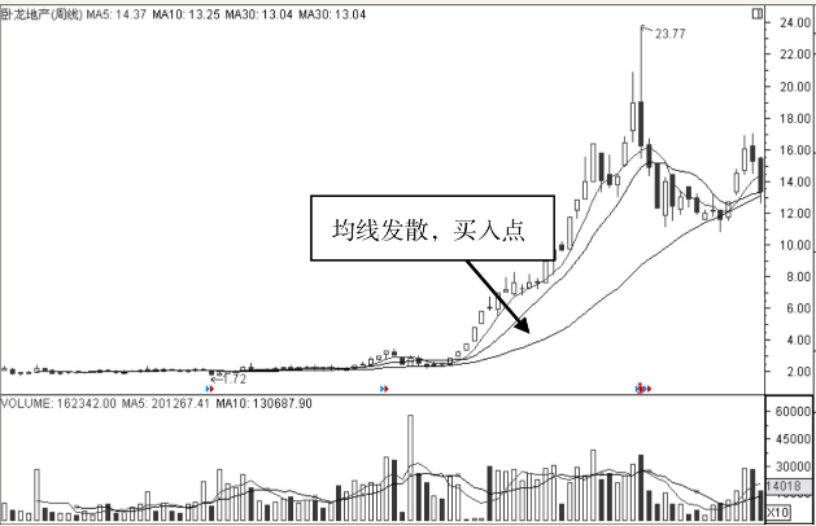

图4.64 卧龙地产周K线图

如图4.65所示股价从16.10元开始上扬，仅仅几个交易日后，便进入到了横盘整理的过程中，10日均线和30日均线也进入到了相互黏合缠绕的状态中。当其最终走出黏合状态开始真正向上发散时，不仅成交量明显增多，而且股价也快速上涨，且是以多个向上跳空的形式逐渐拉升的。

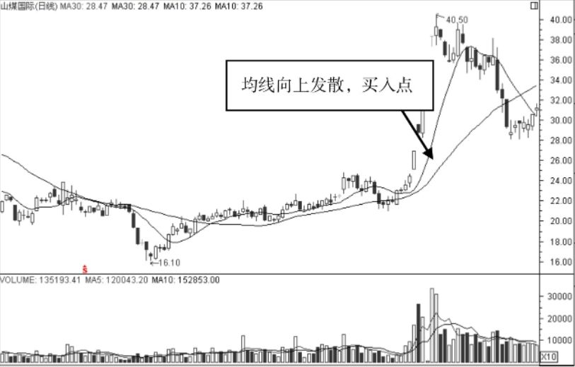

图4.65 山煤国际日K线图

### 下跌过程抄底买入
当股价下跌的速度开始减缓时，股价也就越来越接近市场的底部。如何知道股价下跌速度减慢了呢？最直接的方法是观察均线的坡度。一旦均线向下的坡度不再陡直，而是坡度较缓，就是下跌减慢的标志。

如图4.66所示股价从10.83元开始下跌，30小时均线也开始向下运行，当运行到图中箭头指向的位置时，均线的坡度开始有了变化。图中的直线是原有的均线运行方向，而30日均线的坡度不再陡峭，说明下跌脚步放缓，市场的底部也即将到来。

但是过早的进场也是错误的，必须要找更加低的价位才能进场。图中箭头指向的位置是非常好的一个买入点，因为当天的K线出现了较长的下影线，说明股价尽管曾经出现了新低，但是被多头坚定地反击了回来。这个价位上会有很多的多头买入股票，因此后市会在这个价位附近发生反转。

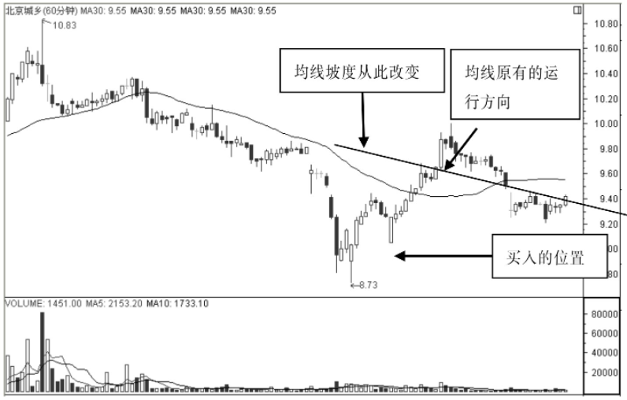

图4.66 北京城乡60分钟K线图

如图4.67所示图中有3条移动平均线，分别是5日均线、30日均线和10日均线。当股价运行到箭头指向的位置时，均线的坡度开始变缓，股价下跌的幅度明显变小且速度也明显变慢，这从K线的实体上就能清楚地看到，但是不能在此时立刻进场。

均线坡度的改变只能让我们关注这只股票而不是买入这只股票，当股价运行到图中第2个箭头指向的位置时才是买入的时机。在前一个交易日，股价创出了新低，但是当天却收成了阳线，说明下跌的趋势很有可能结束，但是这个阳线的实体非常小，因此还不足以做出买入的决策。然而在后一个交易日，也就是第2个箭头标注的K线，K线的实体非常大，因此说明趋势彻底反转了。

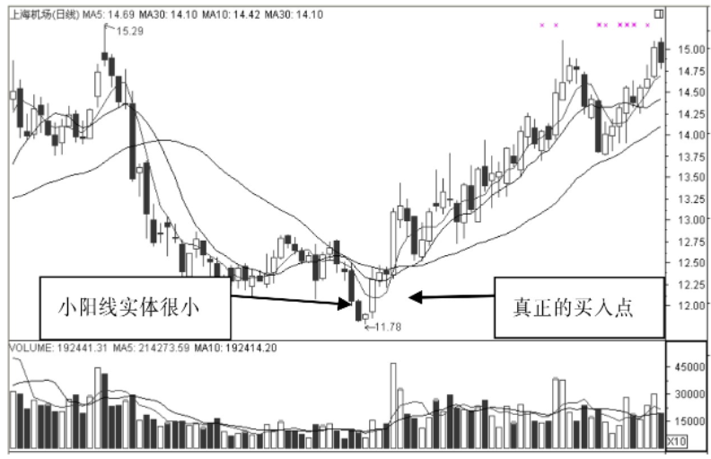

图4.67 上海机场日K线图

如图4.68所示图中箭头指向的位置是20小时均线坡度变化的开端，这说明自此开始下跌的势头得到了多头的遏制，买入股票还需等待时机。在图中第2个箭头标注的位置是一个光头光脚阳K线。也就是说当天的开盘价就是最低价，收盘价就是最高价，K线没有上下影线，这就表明了当天上涨的强大动力。而且在此之前，一连多个交易时段内，股价都没有创出新低，因此这是一个非常安全的买入位置。

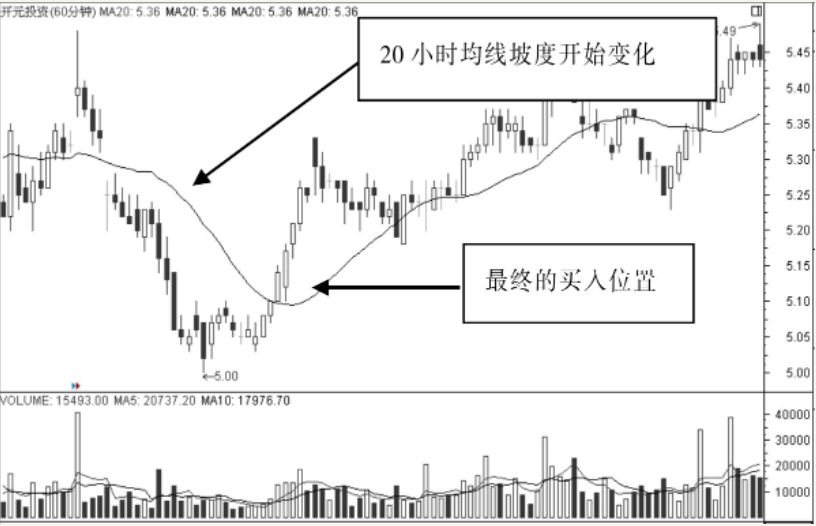

图4.68 开元投资60分钟K线图

如图4.69所示为10周均线伴随着股价的下跌开始向下运行，但是在图中箭头指向的位置坡度出现了改变，说明趋势即将出现变化。股价在达到14.40元的新低时，是一个非常好的买入时机。在这个交易周内，尽管股价出现了新低，但是K线出现了下影线，说明这个价位的支撑能力非常强大。更重要的是，这个K线与前一个交易周的K线有相似的下影线，而且下影线的价位十分接近，这在K线组合中被称为双针探底，是非常重要的反转形态组合，因此此时买入股票才是最安全的。

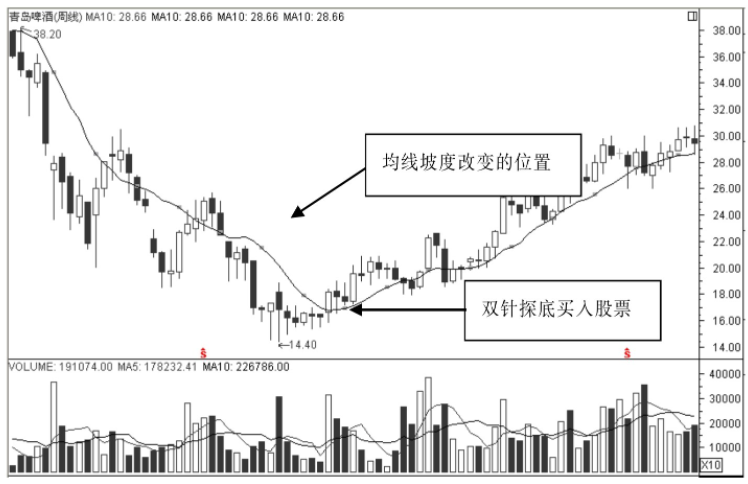

图4.69 青岛啤酒周K线图

# 均线组合形态卖出点研判
## 典型卖出形态组合
### 死亡交叉

