    作者: 九州股神 编著
    出版社: 电子工业出版社
    出版年: 2015-11
    页数: 264
    定价: 49.00元
    ISBN: 9787121273421

[豆瓣链接](https://book.douban.com/subject/26649739/)

- [从零开始学均线](#从零开始学均线)
  - [均线的分类](#均线的分类)
  - [均线的特点](#均线的特点)
- [单根均线驰骋股市](#单根均线驰骋股市)
  - [股价向上突破均线](#股价向上突破均线)
  - [股价重回移动平均线](#股价重回移动平均线)
  - [股价受到均线支撑](#股价受到均线支撑)
  - [股价远小于移动平均线数值](#股价远小于移动平均线数值)
  - [股价向下突破移动平均线](#股价向下突破移动平均线)
  - [股价二次向下突破移动平均线](#股价二次向下突破移动平均线)
  - [股价反弹受阻于移动平均线](#股价反弹受阻于移动平均线)
  - [股价远大于移动平均线数值](#股价远大于移动平均线数值)
- [不同周期的均线](#不同周期的均线)
  - [日线图中的均线](#日线图中的均线)
  - [周线图中的移动平均线](#周线图中的移动平均线)
  - [60分钟图中的移动平均线](#60分钟图中的移动平均线)
- [均线组合形态买入点研判](#均线组合形态买入点研判)
  - [典型买入形态组合](#典型买入形态组合)

# 从零开始学均线
## 均线的分类
`短期均线组合`中最常用的有5日、10日、20日和5日、10日、30日两种组合。短期均线组合主要用于观察股价短期运行的趋势，例如1～3个月的股价走势会发生什么变化。一般来说，**在典型的上升通道中，5日均线应为多方护盘中枢，否则其上升力度有限；10日均线则是多头的重要支撑线，10日均线被击破，市场就有可能转弱**。

中期均线组合最常见的有10日、30日、60日和20日、40日、60日两种组合。中期均线组合主要用于观察股价中期的运行趋势。例如，3～6个月的汇价走势会发生什么变化。**一般来说，中期均线呈`多头排列状态`，说明股价中期趋势向好；反之，中期均线呈`空头排列状态`，说明中期趋势向淡**。

长期均线组合最常见的有30日、60日、120日和60日、120日、250日两种组合。长期均线组合主要用于观察汇价的中长期趋势，例如，半年以上的股价走势会发生什么变化。这些均线组合对股价的变化相对较迟钝，经常用来判断某个长期趋势是否开始反转，是长线投资者的重要参考依据。**一般来说，当长期均线组合中的均线形成`金叉`，成为多头排列时，说明市场对中长期趋势看好，反之，当长期均线组合中的均线形成`死叉`，成为空头排列时，说明市场对股票中的长期趋势看淡**。

## 均线的特点
移动平均线最重要的特点之一就是它**能够稳定地反映趋势体现趋势**。如果移动平均线向上，则体现出目前的行情是向上的；如果移动平均线向下运行，也就说明行情是向下运行的。

从图1.9中可以看到，股价在4.60元时达到新低，此后股价开始缓步上扬，而移动平均线也是向上运行的，这也就体现了未来的行情走势将进一步向上运行。**从成交量也可以看出，上涨的行情是比较可靠的，因为股价在稳步推升的时候，成交量都给予了放量的支持。这也就说明，场外的投资者在源源不断地进入场内推高股价，因此此时买入股票是比较安全的**。股价会在30日移动平均线的衬托下向上逐步推高。

图1.9 合肥三洋日K线图

图1.10中的移动平均线为60日移动平均线，**而且它是向下运行的，也就代表了中短期的走势是向下的。而且在此期间，成交量一直保持十分低迷的状态，说明没有人在此时愿意过多地买入股票**。因此投资者在此时应该保持观望的态度，等待有明确的上涨信号时再进场交易。

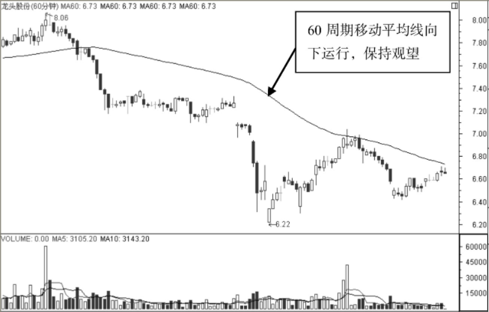

图1.10 龙头股份60分钟K线图

如图1.11所示，不仅一条移动平均线可以体现趋势，多条移动平均线也能更好地反映趋势。从图中可以看到，图中的3条不同周期的移动平均线整体上是向下运行的，代表着整体的走势是向下的。但是图中标注区域的位置，3条均线呈水平移动状态，**这说明在此阶段，场中的多空双方发生了僵持不下的局面。此时股价进入到了通常所说的盘整阶段，而未来的走势是不确定的，因此投资者不能过早地入场，应该积极地观望**。

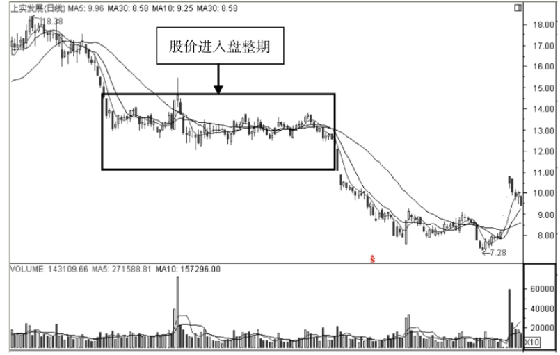

图1.11 上实发展日K线图

移动平均线另一个重要的特点就是它**有一定的滞后性**。从移动平均线的计算过程中可以看到，它的数值实际上是一个平均值，因此必然会兼顾之前的收盘价。

移动平均线的另一个重要特点是它**对股价有支撑和阻力作用**。因为移动平均线代表了场中一定周期内的平均持仓成本，因此当股价向上或向下穿越移动平均线时，移动平均线都会构成一定的支撑或阻力作用。也就是说，一般情况下当股价触及移动平均线时，都不会轻而易举地穿越，经常会出现一定时间的盘整后再发生穿越，甚至不能成功穿越。

图1.15中标注的位置，是股价试图向下穿越移动平均线的位置。而在此位置，30日移动平均线给了股价强大的支撑作用，使得股价继续在30日移动平均线以上运行。

图1.15 合肥三洋日K线图

如图1.16所示股价从13.13元开始上扬，当运行到60日移动平均线附近时，受到了移动平均线的强大阻力作用，股价在连续数周均在60日移动平均线以下运行，始终受到压制而未能穿越。此后，股价以一个向上跳空的形式最终突破60日移动平均线，而成交量再突破时也给出了明显的放量信号。这时就标志着行情已经由缓慢上涨开始加速上扬，投资者在此时迎来了一个良好的买入时机。

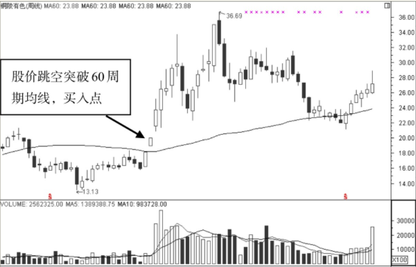

图1.16 铜陵有色的周K线图

图1.17中的移动平均线为250日移动平均线，尽管参数较大，但是对股价的压制作用并不因此而减弱。图中标注的两个区域都是股价在下跌过程中出现的强劲反弹行情，而成交量也有一定的放量予以支持。但是当股价触及250日均线时，均受到了均线的强大压制作用，最终未能成功向上突破，而反弹行情也就此宣告破产。

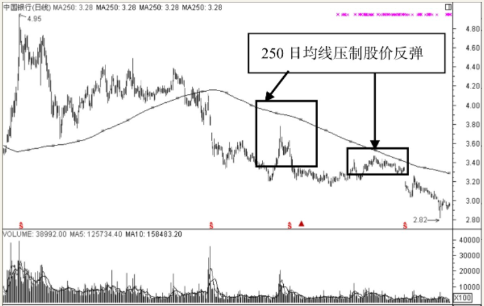

图1.17 中国银行日K线图

# 单根均线驰骋股市
## 股价向上突破均线
在股市中，移动平均线代表了在这一交易时段内的平均持有成本。例如10日移动平均线则反映了近10个交易日内的平均持有成本，因此如果股价向上突破了10日移动平均线，则说明股价在未来将要上涨，因此投资者可以选择适当买入股票。

图2.1中的移动平均线为20周移动平均线，属于中短期移动平均线类型，因此能够很好地体现出中短期走势。股价在4.30元时达到最低，此后便小幅上扬，成交量也逐渐增多。在箭头指向的位置，一根阳线向上突破了20周移动平均线，尽管K线的实体较小，但是此时却有着重要的意义。**因为一旦股价向上穿越20周移动平均线，就标志着未来很有可能将继续上扬。尽管K线实体较小，但是成交量却出现了明显地增多，说明有雄厚的资金支持股价向上穿越移动平均线**。此后股价便一路高涨，直至31.40元。因此在移动平均线刚刚被穿越时，是非常好的一个买入点。

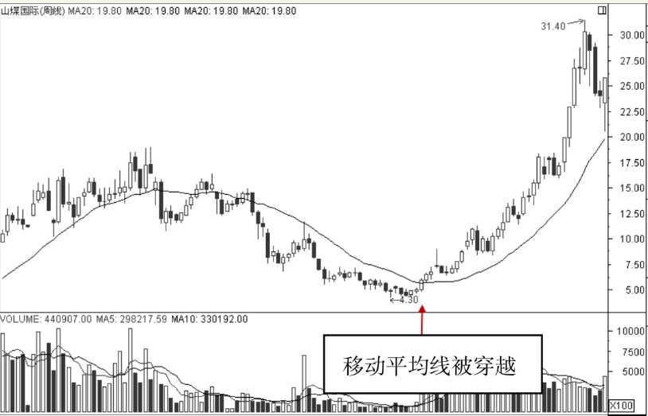

图2.1 山煤国际周K线图

如2.2图中，选用的移动平均线为5周移动平均线，它更加侧重于短期走势的体现。从图上也可以看到5周移动平均线始终贴近股价运行，因为它相对于20周移动平均线来说更加灵敏，因此滞后性也较小，股价有什么变化，它都可以及时地体现出来。

股价在2.60元走出新低，而在下一个交易周，一根阳线穿越了5周移动平均线。由于5周移动平均线滞后性较小，因此所发出的买入时机也相对较早。但是这不影响买入信号的准确性，**因为在股价向上穿越移动平均线时，成交量也出现了增多的迹象，这也说明有资金来支持股价向上不断攀升**。

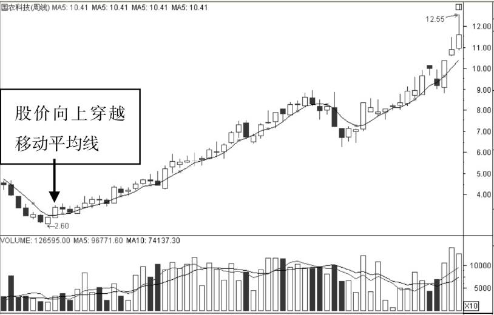

图2.2 国农科技周K线图

## 股价重回移动平均线
该形态是指，股价曾经向上突破移动平均线，不过涨幅不大，此后移动平均线继续向上运行，但是股价又小幅地向下跌破移动平均线，不久再次冲高到移动平均线上方，这就说明多头将开始真正地向上拉升，此时就是投资者的一个良好的买入时机。

如图2.3所示股价从7.61元开始上扬，此后不久便向上穿越了5日移动平均线。此后股价始终沿着5日移动平均线之上运行，但是在箭头指向的位置，股价先是向下小幅跌破了5日移动平均线，此后股价并没有快速下行，而是在后两个交易日便开始重新回到5日移动平均线之上，这说明多头依然控制着整个市场，此时是一个良好的买入点。此后股价将快速上行，这是此前股价上涨时所不能比的。

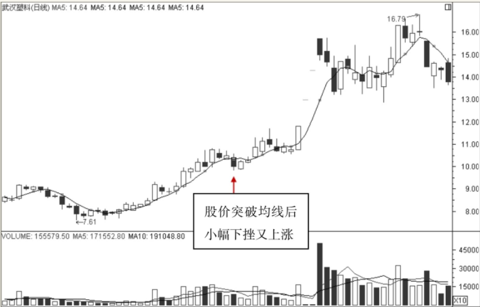

图2.3 武汉塑料日K线图

如图2.4所示，该K线图的时间周期为小时，主要体现短期走势。而图中选的移动平均线的周期为20周期，因此又兼顾了中期走势。股价从5元开始上行，成交量也有小幅增长。在图中箭头指向的位置，一根阴线向下突破了20周期移动平均线。但是股价并没有随即开始大幅下跌，而是在下一个交易日时就出现了重新回归均线之上的形态，而且成交量也配合增多，此后股价便开始大规模地上行，而且上涨的速度和幅度都极快。

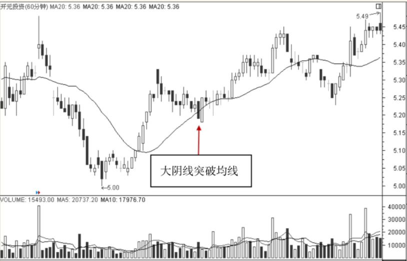

图2.4 开元投资60分钟K线图

## 股价受到均线支撑
移动平均线对股价有一定的支撑作用，因此当股价从上向下跌落到移动平均线附近时，往往不会轻而易举地向下突破均线，只要股价不能向下突破，而受到均线的支撑开始转入向上的行情时，投资者就可以买入股票。

如图2.5所示，股价从8.31元开始上行，20周期移动平均线也相继调头向上运行。成交量伴随着股价的上升也逐渐增多，说明多头有能力稳步地向上推升股价。在椭圆形标注的位置，股价曾经向下跌落，K线图上出现了一根大阴线，但是股价并没有跌破20日移动平均线，而是受到了均线的有力支撑而继续上行。不仅如此，20周期移动平均线始终保持向上运行的方向，丝毫没有调头向下的走势迹象，因此股民可以在此时放心大胆地购买股票。

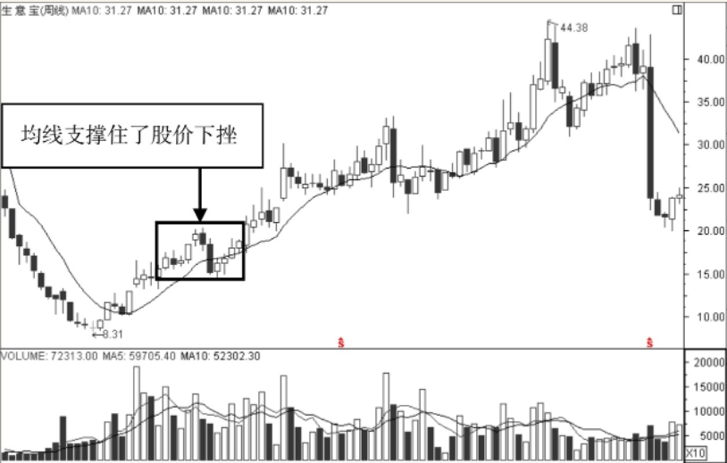

图2.5 生意宝周K线图

如图2.6所示，图中的K线时间周期为日，这主要体现中短期走势，而图中选用的移动平均线周期为120日，因此又兼顾了长期走势行情。股价从3.87元开始上涨，这时中途出现了明显的回调行情，在回调时成交量明显萎缩，这也意味着股价并没有开始反转。当股价运行到图中椭圆形标注的位置时，受到120日移动平均线的支撑而开始继续上扬，而且在此时成交量再次增多，说明多头将继续推升股价，因此这是市场给投资者的一个买入时机。

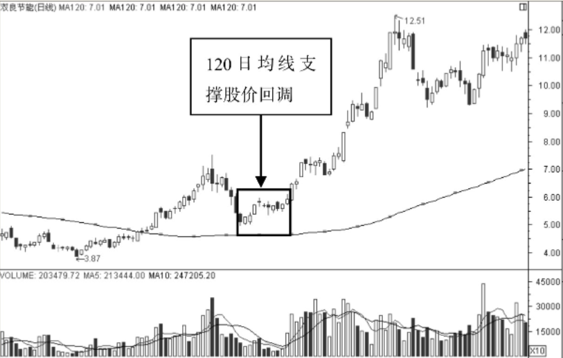

图2.6 双良节能日K线图

## 股价远小于移动平均线数值
移动平均线代表一定时间周期内的平均持有成本，因此当股价远远低于移动平均线的数值时，就说明股价已经处于过低的状态，此时会有不少投资者纷纷抢购。在更多投资者进场推动股价的作用下，股价很有可能出现反弹甚至反转的走势。

如图2.7所示，股价从230.55元左右开始一路向下，至84.20元左右为最低点。而在股价接近市场底部时，已经远远偏离了移动平均线，因此说明市场价格过低，投资者要密切注意盘面变化，只要有做多的信号出现就可以少量买入股票。当股价达到84.20元的最低点后，在下一个交易周就出现了明显的大阳线，而且成交量也有了大幅度增长，这说明在此价位已经有源源不断的资金进入市场，是买入的时机。

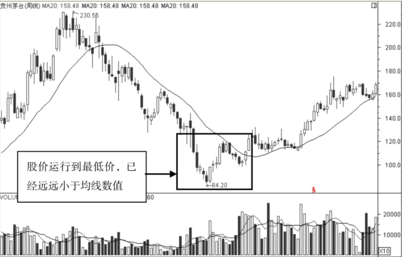

图2.7 贵州茅台周K线图

如图2.8所示，股价在达到5元左右的价位时，远远低于20周期移动平均线，因此只要有进场的信号出现，投资者就可以积极进场交易。在股价触及5元左右的价位后，止住了下跌的脚步，一连多个交易时段内的K线都没能向下突破这一点位。不仅如此，20周期移动平均线也开始逐渐走平，成交量开始不断增多，因此股民可以在此处买入股票。

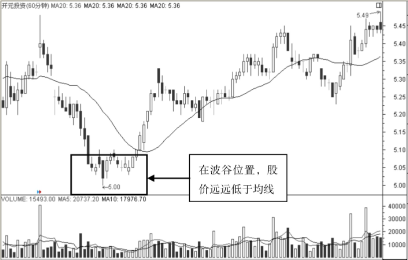

图2.8 开元投资60分钟K线图

## 股价向下突破移动平均线
移动平均线可以被看作在一定时期内平均持有成本的反映，因此也是这一时期内多空双方的分界线。如果股价从上向下穿越了移动平均线，则说明市场很有可能已经由多方控制转向空方控制，因此是投资者获利出场的好时机。

如图2.9所示，当股价达到230.55元时，成为本轮上涨过程中的最高点，此时股价极度偏离移动平均线，因此是市场给股民们的第一个卖出信号。此后移动平均线结束了上涨的运行方向，开始逐渐走平，随即又开始向下运行。而股价在持续盘整后逐渐下行，在箭头指向位置一根阴线向下穿越了20日移动平均线所代表的中期持有成本，因此这是市场给投资者的第二个卖出信号。此后股价一路下行，从230元左右的价位一直跌至80元左右，可见跌幅之深。

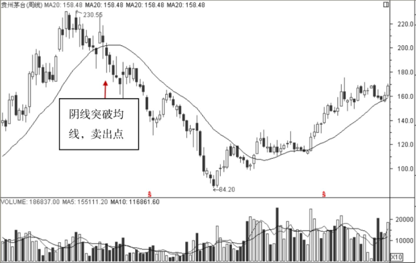

图2.9 贵州茅台周K线图

如图2.10所示，股价在9.98元达到顶峰，此后开始下滑，在运行到图中箭头指向的位置时，一个阴线向下突破了20日移动平均线。尽管阴K线的实体较小，但是它与前一个阶段的K线有一个巨大的向下跳空缺口。因此说明股价向下的动力是十分强劲的，这也提示交易者必须在此时出场。

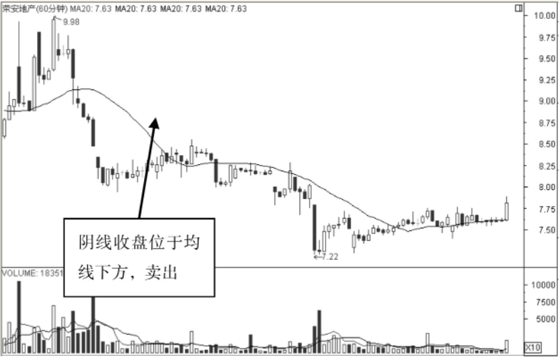

图2.10 荣安地产60分钟K线图

## 股价二次向下突破移动平均线
股价二次向下突破移动平均线，是指股价曾经向下穿越过移动平均线，但是不久又重新回到移动平均线之上。当股价再次向下突破移动平均线时，就是空头真正开始向下打压股价的时刻，也是市场给投资者最后的一个出场机会。此后股价一般会有一个较快并且较大的下跌空间和速度。

如图2.11所示股价从市场高位一路下跌之后，出现了明显的反弹行情，但是图中箭头指向的K线是股价二次向下突破均线的位置，因此后市还会延续原有的下跌趋势。此时投资者不能见到有了很深的下跌空间而过早地入场，因为此后股价始终沿着移动平均线向下运行。

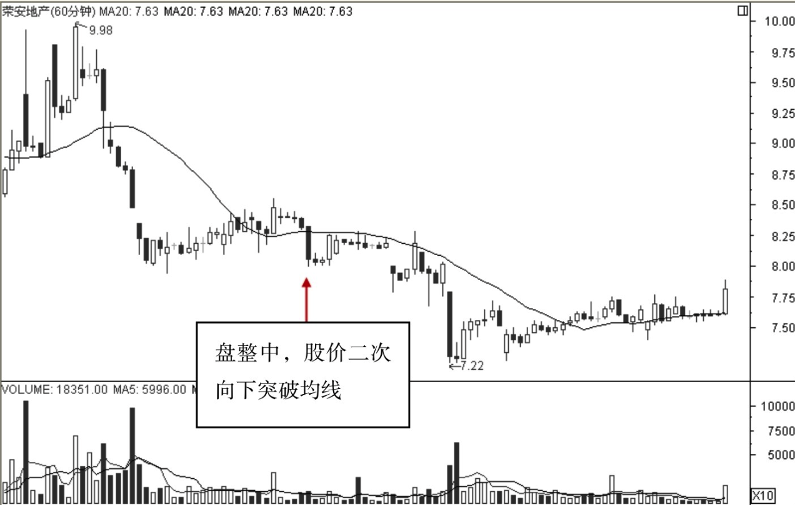

图2.11 荣安地产60分钟K线图

如图2.12所示股价从38.20元的高位开始向下运行，而在箭头指向的位置，股价二次向下跌破了10周期移动平均线，这就意味着股价将继续原有的下跌走势。由于10周期移动平均线所代表的短期移动平均线一直处于向下的运行方向，丝毫没有调头的迹象，而成交量也没有出现明显的增多迹象，因此说明反弹的行情早已结束，股价的下跌空间还很大。

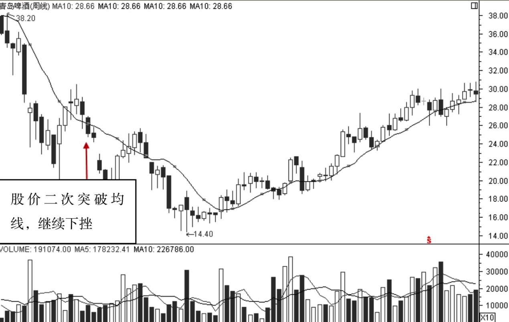

图2.12 青岛啤酒周K线图

## 股价反弹受阻于移动平均线
移动平均线对股价有一定的支撑作用，但股价从下向上运行时，当股价触及移动平均线附近时，移动平均线对股价也会产生一定的阻力作用。因此如果股价触及移动平均线而未能继续向上运行，就是投资者良好的卖出时机。

如图2.13所示，该走势图选用的时间周期为小时，更加侧重分析短期走势，但是为了更好地兼顾中期走势，因此图中选用了60周期移动平均线。股价从6元左右的价位开始向上反弹时，触及了60日移动平均线，就是图中椭圆形标注的位置。移动平均线在此处也给了股价强大的压制作用，结束了股价短期的反弹走势。尽管成交量在此时出现明显增多，但是依然没有突破均线的压制。因此投资者应该在此时获利出场，并且继续等待不能过早入场。

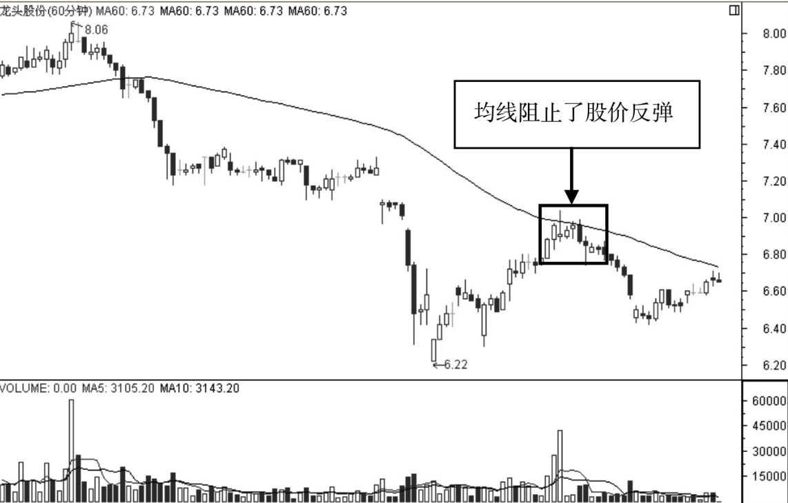

图2.13 龙头股份60分钟K线图

如图2.14所示，图中的移动平均线的时间周期为20周，代表中期移动平均线。从图中可以看出，股价在下跌过程中出现了短暂的向上反弹行情，但是每次股价反弹到20周移动平均线时，都没能成功地上穿，而且每次反弹时成交量也没有明显增多，这也印证了股价将继续向下运行的推断。

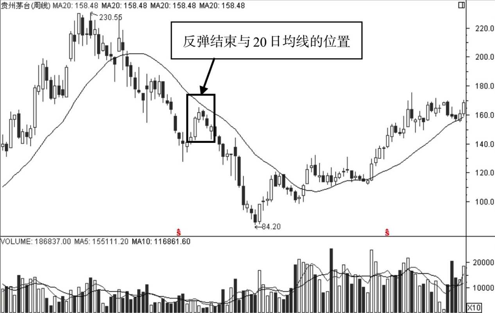

图2.14 贵州茅台周K线图

## 股价远大于移动平均线数值
移动平均线代表近期内购买股票的平均成本，因此如果股价极度地偏离了移动平均线，则说明市场已处于不正常的交易过程。例如，如果股价远远高出了移动平均线的数值，则说明此时在此点位购买股票所付出的代价远远超出了平均成本。因此不会再有更多的人愿意在此时买入股票，此未来股价向下出现回调的可能性很大，甚至可以出现反转行情。

如图2.15所示当股价运行到230.55元时，20周移动平均线已经开始走平，更为重要的是，此时股价已经极大地远离了20周移动平均线所代表的中短期平均持仓成本，因此很有可能是市场的底部。此后股价在高位持续盘整，持久不能继续上扬，成交量也从增多的迹象开始逐步萎缩，这就意味着市场的顶部即将形成。投资者应该在此时快速出场，而不能继续追高买入。从后市的图中可以看到，股价在结束上涨行情后，开启的新一轮下跌趋势是十分猛烈的，下跌幅度也极深。

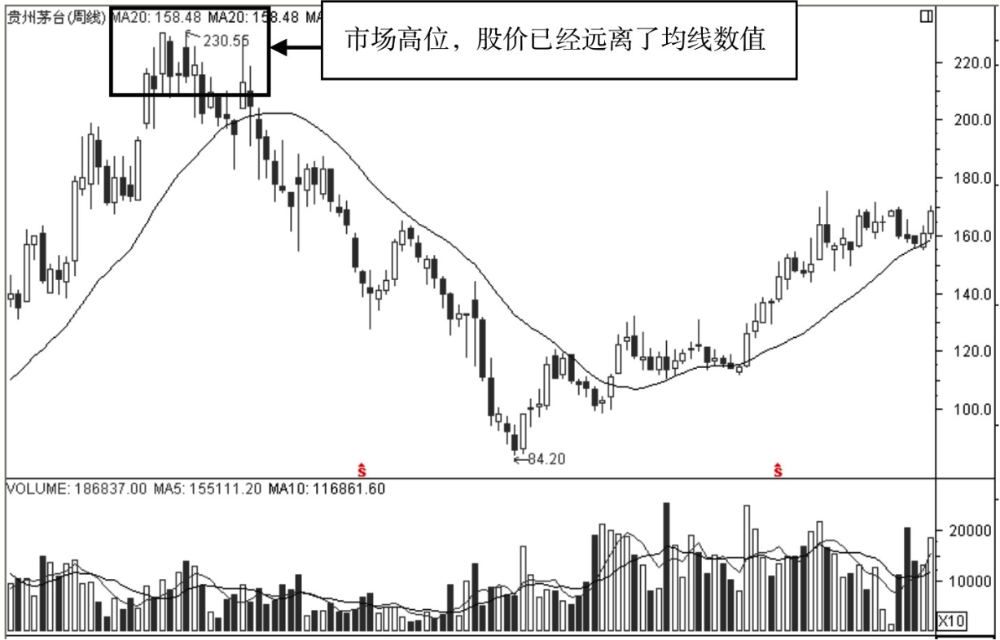

图2.15 贵州茅台周K线图

如图2.16所示从图中可以看到股价在12.51元达到顶峰，而此时股价也远远高出了120日平均线所代表的中长期平均持有成本。此时成交量也发出了警告信号，因为股价在连续创出新高时，成交量却在逐渐地缩小，说明继续向上推动的能量已经开始衰退。因此不管未来是发生反转还是回调，下跌的趋势是不可避免的，只是下跌的幅度大小不同。所以投资者应该在此时快速出场，这样可以规避大量的风险。

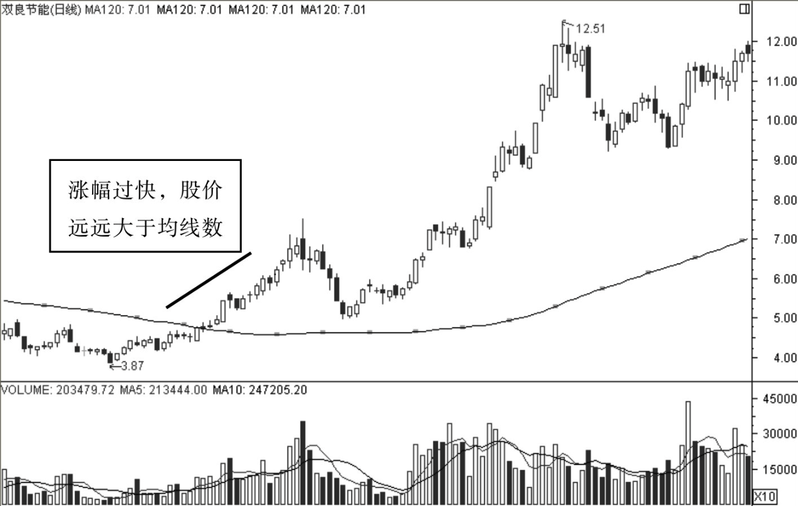

图2.16 双良节能日K线图

# 不同周期的均线
## 日线图中的均线
如图3.1所示股价整体上是向上运行的，而5日移动平均线作为短期趋势的体现者，也是大体向上运行的。因此，当股价出现小幅下挫时，5日移动平均线也及时捕捉到了价格的变化，出现向下追随股价运行的现象。作为短期交易者，只要看到5日移动平均线被股价从下向上穿越，就是一个良好的买入点。但是由于5日移动平均线有较强的灵敏性，因此股价在上涨过程中有时会出现虚假穿越，这时投资者应该继续持股而不能过早地卖出。

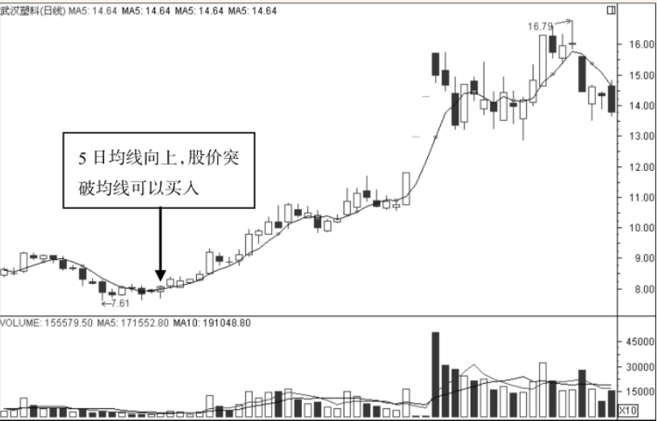

图3.1 武汉塑料日K线图

如图3.2所示，5日移动平均线基本上是向下运行的，这说明当前的短期趋势是向下的。但是在此期间，股价也出现了小幅反弹，因此短线交易者可以据此做出买入的决策。在股价向上穿越移动平均线时，就可以考虑买进股票。但是投资者应该清楚地意识到，大的趋势是向下的，而且时间周期为日，因此向上的反弹不会有太大的幅度，不能过多地在市场中停留。在反弹中有了1元左右的利润后就应该考虑出场。

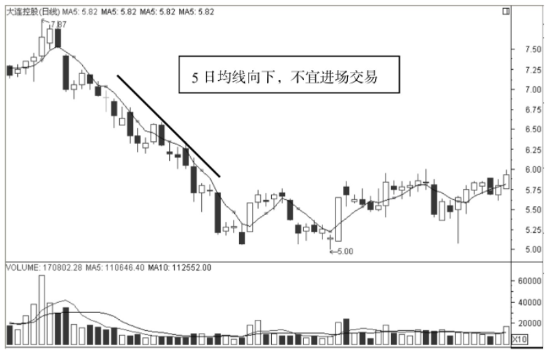

图3.2 大连控股日K线图

如图3.3所示，股价在6.11元时达到新低，此后便小幅上扬。而从图中可以看到，股价最先突破了5日均线，这就是市场给投资者的第一个购买位置。此时的位置与最低级的6.11元十分接近，而3条均线形成`银山谷`形态后已经是第二买点了，这个位置要比股价突破5日均线时高很多。

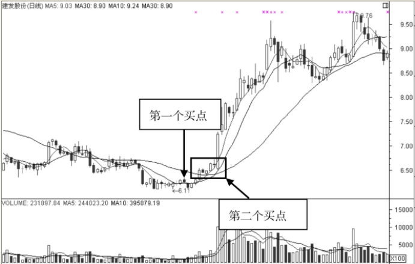

图3.3 建发股份日K线图

尽管10日均线也是短期均线，但是它减少了5日移动平均线所出现的过多虚假穿越信号。**在股价处于市场的顶部和底部时，10日均线都可以发出买入或者卖出的信号，但不会是在最高价和最低价的位置。相比其他信号而言，10日均线发出的买卖信号还是比较早的**。

如图3.4所示，股价基本上是沿着10日移动平均线向上运行的，而10日均线就体现了近期的走势，因此股价向下出现的虚假穿越比较少。当均线没有出现向下运行的态势前，投资者是一直可以持股的。

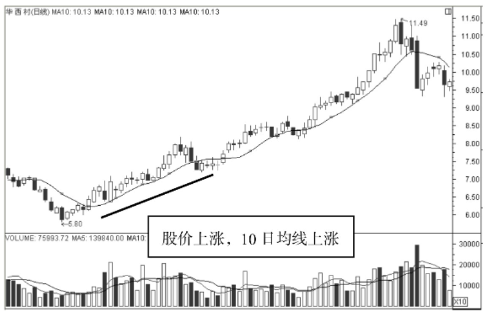

图3.4 华西村日K线图

如图3.5所示，伴随着股价上涨，10日移动平均线也向上运行。但是在上涨中途，股价出现小幅下挫走势，此时的成交量出现萎靡，而且10日移动平均线也紧密追踪趋势向下运行。在股价回调结束时，再次向上穿越10日移动平均线，说明在未来一定时间内，趋势依然延续向上，已经出场的投资者可以考虑再次进场做多。

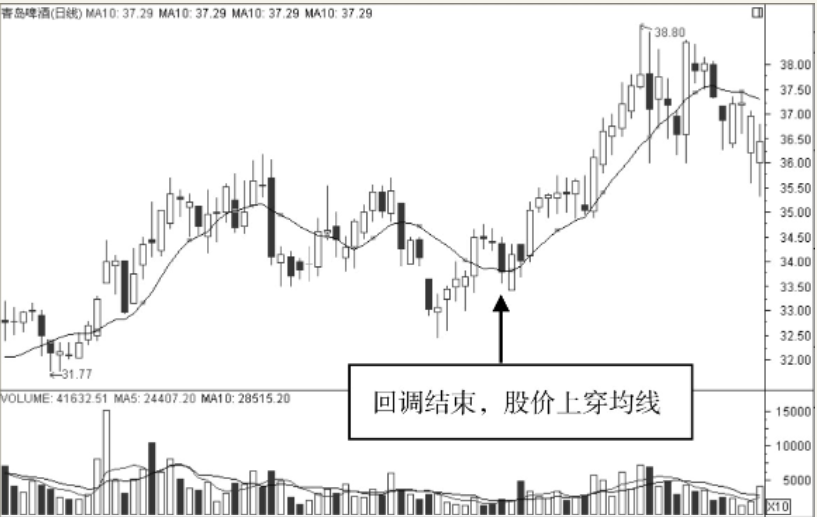

图3.5 青岛啤酒厂日K线图

如图3.6所示从图中可以看到股价在14元站稳，随后3条移动平均线相继向上运行，当股价穿越均线时就是买入股票的信号。图中第一个箭头指向的位置是股价穿越5日均线的位置，此时距离最低价14元很近，但是会有很多投资者不敢买入股票。而第二个箭头指向的位置是股价向上穿越10日均线的位置，此时距离14元也不算太远，而且买入的可靠性更强。

图3.6 冠农股份日K线图

中长线的投资者经常在日K线图上添加60日移动平均线来进行分析。

如图3.7所示，图中有30日和60日两条均线。而60日均线是向下运行的，说明股价在中短期内都是向下的。因此，尽管股价出现了反弹，但投资者如果正在买入股票，则应该清醒地认识到一点：这种反弹的时间不会太长，要时刻警醒不能在市场中停留过长时间。

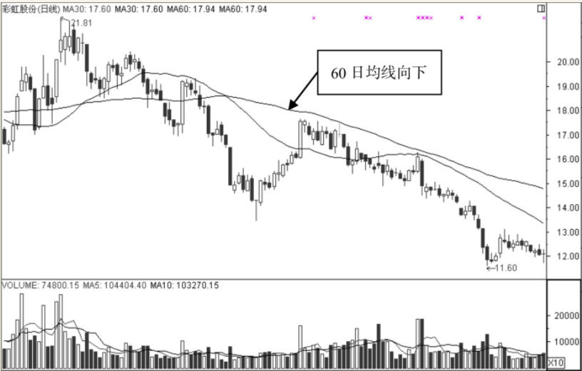

图3.7 彩虹股份日K线图

如图3.8所示从图中可以看到，60日均线基本是向上移动的，这就说明股价在中期走势内是向上的。尽管股价在波动中出现了较大幅度的下挫走势，但这种下跌走势是暂时的，不会持续太长时间。股民可以在下跌的过程中，寻找低点来买入股票。

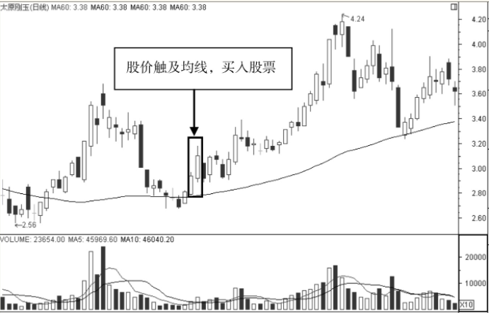

图3.8 大冶特钢日K线图

如图3.9所示股价从6.04元上涨，整个上涨的过程是以螺旋形式向上运行的，而60日移动平均线始终向上移动，衬托着股价向上运行。不仅如此，股价在向下回调到60日移动平均线时，还受到了均线强大的支撑作用，而这个位置正是投资者买入的时机。

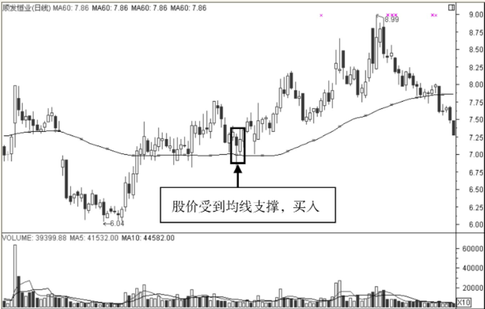

图3.9 顺发恒业日K线图

## 周线图中的移动平均线
如图3.10所示，图中的两条移动平均线分别是5周移动平均线和10周移动平均线。股价在上涨到16元左右的价位后开始下跌，而5周移动平均线也很快开始下行，但由于是周K线图，因此，尽管5周均线的滞后性较小，但是依然在均线形成“死叉”时，股价下跌了3元左右。

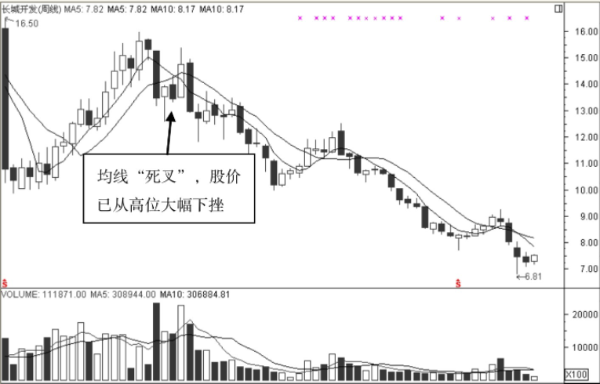

图3.10 长城开发周K线图

如图3.11所示，股价从46.23元一路下行，直至14.40元结束。而5周移动平均线伴随着股价下跌，也开始向下运行。由此可以看到，在周K线图上，股价下跌的幅度是较大的，这在日K线图上是不常见到的。因此，尽管短线交易者可以在周K线图中添加5周移动平均线来进行交易，但是也应该知道，在此周K线图中进行交易，波动幅度是远远超过日K线图的。当股价穿越了5周移动平均线向下运行时，就是投资者获利出场的时机。

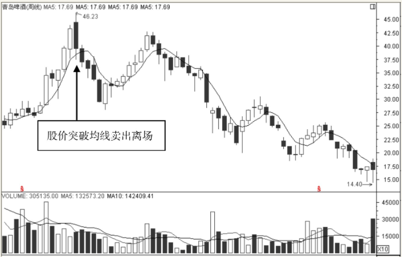

图3.11 青岛啤酒周K线图

如图3.12所示，投资者可以看到股价从市场底部开始快速上扬，而5周移动平均线也伴随着股价的上涨出现了向上运行的态势，但是图中标注的位置股价向下穿越了5周移动平均线却并没有向下大幅下跌，随后又开始向上拉升。可以看到，股价轻微地向下回调，移动平均线都会及时地记录下来，因此会产生股价向下穿越5周移动平均线的虚假卖出信号。据此卖出股票的交易者，可能会丧失一部分利润空间。

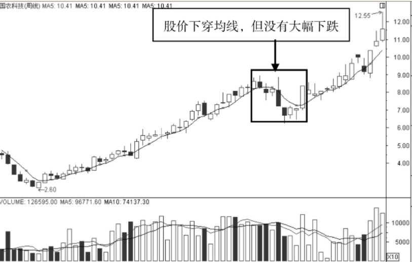

图3.12 国农科技周K线图

如图3.13所示，股价从15.58元开始上行，图中第一个箭头指向的位置就是股价向上突破5周移动平均线的位置，也是投资者进场买入股票的位置。当股价运行到37.80元的价格后，开始下跌，不久均线也开始向下运行。在图中第二个箭头指向的位置便是股价向下穿越5周均线的位置，也是投资者获利出场的位置。因此，仅仅根据股价与5周移动平均线的穿越情况，就可以实现20元左右的获利空间。

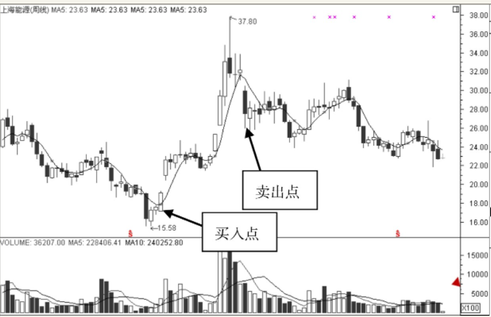

图3.13 上海能源周K线图

如图3.20所示图中共有3条移动平均线，分别是5周移动平均线、10周移动平均线和30周移动平均线。从图中可以看到，股价在上涨的过程中，股价与5周均线发生穿越，这就是均线发出的虚假信号，它会让投资者过早地出场。而10周均线则几乎没有与股价发生交叉，因此信号比较真实可靠。30周均线一般常用来反映长期趋势，不作为买入或者买入时机的选择工具。

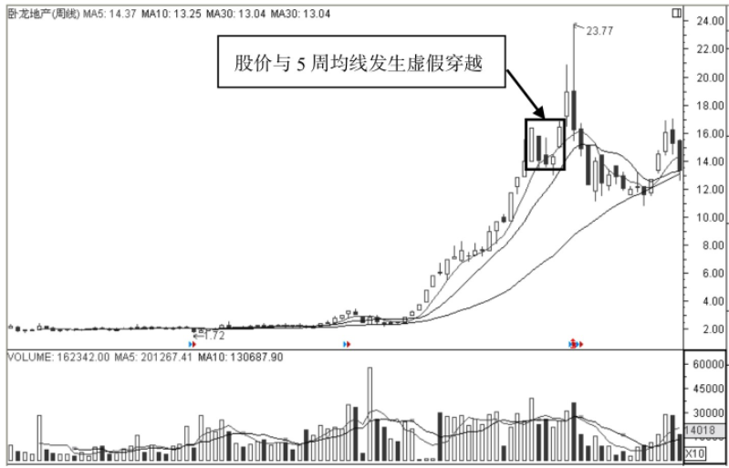

图3.20 卧龙地产周K线图

如图3.21所示从图中可以看到，股价基本上一路上扬，10周移动平均线也衬托着股价向上移动。如果根据股价与10周均线的穿越来买入和卖出股票，则可以获得大约5倍的利润空间。

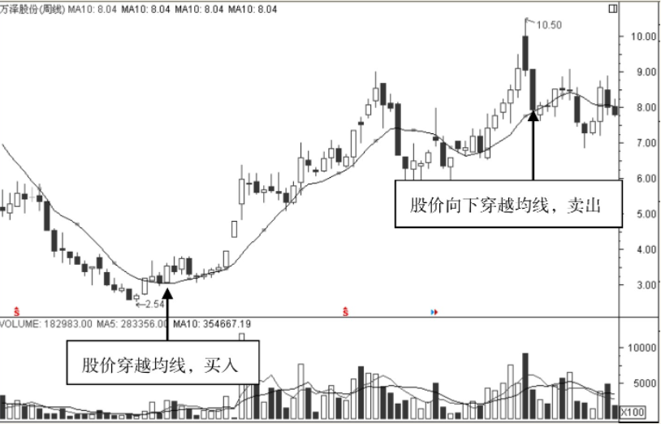

图3.21 万泽股份周K线图

如图3.22所示，当股价从8.31元上行穿越了10周移动平均线后，投资者就可以进场买入股票了。股价一路上行到44.38元，可见涨幅之大。

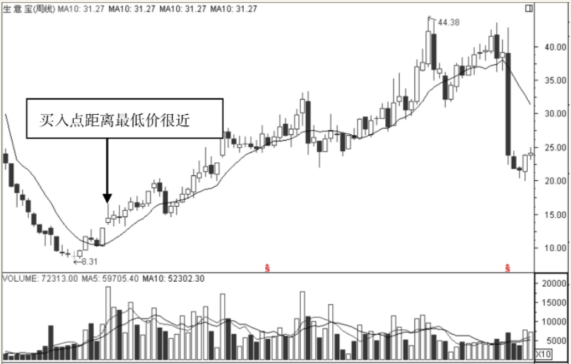

图3.22 生意宝周K线图

如图3.23所示从图中可以看到，20周均线始终衬托着股价向上移动，而且在股价回调的时候，还给出了多次的支撑作用。

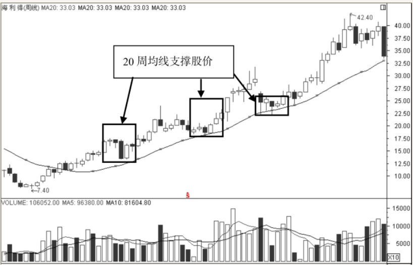

图3.23 海利得周K线图

如图3.24所示，从图中可以看到股价从下跌行情到上涨行情的完整转换过程。在4.30元左右的价位时，股价向上突破了20周移动平均线后投资者就可以进场了，此时的成交量也在放量支持投资者买入。之后股价一路高涨，始终在20周移动平均线上方移动。

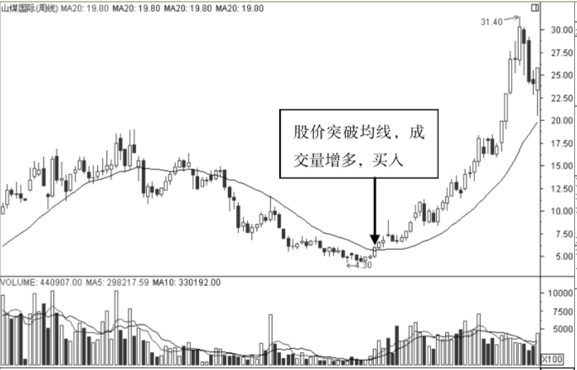

图3.24 山煤国际周K线图

如图3.25所示，股价在230.55元创出新高，此后成交量开始萎缩，20周移动平均线开始下行。投资者可以从图中发现，在股价小幅下挫后，均线开始下行。但是在整个下跌过程中，如果在股价从上向下突破20周移动平均线之后卖出股票，则依然是在比较高的点位卖出的。

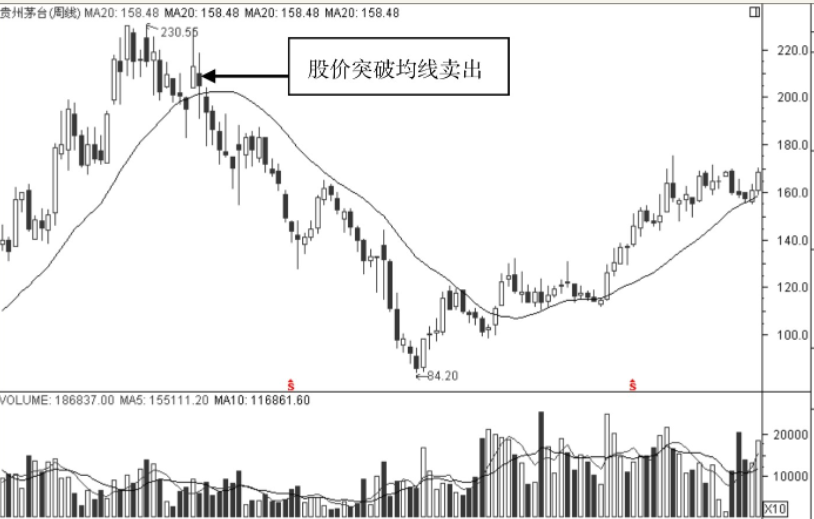

图3.25 贵州茅台周K线图

## 60分钟图中的移动平均线
如图3.26所示从图中可以看到，5小时均线频繁波动，与股价多次形成穿越，因此信号的准确性不高。而10小时均线则略显稳定。尽管如此，5小时均线依然体现了股价的短期走势。

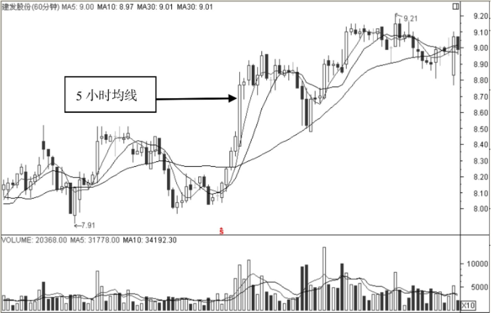

图3.26 建发股份小时图

如图3.27所示股价从7.96元开始上扬，不久便穿越了5小时移动平均线，而这正是一个良好的短期买入点。短线交易者可以在60分钟图中寻找买入点，因为买入的信号要早于日K线图中出现的信号。

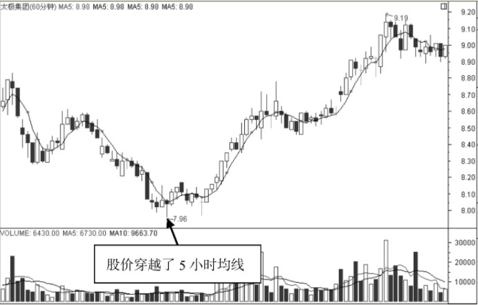

图3.27 太极集团60分钟K线图

如图3.28所示，如果股民在日K线图或者周K线图中得到的结论是出售手中的股票获利出场，那么若想利用一个较高的价位出场，则应该在小时图中去寻找位置。股价从12.54元开始下挫，5小时移动平均线作为短期趋势的体现者，也开始向下运行。当股价从上向下穿越了5小时移动平均线时，就是出场的位置，这个点位在整个下跌趋势中是比较高的。

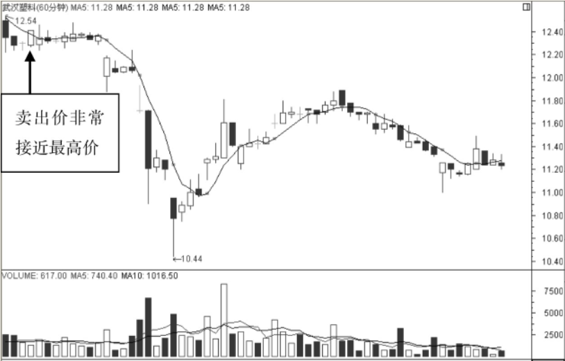

图3.28 武汉塑料60分钟K线图

如图3.29所示从图中可以看到，股价整体上是上行的，但是在上涨的过程中也出现了向下的回调走势。如果交易者不能判断这种向下的走势是长期性的还是暂时的，就可以分析20周期的移动平均线，因为它代表着更长的趋势。从图中可以发现，20周期的均线始终保持向上的走势，因此可以判断出下挫的走势是暂时的。投资者不仅不需要卖出股票，还可以在下跌的时候买入股票，这时买入股票价格更低。

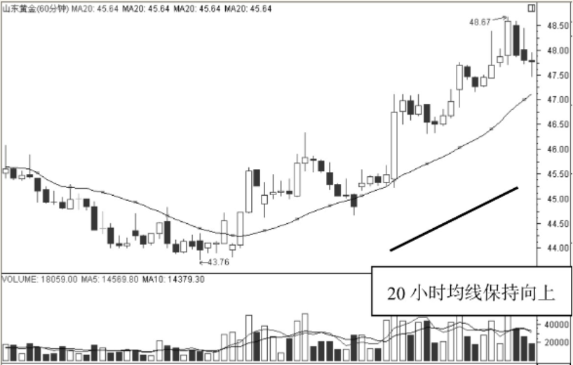

图3.29 山东黄金60分钟K线图

如图3.30所示，股价在下跌的过程中也出现过向上的反弹走势，但是20小时移动平均线始终保持向下运行。也就是说，比60分钟周期更大一级的时间单位是向下的，因此可以判断这种反弹行情是短暂的，此时不宜进行交易。

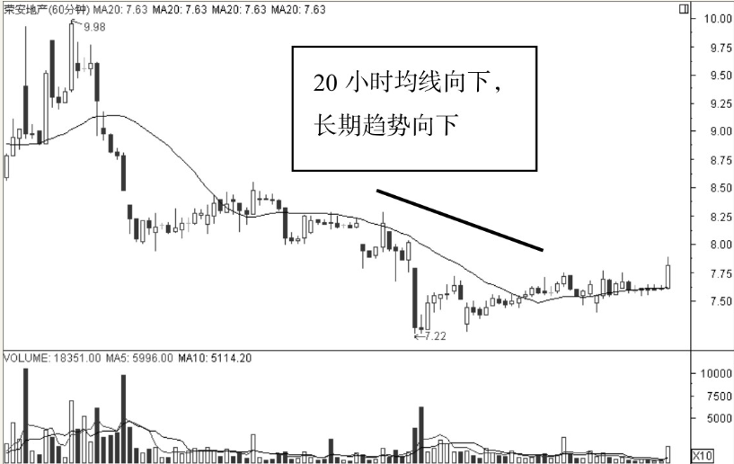

图3.30 荣安地产60分钟K线图

如图3.31所示，股价从5元开始上涨，20小时移动平均线也向上运行，说明较长周期内趋势都是向上的。因此股价在下跌时，股民应该在股价触及移动平均线附近买入股票。但是由于K线时间周期较短，因此不能期待上涨的幅度很高。从图中可以看到，股价上涨了不到1元左右的幅度，这也是由于时间周期较小导致的。

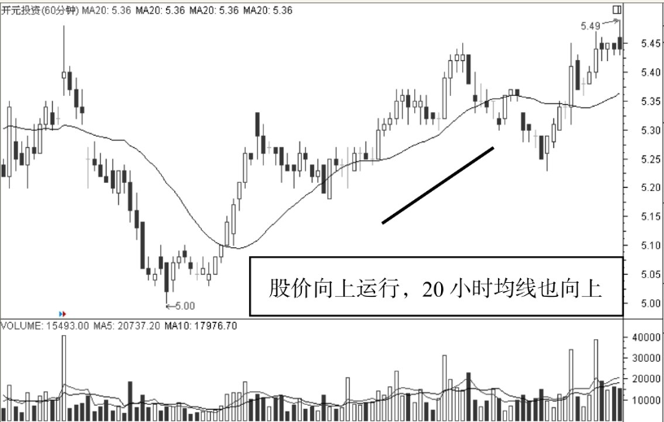

图3.31 开元投资60分钟K线图

# 均线组合形态买入点研判
## 典型买入形态组合

