    作者: 林奇 / 何天峰
    出版社: 机械工业出版社
    出版年: 2020-6
    页数: 356
    定价: 69.00元
    装帧: 平装
    ISBN: 9787111658948

[豆瓣链接](https://book.douban.com/subject/35121011/)

- [投资理论](#投资理论)
  - [投资就要投“垄断”](#投资就要投垄断)
  - [价值投资在中国有效吗](#价值投资在中国有效吗)
- [投资方法](#投资方法)
  - [用八个财务指标轻松选出好公司](#用八个财务指标轻松选出好公司)
  - [如何估值1：以东方财富为例](#如何估值1以东方财富为例)
  - [如何估值2：以中炬高新为例](#如何估值2以中炬高新为例)
  - [如何估值3：以中国建筑为例](#如何估值3以中国建筑为例)
  - [如何估值4：有或没有估值法](#如何估值4有或没有估值法)
  - [如何阅读资产负债表（上）](#如何阅读资产负债表上)
  - [如何阅读资产负债表（下）](#如何阅读资产负债表下)
  - [市净率的一个简单应用：以中国石油为例](#市净率的一个简单应用以中国石油为例)
  - [周期性行业的投资心得](#周期性行业的投资心得)
  - [小心高商誉风险](#小心高商誉风险)
  - [投资选股“四不碰”](#投资选股四不碰)
  - [四个投资小技巧](#四个投资小技巧)
    - [AH股比价](#ah股比价)
    - [回购分析](#回购分析)
    - [审计报告](#审计报告)
    - [建立股票池](#建立股票池)
- [行业研究](#行业研究)
  - [白酒行业专题研究](#白酒行业专题研究)
  - [调味品行业专题研究](#调味品行业专题研究)
  - [医药行业专题研究](#医药行业专题研究)
  - [猪肉行业专题研究](#猪肉行业专题研究)
  - [汽车行业专题研究](#汽车行业专题研究)
  - [机场航运专题研究](#机场航运专题研究)
  - [券商行业专题研究](#券商行业专题研究)
  - [房地产行业专题研究](#房地产行业专题研究)
  - [新能源车行业专题研究](#新能源车行业专题研究)
  - [液晶面板行业专题研究](#液晶面板行业专题研究)
  - [食品饮料行业简单介绍](#食品饮料行业简单介绍)
  - [影视传媒行业简单介绍](#影视传媒行业简单介绍)
  - [水泥行业简单介绍](#水泥行业简单介绍)
- [公司案例分析](#公司案例分析)
  - [大金融——银行：农业银行](#大金融银行农业银行)

# 投资理论
## 投资就要投“垄断”
根据我的经验，真正的“护城河”主要有以下几种。

1. 无形资产
   1. 我认为在公司的无形资产中最主要的是品牌，比如可口可乐和贵州茅台。那些提价而不影响产品销量的公司，才具有真正的“护城河”。提价后产品销量下降的公司，不能算有“护城河”。比如东阿阿胶，提价后产品销量持续下滑，导致业绩“崩溃”。
   2. 无形资产还包括专利和牌照。比如，我国的金融行业是特许经营的行业，开设银行、保险公司、证券公司、基金公司都需要相应的牌照，获取牌照的难度往往很大，这使有牌照的公司比较少，所以金融行业的竞争一般都不太激烈。
1. 高转换成本
   1. 如果你已经习惯了使用一个东西，此时让你用一个别的东西，你就需要重新学习，这就产生了转换成本。因此人们一般都不会轻易去换已经使用习惯的东西。比如，很多人平时看股票都用同花顺软件，假设现在有一家公司做了一款新的看盘软件叫“小智慧”，如果想用这个新软件看盘就要先学习这个新软件的使用方法，那估计大家就不会轻易地换软件了。因为这对于投资者来说太麻烦了。
   2. 高转换成本常见于更换一些软件时，尤其是大家平时常用的软件。大家一般都不会轻易地换这类软件，比如微信、QQ、微博、大众点评等。
2. 网络效应
   1. 网络效应是指互联网行业里常见的“赢家通吃”。比如，微信在社交App的“大战”中获胜，现在很多人都用这个App，而用的人越多，软件的价值就越大，让你不得不用。
   2. 这种行业一旦经历了竞争便形成垄断，巨大的用户群体是公司坚固的“护城河”。当别人都在用这个软件时，你要想和大家保持社交就不得不用，到最后，大家都离不开这个软件了。

## 价值投资在中国有效吗
投资者应该怎么做价值投资呢？我认为关键是要掌握四个方面。

1. 选出好公司。我主要有三种选股思路。
   1. 投资那些长期稳定向上的行业，比如金融行业、消费行业、医药行业。我认为，这种弱周期行业很容易出现长期慢牛的股票。所以，长期不变的弱周期行业是我愿意进行长期投资的。
   2. 投资那些强周期行业，比如养猪行业、海运行业、基建行业等。这些行业的好处是弹性大，我们很有可能从中赚到大钱。
      1. 强周期行业的底部特征是行业里的龙头企业开始亏钱；强周期行业的顶部特征是行业里最“烂”、业绩倒数的公司都开始大赚特赚。
      2. 具体来说：在周期性底部，龙头企业因为业绩差，往往看起来估值比较高，虽然估值的确高得吓人，但实际上这是该买入股票的时候；在周期性顶部，因为企业的业绩都很好，往往行业内最“烂”的公司看起来估值都很低，虽然大家会觉得这个时候股价比较便宜了，但实际上这是该卖出股票的时候。
   3. 投资未来时代风口上的行业，以及未来时代浪潮上的“雄鹰”公司。
2. 组合持仓。做价值投资的投资者一般都是组合持仓。
3. 低估时买入。根据我的经验，往往在市场比较低迷的时候，投资者会有更多机会买到“便宜的好货”。
4. 长期持有。投资者做价值投资就是做伟大公司的股东，而做了股东就相当于做了公司的老板。

# 投资方法
## 用八个财务指标轻松选出好公司
1. 现金收入比

一般来说，话语权强的公司在会计上确认的销售收入，应该能够与从客户那里收到的现金相匹配，甚至会有人提前预付款。也就是说，**好公司的现金收入比等于甚至大于100%**。

表2-1　2012～2017年第三季度贵州茅台的现金收入比

年份 | 2012年 | 2013年 | 2014年 | 2015年 | 2016年 | 2017年前三季度
---|-------|-------|-------|-------|-------|----------
销售收入（亿元） | 265 | 311 | 322 | 334 | 402 | 445
销售商品、提供劳务收到的现金(亿元) | 289 | 332 | 334 | 371 | 610 | 489
现金收入比(%) | 109 | 107 | 104 | 111 | 152 | 110

大家能看到，不仅2016年贵州茅台的现金收入比超过了100%，这个指标连续五年都超过了100%。

表2-2　2012～2017年第三季度乐视网的现金收入比

年份 | 2012年 | 2013年 | 2014年 | 2015年 | 2016年 | 2017年前三季度
---|-------|-------|-------|-------|-------|----------
销售收入（亿元） | 12 | 24 | 68 | 130 | 220 | 62
销售商品、提供劳务收到的现金（亿元） | 5 | 15 | 58 | 100 | 146 | 45
现金收入比(%) | 42 | 63 | 85 | 77 | 66 | 73

乐视网的现金收入比最好的年份是2014年，但那年也只有85%，没有超过100%。

2. 净资产收益率

净资产收益率反映了一家公司的盈利能力。净资产收益率越高，公司的盈利能力越强。在做投资的时候，**我会选那些净资产收益率过去五年一直在15%以上的公司**。

净资产收益率高的公司很多，好公司和普通公司的区别在于：好公司的净资产收益率会长时间维持在一个很高的水平。

表2-3　2012～2017年第三季度格力电器、美的集团和欣泰电气的净资产收益率(%)

公司/年份 | 2012年 | 2013年 | 2014年 | 2015年 | 2016年 | 2017年前三季度
---|-------|-------|-------|-------|-------|----------
格力电器 | 33.3 | 35.4 | 35.9 | 27.3 | 30.4 | 27.5
美的集团 | 24.3 | 22.6 | 29.0 | 28.7 | 26.6 | 22.7
欣泰电气| 18.4 | 14.7 | 29.0 | 8.1 | 0.9 | -18.6

美的集团和格力电器一样，也是白色家电企业，净资产收益率同样很高，但比格力电器略差一点。创业板第一家退市公司是欣泰电气。

3. 人均创收和人均创利

净资产收益率是从资本的角度去看盈利能力的强弱，而这个指标是从人的角度去分析公司盈利能力的强弱。

在做投资的时候，我会选那些人均创收和人均创利都很高的公司。

多少算高？其实没有绝对数字，需要与行业内的其他上市公司做比较才能看出来。不过有个简单的筛选法则：**现在沿海地区普通工人的年收入为6万～7万元，所以人均创利在10万元以上，同时人均创收在100万元以上的公司应该算是比较好的**。

比如，杭州的海康威视是国内安防视频监控行业的领军企业，根据公司公告，2016年的收入为320亿元，净利润为74亿元。截至2016年年底公司共有员工20 013人。所以，我们计算出海康威视的人均创收是160万元，人均创利是37万元。海康威视真的是盈利能力非常强的企业。

中国平安是大家耳熟能详的企业，根据公司公告，2016年的营业收入为7125亿元，归母净利润为623亿元。截至2016年年底公司共有员工318 588人，可以算出中国平安的人均创收为224万元，人均创利为19.6万元。

4. 总资产周转率

总资产周转率是衡量公司资产变现能力强弱的一个指标。总资产周转率越高，公司的变现能力越强。

在做投资的时候，**我会选那些总资产周转率超过100%的公司**。

比如，杭州的大华股份是国内安防视频监控行业的龙头企业，我从这家公司上市开始就紧密跟踪它的发展。不管是从收入增长还是从利润增长的角度看，这家公司都发展得很好。表2-6所示是大华股份2012～2016年的总资产周转率。

表2-6　2012～2016年大华股份、老板电器和ST新城的总资产周转率(%)

公司/年份 | 2012年 | 2013年 | 2014年 | 2015年 | 2016年
------|-------|-------|-------|-------|------
大华股份 | 125 | 115 | 105 | 103 | 99
老板电器 | 92 | 103 | 112 | 105 | 101
ST新城 | 35 | 34 | 4 | 1 | 0

随着公司规模扩大，大华股份的总资产周转率有些下降，这是正常的。不过，优秀的公司还是会想办法做好内部管理，把总资产周转率控制在100%左右。

杭州的另一家公司老板电器，每年的业绩都能超出市场预期。老板电器2012～2016年的总资产周转率除了2012年基本都在100%以上，它的运营能力是非常强的。

在沪深两个市场中，总资产周转率曾经最低的公司是*ST新城。

5. 季度收入增长率

多年的投资经验告诉我，如果公司的销售收入没有增长，那么公司利润的增长会比较困难。在做投资的时候，我的独门方法是：**选连续八个季度的季度收入增长率都超过15%的公司去投资**。

爱尔眼科是国内最大的眼科医疗机构之一，同时它也是很多机构投资者的“爱股”。该公司自2009年10月上市以来，股价表现一直不错。我从该公司上市至今一直紧密跟踪它的发展。表2-11中是爱尔眼科2014～2017年的季度收入。

表2-11　2014～2017年爱尔眼科的季度收入（单位：亿元）

年份 | 2014年 | 2015年 | 2016年 | 2017年
---|-------|-------|-------|------
第一季度 | - | 6.5 | 9.2 | 12.0
第二季度 | - | 8.0 | 10.0 | 13.9
第三季度 | - | 9.9 | 11.6 | 17.9
第四季度 | 5.6 | 7.2 | 9.2 | -

我们进一步计算该公司的季度收入增长率，如表2-12所示。

表2-12　2014～2017年爱尔眼科的季度收入增长率（%）

年份 | 2014年 | 2015年 | 2016年 | 2017年
---|-------|-------|-------|------
第一季度 | - | - | 42 | 30
第二季度 | - | - | 25 | 39
第三季度 | - | - | 17 | 54
第四季度 | - | 29 | 28 | -

爱尔眼科的收入增速非常惊人，2016～2017年八个季度的季度收入增长率基本为两位数。

6. 商誉净资产比

前面讲的指标分别反映了公司的盈利质量（现金收入比）、盈利能力（净资产收益率、人均创收和人均创利）、运营能力（总资产周转率）和成长能力（季度收入增长率）。我们在筛选公司做投资的时候，总希望这些指标大一点。但我们现在要讲的这个指标——商誉净资产比，小一点为好。

商誉是在公司对外并购的时候产生的，它是一项无形资产。商誉并没有对应的实物资产，而是收购方愿意付出的溢价。近几年，我们看到越来越多的公司在上市之后会做一些并购，从而形成了不小的商誉金额。我们在实务中经常会把商誉与归母净资产做比较，如果这个比率太高了，公司股东面临的风险会比较大。

在做投资的时候，**我会选择那些商誉净资产比低于50%的公司。当然，如果更谨慎一点，商誉净资产比低于30%是更好的选择**。

比如，蓝色光标是创业板中一家比较有名的公司，它的主要业务是为客户提供品牌管理服务，其服务范畴包括品牌传播、产品推广、危机管理、活动管理和数字媒体营销等。蓝色光标上市之后做了一系列的并购。2016年年底公司的商誉为47亿元，净资产为54亿元，这样公司的商誉净资产比达到了87%，这是一个惊人的数字。

我猜想蓝色光标的管理层看到了这个商誉风险，所以该公司在2017年做了一笔股权再融资，募集资金17亿元。公司2017年三季报显示，公司的商誉为47.4亿元，而公司的净资产增加到了70.9亿元，当时的商誉净资产比是67%。虽然相比2016年年底，商誉净资产比下降了不少，但我还是感觉挺高的。

我根据2017年三季报统计了全部上市公司的商誉净资产比，很多公司的商誉净资产比都超过了100%，这些公司都面临较高的商誉减值风险。

7. 毛利率

关于毛利率的应用，我有以下心得。

1. 一般选择毛利率高一点的公司进行投资。
1. 拉长时间，除非外部环境有重大变化，否则公司的毛利率一般比较稳定，不会有大幅波动。
1. 公司的毛利率与行业内其他公司的差异不会变化很大。如果有异动，投资者需要仔细分析。

来看贵州茅台2012～2016年的毛利率（见表2-13）。

表2-13　2012～2016年贵州茅台的毛利率

年份 | 2012年 | 2013年 | 2014年 | 2015年 | 2016年
---|-------|-------|-------|-------|------
毛利率(%) | 92 | 93 | 92 | 92 | 91

2012～2016年贵州茅台公布的平均毛利率是92%。这意味着，一瓶800元的茅台酒的成本是64元。64元的成本包括了材料（酒、包装瓶、包装盒等）费用、人工费用和制造费用，而毛利高达736元。

我看到过一些毛利率特别低的公司，比如浙江湖州的栋梁新材，它在2012～2016年的毛利率如表2-14所示。

表2-14　2012～2016年栋梁新材的毛利率

年份 | 2012年 | 2013年 | 2014年 | 2015年 | 2016年
---|-------|-------|-------|-------|------
毛利率(%) | 2.2 | 2.3 | 2.4 | 1.6 | 1.9

2012～2016年栋梁新材的平均毛利率是2.1%。你没有看错，真的只有2.1%。这意味着，公司100元的销售收入中成本差不多为98元，毛利仅有2元。这还没有扣除正常的销售费用、管理费用、财务费用、营业外的收入和支出、税收费用等其他杂费，扣除之后，公司的净利润（率）显然更低。

8. 研发支出

在做分析的时候，我一般会研究两个数据。第一个数据是过去三年研发支出的绝对金额。

比如上海制造业的龙头企业上汽集团，过去中国市场上每卖出四辆车，其中就有一辆是上汽集团（或者其合资公司）生产的。上汽集团2014～2016年的研发支出如表2-15所示。

表2-15　2014～2016年上汽集团的研发支出

年份 | 2014年 | 2015年 | 2016年
---|-------|-------|------
研发支出（亿元） | 68 | 84 | 94

再比如2017年涨幅惊人的京东方A，它在2014～2016年的研发支出如表2-16所示。

表2-16　2014～2016年京东方A的研发支出

年份 | 2014年 | 2015年 | 2016年
---|-------|-------|------
研发支出（亿元） | 24 | 33 | 41

**只要看到上市公司持续不断地进行研发投资，我就不太担心未来几年公司的收入和利润的增长**。

第二个数据是研发支出占销售收入的比重。我多年的投资经验是，**这个比率在10%～30%比较健康，理想情况是在20%左右**。如果比率太低，表明上市公司的研发投入不足；而比例太高的话，往往预示着上市公司的研发投入不可持续。

比如安徽合肥的智能语言及语音技术研究、软件及芯片产品开发的国家骨干级龙头企业科大讯飞，2015年和2016年的研发支出分别是5.8亿元和7.1亿元。科大讯飞的研发支出占销售收入的比率在2015年和2016年分别是23%和21%，这意味着公司获取的收入的20%转变成了公司的研发开支，这属于比较合理的支出结构。

## 如何估值1：以东方财富为例
我一般运用以下三个步骤。

1. 我们需要对公司做基本面的分析，其中对公司的财务报告一定要有深入的了解。
1. 做盈利预测。盈利预测一般不超过三年。
1. 使用估值模型对公司进行估值。

简单介绍一下东方财富2018年的年报：2018年公司营业总收入是31亿元，同比增长23%，实现了两位数的增长；归母净利润是9.6亿元，同比增长51%，增速很快；扣非净利润是9.5亿元，同比增长54%。

上述三个指标，尤其是后面两个指标——`归母净利润`和扣`非净利润`。如果这两个数字相差不大，说明公司的盈利质量比较高，公司的非经常性损益比较少。

再看另一个财务指标——`净资产收益率`。2018年东方财富的净资产收益率是6.3%，只有个位数，明显偏低，仅比2017年略好一点。

实际上东方财富的营业收入来自四项业务。第一项是证券业务，第二项是金融电子商务，第三项是金融数据服务，第四项是互联网广告。下面我们来讲这四项任务。

1. 证券业务。东方财富上市的时候旗下只有一个东方财富网，没有证券业务，东方财富证券是公司上市之后买下来的，之前叫西藏同信证券。
   1. 东方财富证券是一家有证券业务的全牌照公司。2018年，东方财富证券贡献的营业收入是16个亿元，净利润是6.2亿元，毛利率是58%，证券业务的毛利率是公司四项业务中最高的。你会发现，东方财富9.6亿元的归母净利润中，证券业务的利润占了差不多2/3。从目前来看，公司大部分的净利润来自证券业务。
   2. 东方财富证券的总资产是300亿元，净资产是70亿元，在所有上市券商中属于偏小的券商。
1. 金融电子商务，这项业务是通过天天基金网为用户提供基金的第三方销售，2018年实现营业收入10.6亿元，毛利率是34%。天天基金网2018年的日均页面浏览量是562万次，日均用户使用时长是22分钟，活跃用户数是140万。
1. 金融数据服务。东方财富的Choice数据软件分为收费版和免费版，在个人电脑和手机上都能使用。2018年软件收入是1.6亿元，毛利率是5.1%。这项业务的收入不多，毛利率也很低。
1. 互联网广告。大家平时上东方财富网会看到一些广告，2018年公司的广告营业收入是7800万元，毛利率只有2.3%。

总结来看，目前公司最赚钱的业务是证券业务，其次是金融电子商务；金融数据服务和互联网广告的营业收入不多，而且利润较少。怎么给公司估值（见表2-17）。

表2-17　净资产收益率法

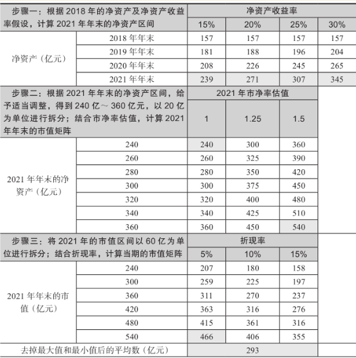

截至2019年4月，东方财富的股价大概是19元/股，总股本是55亿股左右，总市值超过1000亿元，这是市场给的一个市值。

我们先介绍用`净资产收益率法估值`。

为什么要用这个方法？因为东方财富的大部分利润来自证券业务，而证券业务的利润波动比较大。比如，当牛市来了，这项业务相当赚钱，当熊市来了，这项业务就不赚钱了，所以很难给东方财富证券预估利润。

用净资产收益率来估值的话，能够避免这一问题。我认为拉长时间看，东方财富合理的净资产收益率是15%～30%。

如表2-17所示，2018年年末公司的净资产是157亿元，按照15%的增幅，2019年年末是181亿元，2020年年末是208亿元，2021年年末是239亿元。

如果公司能做得更好，净资产收益率能达到30%的话，到2021年年末，净资产是345亿元。综合多种净资产收益率假设，可以得到公司未来的净资产矩阵。

这个方法有两个缺陷：

1. 排除了东方财富在未来三年可能有股权再融资，如果公司增发股票，公司的净资产会增加。
2. 假设东方财富未来三年不分红。这时候来讲没关系，因为公司过去的现金分红一直不多。

有了预估的净资产后，再用`市净率`计算市值。

**金融行业公司的市净率一般在1倍左右，我给的范围是1～1.5倍**，因为更高或者更低，我觉得都不合适。这样，我们得到了三年后公司的市值。

接下来进行`折现`。折现是在估值的时候必须用到的方法。这里涉及折现率的问题。业内一般是这样看的：如果你对公司的成长性比较确定，折现率定低一点；如果你对公司的成长性不太确定，折现率定高一点。

我在这里用的折现率分别是5%、10%和15%。折现后的公司市值去掉最大值和最小值后取平均数为293亿元。

综上，我在2019年4月得出的合理估值是300亿元左右。但当时市场给的估值超过了1000亿元。这说明我认为市场给的估值偏高。

还是以东方财富为例，因为它的业务复杂，我再介绍一种方法——`分部估值法`（见表2-18）。东方财富这家公司从本质上可以看成两项业务的结合。一项是证券业务；另一项是互联网业务，不管是卖基金，还是做网站广告或卖软件，都跟互联网相关。

表2-18　分部估值法

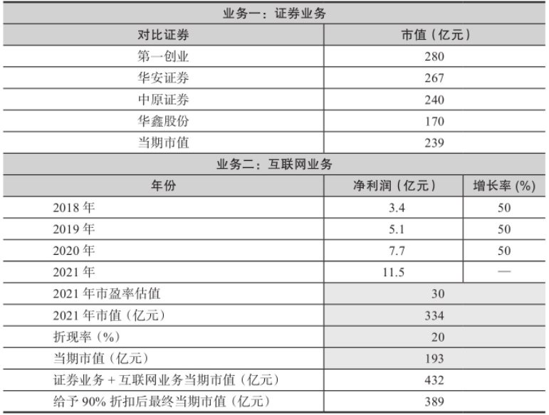

- 证券业务的估值：根据东方财富证券2018年证券业务的收入16亿元、净利润6.2亿元、公司总资产300亿元、净资产70亿元，找到第一创业、华安证券、中原证券、华鑫股份四家类似的公司，取市值平均数239亿元。也就是说，如果东方财富证券单独上市，市值基本上在239亿元左右。
- 互联网业务的估值：互联网业务盈利多少，我们并不清楚，我估计盈利不多。简单地用全年9.6亿元的净利润扣除东方财富证券的6.2亿元净利润，我们得到3.4亿元。假设未来三年的增长率为50%，三年中净利润从3.4亿元增长到11.5亿元。我认为50%的增长率有些夸张，但是互联网业务的估值我会给高一点，然后通过高一点的折现率进行保护。按30倍市盈率估值，20%折现率，得到193亿元。

然后把证券业务和互联网业务的估值相加。不过在用分部估值法的时候，一定要给一个折扣。按照90%给折扣，得到389亿元。

所以，2019年我用分部估值法得出东方财富合理的估值为400亿元左右，相比当时1000多亿元的市值，远远低于市场给的估值。

再介绍一种估值法——`历史估值法`。历史估值法在业内用得比较多，这个方法比较简单，即看图法。

图2-1中有五根线，从上面数第三根线是我认为比较合理的一个估值。我认为第三根线和第五根线之间是低估的。此外，线拉得越长越好，时间太短没有说服力。

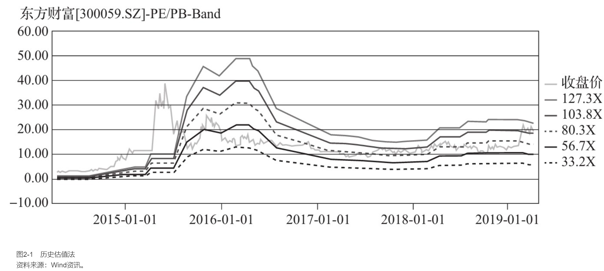

看2014～2019年东方财富第一季度的市盈率图可以知道，公司的估值在第一根线和第二根线之间，说明当时的估值已经高于历史的平均估值，这反过来说明市场给公司的估值是偏高的。

综合前面介绍的几种方法大致能够得出结论：静态来看，当时市场的估值很高。

为什么市场愿意给东方财富那么高的估值？

我们仅对东方财富现有的几块业务进行了估值。按照我们的算法，公司的合理市值不会超过500亿元。但如果大家看东方财富的历史，就会发现公司下至员工，上至董事长，都很有进取心。东方财富在刚上市的时候只有东方财富网，上市之后有了天天基金网卖基金产品，然后收购了证券公司，2018年又在做公募基金。

市场给东方财富那么高的估值是因为市场认为它后面还会做很多事情，包括获得银行、保险和信托的牌照。

如果政策允许，东方财富大概率会是一家全牌照的公司。所以那么高的估值里包含了未来公司可能会做的很多事情。虽然有些不确定的因素在里面，但是如果你看它过往的历史，还是会觉得它的确在往那个方向去做。

跟大家分享一下东方财富每年的分红数据（见图2-2），希望引起大家注意的是，这家公司是一家特别厉害的公司，厉害之处在于它的股本每年都在大规模扩张。**能够做到股本扩张的公司一定是有野心的公司**，这是一个小的经验，在这里我分享给大家。

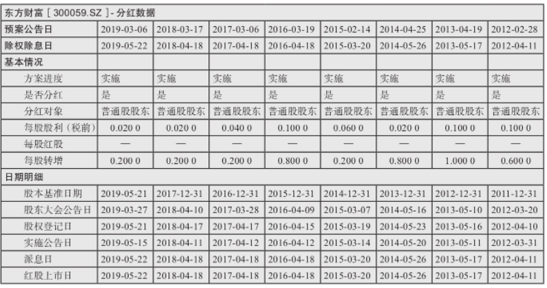

## 如何估值2：以中炬高新为例
我们以中炬高新2018年的年报为例，一步步来分析。

第一步，介绍公司的基本面。2018年，中炬高新的主营业务收入为42亿元，净利润为6.1亿元。

公司业务分成调味品业务、房地产业务、国家级开发区的建设管理和汽车配件业务。

调味品业务。调味品业务由美味鲜公司经营，主要产品有酱油、鸡精鸡粉、食用油等调味品，2018年生产了54万吨。

从营业收入的金额看，酱油的营业收入占比接近70%，鸡精鸡粉占比12%，酱油加鸡精鸡粉共占营业收入的80%；食用油占比8%，其他调味品占比12%。所以，在整个中炬高新的调味品业务中，酱油是绝对的大头。

中炬高新调味品业务的营业收入是38亿元，而公司的总营业收入是42亿元。调味品不仅营业收入占比很高，并且同比增长了10%，毛利率为39%，净利润为6.36亿元。

美味鲜公司值得关注，因为这家公司在2018年年底时总资产是23亿元，净资产是15亿元。从净资产收益率看，美味鲜公司的净利润是6.36亿元，净资产是15亿元，净资产收益率超过40%。我们一直说银行很赚钱，其实银行的净资产收益率一般只有百分之十几。

美味鲜公司的经营杠杆不高，可想而知它的赚钱能力有多强。如果把美味鲜公司单独上市，它的估值可能要比现在的中炬高新高很多。

房地产业务。房地产业务主要由中汇合创经营。中汇合创拿到了中山城轨站北侧1600亩的商住地，从2010年开始开发，目前主要产品是联排别墅、高层洋房、商铺等，已开发物业面积16万平方米。

公司在2018年的年报里提到，在中山市岐江新城的规划里，中汇合创有几块地在新城中心，不过其房地产业务的后续开发没有具体时间表。除岐江新城的土地，中炬高新还有其他商住地，这些商住地在2017年就已经开工建设，2019年实现了销售。

中炬高新持有中汇合创79%的股权，为了简化计算，我们按80%考虑。2018年中汇合创的营业收入为9000万元，净利润为3000万元，因为中炬高新的控股权是80%，所以净利润得乘以80%，金额是2400万元。

但是房地产业务利润少且波动大。卖房子才有利润，不卖房子就没利润。

国家级开发区的建设管理。从20世纪90年代初开始，中炬高新承担起了中山火炬高新技术产业开发区的建设管理工作，面积为5.3平方千米。经过二十多年的开发，园区基本开发完毕，公司目前拥有园区内的厂房、宿舍及相应配套物业近25万平方米。2018年园区开发的营业收入为670万元，净利润只有1万元。

汽车配件业务　汽车配件业务由中炬精工公司经营，主要产品是汽车空调电磁离合器，这个产品是发动机与压缩机之间的动力传递装置，属于汽车空调系统中的核心零部件。2018年汽车配件业务的营业收入为7000万元，毛利率是26%，净利润率不到10%，净利润只有590万元。

综上所述，中炬高新的四项业务中，相对稳定且盈利能力强的，无疑是调味品业务；房地产、开发区的建设管理、汽车配件这三项业务，要么波动大，要么盈利少。

所以，我们在给中炬高新估值时，要先把调味品业务单独估值，其余三项业务打包在一起估值。

第二步，做盈利预测（见表2-19）。未来几年，调味品行业能够实现稳步增长，增长率在10%～15%。

调味品行业现在的格局是“一超加四个梯队”：一超是海天味业，中炬高新位于第二梯队，千禾味业在第三梯队，第四梯队是些更小的公司。行业中的龙头企业，比如海天味业和中炬高新，利润增速快于行业。

先假设未来三年中炬高新的营业收入按15%增长。2018年调味品业务的营业收入是38亿元，预计2019年约为44亿元，2020年约为50亿元，2021年约为58亿元。再假设净利润率。中炬高新2018年的净利润率为17%，而海天味业在25%左右。与海天味业比较，中炬高新的净利润率明显偏低。假如未来三年中炬高新更加重视调味品业务，剥离其他几项不赚钱的业务。只要做好渠道建设，它的净利润率应该能进一步提升，所以我们假设中炬高新在2018～2021年每年净利润率提升一个百分点。

有了营业收入和净利润率之后，我们接下来算净利润（见表2-19）。中炬高新2018年的净利润是6.5亿元，预计2019年是7.9亿元，2020年是9.5亿元，2021年是11.6亿元。

第三步，用`终值折现法`计算估值。

如表2-19第二部分所示，净利润的范围是10亿～13亿元；市盈率估值倍数的范围是25～45倍。我觉得合理的净利润差不多是11亿元，市场会给30倍的估值，那么市值大概是11亿元×30=330亿元。

盈利预测或者终值通常是一个范围，所以这里出现许多数字，最小的是250亿元，最大的是585亿元。如表2-19第三部分所示，把这些数字从小到大排列——250亿～600亿元，这些是将来值；折现率分别是15%、20%、25%。调味品行业增速不快，确定性高，我认为给15%～25%的折现率比较合理。

接下来，按照这个折现率计算公司的现值。现值底部是128亿元（250亿/（1+25%）*）。

表2-19　终值折现法（金额单位：亿元）

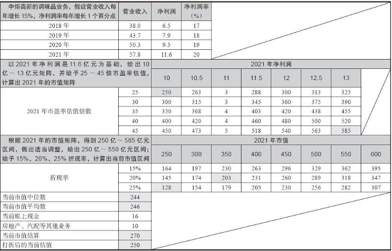

去掉极大值和极小值，计算中位数和平均数，市值落在240亿～250亿元。

公司账上有16亿元净现金，另外房地产业务、开发区的建设管理和汽车配件业务打包一起算是10亿元。把数值相加得出估值270亿元，与公司2019年4月时的市值差不多。分部估值一般要打折，按90%计算，估值在250亿元左右。对比当时的市值，并未高估。

多用一种估值方法更保险。下面再使用`历史估值法`进行估值。

图2-3是一张历史市盈率图，共有五根线，从上面数第三根线是合理位置，2019年4月股价在第二根线附近，稍微有些高估。

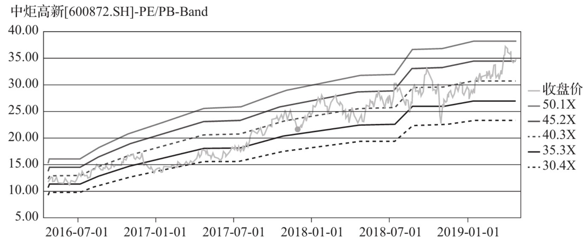

## 如何估值3：以中国建筑为例
我们先了解一下中国建筑的基本面。

1. 中国建筑是建筑行业的龙头企业。比如营业收入规模，中国建筑2018年的营业收入达到了1.2万亿元，几乎等于排名第二和第三的中国中铁和中国铁建的营业收入之和。建筑行业是用工大户，我们通过中国建筑的员工总数看看其行业地位。2018年年底，中国建筑的员工超过了30万人（历史上第一次超过30万人），比中国中铁的28万人和中国铁建的29万人要多。
2. 中国建筑是典型的蓝筹白马股。中国建筑的净资产收益率（ROE）很高，如图2-4所示。中国建筑的净资产收益率在过去很多年都保持在15%以上，而且较为稳定。考虑到公司很少做外延式并购，这些净资产收益率都源于公司内生性的增长，这很不容易。

关键比率 | 2018-12-31 | 2017-12-31 | 2016-12-31 | 2015-12-31 | 2014-12-31 | 2013-12-31 | 2012-12-31
-----|------------|------------|------------|------------|------------|------------|-----------
ROE(摊薄)(%) | 15.68 | 15.34 | 15.68 | 15.52 | 16.24 | 17.28 | 15.45
ROE(加权)(%) | 15.97 | 15.82 | 15.87 | 16.00 | 17.70 | 18.60 | 16.52
扣非后ROE(摊薄)(%) | 15.39 | 14.82 | 15.27 | 14.95 | 15.06 | 15.79 | 14.55

3. 中国建筑的估值一直不高。截至2019年6月4日收盘，中国建筑的总市值是2347亿元，以2018年的净利润和净资产为基数，公司静态市盈率是6倍，市净率是0.96倍，估值很低。

中国建筑的业务并不复杂，大体分为建筑业务和房地产业务两块。

一直以来建筑业务是公司的主业，具体来说细分成房建、基建和勘察设计。勘察设计的体量很小，几乎可以忽略不计。

我们前面介绍过，2018年中国建筑实现营业收入1.2万亿元。在这1.2万亿元的营业收入之中，建筑业务占近85%。

但是，建筑业务有一个明显的短板——毛利率很低，房建的毛利率不到7%，基建的毛利率不到8%。净利率则更低。

对于建筑业务未来的预测，要看建筑行业里一个重要的先行指标——新签合同额。为什么新签合同额那么重要？因为在建筑行业里，新签合同额就像一面镜子，体现了上市公司的经营能力，还能反映出今后一两年上市公司营业收入和净利润的变化趋势。一旦新签合同额出现拐点，上市公司未来的发展大概率会遇到瓶颈。

2018年全年，中国建筑的新签合同额同比增长7%（见表2-20），虽然继续正向增长，但较前几年的高速增长，已经明显后劲不足。

表2-20　2018年中国建筑新签合同总额

项目 | 单位 | 2018年 | 2017年 | 同比增长(%)
---|----|-------|-------|--------
新签合同总额 | 亿元 | 26271 | 24535 | 7.08

2019年5月，中国建筑公布了“2019年1～4月经营情况简报”。2019年前4个月，建筑业务的新签合同总额同比上年仅增长2.3%，几乎没有增长（见图2-5）。

从地域上看，中国建筑的海外业务遇到了前所未有的压力。2018年海外新签合同额同比下降22%。对于建筑行业的公司而言，因为国内竞争已经白热化，所以海外建筑业务的重要性不言而喻。未来一段时间，中国建筑需要补齐海外业务的短板，否则后续海外业务将会拖后腿。

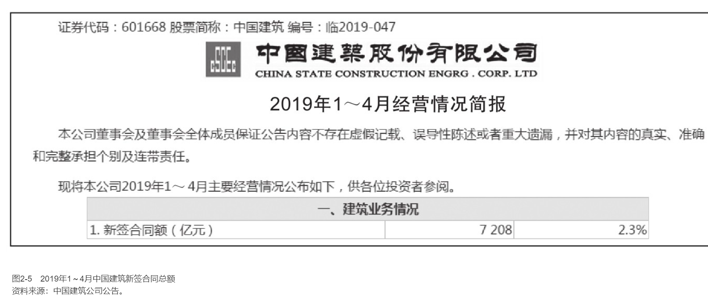

相比建筑业务的薄利和增速放缓，近几年中国建筑的房地产业务做得不错。虽然房地产业务在公司营业收入中的占比不足15%，但是毛利率很高，一般能做到35%。房地产业务是中国建筑目前比较赚钱的业务。

由于房地产公司采用的是预售制，因此，在会计确认的时候，当年的营业收入主要是两年以前卖出去的期房。比如，2016年中国建筑的房地产合约销售额是1896亿元，对应到2018年的房地产业务收入差不多是1841亿元。

2017年和2018年，中国建筑的房地产合约销售额分别为2286亿元和2986亿元，增长速度分别为21%和31%。

所以，我觉得未来两三年，中国建筑房地产业务的营业收入和净利润是有保证的。

在中国建筑2019年的交流会上，公司的管理层提到了以下几方面内容。

1. 2018年新签合同大幅下滑，主要有三个方面的原因：一是全社会都在去杠杆，造成了资金面紧张；二是公司有意识压了PPP（政府和社会资本合作）项目，凡是不入库的都不签了；三是与2018年整体基建投资增速偏低有关。在固定资产投资增速大幅下滑的背景下，中国建筑的业务表现的确不是很好。
2. 房地产业务还是在正常发展。中国的城镇化过程还会持续一段时间，中国建筑会继续坚持主业。中国建筑对地产项目的获取、管控依旧富有成效，持续保持较强的竞争优势。
3. 中国建筑在想办法拓展一些新业务。公司入股或收购碧水源等水务环保公司，希望把正在做的水务环保业务做强，尽力实现协同发展。中国建筑2018年和三峡集团签订了战略合作协议，未来会更多关注“长江大保护”。对于长达6000多公里的长江岸线的保护带来了很大的环保业务量，现在已经有实质性项目在推进。随着“绿水青山”政策的深入，要求各地政府和企业投资到水务环保的力量会越来越大，这块是中国建筑的强项所在。
4. 关于国企改革和科创板。随着国企改革推进，中央对国有企业、中央企业改革的要求越来越高。比如，中海地产和中信地产通过股票交易实现了共赢，这种机会还是有的；还有一些和地方资源的整合，正在保持洽谈。

`市盈率估值方法`：股价（P）=市盈率（PE）×每股收益（EPS），在等式两边同时乘以总股本后，得到`“公司市值=市盈率×净利润”`。从这个公式可以看出，股价（或者说公司市值）的变化有两个因素：一个是市盈率的变化，另一个是净利润的变化。

表2-21　市盈率与净利润的变化关系

净利润/市盈率 | 市盈率升高 | 市盈率不变 | 市盈率降低
--------|-------|-------|------
净利润增加 | (1)上升 | (2)上升 | (3)不确定
净利润不变 | (4)上升 | (5)保持不变 | (6)下降
净利润减少 | (7)不确定 | (8)下降 | (9)下降

钱从哪里来？很明显，（1）（2）（4）是能赚钱之处，尤其是（1），即所谓的`戴维斯双击区域`，有兴趣的读者可以看看《戴维斯王朝》这本书。（6）（8）（9）则比较惨，属于“送财童子”，需要回避。

在使用市盈率估值法的时候，要同时预测市盈率的变化和净利润的变化。拿中国建筑来说，2020年或者2021年的市盈率到底是给6倍还是8倍，净利润到底是增长20%还是30%，没有人能够知道。

不妨换个角度考虑。股价（P）=市净率（PB）×每股净资产（BVPS），在等式两边同时乘以总股本，便得到`“公司市值=市净率×净资产”`。

这个公式告诉我们，除了市盈率估值法，我们还可以用`市净率`对公司进行估值，而且对于中国建筑这样的蓝筹白马股，市净率估值法更好。

在使用市净率进行估值的时候，我们首先要了解上市公司的净资产是如何变化的。上市公司净资产的变化源于两方面：首先是股权再融资（即增发和配股），其次是净利润扣除分红。

如果公司没有股权再融资以及分红，那么净资产的增加直接和净资产收益率相关。比如，公司去年的净资产是100元，净资产收益率是20%，那么到年底公司的净资产就变成了120元。

中国建筑在IPO之后再也没有向市场要过钱，而且过去它每年的净利润都为正。所以，我们大概率能确定，它的净资产每年都在增加。

在使用“公司市值=市净率×净资产”这个公式的时候，我们采用保守假设，假设未来几年公司的净资产保持不变，那么公司市值（股价）的变化取决于市净率的变化。相比之前介绍的市盈率估值法，我们需要考虑的变量少了一个，会更加简化。

市净率给多少倍呢？我们知道，市净率属于相对估值指标。相对估值，相对的是公司的历史或者同行业的其他公司。我们简单看看中国建筑历史上市净率的变化（见图2-6）。

图2-6中是Wind提供的2016～2019年中国建筑市净率的变化，虽然比较简略，但大致可以看出市净率的波动范围是0.9～1.4倍。

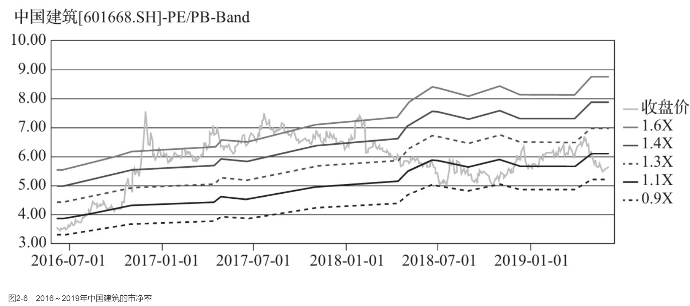

这里，我们取极小值0.9倍的市净率，再乘以2019年一季度末公司的净资产2537亿元，得到的市值是2283亿元，比2019年5月的市值低3%左右。

如果“市场先生”不开心，股价继续下跌3%，那就这样看“市场先生”给的报价：“市场先生”假设未来中国建筑的净资产不再增长，同时又很悲观，给了历史上最低的0.9倍市净率估值。参考历史估值，这样的价格是有一定安全边际的。

使用`终值折现法`：我们需要做三个假设，假设公司的净资产收益率、未来三年的估值水平和折现率。

我们在前面已经看到，在过去很多年里，中国建筑的净资产收益率一直都在15%以上。未来会怎么样我们不知道，但是在假设的时候，我们需要保守一点。这里我们假设未来三年中国建筑每年扣除分红之后的净资产收益率是12%，我相信这是能做到的。

对于三年后的估值，我们假设“市场先生”还是不喜欢中国建筑，仍然给出0.9倍的极低市净率来估值。

然后考虑折现率。我向大家介绍过，折现率一般是在10%～40%的范围内取值。如果我们对公司未来的增长比较确定，折现率可以低一点；如果我们对公司未来的增长不太确定，那么折现率要高一点。

比如，**像成长型的公司，我们的折现率不能低于30%；而中国建筑这样的蓝筹白马，确定性还是很高的，所以给予10%的折现率来估值**。

最后，通过计算得到公司的市值是2318亿元，和2019年5月时的市值差不多（见表2-22）。

表2-22　中国建筑市值估值表（金额单位：亿元）

年份 | 2018年年末 | 2019年年末 | 2020年年末 | 2021年年末
---|---------|---------|---------|--------
净资产收益率(%) | 12 | 12 | 12 | 12
净资产 | 2440 | 2733 | 3061 | 3428
净利润 | 293 | 328 | 367
三年后的市净率 | 0.9
三年后的市值 | 3085.2
折现率 | 10%
现值 | 2318

`市盈率法`和`市净率法`都属于`相对估值法`。在给上市公司估值的时候，除了有相对估值法（也叫作比较法），还有`绝对估值法`，也就是`现金流折现法`，具体来说包括股利折现、企业自由现金流折现和股东自由现金流折现。

每种方法都有其适用的行业和公司。比如，终值折现法主要适用于成长股，相对估值法适用于历史比较长或者行业里同类公司比较多的公司，`现金流折现法`中的股利折现适用于稳定分红的公司，比如银行和白电等。

图2-7中是中国建筑2015～2019年的分红数据（单位：元）。

中国建筑[601668.SH]-分红数据基本情况：

预案公告日 | 2019-04-12 | 2018-04-12 | 2017-04-13 | 2016-04-19 | 2015-04-21
------|------------|------------|------------|------------|-----------
除权除息日 | - | 2018-06-29 | 2017-06-16 | 2016-06-16 | 2015-06-16
方案进度 | 股东大会通过实施 | 实施 | 实施 | 实施 | 实施
是否分红 | 是 | 是 | 是 | 是 | 是
分红对象 | 普通股股东 | 普通股股东 | 普通股股东 | 普通股股东 | 普通股股东
每股股利（税前） | 0.1680 | 0.2150 | 0.2150 | 0.2000 | 0.1720

中国建筑每年都在分红，2018年的年报分红是每股0.168元，比前两年少一点。公司的解释是，公司正在持续转型，加大业务结构调整，需要大量资金，所以分红会少一点。

在用股利折现模型对中国建筑进行估值的时候，我们需要假设未来股利的增长和股东要求的折现率。

我觉得像中国建筑这样的公司，未来不会破产。我们做一个简单的保守假设，假设中国建筑未来每股的分红是0.2元，而且股利在将来不会增长了，永远是每股0.2元。

那么折现率应该用多少呢？

中国建筑的资信比较高，相当于有国家信用背书，所以折现率在3.5%～4%，比10年期国债的收益率高一些。按照戈登永续增长模型，我们得到的合理价格是每股5～5.7元，和2019年5月的股价差不多。

接下来，我们用`分部估值法`对中国建筑做一个测算。

中国建筑旗下的中国海外发展、中国建筑国际和中国海外宏洋集团都是在香港上市的，西部建设是在深圳证券交易所上市的。

以中国海外发展为例，它在2019年5月的市值是2947亿港元，中国建筑通过100%持有中国海外集团控股中国海外发展51%的股权。

扣除这些已经上市的公司权益的市值，得到市场给中国建筑剩余业务（主要集中在建筑工程板块、国际工程板块和基础设施板块）的估值。

有兴趣的朋友可以自己算算，我毛估剩余那么多资产的价值应该不到500亿元，显然是很便宜的。

## 如何估值4：有或没有估值法
监管的红线比较明确，一般有这样几种情况：即将退市的公司、可能会被暂停上市的公司、ST类公司、非标准审计意见的公司，还有一些没有道德底线的公司等。

每家机构都有自己的投资黑名单，在我看来有这样一些筛选标准：

行业上，**农林牧渔行业的公司尽量少投**。仅在2016年，证监会就处罚了六家农林牧渔行业的公司，占证监会当年行政处罚数量的一半。这类公司有很多现金交易，监管起来不容易。

最后，**那些违背道德进行操作的公司就不要投了**。比如，工程机械行业的某龙头企业，前些年花了很多时间和钱培育了某个重装业务，先以市场竞争激烈为由，以6000万元将其从上市公司剥离出来卖给公司高管，三年以后又让上市公司花20亿元重新买回来。

再比如，某公司的扇贝已经连续逃走了几次；某做语音识别的高科技公司把钱拿到手后搞了房地产项目；还有某锂业公司低价去香港发H股，摊薄A股投资者的利益……这样的公司还有很多。这样的公司可以伤害我一次，但是我绝对不会让它伤害我第二次。

## 如何阅读资产负债表（上）
简化后的资产负债表只保留流动资产、非流动资产、总资产、流动负债、非流动负债、总负债、归母权益、少数股东权益和总权益这几项内容。

表2-23　2013～2017年三季度乐视网的简化资产负债表（单位：亿元）

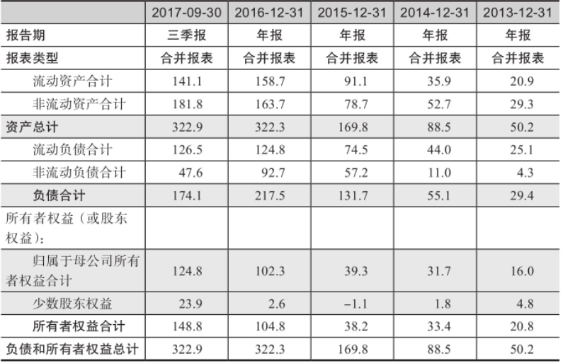

简化的资产负债表中，我们主要研究1个金额、2个指标和3个结构。

**1个金额**

乐视网在2013年年底的`总资产`是50亿元，2014年年底增加到88亿元，2015年年底几乎翻倍，增加到170亿元，2016年再大幅增加到322亿元，但是2017年第三季度末与2016年年底相比基本没有增长。

作为投资者，我们喜欢去找有成长性公司。那么成长性体现在哪里呢？体现在收入和利润上吗？并不是。我在前面说过，资产负债表是领先于利润表的，所以根据资产负债表能预先进行判断。

从道理上讲也能讲得通，公司只有先增加`流动资产`和`非流动资产`，同时提高杠杆率，才能支持后续的收入和利润的增长。

那增长多少才算大幅增加呢？这没有一定的数值。我们往往参照行业龙头企业总资产的增加值，或者低一点，将GDP的增长率作为标准。但根据经验，如果一家公司的总资产不再增加，或者总资产开始大幅萎缩（业内叫作“缩表”），那么这家公司的股价往往会有很大的下跌风险。

**2个指标**

就乐视网而言，公司的`资产负债率`从2015年的78%逐步下降到2017年第三季度末的54%（见表2-24），这表明公司在不断地降杠杆。高的资产负债率固然能提升净资产收益率，但是这个比率太高则意味着公司面临的潜在财务风险也非常高。

表2-24　2013～2017年第三季度乐视网的资产负债率和流动比率

指标 | 2017-09-30 | 2016-12-31 | 2015-12-31 | 2014-12-31 | 2013-12-31
---|------------|------------|------------|------------|-----------
资产负债率(%) | 54 | 67 | 78 | 62 | 59
流动比率 | 1.1 | 1.3 | 1.2 | 0.8 | 0.8

每个行业的资产负债率天然是不一样的。所以，我们在看资产负债率的时候，还要与行业及行业龙头企业的数据进行比较。**国内制造业合适的资产负债率应在50%左右，如果超过60%，就要小心了**。

除了资产负债率，我们还要计算`流动比率`。**这个比率比较合适的值是2，即流动资产是流动负债的2倍**。我们看到乐视网的流动比率长期在1附近，这表示公司的流动性压力还是比较大的。

**3个结构**

`资产的结构`。相比2016年年底，到了2017年第三季度末，乐视网的总资产基本没有变化，但是流动资产少了约18亿元，而非流动资产增加了约18亿元。非流动资产都是变现能力很差的资产，我不认为增加非流动资产对乐视网有帮助。

`负债的结构`。相比2016年年底，到了2017年第三季度末，乐视网的总负债下降了约43亿元，但从结构上看，流动负债基本没有变化，主要是非流动负债从92.7亿元下降到了47.6亿元。非流动负债是一年以上的负债，一般需要支付的利息较多，非流动负债的下降可以帮助减少公司的利息支出，有利于改善利润表。

`所有者权益的结构`。相比2016年年底，到了2017年第三季度末，乐视网的所有者权益增加了44亿元，其中归母权益增加了约23亿元，少数股东权益增加了约21亿元。

归母权益的增加和少数股东权益的增加主要是因为乐视网放弃了部分乐视致新的控股权。我们希望看到的所有者权益增加是来自股东真金白银的投入和公司盈利能力的提高，卖出控股权是一次性的，不能持续，所以这种增加所有者权益的方法并不是我们所喜欢的。

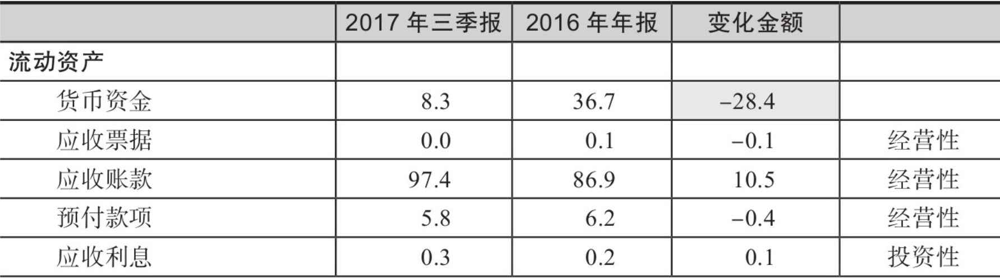
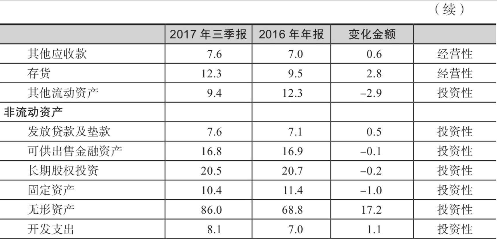
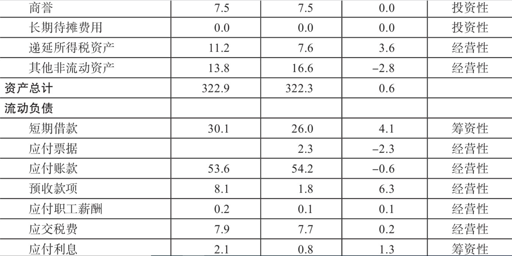
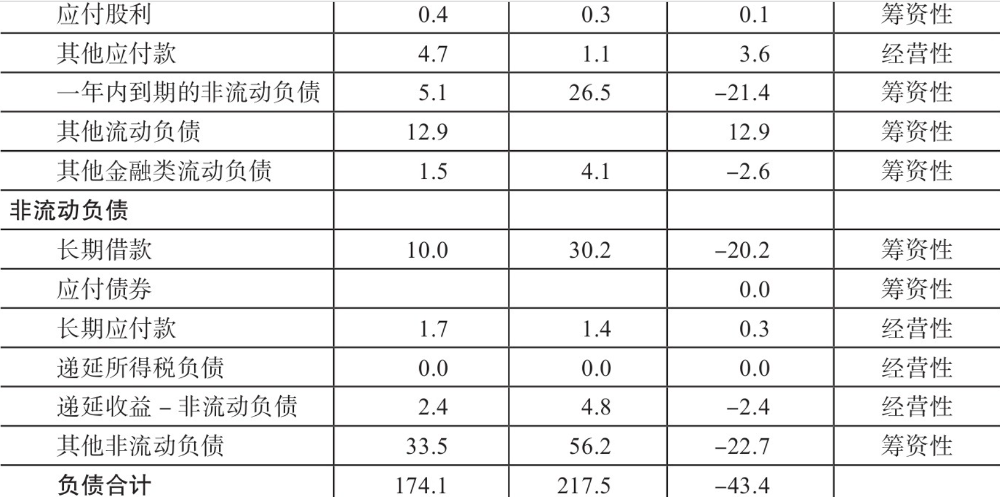
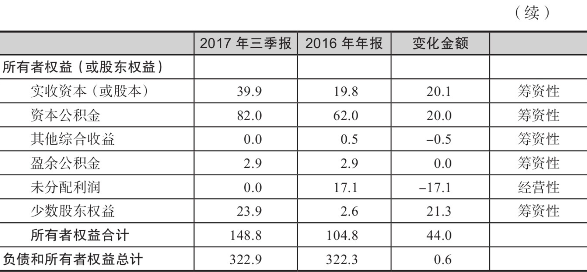

注：由于四舍五入，合计数与各项之和略有出入。

资料来源：乐视网公司公告。

1. 观察第一列。如果“其他流动资产”“其他非流动资产”“其他流动负债”和“其他非流动负债”这四个科目有较大的金额，一定要特别关注。从逻辑上讲，资产负债表中的会计科目是三张报表里面最多的，你能想到的所有金额可以能放到很明晰的会计科目里。所以，如果有金额需要放在“其他××资产”和“其他××负债”这几个模糊的会计科目里，那么从做研究的角度，一定要去研读财务报表附注的内容，看看里面到底隐藏了什么。
1. 计算出第四列的变化金额。其中货币资金（现金）的变化用灰色标注了出来，我们在后面会分析现金的变动。乐视网2017年9月30日的现金比2017年年初少了28.4亿元。
1. 在资产负债表中的每个科目后面标注“经营性”“筹资性”或“投资性”字样。经营性科目和公司的正常经营活动相关，筹资性科目和公司的融资活动相关，投资性科目和公司的对外投资相关。

当我们已经分清楚资产负债表中的每个科目属于“经营性”“筹资性”还是“投资性”之后，我们要理解其中各科目变化的关系，这需要从现金的角度去看（见图2-8）。

      流动资产的增加    现金增加
      流动资产的减少    现金减少

      非流动资产的增加    现金增加
      非流动资产的减少    现金减少
      -------------------------
      流动负债的增加    现金增加
      流动负债的减少    现金减少

      非流动负债的增加    现金增加
      非流动负债的减少    现金减少
      ------------------------
      权益的增加    现金增加
      权益的减少    现金减少

图2-8 现金角度的资产负债表科目变化

明白了现金的流入与流出之后，我们给整个资产负债表来个“乾坤大挪移”，将它完全改写成另外一种形式。依然以乐视网为例，从2016年12月31日（A时点）到2017年9月30日（B时点），为了方便大家理解，我在真实数据的基础上做了相当大的简化，如表2-26所示。

表2-26　2016～2017年第三季度现金角度的乐视网资产负债表（单位：亿元）

经营性：（正数表示现金流入，负数表示现金流出）

科目 | 现金流
------- | -------
流动资产部分 | 13.4
非流动资产部分 | 0.8
流动负债部分 | 7.3
非流动负债部分 | -2.1
权益部分 | -17.1
经营性的现金流入 | 7.3
经营性的现金流出 | 33.4
经营性的现金变动 | -26.1

投资性：（正数表示现金流入，负数表示现金流出）

科目 | 现金流
---|----
流动资产部分 | -2.8
非流动资产部分 | 17.5
投资性的现金流入 | 2.8
投资性的现金流出 | 17.5
投资性的现金变动 | -14.7

筹资性：（正数表示现金流入，负数表示现金流出）

科目 | 现金流
---|----
流动负债部分 | -5.6
非流动负债部分 | -42.9
权益部分 | 60.9
筹资性的现金流入 | 60.9
筹资性的现金流出 | 48.5
筹资性的现金变动 | 12.4

现金变动：-28.4

表2-26显示，从A时点到B时点，乐视网经营性的现金变动是-26.1亿元，表示现金流出；乐视网投资性的现金变动是-14.7亿元，表示现金流出；乐视网筹资性的现金变动是12.4亿元，表示现金流入。简单相加，得到整体现金流出28.4亿元。

这个数据直接用B时点报表上的现金金额减去A时点报表上的现金金额也能得出。乐视网在B时点的现金比在A时点少了28.4亿元，两个数字是完全相同的。

从分析的角度，我们希望经营性现金流是正数，表示现金流入；投资性现金流如果是负数，则表示现金流出，但是最好比经营性现金流的流入少一点；筹资性现金流中来自债务的变动和权益的变动要与历史变动相匹配。

再回到乐视网，乐视网2017年前三季度有大量的经营性的现金流出和投资性的现金流出，如果没有筹资性的现金流入，公司很难维系下去。但是，筹资性的现金流入不是一个稳定的资金来源，债权融资和股权融资会随着融资金额的增加而变得越来越难。

## 如何阅读资产负债表（下）
这家公司叫*ST沈机，2017年年报实现盈利，所以摘帽了，这叫作`“摘帽行情”`。但是，如果仔细看沈阳机床2017年的财务报表，你会发现它的基本面根本没有好转。

2017年它的总营业收入是42亿元，而总成本是55亿元，能够实现盈利是因为它卖出了下属企业的控股权，获得了12亿元，但这个收益是一次性的，之后很可能就没有了。

另外，如果大家看它的资产负债表会发现，它在2017年年底的货币资金是58亿元，短期借款是102亿元，一年到期的非流动负债是28亿元，应付债券有5亿元，净有息负债有77亿元，而它在2018年1月时的总市值才92亿元。

这意味着，我如果当时花92亿元把它整个买下来进行私有化，还要额外支付给债权人77亿元。净有息负债居高不下，利息费用庞大，也将严重影响它2018年的盈利。

我们介绍另外一种划分负债的方法——根据负债是否需要承担利息，把负债分成`有息负债`和`非有息负债`。

短期借款、一年到期的非流动负债、长期借款和应付债券，是公司从外部金融机构借的钱，需要支付利息，所以这四类负债是有息负债。其他类型的负债，比如应付账款，表示公司占用的是供应商的资金，这部分资金不需要支付利息，因此应付账款不属于有息负债。

把有息负债扣除现金和可供出售的金融资产后，得到一个重要的数据，我们把它叫作“净有息负债”。净有息负债反映的是公司承担的需要支付利息的债务规模。

净有息负债是负数，表示公司现有的现金充裕。比如，公司的货币资金是10亿元，如果没有其他可供出售金融资产和短期借款这些有息负债，那么公司的净有息负债是-10亿元。

在实务中，对于现金充裕的公司一般能做出如下推论。

1. 现金充裕的公司一般不会增发或者配股。在资本市场上，频繁向外部股东伸手要钱的公司要引起注意，因为增发、配股、发行可转债这些方式都会摊薄现有股东的权益。极端一点说，我没有看到贵州茅台上市后再融资，也没有看到苹果公司再融资。
2. 现金充裕的公司有极大可能做一些行业并购，而且用现金做并购比用增发新股做并购方便，因为增发新股需要走一定的流程，时间相当长，而且还有可能通不过。
3. 在估值的时候，我们会给账面现金充裕的公司高一点的估值倍数。比如，公司在历史上经常做并购，净有息负债是-10亿元，表示公司账上有10亿元的净现金。假设公司的利息收入是0.5亿元，即5%的利率。如果公司正常经营活动的净利润是0.5亿元，假设不考虑其他税费，公司的净利润合计为1亿元。研究员如果不分开估值，直接给30倍的市盈率，那么公司合理的市值是30亿元。

## 市净率的一个简单应用：以中国石油为例
从当时来看，中国石油的较大看点是估值跌到了上市以来的相对低值。我是这样计算的：中国石油在2019年6月24日收盘后的总市值是1.28万亿元，2019年一季报的净资产是1.23万亿元。2018年中国石油盈利约500亿元，考虑到2019年的盈利不会比2018年差，剔除分红之后，预估的市净率正好是1倍左右。

给大家看三张图，详见图2-10～图2-12。

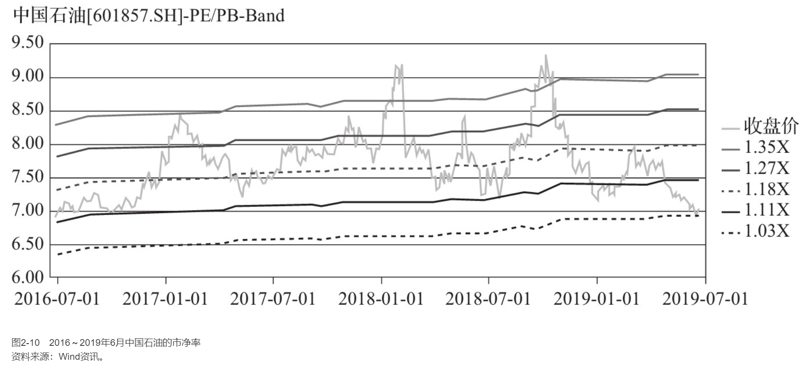

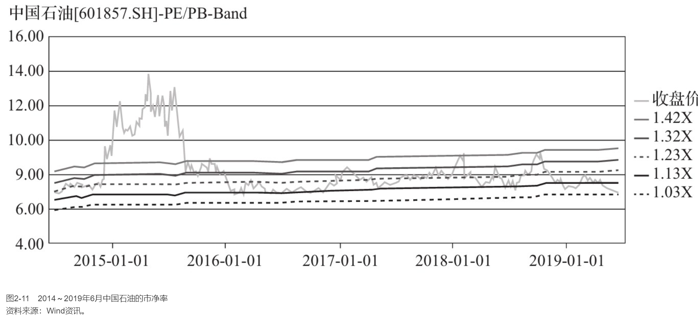

图2-10～图2-12这三张图，如果是在2019年6月的时候去看，分别是过去三年、过去五年和上市以来的市净率走势图，所以基本上当时中国石油的市净率已经到了历史的最低值。

中国石油在香港发行了H股，H股的价格和估值更低。

市净率和常见的市盈率一样，都是相对估值指标。

- 市净率的优点在于净资产比净利润更稳定，对于微利或者亏损的公司不能用市盈率进行估值，但是仍然能使用市净率进行评估。
- 市净率的缺点是账面的净资产可能被人为高估，另外，会计处理方法对净资产的影响比较大。

市净率与三个因素相关，

假设将公司的净利润全部作为股利分配给股东，那么P=EPS/（r-g）。式中，P是公司股票价值，EPS是下一年预期的每股收益，r是市场资本化率，这也是投资者投资该股票所要求的预期回报率，g是每股收益的增长率（永久性）。

上述公式左右两边均除以账面净资产（BV）可以得到：

$PB=\frac{EPS}{BV \times (r-g)}=\frac{ROE}{r-g}$

由此我们看到，市净率与净资产收益率、市场资本化率、每股收益的增长率这三个参数相关，其中起决定性作用的还是我们经常讲到的净资产收益率。

如果只看一个企业长期赚钱能力的衡量指标，我认为是净资产收益率。在1977年的文章“通货膨胀如何欺诈股票投资者”中，巴菲特熟练地运用杜邦公式指出提高净资产收益率仅有的五种方式。

1. 提高资产的周转率。
2. 廉价的债务杠杆。
3. 更高的债务杠杆。
4. 更低的所得税。
5. 更高的运营利润率。

虽然估值很低，而且拉长时间（投资是以年计的），我相信中国石油向下的风险比向上的风险小很多。

## 周期性行业的投资心得
在强周期行业里，当最有效率的龙头企业都在亏钱的时候，整个行业大概率处于底部区域。

在强周期行业里，当最没有效率的企业都在赚钱时，这个行业有可能已经处于顶部区域。

《彼得·林奇的成功投资》一书里，他提到投资周期股的技巧：在产品和服务的价格从谷底上涨的时候买入周期股；结束上涨周期开始下跌，同时伴随行业产能接近或者超过以往高峰，若股价接近历史高点或者创出新高，这时候要考虑卖出手里的周期股。

## 小心高商誉风险
2020年1月11日，A股首家卫星导航上市公司北斗星通披露，预计2019年归母净利润亏损5.5亿～6.5亿元，这是公司上市以来首次出现年度亏损。

北斗星通表示，亏损的主要原因不是经营性亏损，而是资产减值。

2019年，北斗星通的资产减值合计6.5亿元，其中商誉减值5.3亿元，应收账款坏账损失0.5亿元，无形资产减值0.4亿元，剩下的0.3亿元是存货减值损失。

这已经不是北斗星通第一次商誉减值了。2017年年底，公司商誉达20亿元，2018年商誉减值4.5亿元，2019年商誉减值5.3亿元。减值以后，商誉的账面价值还有约10亿元。

高额的商誉与北斗星通前两年的频繁并购有密切关系。自2015年开始，北斗星通围绕“北斗+”进行了一系列的产业并购：2015年通过发行股份购买资产的方式收购了华信天线技术有限公司（以下简称“华信天线”）和嘉兴佳利电子有限公司（以下简称“佳利电子”）；2016年收购了东莞云通、广东伟通；2017年收购了杭州凯立、德国In-tech GmbH（以下简称“德国In-tech”）和加拿大Rx Networks Inc.（以下简称“加拿大Rx”）等公司。

**商誉是在溢价并购时产生的**。比如，A公司100%收购B公司，B公司的可辨认净资产的公允价值是3亿元，A公司出了5亿元，那么多出来的2亿元就是商誉。

商誉减值后，公司会在利润表上体现商誉减值的损失。比如，这次北斗星通做了5亿元的商誉减值，利润相应少了5亿元。

因为利润会影响资产负债表中的股东权益，所以减值以后股东权益相应少了5亿元。

如何避免踩到商誉减值的雷？**我们在看任何一家公司的时候，如果资产负债表中的商誉和净资产比超过了50%，那么这家公司我们暂时不要再看了**。

## 投资选股“四不碰”
盾安集团突然曝出相当严重的财务危机。与此同时，盾安集团旗下的盾安环境和江南化工两家上市公司紧急停牌。

盾安集团的债务危局有多严重？从网上流传的文件来看，各项有息负债超过450亿元，绝大部分银行和非银行金融机构贷款都集中在浙江省内。

有息负债越高，公司的债务压力越重。盾安集团的450亿元有息负债，按照10%的年化利率，一年产生的利息高达45亿元，占销售收入的9%，这是很惊人的。

再来看盾安集团的财务数据，2017年集团合并报表的总资产为648.8亿元，净资产为225.2亿元，资产负债率为65%。

我曾经介绍过`“50法则”`，意思是，**对于国内的大部分企业而言，50%的资产负债率是比较合适的，超过60%时要引起关注，超过70%时就不用研究了。这个“50法则”不适用于金融业、航空业和房地产业，但是对于大部分制造业企业都是适用的**。

做研究和投资很多年，我总结出四个“不碰”，与大家分享。

1. **大集团小公司不碰**。盾安集团是典型的大集团小公司的商业模式。什么叫大集团小公司？集团的收入和资产规模都很大，但是上市公司的收入和资产规模都很小。这样的模式为什么不碰？因为两点：首先，容易有说不清楚的关联交易，而关联交易太多恰恰蕴含着风险。其次，如果集团层面发生了风险，那么上市公司会受到很大影响。大集团小公司的商业模式在浙江和江苏很常见。
1. **董事长想法太多的公司不碰**。不能一心一意搞好主业，天天想着外延式并购扩张，比如不停收购影视、游戏、互联网这样的轻资产公司，这种公司千万别碰。这些被收购的轻资产公司往往要价很高，但是利润一般是靠“风”吹出来的，“风”没有了，收购产生的大额商誉就会面临减值的风险。
1. **杠杆率太高的公司不碰**。这个杠杆率简单来看是资产负债率，如果专业一点，是有息负债率。之前的章节已经介绍过了，在此不再介绍。
1. **押率太高的公司不碰**。杠杆率用于衡量上市公司承担的风险，质押率用于衡量上市公司大股东愿意承担的风险。很久以前的绿大地、超日太阳和近年的乐视网，都是股东质押率达到了100%。那么高的质押率，说明大股东在外面有太多需要用钱的地方，很缺钱。

## 四个投资小技巧
### AH股比价
怎么判断市场整体是悲观还是乐观？

从客观指标来说，我会经常看一看`“恒生AH股溢价指数”`（代码是HSAHP），如图2-13所示。

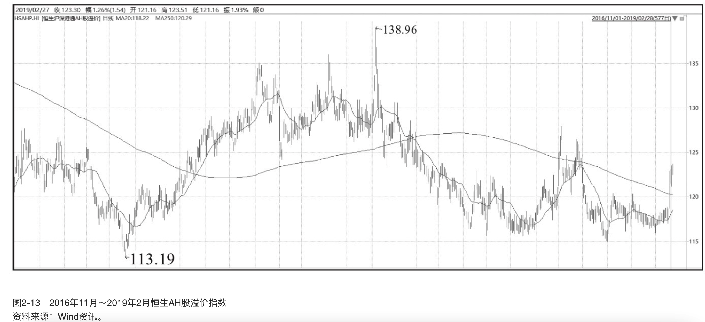

这个指数反映了同时在A股和H股交易的股票的价格差异，本质上反映了境内投资者和境外投资者对于同一家公司的不同看法。一个基本原则是：**当市场很差的时候，境内投资者会比境外投资者更加悲观；当市场很好的时候，境内投资者会比境外投资者更加乐观**。

在过去几年中，我记得这个指标跌到了115点以下，基本A股市场快见底了，而涨到125以上，差不多A股市场见顶了。

### 回购分析
如果仔细分析那些做回购的股票，会发现大概有这样几个特点：

1. 回购的活跃度和公司的股价一般负相关，股价的下行容易刺激回购的活跃度。
2. 高质押、低估值或者现金流充裕是公司回购的必要条件。高质押的公司更愿意做回购，因为持续下跌中爆仓的风险显著加大；估值分位相对较低的公司愿意做回购，因为有足够的估值安全边际。现金流少的公司显然没法做回购。

### 审计报告
计报告分为四种类型。

1. 无保留意见审计报告。
1. 保留意见审计报告。
1. 否定意见审计报告。
1. 无法表示意见审计报告。

除了第一种无保留意见审计报告，其他三种都叫作非标准审计报告，简称`“非标”`报告。当审计师对财务报告的真实性和可靠性存疑，或者审计师认为公司的内控风险比较大的时候，会出具“非标”报告。我工作过的公募基金和私募基金都有这样一条红线：**“非标”公司不能碰**。

### 建立股票池
在做投资的时候，为了剔除一些基本面有瑕疵的股票，我们会做一个股票池，股票池是经过四步确定的。

1. 定量筛选。根据对中国A股市场的定量分析，我们总结出一系列对股票价格有影响的估值指标。通过对估值指标的分析与测算，在A股公司中筛选出100家左右，构成备选股票库1。估值指标包括市盈率、市净率、市销率（PS）、市现率（PCF）、市息率（PD）、绝对股价（P）和市盈率相对盈利增长比率（PEG）七个指标。通过将个股的估值指标与市场/行业的平均水平进行比较，将排名靠前的100家公司纳入备选股票库1。
1. 定性筛选。在备选股票库1的基础上剔除或加入股票，以形成备选股票库2。剔除的原因包括但不限于盈利预测明显过高、审计报告出现非标准意见、股东结构存在问题、公司有法律官司等。
1. 增长质量分析。这是投资研究中很重要的部分。我们会对备选股票库2中的每家上市公司进行实地拜访，通过与管理层交流来确定该公司是否有一个良好的盈利模型和长期发展战略。在实地调研前后，我们会建立公司的财务模型并确定公司的投资要点，形成约有50只股票的备选股票池。
1. 定量风险评估。进入备选股票池的股票将进行波动性和流动性分析，波动性过大或流动性差的股票将被剔除，然后形成一个有20只股票的核心股票池。

# 行业研究
## 白酒行业专题研究
在做行业研究和个股研究的时候，我们一般从以下几个角度去思考：商业模式是什么，产品有没有竞争力，财务状况是不是安全，管理层和股东是不是强有力，等等。

白酒行业，三起三落，十年一个大周期，三年一个小周期。整个行业是从1988年起步的，十年上行，1998年遇到经济危机和政府反腐，从那时起大幅回落。第二次起飞是在2002年，当年中国加入WTO，经济腾飞，又迎来了十年大周期。受2012年白酒塑化剂事件和八项规定影响，白酒行业开始走下坡路。从2016年开始又重新起步，直到我们现在看到的高速增长。

1988年是第一轮，凭的是产能大和广告多，以及整合经销商资源的能力。例如，当初的五粮液、沱牌的广告效应很好，另外酒鬼酒的定价比茅台还要高。1998年之前茅台很低调，未扩大产量；后来，它快速扩大产量，每年增加2000吨，到了2003年，正好遇上行业爆发初期，公司的业绩立马起来了。

2002～2012年是第二轮，行业以渠道深度分销的企业为主。口子窖是第一个做深度分销的，深耕餐饮行业，重点是A类酒店；后来发展出团购，举办品鉴会，送酒，从餐饮到个人，把团购做到极致。在2003年这一轮白酒周期，就算没有品牌，有渠道的话业绩一样能增长，洋河是很典型的例子，收入从不到2亿元增长到200亿元，长了100倍。

2016～2019年，甚至到2020年，产品靠的是共鸣，要有品牌，要有文化内涵。茅台的李保芳书记讲，做产品就是做品牌，做品牌就是做文化。我很赞同这个观点。

衰退的时候一定会有标志性事件。

20世纪90年代末秦池倒了，汾酒出了假酒事件。2012年，酒鬼酒出了塑化剂事件。每轮调整，高端酒的终端价就砍半，基本见底了。无论何时，调研人员都要看看高端酒茅台的表现。

处于底部的时候看批发价。调研经销商的时候，如果看到经销商都赚不到钱，此时可判定市场肯定是很差的。处于顶部的时候看预收款的回落。2012年茅台的预收账款回落，行业的预收账款见顶，财务报告的数字于2012年年底见顶，预收账款的回落领先利润半年。但最近这轮有所不同，茅台汲取了经验，看到预收账款大幅上涨，主动控制预收账款并减少囤货。

研究和投资白酒行业的核心是对产业逻辑的理解。长期做供需分析，短期跟着批发价动。

白酒行业还有一个与其他行业不同的显著特点——利润率极高。茅台2018年的半年报显示毛利率高达90%。2012～2018年，成功集团、湘泉集团、中皇有限公司（属于华孚集团）、中粮集团等大股东相继掏空酒鬼酒。但只要品牌在、基酒在，因为利润高，酒鬼酒仍然能复活，2018年有1亿～2亿元利润，换成其他行业的企业可能早就倒闭了。

白酒和调味品的原材料都很便宜，白酒的原材料是谷物粮食；调味品（比如酱油和醋）能稀释后一瓶瓶卖。这些产品除了有极高的毛利率外，用户黏性也很高，用户对产品价格还不怎么敏感。

2018年，我和同事对白酒行业有以下几个判断。

- 首先，强者恒强。头部企业集中化趋势越来越明显，行业呈挤压式增长。在2018年10月计划量用完之后，茅台供需缺口可能进一步放大。不过需要注意的是2019年高端酒出厂量增幅不大，茅台由于要做结构上的调整，产能会受到限制，所以存在继续上调出厂价的可能。五粮液和泸州老窖不具备调价的基础，控货挺价将是未来一个阶段的主旋律。
- 其次，次高端看营销策略。水井坊依靠区域拓展、核心门店数量增长和终端门店促销力度加码带来业绩的提升。洋河在2018年7月涨价后说会在10月初停止供货，涨价能否成功要看老产品库存能否清理干净。在洋河品牌中，海之蓝的调价幅度不超过10元，梦之蓝因为销量增速比较快，且终端利润比较高，具备较大的调价空间。

那么怎么看待白酒行业？在2019年3月的高点后，贵州茅台、五粮液这样一些白酒股，后面会如何表现？

反映在利润表上，未来几年龙头白酒公司的利润增长会显著快于其营业收入的增长，同时小公司的日子会越来越难过。

我2019年年初做过调研，用6个字来形容当时行业的状况就是“弱复苏，强分化”。

“弱复苏”指的是行业基本面压力犹存，春节动销的增速在下滑。“强分化”指的是品牌集中度在各个价位段都在提升，马太效应明显。

未来，高端白酒必须处理好两方面的关系。

1. 价量关系。从供需结构上讲，高端白酒一定不能供大于求，供给的时候需要有配额，而且经销商的结构很重要。茅台的经销商结构比五粮液要好。五粮液之前受益于大经销商的增长，但现在大经销商变成了它发展的阻力。比如，五粮液需要开门红业绩会让大经销商打款，大经销商被迫抛货回款，成为市场的低价标杆。现在五粮液在做改变，控盘分立，增加小经销商。
2. 加强消费者培育，树立自己的品牌故事。高端名酒和低端酒有各自不同的打法。全国性名酒品牌力好，关键是做好核心终端店；地方性名酒品牌力差，但有地方资源，核心是要做消费者培育。比如汾酒，2012年以前企业体制僵化，现在它开始关心终端，建立全国深度的终端系统，期望高端青花瓷和低端玻汾都有很好的销量。

次高端白酒，目前行业还在扩容，品牌格局没有成型。今世缘和梦之蓝销量增长都很快，水井坊和舍得也不错；没上市的剑南春是真正的龙头，价格稳定增长，有底蕴和市场广度。

在低端白酒市场中，顺鑫农业（牛栏山二锅头）的竞争力很强。如果能够剥离养猪和房地产业务，顺鑫的财务报告会更加好看。

我们以白酒上市公司为例，聊聊2018年的年报里藏着什么样的秘密。

首先，从归母净利润的角度看，在18家上市白酒企业中，净利润超过100亿元的第一梯队有两家，分别是茅台和五粮液。茅台无愧于行业龙头，2018年公司的净利润是352亿元，茅台一家的净利润超过后面所有17家公司的净利润之和。五粮液排名第二，2018年实现“双超”：营业收入增长33%，首次超过400亿元，归母净利润同比增长38%，达到134亿元，在历史上首次超过100亿元大关。五粮液在年报里称，公司营业收入的增长，主要是公司酒类产品量价齐升所致，而净利润增长得益于公司开源、节流双驱动。

第二梯队是净利润以10亿元为单位的那些公司，包括洋河、泸州老窖、古井贡酒、口子窖、山西汾酒和今世缘这六家。在这六家公司里，洋河是很有可能比较快地进入第一梯队的种子选手。公司2018年实现净利润81亿元，比排名第四的泸州老窖要多出近50亿元，而泸州老窖的净利润又几乎是古井贡酒的一倍。这里要多说两句山西汾酒和今世缘。这两家公司的成长性很突出，2017年两家公司的净利润还不足10亿元，2018年已经进入第二梯队。

第二梯队里大致包括了川酒和皖酒。白酒行业有句名言，叫“西不入川、东不入皖”，是说川皖两地群雄争霸，外地白酒根本进不去。洋河是第二梯队里比较特殊的，稳住江苏根据地的同时，已经进入安徽市场。
净利润小于10亿元的是第三梯队，有迎驾贡酒（8亿元）、顺鑫农业（7亿元）、水井坊（5.8亿元）、伊力特、老白干和舍得这些公司。

在第三梯队里，我看好的是顺鑫农业和水井坊。顺鑫农业如果剥离了房地产和养猪业务，后面的估值会更高一点，牛栏山二锅头渠道下沉、外省发力，净利润极有可能接近15亿元。

## 调味品行业专题研究
截至2019年，国内的调味品行业一直有一个特点，即“一超多强，四梯队分布”。

海天是当之无愧的调味品龙头企业。能做到行业龙头，不仅是因为海天一年的营业收入远超后五家之和，还因为海天在行业内一言九鼎。

关于调味品行业的提价，龙头企业一般会综合考虑M2、通货膨胀率和居民消费能力等因素，再判断是不是需要提价。

看看行业第二梯队中的李锦记和中炬高新的美味鲜。行业的第三梯队更加分散一点，包括了千和味业、欣和、加加和东古等公司。这些调味品有品牌，但不属于全国性和地区性强势品牌。第四梯队更加分散了，包括地方上的小工厂和作坊，主攻乡镇和农村市场。

总结当前中国的调味品行业，有以下三个发展趋势。

1. 调味品行业整体在平稳增长。平稳增长时期望行业整体每年增长20%～30%，这肯定是不现实的。
2. 行业里有三个“加速”：产品结构加速调整，行业的集中度加速提高，产业的升级速度进一步加快，这意味着行业里龙头企业规模效应会持续显现，中小企业优胜劣汰趋势明显。
3. 感觉中国的调味品行业将逐步走向品牌化、高端化和集约化，品牌企业可望在发展中不断提高市场份额。

你对醋怎么看？我简单讲三点：酱醋同源，醋的市场竞争格局不如酱油好，龙头企业恒顺醋业比海天差很多。中国有四大名酒，还有四大名醋，分别是山西老陈醋、阆中保宁醋、镇江香醋和福建永春醋。

和其他调味品相比，食醋这个行业有两个显著特点。

1. 市场很分散，集中度很低。全国食醋的生产企业有6000多家，每年食醋总产量约400万吨。但是在这6000多家企业里，年产量超过10万吨的头部企业只有恒顺醋业、水塔和紫林三家。恒顺醋业是食醋行业的龙头，2018年的产量只占到行业总产量的10%。为什么过去那么多年，龙头企业的市场占有率一直很难提升呢？我认为原因有很多。比如各地消费者口味有差异，做好区域龙头容易，但是要做全国龙头很难。再比如龙头企业没有优势，老字号和新品牌之间没有太大差别。一句话，企业和产品的“护城河”不够深。
2. 行业门槛较低，新进入者很多。醋的酿造和生产技术不难，大多数企业都沿袭了传统的酿造工艺。我讲到过酱醋同源，讲的是酱油企业通过内生和外延的方式进入食醋领域，但是几乎没有做食醋的企业能把酱油做好。

海天拥有完善的销售渠道，在全国有近500万个销售网点，恒顺醋业才有60万个。海天的销售人员比生产人员都多，而恒顺醋业的销售人员才占了生产人员的一半。

大众消费品渠道为王，海天的产品几乎卖到了全国的每一个角落，而且下沉得很好。恒顺醋业作为醋业龙头，却没有看到其渠道铺设的优势。未来海天大概率是恒顺醋业主要的竞争对手。

## 医药行业专题研究
医药板块的公司众多，一般分成六个子板块来分析。

1. 化学制剂板块。这个板块是传统制造业，类似于化工厂，看点不多。近几年行业受医保控费、控制药占比、发改委要求药品降价、抗生素限制用药等诸多政策影响较大，制药企业在逐步消化价格压力。未来的看点是，制药企业通过新上市品种及新进医保目录品种的逐步放量打开新的市场空间。
1. 生物药板块。这个板块是亮晶晶的。龙头企业保持了稳健快速增长。恒瑞的走势就是例证，虽然恒瑞的估值已经很高了。泰格是为新药研发提供临床试验全过程专业服务的合同研究组织（CRO），所以同样被市场看好。生物医药板块里，生长激素类产品随市场接受度提高及消费需求提升持续放量。二代胰岛素由乙调甲利于基层市场开拓，三代胰岛素上市后将借助现有渠道网络逐渐放量。疫苗行业开始逐步回归正常轨道，由于不受医保控费限制且居民健康意识和消费能力提升而高速增长，二类疫苗代理及自研产品上市后会快速放量。
1. 中药板块。这个子板块是中国特有的。很多人称赞中国传统中药的药效，同仁堂、东阿阿胶、片仔癀等老字号价值非凡。
1. 器械板块。整体保持稳健增长，但板块内部业绩分化明显。以迈瑞医疗、乐普医疗、三诺生物为代表的公司在外延并购带动下，业绩保持快速增长；部分细分领域龙头公司，如安图生物、开立医疗等，在细分领域中拥有明显的技术优势；低值耗材、器械领域竞争激烈，部分公司业绩增速明显放缓。
1. 医疗服务板块。整体保持稳健增长。鼓励民营以及地方政府对部分公立医院资产的市场化运作逐渐实现开放态度，有利于上市公司完成区域的并购和连锁。但是在整合阶段会带来大量的管理费用，拉低利润端的增长，因此需要对公司并购的规模和节奏有充分的预期，才能较好地预测未来利润端的增长。
1. 商业板块。商业批发板块两票制的影响基本已经体现。对于零售板块持续稳定增长，随着行业集中度的提升、品种毛利率的提高和精益化管理的加强，收入和利润增速会持续保持在20%以上。

相比较而言，有两类公司基本不受带量采购的影响。

1. 医疗器械公司，因为医疗器械品种多，标准化程度低，产品升级和出新速度快，医生有使用偏好并持续接受培训。医疗器械的国内外价差很小。
1. 做医疗专业化服务公司，比如治疗眼睛和开展生殖系统治疗的公司基本上不受“4+7”集采的影响。

总结：**在投资中，药不如医，医不如医疗器械和服务**。

## 猪肉行业专题研究
养猪行业是一个大周期低谷里“小选手”都倒闭，“大选手”靠着低价吞食市场，然后熬到周期低谷结束释放市场收益的行业。2018年，盈利预期陷入低迷，生猪企业的日子很难过，在这段时间里它们不掌握议价权。那么，是不是暂时又不能投资了呢？其实也不是的。让我们换个思路，当时猪过剩，那么多猪，说明猪的上游需求是强烈存在的，比如说猪饲料和猪疫苗。

下面回到2018年的情形，和大家分享行业被低估时如何看相关产业链。

先说火腿肠。双汇火腿肠很有名。我来讲讲双汇发展，它是国内比较大的肉类加工企业，2017年屠宰1200多万头生猪。公司的主要业务是畜禽（主要是生猪）的屠宰、加工及销售肉类食品和速冻肉制品等。公司位于河南省漯河市，有5.3万员工。

双汇发展的年报看点不多，主要是收入和利润都是负增长。2016年公司的营业收入为518亿元，而2017年的营业收入只有505亿元，少了13亿元。同样，2016年公司的净利润有44亿元，而2017年只有43亿元，少赚了1个亿。

虽然利润是负增长的，但它还是有几个小亮点。

1. 公司的机构股东很稳定，且机构股东的持股数是增加的。比如第三大股东是香港中央结算有限公司，截至2017年年底境外资金通过陆股通持有双汇发展6200万股，比三季报中的数据多了1300万股。截至2018年3月，境外资金合计持有8600万股，又比2017年年底多了不少。另外，第四大和第五大股东分别是中国证券金融股份有限公司（证金公司）和汇金公司。证金公司的持股数量增加了950万股，汇金的持股数没有变化，说明机构投资者还是看好双汇未来的发展的。
1. 虽然公司的收入和利润没有增长，但是双汇的2017年净资产收益率创了2013年以来的5年新高，达到了30%。净资产收益率增加的主要原因是公司的净利率在增加，同时公司的资产负债率小幅上升。公司的资产负债率只有33%，还有很大的提升空间。

所以我觉得双汇发展后续的看点是净资产收益率维持在高位，同时分红率会有比较大的提升。

再说说中国规模最大的肉猪和肉鸡养殖上市公司——温氏股份。公司在2019年1月就披露了2018年的业绩预告，预计全年实现净利润39.5亿～42亿元，同比下降38%～41%。

公司介绍，2018年养鸡业务基本保持稳定，受益于市场行情回暖影响，销售价格同比上涨18%。养鸡业务收入和利润同比大幅增长。但是，养猪业务遇到了很大麻烦。商品肉猪销售价格同比下降14%，加之下半年爆发的非洲猪瘟，养猪的利润下滑很大。

生猪养殖企业很害怕两件事情：一是猪肉价格下跌，二是猪生病。但2018年这两件事情都发生了。

2018年上半年，受生猪供应量增加和需求不振影响，生猪价格持续下跌，平均猪价一度跌破每公斤10元，为近10年的低价。这波猪价下跌不仅幅度大，而且持续时间长，造成第二季度养猪行业整体亏损。

猪价低迷，猪至少还能活着。养猪人会想，肥猪价贱，或许会选择不卖，适当压栏等待价格上涨。但是下半年席卷而来的非洲猪瘟打破了所有人的梦想。一病毁所有。面对猪瘟，老母猪到猪仔全部被扑杀，一个都不剩。非洲猪瘟虽然不会传给人类，但是该病的发病率、致死率极高，甚至可达100%，是世界范围内危害养猪业的头号杀手。之前，非洲猪瘟一直在世界各国传播，2018年第一次在中国出现，让养猪业受到了重创。

国内养猪的现状。国内的生猪养殖分成以下几种形式：散养户（母猪存栏5头以下）、专业户（母猪存栏5～20头）、规模专业户和规模猪场（母猪存栏20～1000头）和大规模猪场（母猪存栏1000头以上）。为什么要用存栏母猪数作为评价养殖场的标准？因为母猪很能生养。在正常情况下，每头母猪每年提供20头出栏生猪。

全国头部的两家养猪企业（温氏和牧原）的市场占有率大概才5%，前十大养猪企业的市场占有率只有9%，整体生猪规模化养殖比例才50%，很低。未来的趋势是家家户户养一两头猪的地区会越来越少。各大养猪企业纷纷提出打造千万头级的生猪养殖规模，规模化效应会越来越明显。

养猪股的股价向上的时候一般分为三段行情，核心驱动力分别为产能预期、价格预期和业绩预期。

- 2019年年初进入第一阶段。猪价低迷叠加猪瘟，养猪行业在经历供给侧改革。即便猪价现在没有反转，但因产能见顶预期增强，这段时间买养猪股的投资确定性很高。
- 第二阶段是价格预期，要看猪价的变化。历史上，当猪价反转时，养猪股的股价会大幅上涨。
- 第三阶段是业绩预期。虽然业绩预期提升或仍可推动股价小幅上涨，但行情接近尾声，确定性较低。

2019年年初，我展望2019年生猪价格中枢可能会比2018年有显著的上升，养猪龙头企业的股价和业绩可能会有不错的表现。2019年3月，有两个养猪龙头的股价表现很好。那时是不是兑现的时候？我觉得恰恰相反，猪周期当时还没有结束，才刚刚进入第二阶段。

猪周期是农林牧渔行业里很有意思的一个周期，每过3～4年，猪价就会呈现从谷底到谷顶再到谷底的波动。

猪周期背后的逻辑是这样的：猪价上涨—母猪存栏量大增—生猪供给增加（过剩）—猪价下跌—大量淘汰母猪—生猪供给减少（短缺）—猪价上涨。在过去的十几年里，我们已经经历了完整的四轮猪周期。

以股票价格分析，猪周期对于股价的影响分成三个阶段：第一阶段是去产能阶段，第二阶段是价格反转阶段，第三阶段是业绩兑现阶段。

第一阶段，因为猪价低迷，养猪户养殖意愿低，供给量少，又碰到治不好的非洲猪瘟，所以猪的供给开始短缺。

非洲猪瘟对于温氏和牧原有没有影响？影响肯定是有的。不过，这次非洲猪瘟疫情较为严重的区域是东三省、江苏、安徽、河南和山东，在这些地区养猪公司面临的考验较大。从历史经验看，经历去产能的阶段之后，龙头公司的市场份额会更高。

第二阶段是价格反转阶段。我们观察到春节期间及其后，因节日效应与产区出栏节奏错配，猪价小幅回暖。价格提振信号在本轮周期中首次出现，可视为第二阶段临近的重要标志，第二阶段的股价上涨幅度是很大的。

2019年春节以后的这轮猪价上涨，原因除了供给短缺之外，更重要的是养猪的成本在上升。2018年上半年，养猪的平均成本是12.2元/公斤，8月1日发现第一例非洲猪瘟以后，8～12月，养猪的成本上升到13.5元/公斤。受非洲猪瘟禁运措施的影响，部分商品猪被迫提前出栏，部分推迟出栏，体重较大地偏离了理想范围。同时，还有部分种猪因为无法跨省调运而只能作为商品猪销售。为了控制非洲猪瘟，中转台的建立、饲料再加工、封场导致的人员工资费用上升等，都会使生产成本上升。

第三阶段是业绩兑现阶段。在第三阶段，我们会看到养猪股的业绩在报表上得到体现，这个时候股价可能还会继续上涨，但是幅度不大，行情接近尾声，确定性较低。

具体说回温氏和牧原，除了业绩稳定、靠谱外，这两家龙头公司的成长性很突出。

- 首先它们的成本低。温氏和牧原的总成本比行业平均水平低1.5～2.0元/公斤，处于行业最低档，其成本优势体现为10%～15%的净利率提升，这令其更具扩张能力。
- 其次在于扩张空间。我国生猪规模化养殖占比仅约50%，行业前两名、前十名集中度分别约5%、9%，龙头的长期扩张空间广阔。

## 汽车行业专题研究
汽车行业的销售数据主要来自几个渠道。我以前看的是中汽协和乘联会的厂商销售数据，或者看公安部的汽车上牌数，现在业内越来越多的是看交强险的数据。2017年第四季度，行情火爆，销售基数很高，所以2018年同比下滑是很早能预料到的。

而且，行情下滑趋势是会延续的，下滑的周期至少要达到18个月。所以，在2018年年底来看，2019年第一季度仍然不乐观，至少要到第二季度才能看到数据的好转。

销量下滑之后，生产厂家马上面临保价还是保量的两难境地。如果不降价，销量会越来越难看。如果降价了，销量不一定会增加，毛利率却一定会受到伤害。

上汽集团的毛利率在2017年第四季度见顶，长城汽车的毛利率在2018年第一季度见顶。钢铁、橡胶和玻璃的费用是生产汽车的主要成本，但是汽车的毛利率主要受到需求因素（销售价格和销售数量）的影响。

销量下滑，叠加价格失控，能够预判的是汽车行业的集中度会进一步提高。现在国内前10大生产企业的集中度已经达到了60.2%，比2018年年中提高了3.4%。寒冬之中，民企自然出清，而国企的日子相对好过一点。

短期来看，汽车行业没有大的机会。有部分投资者会因为汽车股的估值低和分红率高而做一些配置，但是大规模入场的时机肯定还没有到来。唯一的一个亮点是新能源汽车，当然只有油电混动的乘用车的数据比较好，新能源商用车同比下滑23%。至于新能源货车，几乎看不到销量。

在新能源汽车的一众股票当中，我认为“小而美”的星宇股份和“大众情人”新宙邦值得观察，其他的要么估值太高，要么业绩没有增长。

投资中，有一种风险叫作不研究行业，只研究个股。这样的做法是极其可怕的，投资者亏了钱都不知道是怎么亏的，还以为自己的选股能力不行。行业如果没有大的机会，那么从个股获得较高的收益也是比较困难的。四大研究之中，我个人认为：

1. 宏观研究有点像“盲人算命”，谁也说不准对错；
2. 策略研究是上涨和下跌都有很多道理，无从证伪；
3. 个股基本面研究是最容易入手的；
4. 行业研究的门槛最高，但从行业研究中能得到的收获也是很大的。

从保有量来看，一线城市的汽车保有量已经很高了，前18大城市80%左右的家庭已经拥有了家庭用车。发达城市，比如上海和北京，每平方公里汽车数分别为440辆和300辆，已经堪比欧洲的很多大城市了。目前，国内很多大城市有限购措施，购车需求受到抑制。

在二、三、四线城市，虽然汽车的保有量不算很高，有潜在的上升空间，但是购车需求受到房地产的挤压。随着货币化安置的收紧，二、三、四线城市的购车能力大打折扣。

从财务角度来看，车企的固定资产投资相当大，所以车企的经营性杠杆很高。比如，销量增加10%，利润可能只增加5%；如果销量增加20%，利润可能会增加50%。

看未来，我简单做三个判断：**车市会从卖方市场转变为买方市场，单车的平均售价会下降，新能源车的发展空间很大**。

其实乘用车的投资逻辑还是看销量，销量不增加，股价很难有突出表现。比如2015年11月国家调整了购置税，2016年上半年汽车销量开始反转，汽车股的行情是到2016年年中才好起来的。所以，目前来看，汽车股的大机会还没有出现。

下面直接解读2019年年初的重点标的，带大家回顾当时我的判断。

- 上汽集团，乘用车的绝对龙头。我觉得股价在22元/股附近挺有吸引力，结果当时股价跌到24元/股后反弹，没有到我的目标价。
- 比亚迪，补贴退坡，所以前期已经有资金撤离了。往后看，核心在“唐”。2019年是转换技术的重要时刻。如果销量不错，那么股价可能还有上升的空间。
- 吉利汽车，报了两个利空数据：2018年销量为150万辆，2019年的目标为151万辆。其实，2019年1～3月吉利汽车的上牌数据没有明显下滑，所以业内猜测它是统计口径发生了变化。
- 长安汽车，跌幅很大了，0.7倍的市净率。我们要跟踪这家公司，因为2019年公司的产品变化比较多。2019年长安CS85和CS75都是换新，长安福特的改善会从2019年下半年开始，翼虎换代，林肯和探界者会进入市场。
- 江铃汽车，其股价已经涨疯了。江铃实际上是福特托管的上市企业，产品和财务都是顶呱呱的，底子一直很好。我从来都是看江铃B，因为它比较便宜。
- 特斯拉于2019年年初宣布在上海的临港设厂，预计产量规模为30万辆。Model 3的价格预计会下降10万元，这对产业链是一件好事情，当然这对于大部分车企来说是利空的。

汽车行业的分析需要将宏观分析、行业中观分析和个股分析三方面结合起来。宏观分析有三方面内容。

1. 研究政策。这主要包括两点：国家对汽车行业的规划政策、国家对汽车行业的刺激政策。这两个政策对行业的发展影响深远。
1. 研究汽车行业的制约因素。这主要包括三点：环境压力、交通压力（包括一二线城市的限行）和高基数的影响。
1. 要研究宏观的驱动因素。这里要关注有五点：新增信贷、工业生产总值、投资、发电量用电量和宏观景气度。

汽车行业的中观分析，主要研究三个周期，分别是库存周期、产能周期、需求周期。

- 汽车行业短期受库存周期的影响，终端库存增加若超过一定水平，将直接使终端竞争加剧，出现降价促销的情况。
- 中期受产能周期的影响，产能周期对盈利的影响直接体现在固定成本的变动（折旧）和厂商内部及外部的竞争上，产能存在18～24个月的建设周期，其调整比库存的调整更长。
- 长期的核心影响因素是需求周期，汽车行业兼具消费与投资双重属性，需求周期比较直观地表现为销量，销量会直接影响变动成本。

汽车行业的个股分析主要是研究单个车企产品结构的变化、管理能力的强弱以及股票估值的高低。

## 机场航运专题研究
2018年7月，受人民币兑美元大幅贬值影响，航空板块的股价出现大幅回调。从基本面的角度分析，油价上涨和汇率贬值会拖累航空股的业绩表现。当时我的模型显示，2018年上半年三大航空公司的盈利预计同比下降25%～30%，剔除汇率的影响后，三大航空公司的盈利预计平均同比小幅下滑5%。

航空股当时的估值水平如何呢？三大航空公司A股2018年的市净率都在1.5倍以下，H股2018年的市净率在1.0倍以下，已经低于历史均值。虽然估值低并不是股价上涨的理由，但显然，以这个价格去判断航空股的未来，机会是大于风险的。

2018年7月东方航空公布了自己定向增发的预案。公司公告称，为达到优化股权结构、扩大机队规模、保障主业运营等目标，公司拟非公开发行A股股票数量不超过16.2亿股，募集资金总额不超过118亿元，发行对象为吉祥航空、均瑶集团和结构调整基金。拟非公开发行H股股票不超过5.2亿股，募集资金不超过35.5亿港元，发行对象为吉祥航空与其指定控股子公司。A、H股发行互为条件。

包括已在2017年完成定向增发的中国国航，三大航空公司全部明确了各自的股权再融资。在正常情况下，往后三年内应该看不到航空公司的定向增发。三大航空公司通过募资，降低了财务费用，改善了资本结构。当时我们判断，三大航空公司在提价和运力扩张之后，还有在2019年实现业绩大爆发的希望。

2018年9～11月，各大航空公司在股权上频繁开展合作。
- 9月底，春秋航空参与了南方航空的非公开发行，成为南方航空的第八大股东。
- 10月，吉祥航空和均瑶集团拟出资98亿元，参与东方航空的定向增发。交易完成后，均瑶系的合计持股数稳居第三。
- 11月，吉祥航空发布公告称，拟向东航产投非公开发行不超过1.7亿股股份，募集资金总额不超过32亿元。根据2018年11月的公告，东航产投将进一步受让均瑶集团持有的吉祥航空7%的股份。

两次交易完成后，东航产投合计持有吉祥航空15%的股份，成为吉祥航空的第二大股东。大家可能对东航产投比较陌生。东航产投和东方航空的控股母公司都是“东航集团”，所以东航产投和东方航空是兄弟公司的关系。

股权合作之后，东航集团和均瑶集团同时持有东方航空和吉祥航空的股份，形成了你中有我、我中有你的交叉持股状态。考虑到南航和东航的国资背景，近期的这些股权合作体现出国有资本和非公有资本相互融合，这是高层一直希望看到的混合所有制改革。

从做二级市场分析的角度，我们更加看重股权合作之后，能够给上市公司带来怎样的实实在在的好处。2018年，我们和春秋航空的领导交流，他们说春秋航空和南航在航线网络和销售业务上互补性很强，股权合作之后，两家公司可以在华东地区和华南地区产生更大的协同效应。另外，春秋航空也希望与南航探索发展低成本的航空业务。

东航和吉祥航空的合作是出于相同的考虑。此前东航在上海的市场份额是40%，吉祥航空是上海的第三大承运人，市场占有率是8%。东航和吉祥航空交叉持股之后，将控制上海市场近一半的份额。2019年年初两家公司已经开始在官网上互售机票，预计未来在运营层面将有更多协同。

在研究航空股的时候，需要关注四个方面：`客座率`、`平均票价`、`油价`和`汇率`。客座率和平均票价影响收入，而油价和汇率影响成本。

2018年下半年航空股的走势很弱，主要是因为市场担心油价上升及人民币贬值会给航空公司带来很大的负面影响。航油成本约占航空公司营业成本的30%，人民币汇率变动1%，会对三大航空公司的净利润产生3亿元左右的影响。

2018年年底，因为石油价格暴跌，航空煤油作为石油的产成品，采购价格直接与国际油价相关，所以航空股的股价比之前要稍微高一点。

我跟踪航空股已经很多年了，对于航空股的股性有这样一个认识：航空股的绝对收益体现在每次的大牛市中，航空股的相对收益在每年的第四季度体现出来。

比如看绝对收益的话：2007年的牛市，航空指数上涨308%，相对沪深300超额收益83%；在2009年的牛市里，航空指数上涨288%，相对沪深300超额收益91%；在2014～2015年的牛市里，航空指数上涨356%，相对沪深300超额收益139%。

我一直把机场航班的起降数据、旅客吞吐量和货物进出港的数据作为观察宏观经济的微观指标。

上海机场、深圳机场和白云机场三大机场的生产经营数据，一般公布得很及时，而且是量的变化，剔除掉了价格（通货膨胀因素）的影响。

白云机场2019年3月公布了2019年2月的生产经营数据，异常惨淡。进出港的飞机起降架次零增长，旅客吞吐量增长3.8%，这两个数据大幅低于2018年同期。

有人会说，会不会是因为春节假期的因素，2019年春节在2月初，所以旅客1月提前飞走了。

这样的想法是对的。所以在分析的时候，我们把2019年2月的数据和2018年1月的做比较，或者把1～2月的数据结合起来一起看。

2018年1月，白云机场的航班起降量同比增长了0.5%，虽然不高，但强于零增长。如果把1～2月的数据结合在一起看，情况稍微好一点。2018年1～2月，白云机场的航班起降量同比增长了3.1%，比2017年略高0.4%。总体来说这一数据还是比较疲弱。

和航班起降量一样，旅客的吞吐量也不乐观。2019年2月，白云机场的旅客吞吐量同比增长3.8%，大幅低于1月8.7%的增速，甚至比2018年12月4.7%的增速还要低。

白云机场是三大机场中率先披露月度数据的，之后上海机场和深圳机场也披露了。2019年2月，我的初步判断是三大机场的数据都会比较差。反映到宏观经济上，我认为宏观经济还在继续探底，暂时还没有回升的迹象。

从财务分析的角度看，机场的收入分成了航空业务收入和非航空业务收入。航空业务收入包括起降费和旅客服务费，这块收入主要靠流量，飞机起降越多，乘飞机的人越多，这块的收入越多。

非航空收入包括免税商店、零售商店、广告和餐饮业务，这块业务主要依靠流量变现。

根据经验，旅客在机场停留的时间越长，消费的可能性越大。由于国际和中转旅客在机场停留的时间比较长，因此国际和中转旅客占比高的枢纽机场的流量变现能力是很强的。

从成本角度看，机场的飞行区和航站楼等资产造价极高，固定资产占总资产比例较高，折旧费用较高。但好处是机场的现金流远远大于其净利润。这样一来，投资机场的时候，长期投资者能拿到的分红是较为稳定和可观的。

截至2018年年底，中国一共有60家航空公司，其中，国有控股公司45家，民营和民营控股公司15家，上市公司7家。

中国的航空运输业是一个寡头垄断市场，并不是一个完全竞争或者垄断竞争的市场。

国航、南航和东航这三大航空公司有很明显的“护城河”，能有效地抵御新兴公司或者小公司发起的竞争。

第一个“护城河”是时刻资源。民航业是一个空域资源极度紧缺的行业，尤其是在东部沿海的经济发达地区，整个空域是饱和的。

比如，我们都知道春秋航空是国内做得比较好的廉价航空公司，但是春秋航空成立十几年了还是飞不进北京，在2018年年底前，如果要乘春秋航空去北京，只能先飞到石家庄，然后换乘高铁。

第二个“护城河”是飞行实力。仍以春秋航空为例，春秋航空成立的时间太短，所以它不可能具有自主培养机长的能力。

从招飞行学员到将之培养成机长，再到他发展成教员基本需要10年时间。所以中小型航空公司从其他公司挖机长，转会价大概是500万元（不包括其工资）。

春秋航空现在每个航班的净利润大概是1万元，而挖一个机长需要500万元，所以资金实力在很大程度上制约着新兴公司的发展。

三大航空公司的第三个“护城河”是基地市场，这和时刻资源相似。大家都知道北京好，都想把航线往北京发展，但是很难。国航的主基地在“中国第一国门”北京首都国际机场。

首都国际机场年旅客吞吐量已经连续六年实现增长，连续九年稳居世界第二，并逐步缩小与第一名美国亚特兰大机场的差距，它是世界上重要的国际枢纽。

## 券商行业专题研究
2018年，在大金融板块里，银行指数下跌6%，保险下跌14%，券商股最惨，整体行业指数下跌了20%。海通证券2018年年底的市净率估值不到1倍，股价比2015年股市震荡后还低了不少。

当时是不是券商股的机会呢？我当时觉得时间还没有到，仍然需要观察。

首先，估值低不是买入的理由。1倍市净率算低了吗？不知道。可能还有0.8倍的市净率，甚至还有更低的0.6倍的市净率。比如港股的银河证券，2018年年底的市净率只有0.5倍。为什么它的估值那么低？因为海外投资者极其担心公司股票质押的风险。

在买卖股票的时候，我们不能把市净率作为一个决定买卖的指标。只能这样说，拉长时间看，现在的股价不高，买了股票，会输时间，并不会输钱。但是，会输多少时间，这个不确定，可能是3个月，也可能是3年，甚至更长。

其次，目前券商行业的基本面还没有改善。佣金费率已经下调，保荐费和承销费也会下调。我在上海农村商业银行的朋友曾告诉我，为了抢上海农村商业银行的IPO，海通证券、中信证券和国泰君安打价格战了，海通证券的报价最低，保荐费5万元加上5‱的承销费率。

在行业的寒冬里，中小券商的日子会越来越难过，即便市场活跃带来阶段性的喘息时机，中小券商也很难有大作为。头部的大券商往往能保持逆市发展态势，攫取更高的市场份额，依托财富及资产管理业务推动盈利能力的改善，满足机构及跨境业务相关需求，带来资本运用效率的提升。

最后，券商面对的关键问题还是人的问题。我平时接触的券商的中层和高层领导，大部分已经在45岁以上了，从业超过20年。你能指望这些人搞创新和发展吗？显然很难。

对券商行业做分析和研究，要了解国内券商行业的三个特点。

首先，券商属于金融强监管行业，政策从宏观层面直接改变行业逻辑是常见的现象。平时在聊天的时候，和我私下交流的券商高管都会谈到，这个行业，政策给饭吃了，大家都会过得很好，一旦政策收紧，大家的日子就没法过了。在过去10年里，券商比较开心的日子应该是创新业务蓬勃发展的时候。每次股市震荡以后政策都会收紧，做业务的话语权越来越小。

其次，券商行业同质化竞争明显，业务线条基本重叠，没有哪家公司能一家独大并改变行业的趋势。对于现在已经上市的券商而言，基本上都是全牌照了，但是它们每年必须面对证券业协会组织的评级分类。

从股价表现上看，券商板块的同质性很强，个股逆于板块上涨的情况比较少。所以券商行业的研究，大部分采用了从面到线再到点的降维研究思路。从行业层面的研究出发，结合监管思路梳理完发展阶段、核心边际变化因素、业务方向，再明确各家券商的定位和特点。

从基本面的角度看，券商有四大主营业务：经纪业务、自营业务、投行业务和资管业务。

经纪业务是券商传统的主营业务，但这几年，因为佣金率和交易量的下滑，券商的佣金收入越来越少。

我们做过一个统计，2011～2018年，国内券商的收入结构发生了明显变化，经纪业务的占比从70%下滑到了25%。

融资融券属于经纪业务。以前，券商在融资业务上赚了不少钱，但这个业务给券商带来了一些风险，比如当股价下跌之后，融资业务会产生一些坏账。
所以，总体来说，券商的经纪业务未来的看点并不多。

券商的自营业务现在已经超越经纪业务，成为券商主要的收入和利润来源。自营业务靠天吃饭，行情好的时候多赚一点，行情差的时候少赚一点。不过，随着A股市场机构化的深入，我判断券商的自营业务会越来越好。

投行业务对于券商的收入贡献截至2019年维持在15%左右，并不多。而且现在在行业里，投行业务主要集中在几家巨头那里。2019年修订的《证券法》强调了“全面推行证券发行注册制度”，所以后面几年券商的投行业务收入会越来越多，蛋糕会越做越大。

券商的资管业务各不相同，业内做得较好的是东方证券。不过，它的老总离职出去自己做了。我觉得资管业务的前景很好，但是面临着公募基金和私募基金的激烈竞争。

注册制给各大券商带来了挑战和改革，主要体现在以下三个方面。

1. 对券商的专业性提出了更高要求。在以前的投行业务里，券商扮演的大多是通道的角色，现在注册制需要券商有真本事，比如价值发现和定价能力、撮合交易能力、投资能力以及销售能力。
2. 赋予券商更大的定价权与话语权。在我国的金融系统中，券商或投行的地位是比较低的，因为券商做的都是低附加值、低收益的业务。现在注册制采用市场化的询价定价机制，增强了券商在资本市场中的定价权。
3. 出来更多综合性大投行及专业性精品投行。现在国内各家券商的业务结构相近，同质化很高，注册制将促进各家券商进行差异化定位，有所侧重地发展自己的业务。

到底应该买什么样的券商股呢？我比较青睐大券商。
- 首先，大券商在创新业务方面有很强的竞争力。
- 其次，大券商在并购重组和投行业务方面有优势。

大券商还有一个抗周期的属性。在底部的时候，小券商都活不下去了，大券商还能再撑一撑。

## 房地产行业专题研究
先说说中国房地产行业的重要现状和基本特征。

**特点一：房子并没有太多冗余。**

研究房地产行业，先要知道中国到底有多少房子。如果连总量都不了解，就没法做研究。

从存量范围来看，2017年城镇住房总面积为261亿平方米，其中城区是146亿平方米，乡镇为115亿平方米，人均居住面积为36平方米。

2017年，总套数是2.74亿套，按照2.4亿户家庭算，户均住房套数是1.13套。

户均住房超过1套是好现象，表示中国不缺房子，还有冗余。但具体冗余多少，还要看自然空置率。

美国和日本的长期自然空置率是10%～15%，中国目前是17%。如果只看城区，大概是15%，所以整体空置率不高。空置房还包含在装修的房子、危房等，如果将它们都剔除的话，空置率更低，并不像有些新闻媒体报道的那样高得离谱。

另外，上面所说的城镇住房总面积261亿平方米中，还包括不是煤卫独用的、平房、质量堪忧的房子等，这些占到20%～25%，相当于60亿平方米左右，都是可能改建或者拆除的。

按照目前每年新房成交量10亿～11亿平方米，基本上光这些要拆除的楼房，就能继续维持房地产市场6年。所以很多开发商说，国家现在严控房地产，但是通过拆迁，市场热度还是有望恢复的。

**特点二：房价增长速度和人均GDP增长速度的相关性很强。**

在全球十几个最主要的经济体中，人均GDP增长速度和房价增长速度的相关性曲线都是一条比较完美的斜线。

比如德国，房价控制得好，人均GDP的增速慢。又比如日本，房子便宜，但人均GDP增速是负的；巴西和南非的住房稀缺问题很严重，房价走高，经济增速较快。

我们现在实行“房住不炒”的政策，房价控制住了，经济增速却慢了。工业增加值创了阶段性的新低。工业增加值和GDP有很高的相关性，间接表明整体经济目前还不怎么好。

**特点三：开发周期非常长。**

从拿地到开工需要半年，从开工到达到预售条件又需要半年。漫长的建设周期导致房地产需求价格弹性和供应价格弹性之间的差距很大，行业周期会因此不停波动。

从上下游行业来看。从开工开始，房地产行业对桩机、挖掘机的需求开始上涨；到主体建设时，对水泥、钢材的需求很大；再往后，对PVC管材、铜等材料的需求增大；再后面，对玻璃、铝合金的需求增大；到交付时，对轻装修相关的材料的需求增大。

**特点四：中国房子贵。**

土地供应不足是中国房价高的重要原因。中国国土面积有960万平方公里，但真正适合做住宅用地的只有0.3%，不到3万平方公里。

形象一点，把中国所有的楼平着聚拢到一起，大概只有不到两个北京或者三个半上海的大小。

中国的人均居住面积是36平方米，其中香港、北京、上海都是10平方米左右。我们的邻国日本是100平方米，美国又是日本的好几倍。所以，我们的房地产业从根源上没法和其他国家比。

**特点五：杠杆问题。**

我们研究发现，中国居民家庭购房的杠杆，现在首套房是20%～40%，从全球来看几乎是最高的，第二套更高。

每年新增房贷占当年房地产销售额的比例，在2015～2016年的确很高，但后面明显下降，说明去杠杆是有明显效果的。

站在长期角度，住房需求和经济发展所处的阶段有很高的相关性。在温饱还没解决时，根本没人会在意房子的大小。

当人均GDP在3000美元以下时，每年新房交易套数占城镇家庭户数的比例在1.5%左右，即每100个城镇家庭中只有1.5个家庭买了新房。如果大家全部都换一遍需要60多年，大多数人要等到房子坏了，才会考虑换房。

当人均GDP为3000～5000美元时，这个比例开始增加；当人均GDP为5000～8000美元时，这个比例快速上升；到8000美元的时候基本上能达到5%，这表示每20年所有家庭的住房会换一遍；当人均GDP为8000～12 000美元时，达到6%。

再往后就开始下降了，并且呈现出很长的长尾。2018年，美国人均GDP为6.26万美元，但是每年新房交易套数与城镇家庭户数的比值只有2%，意味着所有人都换一遍房需要50年。这是为什么呢？因为大家都住得够大够好了，开始在意健康、幸福，房子不那么重要了。

所以，根据以上规律，当我们知道人均GDP水平时，基本上就能知道新房成交套数大概有多少。

直接和大家说说我计算后得到的结论。新房成交面积的合理中枢，中国现在每年应该为11亿～12亿平方米，2015～2020年可能会是顶峰，2020年后会开始下降，到2030年开始平滑，往后大概维持在8亿平方米左右。

以上对成交量的长期判断，相信大家应该比较认同。接下来对长期房价的判断，很多人可能就不认同了。我从时间维度和空间维度两个方面来说。

从时间维度来看，国家统计局的数据显示，2018年我国的平均房价为8000多元/平方米，我预计，到2050年将达到3万元/平方米，剔除通货膨胀后是1.5万元/平方米。我认为，30年后房价的名义价格会翻4倍，实际价格会翻2倍。

美国50年前的房价是1.7万美元/套，现在是35万美元/套，50年间名义价格涨了20倍。拉长时间看，美国的房价长期稳定，跑赢了通货膨胀。

荷兰阿姆斯特丹过去近400年的房屋价格指数，同样印证了房价长期单边上涨的趋势。

从空间维度来看，我认为未来中国五大都市圈的房价会进一步提升。

从高铁的城市节点来分析，现在高铁正在改变和重新塑造中国的人口分布、经济分布以及房地产分布。

比如日本的新干线，1960年，日本的三大都市圈的人口占全国总人口的26%。后来新干线开通，如今人口占比已经达到44%，三大都市圈的房价猛涨。

在中国，相同的故事正在发生。高铁节点城市正在形成五大都市圈，分别是长三角、环渤海、粤港澳、西南地区和中部三角地带，现在覆盖的人口总数占全国总人口的20%，预计将来会达到30%～40%。

从长期供应看，越是人口集中的地方，土地越贵，越是供不应求。

从中短期的角度看，大家会认为房地产行业受政策的影响很大，但其实政策不是外生变量，而是房地产的量价表现倒逼出来的内生变量。

中短期研判房地产市场热度的核心是库存，只看这一点就够了。这看上去很简单，但其实不简单，因为库存不太容易算。

大家读研究报告时经常看到“库存去化月数”的数据，但其实这个数据有两个问题：一是库存定义为拿到批准预售证的库存规模，其他的不算，口径小很多；二是Wind的房地产销售量失真严重，比建委口径要小得多。

这里介绍一个统计方法，用开发商累计拿地数减去累计已开工数量，剩余未开工土地，再从累计已开工数中减去累计已销售数，得到累计已开工但未销售的数量。这样的算法基本能确保是全口径库存。

这样算下来的库存去化月数，一般16～20个月是合理区间。对整个2019年预测下来，三四线城市是16个月，而一二线城市仍然远远低于这个区间，所以房价有长期上涨压力。

有了库存数据，接下来会很简单。库存低的时候房价会上涨，销售量上升，开发商会补库存，然后会产生时间差。这时候主要分析供应增加和需求增加谁的力量更大，就基本能判断房价的变化趋势。

看房企，关键要看两个“三角形”。

- 进攻三角形，包括周转率、利润率和杠杆（本质上是杜邦分析法对净资产收益率的三拆分）。能把这三点做到均衡的房企很少，一般能做好其中的两点就已经很好了。融创当时只做到了周转足够好，股价就已经飞速上涨了。
- 防御三角形，包括成本、融资和产品。以前买房子，大家都不关注开发商和物业是谁，但是现在越来越看重。

从具体指标上来看，土地储备、供销存管、财务管理、经营机制等都需要关注。尤其对于房地产公司来说，相比财务杠杆（净负债率），如果能运用好经营杠杆，净资产收益率就会很高。开发商应该少使用银行借款，而是用好客户给的预收款，它相当于免费的融资。

房地产公司大致分为以下三类。
1. 市场占有率很高的开发商。现在前10名开发商的市场占有率合计是30%，以后应该能达到50%左右，按照每年3个百分点的增速，大概能快速增长7年。在这7年内，营业收入保持每年10%～15%的增速应该没问题，但7年后我觉得基本到头了。
2. 未来可能会实现长跑的公司。这类公司是指未来50～100年都有发展机会的公司，它们主要从事投资性物业，比如用作商场、写字楼、教育场所等，这提供了融资端的保障。恒隆集团的投资性物业很多，董事长陈启宗先生的“致股东的公开信”是我每年都要反复阅读的文件之一，它对我理解房地产行业有很大的帮助。
3. 有机会动用或者成立房地产基金的公司。目前，国内很多人对房企的认识主要停留在房地产开发上，这太狭隘了。未来属于有输出投资能力和管理能力的开发商。

最后简单说说地产股的估值，一般看资产净值（NAV）和市盈率。对每个项目用假设开发法，测算出现金流流出的值，然后进行折现，再用所有项目资产值减去净负债，得到NAV。这样做，主要能看出房地产企业的家底有多厚。市盈率展现了这些家底能带来多少利润。中国房企的市盈率都很低，在6～7倍，应该说是全球市场中很低的了。

地产股比较适合用来做长期的价值投资，但是如果大家没有长久的耐心，那做波段也无妨。地产股的大牛市一般需要具备四个要素：宏观经济要有压力，房地产销售偏弱化，估值低，政策有好的预期变化。

要注意，当四个要素都具备的时候，股价应该已经疯涨了，不能追。我建议在左侧买入，当满足两个条件时开始观察，满足三个条件时准备入场，等到四个条件都满足的时候，则要看情况卖出了。

## 新能源车行业专题研究
我认为，新能源车将会是未来两三年市场关注的方向之一。先来简单回顾近几年我国新能源汽车的发展历程。
- 2009～2012年是推广第一阶段：“十城千辆”，25个城市开展新能源汽车推广应用试点并发放购车补贴，处于产业酝酿期。
- 2013～2015年是推广第二阶段：88个示范城市推广新能源汽车，目标是将新能源汽车规模扩大到33万辆，使产业快速发展。
- 2016年开始行业整顿：“骗补”事件发酵，补贴政策、行业目录、电池目录重新制定，中央补贴推广至全国，行业整顿。
- 2017～2018年市场盘整：补贴标准提升，退坡明显，“双积分”政策实行，行业进入后补贴时代，市场驱动力增强。
- 2019年前11个月，新能源车的产销量是102万辆，全年预计为110万～120万辆，远低于年初150万～160万辆的预测，而且也会出现首次年度负增长。
为什么会负增长？

我总结出以下三个原因。
1. 宏观经济下行，导致车市整体表现不佳。
2. 在国五换国六的过程中，燃油车对新能源车形成了严重的挤压。业内有一个共识，即同款的新能源车比燃油车贵2万元，消费者是能接受的。但是2019年国五换国六的时候，有些燃油车的车型打了5折或者6折销售，导致新能源车的吸引力大幅下降。
3. 2019年的补贴降得比较急，很多车企都应对不足。

以前，国家两年调整一次政策，车企有足够的时间去做车型的布局。但是2018年之后，国家开始一年调整一次，而且政策出台的时间比较晚，所以大部分车企没有足够的时间和精力去应对车型的改款。

我觉得国内的自主品牌目前需要在两方面加强工作：一是降成本；二是提升续航里程。

重点讲降成本方面。我觉得2020年会有两个趋势：第一是从三元电池用回磷酸铁锂电池，这样成本节省了10%左右；第二是未来会更多地使用宁德时代正在做的CTP（cell to pack）方案。

简单解释CTP。以前需要以单体电池形成电池模块，然后进行电池组合（pack），基本上分为三步。现在中间一步没有了，直接从单体到电池组合。因为省掉了形成电池模块的环节，直接制造电池组合，成本自然继续下降。

从投资的角度看，下游的整车还会有不小的压力。一方面有盈利压力，另一方面是2020年特斯拉放量之后，车企之间的竞争会比较激烈。

所以，相对来说，我觉得新能源汽车的中游和上游的机会可能会更大一点。

比如，电池。基于2020年新能源车的产量，动力锂电池的需求在80～90GW，同比增长40%左右。

在动力锂电池行业里，宁德时代肯定是很好的标的。
- 它在动力锂电池行业里的市场占有率目前最高，在全球都有22%的份额，而且对国内主要的热销车型都有配套。
- 宁德时代的成本控制能力是世界领先的。

不利的方面有三个。
1. 电池会不断地降价。
1. 国家放开了外资进入动力电池行业的限制，这可能会对现有的竞争格局产生一些影响。
1. 宁德时代的市场占有率越来越高，几乎一家代表了整个行业。所以越往后，超额收益（alpha）会下降，系统风险收益（beta）会越来越多，而且静态市盈率估值常年不低。

除了中游动力锂电池，电池的上游材料企业的机会也不错。在四大材料环节（正极、负极、电解液和隔膜），一些国内的上市公司做得不错，尤其是在LG化学（LG CHEM）产业链上的那些公司。

此外是一些与设备相关的零部件公司。比如三花智控在手的新能源车的订单规模超过160亿元。再比如宏发股份可能会把它的高压直流继电器做到30亿元，而其2019年只有6亿元左右。所以，这个行业未来的增长还是会比较快的。

## 液晶面板行业专题研究
液晶面板行业有一个“王氏定律”，是由京东方的前董事长王东升提出的，大意是：液晶面板行业的技术和生产效率的提升，会带动下游渗透率的提高，从而提升总需求。这个底层原理和本节前面提到半导体行业里的摩尔定律是一样的。

来说说液晶面板行业的特点。

微笑曲线由宏碁集团创办人施振荣先生提出，是一条类似笑脸的曲线，两端朝上。曲线所表达的是，在产业链中，附加值更多体现在两端，即设计和销售，处于中间环节的制造附加值最低。

液晶面板产业是符合微笑曲线的：上游的原材料和下游的品牌厂商，毛利率比较高；中游的液晶面板制造行业相对来说毛利率比较低，而且周期性很强。

- 首先，液晶面板的下游应用市场是手机、平板、笔记本电脑、显示器、电视这五大标准化的产品。
- 其次，液晶面板的技术很成熟，技术壁垒并不是太高。
- 最后，液晶面板是一个重资产制造业，受价格和产能利用率的波动，折旧成本很高。

综上，利润不多、竞争激烈、成本不少，导致液晶面板制造业的毛利率相对来说比较低。

现在分析液晶面板行业的周期性。

液晶面板行业的短周期差不多是持续3～5年的时间，从产能角度来看大致分为三个阶段：供应紧缺的涨价上涨阶段、新产能不断加入的下行阶段、产能出清的周期反转阶段。

上一轮景气周期是2014年第四季度到2016年第二季度。涨价有两个原因，一个是行业新增产能比较少，另一个是大厂商夏普集团减少了对三星电视的面板出货，导致有1～2个月供应链的紧张和错配，这个景气周期持续了四个季度左右。

整体下行周期是2017年下半年到2019年第四季度。典型的产能特点有两个：一是没有老的产能退出，二是新产能陆续释放，尤其是中国大陆几个厂商的新产能。比如京东方福清的8.5代线、合肥的10.5代线、中电熊猫和中电彩虹的两条8.5代线，还有华星光电和10.5代线、惠科的第二条8.5代线，等等。产能持续增加，导致价格一直在下行。

从2019年第四季度看后面2～3年的产能，可能是产线出清阶段。因为一般行业在周期底部，龙头企业会发生经营性的亏损，当龙头企业亏损之后，整个行业肯定是普遍性亏损，倒逼落后产能退出。

韩国产业重心正在向OLED转变，而国内很多厂商都正积极布局OLED。OLED到底是什么呢？

OLED，即有机发光二极管，或者叫有机发光显示器。OLED是第三代显示技术，主要有4个方面的特点。

- 首先，技术先进。比如OLED有更高的单位像素密度（PPI），显示效果会更加细腻，同时适合做一些全面屏的定制化设计，还能搭载屏下指纹传感器和屏下摄像头。
- 其次，下游应用领域在不断拓宽。比如像折叠屏手机、折叠笔记本，还包括可穿戴设备，会更大量地使用OLED。
- 再次，国产厂商份额的提升。现在的OLED的产能布局以中韩两地为主，但是国产厂商的份额不足10%，未来国产厂商的OLED市场份额会有一个很长足的成长空间。
- 最后，OLED有两方面很深的壁垒：量产的良品率和量产的产能利用率。要做好OLED并不容易。

总结：OLED的优点是更快的响应速度、更高的刷新率、更好的显示色域和更低功耗；OELD的缺点是使用时间过长会导致蓝光寿命比较短，整个屏幕会发红和发黄，在电视里面还会有烧屏的一些情况。

所以，OLED的技术特点，比较适合于做高换手、低功耗且对形态有要求的一些小尺寸消费类产品。

聚焦到企业层面。

- 面板企业要盈利，首先要有产业布局和规模供应能力。比如产线是不是足够优，切割效率是不是足够高，整个产品的利用率是不是足够高，这些决定了厂商的生产效率和成本优势。
- 其次是产品本身的市场竞争力和市场份额。当市场份额足够大的时候，面板企业通过调整供给影响需求，从而影响价格。
- 最后是企业的资金实力。面板行业的一条产线几乎是几百亿元起，属于投资节奏快、投资金额大的一种重资产行业。逆周期投资是实现弯道超车的很重要的方式。

A股现在不缺乏好的面板企业，甚至不缺未来可能成为国际性面板厂商的企业。

- 京东方是国内和全球的显示面板龙头企业。第一，在这个行业景气度向上的时候，它的营业收入和盈利的弹性很大；第二，京东方在液晶和OLED的产能布局非常完备，技术领先；第三，京东方未来很可能会占据几个国际大客户的新机型份额。它还有柔性OLED的出货量，在良品率、规模方面都有突破，会贡献实质的业绩和利润，这块的估值弹性也比较大。
- TCL的运营效率是比较高的，旗下公司华星光电的产品布局齐全。华星光电主要定位的是半导体显示和材料业务，核心是向上下游产业链做定向整合以及横向拓展。它的产品之前都以大尺寸为主，从2019年开始其小尺寸的OLED发展很快，无论大小尺寸目前都发展得比较好。
- 深天马的优势是在手机和车载面板上的份额都比较高。公司在中小尺寸显示领域处于行业领先地位，尤其是在LTPS（另一种液晶面板工艺）等高端显示领域优势很大。它还和别人合伙投资了柔性AMOLED生产线，布局新型显示技术。

## 食品饮料行业简单介绍
食品饮料行业没有成长股，趋势性很强，属于比较稳定的行业。与食品饮料行业息息相关的是人口结构和城市化率。随着第三次生育高峰带来的消费高峰已经结束，黄金时代已经过去了。但是随着居民消费总量的提升，我们对食品饮料行业依然不用太悲观。

食品饮料行业有24个细分领域。我说过投资是做减法的事，并不是每个领域都值得关注。从产品属性和商业模式出发，我给食品饮料的子行业的排序是这样的：调味品>白酒>乳业>休闲食品>保健品>肉制品。

为什么最看好调味品？因为调味品能给高估值。我们在做调味品模型的时候发现，完全能够很有信心地去预测公司未来5年甚至10年的利润和现金流，不需要担心中间的大幅波动。因为调味品的主要用户是厨师，购买者和使用者是分离的，所以调味品复购率高，而且对品牌的黏性很高，这有点类似医药企业和医生的关系。

和业内专家交流之后，我认为观察食品饮料行业的产品有三个原则。

1. 吃的不如喝的。
2. 大众不如高端。通货膨胀背景或流动性充裕时，高端品需求被拉动、大众品成本被推动。通货紧缩时正相反，高端品一荣俱荣、一损俱损，大众品“剩者为王”且不同细分行业有不同的整合节奏。
3. 近的不如远的。产品销售半径小的不如产品销售半径大的。销售半径大的产品，像白酒、常温奶、火腿肠，能够远距离运输，一处产地便供应全国。这类公司重点生产拳头产品，全国经销商网络一铺就是几何倍数发展。

好的产品自己会说话。对于产品的本质，我总结了这样的规律：必需品<上瘾品<社交品<信仰品。

## 影视传媒行业简单介绍
我决定还是先战略性放弃这个行业，因为风险太高了。我给大家罗列以下六个风险点，看完之后，相信你们会认同我的观点。

1. 随着国家对电影和电视行业产业政策的放宽，整个行业都会受到外资企业、进口电影和进口电视剧的强力冲击。
2. 越来越严的税收征管和越来越少的政府补助。避税天堂霍尔果斯的陨落，某些明星的标志性事件，对行业影响深远。
3. 盗版现象给电影、电视剧的制作发行单位带来了极大的经济损失，造成了影视行业持续发展动力不足、原创缺乏等一系列问题。盗版很难从根本上解决，它是利益链的问题。
4. 人才管理的风险。少数签约制片人及导演对上市公司，比如华谊兄弟的业绩的贡献占比相对较高。如果这些人不在了，那这家上市公司的营业收入和利润可能会雪崩。
5. 市场竞争加剧的风险。在电影类别方面，国产商业大片的数量实现了突破性飞跃，但质量依然参差不齐。中国的电影市场能否继续容纳更大的电影产量仍然有待验证。如果更多的影片竞争相同的档期，将不可避免地出现上映日期难以协调、观影人群分流的竞争新局面。
6. 观众口味难以捉摸，大导演、流量明星、好题材也不一定能保证收益。2018年的状元《红海行动》、探花《我不是药神》的票房好成绩，在上映之前是想都不敢想的。

## 水泥行业简单介绍
水泥的主要需求由地产和基建构成。我们在调研水泥企业的时候，上市公司告诉我们，现在国内的水泥总需求里，基建用的水泥占比越来越高，已经超过地产对水泥的需求。2020年基建情况应该还是会比较好。

再看地产。地产用水泥里，新开工占了30%，建安施工占了70%。房地产行业的韧性一直很强，2020年新开工量可能会下滑，但估计建安还会维持在一个相对高位。

所以，加总起来看，2020年，水泥的总需求还是不错。

水泥的供给波动主要受三方面因素影响。

1. 受到供给侧改革的影响。水泥行业的供给侧改革是八个字：“控制增量、优化存量。”2015年至今的供给侧改革让国内的水泥行业上市公司赚得盆满钵满，而且看趋势，供给侧改革还会坚持下去。
1. 受到环保的影响。现在，政府要求长江沿岸在可视范围内开采的矿山都是绿色矿山。这意味着所有的长江沿岸两公里以内不符合环保要求的中小矿山都会被关停。环保措施会让一些企业退出这个市场，同时会让整个供给往大企业集中。
1. 受到人的影响。随着民企的创业者到了退休的年纪，我们看到很多水泥企业家的二代不太愿意接班。所以，预计未来水泥企业间会发生一些新变化，比如股权转让或者交叉持股，这会使水泥的供给更加稳定。

虽然钢铁、水泥都是周期行业，但是差别还是很大的。比如，2009年钢铁行业的龙头宝钢股份盈利58亿元；10年后的2019年，宝钢的盈利是100亿元，翻了一倍，还未考虑并购武钢的影响。

同样是龙头的海螺水泥，2009年的盈利为35亿元，2019年的盈利为340亿元，几乎翻了10倍。二者都是周期行业的龙头企业，盈利的差别为什么那么大？
我想是由两个原因造成的。

1. 原材料的禀赋不同。钢铁用的原材料有铁矿石、焦炭和废钢，三项合计占了整个生产成本的70%。水泥的原材料是石灰石和煤炭，生产成本占比只有50%。
更为重要的是，铁矿石是被世界四大矿山寡头垄断的，因此四大矿山寡头的毛利率长期维持在70%以上。国内大型水泥企业都有自己的矿山，煤炭更是我国丰富的资源，所以钢铁行业从资源禀赋上来说，不如水泥行业。
2. 集中度不同。钢铁行业搞了那么多年，集中度一直不高，而水泥行业的前几大企业几乎瓜分了所有的全国和区域的市场份额。市场从分散走向集中之后，激烈的价格战消失了，水泥龙头企业的盈利能力大幅提高，往后看三年，龙头水泥公司的盈利中枢都会维持在一个高位。比如，海螺2019年的盈利是330亿～340亿元，2020年可能为350亿元。虽然增速不快，但是盈利还是维持在高位，净资产收益率还是很高。

对于任何一家上市公司的长期股东而言，赚的钱来自两部分：一个是上市公司的分红，另外一个是上市公司的净资产收益率×留存收益率。

如果大家认可周期拥有配置价值，那么我建议考虑水泥，因为水泥不仅产品属性优质，周期、快消、资源属性兼具，并且跟踪成本低、量价相对透明；此外行业经过多年的洗牌，格局稳健，龙头地位比较稳固。
很多朋友都关心2020年以及未来水泥行业的发展趋势，我的看法如下。

- 首先，2020年的需求不会差。1月新增专项债发行规模比较大，地产的销售数据不错，还包括近期的全面降准，释放了8000多亿元资金，等等。
- 其次，对比历史表现，2010年至今的每年年初，水泥股涨多跌少；并且从2017年开始的近三年，水泥股在每年的1月都获得正收益，涨跌幅度在周期品类中表现得更为出色。

# 公司案例分析
## 大金融——银行：农业银行

