    作者: 维克托·斯波朗迪
    出版社: 机械工业出版社
    译者: 俞济群
    出版年: 2018-10
    页数: 558
    定价: 99
    装帧: 平装-文库
    ISBN: 9787111610083

[豆瓣链接](https://book.douban.com/subject/30347305/)

- [建立基本知识](#建立基本知识)
  - [鳄鱼原则——重点思考的必要性](#鳄鱼原则重点思考的必要性)
  - [一致性成功的事业经营哲学](#一致性成功的事业经营哲学)
  - [在混沌的市场中寻找秩序——道氏理论](#在混沌的市场中寻找秩序道氏理论)
    - [道氏理论的“假设”](#道氏理论的假设)
    - [道氏理论的“定理”](#道氏理论的定理)
  - [趋势的定义](#趋势的定义)
    - [上升趋势、下降趋势以及趋势的意义](#上升趋势下降趋势以及趋势的意义)
    - [行情的四个阶段](#行情的四个阶段)
    - [重要的成交量关系](#重要的成交量关系)
  - [技术分析的优点与缺点](#技术分析的优点与缺点)
    - [波浪观察者](#波浪观察者)
    - [人为操纵者](#人为操纵者)
    - [纯粹派信徒](#纯粹派信徒)
  - [创造财富的契机——辨识趋势的改变](#创造财富的契机辨识趋势的改变)
    - [2B准则](#2b准则)
  - [失败可能来自分析报告未提供的资料](#失败可能来自分析报告未提供的资料)
    - [移动平均线的概念](#移动平均线的概念)
    - [相对强度的各种应用](#相对强度的各种应用)
    - [动能指标（震荡指标）](#动能指标震荡指标)
    - [盈余增长的变动率](#盈余增长的变动率)
    - [基本面的其他考虑因素](#基本面的其他考虑因素)
  - [繁荣与衰退——谁拿唧筒，谁拿刺针](#繁荣与衰退谁拿唧筒谁拿刺针)

# 建立基本知识
## 鳄鱼原则——重点思考的必要性
我有一个交易法则被称为`鳄鱼原则（alligator principle）`。这来源于鳄鱼的吞噬方式：猎物越试图挣扎，鳄鱼的收获便越多。假定一只鳄鱼咬住你的脚，它会咬着你的脚并等待你的挣扎。如果你用手臂试图挣脱你的脚，则它的嘴巴一张一合，便同时咬住你的脚与手臂。你越挣扎，便陷得越深。

所以，万一鳄鱼咬住你的脚，务必记住：你唯一的机会便是牺牲一只脚。若用市场的语言表达，这项原则便是：当你知道自己犯错时，立即了结出场！

以一句简单的陈述为例：“增长需要依赖储蓄”，这是不是真理？这是不是一个原则？在普通常识的层面上，这显然是一个原则。购买一栋房子，你需要支付首付款；若要支付首付款，你便需要储蓄。另外，凯恩斯学派的经济理论主张，以预算赤字的方式刺激经济增长，所以，储蓄实际上将妨碍增长，支出才是经济持续繁荣的关键所在。哪种说法才算正确呢？这涉及什么原则呢？

我们暂时假定，增长确实需要依赖储蓄，而且不仅适用于购买房子的单一事件，也适用于经济活动中所有个人与团体——换言之，该陈述是一个原则。从金融市场的角度来说，这个原则告诉你什么？答案是“很多”！例如，它显示信用扩张的企业兼并活动不可能永远持续下去，尤其在股票市场的巅峰水平上。在经济不佳的情况下（经济衰退或经济萧条），一家公司的负债若远大于现金储备与流动资产的总价值，它的生存条件便相当脆弱。这类公司的生存，完全依赖于未来的所得或额外的信用。在经济衰退期，信用高度扩张的公司，将遭到销售量减退与信用成本提高的双重打击。如果你考虑投资的风险与相对的回报，你将会质疑这类公司的生存机会、未来的获利潜能乃至投资的潜在价值。

同理，这个原则也适用于整体经济。如果增长确实需要依赖储蓄，国家整体生产者创造的财富，必须大于整体消费。这样才可以将余额投资于未来产品与服务的生产。联邦政府持续采取预算赤字政策，相当于以明天的生产融通今天的支出。在这种情况下，仅有两个可能结果：①美国未来的总产量呈现突破性的发展，政府得以染指原本属于储蓄的部分，并以此清偿债务，而且剩余的储蓄仍足以融通投资；②由于政府不断增加课税，或以通货膨胀的手段稀释生产者既有的财富，将导致增长或增长率的减退。更重要的是，如果政府试图继续采取预算赤字政策，支出目前并不存在的财富，终将造成一场金融大灾难——严重的空头市场。

这个例子的主要目的在于说明：一项陈述、一点点知识是如何形成一系列的推理与结论的。如果我们了解基本原则，那么原本看似非常复杂的现象，便可以整理为相对单纯的知识。

掌握这种知识，需要持续将明确的事件转化为抽象的概念，并将抽象的原则套用在实际的事件上；根据对现在事件的分析，预测长期的未来；以适用近期与过去历史的同一个概念，了解现在发生的事件。我称这种程序为“根据重点思考”或“**根据原则思考**”。

认定你应该根据原则思考是一回事，而如何认定原则又是另一回事。

## 一致性成功的事业经营哲学
人们在市场中发生亏损，虽然有很多原因，但有一个最严重也最容易触犯的错误，那便是把过多的风险资本投入单一的头寸——孤注一掷。这个错误之所以产生，是因为人们在交易之前，并没有为自己设定一种经营事业的哲学。

作为交易者，我的目标始终是：在经济独立的情况下保有自由，换句话说，我的目标是：经年累月地稳定赚钱。我一向都把自己的交易生涯视为一种事业经营，而一位谨慎的企业家首先便希望能够维持他的日常开销，然后再追求盈余的稳定成长。我从来不执着于大捞一票的机会，首要任务是保障资本，其次追求一致性的回报，然后以一部分获利进行较有风险的交易。结果，大捞一票的机会还是会出现，但我并不需要承担过度的风险——这一切并不是巧合。

## 在混沌的市场中寻找秩序——道氏理论
### 道氏理论的“假设”
道氏理论建立在三个基本假设之上，它们必须被“毫无保留地”接受。

>假设1：`人为操纵（manipulation）`：是指指数每天的波动可能受到人为的操纵，`次级折返走势（secondary reaction）`也可能受到这方面有限的影响，但`主要趋势（primary trend）`绝对不会受到人为的操纵。

该假设的立论根据是股票市场非常庞大而复杂，任何个人或团体都无法长期影响整体股票市场的价格。这是道氏理论的重要根据，因为整体股票市场的价格如果可能经由个人意愿而改变，观察市场指数便没有任何意义了。

>假设2：市场指数会反映每一条信息（the averages discount everything）：每一位对于金融事务有所了解的人，他所有的希望、失望与知识，都会反映在道琼斯铁路指数与道琼斯工业指数每天的收盘价波动中；基于这个缘故，市场指数永远都会适当地预期未来事件的影响（“上帝”的旨意除外）。如果发生火灾或地震等自然灾害，市场指数也会迅速加以评估。
>
>附注：雷亚在括弧中的说明，应该改为“‘上帝’的旨意与政府的行动除外，尤其是美国联邦储备委员会的行动”。

道本人也提及相同的基本看法：市场价格不会像气球一样在风中到处飘荡。就整体价格而言，它代表一种严肃且经过周详考虑的行为结果：眼光深远而消息灵通的人会根据已知的事件或预期不久将发生的事件调整价格。

假设3：这项理论并非不会错误（the theory is not infallible）：是指道氏理论并不是一种万无一失而可以击败市场的系统。成功地利用它协助投机行为，需要深入的研究，并客观地综合判断。绝对不可以让一厢情愿的想法主导思考。

`有效市场理论（the theory of efficient markets）`便是一个典型的例子。它的主要论点是，计算机普及化后，信息的传播非常迅速而有效，所以任何方法都无法击败市场。它仅是将道氏理论的一个假设做了无限的延伸——“市场指数会反映每一条信息”，这实在是无稽之谈。有效市场理论认为，每个人都会同时取得每一条重要的信息。这是相当荒谬的假设，因为每个人对“重要”的定义未必相同。即使每个人确实可以同时取得每一条重要信息，但每个人还是会根据自身的环境与偏好做出反应。如果每个人掌握的信息都相同，而且反应也相同，那么市场根本就无法存在。

市场指数具有预测能力，是因为它在统计上代表一种市场的共识，这种共识以钞票表达。总的来说，价格取决于人们的判断与偏好。

投机者的基本工作是辨识主要的影响因素，它们会驱动或改变市场参与者的主要看法，而市场指数是这方面的最理想工具，因为它会反映大众对金融事件的看法。所谓的金融事件，涵盖面极广，包括政治与经济的发展、科技的创新、服饰的流行趋势乃至某家公司的盈余展望。因为上述程序仅能在历史范畴内进行，所以你最多可以辨识过去的重要因素，并以此预测未来。某些因素在整个历史上始终有效，一般来说，基本因素牵引的看法变化相当缓慢。经过适当的研究后，你可以提取这些基本因素，并根据它们精确地预测未来。

### 道氏理论的“定理”
>定理1：`道的三种走势（Dow‘s three movements）`：市场指数有三种走势，三者可以同时出现。第一种走势最重要，它是主要趋势，整体向上或向下的走势被称为`多头或空头市场`，期间可能长达数年。第二种走势最难以捉摸，它是`次级的折返走势`，是主要多头市场中的重要下跌走势，或是主要空头市场中的反弹。修正走势通常会持续三个星期至数个月。第三种走势通常较不重要，它是`每天波动的走势`。

雷亚的定理1可以重新整理如下：股票指数与任何市场都有三种趋势：

- `短期趋势`，持续数天至数个星期；
- `中期趋势`，持续数个星期至数个月；
- `长期趋势`，持续数个月至数年。

在任何市场中，这三种趋势必然同时存在，彼此的方向可能相反。投资者如果了解这三种趋势并专注于长期趋势，也可以运用逆向的中期与短期趋势提升获利能力。运用的方式有很多种。

1. 如果长期趋势是向上的，投资者可在次级折返走势中卖空股票，并在修正走势的转折点附近，以空头头寸的获利追加多头头寸的规模。
2. 在上述操作中，他也可以购买看跌期权或出售看涨期权。
3. 由于他知道这只是次级折返走势，而不是长期趋势的改变，因此他可以在有信心的情况下，度过这段修正走势。
4. 他也可以利用短期趋势决定买卖的价位，以提高投资的获利能力。

>定理2：主要走势代表整体的基本趋势，通常被称为`多头或空头市场`，持续时间可能在一年以内，乃至数年之久。正确判断主要走势的方向，是投机行为成功与否的最重要因素。没有任何已知的方法可以预测主要走势的持续期限。

了解长期趋势（主要趋势）是成功投机或投资的最起码条件。投机者如果对长期趋势有信心，只要在进场时机上有适当的判断，便可以赚取相当不错的利润。有关主要趋势的幅度大小与期限长度，虽然没有明确的预测方法，但可以利用历史上的价格走势资料，以统计方法归纳主要趋势与次级折返走势。

>定理3：`主要的空头市场（primary bear markets）`：它是长期向下的走势，其间夹杂着重要的反弹。它来自各种不利的经济因素，唯有股票价格充分反映可能出现的最糟情况后，这种走势才会结束。空头市场会历经三个主要阶段：第一阶段，市场参与者不再期待股票可以维持过度膨胀的价格；第二阶段，卖压是反映出经济状况与企业盈余的衰退；第三阶段，来自健全股票的失望性卖压，不论价值如何，许多人都会急于对所持的一部分股票求现。

我个人也曾经根据道氏理论将1896年至目前的市场指数加以归类，在此列举空头市场的某些特质。

1. 由前一个多头市场的高点算起，空头市场跌幅的平均数为29.4%，其中75%的跌幅介于20.4%～47.1%。
2. 空头市场持续期限的平均数是1.1年，其中75%的期限介于0.8～2.8年。
3. **在空头市场开始时，随后通常会以偏低的成交量“试探”前一个多头市场的高点，接着出现大量急跌的走势**。所谓`“试探”`是指价格接近而绝对不会穿越前一个高点。**在“试探”期间，成交量偏低显示信心减退**，很容易演变为“不再期待股票可以维持过度膨胀的价格”（见图4-2）。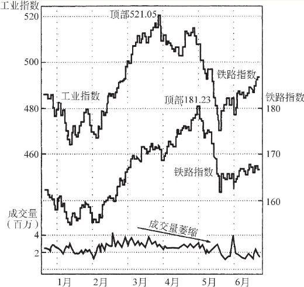
   1. 图4-2 1956年道琼斯工业指数与铁路指数
   2. 注：1956年空头市场的起点，这是空头市场开始的典型例子。高点的成交量偏低，显示“不再期待股票可以维持过度膨胀的价格”。
4. 经过一段相当程度的下跌之后，突然会出现急速上涨的次级折返走势，接着便形成窄幅盘整而成交量缩小的走势，但最后仍将下滑至新的低点（见图4-3）。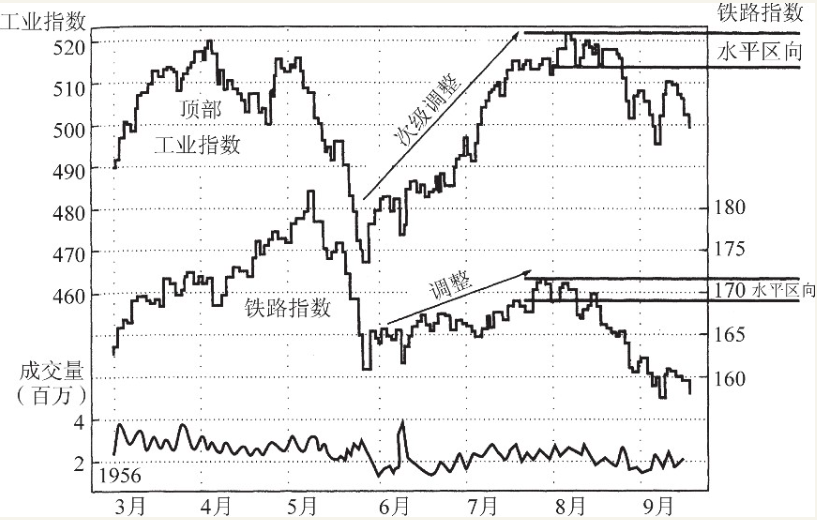
   1. 图4-3 1956年道琼斯工业指数（上侧）与铁路指数（下侧）
   2. 注：1956年空头市场的第一波次级修正走势。在空头市场中，次级折返走势通常会突然急速上涨，接着便形成窄幅盘整而成交量缩小的走势，最后仍将下滑至新的低点。
5. `空头市场的确认日（confirmation date）`，是指两种市场指数都向下突破多头市场最近一个修正低点的日期。两种指数突破的时间可能有落差，但这并不是不正常的现象（见图4-4）。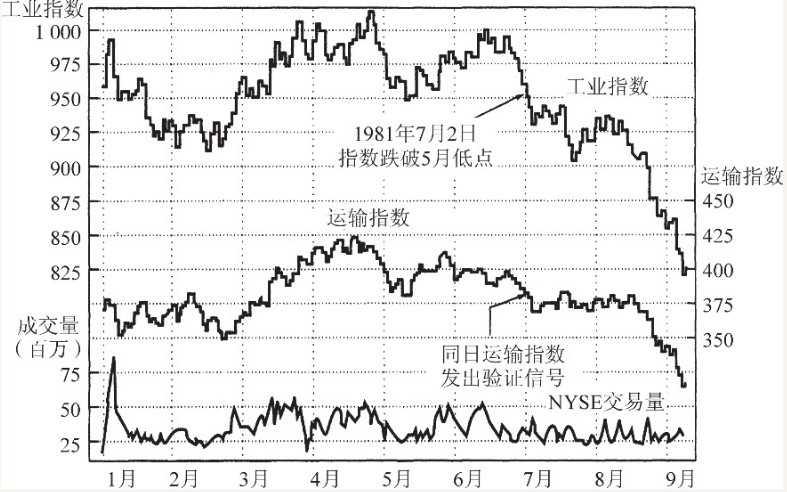
   1. 图4-4 1981年道琼斯工业指数与运输指数
   2. 注：1981年道琼斯工业指数与运输指数——空头市场的确认。为了确认空头市场的走势，两种市场指数都必须向下突破前一个中期趋势的重要低点。就这个例子来说，道琼斯工业指数在7月2日向下突破5月的低点，道琼斯运输指数在同一天确认。不可将确认日与卖出信号相互混淆，前者是7月2日。
6. 空头市场的中期反弹，通常都呈现颠倒的“V”形，其中低价的成交量偏高，而高价的成交量偏低（见图4-5）。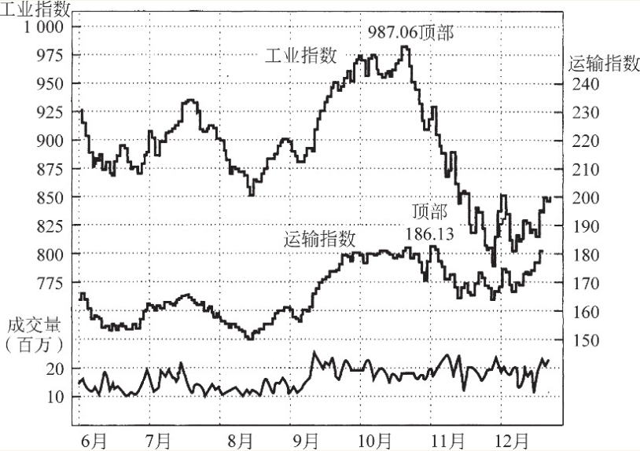
   1. 图4-5 1973年道琼斯工业指数与运输指数
   2. 注：1973年道琼斯工业指数与运输指数——空头市场次级修正走势的典型“V”形模式。空头市场修正走势起始于8月，并于11月出现顶部，形成空头市场修正走势的典型颠倒“V”形模式。请注意，高点（工业指数为987.06，运输指数为186.13）的成交量相对偏低，而低点的成交量相对偏高。

有关空头市场的情况，雷亚的另一项观察非常值得重视：

在空头行情末期，市场对进一步的利空消息与悲观论调已经产生了免疫力。然而，在严重挫跌之后，股价也似乎丧失了反弹的能力，各种征兆都显示，市场已经达到均衡的状态，投机活动不活跃，卖出行为也不会再压低股价，但买盘的力道显然不足以推升价格……市场被笼罩在悲观的气氛中。股息被取消，某些大型企业通常会出现财务困难。基于上述原因，股价会呈现窄幅盘整的走势。一旦这种窄幅走势明确向上突破……市场指数将会出现一波比一波高的上升走势，其中夹杂的跌势都未跌破前一波跌势的低点。这时……明确显示应该建立多头的投机性头寸（见图4-6）。这项观察也适用于商品市场，当然，不包括其中有关股息的陈述。

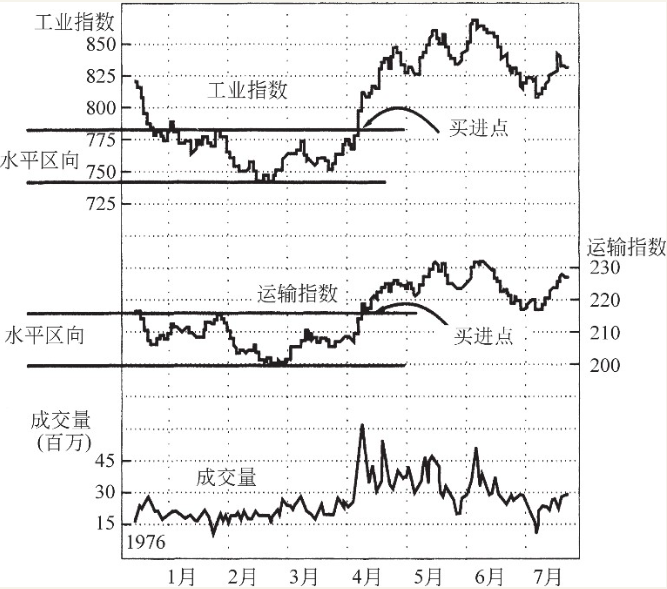

图4-6 1976年道琼斯工业指数与运输指数

注：道琼斯工业指数与运输指数——1976～1978年空头市场末期的窄幅盘整走势。在走势明确向上突破盘整区间时，通常是做多的理想时机。请注意，在走势向上突破盘整区间时，同时代表空头市场次级修正走势的结束以及多头市场的开始。

>定理4：`主要的多头市场（primary bull markets）`：它是一种整体性的上涨走势，其中夹杂着次级折返走势，平均的持续期限长于两年。在此期限内，因为经济情况好转与投机活动转盛，所以投资性与投机性的需求增加，并因此推高股票价格。多头市场有三个阶段：第一阶段，人们对未来的景气恢复信心；第二阶段，股票对已知的公司盈余改善产生反应；第三阶段，投机热潮转炽而股价明显膨胀——这阶段的股价上涨是基于期待与希望（见图4-7）。

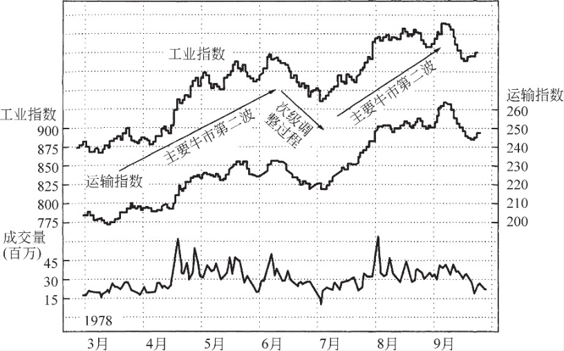

图4-7 1978年道琼斯工业指数与运输指数

注：道琼斯工业指数与运输指数——1978～1981年多头市场的早期阶段。这是多头市场典型的早期发展。就这个例子来说，在第一段与第二段主升波之间，夹杂着第一个次级折返走势。第一段主升波便是雷亚所谓的“……对未来的景气恢复信心”。

多头市场的特色是所有主要指数都持续联袂走高，拉回走势不会跌破前一个次级折返走势的低点，然后再继续上涨以创新高价。在次级的折返走势中，指数不会同时跌破先前的重要低点。主要多头市场的重要特质如下。

1. 由前一个空头市场的低点算起，主要多头市场的价格涨幅平均数为77.5%。
2. 主要多头市场的期限长度平均数为2年零4个月（2.33年）。在历史上的所有多头市场中，75%的期限长度超过657天（1.8年），67%介于1.8～4.1年。
3. 多头市场的开始以及空头市场最后一波的次级折返走势，这两者之间几乎无法区别，唯有等待时间确认。参考上述雷亚的评论，但把“在空头行情的末期”改为“在多头市场的初期”（见图4-6）。
4. 多头市场中的次级折返走势，跌势通常比先前与前后的涨势都剧烈。另外，折返走势开始的成交量通常相当大，但低点的成交量则偏低（见图4-8）。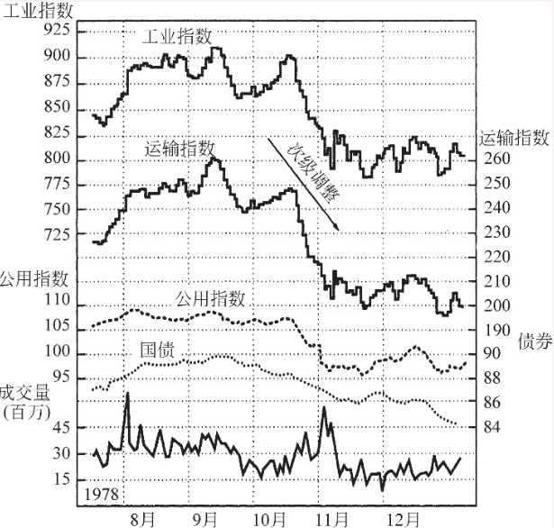
   1. 图4-8 1978年道琼斯工业指数与运输指数
   2. 注：道琼斯工业指数与运输指数——1978年多头市场的次级折返走势。多头市场中的次级折返走势，跌势通常比先前与随后的涨势都剧烈。在折返走势开始时的成交量通常都相当大，但低点的成交量则偏低。
5. 多头市场的确认日是两种指数都向上突破空头市场前一个修正走势的高点，并持续向上挺升的日子。

>定理5：`次级折返走势`：就此处的讨论来说，次级折返走势是多头市场中重要的下跌走势，或空头市场中重要的上涨走势，持续的时间通常在3个星期至数个月。此期间内折返的幅度为前一个次级折返走势结束后之主要走势幅度的33%～66%。次级折返走势经常被误以为是主要走势的改变，因为多头市场的初期走势显然可能只是空头市场的次级折返走势，相反的情况则会发生在多头市场出现顶部后。

次级折返走势（也被称为修正走势）是一种重要的中期走势，它是逆于主要趋势的重大折返走势。判断何为逆于主要趋势的“重要”中期走势，这是道氏理论中最微妙与困难的一环。对信用高度扩张的投机者来说，任何误判都可能造成严重的财务后果。

**在判断中期趋势是否为修正走势时，需要观察成交量的关系、修正走势之历史概率的统计资料、市场参与者的普遍态度、各个企业的财务状况、整体状况、美国联邦储备委员会的政策以及其他许多因素**。走势在归类上确实有些主观成分，但判断的精确性却关系重大。一个走势究竟属于次级折返走势，或是主要趋势的结束，我们通常很难甚至无法判断。

我个人的研究与雷亚的看法相当一致，大多数次级折返走势的折返幅度，约为前一个主要走势波段（primary swing，介于两个次级折返走势之间的主要走势）的1/3～2/3，持续的时间则在3个星期至3个月之间。对历史上所有的次级折返走势来说，其中61%的折返幅度约为前一个主要走势波段的30%～70%，其中65%的折返期限介于3个星期至3个月，而其中98%介于两个星期至8个月。价格的变动速度是另一个很明显的特色，相对于主要趋势而言，次级折返走势有暴涨暴跌的倾向。

次级折返走势不可与小型（minor）折返走势相互混淆，后者经常出现在主要与次级的走势中。**小型折返走势是逆于中期趋势的走势，在98.7%的情况下，持续的期限不超过两个星期（包括周末休息日在内）**。它们对中期与长期趋势几乎完全没有影响。截至1989年10月，“工业指数”与“运输指数”在历史上共有694个中期走势（包括上涨与下跌），其中仅有9个次级折返走势的期限不足两个星期。

在雷亚对次级折返走势的定义中，有一个关键的形容词：`“重要”`。一般来说，如果任何价格走势起因于经济基本面的变化，而不仅是技术面的调整，而且其价格变化幅度超过前一个主要走势波段的1/3，都称得上重要。例如，如果美联储将股票市场融资自备款的比率由50%调升为70%，这会造成市场上相当大的卖压，但这与经济基本面或企业经营状况并无明显的关系。这种价格走势属于小型（不重要的）走势。此外，如果发生严重的地震而使加利福尼亚州的一半沉入太平洋，股市在3天之内暴跌600点，这就属于重要的走势，因为许多公司的盈余将受到影响。然而，小型折返走势与次级折返走势之间的差异未必非常明显，这也是道氏理论中的主观成分之一。

## 趋势的定义
### 上升趋势、下降趋势以及趋势的意义
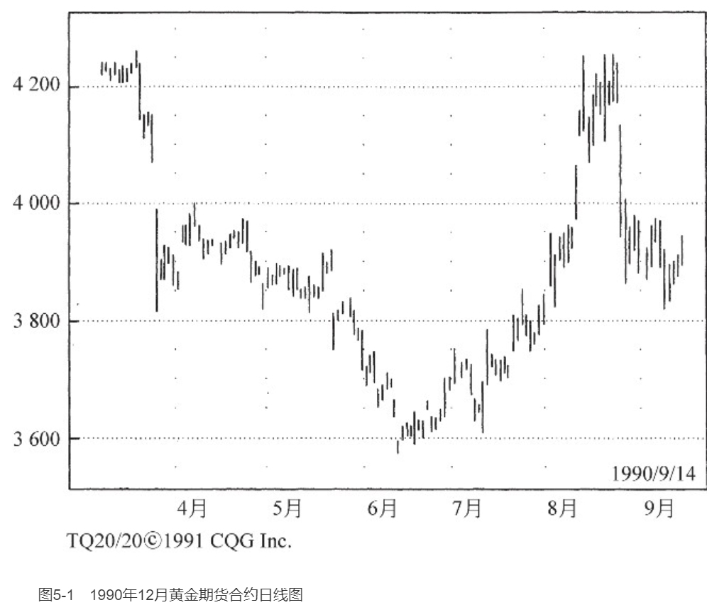

注：1990年12月黄金期货——黄金的趋势如何？图5-2标示出三种趋势。

我观察这张图形时发现，其中存在三种截然不同的趋势：长期趋势向下；中期趋势向上；短期趋势向下（见图5-2）。

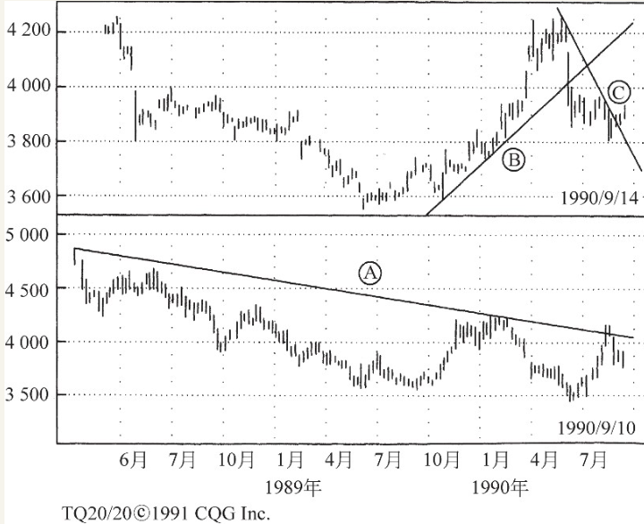

图5-2 1990年2月黄金期货日线图

注：1990年12月黄金期货的日线图（上侧）与周线图（下侧）——三种趋势。长期趋势（数个月至数年）向下，它在下侧的图形中以A线表示的。中期趋势（数个星期至数个月）向上，它是以B线表示的。短期趋势（数天至数个星期）向下，它是以C线表示的。

从道氏理论中，我整理出下列定义。

`上升趋势`——它是由一系列连续的涨势构成，每一段涨势都持续向上穿越先前的高点，中间夹杂的下降走势（换言之，跌势）都不会向下跌破前一波跌势的低点。总之，上升趋势是由高点与低点都不断垫高的一系列价格走势构成的（见图5-3）。

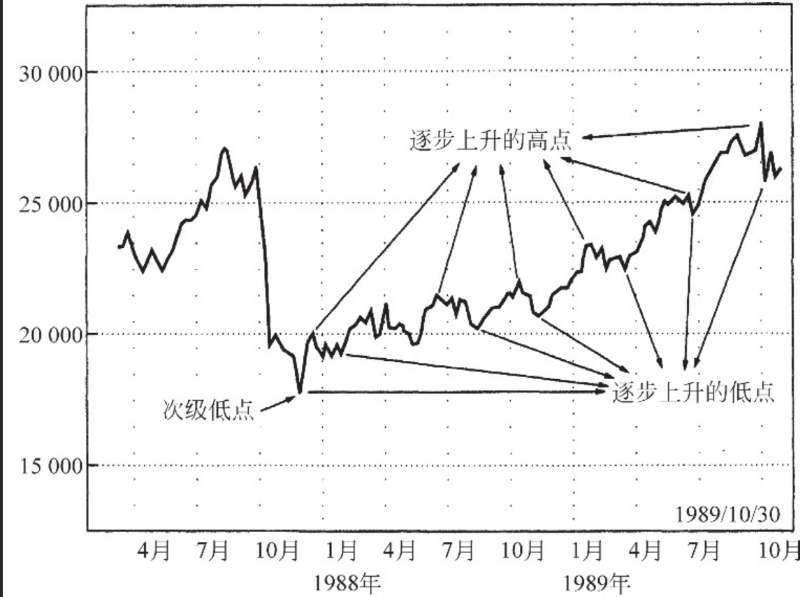

图5-3 道琼斯工业指数周线图

注：道琼斯工业指数周线图——指数处于上升趋势（多头行情）。上升趋势由高点与低点都不断垫高的一系列价格走势构成。

`下降趋势`——它是由一系列连续的跌势构成，每一段跌势都持续向下穿越先前的低点，中间夹杂的反弹走势（换言之，涨势）都不会向上穿越前一波涨势的高点。总之，下降趋势是由低点与高点都不断下滑的一系列价格走势构成的（见图5-4）。

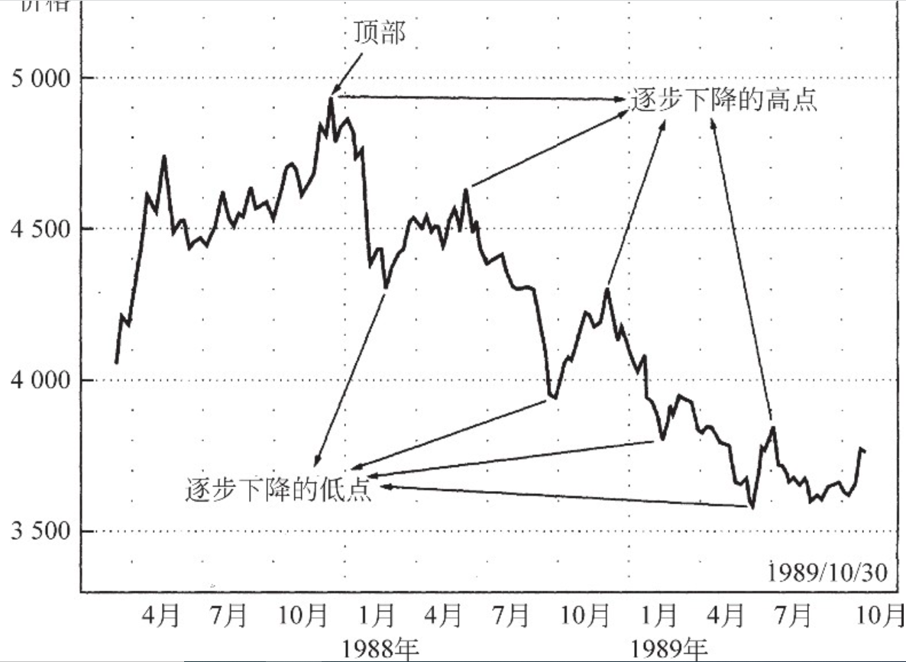

图5-4 1990年黄金期货周线图

注：1989年黄金期货周线图——黄金处于下降趋势。下降趋势由低点与高点都不断下滑的一系列价格走势构成。

我们经常可以发现，某一市场指数出现反转走势达数个星期或数个月之久，另一种指数却呈现相反方向的走势。这种现象被称为`背离（divergence）`，它仅有负面性质的用途。犹如雷亚所说：

>两种市场指数必须`相互验证（both averages must confirm）`：铁路指数与工业指数的走势永远应该一起考虑。一种指数的走势必须得到另一种指数的确认，这样才可以做出有效的推论。仅根据一种指数的趋势判断，另一种指数并未确认，结论几乎是必然错误的。

1989年4月18日，“运输指数”首先向上突破1987年8月的高点。“价值线指数”在7月10日也出现类似的突破走势，“S&P 500”则在7月24日突破（但S&P 500成分股仅有29%的个股在1989年创新高）。然而，根据道氏理论的严格判读，确认日最早发生在4月18日，当时“工业指数”向上突破1987年8月的高点，并持续向上走高（见图5-5）。现在，就“运输指数”来说，我将1987年8月25日至1987年12月4日之间的走势，归类为主要多头市场的次级修正走势，而“工业指数”的修正走势则发生在1987年8月25日至1987年10月19日之间。当时的情况非常混乱，但如果没有道氏理论的客观指引，我会更加迷惑。

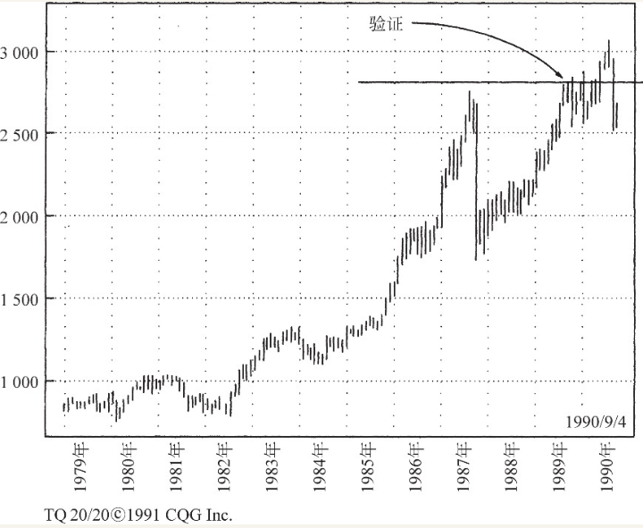

图5-5 道琼斯工业指数周线图

注：道琼斯工业指数周线图——多头市场持续的确认。1989年4月18日确认多头市场持续发展，当时工业指数向上突破1987年8月的高点，并继续向上攀升。

这里我必须指出，虽然1987年的行情发展相当特殊（从历史的角度来说），但根据道氏理论的严格判读，在10月14日便出现明显的中期卖出信号，当时“工业指数”以大成交量向下突破9月21日的低点（“运输指数”已经提早创新低点）。不论你将当时的长期趋势视为多头市场还是空头市场，这两个中期卖出信号都很有效。然而，如果你把崩盘走势视为空头市场的第二只脚，则往后便没有明显的多头进场信号。

在空头行情的假定之下，我在1987年10月24日建立多头头寸，因为我认为当时将展开次级向上修正走势。1988年3月结束多头头寸之后，我在1989年10月之前便没有再大量介入股市，而后者的情况已在第2章中做了说明。1989年10月13日，我对市场的预测主要是基于道氏理论。

### 行情的四个阶段
我称为信号的两个关键指标分别是`窄幅盘整`与`成交量`关系。任何市场都必然处于四种技术阶段之一：

1. 承接（accumulation，长期投资者的买进）；
2. 出货（distribution，长期投资者的卖出）；
3. 向上或向下的趋势；
4. 整理（consolidation，在经过确认的趋势中，发生获利了结之后的调整）。

以另一种方式说明，如果市场并无趋势，便是处于`窄幅盘整（line）`的走势。雷亚将窄幅盘整定义为：

>`窄幅盘整`是长达两三个星期及以上的价格走势，在此期间，两种指数大约都在5%的价格区间内波动。这种走势可能代表承接或出货。当两种指数同时向上穿越盘整区间的上限时，代表的是承接的盘整，而价格应该继续走高；反之，当两种指数同时向下穿越盘整区间的下限时，代表的是出货的盘整，价格应该继续走低。如果仅根据一种指数判断，另一指数并未确认，结论通常都是错误的。

**窄幅盘整的走势通常发生在中期行情的顶部或底部**，在这种情况下，雷亚的定义完全适用。在主要的市场顶部，拥有较佳信息而态度谨慎的长期投资者，试图在一段时期内出清（非常大量的）投资组合，又不希望明显压低价格。由于当时市场上的多头投机气氛仍然相当浓厚，他们可以分批出货，将筹码转手给交易者与投机者。因此，在数个星期及以上的时期内，价格将窄幅波动且没有明显向上或向下的趋势，这便形成了窄幅盘整的走势。这也可能发生在某特定的个股或商品市场上。

最后，当市场共识认为价格将下跌时，将穿越窄幅盘整的下限。就市场术语来说，这就是`突破`——卖空股票或商品的绝佳时机（见图5-6）。

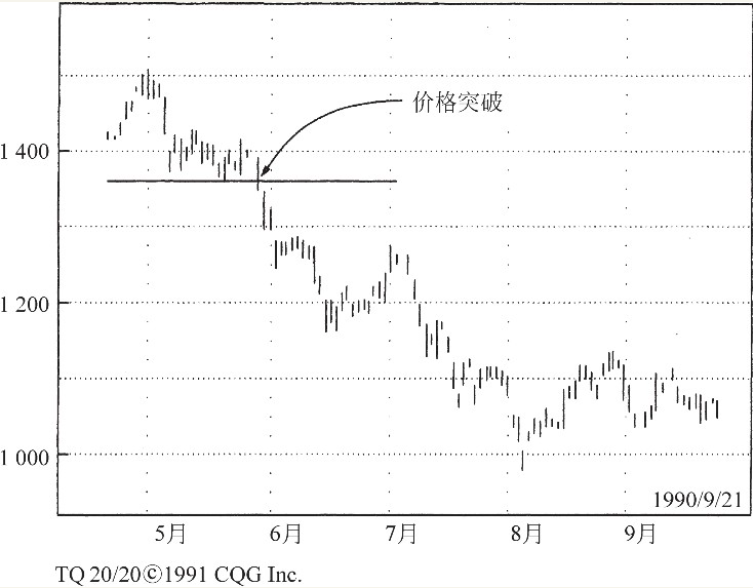

图5-6 1990年5月原糖期货日线图

注：5月的糖期货——价格突破，通常是理想的卖空信号。

在主要的市场底部经常也会发生相同的情况，但方向相反。当价格大幅下跌后，明智的长期投资者认为当时的股票价格具有长期投资的价值，于是开始建立大规模的头寸。或许是为了试盘，或许是不希望推升股价，他们在数个星期至数个月的时期内，默默地承接股票。结果也会形成窄幅盘整的走势。最后，当市场共识认为价格将上涨时，将穿越窄幅盘整的上限。就市场术语来说，这就是`突破`——买进股票或商品的绝佳时机（见图5-7）。在观察每天的价格波动时，突破是唯一对每一种市场参与者（不论是交易者、投机者还是投资者）来说都很重要的走势。犹如雷亚的评论：

>每天的波动（daily fluctuation）：根据单日的指数波动推论，几乎必然是错误的，而且也没有什么价值，唯有窄幅盘整的走势例外。然而，每天的价格走势都应该加以记录，因为一系列的单日走势最后必然会发展成为一种易于辨认且具有预测价值的模式。

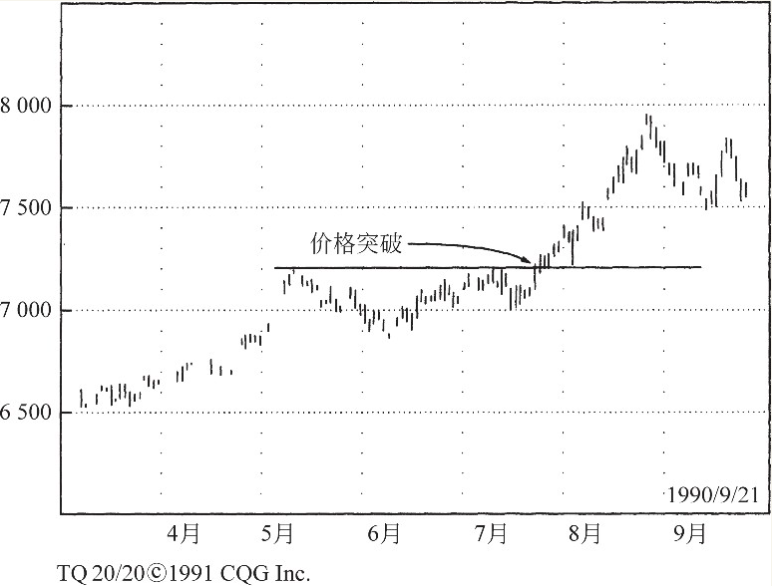

图5-7 12月瑞士法郎期货日线图

注：12月瑞士法郎期货——价格突破，通常是理想的买进信号。

在某些情况下，顶部或底部形成后，趋势往往会突然改变，没有经过窄幅盘整的期间。另外，窄幅盘整的走势有时也会发生在经过确认之主要趋势的中间。这可能是源于下列两个原因中的一个：当价格走势（上涨或下跌）相当陡峭，许多交易者与投机者获利了结时，便造成趋势暂时停顿；或者，市场对未来发展并不确定、分歧的看法使得价格维持在相对固定的价位。第一种情况，我称之为`整理`；第二种情况，我称之为`等待行情（waiting market）`。

### 重要的成交量关系
在趋势明显的行情中，价量关系非常重要。犹如雷亚的评论：

>成交量与价格走势的关系（the relation of volume to price move-ment）：在超买行情中，会出现价涨量缩而价跌量增的现象；相反，在行情处于超卖行情时，会出现价跌量缩而价涨量增的现象。在多头市场结束期间会出现活跃的交易，在开始期间则交易相对冷清。

根据定义，在超买行情中，价格主要受到感觉、希望与预期的驱动，但并非基于健全的经济判断与价值考虑。在这种情况下，掌握明确信息的人已经离开市场，一般参与者的热情也会逐渐冷却。市场已经具备恐慌的条件，只要出现些许的征兆，便足以引发层层卖压。所以，在超买行情中，通常会出现价涨量缩而价跌量增的走势。

超卖情况也适用类似而反向的推理。当超卖市场发展至某一阶段后，由于股票价位已经明显偏低，精明的投资者便开始在低档持续地买卖。市场中逐渐兴起一股对未来的希望与预期，在些许的刺激之下，便使股价在大成交量的情况下向上飙涨。这种价量关系虽然适用于任何金融市场，但不幸的是仅有股票市场可以提供即时的成交量资料。

## 技术分析的优点与缺点
在我们的讨论范围内，各位必须了解三种技术分析者的活动：波浪观察者（tide watcher）、人为操纵者与纯粹派信徒（purist）。

### 波浪观察者
所谓的`波浪观察者`，试图根据盘中价格趋势的起伏而顺势操作。相对来说，他们并不关心经济的状况、个股市盈率或盈余增长或任何其他商品的经济基本面。他们所有的注意力几乎完全放在每天、每个时刻的价格走势方向上。随着趋势的上升、下降或横向发展，他们买进、卖空或保持空仓。

波浪观察者通常是主要交易所内的场内交易员或做市商。他们之所以被归类为波浪观察者，是因为他们仅关心价格的趋势——“趋势是你的朋友”是他们的根本思想。一般来说，他们并不理会任何重要消息，他们仅试图根据压力与支撑（可能造成波浪转向的先前高点与低点）掌握趋势（见图6-1）。

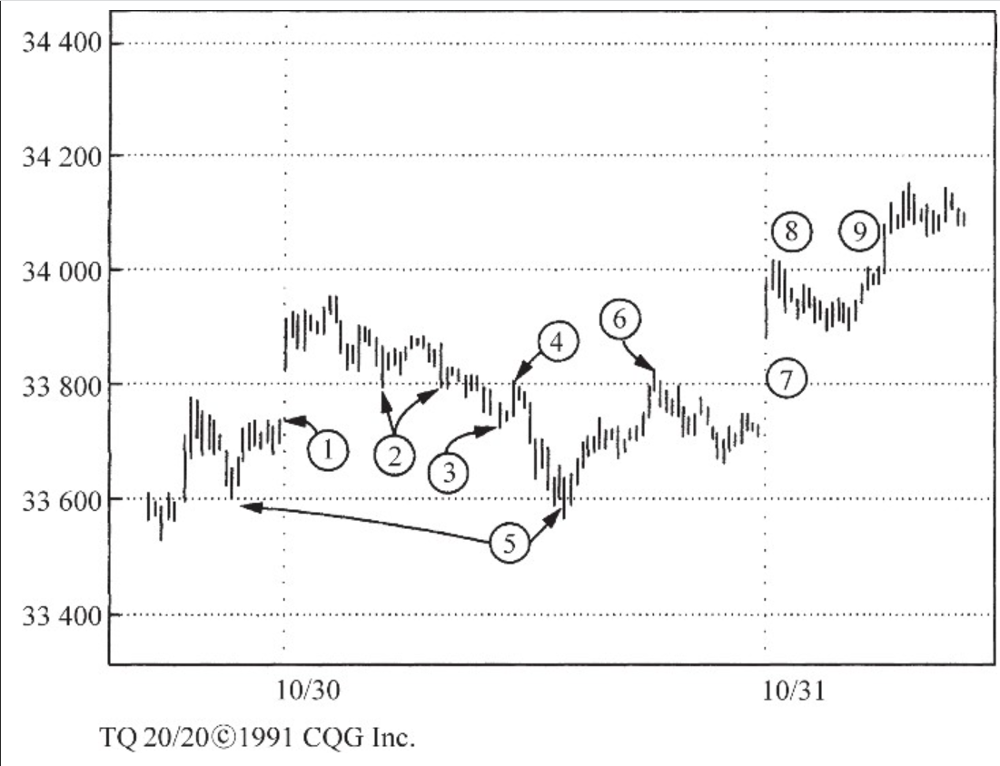

图6-1 5分钟线图

注：1989年12月S&P期货——盘中的压力与支撑。

    ①如果今天开高，则昨天的收盘价为支撑；如果今天开低，则昨天的收盘价为压力。
    ②“整数价位”被视为支撑或压力，就这个例子来说，它们是支撑。
    ③价格测试前一天的收盘价。
    ④“整数价位”形成压力。
    ⑤价格测试“整数”价位与前一天的支撑水平。
    ⑥价格测试④的压力。
    ⑦经济领先指标出现利多消息，开盘价向上“跳空”。
    ⑧接近开盘价的最初高价形成压力。
    ⑨价格测试压力，并以大量向上突破而创当天新高。

在上升趋势中，高于目前价位的先前高点为压力，低于目前价位的先前低点则为支撑。在下降趋势中，低于目前价位的先前低点为压力，而高于目前价位的先前高点则为支撑。在上升趋势中，如果突破先前的高点而价格继续攀升，波浪观察者将是买家，而任何显著的连续向下跳动（tick，“跳动”是指价格的最低变动单位。股票为1/8，期权为1/16，等等）则代表可能的卖出信号。如果突破先前的高点之后，价格未能继续向上挺升，他们将卖出，任何显著的向上走势则代表可能的买进信号。此外，向下的趋势则适用类似而反向的推理。波浪观察者永远试图掌握“大众”在想什么、“大众”准备做什么，他们以价格走势的性质作为判断的方法。

由于场内交易员大多属于波浪观察者，因此投机者与投资者应该了解他们对短期价格趋势可能造成的影响。在短期内，某只个股或商品的价格，可能仅因为他们之间的互动行为而上涨或下跌数点。

例如，假定某证券交易所的场内交易员发现，XYZ股票的卖压很轻，而股价下跌也没有引发明显的追杀卖盘。如果这种情况持续一阵子，则他们可能认为XYZ股票几乎没有什么卖压。在这种判断下，他们可能会趁着回档的时机开始承接（在短线低档开始买进），然后试盘。

假定XYZ股票的买卖报价为40又¼～40又3/8，而3/8的价位仅挂着500股卖单。在1/2、5/8或更高的价位上，卖单的情况究竟如何，仅能猜测，但他们认为买盘的力道相当强，一些精明的交易员开始买进股票测盘，以观察买卖单的变化。最重要者，当价格开始变动时，他们将观察外来的委托单是否变化，若是如此，这些买卖单的关系如何。

如果卖单不断涌现，交易员只好放弃而抛出股票，再找另外的机会。然而，假定市场中出现买单，并在1/2与5/8等价位上成交，接着又有一些经纪人跟进。如果这种情况持续下去，这只股票很快就形成一种短线的多头气势。

这时，场内交易员根本不知道XYZ公司的盈余展望是否有任何变化。当初的卖压不重，很可能就是因为这方面的缘故。总之，不论该公司的展望如何，如果股票出现相当的涨幅，便形成一个小型的飙涨行情。对于场内的多头交易员来说，他们关心的仅是价格上涨而已。

此外，场外的大笔卖单随时可能让涨势中断。由于这种小型飙涨走势纯粹是投机行情，因此在上档接手的买盘将遭到最严重的损失。小型的崩跌走势也适用类似而反向的推理，这种走势经常发生在小型飙涨走势结束后不久。计算机程式交易可以发动、加速与扩大整个程序。

如果投机者或投资者了解这类波浪观察者的行为与影响，则可将此知识运用于许多方面。首先，场外观察者在报价荧屏中发现这类活动时，可以根据盘中价格的循环，设定中期或长期的买卖价位，以提高获利。其次，根据价格走势与基本面之间以及它与大盘之间的关系，可以在中期与长期的持续力道上判断价格走势的“合理性”。最后，波浪观察者活动的性质，代表市场共识的一个关键指标。

最后一点对投机者来说可能最为重要。投机者可以通过监视盘中与每天的市场活动，衡量未来行情的发展。具体来说，成交量、涨-跌家数比率、重大经济或市场新闻引起的短期反应以及价格变动率等因素，都可以评估市场参与者的主要心理驱动力量。

### 人为操纵者
自从20世纪80年代中期以来，计算机程式交易已经完全改变盘中价格走势的性质，并为市场带来前所未有的不确定性。目前，在任何时刻，一位程式交易经理人的判断便可以发动买进或卖出的计算机程式，并在纯粹技术的基础上（换言之，相关股票的盈余展望没有任何基本变化）造成5～30点以上的短线走势。

### 纯粹派信徒
在正式的理论基础上，某些技术分析者相信：价格就是一切，所有关于市场的已知或未来的可知资料都已经包含在市场价格与走势中。这便是纯粹的技术学派信徒，其中较著称者为艾略特（R.N.Elliott）与克朗多蒂夫（Krondodiov），某些不全然了解爱德华兹与迈吉理论的信徒也是如此，还有某些异端的“道氏理论家”。

试图以严格的循环理论或纯粹的数学方法预测未来，完全忽略市场活动中的主观性质。

## 创造财富的契机——辨识趋势的改变
它同时符合道氏理论中对趋势的定义，以及该理论对趋势变动的推论。

1. 选择考虑的期间：长期（数个月至数年）、中期（数个星期至数个月）或短期（数天至数个星期）。在既定的期间内，如果趋势线的斜率变动非常明显，可能同时存在数条趋势线。
2. `上升趋势线`：在考虑的期间内，以最低的低点为起点，向右上方绘制一条直线，连接最高之高点前的某一个低点，而使这条直线在两个低点之间未穿越任何价位（见图7-1与图7-2）。延伸这条直线而经过最高的高点。当趋势线经过所考虑最高之高点后，它可能穿越某些价位。事实上，这是趋势发生变化的一种现象。

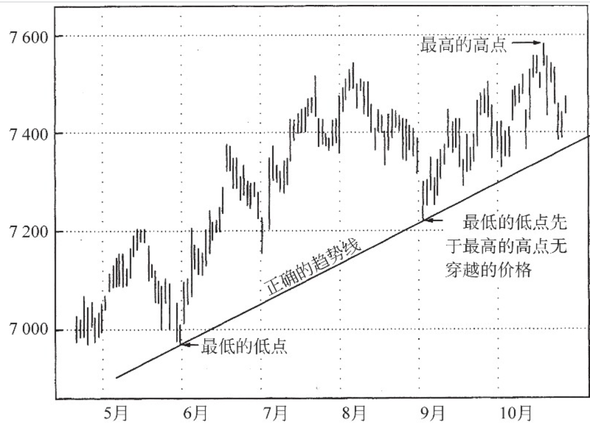

图7-1 日线图1

注：1989年12月活牛期货——上升趋势。上升趋势线由最低的低点绘制一条直线，连接最高之高点前的某一低点，以便该直线在两个低点之间不会穿越任何价位。

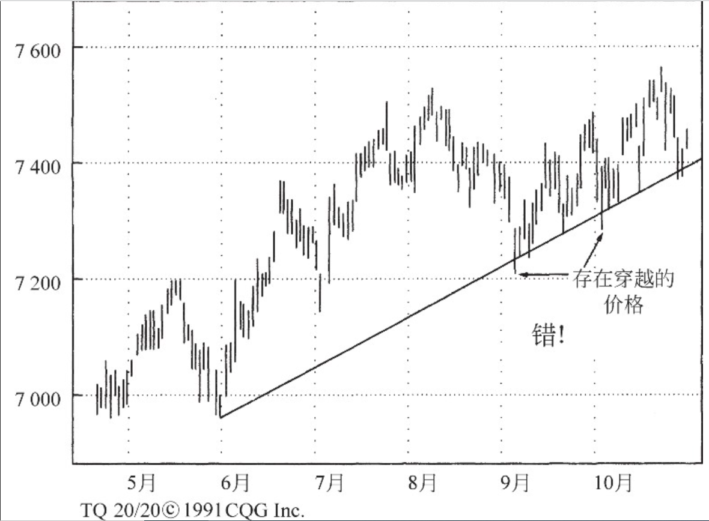

图7-2 日线图2

注：1989年12月活牛期货——错误的上升趋势线。这条上升趋势线并不正确，因为在两个低点之间，趋势线穿越某些价位。这种错误会导致趋势变动的误判。

3. `下降趋势线`：在考虑的期间内，以最高的高点为起点，向右下方绘制一条直线，连接最低之低点前的某一个高点，而使这条直线在两个高点之间不会穿越任何价位。延伸这条直线而经过最低的低点（见图7-3与图7-4）。

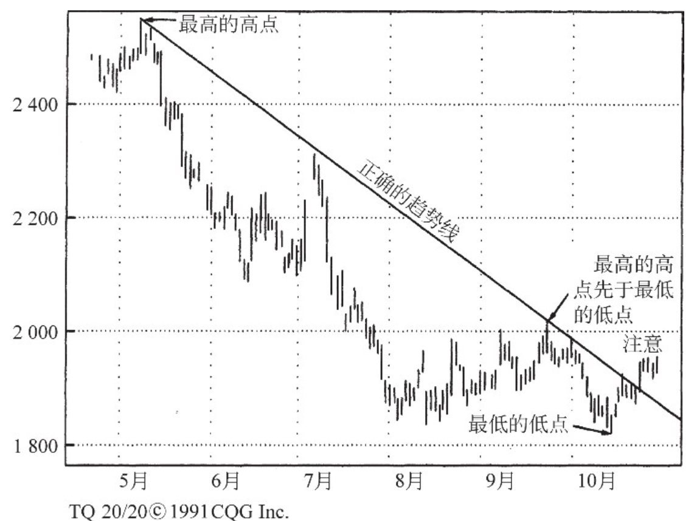

图7-3 日线图3

注：1989年12月大豆油期货——下降趋势线的正确绘制方法，下降趋势线由最高的高点绘制一条直线，连接最低之低点前的某一高点，使该直线在两个高点之间不会穿越任何价位。

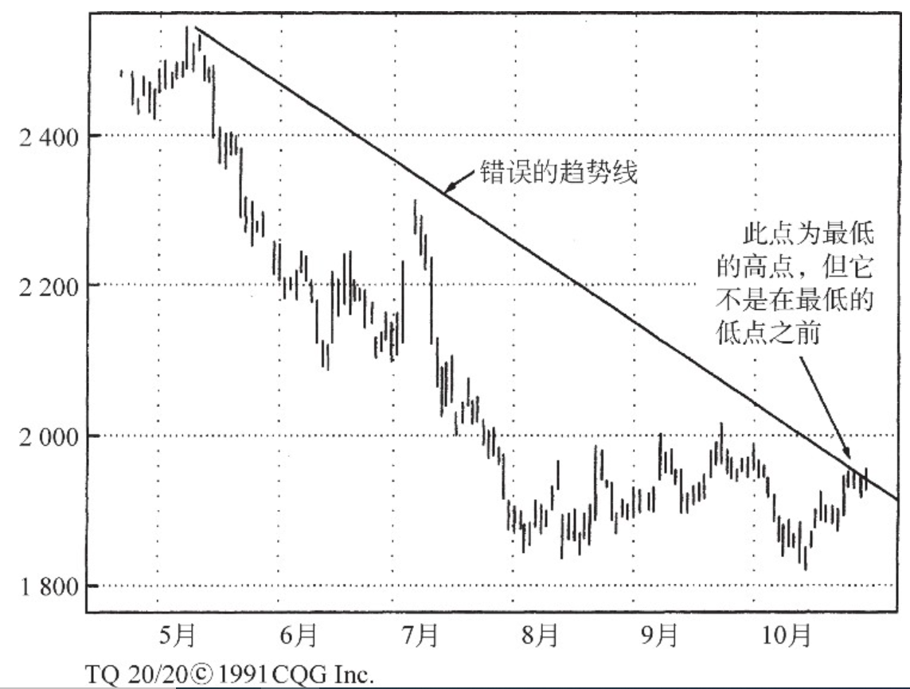

图7-4 日线图4

注：1989年12月大豆油期货——错误的下降趋势线。这条下降趋势线并不正确，因为在两个高点之间，趋势线已穿越某些价位。请注意，在图7-3中，趋势线显示趋势可能已经发生变动；在图7-4中，趋势线未明确显示趋势变动的征兆。所以，以正确的方式绘制趋势线非常重要。

这种方法虽然简单，却非常精确而具有一致性。如果你根据相同期间内的资料做线性回归分析，最佳套入直线的斜率将相当近似于趋势线的斜率。这与其他方法不同，它使你可以避免依据个人的主观看法绘制趋势线——避免将个人的欲望强加在趋势线之上。当趋势发生变动时，这种方法也可以在图形上提供判断的基准。

价格走势有三种基本的变动，它们之间的相互配合，可以界定任何市场的趋势变化：股票、商品、债券……它们分别如下。

1. 趋势线被突破。价格穿越绘制的趋势线（见图7-5）。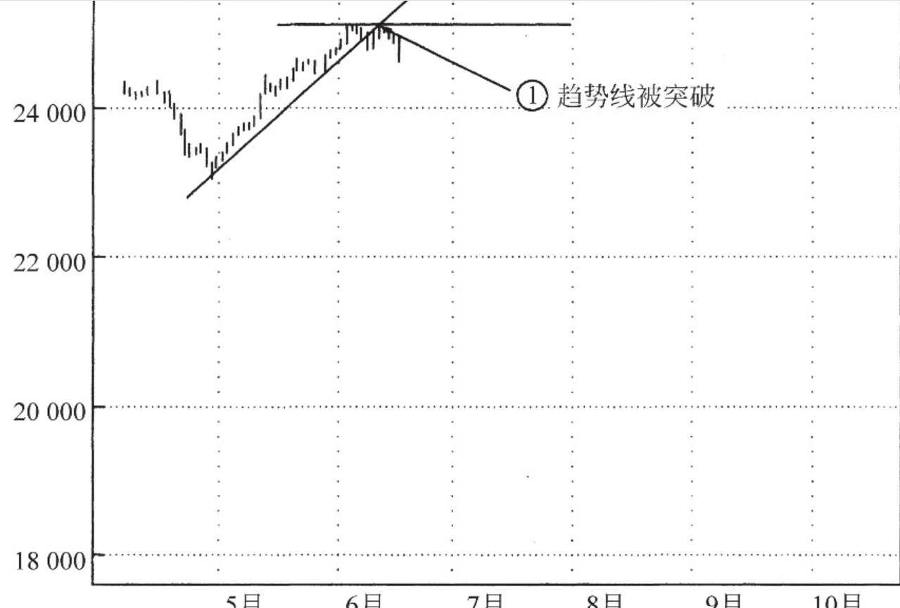

图7-5 日线图5

注：1990年价值线现货指数——突破中期趋势线。当价格穿越一条绘制适当的中期趋势线时，这是趋势变动的第一个征兆，即1-2-3趋势变动准则的第一种情况。

2. 上升趋势不再创新高，或下降趋势不再创新低。例如，在上升趋势的回档走势之后，价格虽然回升，但未能突破先前高点，或仅稍做突破后又回档。类似情况也会发生在下降趋势中。这通常被称为试探高点或低点。这种情况通常，但不是必然发生在趋势变动的过程中。若非如此，则价格走势几乎总是受到重大消息的影响而向上或向下跳空，并造成异于“常态”的剧烈价格走势（见图7-6）。
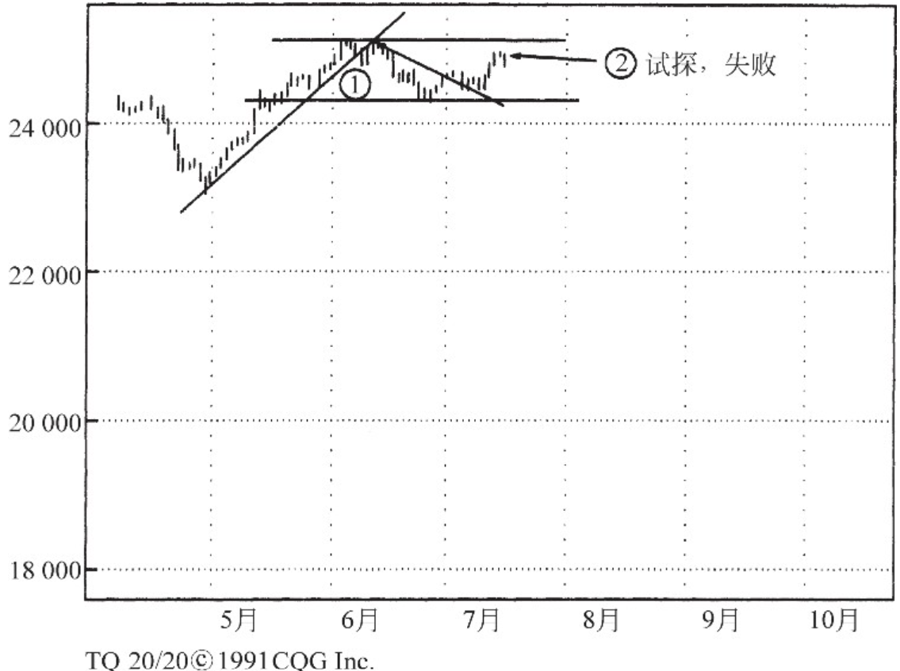

图7-6 日线图6

注：1990年价值线现货指数——测试先前的中期高点而失败。当价格接近而未能到达先前的高点时，这是趋势变动的第二个征兆，即1-2-3趋势变动准则的第二种情况。

3. 在下降趋势中，价格向上穿越先前的短期反弹高点；或在上升趋势中，价格向下穿越先前的短期回档低点（见图7-7）。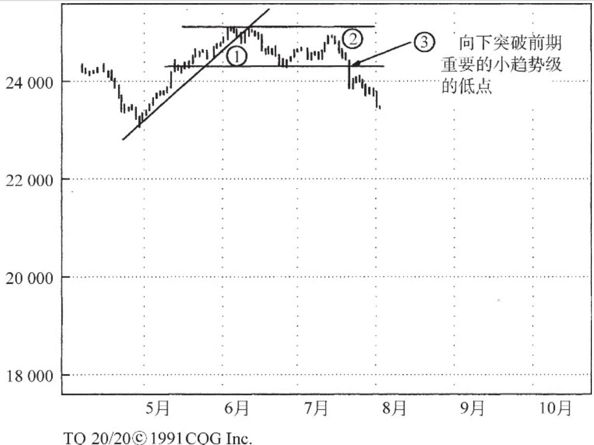

图7-7 日线图7

注：1990年价值线现货指数——价格跌破先前的中期低点。当价格跌破先前的重要低点时，这是趋势变动的第三个征兆，即1-2-3趋势变动准则的第三种情况。

如果上述三种情况同时发生，则相当于道氏理论对趋势变动的确认。如果仅发生前两种情况，则代表可能的趋势变动。在三种情况中，若出现两种，则增加趋势发生变动的概率。三种情况同时产生，则界定所谓的趋势变动。

在走势图中观察趋势的变化，必须根据下列方式将先前的原则转换为图形的格式（见图7-5～图7-7）。

1. 绘制趋势线。
2. 在下降趋势中，绘制一条水平的直线穿越目前的最低价，再绘制另一条水平的直线穿越前一波反弹的高点。
3. 在上升趋势中，绘制一条水平的直线穿越目前的最高价，再绘制另一条水平的直线穿越前一波回档的低点。

就上升趋势来说，如果价格穿越趋势线，在穿越的位置标示①。如果价格接近、接触或稍微穿越该条对应目前高价的水平直线而未能突破，则在该点标示②。如果价格向下突破该条对应前一个回档低点的水平直线，则在该点标示③。如果这三种情况出现两者，则趋势很可能会发生变化。如果这三种情况全部出现，则趋势已经发生变化，并最可能朝新的方向继续发展。

稍做一些练习，你便能够以目测的方式判断趋势发生变动的准则，并以`1-2-3准则`思考：①突破趋势线；②测试先前的高点或低点；③向下跌破前一波回档的低点或向上穿越前一波反弹的高点。出现1-2-3，即趋势已经发生变动了！

在流动性欠佳、对消息面非常敏感或高度投机的市场与个股中，特别容易出现突然的反转（见图7-8）。假定你根据1-2-3准则或其他类似准则交易，而行情突然反转，这被称为`“挨耳光”（getting whipped或getting whipsawed）`。避免挨耳光或降低损失的最佳方法是遵循下列准则。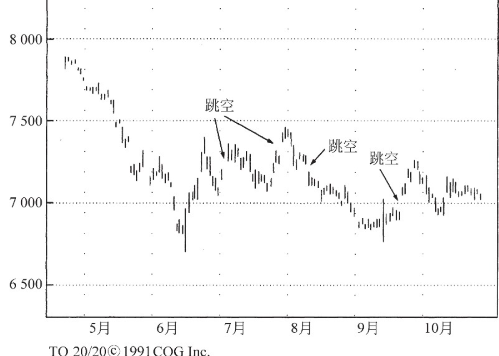

图7-8 日线图8

注：1989年12月日元期货——一个对消息面非常敏感的市场。外汇市场对消息面相当敏感，因为中央银行可以操纵供给面。请注意，每天的开盘价经常跳空，趋势的变动也非常快。除非在适当的情况下，否则在外汇市场建立投机头寸的风险很高。

1. 交易仅选择流动性高，且历史上很少出现突然而大幅度反转走势的市场。从图形中观察，流动性欠佳的市场经常出现成交量不大而价格剧烈波动的走势。
2. 在可能的范围内，避开对消息面非常敏感的市场，或对政府货币政策与财政政策反应剧烈的市场。从图形中可以看出，这类市场经常出现跳空缺口——价格出现突然而巨幅的变动，而中间的价格并未经历（见图7-9）。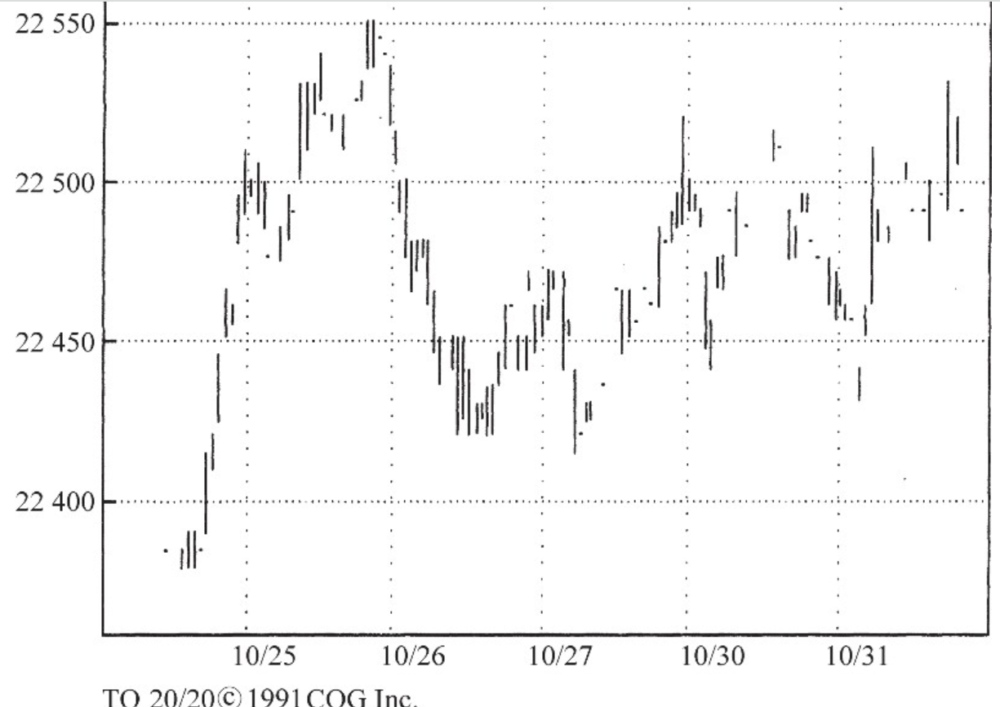

图7-9 日线图9

注：1989年12月商品指数期货——流动性欠佳的范例。这是一份商品指数期货的15分钟走势图，它显示成交量稀少、价格波动大、许多跳空缺口与没有发生交易的期间。

3. 唯有当你可以将出场点设定在先前的支撑或压力价位时，才可以建立交易头寸。在这种情况下，如果市场证明你的判断错误，你可以迅速认赔。这类的出场点，如果事先已经递入交易指令，则称为止损；如果仅是预先设定，而价格已经接近此价位时，才递入交易指令，则称为`心理止损（mental stop）`（见图7-10）。

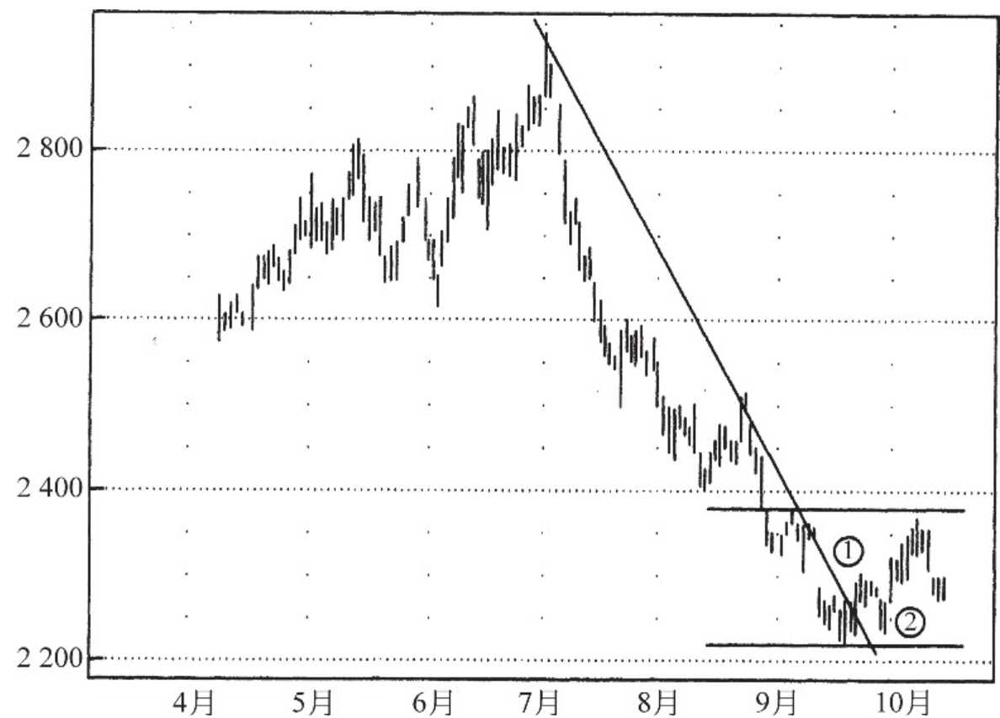

图7-10 日线图10

注：1990年12月的玉米期货价格日线图——一个适合于设定止损的市场。当第二种情况满足时，这是进场做多玉米的理想时机。市场的流动性高，止损点最初可以设定在最低点，当价格穿越上方的水平直线时，止损点可以往上移至该处。

1-2-3准则是一种简单而有效的交易方法，如果谨慎运用，成功的机会则远多于失败的机会。然而，它有一个缺点，当三种情况完全满足时，你通常已经错失一段相当大的行情。所以，此处将讨论一种可以协助你提早建立头寸的准则，它也是我个人偏爱的方法，我称它为`2B准则`。

2B是否可以成立往往是输赢的分野

在前面讨论趋势变动的第二准则时，我们曾经提到一种情况：在试探先前的高点（或低点）时，价格往往可以实际突破先前的高点（或低点），但走势却未能持续。虽然这仅是一种特殊形态的试探，但这种情况一旦出现，通常就是趋势变动的信号。换言之，单单这种现象的本身，便代表趋势非常可能发生变化；就概率来说，它的重要性远高于趋势变动三个准则中的任何一个。因为它具有特殊的重要性，所以可以被视为一种准则。

### 2B准则
在上升趋势中，如果价格已经创新高而未能持续上升，稍后又跌破先前的高点，则趋势很可能会发生反转。下降趋势也是如此。

该准则适用于三种趋势中的任何一种：短期、中期与长期（见图7-11、图7-12与图7-13）。

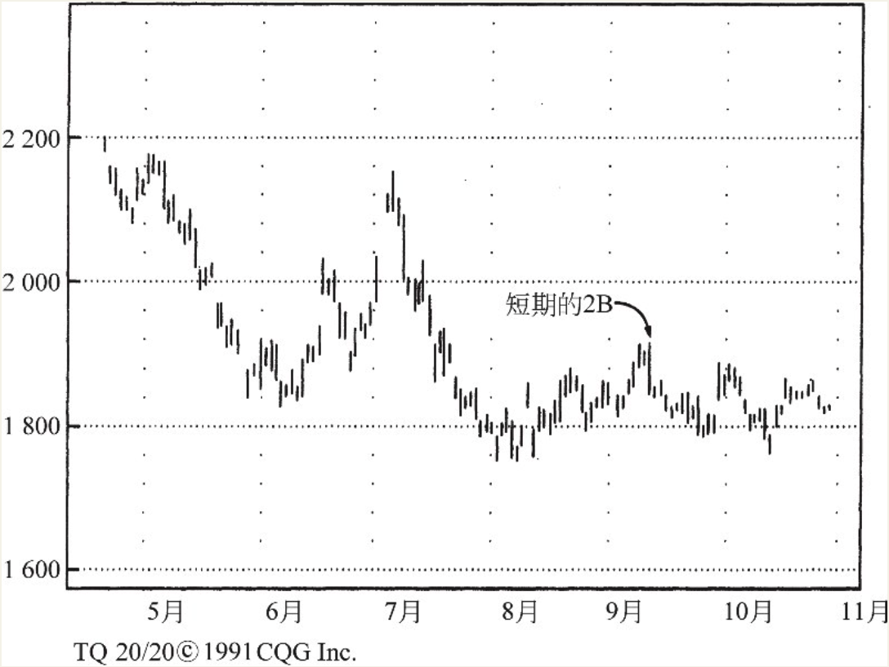

图7-11 日线图10

注：1989年12月大豆粉期货——短期的2B。这份大豆粉期货日线图显示短期的2B。当价格创新高，而随后又跌破先前的高点时，如果当日冲销者在这个时候卖空，则获利相当可观。

在盘中的短线趋势中，价格创新高（新低）之后，如果2B准则成立，通常会发生在一天之内或更短。在中期趋势中，价格创新高或新低之后，如果2B准则得以成立，它通常会发生在3～5天之内。在市场的主要（长期）转折点上，价格创新高或新低之后，如果2B准则得以成立，通常会发生在7～10天之内。在股票市场中，价格创新高之后，随后走势的成交量通常会低于正常水平，但反转的确认（即当价格跌破先前的高点时）却会爆发大额成交量。

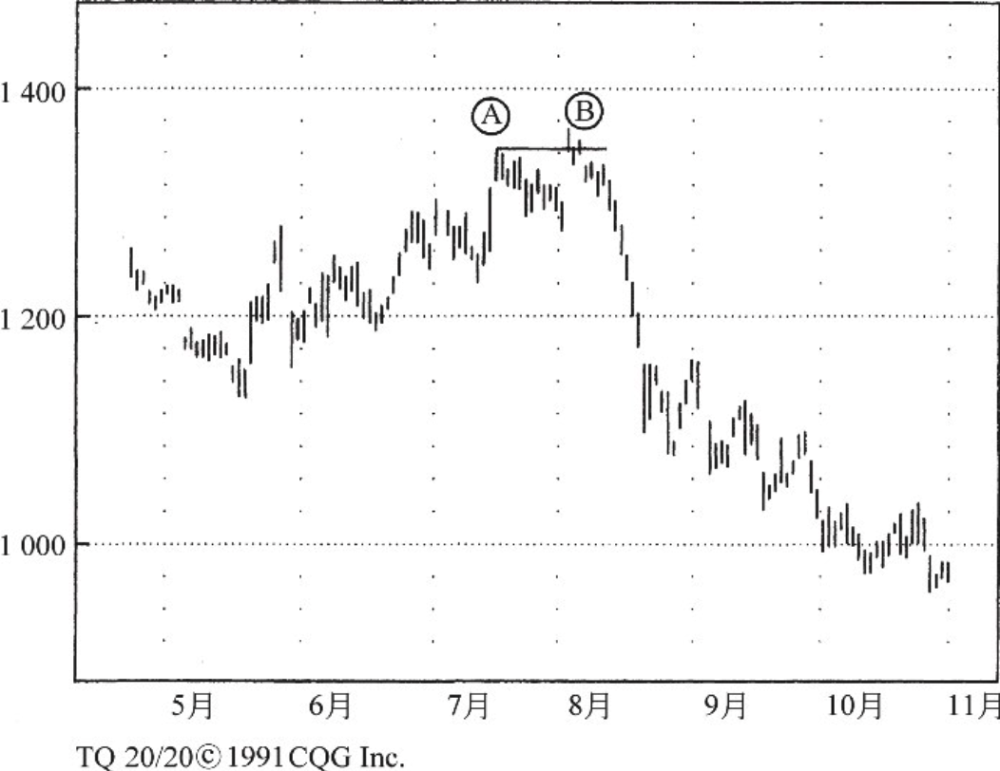

图7-12 日线图11

注：1989年12月可可豆期货——中期的2B。这份可可豆期货日线图显示中期的2B。先前的中期高点为A，价格在B点突破，但三天后又跌破A点的先前高价。

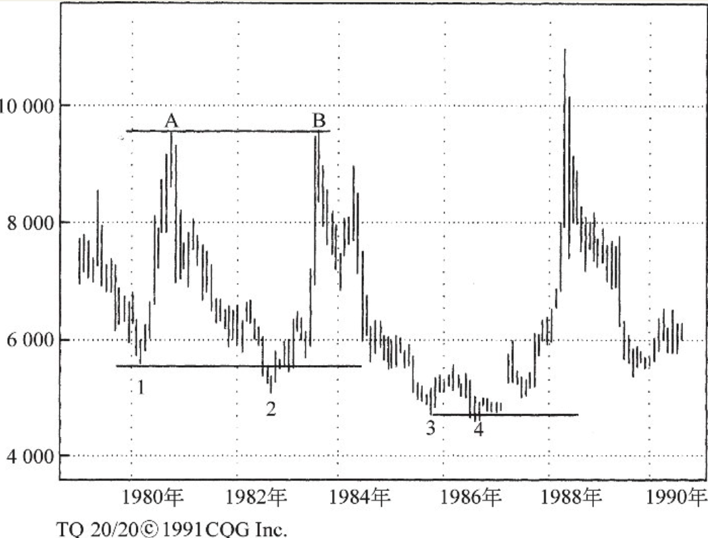

图7-13 月线图

注：大豆的月线图——以长期的2B交易。这份大豆期货的月线图显示数个长期的2B。在B点，价格未能正式突破A点的高价时，2B则代表绝佳的卖空良机。在点2，价格未能正式突破点1的低价时，2B则代表绝佳的买进良机。在点4，依据2B准则交易的长期投资者，至少会挨一个耳光而出场。然而，稍后你应该再建立多头头寸，就其随后的价格走势而言，先前认赔的金额并不算大。

依据2B准则交易，如果市场上出现不利的走势，你必须当机立断，即刻承认错误。例如，在当日冲销的交易中，如果你根据2B准则卖空，当价格再度回升穿越新的高价时，你必须立即平仓出场。

如果价格仍然未能正式突破高价，你就可以再卖空，但必须限制自己的损失，并让自己挨耳光出场。只要能够迅速认赔，你便可以“留得青山在，不怕没柴烧”。就当日冲销来说，2B准则的成功机会大约仅有50%。当错误时，可以限制损失；当正确时，让获利头寸持续发展，你可以因此享有巨额的获利。就中期与长期来说，2B准则的成功机会则较高。

1989年10月13日的道琼斯工业指数便出现典型的中期2B（见图7-14）。10月9日，“工业指数”以低成交量创新高2791.40点，但新高并未受到“运输指数”的确认——明确的中期空头征兆。在随后的几天内，行情不断下滑，10月12日的收盘指数为2 759.80点，距离9月1日的先前高点2752.10点仅有7.3点的差幅。所有相关指数也呈现跌势，2B准则在10月13日成立的可能性很高，后续的发展都已经是历史了。在些许利空消息的影响下，大盘竟然在恐慌性的成交量下暴跌191点。

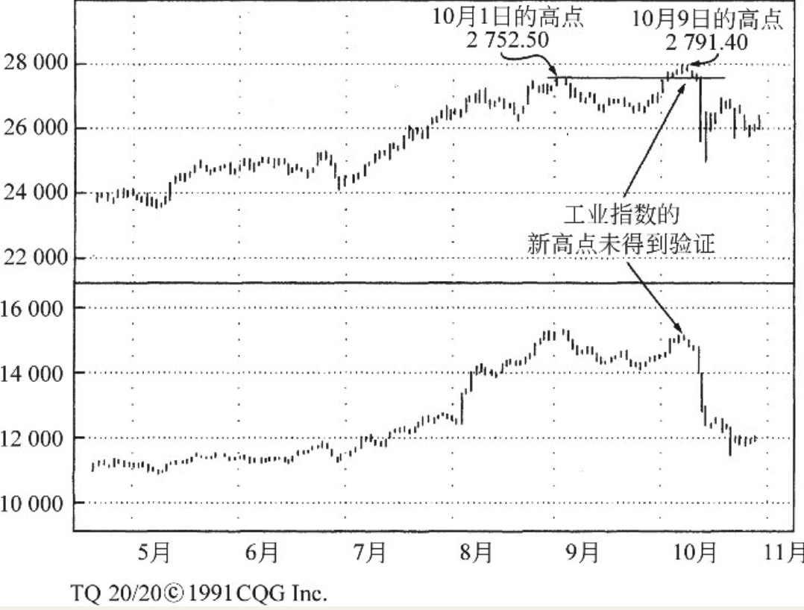

图7-14 日线图12

注：道琼斯工业指数与运输指数，其中工业指数呈现中期的2B。运输指数未确认新的高点，更增加了卖空的成功机会。

试探的发生缘由与2B模式

以商品交易所的场内为例，它是由场内交易员与经纪人构成的——前者为自己的账户交易，后者以执行交易指令来赚取佣金。场内经纪人仅为客户执行交易指令，但场内交易员则试图掌握盘中的趋势，并依据价格走势操作。

通过经纪人而由场外交易商品的人们，通常会采用止损单。所谓的止损单，是指设定的价位一旦被触及或穿越，则以当时市价买进或卖出。以S&P 500期货的交易为例，你可能告诉经纪人，“以356.20的止损价帮我买进5份3月S&P 500期货”。如果市场价格一度在356.10成交，随后又回升至356.40，则场内经纪人将以当时的市价为你买进5份合约，因为你的止损价位已经被触及。

交易者经常会用止损单来限制损失。例如，一位交易者以市价买进5份合约，随后可能递入另一张交易指令，在市场证明他为错误的价位上，设定卖出5份合约的止损卖单。因为场内交易员每天都在交易池内打滚，优秀的交易员非常了解交易者的心理与状况，尤其是交易者如何设定止损点。在没有重大新闻的情况下，止损点通常都会设定在先前的（重要或次要）高点或低点。

由于了解止损点的位置，场内交易员与交易自己账户的经纪人，基于利益的考虑，都希望把价格推动至支撑水平的稍下方或压力水平的稍上方，迫使止损单成交。这被称为`清除止损（taking out the stops）`。在止损单清除以后，市场将重新调整。这便是大多数2B模式发生的原因，而且每一种市场都会出现这类活动。清除止损最常发生在短线的基础上，但也同样适用于中期与长期。在股票市场中，又涉及另一种相当微妙的特色。

证券交易所的场内也有场内交易员与经纪人，某些场内交易员被称为`专员（specialists）`——他们负责某些特定股票的交易。他们根据登录簿（book）交易——登录簿上列出买卖单的价位与数量。专员的工作便是为他所负责的股票做市（make the market）——以系统的方式，撮合股票的买卖双方。

一般来说，登录簿上每一价位的股票数量都是数万股，而专员每撮合100股便可以收取固定佣金，所以他们实际上也是经纪人。基于自身利益的考虑，他们当然希望推动价格以促使较多的单子成交。而且他们已经事先知道各个价位所挂的买卖单数量，至少就他们自己的登录簿而言是如此。

某些精明的交易员认识场内的专员，并培养出一种感觉而可以根据专员的行为判定他们登录簿上的大单子。对这些交易员来说，他们也有理由推动价格以使大单子成交。

例如，假定在多头市场的行情中，IBM股票买卖报价为110½18—110¼，所挂的股数均为5000股。某位专员登录簿中的买单情况为：3/8为1万股，1/2为2万股，5/8为2万股。

精明的交易员可能对这位专员的登录簿相当了解，于是他在1/8买进5000股。其他交易员发现这种情况也随后跟进，他们精确地判定这位专员在上档的数个价位上都挂有大买单。于是，场内对IBM股票便产生一种多头的气势。成交量扩大，价格向上跳动，这位专员的单子不断成交，不仅赚进他的佣金，而且一路向上为自己的账户买卖而获利，因为他知道他不会发生亏损。交易员不断驱动价格，并一路获利。当走势的动能耗尽后，价格又回跌至原先的水平。

专员的世界是一个微妙的世界。在前面，我说专员在涨势中为自己的账户买卖而获利，这种陈述或许并不精确。实际的情况是这样的：谨慎的交易者打电话给这位专员：“帮我买进100万股的IBM股票。”这位专员说道：“噢！你要买进100万股。真巧合，我也是。”于是，他与审慎公司一起买进IBM股票。

每当他买进1万股时，自己分5000股，谨慎的交易者分5000股。现在，犹如我先前的描述，IBM的股票将酝酿出多头的气势。然而，他与谨慎的交易者并不同，后者是买进并持有，专员则是买进股票以推动股价。换言之，他买进股票，但当股价向上跳动时又反手卖出，而且他知道他的操作必然成功，因为买单已经挂在他的登录簿上了。所以，专员的行业可以代代相传而不会消失，这是金融市场中最没有风险的赚钱行业。

很显然，赚钱虽然可以，但专员不可以不负责任。如果他们仅顾自己推动价格，完全忽略客户的利益，他们将因此失业。此处希望强调的重点是：价格走势图中的明显模式主要都来自交易所场内的专业活动。

次级修正走势的ABC三波浪

根据我个人的看法，艾略特波浪理论太过主观，不适合运用于专业的投机活动，但其中有一个观点则非常有助于判断多头与空头市场次级修正走势的顶部和底部。艾略特波浪理论认为，市场价格走势会遵循周而复始的波浪模式。在这些模式中，艾略特提出诸如图7-15所示的ABC三波浪走势。

不论是在多头市场还是在空头市场中，次级修正走势几乎都呈现这种模式。该模式中的另一个特色是BC浪的成交量会萎缩。一般来说，这种走势必须配合其他重要指数的确认才能有效。请注意，如果市场中出现重大的消息，则上述模式可能会被破坏。如图7-15所示，在多头市场次级修正走势的C点，价格可能试探或向下突破A点的价位。空头市场也有类似的情况。显而易见，如果你可以判定C点何时出现，则是做多（多头市场）或卖空（空头市场）的良机。

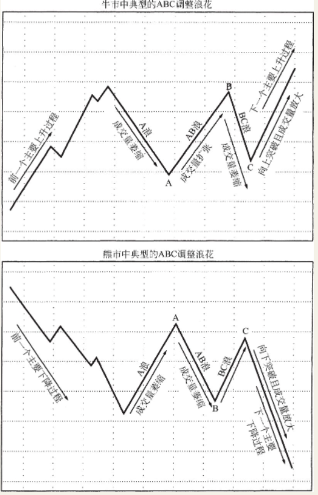

图7-15 次级修正走势的ABC三波浪

注：次级修正走势的ABC三波浪——多头市场（上图）与空头市场（下图）次级修正走势的典型三波浪模式。

在多头市场次级修正走势的BC浪中，当价格向上突破BC浪的下降趋势线时，这是建立投机性头寸的理想机会，但有一个先决条件：在BC浪的跌势中，成交量必须缩小。止损点应该设定在A点与C点的较低价位，因为任何准则都有可能失败。

当价格突破BC浪的下降趋势线时，如果成交量并没有明显的变化，那么形成底部的可能性并不大。反之，如果突破时出现大成交量，突破走势非常可能不是代表空头的修正，而应该是主要多头市场的第二只脚，当然这还需要基本面的配合。

## 失败可能来自分析报告未提供的资料
我最经常使用的辅助性技术工具为：
1. 移动平均线（moving average）
2. 相对强度指标（relative strength indicators）
3. 动能指标（震荡指标）（momentum indicators（oscillators））

### 移动平均线的概念
`移动平均`是取某特定期间内数据的平均值，并不断地剔除最早的数据而以最新的数据代入，然后再重新加总与平均。

移动平均线会将不规则的价格波动平滑化，并凸显趋势与趋势的反转。由于它们是某特定期间的平均值，因此（根据定义）它们是**经过钝化的指数**，落后于最近期的价格波动。采用的期间越长，钝化（落后）的效果就越大。

就我个人而言，我认为股票市场（个股与指数）最理想的移动平均线，是200天期（200个交易日，相当于40周）的移动平均线（见图8-2）。

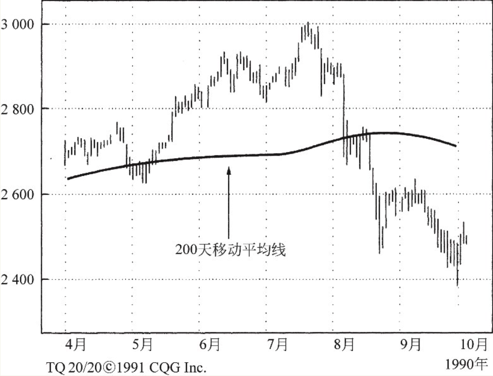

图8-2 道琼斯工业指数日线图2

注：道琼斯工业指数与200天期移动平均线。

1. 如果200天移动平均线由先前的下降趋势开始转为平坦或上升，而且价格由下往上穿越移动平均线，则代表主要的买进信号（见图8-3）。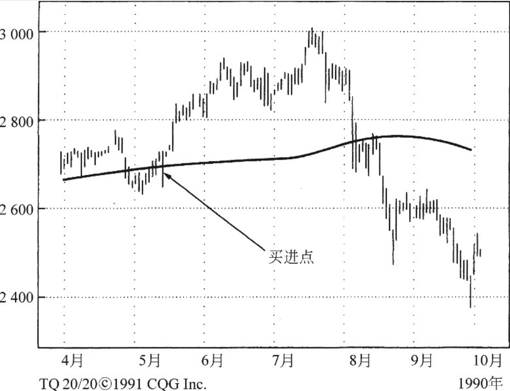
   1. 图8-3 道琼斯工业指数日线图3
   2. 注：道琼斯工业指数与200天移动平均线——买进信号。如果200天移动平均线由先前的下降趋势开始转为平坦或上升，而且价格由下往上穿越均线，则代表主要的买进信号。
2. 如果200天移动平均线由先前的上升趋势开始转为平坦或下降，而且价格由上往下穿越移动平均线，则代表主要的卖出信号（见图8-4）。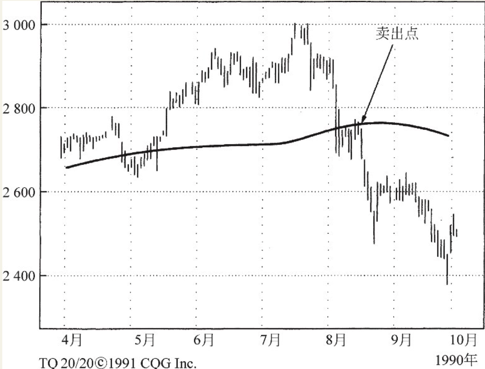
   1. 图8-4 道琼斯工业指数日线图4
   2. 注：道琼斯工业指数与200天移动平均线——卖出信号。如果200天移动平均线由先前的上升趋势开始转为平坦或下降，而且价格由上往下穿越均线，则代表主要的卖出信号。

你不仅可以利用长期移动平均线来预测市场指数，也可以将它运用于个股与商品中。对我个人来说，移动平均线有两个主要功能——确认道氏理论以判断长期趋势以及筛选个别股票。

在选择个别股票时，如果价格低于移动平均值，我绝对不会买进；如果价格高于移动平均值，我绝对不会卖出。你只要拿起任何图谱，并采用35周或40周的移动平均线，则你便了解我为何这样做——胜算的问题。

就较短期的移动平均线来说，我仅发现另一组移动平均线，具有一致性的功效，并经得起时间的考验。它不仅适用于个股与股票指数，也适用于其他许多商品。

1. 当10周移动平均线穿越30周移动平均线，而两者的斜率都向上，并且价格又同时位于两条移动平均线的上方时，这代表买进信号（见图8-5）。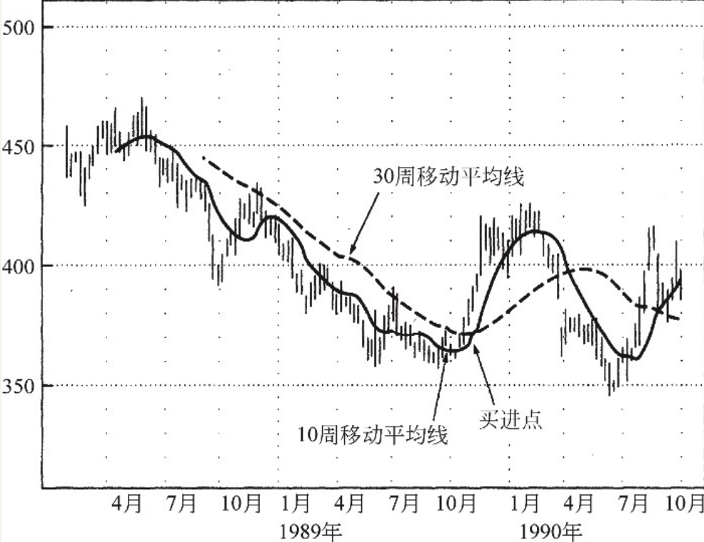
   1. 图8-5 周线图1
   2. 注：黄金期货周线图——10周／30周移动平均线穿越准则的买进点。当10周移动平均线穿越30周移动平均线，而两者的趋势都向上时，则代表买进信号。
2. 10周移动平均线穿越30周移动平均线，而两者的斜率都向下，并且价格又同时位于两条移动平均线的下方时，这代表卖出信号（见图8-6）。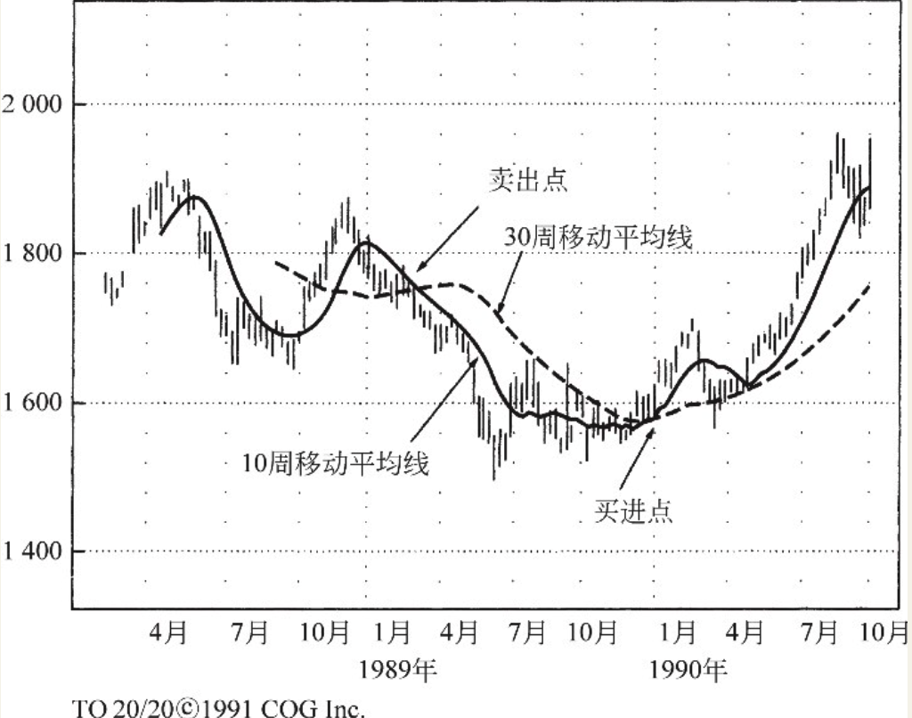
   1. 图8-6 周线图2
   2. 注：英镑期货周线图——10周／30周移动平均线穿越准则的卖出点。当10周移动平均线穿越30周移动平均线，而两者的斜率都向下时，这代表卖出信号。请注意，图形中分别呈现一个卖出信号与一个买进信号。

你必须认识这一事实，与任何技术分析工具一样，**移动平均线的效能也会随市场情况的不同而改变。你的时间结构越短，情况越是如此。所以，你必须试探不同期间的移动平均线，并寻找一个最理想的期间。当它们不再有效时，你必须调整**。

### 相对强度的各种应用
`相对强度`是一只股票与一群股票或大盘指数之间的比率关系，这种关系也可以存在于一群股票与另一群范围更广的股票或大盘指数之间。

在某些图谱中，相对强度的计算较注重最近的价格资料。以纽约证券交易所每日图表系统为例，每只股票都附有相对强度线，它是以周为单位来表示个股价格与S&P 500之间的比率关系；除此之外，还有另一种根据时间加权的相对强度指标，它被用于比较个股价格变动率与资料库内股价变动率之间的关系，并给予每只股票一个介于1～99的数据（见图8-7）。以52为例，这代表这只股票的价格表现超过资料库内其他52%的股票。

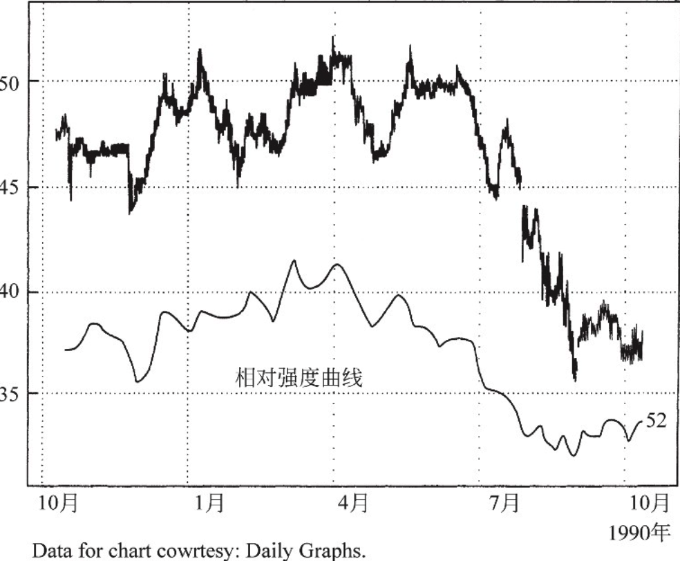

图8-7 TRW Incorporated(TRW)分化操作

注：纽约证券交易所每日图表系统采用的相对强度指标。就这个例子而言，它代表个股与S&P 500之间的相对强弱关系。52是相对强度值，代表它的表现优于资料库中52%的股票。

你绝对不可仅因为某只股票的价格较低而买进它，股价偏低往往都有一定的理由。你买进股票是希望它有所表现，换言之，它的上涨速度快于一般的股票。相对强度便是衡量这类表现的。在所有条件都相同的情况下，如果你希望买进一只股票，你应该根据相对强度指标来买进一只最强劲的股票。

到目前为止，我仅讨论相对强度的一般使用方法。我们还可以从另一个角度运用相对强度的概念，这直接关系着我对趋势的定义。在上升趋势中，高价与低价都会不断垫高。所以，当我看到道琼斯工业指数创新高时，我会寻找在同一天或稍早也创新高的股票。

这些便是最强劲的股票——市场领导股。如果市场处于上升趋势中，这些股票便是你应该买进的对象（假定所有条件都相同），但不是在创新高的时候买进。你必须等待回档，在跌势中买进，因为它们迅速回升的机会较高。相对强度较高的股票，它们的上涨速度会快于其他股票。

在市场的顶部附近，你准备卖空的时候，我建议你不可选择相对强度较高的股票，因为万一你判断错误，损失将十分惨重。我也不建议你卖空最弱势的股票，因为它们的下档空间非常有限。我建议你卖空相对强度适中的股票，因为万一你判断错误，损失的程度不会太过惨重，如果判断正确，你还会获得相当不错的利润。

卖空强势股的时机，是当“工业指数”与“运输指数”都已经呈现中期或长期顶部的时候，而且趋势变动的1-2-3准则也加以确认。这是在短期内迅速获利的理想时机，因为当你确认强势股的顶部出现之后，如果行情持续下滑，很可能会出现1～3天的恐慌性暴跌走势。在这类交易中，你最好迅速获利了结，因为许多买盘基于先前展现的相对强势而在低档准备接手，所以它们往往会迅速反弹。

虽然相对强度是一种重要的辅助性指标，但我认为它的重要性尚不及移动平均线。换言之，如果某只股票非常强劲，但价格低于移动平均值，我仍然不会考虑买进。

相对强度的概念也适用于商品市场，但在运用上稍有不同。假定你考虑在贵金属商品中建立多头头寸，你就可以比较黄金、白银、白金以及其他类似商品的相对强度，并挑战最强劲的一种商品。以图8-8为例，它分别列出黄金与白银的日线图。稍加浏览，我们便可以察觉两种现象：第一，白银在9月创新低，而黄金则没有；第二，黄金突破先前6月的中期高点，白银则未突破先前3月的中期高点。所以，黄金的走势显然强于白银——它的相对强度较高。

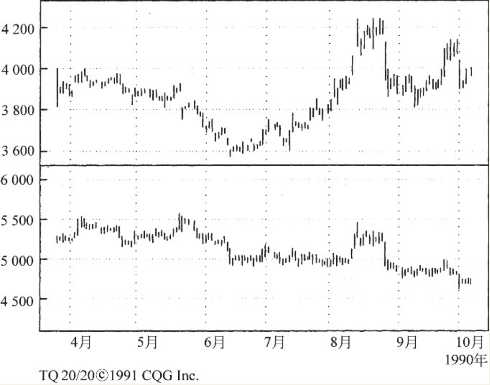

图8-8 日线图1

注：1990年12月黄金（上半部分）与1990年12月白银（下半部分）期货——相对强度的比较。稍加浏览便可以发现，黄金创了新的中期高价，而白银则没有。另外，白银在9月创了新低，而黄金则没有。所以，黄金的相对强度高于白银。

在商品中，你也可以把相对强度的概念运用在价差交易的头寸上，以谷类商品为例，你可以比较玉米与小麦的相对强度。迅速浏览图8-9的两份日线图，你就可以发现玉米的走势显然强于小麦，所以你应该做多玉米而卖空小麦。该决策可以由图8-10获得确认，它是玉米对小麦的价差日线图。

图8-9 日线图2

注：1990年12月玉米（上半部分）与1990年12月小麦（下半部分）期货——相对强度的比较。价格是以每蒲式耳0.1美分为单位（换言之，2400相当于每蒲式耳2.40美元）。稍加浏览便可以发现，玉米与小麦都处于下降趋势中，但玉米的表现优于小麦——它的相对强度较高。

### 动能指标（震荡指标）
在股票市场中，我采用两种震荡指标，分别以行情宽度与价格为参数。在商品市场中，我采用的震荡指标，则是以两种移动平均值的差值为参数。

在股票指数中，我运用的震荡指标（价格与市场宽度）自1975年1月采用以来便始终有效（见图8-12与图8-13）。我在商品市场中运用的震荡指标，其计算公式已经设定在我的报价系统中，我可以随时更改移动平均线的计算期间，以便就特定商品寻找最佳的适合（a good fit）期间（见图8-14）。

从图8-12～图8-14中可以发现，一个理想的震荡指标会在市场趋势开始变动的同时或之前开始反转。在大多数情况下，我采用的震荡指标都相当精确。一般来说，当市场处于上升趋势时，震荡指标也会随之上升。当震荡指标越高时，市场也越呈现出超买的情况。在理想的状况下，就如同图8-11的钟摆一样，当市场接近顶部时，震荡指标也会“迟缓下来”，换言之，它会趋于平坦而做头。然后，当价格开始反转时，震荡指标会向下，而且持续向下，直至市场接近超卖的情况，并出现类似于顶部的反转走势。

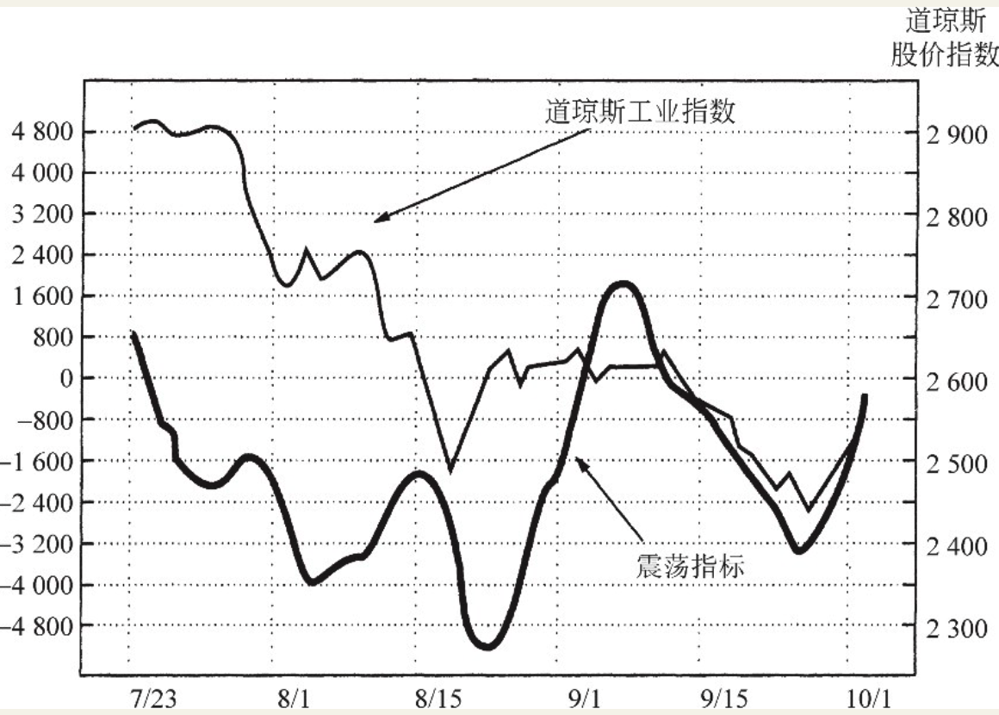

图8-12 价格震荡指标

注：1990年道琼斯工业指数以及我的长期价格震荡指标。自从1975年我采用它以来，这个长期价格震荡指标的表现便相当理想。请注意9月底的情况，震荡指标在价格之前便已经反转。

一般来说，震荡指标的数值越高或越低时，相对于先前出现的其他高点或低点而言，它们越重要。现在，让我阐述一下这些震荡指标的计算方法，以及如何运用它们。

在衡量股票行情宽度的动能时，最理想的指标可以称为`“10天约当期——净变动——移动平均线——行情宽度震荡指标”（10-day equivalent，net change，moving average，breadth oscillator）`。

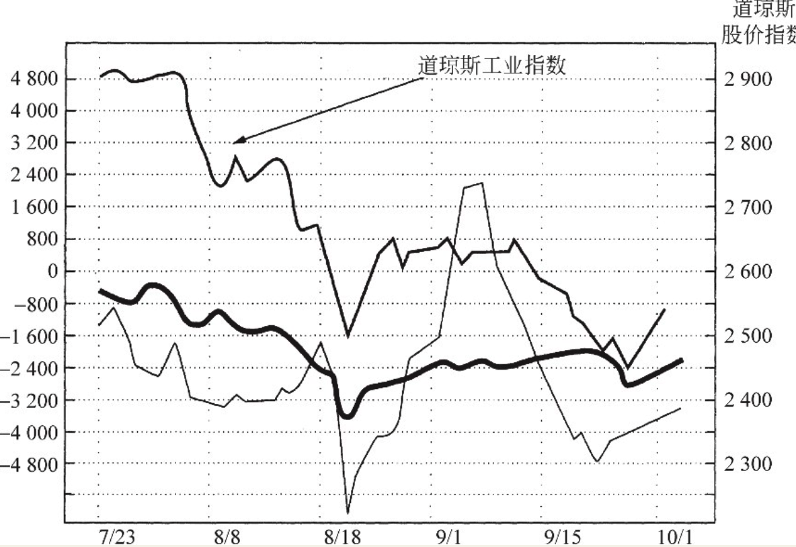

图8-13 行情宽度震荡指标

注：1990年道琼斯工业指数以及我的行情宽度震荡指标。较细的线代表短期指标，较粗的线代表长期指标。比较这两个震荡指标与图8-12的情况。

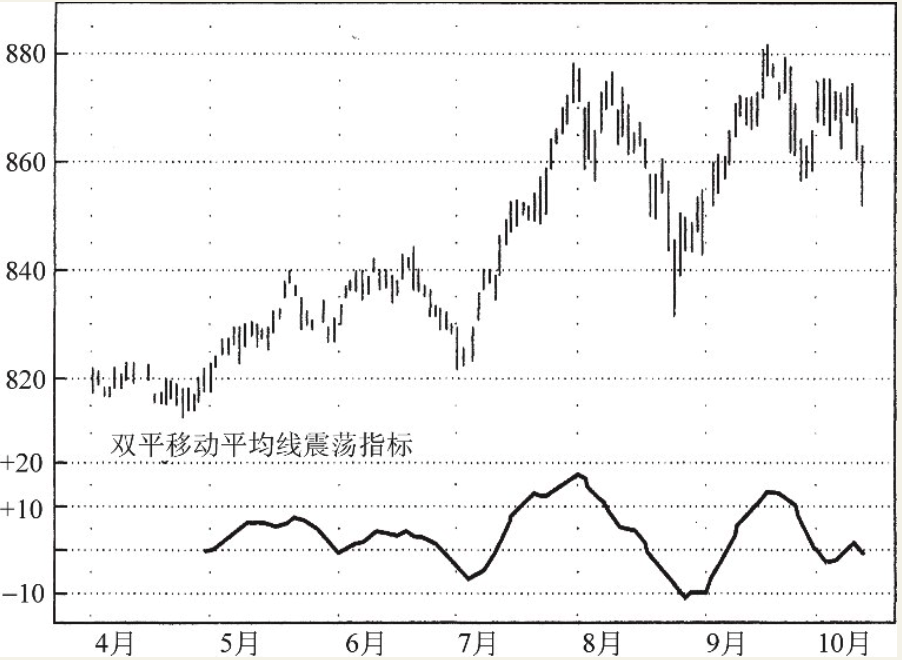

图8-14 日线图及震荡指标

注：活牛期货日线图以及超买／超卖震荡指标。图形下侧的震荡指标是以7天与21天移动平均值的差值为计算基准。这两个期间适用于活牛，却未必适用于其他商品。

`行情宽度指标`用来弥补加权股票指数在分析上的缺失。以道琼斯工业指数为例，它由30种股票加权而构成。在某些情况下，如果权数较大的股票出现较大的走势，市场指数将无法合理代表整体工业类股的表现。对照所谓的`腾落线（advance/decline line，代表行情的宽度）`，可以判断大盘指数是否代表整体市场的情况。

`腾落线（A/D线）`计算纽约证券交易所每天上涨家数与下跌家数的差值，并绘制成图。一般来说，腾落线与道琼斯指数会呈现相同方向的走势，一旦两者之间出现背离，通常是趋势即将变动的信号。

宽度震荡指标是衡量市场动能的方法之一，发出的信号通常早于价格趋势与腾落线本身。

我实际上采用两种宽度震荡指标，一是短期，二是长期，但通常较重视长期指标。就短期指标来说，每天早晨，我首先登录上涨与下跌家数的净值；我以纽约证券交易所近10天以来的资料为准，并计算、登录、绘制上涨与下跌家数之净值的移动总和。换言之，我每天都会计算前一天上涨与下跌家数的净值，然后加总近10天的数据。计算程序如表8-1所示。

表8-1　宽度震荡指标的数据

日期 | 今天的A/D(1) | 10天前的A/D(2) | 10天的总和(3) | 30天前的A/D(4) | 30天的总和(5) | 除以3(6)
---|-----------|-------------|-----------|-------------|-----------|-------
7月23日 | -1203 | 91 | -1556 | -552 | -2167 | -722
7月24日 | -2 | -440 | -1118 | 355 | -2524 | -841
7月25日 | 312 | 465 | -1271 | 458 | -2670 | -890
: |
10月1日 | 761 | -87 | -3517 | -1020 | -6826

    ①每天的上涨与下跌家数的净值——在纽约证券交易所的所有股票中，以上涨家数减去下跌家数。
    ②第10天以前的当天上涨与下跌家数的净值。
    ③最近10天A/D净值的移动总和。以昨天的10天移动总和，加上今天的A/D净值，再减去先前第10天的A/D净值。以7月24日为例：（-1556）+（-2）-（-440）＝-1118。
    ④第30天以前的当天上涨与下跌家数的净值。
    ⑤最近30天A/D净值的移动总和。
    ⑥将最近30天A/D净值的移动总和除以3，这便是10天的相当值的移动总和。

就长期指标来说，我取30天为期，并做相同的计算，但将计算结果除以3，以代表10天的相当值（见表8-1）。图8-13将上述结果描绘为图形。

随意浏览图8-13便可以发现，在转折的情况下，宽度震荡指标与道琼斯工业指数之间存在显著的相关性。然而，你还可以发现，如果你根据短期震荡指标交易，经常会“挨耳光”。另外，长期震荡指标的转折点上，经常会落后中期的价格趋势；所以，若仅根据它交易，也无法即时掌握机会。这便是为什么我仅以它们作为辅助性工具，但是，就整体上来说，自从我1975年开始采用这两个指标以来，它们与指数之间的相关性都很理想。

我采用的价格震荡指标稍微复杂一些，但在评估行情时，它的重要性也高于行情宽度震荡指标。我以纽约综合指数每天的收盘价为基准计算，每天早晨，我计算前一天与先前第5天的收盘价差值。然后，加总最近10天以来的上述差值，这便是10天移动总和。最后，再以昨天的10天移动总和，减去先前第10天的10天移动总和，这便是5天价差的10天净移动总和（请见表8-2）。将每天的计算结果描绘成图形，并与道琼斯工业指数比较（见图8-12）。我们可以发现，在转折的情况下，价格震荡指标与道琼斯工业指数之间存在显著的相关性。

表8-2　价格震荡指标的计算

日期(1) | 纽约综合指数5天净值(2) | 10天移动总和(3) | 10天净移动总和
------|---------------|------------|---------
7月23日 | -627 | 63397 | 886
7月24日 | -320 | 63077 | 300
7月25日 | -428 | 62649 | -482
7月26日 | 33 | 62682 | -859
8月3日 | -536 | 61866 | -1531
: 
10月1日 | 302 | 52238 | -2586

    ①以纽约综合指数为基准，以昨天的收盘减去先前第5天的收盘。
    ②前一栏的10天移动总和。
    ③最近10天的净移动总和。以8月3日为例，61866-63397=-1531。

我运用行情宽度与价格震荡指标，以预测与确认行情的转折点。浏览上述图形可以发现，当震荡指标的数值越偏高或越偏低时，中期价格趋势发生变动的可能性也越大。犹如铁路平交道上的红绿灯一样，当震荡指标接近或穿越先前的重要高点或低点时，这代表即将有危险的情况。它们不会告诉你，究竟会发生什么危险，或危险什么时候会出现，它们却会提醒你是否需要谨慎行驶或全速前进。

在商品方面，犹如先前所述，我的报价系统已经设定震荡指标的计算公式，它由两个移动平均值的差值构成。如果你也做类似的设定，你可以随时尝试改变移动平均线的期间，针对特定商品寻找最适当的移动平均线。

对商品交易而言，这种设定有其必要性，因为个别商品与股票指数不同，前者的“正常”价格行为经常发生变化。所以，商品市场震荡指标的可靠性远不如股票指数。

基本面分析者认为，长期来说股票价格取决于三个因素：`股息收益率`、`盈余能力`以及个别公司的`资产价值`。换言之，任何股票的价值都取决于这三个基本因素。我认为，这种主张存在一个问题，它完全忽略了价值的主观性质。唯有当股息收益率、盈余能力以及资产都必须直接反映在市场的集体判断中时，这样，基本面分析学派的主张才有效。事实上，情况并非如此。在基本面分析者中，经常发生一种现象：他们的判断虽然“正确”，但时效的把握却不准。

我认为，`市盈率`与`账面价值`都是非常有用的工具，但我的运用方式却截然不同。如果你观察整体市场的市盈率与账面价值，并以此比较过去的市盈率与账面价值，你可以发现一种理想的次要指标，其显示整体市场的超买与超卖情况。然后，你可以比较个股与大盘指数在市盈率与账面价值上的关系，并将这种关系视为次要的（或许应该称为更次要的）指标，以评估个股和大盘指数在超买与超卖上的相对表现。

### 盈余增长的变动率
基本面分析有一项非常理想的统计关系，它是盈余增长变动率与股票价格变动率之间的相关性。戈登·霍姆斯（Gordon Holmes）在1969年的著述中表示：“价格趋势的斜率，在时间上几乎都会领先对应或对等的盈余趋势斜率。时间的落差通常为3个月。”

我对这现象有三点评论：第一，它通常正确；第二，它经得起时间的考验；第三，它符合道氏理论的根本观点——市场会“反映所有事物”。

许多人根据企业盈余交易，在这种情况下，预估的每季度盈余报告可能会让你一败涂地，尤其是高市盈率的股票——它们经常出现暴跌的走势。务必要知道实际的盈余报告何时公布，如果股价已经接近高点，则在报告公布前应该出场。如果实际的数据不如预期的那样理想，则股价可能向下跳空，你累积的获利也将在一夜之间消失！

观察`股息收益率`与`市盈率`的目的是寻找高成长的潜力股。然而，事实上，盈余增长是最能够反映成长潜能的因素。就股息收益率来说，它是股息除以股价。偏高的股息收益率必然是因为股息偏高或（与）股价偏低。可是，股价何以偏低呢？因为其盈余不佳！

以花旗与旅行者为例，1990年7月，两者股价大约持续下跌6个月，股息收益率随之上升。虽然股价持续下跌，但公司方面却维持既定的股息。因为股价的下跌幅度大于盈余的衰退，所以市盈率下降。这两只股票的市盈率都很低，股息收益率则偏高。

如果不考虑盈余增长的范围，市盈率与股息收益率都是非常不可靠的数据。我经常喜欢把一种观念表达为一个简单的句子，“如果股价下跌，必然有下跌的理由！”你通常不可能在市场之前，发现价格低估的股票。

让我举一个例子，说明盈余增长为何是选择股票的一个关键因素。在纽约证券交易所挂牌交易的所有股票中，大约八成的公司会将盈余的30%～65%分派为股息。假定一家成立不久的公司，股票价格为10美元，每股盈余为1美元，分派的股息为0.5美元（占盈余50%，股息收益率为5%），盈余增长率为25%。市盈率为10倍，股息收益率为5%，这都是属于中等的数据，所以很难根据这两项资料判断这只股票是否适合买进。可是，25%的盈余增长率却代表非凡的意义！

根据25%的盈余增长率计算，该公司的盈余在2.9年后将增长1倍。假定你现在持有这只股票，而且股息分派的比率维持不变，则你的股息收益率在3年后便可增加大约1倍（约为9.8%，这是假定股价不变），再过3年之后又可以再增加1倍（约为19%）。如果盈余增长率保持不变，不到8年，你的股息收益便约等于你当初投资的金额，这尚不包括股票非常可能出现的升值。根据市盈率与股息收益率挑选股票，将完全忽略这方面的潜能。

### 基本面的其他考虑因素
在两只股票中选择时，假定它们在其他方面都非常类似，我会依赖一些基本面的其他考虑因素做最后的决策。

1. 对于两幅多头气势相同的走势图，我会选择低市盈率的股票。同理，对于两幅空头气势相同的走势图，我会卖空高市盈率的股票。格雷厄姆与多德的教诲还是有些分量的！
1. 在考虑买进的时候，我会选择信用扩张程度较低的公司，信用扩张程度越严重，越容易受到银根紧缩的影响。在卖空的情况下，我也会做类似的考虑。
1. 不论买进或卖空，都必须有足够的市场流动性。

## 繁荣与衰退——谁拿唧筒，谁拿刺针

