    作者: ［美］亚历山大·埃尔德( Alexander Elder)
    出版社: 机械工业出版社
    原作名: The New Trading for a Living: Psychology, Trading Tactics, Risk Management, and Record-Keeping
    译者: 熊振华
    出版年: 2017-8
    页数: 372
    定价: 75.00
    装帧: 平装
    ISBN: 9787111569725

[豆瓣链接](https://book.douban.com/subject/27093851/)

- [个体心理](#个体心理)
  - [为什么交易](#为什么交易)
  - [现实与幻觉](#现实与幻觉)
  - [自我毁灭](#自我毁灭)
  - [从匿名戒酒会中学到的经验](#从匿名戒酒会中学到的经验)
  - [匿名失败者](#匿名失败者)
  - [胜利者与失败者](#胜利者与失败者)
- [群体心理](#群体心理)
  - [交易情景](#交易情景)
  - [管理和预测](#管理和预测)
- [经典图表分析法](#经典图表分析法)
  - [图表](#图表)
  - [支撑位和阻力位](#支撑位和阻力位)
    - [记忆、痛苦和悔恨](#记忆痛苦和悔恨)
    - [支撑位和阻力位的强度](#支撑位和阻力位的强度)
    - [交易规则](#交易规则)
    - [真假突破](#真假突破)
  - [趋势与交易范围](#趋势与交易范围)
    - [大众心理](#大众心理)
    - [难解的右侧](#难解的右侧)
    - [方法和技术](#方法和技术)
    - [交易还是等待](#交易还是等待)
    - [相互冲突的时间周期](#相互冲突的时间周期)
  - [袋鼠尾](#袋鼠尾)
- [计算机化的技术分析](#计算机化的技术分析)
  - [计算机在交易中的运用](#计算机在交易中的运用)
    - [三组主要的技术指标](#三组主要的技术指标)
  - [移动平均](#移动平均)
    - [报警两次](#报警两次)
    - [市场心理](#市场心理)
    - [指数移动平均](#指数移动平均)
    - [交易规则](#交易规则-1)
    - [移动平均的拓展](#移动平均的拓展)
    - [价格、价值以及价值区间](#价格价值以及价值区间)
  - [指数平滑异同移动平均线：MACD线和MACD柱状线](#指数平滑异同移动平均线macd线和macd柱状线)
    - [如何画出MACD](#如何画出macd)
    - [市场心理](#市场心理-1)
    - [MACD的交易规则](#macd的交易规则)
    - [MACD柱状线](#macd柱状线)
    - [市场心理](#市场心理-2)
    - [交易规则](#交易规则-2)
    - [什么时候预期市场探出新高或新低](#什么时候预期市场探出新高或新低)
    - [MACD柱状线的拓展](#macd柱状线的拓展)
    - [背离](#背离)
    - [巴斯克维尔的猎犬](#巴斯克维尔的猎犬)
  - [趋向系统](#趋向系统)
    - [如何构建趋向系统](#如何构建趋向系统)
    - [群体行为](#群体行为)
    - [交易规则](#交易规则-3)
    - [平均真实波幅——来自波动率的帮助](#平均真实波幅来自波动率的帮助)
  - [震荡指标](#震荡指标)
    - [超买和超卖](#超买和超卖)
  - [随机指标](#随机指标)
    - [大众心理](#大众心理-1)
    - [交易规则](#交易规则-4)
    - [随机指标的拓展](#随机指标的拓展)
  - [相对强弱指标](#相对强弱指标)
    - [大众心理](#大众心理-2)
    - [交易规则](#交易规则-5)
- [成交量和时间](#成交量和时间)

# 个体心理
## 为什么交易
交易者有着自己独特的作息。将自己的资本置于风险之下后，他们放弃了按部就班的生活，离群索居，毅然跃入了未知的世界。

没有平静的心态，交易者往往会在市场中追求矛盾的想法。如果你不知道自己的目标在哪儿，你就会随波逐流到自己绝不希望的境地。

## 现实与幻觉
成功的交易者都是现实主义者。他清楚自己的能力和局限，他知道市场发生了什么，也有办法应付自如。他从不寻找捷径，而是认真分析市场和审视自己，然后做出切实可行的计划。因为一个专业的交易者难以承受幻想带来的损失。

灰心丧气的交易者可能会突然拿出自己的信用卡去购买某种“交易秘诀”。

失败者们不相信交易对智力的要求其实比较简单。

人们要么通过连续的损失，要么通过一次严重错误的交易输掉全部资本。失败者常常刚因交不齐保证金而被强行平仓，市场就开始反转了，并朝着他预期的方向发展。

这样的人认为市场反转只是来得太晚，而这些反转又让他们坚信自己的方法是正确的。于是他们又努力工作、赚钱、存钱，或者借足够钱重开一个小账户。然后历史重现：失败者出局，市场反转，再次证明他是“对”的，只是太晚了——他已经被强行平仓出局了。于是自然而然产生了这个幻觉：“如果我的钱再多点，我就能多挺一段时间然后赢钱。”

失败并非因为资金太少，而是因为认知还不成熟。

失败者的真正问题不在于资金多少，而在于过度交易和糟糕的资金管理。

许多人号称他们渴望自由和独立，但当他们处于压力之下时，他们却改变了自己的论调转而去寻找“强力的领导人”。处于苦恼中的交易者经常会向各式各样的“权威”去寻找帮助。

在金融市场中存在着三类权威：市场周期权威、神奇方法权威、已故权威。市场周期权威总是宣称市场将要反转。神奇方法权威总在提出新的致富方法。已故权威逃脱了批评并且赢得了人们的崇拜，只是因为他们已经离开了这个世界。

成功的交易者不能承受一厢情愿导致的损失，他必须是现实主义者。在市场中可没有标准答案用来作弊。你只能在交易日志和自有资金变动曲线中看到事实真相。

要战胜市场，我们必须记住交易的三大要素：**良好的心态、一套合逻辑的交易系统和有效的风险管理计划**。

## 自我毁灭
儿童时期的精神负担会阻碍你的成功。你必须意识到自己的缺点，然后努力改变。**坚持写交易日志——记录每次建仓和清仓的理由，寻找你成功和失败的重复模式**。

## 从匿名戒酒会中学到的经验
处于亏损状态中的交易者和酗酒者极为相似。亏损者不断改变着自己的交易策略，就好比那些酗酒者试图通过改喝啤酒戒掉烈酒的方式来解救自己一样，亏损者否认自己早已失去了对交易生活的控制。

盈利让交易者情绪高涨，充满力量。他们试图重复这种感觉，于是草率进场，结果却以回吐利润亏损告终。大多数交易者无法忍受严重损失带来的痛苦，他们在绝境时选择终结交易生涯，被清场出局。只有少数幸存者意识到他们的主要问题不在于方法，而在于思考方式。于是他们能够改变，并成为成功的交易者。

## 匿名失败者
成功的交易者对待资金回撤，就如同逢场作戏的饮酒者对待酒精，浅尝辄止。如果他们遭受连续损失，就会把这作为某些东西失效的信号：或许他们的系统并不能很好地适应现在的市场环境。是时候休整一下并且重新审视市场了。然而，失败者们却无法停止——他们依旧继续交易，因为他们已经沉溺于这个游戏带来的刺激感觉，仍然寄希望于大赚一笔。

一个杰出的交易顾问——他曾经被淘汰出局，这样写道，对他来说，交易带来的快感比性爱或坐飞机冲上云霄都要来得爽。就像酒鬼是从饭局饮酒逐步发展到痛饮无度，失败者也是一次次逐渐发展到冒更大的险。他们跨过了一条非常重要的警戒线——正常交易者与赌徒之间的区别线。许多失败者们甚至都不知道这条警戒线的存在。

就像酒鬼需要承认自己缺乏对酒精的控制力一样，交易者也需要在交易之初先承认无法控制亏损。

## 胜利者与失败者
每个试图成为成功交易者的人，都要面对无数的困难，需要一路披荆斩棘斩妖除魔。这里有一些准则，它们让我从一名肆无忌惮的业余交易者，成长为一名偶有获利的半专业交易者，最终进化为一名冷静的专业交易者。你可以根据自己的情况调整以下这个单子。

1. 坚定自己在市场中长期作战的意念——从现在开始至少交易20年。
2. 像海绵一般地学习，关注专家的观点，但对任何事情都要保持有益的怀疑态度。遇到有疑问的地方要刨根究底，而不是简单地接受专家的观点，或只理解他们字面上的意思。
3. 不贪婪，不急于交易——要把你的时间用于学习，市场一直在这里，未来无尽的岁月中会有更多更好的机会。
4. 培养分析市场的方法，换句话说，就是“如果A发生，那么B很可能会发生”。市场有很多维度，要使用多种解析方法来确认自己的交易决策。要学会用历史数据测试交易决策，随后在市场上真枪实弹地进行交易。市场瞬息万变，你需要的是根据牛市、熊市、震荡市等不同的特征采用不同的工具进行交易，同时还要有所区分（详情见技术分析章节）。
5. 建立一套资金管理计划。你的第一目标是必须长期生存下去，第二目标是资本的稳定增长，第三目标才是赚取高额利润。大多数交易者对第一目标和第三目标的重要性产生了混淆，将第三目标放在了第一位，更有甚者，都不知道第一目标和第二目标的存在（详情见第9章，风险管理）。
6. 要认识到交易者在任何交易系统中都是最为薄弱的一环。假如有条件的话，去匿名戒酒会学习一下如何避免损失，或者建立一套属于自己的方法来克制情绪化交易。
7. 胜利者在思考、感受与行动上的方式与失败者是完全不同的。你必须深探自己的内心，驱赶那些幻觉，改变你原来的思考、感受与行动的方式。这样的改变通常都不容易，但如果你想成为一名专业交易者，你必须专注于自我改善和培养自己的个性。

**为了成功，你需要动力、知识和自律**。

# 群体心理
## 交易情景
大多数机构交易者的阿喀琉斯之踵（唯一致命的弱点）就是它们必须交易，而个人交易者却可以自由选择交易行为。无论价格走势如何，银行都必须去活跃债券市场，谷物生产商也必须活跃粮食市场，但个人交易者可以静待良机。

大多数个人交易者因过度频繁的交易而浪费了这个极大的优势。想战胜机构交易者的个人必须培养自己的耐心，消除不必要的贪念。谨记，你的目标是交易获利，而不是频繁交易。

成功的交易机构雇员可以得到一部分提成和奖金。但就算奖金再高，相对于自己替公司赚的数百万美元红利来说都不算什么。他们经常闹着想辞职，想为自己交易，但鲜有人可以成功地完成这个转变。

大多数离开原有平台的交易者开始用自己的钱冒险时，他们便开始被困于恐惧、贪婪、兴奋或恐慌等负面情绪中，很少能成功地交易自己的账户——这证明了心态才是交易成败的关键。

## 管理和预测
成功的交易建立在三大支柱之上。你需要**分析多空力量的平衡**。你需要**实践资金管理**。你需要**严格服从你的交易计划**，避免在市场中过于兴奋或者沮丧。

# 经典图表分析法
经典的图表分析法又是相当主观的，会导致一厢情愿和自欺欺人。你可以画一条穿过极端价格的趋势线，或者经过密集区域的边缘从而改变趋势线的角度，也改变其传递的信息。如果你想买入股票，那么你可能会把趋势线画得更陡峭。如果你看空市场，并斜眼看一下图表，那么你会“发现”这是一个“头肩顶”。实际上这些模式没有一个是客观的。由于其主观性，我越来越怀疑那些传统图表分析法形态的作用，比如三角旗形、头肩顶等。

在看了成千上万的图表之后，**我发现市场根本不认同斜线，市场能够记住价位，这就是为什么水平支撑位和阻力位有意义，而斜线趋势却是主观的甚至是自欺欺人的**。

在我自己的交易过程中，我只用几个客观到足以让人信赖的图表模式。我关注基于水平的支撑区和阻力区、每日开盘价和收盘价的关系、蜡烛图高点和低点的关系，这些都是客观的。我认同“手指”或叫作“袋鼠尾”——一种冲出密集成交区的大柱形态。我们将在这一章中讨论这些以及其他一些图表的形态。

## 图表
记住一条关键原则：“每一个交易价格都是所有的市场参与者价值认同瞬间达成一致的表现。”基于此，每一个价格柱状线都提供了多头和空头激烈博弈的重要的信息。

滑点（见下文解释）在市场冷清的时候往往较小。在市场冷清的时候进场比较好。遇到很长的柱状线是兑现利润的好时机。而试图在市场拉升的时候建立头寸，就像跳上一辆正在行驶中的火车一样危险。安全起见还是等待下一波上涨为妙。

`滑点`是指成交价格与下指令时在屏幕上看到价格的差价。就像是在食品杂货店一个标价49美分的苹果，你买它却花了50美分。1美分可能没什么大不了的，但如果是买1000个苹果呢？或者说一个指令买1000股股票，每股有1美分损失，那将使每个指令损失10美元，这可能比你支付的佣金都高。有两种类型的指令：`限价指令`和`市价指令`。你的滑点取决于你的选择。
- `限价指令`是说——“以49美分的价格买入那个苹果”，它保证了价格，但不能保证成交。你不会付出超过49美分，但到最后你可能没有买到你想要的苹果。
- `市价指令`是说——“买入那个苹果”，它保证会成交，但不保证价格一定会是49美分。当你下指令时，如果苹果价格在上升，当你按下买入按钮时，你支付的价格会比你在屏幕上看到的价格要高。这时，你便遇到了一个滑点。

## 支撑位和阻力位
`支撑位`是这样一个价格位，在这个价格上多方的力量足够强，能够干扰甚至逆转下跌的趋势。当下跌的趋势到达支撑位时，价格就会反弹，就像潜水者触及水池底部然后远离它一样。在图表中，支撑位是一条连接两个或者多个底部的水平线（见图18-1）。

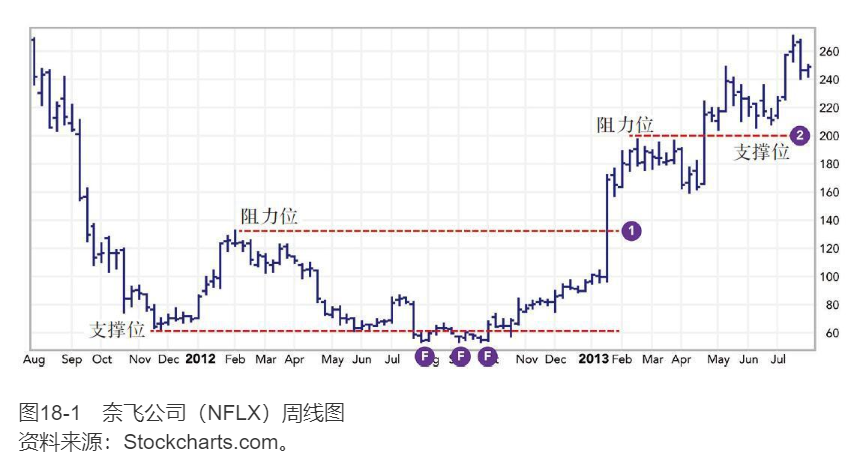

`阻力位`是这样一个价格位，在这个价格上，空方的力量足够强，能够干扰甚至逆转一个上涨的趋势。当上涨的趋势触及阻力位时，就像一个在爬树的人的头撞上了树枝一样，他得停下来，甚至可能摔下去。在图表上，阻力位是一条连接两个或者多个顶部的水平线。

在画支撑位线和阻力位线时，让其经过成交密集区的边缘，最好是众多柱状线主体的边缘，而非那些极限价格。交易密集区是大量交易者想法发生改变的位置，而极限价格仅仅是那些心理最脆弱的交易者恐慌的反映。

>支撑和阻力
>
>画水平线穿过密集区间的上边缘和下边缘。下边的线是支撑位，在这个位置买方将战胜卖方。上边的线是阻力位，在这里卖方的力量将压倒买方。支撑和阻力区域经常转换角色。图中，一次坚定的向上突破冲过区域1后，到达了另一个阻力位区域2。但一旦价格突破了区域2这个阻力位，这个价位就变成了支撑位。每次价格触及这些界线又弹开，这些界线的力量会得到加强。
>
>要警惕支撑和阻力位附近的假突破。在图中以字母“F”标识。业余者通常会跟随假突破方向，而专业者通常使其原形毕露（反方向交易）。在图18-1右边界，奈飞公司股价从原是阻力位，现在是支撑位的地方进一步上涨。

从图18-2中我们可以看出，近年来在黄金市场上出现了类似的情况。行情四度冲击1000美元/盎司水平，但每次突破都失败了。在第五次上涨时，黄金价格终于突破这一水平，而1000美元/盎司的价格位就变成了重要的支撑位。

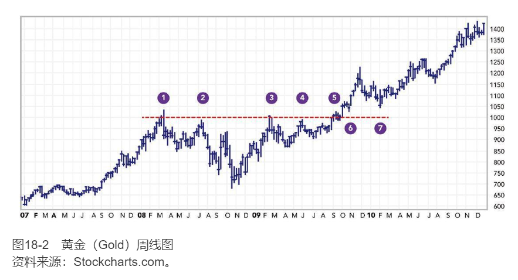

>阻力位变成支撑位
>
>黄金冲击上方的1000美元/盎司附近的阻力位多达五次。通常，在第一、二和三次冲击都会反转。当市场冲击一个价位达到四次，说明市场真的想突破那个水平。黄金在第五次冲击后，突破到了1000美元/盎司水平之上。
>
>后来，黄金两次试图拉回到这个阻力线之下，如图中6和7标记的区域。未能跌到这个水平之下，说明做空的力量已十分微弱，标志着黄金大的牛市即将启动。

### 记忆、痛苦和悔恨
支撑位和阻力位之所以能够存在是因为大量交易者感到了痛苦和悔恨。在买卖中赔了钱的交易者会感到非常痛苦。失败者们下定决心只要一有机会就尽快出场。而那些错过了买卖机会的交易者会感到后悔，因此也等着市场再给他们一次机会。

当市场在横盘整理时，交易者们习惯在这个接近价格波动区间低位时买进，在接近波动区间高位时卖出甚至做空。当上升趋势开始时，卖掉股票的空方会感到巨大的痛苦，与此同时多方又会因为自己买得太少而感到极度悔恨。双方都下定决心，一旦价格回落到这个突破点，给了他们第二次机会时，要大量买入，平掉空仓或建立多仓。空方的痛苦和多方的悔恨会让他们有买入的渴望，从而形成了上升趋势中的支撑位。

当价格跌破一个区间时，之前买进的多方就会感到痛苦。他们感觉被困住了，想等待价格回升，回本之后马上卖出股票。空方则相反，后悔自己卖出的太少。他们等待市场回升，有第二次做空的机会。多方的痛苦和空方的后悔就会形成阻力位——那是市场下降趋势中的天花板。支撑位和阻力位的强度取决于大量交易者感受的强度。

### 支撑位和阻力位的强度
价格在密集交易区波动越久，空方和多方投入的感情成本就越大。当多次趋势触及同一反复震荡区时，这一区域就成了一个布满弹坑的战场：防御者有大量的防御能够减弱任何攻势。当价格从上方跌落到这一区域时，它就变成了支撑位，当价格从下方上涨到这一价位时，它又扮演了阻力位的角色。密集成交区可以在这两种角色之间转换，成为支撑位或者阻力位。

这些区域的力量取决于三个因素：区域的长度、高度，以及在区域内的成交量。你可以将这些因素作为交易区的长、宽、深进行可视化处理。

阻力区或者支撑区持续时间越长——它持续的时间越长或者期间被冲击的次数越多——阻力或者支撑力度就越强。支撑位和阻力位就像好酒一样，时间越久越好。持续两周的反复震荡区只会产生一个微小的阻力位或者支撑位；持续两个月的阻力位或者支撑位会让人们习惯这个价位，并且产生一个中等强度的支撑位或者阻力位；而一个持续两年的反复震荡区则会让人接受该价位是股票的真实价值，从而成为重要的阻力位或者支撑位。

支撑和阻力区域越高，它的力量就越强。高大的密集成交区就像保护财产的高墙大院一样。如果一个密集成交区的高度仅有现在市场总价值的1%，那就只能提供一个弱小的支撑位和阻力位；如果有3%那么高，就会形成一个中等强度的支撑位或者阻力位；如果是7%或者更高，那么这个密集成交区能碾碎一个大的趋势。

支撑区和阻力区的成交量越大，其力量越强。大成交量表示了交易者参与程度活跃——这是高的感情投入的信号。低成交量意味着交易者对在这个价位交易的兴趣不大，标志着支撑或阻力较弱。

如果用股票在密集交易区的天数乘以成交的平均价格和平均成交量，你就可以测算出支撑力量或阻力的总金额。

### 交易规则
1. 无论何时，当大盘走势逼近支撑位或者阻力位时，设定好你的保护性止损位。
   1. 保护性止损是这样一种指令：当你有多仓时，在现在市场价格之下设定止损价格，一旦触及将卖出你的股票；而当你有空仓时，在市场价格之上设定止损价格，一旦触及将平掉你的空头头寸。保护性止损单能使你在趋势反转的时候不至于损失过大。
   2. 趋势在阻力位和支撑位的表现显示了其健康程度。如果走势足够强，能突破阻力区或支撑区，你的保护性止损单将不会被触发。如果走势在阻力区或支撑区开始反转，说明趋势较弱。在这种情况下你的保护性止损单就会保住你的一大笔利润。
2. 阻力位和支撑位对于长期图表比对短期图表分析更重要。好的交易者会用不同的时间周期图表来监控市场，但会在长期图表分析中花更多的精力。周线图比日线图更重要。如果周线图的趋势很强势，那么日线图触及阻力位也并不用太担心。当周趋势线逼近阻力位或者支撑位时，你就应该考虑退出了。
3. 支撑位和阻力位意味着交易的机会。
   1. 密集交易区的底部意味着支撑线的底部。当价格下降到这一价位时，要敏锐地留意买入机会。技术分析中最重要的模式之一是“假突破”，如果价格微降至支撑位一下，然后又重回支撑区域，这意味着空方已经失去他们的机会。当出现向下假突破后，线柱的收盘价收回在密集成交区之内时，标志着这是买入的机会。你应该在近期假突破点底部附近设置一个保护性止损单。
   2. 类似地，真正的向上趋势突破之后不会重新跌落入之前的密集交易区，就像火箭不应该在发射之后又落回发射台一样。当价格的蜡烛图又重回密集交易区时，向上的假突破发出了卖出的信号。你在做空时，在向上假突破的顶部附近设置一个保护性止损单（见图18-3）。

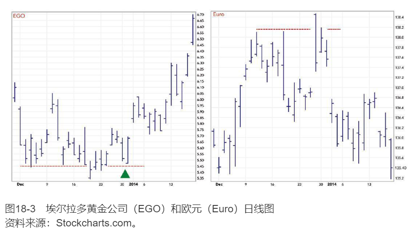

>假突破
>
>图18-3左边为埃尔拉多黄金公司（EGO）的图表，显示的是2013年12月，黄金空头最后一次试图将黄金价格进一步推低的向下假突破。开盘价突然开在支撑位之下，与前一日收盘价产生一个跳空缺口。从这里，市场开始反弹。注意一周之后，市场再一次回撤到支撑线（图中绿色箭头所示）。这样的回撤并不常见，但一旦出现，这是在一轮新趋势中跳上车的绝佳机会。
>
>图18-3右边为欧元（此处以欧元为代表）的图表，显示的是上升趋势在向上假突破中达到极点。股价向上跳空高开在阻力线之上，引发了止损单，抖落了较弱的空头，而这正是向下趋势开始的时候。从此再没有第二次拉升的机会了。

**如何设置保护性止损单**：有经验的交易者总会避免在整数价格处设置保护性止损单。如果我以52美元买入一只股票，想把我的保护性止损单设置在51美元，那么我会把保护性止损单设得低于51美元几美分。如果我在一次日间交易中，在33.7美元的价位做多一只股票，并且想把保护性止损单设在33.5美元附近，我会把价格设置得比33.5美元低几美分。人们习惯使用整数，在这些整数价位会积累很多订单。我更喜欢让自己的订单远离这些订单的密集区。

### 真假突破
从密集交易区形成的突破大多是假突破。在价格上升还没有落回正常密集交易区时，大量的业余交易者会跟进买入。假突破会让业余交易者造成损失，但专业交易者却热爱它们。

专业人士希望价格在大多数时间内是波动的，只要不是太剧烈就行。他们会等到停止向上突破并创新高或者停止向下跌破并创新低后，猛然扑进——终结突破（逆势买卖）并且在最近的极限价附近设置保护性质的止损单，并且往往止损价位与现价隔得很近，因此他们的资金风险很小，但是在价格返回密集交易区时潜在利润巨大，风险收益比是如此诱人，以至于专业交易者即使在一半的时间内判断错误也要抢先出手。

## 趋势与交易范围
`趋势`指价格持续上涨或者下跌一段时间。在一个完美的上升趋势中，每一次上涨的高位都会突破之前的高位，而每一次下跌都会高于之前下跌的低位。而在完美的下跌趋势中，每一次下跌都会击穿上一次的低位，而每一次反弹又无法高于上一次反弹的最高点。在震荡区间内，每一次上涨都会抵达之前的高点，而每一轮下跌也回到以前的低位。

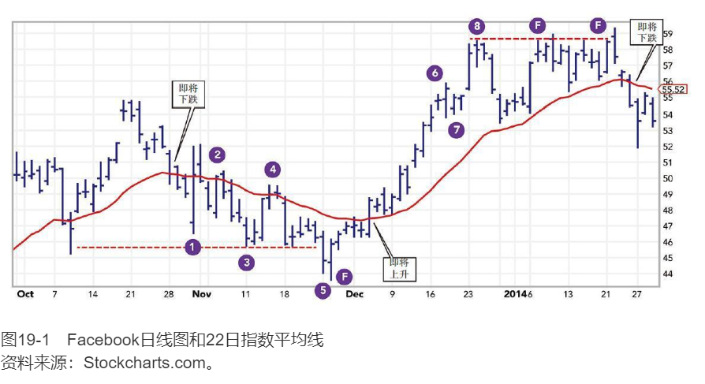

>趋势和交易区间
>
>上升趋势是底部和顶部都逐步抬高，下降趋势则是底部和顶部都逐级下降。在Facebook公司图表中间，你能看到由三个低点（第1、3、5点标示）和两个高点（第2、4点标示）组成的下降趋势。注意22日指数平均线的下降趋势（我们将在第22节讨论）确认了价格的下降趋势。它的翻转是向上反转的信号，在价格高点第6、8点得到确认。
>
>我们在前面的章节看到了假突破，这里你能再次看到它们的运动。当价格穿过了支撑或阻力线，在线外待一两天后又返回线内，标志着突破的失败，此后价格往往向反向运动，这即是假突破。在这里，向下假突破之后跟着出现了移动平均线反转向上，出现了很强的买入信号。
>
>到最高位第8点之后，我们看到了相反的模式。这里出现了两次向上的假突破。在第二次假突破之后，移动平均线反转向下，出现了卖出信号。在图表的右边缘，价格重新拉到出现下降趋势的移动平均线之上，这样的形态往往是做空的好机会。

趋势和震荡行情需要不同的交易技巧。当你在上升的趋势中做多或者在下降的趋势中做空时，你会因为对趋势的怀疑而损失一部分利润，此外你还得灵活运用宽松的保护性止损单，以免被迫出局。另外在震荡行情中，你必须运用收紧保护性止损单，时刻警惕着，一旦发生行情反转的微弱迹象，立即抛售手中的仓位。

趋势和交易范围中另一个交易技巧的区别在于如何看待强势和弱势。在趋势之中你得跟着强势的一方走——在上升趋势中看多，在下降趋势中看空。当你处在交易范围中，你就得做反向操作——买入弱势的一方，卖出强势的一方。

### 大众心理
当趋势向上时，多方比空方更急切，他们的买单推高了价格。此时若空方成功将价格打压下来，多方又会重回市场，价格止跌回升。但如果空方远比多方激进，下降的趋势就会形成，空方会把价格持续压低，不论何时多方聚集力量让价格止跌回升，空方都大肆卖出股票，止住反弹并将价格推向新低。

当多空双方势均力敌时，价格就进入了震荡区间，如果多方推高价格，空方就卖出股票把价格打下来，一旦价格下跌，投机者冲入市场开始买进，然后当空方轧平头寸，他们的买入又将助推上涨。这样的循环会持续很长一段时间。

大众在大部分时间内都在漫无目的地乱转，这也就是为什么市场的大部分时间都处在震荡区间而不是趋势中。大众必须被煽动起来才能创造出一种趋势。但是大众不会兴奋太久，他们很快就会回到漫无目的的状态。专业者信念不坚定时倾向于相信市场处于震荡区间。

### 难解的右侧
趋势和震荡在图表的中部很容易认出来，但是当你接近图表的右侧时，情况就越来越模糊了。

当趋势变得完全清晰起来时，趋势中一大部分赚钱的好时光已经过去了，当市场趋势消解变为震荡时，没人会为你拉响警报铃。

许多人在处理不确定性时都会感到不舒服。当趋势未如他们所料时，他们就会死死抱住赔钱的仓位，等待市场的反转让他们回本。试图保持正确所需要的代价是不可承受的。专业交易者会很快从失败的交易中撤出。当市场和你的判断相反时，你应该毫不犹豫立刻止损。

### 方法和技术
你要牢记没有任何一种简单的魔法能够清晰明确地辨认出所有的趋势和震荡区域，你得将几种分析工具联合起来使用。没有方法是完美的，但是假如他们可以相互印证，传递出正确信息的概率上升。当他们彼此矛盾时，你最好还是别进行交易了。
1. 分析高点和低点的模式。当价格回升总是能达到更高的高位，而下跌总能停止在更高的低位，那就是一个上升的趋势。而更低的高位和更低的低位则意味着一个下降的趋势。而不规则的高点和低点则意味着震荡区域（见图19-1）。
2. 画一条20~30日的指数移动平均线（见第22节）。斜率的方向就显示出了趋势。如果移动平均曲线没有在月内达到一个新高或者新低，那么市场就可能处于震荡区间内。
3. 当摆动指标，比如MACD柱状线（指数平滑异同移动平均线）（见第23节）创下新高，那就预示着一个强力的趋势，表明市场上最近一次顶部要被试探或者被超过。
4. 几种市场指标，比如趋向系统（directional system，见第24节），也能帮助你判断市场趋势。趋向系统在捕捉新趋势的早期阶段尤为灵敏（见图19-2）。

>趋势的识别
>
>任何趋势确认的唯一标识是其高点和低点的模式。例如图19-2的联合太平洋公司日线图，一旦突破了震荡区间，其高点（绿色水平线标示）逐步抬高，同样的，其低点（红色水平线标示）底部也在抬高。试图画趋势线是很主观的，因为联合太平洋公司的低点不在一条直线上。
>
>`22日指数平均线（EMA）`是一条叠加在价格线上的红色线，此时平稳的抬升确认了上升趋势。注意这里，当价格快速下降到移动均线时，出现了一次极佳的买入机会（我们在第22节将讲到这种模式）。
>
>`趋向系统`（详见第24节）发出新趋势开始的信号的模式是，当`平均趋向指标（ADX）`跌落到20以下后又反弹到这个水平之上，向上穿透下趋向系统（以垂直绿色箭头标示）。`MACD柱状线`（详见第23节）能识别非常强有力的趋势，当其上涨达到数月内的最高值（以绿色斜箭头标示），在图19-2的右边缘趋势是向上的，而价格略低于其前期高点。价格跌到EMA时很可能又是一次新的买入机会。

### 交易还是等待
当你已经认出一个上升趋势时，你要决定是立刻买进还是先等待一个回调。如果你快速买进，你就能跟上大盘，但是这样做不利的一面是，你的保护止损价位可能设置得很远，这就增加了你的风险。

如果你等到了一次回调再入场，你的风险可能变小，但是你的对面将出现四组竞争者：想要加仓的多方，试图打平离场的空方，还没入场的交易者（比如你自己）和那些卖得太早、现在急切地想买回来的人。回调的等候区域是相当拥挤的。而且，一个深度回调可能预示着趋势开始反转而非买入的机会。同样的理由也适用于下跌趋势中的卖空情形。

如果市场正处在震荡区间而你正在等待着突破，你得决定是在预期会突破时买入，还是在正突破的期间买入，又或者是在突破后的回调当中买入。如果你不确定，你可以分以下几个步骤买入：在突破迹象出现的时候买入三分之一，突破的时候再买入三分之一，回调时再买入三分之一。

无论你使用什么方法，一定要记住关键的风险控制的法则：你买入价格与保护性止损单的差距与你买入量的乘积不能超过你账户股票总价值的2%（见第50节）。无论一笔交易多么有吸引力，如果其风险超过你交易资产总价值的2%，那么你就应该放过这笔交易。

在处于震荡区间时，找准买入点尤其重要。你必须非常敏锐细心，因为利润空间是很有限的。而处于趋势中时，市场会原谅你草率的买入决定的，只要你买对方向。老交易者们总会开玩笑说：“别把智慧和牛市弄混了。”

在趋势中和震荡区间中所需要的风险管理技巧是不同的。在趋势中进行交易时，在宽松的保护性止损单上保持较小的头寸能帮你赚钱，你在控制好风险的同时也不太可能被反向波动震荡而出局。在震荡区间时，你得设置十分谨慎的止损策略，同时持有较大的头寸规模。

### 相互冲突的时间周期
市场同时在几种不同的时间周期下运行（见第32节）。它们一起运动，有时候在10分钟线、小时线、周线和月线的趋势上朝相反的方向运动。市场可能在一种时间周期里显示买入而在另一个时间周期里显示卖出。甚至同一只股票的技术指标在不同的时间周期里相互对立，那么你到底应当遵循哪个呢？

同一个市场在不同时间周期下的指标冲突是市场图表分析中的困惑之一。日线图上看似形成了趋势，可能却只是平缓周线图上的一个波动。而在日线图中的相对平缓的震荡区域却可能在小时线上显示出大量的向上或者向下的趋势，如此反复。

明智的做法是这样的：在用你最喜欢的图表检验趋势前，先将图表上的时间周期提高一个尺度以验证趋势。从更高视角进行研究是三重交易系统的关键原则。

**当专业交易者对市场产生怀疑时，他们会以长期视角来看市场，而业余的交易者往往关注短期图表**。研究时视野放得越长效果越好——而且越轻松。

## 袋鼠尾
`袋鼠尾`由单根长线柱及分布其两边的普通线柱组成。长线柱从紧密交织的震荡区间中突破出来。向上指的袋鼠尾尖端是要在此时市场顶部卖出的信号，而向下指的袋鼠尾尖则是要在市场触底时买入的信号（见图20-1）。

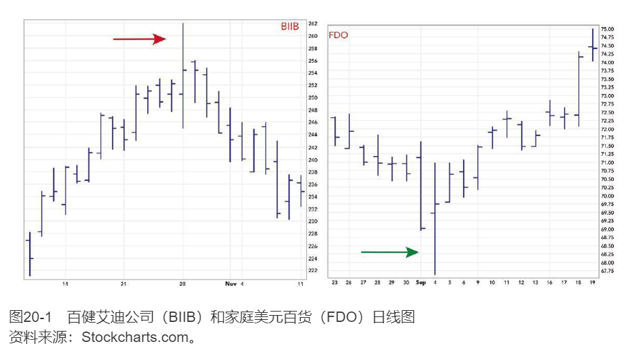

>袋鼠尾
>
>百健艾迪公司（BIIB）股价在出现向上翘的袋鼠尾之时，还处于稳定的上升趋势中。当日开盘价略低于前收盘价但走出了一根很高的线柱，是平时正常高度的三倍。当股价达到创纪录高位后开始回落，收盘在接近开盘的位置。第二天线柱高度是正常的高度——这样袋鼠尾的形态就完成了，趋势也反转了。
>
>家庭美元百货（FDO）股价在下跌途中，突然加速下跌，出现了一根头朝下，且高度数倍于正常水平的线柱。注意当日开盘价和收盘价都在前一日的交易范围内。这根向下刺的线柱标志着下行趋势的结束；接着的一根线柱恢复到正常的高度。接下来趋势转而向上。

图20-1中显示的是日线图中的袋鼠尾，你可以在所有的时间周期内找出袋鼠尾。时间周期越长，其信号就越有用：周线图里的袋鼠尾比五分钟线里的更有用。

袋鼠尾，也称“手指线”，是少数几种我认为可信的图表信号。

市场总是在波动，寻找产生最大成交量的价位。如果价格上涨却没伴随着足够的成交量，市场很快就会反转，在更低的价格上寻找更多的交易。如果成交量在下降过程中萎缩，价格就会上涨，在更高的价位上寻找成交量。

袋鼠尾反映了这种失败的突破。
- 朝上的袋鼠尾反映了多方推高价格的努力失败。他们就像一队士兵，想要从敌人手里夺取一座山头，结果发现主力没有跟上来。所以他们就逃到半山腰以求保命了。而一旦丢失了山头，军队就会撤退到别处。
- 朝下的袋鼠尾反映了一次失败的空方突袭。空方激进地做空，打压价格——但是低价并没有吸引足够多的成交量，于是只能撤回震荡区间。在继续下跌的尝试失败之后，你觉得市场下一步会往哪儿走呢？既然低价位附近没有什么成交量，那么就上升回调吧。

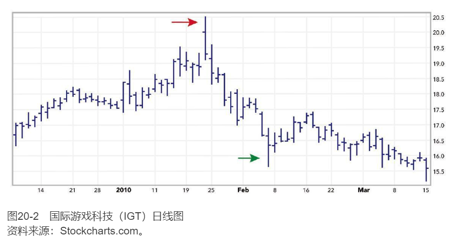

>袋鼠尾交易方式
>
>袋鼠尾标志着牛市或熊市最后的一击。图中袋鼠尾（以红色箭头标示）是国际游戏科技（IGT）上升趋势结束的标志。注意该线柱的高度是超过正常水平的两倍，并且被两条短线柱包围。如果在第三条线柱是进行做空交易，将止损位设置在尾巴的约一半位置即可。将止损位设置在尾巴的顶部意味着承受了过多的风险。
>
>留意向下的袋鼠尾（图中标示为绿色箭头），是向下趋势的结束，并且预示着长达一周的反弹。

一个有经验的交易者能在第三条蜡烛线结束前辨认出袋鼠尾。比如说从日线图来看，可能你会发现价格已经波动了几天，但是在下周一，股票爆发出一根很长的阳线。如果周二股票开在周一线柱的底部位置，并且没有上涨，那你就应该考虑在周二收盘之前做空股票。如果市场已经在震荡区间内持续了一周并在周三的时候收出了一根长阴线，那你就要在周四做好准备：如果交易价格在周三线柱的顶部附近小幅震荡，那就在周四收盘前大胆买入。

记住逆袋鼠尾方向操作是一种短期策略。在日线图中，这些信号往往几天之后就会消失。你要在当前的市场背景下正确评估袋鼠尾。比如当你长期看多一只股票时，一定要警惕袋鼠尾。向上的袋鼠尾意味着应该在当前的价位上兑现盈利，而向下的袋鼠尾则是一个加仓的好机会。

在市场中使用保护性止损单来防止损失和取得盈利是非常重要的。在袋鼠尾的末端设置保护性止损单会让保护性止损单太宽，承担过多风险。当你逆袋鼠尾方向交易时，将你的保护性止损单设置在袋鼠尾的中间价位。如果市场开始逼近这个价位，你就该离场了。

# 计算机化的技术分析
## 计算机在交易中的运用
### 三组主要的技术指标
`趋势跟随指标`包括移动平均值、MACD线（moving average convergence-divergence，指数平滑异同移动平均线）、趋向系统、能量潮（on-balance volume）以及收集派发指标等。趋势跟随指标属于同步或者滞后指标，它们在趋势反转之后才反转。

`震荡指标`有助于识别反转点。它们包括MACD柱状线（MACD-histogram）、强力指数指标、随机指标、变化率、动能指标、相对力量指标、埃尔德射线指标（Elder-ray）、威廉百分比（Williams%R）以及其他指标。震荡指标是先行指标或者同步指标，常常比K线先反转。

`复合型指标`能够提供多空双方强度的信息。们包括新高-新低指标、看跌/认购期权比（put/call ratio）、好友指数（bullish consensus）、交易者指数以及其他指数。它们可以是先行或者同步指标。

## 移动平均
有3种主要的移动平均方法：`简单移动平均（以下简称MA）`、`指数移动平均`和`加权移动平均`。

$MA=\frac{P1+P2+...+Pn}{N}$

- P为价格
- N为MA天数

简单移动平均有一个致命的缺陷——每一个价格都会使得移动平均值变动两次。

### 报警两次
首先，当一个新的价格包含进来时，简单移动平均价格会发生变动。这很好——我们想要我们的移动平均值反映最新的价格。但坏事情是我们去掉过去的一个价格时，移动平均值会再次变动。当一个高的价格去掉时，简单移动平均值就会变小。当一个低价格被去掉时，这个价格又会上升。而这些变化和现在市场的变动的真实情况毫无关系。

简单移动平均值就像一个会叫两次的看门狗——当有人接近房子的时候叫一次，当有人离开的时候再叫一次。几次之后，你就不知道什么时候该相信那只狗了。这就是为什么现代计算机化的交易者更青睐指数移动平均值。

### 市场心理
移动平均值中最重要的信息就是其斜率的方向。当斜率上升时，表示大众正在变得乐观——倾向于看多。它的斜率下降意味着大众开始变得悲观——倾向于看空。当价格升至移动平均值之上时，大众比之前乐观；当价格降至移动平均值之下时，大众比之前更悲观。

### 指数移动平均
`指数移动平均（以下简称EMA）`是一种更好的趋势跟随指标，因为它为最近的价格分配了更大的权重而且对价格的反应也比简单的移动平均更灵敏。同时，EMA也不会因为去掉旧的数据而发生突变。

$EMA=P_{tod} \times K + EMA_{yest} \times (1-K)$

- $P_{tod}$为当日收盘价
- $EMA_{yest}$为前一日指数移动平均值
- $K=\frac{2}{N+1}$
- N为EMA的天数

相比简单MA，EMA有两个主要的优势。首先它为最近的交易价格分配了更大的权重。大众最近的情绪更加重要。在一个10日的EMA中，最新一个收盘价占EMA值比重的18%，但是在简单的MA中所有的天数所占比重都一样。其次，EMA并不像MA一样简单地去掉旧的数据。旧数据是逐渐消失的，就像组合摄影中前期的照片一张张慢慢隐去的感觉。

### 交易规则
移动平均帮助我们顺着趋势进行交易。移动平均中最重要的信息是其斜率的方向（见图22-1）。它反映了市场的惯性。当EMA上涨时，最好是买入。当斜率下降时，卖空则会给你带来利润。
1. 当EMA上涨时，作为多头进行市场交易。当价格下降到移动平均值附近时买入。一旦你成为多头，一定要在最近的低点下面设置保护性止损单。一旦价格接近高点时，就把保护性止损单移至盈亏平衡点。
2. 当EMA下跌时，作为空头进行市场交易，当价格回升接近移动平均值时卖出，然后在最近的高点之上设置保护性止损单，当价格下跌时，将保护性止损单下移到盈亏平衡价位。
3. 当EMA走平，只是小幅波动时，那意味着一种漫无目的、没有趋势的市场。这种情况下不要使用趋势跟随方法。

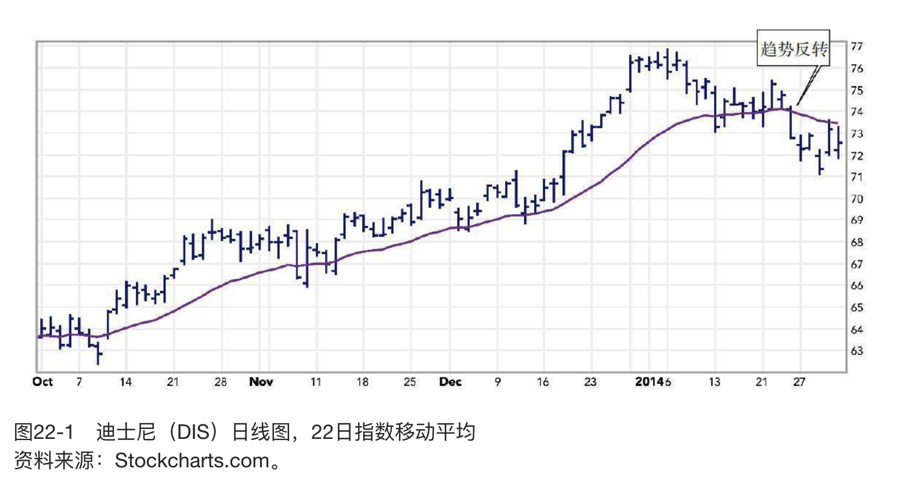

### 移动平均的拓展
移动平均也能用来作为支撑位和阻力位。上升的MA可以作为价格的地板，而下降的MA可以作为价格的天花板。所以上升时，要在MA附近买入；下降时，要在MA附近卖出。

移动平均除了用于价格上，还可以用到其他指标上。比如，有些交易者喜欢用5日移动平均成交量。当成交量低于其5日平均成交量时，意味着人们对这只股票当前趋势的兴趣在减弱，也就是说其趋势可能会反转。

### 价格、价值以及价值区间
技术分析师可以通过跟踪短期EMA和长期EMA之间的差价来定义价值。其中短期EMA反映短期的市场价值变动，另一个长期EMA反映长期的市场价值变动。价值就存在于两条移动平均曲线之间（见图22-2）。

>指数移动平均线（EMAs）和价值区间
>
>短期移动平均（MA）是短期内对于价值的一致认同，长期移动平均反映的是长期对于价值的一致认同。价值“存在于”两条移动平均线之间的区域。选择特定的参数，使长期指数移动平均线近似为短期线的两倍。观察图表，你能立刻判断出哪一条EMA是长哪一条是短——快的一条线对价格线的缠绕更紧密，而慢的线移动更缓慢。慢的EMA线能帮助识别趋势，而快线能确定价值区间的边界。
>
>若准备买入一只股票，当其在价值区间时买入是比较有利的，而不是在价值区域之上多花钱去买。类似地，若是做空，待其反弹进入价值区域时再建立空头头寸，而不是在价格崩溃时卖空。
>
>在图中上升区域之中时，你能看到有回落到价值区域，在标识为1、2、3和4点的区域附近有诱人的买入机会。慢EMA反转向下标志着上升趋势的结束。在图22-2右边缘，趋势是向下的，此时拉升到价值区域（5点的区域）是做空的好时机。

## 指数平滑异同移动平均线：MACD线和MACD柱状线
杰拉德·阿佩尔（Gerald Appel）是一位纽约的分析师和基金经理，他发明了一种更高级的指标——`指数平滑异同移动平均线（moving average convergence-divergence，MACD）`。

### 如何画出MACD
最初的MACD指标由两条线组成：一条实线（叫作MACD线）和一条虚线（叫作信号线）。MACD线由两个指数移动平均（EMA）计算而来，其对价格的反应相对较快。信号线是以MACD线为基础，通过对MACD线以EMA的方式进行运算，实现对MACD线的平滑，其对价格变动的反应相对较慢。在阿佩尔最初的体系中，较快的MACD线穿过较慢的信号线上升或者下降，为买入或者卖出的信号。

大多数技术分析软件都提供MACD指标。手工做出MACD指标的步骤如下：

1. 计算12日收盘价的EMA；
2. 计算26日收盘价的EMA；
3. 用12日收盘价的EMA减去26日收盘价的EMA，将其差值画成一条实线，这就是较快的MACD线；
4. 计算这条实线的9日EMA，将其结果画成一条虚线，这就是较慢的信号线。
市

### 市场心理
较长的移动平均反映的是较长时间周期内市场价值共识的平均水平，而较短的移动平均则反映了较短时间周期内市场价值共识的平均水平。

MACD线和信号线的交点表明了市场中空方和多方实力变换的平衡点。较快的MACD线反映的是短期内大众的心理变化，而较慢的信号线则反映了大众心理在较长期的变化。当较快的MACD线上升超过信号线时，表示多方主导了市场，这时候最好做多方；当较快的线落到较慢的信号线下面时，表示空方主导了市场，做空方比较有利。

### MACD的交易规则
MACD线和信号线的交叉意味着市场趋势发生了变化。顺势的方向是沿着交点的方向进行交易。这个方法产生的假突破比基于简单移动平均的方法产生假突破要少很多。

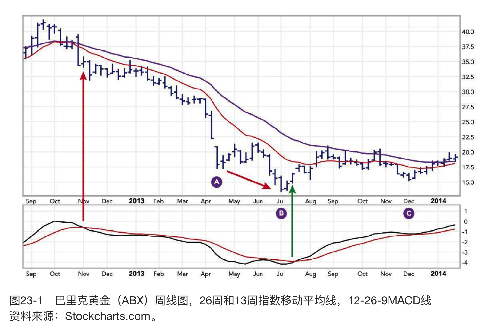

1. 当较快的MACD线穿越到较慢的信号线上方时，为买入信号。这时候要买多，然后在近期的次低点位置设置一个保护性止损单（见图23-1）。
2. 当较快的MACD线穿越到较慢的信号线下方时，为卖出信号。这时候要卖空，然后在近期的次高位位置设置一个保护性止损单。

ABX的底部A、B、C可以看成是反转的头肩顶的底部。

>指数平滑移动平均（MACD）线
>
>巴里克黄金（ABX）——全美最大市值的上市黄金公司，被黄金市场熊市拖累，2012年和2013年股价连续下跌。注意图中的卖出信号，即当快速线穿越到慢速线下面，图中以红色垂直箭头标识。该信号一年多以后才反转，即快速线穿越到慢速线上方，图中以绿色垂直箭头标识。
>
>注意该图表中其他几个形态。当ABX股价下跌到历史低点——图中B点，MACD线没有去确认：没有跌到新低而是走出了个双底。于是新低B点变成了向下假突破，是牛市来临的信号。在C点，空头试图最后一次把ABX股价压低，也没得到MACD线的确认，该线维持了稳定的上升趋势。在图表的右边缘，MACD线达到了上行运动的新高点，表现很强劲。两条EMA线都在上行，确认了牛市的趋势。

### MACD柱状线
`MACD柱状线`能够提供更深刻的关于多空力量均衡的信息。它不仅能分辨出哪种力量处于主导地位，而且能够分辨其力量是在逐渐增强还是在减弱。

    MACD柱状线=MACD线-信号线

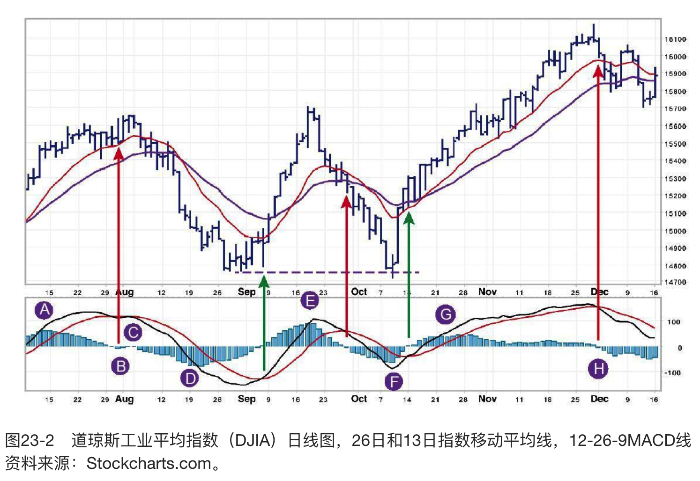

>MACD柱
>
>当两条MACD线交叉时，由两线衍生而出的MACD柱会穿过0线。你能在图中看到MACD线指示的买入和卖出信号（图中标识为绿色和红色箭头）。这些信号通常是滞后的，而MACD柱能给出很好的信号。我们在本节后面部分会提及，但现在我们先看一个例子。
>
>比较道琼斯指数的低点D和F，指数的第二个底部只是稍稍更低（事实形成了一个向下假突破），但同时第二个底部附近的MACD柱比前一个底部的MACD柱浅多了，说明空头已经很虚弱，很可能会发生向上的反转。

### 市场心理
MACD柱状线揭示了市场长期价值和短期价值之间的差异。较快的MACD线反映的是短期内市场对价值的共识，而较慢的信号线反映的是长期市场对价值的共识。MACD柱状线对两者之间的差异进行了跟踪。

MACD柱状线的斜率方向揭示了市场中的主导力量。向上倾斜的MACD柱状线表示多方的力量在增强，而向下倾斜的MACD柱状线则意味着空方的力量在增强。

当较快的MACD线上升得比较慢的信号线快时，MACD柱状线会上升。说明多方的力量比之前更强——这是做多的好时机。当较快的MACD线下降得比较慢的信号线快时，MACD柱状线会下降，说明空方的力量在增强——这是做空的好时机。

当MACD柱状线的斜率方向和价格的变动同向时，趋势就是稳定的。当MACD柱状线的斜率方向与价格的变动方向相反时，趋势的稳定程度就值得怀疑了。

MACD柱状线的斜率方向比柱状线的正负重要得多。最好是根据MACD柱状线的斜率方向来进行交易，因为它能告诉你在空方和多方中，到底是谁在主导市场。最好的买入信号是当MACD柱状线低于0值，而它的斜率方向是朝上的，表明空方的力量已经是强弩之末了；最好的卖出信号发生在MACD柱状线高于0值，而它的斜率方向是朝下的，表明多方已经耗尽了最后的力量。

### 交易规则
普通信号是MACD柱状线的斜率方向。当最新的MACD柱状线高于前一根MACD柱状线时，斜率向上，表示多方控制着市场，是买入的时机；当最新的MACD柱状线低于前一根MACD柱状线时，斜率向下，表示空方控制着市场，是卖出的时机；当价格向一个方向走，而MACD柱状线的斜率却向另一个方向走时，表明主导的力量正在失去热情，趋势没有看起来那么强势了。

1. 当MACD柱状线停止下跌开始上升时就买入，在近期的次低点下方设置保护性止损单；
2. 当MACD柱状线停止上升开始下跌时就卖出，在近期的次高点上方设置保护性止损单。

MACD柱状线在日线图中频繁地上升下降，所以每次转向都进行交易是不切实际的。在周线图上MACD柱状线斜率的变动更有意义。

### 什么时候预期市场探出新高或新低
如果日线的MACD柱状线创出了三个月内的新高，说明多方的力量很强，价格还可以再创新高。如果日线的MACD柱状线创出了三个月内的新低，说明空方力量很强，价格可能会再次试探甚至突破之前的低点。

如果在价格上升的过程中，MACD柱状线创出新高，说明上升的趋势是健康的，可以预期市场会继续上涨，再次试探甚至超过之前的高点；如果在价格下降的过程中，MACD柱状线创出新低，说明空方力量很强，价格可能会再次试探甚至突破之前的低点。

### MACD柱状线的拓展
MACD柱状线在各时间周期内都能用：周线、日线及日内数据。较长时间周期的MACD发出的信号，价格的变动更大。比如说，相比日线或日内MACD柱状线，周线MACD柱状线发出的信号预示着价格变动幅度更大。这个原则适用于任何技术指标。

当你在周线图上使用MACD线和MACD柱状线时，不必等到周五再去寻找信号。趋势可能在周中就已经发生了反转——市场可不会去盯着日历。因此，最好每天都去做周线的研究。

### 背离
MACD柱状线和价格出现背离的情形并不常见，但是它们却传达出了某些最强有力的信号。它们往往标志着重要的转折点。它们并不一定会出现在每个重要的顶部或底部，但是一旦你看到一个，你就知道一次大的反转可能即将到来。

牛市背离发生在下降趋势的终止阶段——它标志着市场底部。经典的牛市背离发生在价格和震荡指标都创出新低，开始回升，接着震荡指标穿过零点，接着价格和震荡指标又再次下降。这一次，价格跌到新的低点，但是震荡指标的底部则比前一次下跌的底部高。这样的背离经常发生在猛烈的上涨之前（见图23-3）。

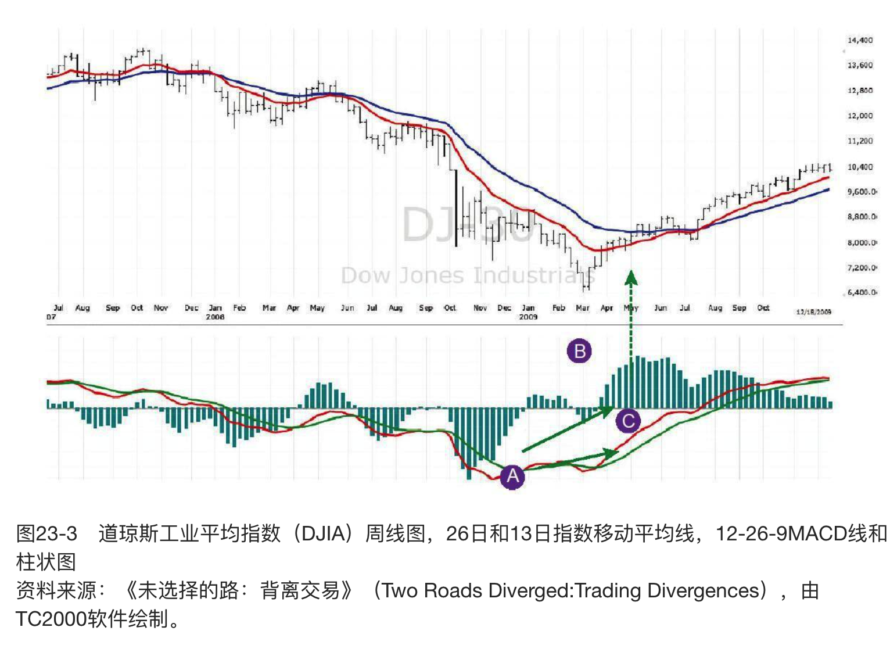

道琼斯平均指数（DJIA）的周线图和其周线MACD柱状线，是一个完美的背离的案例。

要注意，两个底部之间有一个穿越回0值线的部分是真正的背离所必须具备的因素。在第二次探底之前，MACD柱状线必须穿越回0值线。如果没有与0值线的交点，那就不是真正的背离。

>牛市背离
>
>这里你看到的背离信号标志的是2007~2009年期间熊市的底部。这个背离信号在低点附近给出了非常强烈的买入信号。在A区域，当时雷曼兄弟破产了，一浪接一浪的卖出冲击着市场，道琼斯指数像自由落体一样下跌。MACD线柱图创出历史新低，说明空头极端强大，A区域的底部价格很可能会被重新试探甚至突破。在B区域，MACD线柱图反弹到0值线之上，“打破了这个熊市”。要注意这个短暂的反弹触及到了两条移动平均线之间的“价值区间”——这是熊市反弹时一个比较常见的目标。在区域C，道琼斯指数滑向了一个新的熊市低点，但MACD柱状线的底部则浅得多。而之后的回升，完成了一次牛市背离，这是非常强烈的买入信号。

另一个关键点是，当MACD柱状线从第二个底部开始反转时，它就发出了买入的信号。它不必再次穿过0值线，在MACD柱状线低于0时，只要停止下降，负值开始缩小，就是买入信号了。

在图23-3中，MACD线在底部A和底部C之间，出现第二次的底部比第一次要浅，MACD线也出现了牛市背离形态，于是MACD柱状线的背离就得到了增强。这样形态的MACD线是很少见的。它们预示之后的上涨可能会非常剧烈。虽然我们不能称其为真正的背离，因为MACD线并没有0值（没有返回0值之上的阶段）。在2009年出现的那波回升直到第一次正式回调之前持续上涨了一年时间。

同样地，我们不能把底部C之后的较低的顶部称为背离。较低的顶部反映了随着时间的流逝，上涨的趋势在减弱。但要称其为背离，MACD柱状线必须两次穿过0值线。

熊市背离发生在上涨趋势中——意味着市场的顶部。经典的熊市背离发生在价格创出新高后回落的时候，同时震荡指标落到0值以下。价格逐渐平稳，然后上升到新高，但是震荡指标仅上升到比之前的峰值要低的高点。这样的熊市背离通常预示着剧烈的下跌。

熊市背离显示出多方的能量在耗尽，价格还在惯性上涨，但空方已经准备入场接手。有效的背离很容易被看出来——它们就像从图表中跳到你眼前一样。如果你需要用尺子来量一量看这是不是一个背离，那么你可以假定它不是（见图23-4）。

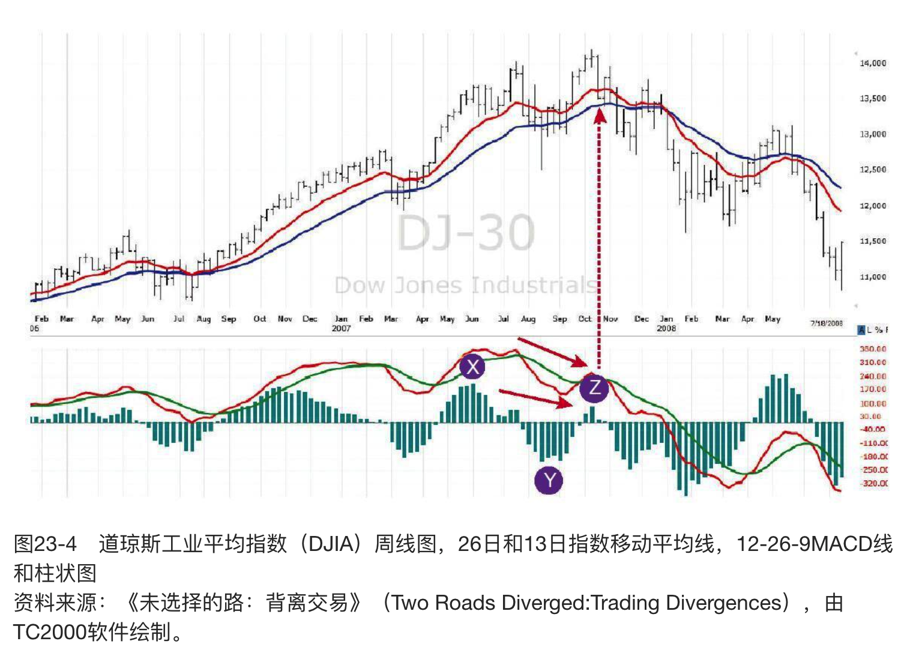

把时间调回到2007年牛市正处在顶部的时候。

要注意指标两个顶部之间的对0值线的突破，是真正背离所必需的因素。MACD柱状线在达到第二个顶点之前，必须低于0点。

>熊市背离
>
>在X区域，道琼斯指数和其MACD柱状线同时上升到牛市的新高点，说明多头的力量十分强大。这意味着未来很有可能会再次试探甚至突破顶部X点的价格。注意，MACD柱状线的X部分，其形态很复杂，但并不是一个背离，因为它的中间部分并未沉到0值线之下去。
>
>在Y区域，MACD柱状线跌落到0值线之下了，“打破了这个牛市”。要注意，价格穿透到了两条移动均线之间的“价值区间”的下方。这是牛市中断时一个相当普遍的信号。同样要注意到在底部Y处，有一个“袋鼠尾”。在Z区域，道琼斯指数上升到一个牛市新高，但MACD柱状线的上升有点缺乏活力，反映出牛市的虚弱。在峰值C处开始的跳水，完成了熊市背离，给出了强烈的卖出信号，预示着近30年最严酷的一个熊市。

另一个关键点是，当MACD柱状线从第二个顶点开始下降时，就已经是卖出的信号了。我们不必等到它再次穿越0值。虽然MACD柱状线仍然高于零点，只要停止上涨，并且新柱线长度比之前的柱线长度更短时，就发出了卖出信号了。

在图23-4中，当MACD线在顶点X和顶点Z出现熊市背离形态时——MACD线第二次的顶部比第一次要浅，图中的熊市背离信号得到了加强。这种形态的MACD线告诉我们，将要来临的下降趋势会格外剧烈。

“无右肩”背离（“missing right shoulder”divergences）是指，当第二次探新高时MACD柱状线还没有穿过0值。这种情况很罕见，但是是非常强烈的信号。

克里·洛沃恩做了大量的研究发现最有交易价值的背离发生在，当MACD柱状线的两个顶部或者底部之间的相隔20到40个柱状线之间时——而且越接近20个柱状线越好。也就是说，两个顶部或者底部之间不能相隔太远。克里还发现当第二个顶部或者底部的长度不超过第一个顶部或者底部的一半时，是最好的信号。

三重牛市或熊市背离由三组价格和震荡指标的底部或者三组价格和震荡指标的顶部组成。它们比普通的背离更加强烈。要产生三重背离，普通的牛市背离或者熊市背离首先要出现失效。这也是需要做好审慎的资金管理的又一个理由！如果你在假突破时只损失了一小部分钱，那你能保持充足的资金和良好的心态再次入场交易。震荡指标第三次探顶或者探底一定比第一次浅，但并不一定要比第二次浅。

### 巴斯克维尔的猎犬
这个信号产生在，当可信赖的图表或者指标的模式出现，但价格并没有走向你期望的方向时。比如，当背离模式出现，显示上升的趋势可能要结束了，但是价格却还在持续上涨，这种情形称为“巴斯克维尔的猎犬”。

这个名字源于柯南·道尔爵士的一个故事。在这个故事里福尔摩斯被叫到一座乡间别墅里去调查一桩谋杀案。他发现的关键线索是：他意识到当谋杀案发生时，家里的狗并没有叫。这意味着那条狗认识罪犯，所以谋杀犯就是内鬼。之所以能发现这一线索是因为预期的应该发生的现象并没有发生——狗没有叫！

当市场对一个完美的信号无动于衷时，那就是“巴斯克维尔的猎犬”的信号。这就表示在表象之下有更基础的东西在发生变化。这时候要做好准备，迎接一波新的大趋势。

在某些罕见的场合中，当熊市背离失效时，我会做多。同样，在牛市背离失效的罕见机会里，我会卖空。

## 趋向系统
### 如何构建趋向系统
趋向运动可以定义为，今天价格波动区间超出前一天波动区间的比例。`趋向系统`能够检查出今天的波动区间是高于还是低于前一日的区间，然后将一段时间区间内的数据进行平均。

1. 确定`“趋向运动”（directional movement，DM）`：比较今天和昨天交易价格波动区间。趋向运动是今天的交易波动区间超过昨天交易波动区间的最大值。有四种类型的趋向运动（见图24-1）。趋向运动总是正数（+DM和-DM仅仅表示今天的波动区间是高于还是低于昨天的区间）。趋向运动是当日交易区间超过前一日交易区间的最大值。
   1. 如果当日的交易区间延伸高于前一日区间，趋向运动为正（+DM）。
   2. 如果当日的交易区间延伸低于前一日区间，趋向运动为负（-DM）。
   3. 如果当日交易区间被包含在前一日区间之内，或者包含前一日区间但延伸高于和低于前一日区间的幅度相等，此时没有趋向运动（DM=0）。如果当日区间包含前一日区间但延伸高于和低于前一日区间的幅度不相等，视哪一部分幅度更大，决定DM为正或负。
   4. 在涨停日，+DM为当日收盘价与前一日高点之间的距离。在跌停日，-DM为当日收盘价与前一日低点之间的距离。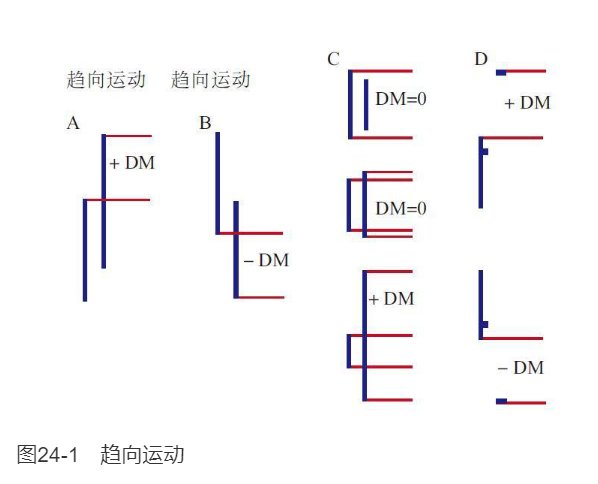
2. 确定市场的“真实波幅”（true range，TR）。TR总是正值，它是以下三者中的最大值：
   1. 今天价格最高价与最低价之间的差值
   2. 今天价格最高价与昨天收盘价的差值
   3. 今天价格最低价与昨天收盘价的差值
3. 计算每日“趋向指数”（directional indicators，+DI和-DI）。通过计算DM占TR的百分比——从而可以比较各个不同市场的趋向指数大小。每个DI都是正值：当市场在某天没有向上的趋向运动时，+DI等于零；当某天市场没有向下的趋向运动时，-DI等于零。
   1. $+DI=\frac{+DM}{TR}$
   2. $-DI=\frac{-DM}{TR}$
4. 计算“平滑趋向线”（smoothed directional indicators，$+DI_{13}$和$-DI_{13}$），通过移动平均来平滑+DI和-DI。大多数软件包能够让你随意选择需要平滑的时间段，比如13日的移动平均。你能得到两条指标线：正的和负的平滑趋向线，$+DI_{13}$和$-DI_{13}$。两者的数值都是正值，一般用不同的颜色标注。
   1. 正平滑趋向线和负平滑趋向线的关系能够确定趋势。当$+DI_{13}$在上面时表示趋势是向上的，当$-DI_{13}$在上面时，就说明趋势是向下的。$+DI_{13}$和$-DI_{13}$的交点就释放出了买入或者卖出的信号。
5. 计算`“平均趋向指标”（average directional indicator，ADX）`。这个ADX测量了+DI_{13}和-DI_{13}之间的价差。由以下两步进行计算得到。
   1. 计算日线趋向指标DX：$DX=\frac{(+DI_{13})-(-DI_{13})}{(+DI_{13})+(-DI_{13})}* 100$
   2. 举个例子，若$+DI_{13}=34$，$-DI_{13}=18$，那$DX=\frac{34-18}{34+18}=30.77$（约为31）
   3. 通过移动平均来平滑DX，计算得到平均趋向指标ADX。例如可以通过13日EMA来进行平滑。

在趋势持续的区间，如果两条平滑趋向线之间的差值增大，ADX则会上升；当趋势反转或者市场进入了震荡区间时，ADX则会下降。在ADX值上升时，最好只用趋势跟随指标。

### 群体行为
通过测量多空双方使今天价格波动区间超出昨天的程度，趋向系统能够跟踪群体看多和看空的变化。如果今天比昨天的高点要高，那么市场群体对市场的情绪更趋向于乐观。如果今天比昨天的低点更低，则表示市场群体的情绪更趋向于悲观。

通过趋向线的相对位置能够识别出趋势。当$+DI_{13}$在$-DI_{13}$之上时，表示多方力量主导市场。当$-DI_{13}$升高超过$+DI_{13}$时，表示交易者中，空方力量更强。根据较高的趋势线判断多空主导力量的方式进行交易比较有利。
当两条趋向线的距离增大时，ADX会增大，表示市场的主导力量——比如上涨牛市中的多头——正在变强，而较弱的一方在变弱，所以趋势很可能会持续。

当两条趋向线的距离增大时，ADX会增大，表示市场的主导力量——比如上涨牛市中的多头——正在变强，而较弱的一方在变弱，所以趋势很可能会持续。

当两条趋向线的距离变窄时，ADX会下跌，表示市场的主导力量正在变弱，而之前较弱的一方正在变强。这说明市场将要反转，因此最好不要使用趋势跟随工具进行交易。

### 交易规则
1. 当$+DI_{13}$高于$-DI_{13}$时，做多头；当$-DI_{13}$高于$+DI_{13}$时，做空头。同时，ADX上升的时候是最佳的交易时机，表示主导力量正在增强。
2. 当ADX下降时，表示市场的趋势正在减弱。这时可能产生很多假突破。当ADX下降时，最好不要用趋势跟随指标。
3. 当ADX降到两条趋向线之下时，表示市场是平静、死气沉沉的。此时不要用趋势跟随系统交易。但要做好交易的准备，因为这是暴风雨之前的平静，大趋势将会从这种平静中出现。
4. 当ADX落到两条趋向线之下时，则出现了趋向系统的最佳信号。它在此区域待得越久，那么下一次趋势的基础就越强。当ADX从两条趋向线下方开始回升时，意味着市场从平静中觉醒了。当ADX从趋向线下方的低点上升了4步（比如从9到13），这就是一个新趋势的号角（见图24-2）。那表示新的牛市或者熊市正在形成，到底是熊市还是牛市取决于在上面的是哪条趋向
5. 当ADX回升超过两条趋向线时，表示市场过热了。当ADX从高于两条趋向线的地方掉头向下，表示主要的趋势受到了阻碍，这正是趋势交易兑现利润的好时机。如果你是重仓的话，一定要先兑现一部分利润。

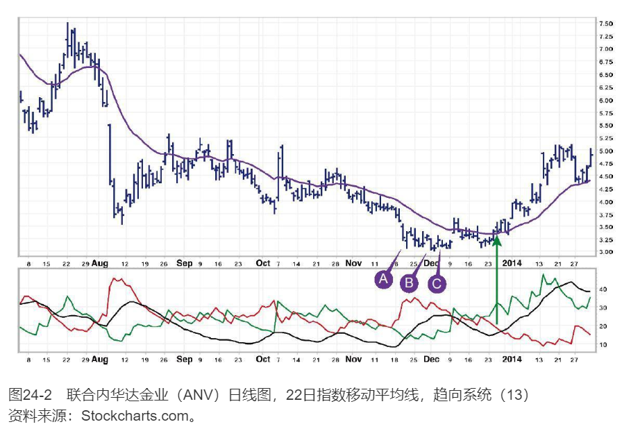

>趋向系统
>
>在强劲和虚弱之间摇摆是市场典型的特征。强势股票变弱时弱势股票会变强，然后它们的角色又重新转换。黄金和白银股票是2013年表现最弱的两个行业，但在12月时它们开始筑底。联合内华达金业（ANV）是那时候我开始买入的几只股票之一。
>
>低位A点的价格是3.07美元，股价在B点跌到3.01美元后开始反弹，形成一个向下假突破。股价在C点跌到3.08美元，重新试探了支撑位——股价从此处开始启动了，指数移动均线转头向上。趋向系统在图中绿色垂直箭头所示位置发出了买入信号：绿色牛市趋向线在红色熊市趋向线之上，同时ADX穿透到红线上方。
>
>你或许发现了图中字母区域也发现了类似的做空信号，但一名严谨的交易者不会对每个见到的信号都去交易：在3美元价格附近做空一只从45美元掉下来的股票，意味着去追已经严重老化的趋势。在右边缘附近，你能看到价格回落到价值区间，提供了很好的多头加仓时机。

市场指标既会给你一些硬指标，也会给一些软指标。例如，移动平均值改变方向就是一个硬指标，而ADX的下跌就是一个软指标。一旦你看到ADX下降，此时要加仓就应该非常小心。应该先兑现盈利，减轻仓位，然后再寻找出场的机会。

### 平均真实波幅——来自波动率的帮助
`平均真实波幅（ATR）`是真实波幅（TR，在“如何构建趋向系统”一节提及过）在某一时间段内的平均值，常用的为13日均值。因为波动率是交易的重要指标，你可以通过画出一系列高于或者低于移动平均值的ATR线来追踪波动率的变化。它能够将当前的波动率可视化，你也可以根据它来做决定。

克里·洛沃恩喜欢在移动平均线附近画三组线：在高于和低于EMA1倍、2倍和3倍ATR的位置。它们能用于设定入场点、保护性止损位和盈利目标（见图24-3）。

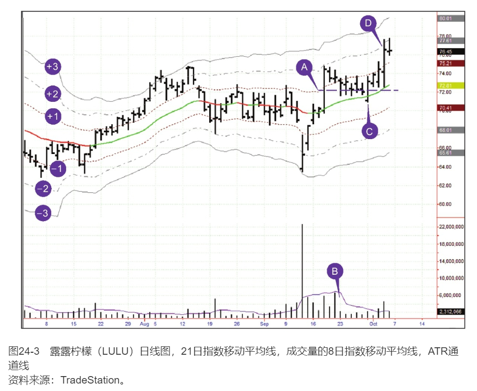

>ATR通道线
>
>这份露露柠檬（LULU）的交易日志来自Spiketrade.com的克里——我们常在那里公布自己的交易日志。这份日志显示了如何利用ATR通道线获利。
>
>9月18日，LULU股价在公布盈利情况后，出现了大幅下跌。但是股价并没有进一步继续下跌，而是开始反弹。克里在长A点的线柱中间画了一条水平线，作为短期的支撑位。
>
>当LULU股价开始回调，在区域B日线幅度收窄，成交量收缩。克里在9月30日星期一以72.02美元的价格买入了LULU，即线柱C，此时股价从向下假突破中反弹向上。他在当日稍晚以73.70美元价格兑现了1/3的仓位，此时LULU股价离1倍ATR仅差几美分。星期三，在线柱D时，LULU股价触及2倍ATR即76.63美元价格，克里又退出另一个1/3的仓位。他在线柱D中间位置兑现了剩下的1/3仓位。

入场点：在“移动平均”那一节中，我们知道在价格低于价值的时候买入——低于EMA的时候，是一个好主意。但是要低于价值多远的距离？如果是普通回调往往会在负一倍的ATR处见底。

保护性止损位：最好让你的保护性止损位在至少离入场点一倍ATR距离的地方。如果小于这个距离，会让你的保护性止损价位落入市场噪音区间之中，很可能被短期的随机波动所触及。所以把你的保护性止损位设置得远一点，使得只有真正的反转才能触及你的保护性止损单。

盈利目标：你买入一只股票之后，可以根据那只股票的强势程度，在1倍、2倍甚至3倍ATR的位置，来设置你兑现利润的止盈价位。克里喜欢分几步兑现利润并退出，比如在1倍ATR处挂三分之一持仓量的卖单，在2倍的地方再挂三分之一，其余的挂在3倍ATR处。

**在任何市场中，长时间价格波动超过3倍ATR——3倍的平均真实波幅——都非常少见**。这通常意味着行情非常极端。无论何时你看到市场波幅超出3倍ATR之外，不论是上升还是下跌，你都有理由相信会出现一波回调。

ATR通道的方法不仅在价格方面有用。我们也可以将它和其他指标结合起来，来判断趋势有可能在哪些极端价位出现反转。我在周线图的强力指数上会结合使用ATR通道。

## 震荡指标
震荡指标能识别市场大众的极端情绪，能够帮助你发现市场中乐观或悲观情绪难以持续的价位。专业交易者总会逆着极端情绪而来，他们会在衍生品上对赌价格将回归理性。当市场上涨，大众由于贪婪而激动地高喊，争先恐后地追随着市场时，专业交易者已经开始准备卖空了。当市场下跌，大众陷入恐慌时，专业交易者则已经准备好买多了。震荡指标能帮我们找到这样的交易时机。

### 超买和超卖
超买意味着市场点位太高，随时可能回调。当震荡指标到达前期的高位水平时，就形成了超买。超卖意味着市场点位太低，随时可能反弹。当震荡指标到达前期的低位水平时，就形成了超卖。

一定要记住，这些高低位水平并不是绝对的。当一波强力的上升趋势开始后，震荡指标可以持续几个星期的超买状态，这样给出的卖出信号是过早的。同样，在急剧的下跌趋势中，也可能保持几周的超卖状态，这样给出的买入信号是过早的。知道什么时候使用趋势跟随指标，什么时候使用震荡指标是成熟分析师的标志（见第39节）。

我们可以通过水平参考线来标记超买和超卖的震荡指标。我们选择画线的位置时，应该使得在过去6个月的震荡指标仅最高点和最低点超出线段之外。画这些线的正确方法是让震荡指标只有5%的时间超出这些线之外。每3个月重新调整线的位置。

当震荡指标上升或者下跌超出这些参考线时，它帮你识别出这种极端情况不可持续，可能后续会形成一个顶部或者底部。震荡指标在震荡区间内的效果非常好，但是当一个新的趋势在震荡区间内形成时，它会发出过早的甚至是危险的信号。

我们已经考察过一个重要的震荡指标了——`MACD柱状线`。马上我们将会探讨几个非常流行的震荡指标：`随机指标（stochastic）`和`相对强弱指标（relative strength index，RSI）`。

## 随机指标
随机指标（即`KDJ指标`）是由已故的乔治·蓝恩（George Lane）推广开来的一种震荡指标。它由两条线组成：`快速线%K`和`慢速线%D`。
1. 计算随机指标的第一步是计算“原始随机指标”或者叫%K：%K$=\frac{C_{tod}-L_n}{H_n-L_n}*100$
   1. $C_{tod}$——今日收盘价；
   2. $L_{n}$——n个交易日中的最低价；
   3. $H_{n}$——n个交易日中的最高价；
   4. n——交易者所选定的，计算随机指标所用的交易日天数。随机指标的标准时间跨度是5天，虽然有些交易者会用更多的天数。短的时间周期能帮你抓住更多的转折点，但较长的时间周期却能帮你识别出比较重要的转折点。
1. 第二步是计算%D。可以通过平滑%K来得到——通常按3天周期来平滑。可以通过很多方法做到这一点，比如：%D=$\frac{3日(C_{tod}-L_n)之和}{3日(H_n-L_n)之和}*100$

有两种随机指标——`快速随机指标`和`慢速随机指标`。快速随机指标由两条线组成——画在同一张图表中的%D和%K。它很灵敏但会导致许多双重损失。许多交易者更青睐在快速随机指标中再增加一层平滑，得到慢速随机指标。快速随机指标中的%D线就成为慢速随机指标中的%K线，然后重复步骤2来平滑，得到慢速随机指标中的%D线。慢速随机指标能够更好地过滤掉市场噪声，并且导致的双重损失也较少（见图26-1）。

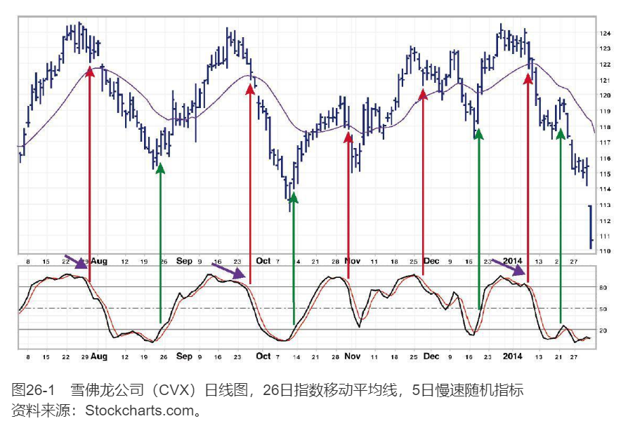

>随机指标
>
>这张雪佛龙公司（CVX）的图表展现出随机指标既有有利的一面，也有危险的一面。只要股票在横向盘整区间之中——图中大部分时间都是如此，随机指标能明确标出短期高点和底部。当随机指标上升到下参考线之上时，给出买入信号（以绿色垂直箭头标示）；当随机指标下降到上参考线之下时，给出卖出信号（以红色垂直箭头标示）。随机指标宽的、向下倾斜的顶部强化了这些卖出信号（以紫色斜箭头标示）。
>
>细心的读者会发现图26-1中有多个假突破，这些也强化了随机指标的信号。在震荡区间使用随机指标信号就像用自动取款机一样。当趋势突然脱离震荡区间，这台机器会失效并且吞掉你的银行卡。在图表右边缘附近，一个急剧的下跌趋势践踏了随机指标的买入信号。
>
>交易者在震荡区间内可能依靠随机指标交易，但必须使用保护性止损位，因为震荡区间内的最后一笔交易往往会在趋势开始时造成损失。我们将在第54节集中讲如何使用止损位。

随机指标的取值范围是0~100。通常在20%和80%的地方画参考线，标识出超买和超卖的区域。

### 大众心理
每个价格都是市场参与者在某一交易时刻对价值达成的一致看法。每日的收盘价格之所以重要，是因为账户的结算是根据收盘价来确定的。任何时期价格的最高点都表示了那一时期多方最强的力量。同样，那段时期价格的最低点也表示了当时空方最强的力量。

随机指标计算的是多方或空方使价格收在一段时期内价格高点或低点附近的程度。当在价格上升趋势中时，价格往往收在最高点附近。如果多方能在盘中将价格推高，但是收盘时无法使价格收在高点附近，随机指标就会转向为下跌。这表明多方力量并没有看起来那么强，因此是卖出的信号。

在价格下降的趋势中，收盘价往往是在最低点附近。如果当期线柱反而收在其高点附近，表明空方只能把价格暂时打压下来，却不能让价格保持在低位，随机指标就会转向为上涨。随机指标向上转折表明空方的力量并没有看起来那么强大，因此是买入的信号。

### 交易规则
随机指标能够显示出多方或空方在什么时候变强或变弱。你能根据这个来判断多方或空方谁将赢得眼前战役的胜利。与胜利者同向交易、与失败者逆向交易比较有利。

随机指标能够给出三种类型的交易信号，按照其重要程度从大到小依次为：背离、随机指标线的位置及其方向。

**背离**

随机指标最强烈的买入或卖出信号为该指标和价格出现背离。
1. 牛市背离发生在当价格下跌到新低，但随机指标的低点却比前一个低点位置高时。这说明空方力量在减弱，价格只是惯性下跌了。一旦随机指标从其低点位置开始掉头向上时，就是强烈的买入信号：此时可以买入并在价格的最新低点之下设置一个保护性止损单。最好的买入信号为，随机指标的第一次底部低于下参考线而第二次底部高于下参考线。
2. 熊市背离发生在当价格上涨到新高，但随机指标的顶部高度却低于前一个顶部的高度。它表明多方力量在减弱，价格只是惯性上涨了。一旦随机指标从其第二次顶部位置开始掉头向下时，就是强烈的卖出信号：此时可以做空并在高于最近顶部的位置设置一个保护性止损单。最好的卖出信号为，随机指标在第一次顶部高于上参考线而第二次顶部低于上参考线。

**超买和超卖**

当随机指标上涨超过其上参考线时，表明市场超买了。它表明股票甚至是整个市场都处于不可持续的高点而且已经做好回调的准备了。当随机指标落到其下参考线以下时，表明股票甚至整个市场都处在超卖的阶段，此时市场价格太低了，已经随时准备好上涨。

上面这些信号在市场处于震荡区间时很有效，但当市场形成趋势时是失效的。在上涨趋势中，随机指标会很快到达超买位置，会持续给出卖出的信号，但市场会一直上涨。在下降趋势中，随机指标会很快到达超卖位置，持续给出错误的买入信号。因此最好把随机指标和长期的趋势跟随指标（见第39节）结合起来使用。三重滤网交易系统只有当周趋势向上时，随机指标给出的买入信号才会被采用。而当周趋势下降时，则只会向交易者显示随机指标发出的卖出信号。
1. 当你在周线图中识别出上升趋势时，等到日线图中随机指标降到其下参考线下方时，不用等到随机指标曲线相交或者掉头向上，就可以在最近一根柱线的最高价上方挂买单。一旦成交为多头，在今天的价格低点和前一交易日价格低点二者中取较低值，然后在这一价格下方位置设置保护性止损单。

随机指标的底部形态通常预示着这波上涨是强是弱。如果底部又窄又浅，就表明空方力量比较弱，上升的势头可能比较强。如果底部又深又宽，表明空方力量很强，这波上涨可能很弱。最好还是只采用那些强烈上涨形态的买入信号。

2. 当你在周线图中识别出下降趋势时，等到日线图中随机指标上升超过其上参考线时，不用等到随机指标曲线相交或者掉头向下，在最近一根柱线的最低价的下方挂卖单。到随机指标曲线相交时，市场通常已经处在自由落体式下跌中了。一旦成交为空头，在当日或前一交易日价格的高点位置上方设置一个保护性止损单。

随机指标的顶部形态通常预示着下降的趋势是陡峭还是缓慢。随机指标顶部很窄，表明多方力量很弱，可能会有剧烈的下跌。而随机指标的顶部又高又宽，则表明多方的力量比较强——最好还是忽略此时的卖出信号。

3. 当随机指标超买时不要买入，当它超卖时也不要卖出。这条法则能过滤掉大部分的错误交易。

**随机指标线的方向**

当两条随机指标线都向同一方向运动时，肯定了短期的趋势。当价格升高的同时两条随机指标线上升时，上升的趋势可能会继续。当价格下跌的同时两条指标线也下跌时，短期下降的趋势可能会继续。

### 随机指标的拓展
你可以在任意的时间周期下使用随机指标，包括周度、日度或者日内。周度随机指标通常在MACD柱状线之前的一周改变其方向。如果周度随机指标转向了，就警告你MACD柱状线可能要在下周转向了——这时候就该在现有的仓位上用偏紧的保护性止损单或兑现利润。

选择随机指标的时间周期是很重要的。短期的震荡指标更敏锐。而长期的震荡指标只有在重大的顶部或者底部出现时，才会发生转折。如果你把随机指标当成一个独立的震荡指标使用，那么长期性指标更有用。如果你把随机指标当成你的交易系统的一部分，把它和其他趋势性指标结合起来，那么短期性指标更有用。

## 相对强弱指标
`相对强弱指标（RSI）`是由威尔斯·威尔德发明的一个震荡指标。它通过监测任意一种交易产品的收盘价变动来测量其强度。它是一个先行或者同步指标——从不滞后。

$RSI=100-\frac{100}{1+RS}$

$RS=\frac{选定期间内上涨收盘价的涨幅均值}{选定期间内下跌收盘价的跌幅均值}$

RSI的波动区间是0-100。当它到达顶点开始下降时，就确定了市场价格的顶部。当它下跌然后开始掉头向上时，就确定了一个底部。RSI底部和顶部的模式不会随着时间跨度增大而有所改变。交易信号在短期内的RSI上看得更清楚，比如7-9天的RSI（见图27-1）。

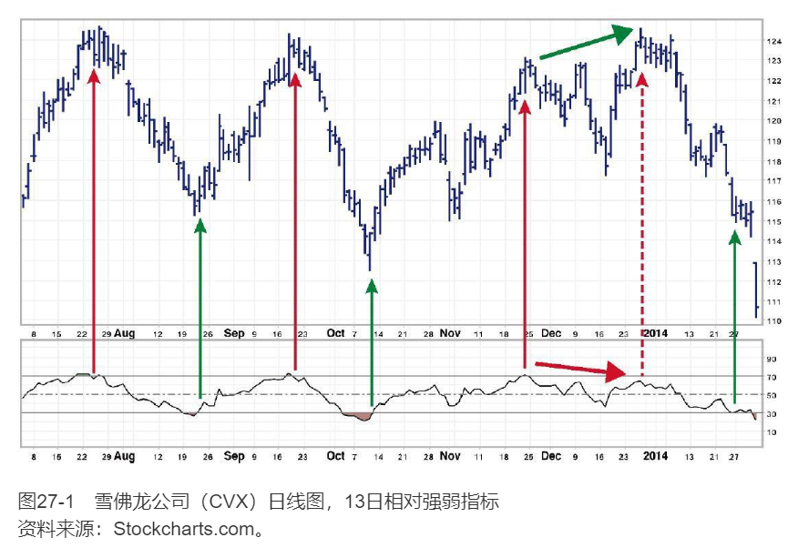

>相对强弱指标（RSI）
>
>这里我们运用13日相对强弱指标来分析雪佛龙公司——我们在随机指标一节已经在图26-1中分析过该公司。相对强弱指标和随机指标在震荡区间都很有用，但在趋势开始时也都会给出草率而具有危险的信号。
>
>相对强弱指标仅仅基于收盘价，相比随机指标其噪声较小。当其上升到下参考线之上时，预示要上涨（图中以绿色垂直箭头标示）；当其下跌到上参考线之下时，预示要下跌（图中以红色垂直箭头标示）。比较两张图表，你能发现相对强弱指标的信号出现要早一些。
>
>图中以倾斜实线箭头和虚线红色箭头标出的是相对强弱指标出现熊市背离给出的非常强的卖出信号。股价上升到新高，但相对强弱指标并没有触及其上参考线，显示这次上涨隐藏着的虚弱。
>
>图中右边缘处的尖锐跳空，不顾相对强弱指标发出的买入信号，将价格推向更低位。要避免受到伤害，我们必须使用保护性止损位，因为震荡区间里最后一笔交易，很容易在新趋势开始时造成亏损。

### 大众心理
每一个价格都代表着所有的市场参与者在交易的一瞬间对价值形成的一致认同。收盘价是最重要的一个价值认同，因为交易者账户的结算要依靠这一价格。当收盘价升高时，多方赚钱，空方赔钱；当收盘价收低时，空方赚钱，多方赔钱。

相比其他任何时间的价格，交易者更关注收盘价。RSI表明在收盘时是空方还是多方的力量更强——这是一天中最关键的计算盈亏的时刻。

### 交易规则
RSI能够提供三种类型的交易信号。按照其重要程度排列分别是：背离、图形模式以及RSI水平。

**牛市和熊市背离**

RSI和价格的背离往往发生在重要的顶部和底部。它们表明趋势什么时候变弱并且准备反转了。

1. 牛市背离发出买入信号。当价格创出新低，而RSI指数的底部比其前一次下跌的底部要高。一旦RSI从第二次底部开始上扬，马上可以买进并且在近期底部的价格最低点的下方设置保护性止损单。如果RSI指数的第一次底部低于下参考线，而第二次底部高于下参考线，那么这就是一个非常强烈的买入信号。
2. 熊市背离发出卖出信号。当价格上涨创出新高，但是RSI的顶部却低于其前一次上涨的顶部的时候。一旦RSI从第二次顶部下跌就马上可以卖空，同时在最近的新高价上方设置保护性止损单。如果第一次RSI顶部超过了上参考线而第二次的顶部低于上参考线，那么卖出的信号就非常强烈。

**图表的模式**

RSI通常比市场价格早几天突破阻力位或者支撑位，表现出了趋势可能要改变的迹象。RSI趋势线通常会比价格趋势线早1~2天被反转。

1. 当RSI的下降趋势反转时，在最近的价格高位上挂一个买单来抓住这一次向上的突破；
2. 当RSI的上升趋势反转时，在最近的价格低位上挂一个卖单来抓住这一次向下的突破。

**RSI水平**

当RSI上升超过其上参考线时，表明多方很强势，但是市场已经超买了而且已经进入了应该卖出的区域。当RSI下跌到其下参考线以下时，它表明空方力量很强，但是市场已经超卖了而且已经进入了应该买入的区域。

只有当周趋势上涨时，根据日线RSI指标发出的买入信号进行买入才比较有利。同样地，只有当周趋势是下降时，根据日线RSI指标发出的卖出信号进行卖出才比较有利。（见第39节）
1. 当RSI击穿其下参考线，又回升到下参考线上方时买入；
2. 当RSI上升到上参考线上方，又回落到上参考线下方时卖出。

# 成交量和时间

