    作者 老牛
    人民邮电出版社 / 2016-07
    ISBN 9787115426345

[豆瓣链接](https://book.douban.com/subject/30684163/)

- [“T+0”交易的诱惑](#t0交易的诱惑)
  - [“T＋0”操作必须具备的前提条件](#t0操作必须具备的前提条件)
  - [“T＋0”选股标准的参考因素](#t0选股标准的参考因素)
- [支撑“T+0”套利的日线趋势研判](#支撑t0套利的日线趋势研判)
  - [6种日K线底部反转形态](#6种日k线底部反转形态)
  - [4种日K线调整形态](#4种日k线调整形态)
  - [“T＋0”的KDJ指标支撑买点研判](#t0的kdj指标支撑买点研判)
  - [“T＋0”的KDJ指标支撑卖点研判](#t0的kdj指标支撑卖点研判)
  - [黄金分割线的支撑线买点研判](#黄金分割线的支撑线买点研判)
  - [黄金分割线的阻力线卖点研判](#黄金分割线的阻力线卖点研判)
  - [布林线下轨的买点研判](#布林线下轨的买点研判)
  - [布林线上轨的卖点研判](#布林线上轨的卖点研判)
  - [布林线中轨的支撑买点研判](#布林线中轨的支撑买点研判)
  - [布林线中轨的阻力卖点研判](#布林线中轨的阻力卖点研判)
- [高抛低吸：分时图“T+0”操作实战套利技巧](#高抛低吸分时图t0操作实战套利技巧)
  - [“T＋0”操作为什么要看分时图](#t0操作为什么要看分时图)
  - [“T＋0”分时图的维度分析](#t0分时图的维度分析)

# “T+0”交易的诱惑
## “T＋0”操作必须具备的前提条件
1. **熟悉股性和市场规律**。“T＋0”操作必须建立在对个股的长期观察和多次模拟操作的基础上，投资者要非常熟悉个股股性和市场规律。
2. **实时看盘的时间和条件**。“T＋0”操作要求投资者必须有实时看盘的时间和条件，而且还要求投资者有一定短线操作的经验和快速的盘中应变能力。
3. **手中既有筹码又有资金**。投资者做盘中“T＋0”操作时，手中不仅必须持有一定数量的股票，而且还必须备有能够进行等额交易的可用资金。换句话说，盘中“T＋0”操作必须是既有筹码又有资金，二者缺一不可。
4. **盘中应有较大的震荡**。判断当天股价能否会有较大幅的震荡，是投资者能否操作盘中“T＋0”成功的必备条件，因为只有股价震荡时，才会有做差价的机会。通常要求20天平均振幅要大于4%。

>“T＋0”操作一定要做自己熟悉的个股，而且要选择股性好的股票，即振幅较大、较活跃的股票。盘中“T＋0”操作要求投资者切忌贪心，一旦有所获利，或股价上行遇到阻力，便立刻落袋为安。这种操作事先不制定具体盈利目标，只以获取盘中震荡差价利润为操作目标。

## “T＋0”选股标准的参考因素
1. **应选流通盘适中的个股**。做“T＋0”操作选股首先要看流通盘的大小。流通盘太大不行，大盘股的波动较小，不容易出现套利空间；流通盘太小也不行，容易被主力控盘，出现突如其来的砸盘。那么流通盘多大比较适宜做“T＋0”操作呢？一般来说，投资者应该选流通盘2亿～5亿股的股票为佳。
2. **应选具有热点题材的个股**。参与热点概念炒作是A股市场目前赚钱最快的投资方法。根据各种热点题材，比如医药电商、智能家居、基因测序、虚拟现实等，如果投资者能快速找到相关概念股，那么就可以尽早布局，及时骑上牛股。
3. **应选放量的个股**。成交量的放大，意味着换手率的提高、平均持仓成本的上升，上档抛压因此减轻，股价也才会持续上涨。有时，在庄家筹码锁定良好的情况下，股价也可能缩量上攻，但缩量上攻的局面不会持续太久，否则平均持仓成本无法提高，导致抛压大增，股票缺乏持续上升的动能。
4. **应选取中线看好的个股**。所谓中线看好，是指这只股票短线涨不涨无所谓，关键是你能知道这只股票未来一两个月以后会上涨。

这里主要以技术分析角度来简单讨论。用技术分析可以从以下几个角度来选中线有较大概率上涨的股票。

1. 均线系统形成多头排列。均线多头排列趋势为强劲上升趋势，操作思维为多头思维。投资者进场时以均线的支撑点为买点，下破均线支撑时止损。
2. 股价还处于上升通道的初期，在上升通道下轨的第三个低点附近可以考虑建底仓。
3. 股价长期横盘整理向上突破，并经过回抽确认，重新拐头向上。

除了以上几个参考因素外，做“T＋0”操作所选标的还必须考虑一个因素：**即个股股价需在20日均线上面**。这样综合起来风险会小一点，“T＋0”操作的胜率也会增加。这是因为20日均线是某只股票在市场上前20天的平均收盘价格，其意义在于它反映了这只股票20天的平均成本，是一根短期和中期过渡的均线，在短线操作的过程中可以充当趋势线。一般来说，20日均线连续三天向上，且股价站在20日均线之上，代表中短期趋势向上。反之，当股价跌到20日均线下面，且20日均线连续三天向下时，一般则表示趋势向下。

# 支撑“T+0”套利的日线趋势研判
## 6种日K线底部反转形态
1. **V形底**。股价在下跌趋势中，下挫速度越来越快，最后在下跌最猛烈的时候，出现了戏剧性的变化，股价触底反弹，然后一路上扬。其形态走势像英文字母“V”，故命名为“V形底”（如图2-1所示）。V形底形成时间最短，是研判最困难、参与风险最大的一种形态。但是这种形态的爆发力最强，把握得好，投资者可以在短期内赢取暴利。它形成的原因是由于市场受利空打击或其他意外情况影响造成的恐慌性抛售，引起股价超跌，从而产生报复性反转行情。

2. **双重底**。双重底股价走势像英文字母“W”，因此又称W形底，是一种较为可靠的底部反转形态（如图2-2所示）。双重底一般多发生于波段跌势的末期而不会出现在行情趋势的中途。对双重底形态的研判重点是，当股价在右边的底部时，技术指标是否会出现背离特征。如果技术指标不产生背离，那么W形底就可能向其他形态转化（比如多重底）。即使W形底最终成立，其上攻动能也会较弱。

3. **三重底**。经过一轮下跌后，股价出现小幅反弹，由于空头气氛浓厚，所以股价再次下探，并在上轮低点受到支撑，买盘增强，因此股价再次拉起，至前期反弹高点附近受阻后回落，此时前两次低点的连线形成强力支撑，股价拉起，一举突破前两次反弹高点形成的颈线位，这种三低两高的形态称之为三重底。三重底是主力吸货到洗盘的体现，股价经过一轮下跌后，主力开始逐步集筹。这时在主力吸货的作用下，股价出现小幅反弹。由于此时空方势大，且继续大规模集筹已不划算，所以股价出现回落，再次探底，主力在前期低点附近更是不遗余力地吸货，使得股价再次拉起。出于洗盘和集筹的双重目的，主力将股价再次打至前期低点，不坚定的持筹者将被洗出，主力也借机再次集筹（前两重底部是被动性下跌，而最后一重底部则是主动性下跌，其性质完全不同），等洗盘结束后，股价一举突破前两次反弹高点形成的颈线位，并开始一轮上升行情。
4. **圆弧底**。圆弧底形态属于一种调整形态，多出现在价格底部区域，是极弱势行情的典型特征。其形态走势表现在K线图中宛如锅底状（如图2-3所示）。圆弧底形态的形成原因是由于有部分做多资金正在少量地逐级温和地建仓造成的，显示的股价也已经探明阶段性底部的支撑。它理论上的涨幅通常是最低价到颈线位的涨幅的一倍。

5. **潜伏底**。股价在一个极狭窄的范围内横向移动或缓慢阴跌，并且每日股价的高低波幅较小，成交量亦十分稀疏，仿佛像冬眠时潜伏在底部的蛇，这种形态就是潜伏底。通常潜伏底的时间比较长，但是其突破后产生的成交量激增和股价的暴涨也是惊人的。所以说，潜伏底是横有多长，竖有多高。
6. **头肩底**。头肩底就是指形态酷似人的头与肩的关系的K线组合形态，头肩底形状呈现三个明显的低谷，其中位于中间的一个低谷比其他两个低谷的低位更底（如图2-4所示）。
   1. 在空头市场中，做空的力量持续，使得股价不断走低，由于行情已有一定的跌幅，股价出现了短期的反弹，但由于积重难返，反弹时买盘的力量有限，所以反弹很快就结束了，这就形成了“左肩”。接着股价又继续下跌，且跌破了左肩的最低点，因此随着股价继续下跌、成交量锐减而最终形成了“头部”。当股价回升到左肩的反弹高点附近时，出现了第三次的回落，之后又有所上升，在跌势基本稳定下来后形成“右肩”。最后股价发动较有力度的冲击，有效突破了颈线的阻力，整个头肩底的形态就此完成，当然，随之而来的往往就是一波较大的上升行情。
   2. 头肩底形态的颈线是指左肩高点和右肩高点的连线，也就是两个明显的反弹高点的连线。在实际走势中，由于两个高点完全一致的情况是极其少见的，因此，依据这种定义画出的颈线都是倾斜的，这就对把握具体买点会产生一些影响。

   

>双重底、头肩底、圆弧底放量突破颈线位时，应是买入的时机。这里有两点必须高度注意。一是**必须放量突破方为有效突破**。没有成交量配合的突破是假突破，股价往往会迅速回归启动位。二是**在低价位的突破可靠性更高，高位放量突破很可能是庄家营造的“多头陷阱”**，引诱散户跟风，从而达到出货的目的。许多时候，放量突破颈线位时，往往有回抽确认，这时也可作为投资者建仓的良机。

## 4种日K线调整形态
1. **三角形形态**。在三角形调整形态中，价格波动空间在持续不断地收缩。虽然前期价格已经完成并形成了明确的单边趋势，但是在三角形的调整形态中，价格不会出现明显的单边趋势，而是在阻力线和支撑线共同作用下不断震荡。三角形走势可分为对称三角形态、上升三角形态和下降三角形态等。
   1. **对称三角形态**。对称三角形态代表的是买卖双方力量在该段价格区域内势均力敌，暂时处于平衡状态（如图2-5所示）。
      1. 从形态的角度看，高点的连线构成了一条短期阻力线，低点的连线构成了一条短期的支撑线，两条线呈对称状，表明短期股价需要寻找突破方向。因此，对称三角形存在的时间比较短，延续此前趋势的可能性大；如果股价不能迅速突破阻力线或支撑线，那么就很有可能演变成其他形态。
      2. 在成交量方面，在对称三角的形成过程中成交量不断减少，直到股价有所突破时，成交量才会随之增加。如果股价是向上突破的，则需要大成交量的伴随，如果是向下突破的则不必如此。
   2. **上升三角形态**。当买家不能突破某档阻力，但又不断推进的时候就形成了上升三角形。上升三角形在形成过程中的成交量呈逐渐缩小之势，显示了买卖双方在该区域内的较量，但买方的力量逐渐占上风，低点不断抬高，并不断尝试突破上面的水平阻力线。该阻力线一旦被突破，那么前期多头趋势就有望得到延续，成交量也将大幅上升（如图2-6所示）。
   3. **下降三角形态**。下降三角形是上升三角形的一个标准对立图形。在下降三角形中，存在一条由逐渐下降的高点连成的斜边阻力线，而下面则是一条水平的支撑线，阻止价格向下突破。下降三角形的成交量变化也呈下降之势，但因价格变动与上升三角形相反，故卖方将逐渐占上风，至股价跌破支撑线时，瞬间杀跌的走势自然会完成，后市将极不乐观。
2. **旗形形态**。旗形形态就像一面挂在旗杆顶上的旗帜，它通常在急速而又大幅的市场波动中出现，股价经过一连串紧密的短期波动后，形成一个狭小长方形。旗形走势可分为上升旗形和下降旗形两种。
   1. **上升旗形形态**。上升旗形的形成过程是：股价经过陡峭的飙升后，接着形成一个紧密、狭窄和稍微向下倾斜的价格密集区域。把这密集区域的高点和低点分别连接起来，就可以画出两条平行而又下倾的直线，这就是上升旗形（如图2-7所示）。
   2. **下降旗形形态**。下降旗形则刚好相反，当股价出现急速或直线的下跌后，接着形成一个波动狭窄而又紧密且稍向上倾的价格密集区域，把其高点和低点分别以直线连接起来，就是下降旗形。
   3. 无论是上升旗形还是下降旗形，**其形成过程中的成交量都是在逐渐减少的**。从技术意义上看，上升旗形是后市极为看好的调整形态，其突破阻力线后的上升幅度至少等于旗杆的幅度；而下降旗形则是一段大跌小回的反弹行情，后市极为看淡，其跌破支撑线后的下跌幅度一般不会小于旗杆的幅度。
3. **楔形形态**。楔形走势有上升楔形和下降楔形之分，不管股价的运行趋势如何，楔形的调整形态都与股价的运行趋势相反。
   1. **上升楔形形态**。上升楔形的形成过程是，股价经过一次下跌后出现强烈的技术性反弹，接着又掉头下落，但其低点比前一次要高，随后做窄幅波动，但其低点一个比一个高，高点也一个比一个高。将高点和低点分别连线，便形成了向上倾的三角形（如图2-8所示）。
   2. **下降楔形形态**。下降楔形则相反，高点一个比一个低，低点也一个比一个低，形成向下倾斜的三角形（如图2-9所示）。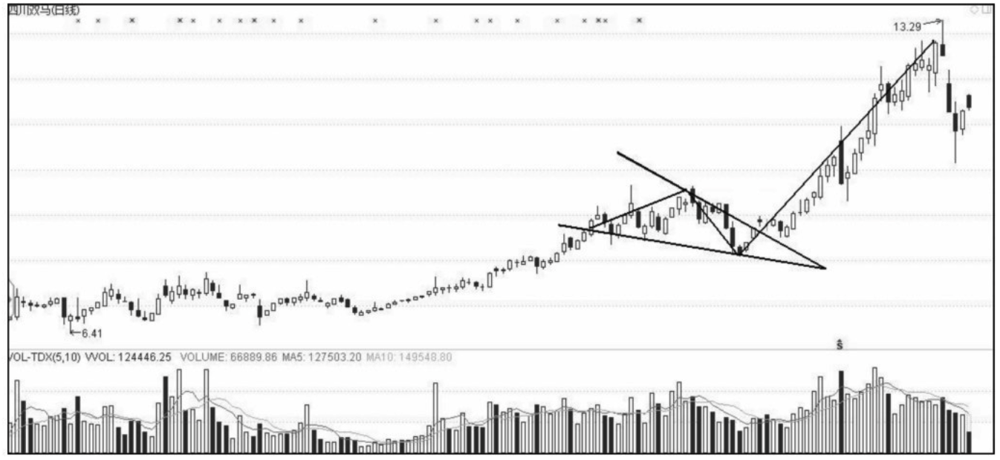
   3. 在成交量方面，两种楔形均呈递减之势，在突破楔形后则骤然放大。在技术上，上升楔形常出现在熊市中，属后市看淡的调整形态；下跌楔形多出现在牛市中，属后市展望良好的调整形态。
4. **矩形形态**。所谓矩形形态，又叫箱形整理，一般出现在股价横盘震荡的阶段。将股价横盘时出现的两个最高点用直线连接，再将两个最低点用直线连接，若这两条直线相互平行，即构成矩形形态。矩形形态的特点是，股价好像被关在一个箱子里，在里面来回振动，具有一定的规律性，成交量也随着股价的涨跌而呈现出量增价涨和量缩价跌的走势。股价在箱子中来回振动的次数可多可少，这决定于市场的需要。通常，振动的次数越多说明市场清洗得越彻底。矩形形态的走势可分为上升矩形形态和下降矩形形态两种。
   1. **上升矩形形态**。上升矩形通常出现在股价的上升趋势的途中，股价在经过一段时间的上涨之后，在某一个价位遇到较强的阻力而回落，之后，便形成了上升矩形。上升矩形一般最终会选择向上突破，因此股价将会进入一个新的上涨阶段（如图2-10所示）。上升矩形反映了多空双方的力量在股价上升的趋势中，在一定的高低点范围内形成的均衡状态，在这期间谁都没有占据绝对的优势。看多的一方认为目前价位是很理想的买入点，于是股价每回落到同一低点附近时就买入，从而形成了一条水平的支撑线；与此同时，看空的一方对后市没有信心，认为股价难以超越前期的高点，于是股价回升到同一高点附近时就卖出，这样就形成了一条平行的阻力线（即该形态的颈线），股价就在支撑线和阻力线内上下波动。最后，当越来越多的投资者开始看好后市而买入，连之前不看好的投资者也由空转多时，股价在成交量的配合下一举突破了上升矩形的水平阻力线，这预示着股价整理过程的结束。一旦矩形向上突破时，其最少涨幅是这个矩形本身的高度，另外，大的矩形形态比小的要可靠得多。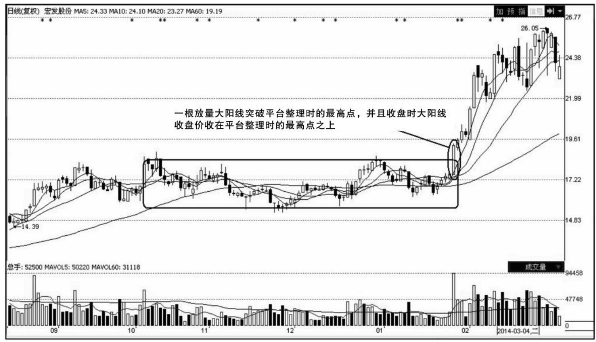
   2. **下降矩形形态**。下降矩形通常出现在股价的下跌趋势的途中，股价经过一段时间的下跌之后，在某一个价位遇到较强的支撑而开始反弹，但是反弹到一定的高点又受到较强的阻力而再度同落，形成了下降矩形。下降矩形一般最终会选择向下突破，因此股价将会进入一个新的下跌阶段（如图2-11所示）。

>在实战中，完全标准的矩形形态并不常见，股价走势常常在整理的末段发生变化，并不再具有大的波幅，这种变形形态比标准的矩形更为可信，因为在形态的末端市场已经明确地表达了它的意愿，说明调整已到末端，即将选择方向。因此，投资者不一定在这种形态发展到突破上边线时才进货。当然，稳健型的投资者最好选择在突破上边线位置处买入。

## “T＋0”的KDJ指标支撑买点研判
KDJ指标是其中反应比较敏感、快速，最被投资者所广泛应用的技术指标之一。KDJ指标是以最高价、最低价及收盘价为基本数据进行计算，得出相应的K值、D值和J值，并将某一周期内的这些数值相连接，形成一个能反映价格波动方向的KDJ指标。其在图表上共有三根线，即K线、D线和J线。其中，K为快速指标，对股价反应敏感；D为慢速指标，对股价反应迟缓；而随机指数的最大值为100，最小值为0。

KDJ是一种进行短中长期趋势分析研判的较佳的技术指标，对做大资金、大波段的人来说，一般当月的KDJ值在低位时应逐步进场吸纳；对于对中线波段的循环高低点作出研判来说，主力在平时的运作时应偏重周KDJ值所处的位置，所以这就往往会出现单边式的行情，造成日KDJ值的屡屡钝化现象；日KDJ对股价变化方向的反应极为敏感，是日常买卖进出的重要研判指标；对于做“T＋0”小波段的短线客来说，30分钟和60分钟KDJ值是重要的参考指标；对于已确定买卖计划即刻下单的投资者来说，5分钟和15分钟KDJ值可以提供最佳的进出时间。

1. 日KDJ指标指示的买点
   1. 当K值在20左右，并从下方向上金叉D线、J线时，为短线看多信号（如图2-12所示）。金叉形成之后，为避免被KDJ指标的骗线所误导，投资者不必急于介入，而要密切关注股价在此之后是否能够积聚足够的上涨动能，同时借助均线等技术手段来研判股价的支撑与压制。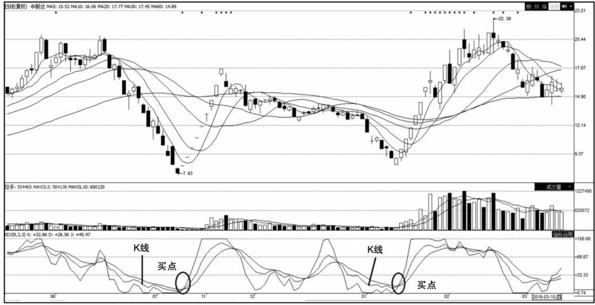
   2. D线是一条慢速线，其技术意义较强。当D线值低于20处于超卖区时，短线股价将可能发生反弹。
   3. 股价下跌，KDJ指标并不会随之下跌，而是低点逐步抬升，称为`“底背离”`现象，这是短线买进的信号。KDJ指标和股价之间的底背离形态，在实战中对于买点的提示准确性较高，投资者可择机介入（如图2-13所示）。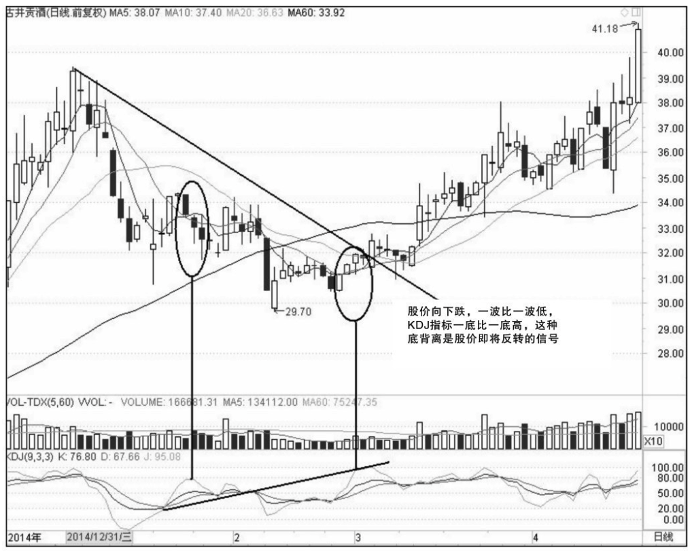
   4. 当J值小于0时，股价可能会形成短期底部，可择机介入。在实战中，J线数值低于0时，一般会出现在**短期过度超跌阶段**，多是由股价的暴跌所引发的。对于在这种情况下的买点提示，投资者必须明白，超跌下的反弹可能多数都不会持久（当然，也有转化为一波上涨趋势的可能），所以如果投资者介入的话。
2. 分时KDJ指标指示的买点
   1. 如果30分钟KDJ指标在20以下盘整时间较长，那么60分钟KDJ指标也是如此。一旦30分钟K线上穿D线并越过20，可能会引发一轮持续在两天以上的反弹行情；若日线KDJ指标也在低位发生`金叉`，则可能是一轮中级行情。但需注意K线与D线形成金叉后，只有K值大于D值20%以上，这种交叉才有效（如图2-14所示）。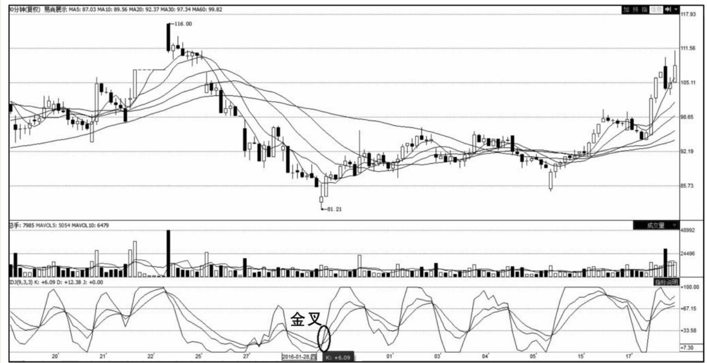
   2. 如果30分钟KDJ指标在80以上向下掉头，K值下穿D值并跌破80，而60分钟KDJ指标才刚刚越过20不到50，则说明行情会出现回挡，30分钟KDJ指标探底后，可能会继续向上。
   3. 如果30分钟KDJ指标在50之前止跌，而60分钟KDJ指标才刚刚向上交叉，则说明行情可能会再持续向上，目前仅属于回档。
   4. 在暴跌过程中，30分钟KDJ指标可以接近0值，而大势依然是跌势不止，此时投资者应该关注一下60分钟KDJ指标。当60分钟KDJ指标向上发生有效交叉时，会引发极强的反弹。

>在KDJ指标的使用过程中，投资者必须认识到一点，即KDJ指标发出看多提示时，股价大多数时候都会出现相应的上涨，但是问题的关键在于，这个上涨是否适宜交易，是否具备获利的空间？幅度狭窄的上涨可能连手续费都赚不到，如果投资者贸然介入，亏损的概率实在太大。基于这种情况，在使用KDJ指标时，投资者必须结合其他技术手段，并综合各方面情况，尤其是量价关系，相应地搭配使用、互为印证，以提高正确率。

## “T＋0”的KDJ指标支撑卖点研判
1. 日KDJ指标指示的卖点
   1. 当K值在80左右，并向下死叉D线、J线时，为短线卖出信号（如图2-15所示），KDJ指标的三条线形成死叉之后，股价迎来了一波下跌。在实战中，这种情况较为常见，KDJ指标的三条线形成死叉也并不都会出现大幅度的下跌，判断这种KDJ指标的卖出提示信号，投资者应综合利用多种技术手段。在图2-15的死叉A中，均线组合粘合、股价重心下移，这时投资者结合KDJ指标的卖出提示，就能得出较为准确的研判结论。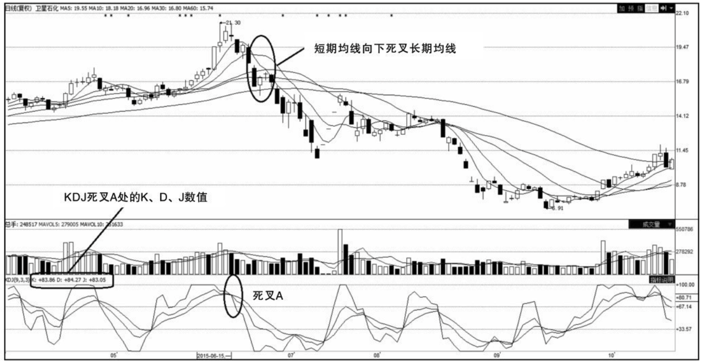
   2. 当D值高于80时，处于超买区，短线股价将可能发生回档。在股价攀升中，当D线值达到80后，投资者必须高度警惕盘中的变化情况，一旦KDJ三线出现死叉或D线趋向向下时，投资者应及时进行减仓操作。在实战中，D线值达到80并不一定就意味着股价立即下跌，有时候反而是一波急升行情的开始阶段，投资者过早离场会错失迅速增值的机会。正确的做法是密切关注D线的运行趋向以及均线等技术工具的相关提示，如果发现有多个技术手段同时发出卖出信号，则清仓或减仓。
   3. 当KDJ指标处于股价的高位，连续两次形成向下的死叉，而股价却依旧继续上涨时，即为“顶背离”现象，是卖出信号（如图2-16所示）。A点股价调整后继续上涨，KDJ指标死叉后虽然保持横向移动，并未出现明显的下移态势，但是却无法和股价同步上行创出新高。KDJ指标的走势是在高位一峰比一峰低，这种明显的顶背离现象是股价将高位反转的信号，这表明股价中短期即将下跌。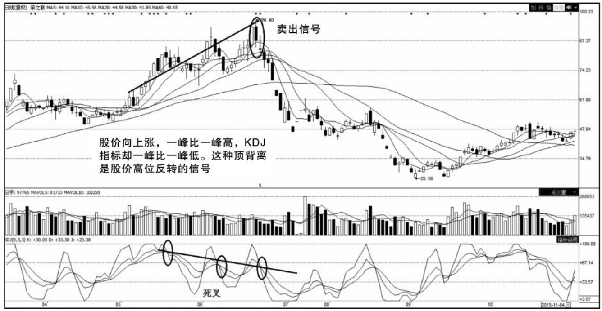
2. 分时KDJ指标指示的卖点
   1. 如果30分钟和60分钟KDJ指标在80以上，盘整较长时间后K线同时向下与D线形成死叉，这表明要开始至少两天的下跌调整行情（如图2-17所示）。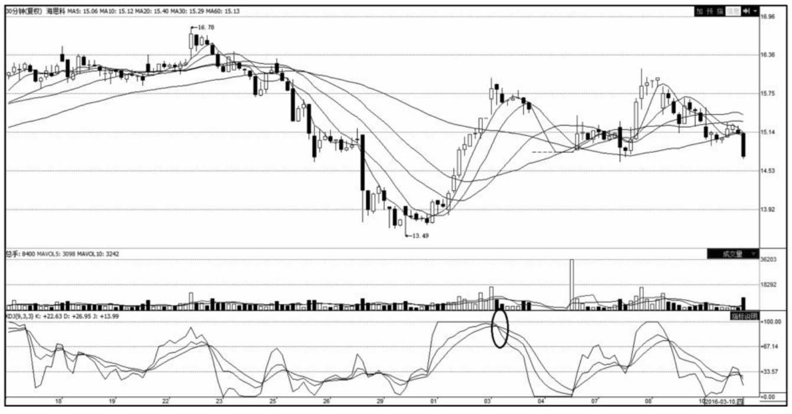
   2. 如果30分钟KDJ指标跌至20以下后掉头向上，而60分钟KDJ指标还在50以上，则要观察60分钟K线是否会有效穿过D线，且K值大于D值的20%。若穿过有效表明将要开始一轮新的上攻；若穿过无效则表明仅是下跌过程中的反弹，反弹过后股价仍要继续下跌。
   3. 在超强市场中，30分钟KDJ指标可以达到90以上，而且在高位屡次发生无效交叉，此时要重点关注60分钟KDJ指标。当60分钟KDJ指标出现向下交叉时，可能引发短线较深的回挡。

KDJ指标是三条曲线，投资者在应用时主要从五个方面进行考虑。
1. 从KD的取值方面考虑。KD的取值范围都是0～100，将其划分为几个区域：超买区、超卖区和徘徊区。按一般的划分法，80以上为超买区，20以下为超卖区，其余为徘徊区。
2. 从KD指标曲线的形态方面考虑。操作时可按形态方面的原则进行操作。
3. 从KD指标的交叉方面考虑。K与D的交叉有死亡交叉和黄金交叉两种。
4. 从KD指标的背离方面考虑。当KD处在高位或低位时，如果出现与股价走向的背离，则是采取行动的信号。
5. J指标取值超过100和低于0，都是价格的非正常区域。J指标大于100为超买，小于0为超卖。

## 黄金分割线的支撑线买点研判
黄金分割线是利用黄金分割比率进行的切线画法。在行情发生转势后，无论是止跌反弹或见顶转跌，都是以一定时间周期内重要的价格高点和低点之间的涨跌幅度作为计算的基数，并将该基数按0.236、0.382、0.5、0.618、0.809分割为5个黄金点，股价在反转后的走势将可能在这些黄金分割点上遇到暂时的阻力或支撑（如图2-18所示）。

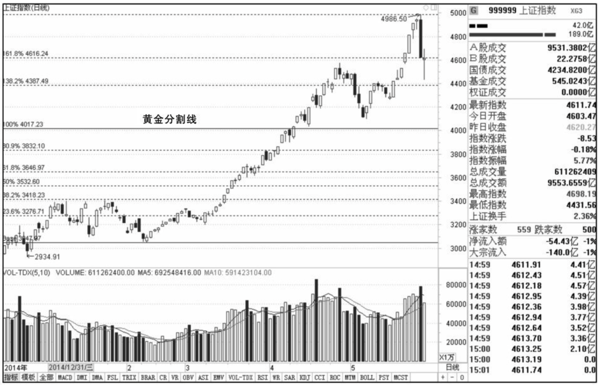

在黄金分割线中运用最经典的数字为0.382、0.618，它们极易产生支撑与阻力。如果股价在一个黄金点遇到支撑，那么价格就会出现反弹现象，相反，跌破支撑，股价就会向下一个黄金点寻找支撑。

1. 利用黄金分割线对上涨途中的调整进行分析
   1. 假设一只上涨的股票，由12元涨至18元，呈现一种强势，然后又出现回调，那么它将会回调到什么价位呢？黄金分割线的0.382价位为15.70元，0.5价位为15.00元，0.618价位为14.29元，这就是该股的三个支撑位。
2. 利用黄金分割线寻底
   1. 当股价下跌时，脱离高档，从下跌的速度和持久性，以及黄金分割线来看，它的跌势也会在下跌幅度接近或达到0.382与0.618时发生变化。也就是说，与上升行情相似，当下跌幅度接近或超越38.2%或61.8%时发生变化，就容易出现支撑，并且有反转上升而结束下跌行情的可能。与上升行情的黄金分割线公式相同，下跌行情展开时，除了在0.382和0.618有支撑外，在0.191、0.809处均可能发挥支撑的效力。

## 黄金分割线的阻力线卖点研判
黄金分割线在股票投资实战中具有重要的价值，它可以通过前期走势来预测未来价格的阻力位与支撑位。当然，时间周期越长，其预测准确性越高。时间周期越短，其预测准确性也越低（如图2-19所示）。

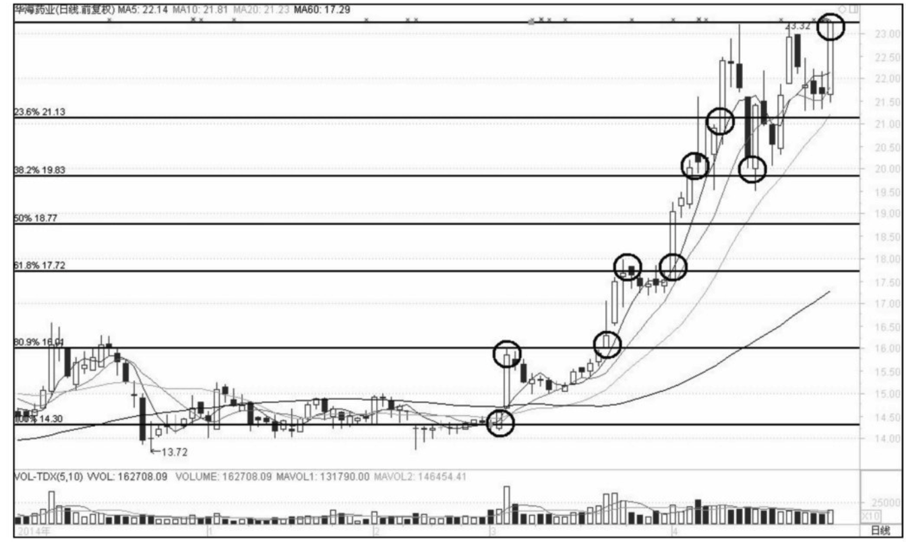

## 布林线下轨的买点研判
布林线指标（BOLL）是趋势投资者的利器，布林线轨道代表着趋势，中轨朝上即是多头走势，反之则是空头走势，判断极为简单。布林线指标由三条线构成，其中上下两条线可以分别代表着价格的阻力位和支撑位，中间一条是均线，价格在大多数时间会运行于阻力位和支撑位所形成的通道中（如图2-20所示）。布林线直观地反映了盘整和单边走势，在盘整行情中使用的效果最好。

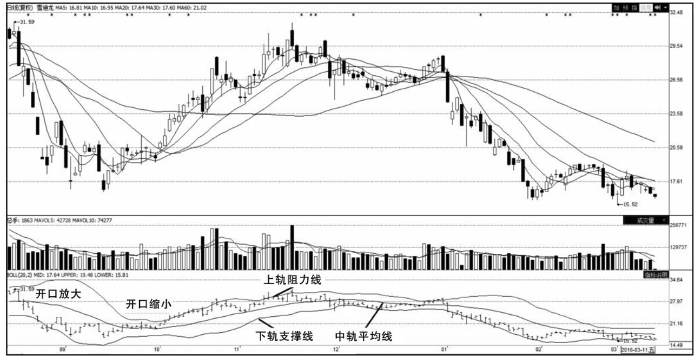

由于布林线指标中的下轨对股价有一定的支撑作用，因此当股价下跌触及下轨时，短线交易者可以买入股票等待股价上涨。既然投资者已经在股价下跌中进行“T＋0”操作来减仓，那么即便股价短线反弹的空间有限，抢反弹面临的风险也会很小。

在下跌趋势中，布林线下跌的支撑经常是不起作用的。但如果股价连续超跌，在价格回落至布林线下轨的那一刻出现明确的反弹信号，那么将是投资者做多的机会。

在股价下跌空间比较大的时候，布林线的开口会放大，而布林线下轨到布林线中轨的距离也会相对放大。如果投资者确认股价从布林线下轨获得的支撑有效，那么价格从布林线下轨反弹至布林线上轨的上涨空间就很高了。

空头趋势中获得比较好的买涨利润是不容易做到的，而股价从布林线下轨反弹至布林线上轨的情况也是值得关注的（如图2-21所示）。

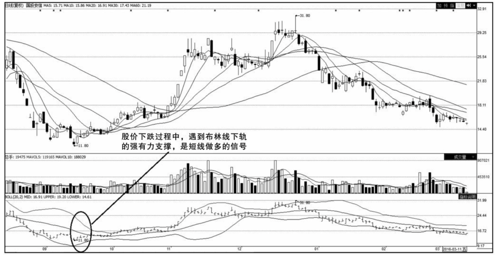

如图2-21所示，股价日K线图中的反弹信号，为一根明确的探底回升的小锤子线，这表明下轨的支撑明显，是投资者短线建仓的位置。该股量能放大，价格虽然短线回落，但布林线下轨的支撑不容忽视。在“T＋0”操作中，如果投资者判断股价已经回落至布林线下轨，那么投资者可以在分时图中价格低点进行建仓，这样能很容易获得短线操作的利润。

>布林线通常的应用规则是，当价格向下击穿下轨支撑线的时候买点出现，向上击穿上轨阻力线的时候卖点出现，而中间的均线（中轨）代表着一个趋势的发展方向。在实战中，我们会发现布林线的这个应用规则往往并不完全适用，而只是在行情处于趋势维持或横向盘整阶段有较好的指示作用。在一轮急速下跌的趋势中，击穿布林线下轨的支撑线并不见得是一个好的买点，有时候甚至只是大跌的开始；而在一轮飚涨的趋势中，突破阻力线也并不都是一个极佳的卖点，有时候它也仅仅只是预示着行情的飙升阶段才刚刚由此起步。因此，投资者一定要切记，布林线仅仅是一个技术指标，它并不决定价格的涨跌，只是在一定程度上起到衡量价格涨跌的作用。不但是布林线，其他技术指标的作用也大体如此。

## 布林线上轨的卖点研判
布林线的上轨是股价高位遇到阻力的重要位置，当布林线的上轨走平或向下时，对股价具有较强的压制作用。这个时候的股价往往会处于下降趋势或横盘震荡的走势之中。这种走势中的股价上摸上轨多半是股价反弹，或行情下跌前主力的刻意拉高，一旦股价受到阻力后将重拾跌势，这是投资者减仓或清仓的较好机会。

在股价回升阶段，布林线上轨的阻力总是很强。如果股价放量上涨并且向上突破了布林线的上轨，那么相应的回调空间就比较长了。在正常的情况下，布林线的上轨约束了股价的继续上涨，即便股价收盘短时间突破了布林线的上轨，但在接下来的时间里肯定是要调整的。因此，当股价运行到布林线上轨时，投资者获利丰厚以后，短线减仓即是主动止盈的明智之举，也是避免价格回落造成损失的正确选择。

当然，强势股票可能会沿着布林线上轨运行，弱一些的个股就会明显回落，直到价格回调至布林线中轨，并且在重新获得支撑后又开始上涨。

虽然股价上涨势头较强，布林线上轨的阻力也很强，但个股仍有进一步上升的空间。在强势上涨的股票中，如果价格始终没有脱离布林线的上轨，那么价格短线的走势必然还是很强的。

投资者在“T＋0”操作中选择止盈位置，可以根据日K线中布林线上轨的位置来判断。股价回升至布林线上轨，并且出现见顶信号之时，是不错的高位止盈的机会（如图2-22所示）。

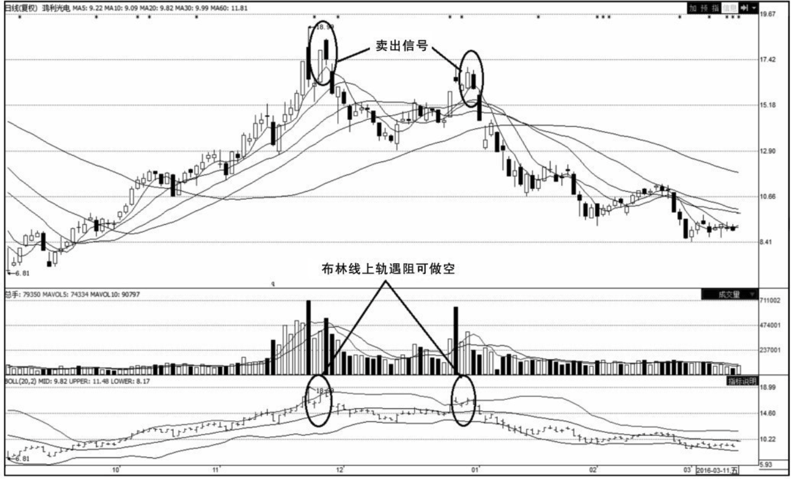

>**布林线上轨对价格的影响很大，是投资者理想的做空位置**。对于“T＋0”操作来讲，没有价格短线回落，也不可能有价格强势反弹的获利机会。价格在布林线上轨遇阻回落，在布林线的中轨反弹上涨，正是投资者进行了“T＋0”操作的重要时机。

## 布林线中轨的支撑买点研判
**布林线中轨向上提示的是，价格已形成了上升趋势，这个时候投资者做多获利的概率是比较大的**。而布林线中轨本身具有强大的支撑作用，它会促使价格不断地上行。所以，只要支撑位作用有效，那么投资者就应当坚定持仓。

在上升趋势中，布林线中轨有比较强的支撑作用，股价往往很难跌破中轨。因此，在整体的上升趋势中，投资者需要做的就是寻找逢低做多的进场点。从布林线的角度看，价格回落，如果在布林线中轨上获得支撑，那么就是一个极好的逢低做多时机。这就给了我们一个很好的参照标准，一旦中轨的支撑有效，就可以逢低做多，当然前提是股价要保持上行趋势。

如图2-23所示，南山铝业当日开盘后有一波快速拉升，然后横盘震荡，价格小幅回落。我们看到A处价格逐渐向布林线中轨靠拢，然而布林线中轨仍然保持上行的趋势。比较神奇的是无论怎么震荡，价格始终没有跌破布林线中轨，只是悬浮在上面。这是布林线中轨支撑的典型表现，说明多头的承接力较强，后市应该继续看涨，投资者可以逢低介入做多。此后该股果然继续上涨，这得归功于布林线的有力支撑。布林线中轨的支撑给了我们一个很好的做多参照点，而且比较容易把握。依照布林线中轨逢低做多后，投资者可以根据中轨的支撑进行止损，只要不跌破中轨，就可以坚定持仓。

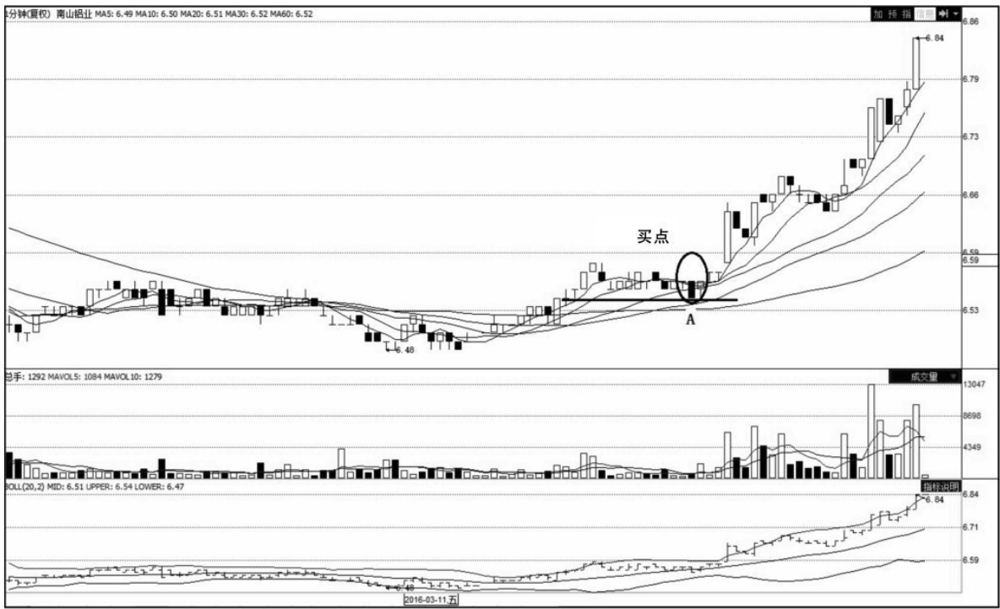

如果投资者用布林线作参考，价格回调到布林线中轨A处获得有效支撑，那么这是极佳的逢低做多的良机。

上升趋势中也有价格的回调，A处小阴线下跌，跌破布林线中轨，但第二根K线收阳，回到布林线中轨之上。这也是中轨支撑的一种表现，尽管瞬间跌破但也不妨碍整体的上升趋势。因此，在布林线中轨上行，小阴线跌破中轨时不要忙于止盈，投资者还可以再观察一下，重点还是要看布林线中轨本身有没有改变方向。当然，如果是放量的中长阴线击穿布林线中轨，下跌态势明确，那么投资者则需要果断止损。

>在布林线中轨向上的情况下，只要K线位于布林线中轨上方，不管K线形态如何变化，都要始终耐心持仓，避免价格小级别波动的影响。

## 布林线中轨的阻力卖点研判
在股价下挫的过程中，布林线中轨是股价确认空头趋势首先要确认的突破口。股价一旦向下跌破了布林线中轨，那么投资者就应该进行平仓操作。因为股价跌破了布林线中轨，这就意味着进一步下跌的空间也被打开了。随着时间的推移，股价会在布林线中轨的压制下不断地下挫（如图2-24所示）。

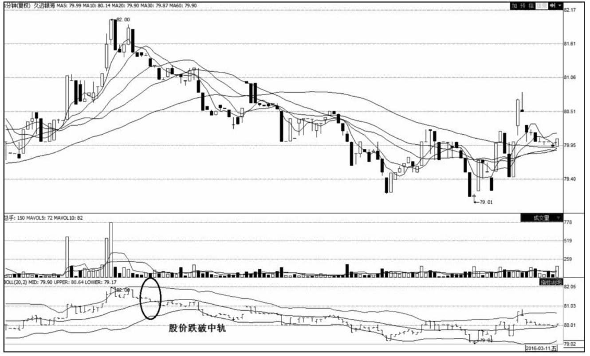

在整体下降的趋势中，股价也有反弹，这对空头来说是个考验，此时投资者要能判断清楚价格到底是反弹还是反转走势。下行的布林线中轨不仅代表了价格运行的趋势，也对价格形成了一定的阻力。当价格反弹到布林线中轨附近止涨时，意味着中轨的阻力发挥作用了，这是逢高做空的时机。

倘若股价缓慢反弹，那么在股价触碰布林线中轨后止涨下跌时，则表明反弹结束。这显然就是反弹的高点，也是最佳的逢高做空的点位。投资者逢高做空后可以用布林线中轨作为止损标准，只要没有有效突破中轨就可以继续做空。

倘若股价突破布林线中轨，并且当时的中轨仍是下行状态，那么对股价有很大的压制作用，因此很快股价跌回至中轨之下，反弹结束。事实上，这也是布林线中轨的阻力表现之一，短暂突破不代表阻力消除，所以投资者不要忙着止损。反弹受到布林线中轨的压制，形成反弹高点，是逢高做空的良机。当然，如果布林线中轨在大幅下跌后走平，此时突破中轨可能有较大地反弹，则不宜做空。

>在得到确认的下跌趋势中，股价首次反弹至布林线中轨的情况，经常是可以把握的做空位置。如果投资者短线持股到股价反弹至布林线中轨的那一刻，那么对应的止盈机会必然在中轨附近出现。并且价格趋势不会轻易结束，在空头趋势中运行的股价也同样如此。首次反弹到布林线中轨的情况，也是股价二次回落的起始点。

# 高抛低吸：分时图“T+0”操作实战套利技巧
## “T＋0”操作为什么要看分时图
1. 分时图可以研判分时的趋势。
   1. 分时图中有两条线，一条是该种股票即时成交的股价线，也叫即时线；另一条是该种股票即时成交的均线，也叫`均价线`。两条线直观上比较简洁，易于识别趋势的发展。比如股价线一直在均价线之上，就是`强势`（如图3-1所示），反之就是`弱势`。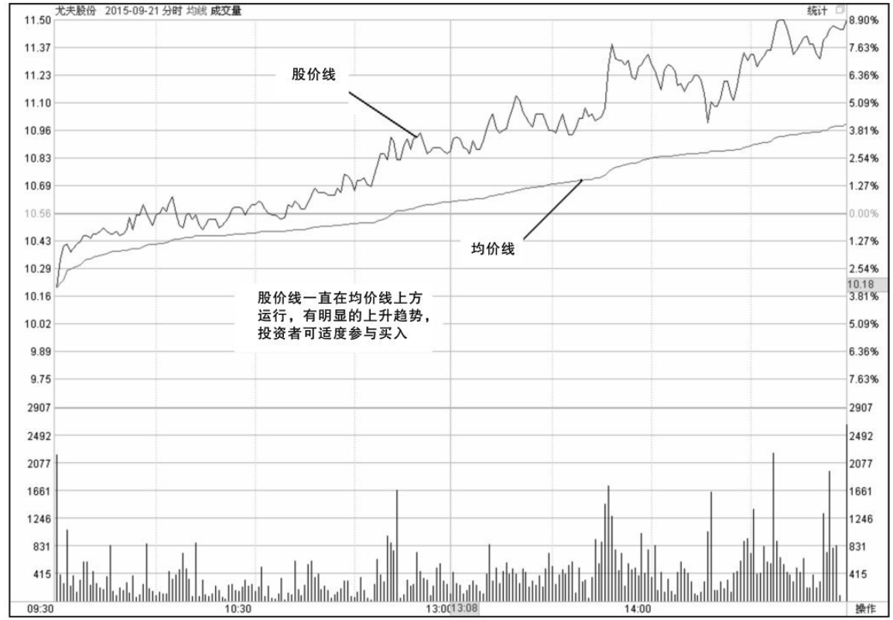
   2. 如果分时图还伴随有明显的下降趋势，那么投资者就应该考虑卖出（如图3-2所示）；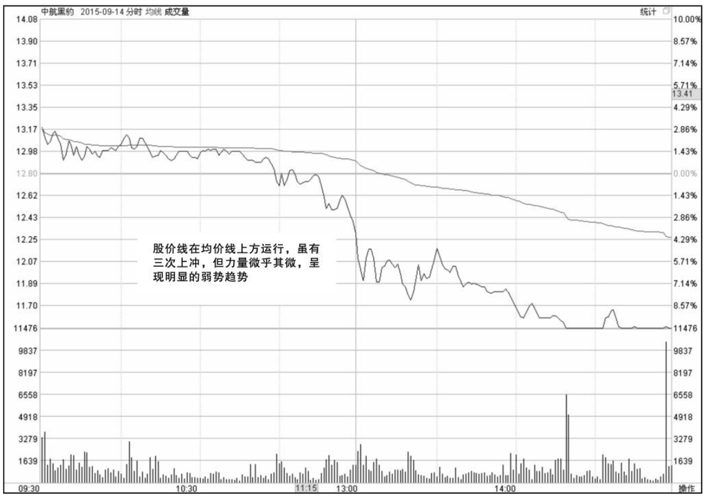
   3. 还有一种是纠缠状的，即均价线和股价线纠缠在一起，这种情况属于`盘整`（如图3-3所示），此时投资者应持币观察。分时图的上升趋势、下降趋势和横盘趋势在尾市如果突然变盘，否定了先前的趋势，那么投资者应及时作出反应。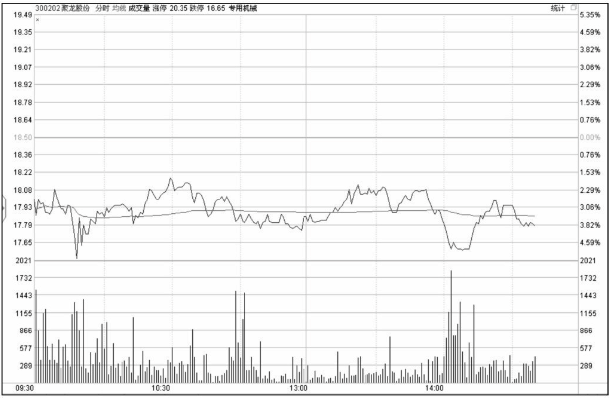
   4. 研判分时图走向时，投资者要注意向上、向下、横向盘整都和成交量密切相关。上涨的股票，上涨要有量，上涨无量属于量价背离，所以投资者要注意回调；向下放量是股票要继续走低的前兆，投资者可以在股价向上冲高时卖出。如果下跌无量，则是庄家洗盘的态势，所以投资者可以继续持有。
2. 分时图可以洞察出股票主力控盘的轨迹。个股在分时走势图中，尤其是在早盘，会暴露出庄家对该股股价未来走向的潜在意图。
3. 分时图中易于发觉变盘区域和变盘信号。股价一直在均价线之上运行，不破就安全持股，一旦跌破了，那么就是卖点。所以，跌破均价线就说明分时图破位，股价将选择弱势运行，投资者要提防随后的下滑风险，应当卖出为上（如图3-4所示）。如果随后股价走稳了，继续站稳均价线，那投资者便可以买入。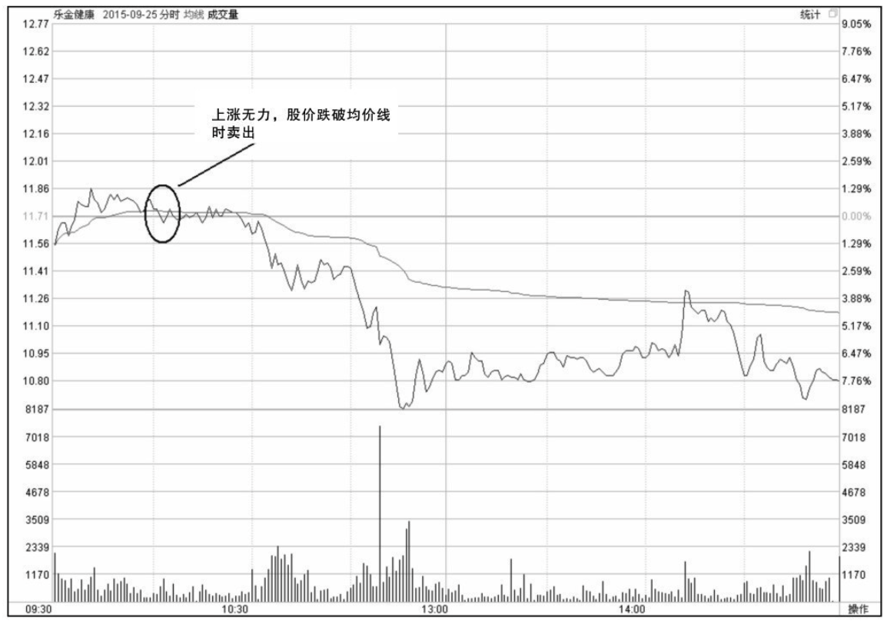
4. 分时图可以判断股价当天的高低点

## “T＋0”分时图的维度分析

