    作者 老牛
    人民邮电出版社 / 2016-07
    ISBN 9787115426345

[豆瓣链接](https://book.douban.com/subject/30684163/)

- [“T+0”交易的诱惑](#t0交易的诱惑)
  - [“T＋0”操作必须具备的前提条件](#t0操作必须具备的前提条件)
  - [“T＋0”选股标准的参考因素](#t0选股标准的参考因素)
- [支撑“T+0”套利的日线趋势研判](#支撑t0套利的日线趋势研判)
  - [6种日K线底部反转形态](#6种日k线底部反转形态)
  - [4种日K线调整形态](#4种日k线调整形态)
  - [“T＋0”的KDJ指标支撑买点研判](#t0的kdj指标支撑买点研判)
  - [“T＋0”的KDJ指标支撑卖点研判](#t0的kdj指标支撑卖点研判)
  - [黄金分割线的支撑线买点研判](#黄金分割线的支撑线买点研判)
  - [黄金分割线的阻力线卖点研判](#黄金分割线的阻力线卖点研判)
  - [布林线下轨的买点研判](#布林线下轨的买点研判)
  - [布林线上轨的卖点研判](#布林线上轨的卖点研判)
  - [布林线中轨的支撑买点研判](#布林线中轨的支撑买点研判)
  - [布林线中轨的阻力卖点研判](#布林线中轨的阻力卖点研判)
- [高抛低吸：分时图“T+0”操作实战套利技巧](#高抛低吸分时图t0操作实战套利技巧)
  - [“T＋0”操作为什么要看分时图](#t0操作为什么要看分时图)
  - [“T＋0”分时图的维度分析](#t0分时图的维度分析)
  - [分时线与分时均价线的走势变化](#分时线与分时均价线的走势变化)
  - [分时图“T＋0”操作的5种底部形态](#分时图t0操作的5种底部形态)
  - [分时图“T＋0”操作的7种突破形态](#分时图t0操作的7种突破形态)
  - [分时图的其他典型形态](#分时图的其他典型形态)
  - [分时图中建仓的支撑信号](#分时图中建仓的支撑信号)
  - [分时图中震仓的表现](#分时图中震仓的表现)
  - [分时图中强势拉升时的表现](#分时图中强势拉升时的表现)
  - [分时图中出货的表现](#分时图中出货的表现)
- [步步为营：“T+0”套利的短线启动时机](#步步为营t0套利的短线启动时机)
  - [利用均线做“T＋0”](#利用均线做t0)
  - [利用买卖盘口做“T＋0”](#利用买卖盘口做t0)
- [因势利导：不同市况中的“T+0”套利策略](#因势利导不同市况中的t0套利策略)
  - [牛市中的“T＋0”操作技巧](#牛市中的t0操作技巧)
  - [熊市中的“T＋0”操作技巧](#熊市中的t0操作技巧)
  - [震荡市中的“T＋0”操作技巧](#震荡市中的t0操作技巧)

# “T+0”交易的诱惑
## “T＋0”操作必须具备的前提条件
1. **熟悉股性和市场规律**。“T＋0”操作必须建立在对个股的长期观察和多次模拟操作的基础上，投资者要非常熟悉个股股性和市场规律。
2. **实时看盘的时间和条件**。“T＋0”操作要求投资者必须有实时看盘的时间和条件，而且还要求投资者有一定短线操作的经验和快速的盘中应变能力。
3. **手中既有筹码又有资金**。投资者做盘中“T＋0”操作时，手中不仅必须持有一定数量的股票，而且还必须备有能够进行等额交易的可用资金。换句话说，盘中“T＋0”操作必须是既有筹码又有资金，二者缺一不可。
4. **盘中应有较大的震荡**。判断当天股价能否会有较大幅的震荡，是投资者能否操作盘中“T＋0”成功的必备条件，因为只有股价震荡时，才会有做差价的机会。通常要求20天平均振幅要大于4%。

>“T＋0”操作一定要做自己熟悉的个股，而且要选择股性好的股票，即振幅较大、较活跃的股票。盘中“T＋0”操作要求投资者切忌贪心，一旦有所获利，或股价上行遇到阻力，便立刻落袋为安。这种操作事先不制定具体盈利目标，只以获取盘中震荡差价利润为操作目标。

## “T＋0”选股标准的参考因素
1. **应选流通盘适中的个股**。做“T＋0”操作选股首先要看流通盘的大小。流通盘太大不行，大盘股的波动较小，不容易出现套利空间；流通盘太小也不行，容易被主力控盘，出现突如其来的砸盘。那么流通盘多大比较适宜做“T＋0”操作呢？一般来说，投资者应该选流通盘2亿～5亿股的股票为佳。
2. **应选具有热点题材的个股**。参与热点概念炒作是A股市场目前赚钱最快的投资方法。根据各种热点题材，比如医药电商、智能家居、基因测序、虚拟现实等，如果投资者能快速找到相关概念股，那么就可以尽早布局，及时骑上牛股。
3. **应选放量的个股**。成交量的放大，意味着换手率的提高、平均持仓成本的上升，上档抛压因此减轻，股价也才会持续上涨。有时，在庄家筹码锁定良好的情况下，股价也可能缩量上攻，但缩量上攻的局面不会持续太久，否则平均持仓成本无法提高，导致抛压大增，股票缺乏持续上升的动能。
4. **应选取中线看好的个股**。所谓中线看好，是指这只股票短线涨不涨无所谓，关键是你能知道这只股票未来一两个月以后会上涨。

这里主要以技术分析角度来简单讨论。用技术分析可以从以下几个角度来选中线有较大概率上涨的股票。

1. 均线系统形成多头排列。均线多头排列趋势为强劲上升趋势，操作思维为多头思维。投资者进场时以均线的支撑点为买点，下破均线支撑时止损。
2. 股价还处于上升通道的初期，在上升通道下轨的第三个低点附近可以考虑建底仓。
3. 股价长期横盘整理向上突破，并经过回抽确认，重新拐头向上。

除了以上几个参考因素外，做“T＋0”操作所选标的还必须考虑一个因素：**即个股股价需在20日均线上面**。这样综合起来风险会小一点，“T＋0”操作的胜率也会增加。这是因为20日均线是某只股票在市场上前20天的平均收盘价格，其意义在于它反映了这只股票20天的平均成本，是一根短期和中期过渡的均线，在短线操作的过程中可以充当趋势线。一般来说，**20日均线连续三天向上，且股价站在20日均线之上，代表中短期趋势向上。反之，当股价跌到20日均线下面，且20日均线连续三天向下时，一般则表示趋势向下**。

# 支撑“T+0”套利的日线趋势研判
## 6种日K线底部反转形态
1. **V形底**。股价在下跌趋势中，下挫速度越来越快，最后在下跌最猛烈的时候，出现了戏剧性的变化，股价触底反弹，然后一路上扬。其形态走势像英文字母“V”，故命名为“V形底”（如图2-1所示）。V形底形成时间最短，是研判最困难、参与风险最大的一种形态。但是这种形态的爆发力最强，把握得好，投资者可以在短期内赢取暴利。它形成的原因是由于市场受利空打击或其他意外情况影响造成的恐慌性抛售，引起股价超跌，从而产生报复性反转行情。

2. **双重底**。双重底股价走势像英文字母“W”，因此又称W形底，是一种较为可靠的底部反转形态（如图2-2所示）。双重底一般多发生于波段跌势的末期而不会出现在行情趋势的中途。对双重底形态的研判重点是，当股价在右边的底部时，技术指标是否会出现背离特征。如果技术指标不产生背离，那么W形底就可能向其他形态转化（比如多重底）。即使W形底最终成立，其上攻动能也会较弱。

3. **三重底**。经过一轮下跌后，股价出现小幅反弹，由于空头气氛浓厚，所以股价再次下探，并在上轮低点受到支撑，买盘增强，因此股价再次拉起，至前期反弹高点附近受阻后回落，此时前两次低点的连线形成强力支撑，股价拉起，一举突破前两次反弹高点形成的颈线位，这种三低两高的形态称之为三重底。三重底是主力吸货到洗盘的体现，股价经过一轮下跌后，主力开始逐步集筹。这时在主力吸货的作用下，股价出现小幅反弹。由于此时空方势大，且继续大规模集筹已不划算，所以股价出现回落，再次探底，主力在前期低点附近更是不遗余力地吸货，使得股价再次拉起。出于洗盘和集筹的双重目的，主力将股价再次打至前期低点，不坚定的持筹者将被洗出，主力也借机再次集筹（前两重底部是被动性下跌，而最后一重底部则是主动性下跌，其性质完全不同），等洗盘结束后，股价一举突破前两次反弹高点形成的颈线位，并开始一轮上升行情。
4. **圆弧底**。圆弧底形态属于一种调整形态，多出现在价格底部区域，是极弱势行情的典型特征。其形态走势表现在K线图中宛如锅底状（如图2-3所示）。圆弧底形态的形成原因是由于有部分做多资金正在少量地逐级温和地建仓造成的，显示的股价也已经探明阶段性底部的支撑。它理论上的涨幅通常是最低价到颈线位的涨幅的一倍。

5. **潜伏底**。股价在一个极狭窄的范围内横向移动或缓慢阴跌，并且每日股价的高低波幅较小，成交量亦十分稀疏，仿佛像冬眠时潜伏在底部的蛇，这种形态就是潜伏底。通常潜伏底的时间比较长，但是其突破后产生的成交量激增和股价的暴涨也是惊人的。所以说，**潜伏底是横有多长，竖有多高**。
6. **头肩底**。头肩底就是指形态酷似人的头与肩的关系的K线组合形态，头肩底形状呈现三个明显的低谷，其中位于中间的一个低谷比其他两个低谷的低位更底（如图2-4所示）。
   1. 在空头市场中，做空的力量持续，使得股价不断走低，由于行情已有一定的跌幅，股价出现了短期的反弹，但由于积重难返，反弹时买盘的力量有限，所以反弹很快就结束了，这就形成了“左肩”。接着股价又继续下跌，且跌破了左肩的最低点，因此随着股价继续下跌、成交量锐减而最终形成了“头部”。当股价回升到左肩的反弹高点附近时，出现了第三次的回落，之后又有所上升，在跌势基本稳定下来后形成“右肩”。最后股价发动较有力度的冲击，有效突破了颈线的阻力，整个头肩底的形态就此完成，当然，随之而来的往往就是一波较大的上升行情。
   2. 头肩底形态的颈线是指左肩高点和右肩高点的连线，也就是两个明显的反弹高点的连线。在实际走势中，由于两个高点完全一致的情况是极其少见的，因此，依据这种定义画出的颈线都是倾斜的，这就对把握具体买点会产生一些影响。

   

>双重底、头肩底、圆弧底放量突破颈线位时，应是买入的时机。这里有两点必须高度注意。一是**必须放量突破方为有效突破**。没有成交量配合的突破是假突破，股价往往会迅速回归启动位。二是**在低价位的突破可靠性更高，高位放量突破很可能是庄家营造的“多头陷阱”**，引诱散户跟风，从而达到出货的目的。许多时候，放量突破颈线位时，往往有回抽确认，这时也可作为投资者建仓的良机。

## 4种日K线调整形态
1. **三角形形态**。在三角形调整形态中，价格波动空间在持续不断地收缩。虽然前期价格已经完成并形成了明确的单边趋势，但是在三角形的调整形态中，价格不会出现明显的单边趋势，而是在阻力线和支撑线共同作用下不断震荡。三角形走势可分为对称三角形态、上升三角形态和下降三角形态等。
   1. **对称三角形态**。对称三角形态代表的是买卖双方力量在该段价格区域内势均力敌，暂时处于平衡状态（如图2-5所示）。
      1. 从形态的角度看，高点的连线构成了一条短期阻力线，低点的连线构成了一条短期的支撑线，两条线呈对称状，表明短期股价需要寻找突破方向。因此，对称三角形存在的时间比较短，延续此前趋势的可能性大；如果股价不能迅速突破阻力线或支撑线，那么就很有可能演变成其他形态。
      2. 在成交量方面，在对称三角的形成过程中成交量不断减少，直到股价有所突破时，成交量才会随之增加。如果股价是向上突破的，则需要大成交量的伴随，如果是向下突破的则不必如此。
   2. **上升三角形态**。当买家不能突破某档阻力，但又不断推进的时候就形成了上升三角形。上升三角形在形成过程中的成交量呈逐渐缩小之势，显示了买卖双方在该区域内的较量，但买方的力量逐渐占上风，低点不断抬高，并不断尝试突破上面的水平阻力线。该阻力线一旦被突破，那么前期多头趋势就有望得到延续，成交量也将大幅上升（如图2-6所示）。
   3. **下降三角形态**。下降三角形是上升三角形的一个标准对立图形。在下降三角形中，存在一条由逐渐下降的高点连成的斜边阻力线，而下面则是一条水平的支撑线，阻止价格向下突破。下降三角形的成交量变化也呈下降之势，但因价格变动与上升三角形相反，故卖方将逐渐占上风，至股价跌破支撑线时，瞬间杀跌的走势自然会完成，后市将极不乐观。
2. **旗形形态**。旗形形态就像一面挂在旗杆顶上的旗帜，它通常在急速而又大幅的市场波动中出现，股价经过一连串紧密的短期波动后，形成一个狭小长方形。旗形走势可分为上升旗形和下降旗形两种。
   1. **上升旗形形态**。上升旗形的形成过程是：股价经过陡峭的飙升后，接着形成一个紧密、狭窄和稍微向下倾斜的价格密集区域。把这密集区域的高点和低点分别连接起来，就可以画出两条平行而又下倾的直线，这就是上升旗形（如图2-7所示）。
   2. **下降旗形形态**。下降旗形则刚好相反，当股价出现急速或直线的下跌后，接着形成一个波动狭窄而又紧密且稍向上倾的价格密集区域，把其高点和低点分别以直线连接起来，就是下降旗形。
   3. 无论是上升旗形还是下降旗形，**其形成过程中的成交量都是在逐渐减少的**。从技术意义上看，上升旗形是后市极为看好的调整形态，其突破阻力线后的上升幅度至少等于旗杆的幅度；而下降旗形则是一段大跌小回的反弹行情，后市极为看淡，其跌破支撑线后的下跌幅度一般不会小于旗杆的幅度。
3. **楔形形态**。楔形走势有上升楔形和下降楔形之分，不管股价的运行趋势如何，楔形的调整形态都与股价的运行趋势相反。
   1. **上升楔形形态**。上升楔形的形成过程是，股价经过一次下跌后出现强烈的技术性反弹，接着又掉头下落，但其低点比前一次要高，随后做窄幅波动，但其低点一个比一个高，高点也一个比一个高。将高点和低点分别连线，便形成了向上倾的三角形（如图2-8所示）。
   2. **下降楔形形态**。下降楔形则相反，高点一个比一个低，低点也一个比一个低，形成向下倾斜的三角形（如图2-9所示）。
   3. 在成交量方面，两种楔形均呈递减之势，在突破楔形后则骤然放大。在技术上，上升楔形常出现在熊市中，属后市看淡的调整形态；下跌楔形多出现在牛市中，属后市展望良好的调整形态。
4. **矩形形态**。所谓矩形形态，又叫箱形整理，一般出现在股价横盘震荡的阶段。将股价横盘时出现的两个最高点用直线连接，再将两个最低点用直线连接，若这两条直线相互平行，即构成矩形形态。矩形形态的特点是，股价好像被关在一个箱子里，在里面来回振动，具有一定的规律性，成交量也随着股价的涨跌而呈现出量增价涨和量缩价跌的走势。股价在箱子中来回振动的次数可多可少，这决定于市场的需要。通常，振动的次数越多说明市场清洗得越彻底。矩形形态的走势可分为上升矩形形态和下降矩形形态两种。
   1. **上升矩形形态**。上升矩形通常出现在股价的上升趋势的途中，股价在经过一段时间的上涨之后，在某一个价位遇到较强的阻力而回落，之后，便形成了上升矩形。上升矩形一般最终会选择向上突破，因此股价将会进入一个新的上涨阶段（如图2-10所示）。上升矩形反映了多空双方的力量在股价上升的趋势中，在一定的高低点范围内形成的均衡状态，在这期间谁都没有占据绝对的优势。看多的一方认为目前价位是很理想的买入点，于是股价每回落到同一低点附近时就买入，从而形成了一条水平的支撑线；与此同时，看空的一方对后市没有信心，认为股价难以超越前期的高点，于是股价回升到同一高点附近时就卖出，这样就形成了一条平行的阻力线（即该形态的颈线），股价就在支撑线和阻力线内上下波动。最后，当越来越多的投资者开始看好后市而买入，连之前不看好的投资者也由空转多时，股价在成交量的配合下一举突破了上升矩形的水平阻力线，这预示着股价整理过程的结束。一旦矩形向上突破时，其最少涨幅是这个矩形本身的高度，另外，大的矩形形态比小的要可靠得多。
   2. **下降矩形形态**。下降矩形通常出现在股价的下跌趋势的途中，股价经过一段时间的下跌之后，在某一个价位遇到较强的支撑而开始反弹，但是反弹到一定的高点又受到较强的阻力而再度同落，形成了下降矩形。下降矩形一般最终会选择向下突破，因此股价将会进入一个新的下跌阶段（如图2-11所示）。

>在实战中，完全标准的矩形形态并不常见，股价走势常常在整理的末段发生变化，并不再具有大的波幅，这种变形形态比标准的矩形更为可信，因为在形态的末端市场已经明确地表达了它的意愿，说明调整已到末端，即将选择方向。因此，投资者不一定在这种形态发展到突破上边线时才进货。当然，稳健型的投资者最好选择在突破上边线位置处买入。

## “T＋0”的KDJ指标支撑买点研判
KDJ指标是其中反应比较敏感、快速，最被投资者所广泛应用的技术指标之一。KDJ指标是以最高价、最低价及收盘价为基本数据进行计算，得出相应的K值、D值和J值，并将某一周期内的这些数值相连接，形成一个能反映价格波动方向的KDJ指标。其在图表上共有三根线，即K线、D线和J线。其中，K为快速指标，对股价反应敏感；D为慢速指标，对股价反应迟缓；而随机指数的最大值为100，最小值为0。

KDJ是一种进行短中长期趋势分析研判的较佳的技术指标，对做大资金、大波段的人来说，一般当月的KDJ值在低位时应逐步进场吸纳；对于对中线波段的循环高低点作出研判来说，主力在平时的运作时应偏重周KDJ值所处的位置，所以这就往往会出现单边式的行情，造成日KDJ值的屡屡钝化现象；日KDJ对股价变化方向的反应极为敏感，是日常买卖进出的重要研判指标；对于做“T＋0”小波段的短线客来说，30分钟和60分钟KDJ值是重要的参考指标；对于已确定买卖计划即刻下单的投资者来说，5分钟和15分钟KDJ值可以提供最佳的进出时间。

1. 日KDJ指标指示的买点
   1. 当K值在20左右，并从下方向上金叉D线、J线时，为短线看多信号（如图2-12所示）。金叉形成之后，为避免被KDJ指标的骗线所误导，投资者不必急于介入，而要密切关注股价在此之后是否能够积聚足够的上涨动能，同时借助均线等技术手段来研判股价的支撑与压制。
   2. D线是一条慢速线，其技术意义较强。当D线值低于20处于超卖区时，短线股价将可能发生反弹。
   3. 股价下跌，KDJ指标并不会随之下跌，而是低点逐步抬升，称为`“底背离”`现象，这是短线买进的信号。KDJ指标和股价之间的底背离形态，在实战中对于买点的提示准确性较高，投资者可择机介入（如图2-13所示）。
   4. 当J值小于0时，股价可能会形成短期底部，可择机介入。在实战中，J线数值低于0时，一般会出现在**短期过度超跌阶段**，多是由股价的暴跌所引发的。对于在这种情况下的买点提示，投资者必须明白，超跌下的反弹可能多数都不会持久（当然，也有转化为一波上涨趋势的可能），所以如果投资者介入的话。
2. 分时KDJ指标指示的买点
   1. 如果30分钟KDJ指标在20以下盘整时间较长，那么60分钟KDJ指标也是如此。一旦30分钟K线上穿D线并越过20，可能会引发一轮持续在两天以上的反弹行情；若日线KDJ指标也在低位发生`金叉`，则可能是一轮中级行情。但需注意K线与D线形成金叉后，只有K值大于D值20%以上，这种交叉才有效（如图2-14所示）。
   2. 如果30分钟KDJ指标在80以上向下掉头，K值下穿D值并跌破80，而60分钟KDJ指标才刚刚越过20不到50，则说明行情会出现回挡，30分钟KDJ指标探底后，可能会继续向上。
   3. 如果30分钟KDJ指标在50之前止跌，而60分钟KDJ指标才刚刚向上交叉，则说明行情可能会再持续向上，目前仅属于回档。
   4. 在暴跌过程中，30分钟KDJ指标可以接近0值，而大势依然是跌势不止，此时投资者应该关注一下60分钟KDJ指标。当60分钟KDJ指标向上发生有效交叉时，会引发极强的反弹。

>在KDJ指标的使用过程中，投资者必须认识到一点，即KDJ指标发出看多提示时，股价大多数时候都会出现相应的上涨，但是问题的关键在于，这个上涨是否适宜交易，是否具备获利的空间？幅度狭窄的上涨可能连手续费都赚不到，如果投资者贸然介入，亏损的概率实在太大。基于这种情况，在使用KDJ指标时，投资者必须结合其他技术手段，并综合各方面情况，尤其是量价关系，相应地搭配使用、互为印证，以提高正确率。

## “T＋0”的KDJ指标支撑卖点研判
1. 日KDJ指标指示的卖点
   1. 当K值在80左右，并向下死叉D线、J线时，为短线卖出信号（如图2-15所示），KDJ指标的三条线形成死叉之后，股价迎来了一波下跌。在实战中，这种情况较为常见，KDJ指标的三条线形成死叉也并不都会出现大幅度的下跌，判断这种KDJ指标的卖出提示信号，投资者应综合利用多种技术手段。在图2-15的死叉A中，均线组合粘合、股价重心下移，这时投资者结合KDJ指标的卖出提示，就能得出较为准确的研判结论。
   2. 当D值高于80时，处于超买区，短线股价将可能发生回档。在股价攀升中，当D线值达到80后，投资者必须高度警惕盘中的变化情况，一旦KDJ三线出现死叉或D线趋向向下时，投资者应及时进行减仓操作。在实战中，D线值达到80并不一定就意味着股价立即下跌，有时候反而是一波急升行情的开始阶段，投资者过早离场会错失迅速增值的机会。正确的做法是密切关注D线的运行趋向以及均线等技术工具的相关提示，如果发现有多个技术手段同时发出卖出信号，则清仓或减仓。
   3. 当KDJ指标处于股价的高位，连续两次形成向下的死叉，而股价却依旧继续上涨时，即为“顶背离”现象，是卖出信号（如图2-16所示）。A点股价调整后继续上涨，KDJ指标死叉后虽然保持横向移动，并未出现明显的下移态势，但是却无法和股价同步上行创出新高。KDJ指标的走势是在高位一峰比一峰低，这种明显的顶背离现象是股价将高位反转的信号，这表明股价中短期即将下跌。
2. 分时KDJ指标指示的卖点
   1. 如果30分钟和60分钟KDJ指标在80以上，盘整较长时间后K线同时向下与D线形成死叉，这表明要开始至少两天的下跌调整行情（如图2-17所示）。
   2. 如果30分钟KDJ指标跌至20以下后掉头向上，而60分钟KDJ指标还在50以上，则要观察60分钟K线是否会有效穿过D线，且K值大于D值的20%。若穿过有效表明将要开始一轮新的上攻；若穿过无效则表明仅是下跌过程中的反弹，反弹过后股价仍要继续下跌。
   3. 在超强市场中，30分钟KDJ指标可以达到90以上，而且在高位屡次发生无效交叉，此时要重点关注60分钟KDJ指标。当60分钟KDJ指标出现向下交叉时，可能引发短线较深的回挡。

KDJ指标是三条曲线，投资者在应用时主要从五个方面进行考虑。
1. 从KD的取值方面考虑。KD的取值范围都是0～100，将其划分为几个区域：超买区、超卖区和徘徊区。按一般的划分法，80以上为超买区，20以下为超卖区，其余为徘徊区。
2. 从KD指标曲线的形态方面考虑。操作时可按形态方面的原则进行操作。
3. 从KD指标的交叉方面考虑。K与D的交叉有死亡交叉和黄金交叉两种。
4. 从KD指标的背离方面考虑。当KD处在高位或低位时，如果出现与股价走向的背离，则是采取行动的信号。
5. J指标取值超过100和低于0，都是价格的非正常区域。J指标大于100为超买，小于0为超卖。

## 黄金分割线的支撑线买点研判
黄金分割线是利用黄金分割比率进行的切线画法。在行情发生转势后，无论是止跌反弹或见顶转跌，都是以一定时间周期内重要的价格高点和低点之间的涨跌幅度作为计算的基数，并将该基数按0.236、0.382、0.5、0.618、0.809分割为5个黄金点，股价在反转后的走势将可能在这些黄金分割点上遇到暂时的阻力或支撑（如图2-18所示）。

**在黄金分割线中运用最经典的数字为0.382、0.618，它们极易产生支撑与阻力**。如果股价在一个黄金点遇到支撑，那么价格就会出现反弹现象，相反，跌破支撑，股价就会向下一个黄金点寻找支撑。

1. 利用黄金分割线对上涨途中的调整进行分析
   1. 假设一只上涨的股票，由12元涨至18元，呈现一种强势，然后又出现回调，那么它将会回调到什么价位呢？黄金分割线的0.382价位为15.70元，0.5价位为15.00元，0.618价位为14.29元，这就是该股的三个支撑位。
2. 利用黄金分割线寻底
   1. 当股价下跌时，脱离高档，从下跌的速度和持久性，以及黄金分割线来看，它的跌势也会在下跌幅度接近或达到0.382与0.618时发生变化。也就是说，与上升行情相似，当下跌幅度接近或超越38.2%或61.8%时发生变化，就容易出现支撑，并且有反转上升而结束下跌行情的可能。与上升行情的黄金分割线公式相同，下跌行情展开时，除了在0.382和0.618有支撑外，在0.191、0.809处均可能发挥支撑的效力。

## 黄金分割线的阻力线卖点研判
黄金分割线在股票投资实战中具有重要的价值，它可以通过前期走势来预测未来价格的阻力位与支撑位。当然，时间周期越长，其预测准确性越高。时间周期越短，其预测准确性也越低（如图2-19所示）。

## 布林线下轨的买点研判
布林线指标（BOLL）是趋势投资者的利器，布林线轨道代表着趋势，中轨朝上即是多头走势，反之则是空头走势，判断极为简单。布林线指标由三条线构成，其中上下两条线可以分别代表着价格的阻力位和支撑位，中间一条是均线，价格在大多数时间会运行于阻力位和支撑位所形成的通道中（如图2-20所示）。布林线直观地反映了盘整和单边走势，在盘整行情中使用的效果最好。

由于布林线指标中的下轨对股价有一定的支撑作用，因此当股价下跌触及下轨时，短线交易者可以买入股票等待股价上涨。既然投资者已经在股价下跌中进行“T＋0”操作来减仓，那么即便股价短线反弹的空间有限，抢反弹面临的风险也会很小。

在下跌趋势中，布林线下跌的支撑经常是不起作用的。但如果股价连续超跌，在价格回落至布林线下轨的那一刻出现明确的反弹信号，那么将是投资者做多的机会。

在股价下跌空间比较大的时候，布林线的开口会放大，而布林线下轨到布林线中轨的距离也会相对放大。如果投资者确认股价从布林线下轨获得的支撑有效，那么价格从布林线下轨反弹至布林线上轨的上涨空间就很高了。

空头趋势中获得比较好的买涨利润是不容易做到的，而股价从布林线下轨反弹至布林线上轨的情况也是值得关注的（如图2-21所示）。

如图2-21所示，股价日K线图中的反弹信号，为一根明确的探底回升的小锤子线，这表明下轨的支撑明显，是投资者短线建仓的位置。该股量能放大，价格虽然短线回落，但布林线下轨的支撑不容忽视。在“T＋0”操作中，如果投资者判断股价已经回落至布林线下轨，那么投资者可以在分时图中价格低点进行建仓，这样能很容易获得短线操作的利润。

>布林线通常的应用规则是，当价格向下击穿下轨支撑线的时候买点出现，向上击穿上轨阻力线的时候卖点出现，而中间的均线（中轨）代表着一个趋势的发展方向。在实战中，我们会发现布林线的这个应用规则往往并不完全适用，而只是在行情处于趋势维持或横向盘整阶段有较好的指示作用。在一轮急速下跌的趋势中，击穿布林线下轨的支撑线并不见得是一个好的买点，有时候甚至只是大跌的开始；而在一轮飚涨的趋势中，突破阻力线也并不都是一个极佳的卖点，有时候它也仅仅只是预示着行情的飙升阶段才刚刚由此起步。因此，投资者一定要切记，布林线仅仅是一个技术指标，它并不决定价格的涨跌，只是在一定程度上起到衡量价格涨跌的作用。不但是布林线，其他技术指标的作用也大体如此。

## 布林线上轨的卖点研判
布林线的上轨是股价高位遇到阻力的重要位置，当布林线的上轨走平或向下时，对股价具有较强的压制作用。这个时候的股价往往会处于下降趋势或横盘震荡的走势之中。这种走势中的股价上摸上轨多半是股价反弹，或行情下跌前主力的刻意拉高，一旦股价受到阻力后将重拾跌势，这是投资者减仓或清仓的较好机会。

在股价回升阶段，布林线上轨的阻力总是很强。如果股价放量上涨并且向上突破了布林线的上轨，那么相应的回调空间就比较长了。在正常的情况下，布林线的上轨约束了股价的继续上涨，即便股价收盘短时间突破了布林线的上轨，但在接下来的时间里肯定是要调整的。因此，当股价运行到布林线上轨时，投资者获利丰厚以后，短线减仓即是主动止盈的明智之举，也是避免价格回落造成损失的正确选择。

当然，强势股票可能会沿着布林线上轨运行，弱一些的个股就会明显回落，直到价格回调至布林线中轨，并且在重新获得支撑后又开始上涨。

虽然股价上涨势头较强，布林线上轨的阻力也很强，但个股仍有进一步上升的空间。在强势上涨的股票中，如果价格始终没有脱离布林线的上轨，那么价格短线的走势必然还是很强的。

投资者在“T＋0”操作中选择止盈位置，可以根据日K线中布林线上轨的位置来判断。股价回升至布林线上轨，并且出现见顶信号之时，是不错的高位止盈的机会（如图2-22所示）。

>**布林线上轨对价格的影响很大，是投资者理想的做空位置**。对于“T＋0”操作来讲，没有价格短线回落，也不可能有价格强势反弹的获利机会。价格在布林线上轨遇阻回落，在布林线的中轨反弹上涨，正是投资者进行了“T＋0”操作的重要时机。

## 布林线中轨的支撑买点研判
布林线中轨向上提示的是，价格已形成了上升趋势，这个时候投资者做多获利的概率是比较大的。而布林线中轨本身具有强大的支撑作用，它会促使价格不断地上行。所以，只要支撑位作用有效，那么投资者就应当坚定持仓。

在上升趋势中，布林线中轨有比较强的支撑作用，股价往往很难跌破中轨。因此，在整体的上升趋势中，投资者需要做的就是寻找逢低做多的进场点。从布林线的角度看，价格回落，如果在布林线中轨上获得支撑，那么就是一个极好的逢低做多时机。这就给了我们一个很好的参照标准，一旦中轨的支撑有效，就可以逢低做多，当然前提是股价要保持上行趋势。

如图2-23所示，南山铝业当日开盘后有一波快速拉升，然后横盘震荡，价格小幅回落。我们看到A处价格逐渐向布林线中轨靠拢，然而布林线中轨仍然保持上行的趋势。比较神奇的是无论怎么震荡，价格始终没有跌破布林线中轨，只是悬浮在上面。这是布林线中轨支撑的典型表现，说明多头的承接力较强，后市应该继续看涨，投资者可以逢低介入做多。此后该股果然继续上涨，这得归功于布林线的有力支撑。布林线中轨的支撑给了我们一个很好的做多参照点，而且比较容易把握。依照布林线中轨逢低做多后，投资者可以根据中轨的支撑进行止损，只要不跌破中轨，就可以坚定持仓。

如果投资者用布林线作参考，价格回调到布林线中轨A处获得有效支撑，那么这是极佳的逢低做多的良机。

上升趋势中也有价格的回调，A处小阴线下跌，跌破布林线中轨，但第二根K线收阳，回到布林线中轨之上。这也是中轨支撑的一种表现，尽管瞬间跌破但也不妨碍整体的上升趋势。因此，在布林线中轨上行，小阴线跌破中轨时不要忙于止盈，投资者还可以再观察一下，重点还是要看布林线中轨本身有没有改变方向。当然，如果是放量的中长阴线击穿布林线中轨，下跌态势明确，那么投资者则需要果断止损。

>在布林线中轨向上的情况下，只要K线位于布林线中轨上方，不管K线形态如何变化，都要始终耐心持仓，避免价格小级别波动的影响。

## 布林线中轨的阻力卖点研判
在股价下挫的过程中，布林线中轨是股价确认空头趋势首先要确认的突破口。股价一旦向下跌破了布林线中轨，那么投资者就应该进行平仓操作。因为股价跌破了布林线中轨，这就意味着进一步下跌的空间也被打开了。随着时间的推移，股价会在布林线中轨的压制下不断地下挫（如图2-24所示）。

在整体下降的趋势中，股价也有反弹，这对空头来说是个考验，此时投资者要能判断清楚价格到底是反弹还是反转走势。下行的布林线中轨不仅代表了价格运行的趋势，也对价格形成了一定的阻力。当价格反弹到布林线中轨附近止涨时，意味着中轨的阻力发挥作用了，这是逢高做空的时机。

倘若股价缓慢反弹，那么在股价触碰布林线中轨后止涨下跌时，则表明反弹结束。这显然就是反弹的高点，也是最佳的逢高做空的点位。投资者逢高做空后可以用布林线中轨作为止损标准，只要没有有效突破中轨就可以继续做空。

倘若股价突破布林线中轨，并且当时的中轨仍是下行状态，那么对股价有很大的压制作用，因此很快股价跌回至中轨之下，反弹结束。事实上，这也是布林线中轨的阻力表现之一，短暂突破不代表阻力消除，所以投资者不要忙着止损。反弹受到布林线中轨的压制，形成反弹高点，是逢高做空的良机。当然，如果布林线中轨在大幅下跌后走平，此时突破中轨可能有较大地反弹，则不宜做空。

>在得到确认的下跌趋势中，股价首次反弹至布林线中轨的情况，经常是可以把握的做空位置。如果投资者短线持股到股价反弹至布林线中轨的那一刻，那么对应的止盈机会必然在中轨附近出现。并且价格趋势不会轻易结束，在空头趋势中运行的股价也同样如此。首次反弹到布林线中轨的情况，也是股价二次回落的起始点。

# 高抛低吸：分时图“T+0”操作实战套利技巧
## “T＋0”操作为什么要看分时图
1. 分时图可以研判分时的趋势。
   1. 分时图中有两条线，一条是该种股票即时成交的股价线，也叫即时线；另一条是该种股票即时成交的均线，也叫`均价线`。两条线直观上比较简洁，易于识别趋势的发展。比如股价线一直在均价线之上，就是`强势`（如图3-1所示），反之就是`弱势`。
   2. 如果分时图还伴随有明显的下降趋势，那么投资者就应该考虑卖出（如图3-2所示）；
   3. 还有一种是纠缠状的，即均价线和股价线纠缠在一起，这种情况属于`盘整`（如图3-3所示），此时投资者应持币观察。分时图的上升趋势、下降趋势和横盘趋势在尾市如果突然变盘，否定了先前的趋势，那么投资者应及时作出反应。
   4. 研判分时图走向时，投资者要注意向上、向下、横向盘整都和成交量密切相关。上涨的股票，上涨要有量，上涨无量属于量价背离，所以投资者要注意回调；向下放量是股票要继续走低的前兆，投资者可以在股价向上冲高时卖出。如果下跌无量，则是庄家洗盘的态势，所以投资者可以继续持有。
2. 分时图可以洞察出股票主力控盘的轨迹。个股在分时走势图中，尤其是在早盘，会暴露出庄家对该股股价未来走向的潜在意图。
3. 分时图中易于发觉变盘区域和变盘信号。**股价一直在均价线之上运行，不破就安全持股，一旦跌破了，那么就是卖点**。所以，跌破均价线就说明分时图破位，股价将选择弱势运行，投资者要提防随后的下滑风险，应当卖出为上（如图3-4所示）。如果随后股价走稳了，继续站稳均价线，那投资者便可以买入。
4. 分时图可以判断股价当天的高低点

## “T＋0”分时图的维度分析
1. **回调**。回调是分时图的第一个维度，它是指股价在上涨趋势中出现的小幅下跌趋势。它只与下跌前的上涨趋势互为参照，一般从回调的时间、力度和量能三个方面来研判分时图的未来趋势。
   1. **回调的时间**。根据回调时间的长短，把回调时间分为短时回调、中时回调和长时回调。一般来讲，回调的时间与再次上涨的力度成正比。
      1. `短时回调`是指股价上涨之后的回调时间远小于上涨时间。上涨之后出现的回调，时间越短，股价再次上涨的力度就越大。短时回调说明该股的涨势还在继续，持股者可以继续持股做多，等待更高一波的上涨。
      2. `中时回调`的回调时间接近上涨时间。当股价回调的时间与之前上涨的时间相近时，股价能否继续上涨，成交量起到了主要的作用，此时投资者要观察成交量能否再次充分放大。如果当股价再次启动时，成交量也能跟随放大，那么后期股价多半以上涨为主；如果股价再次启动时，成交量不能跟随放大，那么后期股价多半会出现调整走势，甚至出现下跌走势。
      3. `长时回调`是指股价上涨之后的回调时间远大于上涨时间。长时回调的时段如果成交量在放大，那么长时回调会致使股价整体呈下跌趋势，虽然后市股价有小幅上涨，但上涨空间有限。一般来讲，一直往下的回调意味着该股已经失去了大涨之势。在趋于平稳的长时回调后，投资者需要根据后市成交量来研判该股的未来走势。长时回调必须根据长时回调的形态（向下或平稳），以及结合成交量的变化才能研判该股的未来走势。有时是回调形态决定股价的涨跌，有时是成交量决定股价的涨跌（如图3-5所示）。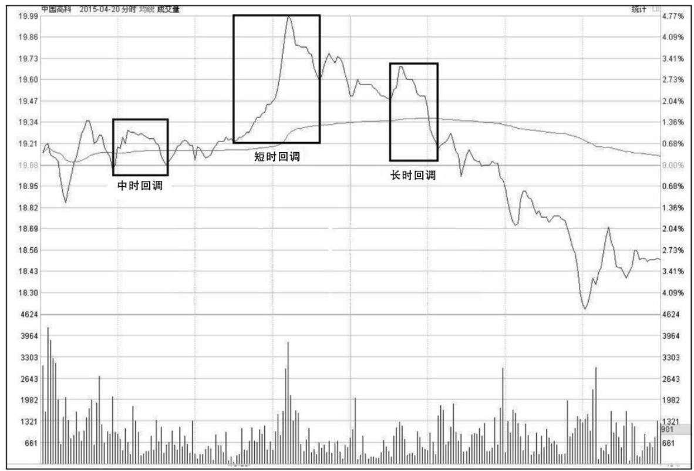
   2. **回调的力度**。根据强弱，回调力度可分为弱势回调、中势回调和强势回调三种。回调力度的作用是直观地反映多空双方的力量对比。回调力度小，则多方力量大；回调力度大，则多方力量小；而回调力度和空方力量的关系正好相反。总之，回调力度与空方力量成正比，与多方力量成反比。
      1. `弱势回调`是指分时线回调波段不足前面上涨波段的1/3。当个股出现这种弱势回调时，一般预示股价将要再度上涨，投资者要特别关注，不妨适时抓住这一波上涨机会，高价卖出。对于喜欢做短线的投资者来说，这种操作关键是信息准确，抓住时机。
      2. `中势回调`是指分时线波段回调至前面上涨波段的1/2左右。当股价的下跌幅度接近前期上涨幅度的一半时，这时主要的参考依据就是成交量。当股价回调结束后再次上涨时，就要看成交量能否充分放大。如果成交量能够跟随股价的上涨而放大，那么股价还会继续向上拉升；如果股价再次上涨时成交量不能跟随其放大，那么这种调整将会持续，甚至出现下跌的现象（这种下跌是相对当日分时图中的上涨而言）。
      3. `强势回调`是指盘中股价在下跌时，跌幅超过前期涨幅的一半，甚至将前期的涨幅全部跌回。这种走势出现后股价即便再次出现上涨走势，也很难再创新高，对于此类个股，投资者要坚决回避（如图3-6所示）。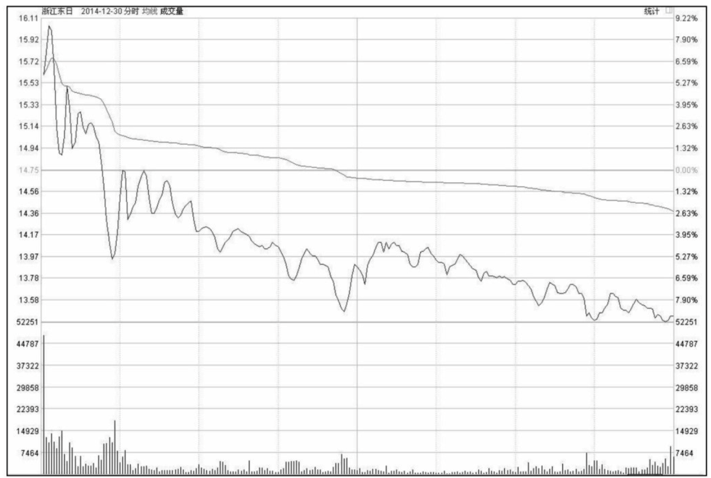
   3. **回调的量能**回调的量能根据回调过程中成交量的大小可以分为缩量回调、无量回调和放量回调三种。一般来讲，回调量能跟股价走势成反比。因此，投资者应该多关注缩量回调或无量回调，尽量避免放量回调。
      1. `缩量回调`是指股价在上涨之后回调，在回调的过程中成交量逐渐缩小。**缩量回调表示持股者信心十足，不急于抛盘，想继续做多，等待股价进一步上涨。一般来讲，在缩量回调后，如果成交量突然放大，那么股价很可能会大幅上涨**（如图3-7所示）。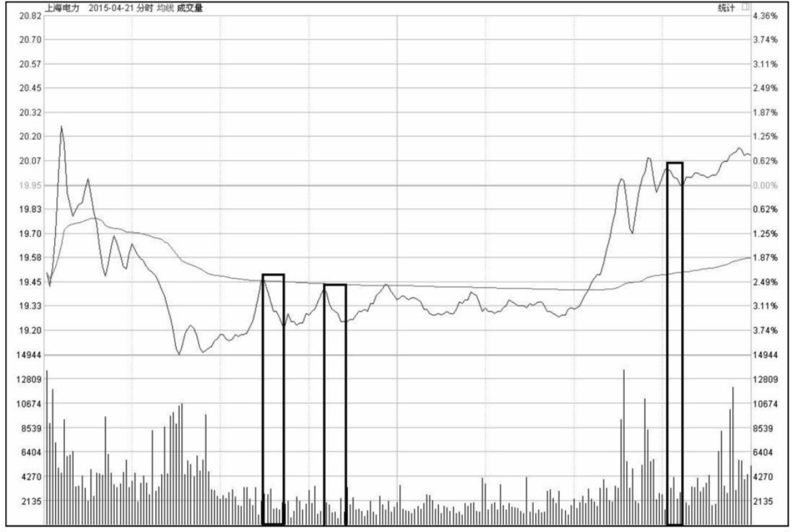
      2. `无量回调`是指股价在上涨之后回调，回调过程中成交量几乎没有。无量回调一般发生在股价拉升的初始阶段，表示持股者普遍看好这只股，持股者信心十足且心态稳定。因此，**愿意抛股卖出的人很少，而且成交量几乎没有，但该股后市上涨空间很大。这种无量上涨的个股通常被普遍看好，但投资者应注意无量上涨必须是在股价拉升的初始阶段才可以跟进，如果在股价高位出现无量上涨，那么就需要警惕被套了**。
      3. `放量回调`是指股价在上涨之后回调，回调过程中成交量逐步放大。当股价上涨时，成交量呈现正三角形放量形态，这表明投资者对股价的上涨已经认可，场外观望资金开始进场做多。当股价向下回落时，成交量呈现倒三角形缩量形态，这表明投资者对该股后市看好，愿意持有该股，因此抛压较轻。
2. **角度**。角度是分时图的第二个维度，它是指分时线与水平线形成的一个想象中的夹角，当然，根据分时线的坡度，投资者无须考虑水平线，单看分时线就能够很直观地知道其角度的大小。分时线坡度越陡峭，其角度越大；反之，分时线坡度越平缓，其角度越小。根据分时线的形态，角度分为四种：上涨角度、下跌角度、反向角度和极限角度。
   1. **上涨角度**。当盘中回调结束后股价再次出现拉升走势时，分时线拉升的角度越陡，其拉升力度也就越强。再次上涨的角度可以分为强势上涨角度、中势上涨角度和弱势上涨角度三种。
      1. `强势上涨角度`是指股价经过回调后再次上涨，而再次上涨形成的分时线角度与前一次上涨形成的分时线角度相比，明显增大，坡度更为陡峭。一般而言，强势上涨角度跟后市的股价成正比，投资者可以考虑跟进做多。因为产生强势上涨角度是跟进获利的大好时机（如图3-8所示）。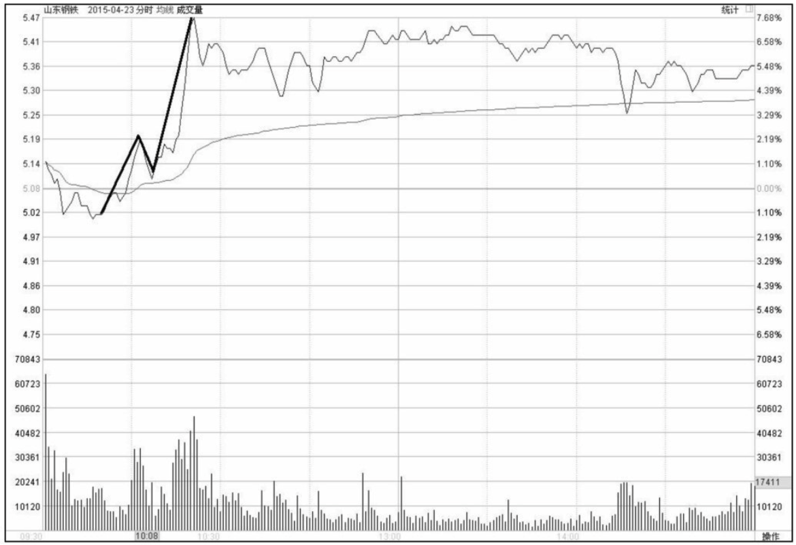
      2. `中势上涨角度`是指股价经过回调后再次上涨，再次上涨形成的分时线角度与前一次上涨形成的分时线角度相比，基本相同，坡度也类似。中势上涨角度，一般也是与股价成正比，只不过投资者需要特别关注一下成交量的变化，如果伴随的成交量放大，那么股价上涨的可能性就极大。中势上涨角度需要结合成交量进行分析，投资者应当静观其变。
      3. `弱势上涨角度`是指再次上涨形成的分时线角度与前一次上涨形成的分时线角度相比，明显减小，坡度也更为平缓。若某股呈现弱势上涨形态，那么投资者应及时出局。
   2. **下跌角度**。下跌角度是指分时线呈下降趋势而形成的角度。根据形成角度的大小可以将其分为强势下跌角度、中势下跌角度和弱势下跌角度。
      1. `强势下跌角度`是指股价经过回调后再次下跌，再次下跌形成的分时线角度与前一次下跌形成的分时线角度相比，明显增大，坡度也更为陡峭。持股者应尽量回避强势下跌角度，否则应在此种形态形成之初就尽早出局，越早出局，损失越小（如图3-9所示）。
      2. `中势下跌角度`是指股价经过回调后再次下跌，再次下跌形成的分时线角度与前一次下跌形成的分时线角度相比，基本相同，坡度也类似。对于中势下跌角度而言，与强势下跌角度一样，持股者还是应尽量避免，无须观望，尽早出局。
      3. `弱势下跌角度`是指再次下跌形成的分时线角度与前一次下跌形成的分时线角度相比，明显减小，坡度也更为平缓。面对弱势下跌角度，持股者可以持观望态度，但首先要看角度的大小，其次要看成交量的变化。
   3. **反向角度**。反向角度是现行波与原来运行波角度的对比。反向角度是指在两个以不同角度运行的波的高点处画一个垂直线，分别测量不同方向运行波的角度。
      1. `反向角度变大`：右侧运行波的角度大于左侧原趋势波的角度。这意味着现行波的能量变大，在这种情况下，多为改变原运行波的趋势。
      2. `反向角度相等`：右侧运行波的角度等于左侧原趋势波的角度。这种情况很难判断出后市的情况，投资者需要根据时间和量能来判断后市的走势。当反向角度出现相近形态时，投资者应该结合成交量的变化来进行分析。若成交量变化不大，那么股价将相对稳定；若成交量呈现放大或缩小的趋势，则股价上涨或下跌的可能性会比较大。
      3. `反向角度变小`：右侧运行波的角度小于左侧原趋势波的角度。角度变小意味着现运行波的能量难以改变原运行波的趋势。出现反向角度变小的情况，说明该股回调失效，必定会按原来的涨跌趋势顺势而为。
   4. **极限角度**。极限角度是指分时线走势上涨或下跌的角度接近90°，此时的分时线形态极为陡峭，几乎垂直于水平线，是分时线角度的一种极端形态。根据分时线的涨跌趋势，可把极限角度分为上涨极限角度和下跌极限角度两种。一般而言，当股市中出现极限角度时，股价要么涨停或跌停，要么反向逆转。
      1. 当股价涨幅7%时出现极限角度，成交量最大，股价极有可能当天涨停；当极限角度过早出现时，同时成交量最大，一旦未能涨停，则难以再涨，投资者在做勾头时一定要卖出股票。
      2. 极限角度形态很容易判断，分析起来也很简单，但需要引起投资者特别关注的是，当出现极限角度时很有可能是股价大涨或大跌的最后一波行情，投资者需要把握好时机跟进或卖出。
3. **波长**。波长是指股价在波动中形成的上涨波段或下跌波段的长度，其不考虑时间及角度等其他因素。波长能直观地反映出多空双方力量的对比。一般而言，上涨的波长越长，多方力量也就越大；下跌的波长越长，空方力量就越大。总之，上涨的波长与多方力量成正比，下跌的波长与空方力量成正比。波长主要分为短波、中波、长波和混合波四种。
   1. `短波`。分时图上各种波形结构，都是由不同的波长交互出现而产生的。如果从开始启动的价位算起，到出现停顿的价位为止，这段距离的空间位置比较小，通常只有1%的幅度，那么，这样的波形结构就称为短波。在分时图上，短波通常出现在操盘力度比较小的区间，不管股价是上涨还是下跌，极小的波长说明主力操盘的力度不大，还属于小心翼翼的阶段。究其原因主要是考虑到如果股价处于空间位置的低位，那么股价波动很小，波长很短，很显然这是刻意箍制股价的波动幅度。为了避免过分张扬，这样隐秘的走势属于遮遮掩掩的行为，更明白地说，就是不想被人注意。所以说，空间位置的低位出现了短波，跟主力的操盘意图是有关的（如图3-10所示）。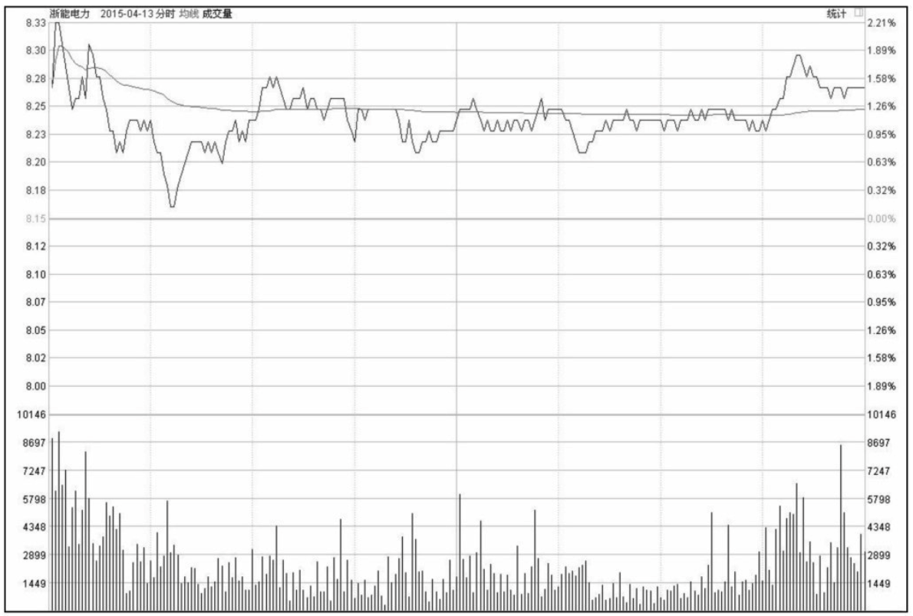
   2. `中波`。中波操盘力度要强于短波。中波出现的空间位置不同，它们的技术含义也就不同。如果中波出现在空间位置的低位，则属于主力大力度建仓的常见波形。如果中波出现在空间位置的高位，则属于清洗浮筹或者出货时常用的波形。如果中波出现在盘头阶段，则是滚动出货的常用波形。中波经常和短波配合起来使用，以达到理想的操盘效果。中波使用的频率很高，尤其是在震仓阶段，反复使用中波，投资者可以获得好的操盘效果。因此，不少控盘主力特别喜欢这种波形。
   3. `长波`。长波的特点是波段很长，从起始价位到终止价位的幅度很大，在实战做盘的时候，可以用来激活盘面，打破原来的沉闷格局。长波可以是向上运行的，也可以是向下运行的。长波可以出现在不同的时间段，也可以出现在不同的空间位置。如果长波出现在早盘阶段，那么操纵股价的意图更为明显。如果长波出现在盘中，那么造势的意图更为明显。如果长波出现在尾盘，那么投机的意图更为明显。在分析长波的时候，投资者务必结合当前股价的空间位置来考量（如图3-11所示）。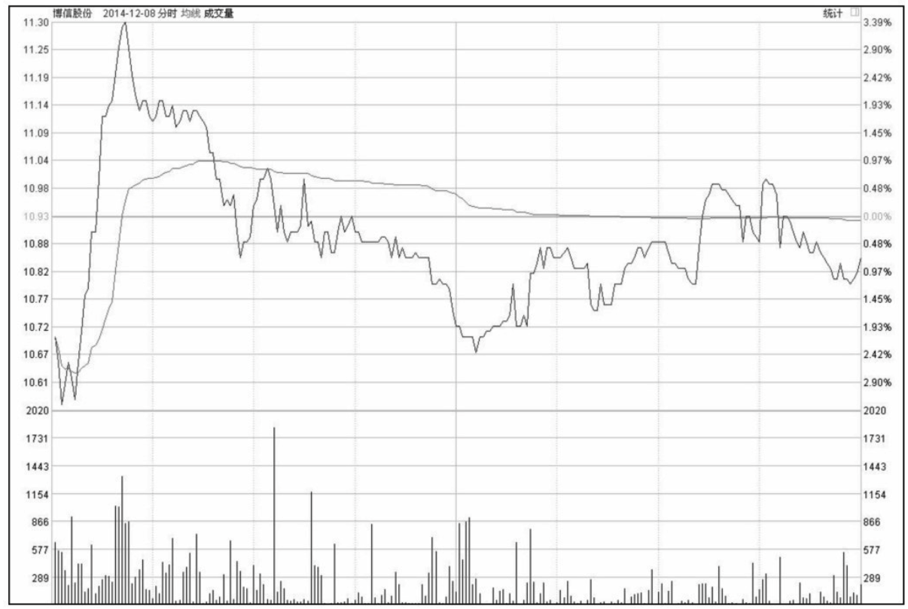
4. **分时区间**。将“上涨—回调—上涨/反转”或“下跌—回调—下跌/反转”的整体形态，扩展到一天的分时图中，形成的区间就是分时区间。回调、角度和波长的三个维度是一天中短时局部的分时走势，而分时区间是看一天中长时整体的分时走势，因此，分时区间更适用于稳健的短线操盘者看盘时的参考。分时区间包括原势区间、转势区间和突破区间三种。
   1. `原势区间`指股价呈上升或下降通道运行，走势是否明显并不明了，但此区间多为观望区间，投资者不宜进行操作，即上涨时不卖，下跌时不买。
   2. `转势区间`是指分时图中股价走势溢出原势区间，改变了上涨或下跌的斜率，此区间内股价既有按原趋势运行的可能，也有形成反转的可能，此区间是重要的决策区间；股价运行到此区间后，投资者要在股价下一阶段形成突破区间前做好操盘的计划和心理准备，争取主动，及时跟进或卖出。
   3. `突破区间`是指在分时图中，股价走势对转势区间进行突破，方向既可以向上也可以向下。此区间也是最为重要的操作区间。在突破区间形成之时，投资者需要把握好三个操盘原则：
      1. 在转势区间向上放量突破的第一时间买进；
      2. 在转势区间向下突破的第一时间卖出；
      3. 如果股价没有出现上涨或下跌走势，那么投资者需放弃操作该股（如图3-12所示）。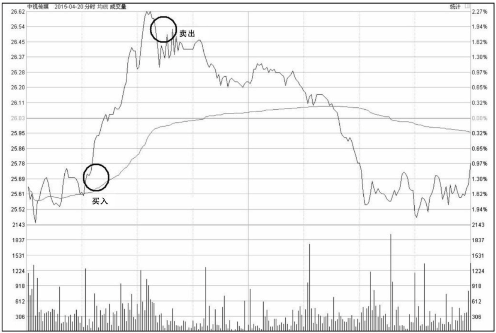

## 分时线与分时均价线的走势变化
1. 分时线与分时均价线的几种关系
   1. 当分时线全天都运行在分时均价线之上时。此时分时均价线对分时线起着支撑的作用，这种走势的出现表明当天介入的投资者绝大多数处于获利状态。在上涨行情中，只要股价在K线图中不是处在上涨趋势末期，那么对于投资者来说，分时线在盘中每次向分时均价线靠拢时都是介入的好时机（如图3-13所示）。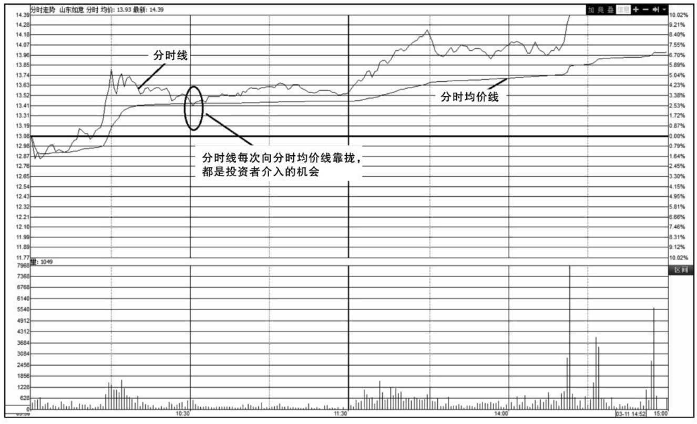
   2. 图3-13为山东如意（600891）2016年3月11日的分时走势图。观察图例，开盘后，分时线虽然开始下行，但随着场外资金的不断涌入又开始上行，分时均价线也随着分时线的拉升而向上运行。当分时线在拉升的过程中出现了短暂的横向整理时，它并没有跌破分时均价线，同时分时均价线也随着这种整理开始走平。此时分时均价线对分时线起着支撑的作用，当盘中出现这种走势时，表明市场处于多头行情。当股价再次放量上涨时，分时均价线在分时线的拉动下又开始了新一轮的上涨。由于分时均价线对分时线起着较强的支撑作用，因此投资者在分时图中见到这种走势出现时，只要看到股价再次启动，成交量能够伴随其放大，并且在K线图中股价又不是处于上涨趋势的末期，那么投资者便可跟进。
2. 分时线在分时均价线上运行时，有时会向下击穿但不久又回到分时均价线之上
   1. 这种走势多半是主力在利用股价盘中的下跌进行洗盘。对于投资者来说，当看到分时线再次返回到分时均价线之上时，只要成交量能够伴随其放大，投资者即可跟进。
   2. 图3-14为高伟达（300465）2016年3月11日的分时走势图。观察图例，此股开盘后的头半个小时股价上涨，分时线一直运行在分时均价线的上方，盘中股价出现下跌走势，分时线在股价的带动下向下穿越分时均价线。股价跌破了分时均价线后不再继续下跌，而是进入了横盘状态，在分时图中其表现为分时线围绕分时均价线窄幅波动，在波动的同时成交量处于萎缩状态，这种走势持续了一个小时左右。盘中出现这种走势后，一般会出现两种结果：第一种是股价放量向上拉升，突破分时均价线的阻力，并开始上涨；第二种是股价放量向下跌破分时均价线的支撑，并开始下跌。如果股价放量向上突破，那么尾盘股价多半会收在较高的位置，而在放量突破的同时，也是一个很好的买入点。如果股价放量向下突破，那么尾盘股价多半会收在较低的位置。因此投资者应密切关注股价选择的方向。
   3. 从图中我们看到，这种横盘状态一直持续到临近午盘，午盘收盘前股价选择了向上突破，分时线在股价的带动下向上拉升，并突破了分时均价线的阻力，成交量也逐渐放大。此时的股价在49.06元左右，对于投资者来说，股价带量突破分时均价线的时候可短线参与。从下午的分时图可以看到，股价突破分时均价线的阻力后一路走高，尾盘以52.64元的涨停价格收盘。如果在49元附近跟进的话，短线已经有了将近7个点的收益。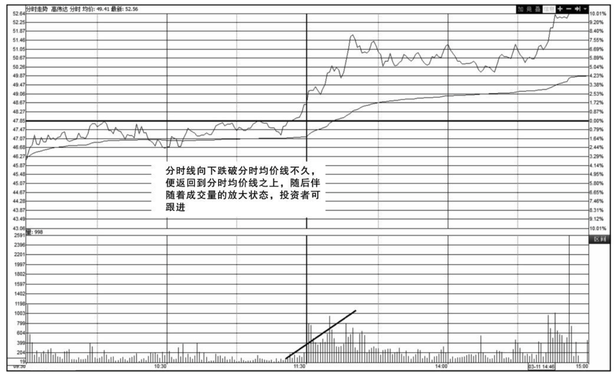
3. 分时线与分时均价线紧贴
   1. 开盘后，如果股价出现横盘走势，分时线一直运行在分时均价线的下方，但又紧贴着分时均价线运行，此时只要成交量能快速放大，那么分时线便会突破分时均价线的压制向上拉升。在突破分时均价线后，分时线向下回落至分时均价线附近但却不能跌破分时均价线的支撑时，投资者可买入。
   2. 分时线与分时均价线紧贴进行缩量窄幅震荡，这表明此时主力并没有参与交易，多是散户在进行买卖。我们都知道，无论股价是上涨还是下跌，散户的交易都不能左右股价，如果主力不动，那么这种棋盘走势将会继续下去。如果横盘的时间过长，根据久盘必跌的原则，股价多半会选择向下跌落，此时主力若不是想做空此股的话就会进场护盘。而此股在横盘接近一个小时后开始向上放量拉升，并突破了分时均价线，分时均价线也由走平状态开始转为向上运行，这表明此时主力开始进场做多。
   3. 股价在首次突破分时均价线创下新高后再一次进入横盘走势，此时分时均价线对股价形成了支撑；当股价再次放量上涨时，分时线带动分时均价线也开始向上拉升。
   4. 对于投资者来说，当股价首次向上突破后出现回调走势时，分时线向分时均价线的位置逐渐靠拢，此时只要股价不跌破分时均价线的支撑，且成交量随着股价的下跌而缩小，那么便是一个短线买入的机会。
4. 当分时线与分时均价线远离时
   1. 当盘中出现下跌走势时，由于股价下跌的速度过快，分时线与分时均价线的距离越来越远。对于投资者来说，此时可密切关注，因为买入的时机即将到来。当股价下跌创下盘中新低后，如果股价出现反弹走势，那么此次反弹投资者不可急于买入，因为我们不确定这种反弹是股价确实止跌，还是一次下跌途中的中继形态，所以投资者要等待此次反弹结束后看股价能不能再创新低。如果股价结束反弹再次下跌，但没有跌破前面的低点，那么此时投资者便可加仓买入（如图3-15所示）。
   2. 从上图中我们可以看到，由于股价的快速下跌，分时线运行在分时均价线的下方并远离分时均价线，随后股价形成反弹。但此次反弹力度较小，并且股价随后又开始下跌，盘中创下新的低点，之后股价再次形成反弹。**此时投资者就要密切关注股价的走势，如果本次反弹结束后股价不再创新低，对于操作“T＋0”的投资者来说，这便是买入的机会**。从图中标示的位置可以看到，盘中股价创下新低后，又出现了一个次低点，这个次低点就是一个买入机会。买入后，我们看到股价出现快速拉升走势，分时线在股价的拉动下快速向分时均价线的位置靠拢。由于股价拉升的速度过快，分时线不但突破了分时均价线的阻力，而且还创下了盘中的新高。对于前面低点买入的投资者来说，此时已经处于获利状态，因此可以等待卖出的机会。
   3. **在卖出时，尽量不要在第一个高点形成时抛出，因为你并不知道后面还会不会有下一个高点的出现。稳妥的办法是等分时线停止上涨，在盘中形成第一个高点后，如果此时分时线已经远离分时均价线，那么投资者便可以卖出**。如果股价形成第一个高点后，分时均价线也能够跟随分时线向上拉升，两者之间的距离也不是很远，那么此时投资者可以继续观察。如果冲高回落后股价再次上涨，并且不能突破前面的高点，成交量也不再继续放大，那么此时再卖出股票，虽然不能卖在最高价位，但却不容易错过后面的高点。如果投资者觉得在第一个高点形成时利润就已经很多了，怕股价回落时错过卖出的机会，那么也可以先卖出。此时，一次顺向的“T＋0”操作就完成了。

>在看分时图时很重要的一点就是看分时线和分时均价线位置的关系，健康完美的分时线和分时均价线的运行状态是，分时线运行在分时均价线上并保持一定的比例关系。当分时线上涨时分时均价线应该跟上，如果分时线上涨，分时均价线反应迟钝则是一种异常现象，这说明有资金虚假拉升或者为了出货拉升，这样，我们就应在高点出货。

## 分时图“T＋0”操作的5种底部形态
1. **盘中圆弧底**。盘中圆弧底是指股价运行轨迹呈圆弧形的底部形态。这种形态的形成原因，是因为有部分做多资金正在少量地逐级温和建仓造成的，并且显示的股价已经探明阶段性底部的支撑。它理论上的涨幅度通常是最低价到颈线位的涨幅的一倍。但投资者需要留意的是，盘中圆弧底在用于对个股分析时比较有效，但大盘指数出现圆弧底往往未必有同样的涨升（如图3-16所示）。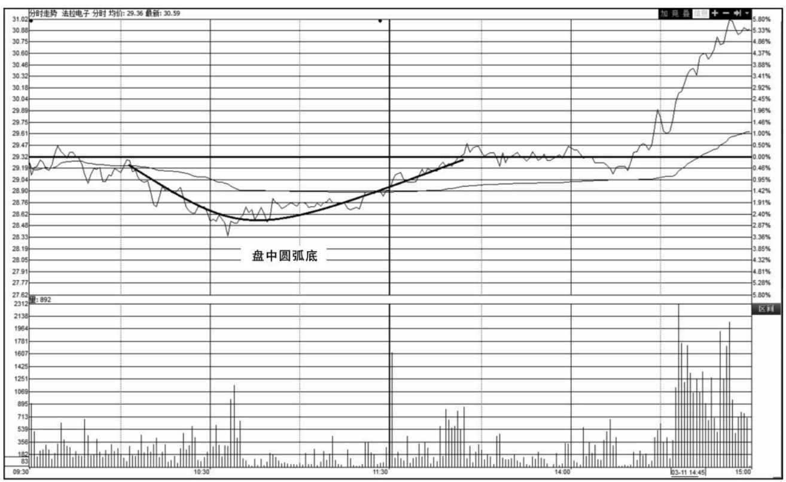
2. **盘中V形底**。盘中V形底俗称“尖底”，形态走势像V形（如图3-17所示），其形成时间最短，是研判最困难、介入风险最大的一种形态。但是这种形态的爆发力最强，如果投资者掌握得好，可以迅速获取利润。它的形成往往是因为主力刻意打压而造成的，使得股价暂时性的过度超跌，从而产生盘中的报复性上攻行情。盘中V形底是短线高手最青睐的一种盘中形态。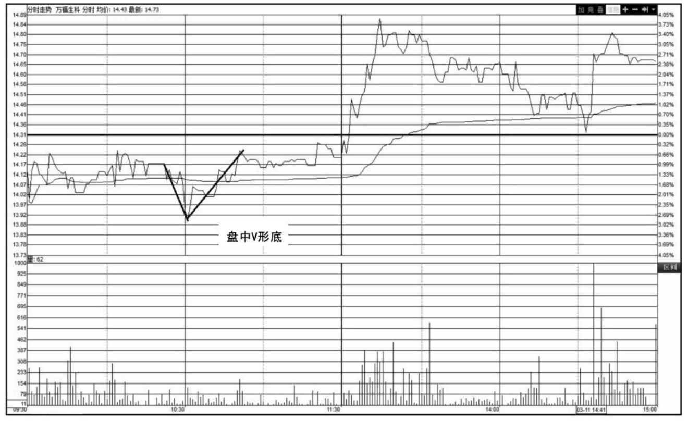
3. **盘中双底**。股价走势像字母“W”，又称W形底（如图3-18所示）。这是一种较为可靠的盘中反转形态，对这种形态的研判重点是股价在走右边的底部时，即时成交量是否会泛起底背离的特征，假如即时成交量不产生背离，W形底就可能向其他形态转化（比如多重底）。转化后的形态即使泛起涨升，其上攻动能也会较弱。这类盘中底部形态研判比较容易，形态构成时间长，可操纵性强，适用于短线爱好者操纵或普通投资者选择买点时使用。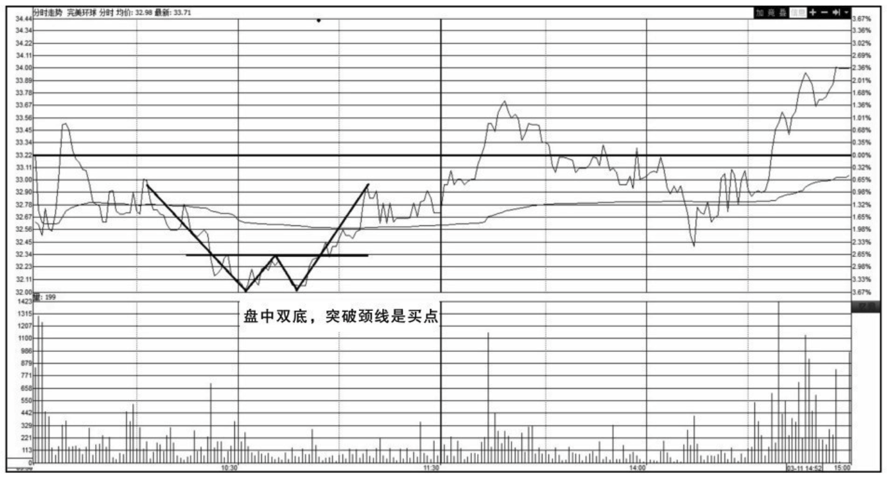
4. **盘中头肩底**。盘中头肩底，其形状呈现三个显著的低谷，其中位于中间的一个低谷比其他两个低谷的低位更低（如图3-19所示）。对头肩底的研判重点是量比和颈线，量比要处于温和放大状态，并且右肩的量要显著大于左肩的量。假如在有量配合的基础上，股价成功突破颈线，则是该形态在盘中的最佳买点。介入这种形态的炒作要留意股价所处位置的高低，而偏低的位置往往会有较好的介入价值。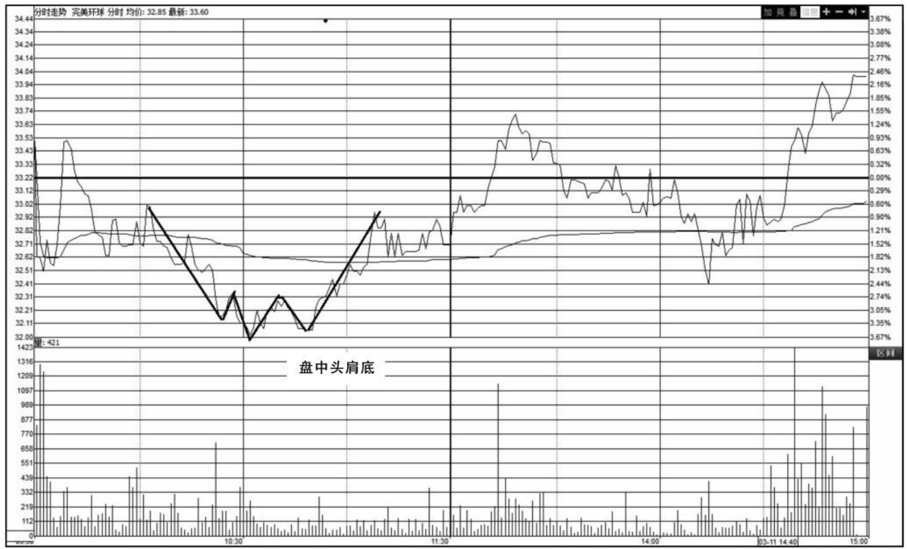
5. **盘中平底**。盘中平底是一种只有在盘中才特有的形态。某些个股开盘后，走势一直显得十分沉闷，股价几乎沿着一条直线做横向近似水平的移动，股价波动范围极小，有时甚至上下波动仅相差几分钱（如图3-20所示）。但是，当运行到午后开盘或邻近收盘时，这类个股会突然爆发出盘中井喷行情。假如投资者平时留意观察，密切跟踪，并在交易软件上设置好盘中预警功能，一旦发现即时成交量突然急剧放大，那么投资者便可以准确及时出击，获取盘中可观的短线收益。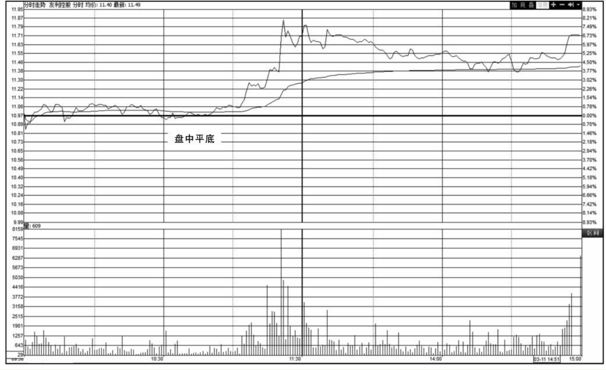

>盘中“T＋0”操作，由于其特殊性，有很多因素是不需要着重考虑的，如基本面因素、资金面因素、趋势因素、支撑区、阻力区、投资者获利程度等，因为这些因素在制订详细操作计划时已经充分考虑过了。在实际的盘中操作中，重点是考虑盘中四要素：量（成交量）、价（价位）、形（形态）、空（空间）。而盘中的买入操作重点是根据盘中的形态进行分析和介入的。

## 分时图“T＋0”操作的7种突破形态
1. **三角形突破**。在三角形的调整形态中，价格向某一个方向的突破也就是一瞬间的事情。只要价格已经在三角形中调整到位，那么只要价格向一个方向顺利突破，投资者的操作机会就随之出现了。有效地突破，一定是在调整完成以后出现的。从买卖机会的把握上看，那些有效的操作信号，必须有完美的突破形态配合才行。实际上，越是明显的买卖信号，调整形态以及突破调整形态的走势也会越清晰。
   1. 如图3-21所示，在信息发展（300469）的分时图中股价在开盘后的半个小时内，该股逐渐形成了三角形的调整形态，虽然持续时间不长，仅持续了一个小时，但是形态上的特征已经非常明确。股价向上突破三角形的那一瞬间，便是不错的做多信号。也就是说，“T＋0”操作最终的建仓机会出现在了三角形的调整形态中，在股价向上回升之前，投资者可以提前建仓。
   2. 在图3-21中，股价在图中突破的不仅是三角形的上限，更是等价线对应的阻力位。投资者在图中位置做多，应该是不错的机会。三角形的调整形态成为股价上涨的支撑形态，所以做多无疑是必要的。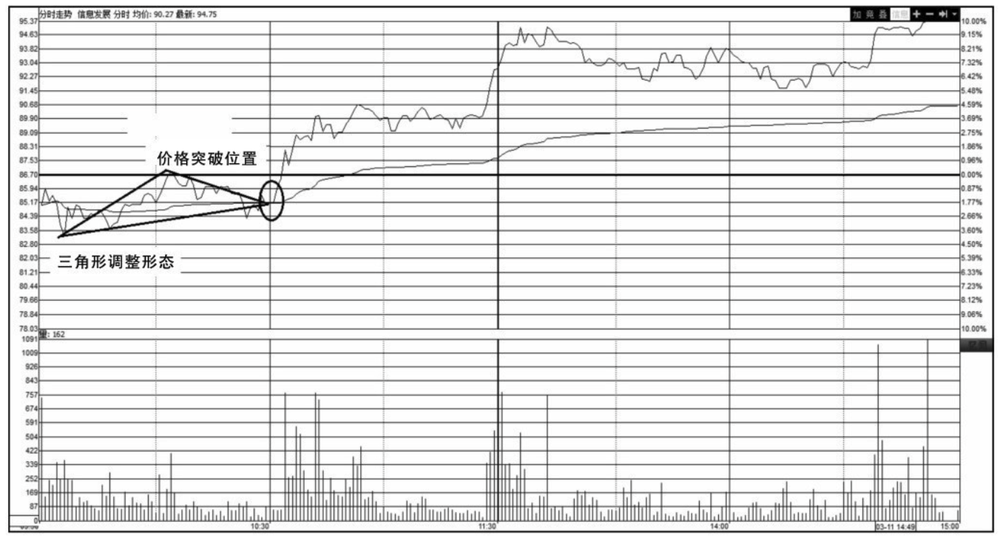
2. **矩形突破**。矩形的出现，通常发生在上升趋势或是下降趋势的中途，它发生在头部或底部的时候较少。如果矩形发生在头部或底部，经过这么长时间的盘整，都会变成圆弧顶或圆弧底。在分时图中，价格在矩形调整形态中的运行比较稳定，而突如其来的突破走势，必然在矩形调整形态持续一段时间后才会出现。判断分时图中股价的矩形调整形态并不麻烦，在一定的价格范围内，矩形的波动情况是显而易见的。
   1. 在分时图中，矩形之前的价格波动方向非常重要。如果股价原来的趋势处于上升阶段，并在上升途中出现矩形形态，无论其经过多长时间的盘整，一旦向上进行有效突破，那么股价仍将沿原来的趋势运动。而有效的突破点，就是“T＋0”操作的最佳买点。
   2. 在矩形调整结束之前，等价线对股价的影响足以促使价格突破矩形调整形态。判断矩形调整形态是否已经调整到位，从价格相对于等价线的位置就能够看出来（如图3-22所示）。
   3. 大港股份（002077）的矩形突破买点在分时图中的表现还是不错的，矩形调整形态被快速突破后，使股价的震荡上行成为可能。虽然开盘阶段股价低开，但是价格回升至短线高位运行，并且维持一种矩形形态，可见这是比较好的做多信号。把握图中价格突破矩形的做多机会，投资者必然能获得不错的回报。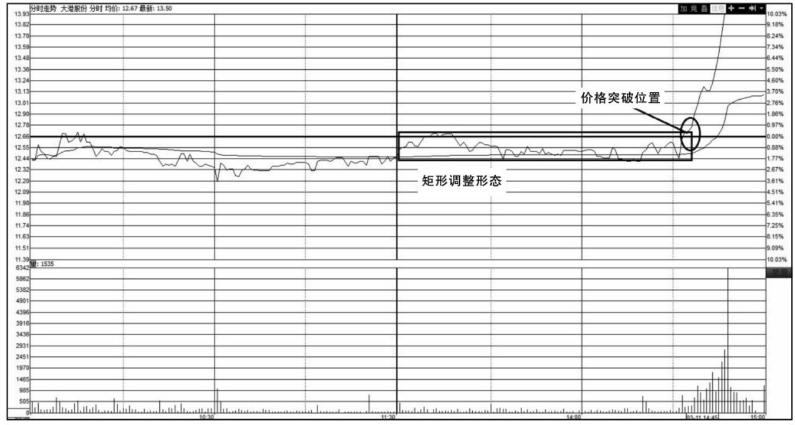
3. **旗形突破**。旗形形态大多发生在市场极度活跃，股价运动近乎直线上升或下降的单边涨跌的过程中。在市场极速而又大幅的波动过程中，股价经过一连串紧密的短期波动后，形成了一个稍微与原来趋势呈相反方向倾斜的长方形，这就是旗形走势。由于其整体形状就像一面挂在旗杆顶上的旗帜，因此，这种特征被称之为旗形。旗形走势分为上升旗形和下降旗形。
   1. 上升旗形的形成过程是：市场经过陡峭的飙升后，接着形成一个紧密、狭窄和稍微向下倾斜的价格密集区域，把这密集区域的高点和低点分别连接起来，就可以画出两条平行而又下倾的直线，这就是上升旗形。形态完成后价格便继续向原来的趋势移动，上升旗形也将向上突破（如图3-23所示）。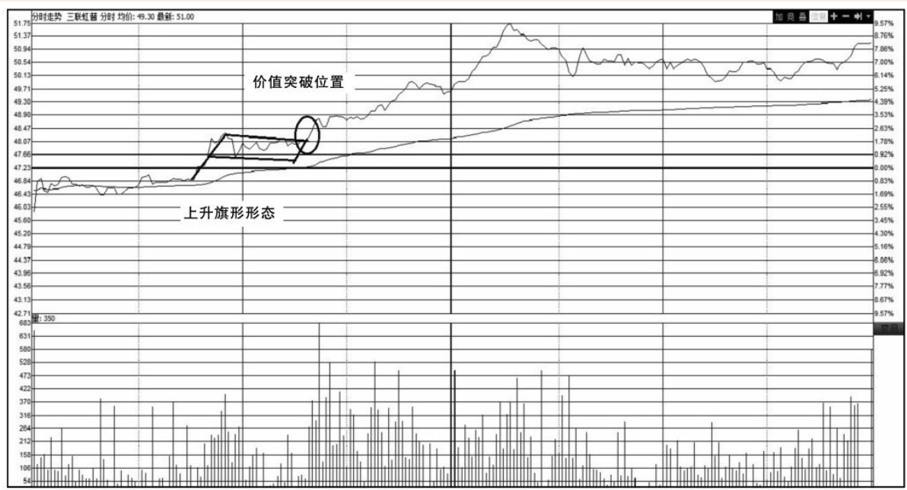
   2. 下降旗形的形成过程是：当股价出现急速下跌行情后，接着形成一个波动区域紧密、稍向上倾的价格密集区域，分别把这一个区域中的高点、低点各自相连，即形成一个向上倾斜的四边形（如图3-24所示）。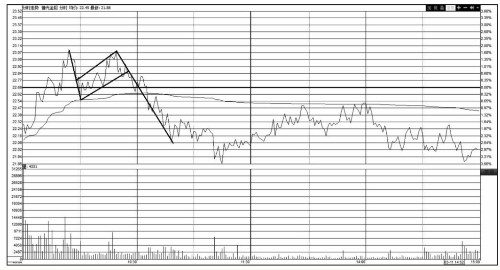
   3. 在下跌时所形成的旗形，其形状为上升图形的倒置。其中，成交量的增加将达到一个高点，成交量减少，股价将小幅上升，形成旗形。
   4. 如图3-24所示。豫光金铅的分时图显示，价格震荡上行后急速直线下降，虽然价格有支撑反弹，但反弹幅度不大，所以形成了旗形。经过一段时间的整理后，股价到达旗形末端，价格跌破了旗形下限，这表明卖出或做“倒‘T＋0’”的机会已经出现。旗形下限的支撑力度本身是很强的，价格跌破旗形下限的情况是明显脱离旗形的走势，所以投资者此时必须果断斩仓。
   5. 一般来说，旗形在上升趋势中出现，会引发下一波的大涨，在下降趋势中出现，会引发下一波的大跌。旗形在这里起到了加速度的作用。所以投资者在上升趋势中遇到旗形则应加码买进，在下跌趋势中则应及时出局，以免套牢。
4. **楔形突破**。在楔形形态中，股价波动空间会不断收缩，当价格波动空间几乎消失的时候，突破也就会出现了。楔形形态内的成交量，也是由左向右递减的，但它的成交量不像旗形那样会维持在一定的水平上，而是会萎缩较快，其形态内的价格波动幅度，也比旗形小得多。同样，楔形整理的时间不宜太长，时间太长的话，形态力道将会消失，这可能会造成价格反转的格局。在分时图中楔形形态可分为上升楔形和下降楔形。
   1. 上升楔形是股价经过大幅度下跌之后，出现强烈的反弹，但每当股价上涨到某个位置时，就停止了上涨，并开始回落。之后的回落幅度相比之前的比较轻微缓和，这使得股价在没有跌到最低点的时候就又开始反弹上升了，并且突破了之前的高点，形成了一次比一次高的趋势。第二次的上升高度比前两点都低，所以股价再次回落，将高点与低点连接起来就构成了一个楔形形态，这就是我们说的上升楔形（如图3-25所示）。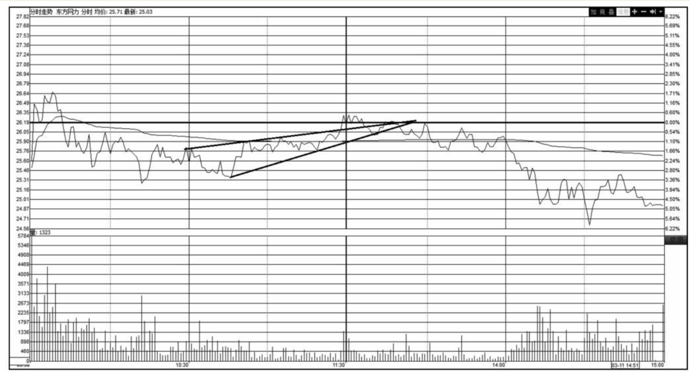
   2. 上升楔形在一般情况下只是一次跌后的技术性反弹。由于图中的显示尚未跌见底，所以上升楔形最少要将新上升的价格跌掉，并且还要往下跌更多。
   3. 下降楔形与上升楔形正好相反。在K线图的走势中，股价经过一段时间的上涨后，很多获利者开始抛盘，出现获利回吐的现象。当股价调整到某个点的时候，股价就会继续上涨。但是这个时候的上涨力量比较弱，股价还没有达到之前的高点时就回落了，如此反复，便形成了高点逐渐向下，低点也逐渐下降的趋势，但是趋势比较平缓，将所有的高点和低点连接起来就形成了一个下降楔形（如图3-26所示）。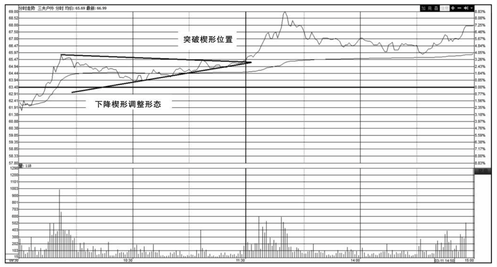
   4. 下降楔形只是上涨后的一个调整状态，当其突破上边线时，投资者可以放心的买入。不过，有的时候突破上边线之后股价并没有立即上升，而是先横向发展后，才缓慢上升。如果股价在突破上边线的时候同时伴有成交量的放大，形成了有效地突破，那么投资者可以在股价突破楔形上边线的时候放心买入。
5. **喇叭口形态突破**。喇叭口形态也是比较常见的反转形态。一旦出现喇叭口形态，股价将向相反方向发展。当然，喇叭口形态的突破方向，还取决于前期价格的运行趋势。在喇叭口形态突破之前，价格不断增加的波动空间，为短线买卖的投资者提供了众多操盘机会。在短线买卖的过程中，投资者应该尽可能了解形态的最终走势，才能获得更高的回报。分时图中的喇叭口形态有两种：一种是放射状喇叭口形态，另一种是收缩状喇叭口形态。
   1. 放射状喇叭口形态往往是股价见顶的信号，这样的走势出现之后，投资者应该卖出股票，避免接下来出现的下跌走势（如图3-27所示）。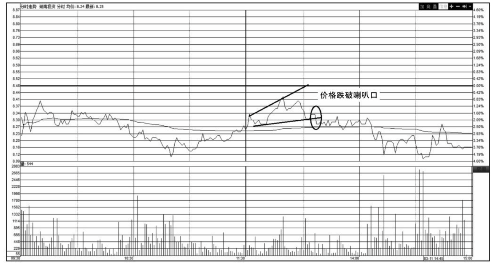
   2. 在图3-27中，湖南投资的分时图显示，盘中股价冲高回落，高位的喇叭口形态，正是股价回落的起始点。从操作上看来，投资者可以在喇叭口形态完成的那一刻T出获利，让价格跌破喇叭口形态后的震荡下跌成为可能。实际上，股价的震荡下挫是意料当中的事情。高位滞涨的喇叭口形态，为空方打压股价提供了时间。连续几次小幅反弹后股价轻松跌破喇叭口，是重要的卖点。
   3. 收缩状喇叭口形态倘若出现在股价运行的低位区间，是股价见低的信号，投资者可以在此买入股票，等待接下来出现的上涨走势。
   4. 在喇叭口形态中，价格真正突破喇叭口形态的一侧才是最终的开仓机会。在喇叭口形态完成之前，价格可以向下跌破支撑线，也可能向上突破阻力线。不管怎样，分时图中最终突破后的操作机会就会在这个时候形成。
6. **顶部反转形态突破**。顶部反转形态突破，一般作为中短线波段的止损位置。在分时图中的顶部反转形态突破容易出现，也是投资者可以参考的重要止损信号。顶部反转形态种类繁多，最简单的一种是单一的价格高位反转走势。在股价短线冲高回落的过程中，单一的价格顶部就会在短时间内形成。这个时候，投资者可以根据这个突破信号，果断卖出。
   1. 单一的价格在顶部出现以后，颈线就在顶部形态以下。如果股价并未跌破颈线，那么投资者可以等待更好的操作机会出现。一旦股价快速跌破了颈线，投资者顺势做“倒‘T＋0’”，一定可以获得不错的利润。然而，在分时图中买卖时间是有限度的，价格真正突破了反转形态的颈线以后，突破一般都是非常有效的。
   2. 如图3-28所示。分时图中股价利用不足半小时的时间完成了冲高回落的反转形态，虽然是单一的价格顶部，但冲高回落的反转却非常明确，这可以看作是分时图中股价走弱的信号。在股价跌破反转形态颈线，并且出现回抽颈线的走势时，投资者可以把握做空机会获得投资回报。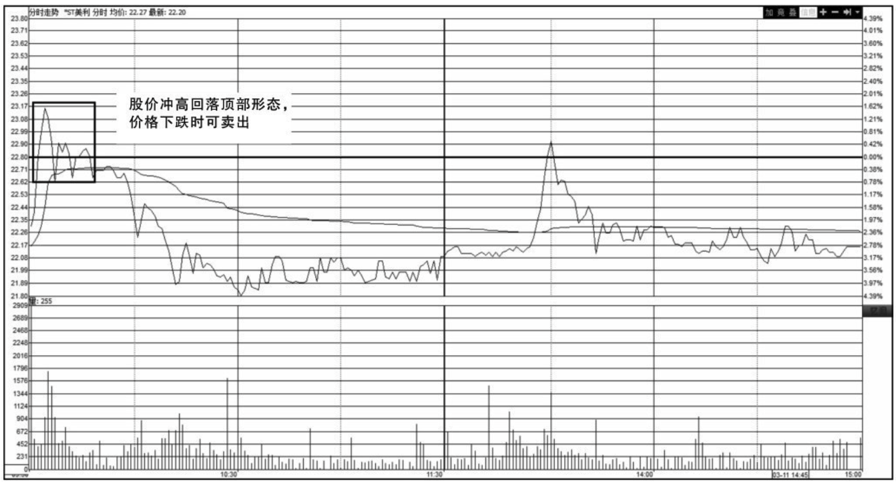
   3. 如果从股价相对于等价线的走势来说，投资者也能够发现卖点。在股价冲高阶段，价格始终运行在等价线以上，跌破等价线后价格出现反弹确认，这是个不错的做空信号。
7. **底部反转形态突破**。底部反转形态突破，不仅是中长线的买入时机，也是中短线波段操作的买点。在分时图中，价格在反转形态出现以后的突破非常有效。开盘以后股价可以高开低走，二次拉升至等价线以上，这个时候就会出现底部反转形态。等价线以下的反转形态虽然有效，但也需要价格继续向上突破颈线来确认。简单的单一底部反转形态，或者说是圆弧底的反转形态，都是投资者能够把握的做多机会。股价在突破反转形态的颈线以后，会不断震荡走强，投资者把握住突破信号并不困难。而其中的反转形态可以是V形底、圆弧底和双底等。突破反转形态颈线或者说是突破等价线，才是突破开仓的关键。
   1. 在圆弧底出现之前，股票价格的回落走势持续时间较长，价格回落幅度也很大，圆弧底部形态就是在这种情况下出现的。虽然处于低价区域的股票价格，短时间内上涨的概率不高。但是，随着资金的不断流入，股票价格的底部会不断得到确认（如图3-29所示）。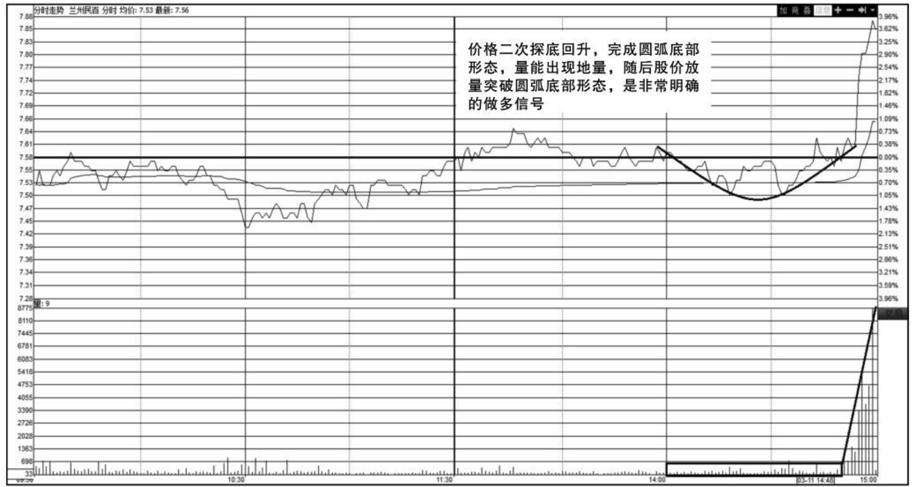
   2. 兰州民百（600738）的分时图显示，缓慢上涨的股价出现加速上行的趋势，正是因为等价线以下圆弧底的存在，所以股票价格才轻松出现突破，并加速回升。在股票价格顺利突破了圆弧底的颈线之后，投资者才能最终确认圆弧底部的反转形态。在股票价格快速突破颈线的时候，考虑到价格的上行还将会延续下去，此时投资者追涨做“T＋0”操作是个不错的选择。
   3. 上图中圆弧底持续了将近一个小时，量能在圆弧底出现了地量成交量。这表明缩量下跌的股价最终在量能萎缩的情况下，出现了反转的走势。该股反转后上涨速度很快，这表明圆弧底反转形态能够支撑股价快速走强。圆弧底的突破形态越明确，股价突破后回升的速度越快。

## 分时图的其他典型形态
1. **开盘涨停**。开盘涨停多出现在牛市氛围中，某只股票因传闻利好，或者处于庄家拉升阶段，开盘即告涨停。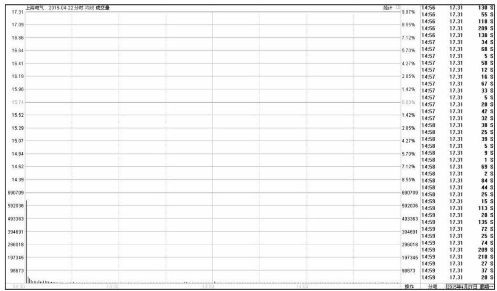
   1. 开盘涨停并不意味着后市不看好，反而可能会连拉涨停，在2014—2015年的牛市中，连拉5个涨停以上的个案很多。暴风科技连拉了23个涨停板，截至2015年4月27日，股价由9.43元飙升至92.06元，上涨了876.25%（如图3-31所示）。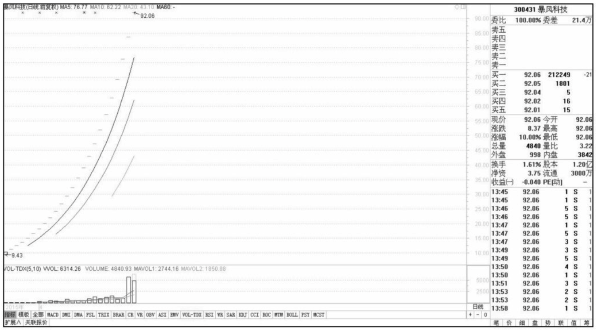
2. **强势上冲**。强势上冲是指有的股票价格在当日形成脉冲式的上升走势，即使中间有回落，幅度也会很小，且在短时间回落后又呈强势上升走势，直冲涨停板。
   1. 股票在一开盘后短时间内便呈现强势的上升趋势，并持久居高不下，即使偶有回落，也是短暂调整，很快又会回高。股价强势上升通常是场内有较强烈的资金做多的表现，在大资金强有力的支持下，股价快速直达涨停板。这种形态的出现有一个明显的标志，即随着股价的上涨，量能会明显放大。这样的情况出现时，投资者可以快速跟进。这是因为股价飙升可以更多地吸引场外资金，而资金的大量涌入又可以推动股价继续上涨，这时后市通常继续看好（如图3-32所示）。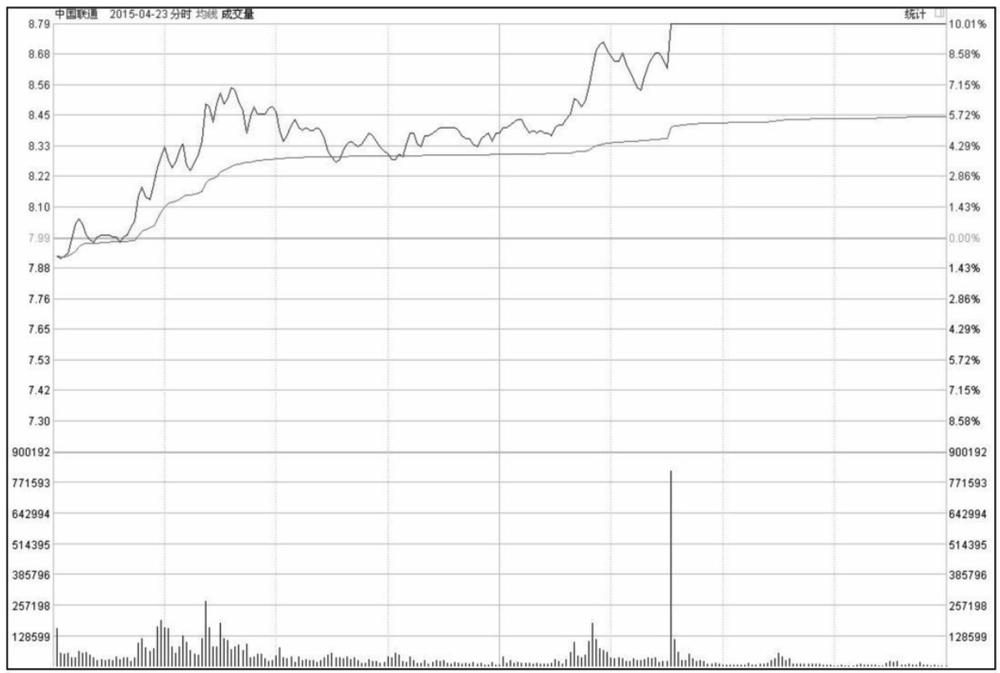
3. 强力拉升。强力拉升多见于强庄个股的主升行情中，筹码基本为庄家所控制，庄家采用近似45度线向上推升，以吸引散户跟风，投资者若跟进则需要注意止损点的设定。另外，投资者还需要注意该股的价位处于什么位置。如果位于高价位区，那么投资者最好还是避开（如图3-33所示）。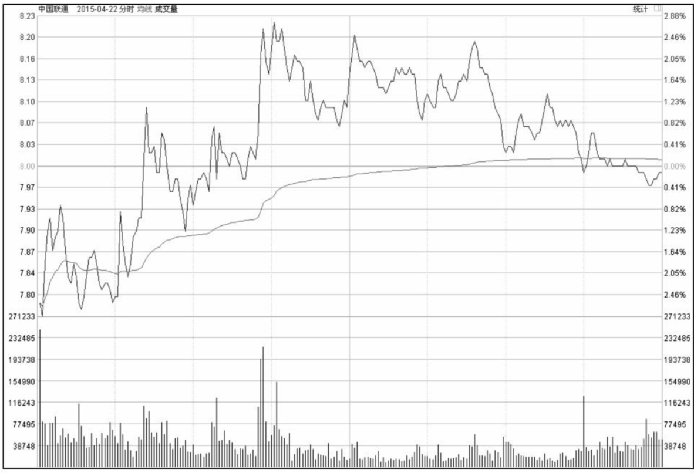
4. 平台递推。平台递推多见于庄家拉升吸筹阶段，每次拉升均有较大的成交量的配合。对于这种走势，投资者可以大胆跟进（如图3-34所示）。
5. 尾市冲高。尾市冲高主要出现在庄家震荡洗盘和高位派发阶段，全天交易的多数时间都处于下跌走势，并在尾市收盘阶段突然拉升。这是由于大多数技术指标都是依据收盘价而定的，庄家为了维持股价的某一形态而在收盘时拉升股价（如图3-35所示）。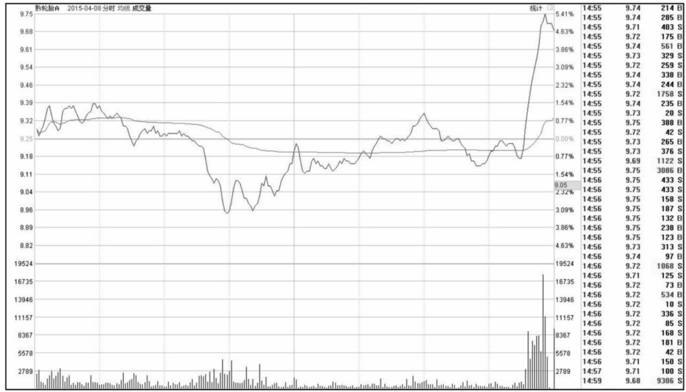
6. **开盘跌停**。由于突发利空消息，大多数投资者选择抛出自己手中的股票，所以股价一开盘就发生跌停。对于投资者而言，介入跌停的股票，要密切关注在跌停处成交量的变化情况，如果在跌停处不时有较大的成交量，则很有可能是庄家在秘密建仓。如果跌停处成交量比较小，则不要轻易去抢反弹（如图3-36所示）。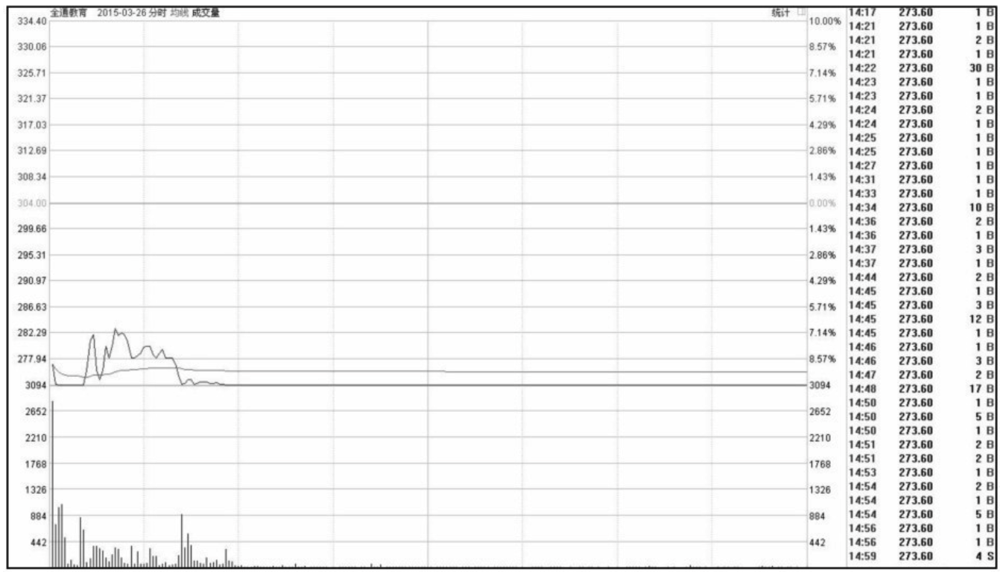
7. **高压下冲**。高压下冲是指股价直线下跌，形成类似狼牙的尖角走势。股票在前期升高后迅速下跌，所以成交量也有所增长。通常形成这种快速下跌形的条件是前期股价已有大幅度的上涨，庄家获得了丰厚的利润，于是开始出货操作。大量的巨单甩出，使股价迅速回落，形成了快速下跌的形态（如图3-37所示）。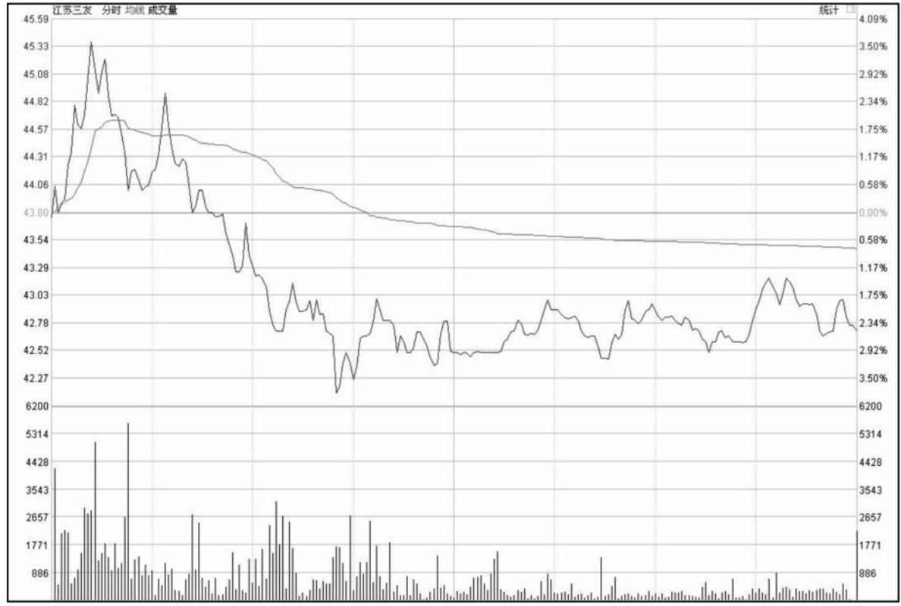
8. **跳空阴跌**。一般来看，越是在高位形成这样的走势，风险就越大。所以投资者在持有这类走势的股票时须谨慎操作，千万不可盲目介入，如果此时已经有了比较可观的收益，则建议落袋为安。股票由于突发利空消息等原因导致股价开盘跳空向下，这是由于卖出股票的投资者很多，所以股价直奔跌停。对于此类股票，投资者也不要去抢反弹（如图3-38所示）。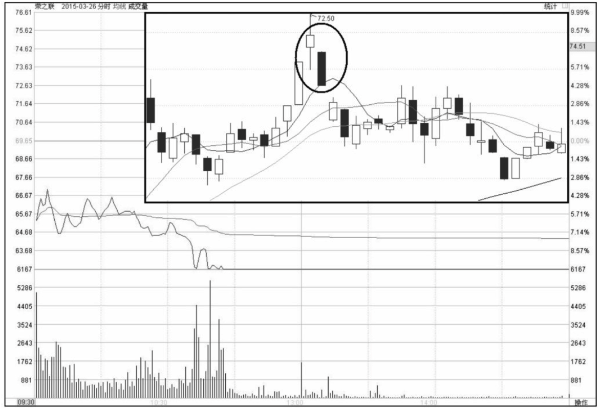
9. **高台跳水**。一般而言，高台跳水常见于庄家震荡洗盘和高位派货阶段，全天交易的多数时间都处于上涨走势，且形态良好，但在尾市收盘阶段突然杀跌。若是处于升势初期，则是通过杀跌，以获取更多的廉价筹码。若是处于高位阶段，则是拉升出货，尾市跳水，将跟风盘一网打尽（如图3-39所示）。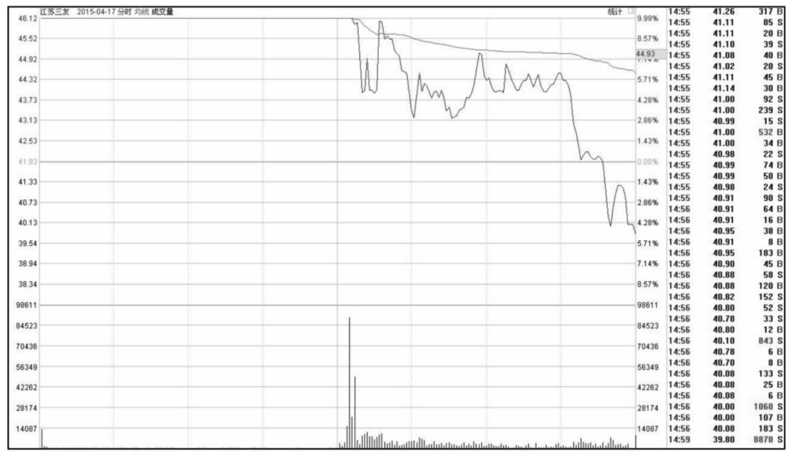
10. **弱势下压**。弱势下压是弱势盘面特征的典型，早盘股价微微高开后，随即逐波下行，稍有反弹又再次下跌。收盘前股价稍有回抽，但是仍然是以次低点报收。股价全天处于下跌的走势中，走势尽显弱势（如图3-40所示）。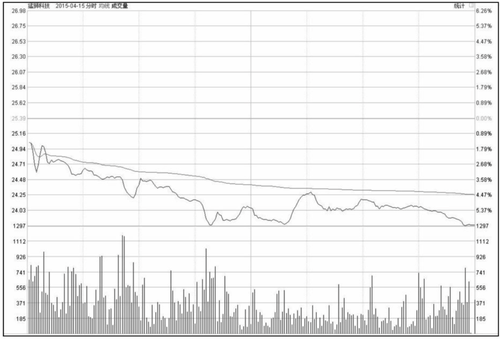
11. **平台递减**。平台递减也是弱势盘面特征的典型，早盘股价微微高开后，随即呈阶梯状下跌，多次以低点报收（如图3-41所示）。
12. **平行滞涨**。平行滞涨表现为股价运行平直，通常也被称作修长城形。股票前期涨势较佳，成交量也不错，但不久后便陷入滞涨形势，几乎没有成交量。形成滞涨形的原因通常是，当时的成交量严重滞涨，几分钟之内都没有成交量，所以股价走势平缓。这时如果突然有单成交，便又会形成直上直下的走向。由于市场环境的不同，滞涨的含义也会有所差别，在后市研判时要区别对待。如果这种情况出现在股价上涨途中的回调区间，那么后市极有可能继续上涨。因为这时多放的筹码基本没有抛出，而且还是很稳定的，所以庄家迟早会发起进攻。如果这种情况出现在股价下跌或者震荡的过程中，那么后市股价恐怕就很难上涨。这是因为此时多方基本没有参与，盘中几乎没有成交量，从而形成滞涨形态。在这样的情况下，如果有资金进入，那么这种状态就会持续下去；否则，一旦有筹码抛出，股价就必然会下滑（如图3-42所示）。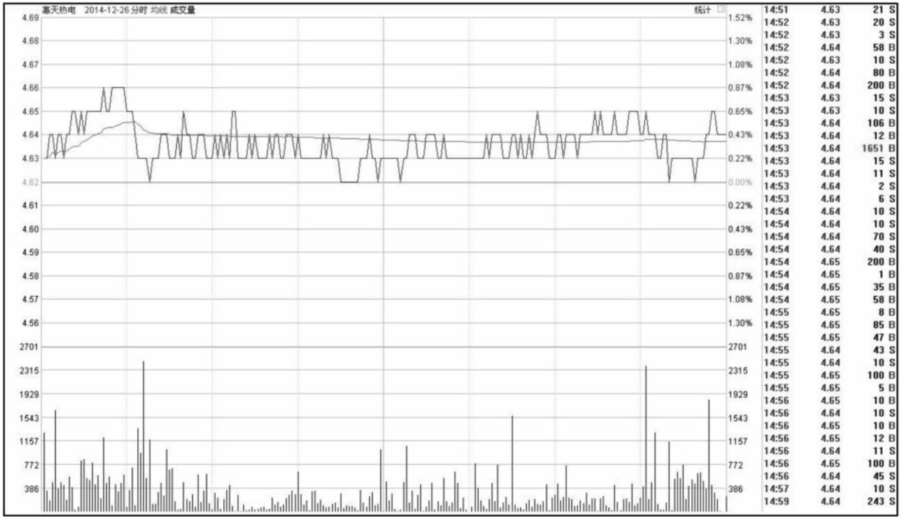
13. 间歇调整。大多数的股价都不是始终保持上涨或下跌趋势的，而是在中间做出调整，这样的形态就是间歇调整。股票在开盘后震荡上涨，不久后走势渐弱，进入了调整阶段，但是很快又进入了强势上涨阶段，并且成交量也逐步放大（如图3-43所示）。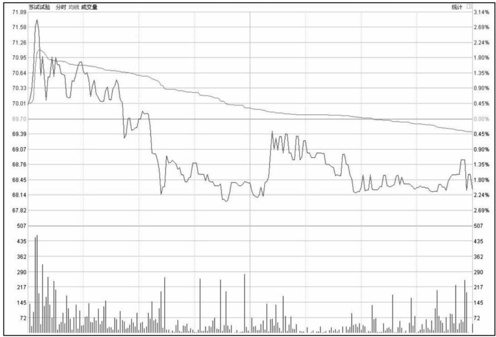

## 分时图中建仓的支撑信号
1. **开盘或收盘打压股价建仓**。在主力打压股价的过程中，动用的量能是相对较小的。而在股价回落至短线底部的时候，却需要动用较大的资金来买入低廉的股票。使用打压股价建仓手法的主力，并不急于买入大量的筹码，主力更愿意在股价调整的过程中被动收集筹码。对于这种类型的股票，投资者也不能操之过急，要耐心地观察股价的走向，把握最佳买点才能够获得高额回报。
   1. 如图3-44所示，旷达科技（002516）在2016年3月11日弱势整理，在开盘15分钟后股价开始跳水下跌，但是成交量却在股价下跌时急剧放大，这说明庄家并没有放弃看多的想法，利用股价下跌的机会大肆抢筹和建仓。这显然就是庄家在开盘时打压股价建仓的手段。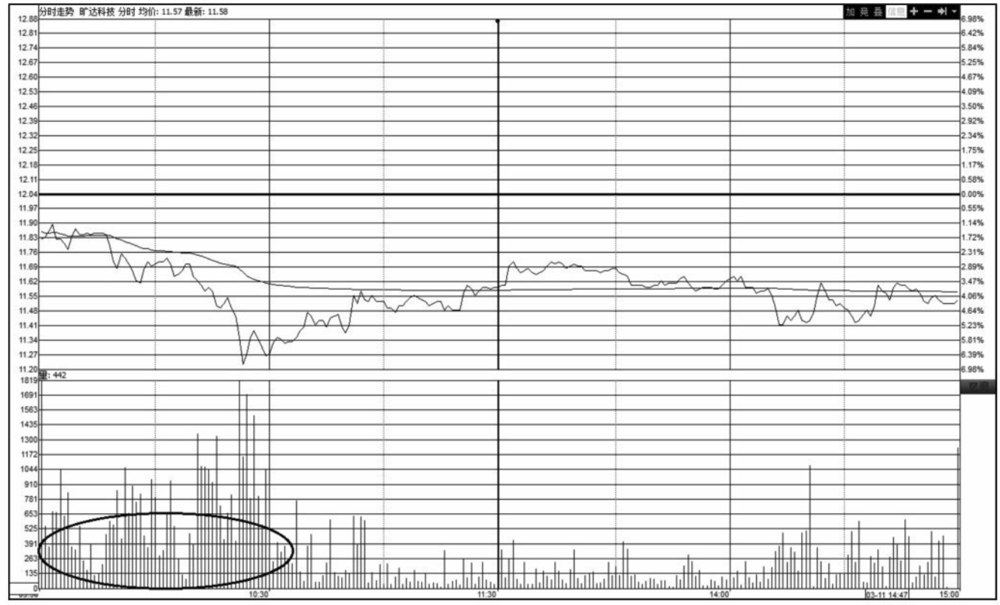
2. **横盘滞涨建仓**。在横盘滞涨的过程中建仓，主力坐庄时间一般会比较长，拉升股价的幅度也会比较大。长时间的横盘建仓，必然会使一部分的散户失去继续持股的耐心。所以持有这样的股票，对投资者来说确实是考验耐心的时候，而半途中卖出股票也许就是主力开始放量拉升股价的时候。
3. **放量上涨建仓**。如果股价正处于底部，并且股指也出现了明确的企稳迹象的话，那么主力是不会错过这样理想的抄底机会的。其在分时图中的表现是，投资者经常可以看到突然间放量大涨的股票（如图3-45所示）。这种类型的股票，在收盘的时候不一定有很高的涨幅。但是，短时间内主力放量拉升股价造成的涨幅还是比较可观的。如果投资者能够发现主力的这种操作行为，那么跟随主力一起建仓，必然对日后的获利有很大帮助。
   1. 如图3-45所示，蓝科高新（601798）在2016年3月11日的走势表明，庄家在拉升股价的过程中不断地完成建仓的动作，每一次的股价拉升都对应着一次放量。如果庄家可以将此种做法持续很长时间，那么建仓过程就相对容易了。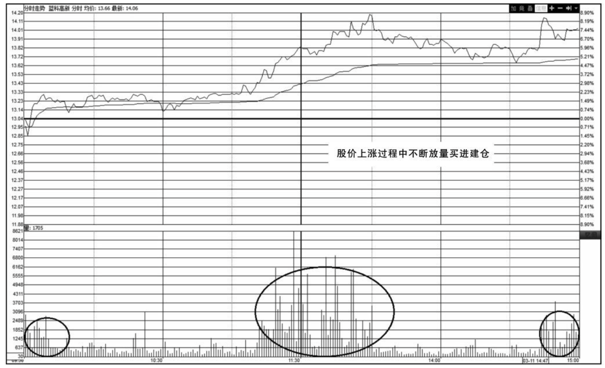

## 分时图中震仓的表现
一般而言，在盘中分析主力是不是在震仓，必须要对成交量进行重点分析。虽然分时线的波动状态也需要重点关注，但是成交量的变化可以提示投资者，主力是不是在进行出货（如图3-46所示）。

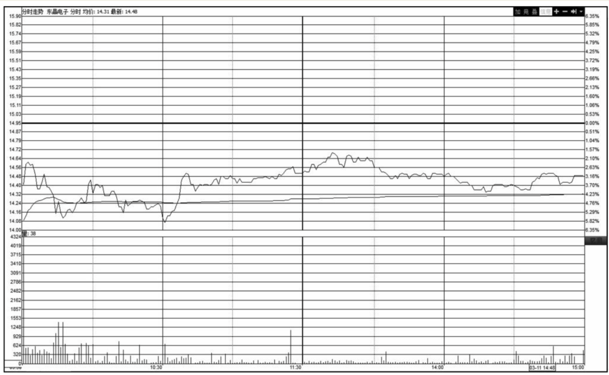

东晶电子（002199）的股价开盘以后上涨不足5分钟便出现下跌的走势，虽然股价的分时线始终保持着向下的走势，但是如果对成交量进行深入分析便可以看到，在股价下跌的时候，并没有引发放量的现象，成交量也没有集中放大，这说明庄家的资金并没有进行大规模的出货，因此股价的波动是安全的。

股价下跌时没有密集量出现，说明当前盘中大量的股票均被锁定，被锁定的股票数量越多，下跌时的成交量就越小，这也就意味着庄家的持仓量越大。股价杀跌时没有量，在后期弱势波动的时候，成交量也没有放大，而是在盘中形成了多次几分钟内无成交量的状态。那么在庄家震仓的时候，越是长时间没有成交，越说明盘中的抛盘数量非常少，庄家怎么可能会在这么小的量能状态下进行出货操作呢？

主力在分时图中缩量震仓时，多表现为全天宽幅震荡，上下波动范围可达3%～5%，在日K线走势上表现为上涨中继十字星，这是明显的“T＋0”做多信号（如图3-47所示）。

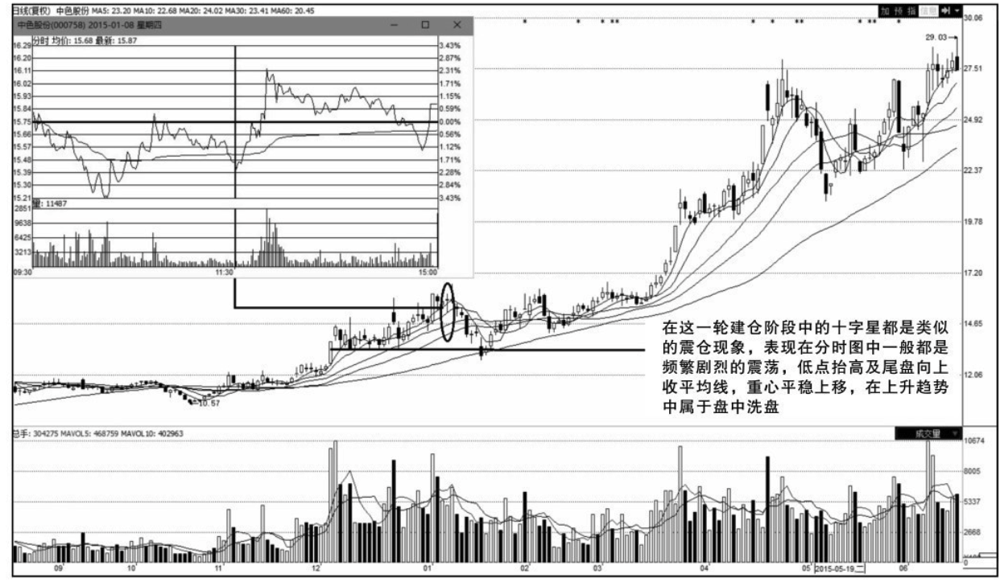

分时图在底部建仓期中出现震仓，一般是处在较强势的反弹行情中。如果在整个阶段的上涨过程中，每一次出现十字星的分时图都是如此，那么可以确定反转行情正在形成。特别是在出现一根至两根大阳线后的次日。在前一日收盘价左右进行分时震仓的“缩量”十字星，属于“强势中的盘中洗盘，其随后会变得更强”，这类似空中加油的意义，此时投资者应主动买进。

只要仔细观察就会发现，在建仓区做多，在分时震仓中的表现是，均价线一般是倾向上移的，收盘前均为向上收，且在分时波动中的低点略有抬高。但是也有在个别情况下，主力为了制造迷途气氛，而致使分时震仓走势非常复杂。有时当股价上涨至阻力位时，或恰遇周五担心周末消息的影响，当日分时图也会展开多空争夺和望而止步的震荡盘面。

短线投资的新手是难以忍受分时图中的宽幅或频繁波动的，特别是那些追高买进或早盘高点买进的投资者，会很被动、很迷茫。此时投资者要保持清醒的头脑，别乱了自己的阵脚，**在早盘上下拉锯时，只要均价线没有紧跟其上，就可以初步确定当天为震荡行情**，不宜追涨杀跌，而要静观其变。待振幅收窄或方向性突破时，投资者再决定是否参与操作，或到尾盘观察如何收尾以及次日早盘的重心移向再作决定。

>单根K线、单一的分析、单一的判断是难以准确断定接下来的行情走势的，必须要采取综合观察分析的方法，如阶段位置、量价形态、分时波动中的细节、当前的市场环境和市场心理因素分析等。其中最为直观、最为重要的是成交量，在阶段高位中任何一次回踩或十字星都不能放大成交量，否则就是调整的预期信号，成交量若是放得越大，调整的预期就越强烈，调整的幅度也就越大。此时投资者就应立即采取安全措施逐步高抛和减轻仓位控制风险，不能恋战或待放量大阴线变盘时再作决定，到那时就为时已晚了。

## 分时图中强势拉升时的表现
1. **开盘时高开拉升**。高开是指股票的开盘价高于前一个交易日的收盘价，倘若开盘价超过前一日全天的最高价，则称为跳空高开。跳空开盘一般是由强烈的利好消息刺激而引发的，是一种最强烈的开盘方式。很多散户都希望在买入股票后的第二天能够跳空高开，这样就可以获得不少的利润。实际上，高开不一定都会上涨，这需要结合其他情况进行分析。
   1. 小幅高开的股票如果有上涨动因，那么股价在开盘时就会出现小幅高开，这说明多方占据优势地位。若此后股价继续被拉升，则说明上涨的可能性很大，散户可以逢低买入股票。
   2. 如果大幅高开，那么买入就不太好把握，在很多情况下都是高开大量下跌出货收阴线（如图3-48所示），所以操作需要运气。高开大量上冲回落基本都是出货走势，如果开盘买入当日即告亏损，所以在不清楚庄家想做什么的情况下最好不要进行买入操作，因为高开大量出货情况很多。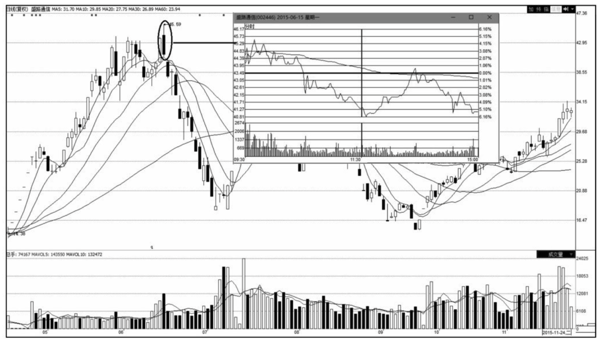
   3. 对于高开涨停的情况不好把握。高开即使涨停，当日盈利也不多，如果掉下来出货亏损不合算，那么一般对于高开的股票还是回避为好。对我们有价值的高开是高开收阴线洗盘，它一般会出现在拉升前，但是当天是没办法获利的，所以在高开收阴当日没理由进行操作，如果需要操作也要看次日拉升不拉升，如果拉升说明高开收阴线洗盘，我们可以跟进买入。如果次日下跌基本没机会了，对于高开收阴线的关注是必须的，并且买入还要看次日的分时走势。
2. **阶段性实现拉升**。有节奏地阶段性拉升，是庄家有意在股价被拉升到一个新的价位时，进行的股价横盘整理，等待获利盘出局之后再开始下一波的拉升动作，股价被拉升到另外一个高价位之后将再次进行整理。股价被反复向上拉升然后整理，时间一久就呈现出明显的阶梯状K线走势（如图3-49所示）。庄家在采用这种有节奏的阶段拉升手法时，也在拉升中穿插了许多洗盘的动作。其中的横盘整理就是庄家在拉升过程中的洗盘操作。只是这种洗盘手法相对于打压、震荡等手法要温和得多。庄家只要限制住了股价的上涨，就达到了洗盘的目的。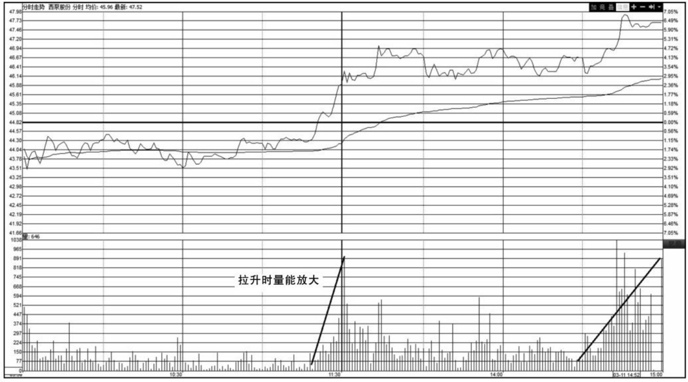
3. **突然放量启动拉升**。这里所说的突然放量拉升，是指股价在分时走势图上的一种走势。股价在运行的过程中出现低开，低开之后维持震荡，并且在上午收盘之前股价一直都是在前一天的收盘价之下运行。在震荡的过程中，成交量呈现出极度萎缩的状态。
   1. 虽然股价出现了低开，有的甚至会在开盘之后呈现出一波急速下挫的走势，但是在上午十点半之后，股价就一直在分时走势图的均价线之上运行，而且在震荡的过程中成交量相当清淡。也就是说，股价在十点半钟之后，在每次震荡回落到均价线附近时都受到了支撑而回升。
   2. 当股价经过反复的震荡之后，在下午两点半左右，盘中突然出现了一股强大的力量将股价迅速拉起。此时，股价在分时走势图上呈现出直线式的拉升，一举突破了前一天的收盘价。同时，成交量呈现出迅速的放大。
   3. 股价被快速拉高之后，稍作回落后再次进入震荡中运行。但是在震荡的过程中，盘面上并没有出现大量的卖单，这种状态一直维持到收盘为止。也就是说，股价在再次进入震荡的阶段中运行后，成交量便迅速出现了萎缩的状态。
   4. 出现这种走势，只要当时股价不是在市场高位区域中运行的话，就意味着庄家即将会拉高股价，后市股价进入拉升阶段中运行的概率非常高。因此，投资者要把握好它的买进机会。
4. **尾盘疯狂拉升**。尾盘疯狂拉升即股价在收盘前半小时内出现了快速、流畅的上扬形态，在分时图中对应时间的成交价曲线几乎呈直线向上，整个过程在收盘前30分钟左右完成。尾盘疯狂拉升是个股走势较为独立的一种体现，它的出现与主力的控盘行为息息相关。
   1. 在很多时候，尾盘疯狂拉升是主力诱多出货的一种手法，因为对于实力较强的主力而言，若真的想拉升个股，一般是不会选择在尾盘时间段的。因此，若个股处于阶段性高点，并且前期的累计涨幅较大，那么尾盘疯狂拉升是个危险信号。
   2. 图3-50为榕基软件（002474）日K线走势图，图中的分时图则为2015年6月3日的走势图。此股在当日收盘的半小时内出现了大幅度的飙升，这是典型的尾盘疯狂拉升形态，并且主力资金参与其中。结合个股此前的中短线大幅上涨来看，这一尾盘疯狂拉升明显是主力诱多出货的手法，而不是再度突破上行的信号，实盘中投资者不可追涨买入。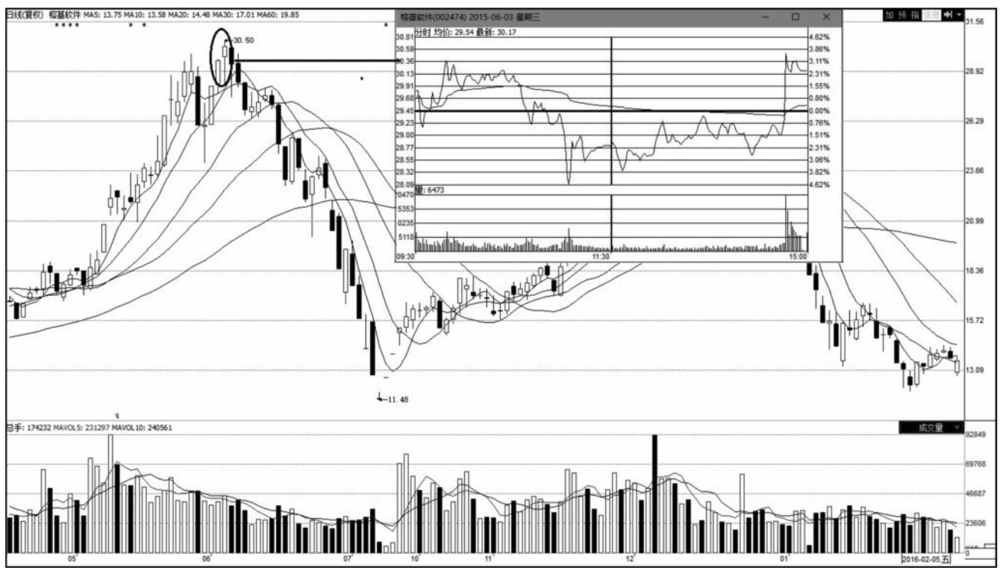

>开盘半小时，一波拉升幅度超过5%的股票往往是涨停的热门候选。涨停的股票拉升波长一般会大于3%，甚至5%，最好的拉升发生在开盘后半个小时内，并且回调无量，上涨时后量超前量。不管如何拉升，投资者均要注意，如果拉升时分时均价线不随分时线同时上涨，那么就形成了量价背离，要随时准备逢高卖出股票。

## 分时图中出货的表现
1. **高开出货**。庄家在出货的时候，一般总会希望可以扩大股价震荡的空间，震荡空间的加大等于延长了出货的时间，延长出货的方法之一就是制造股价的跳空高开。庄家高开无非就是要把手中的股票卖个好价钱，而股票出手之后的下跌仍是必然。
   1. 投资者面对股价高开时必须小心应对，制造高开要比把股价拉上去更节省资金，并且高开的幅度越大，留给庄家出货的空间也就越大，所以，高开有些时候并不是好事。中低位的高开是股价将会持续上涨的信号之一，而连续大涨之后的高开，投资者则需要留意这是不是庄家为了出货而做的准备。
   2. 既然利用高开进行出货，那么成交量肯定也会有所激增，并且在很多时候，开盘价就会成为当天的最高价。在庄家坚决出货的时候，股价最终以高开低走结束一天的走势。
   3. 如图3-51所示，保利地产（600048）在2015年12月8日大幅高开，但是股价震荡上冲乏力，开盘后一小时就开始大幅度回落。开盘时的成交量也从巨量开始逐渐下跌到缩量状态。庄家正是利用开盘震荡拉升的机会，高价卖出了股票。庄家完成出货后，股价随之大幅度受挫。所以投资者做“T＋0”操作时，应该尽量远离这种股票。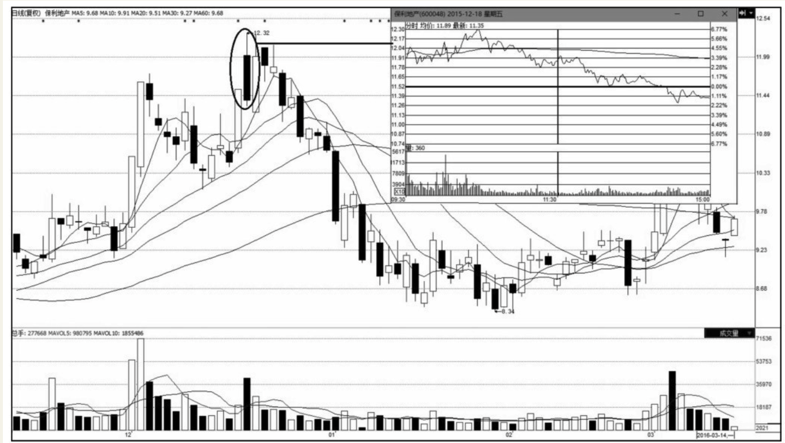
2. **低开反弹出货**。一般来说，如果个股当日主动下跌4%且不回头，说明来者不善。如果投资者没有把握好当日卖出时机的话，那么最后的卖出时机就在反弹时。因为大跌后次日大幅低开低走出货的概率极大，反弹将是最后的逃命机会。这时投资者千万不能因为价格太低而不愿卖出，否则将面临庄家出货后的大跌风险。也就是说，此时尽管价格较低，但以后还会有更低的价格，认赔止损是唯一的选择。
3. **大幅震荡出货**。如果投资者发现股价经过大幅度上涨后，在某个区间长期地大幅震荡，迟迟不向上拓展空间，则应考虑主力是否在进行震荡出货，尤其是当股价跌破这个震荡区间时，投资应立即进行卖出操作。
   1. 图3-52所示，中航动控（000738）的庄家将拉升出货的方式应用得淋漓尽致，当日股价上下震荡，不断地在上涨和下跌之间变动。从分时图中的放量滞涨可以看出，庄家的意图是很明确的：放量出货。虽然是由成交量来不断地拉升股价的，但是涨幅不大就要回落。经过不断的拉升和出货，庄家可以在股价滞涨中卖出一个好的价位。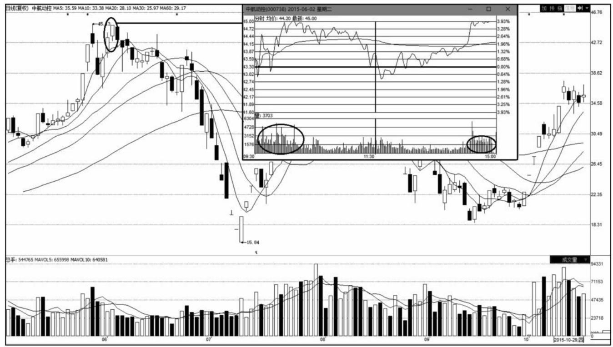
4. **突破平台下跌出货**。股价横盘整理不会出现显著的趋势性行情，但有时也会出现在分时图中。虽然股价在分时图中横盘整理两个小时以上，并没有使盘中出现任何放量突破的现象，但一旦股价开始放量跌破了横盘整理的区域，投资者即可将股票出售。因为突破平台之后，股价的下跌过程是相当快的，这就要求投资者需要在买卖股票的时候有一定的熟练程度，这样才能够有效地避免损失的快速扩张。
5. **整日阴跌出货**。当庄家采取阴跌出货的手法时，说明庄家的出货意图是非常明确的。因为缓慢的阴跌使股价不会在短时间内破位下跌，所以可以达到麻痹投资者的意图，庄家就可以在神不知鬼不觉中完成出货。而采取盘中破位下跌的庄家，不仅说明其出货的意图明确，而且手法上也更加具有杀伤力。在短时间的大幅下跌之后，如果股价并没有在底部反弹，那么投资者瞬间的损失是非常大的。
   1. 图3-53中，贵州百灵（002424）的股价在2015年11月24日后开启了整日阴跌模式，成交量维持在放量状态，而股价在放量中不断下跌。采取这种整日阴跌的出货手法时，股价的下跌过程就像是在“温水里煮青蛙”一样，投资者总是以为股价会反弹，或者跌幅不深可以继续持股。事实上，如果投资者一直持有这样的股票，则会有相当大的损失。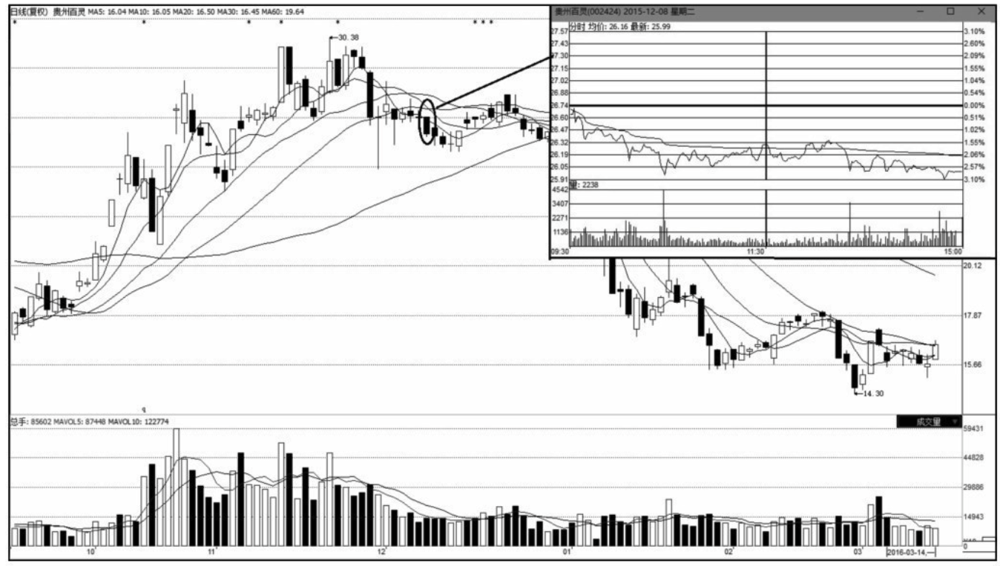

>在分时图中，主力出货的目标是高价卖出手中的流通股。在股价见顶的过程中，庄家成功出货必然有量能放大出现。如果成交量不能明显放大，主力手中大量股票是不可能轻松兑现的。除非个股在大幅度飙升后横向运行很长一段时间，主力才能够缓慢地卖出股票兑现利润。可以说，判断股价是否真正见顶的重要前提，要看量能是否出现明确放大的迹象，在庄家出货的过程中，量能不仅短时间放大，而且股价会出现见顶的明显K线形态，这些都是不能忽视的。

# 步步为营：“T+0”套利的短线启动时机
## 利用均线做“T＋0”
1. **三条均线在黄金交叉时可买入**。在中期跌落趋势的晚期，5日、10日均线先是走平，然后5日均线上穿10日均线构成黄金穿插。所以买盘逐渐增强，成交量扩大，股价继续上涨并向上穿30日均线，5日、10日均线先后上穿30日均线构成黄金交叉并呈多头排列形式。因此三条均线变成股价回调时强有力的支撑线，在确认中期跌落行情完毕后，上涨行情正式发动。反之，三条均线死亡交叉则是卖出时机。
   1. 如图4-1所示，福瑞股份（300049）在中期跌落的过程中，5日、10日和30日均线呈现振动穿插运转的形状，让人看不清方向。2015年2月16日当天该股以一根大阳线放量向上跳空运转，而且5日均线向上金叉了10日均线，几天之后又向上放量金叉了30日均线，过了两天之后该股的10日均线也和30日均线构成了金叉，并且5日、10日和30日均线开端呈现多头摆放的形状，阐明该股将会开始新一轮的上涨行情，而此刻是最佳的出资介入点。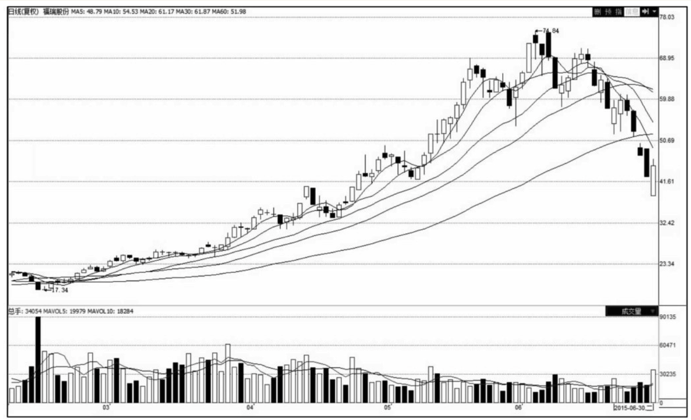
2. **三条均线呈黏合状发散上行时可买入**。投资者应对横向趋势的最佳方法是在股价被打破、趋势清晰后再采取行动，从移动均线的视点来说，即当其呈黏合环绕状发散上行或下行时再买入或卖出。在上升趋势半途和长时间跌落后的贱价区形成的横向趋势一旦被向上打破，且5日、10日、30日均线由黏合状发散上行，那么这就是清晰的中短线的买入机遇。
   1. 如图4-2所示，京天利（300399）在上升的途中构成了两段长时间的横盘整理形状，均线呈黏合状，当均线呈黏合环绕状发散上行突破横盘趋势时，是极好的中短线买入机遇。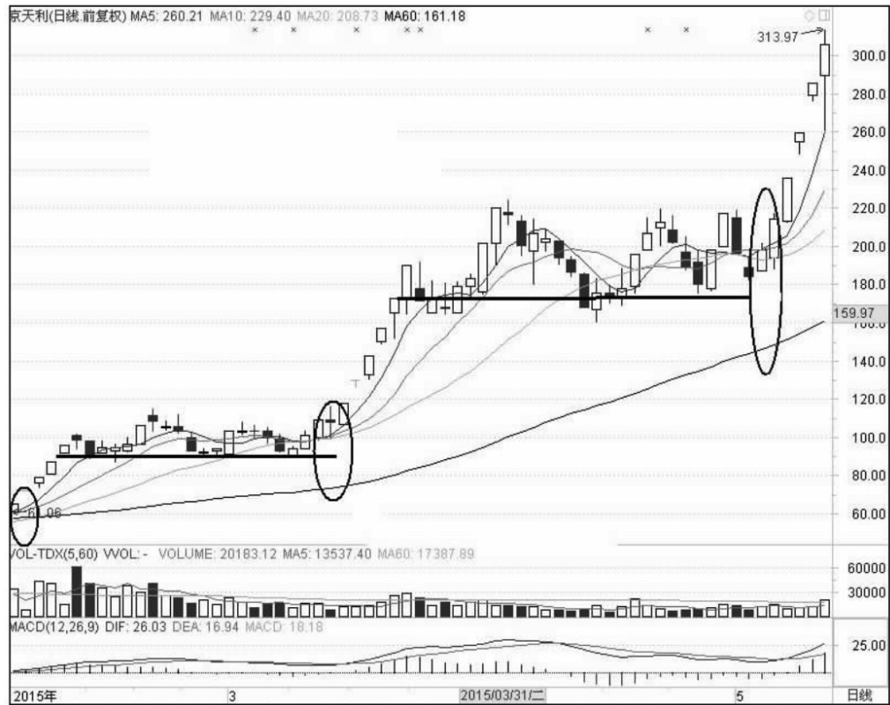
3. **重要均线理论的买卖法则**。我们在做“T＋0”操作时一般只使用重要均线。什么是重要均线呢？重要均线是指现在至过去的一段时间里，股价有明显规律可循的那一条或多条均线就是我们所说的重要均线。如果那条均线对股价有明显的支撑或者阻力作用，那么就是股价有明显规律可循。利用重要均线对股价的支撑或阻力作用，投资者做“T＋0”操作就可根据此来进行买卖了。
   1. 下面我们通过案例了解一下重要均线买卖策略是怎么一回事，以增加投资者的感性认识（如图4-3所示），这个是2015年9月—2016年2月长城动漫（000835）的日K线图。长城动漫是很好做“T＋0”操作的，从上图中可以看出，该股近期的10日线是重要的阻力线，那么突破后也就变成了重要的支撑线了。我们就是要通过10日线进行买卖的，在均线处位置买入，持股获利后即可出局，但要记住我们是做“T＋0”操作的，是日内买卖，获利后必须通过不断提高止盈位来保护到手的收益，从盘中我们可以看出若从突破10日均线的8.88位置买入，哪怕是在9.48这个位置出局，我们仍能获利6个多点的收益［（9.48－8.88）/8.88×100%＝6.7%］。很明显，这比我们持仓待涨要强很多。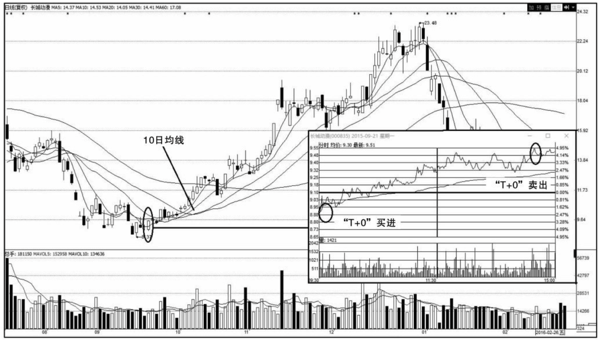

## 利用买卖盘口做“T＋0”
主力常常通过挂出巨量买卖单，引导股价向一个方向运动，并经常利用盘口挂单技巧，引诱投资者作出错误的买卖决策。因此，判断个股当天即时行情的关键，是观察卖盘和买卖的挂单情况和成交状况。

投资者要明白，如果主力真的急于买卖，一定是按照对方（散户）的价格申报的，甚至是挂更有利的价格来成交，而不是被动地在报价栏里等待市场给你成交的机会；如果主力真的急于成交，可以挂出高出卖一或卖二的价格，而实际成交价格往往比下单的价格要低。即如果卖一的委托价为26.30元，卖二的委托价为26.36元，你挂出的买入价是26.34元，那么成交价则是26.30元。所以，真实的成交多是隐性的买卖盘行为，而不是被动地持盘等待行为，投资者认识到这一点是相当重要的。

1. **上压板买卖提示**。在报价栏里出现大量卖单、少量买单的现象，称为上压板（如图4-4所示）。如果主力真要出货，往往不会挂在报价栏里，即使其大单只成交了一部分，其剩余的挂单也会马上撤单，再重新照现有的买单申报。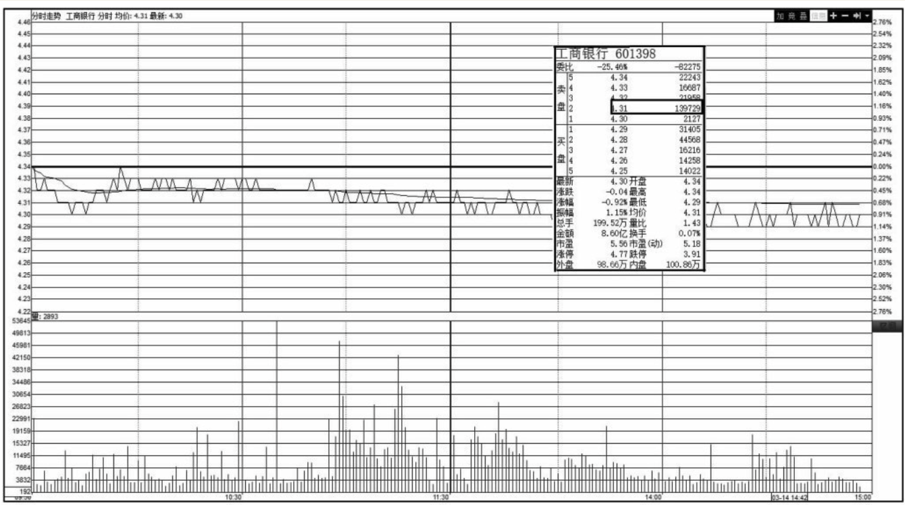
   1. 将大量的卖单挂在盘口，只会使其他投资者以更低的价格赶紧成交，而迫使散户交出筹码或阻止股价暂时上升，这才是上压板的真正用意。
   2. 当股价处于刚启动不久的上升趋势中时，如果出现上压板而股价却不跌反涨，那么主力压盘吸货的可能性较大，这种现象往往是股价上涨的先兆，当投资者发现上压板被撤掉或被大口吃掉时，就要考虑跟进了。当股价的上涨已有一定的幅度，而上压板较多且上涨无量时，则预示着主力想让获利盘看到股价压制而快速出局，同时他们也想看这些压单有没有人会买，如果有，是散户在买还是大户在买；他们也想看一下有没有人会跟着抛盘，如果有，是散户在抛还是大户在抛。通过这种试盘动作，主力能摸清市场状况并及时调整操作思路。
2. 下托板买卖提示。在报价栏里出现大量买单少量卖单的现象，就称为下托板（如图4-5所示）。如果主力真看好该股，通常会直接向现有的买单申报，甚至直接照卖二、卖三的价位申报，这样就很难在盘面上出现大量委买单的现象。委买单越多，只会迫使其他投资者以更高的价格买入，而挂在盘口的买单无法很快成交。所以下托板的用意是使投资者抢单或阻止股价下跌。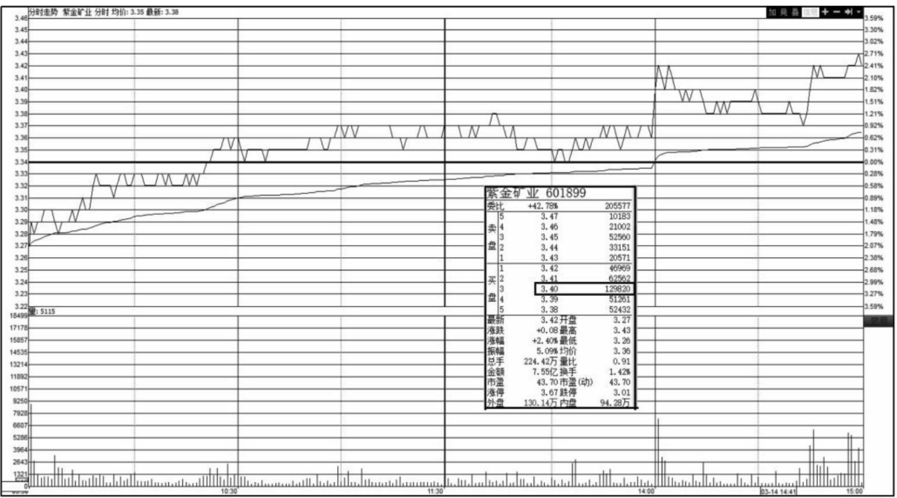
   1. 如图所示，2016年3月14日开盘后，紫金矿业股价持续上涨，在股价上涨过程中，不断有大买单出现在一些重要的技术点位上。这样的盘口形态显示拉升股价的多方后劲十足，股价的上涨行情步步为营，并且未来这种涨势还将继续。在这个过程中，如果投资者手中既有该股，又有资金，那么可以考虑进行“T＋0”操作，先用资金买入股票。
   2. 当股价持续上涨一段时间后，在高位遇到一定阻力，此时在买盘位置上已经看不到大买单跟进，这是多方力量耗尽的信号。看到这样的信号，投资者应该将手中原来持有的股票卖出，通过这样先买后卖的操作，投资者手中持有的股票数量并没有变化，但却成功赚取了买卖之间的价差收益。
   3. 当股价处于上涨初期，如果主动性买盘较多，并且盘中出现了下托板，往往预示着主力积极做多的意图，投资者可以逢低跟进；当股价升幅已大且处于高价区时，如果盘中出现了下托盘，那么投资者要注意主力是否在诱多出货。这通常是看下面的托单是否频繁更换，如果是，那说明主力在不断撤销自己的挂单，而把其他投资者的单子推到前面，然后用自己的卖单来成交。这是不祥的开始，一旦大托单被撤销或被对倒，那么投资者就要果断回避了。

上压板和下托板的出现，其目的都是主力意图操作股价的行为，并且往往伴随有撤单的现象。但是，当上压板中只有一笔大单且无撤单现象时，可能只是某些大户主动止盈的体现。比如，当其一步步被市场消灭而股价并无急剧变动时，就常常属于这种情况。

>股价在上涨阶段、分时走势图及盘口交易数据中都是为股价继续上涨服务的；股价在顶部阶段、分时走势图及盘口交易数据中都是为出货服务的；股价在下跌阶段、分时走势图及盘口交易数据中都是为再出货服务的；股价在筑底阶段、分时走势图及盘口交易数据中都是为吸筹服务的。总之，利用分时走势图，投资者可以收集主力操作意图的第一手资料，了解主力在盘面留下的各种小动作，然后分析这些小动作的发生和成因，实现与主力共舞。

# 因势利导：不同市况中的“T+0”套利策略
## 牛市中的“T＋0”操作技巧
1. 快速拉升阶段的股票持股不动，不做“T＋0”操作；已经形成下降通道的股票，在其跌破10日线后直接出局，也不做“T＋0”操作；“T＋0”操作主要集中于底部吸筹和中间各盘整平台阶段的股票（如图5-2所示）。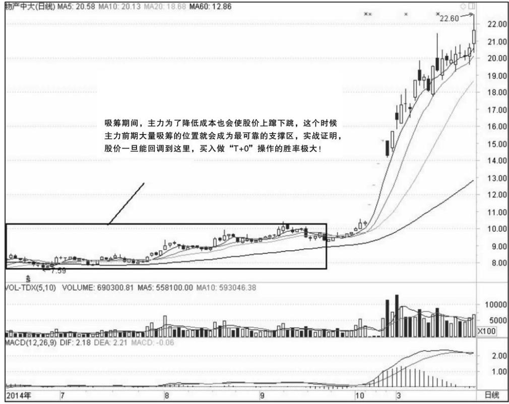
2. 处于底部吸筹和中间各盘整平台阶段的股票，可以观察前30分钟大盘的走势，如果第30分钟处于前30分钟的最高点，那么有利于盘中回档做“T＋0”操作。
3. 投资者要注意盘中同一板块是否有领头羊出现，这是比较确定的下手机会。如果有领头羊出现，并且领头羊冲击涨停，则自己手中的同板块股票可能会出现跟风性质的冲高动作。此时投资者可以寻找机会及时介入，滞涨即走；介入之后，投资者应注意同板块中的领头羊能否封住涨停，如果不能，一旦领头羊掉头，跟风盘上用于“T＋0”操作的筹码将会毫不犹豫地及时出局，防止被套。
4. “T＋0”操作应尽量选择盘子较小、股性较活且投资者自己熟悉的品种。
5. 在平衡的上升趋势中，如果连续拉出三根中阳线或者两根大阳线，投资者应考虑逢高减仓，然后逢低回补；股价在缓慢下跌的途中，如果连续拉出三根中阴线或者两根大阴线，投资者应考虑逢低介入，反弹抛出。
6. 做“T＋0”操作可以锁住每天的利润，降低成本。总之一是手快，二是胆子大，三是不怕错，四是持股量大一些，不然做“T＋0”操作没有意义。

## 熊市中的“T＋0”操作技巧
熊市持续的时间可能会比较漫长，通常会持续几年的时间，但这并非是说在整个熊市中就一直没有获利的机会。熊市的大部分时间都表现为“下跌—反弹—再下跌—再反弹”这种循环往复的局面（如图5-4所示）。尤其是大盘，通常在经过几轮下跌后会出现力度较大的反弹，投资者在中级以上级别的反弹中仍然可以获得不菲的收益。

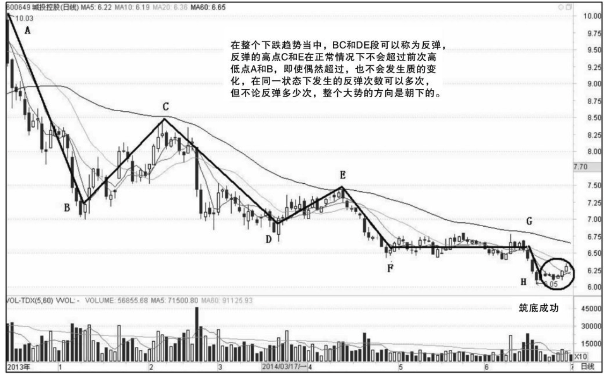

1. 采用“T＋0”操作的基本前提条件是：在大盘指数分时K线图上出现30分钟级别以上的严重顶部背离，并且被深度套牢的个股走势也同时出现同级别的严重顶部背离，投资者就可以先卖出后买回，做当日“T＋0”操作。
2. 尽量避免当日“T＋0”短线操作做成中长线操作，要以“快”取胜，在分时图高点卖出被深度套牢的个股总数量的三分之一或一半，在分时图低点必须重新买回卖出的股数，以确保股票总数不变。
3. 熊市分时K线图操作不能贪心，以能够每次摊低3%的成本为满足点，否则容易得不偿失。因此当日“T＋0”操作不宜追求超过3%以上的价差。
4. 以分时图均价线作为当日“T＋0”操作的核心，价格在均价线上方偏离均价线时卖出，价格在均价线下方远离均价线时重新买入同等数量的股票。
5. 如果股市中先出现严重的底背离，投资者也可以先买后卖，但前提是前面不是满仓被套，账户里还有剩余资金。投资者在买入后必须在当天高位卖出相同数量的股票，这样才能不增加持股数量。

## 震荡市中的“T＋0”操作技巧
震荡市的基本特征：在盘整市中股价高低震荡、反复无常、飘忽不定，股价无明确的趋势，处于一种涨不上去也跌不下来的尴尬境地中（如图5-5所示）。

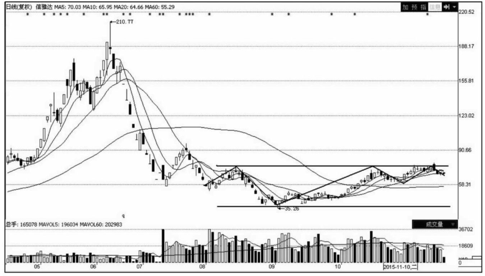

1. 投资者要有敏锐的市场洞察力和充分的看盘时间。
2. 投资者能够及时发现市场的短期热点所在。事实上，总有少数个股不理会大盘走势走出出色的短线行情，同时带动整个板块。短线操作的对象就是要选择这类被市场广泛关注但大部分人还在犹豫中不敢介入的个股，这样的个股能带来短线收益，再配合“T＋0”操作就能将收益放大。
3. 在热门板块中挑选个股的时候，一定要选择走势最强的龙头股，而不要出于资金安全的考虑去选择补涨或跟风的个股。
4. 止损必须坚决。“T＋0”交易中的止损是指当摊低成本失败时，若手上有持仓时间超过1天的股票，应该当天卖出，而不能把“T＋0”做成中线。
5. 盈利目标不能设定太高。超过2%的差价就应该满足。
6. 当惯性消失时必须坚决出局，并寻找机会换股操作。即使有“T＋0”的操作经验和技巧，投资者也不应该在下跌概率大的个股里停留。
7. 投资者不能瞻前顾后，必须克服犹豫不决的心态。一旦发现“T＋0”的盘面机会，投资者就应该按照预定计划坚决地去做。
