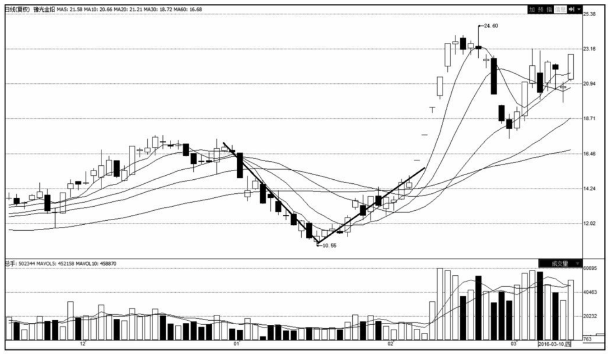
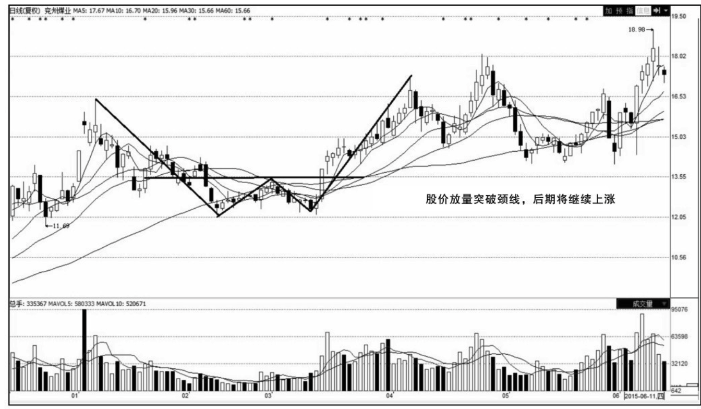
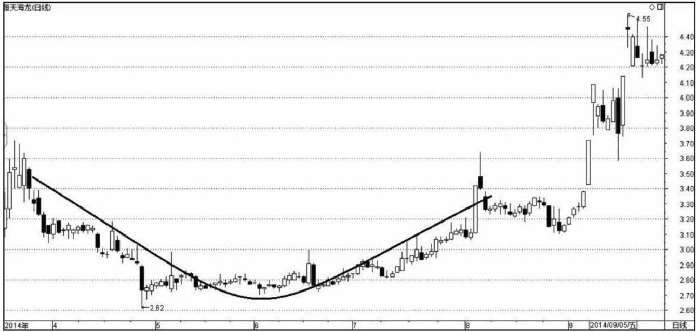
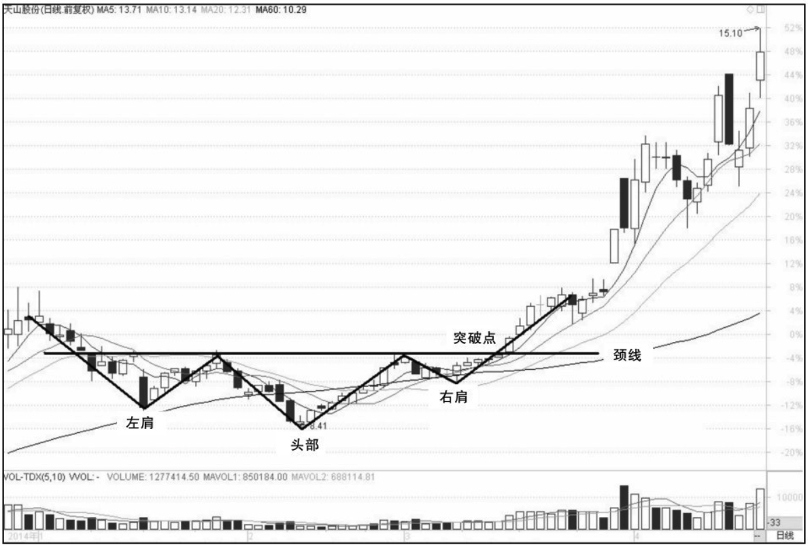
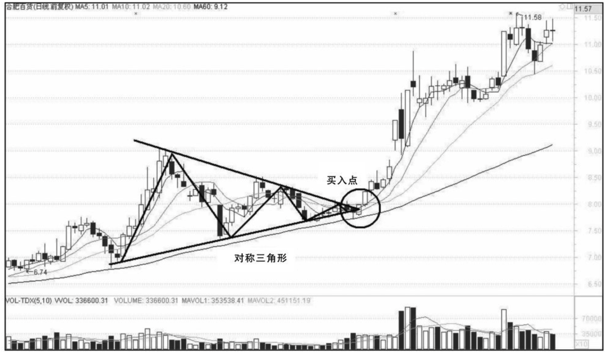
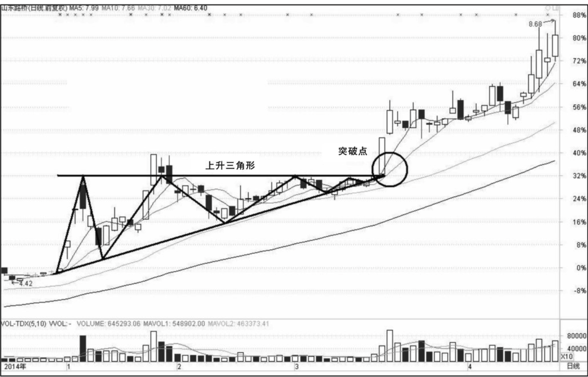
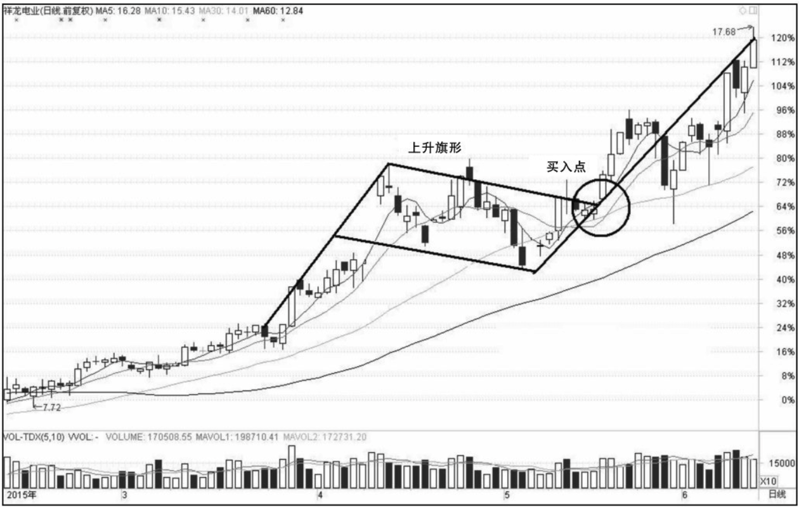
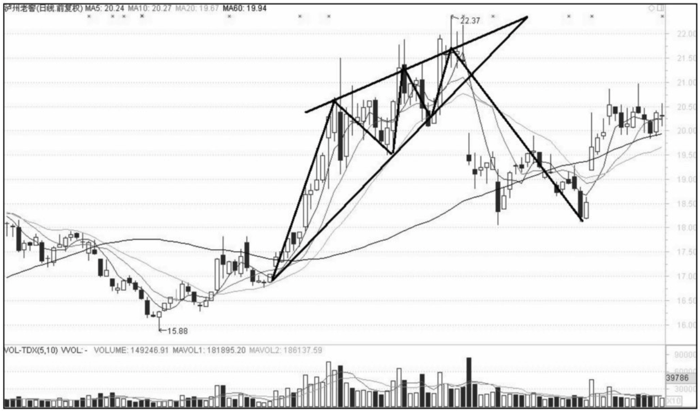

    作者 老牛
    人民邮电出版社 / 2016-07
    ISBN 9787115426345

[豆瓣链接](https://book.douban.com/subject/30684163/)

- [“T+0”交易的诱惑](#t0交易的诱惑)
  - [“T＋0”操作必须具备的前提条件](#t0操作必须具备的前提条件)
  - [“T＋0”选股标准的参考因素](#t0选股标准的参考因素)
- [支撑“T+0”套利的日线趋势研判](#支撑t0套利的日线趋势研判)
  - [6种日K线底部反转形态](#6种日k线底部反转形态)
  - [4种日K线调整形态](#4种日k线调整形态)

# “T+0”交易的诱惑
## “T＋0”操作必须具备的前提条件
1. **熟悉股性和市场规律**。“T＋0”操作必须建立在对个股的长期观察和多次模拟操作的基础上，投资者要非常熟悉个股股性和市场规律。
2. **实时看盘的时间和条件**。“T＋0”操作要求投资者必须有实时看盘的时间和条件，而且还要求投资者有一定短线操作的经验和快速的盘中应变能力。
3. **手中既有筹码又有资金**。投资者做盘中“T＋0”操作时，手中不仅必须持有一定数量的股票，而且还必须备有能够进行等额交易的可用资金。换句话说，盘中“T＋0”操作必须是既有筹码又有资金，二者缺一不可。
4. **盘中应有较大的震荡**。判断当天股价能否会有较大幅的震荡，是投资者能否操作盘中“T＋0”成功的必备条件，因为只有股价震荡时，才会有做差价的机会。通常要求20天平均振幅要大于4%。

>“T＋0”操作一定要做自己熟悉的个股，而且要选择股性好的股票，即振幅较大、较活跃的股票。盘中“T＋0”操作要求投资者切忌贪心，一旦有所获利，或股价上行遇到阻力，便立刻落袋为安。这种操作事先不制定具体盈利目标，只以获取盘中震荡差价利润为操作目标。

## “T＋0”选股标准的参考因素
1. **应选流通盘适中的个股**。做“T＋0”操作选股首先要看流通盘的大小。流通盘太大不行，大盘股的波动较小，不容易出现套利空间；流通盘太小也不行，容易被主力控盘，出现突如其来的砸盘。那么流通盘多大比较适宜做“T＋0”操作呢？一般来说，投资者应该选流通盘2亿～5亿股的股票为佳。
2. **应选具有热点题材的个股**。参与热点概念炒作是A股市场目前赚钱最快的投资方法。根据各种热点题材，比如医药电商、智能家居、基因测序、虚拟现实等，如果投资者能快速找到相关概念股，那么就可以尽早布局，及时骑上牛股。
3. **应选放量的个股**。成交量的放大，意味着换手率的提高、平均持仓成本的上升，上档抛压因此减轻，股价也才会持续上涨。有时，在庄家筹码锁定良好的情况下，股价也可能缩量上攻，但缩量上攻的局面不会持续太久，否则平均持仓成本无法提高，导致抛压大增，股票缺乏持续上升的动能。
4. **应选取中线看好的个股**。所谓中线看好，是指这只股票短线涨不涨无所谓，关键是你能知道这只股票未来一两个月以后会上涨。

这里主要以技术分析角度来简单讨论。用技术分析可以从以下几个角度来选中线有较大概率上涨的股票。

1. 均线系统形成多头排列。均线多头排列趋势为强劲上升趋势，操作思维为多头思维。投资者进场时以均线的支撑点为买点，下破均线支撑时止损。
2. 股价还处于上升通道的初期，在上升通道下轨的第三个低点附近可以考虑建底仓。
3. 股价长期横盘整理向上突破，并经过回抽确认，重新拐头向上。

除了以上几个参考因素外，做“T＋0”操作所选标的还必须考虑一个因素：**即个股股价需在20日均线上面**。这样综合起来风险会小一点，“T＋0”操作的胜率也会增加。这是因为20日均线是某只股票在市场上前20天的平均收盘价格，其意义在于它反映了这只股票20天的平均成本，是一根短期和中期过渡的均线，在短线操作的过程中可以充当趋势线。一般来说，20日均线连续三天向上，且股价站在20日均线之上，代表中短期趋势向上。反之，当股价跌到20日均线下面，且20日均线连续三天向下时，一般则表示趋势向下。

# 支撑“T+0”套利的日线趋势研判
## 6种日K线底部反转形态
1. **V形底**。股价在下跌趋势中，下挫速度越来越快，最后在下跌最猛烈的时候，出现了戏剧性的变化，股价触底反弹，然后一路上扬。其形态走势像英文字母“V”，故命名为“V形底”（如图2-1所示）。V形底形成时间最短，是研判最困难、参与风险最大的一种形态。但是这种形态的爆发力最强，把握得好，投资者可以在短期内赢取暴利。它形成的原因是由于市场受利空打击或其他意外情况影响造成的恐慌性抛售，引起股价超跌，从而产生报复性反转行情。

2. **双重底**。双重底股价走势像英文字母“W”，因此又称W形底，是一种较为可靠的底部反转形态（如图2-2所示）。双重底一般多发生于波段跌势的末期而不会出现在行情趋势的中途。对双重底形态的研判重点是，当股价在右边的底部时，技术指标是否会出现背离特征。如果技术指标不产生背离，那么W形底就可能向其他形态转化（比如多重底）。即使W形底最终成立，其上攻动能也会较弱。

3. **三重底**。经过一轮下跌后，股价出现小幅反弹，由于空头气氛浓厚，所以股价再次下探，并在上轮低点受到支撑，买盘增强，因此股价再次拉起，至前期反弹高点附近受阻后回落，此时前两次低点的连线形成强力支撑，股价拉起，一举突破前两次反弹高点形成的颈线位，这种三低两高的形态称之为三重底。三重底是主力吸货到洗盘的体现，股价经过一轮下跌后，主力开始逐步集筹。这时在主力吸货的作用下，股价出现小幅反弹。由于此时空方势大，且继续大规模集筹已不划算，所以股价出现回落，再次探底，主力在前期低点附近更是不遗余力地吸货，使得股价再次拉起。出于洗盘和集筹的双重目的，主力将股价再次打至前期低点，不坚定的持筹者将被洗出，主力也借机再次集筹（前两重底部是被动性下跌，而最后一重底部则是主动性下跌，其性质完全不同），等洗盘结束后，股价一举突破前两次反弹高点形成的颈线位，并开始一轮上升行情。
4. **圆弧底**。圆弧底形态属于一种调整形态，多出现在价格底部区域，是极弱势行情的典型特征。其形态走势表现在K线图中宛如锅底状（如图2-3所示）。圆弧底形态的形成原因是由于有部分做多资金正在少量地逐级温和地建仓造成的，显示的股价也已经探明阶段性底部的支撑。它理论上的涨幅通常是最低价到颈线位的涨幅的一倍。

5. **潜伏底**。股价在一个极狭窄的范围内横向移动或缓慢阴跌，并且每日股价的高低波幅较小，成交量亦十分稀疏，仿佛像冬眠时潜伏在底部的蛇，这种形态就是潜伏底。通常潜伏底的时间比较长，但是其突破后产生的成交量激增和股价的暴涨也是惊人的。所以说，潜伏底是横有多长，竖有多高。
6. **头肩底**。头肩底就是指形态酷似人的头与肩的关系的K线组合形态，头肩底形状呈现三个明显的低谷，其中位于中间的一个低谷比其他两个低谷的低位更底（如图2-4所示）。
   1. 在空头市场中，做空的力量持续，使得股价不断走低，由于行情已有一定的跌幅，股价出现了短期的反弹，但由于积重难返，反弹时买盘的力量有限，所以反弹很快就结束了，这就形成了“左肩”。接着股价又继续下跌，且跌破了左肩的最低点，因此随着股价继续下跌、成交量锐减而最终形成了“头部”。当股价回升到左肩的反弹高点附近时，出现了第三次的回落，之后又有所上升，在跌势基本稳定下来后形成“右肩”。最后股价发动较有力度的冲击，有效突破了颈线的阻力，整个头肩底的形态就此完成，当然，随之而来的往往就是一波较大的上升行情。
   2. 头肩底形态的颈线是指左肩高点和右肩高点的连线，也就是两个明显的反弹高点的连线。在实际走势中，由于两个高点完全一致的情况是极其少见的，因此，依据这种定义画出的颈线都是倾斜的，这就对把握具体买点会产生一些影响。

   

>双重底、头肩底、圆弧底放量突破颈线位时，应是买入的时机。这里有两点必须高度注意。一是**必须放量突破方为有效突破**。没有成交量配合的突破是假突破，股价往往会迅速回归启动位。二是**在低价位的突破可靠性更高，高位放量突破很可能是庄家营造的“多头陷阱”**，引诱散户跟风，从而达到出货的目的。许多时候，放量突破颈线位时，往往有回抽确认，这时也可作为投资者建仓的良机。

## 4种日K线调整形态
1. **三角形形态**。在三角形调整形态中，价格波动空间在持续不断地收缩。虽然前期价格已经完成并形成了明确的单边趋势，但是在三角形的调整形态中，价格不会出现明显的单边趋势，而是在阻力线和支撑线共同作用下不断震荡。三角形走势可分为对称三角形态、上升三角形态和下降三角形态等。
   1. **对称三角形态**。对称三角形态代表的是买卖双方力量在该段价格区域内势均力敌，暂时处于平衡状态（如图2-5所示）。
      1. 从形态的角度看，高点的连线构成了一条短期阻力线，低点的连线构成了一条短期的支撑线，两条线呈对称状，表明短期股价需要寻找突破方向。因此，对称三角形存在的时间比较短，延续此前趋势的可能性大；如果股价不能迅速突破阻力线或支撑线，那么就很有可能演变成其他形态。
      2. 在成交量方面，在对称三角的形成过程中成交量不断减少，直到股价有所突破时，成交量才会随之增加。如果股价是向上突破的，则需要大成交量的伴随，如果是向下突破的则不必如此。
   2. **上升三角形态**。当买家不能突破某档阻力，但又不断推进的时候就形成了上升三角形。上升三角形在形成过程中的成交量呈逐渐缩小之势，显示了买卖双方在该区域内的较量，但买方的力量逐渐占上风，低点不断抬高，并不断尝试突破上面的水平阻力线。该阻力线一旦被突破，那么前期多头趋势就有望得到延续，成交量也将大幅上升（如图2-6所示）。
   3. **下降三角形态**。下降三角形是上升三角形的一个标准对立图形。在下降三角形中，存在一条由逐渐下降的高点连成的斜边阻力线，而下面则是一条水平的支撑线，阻止价格向下突破。下降三角形的成交量变化也呈下降之势，但因价格变动与上升三角形相反，故卖方将逐渐占上风，至股价跌破支撑线时，瞬间杀跌的走势自然会完成，后市将极不乐观。
2. **旗形形态**。旗形形态就像一面挂在旗杆顶上的旗帜，它通常在急速而又大幅的市场波动中出现，股价经过一连串紧密的短期波动后，形成一个狭小长方形。旗形走势可分为上升旗形和下降旗形两种。
   1. **上升旗形形态**。上升旗形的形成过程是：股价经过陡峭的飙升后，接着形成一个紧密、狭窄和稍微向下倾斜的价格密集区域。把这密集区域的高点和低点分别连接起来，就可以画出两条平行而又下倾的直线，这就是上升旗形（如图2-7所示）。
   2. **下降旗形形态**。下降旗形则刚好相反，当股价出现急速或直线的下跌后，接着形成一个波动狭窄而又紧密且稍向上倾的价格密集区域，把其高点和低点分别以直线连接起来，就是下降旗形。
   3. 无论是上升旗形还是下降旗形，**其形成过程中的成交量都是在逐渐减少的**。从技术意义上看，上升旗形是后市极为看好的调整形态，其突破阻力线后的上升幅度至少等于旗杆的幅度；而下降旗形则是一段大跌小回的反弹行情，后市极为看淡，其跌破支撑线后的下跌幅度一般不会小于旗杆的幅度。
3. **楔形形态**。楔形走势有上升楔形和下降楔形之分，不管股价的运行趋势如何，楔形的调整形态都与股价的运行趋势相反。
   1. **上升楔形形态**。上升楔形的形成过程是，股价经过一次下跌后出现强烈的技术性反弹，接着又掉头下落，但其低点比前一次要高，随后做窄幅波动，但其低点一个比一个高，高点也一个比一个高。将高点和低点分别连线，便形成了向上倾的三角形（如图2-8所示）。
   2. 下降楔形形态。下降楔形则相反，高点一个比一个低，低点也一个比一个低，形成向下倾斜的三角形（如图2-9所示）。

