    作者: 凌波 / 斯坦威出品
    出版社: 天津人民出版社
    副标题: 波段操作精解
    出版年: 2021-1
    页数: 288
    定价: 55.00元
    装帧: 平装
    ISBN: 9787201171043

[豆瓣链接](https://book.douban.com/subject/35349193/)

- [量价时空概述](#量价时空概述)
  - [量价时空分析的意义](#量价时空分析的意义)
    - [价格](#价格)
    - [成交量](#成交量)
    - [时间](#时间)
    - [空间](#空间)
    - [人](#人)
  - [盘口简介](#盘口简介)
  - [K线简介](#k线简介)
- [量价关系](#量价关系)
  - [量价背离](#量价背离)
  - [价涨量增](#价涨量增)
  - [价涨量平](#价涨量平)
  - [价涨量减](#价涨量减)
  - [价平量增](#价平量增)
  - [价平量平](#价平量平)
  - [价平量减](#价平量减)
  - [价跌量增](#价跌量增)
  - [价跌量平](#价跌量平)
  - [价跌量减](#价跌量减)
  - [突破时的成交量](#突破时的成交量)
- [多头上涨阶段价格形态](#多头上涨阶段价格形态)
  - [上升趋势线](#上升趋势线)
  - [多头下降旗形](#多头下降旗形)
  - [菱形上升反转](#菱形上升反转)
  - [多头下降楔形](#多头下降楔形)
  - [上升三角形](#上升三角形)
  - [上升通道线](#上升通道线)
- [多头触顶阶段价格形态](#多头触顶阶段价格形态)
  - [头部K线形态](#头部k线形态)
  - [头部盘整](#头部盘整)
  - [倒V字形反转](#倒v字形反转)
  - [双重顶](#双重顶)
  - [形态的时空度量](#形态的时空度量)
  - [假突破——多头陷阱](#假突破多头陷阱)
  - [头肩顶形态](#头肩顶形态)
  - [复合式头肩顶](#复合式头肩顶)
  - [失败的头肩顶](#失败的头肩顶)
  - [三重顶](#三重顶)
  - [圆形顶](#圆形顶)
  - [碟形顶](#碟形顶)
- [空头下跌阶段价格形态](#空头下跌阶段价格形态)
- [空头探底阶段价格形态](#空头探底阶段价格形态)
- [缺口与成交量](#缺口与成交量)
  - [缺口与跳空](#缺口与跳空)
  - [四种缺口](#四种缺口)
  - [岛形反转](#岛形反转)
  - [关于逢缺必补的说法](#关于逢缺必补的说法)
- [K线与均线的波段操作技术](#k线与均线的波段操作技术)
  - [K线回踩均线](#k线回踩均线)
  - [K线回抽均线](#k线回抽均线)
  - [低位价托](#低位价托)
  - [高位价压](#高位价压)
  - [量托](#量托)
  - [量压](#量压)
  - [多方炮](#多方炮)
  - [空方炮](#空方炮)
  - [价托和多方炮](#价托和多方炮)
  - [价压和空方炮](#价压和空方炮)
  - [均线三线开花](#均线三线开花)
- [波浪理论主要买入位置的优势与劣势](#波浪理论主要买入位置的优势与劣势)
  - [C浪末端位置](#c浪末端位置)
  - [1浪初始位置](#1浪初始位置)
  - [2浪末端位置](#2浪末端位置)
  - [3浪初始位置](#3浪初始位置)
  - [4浪末端位置](#4浪末端位置)
  - [5浪初始位置](#5浪初始位置)
- [有关量价时空分析的更多话题](#有关量价时空分析的更多话题)
  - [反转K线形态在价格通道中的位置](#反转k线形态在价格通道中的位置)
  - [如何利用123法则判断趋势反转](#如何利用123法则判断趋势反转)
  - [如何利用背离形态确定趋势反转](#如何利用背离形态确定趋势反转)
  - [从K线构成来看买点位置策略](#从k线构成来看买点位置策略)
  - [基于成交量和关键点位的多空波段操作](#基于成交量和关键点位的多空波段操作)
  - [格兰威尔移动平均线八大法则](#格兰威尔移动平均线八大法则)

# 量价时空概述
## 量价时空分析的意义
### 价格
`价格`是技术分析的首要因素。所有当前的市场消息都会反映到价格上，这是技术分析者在理论上的优势之一。如果价值投资者通过估值认为一只股票被低估并且在未来会上涨，那么这只股票需要得到市场的广泛认可之后才能启动上涨行情。没有资金的追捧，再有价值的股票都不能脱颖而出。股票的价格不会从20元一下子上涨到40元，它会给技术分析者“上车”的机会。

不管股票的上涨或下跌是出于什么原因，从根本上来说都是因为筹码的供需平衡被打破。股票就像其他实物商品一样，越是有价值的东西，买的人就越多，它的价格也就越高。供不应求始终是价格上涨的动力。

股票价格会走出一些能够预示未来发展方向的形态，只要是人参与的市场，这些价格形态就会不断重复出现。市场群体的盲目投资行为将会为冷静的交易者创造获利机会。

### 成交量
任何一种一般的基于价格的分析方法，如果再加上有效的成交量分析，往往能够将其研判水准提升一个档次，从而提高行情判断的成功率。在发生异常成交量的价格附近，经常会发生趋势转变。在研判行情发展阶段时，成交量可以提供另一个维度上的定位。

**从某种程度上来看，价格是量的堆积，没有放量的过程就不会发生上涨**。从经验来看，成交量是一个非常可靠的指标。我们在讲波浪理论时，经常会提到“断浪”，而成交量能够帮助我们确认对浪型的判断。

在做短线波段时，成交量同样非常好用。在放出巨量之后，往往会产生新的一波行情。放量往往对应着长K线，它能为止盈提供可靠信号，对日内交易起到锦上添花的作用。可以这样说，成交量是技术分析的灵魂。

### 时间
价格形态之中已经包含了时间因素，也就是形态的宽度，当时间超越平衡时，趋势将会发生变化。**从筹码方面来理解的话，当市场横盘时，处于收集筹码阶段，在大部分筹码被固定之后，市场上的需求开始大于供给，价格开始上涨，然后筹码被派发到纵向的不同价位上**。

俗话讲，**横有多长，竖有多高**，意思是说上涨空间往往等于横盘距离，调整的宽度越大，上涨的高度也越大。还有一种说法是空间换时间，比如，当市场发生快速的下跌调整时，虽然调整时间不足，但空间已经到位，后面很可能展开新的一轮上涨。

价格波动还会**呈现出一种非对称的周期特征**。你也许不可能建立一个100%正确的可以预测涨跌时间窗口的公式，但如果你能合理地利用它的周期特性，一定能够起到如虎添翼的作用。

### 空间
除了时间之外，空间是决定价格形态的另一个因素。时间是形态的宽度，空间则是形态的高度。时间和空间决定了上涨浪和下跌浪之间的结构和比例关系。

时间和空间还决定了价格移动的速率，价格在上涨和下跌时通常会以一定的斜率展开。例如，**利用短期与长期均线之间夹角的大小，可以判断行情上涨（或下跌）的迅猛程度**，角度越大说明上涨（或下跌）越强劲，角度越小说明上涨（或下跌）越羸弱。

长K线是众多成交量堆积形成的，尤其是`长阳线`。价格上涨时更需要成交量的配合，价格下跌时有时不需要成交量的配合。通常上涨的速度相对较慢，下跌的速度相对较快。因此，顶部的宽度要小于底部的宽度。

### 人
我们建议交易者把思考时间放在收盘之后，在盘中操作时尽量不带观点，只执行交易计划，做一个没有思想的操盘手。

人的情绪和市场氛围都会影响交易决策，冲动性交易和过度交易是成功交易的最大障碍。交易者需要像学习一项技能那样训练自己，培养良好的交易习惯，真正做到“从心所欲不逾矩”。

## 盘口简介
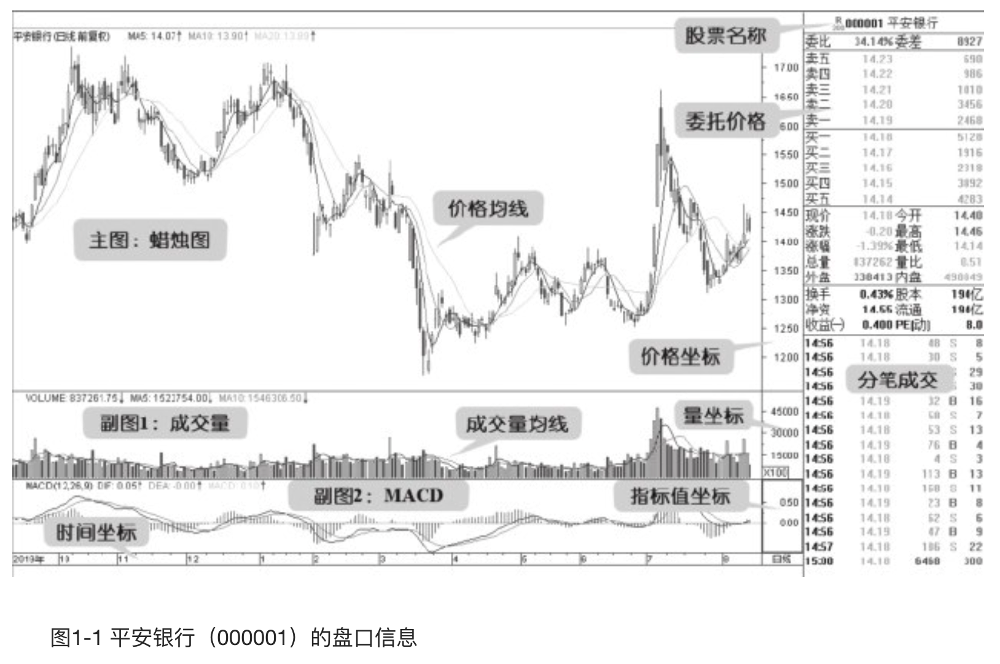

- `量比`是一只股票开市后平均每分钟的成交量与过去5个交易日平均每分钟的成交量之比。量比越大说明股票越活跃，流入的资金量越多。我们常说的温和放量是指量比在1.5-2.5倍之间，明显放量是指量比在2.5-5倍之间，巨幅放量是指量比在5-10倍之间，当量比达到10倍以上时，通常是天量天价的反转信号。
- `换手率`是一只股票在一定时期内成交量占其流通股本的比例，换手率同样可以用来衡量股票的活跃程度，当一只股票的每日换手率达到3%-7%时，可以认为该股处于相对活跃状态，当换手率达到10%以上时，往往进入冲顶阶段。换手率的水平与股票所处的板块有关，通常科技股的换手率较高，而权重股的换手率较低，券商股在拉升时其换手率通常处于适度活跃的水平。
- `流通股`是可以在市场交易的股份数量，总股本包括流通股和非流通股。在现今市场中，通常可以将流通股低于1亿股的股票称为小盘股，将1亿-100亿股的股票称为中盘股，将100亿股以上的股票称为大盘股。其中，流通股在10亿股到20亿股左右的中小盘股比较适合进行波段操作。
- `每股净资产`是股东权益与总股本数量之间的比率，每股净资产越高，股东拥有的每股资产价值就越多，通常这个数值越高越好。例如，图1-1中的平安银行，它的每股净资产为14.55元，而当前的收盘价为14.18元，该股的价格低于每股净资产，这说明从基本面来看，这时处于低估值区间。但是，往往越是受人追捧的股票，其价格向上偏离的就会越多，这说明人们对这只股票有着良好的预期。
- `市盈率（PE）`是股票价格与每股收益之间的比率，经常用它来评估股价水平是否合理。当市盈率小于0时，说明该公司的盈利为负，通常在股票软件中显示为“—”；当市盈率为0-13倍时，说明其价值被低估，例如图中的平安银行，它的市盈率为8倍；当市盈率为14-20倍时，说明其估值处于合理水平；当市盈率为21-28倍时，说明其价值被高估；当市盈率大于28倍时，说明其价值被严重高估。市盈率越高说明市场的泡沫越大，对于使用技术分析的交易者来说，没有泡沫和泡沫过大都不利于操作，适度的泡沫才能使股票既有活跃度又有上涨空间。

## K线简介
- `长阳线`。当长阳线出现在横盘或下跌趋势的末期时，表示股价可能开始新的上涨趋势。阳线的实体越大，说明上涨能量越大。没有上影线的光头长阳线，当日的收盘价等于最高价，更具上攻力量。在该类图形之中，涨停是最极端表现。
- `长阴线`。在横盘或上涨趋势的末期出现长阴线时，表示股价可能开始新的下跌趋势。阴线的实体越大，说明下跌能量越大。没有下影线的光头长阴线，当日的收盘价等于最低价，更具下跌势能。在该种图形之中，跌停是最极端表现。
- `长下影线`。当K线带有很长的下影线时，当日盘中有大幅下跌，但在收盘前回升到开盘价附近，这说明在低位区间有多头的支撑，空头的打压成为徒劳。红色的长下影线表示多头力量更加强劲，不仅收复了长下影线的价格区间，而且向上远离了当日均价线，下方的平均市场成本成了支撑。

股价经过调整之后，在下跌浪的末端并且是低位区间，出现带有很长下影线的K线时，如果再配合较大的成交量，则很可能是向上反转信号，如图1-2所示。相应地，股价经过一段时间的上涨之后，在上涨浪的末端并且是高位区间，出现带有很长下影线的K线时，则很可能是向下反转信号。这时主力在伺机出货，等到尾盘时拉高并制造一个看起来漂亮的收盘价，这是在为次日出货做准备，并不是趋势有所好转，持有股票的交易者应该寻找时机离场。

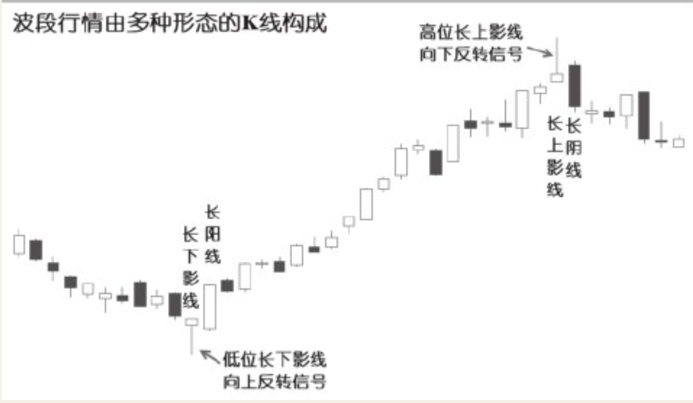

- `长上影线`。当K线带有很长的上影线时，当日盘中有大幅拉升，但在收盘时回落到开盘价附近，这说明高位的卖压很大，这可能是大量获利盘涌出造成的。如果长上影线出现在上涨浪的末端，再配合较大的成交量，则很可能是向下反转信号，如图1-2所示，至少有短线调整的可能。
- `十字线`。十字线的开盘价与收盘价相同，上影线与下影线可长可短。顶部十字线经常被看作是一种反转信号，当该形态出现在高位，并且次日低开收出阴线时，这表明空头力量较强，股价可能向下反转。当该形态出现在低位时，并且次日高开收出阳线时，这表明多头力量较强，股价可能开始回升。

通常，由于高位价格波动剧烈，并且可以配合成交量来区分顶部十字线形态，而低位的价格波动幅度小，容易形成小星线，这降低了该形态的区分度，所以高位的十字线要比低位的准确。

影线具有较强的多空意义，根据影线的长短可以划分出很多K线形态。长下影线说明有买盘支撑，这是多头特征。长上影线说明有卖压存在，这是空头特征。由长下影线构成的K线形态包括锤头线、吊颈线、蜻蜓十字线等；由长上影线构成的K线形态包括射击之星、长腿车夫、墓碑十字线等。常见K线形态请详见表1-1和表1-2。

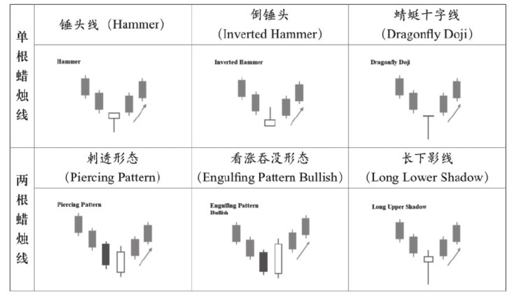
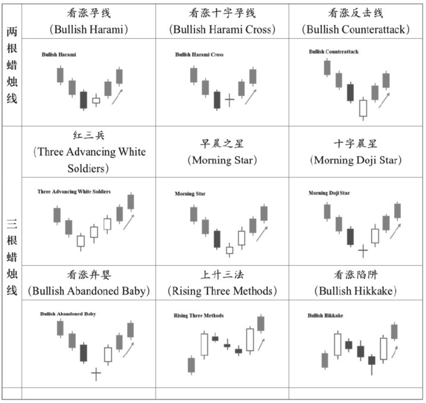

表1-1 看涨蜡烛图形态列表

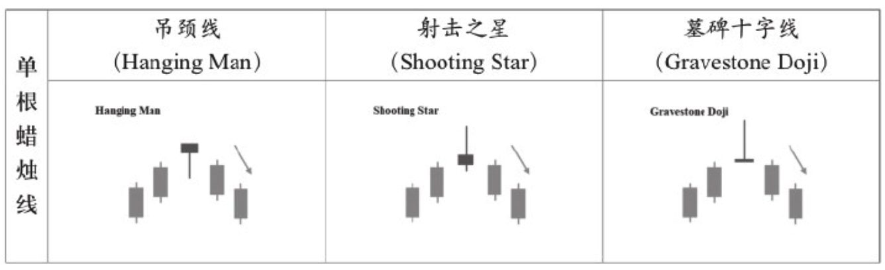
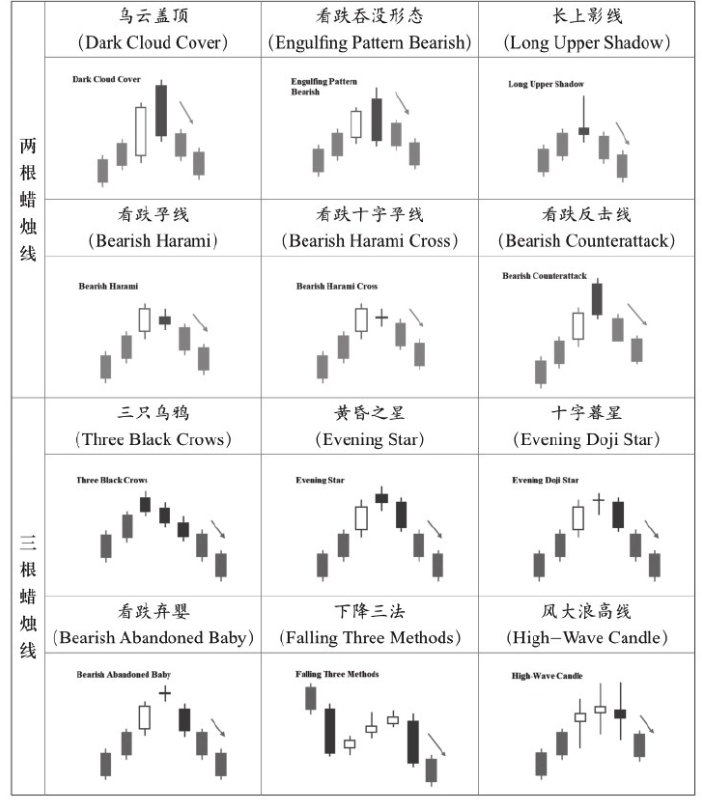

表1-2 看跌蜡烛图形态列表

我们以一只个股为例，看看它在波段行情中出现了哪些K线形态，如图1-3所示。

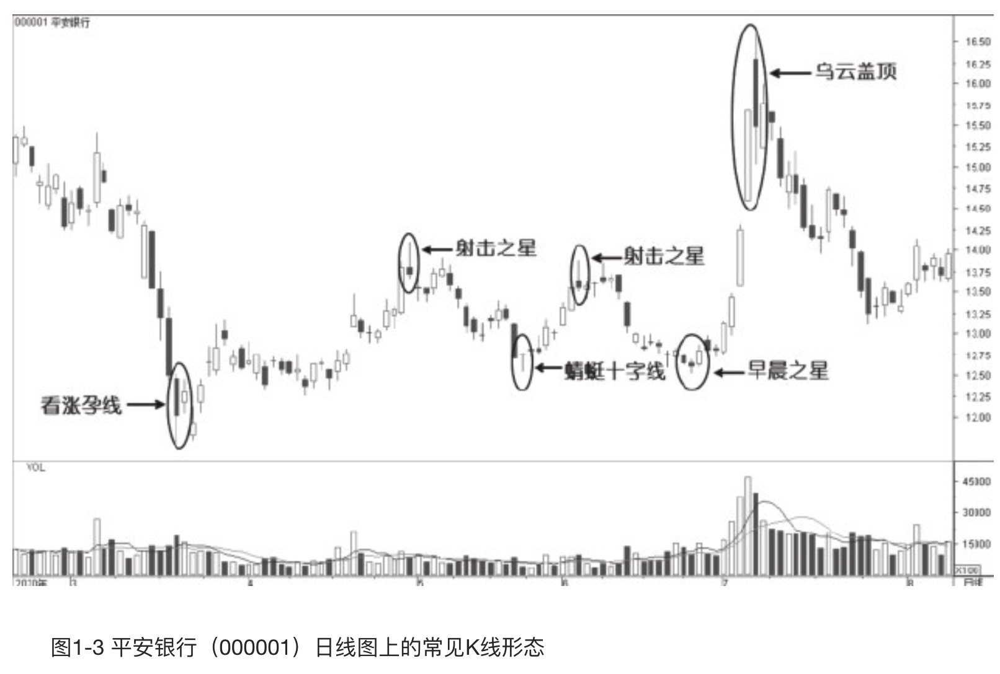

# 量价关系
## 量价背离
伴随着价格的上涨与下跌，成交量也会呈现出相对应的两种状态——放量与缩量。在上升趋势中，多数情况下，价格上涨对应着成交量放大，价格下跌对应着成交量萎缩，两者处于`同步状态（Convergence）`，也就是常说的量价配合正常；在少数情况下，价格上涨对应着成交量萎缩，两者处于`异步状态（Divergence）`，这也就是常说的量价背离。

**指标特征**
 
在价格与成交量发生背离的时候，MACD指标通常也会同时发生背离，两种背离相互验证，可以增大判断的成功率。顶背离通常发生在波浪理论的第5浪上涨，在大牛市当中，也会发生在第3浪或第5浪的延长浪末端。顶背离说明市场严重超买，应随时准备出场，这时的DIF线容易形成双重顶形态。

**筹码供需的临界点**

当股价上涨时，成交量从温和放大发展到明显放大，这表明交投活跃，上涨动能强大，看涨后市。相对的，如果股价继续上涨，成交量反而萎缩，这表明新入市的资金匮乏，上涨动能衰减，后市反转的可能性加大。

我们可以把价格的移动平均线（MA）看作是市场平均成本，当K线运行在多条均线上方时，这表明多数人愿意以高于市场平均成本的价格买进股票，说明市场对筹码的需求大于供给，市场继续上涨的概率较大。当K线运行在多条均线下方时，这表明多数人愿意以低于市场平均成本的价格卖出股票，说明市场对筹码的供给大于需求，市场继续下跌的概率较大。

我们在图2-1中画出了一次牛市与熊市循环的示意图，当市场对筹码的需求大于供给时，也就是临界线的左侧，价格形成上涨推动浪；当供给大于需求时，也就是临界线的右侧，价格形成下跌推动浪。

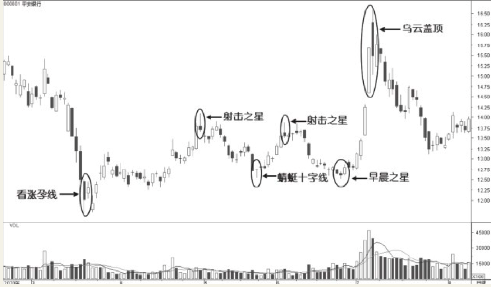

图2-1 量价背离

在第5浪上涨时，价格创出新高，同时的成交量却较之前的一浪有所萎缩，价格趋势方向向上，成交量趋势方向向下，两者的方向背道而驰，这就形成了价与量的顶背离形态。在5浪顶点容易形成天量天价的K线形态。

在c5浪下跌时（假设C浪包括5个延长浪），价格创出新低，同时成交量却有所增长，价格趋势方向向下，成交量趋势方向向上，这就形成了价与量的底背离形态。这说明有主力资金进场，后市可能开始上涨。

在判断趋势反转时，顶背离和底背离是非常有效的技术分析方法。进行分析时所使用的K线图表的周期越大，背离产生的反转信号越可靠。

## 价涨量增
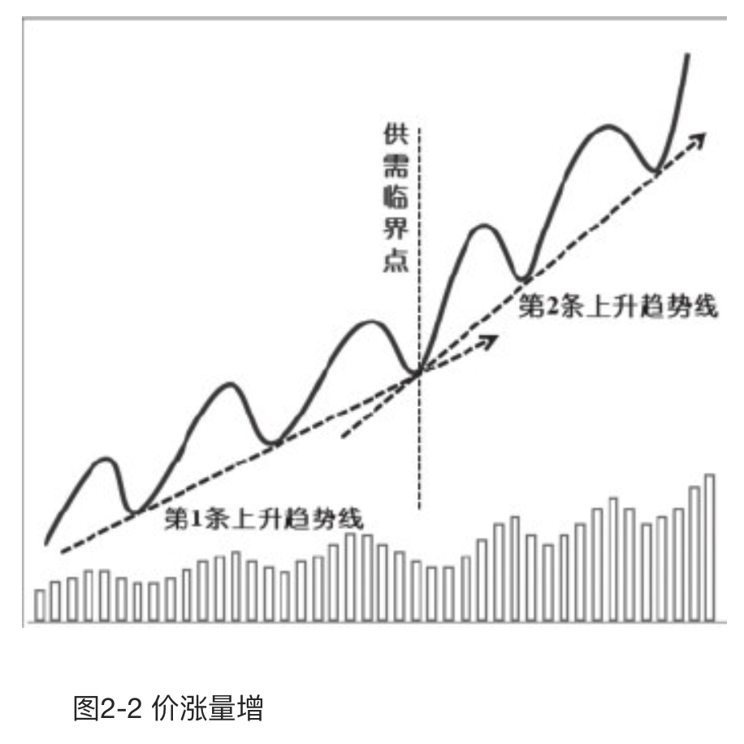

在上涨推动浪中，主要的量价形态是价涨量增和价涨量减，也就是通常所说的放量上涨和缩量上涨，这是多头市场的重要特征。它经常出现在波浪理论中的第1浪、第3浪和第5浪，这期间是做多的大好时机，这时的市场给人怎么买都会赚钱的感觉，这是因为处于上升趋势之中。

在第3浪和第5浪时，个股的换手率会明显加大，中小盘股的换手率可以达到10%~15%左右。当成交量温和放大时，这是健康的量价配合形态，后市还有较大的上涨空间。当成交量增加到10日均量线（VOLMA10）的2倍以上时，表明这波中期上涨行情到了最高换手水平，主力资金趁机在高位出货，后市的上涨空间有限。

**指标特征**

MACD指标通常会在0轴之上形成一波三折的图形，这是价涨量增的过程，也是获得利润的最好阶段。在这之后，不管是在第3浪的延长浪还是已经进入了第5浪，这时都已经处于超买区间，随时可能开始调整。

如果均线已经处于多头排列达20个交易日以上，交易者需要更加关注当前趋势，因为随时存在反转的可能。

**供需临界点**

在牛市当中的调整并非坏事，而是难得的逢低进场或加仓机会。在上升趋势中，经过调整之后，消化了前一波的获利盘，市场对筹码的需求再次超过供给，场外资金需要更多筹码，这会推动价格再次上涨。

## 价涨量平
在股价上涨过程中，成交量有时候并没有明显放大，这就是价涨量平形态。

在一波上升浪的末端，成交量并非总能保持增长态势，虽然缺乏更多量能支撑，但由于上涨惯性，当前的量能水平仍能维持上涨。

这种量价形态如果发生在低位横盘或者上涨初期，成交量没有明显放大则说明散户的追高意愿不够强烈，主力资金并没有积极介入，这种上涨行情不会持续太久。如果发生在上涨过程当中，成交量维持在较高水平，这时可以考虑进场参与。

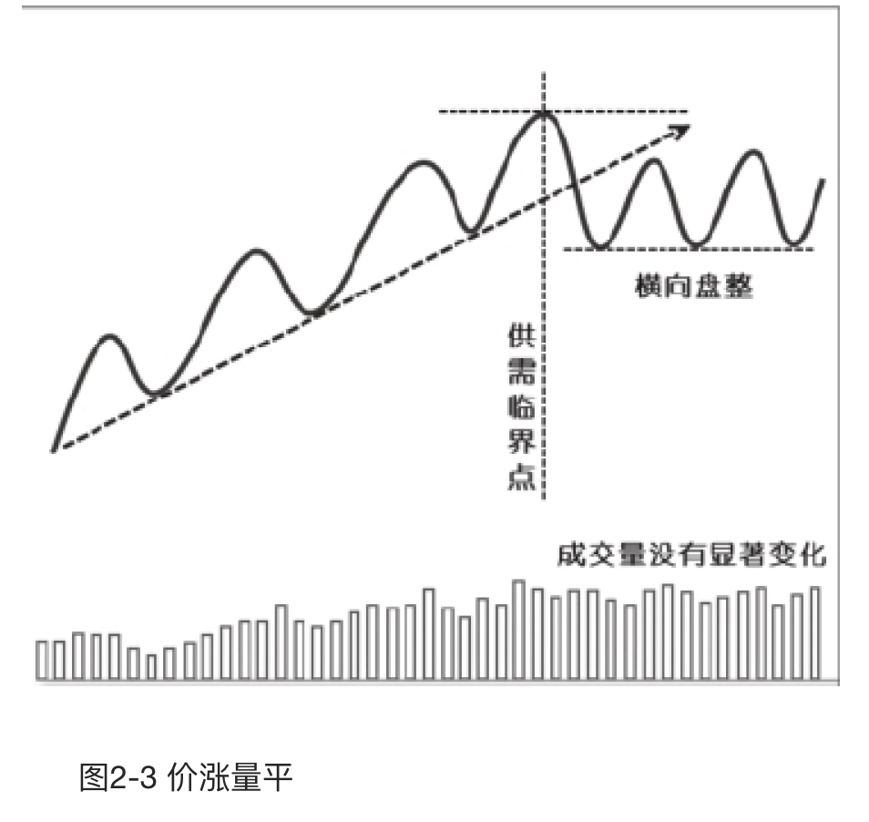

**指标特征**

在价涨量平阶段，MACD指标的DIF线通常处在高位。如果此后没有成交量的进一步放大，DIF线可能向0轴靠近或者向下突破0轴。

这时的多条均线处于多头排列状态并且均线之间的距离趋于达到最大水平，均线对价格的吸引作用在不断增强。

**供需临界点**

在供需的临界点之后，股价达到一定高位，但需求并未能同步提高，只是保持在一定水平，这时股价大多陷入高位盘整。如果在此之前成交量还没有经过倍量阶段，那么后面可能还有上涨行情，如果已经形成过倍量，那么后面可能迎来较大级别调整。

## 价涨量减
缩量上涨是一种典型的头部量价特征，经常出现在波浪理论中的第5浪和延长浪末端。这是多头不愿看到的顶部量价背离。价格趋势线与成交量趋势线的背离程度也是我们需要衡量的一个指标。当价格大涨，同时成交量大幅萎缩时，就形成了明显的量价背离。背离程度越大，越有可能发生反转。

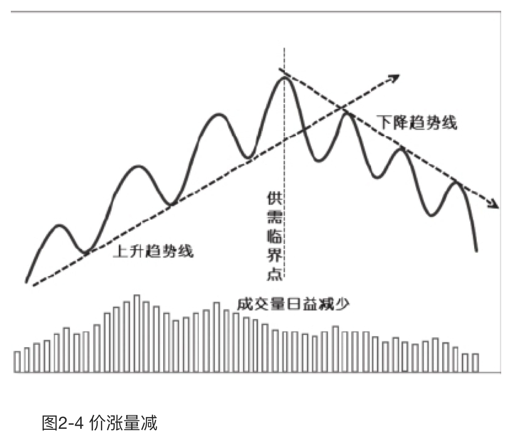

价涨量减是技术分析上的一种明显的量价现象，如果发生在上涨初期或者横盘整理期间，由于上涨动能不足，后市将不被看好。如果发生在上升趋势末端，出现过倍量或者顶部K线形态，那么很可能对这波连续上涨行情进行调整，调整幅度很可能达到上涨幅度的30%~50%。

缩量上涨的空间没有得到更多成交量夯实，成交量的密度不足，一旦下跌则会以很快的速度滑落。虚涨到一定程度之后，止盈盘大量涌出，最终跌破上升趋势线，开始进入下降趋势。

有一种极端的缩量上涨情况，那就是极低量的一字涨停板，这通常是由于停牌期间发出利好消息，在复牌时大多数交易者预期后市会有很大上涨空间，从而普遍惜售导致无量涨停。

遇到失败的第5上涨浪时，它会与第3浪形成双重顶形态，由于没有成交量的配合，因此很难有效突破第3浪的高点，涨不上去就会开始下跌。在下降趋势中的反弹经常符合价涨量减的量价特征，如果没有明显放量则要谨慎抢反弹。股市中有句俗话说，反弹不是底，是底不反弹。

**指标特征**

在背离的第5上涨浪，MACD指标通常已经在0轴上运行了一段时间，有时DIF线会在短暂跌破0轴之后，开始第5浪上涨，并且指标值不会高于之前的高点，价格与DIF线形成顶背离形态。背离的一浪往往是强弩之末，MACD柱线在形成几根不长的红柱线之后，便开始再次跌破0轴。

冲顶的一浪经常会出现顶部反转K线形态，比如射击之星、乌云盖顶、吞没形态以及天量天价等。

**供需临界点**

在供需的临界点之后，由于价格走高，而需求并未增加，同时供给有增无减，结果就会形成反转向下的趋势。

## 价平量增
价平量增是指价格在一个区间震荡，而成交量却不断增加，这种形态通常发生在盘整区域。从技术上来看，这种形态通常是看涨的，但需要有配套措施。

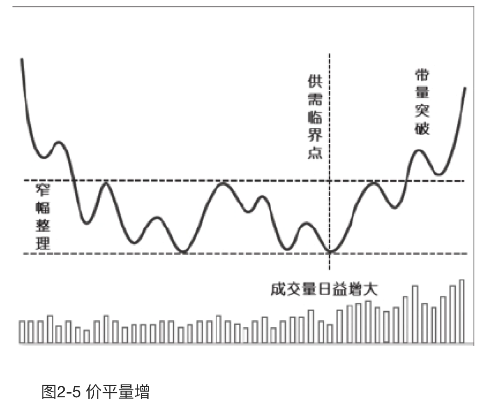

价平量增比较容易发生在圆形底和碟形底的右侧，多头在底部区域暗自收集筹码，潜在的上涨突破正在酝酿之中。在横盘整理多日之后，放量突破盘整价格区间，说明很多交易者都在等待突破买进，后市将被看好。

如果价平量增形态发生在波段高位，价格在经过一段时间上涨之后，在高位做横向整理。这时若是放出倍量并急速拉升，则不应再追高买进，手中持有筹码的交易者可以考虑获利了结。

**指标特征**

在底部区域时，MACD指标的DIF线通常已经在0轴之下运行了一段时间，并且回升到0轴附近徘徊，等待放量突破0轴。在上涨中继区域时，DIF线在0轴上方并靠近0轴的位置运行，在成交量的配合下，价格突破前高，MACD红柱线开始发散。

**供需临界点**

随着买方力量增强，在供需临界点之后，多头开始占上风，需求开始大于供给，导致价格开始寻求突破，新的上升趋势逐渐形成。

## 价平量平
价平量平是指价格在一个区间震荡，而成交量没有显著变化，这种形态通常发生在盘整区域。从技术上来看，这种形态是一种横向整理，后面成交量发生明显变化时，可能会发生方向选择。

价平量平如果发生在低位，震荡幅度通常较小，成交量处于较低水平。这种成交不活跃的市况，在短期内很难改变，需要有较多资金进场才能向上突破，形成上升趋势。

价平量平如果发生在高位，震荡幅度通常较大，成交量处于较高水平。这种高换手率的情况不可能一直持续下去，如果不能吸引新的资金进场，很有可能开始下跌，所谓“盘久必跌”。

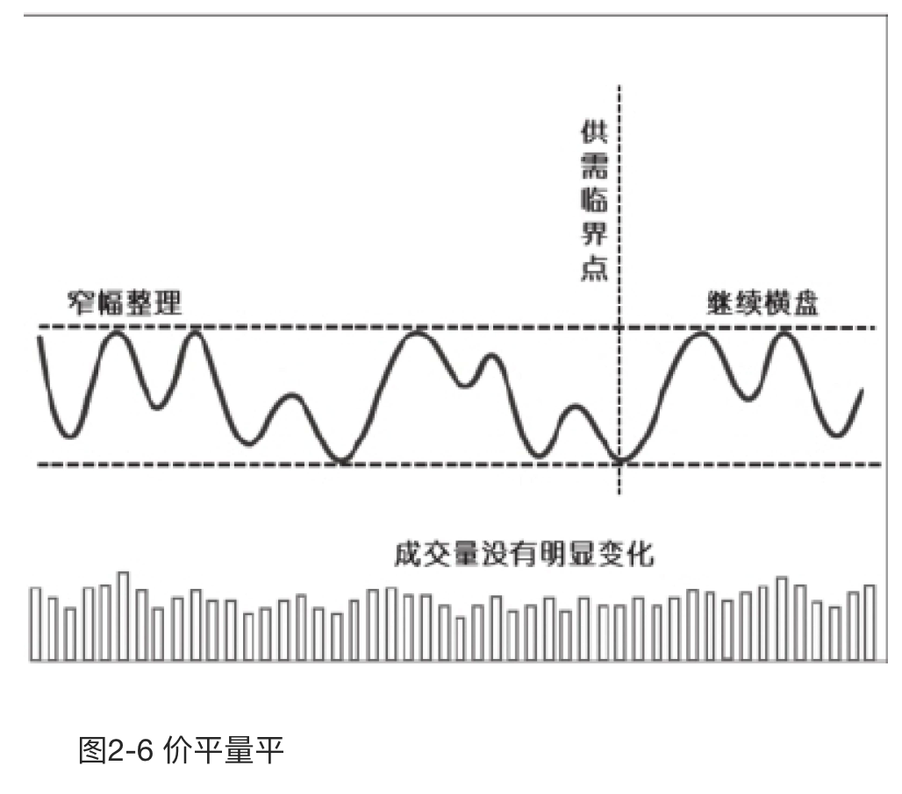

**指标特征**

在低位时，MACD指标的DIF线和DEA线缠绕在一起，并在0轴附近上下徘徊，没有明显的方向性。在高位时，DIF线与DEA线处在死叉之中，绿柱线不长，但绿柱线随时有拉长的可能。

**供需临界点**

买方与卖方势均力敌，在供需临界点之后，多空双方仍旧保持平衡，如果成交量没有明显变大，价格趋势保持横盘状态不变。

## 价平量减
价平量减是指价格在一个区间震荡，而成交量却逐渐萎缩，这种形态通常发生在盘整区域。

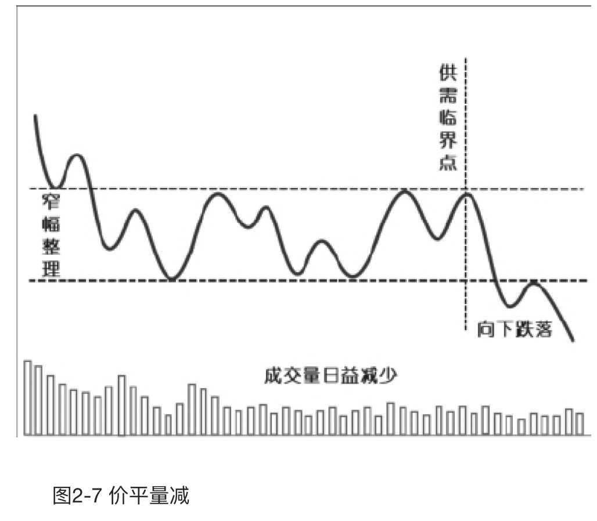

在整理图形的末端，价格保持在一定水平，有意愿买入或卖出的交易者大多已经完成了交易，所以成交量越来越少，最终逃不过盘久必跌的命运。

如果该形态发生在高位，利好已经兑现，再没有新的资金进场，上涨动能逐渐衰竭，此后很有可能形成头部。

**指标特征**

在低位时，MACD指标的DIF线和DEA线缠绕在一起，并在0轴附近上下徘徊，没有明显的方向性。在高位时，DIF线与DEA线处在死叉之中，绿柱线不长，但绿柱线随时有拉长的可能。

**供需临界点**

在供需临界点之后，需求进一步减少，导致价格开始下跌。

## 价跌量增
在下跌推动浪中，主要的量价形态是价跌量增和价跌量减，也就是通常所说的放量下跌和缩量下跌，这是空头市场的重要特征。价跌量增经常出现在波浪理论中的下跌A浪和C浪（及延长浪），这期间是做空的大好时机，空头如鱼得水，这是因为处于下降趋势之中。

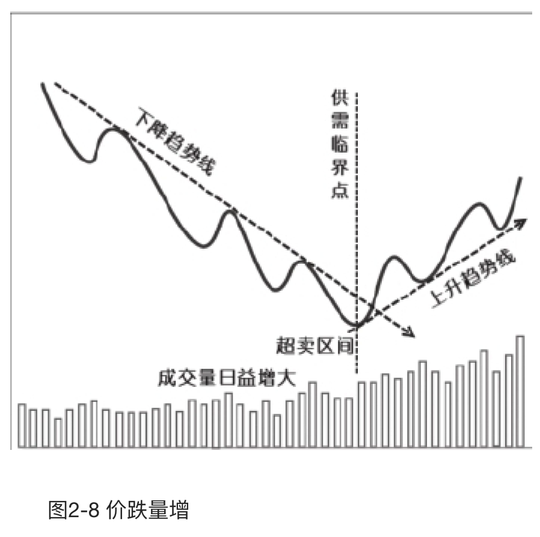

价格趋势线方向向下，成交量趋势线方向向上，这样就形成了价量背离现象。价量背离并不都是看涨信号，发生背离的位置很重要。当价跌量增发生在下跌趋势的初始阶段时，这是主力大量出货的表现，先知先觉的资金在高位率先兑现利润，直接造成股价大幅下跌。

在主跌浪的放量是与主升浪的放量相对应的，这时是空头的盛宴，并不是做多的时机。下跌趋势中的放量往往从突破前低开始，直到碰触到通道下轨为止。

如果价跌量增发生在上升趋势的调整浪或者横盘整理期间，说明可能有主力在逢低吸纳，成交量的异常表现意味着很有可能展开上升趋势。

**指标特征**

在下降趋势中，MACD指标长期运行在0轴之下，在首次向上突破0轴时，如果在最近的一波绿柱收敛和红柱发散期间，成交量有放大迹象，那么有可能形成新的上升趋势。

在上升趋势中，DIF线稳定运行在0轴之上，如果DIF靠近0轴，MACD柱线在绿柱期间有放量迹象，后面可能开始新一波上涨。不过，在主要多头市场中，绿柱期间的放量并不常见。

**供需临界点**

当消化掉套牢盘，达到供需临界点之后，主力资金再次大规模进场，对筹码的需求增多，筹码的供给减少，这时的下降趋势被扭转为上升趋势。

主要趋势往往很难逆转，在下跌很长时间之后，市场处在超卖区间，这时市场情绪处在绝望之中，要想重回升势，通常需要消息面和资金面的配合。

## 价跌量平
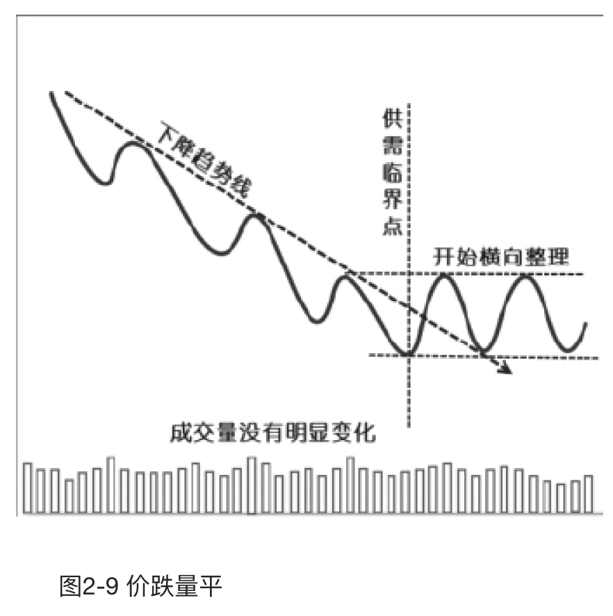

在股价下跌过程中，成交量有时候会维持在一定水平，这就是价跌量平形态。这种走势说明目前处于下跌的惯性之中。

这种量价形态如果发生在下跌初期，并没有理由进场做多。交易者需要耐心等待出现底部量价特征时再考虑进场。

市场一旦形成下跌惯性，不需要成交量也能保持下降趋势，也就是通常所说的，市场会因为它自身的重量而下跌，相反，在拉升时则必须要有成交量的配合。

**指标特征**

在下跌中的量能持平阶段，DIF线运行在0轴之下，MACD柱线的绿柱区间宽度大于红柱区间。如果此后成交量没有明显放大，DIF线可能继续在0轴之下运行。这时的长期均线一直向下运行，短期均线受到长期均线的压制节节下挫。

**供需临界点**

在供需的临界点之后，供给开始减少，股价达到一定低位，但需求并未能同步提高，只是保持在一定水平，这时股价大多陷入低位盘整。

## 价跌量减

价跌量减形态会出现在波浪理论中的所有下跌浪中，具体表现是，价格波峰和波谷逐波降低，并且成交量也在不断萎缩，这是空头市场的明显特征。

在下降趋势中，价跌量减说明市场低迷，成交很不活跃，人们对股市的关注度下降。越是下跌，人们对后市的预期就会越悲观。在A股市场中，大牛市之后通常都会跟随着大规模的下跌行情，在遇到连续的下跌趋势时，比如2008年的走势，价跌量减的形态会持续很长时间。

价跌量减是下跌时的正常形态，在主要的上升趋势中，次级别的调整浪应该呈缩量状态；在主要的下降趋势中，除了跌破关键支撑位时会放量，大部分时间处于缩量下跌状态。

**指标特征**

MACD指标大部分时间运行在0轴之下，发生绿柱的时间多于红柱时间，空头的金叉并不能作为可靠的买点。

KDJ指标在超卖区间不断发生钝化现象，市场处于严重超跌状态。

**供需临界点**

在供需的临界点之后，供给仍旧持续不断，同时需求并未增加，这导致价格进一步下跌，结果就会形成更加陡峭的下降趋势线。

## 突破时的成交量
突破时的成交量也被称为“突破量”，它是与倍量、天量等一样被交易者所重视的形态。突破时随着成交量的放大，价格的波动幅度也会增大，这为交易者创造了获利机会。突破可分为两类，即向上的突破和向下突破。

**向上突破**

在股票上进行波段操作的两个关键就是时机（进场与出场位置）和空间，要想获得优势必须找到合适的进场点，这是保证盈利幅度的首个因素。以突破为依据判断买点时，成交量是确认突破是否成立的一个关键，如果突破时伴有较大成交量，那么继续上涨的可能性就很大。

向上突破的力度和成交量的大小有关，成交量越大，越容易拉出长阳线，上涨的角度也越大。长阳线很容易改变人们在当时的投资情绪，突破时的带量长阳线会让之前看空的人很难有机会逢低进场，他们只能追高进场，客观上帮助场内交易者“抬轿”。

量价齐升是一种好的突破形态，上涨初期时应该呈较温和的放量状态，这样后面还有上涨空间，上涨中后期时的突破常常伴随着倍量，这表明多空争夺加剧。
在以突破为依据进行操作时，假突破也是交易者需要重点研究的一种模式，典型的一个例子就是背离浪的突破。当市场严重超买时，这时价位已经相对较高，再以突破价位进场，这显然是不合算的。我们在后面的章节中还会对假突破进行详细讨论。

**向下突破**

当价格向下突破时，这是持多单的危险信号，但也是空头要寻找的做空交易信号。在向下突破关键支撑位时，多数情况下也会放出成交量，正因为如此，这个价位在此后才会成为阻力位（压力位）。

在连续创出新低时，下降趋势已经具有惯性，在成交量没有明显放大时，也可以形成向下突破。长阴线同样也容易改变人们的投资情绪，长阴线让持多单的人很难有逢高离场的机会，他们只能市价抛出，这也会不断压低股价。

向下突破的一种明显走势就是，在形成头肩顶之后向下突破颈线，这会增大向下发展的概率。同样地，其他一些顶部或下跌中继K线形态的支撑线，都可以作为判定向下突破的明确信号。

一旦确认形成下降趋势，那么向下突破的成交量无论如何变化，价格继续原有下跌趋势都是大概率事件。交易者在考虑离场策略时，在上升波段末端以及下降趋势初步确认时都需要有配套的应对措施。

**筹码分布**

在上涨的过程中，获利筹码的比例不断增大，当价格创出阶段新高时，获利筹码的比例达到100%。在下跌的过程中，获利筹码的比例不断减小，当价格创出阶段新低时，获利筹码的比例为0。

技术分析者可以将均线看作市场的平均成本线。当价格运行在多条均线之上时，必然处于一定时期内的市场平均成本上方，市场对筹码的需求大于供给，持有筹码的人希望以更高的价格卖出。当价格运行在多条均线之下时，必然处于一定时期内的市场平均成本下方，市场对筹码的供给大于需求，持有现金的人希望以更低的价格买入。

**中小盘股更容易得到拉升**

中小盘股的流通盘相对较小，筹码容易被集中，在指数向好时，盘子轻的股票更容易受到炒作，上涨空间也更大。

价格适中的中小盘股是最适合波段操作的股票类型，流通盘在10亿左右的股票是重点关注目标，对于优质股可以放宽到20亿至50亿左右。在指数处于上升趋势时，中小盘股会借助各种题材轮番炒作。

对于那些拥有上百亿或上千亿流通股的大盘股，波段交易者很少涉猎，这是因为要想撬动如此巨大的大象股，需要的资金量可能比多数机构的资金加起来还要大。

我们在以前的书中总结过选股条件，在这里我们再次强调以下这些选股条件：
1. 基本面良好。没有出现过负面消息。行业趋势向好，处于朝阳行业，具有稀缺性。
2. 行业龙头。基金持仓股，媒体经常报道它的利好消息，相当于在给上市公司不断做广告。在这类股票中，会有很多机构和散户帮助你固定筹码。
3. 价格适中。有价值的股票其价格通常不会太低。价格过高的股票不利于仓位管理。价格过低的股票往往是垃圾股。价格适中的股票更利于波段操作。
4. 图形流畅。这类股票股性活跃，流动性好。那些在日K线上经常出现较长的上下影线的股票，很可能是难以出货的主力资金在吸引人跟盘。
5. 流通盘适中。流通股越多，就需要越多的资金来炒作，因此大盘股很难被撬动。市场中有“二八现象”的说法，其中的二类股票是指那些大盘股，大概占到股票总数的二成左右，以金融股、地产股为代表；其中的八类股票是指中小盘股，大概占到股票总数的八成左右，这类股票中往往容易出现黑马股。

# 多头上涨阶段价格形态
价格的路线图，或者说价格排列，可以分为两大类：

1. 整理形态（Consolidation Patterns），也被称为整固形态、盘整形态，是指那些趋势行情中的短暂停顿，例如，旗形、楔形和三角形等。在多数情况下，这些形态并不会改变主要趋势的运行方向，也有人将这些形态称为持续形态（Continuation Patterns）。
1. 反转形态（Reversal Patterns），是指那些预示价格运行方向即将发生转折的价格模式，例如，头肩顶（底）、双重顶（底）和V字形顶（底）等。无论哪种反转形态，在判断方向时，都需要有成交量的确认才能成立。

对行情的划分可以有多种方法，我们根据行情的方向和位置，将行情主要分为以下四个阶段：

1. 多头上涨阶段；
2. 多头触顶阶段；
3. 空头下跌阶段；
4. 空头探底阶段。

## 上升趋势线
正确的画法应该以K线实体边缘为基准，也就是要穿过阴线的收盘价或者阳线的开盘价。影线部分在多数情况下都是短暂的价格路径，甚至是瞬间的冲高或回落，显然，K线实体更有意义。

上升趋势中，价格以上涨推动浪的形式行进，每一浪的高点和低点相比前一浪都有所提高。价格波谷沿着上升趋势线向上移动，趋势线对价格起到支撑作用。

当价格靠近上升趋势线时可以考虑买入。上升趋势线穿过的波谷低点越多，说明上升趋势越可靠，但越往后，发生向下转折的可能性越大。在趋势线刚形成不久，趋势性不强，但上涨空间较大；在趋势线穿越多个波谷之后，趋势性增强，但上涨空间已经较小。这不仅体现了对买入位置的选择问题，也说明了风险与回报成正比，交易者需要谨慎权衡。

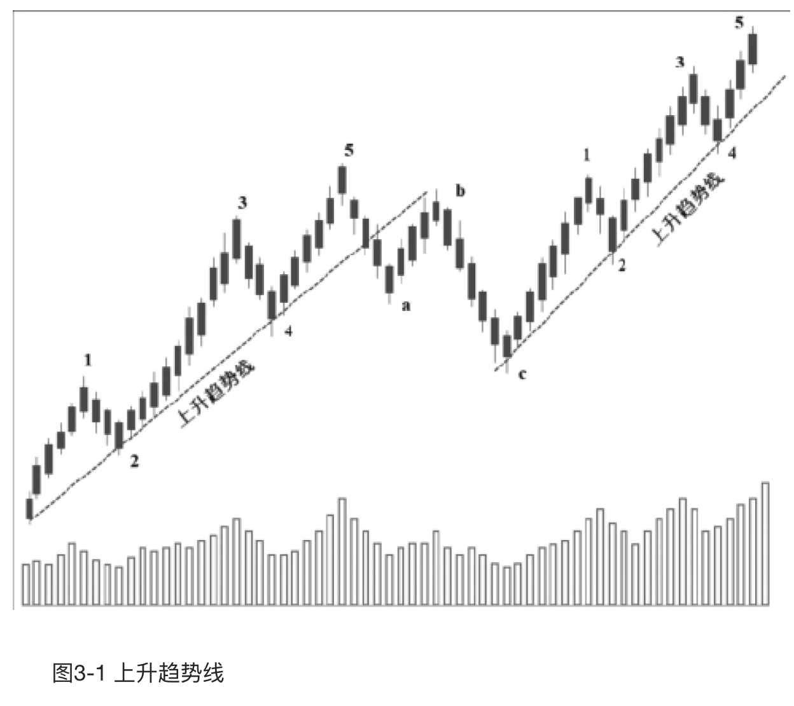

一般来说，一只股票要想持续上涨，至少需要满足以下三个条件：

1. 公司的业绩良好，利好消息不断。
2. 有主力资金介入，筹码相对集中。
3. 价格图形流畅，量价配合正常。

**趋势线的理想角度**

上升趋势线的理想斜率通常应该在30度到50度之间。这个角度与均线组合的夹角相似，他们都会受到图表的时间和价格坐标刻度的影响。

**二日原则**

如何确认突破趋势线呢？如果在某个交易日曾经突破趋势线，等到收盘时又回趋势线以内，这就是一次短暂突破。如果当日收盘已经突破趋势线，次日再次收盘在趋势线之外，那么这次对趋势线的突破就被确认。这种判定突破的方法通常被称为“二日法则”。为了稳妥起见，交易者也可以依照同样道理，使用三日法则，即连续三个交易日收盘价在趋势线（或者其他关键点位）之外。

## 多头下降旗形
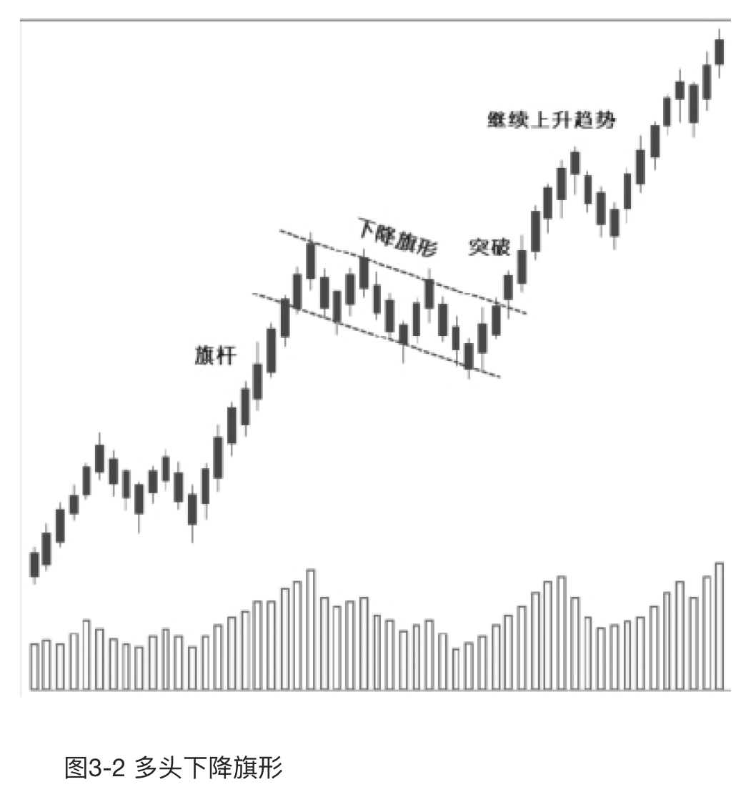

多头下降旗形包括以下特征：

1. “多头”说明市场处于上升趋势之中。
2. “下降旗形”说明价格走势如旗形一般并且向下倾斜。
3. 多头调整时的成交量应该呈缩量状态。

下降旗形是一种短期的修正浪，它是过客而非主人，经验较少的新手经常被它震荡出局。旗形的整理时间通常有数个交易日，经常是从远离均线上方的位置盘整到10日和20日均线之间，整理的时间过长时就要警惕它有可能放量下跌并走出失败形态。

**上涨目标位**

形成旗形之前的那波连续上涨被称为旗杆，整理之后的上涨幅与旗杆的长度相当。

**多头三角旗形**

多头三角旗形与旗形的区别在于它的两条趋势线呈收敛状态，三角旗形顾名思义是形似三角形的调整形态，前面讲的旗形是矩形的调整形态。除了形状不同之外，两者的其他性质完全相同，包括形成时间、成交量和目标价位等方面。

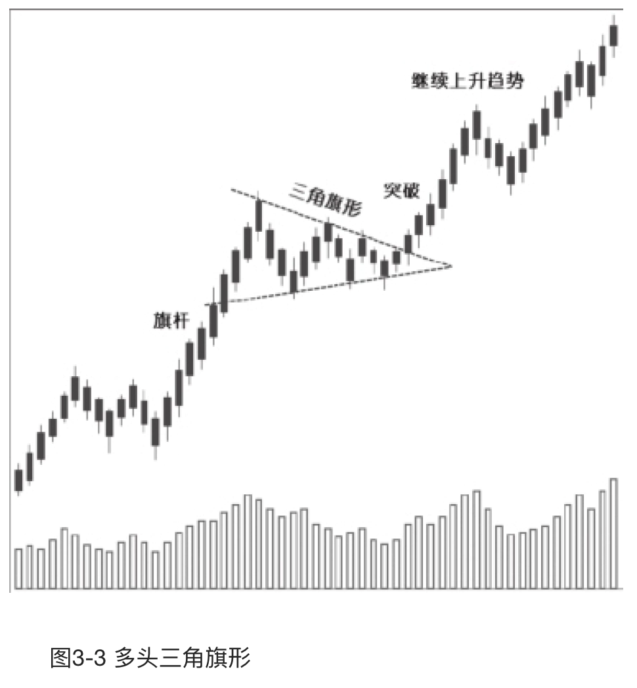

## 菱形上升反转
菱形反转形态是一种顶部的反复调整图形，它有点类似于三重顶形态，它的趋势线先发散再收敛，形状类似于钻石，所以又称为钻石反转。它的颈线不像其他形态那样是一条直线，而是呈V字形。

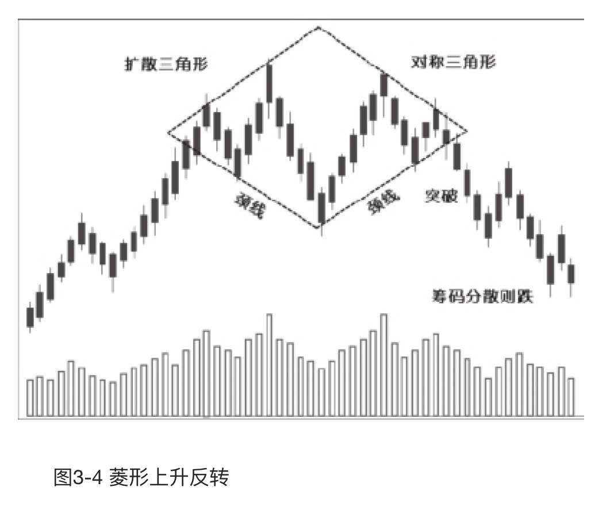

菱形反转形态是一种不常见的形态，它通常在波段顶部出现，具有较大的波动幅度，很少出现在底部反转中。它容易出现在中期行情的顶部，钻石形态的顶部常伴有倍量。

菱形反转其实是由前半部分的扩张三角形和后半部分的对称三角形组成。随着价格向右侧收敛，成交量逐渐减少，当价格向下跌破颈线时，趋势发生反转。

菱形上升反转包括以下特征：
1. 前半部分波峰提高，波谷降低，上下趋势线发散，上涨呈放量状态。
2. 后半部分波峰降低，波谷提高，上下趋势线收敛，总体呈缩量状态。
3. 在形态左侧突破菱形边界后，价格沿着突破方向行进。

## 多头下降楔形
“楔”字的本意是指用于填充器物空隙，起到固定作用的小木块，其形状像一个被削尖的长木块。下降楔形与下降旗形相似，只是楔形的两条趋势线呈收敛状态，而旗形的两条趋势线呈平行状态。

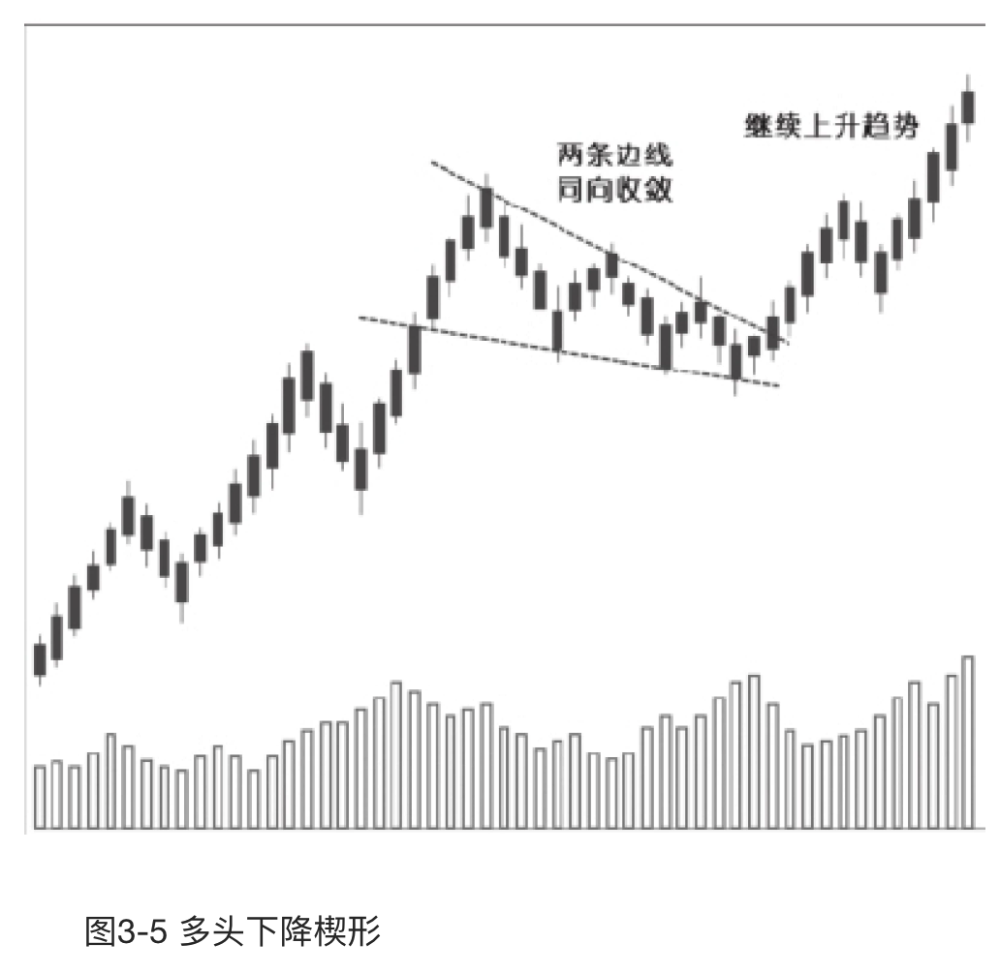

向下倾斜的楔形是上升趋势中的整理形态，被称为下降楔形。向上倾斜的楔形是下降趋势中的整理形态，被称为上升楔形。

多头下降楔形的特征为：
1. 它发生在上升趋势之中。
2. 它只是短暂的整理形态，之后还会恢复到上升趋势。
3. 每波上涨浪的强度相比前一波都会有所减弱，成交量也呈逐渐萎缩状态。

下降楔形与下降旗形相似，他们都是主要上升趋势中的短暂修正浪，消化完前一波的获利盘之后，股价还会重回升势，确认突破信号为连续两日放量站在上方趋势线之上。

**下降楔形的成交量**

当股价在上升趋势中走出楔形时，在两条收敛的趋势线之间，每次上升浪的强度都会减弱，成交量同时萎缩，这说明买盘力量不强，只是因为卖盘更弱才会小幅上涨。如果股价上涨到上方趋势线附近，没有成交量放大配合，股价会再次进入一波下跌调整之中。直到形态最右侧时，买盘力量再次增强，放量向上突破上方趋势线，宣告本次调整结束。

## 上升三角形
**对称三角形**

对称三角形由两组或两组以上的涨跌浪构成，其中的波峰不断降低，波谷不断提高，连接波峰的压力线与连接波谷的支撑线呈收敛状态，这与扩散三角形正好相反，扩散形态的两条边线呈发散状态。

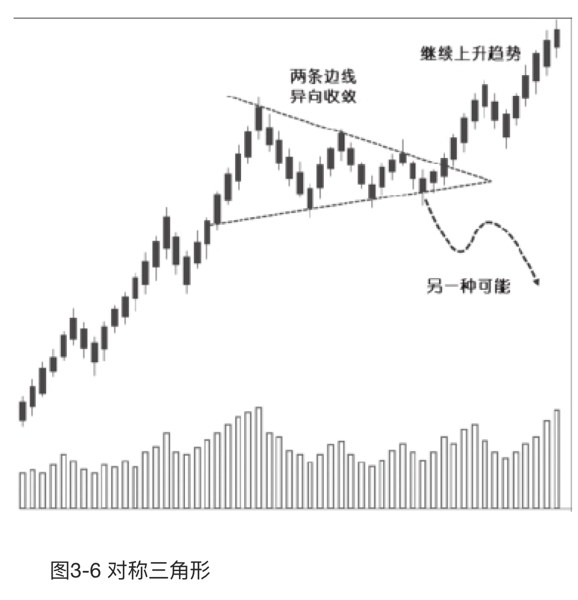

当价格突破三角形形态时，通常价格和成交量都会发生剧烈波动，就像越压越紧的弹簧突然被释放一样。

**直角三角形**

直角三角形实际上是一种特殊形式的对称三角形，特殊之处在于其中一条连线为水平线。对称三角形的突破方向并不确定，而直角三角形的突破方向通常是水平边线的方向。

**上升三角形的成交量**

在上升趋势中出现三角形走势时，随着价格向右侧发展，成交量应该逐渐减少，而价格向上突破时，成交量应该明显放大。如果成交量没有在突破时放大，突破可能是短暂的，很可能在不久之后回到压力线之下。

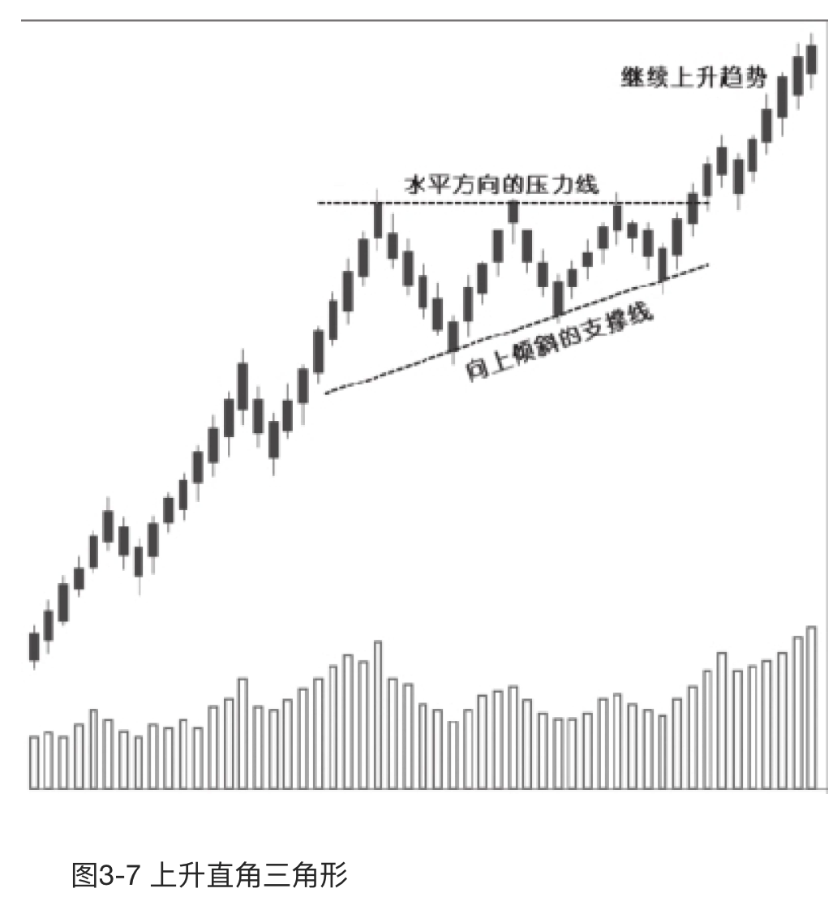

**三角形形态的目标价位**

三角形形态突破后的目标价位测量方法是，在向上突破时，沿着第一波测试压力线的波峰画出一条与支撑线平行的直线，向上突破之后的首个目标位就可能落在这条直线上；在向下突破时，沿着第一波测试支撑线的波谷画出一条与压力线平行的直线，向下突破之后的首个目标位就可能落在这条直线上。

在图3-8的直角三角形中，水平的直角边为支撑位，价格波峰逐波走低，形成向下倾斜的压力线。第一波调整的路径为从A到B，穿过B点画出一条与压力线平行的直线，当价格向下突破水平的支撑线后，首先最有可能回落的位置为C处。

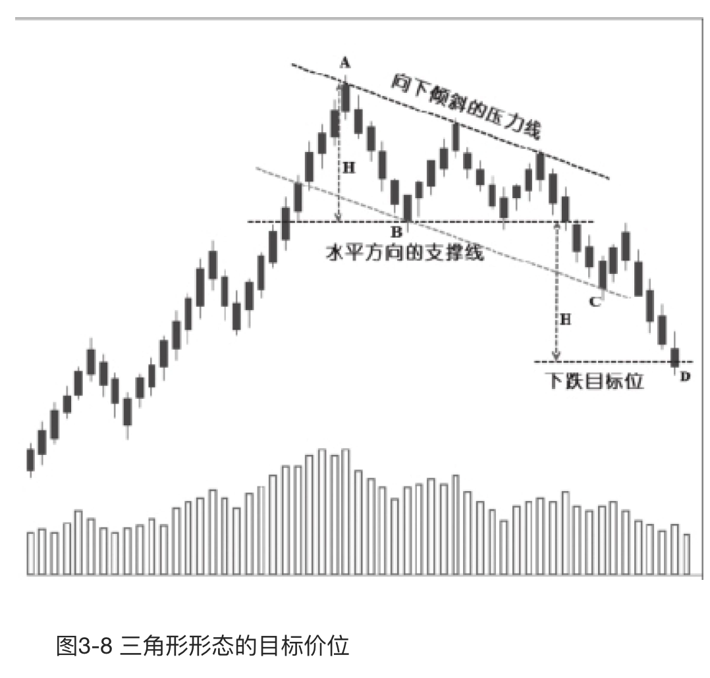

**测量目标价位的另一种方法**

根据形态的整体高度来测量突破后的目标价位，这是另一种常用的方法。在图3-8中，该形态的高度为最高点到支撑线的距离H，用直角边的价格减去H就可以得到另一个下跌目标位D。

从经验来看，C位置往往只是下跌浪的开始，这么小的幅度很难消化掉头部的获利筹码，后面还会有更大的卖盘压力。价格向下行进到D位置之后可能出现宽幅震荡，这是对下降趋势的修正。

在实际的操作中，价格形态容易产生很多毛刺或者一些变形，交易者需要领会一种形态的内涵，适当扩大形态的适配范围，以头肩顶为例，实际走势可能并不标准，可能在左肩走出复杂形态，右肩走出简单形态，关键是知道当前行情处于顶部阶段，知道颈线是最后的防线。

**扩散三角形**

扩散三角形由三组或三组以上涨跌浪构成，每一次涨跌的波动幅度逐渐加大，连接波峰和波谷的两条趋势线会向外扩张，像一个喇叭口一样。最容易识别的扩散三角形是压力线或支撑线呈水平状态的形态，又被称为直角扩散三角形。

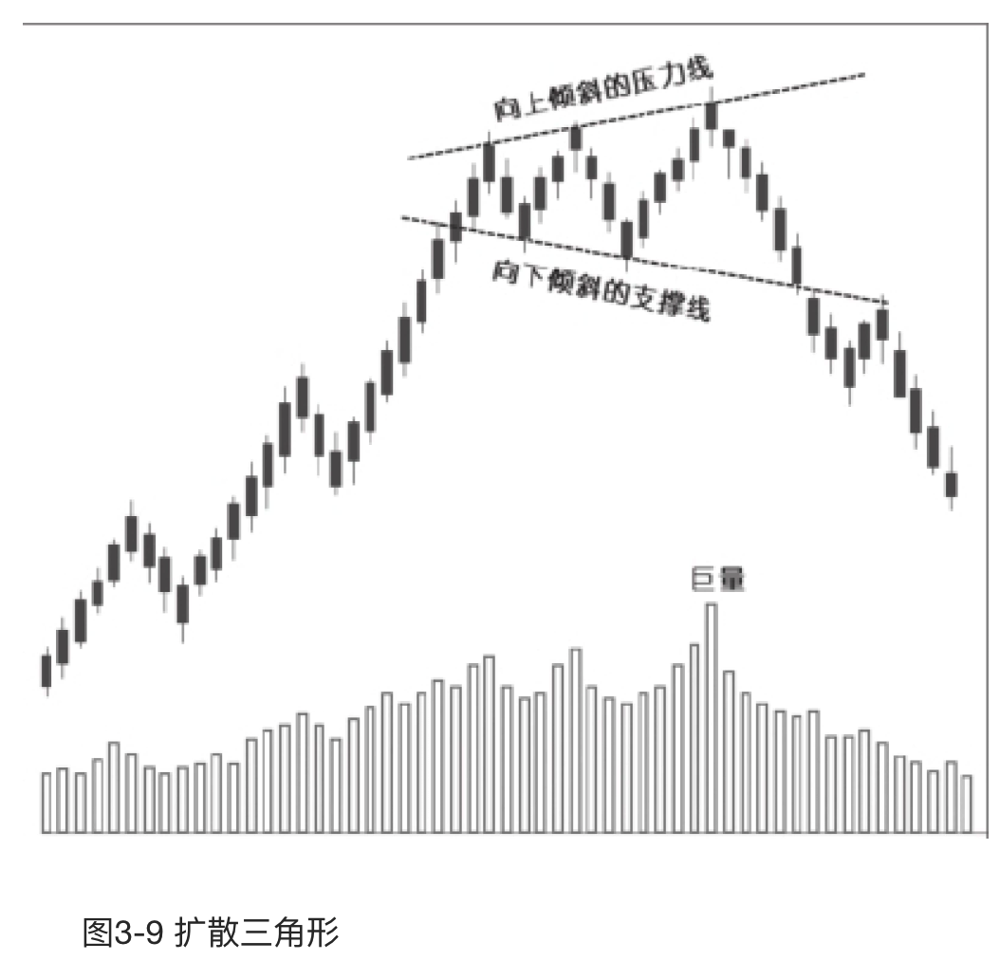

扩散三角形的波动幅度不断加大，这是市场情绪化加剧的表现。在上升趋势中，头部区域的K线振幅达到最大，这就像是长跑运动员到达终点前，体力消耗达到极限，身体摆动幅度加大，很难再维持稳定的高速跑动。

当股价在头部大幅度上下摆动时，市场的参与程度到达最高，大多数能被吸引的资金已经全部进场，经过扩散三角形的搅动，市场筹码已经充分换手，筹码加剧分散，股价开始下跌。

**扩散三角形的成交量**

在一般的收敛三角形中，价格的波动幅度逐渐减小，成交量也不断萎缩。在扩散三角形中，价格的波动幅度越来越大，成交量也随之增大。当价格向下有效突破支撑线时，产生空头信号，向下突破的成交量可大可小，但如果在突破时出现放量阴线，空头信号更为可靠。

## 上升通道线
上升通道是技术分析的重要工具，大部分K线都应包括在通道线内，价格在通道上轨与下轨之间震荡向上移动，上轨对价格起到压力作用，下轨对价格起到支撑作用。由于小盘股容易发生大幅波动，因此很难形成齐整的通道线，而在中盘股和大盘股中，比较容易出现这种有节奏的推动浪。

我们在前面讲到过上升趋势线的画法，上升通道线的画法也很简单，只需在趋势线的基础上，再画出一条穿过波峰的平行线，两条趋势线构成上升通道线。位于上方的趋势线为上轨，位于下方的趋势线为下轨。

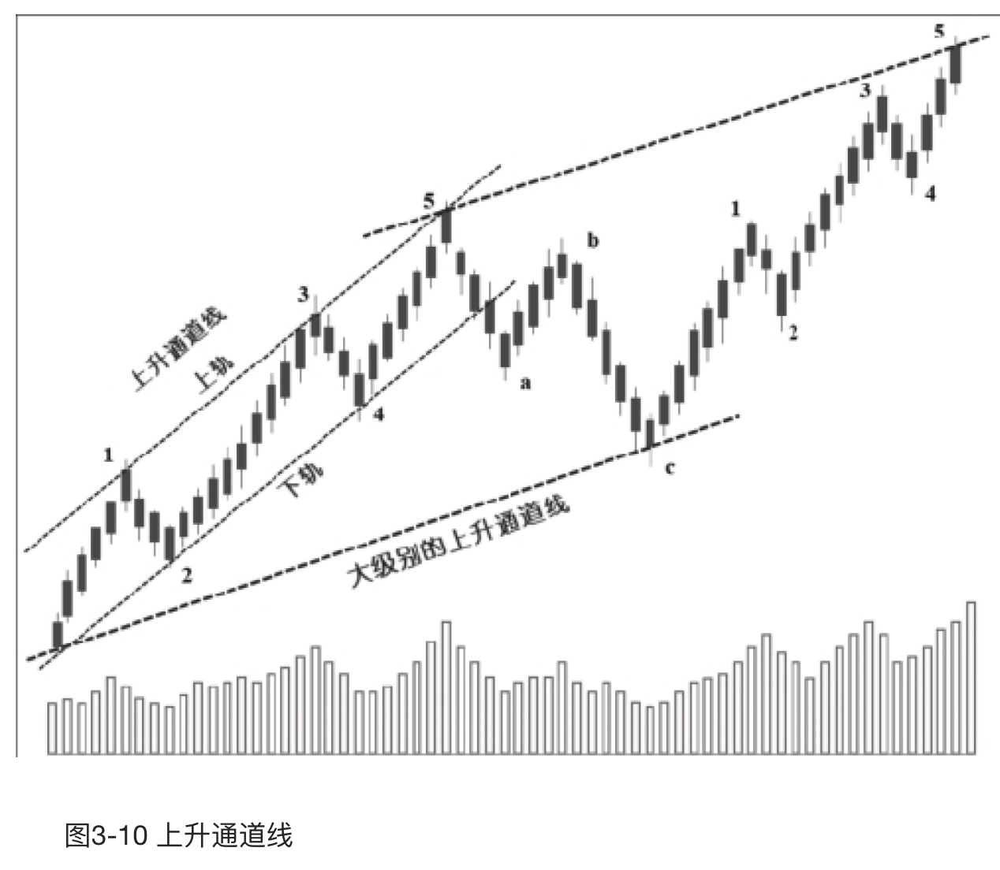

在理想状态下，调整浪回落到通道下轨时，下跌幅度是前一波上涨幅度的50%左右；上升浪突破前期波峰时，上涨幅度与前一波上升浪等长，也就是调整浪的两倍。

前一波的波峰和通道上轨都可以被视为止盈目标位，所以到达这些压力位时会出现大量止盈盘。突破前一波的波峰时应该伴随着放量过程，达到通道线上轨时经常会出现顶部反转K线形态。当出现价涨量减现象时，应该准备在确认跌破通道下轨时离场。

随着行情不断向上发展，通道线的角度也会增加。通常，在波浪理论中的第1浪上涨时，通道线的斜率在30~40度，在第3浪上涨时，通道线的斜率在40~50度，在第5浪上涨时，通道线的斜率在50~60度。上涨的K线越长，说明拉升幅度越大，通道线的角度也会越大。

通道线的下轨是波段买点或加仓点，操作时应注意价量配合情况，如果经过巨幅放量过程或者出现见顶迹象，可以在下轨附近应用二日法则来确认趋势发生反转。如果连续两日收盘在下轨之下，则确认支撑线被跌破，支撑线变成了后面的压力线。

通道上轨是波段卖点或减仓点，随着上轨穿过波峰数量的增多，下跌的概率在不断增大。警惕价涨量减现象，当出现看跌吞没形态等顶部反转形态时，应该加大止盈的力度。

从MACD指标上来看，在上升通道中，DIF线长期运行在0轴之上，处于多方主导的市场之中。在大幅调整时，DIF线可能会短暂跌破0轴，然后再回到0轴以上运行。当DIF线在0轴之上时，是有利做多的区间。

# 多头触顶阶段价格形态
## 头部K线形态
在形成顶部的过程中，市场参与者的群体心理会通过共振形成一些有规律的价格形态。从经验来看，头部反转形态是比较容易识别的，也是比较可靠的。有人认为卖点的选择决定了赔率（盈亏比）的大小，那么对头部形态的识别和应对就是其中的关键。

不管是散户的群体心理作用，还是主力为了自己出货方便而画出的最有利于自己的图形，从客观上来讲，价格走势都会经常形成几种经典的头部反转形态。这些形态包括：倒V字形、双重顶、三重顶、头肩顶、圆形顶和碟形顶等。

## 头部盘整
盘整是指价格在一定区间内的横向整理。当盘整发生在头部时，盘整的时间相对较短。散户思维希望股票一直上涨，但目前A股市场的每一轮调整幅度还是要占上涨幅度的50%～60%左右（黄金比例为38.2%和61.8%，这是容易到达的调整比例），调整时间更是占到总交易时间的1/3以上。

上涨与下跌的速度哪个快呢？有经验的交易者会听说过这样一句话：“底部百日，顶部三天。”如果你是主力的话，你也不希望被吸引入场的散户资金有充分的时间感知反转，并且在顶部兑现利润。主力在冲顶时边拉升边出货，一旦顶部形态走完，主力已经出逃，剩下的大部分是散户，这时筹码分散，难以形成上涨合力。

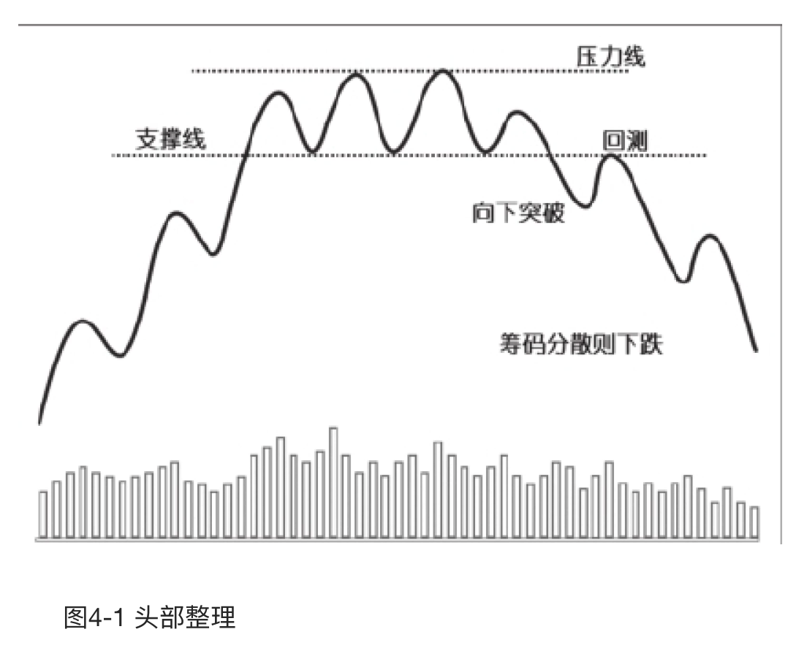

散户的优势在于船小好掉头，一天就可以清仓离场，主力要想出掉全部筹码，则需要一段时间，他们不仅要出货而且要使价格维持在一定水平，也就是说，不能让图形太难看。散户利用顶部形态不仅可以提高出场精准度，而且在下跌趋势初期的反弹浪中还能有利可图。

**头部超买区间**

当在波段高位出现价量背离时，说明上涨量能开始萎缩，这一波的上涨在很大程度上靠的是心理预期。人们预期股价还会上涨，对自己手中的持股抱有惜售心理。但是，随着价格的升高，心理预期已经不足以支撑不合理的股价，反转即将到来。

经过较长时间的上涨之后，各种振荡指标已经进入超买区间，甚至已经在超买区间停留了很久，市场向下的概率在不断增加。上涨的幅度越大，在下跌时就会越猛烈。毫无计划的交易者很难在反转之后保住利润，甚至容易造成大亏。利用头部反转形态，并选择一种指标来制定配套策略，有助于形成明确并且具有优势的卖出策略。

超买区间的指标特征包括：
1. MACD指标进入历史高位，有时会在高位形成顶背离。
2. KDJ指标已经至少3次进入80线上方。
3. OBV指标在一波上涨中至少创出5次高点。
4. DMI指标的PDI线在MDI线上方，并且两者的敞口宽度达到历史较高水平，ADX线从80线上方开始拐头向下，并且与ADXR线发生死叉。

如图4-2所示。在该股的一波中期上涨过程中，K线和D线指标三次进入80线上方的超买区间，我们在图中分别用A、B、C标出了这三个位置。我们常说股价经常出现“一波三折”的走势，在本例中正是如此，一波中期上涨波段由三波短期波段组成。当第三次进入超买区间时，很可能已经到了中期头部，这时应该在K线向下穿越D线时开始减仓。

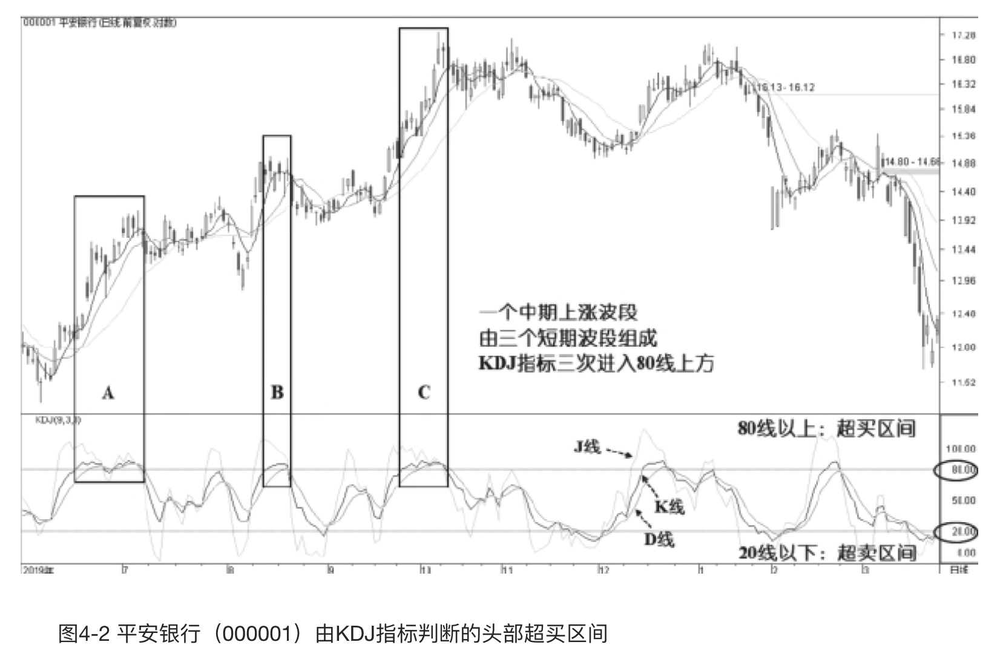

## 倒V字形反转
顶部的倒V字形反转是指价格先是急速拉升，中间没有明显的调整，到达顶点后开始快速下跌，下跌途中也没有明显的反弹，该形态像一座陡峭的山峰一样，所以这种形态又被称为尖山顶或单顶形态。当顶点两侧分别出现跳空缺口时，则会构成岛形反转形态，这是一种向下反转概率更大的形态。

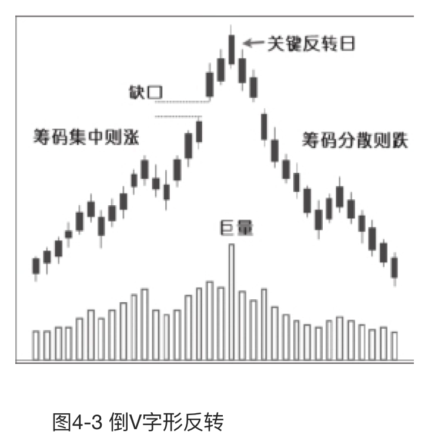

在上涨浪出现急速拉升时，经常会出现倒V字形反转，急涨急跌的行情很难分仓操作，注意不要在倒V字形顶部右侧下山时加仓。

如果走出岛形反转形态，顶部左侧的缺口是上涨衰竭缺口，顶部右侧的缺口是向下突破缺口。当价格创出新高并且成交量异常放大时，当日K线被称为关键反转日。关键反转日有时会突破通道线上轨，表明行情已经涨过头，异常的巨量表明产生大量换手，筹码趋向分散，上涨合力被打破。

**倒V字形的巨量**

当成交量爆出巨量之后，价格就像决堤的河水一样，倾泻而出，价格下跌非常迅速，很难找到反弹离场的机会。对于没有操作计划的交易者来说，如果抱有还能涨回去的希望，短短几个交易日就会被深度套牢。有操作计划的交易者，看到巨量后就会止盈部分筹码，并采用跟踪止损策略，当价格回落一定幅度时果断离场。

**倒V字形拉回**

倒V字形有时会出现在上升趋势的中途，比如在波浪理论第3上涨浪的波峰形成的倒V字形，经过调整之后，可能继续原有趋势并再次创出新高，这样就发生了倒V字形的拉回，如图4-4所示。

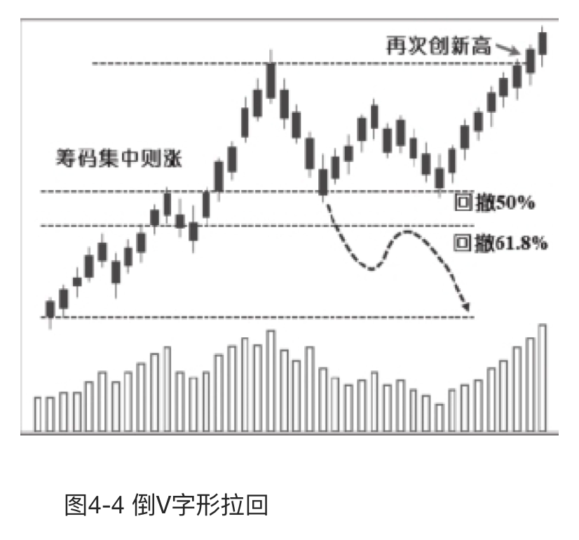

这种走势是因为上涨行情的级别超出了倒V字形反转的级别，也就是说，倒V字形反转形态只是一个次级别的顶部。我们还以第3上涨浪为例，当回撤的幅度达到第3浪涨幅的38.2%~50%左右时，还存在拉回的可能。当回撤的幅度达到第3浪涨幅的61.8%以上时，则很难有拉回的可能。

如果倒V字形在左侧上涨时的涨幅非常大，比如达到50%以上，并且顶部K线的换手率也非常大，比如连续达到15%~20%以上，那么在形成反转之后的很长时间之内都很难拉回。这是因为顶部大量的套牢盘很难被轻易解套，需要较长时间来消化这些顶部筹码。

## 双重顶
双重顶形态（Double Top）由两个位于波段高位的波峰构成，两个波峰的高度相当，在波峰顶部经常会形成顶部反转K线形态，比如看跌吞没形态、射击之星、长腿十字线等，双重顶是比较可靠的顶部反转形态。

两个波峰之间的波谷通常不会跌破第一个波峰的起点，穿过这个波谷低点的直线是双重顶的颈线。当形成第二个波峰之后，价格回落到颈线之下时，应考虑离场。两个波峰相隔的时间距离不应该太长，在30个交易日左右为合适间隔，如果时间间隔太久，就失去了双重顶形态的意义。

**双重顶的成交量特征**

双重顶的第二个波峰有时是失败的第5上涨浪，在波浪理论中，第3浪通常是放量上涨的一浪，到第5浪时由于量能不足，容易形成失败形态，上升趋势在第3浪高点附近终止。

两个波峰的高度相当，价格走势形似字母M，所以该形态又被称为M字头。M字头的成交量呈逐渐减少态势，表明没有更多资金来发动行情，第一个波峰成了压力位。

涨不过前高则会跌破前低，这是市场中常见的一种规律，第一个波峰的套牢盘会在第二个波峰时涌出，如果不能有效突破，后面只会快速下跌。在第二个波峰时要警惕假突破，在高位加仓更应谨慎，交易者在心中应该时刻保持位置意识。

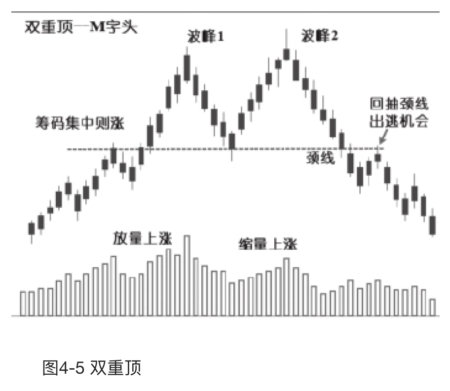

**双重顶指标特征**

由失败的第5浪形成双重顶时，MACD指标的DIF线也会在0轴上方形成两个波峰，只是指标线的第二个波峰会更低一些，形成顶背离形态，预示价格即将反转。

在价格形成两个波峰时，MACD柱线相应地形成两组红柱线，第一组红柱线数量较多，第二组红柱线数量较少，他们之间被绿柱线所间隔，绿柱线对应调整时的波谷。

KDJ指标两次在80线以上的超买区间形成波峰，第二次向下穿越50线时，是短线卖点。

**双重顶的逃命反弹**

双重顶的高度越高，后面下跌的幅度也会越大。双重顶的高度是指顶点到颈线的距离（H）。反转后下跌的首个目标价位就是颈线减去H。

跌破颈线之后，经常会发生一次回测颈线的动作，这时是多头的最后逃命机会。这个位置很可能是此后很长时间的阶段高点。换个角度来看，这也是空头做空的大好时机。

如果这个位置没有反弹该怎么处理持有的多头仓位呢？有经验的交易者会使用比例止损，即跌到形态之外一定幅度时离场，比如收盘在颈线以下5%以上时离场。在反转确立之后，后面大概率不会再回到顶部形态的价格区间之内，因为很多被套牢的人都想逢高离场，所有反弹的苗头都会在颈线附近被扑灭。

图4-6显示的是中国联通的一个顶部形态。该股在形成第一个波峰时，价格连续拉升，并且成交量明显放大。随后价格回落，经过三浪调整再次上涨，到前高附近形成第二个波峰，这时已经看不到像前一波上涨时的连续放量。

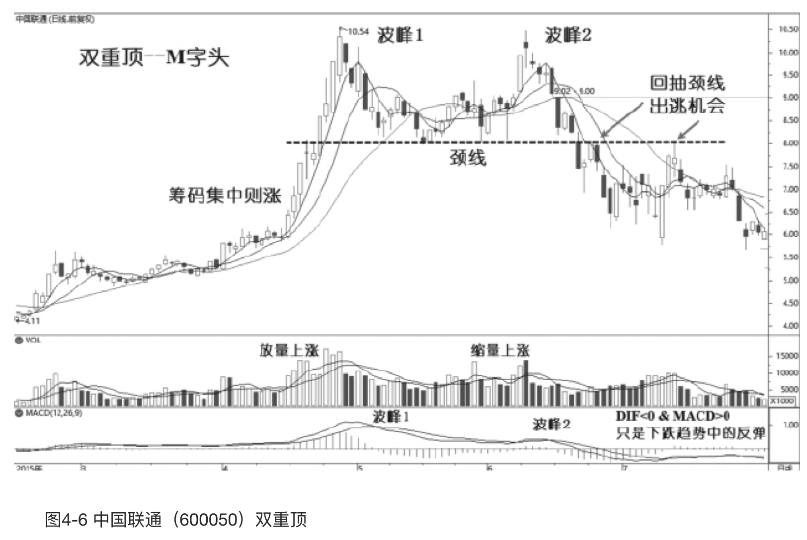

在波峰2，位于顶点的K线是一个向上跳空的小实体阴线，并带有较短的上影线和较长的下影线，形成了一根“吊颈线”，同时创出了第二波上涨以来的最大成交量。次日，该股向下跳空低开，收出一根小星线，确认吊颈线成立，预示着价格可能向下反转。

我们沿着回调的低点画出一条颈线，用来判断双重顶形态的确立。该股从波峰2向下跌破20日均线（MA20）时，产生了一个向下跳空的突破缺口。随后，该股再次向下跳空并击穿了颈线，确认形成双重顶，价格开始向下反转。

此后，该股有两次回抽颈线的动作，但都止步于颈线之下，这是多头的出逃机会，从经验来看，这个位置是较为合理的平多仓或开空仓的位置。颈线附近成了反弹的高位，此后该股开始了下跌趋势。

从MACD指标来看，DIF线也与价格同步形成了两个波峰，并且都发生在0轴之上，波峰2明显低于波峰1，这里有顶背离的意味，虽然价格并未创出新高。跌破颈线时，DIF线进入0轴之下，说明处于空头市场。在反弹颈线时，DIF<0并且 MACD>0，这表明只是下跌趋势中的反弹。MACD指标明确地表明了当时市场的意义。

## 形态的时空度量

同一种形态可以发生在各种周期图表上，但其持续的K线个数应该有一个合适的范围。标准形态包括的波浪个数越多，其规模相对越大，比如三重顶理应比双重顶持续的时间长。一个双重顶持续的K线个数多数集中在30-40根之间，一个三重顶持续的K线个数多数集中在40-60根之间。

同一类形态也可以发生在顶部或底部，发生在顶部时，由于顶部价格较高并且波幅较大，下跌速度也较快，因此顶部形态的幅度较大，持续时间较短；发生在底部时，由于底部价格较低并且波幅较小，上涨速度较慢，因此底部形态的幅度较小，持续时间较长。

我们常说，形态所处的周期越大，他们就越可靠，例如，日线上的双重顶要比5分钟线上的双重顶更可靠，但是，如果形态发生在多数交易者都不会参考的过大周期之中，比如月线图，那么这些形态的意义就不大。所以说，最有效的还是日线图上的形态，因为多数人都看日线图，它对人们的交易影响最大。

## 假突破——多头陷阱
技术分析者的买点大致分布在三个位置，一个位置是波谷左侧，也就是左侧交易方法，第二个位置是波谷右侧，也就是右侧交易方法，第三个位置是突破前期高点时，也就是突破交易方法。

我们以波浪理论的浪形来做标记的话，左侧交易应该在2浪末端进场，右侧交易应该在3浪初段进场，突破交易应该在3浪突破1浪顶点时进场。我们在图4-8中标出了这三个进场位置，并且在第4浪附近也会出现这三种进场点。

假设我们选择以突破位置进场，那么在双重顶形态中就会遇到问题。由失败的第5上涨浪或者反弹B浪形成的波峰2经常会短暂突破波峰1的高点，这会对依据突破进场的交易者造成干扰，如图4-9所示。

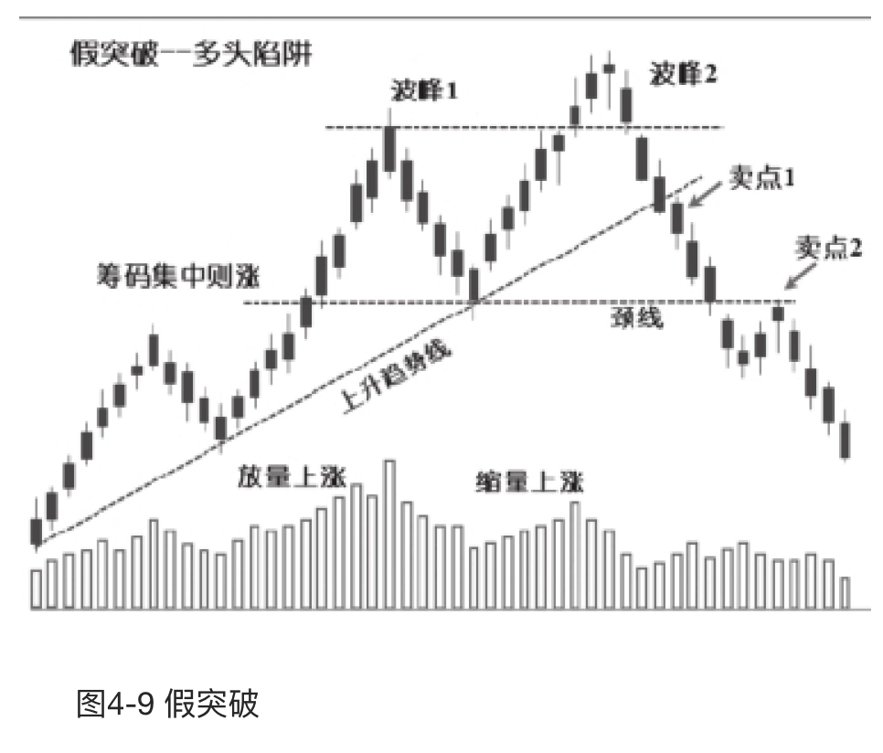

从图中可以看出，如果在波峰2进场，很快会“站岗”，也就是被套牢在最高位，后面的价格快速跌破颈线，很难找到好的离场机会。我们总结出了一些过滤虚假信号的方法。

1. 逐步确认突破，以站上前高的K线个数（时间）和突破的幅度（空间）来确认有效突破，比如以连续3日收盘在前高之上或者以收盘价突破前高5%以上为条件。
2. 分批进场，利用资金管理策略间隔开进场的时间和价位，可以以3根K线和5%上涨幅度为间隔，分2～3次进场。
3. 识别顶部形态，利用量价的顶部特征和指标的超买区间来判断顶部，如果判断出明显的顶部特征，当然不应再进场。

应对假突破的最有效手段是资金管理策略，最简单直接的方法是阶段高位不操作。要知道，在上涨波段的初始位置才会有更大的获利空间，我们应该耐心等待相对低位的出现。

## 头肩顶形态
头肩顶（Head and Shoulder Top）是最常见的顶部反转形态，也是特征比较明显的一种形态。它由三个连续的波峰构成，其中中间的波峰较高，构成头部，两侧的波峰较低，分别为左肩和右肩，如图4-10所示。

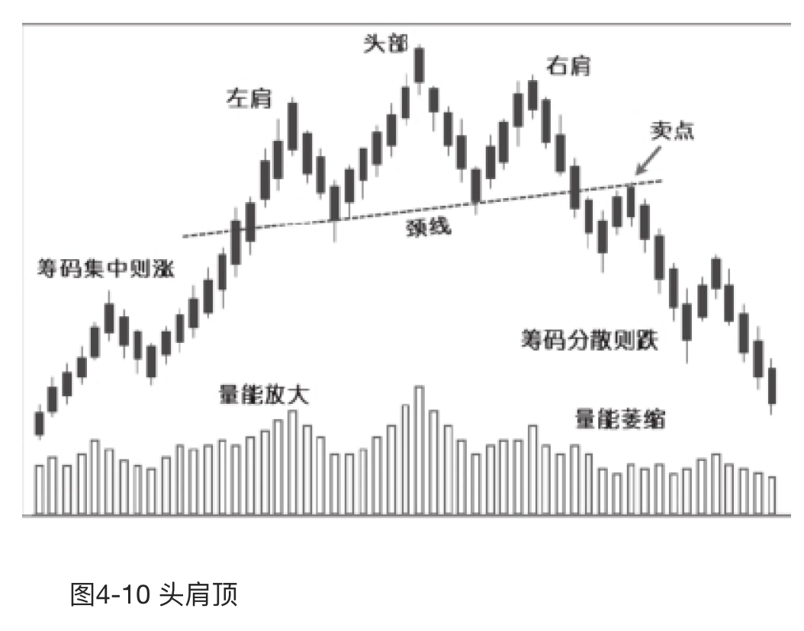

三个波峰中的三个上升浪通常对应着波浪理论中的第3浪上涨、第5浪上涨以及B浪反弹，而三次回落通常对应着第4浪调整、A浪下跌以及C浪下跌。

穿越调整浪低点的直线为头肩顶的颈线，颈线的方向可以是水平的，也可以是向上或向下倾斜的，如图4-11所示。颈线方向向上倾斜时，市场较为强势一些，颈线方向向下倾斜时，市场较为弱势一些，并且右肩的反弹也较弱。

一般来说，左肩处于第3浪上涨的顶部，成交量明显放大。头部处于第5浪上涨的顶部，经常会出现天量天价的顶部K线，整体上成交量可能比左肩更大，也可能有所萎缩。当头部缩量上涨时，就形成了量价的顶背离，预示着价格即将发生反转。右肩处于反弹B浪，成交量明显低于头部和左肩。

第3浪时通常上涨量能最大，而第5浪通常会由于惜售而缩量上涨，这在2007年的牛市顶部表现得非常明显，交易者可以参考上证指数和深证指数，所以说左肩的成交量经常会大于头部，从经验来看，这种情况会占到6成以上。通常，头肩顶形态的成交量特征是，左肩>头部>右肩。

当价格跌破颈线之后，有时会有一次回抽颈线的过程，这个位置是多头的最后离场机会，后面很难再有合适的相对高点。我们来看一个在个股中出现头肩顶反转形态的例子，如图4-12所示。

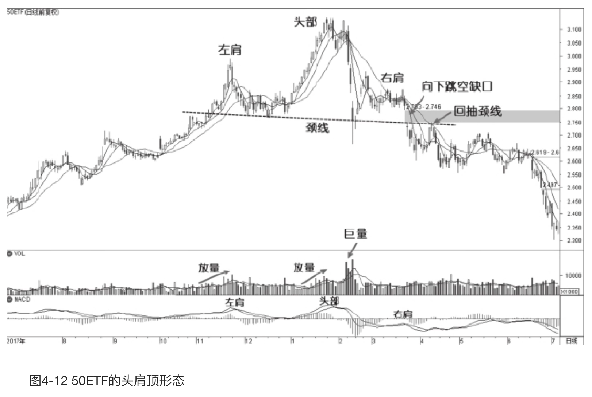

50ETF是跟踪上证50指数的ETF基金，它能反映多数权重股的波动情况。从图中可以看出，该股在高位经过两次放量过程，形成了两个波峰（左肩和头部），连接回撤的两个低点可以画出一条支撑线（颈线）。

在高位没能再创新高之后，该股快速下跌，并且放出巨量，这从图形上来看已经走坏。跌到支撑线后小幅反弹，形成第三个波峰（右肩）。在这里横向调整了一段时间之后，50ETF直接向下跳过了支撑线，形成一个跳空缺口，这个价格区间无疑成了一个巨大的压力位。

跌破颈线可以确认头肩顶形态成立，价格形成顶部反转。当价格反弹回测颈线时，产生卖出信号。此后50ETF在很长时间内都未能再次回到颈线之上，说明颈线位置是关键位置，这个卖点是反转后的最佳卖点。

当价格向下跳空并跌破前期放出巨量时创造的低点之后，可以确定大概率不会在短期内再回到这个低点之上。这是因为大量的筹码聚集在缺口上方，等待价格达到成本线时出逃，如果持有筹码的人多数都是这样想的，那么市场就不会给他们出逃机会。

从MACD指标来看，从左肩、头部到右肩，分别对应着DIF线的三个波峰，以及MACD柱线的三组红柱线。他们的区别在于，左肩和头部位于0轴上方（多头市场），而右肩位于0轴下方（空头市场）。右肩时满足DIF<0并且MACD>0，这时是卖出时机。形成右肩之后，DIF线一直运行在0轴之下，价格也一路下跌。

## 复合式头肩顶
复合式头肩顶也被称为复杂式头肩顶，它是头肩顶形态的变形，它的三个波峰中的任何一个都可能由两个波峰替代，这就会形成两个左肩、两个头部或者两个右肩。

图4-13显示的是复合式头肩顶的一种情况，它由一个头部、两个左肩和两个右肩构成，沿着四个波谷的低点可以画出一条向上倾斜的颈线。另外，如果是两个头部的复合式头肩顶，可以直接看作是双重顶形态。

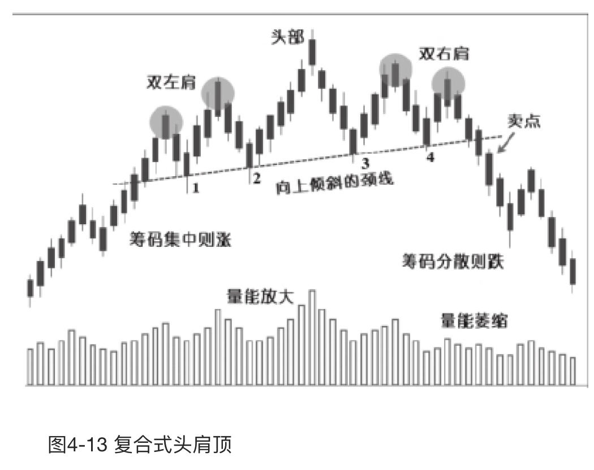

我们前面讲到过，标准头肩顶的左肩一般是由第3浪和第4浪构成，右肩是由B浪和C浪构成。熟悉波浪理论的交易者应该知道，波浪理论中的浪形划分也会有复杂形态。

当第4浪调整以三浪形式展开时，左肩就会出现两个波峰，使左肩成为复合形态。同样，当B浪反弹以三浪形式展开时，右肩也会出现两个波峰，使右肩成为复合形态，如图4-14所示。

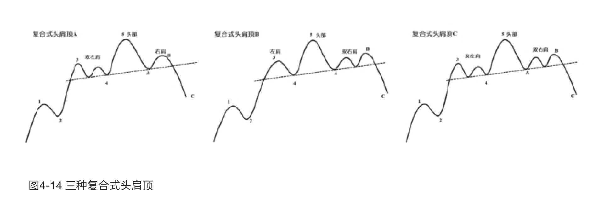

对于上升浪来说，第2浪和第4浪中往往只有一浪是复杂形式，也就是说，如果2浪简单，4浪就很可能是复杂的，如果2浪是复杂的，4浪则很可能是简单的。

第4浪与B浪两者之间在复合走势上是否有关联，这并没有定论，但从对称角度来说，如果4浪是复杂的，B浪出现复杂形态的可能性也许会稍大一些。

图4-15显示的是复合式头肩顶的一种形式，我们在图中标出了上涨5浪（1-5）和下跌3浪（A-C），从形态和比例来看，反弹B浪明显是复杂形态，三浪反弹产生两个波峰，使右肩成了复合形态。

对照图4-14可以看出，该股符合其中图B的走势。由于不能由三次调整的低点画出一条颈线，我们连接最近的两个低点画出了一条支撑线。该股在顶部形态的最右侧，以一根跳空的阴线跌破了支撑线，当天MACD指标的DIF线与DEA线形成死叉，产生卖出信号。此后，该股连续下跌，展开汹涌的C浪。

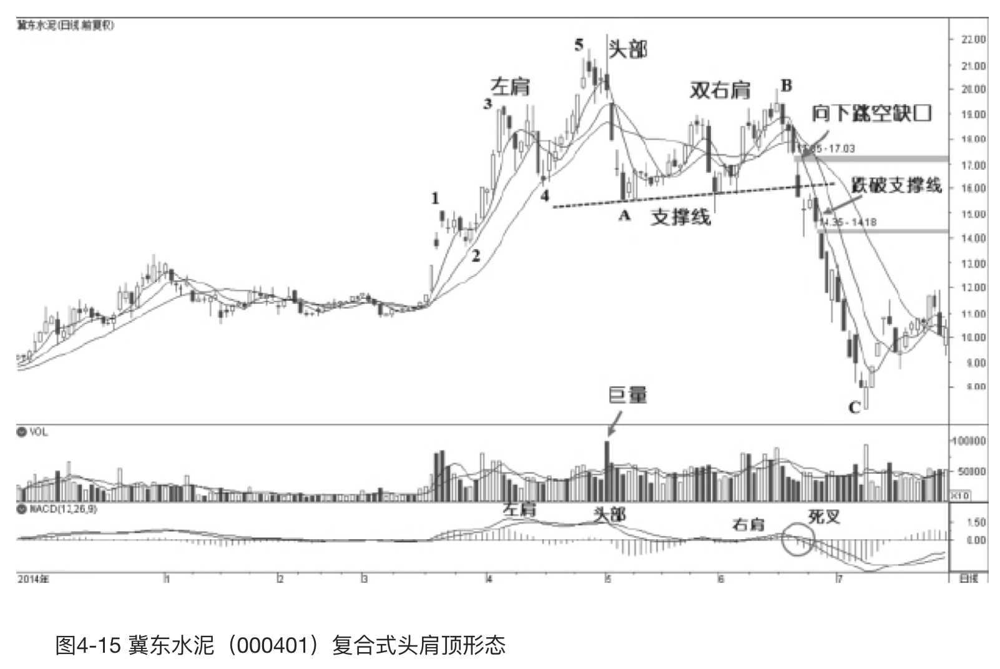

## 失败的头肩顶
头肩顶形态成立之后，价格跌破颈线，通常不会再回到颈线之上，但如果买盘再次大量增加，使价格回到颈线之上时，价格很可能会重新回到上升趋势。

在头肩顶的右肩，C浪下跌可能是对整个上升浪的调整，也可能是对第5浪的调整，如果是前者，则会走出正常的头肩顶形态，如果是后者，则会走出失败形态，其调整幅度有限，仅是三小浪的调整，它可能停止在第5浪的起始位置附近，然后再次开始新一波上升行情，如图4-16所示。

当对行情的观察周期小于行情的级别时，指标也容易形成顶背离现象，使交易者过早离场。交易者可以根据左侧的历史行情来判断上升通道的宽度，选择合适的观察周期。另外，越短线的操作，越可能忽视大局。

对技术分析比较熟练的交易者，仔细观察一下图4-16，还可以看到一个上涨途中的底部形态，如果它也可以算作一次底部的话，它究竟是什么形态呢？

答案是，头肩底，它以c浪波谷为头部，以a浪波谷为左肩，并以重新回到颈线上之后的回踩为右肩。a-b-c三浪连接着两个相反的头肩形态，这种图形在上涨途中还是较为常见的，如果仔细观察的话，交易者可以在个股中找到一些这种图形，虽然有些图形的变形可能比较严重。

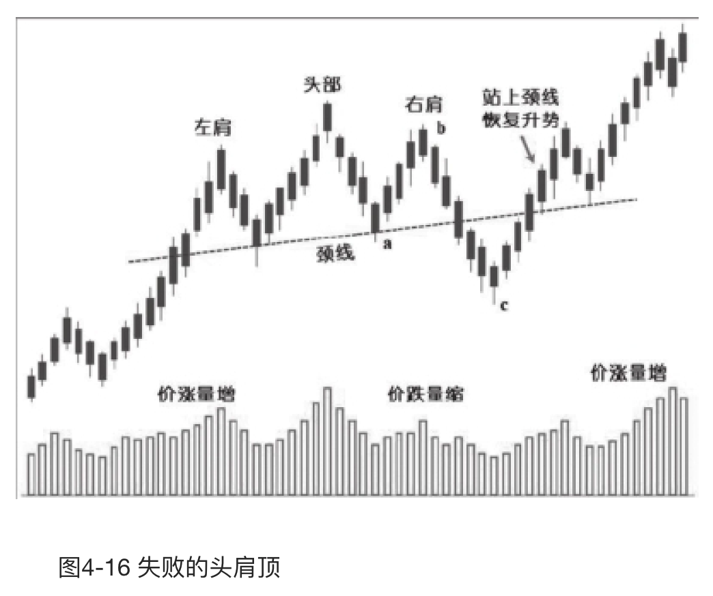

## 三重顶
三重顶形态是由连续三个波峰构成顶部形态，它的特征与双重顶相似，也可以看作是头肩顶的变形。三重顶的三个头部之间的距离可以不相等，但三个头部的高度应该接近，如图4-17所示。

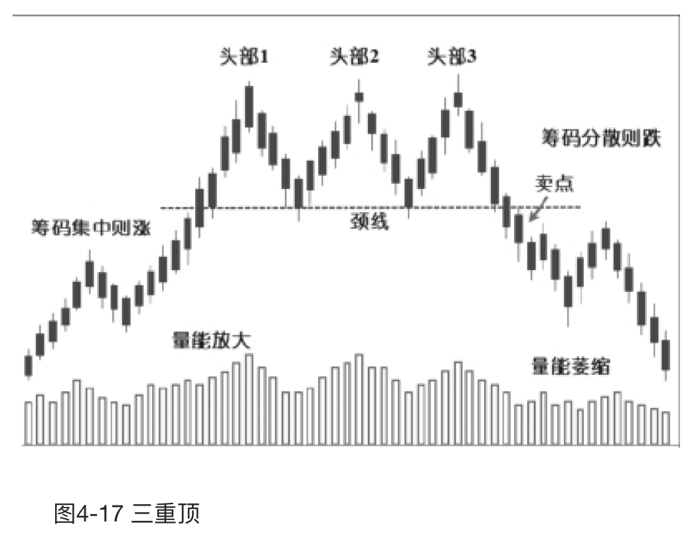

三重顶比双重顶多出了一个波峰，这是由于有部分多头仍看好后市，在颈线附近积极介入，但当价格接近前期高位时，更多持有筹码的人开始抛出，唯恐失去这个回本平仓的机会，这就使得价格很快被卖压到颈线之下，并形成反转。

与头肩顶的操作方法相似，当确认跌破颈线或者回抽颈线时，可以选择离场。在三重顶的三个头部，容易形成反转K线形态和放出巨量的阴线，需要注意这些标志性的见顶信号。

## 圆形顶
圆形顶是指价格走势呈圆弧状的顶部形态，这种形态的价格走势较为缓慢，并且保持着一定的节奏。在上涨过程中，多头力量只是稍占优势，带动价格缓慢爬升。在下跌过程中，空头力量的优势也不明显，但加上价格自身的重力作用，下跌时的速度可以稍快一些。

圆形顶的成交量随着价格的升降而温和的变化，没有出现放量拉升的局面。价格走势处于一个较窄的弧形通道之中，可能也会有推动浪的产生，但变化幅度较小。

在圆形顶之后一定距离处画出一条颈线，使得颈线之上的K线形成一个半圆形状。当价格向下跌破颈线时，可能会进一步加速下跌，在确认跌破颈线时，以及回抽颈线时，都是卖出时机。

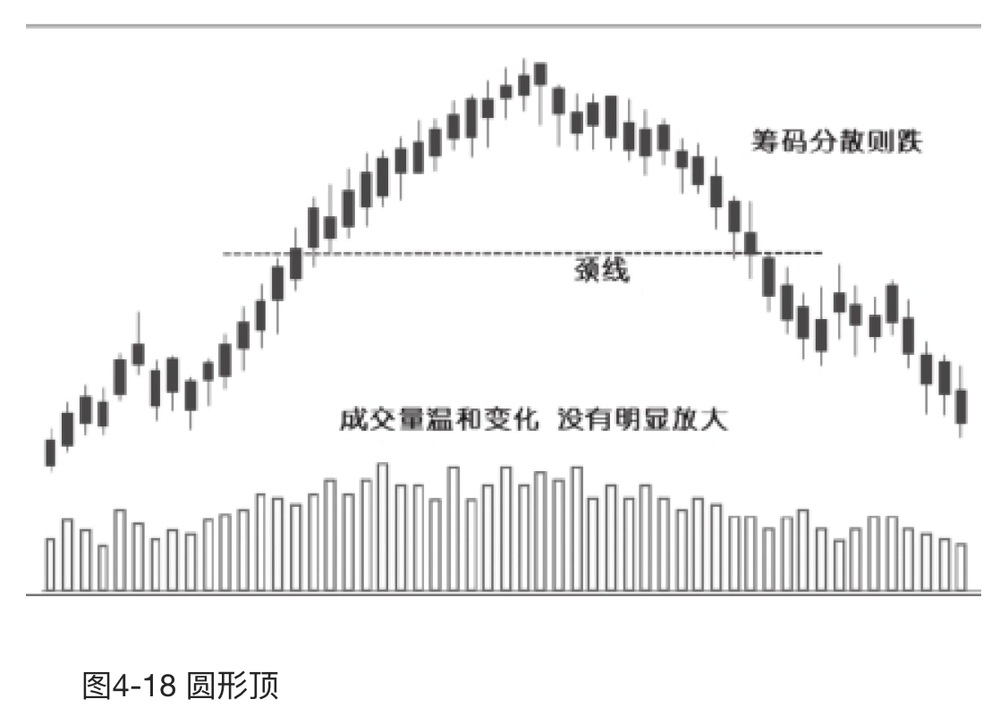

## 碟形顶
碟形顶与圆形顶相似，他们都是缓慢地由上升趋势转变为下降趋势，他们区别在于弧度的大小，碟形顶相对较为平滑。如果将圆形顶的形状看作一只倒放的碗，那么较浅一些的就是碟形顶。

碟形顶向上和向下推动浪的价格区间被极大压缩，最终形成了高位错落排列的小波动。

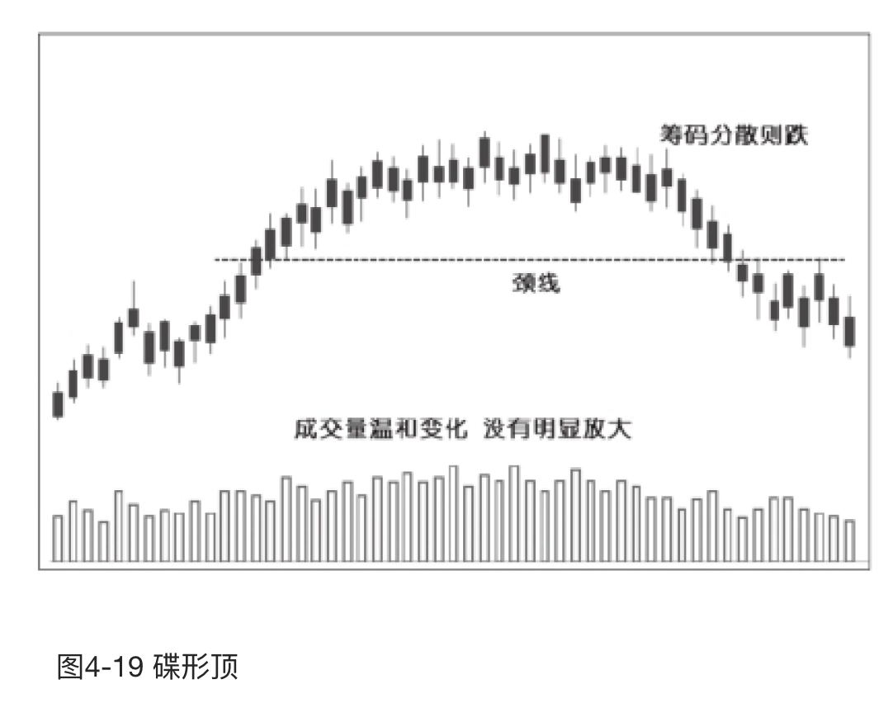

# 空头下跌阶段价格形态

# 空头探底阶段价格形态

# 缺口与成交量
## 缺口与跳空
向上跳空缺口是强烈的多头信号，向下跳空缺口是强烈的空头信号。价格真空区间既有支撑作用也有吸引作用，但要加上时间限制。在短期内，向上跳空缺口对价格具有较强的支撑作用，在相对的长期内，由于缺口中的价格真空没有得到填补，市场倾向于在后来的某个时候补上之前的缺口。

缺口发生的位置同样重要，根据缺口发生的位置不同，可以将其分成四种类型：普通缺口、突破缺口、中继缺口（奔跑缺口）和衰竭缺口（衰尽缺口），如图7-1所示。由于缺口不仅易于识别，而且在不同位置具有不同的意义，利用好它将有助于对行情发展阶段进行定位。

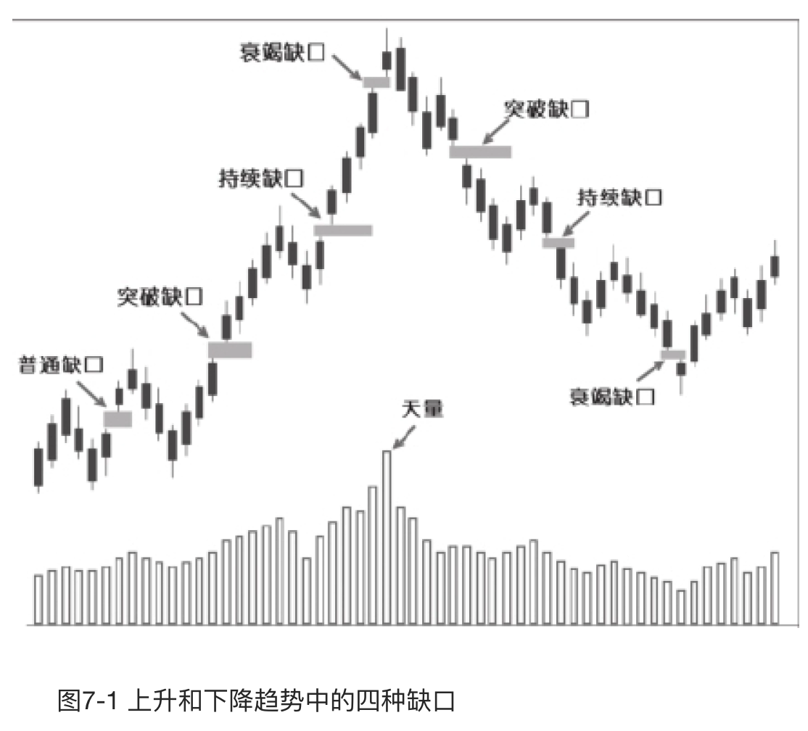

## 四种缺口
**普通缺口**

普通缺口（Common Gap）经常出现在整理形态中，他们并不预示着行情会沿着跳空方向发展，随着震荡行情的延续，这类缺口很快会得到填补。普通缺口的跳空幅度也相对较小，多空双方没有哪一方占主导，行情活跃度较低。

发生普通缺口时的成交量不会出现激增现象，成交量较平时没有明显变化，这也表明缺口价格区间所积蓄的能量不足以在技术分析中产生太大意义。

较小的普通缺口会在短短几个交易日内被补上，在行情图中需要通过调整显示范围，将形成缺口的K线移动到窗口的最右侧，才能看到未补上时的缺口。

**突破缺口**

突破缺口（Breakaway Gap）是指在突破有意义的关键位置时形成的首个缺口，突破包括两个方向，一种是向上突破，一种是向下突破。这些关键位置包括确认完成整理形态时、确认完成反转形态时、确认站上或跌破主要均线时。例如，突破头肩形态的颈线时，突破三角形的压力线时，突破20日、60日均线时。

如何判断突破缺口的强度大小呢？这主要有三个决定因素，即缺口的高度，形成缺口时K线实体的长度，以及当时的成交量。缺口的高度越大，真空价位越多，说明集体看涨（跌）的愿望越强烈。K线长度和成交量大小应该是成正比的，如果是形成向上突破缺口，那么阳线的长度越大，成交量相应应该越高，这说明多头力量越强。

在向下突破时可能不会像上涨时需要那么大的成交量，但如果出现放量的向下突破缺口时，应该注意它的警示信号，放量下跌之后往往会跟随着一波连续的下跌行情。

突破缺口通常不会在短时间内被回补，可以利用`三日原则`来判断，如果三个交易日内不回补缺口，这就是一次真突破，否则就是一次假突破。突破时的一个良好特征是未来三日连续创出新高或者新低。

突破缺口是多数参与资金的技术共振和心理共振位置，在明显的关键位置，很多人都抱有这样一种心态，那就是一旦行情不按预期方向发展则出局，比如在下降三角形的末端，一旦价格守不住下面的支撑线，大量的抛盘就会涌出，好像听到了发令枪响一样。相信很多交易者都遇到过这样的关键位置。

图7-2显示的是上证指数在三波连续下跌中的初始位置产生的3个向下跳空缺口，在图中分别用字母A、B、C标出了这3个位置，这些缺口发生时具有相同的图形特征，有着相同的技术含义。

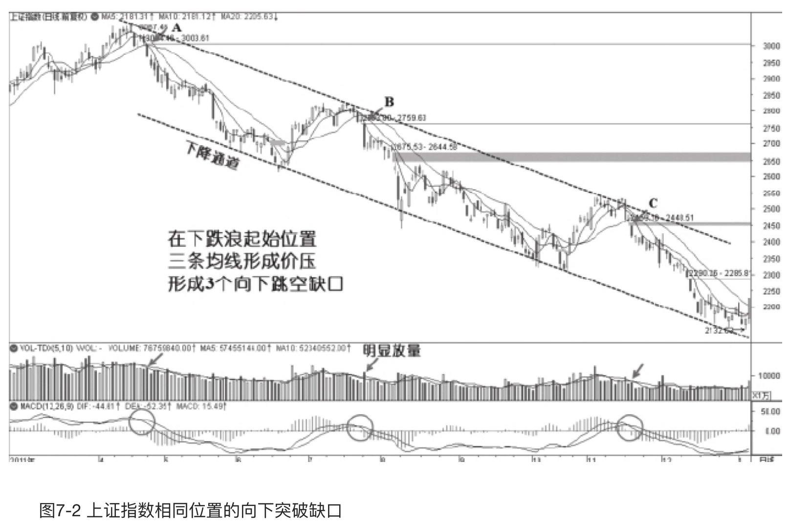

这些相同特征包括：

1. 发生在价格触及下降通道上轨不久之后。
2. 处于由MA5、MA10、MA20三条均线形成的价压时间窗口之中（在第8章中将会对价压形态进行详细讨论）。
3. K线确认跌破MA20均线。
4. 向下跳空并收出具有一定实体的阴线，并且成交量有所放大。
5. MACD指标的DIF线与DEA线在0轴之上靠近0轴的位置形成死叉，然后DIF线进入0轴下方。

**持续缺口**

持续缺口（Continuation Gaps）又被称为中继缺口，是指那些发生在波段中途的缺口。在上升趋势中，随着股价创出新高有些获利盘兑现利润，有些交易者继续看好后市，或者捂紧手中筹码，或者进场买进，这时的筹码仍然相对集中，新的买盘会催生持续缺口。

交易者的主要利润应该来自“持长”，这也是很多人最难解决的问题之一。由于过早离场，眼看着上涨波段加速，手上却没有筹码。持续缺口往往发生在波段的加速行进时期，这时持有股票会使利润快速增长。

持续缺口经常形成在上涨或下跌波段的一半或三分之二处。以上涨行情为例，这时的行情进入急速拉升阶段，成交量可能由波段前半部分的放量变为缩量，这是由于人们普遍看好后市并且惜售筹码造成的。另外也可以理解为，持股意志不坚定的人，该卖的都已经卖掉了，上涨压力变得相对较小。

通过持续缺口发生的位置可以大致估算整个波段的长度，如果将波段起点到缺口的距离计为H，从缺口算起，行情很可能还会沿着缺口方向行进一个H或1/2个H的距离。如果在波段中间出现两个中继缺口，那么波段的中点位置可能就在两个缺口之间。

**衰竭缺口**

衰竭缺口（Exhaustion Gap）是指行情发展到末端，多头或空头的力量消耗殆尽时产生的最后一个缺口。衰竭缺口是行情即将反转的信号，在上升趋势末端，产生衰竭缺口之后，通常会伴随着顶部反转K线形态，比如射击之星、吞没形态等等。

发生在上升趋势末端的衰竭缺口，虽然价位高起，但已经变得岌岌可危，很快就会以长阴线封闭缺口，并开始下跌。这就像在湖中用石片打水漂时的最后一次跳跃，随着最后一跳的结束，同时失去了前进的惯性，石片最终沉入水底。

在下降趋势末端也会形成向下跳空的衰竭缺口，股价经过长期下跌之后，人们由看多转为看空，市场情绪绝望到极点，当最后的多头噤若寒蝉时，市场可能会迎来最后一跳。这种情况经常发生在头肩底的头部，如果在几个交易日之内能补上缺口，说明下降趋势即将发生反转。

顶部的衰竭缺口之后通常会出现天量天价，这是明显的见顶信号。底部的衰竭缺口之后通常会出现地量地价，这是明显的见底信号。

当在衰竭缺口右侧的同样价位附近产生相反方向的跳空缺口时，就会形成岛形反转，这是一种强烈的反转信号。

图7-3显示的是TCL集团在一波连续上涨行情中出现的三种向上跳空缺口，在图中分别用A、B、C表示。在A位置，该股向上突破前期高点，形成突破缺口。经过调整之后，该股继续放量上涨。在B位置形成的是一个持续缺口，也被称为中继缺口，说明上涨到了上升波段的中段，后面可能还有一半的上涨空间。

在B位置之后走出了一个整理形态，构成一个对称三角形。突破压力线之后再次拉升，在C处形成了一个衰竭缺口。当日放出天量并且创出新高，换手率达到了10.6%，这是一条天量天价的K线，预示着行情可能见顶。

在随后的一个交易日，该股收出了一根放量的长阴线，并且封闭了衰竭缺口，这再次释放出了更强烈的见顶信号。从K线形态上来看，最近的两根K线构成了看跌吞没形态，进一步增加了下跌概率。

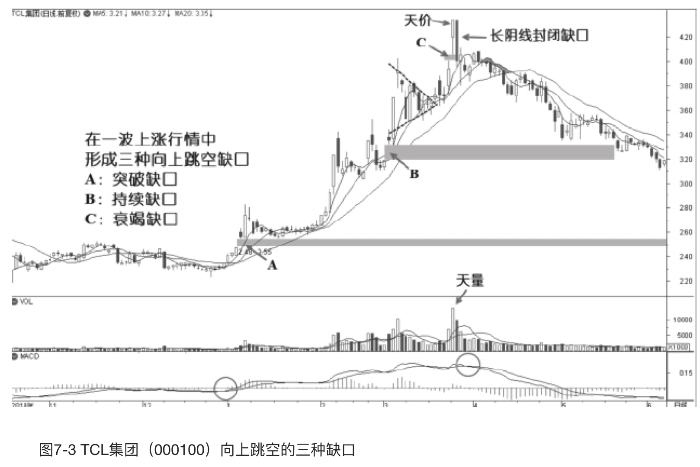

在长阴线的一周之后，DIF线向下穿越DEA线，MACD指标开始形成死叉，并且MA5向下穿越MA10均线形成了价压。借用围棋中的“气”来说，这些迹象都表明上涨的“气”已经被封闭，后面大概率会开始下跌。

随后该股发生反转，在连续的下跌过程中补上了B价位的中继缺口，在调整中酝酿着下一轮上涨行情。

## 岛形反转
岛形反转（Island reversal）是在波段顶部（或底部）的波峰（或波谷）两侧相近价位各有一个缺口的价格形态，如图7-4所示。在上升波段形成衰竭缺口之后，很快被封闭，并形成一个向下的突破缺口，两个缺口之上的K线如同被隔离出去的孤岛一样，预示着价格很快将脱离顶部，形成向下反转。

“岛”的宽度可以是几根K线也可以是十几根K线，有时整个顶部形态都被两侧的缺口所分隔，还有一种极端情况是只有一根K线被“抛弃”在外，顶部的三根K线构成弃婴形态。

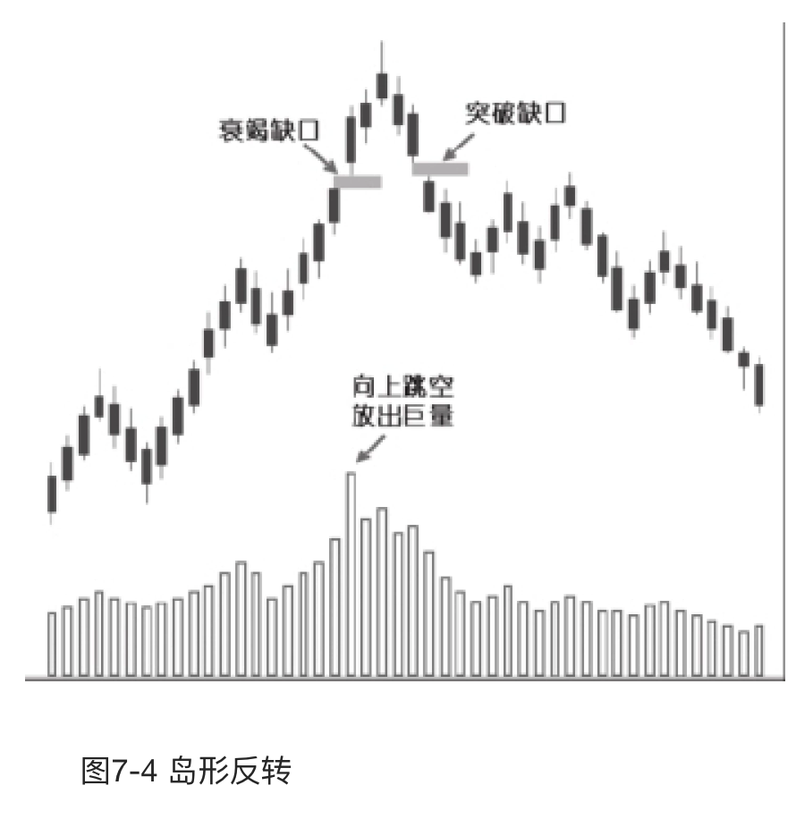

发生岛形反转时，位于波峰（或波谷）顶点的K线经常形成较长的上影线或者下影线。高位的上影线是由于价格冲高回落造成的，在收盘前又回到了开盘价附近，这说明卖盘压力较大，空头力量开始增强；低位的下影线是由于价格探底回升造成的，在收盘前又回到了开盘价附近，这说明买盘力度加大，多头力量开始增强。

顶部岛形反转的向上跳空缺口（衰竭缺口）发生时，经常会伴随着巨量放出，这说明多空分歧开始加大，一些获利丰厚的筹码开始松动，这时中小盘股的换手率可以达到10%以上，成交量是平时成交量的5到10倍。

顶部岛形反转的向下跳空缺口（向下突破缺口）发生时，阴线的成交量也会有所增大，放量下跌是下跌趋势的量价特征，这后面还会跟随着一波下跌。向下突破缺口成了后面反弹时的压力位。

高位的巨量和高换手率，使得主力将筹码派发给了散户，筹码分散必将下跌。这就好像飞上天空的烟花一样，虽然一时间炫彩夺目，但爆裂之后还会暗淡下来，散落一地。

如图7-5所示。该股经过长期上涨之后，在顶部左侧形成了一个衰竭缺口，在顶部右侧形成了一个向下突破缺口，两个缺口的价位接近，构成了一个顶部岛形反转形态，预示着价格很有可能开始回落。

从指标上来看，顶部两侧的缺口都有明显放量，并且都走出了长K线，换手率也都达到10%以上，这些都是见顶信号。在冲顶这波上涨过程中，MACD指标先是在0轴之上并靠近0轴的位置形成金叉，最终在高位形成死叉，很好地指示出了一次波段操作的买点与卖点。卖点之后，该股快速下跌，DIF线最终进入0轴下方。

## 关于逢缺必补的说法
在相邻的两波方向相反的行情中，当价格运行到前期缺口附近时，会形成两种具有明显特征的走势，在操作上具有重要意义。

1. 缺口具有支撑或压力作用，在上涨趋势中的下跌调整，很可能在缺口上方止跌并开始上涨；在下跌趋势中的上涨反弹，很可能在缺口下方停涨并开始下跌。
2. 缺口的价格真空作用，当价格再次运行到缺口附近时，仍可能以缺口的形式发生反向突破，并且会在顶部或底部形成岛形反转。

我们来看上证指数日线图上的一些缺口，说明缺口的支撑与压力作用，如图7-8所示。上证指数在一年左右的时间内，大大小小总共产生了将近20个缺口，其中只有两个缺口没有得到回补（处于低位的缺口A、B）。在这些缺口当中，大部分是普通缺口，在短时间内得到了回补。我们重点来看两个缺口，缺口C和缺口F。

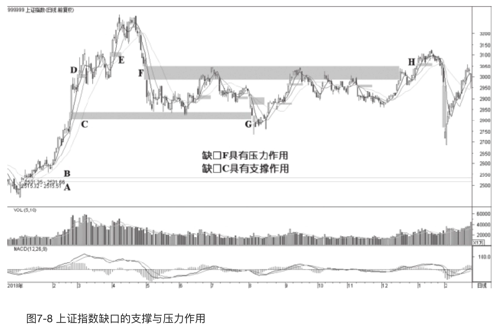

缺口C（2019年2月25日，2804~2838）是上涨趋势中的持续缺口，缺口高度较大，并且当日走出了放量的长阳线，这就决定了这个缺口具有强大的支撑作用。在从顶部向下的调整过程中，指数多次在缺口上方得到支撑。最终在G位置，以一个向下跳空缺口突破了缺口C的支撑区间。G位置是一波下跌浪的衰竭缺口，当日收出一根蜻蜓十字线，随后指数开始反弹。

缺口F（2019年5月6日，3052~2986）是下跌趋势初期的向下突破缺口，缺口高度很大，并且当日走出了放量的长阴线，这就决定了这个缺口具有强大的压力作用。缺口F与缺口E构成了顶部的岛形反转形态。在随后的反弹过程中，指数多次在缺口附近受到压力。最终在H位置，以一个向上跳空缺口突破了缺口F的压力区间。H位置是一波上涨浪的衰竭缺口，位于一波三浪上涨的末端，随后指数开始下跌。

# K线与均线的波段操作技术
## K线回踩均线
按照趋势交易理念，在所有顺大势逆小势的方法当中，`回踩均线`是一种被很多老手采用的方法。

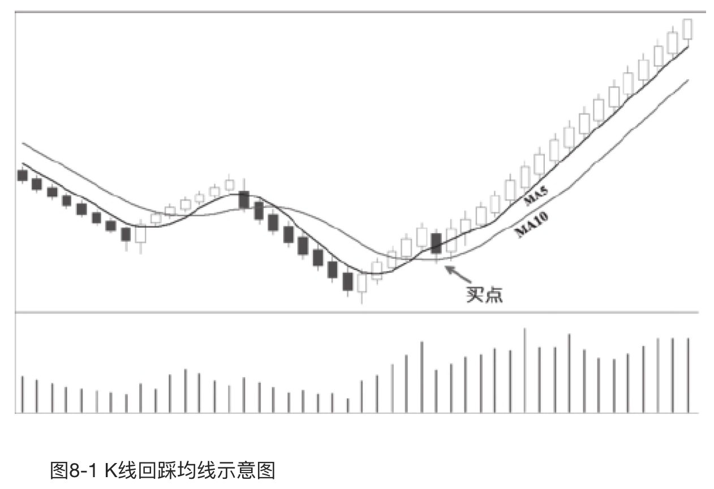

**形成原理**
1. 个股经过调整之后，股价开始反弹或者重拾涨势。
2. 从底部急促上涨之后遇到阻力形成短暂回撤。
3. 有资金逢低买进，股价很难进一步下跌。
4. 近5天的市场平均买入成本开始高于近10天的平均买入成本，说明新进场的买家情愿以较高的价格买进，对筹码的需求大于供给。
5. 大量资金不得不追价买进，从而不断推高股价远离低位。

**图形特征**
1. 股价经过调整后向上移动并站上黑马线MA10均线。
2. MA5均线带动MA10均线向上拐头。
3. 股价回调到MA10均线附近或短暂向下突破MA10均线。
4. 在MA10均线得到支撑，反弹向上。价涨量增并突破前高是对该图形的确认。

**操作方法**
1. 股价首次回踩MA10均线是进场时机。
2. 上涨第一目标是前期高位，可作为首次止盈目标位。
3. 买入之后成交量温和放大是对上涨趋势的确认。
4. 可将止损位设在前低之下，如果该股没有按预期向上发展，收在止损位之下时离场。

**应用要点**
1. 发生均线回踩的位置很重要。在明显的顶部形态之后，显然不是做多有利区间。
2. MACD指标长期运行在0轴之下，发生量价底背离或价格与其他指标的底背离之后，往往是底部建仓的好机会。
3. 经过了下跌放量和下跌缩量过程，甚至到达过地量水平，表明股价经过了充分调整。
4. 波浪理论中的第1浪和第3浪存在高价值买点，大级别的反弹b浪有短线机会，其他位置应谨慎做多。
5. 与其他指标配合运用，当多种方法互相验证，同时发出买入信号时，成功率将得到提高。

图8-2显示的是对深成ETF基金利用回踩均线进行操作的例子。我们在图中用数字标出了关键K线，以下是对这些K线的说明。

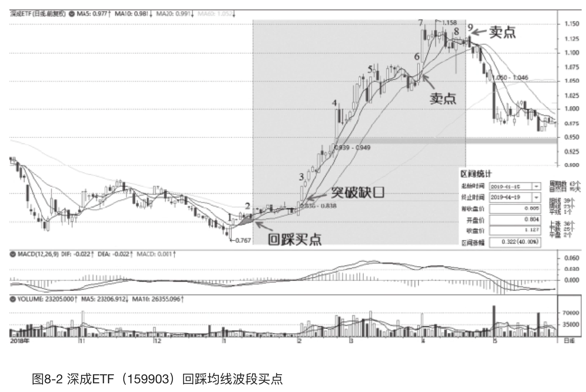

1. 低位穿头破脚阳线。前期的两波下跌均创出新低，MACD指标线在第二波下跌时未能创出新低，价格与MACD指标形成了底背离形态，向上的概率加大。
2. K线回踩MA10均线，发出买入信号，同时MA5、MA10和MA20三条均线形成价托。
3. 突破缺口，买入之后突破震荡区间高点，并连续两日站上60日均线。在此后，成交量明显放大。DIF线在0轴之上向上移动。
4. 光头长阳线，放出较大成交量，同时产生持续缺口（中继缺口），行情进入主升阶段。后面可能还有一半的涨幅。
5. 中阳线，再次回踩10日均线后，创出阶段最大量。
6. 高位首次形成死叉，回测MA10均线产生首个卖点，可以止盈部分仓位。
7. 放量创出新高，形成量价背离，有见顶迹象。
8. 长下影阳线，MA5、MA10和MA20三条均形成向下的价压形态。
9. 第二次形成死叉，K线回抽MA10均线产生清仓卖点。卖出后股价进一步下跌。

在图中标出的位置2处，回踩均线买点所在的阳线低点，成了后面整个上涨行情的最低点。我们经常听说逢低吸纳，这时的相对低点已经很难有机会赶上末班车。为了防止踏空，我们可以在MA10均线附近分批介入，价格在0.814元左右。在MA10均线之下的挂单很少成交，这迫使大多数人只能追涨买进，不断将股价推高。

买入信号之后，MA5、MA10和MA20这三条均线相互靠近了一次，经过这次蓄力，在位置3处跳空上涨，此后再也没有低吸机会。有经验的交易者会发现之前的一根K线也是一个特殊形态，它是什么呢？答案就是“一阳穿三线”，这同样是一个看多形态。

在离场方面，产生了两次卖出信号，在位置6时，当日收出光头阳线，平了新高，并且MA10均线再次拐头向上，这时可以适当减仓，还不到清仓的时候。直到位置9时，价格创出新高，成交量和DIF线都未能同步创出新高，形成量价背离，再加上指标背离，顶部基本确立。

MA10均线从顶部拐头向下，价格再次回抽MA10时，产生清仓卖点。当天的K线高点成了后面一段下跌行情的最高点。位置9处是最合适的离场时机。

我们对这次波段操作进行一下区间统计，总共63个交易日，其中阳线39个，阴线23个，平线1个，从0.804元上涨到1.127元，盈利40%左右。

## K线回抽均线
与回踩均线买点相对应的是`回抽均线`卖点，这同样是一个高效的卖点。值得注意的是，在强劲的升势中，股价可能短暂下破10日均线，10日均线还没来得及改变方向就再次以更陡峭的斜率向上移动。在正常情况下，在上升趋势末端各条均线仍呈多头排列时，价格通常还会回踩一次20日均线并发生小幅反弹，等到10日均线确认转为向下时，结束本轮上涨行情。

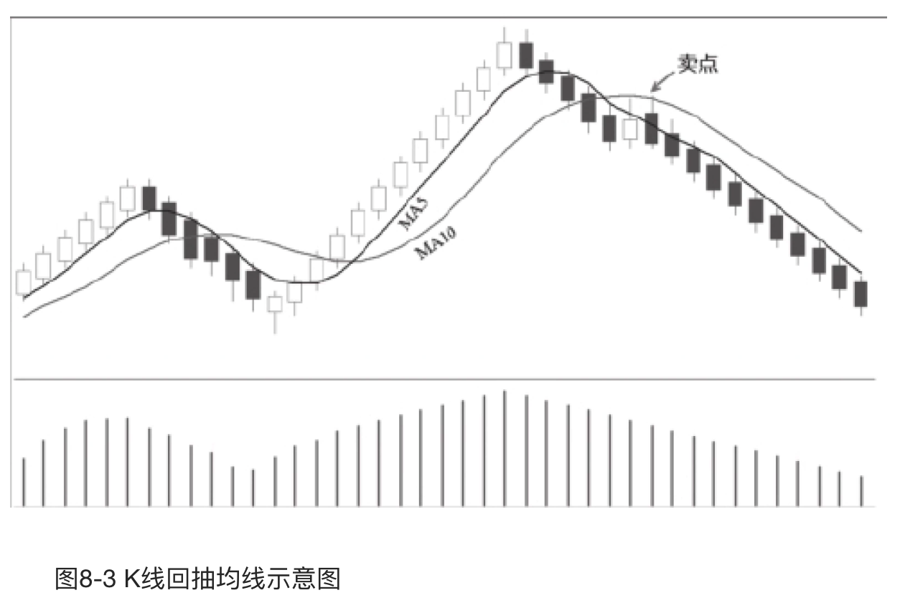

**形成原理**
1. 个股经过一段时间的上涨之后，股价进入高位，多空力量开始产生分歧。
2. 从头部急促回落之后遇到支撑形成短暂反弹。
3. 主力资金开始一边拉抬股价一边离场，股价很难再次启动上涨行情。
4. 近5天的市场平均买入成本开始低于近10天的平均买入成本，说明新进场的买家以较低的价格就可以获得筹码，对筹码的供给大于需求。
5. 筹码开始大量松动，先知先觉的资金争先落袋为安，卖压一波紧似一波，不断压低股价，最终引发股价踩踏。

**图形特征**
1. 股价从头部回落，收在MA10均线之下。
2. MA5均线带动MA10均线向下拐头。
3. 股价向上回抽到MA10均线附近或短暂向上突破MA10均线。
4. 在MA10均线遇到阻力，反身下跌。放量下跌突破前波低点是对该图形的确认。

**操作方法**
1. 股价出现见顶迹象，MA10均线向下拐头，首次回抽是多头离场时机。
2. 下跌的第一目标是上一波调整的低点。
3. 卖出之后阴线成交量大于阳线成交量是对下跌趋势的确认。
4. 走出三浪下跌之后，可能存在b浪反弹，这是多头出逃的最后机会，短线交易者可谨慎做多。
5. 期货品种可以在该位置开空单。

**应用要点**
1. 发生均线回抽的位置同样重要。在量价配合正常，保持向上突破趋势并且没有出现见顶迹象时，行情往往没有结束，主力资金需要拉高股价为自己创造出货空间。
2. MACD指标长期运行在0轴之上，发生量价顶背离或价格与其他指标的顶背离之后，往往是顶部减仓的好时机。
3. 经过了上涨放量，甚至到达过天量水平，表明筹码经过了充分换手，筹码趋于分散，难以再次形成上涨合力。
4. 与其他指标配合运用，当多种方法互相验证，同时发出卖出信号时，卖出成功率将得到提高。

图8-4显示的是对个股中信国安利用回抽均线进行操作的例子。我们在图中用数字标出了关键K线的位置，以下是对这些K线的说明。

1. 三线开花，均线呈多头排列，同时MACD指标金叉，两种方法相互验证发出买入信号。
2. 放量涨停，突破前期高点。
3. 持续缺口，缺口价格区间成为强力支撑。在此后，成交量明显放大。DIF线在0轴之上向上移动。
4. 放量涨停，行情进入主升阶段。
5. 巨量涨停，创出阶段最大量。
6. 跌停，高位未破MA10均线的跌停比较少见，多空分歧加大。
7. 长腿车夫，带有长上影和长下影的小实体阳线，是见顶K线形态。
8. 光头长阳线，多头继续拉升股价。
9. 涨停并创出新高，带有长下影线，形成量价背离，有见顶迹象。
10. 向下突破缺口，放量下跌，缺口成为压力位。
11. MA10均线向下移动，产生K线回抽卖点，并且在价压之内。卖出后股价进一步沿着均线下跌。

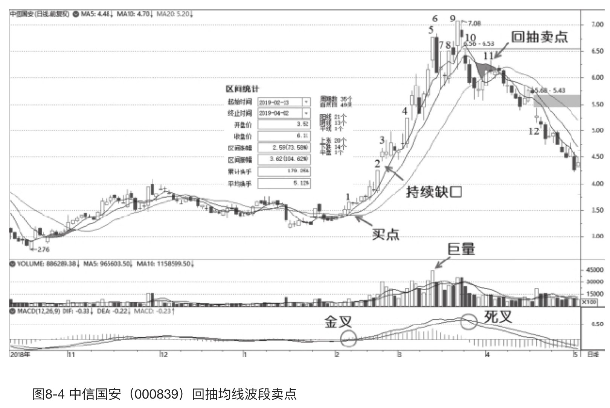

回到图8-4中，在图中标出的位置1所在K线形成了均线三线开花形态，并且MACD指标同时形成金叉，发出买入信号。买入之后，三条均线向上发散，支撑股价不断上涨，成交量同步不断放大。

此后，直到位置5时，放出阶段最大量，说明换手巨大，有大量筹码易主，这对于上涨来说，并不是好事。在位置9处，发生了量价背离，当天收出阶段最高价，稳健的交易者可以在这里逢高减仓。

在离场时，MACD指标在K线连续两日收在MA10均线之下那天形成了死叉，先行发出卖出信号。随后几日，股价反弹到了MA10均线之上，产生回抽卖点。这个卖点相比MACD死叉时更有价格优势，但回抽只在分时图上持续了半个小时，这是黄金离场机会。当日K线高点成了后面一段下跌行情的最高点。

最高效的买点和卖点通常只发生在少数几根K线上，除此之外的其他绝大多数K线的风险回报比都和它相去甚远。

我们对这次波段操作进行一下区间统计，总共35个交易日，其中阳线21个，阴线13个，平线1个，从3.52元上涨到6.11元，盈利73%左右。值得注意的是累计换手率达到了179%，可见炒作得多么厉害，如果除去固定筹码，计算流通筹码的换手率会更高。

## 低位价托
均线对K线具有支撑或压力作用，当股价从底部开始启动升势时，短、中、长三个周期的三条均线依次由向下转为向上移动，在K线下方会形成一个具有强支撑作用的形似三角形的价托，如图8-5所示。

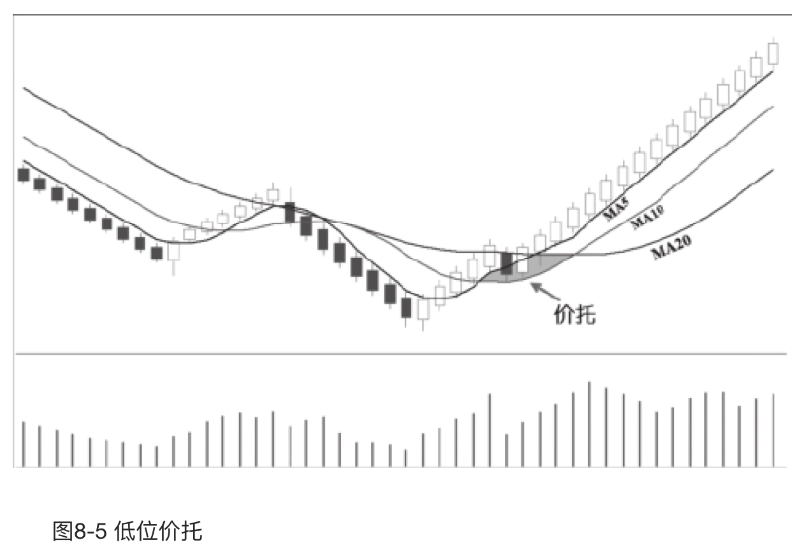

**形成原理**
1. 当一只个股经过长时间的调整之后，先知先觉的主力资金完成收集筹码的过程，股价开始从底部启动。
2. 近5天的市场平均买入成本开始高于近10天的平均买入成本，说明新进场的买家情愿以较高价买进，对筹码的需求大于供给。
3. 首次反弹往往很急速，上涨到20日均线附近时，前期成本过高的套牢盘和提前抄底而未能出逃的筹码开始抛出，导致短暂回撤。
4. 这时的回撤被称为“黄金坑”，几个交易日之后，更多的资金开始觉察到进场时机，纷纷买进，从而推动股价向高位攀升。

**图形特征**
1. 股价从低位向上移动，带动短期均线向上拐头。
2. MA5均线向上穿越MA10均线形成金叉。
3. 股价站上MA20均线，MA20均线方向由向下转为逐渐走平。
4. MA5、MA10向上穿越MA20均线，与MA20均线形成封闭空间，形成价托。
5. 买入后放量突破前期高点是对该图形的确认。

**操作方法**
1. 经过调整之后在低位形成的价托是进场时机。
2. 上涨第一目标是前期高位，可作为首次止盈目标位。
3. 买入之后成交量温和放大是对上涨趋势的确认。
4. 可将止损位设在前低之下，如果该股没有按预期向上发展，收在止损位之下时离场。

**应用要点**
1. 价托形成的位置很重要。重点把握波浪理论中的第1浪和第3浪的起始位置。
2. MACD指标长期运行在0轴之下，股价与指标发生底背离之后的价托是高效买点。
3. 在震荡市中，价托会多次出现，需要注意价托的方向。
4. 在价托中，MA5均线与MA10均线向上的夹角越大，说明动量越大。
5. 通常要等MA5均线向上穿越MA20均线之后才能确认价托的形成。
6. 与其他指标配合运用，当多种方法互相验证，同时发出买入信号时，成功率将得到提高。

图8-6显示的是在个股惠威科技中利用低位价托进行买进操作的例子。我们在图中用数字标出了关键K线的位置，以下是对这些K线的说明。
1. 价托，MA5与MA10均线向上穿越MA20均线，发出买入信号。
2. 放量中阳线，突破前期高点。
3. 涨停。
4. 涨停。
5. 涨停。
6. 射击之星，长上影小实体阳线，顶部K线形态。
7. 长阴线，收在MA10均线之下，MACD指标死叉。
8. MA5均线与MA10均线死叉，K线回抽均线，发出卖出信号。

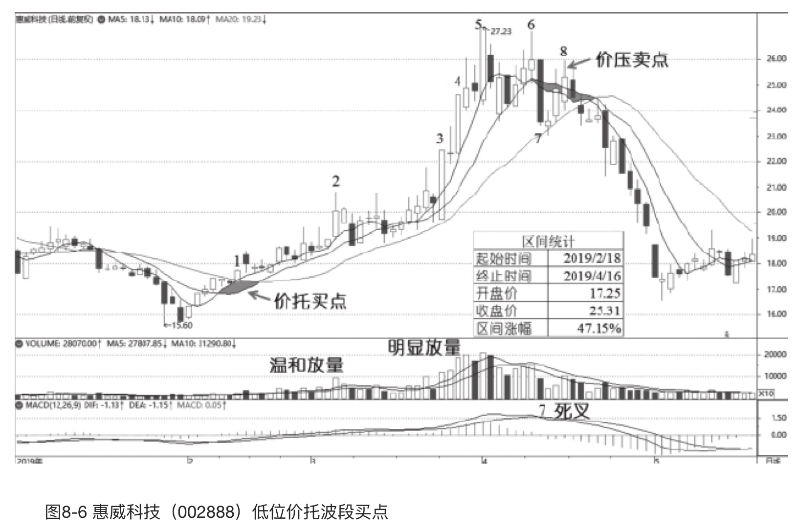

该股图中标出的位置1处，三条均线形成价托，当日K线是光脚小阳线，只有开盘一段时间的股价处于价托之内，想要等待低吸的话，这次没有给机会，结果会导致踏空。为了避免这种情况发生，我们在选好股票之后，在形成价托时，可以在价托价格区间采用分批进场策略。

如果是长线交易者的话，不必在乎这几个价位，可以看准时机果断进场。短线交易者对买点和卖点的控制要更加精准一些，短线战绩靠的是多次交易结果的累积。相对长线来说，短线的交易机会更多，但出错的机会也更多，好的进场价位将会有利于后面的持股或止损。

图8-7显示的是对个股太钢不锈利用价托进行波段操作的例子。我们在图中用数字标出了关键K线，以下是对这些K线的说明。
1. 价托买点，MA5与MA10均线在低位向上穿越MA20均线形成封闭空间。
2. K线短暂跌破MA10均线，在MA20均线得到支撑。
3. 射击之星，高开并带有长上影的阴线，顶部反转K线形态。
4. 带有长下影的光头阳线并放量涨停，创出阶段最大量，见顶信号。
5. 长腿车夫，顶部反转形态。
6. 长阴线，产生向下跳空缺口，并放量跌破MA10均线。
7. 价压中的回抽，MA5、MA10和MA20三条均线形成价压形态。
8. 长阳线并创新高，形成双顶形态，价格与MACD指标发生顶背离。
9. 再次形成价压并回抽，是卖出信号。

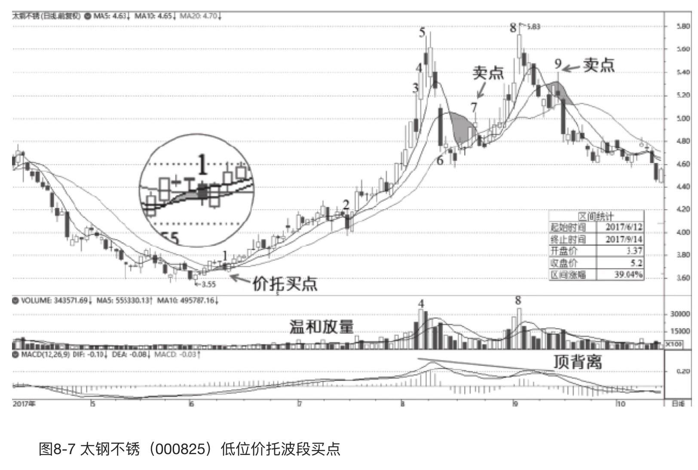

在价托买点之前，个股经过充分调整是买入的前提条件之一。充分调整怎么定义呢？从波浪理论来讲，一波完整的调整可以是三浪或五浪下跌，通常经过调整浪之后，股价会向上转向。熟悉波浪理论的交易者一定会听说过“千人千浪”的说法，意思是说，数浪不是数学公式，由于每个人都有自己的眼光、见解，所以数出来的浪形就会有着千差万别，从而对后市产生不同的看法。

为了避免数浪可能的偏差，我们配合使用其他指标来相互验证，确认个股是否经过充分调整。从成交量来讲，一波完整的调整应该经过放量下跌和缩量下跌，放量下跌通常是在跌破前低的时候发生，缩量下跌通常是下跌中继或者量价背离的时候。

从指标方面来看，也会有很多经过充分调整的特征，比如MACD指标长期运行在0轴之下，并且能依据DIF线数出3浪下跌，当DIF线与DEA线发生金叉或者DIF线向上突破0轴时，调整大概率会结束；再比如KDJ指标多次进入超卖区间，然后当其向上穿越50线时，短线的调整大概率会结束。

另外，很重要的一点是，对调整的级别也要有个判断。当MA60均线向下时，处于主要的空头行情，这时的调整级别大、时间长；当MA60均线向上时，处于主要的多头行情，这时的调整级别小、时间短。

## 高位价压
均线对K线具有支撑或压力作用，当股价从顶部启动跌势时，短、中、长三个周期的三条均线依次由向上转为向下，在K线上方会形成一个具有强压力作用的形似三角形的价压形态，如图8-8所示。

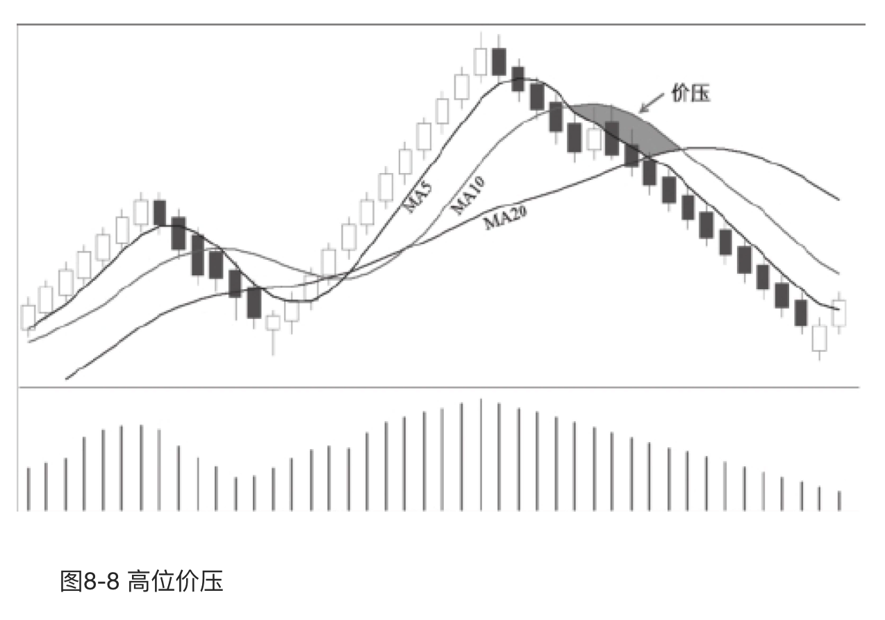

**形成原理**
1. 当一只个股经过长时间的上涨之后，先知先觉的主力资金开始逐步出清筹码，股价开始从顶部回落。
2. 近5天的市场平均卖出成本开始低于近10天的平均卖出成本，说明近期的卖家宁愿以较低的价格抛出筹码，对筹码的供给大于需求。
3. 下跌速度通常更快，回落到20日均线附近时，短线超卖导致短暂反弹。
4. 这时的反弹被视为出逃良机，几个交易日之后，更多卖家开始觉察到出场时机，卖盘涌出，从而打压股价向低位运行。

**图形特征**
1. 股价从高位向下移动，带动短期均线向下拐头。
2. MA5均线向下穿越MA10均线形成死叉。
3. 股价跌破MA20均线，MA20均线方向由向上转为逐渐走平。
4. MA5、MA10与MA20均线形成三角形封闭空间，形成价压。
5. 卖出后放量跌破前期低点是对该图形的确认。

**操作方法**
1. 经过上涨之后在高位形成的价压是离场时机。
2. 下跌第一目标是前期低位或者是通道下轨（从反弹高点减去与前波下跌等长的距离），可将其作为首次止盈目标位。
3. 卖出之后放量跌破前低是对下跌趋势的确认。
4. 双向交易的期货品种可以在价压之内开空单，可以将止损设置在开仓当日10日均线的一定幅度之上（比如，一个中阳线的距离）或者设置在前高之上。

**应用要点**
1. 价压形成的位置很重要。重点把握波浪理论中的a浪和c浪起始
位置。
2. MACD指标长期运行在0轴之上，股价与指标发生顶背离之后的价压是高效卖点。
3. 在震荡市中，价压会多次出现，需要注意价压的方向。
4. 在价压中，MA5均线与MA10均线向下的夹角越大，说明下跌动量越大。
5. 通常要等MA5均线向下穿越MA20均线之后才能确认形成价压。
6. 在急速下跌时，即使产生价压，股价也难以回抽到价压之中，应以反弹一定幅度离场。
7. 与其他指标相配合，当多种方法互相验证，同时发出卖出信号时，成功率将得到提高。

图8-9显示的是对三环集团利用价压进行卖出操作的例子。我们在图中用数字标出了关键K线，以下是对这些K线的说明。

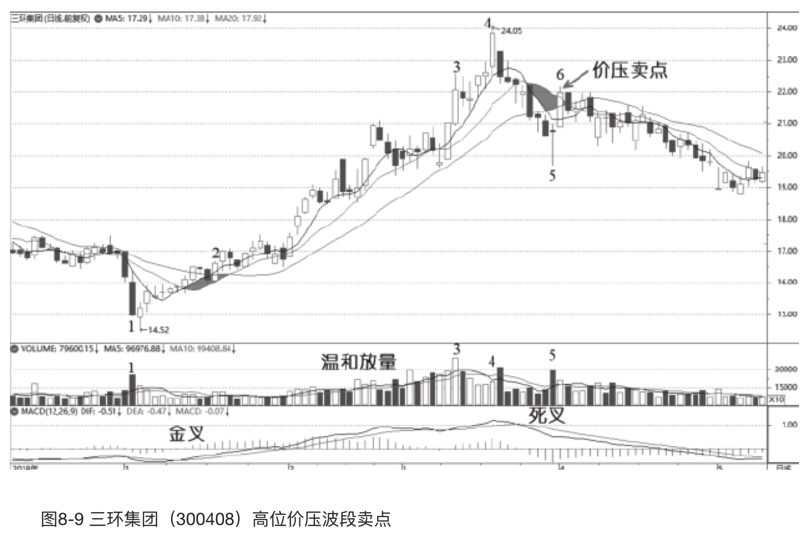

1. 放量长阴线，创出调整新低。
2. 价托回踩买点，MACD指标形成金叉。
3. 长阳线，创出阶段最大量。
4. 中阳线，新高缩量。
5. 放量下跌，MA5均线跌破MA20均线，确认形成价压形态。
6. 价压中的回抽卖点。

从“养套杀”理论来讲，“养”的阶段是主力吸筹并吸引跟风盘的阶段，行情容易反复震荡；“套”的阶段发生在高位，人们的贪婪心理和各种不利于交易的人性被无限放大，大牛行情进入疯狂阶段；当很多人沉迷于追涨杀跌的时候，最后的“杀”阶段到来了。那些在这场击鼓传花的游戏中没有脱手筹码的人，他们都会被关在这个阶段，主力出货之后，各路筹码悉数抛出，在顶部形成快速下跌。抱有牛市还将持续幻想的新手，很多会被套在顶部，然后在多杀多的恐惧中将筹码割在低位。

交易者在看见价压形成时，确认该股出现了顶部特征之后，应该果断离场。当遇到急速下杀行情时，形成了价压却很难有回抽离场的机会。我们可以采用分批离场策略，价格进入价压三角形区间内时，也就是回抽到5日均线以上时都可以离场，以确认10日均线转向的K线作为最后清仓K线。

在价托中，价格容易发生回踩，在价压中，价格却不容易发生回抽。

图8-10显示的是对个股金螳螂利用价压进行卖出操作的例子。我们在图中用数字标出了关键K线，以下是对这些K线的说明。

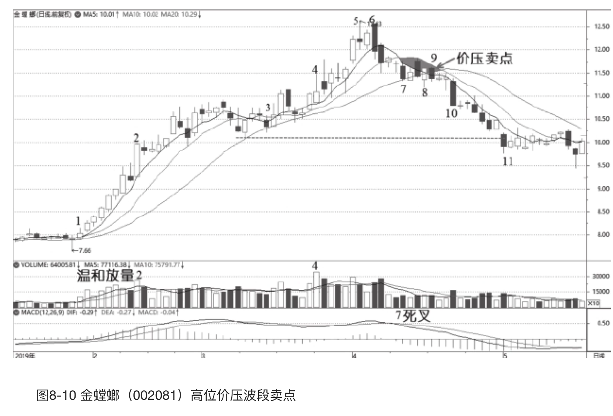

1. 一阳穿三线，买入信号。
2. 长阳线，创出阶段最大量。
3. MA5均线与MA10均线发生死叉，股价回踩MA20均线，并未形成价压。
4. 放量创出新高，再次创出最大量。
5. 黄昏之星，顶部反转K线形态。
6. 看跌吞没形态，顶部反转K线形态。
7. MA5均线与MA10均线形成死叉，MACD指标的DIF线与DEA线同时形成死叉。
8. 股价回抽，但MA5均线还没有向下穿越MA20均线。
9. MA5均线向下穿越MA20均线，确认形成价压，卖出信号。
10. 放量跌破价压价格区间下沿。
11. 跌破前期低点，DEA线进入0轴之下，进入空头市场。

在图8-10的波段操作中，买入之后股价稳步上行。到达位置3的时候，MA5均线与MA10均线发生了死叉，如果要形成价压，这就是起点。但实际情况却是，该股回踩MA20均线后再次站上MA10均线并创出新高，MA5均线与MA10均线再次形成金叉。由于两条均线没有向下穿越MA20均线，因此价压并未形成，上涨趋势还在继续。这样，通过依据明确的价压条件进行判断，并未发出卖出信号，没有提前离场，得以继续跟踪上涨趋势。

该股运行到位置4时，放量创出新高，并且放出阶段最大量，后面的一根K线是绿色的射击之星，见顶迹象开始显现。在位置6，该股走出了一根穿头破脚的看跌吞没形态，这是明显的见顶信号，并且当天是放量长阴线。

在位置7，MA5均线与MA10均线再次发生死叉，DIF线与DEA线同时形成死叉，下跌的概率进一步增大。到位置9时，收盘在MA20均线之下，MA10均线确认拐头向下，当天收盘前的15分钟是最后清仓时刻。

卖出后，该股票继续下跌，位置9的K线成了此后下跌行情中的最高K线。从位置3到5是主力吸引散户入套的一浪。位置6这根长阴线收盘时让前两天接盘的人都已经陷入套牢。向下突破价压下沿之后，该股仅用了8个交易日就跌破了前期低点，其中有6根阴线。这是主力“杀”散户的快速下跌浪。

## 量托
成交量（Vol）可以通过简单移动平均方法（MA）计算得到均量线（VolMA），它也有着与均价线的价托相类似的用法，三条均量线MA5、MA10与MA20同样会构成“托”的形态，对股票操作具有重要指导意义，量托甚至比价托更为重要，如图8-16所示。

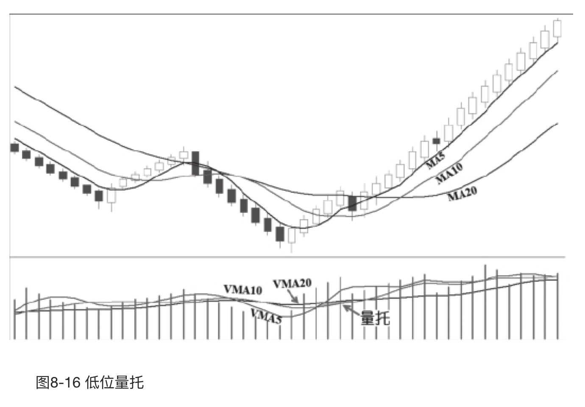

**形成原理**
1. 当一只个股经过长时间的下跌之后，成交量呈缩量趋势，均量线呈空头排列。
2. 主力资金悄然进场，成交量温和放大。近5天成交均量开始高于近10天的成交均量，说明近期交投活跃，有启动上涨行情的迹象。
3. 当近5天的成交均量高于近20天的成交均量时，上涨趋势已经确立。

**图形特征**
1. 成交量温和放大。
2. 量均线MA5向上穿越MA10形成金叉。
3. 量均线MA20方向由向下转为逐渐走平。
4. 量均线MA5、MA10向上穿越MA20，与MA20形成封闭空间，形成量托。

**操作方法**
1. 量价背离之后的量托是进场良机。
2. 量托之后有价托。
3. 放量突破前期高位是对上涨趋势的确认。
4. 可将止损位设在前低之下，如果该股没有按预期向上发展，收在止损位之下时离场。

**应用要点**
1. 当成交量突然明显放大时，量托还没来得及出现就已经发展到了均量线多头排列阶段。
2. MACD指标长期运行在0轴之下，股价与指标发生底背离之后的量托是高效买点。
3. 量托不太多见，均量线多头排列更常见。
4. 在量托中，均量线MA5与MA10向上的夹角越大，说明动量越大。
5. 当下跌放量时会对量托有干扰，阴线放量也会使均量线发生金叉。

图8-17显示的是个股金隅集团利用低位量托进行买进操作的例子。我们在图中用数字标出了关键K线，以下是对这些K线的说明。

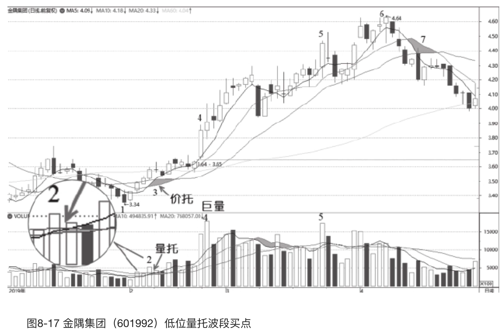

1. 阶段低点，缩量至地量。
2. 量托，量均线MA5先向上穿越MA10，再向上穿越MA20，买入信号。
3. 价托，买入信号。
4. 巨量突破，产生突破缺口。
5. 巨量并创出新高。
6. 吊颈线，顶部反转K线形态。
7. 价压，卖出信号。

该股先在放量初期形成了量托，然后又形成价托，我们再一次看到量在价先的情况。该股在位置2处，三条均线形成价托，但没有价格进入价托区域，我们可以采用其他进场技术，比如回踩均线进场，突破进场等，只要价格保持在价托之上即可。

## 量压
均量线的量压比量托更为常见，量压通常会领先于价压发生，量压是阶段顶部的明显标志，如图8-18所示。

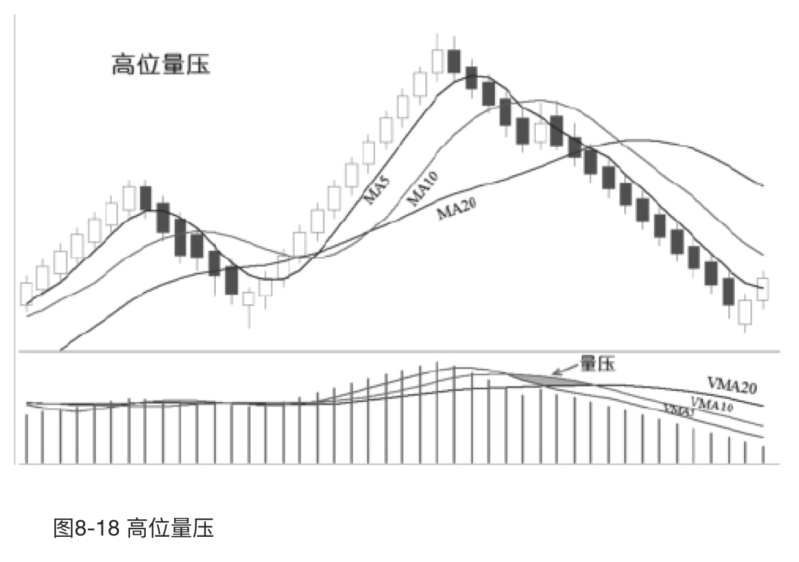

**形成原理**
1. 当一只个股经过长时间的上涨之后，成交量呈放量趋势，均量线呈多头排列。
2. 冲高回落之后量能逐渐萎缩。近5天成交均量开始低于近10天的成交均量，说明近期量能匮乏，有见顶迹象。
3. 当近5天的成交均量低于近20天的成交均量时，阶段顶部很可能已经完成。

**图形特征**
1. 成交量逐渐萎缩。
2. 量均线MA5向下穿越MA10形成死叉。
3. 量均线MA20方向由向上转为逐渐走平。
4. 量均线MA5、MA10向下穿越MA20，与MA20形成封闭空间，形成量压。

**操作方法**
1. 量价顶背离之后的量压是离场时机。
2. 量压之后有价压，量压的宽度通常小于价压。
3. 放量跌破前期低位是对下跌趋势的确认。
4. 量压结合顶部反转K线形态和其他指标相互验证来确认卖点，可以提高卖出成功率。

**应用要点**
1. 量托可以很好地指示缩量现象，对判断阶段顶部十分有效。
2. MACD指标长期运行在0轴之上，股价与指标发生顶背离之后的量压是高效卖点。
3. 量压比量托常见，量压通常会比价压提前几个交易日发生。
4. 在量压中，均量线MA5与MA10向下的夹角越大，说明下跌动量越大。
5. 过顶之后，当下跌放量时会使均量线发生金叉，这并不是进场时机。

图8-19显示的是华侨城利用量压进行卖出的波段操作实例。我们在图中用数字标出了关键K线的位置，以下是对这些K线的说明。
1. 光头阳线，巨量突破前高。
2. 小星线，缩量创出新高。
3. 量压，量均线MA5与MA10发生死叉。
4. 价压，均线MA5与MA10发生死叉。
5. 跳空放量下跌，形成岛形反转。

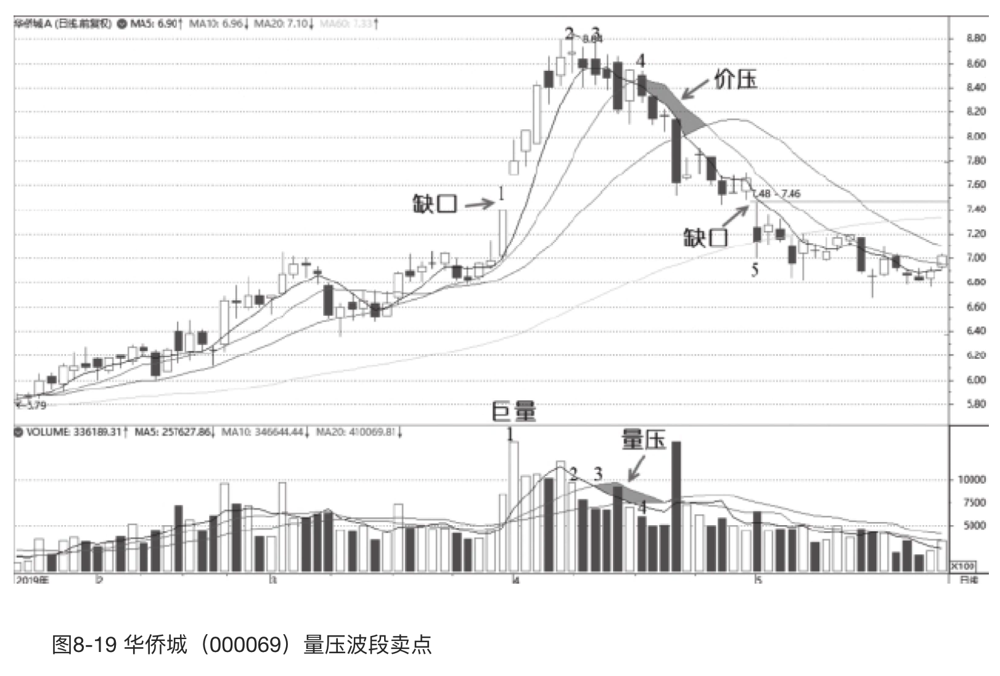

在持股时看到位置1处的巨量阳线，基本可以判断出这一波上涨可能是冲顶的一浪。次日跳空上涨，出现了一个缺口，加速赶顶。连续地放出大量使得均量线金叉的夹角变大。到位置2处创出新高时，创出从位置1处以来的最小阳线量，量价背离是明显的反转信号。

位置3处标出的K线开始形成量压，领先后面的价压4个交易日（位置4处）。在位置4处的K线是第二次收在MA10均线之下，多种方法互相验证，这里是一个合理的卖点。卖点之后，经过2个交易日之后量压结束，经过5个交易日之后价压结束。最后在位置5处向下跳空，形成岛形反转。

在该股中，量压与价压的宽度均为6个交易日，量压领先了4个交易日，根据量压判断的卖点处于顶部偏上的区域。由此可以看出，成交量的变化要比价格的变化更明显。

## 多方炮
在股票拉升的启动阶段，经常会出现一种具有上攻能力的K线组合，它的首根K线放量突破前期高点或者创出新高，第二根K线是高开低走的阴线，第三根K线是对前面阴线破脚穿头的阳线，最强的形式是收盘创出新高，这三根K线组合而成的形态称为`“多方炮”`。

**图形特征**
1. 股价经过调整之后开始自下而上靠近MA60均线。
2. 放量长阳线突破MA60均线。
3. 次日缩量阴线回调。
4. 第三日阳线收盘再创新高，成交量持续放大。

**操作方法**
1. 在多方炮的第三根K线的收盘前首次进场。
2. 多方炮形成后的三个交易日之内，如果回调到MA10均线附近
则再次进场。
3. 短线止损可设在多方炮的阴线之下。
4. 多方炮的形态和位置很重要，在上涨波段起始位置形成的强势上攻多方炮是高效买点。

在一只股票的行情图中，会形成大量的两阳夹一阴K线形态，我们应该对不同位置和不同形态的多方炮加以区分，例如，带有向上跳空缺口的多方炮会比一般的形态更加强势。我们首先来看，按照多方炮的三根K线的排列方式，对该形态的强弱进行排序，如图8-20所示。

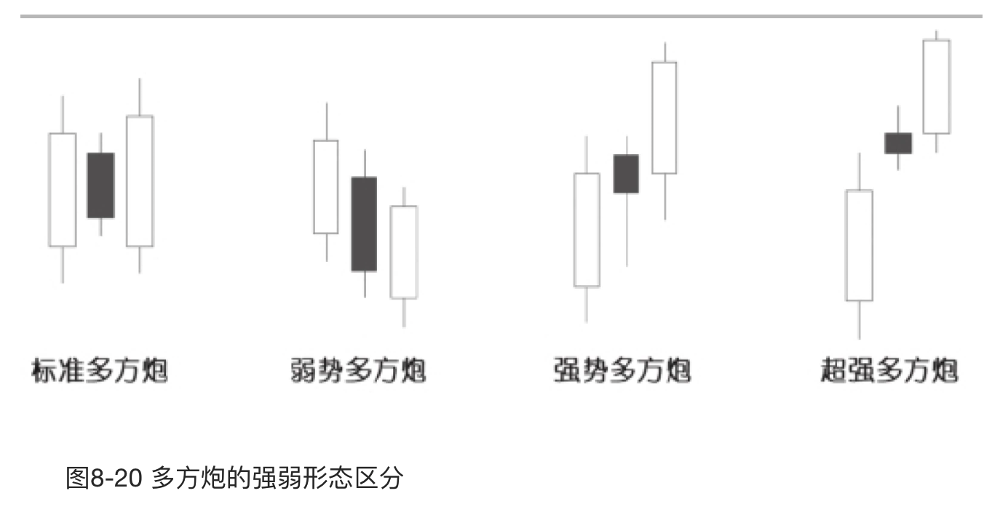

- 第一种排列是标准的两阳夹一阴形态，阴线高低点处于两侧阳线实体之中，我们定义为标准多方炮。
- 第二种排列，三根K线的高低点是向下移动的，说明抢筹不活跃或者前期套牢的筹码抛压严重，第三根K线收在阴线半分位之上，这可以使部分进场的人不至于亏损，但上方还有亏损筹码的抛售压力，我们将该种排列定义为弱势多方炮。
- 第三种排列，三根K线的高低点是向上移动的，其中的阴线应该是带有长下影的小实体阴线，这说明市场中抢筹热情高涨，买方在低位有强烈的进场意愿，我们将这种排列定义为强势多方炮。
- 第四种排列，第一根阳线通常是光头阳线或者涨停K线，中间的阴线是假阴线，跳空高开，小幅下跌并收在前日收盘价之上，小阴线的左侧和右侧都曾跳空高开，有时会留下持续缺口，该形态说明多头占据明显优势，没有逢低买进的机会，只能追涨才能买进。我们将其定义为超强多方炮。

强势多方炮的明显图形特征是，三根K线形似一个出头的N字形，表示向上攻击的力量强大，预示着股价有很大概率还会继续上涨。多方炮中的阳线实体长度越大，说明上涨动量越大。

我们再来看，按照多方炮和多条均线的相对位置，对该形态的强弱进行排序，如图8-21所示。在图中，最左侧的多方炮发生在均线空头排列的时候，各条均线都对股价起到压力作用，MACD指标运行在0轴之下，所以，处于空头趋势之中的是弱势多方炮。

在图中间位置的多方炮处于MA20均线之上，较短周期的三条均线形成了价托，并且即将形成多头排列，短线的市场平均成本已经处于多方炮之下，这是市场反转的位置，属于强势多方炮。强势多方炮通常会伴随着成交量温和放大。

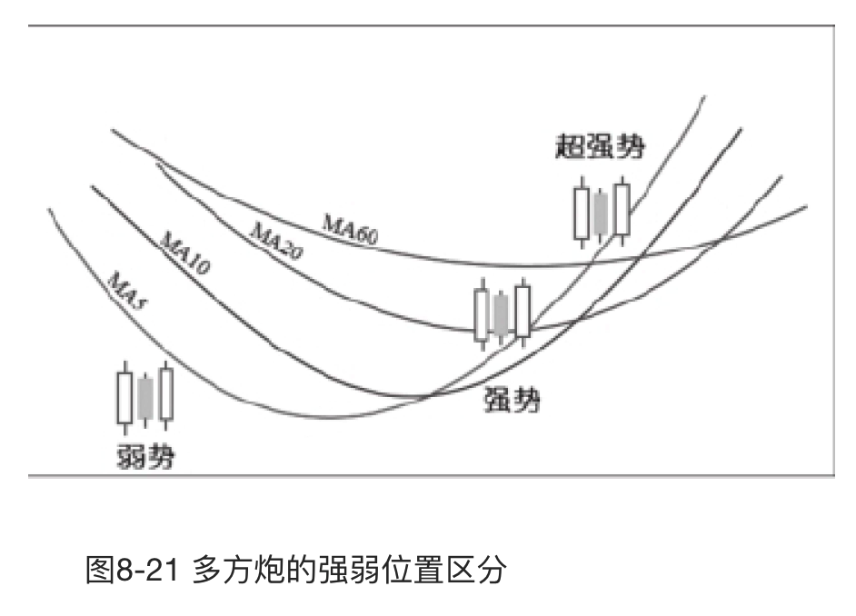

在图中最右侧的多方炮发生在MA60均线之上，所有均线都在向上移动，这时的中长期平均市场成本都已经被踩在脚下，近期入场的绝大多数交易者都处于盈利状态。这通常处于明显放量的拉升阶段，属于超强势多方炮。这时成交极其活跃，赚钱效应吸引更多人买进股票，不断将股价推向新高。

多方炮的构成形态和所处位置都很重要，把握好这两个关键点有助于在有利的位置进场。强势的向上攻击形态可以让交易者很快产生浮盈，这也将有助于后面的持股或止损操作。通过配合量价特征来进行综合判断，能够进一步提高对进场和出场位置判断的准确率。

图8-22显示的是个股东旭光电的日线图，我们利用多方炮来判断波段买点。

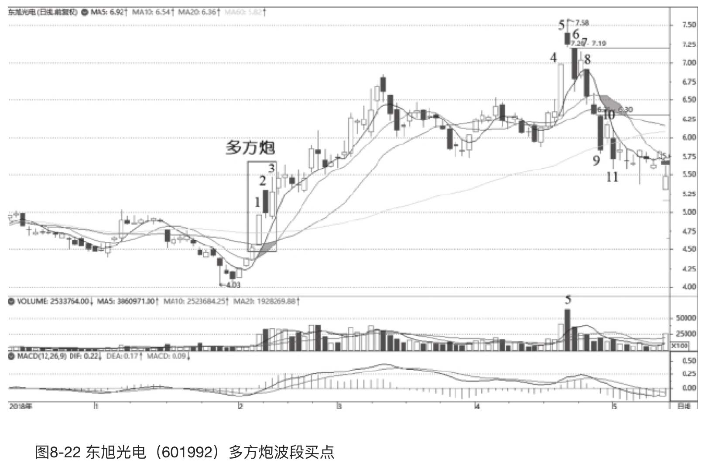

我们在图中用数字标出了关键K线。首先来看方框中标出的三根K线。第一根K线涨停并首次站上MA60均线，第二根K线是跳空高开的假阴线，第三根K线是放量并创出新高的中阳线，它与前面两根K线构成了一个强势的多方炮形态。与此同时，三条均线在多方炮下面形成了价托，价托的宽度正好是这三根K线。由于强势上攻，所以并没有在价托中逢低进场的机会。我们可以利用多方炮，在第三根K线向上突破时进场。

此后，该股连续上涨，DIF线运行在0轴上方，直到图中的位置5处，走出一根放出巨量的阴线，并且在它的两侧都有缺口，4、5、6这三根K线构成了顶部的弃婴形态，这是一个强烈的见顶信号，预示着行情有可能发生反转。有经验的交易者会在这个位置开始止盈离场。

行情上涨的速度有时候会出乎意料，有时当你看到价托形成时，已经没有进场机会。我们常说没有买不到的股票，也没有卖不出的股票，当然极端行情除外，比如一字板。我们可以采取分批进场策略，来应对当价托出现时，股价没有回踩的情况。

股票经过充分调整之后，我们知道它处于阶段低位，以依据多方炮进场为例，第一根阳线应该首次站上20日均线，最好首次站上60日均线，第二根阴线收在前面阳线实体的半分位以上为好，第三根阳线最好创出新高，三根K线呈向上倾斜的N字形。

对于分批进场的时间和位置，我们认为有两根K线很重要，一个是形成多方炮的第三根K线，在其收盘前的15分钟，也就是在14：45分至收盘前判断是否大概率会收出强力上攻的多方炮；另外一个是在回踩10日均线附近时。

强势的多方炮在形成之后可能没有回调，在这种情况下，我们的首批仓位可以防止踏空。次强的多方炮会沿着第三根K线的收盘价向右调整，调整三四个交易日后到达10日均线附近再次上攻。弱一点的多方炮会调整到第三根K线的开盘价附近，往往会调整到10日均线上，这会给我们二次进场的机会。

**多方炮变形——两阳夹两阴**

股票在创出新高后，有时休整的时间会多于一个交易日。理论上来讲，只要在前一根阳线实体的半分位以上调整，即使多运行几个交易日，其图形的内涵也是多方炮。需要注意的是，调整的时间越长，说明主力资金向上拉升的意愿越不强烈，筹码也显得并不是那么稀缺。

当调整时间仅比标准多方炮多一个交易日时，两根调整的阴线可以合并算作是一根阴线，这就是多方炮的一个变形，即两阳夹两阴。其中两根阴线的实体应该较小，可以有较长的下影线，不宜有较长的上影线。

在上攻力道方面，这种图形也未必不如标准图形，因为个股上涨往往需要大盘的配合，主力资金会等待大盘上涨时启动上攻行情。

在所有位置的多方炮形态当中，经过充分调整之后，首次站上60日均线时是最高效的买点。站上季线意味着中长期的平均市场成本已经处于当前价格之下，市场充分洗掉了套牢盘，多数人都处于盈利状态。市场对筹码的需求开始大于供给，最新进场的资金不断将价格推向新高。

图8-23显示的是古井贡酒利用两阳夹两阴进行买进的波段操作实例。我们在图中用数字标出了关键K线。在方框标出的位置，第一根K线曾经在盘中触及涨停，当日有较大成交量放出，并首次站上MA60均线；后面的两根小阴线距离第一根K线的收盘价不远，都是缩量调整，仍在所有均线之上；第四根K线收出中小实体的放量阳线，盘中接近前高，收盘在前两根阴线的实体上方。这四根K线构成了两阳夹两阴的多方炮形态，预示着该股即将发起向上攻势。

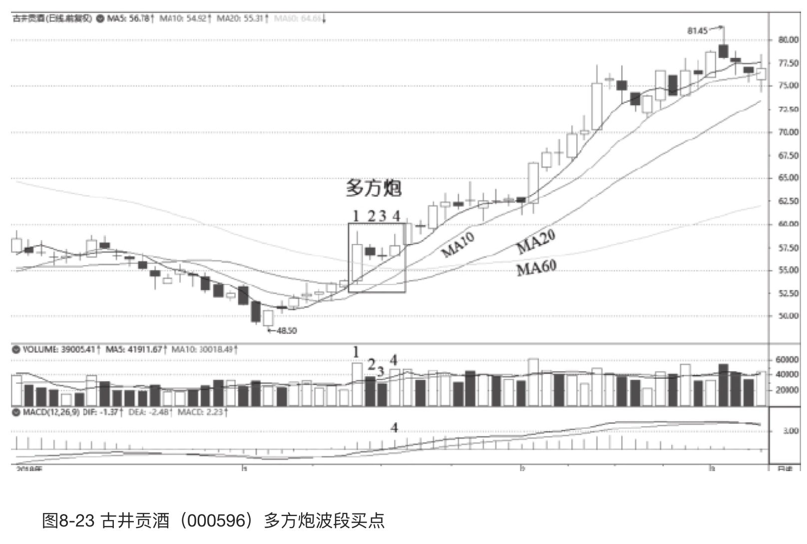

在第四根K线收盘前买进之后，该股呈现出价涨量增、价跌量减的量价同步状态，这说明涨势发展良好。多方炮形成之后，MACD指标的DIF线也明显突破了0轴，验证了买点的可靠性。

## 空方炮
在股票下跌的初始阶段，经常会出现一种具有下跌量能的K线组合，它的首根K线放量突破前期低点或者创出阶段新低，第二根K线是低开高走的阳线，第三根K线是对前面阳线穿头破脚的阴线，其中最强的形式是收盘创出新低，这三根K线组合而成的形态称为`“空方炮”`。

**图形特征**
1. 股价经过调整之后开始自上而下靠近MA60均线。
2. 放量长阴线跌破MA60。
3. 次日缩量阳线反弹。
4. 第三日阴线收盘并再次创出新低，成交量持续放大。

**操作方法**
1. 在空方炮的第三根K线收盘前首次离场。
2. 空方炮形成后的三个交易日之内，如果回抽到MA10均线附近则再次离场。
3. 做空品种可在价压附近的空方炮开空单，可以将止损设在空方炮形态的高点之上或者本轮高点之上。
4. 空方炮的形态和位置很重要，在下跌波段起始位置的空方炮和强势下跌空方炮是高效卖点。

在一只股票的行情图中，会形成大量的两阴夹一阳的K线形态，这些空方炮形态会由于排列方式的不同以及发生位置的不同而代表着不同的意义。我们首先按照空方炮的三根K线的排列方式，对该形态的强弱进行排序，如图8-24所示。

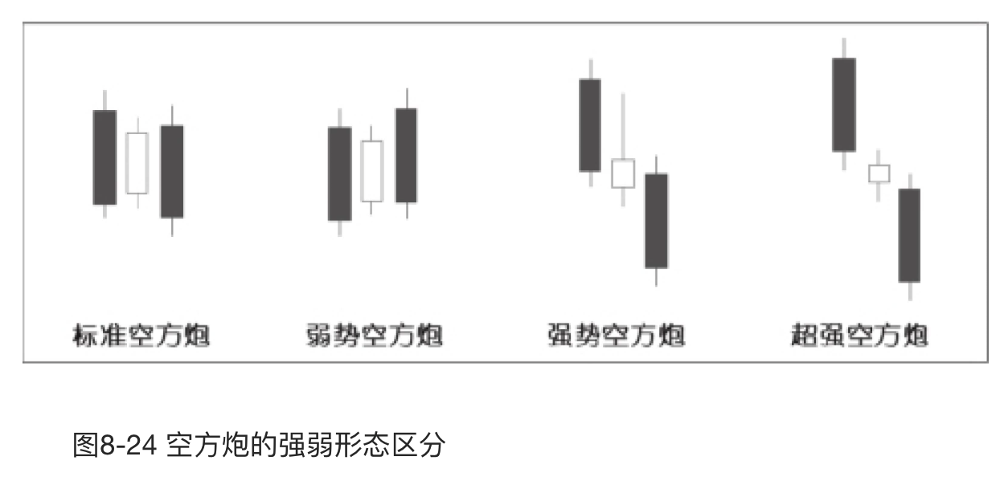

- 第一种排列是标准的两阴夹一阳，阳线的高点与低点处于两侧阴线实体之中，我们将其定义为标准空方炮。
- 第二种排列，三根K线的高点与低点是向上移动的，这说明还有参与者抱有继续上涨的希望，但先知先觉的资金再次逢高离场，把高位的出货机会夺去，此后很难再回到阳线之上，我们将该种排列定义为弱势空方炮。
- 第三种排列，三根K线的高点与低点是向下移动的，其中的阳线应该是带有长上影的小实体阳线，这说明市场中的抛压严重，卖方在高位有强烈的离场意愿，我们将这种排列定义为强势空方炮。
- 第四种排列，第一根阴线通常是光头阴线或者跌停K线，中间的阳线是假阳线，跳空低开，小幅上涨并收在前日收盘价之下，小阳线的左侧和右侧都出现跳空，有时会留下持续缺口，该形态说明空头占据了明显优势，已经失去了逢高卖出的机会，只能靠杀跌才能卖出。我们将其定义为超强空方炮。

强势空方炮的明显图形特征是，三根K线形似一个出头的倒N字形，表示向下攻击的力量强大，预示着股价有很大概率还会继续下跌。空方炮中的阴线实体长度越大，说明下跌动量越大。

在图8-25中，最左侧的空方炮发生在均线多头排列的时候，各条均线都对股价起到支撑作用，MACD指标运行在0轴之上，所以，处于多头趋势之中的是弱势空方炮。

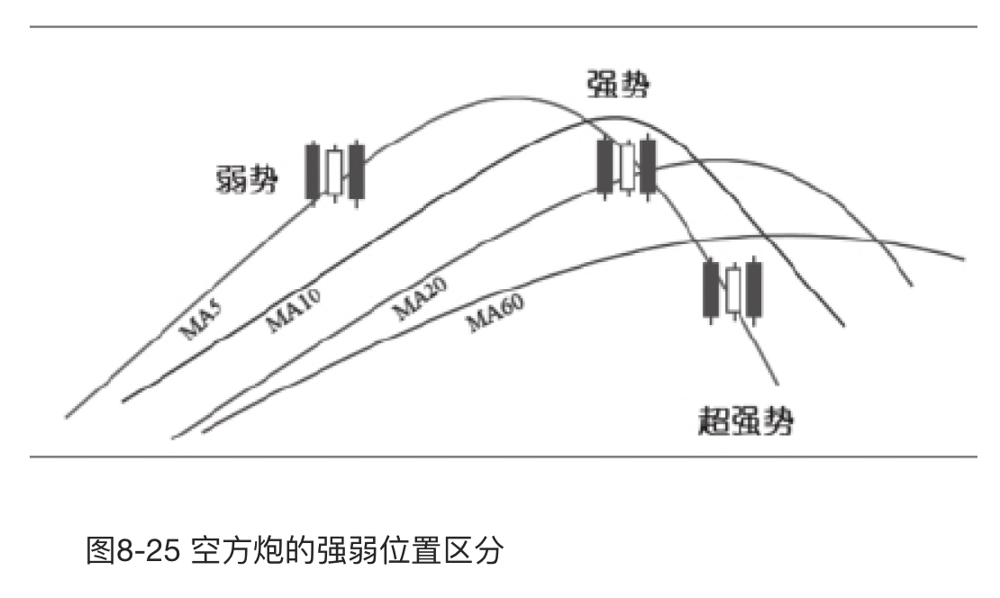

在图中的中间位置的空方炮收在MA20均线之下，较短周期的三条均线形成了价压，并且即将形成空头排列，短线的平均卖出价格已经处于空方炮之上，这是市场反转向下的位置，属于强势空方炮。强势空方炮通常会伴随着成交量放大现象。

在图中最右侧的空方炮发生在MA60均线之下，所有均线都在向下移动，这时的中长期平均卖出成本都已经处于上方位置，近期进场的绝大多数交易者都处于亏损状态。这里通常是放量跌破前期调整低点的位置，这个位置发生的是超强势空方炮。这时止损盘大量涌出，有大量筹码在不计成本抛出，他们只想暂时离场。

空方炮的构成形态和所处位置都很重要，把握好这两个关键点有利于在有优势的点位离场。我们通过配合量价特征来进行综合判断，能够大大提高对离场位置判断的准确率。

图8-26显示的是东旭光电的日线图，我们利用空方炮来判断卖点。我们在图中用数字标出了关键K线，以下是对这些K线的说明。
1. 涨停，开始放量，并站上MA60均线。
2. 高开假阴线，缺口被补上，收盘在前日阳线之上。
3. 跳空低开长阳线，K线1~3形成多方炮形态，这是买入信号。
4. 涨停，放量创出新高。
5. 跳空高开的射击之星，顶部反转K线形态，放出巨量。
6. 跳空低开的长阴线，K线4~6构成弃婴形态，预示即将发生反转。
7. 高开小实体阳线。
8. 跳空高开长阴线，K线6~8形成一个空方炮，首次产生卖出信号。
9. 与后面的两根K线再次形成一个空方炮，发生在价压之下，再次产生卖出信号。

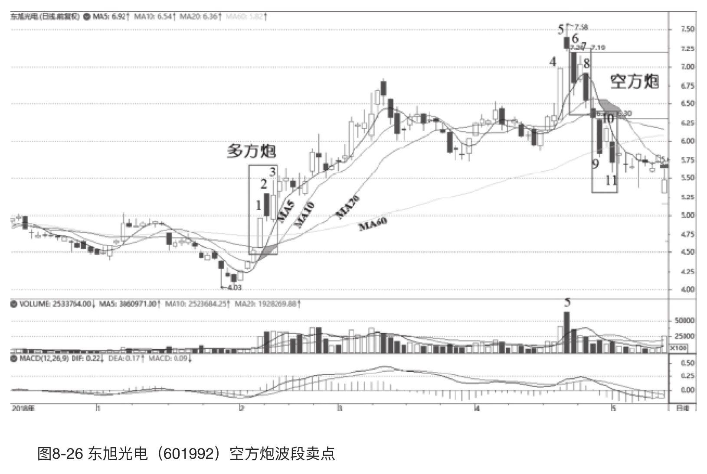

我们仍然以突破MA60均线的多方炮作为买点，同时DIF线向上突破0轴也验证了买点的可靠性。买入之后，股价向上运行，MACD指标一直运行在0轴之上。

当该股到达第一个空方炮时，MACD指标形成顶背离，价格创出新高，指标未能同时创出新高。顶部的弃婴形态和巨量阴线都是顶部反转信号。我们在第一个空方炮的第三根K线收盘前离场，通过这次波段操作可以获得30%左右的盈利。

卖出之后，在第二个空方炮发生时，均线形成了价压形态，并且DIF线开始进入0轴之下，这也验证了卖点的正确性。在图中的连续两个空方炮使股价跌破前期调整低点，并且收在MA60均线之下，这说明中长期的平均卖出价格已经处于当前股价的上方，这对股价形成了压力，这时股价运行阻力最小的方向是向下移动。在见顶之后，股价需要一段时间来消化套牢盘，通过在低位进行充分换手，把市场平均持股成本降下来之后，才有可能再次发动上涨行情。

## 价托和多方炮
在股票的底部区域，均价线通常会形成一个三角形的价托，这种图形说明股价受到了多条均线支撑，对价格产生了托举的力量。价托阻止了股价继续下跌，如果再加上上攻K线形态，那么上涨的概率将会进一步提高。

经过调整的股票，在低位价格区间经常会出现多方炮形态，通过这种有力量的K线组合来向上脱离均线。两阳夹一阴或者两阳夹两阴是稳步上攻的节奏。通常，第一根阳线向上突破，第二根阳线积蓄力量，第三根阳线再创新高，如图8-27所示。

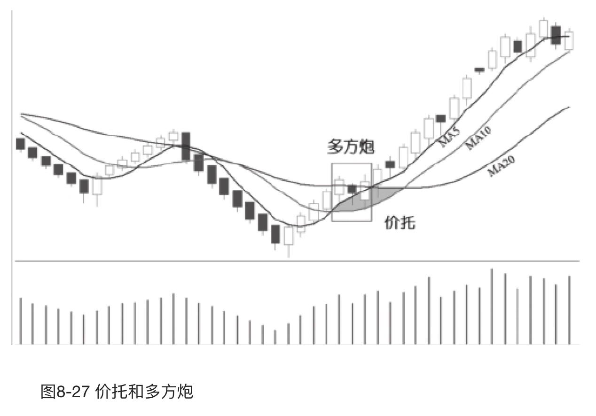

从价托和多方炮的示意图上可以看到，当多方炮站上价托时，说明中短线的交易者都开始盈利，股价经过长期受到空方压制之后，第一次从水下浮到水面，多头得到了喘息的机会。

股价在MA20均线上出头之后，多方开始占据优势。多方炮的第一根K线是放量长阳线，第二根K线受到抛压回落，第三根K线多头再次上攻，收盘在之前的阴线之上。这样的形态会使空头很难受，在双向交易的品种中，多方炮之后，可能会对空头进行轧空，迫使空头只能追高才能平掉空单。

当多方炮正好形成在价托上方时，继续下跌的可能性比较小，伴随着成交量明显放大，在多方炮之后通常会产生向上跳空缺口，如果正好遇到前期高点，往往会放量突破这个压力位，打开上涨空间。

图8-28显示的是在个股丽珠集团上利用价托和多方炮在底部买进的波段操作实例。我们在图中分别标出了价托和多方炮的位置。

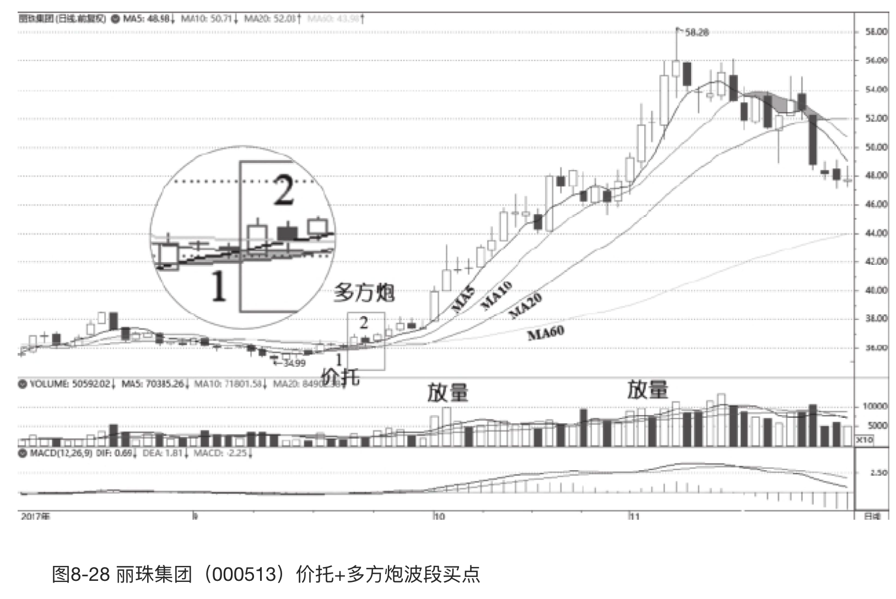

该股票在位置1处先进入了价托区间，MA5、MA10与MA20均线形成一个封闭的三角形。在进入价托的第三个交易日，在价托上方形成了一个多方炮上攻价格形态。

在多方炮的第一根阳线，不仅站上了MA60均线，而且同时向上穿越了MA5、MA10和MA60均线，均线发生粘合之后，往往形成均线的发散。这就如同是BOLL指标的收口和开口的道理一样。

图中价托的宽度为5根K线，其中后3根K线是多方炮。多方炮之后该股开始明显放量，量价配合同步。各条均线之间的夹角开始逐渐增大，这说明上涨的力量开始增大，上涨速度开始加快。

## 价压和空方炮
在股票的顶部区域，均价线通常会形成一个三角形的价压，这种图形说明股价受到了多条均线的压力，对价格产生了打压的力量。价压阻止了股价继续上涨，如果再加上向下突破的K线形态，那么下跌的概率将会进一步提高。

经过冲顶阶段的股票，在高位价格区间经常会出现空方炮的K线组合，股价通过这种有力量的下跌组合来向下脱离均线。两阴夹一阳或者两阴夹两阳是稳步下跌的节奏。通常，第一根阴线向下突破，第二根阳线积蓄力量，第三根阴线再创新低，如图8-29所示。

从价压和空方炮的示意图上可以看到，当空方炮收在价压之下时，说明中短线的交易者都开始亏损，股价经过长期受到多方主导之后，第一次从水面之上沉到水下，空头得到了喘息的机会。

股价在MA20均线下方出头之后，空方开始占据优势。空方炮的第一根K线是放量长阴线，第二根K线受到支撑反弹，第三根K线空头再次反扑，收盘在之前的阳线之下。这样的形态会使多头非常难受，在双向交易的品种中，空方炮之后，可能会对多头进行倾轧，迫使多头只能不顾价格平掉多单。

当空方炮正好形成在价压下方时，继续上涨的可能性已经很小，伴随着阴线成交量明显放大，在空方炮之后通常会产生向下跳空缺口，如果正好遇到前期低点，往往会放量跌破这个支撑位，打开下跌空间。

图8-30显示的是在个股丽珠集团中利用价压和空方炮判断卖点的波段操作实例。我们在图中分别标出了位于底部的价托、多方炮，以及位于顶部的价压、空方炮。

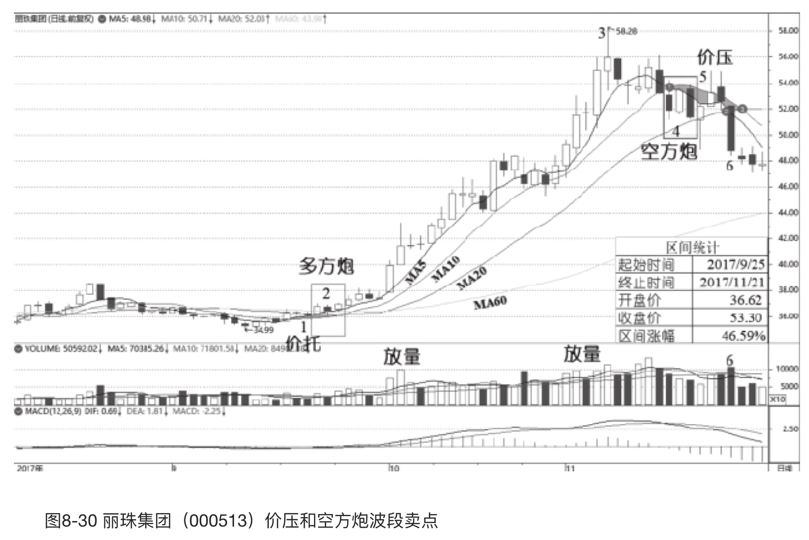

在价托加多方炮买入之后，该股放量突破前期高点，多条均线形成多线开花形态。此后，股价一路上涨，MACD指标一直运行在0轴之上，中间有一次DIF线回测不过DEA线。在位置3之前的3根K线在价格高位构成了一组强势多方炮，在3处是射击之星顶部反转形态，预示着价格即将见顶。

位置4标出的三根K线是空方炮，同时进入价压区间，并且MACD指标发生了死叉，位置5是合理的卖点，短期均线向下拐头，形成价压中的回抽。这是空方炮后的出逃机会。

位置6处的低开长阴线，不仅跌破了前期低点，而且使MA5向下穿越MA20均线，促使价压最终形成封闭空间，这也就封闭了上涨空间。均线在价托处互相靠近，在形成价托之后再次向下发散，这说明市场平均卖出成本在不断降低。

图中的价压宽度为8根K线，交易者有充足的时间准备离场，虽然在价压区域之上的K线上影线说明回抽短暂而急促，只有很短的逢高离场时机，但在价托区域之内为我们提供了足够的离场时间。利用价压和空方炮作为卖出依据，我们在这段行情中可以获利46%左右。

## 均线三线开花
在一个完整的熊市和牛市循环周期中，不管是在哪种行情级别中，各条均线都会经历向下发散—向下收敛—向上发散—向上收敛的循环过程。当在行情底部时，较短周期的均线分别与较长周期的均线形成黄金交叉，带动长周期均线改变方向并向上移动，比如，10日均线先行向上拐头，然后向上穿越20日均线，带动20日均线向上拐头，依此类推。最终周期最长的一条均线——250日均线也会由逐渐走平变为向上拐头，这时在各条均线之间就形成了发散状态，也就是常说的“`三线开花”`或“多线开花”，由此可以判定市场完成反转。在行情顶部的情况则正好相反。

三线开花通常选择由短期、中期和长期三条均线组成的均线组，均线的周期越长，反应越迟钝，形态的可靠性越高；均线的周期越短，反应越灵敏，形态的可靠性越低。例如，可以由20日均线（月线），120日均线（半年线）和250日均线（年线）组成一个用于长线操作的均线组；由10日均线，20日均线和60日均线组成一个用于中线操作的均线组，如图8-31所示；由5日均线，10日均线和30日均线组成一个用于短线操作的均线组。

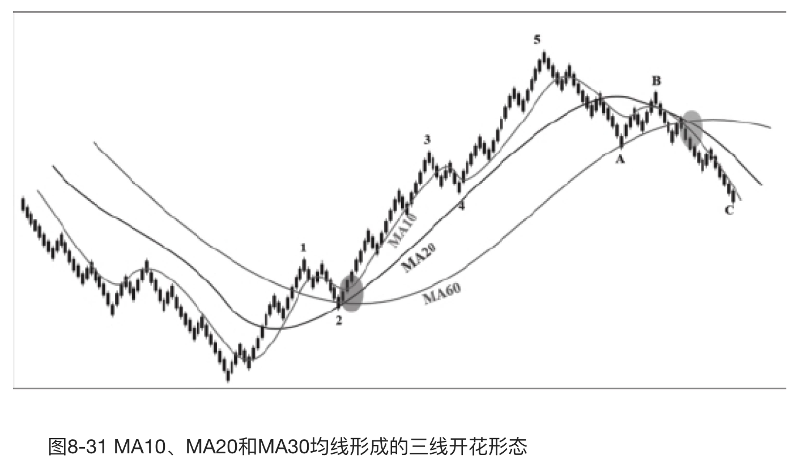

**低位向上移动的三线开花买点**

下面我们以适合中线操作的均线组为例，对买点和卖点位置进行详细说明，我们先看买点，如图8-32所示。三条均线分别为MA10、MA20和MA60。

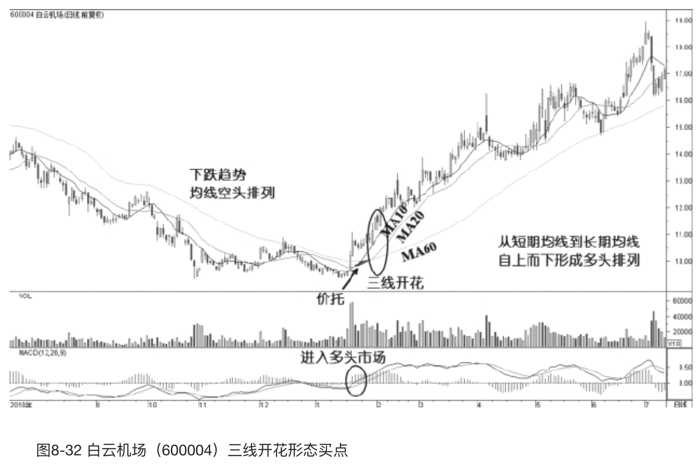

在图8-32中，该股前期一直处于下跌趋势，虽然MA10均线与MA20均线发生了两次黄金交叉，但它们并没有向上穿越MA60均线。直到图中用圆圈标出的位置，该股先是放量站上所有均线，然后MA10向上穿越MA20均线，最终MA20向上穿越MA60均线，形成向上开口的三线开花形态，表明市场确立了多头趋势。

只要三条均线保持向上移动，可以利用多种技术进场。为了防止价格调头向下，可以将止损设置在价托附近。在发生三线开花形态之前，必然会先出现价托形态。这是因为在三条均线中，短期均线率先向上穿越另外两条均线，而中期均线要等几个交易日之后才会向上穿越长期均线。这样，三条均线从收敛到发散的过程中，就会形成一个由均线形成的封闭空间，即`价托`。

三线开花形态之后，该股的均线继续保持多头排列，股价不断上涨，最终走出一波中期上涨行情。以MA60均线作为长周期均线，既不会太过迟缓，也不会太过灵敏。虽然MA10均线与MA20均线会发生多次交叉，这会给短线交易者造成一定困扰，但利用MA60均线的过滤作用，能够有效过滤掉市场噪音，让中线交易者提高进场信号的可靠性，并更好地跟踪趋势。

**高位向下移动的三线开花卖点**

我们继续以白云机场为例来说明波段高位时发生向下开口的三线开花的情况，如图8-33所示。

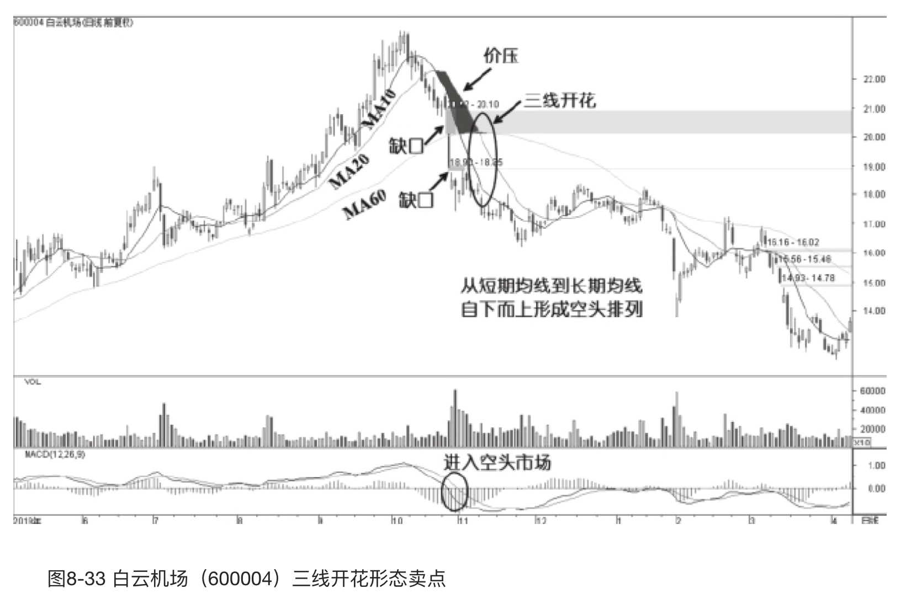

图8-33显示的是图8-32上涨行情之后的情况。该股经过长期上涨之后，放量跌破所有均线并产生了一个较大的向下跳空缺口，然后MA10向下穿越MA20均线，最终MA20向下穿越MA60均线，形成向下开口的三线开花形态，表明市场确立了空头趋势。

在形成三线开花形态之前，在顶部同样先形成了价压形态。由于这次价压形态的宽度较大，达到了12个交易日，当MA20向下穿越MA60均线时，已经是MA10与MA20均线处于下叉之中的第13个交易日，所以按照三线开花离场会失去较多的顶部利润。有经验的交易者会在形成价托并且MA60线走平时开始离场，从而保住更多利润。

借助MACD指标的DIF线和三线开花形态互相验证，再加上顶部放出的巨大成交量，可以判断出市场大概率会发生反转。顶部的两个向下跳空缺口更是对多头的强力打击。三线开花形态之后，MA60均线一直向下移动，股价产生大幅下跌。

**三线开花形态的应用要点**
1. 均线周期越大，对趋势的判断越可靠。但当以250日均线作为长期均线并形成反转形态时，行情可能已经反转了相当长的一段时间，这会导致错过好的进场和离场位置。
2. 第三条均线的周期越大，买点和卖点越往后移。
3. 三条均线各自的方向同样可以作为过滤条件。
4. 三线开花的方向和角度都很重要。方向向上时为多头市场，方向向下时为空头市场。均线之间的角度越大，说明行情发展的速度越快，动量越大。
5. 注意形态发生的位置，可以配合其他技术指标提高判断的成功率，比如K线形态、成交量、MACD指标等。

# 波浪理论主要买入位置的优势与劣势
## C浪末端位置
在C浪末端时的指标形态特征为，长期与短期均线呈空头排列并且向下移动，MACD指标的DIF线与DEA线在0轴下方形成死叉并向下移动，MACD绿柱线不断变长。这时市场处于下降趋势，是在波谷左侧买进，要说明的是，这不符合右侧交易者的进场理念。

利用一些K线和成交量的特征形态会提高买入的成功率，我们总结的抄底原则如下：

**买入原则**

**1.放量的长阴线之后**

我们进行抄底是在利用市场的失控或者说是在利用其他人的错误获利。市场在下跌过程中总是从犹豫不决开始到制造恐慌结束。下跌之初，多头抱有继续上涨的希望，到下跌过程中，多头已经失去了好的离场机会，等到多头感到无法挽回败局时，往往在波段低位割肉出局。

下跌行情跌透的一个标志是出现放量的长阴线，原来坚守多头的筹码在这根K线进行大量换手，市场情绪达到了绝望的顶点，市场距离阶段底部也就不远了。在长期熊市中，底部的形成可能需要很长时间，直到磨出地量之后才开始新的一轮上涨行情。

**2.发生背离**

抄底操作的原理是在市场跌过头之后，价格倾向于向上弥补跌过头的空间。如何判断是否跌过头了呢？背离就是一个很好的方法，这包括价格与成交量的背离以及价格与指标的背离。换句话说，就是价格严重偏离了正常区间，后面容易回归到正常区间。

**3.形成较长的下影线**

长下影线一直是我们关注的一种K线形态，它说明当日虽然跌幅较深，但到收盘前却收复失地，多头力量明显增大。带有长下影的阳线要比阴线更强势一些。

若能抄底在下影线，这无疑是一个非常有优势的进场位置。相反，如果买入后收盘形成一根光脚阴线，那么后面的短线走势就非常不看好。

**4.快速脱离成本**

不管是股票还是实物商品，通常都很难在低价买到，尤其是优质的股票或高性价比的商品。如果在你买入的价位反复出现再次买进的机会，那么这很可能不是一个好的短线买点。值得注意的是，在一定间隔之后再回到买入价位的情况，比如，在开仓后的10根或20根K线之后，价格仍徘徊在成本价之下，那么短线就要考虑卖出。

我们举例来看C浪末端买点的情况，如图9-1所示。图中的平安银行在5月和6月期间走出了C浪，呈5浪下跌的形态，通常大级别的下降趋势都不会一蹴而就。这时的10日均线连续向下移动，MACD指标运行在0轴之下，表明处于明显的空头市场。

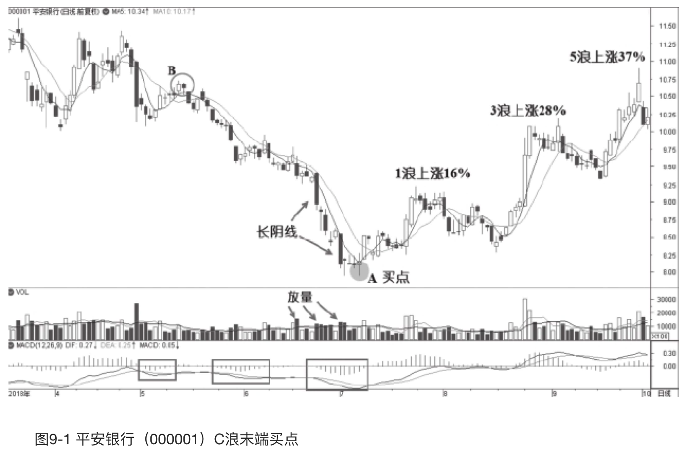

在MACD指标图标出的三个方框中，MACD绿柱线有三次明显的发散过程，表示股价发生了三波下跌。在第三个方框中，出现了放量的长阴线，表明市场的悲观情绪达到了顶点，多头开始大量割肉。这时的DIF线达到了历史低位，同样表明市场下跌的强度达到了非常高的水平，市场严重偏离正常水平，后面很可能会修复这种情况。

当绿柱线开始收敛时，该股在A处标出的K线（2018年7月6日）再次下探前低7.95元附近，这时可以轻仓介入，尝试抄底，这是一个风险回报比较高的位置。低位买进之后，该股逐步回升，当日收出了一根带下影的小实体阳线，绿柱线仍在向上收敛，目前修复走势发展良好。

买入次日，该股走出一根光头的中阳线并站上了10日均线，快速远离买入成本，这是对买点最有力的确认。很快该股站稳10日均线，MACD红柱开始发散，即DIF线与DEA线发生了金叉，当红柱线达到较长水平，短线交易者可以获利了结，收获第1浪16%左右的涨幅。

**C浪末端买点的优势**
1. 位于底部位置，盈利空间更大，可以快速实现利润。
2. 在有利位置建立底仓后，加仓时在心理上更容易执行，持有到3浪以上可以产生丰厚利润。
3. T+0的交易品种有更多短线差价机会。

**C浪末端买点的劣势**
1. 属于左侧交易，上升趋势尚未确立，可靠性不高。
2. 下跌浪末端波动幅度大，容易产生大幅止损。
3. 阶段底部可能暂时止跌，由于上涨阻力大，反复低位震荡。
4. 盈利预期较低，难以实现长波利润。
5. 遇到大熊市或个股基本面变差时，容易抄在半山腰，可能在进场后出现多个下降的波谷。

## 1浪初始位置
随着股价站稳10日均线，5日均线与10日均线形成向上的金叉，预示着趋势开始转向多头占优。如果后面的行情能够走出上涨3浪或5浪的话，这个位置的效率还是比较高的，而且也是一个容易识别的上升波段的起始位置。

如果发生金叉之后，股价连续上涨了8根K线，根本没有合适的进场时机，然后开始回撤到10日均线之上，这时你是选择在10日均线上逢低买入，还是放弃这次机会呢？

假设你选择在MA10均线上买进，这看似是符合原则的，但一波上升行情经过了7根以上K线的连续上涨之后，通常会开始短线调整，即使你在MA10均线上也是追高，所以如果想买入也要等待2浪调整结束时再考虑进场。更稳健的交易者可以等待下一个金叉时再做决定。

在第1浪买入之后，成交量需要温和放大，第2浪调整不应有效跌破买入成本。在1浪初始位置时的指标形态特征为，短期与长期均线开始向上移动，MACD指标的DIF线与DEA线在0轴下方形成金叉并向上移动，MACD红柱线不断变长。这时市场处于反转之初，这是右侧交易的首个买点。

**买入原则**

**1. 经过了充分调整**

一波新的趋势起始于一波充分的调整之后，那么调整到了哪种程度才算达到充分呢？这可以从时间和空间上来衡量。价格完成一波三浪下跌，通常要30至50根K线。例如，由反弹B浪连接两波15根K线左右的下跌浪，这样，如果B浪是10根K线，那么整个三浪下跌就是40根K线左右。从空间上来看，调整幅度应该达到前一波上涨幅度的50%～60%左右，这时大概率已经调整到位。

通过指标来看，如果DIF线在0轴之下经过了一波三折，即MACD柱状线出现三次绿柱线发散之后，通常认为这次下跌已经达到了充分调整。DIF线在较低位置经过一次背离，也可以认为达到了充分调整。

**2. 5日均线与10日均线明显金叉**
   
在连续的下跌过程中，有时会出现MA5与MA10均线粘合走平的情况（从数值上看，MA5>MA10），这说明上涨力道不足，如果上涨势头猛烈，MA5均线一定能向上远离MA10均线，使得两条均线之间产生明显差距。

交易者可以利用类似的过滤条件来约束自己的开仓，以此来提高成功率。往往有一些看似十分相近的开仓条件，却能使交易成绩产生巨大的差别。

**3. 10日均线向上移动**

这是比MA5与MA10均线的金叉更加可靠的看多条件。MA10线向下移动时能同时发生金叉吗？当然可以，当反弹的价格不够高，反弹又很快速时，价格仅能带动MA5均线上穿MA10均线，但并不能改变MA10均线的方向。
交易者应该会发觉，越是严格的开仓条件，越不容易触发开仓信号，但通常也越可靠，当然这需要的是适当的严格，不能太久也不产生一次信号。

**4. 金叉或10日均线向上的短期之内**

我们都知道，股票的上涨是有自身节奏的，最初的最佳开仓位置往往就在一两根K线之间，一旦错过就容易陷入追高或踏空的境地。尤其对于短线交易者而言更是如此，一波短线上涨行情的空间只有那么大，当市场急速接近目标位之后，这一波的参与价值也就很小了。

**5. 关注更大级别的趋势**

一些短线交易者很容易陷入小级别的追涨杀跌之中，正应了那句话：“一顿操作猛如虎，定睛一看原地杵。”周期越大越稳定，1分钟K线图上的1浪初始位置买点肯定不如日线上的同类买点稳定。

在T+0的交易品种中，大一级别处于上升趋势的背景下，做多的成功率会更高，因为在上升通道中，上涨浪的数量和长度都会高于下跌浪。

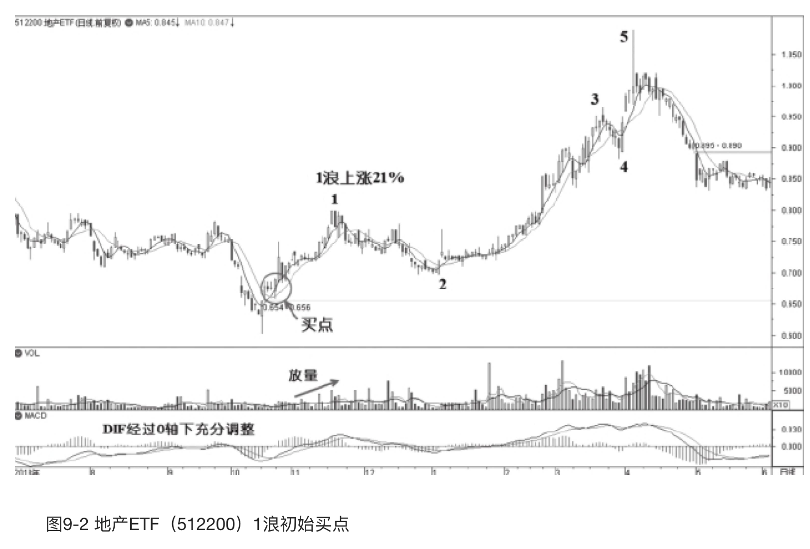

该基金在10月份出现了一波跌破前期低点的连续下跌，在下跌浪末端产生了一根带长下影线的光头阳线，这是一个看好的迹象，说明多头力量在短线开始占优势。随后，该基金的MA5与MA10均线形成金叉，这个位置就是1浪初始位置的买点。这时短线已经进入多头市场，属于右侧交易的首个买点。

在图中圆圈标出的四根K线都是进场时间窗口之内，激进的交易者可以在开盘价附近买入，以防止快速拉升的情况，稳健的交易者可以等到价格回落到MA10均线附近并且MA10均线向上拐头时买入。

买点之后，该基金开始形成量价齐升的局面，MACD红柱线不断发散，最终1浪的涨幅达到了21%，短线交易者至少应该能抓住15%以上的利润。这次的1浪同样突破了前期高点，然后开始回落，有经验的交易者会在放量突破前高时减仓，而这里其实正是做突破的交易者可能进入假突破陷阱的位置。

**地产板块个股华联控股与地产ETF的比较**

在同一个板块中的个股经常会表现出齐涨齐跌的同步波动，这是板块效应的作用。我们经常会在市场上听说一些有集体表现的行业板块，比如券商板块、医药板块、科技板块、有色板块、酿酒板块、地产板块等等。下面我们来比较一下，地产板块中的一只比较强势的个股与地产ETF基金的走势，如图9-3所示。

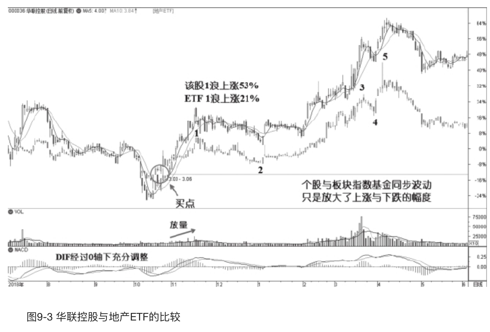

在图中我们换用百分比坐标来对两个品种进行比较，只需在地产股华联控股中叠加地产ETF基金，交易者可以亲手在软件上试验一下叠加品种功能。

由于节奏相同，在1浪起始位置的波段买点，两者同时进入买入时间窗口，即图上标出的买点位置。买点之后，该股连续上涨，MACD红柱线明显发散，最终1浪上涨53%，这要比地产基金21%的涨幅高出一倍多。做强势股或龙头股的交易者会获得远远高出平均水平的盈利。不过，需要注意的是，当个股下跌时，它的下跌幅度同样会放大很多。

**1浪初始位置买点的优势**

1. 趋势开始反转，有一定的可靠性。
2. 位于上涨波段初始位置，盈利空间较大。
3. 如果做错，有一定的止损时间，容易离场。
4. 有利于持长，加仓时在心理上更容易执行，持有到3浪会产生丰厚利润。

**1浪初始位置买点的劣势**

1. 有可能遇到只有一浪反弹的情况，然后再次回到下降趋势。
2. 如果止损不及时仍然容易产生较大止损。
3. 有时2浪回调较深，如果在1浪追高买进有可能被迫止损。

## 2浪末端位置
在波浪理论中，2浪调整的低点不应超过1浪的起点，否则就成了下降趋势。当你对反转比较确定时，2浪末端是顺大势的低吸位置。通常在1浪上涨时均线首次黄金交叉的价位之上就会停止2浪回调，2浪的波谷在这个位置之上的距离越高，说明多头越强势。

2浪调整有时呈一浪调整形态，有时呈三浪调整形态，也就是复杂形态。通常，2浪和4浪会交替形成复杂形态，如果2浪是复杂的，4浪多数情况是简单的，如果2浪是简单的，4浪多数情况是复杂的。

如何分辨是否会形成复杂的2浪呢？这没有确定的方法，就经验来看，如果前面下跌趋势持续时间长，下跌幅度大，则容易出现复杂形态的2浪；如果1浪上涨幅度大，则也容易出现复杂形态的2浪。如果分辨不清的话，最好认为2浪末端在1浪上涨幅度的半分位以下。

2浪末端应该呈缩量状态，在2浪末端位置时的指标形态特征为，MA5与MA10均线处于死叉状态并向下移动，MACD指标的DIF线与DEA线在0轴上方形成死叉并向下移动，DIF线在0轴附近止跌，MACD绿柱线不应太长，并在0轴附近徘徊。多头在积蓄力量，准备发起二次金叉。

**买入原则**

1. **2浪末端不能低于1浪起点**。2浪调整不能低于1浪起点，这是波浪理论的铁律之一，否则就形成了向下推动浪。2浪长度通常是1浪长度的0.382或0.618倍。同样，从时间上来看，2浪的调整时间也不应过长，否则就破坏了形态比例。
2. **DIF线在0轴附近**。这表明多头仍占优势，它是对1浪的调整，并为3浪上涨做准备。
3. **成交量逐渐缩小**。价跌量减是上涨趋势中整理形态的量价特征，当1浪已经突破前期高点时，2浪是对突破的夯实。意思是说，在2浪末端之后的很长时间之内，价格都难以回到这个价位以下。
4. **复杂的2浪之后仍是买点**。在持续时间较长的下降趋势之后，经常会形成复杂的2浪，并在2浪结束之后形成气势如虹的第3浪上涨。复杂形态的2浪由a-b-c三浪构成，它要比单浪调整更彻底。

我们来看一个在2浪末端位置的买点示例，如图9-4所示。图中显示的仍然是地产ETF基金，在1浪突破前期高点之后，该基金开始进入2浪调整，并走出了复杂形态，由a、b、c三浪构成。在c浪末端，成交量极度萎缩，根据a浪与c浪长度相似的原理，可以判断c位置可能是2浪末端，并产生如图所示的买点。

由于DIF线的重心在0轴以上，所以这是一个在多头趋势中的逆小势买点。虽然价格没有向上突破，但MACD绿柱线在收敛，这说明跌势在减弱，按照惯性原理，再出现红柱时可能就是第3浪上涨。

一些新手容易在1浪放量时追高，他们也更容易在2浪末端止损离场，他们交出筹码之后，可能马上开始上涨。所以一些新手感觉自己的账户好像被主力监控一样，一买就跌，一卖就涨。

图中的买点之后，该基金稍做调整，然后开始明显放量上涨，走出了一个长波的3浪，涨幅达到36%，拿到最后的交易者至少应该能抓住30%以上的利润。

**2浪末端买点的优势**
1. 属于顺大势逆小势的买点，盈利空间较大。
2. 在做对的情况下，很快会在第3浪产生大量利润。
3. 在出现明显的底部特征之后，2浪是效率很高的买点。

**2浪末端买点的劣势**
1. 有可能跌破前低，然后再次回到下降趋势。
2. 继续向下突破时容易产生较大止损。

## 3浪初始位置
在波浪理论中，3浪通常是最强势的一浪，成交量最大，波段最长。经过2浪测试前低，确认得到支撑，3浪的可靠性进一步提高，向上的概率也较大。俗话讲，吃鱼只吃鱼身，把头尾刺多的地方留给别人。第3浪上涨就是这个“鱼身”，MA5与MA10两条均线形成一个向上的带状，这是一波明显的上升趋势。

在指数、指数型基金或者流动性十分好的品种中，波浪理论更适用，在一些容易被操纵的品种中，主力资金可能通过连续拉升产生不很规则的向上推动浪，尤其是在大盘向好的背景之下。另外，还有一些非常优质的大牛股，几乎每年都会创新高，比如像贵州茅台这样的股票，由于他们筹码稀缺，也往往容易持续产生向上推动浪。这类股票，在一个3浪初始位置的买点进场之后可以持有很久。

随着买入条件越来越严格，产生信号的频率会降低，胜率会提高。假设有如下两种方法，你会选择哪一种呢？一种方法平均一周出现10次买入信号，胜率是40%，平均盈利4次亏损6次，另一种方法买入条件更严格，平均一周出现5次买入信号，胜率是60%，平均盈利3次亏损2次。假设盈亏比相同。我们宁愿选择后者，利用仓位管理，在盈利的交易上下大赌注。同时，还可以减少交易成本。

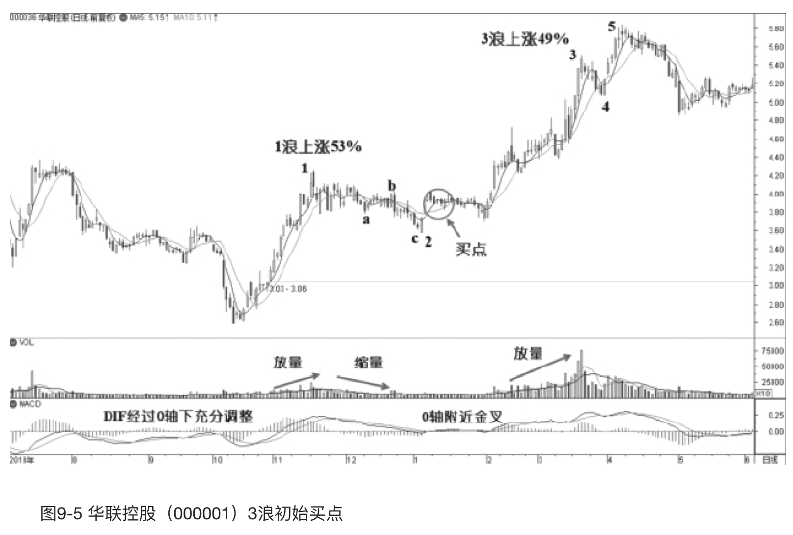

3浪初始位置买入之后应该呈价涨量增的状态，在3浪初始位置时的指标形态特征为，MA5与MA10均线处于金叉状态并向上移动，MACD指标的DIF线与DEA线在0轴上方附近形成金叉并向上移动，DIF线不断走高，MACD红柱线不断发散。

3浪初始位置的买入原则与1浪初始位置时相似，包括5日均线与10日均线明显金叉（或DIF线与DEA线明显金叉）；10日均线向上移动；金叉或10日均线向上的短期之内。注意，成交量应该明显放大。

由于地产股华联控股与地产ETF基金是同步的，这次我们来看一下3浪初始位置买点在个股上的表现。该股经过2浪调整之后，MA5与MA10均线再次形成金叉并且MACD指标在0轴附近发生金叉，这个位置是3浪初始买点。

买点之后，该股又横盘调整了较长时间，然后才放量快速拉升，3浪走出了延长浪。在买入时，有交易者会注意到，虽然均线的金叉非常明显，但DIF线与DEA线粘合在了一起，只有很小的差距。对于这种情况，可以等它们形成明显金叉时再买进，也就是MACD红柱线达到一定长度时，以此作为过滤条件。

该股在3浪末端出现了天量，成交量是平时的数倍之多，这种量价形态预示着3浪即将或已经达到顶峰。该股的第3浪涨幅达到49%，高于地产ETF基金的36%。

**3浪初始买点的优势：**
1. 属于顺势买点，通常会走出最强的一浪上涨。
2. 在做对的情况下，很快会产生大量利润。
3. 由于2浪进一步确认了底部，这是成功率更高的买点。

3浪初始买点的劣势：
1. 有一定概率遇到反弹形态（下降趋势中的宽幅调整），这时的3浪盈利空间不大，通常与1浪等长或者在1浪高点附近停止向上。
2. 当多头力量很强时，有时不会产生回调买点。

我们来看一个日线图上的短线3浪初始位置买点的例子，如图9-7所示，该股经过快速大幅下跌之后，开始发生反弹，这是对前面连续下跌的修复。图中这种连贯的下跌走势之后，经常会出现报复性的反弹。

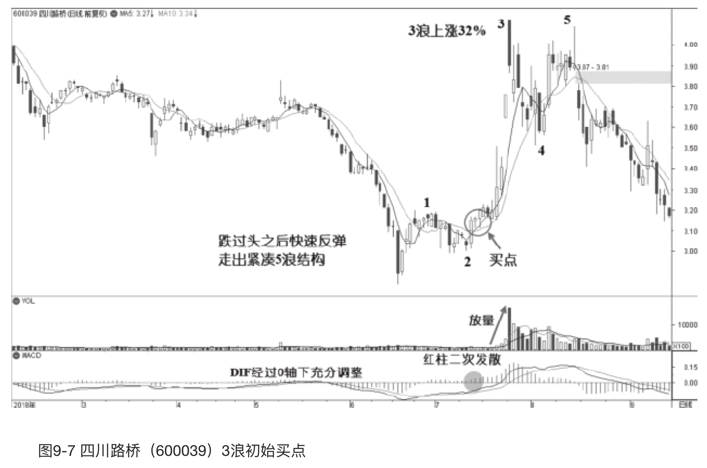

在1浪和2浪之后，MA5与MA10均线发生金叉时产生3浪初始位置买点，如图所示。MACD红柱线发生二次发散，这是由于2浪调整幅度较小，没有形成绿柱线。从风险回报比来看，这个买点无疑很“合算”，以一根K线距离的止损来博取下跌浪创造的整个反弹空间。

买点之后，该股快速拉升，这应该是短线交易者的理想模式，即不用等待太久的报复性反攻。在突破下跌浪起点之后，形成了一根光头长阴线，并伴随着巨量放出，这表明反弹的目标已经达到，主力资金开始大量出货。第3浪上涨了32%，利润主要来源于3根触及涨停的K线。此后该股调整到均线附近又走出了第5浪，然后快速回落，可谓涨也匆匆，跌也匆匆。

这可以看作是5浪上涨形态的快速版本，虽然紧凑，但结构是对的。交易者可以将图9-7与图9-6进行比较，前一张是股票的日线图，后一张是期货的1分钟K线图，它们的内在原理是相同的，这种图形在短线中比较常见，交易者应该多加分析，辨别它们在大级别行情中的不同位置出现的情况。

## 4浪末端位置
3浪捂股才能使利润最大化。

再强的涨势也会有停歇的时候，3浪之后的调整便是4浪。一般来说，4浪之后是冲顶行情，5浪可长可短，有时在3浪波峰之下便反身向下，有时稍稍突破又回落形成头肩顶形态，只有很少时候的5浪会走出延长浪。

通常，2浪和4浪会交替形成复杂形态，如果2浪是复杂的，4浪多是简单的，如果2浪是简单的，4浪多是复杂的。4浪末端位置的买点相对之前的几个买点来说，比较不容易把握。首先，靠近顶部时波动加速；其次，有时会快速杀跌，让人以为上涨趋势已经结束；最后，有时你做到的就是3浪形态的一波小幅反弹，实际上根本不会出现5浪，那么4浪末端其实是新的下跌浪的开始，买入之后很快需要止损。

4浪末端应该呈缩量状态，在4浪末端位置时的指标形态特征为，MA5与MA10均线处于死叉状态，MACD指标的DIF线与DEA线在向上远离0轴的位置形成死叉并向下移动，DIF线在历史高位，MACD绿柱线的持续时间和长度都不应太长。

4浪末端的买入原则与2浪末端时的原则相似，只是发生的位置有所提高，DIF线的位置从0轴附近到了高位附近，4浪待续的时间不应太长，否则容易形成失败的5浪。稳健的交易者在4浪出现后应该适量降低仓位，价值投资者看到顶部形态之后，高抛部分仓位也是合理的选择。

我们再回到地产ETF的例子来看4浪末端位置的买点。由于在之前产生的是复杂的2浪，因此4浪大概率是单波调整。该基金从3浪波峰回落到MA10均线，并跌破了MA10均线，MACD指标由红柱变为绿柱。当股价回到上升通道下轨，回调到MA20均线，或者MACD绿柱收敛时，都可以看作4浪末端买入位置。

买点之后，该股快速放量拉升，形成第5浪上涨。第5浪波峰带有长上影的K线，预示着行情可能发生反转。第5浪的涨幅为23%，冲顶之后连续下跌，并跌破4浪末端，可以确认上涨行情告一段落。

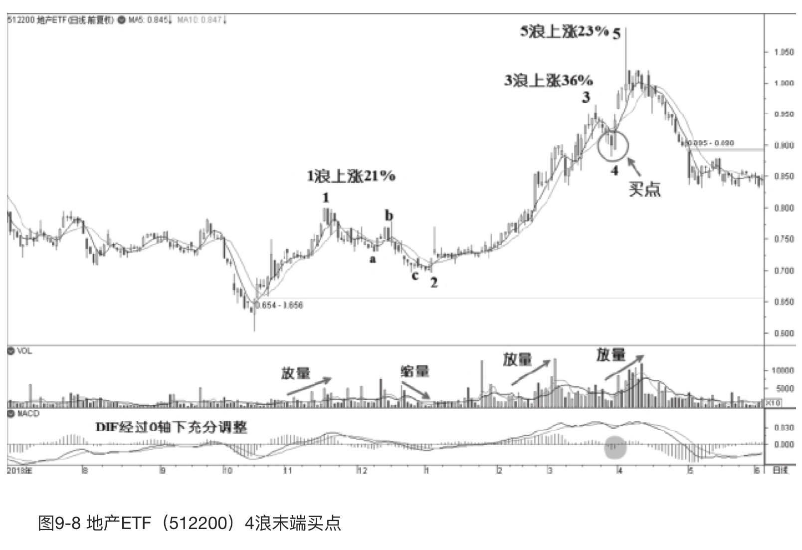

在行情末端，容易产生快速的大幅震荡，这对于短线高手来说可能是好机会，但对于做波段的交易者而言，这是“鱼尾”阶段，重点是做好防守。波浪理论结合量价关系，依据时间和空间上的结构和比例，能帮助我们对一段行情进行定位，“断浪”非常重要，交易者应该仔细琢磨其中的道理。

4浪末端买点的优势：

1. 属于顺大势逆小势的买点。
2. 等到5浪上涨所产生的利润同样可观。
3. 属于明显上升趋势中的回撤，上涨浪此起彼伏，不断向上推动。

4浪末端买点的劣势：
1. 3浪放量过大时，4浪末端买入后可能产生空间不大的背离浪上涨。
2. 4浪可能走出复杂的3浪调整形态，或者产生快速大幅调整，比较难以把握。

## 5浪初始位置
第5浪上涨是多头行情的“鱼尾”阶段，这时的市场多头氛围最炽热，但很多人不知道这是牛市盛宴最后的狂欢，就像那句话说的，狂暴的欢愉必将有狂暴的结局。

新手在牛市中往往会被市场训练成了多头思维，他们没有经历过熊市，会偏执地认为市场终究仍会上涨，但即使是再长的牛市，也有结束的时候，巴菲特说过，只有在退潮的时候才知道谁在裸泳。

对于短线交易者，更要注意不要在第5浪时追高，追线的利润很容易在头部被毁于一旦。聪明的短线交易者会注意量价形态，一旦放出巨量就兑现利润，在头部的被动止损对账户的伤害很大。

5浪初始位置买入之后有时放量有时缩量，缩量上涨是头部特征。在5浪初始位置时的指标形态特征为，MA5与MA10均线处于金叉状态并向上移动，MACD指标的DIF线与DEA线在高位形成金叉并向上移动，DIF线容易形成顶背离，MACD红柱线不断发散，但低于前面波峰时的长度。

5浪初始位置的买入原则与1浪和3浪初始位置时相似，但要注意不在高位加重仓，出现天量时应该止盈。为了防止出现长波的第5浪，可以保留部分仓位等到均线死叉时再卖出。交易者还需考虑，有时第5浪后的A浪会产生快速下跌，并可能导致失去很多的头部利润，这关系到左侧还是右侧逃顶的问题。

我们来看在个股上港集团上运用5浪初始位置买点的例子，如图9-9所示。可以看到，该股走出了波澜壮阔的长3浪，第3浪波峰明显放量，然后完成第4浪的缩量调整。按照4浪与2浪交替产生复杂形态的原则，2浪是复杂形态，4浪大概率是单波调整形态，当股价再次站上MA10均线时，产生5浪初始位置的买点，如图9-9所示。

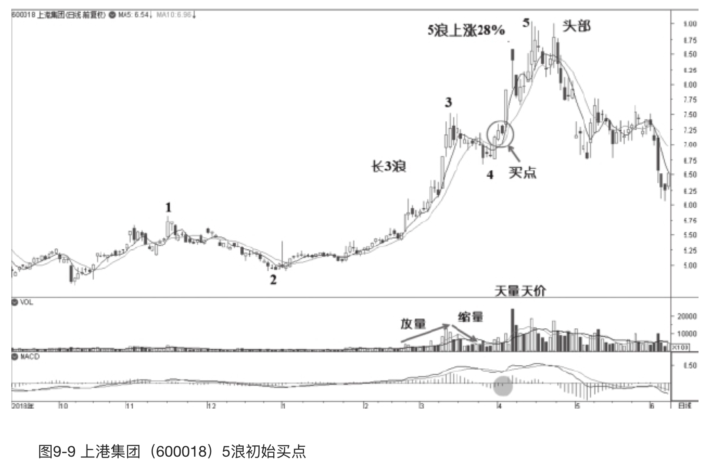

买点之后，该股快速拉升，并且产生了一根天量天价的阴线，这预示着5浪即将完成。经过调整，该股又产生一小波上涨，价格始终在天量K线的高点附近波动。涨不上去就会跌，这是普遍适用的道理，特别是在头部。随后，该股连续回落（A浪），直到4浪末端价位止跌，并开始反弹（B浪），这个位置极可能是头肩顶形态的右肩位置。沿着4浪末端和A浪末端可以画出一条颈线，最终在右侧向下跌破了这条颈线，确认顶部完成。

从MACD指标来看，第5浪时发生了顶背离现象，如果你能从第3浪一直持有到第5浪，在这时不妨开始减仓。本例中的顶部K线形态，包括天量天价、长腿车夫、吞没形态等，都是常见的顶部反转形态。

第5浪上涨用了17个交易日，上涨28%，而A浪下跌仅用了9个交易日就吞没了第5浪的涨幅。后知后觉的交易者容易在快速杀跌时被套牢，在第5浪的高位无疑很难解套，在这个位置时交易者需要谨慎操作。

**5浪初始位置买点的优势**
1. 上涨末段的顺势买点，通常上涨最猛烈。
2. 处于多头氛围最浓厚的牛市，个股轮番上涨。
3. 顶部的量价特征以及顶部K线形态更加明显，顶部通常比底部易于分辨。

**5浪初始买点的劣势**
1. 注意成交量异常放大之后，可能形成顶部。
2. 很少走出平滑上涨的5浪，通常波动剧烈，短线难以把握。
3. 长线交易者在这个阶段不应再加仓，避免仓位头重脚轻。

# 有关量价时空分析的更多话题
## 反转K线形态在价格通道中的位置
**顶部反转形态在通道中的位置**

在上升通道中，由于上轨对价格的压制，当价格运行到上轨附近时，经常会出现一些顶部反转K线形态，顶部K线容易出现长阴线和长上影线。

在图10-1的上升通道中，我们标出了上轨附近的三个波峰位置，这里常见的顶部形态包括射击之星、看跌吞没形态、乌云盖顶、黄昏之星、长腿十字线等。确认顶部形态形成之后，发出短线卖出信号。

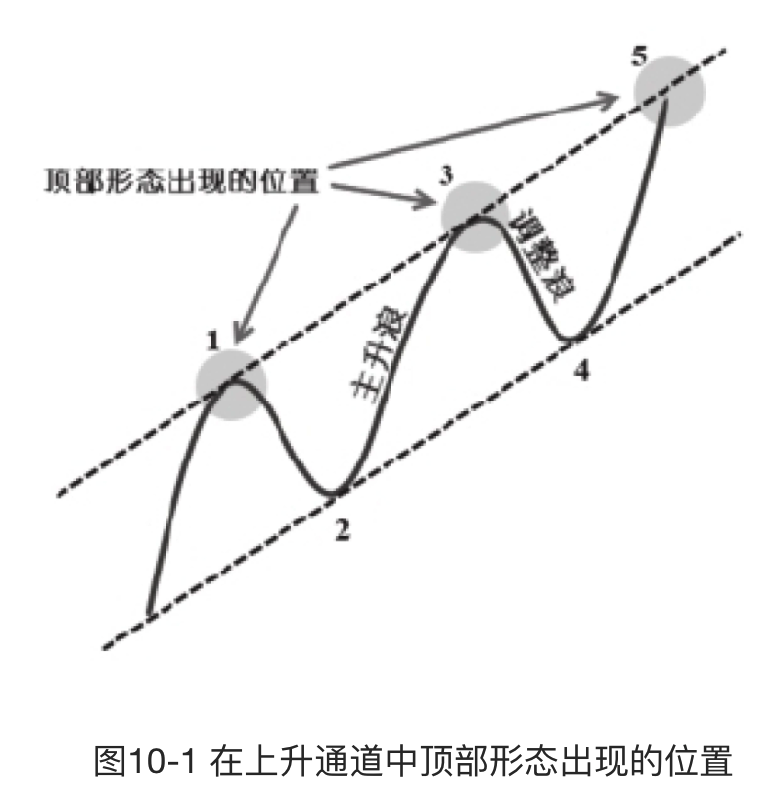

重点需要关注主要趋势末端的顶部反转形态（位置5），当个股经过较长期上涨，MACD持续运行在0轴之上，DIF指标线形成一波三折的图形，这时很可能即将见顶。量价顶背离和指标顶背离都是顶部反转信号。

在图10-2的下降通道中，上轨是反弹行情的压力线，上轨附近形成顶部K线形态时，是多单的离场信号，空单的加仓信号。我们常说顺势而为，在下降通道中，做多没有优势。

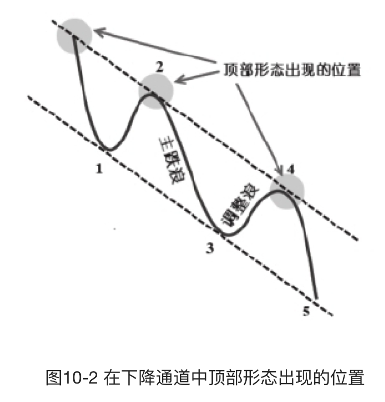

图10-3显示的是太阳纸业的日线图形成的上升通道，该股处于上升趋势之中。在这段行情中，共有4次碰触到上轨（图中用A、B、C、D标出的位置），并且全部因受到压力而形成波峰；还有4次碰触到下轨，前三次均因得到支撑而形成波谷（图中用1、2、3标出的位置），第四次时跌破下轨，开始反转向下。

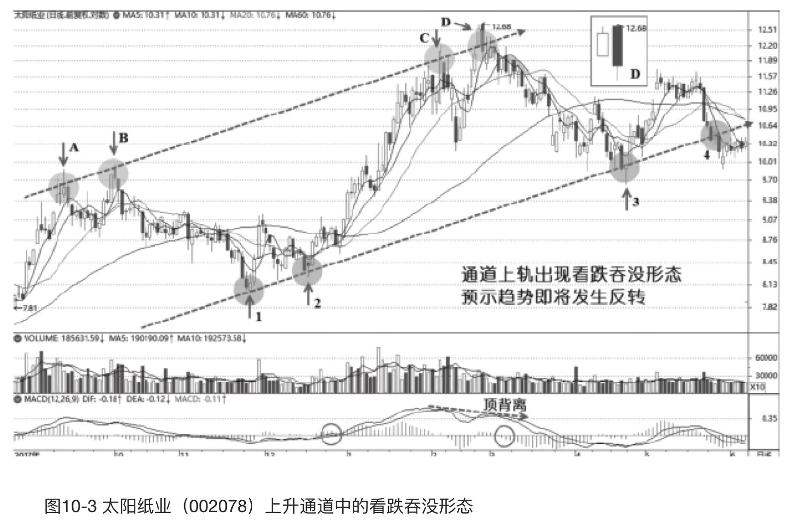

以趋势交易方法来看，位置1和2在下轨附近是买入（或加仓）位置，在位置2之后，MACD指标开始明显向上突破0轴，表示进入多方市场。经过一波连续上涨之后，在位置C和D处先后在碰触到上轨线之后回落，这是波段卖出（减仓）位置。
值得注意的是，在位置D处，露出上轨线的两根K线，第一根是跳空高开的阳线，第二根K线盘中创出新高，但收盘为穿头破脚的阴线，它们组成了看跌吞没形态，预示着趋势很可能发生反转。同时，MACD指标的顶背离增加了卖点的可靠性。

通过量价特征和指标特征，判断出上升趋势进入尾声，当在上轨附近看到顶部反转K线形态时，谨慎的交易者可以适当止盈部分持仓。上升趋势中，最后一次靠近上轨时，经常伴随着量价顶背离和指标顶背离现象，这是市场极度超买状态的表现。

**底部反转形态在通道中的位置**

在上升通道中，由于下轨对价格的支撑作用，当价格回落到下轨附近时，经常会出现一些底部反转K线形态，底部K线容易出现长阳线和长下影线。

在图10-4的上升通道中，我们标出了下轨附近的三个波谷位置，这里常见的底部形态包括锤头线、看涨吞没形态、刺透形态、早晨之星、弃婴形态等。确认底部形态形成之后，发出短线买入（加仓）信号。

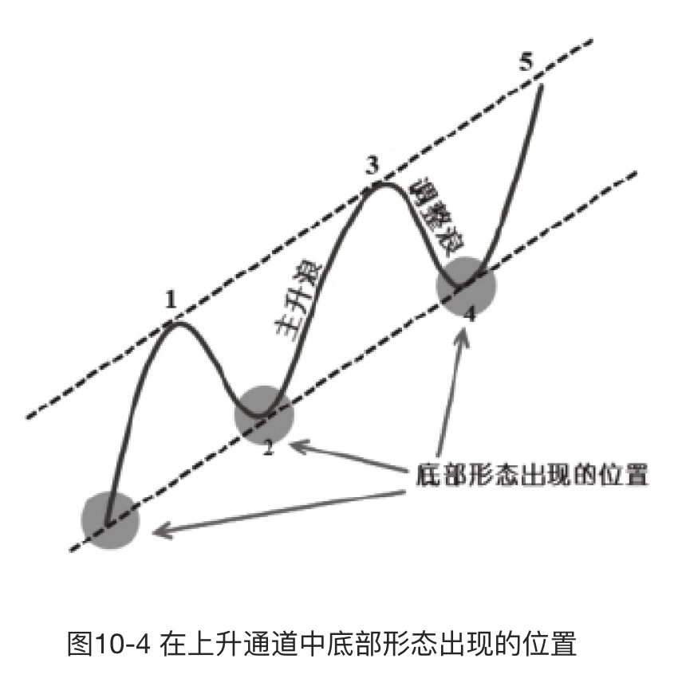

在图10-5的下降通道中，下轨是下跌行情的支撑线，下轨附近形成底部K线形态时，是空单的离场信号，另外，在空头行情不宜做多。

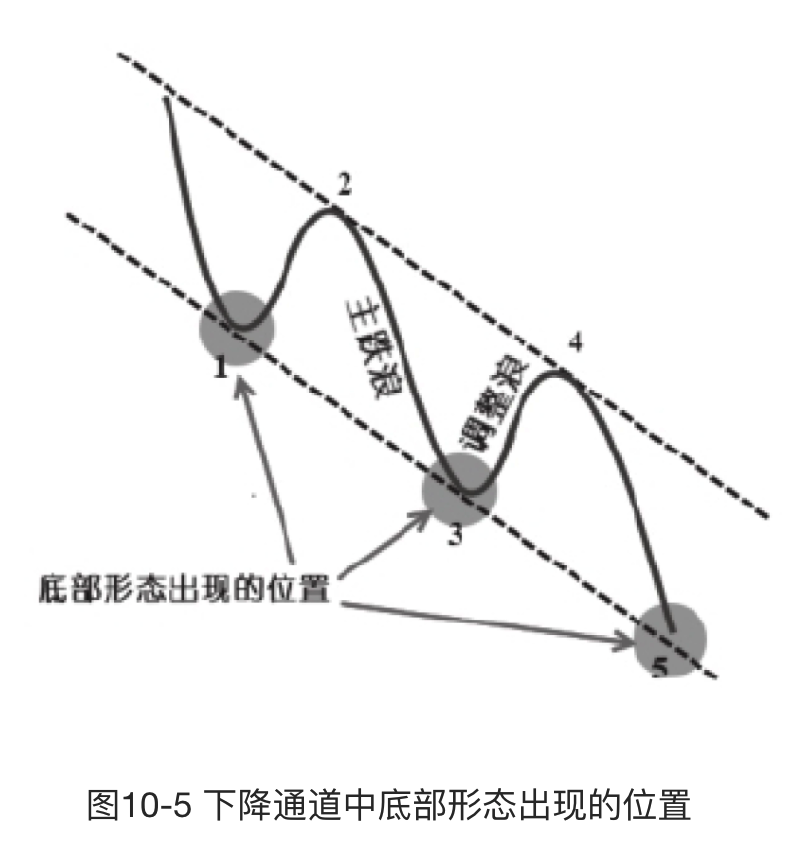

重点需要关注主要下跌趋势末端的底部反转形态（图10-5位置5），当个股经过较长时间下跌，MACD指标持续运行在0轴之下，DIF指标线形成一波三折的图形，这时很可能即将见底。量价底背离和指标底背离都是底部反转信号。

我们来看一个下降通道中的例子，图10-6显示的是深成指的一段下跌行情，我们在图中依据波峰和波谷画出了两条下降通道线。

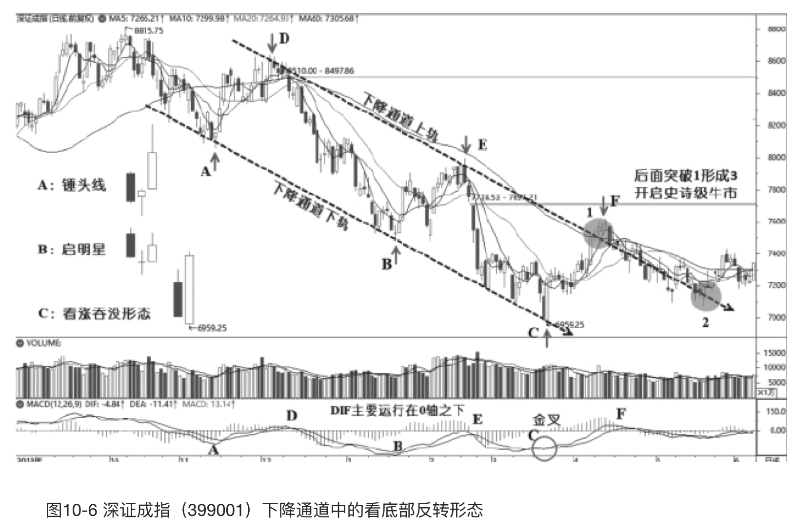

在这段行情中，共有3次碰触到上轨，并回落形成波峰（在图中用D、E、F标出的位置）；还有3次碰触到下轨，并反弹形成波谷（在图中用A、B、C标出的位置）。

以趋势交易方法来看，前两次反弹到上轨是开空单位置（D、E），持有多单时，在首次反弹到上轨时就应该离场。持空单时，在回落到下轨时可以选择止盈（B、C），在通道下轨，三个波谷的最低K线都形成了反转形态。A位置是锤头线，下个交易日的高开阳线确认锤头线有效，后面是对主要下降趋势的次级调整，也就是反弹行情。B位置是早晨之星，后面再次开始反弹。C位置是看涨吞没形态，这是最强的看涨形态之一，这里的低点成了下降通道中的最后一个低点。

从MACD指标来看，从A处开始，DIF线进入0轴之下，进入主要的空头市场，之后的每次反弹（D、E、F）最终都在0轴附近形成死叉，可见，在下降趋势中，0轴作为多空分界线，对多头的压制作用。

经过一波三折之后，在C处的下跌力量已经明显减弱，价格创出新低，同时MACD指标未创新低，形成底背离现象，市场进入超卖区间。

C处的看涨吞没形态之后，DIF线与DEA线也发生金叉，从之前两个波谷的走势来看，这里也应该是一个反弹起始位置，可作为一个短线买点，止损设置在吞没形态低点下方。

在反弹到F时，该指数第一次突破下降通道的束缚，这里满足123法则的假设条件1，即突破下降趋势线。随后指数开始回落，到达位置2处，MACD指标发生金叉，说明这波回调没有再次创出新低，满足123法则的假设条件2，即未创新低。再往后，该指数如果能够突破位置1时的高点，则满足假设条件3，可以确认下降趋势发生反转。

在后面的行情中从吞没形态的低点6959点开始，到反转行情的高点18211点，上涨了10000多点，涨幅达150%以上。

通过量价特征和指标特征，判断出下降趋势进入尾声，当在下轨附近看到底部反转K线形态时，双向交易中手持空单的交易者可以止盈部分空单，多头可以开始进场做多。下降通道中，最后一次靠近下轨时，经常伴随着量价底背离和指标底背离现象，这是市场极度超卖状态的表现。

## 如何利用123法则判断趋势反转
123法则的三个假设条件。

- **假设1**。如果价格突破了趋势线，可以确认之前的上升趋势或下跌趋势已经结束，此后可能出现三种走势，即上涨、横盘、下跌。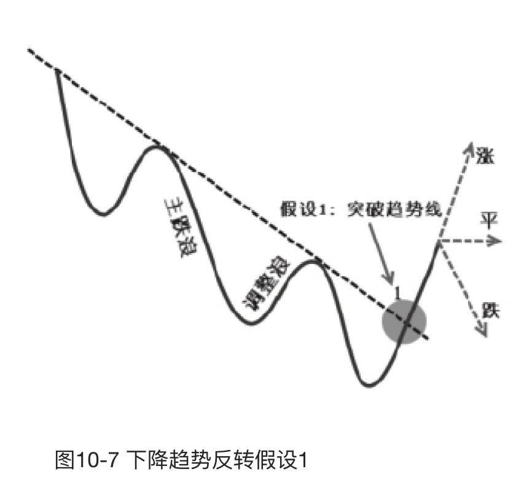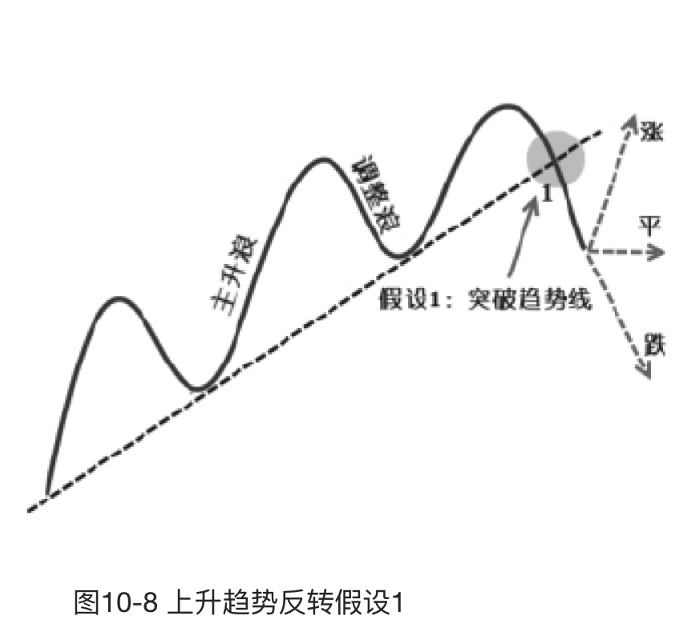
- **假设2**。如果价格突破了趋势线，并且在原有趋势方向不能再次形成突破，那么未来的趋势很有可能发生反转或横盘。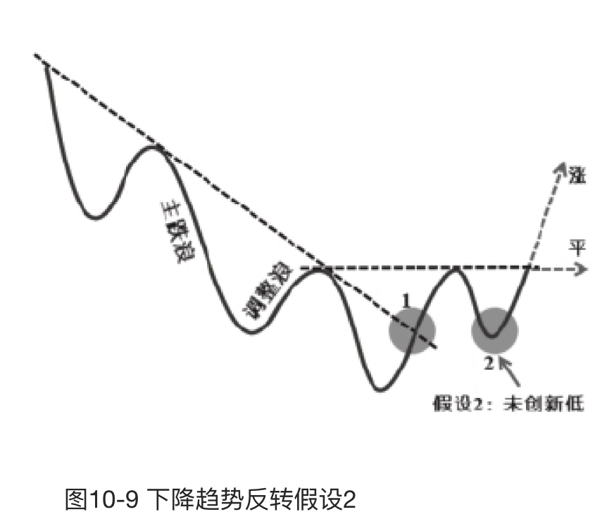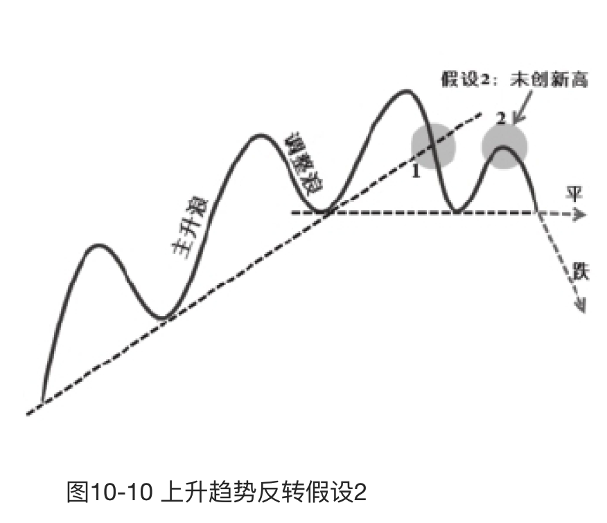
- **假设3**。如果价格在突破趋势线之后，形成了反向的推动浪，那么未来的价格很有可能继续沿着新的趋势方向运行。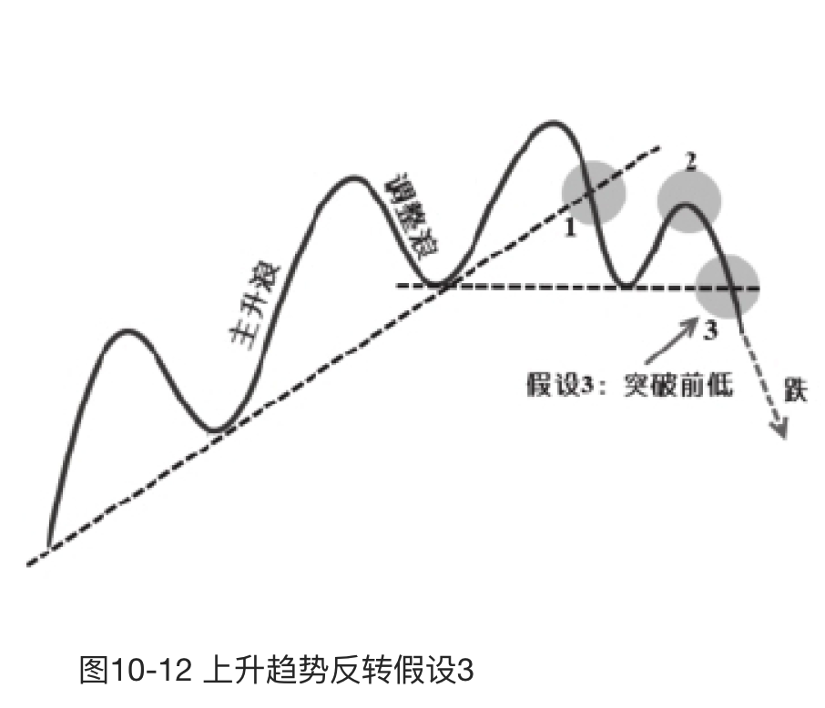

当满足全部三个假设条件时，趋势反转的可能性较大，但并不是万无一失的。在做多时，将多单止损设在位置2的波谷下方；在做空时，将空单止损设在位置2的波峰上方。

图10-13中个股金螳螂前期处于下降趋势，我们利用波峰和波谷画出下降通道线。在位置A处，该股短暂击穿下轨，收出一根蜻蜓十字线，在低位的这种图形是看涨形态。随后开始反弹，并在位置1处向上突破通道上轨，满足了假设条件1。

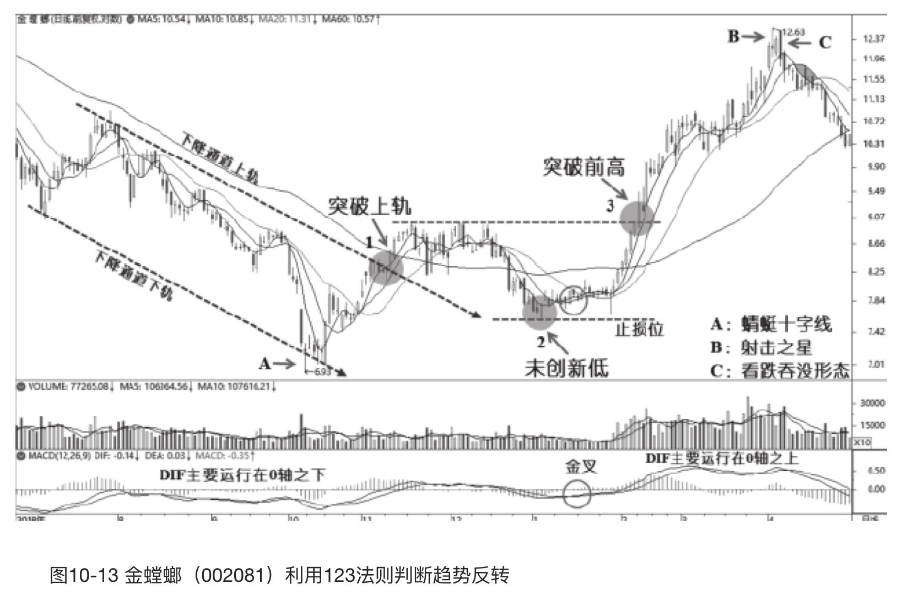

突破之后不久该股开始回落，回落到突破一浪的半分位左右止跌回升，并形成波谷。从涨跌时间节奏和幅度来看，位置2处是回调的末端，并未再次创出新低，满足了假设条件2。

位置2之后不久，MACD指标在0轴附近形成金叉，发出买入信号。我们将止损设置在位置2的波谷低点下方，一旦行情未按预期向上发展，在确认跌破止损位时离场。

买点之后，该股回测了一次止损位，然后开始连续向上拉升，一举向上突破前期高点，满足了假设条件3。因此，我们判断下降趋势已经发生反转，MACD指标已经运行在0轴之上，同时确认进入多头市场。这次突破后该股连续上涨，一直回升到最后一波连续下跌的起点之上。

在经过两波上涨之后，该股在位置B处形成了一个射击之星，这是顶部反转形态，后面两根K线又是看跌吞没形态，从MACD指标上来看，已经达到高度超买状态，在位置C处可以执行止盈操作。在MACD指标完成顶背离之后，均线又产生了价压形态，这些都是阶段高位反转信号。

通过利用123法则判断趋势反转，这次买入之后的盈利空间可以达到50%，坚持到最终卖点，可以获得45%以上的盈利。

## 如何利用背离形态确定趋势反转
**价格与成交量背离**

当价格经过长期上涨之后，随着价格创出新高，同时成交量未能创出新高时，就形成了价格与成交量的顶背离形态，表明价格很有可能开始回落。量价底背离的情况正好相反，当价格经过长期下跌之后，随着价格创出新低，同时成交量未能创出新低时，就形成了底背离形态，表明价格很有可能开始反弹。

在一轮上涨期间，第3浪与第5浪经常会发生顶背离现象，如图10-14所示。

第3浪向上突破时，成交量明显放大，但到第5浪再次创出新高时，呈缩量上涨状态，这通常是因为在第3浪期间进行了大量换手，到第5浪时已经固定了一部分筹码，导致换手率下降。

在图中可以看到，价格波峰逐波走高，其趋势线方向向上，同时成交量的趋势线方向向下，两者的运行方向发生了背离，预示着行情可能发生反转。如果成交量柱线参差不齐，不容易看出趋势的话，可以连接均量线波峰的顶点来画出趋势线。

借助MACD指标的DIF线同样可以判断出顶背离，当DIF线背离并向下拐头时是卖出信号。我们在K线图上利用突破短线支撑线确定了一个卖点（2020年2月19日）。卖点之后不久，该股放量跌破4浪调整的低点，反转得到进一步确认。

**价格与指标背离**
我们以MACD指标为例来说明价格与指标的背离，在价格上涨过程中，连接相邻两个价格波峰的趋势线方向向上，如果同时连接相邻两个指标波峰的趋势线方向向下，则发生了顶背离；在价格下跌过程中，连接相邻两个价格波谷的趋势线方向向下，如果同时连续相邻两个指标波峰的趋势线方向向上，则发生了底背离。

图10-15显示的是个股大族激光的日线图，该股前期的下跌趋势持续了很长时间，DIF线一直运行在0轴下方，明确地指示处于空头市场。在2019年1月，该股再次创出新低，但DIF线并未创出新低，形成了一个更高的波谷。连接价格波谷的趋势线方向向下，连接DIF线波谷的趋势线方向向上，由此就产生了价格与MACD指标的底背离形态，预示着行情可能发生底部反转。

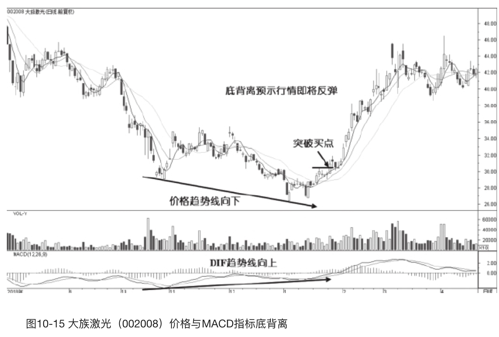

当DIF线向上拐头之后，可以利用多种技术进场。在该股均线形成多头排列之后，在图中标出的位置形成了突破买点（1月25日），并且当日的DIF线首次向上突破0轴，表明开始进入多头市场。买入之后，该股开始放量上涨，并突破前期高点。

我们再来看一个发生在顶部的背离形态，如图10-16所示。深证成指经过连续上涨之后，在高位形成了两个波峰，连接两个波峰的趋势线方向向上。同时，成交量趋势线方向向下，并且DIF线的趋势线方向向下，该股形成了顶背离形态。这说明市场在这轮上涨中已经涨过头，后面调整的概率增大。

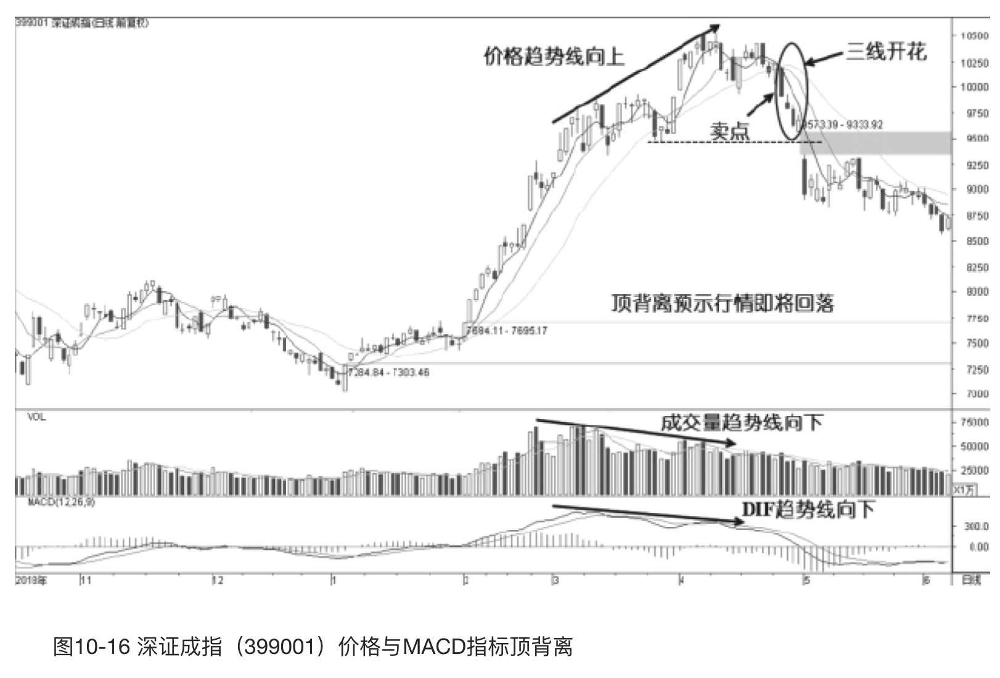

DIF线形成更低的波峰并向下拐头之后，产生卖出信号，并在4月12日形成了首个明显的绿柱线，这可以作为量化的拐头条件。这时可以利用多种技术离场，我们在图中标出了三线开花的卖点位置，各条均线向下发散，形成空头排列。深证成指的顶部反转说明多数个股同时进入卖出时间窗口。此后，该指数进一步回落。

**背离的配套措施**

背离是很好用的“抄底逃顶”方法，新手会乐于找背离。可是，交易老手会知道，背离虽然是一个很好的指标应用方法，但有时会产生所谓的“顶中有顶，底中有底，背离后还有背离”。

产生“背离后有背离”的主要原因是，趋势的级别大于指标周期，这时如果放大指标周期就可以避免失误。用波浪理论来解释就是延长浪的作用，比如，在一波主要的牛市行情中，第3浪或第5浪上涨时经常会出现延长浪，这时指标会因为连续上涨浪的冲击而出现“背离后的背离”，这表明多方力量的强势。

**顺势操作原则**
1. 在上升通道中，应以持股为主，在明显的上升趋势中可逐步加仓，在可能的顶部反转位置采取逐步减仓的策略。
2. 在下降通道中，应以空仓为主，在明显的下降趋势中耐心等待，在可能的底部反转位置采取分批进场策略，在买入之前先想好止损位，切不可急于重仓。
3. 在盘整行情中，应以观望为主，宁做错过，不可做错。

**背离配套措施**
1. 趋势线和通道线。趋势线和通道线是上涨中的支撑线，下跌中的阻力线，当股价反向突破趋势线和通道线时，则视为增大转势的可能性。在下降趋势中，当股价向上突破趋势线或通道线上轨时，是买入信号；在上升趋势中，当股价向下跌破趋势线或通道线下轨时，是卖出信号。
2. 均线。10日均线是股票的生命线，当股价向上突破10日均线时，是买入信号；当股价向下跌破10日均线时，是卖出的信号。5日均线与10日均线的交叉可以用来判断市场短期的多空情况，10日均线与20日均线的交叉可以判断市场中期的多空情况。黄金交叉作为买入信号，死亡交叉作为卖出信号。
3. 蜡烛图反转形态。日本蜡烛图是古老而实用的分析技术，常见的底部反转形态有早晨之星、锤头线、刺透形态、红三兵等，这些是买入信号；常见的顶部反转形态有黄昏之星、吊颈线、吞没形态、三只乌鸦等，这些是卖出信号。
4. 价格反转形态。价格反转形态是固定市场情绪的反映，常见的底部反转形态有头肩底、双重底、三重底、圆形底等，这些是买入信号；常见的顶部反转形态有头肩顶、双重顶、三重顶、圆形顶等，这些是卖出信号。
5. 成交量。成交量是股票行情软件中默认的副图指标，量价配合是有效研判行情的依据，在筑底过程中需要明显地缩量，表示空头下跌能量的衰竭，在突破关键压力位时，需要伴随成交量的明显放大。在顶部，成交量与价格也经常出现背离，表示上涨动能不足，在波峰出现“天量天价”的K线是明显的见顶标志。
6. 多种指标相互验证。在判断市场多空以及买点与卖点时，不同指标之间可以相互验证，以提高判断的可靠性。例如KDJ指标和MACD指标同时在低位出现黄金交叉时可以提高买入的成功率。另外，多个周期的共振信号，也可以提高买点与卖点的成功率。

## 从K线构成来看买点位置策略
在图10-17中，我们根据常用的波段操作原则，将个股阳光城的行情分成了四个阶段，并根据各个阶段的“高开低收”价格画出了跨越不同期限的四根K线。

第一根K线显示的是最后下跌调整阶段，包括35个交易日，开盘价6.03元，收盘价5.41元，最高价6.30元，最低价4.45元，跌幅10.73%。这是一根阴K线，带有很长的下影线。当纳入的调整时间更长时，调整幅度很可能会更大，该阶段的K线实体也会更大。

第二根K线显示的是达到买入条件，并且在拉升之前的阶段，包括75个交易日，涨幅8.52%。我们仍然按照“高开低收”价格画出K线，这是一根小实体的阳K线，带有较长下影线。该股拉升前的准备阶段较长，下影线持续了30多个交易日。

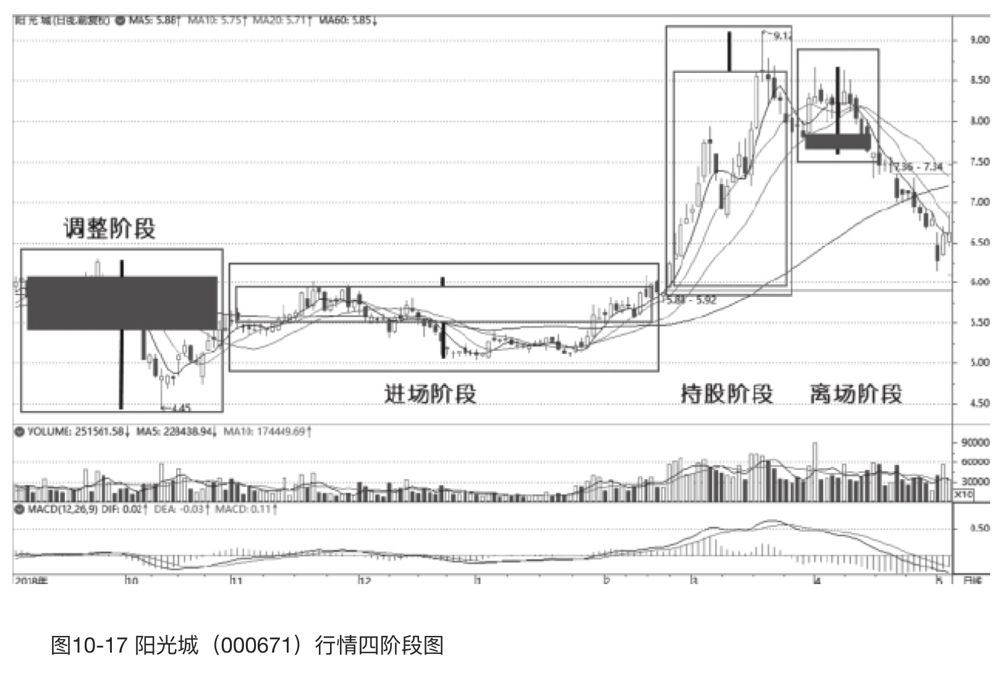

第三根K线显示的是拉升阶段，包括23个交易日，涨幅35.26%。这是一根长阳K线，带有上影线。在主升浪阶段，长线波段操作的原则是持股待涨，这时大量买进或卖出都不是合理的选择。

第四根K线显示的是离场阶段，包括12个交易日，跌幅3.90%。这是一根阴K线，带有长上影线。顶部的离场阶段通常是这四个阶段中时间最短的，这也符合快跌慢涨的特点。

我们把以上四根K线放到另一张图上，如图10-18所示。图中的进场时间比较充裕，实际上中短线进场区间的宽度通常只有几个交易日。我们把买点锁定在第二根K线上，那么具体什么时候买进更合理呢？

从客观上来讲，我们不能事前确定第二根K线是否会形成较长的下影线，但是经验告诉我们，在较长周期的K线上比较容易出现下影线，更不用说是在上涨起始阶段。

对于拉升前的震荡，用传统的说法是，主力需要震仓，要把持股不坚定的筹码洗出去。用更实际的说法是，之前那些前期被套牢和太早抄底的筹码，他们在等待反弹，希望得到保本出局的机会，所以价格反弹到前高附近会受到压力而回落。另一方面，一些成功抄底的人也会在高位适量减仓。在完成对第1浪上涨的调整之后，底部被夯实，开始有新资金进场时，市场对筹码的需要开始大于供给，开始启动突破前高的行情。

所以说，在进场阶段，大概率会形成下影线，这对买进策略是十分重要的。在图中的第二根K线中，如果追高进场，就要忍受后面调整的煎熬，持股没有信心的人很容易被赶下车，如果等到后面启动上涨时，又要面临追高的心理压力。所以，最有优势的进场位置就是第二根K线的下影线。

进场阶段的下影线是顺大势、逆小势的位置。我们通过技术分析判断在1浪上涨的价托附近大概率会获得支撑。有经验的交易者会善于选择这种产生回调安全区间的股票。

这个位置并不是万无一失的，如果在低位进场之后，股票表现出挑战前低的迹象，我们可以止损部分筹码，如果向下突破前低，则止损出局。通过明显底部特征挑选出来的股票，多数都能够产生主升浪。

再来看第三根持股阶段的K线，这根K线起始于突破前期高点的日K线，当日恰巧是光脚阳线，并且当日是主升行情的最低K线，所以该K线也是光脚长阳线。在这个阶段做差价是高手的动作，如果卖在半山腰，股价又呼啸而上，那么踏空的滋味是很难受的。

做足主升浪是主要暴利来源。看对做错是新手行为，有经验的老手能够管住自己的手，在下山坡时离场。主升浪的量价配合通常会经过两个过程，第一个是量价同步过程，即价涨量增，第二个是量价异步过程，即价涨量缩。缩量的一浪是套人的一浪，也是利润达到最大的一浪。它吸引冲动交易的人们追高，靠的是牛市氛围和大幅度的拉涨分时线。

第三根K线的长上影线来自顶部的一根日K线，当日收出一个射击之星的顶部反转K线形态，长长的上影线预示着股价可能见顶。有经验的交易者在当天收盘前可以让一部分筹码兑现利润，落袋为安。

第四根K线是离场阶段，其中发生了均线死叉、MACD指标死叉和均量线死叉，在第四根K线的上影线是最佳离场时机，这也是做空品种开空单的位置。当跌破前期低点时形成了第四根K线的收盘价，这是最后清仓机会，到此为止，头部正式形成。

## 基于成交量和关键点位的多空波段操作
在观察价格走势的时候，我们经常会有这样一种感觉，符合一些特定条件的价位似乎总是具有特殊意义。这种位置我们称之为关键价位，它们通常出现在成交量异常放大的前高或前低位置，如图10-19所示。

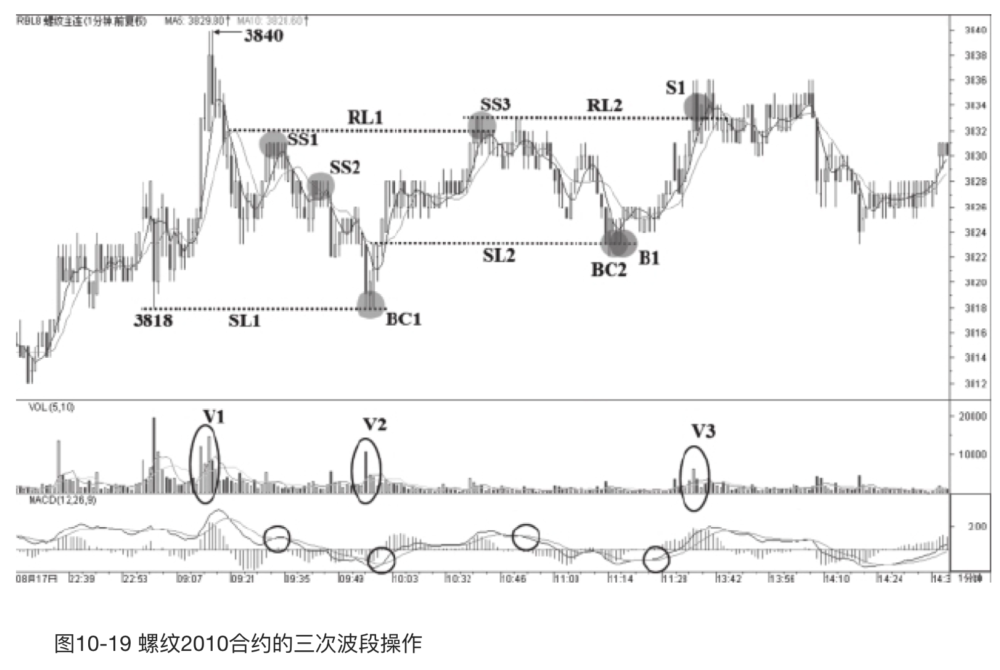

没有成交量的技术分析是没有灵魂的，任何出现倍量的位置都会对后面的交易具有参照意义。下面我们以双向交易的螺纹合约为例，分析在一个日盘时间内的三次波段操作。图10-19显示的是螺纹钢的1分钟K线图。在更大级别的日线图上，该合约正处于整体上升趋势，MA10均线向上，但MA5与MA10均线呈下叉状态。

可以看出，在开盘之后，1分钟线不断创出阶段新高。在图中V1标出的位置，该合约放出巨量并出现快速拉升的长阳线，这是在冲顶阶段经常出现的量价形态。此后，该合约开始回调，我们按照格兰威尔均线法则6“小幅突破”和法则7“反弹不过”分别在图中SS1和SS2位置开空，止盈目标是冲顶一浪的起点（3818）。

我们沿着冲顶一浪的起点画出一条支撑线SL1，因为在这个位置正好是当日早盘开盘的首根K线，经过放量调整之后，形成新高之前的最后一个波谷，这是支撑价位。开空单之后，该合约逐波下跌到了SL1位置，并且放出倍量（V2），这时空单可以离场。这样就完成了一波做空的波段操作，SS1+SS2——BC1。

我们从经验来看，顶部的大量筹码不可能通过一波下跌就消化掉，我们判断对上涨浪的调整并没有结束，还不能马上进场做多。当价格反弹到前面顶部均线下叉的位置附近时，该合约短暂突破了压力线1（RL1），这时我们在前一次盈利的基础上继续做空，即SS3位置开空单，并可以将止损设置在前高（3840）附近。将止盈目标设置在前一波放量（V2）时的波谷右侧支撑位（SL2）。此后，价格逐波下跌并到达了止盈目标位，这样就完成了第二波做空的波段操作，SS3——BC2。两次平空位置符合格兰威尔均线法则4“远离均线”。

从稍大一级的结构上来看，这时完成了从顶部开始的三浪调整，我们在SL2价位上在B1位置开多单，止盈目标是前高处的压力线2（RL2）。最终该合约放量（V3）突破RL2，这样就完成了第三波做多的波段操作，B1——S1。稳健的交易者可以留一部分仓位来博取创新高的一波。在后面的回调中，运用B1同样的原理，还有一次做多机会，但由于临近收盘，可以酌情参与。另外，利用MACD指标结合压力线和支撑线同样可以得到近似的进场和出场位置。

我们来总结一下在图中标出的三次放量V1、V2和V3，它们都很好地指示了转折点。虽然在SS3和BC2这两个转折点没有产生倍量，但它们的成交量还是有所放大，至少是一段时间内的最大量。倍量可以利用均量线来判断，比如使用VOLMA30或VOLMA60量均线，当K的成交量达到平均量的3倍～5倍以上时，就可以认为发生了倍量。

我们再来总结一下这三次波段操作，其中两次做空和一次做多，每次盈利在10点左右，总共可以获得30点左右的利润。当天日盘的开盘价为3825点，收盘价为3832点，最低价为3818点，最高价为3840点，也就是说，在日内任何点位开仓并持有到收盘都不会有超过14点的利润。因此，通过合理的波段操作可以拉长行情，提升获利空间。

## 格兰威尔移动平均线八大法则
**均线法则①：黄金交叉。移动平均线由下降变为走平或上扬，当股价自下而上突破移动平均线时是买入时机。**

格兰威尔均线法则的第一条讲的是第一种买点，发生在由空转多的初始阶段。这是波段操作的第一个顺势买点。

股价经过长期下跌之后，均线开始进入由降转升的过渡阶段，均线呈现出U形底的雏形，当股价向上突破均线时，产生该法则的第一个买点。稳健的做法是等待收盘价连续三日收在均线之上时买进，或者等待在均线之上首次突破近期高点时买进。

稳健的做法可以尽量确保均线会改变方向，即转为向上移动，这时均线对价格的支撑作用更强，买入的成功率会更高。为了防止走出失败图形，可以将止损设在均线下方一定幅度的位置。

第一买点处于波浪理论的第1上升浪，这是整个上升波段的低位，如果买点是正确的，那么在后面的很长时间内都不会跌破买入价位。

第一买点的指标特征为：

1. MACD指标的DIF线与DEA线产生黄金交叉，并且很快进入0轴之上运行。
2. KDJ指标从超卖区间进入50线以上。
3. 成交量逐渐放大。
4. 发生底背离或底部反转K线形态。

图10-21显示的是利用均线法则1进行波段操作的例子。我们在主图中只保留了一根20日均线MA20，并且显示了3个副图，分别是VOL成交量、MACD指标和KDJ指标。

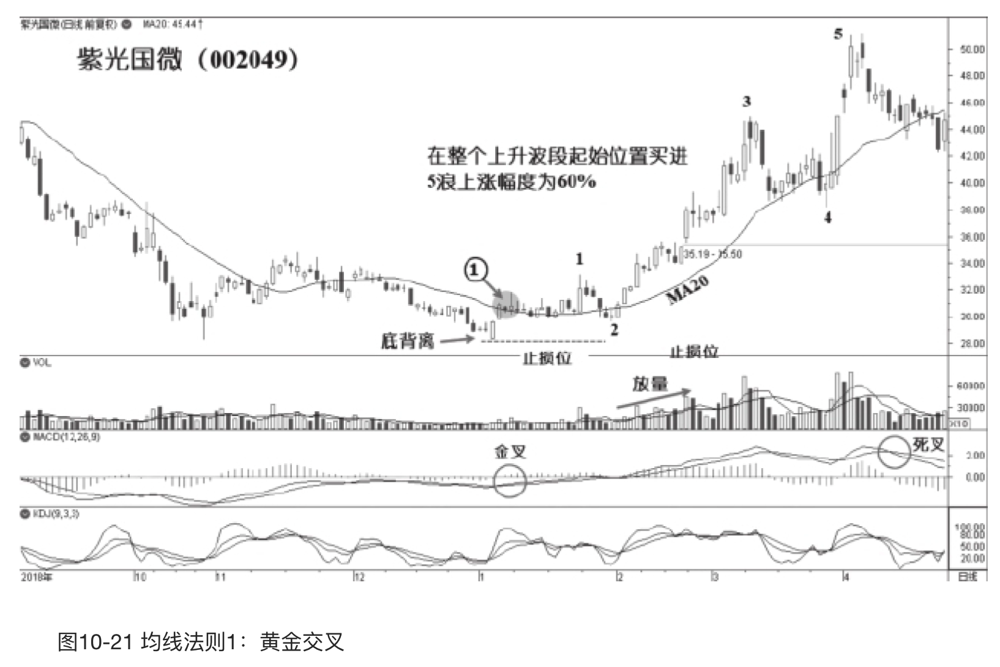

该股前期处于下降趋势，MACD指标持续在0轴之下运行。在形成底背离之后，该股向上突破MA20均线，满足格兰威尔均线法则①并形成买点。当时对应的MACD指标也同时在底背离之后形成了黄金交叉，进一步验证了买点的可靠性。在离场时，可以利用0轴上的二次死叉作为对卖点的确认。

从KDJ指标来看，在底背离创新低的下跌过程中，形成了5小浪下跌，由于KDJ指标比较灵敏，所以形成了超卖区间的三个波谷。在出现买点时，KDJ指标迅速向上突破50线，表示短线进入多头市场。

为了控制风险可以将止损设置在前期低点的下方，如果股价未能按预期发展并跌破止损位，则应该暂时离场。在本例中，买入之后没有远离成本就出现了一次调整，但只是短暂跌破MA20均线，均线方向仍保持向上，持仓保持不变。这次调整是波浪理论中的第2浪调整，小幅调整完成之后，该股开始放量上攻，并且走出第3浪，也是主升浪，波段操作的主要利润来源于此。

按照均线法则①，我们在①指示的位置买入，在完成五浪上涨后，远离均线的程度达到极限时卖出（后面讲到的法则⑧），这样就完成了一次波段操作。这波反弹可获利的幅度为60%左右，这是一次大盈的操作。

**均线法则②：小幅跌破。移动平均线持续向上运行，当股价短暂小幅跌破移动平均线，并且很快重新站上均线时是买入时机。**

格兰威尔均线法则的第二条讲的是第二种买点，发生在前2/3的上升趋势的回调过程中。这时股价已经产生了向上推动浪，当股价突破前一波的高点之后，经常会发生回调。当股价短暂跌破均线并快速回到均线之上时，产生该法则的第二个买点。

有两点需要注意，一是这次调整在这波行情中的位置，如果是第三次或第四次跌破均线，那么很可能会迎来真正的大幅调整行情；二是均线的方向应该保持向上，这会对股价起到较强的支撑作用，这个条件还可以起到很好的过滤虚假信号的作用。

第二买点处于波浪理论的第2浪或者第4浪调整浪，这属于顺大势逆小势的买点，如果买点是正确的，那么此后的成交量应该明显放大并走出第3浪或第5浪。

在强势的上升趋势中，跌破均线的K线个数为2~5个，跌到均线以下的幅度在一根中阴线的幅度之内。发生理想的买点时，买入之后会很快脱离成本，很难再有逢低买入的机会。

第二买点的指标特征为：
1. DIF线在0轴之上并向上拐头，MACD柱线仅会产生几根绿柱线，当绿柱收敛时是买入信号。
2. KDJ指标在50线以下发生黄金交叉。
3. 成交量明显放大。
4. 当发生在第2浪时，均线会呈现出“老鸭头”形态。

图10-22显示的是利用均线法则2进行波段操作的例子。该股前期经过了连续下跌，MACD指标持续运行在0轴之下。当股价向上跳空并突破MA20均线时，满足格兰威尔均线法则①并形成买点①。随后突破前一波下跌时的高点，并形成第1浪。然后开始回调并小幅跌破了MA20均线，当股价再次回到MA20均线之上时，满足格兰威尔均线法则②并形成买点②。

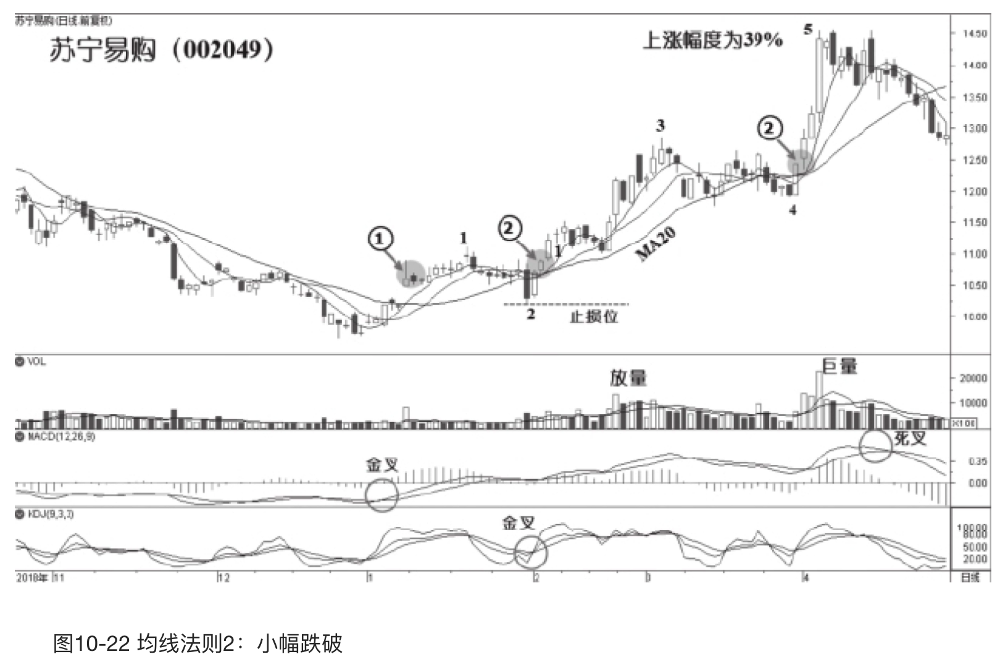

买点②发生时，KDJ指标刚刚在50线以下形成金叉，说明这是一个多头趋势中的短线回调买点。买入之后，该股连接放量拉升，走出第3上升浪。从3浪顶点开始的调整再次小幅跌破了MA20均线，5根K线之后再次收复MA20，并且均线方向继续向上，这时再次产生了买点②，并且可以小幅加仓。

此后该股再次大幅拉升，在顶部走出一根长阳线并且放出巨量，这明显符合第5浪的冲顶特征，可以在此之后逐步减仓。

按照均线法则②，我们可以有两次加仓机会，在完成5浪上涨后，出现顶部特征时卖出，这样就完成了一次波段操作。从第一个买点②开始的上涨幅度为39%，通过顺势加仓，可以进一步扩大利润。

遇到非常强势的上涨时，有可能不会出现跌破较长期均线的买点，比如它可能跌破MA5和MA10均线，却不会跌破MA20均线。

图10-23显示的强势上升波段中，在底部的底背离之后，股价突破MA20均线并成了第一个买点①，此后该股一直保持紧凑的上涨节奏，一直沿着MA10均线向上发展，并没能跌破MA20均线，因此没有出现满足小幅跌破条件的买点②。

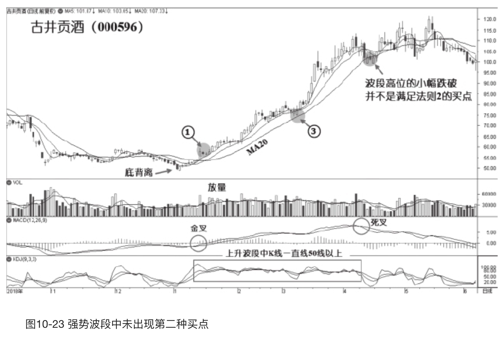

在上升途中股价曾有一次靠近MA20均线的动作，这是下面将要讲到的买点③。直到波段高位，股价终于开始调整并跌破了MA20均线，但这时已经不是买入的时间窗口。

从MACD指标来看，这次波段上升过程中，从金叉到死叉，中间只产生过微小的绿柱，这说明调整幅度微乎其微。从KDJ指标来看，K线数值一直大于50，说明一直处于多头市场，没有像样的调整可供加仓。

**均线法则③：回测不破。股价带动移动平均线持续向上运行，当股价回调到移动平均线附近，但并没有跌破移动平均线又再度上升时是买入时机。**

格兰威尔均线法则的第三条讲的是第三种买点，通常发生在上升波段的前半段。在上升趋势中，上涨保持着涨多跌少的节奏，比如进三步退一步式的上涨。股价从阶段高点回落到均线附近并得到支撑，当股价未能跌破均线并再次向上拐头时，产生该法则的第三个买点，即回测不破买点。

这里同样有两点需要注意，一是这次回测在这波行情中的位置，如果是第三次或第四次回测均线，那么很可能会跌破均线，甚至发生反转；二是均线的方向应该保持向上，这会对股价起到较强的支撑作用，这个条件还可以起到很好的过滤虚假信号的作用。

第三买点与第二买点的位置相似，都可能发生在波浪理论的第2浪或者第4浪调整浪，并且属于顺大势逆小势的买点。这个买点对于耐心较差的交易者来说是一个不错的选择，买入正确的话，很快会脱离成本，在最理想的状态下，买入当天就是阶段低点，后面马上产生大量浮盈。

第三买点的指标特征为：
1. DIF线发生一次靠近DEA线的动作，MACD柱线有可能不会产生绿柱线，当红柱发散时是买入信号。
2. KDJ指标在50线以上发生黄金交叉。
3. 成交量明显放大。

图10-24显示的是利用均线法则③进行波段操作的例子。该股前期经过了连续下跌，MACD指标持续运行在0轴之下。当股价站上MA20均线时，均线方向由下降转为逐渐走平，这个位置符合买点①。

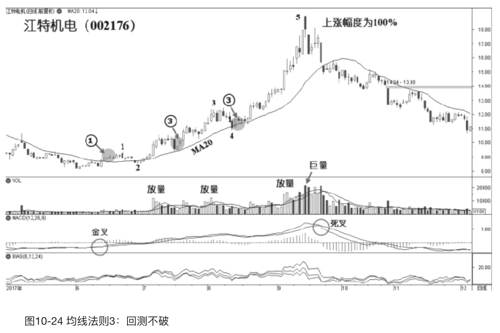

之后该股开始了明显的放量过程，并且连接走出向上推动浪。这时的MA20均线持续向上运行，调整浪回测均线并且没有跌破均线，当股价再次沿着均线拐头向上时，产生了两个符合第三条均线法则的买点③。

这两个买点③在波浪理论中的位置分别是第3浪的前半段，以及第5浪的初始阶段。这两次买入之后，都形成了立即放量拉升的局面。

在形成回测不破买点时，DIF线与DEA线多数也会同时形成回测不破的形态。少数情况下，DIF线会小幅跌破DEA线。KDJ指标由于比较灵敏，它会在50线上方形成金叉，这说明回测不破是多头趋势中的中继买点或加仓点。

该股这次上升波段的第5浪是一次大幅的连续上涨，成交量达到了较长一段时期内的最高水平，日换手率达到10%以上，这符合中小盘股的顶部特征。在第5浪末端，K线的长度开始增大。

创出最高价的K线是一根跳空高开的中阴线，并且收盘价在前一日的收盘价附近，它与前一根涨停的K线组成了反攻K线形态，预示着即将见顶。当日放出巨量，换手率达到15%以上。值得注意的是，当乖离率达到历史较高水平时，极其容易受到均线吸引而回落。当日收盘前就是一个绝佳的止盈时机。

在这次波段操作中，从买点①到第5浪末端的上涨幅度达到了100%，如果抓住两次回测不破的加仓机会，还可以大幅扩大利润。

**均线法则④：远离均线。股价带动移动平均线持续向下运行，当股价突然连续暴跌远离移动平均线，由于负乖离率过大而容易朝着移动平均线反弹，这时是买入时机。**

第四种买点是在空头趋势中做反弹。首先要注意的是，这是逆大势的交易，稳健的交易者可以放弃这种买点。

当均线呈空头排列之后，并且股价连续下跌，走出多个长阴线，出现“杀多”走势，通常也会跌破前面一个低点，这时由于均线对股价的吸引作用，股价很可能发生反弹，短线交易者可以借机做一波反弹。

那么如何判断跌到位了呢？通常利用BIAS乖离率指标来判断收盘价远离均线的程度，BIAS指标可以在股票软件上作为副图指标显示出来。指标的参数不用修改，使用默认的即可。

图10-25显示的是利用均线法则④进行波段操作的例子。我们在图中显示了3个副图，分别是VOL成交量、BIAS乖离率和MACD指标。

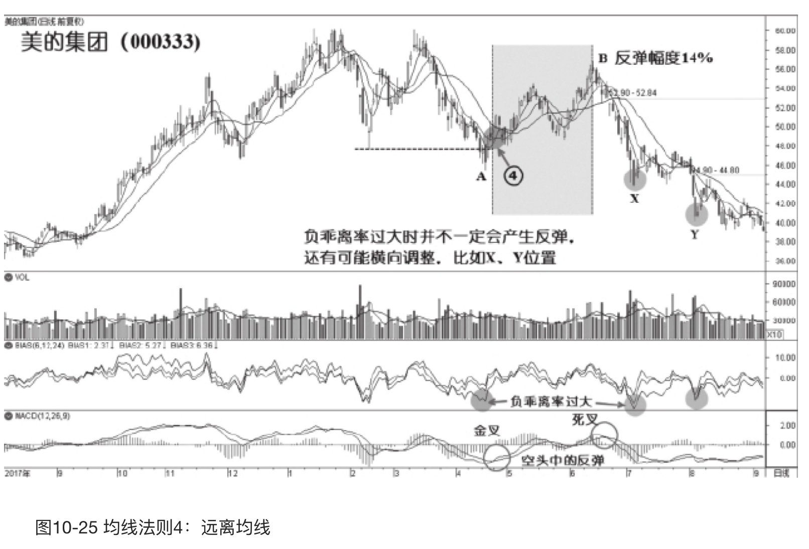

该股前期处于上升趋势，MACD指标持续在0轴之上运行。直到涨不过前高并且跌破前低时，产生了向下推动浪。我们在图中用A标出了跌破前低的位置，这同时也是波浪理论中的A浪下跌。这波连续下跌过程中，股价向下远离MA20均线，从形态上来看符合格兰威尔均线法则的第4条。

我们再利用乖离率来定量确认是否符合远离均线的条件，从图上的BIAS指标来看，A位置对应的指标值处于6个月以来的第二低水平，仅次于前低时的数值，可以确定这时符合负乖离率过大的条件。

按照均线法则④，我们在④指示的位置买入，在完成三浪反弹之后在位置B附近卖出，这样就完成了一次波段操作。这波反弹可获利的幅度为15%左右，这在反弹操作中已经算不错的成绩了，毕竟主要趋势方向是向右下方发展的。
第四买点的指标特征为：

1. MACD指标的重心开始从0轴之上转移到0轴之下。
2. KDJ指标随着价格逐波降低，反复多次进入超卖区间。
3. 价格波谷对应的BIAS指标值达到近6个月以来的较低水平。
4. 成交量逐渐萎缩。

**止跌可以不涨**

需要注意的是，止跌但可以不涨，当负乖离率过大时并不一定会产生反弹，它还有可能横向调整，比如图10-25中的X、Y位置。X对应的BIAS指标值处于较长时期内的最低水平，但反弹幅度很小，仅仅勉强突破了MA20均线，却未能带动MA20均线转向。Y处的反弹更弱，MACD指标没有形成明显的红柱价格就再次创出新低。

通常，在下降趋势中，只有B浪反弹有可操作的短线机会，其他次级别的反弹幅度有限，从可能获得的利润以及所承担的风险相互对比来看，往往会得不偿失。上证指数在历史上的一次较大级别的B浪反弹发生2007年12月6日到2008年1月15日，有兴趣的交易者可以对照当时的行情图研究一下，在 B浪反弹的初始位置买入个股，很多活跃的个股都有可观的上涨幅度。

我们在图10-26中标出的是个股冀东水泥在上证指数发生B浪反弹期间的上涨行情。上证指数在这期间上涨7.95%，与此同时，个股冀东水泥上涨45%并创出新高。为什么这样呢？这是一个值得思考的问题。因为在大牛市中，市场多头气氛非常深厚，个股拉升相对容易，主力资金会抓住任何机会抬升股价。经历过这种牛市的人会有这样一种感觉，只要大盘不跌，总会有轮动板块启动上涨行情。在牛市盛宴中，B浪反弹也是做多机会。

**均线法则⑤：死亡交叉。移动平均线由上升变为走平或下降，当股价自上而下跌破移动平均线时是卖出时机。**

格兰威尔均线法则的第五条讲的是第一种卖点，也是双向交易品种的第一个开空点，它发生在由多转空的初始阶段。

股价经过长期上涨之后，均线开始进入由升转降的过渡阶段。当股价向下跌破均线时，产生该法则的第一个卖点。稳健的做法是等待收盘价连续三日收在均线之下时卖出，或者等待在均线之下形成下跌推动浪并首次跌破近期低点时卖出。

稳健的做法可以尽量确保均线方向转为向下，这时均线对价格的压力作用更强，卖出的成功率会更高。第一卖点处于波浪理论的A浪下跌途中，这是整个下降波段的初始位置，如果卖点是正确的，那么在后面的很长时间内都不会再回到该卖出价位。

第一卖点的指标特征为：
1. DIF线与DEA线发生死亡交叉，并且DIF线很快进入0轴之下运行。
2. KDJ指标从超买区间进入50线以下。
3. 成交量逐渐减少。
4. 发生顶背离或顶部反转K线形态。

图10-27显示的是利用均线法则⑤确定卖点的例子。我们在主图中只保留了一根均线MA20，并且显示了3个副图，分别是VOL成交量、MACD指标和KDJ指标。

该股前期处于上升趋势，MA20均线持续向上运行，股价在大部分时间都处于MA20均线之上，MACD指标运行在0轴之上的多头区间。

进入高位之后，MA20均线的方向首先在A处发生了一次变化，当日的阴线跌破了均线。但下一个交易日股价再次收盘在均线之上，均线的方向也重新恢复上升。如果严格按照均线法则操作的话，A处应该出现一次卖出信号，不过，稳健的做法是等待均线连续两日转向后再处理手上的多单。

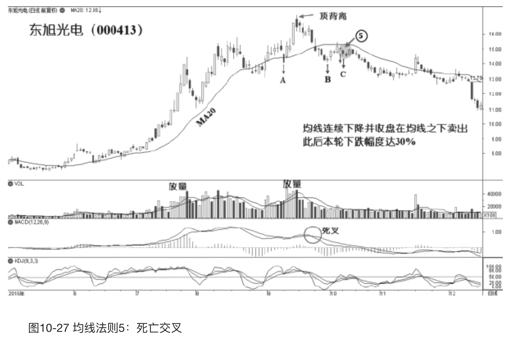

A位置之后，该股再次放量创出新高，可见A处并不是一个合理的卖点，应该把它看作一次虚假信号。在B处再次发生了均线一日转向的情况，我们同样按兵不动。直到C处时，均线连续两日向下移动，并且收盘在均线之下，这时产生真正的卖出信号⑤。卖出之后，该股连接下跌，等到均线方向转为连续向上时，下跌幅度已经达到30%以上。

我们再来对照一下出现卖点⑤时的指标特征，从图上可以看出，当时DIF线与DEA线处于死叉之中，并且很快进入到0轴之下。可以将0轴上的二次死叉作为对卖点的确认。KDJ指标的K线与D线在50线下方并且向下拐头。

通过这个例子我们可以更深入地认识到均线的平滑特性，也可以说是滞后特性。从跌破均线到均线真正转向，这期间可能相差一浪上涨，也可能相差一浪下跌。如果换成短期均线的话，可能更容易改变方向，但其稳定性又较差。

**均线法则⑥：小幅突破。移动平均线持续向下运行，当股价短暂小幅突破移动平均线，并且很快重新回到均线之下时是卖出时机。**

格兰威尔均线法则的第六条讲的是第二种卖点，发生在前2/3的主要下降趋势的次级反弹末端。这时股价已经产生了向下推动浪，当股价跌破前一波的低点之后，经常会发生反弹。当股价短暂突破均线之后，产生该法则的第二个卖点。在期货品种的交易中，该卖点可用于开空单。

这里有两点需要注意，一是这次反弹在这波下跌行情中的位置，如果是第三次或第四次向上突破均线，那么很可能会迎来真正的大幅上涨行情；二是均线的方向应该保持向下，这会对股价起到较强的压力作用，这个条件可以很好地过滤掉虚假信号。

第二卖点处于波浪理论的C浪初始位置。这时，通常也是头肩顶形态的右肩，此后会产生凶猛的“杀多”行情。在双向交易品种中，这属于顺大势逆小势的开空单位置，C浪是空头的主要利润来源。

在强势的下降趋势中，突破均线的K线个数通常为2～5个，突破均线以上的幅度在一根中阳线的幅度之内。做空时，开空之后会很快脱离成本，很难再有逢高开空的机会。

第二卖点的指标特征为：
1. DIF线在0轴附近（或之下）并向下拐头，MACD柱线仅会产生几根红柱线，当绿柱发散时是卖出信号。
2. KDJ指标在50线以下发生死亡交叉。
3. 成交量逐渐减少。

图10-28显示的是利用均线法则⑥确定卖点的例子。与前面图表不同的是，这是一张周线图。该股前期经过了连续上涨，MACD指标持续在0轴之上运行，从低位到高位上涨了2倍以上。

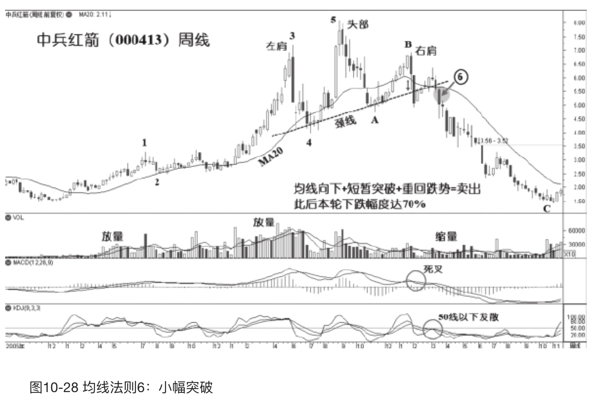

从图中可以看出，第3浪上涨时的成交量最大，拉升幅度也最大。随后的第5浪与第3浪形成了价量背离，预示着价格即将反转。之后的回落形成A浪，这时成交量已经明显萎缩。A浪之后是B浪反弹，均线方向仍然向上，但成交量比之前上涨时少了一半。

第3浪、第5浪以及B浪的三个波峰构成了头肩顶形态，B浪也就是右肩形成之后，MA20均线方向开始由上升转为下降。当股价跌破MA20均线并跌破颈线之后，发生了小幅反弹并有3根K线站上了MA20均线。不过，反弹没能改变均线方
向就再次回到均线之下，这时产生了符合均线法则⑥的卖点⑥。

卖出之后，该股快速下跌，并且展开“杀多”行情，多头在这期间根本没有等到回测均线的卖点。卖点之后的C浪下跌幅度到70%，可见及时离场是多么重要。

需要注意的是，从头部回落之后，MACD指标在0轴之上的二次死叉，这是最有可能产生急速下跌的位置。空头如果利用这个卖点做空，在本例中可以获利丰厚。在极端下跌行情中，股价可能在均线之下连续下跌，没有形成小幅突破卖点的机会，比如在倒V字形反转中，这时就要有配套措施，比如，远离均线的止盈（卖点⑧），按比例止损等。

**均线法则⑦：反弹不过。股价带动移动平均线持续向下运行，当股价反弹到移动平均线附近，但并没有突破移动平均线又再度下降时是卖出时机。**

格兰威尔均线法则的第七条讲的是第三种卖点，通常发生在下降波段的前半段。在下降趋势中，保持着跌多涨少的节奏，比如退三步进一步式的下跌。股价从阶段低点反弹到均线下方附近并受到压力作用，当股价未能突破均线并再次向下拐头时，产生该法则的第三个卖点，即反弹不过卖点。

要注意这次反弹在这波下跌中的位置，如果是第三次或第四次向上挑战均线，那么很可能会向上突破均线，甚至发生反转。均线的方向应该保持向下，这会对股价起到较强的压力作用。在交向交易的品种中，该卖点可作为第三种开空点。

第三卖点与第二卖点的位置相似，都可能发生在波浪理论的B浪或者其他更低一级别的调整浪之后。在做空时，它属于顺大势逆小势的开空单位置。对于持多单的人来说，这是出逃机会；对于持空单的人来说，这是加仓机会。在这个位置开空单后，有可能很快产生浮盈。

第三卖点的指标特征为：
1. DIF线在空方发生一次靠近DEA线的动作，有可能不会产生红柱线，当绿柱发散时是卖出信号。
2. KDJ指标在50线以下发生死亡交叉。
3. 成交量逐渐减少。

图10-29与图10-24显示的是同一只个股的同一段行情，该股前期经过了连续上涨，并且在前面已经讲过了在波段低位的买点①和两个加仓点③。现在，我们利用均线法则⑦来确定卖点。

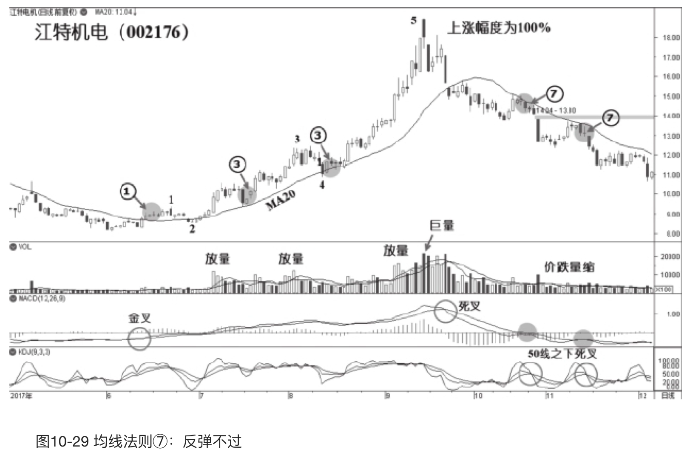

该股走出5浪上涨并完成巨量冲顶之后，我们已经可以判断该股大概率会开始调整，短线交易者可以在5浪末端先行止盈。下面我们看一个更稳健的卖点。当均线方向由上升转为下降之后，该股从均线之下远离均线的位置开始反弹，当股价碰触到MA20均线之后，该股再次滑落，这时产生了符合第七条均线法则的卖点⑦。

卖出之后，该股出现了一个向下跳空缺口并创出新低。不久之后，走出了与前面相似的反弹图形，再次出现了一个卖点⑦。这两个卖点都是多头的出逃机会，出现卖出信号的K线就是此后一段行情的最高K线。该股持续呈现缩量下跌态势，最终从13元跌到了9元以下，跌幅达35%。如果该股可以做空，在两个卖点位置是很好的开空单机会。

在反弹均线不过形成卖点时，DIF线与DEA线多数也会形成反弹不过的形态。在少数情况下，DIF线会小幅突破DEA线。KDJ指标由于比较灵敏，它会在50线下方形成死叉，这说明反弹不过是空头趋势中的多头卖点，或者空头的加仓点。我们在指标图中均标出了两个卖点对应的位置。

需要格外注意的是，DIF线从多头市场转移到空头市场，当在0轴之下首次出现反弹不过形态时，后面很有可能出现“杀多”行情。第三卖点是与均线法则③的第三买点相对应的。图中创出最高价的K线，乖离率达到历史较高水平，这是下面将讲到的法则⑧的卖点。判断正确的话，可以多得到15%左右的头部利润。

**均线法则⑧：远离均线。股价带动移动平均线持续向上运行，当股价突然连续暴涨并远离移动平均线，由于正乖离率过大而容易朝着移动平均线回调，这时是卖出时机。**

第四种卖点是在多头趋势顶端的止盈，这是与买点④相对应的卖点。当股价连续拉升，走出多个长阳线，呈现涨过头的态势时，由于均线对股价具有很强的吸引作用，股价很容易开始回落，短线交易者可以借机在高位止盈。

想要让股价较大程度地向上远离均线，这需要有较大成交量的配合，当股价上涨到一定程度之后，成交量难以为继，市场的潮水就会回落。这就像是把弹簧用力拉长，当松手的时候，弹簧会迅速收回。

那么如何判断偏离程度呢？我们继续利用BIAS乖离率指标来进行判断。当BIAS指标的正值达到近6个月以来的较高水平时，股价大概率会回调。如果配合顶部特征，则能提高判断成功率。比如，在指标发生顶背离之后，出现吞没形态并且放出巨量，再加上极大的正乖离率，这种情况下的卖点要可靠得多。

第四卖点的指标特征为：
1. MACD指标的DIF线达到历史高位。
2. KDJ指标反复多次进入超买区间，最终在80线附近形成死叉。
3. 价格波峰对应的BIAS指标值达到近6个月以来的较高水平。
4. 成交量急剧放大。

图10-30显示的是利用均线法则⑧在波段高位止盈的例子。该股在持续上涨过程中走出了5浪形态。在第1浪上涨过程中产生了买点①，第2浪调整之后产生了买点③，第4浪调整之后产生了买点②。在第5浪上涨末端，股价远离MA20均线，正乖离率达到了较高水平，当股价开始回落时产生卖点⑧。可以看出，这是一种能够成功逃顶的卖点。

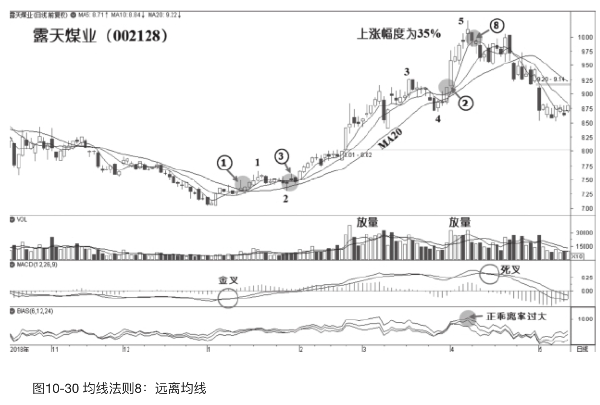

从指标上来看，在出现卖点⑧时，DIF线在向DEA线靠近，即将形成死叉，也就是红柱在收敛；KDJ指标的K快线在80线附近向下拐头，这都意味着产生短线卖点，指标与均线法则⑧相互配合使用，可以提高卖出成功率。

在判断股价远离均线方面，有很多方法都可以起到与BIAS相同的效用。当BIAS指标的正值达到较高水平时，其他一些指标值在多数情况下也会达到较高水平，比如成交量，短期均线与长期均线之间的距离，DIF数值等等。

**在均线组中使用格兰威尔均线法则**

格兰威尔均线八大法则根据价格和均线的位置关系，总结出了一套具有优势的买入和卖出方法。有经验的交易者会注意到，短期均线和长期均线相配合，也可以适用这八大法则，如图10-31所示。比如MA5与MA10均线黄金交叉适用法则①，MA5回踩MA10均线适用法则③。短期与长期均线还可以是MA10与MA20均线的组合。

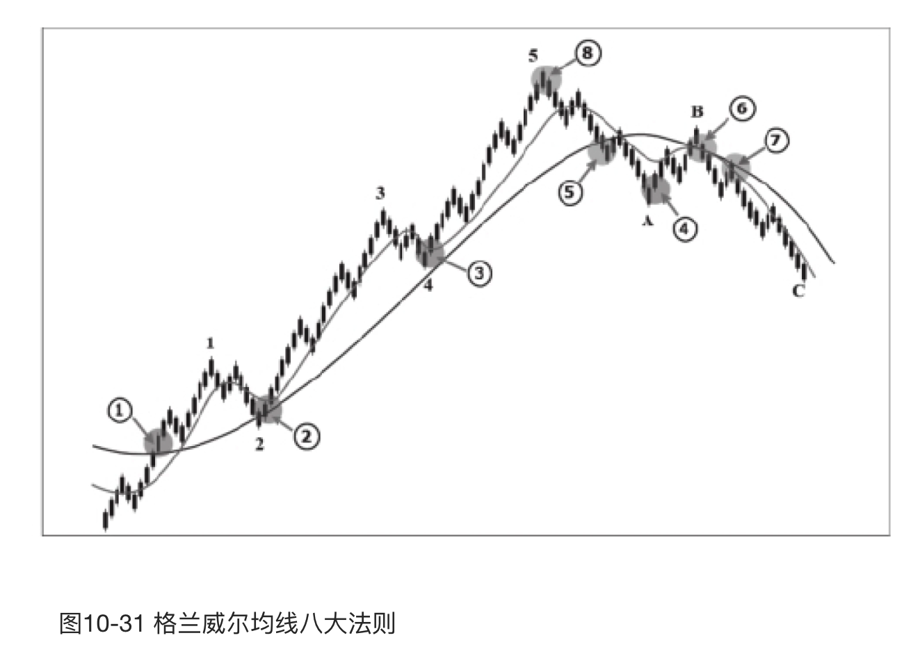

在运用均线法则时一定要注意均线的位置和方向，比如卖点⑤与买点②都是从MA10均线之上的波峰回落并测试均线，两者在形态上有相似之处，但从行情的发展阶段来看，却有着明显的不同，并导致向上的概率和空间都会产生巨大差异，卖点⑥与买点①也是相似但不同的位置。交易者需要多加注意，在做多时，绝不能在位置⑤和⑥处贸然加仓或追高。
