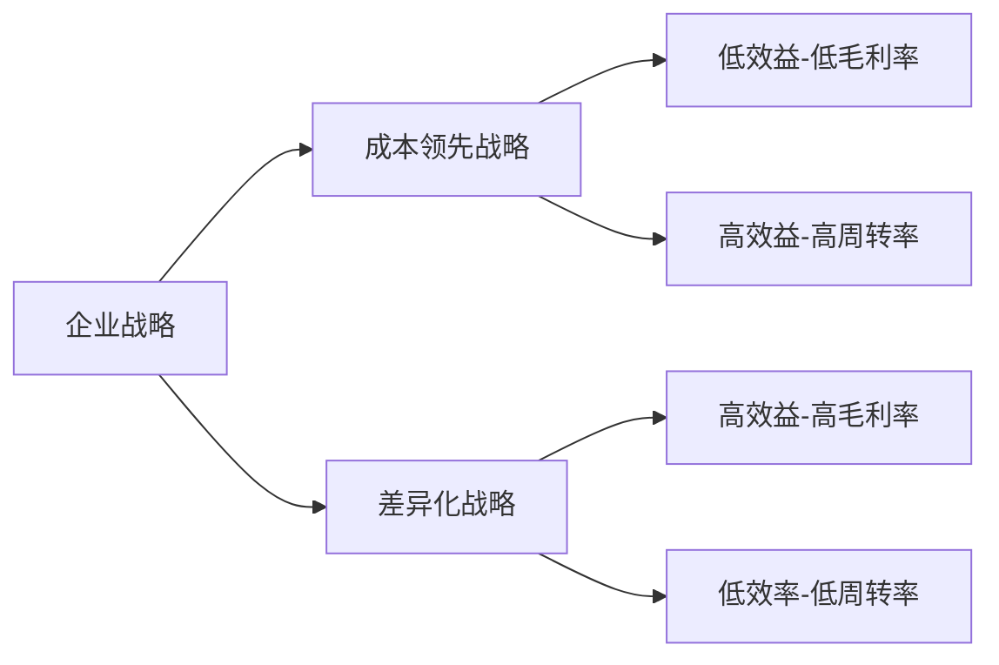

    作者: 肖星
    出版社: 机械工业出版社
    出品方: 华章经管
    副标题: 看懂财富流转的规律
    出版年: 2020-4
    页数: 320
    定价: 69.00元
    装帧: 平装
    ISBN: 9787111651666

[豆瓣链接](https://book.douban.com/subject/35033236/)

- [了解财务知识，看清企业兴衰](#了解财务知识看清企业兴衰)
- [认清行业大势，把脉客户关系](#认清行业大势把脉客户关系)
  - [最爱的人伤我最深：“唯利是图”的客户](#最爱的人伤我最深唯利是图的客户)
  - [火眼金睛识对手：竞争对手](#火眼金睛识对手竞争对手)
  - [谁动了我的奶酪：应收账款](#谁动了我的奶酪应收账款)
    - [从应收账款看销售业务](#从应收账款看销售业务)
    - [从应收账款看客户价值](#从应收账款看客户价值)
    - [用财务手段盘活应收账款](#用财务手段盘活应收账款)
    - [如何确定坏账](#如何确定坏账)
    - [坏账的影响](#坏账的影响)
    - [应收账款背后的秘密](#应收账款背后的秘密)
      - [用坏账操纵利润](#用坏账操纵利润)
    - [其他应收款：一个箩筐，什么都往里装](#其他应收款一个箩筐什么都往里装)
- [洞察产业链条，挖掘采购潜力](#洞察产业链条挖掘采购潜力)

# 了解财务知识，看清企业兴衰
在财务人眼中，这些企业有一个共同点，那就是，所有的企业都经历着一个从投入资金到回收货款的过程，循环往复、周而复始、永不停息，直到企业关门（见图1-1）。

企业经营主要做三件事。

1. 企业的投资人（或股东）把钱投入企业，为生产经营做准备，我们称为融资活动。
2. 企业用这些钱购买厂房、设备等基础设施，这种事并不会每天都发生，我们称为投资活动。
3. 企业每天都在上演，那就是购买原材料、生产产品、销售产品、回收货款……我们称为经营活动。

所以，企业纷繁复杂的各种交易和经济活动，在财务人眼中只有三类，那就是经营活动、投资活动和融资活动（见图1-2）。

# 认清行业大势，把脉客户关系
## 最爱的人伤我最深：“唯利是图”的客户
1. 卖什么？企业既可以卖商品，也可以卖服务；可以卖有形商品，也可以卖无形商品；可以卖自产商品，也可以卖外购商品。
2. 把东西卖给谁？可以把企业客户分成两种类型：一种是其他企业（即2B），另一种是个人消费者（即2C）。
3. 怎么卖、如何收款？常见的收款方式有：一手交钱，一手交货（即现销）；先付款，再发货（即预收）；先发货，再付款（即赊销，也是最常见的）；分期付款。

## 火眼金睛识对手：竞争对手
1. 竞争对手在哪里？它可以有三个来源：同行业的公司、行业新进入者、替代产品提供者。
2. 竞争会给我们造成什么影响？它会对价格产生冲击，会导致产能过剩与客户议价能力的提升。
3. 面对竞争，我们可以做些什么？可以实施两种不同类型的战略：成本领先战略和差异化战略。成本领先战略需要将成本降到比所有竞争对手都低，以低价吸引顾客；差异化战略需要让产品和服务具备某方面的独特性，吸引顾客为此付高价。
4. 从财务的视角看竞争战略是什么样的？成本领先战略是薄利多销，即低效益（低毛利率）、高效率（高周转率），也称效率制胜战略；差异化战略正好相反，是效益制胜战略，高效益（高毛利率）、低效率（低周转率）。

竞争的影响

1. 对价格的冲击。当价格下降而成本不降时，马上就会引发`毛利率`的下降。
2. 毛利率可以反映竞争的激烈程度
3. 产能过剩与客户议价能力的提升

应对竞争，两大战略类型：

- `成本领先战略`是指，我们提供的产品、服务都是大众化的产品，但我们可以想方设法把成本降低。比如利用行业规模经济性，即增加产量，单位成本就会被摊薄；通过提高效率来降低成本；还可以通过简化产品的设计，把不太重要的功能去掉来降低成本；通过减少广告投入、营销投入等方式来降低成本；通过建立严格的成本管理体系来降低成本。
- `差异化战略`正好相反，它要求我们把产品或服务做得富有特色。比如，提高质量，好到他人无法企及；提供更好的售后服务，让顾客感受到产品的独特性；提供非常完善的选择，用各种各样的型号满足顾客多元化的需求；提供更好的送货选择，如送货便捷或者送货速度快。也有一些企业是依靠独特的品牌形象来获得这种独特性的，比如品牌非常知名，而知名的品牌会给企业带来额外的好处。还有一些公司擅长创新和研发，总能做出别人做不出的产品。总之，都是通过各种各样的方式，让产品或服务具有某种独特性，这样就有可能给产品或服务定一个比较高的价格，利润空间也就更大。所以，差异化战略是一个定位于高端市场的战略。

从财务视角看竞争战略：

表3-1　苹果和联想的对比

对比项目 | 苹果 | 联想
-----|----|---
毛利率（效益） | 40% | 13%
周转率（效率） | 0.9 | 2

## 谁动了我的奶酪：应收账款
1.如何管好应收账款？可以通过应收账款回收周期来了解企业在销售业务的组织和效率方面的差异；可以通过应收账款来评判客户的价值；可以通过保理业务将应收账款出售给银行，从而盘活应收账款。
2.钱收不回来怎么办？可以按照应收账款的一定比例估计坏账，对此，企业拥有较大的自主决策权；计提坏账会减少当期的利润，也会减少资产；如果已经计提的坏账日后收回，收回当年的利润就会增加，这也可能导致会计利润的操纵。
3.应收账款背后有什么秘密？应收账款和其他应收款都可能被用来调节利润。比如，在以下情况下，都有可能会产生通过计提坏账操纵利润的现象：企业想要平滑利润，企业新换总经理，国有企业出售股权。其他应收款更是装着很多企业不方便拿到台面上来的东西，隐藏着更大的秘密。

在销售业务中，如果企业在发货时没有收到全部的货款，就产生了一个收款的权利——`应收账款`。

    应收账款=全部价款-已收现金

### 从应收账款看销售业务
以服装行业为例，我们来看两家定位和档次相似、规模相当的男装企业：七匹狼和报喜鸟。2016年，两家企业的销售收入均在20亿元左右，但它们应收账款的回收周期差异很大：其中七匹狼平均30天收回它的应收账款，而报喜鸟平均需要85天（见图4-1）。七匹狼的应收账款回收周期要远远优于报喜鸟。

- 报喜鸟的销售举措：一方面，发展私人定制，并为此开了700多个线下网点；另一方面，在成衣销售方面，拥有线下1000多家销售网点及电商平台的旗舰店，如天猫旗舰店。总体上，报喜鸟以传统的线下直营店（成衣及私人定制）为主，在一定程度上利用了线上电商平台。
- 七匹狼的销售举措则多种多样：首先，它对现有的渠道进行了重分类，将线下渠道划分为品牌店、工厂店和优厂店，各自有不同的定位，销售不同档次的产品；其次，在直营店推动合伙人机制，在加盟店推动利益共享机制，充分调动门店的积极性；再次，培养超级导购模式，建立了关于客户的大数据营销体系；最后，开发了线上平台，一方面可以去库存，另一方面可以销售其他企业的产品，当然，这些产品不得与七匹狼自身产品存在利益冲突。由上可以看出，七匹狼构建了全方位的营销体系，当面临服装行业不景气、零售行业遭受电商冲击的情况时，它可以有更全面的应对措施。

两家公司应收账款回收周期的不同体现出它们在销售业务的组织和效率方面的差异。

### 从应收账款看客户价值
应收账款除了可以帮我们看到销售业务的健康程度，还可以帮我们看到客户的价值。我们找到目前上市公司应收账款占所有资产比重最大的几家公司，对其进行分析，其中排名第三的是奇信股份，主要从事对公装修业务。奇信股份2016年应收账款的总额为24亿元，占所有资产的68%，其中最大客户欠款1.7亿元，账龄在3年以上；第二大客户欠款1亿元，账龄超过4年。在这种情况下，公司应当重新审视这些大客户的价值。如果与它们往来的业务利润水平比较低，而企业因为与它们交易而面临大额的资金占用成本和坏账损失风险，那么需要重新考虑是否有必要继续与这些大客户保持业务关系。

### 用财务手段盘活应收账款
华信国际主要从事能源行业的成品油业务。2016年该公司的应收账款占总资产的比重达到了71%，总额达70亿元，由于能源行业成品油业务利润水平较低，毛利率仅为2%左右，且其应收账款平均收款期达到了95天，企业面临着较大的坏账成本和风险。为了解决这个问题，公司对其欠款前五名的客户共计14亿元的应收账款进行了附带追索权的`保理业务`，从银行收回了一定数额的资金。

### 如何确定坏账
坏账的确定更大程度上是一种估计而不是一种确认，所以自己判断的空间很大。

### 坏账的影响
发生坏账，一方面，应收账款收不回来，显然应该减少应收账款。另一方面，回忆一下销售业务收入的确认和应收账款的记录，如果500万元销售中有100万元收不回来，相当于原来认为按500万元卖的东西只卖了400万元，所以原来记500万元的收入记多了，要将多记的部分减掉，从而减少利润。但不直接减去收入，而是记录在“资产减值损失”这个账户中，这会导致利润减少。

如果计提的坏账又收回来了，这说明当初的估计错了，应该纠正。之前提坏账减少了应收账款，减少了利润，现在就应该增加应收账款，增加利润。这就会出现一个问题，比如去年计提坏账，去年的利润就减少了，今年收回了计提的坏账，今年的利润就增加了，这相当于利润在两个年度之间进行了重新分配。那会不会有人有意利用这一点来调整利润呢？

### 应收账款背后的秘密
#### 用坏账操纵利润
本来没有坏账，而公司有意计提，然后在另一个年度再转回来。实际上，这是非常常见的利润操纵手法。

为什么公司要这样做呢？最常见的一种目的就是避免利润的大幅波动。

公司更换总经理的时候也有可能出现这种情况。总经理的更换不一定是在1月1日这种会计年度的第一天，如果他9月份上任，当年业绩不好，大家不会认为是他造成的，而会认为是前任没有做好。于是新上任的总经理就可以多提坏账把当年的业绩降下来，第二年再转回坏账提升利润，这样大家就会把第二年业绩的提升归功于新任总经理。

这还会出现在国有企业进行股权转让、民营化（国有变私有）时。比如，顾雏军曾经收购过一些国有企业，他在收购这些企业之前会让企业计提很多坏账或者使用其他让资产减值的手段，比如提1亿元的坏账，这就使得应收账款减少了1亿元，资产也就减少了1亿元，同时利润也减少了1亿元。这就让被收购的企业看起来盈利能力很差，资产也很少，似乎不值钱，于是顾雏军就以此为借口，用很低的价格收购这家国有企业。收购完后，他又将这些坏账转回，账面上看来所有这些公司在他收购后业绩都有很明显的提升。

### 其他应收款：一个箩筐，什么都往里装
`应收账款`一定发生在销售过程中，是客户的欠款，但`其他应收款`是指客户之外的其他人的欠款。

# 洞察产业链条，挖掘采购潜力

