    作者: 肖星
    出版社: 机械工业出版社
    出品方: 华章经管
    副标题: 看懂财富流转的规律
    出版年: 2020-4
    页数: 320
    定价: 69.00元
    装帧: 平装
    ISBN: 9787111651666

[豆瓣链接](https://book.douban.com/subject/35033236/)

- [了解财务知识，看清企业兴衰](#了解财务知识看清企业兴衰)
- [认清行业大势，把脉客户关系](#认清行业大势把脉客户关系)
  - [最爱的人伤我最深：“唯利是图”的客户](#最爱的人伤我最深唯利是图的客户)
  - [火眼金睛识对手：竞争对手](#火眼金睛识对手竞争对手)
  - [谁动了我的奶酪：应收账款](#谁动了我的奶酪应收账款)
    - [从应收账款看销售业务](#从应收账款看销售业务)
    - [从应收账款看客户价值](#从应收账款看客户价值)
    - [用财务手段盘活应收账款](#用财务手段盘活应收账款)
    - [如何确定坏账](#如何确定坏账)
    - [坏账的影响](#坏账的影响)
    - [应收账款背后的秘密](#应收账款背后的秘密)
      - [用坏账操纵利润](#用坏账操纵利润)
    - [其他应收款：一个箩筐，什么都往里装](#其他应收款一个箩筐什么都往里装)
- [洞察产业链条，挖掘采购潜力](#洞察产业链条挖掘采购潜力)
  - [买的没有卖的精：“欺软怕硬”的供应商](#买的没有卖的精欺软怕硬的供应商)
    - [记什么](#记什么)
    - [什么时候记](#什么时候记)
    - [怎么记以及记多少](#怎么记以及记多少)
    - [供应商的谈判能力](#供应商的谈判能力)
    - [行业环境的分析框架：五力图](#行业环境的分析框架五力图)
  - [不当家不知柴米贵：其他采购活动](#不当家不知柴米贵其他采购活动)
    - [其他物品的采购](#其他物品的采购)
    - [销售费用](#销售费用)
    - [管理费用](#管理费用)
- [打磨生产流程，构筑竞争优势](#打磨生产流程构筑竞争优势)
  - [成本的前世今生：财务中的“成本”](#成本的前世今生财务中的成本)
    - [生产过程](#生产过程)
    - [生产成本](#生产成本)
    - [营业成本](#营业成本)
    - [存货的计价](#存货的计价)
  - [小项目里有大乾坤：“有用”的存货](#小项目里有大乾坤有用的存货)
    - [存货的跌价](#存货的跌价)
    - [存货的周转率](#存货的周转率)
    - [存货周转率反映的管理信息](#存货周转率反映的管理信息)
- [统筹薪酬激励，凝聚团队力量](#统筹薪酬激励凝聚团队力量)
  - [每个员工都是“供应商”：职工薪酬](#每个员工都是供应商职工薪酬)
    - [薪酬的项目](#薪酬的项目)
    - [薪酬的记录](#薪酬的记录)
    - [从“人”的角度评价公司的效率](#从人的角度评价公司的效率)
    - [应付职工薪酬反映的管理信息](#应付职工薪酬反映的管理信息)
  - [给员工戴上“金手铐”：股权激励](#给员工戴上金手铐股权激励)
    - [认识股权激励](#认识股权激励)
    - [股权激励的会计和税务问题](#股权激励的会计和税务问题)
- [弄潮资本市场，助你如虎添翼](#弄潮资本市场助你如虎添翼)
  - [企业不可承受之“重”：固定资产](#企业不可承受之重固定资产)
    - [企业的投资](#企业的投资)
    - [固定资产](#固定资产)
    - [将重资产变轻](#将重资产变轻)
    - [初识折旧](#初识折旧)
    - [固定资产持有期间的问题](#固定资产持有期间的问题)
  - [我的不是我的，你的才是我的：无形资产](#我的不是我的你的才是我的无形资产)
    - [认识无形资产](#认识无形资产)
  - [六月的天气，孩子的脸：金融资产](#六月的天气孩子的脸金融资产)
    - [认识金融资产](#认识金融资产)
  - [股权投资要讲感情：股权投资](#股权投资要讲感情股权投资)
    - [认识长期股权投资](#认识长期股权投资)
    - [成本法和权益法](#成本法和权益法)
    - [合并报表](#合并报表)
  - [带上你的嫁妆跟我走：兼并收购](#带上你的嫁妆跟我走兼并收购)
    - [认识兼并收购](#认识兼并收购)
  - [“有借有还，再借不难”与“空手套白狼”：融资之道](#有借有还再借不难与空手套白狼融资之道)
    - [融资决策的基本依据](#融资决策的基本依据)
- [鸟瞰财务报表，掌控企业大局](#鸟瞰财务报表掌控企业大局)
  - [为你的家底拍张照：资产负债表](#为你的家底拍张照资产负债表)
  - [为赚钱的过程拍视频：利润表](#为赚钱的过程拍视频利润表)
  - [我的眼里只有钱：现金流量表](#我的眼里只有钱现金流量表)

# 了解财务知识，看清企业兴衰
在财务人眼中，这些企业有一个共同点，那就是，所有的企业都经历着一个从投入资金到回收货款的过程，循环往复、周而复始、永不停息，直到企业关门（见图1-1）。

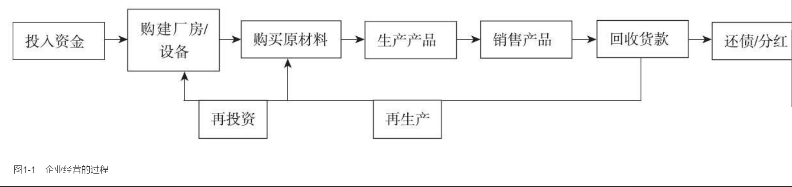

企业经营主要做三件事。

1. 企业的投资人（或股东）把钱投入企业，为生产经营做准备，我们称为融资活动。
2. 企业用这些钱购买厂房、设备等基础设施，这种事并不会每天都发生，我们称为投资活动。
3. 企业每天都在上演，那就是购买原材料、生产产品、销售产品、回收货款……我们称为经营活动。

所以，企业纷繁复杂的各种交易和经济活动，在财务人眼中只有三类，那就是经营活动、投资活动和融资活动（见图1-2）。

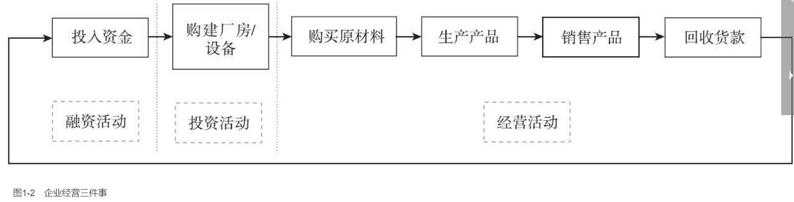

# 认清行业大势，把脉客户关系
## 最爱的人伤我最深：“唯利是图”的客户
1. 卖什么？企业既可以卖商品，也可以卖服务；可以卖有形商品，也可以卖无形商品；可以卖自产商品，也可以卖外购商品。
2. 把东西卖给谁？可以把企业客户分成两种类型：一种是其他企业（即2B），另一种是个人消费者（即2C）。
3. 怎么卖、如何收款？常见的收款方式有：一手交钱，一手交货（即现销）；先付款，再发货（即预收）；先发货，再付款（即赊销，也是最常见的）；分期付款。

## 火眼金睛识对手：竞争对手
1. 竞争对手在哪里？它可以有三个来源：同行业的公司、行业新进入者、替代产品提供者。
2. 竞争会给我们造成什么影响？它会对价格产生冲击，会导致产能过剩与客户议价能力的提升。
3. 面对竞争，我们可以做些什么？可以实施两种不同类型的战略：成本领先战略和差异化战略。成本领先战略需要将成本降到比所有竞争对手都低，以低价吸引顾客；差异化战略需要让产品和服务具备某方面的独特性，吸引顾客为此付高价。
4. 从财务的视角看竞争战略是什么样的？成本领先战略是薄利多销，即低效益（低毛利率）、高效率（高周转率），也称效率制胜战略；差异化战略正好相反，是效益制胜战略，高效益（高毛利率）、低效率（低周转率）。

竞争的影响

1. 对价格的冲击。当价格下降而成本不降时，马上就会引发`毛利率`的下降。
2. 毛利率可以反映竞争的激烈程度
3. 产能过剩与客户议价能力的提升

应对竞争，两大战略类型：

- `成本领先战略`是指，我们提供的产品、服务都是大众化的产品，但我们可以想方设法把成本降低。比如利用行业规模经济性，即增加产量，单位成本就会被摊薄；通过提高效率来降低成本；还可以通过简化产品的设计，把不太重要的功能去掉来降低成本；通过减少广告投入、营销投入等方式来降低成本；通过建立严格的成本管理体系来降低成本。
- `差异化战略`正好相反，它要求我们把产品或服务做得富有特色。比如，提高质量，好到他人无法企及；提供更好的售后服务，让顾客感受到产品的独特性；提供非常完善的选择，用各种各样的型号满足顾客多元化的需求；提供更好的送货选择，如送货便捷或者送货速度快。也有一些企业是依靠独特的品牌形象来获得这种独特性的，比如品牌非常知名，而知名的品牌会给企业带来额外的好处。还有一些公司擅长创新和研发，总能做出别人做不出的产品。总之，都是通过各种各样的方式，让产品或服务具有某种独特性，这样就有可能给产品或服务定一个比较高的价格，利润空间也就更大。所以，差异化战略是一个定位于高端市场的战略。

从财务视角看竞争战略：

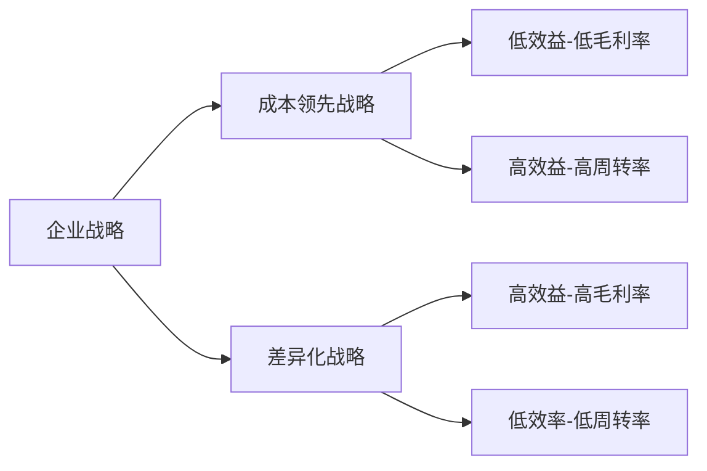
```mermaid
graph LR;
    r[企业战略]-->a[成本领先战略]
    r-->b[差异化战略]
    a-->a1[低效益-低毛利率]
    a-->a2[高效益-高周转率]
    b-->b1[高效益-高毛利率]
    b-->b2[低效率-低周转率]
```

表3-1　苹果和联想的对比

对比项目 | 苹果 | 联想
-----|----|---
毛利率（效益） | 40% | 13%
周转率（效率） | 0.9 | 2

## 谁动了我的奶酪：应收账款
1. 如何管好应收账款？可以通过应收账款回收周期来了解企业在销售业务的组织和效率方面的差异；可以通过应收账款来评判客户的价值；可以通过保理业务将应收账款出售给银行，从而盘活应收账款。
2. 钱收不回来怎么办？可以按照应收账款的一定比例估计坏账，对此，企业拥有较大的自主决策权；计提坏账会减少当期的利润，也会减少资产；如果已经计提的坏账日后收回，收回当年的利润就会增加，这也可能导致会计利润的操纵。
3. 应收账款背后有什么秘密？应收账款和其他应收款都可能被用来调节利润。比如，在以下情况下，都有可能会产生通过计提坏账操纵利润的现象：企业想要平滑利润，企业新换总经理，国有企业出售股权。其他应收款更是装着很多企业不方便拿到台面上来的东西，隐藏着更大的秘密。

在销售业务中，如果企业在发货时没有收到全部的货款，就产生了一个收款的权利——`应收账款`。

    应收账款=全部价款-已收现金

### 从应收账款看销售业务
以服装行业为例，我们来看两家定位和档次相似、规模相当的男装企业：七匹狼和报喜鸟。2016年，两家企业的销售收入均在20亿元左右，但它们应收账款的回收周期差异很大：其中七匹狼平均30天收回它的应收账款，而报喜鸟平均需要85天（见图4-1）。七匹狼的应收账款回收周期要远远优于报喜鸟。

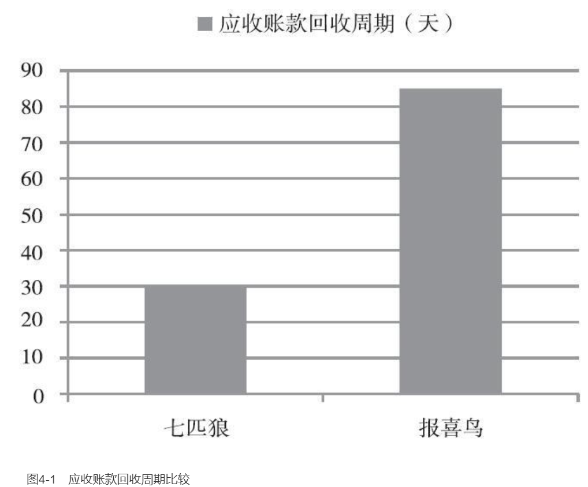

- 报喜鸟的销售举措：一方面，发展私人定制，并为此开了700多个线下网点；另一方面，在成衣销售方面，拥有线下1000多家销售网点及电商平台的旗舰店，如天猫旗舰店。总体上，报喜鸟以传统的线下直营店（成衣及私人定制）为主，在一定程度上利用了线上电商平台。
- 七匹狼的销售举措则多种多样：首先，它对现有的渠道进行了重分类，将线下渠道划分为品牌店、工厂店和优厂店，各自有不同的定位，销售不同档次的产品；其次，在直营店推动合伙人机制，在加盟店推动利益共享机制，充分调动门店的积极性；再次，培养超级导购模式，建立了关于客户的大数据营销体系；最后，开发了线上平台，一方面可以去库存，另一方面可以销售其他企业的产品，当然，这些产品不得与七匹狼自身产品存在利益冲突。由上可以看出，七匹狼构建了全方位的营销体系，当面临服装行业不景气、零售行业遭受电商冲击的情况时，它可以有更全面的应对措施。

两家公司应收账款回收周期的不同体现出它们在销售业务的组织和效率方面的差异。

### 从应收账款看客户价值
应收账款除了可以帮我们看到销售业务的健康程度，还可以帮我们看到客户的价值。我们找到目前上市公司应收账款占所有资产比重最大的几家公司，对其进行分析，其中排名第三的是奇信股份，主要从事对公装修业务。奇信股份2016年应收账款的总额为24亿元，占所有资产的68%，其中最大客户欠款1.7亿元，账龄在3年以上；第二大客户欠款1亿元，账龄超过4年。在这种情况下，公司应当重新审视这些大客户的价值。如果与它们往来的业务利润水平比较低，而企业因为与它们交易而面临大额的资金占用成本和坏账损失风险，那么需要重新考虑是否有必要继续与这些大客户保持业务关系。

### 用财务手段盘活应收账款
华信国际主要从事能源行业的成品油业务。2016年该公司的应收账款占总资产的比重达到了71%，总额达70亿元，由于能源行业成品油业务利润水平较低，毛利率仅为2%左右，且其应收账款平均收款期达到了95天，企业面临着较大的坏账成本和风险。为了解决这个问题，公司对其欠款前五名的客户共计14亿元的应收账款进行了附带追索权的`保理业务`，从银行收回了一定数额的资金。

### 如何确定坏账
坏账的确定更大程度上是一种估计而不是一种确认，所以自己判断的空间很大。

### 坏账的影响
发生坏账，一方面，应收账款收不回来，显然应该减少应收账款。另一方面，回忆一下销售业务收入的确认和应收账款的记录，如果500万元销售中有100万元收不回来，相当于原来认为按500万元卖的东西只卖了400万元，所以原来记500万元的收入记多了，要将多记的部分减掉，从而减少利润。但不直接减去收入，而是记录在“资产减值损失”这个账户中，这会导致利润减少。

如果计提的坏账又收回来了，这说明当初的估计错了，应该纠正。之前提坏账减少了应收账款，减少了利润，现在就应该增加应收账款，增加利润。这就会出现一个问题，比如去年计提坏账，去年的利润就减少了，今年收回了计提的坏账，今年的利润就增加了，这相当于利润在两个年度之间进行了重新分配。那会不会有人有意利用这一点来调整利润呢？

### 应收账款背后的秘密
#### 用坏账操纵利润
本来没有坏账，而公司有意计提，然后在另一个年度再转回来。实际上，这是非常常见的利润操纵手法。

为什么公司要这样做呢？最常见的一种目的就是避免利润的大幅波动。

公司更换总经理的时候也有可能出现这种情况。总经理的更换不一定是在1月1日这种会计年度的第一天，如果他9月份上任，当年业绩不好，大家不会认为是他造成的，而会认为是前任没有做好。于是新上任的总经理就可以多提坏账把当年的业绩降下来，第二年再转回坏账提升利润，这样大家就会把第二年业绩的提升归功于新任总经理。

这还会出现在国有企业进行股权转让、民营化（国有变私有）时。比如，顾雏军曾经收购过一些国有企业，他在收购这些企业之前会让企业计提很多坏账或者使用其他让资产减值的手段，比如提1亿元的坏账，这就使得应收账款减少了1亿元，资产也就减少了1亿元，同时利润也减少了1亿元。这就让被收购的企业看起来盈利能力很差，资产也很少，似乎不值钱，于是顾雏军就以此为借口，用很低的价格收购这家国有企业。收购完后，他又将这些坏账转回，账面上看来所有这些公司在他收购后业绩都有很明显的提升。

### 其他应收款：一个箩筐，什么都往里装
`应收账款`一定发生在销售过程中，是客户的欠款，但`其他应收款`是指客户之外的其他人的欠款。

# 洞察产业链条，挖掘采购潜力
## 买的没有卖的精：“欺软怕硬”的供应商
1. 采购业务及其财务表现。企业可以采购有形商品，也可以采购无形商品；可以采购原材料，也可以采购半成品、产成品。企业发生采购业务时，在财务上记什么、何时记以及如何记。
2. 供应商谈判能力。供应商的谈判能力与原材料市场的竞争程度以及行业集中度有关，会影响商品的采购价格，从而影响企业的成本以及毛利率，同时也会影响付款条件，这将反映在企业的应付款和预付款水平上。
当供应商强势时，企业毛利率较低，付款条件会更为苛刻，所以，企业的应付款较少，可能预付款较多。而供应商弱势时，则反之。
3. 五力图。有五种力量决定了行业的盈利能力：现有公司间的竞争、新进入者的威胁、替代产品的威胁、购买方的谈判能力和供应方的谈判能力。这五种力量来自于两个方面：竞争环境和产业链环境。

采购业务在财务上会如何表现呢？我们主要谈三个问题：首先，发生采购业务时，在财务上记什么？其次，什么时候记？最后，怎么记以及记多少？

### 记什么
首先一定要记原材料。

    借：存货——原材料
    贷：现金/银行存款/应付账款/应付票据

付款时记录：

    借：预付账款
    贷：现金/银行存款

收货时再记录：

    借：存货——原材料
    贷：预付账款

采购业务记录的对方科目：

付款方式

    一手交钱，一手交货   --->   银行存款
    先付款，再收货      --->   预付账款
    先收货，再付款      --->   应付账款/应付票据

### 什么时候记
采购货物的企业通常在收货时进行会计记录。需要说明的是，销售方是在发货时记录收入，而采购方需要等到收货时才记购进的存货，中间往往会有一个时间差。

### 怎么记以及记多少
    材料采购成本=商品价格+运费+装卸费+保险费+税金

比如我们花了11700元买电脑，卖电脑的企业替税务局收了1700元的增值税，卖电脑的企业收取了1700元增值税，它有义务在规定的期限内上交税务局，这是它欠税务局的款项，属于企业的负债。这个负债称为`应交税费`：

    借：现金/银行存款　1700
    贷：应交税费——应交增值税　1700

已经交给上游供应商企业的那部分增值税，我们称为`进项税`。在销售的时候从客户收取的这部分增值税，我们称为`销项税`。企业应缴纳的税款，应该是从客户收取的增值税减去已经交给供应商的增值税，即销项税与进项税的差额（见图5-2）。

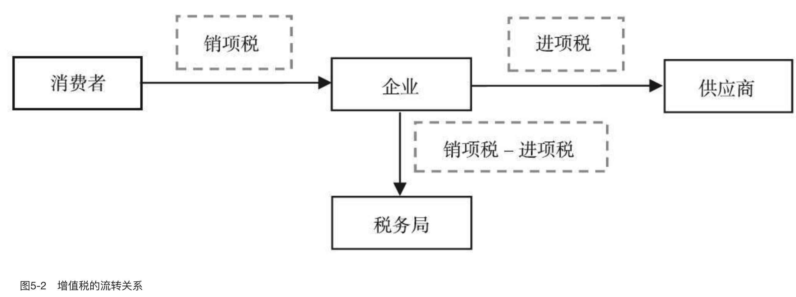

    企业应缴纳增值税=销项税-进项税

### 供应商的谈判能力
在采购业务中，采购价格、付款条件等也取决于供应商的谈判能力，而供应商的谈判能力取决于两个方面：所采购原材料的行业竞争程度以及行业集中度（供应商规模）。与销售不同的是，销售不管是一种商品还是一类商品，通常都是面对同一个销售市场，而即使企业只生产一种商品，也有可能要采购不同的原材料，即面对多个原材料市场。

一般而言，原材料市场竞争越激烈，供应商卖东西越难，对我们就越有利；反之，行业供不应求会使供应商谈判能力上升。而供应商行业集中度越高，规模越大，供应商谈判能力就越强。

>`行业集中度（Concentration Ratio）`又称行业集中率或市场集中度（Market Concentration Rate），是指某行业的相关市场内前N家最大的企业所占市场份额（产值、产量、销售额、销售量、职工人数、资产总额等）的总和，它是对整个行业市场结构集中程度的测量指标，用来衡量企业的数目和相对规模的差异，是市场势力的重要量化指标。

表5-1　企业与供应商关系及其财务表现

供应商VS.企业（采购方） | 企业（采购方）的财务表现
--------------|--------------
供应商强势，采购方弱势 | 预付款较多
供应商与采购方势均力敌 | 预付款少，但也没有什么应付款
供应商弱势，采购方强势 | 应付款较多

- 预付款较多：上游供不应求或者上游企业规模特别大。比如万方发展，由于我国森林覆盖率较低，木材资源一直是稀缺资源，依赖进口，导致木材供应方相对强势。表现在会计数据上，可以看到它的预付账款金额占其所有资产的58%，且近60%预付账款的账龄在2年以上。又如钢铁行业，虽然总体产能目前依然过剩，但由于其行业集中度比较高，且供应商规模一般比较大，因此供应商往往具有较强的议价能力，也需要预付款项采购原材料。其中上海钢联的预付款占到了该公司资产规模近30%的比例。但要注意，以上两家公司虽然预付款占比都比较大，但其原因不一样。前者是因为原材料供不应求，后者则是因为上游供应商企业规模较大。
- 预付款少，但也没有什么应付款：这种行业通常通过一手交钱，一手交货的方式进行贸易结算，上游为一般竞争行业且行业集中度不高，说明企业和上游供应商之间本身也处于“势均力敌”的状态。天坛生物、百润股份就是上游属于一般竞争行业的。当然还有另一种情况，即原材料的采购量特别少，如高速公路、机场等，它们不需要采购什么原材料，只是对过往车辆、出租商铺进行收费。
- 应付款较多：上游供过于求且规模不太大，供应商谈判能力弱，采购方处于相对强势的地位。如延长化建的供应商是一些小型的施工队，谈判能力较弱，于是其应付款占总资产50%的规模。不过由于其下游业主主要是一些化工企业，在它们面前，延长化建也缺乏议价能力，所以它的应收款项也特别多，占总资产规模近50%，这是一家一边欠着别人钱、一边又被欠钱的企业。又如苏宁云商，主营家电零售。其上游企业为家电生产企业，由于家电生产企业前几年竞争异常激烈，所以苏宁云商在2013年以前应付款占总资产比例一直在近50%的水平。近两年，由于家电行业竞争趋稳，家电销售行业受到电商的冲击（2011年京东涉足家电销售），因而其谈判能力开始减弱，其应付款占比开始下降。

### 行业环境的分析框架：五力图
行业环境的分析框架：`五力图`：

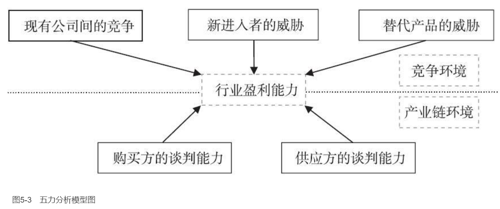

竞争环境方面：企业面临的首要竞争是同行业公司的竞争，它们与企业在同一个行业里，提供相似的产品或服务。其次是新进入者的威胁，本来不在同一行业中的企业因为该行业赚钱而被吸引进来，于是带来了竞争压力。常常被忽略的是替代品竞争，比如BP机被手机取代，功能手机被智能手机取代，胶片相机被数码相机取代，低端数码相机被智能手机取代，这种新产品不仅仅是原有产品的竞争来源，更是彻底颠覆了原来的产品或行业，这是一种更强有力的竞争。

产业链环境方面：上游就是供应商，下游就是客户（购买方）。我们和供应商以及客户的关系，决定了我们处在怎样的产业链环境中。

以上五种力量共同决定了行业的盈利能力，也因此对很多财务数据产生影响，主要表现在毛利率、应收款/预收款（对客户）、应付款/预付款（对供应商）等指标上。

软件行业是指为企业客户提供定制软件的行业，我们身边这样的软件公司很多，可没有规模巨大的，可见这并非一个产业集中度高的行业。另外，由于软件行业提供定制化的服务，所以需要大量的人力资本投入，因而竞争不是很激烈。

接下来看软件行业的上下游：软件企业很少采购原材料，所以谈不上与供应商的关系。它的下游是企业客户，因为面对的客户规模较大，所以谈判能力不太强。

家电零售曾经是一个比较赚钱的行业，但现在的整体竞争非常激烈。家电零售其实是家电企业的中间环节，从家电企业的利润中分一杯羹。家电行业的暴利时代早就过去了，所以这杯羹也分不了太多。而随着2011年京东的进入，家电零售的竞争日趋激烈，但同时行业集中度也很高，国美、苏宁、京东这三家公司大约占了家电零售80%的市场份额。

家电零售的上游是家电生产企业，七八年前，家电生产曾面临着白热化的竞争，这几年随着优胜劣汰的整合，家电业的竞争有所缓解。由于行业集中度越来越高，大的家电零售商对于供应商有一定的谈判能力。家电零售的下游是个人消费者，即2C业务，这与软件行业2B的业务不同，从销售模式上来说是“一手交钱，一手交货”的业务，面对个人消费者并没有什么劣势。

表5-2　五力因素对财务数据的影响

财务数据 | 东软集团(%) | 苏宁云商(%) | 备注
-----|---------|---------|---
毛利率 | 30 | 14 | 竞争环境
应收账款占比 | 12 | 0 | 客户谈判能力
预收账款占比 | 3 | 1 | 软件开发预收定金
应付账款占比 | 9 | 28 | 供应商谈判能力
预付账款占比 | 0 | 7 | 软件采购很少

先看毛利率，东软集团比苏宁云商的毛利率高一倍多，其巨大差异因为行业竞争的不同：软件行业竞争不太激烈，而家电零售业竞争激烈。

与下游客户谈判能力的差异表现为应收账款占比的差异。软件行业对于企业客户来说谈判能力较弱，因而应收账款占比为12%，而苏宁云商面对的是个人消费者，所以应收账款占比接近于零。

从预收账款角度来看，由于软件的定制开发活动往往需要客户预交一定的资金，所以表5-2中的东软集团3%的预收账款占比实际上体现了这一交易流程。而苏宁云商面对个人消费者基本不存在应收款项和预收款项，这里的预收款可能与售卡这类储值类服务相关。

再来看看应付账款和预付账款的情况，这两个指标主要体现了与供应商的关系，从表5-2可以看出，东软集团占用供应商资金的能力和水平相对较低。而苏宁云商却可以比较多地占用供应商资金，原因可能在于软件行业没有太多采购需求。苏宁云商28%的应付账款占比还不算很高，在七八年前，这个数字大约在50%甚至更高，那时家电生产竞争激烈，零售商对于生产商来说谈判能力较强。

## 不当家不知柴米贵：其他采购活动
1. 企业在采购主要材料之外还会采购一些其他物品。低值易耗品是指使用期限较长但价值不高，不记入固定资产的物品；生物资产是指企业的一些动植物资产；企业还会采购各种类型的服务，比如广告服务、培训服务、咨询服务等。
2. 企业购买的服务一般都计入费用，或是销售费用，或是管理费用。销售费用水平可以反映企业渠道成本的高低，管理费用水平可以反映企业研发支出的高低。

### 其他物品的采购
我们通常认为固定资产就是指那些使用期限比较长的资产，但其实有一些物品虽然使用期限长，可因为不那么值钱，所以并不记入固定资产账户，而是记在存货账户中。这样的物品在日常生活中很常见，比如老师讲课时用的激光笔、U盘，可能会使用很长时间（五六年），但我们并不认为激光笔是一项固定资产（因为它比较便宜）。

有一些行业还会使用一些特殊物品，比如建筑公司建房用的脚手架、模板，这些东西价值不高，却会反复地使用，它们不会记入固定资产，而是记在存货里。所以，存货中除了原材料，还包括一类特殊物品——`低值易耗品`。

农业企业的资产中会有蔬菜、树木，可能还有鸡、鸭、猪、牛、羊等家禽家畜，水产公司可能会有鱼、虾或者其他水产，这类资产我们统称为`生物资产`。

生物资产未必都是存货。比如经营一家养鸡场，最重要的资产就是鸡，鸡在会计上应该确认为什么会计科目呢？

我们用鸡蛋孵出小鸡，把鸡养大后卖掉，这时鸡本身就是这个养鸡场的产品，应该记入存货。这时又有一个问题，鸡分公鸡和母鸡，如果孵出来的是母鸡，我们通常不会想着把它卖了或是杀掉，而会饲养它，再让它去下蛋。这种情况下，鸡本身并不是我们的产品，它所生产出来的鸡蛋才是我们的产品，鸡可以看作生产鸡蛋的“设备”，就像制造业企业的机器设备一样，应记入固定资产。这时生物资产就是固定资产的一种类型，叫作生产性生物资产（见图6-1）。

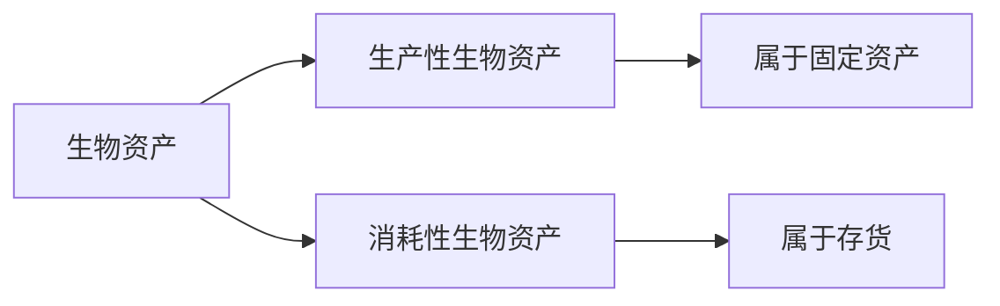
```mermaid
flowchart LR;
    r[生物资产]-->a[生产性生物资产]
    r-->b[消耗性生物资产]
    a-->c[属于固定资产]
    b-->d[属于存货]
```

并非所有的生物资产都是存货。计入存货的那部分生物资产，我们称作`消耗性生物资产`，它的主要特点是其本身就是企业的产品，或者将来可以收获成为企业的产品。比如自种的蔬菜、水稻或小麦以及那些不结果实的树木，园艺公司种的待成熟后可出售的草皮以及各种观赏性的树木，水产养殖公司饲养的鱼虾等。当然，也有些消耗性生物资产不是人工种植或养殖的，而是自然生长的，比如树林里的树木。

生物资产的成本如何确定呢？与原材料同样的道理，生产的水稻或蔬菜，它们的成本包括最初的种子材料成本、培育过程中的化肥饲料耗费与人工成本等。再比如，观赏性的树木成本，包含最初的树苗成本、培育过程中的化肥成本、人工成本及其他支出。如果养鱼，则包含最初的鱼苗成本、养殖过程中的饲料支出、人工成本等。因此，生物资产的成本应当包括养育过程中所耗费的各种类型的成本。

### 销售费用
企业会购买各种类型的服务，比如广告服务、培训服务、咨询服务、运输服务和销售服务等。大部分情况下，购买的服务都被计入费用，主要涉及两个费用项目：销售费用和管理费用。

什么是销售费用，比如我们打算开店卖东西，需要一个门店，而这个门店是租来的，我们为这个门店支付的租金就属于销售费用。

很多企业有销售部门，销售部门的员工工资、奖金、提成，出差的差旅费，请客户吃饭的业务招待费，公司广告促销费等，这些支出都属于销售费用。

如果是销售有形商品的企业，就需要仓库存放存货，把商品从仓库运到销售场所花费的运费也计入销售费用。所有为了达成销售而花费的支出都是销售费用。

销售费用项目如图6-2所示。

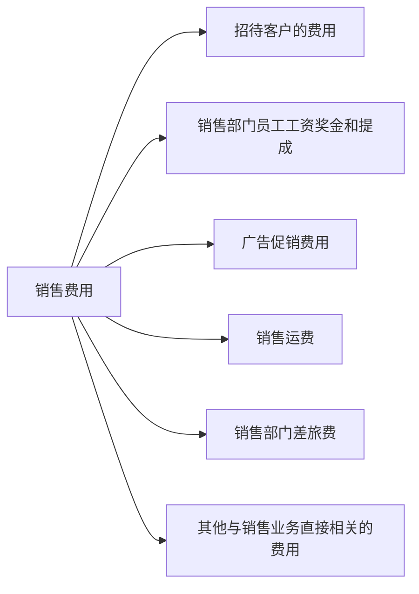
```mermaid
flowchart LR;
    r[销售费用]-->a[招待客户的费用]
    r-->b[销售部门员工工资奖金和提成]
    r-->c[广告促销费用]
    r-->d[销售运费]
    r-->e[销售部门差旅费]
    r-->g[其他与销售业务直接相关的费用]
```

资产与费用的关系如何呢？比如，购买原材料，会产生存货资产；购买广告服务，会产生销售费用。在购买时，我们都需要花一笔钱出去，这是它们的共同之处。那么它们的区别是什么呢？如果这个钱花出去可以换来一个以后有用的东西，我们就称它为资产，比如购买了原材料，之后可以利用原材料继续生产产品。如果购买支出不能为未来留下什么，这种支出我们称为费用，比如付了一个月的广告费，就只能享受一个月的广告服务。

现在上市公司平均的销售费用大概占企业整体收入水平的6%。其中包含销售场所的租金，销售人员的工资、奖金、差旅费、业务招待费，可能还有广告费、运费等。这些支出基本上与规模相关。

如果按销售费用占收入的比重来降序排列的话，排在最前面的公司有一半以上都是医药行业的企业。比如，益佰制药的销售费用占它所有收入的50%左右，按照公司的披露，销售费用的20%是促销费，20%是开发费，20%是差旅费，除此之外还有一些会议费。在中国，医药行业很大程度上依赖于医院这一销售渠道，要让医院能够使用该企业的药品就必然发生促销开支、差旅费用和会议开支，这些费用很大程度上都用于建立和巩固医院和医生这一销售渠道，因此，医药行业的渠道成本特别高。

另一个例子就是互联网行业。直觉告诉我们互联网行业是一个特别赚钱的行业，但事实上互联网行业虽然毛利率水平很高，可其渠道成本往往也很高。来看两家互联网公司。一个是三六五网，这家公司主营网上的房地产家居销售业务，即互联网家居销售平台。这家公司的毛利率高达90%，可它的销售费用“吃”掉了60%，也就是说，收入扣减成本后剩90%，但把销售费用去掉后就只剩下30%了，所以，销售费用“吃”掉了它相当大的一部分收入。按照公司的披露，它的销售费用中有60%属于业务推广费，这实际上也反映了很多互联网公司需要支付的大量的渠道或者营销成本。再看另一家互联网公司昆仑万维，这是一家做网络游戏的企业，它的毛利率比较高，达到53%。它的销售费用占收入的26%，“吃”掉了53%的一半，其中它将90%的销售费用用于渠道推广。我们可以看到，这是互联网行业的特点，毛利率较高的同时，渠道成本也较高。

面向大众的消费品行业一般广告支出相对较高。比如乳品行业，可以拿伊利股份和光明乳业做对比。这两家公司的销售费用占收入的比重都较高，伊利股份为23%，光明乳业为28%。它们的销售费用主要是广告支出，当然也包括运输成本，因为乳品行业的运输成本较高，它也会影响销售费用水平。

### 管理费用
从会计角度看，除了企业的一线生产部门和销售部门，其他部门都可以算作管理部门。

所有管理部门人员的工资都属于管理费用。一线生产部门和销售部门的管理者也属于管理人员，所以他们的工资也属于管理费用。而销售人员的工资则应属于销售费用。除工资之外，还有很多其他费用支出。比如，如果办公楼是租来的，它的租金就属于管理费用。如果办公楼是自有的，它就属于固定资产，固定资产在使用的过程中会有损耗，因而会按期计提折旧，折旧也属于管理费用。除此之外，管理费用还包括为办公支付的水电费，管理部门人员的差旅费、业务招待费，公司的办公费、培训费，以及公司组织职工文艺活动而产生的费用支出。

管理费用项目如图6-4所示。

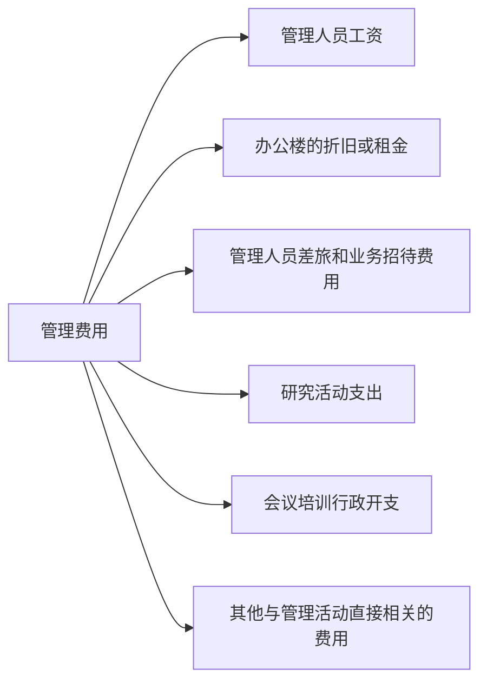
```mermaid
flowchart LR;
    r[管理费用]-->a[管理人员工资]
    r-->b[办公楼的折旧或租金]
    r-->c[管理人员差旅和业务招待费用]
    r-->d[研究活动支出]
    r-->e[会议培训行政开支]
    r-->g[其他与管理活动直接相关的费用]
```

管理费用中还有一个项目是研发费用。研发主要包括两个部分：一部分是研究，另一部分是开发。研究指的是单纯的技术研究，它具有相当大的不确定性，既可能成功也可能失败，成功的概率与我们花钱多少没有必然的关系。所以，会计上不认为研究支出会给公司带来对未来有用的东西，不认为它是资产，而是计入管理费用。研发的另一个部分是开发，是指与产品开发相关的支出，比如将技术应用于某种产品的生产，那么为这个产品所做的设计和模具的支出都属于产品开发支出，这些支出的不确定性较小，是可以计入资产中的。因此，属于管理费用的研发支出，严格来说仅指研究支出，而不包括开发支出。

上市公司管理费用占收入的平均比重是10%。可以看到，人员工资、办公楼折旧、水电费、差旅费、办公经费、培训娱乐活动支出等其实数量都不会太大，它占收入的比重在各企业之间也不会有太大的差异，只不过从数量上来看，大公司多一些，小公司少一些，但与收入规模的比例比较稳定。

造成管理费用差异最重要的原因就是研发支出：研发支出多的企业，往往管理费用比较高，正是因为研发支出多的企业投入了很多独特的研发活动，其产品或服务可能都是别人所不具备的，它们会具有比较高的定价权力，所以通常毛利率较高。比如恒瑞医药的毛利率超过80%，相当高，它的管理费用占收入的比重为20%，也明显高于上市公司的平均水平。它的管理费用中大约有一半都是研发支出，从而导致其管理费用水平较高。

此处我们又发现医药行业的研发支出同样很高，

这里我们所说的医药行业主要是指西药行业。大部分中国的制药企业都是生产仿制药的，并不从事新药开发活动，只是用别人的专利药，获得专利授权即可。或者更多的企业等待专利过期之后，自行生产别人研发的那些药，这种制药企业并没有太高的技术含量，更像是一般的制造业，所以这种企业的支出主要在渠道成本上。而恒瑞制药却是一家研发类的医药企业，它自己开发新药，所以研发支出非常大，管理费用水平比较高。

另一家企业叫高德红外，它最初做红外系统，后来把红外系统应用于军工领域，所以现在主要研发诸如反坦克导弹这类高精尖产品。这样的行业肯定有大量的自主研发，但因为做军工行业，通过军队列装之后才能够销售出去，所以规模不太可能做得很大。从财务数据我们可以看到，这种企业的特点是规模不太大，但是毛利率较高，有大量的自主研发。这家公司的毛利率是53%，而管理费用占收入的比重大约是1/3。这意味着收入扣除成本后，它有53%的利润空间，但是管理费用这一项就“吃”掉了33%，剩下大约20%。显然，这是一个研发支出相当高的行业。

再来看两家互联网行业的公司。一个是腾讯，它的毛利率是56%，管理费用占收入的15%，比上市公司平均水平要高一些。按照腾讯披露的财报，正是因为研发支出高企导致管理费用较高。另一个是Facebook，这家公司毛利率比腾讯还要高，达到了80%，而它的研发费用占到了收入的20%，这一项就“吃”掉了20%的收入的利润空间。

毛利润是收入和成本的差，但这并不是公司最终赚的钱，只是赚钱的第一步，毛利润还需要扣除公司经营过程中的各种其他支出和税，之后才是公司的净利润。

    净利润=收入-成本-销售费用-管理费用-其他费用-税费

上市公司销售费用/收入的平均水平是6%，管理费用/收入的平均水平是10%，两项相加为16%。如果一家公司的毛利率在15%以下，那么它就很难赚钱了。

# 打磨生产流程，构筑竞争优势
## 成本的前世今生：财务中的“成本”
1. 生产过程是指利用人工、机器设备或者办公设备，对原材料进行加工并制作出产品的过程，这个产品可以是有形的，也可以是无形的。生产成本由直接材料（料）、直接人工（工）、制造费用（费）三个部分组成。
2. 生产成本还可以分为固定成本和变动成本，区分的关键就在于成本总量会不会随着产量而变化。
3. 生产成本并不体现在财务报表上，卖掉的产品成本计入营业成本，体现在利润表中，没有卖掉的产品成本计入存货，体现在资产负债表中。由于生产成本受计价方式的影响，所以毛利率并不完全代表企业的盈利水平。
4. 存货的计价方法主要有先进先出法、后进先出法、加权平均法。不同的计价方法对营业成本和存货成本有不同的影响。存货成本高，则资产高，营业成本低，利润高；存货成本低，则资产低，营业成本高，利润低。

### 生产过程
`生产过程`是指利用人工、机器设备或者办公设备，对原材料进行加工并制作出产品的过程，这个产品可以是有形的，也可以是无形的。

生产过程需要耗费原材料和人工，还可能需要使用像厂房、设备这类大型的生产资料，同时还需要负担水电、动力、能源这类费用开支。以上这些部分共同构成了我们通常所说的生产成本。只不过这里并不是把厂房、设备一次性全部消耗掉，而是耗费了一部分。如果厂房、设备是租用的，那么计入成本的耗费部分就应该是在此期间支付的租金。如果厂房、设备是自有的，它们被耗费掉的那部分在会计上叫作厂房、设备的折旧。折旧其实是会计上对固定资产在一段时间之内被消耗掉的那个部分的估计值。

折旧加上生产过程中耗费的水电、能源、动力等，统称为制造费用。制造费用再加上生产过程中所耗费的原材料和人工，就共同组成了企业的生产成本。

    直接材料+直接人工+制造费用=生产成本

### 生产成本
通常来说，以制造有形商品为主的行业，成本构成的主要部分是原材料。比如海尔披露的成本结构中，86%都是原材料成本；美的披露的原材料成本占总成本的85%。对于那些以提供服务为主的公司来说，它们的主要成本不是原材料，而是人工，比如软件、咨询这样的服务行业。

还有一些行业具有一定的特殊性，比如重资产行业，它们的固定资产折旧水平特别高，那么在其成本结构中，折旧的占比就很大。比如赣粤高速是一家经营高速公路的公司，根据披露，它65%的成本都是折旧。

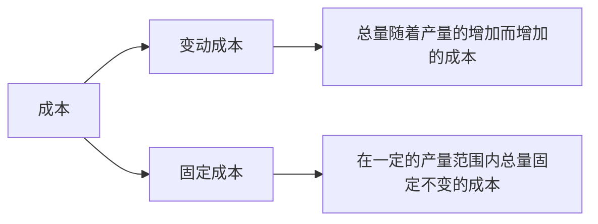
```mermaid
flowchart LR;
    r[成本]-->a[变动成本]
    r-->b[固定成本]
    a-->c[总量随着产量的增加而增加的成本]
    b-->d[在一定的产量范围内总量固定不变的成本]
```

前面提到的料、工、费这三个项目中，原材料是一项变动成本，因为多生产一件产品，势必是要多一份原材料耗费的。而固定资产折旧这样的项目就是一个固定成本，因为在一条生产线的产能范围之内，不管是一件产品都不生产还是满负荷生产，固定成本的实际投入总量是一样的，所以它的折旧水平也是一样的。至于人工费用到底是变动成本还是固定成本，就要看这家企业对这部分人工是如何支付的。如果是计件工资，那么就是变动成本，而如果是固定工资，那么就是固定成本。现实中，很多企业对于一线工人的工资可能会采取底薪+计件工资的方式，这就意味着人工成本中有一部分是固定成本，另外一部分是变动成本。

举个简单的例子，生产一件产品需要花费100元成本，其中有50元变动成本、50元固定成本，现在企业收到了一个产品报价80元的订单，要不要接呢？

如果从总成本的角度考虑，一件产品成本100元，接的订单80元，肯定是赔本买卖，所以不应该接这个订单。可如果从变动成本和固定成本这个角度来考虑，我们可能会得出不同的答案，因为固定成本是事前确定的，生产与否都要耗费，即便不接这个订单，也要支出每个产品平均50元的固定成本。也就是说，不接订单，每件产品会亏50元；接了订单，售价80元，成本100元，每件产品会亏20元。亏50元与亏20元相比，接订单亏得少了，实际上是更合算的，接订单虽然不能让我们赚钱，却可以让我们少赔钱。这就是我们把成本区分为变动成本和固定成本的原因。

### 营业成本
生产成本包括在生产过程中所耗费的原材料、人工费用和制造费用，其中制造费用包括折旧、水电、动力、能源等支出。在耗费了这些生产成本后我们得到了产品，这个产品有两种状态：一种叫产成品，即截至12月31日，这个产品已经完工了；还有一种在12月31日还没有生产完成，我们称为在产品。无论是在产品还是产成品都是企业的产品，是存货的一种，所以“生产成本”这四个字并不直接出现在财务报表中，而是以存货的形式出现。

存货是用来销售的，可是在12月31日这一天，企业不可能把所有的存货正好全部卖完，会有一部分已经卖掉的，另一部分没有卖掉的。对于没有卖掉的这部分产品，仍然会以存货的形式存在于企业；而卖掉的那部分产品，带来了收入，同时也不再属于这家企业了。企业所失去的这些产品的价值，就是它获得收入所付出的代价，我们称为营业成本。在会计上，企业把存货卖掉的同时，就需要把这部分存货的价值转入营业成本中，这个过程就是营业成本发生的过程（见图7-2）。

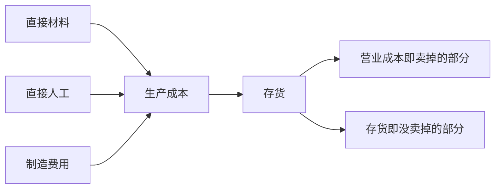
```mermaid
flowchart LR;
    r1[直接材料]-->a[生产成本]
    r2[直接人工]-->a
    r3[制造费用]-->a
    a-->b[存货]
    b-->c1[营业成本即卖掉的部分]
    b-->c2[存货即没卖掉的部分]
```

有三件事值得注意：

1. 生产成本虽然包含“成本”二字，但并不会出现在财务报表中，而是记录在存货里。
2. 营业成本是那些被卖掉的产品所对应的生产成本。
3. 营业成本所记录的是企业在生产过程中所耗费的那些支出，属于生产过程，这与销售费用和管理费用有所不同。

这种产品成本的记录过程会引发毛利率理解上的一个误区。举个例子，由于变动成本的总量会随着企业产量的增加而增加，而在一定范围内，无论产量怎么变，固定成本总量都是不变的，因此产量越大，每一个产品所分摊的固定成本就越少，每个产品的成本（即单位成本）也就越低，我们称之为`规模经济性`。

假设某公司生产一件产品的变动成本是10元，固定成本总量是10000元，如果这家公司今年共生产了1000件产品，那么它的总成本为：

    10×1000+10000=20000（元）

如果这家公司把今年生产的1000件产品全部卖掉了，那这20000元的总成本就叫作生产成本，其首先被记录在存货中，随着存货的销售，这部分价值会转入营业成本。所以，这家公司今年的营业成本总额为20000元。

假设到了第二年，这家公司预计市场需求会大幅度增加，于是它提高了产量，从原来的1000件提高到了2000件。在生产2000件产品时，这家公司的总成本为：

    10×2000+10000=30000（元）

假设这家公司错误地预测了市场的需求，它生产了2000件产品，却只能卖出1000件，因此增加了1000件产品库存。在这种情况下，只有一半的生产成本会从存货转入营业成本。所以，这家公司今年的营业成本总量是15000元。

在生产1000件产品并把它们全部卖掉的情况下，营业成本的总量是20000元，而现在生产了2000件，积压了1000件，营业成本总量却变成了15000元，比只生产1000件时少了5000元。销量没有变化，如果销售单价不变，则销售收入也不变，可是营业成本却比原来减少了5000元。毛利润（=收入-成本）会增加5000元，毛利率也因此提升了。

**一家企业在只增加生产却不增加销售的情况下，它的营业成本会降低，毛利率会提升**。

这个误区其实是生产成本的记录过程所导致的。当企业增加产量时，固定成本的总量不变，所以每一件产品分摊的固定成本就降低了。当这家企业生产了过多的产品，一部分产品积压的时候，这部分积压的产品就会留在存货里，而使得这部分固定成本不能够进入营业成本，所以才导致了营业成本的下降以及毛利率的提升。这样的现象之所以产生，本质上是由固定成本而导致的，在那些固定成本高的行业中，这样的现象会格外突出。一般来说，重资产行业折旧较大，它的固定成本较多，这类行业更容易出现这样的现象。

在重资产的行业，如果企业增加了产量而不增加销量，毛利率会自然地上升。对于这样的行业来说，毛利率的上升如果同时伴随着产成品存货的增加，那么它的上升并不一定意味着盈利水平的提升。

### 存货的计价
营业成本是被卖掉的那部分存货。对于商业企业来说，这是被卖掉的商品的采购成本。同一个型号的商品，虽然外观一样，但因为不同批次购进，可能价格不一，所以成本不同。而对生产企业而言，不同批次购进的原材料价格可能不一样，而且每个批次耗费的人工和制造费用也不尽相同。那么，哪些存货先被卖掉，而哪些存货后被卖掉，就会直接影响到营业成本的数字。

实际上，企业是不可能把每个商品或产品都标上号的，会计上只能靠一个假想的顺序来做记录，这就是所谓的存货计价方法。

常用的存货计价方法有三种：`先进先出法`、`后进先出法`、`加权平均法`。除此之外还有一种方法叫`个别计价法`，就好像给每个存货都标个号，然后记住它们的成本或者价格。但这种方法通常只适用于数量非常少、单价比较高的存货。

假设一个商业企业买进两批货，第一批买了20件，每件100元，第二批买了20件，每件120元（见表7-1）。现在它卖出去了10件商品，那么卖出去的10件商品，成本是多少呢？

表7-1　某商业企业的进货成本

批次 | 单价（元/件） | 数量（件） | 总价（元）
---|---------|-------|------
第一批 | 100 | 20 | 2000
第二批 | 120 | 20 | 2400

- 如果用先进先出法，假设先买进来的商品被先卖出去了，那么卖出去的这10件应该出自第一批买进来的那20件，每件的成本是100元。
- 如果用后进先出法，那么就认为后买进来的商品是先被卖出去的，卖出去的那10件应该出自第二批买进来的20件，每件的成本是120元。
- 如果用加权平均法，需要计算出加权平均的存货成本。

        存货总成本=100×20+120×20=4400（元）
        加权平均单位成本=4400/40=110（元）

由上可见，加权平均法的单位成本是介于先进先出法和后进先出法之间的。从这个例子可以看出，采用不同的存货计价方法，营业成本不同。不仅如此，留下来的存货价值也不同，因为所有的产品成本，要么被卖掉，变成了营业成本，要么留下来，变成了存货成本。

存货在会计上是一种资产，营业成本在会计上是类似于费用这样减少利润的一个项目。如果把更多的价值分给存货，那么资产就多，成本就低，利润就高；如果把更多的价值分给营业成本，那么营业成本就高，利润就低，资产的价值也低。

在大多数情况下，商品的价格是上涨的，后买进来的东西一般较贵。如果我们用后进先出法，即假设后买进来的东西先被卖掉，那么营业成本就高，利润就低，这时企业缴的税也会比较少，所以税法上是不允许采用后进先出法的。

## 小项目里有大乾坤：“有用”的存货
1. 存货由于市场价格发生了持续性的下跌，所以发生减值，在会计上需要计提存货跌价准备。原材料、在产品和产成品都有可能发生减值。存货的减值可能因为市场价格回升而转回。
2. 存货周转周期是指从原材料买进到产成品卖出的时间。存货周转率代表一年内存货周转的次数，它具体可分解为原材料周转率、在产品周转率和产成品周转率，分别反映一家企业的采购过程、生产过程和销售过程的管理情况。

### 存货的跌价
存货的减值是因为存货的市场价格发生了持续性的下跌，原材料、在产品和产成品都有可能会减值。存货的减值，在会计上叫存货跌价准备。可以想象，计提存货跌价准备，就会使得存货资产的账面价值减少，同时也会对利润产生负面影响，会减少利润。虽然名字叫“存货跌价准备”，但其实还有一种造成存货减值的原因，就是存货的毁损。比如獐子岛说，由于海里来了冷水团，把公司海参、扇贝的种苗都冻死了（既然死了，就肯定没有价值了），因此计提37亿多元的减值。

原材料的跌价往往出现在一些资源类原材料上，因为资源类材料的价格波动往往比较大，就有可能会导致原材料跌价。比如前几年煤炭价格大幅度下跌，这就使得用煤炭作为原材料的一些企业，可能出现原材料的跌价损失准备。当时的郑州煤电，就对原材料计提了大量的存货跌价准备，以至于达到了原材料金额的23%。安阳钢铁，它的原材料是铁矿石这种资源类的材料，前两年也因为钢铁行业产能过剩，铁矿石价格下跌，因而计提了14%的存货跌价准备。相类似的还有中国铝业，它计提的存货跌价准备达到了存货金额的10%。

在产品和产成品的跌价，有一种可能是它们也是资源类的产品。比如安阳钢铁，它所生产出来的钢材也是大宗商品，往往会面临较大的市场价格波动，因为钢铁行业的不景气，安阳钢铁对其在产品和产成品分别计提了8%和15%的存货跌价准备。

还有一种可能是产品过时而导致的跌价。比如2011年时，汉王科技的主打产品是电子书，类似于Kindle的前身。但当时因为iPad的出现，电子书销售市场受到了很大的冲击。从2012年开始，智能手机变得相当普及，汉王科技的电子书产品面临着被新产品替代的风险，导致它产成品的价格大幅度下跌，跌价超过一半。汉王科技因此而计提了大量的存货跌价准备，达到了当年存货金额的35%。

存货跌价准备的计提有一个特点，就是存货跌价的计提不是整体计提，而是分项来计算的，而且某一个存货，它的市场价格上升不会被记录，只有减值才会被记录。比如一家企业有五种产品，其中四种产品的市场价格是上涨的，只有一种产品因为技术落后，面临着被淘汰的风险，所以价格下跌。对于这四种价格上涨的产品，它们价格虽然也有变动，但我们不会在报表上增加它们的账面价值，这是会计计价的一个基本原则，叫稳健性或审慎性，即会计只记减值，不记增值。

存货跌价准备的转回是因为存货的市场价格又发生了回升，这时就可以转回。存货跌价准备的转回会让资产的价值增加，同时利润也增加。比如中国铝业曾经在2015年的时候，因为铝制品价格的回升而转回了上一年计提的存货跌价准备14亿元。

就像应收账款计提减值时，有一些企业会少计，而另一些企业会多计一样，存货跌价准备同样存在这两种可能性。有的公司为了避免利润减少，可能会不计提或者少计提存货跌价准备，我们要注意的是，这并不意味着利润就可以永远不受到存货跌价的影响，因为当这些存货被卖出去的时候，存货价格的下跌就会通过销售价格的下降而体现在当年的利润上。所以，企业不计提或者少计提存货跌价准备，只是延缓了利润下降的时间而已。

也有一些公司会先过渡性地计提存货跌价准备，然后再把它们转回来，实现利润在不同年度的转移，这个做法跟应收账款坏账的过度计提和转回是类似的。

表8-1　计提存货跌价准备对利润的影响　（单位：万元）

项目 | 第1年 | 第2年 | 总和
---|-----|-----|---
原利润 | -100 | -100 | -200
计提存货跌价准备 | -1000 | +1000 | 0
新利润 | -1100 | 900 | -200

### 存货的周转率
`周转率`是一个表现效率的财务指标，表示某一项资产的运营效率。

$周转率=\frac{总收入}{资产账面价值}$

$存货周转率=\frac{年收入总额或年营业成本总额}{年均存货账面价值}$

`存货周转一次的周期`则是指从原材料买进来到产成品卖出去的时间，存货周转率为4，说明公司从原材料买入到产成品卖出平均需要3个月。

$周转周期=\frac{365天或12个月}{周转率}$

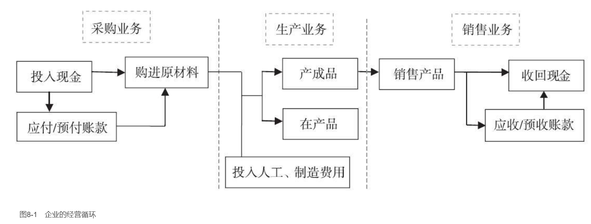

### 存货周转率反映的管理信息
存货周转的第一个阶段如图8-2所示。

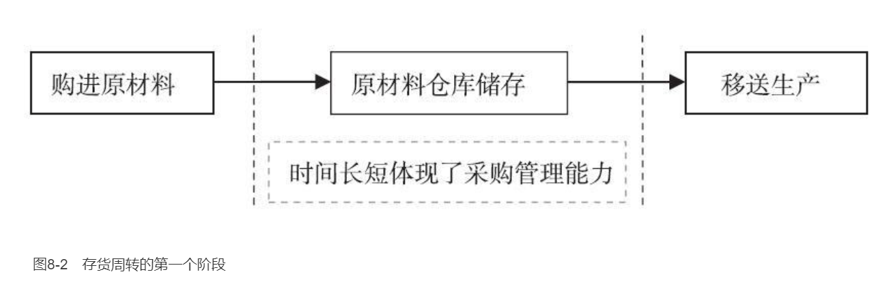

存货周转的第二个阶段如图8-3所示。

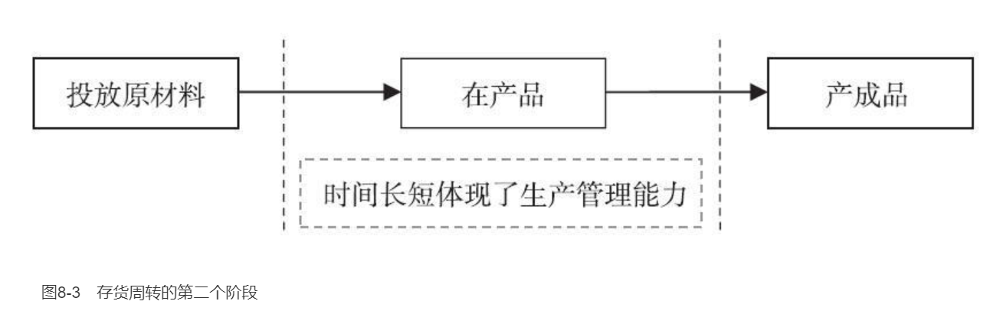

存货周转的第三个阶段如图8-4所示。

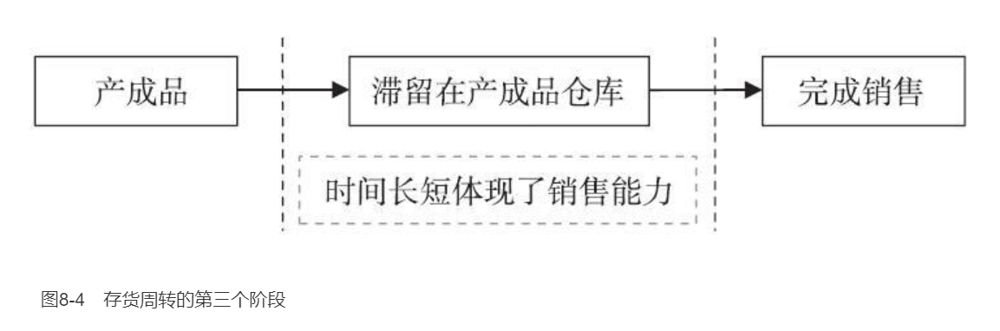

由存货周转率的计算推演，我们可以分别得出原材料周转率、在产品周转率和产成品周转率。

$原材料周转率=\frac{年收入总额或年成本总额}{年均原材料账面价值}$

$原材料周转周期=\frac{365天或12个月}{原材料周转率}$

原材料周转周期体现了原材料在库房的平均存放时间。

$在产品周转率=\frac{年收入总额或年成本总额}{年均在产品账面价值}$

$在产品周转周期=\frac{365天或12个月}{在产品周转率}$

在产品周转周期体现了将原材料生产成产成品的平均耗用时间。

$产成品周转率=\frac{年收入总额或年成本总额}{年均产成品账面价值}$

$产成品周转周期=\frac{365天或12个月}{产成品周转率}$

产成品周转周期体现了产成品在库房的平均存放时间。

例如，某家公司的原材料、在产品和产成品的平均账面价值分别为100元、200元和300元，总量是600元，而今年的收入是10000元。根据上述公式：

$存货周转周期=\frac{365 \times 600}{10000}=21.9$

$原材料周转周期=\frac{365 \times 100}{10000}=3.65$

$在产品周转周期=\frac{365 \times 200}{10000}=7.3$

$产成品周转周期=\frac{365 \times 300}{10000}=10.95$

存货周转周期=3.65+7.3+10.95=21.9天

存货周转周期等于原材料、在产品和产成品的周转周期之和。

# 统筹薪酬激励，凝聚团队力量
## 每个员工都是“供应商”：职工薪酬
1. 薪酬不仅指工资，还包括奖金、津贴、补贴，以及那些以货币形式或实物形式发放的福利，为员工支付的各种保险、住房公积金等。
2. 薪酬的记录并不是等到支付时，而是在月底时计提，这体现了权责发生制的原则，即会计记录不依赖于实际上的资产转移或现金支付，而根据收入、费用发生的因果归属关系进行计提。计提薪酬，一方面要记录成本费用项目，另一方面要记录应付职工薪酬负债，这体现了复式记账法，即在同一项经济活动发生时，至少同时在两个会计科目中进行记录。
3. 衡量销量，可以采用人均指标，比如生产部门的人均产量和销售部门的人均收入，就分别衡量了生产业务中人的效率和销售业务中人的效率。
4. 在阅读报表时应该关注应付职工薪酬，它的水平是否合理，它与同行业其他公司是否具有一定的可比性，从而排除通过操纵应付职工薪酬来调整利润的情况。

### 薪酬的项目
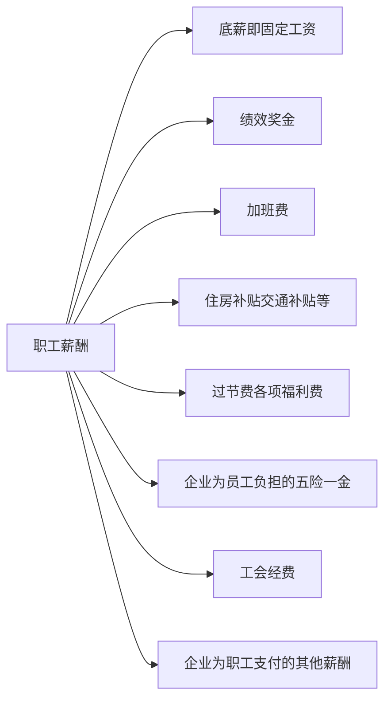
```mermaid
flowchart LR;
    r[职工薪酬]-->a[底薪即固定工资]
    r-->b[绩效奖金]
    r-->c[加班费]
    r-->d[住房补贴交通补贴等]
    r-->e[过节费各项福利费]
    r-->g[企业为员工负担的五险一金]
    r-->h[工会经费]
    r-->i[企业为职工支付的其他薪酬]
```

### 薪酬的记录
发放工资前都相当于公司欠着员工的钱，属于公司的一项负债，会计部门每月编制财务报表时会记入应付职工薪酬。这个负债通常很快就会被偿还，比如某公司每个月5日发放上个月的工资，会计部门在月底时记录了应付职工薪酬，这个负债在5天后，即5日发工资时就被偿还了。

生产成本中包含了人工费用，就是指生产部门员工的薪酬；销售费用中包含了销售人员工资、奖金、福利等；管理费用中包含了所有管理部门人员的薪酬。

    借：生产成本/销售费用/管理费用
    贷：应付职工薪酬

>`复式记账法`，即在同一项经济活动发生时，至少同时在两个会计科目中进行记录。通过复式记账法，我们可以了解每一项经济业务的过程和结果。

在没有实际支付时，记录相应的成本和费用，在会计上叫作计提。月底记录薪酬的过程叫作计提相应的成本或费用。这种不依赖实际上的资产转移或现金支付，而根据收入、费用发生的因果归属关系进行计提的原则，会计上叫作`权责发生制`，即我们不是以现金的收支来记录经济活动，而是以风险和报酬的转移时间来记录经济活动。

### 从“人”的角度评价公司的效率
生产业务中，我们可以看人均产量，尤其是生产部门的人均产量，这体现了生产效率。在销售业务中，则可以看销售部门的人均收入，这体现了销售业务的效率。

### 应付职工薪酬反映的管理信息
如果有一家企业，年薪水平为1亿元，而企业实际的应付职工薪酬和相应的工资费用都是按月来计提的，这里为了简化，我们假设一年才计提一次，那么正常情况下，该企业应该在第一年时记录1亿元的工资，记入应付职工薪酬这项负债，至于工资是属于生产成本，还是销售费用或管理费用，这里就不再详细区分了。

第二年，应该再记录1亿元的工资费用，同时还要再计提1亿元的应付职工薪酬。而在异常的情况下，第一年工资的正常水平是1亿元，却记了2亿元，同时计提了2亿元的应付职工薪酬。就因为这里多记了1亿元，但在支付工资时并不会多支付，还是按照1亿元支付，在支付完工资后，就会留下1亿元的应付职工薪酬。第二年时，本来应该再计1亿元的费用和1亿元的应付职工薪酬，可是现在不再记录任何的工资费用和应付职工薪酬，仅仅是在发工资的时候，把上一年剩余的那1亿元的应付职工薪酬负债冲掉。这样一来我们就会发现，在第一年，比正常情况下1亿元的工资费用多记了1亿元。因此，第一年的利润就会减少1亿元。而第二年的费用少记了，从而利润就会增加（见表9-1）。

表9-1　通过应付职工薪酬操纵利润的情况　（单位：亿元）

项目 | 第1年正常 | 第1年异常 | 第2年正常 | 第2年异常 | 总和正常 | 总和异常
---|-------|-------|-------|-------|------|-----
计提应付职工薪酬 | 1 | 2 | 1 | 0 | 2 | 2
对利润的影响 | -1 | -2 | -1 | 0 | -2 | -2

结果是：第一年的利润减少了，而第二年的利润增加了。其实两年的利润总额并没有变化，只是在两个年度之间进行了重新分配。这与我们之前所说的先过度计提应收账款的坏账，再把它转回来，或者先过多地计提存货跌价准备再把它转回来，是完全一样的逻辑，都是在两个不同的年度之间重新分配了利润。所以，多计费用的那一年，就会表现出高于正常水平的应付职工薪酬，正常水平是1亿元，这一年就变成了2亿元。

## 给员工戴上“金手铐”：股权激励
1. 股权激励主要有两种形式：股票期权和限制性股票。用作激励的股票一般有两种来源：发行的新股和从二级市场回购的股票。
2. 以以岭药业和华为公司为例介绍了股权激励的实施过程及对公司的帮助。
3. 股权激励减少了公司的现金支付，但不会减少工资费用的总额。由于股权激励是分期记录的，所以还是可以减缓对利润的冲击。
4. 股权激励的会计记录可能发生在行权日之前，而税法允许扣除工资费用的时间为实际行权日。

### 认识股权激励
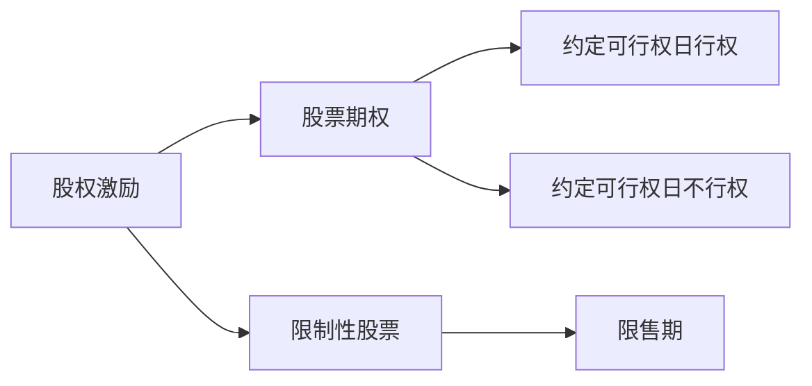
```mermaid
flowchart LR;
    r[股权激励]-->a[股票期权]
    r-->b[限制性股票]
    a-->c[约定可行权日行权]
    a-->d[约定可行权日不行权]
    b-->e[限售期]
```

第一种常见的形式是`股票期权`，这是最常用的。员工如果能达到一定的业绩要求，就可以在约定的时间，按照事先约定的价格购买公司的股票。这里的业绩要求和购买股票的价格、数量以及时间都是事先约定好的。

可以看到，股权激励能否最终实现存在不确定性。可能因为不能满足业绩要求，也可能是事先说好的价格过高，到股票期权可行权时实际的股价比约定价格还低，员工不如直接在二级市场上购买，这时员工就可能选择不按照约定价格去购买股票，这样的做法被称为不行权。

股权激励下，员工所承担的责任和享受的收益是不对称的。如果约定可行权日股票的市场价高于约定价，那么按照约定价购买股票就更合算，这时员工就会选择行权，再把低价买到的股票按照市场价格卖出来赚取差价。但如果约定可行权日的市场价低于约定价，员工就会选择不行权，这时员工也不会因为不行权而承担损失。

股权激励的方式只是给了员工获得收益的可能性，并不要求他承担股票下跌的风险。这种类型的金融工具，我们称之为期权，期权具有风险和收益不对称的特点。

股权激励具有不确定性。为了体现这一不确定性，就要求：

1. 股票期权在授予日和第一次行权日的间隔不能少于12个月。试想一种极端的情况：今天授予，明天就可以行权。因为明天的股票价格是比较容易预测的，所以在授予股票期权时，就知道被授予人未来行权与否了，这样就没有不确定性，与直接发工资没什么区别了。
2. 分期行权，每一期的时间间隔不得少于12个月，每一期行权的比例不得超过50%。比如向某员工一共授予了1000股，他每一次的行权不得超过500股。

第二种常见的形式是`限制性股票`。限制性股票并不是约定以后可以以某个价钱购买股票，而是允许员工现在就按照一个较低的价格去购买公司股票，只不过这个股票现在不能卖出，需要有一段时间的限售期或称禁售期。

限售期之内，不允许将股票用于抵押获得贷款或者偿债，因为这两种方式其实是把股票给变相地卖掉了。但这种低价有一个触底水平线，它不能低于以下两种价格中高的那一种：一种是股权激励计划公布的前一个交易日公司股票价格均价的50%，另一种是股权激励计划公布之前的20个交易日、60个交易日或120个交易日股票均价的50%。

同时，股票的限售期也不能少于12个月，并且就算解除限售也不能一次性全解除，而只能分期解除，分期解除下相邻两期之间不能少于12个月，每期解除的比例也不能超过50%。

用作激励的股票一般有两种来源：一种是公司专门面向这些股东发的新股；另一种就是公司从二级市场上回购一部分上市交易的股票，并将其卖给员工。

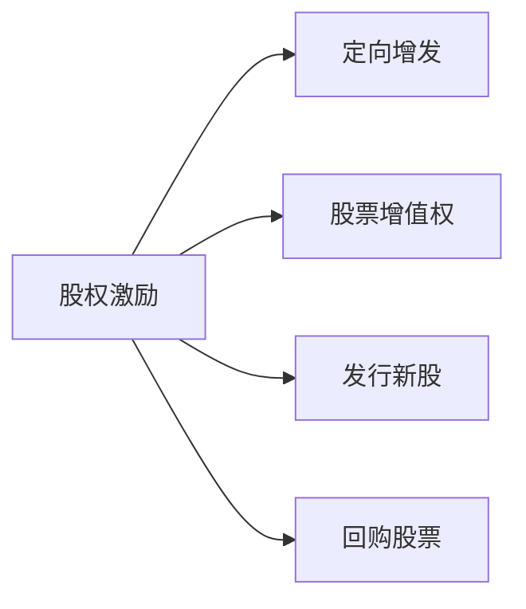
```mermaid
flowchart LR;
    r[股权激励]-->a[定向增发]
    r-->b[股票增值权]
    r-->c[发行新股]
    r-->d[回购股票]
```

其他常用的方式还有股票增值权。员工不直接持有股票，只是约定享有一定比例的股权，在未来股价上涨时，可以获得由于这部分股价上涨所带来的收益，即只计算价差。比如最初约定员工享有1万股的股权，约定时点，假设当时股价为10元，后来股价涨到15元，那么员工就可以享有中间的价差即5元，乘以所持有的1万股，共计5万元。这种方式的好处就是员工不需要事先掏钱去购买股票，经济压力较小。

根据证监会公布的数据，大约有70%的上市公司都使用了股权激励，其中使用限制性股票的占60%，使用股票期权的占38%。

根据《上市公司股权激励管理办法》的规定，上市公司全部有效的股权激励计划所涉及的股票总数累计不得超过公司股本总额的10%。即所有受到股权激励的员工，他们所持有的股份总数不能超过公司股票总数的10%。其中任何单个激励对象所持股票数不得超过公司股本总额的1%，这里不包括已经是公司大股东的人。

### 股权激励的会计和税务问题
股权激励计划的具体流程（见图10-4）。

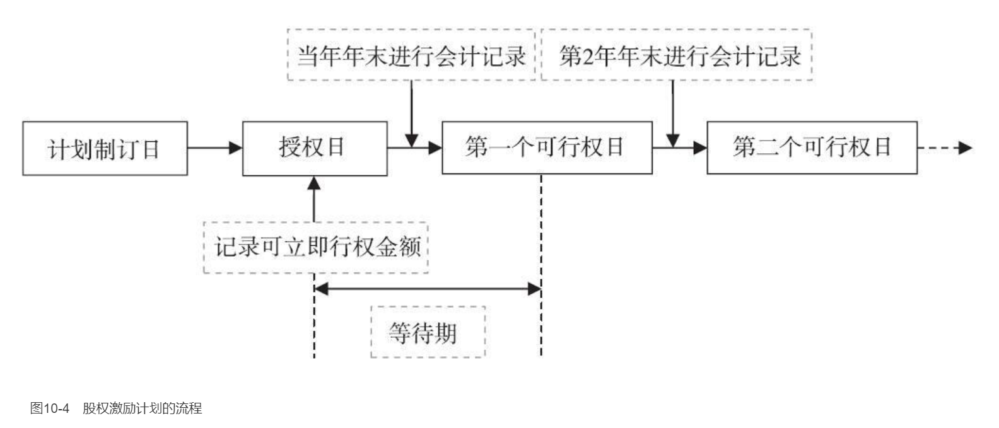

大多数情况下，股权激励计划不是可以马上行权的，需要一个等待期。也正因为这个等待期的存在，股权激励计划最后能不能被执行，是不确定的，所以在授权日也不需要做任何会计处理。

接下来在股权激励计划的存续期间，如果公司是以回购股份的形式来支付给员工，就需要在等待期每年的年末，按照股票在授权日的公允价值来记录工资的成本和费用。

由于股权激励计划，公司需要记录相应的工资费用，就会相应地减少利润，同时也会减少缴纳的企业所得税。

不管有无等待期，税法上记录工资费用的时间都是行权日期，记录的金额都是股票的收盘价和行权价的差额，再乘以行权的股票数量。

# 弄潮资本市场，助你如虎添翼
## 企业不可承受之“重”：固定资产
1. 企业的投资包括对内投资和对外投资。对内投资是指对公司内部的投资，通常会形成固定资产或无形资产；对外投资是指投资给其他的公司，包括股权投资和债权投资。
2. 固定资产是指那些使用寿命长、单位价值高的物品。固定资产占总资产的比重，各行业之间差异很大，有的行业资产轻，有的行业资产重。
3. 固定资产投资的基本原则是净现值大于零，即收益大于成本。但净现值只是辅助决策的工具，不能成为判断项目是否可行的决定性依据。因为投资决策有科学的成分，也有相当大的艺术的成分。
4. 租赁是使资产变轻的一种方法，它又分为经营性租赁和融资性租赁。租赁行为的本质是分期付款购买资产，从而减少资金的占用，但如果租赁公司收取的利息高于企业用这笔钱可以赚取的收益，那么租赁就不合算了。
5. 折旧是指会计上对固定资产价值在使用过程中减损的估计。折旧需要按月计提，在增加的次月开始计提，在处理的次月停止计提，但并非所有的固定资产都需要计提折旧，比如在建工程和投资性房地产。
6. 折旧的方法有三种：直线法、加速折旧法和工作量法。折旧提得合理与否，完全取决于估计的准确性，如果估计不可靠，很难说哪种折旧方法更好。
7. 固定资产同应收账款、存货一样，都可能发生减值，但固定资产的减值一旦计提就不得转回。
8. 固定资产的处置通常包括出售、出租、抵债和资产交换。

### 企业的投资
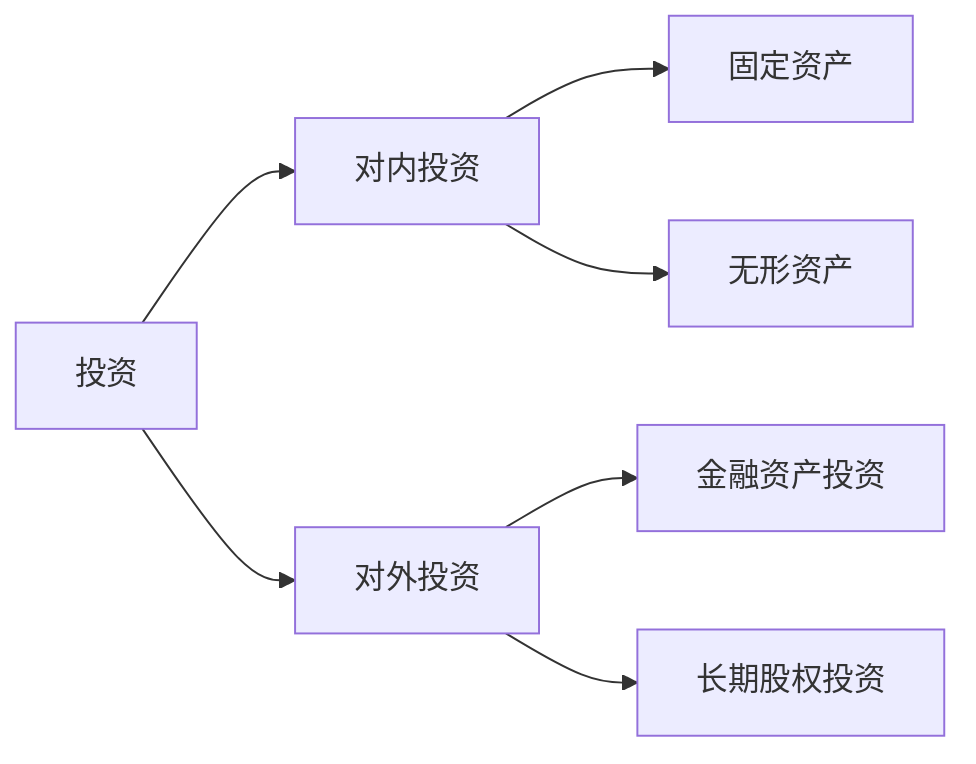
```mermaid
flowchart LR;
    r[投资]-->a[对内投资]
    r-->b[对外投资]
    a-->c[固定资产]
    a-->d[无形资产]
    b-->e[金融资产投资]
    b-->f[长期股权投资]
```

`对内投资`是指企业在自身法律边界之内的投资，也就是对自己公司内的投资，没有投到其他公司去。这样的投资通常会形成`固定资产`或`无形资产`，固定资产比较常见，比如房子、汽车、电脑、家具等；无形资产大家也不陌生，比如商标、专利、专有技术、版权、特许经营权等；还有一类大家可能不太熟悉的，比如`商誉`，它也是一种无形资产，在中国，土地使用权也是无形资产。

`对外投资`是指超出企业法律边界的投资，就是指投资到其他的公司了。对外投资可以包括不同的类型，比如`金融资产投资`，最常见的就是购买其他公司的股票、债券等，这些金融资产在会计上的主要特点就是必须按照公允价值计价。所谓按照公允价值计价，简单地理解，就是按照金融资产当前的市场价格来计价，而其他大部分资产都是按照购买时的价格来计价的。

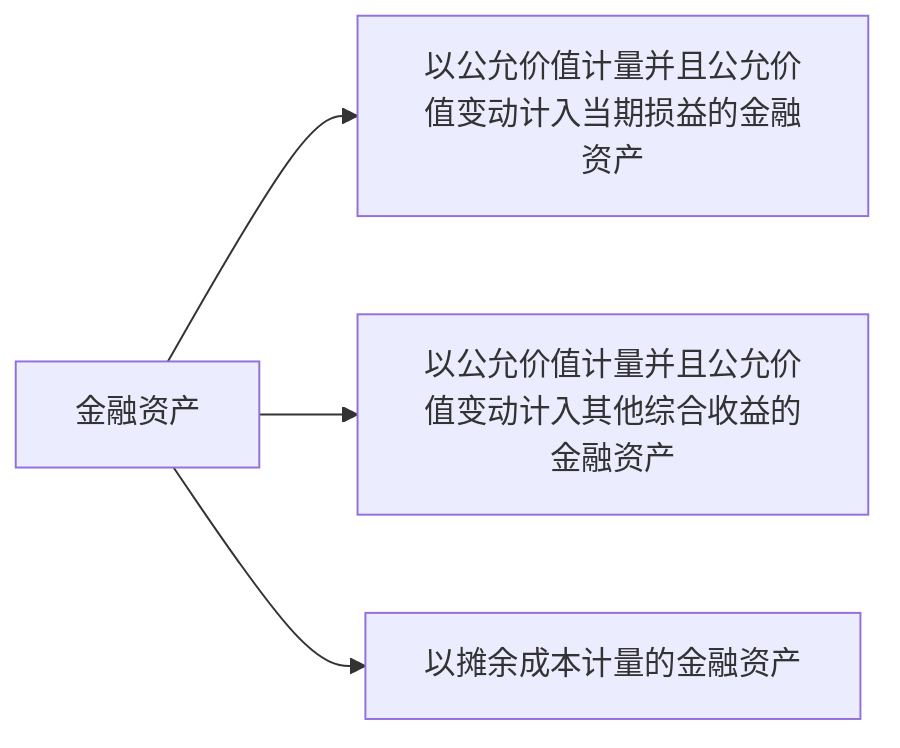
```mermaid
flowchart LR;
    r[金融资产]-->a[以公允价值计量并且公允价值变动计入当期损益的金融资产]
    r-->b[以公允价值计量并且公允价值变动计入其他综合收益的金融资产]
    r-->e[以摊余成本计量的金融资产]
```

`长期股权投资`，比如对子公司的投资或者是参股的联营、合营企业。股权投资又分成两种不同的类型，分别按照控制权的大小来界定。

1. 有控制权的长期股权投资，即通常所说的控股。一般按照50%以上的股权比例来界定是不是拥有控制权，但这并非唯一标准，关键看在董事会或股东大会上是否有重大事项的控制权。
1. 没有控制权但能够施加重大影响的，也就是通常所说的参股，一般按照20%～50%的持股比例来界定。

存货属于`流动资产`，典型的代表就是原材料，而固定资产可能包括房子、汽车、设备等。

企业的业务是在不断重复着一个从现金到现金周而复始的循环过程。企业买进原材料，很快就会将它转化成产品，再把产品卖掉，获得收款的权利，把货款回收从而变成现金。由此可见，原材料变成现金的时间较短。

而生产设备是通过磨损自己生产出产品的。在此过程中，它的一部分价值会转化为产品，把产品卖掉，回收货款变成现金。但是，生产设备是一项长期使用的资产，在每一个从现金到现金的循环中，它只是把一部分价值变成了现金，还需要经过若干个循环才能把全部价值变成现金。

能在一个循环中变成钱的资产就是`流动资产`，需要若干个循环才能全部变成钱的资产就是`长期资产`。

### 固定资产
重资产对企业的影响：

- 对成本的影响。会计上用折旧来记录固定资产在使用过程中的损耗，生产设备和厂房的折旧属于生产成本，销售场所的折旧属于销售费用，办公楼的折旧属于管理费用。
  - 折旧从性质上看属于固定成本，即总量不随产量的变化而变化：只要设备在生产能力范围之内，不管是满负荷运转、发挥50%的产能，还是停工闲置，折旧的金额都是一样的。由此可见，产量越大，每个产品分摊的成本就越低，这就是所谓的`规模经济性`。所有固定成本较高的行业都具有规模经济性，重资产行业可以通过扩大产量来达到降低成本的目的。
- 会占用企业大量的资金。固定资产资金数额较大，就意味着回收期也较长，而且重资产行业的流动性较差，容易引发财务危机。

不同时间点获得的收益，不能够简单地相加，需要折算成同一个时间点的钱才能够进行加减。

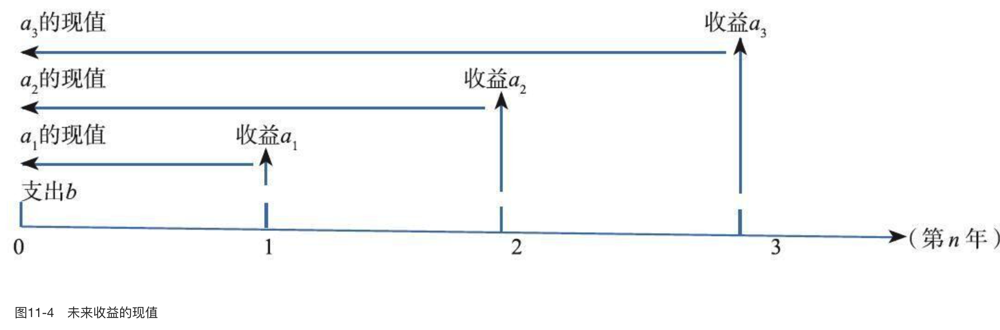

如果用所有未来收益的现值之和减去当前就需要支付的成本（a1的现值+a2的现值+a3的现值-支出b），所得的差额就叫`净现值`。净现值大于零，就表示收益大于成本。

表11-1　投资决策时净现值的计算举例　（单位：元，假设折算系数为10%）

项目 | 第0期（当前）投入成本 | 第1期 | 第2期 | 第3期
---|-------------|-----|-----|----
增加的收入 | 0 | 700 | 700 | 700
增加的支出 | 500 | 400 | 400 | 400
净收益 | -500 | 300 | 300 | 300
折算成当前的货币价值 | -500 | 300/(1+10%)≈273 | 300/(1+10%)^2≈248 | 300/(1+10%)^3≈225

净现值：-500+273+248+225=246

把未来的钱折算成现在的钱，需要使用折算系数，我们称其为`贴现率`。

### 将重资产变轻
`租赁`就是一个可行的办法。因为租金不是一次性支付，而是分期支付的。

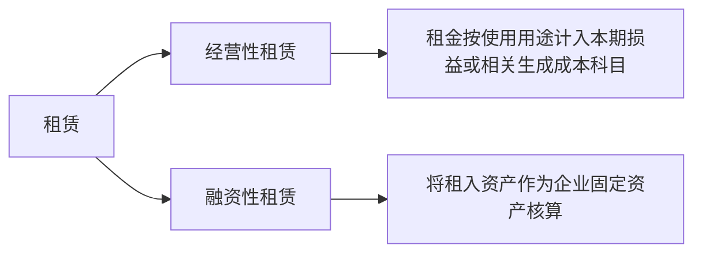
```mermaid
flowchart LR;
    r[租赁]-->a[经营性租赁]
    r-->b[融资性租赁]
    a-->c[租金按使用用途计入本期损益或相关生成成本科目]
    b-->e[将租入资产作为企业固定资产核算]
```

如何区分`经营性租赁`和`融资性租赁`呢？

一般而言，或是租期很长，比如一项资产的预计可使用寿命是10年，结果这家公司租了8年；或是金额很大，比如购买这项资产的市场价值是100万元，结果租赁花费了90万元；或是双方事先有约定租赁期满后，这项资产归承租方所有。值得注意的是，以上三个条件满足任何一个就可以认定为融资租赁，其本质就是分期付款来购买资产。

经营性租赁，公司只获得了资产的使用权，所以是不记录固定资产的，同时也不记录负债，只在支付租金时记入相应的费用中。如果租的是厂房、设备，就计入生产成本；如果租的是营业场所，就计入销售费用；如果租的是办公楼，那就计入管理费用。由上可见，经营性租赁其实是一种表外业务，不在报表上记录相应的资产，也不在报表上记录相应的负债。

如果这家航空公司不想记录相应的资产和负债，就可以把原来计划租10年的飞机，变成只租5年，等到租赁期满之后，再重新租一架飞机。像航空公司，只要经营就势必要租飞机或买飞机，至于租赁期到底是10年还是5年并未改变它经济行为的本质。2019年1月1日起实施了新的《企业会计准则第21号——租赁》，在新准则下，不再有经营性租赁，只有短期租赁或小金额租赁，仍可参照原来经营性租赁的会计处理方法，其他租赁都要以融资租赁记录。

### 初识折旧
固定资产的价值在使用过程中会发生减损，会计上对这个减值进行估计，并且把它记录下来，这就是折旧。折旧是权责发生制一个非常典型的体现，计提出来的折旧并不需要实际付钱给谁，只是会计上记录的一项成本或费用。

折旧较多的企业会出现现金流大于利润的情况，因为折旧只减少利润，但不减少现金流。所以折旧多的企业通常现金流不错，相比之下利润却不高。根据复式记账的原则，折旧一方面要体现在固定资产价值的减少上，另一方面则要体现在成本或费用上。

所谓`投资性房地产`，是指那些不是企业自用，也不作为产品的房屋建筑和土地使用权。比如自用的厂房、办公楼，都属于自用的房地产；比如房地产公司准备作为产品售卖的房子，属于产品；只有那些自己不用也不是产品，只是用来出租给他人获利，或者持有待售的房屋才是投资性房地产。投资性房地产在持有期间不需要计提折旧，而是在每年年末计算公允价值，将公允价值和上一年年末的账面价值之间的差额记入公允价值变动损益科目。

### 固定资产持有期间的问题
定资产减值:

`减值`和`折旧`是两个不同的概念。折旧是在固定资产正常使用的情况下，因为物理原因而产生的各种损耗。而减值则是除了折旧之外的价值降低，造成减值的原因可能是技术进步导致的固定资产提前更新的需要，也可能是固定资产丢失或者意外毁损。与应收账款和存货的减值一样，企业每年年末在做报表时，都需要对每一个或者每一组固定资产进行减值测试。如果认为发生了减值，就要减少固定资产的价值，同时还要在利润表上记录资产减值损失。所以，固定资产的减值既会减少资产价值，又会降低利润水平。

有的企业会通过先过度计提应收账款的坏账或者存货跌价准备然后再转回的方式来调节利润，目的是让利润在不同年度之间进行重新分配。会计准则有明确的规定，长期资产的减值准备一旦计提就不得转回。固定资产属于长期资产，所以它的减值准备也不允许转回。会计准则对不同资产减值转回的规定不一样，主要是因为应收账款有可能出现预计无法收回，但后来又收回来的情况，存货现行价格也有可能发生现在下跌但后来又涨回来的情况。而对于固定资产这样的长期资产，它的减值可能是因为技术落后或者丢失损坏了，因技术落后而减值的固定资产很难再恢复价值，固定资产这种大型资产一旦丢失也很难再找回，而且出于对企业利用会计准则调控利润的顾虑，会计准则要求长期资产减值计提之后不能转回。

固定资产的改造、修理:

在固定资产持有期间，我们很可能会对其进行改造，比如增加一个部件来实现更多的功能，这类改造往往是对固定资产功能的一种扩展，所以改造的支出在符合条件时应该记入固定资产的价值中。如果是对经营性租入的固定资产进行改造，那么改造的这部分会形成一项资产，但由于经营性固定资产并非企业所持有，改造部分不能够单独记为一项固定资产，所以通常将它记入长期待摊费用，然后再分期摊销。长期待摊费用也是一种长期资产。

固定资产在后续使用过程中还可能会损坏，但只要没有到报废的程度，就可以修理、维护、保养。比如汽车就需要定期维护，有时候还需要修理。像这一类修理、维护、保养并没有增加固定资产的功能，只是延长了它的使用寿命而已，所以这些支出不记入固定资产的价值，而是列作费用。

固定资产的处置:

1. 售卖
2. 出租
3. 资产抵债
4. 资产交换

## 我的不是我的，你的才是我的：无形资产
1. 无形资产就是企业所拥有的那些看不见、摸不着却会给企业带来利益资源流入的资产，包括企业获得的专利、特许经营权、商标使用权、商誉、土地使用权等。
2. 无形资产和企业的研发支出相关，但即使同一行业，无形资产占总资产的比重也差别很大，因为研发支出大部分都费用化了，只有很少一部分开发支出可以符合资产确认条件，记入无形资产。
3. 无形资产的产生包括外购、自建两种方式。外购的固定资产通常比较好记录，而自建的无形资产通常不记录在报表中，无形资产的账面价值可能与其真实价值差别巨大。
4. 无形资产的摊销和减值与固定资产类似，但由于其估值的难度很大，所以其账面价值并不能完全真实地反映其实际价值。企业也可能借用这一特点，通过无形资产交易来达到一些特定的目的。

### 认识无形资产
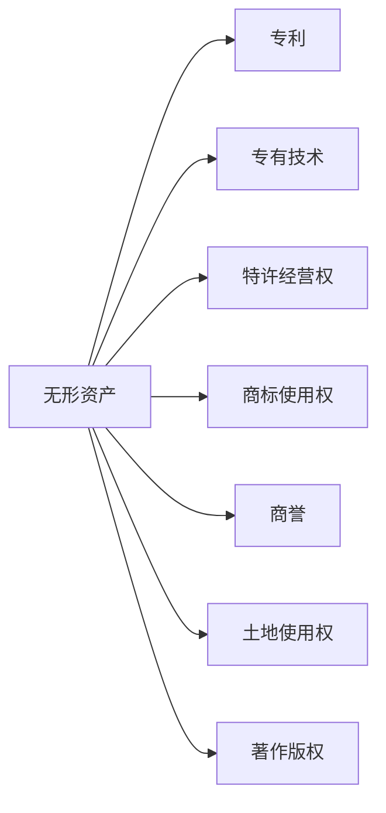
```mermaid
flowchart LR;
    r[无形资产]-->a[专利]
    r-->b[专有技术]
    r-->c[特许经营权]
    r-->d[商标使用权]
    r-->e[商誉]
    r-->g[土地使用权]
    r-->h[著作版权]
```

## 六月的天气，孩子的脸：金融资产
1. 金融资产投资是企业一种对外的投资，它属于金融工具的一部分。常见的金融工具有股票、债券、远期、期货、期权等，只要符合金融工具的定义，甚至应收款、应付款也可能被算作金融工具。
2. 2018年1月1日起实施的新会计准则把金融资产划分为三类：第一类是以摊余成本计量的金融资产；第二类是以公允价值计量，并且公允价值变动计入其他综合收益的金融资产；第三类是以公允价值计量，并且公允价值变动计入当期损益的金融资产。
3. 金融资产归属于哪种类型，应在最初持有时确定，并且确定之后不得再变更。
4. 第一类金融资产在价值下跌时需要计提减值；第三类金融资产完全不需要计提减值；第二类金融资产价值下跌，如果是债权类，则需要计提减值，如果是股权类，则不需要计提减值。
5. 以公允价值计量的金融资产价格变动，可能对利润和股东权益产生较大的影响。

### 认识金融资产
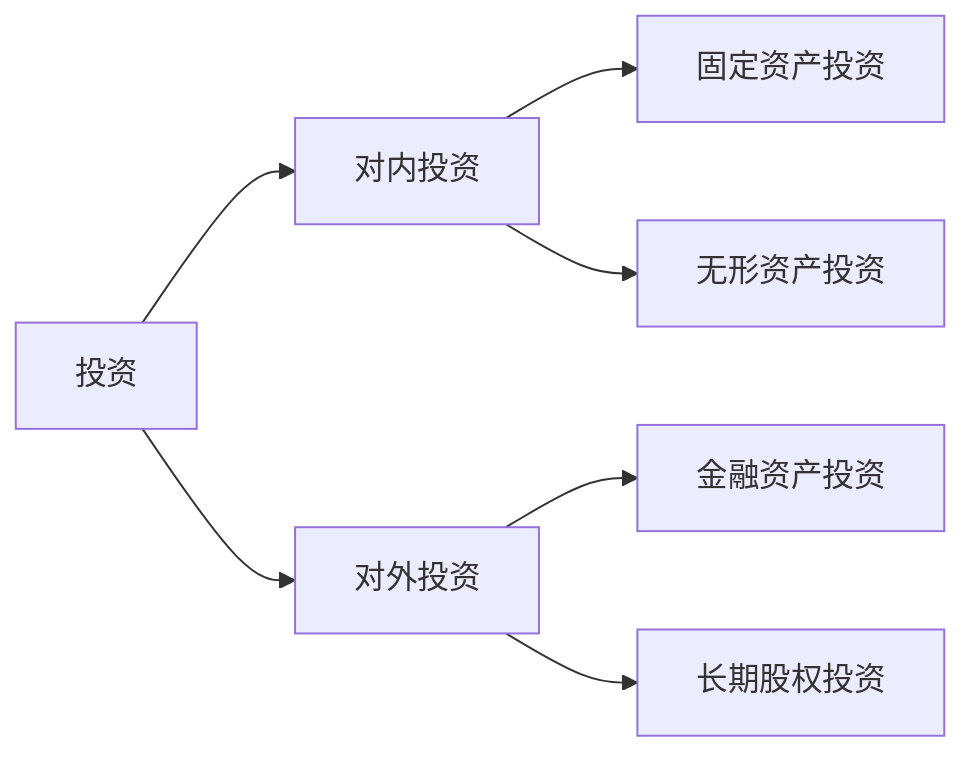
```mermaid
flowchart LR;
    r[投资]-->a[对内投资]
    r-->b[对外投资]
    a-->c[固定资产投资]
    a-->d[无形资产投资]
    b-->e[金融资产投资]
    b-->f[长期股权投资]
```

与金融资产相关的三个概念

1. `摊余成本`，顾名思义就是剩下的那些成本，比如还没有支付的债券本金和利息就可以算作摊余成本。
2. `公允价值`，简单理解就是当前的市场价格。
3. `其他综合收益`本身就是一个会计科目，属于股东权益类。

金融资产被划分为三类：

1. 以摊余成本计量的金融资产；
2. 以公允价值计量，并且公允价值变动计入其他综合收益的金融资产；
3. 以公允价值计量，并且公允价值变动计入当期损益的金融资产。

表13-3　三类金融资产的会计处理汇总

金融资产类型 | 初始分类 | 股息红利 | 减值
-------|------|------|---
以摊余成本计量的金融资产 | 准备一直持有至到期的债券 | 直接计入当期利润 | 需要计提减值
以公允价值计量，并且公允价值变动计入其他综合收益的金融资产 | 不以交易为目的而持有的金融资产 | 直接计入当期利润 | 债权类投资需要计提减值，股权类投资不需要计提减值
以公允价值计量，并且公允价值变动计入当期损益的金融资产 | 以交易为目的持有的金融资产、衍生金融工具 | 直接计入当期利润 | 不需要计提减值

## 股权投资要讲感情：股权投资
1. 长期股权投资就是那些企业准备长期持有的对外权益投资。按照与被投资企业的关系，长期持有的股权可以分为三类，分别是有控制权的投资、有重大影响的投资、没有控制权又不具有重大影响的投资。
2. 如果投资方拥有控制权，就以成本法来记录投资，另外还要编制合并报表；如果投资方对被投资企业没有控制权，但能施加重大影响或与其他企业共同控制，就以权益法来记录投资；如果投资方对被投资企业既不拥有共同控制权，也不能实施重大影响，那么就不属于长期股权投资的核算范畴，而作为金融资产进行核算。
3. 长期股权投资的核算方法分为成本法和权益法。它们最大的区别是，被投资企业的盈亏是否影响投资方的报表。成本法下，被投资企业的盈亏不影响投资方的利润；权益法下，被投资企业的盈亏会直接反映在投资方的报表上。企业在确定持股比例时，也需要考虑不同的持股比例对应的会计处理方法及其产生的财务影响。
4. 编制合并报表时，无论持股比例多少，资产、负债、收入、成本费用都是母公司和被投资企业百分之百的加总。合并资产负债表需要抵消母公司对子公司的投资和子公司中归属于母公司的所有者权益；合并利润表需要剔除母公司从子公司分得的投资收益和子公司利润分配中给母公司的部分。
5. 母公司的个体报表和合并报表的核算主体、核算范围一致，都是母公司和被投资企业的加总，只不过二者表现被投资企业的方式不一样。母公司报表是以投资活动的方式来表现被投资企业，而合并报表则是以经营活动方式来表现被投资企业。

### 认识长期股权投资
`长期股权投资`就是那些准备长期持有的对外权益投资，这是长期股权投资和列入金融资产的股票投资间最大的区别。列入金融资产的那些股票要么是持有待售，要么是持有以获取稳定的现金流。只有那些不准备随时出售的投资，才算得上是长期股权投资。

长期持有的股权可以分为三类，分别是有控制权的投资、有重大影响的投资、没有控制权又不具有重大影响的投资。

表14-1　长期股权投资的分类

分类 | 判断的一般依据 | 被投资企业与投资方的关系 | 会计计量方式
---|---------|--------------|-------
有控制权的投资 | 持股超过50%，或为投资方最大股东远超过第二股东的持股，或对被投资企业拥有重要的决策权力 | 子公司 | 成本法，同时需编制合并报表
有重大影响的投资 | 在董事会拥有席位，或可向被投资方派遣关键管理人员、向被投资方提供关键技术、参与被投资方的政策制定或一些重要交易的决策 | 联营企业 | 权益法
没有控制权又不具有重大影响的投资 | 不属于以上两种情况 | 合营企业 | 纳入金融资产核算

### 成本法和权益法
成本法下，投资的账面价值总是等于最初的投资成本，被投资企业的盈利或亏损不会反映在投资方的报表上，只有当被投资企业分红的时候，才会作为投资方的投资收益进行核算。

成本法计算的长期股权投资可能存在减值问题。每年年末企业都需要对长期股权投资进行减值测试，如果认为确系发生了减值，就要计提减值准备，冲减长期股权投资的账面价值，同时也会记录相应的资产减值损失，从而减少当年的利润。这与固定资产和无形资产的减值一样，长期股权投资也是一种长期资产，同样适用减值一旦计提就不能转回的规定。

在权益法之下，长期股权投资的价值就不再是一成不变的了，而是要根据被投资企业的经营状况来逐年调整。比如投资方持有被投资企业15%的股权，如果被投资企业当年盈利1亿元，那么作为投资方就应该记录15%，即1500万元的投资收益，同时长期股权投资的价值也应该增加1500万元，相当于投资方对被投资企业增资了1500万元。但如果被投资企业将1亿元利润中的5000万元作为股利发放，投资方拥有15%的股权，就可以分得750万元的利润，相当于将750万元的投资从刚才1500万元的增资中拿回来了，长期股权投资的价值就应该在刚才增资1500万元的基础上再减少750万元。但是，分红是不影响长期股权投资的投资收益的。

表14-2　成本法与权益法的区别

/ | 每年年末 | 分红 | 减值
--|------|----|---
成本法 | 不操作 | 按比例计入投资收益 | 冲减长期股权投资的账面价值，一经计提不得转回
权益法 | 用被投资企业的利润乘以持股比例，作为投资收益，同时调整长期股权投资账面价值 | 不计入投资收益，而是调整长期股权投资账面价值 | 原理同成本法，但计提减值可能性较小

### 合并报表
当投资方对被投资企业拥有控制权时，投资方除了要编制自己的财务报表，还需要站在集团公司的角度编制一张合并报表。

表14-3　合并资产负债表　（单位：万元）

科目 | A公司（母公司） | B公司（子公司） | 合并报表
---|----------|----------|-----
资产总计 | 1000 | 500 | 1300(=1000+500-200)
其中，对B公司的投资 | 200(占其80%)
负债总计 | 400 | 250 | 650
股东权益总计 | 600 | 250 | 650(=600+250-250×80%)其中，少数股东权益为50

表14-4　合并利润表　（单位：万元）

科目 | A公司（母公司） | B公司（子公司） | 合并报表
---|----------|----------|-----
收入 | 1000 | 500 | 1500
成本费用 | 800 | 400 | 1200
经营利润 | 200 | 100 | 300
分红 | 80(来自子公司B的分红) | 100(其中80%分给了A公司)
净利润 | 280 | / | 300(-280+100-80)其中，少数股东损益为20

## 带上你的嫁妆跟我走：兼并收购
1. 兼并收购指企业兼并和企业收购，是两件事。兼并指原本相互独立的两家或多家企业合并成一家企业的市场行为，而收购是指一家企业购买了另一家企业的股权或资产，从而获得了对被收购方股权或资产的控制权。
2. 反向收购是指一家上市公司收购了一家非上市公司，之后非上市公司却掌握了上市公司的控制权的并购现象。反向收购经常和借壳上市联系在一起。
3. 并购是以购买企业的方式进行的一项投资。并购决策首先要保证项目的净现值大于零，其次需要确定并购的方式。并购不仅可能让企业快速进入某一业务领域，还可以消灭竞争对手，但它会大大增加企业的风险。风险一方面来自被收购目标的表外负债，另一方面来自对被收购目标的整合。
4. 并购中购受日的会计处理包括两种基本方法：购买法和权益联合法。我国会计准则规定，同一控制下的企业合并采用权益联合法，非同一控制下的企业合并采用购买法。
5. 购买法将被收购方的资产、负债按照评估价值记录到收购方的报表中，收购价格高于评估价值的部分记录为商誉。购受日不编制合并利润表，而在年末编制。合并利润表只包含被收购方在购受日之后的那部分利润。权益联合法将被收购方的资产、负债按照账面价值记录到收购方的报表中，一般情况下没有商誉，收购价格高于账面价值的部分调整股东权益。购受日应编制合并利润表。年末编制的合并利润表应包含被收购方全年的利润。

### 认识兼并收购
`兼并`是指原本相互独立的两家或多家企业合并成一家企业的市场行为。一般来说，兼并会存在一家优势企业，它买下了其他的企业。而`收购`是指一家企业买了另外一家企业的股权或资产，从而获得了对被收购方股权或资产的控制权。

兼并之后，占优势的企业会继续存续，而其他企业则会被合并。而收购发生之后，收购方和被收购方都会继续存在，只是被收购方的控制权由收购方掌握了。现实中，兼并收购还有另外一种情况，就是收购方和被收购方都不继续存在，双方重新注册成立一家新公司，把收购方和被收购方的资产合并到新的公司里（见图15-1）。

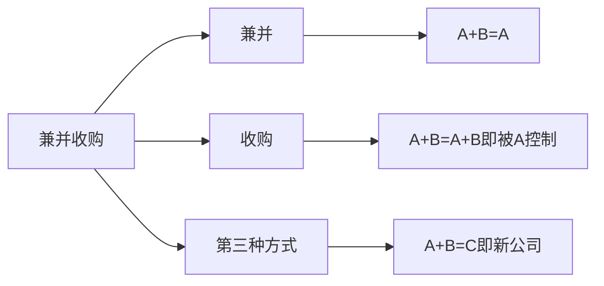
```mermaid
flowchart LR;
    r[兼并收购]-->a[兼并]
    r-->b[收购]
    a-->c[A+B=A]
    b-->d[A+B=A+B即被A控制]
    r-->e[第三种方式]
    e-->f[A+B=C即新公司]
```

`反向收购`，它是指一家上市公司收购了一家非上市公司，之后非上市公司却掌握了上市公司的控制权的并购现象。从形式上看，上市公司是母公司和收购方，但实际上非上市公司才是真正的收购方。反向收购经常和借壳上市联系在一起，如果反向收购后，非上市公司的资产、负债、业务人员等都注入到上市公司中，甚至上市公司原来的业务被剥离出去了。

到目前为止，中国的上市条件中要求公司必须有连续三年以上的盈利，而互联网公司往往很难满足，而海外很多资本市场，像美国就没有这种盈利的要求。

## “有借有还，再借不难”与“空手套白狼”：融资之道
1. 企业最基本的融资渠道包括自有资金、债务融资和股权融资。从融资成本看，应优先使用内部的闲置资金，其次是债务融资，最后才是股权融资。债务融资的成本是它的利率，股权融资的成本比较复杂，可以用行业平均盈利水平来衡量。
2. 本章以华夏幸福为例，介绍了常见的股权融资和债权融资方式，如定向增发、战略引资、资产支持证券、短期融资券、委托贷款、股权收益权转让等。

### 融资决策的基本依据
除了行业平均盈利水平，还有一个常用来衡量股权融资成本的方法，叫`资本资产定价模型`，英文简称CAPM：

$R_i=R_f+\beta(R_m-R_f)$

其中，

- Ri表示预期报酬率
- β表示对该投资市场风险的度量
- Rf表示市场无风险利率
- Rm表示市场一般利率。

该模型认为股权的融资成本取决于无风险利率Rf和风险溢价β（Rm-Rf）这两个部分。企业为股东提供回报的方式，可以不是还本付息，也不一定是分红，更重要的是股票价值的增值。

表16-1　常见融资方式一览表

融资类型 | 融资方式 | 说明
-----|------|---
股权融资方式 | 定向增发 | 面向特定的投资群体发行股票，这个投资群体可以是外部机构投资者，也可以是包括公司大股东在内的其他公司
股权融资方式 | 战略引资 | 引入战略投资者，该投资者的持股比例较高，其目的是进入某一行业或领域
股权融资方式 | 资产支持证券 | 将某项资产未来收益的一定份额，以证券的形式出售
股权融资方式 | 特定收益权转让 | 将资产的未来收益权转让给某一投资者，把这部分未来收益提前变现
股权融资方式 | 夹层式资管计划 | 类似于基金，通过一家资管机构进行融资。购买者将资金交给资管机构，资管机构再进行投资
短期债务融资方式 | 银行承兑 | 由银行发出承兑汇票，相当于为企业采购提供资金支持
短期债务融资方式 | 短期融资券 | 实质是一种短期的债券
长期债务融资方式 | 委托贷款 | 一种私人性质的长期借款，通过银行使得借贷合法化
长期债务融资方式 | 银团贷款 | 由一家或者几家银行牵头，多家银行与非银行金融机构参与，组成一个银行集团，并采用同一个贷款协议，按照商定的期限和条件向同一个借款人提供融资的一种贷款方式
长期债务融资方式 | 信托借款 | 从信托公司来获取贷款。融资成本高，门槛低，选择面广，数额巨大
长期债务融资方式 | 关联方借款 | 向关联方借款
长期债务融资方式 | 股权收益权转让 | 抵押贷款的一种，抵押的标的是对某公司持有的股权
长期债务融资方式 | 应收账款收益权转让 | 抵押贷款的一种，抵押的标的是应收账款
长期债务融资方式 | 特殊信托计划 | 通过设立一个特殊信托计划的方式把债权抵押出去获得资金
长期债务融资方式 | 债务重组 | 同债权人达成协议以获得一些宽松的还款条件
长期债务融资方式 | 债权转让 | 销售债权资产
长期债务融资方式 | 售后回租式融资租赁 | 一种分期付款的购买行为
长期债务融资方式 | 夹层融资 | 表面上看起来是股权转让，但是实际约定未来要回购，并且以差价作为利息或支付约定的利息

# 鸟瞰财务报表，掌控企业大局
## 为你的家底拍张照：资产负债表
1. 资产负债表描述了一家企业在某个时点的财务状况，说明投入到公司多少资金，这些资金又变成了什么。它分为左右两部分：左边是资产，说明资金变成了什么；右边是负债和所有者权益，说明资金从哪里来。资产负债表的基本逻辑关系是：`资产=负债+所有者权益`
2. 资产按照它们变现的快慢依次排序，变现快的排在前面，变现慢的排在后面。在一个从现金到现金的循环中就能完全转化成现金的资产叫作流动资产，需要多个循环才能完全变成现金的资产称为长期资产。
   1. 流动资产包括货币资金、应收账款，预付账款、存货等，非流动资产包括长期股权投资、固定资产、无形资产等。
3. 分析企业的资产主要从资产结构和资产周转率两个方面入手。
资产的结构与业务特性以及行业竞争格局密切相关。大多数企业占比最大的三项资产几乎占总资产的60%以上，所以企业可以主要关注这些占比较大的重要资产。
   1. 通过对应收款项、存货、应收和预收款等项目的周转率进行计算，可以了解一家企业采购、生产、销售、回款等具体业务的运作情况。
4. 负债分为流动负债和非流动负债，流动负债是一年之内到期的负债，非流动负债是一年以后需要偿还的负债。
流动负债包括短期借款、应付票据、应付账款、应付职工薪酬等，非流动负债包括长期借款、应付债券、长期应付款等。
5. 负债分析主要评判企业的偿债能力，它分为短期偿债能力和长期偿债能力两个方面。
   1. 短期偿债能力就是偿还流动负债的能力，其衡量指标主要包括流动比率和速动比率，长期偿债能力的主要指标是资产负债率，又称财务杠杆。
6. 股东向公司投资有两种方式：一种是将外部资金投入公司中；另一种是将公司盈利的资金留在公司作为追加投资。所有者权益包括实收资本/股本、资本公积、盈余公积、未分配利润，以及其他综合收益、归属于母公司股东的权益和少数股东权益。

## 为赚钱的过程拍视频：利润表
1. 利润表是一个时段概念的报告，展示了企业赚取利润的过程。

        营业利润=营业总收入-营业成本-税金及附加-销售费用-管理费用-财务费用-资产减值损失+公允价值变动收益+投资收益
    
        利润总额=营业利润+营业外收入-营业外支出
    
        净利润=利润总额-所得税费用

2. 通过对利润表的分析，可以看出企业盈利的能力，主要看营业成本、三项费用，以及营业利润、净利润占营业总收入的比重。可以通过利润表项目计算出利息保障倍数，以此来考察企业偿还利息的能力，这也是企业偿债能力的表现。

## 我的眼里只有钱：现金流量表
1. 现金流就像企业的血液，失血过多，企业必不能生存。现金流量表就是这样一张关于风险的报表，它描述现金的来龙去脉，通过这些来龙去脉让我们知道企业是否有不能持续经营的风险。
2. 现金流量表被分成了三大部分，分别是经营活动现金流、投资活动现金流和融资活动现金流。三大部分再加上汇率变动对现金及现金等价物的影响，就可以得到公司整体的现金流量。
3. 如果一笔现金流同时被记录在利润表上，那么现金流和利润就不会有差异。但如果一笔现金流被记录在资产负债表上，那么现金流和利润就不一样了，因为现金流量表上有记录，而利润表上没有记录，因而便产生了利润与现金流的差异。
4. 现金流量表的分析重点在于了解现金的来龙去脉，从而关注企业的经营风险。其分析主要包括两个方面：一是现金流结构，企业不同活动的现金净流量，可能为正，也可能为负，三类活动一共有八种组合的结果，可通过不同的组合情况来判断企业的状况，以及该状况下企业的关键风险。二是利润与现金流产生巨大差异的原因，比如应收账款、存货、应付账款、预收账款、折旧，需要具体情况具体分析。
5. 利润和现金流谁更重要，不能一概而论，关键看经营风险如何：在高风险的情况下，现金流更重要；在风险相对可控的情况下，就是利润更重要了。
