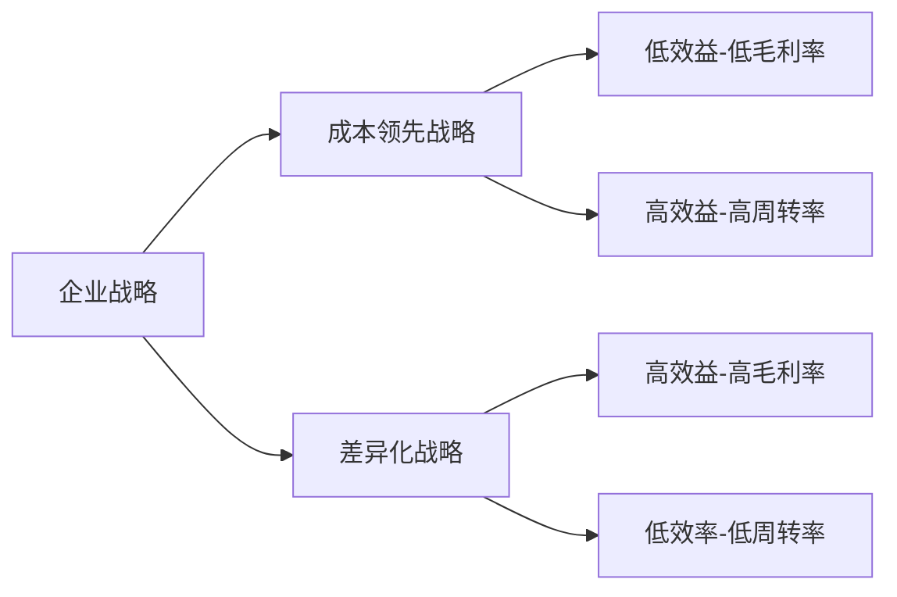

    作者: 肖星
    出版社: 机械工业出版社
    出品方: 华章经管
    副标题: 看懂财富流转的规律
    出版年: 2020-4
    页数: 320
    定价: 69.00元
    装帧: 平装
    ISBN: 9787111651666

[豆瓣链接](https://book.douban.com/subject/35033236/)

- [了解财务知识，看清企业兴衰](#了解财务知识看清企业兴衰)
- [认清行业大势，把脉客户关系](#认清行业大势把脉客户关系)
  - [最爱的人伤我最深：“唯利是图”的客户](#最爱的人伤我最深唯利是图的客户)
  - [火眼金睛识对手：竞争对手](#火眼金睛识对手竞争对手)
  - [谁动了我的奶酪：应收账款](#谁动了我的奶酪应收账款)

# 了解财务知识，看清企业兴衰
在财务人眼中，这些企业有一个共同点，那就是，所有的企业都经历着一个从投入资金到回收货款的过程，循环往复、周而复始、永不停息，直到企业关门（见图1-1）。

企业经营主要做三件事。

1. 企业的投资人（或股东）把钱投入企业，为生产经营做准备，我们称为融资活动。
2. 企业用这些钱购买厂房、设备等基础设施，这种事并不会每天都发生，我们称为投资活动。
3. 企业每天都在上演，那就是购买原材料、生产产品、销售产品、回收货款……我们称为经营活动。

所以，企业纷繁复杂的各种交易和经济活动，在财务人眼中只有三类，那就是经营活动、投资活动和融资活动（见图1-2）。

# 认清行业大势，把脉客户关系
## 最爱的人伤我最深：“唯利是图”的客户
1. 卖什么？企业既可以卖商品，也可以卖服务；可以卖有形商品，也可以卖无形商品；可以卖自产商品，也可以卖外购商品。
2. 把东西卖给谁？可以把企业客户分成两种类型：一种是其他企业（即2B），另一种是个人消费者（即2C）。
3. 怎么卖、如何收款？常见的收款方式有：一手交钱，一手交货（即现销）；先付款，再发货（即预收）；先发货，再付款（即赊销，也是最常见的）；分期付款。

## 火眼金睛识对手：竞争对手
1. 竞争对手在哪里？它可以有三个来源：同行业的公司、行业新进入者、替代产品提供者。
2. 竞争会给我们造成什么影响？它会对价格产生冲击，会导致产能过剩与客户议价能力的提升。
3. 面对竞争，我们可以做些什么？可以实施两种不同类型的战略：成本领先战略和差异化战略。成本领先战略需要将成本降到比所有竞争对手都低，以低价吸引顾客；差异化战略需要让产品和服务具备某方面的独特性，吸引顾客为此付高价。
4. 从财务的视角看竞争战略是什么样的？成本领先战略是薄利多销，即低效益（低毛利率）、高效率（高周转率），也称效率制胜战略；差异化战略正好相反，是效益制胜战略，高效益（高毛利率）、低效率（低周转率）。

竞争的影响

1. 对价格的冲击。当价格下降而成本不降时，马上就会引发`毛利率`的下降。
2. 毛利率可以反映竞争的激烈程度
3. 产能过剩与客户议价能力的提升

应对竞争，两大战略类型：

- `成本领先战略`是指，我们提供的产品、服务都是大众化的产品，但我们可以想方设法把成本降低。比如利用行业规模经济性，即增加产量，单位成本就会被摊薄；通过提高效率来降低成本；还可以通过简化产品的设计，把不太重要的功能去掉来降低成本；通过减少广告投入、营销投入等方式来降低成本；通过建立严格的成本管理体系来降低成本。
- `差异化战略`正好相反，它要求我们把产品或服务做得富有特色。比如，提高质量，好到他人无法企及；提供更好的售后服务，让顾客感受到产品的独特性；提供非常完善的选择，用各种各样的型号满足顾客多元化的需求；提供更好的送货选择，如送货便捷或者送货速度快。也有一些企业是依靠独特的品牌形象来获得这种独特性的，比如品牌非常知名，而知名的品牌会给企业带来额外的好处。还有一些公司擅长创新和研发，总能做出别人做不出的产品。总之，都是通过各种各样的方式，让产品或服务具有某种独特性，这样就有可能给产品或服务定一个比较高的价格，利润空间也就更大。所以，差异化战略是一个定位于高端市场的战略。

从财务视角看竞争战略：

表3-1　苹果和联想的对比

对比项目 | 苹果 | 联想
-----|----|---
毛利率（效益） | 40% | 13%
周转率（效率） | 0.9 | 2

## 谁动了我的奶酪：应收账款

