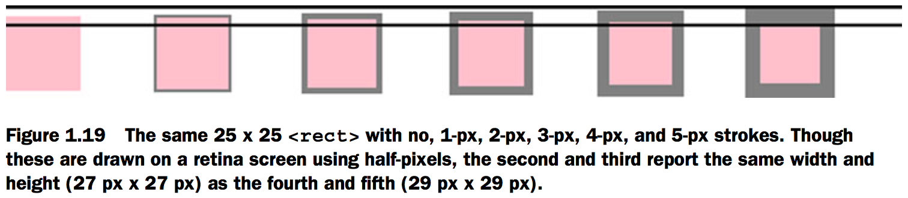
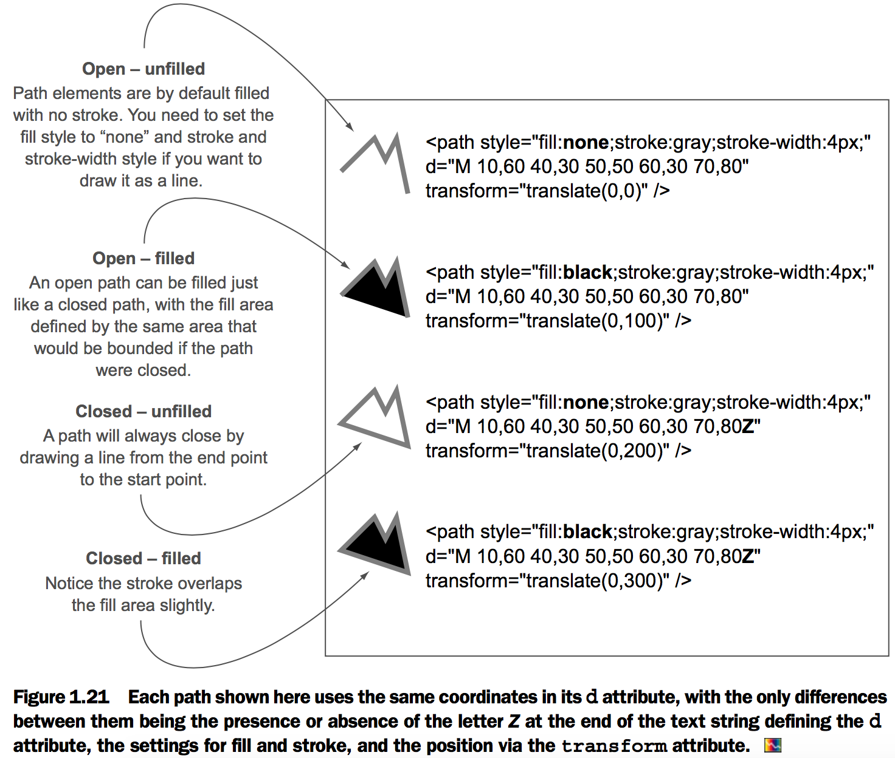
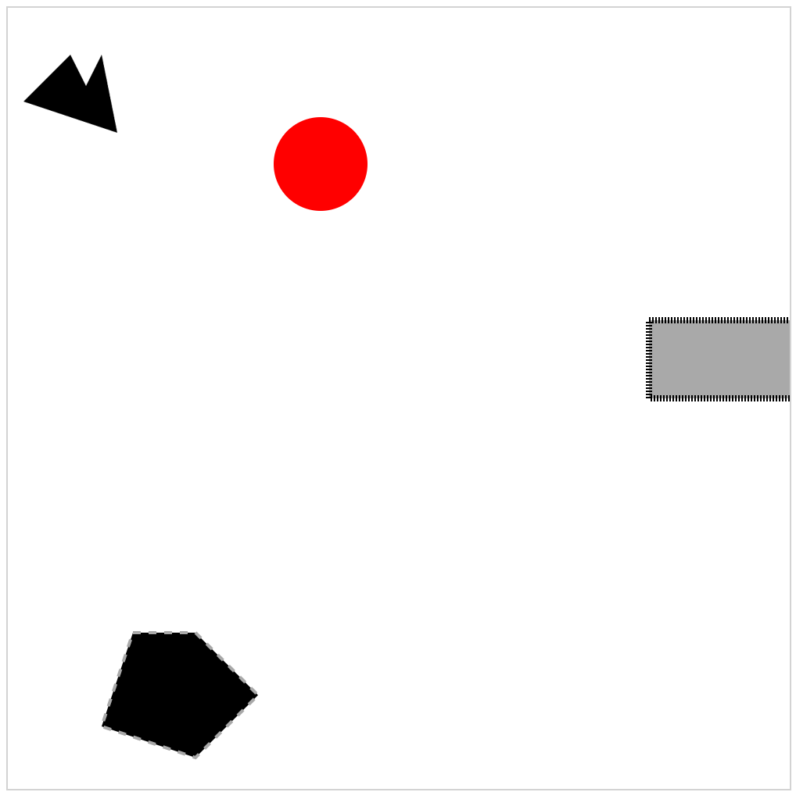
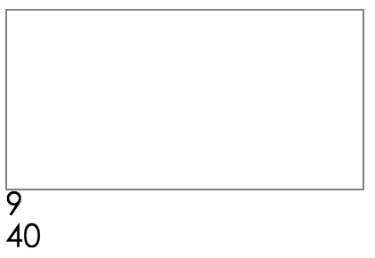
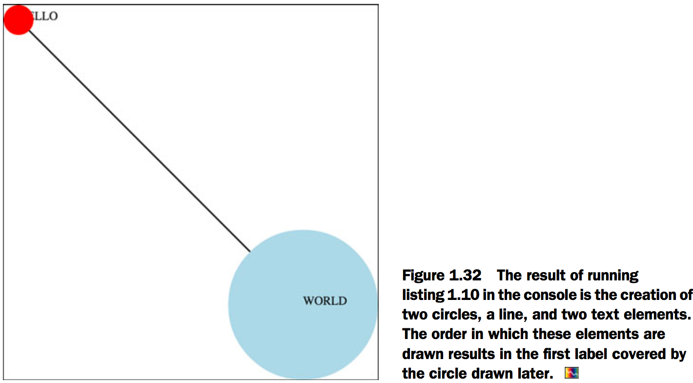
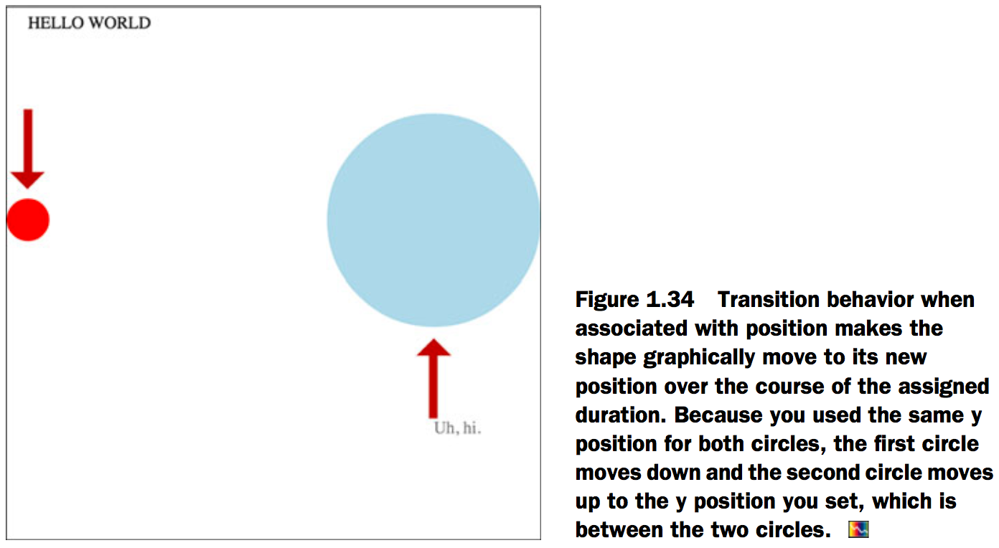

# 1.An introduction to D3.js
Christophe Viau’s gallery of over 2,000 D3 [examples][1].

## D3 is about selecting and binding
Here’s a selection without any data:
```js
d3.selectAll("circle.a").style("fill", "red").attr("cx", 100);
```

This takes every circle on our page with the class of "a" and turns it red and moves it so that its center is 100 pixels to the right of the left side of our `<svg>` canvas. Likewise, this code turns every div on our web page red and changes its class to "b":

```js
d3.selectAll("div").style("background", "red").attr("class", "b");
```

Selections are a group of one or more web page elements that may be associated with a set of data, like the following code, which binds the elements in the array [1,5,11,3] to <div> elements with the class of "market":

```js
d3.selectAll("div.market").data([1,5,11,3])
```

This association is known in D3 as `binding data`, and you can think of a selection as a set of web page elements and a corresponding, associated set of data.

## D3 is about deriving the appearance of web page elements from bound data


## The DOM
- `Styles` can determine transparency, color, size, borders, and so on.
- `Attributes` typically refer to classes, IDs, and interactive behavior, though some attributes can also determine appearance, depending on which type of element you’re dealing with.
- `Properties` typically refer to states, such as the “checked” property of a check box, which is true if the box is checked and false if the box is unchecked.

```js
d3.select("#someDiv").style("border", "5px darkgray dashed");
d3.select("#someDiv").attr("id", "newID");
d3.select("#someCheckbox").property("checked", true);
```

## SVG
[Fig_01_17.html][2]
```html
<html>
<head>
  <title>D3 in Action Chapter 1 - Example 1</title>
  <meta charset="utf-8" />
</head>
<style>
svg {
  position: absolute;
  width: 500px;
  height: 500px;
  border: 1px lightgray solid;
}
</style>
<body>

<div id="vizcontainer">
<svg>
  <path d="M 10,60 40,30 50,50 60,30 70,80" style="fill:black;stroke:gray;stroke-width:4px;" />
  <polygon style="fill:gray;" points="80,400 120,400 160,440 120,480 60,460" />
<g>
<circle cy="100" cx="200" r="30"/>
<rect x="410" y="200" width="100" height="50" style="fill:pink;stroke:black;stroke-width:1px;" />
</g>

</svg>
</div>
</body>
</html>
```
- `<svg>` this is your canvas on which everything is drawn.
- `<rect>` has x and y attributes that determine the shape’s top-left corner, as well as height and width attributes that determine its overall form.
- `<circle>` element has cx and cy attributes that determine the center of the circle, and an r attribute that determines the radius of the circle.
- `<line>` element has x1 and y1 attributes that determine the starting point of the line and x2 and y2 attributes that determine its end point.
- There are other simple shapes that are similar to these, such as the `<ellipse>`, and there are more complex shapes, like the `<polygon>` with a points attribute that holds a set of comma-separated xy coordinates, in clockwise order, that determines the area bounded by the polygon.



- The color, stroke, and transparency of any shape can be changed by adjusting the style of the shape, with "fill" deter- mining the color of the area of the shape and "stroke", "stroke-width", "stroke-dasharray" determining its outline.

[Fig_01_20.html][3]

```html
<html>
<head>
  <title>D3 in Action Chapter 1 - Example 3</title>
  <meta charset="utf-8" />
</head>
<style>
svg {
  position: absolute;
  width: 500px;
  height: 500px;
  border: 1px lightgray solid;
}
</style>
<body>

<div id="vizcontainer">
<svg>
<g>
<circle r="5"/>
<text>A Label</text>
</g>
<g transform="translate(100,50)">
<circle r="5" />
<text>A Label</text>
</g>
<g transform="translate(100,400)scale(3.5)">
<circle r="5"/>
<text>A Label</text>
</g>
</svg>
</div>
</body>
</html>
```
- `<text>` used for labels.
- `<g>` it’s a logical grouping of elements.


[Fig_01_21.html][4]
```html
<html>
<head>
  <title>D3 in Action Chapter 1 - Example 4</title>
  <meta charset="utf-8" />
</head>
<style>
svg {
  position: absolute;
  width: 500px;
  height: 500px;
  border: 1px lightgray solid;
}
</style>
<body>

<div id="vizcontainer">
<svg>
  <path style="fill:none;stroke:gray;stroke-width:4px;" d="M 10,60 40,30 50,50 60,30 70,80" transform="translate(0,0)" />
  <path style="fill:black;stroke:gray;stroke-width:4px;" d="M 10,60 40,30 50,50 60,30 70,80" transform="translate(0,100)" />
  <path style="fill:none;stroke:gray;stroke-width:4px;" d="M 10,60 40,30 50,50 60,30 70,80Z" transform="translate(0,200)" />
  <path style="fill:black;stroke:gray;stroke-width:4px;" d="M 10,60 40,30 50,50 60,30 70,80Z" transform="translate(0,300)" />
</svg>
</div>
</body>
</html>
```
- `<path>` A path is an area determined by its d attribute. Paths can be open or closed, meaning the last point connects to the first if closed and doesn’t if open. The open or closed nature of a path is determined by the absence or presence of the letter Z at the end of the text string in the d attribute. It can still be filled either way.



## CSS
[Fig_01_22.html][5]

```html
<html>
<head>
  <title>D3 in Action Chapter 1 - Example 2</title>
  <meta charset="utf-8" />
</head>
<style>
svg {
  position: absolute;
  width: 500px;
  height: 500px;
  border: 1px lightgray solid;
}
.inactive, .tentative {
  stroke: darkgray;
  stroke-width: 2px;
  stroke-dasharray: 5 5;
}

.tentative {
  opacity: .5;
}

.active {
  stroke: black;
  stroke-width: 4px;
  stroke-dasharray: 1;
}

circle {
  fill: red;
}

rect {
  fill: darkgray;
}

</style>
<body>

<div id="vizcontainer">
<svg>
  <path d="M 10,60 40,30 50,50 60,30 70,80" />
  <polygon class="inactive" points="80,400 120,400 160,440 120,480 60,460"/>
<g>
<circle cy="100" cx="200" r="30"/>
<rect class="active" x="410" y="200" width="100" height="50" />
</g>
</svg>
</div>
</body>
</html>
```



## JavaScript
```js
d3.selectAll("div").data(someData).enter().append("div").html("Wow").append("span").html("Even More Wow").style("font-weight", "900");
```

- When you use .data(), you bind each element in your selection to each item in an array.
- If you have more items in your array than elements in your selection, then you can use the .enter() function to define what to do with each extra element.
- In the previous function, you select all the `<div>` elements in the `<body>` and the .enter() function tells D3 to .append() a new div when there are more elements in the array than elements in the selection.
- A corresponding .exit() function defines how to respond when an array has fewer values than a selection.

[Fig_01_26.html][6]

```html
<html>
<head>
  <title>D3 in Action Chapter 1 - Example 2</title>
  <meta charset="utf-8" />
<script src="d3.v3.min.js" type="text/JavaScript"></script>
</head>
<style>
#vizcontainer {
  width: 200px;
  height: 100px;
  border: 1px gray solid;
}
</style>
<body>

<div id="vizcontainer">
</div>
</body>
<footer>

<script>
  var someData = ["filler", "filler", "filler", "filler"];
d3.select("body").selectAll("div").data(someData).enter().append("div").html("Wow").append("span").html("Even More Wow").style("font-weight", "900");

</script>
</footer>
</html>
```


[Fig_01_27.html][7]

```html
<html>
<head>
  <title>D3 in Action Chapter 1 - Example 6</title>
  <meta charset="utf-8" />
<script src="d3.v3.min.js" type="text/JavaScript"></script>
</head>
<style>
#vizcontainer {
  width: 200px;
  height: 100px;
  border: 1px gray solid;
}
</style>
<body>

<div id="vizcontainer">
</div>
</body>
<footer>

<script>
var someNumbers = [17, 82, 9, 500, 40];
smallerNumbers = someNumbers.filter(function(el) {return el <= 40 ? this : null});
d3.select("body").selectAll("div").data(smallerNumbers).enter().append("div").html(function (d) {return d});

</script>
</footer>
</html>

```



## Hello World
[Fig_01_32.html][8]

```html
<html>
<head>
  <title>D3 in Action Chapter 1 - Example 7</title>
  <meta charset="utf-8" />
<script src="d3.v3.min.js" type="text/JavaScript"></script>
</head>
<style>
svg {
  position: absolute;
  height: 500px;
  width: 500px;
  border: 1px solid lightgray;
}
</style>
<body>

<div id="vizcontainer">
<svg></svg>
</div>
</body>
<footer>
<script>
d3.select("svg").append("line").attr("x1", 20).attr("y1", 20).attr("x2",400).attr("y2",400).style("stroke", "black").style("stroke-width","2px");
d3.select("svg").append("text").attr("x",20).attr("y",20).text("HELLO");
d3.select("svg").append("circle").attr("r", 20).attr("cx",20).attr("cy",20).style("fill","red");
d3.select("svg").append("circle").attr("r", 100).attr("cx",400).attr("cy",400).style("fill","lightblue");
d3.select("svg").append("text").attr("x",400).attr("y",400).text("WORLD");

</script>
</footer>
</html>
```



[Fig_01_34.html][9]

```html
<html>
<head>
  <title>D3 in Action Chapter 1 - Example 8</title>
  <meta charset="utf-8" />
<script src="d3.v3.min.js" type="text/JavaScript"></script>
</head>
<style>
svg {
  position: absolute;
  height: 500px;
  width: 500px;
  border: 1px solid lightgray;
}
</style>
<body>

<div id="vizcontainer">
<svg></svg>
</div>
</body>
<footer>
<script>
d3.select("svg").append("circle").attr("r", 20).attr("cx",20).attr("cy",20).style("fill","red");
d3.select("svg").append("text").attr("id", "a").attr("x",20).style("opacity", 0).attr("y",20).text("HELLO WORLD");
d3.select("svg").append("circle").attr("r", 100).attr("cx",400).attr("cy",400).style("fill","lightblue");
d3.select("svg").append("text").attr("id", "b").attr("x",400).attr("y",400).style("opacity", 0).text("Uh, hi.");

d3.select("#a").transition().delay(1000).style("opacity", 1);
d3.select("#b").transition().delay(3000).style("opacity", .75);

d3.selectAll("circle").transition().duration(2000).attr("cy", 200);
</script>
</footer>
</html>
```



[1]: http://christopheviau.com/d3list/gallery.html
[2]: Fig_01_17.html
[3]: Fig_01_20.html
[4]: Fig_01_21.html
[5]: Fig_01_22.html
[6]: Fig_01_26.html
[7]: Fig_01_27.html
[8]: Fig_01_32.html
[9]: Fig_01_34.html
