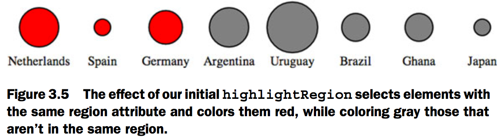
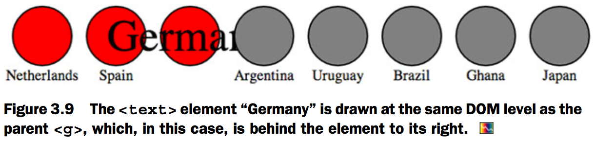
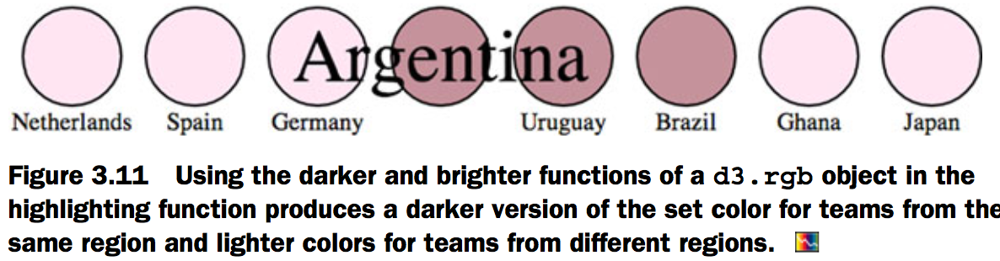
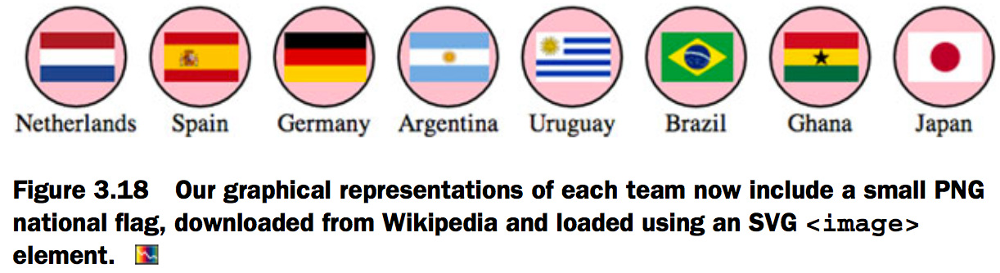
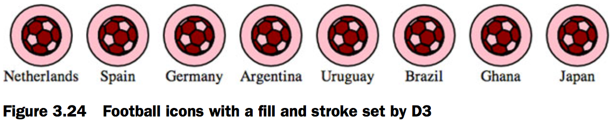

# 3.Data-driven design and interaction
## Project architecture
[Fig_03_02.html][1]

```html
<html>
<head>
  <title>D3 in Action Chapter 3 - Example 1</title>
  <meta charset="utf-8" />
<script src="d3.v3.min.js" type="text/JavaScript"></script>
</head>
<style>
  svg {
    height: 500px;
    width: 500px;
    border: 1px solid gray;
  }

  text {
font-size: 10px;
}

g > text.active {
font-size: 30px;
}

circle {
fill: pink;
stroke: black;
stroke-width: 1px;
}

circle.active {
fill: red;
}

circle.inactive {
fill: gray;
}

</style>
<body>

<div id="viz">
  <svg>
  </svg>
</div>
<div id="controls" />
</body>
  <footer>

<script>
  d3.csv("worldcup.csv", function(data) {
    overallTeamViz(data);
  })

function overallTeamViz(incomingData) {
d3.select("svg")
.append("g")
.attr("id", "teamsG")
.attr("transform", "translate(50,300)")
.selectAll("g")
.data(incomingData)
.enter()
.append("g")
.attr("class", "overallG")
.attr("transform", function (d,i) {return "translate(" + (i * 50) + ", 0)"});

var teamG = d3.selectAll("g.overallG");

teamG
.append("circle")
.attr("r", 20)
.style("fill", "pink")
.style("stroke", "black")
.style("stroke-width", "1px")

teamG
.append("text")
.style("text-anchor", "middle")
.attr("y", 30)
.style("font-size", "10px")
.text(function(d) {return d.team})
}
</script>
</footer>
</html>
```


## Interactive style and DOM
### Events
[Fig_03_03.html][2]

```html
<html>
<head>
  <title>D3 in Action Chapter 3 - Example 2</title>
  <meta charset="utf-8" />
<script src="d3.v3.min.js" type="text/JavaScript"></script>
</head>
<style>
  svg {
    height: 500px;
    width: 500px;
    border: 1px solid gray;
  }

  text {
font-size: 10px;
}

g > text.active {
font-size: 30px;
}

circle {
fill: pink;
stroke: black;
stroke-width: 1px;
}

circle.active {
fill: red;
}

circle.inactive {
fill: gray;
}

</style>
<body>

<div id="viz">
  <svg>
  </svg>
</div>
<div id="controls" />
</body>
  <footer>

<script>
  d3.csv("worldcup.csv", function(data) {
    overallTeamViz(data);
  })

function overallTeamViz(incomingData) {
d3.select("svg")
.append("g")
.attr("id", "teamsG")
.attr("transform", "translate(50,300)")
.selectAll("g")
.data(incomingData)
.enter()
.append("g")
.attr("class", "overallG")
.attr("transform", function (d,i) {return "translate(" + (i * 50) + ", 0)"});

var teamG = d3.selectAll("g.overallG");

teamG
.append("circle")
.attr("r", 20)
.style("fill", "pink")
.style("stroke", "black")
.style("stroke-width", "1px");

teamG
.append("text")
.style("text-anchor", "middle")
.attr("y", 30)
.style("font-size", "10px")
.text(function(d) {return d.team});

 var dataKeys = d3
 .keys(incomingData[0]) //The d3.keys function returns the names of the attributes of an object as an array.
 .filter(function (el) {return el != "team" && el != "region"})//We’ve filtered this array to remove the team and region attributes because these have nonnumerical data and won’t be suitable for the buttonClick functionality we define.

d3.select("#controls").selectAll("button.teams")
.data(dataKeys).enter()//Builds buttons based on the data that’s numerical, so we want all the attributes except the team and region attributes, which store strings
.append("button")
.on("click", buttonClick)//Registers an onclick behavior for each button, with a wrapper that gives access to the data that was bound to it when it was created
.html(function(d) {return d});//Remember that dataKeys consists of an array of attribute names, so the d corresponds to one of those names and makes a good button title.

//The .on function is a wrapper for the traditional HTML mouse events, and accepts "click", "mouseover", "mouseout", and so on. We can also access those same events using .attr, for example, using .attr("onclick", "console.log('click')"), but notice that we’re passing a string in the same way we would using traditional HTML.

function buttonClick(datapoint) {//The function each button is calling on click, with the bound data sent automatically as the first argument
var maxValue = d3.max(incomingData,
function(d) {return parseFloat(d[datapoint])
});
var radiusScale = d3.scale.linear().domain([0,maxValue]).range([2,20]);
d3.selectAll("g.overallG")
.select("circle")
.attr("r", function(d) {return radiusScale(d[datapoint])})
}
}
</script>
</footer>
</html>
```


### Graphical transitions
Transitions are defined for a selection, and can be set to occur after a certain delay using delay() or to occur over a set period of time using duration().

[Fig_03_05.html][3]

```html
<html>
<head>
  <title>D3 in Action Chapter 3 - Example 4</title>
  <meta charset="utf-8" />
<script src="d3.v3.min.js" type="text/JavaScript"></script>
</head>
<style>
  svg {
    height: 500px;
    width: 500px;
    border: 1px solid gray;
  }

  text {
font-size: 10px;
}

g > text.active {
font-size: 30px;
}

circle {
fill: pink;
stroke: black;
stroke-width: 1px;
}

circle.active {
fill: red;
}

circle.inactive {
fill: gray;
}

</style>
<body>

<div id="viz">
  <svg>
  </svg>
</div>
<div id="controls" />
</body>
  <footer>

<script>
  d3.csv("worldcup.csv", function(data) {
    overallTeamViz(data);
  })

function overallTeamViz(incomingData) {
d3.select("svg")
.append("g")
.attr("id", "teamsG")
.attr("transform", "translate(50,300)")
.selectAll("g")
.data(incomingData)
.enter()
.append("g")
.attr("class", "overallG")
.attr("transform", function (d,i) {return "translate(" + (i * 50) + ", 0)"});

var teamG = d3.selectAll("g.overallG");

teamG
.append("circle").attr("r", 0)
   .transition()
   .delay(function(d,i) {return i * 100})
   .duration(500)
   .attr("r", 40)
   .transition()
   .duration(500)
   .attr("r", 20);

teamG
.append("text")
.style("text-anchor", "middle")
.attr("y", 30)
.style("font-size", "10px")
.text(function(d) {return d.team});

 var dataKeys = d3.keys(incomingData[0])
.filter(function (el) {return el != "team" && el != "region"})
   d3.select("#controls").selectAll("button.teams").data(dataKeys).enter().append("button")
   .on("click", buttonClick)
   .html(function(d) {return d});

function buttonClick(datapoint) {
var maxValue = d3.max(incomingData,
function(d) {return parseFloat(d[datapoint])
});
var radiusScale = d3.scale.linear().domain([0,maxValue]).range([2,20]);
d3.selectAll("g.overallG").select("circle").transition().duration(1000).attr("r", function(d) {return radiusScale(d[datapoint])})
}

teamG.on("mouseover", highlightRegion);
teamG.on("mouseout", function() {d3.selectAll("g.overallG").select("circle").style("fill", "pink")});

function highlightRegion(d) {
 d3.selectAll("g.overallG").select("circle").style("fill", function(p) {return p.region == d.region ? "red" : "gray"})
}
}
</script>
</footer>
</html>
```



### DOM manipulation
Getting access to the actual DOM ele- ment in the selection can be accomplished in one of two ways:
1. Using this in the inline functions
2. Using the .node() function

We can see it in action using the .each() function of a selection, which performs the same code for each element in a selection. We’ll make a selection of one of our circles and then use .each() to send d, i, and this to the console to see what each corresponds to (which should look similar to the results in figure 3.7):

```js
d3.select("circle").each(function(d,i) {
    console.log(d);console.log(i);console.log(this);
});
```


We can also access this DOM element using the .node() function of a selection:

```js
d3.select("circle").node();
```


[Fig_03_09.html][5]

```html
<html>
<head>
  <title>D3 in Action Chapter 3 - Example 6</title>
  <meta charset="utf-8" />
<script src="d3.v3.min.js" type="text/JavaScript"></script>
</head>
<style>
  svg {
    height: 500px;
    width: 500px;
    border: 1px solid gray;
  }

  text {
font-size: 10px;
}

g > text.active {
font-size: 30px;
}

circle {
fill: pink;
stroke: black;
stroke-width: 1px;
}

circle.active {
fill: red;
}

circle.inactive {
fill: gray;
}

.highlight {
  font-size: 24px;
}

</style>
<body>

<div id="viz">
  <svg>
  </svg>
</div>
<div id="controls" />
</body>
  <footer>

<script>
  d3.csv("worldcup.csv", function(data) {
    overallTeamViz(data);
  })

function overallTeamViz(incomingData) {
d3.select("svg")
.append("g")
.attr("id", "teamsG")
.attr("transform", "translate(50,300)")
.selectAll("g")
.data(incomingData)
.enter()
.append("g")
.attr("class", "overallG")
.attr("transform", function (d,i) {return "translate(" + (i * 50) + ", 0)"});

var teamG = d3.selectAll("g.overallG");

teamG
.append("circle")
.attr("r", 20);

teamG
.append("text")
.style("text-anchor", "middle")
.attr("y", 30)
.text(function(d) {return d.team});

 var dataKeys = d3.keys(incomingData[0])
.filter(function (el) {return el != "team" && el != "region"})
   d3.select("#controls").selectAll("button.teams").data(dataKeys).enter().append("button")
   .on("click", buttonClick)
   .html(function(d) {return d});

function buttonClick(datapoint) {
var maxValue = d3.max(incomingData,
function(d) {return parseFloat(d[datapoint])
});
var radiusScale = d3.scale.linear().domain([0,maxValue]).range([2,20]);
d3.selectAll("g.overallG").select("circle").transition().duration(1000).attr("r", function(d) {return radiusScale(d[datapoint])})
}

teamG.on("mouseover", highlightRegion);
teamG.on("mouseout", unHighlight);

function highlightRegion(d,i) {
 d3.select(this).select("text").attr("y", 10).classed("highlight", true);
 d3.selectAll("g.overallG")
  .each(function(p,i) {
    p.region == d.region ?
    d3.select(this).select("circle").classed("active",true) :
    d3.select(this).select("circle").classed("inactive",true)
    })
    this.parentElement.appendChild(this);
}

function unHighlight() {
  d3.selectAll("g.overallG").select("circle").classed("active",false).classed("inactive",false);
  d3.selectAll("g.overallG").select("text").attr("y", 30).classed("highlight", false);
}
}
</script>
</footer>
</html>
```



### Using color wisely
To use d3.rgb(), we need to give it the red, green, and blue values of our color:

```js
teamColor = d3.rgb("red");
teamColor = d3.rgb("#ff0000");
teamColor = d3.rgb("rgb(255,0,0)");
teamColor = d3.rgb(255,0,0);
```

These color objects have two useful methods, .darker() and .brighter(). They do exactly what you’d expect: return a color that’s darker or brighter than the color you started with.

[Fig_03_11.html][6]

```html
<html>
<head>
  <title>D3 in Action Chapter 3 - Example 6</title>
  <meta charset="utf-8" />
<script src="d3.v3.min.js" type="text/JavaScript"></script>
</head>
<style>
  svg {
    height: 500px;
    width: 500px;
    border: 1px solid gray;
  }

  text {
font-size: 10px;
}

g > text.active {
font-size: 30px;
}

circle {
fill: pink;
stroke: black;
stroke-width: 1px;
}

circle.active {
fill: red;
}

circle.inactive {
fill: gray;
}

.highlight {
  font-size: 24px;
}

</style>
<body>

<div id="viz">
  <svg>
  </svg>
</div>
<div id="controls" />
</body>
<footer>
<script>
  d3.csv("worldcup.csv", function(data) {
    overallTeamViz(data);
  })

function overallTeamViz(incomingData) {
d3.select("svg")
.append("g")
.attr("id", "teamsG")
.attr("transform", "translate(50,300)")
.selectAll("g")
.data(incomingData)
.enter()
.append("g")
.attr("class", "overallG")
.attr("transform", function (d,i) {return "translate(" + (i * 50) + ", 0)"});

var teamG = d3.selectAll("g.overallG");

teamG
.append("circle")
.attr("r", 20);

teamG
.append("text")
.style("text-anchor", "middle")
.attr("y", 30)
.text(function(d) {return d.team});

 var dataKeys = d3.keys(incomingData[0])
.filter(function (el) {return el != "team" && el != "region"})
   d3.select("#controls").selectAll("button.teams").data(dataKeys).enter().append("button")
   .on("click", buttonClick)
   .html(function(d) {return d});

function buttonClick(datapoint) {
var maxValue = d3.max(incomingData,
function(d) {return parseFloat(d[datapoint])
});
var radiusScale = d3.scale.linear().domain([0,maxValue]).range([2,20]);
d3.selectAll("g.overallG").select("circle").transition().duration(1000).attr("r", function(d) {return radiusScale(d[datapoint])})
}

teamG.on("mouseover", highlightRegion);
teamG.on("mouseout", unHighlight);

function highlightRegion(d,i) {
 var teamColor = d3.rgb("pink")
 d3.select(this).select("text").classed("highlight", true).attr("y", 10)
 d3.selectAll("g.overallG").select("circle").style("fill", function(p) {return p.region == d.region ? teamColor.darker(.75) : teamColor.brighter(.5)})
 this.parentElement.appendChild(this);
}

function unHighlight() {
  d3.selectAll("g.overallG").select("circle").style("fill", "pink");
  d3.selectAll("g.overallG").select("text").attr("y", 30).classed("highlight", false);
}
}
</script>
</footer>
</html>
```



[Fig_03_16.html][7]

```html
<html>
<head>
  <title>D3 in Action Chapter 3 - Example 7</title>
  <meta charset="utf-8" />
<script src="d3.v3.min.js" type="text/JavaScript"></script>
<script src="colorbrewer.js" type="text/JavaScript"></script>
</head>
<style>
  svg {
    height: 500px;
    width: 500px;
    border: 1px solid gray;
  }

  text {
font-size: 10px;
}

g > text.active {
font-size: 30px;
}

circle {
fill: pink;
stroke: black;
stroke-width: 1px;
}

circle.active {
fill: red;
}

circle.inactive {
fill: gray;
}

.highlight {
  font-size: 24px;
}

</style>
<body>

<div id="viz">
  <svg>
  </svg>
</div>
<div id="controls" />
</body>
  <footer>

<script>
  d3.csv("worldcup.csv", function(data) {
    overallTeamViz(data);
  })

function overallTeamViz(incomingData) {
d3.select("svg")
.append("g")
.attr("id", "teamsG")
.attr("transform", "translate(50,300)")
.selectAll("g")
.data(incomingData)
.enter()
.append("g")
.attr("class", "overallG")
.attr("transform", function (d,i) {return "translate(" + (i * 50) + ", 0)"});

var teamG = d3.selectAll("g.overallG");

teamG
.append("circle")
.attr("r", 20);

teamG
.append("text")
.style("text-anchor", "middle")
.attr("y", 30)
.text(function(d) {return d.team});

 var dataKeys = d3.keys(incomingData[0])
.filter(function (el) {return el != "team" && el != "region"})
   d3.select("#controls").selectAll("button.teams").data(dataKeys).enter().append("button")
   .on("click", buttonClick)
   .html(function(d) {return d});

function buttonClick(d) {//Our new buttonClick function sorts the circles in our visualization into three categories with colors associated with them.
 var maxValue = d3.max(incomingData, function(el) {return parseFloat(el[d])});
 var colorQuantize = d3.scale.quantize().domain([0,maxValue]).range(colorbrewer.Reds[3]);//The quantize scale sorts the numerical data into as many categories as there are in the range. Because colorbrewer.Reds[3] is an array of three values, the dataset is sorted into three discrete categories, and each category has a different shade of red assigned.
 var radiusScale = d3.scale.linear().domain([0,maxValue]).range([2,20]);
 d3.selectAll("g.overallG").select("circle").transition().duration(1000).style("fill", function(p) {return colorQuantize(p[d])}).attr("r", function(p) {return radiusScale(p[d])})
}

teamG.on("mouseover", highlightRegion);
teamG.on("mouseout", unHighlight);

function highlightRegion(d,i) {
 var teamColor = d3.rgb("pink")
 d3.select(this).select("text").classed("highlight", true).attr("y", 10)
 d3.selectAll("g.overallG").select("circle").style("fill", function(p) {return p.region == d.region ? teamColor.darker(.75) : teamColor.brighter(.5)})
 this.parentElement.appendChild(this);
}

function unHighlight() {
  d3.selectAll("g.overallG").select("circle").style("fill", "pink");
  d3.selectAll("g.overallG").select("text").attr("y", 30).classed("highlight", false);
}
}

</script>
</footer>
</html>
```


## Pregenerated content
### Images
In SVG, the image element is `<image>`, and its source is defined using the `xlink:href` attribute if it’s located in your directory structure.

[Fig_03_18.html][8]

```html
<html>
<head>
  <title>D3 in Action Chapter 3 - Example 7</title>
  <meta charset="utf-8" />
<script src="d3.v3.min.js" type="text/JavaScript"></script>
<script src="colorbrewer.js" type="text/JavaScript"></script>
</head>
<style>
  svg {
    height: 500px;
    width: 500px;
    border: 1px solid gray;
  }

  text {
font-size: 10px;
}

g > text.active {
font-size: 30px;
}

circle {
fill: pink;
stroke: black;
stroke-width: 1px;
}

circle.active {
fill: red;
}

circle.inactive {
fill: gray;
}

.highlight {
  font-size: 24px;
}

</style>
<body>

<div id="viz">
  <svg>
  </svg>
</div>
<div id="controls" />
</body>
<footer>
<script>
  d3.csv("worldcup.csv", function(data) {
    overallTeamViz(data);
  })

function overallTeamViz(incomingData) {
d3.select("svg")
.append("g")
.attr("id", "teamsG")
.attr("transform", "translate(50,300)")
.selectAll("g")
.data(incomingData)
.enter()
.append("g")
.attr("class", "overallG")
.attr("transform", function (d,i) {return "translate(" + (i * 50) + ", 0)"});

var teamG = d3.selectAll("g.overallG");

teamG
.append("circle")
.attr("r", 20);

teamG
.append("text")
.style("text-anchor", "middle")
.attr("y", 30)
.text(function(d) {return d.team});

d3.selectAll("g.overallG").insert("image", "text")
.attr("xlink:href", function(d) {
return "images/" + d.team + ".png"
})
.attr("width", "45px").attr("height", "20px").attr("x", "-22")
.attr("y", "-10")
}
</script>
</footer>
</html>
```



### HTML fragments
[Fig_03_19.html][9]

```html
<html>
<head>
  <title>D3 in Action Chapter 3 - Example 9</title>
  <meta charset="utf-8" />
<script src="d3.v3.min.js" type="text/JavaScript"></script>
<script src="colorbrewer.js" type="text/JavaScript"></script>
</head>
<style>
  svg {
    height: 500px;
    width: 500px;
    border: 1px solid gray;
  }

  text {
font-size: 10px;
}

g > text.active {
font-size: 30px;
}

circle {
fill: pink;
stroke: black;
stroke-width: 1px;
}

circle.active {
fill: red;
}

circle.inactive {
fill: gray;
}

.highlight {
  font-size: 24px;
}

#modal {
    position:fixed;
    left:20px;
    top:20px;
    z-index:1;
    background: white;
    border: 1px black solid;
    box-shadow: 10px 10px 5px #888888;
  }

  tr {
    border: 1px gray solid;
  }

  td {
    font-size: 10px;
  }
  td.data {
    font-weight: 900;
  }

</style>
<body>

<div id="viz">
  <svg>
  </svg>
</div>
<div id="controls" />
</body>
<footer>
<script>
  d3.csv("worldcup.csv", function(data) {
    overallTeamViz(data);
  })

function overallTeamViz(incomingData) {
d3.select("svg")
.append("g")
.attr("id", "teamsG")
.attr("transform", "translate(50,300)")
.selectAll("g")
.data(incomingData)
.enter()
.append("g")
.attr("class", "overallG")
.attr("transform", function (d,i) {return "translate(" + (i * 50) + ", 0)"});

var teamG = d3.selectAll("g.overallG")
.on("click", teamClick);

teamG
.append("circle")
.attr("r", 20);

teamG
.append("text")
.style("text-anchor", "middle")
.attr("y", 30)
.text(function(d) {return d.team});

d3.selectAll("g.overallG").insert("image", "text")
.attr("xlink:href", function(d) {
return "images/" + d.team + ".png"
})
.attr("width", "45px").attr("height", "20px").attr("x", "-22")
.attr("y", "-10")

//Creates a new div with an id corresponding to one in our CSS, and populates it with HTML content from modal.html
d3.text("resources/modal.html", function(data) {d3.select("body").append("div").attr("id", "modal").html(data)});

//Selects and updates the td.data elements with the values of the team clicked
function teamClick(d) {
  d3.selectAll("td.data").data(d3.values(d)).html(function(p) {return p})
}
}
</script>
</footer>
</html>
```


### Pregenerated SVG
[Fig_03_24.html][10]

```html
<html>
<head>
  <title>D3 in Action Chapter 3 - Example 10</title>
  <meta charset="utf-8" />
<script src="d3.v3.min.js" type="text/JavaScript"></script>
<script src="colorbrewer.js" type="text/JavaScript"></script>
</head>
<style>
  svg {
    height: 500px;
    width: 500px;
    border: 1px solid gray;
  }

  text {
font-size: 10px;
}

g > text.active {
font-size: 30px;
}

circle {
fill: pink;
stroke: black;
stroke-width: 1px;
}

circle.active {
fill: red;
}

circle.inactive {
fill: gray;
}

.highlight {
  font-size: 24px;
}

#modal {
    position:fixed;
    left:20px;
    top:20px;
    z-index:1;
    background: white;
    border: 1px black solid;
    box-shadow: 10px 10px 5px #888888;
  }

  tr {
    border: 1px gray solid;
  }

  td {
    font-size: 10px;
  }
  td.data {
    font-weight: 900;
  }


</style>
<body>

<div id="viz">
  <svg>
  </svg>
</div>
<div id="controls" />
</body>
<footer>
<script>

	d3.csv("worldcup.csv", function(data) {
		overallTeamViz(data);
	})

	function overallTeamViz(incomingData) {
		d3.select("svg").append("g").attr("id", "teamsG").attr("transform", "translate(50,300)").selectAll("g").data(incomingData).enter()
				.append("g").attr("class", "overallG").attr("transform", function(d, i) {
					return "translate(" + (i * 50) + ", 0)"
				});

		var teamG = d3.selectAll("g.overallG");

		teamG.append("circle").attr("r", 20);

		teamG.append("text").style("text-anchor", "middle").attr("y", 30).text(function(d) {
			return d.team
		});

		d3.html("resources/icon.svg", loadSVG);//The data variable will automatically be passed to loadSVG().

		function loadSVG(svgData) {
			d3.selectAll("g.overallG").each(function() {
				var gParent = this;
				d3.select(svgData).selectAll("path").each(function() {
					gParent.appendChild(this.cloneNode(true))
				})
			})

			recolorFootballs();
		}

		function recolorFootballs() {
			d3.selectAll("g.overallG").each(function(d) {
				d3.select(this).selectAll("path").datum(d)
			})

			var tenColorScale = d3.scale.category10([ "UEFA", "CONMEBOL", "CAF", "AFC" ]);

			d3.selectAll("path").style("fill", function(p) {
				return tenColorScale(p.region)
			}).style("stroke", "black").style("stroke-width", "2px");

		}

	}
</script>
</footer>
</html>
```



[1]: Fig_03_02.html
[2]: Fig_03_03.html
[3]: Fig_03_05.html
[4]: Fig_03_08.html
[5]: Fig_03_09.html
[6]: Fig_03_11.html
[7]: Fig_03_16.html
[8]: Fig_03_18.html
[9]: Fig_03_19.html
[10]: Fig_03_24.html
