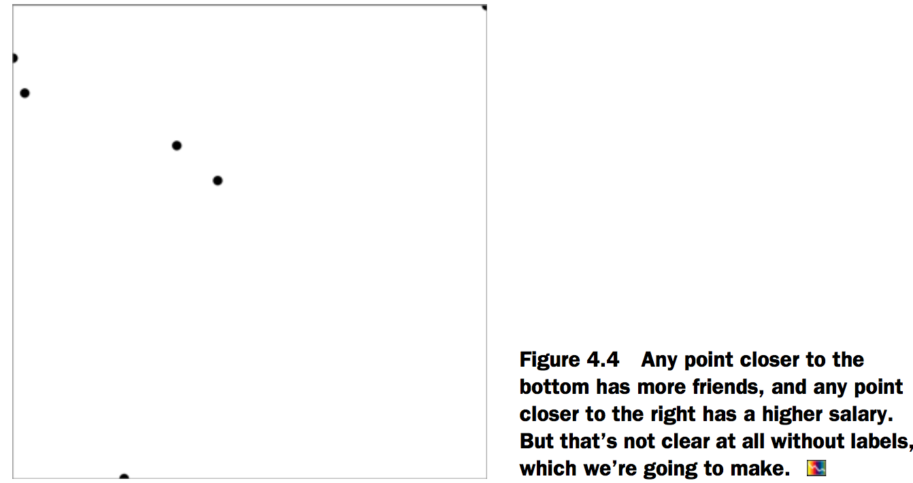
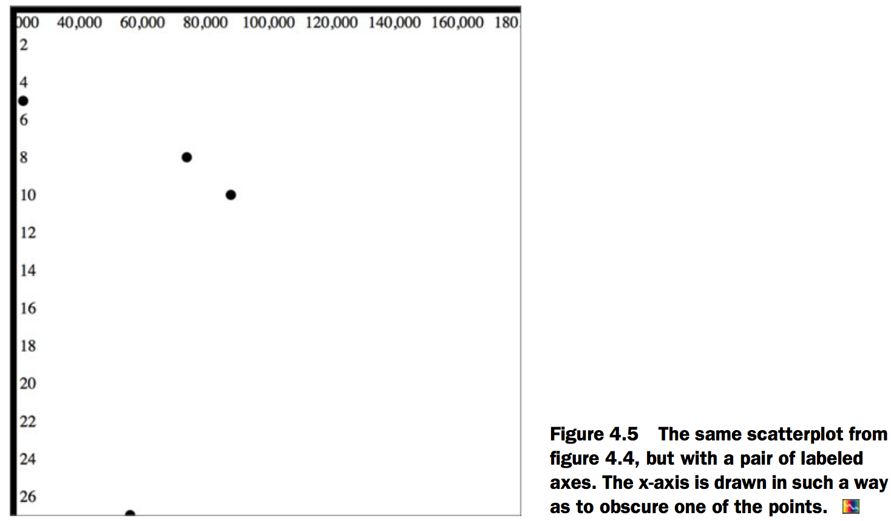
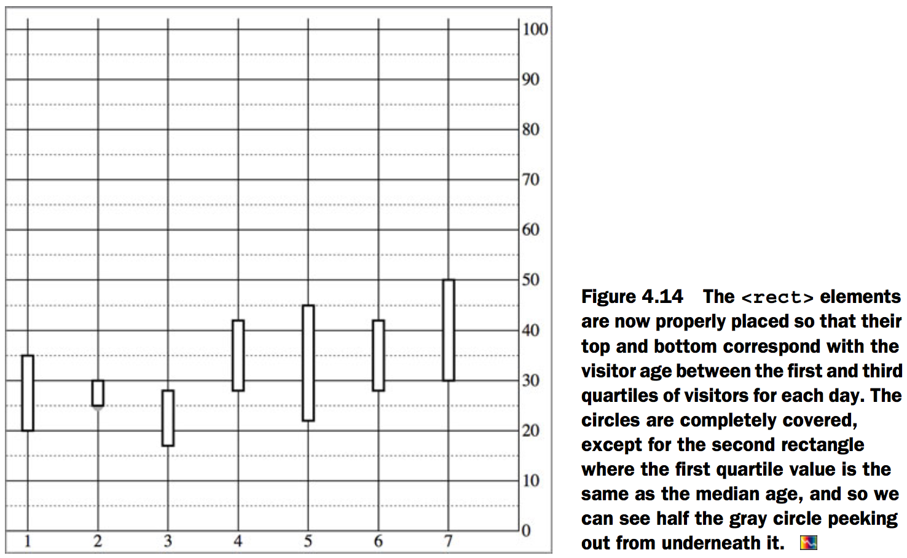
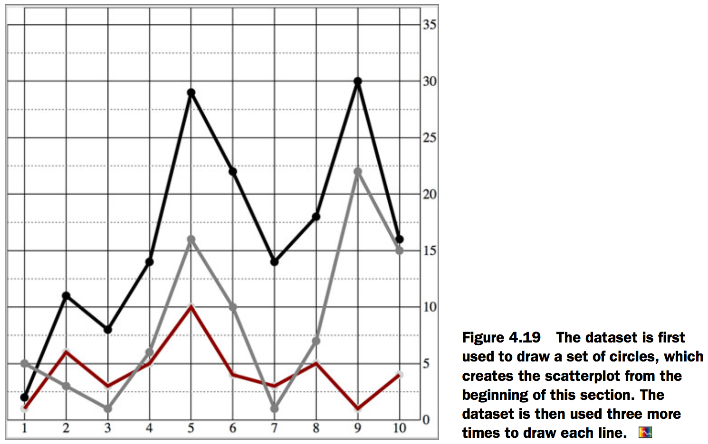
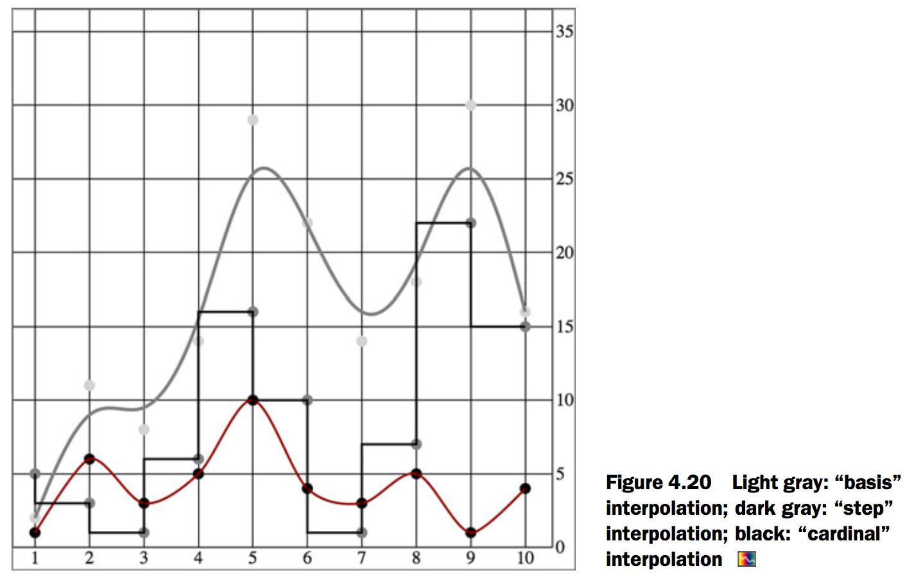

# 4.Chart components
## Creating an axis
### Plotting data
[Fig_04_03.html][1]

```html
<html>
<head>
  <title>D3 in Action Chapter 4 - Example 1</title>
  <meta charset="utf-8" />
<script src="d3.v3.min.js" type="text/JavaScript"></script>
<script src="colorbrewer.js" type="text/JavaScript"></script>
</head>
<style>
  svg {
    height: 500px;
    width: 500px;
    border: 1px solid gray;
  }

</style>
<body>

<div id="viz">
  <svg>
  </svg>
</div>
<div id="controls" />
</body>
  <footer>

<script>
var scatterData = [{friends: 5, salary: 22000}, {friends: 3, salary: 18000}, {friends: 10, salary: 88000}, {friends: 0, salary: 180000}, {friends: 27, salary: 56000}, {friends: 8, salary: 74000}]

d3.select("svg")
.selectAll("circle")
.data(scatterData)
.enter()
.append("circle")
.attr("r", 5)
.attr("cx", function(d,i) {return i * 10})
.attr("cy", function(d) {return d.friends});

</script>
  </footer>

</html>
```


Next, we need to build scales to make this fit better on our SVG canvas:

[Fig_04_04.html][2]

```html
<html>
<head>
  <title>D3 in Action Chapter 4 - Example 2</title>
  <meta charset="utf-8" />
<script src="d3.v3.min.js" type="text/JavaScript"></script>
<script src="colorbrewer.js" type="text/JavaScript"></script>
</head>
<style>
  svg {
    height: 500px;
    width: 500px;
    border: 1px solid gray;
  }

</style>
<body>

<div id="viz">
  <svg>
  </svg>
</div>
<div id="controls" />
</body>
  <footer>

<script>
var scatterData = [{friends: 5, salary: 22000}, {friends: 3, salary: 18000}, {friends: 10, salary: 88000}, {friends: 0, salary: 180000}, {friends: 27, salary: 56000}, {friends: 8, salary: 74000}]

xExtent = d3.extent(scatterData, function(d) {return d.salary});
yExtent = d3.extent(scatterData, function(d) {return d.friends});
xScale = d3.scale.linear().domain(xExtent).range([0,500]);
yScale = d3.scale.linear().domain(yExtent).range([0,500]);

d3.select("svg")
.selectAll("circle")
.data(scatterData)
.enter()
.append("circle")
.attr("r", 5)
.attr("cx", function(d) {return xScale(d.salary)})
.attr("cy", function(d) {return yScale(d.friends)})

</script>
</footer>
</html>
```



we can draw the axis via a selection’s .call() method from a selection on a `<g>` element where we want these graphical elements to be drawn.

[Fig_04_05.html][3]

```html
<html>
<head>
  <title>D3 in Action Chapter 4 - Example 3</title>
  <meta charset="utf-8" />
<script src="d3.v3.min.js" type="text/JavaScript"></script>
<script src="colorbrewer.js" type="text/JavaScript"></script>
</head>
<style>
  svg {
    height: 500px;
    width: 500px;
    border: 1px solid gray;
  }

</style>
<body>

<div id="viz">
  <svg>
  </svg>
</div>
<div id="controls" />
</body>
  <footer>

<script>
var scatterData = [{friends: 5, salary: 22000}, {friends: 3, salary: 18000}, {friends: 10, salary: 88000}, {friends: 0, salary: 180000}, {friends: 27, salary: 56000}, {friends: 8, salary: 74000}]

xExtent = d3.extent(scatterData, function(d) {return d.salary});
yExtent = d3.extent(scatterData, function(d) {return d.friends});
xScale = d3.scale.linear().domain(xExtent).range([0,500]);
yScale = d3.scale.linear().domain(yExtent).range([0,500]);

d3.select("svg")
.selectAll("circle")
.data(scatterData)
.enter()
.append("circle")
.attr("r", 5)
.attr("cx", function(d) {return xScale(d.salary)})
.attr("cy", function(d) {return yScale(d.friends)})

yAxis = d3.svg.axis().scale(yScale).orient("right");
d3.select("svg").append("g").attr("id", "yAxisG").call(yAxis);
xAxis = d3.svg.axis().scale(xScale).orient("bottom");
d3.select("svg").append("g").attr("id", "xAxisG").call(xAxis);

</script>
</footer>
</html>
```



### Styling axes
[Fig_04_07.html][4]

```html
<html>
<head>
  <title>D3 in Action Chapter 4 - Example 4</title>
  <meta charset="utf-8" />
<script src="d3.v3.min.js" type="text/JavaScript"></script>
<script src="colorbrewer.js" type="text/JavaScript"></script>
</head>
<style>
  svg {
    height: 500px;
    width: 500px;
    border: 1px solid gray;
  }

</style>
<body>

<div id="viz">
  <svg>
  </svg>
</div>
<div id="controls" />
</body>
  <footer>

<script>
var scatterData = [{friends: 5, salary: 22000}, {friends: 3, salary: 18000}, {friends: 10, salary: 88000}, {friends: 0, salary: 180000}, {friends: 27, salary: 56000}, {friends: 8, salary: 74000}]

xExtent = d3.extent(scatterData, function(d) {return d.salary});
yExtent = d3.extent(scatterData, function(d) {return d.friends});
xScale = d3.scale.linear().domain(xExtent).range([0,500]);
yScale = d3.scale.linear().domain(yExtent).range([0,500]);

d3.select("svg")
.selectAll("circle")
.data(scatterData)
.enter()
.append("circle")
.attr("r", 5)
.attr("cx", function(d) {return xScale(d.salary)})
.attr("cy", function(d) {return yScale(d.friends)})

yAxis = d3.svg.axis().scale(yScale).orient("right");
d3.select("svg").append("g").attr("id", "yAxisG").call(yAxis);
xAxis = d3.svg.axis().scale(xScale).orient("bottom");
d3.select("svg").append("g").attr("id", "xAxisG").call(xAxis);

d3.selectAll("path.domain").style("fill", "none").style("stroke", "black");
d3.selectAll("line").style("stroke", "black");

</script>
  </footer>

</html>
```


[Fig_04_09.html][5]

```html
<html>
<head>
  <title>D3 in Action Chapter 4 - Example 5</title>
  <meta charset="utf-8" />
<script src="d3.v3.min.js" type="text/JavaScript"></script>
<script src="colorbrewer.js" type="text/JavaScript"></script>
</head>
<style>
  svg {
    height: 500px;
    width: 500px;
    border: 1px solid gray;
  }
line {
  shape-rendering: crispEdges;
  stroke: #000000;
  }

line.minor  {
  stroke: #777777;
  stroke-dasharray: 2,2;
}

path.domain {
  fill: none;
  stroke: black;
}

</style>
<body>

<div id="viz">
  <svg>
  </svg>
</div>
<div id="controls" />
</body>
  <footer>

<script>
var scatterData = [{friends: 5, salary: 22000}, {friends: 3, salary: 18000}, {friends: 10, salary: 88000}, {friends: 0, salary: 180000}, {friends: 27, salary: 56000}, {friends: 8, salary: 74000}]

xScale = d3.scale.linear().domain([0,180000]).range([0,480]);
yScale = d3.scale.linear().domain([0,27]).range([0,480]);

xAxis = d3.svg.axis().scale(xScale).orient("bottom").tickSize(480).ticks(4);
d3.select("svg").append("g").attr("id", "xAxisG").call(xAxis);

yAxis = d3.svg.axis().scale(yScale).orient("right").ticks(10).tickSize(480).tickSubdivide(10);

d3.select("svg").append("g").attr("id", "yAxisG").call(yAxis);

d3.select("svg").selectAll("circle").data(scatterData).enter().append("circle").attr("r", 5)
.attr("cx", function(d) {return xScale(d.salary)}).attr("cy", function(d) {return yScale(d.friends)})
</script>
</footer>
</html>
```


## Complex graphical objects
[Fig_04_12.html][6]

```html
<html>
<head>
  <title>D3 in Action Chapter 4 - Example 6</title>
  <meta charset="utf-8" />
<script src="d3.v3.min.js" type="text/JavaScript"></script>
<script src="colorbrewer.js" type="text/JavaScript"></script>
</head>
<style>
  svg {
    height: 500px;
    width: 500px;
    border: 1px solid gray;
  }
line {
  shape-rendering: crispEdges;
  stroke: #000000;
  }

line.minor  {
  stroke: #777777;
  stroke-dasharray: 2,2;
}

path.domain {
  fill: none;
  stroke: black;
}

</style>
<body>

<div id="viz">
  <svg>
  </svg>
</div>
<div id="controls" />
</body>
  <footer>

<script>
d3.csv("boxplot.csv", scatterplot)

function scatterplot(data) {
    xScale = d3.scale.linear().domain([1,8]).range([20,470]);
    yScale = d3.scale.linear().domain([0,100]).range([480,20]);//Scale is inverted, so higher values are drawn higher up and lower values toward the bottom

    console.log(data)
yAxis = d3.svg.axis()
.scale(yScale)
.orient("right")
.ticks(8)
.tickSize(-470)
.tickSubdivide(true);

d3.select("svg").append("g")
.attr("transform", "translate(470,0)")//Offsets the <g> containing the axis
.attr("id", "yAxisG")
.call(yAxis);

xAxis = d3.svg.axis()
.scale(xScale)
.orient("bottom")
.tickSize(-470)
.tickValues([1,2,3,4,5,6,7]);//Specifies the exact tick values to correspond with the numbered days of the week

d3.select("svg").append("g")
.attr("transform", "translate(0,480)")
.attr("id", "xAxisG")
.call(xAxis);

d3.select("svg").selectAll("circle.median")
.data(data)
.enter()
.append("circle")
.attr("class", "tweets")
.attr("r", 5)
.attr("cx", function(d) {return xScale(d.day)})
.attr("cy", function(d) {return yScale(d.median)})
.style("fill", "darkgray");
}
</script>
</footer>
</html>
```


[Fig_04_14.html][7]

```html
<html>
<head>
  <title>D3 in Action Chapter 4 - Example 6</title>
  <meta charset="utf-8" />
<script src="d3.v3.min.js" type="text/JavaScript"></script>
<script src="colorbrewer.js" type="text/JavaScript"></script>
</head>
<style>
  svg {
    height: 500px;
    width: 500px;
    border: 1px solid gray;
  }
line {
  shape-rendering: crispEdges;
  stroke: #000000;
  }

line.minor  {
  stroke: #777777;
  stroke-dasharray: 2,2;
}

path.domain {
  fill: none;
  stroke: black;
}

</style>
<body>

<div id="viz">
  <svg>
  </svg>
</div>
<div id="controls" />
</body>
  <footer>

<script>
d3.csv("boxplot.csv", scatterplot)

function scatterplot(data) {
    xScale = d3.scale.linear().domain([1,8]).range([20,470]);
    yScale = d3.scale.linear().domain([0,100]).range([480,20]);

yAxis = d3.svg.axis()
.scale(yScale)
.orient("right")
.ticks(8)
.tickSize(-470)
.tickSubdivide(true);

d3.select("svg").append("g")
.attr("transform", "translate(470,0)")
.attr("id", "yAxisG")
.call(yAxis);

xAxis = d3.svg.axis()
.scale(xScale)
.orient("bottom")
.tickSize(-470)
.tickValues([1,2,3,4,5,6,7]);

d3.select("svg").append("g")
.attr("transform", "translate(0,480)")
.attr("id", "xAxisG")
.call(xAxis);

d3.select("svg").selectAll("circle.median")
.data(data)
.enter()
.append("circle")
.attr("class", "tweets")
.attr("r", 5)
.attr("cx", function(d) {return xScale(d.day)})
.attr("cy", function(d) {return yScale(d.median)})
.style("fill", "darkgray");

d3.select("svg").selectAll("g.box")
.data(data)
.enter()
.append("g")
.attr("class", "box")
.attr("transform", function(d) {return "translate(" + xScale(d.day) +"," + yScale(d.median) + ")"})
.each(function(d,i) {
d3.select(this)//Because we’re inside the .each(), we can select(this) to append new child elements.
.append("rect")
.attr("width", 20)
.attr("x", -10)//Sets a negative offset of half the width to center a rectangle horizontally
.attr("y", yScale(d.q3) - yScale(d.median))//The height of the rectangle is equal to the difference between its q1 and q3 values, which means we need to offset the rectangle by the difference between the middle of the rectangle (the median) and the high end of the distribution—q3.
.attr("height", yScale(d.q1) - yScale(d.q3)) //The d and i variables are declared in the .each() anonymous function, so each time we access it, we get the data bound to the original element.
.style("fill", "white")
.style("stroke", "black")
})
}
</script>
</footer>
</html>
```



[Fig_04_16.html][8]

```html
<html>
<head>
  <title>D3 in Action Chapter 4 - Example 8</title>
  <meta charset="utf-8" />
<script src="d3.v3.min.js" type="text/JavaScript"></script>
<script src="colorbrewer.js" type="text/JavaScript"></script>
</head>
<style>
  svg {
    height: 500px;
    width: 500px;
    border: 1px solid gray;
  }
line {
  shape-rendering: crispEdges;
  stroke: #000000;
  }

line.minor  {
  stroke: #777777;
  stroke-dasharray: 2,2;
}

path.domain {
  fill: none;
  stroke: black;
}

</style>
<body>

<div id="viz">
  <svg>
  </svg>
</div>
<div id="controls" />
</body>
  <footer>

<script>
d3.csv("boxplot.csv", scatterplot)

function scatterplot(data) {
    xScale = d3.scale.linear().domain([1,8]).range([20,470]);
    yScale = d3.scale.linear().domain([0,100]).range([480,20]);

yAxis = d3.svg.axis()
.scale(yScale)
.orient("right")
.ticks(8)
.tickSize(-470)
.tickSubdivide(true);

d3.select("svg").append("g")
.attr("transform", "translate(470,0)")
.attr("id", "yAxisG")
.call(yAxis);

xAxis = d3.svg.axis()
.scale(xScale)
.orient("bottom")
.tickSize(-470)//A negative tickSize draws the lines above the axis, but we need to make sure to offset the axis by the same value.
.tickValues([1,2,3,4,5,6,7]);//Setting specific tickValues forces the axis to only show the corresponding values, which is useful when we want to override the automatic ticks created by the axis.

d3.select("svg").append("g")
.attr("transform", "translate(0,480)")
.attr("id", "xAxisG")//Offsets the axis to correspond with our negative tickSize
.call(xAxis);

d3.select("svg").selectAll("circle.median")
.data(data)
.enter()
.append("circle")
.attr("class", "tweets")
.attr("r", 5)
.attr("cx", function(d) {return xScale(d.day)})
.attr("cy", function(d) {return yScale(d.median)})
.style("fill", "darkgray");

d3.select("svg").selectAll("g.box")
.data(data)
.enter()
.append("g")
.attr("class", "box")
.attr("transform", function(d) {return "translate(" + xScale(d.day) +"," + yScale(d.median) + ")"})
.each(function(d,i) {
d3.select(this)
.append("line")
.attr("class", "range")
.attr("x1", 0)
.attr("x2", 0)
.attr("y1", yScale(d.max) - yScale(d.median))
.attr("y2", yScale(d.min) - yScale(d.median))
.style("stroke", "black")
.style("stroke-width", "4px");

d3.select(this)
.append("line")
.attr("class", "max")
.attr("x1", -10)
.attr("x2", 10)
.attr("y1", yScale(d.max) - yScale(d.median))
.attr("y2", yScale(d.max) - yScale(d.median))
.style("stroke", "black")
.style("stroke-width", "4px");

d3.select(this)
.append("line")
.attr("class", "min")
.attr("x1", -10)
.attr("x2", 10)
.attr("y1", yScale(d.min) - yScale(d.median))
.attr("y2", yScale(d.min) - yScale(d.median))
.style("stroke", "black")
.style("stroke-width", "4px");
d3.select(this)
.append("rect")
.attr("class", "range")
.attr("width", 20)
.attr("x", -10)
.attr("y", yScale(d.q3) - yScale(d.median))
.attr("height", yScale(d.q1) - yScale(d.q3))
.style("fill", "white")
.style("stroke", "black")
.style("stroke-width", "2px");

d3.select(this)
.append("line")
.attr("x1", -10)
.attr("x2", 10)
.attr("y1", 0)
.attr("y2", 0)
.style("stroke", "darkgray")
.style("stroke-width", "4px");
})
}
</script>
</footer>
</html>
```


## Line charts and interpolations
[Fig_04_17.html][9]

```html
<html>
<head>
  <title>D3 in Action Chapter 4 - Example 9</title>
  <meta charset="utf-8" />
<script src="d3.v3.min.js" type="text/JavaScript"></script>
<script src="colorbrewer.js" type="text/JavaScript"></script>
</head>
<style>
  svg {
    height: 500px;
    width: 500px;
    border: 1px solid gray;
  }
line {
  shape-rendering: crispEdges;
  stroke: #000000;
  }

line.minor  {
  stroke: #777777;
  stroke-dasharray: 2,2;
}

path.domain {
  fill: none;
  stroke: black;
}

</style>
<body>

<div id="viz">
  <svg>
  </svg>
</div>
<div id="controls" />
</body>
  <footer>

<script>
d3.csv("tweetdata.csv", lineChart)

function lineChart(data) {

xScale = d3.scale.linear().domain([1,10.5]).range([20,480]);//Our scales, as usual, have margins built in.
yScale = d3.scale.linear().domain([0,35]).range([480,20]);

xAxis = d3.svg.axis()
.scale(xScale)
.orient("bottom")
.tickSize(480)
.tickValues([1,2,3,4,5,6,7,8,9,10]);//Fixes the ticks of the x-axis to correspond to the days

d3.select("svg").append("g").attr("id", "xAxisG").call(xAxis);

yAxis = d3.svg.axis()
.scale(yScale)
.orient("right")
.ticks(10)
.tickSize(480)
.tickSubdivide(true);

d3.select("svg").append("g").attr("id", "yAxisG").call(yAxis);

d3.select("svg").selectAll("circle.tweets")
.data(data)
.enter()
.append("circle")
.attr("class", "tweets")
.attr("r", 5)
.attr("cx", function(d) {return xScale(d.day)})
.attr("cy", function(d) {return yScale(d.tweets)})
.style("fill", "black")//Each of these uses the same dataset, but bases the y position on tweets, retweets, and favorites values, respectively.

d3.select("svg").selectAll("circle.retweets")
.data(data)
.enter()
.append("circle")
.attr("class", "retweets")
.attr("r", 5)
.attr("cx", function(d) {return xScale(d.day)})
.attr("cy", function(d) {return yScale(d.retweets)})
.style("fill", "lightgray")

d3.select("svg").selectAll("circle.favorites")
.data(data)
.enter()
.append("circle")
.attr("class", "favorites")
.attr("r", 5)
.attr("cx", function(d) {return xScale(d.day)})
.attr("cy", function(d) {return yScale(d.favorites)})
.style("fill", "gray")
}
</script>
</footer>
</html>
```


### Drawing many lines with multiple generators
[Fig_04_19.html][10]

```html
<html>
<head>
  <title>D3 in Action Chapter 4 - Example 10</title>
  <meta charset="utf-8" />
<script src="d3.v3.min.js" type="text/JavaScript"></script>
<script src="colorbrewer.js" type="text/JavaScript"></script>
</head>
<style>
  svg {
    height: 500px;
    width: 500px;
    border: 1px solid gray;
  }
line {
  shape-rendering: crispEdges;
  stroke: #000000;
  }

line.minor  {
  stroke: #777777;
  stroke-dasharray: 2,2;
}

path.domain {
  fill: none;
  stroke: black;
}

</style>
<body>

<div id="viz">
  <svg>
  </svg>
</div>
<div id="controls" />
</body>
  <footer>

<script>
d3.csv("tweetdata.csv", lineChart)

function lineChart(data) {

xScale = d3.scale.linear().domain([1,10.5]).range([20,480]);
yScale = d3.scale.linear().domain([0,35]).range([480,20]);

xAxis = d3.svg.axis()
.scale(xScale)
.orient("bottom")
.tickSize(480)
.tickValues([1,2,3,4,5,6,7,8,9,10]);

d3.select("svg").append("g").attr("id", "xAxisG").call(xAxis);

yAxis = d3.svg.axis()
.scale(yScale)
.orient("right")
.ticks(10)
.tickSize(480)
.tickSubdivide(true);

d3.select("svg").append("g").attr("id", "yAxisG").call(yAxis);

d3.select("svg").selectAll("circle.tweets")
.data(data)
.enter()
.append("circle")
.attr("class", "tweets")
.attr("r", 5)
.attr("cx", function(d) {return xScale(d.day)})
.attr("cy", function(d) {return yScale(d.tweets)})
.style("fill", "black")

d3.select("svg").selectAll("circle.retweets")
.data(data)
.enter()
.append("circle")
.attr("class", "retweets")
.attr("r", 5)
.attr("cx", function(d) {return xScale(d.day)})
.attr("cy", function(d) {return yScale(d.retweets)})
.style("fill", "lightgray")

d3.select("svg").selectAll("circle.favorites")
.data(data)
.enter()
.append("circle")
.attr("class", "favorites")
.attr("r", 5)
.attr("cx", function(d) {return xScale(d.day)})
.attr("cy", function(d) {return yScale(d.favorites)})
.style("fill", "gray");

tweetLine = d3.svg.line()
        .x(function(d) {
        return xScale(d.day)//Defines an accessor for data like ours; in this case we take the day attribute and pass it to xScale first
    })
        .y(function(d) {
        return yScale(d.tweets)//This accessor does the same for the number of tweets.
    })

retweetLine = d3.svg.line()
        .x(function(d) {
        return xScale(d.day)
    })
        .y(function(d) {
        return yScale(d.retweets)//Notice how only the y accessor is different between each line generator.
    })

favLine = d3.svg.line()
        .x(function(d) {
        return xScale(d.day)
    })
        .y(function(d) {
        return yScale(d.favorites)
    })

    d3.select("svg")
        .append("path")//Each line generator needs to be called by a corresponding new <path> element .
        .attr("d", tweetLine(data))//The appended path is drawn according to the generator with the loaded tweetdata passed to it.
        .attr("fill", "none")
        .attr("stroke", "darkred")
        .attr("stroke-width", 2)

        d3.select("svg")
        .append("path")
        .attr("d", retweetLine(data))
        .attr("fill", "none")
        .attr("stroke", "gray")
        .attr("stroke-width", 3)

        d3.select("svg")
        .append("path")
        .attr("d", favLine(data))
        .attr("fill", "none")
        .attr("stroke", "black")
        .attr("stroke-width", 2)
}
</script>
</footer>
</html>
```



### Exploring line interpolators
[Fig_04_20.html][11]

```html
<html>
<head>
  <title>D3 in Action Chapter 4 - Example 11</title>
  <meta charset="utf-8" />
<script src="d3.v3.min.js" type="text/JavaScript"></script>
<script src="colorbrewer.js" type="text/JavaScript"></script>
</head>
<style>
  svg {
    height: 500px;
    width: 500px;
    border: 1px solid gray;
  }
line {
  shape-rendering: crispEdges;
  stroke: #000000;
  }

line.minor  {
  stroke: #777777;
  stroke-dasharray: 2,2;
}

path.domain {
  fill: none;
  stroke: black;
}

</style>
<body>

<div id="viz">
  <svg>
  </svg>
</div>
<div id="controls" />
</body>
  <footer>

<script>
d3.csv("tweetdata.csv", lineChart)

function lineChart(data) {

xScale = d3.scale.linear().domain([1,10.5]).range([20,480]);
yScale = d3.scale.linear().domain([0,35]).range([480,20]);

xAxis = d3.svg.axis()
.scale(xScale)
.orient("bottom")
.tickSize(480)
.tickValues([1,2,3,4,5,6,7,8,9,10]);

d3.select("svg").append("g").attr("id", "xAxisG").call(xAxis);

yAxis = d3.svg.axis()
.scale(yScale)
.orient("right")
.ticks(10)
.tickSize(480)
.tickSubdivide(true);

d3.select("svg").append("g").attr("id", "yAxisG").call(yAxis);

d3.select("svg").selectAll("circle.tweets")
.data(data)
.enter()
.append("circle")
.attr("class", "tweets")
.attr("r", 5)
.attr("cx", function(d) {return xScale(d.day)})
.attr("cy", function(d) {return yScale(d.tweets)})
.style("fill", "black")

d3.select("svg").selectAll("circle.retweets")
.data(data)
.enter()
.append("circle")
.attr("class", "retweets")
.attr("r", 5)
.attr("cx", function(d) {return xScale(d.day)})
.attr("cy", function(d) {return yScale(d.retweets)})
.style("fill", "lightgray")

d3.select("svg").selectAll("circle.favorites")
.data(data)
.enter()
.append("circle")
.attr("class", "favorites")
.attr("r", 5)
.attr("cx", function(d) {return xScale(d.day)})
.attr("cy", function(d) {return yScale(d.favorites)})
.style("fill", "gray");


tweetLine = d3.svg.line()
        .interpolate("cardinal")//We can add this code right after we create our line generators and before we call them to change the interpolate method, or we can set .interpolate() as we’re defining the generator.
        .x(function(d) {
        return xScale(d.day)
    })
        .y(function(d) {
        return yScale(d.tweets)
    })

retweetLine = d3.svg.line()
        .interpolate("basis")
        .x(function(d) {
        return xScale(d.day)
    })
        .y(function(d) {
        return yScale(d.retweets)
    })

favLine = d3.svg.line()
        .interpolate("step-before")
        .x(function(d) {
        return xScale(d.day)
    })
        .y(function(d) {
        return yScale(d.favorites)
    })

    d3.select("svg")
        .append("path")
        .attr("d", tweetLine(data))
        .attr("fill", "none")
        .attr("stroke", "darkred")
        .attr("stroke-width", 2)

        d3.select("svg")
        .append("path")
        .attr("d", retweetLine(data))
        .attr("fill", "none")
        .attr("stroke", "gray")
        .attr("stroke-width", 3)

        d3.select("svg")
        .append("path")
        .attr("d", favLine(data))
        .attr("fill", "none")
        .attr("stroke", "black")
        .attr("stroke-width", 2)
}
</script>
</footer>
</html>
```



## Complex accessor functions
[Fig_04_22.html][12]

```html
<html>
<head>
  <title>D3 in Action Chapter 4 - Example 12</title>
  <meta charset="utf-8" />
<script src="d3.v3.min.js" type="text/JavaScript"></script>
<script src="colorbrewer.js" type="text/JavaScript"></script>
</head>
<style>
  svg {
    height: 500px;
    width: 500px;
    border: 1px solid gray;
  }
line {
  shape-rendering: crispEdges;
  stroke: #000000;
  }

line.minor  {
  stroke: #777777;
  stroke-dasharray: 2,2;
}

path.domain {
  fill: none;
  stroke: black;
}

</style>
<body>

<div id="viz">
  <svg>
  </svg>
</div>
<div id="controls" />
</body>
  <footer>

<script>
d3.csv("movies.csv", areaChart)

function areaChart(data) {

xScale = d3.scale.linear().domain([1,10.5]).range([20,480]);
yScale = d3.scale.linear().domain([0,35]).range([480,20]);
xAxis = d3.svg.axis()
.scale(xScale)
.orient("bottom")
.tickSize(480)
.tickValues([1,2,3,4,5,6,7,8,9,10]);

d3.select("svg").append("g").attr("id", "xAxisG").call(xAxis);

yAxis = d3.svg.axis()
.scale(yScale)
.orient("right")
.ticks(10)
.tickSize(480)
.tickSubdivide(true);

d3.select("svg").append("g").attr("id", "yAxisG").call(yAxis);
for (x in data[0]) {
      if (x != "day") {//Iterates through our data attributes with a for loop, where x is the name of each column from our data ("day", "movie1", "movie2", and so on), which allows us to dynamically create and call generators

    movieArea = d3.svg.line() //Instantiates a line generator for each movie
        .x(function(d) {
        return xScale(d.day) //Every line uses the day column for its x value.
    })
        .y(function(d) {
        return yScale(d[x]) //Dynamically sets the y-accessor function of our line generator to grab the data from the appropriate movie for our y variable
    })
        .interpolate("cardinal")

    d3.select("svg")
        .append("path")
        .style("id", x + "Area")
        .attr("d", movieArea(data))
        .attr("fill", "none")
        .attr("stroke", "black")
        .attr("stroke-width", 3)
        .style("opacity", .75)

      }
    }
}
</script>
</footer>
</html>
```


[Fig_04_23.html][13]

```html
<html>
<head>
  <title>D3 in Action Chapter 4 - Example 13</title>
  <meta charset="utf-8" />
<script src="d3.v3.min.js" type="text/JavaScript"></script>
<script src="colorbrewer.js" type="text/JavaScript"></script>
</head>
<style>
  svg {
    height: 500px;
    width: 500px;
    border: 1px solid gray;
  }
line {
  shape-rendering: crispEdges;
  stroke: #000000;
  }

line.minor  {
  stroke: #777777;
  stroke-dasharray: 2,2;
}

path.domain {
  fill: none;
  stroke: black;
}

</style>
<body>

<div id="viz">
  <svg>
  </svg>
</div>
<div id="controls" />
</body>
  <footer>

<script>
d3.csv("movies.csv", areaChart)

function areaChart(data) {

xScale = d3.scale.linear().domain([1,10.5]).range([20,480]);
yScale = d3.scale.linear().domain([0,35]).range([240,20]);
xAxis = d3.svg.axis()
.scale(xScale)
.orient("bottom")
.tickSize(480)
.tickValues([1,2,3,4,5,6,7,8,9,10]);

d3.select("svg").append("g").attr("id", "xAxisG").call(xAxis);

yAxis = d3.svg.axis()
.scale(yScale)
.orient("right")
.ticks(10)
.tickSize(480)
.tickSubdivide(true);

d3.select("svg").append("g").attr("id", "yAxisG").call(yAxis);
for (x in data[0]) {
      if (x != "day") {

    movieArea = d3.svg.area()
        .x(function(d) {
        return xScale(d.day)
    })
        .y(function(d) {
        return yScale(d[x])
    })
        .y0(function(d) {
        return yScale(-d[x])//This new accessor provides us with the ability to define where the bottom of the path is. In this case, we start by making the bottom equal to the inverse of the top, which mirrors the shape.
    })
        .interpolate("cardinal")

    d3.select("svg")
        .append("path")
        .style("id", x + "Area")
        .attr("d", movieArea(data))
        .attr("fill", "darkgray")
        .attr("stroke", "lightgray")
        .attr("stroke-width", 2)
        .style("opacity", .5)

      }
    }
}
</script>
</footer>
</html>
```


[Fig_04_24.html][14]

```html
<html>
<head>
  <title>D3 in Action Chapter 4 - Example 14</title>
  <meta charset="utf-8" />
<script src="d3.v3.min.js" type="text/JavaScript"></script>
<script src="colorbrewer.js" type="text/JavaScript"></script>
</head>
<style>
  svg {
    height: 500px;
    width: 500px;
    border: 1px solid gray;
  }
line {
  shape-rendering: crispEdges;
  stroke: #000000;
  }

line.minor  {
  stroke: #777777;
  stroke-dasharray: 2,2;
}

path.domain {
  fill: none;
  stroke: black;
}

</style>
<body>

<div id="viz">
  <svg>
  </svg>
</div>
<div id="controls" />
</body>
  <footer>

<script>
d3.csv("movies.csv", areaChart)

function areaChart(data) {

xScale = d3.scale.linear().domain([1,10.5]).range([20,480]);
yScale = d3.scale.linear().domain([0,50]).range([480,20]);
xAxis = d3.svg.axis()
.scale(xScale)
.orient("bottom")
.tickSize(480)
.tickValues([1,2,3,4,5,6,7,8,9,10]);

d3.select("svg").append("g").attr("id", "xAxisG").call(xAxis);

yAxis = d3.svg.axis()
.scale(yScale)
.orient("right")
.ticks(10)
.tickSize(480)
.tickSubdivide(true);

d3.select("svg").append("g").attr("id", "yAxisG").call(yAxis);

fillScale = d3.scale.linear()//Creates a color ramp that corresponds to the six different movies
   .domain([0,5])
   .range(["lightgray","black"]);
var n = 0;//Each movie corresponds to one iteration through the for loop, so we’ll increment n to use in the color ramp. We could also create an ordinal scale assigning a color for each movie.
for (x in data[0]) {
if (x != "day") {//We won’t draw a line for the day value of each object, because this is what provides us with our x coordinate.
movieArea = d3.svg.area()//A d3.svg.area() generator for each iteration through the object that corresponds to one of our movies using the day value for the x coordinate, but iterating through the values for each movie for the y coordinates
        .x(function(d) {
        return xScale(d.day)
    })
        .y(function(d) {
        return yScale(simpleStacking(d,x))
    })
        .y0(function(d) {
        return yScale(simpleStacking(d,x) - d[x]);
    })
        .interpolate("basis")
d3.select("svg")//Draws a path using the current constructor. We’ll have one for each attribute not named "day". Give it a unique ID based on which attribute we’re drawing an area for. Fill the area with a color based on the color ramp we built.
        .append("path")
        .style("id", x + "Area")
        .attr("d", movieArea(data))
        .attr("fill", fillScale(n))
        .attr("stroke", "none")
        .attr("stroke-width", 2)
        .style("opacity", .5)
        n++;//Finishes the for loop, increments to the next attribute in the object, and increments n to color the next area
        }
    }
function simpleStacking(//This function takes the incoming bound data and the name of the attribute and loops through the incoming data, adding each value until it reaches the current named attribute. As a result, it returns the total value for every movie during this day up to the movie we’ve sent.
incomingData, incomingAttribute) {
      var newHeight = 0;
      for (x in incomingData) {
        if (x != "day") {
          newHeight += parseInt(incomingData[x]);
          if (x == incomingAttribute) {
            break;
          }
        }
      }
      return newHeight;
    }
}
</script>
</footer>
</html>
```


[Fig_04_25.html][15]

```html
<html>
<head>
  <title>D3 in Action Chapter 4 - Example 15</title>
  <meta charset="utf-8" />
<script src="d3.v3.min.js" type="text/JavaScript"></script>
<script src="colorbrewer.js" type="text/JavaScript"></script>
</head>
<style>
  svg {
    height: 500px;
    width: 500px;
    border: 1px solid gray;
  }
line {
  shape-rendering: crispEdges;
  stroke: #000000;
  }

line.minor  {
  stroke: #777777;
  stroke-dasharray: 2,2;
}

path.domain {
  fill: none;
  stroke: black;
}

</style>
<body>

<div id="viz">
  <svg>
  </svg>
</div>
<div id="controls" />
</body>
  <footer>

<script>
    d3.csv("movies.csv", areaChart)
    function areaChart(data) {
      expData = data;
    xScale = d3.scale.linear().domain([0,11]).range([0,500]);
    yScale = d3.scale.linear().domain([-100,100]).range([500,0]);
    sizeScale = d3.scale.linear().domain([0,200]).range([20,20]);

    yAxis = d3.svg.axis().scale(yScale).orient("right").ticks(8).tickSize(500).tickSubdivide(true);
    d3.select("svg").append("g").attr("id", "yAxisG").call(yAxis);

    xAxis = d3.svg.axis().scale(xScale).orient("bottom").tickSize(500).ticks(4);
    d3.select("svg").append("g").attr("id", "xAxisG").call(xAxis);

    fillScale = d3.scale.linear().domain([1,10]).range(["lightgray","black"]);
    n = 0;

    for (x in data[0]) {
      if (x != "day") {

    movieArea = d3.svg.area()
        .x(function(d) {
        return xScale(d.day)
    })
        .y(function(d) {
        return yScale(alternatingStacking(d,x,"top"))//We can create whatever complex accessor function we want for our generators.
    })
        .y0(function(d) {
        return yScale(alternatingStacking(d,x,"bottom"));
    })
        .interpolate("basis")

    d3.select("svg")
        .insert("path",".movie")
        .attr("class", "movie")
        .style("id", x + "Area")
        .attr("d", movieArea(data))
        .attr("fill", fillScale(n))
        .attr("stroke", "white")
        .attr("stroke-width", 1)
        .style("opacity", 1)

      }
      n++;

    }

    function simpleStacking(incomingData, incomingAttribute) {
      var newHeight = 0;
      for (x in incomingData) {
        if (x != "day") {
          newHeight += parseInt(incomingData[x]);
          if (x == incomingAttribute) {
            break;
          }
        }
      }
      return newHeight;
    }

    function alternatingStacking(incomingData, incomingAttribute,topBottom) {//We need the data, and we also need to know whether we’re drawing the top or bottom of the area, which alternates as we move through the dataset.
      var newHeight = 0;
      var skip = true;
      for (x in incomingData) {
        if (x != "day") {//Always skips day, because that’s just our x position
        if (x == "movie1" || skip == false) {//Skips the first movie (our center), and then skips every other movie to get the alternating pattern
          newHeight += parseInt(incomingData[x]);
          if (x == incomingAttribute) {//Stops when we reach this movie, which gives us the baseline
            break;
          }
          if (skip == false) {
            skip = true;
          }
          else {
            n%2 == 0 ? skip = false : skip = true;
          }
        }
        else {
          skip = false;
        }
      }
      }
      if(topBottom == "bottom") {//The height is negative for areas on the bottom side of the streamgraph, and positive for those on the top side.
        newHeight = -newHeight;
      }
      if (n > 1 && n%2 == 1 && topBottom == "bottom") {
        newHeight = 0;
      }
      if (n > 1 && n%2 == 0 && topBottom == "top") {
        newHeight = 0;
      }
      return newHeight;
    }


    }

</script>
  </footer>
</html>
```


[1]: Fig_04_03.html
[2]: Fig_04_04.html
[3]: Fig_04_05.html
[4]: Fig_04_07.html
[5]: Fig_04_09.html
[6]: Fig_04_12.html
[7]: Fig_04_14.html
[8]: Fig_04_16.html
[9]: Fig_04_17.html
[10]: Fig_04_19.html
[11]: Fig_04_20.html
[12]: Fig_04_22.html
[13]: Fig_04_23.html
[14]: Fig_04_24.html
[15]: Fig_04_25.html
