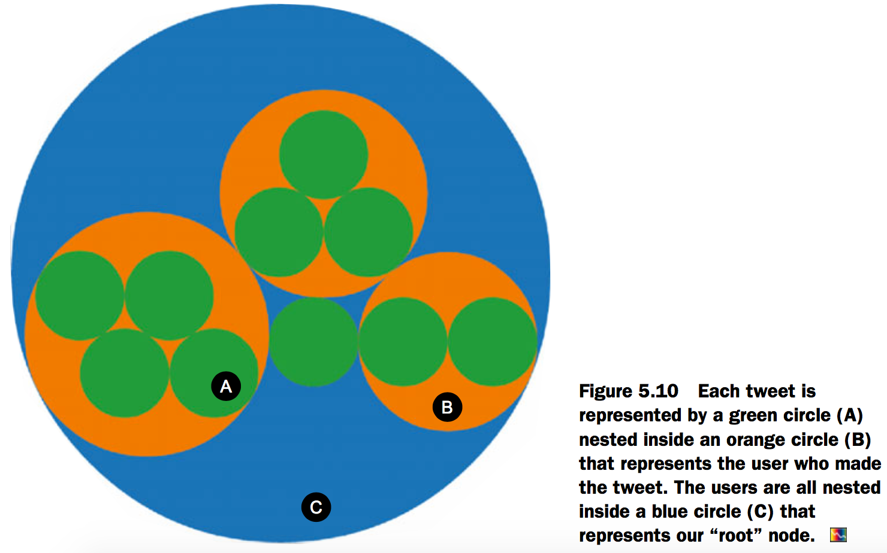
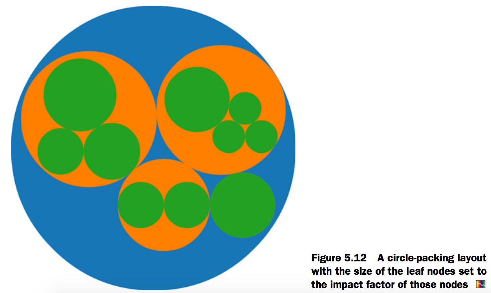
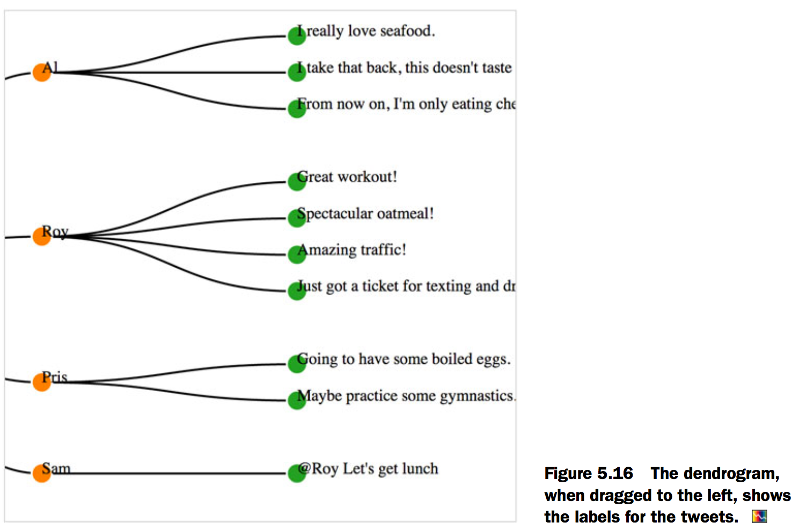
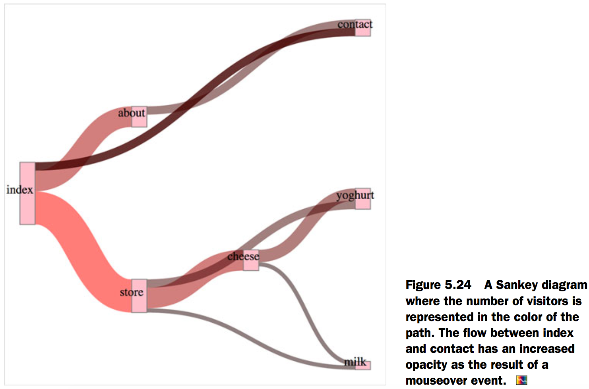
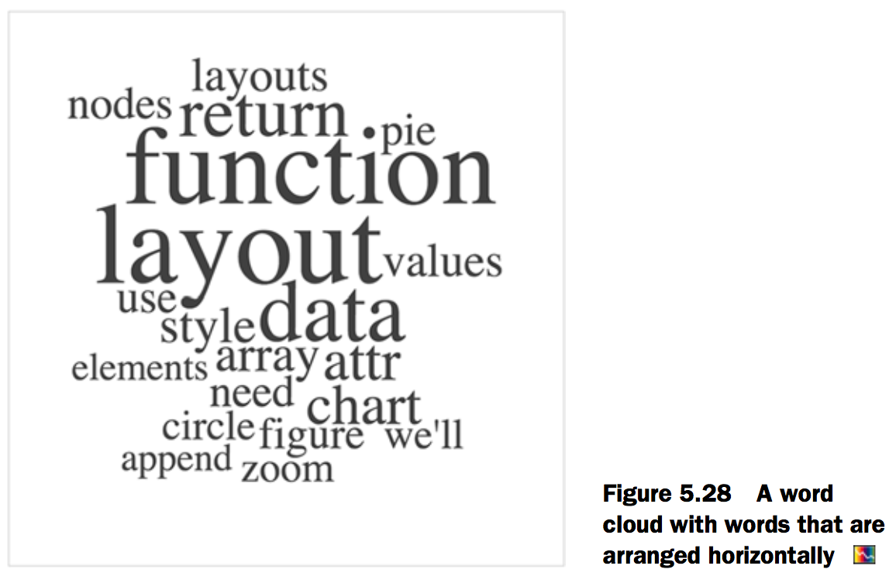

# 5.Layouts
## Histograms

[Fig_05_02.html][1]

```html
<html>
<head>
  <title>D3 in Action Chapter 5 - Example 1</title>
  <meta charset="utf-8" />
<script src="d3.v3.min.js" type="text/JavaScript"></script>
<script src="colorbrewer.js" type="text/JavaScript"></script>
</head>
<style>
  svg {
    height: 500px;
    width: 500px;
    border: 1px solid gray;
  }

  rect {
    fill: lightgray;
    stroke: black;
    stroke-width: 1px;
  }

  line {
  shape-rendering: crispEdges;
  stroke: #000000;
  }

  line.minor  {
    stroke: #777777;
    stroke-dasharray: 2,2;
  }

  path.domain {
    fill: none;
    stroke: black;
  }


</style>
<body>

<div id="viz">
  <svg>
  </svg>
</div>
<div id="controls" />
</body>
<footer>
<script>
    d3.json("tweets.json",function(error,data) {histogram(data.tweets)});
    function histogram(tweetsData) {
    xScale = d3.scale.linear().domain([0,5]).range([0,500])
    var yScale = d3.scale.linear()
    .domain([0, 10])
    .range([400, 0]);

    var xAxis = d3.svg.axis()
    .scale(xScale)
    .ticks(5)
    .orient("bottom");

    var histoChart = d3.layout.histogram();//Creates a new layout function

    histoChart.bins([0, 1, 2, 3, 4, 5])//Determines the values the histogram bins for
    .value(function(d) {return d.favorites.length});//The value the layout is binning for from the datapoint

    histoData = histoChart(tweetsData);//Formats the data

    d3.select("svg").selectAll("rect")
    .data(histoData)
    .enter()
    .append("rect")
    .attr("x", function(d) {return xScale(d.x)})
    .attr("y", function(d) {return yScale(d.y)})
    .attr("width", xScale(histoData[0].dx) - 2)
    .attr("height", function(d) { return 400 - yScale(d.y); })//Formatted data is used to draw the bars
    .on("click", retweets)

    d3.select("svg").append("g")
    .attr("class", "x axis")
    .attr("transform", "translate(0,400)")
    .call(xAxis);

    d3.select("g.axis").selectAll("text").attr("dx", 50)//Centers the axis labels under the bars
    function retweets() {
        histoChart.value(function(d) {return d.retweets.length});//Changes the value being measured
        histoData = histoChart(tweetsData);

        d3.selectAll("rect").data(histoData)
        .transition().duration(500)
        .attr("x", function(d) {return xScale(d.x)})
        .attr("y", function(d) {return yScale(d.y)})
        .attr("height", function(d) { return 400 - yScale(d.y); });
    }
  }
</script>
</footer>
</html>
```


## Pie charts
### Drawing the pie layout
[Fig_05_05.html][2]

```html
<html>
<head>
  <title>D3 in Action Chapter 5 - Example 2</title>
  <meta charset="utf-8" />
<script src="d3.v3.min.js" type="text/JavaScript"></script>
<script src="colorbrewer.js" type="text/JavaScript"></script>
</head>
<style>
  svg {
    height: 500px;
    width: 500px;
    border: 1px solid gray;
  }

</style>
<body>
<div id="viz">
  <svg>
  </svg>
</div>
<div id="controls" />
</body>
<footer>
<script>
var pieChart = d3.layout.pie();
var yourPie = pieChart([1,1,2]);

var newArc = d3.svg.arc();
newArc.outerRadius(100);//Gives our arcs and resulting pie chart a radius of 100 px
d3.select("svg")
 .append("g")//Appends a new <g> and moves it to the middle of the canvas so that it’ll be easier to see the results
 .attr("transform","translate(250,250)")
 .selectAll("path")
 .data(yourPie)//Binds the array that was created using the pie layout, not our original array or the pie layout itself
 .enter()
 .append("path")
 .attr("d", newArc)//Each path drawn based on that array needs to pass through the newArc function, which sees the startAngle and endAngle attributes of the objects and produces the commensurate SVG drawing code.
 .style("fill", "blue")
 .style("opacity", .5)
 .style("stroke", "black")
 .style("stroke-width", "2px")
</script>
</footer>
</html>
```


### Creating a ring chart

[Fig_05_06.html][3]

```html
<html>
<head>
  <title>D3 in Action Chapter 5 - Example 3</title>
  <meta charset="utf-8" />
<script src="d3.v3.min.js" type="text/JavaScript"></script>
<script src="colorbrewer.js" type="text/JavaScript"></script>
</head>
<style>
  svg {
    height: 500px;
    width: 500px;
    border: 1px solid gray;
  }

</style>
<body>

<div id="viz">
  <svg>
  </svg>
</div>
<div id="controls" />
</body>
  <footer>

<script>
    d3.json("tweets.json",function(error,data) {dataViz(data.tweets)});

    function dataViz(incData) {
      nestedTweets = d3.nest()
      .key(function (el) {return el.user})
      .entries(incData);

    var colorScale = d3.scale.category10([0,1,2,3]);

      nestedTweets.forEach(function (el) {
        el.numTweets = el.values.length
        el.numFavorites = d3.sum(el.values, function (d) {return d.favorites.length});
        el.numRetweets = d3.sum(el.values, function (d) {return d.retweets.length});
      })

      pieChart = d3.layout.pie().sort(null);
      pieChart.value(function(d) {return d.numTweets});
      newArc = d3.svg.arc();
      newArc.outerRadius(100).innerRadius(20);

      d3.select("svg")
      .append("g")
      .attr("transform","translate(250,250)")
      .selectAll("path")
      .data(pieChart(nestedTweets), function(d) {return d.data.key})
      .enter()
      .append("path")
      .attr("d", newArc)
      .style("fill", function(d, i) {return colorScale(i)})
      .style("opacity", .5)
      .style("stroke", "black")
      .style("stroke-width", "2px")
      .each(function(d) { this._current = d; });

      function arcTween(a) {
        var i = d3.interpolate(this._current, a);
        this._current = i(0);
      return function(t) {
      return newArc(i(t));
      };
    }
  }
</script>
</footer>
</html>
```


## Pack layouts

[Fig_05_10.html][4]

```html
<html>
<head>
  <title>D3 in Action Chapter 5 - Example 4</title>
  <meta charset="utf-8" />
<script src="d3.v3.min.js" type="text/JavaScript"></script>
<script src="colorbrewer.js" type="text/JavaScript"></script>
</head>
<style>
  svg {
    height: 500px;
    width: 500px;
    border: 1px solid gray;
  }

</style>
<body>

<div id="viz">
  <svg>
  </svg>
</div>
<div id="controls" />
</body>
<footer>
<script>
    d3.json("tweets.json",function(error,data) {dataViz(data.tweets)});

    function dataViz(incData) {
      nestedTweets = d3.nest()
      .key(function (el) {return el.user})
      .entries(incData);

      packableTweets = {id: "root", values: nestedTweets}//Puts the array that d3.nest creates inside a "root" object that acts as the top-level parent

      var depthScale = d3.scale.category10([0,1,2]);//Creates a color scale to color each depth of the circle pack differently

      exposedData = incData;
      packChart = d3.layout.pack();
      packChart.size([500,500])//Sets the size of the circle-packing chart to the size of our canvas
      .children(function(d) {return d.values})//Sets the pack accessor function for child elements to look for "values", which matches the data created by d3.nest
      .value(function(d) {return 1})//Creates a function that returns 1 when determining the size of leaf nodes

      d3.select("svg")
      .append("g")
      .attr("transform", "translate(0,0)")
      .selectAll("circle")
      .data(packChart(packableTweets))//Binds the results of packChart transforming packableTweets
      .enter()
      .append("circle")
      .attr("r", function(d) {return d.r - (d.depth * 0)})//Radius and xy coordinates are all computed by the pack layout
      .attr("cx", function(d) {return d.x})
      .attr("cy", function(d) {return d.y})
      .style("fill", function(d) {return depthScale(d.depth)})//Gives each node a depth attribute that we can use to color them distinctly by depth
      .style("stroke", "black")
      .style("stroke", "2px")
    }

</script>
  </footer>

</html>
```




[Fig_05_12.html][5]

```html
<html>
<head>
  <title>D3 in Action Chapter 5 - Example 5</title>
  <meta charset="utf-8" />
<script src="d3.v3.min.js" type="text/JavaScript"></script>
<script src="colorbrewer.js" type="text/JavaScript"></script>
</head>
<style>
  svg {
    height: 500px;
    width: 500px;
    border: 1px solid gray;
  }

</style>
<body>

<div id="viz">
  <svg>
  </svg>
</div>
<div id="controls" />
</body>
  <footer>

<script>
    d3.json("tweets.json",function(error,data) {dataViz(data.tweets)});

    function dataViz(incData) {

      nestedTweets = d3.nest()
      .key(function (el) {return el.user})
      .entries(incData);

      packableTweets = {id: "root", values: nestedTweets}

      var depthScale = d3.scale.category10([0,1,2]);

      exposedData = incData;
      packChart = d3.layout.pack();
      packChart.size([500,500])
      .children(function(d) {return d.values})
     .value(function(d) {return d.retweets.length + d.favorites.length + 1});//Adds 1 so that tweets with no retweets or favorites still have a value greater than zero and are displayed

      d3.select("svg")
      .append("g")
      .attr("transform", "translate(0,0)")
      .selectAll("circle")
      .data(packChart(packableTweets))
      .enter()
      .append("circle")
      .attr("r", function(d) {return d.r - (d.depth * 0)})
      .attr("cx", function(d) {return d.x})
      .attr("cy", function(d) {return d.y})
      .style("fill", function(d) {return depthScale(d.depth)})
      .style("stroke", "black")
      .style("stroke", "2px")
    }

</script>
</footer>
</html>
```



## Trees
[Fig_05_15.html][6]

```html
<html>
<head>
  <title>D3 in Action Chapter 5 - Example 6</title>
  <meta charset="utf-8" />
<script src="d3.v3.min.js" type="text/JavaScript"></script>
<script src="colorbrewer.js" type="text/JavaScript"></script>
</head>
<style>
  svg {
    height: 500px;
    width: 500px;
    border: 1px solid gray;
  }

</style>
<body>

<div id="viz">
  <svg>
  </svg>
</div>
<div id="controls" />
</body>
<footer>
<script>
    d3.json("tweets.json",function(error,data) {dataViz(data.tweets)});

    function dataViz(incData) {

      nestedTweets = d3.nest()
      .key(function (el) {return el.user})
      .entries(incData);

      packableTweets = {id: "root", values: nestedTweets}

      var depthScale = d3.scale.category10([0,1,2]);

      treeChart = d3.layout.tree();
      treeChart.size([500,500])
      .children(function(d) {return d.values});

     var linkGenerator = d3.svg.diagonal();//Creates a diagonal generator with the default settings

     linkGenerator
     .projection(function (d) {return [d.y, d.x]})

      d3.select("svg")
      .append("g")
      .attr("class", "treeG")//Creates a parent <g#treeG> to put all these elements in
      .selectAll("g")//This time we’ll create <g> elements so we can label them.
      .data(treeChart(packableTweets))//Uses packableTweets and depthScale from the previous example
      .enter()
      .append("g")
      .attr("class", "node")
      .attr("transform", function(d) {return "translate(" +d.y+","+d.x+")"});//Like the pack layout, the tree layout computes the XY coordinates of each node.

      d3.selectAll("g.node")
      .append("circle")//A little circle representing each node that we color with the same scale we used for the circle pack
      .attr("r", 10)
      .style("fill", function(d) {return depthScale(d.depth)})
      .style("stroke", "white")
      .style("stroke-width", "2px");

      d3.selectAll("g.node")
      .append("text")
      .text(function(d) {return d.id || d.key || d.content})//A text label for each node, with the text being either the id, key, or content attribute, whichever the node has

      d3.select("g.treeG").selectAll("path")
      .data(treeChart.links(treeChart(packableTweets)))//The .links function of the layout creates an array of links between each node that we can use to draw these links.
      .enter().insert("path","g")
      .attr("d", linkGenerator)//Just like all the other generators
      .style("fill", "none")
      .style("stroke", "black")
      .style("stroke-width", "2px");

    }
</script>
</footer>
</html>
```


[Fig_05_16.html][7]

```html
<html>
<head>
  <title>D3 in Action Chapter 5 - Example 7</title>
  <meta charset="utf-8" />
<script src="d3.v3.min.js" type="text/JavaScript"></script>
<script src="colorbrewer.js" type="text/JavaScript"></script>
</head>
<style>
  svg {
    height: 500px;
    width: 500px;
    border: 1px solid gray;
  }

</style>
<body>

<div id="viz">
  <svg>
  </svg>
</div>
<div id="controls" />
</body>
  <footer>

<script>
    d3.json("tweets.json",function(error,data) {dataViz(data.tweets)});

    function dataViz(incData) {

      nestedTweets = d3.nest()
      .key(function (el) {return el.user})
      .entries(incData);

      packableTweets = {id: "root", values: nestedTweets}

      var depthScale = d3.scale.category10([0,1,2]);

      treeChart = d3.layout.tree();
      treeChart.size([500,500])
      .children(function(d) {return d.values});

     var linkGenerator = d3.svg.diagonal();

     linkGenerator
     .projection(function (d) {return [d.y, d.x]})

      d3.select("svg")
      .append("g")
      .attr("class", "treeG")
      .selectAll("g")
      .data(treeChart(packableTweets))
      .enter()
      .append("g")
      .attr("class", "node")
      .attr("transform", function(d) {return "translate(" +d.y+","+d.x+")"});

      d3.selectAll("g.node")
      .append("circle")
      .attr("r", 10)
      .style("fill", function(d) {return depthScale(d.depth)})
      .style("stroke", "white")
      .style("stroke-width", "2px");

      d3.selectAll("g.node")
      .append("text")
      .text(function(d) {return d.id || d.key || d.content})

      d3.select("g.treeG").selectAll("path")
      .data(treeChart.links(treeChart(packableTweets)))
      .enter().insert("path","g")
      .attr("d", linkGenerator)
      .style("fill", "none")
      .style("stroke", "black")
      .style("stroke-width", "2px");

      treeZoom = d3.behavior.zoom();//Creates a new zoom component
      treeZoom.on("zoom", zoomed);//Keys the "zoom" event to the zoomed() function
      d3.select("svg").call(treeZoom)//Calls our zoom component with the SVG canvas

      function zoomed() {
        var zoomTranslate = treeZoom.translate();//Transform attribute changes to reflect the zoom behavior
        d3.select("g.treeG").attr("transform", "translate("+zoomTranslate[0]+","+zoomTranslate[1]+")")//Updating the <g> to set it to the same translate setting of the zoom component updates the position of the <g> and all its child elements.
      }
    }
</script>
</footer>
</html>
```



If we tie the position of each node to an angle, and use a diagonal generator subclass created for radial layouts, we can draw our tree diagrams in a radial pattern:

[Fig_05_17.html][8]

```html
<html>
<head>
  <title>D3 in Action Chapter 5 - Example 8</title>
  <meta charset="utf-8" />
<script src="d3.v3.min.js" type="text/JavaScript"></script>
<script src="colorbrewer.js" type="text/JavaScript"></script>
</head>
<style>
  svg {
    height: 500px;
    width: 500px;
    border: 1px solid gray;
  }

</style>
<body>

<div id="viz">
  <svg>
  </svg>
</div>
<div id="controls" />
</body>
  <footer>

<script>
    d3.json("tweets.json",function(error,data) {dataViz(data.tweets)});

    function dataViz(incData) {

      nestedTweets = d3.nest()
      .key(function (el) {return el.user})
      .entries(incData);

      packableTweets = {id: "root", values: nestedTweets}

      var depthScale = d3.scale.category10([0,1,2]);

      treeChart = d3.layout.tree();
      treeChart.size([200,200])
      .children(function(d) {return d.values});

      var linkGenerator = d3.svg.diagonal.radial()
      .projection(function(d) { return [d.y, d.x / 180 * Math.PI]; });

      d3.select("svg")
      .append("g")
      .attr("class", "treeG")
      .selectAll("g")
      .data(treeChart(packableTweets))
      .enter()
      .append("g")
      .attr("class", "node")
      .attr("transform", function(d) { return "rotate(" + (d.x - 90) + ")translate(" + d.y + ")"; })

      d3.selectAll("g.node")
      .append("circle")
      .attr("r", 10)
      .style("fill", function(d) {return depthScale(d.depth)})
      .style("stroke", "white")
      .style("stroke-width", "2px");

      d3.selectAll("g.node")
      .append("text")
      .text(function(d) {return d.id || d.key || d.content})

      d3.select("g.treeG").selectAll("path")
      .data(treeChart.links(treeChart(packableTweets)))
      .enter().insert("path","g")
      .attr("d", linkGenerator)
      .style("fill", "none")
      .style("stroke", "black")
      .style("stroke-width", "2px");

      treeZoom = d3.behavior.zoom();
      treeZoom.on("zoom", zoomed);
      d3.select("svg").call(treeZoom)

      function zoomed() {
        var zoomTranslate = treeZoom.translate();
        d3.select("g.treeG").attr("transform", "translate("+zoomTranslate[0]+","+zoomTranslate[1]+")")
      }
    }
</script>
</footer>
</html>
```


## Stack layout

[Fig_05_21.html][9]

```html
<html>
<head>
  <title>D3 in Action Chapter 5 - Example 9</title>
  <meta charset="utf-8" />
<script src="d3.v3.min.js" type="text/JavaScript"></script>
<script src="colorbrewer.js" type="text/JavaScript"></script>
</head>
<style>
  svg {
    height: 500px;
    width: 500px;
    border: 1px solid gray;
  }

</style>
<body>

<div id="viz">
  <svg>
  </svg>
</div>
<div id="controls" />
</body>
  <footer>

<script>
  d3.csv("movies.csv", function(error,data) {dataViz(data)});

  function dataViz(incData) {
    expData = incData;
    stackData = [];

    var xScale = d3.scale.linear()
    .domain([0, 10])
    .range([0, 500]);

    var yScale = d3.scale.linear()
    .domain([0, 100])
    .range([500, 0]);

    var movieColors = d3.scale.category10(["movie1","movie2","movie3","movie4","movie5","movie6"]);

    var stackArea = d3.svg.area()
    .interpolate("basis")
    .x(function(d) { return xScale(d.x); })//Usually at some point you need to pass the data to a scale function to fit it to the screen.
    .y0(function(d) { return yScale(d.y0); })
    .y1(function(d) { return yScale(d.y0 + d.y); });


    for (x in incData[0]) {
      if (x != "day") {//We want to skip the day column, because, in this case, the day becomes our x value.
        var newMovieObject = {name: x, values: []};//For each movie, we create an object with an empty array named "values".
        for (y in incData) {
          newMovieObject.values.push({x: parseInt(incData[y]["day"]) ,y: parseInt(incData[y][x])})//Fill the "values" array with objects that list the x coordinate as the day and the y coordinate as the amount of money made by a movie on that day.
        }
        stackData.push(newMovieObject);
      }
    }

    stackLayout = d3.layout.stack()
    .offset("silhouette")
    .order("inside-out")
    .values(function(d) { return d.values; });//Function chains on the newly created stack() layout function

    d3.select("svg").selectAll("path")
    .data(stackLayout(stackData))//The data being bound is stackData processed by stackLayout().
    .enter().append("path")
    .style("fill", function(d) {return movieColors(d.name)})//A color scale that associates a unique color with each object in the array
    .attr("d", function(d) { return stackArea(d.values); })//The area generator takes the values from our data processed by the layout to get the SVG drawing code.
  }
</script>
</footer>
</html>
```


[Fig_05_22.html][10]

```html
<html>
<head>
  <title>D3 in Action Chapter 5 - Example 10</title>
  <meta charset="utf-8" />
<script src="d3.v3.min.js" type="text/JavaScript"></script>
<script src="colorbrewer.js" type="text/JavaScript"></script>
</head>
<style>
  svg {
    height: 500px;
    width: 500px;
    border: 1px solid gray;
  }
  line {
  shape-rendering: crispEdges;
  stroke: #000000;
  }

line.minor  {
  stroke: #777777;
  stroke-dasharray: 2,2;
}

path.domain {
  fill: none;
  stroke: black;
}
</style>
<body>

<div id="viz">
  <svg>
  </svg>
</div>
<div id="controls" />
</body>
  <footer>

<script>
    d3.csv("movies.csv", function(error,data) {dataViz(data)});

  function dataViz(incData) {
    expData = incData;
    stackData = [];

    var xScale = d3.scale.linear()
    .domain([1, 10])
    .range([20, 440]);

    var yScale = d3.scale.linear()
    .domain([0, 70])
    .range([480, 0]);

    var heightScale = d3.scale.linear()
    .domain([0, 70])
    .range([0, 480]);

    var movieColors = d3.scale.category10(["movie1","movie2","movie3","movie4","movie5","movie6"]);

    for (x in incData[0]) {
      if (x != "day") {
        var newMovieObject = {name: x, values: []};
        for (y in incData) {
          newMovieObject.values.push({x: parseInt(incData[y]["day"]) ,y: parseInt(incData[y][x])})
        }
        stackData.push(newMovieObject);
      }
    }

    stackLayout = d3.layout.stack()
    .values(function(d) { return d.values; });

    xAxis = d3.svg.axis().scale(xScale).orient("bottom").tickSize(480).ticks(10);
    d3.select("svg").append("g").attr("id", "xAxisG").call(xAxis);

    yAxis = d3.svg.axis().scale(yScale).orient("right").ticks(8).tickSize(480).tickSubdivide(true);
    d3.select("svg").append("g").attr("id", "yAxisG").call(yAxis);


    d3.select("svg").selectAll("g.bar")
    .data(stackLayout(stackData))
    .enter()
    .append("g")
    .attr("class", "bar")
    .each(function(d) {
    d3.select(this).selectAll("rect")
    .data(d.values)
    .enter()
    .append("rect")
    .attr("x", function(p) { return xScale(p.x) - 15; })
    .attr("y", function(p) { return yScale(p.y + p.y0); })
    .attr("height", function(p) { return heightScale(p.y); })
    .attr("width", 30)
    .style("fill", movieColors(d.name))
    })

  }
</script>
</footer>
</html>
```


## Plugins to add new layouts
### Sankey diagram
The Sankey diagram provides you with the ability to map flow from one category to another.

[Fig_05_24.html][11]

```html
<html>
<head>
  <title>D3 in Action Chapter 5 - Example 11</title>
  <meta charset="utf-8" />
<script src="d3.v3.min.js" type="text/JavaScript"></script>
<script src="colorbrewer.js" type="text/JavaScript"></script>
<script src="sankey.js" type="text/JavaScript"></script>
</head>
<style>
  svg {
    height: 500px;
    width: 500px;
    border: 1px solid gray;
  }

</style>
<body>

<div id="viz">
  <svg>
  </svg>
</div>
<div id="controls" />
</body>
  <footer>

<script>

    d3.json("sitestats.json", function(data) {

    var intensityRamp = d3.scale.linear().domain([0,d3.max(data.links, function(d) {return d.value})]).range(["black", "red"])

    var sankey = d3.sankey()
    .nodeWidth(20)//Where to start and stop drawing the flows between nodes
    .nodePadding(200)//The distance between nodes vertically; a lower value creates longer bars representing our web pages
    .size([460, 460]);

  var path = sankey.link();

  sankey
      .nodes(data.nodes)
      .links(data.links)
      .layout(200);//The number of times to run the layout to optimize placement of flows

  expData = data;

  d3.select("svg").append("g").attr("transform", "translate(20,20)").attr("id", "sankeyG");//Offsets the parent <g> of the entire chart

  d3.select("#sankeyG").selectAll(".link")
      .data(data.links)
    .enter().append("path")
      .attr("class", "link")
      .attr("d", sankey.link())//Sankey layout’s .link() function is a path generator
      .style("stroke-width", function(d) {return d.dy})//Note that layout expects us to use a thick stroke and not a filled area.
      .style("stroke-opacity", .5)
      .style("fill", "none")
      .style("stroke", function(d){return intensityRamp(d.value)})//Sets the stroke color using our intensity ramp, black to red indicating weak to strong
      .sort(function(a, b) { return b.dy - a.dy; })
      .on("mouseover", function() {d3.select(this).style("stroke-opacity", .8)})//Emphasizes the link when we mouse over it by making it less transparent
      .on("mouseout", function() {d3.selectAll("path.link").style("stroke-opacity", .5)})

  d3.select("#sankeyG").selectAll(".node")
      .data(data.nodes)
    .enter().append("g")
      .attr("class", "node")
      .attr("transform", function(d) { return "translate(" + d.x + "," + d.y + ")"; });//Calculates node position as x and y coordinates on our data

  d3.selectAll(".node").append("rect")
      .attr("height", function(d) { return d.dy; })
      .attr("width", 20)
      .style("fill", "pink")
      .style("stroke", "gray")

  d3.selectAll(".node").append("text")
      .attr("x", 0)
      .attr("y", function(d) { return d.dy / 2; })
      .attr("text-anchor", "middle")
      .text(function(d) { return d.name; })
    })
</script>
</footer>
</html>
```



### Word clouds
[Fig_05_28.html][12]

```html
<html>
<head>
  <title>D3 in Action Chapter 5 - Example 12</title>
  <meta charset="utf-8" />
<script src="d3.v3.min.js" type="text/JavaScript"></script>
<script src="colorbrewer.js" type="text/JavaScript"></script>
<script src="d3.layout.cloud.js" type="text/JavaScript"></script>
</head>
<style>
  svg {
    height: 500px;
    width: 500px;
    border: 1px solid gray;
  }

</style>
<body>

<div id="viz">
  <svg>
  </svg>
</div>
<div id="controls" />
</body>
  <footer>

<script>

    d3.csv("worddata.csv", function(data) {dataViz(data)});

    wordScale=d3.scale.linear().domain([0,100]).range([10,160]).clamp(true);//Uses a scale rather than raw values for the font

    function dataViz(data) {

    randomRotate=d3.scale.linear().domain([0,1]).range([-20,20]);

     d3.layout.cloud().size([500, 500])
      .words(data)//Assign data to the cloud layout using .word()
      .rotate(0)
      .fontSize(function(d) { return wordScale(d.frequency); })//Sets the size of each word using our scale
      .on("end", draw)
      .start();//The cloud layout needs to be initialized; when it’s done it fires "end" and runs whatever function "end" is associated with.

      function draw(words) {//We’ve assigned draw() to "end", which automatically passes the processed dataset as the words variable.

      var wordG = d3.select("svg").append("g").attr("id", "wordCloudG").attr("transform","translate(250,250)");

      wordG.selectAll("text")
      .data(words)
      .enter()
      .append("text")
      .style("font-size", function(d) { return d.size + "px"; })
        .style("opacity", .75)
        .attr("text-anchor", "middle")
        .attr("transform", function(d) {
          return "translate(" + [d.x, d.y] + ")rotate(" + d.rotate + ")";
        })//Translation and rotation are calculated by the cloud layout.
        .text(function(d) { return d.text; });
      }
    }
</script>
</footer>
</html>
```



[Fig_05_30.html][13]

```html
<html>
<head>
  <title>D3 in Action Chapter 5 - Example 13</title>
  <meta charset="utf-8" />
<script src="d3.v3.min.js" type="text/JavaScript"></script>
<script src="colorbrewer.js" type="text/JavaScript"></script>
<script src="d3.layout.cloud.js" type="text/JavaScript"></script>
</head>
<style>
  svg {
    height: 500px;
    width: 500px;
    border: 1px solid gray;
  }

</style>
<body>

<div id="viz">
  <svg>
  </svg>
</div>
<div id="controls" />
</body>
  <footer>

<script>
d3.csv("worddata.csv", function(data) {dataViz(data)});

    wordScale=d3.scale.linear().domain([0,100]).range([10,160]).clamp(true);
    var keywords = ["layout", "zoom", "circle", "style", "append", "attr"]//Our array of keywords

    function dataViz(data) {
     d3.layout.cloud().size([500, 500])
      .words(data)
      .rotate(function(d) { return d.text.length > 5 ? 0 : 90; })//The rotate function rotates by 90 degrees every word with five or fewer characters.
      .fontSize(function(d) { return wordScale(d.frequency); })
      .on("end", draw)
      .start();

      function draw(words) {

      var wordG = d3.select("svg").append("g").attr("id", "wordCloudG").attr("transform","translate(250,250)");

      wordG.selectAll("text")
      .data(words)
      .enter()
      .append("text")
      .style("font-size", function(d) { return d.size + "px"; })
        .style("fill", function(d) { return (keywords.indexOf(d.text) > -1 ? "red" : "black"); })//If the word appears in the keyword list, color it red; otherwise, color it black.
        .style("opacity", .75)
        .attr("text-anchor", "middle")
        .attr("transform", function(d) {
          return "translate(" + [d.x, d.y] + ")rotate(" + d.rotate + ")";
        })
        .text(function(d) { return d.text; });
      }

    }
</script>
</footer>
</html>
```


[1]: Fig_05_02.html
[2]: Fig_05_05.html
[3]: Fig_05_06.html
[4]: Fig_05_10.html
[5]: Fig_05_12.html
[6]: Fig_05_15.html
[7]: Fig_05_16.html
[8]: Fig_05_17.html
[9]: Fig_05_21.html
[10]: Fig_05_22.html
[11]: Fig_05_24.html
[12]: Fig_05_28.html
[13]: Fig_05_30.html
