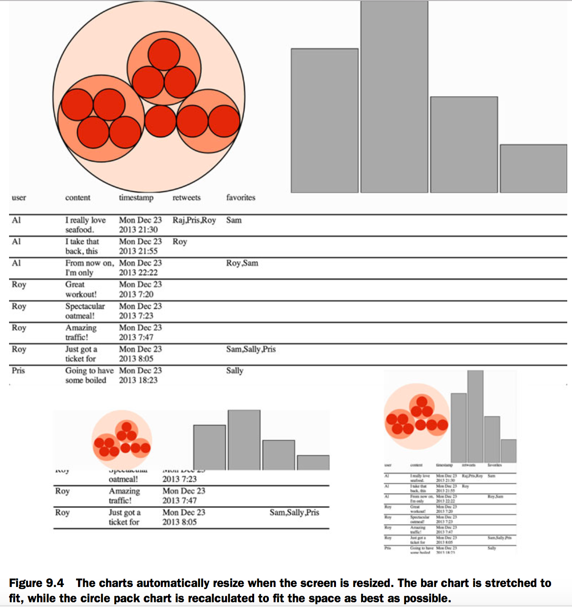
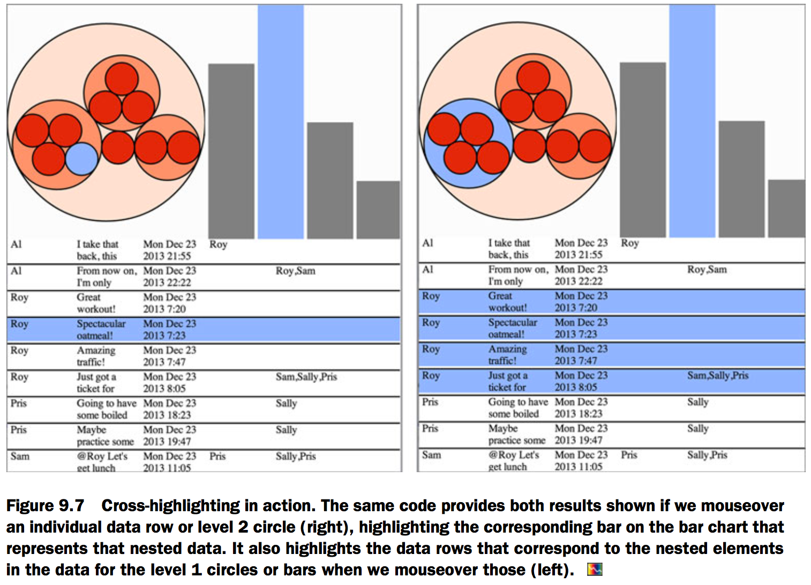
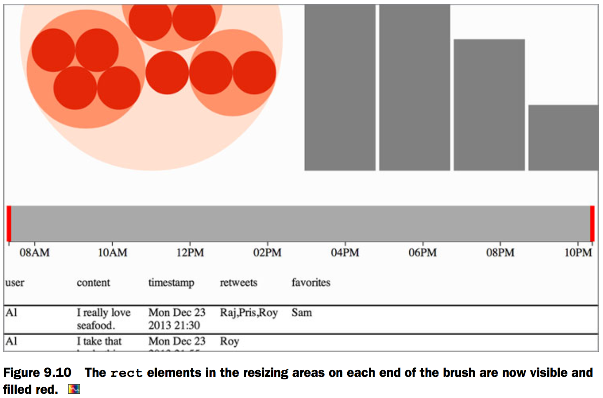

# 9.Composing interactive applications
## One data source, many perspectives
[Fig_09_02.html][1]

[Fig_09_04.html][2]

## Interactivity: hover events
[Fig_09_07.html][3]

## Brushing
[Fig_09_10.html][4]

[Fig_09_13.html][5]

[1]: Fig_09_02.html
[2]: Fig_09_04.html
[3]: Fig_09_07.html
[4]: Fig_09_10.html
[5]: Fig_09_13.html
