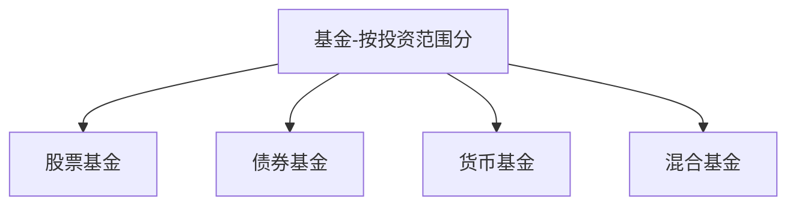

    作者: 龙红亮
    出版社: 中信出版集团
    出版年: 2021-6
    页数: 318
    定价: 65.00
    装帧: 假精装
    ISBN: 9787521732276

[豆瓣链接](https://book.douban.com/subject/35518861/)

- [为什么选择基金](#为什么选择基金)
  - [什么是基金](#什么是基金)
- [基金种类知多少](#基金种类知多少)
  - [股票基金](#股票基金)

# 为什么选择基金
## 什么是基金
基金分为两大类：`公募基金`和`私募基金`（非公开募集基金）。公募基金要求募集对象超过200人；而私募基金要求募集对象不超过200人，且一般要求最低购买金额不低于100万元。

# 基金种类知多少

上述分类方法是根据基金的主要持仓资产来确定的。

- 股票基金：80%以上的资产投资于股票。
- 债券基金：80%以上的资产投资于债券。
- 货币基金：仅投资于货币市场工具。
- 混合基金：投资于股票、债券或货币市场工具，但比例不符合上述要求的。

>绝大部分基金产品的类型都可以通过基金名称看出来。股票基金的名称结尾都带有“股票”二字，而债券基金的名称都带有“债券”，混合基金的名称则带有“混合”，货币基金的名称往往带有“货币”“现金”的字样。

从长期来看，各种基金按照年均复合收益率的排序为：

    股票基金＞混合基金＞债券基金＞货币基金。

简单总结就是风险越大，收益越高。这里的风险是指收益的波动幅度。

表3-1　各类基金指数的复合年化收益率（2003-2020年）

代码 | 基金的指数类型 | 复合年化收益率(%) | 最大值(%) | 最小值(%) | 标准差(%)
---|---------|------------|--------|--------|-------
H11021.CS1 | 中证股票基金指数 | 14.7 | 128.3 | -51.4 | 47.0
H11022.CSI | 中证混合基金指数 | 15.2 | 110.3 | -45.4 | 40.2
H11023.CS1 | 中证债券基金指数 | 6.0 | 18.5 | -2.9 | 6.2
H11025.CSI | 中证货币基金指数 | 3.1 | 4.6 | 1.4 | 0.94

## 股票基金
我国有几个股票交易所？

