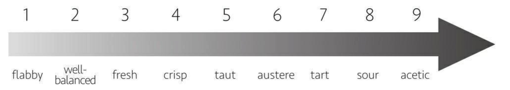
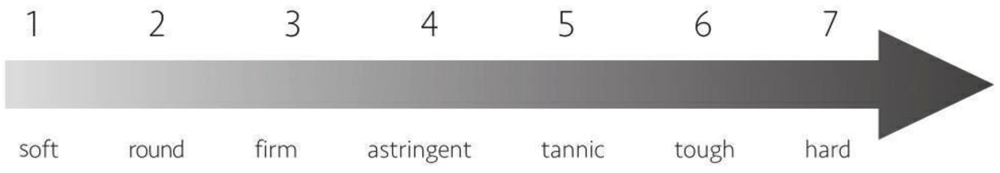

    作者: [英]杰西斯·罗宾逊（Jancis Robinson） 
    出版社: 浙江教育出版社
    原作名: The 24-Hour Wine Expert
    译者: 常青 
    出版年: 2018-9-1
    页数: 280
    定价: 59.90元
    装帧: 平装
    ISBN: 9787553673837

[豆瓣链接](https://book.douban.com/subject/30326781/)

- [葡萄酒的由来](#%E8%91%A1%E8%90%84%E9%85%92%E7%9A%84%E7%94%B1%E6%9D%A5)
  - [如何酿造葡萄酒](#%E5%A6%82%E4%BD%95%E9%85%BF%E9%80%A0%E8%91%A1%E8%90%84%E9%85%92)
- [分类和命名](#%E5%88%86%E7%B1%BB%E5%92%8C%E5%91%BD%E5%90%8D)
- [品酒步骤](#%E5%93%81%E9%85%92%E6%AD%A5%E9%AA%A4)
  - [第一步：看](#%E7%AC%AC%E4%B8%80%E6%AD%A5%E7%9C%8B)
  - [第二步：闻](#%E7%AC%AC%E4%BA%8C%E6%AD%A5%E9%97%BB)
  - [第三步：尝一口](#%E7%AC%AC%E4%B8%89%E6%AD%A5%E5%B0%9D%E4%B8%80%E5%8F%A3)
  - [第四步：回味](#%E7%AC%AC%E5%9B%9B%E6%AD%A5%E5%9B%9E%E5%91%B3)
- [常见的葡萄品种](#%E5%B8%B8%E8%A7%81%E7%9A%84%E8%91%A1%E8%90%84%E5%93%81%E7%A7%8D)
  - [常见的白葡萄品种](#%E5%B8%B8%E8%A7%81%E7%9A%84%E7%99%BD%E8%91%A1%E8%90%84%E5%93%81%E7%A7%8D)
    - [霞多丽（Chardonnay）](#%E9%9C%9E%E5%A4%9A%E4%B8%BDchardonnay)
    - [长相思（Sauvignon Blanc）](#%E9%95%BF%E7%9B%B8%E6%80%9Dsauvignon-blanc)
    - [雷司令（Riesling）](#%E9%9B%B7%E5%8F%B8%E4%BB%A4riesling)
    - [灰皮诺（Pinot Gris/Grigio）](#%E7%81%B0%E7%9A%AE%E8%AF%BApinot-grisgrigio)
  - [常见的红葡萄品种](#%E5%B8%B8%E8%A7%81%E7%9A%84%E7%BA%A2%E8%91%A1%E8%90%84%E5%93%81%E7%A7%8D)
    - [赤霞珠（Cabernet Sauvignon）](#%E8%B5%A4%E9%9C%9E%E7%8F%A0cabernet-sauvignon)
    - [梅洛（Merlot）](#%E6%A2%85%E6%B4%9Bmerlot)
    - [黑皮诺（Pinot Noir）](#%E9%BB%91%E7%9A%AE%E8%AF%BApinot-noir)
    - [西拉（Syrah/Shiraz）](#%E8%A5%BF%E6%8B%89syrahshiraz)
    - [丹魄（Tempranillo）](#%E4%B8%B9%E9%AD%84tempranillo)
    - [内比奥罗（Nebbiolo）](#%E5%86%85%E6%AF%94%E5%A5%A5%E7%BD%97nebbiolo)
    - [桑娇维塞（Sangiovese）](#%E6%A1%91%E5%A8%87%E7%BB%B4%E5%A1%9Esangiovese)
  - [Master Tip](#master-tip)

## 葡萄酒的由来
### 如何酿造葡萄酒
在酵母的作用下，成熟葡萄中所含的糖分会逐渐转化成酒精和二氧化碳。在发酵过程中，糖分越来越少，酒精度则越来越高。

气候越炎热，越容易生长出酸度低、糖分高的葡萄。发酵过程完成后，这类葡萄酿成的酒，酒精度会高于较冷地区葡萄酿的酒。

这也是为什么离赤道越远的产区生产出来的葡萄酒酒精度越低。

## 分类和命名
- 红葡萄酒:黄色或绿色果皮的葡萄，酿不出红葡萄酒。只有用深红色果皮的葡萄，破皮出汁发酵酿出的葡萄酒才是红色的。葡萄果皮越厚，果汁与果皮接触的时间越长，红葡萄酒的颜色就越深。
- 桃红葡萄酒:大部分桃红葡萄酒的粉色是由葡萄果汁与深色果皮只接触了十几个小时而来的。有时，把浅色与深色果皮的葡萄混在一起酿也能得到桃红葡萄酒，甚至偶尔，它由已发酵完成的白葡萄酒与红葡萄酒混在一起而来。
- 白葡萄酒:浅色皮的葡萄只能用来酿造白葡萄酒。

## 品酒步骤
### 第一步：看
倾斜酒杯，将其离你稍远一些，最好能以白色或浅色为背景。看酒杯中间部位的颜色，以及酒液边缘的颜色。对于正在成熟的红葡萄酒来说，这两者的颜色通常会有明显的差别。

酒杯中间部位的颜色越深，表明葡萄果皮越厚，即葡萄是一个厚皮的品种或者所在的产区有一个炎热、干燥的夏天。浅橙色的边缘提示这是一款成熟的红葡萄酒，而越年轻的红葡萄酒通常边缘越呈蓝紫色。

红葡萄酒和白葡萄酒都会随着陈酿时间的延长而颜色趋于黄褐色：白葡萄酒颜色会变深，红葡萄酒颜色会变浅。在橡木桶中陈酿，或是与橡木块、橡木板接触，都会加深白葡萄酒的颜色。葡萄品种不同，颜色也不同。

### 第二步：闻
这是品酒中最重要的一步。我们会把闻到的所有味道都当作香气，因为我们最敏感的品酒武器在鼻子末端。即便你从未自觉地用鼻子去闻葡萄酒，也可能会闻出一些味道，因为香气会从口腔后部，挥发升腾至鼻子末端。味道越复杂，葡萄酒的品质越好。

### 第三步：尝一口
嘴里的味蕾会给你关于葡萄酒如下维度的感觉：

酸：柠檬和醋，味道都相当尖酸，或者说酸度都很高。它会在舌头两侧留下刺痛感，虽然我们的反应不尽相同。具体的品酒词见表4-1。

表4-1　从低到高排列的关于葡萄酒酸度的品酒词

甜：葡萄酒中的含糖量，可以从“难以感觉到”的1克／升，到“近乎干型”的10克／升，再到“非常甜腻的”超过100克／升。具体的品酒词见表4-2。

表4-2　从低到高排列的关于甜度的品酒词

单宁：单宁是一种天然保护剂，主要从葡萄果皮中提取而来，在年轻的红葡萄酒中比较常见，冷茶中也有，会让你的双颊内侧有发干、收紧的感觉。具体的品酒词见表4-3。

表4-3　从低到高排列的关于单宁的品酒词

酒精：酒精会在口腔后部留下一种发热的感觉。具体的品酒词见表4-4。

表4-4　从低到高排列的关于酒精的品酒词

### 第四步：回味
“收尾”或“余味长度”是衡量一瓶葡萄酒质量的重要指标。一瓶好的葡萄酒在咽下后，味道会令人回味无穷。

## 常见的葡萄品种
### 常见的白葡萄品种
#### 霞多丽（Chardonnay）
霞多丽是世界上种植最多的葡萄品种，只要是酿酒的地方都会种它。但它的家乡是勃艮第，它也是酿造勃艮第白葡萄酒的葡萄品种。霞多丽容易种植、酿造，是可以有多种呈现形式的葡萄品种之一。它可以是香槟地区的浅色葡萄，也可以酿造世界上最贵的干型白葡萄酒蒙哈榭（Le Montrachet）等，还可以酿造在每个价格区间展现不同风味的重酒体白葡萄酒。一些便宜的霞多丽会被认为“过分地香”，是因为它与橡木桶亲和力强，会有轻微的烤面包味，甚至有些甜腻。

#### 长相思（Sauvignon Blanc）
这是卢瓦尔河谷的白葡萄酒，如桑赛尔、普伊－富美，在酿造时的主要葡萄品种，也是新西兰葡萄酒业的基石。它变得越来越流行，甚至有赶超霞多丽的趋势。霞多丽可能因特点广泛而显得面目模糊，长相思却是鲜明的、尖酸的、热情洋溢的，像一把剑以直接的方式刺激感官。

典型的新西兰长相思闻起来有种尖锐的植物味道，如绿叶、荨麻、青草等，随着陈年，还会有罐头芦笋味。卢瓦尔上游河段的长相思却让人更多地联想到矿物质而非植物，如石头、湿粉笔灰、擦燃的火柴等。一般来说，法国的长相思比其他国家的更干，新西兰的则有些微甜。具有穿透力的香气是长相思最强的外衣，但当葡萄变得太熟时，就会失去这种标志性的味道，所以最好的酒来自那些不太热的地区。

#### 雷司令（Riesling）
雷司令是许多专业人士喜欢，但许多消费者不喜欢的有趣葡萄品种之一。我们之所以喜欢雷司令远远多于长相思，是因为雷司令可以在数年甚至数十年间在瓶中一直进化和提升。长寿是葡萄酒的一个质量标志。我们喜欢雷司令的另一个原因是，它有各种各样的香气，酒精度也不会很高。跟长相思和绝大部分霞多丽很不一样的是，雷司令随着产地不同，酒也会有很多样化的呈现。它通常闻起来有花香的味道，但种植于德国摩泽尔谷灰板岩或蓝板岩的雷司令却有让人神经紧绷的能量。而在数公里开外下游的红板岩生长的雷司令则更饱满、更有辛辣香气，虽然它们都具备雷司令这个高贵品种的基本特征和框架。

不同于霞多丽或灰皮诺，雷司令的问题在于，它有很多味道，对一些品酒师来说，它的味道多到难以驾驭。另外一个问题是，有相当比例的雷司令有些甜。在今天的葡萄酒文化中，甜度是不被推崇的。雷司令没有霞多丽和长相思种植广泛，但它不仅是德国的特色葡萄品种，也是阿尔萨斯、奥地利和澳大利亚（特别是在克莱尔谷和伊顿谷）这三个“A”字开头的地方的特色品种。

#### 灰皮诺（Pinot Gris/Grigio）
灰皮诺通常是白葡萄酒，是黑皮诺的“灰”色变异，用法语词“Gris”和意大利语词“Grigio”表示。它有粉红色的果皮，颜色不足以酿成红葡萄酒，但如果酿酒师让果汁与果皮接触时间长一些，也能酿成浅粉色的葡萄酒。最好的典型例子是来自阿尔萨斯和意大利弗留利的灰皮诺（Pinot Gris），它有迷人的香气和酒体，这是与黑皮诺相似的特征。但绝大多数基本款的灰皮诺（Pinot Grigio）几乎没有什么香气，其原因可能是因为灰皮诺正变得流行，产量激增，混酿时可能合法地加入了不到15%的廉价、中性的葡萄品种，如特雷比奥罗（Trebbiano）。

浅绿色果皮的变异品种更接近白色，而不是灰色，所以叫作白皮诺。它酿成的酒很像臃肿、略简单的霞多丽，或是没有香气的灰皮诺。这类酒中最好的代表来自德语国家。

### 常见的红葡萄品种
#### 赤霞珠（Cabernet Sauvignon）
赤霞珠被认为是用来酿造可陈年红葡萄酒的“黄金标准”葡萄品种。作为基本的葡萄品种，它成就了最著名的波尔多红葡萄酒，如位于吉伦特河左岸梅多克的拉菲、拉图。

赤霞珠葡萄小，果皮厚，且呈蓝色。所以由它酿成的酒在年轻时，单宁高，颜色深。这一葡萄品种需要较长时间才能成熟，如果在较冷的地方种植，基本上就是在浪费时间。甚至在波尔多的部分地区会种植更早成熟的、常与赤霞珠混酿的品种：梅洛和品丽珠。品丽珠比赤霞珠酒体稍轻，有更多的草本植物感。

在波尔多，赤霞珠葡萄更涩更瘦，常挨着更早成熟、更多肉的梅洛种植，以作为赤霞珠在授粉不良或糟糕的年份中不够成熟的调配伴侣。但在另一个著名的赤霞珠产区纳帕谷，因为天气足够暖，能生产出足够丰盛的赤霞珠，所以与其他品种混酿只是一种额外的选择。因为与世界上最经典的葡萄酒相关，赤霞珠在各地都有种植，只是成熟的程度不同。它标志性的黑醋栗和雪松风味极有辨识度，甚至在一些意大利葡萄酒中只混了一点赤霞珠（有时是非法的），也能被识别出来。

#### 梅洛（Merlot）
在法国西南部，与赤霞珠、品丽珠一样，梅洛也是葡萄大家庭中的一员。但不同的是，梅洛更柔和，果香更明显。

梅洛葡萄成熟得比较早，所以能在较冷的地区种植，如吉伦特河右岸的圣埃美隆（St-Émilion）和波美侯。与赤霞珠相比，它很容易成熟，所以种植得更广，特别是在波尔多产区。梅洛酿成的葡萄酒天生较甜，有李子味，比以赤霞珠为主的酒更柔和、更早达到适饮状态。

梅洛的重要功能之一是在赤霞珠的骨架上添加肉感。当然，世界各地酿造的梅洛各有风味。

#### 黑皮诺（Pinot Noir）
这种勃艮第红葡萄品种是目前葡萄酒世界的宠儿。赤霞珠很可靠、稳定，黑皮诺则变化多端。好的黑皮诺会很美味，但它娇弱，比赤霞珠酒体轻得多。黑皮诺葡萄的果皮很薄，所以易腐烂或感染疾病，酿成的酒颜色相对较浅，单宁少，不耐嚼。黑皮诺喝起来果香足，有时有点甜，香味也多种多样：覆盆子、樱桃、紫罗兰、蘑菇、秋天的灌木丛……

因为黑皮诺相对比较难酿造，所以引起了世界各地酿酒师和消费者的兴趣。因为它成熟得早，需要相对凉爽的气候，所以在葡萄生长季节可以有较长的时间让它发展出比较有趣的味道。

勃艮第是黑皮诺的诞生地，但它却是香槟地区、阿尔萨斯、德国、新西兰和俄勒冈地区最重要的红葡萄品种。如今，在加利福尼亚州最冷的地方、智利、澳大利亚等地也酿出了一些有趣的黑皮诺。从加拿大到南非，雄心勃勃的黑皮诺爱好者们正在推动着它不断进步。

#### 西拉（Syrah/Shiraz）
“Shiraz”是澳大利亚对西拉的称呼，在它的家乡北罗讷河谷叫作“Syrah”，其中最著名的酒来自埃米塔日（Hermitage）和罗第丘（Côte Rôtie）。今天，西拉更多地种植在澳大利亚，而非北罗讷河谷。

在温度比较高的地区，比如巴罗萨谷和麦克拉伦谷（McLaren Vale），这里的西拉口感丰富、重口味、甜度高，还有巧克力和药的味道。北罗讷河谷的风格则不同，即使是埃米塔日的西拉，仍旧浓稠、偏干，有黑胡椒和皮革的味道，即初味相对内敛。

今天在新世界，甚至澳大利亚，葡萄酒生产商都在试图效仿罗第丘，连名字也开始改叫“Syrah”，而不是“Shiraz”。即便美国生产者一向偏好“Syrah”这个名字，但他们生产的酒的风格却介于两者之间。自20世纪90年代以来，西拉渐渐成为世界各地葡萄园流行种植的品种，特别是在南非和朗格多克。

#### 丹魄（Tempranillo）
烟草叶味道的丹魄是西班牙最被认可的红葡萄品种，是里奥哈、杜埃罗河岸，以及许多西班牙红葡萄酒的主要品种。因为西班牙的降雨量低，并且直到现在仍然几乎没有什么灌溉措施，所以那里一直以来的传统是葡萄藤种植得比较稀疏。这也解释了为什么丹魄以及西班牙被称为“苦力活的主力”的白葡萄品种阿依伦（Airén），占据了世界上种植面积最广的葡萄品种名单的前列。

不止于此，西班牙的葡萄种植者狂热地种植葡萄，而丹魄则是他们最常选择的品种之一。直到最近，他们仍然更看重丹魄的价值，远高于他们本地的歌海娜。歌海娜比丹魄更偏果味，酒体更轻，所以它的重要性总被忽视。在葡萄牙，丹魄被称为罗丽红（Tinta Roriz）或阿拉哥斯（Aragonez）。除西班牙外，葡萄牙是另一个相对比较看重丹魄的国家。

#### 内比奥罗（Nebbiolo）
内比奥罗可以被称作意大利的黑皮诺，除了其家乡意大利西北部的皮埃蒙特，它在其他地方的种植难度令人抓狂。内比奥罗有焦油、熏木和玫瑰的醉人芬芳，以及少见的组合特征：酒液颜色浅，但有显著的单宁。

最好的内比奥罗葡萄，在巴罗洛和巴巴莱斯克，它可以酿出非常出色的可供长期陈年的酒。但这个葡萄品种成熟得非常晚，需要在葡萄园最适宜的位置种植。

皮埃蒙特地区的某些土地对内比奥罗来说不是那么适宜，这些地区会种植有活力的、酸樱桃感觉的巴贝拉，以及更柔和、比较早成熟的多赛托。这两个葡萄品种都是本地特色品种。

#### 桑娇维塞（Sangiovese）
这个意大利中部的葡萄品种比内比奥罗种植得要广泛得多。极低档的桑娇维塞也有不少，但如果严选植株，控制产额，能酿出堪称托斯卡纳精髓的葡萄酒。蒙达奇诺布鲁奈罗（Brunello di Montalcino）来自温暖的托斯卡纳南部，是最有雄心的可陈年的酒。经典基安蒂，来自托斯卡纳中部气候比较凉爽的山区，风格可以更精良。这些酒通常带有一种明显的，但并不令人讨厌的农业味。

### Master Tip
10大种植面积最广的葡萄品种
最新可靠的全球统计数据发布于2010年，该数据的依据是葡萄园的种植面积，而非葡萄藤的确切数量。

1. 赤霞珠
2. 梅洛
3. 阿依伦
4. 丹魄
5. 霞多丽
6. 西拉
7. 歌海娜
8. 长相思
9. 特雷比奥罗
10. 黑皮诺
